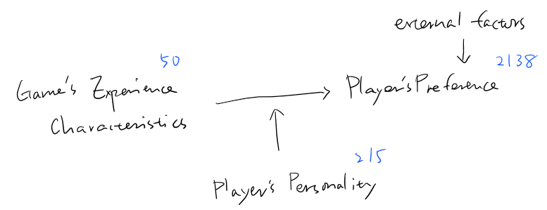

MAPSS Thesis II - Game Characteristics and Player Personality
================
Chih-Yu Chiang
July 10, 2017

``` r
knitr::opts_chunk$set(
    message = FALSE,
    warning = FALSE
)
```

Setup
-----

Data of game and player are read in and matched up.

-   Game release data, `release` (year), is read in as an interval variable.
-   Missing values are imputed with variable mean conveniently (`star_user` and `star_GS`).

``` r
#--Package
library(tidyverse)
library(corrgram)
library(modelr)
library(glmnet)
library(randomForest)
library(e1071)
library(car)
library(pander)
set.seed(1)


#--Read in
#Core game info and group distance/probability data
core_cluster <- read_csv("../data/core_cluster.csv", col_names=TRUE) %>%
  mutate(group_survey = factor(group_survey),
         group_review = factor(group_review),
         core_id = factor(core_id)) %>%
  select(-X1)

#Core game tste scores (of dif numbers of features)
core_tsteScore <- read_csv("../data/tste_concat.csv", col_names=TRUE) %>%
  select(-X1)

#Player-related survey data
survey <- read_csv("../data/survey.csv", col_names=TRUE) %>%
  mutate(race = factor(race),
         sex = factor(sex),
         core_id = factor(core_id)) %>%
  select(-id)


#--Impute missing with mean
imputation_mean <- function(c){
  c[is.na(c)] <- mean(c, na.rm=TRUE)
  return(c)
}
core_cluster <- mutate_each(core_cluster,
                            funs(imputation_mean(.)),
                            star_user, star_GS)


#--Match up
#Main df, key=player-game
df <- bind_cols(core_cluster, core_tsteScore) %>%
  left_join(survey, by=c("core_id"), copy=FALSE)

#Player df, key=player
df_player <- distinct(df, respondent, .keep_all = TRUE)


#--MSE computation
#Works with simple regression, SVM, RF
mse_1 <- function(model, data_yx){
  res <- modelr:::residuals(model, data_yx)
  mean(res^2, na.rm=TRUE)
}

#Works with lasso and ridge
mse_2 <- function(model, lambda, data_y, data_x){
  pred <- predict(model, s=lambda, newx=data_x)
  mean((pred - data_y)^2, na.rm=TRUE)
}
```



Variable
--------

Compute and select variables to be used in models.

-   Call the function to update the vars employed.
-   Final response variable utilizes only `preference_3`.

-   Player preference:

| Name           | Definition                 | Unit                        |
|----------------|----------------------------|-----------------------------|
| `preference_1` | how much do you like       | Likert 1-7=like             |
| `preference_2` | how often play it          | ordinary 1=never-7=everyday |
| `preference_3` | does it fit personal taste | Likert 1-7=fit              |

-   Game characteristics:

<table style="width:36%;">
<colgroup>
<col width="8%" />
<col width="18%" />
<col width="9%" />
</colgroup>
<thead>
<tr class="header">
<th>Name</th>
<th>Definition</th>
<th>Unit</th>
</tr>
</thead>
<tbody>
<tr class="odd">
<td><code>distance_survey_mean_x</code></td>
<td>group score from survey (distance from group mean in tste)</td>
<td>cosine distance</td>
</tr>
<tr class="even">
<td><code>distance_survey_median_x</code></td>
<td>group score from survey (distance from group median in tste)</td>
<td>cosine distance</td>
</tr>
<tr class="odd">
<td><code>probability_review_mean_x</code></td>
<td>group score from review (mean probability to be categorized in the group by NN)</td>
<td>percentage</td>
</tr>
<tr class="even">
<td><code>probability_review_median_x</code></td>
<td>group score from review (median probability to be categorized in the group by NN)</td>
<td>percentage</td>
</tr>
<tr class="odd">
<td><code>group_survey</code></td>
<td>group identity from survey</td>
<td>categorical 1-group number</td>
</tr>
<tr class="even">
<td><code>group_review</code></td>
<td>group identity from review</td>
<td>categorical 1-group number</td>
</tr>
<tr class="odd">
<td><code>tste_n_x</code></td>
<td>group score from survey (tste), n=number of features</td>
<td>interval arbitrary</td>
</tr>
</tbody>
</table>

-   Player personality:

<table style="width:36%;">
<colgroup>
<col width="8%" />
<col width="18%" />
<col width="9%" />
</colgroup>
<thead>
<tr class="header">
<th>Name</th>
<th>Definition</th>
<th>Unit</th>
</tr>
</thead>
<tbody>
<tr class="odd">
<td><code>game_xxxxx</code></td>
<td>Big-five personality in game</td>
<td>Likert 1-7</td>
</tr>
<tr class="even">
<td><code>real_xxxxx</code></td>
<td>Big-five personality in real life</td>
<td>Likert 1-7</td>
</tr>
<tr class="odd">
<td><code>gap_xxxxx</code></td>
<td>personality gap (game - real)</td>
<td>Likert 1-7</td>
</tr>
<tr class="even">
<td><code>satis_xxxxx</code></td>
<td>SDT satisfaction in real life</td>
<td>Likert 1-7</td>
</tr>
<tr class="odd">
<td><code>dissatis_xxxxx</code></td>
<td>SDT dissatisfaction in real life</td>
<td>Likert 1-7</td>
</tr>
<tr class="even">
<td><code>combined_xxxxx</code></td>
<td>SDT combined (previous two) dissatisfaction in real life</td>
<td>Likert 1-7</td>
</tr>
</tbody>
</table>

-   Control:

| Name        | Definition                                    | Unit                      |
|-------------|-----------------------------------------------|---------------------------|
| `age`       | player age                                    | interval                  |
| `education` | player education                              | ordinary 1-7=PhD          |
| `income`    | player annual household income                | ordinary 1-7=over 150,000 |
| `sex`       | player sex                                    | categorical 1=male        |
| `race`      | player race                                   | categorical 1-5           |
| `release`   | game release year                             | interval year             |
| `star_GS`   | general game quality rated by GameSpot expert | interval 0-10             |
| `star_user` | general game quality rated by GameSpot user   | interval 0-10             |

``` r
updateVars <- function(){
  #--Create response variable
  df <<- df %>%
    rowwise() %>% 
    mutate(preference = mean(c(preference_1, preference_3)))
  
  
  #--Compute personalty gap
  df <<- mutate(df,
               gap_extraversion = game_extraversion - real_extraversion,
               gap_agreeableness = game_agreeableness - real_agreeableness,
               gap_conscientiousness = game_conscientiousness - real_conscientiousness,
               gap_emotionstability = game_emotionstability - real_emotionstability,
               gap_openness = game_openness - real_openness)
  
  
  #--Select variables to be included in regression (model formation)
  #predictor variables
  predictors <<- paste(read.csv("../data/vars/predictors.csv", header=FALSE)[,1], collapse="+")
  
  #df with only predictor variables
  df_x <<- model.matrix(as.formula(paste("preference ~ ", predictors, sep="")),
                       data=df) %>% #Define model formation and create dummies
    .[, -1] #Remove redundant interacept column
  
  #df also with outcome variables
  df_yx <<- bind_cols(select(df, preference), data.frame(df_x))
}
```

Models
------

Models applying the variables selected. Two ways to select variables:

-   Use `select` to include vars in the models from `df`/`df_player`.
-   Edited through `predictors.csv` (for complexed interaction terms).

### Simple linear model (partial models)

``` r
#Update vars
updateVars()

#Full df with control marked
df_c <- mutate(df,
               c_age = age,
               c_education = education,
               c_income = income,
               c_race = race,
               c_sex = sex,
               c_release = release,
               c_star = star_user)

#Models with specific construct as main effect
model_control <- lm(preference ~ ., data=select(df_c, preference, starts_with("c_")))

model_gChar_survey_mean <- lm(preference ~ ., data=select(df_c, preference, starts_with("c_"), starts_with("distance_survey_mean")))
model_gChar_survey_median <- lm(preference ~ ., data=select(df_c, preference, starts_with("c_"), starts_with("distance_survey_median")))
model_gChar_review_mean <- lm(preference ~ ., data=select(df_c, preference, starts_with("c_"), starts_with("probability_review_mean")))
model_gChar_review_median <- lm(preference ~ ., data=select(df_c, preference, starts_with("c_"), starts_with("probability_review_median")))

model_gChar_tste_2 <- lm(preference ~ ., data=select(df_c, preference, starts_with("c_"), starts_with("tste_2")))
model_gChar_tste_3 <- lm(preference ~ ., data=select(df_c, preference, starts_with("c_"), starts_with("tste_3")))
model_gChar_tste_4 <- lm(preference ~ ., data=select(df_c, preference, starts_with("c_"), starts_with("tste_4")))
model_gChar_tste_5 <- lm(preference ~ ., data=select(df_c, preference, starts_with("c_"), starts_with("tste_5")))
model_gChar_tste_6 <- lm(preference ~ ., data=select(df_c, preference, starts_with("c_"), starts_with("tste_6")))
model_gChar_tste_7 <- lm(preference ~ ., data=select(df_c, preference, starts_with("c_"), starts_with("tste_7")))
model_gChar_tste_8 <- lm(preference ~ ., data=select(df_c, preference, starts_with("c_"), starts_with("tste_8")))
model_gChar_tste_9 <- lm(preference ~ ., data=select(df_c, preference, starts_with("c_"), starts_with("tste_9")))
model_gChar_tste_10 <- lm(preference ~ ., data=select(df_c, preference, starts_with("c_"), starts_with("tste_10")))

model_personality_game <- lm(preference ~ ., data=select(df_c, preference, starts_with("c_"), starts_with("game")))
model_personality_real <- lm(preference ~ ., data=select(df_c, preference, starts_with("c_"), starts_with("real")))
model_personality_gap <- lm(preference ~ ., data=select(df_c, preference, starts_with("c_"), starts_with("gap")))

model_personality_satis <- lm(preference ~ ., data=select(df_c, preference, starts_with("c_"), starts_with("satis")))
model_personality_dissatis <- lm(preference ~ ., data=select(df_c, preference, starts_with("c_"), starts_with("dissatis")))
model_personality_combined <- lm(preference ~ ., data=select(df_c, preference, starts_with("c_"), starts_with("combined")))
```

#### preference ~ control

``` r
summary(model_control)
```

    ## 
    ## Call:
    ## lm(formula = preference ~ ., data = select(df_c, preference, 
    ##     starts_with("c_")))
    ## 
    ## Residuals:
    ##     Min      1Q  Median      3Q     Max 
    ## -4.9835 -0.6073  0.2884  1.0695  2.3107 
    ## 
    ## Coefficients:
    ##              Estimate Std. Error t value Pr(>|t|)    
    ## (Intercept) 49.927324  12.508057   3.992 6.79e-05 ***
    ## c_age       -0.010396   0.004151  -2.504 0.012343 *  
    ## c_education  0.013910   0.024221   0.574 0.565824    
    ## c_income     0.019350   0.015310   1.264 0.206403    
    ## c_race2     -0.032936   0.120527  -0.273 0.784673    
    ## c_race4     -0.412145   0.129926  -3.172 0.001535 ** 
    ## c_race6     -0.771715   0.314922  -2.450 0.014346 *  
    ## c_race7     -0.103376   0.123757  -0.835 0.403636    
    ## c_sex2      -0.089680   0.062248  -1.441 0.149821    
    ## c_release   -0.022354   0.006152  -3.633 0.000286 ***
    ## c_star       0.093919   0.043806   2.144 0.032148 *  
    ## ---
    ## Signif. codes:  0 '***' 0.001 '**' 0.01 '*' 0.05 '.' 0.1 ' ' 1
    ## 
    ## Residual standard error: 1.352 on 2127 degrees of freedom
    ## Multiple R-squared:  0.02409,    Adjusted R-squared:  0.0195 
    ## F-statistic: 5.251 on 10 and 2127 DF,  p-value: 1.156e-07

#### preference ~ control + group score

``` r
summary(model_gChar_survey_mean)
```

    ## 
    ## Call:
    ## lm(formula = preference ~ ., data = select(df_c, preference, 
    ##     starts_with("c_"), starts_with("distance_survey_mean")))
    ## 
    ## Residuals:
    ##     Min      1Q  Median      3Q     Max 
    ## -4.8205 -0.6155  0.2936  0.9944  2.3400 
    ## 
    ## Coefficients:
    ##                          Estimate Std. Error t value Pr(>|t|)   
    ## (Intercept)            -8.990e+02  4.944e+03  -0.182  0.85573   
    ## c_age                  -1.035e-02  4.123e-03  -2.511  0.01210 * 
    ## c_education             1.089e-02  2.400e-02   0.454  0.65018   
    ## c_income                2.285e-02  1.518e-02   1.505  0.13243   
    ## c_race2                -5.204e-02  1.196e-01  -0.435  0.66342   
    ## c_race4                -3.832e-01  1.288e-01  -2.974  0.00297 **
    ## c_race6                -8.028e-01  3.123e-01  -2.571  0.01022 * 
    ## c_race7                -9.058e-02  1.227e-01  -0.738  0.46046   
    ## c_sex2                 -6.230e-02  6.211e-02  -1.003  0.31603   
    ## c_release              -1.584e-02  6.527e-03  -2.427  0.01530 * 
    ## c_star                  6.704e-02  5.081e-02   1.320  0.18712   
    ## distance_survey_mean_1  1.279e+02  6.716e+02   0.190  0.84905   
    ## distance_survey_mean_2  1.371e+02  7.243e+02   0.189  0.84986   
    ## distance_survey_mean_3  1.556e+02  8.236e+02   0.189  0.85019   
    ## distance_survey_mean_4  1.332e+02  7.028e+02   0.190  0.84966   
    ## distance_survey_mean_5  1.806e+02  9.556e+02   0.189  0.85011   
    ## distance_survey_mean_6  8.449e+01  4.461e+02   0.189  0.84980   
    ## distance_survey_mean_7  1.172e+02  6.186e+02   0.189  0.84981   
    ## ---
    ## Signif. codes:  0 '***' 0.001 '**' 0.01 '*' 0.05 '.' 0.1 ' ' 1
    ## 
    ## Residual standard error: 1.339 on 2120 degrees of freedom
    ## Multiple R-squared:  0.04585,    Adjusted R-squared:  0.0382 
    ## F-statistic: 5.993 on 17 and 2120 DF,  p-value: 9.477e-14

``` r
summary(model_gChar_survey_median)
```

    ## 
    ## Call:
    ## lm(formula = preference ~ ., data = select(df_c, preference, 
    ##     starts_with("c_"), starts_with("distance_survey_median")))
    ## 
    ## Residuals:
    ##     Min      1Q  Median      3Q     Max 
    ## -4.9354 -0.5944  0.2905  1.0171  2.3274 
    ## 
    ## Coefficients:
    ##                           Estimate Std. Error t value Pr(>|t|)   
    ## (Intercept)              40.926918  12.914387   3.169  0.00155 **
    ## c_age                    -0.010181   0.004131  -2.465  0.01380 * 
    ## c_education               0.010826   0.024062   0.450  0.65281   
    ## c_income                  0.023045   0.015222   1.514  0.13020   
    ## c_race2                  -0.053452   0.119889  -0.446  0.65575   
    ## c_race4                  -0.388887   0.129165  -3.011  0.00264 **
    ## c_race6                  -0.808166   0.313011  -2.582  0.00989 **
    ## c_race7                  -0.099287   0.122964  -0.807  0.41950   
    ## c_sex2                   -0.065600   0.062214  -1.054  0.29181   
    ## c_release                -0.017338   0.006400  -2.709  0.00680 **
    ## c_star                    0.068068   0.049938   1.363  0.17301   
    ## distance_survey_median_1  0.550135   0.253319   2.172  0.02999 * 
    ## distance_survey_median_2 -0.148770   0.291957  -0.510  0.61041   
    ## distance_survey_median_3 -0.471287   0.256346  -1.838  0.06613 . 
    ## distance_survey_median_4 -0.085260   0.225466  -0.378  0.70536   
    ## distance_survey_median_5 -0.474312   0.304629  -1.557  0.11962   
    ## distance_survey_median_6 -0.250095   0.200135  -1.250  0.21157   
    ## distance_survey_median_7  0.007827   0.215192   0.036  0.97099   
    ## ---
    ## Signif. codes:  0 '***' 0.001 '**' 0.01 '*' 0.05 '.' 0.1 ' ' 1
    ## 
    ## Residual standard error: 1.342 on 2120 degrees of freedom
    ## Multiple R-squared:  0.04167,    Adjusted R-squared:  0.03398 
    ## F-statistic: 5.422 on 17 and 2120 DF,  p-value: 4.865e-12

``` r
summary(model_gChar_review_mean)
```

    ## 
    ## Call:
    ## lm(formula = preference ~ ., data = select(df_c, preference, 
    ##     starts_with("c_"), starts_with("probability_review_mean")))
    ## 
    ## Residuals:
    ##     Min      1Q  Median      3Q     Max 
    ## -4.9211 -0.6311  0.2677  1.0463  2.4178 
    ## 
    ## Coefficients: (1 not defined because of singularities)
    ##                            Estimate Std. Error t value Pr(>|t|)    
    ## (Intercept)               47.358555  13.077532   3.621 0.000300 ***
    ## c_age                     -0.010412   0.004127  -2.523 0.011709 *  
    ## c_education                0.015089   0.024036   0.628 0.530221    
    ## c_income                   0.021831   0.015210   1.435 0.151354    
    ## c_race2                   -0.045817   0.119859  -0.382 0.702308    
    ## c_race4                   -0.389453   0.129072  -3.017 0.002580 ** 
    ## c_race6                   -0.835118   0.313004  -2.668 0.007687 ** 
    ## c_race7                   -0.084584   0.122884  -0.688 0.491327    
    ## c_sex2                    -0.069999   0.062112  -1.127 0.259875    
    ## c_release                 -0.020902   0.006439  -3.246 0.001188 ** 
    ## c_star                     0.079121   0.050227   1.575 0.115347    
    ## probability_review_mean_1 -0.816909   0.213923  -3.819 0.000138 ***
    ## probability_review_mean_2 -0.013234   0.197562  -0.067 0.946601    
    ## probability_review_mean_3 -0.059662   0.201703  -0.296 0.767417    
    ## probability_review_mean_4 -0.731612   0.225428  -3.245 0.001191 ** 
    ## probability_review_mean_5  0.070192   0.192588   0.364 0.715548    
    ## probability_review_mean_6 -0.207434   0.419248  -0.495 0.620810    
    ## probability_review_mean_7        NA         NA      NA       NA    
    ## ---
    ## Signif. codes:  0 '***' 0.001 '**' 0.01 '*' 0.05 '.' 0.1 ' ' 1
    ## 
    ## Residual standard error: 1.341 on 2121 degrees of freedom
    ## Multiple R-squared:  0.04198,    Adjusted R-squared:  0.03475 
    ## F-statistic: 5.809 on 16 and 2121 DF,  p-value: 1.462e-12

``` r
summary(model_gChar_review_median)
```

    ## 
    ## Call:
    ## lm(formula = preference ~ ., data = select(df_c, preference, 
    ##     starts_with("c_"), starts_with("probability_review_median")))
    ## 
    ## Residuals:
    ##     Min      1Q  Median      3Q     Max 
    ## -4.9398 -0.6276  0.2708  1.0289  2.3539 
    ## 
    ## Coefficients:
    ##                              Estimate Std. Error t value Pr(>|t|)    
    ## (Intercept)                 39.371001  13.347976   2.950 0.003217 ** 
    ## c_age                       -0.009952   0.004130  -2.410 0.016053 *  
    ## c_education                  0.014253   0.024049   0.593 0.553465    
    ## c_income                     0.022361   0.015213   1.470 0.141747    
    ## c_race2                     -0.051051   0.119821  -0.426 0.670108    
    ## c_race4                     -0.386057   0.129191  -2.988 0.002838 ** 
    ## c_race6                     -0.855450   0.313121  -2.732 0.006347 ** 
    ## c_race7                     -0.097453   0.122919  -0.793 0.427969    
    ## c_sex2                      -0.068626   0.062060  -1.106 0.268937    
    ## c_release                   -0.017057   0.006554  -2.603 0.009317 ** 
    ## c_star                       0.085888   0.052397   1.639 0.101324    
    ## probability_review_median_1 -0.596822   0.169440  -3.522 0.000437 ***
    ## probability_review_median_2  0.075013   0.154743   0.485 0.627900    
    ## probability_review_median_3 -0.031681   0.174049  -0.182 0.855580    
    ## probability_review_median_4 -0.287567   0.205909  -1.397 0.162688    
    ## probability_review_median_5  0.187495   0.149796   1.252 0.210829    
    ## probability_review_median_6 -0.430104   0.331420  -1.298 0.194511    
    ## probability_review_median_7  0.214452   0.202696   1.058 0.290175    
    ## ---
    ## Signif. codes:  0 '***' 0.001 '**' 0.01 '*' 0.05 '.' 0.1 ' ' 1
    ## 
    ## Residual standard error: 1.342 on 2120 degrees of freedom
    ## Multiple R-squared:  0.04218,    Adjusted R-squared:  0.0345 
    ## F-statistic: 5.492 on 17 and 2120 DF,  p-value: 3.004e-12

#### preference ~ control + tste score

``` r
summary(model_gChar_tste_2)
```

    ## 
    ## Call:
    ## lm(formula = preference ~ ., data = select(df_c, preference, 
    ##     starts_with("c_"), starts_with("tste_2")))
    ## 
    ## Residuals:
    ##     Min      1Q  Median      3Q     Max 
    ## -4.9557 -0.5889  0.2744  1.0321  2.5220 
    ## 
    ## Coefficients:
    ##              Estimate Std. Error t value Pr(>|t|)    
    ## (Intercept) 56.132115  12.936622   4.339 1.50e-05 ***
    ## c_age       -0.010302   0.004143  -2.487  0.01297 *  
    ## c_education  0.012670   0.024148   0.525  0.59985    
    ## c_income     0.021589   0.015271   1.414  0.15759    
    ## c_race2     -0.025998   0.120256  -0.216  0.82886    
    ## c_race4     -0.409570   0.129512  -3.162  0.00159 ** 
    ## c_race6     -0.814309   0.314163  -2.592  0.00961 ** 
    ## c_race7     -0.090041   0.123438  -0.729  0.46581    
    ## c_sex2      -0.059156   0.062555  -0.946  0.34443    
    ## c_release   -0.025215   0.006349  -3.972 7.37e-05 ***
    ## c_star       0.036576   0.048223   0.758  0.44825    
    ## tste_2_0     0.089415   0.037827   2.364  0.01818 *  
    ## tste_2_1    -0.092975   0.036798  -2.527  0.01159 *  
    ## ---
    ## Signif. codes:  0 '***' 0.001 '**' 0.01 '*' 0.05 '.' 0.1 ' ' 1
    ## 
    ## Residual standard error: 1.348 on 2125 degrees of freedom
    ## Multiple R-squared:  0.03124,    Adjusted R-squared:  0.02577 
    ## F-statistic: 5.711 on 12 and 2125 DF,  p-value: 8.955e-10

``` r
summary(model_gChar_tste_3)
```

    ## 
    ## Call:
    ## lm(formula = preference ~ ., data = select(df_c, preference, 
    ##     starts_with("c_"), starts_with("tste_3")))
    ## 
    ## Residuals:
    ##     Min      1Q  Median      3Q     Max 
    ## -4.7943 -0.6230  0.2522  1.0527  2.4269 
    ## 
    ## Coefficients:
    ##              Estimate Std. Error t value Pr(>|t|)    
    ## (Intercept) 49.414560  12.898944   3.831 0.000131 ***
    ## c_age       -0.010163   0.004114  -2.471 0.013564 *  
    ## c_education  0.010805   0.023981   0.451 0.652354    
    ## c_income     0.022438   0.015166   1.480 0.139145    
    ## c_race2     -0.032488   0.119424  -0.272 0.785621    
    ## c_race4     -0.382501   0.128702  -2.972 0.002992 ** 
    ## c_race6     -0.800288   0.312001  -2.565 0.010385 *  
    ## c_race7     -0.106066   0.122608  -0.865 0.387088    
    ## c_sex2      -0.048442   0.062144  -0.780 0.435764    
    ## c_release   -0.021932   0.006330  -3.465 0.000541 ***
    ## c_star       0.052059   0.048087   1.083 0.279109    
    ## tste_3_0    -0.027695   0.039927  -0.694 0.487971    
    ## tste_3_1     0.168094   0.032053   5.244 1.72e-07 ***
    ## tste_3_2     0.231224   0.044864   5.154 2.79e-07 ***
    ## ---
    ## Signif. codes:  0 '***' 0.001 '**' 0.01 '*' 0.05 '.' 0.1 ' ' 1
    ## 
    ## Residual standard error: 1.338 on 2124 degrees of freedom
    ## Multiple R-squared:  0.04522,    Adjusted R-squared:  0.03938 
    ## F-statistic: 7.739 on 13 and 2124 DF,  p-value: 3.166e-15

``` r
summary(model_gChar_tste_4)
```

    ## 
    ## Call:
    ## lm(formula = preference ~ ., data = select(df_c, preference, 
    ##     starts_with("c_"), starts_with("tste_4")))
    ## 
    ## Residuals:
    ##     Min      1Q  Median      3Q     Max 
    ## -4.8187 -0.6159  0.2552  1.0424  2.4843 
    ## 
    ## Coefficients:
    ##              Estimate Std. Error t value Pr(>|t|)    
    ## (Intercept) 51.595385  13.060191   3.951 8.05e-05 ***
    ## c_age       -0.010086   0.004114  -2.452 0.014302 *  
    ## c_education  0.010847   0.023976   0.452 0.651025    
    ## c_income     0.021816   0.015158   1.439 0.150234    
    ## c_race2     -0.034568   0.119470  -0.289 0.772344    
    ## c_race4     -0.380668   0.128690  -2.958 0.003130 ** 
    ## c_race6     -0.804757   0.311899  -2.580 0.009941 ** 
    ## c_race7     -0.106743   0.122565  -0.871 0.383899    
    ## c_sex2      -0.045932   0.062180  -0.739 0.460177    
    ## c_release   -0.022917   0.006401  -3.580 0.000351 ***
    ## c_star       0.027611   0.050723   0.544 0.586255    
    ## tste_4_0     0.227596   0.043892   5.185 2.36e-07 ***
    ## tste_4_1     0.066965   0.048881   1.370 0.170847    
    ## tste_4_2     0.080867   0.038130   2.121 0.034053 *  
    ## tste_4_3    -0.161849   0.035978  -4.498 7.21e-06 ***
    ## ---
    ## Signif. codes:  0 '***' 0.001 '**' 0.01 '*' 0.05 '.' 0.1 ' ' 1
    ## 
    ## Residual standard error: 1.338 on 2123 degrees of freedom
    ## Multiple R-squared:  0.04647,    Adjusted R-squared:  0.04018 
    ## F-statistic:  7.39 on 14 and 2123 DF,  p-value: 2.667e-15

``` r
summary(model_gChar_tste_5)
```

    ## 
    ## Call:
    ## lm(formula = preference ~ ., data = select(df_c, preference, 
    ##     starts_with("c_"), starts_with("tste_5")))
    ## 
    ## Residuals:
    ##     Min      1Q  Median      3Q     Max 
    ## -4.9632 -0.5987  0.2705  1.0231  2.3985 
    ## 
    ## Coefficients:
    ##              Estimate Std. Error t value Pr(>|t|)    
    ## (Intercept) 41.052694  13.300287   3.087  0.00205 ** 
    ## c_age       -0.010263   0.004118  -2.492  0.01278 *  
    ## c_education  0.011246   0.024006   0.468  0.63951    
    ## c_income     0.023408   0.015182   1.542  0.12328    
    ## c_race2     -0.041167   0.119566  -0.344  0.73065    
    ## c_race4     -0.386185   0.128808  -2.998  0.00275 ** 
    ## c_race6     -0.810497   0.312166  -2.596  0.00949 ** 
    ## c_race7     -0.104157   0.122669  -0.849  0.39593    
    ## c_sex2      -0.053735   0.062251  -0.863  0.38812    
    ## c_release   -0.017705   0.006520  -2.715  0.00667 ** 
    ## c_star       0.036861   0.051770   0.712  0.47653    
    ## tste_5_0     0.234057   0.042784   5.471 5.01e-08 ***
    ## tste_5_1    -0.149544   0.047704  -3.135  0.00174 ** 
    ## tste_5_2    -0.032449   0.037567  -0.864  0.38781    
    ## tste_5_3    -0.089034   0.045231  -1.968  0.04915 *  
    ## tste_5_4     0.021994   0.043674   0.504  0.61459    
    ## ---
    ## Signif. codes:  0 '***' 0.001 '**' 0.01 '*' 0.05 '.' 0.1 ' ' 1
    ## 
    ## Residual standard error: 1.339 on 2122 degrees of freedom
    ## Multiple R-squared:  0.04515,    Adjusted R-squared:  0.0384 
    ## F-statistic:  6.69 on 15 and 2122 DF,  p-value: 2.684e-14

``` r
summary(model_gChar_tste_6)
```

    ## 
    ## Call:
    ## lm(formula = preference ~ ., data = select(df_c, preference, 
    ##     starts_with("c_"), starts_with("tste_6")))
    ## 
    ## Residuals:
    ##     Min      1Q  Median      3Q     Max 
    ## -4.9311 -0.6161  0.2625  1.0435  2.4137 
    ## 
    ## Coefficients:
    ##              Estimate Std. Error t value Pr(>|t|)    
    ## (Intercept) 40.197453  13.455361   2.987  0.00285 ** 
    ## c_age       -0.010240   0.004120  -2.485  0.01302 *  
    ## c_education  0.010631   0.024022   0.443  0.65813    
    ## c_income     0.023663   0.015194   1.557  0.11954    
    ## c_race2     -0.049295   0.119773  -0.412  0.68069    
    ## c_race4     -0.382543   0.128901  -2.968  0.00303 ** 
    ## c_race6     -0.814359   0.312379  -2.607  0.00920 ** 
    ## c_race7     -0.101994   0.122774  -0.831  0.40621    
    ## c_sex2      -0.050573   0.062295  -0.812  0.41698    
    ## c_release   -0.017234   0.006598  -2.612  0.00907 ** 
    ## c_star       0.026031   0.053285   0.489  0.62523    
    ## tste_6_0     0.046222   0.047475   0.974  0.33036    
    ## tste_6_1    -0.111294   0.044552  -2.498  0.01256 *  
    ## tste_6_2     0.245047   0.039610   6.187 7.36e-10 ***
    ## tste_6_3     0.025308   0.048312   0.524  0.60044    
    ## tste_6_4     0.070038   0.041960   1.669  0.09524 .  
    ## tste_6_5     0.046788   0.049168   0.952  0.34141    
    ## ---
    ## Signif. codes:  0 '***' 0.001 '**' 0.01 '*' 0.05 '.' 0.1 ' ' 1
    ## 
    ## Residual standard error: 1.34 on 2121 degrees of freedom
    ## Multiple R-squared:  0.04454,    Adjusted R-squared:  0.03733 
    ## F-statistic:  6.18 on 16 and 2121 DF,  p-value: 1.284e-13

``` r
summary(model_gChar_tste_7)
```

    ## 
    ## Call:
    ## lm(formula = preference ~ ., data = select(df_c, preference, 
    ##     starts_with("c_"), starts_with("tste_7")))
    ## 
    ## Residuals:
    ##     Min      1Q  Median      3Q     Max 
    ## -4.8421 -0.6228  0.2674  1.0295  2.3868 
    ## 
    ## Coefficients:
    ##              Estimate Std. Error t value Pr(>|t|)    
    ## (Intercept) 44.216754  13.810708   3.202 0.001387 ** 
    ## c_age       -0.009976   0.004113  -2.426 0.015361 *  
    ## c_education  0.011661   0.023980   0.486 0.626821    
    ## c_income     0.022733   0.015168   1.499 0.134083    
    ## c_race2     -0.037705   0.119413  -0.316 0.752222    
    ## c_race4     -0.374615   0.128675  -2.911 0.003637 ** 
    ## c_race6     -0.804113   0.311748  -2.579 0.009965 ** 
    ## c_race7     -0.097822   0.122506  -0.799 0.424663    
    ## c_sex2      -0.055441   0.062184  -0.892 0.372730    
    ## c_release   -0.019294   0.006784  -2.844 0.004497 ** 
    ## c_star       0.039252   0.055625   0.706 0.480473    
    ## tste_7_0    -0.158869   0.043115  -3.685 0.000235 ***
    ## tste_7_1     0.038389   0.047460   0.809 0.418675    
    ## tste_7_2    -0.136676   0.045159  -3.027 0.002503 ** 
    ## tste_7_3    -0.222261   0.035316  -6.294 3.76e-10 ***
    ## tste_7_4     0.014630   0.046575   0.314 0.753457    
    ## tste_7_5     0.016468   0.051512   0.320 0.749239    
    ## tste_7_6     0.029304   0.054969   0.533 0.594023    
    ## ---
    ## Signif. codes:  0 '***' 0.001 '**' 0.01 '*' 0.05 '.' 0.1 ' ' 1
    ## 
    ## Residual standard error: 1.337 on 2120 degrees of freedom
    ## Multiple R-squared:  0.04895,    Adjusted R-squared:  0.04132 
    ## F-statistic: 6.418 on 17 and 2120 DF,  p-value: 4.868e-15

``` r
summary(model_gChar_tste_8)
```

    ## 
    ## Call:
    ## lm(formula = preference ~ ., data = select(df_c, preference, 
    ##     starts_with("c_"), starts_with("tste_8")))
    ## 
    ## Residuals:
    ##     Min      1Q  Median      3Q     Max 
    ## -4.7811 -0.6314  0.2764  1.0171  2.3998 
    ## 
    ## Coefficients:
    ##              Estimate Std. Error t value Pr(>|t|)    
    ## (Intercept) 49.151869  14.319628   3.432  0.00061 ***
    ## c_age       -0.010060   0.004106  -2.450  0.01436 *  
    ## c_education  0.012185   0.023945   0.509  0.61088    
    ## c_income     0.022778   0.015142   1.504  0.13266    
    ## c_race2     -0.048197   0.119264  -0.404  0.68617    
    ## c_race4     -0.363737   0.128516  -2.830  0.00469 ** 
    ## c_race6     -0.815356   0.311359  -2.619  0.00889 ** 
    ## c_race7     -0.089572   0.122356  -0.732  0.46421    
    ## c_sex2      -0.056979   0.062038  -0.918  0.35848    
    ## c_release   -0.021600   0.007029  -3.073  0.00215 ** 
    ## c_star       0.002539   0.054801   0.046  0.96306    
    ## tste_8_0    -0.202695   0.046366  -4.372 1.29e-05 ***
    ## tste_8_1     0.153894   0.051738   2.975  0.00297 ** 
    ## tste_8_2     0.096871   0.046398   2.088  0.03693 *  
    ## tste_8_3     0.095838   0.043710   2.193  0.02845 *  
    ## tste_8_4     0.102548   0.044064   2.327  0.02004 *  
    ## tste_8_5     0.104769   0.044638   2.347  0.01901 *  
    ## tste_8_6    -0.105144   0.048371  -2.174  0.02984 *  
    ## tste_8_7    -0.055369   0.047286  -1.171  0.24175    
    ## ---
    ## Signif. codes:  0 '***' 0.001 '**' 0.01 '*' 0.05 '.' 0.1 ' ' 1
    ## 
    ## Residual standard error: 1.335 on 2119 degrees of freedom
    ## Multiple R-squared:  0.05234,    Adjusted R-squared:  0.04429 
    ## F-statistic: 6.502 on 18 and 2119 DF,  p-value: 4.852e-16

``` r
summary(model_gChar_tste_9)
```

    ## 
    ## Call:
    ## lm(formula = preference ~ ., data = select(df_c, preference, 
    ##     starts_with("c_"), starts_with("tste_9")))
    ## 
    ## Residuals:
    ##     Min      1Q  Median      3Q     Max 
    ## -4.7974 -0.6466  0.2631  1.0121  2.5489 
    ## 
    ## Coefficients:
    ##              Estimate Std. Error t value Pr(>|t|)    
    ## (Intercept) 48.910208  14.604387   3.349 0.000825 ***
    ## c_age       -0.010309   0.004097  -2.516 0.011937 *  
    ## c_education  0.010786   0.023894   0.451 0.651758    
    ## c_income     0.026244   0.015140   1.733 0.083170 .  
    ## c_race2     -0.048443   0.119055  -0.407 0.684128    
    ## c_race4     -0.364975   0.128256  -2.846 0.004474 ** 
    ## c_race6     -0.758803   0.311062  -2.439 0.014794 *  
    ## c_race7     -0.081393   0.122193  -0.666 0.505418    
    ## c_sex2      -0.049901   0.061967  -0.805 0.420746    
    ## c_release   -0.021584   0.007167  -3.012 0.002629 ** 
    ## c_star       0.026684   0.055546   0.480 0.630990    
    ## tste_9_0    -0.123683   0.048487  -2.551 0.010816 *  
    ## tste_9_1     0.048694   0.046647   1.044 0.296652    
    ## tste_9_2    -0.311806   0.045906  -6.792 1.43e-11 ***
    ## tste_9_3    -0.088301   0.051567  -1.712 0.086975 .  
    ## tste_9_4    -0.033662   0.040291  -0.835 0.403538    
    ## tste_9_5     0.016132   0.052807   0.305 0.760023    
    ## tste_9_6    -0.003073   0.046961  -0.065 0.947825    
    ## tste_9_7    -0.086135   0.047032  -1.831 0.067180 .  
    ## tste_9_8     0.029583   0.041078   0.720 0.471505    
    ## ---
    ## Signif. codes:  0 '***' 0.001 '**' 0.01 '*' 0.05 '.' 0.1 ' ' 1
    ## 
    ## Residual standard error: 1.332 on 2118 degrees of freedom
    ## Multiple R-squared:  0.05662,    Adjusted R-squared:  0.04816 
    ## F-statistic:  6.69 on 19 and 2118 DF,  p-value: < 2.2e-16

``` r
summary(model_gChar_tste_10)
```

    ## 
    ## Call:
    ## lm(formula = preference ~ ., data = select(df_c, preference, 
    ##     starts_with("c_"), starts_with("tste_10")))
    ## 
    ## Residuals:
    ##     Min      1Q  Median      3Q     Max 
    ## -4.8844 -0.6262  0.2717  1.0018  2.5031 
    ## 
    ## Coefficients:
    ##              Estimate Std. Error t value Pr(>|t|)    
    ## (Intercept) 47.954407  14.327862   3.347 0.000831 ***
    ## c_age       -0.010384   0.004098  -2.534 0.011337 *  
    ## c_education  0.010489   0.023890   0.439 0.660666    
    ## c_income     0.024817   0.015118   1.642 0.100841    
    ## c_race2     -0.038924   0.119041  -0.327 0.743713    
    ## c_race4     -0.364794   0.128236  -2.845 0.004488 ** 
    ## c_race6     -0.761574   0.310962  -2.449 0.014402 *  
    ## c_race7     -0.082780   0.122203  -0.677 0.498229    
    ## c_sex2      -0.047258   0.061993  -0.762 0.445960    
    ## c_release   -0.021192   0.007039  -3.011 0.002639 ** 
    ## c_star       0.047575   0.054483   0.873 0.382654    
    ## tste_10_0   -0.020414   0.041107  -0.497 0.619522    
    ## tste_10_1    0.161746   0.045111   3.585 0.000344 ***
    ## tste_10_2   -0.183518   0.048143  -3.812 0.000142 ***
    ## tste_10_3   -0.138631   0.048603  -2.852 0.004383 ** 
    ## tste_10_4   -0.041999   0.048899  -0.859 0.390497    
    ## tste_10_5    0.020663   0.046422   0.445 0.656286    
    ## tste_10_6   -0.145092   0.047567  -3.050 0.002315 ** 
    ## tste_10_7    0.098013   0.041024   2.389 0.016974 *  
    ## tste_10_8    0.055799   0.054417   1.025 0.305295    
    ## tste_10_9    0.141993   0.046186   3.074 0.002137 ** 
    ## ---
    ## Signif. codes:  0 '***' 0.001 '**' 0.01 '*' 0.05 '.' 0.1 ' ' 1
    ## 
    ## Residual standard error: 1.332 on 2117 degrees of freedom
    ## Multiple R-squared:  0.05746,    Adjusted R-squared:  0.04855 
    ## F-statistic: 6.452 on 20 and 2117 DF,  p-value: < 2.2e-16

#### preference ~ control + Big Five personality

``` r
summary(model_personality_real)
```

    ## 
    ## Call:
    ## lm(formula = preference ~ ., data = select(df_c, preference, 
    ##     starts_with("c_"), starts_with("real")))
    ## 
    ## Residuals:
    ##     Min      1Q  Median      3Q     Max 
    ## -5.1504 -0.5970  0.2752  0.9732  2.3390 
    ## 
    ## Coefficients:
    ##                         Estimate Std. Error t value Pr(>|t|)    
    ## (Intercept)            43.880575  12.308350   3.565 0.000372 ***
    ## c_age                  -0.015151   0.004187  -3.619 0.000303 ***
    ## c_education             0.013165   0.024001   0.549 0.583392    
    ## c_income                0.003840   0.015324   0.251 0.802146    
    ## c_race2                 0.003320   0.119286   0.028 0.977800    
    ## c_race4                -0.331613   0.128870  -2.573 0.010143 *  
    ## c_race6                -0.934197   0.311141  -3.002 0.002709 ** 
    ## c_race7                -0.084831   0.122245  -0.694 0.487794    
    ## c_sex2                 -0.104012   0.064648  -1.609 0.107788    
    ## c_release              -0.019755   0.006053  -3.264 0.001117 ** 
    ## c_star                  0.102333   0.043063   2.376 0.017573 *  
    ## real_extraversion       0.022509   0.018107   1.243 0.213976    
    ## real_agreeableness     -0.007802   0.024805  -0.315 0.753147    
    ## real_conscientiousness  0.086984   0.027005   3.221 0.001297 ** 
    ## real_emotionstability  -0.036501   0.027046  -1.350 0.177296    
    ## real_openness           0.111771   0.022383   4.994 6.41e-07 ***
    ## ---
    ## Signif. codes:  0 '***' 0.001 '**' 0.01 '*' 0.05 '.' 0.1 ' ' 1
    ## 
    ## Residual standard error: 1.328 on 2122 degrees of freedom
    ## Multiple R-squared:  0.06091,    Adjusted R-squared:  0.05428 
    ## F-statistic: 9.176 on 15 and 2122 DF,  p-value: < 2.2e-16

``` r
summary(model_personality_game)
```

    ## 
    ## Call:
    ## lm(formula = preference ~ ., data = select(df_c, preference, 
    ##     starts_with("c_"), starts_with("game")))
    ## 
    ## Residuals:
    ##     Min      1Q  Median      3Q     Max 
    ## -5.0115 -0.5846  0.2967  1.0035  2.3321 
    ## 
    ## Coefficients:
    ##                         Estimate Std. Error t value Pr(>|t|)    
    ## (Intercept)            45.951063  12.416058   3.701 0.000220 ***
    ## c_age                  -0.013848   0.004183  -3.310 0.000947 ***
    ## c_education             0.025208   0.024276   1.038 0.299207    
    ## c_income                0.015585   0.015599   0.999 0.317841    
    ## c_race2                 0.019110   0.120615   0.158 0.874126    
    ## c_race4                -0.342207   0.129393  -2.645 0.008236 ** 
    ## c_race6                -0.877186   0.314877  -2.786 0.005387 ** 
    ## c_race7                -0.104253   0.123882  -0.842 0.400132    
    ## c_sex2                 -0.126789   0.064268  -1.973 0.048646 *  
    ## c_release              -0.020881   0.006103  -3.422 0.000634 ***
    ## c_star                  0.092583   0.043420   2.132 0.033099 *  
    ## game_extraversion       0.031724   0.020111   1.577 0.114847    
    ## game_agreeableness      0.001696   0.025428   0.067 0.946819    
    ## game_conscientiousness  0.098591   0.028649   3.441 0.000590 ***
    ## game_emotionstability  -0.015635   0.025675  -0.609 0.542605    
    ## game_openness           0.084612   0.030278   2.794 0.005245 ** 
    ## ---
    ## Signif. codes:  0 '***' 0.001 '**' 0.01 '*' 0.05 '.' 0.1 ' ' 1
    ## 
    ## Residual standard error: 1.339 on 2122 degrees of freedom
    ## Multiple R-squared:  0.04459,    Adjusted R-squared:  0.03784 
    ## F-statistic: 6.603 on 15 and 2122 DF,  p-value: 4.621e-14

``` r
summary(model_personality_gap)
```

    ## 
    ## Call:
    ## lm(formula = preference ~ ., data = select(df_c, preference, 
    ##     starts_with("c_"), starts_with("gap")))
    ## 
    ## Residuals:
    ##     Min      1Q  Median      3Q     Max 
    ## -5.1881 -0.6149  0.2637  1.0608  2.2968 
    ## 
    ## Coefficients:
    ##                        Estimate Std. Error t value Pr(>|t|)    
    ## (Intercept)           48.926616  12.469028   3.924 8.99e-05 ***
    ## c_age                 -0.011495   0.004161  -2.762 0.005786 ** 
    ## c_education            0.004215   0.024274   0.174 0.862148    
    ## c_income               0.009639   0.015494   0.622 0.533952    
    ## c_race2               -0.054985   0.120472  -0.456 0.648139    
    ## c_race4               -0.402073   0.129824  -3.097 0.001980 ** 
    ## c_race6               -0.828114   0.320581  -2.583 0.009856 ** 
    ## c_race7               -0.100188   0.126156  -0.794 0.427193    
    ## c_sex2                -0.060301   0.062736  -0.961 0.336572    
    ## c_release             -0.021815   0.006134  -3.557 0.000384 ***
    ## c_star                 0.101624   0.043656   2.328 0.020014 *  
    ## gap_extraversion       0.003166   0.019211   0.165 0.869096    
    ## gap_agreeableness      0.030191   0.026779   1.127 0.259681    
    ## gap_conscientiousness -0.046446   0.030713  -1.512 0.130613    
    ## gap_emotionstability   0.028132   0.024355   1.155 0.248179    
    ## gap_openness          -0.100609   0.030007  -3.353 0.000814 ***
    ## ---
    ## Signif. codes:  0 '***' 0.001 '**' 0.01 '*' 0.05 '.' 0.1 ' ' 1
    ## 
    ## Residual standard error: 1.346 on 2122 degrees of freedom
    ## Multiple R-squared:  0.03522,    Adjusted R-squared:  0.0284 
    ## F-statistic: 5.165 on 15 and 2122 DF,  p-value: 3.264e-10

#### preference ~ control + SDT satisfaction

``` r
summary(model_personality_satis)
```

    ## 
    ## Call:
    ## lm(formula = preference ~ ., data = select(df_c, preference, 
    ##     starts_with("c_"), starts_with("satis")))
    ## 
    ## Residuals:
    ##     Min      1Q  Median      3Q     Max 
    ## -4.9370 -0.6145  0.2588  0.9783  2.3760 
    ## 
    ## Coefficients:
    ##                     Estimate Std. Error t value Pr(>|t|)    
    ## (Intercept)       48.1277142 12.3009006   3.913 9.42e-05 ***
    ## c_age             -0.0141912  0.0041416  -3.427 0.000623 ***
    ## c_education        0.0150145  0.0238628   0.629 0.529286    
    ## c_income           0.0004549  0.0152972   0.030 0.976278    
    ## c_race2            0.0097169  0.1188884   0.082 0.934868    
    ## c_race4           -0.3370350  0.1282982  -2.627 0.008677 ** 
    ## c_race6           -0.5968620  0.3117056  -1.915 0.055649 .  
    ## c_race7           -0.0747142  0.1229898  -0.607 0.543596    
    ## c_sex2            -0.1203189  0.0614869  -1.957 0.050499 .  
    ## c_release         -0.0219825  0.0060498  -3.634 0.000286 ***
    ## c_star             0.0896833  0.0430986   2.081 0.037564 *  
    ## satis_autonomy     0.0538331  0.0387897   1.388 0.165337    
    ## satis_relatedness  0.0719307  0.0352404   2.041 0.041360 *  
    ## satis_competence   0.1131770  0.0349265   3.240 0.001212 ** 
    ## ---
    ## Signif. codes:  0 '***' 0.001 '**' 0.01 '*' 0.05 '.' 0.1 ' ' 1
    ## 
    ## Residual standard error: 1.329 on 2124 degrees of freedom
    ## Multiple R-squared:  0.05809,    Adjusted R-squared:  0.05233 
    ## F-statistic: 10.08 on 13 and 2124 DF,  p-value: < 2.2e-16

``` r
summary(model_personality_dissatis)
```

    ## 
    ## Call:
    ## lm(formula = preference ~ ., data = select(df_c, preference, 
    ##     starts_with("c_"), starts_with("dissatis")))
    ## 
    ## Residuals:
    ##     Min      1Q  Median      3Q     Max 
    ## -4.8910 -0.6036  0.2745  1.0361  2.3027 
    ## 
    ## Coefficients:
    ##                        Estimate Std. Error t value Pr(>|t|)    
    ## (Intercept)           4.943e+01  1.249e+01   3.958 7.81e-05 ***
    ## c_age                -1.385e-02  4.224e-03  -3.279 0.001060 ** 
    ## c_education           1.461e-02  2.468e-02   0.592 0.553932    
    ## c_income              7.826e-03  1.552e-02   0.504 0.614181    
    ## c_race2              -8.931e-05  1.209e-01  -0.001 0.999411    
    ## c_race4              -3.789e-01  1.301e-01  -2.913 0.003621 ** 
    ## c_race6              -7.351e-01  3.190e-01  -2.305 0.021283 *  
    ## c_race7              -9.985e-02  1.246e-01  -0.801 0.422945    
    ## c_sex2               -9.493e-02  6.241e-02  -1.521 0.128389    
    ## c_release            -2.190e-02  6.143e-03  -3.565 0.000372 ***
    ## c_star                9.409e-02  4.369e-02   2.154 0.031385 *  
    ## dissatis_autonomy     1.675e-02  2.785e-02   0.601 0.547723    
    ## dissatis_relatedness -3.083e-02  2.849e-02  -1.082 0.279262    
    ## dissatis_competence  -7.295e-02  2.713e-02  -2.688 0.007234 ** 
    ## ---
    ## Signif. codes:  0 '***' 0.001 '**' 0.01 '*' 0.05 '.' 0.1 ' ' 1
    ## 
    ## Residual standard error: 1.347 on 2124 degrees of freedom
    ## Multiple R-squared:  0.03242,    Adjusted R-squared:  0.02649 
    ## F-statistic: 5.474 on 13 and 2124 DF,  p-value: 7.461e-10

``` r
summary(model_personality_combined)
```

    ## 
    ## Call:
    ## lm(formula = preference ~ ., data = select(df_c, preference, 
    ##     starts_with("c_"), starts_with("combined")))
    ## 
    ## Residuals:
    ##     Min      1Q  Median      3Q     Max 
    ## -4.9253 -0.6031  0.2745  1.0039  2.3009 
    ## 
    ## Coefficients:
    ##                       Estimate Std. Error t value Pr(>|t|)    
    ## (Intercept)          48.516689  12.407404   3.910 9.51e-05 ***
    ## c_age                -0.014976   0.004193  -3.572 0.000362 ***
    ## c_education           0.017420   0.024373   0.715 0.474850    
    ## c_income              0.002308   0.015421   0.150 0.881055    
    ## c_race2               0.016012   0.120026   0.133 0.893884    
    ## c_race4              -0.353104   0.129388  -2.729 0.006405 ** 
    ## c_race6              -0.695660   0.315723  -2.203 0.027674 *  
    ## c_race7              -0.092091   0.124244  -0.741 0.458645    
    ## c_sex2               -0.109269   0.061974  -1.763 0.078021 .  
    ## c_release            -0.021971   0.006103  -3.600 0.000325 ***
    ## c_star                0.091041   0.043420   2.097 0.036134 *  
    ## combined_autonomy     0.007606   0.039494   0.193 0.847305    
    ## combined_relatedness  0.058765   0.036014   1.632 0.102888    
    ## combined_competence   0.102851   0.035241   2.919 0.003554 ** 
    ## ---
    ## Signif. codes:  0 '***' 0.001 '**' 0.01 '*' 0.05 '.' 0.1 ' ' 1
    ## 
    ## Residual standard error: 1.339 on 2124 degrees of freedom
    ## Multiple R-squared:  0.04385,    Adjusted R-squared:  0.038 
    ## F-statistic: 7.493 on 13 and 2124 DF,  p-value: 1.235e-14

### Multivariate linear model

``` r
#Update vars
updateVars()

#Full df with control marked
df_c <- mutate(df,
               c_age = age,
               c_education = education,
               c_income = income,
               c_race = race,
               c_sex = sex)

#Player df with control marked
df_player_c <- mutate(df_player,
                      c_age = age,
                      c_education = education,
                      c_income = income,
                      c_race = race,
                      c_sex = sex)

#Train model
#`ygap` uses player df and corresponding controls specified in the previous section
model_ygap <- lm(cbind(gap_extraversion, gap_agreeableness, gap_conscientiousness, gap_emotionstability, gap_openness) ~ .,
                 data=select(df_c, starts_with("gap"), starts_with("real"), starts_with("c_"), starts_with("combined")))

#Results of seperate models
summary(model_ygap)
```

    ## Response gap_extraversion :
    ## 
    ## Call:
    ## lm(formula = gap_extraversion ~ real_extraversion + real_agreeableness + 
    ##     real_conscientiousness + real_emotionstability + real_openness + 
    ##     c_age + c_education + c_income + c_race + c_sex + combined_autonomy + 
    ##     combined_relatedness + combined_competence, data = select(df_c, 
    ##     starts_with("gap"), starts_with("real"), starts_with("c_"), 
    ##     starts_with("combined")))
    ## 
    ## Residuals:
    ##     Min      1Q  Median      3Q     Max 
    ## -3.5366 -0.8096  0.0126  0.8678  3.4025 
    ## 
    ## Coefficients:
    ##                         Estimate Std. Error t value Pr(>|t|)    
    ## (Intercept)             2.383339   0.329140   7.241 6.20e-13 ***
    ## real_extraversion      -0.545792   0.018906 -28.868  < 2e-16 ***
    ## real_agreeableness     -0.045873   0.025120  -1.826 0.067973 .  
    ## real_conscientiousness -0.083171   0.029351  -2.834 0.004645 ** 
    ## real_emotionstability   0.004551   0.028534   0.159 0.873293    
    ## real_openness           0.062308   0.024202   2.575 0.010104 *  
    ## c_age                   0.002496   0.004214   0.592 0.553722    
    ## c_education            -0.047566   0.024309  -1.957 0.050511 .  
    ## c_income                0.092249   0.015385   5.996 2.37e-09 ***
    ## c_race2                 0.104726   0.119444   0.877 0.380703    
    ## c_race4                -0.288579   0.129062  -2.236 0.025457 *  
    ## c_race6                 1.112524   0.316654   3.513 0.000452 ***
    ## c_race7                 0.640085   0.123405   5.187 2.34e-07 ***
    ## c_sex2                 -0.084529   0.064693  -1.307 0.191484    
    ## combined_autonomy      -0.140349   0.039618  -3.543 0.000405 ***
    ## combined_relatedness    0.182514   0.037195   4.907 9.95e-07 ***
    ## combined_competence     0.054256   0.042517   1.276 0.202054    
    ## ---
    ## Signif. codes:  0 '***' 0.001 '**' 0.01 '*' 0.05 '.' 0.1 ' ' 1
    ## 
    ## Residual standard error: 1.325 on 2121 degrees of freedom
    ## Multiple R-squared:  0.3657, Adjusted R-squared:  0.3609 
    ## F-statistic: 76.42 on 16 and 2121 DF,  p-value: < 2.2e-16
    ## 
    ## 
    ## Response gap_agreeableness :
    ## 
    ## Call:
    ## lm(formula = gap_agreeableness ~ real_extraversion + real_agreeableness + 
    ##     real_conscientiousness + real_emotionstability + real_openness + 
    ##     c_age + c_education + c_income + c_race + c_sex + combined_autonomy + 
    ##     combined_relatedness + combined_competence, data = select(df_c, 
    ##     starts_with("gap"), starts_with("real"), starts_with("c_"), 
    ##     starts_with("combined")))
    ## 
    ## Residuals:
    ##      Min       1Q   Median       3Q      Max 
    ## -2.15360 -0.78143 -0.09315  0.51662  3.05754 
    ## 
    ## Coefficients:
    ##                          Estimate Std. Error t value Pr(>|t|)    
    ## (Intercept)             1.2703294  0.2560351   4.962 7.55e-07 ***
    ## real_extraversion       0.0690607  0.0147070   4.696 2.83e-06 ***
    ## real_agreeableness     -0.4325988  0.0195409 -22.138  < 2e-16 ***
    ## real_conscientiousness -0.0757234  0.0228318  -3.317 0.000927 ***
    ## real_emotionstability   0.0913039  0.0221963   4.113 4.05e-05 ***
    ## real_openness          -0.0612731  0.0188262  -3.255 0.001153 ** 
    ## c_age                   0.0047098  0.0032782   1.437 0.150953    
    ## c_education             0.0545769  0.0189098   2.886 0.003939 ** 
    ## c_income               -0.0008247  0.0119682  -0.069 0.945070    
    ## c_race2                 0.0721247  0.0929142   0.776 0.437687    
    ## c_race4                -0.0632962  0.1003963  -0.630 0.528459    
    ## c_race6                -1.1098452  0.2463221  -4.506 6.98e-06 ***
    ## c_race7                 0.2108240  0.0959961   2.196 0.028187 *  
    ## c_sex2                 -0.2851481  0.0503239  -5.666 1.66e-08 ***
    ## combined_autonomy       0.0448688  0.0308188   1.456 0.145570    
    ## combined_relatedness   -0.0373993  0.0289335  -1.293 0.196292    
    ## combined_competence     0.0626203  0.0330734   1.893 0.058444 .  
    ## ---
    ## Signif. codes:  0 '***' 0.001 '**' 0.01 '*' 0.05 '.' 0.1 ' ' 1
    ## 
    ## Residual standard error: 1.031 on 2121 degrees of freedom
    ## Multiple R-squared:  0.2394, Adjusted R-squared:  0.2336 
    ## F-statistic: 41.72 on 16 and 2121 DF,  p-value: < 2.2e-16
    ## 
    ## 
    ## Response gap_conscientiousness :
    ## 
    ## Call:
    ## lm(formula = gap_conscientiousness ~ real_extraversion + real_agreeableness + 
    ##     real_conscientiousness + real_emotionstability + real_openness + 
    ##     c_age + c_education + c_income + c_race + c_sex + combined_autonomy + 
    ##     combined_relatedness + combined_competence, data = select(df_c, 
    ##     starts_with("gap"), starts_with("real"), starts_with("c_"), 
    ##     starts_with("combined")))
    ## 
    ## Residuals:
    ##     Min      1Q  Median      3Q     Max 
    ## -3.3067 -0.4511 -0.0527  0.4903  2.8064 
    ## 
    ## Coefficients:
    ##                         Estimate Std. Error t value Pr(>|t|)    
    ## (Intercept)             2.154127   0.206498  10.432  < 2e-16 ***
    ## real_extraversion      -0.026731   0.011862  -2.254  0.02432 *  
    ## real_agreeableness     -0.043791   0.015760  -2.779  0.00551 ** 
    ## real_conscientiousness -0.447494   0.018414 -24.301  < 2e-16 ***
    ## real_emotionstability   0.006112   0.017902   0.341  0.73283    
    ## real_openness           0.090227   0.015184   5.942 3.28e-09 ***
    ## c_age                   0.005659   0.002644   2.140  0.03244 *  
    ## c_education            -0.022980   0.015251  -1.507  0.13202    
    ## c_income               -0.041249   0.009653  -4.273 2.01e-05 ***
    ## c_race2                -0.078627   0.074938  -1.049  0.29419    
    ## c_race4                -0.110851   0.080972  -1.369  0.17114    
    ## c_race6                 0.334046   0.198665   1.681  0.09282 .  
    ## c_race7                -0.309814   0.077423  -4.002 6.51e-05 ***
    ## c_sex2                 -0.006771   0.040587  -0.167  0.86752    
    ## combined_autonomy      -0.029951   0.024856  -1.205  0.22835    
    ## combined_relatedness    0.093982   0.023336   4.027 5.84e-05 ***
    ## combined_competence    -0.022245   0.026674  -0.834  0.40441    
    ## ---
    ## Signif. codes:  0 '***' 0.001 '**' 0.01 '*' 0.05 '.' 0.1 ' ' 1
    ## 
    ## Residual standard error: 0.8316 on 2121 degrees of freedom
    ## Multiple R-squared:  0.3552, Adjusted R-squared:  0.3504 
    ## F-statistic: 73.03 on 16 and 2121 DF,  p-value: < 2.2e-16
    ## 
    ## 
    ## Response gap_emotionstability :
    ## 
    ## Call:
    ## lm(formula = gap_emotionstability ~ real_extraversion + real_agreeableness + 
    ##     real_conscientiousness + real_emotionstability + real_openness + 
    ##     c_age + c_education + c_income + c_race + c_sex + combined_autonomy + 
    ##     combined_relatedness + combined_competence, data = select(df_c, 
    ##     starts_with("gap"), starts_with("real"), starts_with("c_"), 
    ##     starts_with("combined")))
    ## 
    ## Residuals:
    ##     Min      1Q  Median      3Q     Max 
    ## -3.7970 -0.7987 -0.0385  0.7740  2.7324 
    ## 
    ## Coefficients:
    ##                         Estimate Std. Error t value Pr(>|t|)    
    ## (Intercept)             1.474573   0.280731   5.253 1.65e-07 ***
    ## real_extraversion       0.147425   0.016126   9.142  < 2e-16 ***
    ## real_agreeableness      0.043414   0.021426   2.026 0.042862 *  
    ## real_conscientiousness -0.061595   0.025034  -2.460 0.013955 *  
    ## real_emotionstability  -0.509426   0.024337 -20.932  < 2e-16 ***
    ## real_openness           0.016835   0.020642   0.816 0.414854    
    ## c_age                   0.006236   0.003594   1.735 0.082911 .  
    ## c_education            -0.034416   0.020734  -1.660 0.097078 .  
    ## c_income                0.011304   0.013123   0.861 0.389115    
    ## c_race2                -0.112817   0.101876  -1.107 0.268249    
    ## c_race4                -0.068301   0.110080  -0.620 0.535021    
    ## c_race6                 0.118352   0.270082   0.438 0.661279    
    ## c_race7                -0.336197   0.105256  -3.194 0.001423 ** 
    ## c_sex2                 -0.106298   0.055178  -1.926 0.054181 .  
    ## combined_autonomy      -0.112709   0.033791  -3.335 0.000866 ***
    ## combined_relatedness   -0.143628   0.031724  -4.527 6.30e-06 ***
    ## combined_competence     0.149488   0.036264   4.122 3.90e-05 ***
    ## ---
    ## Signif. codes:  0 '***' 0.001 '**' 0.01 '*' 0.05 '.' 0.1 ' ' 1
    ## 
    ## Residual standard error: 1.13 on 2121 degrees of freedom
    ## Multiple R-squared:  0.3852, Adjusted R-squared:  0.3806 
    ## F-statistic: 83.07 on 16 and 2121 DF,  p-value: < 2.2e-16
    ## 
    ## 
    ## Response gap_openness :
    ## 
    ## Call:
    ## lm(formula = gap_openness ~ real_extraversion + real_agreeableness + 
    ##     real_conscientiousness + real_emotionstability + real_openness + 
    ##     c_age + c_education + c_income + c_race + c_sex + combined_autonomy + 
    ##     combined_relatedness + combined_competence, data = select(df_c, 
    ##     starts_with("gap"), starts_with("real"), starts_with("c_"), 
    ##     starts_with("combined")))
    ## 
    ## Residuals:
    ##      Min       1Q   Median       3Q      Max 
    ## -2.34153 -0.52673  0.03513  0.50845  2.15251 
    ## 
    ## Coefficients:
    ##                          Estimate Std. Error t value Pr(>|t|)    
    ## (Intercept)             3.2713644  0.1972256  16.587  < 2e-16 ***
    ## real_extraversion      -0.0110812  0.0113289  -0.978 0.328117    
    ## real_agreeableness     -0.0511768  0.0150525  -3.400 0.000687 ***
    ## real_conscientiousness  0.0086078  0.0175875   0.489 0.624588    
    ## real_emotionstability  -0.0200488  0.0170980  -1.173 0.241096    
    ## real_openness          -0.5038170  0.0145020 -34.741  < 2e-16 ***
    ## c_age                   0.0006954  0.0025252   0.275 0.783058    
    ## c_education            -0.0723826  0.0145663  -4.969 7.26e-07 ***
    ## c_income               -0.0334819  0.0092192  -3.632 0.000288 ***
    ## c_race2                -0.2680142  0.0715725  -3.745 0.000185 ***
    ## c_race4                -0.1190795  0.0773359  -1.540 0.123766    
    ## c_race6                -0.8308268  0.1897436  -4.379 1.25e-05 ***
    ## c_race7                -0.0465227  0.0739465  -0.629 0.529325    
    ## c_sex2                  0.2082895  0.0387649   5.373 8.59e-08 ***
    ## combined_autonomy      -0.1553403  0.0237399  -6.543 7.52e-11 ***
    ## combined_relatedness    0.1804902  0.0222876   8.098 9.30e-16 ***
    ## combined_competence     0.0167874  0.0254767   0.659 0.510011    
    ## ---
    ## Signif. codes:  0 '***' 0.001 '**' 0.01 '*' 0.05 '.' 0.1 ' ' 1
    ## 
    ## Residual standard error: 0.7942 on 2121 degrees of freedom
    ## Multiple R-squared:  0.4433, Adjusted R-squared:  0.4391 
    ## F-statistic: 105.5 on 16 and 2121 DF,  p-value: < 2.2e-16

``` r
#MANOVA
Anova(model_ygap)
```

    ## 
    ## Type II MANOVA Tests: Pillai test statistic
    ##                        Df test stat approx F num Df den Df    Pr(>F)    
    ## real_extraversion       1   0.34672   224.71      5   2117 < 2.2e-16 ***
    ## real_agreeableness      1   0.23202   127.92      5   2117 < 2.2e-16 ***
    ## real_conscientiousness  1   0.24790   139.56      5   2117 < 2.2e-16 ***
    ## real_emotionstability   1   0.24468   137.16      5   2117 < 2.2e-16 ***
    ## real_openness           1   0.43060   320.19      5   2117 < 2.2e-16 ***
    ## c_age                   1   0.00543     2.31      5   2117 0.0416046 *  
    ## c_education             1   0.02559    11.12      5   2117 1.359e-10 ***
    ## c_income                1   0.04302    19.03      5   2117 < 2.2e-16 ***
    ## c_race                  4   0.08987     9.75     20   8480 < 2.2e-16 ***
    ## c_sex                   1   0.03132    13.69      5   2117 3.537e-13 ***
    ## combined_autonomy       1   0.04028    17.77      5   2117 < 2.2e-16 ***
    ## combined_relatedness    1   0.03795    16.70      5   2117 3.273e-16 ***
    ## combined_competence     1   0.00978     4.18      5   2117 0.0008763 ***
    ## ---
    ## Signif. codes:  0 '***' 0.001 '**' 0.01 '*' 0.05 '.' 0.1 ' ' 1

### Simple linear model (full model)

``` r
#Update vars
updateVars()

#Train model
model_lm <- lm(preference ~ ., data=df_yx)

#Summary
summary(model_lm)
```

    ## 
    ## Call:
    ## lm(formula = preference ~ ., data = df_yx)
    ## 
    ## Residuals:
    ##     Min      1Q  Median      3Q     Max 
    ## -5.2715 -0.5747  0.2628  0.9130  2.9661 
    ## 
    ## Coefficients:
    ##                                  Estimate Std. Error t value Pr(>|t|)    
    ## (Intercept)                    36.1501700 13.0685406   2.766 0.005721 ** 
    ## age                            -0.0143681  0.0041588  -3.455 0.000561 ***
    ## education                       0.0143228  0.0239899   0.597 0.550548    
    ## income                          0.0046172  0.0155233   0.297 0.766163    
    ## race2                           0.0007873  0.1189409   0.007 0.994719    
    ## race4                          -0.3164044  0.1274614  -2.482 0.013130 *  
    ## race6                          -1.1074818  0.3189839  -3.472 0.000527 ***
    ## race7                          -0.1226849  0.1233559  -0.995 0.320065    
    ## sex2                           -0.0623142  0.0654053  -0.953 0.340833    
    ## release                        -0.0157573  0.0064023  -2.461 0.013928 *  
    ## star_user                       0.0497029  0.0507384   0.980 0.327402    
    ## real_extraversion               0.0447302  0.0226196   1.977 0.048117 *  
    ## real_agreeableness              0.0057904  0.0282169   0.205 0.837427    
    ## real_conscientiousness          0.1001309  0.0314556   3.183 0.001478 ** 
    ## real_emotionstability          -0.0369662  0.0311109  -1.188 0.234887    
    ## real_openness                   0.0896206  0.0301115   2.976 0.002951 ** 
    ## gap_extraversion                0.0063567  0.0236325   0.269 0.787971    
    ## gap_agreeableness               0.0425057  0.0307399   1.383 0.166888    
    ## gap_conscientiousness           0.0233163  0.0364234   0.640 0.522148    
    ## gap_emotionstability           -0.0314818  0.0288408  -1.092 0.275148    
    ## gap_openness                   -0.0240679  0.0394310  -0.610 0.541677    
    ## tste_5_0                        0.1702656  0.0518022   3.287 0.001030 ** 
    ## tste_5_1                       -0.1615334  0.0589084  -2.742 0.006157 ** 
    ## tste_5_2                       -0.0808713  0.0459940  -1.758 0.078843 .  
    ## tste_5_3                       -0.0787637  0.0556366  -1.416 0.157018    
    ## tste_5_4                       -0.0025802  0.0534609  -0.048 0.961511    
    ## gap_extraversion.tste_5_0       0.0385232  0.0274384   1.404 0.160470    
    ## gap_extraversion.tste_5_1       0.0338299  0.0295255   1.146 0.252016    
    ## gap_extraversion.tste_5_2      -0.0158754  0.0216215  -0.734 0.462883    
    ## gap_extraversion.tste_5_3       0.0495306  0.0284150   1.743 0.081461 .  
    ## gap_extraversion.tste_5_4       0.0317399  0.0260953   1.216 0.224004    
    ## gap_agreeableness.tste_5_0      0.0575958  0.0390150   1.476 0.140028    
    ## gap_agreeableness.tste_5_1     -0.0076449  0.0405231  -0.189 0.850381    
    ## gap_agreeableness.tste_5_2      0.0669042  0.0301286   2.221 0.026484 *  
    ## gap_agreeableness.tste_5_3     -0.0448245  0.0408162  -1.098 0.272241    
    ## gap_agreeableness.tste_5_4      0.0180467  0.0361397   0.499 0.617578    
    ## gap_conscientiousness.tste_5_0  0.0110365  0.0422108   0.261 0.793762    
    ## gap_conscientiousness.tste_5_1 -0.1190365  0.0483010  -2.464 0.013801 *  
    ## gap_conscientiousness.tste_5_2  0.0748533  0.0345795   2.165 0.030526 *  
    ## gap_conscientiousness.tste_5_3  0.0144942  0.0467269   0.310 0.756447    
    ## gap_conscientiousness.tste_5_4 -0.0576839  0.0397471  -1.451 0.146854    
    ## gap_emotionstability.tste_5_0   0.0512658  0.0341771   1.500 0.133765    
    ## gap_emotionstability.tste_5_1   0.0686597  0.0367622   1.868 0.061948 .  
    ## gap_emotionstability.tste_5_2  -0.0610061  0.0272237  -2.241 0.025136 *  
    ## gap_emotionstability.tste_5_3   0.0318593  0.0354793   0.898 0.369306    
    ## gap_emotionstability.tste_5_4  -0.0465124  0.0335649  -1.386 0.165973    
    ## gap_openness.tste_5_0           0.0390678  0.0429637   0.909 0.363285    
    ## gap_openness.tste_5_1           0.0402988  0.0463655   0.869 0.384862    
    ## gap_openness.tste_5_2           0.0199003  0.0350907   0.567 0.570701    
    ## gap_openness.tste_5_3          -0.0860988  0.0435126  -1.979 0.047980 *  
    ## gap_openness.tste_5_4          -0.0323054  0.0406689  -0.794 0.427081    
    ## ---
    ## Signif. codes:  0 '***' 0.001 '**' 0.01 '*' 0.05 '.' 0.1 ' ' 1
    ## 
    ## Residual standard error: 1.306 on 2087 degrees of freedom
    ## Multiple R-squared:  0.1063, Adjusted R-squared:  0.08487 
    ## F-statistic: 4.964 on 50 and 2087 DF,  p-value: < 2.2e-16
