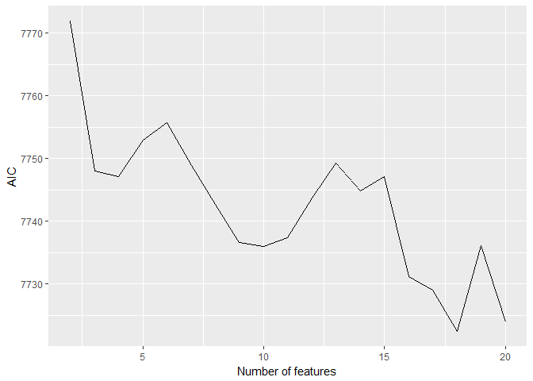

MAPSS Thesis II - Game Characteristics and Player Personality
================
Chih-Yu Chiang
July 12, 2017

``` r
knitr::opts_chunk$set(
    message = FALSE,
    warning = FALSE
)
```

Setup
-----

Data of game and player are read in and matched up.

-   Game release data, `release` (year), is read in as an interval variable.
-   Missing values are imputed with variable mean conveniently (`star_user` and `star_GS`).

``` r
#--Package
library(tidyverse)
library(corrgram)
library(modelr)
library(glmnet)
library(randomForest)
library(e1071)
library(car)
library(rlist)
library(pander)
set.seed(1)


#--Read in
#Core game info and group distance/probability data
core_cluster <- read_csv("../data/core_cluster.csv", col_names=TRUE) %>%
  mutate(group_survey = factor(group_survey),
         group_review = factor(group_review),
         core_id = factor(core_id)) %>%
  select(-X1)

#Core game tste scores (of dif numbers of features)
core_tsteScore <- read_csv("../data/tste_concat.csv", col_names=TRUE) %>%
  select(-X1)

#Player-related survey data
survey <- read_csv("../data/survey.csv", col_names=TRUE) %>%
  mutate(race = factor(race),
         sex = factor(sex),
         core_id = factor(core_id)) %>%
  select(-id)


#--Impute missing with mean
imputation_mean <- function(c){
  c[is.na(c)] <- mean(c, na.rm=TRUE)
  return(c)
}
core_cluster <- mutate_each(core_cluster,
                            funs(imputation_mean(.)),
                            star_user, star_GS)


#--Match up
#Main df, key=player-game
df <- bind_cols(core_cluster, core_tsteScore) %>%
  left_join(survey, by=c("core_id"), copy=FALSE)

#Player df, key=player
df_player <- distinct(df, respondent, .keep_all = TRUE)


#--MSE computation
#Works with simple regression, SVM, RF
mse_1 <- function(model, data_yx){
  res <- modelr:::residuals(model, data_yx)
  mean(res^2, na.rm=TRUE)
}

#Works with lasso and ridge
mse_2 <- function(model, lambda, data_y, data_x){
  pred <- predict(model, s=lambda, newx=data_x)
  mean((pred - data_y)^2, na.rm=TRUE)
}
```

Model 1
=======


Variable
--------

Compute and select variables to be used in models.

-   Call the function to update the vars employed.
-   Final response variable utilizes only `preference_3`.

-   Player preference:

| Name           | Definition                 | Unit                        |
|----------------|----------------------------|-----------------------------|
| `preference_1` | how much do you like       | Likert 1-7=like             |
| `preference_2` | how often play it          | ordinary 1=never-7=everyday |
| `preference_3` | does it fit personal taste | Likert 1-7=fit              |

-   Game characteristics:

<table style="width:36%;">
<colgroup>
<col width="8%" />
<col width="18%" />
<col width="9%" />
</colgroup>
<thead>
<tr class="header">
<th>Name</th>
<th>Definition</th>
<th>Unit</th>
</tr>
</thead>
<tbody>
<tr class="odd">
<td><code>distance_survey_mean_x</code></td>
<td>group score from survey (distance from group mean in tste)</td>
<td>cosine distance</td>
</tr>
<tr class="even">
<td><code>distance_survey_median_x</code></td>
<td>group score from survey (distance from group median in tste)</td>
<td>cosine distance</td>
</tr>
<tr class="odd">
<td><code>probability_review_mean_x</code></td>
<td>group score from review (mean probability to be categorized in the group by NN)</td>
<td>percentage</td>
</tr>
<tr class="even">
<td><code>probability_review_median_x</code></td>
<td>group score from review (median probability to be categorized in the group by NN)</td>
<td>percentage</td>
</tr>
<tr class="odd">
<td><code>group_survey</code></td>
<td>group identity from survey</td>
<td>categorical 1-group number</td>
</tr>
<tr class="even">
<td><code>group_review</code></td>
<td>group identity from review</td>
<td>categorical 1-group number</td>
</tr>
<tr class="odd">
<td><code>tste_n_x</code></td>
<td>group score from survey (tste), n=number of features</td>
<td>interval arbitrary</td>
</tr>
</tbody>
</table>

-   Player personality:

<table style="width:36%;">
<colgroup>
<col width="8%" />
<col width="18%" />
<col width="9%" />
</colgroup>
<thead>
<tr class="header">
<th>Name</th>
<th>Definition</th>
<th>Unit</th>
</tr>
</thead>
<tbody>
<tr class="odd">
<td><code>game_xxxxx</code></td>
<td>Big-five personality in game</td>
<td>Likert 1-7</td>
</tr>
<tr class="even">
<td><code>real_xxxxx</code></td>
<td>Big-five personality in real life</td>
<td>Likert 1-7</td>
</tr>
<tr class="odd">
<td><code>gap_xxxxx</code></td>
<td>personality gap (game - real)</td>
<td>Likert 1-7</td>
</tr>
<tr class="even">
<td><code>satis_xxxxx</code></td>
<td>SDT satisfaction in real life</td>
<td>Likert 1-7</td>
</tr>
<tr class="odd">
<td><code>dissatis_xxxxx</code></td>
<td>SDT dissatisfaction in real life</td>
<td>Likert 1-7</td>
</tr>
<tr class="even">
<td><code>combined_xxxxx</code></td>
<td>SDT combined (previous two) dissatisfaction in real life</td>
<td>Likert 1-7</td>
</tr>
</tbody>
</table>

-   Control:

| Name        | Definition                                    | Unit                      |
|-------------|-----------------------------------------------|---------------------------|
| `age`       | player age                                    | interval                  |
| `education` | player education                              | ordinary 1-7=PhD          |
| `income`    | player annual household income                | ordinary 1-7=over 150,000 |
| `sex`       | player sex                                    | categorical 1=male        |
| `race`      | player race                                   | categorical 1-5           |
| `release`   | game release year                             | interval year             |
| `star_GS`   | general game quality rated by GameSpot expert | interval 0-10             |
| `star_user` | general game quality rated by GameSpot user   | interval 0-10             |

``` r
updateVars <- function(){
  #--Create response variable
  df <<- df %>%
    rowwise() %>% 
    mutate(preference = mean(c(preference_3)))
  
  
  #--Compute personalty gap
  df <<- mutate(df,
               gap_extraversion = game_extraversion - real_extraversion,
               gap_agreeableness = game_agreeableness - real_agreeableness,
               gap_conscientiousness = game_conscientiousness - real_conscientiousness,
               gap_emotionstability = game_emotionstability - real_emotionstability,
               gap_openness = game_openness - real_openness)
  
  
  #--Acquire player df, key=player
  df_player <<- distinct(df, respondent, .keep_all=TRUE)
  
  
  #--Select variables to be included in regression (model formation)
  #predictor variables
  predictors <<- paste(read.csv("../data/vars/predictors.csv", header=FALSE)[,1], collapse="+")
  
  #df with only predictor variables
  df_x <<- model.matrix(as.formula(paste("preference ~ ", predictors, sep="")),
                       data=df) %>% #Define model formation and create dummies
    .[, -1] #Remove redundant interacept column
  
  #df also with outcome variables
  df_yx <<- bind_cols(select(df, preference), data.frame(df_x))
}
```

Models
------

Models applying the variables selected. Two ways to select variables:

-   Use `select` to include vars in the models from `df`/`df_player`.
-   Edited through `predictors.csv` (for complexed interaction terms).

``` r
#Update vars
updateVars()

#Full df with control marked
df_c <- mutate(df,
               c_age = age,
               c_education = education,
               c_income = income,
               c_race = race,
               c_sex = sex,
               c_release = release,
               c_star = star_user)

#Models with specific construct as main effect
model_control <- lm(preference ~ ., data=select(df_c, preference, starts_with("c_")))

model_gChar_survey_mean <- lm(preference ~ ., data=select(df_c, preference, starts_with("c_"), starts_with("distance_survey_mean")))
model_gChar_survey_median <- lm(preference ~ ., data=select(df_c, preference, starts_with("c_"), starts_with("distance_survey_median")))
model_gChar_review_mean <- lm(preference ~ ., data=select(df_c, preference, starts_with("c_"), starts_with("probability_review_mean")))
model_gChar_review_median <- lm(preference ~ ., data=select(df_c, preference, starts_with("c_"), starts_with("probability_review_median")))

featureNo <- seq(2, 20)
model_gChar_tstes <- map(featureNo, ~ lm(preference ~ ., data=select(df_c, preference, starts_with("c_"), starts_with(paste("tste_", .x, "_", sep="")))))

model_personality_game <- lm(preference ~ ., data=select(df_c, preference, starts_with("c_"), starts_with("game")))
model_personality_real <- lm(preference ~ ., data=select(df_c, preference, starts_with("c_"), starts_with("real")))
model_personality_gap <- lm(preference ~ ., data=select(df_c, preference, starts_with("c_"), starts_with("gap")))

model_personality_satis <- lm(preference ~ ., data=select(df_c, preference, starts_with("c_"), starts_with("satis")))
model_personality_dissatis <- lm(preference ~ ., data=select(df_c, preference, starts_with("c_"), starts_with("dissatis")))
model_personality_combined <- lm(preference ~ ., data=select(df_c, preference, starts_with("c_"), starts_with("combined")))
```

### preference ~ control

``` r
summary(model_control)
```

    ## 
    ## Call:
    ## lm(formula = preference ~ ., data = select(df_c, preference, 
    ##     starts_with("c_")))
    ## 
    ## Residuals:
    ##     Min      1Q  Median      3Q     Max 
    ## -4.9112 -0.6031  0.3912  1.2352  2.5568 
    ## 
    ## Coefficients:
    ##              Estimate Std. Error t value Pr(>|t|)    
    ## (Intercept) 62.430462  13.766065   4.535 6.08e-06 ***
    ## c_age       -0.011025   0.004569  -2.413   0.0159 *  
    ## c_education  0.018499   0.026657   0.694   0.4878    
    ## c_income     0.022099   0.016849   1.312   0.1898    
    ## c_race2      0.063100   0.132649   0.476   0.6343    
    ## c_race4     -0.318270   0.142994  -2.226   0.0261 *  
    ## c_race6     -0.853915   0.346595  -2.464   0.0138 *  
    ## c_race7     -0.155616   0.136204  -1.143   0.2534    
    ## c_sex2      -0.106269   0.068509  -1.551   0.1210    
    ## c_release   -0.028537   0.006771  -4.214 2.61e-05 ***
    ## c_star       0.064089   0.048212   1.329   0.1839    
    ## ---
    ## Signif. codes:  0 '***' 0.001 '**' 0.01 '*' 0.05 '.' 0.1 ' ' 1
    ## 
    ## Residual standard error: 1.488 on 2127 degrees of freedom
    ## Multiple R-squared:  0.02309,    Adjusted R-squared:  0.0185 
    ## F-statistic: 5.028 on 10 and 2127 DF,  p-value: 2.925e-07

### Information criteria

``` r
#--BIC
BICs <- unlist(map(model_gChar_tstes, BIC))

ggplot(data=as.data.frame(BICs)) +
  geom_line(mapping=aes(seq(2, 20), BICs)) +
  labs(x="Number of features", y="BIC")
```


``` r
#--AIC
AICs <- unlist(map(model_gChar_tstes, AIC))

ggplot(data=as.data.frame(AICs)) +
  geom_line(mapping=aes(seq(2, 20), AICs)) +
  labs(x="Number of features", y="AIC")
```



### preference ~ control + tste score

``` r
map(model_gChar_tstes, summary)
```

    ## [[1]]
    ## 
    ## Call:
    ## lm(formula = preference ~ ., data = select(df_c, preference, 
    ##     starts_with("c_"), starts_with(paste("tste_", .x, "_", sep = ""))))
    ## 
    ## Residuals:
    ##     Min      1Q  Median      3Q     Max 
    ## -4.8771 -0.6241  0.3724  1.1989  2.7719 
    ## 
    ## Coefficients:
    ##              Estimate Std. Error t value Pr(>|t|)    
    ## (Intercept) 70.059219  14.250472   4.916 9.50e-07 ***
    ## c_age       -0.010823   0.004563  -2.372   0.0178 *  
    ## c_education  0.017503   0.026600   0.658   0.5106    
    ## c_income     0.024260   0.016822   1.442   0.1494    
    ## c_race2      0.072495   0.132469   0.547   0.5843    
    ## c_race4     -0.315931   0.142666  -2.214   0.0269 *  
    ## c_race6     -0.890611   0.346069  -2.574   0.0101 *  
    ## c_race7     -0.141405   0.135975  -1.040   0.2985    
    ## c_sex2      -0.078464   0.068909  -1.139   0.2550    
    ## c_release   -0.032087   0.006993  -4.588 4.73e-06 ***
    ## c_star       0.001543   0.053121   0.029   0.9768    
    ## tste_2_0     0.101979   0.041669   2.447   0.0145 *  
    ## tste_2_1    -0.071881   0.040535  -1.773   0.0763 .  
    ## ---
    ## Signif. codes:  0 '***' 0.001 '**' 0.01 '*' 0.05 '.' 0.1 ' ' 1
    ## 
    ## Residual standard error: 1.485 on 2125 degrees of freedom
    ## Multiple R-squared:  0.02851,    Adjusted R-squared:  0.02303 
    ## F-statistic: 5.197 on 12 and 2125 DF,  p-value: 1.146e-08
    ## 
    ## 
    ## [[2]]
    ## 
    ## Call:
    ## lm(formula = preference ~ ., data = select(df_c, preference, 
    ##     starts_with("c_"), starts_with(paste("tste_", .x, "_", sep = ""))))
    ## 
    ## Residuals:
    ##     Min      1Q  Median      3Q     Max 
    ## -4.9295 -0.6588  0.3243  1.2149  2.6760 
    ## 
    ## Coefficients:
    ##              Estimate Std. Error t value Pr(>|t|)    
    ## (Intercept) 63.185784  14.226290   4.441 9.39e-06 ***
    ## c_age       -0.010693   0.004537  -2.357   0.0185 *  
    ## c_education  0.015635   0.026449   0.591   0.5545    
    ## c_income     0.025121   0.016726   1.502   0.1333    
    ## c_race2      0.065647   0.131714   0.498   0.6182    
    ## c_race4     -0.288604   0.141945  -2.033   0.0422 *  
    ## c_race6     -0.875481   0.344108  -2.544   0.0110 *  
    ## c_race7     -0.157818   0.135224  -1.167   0.2433    
    ## c_sex2      -0.067751   0.068539  -0.989   0.3230    
    ## c_release   -0.028731   0.006981  -4.116 4.01e-05 ***
    ## c_star       0.018053   0.053035   0.340   0.7336    
    ## tste_3_0    -0.048247   0.044035  -1.096   0.2734    
    ## tste_3_1     0.158598   0.035351   4.486 7.63e-06 ***
    ## tste_3_2     0.233073   0.049480   4.710 2.63e-06 ***
    ## ---
    ## Signif. codes:  0 '***' 0.001 '**' 0.01 '*' 0.05 '.' 0.1 ' ' 1
    ## 
    ## Residual standard error: 1.476 on 2124 degrees of freedom
    ## Multiple R-squared:  0.0402, Adjusted R-squared:  0.03432 
    ## F-statistic: 6.843 on 13 and 2124 DF,  p-value: 4.443e-13
    ## 
    ## 
    ## [[3]]
    ## 
    ## Call:
    ## lm(formula = preference ~ ., data = select(df_c, preference, 
    ##     starts_with("c_"), starts_with(paste("tste_", .x, "_", sep = ""))))
    ## 
    ## Residuals:
    ##     Min      1Q  Median      3Q     Max 
    ## -4.9660 -0.6671  0.3268  1.2074  2.7299 
    ## 
    ## Coefficients:
    ##              Estimate Std. Error t value Pr(>|t|)    
    ## (Intercept) 64.643748  14.403739   4.488 7.57e-06 ***
    ## c_age       -0.010658   0.004537  -2.349   0.0189 *  
    ## c_education  0.015601   0.026442   0.590   0.5553    
    ## c_income     0.024561   0.016718   1.469   0.1419    
    ## c_race2      0.064421   0.131760   0.489   0.6249    
    ## c_race4     -0.287409   0.141929  -2.025   0.0430 *  
    ## c_race6     -0.878787   0.343985  -2.555   0.0107 *  
    ## c_race7     -0.158365   0.135173  -1.172   0.2415    
    ## c_sex2      -0.064485   0.068577  -0.940   0.3472    
    ## c_release   -0.029372   0.007060  -4.160 3.30e-05 ***
    ## c_star      -0.002318   0.055941  -0.041   0.9670    
    ## tste_4_0     0.232267   0.048407   4.798 1.71e-06 ***
    ## tste_4_1     0.079367   0.053910   1.472   0.1411    
    ## tste_4_2     0.059919   0.042053   1.425   0.1543    
    ## tste_4_3    -0.159873   0.039680  -4.029 5.80e-05 ***
    ## ---
    ## Signif. codes:  0 '***' 0.001 '**' 0.01 '*' 0.05 '.' 0.1 ' ' 1
    ## 
    ## Residual standard error: 1.475 on 2123 degrees of freedom
    ## Multiple R-squared:  0.0415, Adjusted R-squared:  0.03518 
    ## F-statistic: 6.566 on 14 and 2123 DF,  p-value: 3.42e-13
    ## 
    ## 
    ## [[4]]
    ## 
    ## Call:
    ## lm(formula = preference ~ ., data = select(df_c, preference, 
    ##     starts_with("c_"), starts_with(paste("tste_", .x, "_", sep = ""))))
    ## 
    ## Residuals:
    ##     Min      1Q  Median      3Q     Max 
    ## -4.9139 -0.6513  0.3250  1.2024  2.6481 
    ## 
    ## Coefficients:
    ##              Estimate Std. Error t value Pr(>|t|)    
    ## (Intercept) 53.957151  14.671464   3.678 0.000241 ***
    ## c_age       -0.010815   0.004543  -2.381 0.017367 *  
    ## c_education  0.016156   0.026481   0.610 0.541857    
    ## c_income     0.026135   0.016748   1.561 0.118782    
    ## c_race2      0.057428   0.131893   0.435 0.663306    
    ## c_race4     -0.293167   0.142087  -2.063 0.039206 *  
    ## c_race6     -0.885093   0.344348  -2.570 0.010227 *  
    ## c_race7     -0.155596   0.135316  -1.150 0.250326    
    ## c_sex2      -0.073302   0.068668  -1.067 0.285879    
    ## c_release   -0.024081   0.007192  -3.348 0.000828 ***
    ## c_star       0.005057   0.057107   0.089 0.929452    
    ## tste_5_0     0.218191   0.047195   4.623 4.01e-06 ***
    ## tste_5_1    -0.159334   0.052622  -3.028 0.002492 ** 
    ## tste_5_2    -0.029846   0.041440  -0.720 0.471458    
    ## tste_5_3    -0.100529   0.049894  -2.015 0.044045 *  
    ## tste_5_4     0.029580   0.048177   0.614 0.539292    
    ## ---
    ## Signif. codes:  0 '***' 0.001 '**' 0.01 '*' 0.05 '.' 0.1 ' ' 1
    ## 
    ## Residual standard error: 1.477 on 2122 degrees of freedom
    ## Multiple R-squared:  0.03979,    Adjusted R-squared:  0.03301 
    ## F-statistic: 5.863 on 15 and 2122 DF,  p-value: 4.567e-12
    ## 
    ## 
    ## [[5]]
    ## 
    ## Call:
    ## lm(formula = preference ~ ., data = select(df_c, preference, 
    ##     starts_with("c_"), starts_with(paste("tste_", .x, "_", sep = ""))))
    ## 
    ## Residuals:
    ##     Min      1Q  Median      3Q     Max 
    ## -4.9423 -0.6606  0.3272  1.2116  2.6677 
    ## 
    ## Coefficients:
    ##              Estimate Std. Error t value Pr(>|t|)    
    ## (Intercept) 52.614469  14.840842   3.545 0.000401 ***
    ## c_age       -0.010797   0.004544  -2.376 0.017588 *  
    ## c_education  0.015432   0.026495   0.582 0.560326    
    ## c_income     0.026502   0.016759   1.581 0.113934    
    ## c_race2      0.047453   0.132106   0.359 0.719481    
    ## c_race4     -0.288597   0.142174  -2.030 0.042493 *  
    ## c_race6     -0.889005   0.344545  -2.580 0.009940 ** 
    ## c_race7     -0.152328   0.135416  -1.125 0.260765    
    ## c_sex2      -0.069739   0.068709  -1.015 0.310227    
    ## c_release   -0.023366   0.007277  -3.211 0.001344 ** 
    ## c_star      -0.006066   0.058772  -0.103 0.917800    
    ## tste_6_0     0.044059   0.052363   0.841 0.400217    
    ## tste_6_1    -0.128516   0.049139  -2.615 0.008977 ** 
    ## tste_6_2     0.231683   0.043688   5.303 1.26e-07 ***
    ## tste_6_3     0.020800   0.053287   0.390 0.696329    
    ## tste_6_4     0.079887   0.046281   1.726 0.084470 .  
    ## tste_6_5     0.063376   0.054231   1.169 0.242683    
    ## ---
    ## Signif. codes:  0 '***' 0.001 '**' 0.01 '*' 0.05 '.' 0.1 ' ' 1
    ## 
    ## Residual standard error: 1.478 on 2121 degrees of freedom
    ## Multiple R-squared:  0.0394, Adjusted R-squared:  0.03215 
    ## F-statistic: 5.437 on 16 and 2121 DF,  p-value: 1.651e-11
    ## 
    ## 
    ## [[6]]
    ## 
    ## Call:
    ## lm(formula = preference ~ ., data = select(df_c, preference, 
    ##     starts_with("c_"), starts_with(paste("tste_", .x, "_", sep = ""))))
    ## 
    ## Residuals:
    ##     Min      1Q  Median      3Q     Max 
    ## -4.8886 -0.6664  0.3164  1.1982  2.6222 
    ## 
    ## Coefficients:
    ##              Estimate Std. Error t value Pr(>|t|)    
    ## (Intercept) 57.706513  15.236321   3.787 0.000156 ***
    ## c_age       -0.010519   0.004537  -2.318 0.020522 *  
    ## c_education  0.016635   0.026455   0.629 0.529537    
    ## c_income     0.025463   0.016733   1.522 0.128235    
    ## c_race2      0.061777   0.131740   0.469 0.639164    
    ## c_race4     -0.281641   0.141958  -1.984 0.047387 *  
    ## c_race6     -0.880114   0.343928  -2.559 0.010566 *  
    ## c_race7     -0.148558   0.135151  -1.099 0.271807    
    ## c_sex2      -0.075405   0.068603  -1.099 0.271827    
    ## c_release   -0.025982   0.007484  -3.472 0.000528 ***
    ## c_star       0.012383   0.061366   0.202 0.840104    
    ## tste_7_0    -0.176681   0.047566  -3.714 0.000209 ***
    ## tste_7_1     0.032276   0.052359   0.616 0.537676    
    ## tste_7_2    -0.128871   0.049820  -2.587 0.009755 ** 
    ## tste_7_3    -0.213797   0.038961  -5.487 4.57e-08 ***
    ## tste_7_4     0.023432   0.051383   0.456 0.648411    
    ## tste_7_5     0.034556   0.056830   0.608 0.543209    
    ## tste_7_6     0.026612   0.060643   0.439 0.660822    
    ## ---
    ## Signif. codes:  0 '***' 0.001 '**' 0.01 '*' 0.05 '.' 0.1 ' ' 1
    ## 
    ## Residual standard error: 1.475 on 2120 degrees of freedom
    ## Multiple R-squared:  0.04338,    Adjusted R-squared:  0.03571 
    ## F-statistic: 5.656 on 17 and 2120 DF,  p-value: 9.753e-13
    ## 
    ## 
    ## [[7]]
    ## 
    ## Call:
    ## lm(formula = preference ~ ., data = select(df_c, preference, 
    ##     starts_with("c_"), starts_with(paste("tste_", .x, "_", sep = ""))))
    ## 
    ## Residuals:
    ##     Min      1Q  Median      3Q     Max 
    ## -4.9516 -0.6596  0.3223  1.1843  2.6477 
    ## 
    ## Coefficients:
    ##              Estimate Std. Error t value Pr(>|t|)    
    ## (Intercept) 62.348895  15.795945   3.947 8.17e-05 ***
    ## c_age       -0.010618   0.004529  -2.345 0.019142 *  
    ## c_education  0.017291   0.026413   0.655 0.512778    
    ## c_income     0.025524   0.016703   1.528 0.126635    
    ## c_race2      0.049373   0.131560   0.375 0.707484    
    ## c_race4     -0.268733   0.141765  -1.896 0.058147 .  
    ## c_race6     -0.892644   0.343459  -2.599 0.009415 ** 
    ## c_race7     -0.139242   0.134970  -1.032 0.302355    
    ## c_sex2      -0.077302   0.068434  -1.130 0.258778    
    ## c_release   -0.028115   0.007754  -3.626 0.000295 ***
    ## c_star      -0.031025   0.060451  -0.513 0.607845    
    ## tste_8_0    -0.211979   0.051147  -4.145 3.54e-05 ***
    ## tste_8_1     0.174266   0.057072   3.053 0.002290 ** 
    ## tste_8_2     0.080534   0.051181   1.574 0.115751    
    ## tste_8_3     0.091393   0.048216   1.895 0.058165 .  
    ## tste_8_4     0.101594   0.048606   2.090 0.036725 *  
    ## tste_8_5     0.099594   0.049240   2.023 0.043238 *  
    ## tste_8_6    -0.125332   0.053358  -2.349 0.018921 *  
    ## tste_8_7    -0.048042   0.052161  -0.921 0.357131    
    ## ---
    ## Signif. codes:  0 '***' 0.001 '**' 0.01 '*' 0.05 '.' 0.1 ' ' 1
    ## 
    ## Residual standard error: 1.472 on 2119 degrees of freedom
    ## Multiple R-squared:  0.04702,    Adjusted R-squared:  0.03892 
    ## F-statistic: 5.808 on 18 and 2119 DF,  p-value: 7.93e-14
    ## 
    ## 
    ## [[8]]
    ## 
    ## Call:
    ## lm(formula = preference ~ ., data = select(df_c, preference, 
    ##     starts_with("c_"), starts_with(paste("tste_", .x, "_", sep = ""))))
    ## 
    ## Residuals:
    ##     Min      1Q  Median      3Q     Max 
    ## -5.0276 -0.6912  0.3193  1.1596  2.7986 
    ## 
    ## Coefficients:
    ##               Estimate Std. Error t value Pr(>|t|)    
    ## (Intercept) 63.3724502 16.1157758   3.932 8.68e-05 ***
    ## c_age       -0.0108435  0.0045209  -2.399 0.016547 *  
    ## c_education  0.0156588  0.0263671   0.594 0.552658    
    ## c_income     0.0290994  0.0167069   1.742 0.081696 .  
    ## c_race2      0.0487707  0.1313758   0.371 0.710503    
    ## c_race4     -0.2700832  0.1415290  -1.908 0.056484 .  
    ## c_race6     -0.8333741  0.3432540  -2.428 0.015271 *  
    ## c_race7     -0.1306494  0.1348384  -0.969 0.332689    
    ## c_sex2      -0.0699597  0.0683803  -1.023 0.306379    
    ## c_release   -0.0287205  0.0079084  -3.632 0.000288 ***
    ## c_star      -0.0089750  0.0612941  -0.146 0.883600    
    ## tste_9_0    -0.1398270  0.0535048  -2.613 0.009029 ** 
    ## tste_9_1     0.0365089  0.0514742   0.709 0.478237    
    ## tste_9_2    -0.3134617  0.0506571  -6.188 7.30e-10 ***
    ## tste_9_3    -0.0988222  0.0569031  -1.737 0.082590 .  
    ## tste_9_4    -0.0211026  0.0444602  -0.475 0.635092    
    ## tste_9_5     0.0250345  0.0582717   0.430 0.667519    
    ## tste_9_6    -0.0008652  0.0518204  -0.017 0.986681    
    ## tste_9_7    -0.0927201  0.0518992  -1.787 0.074154 .  
    ## tste_9_8     0.0472505  0.0453293   1.042 0.297353    
    ## ---
    ## Signif. codes:  0 '***' 0.001 '**' 0.01 '*' 0.05 '.' 0.1 ' ' 1
    ## 
    ## Residual standard error: 1.47 on 2118 degrees of freedom
    ## Multiple R-squared:  0.05065,    Adjusted R-squared:  0.04213 
    ## F-statistic: 5.947 on 19 and 2118 DF,  p-value: 6.398e-15
    ## 
    ## 
    ## [[9]]
    ## 
    ## Call:
    ## lm(formula = preference ~ ., data = select(df_c, preference, 
    ##     starts_with("c_"), starts_with(paste("tste_", .x, "_", sep = ""))))
    ## 
    ## Residuals:
    ##     Min      1Q  Median      3Q     Max 
    ## -5.1003 -0.6767  0.3175  1.1588  2.7496 
    ## 
    ## Coefficients:
    ##              Estimate Std. Error t value Pr(>|t|)    
    ## (Intercept) 62.631753  15.808151   3.962 7.68e-05 ***
    ## c_age       -0.010942   0.004521  -2.420 0.015585 *  
    ## c_education  0.015402   0.026358   0.584 0.559045    
    ## c_income     0.027681   0.016680   1.660 0.097159 .  
    ## c_race2      0.058954   0.131339   0.449 0.653571    
    ## c_race4     -0.269591   0.141484  -1.905 0.056857 .  
    ## c_race6     -0.836419   0.343089  -2.438 0.014854 *  
    ## c_race7     -0.131058   0.134829  -0.972 0.331147    
    ## c_sex2      -0.067010   0.068398  -0.980 0.327337    
    ## c_release   -0.028444   0.007767  -3.662 0.000256 ***
    ## c_star       0.013821   0.060112   0.230 0.818173    
    ## tste_10_0   -0.037207   0.045354  -0.820 0.412097    
    ## tste_10_1    0.175538   0.049772   3.527 0.000430 ***
    ## tste_10_2   -0.194645   0.053117  -3.664 0.000254 ***
    ## tste_10_3   -0.138593   0.053625  -2.585 0.009818 ** 
    ## tste_10_4   -0.054234   0.053951  -1.005 0.314888    
    ## tste_10_5    0.013255   0.051218   0.259 0.795814    
    ## tste_10_6   -0.162262   0.052481  -3.092 0.002015 ** 
    ## tste_10_7    0.084982   0.045263   1.878 0.060582 .  
    ## tste_10_8    0.054400   0.060039   0.906 0.365005    
    ## tste_10_9    0.131428   0.050958   2.579 0.009971 ** 
    ## ---
    ## Signif. codes:  0 '***' 0.001 '**' 0.01 '*' 0.05 '.' 0.1 ' ' 1
    ## 
    ## Residual standard error: 1.469 on 2117 degrees of freedom
    ## Multiple R-squared:  0.05179,    Adjusted R-squared:  0.04283 
    ## F-statistic: 5.781 on 20 and 2117 DF,  p-value: 5.448e-15
    ## 
    ## 
    ## [[10]]
    ## 
    ## Call:
    ## lm(formula = preference ~ ., data = select(df_c, preference, 
    ##     starts_with("c_"), starts_with(paste("tste_", .x, "_", sep = ""))))
    ## 
    ## Residuals:
    ##     Min      1Q  Median      3Q     Max 
    ## -5.1083 -0.6831  0.3223  1.1541  2.7451 
    ## 
    ## Coefficients:
    ##              Estimate Std. Error t value Pr(>|t|)    
    ## (Intercept) 63.576709  16.047988   3.962 7.69e-05 ***
    ## c_age       -0.010982   0.004521  -2.429 0.015222 *  
    ## c_education  0.016975   0.026361   0.644 0.519684    
    ## c_income     0.027897   0.016700   1.671 0.094964 .  
    ## c_race2      0.061298   0.131398   0.467 0.640902    
    ## c_race4     -0.265838   0.141521  -1.878 0.060459 .  
    ## c_race6     -0.828400   0.343182  -2.414 0.015868 *  
    ## c_race7     -0.139204   0.134824  -1.032 0.301960    
    ## c_sex2      -0.068612   0.068492  -1.002 0.316573    
    ## c_release   -0.028889   0.007882  -3.665 0.000253 ***
    ## c_star       0.007539   0.062588   0.120 0.904131    
    ## tste_11_0   -0.018428   0.055741  -0.331 0.740980    
    ## tste_11_1    0.042239   0.053032   0.796 0.425841    
    ## tste_11_2   -0.086162   0.047250  -1.824 0.068360 .  
    ## tste_11_3    0.010011   0.057497   0.174 0.861794    
    ## tste_11_4   -0.109569   0.056279  -1.947 0.051680 .  
    ## tste_11_5   -0.072556   0.049628  -1.462 0.143887    
    ## tste_11_6    0.135290   0.047994   2.819 0.004864 ** 
    ## tste_11_7    0.052376   0.054553   0.960 0.337112    
    ## tste_11_8   -0.217743   0.042433  -5.131 3.14e-07 ***
    ## tste_11_9    0.182918   0.050625   3.613 0.000309 ***
    ## tste_11_10   0.068433   0.055492   1.233 0.217638    
    ## ---
    ## Signif. codes:  0 '***' 0.001 '**' 0.01 '*' 0.05 '.' 0.1 ' ' 1
    ## 
    ## Residual standard error: 1.47 on 2116 degrees of freedom
    ## Multiple R-squared:  0.05205,    Adjusted R-squared:  0.04264 
    ## F-statistic: 5.533 on 21 and 2116 DF,  p-value: 1.047e-14
    ## 
    ## 
    ## [[11]]
    ## 
    ## Call:
    ## lm(formula = preference ~ ., data = select(df_c, preference, 
    ##     starts_with("c_"), starts_with(paste("tste_", .x, "_", sep = ""))))
    ## 
    ## Residuals:
    ##     Min      1Q  Median      3Q     Max 
    ## -5.0357 -0.6867  0.3200  1.1628  2.7594 
    ## 
    ## Coefficients:
    ##              Estimate Std. Error t value Pr(>|t|)    
    ## (Intercept) 51.076520  16.541758   3.088 0.002043 ** 
    ## c_age       -0.011132   0.004529  -2.458 0.014053 *  
    ## c_education  0.017653   0.026389   0.669 0.503602    
    ## c_income     0.027700   0.016711   1.658 0.097545 .  
    ## c_race2      0.057423   0.131571   0.436 0.662560    
    ## c_race4     -0.273406   0.141736  -1.929 0.053867 .  
    ## c_race6     -0.850968   0.343830  -2.475 0.013403 *  
    ## c_race7     -0.133704   0.135144  -0.989 0.322609    
    ## c_sex2      -0.069525   0.068541  -1.014 0.310528    
    ## c_release   -0.022854   0.008112  -2.817 0.004891 ** 
    ## c_star       0.054174   0.063407   0.854 0.392992    
    ## tste_12_0    0.056537   0.053145   1.064 0.287529    
    ## tste_12_1    0.051920   0.051581   1.007 0.314261    
    ## tste_12_2    0.072290   0.049317   1.466 0.142847    
    ## tste_12_3    0.024727   0.055524   0.445 0.656124    
    ## tste_12_4   -0.068434   0.051823  -1.321 0.186800    
    ## tste_12_5    0.078381   0.053919   1.454 0.146185    
    ## tste_12_6   -0.029022   0.055795  -0.520 0.603008    
    ## tste_12_7    0.024896   0.053847   0.462 0.643883    
    ## tste_12_8    0.174009   0.049526   3.513 0.000452 ***
    ## tste_12_9   -0.047643   0.052164  -0.913 0.361169    
    ## tste_12_10   0.183839   0.045716   4.021 5.99e-05 ***
    ## tste_12_11  -0.166689   0.047362  -3.519 0.000442 ***
    ## ---
    ## Signif. codes:  0 '***' 0.001 '**' 0.01 '*' 0.05 '.' 0.1 ' ' 1
    ## 
    ## Residual standard error: 1.471 on 2115 degrees of freedom
    ## Multiple R-squared:  0.05012,    Adjusted R-squared:  0.04024 
    ## F-statistic: 5.073 on 22 and 2115 DF,  p-value: 1.489e-13
    ## 
    ## 
    ## [[12]]
    ## 
    ## Call:
    ## lm(formula = preference ~ ., data = select(df_c, preference, 
    ##     starts_with("c_"), starts_with(paste("tste_", .x, "_", sep = ""))))
    ## 
    ## Residuals:
    ##     Min      1Q  Median      3Q     Max 
    ## -5.1024 -0.6394  0.3327  1.1789  2.6070 
    ## 
    ## Coefficients:
    ##              Estimate Std. Error t value Pr(>|t|)    
    ## (Intercept) 51.436053  16.990774   3.027 0.002497 ** 
    ## c_age       -0.010948   0.004536  -2.413 0.015887 *  
    ## c_education  0.019483   0.026428   0.737 0.461077    
    ## c_income     0.025570   0.016718   1.529 0.126292    
    ## c_race2      0.048172   0.131634   0.366 0.714436    
    ## c_race4     -0.269544   0.141892  -1.900 0.057617 .  
    ## c_race6     -0.882208   0.344327  -2.562 0.010472 *  
    ## c_race7     -0.137451   0.135277  -1.016 0.309710    
    ## c_sex2      -0.078838   0.068688  -1.148 0.251193    
    ## c_release   -0.022860   0.008333  -2.743 0.006135 ** 
    ## c_star       0.012962   0.061790   0.210 0.833866    
    ## tste_13_0    0.018843   0.051324   0.367 0.713548    
    ## tste_13_1   -0.068206   0.046881  -1.455 0.145859    
    ## tste_13_2    0.124061   0.047351   2.620 0.008855 ** 
    ## tste_13_3    0.038853   0.051010   0.762 0.446339    
    ## tste_13_4   -0.087536   0.053631  -1.632 0.102787    
    ## tste_13_5    0.076364   0.050176   1.522 0.128181    
    ## tste_13_6   -0.044775   0.055509  -0.807 0.419980    
    ## tste_13_7   -0.026724   0.049913  -0.535 0.592419    
    ## tste_13_8    0.098511   0.047113   2.091 0.036653 *  
    ## tste_13_9    0.141855   0.056350   2.517 0.011896 *  
    ## tste_13_10   0.179368   0.049197   3.646 0.000273 ***
    ## tste_13_11   0.079540   0.054468   1.460 0.144356    
    ## tste_13_12   0.057986   0.052616   1.102 0.270558    
    ## ---
    ## Signif. codes:  0 '***' 0.001 '**' 0.01 '*' 0.05 '.' 0.1 ' ' 1
    ## 
    ## Residual standard error: 1.473 on 2114 degrees of freedom
    ## Multiple R-squared:  0.04857,    Adjusted R-squared:  0.03822 
    ## F-statistic: 4.692 on 23 and 2114 DF,  p-value: 1.396e-12
    ## 
    ## 
    ## [[13]]
    ## 
    ## Call:
    ## lm(formula = preference ~ ., data = select(df_c, preference, 
    ##     starts_with("c_"), starts_with(paste("tste_", .x, "_", sep = ""))))
    ## 
    ## Residuals:
    ##     Min      1Q  Median      3Q     Max 
    ## -5.1239 -0.6575  0.3291  1.1736  2.6235 
    ## 
    ## Coefficients:
    ##               Estimate Std. Error t value Pr(>|t|)    
    ## (Intercept) 45.5441103 16.8870264   2.697 0.007053 ** 
    ## c_age       -0.0106045  0.0045311  -2.340 0.019356 *  
    ## c_education  0.0160757  0.0264157   0.609 0.542878    
    ## c_income     0.0267553  0.0166970   1.602 0.109216    
    ## c_race2      0.0487085  0.1315033   0.370 0.711123    
    ## c_race4     -0.2639629  0.1417188  -1.863 0.062660 .  
    ## c_race6     -0.8789321  0.3438483  -2.556 0.010653 *  
    ## c_race7     -0.1491286  0.1351682  -1.103 0.270031    
    ## c_sex2      -0.0722629  0.0686445  -1.053 0.292593    
    ## c_release   -0.0201106  0.0082902  -2.426 0.015357 *  
    ## c_star       0.0572829  0.0624640   0.917 0.359219    
    ## tste_14_0   -0.0854508  0.0518589  -1.648 0.099551 .  
    ## tste_14_1    0.0468550  0.0507648   0.923 0.356121    
    ## tste_14_2    0.0458506  0.0482865   0.950 0.342448    
    ## tste_14_3    0.1129506  0.0470356   2.401 0.016419 *  
    ## tste_14_4    0.0266004  0.0440435   0.604 0.545937    
    ## tste_14_5   -0.0676129  0.0544268  -1.242 0.214274    
    ## tste_14_6    0.0001434  0.0512864   0.003 0.997769    
    ## tste_14_7   -0.2140164  0.0577854  -3.704 0.000218 ***
    ## tste_14_8    0.1360824  0.0455924   2.985 0.002871 ** 
    ## tste_14_9    0.0060672  0.0508852   0.119 0.905102    
    ## tste_14_10   0.1125762  0.0501261   2.246 0.024816 *  
    ## tste_14_11  -0.0152503  0.0474585  -0.321 0.747986    
    ## tste_14_12   0.0343774  0.0501861   0.685 0.493420    
    ## tste_14_13   0.1243306  0.0529221   2.349 0.018900 *  
    ## ---
    ## Signif. codes:  0 '***' 0.001 '**' 0.01 '*' 0.05 '.' 0.1 ' ' 1
    ## 
    ## Residual standard error: 1.471 on 2113 degrees of freedom
    ## Multiple R-squared:  0.05139,    Adjusted R-squared:  0.04062 
    ## F-statistic:  4.77 on 24 and 2113 DF,  p-value: 2.462e-13
    ## 
    ## 
    ## [[14]]
    ## 
    ## Call:
    ## lm(formula = preference ~ ., data = select(df_c, preference, 
    ##     starts_with("c_"), starts_with(paste("tste_", .x, "_", sep = ""))))
    ## 
    ## Residuals:
    ##     Min      1Q  Median      3Q     Max 
    ## -5.0218 -0.6691  0.3167  1.1823  2.6096 
    ## 
    ## Coefficients:
    ##               Estimate Std. Error t value Pr(>|t|)   
    ## (Intercept) 54.1352599 17.8330812   3.036  0.00243 **
    ## c_age       -0.0104311  0.0045328  -2.301  0.02147 * 
    ## c_education  0.0152225  0.0264262   0.576  0.56465   
    ## c_income     0.0270604  0.0167121   1.619  0.10555   
    ## c_race2      0.0450744  0.1315615   0.343  0.73193   
    ## c_race4     -0.2623038  0.1417646  -1.850  0.06441 . 
    ## c_race6     -0.8747690  0.3441701  -2.542  0.01110 * 
    ## c_race7     -0.1377641  0.1351532  -1.019  0.30817   
    ## c_sex2      -0.0712494  0.0686998  -1.037  0.29980   
    ## c_release   -0.0241747  0.0087437  -2.765  0.00575 **
    ## c_star       0.0043148  0.0664359   0.065  0.94822   
    ## tste_15_0   -0.0731535  0.0485048  -1.508  0.13166   
    ## tste_15_1   -0.1145793  0.0543726  -2.107  0.03521 * 
    ## tste_15_2    0.1340687  0.0487712   2.749  0.00603 **
    ## tste_15_3    0.0686984  0.0514247   1.336  0.18173   
    ## tste_15_4    0.0455693  0.0465325   0.979  0.32754   
    ## tste_15_5   -0.0897092  0.0534759  -1.678  0.09358 . 
    ## tste_15_6   -0.1106004  0.0467234  -2.367  0.01802 * 
    ## tste_15_7   -0.0938085  0.0517795  -1.812  0.07018 . 
    ## tste_15_8   -0.0987303  0.0541831  -1.822  0.06857 . 
    ## tste_15_9   -0.0041619  0.0497017  -0.084  0.93327   
    ## tste_15_10   0.0617313  0.0536644   1.150  0.25014   
    ## tste_15_11   0.1727870  0.0547987   3.153  0.00164 **
    ## tste_15_12  -0.0351951  0.0384733  -0.915  0.36040   
    ## tste_15_13   0.0232540  0.0450586   0.516  0.60585   
    ## tste_15_14   0.0006828  0.0445860   0.015  0.98778   
    ## ---
    ## Signif. codes:  0 '***' 0.001 '**' 0.01 '*' 0.05 '.' 0.1 ' ' 1
    ## 
    ## Residual standard error: 1.472 on 2112 degrees of freedom
    ## Multiple R-squared:  0.05128,    Adjusted R-squared:  0.04005 
    ## F-statistic: 4.567 on 25 and 2112 DF,  p-value: 6.041e-13
    ## 
    ## 
    ## [[15]]
    ## 
    ## Call:
    ## lm(formula = preference ~ ., data = select(df_c, preference, 
    ##     starts_with("c_"), starts_with(paste("tste_", .x, "_", sep = ""))))
    ## 
    ## Residuals:
    ##     Min      1Q  Median      3Q     Max 
    ## -5.0715 -0.6703  0.2834  1.1714  2.7681 
    ## 
    ## Coefficients:
    ##              Estimate Std. Error t value Pr(>|t|)    
    ## (Intercept) 38.162872  17.907312   2.131 0.033193 *  
    ## c_age       -0.009415   0.004524  -2.081 0.037526 *  
    ## c_education  0.014652   0.026311   0.557 0.577675    
    ## c_income     0.029635   0.016665   1.778 0.075495 .  
    ## c_race2      0.066365   0.131185   0.506 0.612987    
    ## c_race4     -0.253407   0.141276  -1.794 0.073003 .  
    ## c_race6     -0.885420   0.343028  -2.581 0.009913 ** 
    ## c_race7     -0.136419   0.134705  -1.013 0.311308    
    ## c_sex2      -0.070881   0.068354  -1.037 0.299869    
    ## c_release   -0.016258   0.008790  -1.850 0.064499 .  
    ## c_star       0.008854   0.063561   0.139 0.889232    
    ## tste_16_0    0.181742   0.049326   3.684 0.000235 ***
    ## tste_16_1   -0.105577   0.050548  -2.089 0.036858 *  
    ## tste_16_2   -0.052568   0.045546  -1.154 0.248565    
    ## tste_16_3   -0.102413   0.047176  -2.171 0.030051 *  
    ## tste_16_4   -0.152395   0.041530  -3.670 0.000249 ***
    ## tste_16_5    0.104350   0.048927   2.133 0.033061 *  
    ## tste_16_6    0.090551   0.044646   2.028 0.042666 *  
    ## tste_16_7    0.050575   0.043486   1.163 0.244956    
    ## tste_16_8   -0.036712   0.051807  -0.709 0.478632    
    ## tste_16_9    0.129366   0.044499   2.907 0.003685 ** 
    ## tste_16_10  -0.092770   0.043932  -2.112 0.034833 *  
    ## tste_16_11   0.136148   0.050333   2.705 0.006887 ** 
    ## tste_16_12   0.071782   0.046770   1.535 0.124988    
    ## tste_16_13   0.070555   0.050271   1.403 0.160622    
    ## tste_16_14   0.152002   0.046128   3.295 0.001000 ***
    ## tste_16_15  -0.005509   0.050828  -0.108 0.913701    
    ## ---
    ## Signif. codes:  0 '***' 0.001 '**' 0.01 '*' 0.05 '.' 0.1 ' ' 1
    ## 
    ## Residual standard error: 1.466 on 2111 degrees of freedom
    ## Multiple R-squared:  0.0592, Adjusted R-squared:  0.04761 
    ## F-statistic: 5.109 on 26 and 2111 DF,  p-value: 1.033e-15
    ## 
    ## 
    ## [[16]]
    ## 
    ## Call:
    ## lm(formula = preference ~ ., data = select(df_c, preference, 
    ##     starts_with("c_"), starts_with(paste("tste_", .x, "_", sep = ""))))
    ## 
    ## Residuals:
    ##     Min      1Q  Median      3Q     Max 
    ## -5.0238 -0.6736  0.2979  1.1853  2.7469 
    ## 
    ## Coefficients:
    ##               Estimate Std. Error t value Pr(>|t|)    
    ## (Intercept) 38.4808858 18.4625519   2.084 0.037256 *  
    ## c_age       -0.0095232  0.0045240  -2.105 0.035405 *  
    ## c_education  0.0159618  0.0262971   0.607 0.543929    
    ## c_income     0.0297598  0.0166441   1.788 0.073919 .  
    ## c_race2      0.0536205  0.1311058   0.409 0.682591    
    ## c_race4     -0.2649108  0.1412412  -1.876 0.060849 .  
    ## c_race6     -0.9148395  0.3431148  -2.666 0.007728 ** 
    ## c_race7     -0.1313794  0.1346296  -0.976 0.329247    
    ## c_sex2      -0.0778694  0.0682953  -1.140 0.254337    
    ## c_release   -0.0164660  0.0090380  -1.822 0.068617 .  
    ## c_star       0.0211052  0.0672190   0.314 0.753570    
    ## tste_17_0    0.3007351  0.0491787   6.115 1.15e-09 ***
    ## tste_17_1    0.0808300  0.0423657   1.908 0.056538 .  
    ## tste_17_2   -0.0647960  0.0504231  -1.285 0.198917    
    ## tste_17_3    0.0155345  0.0471726   0.329 0.741953    
    ## tste_17_4    0.0770769  0.0503980   1.529 0.126324    
    ## tste_17_5   -0.0137265  0.0464449  -0.296 0.767607    
    ## tste_17_6   -0.0760541  0.0497563  -1.529 0.126530    
    ## tste_17_7    0.0890979  0.0436938   2.039 0.041560 *  
    ## tste_17_8   -0.0361412  0.0473227  -0.764 0.445121    
    ## tste_17_9   -0.0943643  0.0468569  -2.014 0.044148 *  
    ## tste_17_10   0.0827545  0.0426700   1.939 0.052585 .  
    ## tste_17_11   0.0452711  0.0474296   0.954 0.339944    
    ## tste_17_12  -0.1578971  0.0434674  -3.633 0.000287 ***
    ## tste_17_13   0.0509400  0.0482716   1.055 0.291419    
    ## tste_17_14   0.0272826  0.0438610   0.622 0.533993    
    ## tste_17_15  -0.0742202  0.0556792  -1.333 0.182677    
    ## tste_17_16  -0.0003011  0.0407644  -0.007 0.994108    
    ## ---
    ## Signif. codes:  0 '***' 0.001 '**' 0.01 '*' 0.05 '.' 0.1 ' ' 1
    ## 
    ## Residual standard error: 1.465 on 2110 degrees of freedom
    ## Multiple R-squared:  0.06105,    Adjusted R-squared:  0.04903 
    ## F-statistic: 5.081 on 27 and 2110 DF,  p-value: 4.344e-16
    ## 
    ## 
    ## [[17]]
    ## 
    ## Call:
    ## lm(formula = preference ~ ., data = select(df_c, preference, 
    ##     starts_with("c_"), starts_with(paste("tste_", .x, "_", sep = ""))))
    ## 
    ## Residuals:
    ##     Min      1Q  Median      3Q     Max 
    ## -4.9711 -0.6675  0.3054  1.1897  2.7775 
    ## 
    ## Coefficients:
    ##              Estimate Std. Error t value Pr(>|t|)    
    ## (Intercept) 50.489108  18.146461   2.782 0.005445 ** 
    ## c_age       -0.009220   0.004517  -2.041 0.041390 *  
    ## c_education  0.015361   0.026245   0.585 0.558399    
    ## c_income     0.030306   0.016624   1.823 0.068445 .  
    ## c_race2      0.048826   0.130880   0.373 0.709140    
    ## c_race4     -0.261691   0.140999  -1.856 0.063596 .  
    ## c_race6     -0.931726   0.342334  -2.722 0.006548 ** 
    ## c_race7     -0.135634   0.134354  -1.010 0.312837    
    ## c_sex2      -0.070600   0.068222  -1.035 0.300850    
    ## c_release   -0.022184   0.008893  -2.495 0.012687 *  
    ## c_star      -0.043039   0.068137  -0.632 0.527684    
    ## tste_18_0   -0.124026   0.046566  -2.663 0.007794 ** 
    ## tste_18_1    0.182493   0.047900   3.810 0.000143 ***
    ## tste_18_2    0.002779   0.041636   0.067 0.946798    
    ## tste_18_3    0.003076   0.043985   0.070 0.944258    
    ## tste_18_4    0.098739   0.051275   1.926 0.054281 .  
    ## tste_18_5   -0.057861   0.047487  -1.218 0.223185    
    ## tste_18_6   -0.044029   0.047395  -0.929 0.353008    
    ## tste_18_7   -0.047487   0.043308  -1.096 0.272988    
    ## tste_18_8    0.077192   0.047676   1.619 0.105575    
    ## tste_18_9   -0.125145   0.048350  -2.588 0.009711 ** 
    ## tste_18_10   0.097469   0.046431   2.099 0.035915 *  
    ## tste_18_11   0.071216   0.045676   1.559 0.119108    
    ## tste_18_12  -0.080602   0.048184  -1.673 0.094518 .  
    ## tste_18_13  -0.021093   0.046961  -0.449 0.653364    
    ## tste_18_14   0.043997   0.051414   0.856 0.392240    
    ## tste_18_15   0.171743   0.059340   2.894 0.003840 ** 
    ## tste_18_16  -0.286485   0.051330  -5.581  2.7e-08 ***
    ## tste_18_17   0.046130   0.046261   0.997 0.318793    
    ## ---
    ## Signif. codes:  0 '***' 0.001 '**' 0.01 '*' 0.05 '.' 0.1 ' ' 1
    ## 
    ## Residual standard error: 1.462 on 2109 degrees of freedom
    ## Multiple R-squared:  0.06479,    Adjusted R-squared:  0.05237 
    ## F-statistic: 5.218 on 28 and 2109 DF,  p-value: < 2.2e-16
    ## 
    ## 
    ## [[18]]
    ## 
    ## Call:
    ## lm(formula = preference ~ ., data = select(df_c, preference, 
    ##     starts_with("c_"), starts_with(paste("tste_", .x, "_", sep = ""))))
    ## 
    ## Residuals:
    ##     Min      1Q  Median      3Q     Max 
    ## -4.9725 -0.6607  0.2963  1.1701  2.6900 
    ## 
    ## Coefficients:
    ##               Estimate Std. Error t value Pr(>|t|)    
    ## (Intercept) 41.9358079 18.6976934   2.243  0.02501 *  
    ## c_age       -0.0092148  0.0045313  -2.034  0.04212 *  
    ## c_education  0.0153260  0.0263262   0.582  0.56052    
    ## c_income     0.0302786  0.0166673   1.817  0.06941 .  
    ## c_race2      0.0495567  0.1313451   0.377  0.70599    
    ## c_race4     -0.2679192  0.1413985  -1.895  0.05826 .  
    ## c_race6     -0.9233180  0.3436138  -2.687  0.00726 ** 
    ## c_race7     -0.1338811  0.1347875  -0.993  0.32069    
    ## c_sex2      -0.0723333  0.0684676  -1.056  0.29088    
    ## c_release   -0.0182158  0.0091704  -1.986  0.04712 *  
    ## c_star       0.0272664  0.0670480   0.407  0.68429    
    ## tste_19_0   -0.0281212  0.0463613  -0.607  0.54420    
    ## tste_19_1    0.0690557  0.0510290   1.353  0.17612    
    ## tste_19_2   -0.0010604  0.0481056  -0.022  0.98242    
    ## tste_19_3   -0.0920707  0.0459335  -2.004  0.04515 *  
    ## tste_19_4   -0.1108644  0.0496034  -2.235  0.02552 *  
    ## tste_19_5   -0.0005181  0.0527772  -0.010  0.99217    
    ## tste_19_6    0.0881741  0.0484605   1.820  0.06898 .  
    ## tste_19_7    0.1106169  0.0473207   2.338  0.01950 *  
    ## tste_19_8    0.0134998  0.0461650   0.292  0.76999    
    ## tste_19_9   -0.0519367  0.0506783  -1.025  0.30556    
    ## tste_19_10   0.1343418  0.0484450   2.773  0.00560 ** 
    ## tste_19_11   0.0921397  0.0452102   2.038  0.04167 *  
    ## tste_19_12   0.2324646  0.0461368   5.039 5.09e-07 ***
    ## tste_19_13  -0.0005437  0.0435962  -0.012  0.99005    
    ## tste_19_14   0.1707505  0.0453343   3.766  0.00017 ***
    ## tste_19_15  -0.0153051  0.0441038  -0.347  0.72861    
    ## tste_19_16   0.0434890  0.0466441   0.932  0.35126    
    ## tste_19_17   0.0562904  0.0536532   1.049  0.29423    
    ## tste_19_18   0.0067984  0.0415462   0.164  0.87003    
    ## ---
    ## Signif. codes:  0 '***' 0.001 '**' 0.01 '*' 0.05 '.' 0.1 ' ' 1
    ## 
    ## Residual standard error: 1.466 on 2108 degrees of freedom
    ## Multiple R-squared:  0.05968,    Adjusted R-squared:  0.04674 
    ## F-statistic: 4.614 on 29 and 2108 DF,  p-value: 7.705e-15
    ## 
    ## 
    ## [[19]]
    ## 
    ## Call:
    ## lm(formula = preference ~ ., data = select(df_c, preference, 
    ##     starts_with("c_"), starts_with(paste("tste_", .x, "_", sep = ""))))
    ## 
    ## Residuals:
    ##     Min      1Q  Median      3Q     Max 
    ## -4.9259 -0.6832  0.2637  1.1261  2.9376 
    ## 
    ## Coefficients:
    ##               Estimate Std. Error t value Pr(>|t|)    
    ## (Intercept) 39.8073952 19.3945324   2.053 0.040244 *  
    ## c_age       -0.0089296  0.0045190  -1.976 0.048284 *  
    ## c_education  0.0153500  0.0262463   0.585 0.558716    
    ## c_income     0.0297587  0.0166205   1.790 0.073520 .  
    ## c_race2      0.0731721  0.1308860   0.559 0.576185    
    ## c_race4     -0.2468096  0.1410298  -1.750 0.080255 .  
    ## c_race6     -0.9146255  0.3427528  -2.668 0.007678 ** 
    ## c_race7     -0.1318617  0.1343879  -0.981 0.326606    
    ## c_sex2      -0.0622649  0.0683188  -0.911 0.362196    
    ## c_release   -0.0171414  0.0095059  -1.803 0.071495 .  
    ## c_star       0.0221711  0.0688700   0.322 0.747540    
    ## tste_20_0    0.0733285  0.0536729   1.366 0.172019    
    ## tste_20_1    0.0718684  0.0469242   1.532 0.125775    
    ## tste_20_2    0.0814141  0.0428758   1.899 0.057723 .  
    ## tste_20_3    0.1604497  0.0489749   3.276 0.001069 ** 
    ## tste_20_4    0.0517343  0.0437235   1.183 0.236857    
    ## tste_20_5   -0.0683912  0.0443796  -1.541 0.123455    
    ## tste_20_6    0.0486506  0.0495392   0.982 0.326182    
    ## tste_20_7    0.2004594  0.0547021   3.665 0.000254 ***
    ## tste_20_8   -0.0008276  0.0530833  -0.016 0.987562    
    ## tste_20_9    0.1069995  0.0445660   2.401 0.016440 *  
    ## tste_20_10   0.0611368  0.0485883   1.258 0.208436    
    ## tste_20_11  -0.1510513  0.0447084  -3.379 0.000742 ***
    ## tste_20_12   0.1126602  0.0461742   2.440 0.014774 *  
    ## tste_20_13   0.1192674  0.0509879   2.339 0.019422 *  
    ## tste_20_14  -0.0897702  0.0408308  -2.199 0.028015 *  
    ## tste_20_15   0.1291177  0.0535722   2.410 0.016031 *  
    ## tste_20_16  -0.0713741  0.0459721  -1.553 0.120680    
    ## tste_20_17   0.0196623  0.0431445   0.456 0.648630    
    ## tste_20_18   0.1453891  0.0429945   3.382 0.000734 ***
    ## tste_20_19  -0.0394064  0.0491369  -0.802 0.422660    
    ## ---
    ## Signif. codes:  0 '***' 0.001 '**' 0.01 '*' 0.05 '.' 0.1 ' ' 1
    ## 
    ## Residual standard error: 1.462 on 2107 degrees of freedom
    ## Multiple R-squared:  0.06591,    Adjusted R-squared:  0.05261 
    ## F-statistic: 4.956 on 30 and 2107 DF,  p-value: < 2.2e-16

### preference ~ control + Big Five personality

``` r
summary(model_personality_real)
```

    ## 
    ## Call:
    ## lm(formula = preference ~ ., data = select(df_c, preference, 
    ##     starts_with("c_"), starts_with("real")))
    ## 
    ## Residuals:
    ##     Min      1Q  Median      3Q     Max 
    ## -4.9952 -0.6733  0.3199  1.0899  2.4733 
    ## 
    ## Coefficients:
    ##                         Estimate Std. Error t value Pr(>|t|)    
    ## (Intercept)            56.412787  13.576634   4.155 3.38e-05 ***
    ## c_age                  -0.015169   0.004619  -3.284  0.00104 ** 
    ## c_education             0.018450   0.026474   0.697  0.48594    
    ## c_income                0.007587   0.016903   0.449  0.65357    
    ## c_race2                 0.093054   0.131578   0.707  0.47951    
    ## c_race4                -0.255671   0.142150  -1.799  0.07222 .  
    ## c_race6                -0.990914   0.343201  -2.887  0.00393 ** 
    ## c_race7                -0.126855   0.134841  -0.941  0.34693    
    ## c_sex2                 -0.133133   0.071310  -1.867  0.06204 .  
    ## c_release              -0.026058   0.006677  -3.903 9.80e-05 ***
    ## c_star                  0.073620   0.047501   1.550  0.12132    
    ## real_extraversion       0.042199   0.019973   2.113  0.03474 *  
    ## real_agreeableness     -0.013460   0.027361  -0.492  0.62280    
    ## real_conscientiousness  0.084735   0.029788   2.845  0.00449 ** 
    ## real_emotionstability  -0.012228   0.029833  -0.410  0.68194    
    ## real_openness           0.123781   0.024690   5.014 5.79e-07 ***
    ## ---
    ## Signif. codes:  0 '***' 0.001 '**' 0.01 '*' 0.05 '.' 0.1 ' ' 1
    ## 
    ## Residual standard error: 1.465 on 2122 degrees of freedom
    ## Multiple R-squared:  0.05573,    Adjusted R-squared:  0.04906 
    ## F-statistic: 8.349 on 15 and 2122 DF,  p-value: < 2.2e-16

``` r
summary(model_personality_game)
```

    ## 
    ## Call:
    ## lm(formula = preference ~ ., data = select(df_c, preference, 
    ##     starts_with("c_"), starts_with("game")))
    ## 
    ## Residuals:
    ##     Min      1Q  Median      3Q     Max 
    ## -4.8446 -0.6428  0.3603  1.1352  2.5639 
    ## 
    ## Coefficients:
    ##                         Estimate Std. Error t value Pr(>|t|)    
    ## (Intercept)            58.602397  13.700206   4.277 1.97e-05 ***
    ## c_age                  -0.014045   0.004616  -3.043  0.00237 ** 
    ## c_education             0.029164   0.026787   1.089  0.27638    
    ## c_income                0.018793   0.017212   1.092  0.27501    
    ## c_race2                 0.113164   0.133090   0.850  0.39527    
    ## c_race4                -0.255186   0.142776  -1.787  0.07403 .  
    ## c_race6                -0.935455   0.347443  -2.692  0.00715 ** 
    ## c_race7                -0.156914   0.136695  -1.148  0.25113    
    ## c_sex2                 -0.136001   0.070915  -1.918  0.05527 .  
    ## c_release              -0.027170   0.006734  -4.035 5.66e-05 ***
    ## c_star                  0.063672   0.047911   1.329  0.18400    
    ## game_extraversion       0.034256   0.022191   1.544  0.12281    
    ## game_agreeableness      0.015506   0.028058   0.553  0.58057    
    ## game_conscientiousness  0.090084   0.031612   2.850  0.00442 ** 
    ## game_emotionstability  -0.012642   0.028330  -0.446  0.65548    
    ## game_openness           0.088436   0.033410   2.647  0.00818 ** 
    ## ---
    ## Signif. codes:  0 '***' 0.001 '**' 0.01 '*' 0.05 '.' 0.1 ' ' 1
    ## 
    ## Residual standard error: 1.478 on 2122 degrees of freedom
    ## Multiple R-squared:  0.03865,    Adjusted R-squared:  0.03186 
    ## F-statistic: 5.688 on 15 and 2122 DF,  p-value: 1.342e-11

``` r
summary(model_personality_gap)
```

    ## 
    ## Call:
    ## lm(formula = preference ~ ., data = select(df_c, preference, 
    ##     starts_with("c_"), starts_with("gap")))
    ## 
    ## Residuals:
    ##    Min     1Q Median     3Q    Max 
    ## -5.129 -0.651  0.328  1.199  2.439 
    ## 
    ## Coefficients:
    ##                        Estimate Std. Error t value Pr(>|t|)    
    ## (Intercept)           60.893248  13.708079   4.442 9.36e-06 ***
    ## c_age                 -0.012080   0.004575  -2.641 0.008337 ** 
    ## c_education            0.004953   0.026686   0.186 0.852762    
    ## c_income               0.012989   0.017034   0.763 0.445808    
    ## c_race2                0.028373   0.132443   0.214 0.830391    
    ## c_race4               -0.317825   0.142725  -2.227 0.026063 *  
    ## c_race6               -0.851968   0.352437  -2.417 0.015717 *  
    ## c_race7               -0.153937   0.138693  -1.110 0.267162    
    ## c_sex2                -0.077907   0.068970  -1.130 0.258785    
    ## c_release             -0.027723   0.006743  -4.111 4.08e-05 ***
    ## c_star                 0.072409   0.047994   1.509 0.131519    
    ## gap_extraversion      -0.012722   0.021119  -0.602 0.546986    
    ## gap_agreeableness      0.062258   0.029440   2.115 0.034565 *  
    ## gap_conscientiousness -0.047714   0.033764  -1.413 0.157762    
    ## gap_emotionstability   0.009243   0.026775   0.345 0.729954    
    ## gap_openness          -0.124118   0.032989  -3.762 0.000173 ***
    ## ---
    ## Signif. codes:  0 '***' 0.001 '**' 0.01 '*' 0.05 '.' 0.1 ' ' 1
    ## 
    ## Residual standard error: 1.48 on 2122 degrees of freedom
    ## Multiple R-squared:  0.03635,    Adjusted R-squared:  0.02953 
    ## F-statistic: 5.336 on 15 and 2122 DF,  p-value: 1.155e-10

### preference ~ control + SDT satisfaction

``` r
summary(model_personality_satis)
```

    ## 
    ## Call:
    ## lm(formula = preference ~ ., data = select(df_c, preference, 
    ##     starts_with("c_"), starts_with("satis")))
    ## 
    ## Residuals:
    ##     Min      1Q  Median      3Q     Max 
    ## -4.8897 -0.6564  0.3096  1.1428  2.5640 
    ## 
    ## Coefficients:
    ##                    Estimate Std. Error t value Pr(>|t|)    
    ## (Intercept)       60.815881  13.574312   4.480 7.85e-06 ***
    ## c_age             -0.014901   0.004570  -3.260  0.00113 ** 
    ## c_education        0.019413   0.026333   0.737  0.46108    
    ## c_income           0.001926   0.016881   0.114  0.90918    
    ## c_race2            0.101754   0.131196   0.776  0.43808    
    ## c_race4           -0.236305   0.141580  -1.669  0.09525 .  
    ## c_race6           -0.653730   0.343974  -1.901  0.05750 .  
    ## c_race7           -0.116098   0.135722  -0.855  0.39242    
    ## c_sex2            -0.134233   0.067852  -1.978  0.04802 *  
    ## c_release         -0.028251   0.006676  -4.232 2.42e-05 ***
    ## c_star             0.061004   0.047560   1.283  0.19975    
    ## satis_autonomy     0.070154   0.042805   1.639  0.10138    
    ## satis_relatedness  0.042896   0.038889   1.103  0.27013    
    ## satis_competence   0.124234   0.038542   3.223  0.00129 ** 
    ## ---
    ## Signif. codes:  0 '***' 0.001 '**' 0.01 '*' 0.05 '.' 0.1 ' ' 1
    ## 
    ## Residual standard error: 1.467 on 2124 degrees of freedom
    ## Multiple R-squared:  0.05207,    Adjusted R-squared:  0.04627 
    ## F-statistic: 8.975 on 13 and 2124 DF,  p-value: < 2.2e-16

``` r
summary(model_personality_dissatis)
```

    ## 
    ## Call:
    ## lm(formula = preference ~ ., data = select(df_c, preference, 
    ##     starts_with("c_"), starts_with("dissatis")))
    ## 
    ## Residuals:
    ##     Min      1Q  Median      3Q     Max 
    ## -4.8829 -0.6137  0.3522  1.2100  2.4336 
    ## 
    ## Coefficients:
    ##                       Estimate Std. Error t value Pr(>|t|)    
    ## (Intercept)          62.461085  13.760116   4.539 5.96e-06 ***
    ## c_age                -0.014411   0.004654  -3.097  0.00198 ** 
    ## c_education           0.018327   0.027197   0.674  0.50046    
    ## c_income              0.011372   0.017102   0.665  0.50614    
    ## c_race2               0.087286   0.133183   0.655  0.51229    
    ## c_race4              -0.280422   0.143324  -1.957  0.05053 .  
    ## c_race6              -0.789472   0.351428  -2.246  0.02478 *  
    ## c_race7              -0.144338   0.137260  -1.052  0.29312    
    ## c_sex2               -0.107994   0.068761  -1.571  0.11643    
    ## c_release            -0.028349   0.006768  -4.189 2.92e-05 ***
    ## c_star                0.064699   0.048134   1.344  0.17904    
    ## dissatis_autonomy     0.001817   0.030684   0.059  0.95280    
    ## dissatis_relatedness -0.012744   0.031388  -0.406  0.68477    
    ## dissatis_competence  -0.071252   0.029895  -2.383  0.01724 *  
    ## ---
    ## Signif. codes:  0 '***' 0.001 '**' 0.01 '*' 0.05 '.' 0.1 ' ' 1
    ## 
    ## Residual standard error: 1.484 on 2124 degrees of freedom
    ## Multiple R-squared:  0.02932,    Adjusted R-squared:  0.02337 
    ## F-statistic: 4.934 on 13 and 2124 DF,  p-value: 1.307e-08

``` r
summary(model_personality_combined)
```

    ## 
    ## Call:
    ## lm(formula = preference ~ ., data = select(df_c, preference, 
    ##     starts_with("c_"), starts_with("combined")))
    ## 
    ## Residuals:
    ##     Min      1Q  Median      3Q     Max 
    ## -4.8929 -0.6355  0.3308  1.1583  2.4979 
    ## 
    ## Coefficients:
    ##                       Estimate Std. Error t value Pr(>|t|)    
    ## (Intercept)          61.563631  13.681203   4.500 7.17e-06 ***
    ## c_age                -0.015612   0.004623  -3.377 0.000747 ***
    ## c_education           0.021151   0.026876   0.787 0.431368    
    ## c_income              0.004819   0.017004   0.283 0.776890    
    ## c_race2               0.102493   0.132348   0.774 0.438768    
    ## c_race4              -0.251996   0.142672  -1.766 0.077495 .  
    ## c_race6              -0.739434   0.348136  -2.124 0.033787 *  
    ## c_race7              -0.133308   0.136999  -0.973 0.330634    
    ## c_sex2               -0.120919   0.068337  -1.769 0.076961 .  
    ## c_release            -0.028411   0.006729  -4.222 2.52e-05 ***
    ## c_star                0.062354   0.047878   1.302 0.192932    
    ## combined_autonomy     0.030070   0.043549   0.690 0.489967    
    ## combined_relatedness  0.029311   0.039711   0.738 0.460530    
    ## combined_competence   0.105947   0.038859   2.726 0.006454 ** 
    ## ---
    ## Signif. codes:  0 '***' 0.001 '**' 0.01 '*' 0.05 '.' 0.1 ' ' 1
    ## 
    ## Residual standard error: 1.477 on 2124 degrees of freedom
    ## Multiple R-squared:  0.03923,    Adjusted R-squared:  0.03335 
    ## F-statistic: 6.672 on 13 and 2124 DF,  p-value: 1.133e-12

Model 2
=======


Difference between real and game personality
--------------------------------------------

``` r
#T test for each pair
#T test result dif: game - real
t.test(df_player$game_agreeableness, df_player$real_agreeableness, paired=TRUE)
```

    ## 
    ##  Paired t-test
    ## 
    ## data:  df_player$game_agreeableness and df_player$real_agreeableness
    ## t = 5.4368, df = 214, p-value = 1.474e-07
    ## alternative hypothesis: true difference in means is not equal to 0
    ## 95 percent confidence interval:
    ##  0.2801813 0.5988885
    ## sample estimates:
    ## mean of the differences 
    ##               0.4395349

``` r
t.test(df_player$game_conscientiousness, df_player$real_conscientiousness, paired=TRUE)
```

    ## 
    ##  Paired t-test
    ## 
    ## data:  df_player$game_conscientiousness and df_player$real_conscientiousness
    ## t = 2.4307, df = 214, p-value = 0.01589
    ## alternative hypothesis: true difference in means is not equal to 0
    ## 95 percent confidence interval:
    ##  0.03253805 0.31164800
    ## sample estimates:
    ## mean of the differences 
    ##                0.172093

``` r
t.test(df_player$game_extraversion, df_player$real_extraversion, paired=TRUE)
```

    ## 
    ##  Paired t-test
    ## 
    ## data:  df_player$game_extraversion and df_player$real_extraversion
    ## t = 9.9484, df = 214, p-value < 2.2e-16
    ## alternative hypothesis: true difference in means is not equal to 0
    ## 95 percent confidence interval:
    ##  0.9062962 1.3541690
    ## sample estimates:
    ## mean of the differences 
    ##                1.130233

``` r
t.test(df_player$game_emotionstability, df_player$real_emotionstability, paired=TRUE)
```

    ## 
    ##  Paired t-test
    ## 
    ## data:  df_player$game_emotionstability and df_player$real_emotionstability
    ## t = -2.4136, df = 214, p-value = 0.01664
    ## alternative hypothesis: true difference in means is not equal to 0
    ## 95 percent confidence interval:
    ##  -0.43092873 -0.04348987
    ## sample estimates:
    ## mean of the differences 
    ##              -0.2372093

``` r
t.test(df_player$game_openness, df_player$real_openness, paired=TRUE)
```

    ## 
    ##  Paired t-test
    ## 
    ## data:  df_player$game_openness and df_player$real_openness
    ## t = 5.2845, df = 214, p-value = 3.098e-07
    ## alternative hypothesis: true difference in means is not equal to 0
    ## 95 percent confidence interval:
    ##  0.2405931 0.5268488
    ## sample estimates:
    ## mean of the differences 
    ##               0.3837209

gap ~ real personality + satisfaction
-------------------------------------

``` r
#Update vars
updateVars()

#Player df with control marked
df_player_c <- mutate(df_player,
                      c_age = age,
                      c_education = education,
                      c_income = income,
                      c_race = race,
                      c_sex = sex)

#Train model
model_ygap <- lm(cbind(gap_extraversion, gap_agreeableness, gap_conscientiousness, gap_emotionstability, gap_openness) ~ .,
                 data=select(df_player_c, starts_with("gap"), starts_with("real"), starts_with("c_"), starts_with("combined")))

#Results of seperate models
summary(model_ygap)
```

    ## Response gap_extraversion :
    ## 
    ## Call:
    ## lm(formula = gap_extraversion ~ real_extraversion + real_agreeableness + 
    ##     real_conscientiousness + real_emotionstability + real_openness + 
    ##     c_age + c_education + c_income + c_race + c_sex + combined_autonomy + 
    ##     combined_relatedness + combined_competence, data = select(df_player_c, 
    ##     starts_with("gap"), starts_with("real"), starts_with("c_"), 
    ##     starts_with("combined")))
    ## 
    ## Residuals:
    ##     Min      1Q  Median      3Q     Max 
    ## -3.5353 -0.7985  0.0191  0.8515  3.3917 
    ## 
    ## Coefficients:
    ##                         Estimate Std. Error t value Pr(>|t|)    
    ## (Intercept)             2.347563   1.078806   2.176   0.0307 *  
    ## real_extraversion      -0.547121   0.061910  -8.837 5.32e-16 ***
    ## real_agreeableness     -0.044156   0.082324  -0.536   0.5923    
    ## real_conscientiousness -0.088228   0.096017  -0.919   0.3593    
    ## real_emotionstability   0.005465   0.093419   0.059   0.9534    
    ## real_openness           0.061986   0.079032   0.784   0.4338    
    ## c_age                   0.002444   0.013835   0.177   0.8599    
    ## c_education            -0.045271   0.079630  -0.569   0.5703    
    ## c_income                0.090985   0.050406   1.805   0.0726 .  
    ## c_race2                 0.120250   0.390901   0.308   0.7587    
    ## c_race4                -0.300208   0.421974  -0.711   0.4777    
    ## c_race6                 1.213042   1.018765   1.191   0.2352    
    ## c_race7                 0.647935   0.403778   1.605   0.1102    
    ## c_sex2                 -0.082532   0.212089  -0.389   0.6976    
    ## combined_autonomy      -0.137286   0.129659  -1.059   0.2910    
    ## combined_relatedness    0.188135   0.121752   1.545   0.1239    
    ## combined_competence     0.056600   0.138915   0.407   0.6841    
    ## ---
    ## Signif. codes:  0 '***' 0.001 '**' 0.01 '*' 0.05 '.' 0.1 ' ' 1
    ## 
    ## Residual standard error: 1.377 on 198 degrees of freedom
    ## Multiple R-squared:  0.368,  Adjusted R-squared:  0.3169 
    ## F-statistic: 7.205 on 16 and 198 DF,  p-value: 4.737e-13
    ## 
    ## 
    ## Response gap_agreeableness :
    ## 
    ## Call:
    ## lm(formula = gap_agreeableness ~ real_extraversion + real_agreeableness + 
    ##     real_conscientiousness + real_emotionstability + real_openness + 
    ##     c_age + c_education + c_income + c_race + c_sex + combined_autonomy + 
    ##     combined_relatedness + combined_competence, data = select(df_player_c, 
    ##     starts_with("gap"), starts_with("real"), starts_with("c_"), 
    ##     starts_with("combined")))
    ## 
    ## Residuals:
    ##     Min      1Q  Median      3Q     Max 
    ## -2.1534 -0.7512 -0.1055  0.5166  3.0544 
    ## 
    ## Coefficients:
    ##                          Estimate Std. Error t value Pr(>|t|)    
    ## (Intercept)             1.2437083  0.8408709   1.479   0.1407    
    ## real_extraversion       0.0699667  0.0482553   1.450   0.1487    
    ## real_agreeableness     -0.4323847  0.0641675  -6.738 1.71e-10 ***
    ## real_conscientiousness -0.0750532  0.0748403  -1.003   0.3172    
    ## real_emotionstability   0.0925933  0.0728152   1.272   0.2050    
    ## real_openness          -0.0624176  0.0616011  -1.013   0.3122    
    ## c_age                   0.0046857  0.0107836   0.435   0.6644    
    ## c_education             0.0563891  0.0620672   0.909   0.3647    
    ## c_income               -0.0009307  0.0392889  -0.024   0.9811    
    ## c_race2                 0.0621445  0.3046864   0.204   0.8386    
    ## c_race4                -0.0729591  0.3289060  -0.222   0.8247    
    ## c_race6                -1.1830436  0.7940728  -1.490   0.1379    
    ## c_race7                 0.2215443  0.3147231   0.704   0.4823    
    ## c_sex2                 -0.2863349  0.1653117  -1.732   0.0848 .  
    ## combined_autonomy       0.0449622  0.1010623   0.445   0.6569    
    ## combined_relatedness   -0.0319556  0.0948989  -0.337   0.7367    
    ## combined_competence     0.0607621  0.1082767   0.561   0.5753    
    ## ---
    ## Signif. codes:  0 '***' 0.001 '**' 0.01 '*' 0.05 '.' 0.1 ' ' 1
    ## 
    ## Residual standard error: 1.073 on 198 degrees of freedom
    ## Multiple R-squared:  0.2417, Adjusted R-squared:  0.1804 
    ## F-statistic: 3.944 on 16 and 198 DF,  p-value: 1.893e-06
    ## 
    ## 
    ## Response gap_conscientiousness :
    ## 
    ## Call:
    ## lm(formula = gap_conscientiousness ~ real_extraversion + real_agreeableness + 
    ##     real_conscientiousness + real_emotionstability + real_openness + 
    ##     c_age + c_education + c_income + c_race + c_sex + combined_autonomy + 
    ##     combined_relatedness + combined_competence, data = select(df_player_c, 
    ##     starts_with("gap"), starts_with("real"), starts_with("c_"), 
    ##     starts_with("combined")))
    ## 
    ## Residuals:
    ##     Min      1Q  Median      3Q     Max 
    ## -3.2613 -0.4446 -0.0557  0.4865  2.7952 
    ## 
    ## Coefficients:
    ##                         Estimate Std. Error t value Pr(>|t|)    
    ## (Intercept)             2.159161   0.677603   3.186  0.00167 ** 
    ## real_extraversion      -0.025268   0.038886  -0.650  0.51658    
    ## real_agreeableness     -0.045692   0.051708  -0.884  0.37796    
    ## real_conscientiousness -0.447769   0.060309  -7.425 3.28e-12 ***
    ## real_emotionstability   0.008034   0.058677   0.137  0.89123    
    ## real_openness           0.089917   0.049640   1.811  0.07160 .  
    ## c_age                   0.005633   0.008690   0.648  0.51760    
    ## c_education            -0.021751   0.050016  -0.435  0.66413    
    ## c_income               -0.043460   0.031660  -1.373  0.17140    
    ## c_race2                -0.081429   0.245527  -0.332  0.74050    
    ## c_race4                -0.112990   0.265044  -0.426  0.67035    
    ## c_race6                 0.353587   0.639891   0.553  0.58118    
    ## c_race7                -0.337823   0.253615  -1.332  0.18438    
    ## c_sex2                 -0.004308   0.133214  -0.032  0.97423    
    ## combined_autonomy      -0.028161   0.081440  -0.346  0.72987    
    ## combined_relatedness    0.095367   0.076473   1.247  0.21385    
    ## combined_competence    -0.025655   0.087253  -0.294  0.76904    
    ## ---
    ## Signif. codes:  0 '***' 0.001 '**' 0.01 '*' 0.05 '.' 0.1 ' ' 1
    ## 
    ## Residual standard error: 0.8648 on 198 degrees of freedom
    ## Multiple R-squared:  0.358,  Adjusted R-squared:  0.3061 
    ## F-statistic: 6.899 on 16 and 198 DF,  p-value: 1.861e-12
    ## 
    ## 
    ## Response gap_emotionstability :
    ## 
    ## Call:
    ## lm(formula = gap_emotionstability ~ real_extraversion + real_agreeableness + 
    ##     real_conscientiousness + real_emotionstability + real_openness + 
    ##     c_age + c_education + c_income + c_race + c_sex + combined_autonomy + 
    ##     combined_relatedness + combined_competence, data = select(df_player_c, 
    ##     starts_with("gap"), starts_with("real"), starts_with("c_"), 
    ##     starts_with("combined")))
    ## 
    ## Residuals:
    ##     Min      1Q  Median      3Q     Max 
    ## -3.7853 -0.7608 -0.0349  0.7668  2.7009 
    ## 
    ## Coefficients:
    ##                         Estimate Std. Error t value Pr(>|t|)    
    ## (Intercept)             1.466907   0.919459   1.595  0.11222    
    ## real_extraversion       0.146821   0.052765   2.783  0.00592 ** 
    ## real_agreeableness      0.045123   0.070165   0.643  0.52091    
    ## real_conscientiousness -0.059636   0.081835  -0.729  0.46702    
    ## real_emotionstability  -0.510864   0.079621  -6.416 1.01e-09 ***
    ## real_openness           0.018575   0.067358   0.276  0.78302    
    ## c_age                   0.006122   0.011791   0.519  0.60422    
    ## c_education            -0.034710   0.067868  -0.511  0.60962    
    ## c_income                0.012701   0.042961   0.296  0.76781    
    ## c_race2                -0.120473   0.333163  -0.362  0.71803    
    ## c_race4                -0.065431   0.359646  -0.182  0.85582    
    ## c_race6                 0.112124   0.868287   0.129  0.89738    
    ## c_race7                -0.313635   0.344137  -0.911  0.36321    
    ## c_sex2                 -0.104712   0.180762  -0.579  0.56306    
    ## combined_autonomy      -0.110568   0.110508  -1.001  0.31827    
    ## combined_relatedness   -0.147374   0.103768  -1.420  0.15711    
    ## combined_competence     0.148890   0.118396   1.258  0.21003    
    ## ---
    ## Signif. codes:  0 '***' 0.001 '**' 0.01 '*' 0.05 '.' 0.1 ' ' 1
    ## 
    ## Residual standard error: 1.173 on 198 degrees of freedom
    ## Multiple R-squared:  0.3865, Adjusted R-squared:  0.3369 
    ## F-statistic: 7.796 on 16 and 198 DF,  p-value: 3.48e-14
    ## 
    ## 
    ## Response gap_openness :
    ## 
    ## Call:
    ## lm(formula = gap_openness ~ real_extraversion + real_agreeableness + 
    ##     real_conscientiousness + real_emotionstability + real_openness + 
    ##     c_age + c_education + c_income + c_race + c_sex + combined_autonomy + 
    ##     combined_relatedness + combined_competence, data = select(df_player_c, 
    ##     starts_with("gap"), starts_with("real"), starts_with("c_"), 
    ##     starts_with("combined")))
    ## 
    ## Residuals:
    ##     Min      1Q  Median      3Q     Max 
    ## -2.3435 -0.5189  0.0400  0.5074  2.1538 
    ## 
    ## Coefficients:
    ##                          Estimate Std. Error t value Pr(>|t|)    
    ## (Intercept)             3.2698757  0.6455526   5.065 9.31e-07 ***
    ## real_extraversion      -0.0109134  0.0370465  -0.295   0.7686    
    ## real_agreeableness     -0.0527753  0.0492626  -1.071   0.2853    
    ## real_conscientiousness  0.0090764  0.0574563   0.158   0.8746    
    ## real_emotionstability  -0.0184552  0.0559016  -0.330   0.7416    
    ## real_openness          -0.5051894  0.0472923 -10.682  < 2e-16 ***
    ## c_age                   0.0006086  0.0082787   0.074   0.9415    
    ## c_education            -0.0709839  0.0476502  -1.490   0.1379    
    ## c_income               -0.0338810  0.0301628  -1.123   0.2627    
    ## c_race2                -0.2670476  0.2339136  -1.142   0.2550    
    ## c_race4                -0.1278890  0.2525074  -0.506   0.6131    
    ## c_race6                -0.8673751  0.6096248  -1.423   0.1564    
    ## c_race7                -0.0501333  0.2416189  -0.207   0.8358    
    ## c_sex2                  0.2068904  0.1269129   1.630   0.1047    
    ## combined_autonomy      -0.1583135  0.0775875  -2.040   0.0426 *  
    ## combined_relatedness    0.1820530  0.0728557   2.499   0.0133 *  
    ## combined_competence     0.0188968  0.0831261   0.227   0.8204    
    ## ---
    ## Signif. codes:  0 '***' 0.001 '**' 0.01 '*' 0.05 '.' 0.1 ' ' 1
    ## 
    ## Residual standard error: 0.8239 on 198 degrees of freedom
    ## Multiple R-squared:  0.446,  Adjusted R-squared:  0.4012 
    ## F-statistic: 9.962 on 16 and 198 DF,  p-value: < 2.2e-16

``` r
#MANOVA
Anova(model_ygap)
```

    ## 
    ## Type II MANOVA Tests: Pillai test statistic
    ##                        Df test stat approx F num Df den Df    Pr(>F)    
    ## real_extraversion       1   0.34711  20.6277      5    194 < 2.2e-16 ***
    ## real_agreeableness      1   0.23161  11.6955      5    194 6.839e-10 ***
    ## real_conscientiousness  1   0.24786  12.7861      5    194 9.489e-11 ***
    ## real_emotionstability   1   0.24553  12.6267      5    194 1.264e-10 ***
    ## real_openness           1   0.43230  29.5458      5    194 < 2.2e-16 ***
    ## c_age                   1   0.00530   0.2067      5    194    0.9594    
    ## c_education             1   0.02539   1.0108      5    194    0.4125    
    ## c_income                1   0.04331   1.7565      5    194    0.1236    
    ## c_race                  4   0.09782   0.9877     20    788    0.4747    
    ## c_sex                   1   0.03098   1.2403      5    194    0.2918    
    ## combined_autonomy       1   0.04065   1.6442      5    194    0.1501    
    ## combined_relatedness    1   0.03902   1.5755      5    194    0.1687    
    ## combined_competence     1   0.00992   0.3888      5    194    0.8561    
    ## ---
    ## Signif. codes:  0 '***' 0.001 '**' 0.01 '*' 0.05 '.' 0.1 ' ' 1

gap ~ satisfaction
------------------

``` r
#Update vars
updateVars()

#Player df with control marked
df_player_c <- mutate(df_player,
                      c_age = age,
                      c_education = education,
                      c_income = income,
                      c_race = race,
                      c_sex = sex)

#Train model
model_ygap <- lm(cbind(gap_extraversion, gap_agreeableness, gap_conscientiousness, gap_emotionstability, gap_openness) ~ .,
                 data=select(df_player_c, starts_with("gap"), starts_with("c_"), starts_with("combined")))

#Results of seperate models
summary(model_ygap)
```

    ## Response gap_extraversion :
    ## 
    ## Call:
    ## lm(formula = gap_extraversion ~ c_age + c_education + c_income + 
    ##     c_race + c_sex + combined_autonomy + combined_relatedness + 
    ##     combined_competence, data = select(df_player_c, starts_with("gap"), 
    ##     starts_with("c_"), starts_with("combined")))
    ## 
    ## Residuals:
    ##     Min      1Q  Median      3Q     Max 
    ## -4.1923 -1.0244 -0.3229  0.9804  4.7092 
    ## 
    ## Coefficients:
    ##                      Estimate Std. Error t value Pr(>|t|)  
    ## (Intercept)           1.63969    0.75981   2.158   0.0321 *
    ## c_age                 0.01429    0.01594   0.896   0.3713  
    ## c_education          -0.10657    0.09263  -1.150   0.2513  
    ## c_income              0.06919    0.05854   1.182   0.2386  
    ## c_race2              -0.11863    0.45493  -0.261   0.7945  
    ## c_race4              -0.60327    0.49055  -1.230   0.2202  
    ## c_race6               1.04199    1.17458   0.887   0.3761  
    ## c_race7               0.81773    0.47137   1.735   0.0843 .
    ## c_sex2                0.08959    0.23552   0.380   0.7040  
    ## combined_autonomy    -0.27799    0.14965  -1.858   0.0647 .
    ## combined_relatedness  0.28732    0.13642   2.106   0.0364 *
    ## combined_competence  -0.22460    0.13381  -1.679   0.0948 .
    ## ---
    ## Signif. codes:  0 '***' 0.001 '**' 0.01 '*' 0.05 '.' 0.1 ' ' 1
    ## 
    ## Residual standard error: 1.614 on 203 degrees of freedom
    ## Multiple R-squared:  0.1098, Adjusted R-squared:  0.06156 
    ## F-statistic: 2.276 on 11 and 203 DF,  p-value: 0.01221
    ## 
    ## 
    ## Response gap_agreeableness :
    ## 
    ## Call:
    ## lm(formula = gap_agreeableness ~ c_age + c_education + c_income + 
    ##     c_race + c_sex + combined_autonomy + combined_relatedness + 
    ##     combined_competence, data = select(df_player_c, starts_with("gap"), 
    ##     starts_with("c_"), starts_with("combined")))
    ## 
    ## Residuals:
    ##     Min      1Q  Median      3Q     Max 
    ## -2.7376 -0.6635 -0.1228  0.6102  3.4889 
    ## 
    ## Coefficients:
    ##                       Estimate Std. Error t value Pr(>|t|)  
    ## (Intercept)          -0.869587   0.556327  -1.563   0.1196  
    ## c_age                 0.008691   0.011674   0.744   0.4574  
    ## c_education           0.064808   0.067826   0.956   0.3405  
    ## c_income              0.004952   0.042859   0.116   0.9081  
    ## c_race2               0.103801   0.333098   0.312   0.7556  
    ## c_race4              -0.053515   0.359175  -0.149   0.8817  
    ## c_race6              -1.658260   0.860016  -1.928   0.0552 .
    ## c_race7               0.259228   0.345135   0.751   0.4535  
    ## c_sex2               -0.082858   0.172448  -0.480   0.6314  
    ## combined_autonomy     0.075558   0.109572   0.690   0.4912  
    ## combined_relatedness  0.036626   0.099883   0.367   0.7142  
    ## combined_competence   0.044948   0.097971   0.459   0.6469  
    ## ---
    ## Signif. codes:  0 '***' 0.001 '**' 0.01 '*' 0.05 '.' 0.1 ' ' 1
    ## 
    ## Residual standard error: 1.182 on 203 degrees of freedom
    ## Multiple R-squared:  0.05754,    Adjusted R-squared:  0.006475 
    ## F-statistic: 1.127 on 11 and 203 DF,  p-value: 0.3419
    ## 
    ## 
    ## Response gap_conscientiousness :
    ## 
    ## Call:
    ## lm(formula = gap_conscientiousness ~ c_age + c_education + c_income + 
    ##     c_race + c_sex + combined_autonomy + combined_relatedness + 
    ##     combined_competence, data = select(df_player_c, starts_with("gap"), 
    ##     starts_with("c_"), starts_with("combined")))
    ## 
    ## Residuals:
    ##     Min      1Q  Median      3Q     Max 
    ## -3.1823 -0.5266 -0.0608  0.4030  3.3641 
    ## 
    ## Coefficients:
    ##                       Estimate Std. Error t value Pr(>|t|)    
    ## (Intercept)           1.608387   0.468622   3.432 0.000726 ***
    ## c_age                -0.003178   0.009833  -0.323 0.746882    
    ## c_education          -0.026438   0.057133  -0.463 0.644036    
    ## c_income             -0.055022   0.036103  -1.524 0.129053    
    ## c_race2              -0.249335   0.280585  -0.889 0.375257    
    ## c_race4               0.095098   0.302551   0.314 0.753601    
    ## c_race6              -0.029591   0.724434  -0.041 0.967458    
    ## c_race7              -0.477124   0.290725  -1.641 0.102314    
    ## c_sex2                0.038730   0.145261   0.267 0.790028    
    ## combined_autonomy     0.041979   0.092298   0.455 0.649722    
    ## combined_relatedness  0.024464   0.084137   0.291 0.771530    
    ## combined_competence  -0.253296   0.082526  -3.069 0.002439 ** 
    ## ---
    ## Signif. codes:  0 '***' 0.001 '**' 0.01 '*' 0.05 '.' 0.1 ' ' 1
    ## 
    ## Residual standard error: 0.9953 on 203 degrees of freedom
    ## Multiple R-squared:  0.1281, Adjusted R-squared:  0.08083 
    ## F-statistic: 2.711 on 11 and 203 DF,  p-value: 0.002782
    ## 
    ## 
    ## Response gap_emotionstability :
    ## 
    ## Call:
    ## lm(formula = gap_emotionstability ~ c_age + c_education + c_income + 
    ##     c_race + c_sex + combined_autonomy + combined_relatedness + 
    ##     combined_competence, data = select(df_player_c, starts_with("gap"), 
    ##     starts_with("c_"), starts_with("combined")))
    ## 
    ## Residuals:
    ##     Min      1Q  Median      3Q     Max 
    ## -4.3207 -0.6142 -0.0046  0.8013  2.9514 
    ## 
    ## Coefficients:
    ##                        Estimate Std. Error t value Pr(>|t|)    
    ## (Intercept)          -1.726e+00  6.211e-01  -2.779  0.00596 ** 
    ## c_age                -1.065e-06  1.303e-02   0.000  0.99993    
    ## c_education           1.974e-02  7.572e-02   0.261  0.79459    
    ## c_income              4.724e-02  4.785e-02   0.987  0.32463    
    ## c_race2              -1.260e-01  3.719e-01  -0.339  0.73515    
    ## c_race4              -9.381e-04  4.010e-01  -0.002  0.99814    
    ## c_race6               9.257e-01  9.601e-01   0.964  0.33612    
    ## c_race7              -3.435e-01  3.853e-01  -0.892  0.37365    
    ## c_sex2               -4.451e-01  1.925e-01  -2.312  0.02179 *  
    ## combined_autonomy    -7.794e-02  1.223e-01  -0.637  0.52472    
    ## combined_relatedness -1.751e-01  1.115e-01  -1.570  0.11798    
    ## combined_competence   5.305e-01  1.094e-01   4.850 2.45e-06 ***
    ## ---
    ## Signif. codes:  0 '***' 0.001 '**' 0.01 '*' 0.05 '.' 0.1 ' ' 1
    ## 
    ## Residual standard error: 1.319 on 203 degrees of freedom
    ## Multiple R-squared:  0.2052, Adjusted R-squared:  0.1621 
    ## F-statistic: 4.765 on 11 and 203 DF,  p-value: 1.661e-06
    ## 
    ## 
    ## Response gap_openness :
    ## 
    ## Call:
    ## lm(formula = gap_openness ~ c_age + c_education + c_income + 
    ##     c_race + c_sex + combined_autonomy + combined_relatedness + 
    ##     combined_competence, data = select(df_player_c, starts_with("gap"), 
    ##     starts_with("c_"), starts_with("combined")))
    ## 
    ## Residuals:
    ##     Min      1Q  Median      3Q     Max 
    ## -3.0014 -0.6012 -0.1167  0.3534  3.2885 
    ## 
    ## Coefficients:
    ##                       Estimate Std. Error t value Pr(>|t|)   
    ## (Intercept)           1.359798   0.486189   2.797  0.00566 **
    ## c_age                 0.008882   0.010202   0.871  0.38500   
    ## c_education          -0.051451   0.059275  -0.868  0.38642   
    ## c_income             -0.008168   0.037456  -0.218  0.82760   
    ## c_race2              -0.157455   0.291104  -0.541  0.58918   
    ## c_race4              -0.234234   0.313893  -0.746  0.45640   
    ## c_race6              -1.391132   0.751592  -1.851  0.06563 . 
    ## c_race7               0.052195   0.301623   0.173  0.86279   
    ## c_sex2                0.140732   0.150707   0.934  0.35151   
    ## combined_autonomy    -0.149912   0.095758  -1.566  0.11902   
    ## combined_relatedness  0.089244   0.087291   1.022  0.30782   
    ## combined_competence  -0.156494   0.085619  -1.828  0.06905 . 
    ## ---
    ## Signif. codes:  0 '***' 0.001 '**' 0.01 '*' 0.05 '.' 0.1 ' ' 1
    ## 
    ## Residual standard error: 1.033 on 203 degrees of freedom
    ## Multiple R-squared:  0.1077, Adjusted R-squared:  0.0594 
    ## F-statistic: 2.229 on 11 and 203 DF,  p-value: 0.0143

``` r
#MANOVA
Anova(model_ygap)
```

    ## 
    ## Type II MANOVA Tests: Pillai test statistic
    ##                      Df test stat approx F num Df den Df    Pr(>F)    
    ## c_age                 1  0.008614   0.3458      5    199    0.8845    
    ## c_education           1  0.015707   0.6351      5    199    0.6732    
    ## c_income              1  0.024093   0.9826      5    199    0.4295    
    ## c_race                4  0.112236   1.1663     20    808    0.2767    
    ## c_sex                 1  0.027150   1.1107      5    199    0.3559    
    ## combined_autonomy     1  0.038031   1.5735      5    199    0.1692    
    ## combined_relatedness  1  0.030864   1.2675      5    199    0.2794    
    ## combined_competence   1  0.126244   5.7505      5    199 5.564e-05 ***
    ## ---
    ## Signif. codes:  0 '***' 0.001 '**' 0.01 '*' 0.05 '.' 0.1 ' ' 1

### Simple linear (full model)

``` r
#Update vars
updateVars()

#Train model
model_lm <- lm(preference ~ ., data=df_yx)

#Summary
summary(model_lm)
```

    ## 
    ## Call:
    ## lm(formula = preference ~ ., data = df_yx)
    ## 
    ## Residuals:
    ##     Min      1Q  Median      3Q     Max 
    ## -5.0672 -0.6804  0.3027  1.0377  3.1729 
    ## 
    ## Coefficients:
    ##                                 Estimate Std. Error t value Pr(>|t|)    
    ## (Intercept)                    49.264702  14.460830   3.407  0.00067 ***
    ## age                            -0.014070   0.004602  -3.058  0.00226 ** 
    ## education                       0.015493   0.026546   0.584  0.55953    
    ## income                          0.007388   0.017177   0.430  0.66717    
    ## race2                           0.085985   0.131613   0.653  0.51362    
    ## race4                          -0.242305   0.141041  -1.718  0.08595 .  
    ## race6                          -1.117132   0.352968  -3.165  0.00157 ** 
    ## race7                          -0.169645   0.136498  -1.243  0.21407    
    ## sex2                           -0.084515   0.072373  -1.168  0.24303    
    ## release                        -0.022291   0.007084  -3.147  0.00168 ** 
    ## star_user                       0.017898   0.056144   0.319  0.74992    
    ## real_extraversion               0.057197   0.025029   2.285  0.02240 *  
    ## real_agreeableness              0.012193   0.031223   0.391  0.69620    
    ## real_conscientiousness          0.091610   0.034807   2.632  0.00855 ** 
    ## real_emotionstability          -0.023821   0.034425  -0.692  0.48903    
    ## real_openness                   0.097367   0.033320   2.922  0.00351 ** 
    ## gap_extraversion               -0.003679   0.026150  -0.141  0.88814    
    ## gap_agreeableness               0.074465   0.034015   2.189  0.02869 *  
    ## gap_conscientiousness           0.009728   0.040304   0.241  0.80929    
    ## gap_emotionstability           -0.046597   0.031913  -1.460  0.14441    
    ## gap_openness                   -0.040316   0.043632  -0.924  0.35559    
    ## tste_5_0                        0.150973   0.057321   2.634  0.00851 ** 
    ## tste_5_1                       -0.169061   0.065184  -2.594  0.00956 ** 
    ## tste_5_2                       -0.080276   0.050894  -1.577  0.11487    
    ## tste_5_3                       -0.078361   0.061564  -1.273  0.20322    
    ## tste_5_4                        0.013556   0.059156   0.229  0.81877    
    ## gap_extraversion.tste_5_0       0.049831   0.030362   1.641  0.10090    
    ## gap_extraversion.tste_5_1       0.026298   0.032671   0.805  0.42095    
    ## gap_extraversion.tste_5_2      -0.011739   0.023925  -0.491  0.62373    
    ## gap_extraversion.tste_5_3       0.045618   0.031442   1.451  0.14697    
    ## gap_extraversion.tste_5_4       0.027408   0.028875   0.949  0.34264    
    ## gap_agreeableness.tste_5_0      0.045276   0.043172   1.049  0.29442    
    ## gap_agreeableness.tste_5_1      0.012641   0.044840   0.282  0.77804    
    ## gap_agreeableness.tste_5_2      0.048811   0.033338   1.464  0.14332    
    ## gap_agreeableness.tste_5_3     -0.069654   0.045165  -1.542  0.12317    
    ## gap_agreeableness.tste_5_4      0.005667   0.039990   0.142  0.88732    
    ## gap_conscientiousness.tste_5_0  0.014955   0.046708   0.320  0.74886    
    ## gap_conscientiousness.tste_5_1 -0.134374   0.053447  -2.514  0.01201 *  
    ## gap_conscientiousness.tste_5_2  0.084707   0.038263   2.214  0.02695 *  
    ## gap_conscientiousness.tste_5_3  0.020613   0.051705   0.399  0.69019    
    ## gap_conscientiousness.tste_5_4 -0.067994   0.043982  -1.546  0.12226    
    ## gap_emotionstability.tste_5_0   0.081470   0.037818   2.154  0.03134 *  
    ## gap_emotionstability.tste_5_1   0.043293   0.040679   1.064  0.28733    
    ## gap_emotionstability.tste_5_2  -0.052551   0.030124  -1.744  0.08122 .  
    ## gap_emotionstability.tste_5_3   0.031545   0.039259   0.804  0.42177    
    ## gap_emotionstability.tste_5_4  -0.041962   0.037141  -1.130  0.25868    
    ## gap_openness.tste_5_0           0.055333   0.047541   1.164  0.24460    
    ## gap_openness.tste_5_1           0.025189   0.051305   0.491  0.62351    
    ## gap_openness.tste_5_2           0.031615   0.038829   0.814  0.41563    
    ## gap_openness.tste_5_3          -0.075105   0.048148  -1.560  0.11894    
    ## gap_openness.tste_5_4          -0.018803   0.045002  -0.418  0.67612    
    ## ---
    ## Signif. codes:  0 '***' 0.001 '**' 0.01 '*' 0.05 '.' 0.1 ' ' 1
    ## 
    ## Residual standard error: 1.445 on 2087 degrees of freedom
    ## Multiple R-squared:  0.09565,    Adjusted R-squared:  0.07398 
    ## F-statistic: 4.415 on 50 and 2087 DF,  p-value: < 2.2e-16
