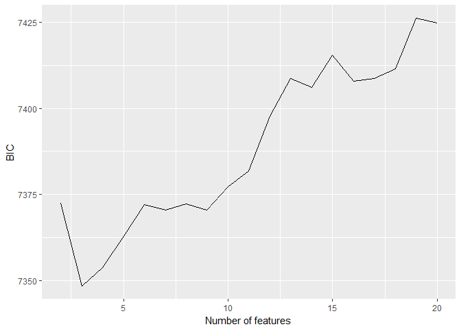
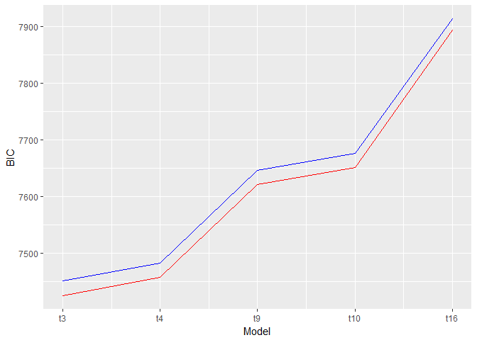
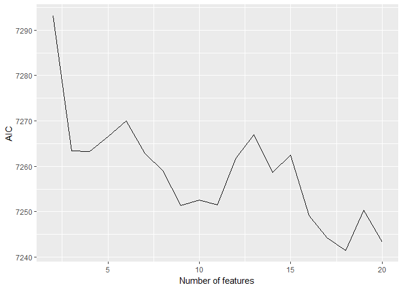
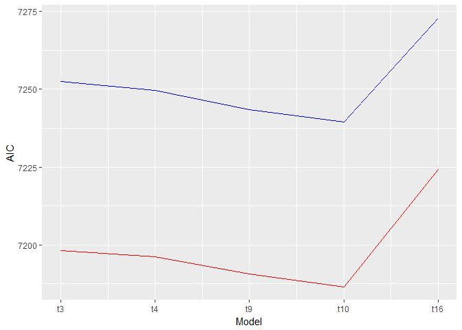

MAPSS Thesis II - Game Characteristics and Player Personality
================
Chih-Yu Chiang
July 17, 2017

``` r
knitr::opts_chunk$set(
    message = FALSE,
    warning = FALSE
)
```

Setup
-----

Data of game and player are read in and matched up.

-   Game release data, `release` (year), is read in as an interval variable.
-   Missing values are imputed with variable mean conveniently (`star_user` and `star_GS`).

``` r
#--Package
library(tidyverse)
library(modelr)
library(glmnet)
library(randomForest)
library(car)
library(rlist)
library(pander)
set.seed(1)


#--Read in
#Core game info and group distance/probability data
core_cluster <- read_csv("../data/core_cluster.csv", col_names=TRUE) %>%
  mutate(group_survey = factor(group_survey),
         group_review = factor(group_review),
         core_id = factor(core_id)) %>%
  select(-X1)

#Core game tste scores (of dif numbers of features)
core_tsteScore <- read_csv("../data/tste_concat.csv", col_names=TRUE) %>%
  select(-X1)

#Player-related survey data
survey <- read_csv("../data/survey.csv", col_names=TRUE) %>%
  mutate(race = factor(race),
         sex = factor(sex),
         core_id = factor(core_id)) %>%
  select(-id)


#--Impute missing with mean
imputation_mean <- function(c){
  c[is.na(c)] <- mean(c, na.rm=TRUE)
  return(c)
}
core_cluster <- mutate_each(core_cluster,
                            funs(imputation_mean(.)),
                            star_user, star_GS)


#--Match up
#Main df, key=player-game
df <- bind_cols(core_cluster, core_tsteScore) %>%
  left_join(survey, by=c("core_id"), copy=FALSE)

#Player df, key=player
df_player <- distinct(df, respondent, .keep_all = TRUE)
```

Variable
--------

Compute and select variables to be used in models.

-   Player preference:

| Name           | Definition                 | Unit                        |
|----------------|----------------------------|-----------------------------|
| `preference_1` | how much do you like       | Likert 1-7=like             |
| `preference_2` | how often play it          | ordinary 1=never-7=everyday |
| `preference_3` | does it fit personal taste | Likert 1-7=fit              |

-   Game characteristics:

<table style="width:36%;">
<colgroup>
<col width="8%" />
<col width="18%" />
<col width="9%" />
</colgroup>
<thead>
<tr class="header">
<th>Name</th>
<th>Definition</th>
<th>Unit</th>
</tr>
</thead>
<tbody>
<tr class="odd">
<td><code>distance_survey_mean_x</code></td>
<td>group score from survey (distance from group mean in tste)</td>
<td>cosine distance</td>
</tr>
<tr class="even">
<td><code>distance_survey_median_x</code></td>
<td>group score from survey (distance from group median in tste)</td>
<td>cosine distance</td>
</tr>
<tr class="odd">
<td><code>probability_review_mean_x</code></td>
<td>group score from review (mean probability to be categorized in the group by NN)</td>
<td>percentage</td>
</tr>
<tr class="even">
<td><code>probability_review_median_x</code></td>
<td>group score from review (median probability to be categorized in the group by NN)</td>
<td>percentage</td>
</tr>
<tr class="odd">
<td><code>group_survey</code></td>
<td>group identity from survey</td>
<td>categorical 1-group number</td>
</tr>
<tr class="even">
<td><code>group_review</code></td>
<td>group identity from review</td>
<td>categorical 1-group number</td>
</tr>
<tr class="odd">
<td><code>tste_n_x</code></td>
<td>group score from survey (tste), n=number of features</td>
<td>interval arbitrary</td>
</tr>
</tbody>
</table>

-   Player personality:

<table style="width:36%;">
<colgroup>
<col width="8%" />
<col width="18%" />
<col width="9%" />
</colgroup>
<thead>
<tr class="header">
<th>Name</th>
<th>Definition</th>
<th>Unit</th>
</tr>
</thead>
<tbody>
<tr class="odd">
<td><code>game_xxxxx</code></td>
<td>Big-five personality in game</td>
<td>Likert 1-7</td>
</tr>
<tr class="even">
<td><code>real_xxxxx</code></td>
<td>Big-five personality in real life</td>
<td>Likert 1-7</td>
</tr>
<tr class="odd">
<td><code>gap_xxxxx</code></td>
<td>personality gap (game - real)</td>
<td>Likert 1-7</td>
</tr>
<tr class="even">
<td><code>satis_xxxxx</code></td>
<td>SDT satisfaction in real life</td>
<td>Likert 1-7</td>
</tr>
<tr class="odd">
<td><code>dissatis_xxxxx</code></td>
<td>SDT dissatisfaction in real life</td>
<td>Likert 1-7</td>
</tr>
<tr class="even">
<td><code>combined_xxxxx</code></td>
<td>SDT combined (previous two) dissatisfaction in real life</td>
<td>Likert 1-7</td>
</tr>
</tbody>
</table>

-   Control:

| Name        | Definition                                    | Unit                      |
|-------------|-----------------------------------------------|---------------------------|
| `age`       | player age                                    | interval                  |
| `education` | player education                              | ordinary 1-7=PhD          |
| `income`    | player annual household income                | ordinary 1-7=over 150,000 |
| `sex`       | player sex                                    | categorical 1=male        |
| `race`      | player race                                   | categorical 1-5           |
| `release`   | game release year                             | interval year             |
| `star_GS`   | general game quality rated by GameSpot expert | interval 0-10             |
| `star_user` | general game quality rated by GameSpot user   | interval 0-10             |

``` r
updateVars <- function(){
  #--Create response variable
  df <<- df %>%
    rowwise() %>% 
    mutate(preference = mean(c(preference_1)))
  
  
  #--Compute personalty gap
  df <<- mutate(df,
                gap_extraversion = game_extraversion - real_extraversion,
                gap_agreeableness = game_agreeableness - real_agreeableness,
                gap_conscientiousness = game_conscientiousness - real_conscientiousness,
                gap_emotionstability = game_emotionstability - real_emotionstability,
                gap_openness = game_openness - real_openness)
  
  
  #--Acquire player df, key=player
  df_player <<- distinct(df, respondent, .keep_all=TRUE)
  
  
  #--Select variables to be included in regression (model formation)
  #Sets of predictor variables from file
  predictors <<- read.csv("../data/vars/predictors.csv", header=TRUE, na.strings="")
  
  #Get column name as model id
  modelId <<- colnames(predictors)
  
  #predictor variable as strings for each model
  predictorString <<- apply(predictors, MARGIN=2, function(x) paste(na.omit(x), collapse="+"))
  
  #Make the dfs into a data frame
  dfs <<- data.frame(predictorString, modelId, stringsAsFactors=FALSE) %>%
    mutate(df_x = map(predictorString, ~ model.matrix(as.formula(paste("preference ~ ", .x, sep="")), data=df)[, -1])) %>% #df with only predictor variables; [, -1] used to remove redundant intercept column
    mutate(df_yx = map(df_x, ~ bind_cols(select(df, preference), data.frame(.x)))) #df also with outcome variables
  
  #Set row names for reference
  row.names(dfs) <<- modelId
}
```

Model
-----


-   preference measurement = "how much do you like?"

``` r
#Update vars
updateVars()

#Full df with control marked
df_c <- mutate(df,
               c_age = age,
               c_education = education,
               c_income = income,
               c_race = race,
               c_sex = sex,
               c_release = release,
               c_star = star_user)

#Partial models
featureNo <- seq(2, 20)
model_gChar_tstes <- map(featureNo, ~ lm(preference ~ ., data=select(df_c, preference, starts_with("c_"), starts_with(paste("tste_", .x, "_", sep="")))))

#Full models
dfs$model_lm <- map(dfs$df_yx, ~ lm(preference ~ ., data=.x))
```

Information criteria
--------------------

### preference ~ tste scores

``` r
#--BIC
#gap ~ tstes
BICs <- unlist(map(model_gChar_tstes, BIC))

ggplot(data=as.data.frame(BICs)) +
  geom_line(mapping=aes(seq(2, 20), BICs)) +
  labs(x="Number of features", y="BIC")
```



``` r
#lm models
dfs$BIC <- unlist(map(dfs$model_lm, BIC))

ggplot() +
  geom_line(data=slice(dfs, 1:5), mapping=aes(seq(1, 5), BIC), color="red") +
  geom_line(data=slice(dfs, 6:10), mapping=aes(seq(1, 5), BIC), color="blue") +
  labs(x="Model", y="BIC") +
  scale_x_continuous(breaks=seq(1, 5), labels=c("t3", "t4", "t9", "t10", "t16"))
```



``` r
#--AIC
#gap ~ tstes
AICs <- unlist(map(model_gChar_tstes, AIC))

ggplot(data=as.data.frame(AICs)) +
  geom_line(mapping=aes(seq(2, 20), AICs)) +
  labs(x="Number of features", y="AIC")
```



### preference ~ tste scores + gap + interaction

-   red lines: control real personality
-   blue lines: do not control real personality

``` r
#--BIC
dfs$BIC <- unlist(map(dfs$model_lm, BIC))

ggplot() +
  geom_line(data=slice(dfs, 1:5), mapping=aes(seq(1, 5), BIC), color="red") +
  geom_line(data=slice(dfs, 6:10), mapping=aes(seq(1, 5), BIC), color="blue") +
  labs(x="Model", y="BIC") +
  scale_x_continuous(breaks=seq(1, 5), labels=c("t3", "t4", "t9", "t10", "t16"))
```


``` r
#--AIC
dfs$AIC <- unlist(map(dfs$model_lm, AIC))

ggplot() +
  geom_line(data=slice(dfs, 1:5), mapping=aes(seq(1, 5), AIC), color="red") +
  geom_line(data=slice(dfs, 6:10), mapping=aes(seq(1, 5), AIC), color="blue") +
  labs(x="Model", y="AIC") +
  scale_x_continuous(breaks=seq(1, 5), labels=c("t3", "t4", "t9", "t10", "t16"))
```



Model summaries
---------------

``` r
#Summary
for(model in dfs$model_lm) print(summary(model))
```

    ## 
    ## Call:
    ## lm(formula = preference ~ ., data = .x)
    ## 
    ## Residuals:
    ##     Min      1Q  Median      3Q     Max 
    ## -5.4346 -0.5566  0.2664  0.8997  2.2858 
    ## 
    ## Coefficients:
    ##                                  Estimate Std. Error t value Pr(>|t|)    
    ## (Intercept)                    30.4387962 12.5087237   2.433 0.015041 *  
    ## age                            -0.0146674  0.0041019  -3.576 0.000357 ***
    ## education                       0.0061872  0.0236411   0.262 0.793568    
    ## income                          0.0024906  0.0153100   0.163 0.870790    
    ## race2                          -0.0752157  0.1172183  -0.642 0.521156    
    ## race4                          -0.3670031  0.1258093  -2.917 0.003570 ** 
    ## race6                          -1.0105233  0.3141727  -3.216 0.001318 ** 
    ## race7                          -0.0589772  0.1216389  -0.485 0.627830    
    ## sex2                           -0.0241558  0.0644705  -0.375 0.707936    
    ## release                        -0.0129376  0.0061341  -2.109 0.035051 *  
    ## star_user                       0.0942705  0.0464709   2.029 0.042626 *  
    ## real_extraversion               0.0266599  0.0223145   1.195 0.232326    
    ## real_agreeableness             -0.0002897  0.0277633  -0.010 0.991676    
    ## real_conscientiousness          0.1039788  0.0309588   3.359 0.000797 ***
    ## real_emotionstability          -0.0555330  0.0306163  -1.814 0.069845 .  
    ## real_openness                   0.0865912  0.0296494   2.921 0.003532 ** 
    ## gap_extraversion                0.0213345  0.0232557   0.917 0.359044    
    ## gap_agreeableness               0.0106410  0.0301589   0.353 0.724251    
    ## gap_conscientiousness           0.0307907  0.0355624   0.866 0.386687    
    ## gap_emotionstability           -0.0117343  0.0282720  -0.415 0.678149    
    ## gap_openness                   -0.0109464  0.0387219  -0.283 0.777441    
    ## tste_3_0                       -0.0559113  0.0478393  -1.169 0.242645    
    ## tste_3_1                        0.1967232  0.0391318   5.027  5.4e-07 ***
    ## tste_3_2                        0.1751881  0.0540127   3.243 0.001199 ** 
    ## gap_extraversion.tste_3_0       0.0319348  0.0237137   1.347 0.178227    
    ## gap_extraversion.tste_3_1       0.0044303  0.0194551   0.228 0.819887    
    ## gap_extraversion.tste_3_2      -0.0067092  0.0291115  -0.230 0.817752    
    ## gap_agreeableness.tste_3_0      0.0552614  0.0332971   1.660 0.097134 .  
    ## gap_agreeableness.tste_3_1     -0.0370709  0.0264108  -1.404 0.160578    
    ## gap_agreeableness.tste_3_2      0.0676271  0.0401185   1.686 0.092005 .  
    ## gap_conscientiousness.tste_3_0  0.0118242  0.0379574   0.312 0.755442    
    ## gap_conscientiousness.tste_3_1  0.0200847  0.0306304   0.656 0.512081    
    ## gap_conscientiousness.tste_3_2  0.0373401  0.0455074   0.821 0.412008    
    ## gap_emotionstability.tste_3_0   0.0635807  0.0302270   2.103 0.035546 *  
    ## gap_emotionstability.tste_3_1   0.0666930  0.0239866   2.780 0.005477 ** 
    ## gap_emotionstability.tste_3_2  -0.0340787  0.0366126  -0.931 0.352068    
    ## gap_openness.tste_3_0           0.0100069  0.0376613   0.266 0.790490    
    ## gap_openness.tste_3_1           0.0110873  0.0305050   0.363 0.716299    
    ## gap_openness.tste_3_2           0.0497472  0.0447641   1.111 0.266558    
    ## ---
    ## Signif. codes:  0 '***' 0.001 '**' 0.01 '*' 0.05 '.' 0.1 ' ' 1
    ## 
    ## Residual standard error: 1.29 on 2099 degrees of freedom
    ## Multiple R-squared:  0.09618,    Adjusted R-squared:  0.07981 
    ## F-statistic: 5.878 on 38 and 2099 DF,  p-value: < 2.2e-16
    ## 
    ## 
    ## Call:
    ## lm(formula = preference ~ ., data = .x)
    ## 
    ## Residuals:
    ##     Min      1Q  Median      3Q     Max 
    ## -5.4730 -0.5479  0.2668  0.8966  2.3682 
    ## 
    ## Coefficients:
    ##                                  Estimate Std. Error t value Pr(>|t|)    
    ## (Intercept)                    33.9406266 12.6468120   2.684 0.007338 ** 
    ## age                            -0.0141386  0.0041000  -3.448 0.000575 ***
    ## education                       0.0090299  0.0236357   0.382 0.702468    
    ## income                          0.0006252  0.0152917   0.041 0.967393    
    ## race2                          -0.0681203  0.1172961  -0.581 0.561468    
    ## race4                          -0.3688956  0.1256675  -2.935 0.003367 ** 
    ## race6                          -1.0574419  0.3144872  -3.362 0.000786 ***
    ## race7                          -0.0607506  0.1214885  -0.500 0.617091    
    ## sex2                           -0.0287796  0.0644466  -0.447 0.655236    
    ## release                        -0.0145561  0.0061944  -2.350 0.018871 *  
    ## star_user                       0.0622588  0.0489629   1.272 0.203674    
    ## real_extraversion               0.0270715  0.0222887   1.215 0.224661    
    ## real_agreeableness              0.0003529  0.0278193   0.013 0.989881    
    ## real_conscientiousness          0.1050301  0.0309517   3.393 0.000703 ***
    ## real_emotionstability          -0.0542173  0.0306620  -1.768 0.077169 .  
    ## real_openness                   0.0839474  0.0296448   2.832 0.004673 ** 
    ## gap_extraversion                0.0173566  0.0232976   0.745 0.456358    
    ## gap_agreeableness               0.0116469  0.0301852   0.386 0.699648    
    ## gap_conscientiousness           0.0343143  0.0357233   0.961 0.336886    
    ## gap_emotionstability           -0.0147372  0.0283933  -0.519 0.603790    
    ## gap_openness                   -0.0096556  0.0386951  -0.250 0.802975    
    ## tste_4_0                        0.1589652  0.0526022   3.022 0.002541 ** 
    ## tste_4_1                        0.0674604  0.0596385   1.131 0.258120    
    ## tste_4_2                        0.0701959  0.0457756   1.533 0.125310    
    ## tste_4_3                       -0.1951116  0.0428981  -4.548 5.72e-06 ***
    ## gap_extraversion.tste_4_0       0.0078202  0.0283739   0.276 0.782873    
    ## gap_extraversion.tste_4_1      -0.0713250  0.0295020  -2.418 0.015707 *  
    ## gap_extraversion.tste_4_2       0.0261966  0.0234459   1.117 0.263986    
    ## gap_extraversion.tste_4_3      -0.0128656  0.0201928  -0.637 0.524105    
    ## gap_agreeableness.tste_4_0      0.0733019  0.0391828   1.871 0.061516 .  
    ## gap_agreeableness.tste_4_1      0.0100100  0.0424877   0.236 0.813767    
    ## gap_agreeableness.tste_4_2      0.0341104  0.0330320   1.033 0.301888    
    ## gap_agreeableness.tste_4_3      0.0568274  0.0271800   2.091 0.036668 *  
    ## gap_conscientiousness.tste_4_0 -0.0003130  0.0439753  -0.007 0.994323    
    ## gap_conscientiousness.tste_4_1  0.0579513  0.0472799   1.226 0.220447    
    ## gap_conscientiousness.tste_4_2  0.0138014  0.0369676   0.373 0.708934    
    ## gap_conscientiousness.tste_4_3  0.0168902  0.0321960   0.525 0.599913    
    ## gap_emotionstability.tste_4_0  -0.0357622  0.0360623  -0.992 0.321469    
    ## gap_emotionstability.tste_4_1   0.0135392  0.0362397   0.374 0.708739    
    ## gap_emotionstability.tste_4_2   0.0856000  0.0299246   2.861 0.004271 ** 
    ## gap_emotionstability.tste_4_3  -0.0230260  0.0246550  -0.934 0.350449    
    ## gap_openness.tste_4_0           0.0452479  0.0446024   1.014 0.310474    
    ## gap_openness.tste_4_1           0.1140901  0.0445385   2.562 0.010488 *  
    ## gap_openness.tste_4_2           0.0164714  0.0371358   0.444 0.657418    
    ## gap_openness.tste_4_3           0.0250857  0.0316987   0.791 0.428812    
    ## ---
    ## Signif. codes:  0 '***' 0.001 '**' 0.01 '*' 0.05 '.' 0.1 ' ' 1
    ## 
    ## Residual standard error: 1.288 on 2093 degrees of freedom
    ## Multiple R-squared:  0.1021, Adjusted R-squared:  0.0832 
    ## F-statistic: 5.408 on 44 and 2093 DF,  p-value: < 2.2e-16
    ## 
    ## 
    ## Call:
    ## lm(formula = preference ~ ., data = .x)
    ## 
    ## Residuals:
    ##     Min      1Q  Median      3Q     Max 
    ## -5.4425 -0.5477  0.2569  0.8676  2.6623 
    ## 
    ## Coefficients:
    ##                                  Estimate Std. Error t value Pr(>|t|)    
    ## (Intercept)                    29.1409507 14.1568489   2.058 0.039674 *  
    ## age                            -0.0150108  0.0040866  -3.673 0.000246 ***
    ## education                       0.0112759  0.0235656   0.478 0.632353    
    ## income                          0.0027370  0.0152943   0.179 0.857989    
    ## race2                          -0.0981074  0.1168565  -0.840 0.401256    
    ## race4                          -0.3534396  0.1257338  -2.811 0.004985 ** 
    ## race6                          -0.9077295  0.3177390  -2.857 0.004322 ** 
    ## race7                          -0.0647778  0.1221662  -0.530 0.596000    
    ## sex2                           -0.0451414  0.0642764  -0.702 0.482570    
    ## release                        -0.0122055  0.0069435  -1.758 0.078926 .  
    ## star_user                       0.0774544  0.0537216   1.442 0.149518    
    ## real_extraversion               0.0331185  0.0222529   1.488 0.136830    
    ## real_agreeableness             -0.0061101  0.0277322  -0.220 0.825639    
    ## real_conscientiousness          0.1064663  0.0309053   3.445 0.000583 ***
    ## real_emotionstability          -0.0498053  0.0305876  -1.628 0.103617    
    ## real_openness                   0.0735290  0.0295906   2.485 0.013038 *  
    ## gap_extraversion                0.0239053  0.0232932   1.026 0.304881    
    ## gap_agreeableness               0.0048013  0.0302811   0.159 0.874033    
    ## gap_conscientiousness           0.0408037  0.0359203   1.136 0.256110    
    ## gap_emotionstability           -0.0146933  0.0284049  -0.517 0.605014    
    ## gap_openness                   -0.0208631  0.0388256  -0.537 0.591080    
    ## tste_9_0                       -0.0833852  0.0593731  -1.404 0.160342    
    ## tste_9_1                        0.0168813  0.0546833   0.309 0.757573    
    ## tste_9_2                       -0.2805180  0.0554089  -5.063  4.5e-07 ***
    ## tste_9_3                       -0.1007625  0.0616442  -1.635 0.102289    
    ## tste_9_4                       -0.0000470  0.0489773  -0.001 0.999234    
    ## tste_9_5                       -0.0111640  0.0636281  -0.175 0.860738    
    ## tste_9_6                        0.0255021  0.0570133   0.447 0.654705    
    ## tste_9_7                       -0.0639040  0.0572965  -1.115 0.264842    
    ## tste_9_8                       -0.0458959  0.0508356  -0.903 0.366722    
    ## gap_extraversion.tste_9_0      -0.0309196  0.0296989  -1.041 0.297950    
    ## gap_extraversion.tste_9_1       0.0258767  0.0283184   0.914 0.360941    
    ## gap_extraversion.tste_9_2       0.0020995  0.0283317   0.074 0.940935    
    ## gap_extraversion.tste_9_3       0.0687974  0.0294196   2.338 0.019457 *  
    ## gap_extraversion.tste_9_4      -0.0358624  0.0236476  -1.517 0.129537    
    ## gap_extraversion.tste_9_5       0.0254989  0.0310844   0.820 0.412132    
    ## gap_extraversion.tste_9_6      -0.0301703  0.0281960  -1.070 0.284735    
    ## gap_extraversion.tste_9_7       0.0113937  0.0301077   0.378 0.705149    
    ## gap_extraversion.tste_9_8      -0.0014377  0.0253594  -0.057 0.954796    
    ## gap_agreeableness.tste_9_0      0.0662277  0.0445432   1.487 0.137216    
    ## gap_agreeableness.tste_9_1      0.0257305  0.0392711   0.655 0.512410    
    ## gap_agreeableness.tste_9_2     -0.0005011  0.0392391  -0.013 0.989813    
    ## gap_agreeableness.tste_9_3      0.0103121  0.0432533   0.238 0.811585    
    ## gap_agreeableness.tste_9_4     -0.0362441  0.0342158  -1.059 0.289596    
    ## gap_agreeableness.tste_9_5     -0.0552016  0.0438287  -1.259 0.207997    
    ## gap_agreeableness.tste_9_6     -0.0551493  0.0372006  -1.482 0.138365    
    ## gap_agreeableness.tste_9_7      0.0172494  0.0421486   0.409 0.682397    
    ## gap_agreeableness.tste_9_8      0.0696315  0.0349203   1.994 0.046282 *  
    ## gap_conscientiousness.tste_9_0  0.0424187  0.0483736   0.877 0.380644    
    ## gap_conscientiousness.tste_9_1 -0.0715708  0.0444887  -1.609 0.107826    
    ## gap_conscientiousness.tste_9_2 -0.0342922  0.0448149  -0.765 0.444242    
    ## gap_conscientiousness.tste_9_3 -0.0433309  0.0492382  -0.880 0.378948    
    ## gap_conscientiousness.tste_9_4  0.0029041  0.0385248   0.075 0.939918    
    ## gap_conscientiousness.tste_9_5 -0.1546133  0.0518372  -2.983 0.002891 ** 
    ## gap_conscientiousness.tste_9_6  0.0499162  0.0442153   1.129 0.259057    
    ## gap_conscientiousness.tste_9_7  0.0314883  0.0474446   0.664 0.506965    
    ## gap_conscientiousness.tste_9_8  0.0841577  0.0413847   2.034 0.042125 *  
    ## gap_emotionstability.tste_9_0   0.0160394  0.0377909   0.424 0.671300    
    ## gap_emotionstability.tste_9_1   0.0401224  0.0354292   1.132 0.257570    
    ## gap_emotionstability.tste_9_2   0.0194104  0.0352871   0.550 0.582329    
    ## gap_emotionstability.tste_9_3  -0.0296784  0.0370792  -0.800 0.423568    
    ## gap_emotionstability.tste_9_4  -0.0729946  0.0309827  -2.356 0.018567 *  
    ## gap_emotionstability.tste_9_5   0.0143854  0.0390486   0.368 0.712615    
    ## gap_emotionstability.tste_9_6  -0.0037408  0.0345803  -0.108 0.913866    
    ## gap_emotionstability.tste_9_7   0.0516417  0.0372123   1.388 0.165360    
    ## gap_emotionstability.tste_9_8  -0.1016560  0.0318542  -3.191 0.001438 ** 
    ## gap_openness.tste_9_0          -0.0288759  0.0492071  -0.587 0.557387    
    ## gap_openness.tste_9_1           0.0521119  0.0446969   1.166 0.243791    
    ## gap_openness.tste_9_2          -0.0236446  0.0436817  -0.541 0.588365    
    ## gap_openness.tste_9_3          -0.1033608  0.0466124  -2.217 0.026701 *  
    ## gap_openness.tste_9_4          -0.0201641  0.0385231  -0.523 0.600732    
    ## gap_openness.tste_9_5           0.0784715  0.0495618   1.583 0.113505    
    ## gap_openness.tste_9_6           0.0300399  0.0435577   0.690 0.490487    
    ## gap_openness.tste_9_7          -0.0633184  0.0458038  -1.382 0.167003    
    ## gap_openness.tste_9_8          -0.0130908  0.0399700  -0.328 0.743311    
    ## ---
    ## Signif. codes:  0 '***' 0.001 '**' 0.01 '*' 0.05 '.' 0.1 ' ' 1
    ## 
    ## Residual standard error: 1.278 on 2063 degrees of freedom
    ## Multiple R-squared:  0.1291, Adjusted R-squared:  0.0979 
    ## F-statistic: 4.134 on 74 and 2063 DF,  p-value: < 2.2e-16
    ## 
    ## 
    ## Call:
    ## lm(formula = preference ~ ., data = .x)
    ## 
    ## Residuals:
    ##     Min      1Q  Median      3Q     Max 
    ## -5.3544 -0.5389  0.2541  0.8622  2.7435 
    ## 
    ## Coefficients:
    ##                                   Estimate Std. Error t value Pr(>|t|)    
    ## (Intercept)                     28.3585610 13.8818439   2.043 0.041194 *  
    ## age                             -0.0150241  0.0040807  -3.682 0.000238 ***
    ## education                        0.0128621  0.0235618   0.546 0.585200    
    ## income                           0.0004816  0.0152735   0.032 0.974846    
    ## race2                           -0.0830698  0.1169394  -0.710 0.477558    
    ## race4                           -0.3534688  0.1257927  -2.810 0.005002 ** 
    ## race6                           -0.9010499  0.3170162  -2.842 0.004523 ** 
    ## race7                           -0.0561855  0.1219411  -0.461 0.645020    
    ## sex2                            -0.0443381  0.0642433  -0.690 0.490172    
    ## release                         -0.0118661  0.0068173  -1.741 0.081909 .  
    ## star_user                        0.0961694  0.0525482   1.830 0.067377 .  
    ## real_extraversion                0.0284528  0.0222458   1.279 0.201033    
    ## real_agreeableness               0.0002050  0.0278263   0.007 0.994122    
    ## real_conscientiousness           0.1017781  0.0308547   3.299 0.000988 ***
    ## real_emotionstability           -0.0607664  0.0306175  -1.985 0.047311 *  
    ## real_openness                    0.0740274  0.0295141   2.508 0.012211 *  
    ## gap_extraversion                 0.0241480  0.0232654   1.038 0.299422    
    ## gap_agreeableness                0.0081142  0.0303448   0.267 0.789189    
    ## gap_conscientiousness            0.0359890  0.0357601   1.006 0.314340    
    ## gap_emotionstability            -0.0184699  0.0283884  -0.651 0.515369    
    ## gap_openness                    -0.0239213  0.0387488  -0.617 0.537077    
    ## tste_10_0                        0.0661151  0.0504145   1.311 0.189859    
    ## tste_10_1                        0.1331264  0.0546151   2.438 0.014872 *  
    ## tste_10_2                       -0.1878318  0.0595477  -3.154 0.001632 ** 
    ## tste_10_3                       -0.1234456  0.0587574  -2.101 0.035768 *  
    ## tste_10_4                       -0.0176819  0.0592883  -0.298 0.765553    
    ## tste_10_5                        0.0292978  0.0555253   0.528 0.597801    
    ## tste_10_6                       -0.1114288  0.0579985  -1.921 0.054840 .  
    ## tste_10_7                        0.0458521  0.0494533   0.927 0.353941    
    ## tste_10_8                        0.0424689  0.0647503   0.656 0.511970    
    ## tste_10_9                        0.1338590  0.0551319   2.428 0.015268 *  
    ## gap_extraversion.tste_10_0      -0.0191855  0.0253816  -0.756 0.449806    
    ## gap_extraversion.tste_10_1       0.0102194  0.0277235   0.369 0.712451    
    ## gap_extraversion.tste_10_2       0.0322506  0.0307288   1.050 0.294060    
    ## gap_extraversion.tste_10_3      -0.0514819  0.0299282  -1.720 0.085550 .  
    ## gap_extraversion.tste_10_4      -0.0035517  0.0297662  -0.119 0.905035    
    ## gap_extraversion.tste_10_5       0.0046860  0.0287863   0.163 0.870704    
    ## gap_extraversion.tste_10_6       0.0499612  0.0276599   1.806 0.071023 .  
    ## gap_extraversion.tste_10_7       0.0345162  0.0252152   1.369 0.171191    
    ## gap_extraversion.tste_10_8       0.0212186  0.0313981   0.676 0.499248    
    ## gap_extraversion.tste_10_9       0.0018189  0.0289044   0.063 0.949829    
    ## gap_agreeableness.tste_10_0     -0.0329442  0.0352211  -0.935 0.349715    
    ## gap_agreeableness.tste_10_1     -0.0490771  0.0388377  -1.264 0.206501    
    ## gap_agreeableness.tste_10_2      0.0196964  0.0433721   0.454 0.649786    
    ## gap_agreeableness.tste_10_3      0.0660024  0.0410828   1.607 0.108302    
    ## gap_agreeableness.tste_10_4     -0.0250403  0.0414777  -0.604 0.546106    
    ## gap_agreeableness.tste_10_5     -0.0366839  0.0412884  -0.888 0.374386    
    ## gap_agreeableness.tste_10_6      0.0025987  0.0402498   0.065 0.948527    
    ## gap_agreeableness.tste_10_7      0.0967325  0.0362671   2.667 0.007708 ** 
    ## gap_agreeableness.tste_10_8     -0.0463901  0.0438803  -1.057 0.290546    
    ## gap_agreeableness.tste_10_9      0.0008520  0.0412995   0.021 0.983543    
    ## gap_conscientiousness.tste_10_0  0.0257440  0.0408357   0.630 0.528484    
    ## gap_conscientiousness.tste_10_1  0.0406882  0.0452268   0.900 0.368413    
    ## gap_conscientiousness.tste_10_2  0.0423792  0.0498396   0.850 0.395251    
    ## gap_conscientiousness.tste_10_3  0.0725660  0.0463202   1.567 0.117358    
    ## gap_conscientiousness.tste_10_4  0.0675233  0.0480804   1.404 0.160356    
    ## gap_conscientiousness.tste_10_5 -0.0819109  0.0475191  -1.724 0.084904 .  
    ## gap_conscientiousness.tste_10_6 -0.1268578  0.0435223  -2.915 0.003598 ** 
    ## gap_conscientiousness.tste_10_7  0.0393595  0.0403082   0.976 0.328949    
    ## gap_conscientiousness.tste_10_8 -0.1161873  0.0510513  -2.276 0.022955 *  
    ## gap_conscientiousness.tste_10_9  0.0186152  0.0454006   0.410 0.681832    
    ## gap_emotionstability.tste_10_0   0.0236037  0.0327766   0.720 0.471522    
    ## gap_emotionstability.tste_10_1   0.0174808  0.0340024   0.514 0.607234    
    ## gap_emotionstability.tste_10_2   0.0494945  0.0391139   1.265 0.205874    
    ## gap_emotionstability.tste_10_3   0.0286212  0.0361530   0.792 0.428646    
    ## gap_emotionstability.tste_10_4   0.0751692  0.0367984   2.043 0.041207 *  
    ## gap_emotionstability.tste_10_5   0.0141995  0.0359181   0.395 0.692639    
    ## gap_emotionstability.tste_10_6   0.0009352  0.0350687   0.027 0.978728    
    ## gap_emotionstability.tste_10_7  -0.0189097  0.0322221  -0.587 0.557365    
    ## gap_emotionstability.tste_10_8   0.1257339  0.0393350   3.196 0.001412 ** 
    ## gap_emotionstability.tste_10_9   0.0950751  0.0371926   2.556 0.010651 *  
    ## gap_openness.tste_10_0          -0.0683892  0.0394775  -1.732 0.083360 .  
    ## gap_openness.tste_10_1           0.0281969  0.0438794   0.643 0.520555    
    ## gap_openness.tste_10_2          -0.0435310  0.0465749  -0.935 0.350081    
    ## gap_openness.tste_10_3           0.0221862  0.0479095   0.463 0.643351    
    ## gap_openness.tste_10_4           0.0299966  0.0474994   0.632 0.527775    
    ## gap_openness.tste_10_5           0.0488642  0.0458509   1.066 0.286675    
    ## gap_openness.tste_10_6          -0.1037936  0.0438705  -2.366 0.018078 *  
    ## gap_openness.tste_10_7          -0.0503039  0.0405412  -1.241 0.214817    
    ## gap_openness.tste_10_8           0.1217330  0.0503145   2.419 0.015631 *  
    ## gap_openness.tste_10_9           0.0767403  0.0461496   1.663 0.096493 .  
    ## ---
    ## Signif. codes:  0 '***' 0.001 '**' 0.01 '*' 0.05 '.' 0.1 ' ' 1
    ## 
    ## Residual standard error: 1.275 on 2057 degrees of freedom
    ## Multiple R-squared:  0.1357, Adjusted R-squared:  0.1021 
    ## F-statistic: 4.038 on 80 and 2057 DF,  p-value: < 2.2e-16
    ## 
    ## 
    ## Call:
    ## lm(formula = preference ~ ., data = .x)
    ## 
    ## Residuals:
    ##     Min      1Q  Median      3Q     Max 
    ## -5.3095 -0.5315  0.2733  0.8309  2.7483 
    ## 
    ## Coefficients:
    ##                                    Estimate Std. Error t value Pr(>|t|)   
    ## (Intercept)                       2.3537467 15.8875953   0.148  0.88224   
    ## age                              -0.0133102  0.0041226  -3.229  0.00126 **
    ## education                         0.0144292  0.0237328   0.608  0.54327   
    ## income                            0.0045203  0.0154175   0.293  0.76941   
    ## race2                            -0.0615625  0.1177539  -0.523  0.60117   
    ## race4                            -0.3519894  0.1260480  -2.793  0.00528 **
    ## race6                            -0.8830927  0.3271476  -2.699  0.00700 **
    ## race7                            -0.0463212  0.1230491  -0.376  0.70663   
    ## sex2                             -0.0365368  0.0648462  -0.563  0.57320   
    ## release                           0.0010168  0.0077941   0.130  0.89622   
    ## star_user                         0.1007369  0.0561265   1.795  0.07283 . 
    ## real_extraversion                 0.0308498  0.0224390   1.375  0.16934   
    ## real_agreeableness                0.0028211  0.0279911   0.101  0.91973   
    ## real_conscientiousness            0.1017356  0.0312041   3.260  0.00113 **
    ## real_emotionstability            -0.0534402  0.0309439  -1.727  0.08432 . 
    ## real_openness                     0.0722042  0.0297505   2.427  0.01531 * 
    ## gap_extraversion                  0.0233150  0.0236590   0.985  0.32452   
    ## gap_agreeableness                 0.0007597  0.0306495   0.025  0.98023   
    ## gap_conscientiousness             0.0352402  0.0366405   0.962  0.33627   
    ## gap_emotionstability             -0.0127981  0.0286817  -0.446  0.65549   
    ## gap_openness                     -0.0359815  0.0394655  -0.912  0.36202   
    ## tste_16_0                         0.0561428  0.0552721   1.016  0.30987   
    ## tste_16_1                        -0.1089796  0.0553588  -1.969  0.04913 * 
    ## tste_16_2                        -0.0572137  0.0504304  -1.135  0.25672   
    ## tste_16_3                        -0.0379915  0.0523394  -0.726  0.46800   
    ## tste_16_4                        -0.1168850  0.0465572  -2.511  0.01213 * 
    ## tste_16_5                         0.1349389  0.0548272   2.461  0.01393 * 
    ## tste_16_6                         0.0702074  0.0490129   1.432  0.15218   
    ## tste_16_7                         0.0044166  0.0477766   0.092  0.92636   
    ## tste_16_8                        -0.0394957  0.0570739  -0.692  0.48901   
    ## tste_16_9                         0.1235121  0.0499418   2.473  0.01348 * 
    ## tste_16_10                       -0.0997721  0.0487061  -2.048  0.04064 * 
    ## tste_16_11                        0.1355569  0.0548319   2.472  0.01351 * 
    ## tste_16_12                       -0.0168228  0.0522017  -0.322  0.74728   
    ## tste_16_13                        0.0483425  0.0559894   0.863  0.38801   
    ## tste_16_14                        0.1252092  0.0513498   2.438  0.01484 * 
    ## tste_16_15                       -0.0016650  0.0563100  -0.030  0.97641   
    ## gap_extraversion.tste_16_0        0.0209953  0.0288914   0.727  0.46750   
    ## gap_extraversion.tste_16_1        0.0100127  0.0272334   0.368  0.71316   
    ## gap_extraversion.tste_16_2       -0.0223961  0.0248431  -0.902  0.36743   
    ## gap_extraversion.tste_16_3       -0.0657753  0.0268117  -2.453  0.01424 * 
    ## gap_extraversion.tste_16_4       -0.0080382  0.0236108  -0.340  0.73356   
    ## gap_extraversion.tste_16_5       -0.0086476  0.0280291  -0.309  0.75772   
    ## gap_extraversion.tste_16_6        0.0202631  0.0251289   0.806  0.42013   
    ## gap_extraversion.tste_16_7        0.0139990  0.0252830   0.554  0.57985   
    ## gap_extraversion.tste_16_8        0.0441293  0.0280197   1.575  0.11543   
    ## gap_extraversion.tste_16_9       -0.0240934  0.0257069  -0.937  0.34875   
    ## gap_extraversion.tste_16_10       0.0469746  0.0247838   1.895  0.05819 . 
    ## gap_extraversion.tste_16_11       0.0061783  0.0256564   0.241  0.80973   
    ## gap_extraversion.tste_16_12       0.0066712  0.0261008   0.256  0.79829   
    ## gap_extraversion.tste_16_13      -0.0305618  0.0278943  -1.096  0.27337   
    ## gap_extraversion.tste_16_14       0.0157514  0.0252003   0.625  0.53201   
    ## gap_extraversion.tste_16_15      -0.0056094  0.0286354  -0.196  0.84472   
    ## gap_agreeableness.tste_16_0      -0.0691543  0.0416336  -1.661  0.09686 . 
    ## gap_agreeableness.tste_16_1      -0.0244850  0.0388719  -0.630  0.52884   
    ## gap_agreeableness.tste_16_2       0.0083648  0.0356820   0.234  0.81468   
    ## gap_agreeableness.tste_16_3       0.0360260  0.0385982   0.933  0.35075   
    ## gap_agreeableness.tste_16_4       0.0051434  0.0323413   0.159  0.87366   
    ## gap_agreeableness.tste_16_5       0.0107153  0.0397616   0.269  0.78758   
    ## gap_agreeableness.tste_16_6       0.0069839  0.0380594   0.184  0.85442   
    ## gap_agreeableness.tste_16_7       0.0447040  0.0349620   1.279  0.20117   
    ## gap_agreeableness.tste_16_8      -0.0192212  0.0386827  -0.497  0.61932   
    ## gap_agreeableness.tste_16_9      -0.0186082  0.0367561  -0.506  0.61273   
    ## gap_agreeableness.tste_16_10     -0.0195240  0.0339216  -0.576  0.56497   
    ## gap_agreeableness.tste_16_11      0.0506568  0.0369423   1.371  0.17045   
    ## gap_agreeableness.tste_16_12      0.0581615  0.0376278   1.546  0.12233   
    ## gap_agreeableness.tste_16_13      0.0399706  0.0402860   0.992  0.32123   
    ## gap_agreeableness.tste_16_14     -0.0475751  0.0343802  -1.384  0.16657   
    ## gap_agreeableness.tste_16_15      0.0584162  0.0415415   1.406  0.15981   
    ## gap_conscientiousness.tste_16_0   0.0952170  0.0454017   2.097  0.03610 * 
    ## gap_conscientiousness.tste_16_1  -0.0122007  0.0434097  -0.281  0.77869   
    ## gap_conscientiousness.tste_16_2   0.1096901  0.0403243   2.720  0.00658 **
    ## gap_conscientiousness.tste_16_3  -0.0448403  0.0425931  -1.053  0.29258   
    ## gap_conscientiousness.tste_16_4  -0.0034844  0.0379524  -0.092  0.92686   
    ## gap_conscientiousness.tste_16_5   0.0029204  0.0438868   0.067  0.94695   
    ## gap_conscientiousness.tste_16_6  -0.0880684  0.0416476  -2.115  0.03459 * 
    ## gap_conscientiousness.tste_16_7   0.0701781  0.0408715   1.717  0.08612 . 
    ## gap_conscientiousness.tste_16_8  -0.0882811  0.0497983  -1.773  0.07642 . 
    ## gap_conscientiousness.tste_16_9   0.0590789  0.0403623   1.464  0.14343   
    ## gap_conscientiousness.tste_16_10 -0.0117217  0.0393767  -0.298  0.76598   
    ## gap_conscientiousness.tste_16_11  0.0928884  0.0424631   2.188  0.02882 * 
    ## gap_conscientiousness.tste_16_12  0.0315244  0.0443484   0.711  0.47727   
    ## gap_conscientiousness.tste_16_13  0.0572128  0.0448109   1.277  0.20183   
    ## gap_conscientiousness.tste_16_14  0.0035105  0.0382213   0.092  0.92683   
    ## gap_conscientiousness.tste_16_15  0.0196308  0.0465050   0.422  0.67298   
    ## gap_emotionstability.tste_16_0    0.0447330  0.0360244   1.242  0.21448   
    ## gap_emotionstability.tste_16_1    0.0412164  0.0342178   1.205  0.22853   
    ## gap_emotionstability.tste_16_2    0.0748802  0.0314354   2.382  0.01731 * 
    ## gap_emotionstability.tste_16_3    0.0324158  0.0337895   0.959  0.33750   
    ## gap_emotionstability.tste_16_4    0.0403366  0.0291282   1.385  0.16627   
    ## gap_emotionstability.tste_16_5   -0.0094169  0.0341460  -0.276  0.78274   
    ## gap_emotionstability.tste_16_6    0.0365631  0.0328920   1.112  0.26644   
    ## gap_emotionstability.tste_16_7    0.0554869  0.0322434   1.721  0.08543 . 
    ## gap_emotionstability.tste_16_8    0.0345609  0.0353107   0.979  0.32781   
    ## gap_emotionstability.tste_16_9   -0.0625193  0.0319488  -1.957  0.05050 . 
    ## gap_emotionstability.tste_16_10   0.0247108  0.0319261   0.774  0.43902   
    ## gap_emotionstability.tste_16_11   0.0146759  0.0322839   0.455  0.64945   
    ## gap_emotionstability.tste_16_12  -0.0280981  0.0333839  -0.842  0.40008   
    ## gap_emotionstability.tste_16_13  -0.0241039  0.0363124  -0.664  0.50690   
    ## gap_emotionstability.tste_16_14   0.0418090  0.0309456   1.351  0.17683   
    ## gap_emotionstability.tste_16_15  -0.0503463  0.0374557  -1.344  0.17905   
    ## gap_openness.tste_16_0            0.1088297  0.0457198   2.380  0.01739 * 
    ## gap_openness.tste_16_1            0.0334365  0.0419765   0.797  0.42580   
    ## gap_openness.tste_16_2            0.0648170  0.0400522   1.618  0.10575   
    ## gap_openness.tste_16_3            0.0767628  0.0417567   1.838  0.06616 . 
    ## gap_openness.tste_16_4            0.0123933  0.0372007   0.333  0.73906   
    ## gap_openness.tste_16_5           -0.0356431  0.0449880  -0.792  0.42829   
    ## gap_openness.tste_16_6            0.0531833  0.0411945   1.291  0.19684   
    ## gap_openness.tste_16_7            0.0551939  0.0397929   1.387  0.16559   
    ## gap_openness.tste_16_8            0.0344877  0.0453144   0.761  0.44670   
    ## gap_openness.tste_16_9           -0.0265790  0.0406895  -0.653  0.51369   
    ## gap_openness.tste_16_10          -0.0298919  0.0381049  -0.784  0.43286   
    ## gap_openness.tste_16_11          -0.0353915  0.0419622  -0.843  0.39910   
    ## gap_openness.tste_16_12           0.0323716  0.0433669   0.746  0.45548   
    ## gap_openness.tste_16_13           0.0227874  0.0442045   0.515  0.60626   
    ## gap_openness.tste_16_14           0.0149480  0.0390102   0.383  0.70163   
    ## gap_openness.tste_16_15          -0.0777013  0.0474448  -1.638  0.10164   
    ## ---
    ## Signif. codes:  0 '***' 0.001 '**' 0.01 '*' 0.05 '.' 0.1 ' ' 1
    ## 
    ## Residual standard error: 1.276 on 2021 degrees of freedom
    ## Multiple R-squared:  0.1494, Adjusted R-squared:  0.1006 
    ## F-statistic: 3.061 on 116 and 2021 DF,  p-value: < 2.2e-16
    ## 
    ## 
    ## Call:
    ## lm(formula = preference ~ ., data = .x)
    ## 
    ## Residuals:
    ##     Min      1Q  Median      3Q     Max 
    ## -5.2052 -0.6223  0.2523  0.9682  2.3246 
    ## 
    ## Coefficients:
    ##                                 Estimate Std. Error t value Pr(>|t|)    
    ## (Intercept)                    36.236953  12.649878   2.865 0.004217 ** 
    ## age                            -0.010248   0.004060  -2.524 0.011672 *  
    ## education                      -0.000111   0.023668  -0.005 0.996259    
    ## income                          0.010434   0.015139   0.689 0.490760    
    ## race2                          -0.119526   0.117583  -1.017 0.309499    
    ## race4                          -0.445732   0.126703  -3.518 0.000444 ***
    ## race6                          -0.911475   0.317365  -2.872 0.004120 ** 
    ## race7                          -0.046281   0.123026  -0.376 0.706812    
    ## sex2                            0.007905   0.061679   0.128 0.898037    
    ## release                        -0.015394   0.006208  -2.480 0.013228 *  
    ## star_user                       0.089603   0.047094   1.903 0.057225 .  
    ## gap_extraversion                0.009906   0.018980   0.522 0.601784    
    ## gap_agreeableness               0.007554   0.026241   0.288 0.773492    
    ## gap_conscientiousness          -0.042298   0.030065  -1.407 0.159607    
    ## gap_emotionstability            0.037345   0.023923   1.561 0.118652    
    ## gap_openness                   -0.082514   0.029499  -2.797 0.005203 ** 
    ## tste_3_0                       -0.068678   0.048422  -1.418 0.156247    
    ## tste_3_1                        0.204677   0.039578   5.171 2.54e-07 ***
    ## tste_3_2                        0.184932   0.054740   3.378 0.000742 ***
    ## gap_extraversion.tste_3_0       0.038089   0.023963   1.590 0.112097    
    ## gap_extraversion.tste_3_1       0.009076   0.019710   0.460 0.645221    
    ## gap_extraversion.tste_3_2      -0.006666   0.029508  -0.226 0.821285    
    ## gap_agreeableness.tste_3_0      0.053127   0.033748   1.574 0.115581    
    ## gap_agreeableness.tste_3_1     -0.038028   0.026750  -1.422 0.155290    
    ## gap_agreeableness.tste_3_2      0.055976   0.040635   1.378 0.168488    
    ## gap_conscientiousness.tste_3_0  0.013012   0.038427   0.339 0.734938    
    ## gap_conscientiousness.tste_3_1  0.023015   0.031038   0.742 0.458466    
    ## gap_conscientiousness.tste_3_2  0.039854   0.046113   0.864 0.387547    
    ## gap_emotionstability.tste_3_0   0.065253   0.030637   2.130 0.033299 *  
    ## gap_emotionstability.tste_3_1   0.074066   0.024262   3.053 0.002296 ** 
    ## gap_emotionstability.tste_3_2  -0.019412   0.037051  -0.524 0.600376    
    ## gap_openness.tste_3_0           0.013784   0.038154   0.361 0.717931    
    ## gap_openness.tste_3_1           0.001699   0.030877   0.055 0.956129    
    ## gap_openness.tste_3_2           0.048201   0.045353   1.063 0.288000    
    ## ---
    ## Signif. codes:  0 '***' 0.001 '**' 0.01 '*' 0.05 '.' 0.1 ' ' 1
    ## 
    ## Residual standard error: 1.308 on 2104 degrees of freedom
    ## Multiple R-squared:  0.06862,    Adjusted R-squared:  0.05401 
    ## F-statistic: 4.698 on 33 and 2104 DF,  p-value: < 2.2e-16
    ## 
    ## 
    ## Call:
    ## lm(formula = preference ~ ., data = .x)
    ## 
    ## Residuals:
    ##     Min      1Q  Median      3Q     Max 
    ## -5.1983 -0.6267  0.2587  0.9534  2.4171 
    ## 
    ## Coefficients:
    ##                                 Estimate Std. Error t value Pr(>|t|)    
    ## (Intercept)                    39.715819  12.786852   3.106 0.001922 ** 
    ## age                            -0.009731   0.004058  -2.398 0.016566 *  
    ## education                       0.003315   0.023652   0.140 0.888539    
    ## income                          0.008378   0.015118   0.554 0.579542    
    ## race2                          -0.108262   0.117629  -0.920 0.357488    
    ## race4                          -0.446768   0.126552  -3.530 0.000424 ***
    ## race6                          -0.963405   0.317681  -3.033 0.002454 ** 
    ## race7                          -0.047238   0.122840  -0.385 0.700613    
    ## sex2                            0.001710   0.061676   0.028 0.977885    
    ## release                        -0.016999   0.006268  -2.712 0.006741 ** 
    ## star_user                       0.056820   0.049608   1.145 0.252190    
    ## gap_extraversion                0.005182   0.019053   0.272 0.785674    
    ## gap_agreeableness               0.008586   0.026239   0.327 0.743533    
    ## gap_conscientiousness          -0.039259   0.030202  -1.300 0.193777    
    ## gap_emotionstability            0.033598   0.024044   1.397 0.162443    
    ## gap_openness                   -0.078345   0.029510  -2.655 0.007994 ** 
    ## tste_4_0                        0.165617   0.053278   3.109 0.001905 ** 
    ## tste_4_1                        0.072218   0.060245   1.199 0.230758    
    ## tste_4_2                        0.065219   0.046380   1.406 0.159817    
    ## tste_4_3                       -0.206020   0.043364  -4.751 2.16e-06 ***
    ## gap_extraversion.tste_4_0       0.009648   0.028748   0.336 0.737200    
    ## gap_extraversion.tste_4_1      -0.078112   0.029863  -2.616 0.008969 ** 
    ## gap_extraversion.tste_4_2       0.032693   0.023701   1.379 0.167927    
    ## gap_extraversion.tste_4_3      -0.016563   0.020441  -0.810 0.417867    
    ## gap_agreeableness.tste_4_0      0.063079   0.039668   1.590 0.111944    
    ## gap_agreeableness.tste_4_1      0.017358   0.042964   0.404 0.686235    
    ## gap_agreeableness.tste_4_2      0.030483   0.033472   0.911 0.362567    
    ## gap_agreeableness.tste_4_3      0.058619   0.027544   2.128 0.033436 *  
    ## gap_conscientiousness.tste_4_0  0.001609   0.044555   0.036 0.971191    
    ## gap_conscientiousness.tste_4_1  0.056398   0.047863   1.178 0.238802    
    ## gap_conscientiousness.tste_4_2  0.016113   0.037447   0.430 0.667033    
    ## gap_conscientiousness.tste_4_3  0.014263   0.032585   0.438 0.661636    
    ## gap_emotionstability.tste_4_0  -0.022305   0.036477  -0.611 0.540945    
    ## gap_emotionstability.tste_4_1   0.011263   0.036705   0.307 0.758991    
    ## gap_emotionstability.tste_4_2   0.091396   0.030305   3.016 0.002593 ** 
    ## gap_emotionstability.tste_4_3  -0.029834   0.024950  -1.196 0.231926    
    ## gap_openness.tste_4_0           0.045120   0.045152   0.999 0.317764    
    ## gap_openness.tste_4_1           0.114788   0.045104   2.545 0.010999 *  
    ## gap_openness.tste_4_2           0.016103   0.037617   0.428 0.668631    
    ## gap_openness.tste_4_3           0.035039   0.032083   1.092 0.274892    
    ## ---
    ## Signif. codes:  0 '***' 0.001 '**' 0.01 '*' 0.05 '.' 0.1 ' ' 1
    ## 
    ## Residual standard error: 1.306 on 2098 degrees of freedom
    ## Multiple R-squared:  0.07509,    Adjusted R-squared:  0.05789 
    ## F-statistic: 4.367 on 39 and 2098 DF,  p-value: < 2.2e-16
    ## 
    ## 
    ## Call:
    ## lm(formula = preference ~ ., data = .x)
    ## 
    ## Residuals:
    ##     Min      1Q  Median      3Q     Max 
    ## -5.1790 -0.5981  0.2287  0.9253  2.6004 
    ## 
    ## Coefficients:
    ##                                  Estimate Std. Error t value Pr(>|t|)    
    ## (Intercept)                     3.485e+01  1.432e+01   2.433 0.015060 *  
    ## age                            -1.079e-02  4.049e-03  -2.666 0.007741 ** 
    ## education                       6.358e-03  2.358e-02   0.270 0.787523    
    ## income                          1.162e-02  1.513e-02   0.768 0.442622    
    ## race2                          -1.340e-01  1.172e-01  -1.144 0.252882    
    ## race4                          -4.293e-01  1.266e-01  -3.390 0.000711 ***
    ## race6                          -7.916e-01  3.210e-01  -2.466 0.013742 *  
    ## race7                          -4.666e-02  1.235e-01  -0.378 0.705519    
    ## sex2                           -1.650e-02  6.164e-02  -0.268 0.788972    
    ## release                        -1.462e-02  7.029e-03  -2.080 0.037603 *  
    ## star_user                       7.072e-02  5.443e-02   1.299 0.193997    
    ## gap_extraversion                7.899e-03  1.903e-02   0.415 0.678125    
    ## gap_agreeableness               4.606e-03  2.632e-02   0.175 0.861109    
    ## gap_conscientiousness          -3.460e-02  3.035e-02  -1.140 0.254484    
    ## gap_emotionstability            3.322e-02  2.404e-02   1.382 0.167164    
    ## gap_openness                   -8.115e-02  2.963e-02  -2.739 0.006217 ** 
    ## tste_9_0                       -7.475e-02  6.000e-02  -1.246 0.212977    
    ## tste_9_1                        8.100e-03  5.535e-02   0.146 0.883665    
    ## tste_9_2                       -2.957e-01  5.607e-02  -5.274 1.48e-07 ***
    ## tste_9_3                       -1.122e-01  6.243e-02  -1.798 0.072394 .  
    ## tste_9_4                        5.335e-03  4.960e-02   0.108 0.914348    
    ## tste_9_5                       -1.928e-02  6.443e-02  -0.299 0.764761    
    ## tste_9_6                        1.820e-02  5.772e-02   0.315 0.752581    
    ## tste_9_7                       -6.127e-02  5.801e-02  -1.056 0.290952    
    ## tste_9_8                       -4.110e-02  5.143e-02  -0.799 0.424307    
    ## gap_extraversion.tste_9_0      -4.120e-02  3.005e-02  -1.371 0.170488    
    ## gap_extraversion.tste_9_1       3.072e-02  2.867e-02   1.072 0.283928    
    ## gap_extraversion.tste_9_2      -3.374e-03  2.870e-02  -0.118 0.906415    
    ## gap_extraversion.tste_9_3       7.297e-02  2.976e-02   2.452 0.014305 *  
    ## gap_extraversion.tste_9_4      -4.215e-02  2.392e-02  -1.762 0.078182 .  
    ## gap_extraversion.tste_9_5       3.030e-02  3.148e-02   0.962 0.335992    
    ## gap_extraversion.tste_9_6      -2.833e-02  2.857e-02  -0.991 0.321596    
    ## gap_extraversion.tste_9_7       1.318e-02  3.048e-02   0.432 0.665478    
    ## gap_extraversion.tste_9_8      -2.822e-03  2.566e-02  -0.110 0.912452    
    ## gap_agreeableness.tste_9_0      7.116e-02  4.513e-02   1.577 0.114976    
    ## gap_agreeableness.tste_9_1      1.248e-02  3.968e-02   0.314 0.753231    
    ## gap_agreeableness.tste_9_2      6.913e-03  3.973e-02   0.174 0.861903    
    ## gap_agreeableness.tste_9_3      5.743e-03  4.381e-02   0.131 0.895737    
    ## gap_agreeableness.tste_9_4     -3.391e-02  3.466e-02  -0.978 0.328001    
    ## gap_agreeableness.tste_9_5     -6.004e-02  4.439e-02  -1.353 0.176307    
    ## gap_agreeableness.tste_9_6     -5.346e-02  3.768e-02  -1.419 0.156066    
    ## gap_agreeableness.tste_9_7      1.339e-02  4.264e-02   0.314 0.753512    
    ## gap_agreeableness.tste_9_8      6.841e-02  3.538e-02   1.934 0.053289 .  
    ## gap_conscientiousness.tste_9_0  4.183e-02  4.895e-02   0.855 0.392905    
    ## gap_conscientiousness.tste_9_1 -7.088e-02  4.500e-02  -1.575 0.115431    
    ## gap_conscientiousness.tste_9_2 -3.290e-02  4.532e-02  -0.726 0.467982    
    ## gap_conscientiousness.tste_9_3 -3.711e-02  4.988e-02  -0.744 0.457014    
    ## gap_conscientiousness.tste_9_4 -9.451e-05  3.901e-02  -0.002 0.998067    
    ## gap_conscientiousness.tste_9_5 -1.589e-01  5.249e-02  -3.027 0.002498 ** 
    ## gap_conscientiousness.tste_9_6  4.465e-02  4.479e-02   0.997 0.318960    
    ## gap_conscientiousness.tste_9_7  3.559e-02  4.802e-02   0.741 0.458666    
    ## gap_conscientiousness.tste_9_8  8.422e-02  4.190e-02   2.010 0.044574 *  
    ## gap_emotionstability.tste_9_0   1.223e-02  3.827e-02   0.320 0.749216    
    ## gap_emotionstability.tste_9_1   5.032e-02  3.586e-02   1.403 0.160739    
    ## gap_emotionstability.tste_9_2   1.478e-02  3.574e-02   0.413 0.679334    
    ## gap_emotionstability.tste_9_3  -2.934e-02  3.755e-02  -0.781 0.434753    
    ## gap_emotionstability.tste_9_4  -8.057e-02  3.138e-02  -2.567 0.010315 *  
    ## gap_emotionstability.tste_9_5   8.862e-03  3.955e-02   0.224 0.822712    
    ## gap_emotionstability.tste_9_6  -1.364e-02  3.502e-02  -0.390 0.696881    
    ## gap_emotionstability.tste_9_7   5.502e-02  3.765e-02   1.461 0.144086    
    ## gap_emotionstability.tste_9_8  -1.004e-01  3.226e-02  -3.112 0.001882 ** 
    ## gap_openness.tste_9_0          -1.832e-02  4.978e-02  -0.368 0.712873    
    ## gap_openness.tste_9_1           6.643e-02  4.524e-02   1.468 0.142153    
    ## gap_openness.tste_9_2          -6.125e-03  4.416e-02  -0.139 0.889695    
    ## gap_openness.tste_9_3          -1.049e-01  4.720e-02  -2.223 0.026314 *  
    ## gap_openness.tste_9_4          -1.825e-02  3.903e-02  -0.468 0.640153    
    ## gap_openness.tste_9_5           7.941e-02  5.018e-02   1.582 0.113731    
    ## gap_openness.tste_9_6           2.882e-02  4.412e-02   0.653 0.513614    
    ## gap_openness.tste_9_7          -5.537e-02  4.636e-02  -1.194 0.232456    
    ## gap_openness.tste_9_8          -2.168e-02  4.048e-02  -0.536 0.592313    
    ## ---
    ## Signif. codes:  0 '***' 0.001 '**' 0.01 '*' 0.05 '.' 0.1 ' ' 1
    ## 
    ## Residual standard error: 1.295 on 2068 degrees of freedom
    ## Multiple R-squared:  0.1033, Adjusted R-squared:  0.07336 
    ## F-statistic: 3.452 on 69 and 2068 DF,  p-value: < 2.2e-16
    ## 
    ## 
    ## Call:
    ## lm(formula = preference ~ ., data = .x)
    ## 
    ## Residuals:
    ##     Min      1Q  Median      3Q     Max 
    ## -5.0772 -0.6020  0.2451  0.9199  2.5279 
    ## 
    ## Coefficients:
    ##                                   Estimate Std. Error t value Pr(>|t|)    
    ## (Intercept)                     34.4959452 14.0415382   2.457 0.014104 *  
    ## age                             -0.0108720  0.0040445  -2.688 0.007243 ** 
    ## education                        0.0089217  0.0235755   0.378 0.705148    
    ## income                           0.0093089  0.0151041   0.616 0.537752    
    ## race2                           -0.1205359  0.1172391  -1.028 0.304014    
    ## race4                           -0.4292758  0.1266932  -3.388 0.000716 ***
    ## race6                           -0.7938278  0.3202978  -2.478 0.013277 *  
    ## race7                           -0.0363143  0.1232528  -0.295 0.768304    
    ## sex2                            -0.0217370  0.0615423  -0.353 0.723971    
    ## release                         -0.0145320  0.0069004  -2.106 0.035327 *  
    ## star_user                        0.0907003  0.0532438   1.703 0.088627 .  
    ## gap_extraversion                 0.0102004  0.0190096   0.537 0.591608    
    ## gap_agreeableness                0.0027216  0.0263586   0.103 0.917773    
    ## gap_conscientiousness           -0.0380002  0.0302116  -1.258 0.208605    
    ## gap_emotionstability             0.0334866  0.0240202   1.394 0.163437    
    ## gap_openness                    -0.0834866  0.0296073  -2.820 0.004851 ** 
    ## tste_10_0                        0.0648062  0.0510489   1.269 0.204409    
    ## tste_10_1                        0.1437254  0.0552919   2.599 0.009405 ** 
    ## tste_10_2                       -0.1924392  0.0602960  -3.192 0.001436 ** 
    ## tste_10_3                       -0.1144565  0.0595057  -1.923 0.054560 .  
    ## tste_10_4                       -0.0166670  0.0600042  -0.278 0.781222    
    ## tste_10_5                        0.0226749  0.0561627   0.404 0.686449    
    ## tste_10_6                       -0.1209538  0.0586770  -2.061 0.039395 *  
    ## tste_10_7                        0.0452484  0.0500373   0.904 0.365945    
    ## tste_10_8                        0.0346257  0.0655269   0.528 0.597265    
    ## tste_10_9                        0.1499725  0.0558050   2.687 0.007258 ** 
    ## gap_extraversion.tste_10_0      -0.0198752  0.0256916  -0.774 0.439253    
    ## gap_extraversion.tste_10_1       0.0151763  0.0280432   0.541 0.588444    
    ## gap_extraversion.tste_10_2       0.0328411  0.0311233   1.055 0.291461    
    ## gap_extraversion.tste_10_3      -0.0588725  0.0302988  -1.943 0.052144 .  
    ## gap_extraversion.tste_10_4      -0.0036004  0.0301340  -0.119 0.904908    
    ## gap_extraversion.tste_10_5       0.0040051  0.0291448   0.137 0.890713    
    ## gap_extraversion.tste_10_6       0.0529214  0.0279969   1.890 0.058864 .  
    ## gap_extraversion.tste_10_7       0.0397766  0.0254850   1.561 0.118728    
    ## gap_extraversion.tste_10_8       0.0274508  0.0318034   0.863 0.388160    
    ## gap_extraversion.tste_10_9       0.0028542  0.0292577   0.098 0.922297    
    ## gap_agreeableness.tste_10_0     -0.0328100  0.0356572  -0.920 0.357602    
    ## gap_agreeableness.tste_10_1     -0.0428117  0.0392853  -1.090 0.275944    
    ## gap_agreeableness.tste_10_2      0.0252220  0.0439467   0.574 0.566082    
    ## gap_agreeableness.tste_10_3      0.0764180  0.0415875   1.838 0.066276 .  
    ## gap_agreeableness.tste_10_4     -0.0242303  0.0419072  -0.578 0.563199    
    ## gap_agreeableness.tste_10_5     -0.0333787  0.0418305  -0.798 0.424991    
    ## gap_agreeableness.tste_10_6     -0.0020139  0.0407463  -0.049 0.960585    
    ## gap_agreeableness.tste_10_7      0.0895903  0.0367396   2.439 0.014831 *  
    ## gap_agreeableness.tste_10_8     -0.0518062  0.0444622  -1.165 0.244083    
    ## gap_agreeableness.tste_10_9     -0.0004280  0.0417977  -0.010 0.991832    
    ## gap_conscientiousness.tste_10_0  0.0282181  0.0413626   0.682 0.495182    
    ## gap_conscientiousness.tste_10_1  0.0387118  0.0457761   0.846 0.397831    
    ## gap_conscientiousness.tste_10_2  0.0456621  0.0504322   0.905 0.365351    
    ## gap_conscientiousness.tste_10_3  0.0708491  0.0469101   1.510 0.131116    
    ## gap_conscientiousness.tste_10_4  0.0628723  0.0486040   1.294 0.195962    
    ## gap_conscientiousness.tste_10_5 -0.0855798  0.0481372  -1.778 0.075579 .  
    ## gap_conscientiousness.tste_10_6 -0.1221810  0.0441037  -2.770 0.005650 ** 
    ## gap_conscientiousness.tste_10_7  0.0436420  0.0408380   1.069 0.285348    
    ## gap_conscientiousness.tste_10_8 -0.1165186  0.0516529  -2.256 0.024187 *  
    ## gap_conscientiousness.tste_10_9  0.0154950  0.0459966   0.337 0.736248    
    ## gap_emotionstability.tste_10_0   0.0245137  0.0331700   0.739 0.459971    
    ## gap_emotionstability.tste_10_1   0.0145468  0.0344497   0.422 0.672877    
    ## gap_emotionstability.tste_10_2   0.0508214  0.0396271   1.282 0.199814    
    ## gap_emotionstability.tste_10_3   0.0230975  0.0366317   0.631 0.528416    
    ## gap_emotionstability.tste_10_4   0.0733182  0.0372162   1.970 0.048965 *  
    ## gap_emotionstability.tste_10_5   0.0083779  0.0363664   0.230 0.817822    
    ## gap_emotionstability.tste_10_6  -0.0005486  0.0355384  -0.015 0.987686    
    ## gap_emotionstability.tste_10_7  -0.0076380  0.0326137  -0.234 0.814856    
    ## gap_emotionstability.tste_10_8   0.1322273  0.0398366   3.319 0.000918 ***
    ## gap_emotionstability.tste_10_9   0.1048883  0.0376205   2.788 0.005351 ** 
    ## gap_openness.tste_10_0          -0.0650672  0.0399424  -1.629 0.103461    
    ## gap_openness.tste_10_1           0.0071717  0.0443475   0.162 0.871546    
    ## gap_openness.tste_10_2          -0.0394992  0.0471943  -0.837 0.402719    
    ## gap_openness.tste_10_3           0.0237807  0.0485154   0.490 0.624068    
    ## gap_openness.tste_10_4           0.0403628  0.0479592   0.842 0.400105    
    ## gap_openness.tste_10_5           0.0497543  0.0464626   1.071 0.284364    
    ## gap_openness.tste_10_6          -0.0985443  0.0444476  -2.217 0.026726 *  
    ## gap_openness.tste_10_7          -0.0577377  0.0410235  -1.407 0.159451    
    ## gap_openness.tste_10_8           0.1311724  0.0509600   2.574 0.010122 *  
    ## gap_openness.tste_10_9           0.0794553  0.0466694   1.703 0.088810 .  
    ## ---
    ## Signif. codes:  0 '***' 0.001 '**' 0.01 '*' 0.05 '.' 0.1 ' ' 1
    ## 
    ## Residual standard error: 1.292 on 2062 degrees of freedom
    ## Multiple R-squared:  0.1099, Adjusted R-squared:  0.07757 
    ## F-statistic: 3.396 on 75 and 2062 DF,  p-value: < 2.2e-16
    ## 
    ## 
    ## Call:
    ## lm(formula = preference ~ ., data = .x)
    ## 
    ## Residuals:
    ##     Min      1Q  Median      3Q     Max 
    ## -5.0774 -0.6039  0.2530  0.8820  2.4999 
    ## 
    ## Coefficients:
    ##                                    Estimate Std. Error t value Pr(>|t|)
    ## (Intercept)                       7.6141804 16.0600146   0.474 0.635474
    ## age                              -0.0092988  0.0040833  -2.277 0.022875
    ## education                         0.0105228  0.0237127   0.444 0.657261
    ## income                            0.0125398  0.0152325   0.823 0.410477
    ## race2                            -0.0981961  0.1179002  -0.833 0.405014
    ## race4                            -0.4230585  0.1268178  -3.336 0.000865
    ## race6                            -0.7632756  0.3301990  -2.312 0.020902
    ## race7                            -0.0249973  0.1242410  -0.201 0.840562
    ## sex2                             -0.0168889  0.0621980  -0.272 0.786007
    ## release                          -0.0011720  0.0078843  -0.149 0.881841
    ## star_user                         0.0902287  0.0567777   1.589 0.112181
    ## gap_extraversion                  0.0082485  0.0193923   0.425 0.670627
    ## gap_agreeableness                -0.0045418  0.0267384  -0.170 0.865136
    ## gap_conscientiousness            -0.0381145  0.0309192  -1.233 0.217827
    ## gap_emotionstability              0.0356942  0.0243234   1.467 0.142400
    ## gap_openness                     -0.0944095  0.0302318  -3.123 0.001816
    ## tste_16_0                         0.0673088  0.0559028   1.204 0.228717
    ## tste_16_1                        -0.1160727  0.0558727  -2.077 0.037886
    ## tste_16_2                        -0.0602527  0.0510017  -1.181 0.237588
    ## tste_16_3                        -0.0250407  0.0529232  -0.473 0.636156
    ## tste_16_4                        -0.1181729  0.0470809  -2.510 0.012151
    ## tste_16_5                         0.1356864  0.0554347   2.448 0.014462
    ## tste_16_6                         0.0736121  0.0495858   1.485 0.137821
    ## tste_16_7                         0.0120966  0.0483101   0.250 0.802307
    ## tste_16_8                        -0.0570469  0.0577221  -0.988 0.323123
    ## tste_16_9                         0.1330286  0.0504108   2.639 0.008382
    ## tste_16_10                       -0.0953861  0.0492594  -1.936 0.052957
    ## tste_16_11                        0.1471199  0.0554498   2.653 0.008035
    ## tste_16_12                       -0.0189324  0.0528192  -0.358 0.720053
    ## tste_16_13                        0.0553183  0.0565876   0.978 0.328403
    ## tste_16_14                        0.1348333  0.0519553   2.595 0.009522
    ## tste_16_15                       -0.0035922  0.0569706  -0.063 0.949730
    ## gap_extraversion.tste_16_0        0.0206413  0.0292285   0.706 0.480142
    ## gap_extraversion.tste_16_1        0.0124350  0.0275321   0.452 0.651566
    ## gap_extraversion.tste_16_2       -0.0268407  0.0251387  -1.068 0.285781
    ## gap_extraversion.tste_16_3       -0.0726465  0.0271114  -2.680 0.007432
    ## gap_extraversion.tste_16_4       -0.0068747  0.0238899  -0.288 0.773555
    ## gap_extraversion.tste_16_5       -0.0146640  0.0283571  -0.517 0.605131
    ## gap_extraversion.tste_16_6        0.0230109  0.0254238   0.905 0.365525
    ## gap_extraversion.tste_16_7        0.0095647  0.0255563   0.374 0.708250
    ## gap_extraversion.tste_16_8        0.0516921  0.0283086   1.826 0.067994
    ## gap_extraversion.tste_16_9       -0.0212020  0.0259829  -0.816 0.414598
    ## gap_extraversion.tste_16_10       0.0494095  0.0250761   1.970 0.048930
    ## gap_extraversion.tste_16_11       0.0065278  0.0259571   0.251 0.801464
    ## gap_extraversion.tste_16_12       0.0082892  0.0264112   0.314 0.753666
    ## gap_extraversion.tste_16_13      -0.0281596  0.0281878  -0.999 0.317914
    ## gap_extraversion.tste_16_14       0.0210711  0.0254867   0.827 0.408476
    ## gap_extraversion.tste_16_15      -0.0125213  0.0289525  -0.432 0.665441
    ## gap_agreeableness.tste_16_0      -0.0704158  0.0421276  -1.671 0.094780
    ## gap_agreeableness.tste_16_1      -0.0313112  0.0392232  -0.798 0.424799
    ## gap_agreeableness.tste_16_2       0.0074959  0.0361065   0.208 0.835558
    ## gap_agreeableness.tste_16_3       0.0386664  0.0390588   0.990 0.322315
    ## gap_agreeableness.tste_16_4       0.0097307  0.0327223   0.297 0.766213
    ## gap_agreeableness.tste_16_5       0.0100437  0.0402229   0.250 0.802843
    ## gap_agreeableness.tste_16_6      -0.0052860  0.0384584  -0.137 0.890690
    ## gap_agreeableness.tste_16_7       0.0478181  0.0353606   1.352 0.176431
    ## gap_agreeableness.tste_16_8      -0.0170635  0.0390848  -0.437 0.662466
    ## gap_agreeableness.tste_16_9      -0.0151049  0.0372027  -0.406 0.684775
    ## gap_agreeableness.tste_16_10     -0.0232475  0.0343108  -0.678 0.498131
    ## gap_agreeableness.tste_16_11      0.0525329  0.0373623   1.406 0.159866
    ## gap_agreeableness.tste_16_12      0.0571471  0.0380719   1.501 0.133503
    ## gap_agreeableness.tste_16_13      0.0376399  0.0407830   0.923 0.356153
    ## gap_agreeableness.tste_16_14     -0.0452143  0.0348017  -1.299 0.194024
    ## gap_agreeableness.tste_16_15      0.0652729  0.0420397   1.553 0.120663
    ## gap_conscientiousness.tste_16_0   0.0918757  0.0459495   1.999 0.045688
    ## gap_conscientiousness.tste_16_1  -0.0102908  0.0439168  -0.234 0.814757
    ## gap_conscientiousness.tste_16_2   0.1152907  0.0407936   2.826 0.004757
    ## gap_conscientiousness.tste_16_3  -0.0419687  0.0431036  -0.974 0.330337
    ## gap_conscientiousness.tste_16_4  -0.0052078  0.0384165  -0.136 0.892181
    ## gap_conscientiousness.tste_16_5  -0.0001369  0.0443870  -0.003 0.997539
    ## gap_conscientiousness.tste_16_6  -0.0823214  0.0421032  -1.955 0.050693
    ## gap_conscientiousness.tste_16_7   0.0742207  0.0413383   1.795 0.072732
    ## gap_conscientiousness.tste_16_8  -0.0869221  0.0503723  -1.726 0.084573
    ## gap_conscientiousness.tste_16_9   0.0619986  0.0407261   1.522 0.128082
    ## gap_conscientiousness.tste_16_10 -0.0050286  0.0398404  -0.126 0.899572
    ## gap_conscientiousness.tste_16_11  0.0906755  0.0429299   2.112 0.034794
    ## gap_conscientiousness.tste_16_12  0.0286069  0.0448823   0.637 0.523952
    ## gap_conscientiousness.tste_16_13  0.0519462  0.0453224   1.146 0.251869
    ## gap_conscientiousness.tste_16_14 -0.0013351  0.0386523  -0.035 0.972450
    ## gap_conscientiousness.tste_16_15  0.0230594  0.0470497   0.490 0.624112
    ## gap_emotionstability.tste_16_0    0.0406898  0.0364346   1.117 0.264216
    ## gap_emotionstability.tste_16_1    0.0459769  0.0345346   1.331 0.183231
    ## gap_emotionstability.tste_16_2    0.0770909  0.0318186   2.423 0.015488
    ## gap_emotionstability.tste_16_3    0.0319992  0.0341870   0.936 0.349382
    ## gap_emotionstability.tste_16_4    0.0380540  0.0294760   1.291 0.196846
    ## gap_emotionstability.tste_16_5   -0.0114971  0.0345068  -0.333 0.739031
    ## gap_emotionstability.tste_16_6    0.0386895  0.0332711   1.163 0.245025
    ## gap_emotionstability.tste_16_7    0.0575843  0.0326081   1.766 0.077555
    ## gap_emotionstability.tste_16_8    0.0438113  0.0357138   1.227 0.220066
    ## gap_emotionstability.tste_16_9   -0.0609513  0.0323456  -1.884 0.059657
    ## gap_emotionstability.tste_16_10   0.0360500  0.0322759   1.117 0.264156
    ## gap_emotionstability.tste_16_11   0.0203144  0.0326475   0.622 0.533858
    ## gap_emotionstability.tste_16_12  -0.0252564  0.0337826  -0.748 0.454778
    ## gap_emotionstability.tste_16_13  -0.0145520  0.0367336  -0.396 0.692037
    ## gap_emotionstability.tste_16_14   0.0467093  0.0312994   1.492 0.135766
    ## gap_emotionstability.tste_16_15  -0.0529985  0.0379034  -1.398 0.162191
    ## gap_openness.tste_16_0            0.1129503  0.0462747   2.441 0.014737
    ## gap_openness.tste_16_1            0.0415988  0.0423881   0.981 0.326523
    ## gap_openness.tste_16_2            0.0708429  0.0405213   1.748 0.080565
    ## gap_openness.tste_16_3            0.0794343  0.0422528   1.880 0.060255
    ## gap_openness.tste_16_4            0.0142384  0.0375998   0.379 0.704963
    ## gap_openness.tste_16_5           -0.0291250  0.0455208  -0.640 0.522364
    ## gap_openness.tste_16_6            0.0504296  0.0416643   1.210 0.226275
    ## gap_openness.tste_16_7            0.0569435  0.0402506   1.415 0.157303
    ## gap_openness.tste_16_8            0.0352891  0.0458372   0.770 0.441461
    ## gap_openness.tste_16_9           -0.0469968  0.0410553  -1.145 0.252460
    ## gap_openness.tste_16_10          -0.0279964  0.0385101  -0.727 0.467317
    ## gap_openness.tste_16_11          -0.0289862  0.0424480  -0.683 0.494771
    ## gap_openness.tste_16_12           0.0385149  0.0438876   0.878 0.380275
    ## gap_openness.tste_16_13           0.0123983  0.0445888   0.278 0.780995
    ## gap_openness.tste_16_14           0.0109575  0.0394706   0.278 0.781338
    ## gap_openness.tste_16_15          -0.0779917  0.0480123  -1.624 0.104444
    ##                                     
    ## (Intercept)                         
    ## age                              *  
    ## education                           
    ## income                              
    ## race2                               
    ## race4                            ***
    ## race6                            *  
    ## race7                               
    ## sex2                                
    ## release                             
    ## star_user                           
    ## gap_extraversion                    
    ## gap_agreeableness                   
    ## gap_conscientiousness               
    ## gap_emotionstability                
    ## gap_openness                     ** 
    ## tste_16_0                           
    ## tste_16_1                        *  
    ## tste_16_2                           
    ## tste_16_3                           
    ## tste_16_4                        *  
    ## tste_16_5                        *  
    ## tste_16_6                           
    ## tste_16_7                           
    ## tste_16_8                           
    ## tste_16_9                        ** 
    ## tste_16_10                       .  
    ## tste_16_11                       ** 
    ## tste_16_12                          
    ## tste_16_13                          
    ## tste_16_14                       ** 
    ## tste_16_15                          
    ## gap_extraversion.tste_16_0          
    ## gap_extraversion.tste_16_1          
    ## gap_extraversion.tste_16_2          
    ## gap_extraversion.tste_16_3       ** 
    ## gap_extraversion.tste_16_4          
    ## gap_extraversion.tste_16_5          
    ## gap_extraversion.tste_16_6          
    ## gap_extraversion.tste_16_7          
    ## gap_extraversion.tste_16_8       .  
    ## gap_extraversion.tste_16_9          
    ## gap_extraversion.tste_16_10      *  
    ## gap_extraversion.tste_16_11         
    ## gap_extraversion.tste_16_12         
    ## gap_extraversion.tste_16_13         
    ## gap_extraversion.tste_16_14         
    ## gap_extraversion.tste_16_15         
    ## gap_agreeableness.tste_16_0      .  
    ## gap_agreeableness.tste_16_1         
    ## gap_agreeableness.tste_16_2         
    ## gap_agreeableness.tste_16_3         
    ## gap_agreeableness.tste_16_4         
    ## gap_agreeableness.tste_16_5         
    ## gap_agreeableness.tste_16_6         
    ## gap_agreeableness.tste_16_7         
    ## gap_agreeableness.tste_16_8         
    ## gap_agreeableness.tste_16_9         
    ## gap_agreeableness.tste_16_10        
    ## gap_agreeableness.tste_16_11        
    ## gap_agreeableness.tste_16_12        
    ## gap_agreeableness.tste_16_13        
    ## gap_agreeableness.tste_16_14        
    ## gap_agreeableness.tste_16_15        
    ## gap_conscientiousness.tste_16_0  *  
    ## gap_conscientiousness.tste_16_1     
    ## gap_conscientiousness.tste_16_2  ** 
    ## gap_conscientiousness.tste_16_3     
    ## gap_conscientiousness.tste_16_4     
    ## gap_conscientiousness.tste_16_5     
    ## gap_conscientiousness.tste_16_6  .  
    ## gap_conscientiousness.tste_16_7  .  
    ## gap_conscientiousness.tste_16_8  .  
    ## gap_conscientiousness.tste_16_9     
    ## gap_conscientiousness.tste_16_10    
    ## gap_conscientiousness.tste_16_11 *  
    ## gap_conscientiousness.tste_16_12    
    ## gap_conscientiousness.tste_16_13    
    ## gap_conscientiousness.tste_16_14    
    ## gap_conscientiousness.tste_16_15    
    ## gap_emotionstability.tste_16_0      
    ## gap_emotionstability.tste_16_1      
    ## gap_emotionstability.tste_16_2   *  
    ## gap_emotionstability.tste_16_3      
    ## gap_emotionstability.tste_16_4      
    ## gap_emotionstability.tste_16_5      
    ## gap_emotionstability.tste_16_6      
    ## gap_emotionstability.tste_16_7   .  
    ## gap_emotionstability.tste_16_8      
    ## gap_emotionstability.tste_16_9   .  
    ## gap_emotionstability.tste_16_10     
    ## gap_emotionstability.tste_16_11     
    ## gap_emotionstability.tste_16_12     
    ## gap_emotionstability.tste_16_13     
    ## gap_emotionstability.tste_16_14     
    ## gap_emotionstability.tste_16_15     
    ## gap_openness.tste_16_0           *  
    ## gap_openness.tste_16_1              
    ## gap_openness.tste_16_2           .  
    ## gap_openness.tste_16_3           .  
    ## gap_openness.tste_16_4              
    ## gap_openness.tste_16_5              
    ## gap_openness.tste_16_6              
    ## gap_openness.tste_16_7              
    ## gap_openness.tste_16_8              
    ## gap_openness.tste_16_9              
    ## gap_openness.tste_16_10             
    ## gap_openness.tste_16_11             
    ## gap_openness.tste_16_12             
    ## gap_openness.tste_16_13             
    ## gap_openness.tste_16_14             
    ## gap_openness.tste_16_15             
    ## ---
    ## Signif. codes:  0 '***' 0.001 '**' 0.01 '*' 0.05 '.' 0.1 ' ' 1
    ## 
    ## Residual standard error: 1.292 on 2026 degrees of freedom
    ## Multiple R-squared:  0.1259, Adjusted R-squared:  0.07802 
    ## F-statistic: 2.629 on 111 and 2026 DF,  p-value: < 2.2e-16
