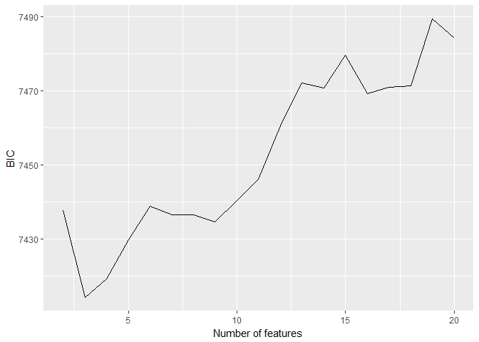
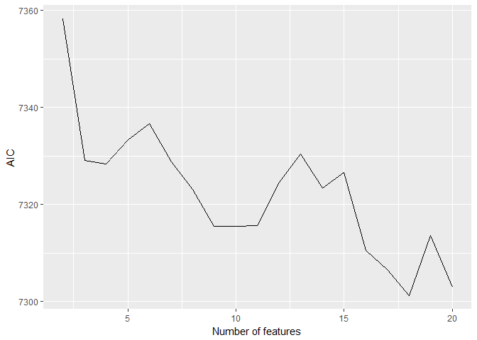
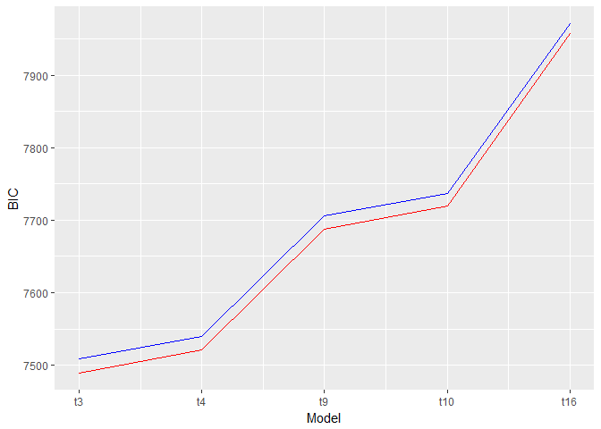
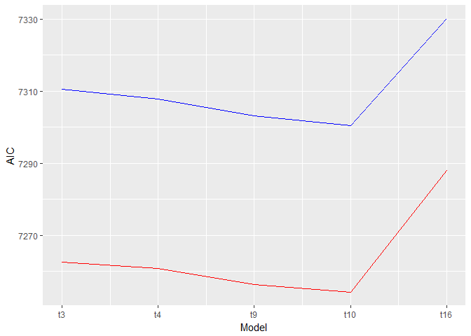

MAPSS Thesis II - model1\_preference1&3
================
Chih-Yu Chiang
July 17, 2017

``` r
knitr::opts_chunk$set(
    message = FALSE,
    warning = FALSE
)
```

Setup
-----

Data of game and player are read in and matched up.

-   Game release data, `release` (year), is read in as an interval variable.
-   Missing values are imputed with variable mean conveniently (`star_user` and `star_GS`).

``` r
#--Package
library(tidyverse)
library(modelr)
library(glmnet)
library(randomForest)
library(car)
library(rlist)
library(pander)
set.seed(1)


#--Read in
#Core game info and group distance/probability data
core_cluster <- read_csv("../data/core_cluster.csv", col_names=TRUE) %>%
  mutate(group_survey = factor(group_survey),
         group_review = factor(group_review),
         core_id = factor(core_id)) %>%
  select(-X1)

#Core game tste scores (of dif numbers of features)
core_tsteScore <- read_csv("../data/tste_concat.csv", col_names=TRUE) %>%
  select(-X1)

#Player-related survey data
survey <- read_csv("../data/survey.csv", col_names=TRUE) %>%
  mutate(race = factor(race),
         sex = factor(sex),
         core_id = factor(core_id)) %>%
  select(-id)


#--Impute missing with mean
imputation_mean <- function(c){
  c[is.na(c)] <- mean(c, na.rm=TRUE)
  return(c)
}
core_cluster <- mutate_each(core_cluster,
                            funs(imputation_mean(.)),
                            star_user, star_GS)


#--Match up
#Main df, key=player-game
df <- bind_cols(core_cluster, core_tsteScore) %>%
  left_join(survey, by=c("core_id"), copy=FALSE)

#Player df, key=player
df_player <- distinct(df, respondent, .keep_all = TRUE)
```

Variable
--------

Compute and select variables to be used in models.

-   Player preference:

| Name           | Definition                 | Unit                        |
|----------------|----------------------------|-----------------------------|
| `preference_1` | how much do you like       | Likert 1-7=like             |
| `preference_2` | how often play it          | ordinary 1=never-7=everyday |
| `preference_3` | does it fit personal taste | Likert 1-7=fit              |

-   Game characteristics:

<table style="width:36%;">
<colgroup>
<col width="8%" />
<col width="18%" />
<col width="9%" />
</colgroup>
<thead>
<tr class="header">
<th>Name</th>
<th>Definition</th>
<th>Unit</th>
</tr>
</thead>
<tbody>
<tr class="odd">
<td><code>distance_survey_mean_x</code></td>
<td>group score from survey (distance from group mean in tste)</td>
<td>cosine distance</td>
</tr>
<tr class="even">
<td><code>distance_survey_median_x</code></td>
<td>group score from survey (distance from group median in tste)</td>
<td>cosine distance</td>
</tr>
<tr class="odd">
<td><code>probability_review_mean_x</code></td>
<td>group score from review (mean probability to be categorized in the group by NN)</td>
<td>percentage</td>
</tr>
<tr class="even">
<td><code>probability_review_median_x</code></td>
<td>group score from review (median probability to be categorized in the group by NN)</td>
<td>percentage</td>
</tr>
<tr class="odd">
<td><code>group_survey</code></td>
<td>group identity from survey</td>
<td>categorical 1-group number</td>
</tr>
<tr class="even">
<td><code>group_review</code></td>
<td>group identity from review</td>
<td>categorical 1-group number</td>
</tr>
<tr class="odd">
<td><code>tste_n_x</code></td>
<td>group score from survey (tste), n=number of features</td>
<td>interval arbitrary</td>
</tr>
</tbody>
</table>

-   Player personality:

<table style="width:36%;">
<colgroup>
<col width="8%" />
<col width="18%" />
<col width="9%" />
</colgroup>
<thead>
<tr class="header">
<th>Name</th>
<th>Definition</th>
<th>Unit</th>
</tr>
</thead>
<tbody>
<tr class="odd">
<td><code>game_xxxxx</code></td>
<td>Big-five personality in game</td>
<td>Likert 1-7</td>
</tr>
<tr class="even">
<td><code>real_xxxxx</code></td>
<td>Big-five personality in real life</td>
<td>Likert 1-7</td>
</tr>
<tr class="odd">
<td><code>gap_xxxxx</code></td>
<td>personality gap (game - real)</td>
<td>Likert 1-7</td>
</tr>
<tr class="even">
<td><code>satis_xxxxx</code></td>
<td>SDT satisfaction in real life</td>
<td>Likert 1-7</td>
</tr>
<tr class="odd">
<td><code>dissatis_xxxxx</code></td>
<td>SDT dissatisfaction in real life</td>
<td>Likert 1-7</td>
</tr>
<tr class="even">
<td><code>combined_xxxxx</code></td>
<td>SDT combined (previous two) dissatisfaction in real life</td>
<td>Likert 1-7</td>
</tr>
</tbody>
</table>

-   Control:

| Name        | Definition                                    | Unit                      |
|-------------|-----------------------------------------------|---------------------------|
| `age`       | player age                                    | interval                  |
| `education` | player education                              | ordinary 1-7=PhD          |
| `income`    | player annual household income                | ordinary 1-7=over 150,000 |
| `sex`       | player sex                                    | categorical 1=male        |
| `race`      | player race                                   | categorical 1-5           |
| `release`   | game release year                             | interval year             |
| `star_GS`   | general game quality rated by GameSpot expert | interval 0-10             |
| `star_user` | general game quality rated by GameSpot user   | interval 0-10             |

``` r
updateVars <- function(){
  #--Create response variable
  df <<- df %>%
    rowwise() %>% 
    mutate(preference = mean(c(preference_1, preference_3)))
  
  
  #--Compute personalty gap
  df <<- mutate(df,
                gap_extraversion = game_extraversion - real_extraversion,
                gap_agreeableness = game_agreeableness - real_agreeableness,
                gap_conscientiousness = game_conscientiousness - real_conscientiousness,
                gap_emotionstability = game_emotionstability - real_emotionstability,
                gap_openness = game_openness - real_openness)
  
  
  #--Acquire player df, key=player
  df_player <<- distinct(df, respondent, .keep_all=TRUE)
  
  
  #--Select variables to be included in regression (model formation)
  #Sets of predictor variables from file
  predictors <<- read.csv("../data/vars/predictors.csv", header=TRUE, na.strings="")
  
  #Get column name as model id
  modelId <<- colnames(predictors)
  
  #predictor variable as strings for each model
  predictorString <<- apply(predictors, MARGIN=2, function(x) paste(na.omit(x), collapse="+"))
  
  #Make the dfs into a data frame
  dfs <<- data.frame(predictorString, modelId, stringsAsFactors=FALSE) %>%
    mutate(df_x = map(predictorString, ~ model.matrix(as.formula(paste("preference ~ ", .x, sep="")), data=df)[, -1])) %>% #df with only predictor variables; [, -1] used to remove redundant intercept column
    mutate(df_yx = map(df_x, ~ bind_cols(select(df, preference), data.frame(.x)))) #df also with outcome variables
  
  #Set row names for reference
  row.names(dfs) <<- modelId
}
```

Model
-----


-   preference measurement = "how much do you like?" & "how does it fit taste?"

``` r
#Update vars
updateVars()

#Full df with control marked
df_c <- mutate(df,
               c_age = age,
               c_education = education,
               c_income = income,
               c_race = race,
               c_sex = sex,
               c_release = release,
               c_star = star_user)

#Partial models
featureNo <- seq(2, 20)
model_gChar_tstes <- map(featureNo, ~ lm(preference ~ ., data=select(df_c, preference, starts_with("c_"), starts_with(paste("tste_", .x, "_", sep="")))))

#Full models
dfs$model_lm <- map(dfs$df_yx, ~ lm(preference ~ ., data=.x))
```

Information criteria
--------------------

### preference ~ tste scores

``` r
#--BIC
BICs <- unlist(map(model_gChar_tstes, BIC))

ggplot(data=as.data.frame(BICs)) +
  geom_line(mapping=aes(seq(2, 20), BICs)) +
  labs(x="Number of features", y="BIC")
```



``` r
#--AIC
AICs <- unlist(map(model_gChar_tstes, AIC))

ggplot(data=as.data.frame(AICs)) +
  geom_line(mapping=aes(seq(2, 20), AICs)) +
  labs(x="Number of features", y="AIC")
```



### preference ~ tste scores + gap + interaction

-   red lines: control real personality
-   blue lines: do not control real personality

``` r
#--BIC
dfs$BIC <- unlist(map(dfs$model_lm, BIC))

ggplot() +
  geom_line(data=slice(dfs, 1:5), mapping=aes(seq(1, 5), BIC), color="red") +
  geom_line(data=slice(dfs, 6:10), mapping=aes(seq(1, 5), BIC), color="blue") +
  labs(x="Model", y="BIC") +
  scale_x_continuous(breaks=seq(1, 5), labels=c("t3", "t4", "t9", "t10", "t16"))
```



``` r
#--AIC
dfs$AIC <- unlist(map(dfs$model_lm, AIC))

ggplot() +
  geom_line(data=slice(dfs, 1:5), mapping=aes(seq(1, 5), AIC), color="red") +
  geom_line(data=slice(dfs, 6:10), mapping=aes(seq(1, 5), AIC), color="blue") +
  labs(x="Model", y="AIC") +
  scale_x_continuous(breaks=seq(1, 5), labels=c("t3", "t4", "t9", "t10", "t16"))
```



Model summaries
---------------

``` r
#Summary
for(model in dfs$model_lm) print(summary(model))
```

    ## 
    ## Call:
    ## lm(formula = preference ~ ., data = .x)
    ## 
    ## Residuals:
    ##     Min      1Q  Median      3Q     Max 
    ## -5.1875 -0.5799  0.2673  0.9203  2.4472 
    ## 
    ## Coefficients:
    ##                                 Estimate Std. Error t value Pr(>|t|)    
    ## (Intercept)                    44.232859  12.698825   3.483 0.000506 ***
    ## age                            -0.014343   0.004164  -3.444 0.000584 ***
    ## education                       0.007757   0.024000   0.323 0.746580    
    ## income                          0.005505   0.015543   0.354 0.723216    
    ## race2                           0.008788   0.119000   0.074 0.941135    
    ## race4                          -0.291914   0.127721  -2.286 0.022379 *  
    ## race6                          -1.028378   0.318947  -3.224 0.001282 ** 
    ## race7                          -0.108702   0.123488  -0.880 0.378815    
    ## sex2                           -0.045592   0.065450  -0.697 0.486137    
    ## release                        -0.019806   0.006227  -3.180 0.001492 ** 
    ## star_user                       0.061539   0.047177   1.304 0.192230    
    ## real_extraversion               0.040287   0.022654   1.778 0.075487 .  
    ## real_agreeableness              0.005967   0.028185   0.212 0.832369    
    ## real_conscientiousness          0.095401   0.031429   3.035 0.002431 ** 
    ## real_emotionstability          -0.042148   0.031082  -1.356 0.175226    
    ## real_openness                   0.092757   0.030100   3.082 0.002085 ** 
    ## gap_extraversion                0.011491   0.023609   0.487 0.626494    
    ## gap_agreeableness               0.040616   0.030617   1.327 0.184793    
    ## gap_conscientiousness           0.016483   0.036103   0.457 0.648029    
    ## gap_emotionstability           -0.027923   0.028702  -0.973 0.330722    
    ## gap_openness                   -0.028359   0.039310  -0.721 0.470737    
    ## tste_3_0                       -0.080715   0.048566  -1.662 0.096672 .  
    ## tste_3_1                        0.184102   0.039726   4.634  3.8e-06 ***
    ## tste_3_2                        0.173908   0.054834   3.172 0.001538 ** 
    ## gap_extraversion.tste_3_0       0.038859   0.024074   1.614 0.106642    
    ## gap_extraversion.tste_3_1       0.011519   0.019751   0.583 0.559803    
    ## gap_extraversion.tste_3_2       0.000936   0.029554   0.032 0.974739    
    ## gap_agreeableness.tste_3_0      0.041873   0.033803   1.239 0.215585    
    ## gap_agreeableness.tste_3_1     -0.032595   0.026812  -1.216 0.224249    
    ## gap_agreeableness.tste_3_2      0.059651   0.040728   1.465 0.143177    
    ## gap_conscientiousness.tste_3_0  0.016052   0.038534   0.417 0.677037    
    ## gap_conscientiousness.tste_3_1  0.021472   0.031096   0.691 0.489953    
    ## gap_conscientiousness.tste_3_2  0.035307   0.046199   0.764 0.444814    
    ## gap_emotionstability.tste_3_0   0.069788   0.030686   2.274 0.023052 *  
    ## gap_emotionstability.tste_3_1   0.081141   0.024351   3.332 0.000877 ***
    ## gap_emotionstability.tste_3_2  -0.007037   0.037169  -0.189 0.849860    
    ## gap_openness.tste_3_0           0.020825   0.038234   0.545 0.586027    
    ## gap_openness.tste_3_1           0.009631   0.030969   0.311 0.755843    
    ## gap_openness.tste_3_2           0.062259   0.045444   1.370 0.170830    
    ## ---
    ## Signif. codes:  0 '***' 0.001 '**' 0.01 '*' 0.05 '.' 0.1 ' ' 1
    ## 
    ## Residual standard error: 1.31 on 2099 degrees of freedom
    ## Multiple R-squared:  0.09584,    Adjusted R-squared:  0.07947 
    ## F-statistic: 5.855 on 38 and 2099 DF,  p-value: < 2.2e-16
    ## 
    ## 
    ## Call:
    ## lm(formula = preference ~ ., data = .x)
    ## 
    ## Residuals:
    ##     Min      1Q  Median      3Q     Max 
    ## -5.2414 -0.5883  0.2628  0.9365  2.5360 
    ## 
    ## Coefficients:
    ##                                 Estimate Std. Error t value Pr(>|t|)    
    ## (Intercept)                    46.870413  12.839413   3.651 0.000268 ***
    ## age                            -0.013877   0.004162  -3.334 0.000872 ***
    ## education                       0.010478   0.023996   0.437 0.662388    
    ## income                          0.003645   0.015525   0.235 0.814404    
    ## race2                           0.018781   0.119082   0.158 0.874699    
    ## race4                          -0.293285   0.127581  -2.299 0.021614 *  
    ## race6                          -1.080941   0.319277  -3.386 0.000723 ***
    ## race7                          -0.108964   0.123339  -0.883 0.377092    
    ## sex2                           -0.048899   0.065428  -0.747 0.454920    
    ## release                        -0.021004   0.006289  -3.340 0.000853 ***
    ## star_user                       0.032960   0.049709   0.663 0.507367    
    ## real_extraversion               0.040101   0.022628   1.772 0.076512 .  
    ## real_agreeableness              0.006859   0.028243   0.243 0.808146    
    ## real_conscientiousness          0.095274   0.031423   3.032 0.002459 ** 
    ## real_emotionstability          -0.041656   0.031129  -1.338 0.180984    
    ## real_openness                   0.091067   0.030096   3.026 0.002510 ** 
    ## gap_extraversion                0.006925   0.023652   0.293 0.769707    
    ## gap_agreeableness               0.042427   0.030645   1.384 0.166357    
    ## gap_conscientiousness           0.019068   0.036267   0.526 0.599106    
    ## gap_emotionstability           -0.030714   0.028826  -1.066 0.286765    
    ## gap_openness                   -0.026216   0.039284  -0.667 0.504637    
    ## tste_4_0                        0.164890   0.053403   3.088 0.002044 ** 
    ## tste_4_1                        0.073199   0.060547   1.209 0.226815    
    ## tste_4_2                        0.045866   0.046473   0.987 0.323787    
    ## tste_4_3                       -0.194940   0.043551  -4.476 8.01e-06 ***
    ## gap_extraversion.tste_4_0       0.012371   0.028806   0.429 0.667630    
    ## gap_extraversion.tste_4_1      -0.070704   0.029951  -2.361 0.018334 *  
    ## gap_extraversion.tste_4_2       0.034817   0.023803   1.463 0.143694    
    ## gap_extraversion.tste_4_3      -0.015434   0.020500  -0.753 0.451618    
    ## gap_agreeableness.tste_4_0      0.064973   0.039779   1.633 0.102550    
    ## gap_agreeableness.tste_4_1      0.040086   0.043135   0.929 0.352835    
    ## gap_agreeableness.tste_4_2      0.024360   0.033535   0.726 0.467672    
    ## gap_agreeableness.tste_4_3      0.054398   0.027594   1.971 0.048812 *  
    ## gap_conscientiousness.tste_4_0 -0.004528   0.044645  -0.101 0.919233    
    ## gap_conscientiousness.tste_4_1  0.058410   0.048000   1.217 0.223789    
    ## gap_conscientiousness.tste_4_2  0.018460   0.037531   0.492 0.622871    
    ## gap_conscientiousness.tste_4_3  0.018760   0.032686   0.574 0.566079    
    ## gap_emotionstability.tste_4_0  -0.011599   0.036612  -0.317 0.751408    
    ## gap_emotionstability.tste_4_1   0.008942   0.036792   0.243 0.807991    
    ## gap_emotionstability.tste_4_2   0.100063   0.030380   3.294 0.001005 ** 
    ## gap_emotionstability.tste_4_3  -0.034370   0.025030  -1.373 0.169862    
    ## gap_openness.tste_4_0           0.058608   0.045282   1.294 0.195704    
    ## gap_openness.tste_4_1           0.090968   0.045217   2.012 0.044367 *  
    ## gap_openness.tste_4_2           0.025720   0.037701   0.682 0.495181    
    ## gap_openness.tste_4_3           0.023849   0.032181   0.741 0.458733    
    ## ---
    ## Signif. codes:  0 '***' 0.001 '**' 0.01 '*' 0.05 '.' 0.1 ' ' 1
    ## 
    ## Residual standard error: 1.308 on 2093 degrees of freedom
    ## Multiple R-squared:  0.1017, Adjusted R-squared:  0.0828 
    ## F-statistic: 5.385 on 44 and 2093 DF,  p-value: < 2.2e-16
    ## 
    ## 
    ## Call:
    ## lm(formula = preference ~ ., data = .x)
    ## 
    ## Residuals:
    ##     Min      1Q  Median      3Q     Max 
    ## -5.3116 -0.5859  0.2555  0.8840  2.9239 
    ## 
    ## Coefficients:
    ##                                  Estimate Std. Error t value Pr(>|t|)    
    ## (Intercept)                    42.7463640 14.3759955   2.973  0.00298 ** 
    ## age                            -0.0148015  0.0041499  -3.567  0.00037 ***
    ## education                       0.0107864  0.0239304   0.451  0.65222    
    ## income                          0.0055513  0.0155311   0.357  0.72080    
    ## race2                          -0.0120559  0.1186654  -0.102  0.91909    
    ## race4                          -0.2742008  0.1276802  -2.148  0.03186 *  
    ## race6                          -0.9143183  0.3226576  -2.834  0.00465 ** 
    ## race7                          -0.1210093  0.1240573  -0.975  0.32946    
    ## sex2                           -0.0647410  0.0652714  -0.992  0.32138    
    ## release                        -0.0189548  0.0070510  -2.688  0.00724 ** 
    ## star_user                       0.0424250  0.0545532   0.778  0.43685    
    ## real_extraversion               0.0470110  0.0225974   2.080  0.03761 *  
    ## real_agreeableness             -0.0001564  0.0281614  -0.006  0.99557    
    ## real_conscientiousness          0.0958210  0.0313837   3.053  0.00229 ** 
    ## real_emotionstability          -0.0392754  0.0310611  -1.264  0.20621    
    ## real_openness                   0.0794590  0.0300487   2.644  0.00825 ** 
    ## gap_extraversion                0.0155848  0.0236538   0.659  0.51005    
    ## gap_agreeableness               0.0339432  0.0307499   1.104  0.26979    
    ## gap_conscientiousness           0.0251181  0.0364764   0.689  0.49114    
    ## gap_emotionstability           -0.0317818  0.0288446  -1.102  0.27066    
    ## gap_openness                   -0.0391646  0.0394266  -0.993  0.32065    
    ## tste_9_0                       -0.1097451  0.0602921  -1.820  0.06887 .  
    ## tste_9_1                       -0.0013101  0.0555297  -0.024  0.98118    
    ## tste_9_2                       -0.2803210  0.0562667  -4.982 6.82e-07 ***
    ## tste_9_3                       -0.1149635  0.0625984  -1.837  0.06642 .  
    ## tste_9_4                        0.0020900  0.0497355   0.042  0.96648    
    ## tste_9_5                        0.0137100  0.0646131   0.212  0.83198    
    ## tste_9_6                        0.0221061  0.0578958   0.382  0.70263    
    ## tste_9_7                       -0.0604606  0.0581834  -1.039  0.29886    
    ## tste_9_8                       -0.0188625  0.0516225  -0.365  0.71486    
    ## gap_extraversion.tste_9_0      -0.0169548  0.0301586  -0.562  0.57405    
    ## gap_extraversion.tste_9_1       0.0381628  0.0287568   1.327  0.18463    
    ## gap_extraversion.tste_9_2       0.0009916  0.0287703   0.034  0.97251    
    ## gap_extraversion.tste_9_3       0.0712258  0.0298750   2.384  0.01721 *  
    ## gap_extraversion.tste_9_4      -0.0348151  0.0240136  -1.450  0.14727    
    ## gap_extraversion.tste_9_5      -0.0050758  0.0315656  -0.161  0.87226    
    ## gap_extraversion.tste_9_6      -0.0272760  0.0286325  -0.953  0.34089    
    ## gap_extraversion.tste_9_7       0.0199377  0.0305737   0.652  0.51440    
    ## gap_extraversion.tste_9_8      -0.0109287  0.0257520  -0.424  0.67133    
    ## gap_agreeableness.tste_9_0      0.0589001  0.0452328   1.302  0.19301    
    ## gap_agreeableness.tste_9_1      0.0207712  0.0398790   0.521  0.60252    
    ## gap_agreeableness.tste_9_2     -0.0038139  0.0398465  -0.096  0.92376    
    ## gap_agreeableness.tste_9_3      0.0089284  0.0439229   0.203  0.83894    
    ## gap_agreeableness.tste_9_4     -0.0239287  0.0347454  -0.689  0.49110    
    ## gap_agreeableness.tste_9_5     -0.0265997  0.0445072  -0.598  0.55014    
    ## gap_agreeableness.tste_9_6     -0.0576736  0.0377765  -1.527  0.12699    
    ## gap_agreeableness.tste_9_7     -0.0288324  0.0428010  -0.674  0.50062    
    ## gap_agreeableness.tste_9_8      0.0549004  0.0354608   1.548  0.12173    
    ## gap_conscientiousness.tste_9_0  0.0339388  0.0491224   0.691  0.48970    
    ## gap_conscientiousness.tste_9_1 -0.0928380  0.0451774  -2.055  0.04001 *  
    ## gap_conscientiousness.tste_9_2 -0.0511676  0.0455086  -1.124  0.26100    
    ## gap_conscientiousness.tste_9_3 -0.0262597  0.0500004  -0.525  0.59951    
    ## gap_conscientiousness.tste_9_4 -0.0059763  0.0391211  -0.153  0.87860    
    ## gap_conscientiousness.tste_9_5 -0.1554269  0.0526397  -2.953  0.00319 ** 
    ## gap_conscientiousness.tste_9_6  0.0534750  0.0448998   1.191  0.23380    
    ## gap_conscientiousness.tste_9_7  0.0088523  0.0481790   0.184  0.85424    
    ## gap_conscientiousness.tste_9_8  0.1028237  0.0420253   2.447  0.01450 *  
    ## gap_emotionstability.tste_9_0   0.0293524  0.0383759   0.765  0.44444    
    ## gap_emotionstability.tste_9_1   0.0450082  0.0359776   1.251  0.21107    
    ## gap_emotionstability.tste_9_2  -0.0039796  0.0358333  -0.111  0.91158    
    ## gap_emotionstability.tste_9_3  -0.0367776  0.0376532  -0.977  0.32881    
    ## gap_emotionstability.tste_9_4  -0.0794883  0.0314623  -2.526  0.01160 *  
    ## gap_emotionstability.tste_9_5  -0.0231617  0.0396531  -0.584  0.55921    
    ## gap_emotionstability.tste_9_6  -0.0100531  0.0351156  -0.286  0.77469    
    ## gap_emotionstability.tste_9_7   0.0656529  0.0377883   1.737  0.08247 .  
    ## gap_emotionstability.tste_9_8  -0.0905408  0.0323473  -2.799  0.00517 ** 
    ## gap_openness.tste_9_0          -0.0214514  0.0499689  -0.429  0.66775    
    ## gap_openness.tste_9_1           0.0512098  0.0453888   1.128  0.25935    
    ## gap_openness.tste_9_2          -0.0404198  0.0443579  -0.911  0.36229    
    ## gap_openness.tste_9_3          -0.0988996  0.0473339  -2.089  0.03679 *  
    ## gap_openness.tste_9_4          -0.0213622  0.0391195  -0.546  0.58507    
    ## gap_openness.tste_9_5           0.0670918  0.0503290   1.333  0.18266    
    ## gap_openness.tste_9_6           0.0269255  0.0442320   0.609  0.54277    
    ## gap_openness.tste_9_7          -0.0524694  0.0465128  -1.128  0.25942    
    ## gap_openness.tste_9_8           0.0026861  0.0405887   0.066  0.94724    
    ## ---
    ## Signif. codes:  0 '***' 0.001 '**' 0.01 '*' 0.05 '.' 0.1 ' ' 1
    ## 
    ## Residual standard error: 1.297 on 2063 degrees of freedom
    ## Multiple R-squared:  0.1283, Adjusted R-squared:  0.09706 
    ## F-statistic: 4.104 on 74 and 2063 DF,  p-value: < 2.2e-16
    ## 
    ## 
    ## Call:
    ## lm(formula = preference ~ ., data = .x)
    ## 
    ## Residuals:
    ##     Min      1Q  Median      3Q     Max 
    ## -5.2565 -0.5777  0.2475  0.9066  3.0558 
    ## 
    ## Coefficients:
    ##                                   Estimate Std. Error t value Pr(>|t|)    
    ## (Intercept)                     42.1884442 14.1035400   2.991 0.002811 ** 
    ## age                             -0.0147845  0.0041459  -3.566 0.000371 ***
    ## education                        0.0121198  0.0239380   0.506 0.612701    
    ## income                           0.0037180  0.0155174   0.240 0.810663    
    ## race2                            0.0027339  0.1188069   0.023 0.981644    
    ## race4                           -0.2770906  0.1278016  -2.168 0.030263 *  
    ## race6                           -0.9252148  0.3220790  -2.873 0.004112 ** 
    ## race7                           -0.1049464  0.1238885  -0.847 0.397036    
    ## sex2                            -0.0651559  0.0652693  -0.998 0.318270    
    ## release                         -0.0187300  0.0069262  -2.704 0.006903 ** 
    ## star_user                        0.0614344  0.0533874   1.151 0.249978    
    ## real_extraversion                0.0430091  0.0226010   1.903 0.057184 .  
    ## real_agreeableness               0.0052097  0.0282707   0.184 0.853814    
    ## real_conscientiousness           0.0911845  0.0313474   2.909 0.003667 ** 
    ## real_emotionstability           -0.0485686  0.0311065  -1.561 0.118591    
    ## real_openness                    0.0794569  0.0299854   2.650 0.008114 ** 
    ## gap_extraversion                 0.0153739  0.0236369   0.650 0.515494    
    ## gap_agreeableness                0.0358639  0.0308294   1.163 0.244843    
    ## gap_conscientiousness            0.0216726  0.0363312   0.597 0.550888    
    ## gap_emotionstability            -0.0343357  0.0288418  -1.190 0.233994    
    ## gap_openness                    -0.0411325  0.0393676  -1.045 0.296224    
    ## tste_10_0                        0.0374432  0.0512196   0.731 0.464843    
    ## tste_10_1                        0.1603937  0.0554874   2.891 0.003885 ** 
    ## tste_10_2                       -0.2054613  0.0604987  -3.396 0.000696 ***
    ## tste_10_3                       -0.1221047  0.0596957  -2.045 0.040937 *  
    ## tste_10_4                       -0.0339372  0.0602352  -0.563 0.573216    
    ## tste_10_5                        0.0121983  0.0564121   0.216 0.828826    
    ## tste_10_6                       -0.1269691  0.0589247  -2.155 0.031296 *  
    ## tste_10_7                        0.0328722  0.0502431   0.654 0.513016    
    ## tste_10_8                        0.0563178  0.0657843   0.856 0.392043    
    ## tste_10_9                        0.1156734  0.0560124   2.065 0.039035 *  
    ## gap_extraversion.tste_10_0      -0.0012557  0.0257869  -0.049 0.961166    
    ## gap_extraversion.tste_10_1      -0.0056693  0.0281663  -0.201 0.840498    
    ## gap_extraversion.tste_10_2       0.0465169  0.0312195   1.490 0.136380    
    ## gap_extraversion.tste_10_3      -0.0477974  0.0304061  -1.572 0.116112    
    ## gap_extraversion.tste_10_4       0.0103638  0.0302416   0.343 0.731858    
    ## gap_extraversion.tste_10_5       0.0012819  0.0292460   0.044 0.965044    
    ## gap_extraversion.tste_10_6       0.0479709  0.0281016   1.707 0.087964 .  
    ## gap_extraversion.tste_10_7       0.0436139  0.0256179   1.702 0.088817 .  
    ## gap_extraversion.tste_10_8       0.0088517  0.0318995   0.277 0.781435    
    ## gap_extraversion.tste_10_9       0.0197121  0.0293660   0.671 0.502132    
    ## gap_agreeableness.tste_10_0     -0.0470905  0.0357836  -1.316 0.188327    
    ## gap_agreeableness.tste_10_1     -0.0391901  0.0394580  -0.993 0.320724    
    ## gap_agreeableness.tste_10_2      0.0125738  0.0440647   0.285 0.775406    
    ## gap_agreeableness.tste_10_3      0.0588155  0.0417389   1.409 0.158948    
    ## gap_agreeableness.tste_10_4     -0.0496979  0.0421401  -1.179 0.238395    
    ## gap_agreeableness.tste_10_5      0.0020575  0.0419477   0.049 0.960886    
    ## gap_agreeableness.tste_10_6     -0.0020816  0.0408926  -0.051 0.959407    
    ## gap_agreeableness.tste_10_7      0.0803424  0.0368463   2.180 0.029335 *  
    ## gap_agreeableness.tste_10_8     -0.0394608  0.0445811  -0.885 0.376181    
    ## gap_agreeableness.tste_10_9      0.0008346  0.0419590   0.020 0.984133    
    ## gap_conscientiousness.tste_10_0  0.0219518  0.0414878   0.529 0.596782    
    ## gap_conscientiousness.tste_10_1  0.0574519  0.0459491   1.250 0.211319    
    ## gap_conscientiousness.tste_10_2  0.0334225  0.0506355   0.660 0.509290    
    ## gap_conscientiousness.tste_10_3  0.0680961  0.0470600   1.447 0.148047    
    ## gap_conscientiousness.tste_10_4  0.0408593  0.0488483   0.836 0.402998    
    ## gap_conscientiousness.tste_10_5 -0.0706336  0.0482780  -1.463 0.143603    
    ## gap_conscientiousness.tste_10_6 -0.1295595  0.0442174  -2.930 0.003426 ** 
    ## gap_conscientiousness.tste_10_7  0.0590866  0.0409519   1.443 0.149221    
    ## gap_conscientiousness.tste_10_8 -0.1297889  0.0518666  -2.502 0.012414 *  
    ## gap_conscientiousness.tste_10_9 -0.0141942  0.0461256  -0.308 0.758320    
    ## gap_emotionstability.tste_10_0   0.0412024  0.0333000   1.237 0.216114    
    ## gap_emotionstability.tste_10_1   0.0110125  0.0345454   0.319 0.749922    
    ## gap_emotionstability.tste_10_2   0.0485111  0.0397386   1.221 0.222319    
    ## gap_emotionstability.tste_10_3   0.0386996  0.0367304   1.054 0.292183    
    ## gap_emotionstability.tste_10_4   0.0812507  0.0373861   2.173 0.029873 *  
    ## gap_emotionstability.tste_10_5  -0.0066819  0.0364917  -0.183 0.854731    
    ## gap_emotionstability.tste_10_6  -0.0097669  0.0356288  -0.274 0.784013    
    ## gap_emotionstability.tste_10_7   0.0111443  0.0327366   0.340 0.733573    
    ## gap_emotionstability.tste_10_8   0.1038954  0.0399631   2.600 0.009395 ** 
    ## gap_emotionstability.tste_10_9   0.1116973  0.0377866   2.956 0.003152 ** 
    ## gap_openness.tste_10_0          -0.0579381  0.0401079  -1.445 0.148736    
    ## gap_openness.tste_10_1           0.0219774  0.0445802   0.493 0.622075    
    ## gap_openness.tste_10_2          -0.0535280  0.0473187  -1.131 0.258094    
    ## gap_openness.tste_10_3           0.0215269  0.0486746   0.442 0.658347    
    ## gap_openness.tste_10_4           0.0338667  0.0482580   0.702 0.482893    
    ## gap_openness.tste_10_5           0.0337562  0.0465831   0.725 0.468752    
    ## gap_openness.tste_10_6          -0.0985484  0.0445711  -2.211 0.027143 *  
    ## gap_openness.tste_10_7          -0.0310403  0.0411887  -0.754 0.451168    
    ## gap_openness.tste_10_8           0.1005552  0.0511180   1.967 0.049304 *  
    ## gap_openness.tste_10_9           0.0733296  0.0468867   1.564 0.117977    
    ## ---
    ## Signif. codes:  0 '***' 0.001 '**' 0.01 '*' 0.05 '.' 0.1 ' ' 1
    ## 
    ## Residual standard error: 1.295 on 2057 degrees of freedom
    ## Multiple R-squared:  0.1341, Adjusted R-squared:  0.1004 
    ## F-statistic: 3.982 on 80 and 2057 DF,  p-value: < 2.2e-16
    ## 
    ## 
    ## Call:
    ## lm(formula = preference ~ ., data = .x)
    ## 
    ## Residuals:
    ##     Min      1Q  Median      3Q     Max 
    ## -5.2168 -0.5768  0.2398  0.9106  3.1354 
    ## 
    ## Coefficients:
    ##                                    Estimate Std. Error t value Pr(>|t|)   
    ## (Intercept)                      15.2569439 16.1263721   0.946  0.34422   
    ## age                              -0.0128876  0.0041846  -3.080  0.00210 **
    ## education                         0.0137978  0.0240895   0.573  0.56686   
    ## income                            0.0077175  0.0156492   0.493  0.62196   
    ## race2                             0.0216661  0.1195236   0.181  0.85617   
    ## race4                            -0.2671638  0.1279424  -2.088  0.03691 * 
    ## race6                            -0.8826961  0.3320644  -2.658  0.00792 **
    ## race7                            -0.0879056  0.1248984  -0.704  0.48163   
    ## sex2                             -0.0596170  0.0658207  -0.906  0.36518   
    ## release                          -0.0053804  0.0079112  -0.680  0.49652   
    ## star_user                         0.0626333  0.0569701   1.099  0.27172   
    ## real_extraversion                 0.0453672  0.0227763   1.992  0.04652 * 
    ## real_agreeableness                0.0101917  0.0284118   0.359  0.71985   
    ## real_conscientiousness            0.0919972  0.0316731   2.905  0.00372 **
    ## real_emotionstability            -0.0406387  0.0314089  -1.294  0.19586   
    ## real_openness                     0.0772189  0.0301977   2.557  0.01063 * 
    ## gap_extraversion                  0.0152348  0.0240146   0.634  0.52589   
    ## gap_agreeableness                 0.0285317  0.0311101   0.917  0.35919   
    ## gap_conscientiousness             0.0236683  0.0371912   0.636  0.52459   
    ## gap_emotionstability             -0.0280376  0.0291127  -0.963  0.33563   
    ## gap_openness                     -0.0504522  0.0400586  -1.259  0.20801   
    ## tste_16_0                         0.1069325  0.0561028   1.906  0.05679 . 
    ## tste_16_1                        -0.1060529  0.0561908  -1.887  0.05925 . 
    ## tste_16_2                        -0.0419689  0.0511884  -0.820  0.41237   
    ## tste_16_3                        -0.0572688  0.0531260  -1.078  0.28117   
    ## tste_16_4                        -0.1225063  0.0472569  -2.592  0.00960 **
    ## tste_16_5                         0.1319558  0.0556512   2.371  0.01783 * 
    ## tste_16_6                         0.0728836  0.0497495   1.465  0.14307   
    ## tste_16_7                         0.0060300  0.0484947   0.124  0.90106   
    ## tste_16_8                        -0.0780960  0.0579317  -1.348  0.17779   
    ## tste_16_9                         0.1453223  0.0506924   2.867  0.00419 **
    ## tste_16_10                       -0.1020923  0.0494381  -2.065  0.03905 * 
    ## tste_16_11                        0.1321385  0.0556559   2.374  0.01768 * 
    ## tste_16_12                        0.0046338  0.0529862   0.087  0.93032   
    ## tste_16_13                        0.0559287  0.0568308   0.984  0.32517   
    ## tste_16_14                        0.1355688  0.0521215   2.601  0.00936 **
    ## tste_16_15                        0.0064900  0.0571563   0.114  0.90961   
    ## gap_extraversion.tste_16_0        0.0067535  0.0293256   0.230  0.81789   
    ## gap_extraversion.tste_16_1        0.0048821  0.0276427   0.177  0.85983   
    ## gap_extraversion.tste_16_2       -0.0241255  0.0252165  -0.957  0.33882   
    ## gap_extraversion.tste_16_3       -0.0594459  0.0272146  -2.184  0.02905 * 
    ## gap_extraversion.tste_16_4       -0.0042107  0.0239656  -0.176  0.86055   
    ## gap_extraversion.tste_16_5       -0.0101277  0.0284503  -0.356  0.72189   
    ## gap_extraversion.tste_16_6        0.0138176  0.0255066   0.542  0.58807   
    ## gap_extraversion.tste_16_7        0.0076081  0.0256630   0.296  0.76691   
    ## gap_extraversion.tste_16_8        0.0507655  0.0284408   1.785  0.07442 . 
    ## gap_extraversion.tste_16_9       -0.0295651  0.0260933  -1.133  0.25733   
    ## gap_extraversion.tste_16_10       0.0486254  0.0251563   1.933  0.05338 . 
    ## gap_extraversion.tste_16_11       0.0233670  0.0260420   0.897  0.36968   
    ## gap_extraversion.tste_16_12       0.0089725  0.0264931   0.339  0.73489   
    ## gap_extraversion.tste_16_13      -0.0265711  0.0283135  -0.938  0.34812   
    ## gap_extraversion.tste_16_14       0.0152056  0.0255791   0.594  0.55228   
    ## gap_extraversion.tste_16_15      -0.0170940  0.0290657  -0.588  0.55652   
    ## gap_agreeableness.tste_16_0      -0.0639275  0.0422594  -1.513  0.13050   
    ## gap_agreeableness.tste_16_1      -0.0332262  0.0394561  -0.842  0.39983   
    ## gap_agreeableness.tste_16_2       0.0078269  0.0362183   0.216  0.82893   
    ## gap_agreeableness.tste_16_3       0.0509301  0.0391783   1.300  0.19376   
    ## gap_agreeableness.tste_16_4       0.0013528  0.0328274   0.041  0.96713   
    ## gap_agreeableness.tste_16_5       0.0173964  0.0403592   0.431  0.66648   
    ## gap_agreeableness.tste_16_6       0.0205542  0.0386314   0.532  0.59474   
    ## gap_agreeableness.tste_16_7       0.0545721  0.0354874   1.538  0.12426   
    ## gap_agreeableness.tste_16_8      -0.0101677  0.0392641  -0.259  0.79570   
    ## gap_agreeableness.tste_16_9      -0.0176465  0.0373086  -0.473  0.63627   
    ## gap_agreeableness.tste_16_10     -0.0228402  0.0344314  -0.663  0.50718   
    ## gap_agreeableness.tste_16_11      0.0203140  0.0374975   0.542  0.58806   
    ## gap_agreeableness.tste_16_12      0.0330860  0.0381933   0.866  0.38644   
    ## gap_agreeableness.tste_16_13      0.0348335  0.0408915   0.852  0.39440   
    ## gap_agreeableness.tste_16_14     -0.0549554  0.0348969  -1.575  0.11546   
    ## gap_agreeableness.tste_16_15      0.0516836  0.0421658   1.226  0.22045   
    ## gap_conscientiousness.tste_16_0   0.0909936  0.0460841   1.975  0.04846 * 
    ## gap_conscientiousness.tste_16_1  -0.0500216  0.0440622  -1.135  0.25640   
    ## gap_conscientiousness.tste_16_2   0.0925583  0.0409303   2.261  0.02384 * 
    ## gap_conscientiousness.tste_16_3  -0.0569457  0.0432332  -1.317  0.18793   
    ## gap_conscientiousness.tste_16_4  -0.0103778  0.0385228  -0.269  0.78765   
    ## gap_conscientiousness.tste_16_5  -0.0006685  0.0445464  -0.015  0.98803   
    ## gap_conscientiousness.tste_16_6  -0.0798383  0.0422735  -1.889  0.05909 . 
    ## gap_conscientiousness.tste_16_7   0.0686721  0.0414858   1.655  0.09802 . 
    ## gap_conscientiousness.tste_16_8  -0.0844604  0.0505467  -1.671  0.09489 . 
    ## gap_conscientiousness.tste_16_9   0.0820159  0.0409689   2.002  0.04543 * 
    ## gap_conscientiousness.tste_16_10 -0.0236663  0.0399685  -0.592  0.55383   
    ## gap_conscientiousness.tste_16_11  0.0959575  0.0431013   2.226  0.02610 * 
    ## gap_conscientiousness.tste_16_12  0.0286447  0.0450149   0.636  0.52463   
    ## gap_conscientiousness.tste_16_13  0.0531028  0.0454844   1.167  0.24315   
    ## gap_conscientiousness.tste_16_14  0.0029420  0.0387958   0.076  0.93956   
    ## gap_conscientiousness.tste_16_15  0.0497288  0.0472039   1.053  0.29224   
    ## gap_emotionstability.tste_16_0    0.0311489  0.0365658   0.852  0.39439   
    ## gap_emotionstability.tste_16_1    0.0257626  0.0347320   0.742  0.45832   
    ## gap_emotionstability.tste_16_2    0.0739779  0.0319079   2.318  0.02052 * 
    ## gap_emotionstability.tste_16_3    0.0332580  0.0342973   0.970  0.33231   
    ## gap_emotionstability.tste_16_4    0.0375145  0.0295660   1.269  0.20464   
    ## gap_emotionstability.tste_16_5   -0.0264645  0.0346592  -0.764  0.44522   
    ## gap_emotionstability.tste_16_6    0.0289603  0.0333863   0.867  0.38581   
    ## gap_emotionstability.tste_16_7    0.0530439  0.0327280   1.621  0.10523   
    ## gap_emotionstability.tste_16_8    0.0157874  0.0358414   0.440  0.65964   
    ## gap_emotionstability.tste_16_9   -0.0554059  0.0324290  -1.709  0.08769 . 
    ## gap_emotionstability.tste_16_10   0.0246666  0.0324059   0.761  0.44664   
    ## gap_emotionstability.tste_16_11   0.0434142  0.0327691   1.325  0.18537   
    ## gap_emotionstability.tste_16_12  -0.0118073  0.0338857  -0.348  0.72754   
    ## gap_emotionstability.tste_16_13   0.0021685  0.0368581   0.059  0.95309   
    ## gap_emotionstability.tste_16_14   0.0516275  0.0314106   1.644  0.10041   
    ## gap_emotionstability.tste_16_15  -0.0681238  0.0380186  -1.792  0.07331 . 
    ## gap_openness.tste_16_0            0.0982232  0.0464069   2.117  0.03442 * 
    ## gap_openness.tste_16_1            0.0418113  0.0426074   0.981  0.32655   
    ## gap_openness.tste_16_2            0.0519776  0.0406542   1.279  0.20121   
    ## gap_openness.tste_16_3            0.0614072  0.0423843   1.449  0.14754   
    ## gap_openness.tste_16_4           -0.0048171  0.0377598  -0.128  0.89850   
    ## gap_openness.tste_16_5           -0.0427530  0.0456641  -0.936  0.34926   
    ## gap_openness.tste_16_6            0.0437881  0.0418136   1.047  0.29512   
    ## gap_openness.tste_16_7            0.0516896  0.0403910   1.280  0.20079   
    ## gap_openness.tste_16_8            0.0285016  0.0459954   0.620  0.53555   
    ## gap_openness.tste_16_9           -0.0324622  0.0413010  -0.786  0.43197   
    ## gap_openness.tste_16_10          -0.0424189  0.0386775  -1.097  0.27289   
    ## gap_openness.tste_16_11          -0.0282081  0.0425929  -0.662  0.50787   
    ## gap_openness.tste_16_12           0.0366473  0.0440187   0.833  0.40520   
    ## gap_openness.tste_16_13           0.0215160  0.0448688   0.480  0.63161   
    ## gap_openness.tste_16_14           0.0245910  0.0395964   0.621  0.53464   
    ## gap_openness.tste_16_15          -0.0863331  0.0481579  -1.793  0.07317 . 
    ## ---
    ## Signif. codes:  0 '***' 0.001 '**' 0.01 '*' 0.05 '.' 0.1 ' ' 1
    ## 
    ## Residual standard error: 1.295 on 2021 degrees of freedom
    ## Multiple R-squared:  0.1494, Adjusted R-squared:  0.1006 
    ## F-statistic:  3.06 on 116 and 2021 DF,  p-value: < 2.2e-16
    ## 
    ## 
    ## Call:
    ## lm(formula = preference ~ ., data = .x)
    ## 
    ## Residuals:
    ##     Min      1Q  Median      3Q     Max 
    ## -5.0908 -0.6125  0.2681  0.9949  2.5071 
    ## 
    ## Coefficients:
    ##                                  Estimate Std. Error t value Pr(>|t|)    
    ## (Intercept)                    49.7233344 12.8232142   3.878 0.000109 ***
    ## age                            -0.0106070  0.0041157  -2.577 0.010027 *  
    ## education                       0.0010378  0.0239920   0.043 0.965501    
    ## income                          0.0131697  0.0153467   0.858 0.390909    
    ## race2                          -0.0312234  0.1191947  -0.262 0.793383    
    ## race4                          -0.3587728  0.1284391  -2.793 0.005264 ** 
    ## race6                          -0.9385583  0.3217141  -2.917 0.003567 ** 
    ## race7                          -0.0987588  0.1247115  -0.792 0.428509    
    ## sex2                           -0.0129673  0.0625246  -0.207 0.835722    
    ## release                        -0.0220430  0.0062933  -3.503 0.000470 ***
    ## star_user                       0.0559533  0.0477394   1.172 0.241306    
    ## gap_extraversion               -0.0063466  0.0192398  -0.330 0.741531    
    ## gap_agreeableness               0.0388602  0.0266010   1.461 0.144204    
    ## gap_conscientiousness          -0.0451964  0.0304766  -1.483 0.138228    
    ## gap_emotionstability            0.0181091  0.0242504   0.747 0.455295    
    ## gap_openness                   -0.1054659  0.0299037  -3.527 0.000430 ***
    ## tste_3_0                       -0.0922380  0.0490856  -1.879 0.060365 .  
    ## tste_3_1                        0.1903803  0.0401203   4.745 2.22e-06 ***
    ## tste_3_2                        0.1835310  0.0554901   3.307 0.000957 ***
    ## gap_extraversion.tste_3_0       0.0432230  0.0242909   1.779 0.075320 .  
    ## gap_extraversion.tste_3_1       0.0161524  0.0199801   0.808 0.418938    
    ## gap_extraversion.tste_3_2       0.0005686  0.0299127   0.019 0.984836    
    ## gap_agreeableness.tste_3_0      0.0401081  0.0342100   1.172 0.241166    
    ## gap_agreeableness.tste_3_1     -0.0331491  0.0271170  -1.222 0.221676    
    ## gap_agreeableness.tste_3_2      0.0479396  0.0411914   1.164 0.244627    
    ## gap_conscientiousness.tste_3_0  0.0179313  0.0389539   0.460 0.645334    
    ## gap_conscientiousness.tste_3_1  0.0235565  0.0314633   0.749 0.454123    
    ## gap_conscientiousness.tste_3_2  0.0365659  0.0467453   0.782 0.434164    
    ## gap_emotionstability.tste_3_0   0.0718042  0.0310569   2.312 0.020873 *  
    ## gap_emotionstability.tste_3_1   0.0873972  0.0245949   3.553 0.000389 ***
    ## gap_emotionstability.tste_3_2   0.0066493  0.0375583   0.177 0.859494    
    ## gap_openness.tste_3_0           0.0249952  0.0386770   0.646 0.518185    
    ## gap_openness.tste_3_1           0.0010605  0.0312998   0.034 0.972974    
    ## gap_openness.tste_3_2           0.0619646  0.0459743   1.348 0.177865    
    ## ---
    ## Signif. codes:  0 '***' 0.001 '**' 0.01 '*' 0.05 '.' 0.1 ' ' 1
    ## 
    ## Residual standard error: 1.326 on 2104 degrees of freedom
    ## Multiple R-squared:  0.07102,    Adjusted R-squared:  0.05645 
    ## F-statistic: 4.874 on 33 and 2104 DF,  p-value: < 2.2e-16
    ## 
    ## 
    ## Call:
    ## lm(formula = preference ~ ., data = .x)
    ## 
    ## Residuals:
    ##     Min      1Q  Median      3Q     Max 
    ## -4.9866 -0.6065  0.2589  0.9991  2.5965 
    ## 
    ## Coefficients:
    ##                                 Estimate Std. Error t value Pr(>|t|)    
    ## (Intercept)                    52.342024  12.962408   4.038 5.58e-05 ***
    ## age                            -0.010172   0.004113  -2.473 0.013486 *  
    ## education                       0.004296   0.023977   0.179 0.857820    
    ## income                          0.011084   0.015326   0.723 0.469620    
    ## race2                          -0.018074   0.119244  -0.152 0.879537    
    ## race4                          -0.359120   0.128289  -2.799 0.005168 ** 
    ## race6                          -0.996463   0.322042  -3.094 0.001999 ** 
    ## race7                          -0.098386   0.124527  -0.790 0.429571    
    ## sex2                           -0.017942   0.062523  -0.287 0.774167    
    ## release                        -0.023232   0.006354  -3.656 0.000262 ***
    ## star_user                       0.026585   0.050289   0.529 0.597115    
    ## gap_extraversion               -0.011301   0.019315  -0.585 0.558555    
    ## gap_agreeableness               0.040370   0.026599   1.518 0.129233    
    ## gap_conscientiousness          -0.042326   0.030616  -1.382 0.166976    
    ## gap_emotionstability            0.014765   0.024374   0.606 0.544717    
    ## gap_openness                   -0.101243   0.029915  -3.384 0.000727 ***
    ## tste_4_0                        0.171275   0.054010   3.171 0.001540 ** 
    ## tste_4_1                        0.077700   0.061072   1.272 0.203417    
    ## tste_4_2                        0.041031   0.047017   0.873 0.382928    
    ## tste_4_3                       -0.203874   0.043959  -4.638 3.74e-06 ***
    ## gap_extraversion.tste_4_0       0.013708   0.029142   0.470 0.638137    
    ## gap_extraversion.tste_4_1      -0.077299   0.030273  -2.553 0.010737 *  
    ## gap_extraversion.tste_4_2       0.039786   0.024027   1.656 0.097890 .  
    ## gap_extraversion.tste_4_3      -0.019865   0.020721  -0.959 0.337840    
    ## gap_agreeableness.tste_4_0      0.054862   0.040212   1.364 0.172618    
    ## gap_agreeableness.tste_4_1      0.046524   0.043554   1.068 0.285552    
    ## gap_agreeableness.tste_4_2      0.021359   0.033932   0.629 0.529113    
    ## gap_agreeableness.tste_4_3      0.055755   0.027922   1.997 0.045974 *  
    ## gap_conscientiousness.tste_4_0 -0.003582   0.045167  -0.079 0.936805    
    ## gap_conscientiousness.tste_4_1  0.057713   0.048520   1.189 0.234390    
    ## gap_conscientiousness.tste_4_2  0.020850   0.037961   0.549 0.582895    
    ## gap_conscientiousness.tste_4_3  0.017450   0.033033   0.528 0.597367    
    ## gap_emotionstability.tste_4_0   0.001171   0.036978   0.032 0.974736    
    ## gap_emotionstability.tste_4_1   0.006272   0.037209   0.169 0.866154    
    ## gap_emotionstability.tste_4_2   0.105647   0.030721   3.439 0.000595 ***
    ## gap_emotionstability.tste_4_3  -0.040133   0.025293  -1.587 0.112722    
    ## gap_openness.tste_4_0           0.059747   0.045772   1.305 0.191920    
    ## gap_openness.tste_4_1           0.091236   0.045723   1.995 0.046127 *  
    ## gap_openness.tste_4_2           0.026243   0.038134   0.688 0.491417    
    ## gap_openness.tste_4_3           0.033018   0.032523   1.015 0.310124    
    ## ---
    ## Signif. codes:  0 '***' 0.001 '**' 0.01 '*' 0.05 '.' 0.1 ' ' 1
    ## 
    ## Residual standard error: 1.324 on 2098 degrees of freedom
    ## Multiple R-squared:  0.07742,    Adjusted R-squared:  0.06027 
    ## F-statistic: 4.514 on 39 and 2098 DF,  p-value: < 2.2e-16
    ## 
    ## 
    ## Call:
    ## lm(formula = preference ~ ., data = .x)
    ## 
    ## Residuals:
    ##     Min      1Q  Median      3Q     Max 
    ## -5.0432 -0.5916  0.2734  0.9562  2.6718 
    ## 
    ## Coefficients:
    ##                                 Estimate Std. Error t value Pr(>|t|)    
    ## (Intercept)                    48.196156  14.524847   3.318 0.000922 ***
    ## age                            -0.011282   0.004106  -2.748 0.006053 ** 
    ## education                       0.005676   0.023917   0.237 0.812419    
    ## income                          0.014361   0.015339   0.936 0.349245    
    ## race2                          -0.043920   0.118832  -0.370 0.711719    
    ## race4                          -0.337924   0.128395  -2.632 0.008554 ** 
    ## race6                          -0.805614   0.325531  -2.475 0.013412 *  
    ## race7                          -0.104713   0.125200  -0.836 0.403046    
    ## sex2                           -0.036518   0.062506  -0.584 0.559123    
    ## release                        -0.021192   0.007128  -2.973 0.002984 ** 
    ## star_user                       0.035041   0.055194   0.635 0.525583    
    ## gap_extraversion               -0.007212   0.019297  -0.374 0.708617    
    ## gap_agreeableness               0.035001   0.026694   1.311 0.189937    
    ## gap_conscientiousness          -0.037855   0.030782  -1.230 0.218916    
    ## gap_emotionstability            0.014480   0.024375   0.594 0.552534    
    ## gap_openness                   -0.104630   0.030044  -3.483 0.000507 ***
    ## tste_9_0                       -0.100046   0.060843  -1.644 0.100259    
    ## tste_9_1                       -0.009118   0.056130  -0.162 0.870967    
    ## tste_9_2                       -0.294660   0.056862  -5.182 2.41e-07 ***
    ## tste_9_3                       -0.126395   0.063310  -1.996 0.046017 *  
    ## tste_9_4                        0.007629   0.050299   0.152 0.879458    
    ## tste_9_5                        0.007484   0.065340   0.115 0.908822    
    ## tste_9_6                        0.016860   0.058530   0.288 0.773328    
    ## tste_9_7                       -0.058318   0.058822  -0.991 0.321592    
    ## tste_9_8                       -0.013972   0.052151  -0.268 0.788791    
    ## gap_extraversion.tste_9_0      -0.027503   0.030473  -0.903 0.366873    
    ## gap_extraversion.tste_9_1       0.042220   0.029070   1.452 0.146550    
    ## gap_extraversion.tste_9_2      -0.004583   0.029101  -0.157 0.874888    
    ## gap_extraversion.tste_9_3       0.074768   0.030182   2.477 0.013320 *  
    ## gap_extraversion.tste_9_4      -0.039825   0.024254  -1.642 0.100738    
    ## gap_extraversion.tste_9_5      -0.001258   0.031926  -0.039 0.968570    
    ## gap_extraversion.tste_9_6      -0.025693   0.028974  -0.887 0.375311    
    ## gap_extraversion.tste_9_7       0.022414   0.030913   0.725 0.468480    
    ## gap_extraversion.tste_9_8      -0.012380   0.026022  -0.476 0.634320    
    ## gap_agreeableness.tste_9_0      0.063373   0.045765   1.385 0.166281    
    ## gap_agreeableness.tste_9_1      0.007104   0.040239   0.177 0.859877    
    ## gap_agreeableness.tste_9_2      0.004058   0.040293   0.101 0.919795    
    ## gap_agreeableness.tste_9_3      0.005220   0.044431   0.117 0.906492    
    ## gap_agreeableness.tste_9_4     -0.022716   0.035148  -0.646 0.518158    
    ## gap_agreeableness.tste_9_5     -0.030808   0.045015  -0.684 0.493797    
    ## gap_agreeableness.tste_9_6     -0.057093   0.038206  -1.494 0.135239    
    ## gap_agreeableness.tste_9_7     -0.032564   0.043237  -0.753 0.451451    
    ## gap_agreeableness.tste_9_8      0.054122   0.035875   1.509 0.131554    
    ## gap_conscientiousness.tste_9_0  0.035802   0.049642   0.721 0.470868    
    ## gap_conscientiousness.tste_9_1 -0.092349   0.045636  -2.024 0.043141 *  
    ## gap_conscientiousness.tste_9_2 -0.048226   0.045961  -1.049 0.294169    
    ## gap_conscientiousness.tste_9_3 -0.019947   0.050583  -0.394 0.693371    
    ## gap_conscientiousness.tste_9_4 -0.008685   0.039563  -0.220 0.826268    
    ## gap_conscientiousness.tste_9_5 -0.161094   0.053232  -3.026 0.002507 ** 
    ## gap_conscientiousness.tste_9_6  0.048692   0.045419   1.072 0.283822    
    ## gap_conscientiousness.tste_9_7  0.012508   0.048700   0.257 0.797338    
    ## gap_conscientiousness.tste_9_8  0.102560   0.042495   2.413 0.015888 *  
    ## gap_emotionstability.tste_9_0   0.026801   0.038804   0.691 0.489846    
    ## gap_emotionstability.tste_9_1   0.054244   0.036366   1.492 0.135948    
    ## gap_emotionstability.tste_9_2  -0.008522   0.036243  -0.235 0.814137    
    ## gap_emotionstability.tste_9_3  -0.035770   0.038080  -0.939 0.347663    
    ## gap_emotionstability.tste_9_4  -0.086692   0.031822  -2.724 0.006498 ** 
    ## gap_emotionstability.tste_9_5  -0.028538   0.040105  -0.712 0.476812    
    ## gap_emotionstability.tste_9_6  -0.019387   0.035510  -0.546 0.585152    
    ## gap_emotionstability.tste_9_7   0.068545   0.038180   1.795 0.072752 .  
    ## gap_emotionstability.tste_9_8  -0.088443   0.032714  -2.703 0.006918 ** 
    ## gap_openness.tste_9_0          -0.011767   0.050477  -0.233 0.815690    
    ## gap_openness.tste_9_1           0.065407   0.045877   1.426 0.154109    
    ## gap_openness.tste_9_2          -0.024333   0.044781  -0.543 0.586932    
    ## gap_openness.tste_9_3          -0.100007   0.047867  -2.089 0.036805 *  
    ## gap_openness.tste_9_4          -0.020315   0.039580  -0.513 0.607825    
    ## gap_openness.tste_9_5           0.069106   0.050891   1.358 0.174638    
    ## gap_openness.tste_9_6           0.024727   0.044737   0.553 0.580519    
    ## gap_openness.tste_9_7          -0.045953   0.047012  -0.977 0.328446    
    ## gap_openness.tste_9_8          -0.005270   0.041051  -0.128 0.897871    
    ## ---
    ## Signif. codes:  0 '***' 0.001 '**' 0.01 '*' 0.05 '.' 0.1 ' ' 1
    ## 
    ## Residual standard error: 1.313 on 2068 degrees of freedom
    ## Multiple R-squared:  0.1049, Adjusted R-squared:  0.07505 
    ## F-statistic: 3.513 on 69 and 2068 DF,  p-value: < 2.2e-16
    ## 
    ## 
    ## Call:
    ## lm(formula = preference ~ ., data = .x)
    ## 
    ## Residuals:
    ##     Min      1Q  Median      3Q     Max 
    ## -4.9673 -0.6126  0.2488  0.9499  2.8328 
    ## 
    ## Coefficients:
    ##                                   Estimate Std. Error t value Pr(>|t|)    
    ## (Intercept)                     48.0344722 14.2434617   3.372 0.000759 ***
    ## age                             -0.0113320  0.0041026  -2.762 0.005794 ** 
    ## education                        0.0079068  0.0239145   0.331 0.740960    
    ## income                           0.0124304  0.0153213   0.811 0.417279    
    ## race2                           -0.0300000  0.1189250  -0.252 0.800865    
    ## race4                           -0.3402474  0.1285151  -2.648 0.008170 ** 
    ## race6                           -0.8249425  0.3249039  -2.539 0.011189 *  
    ## race7                           -0.0869339  0.1250252  -0.695 0.486926    
    ## sex2                            -0.0422355  0.0624273  -0.677 0.498764    
    ## release                         -0.0211962  0.0069996  -3.028 0.002491 ** 
    ## star_user                        0.0555283  0.0540095   1.028 0.304013    
    ## gap_extraversion                -0.0057020  0.0192830  -0.296 0.767487    
    ## gap_agreeableness                0.0324701  0.0267376   1.214 0.224735    
    ## gap_conscientiousness           -0.0396656  0.0306460  -1.294 0.195701    
    ## gap_emotionstability             0.0153163  0.0243656   0.629 0.529679    
    ## gap_openness                    -0.1056403  0.0300331  -3.517 0.000445 ***
    ## tste_10_0                        0.0348777  0.0517830   0.674 0.500682    
    ## tste_10_1                        0.1706126  0.0560870   3.042 0.002380 ** 
    ## tste_10_2                       -0.2109318  0.0611631  -3.449 0.000575 ***
    ## tste_10_3                       -0.1133478  0.0603614  -1.878 0.060547 .  
    ## tste_10_4                       -0.0309000  0.0608670  -0.508 0.611743    
    ## tste_10_5                        0.0068533  0.0569704   0.120 0.904260    
    ## tste_10_6                       -0.1364142  0.0595208  -2.292 0.022013 *  
    ## tste_10_7                        0.0316310  0.0507568   0.623 0.533230    
    ## tste_10_8                        0.0492136  0.0664692   0.740 0.459144    
    ## tste_10_9                        0.1302675  0.0566075   2.301 0.021477 *  
    ## gap_extraversion.tste_10_0      -0.0009439  0.0260611  -0.036 0.971110    
    ## gap_extraversion.tste_10_1      -0.0012444  0.0284464  -0.044 0.965113    
    ## gap_extraversion.tste_10_2       0.0466399  0.0315709   1.477 0.139746    
    ## gap_extraversion.tste_10_3      -0.0548993  0.0307345  -1.786 0.074207 .  
    ## gap_extraversion.tste_10_4       0.0094394  0.0305673   0.309 0.757500    
    ## gap_extraversion.tste_10_5      -0.0002721  0.0295640  -0.009 0.992659    
    ## gap_extraversion.tste_10_6       0.0506863  0.0283995   1.785 0.074447 .  
    ## gap_extraversion.tste_10_7       0.0477534  0.0258514   1.847 0.064858 .  
    ## gap_extraversion.tste_10_8       0.0144567  0.0322608   0.448 0.654114    
    ## gap_extraversion.tste_10_9       0.0206891  0.0296784   0.697 0.485814    
    ## gap_agreeableness.tste_10_0     -0.0472248  0.0361700  -1.306 0.191822    
    ## gap_agreeableness.tste_10_1     -0.0326868  0.0398503  -0.820 0.412174    
    ## gap_agreeableness.tste_10_2      0.0184927  0.0445787   0.415 0.678308    
    ## gap_agreeableness.tste_10_3      0.0694236  0.0421855   1.646 0.099984 .  
    ## gap_agreeableness.tste_10_4     -0.0501454  0.0425098  -1.180 0.238287    
    ## gap_agreeableness.tste_10_5      0.0051415  0.0424320   0.121 0.903567    
    ## gap_agreeableness.tste_10_6     -0.0054964  0.0413322  -0.133 0.894222    
    ## gap_agreeableness.tste_10_7      0.0742002  0.0372679   1.991 0.046613 *  
    ## gap_agreeableness.tste_10_8     -0.0445364  0.0451015  -0.987 0.323529    
    ## gap_agreeableness.tste_10_9     -0.0014899  0.0423988  -0.035 0.971971    
    ## gap_conscientiousness.tste_10_0  0.0243329  0.0419574   0.580 0.562017    
    ## gap_conscientiousness.tste_10_1  0.0548058  0.0464344   1.180 0.238023    
    ## gap_conscientiousness.tste_10_2  0.0384502  0.0511574   0.752 0.452374    
    ## gap_conscientiousness.tste_10_3  0.0676836  0.0475847   1.422 0.155066    
    ## gap_conscientiousness.tste_10_4  0.0384714  0.0493030   0.780 0.435301    
    ## gap_conscientiousness.tste_10_5 -0.0734219  0.0488294  -1.504 0.132827    
    ## gap_conscientiousness.tste_10_6 -0.1255191  0.0447379  -2.806 0.005069 ** 
    ## gap_conscientiousness.tste_10_7  0.0628754  0.0414253   1.518 0.129217    
    ## gap_conscientiousness.tste_10_8 -0.1311276  0.0523956  -2.503 0.012404 *  
    ## gap_conscientiousness.tste_10_9 -0.0160961  0.0466580  -0.345 0.730145    
    ## gap_emotionstability.tste_10_0   0.0409322  0.0336470   1.217 0.223926    
    ## gap_emotionstability.tste_10_1   0.0089701  0.0349451   0.257 0.797442    
    ## gap_emotionstability.tste_10_2   0.0505622  0.0401969   1.258 0.208584    
    ## gap_emotionstability.tste_10_3   0.0335409  0.0371585   0.903 0.366821    
    ## gap_emotionstability.tste_10_4   0.0805935  0.0377514   2.135 0.032891 *  
    ## gap_emotionstability.tste_10_5  -0.0121273  0.0368893  -0.329 0.742378    
    ## gap_emotionstability.tste_10_6  -0.0115104  0.0360495  -0.319 0.749535    
    ## gap_emotionstability.tste_10_7   0.0219527  0.0330827   0.664 0.507041    
    ## gap_emotionstability.tste_10_8   0.1091914  0.0404095   2.702 0.006946 ** 
    ## gap_emotionstability.tste_10_9   0.1215828  0.0381615   3.186 0.001464 ** 
    ## gap_openness.tste_10_0          -0.0565503  0.0405168  -1.396 0.162948    
    ## gap_openness.tste_10_1           0.0030664  0.0449853   0.068 0.945661    
    ## gap_openness.tste_10_2          -0.0490976  0.0478730  -1.026 0.305210    
    ## gap_openness.tste_10_3           0.0227026  0.0492131   0.461 0.644623    
    ## gap_openness.tste_10_4           0.0431488  0.0486489   0.887 0.375212    
    ## gap_openness.tste_10_5           0.0351220  0.0471308   0.745 0.456234    
    ## gap_openness.tste_10_6          -0.0934653  0.0450868  -2.073 0.038296 *  
    ## gap_openness.tste_10_7          -0.0371452  0.0416134  -0.893 0.372162    
    ## gap_openness.tste_10_8           0.1101295  0.0516929   2.130 0.033252 *  
    ## gap_openness.tste_10_9           0.0770751  0.0473405   1.628 0.103656    
    ## ---
    ## Signif. codes:  0 '***' 0.001 '**' 0.01 '*' 0.05 '.' 0.1 ' ' 1
    ## 
    ## Residual standard error: 1.311 on 2062 degrees of freedom
    ## Multiple R-squared:  0.111,  Adjusted R-squared:  0.07871 
    ## F-statistic: 3.434 on 75 and 2062 DF,  p-value: < 2.2e-16
    ## 
    ## 
    ## Call:
    ## lm(formula = preference ~ ., data = .x)
    ## 
    ## Residuals:
    ##     Min      1Q  Median      3Q     Max 
    ## -4.9805 -0.5821  0.2489  0.9385  2.8889 
    ## 
    ## Coefficients:
    ##                                   Estimate Std. Error t value Pr(>|t|)    
    ## (Intercept)                      20.611591  16.277139   1.266 0.205555    
    ## age                              -0.009589   0.004139  -2.317 0.020597 *  
    ## education                         0.009715   0.024033   0.404 0.686088    
    ## income                            0.015499   0.015438   1.004 0.315532    
    ## race2                            -0.009769   0.119494  -0.082 0.934852    
    ## race4                            -0.325494   0.128532  -2.532 0.011404 *  
    ## race6                            -0.770284   0.334663  -2.302 0.021455 *  
    ## race7                            -0.069227   0.125921  -0.550 0.582537    
    ## sex2                             -0.040621   0.063039  -0.644 0.519399    
    ## release                          -0.007553   0.007991  -0.945 0.344700    
    ## star_user                         0.050945   0.057545   0.885 0.376096    
    ## gap_extraversion                 -0.006725   0.019654  -0.342 0.732270    
    ## gap_agreeableness                 0.024153   0.027100   0.891 0.372899    
    ## gap_conscientiousness            -0.037184   0.031337  -1.187 0.235539    
    ## gap_emotionstability              0.018040   0.024652   0.732 0.464397    
    ## gap_openness                     -0.113557   0.030641  -3.706 0.000216 ***
    ## tste_16_0                         0.118784   0.056659   2.096 0.036163 *  
    ## tste_16_1                        -0.109413   0.056628  -1.932 0.053482 .  
    ## tste_16_2                        -0.044459   0.051691  -0.860 0.389846    
    ## tste_16_3                        -0.045023   0.053639  -0.839 0.401359    
    ## tste_16_4                        -0.122873   0.047717  -2.575 0.010094 *  
    ## tste_16_5                         0.132182   0.056184   2.353 0.018735 *  
    ## tste_16_6                         0.075284   0.050256   1.498 0.134290    
    ## tste_16_7                         0.012396   0.048963   0.253 0.800162    
    ## tste_16_8                        -0.093984   0.058502  -1.606 0.108323    
    ## tste_16_9                         0.154553   0.051092   3.025 0.002518 ** 
    ## tste_16_10                       -0.097849   0.049925  -1.960 0.050143 .  
    ## tste_16_11                        0.142050   0.056199   2.528 0.011560 *  
    ## tste_16_12                        0.001830   0.053533   0.034 0.972728    
    ## tste_16_13                        0.065119   0.057353   1.135 0.256333    
    ## tste_16_14                        0.144623   0.052658   2.746 0.006077 ** 
    ## tste_16_15                        0.004078   0.057741   0.071 0.943708    
    ## gap_extraversion.tste_16_0        0.005771   0.029624   0.195 0.845553    
    ## gap_extraversion.tste_16_1        0.006472   0.027904   0.232 0.816602    
    ## gap_extraversion.tste_16_2       -0.028490   0.025479  -1.118 0.263621    
    ## gap_extraversion.tste_16_3       -0.065218   0.027478  -2.373 0.017715 *  
    ## gap_extraversion.tste_16_4       -0.003874   0.024213  -0.160 0.872900    
    ## gap_extraversion.tste_16_5       -0.015218   0.028740  -0.529 0.596527    
    ## gap_extraversion.tste_16_6        0.016396   0.025768   0.636 0.524654    
    ## gap_extraversion.tste_16_7        0.003370   0.025902   0.130 0.896485    
    ## gap_extraversion.tste_16_8        0.057592   0.028691   2.007 0.044852 *  
    ## gap_extraversion.tste_16_9       -0.026175   0.026334  -0.994 0.320368    
    ## gap_extraversion.tste_16_10       0.050852   0.025415   2.001 0.045540 *  
    ## gap_extraversion.tste_16_11       0.023467   0.026308   0.892 0.372488    
    ## gap_extraversion.tste_16_12       0.010974   0.026768   0.410 0.681889    
    ## gap_extraversion.tste_16_13      -0.025902   0.028569  -0.907 0.364695    
    ## gap_extraversion.tste_16_14       0.020285   0.025831   0.785 0.432382    
    ## gap_extraversion.tste_16_15      -0.022691   0.029344  -0.773 0.439444    
    ## gap_agreeableness.tste_16_0      -0.064667   0.042697  -1.515 0.130043    
    ## gap_agreeableness.tste_16_1      -0.040144   0.039753  -1.010 0.312695    
    ## gap_agreeableness.tste_16_2       0.007430   0.036595   0.203 0.839133    
    ## gap_agreeableness.tste_16_3       0.052590   0.039587   1.328 0.184174    
    ## gap_agreeableness.tste_16_4       0.006608   0.033165   0.199 0.842092    
    ## gap_agreeableness.tste_16_5       0.017034   0.040767   0.418 0.676101    
    ## gap_agreeableness.tste_16_6       0.009444   0.038978   0.242 0.808588    
    ## gap_agreeableness.tste_16_7       0.058244   0.035839   1.625 0.104282    
    ## gap_agreeableness.tste_16_8      -0.009277   0.039613  -0.234 0.814867    
    ## gap_agreeableness.tste_16_9      -0.014251   0.037706  -0.378 0.705510    
    ## gap_agreeableness.tste_16_10     -0.026289   0.034775  -0.756 0.449745    
    ## gap_agreeableness.tste_16_11      0.021828   0.037867   0.576 0.564396    
    ## gap_agreeableness.tste_16_12      0.032427   0.038587   0.840 0.400803    
    ## gap_agreeableness.tste_16_13      0.032175   0.041334   0.778 0.436415    
    ## gap_agreeableness.tste_16_14     -0.052905   0.035272  -1.500 0.133796    
    ## gap_agreeableness.tste_16_15      0.058487   0.042608   1.373 0.170008    
    ## gap_conscientiousness.tste_16_0   0.087081   0.046571   1.870 0.061645 .  
    ## gap_conscientiousness.tste_16_1  -0.047950   0.044511  -1.077 0.281488    
    ## gap_conscientiousness.tste_16_2   0.099089   0.041345   2.397 0.016637 *  
    ## gap_conscientiousness.tste_16_3  -0.053069   0.043686  -1.215 0.224594    
    ## gap_conscientiousness.tste_16_4  -0.011572   0.038936  -0.297 0.766339    
    ## gap_conscientiousness.tste_16_5  -0.004296   0.044987  -0.095 0.923932    
    ## gap_conscientiousness.tste_16_6  -0.075670   0.042672  -1.773 0.076331 .  
    ## gap_conscientiousness.tste_16_7   0.073109   0.041897   1.745 0.081145 .  
    ## gap_conscientiousness.tste_16_8  -0.082732   0.051053  -1.621 0.105280    
    ## gap_conscientiousness.tste_16_9   0.083875   0.041277   2.032 0.042283 *  
    ## gap_conscientiousness.tste_16_10 -0.017177   0.040379  -0.425 0.670593    
    ## gap_conscientiousness.tste_16_11  0.094722   0.043510   2.177 0.029595 *  
    ## gap_conscientiousness.tste_16_12  0.024965   0.045489   0.549 0.583189    
    ## gap_conscientiousness.tste_16_13  0.047899   0.045935   1.043 0.297191    
    ## gap_conscientiousness.tste_16_14 -0.003080   0.039175  -0.079 0.937345    
    ## gap_conscientiousness.tste_16_15  0.052329   0.047686   1.097 0.272609    
    ## gap_emotionstability.tste_16_0    0.027095   0.036927   0.734 0.463185    
    ## gap_emotionstability.tste_16_1    0.029838   0.035001   0.852 0.394044    
    ## gap_emotionstability.tste_16_2    0.076097   0.032249   2.360 0.018385 *  
    ## gap_emotionstability.tste_16_3    0.033581   0.034649   0.969 0.332569    
    ## gap_emotionstability.tste_16_4    0.035262   0.029875   1.180 0.238007    
    ## gap_emotionstability.tste_16_5   -0.029839   0.034973  -0.853 0.393646    
    ## gap_emotionstability.tste_16_6    0.030692   0.033721   0.910 0.362836    
    ## gap_emotionstability.tste_16_7    0.056141   0.033049   1.699 0.089527 .  
    ## gap_emotionstability.tste_16_8    0.024984   0.036197   0.690 0.490127    
    ## gap_emotionstability.tste_16_9   -0.054040   0.032783  -1.648 0.099423 .  
    ## gap_emotionstability.tste_16_10   0.036046   0.032712   1.102 0.270630    
    ## gap_emotionstability.tste_16_11   0.048696   0.033089   1.472 0.141264    
    ## gap_emotionstability.tste_16_12  -0.010128   0.034239  -0.296 0.767419    
    ## gap_emotionstability.tste_16_13   0.011244   0.037230   0.302 0.762666    
    ## gap_emotionstability.tste_16_14   0.055242   0.031723   1.741 0.081763 .  
    ## gap_emotionstability.tste_16_15  -0.070519   0.038416  -1.836 0.066551 .  
    ## gap_openness.tste_16_0            0.102051   0.046900   2.176 0.029677 *  
    ## gap_openness.tste_16_1            0.048794   0.042961   1.136 0.256191    
    ## gap_openness.tste_16_2            0.056740   0.041069   1.382 0.167258    
    ## gap_openness.tste_16_3            0.063652   0.042824   1.486 0.137342    
    ## gap_openness.tste_16_4           -0.001996   0.038108  -0.052 0.958237    
    ## gap_openness.tste_16_5           -0.036886   0.046136  -0.800 0.424094    
    ## gap_openness.tste_16_6            0.041423   0.042228   0.981 0.326742    
    ## gap_openness.tste_16_7            0.053857   0.040795   1.320 0.186919    
    ## gap_openness.tste_16_8            0.029248   0.046457   0.630 0.529042    
    ## gap_openness.tste_16_9           -0.052148   0.041610  -1.253 0.210257    
    ## gap_openness.tste_16_10          -0.039210   0.039031  -1.005 0.315209    
    ## gap_openness.tste_16_11          -0.022849   0.043022  -0.531 0.595413    
    ## gap_openness.tste_16_12           0.042262   0.044481   0.950 0.342162    
    ## gap_openness.tste_16_13           0.015072   0.045192   0.334 0.738775    
    ## gap_openness.tste_16_14           0.020776   0.040004   0.519 0.603577    
    ## gap_openness.tste_16_15          -0.087815   0.048661  -1.805 0.071283 .  
    ## ---
    ## Signif. codes:  0 '***' 0.001 '**' 0.01 '*' 0.05 '.' 0.1 ' ' 1
    ## 
    ## Residual standard error: 1.309 on 2026 degrees of freedom
    ## Multiple R-squared:  0.1285, Adjusted R-squared:  0.08072 
    ## F-statistic:  2.69 on 111 and 2026 DF,  p-value: < 2.2e-16
