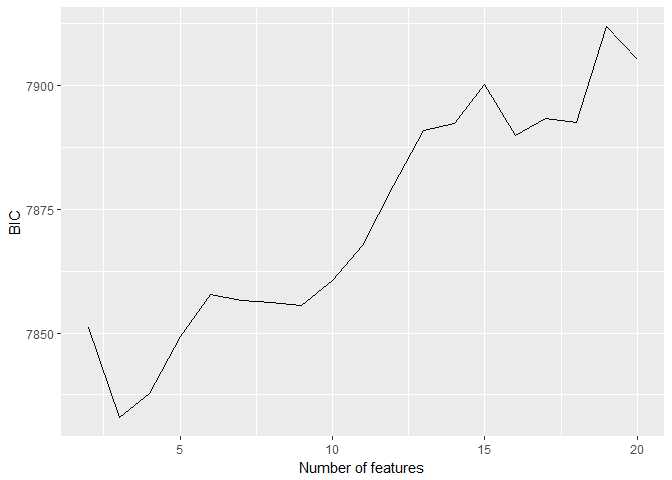
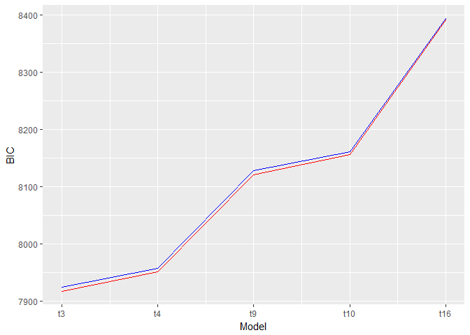
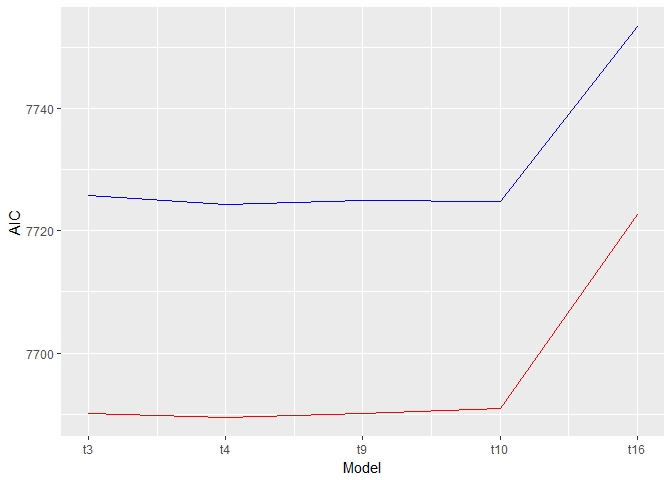

MAPSS Thesis II - model1\_preference3
================
Chih-Yu Chiang
July 17, 2017

``` r
knitr::opts_chunk$set(
    message = FALSE,
    warning = FALSE
)
```

Setup
-----

Data of game and player are read in and matched up.

-   Game release data, `release` (year), is read in as an interval variable.
-   Missing values are imputed with variable mean conveniently (`star_user` and `star_GS`).

``` r
#--Package
library(tidyverse)
library(modelr)
library(glmnet)
library(randomForest)
library(car)
library(rlist)
library(pander)
set.seed(1)


#--Read in
#Core game info and group distance/probability data
core_cluster <- read_csv("../data/core_cluster.csv", col_names=TRUE) %>%
  mutate(group_survey = factor(group_survey),
         group_review = factor(group_review),
         core_id = factor(core_id)) %>%
  select(-X1)

#Core game tste scores (of dif numbers of features)
core_tsteScore <- read_csv("../data/tste_concat.csv", col_names=TRUE) %>%
  select(-X1)

#Player-related survey data
survey <- read_csv("../data/survey.csv", col_names=TRUE) %>%
  mutate(race = factor(race),
         sex = factor(sex),
         core_id = factor(core_id)) %>%
  select(-id)


#--Impute missing with mean
imputation_mean <- function(c){
  c[is.na(c)] <- mean(c, na.rm=TRUE)
  return(c)
}
core_cluster <- mutate_each(core_cluster,
                            funs(imputation_mean(.)),
                            star_user, star_GS)


#--Match up
#Main df, key=player-game
df <- bind_cols(core_cluster, core_tsteScore) %>%
  left_join(survey, by=c("core_id"), copy=FALSE)

#Player df, key=player
df_player <- distinct(df, respondent, .keep_all = TRUE)
```

Variable
--------

Compute and select variables to be used in models.

-   Player preference:

| Name           | Definition                 | Unit                        |
|----------------|----------------------------|-----------------------------|
| `preference_1` | how much do you like       | Likert 1-7=like             |
| `preference_2` | how often play it          | ordinary 1=never-7=everyday |
| `preference_3` | does it fit personal taste | Likert 1-7=fit              |

-   Game characteristics:

<table style="width:36%;">
<colgroup>
<col width="8%" />
<col width="18%" />
<col width="9%" />
</colgroup>
<thead>
<tr class="header">
<th>Name</th>
<th>Definition</th>
<th>Unit</th>
</tr>
</thead>
<tbody>
<tr class="odd">
<td><code>distance_survey_mean_x</code></td>
<td>group score from survey (distance from group mean in tste)</td>
<td>cosine distance</td>
</tr>
<tr class="even">
<td><code>distance_survey_median_x</code></td>
<td>group score from survey (distance from group median in tste)</td>
<td>cosine distance</td>
</tr>
<tr class="odd">
<td><code>probability_review_mean_x</code></td>
<td>group score from review (mean probability to be categorized in the group by NN)</td>
<td>percentage</td>
</tr>
<tr class="even">
<td><code>probability_review_median_x</code></td>
<td>group score from review (median probability to be categorized in the group by NN)</td>
<td>percentage</td>
</tr>
<tr class="odd">
<td><code>group_survey</code></td>
<td>group identity from survey</td>
<td>categorical 1-group number</td>
</tr>
<tr class="even">
<td><code>group_review</code></td>
<td>group identity from review</td>
<td>categorical 1-group number</td>
</tr>
<tr class="odd">
<td><code>tste_n_x</code></td>
<td>group score from survey (tste), n=number of features</td>
<td>interval arbitrary</td>
</tr>
</tbody>
</table>

-   Player personality:

<table style="width:36%;">
<colgroup>
<col width="8%" />
<col width="18%" />
<col width="9%" />
</colgroup>
<thead>
<tr class="header">
<th>Name</th>
<th>Definition</th>
<th>Unit</th>
</tr>
</thead>
<tbody>
<tr class="odd">
<td><code>game_xxxxx</code></td>
<td>Big-five personality in game</td>
<td>Likert 1-7</td>
</tr>
<tr class="even">
<td><code>real_xxxxx</code></td>
<td>Big-five personality in real life</td>
<td>Likert 1-7</td>
</tr>
<tr class="odd">
<td><code>gap_xxxxx</code></td>
<td>personality gap (game - real)</td>
<td>Likert 1-7</td>
</tr>
<tr class="even">
<td><code>satis_xxxxx</code></td>
<td>SDT satisfaction in real life</td>
<td>Likert 1-7</td>
</tr>
<tr class="odd">
<td><code>dissatis_xxxxx</code></td>
<td>SDT dissatisfaction in real life</td>
<td>Likert 1-7</td>
</tr>
<tr class="even">
<td><code>combined_xxxxx</code></td>
<td>SDT combined (previous two) dissatisfaction in real life</td>
<td>Likert 1-7</td>
</tr>
</tbody>
</table>

-   Control:

| Name        | Definition                                    | Unit                      |
|-------------|-----------------------------------------------|---------------------------|
| `age`       | player age                                    | interval                  |
| `education` | player education                              | ordinary 1-7=PhD          |
| `income`    | player annual household income                | ordinary 1-7=over 150,000 |
| `sex`       | player sex                                    | categorical 1=male        |
| `race`      | player race                                   | categorical 1-5           |
| `release`   | game release year                             | interval year             |
| `star_GS`   | general game quality rated by GameSpot expert | interval 0-10             |
| `star_user` | general game quality rated by GameSpot user   | interval 0-10             |

``` r
updateVars <- function(){
  #--Create response variable
  df <<- df %>%
    rowwise() %>% 
    mutate(preference = mean(c(preference_3)))
  
  
  #--Compute personalty gap
  df <<- mutate(df,
                gap_extraversion = game_extraversion - real_extraversion,
                gap_agreeableness = game_agreeableness - real_agreeableness,
                gap_conscientiousness = game_conscientiousness - real_conscientiousness,
                gap_emotionstability = game_emotionstability - real_emotionstability,
                gap_openness = game_openness - real_openness)
  
  
  #--Acquire player df, key=player
  df_player <<- distinct(df, respondent, .keep_all=TRUE)
  
  
  #--Select variables to be included in regression (model formation)
  #Sets of predictor variables from file
  predictors <<- read.csv("../data/vars/predictors.csv", header=TRUE, na.strings="")
  
  #Get column name as model id
  modelId <<- colnames(predictors)
  
  #predictor variable as strings for each model
  predictorString <<- apply(predictors, MARGIN=2, function(x) paste(na.omit(x), collapse="+"))
  
  #Make the dfs into a data frame
  dfs <<- data.frame(predictorString, modelId, stringsAsFactors=FALSE) %>%
    mutate(df_x = map(predictorString, ~ model.matrix(as.formula(paste("preference ~ ", .x, sep="")), data=df)[, -1])) %>% #df with only predictor variables; [, -1] used to remove redundant intercept column
    mutate(df_yx = map(df_x, ~ bind_cols(select(df, preference), data.frame(.x)))) #df also with outcome variables
  
  #Set row names for reference
  row.names(dfs) <<- modelId
}
```

Model
-----


-   preference measurement = "how much does it fit personal taste?"

``` r
#Update vars
updateVars()

#Full df with control marked
df_c <- mutate(df,
               c_age = age,
               c_education = education,
               c_income = income,
               c_race = race,
               c_sex = sex,
               c_release = release,
               c_star = star_user)

#Partial models
featureNo <- seq(2, 20)
model_gChar_tstes <- map(featureNo, ~ lm(preference ~ ., data=select(df_c, preference, starts_with("c_"), starts_with(paste("tste_", .x, "_", sep="")))))

#Full models
dfs$model_lm <- map(dfs$df_yx, ~ lm(preference ~ ., data=.x))
```

Information criteria
--------------------

### preference ~ tste scores

``` r
#--BIC
BICs <- unlist(map(model_gChar_tstes, BIC))

ggplot(data=as.data.frame(BICs)) +
  geom_line(mapping=aes(seq(2, 20), BICs)) +
  labs(x="Number of features", y="BIC")
```



``` r
#--AIC
AICs <- unlist(map(model_gChar_tstes, AIC))

ggplot(data=as.data.frame(AICs)) +
  geom_line(mapping=aes(seq(2, 20), AICs)) +
  labs(x="Number of features", y="AIC")
```


### preference ~ tste scores + gap + interaction

-   red lines: control real personality
-   blue lines: do not control real personality

``` r
#--BIC
dfs$BIC <- unlist(map(dfs$model_lm, BIC))

ggplot() +
  geom_line(data=slice(dfs, 1:5), mapping=aes(seq(1, 5), BIC), color="red") +
  geom_line(data=slice(dfs, 6:10), mapping=aes(seq(1, 5), BIC), color="blue") +
  labs(x="Model", y="BIC") +
  scale_x_continuous(breaks=seq(1, 5), labels=c("t3", "t4", "t9", "t10", "t16"))
```



``` r
#--AIC
dfs$AIC <- unlist(map(dfs$model_lm, AIC))

ggplot() +
  geom_line(data=slice(dfs, 1:5), mapping=aes(seq(1, 5), AIC), color="red") +
  geom_line(data=slice(dfs, 6:10), mapping=aes(seq(1, 5), AIC), color="blue") +
  labs(x="Model", y="AIC") +
  scale_x_continuous(breaks=seq(1, 5), labels=c("t3", "t4", "t9", "t10", "t16"))
```



Model summaries
---------------

``` r
#Summary
for(model in dfs$model_lm) print(summary(model))
```

    ## 
    ## Call:
    ## lm(formula = preference ~ ., data = .x)
    ## 
    ## Residuals:
    ##     Min      1Q  Median      3Q     Max 
    ## -4.9502 -0.6889  0.3152  1.0480  2.6451 
    ## 
    ## Coefficients:
    ##                                 Estimate Std. Error t value Pr(>|t|)    
    ## (Intercept)                    58.026921  14.033761   4.135 3.69e-05 ***
    ## age                            -0.014018   0.004602  -3.046 0.002347 ** 
    ## education                       0.009326   0.026523   0.352 0.725151    
    ## income                          0.008520   0.017177   0.496 0.619920    
    ## race2                           0.092792   0.131509   0.706 0.480518    
    ## race4                          -0.216826   0.141148  -1.536 0.124649    
    ## race6                          -1.046232   0.352476  -2.968 0.003029 ** 
    ## race7                          -0.158427   0.136469  -1.161 0.245814    
    ## sex2                           -0.067028   0.072331  -0.927 0.354193    
    ## release                        -0.026674   0.006882  -3.876 0.000109 ***
    ## star_user                       0.028808   0.052137   0.553 0.580632    
    ## real_extraversion               0.053913   0.025035   2.154 0.031392 *  
    ## real_agreeableness              0.012223   0.031148   0.392 0.694796    
    ## real_conscientiousness          0.086824   0.034733   2.500 0.012504 *  
    ## real_emotionstability          -0.028764   0.034349  -0.837 0.402461    
    ## real_openness                   0.098923   0.033264   2.974 0.002974 ** 
    ## gap_extraversion                0.001648   0.026091   0.063 0.949629    
    ## gap_agreeableness               0.070591   0.033836   2.086 0.037073 *  
    ## gap_conscientiousness           0.002176   0.039898   0.055 0.956509    
    ## gap_emotionstability           -0.044113   0.031719  -1.391 0.164453    
    ## gap_openness                   -0.045771   0.043443  -1.054 0.292186    
    ## tste_3_0                       -0.105519   0.053672  -1.966 0.049431 *  
    ## tste_3_1                        0.171480   0.043903   3.906 9.68e-05 ***
    ## tste_3_2                        0.172628   0.060598   2.849 0.004432 ** 
    ## gap_extraversion.tste_3_0       0.045784   0.026605   1.721 0.085417 .  
    ## gap_extraversion.tste_3_1       0.018608   0.021827   0.853 0.394020    
    ## gap_extraversion.tste_3_2       0.008581   0.032661   0.263 0.792780    
    ## gap_agreeableness.tste_3_0      0.028484   0.037357   0.762 0.445852    
    ## gap_agreeableness.tste_3_1     -0.028118   0.029631  -0.949 0.342750    
    ## gap_agreeableness.tste_3_2      0.051675   0.045010   1.148 0.251067    
    ## gap_conscientiousness.tste_3_0  0.020280   0.042585   0.476 0.633964    
    ## gap_conscientiousness.tste_3_1  0.022859   0.034365   0.665 0.506004    
    ## gap_conscientiousness.tste_3_2  0.033274   0.051056   0.652 0.514659    
    ## gap_emotionstability.tste_3_0   0.075996   0.033912   2.241 0.025133 *  
    ## gap_emotionstability.tste_3_1   0.095589   0.026911   3.552 0.000391 ***
    ## gap_emotionstability.tste_3_2   0.020005   0.041076   0.487 0.626294    
    ## gap_openness.tste_3_0           0.031644   0.042253   0.749 0.453992    
    ## gap_openness.tste_3_1           0.008174   0.034224   0.239 0.811249    
    ## gap_openness.tste_3_2           0.074771   0.050222   1.489 0.136683    
    ## ---
    ## Signif. codes:  0 '***' 0.001 '**' 0.01 '*' 0.05 '.' 0.1 ' ' 1
    ## 
    ## Residual standard error: 1.448 on 2099 degrees of freedom
    ## Multiple R-squared:  0.08742,    Adjusted R-squared:  0.0709 
    ## F-statistic: 5.291 on 38 and 2099 DF,  p-value: < 2.2e-16
    ## 
    ## 
    ## Call:
    ## lm(formula = preference ~ ., data = .x)
    ## 
    ## Residuals:
    ##     Min      1Q  Median      3Q     Max 
    ## -5.0631 -0.6845  0.2998  1.0551  2.7085 
    ## 
    ## Coefficients:
    ##                                 Estimate Std. Error t value Pr(>|t|)    
    ## (Intercept)                    59.800200  14.193436   4.213 2.62e-05 ***
    ## age                            -0.013614   0.004601  -2.959 0.003123 ** 
    ## education                       0.011927   0.026526   0.450 0.653022    
    ## income                          0.006664   0.017162   0.388 0.697810    
    ## race2                           0.105682   0.131641   0.803 0.422179    
    ## race4                          -0.217674   0.141036  -1.543 0.122886    
    ## race6                          -1.104441   0.352947  -3.129 0.001777 ** 
    ## race7                          -0.157178   0.136346  -1.153 0.249129    
    ## sex2                           -0.069019   0.072328  -0.954 0.340066    
    ## release                        -0.027452   0.006952  -3.949 8.11e-05 ***
    ## star_user                       0.003660   0.054951   0.067 0.946896    
    ## real_extraversion               0.053130   0.025014   2.124 0.033789 *  
    ## real_agreeableness              0.013365   0.031221   0.428 0.668650    
    ## real_conscientiousness          0.085517   0.034737   2.462 0.013902 *  
    ## real_emotionstability          -0.029095   0.034412  -0.845 0.397934    
    ## real_openness                   0.098186   0.033270   2.951 0.003201 ** 
    ## gap_extraversion               -0.003506   0.026147  -0.134 0.893347    
    ## gap_agreeableness               0.073208   0.033877   2.161 0.030807 *  
    ## gap_conscientiousness           0.003822   0.040092   0.095 0.924061    
    ## gap_emotionstability           -0.046691   0.031866  -1.465 0.143000    
    ## gap_openness                   -0.042776   0.043427  -0.985 0.324742    
    ## tste_4_0                        0.170814   0.059035   2.893 0.003850 ** 
    ## tste_4_1                        0.078937   0.066932   1.179 0.238390    
    ## tste_4_2                        0.021536   0.051374   0.419 0.675116    
    ## tste_4_3                       -0.194769   0.048144  -4.046 5.41e-05 ***
    ## gap_extraversion.tste_4_0       0.016922   0.031844   0.531 0.595193    
    ## gap_extraversion.tste_4_1      -0.070084   0.033110  -2.117 0.034402 *  
    ## gap_extraversion.tste_4_2       0.043438   0.026313   1.651 0.098931 .  
    ## gap_extraversion.tste_4_3      -0.018002   0.022662  -0.794 0.427070    
    ## gap_agreeableness.tste_4_0      0.056644   0.043975   1.288 0.197850    
    ## gap_agreeableness.tste_4_1      0.070161   0.047684   1.471 0.141336    
    ## gap_agreeableness.tste_4_2      0.014610   0.037072   0.394 0.693555    
    ## gap_agreeableness.tste_4_3      0.051969   0.030504   1.704 0.088590 .  
    ## gap_conscientiousness.tste_4_0 -0.008742   0.049353  -0.177 0.859419    
    ## gap_conscientiousness.tste_4_1  0.058868   0.053062   1.109 0.267373    
    ## gap_conscientiousness.tste_4_2  0.023118   0.041489   0.557 0.577439    
    ## gap_conscientiousness.tste_4_3  0.020629   0.036133   0.571 0.568122    
    ## gap_emotionstability.tste_4_0   0.012563   0.040473   0.310 0.756275    
    ## gap_emotionstability.tste_4_1   0.004345   0.040672   0.107 0.914931    
    ## gap_emotionstability.tste_4_2   0.114526   0.033584   3.410 0.000662 ***
    ## gap_emotionstability.tste_4_3  -0.045714   0.027670  -1.652 0.098665 .  
    ## gap_openness.tste_4_0           0.071968   0.050057   1.438 0.150660    
    ## gap_openness.tste_4_1           0.067846   0.049985   1.357 0.174826    
    ## gap_openness.tste_4_2           0.034969   0.041677   0.839 0.401538    
    ## gap_openness.tste_4_3           0.022612   0.035575   0.636 0.525104    
    ## ---
    ## Signif. codes:  0 '***' 0.001 '**' 0.01 '*' 0.05 '.' 0.1 ' ' 1
    ## 
    ## Residual standard error: 1.446 on 2093 degrees of freedom
    ## Multiple R-squared:  0.09277,    Adjusted R-squared:  0.0737 
    ## F-statistic: 4.864 on 44 and 2093 DF,  p-value: < 2.2e-16
    ## 
    ## 
    ## Call:
    ## lm(formula = preference ~ ., data = .x)
    ## 
    ## Residuals:
    ##     Min      1Q  Median      3Q     Max 
    ## -5.1939 -0.6925  0.2964  1.0145  3.1854 
    ## 
    ## Coefficients:
    ##                                  Estimate Std. Error t value Pr(>|t|)    
    ## (Intercept)                    56.3517772 15.9105172   3.542 0.000406 ***
    ## age                            -0.0145922  0.0045929  -3.177 0.001509 ** 
    ## education                       0.0102968  0.0264848   0.389 0.697476    
    ## income                          0.0083657  0.0171889   0.487 0.626529    
    ## race2                           0.0739956  0.1313320   0.563 0.573207    
    ## race4                          -0.1949620  0.1413090  -1.380 0.167833    
    ## race6                          -0.9209071  0.3570987  -2.579 0.009981 ** 
    ## race7                          -0.1772407  0.1372994  -1.291 0.196881    
    ## sex2                           -0.0843405  0.0722386  -1.168 0.243132    
    ## release                        -0.0257041  0.0078037  -3.294 0.001005 ** 
    ## star_user                       0.0073956  0.0603764   0.122 0.902522    
    ## real_extraversion               0.0609035  0.0250094   2.435 0.014967 *  
    ## real_agreeableness              0.0057974  0.0311674   0.186 0.852456    
    ## real_conscientiousness          0.0851757  0.0347337   2.452 0.014279 *  
    ## real_emotionstability          -0.0287454  0.0343766  -0.836 0.403144    
    ## real_openness                   0.0853889  0.0332561   2.568 0.010310 *  
    ## gap_extraversion                0.0072643  0.0261787   0.277 0.781431    
    ## gap_agreeableness               0.0630850  0.0340322   1.854 0.063927 .  
    ## gap_conscientiousness           0.0094326  0.0403699   0.234 0.815277    
    ## gap_emotionstability           -0.0488702  0.0319235  -1.531 0.125959    
    ## gap_openness                   -0.0574661  0.0436350  -1.317 0.187994    
    ## tste_9_0                       -0.1361050  0.0667278  -2.040 0.041507 *  
    ## tste_9_1                       -0.0195015  0.0614571  -0.317 0.751033    
    ## tste_9_2                       -0.2801241  0.0622727  -4.498 7.23e-06 ***
    ## tste_9_3                       -0.1291645  0.0692803  -1.864 0.062411 .  
    ## tste_9_4                        0.0042270  0.0550443   0.077 0.938796    
    ## tste_9_5                        0.0385839  0.0715100   0.540 0.589559    
    ## tste_9_6                        0.0187100  0.0640757   0.292 0.770317    
    ## tste_9_7                       -0.0570171  0.0643940  -0.885 0.376022    
    ## tste_9_8                        0.0081708  0.0571328   0.143 0.886293    
    ## gap_extraversion.tste_9_0      -0.0029900  0.0333778  -0.090 0.928628    
    ## gap_extraversion.tste_9_1       0.0504488  0.0318264   1.585 0.113091    
    ## gap_extraversion.tste_9_2      -0.0001163  0.0318413  -0.004 0.997086    
    ## gap_extraversion.tste_9_3       0.0736542  0.0330639   2.228 0.026012 *  
    ## gap_extraversion.tste_9_4      -0.0337678  0.0265769  -1.271 0.204026    
    ## gap_extraversion.tste_9_5      -0.0356506  0.0349350  -1.020 0.307618    
    ## gap_extraversion.tste_9_6      -0.0243816  0.0316888  -0.769 0.441740    
    ## gap_extraversion.tste_9_7       0.0284818  0.0338373   0.842 0.400037    
    ## gap_extraversion.tste_9_8      -0.0204198  0.0285008  -0.716 0.473786    
    ## gap_agreeableness.tste_9_0      0.0515724  0.0500610   1.030 0.303041    
    ## gap_agreeableness.tste_9_1      0.0158118  0.0441357   0.358 0.720190    
    ## gap_agreeableness.tste_9_2     -0.0071267  0.0440998  -0.162 0.871634    
    ## gap_agreeableness.tste_9_3      0.0075447  0.0486113   0.155 0.876676    
    ## gap_agreeableness.tste_9_4     -0.0116132  0.0384542  -0.302 0.762682    
    ## gap_agreeableness.tste_9_5      0.0020023  0.0492579   0.041 0.967580    
    ## gap_agreeableness.tste_9_6     -0.0601979  0.0418088  -1.440 0.150065    
    ## gap_agreeableness.tste_9_7     -0.0749143  0.0473697  -1.581 0.113921    
    ## gap_agreeableness.tste_9_8      0.0401693  0.0392460   1.024 0.306179    
    ## gap_conscientiousness.tste_9_0  0.0254590  0.0543658   0.468 0.639627    
    ## gap_conscientiousness.tste_9_1 -0.1141053  0.0499997  -2.282 0.022584 *  
    ## gap_conscientiousness.tste_9_2 -0.0680430  0.0503663  -1.351 0.176855    
    ## gap_conscientiousness.tste_9_3 -0.0091885  0.0553376  -0.166 0.868138    
    ## gap_conscientiousness.tste_9_4 -0.0148567  0.0432970  -0.343 0.731531    
    ## gap_conscientiousness.tste_9_5 -0.1562406  0.0582585  -2.682 0.007380 ** 
    ## gap_conscientiousness.tste_9_6  0.0570338  0.0496925   1.148 0.251211    
    ## gap_conscientiousness.tste_9_7 -0.0137836  0.0533218  -0.258 0.796047    
    ## gap_conscientiousness.tste_9_8  0.1214898  0.0465112   2.612 0.009065 ** 
    ## gap_emotionstability.tste_9_0   0.0426654  0.0424722   1.005 0.315232    
    ## gap_emotionstability.tste_9_1   0.0498941  0.0398180   1.253 0.210328    
    ## gap_emotionstability.tste_9_2  -0.0273697  0.0396582  -0.690 0.490184    
    ## gap_emotionstability.tste_9_3  -0.0438768  0.0416723  -1.053 0.292510    
    ## gap_emotionstability.tste_9_4  -0.0859820  0.0348206  -2.469 0.013619 *  
    ## gap_emotionstability.tste_9_5  -0.0607089  0.0438857  -1.383 0.166710    
    ## gap_emotionstability.tste_9_6  -0.0163654  0.0388639  -0.421 0.673730    
    ## gap_emotionstability.tste_9_7   0.0796642  0.0418219   1.905 0.056939 .  
    ## gap_emotionstability.tste_9_8  -0.0794257  0.0358001  -2.219 0.026623 *  
    ## gap_openness.tste_9_0          -0.0140270  0.0553027  -0.254 0.799799    
    ## gap_openness.tste_9_1           0.0503078  0.0502337   1.001 0.316715    
    ## gap_openness.tste_9_2          -0.0571950  0.0490928  -1.165 0.244138    
    ## gap_openness.tste_9_3          -0.0944384  0.0523864  -1.803 0.071577 .  
    ## gap_openness.tste_9_4          -0.0225603  0.0432952  -0.521 0.602366    
    ## gap_openness.tste_9_5           0.0557122  0.0557012   1.000 0.317332    
    ## gap_openness.tste_9_6           0.0238111  0.0489534   0.486 0.626732    
    ## gap_openness.tste_9_7          -0.0416204  0.0514777  -0.809 0.418888    
    ## gap_openness.tste_9_8           0.0184630  0.0449212   0.411 0.681108    
    ## ---
    ## Signif. codes:  0 '***' 0.001 '**' 0.01 '*' 0.05 '.' 0.1 ' ' 1
    ## 
    ## Residual standard error: 1.436 on 2063 degrees of freedom
    ## Multiple R-squared:  0.1176, Adjusted R-squared:  0.08598 
    ## F-statistic: 3.716 on 74 and 2063 DF,  p-value: < 2.2e-16
    ## 
    ## 
    ## Call:
    ## lm(formula = preference ~ ., data = .x)
    ## 
    ## Residuals:
    ##     Min      1Q  Median      3Q     Max 
    ## -5.1585 -0.6948  0.2753  1.0162  3.3682 
    ## 
    ## Coefficients:
    ##                                   Estimate Std. Error t value Pr(>|t|)    
    ## (Intercept)                     56.0183274 15.6200490   3.586 0.000343 ***
    ## age                             -0.0145449  0.0045917  -3.168 0.001559 ** 
    ## education                        0.0113774  0.0265120   0.429 0.667864    
    ## income                           0.0069543  0.0171859   0.405 0.685774    
    ## race2                            0.0885375  0.1315819   0.673 0.501105    
    ## race4                           -0.2007123  0.1415437  -1.418 0.156335    
    ## race6                           -0.9493798  0.3567111  -2.661 0.007840 ** 
    ## race7                           -0.1537074  0.1372099  -1.120 0.262744    
    ## sex2                            -0.0859736  0.0722875  -1.189 0.234447    
    ## release                         -0.0255939  0.0076710  -3.336 0.000864 ***
    ## star_user                        0.0266994  0.0591280   0.452 0.651639    
    ## real_extraversion                0.0575653  0.0250313   2.300 0.021563 *  
    ## real_agreeableness               0.0102143  0.0313105   0.326 0.744287    
    ## real_conscientiousness           0.0805908  0.0347181   2.321 0.020369 *  
    ## real_emotionstability           -0.0363708  0.0344513  -1.056 0.291221    
    ## real_openness                    0.0848865  0.0332097   2.556 0.010657 *  
    ## gap_extraversion                 0.0065998  0.0261785   0.252 0.800982    
    ## gap_agreeableness                0.0636135  0.0341444   1.863 0.062594 .  
    ## gap_conscientiousness            0.0073561  0.0402378   0.183 0.854961    
    ## gap_emotionstability            -0.0502015  0.0319431  -1.572 0.116199    
    ## gap_openness                    -0.0583436  0.0436007  -1.338 0.181000    
    ## tste_10_0                        0.0087713  0.0567271   0.155 0.877134    
    ## tste_10_1                        0.1876610  0.0614537   3.054 0.002289 ** 
    ## tste_10_2                       -0.2230907  0.0670039  -3.330 0.000885 ***
    ## tste_10_3                       -0.1207638  0.0661146  -1.827 0.067907 .  
    ## tste_10_4                       -0.0501925  0.0667121  -0.752 0.451911    
    ## tste_10_5                       -0.0049013  0.0624779  -0.078 0.937479    
    ## tste_10_6                       -0.1425093  0.0652607  -2.184 0.029097 *  
    ## tste_10_7                        0.0198922  0.0556456   0.357 0.720769    
    ## tste_10_8                        0.0701668  0.0728579   0.963 0.335629    
    ## tste_10_9                        0.0974878  0.0620352   1.571 0.116222    
    ## gap_extraversion.tste_10_0       0.0166741  0.0285597   0.584 0.559398    
    ## gap_extraversion.tste_10_1      -0.0215581  0.0311949  -0.691 0.489595    
    ## gap_extraversion.tste_10_2       0.0607831  0.0345765   1.758 0.078908 .  
    ## gap_extraversion.tste_10_3      -0.0441129  0.0336756  -1.310 0.190364    
    ## gap_extraversion.tste_10_4       0.0242793  0.0334934   0.725 0.468597    
    ## gap_extraversion.tste_10_5      -0.0021222  0.0323907  -0.066 0.947767    
    ## gap_extraversion.tste_10_6       0.0459806  0.0311233   1.477 0.139730    
    ## gap_extraversion.tste_10_7       0.0527115  0.0283725   1.858 0.063335 .  
    ## gap_extraversion.tste_10_8      -0.0035153  0.0353296  -0.100 0.920750    
    ## gap_extraversion.tste_10_9       0.0376054  0.0325236   1.156 0.247714    
    ## gap_agreeableness.tste_10_0     -0.0612367  0.0396313  -1.545 0.122461    
    ## gap_agreeableness.tste_10_1     -0.0293031  0.0437008  -0.671 0.502589    
    ## gap_agreeableness.tste_10_2      0.0054512  0.0488029   0.112 0.911073    
    ## gap_agreeableness.tste_10_3      0.0516286  0.0462270   1.117 0.264189    
    ## gap_agreeableness.tste_10_4     -0.0743555  0.0466713  -1.593 0.111274    
    ## gap_agreeableness.tste_10_5      0.0407989  0.0464583   0.878 0.379947    
    ## gap_agreeableness.tste_10_6     -0.0067619  0.0452896  -0.149 0.881329    
    ## gap_agreeableness.tste_10_7      0.0639522  0.0408082   1.567 0.117236    
    ## gap_agreeableness.tste_10_8     -0.0325315  0.0493748  -0.659 0.510053    
    ## gap_agreeableness.tste_10_9      0.0008171  0.0464707   0.018 0.985972    
    ## gap_conscientiousness.tste_10_0  0.0181597  0.0459489   0.395 0.692725    
    ## gap_conscientiousness.tste_10_1  0.0742155  0.0508898   1.458 0.144895    
    ## gap_conscientiousness.tste_10_2  0.0244657  0.0560802   0.436 0.662691    
    ## gap_conscientiousness.tste_10_3  0.0636262  0.0521202   1.221 0.222317    
    ## gap_conscientiousness.tste_10_4  0.0141952  0.0541008   0.262 0.793052    
    ## gap_conscientiousness.tste_10_5 -0.0593564  0.0534692  -1.110 0.267084    
    ## gap_conscientiousness.tste_10_6 -0.1322611  0.0489719  -2.701 0.006975 ** 
    ## gap_conscientiousness.tste_10_7  0.0788137  0.0453553   1.738 0.082414 .  
    ## gap_conscientiousness.tste_10_8 -0.1433905  0.0574437  -2.496 0.012631 *  
    ## gap_conscientiousness.tste_10_9 -0.0470036  0.0510854  -0.920 0.357628    
    ## gap_emotionstability.tste_10_0   0.0588011  0.0368807   1.594 0.111009    
    ## gap_emotionstability.tste_10_1   0.0045443  0.0382600   0.119 0.905465    
    ## gap_emotionstability.tste_10_2   0.0475277  0.0440116   1.080 0.280317    
    ## gap_emotionstability.tste_10_3   0.0487781  0.0406799   1.199 0.230638    
    ## gap_emotionstability.tste_10_4   0.0873321  0.0414061   2.109 0.035051 *  
    ## gap_emotionstability.tste_10_5  -0.0275634  0.0404155  -0.682 0.495315    
    ## gap_emotionstability.tste_10_6  -0.0204689  0.0394598  -0.519 0.604006    
    ## gap_emotionstability.tste_10_7   0.0411983  0.0362567   1.136 0.255966    
    ## gap_emotionstability.tste_10_8   0.0820570  0.0442603   1.854 0.063887 .  
    ## gap_emotionstability.tste_10_9   0.1283195  0.0418497   3.066 0.002196 ** 
    ## gap_openness.tste_10_0          -0.0474870  0.0444206  -1.069 0.285182    
    ## gap_openness.tste_10_1           0.0157579  0.0493737   0.319 0.749640    
    ## gap_openness.tste_10_2          -0.0635249  0.0524068  -1.212 0.225594    
    ## gap_openness.tste_10_3           0.0208675  0.0539084   0.387 0.698728    
    ## gap_openness.tste_10_4           0.0377368  0.0534470   0.706 0.480231    
    ## gap_openness.tste_10_5           0.0186482  0.0515921   0.361 0.717796    
    ## gap_openness.tste_10_6          -0.0933033  0.0493637  -1.890 0.058883 .  
    ## gap_openness.tste_10_7          -0.0117766  0.0456175  -0.258 0.796310    
    ## gap_openness.tste_10_8           0.0793775  0.0566146   1.402 0.161046    
    ## gap_openness.tste_10_9           0.0699188  0.0519282   1.346 0.178306    
    ## ---
    ## Signif. codes:  0 '***' 0.001 '**' 0.01 '*' 0.05 '.' 0.1 ' ' 1
    ## 
    ## Residual standard error: 1.434 on 2057 degrees of freedom
    ## Multiple R-squared:  0.1222, Adjusted R-squared:  0.08807 
    ## F-statistic:  3.58 on 80 and 2057 DF,  p-value: < 2.2e-16
    ## 
    ## 
    ## Call:
    ## lm(formula = preference ~ ., data = .x)
    ## 
    ## Residuals:
    ##     Min      1Q  Median      3Q     Max 
    ## -5.1300 -0.6885  0.2397  0.9989  3.5224 
    ## 
    ## Coefficients:
    ##                                    Estimate Std. Error t value Pr(>|t|)   
    ## (Intercept)                      28.1601411 17.8512811   1.577  0.11484   
    ## age                              -0.0124651  0.0046322  -2.691  0.00718 **
    ## education                         0.0131664  0.0266662   0.494  0.62154   
    ## income                            0.0109148  0.0173231   0.630  0.52872   
    ## race2                             0.1048947  0.1323081   0.793  0.42798   
    ## race4                            -0.1823382  0.1416273  -1.287  0.19808   
    ## race6                            -0.8822995  0.3675827  -2.400  0.01647 * 
    ## race7                            -0.1294901  0.1382578  -0.937  0.34908   
    ## sex2                             -0.0826972  0.0728611  -1.135  0.25651   
    ## release                          -0.0117776  0.0087574  -1.345  0.17882   
    ## star_user                         0.0245298  0.0630637   0.389  0.69734   
    ## real_extraversion                 0.0598846  0.0252125   2.375  0.01763 * 
    ## real_agreeableness                0.0175623  0.0314508   0.558  0.57663   
    ## real_conscientiousness            0.0822588  0.0350609   2.346  0.01906 * 
    ## real_emotionstability            -0.0278371  0.0347685  -0.801  0.42343   
    ## real_openness                     0.0822335  0.0334277   2.460  0.01398 * 
    ## gap_extraversion                  0.0071546  0.0265833   0.269  0.78785   
    ## gap_agreeableness                 0.0563037  0.0344377   1.635  0.10222   
    ## gap_conscientiousness             0.0120964  0.0411692   0.294  0.76893   
    ## gap_emotionstability             -0.0432771  0.0322267  -1.343  0.17946   
    ## gap_openness                     -0.0649228  0.0443433  -1.464  0.14332   
    ## tste_16_0                         0.1577222  0.0621036   2.540  0.01117 * 
    ## tste_16_1                        -0.1031262  0.0622011  -1.658  0.09748 . 
    ## tste_16_2                        -0.0267241  0.0566636  -0.472  0.63724   
    ## tste_16_3                        -0.0765461  0.0588085  -1.302  0.19320   
    ## tste_16_4                        -0.1281275  0.0523116  -2.449  0.01440 * 
    ## tste_16_5                         0.1289726  0.0616037   2.094  0.03642 * 
    ## tste_16_6                         0.0755597  0.0550708   1.372  0.17020   
    ## tste_16_7                         0.0076433  0.0536817   0.142  0.88679   
    ## tste_16_8                        -0.1166964  0.0641282  -1.820  0.06895 . 
    ## tste_16_9                         0.1671324  0.0561146   2.978  0.00293 **
    ## tste_16_10                       -0.1044125  0.0547261  -1.908  0.05654 . 
    ## tste_16_11                        0.1287202  0.0616090   2.089  0.03680 * 
    ## tste_16_12                        0.0260905  0.0586537   0.445  0.65650   
    ## tste_16_13                        0.0635148  0.0629096   1.010  0.31280   
    ## tste_16_14                        0.1459284  0.0576965   2.529  0.01151 * 
    ## tste_16_15                        0.0146450  0.0632698   0.231  0.81697   
    ## gap_extraversion.tste_16_0       -0.0074883  0.0324624  -0.231  0.81759   
    ## gap_extraversion.tste_16_1       -0.0002486  0.0305994  -0.008  0.99352   
    ## gap_extraversion.tste_16_2       -0.0258548  0.0279137  -0.926  0.35443   
    ## gap_extraversion.tste_16_3       -0.0531165  0.0301256  -1.763  0.07802 . 
    ## gap_extraversion.tste_16_4       -0.0003831  0.0265291  -0.014  0.98848   
    ## gap_extraversion.tste_16_5       -0.0116079  0.0314934  -0.369  0.71248   
    ## gap_extraversion.tste_16_6        0.0073722  0.0282348   0.261  0.79404   
    ## gap_extraversion.tste_16_7        0.0012171  0.0284079   0.043  0.96583   
    ## gap_extraversion.tste_16_8        0.0574017  0.0314829   1.823  0.06841 . 
    ## gap_extraversion.tste_16_9       -0.0350369  0.0288843  -1.213  0.22527   
    ## gap_extraversion.tste_16_10       0.0502762  0.0278471   1.805  0.07115 . 
    ## gap_extraversion.tste_16_11       0.0405556  0.0288275   1.407  0.15963   
    ## gap_extraversion.tste_16_12       0.0112737  0.0293269   0.384  0.70071   
    ## gap_extraversion.tste_16_13      -0.0225804  0.0313420  -0.720  0.47133   
    ## gap_extraversion.tste_16_14       0.0146598  0.0283151   0.518  0.60470   
    ## gap_extraversion.tste_16_15      -0.0285786  0.0321747  -0.888  0.37452   
    ## gap_agreeableness.tste_16_0      -0.0587008  0.0467795  -1.255  0.20968   
    ## gap_agreeableness.tste_16_1      -0.0419674  0.0436764  -0.961  0.33673   
    ## gap_agreeableness.tste_16_2       0.0072890  0.0400922   0.182  0.85575   
    ## gap_agreeableness.tste_16_3       0.0658341  0.0433689   1.518  0.12917   
    ## gap_agreeableness.tste_16_4      -0.0024377  0.0363386  -0.067  0.94652   
    ## gap_agreeableness.tste_16_5       0.0240776  0.0446761   0.539  0.58999   
    ## gap_agreeableness.tste_16_6       0.0341245  0.0427635   0.798  0.42497   
    ## gap_agreeableness.tste_16_7       0.0644401  0.0392832   1.640  0.10108   
    ## gap_agreeableness.tste_16_8      -0.0011142  0.0434639  -0.026  0.97955   
    ## gap_agreeableness.tste_16_9      -0.0166847  0.0412992  -0.404  0.68626   
    ## gap_agreeableness.tste_16_10     -0.0261564  0.0381142  -0.686  0.49263   
    ## gap_agreeableness.tste_16_11     -0.0100289  0.0415083  -0.242  0.80911   
    ## gap_agreeableness.tste_16_12      0.0080105  0.0422785   0.189  0.84974   
    ## gap_agreeableness.tste_16_13      0.0296964  0.0452653   0.656  0.51187   
    ## gap_agreeableness.tste_16_14     -0.0623358  0.0386295  -1.614  0.10675   
    ## gap_agreeableness.tste_16_15      0.0449510  0.0466760   0.963  0.33564   
    ## gap_conscientiousness.tste_16_0   0.0867701  0.0510133   1.701  0.08911 . 
    ## gap_conscientiousness.tste_16_1  -0.0878425  0.0487751  -1.801  0.07186 . 
    ## gap_conscientiousness.tste_16_2   0.0754266  0.0453083   1.665  0.09612 . 
    ## gap_conscientiousness.tste_16_3  -0.0690511  0.0478575  -1.443  0.14922   
    ## gap_conscientiousness.tste_16_4  -0.0172711  0.0426432  -0.405  0.68551   
    ## gap_conscientiousness.tste_16_5  -0.0042574  0.0493111  -0.086  0.93121   
    ## gap_conscientiousness.tste_16_6  -0.0716082  0.0467952  -1.530  0.12611   
    ## gap_conscientiousness.tste_16_7   0.0671662  0.0459232   1.463  0.14374   
    ## gap_conscientiousness.tste_16_8  -0.0806398  0.0559533  -1.441  0.14968   
    ## gap_conscientiousness.tste_16_9   0.1049529  0.0453511   2.314  0.02075 * 
    ## gap_conscientiousness.tste_16_10 -0.0356108  0.0442436  -0.805  0.42098   
    ## gap_conscientiousness.tste_16_11  0.0990266  0.0477115   2.076  0.03806 * 
    ## gap_conscientiousness.tste_16_12  0.0257651  0.0498298   0.517  0.60517   
    ## gap_conscientiousness.tste_16_13  0.0489928  0.0503495   0.973  0.33064   
    ## gap_conscientiousness.tste_16_14  0.0023735  0.0429454   0.055  0.95593   
    ## gap_conscientiousness.tste_16_15  0.0798268  0.0522530   1.528  0.12674   
    ## gap_emotionstability.tste_16_0    0.0175648  0.0404770   0.434  0.66437   
    ## gap_emotionstability.tste_16_1    0.0103087  0.0384471   0.268  0.78863   
    ## gap_emotionstability.tste_16_2    0.0730756  0.0353208   2.069  0.03868 * 
    ## gap_emotionstability.tste_16_3    0.0341001  0.0379658   0.898  0.36920   
    ## gap_emotionstability.tste_16_4    0.0346925  0.0327284   1.060  0.28927   
    ## gap_emotionstability.tste_16_5   -0.0435121  0.0383664  -1.134  0.25688   
    ## gap_emotionstability.tste_16_6    0.0213575  0.0369574   0.578  0.56340   
    ## gap_emotionstability.tste_16_7    0.0506008  0.0362287   1.397  0.16266   
    ## gap_emotionstability.tste_16_8   -0.0029860  0.0396750  -0.075  0.94001   
    ## gap_emotionstability.tste_16_9   -0.0482925  0.0358977  -1.345  0.17868   
    ## gap_emotionstability.tste_16_10   0.0246224  0.0358721   0.686  0.49254   
    ## gap_emotionstability.tste_16_11   0.0721525  0.0362742   1.989  0.04683 * 
    ## gap_emotionstability.tste_16_12   0.0044834  0.0375101   0.120  0.90487   
    ## gap_emotionstability.tste_16_13   0.0284408  0.0408005   0.697  0.48584   
    ## gap_emotionstability.tste_16_14   0.0614459  0.0347704   1.767  0.07735 . 
    ## gap_emotionstability.tste_16_15  -0.0859013  0.0420852  -2.041  0.04137 * 
    ## gap_openness.tste_16_0            0.0876166  0.0513707   1.706  0.08824 . 
    ## gap_openness.tste_16_1            0.0501862  0.0471647   1.064  0.28743   
    ## gap_openness.tste_16_2            0.0391382  0.0450026   0.870  0.38457   
    ## gap_openness.tste_16_3            0.0460515  0.0469178   0.982  0.32645   
    ## gap_openness.tste_16_4           -0.0220274  0.0417987  -0.527  0.59826   
    ## gap_openness.tste_16_5           -0.0498629  0.0505485  -0.986  0.32404   
    ## gap_openness.tste_16_6            0.0343929  0.0462860   0.743  0.45754   
    ## gap_openness.tste_16_7            0.0481854  0.0447113   1.078  0.28130   
    ## gap_openness.tste_16_8            0.0225155  0.0509152   0.442  0.65838   
    ## gap_openness.tste_16_9           -0.0383453  0.0457187  -0.839  0.40172   
    ## gap_openness.tste_16_10          -0.0549459  0.0428146  -1.283  0.19952   
    ## gap_openness.tste_16_11          -0.0210247  0.0471487  -0.446  0.65570   
    ## gap_openness.tste_16_12           0.0409230  0.0487270   0.840  0.40110   
    ## gap_openness.tste_16_13           0.0202445  0.0496681   0.408  0.68361   
    ## gap_openness.tste_16_14           0.0342340  0.0438318   0.781  0.43488   
    ## gap_openness.tste_16_15          -0.0949649  0.0533090  -1.781  0.07500 . 
    ## ---
    ## Signif. codes:  0 '***' 0.001 '**' 0.01 '*' 0.05 '.' 0.1 ' ' 1
    ## 
    ## Residual standard error: 1.433 on 2021 degrees of freedom
    ## Multiple R-squared:  0.1386, Adjusted R-squared:  0.08919 
    ## F-statistic: 2.804 on 116 and 2021 DF,  p-value: < 2.2e-16
    ## 
    ## 
    ## Call:
    ## lm(formula = preference ~ ., data = .x)
    ## 
    ## Residuals:
    ##     Min      1Q  Median      3Q     Max 
    ## -4.9764 -0.6857  0.3004  1.1228  2.8348 
    ## 
    ## Coefficients:
    ##                                  Estimate Std. Error t value Pr(>|t|)    
    ## (Intercept)                    63.2097162 14.1304984   4.473 8.11e-06 ***
    ## age                            -0.0109660  0.0045353  -2.418 0.015693 *  
    ## education                       0.0021866  0.0264379   0.083 0.934092    
    ## income                          0.0159052  0.0169113   0.941 0.347066    
    ## race2                           0.0570790  0.1313462   0.435 0.663920    
    ## race4                          -0.2718131  0.1415330  -1.920 0.054931 .  
    ## race6                          -0.9656413  0.3545117  -2.724 0.006506 ** 
    ## race7                          -0.1512363  0.1374254  -1.100 0.271241    
    ## sex2                           -0.0338392  0.0688988  -0.491 0.623376    
    ## release                        -0.0286917  0.0069349  -4.137 3.65e-05 ***
    ## star_user                       0.0223040  0.0526063   0.424 0.671624    
    ## gap_extraversion               -0.0225991  0.0212013  -1.066 0.286577    
    ## gap_agreeableness               0.0701669  0.0293128   2.394 0.016765 *  
    ## gap_conscientiousness          -0.0480951  0.0335836  -1.432 0.152264    
    ## gap_emotionstability           -0.0011273  0.0267227  -0.042 0.966356    
    ## gap_openness                   -0.1284179  0.0329522  -3.897 0.000100 ***
    ## tste_3_0                       -0.1157983  0.0540897  -2.141 0.032400 *  
    ## tste_3_1                        0.1760841  0.0442104   3.983 7.04e-05 ***
    ## tste_3_2                        0.1821299  0.0611472   2.979 0.002929 ** 
    ## gap_extraversion.tste_3_0       0.0483575  0.0267673   1.807 0.070969 .  
    ## gap_extraversion.tste_3_1       0.0232287  0.0220170   1.055 0.291530    
    ## gap_extraversion.tste_3_2       0.0078037  0.0329622   0.237 0.812875    
    ## gap_agreeableness.tste_3_0      0.0270892  0.0376976   0.719 0.472472    
    ## gap_agreeableness.tste_3_1     -0.0282697  0.0298815  -0.946 0.344228    
    ## gap_agreeableness.tste_3_2      0.0399027  0.0453908   0.879 0.379451    
    ## gap_conscientiousness.tste_3_0  0.0228507  0.0429251   0.532 0.594547    
    ## gap_conscientiousness.tste_3_1  0.0240979  0.0346708   0.695 0.487102    
    ## gap_conscientiousness.tste_3_2  0.0332780  0.0515108   0.646 0.518324    
    ## gap_emotionstability.tste_3_0   0.0783556  0.0342231   2.290 0.022146 *  
    ## gap_emotionstability.tste_3_1   0.1007283  0.0271023   3.717 0.000207 ***
    ## gap_emotionstability.tste_3_2   0.0327109  0.0413872   0.790 0.429406    
    ## gap_openness.tste_3_0           0.0362063  0.0426200   0.850 0.395692    
    ## gap_openness.tste_3_1           0.0004223  0.0344907   0.012 0.990233    
    ## gap_openness.tste_3_2           0.0757288  0.0506612   1.495 0.135115    
    ## ---
    ## Signif. codes:  0 '***' 0.001 '**' 0.01 '*' 0.05 '.' 0.1 ' ' 1
    ## 
    ## Residual standard error: 1.462 on 2104 degrees of freedom
    ## Multiple R-squared:  0.06775,    Adjusted R-squared:  0.05312 
    ## F-statistic: 4.633 on 33 and 2104 DF,  p-value: < 2.2e-16
    ## 
    ## 
    ## Call:
    ## lm(formula = preference ~ ., data = .x)
    ## 
    ## Residuals:
    ##     Min      1Q  Median      3Q     Max 
    ## -4.8453 -0.6899  0.2961  1.1143  2.8989 
    ## 
    ## Coefficients:
    ##                                 Estimate Std. Error t value Pr(>|t|)    
    ## (Intercept)                    64.968230  14.288595   4.547 5.76e-06 ***
    ## age                            -0.010612   0.004534  -2.340 0.019355 *  
    ## education                       0.005277   0.026430   0.200 0.841777    
    ## income                          0.013791   0.016894   0.816 0.414417    
    ## race2                           0.072113   0.131444   0.549 0.583324    
    ## race4                          -0.271472   0.141414  -1.920 0.055032 .  
    ## race6                          -1.029522   0.354991  -2.900 0.003769 ** 
    ## race7                          -0.149534   0.137267  -1.089 0.276116    
    ## sex2                           -0.037594   0.068920  -0.545 0.585487    
    ## release                        -0.029465   0.007004  -4.207 2.70e-05 ***
    ## star_user                      -0.003650   0.055435  -0.066 0.947509    
    ## gap_extraversion               -0.027783   0.021291  -1.305 0.192056    
    ## gap_agreeableness               0.072154   0.029320   2.461 0.013939 *  
    ## gap_conscientiousness          -0.045393   0.033749  -1.345 0.178763    
    ## gap_emotionstability           -0.004067   0.026867  -0.151 0.879683    
    ## gap_openness                   -0.124140   0.032976  -3.765 0.000171 ***
    ## tste_4_0                        0.176933   0.059535   2.972 0.002993 ** 
    ## tste_4_1                        0.083181   0.067320   1.236 0.216742    
    ## tste_4_2                        0.016844   0.051827   0.325 0.745212    
    ## tste_4_3                       -0.201729   0.048457  -4.163 3.27e-05 ***
    ## gap_extraversion.tste_4_0       0.017768   0.032124   0.553 0.580256    
    ## gap_extraversion.tste_4_1      -0.076486   0.033370  -2.292 0.022001 *  
    ## gap_extraversion.tste_4_2       0.046879   0.026485   1.770 0.076867 .  
    ## gap_extraversion.tste_4_3      -0.023167   0.022841  -1.014 0.310585    
    ## gap_agreeableness.tste_4_0      0.046645   0.044326   1.052 0.292782    
    ## gap_agreeableness.tste_4_1      0.075690   0.048010   1.577 0.115049    
    ## gap_agreeableness.tste_4_2      0.012235   0.037403   0.327 0.743613    
    ## gap_agreeableness.tste_4_3      0.052891   0.030779   1.718 0.085865 .  
    ## gap_conscientiousness.tste_4_0 -0.008772   0.049788  -0.176 0.860159    
    ## gap_conscientiousness.tste_4_1  0.059028   0.053484   1.104 0.269869    
    ## gap_conscientiousness.tste_4_2  0.025587   0.041845   0.611 0.540952    
    ## gap_conscientiousness.tste_4_3  0.020637   0.036412   0.567 0.570934    
    ## gap_emotionstability.tste_4_0   0.024648   0.040761   0.605 0.545455    
    ## gap_emotionstability.tste_4_1   0.001282   0.041016   0.031 0.975077    
    ## gap_emotionstability.tste_4_2   0.119898   0.033864   3.541 0.000408 ***
    ## gap_emotionstability.tste_4_3  -0.050432   0.027880  -1.809 0.070617 .  
    ## gap_openness.tste_4_0           0.074375   0.050454   1.474 0.140605    
    ## gap_openness.tste_4_1           0.067683   0.050401   1.343 0.179450    
    ## gap_openness.tste_4_2           0.036382   0.042035   0.866 0.386857    
    ## gap_openness.tste_4_3           0.030996   0.035851   0.865 0.387358    
    ## ---
    ## Signif. codes:  0 '***' 0.001 '**' 0.01 '*' 0.05 '.' 0.1 ' ' 1
    ## 
    ## Residual standard error: 1.459 on 2098 degrees of freedom
    ## Multiple R-squared:  0.07356,    Adjusted R-squared:  0.05633 
    ## F-statistic: 4.271 on 39 and 2098 DF,  p-value: < 2.2e-16
    ## 
    ## 
    ## Call:
    ## lm(formula = preference ~ ., data = .x)
    ## 
    ## Residuals:
    ##     Min      1Q  Median      3Q     Max 
    ## -5.0199 -0.6991  0.2798  1.0664  2.9428 
    ## 
    ## Coefficients:
    ##                                  Estimate Std. Error t value Pr(>|t|)    
    ## (Intercept)                    61.5447502 16.0305546   3.839 0.000127 ***
    ## age                            -0.0117705  0.0045315  -2.597 0.009458 ** 
    ## education                       0.0049951  0.0263960   0.189 0.849926    
    ## income                          0.0171070  0.0169289   1.011 0.312364    
    ## race2                           0.0461799  0.1311501   0.352 0.724788    
    ## race4                          -0.2465835  0.1417053  -1.740 0.081988 .  
    ## race6                          -0.8196001  0.3592765  -2.281 0.022635 *  
    ## race7                          -0.1627660  0.1381790  -1.178 0.238958    
    ## sex2                           -0.0565374  0.0689852  -0.820 0.412563    
    ## release                        -0.0277589  0.0078672  -3.528 0.000427 ***
    ## star_user                      -0.0006339  0.0609159  -0.010 0.991698    
    ## gap_extraversion               -0.0223235  0.0212972  -1.048 0.294673    
    ## gap_agreeableness               0.0653957  0.0294611   2.220 0.026545 *  
    ## gap_conscientiousness          -0.0411109  0.0339726  -1.210 0.226372    
    ## gap_emotionstability           -0.0042545  0.0269021  -0.158 0.874356    
    ## gap_openness                   -0.1281146  0.0331588  -3.864 0.000115 ***
    ## tste_9_0                       -0.1253462  0.0671500  -1.867 0.062090 .  
    ## tste_9_1                       -0.0263368  0.0619486  -0.425 0.670779    
    ## tste_9_2                       -0.2936087  0.0627567  -4.679 3.08e-06 ***
    ## tste_9_3                       -0.1405674  0.0698735  -2.012 0.044377 *  
    ## tste_9_4                        0.0099227  0.0555131   0.179 0.858155    
    ## tste_9_5                        0.0342510  0.0721138   0.475 0.634867    
    ## tste_9_6                        0.0155236  0.0645977   0.240 0.810112    
    ## tste_9_7                       -0.0553649  0.0649200  -0.853 0.393859    
    ## tste_9_8                        0.0131525  0.0575571   0.229 0.819271    
    ## gap_extraversion.tste_9_0      -0.0138045  0.0336317  -0.410 0.681510    
    ## gap_extraversion.tste_9_1       0.0537157  0.0320834   1.674 0.094233 .  
    ## gap_extraversion.tste_9_2      -0.0057910  0.0321173  -0.180 0.856928    
    ## gap_extraversion.tste_9_3       0.0765688  0.0333109   2.299 0.021626 *  
    ## gap_extraversion.tste_9_4      -0.0375034  0.0267678  -1.401 0.161345    
    ## gap_extraversion.tste_9_5      -0.0328128  0.0352352  -0.931 0.351832    
    ## gap_extraversion.tste_9_6      -0.0230598  0.0319780  -0.721 0.470920    
    ## gap_extraversion.tste_9_7       0.0316471  0.0341173   0.928 0.353724    
    ## gap_extraversion.tste_9_8      -0.0219374  0.0287200  -0.764 0.445052    
    ## gap_agreeableness.tste_9_0      0.0555819  0.0505096   1.100 0.271276    
    ## gap_agreeableness.tste_9_1      0.0017322  0.0444103   0.039 0.968891    
    ## gap_agreeableness.tste_9_2      0.0012027  0.0444703   0.027 0.978426    
    ## gap_agreeableness.tste_9_3      0.0046970  0.0490373   0.096 0.923701    
    ## gap_agreeableness.tste_9_4     -0.0115217  0.0387916  -0.297 0.766486    
    ## gap_agreeableness.tste_9_5     -0.0015718  0.0496811  -0.032 0.974764    
    ## gap_agreeableness.tste_9_6     -0.0607269  0.0421670  -1.440 0.149976    
    ## gap_agreeableness.tste_9_7     -0.0785175  0.0477192  -1.645 0.100038    
    ## gap_agreeableness.tste_9_8      0.0398351  0.0395943   1.006 0.314495    
    ## gap_conscientiousness.tste_9_0  0.0297714  0.0547878   0.543 0.586916    
    ## gap_conscientiousness.tste_9_1 -0.1138236  0.0503674  -2.260 0.023933 *  
    ## gap_conscientiousness.tste_9_2 -0.0635530  0.0507258  -1.253 0.210394    
    ## gap_conscientiousness.tste_9_3 -0.0027870  0.0558270  -0.050 0.960189    
    ## gap_conscientiousness.tste_9_4 -0.0172750  0.0436639  -0.396 0.692415    
    ## gap_conscientiousness.tste_9_5 -0.1632765  0.0587502  -2.779 0.005499 ** 
    ## gap_conscientiousness.tste_9_6  0.0527364  0.0501273   1.052 0.292900    
    ## gap_conscientiousness.tste_9_7 -0.0105795  0.0537487  -0.197 0.843978    
    ## gap_conscientiousness.tste_9_8  0.1208968  0.0469002   2.578 0.010013 *  
    ## gap_emotionstability.tste_9_0   0.0413682  0.0428268   0.966 0.334185    
    ## gap_emotionstability.tste_9_1   0.0581728  0.0401356   1.449 0.147376    
    ## gap_emotionstability.tste_9_2  -0.0318191  0.0400004  -0.795 0.426431    
    ## gap_emotionstability.tste_9_3  -0.0422041  0.0420274  -1.004 0.315398    
    ## gap_emotionstability.tste_9_4  -0.0928187  0.0351204  -2.643 0.008283 ** 
    ## gap_emotionstability.tste_9_5  -0.0659378  0.0442629  -1.490 0.136460    
    ## gap_emotionstability.tste_9_6  -0.0251321  0.0391914  -0.641 0.521421    
    ## gap_emotionstability.tste_9_7   0.0820722  0.0421382   1.948 0.051587 .  
    ## gap_emotionstability.tste_9_8  -0.0764827  0.0361057  -2.118 0.034269 *  
    ## gap_openness.tste_9_0          -0.0052145  0.0557093  -0.094 0.925435    
    ## gap_openness.tste_9_1           0.0643839  0.0506333   1.272 0.203668    
    ## gap_openness.tste_9_2          -0.0425400  0.0494228  -0.861 0.389483    
    ## gap_openness.tste_9_3          -0.0950768  0.0528291  -1.800 0.072053 .  
    ## gap_openness.tste_9_4          -0.0223808  0.0436831  -0.512 0.608464    
    ## gap_openness.tste_9_5           0.0588042  0.0561667   1.047 0.295241    
    ## gap_openness.tste_9_6           0.0206314  0.0493751   0.418 0.676100    
    ## gap_openness.tste_9_7          -0.0365347  0.0518853  -0.704 0.481422    
    ## gap_openness.tste_9_8           0.0111411  0.0453061   0.246 0.805779    
    ## ---
    ## Signif. codes:  0 '***' 0.001 '**' 0.01 '*' 0.05 '.' 0.1 ' ' 1
    ## 
    ## Residual standard error: 1.449 on 2068 degrees of freedom
    ## Multiple R-squared:  0.09896,    Adjusted R-squared:  0.0689 
    ## F-statistic: 3.292 on 69 and 2068 DF,  p-value: < 2.2e-16
    ## 
    ## 
    ## Call:
    ## lm(formula = preference ~ ., data = .x)
    ## 
    ## Residuals:
    ##     Min      1Q  Median      3Q     Max 
    ## -5.0785 -0.6998  0.2785  1.0650  3.1377 
    ## 
    ## Coefficients:
    ##                                  Estimate Std. Error t value Pr(>|t|)    
    ## (Intercept)                     61.572999  15.729483   3.914 9.35e-05 ***
    ## age                             -0.011792   0.004531  -2.603 0.009316 ** 
    ## education                        0.006892   0.026409   0.261 0.794150    
    ## income                           0.015552   0.016920   0.919 0.358124    
    ## race2                            0.060536   0.131332   0.461 0.644893    
    ## race4                           -0.251219   0.141923  -1.770 0.076857 .  
    ## race6                           -0.856057   0.358801  -2.386 0.017128 *  
    ## race7                           -0.137553   0.138069  -0.996 0.319238    
    ## sex2                            -0.062734   0.068940  -0.910 0.362942    
    ## release                         -0.027860   0.007730  -3.604 0.000320 ***
    ## star_user                        0.020356   0.059644   0.341 0.732915    
    ## gap_extraversion                -0.021604   0.021295  -1.015 0.310443    
    ## gap_agreeableness                0.062219   0.029527   2.107 0.035224 *  
    ## gap_conscientiousness           -0.041331   0.033843  -1.221 0.222132    
    ## gap_emotionstability            -0.002854   0.026908  -0.106 0.915537    
    ## gap_openness                    -0.127794   0.033166  -3.853 0.000120 ***
    ## tste_10_0                        0.004949   0.057186   0.087 0.931040    
    ## tste_10_1                        0.197500   0.061939   3.189 0.001451 ** 
    ## tste_10_2                       -0.229424   0.067544  -3.397 0.000695 ***
    ## tste_10_3                       -0.112239   0.066659  -1.684 0.092375 .  
    ## tste_10_4                       -0.045133   0.067217  -0.671 0.502009    
    ## tste_10_5                       -0.008968   0.062914  -0.143 0.886661    
    ## tste_10_6                       -0.151875   0.065731  -2.311 0.020955 *  
    ## tste_10_7                        0.018014   0.056052   0.321 0.747962    
    ## tste_10_8                        0.063802   0.073404   0.869 0.384848    
    ## tste_10_9                        0.110562   0.062513   1.769 0.077105 .  
    ## gap_extraversion.tste_10_0       0.017987   0.028780   0.625 0.532045    
    ## gap_extraversion.tste_10_1      -0.017665   0.031414  -0.562 0.573956    
    ## gap_extraversion.tste_10_2       0.060439   0.034865   1.734 0.083153 .  
    ## gap_extraversion.tste_10_3      -0.050926   0.033941  -1.500 0.133656    
    ## gap_extraversion.tste_10_4       0.022479   0.033756   0.666 0.505536    
    ## gap_extraversion.tste_10_5      -0.004549   0.032648  -0.139 0.889196    
    ## gap_extraversion.tste_10_6       0.048451   0.031362   1.545 0.122528    
    ## gap_extraversion.tste_10_7       0.055730   0.028549   1.952 0.051059 .  
    ## gap_extraversion.tste_10_8       0.001463   0.035627   0.041 0.967258    
    ## gap_extraversion.tste_10_9       0.038524   0.032775   1.175 0.239964    
    ## gap_agreeableness.tste_10_0     -0.061640   0.039944  -1.543 0.122944    
    ## gap_agreeableness.tste_10_1     -0.022562   0.044008  -0.513 0.608232    
    ## gap_agreeableness.tste_10_2      0.011763   0.049230   0.239 0.811169    
    ## gap_agreeableness.tste_10_3      0.062429   0.046587   1.340 0.180373    
    ## gap_agreeableness.tste_10_4     -0.076061   0.046945  -1.620 0.105340    
    ## gap_agreeableness.tste_10_5      0.043662   0.046859   0.932 0.351564    
    ## gap_agreeableness.tste_10_6     -0.008979   0.045644  -0.197 0.844072    
    ## gap_agreeableness.tste_10_7      0.058810   0.041156   1.429 0.153169    
    ## gap_agreeableness.tste_10_8     -0.037266   0.049807  -0.748 0.454414    
    ## gap_agreeableness.tste_10_9     -0.002552   0.046822  -0.055 0.956541    
    ## gap_conscientiousness.tste_10_0  0.020448   0.046335   0.441 0.659039    
    ## gap_conscientiousness.tste_10_1  0.070900   0.051279   1.383 0.166927    
    ## gap_conscientiousness.tste_10_2  0.031238   0.056495   0.553 0.580361    
    ## gap_conscientiousness.tste_10_3  0.064518   0.052549   1.228 0.219674    
    ## gap_conscientiousness.tste_10_4  0.014070   0.054447   0.258 0.796105    
    ## gap_conscientiousness.tste_10_5 -0.061264   0.053924  -1.136 0.256037    
    ## gap_conscientiousness.tste_10_6 -0.128857   0.049405  -2.608 0.009169 ** 
    ## gap_conscientiousness.tste_10_7  0.082109   0.045747   1.795 0.072826 .  
    ## gap_conscientiousness.tste_10_8 -0.145737   0.057862  -2.519 0.011854 *  
    ## gap_conscientiousness.tste_10_9 -0.047687   0.051526  -0.925 0.354815    
    ## gap_emotionstability.tste_10_0   0.057351   0.037157   1.543 0.122874    
    ## gap_emotionstability.tste_10_1   0.003393   0.038591   0.088 0.929939    
    ## gap_emotionstability.tste_10_2   0.050303   0.044391   1.133 0.257267    
    ## gap_emotionstability.tste_10_3   0.043984   0.041035   1.072 0.283906    
    ## gap_emotionstability.tste_10_4   0.087869   0.041690   2.108 0.035180 *  
    ## gap_emotionstability.tste_10_5  -0.032633   0.040738  -0.801 0.423202    
    ## gap_emotionstability.tste_10_6  -0.022472   0.039811  -0.564 0.572488    
    ## gap_emotionstability.tste_10_7   0.051543   0.036534   1.411 0.158448    
    ## gap_emotionstability.tste_10_8   0.086156   0.044625   1.931 0.053665 .  
    ## gap_emotionstability.tste_10_9   0.138277   0.042143   3.281 0.001051 ** 
    ## gap_openness.tste_10_0          -0.048033   0.044744  -1.074 0.283164    
    ## gap_openness.tste_10_1          -0.001039   0.049679  -0.021 0.983318    
    ## gap_openness.tste_10_2          -0.058696   0.052868  -1.110 0.267022    
    ## gap_openness.tste_10_3           0.021625   0.054348   0.398 0.690750    
    ## gap_openness.tste_10_4           0.045935   0.053724   0.855 0.392646    
    ## gap_openness.tste_10_5           0.020490   0.052048   0.394 0.693867    
    ## gap_openness.tste_10_6          -0.088386   0.049791  -1.775 0.076020 .  
    ## gap_openness.tste_10_7          -0.016553   0.045955  -0.360 0.718740    
    ## gap_openness.tste_10_8           0.089087   0.057086   1.561 0.118779    
    ## gap_openness.tste_10_9           0.074695   0.052280   1.429 0.153225    
    ## ---
    ## Signif. codes:  0 '***' 0.001 '**' 0.01 '*' 0.05 '.' 0.1 ' ' 1
    ## 
    ## Residual standard error: 1.447 on 2062 degrees of freedom
    ## Multiple R-squared:  0.104,  Adjusted R-squared:  0.07146 
    ## F-statistic: 3.193 on 75 and 2062 DF,  p-value: < 2.2e-16
    ## 
    ## 
    ## Call:
    ## lm(formula = preference ~ ., data = .x)
    ## 
    ## Residuals:
    ##     Min      1Q  Median      3Q     Max 
    ## -4.8836 -0.7027  0.2420  1.0767  3.4497 
    ## 
    ## Coefficients:
    ##                                    Estimate Std. Error t value Pr(>|t|)
    ## (Intercept)                      33.6090015 17.9704034   1.870  0.06159
    ## age                              -0.0098802  0.0045691  -2.162  0.03070
    ## education                         0.0089070  0.0265334   0.336  0.73714
    ## income                            0.0184585  0.0170445   1.083  0.27895
    ## race2                             0.0786582  0.1319248   0.596  0.55108
    ## race4                            -0.2279294  0.1419032  -1.606  0.10838
    ## race6                            -0.7772934  0.3694772  -2.104  0.03552
    ## race7                            -0.1134577  0.1390198  -0.816  0.41452
    ## sex2                             -0.0643536  0.0695967  -0.925  0.35525
    ## release                          -0.0139330  0.0088222  -1.579  0.11442
    ## star_user                         0.0116618  0.0635316   0.184  0.85438
    ## gap_extraversion                 -0.0216982  0.0216990  -1.000  0.31745
    ## gap_agreeableness                 0.0528476  0.0299190   1.766  0.07749
    ## gap_conscientiousness            -0.0362528  0.0345972  -1.048  0.29483
    ## gap_emotionstability              0.0003851  0.0272168   0.014  0.98871
    ## gap_openness                     -0.1327037  0.0338280  -3.923 9.04e-05
    ## tste_16_0                         0.1702590  0.0625526   2.722  0.00655
    ## tste_16_1                        -0.1027537  0.0625189  -1.644  0.10042
    ## tste_16_2                        -0.0286647  0.0570685  -0.502  0.61552
    ## tste_16_3                        -0.0650052  0.0592186  -1.098  0.27246
    ## tste_16_4                        -0.1275723  0.0526814  -2.422  0.01554
    ## tste_16_5                         0.1286776  0.0620288   2.074  0.03816
    ## tste_16_6                         0.0769549  0.0554842   1.387  0.16560
    ## tste_16_7                         0.0126954  0.0540567   0.235  0.81435
    ## tste_16_8                        -0.1309201  0.0645883  -2.027  0.04279
    ## tste_16_9                         0.1760768  0.0564074   3.122  0.00182
    ## tste_16_10                       -0.1003127  0.0551189  -1.820  0.06892
    ## tste_16_11                        0.1369808  0.0620457   2.208  0.02737
    ## tste_16_12                        0.0225932  0.0591023   0.382  0.70230
    ## tste_16_13                        0.0749204  0.0633188   1.183  0.23686
    ## tste_16_14                        0.1544121  0.0581356   2.656  0.00797
    ## tste_16_15                        0.0117474  0.0637475   0.184  0.85381
    ## gap_extraversion.tste_16_0       -0.0090987  0.0327053  -0.278  0.78088
    ## gap_extraversion.tste_16_1        0.0005097  0.0308071   0.017  0.98680
    ## gap_extraversion.tste_16_2       -0.0301386  0.0281290  -1.071  0.28410
    ## gap_extraversion.tste_16_3       -0.0577895  0.0303364  -1.905  0.05693
    ## gap_extraversion.tste_16_4       -0.0008732  0.0267317  -0.033  0.97394
    ## gap_extraversion.tste_16_5       -0.0157714  0.0317303  -0.497  0.61921
    ## gap_extraversion.tste_16_6        0.0097808  0.0284480   0.344  0.73102
    ## gap_extraversion.tste_16_7       -0.0028241  0.0285963  -0.099  0.92134
    ## gap_extraversion.tste_16_8        0.0634910  0.0316760   2.004  0.04516
    ## gap_extraversion.tste_16_9       -0.0311475  0.0290737  -1.071  0.28415
    ## gap_extraversion.tste_16_10       0.0522951  0.0280590   1.864  0.06250
    ## gap_extraversion.tste_16_11       0.0404066  0.0290447   1.391  0.16432
    ## gap_extraversion.tste_16_12       0.0136579  0.0295529   0.462  0.64402
    ## gap_extraversion.tste_16_13      -0.0236448  0.0315408  -0.750  0.45355
    ## gap_extraversion.tste_16_14       0.0194984  0.0285184   0.684  0.49423
    ## gap_extraversion.tste_16_15      -0.0328611  0.0323965  -1.014  0.31054
    ## gap_agreeableness.tste_16_0      -0.0589179  0.0471388  -1.250  0.21149
    ## gap_agreeableness.tste_16_1      -0.0489776  0.0438889  -1.116  0.26458
    ## gap_agreeableness.tste_16_2       0.0073636  0.0404014   0.182  0.85540
    ## gap_agreeableness.tste_16_3       0.0665132  0.0437050   1.522  0.12820
    ## gap_agreeableness.tste_16_4       0.0034850  0.0366147   0.095  0.92418
    ## gap_agreeableness.tste_16_5       0.0240250  0.0450075   0.534  0.59354
    ## gap_agreeableness.tste_16_6       0.0241734  0.0430332   0.562  0.57436
    ## gap_agreeableness.tste_16_7       0.0686699  0.0395669   1.736  0.08280
    ## gap_agreeableness.tste_16_8      -0.0014900  0.0437341  -0.034  0.97283
    ## gap_agreeableness.tste_16_9      -0.0133966  0.0416281  -0.322  0.74763
    ## gap_agreeableness.tste_16_10     -0.0293309  0.0383922  -0.764  0.44497
    ## gap_agreeableness.tste_16_11     -0.0088779  0.0418067  -0.212  0.83185
    ## gap_agreeableness.tste_16_12      0.0077065  0.0426007   0.181  0.85646
    ## gap_agreeableness.tste_16_13      0.0267107  0.0456343   0.585  0.55840
    ## gap_agreeableness.tste_16_14     -0.0605951  0.0389415  -1.556  0.11985
    ## gap_agreeableness.tste_16_15      0.0517003  0.0470404   1.099  0.27187
    ## gap_conscientiousness.tste_16_0   0.0822873  0.0514153   1.600  0.10966
    ## gap_conscientiousness.tste_16_1  -0.0856089  0.0491408  -1.742  0.08164
    ## gap_conscientiousness.tste_16_2   0.0828867  0.0456461   1.816  0.06954
    ## gap_conscientiousness.tste_16_3  -0.0641694  0.0482309  -1.330  0.18352
    ## gap_conscientiousness.tste_16_4  -0.0179361  0.0429862  -0.417  0.67654
    ## gap_conscientiousness.tste_16_5  -0.0084551  0.0496670  -0.170  0.86484
    ## gap_conscientiousness.tste_16_6  -0.0690196  0.0471115  -1.465  0.14307
    ## gap_conscientiousness.tste_16_7   0.0719964  0.0462556   1.556  0.11975
    ## gap_conscientiousness.tste_16_8  -0.0785422  0.0563643  -1.393  0.16363
    ## gap_conscientiousness.tste_16_9   0.1057506  0.0455706   2.321  0.02041
    ## gap_conscientiousness.tste_16_10 -0.0293256  0.0445796  -0.658  0.51072
    ## gap_conscientiousness.tste_16_11  0.0987690  0.0480366   2.056  0.03990
    ## gap_conscientiousness.tste_16_12  0.0213238  0.0502212   0.425  0.67117
    ## gap_conscientiousness.tste_16_13  0.0438509  0.0507136   0.865  0.38732
    ## gap_conscientiousness.tste_16_14 -0.0048245  0.0432501  -0.112  0.91119
    ## gap_conscientiousness.tste_16_15  0.0815989  0.0526464   1.550  0.12131
    ## gap_emotionstability.tste_16_0    0.0135010  0.0407686   0.331  0.74056
    ## gap_emotionstability.tste_16_1    0.0136998  0.0386426   0.355  0.72298
    ## gap_emotionstability.tste_16_2    0.0751031  0.0356035   2.109  0.03503
    ## gap_emotionstability.tste_16_3    0.0351637  0.0382537   0.919  0.35809
    ## gap_emotionstability.tste_16_4    0.0324697  0.0329823   0.984  0.32501
    ## gap_emotionstability.tste_16_5   -0.0481818  0.0386115  -1.248  0.21223
    ## gap_emotionstability.tste_16_6    0.0226947  0.0372288   0.610  0.54220
    ## gap_emotionstability.tste_16_7    0.0546972  0.0364870   1.499  0.13401
    ## gap_emotionstability.tste_16_8    0.0061569  0.0399621   0.154  0.87757
    ## gap_emotionstability.tste_16_9   -0.0471283  0.0361932  -1.302  0.19302
    ## gap_emotionstability.tste_16_10   0.0360422  0.0361153   0.998  0.31841
    ## gap_emotionstability.tste_16_11   0.0770777  0.0365310   2.110  0.03499
    ## gap_emotionstability.tste_16_12   0.0050010  0.0378011   0.132  0.89476
    ## gap_emotionstability.tste_16_13   0.0370407  0.0411032   0.901  0.36761
    ## gap_emotionstability.tste_16_14   0.0637747  0.0350226   1.821  0.06876
    ## gap_emotionstability.tste_16_15  -0.0880404  0.0424122  -2.076  0.03804
    ## gap_openness.tste_16_0            0.0911511  0.0517792   1.760  0.07849
    ## gap_openness.tste_16_1            0.0559884  0.0474303   1.180  0.23797
    ## gap_openness.tste_16_2            0.0426363  0.0453414   0.940  0.34716
    ## gap_openness.tste_16_3            0.0478687  0.0472789   1.012  0.31143
    ## gap_openness.tste_16_4           -0.0182300  0.0420725  -0.433  0.66484
    ## gap_openness.tste_16_5           -0.0446469  0.0509357  -0.877  0.38084
    ## gap_openness.tste_16_6            0.0324155  0.0466204   0.695  0.48694
    ## gap_openness.tste_16_7            0.0507705  0.0450385   1.127  0.25976
    ## gap_openness.tste_16_8            0.0232074  0.0512897   0.452  0.65097
    ## gap_openness.tste_16_9           -0.0573001  0.0459390  -1.247  0.21243
    ## gap_openness.tste_16_10          -0.0504244  0.0430910  -1.170  0.24207
    ## gap_openness.tste_16_11          -0.0167110  0.0474973  -0.352  0.72500
    ## gap_openness.tste_16_12           0.0460100  0.0491081   0.937  0.34892
    ## gap_openness.tste_16_13           0.0177465  0.0498928   0.356  0.72211
    ## gap_openness.tste_16_14           0.0305944  0.0441657   0.693  0.48857
    ## gap_openness.tste_16_15          -0.0976386  0.0537236  -1.817  0.06930
    ##                                     
    ## (Intercept)                      .  
    ## age                              *  
    ## education                           
    ## income                              
    ## race2                               
    ## race4                               
    ## race6                            *  
    ## race7                               
    ## sex2                                
    ## release                             
    ## star_user                           
    ## gap_extraversion                    
    ## gap_agreeableness                .  
    ## gap_conscientiousness               
    ## gap_emotionstability                
    ## gap_openness                     ***
    ## tste_16_0                        ** 
    ## tste_16_1                           
    ## tste_16_2                           
    ## tste_16_3                           
    ## tste_16_4                        *  
    ## tste_16_5                        *  
    ## tste_16_6                           
    ## tste_16_7                           
    ## tste_16_8                        *  
    ## tste_16_9                        ** 
    ## tste_16_10                       .  
    ## tste_16_11                       *  
    ## tste_16_12                          
    ## tste_16_13                          
    ## tste_16_14                       ** 
    ## tste_16_15                          
    ## gap_extraversion.tste_16_0          
    ## gap_extraversion.tste_16_1          
    ## gap_extraversion.tste_16_2          
    ## gap_extraversion.tste_16_3       .  
    ## gap_extraversion.tste_16_4          
    ## gap_extraversion.tste_16_5          
    ## gap_extraversion.tste_16_6          
    ## gap_extraversion.tste_16_7          
    ## gap_extraversion.tste_16_8       *  
    ## gap_extraversion.tste_16_9          
    ## gap_extraversion.tste_16_10      .  
    ## gap_extraversion.tste_16_11         
    ## gap_extraversion.tste_16_12         
    ## gap_extraversion.tste_16_13         
    ## gap_extraversion.tste_16_14         
    ## gap_extraversion.tste_16_15         
    ## gap_agreeableness.tste_16_0         
    ## gap_agreeableness.tste_16_1         
    ## gap_agreeableness.tste_16_2         
    ## gap_agreeableness.tste_16_3         
    ## gap_agreeableness.tste_16_4         
    ## gap_agreeableness.tste_16_5         
    ## gap_agreeableness.tste_16_6         
    ## gap_agreeableness.tste_16_7      .  
    ## gap_agreeableness.tste_16_8         
    ## gap_agreeableness.tste_16_9         
    ## gap_agreeableness.tste_16_10        
    ## gap_agreeableness.tste_16_11        
    ## gap_agreeableness.tste_16_12        
    ## gap_agreeableness.tste_16_13        
    ## gap_agreeableness.tste_16_14        
    ## gap_agreeableness.tste_16_15        
    ## gap_conscientiousness.tste_16_0     
    ## gap_conscientiousness.tste_16_1  .  
    ## gap_conscientiousness.tste_16_2  .  
    ## gap_conscientiousness.tste_16_3     
    ## gap_conscientiousness.tste_16_4     
    ## gap_conscientiousness.tste_16_5     
    ## gap_conscientiousness.tste_16_6     
    ## gap_conscientiousness.tste_16_7     
    ## gap_conscientiousness.tste_16_8     
    ## gap_conscientiousness.tste_16_9  *  
    ## gap_conscientiousness.tste_16_10    
    ## gap_conscientiousness.tste_16_11 *  
    ## gap_conscientiousness.tste_16_12    
    ## gap_conscientiousness.tste_16_13    
    ## gap_conscientiousness.tste_16_14    
    ## gap_conscientiousness.tste_16_15    
    ## gap_emotionstability.tste_16_0      
    ## gap_emotionstability.tste_16_1      
    ## gap_emotionstability.tste_16_2   *  
    ## gap_emotionstability.tste_16_3      
    ## gap_emotionstability.tste_16_4      
    ## gap_emotionstability.tste_16_5      
    ## gap_emotionstability.tste_16_6      
    ## gap_emotionstability.tste_16_7      
    ## gap_emotionstability.tste_16_8      
    ## gap_emotionstability.tste_16_9      
    ## gap_emotionstability.tste_16_10     
    ## gap_emotionstability.tste_16_11  *  
    ## gap_emotionstability.tste_16_12     
    ## gap_emotionstability.tste_16_13     
    ## gap_emotionstability.tste_16_14  .  
    ## gap_emotionstability.tste_16_15  *  
    ## gap_openness.tste_16_0           .  
    ## gap_openness.tste_16_1              
    ## gap_openness.tste_16_2              
    ## gap_openness.tste_16_3              
    ## gap_openness.tste_16_4              
    ## gap_openness.tste_16_5              
    ## gap_openness.tste_16_6              
    ## gap_openness.tste_16_7              
    ## gap_openness.tste_16_8              
    ## gap_openness.tste_16_9              
    ## gap_openness.tste_16_10             
    ## gap_openness.tste_16_11             
    ## gap_openness.tste_16_12             
    ## gap_openness.tste_16_13             
    ## gap_openness.tste_16_14             
    ## gap_openness.tste_16_15          .  
    ## ---
    ## Signif. codes:  0 '***' 0.001 '**' 0.01 '*' 0.05 '.' 0.1 ' ' 1
    ## 
    ## Residual standard error: 1.445 on 2026 degrees of freedom
    ## Multiple R-squared:  0.1221, Adjusted R-squared:  0.07399 
    ## F-statistic: 2.538 on 111 and 2026 DF,  p-value: 2.276e-15
