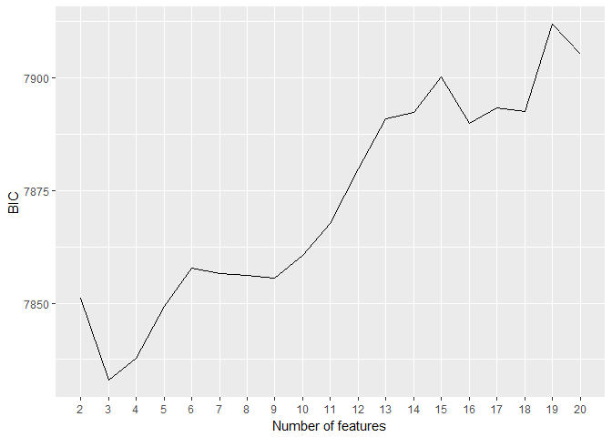
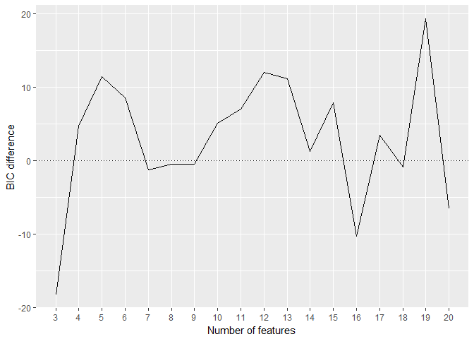
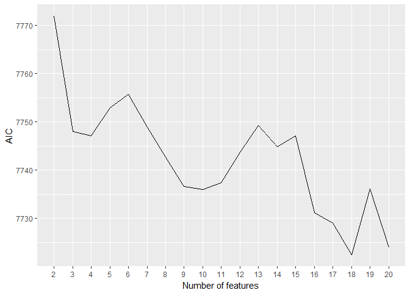
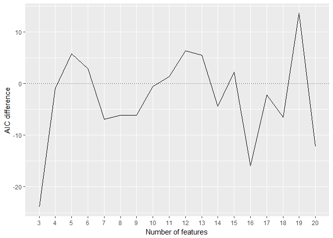
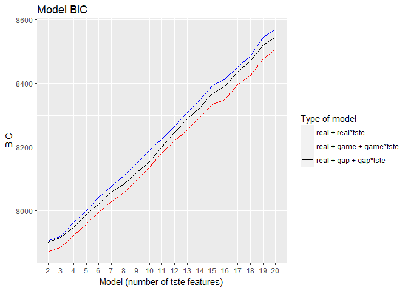
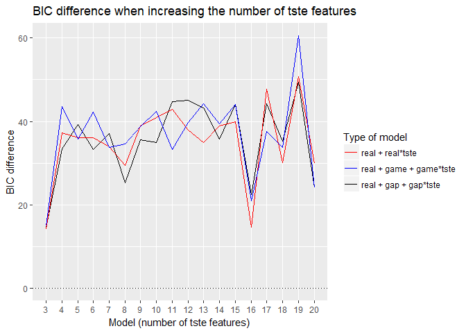
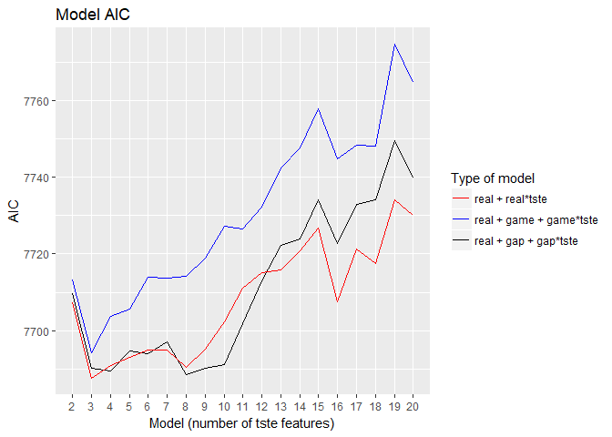
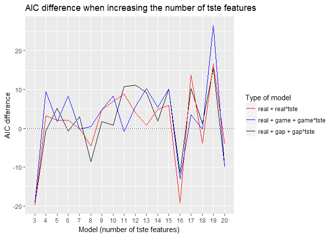

MAPSS Thesis II - model 1
================
Chih-Yu Chiang
July 24, 2017

-   [Setup](#setup)
-   [Variable](#variable)
-   [Model](#model)
-   [Information criteria](#information-criteria)
    -   [preference ~ tste](#preference-tste)
    -   [(link for the above position)](#link-for-the-above-position)
    -   [preference ~ tste + personality + interaction](#preference-tste-personality-interaction)
    -   [(link for the above position)](#link-for-the-above-position-1)
-   [Model summaries](#model-summaries)
    -   [preference ~ tste + real + real\*tste](#preference-tste-real-realtste)
    -   [(link for the above position)](#link-for-the-above-position-2)
    -   [preference ~ tste + real + game + game\*tste](#preference-tste-real-game-gametste)
    -   [(link for the above position)](#link-for-the-above-position-3)
    -   [preference ~ tste + real + gap + gap\*tste](#preference-tste-real-gap-gaptste)
    -   [(link for the above position)](#link-for-the-above-position-4)

``` r
knitr::opts_chunk$set(
    message=FALSE,
    warning=FALSE
)

#Prevent result wrapping
options(width=120)
```

Setup
-----

Data of game and player are read in and matched up.

-   Game release data, `release` (year), is read in as an interval variable.
-   Missing values are imputed with variable mean conveniently (`star_user` and `star_GS`).

``` r
#--Package
library(tidyverse)
library(corrplot)
library(modelr)
library(glmnet)
library(VGAM)
library(randomForest)
library(e1071)
library(car)
library(rlist)
library(pander)
set.seed(1)


#--Read in
#Core game info and group distance/probability data
core_cluster <- read_csv("../data/core_cluster.csv", col_names=TRUE) %>%
  mutate(group_survey = factor(group_survey),
         group_review = factor(group_review),
         core_id = factor(core_id)) %>%
  select(-X1)

#Core game tste scores (of dif numbers of features)
core_tsteScore <- read_csv("../data/tste_concat.csv", col_names=TRUE) %>%
  select(-X1)

#Player-related survey data
survey <- read_csv("../data/survey.csv", col_names=TRUE) %>%
  mutate(race = factor(race),
         sex = factor(sex),
         core_id = factor(core_id)) %>%
  select(-id)


#--Impute missing with mean
imputation_mean <- function(c){
  c[is.na(c)] <- mean(c, na.rm=TRUE)
  return(c)
}
core_cluster <- mutate_each(core_cluster,
                            funs(imputation_mean(.)),
                            star_user, star_GS)


#--Match up
#Main df, key=player-game
df <- bind_cols(core_cluster, core_tsteScore) %>%
  left_join(survey, by=c("core_id"), copy=FALSE)
```

Variable
--------

Compute and select variables to be used in models.

-   Player preference:

| Name           | Definition                 | Unit                        |
|----------------|----------------------------|-----------------------------|
| `preference_1` | how much do you like       | Likert 1-7=like             |
| `preference_2` | how often play it          | ordinary 1=never-7=everyday |
| `preference_3` | does it fit personal taste | Likert 1-7=fit              |

-   Game characteristics:

<table style="width:36%;">
<colgroup>
<col width="8%" />
<col width="18%" />
<col width="9%" />
</colgroup>
<thead>
<tr class="header">
<th>Name</th>
<th>Definition</th>
<th>Unit</th>
</tr>
</thead>
<tbody>
<tr class="odd">
<td><code>distance_survey_mean_x</code></td>
<td>group score from survey (distance from group mean in tste)</td>
<td>cosine distance</td>
</tr>
<tr class="even">
<td><code>distance_survey_median_x</code></td>
<td>group score from survey (distance from group median in tste)</td>
<td>cosine distance</td>
</tr>
<tr class="odd">
<td><code>probability_review_mean_x</code></td>
<td>group score from review (mean probability to be categorized in the group by NN)</td>
<td>percentage</td>
</tr>
<tr class="even">
<td><code>probability_review_median_x</code></td>
<td>group score from review (median probability to be categorized in the group by NN)</td>
<td>percentage</td>
</tr>
<tr class="odd">
<td><code>group_survey</code></td>
<td>group identity from survey</td>
<td>categorical 1-group number</td>
</tr>
<tr class="even">
<td><code>group_review</code></td>
<td>group identity from review</td>
<td>categorical 1-group number</td>
</tr>
<tr class="odd">
<td><code>tste_n_x</code></td>
<td>group score from survey (tste), n=number of features</td>
<td>interval arbitrary</td>
</tr>
</tbody>
</table>

-   Player personality:

<table style="width:36%;">
<colgroup>
<col width="8%" />
<col width="18%" />
<col width="9%" />
</colgroup>
<thead>
<tr class="header">
<th>Name</th>
<th>Definition</th>
<th>Unit</th>
</tr>
</thead>
<tbody>
<tr class="odd">
<td><code>game_xxxxx</code></td>
<td>Big-five personality in game</td>
<td>Likert 1-7</td>
</tr>
<tr class="even">
<td><code>real_xxxxx</code></td>
<td>Big-five personality in real life</td>
<td>Likert 1-7</td>
</tr>
<tr class="odd">
<td><code>gap_xxxxx</code></td>
<td>personality gap (game - real)</td>
<td>Likert 1-7</td>
</tr>
<tr class="even">
<td><code>satis_xxxxx</code></td>
<td>SDT satisfaction in real life</td>
<td>Likert 1-7</td>
</tr>
<tr class="odd">
<td><code>dissatis_xxxxx</code></td>
<td>SDT dissatisfaction in real life</td>
<td>Likert 1-7</td>
</tr>
<tr class="even">
<td><code>combined_xxxxx</code></td>
<td>SDT combined (previous two) dissatisfaction in real life</td>
<td>Likert 1-7</td>
</tr>
</tbody>
</table>

-   Control:

| Name        | Definition                                    | Unit                      |
|-------------|-----------------------------------------------|---------------------------|
| `age`       | player age                                    | interval                  |
| `education` | player education                              | ordinary 1-7=PhD          |
| `income`    | player annual household income                | ordinary 1-7=over 150,000 |
| `sex`       | player sex                                    | categorical 1=male        |
| `race`      | player race                                   | categorical 1-5           |
| `release`   | game release year                             | interval year             |
| `star_GS`   | general game quality rated by GameSpot expert | interval 0-10             |
| `star_user` | general game quality rated by GameSpot user   | interval 0-10             |

``` r
updateVars <- function(){
  #--Create response variable
  df <<- df %>%
    rowwise() %>% #Rowwise to make the ordinary functions work
    mutate(preference = mean(c(preference_3))) %>%
    ungroup() #Ungroup to cancel rowwise
  
  
  #--Compute personalty gap
  df <<- mutate(df,
                gap_extraversion = game_extraversion - real_extraversion,
                gap_agreeableness = game_agreeableness - real_agreeableness,
                gap_conscientiousness = game_conscientiousness - real_conscientiousness,
                gap_emotionstability = game_emotionstability - real_emotionstability,
                gap_openness = game_openness - real_openness)
  
  
  #--Acquire player df, key=player
  df_player <<- distinct(df, respondent, .keep_all=TRUE)
  
  
  #--Select variables to be included in regression (model formation)
  #Sets of predictor variables from file
  predictors <- read.csv("../data/vars/predictors.csv", header=TRUE, na.strings="")
  
  #Get column name as model id
  modelId <- colnames(predictors)
  
  #predictor variable as strings for each model
  predictorString <- apply(predictors, MARGIN=2, function(x) paste(na.omit(x), collapse="+"))
  
  #Make the dfs into a data frame
  dfs <<- data.frame(predictorString, modelId, stringsAsFactors=FALSE) %>%
    mutate(df_x = map(predictorString, ~ model.matrix(as.formula(paste("preference ~ ", .x, sep="")), data=df)[, -1])) %>% #df with only predictor variables; [, -1] used to remove redundant intercept column
    mutate(df_yx = map(df_x, ~ bind_cols(select(df, preference), data.frame(.x)))) #df also with outcome variables
  
  #Set row names for reference
  row.names(dfs) <<- modelId
}
```

Model
-----


-   preference measurement = "how much does it fit taste?"

``` r
#Update vars
updateVars()

#Full df with control marked
df_c <- mutate(df,
               c_age = age,
               c_education = education,
               c_income = income,
               c_race = race,
               c_sex = sex,
               c_release = release,
               c_star = star_user)

#Partial models
featureNo <- seq(2, 20)
model_gChar_tstes <- map(featureNo, ~ lm(preference ~ ., data=select(df_c, preference, starts_with("c_"), starts_with(paste("tste_", .x, "_", sep="")))))

#Full models
dfs$model_lm <- map(dfs$df_yx, ~ lm(preference ~ ., data=.x))
```

Information criteria
--------------------

### preference ~ tste

### (link for the above position)

``` r
"
### BIC and BIC difference
"
```

    ## [1] "\n### BIC and BIC difference\n"

``` r
#--preference ~ tstes
BICs <- unlist(map(model_gChar_tstes, BIC))
BICs_dif <- BICs[-1] - lag(BICs)[-1]

ggplot(data=as.data.frame(BICs)) +
  geom_line(mapping=aes(seq(2, 20), BICs)) +
  labs(x="Number of features", y="BIC") +
  scale_x_continuous(breaks=seq(2, 20), minor_breaks=NULL)
```



``` r
#Model 3 = the BIC change from 2-feature to 3-feature models 
ggplot(data=as.data.frame(BICs_dif)) +
  geom_line(mapping=aes(seq(3, 20), BICs_dif)) +
  labs(x="Number of features", y="BIC difference") +
  scale_x_continuous(breaks=seq(3, 20), minor_breaks=NULL) +
  geom_hline(yintercept=0, linetype=3)
```



``` r
"
### AIC and AIC difference
"
```

    ## [1] "\n### AIC and AIC difference\n"

``` r
#--preference ~ tstes
AICs <- unlist(map(model_gChar_tstes, AIC))
AICs_dif <- AICs[-1] - lag(AICs)[-1]

ggplot(data=as.data.frame(AICs)) +
  geom_line(mapping=aes(seq(2, 20), AICs)) +
  labs(x="Number of features", y="AIC") +
  scale_x_continuous(breaks=seq(2, 20), minor_breaks=NULL)
```



``` r
#Model 3 = the AIC change from 2-feature to 3-feature models 
ggplot(data=as.data.frame(AICs_dif)) +
  geom_line(mapping=aes(seq(3, 20), AICs_dif)) +
  labs(x="Number of features", y="AIC difference") +
  scale_x_continuous(breaks=seq(3, 20), minor_breaks=NULL) +
  geom_hline(yintercept=0, linetype=3)
```



### preference ~ tste + personality + interaction

### (link for the above position)

``` r
#--BIC
dfs$BIC <- unlist(map(dfs$model_lm, BIC))
dfs$BIC_dif <- dfs$BIC - lag(dfs$BIC)

#Seperate batch models from dfs
dfs_gap <- slice(dfs, 1:19)
dfs_real <- slice(dfs, 20:38)
dfs_game <- slice(dfs, 39:57)

dfs_gap_dif <- slice(dfs, 2:19)
dfs_real_dif <- slice(dfs, 21:38)
dfs_game_dif <- slice(dfs, 40:57)

#Batch models
ggplot() +
  geom_line(data=dfs_gap, mapping=aes(seq(1, dim(dfs_gap)[1]), BIC, color="3")) +
  geom_line(data=dfs_real, mapping=aes(seq(1, dim(dfs_real)[1]), BIC, color="1")) +
  geom_line(data=dfs_game, mapping=aes(seq(1, dim(dfs_game)[1]), BIC, color="2")) +
  labs(x="Model (number of tste features)", y="BIC", title="Model BIC") +
  theme(legend.position="right", legend.direction="vertical")+
  scale_x_continuous(breaks=seq(1, dim(dfs_gap)[1]), minor_breaks=NULL, labels=seq(2, 20)) +
  scale_color_manual(name="Type of model", values=c("1"="red", "2"="blue", "3"="black"),
                     labels=c("real + real*tste", "real + game + game*tste", "real + gap + gap*tste"))
```



``` r
ggplot() +
  geom_line(data=dfs_gap_dif, mapping=aes(seq(1, dim(dfs_gap_dif)[1]), BIC_dif, color="3")) +
  geom_line(data=dfs_real_dif, mapping=aes(seq(1, dim(dfs_real_dif)[1]), BIC_dif, color="1")) +
  geom_line(data=dfs_game_dif, mapping=aes(seq(1, dim(dfs_game_dif)[1]), BIC_dif, color="2")) +
  labs(x="Model (number of tste features)", y="BIC difference", title="BIC difference when increasing the number of tste features") +
  scale_x_continuous(breaks=seq(1, dim(dfs_gap_dif)[1]), minor_breaks=NULL, labels=seq(3, 20)) +
  scale_color_manual(name="Type of model", values=c("1"="red", "2"="blue", "3"="black"),
                     labels=c("real + real*tste", "real + game + game*tste", "real + gap + gap*tste")) +
  geom_hline(yintercept=0, linetype=3)
```



``` r
#--AIC
dfs$AIC <- unlist(map(dfs$model_lm, AIC))
dfs$AIC_dif <- dfs$AIC - lag(dfs$AIC)

#Seperate batch models from dfs
dfs_gap <- slice(dfs, 1:19)
dfs_real <- slice(dfs, 20:38)
dfs_game <- slice(dfs, 39:57)

dfs_gap_dif <- slice(dfs, 2:19)
dfs_real_dif <- slice(dfs, 21:38)
dfs_game_dif <- slice(dfs, 40:57)

#Batch models
ggplot() +
  geom_line(data=dfs_gap, mapping=aes(seq(1, dim(dfs_gap)[1]), AIC, color="3")) +
  geom_line(data=dfs_real, mapping=aes(seq(1, dim(dfs_real)[1]), AIC, color="1")) +
  geom_line(data=dfs_game, mapping=aes(seq(1, dim(dfs_game)[1]), AIC, color="2")) +
  labs(x="Model (number of tste features)", y="AIC", title="Model AIC") +
  theme(legend.position="right", legend.direction="vertical")+
  scale_x_continuous(breaks=seq(1, dim(dfs_gap)[1]), minor_breaks=NULL, labels=seq(2, 20)) +
  scale_color_manual(name="Type of model", values=c("1"="red", "2"="blue", "3"="black"),
                     labels=c("real + real*tste", "real + game + game*tste", "real + gap + gap*tste"))
```



``` r
ggplot() +
  geom_line(data=dfs_gap_dif, mapping=aes(seq(1, dim(dfs_gap_dif)[1]), AIC_dif, color="3")) +
  geom_line(data=dfs_real_dif, mapping=aes(seq(1, dim(dfs_real_dif)[1]), AIC_dif, color="1")) +
  geom_line(data=dfs_game_dif, mapping=aes(seq(1, dim(dfs_game_dif)[1]), AIC_dif, color="2")) +
  labs(x="Model (number of tste features)", y="AIC difference", title="AIC difference when increasing the number of tste features") +
  scale_x_continuous(breaks=seq(1, dim(dfs_gap_dif)[1]), minor_breaks=NULL, labels=seq(3, 20)) +
  scale_color_manual(name="Type of model", values=c("1"="red", "2"="blue", "3"="black"),
                     labels=c("real + real*tste", "real + game + game*tste", "real + gap + gap*tste")) +
  geom_hline(yintercept=0, linetype=3)
```



Model summaries
---------------

### preference ~ tste + real + real\*tste

### (link for the above position)

``` r
#Summary
for(model in slice(dfs, 20:38)$model_lm) print(summary(model))
```

    ## 
    ## Call:
    ## lm(formula = preference ~ ., data = .x)
    ## 
    ## Residuals:
    ##     Min      1Q  Median      3Q     Max 
    ## -5.1010 -0.6919  0.2991  1.0503  2.7886 
    ## 
    ## Coefficients:
    ##                                   Estimate Std. Error t value Pr(>|t|)    
    ## (Intercept)                     64.8287090 14.0470786   4.615 4.16e-06 ***
    ## age                             -0.0140060  0.0046108  -3.038  0.00241 ** 
    ## education                        0.0186587  0.0263926   0.707  0.47967    
    ## income                           0.0067259  0.0168600   0.399  0.68999    
    ## race2                            0.0959058  0.1311371   0.731  0.46465    
    ## race4                           -0.2602814  0.1421503  -1.831  0.06724 .  
    ## race6                           -1.0605128  0.3438790  -3.084  0.00207 ** 
    ## race7                           -0.1130246  0.1345068  -0.840  0.40084    
    ## sex2                            -0.1078705  0.0716892  -1.505  0.13255    
    ## release                         -0.0300113  0.0068910  -4.355 1.39e-05 ***
    ## star_user                        0.0126612  0.0522624   0.242  0.80860    
    ## real_extraversion                0.0469039  0.0200097   2.344  0.01917 *  
    ## real_agreeableness              -0.0140629  0.0272988  -0.515  0.60650    
    ## real_conscientiousness           0.0819272  0.0296843   2.760  0.00583 ** 
    ## real_emotionstability           -0.0129549  0.0298429  -0.434  0.66426    
    ## real_openness                    0.1211446  0.0247065   4.903 1.01e-06 ***
    ## tste_2_0                        -0.3358572  0.3366757  -0.998  0.31860    
    ## tste_2_1                        -1.0201289  0.3639785  -2.803  0.00511 ** 
    ## real_extraversion.tste_2_0      -0.0003871  0.0231877  -0.017  0.98668    
    ## real_extraversion.tste_2_1      -0.0193589  0.0244193  -0.793  0.42800    
    ## real_agreeableness.tste_2_0     -0.0120119  0.0316352  -0.380  0.70421    
    ## real_agreeableness.tste_2_1     -0.0185263  0.0327468  -0.566  0.57163    
    ## real_conscientiousness.tste_2_0  0.0226403  0.0343942   0.658  0.51044    
    ## real_conscientiousness.tste_2_1  0.0953014  0.0364384   2.615  0.00898 ** 
    ## real_emotionstability.tste_2_0   0.0247912  0.0328895   0.754  0.45107    
    ## real_emotionstability.tste_2_1   0.1247772  0.0355060   3.514  0.00045 ***
    ## real_openness.tste_2_0           0.0533472  0.0282670   1.887  0.05926 .  
    ## real_openness.tste_2_1           0.0340220  0.0308816   1.102  0.27072    
    ## ---
    ## Signif. codes:  0 '***' 0.001 '**' 0.01 '*' 0.05 '.' 0.1 ' ' 1
    ## 
    ## Residual standard error: 1.457 on 2110 degrees of freedom
    ## Multiple R-squared:  0.07053,    Adjusted R-squared:  0.05863 
    ## F-statistic:  5.93 on 27 and 2110 DF,  p-value: < 2.2e-16
    ## 
    ## 
    ## Call:
    ## lm(formula = preference ~ ., data = .x)
    ## 
    ## Residuals:
    ##     Min      1Q  Median      3Q     Max 
    ## -5.0203 -0.6980  0.2892  1.0168  2.6595 
    ## 
    ## Coefficients:
    ##                                  Estimate Std. Error t value Pr(>|t|)    
    ## (Intercept)                     58.309417  14.027946   4.157 3.36e-05 ***
    ## age                             -0.014284   0.004587  -3.114  0.00187 ** 
    ## education                        0.018881   0.026264   0.719  0.47229    
    ## income                           0.008132   0.016770   0.485  0.62778    
    ## race2                            0.088773   0.130370   0.681  0.49599    
    ## race4                           -0.229133   0.141451  -1.620  0.10541    
    ## race6                           -1.045390   0.342234  -3.055  0.00228 ** 
    ## race7                           -0.136267   0.133845  -1.018  0.30875    
    ## sex2                            -0.095183   0.071367  -1.334  0.18245    
    ## release                         -0.026848   0.006881  -3.902 9.85e-05 ***
    ## star_user                        0.027240   0.052200   0.522  0.60184    
    ## real_extraversion                0.046398   0.019969   2.323  0.02025 *  
    ## real_agreeableness              -0.017913   0.027205  -0.658  0.51032    
    ## real_conscientiousness           0.088078   0.029695   2.966  0.00305 ** 
    ## real_emotionstability           -0.005732   0.029809  -0.192  0.84754    
    ## real_openness                    0.122820   0.024612   4.990 6.52e-07 ***
    ## tste_3_0                         0.829498   0.367617   2.256  0.02415 *  
    ## tste_3_1                         0.714872   0.309193   2.312  0.02087 *  
    ## tste_3_2                         0.429723   0.446134   0.963  0.33555    
    ## real_extraversion.tste_3_0       0.013337   0.025533   0.522  0.60147    
    ## real_extraversion.tste_3_1       0.012748   0.020760   0.614  0.53924    
    ## real_extraversion.tste_3_2      -0.020678   0.029924  -0.691  0.48964    
    ## real_agreeableness.tste_3_0      0.011818   0.034405   0.343  0.73127    
    ## real_agreeableness.tste_3_1     -0.010853   0.028427  -0.382  0.70267    
    ## real_agreeableness.tste_3_2     -0.072355   0.039366  -1.838  0.06620 .  
    ## real_conscientiousness.tste_3_0 -0.073318   0.037438  -1.958  0.05032 .  
    ## real_conscientiousness.tste_3_1 -0.052747   0.030748  -1.715  0.08641 .  
    ## real_conscientiousness.tste_3_2  0.037766   0.044611   0.847  0.39734    
    ## real_emotionstability.tste_3_0  -0.086397   0.036496  -2.367  0.01801 *  
    ## real_emotionstability.tste_3_1  -0.079005   0.029582  -2.671  0.00763 ** 
    ## real_emotionstability.tste_3_2   0.020264   0.043582   0.465  0.64201    
    ## real_openness.tste_3_0          -0.057137   0.031041  -1.841  0.06581 .  
    ## real_openness.tste_3_1          -0.008060   0.026489  -0.304  0.76096    
    ## real_openness.tste_3_2          -0.033978   0.038884  -0.874  0.38231    
    ## ---
    ## Signif. codes:  0 '***' 0.001 '**' 0.01 '*' 0.05 '.' 0.1 ' ' 1
    ## 
    ## Residual standard error: 1.449 on 2104 degrees of freedom
    ## Multiple R-squared:  0.08424,    Adjusted R-squared:  0.06988 
    ## F-statistic: 5.865 on 33 and 2104 DF,  p-value: < 2.2e-16
    ## 
    ## 
    ## Call:
    ## lm(formula = preference ~ ., data = .x)
    ## 
    ## Residuals:
    ##     Min      1Q  Median      3Q     Max 
    ## -5.0918 -0.7004  0.2771  1.0339  2.7230 
    ## 
    ## Coefficients:
    ##                                  Estimate Std. Error t value Pr(>|t|)    
    ## (Intercept)                     60.002120  14.203254   4.225 2.50e-05 ***
    ## age                             -0.014163   0.004592  -3.085  0.00206 ** 
    ## education                        0.021670   0.026292   0.824  0.40993    
    ## income                           0.005944   0.016788   0.354  0.72334    
    ## race2                            0.105350   0.130986   0.804  0.42132    
    ## race4                           -0.230953   0.141565  -1.631  0.10295    
    ## race6                           -1.063891   0.342677  -3.105  0.00193 ** 
    ## race7                           -0.130793   0.134026  -0.976  0.32924    
    ## sex2                            -0.096402   0.071429  -1.350  0.17728    
    ## release                         -0.027627   0.006959  -3.970 7.43e-05 ***
    ## star_user                        0.007167   0.055067   0.130  0.89646    
    ## real_extraversion                0.047432   0.020009   2.371  0.01785 *  
    ## real_agreeableness              -0.014244   0.027328  -0.521  0.60227    
    ## real_conscientiousness           0.090201   0.029816   3.025  0.00251 ** 
    ## real_emotionstability           -0.003811   0.029986  -0.127  0.89888    
    ## real_openness                    0.123355   0.024682   4.998 6.28e-07 ***
    ## tste_4_0                         0.397194   0.434882   0.913  0.36117    
    ## tste_4_1                         0.023297   0.462279   0.050  0.95981    
    ## tste_4_2                         1.132436   0.366463   3.090  0.00203 ** 
    ## tste_4_3                        -0.248196   0.312120  -0.795  0.42659    
    ## real_extraversion.tste_4_0      -0.039576   0.029692  -1.333  0.18272    
    ## real_extraversion.tste_4_1       0.046361   0.031293   1.482  0.13861    
    ## real_extraversion.tste_4_2       0.012626   0.025271   0.500  0.61739    
    ## real_extraversion.tste_4_3       0.010770   0.021184   0.508  0.61122    
    ## real_agreeableness.tste_4_0     -0.056534   0.039276  -1.439  0.15019    
    ## real_agreeableness.tste_4_1     -0.042864   0.042596  -1.006  0.31439    
    ## real_agreeableness.tste_4_2     -0.011800   0.034057  -0.346  0.72902    
    ## real_agreeableness.tste_4_3     -0.000694   0.028784  -0.024  0.98077    
    ## real_conscientiousness.tste_4_0  0.052890   0.043123   1.226  0.22015    
    ## real_conscientiousness.tste_4_1  0.028700   0.047371   0.606  0.54468    
    ## real_conscientiousness.tste_4_2 -0.084482   0.036925  -2.288  0.02224 *  
    ## real_conscientiousness.tste_4_3  0.012894   0.031732   0.406  0.68453    
    ## real_emotionstability.tste_4_0   0.017526   0.042497   0.412  0.68008    
    ## real_emotionstability.tste_4_1   0.037183   0.046573   0.798  0.42474    
    ## real_emotionstability.tste_4_2  -0.106238   0.036323  -2.925  0.00348 ** 
    ## real_emotionstability.tste_4_3   0.040682   0.030277   1.344  0.17921    
    ## real_openness.tste_4_0          -0.037205   0.038203  -0.974  0.33024    
    ## real_openness.tste_4_1          -0.049516   0.039210  -1.263  0.20678    
    ## real_openness.tste_4_2          -0.056988   0.031378  -1.816  0.06948 .  
    ## real_openness.tste_4_3          -0.027701   0.026292  -1.054  0.29219    
    ## ---
    ## Signif. codes:  0 '***' 0.001 '**' 0.01 '*' 0.05 '.' 0.1 ' ' 1
    ## 
    ## Residual standard error: 1.448 on 2098 degrees of freedom
    ## Multiple R-squared:  0.08797,    Adjusted R-squared:  0.07101 
    ## F-statistic: 5.188 on 39 and 2098 DF,  p-value: < 2.2e-16
    ## 
    ## 
    ## Call:
    ## lm(formula = preference ~ ., data = .x)
    ## 
    ## Residuals:
    ##     Min      1Q  Median      3Q     Max 
    ## -5.1416 -0.6885  0.2872  1.0229  2.6308 
    ## 
    ## Coefficients:
    ##                                  Estimate Std. Error t value Pr(>|t|)    
    ## (Intercept)                     47.732546  14.456947   3.302 0.000977 ***
    ## age                             -0.014637   0.004595  -3.186 0.001466 ** 
    ## education                        0.020730   0.026295   0.788 0.430571    
    ## income                           0.006807   0.016786   0.406 0.685142    
    ## race2                            0.071899   0.131122   0.548 0.583518    
    ## race4                           -0.226653   0.141516  -1.602 0.109394    
    ## race6                           -1.073871   0.342412  -3.136 0.001735 ** 
    ## race7                           -0.130006   0.134050  -0.970 0.332242    
    ## sex2                            -0.107824   0.071494  -1.508 0.131666    
    ## release                         -0.021544   0.007085  -3.041 0.002389 ** 
    ## star_user                        0.017379   0.056170   0.309 0.757052    
    ## real_extraversion                0.051226   0.020053   2.554 0.010705 *  
    ## real_agreeableness              -0.017691   0.027340  -0.647 0.517661    
    ## real_conscientiousness           0.090855   0.029789   3.050 0.002318 ** 
    ## real_emotionstability           -0.003965   0.029985  -0.132 0.894820    
    ## real_openness                    0.119416   0.024723   4.830 1.46e-06 ***
    ## tste_5_0                         0.996768   0.416764   2.392 0.016859 *  
    ## tste_5_1                         0.246502   0.436527   0.565 0.572346    
    ## tste_5_2                        -0.072714   0.337744  -0.215 0.829560    
    ## tste_5_3                         0.469247   0.436815   1.074 0.282836    
    ## tste_5_4                        -0.455783   0.410998  -1.109 0.267572    
    ## real_extraversion.tste_5_0      -0.011910   0.028509  -0.418 0.676152    
    ## real_extraversion.tste_5_1       0.002927   0.031345   0.093 0.925599    
    ## real_extraversion.tste_5_2      -0.001140   0.023155  -0.049 0.960741    
    ## real_extraversion.tste_5_3      -0.017978   0.029534  -0.609 0.542768    
    ## real_extraversion.tste_5_4      -0.043461   0.027643  -1.572 0.116050    
    ## real_agreeableness.tste_5_0     -0.046577   0.037746  -1.234 0.217354    
    ## real_agreeableness.tste_5_1      0.044573   0.042442   1.050 0.293748    
    ## real_agreeableness.tste_5_2     -0.034459   0.031965  -1.078 0.281151    
    ## real_agreeableness.tste_5_3      0.034986   0.039656   0.882 0.377747    
    ## real_agreeableness.tste_5_4      0.006537   0.037785   0.173 0.862673    
    ## real_conscientiousness.tste_5_0 -0.027967   0.041181  -0.679 0.497142    
    ## real_conscientiousness.tste_5_1  0.035619   0.045794   0.778 0.436760    
    ## real_conscientiousness.tste_5_2 -0.010093   0.033528  -0.301 0.763428    
    ## real_conscientiousness.tste_5_3 -0.117374   0.044567  -2.634 0.008509 ** 
    ## real_conscientiousness.tste_5_4  0.078160   0.041268   1.894 0.058367 .  
    ## real_emotionstability.tste_5_0  -0.061802   0.040579  -1.523 0.127911    
    ## real_emotionstability.tste_5_1  -0.033657   0.044976  -0.748 0.454342    
    ## real_emotionstability.tste_5_2   0.042105   0.031974   1.317 0.188035    
    ## real_emotionstability.tste_5_3  -0.077066   0.043346  -1.778 0.075562 .  
    ## real_emotionstability.tste_5_4   0.049257   0.041299   1.193 0.233125    
    ## real_openness.tste_5_0          -0.048590   0.036787  -1.321 0.186703    
    ## real_openness.tste_5_1          -0.120800   0.037879  -3.189 0.001448 ** 
    ## real_openness.tste_5_2           0.012907   0.028322   0.456 0.648636    
    ## real_openness.tste_5_3           0.050268   0.037299   1.348 0.177901    
    ## real_openness.tste_5_4           0.011388   0.034748   0.328 0.743149    
    ## ---
    ## Signif. codes:  0 '***' 0.001 '**' 0.01 '*' 0.05 '.' 0.1 ' ' 1
    ## 
    ## Residual standard error: 1.446 on 2092 degrees of freedom
    ## Multiple R-squared:  0.09219,    Adjusted R-squared:  0.07267 
    ## F-statistic: 4.721 on 45 and 2092 DF,  p-value: < 2.2e-16
    ## 
    ## 
    ## Call:
    ## lm(formula = preference ~ ., data = .x)
    ## 
    ## Residuals:
    ##     Min      1Q  Median      3Q     Max 
    ## -5.2127 -0.6866  0.2852  1.0292  2.8195 
    ## 
    ## Coefficients:
    ##                                  Estimate Std. Error t value Pr(>|t|)    
    ## (Intercept)                     46.113782  14.623143   3.153  0.00164 ** 
    ## age                             -0.014377   0.004592  -3.131  0.00177 ** 
    ## education                        0.018640   0.026354   0.707  0.47947    
    ## income                           0.006936   0.016780   0.413  0.67939    
    ## race2                            0.064689   0.131457   0.492  0.62271    
    ## race4                           -0.209754   0.141811  -1.479  0.13926    
    ## race6                           -1.077115   0.342828  -3.142  0.00170 ** 
    ## race7                           -0.143982   0.134163  -1.073  0.28331    
    ## sex2                            -0.109188   0.071632  -1.524  0.12759    
    ## release                         -0.020673   0.007169  -2.884  0.00397 ** 
    ## star_user                        0.004593   0.057756   0.080  0.93662    
    ## real_extraversion                0.048677   0.020026   2.431  0.01515 *  
    ## real_agreeableness              -0.019800   0.027377  -0.723  0.46962    
    ## real_conscientiousness           0.086818   0.029790   2.914  0.00360 ** 
    ## real_emotionstability           -0.006084   0.030062  -0.202  0.83962    
    ## real_openness                    0.123354   0.024685   4.997  6.3e-07 ***
    ## tste_6_0                        -0.426615   0.446024  -0.956  0.33894    
    ## tste_6_1                         0.445044   0.433784   1.026  0.30503    
    ## tste_6_2                         0.883321   0.380751   2.320  0.02044 *  
    ## tste_6_3                         0.411053   0.445392   0.923  0.35617    
    ## tste_6_4                         0.040496   0.419682   0.096  0.92314    
    ## tste_6_5                        -0.196068   0.441879  -0.444  0.65729    
    ## real_extraversion.tste_6_0      -0.013018   0.030994  -0.420  0.67451    
    ## real_extraversion.tste_6_1      -0.014683   0.029043  -0.506  0.61320    
    ## real_extraversion.tste_6_2      -0.011962   0.026027  -0.460  0.64586    
    ## real_extraversion.tste_6_3       0.012916   0.031668   0.408  0.68341    
    ## real_extraversion.tste_6_4      -0.034804   0.027939  -1.246  0.21300    
    ## real_extraversion.tste_6_5      -0.029826   0.030742  -0.970  0.33206    
    ## real_agreeableness.tste_6_0     -0.040382   0.042766  -0.944  0.34516    
    ## real_agreeableness.tste_6_1      0.036939   0.039276   0.940  0.34707    
    ## real_agreeableness.tste_6_2     -0.033156   0.034533  -0.960  0.33709    
    ## real_agreeableness.tste_6_3     -0.049377   0.043444  -1.137  0.25585    
    ## real_agreeableness.tste_6_4     -0.011919   0.038373  -0.311  0.75612    
    ## real_agreeableness.tste_6_5      0.025765   0.041988   0.614  0.53954    
    ## real_conscientiousness.tste_6_0  0.023421   0.045372   0.516  0.60577    
    ## real_conscientiousness.tste_6_1 -0.093674   0.044226  -2.118  0.03429 *  
    ## real_conscientiousness.tste_6_2 -0.017399   0.037438  -0.465  0.64218    
    ## real_conscientiousness.tste_6_3 -0.119353   0.045142  -2.644  0.00826 ** 
    ## real_conscientiousness.tste_6_4  0.065400   0.041826   1.564  0.11806    
    ## real_conscientiousness.tste_6_5 -0.017232   0.045792  -0.376  0.70672    
    ## real_emotionstability.tste_6_0   0.018767   0.044760   0.419  0.67505    
    ## real_emotionstability.tste_6_1  -0.089493   0.043493  -2.058  0.03975 *  
    ## real_emotionstability.tste_6_2  -0.062091   0.037010  -1.678  0.09356 .  
    ## real_emotionstability.tste_6_3  -0.023736   0.044391  -0.535  0.59291    
    ## real_emotionstability.tste_6_4   0.072201   0.040739   1.772  0.07649 .  
    ## real_emotionstability.tste_6_5   0.041996   0.043908   0.956  0.33895    
    ## real_openness.tste_6_0           0.087305   0.038560   2.264  0.02367 *  
    ## real_openness.tste_6_1           0.029217   0.036900   0.792  0.42857    
    ## real_openness.tste_6_2          -0.042492   0.033599  -1.265  0.20613    
    ## real_openness.tste_6_3           0.079655   0.038917   2.047  0.04080 *  
    ## real_openness.tste_6_4          -0.071414   0.034514  -2.069  0.03866 *  
    ## real_openness.tste_6_5           0.048620   0.036906   1.317  0.18785    
    ## ---
    ## Signif. codes:  0 '***' 0.001 '**' 0.01 '*' 0.05 '.' 0.1 ' ' 1
    ## 
    ## Residual standard error: 1.445 on 2086 degrees of freedom
    ## Multiple R-squared:  0.0964, Adjusted R-squared:  0.07431 
    ## F-statistic: 4.364 on 51 and 2086 DF,  p-value: < 2.2e-16
    ## 
    ## 
    ## Call:
    ## lm(formula = preference ~ ., data = .x)
    ## 
    ## Residuals:
    ##     Min      1Q  Median      3Q     Max 
    ## -5.0785 -0.6924  0.2757  0.9980  2.7804 
    ## 
    ## Coefficients:
    ##                                  Estimate Std. Error t value Pr(>|t|)    
    ## (Intercept)                     49.967031  15.044310   3.321 0.000911 ***
    ## age                             -0.014233   0.004588  -3.102 0.001948 ** 
    ## education                        0.018839   0.026336   0.715 0.474490    
    ## income                           0.007069   0.016800   0.421 0.673977    
    ## race2                            0.067384   0.131237   0.513 0.607688    
    ## race4                           -0.216973   0.142311  -1.525 0.127500    
    ## race6                           -1.052970   0.344078  -3.060 0.002240 ** 
    ## race7                           -0.134587   0.134071  -1.004 0.315570    
    ## sex2                            -0.122675   0.071557  -1.714 0.086610 .  
    ## release                         -0.022644   0.007388  -3.065 0.002205 ** 
    ## star_user                        0.024353   0.060427   0.403 0.686975    
    ## real_extraversion                0.047439   0.020062   2.365 0.018139 *  
    ## real_agreeableness              -0.024234   0.027385  -0.885 0.376295    
    ## real_conscientiousness           0.081770   0.029837   2.741 0.006185 ** 
    ## real_emotionstability           -0.007022   0.030043  -0.234 0.815213    
    ## real_openness                    0.119992   0.024750   4.848 1.34e-06 ***
    ## tste_7_0                         0.324631   0.413032   0.786 0.431975    
    ## tste_7_1                         0.951639   0.456652   2.084 0.037287 *  
    ## tste_7_2                         0.127606   0.428625   0.298 0.765954    
    ## tste_7_3                        -0.952243   0.345616  -2.755 0.005917 ** 
    ## tste_7_4                        -0.520782   0.439360  -1.185 0.236027    
    ## tste_7_5                         0.285321   0.469204   0.608 0.543190    
    ## tste_7_6                        -0.140221   0.477055  -0.294 0.768840    
    ## real_extraversion.tste_7_0       0.016161   0.028238   0.572 0.567186    
    ## real_extraversion.tste_7_1      -0.016161   0.032045  -0.504 0.614094    
    ## real_extraversion.tste_7_2       0.027809   0.029148   0.954 0.340164    
    ## real_extraversion.tste_7_3      -0.012132   0.023220  -0.522 0.601392    
    ## real_extraversion.tste_7_4       0.025377   0.029962   0.847 0.397120    
    ## real_extraversion.tste_7_5       0.011193   0.032325   0.346 0.729178    
    ## real_extraversion.tste_7_6      -0.013236   0.033685  -0.393 0.694404    
    ## real_agreeableness.tste_7_0      0.064587   0.038322   1.685 0.092068 .  
    ## real_agreeableness.tste_7_1     -0.081431   0.044791  -1.818 0.069207 .  
    ## real_agreeableness.tste_7_2      0.007470   0.038589   0.194 0.846531    
    ## real_agreeableness.tste_7_3      0.046794   0.031577   1.482 0.138524    
    ## real_agreeableness.tste_7_4     -0.003292   0.039899  -0.083 0.934241    
    ## real_agreeableness.tste_7_5     -0.062956   0.044912  -1.402 0.161130    
    ## real_agreeableness.tste_7_6     -0.009843   0.044693  -0.220 0.825713    
    ## real_conscientiousness.tste_7_0 -0.049270   0.041971  -1.174 0.240570    
    ## real_conscientiousness.tste_7_1 -0.070513   0.046385  -1.520 0.128623    
    ## real_conscientiousness.tste_7_2 -0.060290   0.043714  -1.379 0.167976    
    ## real_conscientiousness.tste_7_3  0.049168   0.034070   1.443 0.149121    
    ## real_conscientiousness.tste_7_4  0.126666   0.045033   2.813 0.004959 ** 
    ## real_conscientiousness.tste_7_5 -0.081145   0.047845  -1.696 0.090035 .  
    ## real_conscientiousness.tste_7_6 -0.040069   0.047415  -0.845 0.398166    
    ## real_emotionstability.tste_7_0  -0.060826   0.041339  -1.471 0.141332    
    ## real_emotionstability.tste_7_1  -0.060718   0.045015  -1.349 0.177535    
    ## real_emotionstability.tste_7_2  -0.057177   0.042248  -1.353 0.176081    
    ## real_emotionstability.tste_7_3   0.073245   0.033770   2.169 0.030201 *  
    ## real_emotionstability.tste_7_4   0.060172   0.044371   1.356 0.175219    
    ## real_emotionstability.tste_7_5   0.017917   0.046318   0.387 0.698931    
    ## real_emotionstability.tste_7_6   0.027299   0.047413   0.576 0.564826    
    ## real_openness.tste_7_0          -0.056290   0.034809  -1.617 0.106006    
    ## real_openness.tste_7_1          -0.014416   0.039910  -0.361 0.717979    
    ## real_openness.tste_7_2           0.021779   0.035911   0.606 0.544274    
    ## real_openness.tste_7_3           0.029938   0.030541   0.980 0.327085    
    ## real_openness.tste_7_4          -0.078055   0.037754  -2.067 0.038814 *  
    ## real_openness.tste_7_5           0.052727   0.039648   1.330 0.183706    
    ## real_openness.tste_7_6           0.071507   0.041340   1.730 0.083827 .  
    ## ---
    ## Signif. codes:  0 '***' 0.001 '**' 0.01 '*' 0.05 '.' 0.1 ' ' 1
    ## 
    ## Residual standard error: 1.443 on 2080 degrees of freedom
    ## Multiple R-squared:  0.1015, Adjusted R-squared:  0.07686 
    ## F-statistic: 4.121 on 57 and 2080 DF,  p-value: < 2.2e-16
    ## 
    ## 
    ## Call:
    ## lm(formula = preference ~ ., data = .x)
    ## 
    ## Residuals:
    ##     Min      1Q  Median      3Q     Max 
    ## -5.0397 -0.6965  0.2851  0.9958  2.7695 
    ## 
    ## Coefficients:
    ##                                  Estimate Std. Error t value Pr(>|t|)    
    ## (Intercept)                     55.281236  15.622439   3.539 0.000411 ***
    ## age                             -0.013978   0.004580  -3.052 0.002304 ** 
    ## education                        0.017742   0.026297   0.675 0.499959    
    ## income                           0.007211   0.016746   0.431 0.666783    
    ## race2                            0.071705   0.131180   0.547 0.584701    
    ## race4                           -0.191478   0.141444  -1.354 0.175969    
    ## race6                           -1.037174   0.343768  -3.017 0.002583 ** 
    ## race7                           -0.141618   0.134072  -1.056 0.290961    
    ## sex2                            -0.114898   0.071356  -1.610 0.107507    
    ## release                         -0.025130   0.007666  -3.278 0.001062 ** 
    ## star_user                       -0.015665   0.059606  -0.263 0.792720    
    ## real_extraversion                0.047720   0.020094   2.375 0.017649 *  
    ## real_agreeableness              -0.015332   0.027334  -0.561 0.574921    
    ## real_conscientiousness           0.081606   0.029816   2.737 0.006254 ** 
    ## real_emotionstability           -0.013390   0.030209  -0.443 0.657646    
    ## real_openness                    0.119490   0.024750   4.828 1.48e-06 ***
    ## tste_8_0                        -0.832605   0.460045  -1.810 0.070466 .  
    ## tste_8_1                        -0.481695   0.498401  -0.966 0.333917    
    ## tste_8_2                         0.068918   0.422666   0.163 0.870490    
    ## tste_8_3                        -0.050571   0.425145  -0.119 0.905326    
    ## tste_8_4                         0.391035   0.438076   0.893 0.372165    
    ## tste_8_5                         0.522052   0.395528   1.320 0.187018    
    ## tste_8_6                        -0.855809   0.432716  -1.978 0.048088 *  
    ## tste_8_7                        -1.149596   0.442202  -2.600 0.009397 ** 
    ## real_extraversion.tste_8_0       0.001024   0.031861   0.032 0.974366    
    ## real_extraversion.tste_8_1      -0.042166   0.033598  -1.255 0.209610    
    ## real_extraversion.tste_8_2      -0.010235   0.028095  -0.364 0.715676    
    ## real_extraversion.tste_8_3      -0.010328   0.029640  -0.348 0.727535    
    ## real_extraversion.tste_8_4      -0.018305   0.029852  -0.613 0.539816    
    ## real_extraversion.tste_8_5       0.019856   0.027931   0.711 0.477233    
    ## real_extraversion.tste_8_6       0.009796   0.030832   0.318 0.750739    
    ## real_extraversion.tste_8_7       0.022462   0.031316   0.717 0.473294    
    ## real_agreeableness.tste_8_0      0.110619   0.043390   2.549 0.010863 *  
    ## real_agreeableness.tste_8_1      0.001281   0.046430   0.028 0.977993    
    ## real_agreeableness.tste_8_2      0.027009   0.038532   0.701 0.483421    
    ## real_agreeableness.tste_8_3     -0.014995   0.038853  -0.386 0.699569    
    ## real_agreeableness.tste_8_4     -0.048680   0.039762  -1.224 0.220981    
    ## real_agreeableness.tste_8_5     -0.020129   0.038891  -0.518 0.604803    
    ## real_agreeableness.tste_8_6      0.053915   0.040968   1.316 0.188309    
    ## real_agreeableness.tste_8_7      0.016012   0.042140   0.380 0.704009    
    ## real_conscientiousness.tste_8_0  0.042352   0.046204   0.917 0.359437    
    ## real_conscientiousness.tste_8_1  0.062412   0.050385   1.239 0.215597    
    ## real_conscientiousness.tste_8_2 -0.021913   0.042219  -0.519 0.603796    
    ## real_conscientiousness.tste_8_3  0.112984   0.042250   2.674 0.007551 ** 
    ## real_conscientiousness.tste_8_4 -0.027711   0.044684  -0.620 0.535235    
    ## real_conscientiousness.tste_8_5 -0.037884   0.040186  -0.943 0.345935    
    ## real_conscientiousness.tste_8_6  0.113526   0.046447   2.444 0.014599 *  
    ## real_conscientiousness.tste_8_7  0.037789   0.044890   0.842 0.399987    
    ## real_emotionstability.tste_8_0   0.012337   0.044154   0.279 0.779958    
    ## real_emotionstability.tste_8_1   0.126049   0.049768   2.533 0.011390 *  
    ## real_emotionstability.tste_8_2  -0.052271   0.041651  -1.255 0.209627    
    ## real_emotionstability.tste_8_3   0.016285   0.042065   0.387 0.698695    
    ## real_emotionstability.tste_8_4  -0.012121   0.043730  -0.277 0.781673    
    ## real_emotionstability.tste_8_5  -0.033780   0.040938  -0.825 0.409382    
    ## real_emotionstability.tste_8_6   0.033608   0.044207   0.760 0.447200    
    ## real_emotionstability.tste_8_7   0.062251   0.043820   1.421 0.155577    
    ## real_openness.tste_8_0           0.007872   0.039108   0.201 0.840487    
    ## real_openness.tste_8_1           0.015663   0.041256   0.380 0.704237    
    ## real_openness.tste_8_2           0.046976   0.035468   1.324 0.185498    
    ## real_openness.tste_8_3          -0.083117   0.036633  -2.269 0.023375 *  
    ## real_openness.tste_8_4           0.020834   0.037030   0.563 0.573752    
    ## real_openness.tste_8_5          -0.022091   0.034904  -0.633 0.526869    
    ## real_openness.tste_8_6          -0.031105   0.037553  -0.828 0.407609    
    ## real_openness.tste_8_7           0.110714   0.039213   2.823 0.004797 ** 
    ## ---
    ## Signif. codes:  0 '***' 0.001 '**' 0.01 '*' 0.05 '.' 0.1 ' ' 1
    ## 
    ## Residual standard error: 1.44 on 2074 degrees of freedom
    ## Multiple R-squared:  0.1084, Adjusted R-squared:  0.08131 
    ## F-statistic: 4.002 on 63 and 2074 DF,  p-value: < 2.2e-16
    ## 
    ## 
    ## Call:
    ## lm(formula = preference ~ ., data = .x)
    ## 
    ## Residuals:
    ##     Min      1Q  Median      3Q     Max 
    ## -5.0160 -0.7057  0.2652  0.9967  2.8334 
    ## 
    ## Coefficients:
    ##                                   Estimate Std. Error t value Pr(>|t|)    
    ## (Intercept)                     57.3412455 15.9983829   3.584 0.000346 ***
    ## age                             -0.0141168  0.0045853  -3.079 0.002107 ** 
    ## education                        0.0157632  0.0263736   0.598 0.550112    
    ## income                           0.0106352  0.0167762   0.634 0.526189    
    ## race2                            0.0710000  0.1311790   0.541 0.588397    
    ## race4                           -0.1920608  0.1422519  -1.350 0.177117    
    ## race6                           -0.9829987  0.3444651  -2.854 0.004364 ** 
    ## race7                           -0.1397420  0.1345194  -1.039 0.299008    
    ## sex2                            -0.1074147  0.0715836  -1.501 0.133625    
    ## release                         -0.0262105  0.0078485  -3.340 0.000854 ***
    ## star_user                        0.0013411  0.0605065   0.022 0.982319    
    ## real_extraversion                0.0491045  0.0201252   2.440 0.014773 *  
    ## real_agreeableness              -0.0192869  0.0275144  -0.701 0.483399    
    ## real_conscientiousness           0.0779368  0.0299398   2.603 0.009304 ** 
    ## real_emotionstability           -0.0149264  0.0303627  -0.492 0.623052    
    ## real_openness                    0.1175076  0.0248028   4.738 2.31e-06 ***
    ## tste_9_0                         0.3724242  0.4705911   0.791 0.428803    
    ## tste_9_1                         0.0290902  0.4303808   0.068 0.946117    
    ## tste_9_2                        -1.0084637  0.4352019  -2.317 0.020588 *  
    ## tste_9_3                        -0.6244208  0.4665048  -1.339 0.180878    
    ## tste_9_4                        -0.8401781  0.3783444  -2.221 0.026481 *  
    ## tste_9_5                         0.1075560  0.4620827   0.233 0.815968    
    ## tste_9_6                         0.2920037  0.4625856   0.631 0.527952    
    ## tste_9_7                        -0.1482084  0.4638695  -0.320 0.749376    
    ## tste_9_8                         0.0296016  0.4153450   0.071 0.943190    
    ## real_extraversion.tste_9_0       0.0034666  0.0328861   0.105 0.916060    
    ## real_extraversion.tste_9_1       0.0082955  0.0304126   0.273 0.785062    
    ## real_extraversion.tste_9_2       0.0219497  0.0301522   0.728 0.466718    
    ## real_extraversion.tste_9_3      -0.0393121  0.0322911  -1.217 0.223579    
    ## real_extraversion.tste_9_4       0.0001375  0.0256892   0.005 0.995730    
    ## real_extraversion.tste_9_5      -0.0072579  0.0343885  -0.211 0.832865    
    ## real_extraversion.tste_9_6       0.0278862  0.0301806   0.924 0.355605    
    ## real_extraversion.tste_9_7       0.0076038  0.0313084   0.243 0.808133    
    ## real_extraversion.tste_9_8      -0.0354463  0.0271877  -1.304 0.192460    
    ## real_agreeableness.tste_9_0     -0.0216436  0.0458197  -0.472 0.636716    
    ## real_agreeableness.tste_9_1      0.0142866  0.0406843   0.351 0.725506    
    ## real_agreeableness.tste_9_2      0.0634768  0.0396020   1.603 0.109116    
    ## real_agreeableness.tste_9_3      0.0944603  0.0446037   2.118 0.034314 *  
    ## real_agreeableness.tste_9_4      0.0146277  0.0355776   0.411 0.681006    
    ## real_agreeableness.tste_9_5      0.0090428  0.0450389   0.201 0.840893    
    ## real_agreeableness.tste_9_6      0.0147629  0.0409412   0.361 0.718444    
    ## real_agreeableness.tste_9_7      0.0392431  0.0422291   0.929 0.352846    
    ## real_agreeableness.tste_9_8     -0.0648720  0.0391797  -1.656 0.097924 .  
    ## real_conscientiousness.tste_9_0 -0.0685310  0.0478400  -1.433 0.152151    
    ## real_conscientiousness.tste_9_1  0.0949906  0.0449467   2.113 0.034685 *  
    ## real_conscientiousness.tste_9_2  0.0644820  0.0426184   1.513 0.130430    
    ## real_conscientiousness.tste_9_3  0.0326191  0.0480604   0.679 0.497397    
    ## real_conscientiousness.tste_9_4  0.0616806  0.0382345   1.613 0.106849    
    ## real_conscientiousness.tste_9_5  0.0507098  0.0475812   1.066 0.286660    
    ## real_conscientiousness.tste_9_6 -0.0749478  0.0466637  -1.606 0.108399    
    ## real_conscientiousness.tste_9_7 -0.0324971  0.0477007  -0.681 0.495776    
    ## real_conscientiousness.tste_9_8 -0.0192270  0.0417563  -0.460 0.645236    
    ## real_emotionstability.tste_9_0  -0.0689173  0.0466616  -1.477 0.139839    
    ## real_emotionstability.tste_9_1  -0.0164908  0.0441262  -0.374 0.708651    
    ## real_emotionstability.tste_9_2   0.0509824  0.0421802   1.209 0.226923    
    ## real_emotionstability.tste_9_3   0.0248293  0.0460071   0.540 0.589472    
    ## real_emotionstability.tste_9_4   0.0662803  0.0368276   1.800 0.072047 .  
    ## real_emotionstability.tste_9_5   0.0032605  0.0483188   0.067 0.946207    
    ## real_emotionstability.tste_9_6  -0.0417077  0.0448603  -0.930 0.352623    
    ## real_emotionstability.tste_9_7  -0.0541823  0.0464133  -1.167 0.243189    
    ## real_emotionstability.tste_9_8   0.0873729  0.0394579   2.214 0.026915 *  
    ## real_openness.tste_9_0           0.0220804  0.0407649   0.542 0.588117    
    ## real_openness.tste_9_1          -0.1006535  0.0377082  -2.669 0.007661 ** 
    ## real_openness.tste_9_2          -0.0118557  0.0371233  -0.319 0.749486    
    ## real_openness.tste_9_3           0.0286208  0.0386470   0.741 0.459038    
    ## real_openness.tste_9_4           0.0455475  0.0319547   1.425 0.154199    
    ## real_openness.tste_9_5          -0.0723058  0.0421897  -1.714 0.086711 .  
    ## real_openness.tste_9_6           0.0162471  0.0382131   0.425 0.670756    
    ## real_openness.tste_9_7           0.0497503  0.0400432   1.242 0.214224    
    ## real_openness.tste_9_8           0.0331899  0.0337903   0.982 0.326102    
    ## ---
    ## Signif. codes:  0 '***' 0.001 '**' 0.01 '*' 0.05 '.' 0.1 ' ' 1
    ## 
    ## Residual standard error: 1.439 on 2068 degrees of freedom
    ## Multiple R-squared:  0.1114, Adjusted R-squared:  0.08172 
    ## F-statistic: 3.756 on 69 and 2068 DF,  p-value: < 2.2e-16
    ## 
    ## 
    ## Call:
    ## lm(formula = preference ~ ., data = .x)
    ## 
    ## Residuals:
    ##     Min      1Q  Median      3Q     Max 
    ## -5.2472 -0.6955  0.2660  0.9850  2.7861 
    ## 
    ## Coefficients:
    ##                                   Estimate Std. Error t value Pr(>|t|)    
    ## (Intercept)                      57.594134  15.756006   3.655 0.000263 ***
    ## age                              -0.014092   0.004590  -3.070 0.002170 ** 
    ## education                         0.015641   0.026411   0.592 0.553774    
    ## income                            0.009835   0.016781   0.586 0.557878    
    ## race2                             0.076692   0.131632   0.583 0.560214    
    ## race4                            -0.191939   0.142584  -1.346 0.178404    
    ## race6                            -0.995065   0.344497  -2.888 0.003912 ** 
    ## race7                            -0.134286   0.134609  -0.998 0.318589    
    ## sex2                             -0.106972   0.071717  -1.492 0.135962    
    ## release                          -0.026392   0.007738  -3.411 0.000661 ***
    ## star_user                         0.016582   0.059490   0.279 0.780470    
    ## real_extraversion                 0.048848   0.020168   2.422 0.015519 *  
    ## real_agreeableness               -0.019090   0.027576  -0.692 0.488851    
    ## real_conscientiousness            0.076748   0.030037   2.555 0.010686 *  
    ## real_emotionstability            -0.014545   0.030477  -0.477 0.633248    
    ## real_openness                     0.115899   0.024843   4.665 3.28e-06 ***
    ## tste_10_0                        -0.025176   0.407593  -0.062 0.950754    
    ## tste_10_1                         0.701476   0.426118   1.646 0.099875 .  
    ## tste_10_2                        -0.503775   0.476662  -1.057 0.290690    
    ## tste_10_3                         0.623037   0.458697   1.358 0.174524    
    ## tste_10_4                         0.506112   0.485077   1.043 0.296902    
    ## tste_10_5                         0.167282   0.451670   0.370 0.711150    
    ## tste_10_6                        -0.562497   0.452786  -1.242 0.214266    
    ## tste_10_7                         0.656824   0.400404   1.640 0.101074    
    ## tste_10_8                         0.396707   0.486353   0.816 0.414779    
    ## tste_10_9                         0.535638   0.457607   1.171 0.241927    
    ## real_extraversion.tste_10_0       0.042593   0.028196   1.511 0.131043    
    ## real_extraversion.tste_10_1      -0.031100   0.030829  -1.009 0.313201    
    ## real_extraversion.tste_10_2      -0.020139   0.032361  -0.622 0.533801    
    ## real_extraversion.tste_10_3       0.014685   0.032277   0.455 0.649171    
    ## real_extraversion.tste_10_4       0.012802   0.033227   0.385 0.700049    
    ## real_extraversion.tste_10_5       0.004627   0.030779   0.150 0.880527    
    ## real_extraversion.tste_10_6      -0.020693   0.029988  -0.690 0.490243    
    ## real_extraversion.tste_10_7      -0.023817   0.027083  -0.879 0.379296    
    ## real_extraversion.tste_10_8       0.027058   0.034620   0.782 0.434557    
    ## real_extraversion.tste_10_9      -0.015292   0.030889  -0.495 0.620606    
    ## real_agreeableness.tste_10_0      0.022285   0.037757   0.590 0.555113    
    ## real_agreeableness.tste_10_1     -0.009562   0.040076  -0.239 0.811444    
    ## real_agreeableness.tste_10_2      0.092518   0.046086   2.007 0.044828 *  
    ## real_agreeableness.tste_10_3     -0.057674   0.042576  -1.355 0.175686    
    ## real_agreeableness.tste_10_4      0.027949   0.043731   0.639 0.522830    
    ## real_agreeableness.tste_10_5      0.010067   0.041877   0.240 0.810047    
    ## real_agreeableness.tste_10_6      0.072053   0.042646   1.690 0.091262 .  
    ## real_agreeableness.tste_10_7     -0.032171   0.036946  -0.871 0.383983    
    ## real_agreeableness.tste_10_8      0.009913   0.046340   0.214 0.830628    
    ## real_agreeableness.tste_10_9     -0.019518   0.042900  -0.455 0.649182    
    ## real_conscientiousness.tste_10_0 -0.052423   0.040968  -1.280 0.200825    
    ## real_conscientiousness.tste_10_1 -0.087403   0.044457  -1.966 0.049428 *  
    ## real_conscientiousness.tste_10_2  0.019029   0.047825   0.398 0.690759    
    ## real_conscientiousness.tste_10_3 -0.098721   0.047508  -2.078 0.037836 *  
    ## real_conscientiousness.tste_10_4 -0.068318   0.048203  -1.417 0.156542    
    ## real_conscientiousness.tste_10_5  0.016957   0.047249   0.359 0.719712    
    ## real_conscientiousness.tste_10_6  0.041118   0.046087   0.892 0.372398    
    ## real_conscientiousness.tste_10_7 -0.045686   0.040048  -1.141 0.254088    
    ## real_conscientiousness.tste_10_8  0.047613   0.049200   0.968 0.333283    
    ## real_conscientiousness.tste_10_9  0.032801   0.044558   0.736 0.461730    
    ## real_emotionstability.tste_10_0  -0.054642   0.040653  -1.344 0.179063    
    ## real_emotionstability.tste_10_1  -0.039961   0.043272  -0.923 0.355865    
    ## real_emotionstability.tste_10_2  -0.007700   0.046136  -0.167 0.867468    
    ## real_emotionstability.tste_10_3  -0.057612   0.045833  -1.257 0.208889    
    ## real_emotionstability.tste_10_4  -0.094321   0.048385  -1.949 0.051385 .  
    ## real_emotionstability.tste_10_5  -0.023094   0.044670  -0.517 0.605225    
    ## real_emotionstability.tste_10_6  -0.013778   0.045410  -0.303 0.761600    
    ## real_emotionstability.tste_10_7  -0.024416   0.038724  -0.631 0.528423    
    ## real_emotionstability.tste_10_8  -0.054671   0.048849  -1.119 0.263195    
    ## real_emotionstability.tste_10_9  -0.071522   0.045049  -1.588 0.112519    
    ## real_openness.tste_10_0           0.042629   0.034955   1.220 0.222782    
    ## real_openness.tste_10_1           0.037244   0.037634   0.990 0.322469    
    ## real_openness.tste_10_2           0.009175   0.039712   0.231 0.817311    
    ## real_openness.tste_10_3           0.011345   0.039876   0.285 0.776046    
    ## real_openness.tste_10_4          -0.007759   0.041152  -0.189 0.850462    
    ## real_openness.tste_10_5          -0.044084   0.038246  -1.153 0.249192    
    ## real_openness.tste_10_6           0.017402   0.037955   0.459 0.646639    
    ## real_openness.tste_10_7          -0.011924   0.033741  -0.353 0.723816    
    ## real_openness.tste_10_8          -0.106379   0.042230  -2.519 0.011842 *  
    ## real_openness.tste_10_9          -0.047580   0.040076  -1.187 0.235264    
    ## ---
    ## Signif. codes:  0 '***' 0.001 '**' 0.01 '*' 0.05 '.' 0.1 ' ' 1
    ## 
    ## Residual standard error: 1.44 on 2062 degrees of freedom
    ## Multiple R-squared:  0.1135, Adjusted R-squared:  0.08122 
    ## F-statistic: 3.519 on 75 and 2062 DF,  p-value: < 2.2e-16
    ## 
    ## 
    ## Call:
    ## lm(formula = preference ~ ., data = .x)
    ## 
    ## Residuals:
    ##     Min      1Q  Median      3Q     Max 
    ## -4.9869 -0.6894  0.2693  0.9894  2.7767 
    ## 
    ## Coefficients:
    ##                                     Estimate Std. Error t value Pr(>|t|)    
    ## (Intercept)                       57.3405037 16.0358257   3.576 0.000357 ***
    ## age                               -0.0140383  0.0045960  -3.054 0.002283 ** 
    ## education                          0.0148217  0.0264924   0.559 0.575903    
    ## income                             0.0094039  0.0168186   0.559 0.576130    
    ## race2                              0.0763751  0.1318094   0.579 0.562359    
    ## race4                             -0.1805529  0.1427628  -1.265 0.206120    
    ## race6                             -0.9852636  0.3447301  -2.858 0.004305 ** 
    ## race7                             -0.1342252  0.1346343  -0.997 0.318901    
    ## sex2                              -0.1110154  0.0719026  -1.544 0.122750    
    ## release                           -0.0262782  0.0078735  -3.338 0.000860 ***
    ## star_user                          0.0211494  0.0621177   0.340 0.733535    
    ## real_extraversion                  0.0490224  0.0202120   2.425 0.015377 *  
    ## real_agreeableness                -0.0190709  0.0276284  -0.690 0.490105    
    ## real_conscientiousness             0.0768063  0.0300903   2.553 0.010766 *  
    ## real_emotionstability             -0.0149929  0.0305081  -0.491 0.623168    
    ## real_openness                      0.1150511  0.0249621   4.609 4.29e-06 ***
    ## tste_11_0                          0.2340813  0.4880744   0.480 0.631562    
    ## tste_11_1                         -0.6464038  0.4690241  -1.378 0.168295    
    ## tste_11_2                          0.0175599  0.4151681   0.042 0.966267    
    ## tste_11_3                          0.3506704  0.5014977   0.699 0.484477    
    ## tste_11_4                         -0.0379567  0.4990616  -0.076 0.939382    
    ## tste_11_5                         -0.0090210  0.4329883  -0.021 0.983380    
    ## tste_11_6                          0.9928053  0.4241719   2.341 0.019349 *  
    ## tste_11_7                         -0.1949834  0.4834920  -0.403 0.686783    
    ## tste_11_8                         -0.4372334  0.3615606  -1.209 0.226689    
    ## tste_11_9                          0.7796307  0.4472730   1.743 0.081470 .  
    ## tste_11_10                         0.4474344  0.4408624   1.015 0.310269    
    ## real_extraversion.tste_11_0       -0.0161515  0.0339257  -0.476 0.634065    
    ## real_extraversion.tste_11_1        0.0158625  0.0313379   0.506 0.612788    
    ## real_extraversion.tste_11_2        0.0114117  0.0282577   0.404 0.686369    
    ## real_extraversion.tste_11_3        0.0002396  0.0345061   0.007 0.994459    
    ## real_extraversion.tste_11_4        0.0484160  0.0332387   1.457 0.145375    
    ## real_extraversion.tste_11_5        0.0185515  0.0305691   0.607 0.544004    
    ## real_extraversion.tste_11_6       -0.0140605  0.0292037  -0.481 0.630238    
    ## real_extraversion.tste_11_7       -0.0332382  0.0341615  -0.973 0.330682    
    ## real_extraversion.tste_11_8       -0.0020163  0.0255179  -0.079 0.937029    
    ## real_extraversion.tste_11_9       -0.0192812  0.0318796  -0.605 0.545370    
    ## real_extraversion.tste_11_10       0.0359138  0.0297754   1.206 0.227896    
    ## real_agreeableness.tste_11_0       0.0546343  0.0463542   1.179 0.238683    
    ## real_agreeableness.tste_11_1      -0.0134434  0.0419800  -0.320 0.748824    
    ## real_agreeableness.tste_11_2       0.0402192  0.0378622   1.062 0.288247    
    ## real_agreeableness.tste_11_3      -0.0065102  0.0461032  -0.141 0.887719    
    ## real_agreeableness.tste_11_4       0.0275707  0.0450772   0.612 0.540848    
    ## real_agreeableness.tste_11_5      -0.0207365  0.0413028  -0.502 0.615679    
    ## real_agreeableness.tste_11_6      -0.0497624  0.0396808  -1.254 0.209960    
    ## real_agreeableness.tste_11_7       0.0728872  0.0461672   1.579 0.114544    
    ## real_agreeableness.tste_11_8       0.0022479  0.0353991   0.064 0.949374    
    ## real_agreeableness.tste_11_9      -0.0639101  0.0416493  -1.534 0.125064    
    ## real_agreeableness.tste_11_10     -0.0486428  0.0424301  -1.146 0.251754    
    ## real_conscientiousness.tste_11_0   0.0774480  0.0510087   1.518 0.129086    
    ## real_conscientiousness.tste_11_1   0.1052474  0.0475244   2.215 0.026897 *  
    ## real_conscientiousness.tste_11_2  -0.0271154  0.0421099  -0.644 0.519700    
    ## real_conscientiousness.tste_11_3   0.0190399  0.0495100   0.385 0.700598    
    ## real_conscientiousness.tste_11_4  -0.0142847  0.0500506  -0.285 0.775362    
    ## real_conscientiousness.tste_11_5  -0.0375155  0.0428767  -0.875 0.381696    
    ## real_conscientiousness.tste_11_6  -0.0655008  0.0422592  -1.550 0.121301    
    ## real_conscientiousness.tste_11_7  -0.0014617  0.0492817  -0.030 0.976342    
    ## real_conscientiousness.tste_11_8  -0.0134134  0.0374420  -0.358 0.720197    
    ## real_conscientiousness.tste_11_9  -0.0431440  0.0456887  -0.944 0.345125    
    ## real_conscientiousness.tste_11_10 -0.0670383  0.0452120  -1.483 0.138292    
    ## real_emotionstability.tste_11_0   -0.0699764  0.0476669  -1.468 0.142249    
    ## real_emotionstability.tste_11_1    0.0852058  0.0460011   1.852 0.064133 .  
    ## real_emotionstability.tste_11_2   -0.0524920  0.0413104  -1.271 0.203989    
    ## real_emotionstability.tste_11_3   -0.0132542  0.0496049  -0.267 0.789346    
    ## real_emotionstability.tste_11_4   -0.0470318  0.0491894  -0.956 0.339115    
    ## real_emotionstability.tste_11_5   -0.0118901  0.0434740  -0.273 0.784496    
    ## real_emotionstability.tste_11_6   -0.0874821  0.0425992  -2.054 0.040140 *  
    ## real_emotionstability.tste_11_7    0.0007610  0.0484107   0.016 0.987460    
    ## real_emotionstability.tste_11_8    0.0579922  0.0360834   1.607 0.108170    
    ## real_emotionstability.tste_11_9   -0.0076967  0.0447304  -0.172 0.863400    
    ## real_emotionstability.tste_11_10   0.0048077  0.0438714   0.110 0.912748    
    ## real_openness.tste_11_0           -0.1074416  0.0419012  -2.564 0.010413 *  
    ## real_openness.tste_11_1           -0.0276641  0.0403391  -0.686 0.492924    
    ## real_openness.tste_11_2            0.0104951  0.0348965   0.301 0.763636    
    ## real_openness.tste_11_3           -0.0719330  0.0414639  -1.735 0.082920 .  
    ## real_openness.tste_11_4           -0.0215482  0.0413409  -0.521 0.602261    
    ## real_openness.tste_11_5            0.0337974  0.0374816   0.902 0.367318    
    ## real_openness.tste_11_6           -0.0098909  0.0374423  -0.264 0.791679    
    ## real_openness.tste_11_7            0.0304024  0.0419910   0.724 0.469134    
    ## real_openness.tste_11_8            0.0248120  0.0318358   0.779 0.435848    
    ## real_openness.tste_11_9           -0.0189435  0.0397919  -0.476 0.634080    
    ## real_openness.tste_11_10          -0.0023307  0.0369845  -0.063 0.949758    
    ## ---
    ## Signif. codes:  0 '***' 0.001 '**' 0.01 '*' 0.05 '.' 0.1 ' ' 1
    ## 
    ## Residual standard error: 1.441 on 2056 degrees of freedom
    ## Multiple R-squared:  0.1148, Adjusted R-squared:  0.07988 
    ## F-statistic:  3.29 on 81 and 2056 DF,  p-value: < 2.2e-16
    ## 
    ## 
    ## Call:
    ## lm(formula = preference ~ ., data = .x)
    ## 
    ## Residuals:
    ##     Min      1Q  Median      3Q     Max 
    ## -4.9179 -0.6886  0.2712  0.9911  2.9053 
    ## 
    ## Coefficients:
    ##                                    Estimate Std. Error t value Pr(>|t|)    
    ## (Intercept)                       47.516953  16.463910   2.886  0.00394 ** 
    ## age                               -0.013929   0.004594  -3.032  0.00246 ** 
    ## education                          0.018639   0.026459   0.704  0.48123    
    ## income                             0.006825   0.016846   0.405  0.68540    
    ## race2                              0.071488   0.132057   0.541  0.58833    
    ## race4                             -0.181898   0.143223  -1.270  0.20422    
    ## race6                             -0.976489   0.347204  -2.812  0.00496 ** 
    ## race7                             -0.120433   0.134588  -0.895  0.37098    
    ## sex2                              -0.118903   0.071933  -1.653  0.09849 .  
    ## release                           -0.021556   0.008071  -2.671  0.00763 ** 
    ## star_user                          0.060685   0.062880   0.965  0.33461    
    ## real_extraversion                  0.047092   0.020305   2.319  0.02048 *  
    ## real_agreeableness                -0.011355   0.027790  -0.409  0.68286    
    ## real_conscientiousness             0.077733   0.030190   2.575  0.01010 *  
    ## real_emotionstability             -0.021035   0.030689  -0.685  0.49316    
    ## real_openness                      0.116347   0.025086   4.638 3.74e-06 ***
    ## tste_12_0                         -0.380963   0.460332  -0.828  0.40800    
    ## tste_12_1                         -0.035777   0.412279  -0.087  0.93086    
    ## tste_12_2                          1.428796   0.435159   3.283  0.00104 ** 
    ## tste_12_3                          0.059945   0.484182   0.124  0.90148    
    ## tste_12_4                         -0.370852   0.466564  -0.795  0.42679    
    ## tste_12_5                         -0.052231   0.475582  -0.110  0.91256    
    ## tste_12_6                         -0.696265   0.483315  -1.441  0.14985    
    ## tste_12_7                         -0.023312   0.478670  -0.049  0.96116    
    ## tste_12_8                         -0.089637   0.406258  -0.221  0.82539    
    ## tste_12_9                         -0.500801   0.472558  -1.060  0.28938    
    ## tste_12_10                         0.106840   0.401019   0.266  0.78994    
    ## tste_12_11                        -1.025781   0.416430  -2.463  0.01385 *  
    ## real_extraversion.tste_12_0       -0.021474   0.032325  -0.664  0.50657    
    ## real_extraversion.tste_12_1        0.025486   0.028407   0.897  0.36973    
    ## real_extraversion.tste_12_2        0.020617   0.029666   0.695  0.48714    
    ## real_extraversion.tste_12_3       -0.003447   0.034023  -0.101  0.91931    
    ## real_extraversion.tste_12_4        0.003471   0.030753   0.113  0.91013    
    ## real_extraversion.tste_12_5        0.012088   0.032245   0.375  0.70778    
    ## real_extraversion.tste_12_6       -0.007378   0.033020  -0.223  0.82323    
    ## real_extraversion.tste_12_7        0.042626   0.033732   1.264  0.20650    
    ## real_extraversion.tste_12_8        0.008568   0.027827   0.308  0.75820    
    ## real_extraversion.tste_12_9        0.021972   0.032318   0.680  0.49667    
    ## real_extraversion.tste_12_10      -0.021389   0.027397  -0.781  0.43508    
    ## real_extraversion.tste_12_11       0.049338   0.028780   1.714  0.08662 .  
    ## real_agreeableness.tste_12_0       0.035875   0.045331   0.791  0.42880    
    ## real_agreeableness.tste_12_1      -0.045757   0.038165  -1.199  0.23069    
    ## real_agreeableness.tste_12_2      -0.019881   0.039795  -0.500  0.61742    
    ## real_agreeableness.tste_12_3      -0.039352   0.044489  -0.885  0.37651    
    ## real_agreeableness.tste_12_4       0.030358   0.041901   0.725  0.46884    
    ## real_agreeableness.tste_12_5       0.043210   0.045009   0.960  0.33715    
    ## real_agreeableness.tste_12_6      -0.016521   0.045160  -0.366  0.71453    
    ## real_agreeableness.tste_12_7      -0.075716   0.044981  -1.683  0.09247 .  
    ## real_agreeableness.tste_12_8      -0.031392   0.038358  -0.818  0.41322    
    ## real_agreeableness.tste_12_9      -0.028404   0.044499  -0.638  0.52334    
    ## real_agreeableness.tste_12_10     -0.060740   0.036815  -1.650  0.09913 .  
    ## real_agreeableness.tste_12_11      0.020018   0.039262   0.510  0.61019    
    ## real_conscientiousness.tste_12_0   0.003895   0.047822   0.081  0.93509    
    ## real_conscientiousness.tste_12_1   0.014588   0.042855   0.340  0.73359    
    ## real_conscientiousness.tste_12_2  -0.115902   0.044348  -2.613  0.00903 ** 
    ## real_conscientiousness.tste_12_3   0.003900   0.048691   0.080  0.93617    
    ## real_conscientiousness.tste_12_4  -0.026545   0.046912  -0.566  0.57156    
    ## real_conscientiousness.tste_12_5   0.092314   0.047644   1.938  0.05281 .  
    ## real_conscientiousness.tste_12_6   0.099319   0.050167   1.980  0.04786 *  
    ## real_conscientiousness.tste_12_7  -0.009871   0.049752  -0.198  0.84275    
    ## real_conscientiousness.tste_12_8  -0.010257   0.041021  -0.250  0.80258    
    ## real_conscientiousness.tste_12_9   0.044907   0.047437   0.947  0.34392    
    ## real_conscientiousness.tste_12_10  0.011859   0.040968   0.289  0.77225    
    ## real_conscientiousness.tste_12_11  0.043519   0.040252   1.081  0.27975    
    ## real_emotionstability.tste_12_0    0.066462   0.046697   1.423  0.15481    
    ## real_emotionstability.tste_12_1    0.042429   0.041395   1.025  0.30550    
    ## real_emotionstability.tste_12_2   -0.106852   0.042798  -2.497  0.01262 *  
    ## real_emotionstability.tste_12_3    0.038803   0.048811   0.795  0.42672    
    ## real_emotionstability.tste_12_4   -0.001482   0.046415  -0.032  0.97454    
    ## real_emotionstability.tste_12_5    0.008727   0.045645   0.191  0.84840    
    ## real_emotionstability.tste_12_6    0.075501   0.047467   1.591  0.11186    
    ## real_emotionstability.tste_12_7    0.032110   0.047057   0.682  0.49509    
    ## real_emotionstability.tste_12_8    0.013821   0.040468   0.342  0.73275    
    ## real_emotionstability.tste_12_9    0.049434   0.047107   1.049  0.29412    
    ## real_emotionstability.tste_12_10   0.049070   0.039426   1.245  0.21342    
    ## real_emotionstability.tste_12_11   0.085935   0.040769   2.108  0.03516 *  
    ## real_openness.tste_12_0            0.035467   0.039163   0.906  0.36524    
    ## real_openness.tste_12_1           -0.017380   0.035204  -0.494  0.62158    
    ## real_openness.tste_12_2           -0.080718   0.037313  -2.163  0.03064 *  
    ## real_openness.tste_12_3           -0.010128   0.041019  -0.247  0.80500    
    ## real_openness.tste_12_4            0.065215   0.038876   1.678  0.09359 .  
    ## real_openness.tste_12_5           -0.107802   0.041229  -2.615  0.00900 ** 
    ## real_openness.tste_12_6           -0.004545   0.041007  -0.111  0.91176    
    ## real_openness.tste_12_7            0.014298   0.041578   0.344  0.73097    
    ## real_openness.tste_12_8            0.061444   0.034799   1.766  0.07760 .  
    ## real_openness.tste_12_9            0.014741   0.041153   0.358  0.72023    
    ## real_openness.tste_12_10           0.020969   0.033479   0.626  0.53116    
    ## real_openness.tste_12_11           0.026366   0.037236   0.708  0.47898    
    ## ---
    ## Signif. codes:  0 '***' 0.001 '**' 0.01 '*' 0.05 '.' 0.1 ' ' 1
    ## 
    ## Residual standard error: 1.44 on 2050 degrees of freedom
    ## Multiple R-squared:  0.1181, Adjusted R-squared:  0.08064 
    ## F-statistic: 3.155 on 87 and 2050 DF,  p-value: < 2.2e-16
    ## 
    ## 
    ## Call:
    ## lm(formula = preference ~ ., data = .x)
    ## 
    ## Residuals:
    ##     Min      1Q  Median      3Q     Max 
    ## -4.9478 -0.6946  0.2690  1.0013  2.9490 
    ## 
    ## Coefficients:
    ##                                     Estimate Std. Error t value Pr(>|t|)    
    ## (Intercept)                       44.7478931 16.9655490   2.638  0.00841 ** 
    ## age                               -0.0132869  0.0045995  -2.889  0.00391 ** 
    ## education                          0.0171273  0.0264947   0.646  0.51807    
    ## income                             0.0061927  0.0168267   0.368  0.71289    
    ## race2                              0.0419974  0.1323564   0.317  0.75104    
    ## race4                             -0.1750902  0.1429311  -1.225  0.22072    
    ## race6                             -0.9838073  0.3463432  -2.841  0.00455 ** 
    ## race7                             -0.1134828  0.1347988  -0.842  0.39996    
    ## sex2                              -0.1326473  0.0719491  -1.844  0.06538 .  
    ## release                           -0.0200460  0.0083160  -2.411  0.01602 *  
    ## star_user                          0.0303565  0.0612370   0.496  0.62014    
    ## real_extraversion                  0.0460755  0.0202524   2.275  0.02301 *  
    ## real_agreeableness                -0.0088743  0.0277779  -0.319  0.74940    
    ## real_conscientiousness             0.0801812  0.0301701   2.658  0.00793 ** 
    ## real_emotionstability             -0.0222771  0.0307069  -0.725  0.46824    
    ## real_openness                      0.1121480  0.0250968   4.469  8.3e-06 ***
    ## tste_13_0                          0.0537308  0.4365067   0.123  0.90205    
    ## tste_13_1                          0.5497367  0.4112864   1.337  0.18149    
    ## tste_13_2                          0.1154632  0.4043225   0.286  0.77523    
    ## tste_13_3                         -0.0968496  0.4330873  -0.224  0.82307    
    ## tste_13_4                          0.4661632  0.4401851   1.059  0.28972    
    ## tste_13_5                          1.0566247  0.4564975   2.315  0.02073 *  
    ## tste_13_6                         -0.2882202  0.4890610  -0.589  0.55570    
    ## tste_13_7                         -0.2196450  0.4584007  -0.479  0.63188    
    ## tste_13_8                          0.0940618  0.4131221   0.228  0.81991    
    ## tste_13_9                          1.3582342  0.5051034   2.689  0.00722 ** 
    ## tste_13_10                         0.9852874  0.4333293   2.274  0.02308 *  
    ## tste_13_11                         0.3502829  0.4590184   0.763  0.44548    
    ## tste_13_12                         0.3537530  0.4633757   0.763  0.44530    
    ## real_extraversion.tste_13_0        0.0214812  0.0298817   0.719  0.47230    
    ## real_extraversion.tste_13_1        0.0273191  0.0283649   0.963  0.33559    
    ## real_extraversion.tste_13_2       -0.0327753  0.0281422  -1.165  0.24430    
    ## real_extraversion.tste_13_3        0.0011367  0.0298319   0.038  0.96961    
    ## real_extraversion.tste_13_4        0.0297484  0.0312970   0.951  0.34196    
    ## real_extraversion.tste_13_5       -0.0227676  0.0310310  -0.734  0.46321    
    ## real_extraversion.tste_13_6       -0.0001958  0.0334392  -0.006  0.99533    
    ## real_extraversion.tste_13_7       -0.0124941  0.0309673  -0.403  0.68665    
    ## real_extraversion.tste_13_8       -0.0427323  0.0293809  -1.454  0.14598    
    ## real_extraversion.tste_13_9       -0.0752267  0.0349193  -2.154  0.03133 *  
    ## real_extraversion.tste_13_10       0.0262605  0.0292685   0.897  0.36970    
    ## real_extraversion.tste_13_11       0.0249504  0.0327520   0.762  0.44627    
    ## real_extraversion.tste_13_12       0.0161494  0.0309208   0.522  0.60153    
    ## real_agreeableness.tste_13_0      -0.0364418  0.0413969  -0.880  0.37880    
    ## real_agreeableness.tste_13_1       0.0337048  0.0376236   0.896  0.37044    
    ## real_agreeableness.tste_13_2       0.0056259  0.0389817   0.144  0.88526    
    ## real_agreeableness.tste_13_3       0.0219701  0.0401567   0.547  0.58436    
    ## real_agreeableness.tste_13_4      -0.0020023  0.0427156  -0.047  0.96262    
    ## real_agreeableness.tste_13_5       0.0130647  0.0423242   0.309  0.75760    
    ## real_agreeableness.tste_13_6      -0.0089999  0.0437308  -0.206  0.83697    
    ## real_agreeableness.tste_13_7      -0.0070218  0.0414742  -0.169  0.86557    
    ## real_agreeableness.tste_13_8       0.0500529  0.0383921   1.304  0.19247    
    ## real_agreeableness.tste_13_9       0.0626415  0.0486139   1.289  0.19770    
    ## real_agreeableness.tste_13_10     -0.1249791  0.0398504  -3.136  0.00174 ** 
    ## real_agreeableness.tste_13_11     -0.0467209  0.0447997  -1.043  0.29712    
    ## real_agreeableness.tste_13_12      0.0094564  0.0437823   0.216  0.82902    
    ## real_conscientiousness.tste_13_0  -0.0213420  0.0436136  -0.489  0.62465    
    ## real_conscientiousness.tste_13_1  -0.0765650  0.0408251  -1.875  0.06088 .  
    ## real_conscientiousness.tste_13_2  -0.0266648  0.0417866  -0.638  0.52347    
    ## real_conscientiousness.tste_13_3   0.0657178  0.0445085   1.477  0.13996    
    ## real_conscientiousness.tste_13_4  -0.0982888  0.0463118  -2.122  0.03393 *  
    ## real_conscientiousness.tste_13_5  -0.0620657  0.0445061  -1.395  0.16330    
    ## real_conscientiousness.tste_13_6  -0.0418444  0.0493489  -0.848  0.39658    
    ## real_conscientiousness.tste_13_7   0.0647863  0.0469776   1.379  0.16802    
    ## real_conscientiousness.tste_13_8  -0.0037929  0.0431522  -0.088  0.92997    
    ## real_conscientiousness.tste_13_9  -0.0916199  0.0515133  -1.779  0.07546 .  
    ## real_conscientiousness.tste_13_10 -0.1000501  0.0441610  -2.266  0.02358 *  
    ## real_conscientiousness.tste_13_11  0.0172382  0.0471560   0.366  0.71473    
    ## real_conscientiousness.tste_13_12  0.0288461  0.0467465   0.617  0.53725    
    ## real_emotionstability.tste_13_0   -0.0395375  0.0435594  -0.908  0.36416    
    ## real_emotionstability.tste_13_1   -0.0720690  0.0409996  -1.758  0.07893 .  
    ## real_emotionstability.tste_13_2    0.0393439  0.0402626   0.977  0.32859    
    ## real_emotionstability.tste_13_3    0.0078812  0.0435162   0.181  0.85630    
    ## real_emotionstability.tste_13_4   -0.0372648  0.0450009  -0.828  0.40772    
    ## real_emotionstability.tste_13_5   -0.0718366  0.0460303  -1.561  0.11876    
    ## real_emotionstability.tste_13_6    0.0355902  0.0495845   0.718  0.47298    
    ## real_emotionstability.tste_13_7    0.0067007  0.0456450   0.147  0.88330    
    ## real_emotionstability.tste_13_8   -0.0661237  0.0418711  -1.579  0.11444    
    ## real_emotionstability.tste_13_9   -0.1579811  0.0484003  -3.264  0.00112 ** 
    ## real_emotionstability.tste_13_10  -0.0098339  0.0414361  -0.237  0.81243    
    ## real_emotionstability.tste_13_11   0.0026223  0.0454332   0.058  0.95398    
    ## real_emotionstability.tste_13_12  -0.0313608  0.0441498  -0.710  0.47758    
    ## real_openness.tste_13_0            0.0418796  0.0378721   1.106  0.26894    
    ## real_openness.tste_13_1           -0.0348847  0.0343750  -1.015  0.31031    
    ## real_openness.tste_13_2            0.0252491  0.0349277   0.723  0.46983    
    ## real_openness.tste_13_3           -0.0597722  0.0378923  -1.577  0.11485    
    ## real_openness.tste_13_4           -0.0028801  0.0387133  -0.074  0.94070    
    ## real_openness.tste_13_5           -0.0716720  0.0385171  -1.861  0.06292 .  
    ## real_openness.tste_13_6            0.0729156  0.0413010   1.765  0.07763 .  
    ## real_openness.tste_13_7           -0.0229244  0.0374979  -0.611  0.54104    
    ## real_openness.tste_13_8            0.0416043  0.0364121   1.143  0.25334    
    ## real_openness.tste_13_9           -0.0304502  0.0429693  -0.709  0.47862    
    ## real_openness.tste_13_10           0.0052899  0.0364486   0.145  0.88462    
    ## real_openness.tste_13_11          -0.0665605  0.0392196  -1.697  0.08983 .  
    ## real_openness.tste_13_12          -0.0830737  0.0395481  -2.101  0.03580 *  
    ## ---
    ## Signif. codes:  0 '***' 0.001 '**' 0.01 '*' 0.05 '.' 0.1 ' ' 1
    ## 
    ## Residual standard error: 1.438 on 2044 degrees of freedom
    ## Multiple R-squared:  0.1227, Adjusted R-squared:  0.08274 
    ## F-statistic: 3.073 on 93 and 2044 DF,  p-value: < 2.2e-16
    ## 
    ## 
    ## Call:
    ## lm(formula = preference ~ ., data = .x)
    ## 
    ## Residuals:
    ##     Min      1Q  Median      3Q     Max 
    ## -4.9808 -0.6969  0.2851  0.9799  2.9040 
    ## 
    ## Coefficients:
    ##                                    Estimate Std. Error t value Pr(>|t|)    
    ## (Intercept)                       40.664766  16.841661   2.415 0.015843 *  
    ## age                               -0.012666   0.004610  -2.748 0.006057 ** 
    ## education                          0.014658   0.026480   0.554 0.579944    
    ## income                             0.007539   0.016837   0.448 0.654378    
    ## race2                              0.025796   0.132549   0.195 0.845714    
    ## race4                             -0.179133   0.143343  -1.250 0.211557    
    ## race6                             -0.946518   0.347236  -2.726 0.006468 ** 
    ## race7                             -0.117934   0.134882  -0.874 0.382030    
    ## sex2                              -0.120688   0.072090  -1.674 0.094260 .  
    ## release                           -0.018164   0.008264  -2.198 0.028063 *  
    ## star_user                          0.064660   0.062093   1.041 0.297846    
    ## real_extraversion                  0.047766   0.020376   2.344 0.019163 *  
    ## real_agreeableness                -0.011702   0.027922  -0.419 0.675193    
    ## real_conscientiousness             0.078806   0.030281   2.603 0.009322 ** 
    ## real_emotionstability             -0.021323   0.030672  -0.695 0.487014    
    ## real_openness                      0.113111   0.025186   4.491 7.48e-06 ***
    ## tste_14_0                         -0.593979   0.441084  -1.347 0.178247    
    ## tste_14_1                          0.289590   0.426665   0.679 0.497385    
    ## tste_14_2                         -0.457899   0.419906  -1.090 0.275630    
    ## tste_14_3                          0.468577   0.410377   1.142 0.253662    
    ## tste_14_4                         -1.118819   0.399912  -2.798 0.005196 ** 
    ## tste_14_5                          0.294773   0.482851   0.610 0.541609    
    ## tste_14_6                         -0.761317   0.439322  -1.733 0.083258 .  
    ## tste_14_7                         -0.160425   0.499344  -0.321 0.748037    
    ## tste_14_8                          0.196449   0.397098   0.495 0.620857    
    ## tste_14_9                          0.330148   0.448865   0.736 0.462109    
    ## tste_14_10                         0.339633   0.454422   0.747 0.454912    
    ## tste_14_11                        -0.700904   0.443806  -1.579 0.114422    
    ## tste_14_12                         0.288905   0.438413   0.659 0.509984    
    ## tste_14_13                         1.043183   0.448107   2.328 0.020011 *  
    ## real_extraversion.tste_14_0        0.041293   0.030117   1.371 0.170505    
    ## real_extraversion.tste_14_1       -0.019913   0.028814  -0.691 0.489593    
    ## real_extraversion.tste_14_2        0.000692   0.029282   0.024 0.981149    
    ## real_extraversion.tste_14_3        0.007391   0.027809   0.266 0.790426    
    ## real_extraversion.tste_14_4       -0.024530   0.028218  -0.869 0.384792    
    ## real_extraversion.tste_14_5       -0.038744   0.033576  -1.154 0.248675    
    ## real_extraversion.tste_14_6        0.018658   0.030299   0.616 0.538092    
    ## real_extraversion.tste_14_7        0.023562   0.034122   0.691 0.489952    
    ## real_extraversion.tste_14_8       -0.021238   0.026780  -0.793 0.427833    
    ## real_extraversion.tste_14_9        0.052456   0.030138   1.741 0.081916 .  
    ## real_extraversion.tste_14_10      -0.050650   0.032391  -1.564 0.118039    
    ## real_extraversion.tste_14_11       0.004684   0.029550   0.158 0.874079    
    ## real_extraversion.tste_14_12       0.006239   0.031389   0.199 0.842461    
    ## real_extraversion.tste_14_13      -0.027080   0.030381  -0.891 0.372850    
    ## real_agreeableness.tste_14_0      -0.060541   0.042585  -1.422 0.155287    
    ## real_agreeableness.tste_14_1      -0.030603   0.039461  -0.776 0.438118    
    ## real_agreeableness.tste_14_2      -0.053972   0.040357  -1.337 0.181252    
    ## real_agreeableness.tste_14_3      -0.020123   0.038303  -0.525 0.599390    
    ## real_agreeableness.tste_14_4       0.035630   0.037258   0.956 0.339027    
    ## real_agreeableness.tste_14_5       0.039787   0.045160   0.881 0.378408    
    ## real_agreeableness.tste_14_6      -0.030577   0.040978  -0.746 0.455640    
    ## real_agreeableness.tste_14_7       0.031332   0.048700   0.643 0.520061    
    ## real_agreeableness.tste_14_8      -0.072535   0.035809  -2.026 0.042935 *  
    ## real_agreeableness.tste_14_9      -0.072594   0.043185  -1.681 0.092920 .  
    ## real_agreeableness.tste_14_10     -0.009242   0.042877  -0.216 0.829363    
    ## real_agreeableness.tste_14_11      0.027973   0.039415   0.710 0.477963    
    ## real_agreeableness.tste_14_12     -0.016505   0.042329  -0.390 0.696632    
    ## real_agreeableness.tste_14_13     -0.028655   0.041919  -0.684 0.494322    
    ## real_conscientiousness.tste_14_0  -0.023028   0.045124  -0.510 0.609871    
    ## real_conscientiousness.tste_14_1  -0.023803   0.043873  -0.543 0.587503    
    ## real_conscientiousness.tste_14_2   0.004113   0.043047   0.096 0.923892    
    ## real_conscientiousness.tste_14_3  -0.022330   0.042382  -0.527 0.598337    
    ## real_conscientiousness.tste_14_4   0.134924   0.040192   3.357 0.000802 ***
    ## real_conscientiousness.tste_14_5  -0.079297   0.047740  -1.661 0.096861 .  
    ## real_conscientiousness.tste_14_6   0.079931   0.044780   1.785 0.074411 .  
    ## real_conscientiousness.tste_14_7  -0.002339   0.050579  -0.046 0.963112    
    ## real_conscientiousness.tste_14_8   0.035136   0.040134   0.875 0.381431    
    ## real_conscientiousness.tste_14_9   0.002755   0.046756   0.059 0.953026    
    ## real_conscientiousness.tste_14_10  0.012804   0.045512   0.281 0.778477    
    ## real_conscientiousness.tste_14_11  0.030212   0.044240   0.683 0.494734    
    ## real_conscientiousness.tste_14_12 -0.063773   0.043938  -1.451 0.146812    
    ## real_conscientiousness.tste_14_13 -0.098003   0.046144  -2.124 0.033804 *  
    ## real_emotionstability.tste_14_0    0.111293   0.044046   2.527 0.011586 *  
    ## real_emotionstability.tste_14_1   -0.035065   0.042189  -0.831 0.405986    
    ## real_emotionstability.tste_14_2    0.048821   0.040864   1.195 0.232340    
    ## real_emotionstability.tste_14_3   -0.031334   0.042132  -0.744 0.457142    
    ## real_emotionstability.tste_14_4    0.091278   0.040251   2.268 0.023448 *  
    ## real_emotionstability.tste_14_5   -0.040598   0.047924  -0.847 0.397022    
    ## real_emotionstability.tste_14_6    0.100757   0.043443   2.319 0.020478 *  
    ## real_emotionstability.tste_14_7   -0.053932   0.047985  -1.124 0.261179    
    ## real_emotionstability.tste_14_8    0.043699   0.039344   1.111 0.266832    
    ## real_emotionstability.tste_14_9    0.012615   0.044365   0.284 0.776180    
    ## real_emotionstability.tste_14_10   0.009509   0.046179   0.206 0.836877    
    ## real_emotionstability.tste_14_11   0.026746   0.043701   0.612 0.540591    
    ## real_emotionstability.tste_14_12   0.002549   0.043758   0.058 0.953550    
    ## real_emotionstability.tste_14_13  -0.084790   0.044108  -1.922 0.054704 .  
    ## real_openness.tste_14_0            0.062160   0.037942   1.638 0.101518    
    ## real_openness.tste_14_1            0.027113   0.035104   0.772 0.439992    
    ## real_openness.tste_14_2            0.092074   0.035709   2.578 0.009994 ** 
    ## real_openness.tste_14_3           -0.019949   0.035596  -0.560 0.575245    
    ## real_openness.tste_14_4            0.021538   0.034253   0.629 0.529551    
    ## real_openness.tste_14_5            0.043803   0.040920   1.070 0.284540    
    ## real_openness.tste_14_6            0.011080   0.037561   0.295 0.768035    
    ## real_openness.tste_14_7           -0.005818   0.042333  -0.137 0.890693    
    ## real_openness.tste_14_8           -0.018732   0.033196  -0.564 0.572634    
    ## real_openness.tste_14_9           -0.067514   0.038184  -1.768 0.077193 .  
    ## real_openness.tste_14_10          -0.023224   0.039697  -0.585 0.558589    
    ## real_openness.tste_14_11           0.063298   0.038160   1.659 0.097323 .  
    ## real_openness.tste_14_12           0.019742   0.037890   0.521 0.602404    
    ## real_openness.tste_14_13           0.009801   0.037757   0.260 0.795218    
    ## ---
    ## Signif. codes:  0 '***' 0.001 '**' 0.01 '*' 0.05 '.' 0.1 ' ' 1
    ## 
    ## Residual standard error: 1.438 on 2038 degrees of freedom
    ## Multiple R-squared:  0.1255, Adjusted R-squared:  0.08306 
    ## F-statistic: 2.955 on 99 and 2038 DF,  p-value: < 2.2e-16
    ## 
    ## 
    ## Call:
    ## lm(formula = preference ~ ., data = .x)
    ## 
    ## Residuals:
    ##     Min      1Q  Median      3Q     Max 
    ## -4.9972 -0.7163  0.2555  0.9856  2.9962 
    ## 
    ## Coefficients:
    ##                                    Estimate Std. Error t value Pr(>|t|)    
    ## (Intercept)                       45.546784  17.817940   2.556  0.01065 *  
    ## age                               -0.012545   0.004619  -2.716  0.00666 ** 
    ## education                          0.015703   0.026549   0.591  0.55428    
    ## income                             0.009027   0.016870   0.535  0.59264    
    ## race2                              0.019930   0.132760   0.150  0.88068    
    ## race4                             -0.188547   0.143345  -1.315  0.18855    
    ## race6                             -0.979392   0.348645  -2.809  0.00501 ** 
    ## race7                             -0.102418   0.134952  -0.759  0.44799    
    ## sex2                              -0.118178   0.072120  -1.639  0.10144    
    ## release                           -0.020458   0.008731  -2.343  0.01922 *  
    ## star_user                          0.023304   0.066010   0.353  0.72410    
    ## real_extraversion                  0.050453   0.020577   2.452  0.01429 *  
    ## real_agreeableness                -0.013796   0.028083  -0.491  0.62330    
    ## real_conscientiousness             0.080693   0.030348   2.659  0.00790 ** 
    ## real_emotionstability             -0.013500   0.030851  -0.438  0.66173    
    ## real_openness                      0.114422   0.025331   4.517 6.63e-06 ***
    ## tste_15_0                         -0.369898   0.431428  -0.857  0.39134    
    ## tste_15_1                         -0.595435   0.439057  -1.356  0.17520    
    ## tste_15_2                         -0.203439   0.433277  -0.470  0.63874    
    ## tste_15_3                          0.106948   0.465394   0.230  0.81827    
    ## tste_15_4                          0.387912   0.409207   0.948  0.34326    
    ## tste_15_5                          0.296039   0.465682   0.636  0.52504    
    ## tste_15_6                         -0.684035   0.412154  -1.660  0.09714 .  
    ## tste_15_7                          0.914770   0.422118   2.167  0.03034 *  
    ## tste_15_8                         -0.841410   0.485875  -1.732  0.08347 .  
    ## tste_15_9                          0.080969   0.436546   0.185  0.85287    
    ## tste_15_10                        -0.057315   0.466687  -0.123  0.90227    
    ## tste_15_11                         0.708483   0.483046   1.467  0.14261    
    ## tste_15_12                         0.036992   0.336298   0.110  0.91242    
    ## tste_15_13                         0.775079   0.393076   1.972  0.04876 *  
    ## tste_15_14                        -0.436687   0.394722  -1.106  0.26872    
    ## real_extraversion.tste_15_0        0.035940   0.029589   1.215  0.22463    
    ## real_extraversion.tste_15_1        0.020373   0.031474   0.647  0.51751    
    ## real_extraversion.tste_15_2       -0.037150   0.029511  -1.259  0.20823    
    ## real_extraversion.tste_15_3       -0.032342   0.029788  -1.086  0.27772    
    ## real_extraversion.tste_15_4       -0.013316   0.027319  -0.487  0.62600    
    ## real_extraversion.tste_15_5       -0.051747   0.031974  -1.618  0.10573    
    ## real_extraversion.tste_15_6        0.021434   0.028947   0.740  0.45911    
    ## real_extraversion.tste_15_7        0.014250   0.030524   0.467  0.64066    
    ## real_extraversion.tste_15_8        0.017130   0.032457   0.528  0.59772    
    ## real_extraversion.tste_15_9       -0.053926   0.030056  -1.794  0.07294 .  
    ## real_extraversion.tste_15_10      -0.028608   0.031998  -0.894  0.37139    
    ## real_extraversion.tste_15_11       0.018170   0.034471   0.527  0.59817    
    ## real_extraversion.tste_15_12       0.017437   0.023197   0.752  0.45231    
    ## real_extraversion.tste_15_13       0.018279   0.027604   0.662  0.50791    
    ## real_extraversion.tste_15_14       0.008086   0.026243   0.308  0.75801    
    ## real_agreeableness.tste_15_0      -0.069971   0.040616  -1.723  0.08509 .  
    ## real_agreeableness.tste_15_1       0.031766   0.041042   0.774  0.43903    
    ## real_agreeableness.tste_15_2      -0.058174   0.039585  -1.470  0.14182    
    ## real_agreeableness.tste_15_3      -0.055590   0.043672  -1.273  0.20321    
    ## real_agreeableness.tste_15_4      -0.038417   0.037702  -1.019  0.30835    
    ## real_agreeableness.tste_15_5       0.083700   0.042564   1.966  0.04938 *  
    ## real_agreeableness.tste_15_6      -0.031283   0.038911  -0.804  0.42151    
    ## real_agreeableness.tste_15_7      -0.058400   0.039745  -1.469  0.14188    
    ## real_agreeableness.tste_15_8       0.005441   0.045241   0.120  0.90428    
    ## real_agreeableness.tste_15_9       0.016310   0.041537   0.393  0.69460    
    ## real_agreeableness.tste_15_10      0.024383   0.043941   0.555  0.57902    
    ## real_agreeableness.tste_15_11     -0.014519   0.044000  -0.330  0.74146    
    ## real_agreeableness.tste_15_12     -0.054622   0.032997  -1.655  0.09800 .  
    ## real_agreeableness.tste_15_13      0.011159   0.037620   0.297  0.76678    
    ## real_agreeableness.tste_15_14      0.008643   0.036221   0.239  0.81142    
    ## real_conscientiousness.tste_15_0   0.025213   0.044206   0.570  0.56850    
    ## real_conscientiousness.tste_15_1   0.058152   0.044295   1.313  0.18939    
    ## real_conscientiousness.tste_15_2   0.066313   0.044594   1.487  0.13716    
    ## real_conscientiousness.tste_15_3  -0.041171   0.047330  -0.870  0.38447    
    ## real_conscientiousness.tste_15_4  -0.028191   0.041271  -0.683  0.49464    
    ## real_conscientiousness.tste_15_5  -0.075957   0.046761  -1.624  0.10445    
    ## real_conscientiousness.tste_15_6  -0.017438   0.041028  -0.425  0.67085    
    ## real_conscientiousness.tste_15_7  -0.077944   0.043020  -1.812  0.07016 .  
    ## real_conscientiousness.tste_15_8   0.011969   0.049373   0.242  0.80849    
    ## real_conscientiousness.tste_15_9   0.038708   0.044127   0.877  0.38048    
    ## real_conscientiousness.tste_15_10  0.012461   0.047854   0.260  0.79459    
    ## real_conscientiousness.tste_15_11 -0.117740   0.049200  -2.393  0.01680 *  
    ## real_conscientiousness.tste_15_12  0.021275   0.034254   0.621  0.53460    
    ## real_conscientiousness.tste_15_13 -0.097687   0.040305  -2.424  0.01545 *  
    ## real_conscientiousness.tste_15_14  0.045554   0.040428   1.127  0.25996    
    ## real_emotionstability.tste_15_0    0.065685   0.041763   1.573  0.11592    
    ## real_emotionstability.tste_15_1    0.034718   0.045053   0.771  0.44103    
    ## real_emotionstability.tste_15_2    0.038565   0.043780   0.881  0.37849    
    ## real_emotionstability.tste_15_3    0.045185   0.044176   1.023  0.30651    
    ## real_emotionstability.tste_15_4   -0.040893   0.040426  -1.012  0.31187    
    ## real_emotionstability.tste_15_5   -0.110095   0.047643  -2.311  0.02094 *  
    ## real_emotionstability.tste_15_6    0.074252   0.040612   1.828  0.06765 .  
    ## real_emotionstability.tste_15_7   -0.046324   0.043614  -1.062  0.28830    
    ## real_emotionstability.tste_15_8    0.054249   0.048001   1.130  0.25854    
    ## real_emotionstability.tste_15_9    0.014740   0.043658   0.338  0.73569    
    ## real_emotionstability.tste_15_10   0.010536   0.046318   0.227  0.82008    
    ## real_emotionstability.tste_15_11  -0.025995   0.048354  -0.538  0.59092    
    ## real_emotionstability.tste_15_12   0.007209   0.033794   0.213  0.83110    
    ## real_emotionstability.tste_15_13  -0.074245   0.039681  -1.871  0.06148 .  
    ## real_emotionstability.tste_15_14   0.060725   0.038191   1.590  0.11199    
    ## real_openness.tste_15_0            0.006888   0.037542   0.183  0.85445    
    ## real_openness.tste_15_1           -0.015661   0.038881  -0.403  0.68715    
    ## real_openness.tste_15_2            0.029915   0.037279   0.802  0.42239    
    ## real_openness.tste_15_3            0.060772   0.037265   1.631  0.10309    
    ## real_openness.tste_15_4            0.018440   0.034373   0.536  0.59171    
    ## real_openness.tste_15_5            0.056373   0.040286   1.399  0.16187    
    ## real_openness.tste_15_6            0.089829   0.036004   2.495  0.01267 *  
    ## real_openness.tste_15_7           -0.061975   0.036226  -1.711  0.08728 .  
    ## real_openness.tste_15_8            0.083737   0.040873   2.049  0.04062 *  
    ## real_openness.tste_15_9           -0.033009   0.038121  -0.866  0.38666    
    ## real_openness.tste_15_10           0.007159   0.038648   0.185  0.85306    
    ## real_openness.tste_15_11           0.029267   0.040658   0.720  0.47171    
    ## real_openness.tste_15_12          -0.020603   0.028342  -0.727  0.46734    
    ## real_openness.tste_15_13          -0.016038   0.032923  -0.487  0.62621    
    ## real_openness.tste_15_14          -0.007511   0.034009  -0.221  0.82523    
    ## ---
    ## Signif. codes:  0 '***' 0.001 '**' 0.01 '*' 0.05 '.' 0.1 ' ' 1
    ## 
    ## Residual standard error: 1.438 on 2032 degrees of freedom
    ## Multiple R-squared:  0.128,  Adjusted R-squared:  0.08294 
    ## F-statistic: 2.841 on 105 and 2032 DF,  p-value: < 2.2e-16
    ## 
    ## 
    ## Call:
    ## lm(formula = preference ~ ., data = .x)
    ## 
    ## Residuals:
    ##     Min      1Q  Median      3Q     Max 
    ## -5.0432 -0.7154  0.2405  0.9878  3.1257 
    ## 
    ## Coefficients:
    ##                                     Estimate Std. Error t value Pr(>|t|)    
    ## (Intercept)                       29.7528744 17.9298658   1.659  0.09719 .  
    ## age                               -0.0109271  0.0046010  -2.375  0.01764 *  
    ## education                          0.0145046  0.0264797   0.548  0.58391    
    ## income                             0.0126546  0.0168336   0.752  0.45229    
    ## race2                              0.0453863  0.1323506   0.343  0.73169    
    ## race4                             -0.1815516  0.1428576  -1.271  0.20393    
    ## race6                             -0.9811661  0.3484676  -2.816  0.00491 ** 
    ## race7                             -0.0986184  0.1347116  -0.732  0.46421    
    ## sex2                              -0.1202759  0.0716804  -1.678  0.09351 .  
    ## release                           -0.0126243  0.0087956  -1.435  0.15136    
    ## star_user                          0.0253861  0.0633013   0.401  0.68844    
    ## real_extraversion                  0.0522780  0.0204397   2.558  0.01061 *  
    ## real_agreeableness                -0.0146037  0.0278408  -0.525  0.59996    
    ## real_conscientiousness             0.0733102  0.0302489   2.424  0.01546 *  
    ## real_emotionstability             -0.0087127  0.0308226  -0.283  0.77746    
    ## real_openness                      0.1162625  0.0252319   4.608 4.32e-06 ***
    ## tste_16_0                          0.4623966  0.4472562   1.034  0.30133    
    ## tste_16_1                          0.3758496  0.4062318   0.925  0.35497    
    ## tste_16_2                          0.5611933  0.3893848   1.441  0.14967    
    ## tste_16_3                         -0.2510733  0.4146739  -0.605  0.54493    
    ## tste_16_4                          0.5761625  0.3836209   1.502  0.13328    
    ## tste_16_5                         -0.0150989  0.4281792  -0.035  0.97187    
    ## tste_16_6                          0.0458632  0.4042025   0.113  0.90967    
    ## tste_16_7                          0.7658013  0.3776767   2.028  0.04273 *  
    ## tste_16_8                          0.4063097  0.4285896   0.948  0.34323    
    ## tste_16_9                          0.2979871  0.3885546   0.767  0.44322    
    ## tste_16_10                        -0.4983036  0.3977838  -1.253  0.21046    
    ## tste_16_11                         0.5999715  0.4142876   1.448  0.14772    
    ## tste_16_12                         0.6581944  0.4252203   1.548  0.12180    
    ## tste_16_13                         0.5718016  0.4574773   1.250  0.21148    
    ## tste_16_14                         0.3414825  0.3981196   0.858  0.39114    
    ## tste_16_15                        -0.5705754  0.4639353  -1.230  0.21889    
    ## real_extraversion.tste_16_0       -0.0124263  0.0308393  -0.403  0.68704    
    ## real_extraversion.tste_16_1        0.0034058  0.0278905   0.122  0.90282    
    ## real_extraversion.tste_16_2        0.0602329  0.0275997   2.182  0.02920 *  
    ## real_extraversion.tste_16_3        0.0423997  0.0285774   1.484  0.13805    
    ## real_extraversion.tste_16_4       -0.0015023  0.0261962  -0.057  0.95427    
    ## real_extraversion.tste_16_5        0.0120142  0.0295307   0.407  0.68417    
    ## real_extraversion.tste_16_6        0.0301596  0.0278883   1.081  0.27963    
    ## real_extraversion.tste_16_7       -0.0326892  0.0267414  -1.222  0.22169    
    ## real_extraversion.tste_16_8       -0.0550580  0.0295911  -1.861  0.06294 .  
    ## real_extraversion.tste_16_9       -0.0165975  0.0274638  -0.604  0.54568    
    ## real_extraversion.tste_16_10      -0.0251328  0.0262578  -0.957  0.33860    
    ## real_extraversion.tste_16_11       0.0132428  0.0287037   0.461  0.64459    
    ## real_extraversion.tste_16_12      -0.0289347  0.0290474  -0.996  0.31931    
    ## real_extraversion.tste_16_13       0.0084791  0.0302622   0.280  0.77936    
    ## real_extraversion.tste_16_14      -0.0066338  0.0270296  -0.245  0.80615    
    ## real_extraversion.tste_16_15      -0.0141217  0.0305323  -0.463  0.64376    
    ## real_agreeableness.tste_16_0       0.0408223  0.0408207   1.000  0.31741    
    ## real_agreeableness.tste_16_1      -0.0167411  0.0389870  -0.429  0.66768    
    ## real_agreeableness.tste_16_2      -0.0404735  0.0368802  -1.097  0.27258    
    ## real_agreeableness.tste_16_3      -0.0486809  0.0393038  -1.239  0.21564    
    ## real_agreeableness.tste_16_4       0.0529717  0.0350096   1.513  0.13042    
    ## real_agreeableness.tste_16_5      -0.0533490  0.0393401  -1.356  0.17522    
    ## real_agreeableness.tste_16_6      -0.0184683  0.0379122  -0.487  0.62622    
    ## real_agreeableness.tste_16_7      -0.0512600  0.0358485  -1.430  0.15290    
    ## real_agreeableness.tste_16_8       0.0051629  0.0407499   0.127  0.89919    
    ## real_agreeableness.tste_16_9      -0.0647581  0.0378910  -1.709  0.08759 .  
    ## real_agreeableness.tste_16_10      0.0704021  0.0359035   1.961  0.05003 .  
    ## real_agreeableness.tste_16_11     -0.0325570  0.0384850  -0.846  0.39767    
    ## real_agreeableness.tste_16_12      0.0031101  0.0402399   0.077  0.93840    
    ## real_agreeableness.tste_16_13     -0.0099766  0.0414364  -0.241  0.80976    
    ## real_agreeableness.tste_16_14      0.0362474  0.0364153   0.995  0.31967    
    ## real_agreeableness.tste_16_15     -0.0717972  0.0429712  -1.671  0.09491 .  
    ## real_conscientiousness.tste_16_0  -0.0422102  0.0466748  -0.904  0.36592    
    ## real_conscientiousness.tste_16_1  -0.0338338  0.0420523  -0.805  0.42117    
    ## real_conscientiousness.tste_16_2  -0.0844965  0.0400189  -2.111  0.03486 *  
    ## real_conscientiousness.tste_16_3   0.0333291  0.0418012   0.797  0.42536    
    ## real_conscientiousness.tste_16_4  -0.0818266  0.0385620  -2.122  0.03396 *  
    ## real_conscientiousness.tste_16_5   0.0198278  0.0431802   0.459  0.64615    
    ## real_conscientiousness.tste_16_6   0.0378089  0.0400292   0.945  0.34501    
    ## real_conscientiousness.tste_16_7  -0.0312801  0.0375927  -0.832  0.40546    
    ## real_conscientiousness.tste_16_8   0.0499245  0.0438204   1.139  0.25471    
    ## real_conscientiousness.tste_16_9  -0.0825687  0.0398353  -2.073  0.03832 *  
    ## real_conscientiousness.tste_16_10  0.0410034  0.0403817   1.015  0.31004    
    ## real_conscientiousness.tste_16_11 -0.0661536  0.0421769  -1.568  0.11693    
    ## real_conscientiousness.tste_16_12 -0.0036671  0.0426658  -0.086  0.93152    
    ## real_conscientiousness.tste_16_13 -0.0815653  0.0462979  -1.762  0.07826 .  
    ## real_conscientiousness.tste_16_14 -0.0471104  0.0406750  -1.158  0.24691    
    ## real_conscientiousness.tste_16_15  0.0130425  0.0473072   0.276  0.78281    
    ## real_emotionstability.tste_16_0   -0.0064530  0.0447427  -0.144  0.88534    
    ## real_emotionstability.tste_16_1   -0.0421366  0.0420109  -1.003  0.31598    
    ## real_emotionstability.tste_16_2   -0.0088375  0.0399025  -0.221  0.82474    
    ## real_emotionstability.tste_16_3   -0.0005567  0.0419913  -0.013  0.98942    
    ## real_emotionstability.tste_16_4   -0.1088037  0.0381246  -2.854  0.00436 ** 
    ## real_emotionstability.tste_16_5    0.0530622  0.0418582   1.268  0.20506    
    ## real_emotionstability.tste_16_6    0.0189523  0.0393016   0.482  0.62970    
    ## real_emotionstability.tste_16_7   -0.0266673  0.0370636  -0.720  0.47191    
    ## real_emotionstability.tste_16_8   -0.0685973  0.0423851  -1.618  0.10573    
    ## real_emotionstability.tste_16_9    0.0152302  0.0378846   0.402  0.68771    
    ## real_emotionstability.tste_16_10   0.0022090  0.0388992   0.057  0.95472    
    ## real_emotionstability.tste_16_11  -0.0139615  0.0422609  -0.330  0.74116    
    ## real_emotionstability.tste_16_12  -0.0285755  0.0413530  -0.691  0.48964    
    ## real_emotionstability.tste_16_13  -0.0539824  0.0461877  -1.169  0.24264    
    ## real_emotionstability.tste_16_14  -0.0669695  0.0398248  -1.682  0.09280 .  
    ## real_emotionstability.tste_16_15   0.1127129  0.0453587   2.485  0.01304 *  
    ## real_openness.tste_16_0           -0.0246936  0.0379945  -0.650  0.51581    
    ## real_openness.tste_16_1           -0.0275748  0.0353226  -0.781  0.43510    
    ## real_openness.tste_16_2           -0.0409307  0.0327616  -1.249  0.21168    
    ## real_openness.tste_16_3           -0.0065904  0.0351224  -0.188  0.85118    
    ## real_openness.tste_16_4           -0.0197625  0.0323046  -0.612  0.54077    
    ## real_openness.tste_16_5           -0.0075615  0.0368297  -0.205  0.83735    
    ## real_openness.tste_16_6           -0.0541465  0.0331183  -1.635  0.10222    
    ## real_openness.tste_16_7           -0.0373968  0.0340662  -1.098  0.27244    
    ## real_openness.tste_16_8           -0.0650542  0.0376294  -1.729  0.08400 .  
    ## real_openness.tste_16_9            0.0900615  0.0329815   2.731  0.00638 ** 
    ## real_openness.tste_16_10           0.0134471  0.0323954   0.415  0.67812    
    ## real_openness.tste_16_11          -0.0014676  0.0349782  -0.042  0.96654    
    ## real_openness.tste_16_12          -0.0714739  0.0363925  -1.964  0.04967 *  
    ## real_openness.tste_16_13           0.0175959  0.0397108   0.443  0.65774    
    ## real_openness.tste_16_14           0.0325127  0.0340190   0.956  0.33933    
    ## real_openness.tste_16_15           0.0800342  0.0382989   2.090  0.03677 *  
    ## ---
    ## Signif. codes:  0 '***' 0.001 '**' 0.01 '*' 0.05 '.' 0.1 ' ' 1
    ## 
    ## Residual standard error: 1.43 on 2026 degrees of freedom
    ## Multiple R-squared:  0.1407, Adjusted R-squared:  0.09359 
    ## F-statistic: 2.988 on 111 and 2026 DF,  p-value: < 2.2e-16
    ## 
    ## 
    ## Call:
    ## lm(formula = preference ~ ., data = .x)
    ## 
    ## Residuals:
    ##     Min      1Q  Median      3Q     Max 
    ## -5.0917 -0.6947  0.2380  0.9712  2.9965 
    ## 
    ## Coefficients:
    ##                                    Estimate Std. Error t value Pr(>|t|)    
    ## (Intercept)                       31.360029  18.519343   1.693 0.090540 .  
    ## age                               -0.011330   0.004613  -2.456 0.014132 *  
    ## education                          0.018843   0.026553   0.710 0.478019    
    ## income                             0.012038   0.016866   0.714 0.475473    
    ## race2                              0.050080   0.132738   0.377 0.706002    
    ## race4                             -0.196829   0.143431  -1.372 0.170126    
    ## race6                             -1.063743   0.350076  -3.039 0.002407 ** 
    ## race7                             -0.115647   0.135685  -0.852 0.394137    
    ## sex2                              -0.124201   0.071854  -1.729 0.084047 .  
    ## release                           -0.013516   0.009061  -1.492 0.135938    
    ## star_user                          0.045546   0.067223   0.678 0.498142    
    ## real_extraversion                  0.053218   0.020515   2.594 0.009554 ** 
    ## real_agreeableness                -0.009623   0.028038  -0.343 0.731468    
    ## real_conscientiousness             0.074860   0.030335   2.468 0.013676 *  
    ## real_emotionstability             -0.009119   0.030840  -0.296 0.767511    
    ## real_openness                      0.115148   0.025387   4.536 6.08e-06 ***
    ## tste_17_0                          0.358752   0.443273   0.809 0.418424    
    ## tste_17_1                          0.338470   0.392631   0.862 0.388759    
    ## tste_17_2                         -0.230993   0.455563  -0.507 0.612176    
    ## tste_17_3                          0.762205   0.409640   1.861 0.062936 .  
    ## tste_17_4                          0.019680   0.448329   0.044 0.964991    
    ## tste_17_5                         -0.758520   0.388135  -1.954 0.050807 .  
    ## tste_17_6                         -0.433203   0.447354  -0.968 0.332976    
    ## tste_17_7                          0.161915   0.408417   0.396 0.691818    
    ## tste_17_8                         -0.661344   0.414520  -1.595 0.110769    
    ## tste_17_9                         -0.050600   0.418701  -0.121 0.903821    
    ## tste_17_10                         0.296161   0.381751   0.776 0.437961    
    ## tste_17_11                         0.310110   0.395968   0.783 0.433621    
    ## tste_17_12                        -0.261030   0.355557  -0.734 0.462946    
    ## tste_17_13                        -0.029101   0.417598  -0.070 0.944449    
    ## tste_17_14                         1.060963   0.395578   2.682 0.007377 ** 
    ## tste_17_15                        -0.222207   0.456599  -0.487 0.626554    
    ## tste_17_16                        -0.128612   0.353408  -0.364 0.715955    
    ## real_extraversion.tste_17_0       -0.038594   0.030020  -1.286 0.198725    
    ## real_extraversion.tste_17_1        0.035567   0.025557   1.392 0.164169    
    ## real_extraversion.tste_17_2       -0.003399   0.031976  -0.106 0.915366    
    ## real_extraversion.tste_17_3       -0.012571   0.028089  -0.448 0.654519    
    ## real_extraversion.tste_17_4       -0.027449   0.031458  -0.873 0.383018    
    ## real_extraversion.tste_17_5       -0.001781   0.026226  -0.068 0.945876    
    ## real_extraversion.tste_17_6        0.039483   0.029674   1.331 0.183488    
    ## real_extraversion.tste_17_7       -0.005792   0.027809  -0.208 0.835026    
    ## real_extraversion.tste_17_8       -0.027096   0.029927  -0.905 0.365360    
    ## real_extraversion.tste_17_9       -0.005686   0.028639  -0.199 0.842645    
    ## real_extraversion.tste_17_10      -0.046312   0.025906  -1.788 0.073969 .  
    ## real_extraversion.tste_17_11       0.035169   0.027537   1.277 0.201689    
    ## real_extraversion.tste_17_12      -0.002714   0.024566  -0.110 0.912031    
    ## real_extraversion.tste_17_13      -0.037514   0.028607  -1.311 0.189888    
    ## real_extraversion.tste_17_14      -0.007039   0.026392  -0.267 0.789721    
    ## real_extraversion.tste_17_15      -0.006503   0.031691  -0.205 0.837431    
    ## real_extraversion.tste_17_16       0.006765   0.024471   0.276 0.782245    
    ## real_agreeableness.tste_17_0       0.004142   0.039780   0.104 0.917085    
    ## real_agreeableness.tste_17_1      -0.021969   0.036507  -0.602 0.547398    
    ## real_agreeableness.tste_17_2      -0.006318   0.042315  -0.149 0.881319    
    ## real_agreeableness.tste_17_3       0.005325   0.038222   0.139 0.889210    
    ## real_agreeableness.tste_17_4       0.020523   0.043523   0.472 0.637303    
    ## real_agreeableness.tste_17_5      -0.006530   0.035280  -0.185 0.853189    
    ## real_agreeableness.tste_17_6       0.060230   0.042829   1.406 0.159793    
    ## real_agreeableness.tste_17_7      -0.013562   0.037738  -0.359 0.719348    
    ## real_agreeableness.tste_17_8       0.111635   0.040662   2.745 0.006097 ** 
    ## real_agreeableness.tste_17_9       0.073726   0.039463   1.868 0.061873 .  
    ## real_agreeableness.tste_17_10      0.030625   0.035509   0.862 0.388544    
    ## real_agreeableness.tste_17_11     -0.022066   0.036611  -0.603 0.546767    
    ## real_agreeableness.tste_17_12      0.037196   0.033946   1.096 0.273332    
    ## real_agreeableness.tste_17_13      0.007504   0.037259   0.201 0.840405    
    ## real_agreeableness.tste_17_14      0.047895   0.035501   1.349 0.177454    
    ## real_agreeableness.tste_17_15     -0.010833   0.044669  -0.243 0.808403    
    ## real_agreeableness.tste_17_16     -0.027917   0.033091  -0.844 0.398969    
    ## real_conscientiousness.tste_17_0  -0.029010   0.044310  -0.655 0.512731    
    ## real_conscientiousness.tste_17_1  -0.002680   0.039375  -0.068 0.945734    
    ## real_conscientiousness.tste_17_2   0.039369   0.046483   0.847 0.397119    
    ## real_conscientiousness.tste_17_3  -0.070084   0.041472  -1.690 0.091198 .  
    ## real_conscientiousness.tste_17_4   0.011892   0.045022   0.264 0.791708    
    ## real_conscientiousness.tste_17_5   0.055429   0.039914   1.389 0.165079    
    ## real_conscientiousness.tste_17_6   0.054710   0.046775   1.170 0.242276    
    ## real_conscientiousness.tste_17_7  -0.006628   0.040547  -0.163 0.870174    
    ## real_conscientiousness.tste_17_8   0.069686   0.042078   1.656 0.097856 .  
    ## real_conscientiousness.tste_17_9   0.001084   0.042319   0.026 0.979572    
    ## real_conscientiousness.tste_17_10  0.044906   0.039455   1.138 0.255196    
    ## real_conscientiousness.tste_17_11 -0.051177   0.040718  -1.257 0.208944    
    ## real_conscientiousness.tste_17_12 -0.058468   0.035699  -1.638 0.101612    
    ## real_conscientiousness.tste_17_13  0.012968   0.043131   0.301 0.763696    
    ## real_conscientiousness.tste_17_14 -0.091923   0.039851  -2.307 0.021174 *  
    ## real_conscientiousness.tste_17_15  0.008332   0.047358   0.176 0.860368    
    ## real_conscientiousness.tste_17_16  0.037990   0.036272   1.047 0.295060    
    ## real_emotionstability.tste_17_0    0.008769   0.043016   0.204 0.838487    
    ## real_emotionstability.tste_17_1    0.012027   0.037946   0.317 0.751313    
    ## real_emotionstability.tste_17_2   -0.020817   0.046393  -0.449 0.653693    
    ## real_emotionstability.tste_17_3   -0.056689   0.043706  -1.297 0.194761    
    ## real_emotionstability.tste_17_4    0.011338   0.044056   0.257 0.796932    
    ## real_emotionstability.tste_17_5    0.078573   0.039387   1.995 0.046189 *  
    ## real_emotionstability.tste_17_6   -0.005799   0.043025  -0.135 0.892792    
    ## real_emotionstability.tste_17_7    0.007858   0.040992   0.192 0.848008    
    ## real_emotionstability.tste_17_8   -0.012893   0.041541  -0.310 0.756317    
    ## real_emotionstability.tste_17_9   -0.048103   0.040816  -1.179 0.238722    
    ## real_emotionstability.tste_17_10  -0.043094   0.038229  -1.127 0.259760    
    ## real_emotionstability.tste_17_11   0.012111   0.039556   0.306 0.759510    
    ## real_emotionstability.tste_17_12  -0.018930   0.035939  -0.527 0.598438    
    ## real_emotionstability.tste_17_13  -0.017748   0.043063  -0.412 0.680282    
    ## real_emotionstability.tste_17_14  -0.133269   0.038372  -3.473 0.000525 ***
    ## real_emotionstability.tste_17_15   0.102477   0.045803   2.237 0.025373 *  
    ## real_emotionstability.tste_17_16   0.014029   0.036267   0.387 0.698930    
    ## real_openness.tste_17_0            0.032728   0.037987   0.862 0.389030    
    ## real_openness.tste_17_1           -0.066274   0.032329  -2.050 0.040495 *  
    ## real_openness.tste_17_2            0.009826   0.038264   0.257 0.797367    
    ## real_openness.tste_17_3           -0.033790   0.036406  -0.928 0.353445    
    ## real_openness.tste_17_4           -0.001290   0.039072  -0.033 0.973660    
    ## real_openness.tste_17_5            0.045182   0.032832   1.376 0.168932    
    ## real_openness.tste_17_6           -0.041418   0.035997  -1.151 0.250039    
    ## real_openness.tste_17_7           -0.002607   0.034002  -0.077 0.938903    
    ## real_openness.tste_17_8            0.013057   0.035552   0.367 0.713473    
    ## real_openness.tste_17_9           -0.020630   0.034849  -0.592 0.553929    
    ## real_openness.tste_17_10          -0.047115   0.032977  -1.429 0.153228    
    ## real_openness.tste_17_11          -0.013978   0.034491  -0.405 0.685317    
    ## real_openness.tste_17_12           0.074899   0.031512   2.377 0.017556 *  
    ## real_openness.tste_17_13           0.036856   0.034869   1.057 0.290645    
    ## real_openness.tste_17_14          -0.048163   0.032546  -1.480 0.139076    
    ## real_openness.tste_17_15          -0.027662   0.038848  -0.712 0.476510    
    ## real_openness.tste_17_16          -0.011007   0.031028  -0.355 0.722814    
    ## ---
    ## Signif. codes:  0 '***' 0.001 '**' 0.01 '*' 0.05 '.' 0.1 ' ' 1
    ## 
    ## Residual standard error: 1.433 on 2020 degrees of freedom
    ## Multiple R-squared:   0.14,  Adjusted R-squared:  0.09015 
    ## F-statistic:  2.81 on 117 and 2020 DF,  p-value: < 2.2e-16
    ## 
    ## 
    ## Call:
    ## lm(formula = preference ~ ., data = .x)
    ## 
    ## Residuals:
    ##     Min      1Q  Median      3Q     Max 
    ## -5.0569 -0.6908  0.2277  0.9854  3.0603 
    ## 
    ## Coefficients:
    ##                                     Estimate Std. Error t value Pr(>|t|)    
    ## (Intercept)                       42.8239742 18.1976878   2.353  0.01871 *  
    ## age                               -0.0108129  0.0046086  -2.346  0.01906 *  
    ## education                          0.0161755  0.0264568   0.611  0.54101    
    ## income                             0.0125132  0.0168607   0.742  0.45808    
    ## race2                              0.0275401  0.1328674   0.207  0.83582    
    ## race4                             -0.1945660  0.1434585  -1.356  0.17517    
    ## race6                             -1.0761174  0.3487415  -3.086  0.00206 ** 
    ## race7                             -0.1234170  0.1352164  -0.913  0.36149    
    ## sex2                              -0.1183536  0.0718473  -1.647  0.09965 .  
    ## release                           -0.0188936  0.0089137  -2.120  0.03416 *  
    ## star_user                         -0.0264991  0.0683434  -0.388  0.69825    
    ## real_extraversion                  0.0518667  0.0205297   2.526  0.01160 *  
    ## real_agreeableness                -0.0163862  0.0279862  -0.586  0.55827    
    ## real_conscientiousness             0.0701116  0.0304318   2.304  0.02133 *  
    ## real_emotionstability             -0.0111754  0.0308845  -0.362  0.71751    
    ## real_openness                      0.1119031  0.0253891   4.408  1.1e-05 ***
    ## tste_18_0                         -0.1899489  0.4250993  -0.447  0.65504    
    ## tste_18_1                          0.6821458  0.3844524   1.774  0.07616 .  
    ## tste_18_2                          0.4247958  0.3736670   1.137  0.25574    
    ## tste_18_3                         -0.0176210  0.3883350  -0.045  0.96381    
    ## tste_18_4                          0.4553333  0.4567133   0.997  0.31889    
    ## tste_18_5                         -0.0942366  0.4393276  -0.215  0.83018    
    ## tste_18_6                          0.5289226  0.4250987   1.244  0.21356    
    ## tste_18_7                         -0.6861105  0.3762594  -1.824  0.06838 .  
    ## tste_18_8                          0.2977196  0.4221291   0.705  0.48072    
    ## tste_18_9                          0.1458762  0.4234349   0.345  0.73050    
    ## tste_18_10                         0.2049388  0.4288613   0.478  0.63280    
    ## tste_18_11                         0.0820500  0.3989248   0.206  0.83706    
    ## tste_18_12                         0.1174791  0.4158406   0.283  0.77758    
    ## tste_18_13                         0.1725492  0.4274973   0.404  0.68653    
    ## tste_18_14                         0.5141264  0.4481616   1.147  0.25144    
    ## tste_18_15                        -0.3936099  0.4826313  -0.816  0.41485    
    ## tste_18_16                        -0.9700392  0.4322314  -2.244  0.02492 *  
    ## tste_18_17                         0.1793923  0.4252957   0.422  0.67321    
    ## real_extraversion.tste_18_0        0.0548735  0.0294356   1.864  0.06244 .  
    ## real_extraversion.tste_18_1        0.0081998  0.0266586   0.308  0.75843    
    ## real_extraversion.tste_18_2        0.0131398  0.0252092   0.521  0.60226    
    ## real_extraversion.tste_18_3        0.0405199  0.0276258   1.467  0.14260    
    ## real_extraversion.tste_18_4       -0.0307774  0.0304956  -1.009  0.31298    
    ## real_extraversion.tste_18_5       -0.0047674  0.0294307  -0.162  0.87133    
    ## real_extraversion.tste_18_6       -0.0103522  0.0295892  -0.350  0.72648    
    ## real_extraversion.tste_18_7        0.0197521  0.0263488   0.750  0.45356    
    ## real_extraversion.tste_18_8        0.0149557  0.0293172   0.510  0.61001    
    ## real_extraversion.tste_18_9        0.0456262  0.0293208   1.556  0.11984    
    ## real_extraversion.tste_18_10      -0.0163786  0.0292708  -0.560  0.57585    
    ## real_extraversion.tste_18_11      -0.0014623  0.0279303  -0.052  0.95825    
    ## real_extraversion.tste_18_12      -0.0005188  0.0289333  -0.018  0.98570    
    ## real_extraversion.tste_18_13      -0.0337831  0.0291340  -1.160  0.24636    
    ## real_extraversion.tste_18_14       0.0369119  0.0305285   1.209  0.22677    
    ## real_extraversion.tste_18_15       0.0144562  0.0322270   0.449  0.65379    
    ## real_extraversion.tste_18_16       0.0289126  0.0303614   0.952  0.34107    
    ## real_extraversion.tste_18_17       0.0304298  0.0286377   1.063  0.28810    
    ## real_agreeableness.tste_18_0       0.0177034  0.0383998   0.461  0.64483    
    ## real_agreeableness.tste_18_1      -0.0161125  0.0358786  -0.449  0.65342    
    ## real_agreeableness.tste_18_2       0.0130107  0.0349665   0.372  0.70986    
    ## real_agreeableness.tste_18_3      -0.0664833  0.0380895  -1.745  0.08106 .  
    ## real_agreeableness.tste_18_4      -0.1001119  0.0411328  -2.434  0.01502 *  
    ## real_agreeableness.tste_18_5      -0.0430121  0.0409535  -1.050  0.29372    
    ## real_agreeableness.tste_18_6       0.0351362  0.0387380   0.907  0.36450    
    ## real_agreeableness.tste_18_7       0.0108363  0.0372145   0.291  0.77094    
    ## real_agreeableness.tste_18_8       0.0148838  0.0392631   0.379  0.70467    
    ## real_agreeableness.tste_18_9      -0.0134049  0.0395397  -0.339  0.73463    
    ## real_agreeableness.tste_18_10      0.0329571  0.0395258   0.834  0.40449    
    ## real_agreeableness.tste_18_11      0.0145587  0.0380592   0.383  0.70211    
    ## real_agreeableness.tste_18_12      0.0198743  0.0395294   0.503  0.61518    
    ## real_agreeableness.tste_18_13      0.0741381  0.0400464   1.851  0.06427 .  
    ## real_agreeableness.tste_18_14     -0.0406472  0.0404648  -1.005  0.31526    
    ## real_agreeableness.tste_18_15      0.0039872  0.0432528   0.092  0.92656    
    ## real_agreeableness.tste_18_16      0.0451830  0.0398962   1.133  0.25755    
    ## real_agreeableness.tste_18_17     -0.0273558  0.0392989  -0.696  0.48645    
    ## real_conscientiousness.tste_18_0  -0.0527227  0.0430588  -1.224  0.22093    
    ## real_conscientiousness.tste_18_1  -0.0212084  0.0391738  -0.541  0.58830    
    ## real_conscientiousness.tste_18_2  -0.0512327  0.0372654  -1.375  0.16934    
    ## real_conscientiousness.tste_18_3   0.0329792  0.0396734   0.831  0.40592    
    ## real_conscientiousness.tste_18_4  -0.0131587  0.0459613  -0.286  0.77468    
    ## real_conscientiousness.tste_18_5  -0.0522938  0.0446143  -1.172  0.24128    
    ## real_conscientiousness.tste_18_6  -0.0785003  0.0430571  -1.823  0.06843 .  
    ## real_conscientiousness.tste_18_7   0.0694121  0.0384243   1.806  0.07100 .  
    ## real_conscientiousness.tste_18_8   0.0143564  0.0428883   0.335  0.73786    
    ## real_conscientiousness.tste_18_9  -0.0532187  0.0424330  -1.254  0.20992    
    ## real_conscientiousness.tste_18_10 -0.0723456  0.0434107  -1.667  0.09576 .  
    ## real_conscientiousness.tste_18_11  0.0069763  0.0394284   0.177  0.85958    
    ## real_conscientiousness.tste_18_12 -0.0497656  0.0416880  -1.194  0.23271    
    ## real_conscientiousness.tste_18_13  0.0045917  0.0428628   0.107  0.91470    
    ## real_conscientiousness.tste_18_14 -0.0664370  0.0467727  -1.420  0.15564    
    ## real_conscientiousness.tste_18_15 -0.0024028  0.0487383  -0.049  0.96068    
    ## real_conscientiousness.tste_18_16  0.0703366  0.0451036   1.559  0.11905    
    ## real_conscientiousness.tste_18_17 -0.0305346  0.0433993  -0.704  0.48178    
    ## real_emotionstability.tste_18_0    0.0275816  0.0427224   0.646  0.51861    
    ## real_emotionstability.tste_18_1   -0.0610221  0.0381981  -1.598  0.11031    
    ## real_emotionstability.tste_18_2   -0.0666209  0.0365860  -1.821  0.06876 .  
    ## real_emotionstability.tste_18_3    0.0099221  0.0393058   0.252  0.80073    
    ## real_emotionstability.tste_18_4    0.0057195  0.0441512   0.130  0.89694    
    ## real_emotionstability.tste_18_5    0.0715371  0.0431909   1.656  0.09782 .  
    ## real_emotionstability.tste_18_6   -0.0255018  0.0425908  -0.599  0.54940    
    ## real_emotionstability.tste_18_7    0.0512914  0.0372537   1.377  0.16872    
    ## real_emotionstability.tste_18_8   -0.0216486  0.0432683  -0.500  0.61689    
    ## real_emotionstability.tste_18_9   -0.0755876  0.0428856  -1.763  0.07813 .  
    ## real_emotionstability.tste_18_10  -0.0107379  0.0432702  -0.248  0.80404    
    ## real_emotionstability.tste_18_11   0.0025167  0.0403548   0.062  0.95028    
    ## real_emotionstability.tste_18_12  -0.0428551  0.0424970  -1.008  0.31337    
    ## real_emotionstability.tste_18_13  -0.0756257  0.0414711  -1.824  0.06836 .  
    ## real_emotionstability.tste_18_14   0.0427619  0.0450614   0.949  0.34275    
    ## real_emotionstability.tste_18_15   0.0042704  0.0484733   0.088  0.92981    
    ## real_emotionstability.tste_18_16   0.0313101  0.0433361   0.722  0.47008    
    ## real_emotionstability.tste_18_17  -0.0263013  0.0408167  -0.644  0.51941    
    ## real_openness.tste_18_0            0.0069219  0.0361754   0.191  0.84828    
    ## real_openness.tste_18_1           -0.0389649  0.0330488  -1.179  0.23853    
    ## real_openness.tste_18_2           -0.0059754  0.0322288  -0.185  0.85293    
    ## real_openness.tste_18_3           -0.0273616  0.0332707  -0.822  0.41095    
    ## real_openness.tste_18_4            0.0154769  0.0391361   0.395  0.69254    
    ## real_openness.tste_18_5            0.0505511  0.0359761   1.405  0.16014    
    ## real_openness.tste_18_6           -0.0270556  0.0363914  -0.743  0.45729    
    ## real_openness.tste_18_7            0.0024082  0.0327901   0.073  0.94146    
    ## real_openness.tste_18_8           -0.0624528  0.0369676  -1.689  0.09130 .  
    ## real_openness.tste_18_9            0.0288090  0.0359419   0.802  0.42291    
    ## real_openness.tste_18_10           0.0506639  0.0363929   1.392  0.16403    
    ## real_openness.tste_18_11          -0.0178630  0.0341676  -0.523  0.60117    
    ## real_openness.tste_18_12           0.0266898  0.0362351   0.737  0.46147    
    ## real_openness.tste_18_13          -0.0164575  0.0367823  -0.447  0.65461    
    ## real_openness.tste_18_14          -0.0491312  0.0378231  -1.299  0.19410    
    ## real_openness.tste_18_15           0.0970607  0.0401609   2.417  0.01575 *  
    ## real_openness.tste_18_16          -0.0011164  0.0372986  -0.030  0.97613    
    ## real_openness.tste_18_17           0.0157401  0.0349542   0.450  0.65254    
    ## ---
    ## Signif. codes:  0 '***' 0.001 '**' 0.01 '*' 0.05 '.' 0.1 ' ' 1
    ## 
    ## Residual standard error: 1.429 on 2014 degrees of freedom
    ## Multiple R-squared:  0.1463, Adjusted R-squared:  0.0942 
    ## F-statistic: 2.807 on 123 and 2014 DF,  p-value: < 2.2e-16
    ## 
    ## 
    ## Call:
    ## lm(formula = preference ~ ., data = .x)
    ## 
    ## Residuals:
    ##     Min      1Q  Median      3Q     Max 
    ## -5.2908 -0.6863  0.2388  0.9624  3.1391 
    ## 
    ## Coefficients:
    ##                                    Estimate Std. Error t value Pr(>|t|)    
    ## (Intercept)                       34.286006  18.749954   1.829  0.06761 .  
    ## age                               -0.010722   0.004641  -2.310  0.02098 *  
    ## education                          0.019243   0.026654   0.722  0.47041    
    ## income                             0.014712   0.016931   0.869  0.38497    
    ## race2                              0.034040   0.133189   0.256  0.79830    
    ## race4                             -0.215123   0.143962  -1.494  0.13525    
    ## race6                             -1.028789   0.350762  -2.933  0.00339 ** 
    ## race7                             -0.127190   0.136322  -0.933  0.35093    
    ## sex2                              -0.114914   0.072142  -1.593  0.11134    
    ## release                           -0.014949   0.009193  -1.626  0.10406    
    ## star_user                          0.034066   0.067188   0.507  0.61219    
    ## real_extraversion                  0.053681   0.020615   2.604  0.00928 ** 
    ## real_agreeableness                -0.014637   0.028121  -0.520  0.60278    
    ## real_conscientiousness             0.075702   0.030491   2.483  0.01312 *  
    ## real_emotionstability             -0.004965   0.031100  -0.160  0.87316    
    ## real_openness                      0.117991   0.025479   4.631 3.87e-06 ***
    ## tste_19_0                         -0.267051   0.398138  -0.671  0.50246    
    ## tste_19_1                         -0.121892   0.478086  -0.255  0.79878    
    ## tste_19_2                          0.024378   0.439312   0.055  0.95575    
    ## tste_19_3                         -0.013445   0.421001  -0.032  0.97453    
    ## tste_19_4                         -0.649654   0.443032  -1.466  0.14270    
    ## tste_19_5                          0.135255   0.465024   0.291  0.77119    
    ## tste_19_6                          0.724632   0.438243   1.653  0.09839 .  
    ## tste_19_7                         -0.916614   0.400754  -2.287  0.02229 *  
    ## tste_19_8                          0.467415   0.424476   1.101  0.27096    
    ## tste_19_9                         -1.003988   0.448951  -2.236  0.02544 *  
    ## tste_19_10                        -0.020824   0.421990  -0.049  0.96065    
    ## tste_19_11                        -0.161365   0.410037  -0.394  0.69396    
    ## tste_19_12                         1.045571   0.376774   2.775  0.00557 ** 
    ## tste_19_13                         0.038703   0.391992   0.099  0.92136    
    ## tste_19_14                         0.176227   0.389139   0.453  0.65070    
    ## tste_19_15                        -0.718535   0.401173  -1.791  0.07343 .  
    ## tste_19_16                         0.420413   0.426280   0.986  0.32414    
    ## tste_19_17                        -0.136461   0.438090  -0.311  0.75546    
    ## tste_19_18                         0.372582   0.368517   1.011  0.31212    
    ## real_extraversion.tste_19_0       -0.004949   0.025889  -0.191  0.84842    
    ## real_extraversion.tste_19_1       -0.002028   0.031361  -0.065  0.94845    
    ## real_extraversion.tste_19_2       -0.002356   0.030494  -0.077  0.93843    
    ## real_extraversion.tste_19_3        0.004574   0.028065   0.163  0.87056    
    ## real_extraversion.tste_19_4       -0.004939   0.031662  -0.156  0.87606    
    ## real_extraversion.tste_19_5        0.004617   0.031327   0.147  0.88284    
    ## real_extraversion.tste_19_6       -0.053665   0.029972  -1.790  0.07353 .  
    ## real_extraversion.tste_19_7       -0.014661   0.028362  -0.517  0.60526    
    ## real_extraversion.tste_19_8       -0.001272   0.028845  -0.044  0.96484    
    ## real_extraversion.tste_19_9       -0.016717   0.030724  -0.544  0.58644    
    ## real_extraversion.tste_19_10       0.041918   0.028935   1.449  0.14759    
    ## real_extraversion.tste_19_11       0.024296   0.026745   0.908  0.36377    
    ## real_extraversion.tste_19_12      -0.042076   0.026061  -1.615  0.10657    
    ## real_extraversion.tste_19_13       0.028159   0.027113   1.039  0.29913    
    ## real_extraversion.tste_19_14      -0.053514   0.027545  -1.943  0.05219 .  
    ## real_extraversion.tste_19_15       0.024196   0.027273   0.887  0.37509    
    ## real_extraversion.tste_19_16       0.001427   0.028970   0.049  0.96071    
    ## real_extraversion.tste_19_17      -0.029521   0.029317  -1.007  0.31407    
    ## real_extraversion.tste_19_18       0.013772   0.025129   0.548  0.58371    
    ## real_agreeableness.tste_19_0       0.024809   0.036794   0.674  0.50022    
    ## real_agreeableness.tste_19_1      -0.036692   0.041501  -0.884  0.37674    
    ## real_agreeableness.tste_19_2      -0.044976   0.041563  -1.082  0.27933    
    ## real_agreeableness.tste_19_3       0.067545   0.038719   1.744  0.08123 .  
    ## real_agreeableness.tste_19_4       0.002966   0.040006   0.074  0.94091    
    ## real_agreeableness.tste_19_5       0.028011   0.041819   0.670  0.50305    
    ## real_agreeableness.tste_19_6       0.056223   0.041269   1.362  0.17323    
    ## real_agreeableness.tste_19_7       0.040200   0.037295   1.078  0.28121    
    ## real_agreeableness.tste_19_8       0.015228   0.038463   0.396  0.69221    
    ## real_agreeableness.tste_19_9       0.011359   0.041009   0.277  0.78182    
    ## real_agreeableness.tste_19_10     -0.025558   0.040195  -0.636  0.52494    
    ## real_agreeableness.tste_19_11      0.016660   0.036510   0.456  0.64821    
    ## real_agreeableness.tste_19_12     -0.042123   0.036770  -1.146  0.25211    
    ## real_agreeableness.tste_19_13      0.002490   0.037228   0.067  0.94669    
    ## real_agreeableness.tste_19_14      0.023180   0.039719   0.584  0.55955    
    ## real_agreeableness.tste_19_15     -0.001922   0.038567  -0.050  0.96026    
    ## real_agreeableness.tste_19_16     -0.089407   0.038276  -2.336  0.01960 *  
    ## real_agreeableness.tste_19_17     -0.049733   0.041185  -1.208  0.22737    
    ## real_agreeableness.tste_19_18     -0.017124   0.033485  -0.511  0.60913    
    ## real_conscientiousness.tste_19_0   0.025624   0.041364   0.619  0.53567    
    ## real_conscientiousness.tste_19_1   0.059185   0.048909   1.210  0.22638    
    ## real_conscientiousness.tste_19_2  -0.022021   0.043541  -0.506  0.61309    
    ## real_conscientiousness.tste_19_3  -0.008331   0.042880  -0.194  0.84598    
    ## real_conscientiousness.tste_19_4   0.066029   0.044619   1.480  0.13907    
    ## real_conscientiousness.tste_19_5  -0.006640   0.047859  -0.139  0.88967    
    ## real_conscientiousness.tste_19_6  -0.026612   0.045068  -0.590  0.55494    
    ## real_conscientiousness.tste_19_7   0.118260   0.041024   2.883  0.00398 ** 
    ## real_conscientiousness.tste_19_8  -0.077363   0.041778  -1.852  0.06421 .  
    ## real_conscientiousness.tste_19_9   0.097703   0.045116   2.166  0.03046 *  
    ## real_conscientiousness.tste_19_10 -0.019540   0.042430  -0.461  0.64519    
    ## real_conscientiousness.tste_19_11 -0.028947   0.039831  -0.727  0.46746    
    ## real_conscientiousness.tste_19_12 -0.021211   0.037744  -0.562  0.57420    
    ## real_conscientiousness.tste_19_13  0.066062   0.039592   1.669  0.09536 .  
    ## real_conscientiousness.tste_19_14  0.010707   0.039500   0.271  0.78636    
    ## real_conscientiousness.tste_19_15  0.028793   0.040381   0.713  0.47590    
    ## real_conscientiousness.tste_19_16 -0.030875   0.043612  -0.708  0.47906    
    ## real_conscientiousness.tste_19_17  0.007012   0.044003   0.159  0.87341    
    ## real_conscientiousness.tste_19_18 -0.008686   0.037406  -0.232  0.81641    
    ## real_emotionstability.tste_19_0    0.006394   0.040064   0.160  0.87323    
    ## real_emotionstability.tste_19_1    0.061540   0.047374   1.299  0.19409    
    ## real_emotionstability.tste_19_2    0.040123   0.045431   0.883  0.37726    
    ## real_emotionstability.tste_19_3   -0.039771   0.040315  -0.987  0.32400    
    ## real_emotionstability.tste_19_4    0.024566   0.045461   0.540  0.58900    
    ## real_emotionstability.tste_19_5   -0.097410   0.047186  -2.064  0.03911 *  
    ## real_emotionstability.tste_19_6   -0.068211   0.043807  -1.557  0.11962    
    ## real_emotionstability.tste_19_7    0.072529   0.040507   1.791  0.07352 .  
    ## real_emotionstability.tste_19_8   -0.028032   0.042435  -0.661  0.50895    
    ## real_emotionstability.tste_19_9    0.043681   0.045006   0.971  0.33189    
    ## real_emotionstability.tste_19_10   0.059846   0.040437   1.480  0.13903    
    ## real_emotionstability.tste_19_11   0.010265   0.041172   0.249  0.80314    
    ## real_emotionstability.tste_19_12  -0.067977   0.038037  -1.787  0.07407 .  
    ## real_emotionstability.tste_19_13  -0.025081   0.038931  -0.644  0.51949    
    ## real_emotionstability.tste_19_14  -0.004144   0.038772  -0.107  0.91490    
    ## real_emotionstability.tste_19_15   0.097621   0.038871   2.511  0.01210 *  
    ## real_emotionstability.tste_19_16   0.028719   0.043939   0.654  0.51343    
    ## real_emotionstability.tste_19_17   0.014230   0.043728   0.325  0.74490    
    ## real_emotionstability.tste_19_18  -0.025752   0.036380  -0.708  0.47911    
    ## real_openness.tste_19_0            0.008532   0.032874   0.260  0.79525    
    ## real_openness.tste_19_1           -0.039672   0.039597  -1.002  0.31651    
    ## real_openness.tste_19_2            0.023984   0.037857   0.634  0.52645    
    ## real_openness.tste_19_3           -0.022494   0.035039  -0.642  0.52097    
    ## real_openness.tste_19_4            0.023655   0.037434   0.632  0.52752    
    ## real_openness.tste_19_5            0.018506   0.038445   0.481  0.63031    
    ## real_openness.tste_19_6           -0.054828   0.036313  -1.510  0.13123    
    ## real_openness.tste_19_7            0.018317   0.034209   0.535  0.59241    
    ## real_openness.tste_19_8            0.001161   0.036019   0.032  0.97430    
    ## real_openness.tste_19_9            0.060000   0.037823   1.586  0.11282    
    ## real_openness.tste_19_10           0.003347   0.036565   0.092  0.92708    
    ## real_openness.tste_19_11           0.044928   0.033466   1.343  0.17958    
    ## real_openness.tste_19_12          -0.048376   0.033187  -1.458  0.14508    
    ## real_openness.tste_19_13          -0.080200   0.033701  -2.380  0.01742 *  
    ## real_openness.tste_19_14           0.015529   0.033376   0.465  0.64178    
    ## real_openness.tste_19_15           0.036905   0.033528   1.101  0.27114    
    ## real_openness.tste_19_16          -0.008715   0.036077  -0.242  0.80914    
    ## real_openness.tste_19_17           0.065987   0.036749   1.796  0.07270 .  
    ## real_openness.tste_19_18          -0.045038   0.031307  -1.439  0.15043    
    ## ---
    ## Signif. codes:  0 '***' 0.001 '**' 0.01 '*' 0.05 '.' 0.1 ' ' 1
    ## 
    ## Residual standard error: 1.433 on 2008 degrees of freedom
    ## Multiple R-squared:  0.1445, Adjusted R-squared:  0.08951 
    ## F-statistic: 2.629 on 129 and 2008 DF,  p-value: < 2.2e-16
    ## 
    ## 
    ## Call:
    ## lm(formula = preference ~ ., data = .x)
    ## 
    ## Residuals:
    ##     Min      1Q  Median      3Q     Max 
    ## -5.2137 -0.6900  0.2355  0.9671  3.1698 
    ## 
    ## Coefficients:
    ##                                     Estimate Std. Error t value Pr(>|t|)    
    ## (Intercept)                       32.4082021 19.4616391   1.665 0.096022 .  
    ## age                               -0.0105273  0.0046256  -2.276 0.022960 *  
    ## education                          0.0175347  0.0266128   0.659 0.510048    
    ## income                             0.0144709  0.0168995   0.856 0.391939    
    ## race2                              0.0519199  0.1330686   0.390 0.696449    
    ## race4                             -0.1928324  0.1437477  -1.341 0.179922    
    ## race6                             -1.0542862  0.3511240  -3.003 0.002710 ** 
    ## race7                             -0.1486486  0.1360803  -1.092 0.274807    
    ## sex2                              -0.1036430  0.0720588  -1.438 0.150502    
    ## release                           -0.0140131  0.0095341  -1.470 0.141776    
    ## star_user                          0.0330572  0.0693342   0.477 0.633570    
    ## real_extraversion                  0.0539815  0.0206007   2.620 0.008850 ** 
    ## real_agreeableness                -0.0134072  0.0280893  -0.477 0.633195    
    ## real_conscientiousness             0.0756011  0.0304278   2.485 0.013050 *  
    ## real_emotionstability             -0.0030846  0.0310819  -0.099 0.920956    
    ## real_openness                      0.1155925  0.0254819   4.536 6.07e-06 ***
    ## tste_20_0                          0.1075228  0.4512458   0.238 0.811688    
    ## tste_20_1                          0.3774654  0.4133824   0.913 0.361292    
    ## tste_20_2                         -0.4115956  0.3880802  -1.061 0.289002    
    ## tste_20_3                         -0.0446531  0.4394847  -0.102 0.919082    
    ## tste_20_4                         -0.2121722  0.3929354  -0.540 0.589280    
    ## tste_20_5                         -0.1135980  0.3956695  -0.287 0.774063    
    ## tste_20_6                          0.0656201  0.4598849   0.143 0.886551    
    ## tste_20_7                         -0.8884873  0.4836375  -1.837 0.066344 .  
    ## tste_20_8                          0.3922819  0.4631332   0.847 0.397087    
    ## tste_20_9                          0.7696813  0.4072811   1.890 0.058929 .  
    ## tste_20_10                         0.3993416  0.4433291   0.901 0.367814    
    ## tste_20_11                        -0.3254418  0.3833201  -0.849 0.395978    
    ## tste_20_12                         0.0749846  0.4216025   0.178 0.858854    
    ## tste_20_13                         0.6464498  0.4596004   1.407 0.159717    
    ## tste_20_14                        -0.8925075  0.3758087  -2.375 0.017648 *  
    ## tste_20_15                         0.1297659  0.4443875   0.292 0.770309    
    ## tste_20_16                        -0.4881470  0.4062103  -1.202 0.229618    
    ## tste_20_17                        -0.3653350  0.3752416  -0.974 0.330373    
    ## tste_20_18                         0.6342344  0.3683898   1.722 0.085289 .  
    ## tste_20_19                        -0.1819823  0.4121324  -0.442 0.658853    
    ## real_extraversion.tste_20_0        0.0232174  0.0305637   0.760 0.447560    
    ## real_extraversion.tste_20_1        0.0233853  0.0278045   0.841 0.400415    
    ## real_extraversion.tste_20_2       -0.0147232  0.0262174  -0.562 0.574464    
    ## real_extraversion.tste_20_3       -0.0246229  0.0301217  -0.817 0.413770    
    ## real_extraversion.tste_20_4        0.0257520  0.0262985   0.979 0.327591    
    ## real_extraversion.tste_20_5       -0.0001866  0.0272183  -0.007 0.994532    
    ## real_extraversion.tste_20_6       -0.0068018  0.0318476  -0.214 0.830902    
    ## real_extraversion.tste_20_7        0.0061287  0.0319405   0.192 0.847857    
    ## real_extraversion.tste_20_8        0.0153681  0.0305927   0.502 0.615480    
    ## real_extraversion.tste_20_9       -0.0550421  0.0279709  -1.968 0.049225 *  
    ## real_extraversion.tste_20_10       0.0137741  0.0302889   0.455 0.649332    
    ## real_extraversion.tste_20_11      -0.0301192  0.0275568  -1.093 0.274532    
    ## real_extraversion.tste_20_12      -0.0382876  0.0296090  -1.293 0.196125    
    ## real_extraversion.tste_20_13       0.0321292  0.0310917   1.033 0.301556    
    ## real_extraversion.tste_20_14      -0.0097423  0.0257870  -0.378 0.705618    
    ## real_extraversion.tste_20_15      -0.0146489  0.0318416  -0.460 0.645526    
    ## real_extraversion.tste_20_16       0.0457823  0.0277563   1.649 0.099215 .  
    ## real_extraversion.tste_20_17      -0.0111107  0.0250091  -0.444 0.656897    
    ## real_extraversion.tste_20_18      -0.0378994  0.0264394  -1.433 0.151887    
    ## real_extraversion.tste_20_19      -0.0037106  0.0288024  -0.129 0.897505    
    ## real_agreeableness.tste_20_0      -0.0386001  0.0414771  -0.931 0.352154    
    ## real_agreeableness.tste_20_1       0.0117342  0.0382512   0.307 0.759052    
    ## real_agreeableness.tste_20_2       0.0282233  0.0367152   0.769 0.442156    
    ## real_agreeableness.tste_20_3      -0.0015812  0.0400149  -0.040 0.968484    
    ## real_agreeableness.tste_20_4      -0.0060435  0.0372160  -0.162 0.871015    
    ## real_agreeableness.tste_20_5      -0.0420136  0.0388192  -1.082 0.279254    
    ## real_agreeableness.tste_20_6      -0.0338876  0.0414653  -0.817 0.413883    
    ## real_agreeableness.tste_20_7       0.0521379  0.0454082   1.148 0.251021    
    ## real_agreeableness.tste_20_8       0.0637090  0.0404934   1.573 0.115803    
    ## real_agreeableness.tste_20_9       0.0082486  0.0388085   0.213 0.831702    
    ## real_agreeableness.tste_20_10     -0.0614895  0.0400935  -1.534 0.125274    
    ## real_agreeableness.tste_20_11      0.0444366  0.0370730   1.199 0.230816    
    ## real_agreeableness.tste_20_12     -0.0135966  0.0395788  -0.344 0.731234    
    ## real_agreeableness.tste_20_13     -0.0596008  0.0423590  -1.407 0.159571    
    ## real_agreeableness.tste_20_14     -0.0063941  0.0346362  -0.185 0.853557    
    ## real_agreeableness.tste_20_15     -0.0343880  0.0426207  -0.807 0.419856    
    ## real_agreeableness.tste_20_16      0.0712181  0.0381121   1.869 0.061817 .  
    ## real_agreeableness.tste_20_17      0.0040233  0.0356661   0.113 0.910196    
    ## real_agreeableness.tste_20_18      0.0165707  0.0353715   0.468 0.639494    
    ## real_agreeableness.tste_20_19     -0.0231704  0.0384438  -0.603 0.546770    
    ## real_conscientiousness.tste_20_0  -0.0290621  0.0469164  -0.619 0.535695    
    ## real_conscientiousness.tste_20_1  -0.0178559  0.0410904  -0.435 0.663935    
    ## real_conscientiousness.tste_20_2   0.0636543  0.0399400   1.594 0.111150    
    ## real_conscientiousness.tste_20_3   0.0078415  0.0442227   0.177 0.859276    
    ## real_conscientiousness.tste_20_4   0.0325515  0.0403274   0.807 0.419659    
    ## real_conscientiousness.tste_20_5   0.0336032  0.0406835   0.826 0.408922    
    ## real_conscientiousness.tste_20_6   0.0059643  0.0479103   0.124 0.900942    
    ## real_conscientiousness.tste_20_7   0.0598811  0.0473182   1.265 0.205840    
    ## real_conscientiousness.tste_20_8  -0.0312393  0.0472416  -0.661 0.508517    
    ## real_conscientiousness.tste_20_9  -0.0595062  0.0419401  -1.419 0.156103    
    ## real_conscientiousness.tste_20_10 -0.0341347  0.0453681  -0.752 0.451902    
    ## real_conscientiousness.tste_20_11  0.0382221  0.0403309   0.948 0.343390    
    ## real_conscientiousness.tste_20_12  0.0334473  0.0418424   0.799 0.424174    
    ## real_conscientiousness.tste_20_13 -0.0855654  0.0472751  -1.810 0.070454 .  
    ## real_conscientiousness.tste_20_14  0.1278461  0.0377246   3.389 0.000715 ***
    ## real_conscientiousness.tste_20_15  0.0623803  0.0443400   1.407 0.159623    
    ## real_conscientiousness.tste_20_16  0.0153433  0.0414730   0.370 0.711453    
    ## real_conscientiousness.tste_20_17 -0.0140777  0.0381344  -0.369 0.712048    
    ## real_conscientiousness.tste_20_18  0.0091657  0.0364940   0.251 0.801719    
    ## real_conscientiousness.tste_20_19 -0.0153641  0.0425194  -0.361 0.717880    
    ## real_emotionstability.tste_20_0    0.0470903  0.0463517   1.016 0.309783    
    ## real_emotionstability.tste_20_1   -0.0416080  0.0411676  -1.011 0.312283    
    ## real_emotionstability.tste_20_2    0.0662378  0.0376632   1.759 0.078784 .  
    ## real_emotionstability.tste_20_3    0.0528864  0.0435610   1.214 0.224862    
    ## real_emotionstability.tste_20_4    0.0077819  0.0380592   0.204 0.838009    
    ## real_emotionstability.tste_20_5    0.0378057  0.0414546   0.912 0.361890    
    ## real_emotionstability.tste_20_6   -0.0372162  0.0497466  -0.748 0.454479    
    ## real_emotionstability.tste_20_7    0.0126600  0.0496318   0.255 0.798688    
    ## real_emotionstability.tste_20_8   -0.0793845  0.0456905  -1.737 0.082463 .  
    ## real_emotionstability.tste_20_9   -0.1022344  0.0396898  -2.576 0.010071 *  
    ## real_emotionstability.tste_20_10   0.0193383  0.0436831   0.443 0.658034    
    ## real_emotionstability.tste_20_11  -0.0166964  0.0380875  -0.438 0.661165    
    ## real_emotionstability.tste_20_12   0.0483583  0.0424886   1.138 0.255195    
    ## real_emotionstability.tste_20_13   0.0081610  0.0449274   0.182 0.855878    
    ## real_emotionstability.tste_20_14   0.0599237  0.0379133   1.581 0.114139    
    ## real_emotionstability.tste_20_15  -0.0201066  0.0461017  -0.436 0.662786    
    ## real_emotionstability.tste_20_16  -0.0275148  0.0407775  -0.675 0.499909    
    ## real_emotionstability.tste_20_17   0.0387710  0.0373234   1.039 0.299030    
    ## real_emotionstability.tste_20_18  -0.0551484  0.0384612  -1.434 0.151765    
    ## real_emotionstability.tste_20_19   0.0392286  0.0435425   0.901 0.367737    
    ## real_openness.tste_20_0            0.0040000  0.0381441   0.105 0.916493    
    ## real_openness.tste_20_1           -0.0357918  0.0344679  -1.038 0.299206    
    ## real_openness.tste_20_2           -0.0144199  0.0317863  -0.454 0.650130    
    ## real_openness.tste_20_3            0.0154631  0.0381573   0.405 0.685340    
    ## real_openness.tste_20_4           -0.0022337  0.0337243  -0.066 0.947199    
    ## real_openness.tste_20_5           -0.0225900  0.0338286  -0.668 0.504351    
    ## real_openness.tste_20_6            0.0317763  0.0391046   0.813 0.416545    
    ## real_openness.tste_20_7            0.1040950  0.0420192   2.477 0.013319 *  
    ## real_openness.tste_20_8           -0.0494990  0.0378312  -1.308 0.190882    
    ## real_openness.tste_20_9            0.0233977  0.0338399   0.691 0.489379    
    ## real_openness.tste_20_10          -0.0181100  0.0359548  -0.504 0.614535    
    ## real_openness.tste_20_11           0.0037494  0.0328168   0.114 0.909049    
    ## real_openness.tste_20_12          -0.0246650  0.0365890  -0.674 0.500319    
    ## real_openness.tste_20_13          -0.0078957  0.0382148  -0.207 0.836333    
    ## real_openness.tste_20_14           0.0004899  0.0324565   0.015 0.987960    
    ## real_openness.tste_20_15          -0.0278174  0.0388148  -0.717 0.473661    
    ## real_openness.tste_20_16           0.0130927  0.0347437   0.377 0.706336    
    ## real_openness.tste_20_17           0.0685050  0.0321167   2.133 0.033046 *  
    ## real_openness.tste_20_18          -0.0553825  0.0332544  -1.665 0.095985 .  
    ## real_openness.tste_20_19           0.0385185  0.0365474   1.054 0.292041    
    ## ---
    ## Signif. codes:  0 '***' 0.001 '**' 0.01 '*' 0.05 '.' 0.1 ' ' 1
    ## 
    ## Residual standard error: 1.43 on 2002 degrees of freedom
    ## Multiple R-squared:  0.1508, Adjusted R-squared:  0.09359 
    ## F-statistic: 2.634 on 135 and 2002 DF,  p-value: < 2.2e-16

### preference ~ tste + real + game + game\*tste

### (link for the above position)

``` r
#Summary
for(model in slice(dfs, 39:57)$model_lm) print(summary(model))
```

    ## 
    ## Call:
    ## lm(formula = preference ~ ., data = .x)
    ## 
    ## Residuals:
    ##     Min      1Q  Median      3Q     Max 
    ## -5.0468 -0.6760  0.2877  1.0644  2.7442 
    ## 
    ## Coefficients:
    ##                                   Estimate Std. Error t value Pr(>|t|)    
    ## (Intercept)                      6.273e+01  1.406e+01   4.461 8.59e-06 ***
    ## age                             -1.392e-02  4.626e-03  -3.010 0.002644 ** 
    ## education                        6.385e-03  2.669e-02   0.239 0.810964    
    ## income                           7.345e-03  1.725e-02   0.426 0.670343    
    ## race2                            7.321e-02  1.324e-01   0.553 0.580264    
    ## race4                           -2.702e-01  1.422e-01  -1.901 0.057464 .  
    ## race6                           -1.034e+00  3.501e-01  -2.954 0.003172 ** 
    ## race7                           -1.330e-01  1.371e-01  -0.970 0.332146    
    ## sex2                            -6.863e-02  7.288e-02  -0.942 0.346488    
    ## release                         -2.894e-02  6.896e-03  -4.197 2.81e-05 ***
    ## star_user                        1.472e-02  5.229e-02   0.281 0.778362    
    ## real_extraversion                4.038e-02  2.340e-02   1.726 0.084535 .  
    ## real_agreeableness              -5.018e-02  3.327e-02  -1.508 0.131641    
    ## real_conscientiousness           8.372e-02  3.698e-02   2.264 0.023695 *  
    ## real_emotionstability           -7.005e-05  3.322e-02  -0.002 0.998318    
    ## real_openness                    1.488e-01  3.310e-02   4.495 7.33e-06 ***
    ## game_extraversion                6.134e-03  2.616e-02   0.235 0.814596    
    ## game_agreeableness               6.425e-02  3.388e-02   1.896 0.058083 .  
    ## game_conscientiousness           4.013e-03  3.996e-02   0.100 0.920029    
    ## game_emotionstability           -3.655e-02  3.184e-02  -1.148 0.251112    
    ## game_openness                   -4.416e-02  4.352e-02  -1.015 0.310326    
    ## tste_2_0                         7.378e-02  3.188e-01   0.231 0.817002    
    ## tste_2_1                        -1.076e-01  3.429e-01  -0.314 0.753630    
    ## game_extraversion.tste_2_0      -3.663e-02  2.533e-02  -1.446 0.148287    
    ## game_extraversion.tste_2_1      -9.037e-02  2.601e-02  -3.474 0.000522 ***
    ## game_agreeableness.tste_2_0     -5.310e-02  3.174e-02  -1.673 0.094477 .  
    ## game_agreeableness.tste_2_1     -9.601e-03  3.334e-02  -0.288 0.773398    
    ## game_conscientiousness.tste_2_0  9.793e-04  3.597e-02   0.027 0.978280    
    ## game_conscientiousness.tste_2_1  4.452e-02  3.794e-02   1.173 0.240847    
    ## game_emotionstability.tste_2_0   1.500e-02  3.190e-02   0.470 0.638176    
    ## game_emotionstability.tste_2_1  -1.192e-03  3.415e-02  -0.035 0.972155    
    ## game_openness.tste_2_0           5.797e-02  3.730e-02   1.554 0.120276    
    ## game_openness.tste_2_1           4.592e-02  3.903e-02   1.177 0.239415    
    ## ---
    ## Signif. codes:  0 '***' 0.001 '**' 0.01 '*' 0.05 '.' 0.1 ' ' 1
    ## 
    ## Residual standard error: 1.458 on 2105 degrees of freedom
    ## Multiple R-squared:  0.07233,    Adjusted R-squared:  0.05823 
    ## F-statistic: 5.129 on 32 and 2105 DF,  p-value: < 2.2e-16
    ## 
    ## 
    ## Call:
    ## lm(formula = preference ~ ., data = .x)
    ## 
    ## Residuals:
    ##     Min      1Q  Median      3Q     Max 
    ## -4.9244 -0.7092  0.2852  1.0290  2.6779 
    ## 
    ## Coefficients:
    ##                                   Estimate Std. Error t value Pr(>|t|)    
    ## (Intercept)                     56.0259469 14.0439205   3.989 6.85e-05 ***
    ## age                             -0.0139137  0.0046004  -3.024 0.002521 ** 
    ## education                        0.0014085  0.0265998   0.053 0.957776    
    ## income                           0.0083985  0.0171693   0.489 0.624783    
    ## race2                            0.0699359  0.1317681   0.531 0.595648    
    ## race4                           -0.2358893  0.1415740  -1.666 0.095824 .  
    ## race6                           -1.0115652  0.3483619  -2.904 0.003725 ** 
    ## race7                           -0.1515872  0.1365404  -1.110 0.267040    
    ## sex2                            -0.0538310  0.0726060  -0.741 0.458526    
    ## release                         -0.0256800  0.0068868  -3.729 0.000197 ***
    ## star_user                        0.0285640  0.0522871   0.546 0.584923    
    ## real_extraversion                0.0385017  0.0232616   1.655 0.098041 .  
    ## real_agreeableness              -0.0545780  0.0330864  -1.650 0.099182 .  
    ## real_conscientiousness           0.0855596  0.0368121   2.324 0.020208 *  
    ## real_emotionstability            0.0058350  0.0331390   0.176 0.860252    
    ## real_openness                    0.1514163  0.0329152   4.600 4.47e-06 ***
    ## game_extraversion                0.0064789  0.0260310   0.249 0.803468    
    ## game_agreeableness               0.0687109  0.0338330   2.031 0.042392 *  
    ## game_conscientiousness           0.0081992  0.0397723   0.206 0.836692    
    ## game_emotionstability           -0.0366290  0.0317628  -1.153 0.248957    
    ## game_openness                   -0.0461430  0.0433527  -1.064 0.287286    
    ## tste_3_0                         0.0065333  0.3401823   0.019 0.984679    
    ## tste_3_1                         0.0619592  0.3033983   0.204 0.838203    
    ## tste_3_2                        -0.4160908  0.4402266  -0.945 0.344679    
    ## game_extraversion.tste_3_0       0.0761101  0.0274612   2.772 0.005628 ** 
    ## game_extraversion.tste_3_1       0.0510917  0.0223184   2.289 0.022165 *  
    ## game_extraversion.tste_3_2      -0.0003826  0.0322883  -0.012 0.990547    
    ## game_agreeableness.tste_3_0      0.0453956  0.0350201   1.296 0.195025    
    ## game_agreeableness.tste_3_1     -0.0279771  0.0285317  -0.981 0.326920    
    ## game_agreeableness.tste_3_2     -0.0236639  0.0412836  -0.573 0.566569    
    ## game_conscientiousness.tste_3_0 -0.0277974  0.0385018  -0.722 0.470390    
    ## game_conscientiousness.tste_3_1 -0.0219133  0.0333493  -0.657 0.511199    
    ## game_conscientiousness.tste_3_2  0.0770308  0.0488889   1.576 0.115262    
    ## game_emotionstability.tste_3_0  -0.0126321  0.0355862  -0.355 0.722646    
    ## game_emotionstability.tste_3_1   0.0179938  0.0283527   0.635 0.525731    
    ## game_emotionstability.tste_3_2   0.0534211  0.0426960   1.251 0.211002    
    ## game_openness.tste_3_0          -0.0663109  0.0395898  -1.675 0.094093 .  
    ## game_openness.tste_3_1           0.0024691  0.0349286   0.071 0.943651    
    ## game_openness.tste_3_2           0.0272769  0.0504293   0.541 0.588638    
    ## ---
    ## Signif. codes:  0 '***' 0.001 '**' 0.01 '*' 0.05 '.' 0.1 ' ' 1
    ## 
    ## Residual standard error: 1.449 on 2099 degrees of freedom
    ## Multiple R-squared:  0.08568,    Adjusted R-squared:  0.06913 
    ## F-statistic: 5.176 on 38 and 2099 DF,  p-value: < 2.2e-16
    ## 
    ## 
    ## Call:
    ## lm(formula = preference ~ ., data = .x)
    ## 
    ## Residuals:
    ##     Min      1Q  Median      3Q     Max 
    ## -5.0067 -0.7134  0.2966  1.0430  2.7809 
    ## 
    ## Coefficients:
    ##                                  Estimate Std. Error t value Pr(>|t|)    
    ## (Intercept)                     57.557810  14.234693   4.043 5.46e-05 ***
    ## age                             -0.013850   0.004609  -3.005 0.002687 ** 
    ## education                        0.002346   0.026655   0.088 0.929872    
    ## income                           0.007666   0.017203   0.446 0.655900    
    ## race2                            0.072912   0.132520   0.550 0.582245    
    ## race4                           -0.229945   0.141881  -1.621 0.105237    
    ## race6                           -1.023031   0.348910  -2.932 0.003404 ** 
    ## race7                           -0.145216   0.136761  -1.062 0.288440    
    ## sex2                            -0.055867   0.072706  -0.768 0.442337    
    ## release                         -0.026376   0.006972  -3.783 0.000159 ***
    ## star_user                        0.008404   0.055194   0.152 0.878995    
    ## real_extraversion                0.038482   0.023300   1.652 0.098773 .  
    ## real_agreeableness              -0.053584   0.033188  -1.615 0.106562    
    ## real_conscientiousness           0.085841   0.036969   2.322 0.020330 *  
    ## real_emotionstability            0.003933   0.033288   0.118 0.905964    
    ## real_openness                    0.149755   0.033024   4.535 6.09e-06 ***
    ## game_extraversion                0.004865   0.026120   0.186 0.852252    
    ## game_agreeableness               0.069138   0.033911   2.039 0.041593 *  
    ## game_conscientiousness           0.010163   0.039984   0.254 0.799393    
    ## game_emotionstability           -0.032615   0.032089  -1.016 0.309570    
    ## game_openness                   -0.041346   0.043579  -0.949 0.342847    
    ## tste_4_0                        -0.294948   0.433470  -0.680 0.496305    
    ## tste_4_1                        -0.413611   0.430020  -0.962 0.336241    
    ## tste_4_2                         0.078248   0.347314   0.225 0.821771    
    ## tste_4_3                        -0.164218   0.306039  -0.537 0.591606    
    ## game_extraversion.tste_4_0      -0.016676   0.031741  -0.525 0.599374    
    ## game_extraversion.tste_4_1      -0.009904   0.034715  -0.285 0.775436    
    ## game_extraversion.tste_4_2       0.085034   0.027295   3.115 0.001862 ** 
    ## game_extraversion.tste_4_3      -0.008289   0.022815  -0.363 0.716418    
    ## game_agreeableness.tste_4_0     -0.003912   0.040935  -0.096 0.923875    
    ## game_agreeableness.tste_4_1      0.016455   0.043097   0.382 0.702635    
    ## game_agreeableness.tste_4_2      0.010041   0.034820   0.288 0.773091    
    ## game_agreeableness.tste_4_3      0.041233   0.029283   1.408 0.159252    
    ## game_conscientiousness.tste_4_0  0.058999   0.047331   1.247 0.212713    
    ## game_conscientiousness.tste_4_1  0.065931   0.050219   1.313 0.189377    
    ## game_conscientiousness.tste_4_2 -0.033729   0.038501  -0.876 0.381104    
    ## game_conscientiousness.tste_4_3  0.024364   0.034157   0.713 0.475740    
    ## game_emotionstability.tste_4_0   0.042306   0.041470   1.020 0.307778    
    ## game_emotionstability.tste_4_1   0.040245   0.046409   0.867 0.385947    
    ## game_emotionstability.tste_4_2   0.009626   0.035044   0.275 0.783589    
    ## game_emotionstability.tste_4_3  -0.008233   0.029223  -0.282 0.778188    
    ## game_openness.tste_4_0           0.031510   0.048856   0.645 0.519019    
    ## game_openness.tste_4_1           0.001500   0.052075   0.029 0.977020    
    ## game_openness.tste_4_2          -0.052568   0.040144  -1.309 0.190513    
    ## game_openness.tste_4_3          -0.035406   0.035380  -1.001 0.317073    
    ## ---
    ## Signif. codes:  0 '***' 0.001 '**' 0.01 '*' 0.05 '.' 0.1 ' ' 1
    ## 
    ## Residual standard error: 1.45 on 2093 degrees of freedom
    ## Multiple R-squared:  0.08674,    Adjusted R-squared:  0.06754 
    ## F-statistic: 4.518 on 44 and 2093 DF,  p-value: < 2.2e-16
    ## 
    ## 
    ## Call:
    ## lm(formula = preference ~ ., data = .x)
    ## 
    ## Residuals:
    ##     Min      1Q  Median      3Q     Max 
    ## -5.0758 -0.6854  0.2916  1.0149  2.8080 
    ## 
    ## Coefficients:
    ##                                   Estimate Std. Error t value Pr(>|t|)    
    ## (Intercept)                     47.0303758 14.4806430   3.248  0.00118 ** 
    ## age                             -0.0143268  0.0046117  -3.107  0.00192 ** 
    ## education                        0.0018166  0.0266593   0.068  0.94568    
    ## income                           0.0088417  0.0172021   0.514  0.60732    
    ## race2                            0.0463816  0.1325001   0.350  0.72634    
    ## race4                           -0.2405903  0.1418249  -1.696  0.08996 .  
    ## race6                           -1.0053379  0.3486548  -2.883  0.00397 ** 
    ## race7                           -0.1415455  0.1367353  -1.035  0.30071    
    ## sex2                            -0.0616693  0.0726721  -0.849  0.39620    
    ## release                         -0.0211448  0.0070939  -2.981  0.00291 ** 
    ## star_user                        0.0103724  0.0563154   0.184  0.85389    
    ## real_extraversion                0.0399558  0.0232852   1.716  0.08632 .  
    ## real_agreeableness              -0.0555422  0.0332178  -1.672  0.09466 .  
    ## real_conscientiousness           0.0831143  0.0369632   2.249  0.02464 *  
    ## real_emotionstability            0.0026644  0.0332600   0.080  0.93616    
    ## real_openness                    0.1440979  0.0330689   4.358 1.38e-05 ***
    ## game_extraversion                0.0058502  0.0261040   0.224  0.82269    
    ## game_agreeableness               0.0728265  0.0339358   2.146  0.03199 *  
    ## game_conscientiousness           0.0162602  0.0399989   0.407  0.68441    
    ## game_emotionstability           -0.0376802  0.0321673  -1.171  0.24158    
    ## game_openness                   -0.0363070  0.0437109  -0.831  0.40628    
    ## tste_5_0                        -0.2559062  0.4236461  -0.604  0.54587    
    ## tste_5_1                         0.5816198  0.4190584   1.388  0.16531    
    ## tste_5_2                        -0.4359189  0.3230315  -1.349  0.17733    
    ## tste_5_3                         0.5381630  0.4072022   1.322  0.18644    
    ## tste_5_4                        -0.0803012  0.3819195  -0.210  0.83349    
    ## game_extraversion.tste_5_0       0.0613790  0.0312330   1.965  0.04952 *  
    ## game_extraversion.tste_5_1       0.0322091  0.0330279   0.975  0.32957    
    ## game_extraversion.tste_5_2      -0.0106510  0.0247993  -0.429  0.66761    
    ## game_extraversion.tste_5_3       0.0230049  0.0323327   0.712  0.47685    
    ## game_extraversion.tste_5_4      -0.0378145  0.0301082  -1.256  0.20927    
    ## game_agreeableness.tste_5_0      0.0014618  0.0396662   0.037  0.97061    
    ## game_agreeableness.tste_5_1      0.0298439  0.0437843   0.682  0.49556    
    ## game_agreeableness.tste_5_2      0.0234856  0.0311628   0.754  0.45115    
    ## game_agreeableness.tste_5_3     -0.0165229  0.0402339  -0.411  0.68136    
    ## game_agreeableness.tste_5_4      0.0005191  0.0380114   0.014  0.98911    
    ## game_conscientiousness.tste_5_0  0.0198964  0.0463200   0.430  0.66757    
    ## game_conscientiousness.tste_5_1 -0.0259945  0.0480092  -0.541  0.58826    
    ## game_conscientiousness.tste_5_2  0.0356005  0.0351333   1.013  0.31104    
    ## game_conscientiousness.tste_5_3 -0.1091496  0.0471715  -2.314  0.02077 *  
    ## game_conscientiousness.tste_5_4  0.0284078  0.0439204   0.647  0.51783    
    ## game_emotionstability.tste_5_0   0.0292336  0.0394742   0.741  0.45903    
    ## game_emotionstability.tste_5_1   0.0193752  0.0445191   0.435  0.66345    
    ## game_emotionstability.tste_5_2  -0.0089526  0.0311452  -0.287  0.77380    
    ## game_emotionstability.tste_5_3  -0.0324952  0.0427994  -0.759  0.44779    
    ## game_emotionstability.tste_5_4   0.0146317  0.0399226   0.367  0.71403    
    ## game_openness.tste_5_0          -0.0026007  0.0476866  -0.055  0.95651    
    ## game_openness.tste_5_1          -0.1621269  0.0502598  -3.226  0.00128 ** 
    ## game_openness.tste_5_2           0.0379932  0.0379958   1.000  0.31746    
    ## game_openness.tste_5_3          -0.0005110  0.0474836  -0.011  0.99141    
    ## game_openness.tste_5_4           0.0164489  0.0451375   0.364  0.71558    
    ## ---
    ## Signif. codes:  0 '***' 0.001 '**' 0.01 '*' 0.05 '.' 0.1 ' ' 1
    ## 
    ## Residual standard error: 1.449 on 2087 degrees of freedom
    ## Multiple R-squared:  0.09109,    Adjusted R-squared:  0.06932 
    ## F-statistic: 4.183 on 50 and 2087 DF,  p-value: < 2.2e-16
    ## 
    ## 
    ## Call:
    ## lm(formula = preference ~ ., data = .x)
    ## 
    ## Residuals:
    ##     Min      1Q  Median      3Q     Max 
    ## -5.0163 -0.6845  0.2847  1.0205  2.7644 
    ## 
    ## Coefficients:
    ##                                   Estimate Std. Error t value Pr(>|t|)    
    ## (Intercept)                      4.451e+01  1.465e+01   3.038  0.00241 ** 
    ## age                             -1.471e-02  4.618e-03  -3.185  0.00147 ** 
    ## education                        1.843e-03  2.671e-02   0.069  0.94500    
    ## income                           9.206e-03  1.722e-02   0.535  0.59297    
    ## race2                            4.340e-02  1.329e-01   0.326  0.74413    
    ## race4                           -2.242e-01  1.421e-01  -1.578  0.11483    
    ## race6                           -1.000e+00  3.492e-01  -2.864  0.00423 ** 
    ## race7                           -1.502e-01  1.370e-01  -1.097  0.27291    
    ## sex2                            -6.316e-02  7.277e-02  -0.868  0.38550    
    ## release                         -1.983e-02  7.181e-03  -2.761  0.00581 ** 
    ## star_user                        4.605e-05  5.793e-02   0.001  0.99937    
    ## real_extraversion                3.895e-02  2.335e-02   1.668  0.09542 .  
    ## real_agreeableness              -5.610e-02  3.328e-02  -1.686  0.09201 .  
    ## real_conscientiousness           8.613e-02  3.708e-02   2.322  0.02030 *  
    ## real_emotionstability            4.964e-03  3.343e-02   0.148  0.88197    
    ## real_openness                    1.452e-01  3.313e-02   4.383 1.23e-05 ***
    ## game_extraversion                8.939e-03  2.620e-02   0.341  0.73296    
    ## game_agreeableness               6.692e-02  3.404e-02   1.966  0.04946 *  
    ## game_conscientiousness           9.938e-03  4.004e-02   0.248  0.80402    
    ## game_emotionstability           -4.046e-02  3.219e-02  -1.257  0.20891    
    ## game_openness                   -3.855e-02  4.382e-02  -0.880  0.37900    
    ## tste_6_0                        -6.229e-01  4.276e-01  -1.457  0.14532    
    ## tste_6_1                         3.523e-01  4.061e-01   0.868  0.38567    
    ## tste_6_2                        -1.558e-01  3.891e-01  -0.401  0.68883    
    ## tste_6_3                        -5.533e-01  4.289e-01  -1.290  0.19718    
    ## tste_6_4                        -8.374e-02  3.917e-01  -0.214  0.83075    
    ## tste_6_5                         1.834e-01  4.152e-01   0.442  0.65870    
    ## game_extraversion.tste_6_0      -2.013e-02  3.378e-02  -0.596  0.55123    
    ## game_extraversion.tste_6_1       3.469e-02  3.179e-02   1.091  0.27536    
    ## game_extraversion.tste_6_2       5.081e-02  2.829e-02   1.796  0.07264 .  
    ## game_extraversion.tste_6_3       1.190e-02  3.334e-02   0.357  0.72117    
    ## game_extraversion.tste_6_4      -1.887e-02  3.059e-02  -0.617  0.53745    
    ## game_extraversion.tste_6_5      -5.145e-02  3.373e-02  -1.526  0.12725    
    ## game_agreeableness.tste_6_0     -5.855e-02  4.412e-02  -1.327  0.18471    
    ## game_agreeableness.tste_6_1     -1.740e-02  4.021e-02  -0.433  0.66524    
    ## game_agreeableness.tste_6_2      1.194e-03  3.638e-02   0.033  0.97383    
    ## game_agreeableness.tste_6_3     -1.537e-03  4.374e-02  -0.035  0.97197    
    ## game_agreeableness.tste_6_4      7.130e-02  3.749e-02   1.902  0.05732 .  
    ## game_agreeableness.tste_6_5      3.078e-02  4.345e-02   0.708  0.47881    
    ## game_conscientiousness.tste_6_0  2.269e-02  4.806e-02   0.472  0.63684    
    ## game_conscientiousness.tste_6_1 -9.742e-02  4.750e-02  -2.051  0.04039 *  
    ## game_conscientiousness.tste_6_2  1.734e-02  4.247e-02   0.408  0.68313    
    ## game_conscientiousness.tste_6_3 -7.289e-03  4.721e-02  -0.154  0.87731    
    ## game_conscientiousness.tste_6_4  7.053e-02  4.309e-02   1.637  0.10180    
    ## game_conscientiousness.tste_6_5 -8.218e-03  4.892e-02  -0.168  0.86661    
    ## game_emotionstability.tste_6_0   4.593e-02  4.391e-02   1.046  0.29571    
    ## game_emotionstability.tste_6_1   8.495e-03  4.247e-02   0.200  0.84149    
    ## game_emotionstability.tste_6_2   2.409e-02  3.597e-02   0.670  0.50303    
    ## game_emotionstability.tste_6_3  -2.107e-02  4.436e-02  -0.475  0.63477    
    ## game_emotionstability.tste_6_4  -2.472e-02  3.766e-02  -0.657  0.51155    
    ## game_emotionstability.tste_6_5  -6.246e-02  4.329e-02  -1.443  0.14925    
    ## game_openness.tste_6_0           1.257e-01  5.019e-02   2.504  0.01235 *  
    ## game_openness.tste_6_1          -1.411e-02  4.817e-02  -0.293  0.76958    
    ## game_openness.tste_6_2          -3.600e-03  4.356e-02  -0.083  0.93414    
    ## game_openness.tste_6_3           1.130e-01  5.089e-02   2.220  0.02650 *  
    ## game_openness.tste_6_4          -5.277e-02  4.592e-02  -1.149  0.25058    
    ## game_openness.tste_6_5           4.445e-02  4.746e-02   0.936  0.34915    
    ## ---
    ## Signif. codes:  0 '***' 0.001 '**' 0.01 '*' 0.05 '.' 0.1 ' ' 1
    ## 
    ## Residual standard error: 1.45 on 2081 degrees of freedom
    ## Multiple R-squared:  0.09266,    Adjusted R-squared:  0.06824 
    ## F-statistic: 3.795 on 56 and 2081 DF,  p-value: < 2.2e-16
    ## 
    ## 
    ## Call:
    ## lm(formula = preference ~ ., data = .x)
    ## 
    ## Residuals:
    ##     Min      1Q  Median      3Q     Max 
    ## -5.0289 -0.6928  0.2928  1.0084  2.8628 
    ## 
    ## Coefficients:
    ##                                   Estimate Std. Error t value Pr(>|t|)    
    ## (Intercept)                     50.6154137 15.0758825   3.357 0.000801 ***
    ## age                             -0.0139453  0.0046120  -3.024 0.002528 ** 
    ## education                       -0.0005968  0.0267065  -0.022 0.982173    
    ## income                           0.0100983  0.0172069   0.587 0.557352    
    ## race2                            0.0578920  0.1324904   0.437 0.662191    
    ## race4                           -0.2315196  0.1423786  -1.626 0.104084    
    ## race6                           -0.9969840  0.3490482  -2.856 0.004329 ** 
    ## race7                           -0.1397502  0.1369618  -1.020 0.307677    
    ## sex2                            -0.0587603  0.0727613  -0.808 0.419427    
    ## release                         -0.0229263  0.0074022  -3.097 0.001980 ** 
    ## star_user                        0.0156883  0.0605807   0.259 0.795687    
    ## real_extraversion                0.0361040  0.0233285   1.548 0.121862    
    ## real_agreeableness              -0.0530904  0.0332754  -1.595 0.110756    
    ## real_conscientiousness           0.0811326  0.0370890   2.188 0.028817 *  
    ## real_emotionstability           -0.0028050  0.0333757  -0.084 0.933030    
    ## real_openness                    0.1473008  0.0331758   4.440 9.47e-06 ***
    ## game_extraversion                0.0069947  0.0261480   0.268 0.789107    
    ## game_agreeableness               0.0678935  0.0340111   1.996 0.046041 *  
    ## game_conscientiousness           0.0088467  0.0401318   0.220 0.825549    
    ## game_emotionstability           -0.0377867  0.0322240  -1.173 0.241081    
    ## game_openness                   -0.0355934  0.0438227  -0.812 0.416762    
    ## tste_7_0                         0.3351430  0.3924125   0.854 0.393172    
    ## tste_7_1                        -0.0555499  0.4422407  -0.126 0.900053    
    ## tste_7_2                         0.5006233  0.4098248   1.222 0.222015    
    ## tste_7_3                         0.1726729  0.3423472   0.504 0.614048    
    ## tste_7_4                        -0.1684804  0.4151446  -0.406 0.684905    
    ## tste_7_5                        -0.3694306  0.4359493  -0.847 0.396861    
    ## tste_7_6                        -0.3654220  0.4553646  -0.802 0.422366    
    ## game_extraversion.tste_7_0       0.0575322  0.0303038   1.899 0.057767 .  
    ## game_extraversion.tste_7_1      -0.0141520  0.0351976  -0.402 0.687672    
    ## game_extraversion.tste_7_2      -0.0165004  0.0316625  -0.521 0.602330    
    ## game_extraversion.tste_7_3      -0.0564591  0.0251193  -2.248 0.024704 *  
    ## game_extraversion.tste_7_4      -0.0056970  0.0326730  -0.174 0.861597    
    ## game_extraversion.tste_7_5      -0.0194171  0.0353712  -0.549 0.583096    
    ## game_extraversion.tste_7_6      -0.0437290  0.0353391  -1.237 0.216074    
    ## game_agreeableness.tste_7_0      0.0722728  0.0393575   1.836 0.066454 .  
    ## game_agreeableness.tste_7_1      0.0035577  0.0459062   0.077 0.938234    
    ## game_agreeableness.tste_7_2     -0.0485283  0.0394120  -1.231 0.218348    
    ## game_agreeableness.tste_7_3      0.0261674  0.0324610   0.806 0.420268    
    ## game_agreeableness.tste_7_4      0.0169037  0.0404867   0.418 0.676347    
    ## game_agreeableness.tste_7_5     -0.0464379  0.0464746  -0.999 0.317809    
    ## game_agreeableness.tste_7_6      0.0456227  0.0455624   1.001 0.316787    
    ## game_conscientiousness.tste_7_0 -0.0576046  0.0444489  -1.296 0.195129    
    ## game_conscientiousness.tste_7_1 -0.0338728  0.0501006  -0.676 0.499055    
    ## game_conscientiousness.tste_7_2 -0.0645811  0.0465468  -1.387 0.165455    
    ## game_conscientiousness.tste_7_3 -0.0116793  0.0375140  -0.311 0.755580    
    ## game_conscientiousness.tste_7_4  0.0784933  0.0474828   1.653 0.098464 .  
    ## game_conscientiousness.tste_7_5  0.0320570  0.0499079   0.642 0.520734    
    ## game_conscientiousness.tste_7_6 -0.0076339  0.0498083  -0.153 0.878204    
    ## game_emotionstability.tste_7_0  -0.0567730  0.0399479  -1.421 0.155416    
    ## game_emotionstability.tste_7_1  -0.0090987  0.0451240  -0.202 0.840219    
    ## game_emotionstability.tste_7_2  -0.0083422  0.0401810  -0.208 0.835549    
    ## game_emotionstability.tste_7_3  -0.0298772  0.0322747  -0.926 0.354701    
    ## game_emotionstability.tste_7_4   0.0228042  0.0436597   0.522 0.601506    
    ## game_emotionstability.tste_7_5   0.0153511  0.0465866   0.330 0.741798    
    ## game_emotionstability.tste_7_6  -0.0568564  0.0448961  -1.266 0.205512    
    ## game_openness.tste_7_0          -0.0961181  0.0442948  -2.170 0.030123 *  
    ## game_openness.tste_7_1           0.0617094  0.0503785   1.225 0.220746    
    ## game_openness.tste_7_2          -0.0029558  0.0471759  -0.063 0.950048    
    ## game_openness.tste_7_3          -0.0099602  0.0402233  -0.248 0.804450    
    ## game_openness.tste_7_4          -0.0598117  0.0499623  -1.197 0.231390    
    ## game_openness.tste_7_5           0.0772078  0.0511546   1.509 0.131373    
    ## game_openness.tste_7_6           0.1183321  0.0539912   2.192 0.028512 *  
    ## ---
    ## Signif. codes:  0 '***' 0.001 '**' 0.01 '*' 0.05 '.' 0.1 ' ' 1
    ## 
    ## Residual standard error: 1.448 on 2075 degrees of freedom
    ## Multiple R-squared:  0.09781,    Adjusted R-squared:  0.07086 
    ## F-statistic: 3.628 on 62 and 2075 DF,  p-value: < 2.2e-16
    ## 
    ## 
    ## Call:
    ## lm(formula = preference ~ ., data = .x)
    ## 
    ## Residuals:
    ##     Min      1Q  Median      3Q     Max 
    ## -5.0404 -0.6885  0.2748  1.0075  2.7424 
    ## 
    ## Coefficients:
    ##                                   Estimate Std. Error t value Pr(>|t|)    
    ## (Intercept)                      5.459e+01  1.565e+01   3.487 0.000498 ***
    ## age                             -1.414e-02  4.615e-03  -3.063 0.002217 ** 
    ## education                       -7.539e-04  2.669e-02  -0.028 0.977466    
    ## income                           1.013e-02  1.721e-02   0.589 0.556154    
    ## race2                            5.204e-02  1.326e-01   0.392 0.694791    
    ## race4                           -2.121e-01  1.421e-01  -1.492 0.135743    
    ## race6                           -9.766e-01  3.490e-01  -2.798 0.005188 ** 
    ## race7                           -1.411e-01  1.369e-01  -1.030 0.302912    
    ## sex2                            -6.374e-02  7.273e-02  -0.876 0.380938    
    ## release                         -2.472e-02  7.680e-03  -3.219 0.001306 ** 
    ## star_user                       -2.484e-02  5.979e-02  -0.415 0.677859    
    ## real_extraversion                3.787e-02  2.333e-02   1.623 0.104712    
    ## real_agreeableness              -5.466e-02  3.329e-02  -1.642 0.100772    
    ## real_conscientiousness           8.148e-02  3.711e-02   2.195 0.028244 *  
    ## real_emotionstability           -4.096e-05  3.347e-02  -0.001 0.999024    
    ## real_openness                    1.521e-01  3.315e-02   4.587 4.76e-06 ***
    ## game_extraversion                1.079e-02  2.617e-02   0.412 0.680107    
    ## game_agreeableness               6.675e-02  3.415e-02   1.955 0.050755 .  
    ## game_conscientiousness           4.026e-03  4.012e-02   0.100 0.920065    
    ## game_emotionstability           -3.970e-02  3.220e-02  -1.233 0.217701    
    ## game_openness                   -4.302e-02  4.383e-02  -0.981 0.326473    
    ## tste_8_0                         1.811e-01  4.470e-01   0.405 0.685344    
    ## tste_8_1                        -6.726e-03  4.616e-01  -0.015 0.988375    
    ## tste_8_2                        -8.681e-02  3.886e-01  -0.223 0.823230    
    ## tste_8_3                         6.995e-02  4.104e-01   0.170 0.864663    
    ## tste_8_4                        -4.254e-01  4.152e-01  -1.025 0.305650    
    ## tste_8_5                        -2.877e-01  3.793e-01  -0.759 0.448130    
    ## tste_8_6                        -5.020e-01  4.179e-01  -1.201 0.229815    
    ## tste_8_7                        -5.761e-01  4.257e-01  -1.353 0.176116    
    ## game_extraversion.tste_8_0       3.017e-02  3.404e-02   0.886 0.375690    
    ## game_extraversion.tste_8_1      -6.304e-02  3.675e-02  -1.715 0.086431 .  
    ## game_extraversion.tste_8_2       4.066e-02  3.150e-02   1.291 0.196842    
    ## game_extraversion.tste_8_3      -3.461e-03  3.066e-02  -0.113 0.910125    
    ## game_extraversion.tste_8_4       1.149e-02  3.292e-02   0.349 0.727058    
    ## game_extraversion.tste_8_5       5.538e-02  3.032e-02   1.826 0.067973 .  
    ## game_extraversion.tste_8_6       6.731e-02  3.292e-02   2.044 0.041051 *  
    ## game_extraversion.tste_8_7      -1.477e-02  3.405e-02  -0.434 0.664451    
    ## game_agreeableness.tste_8_0      2.792e-02  4.417e-02   0.632 0.527437    
    ## game_agreeableness.tste_8_1      5.574e-02  4.707e-02   1.184 0.236415    
    ## game_agreeableness.tste_8_2      5.988e-03  3.968e-02   0.151 0.880069    
    ## game_agreeableness.tste_8_3      7.900e-03  3.936e-02   0.201 0.840933    
    ## game_agreeableness.tste_8_4     -5.235e-02  4.136e-02  -1.266 0.205703    
    ## game_agreeableness.tste_8_5     -1.499e-02  3.898e-02  -0.385 0.700613    
    ## game_agreeableness.tste_8_6      5.748e-02  4.299e-02   1.337 0.181414    
    ## game_agreeableness.tste_8_7     -3.291e-02  4.427e-02  -0.743 0.457274    
    ## game_conscientiousness.tste_8_0 -1.804e-03  4.854e-02  -0.037 0.970365    
    ## game_conscientiousness.tste_8_1  4.168e-02  5.278e-02   0.790 0.429741    
    ## game_conscientiousness.tste_8_2 -4.716e-02  4.520e-02  -1.043 0.296881    
    ## game_conscientiousness.tste_8_3  5.839e-02  4.449e-02   1.312 0.189530    
    ## game_conscientiousness.tste_8_4  4.986e-02  4.749e-02   1.050 0.293888    
    ## game_conscientiousness.tste_8_5  3.841e-02  4.352e-02   0.883 0.377528    
    ## game_conscientiousness.tste_8_6  4.440e-02  4.804e-02   0.924 0.355461    
    ## game_conscientiousness.tste_8_7  2.417e-02  4.753e-02   0.509 0.611108    
    ## game_emotionstability.tste_8_0   9.054e-03  4.406e-02   0.205 0.837217    
    ## game_emotionstability.tste_8_1  -3.063e-02  4.646e-02  -0.659 0.509826    
    ## game_emotionstability.tste_8_2  -1.344e-02  4.068e-02  -0.330 0.741200    
    ## game_emotionstability.tste_8_3   2.530e-02  4.026e-02   0.629 0.529717    
    ## game_emotionstability.tste_8_4   5.642e-02  4.296e-02   1.313 0.189222    
    ## game_emotionstability.tste_8_5   2.993e-02  3.996e-02   0.749 0.453936    
    ## game_emotionstability.tste_8_6   1.479e-02  4.316e-02   0.343 0.731923    
    ## game_emotionstability.tste_8_7   9.939e-05  4.227e-02   0.002 0.998124    
    ## game_openness.tste_8_0          -1.117e-01  5.212e-02  -2.144 0.032171 *  
    ## game_openness.tste_8_1           2.840e-02  5.414e-02   0.525 0.599938    
    ## game_openness.tste_8_2           4.487e-02  4.578e-02   0.980 0.327173    
    ## game_openness.tste_8_3          -6.902e-02  4.828e-02  -1.429 0.153033    
    ## game_openness.tste_8_4           3.883e-02  4.826e-02   0.805 0.421111    
    ## game_openness.tste_8_5          -1.796e-02  4.559e-02  -0.394 0.693691    
    ## game_openness.tste_8_6          -7.216e-02  4.776e-02  -1.511 0.131018    
    ## game_openness.tste_8_7           1.035e-01  5.054e-02   2.047 0.040801 *  
    ## ---
    ## Signif. codes:  0 '***' 0.001 '**' 0.01 '*' 0.05 '.' 0.1 ' ' 1
    ## 
    ## Residual standard error: 1.446 on 2069 degrees of freedom
    ## Multiple R-squared:  0.1026, Adjusted R-squared:  0.07315 
    ## F-statistic:  3.48 on 68 and 2069 DF,  p-value: < 2.2e-16
    ## 
    ## 
    ## Call:
    ## lm(formula = preference ~ ., data = .x)
    ## 
    ## Residuals:
    ##     Min      1Q  Median      3Q     Max 
    ## -4.9099 -0.6857  0.2616  0.9969  2.7761 
    ## 
    ## Coefficients:
    ##                                  Estimate Std. Error t value Pr(>|t|)    
    ## (Intercept)                     54.393314  16.023605   3.395  0.00070 ***
    ## age                             -0.014387   0.004618  -3.115  0.00186 ** 
    ## education                       -0.001458   0.026710  -0.055  0.95647    
    ## income                           0.013521   0.017252   0.784  0.43327    
    ## race2                            0.055835   0.132966   0.420  0.67459    
    ## race4                           -0.208069   0.142533  -1.460  0.14450    
    ## race6                           -0.912787   0.350280  -2.606  0.00923 ** 
    ## race7                           -0.136446   0.137112  -0.995  0.31978    
    ## sex2                            -0.053581   0.072816  -0.736  0.46191    
    ## release                         -0.024723   0.007860  -3.146  0.00168 ** 
    ## star_user                        0.003599   0.060711   0.059  0.95274    
    ## real_extraversion                0.038644   0.023371   1.653  0.09839 .  
    ## real_agreeableness              -0.056560   0.033346  -1.696  0.09001 .  
    ## real_conscientiousness           0.077312   0.037123   2.083  0.03741 *  
    ## real_emotionstability           -0.000211   0.033543  -0.006  0.99498    
    ## real_openness                    0.147175   0.033267   4.424 1.02e-05 ***
    ## game_extraversion                0.011988   0.026205   0.457  0.64739    
    ## game_agreeableness               0.064044   0.034214   1.872  0.06137 .  
    ## game_conscientiousness           0.006508   0.040257   0.162  0.87159    
    ## game_emotionstability           -0.042883   0.032335  -1.326  0.18491    
    ## game_openness                   -0.043904   0.044130  -0.995  0.31991    
    ## tste_9_0                        -0.228783   0.456954  -0.501  0.61666    
    ## tste_9_1                        -0.130093   0.412728  -0.315  0.75264    
    ## tste_9_2                         0.071326   0.423115   0.169  0.86615    
    ## tste_9_3                        -0.087022   0.424765  -0.205  0.83769    
    ## tste_9_4                        -0.112294   0.353133  -0.318  0.75052    
    ## tste_9_5                         0.887273   0.462674   1.918  0.05529 .  
    ## tste_9_6                         0.232625   0.438709   0.530  0.59600    
    ## tste_9_7                        -0.186770   0.445612  -0.419  0.67516    
    ## tste_9_8                        -0.221382   0.388642  -0.570  0.56899    
    ## game_extraversion.tste_9_0       0.020005   0.035543   0.563  0.57361    
    ## game_extraversion.tste_9_1       0.063191   0.032763   1.929  0.05390 .  
    ## game_extraversion.tste_9_2       0.003377   0.032096   0.105  0.91621    
    ## game_extraversion.tste_9_3       0.011232   0.035923   0.313  0.75457    
    ## game_extraversion.tste_9_4      -0.052469   0.028238  -1.858  0.06329 .  
    ## game_extraversion.tste_9_5      -0.041479   0.035699  -1.162  0.24541    
    ## game_extraversion.tste_9_6       0.017562   0.032480   0.541  0.58876    
    ## game_extraversion.tste_9_7       0.021415   0.034515   0.620  0.53502    
    ## game_extraversion.tste_9_8      -0.064114   0.030108  -2.129  0.03334 *  
    ## game_agreeableness.tste_9_0      0.002958   0.047165   0.063  0.94999    
    ## game_agreeableness.tste_9_1      0.019449   0.041453   0.469  0.63899    
    ## game_agreeableness.tste_9_2      0.025463   0.041228   0.618  0.53689    
    ## game_agreeableness.tste_9_3      0.086780   0.044515   1.949  0.05138 .  
    ## game_agreeableness.tste_9_4     -0.004601   0.035960  -0.128  0.89821    
    ## game_agreeableness.tste_9_5      0.007435   0.047583   0.156  0.87584    
    ## game_agreeableness.tste_9_6     -0.013704   0.041132  -0.333  0.73904    
    ## game_agreeableness.tste_9_7     -0.035027   0.044547  -0.786  0.43179    
    ## game_agreeableness.tste_9_8     -0.007953   0.037993  -0.209  0.83422    
    ## game_conscientiousness.tste_9_0 -0.052066   0.052629  -0.989  0.32263    
    ## game_conscientiousness.tste_9_1  0.057402   0.045621   1.258  0.20845    
    ## game_conscientiousness.tste_9_2  0.013125   0.046805   0.280  0.77919    
    ## game_conscientiousness.tste_9_3 -0.011601   0.050286  -0.231  0.81758    
    ## game_conscientiousness.tste_9_4  0.015426   0.039762   0.388  0.69809    
    ## game_conscientiousness.tste_9_5 -0.049190   0.051350  -0.958  0.33821    
    ## game_conscientiousness.tste_9_6 -0.047822   0.048572  -0.985  0.32496    
    ## game_conscientiousness.tste_9_7 -0.013471   0.051187  -0.263  0.79245    
    ## game_conscientiousness.tste_9_8  0.042392   0.043186   0.982  0.32641    
    ## game_emotionstability.tste_9_0   0.008487   0.046005   0.184  0.85366    
    ## game_emotionstability.tste_9_1   0.009818   0.041665   0.236  0.81374    
    ## game_emotionstability.tste_9_2   0.009266   0.041070   0.226  0.82152    
    ## game_emotionstability.tste_9_3  -0.026145   0.044773  -0.584  0.55931    
    ## game_emotionstability.tste_9_4  -0.022650   0.035022  -0.647  0.51787    
    ## game_emotionstability.tste_9_5  -0.048538   0.048797  -0.995  0.32000    
    ## game_emotionstability.tste_9_6  -0.056064   0.041447  -1.353  0.17631    
    ## game_emotionstability.tste_9_7   0.032992   0.046131   0.715  0.47458    
    ## game_emotionstability.tste_9_8   0.026130   0.038009   0.687  0.49186    
    ## game_openness.tste_9_0           0.043118   0.052478   0.822  0.41138    
    ## game_openness.tste_9_1          -0.095762   0.048458  -1.976  0.04827 *  
    ## game_openness.tste_9_2          -0.101978   0.049528  -2.059  0.03962 *  
    ## game_openness.tste_9_3          -0.034411   0.049686  -0.693  0.48865    
    ## game_openness.tste_9_4           0.058377   0.041057   1.422  0.15523    
    ## game_openness.tste_9_5          -0.056744   0.054551  -1.040  0.29837    
    ## game_openness.tste_9_6           0.026742   0.051140   0.523  0.60108    
    ## game_openness.tste_9_7           0.015000   0.053215   0.282  0.77807    
    ## game_openness.tste_9_8           0.053249   0.045651   1.166  0.24357    
    ## ---
    ## Signif. codes:  0 '***' 0.001 '**' 0.01 '*' 0.05 '.' 0.1 ' ' 1
    ## 
    ## Residual standard error: 1.446 on 2063 degrees of freedom
    ## Multiple R-squared:  0.1057, Adjusted R-squared:  0.0736 
    ## F-statistic: 3.294 on 74 and 2063 DF,  p-value: < 2.2e-16
    ## 
    ## 
    ## Call:
    ## lm(formula = preference ~ ., data = .x)
    ## 
    ## Residuals:
    ##     Min      1Q  Median      3Q     Max 
    ## -4.9698 -0.6807  0.2559  1.0109  2.9546 
    ## 
    ## Coefficients:
    ##                                    Estimate Std. Error t value Pr(>|t|)    
    ## (Intercept)                       5.444e+01  1.575e+01   3.455 0.000561 ***
    ## age                              -1.447e-02  4.625e-03  -3.129 0.001777 ** 
    ## education                        -1.167e-04  2.675e-02  -0.004 0.996519    
    ## income                            1.137e-02  1.726e-02   0.658 0.510418    
    ## race2                             7.596e-02  1.335e-01   0.569 0.569549    
    ## race4                            -2.169e-01  1.429e-01  -1.518 0.129224    
    ## race6                            -9.228e-01  3.501e-01  -2.636 0.008459 ** 
    ## race7                            -1.314e-01  1.372e-01  -0.958 0.338222    
    ## sex2                             -5.325e-02  7.301e-02  -0.729 0.465929    
    ## release                          -2.479e-02  7.736e-03  -3.204 0.001375 ** 
    ## star_user                         1.533e-02  5.970e-02   0.257 0.797323    
    ## real_extraversion                 3.673e-02  2.338e-02   1.571 0.116287    
    ## real_agreeableness               -5.413e-02  3.338e-02  -1.622 0.105053    
    ## real_conscientiousness            7.932e-02  3.715e-02   2.135 0.032877 *  
    ## real_emotionstability            -3.621e-05  3.356e-02  -0.001 0.999139    
    ## real_openness                     1.468e-01  3.333e-02   4.404 1.12e-05 ***
    ## game_extraversion                 1.268e-02  2.621e-02   0.484 0.628650    
    ## game_agreeableness                6.069e-02  3.439e-02   1.765 0.077789 .  
    ## game_conscientiousness            8.111e-03  4.040e-02   0.201 0.840901    
    ## game_emotionstability            -4.100e-02  3.240e-02  -1.265 0.205888    
    ## game_openness                    -4.725e-02  4.415e-02  -1.070 0.284578    
    ## tste_10_0                        -1.241e-01  3.858e-01  -0.322 0.747675    
    ## tste_10_1                         3.383e-01  4.095e-01   0.826 0.408815    
    ## tste_10_2                        -3.988e-01  4.497e-01  -0.887 0.375322    
    ## tste_10_3                        -1.512e-01  4.355e-01  -0.347 0.728590    
    ## tste_10_4                         1.394e-01  4.577e-01   0.304 0.760778    
    ## tste_10_5                         3.698e-01  4.297e-01   0.861 0.389578    
    ## tste_10_6                         2.766e-01  4.129e-01   0.670 0.503027    
    ## tste_10_7                        -3.824e-01  3.820e-01  -1.001 0.316874    
    ## tste_10_8                         5.178e-01  4.742e-01   1.092 0.275032    
    ## tste_10_9                        -3.113e-01  4.477e-01  -0.695 0.486941    
    ## game_extraversion.tste_10_0       7.056e-02  3.009e-02   2.345 0.019139 *  
    ## game_extraversion.tste_10_1      -5.100e-02  3.321e-02  -1.536 0.124800    
    ## game_extraversion.tste_10_2       1.852e-02  3.649e-02   0.508 0.611805    
    ## game_extraversion.tste_10_3      -5.980e-03  3.386e-02  -0.177 0.859834    
    ## game_extraversion.tste_10_4       4.629e-02  3.453e-02   1.340 0.180235    
    ## game_extraversion.tste_10_5       2.237e-02  3.399e-02   0.658 0.510471    
    ## game_extraversion.tste_10_6       1.439e-02  3.337e-02   0.431 0.666259    
    ## game_extraversion.tste_10_7       4.575e-02  3.017e-02   1.517 0.129546    
    ## game_extraversion.tste_10_8       3.175e-02  3.608e-02   0.880 0.379078    
    ## game_extraversion.tste_10_9       2.707e-02  3.338e-02   0.811 0.417512    
    ## game_agreeableness.tste_10_0     -4.220e-02  3.927e-02  -1.075 0.282659    
    ## game_agreeableness.tste_10_1     -7.079e-03  4.126e-02  -0.172 0.863795    
    ## game_agreeableness.tste_10_2      8.117e-02  4.414e-02   1.839 0.066083 .  
    ## game_agreeableness.tste_10_3     -1.235e-02  4.382e-02  -0.282 0.778152    
    ## game_agreeableness.tste_10_4     -3.412e-02  4.618e-02  -0.739 0.460000    
    ## game_agreeableness.tste_10_5      3.045e-02  4.383e-02   0.695 0.487269    
    ## game_agreeableness.tste_10_6      3.372e-02  4.283e-02   0.787 0.431255    
    ## game_agreeableness.tste_10_7      3.304e-02  3.797e-02   0.870 0.384349    
    ## game_agreeableness.tste_10_8     -2.018e-02  4.793e-02  -0.421 0.673735    
    ## game_agreeableness.tste_10_9     -2.265e-02  4.342e-02  -0.522 0.602036    
    ## game_conscientiousness.tste_10_0 -3.787e-02  4.247e-02  -0.892 0.372606    
    ## game_conscientiousness.tste_10_1 -4.782e-02  4.622e-02  -1.035 0.300962    
    ## game_conscientiousness.tste_10_2  2.796e-02  5.079e-02   0.551 0.582015    
    ## game_conscientiousness.tste_10_3 -3.518e-02  4.971e-02  -0.708 0.479269    
    ## game_conscientiousness.tste_10_4 -5.624e-02  4.935e-02  -1.140 0.254619    
    ## game_conscientiousness.tste_10_5 -4.607e-02  4.937e-02  -0.933 0.350871    
    ## game_conscientiousness.tste_10_6 -6.301e-02  4.907e-02  -1.284 0.199299    
    ## game_conscientiousness.tste_10_7  1.970e-02  4.271e-02   0.461 0.644580    
    ## game_conscientiousness.tste_10_8  7.886e-03  5.108e-02   0.154 0.877304    
    ## game_conscientiousness.tste_10_9  2.865e-02  4.980e-02   0.575 0.565188    
    ## game_emotionstability.tste_10_0  -4.370e-03  3.853e-02  -0.113 0.909690    
    ## game_emotionstability.tste_10_1  -8.818e-03  4.217e-02  -0.209 0.834404    
    ## game_emotionstability.tste_10_2   2.996e-02  4.440e-02   0.675 0.499868    
    ## game_emotionstability.tste_10_3   1.843e-02  4.347e-02   0.424 0.671621    
    ## game_emotionstability.tste_10_4   9.539e-03  4.494e-02   0.212 0.831946    
    ## game_emotionstability.tste_10_5  -5.090e-02  4.487e-02  -1.134 0.256760    
    ## game_emotionstability.tste_10_6  -3.159e-02  4.456e-02  -0.709 0.478465    
    ## game_emotionstability.tste_10_7   2.249e-02  3.771e-02   0.596 0.550932    
    ## game_emotionstability.tste_10_8   1.033e-02  4.707e-02   0.219 0.826315    
    ## game_emotionstability.tste_10_9   5.937e-02  4.404e-02   1.348 0.177759    
    ## game_openness.tste_10_0           2.194e-02  4.590e-02   0.478 0.632785    
    ## game_openness.tste_10_1           6.695e-02  4.938e-02   1.356 0.175336    
    ## game_openness.tste_10_2          -6.575e-02  5.455e-02  -1.205 0.228189    
    ## game_openness.tste_10_3           3.875e-02  5.087e-02   0.762 0.446321    
    ## game_openness.tste_10_4          -5.676e-03  5.303e-02  -0.107 0.914784    
    ## game_openness.tste_10_5          -3.052e-02  4.991e-02  -0.612 0.540893    
    ## game_openness.tste_10_6          -3.322e-02  5.010e-02  -0.663 0.507334    
    ## game_openness.tste_10_7          -1.494e-03  4.388e-02  -0.034 0.972841    
    ## game_openness.tste_10_8          -1.143e-01  5.618e-02  -2.035 0.041988 *  
    ## game_openness.tste_10_9           8.278e-03  5.087e-02   0.163 0.870757    
    ## ---
    ## Signif. codes:  0 '***' 0.001 '**' 0.01 '*' 0.05 '.' 0.1 ' ' 1
    ## 
    ## Residual standard error: 1.447 on 2057 degrees of freedom
    ## Multiple R-squared:  0.1072, Adjusted R-squared:  0.07247 
    ## F-statistic: 3.087 on 80 and 2057 DF,  p-value: < 2.2e-16
    ## 
    ## 
    ## Call:
    ## lm(formula = preference ~ ., data = .x)
    ## 
    ## Residuals:
    ##     Min      1Q  Median      3Q     Max 
    ## -4.9523 -0.6825  0.2653  1.0039  3.0698 
    ## 
    ## Coefficients:
    ##                                     Estimate Std. Error t value Pr(>|t|)    
    ## (Intercept)                        5.463e+01  1.600e+01   3.415 0.000651 ***
    ## age                               -1.467e-02  4.616e-03  -3.179 0.001502 ** 
    ## education                         -3.060e-04  2.675e-02  -0.011 0.990873    
    ## income                             1.185e-02  1.725e-02   0.687 0.492226    
    ## race2                              6.820e-02  1.333e-01   0.511 0.609071    
    ## race4                             -2.082e-01  1.427e-01  -1.458 0.144938    
    ## race6                             -9.197e-01  3.499e-01  -2.628 0.008646 ** 
    ## race7                             -1.406e-01  1.371e-01  -1.025 0.305406    
    ## sex2                              -4.878e-02  7.301e-02  -0.668 0.504116    
    ## release                           -2.486e-02  7.855e-03  -3.165 0.001572 ** 
    ## star_user                          1.280e-02  6.216e-02   0.206 0.836840    
    ## real_extraversion                  3.583e-02  2.337e-02   1.533 0.125358    
    ## real_agreeableness                -5.169e-02  3.334e-02  -1.550 0.121219    
    ## real_conscientiousness             8.491e-02  3.718e-02   2.284 0.022476 *  
    ## real_emotionstability              1.643e-04  3.354e-02   0.005 0.996091    
    ## real_openness                      1.515e-01  3.331e-02   4.549  5.7e-06 ***
    ## game_extraversion                  1.401e-02  2.620e-02   0.535 0.592872    
    ## game_agreeableness                 5.777e-02  3.436e-02   1.681 0.092907 .  
    ## game_conscientiousness             1.108e-03  4.031e-02   0.027 0.978075    
    ## game_emotionstability             -4.342e-02  3.244e-02  -1.338 0.180896    
    ## game_openness                     -5.313e-02  4.433e-02  -1.199 0.230846    
    ## tste_11_0                          5.229e-01  4.730e-01   1.105 0.269077    
    ## tste_11_1                         -6.707e-01  4.456e-01  -1.505 0.132453    
    ## tste_11_2                         -3.129e-01  3.936e-01  -0.795 0.426803    
    ## tste_11_3                         -1.486e-01  4.690e-01  -0.317 0.751355    
    ## tste_11_4                          3.750e-01  4.697e-01   0.798 0.424757    
    ## tste_11_5                         -5.594e-01  4.200e-01  -1.332 0.183113    
    ## tste_11_6                         -7.062e-02  4.147e-01  -0.170 0.864793    
    ## tste_11_7                         -8.969e-04  4.460e-01  -0.002 0.998396    
    ## tste_11_8                         -4.284e-01  3.552e-01  -1.206 0.227879    
    ## tste_11_9                         -1.106e-01  4.379e-01  -0.252 0.800692    
    ## tste_11_10                        -2.753e-01  4.108e-01  -0.670 0.502901    
    ## game_extraversion.tste_11_0        2.518e-02  3.690e-02   0.682 0.495069    
    ## game_extraversion.tste_11_1        3.948e-02  3.292e-02   1.199 0.230572    
    ## game_extraversion.tste_11_2        8.959e-02  3.029e-02   2.958 0.003132 ** 
    ## game_extraversion.tste_11_3        1.309e-02  3.574e-02   0.366 0.714269    
    ## game_extraversion.tste_11_4        3.504e-02  3.593e-02   0.975 0.329586    
    ## game_extraversion.tste_11_5        1.235e-02  3.272e-02   0.378 0.705797    
    ## game_extraversion.tste_11_6        2.107e-02  3.165e-02   0.666 0.505590    
    ## game_extraversion.tste_11_7       -2.002e-03  3.735e-02  -0.054 0.957258    
    ## game_extraversion.tste_11_8       -6.959e-05  2.781e-02  -0.003 0.998004    
    ## game_extraversion.tste_11_9       -2.969e-02  3.398e-02  -0.874 0.382264    
    ## game_extraversion.tste_11_10       4.850e-02  3.314e-02   1.463 0.143506    
    ## game_agreeableness.tste_11_0       6.552e-02  5.027e-02   1.303 0.192620    
    ## game_agreeableness.tste_11_1      -2.111e-02  4.419e-02  -0.478 0.632956    
    ## game_agreeableness.tste_11_2       3.227e-02  3.857e-02   0.837 0.402909    
    ## game_agreeableness.tste_11_3       1.181e-02  4.581e-02   0.258 0.796521    
    ## game_agreeableness.tste_11_4      -5.993e-02  4.633e-02  -1.294 0.195942    
    ## game_agreeableness.tste_11_5      -1.088e-02  4.228e-02  -0.257 0.796856    
    ## game_agreeableness.tste_11_6      -5.815e-02  4.067e-02  -1.430 0.152993    
    ## game_agreeableness.tste_11_7       2.269e-02  4.557e-02   0.498 0.618699    
    ## game_agreeableness.tste_11_8       2.817e-02  3.660e-02   0.770 0.441574    
    ## game_agreeableness.tste_11_9       9.687e-03  4.413e-02   0.219 0.826286    
    ## game_agreeableness.tste_11_10     -4.841e-02  4.238e-02  -1.142 0.253476    
    ## game_conscientiousness.tste_11_0   1.047e-02  5.284e-02   0.198 0.842928    
    ## game_conscientiousness.tste_11_1   8.637e-02  4.797e-02   1.801 0.071916 .  
    ## game_conscientiousness.tste_11_2  -3.868e-02  4.466e-02  -0.866 0.386574    
    ## game_conscientiousness.tste_11_3   4.458e-02  5.141e-02   0.867 0.385984    
    ## game_conscientiousness.tste_11_4  -5.705e-02  5.231e-02  -1.091 0.275573    
    ## game_conscientiousness.tste_11_5   2.261e-02  4.655e-02   0.486 0.627225    
    ## game_conscientiousness.tste_11_6  -1.681e-02  4.589e-02  -0.366 0.714161    
    ## game_conscientiousness.tste_11_7   1.228e-02  5.143e-02   0.239 0.811329    
    ## game_conscientiousness.tste_11_8   9.013e-03  3.997e-02   0.225 0.821642    
    ## game_conscientiousness.tste_11_9   1.772e-03  4.891e-02   0.036 0.971113    
    ## game_conscientiousness.tste_11_10  3.441e-02  4.812e-02   0.715 0.474617    
    ## game_emotionstability.tste_11_0   -8.851e-02  4.680e-02  -1.891 0.058717 .  
    ## game_emotionstability.tste_11_1    9.260e-02  4.322e-02   2.143 0.032258 *  
    ## game_emotionstability.tste_11_2    1.556e-02  3.994e-02   0.390 0.696853    
    ## game_emotionstability.tste_11_3    8.650e-02  4.466e-02   1.937 0.052891 .  
    ## game_emotionstability.tste_11_4    1.530e-02  4.553e-02   0.336 0.736960    
    ## game_emotionstability.tste_11_5    2.911e-02  4.329e-02   0.672 0.501368    
    ## game_emotionstability.tste_11_6    3.442e-02  4.184e-02   0.823 0.410847    
    ## game_emotionstability.tste_11_7    6.613e-03  4.607e-02   0.144 0.885865    
    ## game_emotionstability.tste_11_8    4.434e-02  3.514e-02   1.262 0.207167    
    ## game_emotionstability.tste_11_9    1.772e-02  4.470e-02   0.396 0.691793    
    ## game_emotionstability.tste_11_10   5.531e-02  4.304e-02   1.285 0.198912    
    ## game_openness.tste_11_0           -1.208e-01  5.556e-02  -2.175 0.029752 *  
    ## game_openness.tste_11_1           -2.503e-02  5.185e-02  -0.483 0.629276    
    ## game_openness.tste_11_2           -2.172e-02  4.591e-02  -0.473 0.636259    
    ## game_openness.tste_11_3           -7.884e-02  5.614e-02  -1.404 0.160397    
    ## game_openness.tste_11_4           -3.664e-02  5.414e-02  -0.677 0.498692    
    ## game_openness.tste_11_5            4.928e-02  4.821e-02   1.022 0.306796    
    ## game_openness.tste_11_6            4.878e-02  4.805e-02   1.015 0.310161    
    ## game_openness.tste_11_7           -1.591e-02  5.472e-02  -0.291 0.771263    
    ## game_openness.tste_11_8           -7.319e-03  4.256e-02  -0.172 0.863489    
    ## game_openness.tste_11_9            5.918e-02  5.189e-02   1.140 0.254242    
    ## game_openness.tste_11_10          -1.078e-02  4.829e-02  -0.223 0.823408    
    ## ---
    ## Signif. codes:  0 '***' 0.001 '**' 0.01 '*' 0.05 '.' 0.1 ' ' 1
    ## 
    ## Residual standard error: 1.444 on 2051 degrees of freedom
    ## Multiple R-squared:  0.1125, Adjusted R-squared:  0.07531 
    ## F-statistic: 3.024 on 86 and 2051 DF,  p-value: < 2.2e-16
    ## 
    ## 
    ## Call:
    ## lm(formula = preference ~ ., data = .x)
    ## 
    ## Residuals:
    ##     Min      1Q  Median      3Q     Max 
    ## -4.9512 -0.6802  0.2697  1.0100  3.2893 
    ## 
    ## Coefficients:
    ##                                     Estimate Std. Error t value Pr(>|t|)    
    ## (Intercept)                       46.0189834 16.4391957   2.799  0.00517 ** 
    ## age                               -0.0142641  0.0046176  -3.089  0.00203 ** 
    ## education                          0.0024011  0.0267799   0.090  0.92857    
    ## income                             0.0111563  0.0172392   0.647  0.51761    
    ## race2                              0.0514772  0.1341018   0.384  0.70112    
    ## race4                             -0.2172563  0.1430144  -1.519  0.12889    
    ## race6                             -0.9365699  0.3517984  -2.662  0.00782 ** 
    ## race7                             -0.1329142  0.1374608  -0.967  0.33370    
    ## sex2                              -0.0582035  0.0730185  -0.797  0.42548    
    ## release                           -0.0207971  0.0080588  -2.581  0.00993 ** 
    ## star_user                          0.0549511  0.0629290   0.873  0.38264    
    ## real_extraversion                  0.0345899  0.0234839   1.473  0.14093    
    ## real_agreeableness                -0.0494042  0.0334351  -1.478  0.13967    
    ## real_conscientiousness             0.0897347  0.0372097   2.412  0.01597 *  
    ## real_emotionstability             -0.0007114  0.0336210  -0.021  0.98312    
    ## real_openness                      0.1474719  0.0333044   4.428    1e-05 ***
    ## game_extraversion                  0.0137111  0.0263437   0.520  0.60279    
    ## game_agreeableness                 0.0596977  0.0342946   1.741  0.08188 .  
    ## game_conscientiousness             0.0014577  0.0405468   0.036  0.97132    
    ## game_emotionstability             -0.0406348  0.0324507  -1.252  0.21064    
    ## game_openness                     -0.0416482  0.0445059  -0.936  0.34949    
    ## tste_12_0                         -0.1578235  0.4394105  -0.359  0.71950    
    ## tste_12_1                         -0.3326091  0.3917320  -0.849  0.39594    
    ## tste_12_2                          0.3694201  0.4097972   0.901  0.36744    
    ## tste_12_3                         -0.3646499  0.4650340  -0.784  0.43305    
    ## tste_12_4                         -0.2320987  0.4446158  -0.522  0.60171    
    ## tste_12_5                          0.3136738  0.4542137   0.691  0.48990    
    ## tste_12_6                         -0.5135104  0.4566553  -1.125  0.26093    
    ## tste_12_7                         -0.4045305  0.4500235  -0.899  0.36881    
    ## tste_12_8                         -0.3901231  0.3842092  -1.015  0.31004    
    ## tste_12_9                         -0.9391537  0.4511467  -2.082  0.03749 *  
    ## tste_12_10                        -0.1892326  0.3839019  -0.493  0.62212    
    ## tste_12_11                         0.2349275  0.4137561   0.568  0.57024    
    ## game_extraversion.tste_12_0       -0.0204686  0.0364106  -0.562  0.57407    
    ## game_extraversion.tste_12_1        0.0230901  0.0307340   0.751  0.45256    
    ## game_extraversion.tste_12_2        0.0266992  0.0318358   0.839  0.40176    
    ## game_extraversion.tste_12_3       -0.0290417  0.0355352  -0.817  0.41387    
    ## game_extraversion.tste_12_4       -0.0087838  0.0337269  -0.260  0.79455    
    ## game_extraversion.tste_12_5        0.0489996  0.0345761   1.417  0.15659    
    ## game_extraversion.tste_12_6       -0.0301380  0.0361344  -0.834  0.40435    
    ## game_extraversion.tste_12_7        0.0018996  0.0363892   0.052  0.95837    
    ## game_extraversion.tste_12_8        0.0231773  0.0295042   0.786  0.43222    
    ## game_extraversion.tste_12_9        0.0506442  0.0348855   1.452  0.14673    
    ## game_extraversion.tste_12_10      -0.0842105  0.0284072  -2.964  0.00307 ** 
    ## game_extraversion.tste_12_11      -0.0130964  0.0318097  -0.412  0.68060    
    ## game_agreeableness.tste_12_0       0.0211567  0.0452842   0.467  0.64041    
    ## game_agreeableness.tste_12_1      -0.0595853  0.0400474  -1.488  0.13694    
    ## game_agreeableness.tste_12_2      -0.0021219  0.0410274  -0.052  0.95876    
    ## game_agreeableness.tste_12_3       0.0078944  0.0463075   0.170  0.86465    
    ## game_agreeableness.tste_12_4      -0.0100179  0.0430365  -0.233  0.81596    
    ## game_agreeableness.tste_12_5       0.0075129  0.0455293   0.165  0.86895    
    ## game_agreeableness.tste_12_6       0.0730582  0.0465765   1.569  0.11690    
    ## game_agreeableness.tste_12_7      -0.0380141  0.0461734  -0.823  0.41044    
    ## game_agreeableness.tste_12_8      -0.0390899  0.0381821  -1.024  0.30606    
    ## game_agreeableness.tste_12_9      -0.0250201  0.0456234  -0.548  0.58347    
    ## game_agreeableness.tste_12_10     -0.0341437  0.0386229  -0.884  0.37678    
    ## game_agreeableness.tste_12_11     -0.0289065  0.0402448  -0.718  0.47267    
    ## game_conscientiousness.tste_12_0   0.0414401  0.0505754   0.819  0.41267    
    ## game_conscientiousness.tste_12_1   0.0567492  0.0436120   1.301  0.19333    
    ## game_conscientiousness.tste_12_2  -0.0275298  0.0464835  -0.592  0.55375    
    ## game_conscientiousness.tste_12_3   0.0381166  0.0524312   0.727  0.46732    
    ## game_conscientiousness.tste_12_4  -0.0232187  0.0494041  -0.470  0.63842    
    ## game_conscientiousness.tste_12_5   0.0407251  0.0472832   0.861  0.38917    
    ## game_conscientiousness.tste_12_6   0.0711314  0.0549521   1.294  0.19566    
    ## game_conscientiousness.tste_12_7   0.0100663  0.0506986   0.199  0.84263    
    ## game_conscientiousness.tste_12_8   0.0283919  0.0433945   0.654  0.51301    
    ## game_conscientiousness.tste_12_9   0.0802182  0.0488519   1.642  0.10073    
    ## game_conscientiousness.tste_12_10  0.0434040  0.0421487   1.030  0.30323    
    ## game_conscientiousness.tste_12_11  0.0091992  0.0460719   0.200  0.84176    
    ## game_emotionstability.tste_12_0    0.0446415  0.0452537   0.986  0.32402    
    ## game_emotionstability.tste_12_1    0.0639659  0.0391360   1.634  0.10232    
    ## game_emotionstability.tste_12_2   -0.0080011  0.0413528  -0.193  0.84660    
    ## game_emotionstability.tste_12_3    0.0735877  0.0462974   1.589  0.11211    
    ## game_emotionstability.tste_12_4    0.0231076  0.0429586   0.538  0.59070    
    ## game_emotionstability.tste_12_5    0.0566916  0.0439153   1.291  0.19687    
    ## game_emotionstability.tste_12_6   -0.0088928  0.0480397  -0.185  0.85316    
    ## game_emotionstability.tste_12_7    0.0800646  0.0450668   1.777  0.07579 .  
    ## game_emotionstability.tste_12_8    0.0135759  0.0377321   0.360  0.71904    
    ## game_emotionstability.tste_12_9    0.1115180  0.0448236   2.488  0.01293 *  
    ## game_emotionstability.tste_12_10   0.0296984  0.0386613   0.768  0.44247    
    ## game_emotionstability.tste_12_11   0.0032535  0.0410126   0.079  0.93678    
    ## game_openness.tste_12_0           -0.0189380  0.0522324  -0.363  0.71696    
    ## game_openness.tste_12_1           -0.0055823  0.0446628  -0.125  0.90055    
    ## game_openness.tste_12_2           -0.0418352  0.0484924  -0.863  0.38839    
    ## game_openness.tste_12_3            0.0122676  0.0550666   0.223  0.82373    
    ## game_openness.tste_12_4            0.0521637  0.0523323   0.997  0.31899    
    ## game_openness.tste_12_5           -0.1580917  0.0543583  -2.908  0.00367 ** 
    ## game_openness.tste_12_6            0.0062600  0.0529159   0.118  0.90584    
    ## game_openness.tste_12_7            0.0448493  0.0544944   0.823  0.41060    
    ## game_openness.tste_12_8            0.0690779  0.0454601   1.520  0.12878    
    ## game_openness.tste_12_9           -0.0038618  0.0543605  -0.071  0.94337    
    ## game_openness.tste_12_10           0.0970367  0.0436464   2.223  0.02631 *  
    ## game_openness.tste_12_11          -0.0528922  0.0477055  -1.109  0.26768    
    ## ---
    ## Signif. codes:  0 '***' 0.001 '**' 0.01 '*' 0.05 '.' 0.1 ' ' 1
    ## 
    ## Residual standard error: 1.444 on 2045 degrees of freedom
    ## Multiple R-squared:  0.1151, Adjusted R-squared:  0.07533 
    ## F-statistic: 2.892 on 92 and 2045 DF,  p-value: < 2.2e-16
    ## 
    ## 
    ## Call:
    ## lm(formula = preference ~ ., data = .x)
    ## 
    ## Residuals:
    ##     Min      1Q  Median      3Q     Max 
    ## -4.9643 -0.6931  0.2709  0.9963  3.0575 
    ## 
    ## Coefficients:
    ##                                    Estimate Std. Error t value Pr(>|t|)    
    ## (Intercept)                       40.861517  16.969928   2.408  0.01613 *  
    ## age                               -0.013999   0.004627  -3.026  0.00251 ** 
    ## education                          0.004404   0.026906   0.164  0.87000    
    ## income                             0.009896   0.017278   0.573  0.56689    
    ## race2                              0.030700   0.134446   0.228  0.81940    
    ## race4                             -0.191197   0.143161  -1.336  0.18185    
    ## race6                             -0.990138   0.352211  -2.811  0.00498 ** 
    ## race7                             -0.126338   0.137762  -0.917  0.35921    
    ## sex2                              -0.069636   0.073426  -0.948  0.34305    
    ## release                           -0.018182   0.008317  -2.186  0.02892 *  
    ## star_user                          0.038065   0.061454   0.619  0.53572    
    ## real_extraversion                  0.035594   0.023493   1.515  0.12990    
    ## real_agreeableness                -0.044980   0.033453  -1.345  0.17891    
    ## real_conscientiousness             0.091420   0.037470   2.440  0.01478 *  
    ## real_emotionstability              0.001111   0.033774   0.033  0.97376    
    ## real_openness                      0.139810   0.033425   4.183    3e-05 ***
    ## game_extraversion                  0.010514   0.026381   0.399  0.69027    
    ## game_agreeableness                 0.060030   0.034446   1.743  0.08153 .  
    ## game_conscientiousness             0.005242   0.040806   0.128  0.89780    
    ## game_emotionstability             -0.038242   0.032685  -1.170  0.24213    
    ## game_openness                     -0.033997   0.044737  -0.760  0.44739    
    ## tste_13_0                         -0.184310   0.419243  -0.440  0.66026    
    ## tste_13_1                         -0.036087   0.401780  -0.090  0.92844    
    ## tste_13_2                         -0.067326   0.382028  -0.176  0.86013    
    ## tste_13_3                          0.369844   0.411676   0.898  0.36909    
    ## tste_13_4                          0.719865   0.426869   1.686  0.09187 .  
    ## tste_13_5                          0.453128   0.433041   1.046  0.29551    
    ## tste_13_6                          0.085490   0.462645   0.185  0.85342    
    ## tste_13_7                         -0.427964   0.429231  -0.997  0.31886    
    ## tste_13_8                          0.467660   0.395246   1.183  0.23686    
    ## tste_13_9                          0.202325   0.491550   0.412  0.68067    
    ## tste_13_10                        -0.265923   0.405882  -0.655  0.51243    
    ## tste_13_11                         0.337807   0.451290   0.749  0.45422    
    ## tste_13_12                         0.412425   0.443463   0.930  0.35248    
    ## game_extraversion.tste_13_0        0.030957   0.032437   0.954  0.34000    
    ## game_extraversion.tste_13_1        0.092871   0.029689   3.128  0.00178 ** 
    ## game_extraversion.tste_13_2       -0.019833   0.031352  -0.633  0.52708    
    ## game_extraversion.tste_13_3        0.043890   0.031858   1.378  0.16846    
    ## game_extraversion.tste_13_4       -0.014738   0.034120  -0.432  0.66583    
    ## game_extraversion.tste_13_5        0.019023   0.033664   0.565  0.57208    
    ## game_extraversion.tste_13_6        0.019660   0.034547   0.569  0.56938    
    ## game_extraversion.tste_13_7       -0.030909   0.033217  -0.931  0.35221    
    ## game_extraversion.tste_13_8       -0.040178   0.030961  -1.298  0.19453    
    ## game_extraversion.tste_13_9       -0.041716   0.037952  -1.099  0.27182    
    ## game_extraversion.tste_13_10       0.015698   0.031804   0.494  0.62165    
    ## game_extraversion.tste_13_11       0.010094   0.035712   0.283  0.77748    
    ## game_extraversion.tste_13_12       0.025263   0.034664   0.729  0.46620    
    ## game_agreeableness.tste_13_0      -0.082653   0.041602  -1.987  0.04709 *  
    ## game_agreeableness.tste_13_1       0.001395   0.036642   0.038  0.96963    
    ## game_agreeableness.tste_13_2      -0.017300   0.040095  -0.431  0.66616    
    ## game_agreeableness.tste_13_3      -0.014778   0.041426  -0.357  0.72133    
    ## game_agreeableness.tste_13_4      -0.072142   0.043655  -1.653  0.09858 .  
    ## game_agreeableness.tste_13_5       0.025947   0.041878   0.620  0.53559    
    ## game_agreeableness.tste_13_6      -0.058847   0.045969  -1.280  0.20064    
    ## game_agreeableness.tste_13_7       0.043222   0.043475   0.994  0.32026    
    ## game_agreeableness.tste_13_8       0.042838   0.040412   1.060  0.28926    
    ## game_agreeableness.tste_13_9       0.107708   0.052385   2.056  0.03990 *  
    ## game_agreeableness.tste_13_10     -0.085278   0.040932  -2.083  0.03734 *  
    ## game_agreeableness.tste_13_11     -0.025265   0.046437  -0.544  0.58645    
    ## game_agreeableness.tste_13_12     -0.004004   0.043509  -0.092  0.92668    
    ## game_conscientiousness.tste_13_0  -0.060722   0.046929  -1.294  0.19584    
    ## game_conscientiousness.tste_13_1  -0.038650   0.043697  -0.884  0.37653    
    ## game_conscientiousness.tste_13_2   0.023891   0.044023   0.543  0.58739    
    ## game_conscientiousness.tste_13_3   0.015912   0.044260   0.360  0.71924    
    ## game_conscientiousness.tste_13_4  -0.104860   0.052079  -2.013  0.04419 *  
    ## game_conscientiousness.tste_13_5  -0.031755   0.048830  -0.650  0.51556    
    ## game_conscientiousness.tste_13_6  -0.047053   0.050733  -0.927  0.35380    
    ## game_conscientiousness.tste_13_7   0.017778   0.049500   0.359  0.71952    
    ## game_conscientiousness.tste_13_8  -0.046550   0.043385  -1.073  0.28342    
    ## game_conscientiousness.tste_13_9   0.004463   0.053789   0.083  0.93388    
    ## game_conscientiousness.tste_13_10  0.005064   0.046206   0.110  0.91273    
    ## game_conscientiousness.tste_13_11 -0.028090   0.051911  -0.541  0.58848    
    ## game_conscientiousness.tste_13_12  0.031209   0.049657   0.628  0.52975    
    ## game_emotionstability.tste_13_0    0.027394   0.042346   0.647  0.51776    
    ## game_emotionstability.tste_13_1    0.027352   0.038628   0.708  0.47897    
    ## game_emotionstability.tste_13_2    0.036620   0.040219   0.911  0.36265    
    ## game_emotionstability.tste_13_3   -0.026169   0.041223  -0.635  0.52562    
    ## game_emotionstability.tste_13_4   -0.022180   0.044023  -0.504  0.61443    
    ## game_emotionstability.tste_13_5   -0.018692   0.044397  -0.421  0.67379    
    ## game_emotionstability.tste_13_6    0.021697   0.044573   0.487  0.62647    
    ## game_emotionstability.tste_13_7    0.005523   0.043908   0.126  0.89991    
    ## game_emotionstability.tste_13_8   -0.115389   0.040423  -2.855  0.00435 ** 
    ## game_emotionstability.tste_13_9   -0.104848   0.047182  -2.222  0.02638 *  
    ## game_emotionstability.tste_13_10   0.043232   0.040815   1.059  0.28962    
    ## game_emotionstability.tste_13_11   0.042572   0.044686   0.953  0.34086    
    ## game_emotionstability.tste_13_12  -0.009622   0.044005  -0.219  0.82694    
    ## game_openness.tste_13_0            0.099111   0.049184   2.015  0.04402 *  
    ## game_openness.tste_13_1           -0.058607   0.047927  -1.223  0.22154    
    ## game_openness.tste_13_2            0.019217   0.046025   0.418  0.67632    
    ## game_openness.tste_13_3           -0.087814   0.049334  -1.780  0.07523 .  
    ## game_openness.tste_13_4            0.022269   0.049927   0.446  0.65563    
    ## game_openness.tste_13_5           -0.058250   0.050729  -1.148  0.25100    
    ## game_openness.tste_13_6            0.029652   0.054962   0.539  0.58960    
    ## game_openness.tste_13_7            0.048942   0.049483   0.989  0.32275    
    ## game_openness.tste_13_8            0.044587   0.047382   0.941  0.34681    
    ## game_openness.tste_13_9            0.009332   0.056757   0.164  0.86942    
    ## game_openness.tste_13_10           0.089480   0.048205   1.856  0.06356 .  
    ## game_openness.tste_13_11          -0.037276   0.052900  -0.705  0.48111    
    ## game_openness.tste_13_12          -0.107254   0.051486  -2.083  0.03736 *  
    ## ---
    ## Signif. codes:  0 '***' 0.001 '**' 0.01 '*' 0.05 '.' 0.1 ' ' 1
    ## 
    ## Residual standard error: 1.446 on 2039 degrees of freedom
    ## Multiple R-squared:  0.1159, Adjusted R-squared:  0.07338 
    ## F-statistic: 2.727 on 98 and 2039 DF,  p-value: 3.422e-16
    ## 
    ## 
    ## Call:
    ## lm(formula = preference ~ ., data = .x)
    ## 
    ## Residuals:
    ##     Min      1Q  Median      3Q     Max 
    ## -5.1132 -0.6698  0.2748  1.0100  3.2117 
    ## 
    ## Coefficients:
    ##                                     Estimate Std. Error t value Pr(>|t|)    
    ## (Intercept)                       37.7406816 16.8557694   2.239  0.02526 *  
    ## age                               -0.0132632  0.0046337  -2.862  0.00425 ** 
    ## education                          0.0029968  0.0269096   0.111  0.91134    
    ## income                             0.0108319  0.0172759   0.627  0.53073    
    ## race2                              0.0158848  0.1347312   0.118  0.90616    
    ## race4                             -0.2160181  0.1434946  -1.505  0.13237    
    ## race6                             -0.9918814  0.3527904  -2.812  0.00498 ** 
    ## race7                             -0.1362043  0.1380103  -0.987  0.32380    
    ## sex2                              -0.0582332  0.0734081  -0.793  0.42771    
    ## release                           -0.0167149  0.0082701  -2.021  0.04340 *  
    ## star_user                          0.0589598  0.0621924   0.948  0.34323    
    ## real_extraversion                  0.0354471  0.0235709   1.504  0.13278    
    ## real_agreeableness                -0.0450969  0.0334638  -1.348  0.17793    
    ## real_conscientiousness             0.0905827  0.0375089   2.415  0.01582 *  
    ## real_emotionstability              0.0009147  0.0338058   0.027  0.97842    
    ## real_openness                      0.1425700  0.0335523   4.249 2.24e-05 ***
    ## game_extraversion                  0.0167079  0.0265247   0.630  0.52883    
    ## game_agreeableness                 0.0557818  0.0344354   1.620  0.10541    
    ## game_conscientiousness             0.0022929  0.0409349   0.056  0.95534    
    ## game_emotionstability             -0.0402858  0.0326935  -1.232  0.21801    
    ## game_openness                     -0.0385566  0.0448184  -0.860  0.38973    
    ## tste_14_0                         -0.6728606  0.4309558  -1.561  0.11860    
    ## tste_14_1                         -0.1978147  0.4125722  -0.479  0.63166    
    ## tste_14_2                         -0.4928223  0.4025115  -1.224  0.22096    
    ## tste_14_3                         -0.0925828  0.3937713  -0.235  0.81414    
    ## tste_14_4                          0.0255720  0.3918403   0.065  0.94797    
    ## tste_14_5                          0.7476557  0.4613183   1.621  0.10524    
    ## tste_14_6                         -0.0880103  0.4121654  -0.214  0.83093    
    ## tste_14_7                         -0.0389785  0.4751306  -0.082  0.93462    
    ## tste_14_8                         -0.1051438  0.3732575  -0.282  0.77821    
    ## tste_14_9                          0.6211466  0.4151068   1.496  0.13472    
    ## tste_14_10                         0.1712945  0.4369603   0.392  0.69509    
    ## tste_14_11                         0.1896534  0.4282025   0.443  0.65788    
    ## tste_14_12                         0.2742323  0.4223620   0.649  0.51623    
    ## tste_14_13                         0.1388744  0.4314029   0.322  0.74755    
    ## game_extraversion.tste_14_0       -0.0289016  0.0326547  -0.885  0.37622    
    ## game_extraversion.tste_14_1       -0.0171861  0.0320487  -0.536  0.59184    
    ## game_extraversion.tste_14_2       -0.0226114  0.0311863  -0.725  0.46851    
    ## game_extraversion.tste_14_3        0.0159119  0.0307376   0.518  0.60475    
    ## game_extraversion.tste_14_4       -0.0588378  0.0298505  -1.971  0.04885 *  
    ## game_extraversion.tste_14_5       -0.0163887  0.0351225  -0.467  0.64082    
    ## game_extraversion.tste_14_6       -0.0216685  0.0327117  -0.662  0.50778    
    ## game_extraversion.tste_14_7       -0.0204852  0.0379019  -0.540  0.58892    
    ## game_extraversion.tste_14_8       -0.0013152  0.0289154  -0.045  0.96373    
    ## game_extraversion.tste_14_9        0.0335312  0.0348733   0.962  0.33641    
    ## game_extraversion.tste_14_10      -0.0619540  0.0338358  -1.831  0.06724 .  
    ## game_extraversion.tste_14_11       0.0030541  0.0313756   0.097  0.92246    
    ## game_extraversion.tste_14_12      -0.0287057  0.0334272  -0.859  0.39058    
    ## game_extraversion.tste_14_13      -0.0413814  0.0327526  -1.263  0.20657    
    ## game_agreeableness.tste_14_0      -0.0360409  0.0444881  -0.810  0.41796    
    ## game_agreeableness.tste_14_1      -0.0021464  0.0409514  -0.052  0.95820    
    ## game_agreeableness.tste_14_2      -0.0677457  0.0418891  -1.617  0.10598    
    ## game_agreeableness.tste_14_3       0.0351120  0.0387107   0.907  0.36449    
    ## game_agreeableness.tste_14_4       0.0243490  0.0380198   0.640  0.52197    
    ## game_agreeableness.tste_14_5      -0.0155328  0.0468875  -0.331  0.74047    
    ## game_agreeableness.tste_14_6      -0.0046075  0.0413384  -0.111  0.91126    
    ## game_agreeableness.tste_14_7       0.0844993  0.0493138   1.714  0.08677 .  
    ## game_agreeableness.tste_14_8      -0.0120302  0.0357303  -0.337  0.73638    
    ## game_agreeableness.tste_14_9      -0.0975262  0.0433092  -2.252  0.02444 *  
    ## game_agreeableness.tste_14_10      0.0602700  0.0454292   1.327  0.18476    
    ## game_agreeableness.tste_14_11      0.0017490  0.0401295   0.044  0.96524    
    ## game_agreeableness.tste_14_12     -0.0002562  0.0434772  -0.006  0.99530    
    ## game_agreeableness.tste_14_13     -0.0107269  0.0430646  -0.249  0.80332    
    ## game_conscientiousness.tste_14_0   0.0421233  0.0490725   0.858  0.39078    
    ## game_conscientiousness.tste_14_1   0.0155304  0.0474362   0.327  0.74340    
    ## game_conscientiousness.tste_14_2  -0.0167694  0.0446216  -0.376  0.70709    
    ## game_conscientiousness.tste_14_3   0.0253610  0.0461304   0.550  0.58254    
    ## game_conscientiousness.tste_14_4   0.0529189  0.0438368   1.207  0.22750    
    ## game_conscientiousness.tste_14_5  -0.0549129  0.0510553  -1.076  0.28225    
    ## game_conscientiousness.tste_14_6   0.0664345  0.0468065   1.419  0.15595    
    ## game_conscientiousness.tste_14_7  -0.0533236  0.0542016  -0.984  0.32533    
    ## game_conscientiousness.tste_14_8   0.0639847  0.0425550   1.504  0.13285    
    ## game_conscientiousness.tste_14_9  -0.0326235  0.0484175  -0.674  0.50052    
    ## game_conscientiousness.tste_14_10  0.0370729  0.0479678   0.773  0.43969    
    ## game_conscientiousness.tste_14_11 -0.0269961  0.0467226  -0.578  0.56347    
    ## game_conscientiousness.tste_14_12 -0.0610944  0.0467840  -1.306  0.19174    
    ## game_conscientiousness.tste_14_13 -0.0106790  0.0484518  -0.220  0.82558    
    ## game_emotionstability.tste_14_0    0.0771431  0.0445553   1.731  0.08353 .  
    ## game_emotionstability.tste_14_1   -0.0094737  0.0413235  -0.229  0.81869    
    ## game_emotionstability.tste_14_2    0.0402388  0.0407075   0.988  0.32303    
    ## game_emotionstability.tste_14_3   -0.0386127  0.0408310  -0.946  0.34443    
    ## game_emotionstability.tste_14_4   -0.0448164  0.0380246  -1.179  0.23869    
    ## game_emotionstability.tste_14_5   -0.0906278  0.0451510  -2.007  0.04486 *  
    ## game_emotionstability.tste_14_6    0.0246742  0.0412601   0.598  0.54990    
    ## game_emotionstability.tste_14_7   -0.0701245  0.0474165  -1.479  0.13932    
    ## game_emotionstability.tste_14_8    0.0084607  0.0371207   0.228  0.81973    
    ## game_emotionstability.tste_14_9    0.0028680  0.0423571   0.068  0.94602    
    ## game_emotionstability.tste_14_10  -0.0414878  0.0442534  -0.938  0.34861    
    ## game_emotionstability.tste_14_11  -0.0579043  0.0424576  -1.364  0.17278    
    ## game_emotionstability.tste_14_12  -0.0157372  0.0415394  -0.379  0.70484    
    ## game_emotionstability.tste_14_13  -0.0344651  0.0420141  -0.820  0.41213    
    ## game_openness.tste_14_0            0.0707729  0.0507473   1.395  0.16328    
    ## game_openness.tste_14_1            0.0479163  0.0466928   1.026  0.30492    
    ## game_openness.tste_14_2            0.1476929  0.0479172   3.082  0.00208 ** 
    ## game_openness.tste_14_3            0.0035263  0.0458792   0.077  0.93874    
    ## game_openness.tste_14_4            0.0050359  0.0473191   0.106  0.91526    
    ## game_openness.tste_14_5           -0.0176453  0.0547053  -0.323  0.74707    
    ## game_openness.tste_14_6           -0.0381240  0.0495979  -0.769  0.44218    
    ## game_openness.tste_14_7            0.0289639  0.0542136   0.534  0.59322    
    ## game_openness.tste_14_8           -0.0164055  0.0447251  -0.367  0.71380    
    ## game_openness.tste_14_9           -0.0515782  0.0495792  -1.040  0.29831    
    ## game_openness.tste_14_10          -0.0101875  0.0503515  -0.202  0.83968    
    ## game_openness.tste_14_11           0.0148163  0.0515323   0.288  0.77375    
    ## game_openness.tste_14_12           0.0513187  0.0495521   1.036  0.30049    
    ## game_openness.tste_14_13           0.0641389  0.0485581   1.321  0.18669    
    ## ---
    ## Signif. codes:  0 '***' 0.001 '**' 0.01 '*' 0.05 '.' 0.1 ' ' 1
    ## 
    ## Residual standard error: 1.446 on 2033 degrees of freedom
    ## Multiple R-squared:  0.1186, Adjusted R-squared:  0.07351 
    ## F-statistic:  2.63 on 104 and 2033 DF,  p-value: 9.45e-16
    ## 
    ## 
    ## Call:
    ## lm(formula = preference ~ ., data = .x)
    ## 
    ## Residuals:
    ##     Min      1Q  Median      3Q     Max 
    ## -5.0097 -0.6747  0.2716  0.9986  3.1445 
    ## 
    ## Coefficients:
    ##                                     Estimate Std. Error t value Pr(>|t|)    
    ## (Intercept)                       44.1134094 17.8476448   2.472  0.01353 *  
    ## age                               -0.0130964  0.0046457  -2.819  0.00486 ** 
    ## education                          0.0008042  0.0269645   0.030  0.97621    
    ## income                             0.0106344  0.0173633   0.612  0.54030    
    ## race2                              0.0142543  0.1351757   0.105  0.91603    
    ## race4                             -0.2096483  0.1436598  -1.459  0.14463    
    ## race6                             -0.9670102  0.3538887  -2.733  0.00634 ** 
    ## race7                             -0.1195163  0.1380965  -0.865  0.38689    
    ## sex2                              -0.0622090  0.0735779  -0.845  0.39794    
    ## release                           -0.0196966  0.0087445  -2.252  0.02440 *  
    ## star_user                          0.0121997  0.0663153   0.184  0.85406    
    ## real_extraversion                  0.0350693  0.0235949   1.486  0.13735    
    ## real_agreeableness                -0.0475495  0.0335216  -1.418  0.15621    
    ## real_conscientiousness             0.0905405  0.0375791   2.409  0.01607 *  
    ## real_emotionstability              0.0010586  0.0339108   0.031  0.97510    
    ## real_openness                      0.1412942  0.0336837   4.195 2.85e-05 ***
    ## game_extraversion                  0.0155333  0.0266934   0.582  0.56069    
    ## game_agreeableness                 0.0592808  0.0345664   1.715  0.08650 .  
    ## game_conscientiousness             0.0008217  0.0411558   0.020  0.98407    
    ## game_emotionstability             -0.0395642  0.0328984  -1.203  0.22926    
    ## game_openness                     -0.0357478  0.0451971  -0.791  0.42908    
    ## tste_15_0                          0.0816908  0.4176299   0.196  0.84494    
    ## tste_15_1                         -0.1012492  0.4286119  -0.236  0.81328    
    ## tste_15_2                         -0.0060845  0.4203096  -0.014  0.98845    
    ## tste_15_3                         -0.3346489  0.4241282  -0.789  0.43019    
    ## tste_15_4                         -0.4900533  0.4004322  -1.224  0.22117    
    ## tste_15_5                          0.5142229  0.4410289   1.166  0.24377    
    ## tste_15_6                         -0.0261995  0.3948877  -0.066  0.94711    
    ## tste_15_7                          0.2113661  0.4097527   0.516  0.60602    
    ## tste_15_8                         -0.7434033  0.4646645  -1.600  0.10978    
    ## tste_15_9                          0.0692298  0.4109071   0.168  0.86622    
    ## tste_15_10                         0.1191502  0.4389944   0.271  0.78610    
    ## tste_15_11                        -0.2766736  0.4729608  -0.585  0.55862    
    ## tste_15_12                        -0.1434887  0.3149403  -0.456  0.64872    
    ## tste_15_13                         0.3632434  0.3836449   0.947  0.34384    
    ## tste_15_14                        -0.2709512  0.3738485  -0.725  0.46868    
    ## game_extraversion.tste_15_0        0.0144815  0.0327676   0.442  0.65857    
    ## game_extraversion.tste_15_1        0.0557956  0.0324833   1.718  0.08601 .  
    ## game_extraversion.tste_15_2       -0.0223549  0.0317046  -0.705  0.48083    
    ## game_extraversion.tste_15_3       -0.0470559  0.0338275  -1.391  0.16436    
    ## game_extraversion.tste_15_4        0.0084707  0.0300074   0.282  0.77775    
    ## game_extraversion.tste_15_5        0.0003086  0.0338458   0.009  0.99273    
    ## game_extraversion.tste_15_6       -0.0508854  0.0306277  -1.661  0.09678 .  
    ## game_extraversion.tste_15_7        0.0314273  0.0329513   0.954  0.34032    
    ## game_extraversion.tste_15_8       -0.0015139  0.0351180  -0.043  0.96562    
    ## game_extraversion.tste_15_9       -0.0490127  0.0329432  -1.488  0.13696    
    ## game_extraversion.tste_15_10       0.0173426  0.0346838   0.500  0.61712    
    ## game_extraversion.tste_15_11       0.0228634  0.0360019   0.635  0.52546    
    ## game_extraversion.tste_15_12       0.0053334  0.0268039   0.199  0.84230    
    ## game_extraversion.tste_15_13       0.0412312  0.0294371   1.401  0.16147    
    ## game_extraversion.tste_15_14       0.0169623  0.0285946   0.593  0.55311    
    ## game_agreeableness.tste_15_0      -0.0876576  0.0425092  -2.062  0.03933 *  
    ## game_agreeableness.tste_15_1      -0.0027027  0.0443689  -0.061  0.95143    
    ## game_agreeableness.tste_15_2      -0.0024199  0.0400062  -0.060  0.95177    
    ## game_agreeableness.tste_15_3      -0.0421128  0.0438181  -0.961  0.33663    
    ## game_agreeableness.tste_15_4      -0.0210771  0.0385183  -0.547  0.58430    
    ## game_agreeableness.tste_15_5       0.0117812  0.0436618   0.270  0.78732    
    ## game_agreeableness.tste_15_6      -0.0386021  0.0399139  -0.967  0.33359    
    ## game_agreeableness.tste_15_7       0.0046263  0.0417438   0.111  0.91177    
    ## game_agreeableness.tste_15_8       0.0153924  0.0463235   0.332  0.73971    
    ## game_agreeableness.tste_15_9       0.0804734  0.0420147   1.915  0.05559 .  
    ## game_agreeableness.tste_15_10     -0.0303789  0.0441348  -0.688  0.49133    
    ## game_agreeableness.tste_15_11     -0.0363987  0.0469957  -0.775  0.43872    
    ## game_agreeableness.tste_15_12     -0.0429652  0.0333959  -1.287  0.19840    
    ## game_agreeableness.tste_15_13     -0.0210354  0.0374535  -0.562  0.57442    
    ## game_agreeableness.tste_15_14     -0.0163659  0.0376118  -0.435  0.66352    
    ## game_conscientiousness.tste_15_0  -0.0397708  0.0481317  -0.826  0.40874    
    ## game_conscientiousness.tste_15_1   0.0424787  0.0458309   0.927  0.35411    
    ## game_conscientiousness.tste_15_2   0.0415685  0.0490488   0.847  0.39682    
    ## game_conscientiousness.tste_15_3   0.0505250  0.0496085   1.018  0.30857    
    ## game_conscientiousness.tste_15_4   0.0324647  0.0450874   0.720  0.47158    
    ## game_conscientiousness.tste_15_5  -0.1060705  0.0496762  -2.135  0.03286 *  
    ## game_conscientiousness.tste_15_6  -0.0174275  0.0428474  -0.407  0.68425    
    ## game_conscientiousness.tste_15_7  -0.0290880  0.0467795  -0.622  0.53414    
    ## game_conscientiousness.tste_15_8   0.0043453  0.0517924   0.084  0.93315    
    ## game_conscientiousness.tste_15_9   0.0576431  0.0464403   1.241  0.21466    
    ## game_conscientiousness.tste_15_10 -0.0058487  0.0500239  -0.117  0.90694    
    ## game_conscientiousness.tste_15_11 -0.0413515  0.0516635  -0.800  0.42357    
    ## game_conscientiousness.tste_15_12  0.0002834  0.0370397   0.008  0.99390    
    ## game_conscientiousness.tste_15_13 -0.0482873  0.0451431  -1.070  0.28490    
    ## game_conscientiousness.tste_15_14  0.0304786  0.0409374   0.745  0.45665    
    ## game_emotionstability.tste_15_0    0.0675689  0.0409120   1.652  0.09878 .  
    ## game_emotionstability.tste_15_1    0.0240331  0.0433840   0.554  0.57967    
    ## game_emotionstability.tste_15_2   -0.0318469  0.0420899  -0.757  0.44935    
    ## game_emotionstability.tste_15_3    0.0471106  0.0438088   1.075  0.28234    
    ## game_emotionstability.tste_15_4    0.0366469  0.0391308   0.937  0.34912    
    ## game_emotionstability.tste_15_5   -0.0719995  0.0449698  -1.601  0.10952    
    ## game_emotionstability.tste_15_6   -0.0281867  0.0389892  -0.723  0.46980    
    ## game_emotionstability.tste_15_7   -0.0035598  0.0413738  -0.086  0.93144    
    ## game_emotionstability.tste_15_8    0.0638917  0.0462592   1.381  0.16738    
    ## game_emotionstability.tste_15_9   -0.0312379  0.0423655  -0.737  0.46100    
    ## game_emotionstability.tste_15_10  -0.0069704  0.0438259  -0.159  0.87365    
    ## game_emotionstability.tste_15_11   0.0494648  0.0486443   1.017  0.30934    
    ## game_emotionstability.tste_15_12   0.0236067  0.0330402   0.714  0.47501    
    ## game_emotionstability.tste_15_13  -0.0164211  0.0387524  -0.424  0.67180    
    ## game_emotionstability.tste_15_14   0.0565191  0.0370359   1.526  0.12715    
    ## game_openness.tste_15_0            0.0134573  0.0486642   0.277  0.78217    
    ## game_openness.tste_15_1           -0.0978133  0.0509332  -1.920  0.05494 .  
    ## game_openness.tste_15_2            0.0215630  0.0498545   0.433  0.66541    
    ## game_openness.tste_15_3            0.0601985  0.0493544   1.220  0.22271    
    ## game_openness.tste_15_4            0.0477801  0.0459622   1.040  0.29867    
    ## game_openness.tste_15_5            0.0245651  0.0538121   0.456  0.64808    
    ## game_openness.tste_15_6            0.0849857  0.0473998   1.793  0.07313 .  
    ## game_openness.tste_15_7           -0.0502375  0.0491086  -1.023  0.30644    
    ## game_openness.tste_15_8            0.0722840  0.0530868   1.362  0.17347    
    ## game_openness.tste_15_9           -0.0573815  0.0489058  -1.173  0.24081    
    ## game_openness.tste_15_10          -0.0007011  0.0499564  -0.014  0.98880    
    ## game_openness.tste_15_11           0.0974378  0.0542012   1.798  0.07237 .  
    ## game_openness.tste_15_12           0.0253925  0.0360916   0.704  0.48179    
    ## game_openness.tste_15_13          -0.0245003  0.0458712  -0.534  0.59332    
    ## game_openness.tste_15_14          -0.0127150  0.0448266  -0.284  0.77671    
    ## ---
    ## Signif. codes:  0 '***' 0.001 '**' 0.01 '*' 0.05 '.' 0.1 ' ' 1
    ## 
    ## Residual standard error: 1.447 on 2027 degrees of freedom
    ## Multiple R-squared:  0.1194, Adjusted R-squared:  0.07158 
    ## F-statistic: 2.498 on 110 and 2027 DF,  p-value: 9.803e-15
    ## 
    ## 
    ## Call:
    ## lm(formula = preference ~ ., data = .x)
    ## 
    ## Residuals:
    ##     Min      1Q  Median      3Q     Max 
    ## -4.8915 -0.7099  0.2564  1.0170  2.9926 
    ## 
    ## Coefficients:
    ##                                     Estimate Std. Error t value Pr(>|t|)    
    ## (Intercept)                       26.1100017 17.9628565   1.454  0.14622    
    ## age                               -0.0123166  0.0046407  -2.654  0.00802 ** 
    ## education                         -0.0029992  0.0269140  -0.111  0.91128    
    ## income                             0.0139181  0.0173350   0.803  0.42213    
    ## race2                              0.0319363  0.1347144   0.237  0.81263    
    ## race4                             -0.1947133  0.1433569  -1.358  0.17454    
    ## race6                             -0.9443982  0.3534243  -2.672  0.00760 ** 
    ## race7                             -0.1266203  0.1378782  -0.918  0.35855    
    ## sex2                              -0.0601552  0.0732121  -0.822  0.41137    
    ## release                           -0.0108171  0.0088106  -1.228  0.21969    
    ## star_user                          0.0307075  0.0636064   0.483  0.62931    
    ## real_extraversion                  0.0385898  0.0235514   1.639  0.10147    
    ## real_agreeableness                -0.0501668  0.0334564  -1.499  0.13391    
    ## real_conscientiousness             0.0904311  0.0374544   2.414  0.01585 *  
    ## real_emotionstability              0.0034632  0.0337886   0.102  0.91837    
    ## real_openness                      0.1398144  0.0335197   4.171 3.16e-05 ***
    ## game_extraversion                  0.0121825  0.0265811   0.458  0.64678    
    ## game_agreeableness                 0.0584717  0.0344339   1.698  0.08965 .  
    ## game_conscientiousness            -0.0024514  0.0408284  -0.060  0.95213    
    ## game_emotionstability             -0.0343466  0.0326641  -1.052  0.29315    
    ## game_openness                     -0.0326267  0.0449200  -0.726  0.46772    
    ## tste_16_0                          0.1090885  0.4188822   0.260  0.79456    
    ## tste_16_1                          0.6752060  0.3801343   1.776  0.07585 .  
    ## tste_16_2                          0.0006274  0.3722840   0.002  0.99866    
    ## tste_16_3                         -0.5623937  0.3872162  -1.452  0.14655    
    ## tste_16_4                          0.4227763  0.3722470   1.136  0.25620    
    ## tste_16_5                          0.2952175  0.4172961   0.707  0.47937    
    ## tste_16_6                         -0.0000131  0.3833413   0.000  0.99997    
    ## tste_16_7                         -0.0702803  0.3784757  -0.186  0.85270    
    ## tste_16_8                          0.3225697  0.4303887   0.749  0.45365    
    ## tste_16_9                         -0.0694310  0.3663838  -0.190  0.84972    
    ## tste_16_10                        -0.2539903  0.3701501  -0.686  0.49268    
    ## tste_16_11                        -0.1562835  0.4047123  -0.386  0.69942    
    ## tste_16_12                         0.3390293  0.4095631   0.828  0.40789    
    ## tste_16_13                        -0.3396231  0.4362885  -0.778  0.43640    
    ## tste_16_14                         0.0416453  0.3800133   0.110  0.91275    
    ## tste_16_15                        -0.3500518  0.4270845  -0.820  0.41252    
    ## game_extraversion.tste_16_0       -0.0151514  0.0337272  -0.449  0.65331    
    ## game_extraversion.tste_16_1        0.0077039  0.0312900   0.246  0.80554    
    ## game_extraversion.tste_16_2        0.0445709  0.0296174   1.505  0.13251    
    ## game_extraversion.tste_16_3       -0.0036298  0.0315151  -0.115  0.90832    
    ## game_extraversion.tste_16_4        0.0165298  0.0276788   0.597  0.55044    
    ## game_extraversion.tste_16_5        0.0016363  0.0314744   0.052  0.95854    
    ## game_extraversion.tste_16_6        0.0398676  0.0304771   1.308  0.19098    
    ## game_extraversion.tste_16_7       -0.0212672  0.0286998  -0.741  0.45876    
    ## game_extraversion.tste_16_8       -0.0014336  0.0324273  -0.044  0.96474    
    ## game_extraversion.tste_16_9       -0.0423542  0.0289285  -1.464  0.14332    
    ## game_extraversion.tste_16_10       0.0066309  0.0287819   0.230  0.81782    
    ## game_extraversion.tste_16_11       0.0650567  0.0312059   2.085  0.03722 *  
    ## game_extraversion.tste_16_12      -0.0170076  0.0312702  -0.544  0.58658    
    ## game_extraversion.tste_16_13      -0.0019197  0.0332645  -0.058  0.95398    
    ## game_extraversion.tste_16_14       0.0059203  0.0292286   0.203  0.83951    
    ## game_extraversion.tste_16_15      -0.0435177  0.0338317  -1.286  0.19849    
    ## game_agreeableness.tste_16_0       0.0064822  0.0430440   0.151  0.88031    
    ## game_agreeableness.tste_16_1      -0.0448743  0.0390533  -1.149  0.25067    
    ## game_agreeableness.tste_16_2      -0.0482661  0.0375432  -1.286  0.19872    
    ## game_agreeableness.tste_16_3      -0.0025586  0.0405829  -0.063  0.94974    
    ## game_agreeableness.tste_16_4       0.0642376  0.0365614   1.757  0.07907 .  
    ## game_agreeableness.tste_16_5      -0.0636850  0.0414198  -1.538  0.12432    
    ## game_agreeableness.tste_16_6       0.0015317  0.0398502   0.038  0.96934    
    ## game_agreeableness.tste_16_7       0.0141160  0.0367304   0.384  0.70079    
    ## game_agreeableness.tste_16_8       0.0583420  0.0438813   1.330  0.18382    
    ## game_agreeableness.tste_16_9      -0.0681823  0.0395165  -1.725  0.08461 .  
    ## game_agreeableness.tste_16_10      0.0477342  0.0357175   1.336  0.18156    
    ## game_agreeableness.tste_16_11     -0.0480160  0.0396485  -1.211  0.22602    
    ## game_agreeableness.tste_16_12      0.0358374  0.0400054   0.896  0.37046    
    ## game_agreeableness.tste_16_13      0.0177146  0.0425058   0.417  0.67690    
    ## game_agreeableness.tste_16_14     -0.0101860  0.0384742  -0.265  0.79123    
    ## game_agreeableness.tste_16_15     -0.0510955  0.0438075  -1.166  0.24360    
    ## game_conscientiousness.tste_16_0  -0.0086609  0.0503653  -0.172  0.86349    
    ## game_conscientiousness.tste_16_1  -0.0892992  0.0454515  -1.965  0.04958 *  
    ## game_conscientiousness.tste_16_2  -0.0227058  0.0436085  -0.521  0.60265    
    ## game_conscientiousness.tste_16_3  -0.0013312  0.0442465  -0.030  0.97600    
    ## game_conscientiousness.tste_16_4  -0.0870708  0.0410845  -2.119  0.03419 *  
    ## game_conscientiousness.tste_16_5   0.0260038  0.0468441   0.555  0.57888    
    ## game_conscientiousness.tste_16_6  -0.0181825  0.0424367  -0.428  0.66836    
    ## game_conscientiousness.tste_16_7   0.0165719  0.0418130   0.396  0.69190    
    ## game_conscientiousness.tste_16_8   0.0467206  0.0459973   1.016  0.30988    
    ## game_conscientiousness.tste_16_9  -0.0344377  0.0410847  -0.838  0.40201    
    ## game_conscientiousness.tste_16_10  0.0066903  0.0419172   0.160  0.87321    
    ## game_conscientiousness.tste_16_11 -0.0071547  0.0456088  -0.157  0.87536    
    ## game_conscientiousness.tste_16_12  0.0444852  0.0449562   0.990  0.32253    
    ## game_conscientiousness.tste_16_13 -0.0098808  0.0502936  -0.196  0.84427    
    ## game_conscientiousness.tste_16_14 -0.0249022  0.0423803  -0.588  0.55687    
    ## game_conscientiousness.tste_16_15  0.0459085  0.0490252   0.936  0.34917    
    ## game_emotionstability.tste_16_0    0.0123328  0.0441187   0.280  0.77986    
    ## game_emotionstability.tste_16_1   -0.0422293  0.0400659  -1.054  0.29201    
    ## game_emotionstability.tste_16_2    0.0693795  0.0394299   1.760  0.07863 .  
    ## game_emotionstability.tste_16_3    0.0231450  0.0401695   0.576  0.56456    
    ## game_emotionstability.tste_16_4   -0.0679130  0.0364263  -1.864  0.06241 .  
    ## game_emotionstability.tste_16_5    0.0393754  0.0405572   0.971  0.33173    
    ## game_emotionstability.tste_16_6    0.0239040  0.0370439   0.645  0.51881    
    ## game_emotionstability.tste_16_7    0.0293474  0.0368200   0.797  0.42552    
    ## game_emotionstability.tste_16_8   -0.1007363  0.0435126  -2.315  0.02071 *  
    ## game_emotionstability.tste_16_9    0.0053832  0.0370520   0.145  0.88450    
    ## game_emotionstability.tste_16_10   0.0152873  0.0367491   0.416  0.67746    
    ## game_emotionstability.tste_16_11   0.0642296  0.0398209   1.613  0.10691    
    ## game_emotionstability.tste_16_12  -0.0342260  0.0399331  -0.857  0.39150    
    ## game_emotionstability.tste_16_13   0.0303761  0.0442393   0.687  0.49239    
    ## game_emotionstability.tste_16_14  -0.0061589  0.0381801  -0.161  0.87186    
    ## game_emotionstability.tste_16_15   0.0660392  0.0444241   1.487  0.13729    
    ## game_openness.tste_16_0            0.0183709  0.0491899   0.373  0.70884    
    ## game_openness.tste_16_1           -0.0137193  0.0458527  -0.299  0.76482    
    ## game_openness.tste_16_2           -0.0282019  0.0443899  -0.635  0.52529    
    ## game_openness.tste_16_3            0.0742583  0.0465617   1.595  0.11091    
    ## game_openness.tste_16_4           -0.0334860  0.0433810  -0.772  0.44026    
    ## game_openness.tste_16_5           -0.0441553  0.0480477  -0.919  0.35821    
    ## game_openness.tste_16_6           -0.0126225  0.0427356  -0.295  0.76775    
    ## game_openness.tste_16_7           -0.0020199  0.0440032  -0.046  0.96339    
    ## game_openness.tste_16_8           -0.0918672  0.0501088  -1.833  0.06690 .  
    ## game_openness.tste_16_9            0.1403229  0.0435846   3.220  0.00130 ** 
    ## game_openness.tste_16_10          -0.0196307  0.0438357  -0.448  0.65433    
    ## game_openness.tste_16_11          -0.0006564  0.0457950  -0.014  0.98857    
    ## game_openness.tste_16_12          -0.0784689  0.0478370  -1.640  0.10109    
    ## game_openness.tste_16_13           0.0592657  0.0514722   1.151  0.24970    
    ## game_openness.tste_16_14           0.0427271  0.0468259   0.912  0.36163    
    ## game_openness.tste_16_15           0.0477385  0.0513953   0.929  0.35308    
    ## ---
    ## Signif. codes:  0 '***' 0.001 '**' 0.01 '*' 0.05 '.' 0.1 ' ' 1
    ## 
    ## Residual standard error: 1.441 on 2021 degrees of freedom
    ## Multiple R-squared:  0.1296, Adjusted R-squared:  0.07964 
    ## F-statistic: 2.594 on 116 and 2021 DF,  p-value: < 2.2e-16
    ## 
    ## 
    ## Call:
    ## lm(formula = preference ~ ., data = .x)
    ## 
    ## Residuals:
    ##     Min      1Q  Median      3Q     Max 
    ## -5.0203 -0.6867  0.2611  0.9990  2.9955 
    ## 
    ## Coefficients:
    ##                                     Estimate Std. Error t value Pr(>|t|)    
    ## (Intercept)                       28.6997400 18.5585446   1.546  0.12215    
    ## age                               -0.0127689  0.0046459  -2.748  0.00604 ** 
    ## education                          0.0011394  0.0269191   0.042  0.96624    
    ## income                             0.0149023  0.0173256   0.860  0.38982    
    ## race2                              0.0262663  0.1348360   0.195  0.84557    
    ## race4                             -0.1985534  0.1435983  -1.383  0.16691    
    ## race6                             -0.9782785  0.3549357  -2.756  0.00590 ** 
    ## race7                             -0.1211046  0.1380279  -0.877  0.38038    
    ## sex2                              -0.0736558  0.0732940  -1.005  0.31505    
    ## release                           -0.0121578  0.0090807  -1.339  0.18077    
    ## star_user                          0.0400693  0.0671880   0.596  0.55099    
    ## real_extraversion                  0.0396139  0.0235490   1.682  0.09269 .  
    ## real_agreeableness                -0.0450448  0.0335113  -1.344  0.17905    
    ## real_conscientiousness             0.0934313  0.0375362   2.489  0.01289 *  
    ## real_emotionstability             -0.0006758  0.0337707  -0.020  0.98404    
    ## real_openness                      0.1426791  0.0335796   4.249 2.25e-05 ***
    ## game_extraversion                  0.0086264  0.0266007   0.324  0.74575    
    ## game_agreeableness                 0.0574978  0.0344699   1.668  0.09546 .  
    ## game_conscientiousness            -0.0067042  0.0411647  -0.163  0.87064    
    ## game_emotionstability             -0.0298352  0.0326980  -0.912  0.36164    
    ## game_openness                     -0.0292137  0.0449767  -0.650  0.51607    
    ## tste_17_0                          0.4319616  0.4317432   1.001  0.31719    
    ## tste_17_1                          0.4615878  0.3666007   1.259  0.20814    
    ## tste_17_2                          0.4337136  0.4253519   1.020  0.30801    
    ## tste_17_3                          0.3373844  0.3879681   0.870  0.38461    
    ## tste_17_4                          0.4089166  0.4448204   0.919  0.35806    
    ## tste_17_5                         -0.1790047  0.3742717  -0.478  0.63251    
    ## tste_17_6                         -0.1117359  0.4213603  -0.265  0.79090    
    ## tste_17_7                          0.2534451  0.3918410   0.647  0.51783    
    ## tste_17_8                         -0.1384689  0.3936475  -0.352  0.72506    
    ## tste_17_9                          0.3414811  0.3942632   0.866  0.38652    
    ## tste_17_10                        -0.3746371  0.3577251  -1.047  0.29510    
    ## tste_17_11                        -0.2530194  0.3885493  -0.651  0.51500    
    ## tste_17_12                        -0.3261890  0.3592958  -0.908  0.36406    
    ## tste_17_13                        -0.0035712  0.3930856  -0.009  0.99275    
    ## tste_17_14                         0.6422799  0.3775277   1.701  0.08904 .  
    ## tste_17_15                         0.2709528  0.4288302   0.632  0.52756    
    ## tste_17_16                         0.1290550  0.3369106   0.383  0.70172    
    ## game_extraversion.tste_17_0       -0.0496645  0.0321946  -1.543  0.12308    
    ## game_extraversion.tste_17_1        0.0318645  0.0282284   1.129  0.25911    
    ## game_extraversion.tste_17_2       -0.0540735  0.0348708  -1.551  0.12113    
    ## game_extraversion.tste_17_3       -0.0030882  0.0306879  -0.101  0.91985    
    ## game_extraversion.tste_17_4       -0.0383238  0.0334098  -1.147  0.25148    
    ## game_extraversion.tste_17_5        0.0300425  0.0280106   1.073  0.28361    
    ## game_extraversion.tste_17_6        0.0312342  0.0341727   0.914  0.36082    
    ## game_extraversion.tste_17_7       -0.0135077  0.0290424  -0.465  0.64191    
    ## game_extraversion.tste_17_8       -0.0023214  0.0321873  -0.072  0.94251    
    ## game_extraversion.tste_17_9        0.0144710  0.0309156   0.468  0.63978    
    ## game_extraversion.tste_17_10      -0.0221460  0.0288615  -0.767  0.44298    
    ## game_extraversion.tste_17_11       0.0359137  0.0292250   1.229  0.21926    
    ## game_extraversion.tste_17_12      -0.0261732  0.0263217  -0.994  0.32017    
    ## game_extraversion.tste_17_13      -0.0479541  0.0302870  -1.583  0.11350    
    ## game_extraversion.tste_17_14       0.0550344  0.0275699   1.996  0.04605 *  
    ## game_extraversion.tste_17_15       0.0249251  0.0358645   0.695  0.48715    
    ## game_extraversion.tste_17_16      -0.0117318  0.0271606  -0.432  0.66583    
    ## game_agreeableness.tste_17_0      -0.0218059  0.0413469  -0.527  0.59798    
    ## game_agreeableness.tste_17_1      -0.0762825  0.0365405  -2.088  0.03696 *  
    ## game_agreeableness.tste_17_2       0.0172563  0.0434083   0.398  0.69102    
    ## game_agreeableness.tste_17_3      -0.0053623  0.0389825  -0.138  0.89060    
    ## game_agreeableness.tste_17_4      -0.0348035  0.0443172  -0.785  0.43235    
    ## game_agreeableness.tste_17_5      -0.0373146  0.0372205  -1.003  0.31621    
    ## game_agreeableness.tste_17_6       0.0764752  0.0441435   1.732  0.08335 .  
    ## game_agreeableness.tste_17_7      -0.0582907  0.0389723  -1.496  0.13489    
    ## game_agreeableness.tste_17_8       0.0603017  0.0415681   1.451  0.14703    
    ## game_agreeableness.tste_17_9       0.0299872  0.0398946   0.752  0.45234    
    ## game_agreeableness.tste_17_10      0.1162555  0.0368759   3.153  0.00164 ** 
    ## game_agreeableness.tste_17_11     -0.0137536  0.0369200  -0.373  0.70954    
    ## game_agreeableness.tste_17_12      0.0319254  0.0349467   0.914  0.36106    
    ## game_agreeableness.tste_17_13      0.0273418  0.0381292   0.717  0.47341    
    ## game_agreeableness.tste_17_14      0.0112911  0.0373088   0.303  0.76220    
    ## game_agreeableness.tste_17_15     -0.0356845  0.0459661  -0.776  0.43765    
    ## game_agreeableness.tste_17_16     -0.0122066  0.0341551  -0.357  0.72084    
    ## game_conscientiousness.tste_17_0  -0.0137029  0.0466707  -0.294  0.76909    
    ## game_conscientiousness.tste_17_1  -0.0365294  0.0417290  -0.875  0.38146    
    ## game_conscientiousness.tste_17_2  -0.0145612  0.0494401  -0.295  0.76839    
    ## game_conscientiousness.tste_17_3  -0.0278576  0.0450721  -0.618  0.53660    
    ## game_conscientiousness.tste_17_4  -0.0301136  0.0506752  -0.594  0.55241    
    ## game_conscientiousness.tste_17_5  -0.0025622  0.0433014  -0.059  0.95282    
    ## game_conscientiousness.tste_17_6  -0.0055818  0.0498072  -0.112  0.91078    
    ## game_conscientiousness.tste_17_7  -0.0069234  0.0423724  -0.163  0.87022    
    ## game_conscientiousness.tste_17_8   0.0627387  0.0456012   1.376  0.16903    
    ## game_conscientiousness.tste_17_9  -0.0303888  0.0439081  -0.692  0.48895    
    ## game_conscientiousness.tste_17_10  0.0697699  0.0424190   1.645  0.10017    
    ## game_conscientiousness.tste_17_11  0.0493617  0.0442095   1.117  0.26432    
    ## game_conscientiousness.tste_17_12 -0.0478477  0.0376001  -1.273  0.20333    
    ## game_conscientiousness.tste_17_13  0.0428864  0.0452078   0.949  0.34291    
    ## game_conscientiousness.tste_17_14 -0.0831923  0.0415639  -2.002  0.04547 *  
    ## game_conscientiousness.tste_17_15  0.0263692  0.0513930   0.513  0.60794    
    ## game_conscientiousness.tste_17_16  0.0107703  0.0383041   0.281  0.77860    
    ## game_emotionstability.tste_17_0   -0.0026916  0.0416408  -0.065  0.94847    
    ## game_emotionstability.tste_17_1    0.0605505  0.0356961   1.696  0.08999 .  
    ## game_emotionstability.tste_17_2   -0.0785241  0.0450398  -1.743  0.08141 .  
    ## game_emotionstability.tste_17_3   -0.0282197  0.0411088  -0.686  0.49250    
    ## game_emotionstability.tste_17_4    0.0293319  0.0430525   0.681  0.49576    
    ## game_emotionstability.tste_17_5    0.0395959  0.0382391   1.035  0.30057    
    ## game_emotionstability.tste_17_6   -0.0279109  0.0430333  -0.649  0.51668    
    ## game_emotionstability.tste_17_7    0.0356941  0.0373947   0.955  0.33993    
    ## game_emotionstability.tste_17_8   -0.0711635  0.0394781  -1.803  0.07160 .  
    ## game_emotionstability.tste_17_9    0.0031294  0.0386869   0.081  0.93554    
    ## game_emotionstability.tste_17_10  -0.0348336  0.0367572  -0.948  0.34341    
    ## game_emotionstability.tste_17_11   0.0683548  0.0405076   1.687  0.09167 .  
    ## game_emotionstability.tste_17_12  -0.0042661  0.0344495  -0.124  0.90146    
    ## game_emotionstability.tste_17_13  -0.0062693  0.0383463  -0.163  0.87015    
    ## game_emotionstability.tste_17_14  -0.0543687  0.0376290  -1.445  0.14865    
    ## game_emotionstability.tste_17_15   0.0404541  0.0445649   0.908  0.36411    
    ## game_emotionstability.tste_17_16  -0.0014636  0.0348929  -0.042  0.96655    
    ## game_openness.tste_17_0            0.0422545  0.0513681   0.823  0.41084    
    ## game_openness.tste_17_1           -0.0492198  0.0416668  -1.181  0.23763    
    ## game_openness.tste_17_2            0.0041703  0.0497418   0.084  0.93319    
    ## game_openness.tste_17_3           -0.0107347  0.0475020  -0.226  0.82124    
    ## game_openness.tste_17_4            0.0043141  0.0512257   0.084  0.93289    
    ## game_openness.tste_17_5            0.0098660  0.0437209   0.226  0.82149    
    ## game_openness.tste_17_6           -0.0396526  0.0478267  -0.829  0.40715    
    ## game_openness.tste_17_7            0.0008864  0.0466080   0.019  0.98483    
    ## game_openness.tste_17_8           -0.0382410  0.0463203  -0.826  0.40914    
    ## game_openness.tste_17_9           -0.0804981  0.0469912  -1.713  0.08686 .  
    ## game_openness.tste_17_10          -0.0178899  0.0419791  -0.426  0.67004    
    ## game_openness.tste_17_11          -0.0463260  0.0454796  -1.019  0.30851    
    ## game_openness.tste_17_12           0.0821502  0.0422013   1.947  0.05172 .  
    ## game_openness.tste_17_13          -0.0017791  0.0453290  -0.039  0.96870    
    ## game_openness.tste_17_14          -0.0540867  0.0440629  -1.227  0.21978    
    ## game_openness.tste_17_15          -0.1079986  0.0513122  -2.105  0.03544 *  
    ## game_openness.tste_17_16          -0.0157176  0.0410731  -0.383  0.70200    
    ## ---
    ## Signif. codes:  0 '***' 0.001 '**' 0.01 '*' 0.05 '.' 0.1 ' ' 1
    ## 
    ## Residual standard error: 1.44 on 2015 degrees of freedom
    ## Multiple R-squared:  0.133,  Adjusted R-squared:  0.08055 
    ## F-statistic: 2.535 on 122 and 2015 DF,  p-value: < 2.2e-16
    ## 
    ## 
    ## Call:
    ## lm(formula = preference ~ ., data = .x)
    ## 
    ## Residuals:
    ##     Min      1Q  Median      3Q     Max 
    ## -4.9206 -0.7170  0.2322  1.0238  2.8901 
    ## 
    ## Coefficients:
    ##                                     Estimate Std. Error t value Pr(>|t|)    
    ## (Intercept)                       38.4854306 18.2400967   2.110  0.03499 *  
    ## age                               -0.0123329  0.0046418  -2.657  0.00795 ** 
    ## education                         -0.0040186  0.0268591  -0.150  0.88108    
    ## income                             0.0159463  0.0173070   0.921  0.35696    
    ## race2                              0.0012380  0.1350462   0.009  0.99269    
    ## race4                             -0.2035287  0.1436485  -1.417  0.15668    
    ## race6                             -0.9728310  0.3539347  -2.749  0.00604 ** 
    ## race7                             -0.1379994  0.1378615  -1.001  0.31695    
    ## sex2                              -0.0712727  0.0733161  -0.972  0.33110    
    ## release                           -0.0167530  0.0089352  -1.875  0.06095 .  
    ## star_user                         -0.0173676  0.0682253  -0.255  0.79909    
    ## real_extraversion                  0.0383447  0.0235238   1.630  0.10325    
    ## real_agreeableness                -0.0469817  0.0335001  -1.402  0.16094    
    ## real_conscientiousness             0.0906197  0.0375548   2.413  0.01591 *  
    ## real_emotionstability              0.0017693  0.0337981   0.052  0.95825    
    ## real_openness                      0.1457063  0.0335753   4.340  1.5e-05 ***
    ## game_extraversion                  0.0104157  0.0265971   0.392  0.69539    
    ## game_agreeableness                 0.0546582  0.0344942   1.585  0.11322    
    ## game_conscientiousness            -0.0079761  0.0410686  -0.194  0.84603    
    ## game_emotionstability             -0.0331577  0.0327430  -1.013  0.31134    
    ## game_openness                     -0.0391753  0.0449858  -0.871  0.38395    
    ## tste_18_0                         -0.1174128  0.4137518  -0.284  0.77661    
    ## tste_18_1                          0.4709197  0.3729270   1.263  0.20682    
    ## tste_18_2                         -0.3305469  0.3510469  -0.942  0.34651    
    ## tste_18_3                          0.2640809  0.3633530   0.727  0.46744    
    ## tste_18_4                          0.1345444  0.4392247   0.306  0.75939    
    ## tste_18_5                         -0.5938813  0.4110857  -1.445  0.14871    
    ## tste_18_6                          0.5876979  0.4173196   1.408  0.15921    
    ## tste_18_7                         -0.4005721  0.3645096  -1.099  0.27193    
    ## tste_18_8                         -0.1553217  0.4035496  -0.385  0.70036    
    ## tste_18_9                         -0.6040667  0.4029728  -1.499  0.13402    
    ## tste_18_10                         0.2583684  0.4055485   0.637  0.52414    
    ## tste_18_11                        -0.3058935  0.3754002  -0.815  0.41526    
    ## tste_18_12                         0.2209458  0.3973540   0.556  0.57824    
    ## tste_18_13                         0.1080568  0.4156457   0.260  0.79491    
    ## tste_18_14                         0.1489435  0.4341394   0.343  0.73158    
    ## tste_18_15                        -0.0366947  0.4598072  -0.080  0.93640    
    ## tste_18_16                        -0.2170259  0.4229425  -0.513  0.60791    
    ## tste_18_17                        -0.2993261  0.3940347  -0.760  0.44756    
    ## game_extraversion.tste_18_0        0.0158622  0.0310448   0.511  0.60944    
    ## game_extraversion.tste_18_1       -0.0203366  0.0285336  -0.713  0.47610    
    ## game_extraversion.tste_18_2        0.0392842  0.0272456   1.442  0.14950    
    ## game_extraversion.tste_18_3        0.0252166  0.0303866   0.830  0.40672    
    ## game_extraversion.tste_18_4       -0.0399746  0.0337339  -1.185  0.23616    
    ## game_extraversion.tste_18_5       -0.0226186  0.0313166  -0.722  0.47022    
    ## game_extraversion.tste_18_6        0.0100567  0.0306521   0.328  0.74288    
    ## game_extraversion.tste_18_7       -0.0085823  0.0288425  -0.298  0.76607    
    ## game_extraversion.tste_18_8        0.0691735  0.0315278   2.194  0.02835 *  
    ## game_extraversion.tste_18_9        0.0183794  0.0309707   0.593  0.55295    
    ## game_extraversion.tste_18_10      -0.0105254  0.0319862  -0.329  0.74214    
    ## game_extraversion.tste_18_11      -0.0072126  0.0293473  -0.246  0.80589    
    ## game_extraversion.tste_18_12      -0.0051280  0.0309738  -0.166  0.86852    
    ## game_extraversion.tste_18_13      -0.0410530  0.0322125  -1.274  0.20265    
    ## game_extraversion.tste_18_14       0.0430122  0.0330234   1.302  0.19290    
    ## game_extraversion.tste_18_15      -0.0397092  0.0351389  -1.130  0.25858    
    ## game_extraversion.tste_18_16       0.0250588  0.0320733   0.781  0.43472    
    ## game_extraversion.tste_18_17       0.0055885  0.0305191   0.183  0.85473    
    ## game_agreeableness.tste_18_0       0.0046283  0.0386249   0.120  0.90463    
    ## game_agreeableness.tste_18_1      -0.0365412  0.0386497  -0.945  0.34454    
    ## game_agreeableness.tste_18_2       0.0823239  0.0362381   2.272  0.02321 *  
    ## game_agreeableness.tste_18_3      -0.0797384  0.0380764  -2.094  0.03637 *  
    ## game_agreeableness.tste_18_4      -0.0781196  0.0417958  -1.869  0.06176 .  
    ## game_agreeableness.tste_18_5       0.0229010  0.0433989   0.528  0.59778    
    ## game_agreeableness.tste_18_6       0.0457257  0.0414139   1.104  0.26968    
    ## game_agreeableness.tste_18_7       0.0256664  0.0377049   0.681  0.49613    
    ## game_agreeableness.tste_18_8      -0.0016088  0.0395514  -0.041  0.96756    
    ## game_agreeableness.tste_18_9       0.0120304  0.0411066   0.293  0.76981    
    ## game_agreeableness.tste_18_10     -0.0529967  0.0414275  -1.279  0.20095    
    ## game_agreeableness.tste_18_11      0.0551034  0.0384235   1.434  0.15170    
    ## game_agreeableness.tste_18_12     -0.0012260  0.0397675  -0.031  0.97541    
    ## game_agreeableness.tste_18_13      0.0934652  0.0423149   2.209  0.02730 *  
    ## game_agreeableness.tste_18_14     -0.0651764  0.0426061  -1.530  0.12624    
    ## game_agreeableness.tste_18_15     -0.0517148  0.0445050  -1.162  0.24537    
    ## game_agreeableness.tste_18_16      0.0444250  0.0413541   1.074  0.28284    
    ## game_agreeableness.tste_18_17     -0.0248107  0.0395191  -0.628  0.53020    
    ## game_conscientiousness.tste_18_0  -0.0175633  0.0464501  -0.378  0.70539    
    ## game_conscientiousness.tste_18_1  -0.0389747  0.0416432  -0.936  0.34943    
    ## game_conscientiousness.tste_18_2   0.0153125  0.0389641   0.393  0.69437    
    ## game_conscientiousness.tste_18_3  -0.0101795  0.0420475  -0.242  0.80873    
    ## game_conscientiousness.tste_18_4   0.0398318  0.0481395   0.827  0.40810    
    ## game_conscientiousness.tste_18_5   0.0177123  0.0458451   0.386  0.69928    
    ## game_conscientiousness.tste_18_6  -0.0482162  0.0460573  -1.047  0.29528    
    ## game_conscientiousness.tste_18_7   0.0517454  0.0428179   1.208  0.22700    
    ## game_conscientiousness.tste_18_8   0.0475082  0.0458065   1.037  0.29979    
    ## game_conscientiousness.tste_18_9  -0.0165865  0.0451022  -0.368  0.71310    
    ## game_conscientiousness.tste_18_10 -0.0592394  0.0458728  -1.291  0.19672    
    ## game_conscientiousness.tste_18_11  0.0052709  0.0420578   0.125  0.90028    
    ## game_conscientiousness.tste_18_12 -0.0726448  0.0448856  -1.618  0.10572    
    ## game_conscientiousness.tste_18_13  0.0437230  0.0452032   0.967  0.33353    
    ## game_conscientiousness.tste_18_14 -0.0167014  0.0498352  -0.335  0.73756    
    ## game_conscientiousness.tste_18_15 -0.0004213  0.0535552  -0.008  0.99372    
    ## game_conscientiousness.tste_18_16  0.0081703  0.0494556   0.165  0.86880    
    ## game_conscientiousness.tste_18_17 -0.0253261  0.0449681  -0.563  0.57336    
    ## game_emotionstability.tste_18_0    0.0448035  0.0404271   1.108  0.26788    
    ## game_emotionstability.tste_18_1    0.0048409  0.0367430   0.132  0.89519    
    ## game_emotionstability.tste_18_2   -0.0621579  0.0346897  -1.792  0.07331 .  
    ## game_emotionstability.tste_18_3   -0.0226786  0.0365020  -0.621  0.53447    
    ## game_emotionstability.tste_18_4    0.0457813  0.0439623   1.041  0.29783    
    ## game_emotionstability.tste_18_5    0.0019957  0.0418077   0.048  0.96193    
    ## game_emotionstability.tste_18_6   -0.0635799  0.0407461  -1.560  0.11882    
    ## game_emotionstability.tste_18_7    0.0163799  0.0377588   0.434  0.66448    
    ## game_emotionstability.tste_18_8    0.0295735  0.0411411   0.719  0.47233    
    ## game_emotionstability.tste_18_9    0.0348695  0.0410739   0.849  0.39601    
    ## game_emotionstability.tste_18_10   0.0208403  0.0411875   0.506  0.61292    
    ## game_emotionstability.tste_18_11  -0.0073676  0.0388151  -0.190  0.84948    
    ## game_emotionstability.tste_18_12  -0.0557912  0.0397386  -1.404  0.16049    
    ## game_emotionstability.tste_18_13  -0.1016150  0.0405581  -2.505  0.01231 *  
    ## game_emotionstability.tste_18_14   0.0724394  0.0434334   1.668  0.09551 .  
    ## game_emotionstability.tste_18_15   0.0504074  0.0458104   1.100  0.27131    
    ## game_emotionstability.tste_18_16  -0.0441372  0.0421679  -1.047  0.29536    
    ## game_emotionstability.tste_18_17  -0.0138499  0.0384138  -0.361  0.71848    
    ## game_openness.tste_18_0           -0.0190816  0.0476023  -0.401  0.68857    
    ## game_openness.tste_18_1            0.0161197  0.0432870   0.372  0.70964    
    ## game_openness.tste_18_2           -0.0003666  0.0417302  -0.009  0.99299    
    ## game_openness.tste_18_3           -0.0003452  0.0441530  -0.008  0.99376    
    ## game_openness.tste_18_4            0.0064347  0.0518633   0.124  0.90127    
    ## game_openness.tste_18_5            0.0856101  0.0484539   1.767  0.07741 .  
    ## game_openness.tste_18_6           -0.0650689  0.0482559  -1.348  0.17768    
    ## game_openness.tste_18_7           -0.0012192  0.0424287  -0.029  0.97708    
    ## game_openness.tste_18_8           -0.0752909  0.0486339  -1.548  0.12175    
    ## game_openness.tste_18_9            0.0628604  0.0479070   1.312  0.18962    
    ## game_openness.tste_18_10           0.0539022  0.0489910   1.100  0.27136    
    ## game_openness.tste_18_11           0.0383645  0.0434001   0.884  0.37682    
    ## game_openness.tste_18_12           0.0489248  0.0480528   1.018  0.30873    
    ## game_openness.tste_18_13          -0.0323664  0.0484651  -0.668  0.50432    
    ## game_openness.tste_18_14          -0.0363198  0.0502135  -0.723  0.46958    
    ## game_openness.tste_18_15           0.0760144  0.0531648   1.430  0.15293    
    ## game_openness.tste_18_16          -0.0419093  0.0485164  -0.864  0.38779    
    ## game_openness.tste_18_17           0.1048450  0.0458903   2.285  0.02243 *  
    ## ---
    ## Signif. codes:  0 '***' 0.001 '**' 0.01 '*' 0.05 '.' 0.1 ' ' 1
    ## 
    ## Residual standard error: 1.438 on 2009 degrees of freedom
    ## Multiple R-squared:  0.138,  Adjusted R-squared:  0.08307 
    ## F-statistic: 2.512 on 128 and 2009 DF,  p-value: < 2.2e-16
    ## 
    ## 
    ## Call:
    ## lm(formula = preference ~ ., data = .x)
    ## 
    ## Residuals:
    ##     Min      1Q  Median      3Q     Max 
    ## -5.0581 -0.6996  0.2558  1.0137  3.0097 
    ## 
    ## Coefficients:
    ##                                     Estimate Std. Error t value Pr(>|t|)    
    ## (Intercept)                       30.6829024 18.8370744   1.629  0.10350    
    ## age                               -0.0120931  0.0046824  -2.583  0.00987 ** 
    ## education                          0.0011030  0.0270679   0.041  0.96750    
    ## income                             0.0174328  0.0174150   1.001  0.31694    
    ## race2                              0.0305100  0.1355618   0.225  0.82195    
    ## race4                             -0.2053529  0.1443470  -1.423  0.15500    
    ## race6                             -1.0154161  0.3565562  -2.848  0.00445 ** 
    ## race7                             -0.1314950  0.1387703  -0.948  0.34346    
    ## sex2                              -0.0663412  0.0738166  -0.899  0.36890    
    ## release                           -0.0131990  0.0092362  -1.429  0.15315    
    ## star_user                          0.0466859  0.0672840   0.694  0.48785    
    ## real_extraversion                  0.0420291  0.0237069   1.773  0.07640 .  
    ## real_agreeableness                -0.0465423  0.0337409  -1.379  0.16792    
    ## real_conscientiousness             0.0920301  0.0377367   2.439  0.01482 *  
    ## real_emotionstability              0.0036068  0.0340086   0.106  0.91555    
    ## real_openness                      0.1487419  0.0337773   4.404 1.12e-05 ***
    ## game_extraversion                  0.0067293  0.0267483   0.252  0.80139    
    ## game_agreeableness                 0.0595423  0.0347095   1.715  0.08642 .  
    ## game_conscientiousness            -0.0080790  0.0414479  -0.195  0.84548    
    ## game_emotionstability             -0.0318477  0.0330166  -0.965  0.33486    
    ## game_openness                     -0.0298646  0.0453243  -0.659  0.51003    
    ## tste_19_0                         -0.2214053  0.3646765  -0.607  0.54383    
    ## tste_19_1                          0.0887496  0.4544244   0.195  0.84518    
    ## tste_19_2                         -0.3573652  0.4218604  -0.847  0.39703    
    ## tste_19_3                         -0.2684424  0.3977702  -0.675  0.49984    
    ## tste_19_4                          0.0282582  0.4261145   0.066  0.94713    
    ## tste_19_5                         -0.1701760  0.4394119  -0.387  0.69859    
    ## tste_19_6                          1.1610512  0.4292879   2.705  0.00690 ** 
    ## tste_19_7                          0.0089535  0.3873032   0.023  0.98156    
    ## tste_19_8                          0.2738920  0.4037942   0.678  0.49766    
    ## tste_19_9                         -0.2501769  0.4264377  -0.587  0.55749    
    ## tste_19_10                        -0.0770793  0.4149513  -0.186  0.85266    
    ## tste_19_11                         0.3163666  0.3744540   0.845  0.39828    
    ## tste_19_12                         0.6114853  0.3749316   1.631  0.10306    
    ## tste_19_13                         0.2667269  0.3732638   0.715  0.47495    
    ## tste_19_14                        -0.0856307  0.3751484  -0.228  0.81947    
    ## tste_19_15                        -0.3849854  0.3885211  -0.991  0.32185    
    ## tste_19_16                         0.3740316  0.3905944   0.958  0.33838    
    ## tste_19_17                         0.4469264  0.4180100   1.069  0.28512    
    ## tste_19_18                         0.1596845  0.3609988   0.442  0.65829    
    ## game_extraversion.tste_19_0        0.0223740  0.0296126   0.756  0.45000    
    ## game_extraversion.tste_19_1       -0.0219192  0.0336996  -0.650  0.51549    
    ## game_extraversion.tste_19_2       -0.0320650  0.0323562  -0.991  0.32180    
    ## game_extraversion.tste_19_3        0.0070072  0.0308929   0.227  0.82058    
    ## game_extraversion.tste_19_4       -0.0295818  0.0329807  -0.897  0.36986    
    ## game_extraversion.tste_19_5       -0.0095541  0.0336784  -0.284  0.77668    
    ## game_extraversion.tste_19_6       -0.0392900  0.0321228  -1.223  0.22143    
    ## game_extraversion.tste_19_7       -0.0368465  0.0299481  -1.230  0.21871    
    ## game_extraversion.tste_19_8       -0.0178011  0.0301247  -0.591  0.55465    
    ## game_extraversion.tste_19_9        0.0097815  0.0325935   0.300  0.76413    
    ## game_extraversion.tste_19_10      -0.0069898  0.0312069  -0.224  0.82279    
    ## game_extraversion.tste_19_11       0.0299630  0.0283165   1.058  0.29012    
    ## game_extraversion.tste_19_12       0.0218895  0.0279617   0.783  0.43381    
    ## game_extraversion.tste_19_13       0.0477290  0.0290482   1.643  0.10052    
    ## game_extraversion.tste_19_14      -0.0300917  0.0304374  -0.989  0.32296    
    ## game_extraversion.tste_19_15       0.0237605  0.0300801   0.790  0.42968    
    ## game_extraversion.tste_19_16      -0.0483206  0.0313384  -1.542  0.12326    
    ## game_extraversion.tste_19_17      -0.0624757  0.0323601  -1.931  0.05367 .  
    ## game_extraversion.tste_19_18       0.0228793  0.0271799   0.842  0.40001    
    ## game_agreeableness.tste_19_0       0.0185409  0.0370763   0.500  0.61708    
    ## game_agreeableness.tste_19_1      -0.0181800  0.0442604  -0.411  0.68130    
    ## game_agreeableness.tste_19_2       0.0355252  0.0433843   0.819  0.41297    
    ## game_agreeableness.tste_19_3       0.0910304  0.0395698   2.300  0.02152 *  
    ## game_agreeableness.tste_19_4       0.0045620  0.0433858   0.105  0.91627    
    ## game_agreeableness.tste_19_5       0.0255632  0.0439921   0.581  0.56125    
    ## game_agreeableness.tste_19_6      -0.0043916  0.0442309  -0.099  0.92092    
    ## game_agreeableness.tste_19_7       0.0554702  0.0383171   1.448  0.14787    
    ## game_agreeableness.tste_19_8       0.0025805  0.0388842   0.066  0.94710    
    ## game_agreeableness.tste_19_9      -0.0166229  0.0426292  -0.390  0.69662    
    ## game_agreeableness.tste_19_10     -0.0388591  0.0432240  -0.899  0.36875    
    ## game_agreeableness.tste_19_11     -0.0270320  0.0370013  -0.731  0.46513    
    ## game_agreeableness.tste_19_12     -0.0584192  0.0372182  -1.570  0.11666    
    ## game_agreeableness.tste_19_13     -0.0055807  0.0381183  -0.146  0.88362    
    ## game_agreeableness.tste_19_14      0.0206860  0.0390217   0.530  0.59609    
    ## game_agreeableness.tste_19_15     -0.0342014  0.0402086  -0.851  0.39509    
    ## game_agreeableness.tste_19_16     -0.0390632  0.0387444  -1.008  0.31347    
    ## game_agreeableness.tste_19_17     -0.1076995  0.0420067  -2.564  0.01042 *  
    ## game_agreeableness.tste_19_18      0.0067927  0.0350247   0.194  0.84624    
    ## game_conscientiousness.tste_19_0  -0.0169180  0.0439170  -0.385  0.70011    
    ## game_conscientiousness.tste_19_1   0.0278587  0.0504822   0.552  0.58111    
    ## game_conscientiousness.tste_19_2   0.0251953  0.0461124   0.546  0.58486    
    ## game_conscientiousness.tste_19_3  -0.0003215  0.0456748  -0.007  0.99438    
    ## game_conscientiousness.tste_19_4   0.0458088  0.0484460   0.946  0.34448    
    ## game_conscientiousness.tste_19_5   0.0150846  0.0508495   0.297  0.76676    
    ## game_conscientiousness.tste_19_6  -0.0634889  0.0492997  -1.288  0.19796    
    ## game_conscientiousness.tste_19_7   0.0530669  0.0432825   1.226  0.22032    
    ## game_conscientiousness.tste_19_8  -0.0041116  0.0431151  -0.095  0.92404    
    ## game_conscientiousness.tste_19_9   0.0396308  0.0471239   0.841  0.40045    
    ## game_conscientiousness.tste_19_10 -0.0142319  0.0458482  -0.310  0.75628    
    ## game_conscientiousness.tste_19_11 -0.0577547  0.0412936  -1.399  0.16208    
    ## game_conscientiousness.tste_19_12 -0.0022480  0.0420635  -0.053  0.95738    
    ## game_conscientiousness.tste_19_13  0.0200107  0.0405377   0.494  0.62162    
    ## game_conscientiousness.tste_19_14  0.0657912  0.0436296   1.508  0.13173    
    ## game_conscientiousness.tste_19_15  0.0487467  0.0429525   1.135  0.25655    
    ## game_conscientiousness.tste_19_16 -0.0183342  0.0457413  -0.401  0.68859    
    ## game_conscientiousness.tste_19_17 -0.0533493  0.0469536  -1.136  0.25600    
    ## game_conscientiousness.tste_19_18 -0.0279656  0.0411025  -0.680  0.49634    
    ## game_emotionstability.tste_19_0    0.0127242  0.0390051   0.326  0.74429    
    ## game_emotionstability.tste_19_1    0.0389280  0.0450936   0.863  0.38809    
    ## game_emotionstability.tste_19_2    0.0450770  0.0421463   1.070  0.28496    
    ## game_emotionstability.tste_19_3   -0.0301535  0.0400736  -0.752  0.45187    
    ## game_emotionstability.tste_19_4   -0.0218881  0.0443934  -0.493  0.62203    
    ## game_emotionstability.tste_19_5   -0.0245133  0.0439848  -0.557  0.57738    
    ## game_emotionstability.tste_19_6   -0.0509643  0.0437533  -1.165  0.24423    
    ## game_emotionstability.tste_19_7   -0.0477821  0.0384822  -1.242  0.21450    
    ## game_emotionstability.tste_19_8   -0.0155619  0.0394477  -0.394  0.69326    
    ## game_emotionstability.tste_19_9    0.0362701  0.0440045   0.824  0.40990    
    ## game_emotionstability.tste_19_10   0.0807931  0.0412593   1.958  0.05035 .  
    ## game_emotionstability.tste_19_11  -0.0138231  0.0369571  -0.374  0.70842    
    ## game_emotionstability.tste_19_12   0.0102403  0.0365690   0.280  0.77949    
    ## game_emotionstability.tste_19_13   0.0237614  0.0376063   0.632  0.52756    
    ## game_emotionstability.tste_19_14   0.0168994  0.0373943   0.452  0.65137    
    ## game_emotionstability.tste_19_15   0.1119491  0.0381750   2.933  0.00340 ** 
    ## game_emotionstability.tste_19_16  -0.0102448  0.0402916  -0.254  0.79932    
    ## game_emotionstability.tste_19_17   0.0520471  0.0415485   1.253  0.21047    
    ## game_emotionstability.tste_19_18  -0.0230405  0.0350648  -0.657  0.51120    
    ## game_openness.tste_19_0            0.0170576  0.0454536   0.375  0.70750    
    ## game_openness.tste_19_1           -0.0231121  0.0522846  -0.442  0.65851    
    ## game_openness.tste_19_2            0.0231991  0.0488909   0.475  0.63519    
    ## game_openness.tste_19_3           -0.0130136  0.0456794  -0.285  0.77576    
    ## game_openness.tste_19_4           -0.0321854  0.0486664  -0.661  0.50847    
    ## game_openness.tste_19_5            0.0220514  0.0515508   0.428  0.66887    
    ## game_openness.tste_19_6           -0.0706263  0.0490794  -1.439  0.15030    
    ## game_openness.tste_19_7           -0.0111354  0.0460441  -0.242  0.80893    
    ## game_openness.tste_19_8           -0.0201468  0.0469874  -0.429  0.66814    
    ## game_openness.tste_19_9           -0.0210159  0.0504352  -0.417  0.67695    
    ## game_openness.tste_19_10           0.0393012  0.0491231   0.800  0.42377    
    ## game_openness.tste_19_11           0.0144229  0.0448149   0.322  0.74761    
    ## game_openness.tste_19_12          -0.0570398  0.0446424  -1.278  0.20150    
    ## game_openness.tste_19_13          -0.1160799  0.0444130  -2.614  0.00903 ** 
    ## game_openness.tste_19_14          -0.0140622  0.0429110  -0.328  0.74317    
    ## game_openness.tste_19_15          -0.0366355  0.0449092  -0.816  0.41473    
    ## game_openness.tste_19_16           0.0276281  0.0469189   0.589  0.55603    
    ## game_openness.tste_19_17           0.0641719  0.0497050   1.291  0.19683    
    ## game_openness.tste_19_18          -0.0112652  0.0419772  -0.268  0.78845    
    ## ---
    ## Signif. codes:  0 '***' 0.001 '**' 0.01 '*' 0.05 '.' 0.1 ' ' 1
    ## 
    ## Residual standard error: 1.445 on 2003 degrees of freedom
    ## Multiple R-squared:  0.1321, Adjusted R-squared:  0.07403 
    ## F-statistic: 2.275 on 134 and 2003 DF,  p-value: 7.023e-14
    ## 
    ## 
    ## Call:
    ## lm(formula = preference ~ ., data = .x)
    ## 
    ## Residuals:
    ##     Min      1Q  Median      3Q     Max 
    ## -5.0431 -0.6939  0.2391  1.0084  2.9776 
    ## 
    ## Coefficients:
    ##                                     Estimate Std. Error t value Pr(>|t|)    
    ## (Intercept)                       29.7246417 19.6055631   1.516  0.12964    
    ## age                               -0.0119328  0.0046609  -2.560  0.01054 *  
    ## education                         -0.0016540  0.0269902  -0.061  0.95114    
    ## income                             0.0163575  0.0173422   0.943  0.34568    
    ## race2                              0.0435725  0.1352048   0.322  0.74728    
    ## race4                             -0.1820193  0.1440321  -1.264  0.20647    
    ## race6                             -0.9450755  0.3562706  -2.653  0.00805 ** 
    ## race7                             -0.1298295  0.1382209  -0.939  0.34770    
    ## sex2                              -0.0637583  0.0735746  -0.867  0.38628    
    ## release                           -0.0126891  0.0096052  -1.321  0.18663    
    ## star_user                          0.0427860  0.0694791   0.616  0.53809    
    ## real_extraversion                  0.0412878  0.0236234   1.748  0.08066 .  
    ## real_agreeableness                -0.0439280  0.0336857  -1.304  0.19236    
    ## real_conscientiousness             0.0955770  0.0376103   2.541  0.01112 *  
    ## real_emotionstability              0.0046002  0.0339270   0.136  0.89216    
    ## real_openness                      0.1487912  0.0336842   4.417 1.05e-05 ***
    ## game_extraversion                  0.0076294  0.0266625   0.286  0.77479    
    ## game_agreeableness                 0.0548100  0.0346385   1.582  0.11373    
    ## game_conscientiousness            -0.0147082  0.0412850  -0.356  0.72168    
    ## game_emotionstability             -0.0296129  0.0329903  -0.898  0.36950    
    ## game_openness                     -0.0328998  0.0452452  -0.727  0.46722    
    ## tste_20_0                         -0.6907061  0.4312513  -1.602  0.10940    
    ## tste_20_1                          0.0716250  0.3948918   0.181  0.85609    
    ## tste_20_2                         -0.0547881  0.3591637  -0.153  0.87877    
    ## tste_20_3                          0.2830053  0.4281488   0.661  0.50869    
    ## tste_20_4                         -0.3629338  0.3821076  -0.950  0.34232    
    ## tste_20_5                          0.2686238  0.3819117   0.703  0.48191    
    ## tste_20_6                          0.0031328  0.4467316   0.007  0.99441    
    ## tste_20_7                         -0.4448089  0.4465079  -0.996  0.31928    
    ## tste_20_8                          0.1811251  0.4372885   0.414  0.67877    
    ## tste_20_9                          0.5684589  0.3939614   1.443  0.14920    
    ## tste_20_10                         0.7030786  0.4199319   1.674  0.09423 .  
    ## tste_20_11                        -0.0088344  0.3830780  -0.023  0.98160    
    ## tste_20_12                         0.7154410  0.4227406   1.692  0.09073 .  
    ## tste_20_13                        -0.1865278  0.4339032  -0.430  0.66733    
    ## tste_20_14                        -0.5618851  0.3754949  -1.496  0.13471    
    ## tste_20_15                         0.5409365  0.4397237   1.230  0.21878    
    ## tste_20_16                        -0.4576119  0.4032387  -1.135  0.25658    
    ## tste_20_17                        -0.2355473  0.3480761  -0.677  0.49867    
    ## tste_20_18                         0.1075378  0.3533388   0.304  0.76089    
    ## tste_20_19                        -0.0859860  0.3761211  -0.229  0.81919    
    ## game_extraversion.tste_20_0        0.0625225  0.0340608   1.836  0.06656 .  
    ## game_extraversion.tste_20_1        0.0331211  0.0302561   1.095  0.27378    
    ## game_extraversion.tste_20_2       -0.0371686  0.0298030  -1.247  0.21249    
    ## game_extraversion.tste_20_3       -0.0100020  0.0323388  -0.309  0.75713    
    ## game_extraversion.tste_20_4       -0.0050672  0.0295286  -0.172  0.86377    
    ## game_extraversion.tste_20_5       -0.0073385  0.0304817  -0.241  0.80977    
    ## game_extraversion.tste_20_6       -0.0798538  0.0336201  -2.375  0.01763 *  
    ## game_extraversion.tste_20_7       -0.0675365  0.0345833  -1.953  0.05098 .  
    ## game_extraversion.tste_20_8        0.0270781  0.0326741   0.829  0.40735    
    ## game_extraversion.tste_20_9       -0.0096725  0.0295475  -0.327  0.74343    
    ## game_extraversion.tste_20_10       0.0038580  0.0312631   0.123  0.90180    
    ## game_extraversion.tste_20_11       0.0088534  0.0289114   0.306  0.75947    
    ## game_extraversion.tste_20_12      -0.0473058  0.0306922  -1.541  0.12340    
    ## game_extraversion.tste_20_13      -0.0215053  0.0341113  -0.630  0.52848    
    ## game_extraversion.tste_20_14       0.0078379  0.0271155   0.289  0.77257    
    ## game_extraversion.tste_20_15       0.0267966  0.0322213   0.832  0.40571    
    ## game_extraversion.tste_20_16       0.0104266  0.0304240   0.343  0.73185    
    ## game_extraversion.tste_20_17      -0.0287332  0.0289052  -0.994  0.32032    
    ## game_extraversion.tste_20_18      -0.0146272  0.0278977  -0.524  0.60012    
    ## game_extraversion.tste_20_19      -0.0280989  0.0308994  -0.909  0.36327    
    ## game_agreeableness.tste_20_0      -0.0058892  0.0430371  -0.137  0.89117    
    ## game_agreeableness.tste_20_1       0.0181045  0.0389475   0.465  0.64209    
    ## game_agreeableness.tste_20_2       0.0216181  0.0360566   0.600  0.54887    
    ## game_agreeableness.tste_20_3      -0.0400350  0.0416419  -0.961  0.33646    
    ## game_agreeableness.tste_20_4       0.0383915  0.0389613   0.985  0.32456    
    ## game_agreeableness.tste_20_5      -0.0480716  0.0391012  -1.229  0.21906    
    ## game_agreeableness.tste_20_6      -0.0363948  0.0426858  -0.853  0.39397    
    ## game_agreeableness.tste_20_7       0.0162052  0.0450883   0.359  0.71933    
    ## game_agreeableness.tste_20_8       0.0081860  0.0421564   0.194  0.84605    
    ## game_agreeableness.tste_20_9      -0.0514214  0.0407142  -1.263  0.20674    
    ## game_agreeableness.tste_20_10     -0.1211321  0.0419957  -2.884  0.00396 ** 
    ## game_agreeableness.tste_20_11      0.0550012  0.0410927   1.338  0.18090    
    ## game_agreeableness.tste_20_12      0.0005435  0.0410340   0.013  0.98943    
    ## game_agreeableness.tste_20_13     -0.0461530  0.0437630  -1.055  0.29173    
    ## game_agreeableness.tste_20_14      0.0321883  0.0359062   0.896  0.37012    
    ## game_agreeableness.tste_20_15     -0.0839961  0.0444526  -1.890  0.05896 .  
    ## game_agreeableness.tste_20_16      0.0469421  0.0387502   1.211  0.22588    
    ## game_agreeableness.tste_20_17     -0.0376758  0.0360941  -1.044  0.29669    
    ## game_agreeableness.tste_20_18      0.0545131  0.0357285   1.526  0.12723    
    ## game_agreeableness.tste_20_19      0.0220658  0.0407996   0.541  0.58868    
    ## game_conscientiousness.tste_20_0   0.0323963  0.0497771   0.651  0.51523    
    ## game_conscientiousness.tste_20_1  -0.0324252  0.0444822  -0.729  0.46612    
    ## game_conscientiousness.tste_20_2   0.0808397  0.0422261   1.914  0.05571 .  
    ## game_conscientiousness.tste_20_3  -0.0086643  0.0470716  -0.184  0.85398    
    ## game_conscientiousness.tste_20_4   0.0407243  0.0434571   0.937  0.34881    
    ## game_conscientiousness.tste_20_5  -0.0443994  0.0452403  -0.981  0.32651    
    ## game_conscientiousness.tste_20_6   0.0251203  0.0541881   0.464  0.64300    
    ## game_conscientiousness.tste_20_7   0.0536499  0.0505279   1.062  0.28846    
    ## game_conscientiousness.tste_20_8  -0.0251532  0.0476251  -0.528  0.59745    
    ## game_conscientiousness.tste_20_9  -0.0302457  0.0437201  -0.692  0.48914    
    ## game_conscientiousness.tste_20_10 -0.0440289  0.0470072  -0.937  0.34906    
    ## game_conscientiousness.tste_20_11  0.0334364  0.0447503   0.747  0.45505    
    ## game_conscientiousness.tste_20_12 -0.0105956  0.0451815  -0.235  0.81461    
    ## game_conscientiousness.tste_20_13  0.0250141  0.0511436   0.489  0.62483    
    ## game_conscientiousness.tste_20_14  0.0765678  0.0409003   1.872  0.06134 .  
    ## game_conscientiousness.tste_20_15  0.0074752  0.0488912   0.153  0.87850    
    ## game_conscientiousness.tste_20_16  0.0143298  0.0454371   0.315  0.75251    
    ## game_conscientiousness.tste_20_17 -0.0203793  0.0400760  -0.509  0.61115    
    ## game_conscientiousness.tste_20_18  0.0128156  0.0388168   0.330  0.74132    
    ## game_conscientiousness.tste_20_19 -0.0284733  0.0432921  -0.658  0.51081    
    ## game_emotionstability.tste_20_0    0.0594080  0.0454093   1.308  0.19093    
    ## game_emotionstability.tste_20_1   -0.0183883  0.0389251  -0.472  0.63669    
    ## game_emotionstability.tste_20_2    0.0380896  0.0357608   1.065  0.28695    
    ## game_emotionstability.tste_20_3    0.0061095  0.0420004   0.145  0.88436    
    ## game_emotionstability.tste_20_4    0.0064145  0.0389588   0.165  0.86924    
    ## game_emotionstability.tste_20_5    0.0443659  0.0393353   1.128  0.25950    
    ## game_emotionstability.tste_20_6   -0.0022489  0.0444862  -0.051  0.95969    
    ## game_emotionstability.tste_20_7    0.0316904  0.0441788   0.717  0.47326    
    ## game_emotionstability.tste_20_8   -0.0576516  0.0437359  -1.318  0.18760    
    ## game_emotionstability.tste_20_9    0.0052665  0.0382622   0.138  0.89054    
    ## game_emotionstability.tste_20_10   0.0463330  0.0424437   1.092  0.27513    
    ## game_emotionstability.tste_20_11  -0.0349097  0.0388093  -0.900  0.36848    
    ## game_emotionstability.tste_20_12  -0.0200987  0.0412774  -0.487  0.62637    
    ## game_emotionstability.tste_20_13   0.1073045  0.0459075   2.337  0.01952 *  
    ## game_emotionstability.tste_20_14  -0.0013653  0.0362325  -0.038  0.96995    
    ## game_emotionstability.tste_20_15   0.0338026  0.0428805   0.788  0.43062    
    ## game_emotionstability.tste_20_16   0.0340116  0.0398467   0.854  0.39345    
    ## game_emotionstability.tste_20_17   0.0646908  0.0356237   1.816  0.06953 .  
    ## game_emotionstability.tste_20_18   0.0010228  0.0363903   0.028  0.97758    
    ## game_emotionstability.tste_20_19  -0.0053760  0.0405869  -0.132  0.89464    
    ## game_openness.tste_20_0            0.0284236  0.0499517   0.569  0.56941    
    ## game_openness.tste_20_1            0.0044096  0.0471014   0.094  0.92542    
    ## game_openness.tste_20_2           -0.0552471  0.0426272  -1.296  0.19511    
    ## game_openness.tste_20_3            0.0151740  0.0527154   0.288  0.77349    
    ## game_openness.tste_20_4            0.0124798  0.0452073   0.276  0.78253    
    ## game_openness.tste_20_5           -0.0071033  0.0458303  -0.155  0.87684    
    ## game_openness.tste_20_6            0.0691603  0.0539394   1.282  0.19993    
    ## game_openness.tste_20_7            0.0911830  0.0546025   1.670  0.09509 .  
    ## game_openness.tste_20_8           -0.0078388  0.0505653  -0.155  0.87682    
    ## game_openness.tste_20_9           -0.0199750  0.0463154  -0.431  0.66631    
    ## game_openness.tste_20_10          -0.0267343  0.0479084  -0.558  0.57689    
    ## game_openness.tste_20_11          -0.0734540  0.0430727  -1.705  0.08828 .  
    ## game_openness.tste_20_12          -0.0478829  0.0486708  -0.984  0.32533    
    ## game_openness.tste_20_13           0.0186521  0.0499626   0.373  0.70895    
    ## game_openness.tste_20_14          -0.0140987  0.0431411  -0.327  0.74385    
    ## game_openness.tste_20_15          -0.0731989  0.0512232  -1.429  0.15316    
    ## game_openness.tste_20_16           0.0028215  0.0469233   0.060  0.95206    
    ## game_openness.tste_20_17           0.0750568  0.0427926   1.754  0.07959 .  
    ## game_openness.tste_20_18          -0.0294786  0.0416002  -0.709  0.47865    
    ## game_openness.tste_20_19           0.0506167  0.0457677   1.106  0.26888    
    ## ---
    ## Signif. codes:  0 '***' 0.001 '**' 0.01 '*' 0.05 '.' 0.1 ' ' 1
    ## 
    ## Residual standard error: 1.44 on 1997 degrees of freedom
    ## Multiple R-squared:  0.1409, Adjusted R-squared:  0.08072 
    ## F-statistic:  2.34 on 140 and 1997 DF,  p-value: 2.44e-15

### preference ~ tste + real + gap + gap\*tste

### (link for the above position)

``` r
#Summary
for(model in slice(dfs, 1:19)$model_lm) print(summary(model))
```

    ## 
    ## Call:
    ## lm(formula = preference ~ ., data = .x)
    ## 
    ## Residuals:
    ##     Min      1Q  Median      3Q     Max 
    ## -5.0362 -0.6757  0.3022  1.0633  2.7156 
    ## 
    ## Coefficients:
    ##                                 Estimate Std. Error t value Pr(>|t|)    
    ## (Intercept)                    64.186348  14.052777   4.568 5.22e-06 ***
    ## age                            -0.014303   0.004623  -3.094  0.00200 ** 
    ## education                       0.010600   0.026631   0.398  0.69065    
    ## income                          0.006515   0.017257   0.378  0.70584    
    ## race2                           0.098514   0.132207   0.745  0.45627    
    ## race4                          -0.241885   0.141772  -1.706  0.08813 .  
    ## race6                          -1.077233   0.353701  -3.046  0.00235 ** 
    ## race7                          -0.145698   0.137110  -1.063  0.28807    
    ## sex2                           -0.077074   0.072731  -1.060  0.28940    
    ## release                        -0.029665   0.006892  -4.305 1.75e-05 ***
    ## star_user                       0.014475   0.052200   0.277  0.78158    
    ## real_extraversion               0.056430   0.025165   2.242  0.02504 *  
    ## real_agreeableness              0.010644   0.031320   0.340  0.73401    
    ## real_conscientiousness          0.084796   0.034866   2.432  0.01509 *  
    ## real_emotionstability          -0.030379   0.034548  -0.879  0.37933    
    ## real_openness                   0.096717   0.033458   2.891  0.00388 ** 
    ## gap_extraversion                0.002930   0.026129   0.112  0.91073    
    ## gap_agreeableness               0.064231   0.033909   1.894  0.05833 .  
    ## gap_conscientiousness          -0.002404   0.039995  -0.060  0.95207    
    ## gap_emotionstability           -0.044873   0.031894  -1.407  0.15960    
    ## gap_openness                   -0.048498   0.043537  -1.114  0.26543    
    ## tste_2_0                        0.164779   0.050396   3.270  0.00109 ** 
    ## tste_2_1                       -0.049943   0.049855  -1.002  0.31657    
    ## gap_extraversion.tste_2_0      -0.029116   0.024524  -1.187  0.23525    
    ## gap_extraversion.tste_2_1      -0.052878   0.025633  -2.063  0.03925 *  
    ## gap_agreeableness.tste_2_0     -0.045913   0.034398  -1.335  0.18211    
    ## gap_agreeableness.tste_2_1      0.019376   0.035087   0.552  0.58085    
    ## gap_conscientiousness.tste_2_0 -0.002809   0.039159  -0.072  0.94283    
    ## gap_conscientiousness.tste_2_1 -0.027417   0.040249  -0.681  0.49583    
    ## gap_emotionstability.tste_2_0  -0.010427   0.030081  -0.347  0.72892    
    ## gap_emotionstability.tste_2_1  -0.131280   0.032686  -4.016 6.12e-05 ***
    ## gap_openness.tste_2_0          -0.035620   0.038872  -0.916  0.35960    
    ## gap_openness.tste_2_1          -0.017115   0.040116  -0.427  0.66969    
    ## ---
    ## Signif. codes:  0 '***' 0.001 '**' 0.01 '*' 0.05 '.' 0.1 ' ' 1
    ## 
    ## Residual standard error: 1.456 on 2105 degrees of freedom
    ## Multiple R-squared:  0.07388,    Adjusted R-squared:  0.0598 
    ## F-statistic: 5.248 on 32 and 2105 DF,  p-value: < 2.2e-16
    ## 
    ## 
    ## Call:
    ## lm(formula = preference ~ ., data = .x)
    ## 
    ## Residuals:
    ##     Min      1Q  Median      3Q     Max 
    ## -4.9502 -0.6889  0.3152  1.0480  2.6451 
    ## 
    ## Coefficients:
    ##                                 Estimate Std. Error t value Pr(>|t|)    
    ## (Intercept)                    58.026921  14.033761   4.135 3.69e-05 ***
    ## age                            -0.014018   0.004602  -3.046 0.002347 ** 
    ## education                       0.009326   0.026523   0.352 0.725151    
    ## income                          0.008520   0.017177   0.496 0.619920    
    ## race2                           0.092792   0.131509   0.706 0.480518    
    ## race4                          -0.216826   0.141148  -1.536 0.124649    
    ## race6                          -1.046232   0.352476  -2.968 0.003029 ** 
    ## race7                          -0.158427   0.136469  -1.161 0.245814    
    ## sex2                           -0.067028   0.072331  -0.927 0.354193    
    ## release                        -0.026674   0.006882  -3.876 0.000109 ***
    ## star_user                       0.028808   0.052137   0.553 0.580632    
    ## real_extraversion               0.053913   0.025035   2.154 0.031392 *  
    ## real_agreeableness              0.012223   0.031148   0.392 0.694796    
    ## real_conscientiousness          0.086824   0.034733   2.500 0.012504 *  
    ## real_emotionstability          -0.028764   0.034349  -0.837 0.402461    
    ## real_openness                   0.098923   0.033264   2.974 0.002974 ** 
    ## gap_extraversion                0.001648   0.026091   0.063 0.949629    
    ## gap_agreeableness               0.070591   0.033836   2.086 0.037073 *  
    ## gap_conscientiousness           0.002176   0.039898   0.055 0.956509    
    ## gap_emotionstability           -0.044113   0.031719  -1.391 0.164453    
    ## gap_openness                   -0.045771   0.043443  -1.054 0.292186    
    ## tste_3_0                       -0.105519   0.053672  -1.966 0.049431 *  
    ## tste_3_1                        0.171480   0.043903   3.906 9.68e-05 ***
    ## tste_3_2                        0.172628   0.060598   2.849 0.004432 ** 
    ## gap_extraversion.tste_3_0       0.045784   0.026605   1.721 0.085417 .  
    ## gap_extraversion.tste_3_1       0.018608   0.021827   0.853 0.394020    
    ## gap_extraversion.tste_3_2       0.008581   0.032661   0.263 0.792780    
    ## gap_agreeableness.tste_3_0      0.028484   0.037357   0.762 0.445852    
    ## gap_agreeableness.tste_3_1     -0.028118   0.029631  -0.949 0.342750    
    ## gap_agreeableness.tste_3_2      0.051675   0.045010   1.148 0.251067    
    ## gap_conscientiousness.tste_3_0  0.020280   0.042585   0.476 0.633964    
    ## gap_conscientiousness.tste_3_1  0.022859   0.034365   0.665 0.506004    
    ## gap_conscientiousness.tste_3_2  0.033274   0.051056   0.652 0.514659    
    ## gap_emotionstability.tste_3_0   0.075996   0.033912   2.241 0.025133 *  
    ## gap_emotionstability.tste_3_1   0.095589   0.026911   3.552 0.000391 ***
    ## gap_emotionstability.tste_3_2   0.020005   0.041076   0.487 0.626294    
    ## gap_openness.tste_3_0           0.031644   0.042253   0.749 0.453992    
    ## gap_openness.tste_3_1           0.008174   0.034224   0.239 0.811249    
    ## gap_openness.tste_3_2           0.074771   0.050222   1.489 0.136683    
    ## ---
    ## Signif. codes:  0 '***' 0.001 '**' 0.01 '*' 0.05 '.' 0.1 ' ' 1
    ## 
    ## Residual standard error: 1.448 on 2099 degrees of freedom
    ## Multiple R-squared:  0.08742,    Adjusted R-squared:  0.0709 
    ## F-statistic: 5.291 on 38 and 2099 DF,  p-value: < 2.2e-16
    ## 
    ## 
    ## Call:
    ## lm(formula = preference ~ ., data = .x)
    ## 
    ## Residuals:
    ##     Min      1Q  Median      3Q     Max 
    ## -5.0631 -0.6845  0.2998  1.0551  2.7085 
    ## 
    ## Coefficients:
    ##                                 Estimate Std. Error t value Pr(>|t|)    
    ## (Intercept)                    59.800200  14.193436   4.213 2.62e-05 ***
    ## age                            -0.013614   0.004601  -2.959 0.003123 ** 
    ## education                       0.011927   0.026526   0.450 0.653022    
    ## income                          0.006664   0.017162   0.388 0.697810    
    ## race2                           0.105682   0.131641   0.803 0.422179    
    ## race4                          -0.217674   0.141036  -1.543 0.122886    
    ## race6                          -1.104441   0.352947  -3.129 0.001777 ** 
    ## race7                          -0.157178   0.136346  -1.153 0.249129    
    ## sex2                           -0.069019   0.072328  -0.954 0.340066    
    ## release                        -0.027452   0.006952  -3.949 8.11e-05 ***
    ## star_user                       0.003660   0.054951   0.067 0.946896    
    ## real_extraversion               0.053130   0.025014   2.124 0.033789 *  
    ## real_agreeableness              0.013365   0.031221   0.428 0.668650    
    ## real_conscientiousness          0.085517   0.034737   2.462 0.013902 *  
    ## real_emotionstability          -0.029095   0.034412  -0.845 0.397934    
    ## real_openness                   0.098186   0.033270   2.951 0.003201 ** 
    ## gap_extraversion               -0.003506   0.026147  -0.134 0.893347    
    ## gap_agreeableness               0.073208   0.033877   2.161 0.030807 *  
    ## gap_conscientiousness           0.003822   0.040092   0.095 0.924061    
    ## gap_emotionstability           -0.046691   0.031866  -1.465 0.143000    
    ## gap_openness                   -0.042776   0.043427  -0.985 0.324742    
    ## tste_4_0                        0.170814   0.059035   2.893 0.003850 ** 
    ## tste_4_1                        0.078937   0.066932   1.179 0.238390    
    ## tste_4_2                        0.021536   0.051374   0.419 0.675116    
    ## tste_4_3                       -0.194769   0.048144  -4.046 5.41e-05 ***
    ## gap_extraversion.tste_4_0       0.016922   0.031844   0.531 0.595193    
    ## gap_extraversion.tste_4_1      -0.070084   0.033110  -2.117 0.034402 *  
    ## gap_extraversion.tste_4_2       0.043438   0.026313   1.651 0.098931 .  
    ## gap_extraversion.tste_4_3      -0.018002   0.022662  -0.794 0.427070    
    ## gap_agreeableness.tste_4_0      0.056644   0.043975   1.288 0.197850    
    ## gap_agreeableness.tste_4_1      0.070161   0.047684   1.471 0.141336    
    ## gap_agreeableness.tste_4_2      0.014610   0.037072   0.394 0.693555    
    ## gap_agreeableness.tste_4_3      0.051969   0.030504   1.704 0.088590 .  
    ## gap_conscientiousness.tste_4_0 -0.008742   0.049353  -0.177 0.859419    
    ## gap_conscientiousness.tste_4_1  0.058868   0.053062   1.109 0.267373    
    ## gap_conscientiousness.tste_4_2  0.023118   0.041489   0.557 0.577439    
    ## gap_conscientiousness.tste_4_3  0.020629   0.036133   0.571 0.568122    
    ## gap_emotionstability.tste_4_0   0.012563   0.040473   0.310 0.756275    
    ## gap_emotionstability.tste_4_1   0.004345   0.040672   0.107 0.914931    
    ## gap_emotionstability.tste_4_2   0.114526   0.033584   3.410 0.000662 ***
    ## gap_emotionstability.tste_4_3  -0.045714   0.027670  -1.652 0.098665 .  
    ## gap_openness.tste_4_0           0.071968   0.050057   1.438 0.150660    
    ## gap_openness.tste_4_1           0.067846   0.049985   1.357 0.174826    
    ## gap_openness.tste_4_2           0.034969   0.041677   0.839 0.401538    
    ## gap_openness.tste_4_3           0.022612   0.035575   0.636 0.525104    
    ## ---
    ## Signif. codes:  0 '***' 0.001 '**' 0.01 '*' 0.05 '.' 0.1 ' ' 1
    ## 
    ## Residual standard error: 1.446 on 2093 degrees of freedom
    ## Multiple R-squared:  0.09277,    Adjusted R-squared:  0.0737 
    ## F-statistic: 4.864 on 44 and 2093 DF,  p-value: < 2.2e-16
    ## 
    ## 
    ## Call:
    ## lm(formula = preference ~ ., data = .x)
    ## 
    ## Residuals:
    ##     Min      1Q  Median      3Q     Max 
    ## -5.0672 -0.6804  0.3027  1.0377  3.1729 
    ## 
    ## Coefficients:
    ##                                 Estimate Std. Error t value Pr(>|t|)    
    ## (Intercept)                    49.264702  14.460830   3.407  0.00067 ***
    ## age                            -0.014070   0.004602  -3.058  0.00226 ** 
    ## education                       0.015493   0.026546   0.584  0.55953    
    ## income                          0.007388   0.017177   0.430  0.66717    
    ## race2                           0.085985   0.131613   0.653  0.51362    
    ## race4                          -0.242305   0.141041  -1.718  0.08595 .  
    ## race6                          -1.117132   0.352968  -3.165  0.00157 ** 
    ## race7                          -0.169645   0.136498  -1.243  0.21407    
    ## sex2                           -0.084515   0.072373  -1.168  0.24303    
    ## release                        -0.022291   0.007084  -3.147  0.00168 ** 
    ## star_user                       0.017898   0.056144   0.319  0.74992    
    ## real_extraversion               0.057197   0.025029   2.285  0.02240 *  
    ## real_agreeableness              0.012193   0.031223   0.391  0.69620    
    ## real_conscientiousness          0.091610   0.034807   2.632  0.00855 ** 
    ## real_emotionstability          -0.023821   0.034425  -0.692  0.48903    
    ## real_openness                   0.097367   0.033320   2.922  0.00351 ** 
    ## gap_extraversion               -0.003679   0.026150  -0.141  0.88814    
    ## gap_agreeableness               0.074465   0.034015   2.189  0.02869 *  
    ## gap_conscientiousness           0.009728   0.040304   0.241  0.80929    
    ## gap_emotionstability           -0.046597   0.031913  -1.460  0.14441    
    ## gap_openness                   -0.040316   0.043632  -0.924  0.35559    
    ## tste_5_0                        0.150973   0.057321   2.634  0.00851 ** 
    ## tste_5_1                       -0.169061   0.065184  -2.594  0.00956 ** 
    ## tste_5_2                       -0.080276   0.050894  -1.577  0.11487    
    ## tste_5_3                       -0.078361   0.061564  -1.273  0.20322    
    ## tste_5_4                        0.013556   0.059156   0.229  0.81877    
    ## gap_extraversion.tste_5_0       0.049831   0.030362   1.641  0.10090    
    ## gap_extraversion.tste_5_1       0.026298   0.032671   0.805  0.42095    
    ## gap_extraversion.tste_5_2      -0.011739   0.023925  -0.491  0.62373    
    ## gap_extraversion.tste_5_3       0.045618   0.031442   1.451  0.14697    
    ## gap_extraversion.tste_5_4       0.027408   0.028875   0.949  0.34264    
    ## gap_agreeableness.tste_5_0      0.045276   0.043172   1.049  0.29442    
    ## gap_agreeableness.tste_5_1      0.012641   0.044840   0.282  0.77804    
    ## gap_agreeableness.tste_5_2      0.048811   0.033338   1.464  0.14332    
    ## gap_agreeableness.tste_5_3     -0.069654   0.045165  -1.542  0.12317    
    ## gap_agreeableness.tste_5_4      0.005667   0.039990   0.142  0.88732    
    ## gap_conscientiousness.tste_5_0  0.014955   0.046708   0.320  0.74886    
    ## gap_conscientiousness.tste_5_1 -0.134374   0.053447  -2.514  0.01201 *  
    ## gap_conscientiousness.tste_5_2  0.084707   0.038263   2.214  0.02695 *  
    ## gap_conscientiousness.tste_5_3  0.020613   0.051705   0.399  0.69019    
    ## gap_conscientiousness.tste_5_4 -0.067994   0.043982  -1.546  0.12226    
    ## gap_emotionstability.tste_5_0   0.081470   0.037818   2.154  0.03134 *  
    ## gap_emotionstability.tste_5_1   0.043293   0.040679   1.064  0.28733    
    ## gap_emotionstability.tste_5_2  -0.052551   0.030124  -1.744  0.08122 .  
    ## gap_emotionstability.tste_5_3   0.031545   0.039259   0.804  0.42177    
    ## gap_emotionstability.tste_5_4  -0.041962   0.037141  -1.130  0.25868    
    ## gap_openness.tste_5_0           0.055333   0.047541   1.164  0.24460    
    ## gap_openness.tste_5_1           0.025189   0.051305   0.491  0.62351    
    ## gap_openness.tste_5_2           0.031615   0.038829   0.814  0.41563    
    ## gap_openness.tste_5_3          -0.075105   0.048148  -1.560  0.11894    
    ## gap_openness.tste_5_4          -0.018803   0.045002  -0.418  0.67612    
    ## ---
    ## Signif. codes:  0 '***' 0.001 '**' 0.01 '*' 0.05 '.' 0.1 ' ' 1
    ## 
    ## Residual standard error: 1.445 on 2087 degrees of freedom
    ## Multiple R-squared:  0.09565,    Adjusted R-squared:  0.07398 
    ## F-statistic: 4.415 on 50 and 2087 DF,  p-value: < 2.2e-16
    ## 
    ## 
    ## Call:
    ## lm(formula = preference ~ ., data = .x)
    ## 
    ## Residuals:
    ##     Min      1Q  Median      3Q     Max 
    ## -5.1158 -0.6749  0.3003  1.0272  3.4536 
    ## 
    ## Coefficients:
    ##                                  Estimate Std. Error t value Pr(>|t|)    
    ## (Intercept)                    48.6035968 14.6025819   3.328 0.000889 ***
    ## age                            -0.0138188  0.0045998  -3.004 0.002694 ** 
    ## education                       0.0116007  0.0265498   0.437 0.662200    
    ## income                          0.0071766  0.0171653   0.418 0.675927    
    ## race2                           0.0739240  0.1316744   0.561 0.574575    
    ## race4                          -0.2374818  0.1411194  -1.683 0.092556 .  
    ## race6                          -1.1309143  0.3535152  -3.199 0.001400 ** 
    ## race7                          -0.1840942  0.1366264  -1.347 0.177989    
    ## sex2                           -0.0836264  0.0723077  -1.157 0.247595    
    ## release                        -0.0218747  0.0071564  -3.057 0.002267 ** 
    ## star_user                       0.0007063  0.0577332   0.012 0.990240    
    ## real_extraversion               0.0584074  0.0250618   2.331 0.019873 *  
    ## real_agreeableness              0.0088743  0.0312284   0.284 0.776305    
    ## real_conscientiousness          0.0875707  0.0348301   2.514 0.012004 *  
    ## real_emotionstability          -0.0242613  0.0344624  -0.704 0.481516    
    ## real_openness                   0.0985564  0.0333348   2.957 0.003146 ** 
    ## gap_extraversion               -0.0012999  0.0261574  -0.050 0.960371    
    ## gap_agreeableness               0.0688225  0.0339796   2.025 0.042953 *  
    ## gap_conscientiousness           0.0112000  0.0402101   0.279 0.780629    
    ## gap_emotionstability           -0.0505418  0.0319436  -1.582 0.113751    
    ## gap_openness                   -0.0425729  0.0435694  -0.977 0.328619    
    ## tste_6_0                        0.0573835  0.0637398   0.900 0.368077    
    ## tste_6_1                       -0.1142819  0.0615884  -1.856 0.063655 .  
    ## tste_6_2                        0.1863946  0.0530630   3.513 0.000453 ***
    ## tste_6_3                       -0.0022005  0.0660984  -0.033 0.973445    
    ## tste_6_4                       -0.0198160  0.0574465  -0.345 0.730170    
    ## tste_6_5                        0.0613531  0.0652133   0.941 0.346913    
    ## gap_extraversion.tste_6_0       0.0016776  0.0326242   0.051 0.958994    
    ## gap_extraversion.tste_6_1       0.0539448  0.0311728   1.731 0.083688 .  
    ## gap_extraversion.tste_6_2       0.0440560  0.0276758   1.592 0.111569    
    ## gap_extraversion.tste_6_3      -0.0135219  0.0326204  -0.415 0.678533    
    ## gap_extraversion.tste_6_4       0.0201895  0.0293790   0.687 0.492027    
    ## gap_extraversion.tste_6_5      -0.0008437  0.0310034  -0.027 0.978293    
    ## gap_agreeableness.tste_6_0     -0.0050889  0.0467374  -0.109 0.913306    
    ## gap_agreeableness.tste_6_1     -0.0531654  0.0435606  -1.220 0.222417    
    ## gap_agreeableness.tste_6_2      0.0289736  0.0387096   0.748 0.454251    
    ## gap_agreeableness.tste_6_3      0.0163693  0.0458156   0.357 0.720914    
    ## gap_agreeableness.tste_6_4      0.0765580  0.0403013   1.900 0.057619 .  
    ## gap_agreeableness.tste_6_5     -0.0279317  0.0462581  -0.604 0.546027    
    ## gap_conscientiousness.tste_6_0  0.0221242  0.0526797   0.420 0.674547    
    ## gap_conscientiousness.tste_6_1 -0.0164245  0.0490277  -0.335 0.737656    
    ## gap_conscientiousness.tste_6_2  0.0024827  0.0427735   0.058 0.953720    
    ## gap_conscientiousness.tste_6_3  0.1858153  0.0536269   3.465 0.000541 ***
    ## gap_conscientiousness.tste_6_4  0.0065583  0.0459667   0.143 0.886561    
    ## gap_conscientiousness.tste_6_5  0.0501213  0.0520123   0.964 0.335336    
    ## gap_emotionstability.tste_6_0   0.0079253  0.0413590   0.192 0.848056    
    ## gap_emotionstability.tste_6_1   0.0700248  0.0385268   1.818 0.069275 .  
    ## gap_emotionstability.tste_6_2   0.0828124  0.0341863   2.422 0.015504 *  
    ## gap_emotionstability.tste_6_3   0.0028272  0.0423763   0.067 0.946814    
    ## gap_emotionstability.tste_6_4  -0.0845387  0.0353774  -2.390 0.016954 *  
    ## gap_emotionstability.tste_6_5  -0.0869639  0.0389606  -2.232 0.025715 *  
    ## gap_openness.tste_6_0          -0.0255614  0.0516989  -0.494 0.621057    
    ## gap_openness.tste_6_1          -0.0516478  0.0466652  -1.107 0.268520    
    ## gap_openness.tste_6_2           0.0373588  0.0430828   0.867 0.385965    
    ## gap_openness.tste_6_3           0.0048039  0.0527782   0.091 0.927485    
    ## gap_openness.tste_6_4           0.0566259  0.0452223   1.252 0.210649    
    ## gap_openness.tste_6_5          -0.0387695  0.0514489  -0.754 0.451203    
    ## ---
    ## Signif. codes:  0 '***' 0.001 '**' 0.01 '*' 0.05 '.' 0.1 ' ' 1
    ## 
    ## Residual standard error: 1.443 on 2081 degrees of freedom
    ## Multiple R-squared:  0.101,  Adjusted R-squared:  0.0768 
    ## F-statistic: 4.175 on 56 and 2081 DF,  p-value: < 2.2e-16
    ## 
    ## 
    ## Call:
    ## lm(formula = preference ~ ., data = .x)
    ## 
    ## Residuals:
    ##     Min      1Q  Median      3Q     Max 
    ## -5.0455 -0.6827  0.3021  1.0302  2.9625 
    ## 
    ## Coefficients:
    ##                                 Estimate Std. Error t value Pr(>|t|)    
    ## (Intercept)                    53.024656  15.017183   3.531 0.000423 ***
    ## age                            -0.014166   0.004606  -3.075 0.002132 ** 
    ## education                       0.015215   0.026558   0.573 0.566780    
    ## income                          0.005888   0.017187   0.343 0.731942    
    ## race2                           0.079925   0.131713   0.607 0.544044    
    ## race4                          -0.235434   0.141528  -1.664 0.096361 .  
    ## race6                          -1.009642   0.355568  -2.840 0.004562 ** 
    ## race7                          -0.169417   0.136638  -1.240 0.215154    
    ## sex2                           -0.096449   0.072389  -1.332 0.182884    
    ## release                        -0.024178   0.007374  -3.279 0.001059 ** 
    ## star_user                       0.027009   0.060389   0.447 0.654736    
    ## real_extraversion               0.057211   0.025046   2.284 0.022460 *  
    ## real_agreeableness              0.012770   0.031256   0.409 0.682902    
    ## real_conscientiousness          0.089706   0.034782   2.579 0.009973 ** 
    ## real_emotionstability          -0.024559   0.034425  -0.713 0.475683    
    ## real_openness                   0.093259   0.033329   2.798 0.005187 ** 
    ## gap_extraversion                0.002790   0.026173   0.107 0.915105    
    ## gap_agreeableness               0.068363   0.033944   2.014 0.044143 *  
    ## gap_conscientiousness           0.008931   0.040257   0.222 0.824455    
    ## gap_emotionstability           -0.041442   0.031903  -1.299 0.194087    
    ## gap_openness                   -0.042517   0.043679  -0.973 0.330468    
    ## tste_7_0                       -0.188682   0.057623  -3.274 0.001076 ** 
    ## tste_7_1                       -0.004307   0.065096  -0.066 0.947253    
    ## tste_7_2                       -0.045354   0.061018  -0.743 0.457389    
    ## tste_7_3                       -0.188647   0.048297  -3.906 9.68e-05 ***
    ## tste_7_4                        0.013696   0.062843   0.218 0.827504    
    ## tste_7_5                        0.026029   0.069148   0.376 0.706639    
    ## tste_7_6                        0.028067   0.072949   0.385 0.700464    
    ## gap_extraversion.tste_7_0       0.020905   0.029434   0.710 0.477646    
    ## gap_extraversion.tste_7_1      -0.019970   0.032660  -0.611 0.540965    
    ## gap_extraversion.tste_7_2      -0.047069   0.030782  -1.529 0.126387    
    ## gap_extraversion.tste_7_3      -0.018892   0.024567  -0.769 0.441987    
    ## gap_extraversion.tste_7_4      -0.027555   0.032291  -0.853 0.393564    
    ## gap_extraversion.tste_7_5      -0.036234   0.033425  -1.084 0.278469    
    ## gap_extraversion.tste_7_6      -0.038060   0.034500  -1.103 0.270081    
    ## gap_agreeableness.tste_7_0      0.005378   0.041103   0.131 0.895907    
    ## gap_agreeableness.tste_7_1      0.070669   0.048277   1.464 0.143388    
    ## gap_agreeableness.tste_7_2     -0.051429   0.042501  -1.210 0.226397    
    ## gap_agreeableness.tste_7_3     -0.010362   0.033820  -0.306 0.759347    
    ## gap_agreeableness.tste_7_4      0.038180   0.045837   0.833 0.404967    
    ## gap_agreeableness.tste_7_5     -0.006472   0.048268  -0.134 0.893354    
    ## gap_agreeableness.tste_7_6      0.032244   0.047933   0.673 0.501213    
    ## gap_conscientiousness.tste_7_0 -0.011204   0.047044  -0.238 0.811778    
    ## gap_conscientiousness.tste_7_1  0.027625   0.054905   0.503 0.614916    
    ## gap_conscientiousness.tste_7_2 -0.012625   0.048200  -0.262 0.793409    
    ## gap_conscientiousness.tste_7_3 -0.043049   0.038273  -1.125 0.260808    
    ## gap_conscientiousness.tste_7_4 -0.085705   0.052154  -1.643 0.100472    
    ## gap_conscientiousness.tste_7_5  0.181616   0.053290   3.408 0.000667 ***
    ## gap_conscientiousness.tste_7_6  0.102465   0.054207   1.890 0.058864 .  
    ## gap_emotionstability.tste_7_0   0.009783   0.037872   0.258 0.796196    
    ## gap_emotionstability.tste_7_1   0.024048   0.041986   0.573 0.566860    
    ## gap_emotionstability.tste_7_2   0.034460   0.037955   0.908 0.364030    
    ## gap_emotionstability.tste_7_3  -0.108438   0.031097  -3.487 0.000498 ***
    ## gap_emotionstability.tste_7_4  -0.015124   0.039700  -0.381 0.703276    
    ## gap_emotionstability.tste_7_5  -0.007655   0.042924  -0.178 0.858476    
    ## gap_emotionstability.tste_7_6  -0.088827   0.042242  -2.103 0.035605 *  
    ## gap_openness.tste_7_0          -0.011172   0.046494  -0.240 0.810129    
    ## gap_openness.tste_7_1           0.068589   0.053508   1.282 0.200040    
    ## gap_openness.tste_7_2          -0.014988   0.047687  -0.314 0.753323    
    ## gap_openness.tste_7_3          -0.054199   0.038205  -1.419 0.156149    
    ## gap_openness.tste_7_4           0.053918   0.048568   1.110 0.267060    
    ## gap_openness.tste_7_5           0.045327   0.054276   0.835 0.403749    
    ## gap_openness.tste_7_6          -0.024806   0.054659  -0.454 0.650001    
    ## ---
    ## Signif. codes:  0 '***' 0.001 '**' 0.01 '*' 0.05 '.' 0.1 ' ' 1
    ## 
    ## Residual standard error: 1.442 on 2075 degrees of freedom
    ## Multiple R-squared:  0.1048, Adjusted R-squared:  0.07801 
    ## F-statistic: 3.916 on 62 and 2075 DF,  p-value: < 2.2e-16
    ## 
    ## 
    ## Call:
    ## lm(formula = preference ~ ., data = .x)
    ## 
    ## Residuals:
    ##     Min      1Q  Median      3Q     Max 
    ## -5.2896 -0.6934  0.2803  1.0115  3.2996 
    ## 
    ## Coefficients:
    ##                                 Estimate Std. Error t value Pr(>|t|)    
    ## (Intercept)                    55.321611  15.580027   3.551 0.000393 ***
    ## age                            -0.014255   0.004592  -3.105 0.001931 ** 
    ## education                       0.010552   0.026492   0.398 0.690448    
    ## income                          0.006387   0.017152   0.372 0.709651    
    ## race2                           0.076310   0.131487   0.580 0.561731    
    ## race4                          -0.208083   0.140768  -1.478 0.139507    
    ## race6                          -0.979569   0.355288  -2.757 0.005883 ** 
    ## race7                          -0.167265   0.136716  -1.223 0.221299    
    ## sex2                           -0.090318   0.072094  -1.253 0.210428    
    ## release                        -0.025107   0.007645  -3.284 0.001040 ** 
    ## star_user                      -0.011798   0.059468  -0.198 0.842756    
    ## real_extraversion               0.058372   0.025037   2.331 0.019828 *  
    ## real_agreeableness              0.009571   0.031194   0.307 0.759009    
    ## real_conscientiousness          0.081157   0.034738   2.336 0.019571 *  
    ## real_emotionstability          -0.032140   0.034439  -0.933 0.350810    
    ## real_openness                   0.090338   0.033227   2.719 0.006606 ** 
    ## gap_extraversion                0.004321   0.026128   0.165 0.868668    
    ## gap_agreeableness               0.063077   0.033990   1.856 0.063632 .  
    ## gap_conscientiousness          -0.001152   0.040165  -0.029 0.977129    
    ## gap_emotionstability           -0.048447   0.031857  -1.521 0.128471    
    ## gap_openness                   -0.056183   0.043501  -1.292 0.196660    
    ## tste_8_0                       -0.191579   0.064335  -2.978 0.002937 ** 
    ## tste_8_1                        0.144440   0.070941   2.036 0.041872 *  
    ## tste_8_2                        0.089080   0.061528   1.448 0.147830    
    ## tste_8_3                        0.069803   0.059388   1.175 0.239978    
    ## tste_8_4                        0.065067   0.059815   1.088 0.276803    
    ## tste_8_5                        0.086009   0.060402   1.424 0.154615    
    ## tste_8_6                       -0.159705   0.063346  -2.521 0.011772 *  
    ## tste_8_7                        0.006745   0.065126   0.104 0.917523    
    ## gap_extraversion.tste_8_0       0.062364   0.032902   1.895 0.058173 .  
    ## gap_extraversion.tste_8_1      -0.010309   0.035358  -0.292 0.770661    
    ## gap_extraversion.tste_8_2       0.044885   0.029893   1.502 0.133366    
    ## gap_extraversion.tste_8_3       0.008610   0.030750   0.280 0.779513    
    ## gap_extraversion.tste_8_4       0.031341   0.031673   0.990 0.322527    
    ## gap_extraversion.tste_8_5       0.022202   0.028473   0.780 0.435615    
    ## gap_extraversion.tste_8_6       0.068311   0.031803   2.148 0.031834 *  
    ## gap_extraversion.tste_8_7      -0.022359   0.031630  -0.707 0.479706    
    ## gap_agreeableness.tste_8_0     -0.063516   0.045884  -1.384 0.166422    
    ## gap_agreeableness.tste_8_1      0.040820   0.049116   0.831 0.406016    
    ## gap_agreeableness.tste_8_2     -0.013977   0.043507  -0.321 0.748053    
    ## gap_agreeableness.tste_8_3      0.046401   0.041332   1.123 0.261717    
    ## gap_agreeableness.tste_8_4     -0.017722   0.045798  -0.387 0.698817    
    ## gap_agreeableness.tste_8_5     -0.009854   0.041011  -0.240 0.810149    
    ## gap_agreeableness.tste_8_6      0.034460   0.045297   0.761 0.446894    
    ## gap_agreeableness.tste_8_7     -0.044617   0.045708  -0.976 0.329111    
    ## gap_conscientiousness.tste_8_0 -0.081633   0.054753  -1.491 0.136127    
    ## gap_conscientiousness.tste_8_1  0.035151   0.057381   0.613 0.540215    
    ## gap_conscientiousness.tste_8_2 -0.023571   0.046645  -0.505 0.613375    
    ## gap_conscientiousness.tste_8_3 -0.113288   0.047680  -2.376 0.017592 *  
    ## gap_conscientiousness.tste_8_4  0.066507   0.048991   1.358 0.174758    
    ## gap_conscientiousness.tste_8_5  0.069230   0.045962   1.506 0.132157    
    ## gap_conscientiousness.tste_8_6 -0.102758   0.050548  -2.033 0.042193 *  
    ## gap_conscientiousness.tste_8_7  0.025735   0.053469   0.481 0.630353    
    ## gap_emotionstability.tste_8_0   0.013680   0.042041   0.325 0.744912    
    ## gap_emotionstability.tste_8_1  -0.150205   0.043346  -3.465 0.000541 ***
    ## gap_emotionstability.tste_8_2   0.042296   0.037173   1.138 0.255325    
    ## gap_emotionstability.tste_8_3   0.021682   0.039378   0.551 0.581963    
    ## gap_emotionstability.tste_8_4   0.057701   0.040871   1.412 0.158164    
    ## gap_emotionstability.tste_8_5   0.071983   0.036095   1.994 0.046254 *  
    ## gap_emotionstability.tste_8_6   0.004253   0.038759   0.110 0.912636    
    ## gap_emotionstability.tste_8_7  -0.054051   0.039959  -1.353 0.176317    
    ## gap_openness.tste_8_0          -0.094827   0.052276  -1.814 0.069828 .  
    ## gap_openness.tste_8_1          -0.033825   0.054584  -0.620 0.535526    
    ## gap_openness.tste_8_2          -0.065739   0.046818  -1.404 0.160420    
    ## gap_openness.tste_8_3           0.038099   0.048308   0.789 0.430402    
    ## gap_openness.tste_8_4           0.026731   0.049414   0.541 0.588593    
    ## gap_openness.tste_8_5           0.019913   0.044642   0.446 0.655596    
    ## gap_openness.tste_8_6          -0.052963   0.051860  -1.021 0.307246    
    ## gap_openness.tste_8_7          -0.086534   0.051129  -1.692 0.090708 .  
    ## ---
    ## Signif. codes:  0 '***' 0.001 '**' 0.01 '*' 0.05 '.' 0.1 ' ' 1
    ## 
    ## Residual standard error: 1.437 on 2069 degrees of freedom
    ## Multiple R-squared:  0.1134, Adjusted R-squared:  0.08422 
    ## F-statistic:  3.89 on 68 and 2069 DF,  p-value: < 2.2e-16
    ## 
    ## 
    ## Call:
    ## lm(formula = preference ~ ., data = .x)
    ## 
    ## Residuals:
    ##     Min      1Q  Median      3Q     Max 
    ## -5.1939 -0.6925  0.2964  1.0145  3.1854 
    ## 
    ## Coefficients:
    ##                                  Estimate Std. Error t value Pr(>|t|)    
    ## (Intercept)                    56.3517772 15.9105172   3.542 0.000406 ***
    ## age                            -0.0145922  0.0045929  -3.177 0.001509 ** 
    ## education                       0.0102968  0.0264848   0.389 0.697476    
    ## income                          0.0083657  0.0171889   0.487 0.626529    
    ## race2                           0.0739956  0.1313320   0.563 0.573207    
    ## race4                          -0.1949620  0.1413090  -1.380 0.167833    
    ## race6                          -0.9209071  0.3570987  -2.579 0.009981 ** 
    ## race7                          -0.1772407  0.1372994  -1.291 0.196881    
    ## sex2                           -0.0843405  0.0722386  -1.168 0.243132    
    ## release                        -0.0257041  0.0078037  -3.294 0.001005 ** 
    ## star_user                       0.0073956  0.0603764   0.122 0.902522    
    ## real_extraversion               0.0609035  0.0250094   2.435 0.014967 *  
    ## real_agreeableness              0.0057974  0.0311674   0.186 0.852456    
    ## real_conscientiousness          0.0851757  0.0347337   2.452 0.014279 *  
    ## real_emotionstability          -0.0287454  0.0343766  -0.836 0.403144    
    ## real_openness                   0.0853889  0.0332561   2.568 0.010310 *  
    ## gap_extraversion                0.0072643  0.0261787   0.277 0.781431    
    ## gap_agreeableness               0.0630850  0.0340322   1.854 0.063927 .  
    ## gap_conscientiousness           0.0094326  0.0403699   0.234 0.815277    
    ## gap_emotionstability           -0.0488702  0.0319235  -1.531 0.125959    
    ## gap_openness                   -0.0574661  0.0436350  -1.317 0.187994    
    ## tste_9_0                       -0.1361050  0.0667278  -2.040 0.041507 *  
    ## tste_9_1                       -0.0195015  0.0614571  -0.317 0.751033    
    ## tste_9_2                       -0.2801241  0.0622727  -4.498 7.23e-06 ***
    ## tste_9_3                       -0.1291645  0.0692803  -1.864 0.062411 .  
    ## tste_9_4                        0.0042270  0.0550443   0.077 0.938796    
    ## tste_9_5                        0.0385839  0.0715100   0.540 0.589559    
    ## tste_9_6                        0.0187100  0.0640757   0.292 0.770317    
    ## tste_9_7                       -0.0570171  0.0643940  -0.885 0.376022    
    ## tste_9_8                        0.0081708  0.0571328   0.143 0.886293    
    ## gap_extraversion.tste_9_0      -0.0029900  0.0333778  -0.090 0.928628    
    ## gap_extraversion.tste_9_1       0.0504488  0.0318264   1.585 0.113091    
    ## gap_extraversion.tste_9_2      -0.0001163  0.0318413  -0.004 0.997086    
    ## gap_extraversion.tste_9_3       0.0736542  0.0330639   2.228 0.026012 *  
    ## gap_extraversion.tste_9_4      -0.0337678  0.0265769  -1.271 0.204026    
    ## gap_extraversion.tste_9_5      -0.0356506  0.0349350  -1.020 0.307618    
    ## gap_extraversion.tste_9_6      -0.0243816  0.0316888  -0.769 0.441740    
    ## gap_extraversion.tste_9_7       0.0284818  0.0338373   0.842 0.400037    
    ## gap_extraversion.tste_9_8      -0.0204198  0.0285008  -0.716 0.473786    
    ## gap_agreeableness.tste_9_0      0.0515724  0.0500610   1.030 0.303041    
    ## gap_agreeableness.tste_9_1      0.0158118  0.0441357   0.358 0.720190    
    ## gap_agreeableness.tste_9_2     -0.0071267  0.0440998  -0.162 0.871634    
    ## gap_agreeableness.tste_9_3      0.0075447  0.0486113   0.155 0.876676    
    ## gap_agreeableness.tste_9_4     -0.0116132  0.0384542  -0.302 0.762682    
    ## gap_agreeableness.tste_9_5      0.0020023  0.0492579   0.041 0.967580    
    ## gap_agreeableness.tste_9_6     -0.0601979  0.0418088  -1.440 0.150065    
    ## gap_agreeableness.tste_9_7     -0.0749143  0.0473697  -1.581 0.113921    
    ## gap_agreeableness.tste_9_8      0.0401693  0.0392460   1.024 0.306179    
    ## gap_conscientiousness.tste_9_0  0.0254590  0.0543658   0.468 0.639627    
    ## gap_conscientiousness.tste_9_1 -0.1141053  0.0499997  -2.282 0.022584 *  
    ## gap_conscientiousness.tste_9_2 -0.0680430  0.0503663  -1.351 0.176855    
    ## gap_conscientiousness.tste_9_3 -0.0091885  0.0553376  -0.166 0.868138    
    ## gap_conscientiousness.tste_9_4 -0.0148567  0.0432970  -0.343 0.731531    
    ## gap_conscientiousness.tste_9_5 -0.1562406  0.0582585  -2.682 0.007380 ** 
    ## gap_conscientiousness.tste_9_6  0.0570338  0.0496925   1.148 0.251211    
    ## gap_conscientiousness.tste_9_7 -0.0137836  0.0533218  -0.258 0.796047    
    ## gap_conscientiousness.tste_9_8  0.1214898  0.0465112   2.612 0.009065 ** 
    ## gap_emotionstability.tste_9_0   0.0426654  0.0424722   1.005 0.315232    
    ## gap_emotionstability.tste_9_1   0.0498941  0.0398180   1.253 0.210328    
    ## gap_emotionstability.tste_9_2  -0.0273697  0.0396582  -0.690 0.490184    
    ## gap_emotionstability.tste_9_3  -0.0438768  0.0416723  -1.053 0.292510    
    ## gap_emotionstability.tste_9_4  -0.0859820  0.0348206  -2.469 0.013619 *  
    ## gap_emotionstability.tste_9_5  -0.0607089  0.0438857  -1.383 0.166710    
    ## gap_emotionstability.tste_9_6  -0.0163654  0.0388639  -0.421 0.673730    
    ## gap_emotionstability.tste_9_7   0.0796642  0.0418219   1.905 0.056939 .  
    ## gap_emotionstability.tste_9_8  -0.0794257  0.0358001  -2.219 0.026623 *  
    ## gap_openness.tste_9_0          -0.0140270  0.0553027  -0.254 0.799799    
    ## gap_openness.tste_9_1           0.0503078  0.0502337   1.001 0.316715    
    ## gap_openness.tste_9_2          -0.0571950  0.0490928  -1.165 0.244138    
    ## gap_openness.tste_9_3          -0.0944384  0.0523864  -1.803 0.071577 .  
    ## gap_openness.tste_9_4          -0.0225603  0.0432952  -0.521 0.602366    
    ## gap_openness.tste_9_5           0.0557122  0.0557012   1.000 0.317332    
    ## gap_openness.tste_9_6           0.0238111  0.0489534   0.486 0.626732    
    ## gap_openness.tste_9_7          -0.0416204  0.0514777  -0.809 0.418888    
    ## gap_openness.tste_9_8           0.0184630  0.0449212   0.411 0.681108    
    ## ---
    ## Signif. codes:  0 '***' 0.001 '**' 0.01 '*' 0.05 '.' 0.1 ' ' 1
    ## 
    ## Residual standard error: 1.436 on 2063 degrees of freedom
    ## Multiple R-squared:  0.1176, Adjusted R-squared:  0.08598 
    ## F-statistic: 3.716 on 74 and 2063 DF,  p-value: < 2.2e-16
    ## 
    ## 
    ## Call:
    ## lm(formula = preference ~ ., data = .x)
    ## 
    ## Residuals:
    ##     Min      1Q  Median      3Q     Max 
    ## -5.1585 -0.6948  0.2753  1.0162  3.3682 
    ## 
    ## Coefficients:
    ##                                   Estimate Std. Error t value Pr(>|t|)    
    ## (Intercept)                     56.0183274 15.6200490   3.586 0.000343 ***
    ## age                             -0.0145449  0.0045917  -3.168 0.001559 ** 
    ## education                        0.0113774  0.0265120   0.429 0.667864    
    ## income                           0.0069543  0.0171859   0.405 0.685774    
    ## race2                            0.0885375  0.1315819   0.673 0.501105    
    ## race4                           -0.2007123  0.1415437  -1.418 0.156335    
    ## race6                           -0.9493798  0.3567111  -2.661 0.007840 ** 
    ## race7                           -0.1537074  0.1372099  -1.120 0.262744    
    ## sex2                            -0.0859736  0.0722875  -1.189 0.234447    
    ## release                         -0.0255939  0.0076710  -3.336 0.000864 ***
    ## star_user                        0.0266994  0.0591280   0.452 0.651639    
    ## real_extraversion                0.0575653  0.0250313   2.300 0.021563 *  
    ## real_agreeableness               0.0102143  0.0313105   0.326 0.744287    
    ## real_conscientiousness           0.0805908  0.0347181   2.321 0.020369 *  
    ## real_emotionstability           -0.0363708  0.0344513  -1.056 0.291221    
    ## real_openness                    0.0848865  0.0332097   2.556 0.010657 *  
    ## gap_extraversion                 0.0065998  0.0261785   0.252 0.800982    
    ## gap_agreeableness                0.0636135  0.0341444   1.863 0.062594 .  
    ## gap_conscientiousness            0.0073561  0.0402378   0.183 0.854961    
    ## gap_emotionstability            -0.0502015  0.0319431  -1.572 0.116199    
    ## gap_openness                    -0.0583436  0.0436007  -1.338 0.181000    
    ## tste_10_0                        0.0087713  0.0567271   0.155 0.877134    
    ## tste_10_1                        0.1876610  0.0614537   3.054 0.002289 ** 
    ## tste_10_2                       -0.2230907  0.0670039  -3.330 0.000885 ***
    ## tste_10_3                       -0.1207638  0.0661146  -1.827 0.067907 .  
    ## tste_10_4                       -0.0501925  0.0667121  -0.752 0.451911    
    ## tste_10_5                       -0.0049013  0.0624779  -0.078 0.937479    
    ## tste_10_6                       -0.1425093  0.0652607  -2.184 0.029097 *  
    ## tste_10_7                        0.0198922  0.0556456   0.357 0.720769    
    ## tste_10_8                        0.0701668  0.0728579   0.963 0.335629    
    ## tste_10_9                        0.0974878  0.0620352   1.571 0.116222    
    ## gap_extraversion.tste_10_0       0.0166741  0.0285597   0.584 0.559398    
    ## gap_extraversion.tste_10_1      -0.0215581  0.0311949  -0.691 0.489595    
    ## gap_extraversion.tste_10_2       0.0607831  0.0345765   1.758 0.078908 .  
    ## gap_extraversion.tste_10_3      -0.0441129  0.0336756  -1.310 0.190364    
    ## gap_extraversion.tste_10_4       0.0242793  0.0334934   0.725 0.468597    
    ## gap_extraversion.tste_10_5      -0.0021222  0.0323907  -0.066 0.947767    
    ## gap_extraversion.tste_10_6       0.0459806  0.0311233   1.477 0.139730    
    ## gap_extraversion.tste_10_7       0.0527115  0.0283725   1.858 0.063335 .  
    ## gap_extraversion.tste_10_8      -0.0035153  0.0353296  -0.100 0.920750    
    ## gap_extraversion.tste_10_9       0.0376054  0.0325236   1.156 0.247714    
    ## gap_agreeableness.tste_10_0     -0.0612367  0.0396313  -1.545 0.122461    
    ## gap_agreeableness.tste_10_1     -0.0293031  0.0437008  -0.671 0.502589    
    ## gap_agreeableness.tste_10_2      0.0054512  0.0488029   0.112 0.911073    
    ## gap_agreeableness.tste_10_3      0.0516286  0.0462270   1.117 0.264189    
    ## gap_agreeableness.tste_10_4     -0.0743555  0.0466713  -1.593 0.111274    
    ## gap_agreeableness.tste_10_5      0.0407989  0.0464583   0.878 0.379947    
    ## gap_agreeableness.tste_10_6     -0.0067619  0.0452896  -0.149 0.881329    
    ## gap_agreeableness.tste_10_7      0.0639522  0.0408082   1.567 0.117236    
    ## gap_agreeableness.tste_10_8     -0.0325315  0.0493748  -0.659 0.510053    
    ## gap_agreeableness.tste_10_9      0.0008171  0.0464707   0.018 0.985972    
    ## gap_conscientiousness.tste_10_0  0.0181597  0.0459489   0.395 0.692725    
    ## gap_conscientiousness.tste_10_1  0.0742155  0.0508898   1.458 0.144895    
    ## gap_conscientiousness.tste_10_2  0.0244657  0.0560802   0.436 0.662691    
    ## gap_conscientiousness.tste_10_3  0.0636262  0.0521202   1.221 0.222317    
    ## gap_conscientiousness.tste_10_4  0.0141952  0.0541008   0.262 0.793052    
    ## gap_conscientiousness.tste_10_5 -0.0593564  0.0534692  -1.110 0.267084    
    ## gap_conscientiousness.tste_10_6 -0.1322611  0.0489719  -2.701 0.006975 ** 
    ## gap_conscientiousness.tste_10_7  0.0788137  0.0453553   1.738 0.082414 .  
    ## gap_conscientiousness.tste_10_8 -0.1433905  0.0574437  -2.496 0.012631 *  
    ## gap_conscientiousness.tste_10_9 -0.0470036  0.0510854  -0.920 0.357628    
    ## gap_emotionstability.tste_10_0   0.0588011  0.0368807   1.594 0.111009    
    ## gap_emotionstability.tste_10_1   0.0045443  0.0382600   0.119 0.905465    
    ## gap_emotionstability.tste_10_2   0.0475277  0.0440116   1.080 0.280317    
    ## gap_emotionstability.tste_10_3   0.0487781  0.0406799   1.199 0.230638    
    ## gap_emotionstability.tste_10_4   0.0873321  0.0414061   2.109 0.035051 *  
    ## gap_emotionstability.tste_10_5  -0.0275634  0.0404155  -0.682 0.495315    
    ## gap_emotionstability.tste_10_6  -0.0204689  0.0394598  -0.519 0.604006    
    ## gap_emotionstability.tste_10_7   0.0411983  0.0362567   1.136 0.255966    
    ## gap_emotionstability.tste_10_8   0.0820570  0.0442603   1.854 0.063887 .  
    ## gap_emotionstability.tste_10_9   0.1283195  0.0418497   3.066 0.002196 ** 
    ## gap_openness.tste_10_0          -0.0474870  0.0444206  -1.069 0.285182    
    ## gap_openness.tste_10_1           0.0157579  0.0493737   0.319 0.749640    
    ## gap_openness.tste_10_2          -0.0635249  0.0524068  -1.212 0.225594    
    ## gap_openness.tste_10_3           0.0208675  0.0539084   0.387 0.698728    
    ## gap_openness.tste_10_4           0.0377368  0.0534470   0.706 0.480231    
    ## gap_openness.tste_10_5           0.0186482  0.0515921   0.361 0.717796    
    ## gap_openness.tste_10_6          -0.0933033  0.0493637  -1.890 0.058883 .  
    ## gap_openness.tste_10_7          -0.0117766  0.0456175  -0.258 0.796310    
    ## gap_openness.tste_10_8           0.0793775  0.0566146   1.402 0.161046    
    ## gap_openness.tste_10_9           0.0699188  0.0519282   1.346 0.178306    
    ## ---
    ## Signif. codes:  0 '***' 0.001 '**' 0.01 '*' 0.05 '.' 0.1 ' ' 1
    ## 
    ## Residual standard error: 1.434 on 2057 degrees of freedom
    ## Multiple R-squared:  0.1222, Adjusted R-squared:  0.08807 
    ## F-statistic:  3.58 on 80 and 2057 DF,  p-value: < 2.2e-16
    ## 
    ## 
    ## Call:
    ## lm(formula = preference ~ ., data = .x)
    ## 
    ## Residuals:
    ##    Min     1Q Median     3Q    Max 
    ## -5.175 -0.685  0.279  1.005  3.220 
    ## 
    ## Coefficients:
    ##                                   Estimate Std. Error t value Pr(>|t|)    
    ## (Intercept)                      57.877708  15.886760   3.643 0.000276 ***
    ## age                              -0.014563   0.004604  -3.163 0.001583 ** 
    ## education                         0.010967   0.026580   0.413 0.679941    
    ## income                            0.008128   0.017221   0.472 0.636996    
    ## race2                             0.089560   0.131785   0.680 0.496840    
    ## race4                            -0.202144   0.141846  -1.425 0.154280    
    ## race6                            -0.921996   0.357269  -2.581 0.009930 ** 
    ## race7                            -0.160380   0.137170  -1.169 0.242458    
    ## sex2                             -0.077201   0.072574  -1.064 0.287568    
    ## release                          -0.026504   0.007800  -3.398 0.000692 ***
    ## star_user                         0.026644   0.061754   0.431 0.666188    
    ## real_extraversion                 0.059735   0.025082   2.382 0.017330 *  
    ## real_agreeableness                0.011433   0.031356   0.365 0.715446    
    ## real_conscientiousness            0.078620   0.034833   2.257 0.024111 *  
    ## real_emotionstability            -0.038737   0.034520  -1.122 0.261921    
    ## real_openness                     0.079548   0.033318   2.388 0.017052 *  
    ## gap_extraversion                  0.009177   0.026234   0.350 0.726523    
    ## gap_agreeableness                 0.062548   0.034181   1.830 0.067411 .  
    ## gap_conscientiousness            -0.001654   0.040342  -0.041 0.967294    
    ## gap_emotionstability             -0.053794   0.031983  -1.682 0.092730 .  
    ## gap_openness                     -0.068717   0.043843  -1.567 0.117186    
    ## tste_11_0                        -0.059014   0.069026  -0.855 0.392677    
    ## tste_11_1                         0.006179   0.065625   0.094 0.924994    
    ## tste_11_2                        -0.096491   0.057907  -1.666 0.095803 .  
    ## tste_11_3                        -0.013812   0.070601  -0.196 0.844916    
    ## tste_11_4                        -0.051686   0.069835  -0.740 0.459312    
    ## tste_11_5                        -0.079577   0.062143  -1.281 0.200496    
    ## tste_11_6                         0.116705   0.058962   1.979 0.047912 *  
    ## tste_11_7                         0.034836   0.068187   0.511 0.609486    
    ## tste_11_8                        -0.241722   0.053141  -4.549 5.71e-06 ***
    ## tste_11_9                         0.142416   0.062788   2.268 0.023420 *  
    ## tste_11_10                        0.064799   0.066564   0.973 0.330429    
    ## gap_extraversion.tste_11_0        0.037744   0.035506   1.063 0.287895    
    ## gap_extraversion.tste_11_1        0.042439   0.031867   1.332 0.183093    
    ## gap_extraversion.tste_11_2        0.068962   0.028787   2.396 0.016682 *  
    ## gap_extraversion.tste_11_3        0.020147   0.035072   0.574 0.565722    
    ## gap_extraversion.tste_11_4       -0.013460   0.034478  -0.390 0.696289    
    ## gap_extraversion.tste_11_5       -0.010873   0.031570  -0.344 0.730587    
    ## gap_extraversion.tste_11_6        0.019813   0.030833   0.643 0.520563    
    ## gap_extraversion.tste_11_7        0.048267   0.035148   1.373 0.169818    
    ## gap_extraversion.tste_11_8        0.009620   0.026901   0.358 0.720679    
    ## gap_extraversion.tste_11_9       -0.029313   0.033209  -0.883 0.377513    
    ## gap_extraversion.tste_11_10      -0.003301   0.030661  -0.108 0.914284    
    ## gap_agreeableness.tste_11_0       0.004346   0.049416   0.088 0.929919    
    ## gap_agreeableness.tste_11_1       0.014813   0.044199   0.335 0.737551    
    ## gap_agreeableness.tste_11_2       0.017131   0.040380   0.424 0.671426    
    ## gap_agreeableness.tste_11_3       0.019686   0.047975   0.410 0.681598    
    ## gap_agreeableness.tste_11_4      -0.089969   0.047160  -1.908 0.056562 .  
    ## gap_agreeableness.tste_11_5       0.017885   0.045199   0.396 0.692366    
    ## gap_agreeableness.tste_11_6      -0.033368   0.045102  -0.740 0.459481    
    ## gap_agreeableness.tste_11_7      -0.072918   0.050548  -1.443 0.149306    
    ## gap_agreeableness.tste_11_8       0.051186   0.037338   1.371 0.170566    
    ## gap_agreeableness.tste_11_9       0.059017   0.045680   1.292 0.196514    
    ## gap_agreeableness.tste_11_10     -0.015403   0.045122  -0.341 0.732867    
    ## gap_conscientiousness.tste_11_0  -0.149603   0.055695  -2.686 0.007287 ** 
    ## gap_conscientiousness.tste_11_1  -0.011255   0.052677  -0.214 0.830832    
    ## gap_conscientiousness.tste_11_2  -0.008850   0.045145  -0.196 0.844599    
    ## gap_conscientiousness.tste_11_3  -0.017209   0.054727  -0.314 0.753207    
    ## gap_conscientiousness.tste_11_4  -0.055450   0.054788  -1.012 0.311618    
    ## gap_conscientiousness.tste_11_5   0.091414   0.051993   1.758 0.078865 .  
    ## gap_conscientiousness.tste_11_6   0.038031   0.049005   0.776 0.437793    
    ## gap_conscientiousness.tste_11_7   0.051980   0.056477   0.920 0.357491    
    ## gap_conscientiousness.tste_11_8   0.063093   0.043898   1.437 0.150799    
    ## gap_conscientiousness.tste_11_9   0.097293   0.054337   1.791 0.073510 .  
    ## gap_conscientiousness.tste_11_10  0.115968   0.049240   2.355 0.018609 *  
    ## gap_emotionstability.tste_11_0   -0.001686   0.043763  -0.039 0.969280    
    ## gap_emotionstability.tste_11_1    0.039915   0.041331   0.966 0.334283    
    ## gap_emotionstability.tste_11_2    0.074223   0.035964   2.064 0.039160 *  
    ## gap_emotionstability.tste_11_3    0.110688   0.044682   2.477 0.013319 *  
    ## gap_emotionstability.tste_11_4    0.070900   0.042010   1.688 0.091623 .  
    ## gap_emotionstability.tste_11_5    0.039710   0.039436   1.007 0.314088    
    ## gap_emotionstability.tste_11_6    0.104936   0.039346   2.667 0.007713 ** 
    ## gap_emotionstability.tste_11_7    0.010488   0.043112   0.243 0.807813    
    ## gap_emotionstability.tste_11_8   -0.026997   0.034074  -0.792 0.428274    
    ## gap_emotionstability.tste_11_9    0.010391   0.041759   0.249 0.803521    
    ## gap_emotionstability.tste_11_10   0.054274   0.040132   1.352 0.176399    
    ## gap_openness.tste_11_0            0.049870   0.056330   0.885 0.376090    
    ## gap_openness.tste_11_1           -0.004395   0.051192  -0.086 0.931590    
    ## gap_openness.tste_11_2           -0.083852   0.046502  -1.803 0.071504 .  
    ## gap_openness.tste_11_3            0.049471   0.054252   0.912 0.361936    
    ## gap_openness.tste_11_4            0.034910   0.054749   0.638 0.523778    
    ## gap_openness.tste_11_5            0.014541   0.049604   0.293 0.769443    
    ## gap_openness.tste_11_6            0.069445   0.048770   1.424 0.154622    
    ## gap_openness.tste_11_7           -0.029814   0.055753  -0.535 0.592882    
    ## gap_openness.tste_11_8           -0.044149   0.042420  -1.041 0.298115    
    ## gap_openness.tste_11_9            0.080555   0.051604   1.561 0.118668    
    ## gap_openness.tste_11_10           0.016791   0.049353   0.340 0.733722    
    ## ---
    ## Signif. codes:  0 '***' 0.001 '**' 0.01 '*' 0.05 '.' 0.1 ' ' 1
    ## 
    ## Residual standard error: 1.436 on 2051 degrees of freedom
    ## Multiple R-squared:  0.1227, Adjusted R-squared:  0.08592 
    ## F-statistic: 3.336 on 86 and 2051 DF,  p-value: < 2.2e-16
    ## 
    ## 
    ## Call:
    ## lm(formula = preference ~ ., data = .x)
    ## 
    ## Residuals:
    ##     Min      1Q  Median      3Q     Max 
    ## -5.2402 -0.6700  0.2747  1.0165  3.1259 
    ## 
    ## Coefficients:
    ##                                   Estimate Std. Error t value Pr(>|t|)    
    ## (Intercept)                      44.654005  16.349458   2.731 0.006364 ** 
    ## age                              -0.014460   0.004616  -3.133 0.001755 ** 
    ## education                         0.015164   0.026633   0.569 0.569173    
    ## income                            0.006979   0.017276   0.404 0.686274    
    ## race2                             0.096693   0.132126   0.732 0.464358    
    ## race4                            -0.206121   0.141851  -1.453 0.146353    
    ## race6                            -0.888301   0.362797  -2.448 0.014429 *  
    ## race7                            -0.150368   0.137661  -1.092 0.274828    
    ## sex2                             -0.074153   0.072718  -1.020 0.307977    
    ## release                          -0.020136   0.008015  -2.512 0.012069 *  
    ## star_user                         0.075828   0.062609   1.211 0.225977    
    ## real_extraversion                 0.061102   0.025201   2.425 0.015412 *  
    ## real_agreeableness                0.016859   0.031402   0.537 0.591405    
    ## real_conscientiousness            0.078042   0.035014   2.229 0.025929 *  
    ## real_emotionstability            -0.041892   0.034629  -1.210 0.226519    
    ## real_openness                     0.080080   0.033397   2.398 0.016583 *  
    ## gap_extraversion                  0.012452   0.026410   0.471 0.637349    
    ## gap_agreeableness                 0.060298   0.034342   1.756 0.079270 .  
    ## gap_conscientiousness            -0.009351   0.040677  -0.230 0.818202    
    ## gap_emotionstability             -0.056111   0.032123  -1.747 0.080825 .  
    ## gap_openness                     -0.071121   0.044022  -1.616 0.106339    
    ## tste_12_0                         0.057708   0.066994   0.861 0.389124    
    ## tste_12_1                         0.042606   0.061385   0.694 0.487714    
    ## tste_12_2                         0.048333   0.062108   0.778 0.436535    
    ## tste_12_3                         0.020639   0.068801   0.300 0.764229    
    ## tste_12_4                        -0.032850   0.064381  -0.510 0.609933    
    ## tste_12_5                         0.073535   0.066818   1.101 0.271233    
    ## tste_12_6                        -0.056663   0.068218  -0.831 0.406283    
    ## tste_12_7                         0.076278   0.068166   1.119 0.263268    
    ## tste_12_8                         0.189744   0.060375   3.143 0.001697 ** 
    ## tste_12_9                        -0.061062   0.065093  -0.938 0.348317    
    ## tste_12_10                        0.187213   0.055956   3.346 0.000836 ***
    ## tste_12_11                       -0.092008   0.058621  -1.570 0.116679    
    ## gap_extraversion.tste_12_0        0.007781   0.034168   0.228 0.819888    
    ## gap_extraversion.tste_12_1       -0.002340   0.028257  -0.083 0.934010    
    ## gap_extraversion.tste_12_2       -0.023002   0.030889  -0.745 0.456573    
    ## gap_extraversion.tste_12_3       -0.028362   0.035053  -0.809 0.418547    
    ## gap_extraversion.tste_12_4       -0.005949   0.033074  -0.180 0.857267    
    ## gap_extraversion.tste_12_5        0.052712   0.033849   1.557 0.119559    
    ## gap_extraversion.tste_12_6       -0.017361   0.034390  -0.505 0.613732    
    ## gap_extraversion.tste_12_7       -0.056415   0.034064  -1.656 0.097850 .  
    ## gap_extraversion.tste_12_8        0.008237   0.029335   0.281 0.778895    
    ## gap_extraversion.tste_12_9        0.031626   0.034285   0.922 0.356403    
    ## gap_extraversion.tste_12_10      -0.061399   0.028352  -2.166 0.030460 *  
    ## gap_extraversion.tste_12_11      -0.051009   0.030175  -1.690 0.091096 .  
    ## gap_agreeableness.tste_12_0      -0.005059   0.048486  -0.104 0.916914    
    ## gap_agreeableness.tste_12_1      -0.015690   0.041527  -0.378 0.705604    
    ## gap_agreeableness.tste_12_2      -0.002340   0.043952  -0.053 0.957540    
    ## gap_agreeableness.tste_12_3       0.052747   0.047493   1.111 0.266866    
    ## gap_agreeableness.tste_12_4      -0.027732   0.045402  -0.611 0.541396    
    ## gap_agreeableness.tste_12_5      -0.019654   0.048665  -0.404 0.686350    
    ## gap_agreeableness.tste_12_6       0.125416   0.049903   2.513 0.012041 *  
    ## gap_agreeableness.tste_12_7       0.073596   0.048840   1.507 0.131991    
    ## gap_agreeableness.tste_12_8      -0.023328   0.040872  -0.571 0.568229    
    ## gap_agreeableness.tste_12_9       0.029153   0.047364   0.616 0.538282    
    ## gap_agreeableness.tste_12_10      0.005931   0.038001   0.156 0.875979    
    ## gap_agreeableness.tste_12_11     -0.024574   0.044305  -0.555 0.579184    
    ## gap_conscientiousness.tste_12_0   0.092834   0.057093   1.626 0.104099    
    ## gap_conscientiousness.tste_12_1   0.062351   0.048750   1.279 0.201039    
    ## gap_conscientiousness.tste_12_2   0.079655   0.048229   1.652 0.098767 .  
    ## gap_conscientiousness.tste_12_3   0.060418   0.055000   1.099 0.272114    
    ## gap_conscientiousness.tste_12_4   0.058362   0.052898   1.103 0.270037    
    ## gap_conscientiousness.tste_12_5  -0.093358   0.056894  -1.641 0.100967    
    ## gap_conscientiousness.tste_12_6  -0.022713   0.053526  -0.424 0.671370    
    ## gap_conscientiousness.tste_12_7   0.051768   0.053578   0.966 0.334049    
    ## gap_conscientiousness.tste_12_8   0.060684   0.046818   1.296 0.195065    
    ## gap_conscientiousness.tste_12_9   0.053257   0.054270   0.981 0.326539    
    ## gap_conscientiousness.tste_12_10  0.060767   0.045512   1.335 0.181960    
    ## gap_conscientiousness.tste_12_11 -0.027354   0.047766  -0.573 0.566935    
    ## gap_emotionstability.tste_12_0   -0.023909   0.042451  -0.563 0.573345    
    ## gap_emotionstability.tste_12_1    0.034949   0.035735   0.978 0.328185    
    ## gap_emotionstability.tste_12_2    0.088511   0.038908   2.275 0.023018 *  
    ## gap_emotionstability.tste_12_3    0.021440   0.043793   0.490 0.624480    
    ## gap_emotionstability.tste_12_4    0.017674   0.040822   0.433 0.665093    
    ## gap_emotionstability.tste_12_5    0.086634   0.043836   1.976 0.048253 *  
    ## gap_emotionstability.tste_12_6   -0.083448   0.042539  -1.962 0.049939 *  
    ## gap_emotionstability.tste_12_7    0.045561   0.042749   1.066 0.286652    
    ## gap_emotionstability.tste_12_8    0.010709   0.036655   0.292 0.770197    
    ## gap_emotionstability.tste_12_9    0.078286   0.042993   1.821 0.068767 .  
    ## gap_emotionstability.tste_12_10  -0.031805   0.036426  -0.873 0.382693    
    ## gap_emotionstability.tste_12_11  -0.067961   0.037362  -1.819 0.069062 .  
    ## gap_openness.tste_12_0           -0.053622   0.053070  -1.010 0.312425    
    ## gap_openness.tste_12_1            0.041177   0.046492   0.886 0.375891    
    ## gap_openness.tste_12_2            0.127674   0.049792   2.564 0.010413 *  
    ## gap_openness.tste_12_3            0.010964   0.054389   0.202 0.840263    
    ## gap_openness.tste_12_4           -0.049325   0.051103  -0.965 0.334557    
    ## gap_openness.tste_12_5            0.009217   0.055508   0.166 0.868132    
    ## gap_openness.tste_12_6           -0.033437   0.055623  -0.601 0.547815    
    ## gap_openness.tste_12_7           -0.011481   0.055765  -0.206 0.836905    
    ## gap_openness.tste_12_8           -0.043415   0.046143  -0.941 0.346875    
    ## gap_openness.tste_12_9           -0.041308   0.052849  -0.782 0.434535    
    ## gap_openness.tste_12_10           0.071420   0.044639   1.600 0.109765    
    ## gap_openness.tste_12_11          -0.053035   0.047548  -1.115 0.264811    
    ## ---
    ## Signif. codes:  0 '***' 0.001 '**' 0.01 '*' 0.05 '.' 0.1 ' ' 1
    ## 
    ## Residual standard error: 1.438 on 2045 degrees of freedom
    ## Multiple R-squared:  0.1231, Adjusted R-squared:  0.08361 
    ## F-statistic: 3.119 on 92 and 2045 DF,  p-value: < 2.2e-16
    ## 
    ## 
    ## Call:
    ## lm(formula = preference ~ ., data = .x)
    ## 
    ## Residuals:
    ##     Min      1Q  Median      3Q     Max 
    ## -5.4329 -0.6731  0.2643  1.0268  3.3434 
    ## 
    ## Coefficients:
    ##                                   Estimate Std. Error t value Pr(>|t|)    
    ## (Intercept)                      43.000571  16.828996   2.555 0.010686 *  
    ## age                              -0.014128   0.004621  -3.057 0.002262 ** 
    ## education                         0.014517   0.026691   0.544 0.586582    
    ## income                            0.004975   0.017285   0.288 0.773518    
    ## race2                             0.089291   0.132123   0.676 0.499230    
    ## race4                            -0.189150   0.141682  -1.335 0.182014    
    ## race6                            -0.895826   0.362134  -2.474 0.013452 *  
    ## race7                            -0.165600   0.138159  -1.199 0.230815    
    ## sex2                             -0.085412   0.072903  -1.172 0.241505    
    ## release                          -0.019174   0.008250  -2.324 0.020214 *  
    ## star_user                         0.038323   0.061036   0.628 0.530155    
    ## real_extraversion                 0.057801   0.025206   2.293 0.021938 *  
    ## real_agreeableness                0.019503   0.031471   0.620 0.535506    
    ## real_conscientiousness            0.084786   0.035018   2.421 0.015555 *  
    ## real_emotionstability            -0.038515   0.034722  -1.109 0.267463    
    ## real_openness                     0.080801   0.033459   2.415 0.015825 *  
    ## gap_extraversion                  0.009114   0.026449   0.345 0.730434    
    ## gap_agreeableness                 0.061298   0.034346   1.785 0.074457 .  
    ## gap_conscientiousness             0.003050   0.041050   0.074 0.940773    
    ## gap_emotionstability             -0.047613   0.032235  -1.477 0.139821    
    ## gap_openness                     -0.068084   0.044186  -1.541 0.123507    
    ## tste_13_0                         0.046071   0.062495   0.737 0.461092    
    ## tste_13_1                        -0.080839   0.058244  -1.388 0.165307    
    ## tste_13_2                         0.106002   0.059043   1.795 0.072749 .  
    ## tste_13_3                         0.011766   0.062197   0.189 0.849976    
    ## tste_13_4                        -0.021537   0.065607  -0.328 0.742745    
    ## tste_13_5                         0.051691   0.063408   0.815 0.415042    
    ## tste_13_6                        -0.013114   0.068572  -0.191 0.848350    
    ## tste_13_7                        -0.045842   0.062377  -0.735 0.462476    
    ## tste_13_8                         0.107986   0.058258   1.854 0.063940 .  
    ## tste_13_9                         0.055167   0.071995   0.766 0.443605    
    ## tste_13_10                        0.186365   0.061247   3.043 0.002373 ** 
    ## tste_13_11                        0.086294   0.067374   1.281 0.200401    
    ## tste_13_12                        0.059683   0.065115   0.917 0.359472    
    ## gap_extraversion.tste_13_0        0.005199   0.031824   0.163 0.870236    
    ## gap_extraversion.tste_13_1        0.054724   0.028592   1.914 0.055764 .  
    ## gap_extraversion.tste_13_2        0.014247   0.029892   0.477 0.633695    
    ## gap_extraversion.tste_13_3        0.048742   0.031729   1.536 0.124653    
    ## gap_extraversion.tste_13_4       -0.056761   0.033809  -1.679 0.093335 .  
    ## gap_extraversion.tste_13_5        0.024828   0.031298   0.793 0.427701    
    ## gap_extraversion.tste_13_6        0.016117   0.034533   0.467 0.640751    
    ## gap_extraversion.tste_13_7       -0.011314   0.032126  -0.352 0.724753    
    ## gap_extraversion.tste_13_8        0.007540   0.029946   0.252 0.801228    
    ## gap_extraversion.tste_13_9        0.024843   0.035875   0.692 0.488709    
    ## gap_extraversion.tste_13_10      -0.044154   0.031666  -1.394 0.163366    
    ## gap_extraversion.tste_13_11      -0.030426   0.033331  -0.913 0.361429    
    ## gap_extraversion.tste_13_12       0.005009   0.031958   0.157 0.875460    
    ## gap_agreeableness.tste_13_0      -0.042210   0.046150  -0.915 0.360490    
    ## gap_agreeableness.tste_13_1      -0.035572   0.038291  -0.929 0.353003    
    ## gap_agreeableness.tste_13_2      -0.027672   0.042665  -0.649 0.516683    
    ## gap_agreeableness.tste_13_3      -0.057885   0.043516  -1.330 0.183596    
    ## gap_agreeableness.tste_13_4      -0.089331   0.048398  -1.846 0.065074 .  
    ## gap_agreeableness.tste_13_5       0.015089   0.043810   0.344 0.730569    
    ## gap_agreeableness.tste_13_6      -0.026552   0.046165  -0.575 0.565249    
    ## gap_agreeableness.tste_13_7       0.056989   0.044918   1.269 0.204683    
    ## gap_agreeableness.tste_13_8      -0.051356   0.041737  -1.230 0.218658    
    ## gap_agreeableness.tste_13_9      -0.034435   0.053428  -0.645 0.519319    
    ## gap_agreeableness.tste_13_10      0.038280   0.044340   0.863 0.388047    
    ## gap_agreeableness.tste_13_11      0.039992   0.048380   0.827 0.408544    
    ## gap_agreeableness.tste_13_12     -0.003744   0.047764  -0.078 0.937528    
    ## gap_conscientiousness.tste_13_0  -0.054603   0.051011  -1.070 0.284563    
    ## gap_conscientiousness.tste_13_1   0.053897   0.044378   1.214 0.224699    
    ## gap_conscientiousness.tste_13_2   0.127019   0.049220   2.581 0.009931 ** 
    ## gap_conscientiousness.tste_13_3  -0.080000   0.048861  -1.637 0.101727    
    ## gap_conscientiousness.tste_13_4   0.017939   0.053340   0.336 0.736662    
    ## gap_conscientiousness.tste_13_5   0.035976   0.050651   0.710 0.477619    
    ## gap_conscientiousness.tste_13_6   0.070244   0.054856   1.281 0.200508    
    ## gap_conscientiousness.tste_13_7  -0.067887   0.050414  -1.347 0.178266    
    ## gap_conscientiousness.tste_13_8  -0.084344   0.049913  -1.690 0.091214 .  
    ## gap_conscientiousness.tste_13_9   0.090973   0.057264   1.589 0.112294    
    ## gap_conscientiousness.tste_13_10  0.141266   0.050433   2.801 0.005142 ** 
    ## gap_conscientiousness.tste_13_11 -0.043349   0.057200  -0.758 0.448633    
    ## gap_conscientiousness.tste_13_12 -0.018796   0.054350  -0.346 0.729497    
    ## gap_emotionstability.tste_13_0    0.071857   0.039931   1.800 0.072083 .  
    ## gap_emotionstability.tste_13_1    0.121544   0.035294   3.444 0.000585 ***
    ## gap_emotionstability.tste_13_2   -0.006696   0.037814  -0.177 0.859470    
    ## gap_emotionstability.tste_13_3    0.004374   0.038063   0.115 0.908531    
    ## gap_emotionstability.tste_13_4    0.005862   0.040811   0.144 0.885791    
    ## gap_emotionstability.tste_13_5    0.036270   0.039964   0.908 0.364212    
    ## gap_emotionstability.tste_13_6   -0.022304   0.042388  -0.526 0.598813    
    ## gap_emotionstability.tste_13_7   -0.014049   0.040933  -0.343 0.731477    
    ## gap_emotionstability.tste_13_8   -0.052705   0.038250  -1.378 0.168381    
    ## gap_emotionstability.tste_13_9    0.051606   0.046706   1.105 0.269329    
    ## gap_emotionstability.tste_13_10   0.029448   0.039619   0.743 0.457398    
    ## gap_emotionstability.tste_13_11   0.047155   0.044192   1.067 0.286077    
    ## gap_emotionstability.tste_13_12   0.044246   0.041338   1.070 0.284590    
    ## gap_openness.tste_13_0            0.016141   0.050560   0.319 0.749579    
    ## gap_openness.tste_13_1            0.002004   0.044349   0.045 0.963963    
    ## gap_openness.tste_13_2           -0.008613   0.047207  -0.182 0.855250    
    ## gap_openness.tste_13_3            0.028408   0.050479   0.563 0.573652    
    ## gap_openness.tste_13_4            0.060389   0.053580   1.127 0.259837    
    ## gap_openness.tste_13_5            0.023410   0.049729   0.471 0.637864    
    ## gap_openness.tste_13_6           -0.094526   0.054135  -1.746 0.080940 .  
    ## gap_openness.tste_13_7            0.022376   0.050281   0.445 0.656351    
    ## gap_openness.tste_13_8           -0.021954   0.048552  -0.452 0.651195    
    ## gap_openness.tste_13_9            0.132088   0.058977   2.240 0.025221 *  
    ## gap_openness.tste_13_10           0.051723   0.049062   1.054 0.291895    
    ## gap_openness.tste_13_11           0.061748   0.053661   1.151 0.249993    
    ## gap_openness.tste_13_12           0.042476   0.054442   0.780 0.435365    
    ## ---
    ## Signif. codes:  0 '***' 0.001 '**' 0.01 '*' 0.05 '.' 0.1 ' ' 1
    ## 
    ## Residual standard error: 1.439 on 2039 degrees of freedom
    ## Multiple R-squared:  0.1242, Adjusted R-squared:  0.0821 
    ## F-statistic:  2.95 on 98 and 2039 DF,  p-value: < 2.2e-16
    ## 
    ## 
    ## Call:
    ## lm(formula = preference ~ ., data = .x)
    ## 
    ## Residuals:
    ##     Min      1Q  Median      3Q     Max 
    ## -5.3964 -0.6854  0.2587  1.0268  3.3086 
    ## 
    ## Coefficients:
    ##                                    Estimate Std. Error t value Pr(>|t|)   
    ## (Intercept)                      39.7520336 16.7150312   2.378  0.01749 * 
    ## age                              -0.0141654  0.0046309  -3.059  0.00225 **
    ## education                         0.0138025  0.0266913   0.517  0.60513   
    ## income                            0.0064294  0.0172942   0.372  0.71011   
    ## race2                             0.0763111  0.1322682   0.577  0.56404   
    ## race4                            -0.1876959  0.1418659  -1.323  0.18597   
    ## race6                            -0.8930139  0.3634896  -2.457  0.01410 * 
    ## race7                            -0.1554146  0.1382470  -1.124  0.26107   
    ## sex2                             -0.0744545  0.0730810  -1.019  0.30842   
    ## release                          -0.0176998  0.0082018  -2.158  0.03104 * 
    ## star_user                         0.0751957  0.0617947   1.217  0.22380   
    ## real_extraversion                 0.0599772  0.0252161   2.379  0.01747 * 
    ## real_agreeableness                0.0224776  0.0315039   0.713  0.47563   
    ## real_conscientiousness            0.0795606  0.0350794   2.268  0.02343 * 
    ## real_emotionstability            -0.0422643  0.0347050  -1.218  0.22344   
    ## real_openness                     0.0800897  0.0334674   2.393  0.01680 * 
    ## gap_extraversion                  0.0138673  0.0265027   0.523  0.60086   
    ## gap_agreeableness                 0.0570759  0.0344635   1.656  0.09785 . 
    ## gap_conscientiousness             0.0034175  0.0413402   0.083  0.93412   
    ## gap_emotionstability             -0.0481657  0.0323178  -1.490  0.13628   
    ## gap_openness                     -0.0670358  0.0443462  -1.512  0.13078   
    ## tste_14_0                        -0.0485889  0.0651921  -0.745  0.45616   
    ## tste_14_1                         0.0394961  0.0625033   0.632  0.52752   
    ## tste_14_2                         0.0788913  0.0616740   1.279  0.20098   
    ## tste_14_3                         0.0922271  0.0589116   1.566  0.11762   
    ## tste_14_4                         0.0062760  0.0555204   0.113  0.91001   
    ## tste_14_5                        -0.0381860  0.0673574  -0.567  0.57083   
    ## tste_14_6                         0.0366897  0.0641633   0.572  0.56751   
    ## tste_14_7                        -0.1831986  0.0704991  -2.599  0.00943 **
    ## tste_14_8                         0.0922705  0.0558929   1.651  0.09892 . 
    ## tste_14_9                         0.0325259  0.0640791   0.508  0.61180   
    ## tste_14_10                        0.0867119  0.0621057   1.396  0.16281   
    ## tste_14_11                        0.0060767  0.0594535   0.102  0.91860   
    ## tste_14_12                        0.0638208  0.0614460   1.039  0.29909   
    ## tste_14_13                        0.1079211  0.0647642   1.666  0.09579 . 
    ## gap_extraversion.tste_14_0       -0.0707059  0.0316273  -2.236  0.02549 * 
    ## gap_extraversion.tste_14_1       -0.0115321  0.0308250  -0.374  0.70836   
    ## gap_extraversion.tste_14_2       -0.0197449  0.0305063  -0.647  0.51755   
    ## gap_extraversion.tste_14_3       -0.0048144  0.0299450  -0.161  0.87229   
    ## gap_extraversion.tste_14_4       -0.0058297  0.0288595  -0.202  0.83994   
    ## gap_extraversion.tste_14_5        0.0191599  0.0348022   0.551  0.58201   
    ## gap_extraversion.tste_14_6       -0.0309341  0.0315422  -0.981  0.32685   
    ## gap_extraversion.tste_14_7       -0.0529204  0.0340717  -1.553  0.12053   
    ## gap_extraversion.tste_14_8        0.0109063  0.0281992   0.387  0.69897   
    ## gap_extraversion.tste_14_9       -0.0341706  0.0327770  -1.043  0.29730   
    ## gap_extraversion.tste_14_10      -0.0184212  0.0325432  -0.566  0.57142   
    ## gap_extraversion.tste_14_11       0.0087978  0.0310078   0.284  0.77665   
    ## gap_extraversion.tste_14_12      -0.0491040  0.0325320  -1.509  0.13135   
    ## gap_extraversion.tste_14_13      -0.0331285  0.0312998  -1.058  0.28999   
    ## gap_agreeableness.tste_14_0       0.0431717  0.0444899   0.970  0.33198   
    ## gap_agreeableness.tste_14_1       0.0224611  0.0438132   0.513  0.60825   
    ## gap_agreeableness.tste_14_2      -0.0028580  0.0431812  -0.066  0.94724   
    ## gap_agreeableness.tste_14_3       0.0391371  0.0414774   0.944  0.34550   
    ## gap_agreeableness.tste_14_4      -0.0217895  0.0393006  -0.554  0.57935   
    ## gap_agreeableness.tste_14_5      -0.0864578  0.0491351  -1.760  0.07863 . 
    ## gap_agreeableness.tste_14_6       0.0637915  0.0448040   1.424  0.15466   
    ## gap_agreeableness.tste_14_7       0.0816758  0.0523101   1.561  0.11859   
    ## gap_agreeableness.tste_14_8       0.0612109  0.0390152   1.569  0.11683   
    ## gap_agreeableness.tste_14_9      -0.0086807  0.0481089  -0.180  0.85683   
    ## gap_agreeableness.tste_14_10      0.0378513  0.0468871   0.807  0.41960   
    ## gap_agreeableness.tste_14_11     -0.0351601  0.0426153  -0.825  0.40944   
    ## gap_agreeableness.tste_14_12      0.0245127  0.0460588   0.532  0.59464   
    ## gap_agreeableness.tste_14_13     -0.0230113  0.0450734  -0.511  0.60974   
    ## gap_conscientiousness.tste_14_0   0.1260314  0.0513541   2.454  0.01420 * 
    ## gap_conscientiousness.tste_14_1   0.0586824  0.0489659   1.198  0.23089   
    ## gap_conscientiousness.tste_14_2  -0.0082299  0.0503009  -0.164  0.87005   
    ## gap_conscientiousness.tste_14_3   0.0293895  0.0481071   0.611  0.54132   
    ## gap_conscientiousness.tste_14_4  -0.0965014  0.0437225  -2.207  0.02742 * 
    ## gap_conscientiousness.tste_14_5   0.0563381  0.0550149   1.024  0.30593   
    ## gap_conscientiousness.tste_14_6  -0.0086648  0.0482571  -0.180  0.85752   
    ## gap_conscientiousness.tste_14_7  -0.1175108  0.0574596  -2.045  0.04097 * 
    ## gap_conscientiousness.tste_14_8   0.0353074  0.0422511   0.836  0.40345   
    ## gap_conscientiousness.tste_14_9  -0.0593286  0.0554061  -1.071  0.28439   
    ## gap_conscientiousness.tste_14_10  0.0321961  0.0531177   0.606  0.54450   
    ## gap_conscientiousness.tste_14_11 -0.0815124  0.0504587  -1.615  0.10637   
    ## gap_conscientiousness.tste_14_12  0.0471746  0.0516057   0.914  0.36075   
    ## gap_conscientiousness.tste_14_13  0.0793705  0.0504124   1.574  0.11555   
    ## gap_emotionstability.tste_14_0   -0.0477487  0.0408119  -1.170  0.24215   
    ## gap_emotionstability.tste_14_1    0.0097518  0.0387190   0.252  0.80117   
    ## gap_emotionstability.tste_14_2   -0.0301072  0.0384721  -0.783  0.43397   
    ## gap_emotionstability.tste_14_3   -0.0107648  0.0369019  -0.292  0.77054   
    ## gap_emotionstability.tste_14_4   -0.1108987  0.0356738  -3.109  0.00191 **
    ## gap_emotionstability.tste_14_5   -0.0609626  0.0447654  -1.362  0.17340   
    ## gap_emotionstability.tste_14_6   -0.0636896  0.0380362  -1.674  0.09420 . 
    ## gap_emotionstability.tste_14_7   -0.0462760  0.0447062  -1.035  0.30074   
    ## gap_emotionstability.tste_14_8   -0.0329885  0.0356432  -0.926  0.35481   
    ## gap_emotionstability.tste_14_9    0.0038486  0.0407642   0.094  0.92479   
    ## gap_emotionstability.tste_14_10  -0.0663291  0.0403659  -1.643  0.10050   
    ## gap_emotionstability.tste_14_11  -0.0684825  0.0405632  -1.688  0.09151 . 
    ## gap_emotionstability.tste_14_12  -0.0441318  0.0410372  -1.075  0.28232   
    ## gap_emotionstability.tste_14_13   0.0352785  0.0396583   0.890  0.37381   
    ## gap_openness.tste_14_0           -0.0212573  0.0509993  -0.417  0.67686   
    ## gap_openness.tste_14_1           -0.0003884  0.0480226  -0.008  0.99355   
    ## gap_openness.tste_14_2           -0.0397185  0.0491256  -0.809  0.41889   
    ## gap_openness.tste_14_3            0.0128380  0.0462555   0.278  0.78139   
    ## gap_openness.tste_14_4            0.0170103  0.0448843   0.379  0.70474   
    ## gap_openness.tste_14_5           -0.0734110  0.0545601  -1.346  0.17861   
    ## gap_openness.tste_14_6           -0.0743240  0.0508997  -1.460  0.14439   
    ## gap_openness.tste_14_7           -0.0038719  0.0578868  -0.067  0.94668   
    ## gap_openness.tste_14_8           -0.0076016  0.0443610  -0.171  0.86396   
    ## gap_openness.tste_14_9            0.0647180  0.0512307   1.263  0.20664   
    ## gap_openness.tste_14_10           0.0092698  0.0519098   0.179  0.85829   
    ## gap_openness.tste_14_11          -0.0537244  0.0485184  -1.107  0.26830   
    ## gap_openness.tste_14_12           0.0003698  0.0511924   0.007  0.99424   
    ## gap_openness.tste_14_13           0.1033158  0.0511735   2.019  0.04363 * 
    ## ---
    ## Signif. codes:  0 '***' 0.001 '**' 0.01 '*' 0.05 '.' 0.1 ' ' 1
    ## 
    ## Residual standard error: 1.438 on 2033 degrees of freedom
    ## Multiple R-squared:  0.1284, Adjusted R-squared:  0.08376 
    ## F-statistic: 2.879 on 104 and 2033 DF,  p-value: < 2.2e-16
    ## 
    ## 
    ## Call:
    ## lm(formula = preference ~ ., data = .x)
    ## 
    ## Residuals:
    ##     Min      1Q  Median      3Q     Max 
    ## -5.3241 -0.6839  0.2630  1.0037  3.3387 
    ## 
    ## Coefficients:
    ##                                    Estimate Std. Error t value Pr(>|t|)    
    ## (Intercept)                      47.0487473 17.7356552   2.653 0.008046 ** 
    ## age                              -0.0140619  0.0046394  -3.031 0.002468 ** 
    ## education                         0.0115800  0.0267462   0.433 0.665091    
    ## income                            0.0085525  0.0173598   0.493 0.622305    
    ## race2                             0.0776825  0.1325571   0.586 0.557920    
    ## race4                            -0.1955132  0.1421776  -1.375 0.169242    
    ## race6                            -0.8941959  0.3656172  -2.446 0.014541 *  
    ## race7                            -0.1436547  0.1383205  -1.039 0.299131    
    ## sex2                             -0.0770383  0.0731356  -1.053 0.292300    
    ## release                          -0.0211518  0.0086909  -2.434 0.015027 *  
    ## star_user                         0.0275685  0.0657169   0.420 0.674893    
    ## real_extraversion                 0.0639975  0.0252799   2.532 0.011431 *  
    ## real_agreeableness                0.0191118  0.0316008   0.605 0.545387    
    ## real_conscientiousness            0.0807739  0.0352047   2.294 0.021869 *  
    ## real_emotionstability            -0.0335307  0.0348495  -0.962 0.336086    
    ## real_openness                     0.0770696  0.0335582   2.297 0.021744 *  
    ## gap_extraversion                  0.0150758  0.0266525   0.566 0.571699    
    ## gap_agreeableness                 0.0548664  0.0345477   1.588 0.112412    
    ## gap_conscientiousness             0.0008673  0.0416196   0.021 0.983376    
    ## gap_emotionstability             -0.0463073  0.0323979  -1.429 0.153063    
    ## gap_openness                     -0.0716979  0.0446262  -1.607 0.108290    
    ## tste_15_0                        -0.0174631  0.0608841  -0.287 0.774276    
    ## tste_15_1                        -0.1158436  0.0655248  -1.768 0.077222 .  
    ## tste_15_2                         0.1136544  0.0604630   1.880 0.060287 .  
    ## tste_15_3                         0.0562477  0.0632204   0.890 0.373728    
    ## tste_15_4                         0.0362714  0.0577494   0.628 0.530021    
    ## tste_15_5                        -0.0894874  0.0664743  -1.346 0.178390    
    ## tste_15_6                        -0.0305241  0.0587310  -0.520 0.603311    
    ## tste_15_7                        -0.1025943  0.0627820  -1.634 0.102386    
    ## tste_15_8                        -0.0745930  0.0662811  -1.125 0.260551    
    ## tste_15_9                        -0.0264536  0.0626889  -0.422 0.673083    
    ## tste_15_10                        0.0355808  0.0673057   0.529 0.597109    
    ## tste_15_11                        0.1742818  0.0689170   2.529 0.011519 *  
    ## tste_15_12                       -0.0432868  0.0481758  -0.899 0.369017    
    ## tste_15_13                        0.0384543  0.0568417   0.677 0.498791    
    ## tste_15_14                        0.0070909  0.0563544   0.126 0.899882    
    ## gap_extraversion.tste_15_0       -0.0192735  0.0312732  -0.616 0.537770    
    ## gap_extraversion.tste_15_1        0.0469350  0.0319258   1.470 0.141682    
    ## gap_extraversion.tste_15_2        0.0227364  0.0317612   0.716 0.474162    
    ## gap_extraversion.tste_15_3       -0.0097539  0.0307657  -0.317 0.751247    
    ## gap_extraversion.tste_15_4        0.0148649  0.0297103   0.500 0.616900    
    ## gap_extraversion.tste_15_5        0.0517600  0.0331417   1.562 0.118495    
    ## gap_extraversion.tste_15_6       -0.0715838  0.0301378  -2.375 0.017631 *  
    ## gap_extraversion.tste_15_7        0.0008968  0.0327792   0.027 0.978175    
    ## gap_extraversion.tste_15_8       -0.0129873  0.0339445  -0.383 0.702054    
    ## gap_extraversion.tste_15_9        0.0057424  0.0302235   0.190 0.849330    
    ## gap_extraversion.tste_15_10       0.0541659  0.0327425   1.654 0.098222 .  
    ## gap_extraversion.tste_15_11      -0.0186574  0.0350193  -0.533 0.594247    
    ## gap_extraversion.tste_15_12      -0.0145445  0.0241847  -0.601 0.547647    
    ## gap_extraversion.tste_15_13       0.0099347  0.0291119   0.341 0.732944    
    ## gap_extraversion.tste_15_14       0.0207979  0.0274860   0.757 0.449335    
    ## gap_agreeableness.tste_15_0       0.0125158  0.0456320   0.274 0.783900    
    ## gap_agreeableness.tste_15_1      -0.0099909  0.0430846  -0.232 0.816646    
    ## gap_agreeableness.tste_15_2       0.0438299  0.0437533   1.002 0.316584    
    ## gap_agreeableness.tste_15_3      -0.0207267  0.0464280  -0.446 0.655337    
    ## gap_agreeableness.tste_15_4       0.0167040  0.0412801   0.405 0.685777    
    ## gap_agreeableness.tste_15_5      -0.0972774  0.0472546  -2.059 0.039662 *  
    ## gap_agreeableness.tste_15_6       0.0037439  0.0429187   0.087 0.930495    
    ## gap_agreeableness.tste_15_7       0.0510886  0.0438869   1.164 0.244521    
    ## gap_agreeableness.tste_15_8       0.0445664  0.0482289   0.924 0.355565    
    ## gap_agreeableness.tste_15_9       0.0600489  0.0448216   1.340 0.180482    
    ## gap_agreeableness.tste_15_10     -0.0843135  0.0473340  -1.781 0.075022 .  
    ## gap_agreeableness.tste_15_11     -0.0086153  0.0485865  -0.177 0.859276    
    ## gap_agreeableness.tste_15_12      0.0273197  0.0368414   0.742 0.458446    
    ## gap_agreeableness.tste_15_13     -0.0403267  0.0396705  -1.017 0.309493    
    ## gap_agreeableness.tste_15_14     -0.0075146  0.0383758  -0.196 0.844774    
    ## gap_conscientiousness.tste_15_0  -0.0633794  0.0503991  -1.258 0.208699    
    ## gap_conscientiousness.tste_15_1  -0.0279859  0.0512751  -0.546 0.585263    
    ## gap_conscientiousness.tste_15_2  -0.0710192  0.0503096  -1.412 0.158208    
    ## gap_conscientiousness.tste_15_3   0.1372691  0.0490025   2.801 0.005139 ** 
    ## gap_conscientiousness.tste_15_4   0.0699646  0.0462366   1.513 0.130388    
    ## gap_conscientiousness.tste_15_5  -0.0318973  0.0534378  -0.597 0.550637    
    ## gap_conscientiousness.tste_15_6   0.0346089  0.0456571   0.758 0.448529    
    ## gap_conscientiousness.tste_15_7   0.0425833  0.0507264   0.839 0.401305    
    ## gap_conscientiousness.tste_15_8   0.0116494  0.0548166   0.213 0.831726    
    ## gap_conscientiousness.tste_15_9   0.0429519  0.0506736   0.848 0.396750    
    ## gap_conscientiousness.tste_15_10  0.0017837  0.0542279   0.033 0.973764    
    ## gap_conscientiousness.tste_15_11  0.1751204  0.0599915   2.919 0.003549 ** 
    ## gap_conscientiousness.tste_15_12 -0.0478773  0.0402228  -1.190 0.234066    
    ## gap_conscientiousness.tste_15_13  0.0500069  0.0451703   1.107 0.268393    
    ## gap_conscientiousness.tste_15_14  0.0192439  0.0458647   0.420 0.674836    
    ## gap_emotionstability.tste_15_0    0.0083349  0.0397519   0.210 0.833944    
    ## gap_emotionstability.tste_15_1    0.0179453  0.0389825   0.460 0.645320    
    ## gap_emotionstability.tste_15_2   -0.0697980  0.0396809  -1.759 0.078732 .  
    ## gap_emotionstability.tste_15_3   -0.0017045  0.0404909  -0.042 0.966426    
    ## gap_emotionstability.tste_15_4    0.0704536  0.0363571   1.938 0.052784 .  
    ## gap_emotionstability.tste_15_5    0.0171991  0.0422127   0.407 0.683729    
    ## gap_emotionstability.tste_15_6   -0.1254250  0.0378983  -3.310 0.000951 ***
    ## gap_emotionstability.tste_15_7    0.0349242  0.0397513   0.879 0.379739    
    ## gap_emotionstability.tste_15_8   -0.0201995  0.0440712  -0.458 0.646759    
    ## gap_emotionstability.tste_15_9   -0.0480739  0.0394912  -1.217 0.223620    
    ## gap_emotionstability.tste_15_10  -0.0092360  0.0394232  -0.234 0.814792    
    ## gap_emotionstability.tste_15_11   0.0453965  0.0437618   1.037 0.299694    
    ## gap_emotionstability.tste_15_12   0.0138567  0.0315583   0.439 0.660648    
    ## gap_emotionstability.tste_15_13   0.0554944  0.0362177   1.532 0.125618    
    ## gap_emotionstability.tste_15_14   0.0074949  0.0358838   0.209 0.834573    
    ## gap_openness.tste_15_0           -0.0254541  0.0495934  -0.513 0.607828    
    ## gap_openness.tste_15_1           -0.0498642  0.0494357  -1.009 0.313254    
    ## gap_openness.tste_15_2           -0.0590179  0.0506378  -1.165 0.243958    
    ## gap_openness.tste_15_3            0.0067470  0.0521912   0.129 0.897154    
    ## gap_openness.tste_15_4           -0.0082395  0.0460303  -0.179 0.857954    
    ## gap_openness.tste_15_5           -0.0444306  0.0518501  -0.857 0.391599    
    ## gap_openness.tste_15_6           -0.0766465  0.0470895  -1.628 0.103749    
    ## gap_openness.tste_15_7            0.0036977  0.0483507   0.076 0.939048    
    ## gap_openness.tste_15_8           -0.0977642  0.0549303  -1.780 0.075261 .  
    ## gap_openness.tste_15_9           -0.0310108  0.0506241  -0.613 0.540229    
    ## gap_openness.tste_15_10          -0.0161337  0.0531402  -0.304 0.761460    
    ## gap_openness.tste_15_11           0.0304370  0.0560127   0.543 0.586918    
    ## gap_openness.tste_15_12           0.0455746  0.0383897   1.187 0.235305    
    ## gap_openness.tste_15_13           0.0008541  0.0440077   0.019 0.984517    
    ## gap_openness.tste_15_14          -0.0381709  0.0445679  -0.856 0.391842    
    ## ---
    ## Signif. codes:  0 '***' 0.001 '**' 0.01 '*' 0.05 '.' 0.1 ' ' 1
    ## 
    ## Residual standard error: 1.439 on 2027 degrees of freedom
    ## Multiple R-squared:  0.1291, Adjusted R-squared:  0.08185 
    ## F-statistic: 2.732 on 110 and 2027 DF,  p-value: < 2.2e-16
    ## 
    ## 
    ## Call:
    ## lm(formula = preference ~ ., data = .x)
    ## 
    ## Residuals:
    ##     Min      1Q  Median      3Q     Max 
    ## -5.1300 -0.6885  0.2397  0.9989  3.5224 
    ## 
    ## Coefficients:
    ##                                    Estimate Std. Error t value Pr(>|t|)   
    ## (Intercept)                      28.1601411 17.8512811   1.577  0.11484   
    ## age                              -0.0124651  0.0046322  -2.691  0.00718 **
    ## education                         0.0131664  0.0266662   0.494  0.62154   
    ## income                            0.0109148  0.0173231   0.630  0.52872   
    ## race2                             0.1048947  0.1323081   0.793  0.42798   
    ## race4                            -0.1823382  0.1416273  -1.287  0.19808   
    ## race6                            -0.8822995  0.3675827  -2.400  0.01647 * 
    ## race7                            -0.1294901  0.1382578  -0.937  0.34908   
    ## sex2                             -0.0826972  0.0728611  -1.135  0.25651   
    ## release                          -0.0117776  0.0087574  -1.345  0.17882   
    ## star_user                         0.0245298  0.0630637   0.389  0.69734   
    ## real_extraversion                 0.0598846  0.0252125   2.375  0.01763 * 
    ## real_agreeableness                0.0175623  0.0314508   0.558  0.57663   
    ## real_conscientiousness            0.0822588  0.0350609   2.346  0.01906 * 
    ## real_emotionstability            -0.0278371  0.0347685  -0.801  0.42343   
    ## real_openness                     0.0822335  0.0334277   2.460  0.01398 * 
    ## gap_extraversion                  0.0071546  0.0265833   0.269  0.78785   
    ## gap_agreeableness                 0.0563037  0.0344377   1.635  0.10222   
    ## gap_conscientiousness             0.0120964  0.0411692   0.294  0.76893   
    ## gap_emotionstability             -0.0432771  0.0322267  -1.343  0.17946   
    ## gap_openness                     -0.0649228  0.0443433  -1.464  0.14332   
    ## tste_16_0                         0.1577222  0.0621036   2.540  0.01117 * 
    ## tste_16_1                        -0.1031262  0.0622011  -1.658  0.09748 . 
    ## tste_16_2                        -0.0267241  0.0566636  -0.472  0.63724   
    ## tste_16_3                        -0.0765461  0.0588085  -1.302  0.19320   
    ## tste_16_4                        -0.1281275  0.0523116  -2.449  0.01440 * 
    ## tste_16_5                         0.1289726  0.0616037   2.094  0.03642 * 
    ## tste_16_6                         0.0755597  0.0550708   1.372  0.17020   
    ## tste_16_7                         0.0076433  0.0536817   0.142  0.88679   
    ## tste_16_8                        -0.1166964  0.0641282  -1.820  0.06895 . 
    ## tste_16_9                         0.1671324  0.0561146   2.978  0.00293 **
    ## tste_16_10                       -0.1044125  0.0547261  -1.908  0.05654 . 
    ## tste_16_11                        0.1287202  0.0616090   2.089  0.03680 * 
    ## tste_16_12                        0.0260905  0.0586537   0.445  0.65650   
    ## tste_16_13                        0.0635148  0.0629096   1.010  0.31280   
    ## tste_16_14                        0.1459284  0.0576965   2.529  0.01151 * 
    ## tste_16_15                        0.0146450  0.0632698   0.231  0.81697   
    ## gap_extraversion.tste_16_0       -0.0074883  0.0324624  -0.231  0.81759   
    ## gap_extraversion.tste_16_1       -0.0002486  0.0305994  -0.008  0.99352   
    ## gap_extraversion.tste_16_2       -0.0258548  0.0279137  -0.926  0.35443   
    ## gap_extraversion.tste_16_3       -0.0531165  0.0301256  -1.763  0.07802 . 
    ## gap_extraversion.tste_16_4       -0.0003831  0.0265291  -0.014  0.98848   
    ## gap_extraversion.tste_16_5       -0.0116079  0.0314934  -0.369  0.71248   
    ## gap_extraversion.tste_16_6        0.0073722  0.0282348   0.261  0.79404   
    ## gap_extraversion.tste_16_7        0.0012171  0.0284079   0.043  0.96583   
    ## gap_extraversion.tste_16_8        0.0574017  0.0314829   1.823  0.06841 . 
    ## gap_extraversion.tste_16_9       -0.0350369  0.0288843  -1.213  0.22527   
    ## gap_extraversion.tste_16_10       0.0502762  0.0278471   1.805  0.07115 . 
    ## gap_extraversion.tste_16_11       0.0405556  0.0288275   1.407  0.15963   
    ## gap_extraversion.tste_16_12       0.0112737  0.0293269   0.384  0.70071   
    ## gap_extraversion.tste_16_13      -0.0225804  0.0313420  -0.720  0.47133   
    ## gap_extraversion.tste_16_14       0.0146598  0.0283151   0.518  0.60470   
    ## gap_extraversion.tste_16_15      -0.0285786  0.0321747  -0.888  0.37452   
    ## gap_agreeableness.tste_16_0      -0.0587008  0.0467795  -1.255  0.20968   
    ## gap_agreeableness.tste_16_1      -0.0419674  0.0436764  -0.961  0.33673   
    ## gap_agreeableness.tste_16_2       0.0072890  0.0400922   0.182  0.85575   
    ## gap_agreeableness.tste_16_3       0.0658341  0.0433689   1.518  0.12917   
    ## gap_agreeableness.tste_16_4      -0.0024377  0.0363386  -0.067  0.94652   
    ## gap_agreeableness.tste_16_5       0.0240776  0.0446761   0.539  0.58999   
    ## gap_agreeableness.tste_16_6       0.0341245  0.0427635   0.798  0.42497   
    ## gap_agreeableness.tste_16_7       0.0644401  0.0392832   1.640  0.10108   
    ## gap_agreeableness.tste_16_8      -0.0011142  0.0434639  -0.026  0.97955   
    ## gap_agreeableness.tste_16_9      -0.0166847  0.0412992  -0.404  0.68626   
    ## gap_agreeableness.tste_16_10     -0.0261564  0.0381142  -0.686  0.49263   
    ## gap_agreeableness.tste_16_11     -0.0100289  0.0415083  -0.242  0.80911   
    ## gap_agreeableness.tste_16_12      0.0080105  0.0422785   0.189  0.84974   
    ## gap_agreeableness.tste_16_13      0.0296964  0.0452653   0.656  0.51187   
    ## gap_agreeableness.tste_16_14     -0.0623358  0.0386295  -1.614  0.10675   
    ## gap_agreeableness.tste_16_15      0.0449510  0.0466760   0.963  0.33564   
    ## gap_conscientiousness.tste_16_0   0.0867701  0.0510133   1.701  0.08911 . 
    ## gap_conscientiousness.tste_16_1  -0.0878425  0.0487751  -1.801  0.07186 . 
    ## gap_conscientiousness.tste_16_2   0.0754266  0.0453083   1.665  0.09612 . 
    ## gap_conscientiousness.tste_16_3  -0.0690511  0.0478575  -1.443  0.14922   
    ## gap_conscientiousness.tste_16_4  -0.0172711  0.0426432  -0.405  0.68551   
    ## gap_conscientiousness.tste_16_5  -0.0042574  0.0493111  -0.086  0.93121   
    ## gap_conscientiousness.tste_16_6  -0.0716082  0.0467952  -1.530  0.12611   
    ## gap_conscientiousness.tste_16_7   0.0671662  0.0459232   1.463  0.14374   
    ## gap_conscientiousness.tste_16_8  -0.0806398  0.0559533  -1.441  0.14968   
    ## gap_conscientiousness.tste_16_9   0.1049529  0.0453511   2.314  0.02075 * 
    ## gap_conscientiousness.tste_16_10 -0.0356108  0.0442436  -0.805  0.42098   
    ## gap_conscientiousness.tste_16_11  0.0990266  0.0477115   2.076  0.03806 * 
    ## gap_conscientiousness.tste_16_12  0.0257651  0.0498298   0.517  0.60517   
    ## gap_conscientiousness.tste_16_13  0.0489928  0.0503495   0.973  0.33064   
    ## gap_conscientiousness.tste_16_14  0.0023735  0.0429454   0.055  0.95593   
    ## gap_conscientiousness.tste_16_15  0.0798268  0.0522530   1.528  0.12674   
    ## gap_emotionstability.tste_16_0    0.0175648  0.0404770   0.434  0.66437   
    ## gap_emotionstability.tste_16_1    0.0103087  0.0384471   0.268  0.78863   
    ## gap_emotionstability.tste_16_2    0.0730756  0.0353208   2.069  0.03868 * 
    ## gap_emotionstability.tste_16_3    0.0341001  0.0379658   0.898  0.36920   
    ## gap_emotionstability.tste_16_4    0.0346925  0.0327284   1.060  0.28927   
    ## gap_emotionstability.tste_16_5   -0.0435121  0.0383664  -1.134  0.25688   
    ## gap_emotionstability.tste_16_6    0.0213575  0.0369574   0.578  0.56340   
    ## gap_emotionstability.tste_16_7    0.0506008  0.0362287   1.397  0.16266   
    ## gap_emotionstability.tste_16_8   -0.0029860  0.0396750  -0.075  0.94001   
    ## gap_emotionstability.tste_16_9   -0.0482925  0.0358977  -1.345  0.17868   
    ## gap_emotionstability.tste_16_10   0.0246224  0.0358721   0.686  0.49254   
    ## gap_emotionstability.tste_16_11   0.0721525  0.0362742   1.989  0.04683 * 
    ## gap_emotionstability.tste_16_12   0.0044834  0.0375101   0.120  0.90487   
    ## gap_emotionstability.tste_16_13   0.0284408  0.0408005   0.697  0.48584   
    ## gap_emotionstability.tste_16_14   0.0614459  0.0347704   1.767  0.07735 . 
    ## gap_emotionstability.tste_16_15  -0.0859013  0.0420852  -2.041  0.04137 * 
    ## gap_openness.tste_16_0            0.0876166  0.0513707   1.706  0.08824 . 
    ## gap_openness.tste_16_1            0.0501862  0.0471647   1.064  0.28743   
    ## gap_openness.tste_16_2            0.0391382  0.0450026   0.870  0.38457   
    ## gap_openness.tste_16_3            0.0460515  0.0469178   0.982  0.32645   
    ## gap_openness.tste_16_4           -0.0220274  0.0417987  -0.527  0.59826   
    ## gap_openness.tste_16_5           -0.0498629  0.0505485  -0.986  0.32404   
    ## gap_openness.tste_16_6            0.0343929  0.0462860   0.743  0.45754   
    ## gap_openness.tste_16_7            0.0481854  0.0447113   1.078  0.28130   
    ## gap_openness.tste_16_8            0.0225155  0.0509152   0.442  0.65838   
    ## gap_openness.tste_16_9           -0.0383453  0.0457187  -0.839  0.40172   
    ## gap_openness.tste_16_10          -0.0549459  0.0428146  -1.283  0.19952   
    ## gap_openness.tste_16_11          -0.0210247  0.0471487  -0.446  0.65570   
    ## gap_openness.tste_16_12           0.0409230  0.0487270   0.840  0.40110   
    ## gap_openness.tste_16_13           0.0202445  0.0496681   0.408  0.68361   
    ## gap_openness.tste_16_14           0.0342340  0.0438318   0.781  0.43488   
    ## gap_openness.tste_16_15          -0.0949649  0.0533090  -1.781  0.07500 . 
    ## ---
    ## Signif. codes:  0 '***' 0.001 '**' 0.01 '*' 0.05 '.' 0.1 ' ' 1
    ## 
    ## Residual standard error: 1.433 on 2021 degrees of freedom
    ## Multiple R-squared:  0.1386, Adjusted R-squared:  0.08919 
    ## F-statistic: 2.804 on 116 and 2021 DF,  p-value: < 2.2e-16
    ## 
    ## 
    ## Call:
    ## lm(formula = preference ~ ., data = .x)
    ## 
    ## Residuals:
    ##     Min      1Q  Median      3Q     Max 
    ## -5.4120 -0.6849  0.2439  1.0361  3.4315 
    ## 
    ## Coefficients:
    ##                                    Estimate Std. Error t value Pr(>|t|)    
    ## (Intercept)                      30.1041219 18.4836209   1.629  0.10353    
    ## age                              -0.0129212  0.0046419  -2.784  0.00543 ** 
    ## education                         0.0141134  0.0267527   0.528  0.59787    
    ## income                            0.0104330  0.0173457   0.601  0.54759    
    ## race2                             0.0874094  0.1325579   0.659  0.50971    
    ## race4                            -0.2096089  0.1419289  -1.477  0.13987    
    ## race6                            -0.8850533  0.3702547  -2.390  0.01692 *  
    ## race7                            -0.1400724  0.1390377  -1.007  0.31384    
    ## sex2                             -0.0927080  0.0730554  -1.269  0.20458    
    ## release                          -0.0128139  0.0090432  -1.417  0.15665    
    ## star_user                         0.0399266  0.0671490   0.595  0.55218    
    ## real_extraversion                 0.0592894  0.0252738   2.346  0.01908 *  
    ## real_agreeableness                0.0247867  0.0316206   0.784  0.43320    
    ## real_conscientiousness            0.0850070  0.0351326   2.420  0.01563 *  
    ## real_emotionstability            -0.0308044  0.0348673  -0.883  0.37709    
    ## real_openness                     0.0828175  0.0334885   2.473  0.01348 *  
    ## gap_extraversion                  0.0068096  0.0266296   0.256  0.79820    
    ## gap_agreeableness                 0.0617390  0.0345525   1.787  0.07412 .  
    ## gap_conscientiousness             0.0133605  0.0413792   0.323  0.74682    
    ## gap_emotionstability             -0.0463239  0.0323532  -1.432  0.15235    
    ## gap_openness                     -0.0627685  0.0445923  -1.408  0.15940    
    ## tste_17_0                         0.2911489  0.0614683   4.737 2.33e-06 ***
    ## tste_17_1                         0.0953467  0.0535937   1.779  0.07538 .  
    ## tste_17_2                        -0.0114660  0.0644095  -0.178  0.85873    
    ## tste_17_3                         0.0035023  0.0587274   0.060  0.95245    
    ## tste_17_4                         0.0924536  0.0631046   1.465  0.14305    
    ## tste_17_5                        -0.0095255  0.0578484  -0.165  0.86923    
    ## tste_17_6                        -0.0718952  0.0617092  -1.165  0.24413    
    ## tste_17_7                         0.0889834  0.0551520   1.613  0.10681    
    ## tste_17_8                        -0.0528933  0.0591275  -0.895  0.37113    
    ## tste_17_9                        -0.0746984  0.0587527  -1.271  0.20373    
    ## tste_17_10                        0.0207356  0.0534260   0.388  0.69797    
    ## tste_17_11                        0.0419084  0.0586785   0.714  0.47518    
    ## tste_17_12                       -0.1206181  0.0520968  -2.315  0.02070 *  
    ## tste_17_13                        0.0686882  0.0608365   1.129  0.25901    
    ## tste_17_14                        0.0216843  0.0559877   0.387  0.69857    
    ## tste_17_15                       -0.0932196  0.0685448  -1.360  0.17399    
    ## tste_17_16                        0.0057867  0.0510594   0.113  0.90978    
    ## gap_extraversion.tste_17_0       -0.0107941  0.0302874  -0.356  0.72159    
    ## gap_extraversion.tste_17_1       -0.0091619  0.0261457  -0.350  0.72606    
    ## gap_extraversion.tste_17_2       -0.0487521  0.0333000  -1.464  0.14334    
    ## gap_extraversion.tste_17_3       -0.0109270  0.0303333  -0.360  0.71871    
    ## gap_extraversion.tste_17_4        0.0048224  0.0320096   0.151  0.88026    
    ## gap_extraversion.tste_17_5        0.0426879  0.0275370   1.550  0.12125    
    ## gap_extraversion.tste_17_6        0.0010021  0.0308564   0.032  0.97409    
    ## gap_extraversion.tste_17_7       -0.0017053  0.0284166  -0.060  0.95215    
    ## gap_extraversion.tste_17_8        0.0414561  0.0307844   1.347  0.17824    
    ## gap_extraversion.tste_17_9        0.0225766  0.0304249   0.742  0.45815    
    ## gap_extraversion.tste_17_10       0.0195682  0.0276216   0.708  0.47875    
    ## gap_extraversion.tste_17_11      -0.0082531  0.0292587  -0.282  0.77792    
    ## gap_extraversion.tste_17_12      -0.0303035  0.0264035  -1.148  0.25122    
    ## gap_extraversion.tste_17_13       0.0008676  0.0292331   0.030  0.97633    
    ## gap_extraversion.tste_17_14       0.0444916  0.0279429   1.592  0.11149    
    ## gap_extraversion.tste_17_15       0.0225637  0.0319294   0.707  0.47985    
    ## gap_extraversion.tste_17_16      -0.0132764  0.0267158  -0.497  0.61928    
    ## gap_agreeableness.tste_17_0      -0.0343744  0.0431969  -0.796  0.42626    
    ## gap_agreeableness.tste_17_1      -0.0239121  0.0385302  -0.621  0.53493    
    ## gap_agreeableness.tste_17_2       0.0201829  0.0474974   0.425  0.67094    
    ## gap_agreeableness.tste_17_3      -0.0357518  0.0428922  -0.834  0.40465    
    ## gap_agreeableness.tste_17_4      -0.0700811  0.0475795  -1.473  0.14093    
    ## gap_agreeableness.tste_17_5       0.0064345  0.0380957   0.169  0.86589    
    ## gap_agreeableness.tste_17_6       0.0377021  0.0472592   0.798  0.42510    
    ## gap_agreeableness.tste_17_7      -0.0521900  0.0385749  -1.353  0.17622    
    ## gap_agreeableness.tste_17_8      -0.0769367  0.0447773  -1.718  0.08591 .  
    ## gap_agreeableness.tste_17_9      -0.0320234  0.0419954  -0.763  0.44582    
    ## gap_agreeableness.tste_17_10      0.0680080  0.0397859   1.709  0.08754 .  
    ## gap_agreeableness.tste_17_11      0.0285448  0.0418055   0.683  0.49481    
    ## gap_agreeableness.tste_17_12      0.0042062  0.0371000   0.113  0.90974    
    ## gap_agreeableness.tste_17_13      0.0110549  0.0399222   0.277  0.78188    
    ## gap_agreeableness.tste_17_14     -0.0723920  0.0369306  -1.960  0.05011 .  
    ## gap_agreeableness.tste_17_15     -0.0176157  0.0485691  -0.363  0.71687    
    ## gap_agreeableness.tste_17_16      0.0231692  0.0369817   0.627  0.53105    
    ## gap_conscientiousness.tste_17_0   0.0467409  0.0501970   0.931  0.35189    
    ## gap_conscientiousness.tste_17_1  -0.0344563  0.0449554  -0.766  0.44350    
    ## gap_conscientiousness.tste_17_2  -0.1121719  0.0541734  -2.071  0.03852 *  
    ## gap_conscientiousness.tste_17_3   0.0356039  0.0459266   0.775  0.43829    
    ## gap_conscientiousness.tste_17_4  -0.0604987  0.0524895  -1.153  0.24922    
    ## gap_conscientiousness.tste_17_5  -0.0425464  0.0443266  -0.960  0.33725    
    ## gap_conscientiousness.tste_17_6  -0.0916125  0.0507468  -1.805  0.07118 .  
    ## gap_conscientiousness.tste_17_7   0.0058130  0.0434256   0.134  0.89353    
    ## gap_conscientiousness.tste_17_8   0.0005390  0.0506000   0.011  0.99150    
    ## gap_conscientiousness.tste_17_9  -0.0680883  0.0469522  -1.450  0.14717    
    ## gap_conscientiousness.tste_17_10  0.0124570  0.0441376   0.282  0.77780    
    ## gap_conscientiousness.tste_17_11  0.1154080  0.0489976   2.355  0.01860 *  
    ## gap_conscientiousness.tste_17_12  0.0469643  0.0424469   1.106  0.26868    
    ## gap_conscientiousness.tste_17_13 -0.0089102  0.0474421  -0.188  0.85104    
    ## gap_conscientiousness.tste_17_14 -0.0062786  0.0465415  -0.135  0.89270    
    ## gap_conscientiousness.tste_17_15  0.1061157  0.0514943   2.061  0.03946 *  
    ## gap_conscientiousness.tste_17_16 -0.0629374  0.0417009  -1.509  0.13139    
    ## gap_emotionstability.tste_17_0   -0.0513748  0.0389103  -1.320  0.18687    
    ## gap_emotionstability.tste_17_1    0.0477294  0.0355090   1.344  0.17905    
    ## gap_emotionstability.tste_17_2   -0.0544791  0.0411866  -1.323  0.18607    
    ## gap_emotionstability.tste_17_3    0.0059999  0.0387938   0.155  0.87710    
    ## gap_emotionstability.tste_17_4    0.0041838  0.0415233   0.101  0.91975    
    ## gap_emotionstability.tste_17_5   -0.0407988  0.0348696  -1.170  0.24212    
    ## gap_emotionstability.tste_17_6    0.0160477  0.0398680   0.403  0.68734    
    ## gap_emotionstability.tste_17_7    0.0277465  0.0360900   0.769  0.44209    
    ## gap_emotionstability.tste_17_8   -0.0229375  0.0395699  -0.580  0.56220    
    ## gap_emotionstability.tste_17_9    0.0357229  0.0375166   0.952  0.34112    
    ## gap_emotionstability.tste_17_10   0.0223525  0.0348417   0.642  0.52124    
    ## gap_emotionstability.tste_17_11   0.0322833  0.0373430   0.865  0.38741    
    ## gap_emotionstability.tste_17_12   0.0025497  0.0324026   0.079  0.93729    
    ## gap_emotionstability.tste_17_13   0.0036921  0.0351756   0.105  0.91642    
    ## gap_emotionstability.tste_17_14   0.0988318  0.0363091   2.722  0.00655 ** 
    ## gap_emotionstability.tste_17_15  -0.0531686  0.0407794  -1.304  0.19245    
    ## gap_emotionstability.tste_17_16  -0.0258043  0.0335595  -0.769  0.44204    
    ## gap_openness.tste_17_0            0.0073246  0.0502184   0.146  0.88405    
    ## gap_openness.tste_17_1            0.0620820  0.0442578   1.403  0.16085    
    ## gap_openness.tste_17_2           -0.0100017  0.0515654  -0.194  0.84622    
    ## gap_openness.tste_17_3            0.0599641  0.0461811   1.298  0.19428    
    ## gap_openness.tste_17_4            0.0142057  0.0535774   0.265  0.79093    
    ## gap_openness.tste_17_5           -0.1028779  0.0446564  -2.304  0.02134 *  
    ## gap_openness.tste_17_6            0.0220422  0.0523772   0.421  0.67392    
    ## gap_openness.tste_17_7            0.0561855  0.0444767   1.263  0.20664    
    ## gap_openness.tste_17_8           -0.0141952  0.0485470  -0.292  0.77001    
    ## gap_openness.tste_17_9           -0.0371844  0.0471957  -0.788  0.43086    
    ## gap_openness.tste_17_10           0.0404687  0.0444978   0.909  0.36322    
    ## gap_openness.tste_17_11          -0.0149010  0.0457264  -0.326  0.74455    
    ## gap_openness.tste_17_12          -0.0345609  0.0411437  -0.840  0.40100    
    ## gap_openness.tste_17_13          -0.0423821  0.0460572  -0.920  0.35758    
    ## gap_openness.tste_17_14           0.0301061  0.0444882   0.677  0.49866    
    ## gap_openness.tste_17_15          -0.0471559  0.0529022  -0.891  0.37283    
    ## gap_openness.tste_17_16          -0.0059852  0.0413207  -0.145  0.88485    
    ## ---
    ## Signif. codes:  0 '***' 0.001 '**' 0.01 '*' 0.05 '.' 0.1 ' ' 1
    ## 
    ## Residual standard error: 1.435 on 2015 degrees of freedom
    ## Multiple R-squared:  0.1393, Adjusted R-squared:  0.08721 
    ## F-statistic: 2.673 on 122 and 2015 DF,  p-value: < 2.2e-16
    ## 
    ## 
    ## Call:
    ## lm(formula = preference ~ ., data = .x)
    ## 
    ## Residuals:
    ##     Min      1Q  Median      3Q     Max 
    ## -5.2864 -0.6891  0.2388  1.0223  3.3170 
    ## 
    ## Coefficients:
    ##                                   Estimate Std. Error t value Pr(>|t|)    
    ## (Intercept)                      42.154099  18.184660   2.318 0.020543 *  
    ## age                              -0.012612   0.004642  -2.717 0.006638 ** 
    ## education                         0.012048   0.026770   0.450 0.652712    
    ## income                            0.011784   0.017392   0.678 0.498130    
    ## race2                             0.079211   0.132681   0.597 0.550575    
    ## race4                            -0.214656   0.142163  -1.510 0.131219    
    ## race6                            -0.955798   0.368758  -2.592 0.009613 ** 
    ## race7                            -0.172595   0.138986  -1.242 0.214449    
    ## sex2                             -0.074132   0.073080  -1.014 0.310520    
    ## release                          -0.018494   0.008907  -2.076 0.037975 *  
    ## star_user                        -0.035714   0.068179  -0.524 0.600456    
    ## real_extraversion                 0.059531   0.025275   2.355 0.018603 *  
    ## real_agreeableness                0.026738   0.031562   0.847 0.397016    
    ## real_conscientiousness            0.085913   0.035205   2.440 0.014759 *  
    ## real_emotionstability            -0.029921   0.034912  -0.857 0.391528    
    ## real_openness                     0.076371   0.033513   2.279 0.022781 *  
    ## gap_extraversion                  0.010255   0.026679   0.384 0.700725    
    ## gap_agreeableness                 0.057889   0.034543   1.676 0.093925 .  
    ## gap_conscientiousness             0.012947   0.041620   0.311 0.755770    
    ## gap_emotionstability             -0.043174   0.032353  -1.334 0.182210    
    ## gap_openness                     -0.063887   0.044894  -1.423 0.154878    
    ## tste_18_0                        -0.090853   0.058916  -1.542 0.123215    
    ## tste_18_1                         0.199914   0.058505   3.417 0.000646 ***
    ## tste_18_2                        -0.036066   0.051575  -0.699 0.484446    
    ## tste_18_3                         0.027291   0.055446   0.492 0.622632    
    ## tste_18_4                         0.093709   0.063242   1.482 0.138561    
    ## tste_18_5                        -0.085239   0.061114  -1.395 0.163246    
    ## tste_18_6                        -0.076158   0.059324  -1.284 0.199375    
    ## tste_18_7                        -0.064389   0.054978  -1.171 0.241662    
    ## tste_18_8                         0.029075   0.060240   0.483 0.629391    
    ## tste_18_9                        -0.073038   0.060868  -1.200 0.230306    
    ## tste_18_10                        0.106241   0.058836   1.806 0.071112 .  
    ## tste_18_11                        0.015916   0.056754   0.280 0.779168    
    ## tste_18_12                       -0.061495   0.060530  -1.016 0.309776    
    ## tste_18_13                       -0.041518   0.059232  -0.701 0.483419    
    ## tste_18_14                        0.051485   0.064338   0.800 0.423677    
    ## tste_18_15                        0.279750   0.072482   3.860 0.000117 ***
    ## tste_18_16                       -0.283928   0.062542  -4.540 5.97e-06 ***
    ## tste_18_17                        0.067818   0.058615   1.157 0.247411    
    ## gap_extraversion.tste_18_0       -0.023691   0.030970  -0.765 0.444391    
    ## gap_extraversion.tste_18_1       -0.037110   0.027831  -1.333 0.182551    
    ## gap_extraversion.tste_18_2        0.008619   0.026627   0.324 0.746208    
    ## gap_extraversion.tste_18_3       -0.031401   0.028788  -1.091 0.275502    
    ## gap_extraversion.tste_18_4       -0.032530   0.032756  -0.993 0.320780    
    ## gap_extraversion.tste_18_5       -0.012229   0.030840  -0.397 0.691753    
    ## gap_extraversion.tste_18_6        0.026617   0.031134   0.855 0.392703    
    ## gap_extraversion.tste_18_7       -0.001562   0.027760  -0.056 0.955144    
    ## gap_extraversion.tste_18_8        0.048517   0.030010   1.617 0.106104    
    ## gap_extraversion.tste_18_9       -0.036003   0.030879  -1.166 0.243775    
    ## gap_extraversion.tste_18_10       0.018697   0.029842   0.627 0.531020    
    ## gap_extraversion.tste_18_11      -0.003146   0.029292  -0.107 0.914480    
    ## gap_extraversion.tste_18_12      -0.006098   0.029243  -0.209 0.834845    
    ## gap_extraversion.tste_18_13      -0.004608   0.029687  -0.155 0.876657    
    ## gap_extraversion.tste_18_14      -0.027639   0.031549  -0.876 0.381090    
    ## gap_extraversion.tste_18_15      -0.058038   0.034115  -1.701 0.089045 .  
    ## gap_extraversion.tste_18_16      -0.005908   0.032568  -0.181 0.856078    
    ## gap_extraversion.tste_18_17      -0.032835   0.031228  -1.051 0.293174    
    ## gap_agreeableness.tste_18_0       0.012329   0.041472   0.297 0.766278    
    ## gap_agreeableness.tste_18_1      -0.037101   0.040181  -0.923 0.355937    
    ## gap_agreeableness.tste_18_2       0.064238   0.037621   1.708 0.087881 .  
    ## gap_agreeableness.tste_18_3      -0.004175   0.041142  -0.101 0.919176    
    ## gap_agreeableness.tste_18_4       0.005562   0.046126   0.121 0.904037    
    ## gap_agreeableness.tste_18_5       0.057618   0.041718   1.381 0.167390    
    ## gap_agreeableness.tste_18_6      -0.014636   0.042636  -0.343 0.731427    
    ## gap_agreeableness.tste_18_7       0.040688   0.041214   0.987 0.323644    
    ## gap_agreeableness.tste_18_8      -0.014855   0.043522  -0.341 0.732900    
    ## gap_agreeableness.tste_18_9       0.042424   0.043553   0.974 0.330135    
    ## gap_agreeableness.tste_18_10     -0.112294   0.042261  -2.657 0.007943 ** 
    ## gap_agreeableness.tste_18_11      0.050709   0.042744   1.186 0.235630    
    ## gap_agreeableness.tste_18_12     -0.026340   0.042369  -0.622 0.534216    
    ## gap_agreeableness.tste_18_13     -0.022327   0.043331  -0.515 0.606428    
    ## gap_agreeableness.tste_18_14     -0.006523   0.044442  -0.147 0.883331    
    ## gap_agreeableness.tste_18_15     -0.022755   0.046860  -0.486 0.627304    
    ## gap_agreeableness.tste_18_16      0.008437   0.046365   0.182 0.855623    
    ## gap_agreeableness.tste_18_17     -0.015974   0.044472  -0.359 0.719489    
    ## gap_conscientiousness.tste_18_0   0.005512   0.048420   0.114 0.909383    
    ## gap_conscientiousness.tste_18_1  -0.045117   0.045945  -0.982 0.326228    
    ## gap_conscientiousness.tste_18_2   0.067013   0.042849   1.564 0.117993    
    ## gap_conscientiousness.tste_18_3  -0.064797   0.046672  -1.388 0.165183    
    ## gap_conscientiousness.tste_18_4   0.057214   0.052552   1.089 0.276411    
    ## gap_conscientiousness.tste_18_5   0.127535   0.048814   2.613 0.009051 ** 
    ## gap_conscientiousness.tste_18_6   0.018563   0.048927   0.379 0.704431    
    ## gap_conscientiousness.tste_18_7  -0.051696   0.045394  -1.139 0.254915    
    ## gap_conscientiousness.tste_18_8   0.019921   0.047216   0.422 0.673127    
    ## gap_conscientiousness.tste_18_9  -0.003133   0.050175  -0.062 0.950226    
    ## gap_conscientiousness.tste_18_10  0.058246   0.045510   1.280 0.200738    
    ## gap_conscientiousness.tste_18_11  0.013000   0.046417   0.280 0.779446    
    ## gap_conscientiousness.tste_18_12 -0.027398   0.048605  -0.564 0.573036    
    ## gap_conscientiousness.tste_18_13  0.015209   0.051452   0.296 0.767572    
    ## gap_conscientiousness.tste_18_14  0.120837   0.053966   2.239 0.025257 *  
    ## gap_conscientiousness.tste_18_15  0.004939   0.055774   0.089 0.929446    
    ## gap_conscientiousness.tste_18_16 -0.057525   0.052447  -1.097 0.272848    
    ## gap_conscientiousness.tste_18_17 -0.001689   0.047936  -0.035 0.971896    
    ## gap_emotionstability.tste_18_0   -0.015682   0.038006  -0.413 0.679933    
    ## gap_emotionstability.tste_18_1    0.062913   0.035043   1.795 0.072759 .  
    ## gap_emotionstability.tste_18_2    0.005525   0.033940   0.163 0.870709    
    ## gap_emotionstability.tste_18_3   -0.017528   0.035774  -0.490 0.624201    
    ## gap_emotionstability.tste_18_4    0.012536   0.042037   0.298 0.765560    
    ## gap_emotionstability.tste_18_5   -0.076621   0.037978  -2.018 0.043774 *  
    ## gap_emotionstability.tste_18_6   -0.035724   0.038493  -0.928 0.353492    
    ## gap_emotionstability.tste_18_7   -0.031036   0.035359  -0.878 0.380181    
    ## gap_emotionstability.tste_18_8    0.066493   0.038848   1.712 0.087123 .  
    ## gap_emotionstability.tste_18_9    0.107391   0.039139   2.744 0.006126 ** 
    ## gap_emotionstability.tste_18_10   0.037324   0.037510   0.995 0.319826    
    ## gap_emotionstability.tste_18_11  -0.008084   0.036414  -0.222 0.824330    
    ## gap_emotionstability.tste_18_12  -0.023864   0.037564  -0.635 0.525311    
    ## gap_emotionstability.tste_18_13  -0.009162   0.038643  -0.237 0.812601    
    ## gap_emotionstability.tste_18_14   0.014311   0.040305   0.355 0.722575    
    ## gap_emotionstability.tste_18_15   0.008055   0.043023   0.187 0.851497    
    ## gap_emotionstability.tste_18_16  -0.037609   0.040592  -0.926 0.354300    
    ## gap_emotionstability.tste_18_17   0.014281   0.037457   0.381 0.703042    
    ## gap_openness.tste_18_0           -0.020033   0.048205  -0.416 0.677759    
    ## gap_openness.tste_18_1            0.089875   0.045314   1.983 0.047462 *  
    ## gap_openness.tste_18_2           -0.011412   0.042719  -0.267 0.789389    
    ## gap_openness.tste_18_3            0.046398   0.044260   1.048 0.294626    
    ## gap_openness.tste_18_4            0.006253   0.052250   0.120 0.904746    
    ## gap_openness.tste_18_5           -0.017897   0.048707  -0.367 0.713332    
    ## gap_openness.tste_18_6            0.013773   0.047888   0.288 0.773670    
    ## gap_openness.tste_18_7            0.021817   0.044668   0.488 0.625304    
    ## gap_openness.tste_18_8            0.029553   0.049406   0.598 0.549799    
    ## gap_openness.tste_18_9            0.016320   0.048778   0.335 0.737974    
    ## gap_openness.tste_18_10           0.019240   0.048032   0.401 0.688787    
    ## gap_openness.tste_18_11           0.059519   0.046026   1.293 0.196099    
    ## gap_openness.tste_18_12          -0.008798   0.046491  -0.189 0.849919    
    ## gap_openness.tste_18_13           0.032380   0.049188   0.658 0.510426    
    ## gap_openness.tste_18_14           0.037383   0.051714   0.723 0.469843    
    ## gap_openness.tste_18_15          -0.085667   0.055058  -1.556 0.119882    
    ## gap_openness.tste_18_16          -0.024784   0.052800  -0.469 0.638845    
    ## gap_openness.tste_18_17           0.059213   0.049967   1.185 0.236138    
    ## ---
    ## Signif. codes:  0 '***' 0.001 '**' 0.01 '*' 0.05 '.' 0.1 ' ' 1
    ## 
    ## Residual standard error: 1.433 on 2009 degrees of freedom
    ## Multiple R-squared:  0.1437, Adjusted R-squared:  0.08909 
    ## F-statistic: 2.633 on 128 and 2009 DF,  p-value: < 2.2e-16
    ## 
    ## 
    ## Call:
    ## lm(formula = preference ~ ., data = .x)
    ## 
    ## Residuals:
    ##     Min      1Q  Median      3Q     Max 
    ## -5.3347 -0.6681  0.2426  1.0285  3.5516 
    ## 
    ## Coefficients:
    ##                                    Estimate Std. Error t value Pr(>|t|)   
    ## (Intercept)                       3.158e+01  1.872e+01   1.687  0.09183 . 
    ## age                              -1.295e-02  4.667e-03  -2.774  0.00558 **
    ## education                         1.435e-02  2.686e-02   0.534  0.59326   
    ## income                            1.515e-02  1.743e-02   0.869  0.38492   
    ## race2                             5.673e-02  1.331e-01   0.426  0.66995   
    ## race4                            -2.319e-01  1.425e-01  -1.628  0.10371   
    ## race6                            -9.459e-01  3.722e-01  -2.542  0.01111 * 
    ## race7                            -1.346e-01  1.406e-01  -0.957  0.33863   
    ## sex2                             -8.506e-02  7.344e-02  -1.158  0.24694   
    ## release                          -1.351e-02  9.180e-03  -1.472  0.14120   
    ## star_user                         2.777e-02  6.700e-02   0.415  0.67855   
    ## real_extraversion                 5.518e-02  2.539e-02   2.173  0.02988 * 
    ## real_agreeableness                3.004e-02  3.173e-02   0.947  0.34384   
    ## real_conscientiousness            8.504e-02  3.534e-02   2.406  0.01621 * 
    ## real_emotionstability            -2.962e-02  3.506e-02  -0.845  0.39824   
    ## real_openness                     8.546e-02  3.357e-02   2.545  0.01099 * 
    ## gap_extraversion                  5.115e-03  2.674e-02   0.191  0.84831   
    ## gap_agreeableness                 6.702e-02  3.467e-02   1.933  0.05335 . 
    ## gap_conscientiousness             9.285e-03  4.171e-02   0.223  0.82388   
    ## gap_emotionstability             -4.385e-02  3.257e-02  -1.346  0.17833   
    ## gap_openness                     -6.053e-02  4.478e-02  -1.352  0.17668   
    ## tste_19_0                        -1.833e-02  5.749e-02  -0.319  0.74986   
    ## tste_19_1                         7.800e-02  6.535e-02   1.194  0.23275   
    ## tste_19_2                         8.502e-03  5.974e-02   0.142  0.88685   
    ## tste_19_3                        -1.140e-01  5.824e-02  -1.957  0.05045 . 
    ## tste_19_4                        -7.863e-02  6.324e-02  -1.243  0.21387   
    ## tste_19_5                         3.025e-02  6.707e-02   0.451  0.65201   
    ## tste_19_6                         9.294e-02  6.275e-02   1.481  0.13873   
    ## tste_19_7                         9.632e-02  5.835e-02   1.651  0.09892 . 
    ## tste_19_8                         2.271e-02  5.739e-02   0.396  0.69237   
    ## tste_19_9                        -5.751e-02  6.309e-02  -0.912  0.36214   
    ## tste_19_10                        1.585e-01  6.115e-02   2.592  0.00960 **
    ## tste_19_11                        1.297e-01  5.598e-02   2.316  0.02066 * 
    ## tste_19_12                        1.871e-01  5.702e-02   3.281  0.00105 **
    ## tste_19_13                        2.158e-03  5.524e-02   0.039  0.96885   
    ## tste_19_14                        1.420e-01  5.649e-02   2.514  0.01202 * 
    ## tste_19_15                        1.713e-02  5.684e-02   0.301  0.76316   
    ## tste_19_16                        6.165e-02  5.873e-02   1.050  0.29399   
    ## tste_19_17                        1.146e-01  6.454e-02   1.776  0.07595 . 
    ## tste_19_18                       -1.767e-02  5.252e-02  -0.337  0.73652   
    ## gap_extraversion.tste_19_0        3.204e-02  2.785e-02   1.151  0.24996   
    ## gap_extraversion.tste_19_1       -2.491e-02  3.382e-02  -0.736  0.46153   
    ## gap_extraversion.tste_19_2       -3.831e-02  3.072e-02  -1.247  0.21257   
    ## gap_extraversion.tste_19_3        1.553e-02  3.060e-02   0.507  0.61195   
    ## gap_extraversion.tste_19_4       -1.410e-02  3.279e-02  -0.430  0.66727   
    ## gap_extraversion.tste_19_5       -2.658e-02  3.257e-02  -0.816  0.41455   
    ## gap_extraversion.tste_19_6        1.432e-02  3.084e-02   0.464  0.64246   
    ## gap_extraversion.tste_19_7       -5.064e-04  2.954e-02  -0.017  0.98633   
    ## gap_extraversion.tste_19_8       -2.424e-02  2.958e-02  -0.819  0.41265   
    ## gap_extraversion.tste_19_9        2.346e-02  3.199e-02   0.734  0.46329   
    ## gap_extraversion.tste_19_10      -3.483e-02  2.960e-02  -1.177  0.23942   
    ## gap_extraversion.tste_19_11       1.743e-04  2.835e-02   0.006  0.99509   
    ## gap_extraversion.tste_19_12       5.209e-02  2.719e-02   1.916  0.05556 . 
    ## gap_extraversion.tste_19_13      -8.386e-05  2.772e-02  -0.003  0.99759   
    ## gap_extraversion.tste_19_14       2.547e-02  2.916e-02   0.873  0.38262   
    ## gap_extraversion.tste_19_15       7.081e-03  2.877e-02   0.246  0.80563   
    ## gap_extraversion.tste_19_16      -5.318e-02  2.946e-02  -1.805  0.07126 . 
    ## gap_extraversion.tste_19_17      -2.208e-02  3.138e-02  -0.704  0.48174   
    ## gap_extraversion.tste_19_18       1.204e-02  2.734e-02   0.441  0.65959   
    ## gap_agreeableness.tste_19_0       1.934e-02  3.951e-02   0.490  0.62451   
    ## gap_agreeableness.tste_19_1       2.303e-02  4.536e-02   0.508  0.61170   
    ## gap_agreeableness.tste_19_2       1.094e-01  4.375e-02   2.500  0.01251 * 
    ## gap_agreeableness.tste_19_3       2.311e-02  4.468e-02   0.517  0.60503   
    ## gap_agreeableness.tste_19_4       7.203e-03  4.521e-02   0.159  0.87345   
    ## gap_agreeableness.tste_19_5      -1.518e-03  4.466e-02  -0.034  0.97288   
    ## gap_agreeableness.tste_19_6      -1.033e-01  4.364e-02  -2.367  0.01805 * 
    ## gap_agreeableness.tste_19_7       3.393e-02  4.202e-02   0.807  0.41952   
    ## gap_agreeableness.tste_19_8      -3.378e-02  4.092e-02  -0.825  0.40923   
    ## gap_agreeableness.tste_19_9       1.890e-03  4.535e-02   0.042  0.96677   
    ## gap_agreeableness.tste_19_10      3.351e-02  4.330e-02   0.774  0.43916   
    ## gap_agreeableness.tste_19_11     -2.779e-02  3.815e-02  -0.728  0.46648   
    ## gap_agreeableness.tste_19_12     -5.218e-02  3.894e-02  -1.340  0.18041   
    ## gap_agreeableness.tste_19_13      2.490e-02  4.073e-02   0.611  0.54096   
    ## gap_agreeableness.tste_19_14     -1.801e-02  4.454e-02  -0.404  0.68599   
    ## gap_agreeableness.tste_19_15      3.607e-03  4.161e-02   0.087  0.93092   
    ## gap_agreeableness.tste_19_16      5.361e-02  4.201e-02   1.276  0.20205   
    ## gap_agreeableness.tste_19_17     -5.524e-02  4.379e-02  -1.262  0.20727   
    ## gap_agreeableness.tste_19_18      1.464e-02  3.838e-02   0.381  0.70289   
    ## gap_conscientiousness.tste_19_0  -3.638e-02  4.595e-02  -0.792  0.42856   
    ## gap_conscientiousness.tste_19_1  -1.174e-02  5.527e-02  -0.212  0.83183   
    ## gap_conscientiousness.tste_19_2   4.561e-02  4.919e-02   0.927  0.35398   
    ## gap_conscientiousness.tste_19_3   2.250e-02  4.926e-02   0.457  0.64787   
    ## gap_conscientiousness.tste_19_4  -4.863e-02  5.546e-02  -0.877  0.38062   
    ## gap_conscientiousness.tste_19_5  -3.044e-02  5.216e-02  -0.584  0.55956   
    ## gap_conscientiousness.tste_19_6  -4.069e-02  5.314e-02  -0.766  0.44393   
    ## gap_conscientiousness.tste_19_7  -7.484e-02  4.704e-02  -1.591  0.11177   
    ## gap_conscientiousness.tste_19_8   1.013e-01  4.638e-02   2.185  0.02899 * 
    ## gap_conscientiousness.tste_19_9  -6.657e-02  5.177e-02  -1.286  0.19863   
    ## gap_conscientiousness.tste_19_10 -6.164e-03  4.858e-02  -0.127  0.89904   
    ## gap_conscientiousness.tste_19_11  1.566e-03  4.387e-02   0.036  0.97153   
    ## gap_conscientiousness.tste_19_12 -2.242e-04  4.434e-02  -0.005  0.99597   
    ## gap_conscientiousness.tste_19_13 -9.952e-02  4.509e-02  -2.207  0.02743 * 
    ## gap_conscientiousness.tste_19_14  8.678e-02  4.768e-02   1.820  0.06893 . 
    ## gap_conscientiousness.tste_19_15  4.253e-02  4.925e-02   0.864  0.38795   
    ## gap_conscientiousness.tste_19_16  1.246e-02  4.577e-02   0.272  0.78549   
    ## gap_conscientiousness.tste_19_17 -9.374e-02  5.097e-02  -1.839  0.06603 . 
    ## gap_conscientiousness.tste_19_18 -5.299e-02  4.246e-02  -1.248  0.21212   
    ## gap_emotionstability.tste_19_0    1.797e-02  3.555e-02   0.505  0.61331   
    ## gap_emotionstability.tste_19_1   -2.072e-02  4.306e-02  -0.481  0.63042   
    ## gap_emotionstability.tste_19_2   -4.955e-02  3.950e-02  -1.254  0.20984   
    ## gap_emotionstability.tste_19_3    2.833e-02  3.967e-02   0.714  0.47522   
    ## gap_emotionstability.tste_19_4   -4.800e-02  4.013e-02  -1.196  0.23183   
    ## gap_emotionstability.tste_19_5    6.081e-02  4.022e-02   1.512  0.13064   
    ## gap_emotionstability.tste_19_6    1.557e-02  4.103e-02   0.380  0.70431   
    ## gap_emotionstability.tste_19_7   -1.056e-01  3.647e-02  -2.897  0.00381 **
    ## gap_emotionstability.tste_19_8    1.467e-02  3.844e-02   0.382  0.70279   
    ## gap_emotionstability.tste_19_9    6.020e-03  4.149e-02   0.145  0.88465   
    ## gap_emotionstability.tste_19_10  -1.882e-02  3.773e-02  -0.499  0.61790   
    ## gap_emotionstability.tste_19_11  -3.069e-02  3.737e-02  -0.821  0.41157   
    ## gap_emotionstability.tste_19_12   7.890e-02  3.445e-02   2.290  0.02213 * 
    ## gap_emotionstability.tste_19_13   5.950e-02  3.524e-02   1.689  0.09146 . 
    ## gap_emotionstability.tste_19_14   1.352e-02  3.764e-02   0.359  0.71941   
    ## gap_emotionstability.tste_19_15   1.075e-03  3.742e-02   0.029  0.97709   
    ## gap_emotionstability.tste_19_16  -5.408e-02  3.779e-02  -1.431  0.15261   
    ## gap_emotionstability.tste_19_17   8.383e-03  4.038e-02   0.208  0.83555   
    ## gap_emotionstability.tste_19_18   2.145e-02  3.274e-02   0.655  0.51244   
    ## gap_openness.tste_19_0           -4.118e-02  4.601e-02  -0.895  0.37089   
    ## gap_openness.tste_19_1            8.106e-03  5.233e-02   0.155  0.87692   
    ## gap_openness.tste_19_2           -6.107e-02  5.003e-02  -1.221  0.22238   
    ## gap_openness.tste_19_3            8.897e-03  4.666e-02   0.191  0.84880   
    ## gap_openness.tste_19_4           -3.994e-02  5.102e-02  -0.783  0.43380   
    ## gap_openness.tste_19_5            2.606e-03  5.117e-02   0.051  0.95939   
    ## gap_openness.tste_19_6            3.755e-02  5.033e-02   0.746  0.45570   
    ## gap_openness.tste_19_7           -4.610e-02  4.669e-02  -0.987  0.32365   
    ## gap_openness.tste_19_8            2.870e-02  4.753e-02   0.604  0.54604   
    ## gap_openness.tste_19_9           -9.405e-02  5.131e-02  -1.833  0.06694 . 
    ## gap_openness.tste_19_10           2.927e-02  4.756e-02   0.615  0.53831   
    ## gap_openness.tste_19_11          -5.933e-02  4.388e-02  -1.352  0.17650   
    ## gap_openness.tste_19_12           3.814e-02  4.356e-02   0.876  0.38137   
    ## gap_openness.tste_19_13           2.988e-02  4.563e-02   0.655  0.51273   
    ## gap_openness.tste_19_14          -1.853e-02  4.686e-02  -0.395  0.69262   
    ## gap_openness.tste_19_15          -8.967e-02  4.480e-02  -2.002  0.04546 * 
    ## gap_openness.tste_19_16           2.591e-02  4.752e-02   0.545  0.58566   
    ## gap_openness.tste_19_17          -3.414e-02  4.950e-02  -0.690  0.49051   
    ## gap_openness.tste_19_18           4.653e-02  4.223e-02   1.102  0.27073   
    ## ---
    ## Signif. codes:  0 '***' 0.001 '**' 0.01 '*' 0.05 '.' 0.1 ' ' 1
    ## 
    ## Residual standard error: 1.437 on 2003 degrees of freedom
    ## Multiple R-squared:  0.1423, Adjusted R-squared:  0.0849 
    ## F-statistic:  2.48 on 134 and 2003 DF,  p-value: < 2.2e-16
    ## 
    ## 
    ## Call:
    ## lm(formula = preference ~ ., data = .x)
    ## 
    ## Residuals:
    ##     Min      1Q  Median      3Q     Max 
    ## -5.2447 -0.6880  0.2329  1.0073  3.6259 
    ## 
    ## Coefficients:
    ##                                    Estimate Std. Error t value Pr(>|t|)    
    ## (Intercept)                      31.4034319 19.4330960   1.616  0.10626    
    ## age                              -0.0120360  0.0046530  -2.587  0.00976 ** 
    ## education                         0.0139962  0.0267661   0.523  0.60110    
    ## income                            0.0152319  0.0174145   0.875  0.38186    
    ## race2                             0.0981451  0.1327174   0.740  0.45969    
    ## race4                            -0.2028436  0.1422403  -1.426  0.15401    
    ## race6                            -0.8839094  0.3720930  -2.376  0.01762 *  
    ## race7                            -0.1419090  0.1399964  -1.014  0.31087    
    ## sex2                             -0.0745770  0.0732827  -1.018  0.30896    
    ## release                          -0.0134302  0.0095218  -1.410  0.15856    
    ## star_user                         0.0258753  0.0688734   0.376  0.70718    
    ## real_extraversion                 0.0585703  0.0253186   2.313  0.02081 *  
    ## real_agreeableness                0.0279912  0.0315980   0.886  0.37580    
    ## real_conscientiousness            0.0816649  0.0352401   2.317  0.02058 *  
    ## real_emotionstability            -0.0253595  0.0349509  -0.726  0.46819    
    ## real_openness                     0.0827158  0.0334997   2.469  0.01363 *  
    ## gap_extraversion                  0.0062111  0.0266267   0.233  0.81558    
    ## gap_agreeableness                 0.0618471  0.0345437   1.790  0.07354 .  
    ## gap_conscientiousness             0.0023230  0.0417378   0.056  0.95562    
    ## gap_emotionstability             -0.0441433  0.0324262  -1.361  0.17356    
    ## gap_openness                     -0.0572197  0.0448080  -1.277  0.20175    
    ## tste_20_0                         0.0312905  0.0663557   0.472  0.63729    
    ## tste_20_1                         0.0706100  0.0580521   1.216  0.22401    
    ## tste_20_2                         0.0908634  0.0545437   1.666  0.09589 .  
    ## tste_20_3                         0.1164759  0.0616958   1.888  0.05918 .  
    ## tste_20_4                         0.0375456  0.0547143   0.686  0.49266    
    ## tste_20_5                        -0.0547858  0.0568416  -0.964  0.33525    
    ## tste_20_6                         0.1045184  0.0649788   1.608  0.10788    
    ## tste_20_7                         0.2817351  0.0679775   4.145 3.55e-05 ***
    ## tste_20_8                         0.0035076  0.0651553   0.054  0.95707    
    ## tste_20_9                         0.1058328  0.0569157   1.859  0.06311 .  
    ## tste_20_10                        0.1007725  0.0621964   1.620  0.10534    
    ## tste_20_11                       -0.1660915  0.0567059  -2.929  0.00344 ** 
    ## tste_20_12                        0.1106068  0.0585198   1.890  0.05889 .  
    ## tste_20_13                        0.1701657  0.0633898   2.684  0.00733 ** 
    ## tste_20_14                       -0.1100296  0.0513254  -2.144  0.03217 *  
    ## tste_20_15                        0.1457198  0.0669373   2.177  0.02960 *  
    ## tste_20_16                       -0.0162315  0.0579384  -0.280  0.77939    
    ## tste_20_17                        0.0634913  0.0537260   1.182  0.23744    
    ## tste_20_18                        0.1029729  0.0535678   1.922  0.05471 .  
    ## tste_20_19                       -0.0125315  0.0602700  -0.208  0.83531    
    ## gap_extraversion.tste_20_0        0.0205733  0.0324038   0.635  0.52556    
    ## gap_extraversion.tste_20_1        0.0249711  0.0292442   0.854  0.39327    
    ## gap_extraversion.tste_20_2       -0.0077306  0.0290221  -0.266  0.78998    
    ## gap_extraversion.tste_20_3        0.0354641  0.0322912   1.098  0.27222    
    ## gap_extraversion.tste_20_4       -0.0281364  0.0271181  -1.038  0.29961    
    ## gap_extraversion.tste_20_5        0.0009508  0.0289410   0.033  0.97379    
    ## gap_extraversion.tste_20_6       -0.0765600  0.0331719  -2.308  0.02110 *  
    ## gap_extraversion.tste_20_7       -0.0681130  0.0340555  -2.000  0.04563 *  
    ## gap_extraversion.tste_20_8       -0.0031486  0.0318961  -0.099  0.92138    
    ## gap_extraversion.tste_20_9        0.0381933  0.0294315   1.298  0.19454    
    ## gap_extraversion.tste_20_10      -0.0177787  0.0306290  -0.580  0.56167    
    ## gap_extraversion.tste_20_11       0.0419338  0.0290753   1.442  0.14939    
    ## gap_extraversion.tste_20_12      -0.0006728  0.0308510  -0.022  0.98260    
    ## gap_extraversion.tste_20_13      -0.0625532  0.0322440  -1.940  0.05252 .  
    ## gap_extraversion.tste_20_14       0.0209202  0.0263755   0.793  0.42777    
    ## gap_extraversion.tste_20_15       0.0256656  0.0313436   0.819  0.41297    
    ## gap_extraversion.tste_20_16      -0.0349015  0.0291929  -1.196  0.23201    
    ## gap_extraversion.tste_20_17      -0.0078581  0.0272098  -0.289  0.77277    
    ## gap_extraversion.tste_20_18       0.0106277  0.0269569   0.394  0.69344    
    ## gap_extraversion.tste_20_19      -0.0138354  0.0301540  -0.459  0.64641    
    ## gap_agreeableness.tste_20_0       0.0385060  0.0452347   0.851  0.39473    
    ## gap_agreeableness.tste_20_1       0.0056925  0.0414511   0.137  0.89078    
    ## gap_agreeableness.tste_20_2       0.0006631  0.0404013   0.016  0.98691    
    ## gap_agreeableness.tste_20_3      -0.0322973  0.0433650  -0.745  0.45649    
    ## gap_agreeableness.tste_20_4       0.0795974  0.0405715   1.962  0.04991 *  
    ## gap_agreeableness.tste_20_5       0.0081481  0.0413214   0.197  0.84370    
    ## gap_agreeableness.tste_20_6       0.0007719  0.0453144   0.017  0.98641    
    ## gap_agreeableness.tste_20_7       0.0005742  0.0481445   0.012  0.99049    
    ## gap_agreeableness.tste_20_8      -0.0820711  0.0436270  -1.881  0.06009 .  
    ## gap_agreeableness.tste_20_9      -0.0800380  0.0409829  -1.953  0.05096 .  
    ## gap_agreeableness.tste_20_10     -0.0398269  0.0422002  -0.944  0.34541    
    ## gap_agreeableness.tste_20_11      0.0335158  0.0421663   0.795  0.42680    
    ## gap_agreeableness.tste_20_12      0.0008901  0.0441041   0.020  0.98390    
    ## gap_agreeableness.tste_20_13      0.0092313  0.0488966   0.189  0.85028    
    ## gap_agreeableness.tste_20_14      0.0482432  0.0370838   1.301  0.19343    
    ## gap_agreeableness.tste_20_15     -0.0427903  0.0446498  -0.958  0.33800    
    ## gap_agreeableness.tste_20_16      0.0171323  0.0416323   0.412  0.68074    
    ## gap_agreeableness.tste_20_17     -0.0327826  0.0380360  -0.862  0.38886    
    ## gap_agreeableness.tste_20_18      0.0378576  0.0386611   0.979  0.32759    
    ## gap_agreeableness.tste_20_19      0.0629363  0.0435905   1.444  0.14895    
    ## gap_conscientiousness.tste_20_0   0.1246416  0.0539190   2.312  0.02090 *  
    ## gap_conscientiousness.tste_20_1  -0.0607203  0.0458982  -1.323  0.18601    
    ## gap_conscientiousness.tste_20_2   0.0419231  0.0448859   0.934  0.35042    
    ## gap_conscientiousness.tste_20_3   0.0108721  0.0497467   0.219  0.82702    
    ## gap_conscientiousness.tste_20_4  -0.0327516  0.0477173  -0.686  0.49256    
    ## gap_conscientiousness.tste_20_5  -0.1167919  0.0472785  -2.470  0.01358 *  
    ## gap_conscientiousness.tste_20_6  -0.0220794  0.0531029  -0.416  0.67761    
    ## gap_conscientiousness.tste_20_7  -0.0110192  0.0528214  -0.209  0.83477    
    ## gap_conscientiousness.tste_20_8   0.0317566  0.0505380   0.628  0.52983    
    ## gap_conscientiousness.tste_20_9   0.0093847  0.0465379   0.202  0.84021    
    ## gap_conscientiousness.tste_20_10 -0.0277591  0.0493686  -0.562  0.57399    
    ## gap_conscientiousness.tste_20_11 -0.0331907  0.0484733  -0.685  0.49360    
    ## gap_conscientiousness.tste_20_12 -0.0451133  0.0510273  -0.884  0.37675    
    ## gap_conscientiousness.tste_20_13  0.1002393  0.0537220   1.866  0.06220 .  
    ## gap_conscientiousness.tste_20_14 -0.0688076  0.0431765  -1.594  0.11118    
    ## gap_conscientiousness.tste_20_15 -0.0812499  0.0528506  -1.537  0.12437    
    ## gap_conscientiousness.tste_20_16 -0.0269672  0.0468433  -0.576  0.56489    
    ## gap_conscientiousness.tste_20_17  0.0068258  0.0446626   0.153  0.87855    
    ## gap_conscientiousness.tste_20_18  0.0025594  0.0434499   0.059  0.95303    
    ## gap_conscientiousness.tste_20_19  0.0035244  0.0463304   0.076  0.93937    
    ## gap_emotionstability.tste_20_0    0.0332239  0.0416120   0.798  0.42472    
    ## gap_emotionstability.tste_20_1    0.0330113  0.0369875   0.892  0.37223    
    ## gap_emotionstability.tste_20_2   -0.0239714  0.0363704  -0.659  0.50991    
    ## gap_emotionstability.tste_20_3   -0.0573279  0.0402723  -1.424  0.15475    
    ## gap_emotionstability.tste_20_4   -0.0135855  0.0364739  -0.372  0.70958    
    ## gap_emotionstability.tste_20_5   -0.0012000  0.0368833  -0.033  0.97405    
    ## gap_emotionstability.tste_20_6   -0.0016079  0.0414382  -0.039  0.96905    
    ## gap_emotionstability.tste_20_7   -0.0074358  0.0437696  -0.170  0.86512    
    ## gap_emotionstability.tste_20_8    0.0361232  0.0408380   0.885  0.37651    
    ## gap_emotionstability.tste_20_9    0.0825337  0.0371180   2.224  0.02629 *  
    ## gap_emotionstability.tste_20_10  -0.0185523  0.0399373  -0.465  0.64231    
    ## gap_emotionstability.tste_20_11  -0.0396300  0.0358488  -1.105  0.26909    
    ## gap_emotionstability.tste_20_12  -0.0703510  0.0383245  -1.836  0.06656 .  
    ## gap_emotionstability.tste_20_13   0.0388017  0.0408317   0.950  0.34208    
    ## gap_emotionstability.tste_20_14  -0.0337866  0.0353810  -0.955  0.33973    
    ## gap_emotionstability.tste_20_15   0.0546663  0.0395341   1.383  0.16689    
    ## gap_emotionstability.tste_20_16   0.0560600  0.0367391   1.526  0.12719    
    ## gap_emotionstability.tste_20_17  -0.0049253  0.0346485  -0.142  0.88697    
    ## gap_emotionstability.tste_20_18   0.0455160  0.0341006   1.335  0.18211    
    ## gap_emotionstability.tste_20_19  -0.0682762  0.0383717  -1.779  0.07534 .  
    ## gap_openness.tste_20_0            0.0146083  0.0520869   0.280  0.77915    
    ## gap_openness.tste_20_1            0.0399562  0.0466758   0.856  0.39208    
    ## gap_openness.tste_20_2           -0.0111619  0.0427137  -0.261  0.79387    
    ## gap_openness.tste_20_3            0.0081777  0.0504157   0.162  0.87116    
    ## gap_openness.tste_20_4            0.0142915  0.0461899   0.309  0.75704    
    ## gap_openness.tste_20_5            0.0048508  0.0445989   0.109  0.91340    
    ## gap_openness.tste_20_6            0.0407349  0.0511627   0.796  0.42602    
    ## gap_openness.tste_20_7           -0.0584824  0.0528282  -1.107  0.26841    
    ## gap_openness.tste_20_8            0.0757253  0.0494708   1.531  0.12600    
    ## gap_openness.tste_20_9           -0.0072199  0.0471518  -0.153  0.87832    
    ## gap_openness.tste_20_10           0.0058977  0.0497073   0.119  0.90557    
    ## gap_openness.tste_20_11          -0.0889342  0.0472781  -1.881  0.06011 .  
    ## gap_openness.tste_20_12          -0.0196162  0.0489318  -0.401  0.68854    
    ## gap_openness.tste_20_13           0.0208736  0.0530775   0.393  0.69416    
    ## gap_openness.tste_20_14          -0.0391215  0.0428552  -0.913  0.36142    
    ## gap_openness.tste_20_15          -0.0126265  0.0507949  -0.249  0.80371    
    ## gap_openness.tste_20_16          -0.0103990  0.0480136  -0.217  0.82855    
    ## gap_openness.tste_20_17          -0.0563737  0.0421128  -1.339  0.18084    
    ## gap_openness.tste_20_18           0.0342412  0.0430201   0.796  0.42616    
    ## gap_openness.tste_20_19          -0.0801174  0.0484397  -1.654  0.09829 .  
    ## ---
    ## Signif. codes:  0 '***' 0.001 '**' 0.01 '*' 0.05 '.' 0.1 ' ' 1
    ## 
    ## Residual standard error: 1.432 on 1997 degrees of freedom
    ## Multiple R-squared:  0.151,  Adjusted R-squared:  0.09147 
    ## F-statistic: 2.537 on 140 and 1997 DF,  p-value: < 2.2e-16
