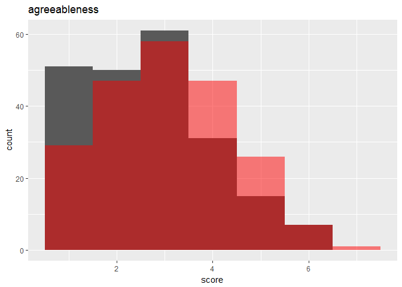
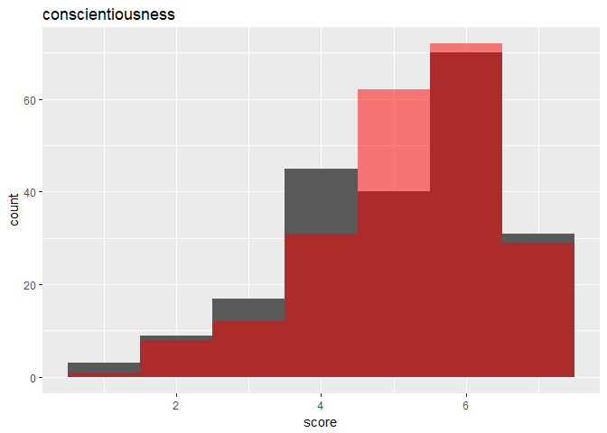
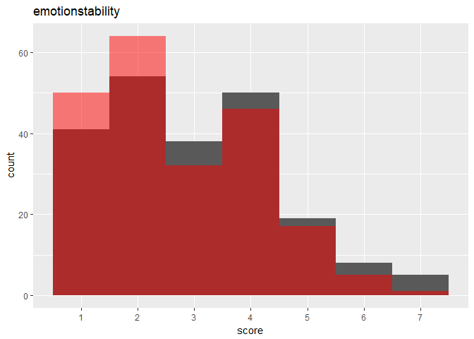
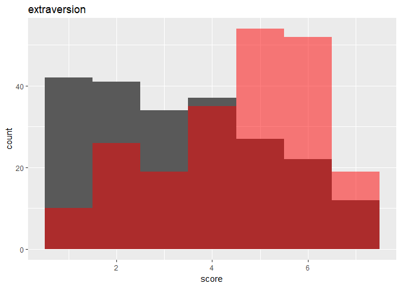
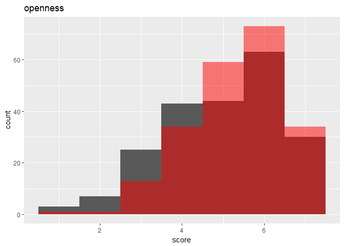

MAPSS Thesis II - model 2
================
Chih-Yu Chiang
July 24, 2017

-   [Setup](#setup)
-   [Variable](#variable)
-   [Model](#model)
-   [Difference between real and game personality](#difference-between-real-and-game-personality)
-   [Personality distribution](#personality-distribution)
-   [game personality ~ real personality + dissatisfaction + real personality\*dissatisfaction](#game-personality-real-personality-dissatisfaction-real-personalitydissatisfaction)
    -   [agreeableness](#agreeableness)
    -   [conscientiousness](#conscientiousness)
    -   [emotionstability](#emotionstability)
    -   [extraversion](#extraversion)
    -   [openness](#openness)
-   [Information criteria](#information-criteria)
    -   [BIC](#bic)
    -   [AIC](#aic)

``` r
knitr::opts_chunk$set(
    message = FALSE,
    warning = FALSE
)
```

Setup
-----

Data of game and player are read in and matched up.

-   Game release data, `release` (year), is read in as an interval variable.
-   Missing values are imputed with variable mean conveniently (`star_user` and `star_GS`).

``` r
#--Package
library(tidyverse)
library(corrplot)
library(modelr)
library(glmnet)
library(VGAM)
library(randomForest)
library(e1071)
library(car)
library(rlist)
library(pander)
set.seed(1)


#--Read in
#Core game info and group distance/probability data
core_cluster <- read_csv("../data/core_cluster.csv", col_names=TRUE) %>%
  mutate(group_survey = factor(group_survey),
         group_review = factor(group_review),
         core_id = factor(core_id)) %>%
  select(-X1)

#Core game tste scores (of dif numbers of features)
core_tsteScore <- read_csv("../data/tste_concat.csv", col_names=TRUE) %>%
  select(-X1)

#Player-related survey data
survey <- read_csv("../data/survey.csv", col_names=TRUE) %>%
  mutate(race = factor(race),
         sex = factor(sex),
         core_id = factor(core_id)) %>%
  select(-id)


#--Impute missing with mean
imputation_mean <- function(c){
  c[is.na(c)] <- mean(c, na.rm=TRUE)
  return(c)
}
core_cluster <- mutate_each(core_cluster,
                            funs(imputation_mean(.)),
                            star_user, star_GS)


#--Match up
#Main df, key=player-game
df <- bind_cols(core_cluster, core_tsteScore) %>%
  left_join(survey, by=c("core_id"), copy=FALSE)

#Player df, key=player
df_player <- distinct(df, respondent, .keep_all = TRUE)
```

Variable
--------

Compute and select variables to be used in models.

-   Call the function to update the vars employed.
-   Final response variable utilizes only `preference_3`.

-   Player preference:

| Name           | Definition                 | Unit                        |
|----------------|----------------------------|-----------------------------|
| `preference_1` | how much do you like       | Likert 1-7=like             |
| `preference_2` | how often play it          | ordinary 1=never-7=everyday |
| `preference_3` | does it fit personal taste | Likert 1-7=fit              |

-   Game characteristics:

<table style="width:36%;">
<colgroup>
<col width="8%" />
<col width="18%" />
<col width="9%" />
</colgroup>
<thead>
<tr class="header">
<th>Name</th>
<th>Definition</th>
<th>Unit</th>
</tr>
</thead>
<tbody>
<tr class="odd">
<td><code>distance_survey_mean_x</code></td>
<td>group score from survey (distance from group mean in tste)</td>
<td>cosine distance</td>
</tr>
<tr class="even">
<td><code>distance_survey_median_x</code></td>
<td>group score from survey (distance from group median in tste)</td>
<td>cosine distance</td>
</tr>
<tr class="odd">
<td><code>probability_review_mean_x</code></td>
<td>group score from review (mean probability to be categorized in the group by NN)</td>
<td>percentage</td>
</tr>
<tr class="even">
<td><code>probability_review_median_x</code></td>
<td>group score from review (median probability to be categorized in the group by NN)</td>
<td>percentage</td>
</tr>
<tr class="odd">
<td><code>group_survey</code></td>
<td>group identity from survey</td>
<td>categorical 1-group number</td>
</tr>
<tr class="even">
<td><code>group_review</code></td>
<td>group identity from review</td>
<td>categorical 1-group number</td>
</tr>
<tr class="odd">
<td><code>tste_n_x</code></td>
<td>group score from survey (tste), n=number of features</td>
<td>interval arbitrary</td>
</tr>
</tbody>
</table>

-   Player personality:

<table style="width:36%;">
<colgroup>
<col width="8%" />
<col width="18%" />
<col width="9%" />
</colgroup>
<thead>
<tr class="header">
<th>Name</th>
<th>Definition</th>
<th>Unit</th>
</tr>
</thead>
<tbody>
<tr class="odd">
<td><code>game_xxxxx</code></td>
<td>Big-five personality in game</td>
<td>Likert 1-7</td>
</tr>
<tr class="even">
<td><code>real_xxxxx</code></td>
<td>Big-five personality in real life</td>
<td>Likert 1-7</td>
</tr>
<tr class="odd">
<td><code>gap_xxxxx</code></td>
<td>personality gap (game - real)</td>
<td>Likert 1-7</td>
</tr>
<tr class="even">
<td><code>satis_xxxxx</code></td>
<td>SDT satisfaction in real life</td>
<td>Likert 1-7</td>
</tr>
<tr class="odd">
<td><code>dissatis_xxxxx</code></td>
<td>SDT dissatisfaction in real life</td>
<td>Likert 1-7</td>
</tr>
<tr class="even">
<td><code>combined_xxxxx</code></td>
<td>SDT combined (previous two) dissatisfaction in real life</td>
<td>Likert 1-7</td>
</tr>
</tbody>
</table>

-   Control:

| Name        | Definition                                    | Unit                      |
|-------------|-----------------------------------------------|---------------------------|
| `age`       | player age                                    | interval                  |
| `education` | player education                              | ordinary 1-7=PhD          |
| `income`    | player annual household income                | ordinary 1-7=over 150,000 |
| `sex`       | player sex                                    | categorical 1=male        |
| `race`      | player race                                   | categorical 1-5           |
| `release`   | game release year                             | interval year             |
| `star_GS`   | general game quality rated by GameSpot expert | interval 0-10             |
| `star_user` | general game quality rated by GameSpot user   | interval 0-10             |

``` r
updateVars <- function(){
  #--Create response variable
  df <<- df %>%
    rowwise() %>% #Rowwise to make the ordinary functions work
    mutate(preference = mean(c(preference_3))) %>%
    ungroup() #Ungroup to cancel rowwise
  
  
  #--Compute personalty gap
  df <<- mutate(df,
                gap_extraversion = game_extraversion - real_extraversion,
                gap_agreeableness = game_agreeableness - real_agreeableness,
                gap_conscientiousness = game_conscientiousness - real_conscientiousness,
                gap_emotionstability = game_emotionstability - real_emotionstability,
                gap_openness = game_openness - real_openness)
  
  
  #--Acquire player df, key=player
  df_player <<- distinct(df, respondent, .keep_all=TRUE)
  
  
  #--Select variables to be included in regression (model formation)
  #Sets of predictor variables from file
  predictors <- read.csv("../data/vars/predictors.csv", header=TRUE, na.strings="")
  
  #Get column name as model id
  modelId <- colnames(predictors)
  
  #predictor variable as strings for each model
  predictorString <- apply(predictors, MARGIN=2, function(x) paste(na.omit(x), collapse="+"))
  
  #Make the dfs into a data frame
  dfs <<- data.frame(predictorString, modelId, stringsAsFactors=FALSE) %>%
    mutate(df_x = map(predictorString, ~ model.matrix(as.formula(paste("preference ~ ", .x, sep="")), data=df)[, -1])) %>% #df with only predictor variables; [, -1] used to remove redundant intercept column
    mutate(df_yx = map(df_x, ~ bind_cols(select(df, preference), data.frame(.x)))) #df also with outcome variables
  
  #Set row names for reference
  row.names(dfs) <<- modelId
}
```

Model
-----


``` r
#Update vars
updateVars()

#Player df with control marked
df_player_c <- mutate(df_player,
                      c_age = age,
                      c_education = education,
                      c_income = income,
                      c_race = race,
                      c_sex = sex)


#--Acquire corresponding df for each game personality
#Alphabetical order for personality response vars
dfs_ygame <- list(select(df_player_c, game_p = game_agreeableness, starts_with("real"), starts_with("c_"), starts_with("dissatis")),
                  select(df_player_c, game_p = game_conscientiousness, starts_with("real"), starts_with("c_"), starts_with("dissatis")),
                  select(df_player_c, game_p = game_emotionstability, starts_with("real"), starts_with("c_"), starts_with("dissatis")),
                  select(df_player_c, game_p = game_extraversion, starts_with("real"), starts_with("c_"), starts_with("dissatis")),
                  select(df_player_c, game_p = game_openness, starts_with("real"), starts_with("c_"), starts_with("dissatis")))


#--Train models
#Tobit, with upper=7, lower=1, imethod=(1, 2, 3) for dif initial values
models_ygame_tobit <- map(dfs_ygame,
                          ~ vglm(game_p ~ . + (dissatis_autonomy + dissatis_relatedness + dissatis_competence) * (real_extraversion + real_agreeableness + real_conscientiousness + real_emotionstability + real_openness),
                                 data=.x, family=tobit(Upper=7, Lower=1, imethod=1)))

#Lm for comparison
models_ygame_lm <- map(dfs_ygame,
                       ~ lm(game_p ~ . + (dissatis_autonomy + dissatis_relatedness + dissatis_competence) * (real_extraversion + real_agreeableness + real_conscientiousness + real_emotionstability + real_openness),
                            data=.x))
```

Difference between real and game personality
--------------------------------------------

-   T test dif = game - real

``` r
#T test for each pair
#T test result dif: game - real
t.test(df_player$game_agreeableness, df_player$real_agreeableness, paired=TRUE)
```

    ## 
    ##  Paired t-test
    ## 
    ## data:  df_player$game_agreeableness and df_player$real_agreeableness
    ## t = 5.4368, df = 214, p-value = 1.474e-07
    ## alternative hypothesis: true difference in means is not equal to 0
    ## 95 percent confidence interval:
    ##  0.2801813 0.5988885
    ## sample estimates:
    ## mean of the differences 
    ##               0.4395349

``` r
t.test(df_player$game_conscientiousness, df_player$real_conscientiousness, paired=TRUE)
```

    ## 
    ##  Paired t-test
    ## 
    ## data:  df_player$game_conscientiousness and df_player$real_conscientiousness
    ## t = 2.4307, df = 214, p-value = 0.01589
    ## alternative hypothesis: true difference in means is not equal to 0
    ## 95 percent confidence interval:
    ##  0.03253805 0.31164800
    ## sample estimates:
    ## mean of the differences 
    ##                0.172093

``` r
t.test(df_player$game_extraversion, df_player$real_extraversion, paired=TRUE)
```

    ## 
    ##  Paired t-test
    ## 
    ## data:  df_player$game_extraversion and df_player$real_extraversion
    ## t = 9.9484, df = 214, p-value < 2.2e-16
    ## alternative hypothesis: true difference in means is not equal to 0
    ## 95 percent confidence interval:
    ##  0.9062962 1.3541690
    ## sample estimates:
    ## mean of the differences 
    ##                1.130233

``` r
t.test(df_player$game_emotionstability, df_player$real_emotionstability, paired=TRUE)
```

    ## 
    ##  Paired t-test
    ## 
    ## data:  df_player$game_emotionstability and df_player$real_emotionstability
    ## t = -2.4136, df = 214, p-value = 0.01664
    ## alternative hypothesis: true difference in means is not equal to 0
    ## 95 percent confidence interval:
    ##  -0.43092873 -0.04348987
    ## sample estimates:
    ## mean of the differences 
    ##              -0.2372093

``` r
t.test(df_player$game_openness, df_player$real_openness, paired=TRUE)
```

    ## 
    ##  Paired t-test
    ## 
    ## data:  df_player$game_openness and df_player$real_openness
    ## t = 5.2845, df = 214, p-value = 3.098e-07
    ## alternative hypothesis: true difference in means is not equal to 0
    ## 95 percent confidence interval:
    ##  0.2405931 0.5268488
    ## sample estimates:
    ## mean of the differences 
    ##               0.3837209

Personality distribution
------------------------

-   Black bars = real personality
-   red bars = game personality

``` r
#--Distribution of real and game personality (comparison)
dist_personality <- function(personality){
  #Acquire specific column by reg
  real <- select(df_player, matches(paste("^real.*", personality, "$", sep="")))
  game <- select(df_player, matches(paste("^game.*", personality, "$", sep="")))
  
  #Plot: red bars = game personality
  ggplot(data=as.data.frame(real, game)) +
    geom_histogram(mapping=aes(x=real), binwidth=1) +
    geom_histogram(mapping=aes(x=game), binwidth=1, fill="red", alpha=0.5) +
    labs(x="score", title=personality)
}

#Call function for each personality
dist_personality("agreeableness")
```



``` r
dist_personality("conscientiousness")
```



``` r
dist_personality("emotionstability")
```



``` r
dist_personality("extraversion")
```



``` r
dist_personality("openness")
```



game personality ~ real personality + dissatisfaction + real personality\*dissatisfaction
-----------------------------------------------------------------------------------------

### agreeableness

``` r
summary(models_ygame_lm[[1]])
```

    ## 
    ## Call:
    ## lm(formula = game_p ~ . + (dissatis_autonomy + dissatis_relatedness + 
    ##     dissatis_competence) * (real_extraversion + real_agreeableness + 
    ##     real_conscientiousness + real_emotionstability + real_openness), 
    ##     data = .x)
    ## 
    ## Residuals:
    ##     Min      1Q  Median      3Q     Max 
    ## -1.9087 -0.6720 -0.1221  0.5313  3.2861 
    ## 
    ## Coefficients:
    ##                                              Estimate Std. Error t value
    ## (Intercept)                                  2.248741   2.129527   1.056
    ## real_extraversion                            0.016478   0.122711   0.134
    ## real_agreeableness                           0.793644   0.166260   4.774
    ## real_conscientiousness                      -0.196353   0.235797  -0.833
    ## real_emotionstability                       -0.183368   0.213941  -0.857
    ## real_openness                                0.041964   0.185605   0.226
    ## c_age                                        0.001807   0.010921   0.165
    ## c_education                                  0.074472   0.063313   1.176
    ## c_income                                    -0.007760   0.040097  -0.194
    ## c_race2                                     -0.008721   0.308181  -0.028
    ## c_race4                                     -0.156459   0.328791  -0.476
    ## c_race6                                     -0.603070   0.869033  -0.694
    ## c_race7                                      0.394261   0.335909   1.174
    ## c_sex2                                      -0.275744   0.167477  -1.646
    ## dissatis_autonomy                           -1.014889   0.834319  -1.216
    ## dissatis_relatedness                         1.889936   0.721585   2.619
    ## dissatis_competence                         -0.583375   0.714449  -0.817
    ## real_extraversion:dissatis_autonomy          0.064169   0.042768   1.500
    ## real_agreeableness:dissatis_autonomy        -0.028618   0.067105  -0.426
    ## real_conscientiousness:dissatis_autonomy     0.161231   0.082619   1.951
    ## real_emotionstability:dissatis_autonomy      0.149884   0.086050   1.742
    ## real_openness:dissatis_autonomy             -0.088892   0.056785  -1.565
    ## real_extraversion:dissatis_relatedness      -0.120399   0.044690  -2.694
    ## real_agreeableness:dissatis_relatedness     -0.012560   0.060201  -0.209
    ## real_conscientiousness:dissatis_relatedness -0.153177   0.065261  -2.347
    ## real_emotionstability:dissatis_relatedness  -0.085167   0.067259  -1.266
    ## real_openness:dissatis_relatedness          -0.074721   0.056541  -1.322
    ## real_extraversion:dissatis_competence        0.043732   0.045149   0.969
    ## real_agreeableness:dissatis_competence      -0.029900   0.065037  -0.460
    ## real_conscientiousness:dissatis_competence  -0.013159   0.061994  -0.212
    ## real_emotionstability:dissatis_competence   -0.019422   0.065358  -0.297
    ## real_openness:dissatis_competence            0.128729   0.057440   2.241
    ##                                             Pr(>|t|)    
    ## (Intercept)                                  0.29237    
    ## real_extraversion                            0.89333    
    ## real_agreeableness                          3.69e-06 ***
    ## real_conscientiousness                       0.40609    
    ## real_emotionstability                        0.39251    
    ## real_openness                                0.82138    
    ## c_age                                        0.86874    
    ## c_education                                  0.24102    
    ## c_income                                     0.84675    
    ## c_race2                                      0.97745    
    ## c_race4                                      0.63474    
    ## c_race6                                      0.48859    
    ## c_race7                                      0.24203    
    ## c_sex2                                       0.10139    
    ## dissatis_autonomy                            0.22539    
    ## dissatis_relatedness                         0.00955 ** 
    ## dissatis_competence                          0.41525    
    ## real_extraversion:dissatis_autonomy          0.13523    
    ## real_agreeableness:dissatis_autonomy         0.67027    
    ## real_conscientiousness:dissatis_autonomy     0.05253 .  
    ## real_emotionstability:dissatis_autonomy      0.08322 .  
    ## real_openness:dissatis_autonomy              0.11921    
    ## real_extraversion:dissatis_relatedness       0.00771 ** 
    ## real_agreeableness:dissatis_relatedness      0.83497    
    ## real_conscientiousness:dissatis_relatedness  0.01999 *  
    ## real_emotionstability:dissatis_relatedness   0.20704    
    ## real_openness:dissatis_relatedness           0.18797    
    ## real_extraversion:dissatis_competence        0.33402    
    ## real_agreeableness:dissatis_competence       0.64625    
    ## real_conscientiousness:dissatis_competence   0.83214    
    ## real_emotionstability:dissatis_competence    0.76668    
    ## real_openness:dissatis_competence            0.02622 *  
    ## ---
    ## Signif. codes:  0 '***' 0.001 '**' 0.01 '*' 0.05 '.' 0.1 ' ' 1
    ## 
    ## Residual standard error: 1.048 on 183 degrees of freedom
    ## Multiple R-squared:  0.4822, Adjusted R-squared:  0.3945 
    ## F-statistic: 5.497 on 31 and 183 DF,  p-value: 5.67e-14

``` r
summary(models_ygame_tobit[[1]])
```

    ## 
    ## Call:
    ## vglm(formula = game_p ~ . + (dissatis_autonomy + dissatis_relatedness + 
    ##     dissatis_competence) * (real_extraversion + real_agreeableness + 
    ##     real_conscientiousness + real_emotionstability + real_openness), 
    ##     family = tobit(Upper = 7, Lower = 1, imethod = 1), data = .x)
    ## 
    ## 
    ## Pearson residuals:
    ##              Min      1Q  Median     3Q   Max
    ## mu       -1.9454 -0.6805 -0.1467 0.5643 3.294
    ## loge(sd) -0.9137 -0.6625 -0.4385 0.1558 8.044
    ## 
    ## Coefficients: 
    ##                                              Estimate Std. Error z value
    ## (Intercept):1                                1.939527   2.086881   0.929
    ## (Intercept):2                                0.017886   0.050328   0.355
    ## real_extraversion                            0.000837   0.120732   0.007
    ## real_agreeableness                           0.862983   0.163045   5.293
    ## real_conscientiousness                      -0.237580   0.230512  -1.031
    ## real_emotionstability                       -0.192862   0.209446  -0.921
    ## real_openness                                0.084353   0.181572   0.465
    ## c_age                                        0.003853   0.010677   0.361
    ## c_education                                  0.096981   0.061892   1.567
    ## c_income                                    -0.007011   0.039181  -0.179
    ## c_race2                                     -0.011132   0.300699  -0.037
    ## c_race4                                     -0.165292   0.319939  -0.517
    ## c_race6                                     -0.615928   0.859130  -0.717
    ## c_race7                                      0.452534   0.327989   1.380
    ## c_sex2                                      -0.275460   0.163648  -1.683
    ## dissatis_autonomy                           -1.181621   0.818031  -1.444
    ## dissatis_relatedness                         2.177388   0.714009   3.050
    ## dissatis_competence                         -0.595893   0.700223  -0.851
    ## real_extraversion:dissatis_autonomy          0.067596   0.042173   1.603
    ## real_agreeableness:dissatis_autonomy        -0.015150   0.065943  -0.230
    ## real_conscientiousness:dissatis_autonomy     0.184264   0.081053   2.273
    ## real_emotionstability:dissatis_autonomy      0.161265   0.084052   1.919
    ## real_openness:dissatis_autonomy             -0.097845   0.055561  -1.761
    ## real_extraversion:dissatis_relatedness      -0.140416   0.044380  -3.164
    ## real_agreeableness:dissatis_relatedness     -0.036378   0.059894  -0.607
    ## real_conscientiousness:dissatis_relatedness -0.178060   0.064906  -2.743
    ## real_emotionstability:dissatis_relatedness  -0.083885   0.066024  -1.271
    ## real_openness:dissatis_relatedness          -0.078106   0.055349  -1.411
    ## real_extraversion:dissatis_competence        0.057448   0.044617   1.288
    ## real_agreeableness:dissatis_competence      -0.035866   0.063679  -0.563
    ## real_conscientiousness:dissatis_competence  -0.011519   0.060948  -0.189
    ## real_emotionstability:dissatis_competence   -0.030262   0.064307  -0.471
    ## real_openness:dissatis_competence            0.131679   0.056145   2.345
    ##                                             Pr(>|z|)    
    ## (Intercept):1                                0.35269    
    ## (Intercept):2                                0.72230    
    ## real_extraversion                            0.99447    
    ## real_agreeableness                           1.2e-07 ***
    ## real_conscientiousness                       0.30270    
    ## real_emotionstability                        0.35714    
    ## real_openness                                0.64224    
    ## c_age                                        0.71817    
    ## c_education                                  0.11713    
    ## c_income                                     0.85800    
    ## c_race2                                      0.97047    
    ## c_race4                                      0.60541    
    ## c_race6                                      0.47342    
    ## c_race7                                      0.16767    
    ## c_sex2                                       0.09233 .  
    ## dissatis_autonomy                            0.14861    
    ## dissatis_relatedness                         0.00229 ** 
    ## dissatis_competence                          0.39477    
    ## real_extraversion:dissatis_autonomy          0.10898    
    ## real_agreeableness:dissatis_autonomy         0.81829    
    ## real_conscientiousness:dissatis_autonomy     0.02300 *  
    ## real_emotionstability:dissatis_autonomy      0.05503 .  
    ## real_openness:dissatis_autonomy              0.07824 .  
    ## real_extraversion:dissatis_relatedness       0.00156 ** 
    ## real_agreeableness:dissatis_relatedness      0.54361    
    ## real_conscientiousness:dissatis_relatedness  0.00608 ** 
    ## real_emotionstability:dissatis_relatedness   0.20389    
    ## real_openness:dissatis_relatedness           0.15820    
    ## real_extraversion:dissatis_competence        0.19789    
    ## real_agreeableness:dissatis_competence       0.57328    
    ## real_conscientiousness:dissatis_competence   0.85009    
    ## real_emotionstability:dissatis_competence    0.63794    
    ## real_openness:dissatis_competence            0.01901 *  
    ## ---
    ## Signif. codes:  0 '***' 0.001 '**' 0.01 '*' 0.05 '.' 0.1 ' ' 1
    ## 
    ## Number of linear predictors:  2 
    ## 
    ## Names of linear predictors: mu, loge(sd)
    ## 
    ## Log-likelihood: -302.0764 on 397 degrees of freedom
    ## 
    ## Number of iterations: 6

### conscientiousness

``` r
summary(models_ygame_lm[[2]])
```

    ## 
    ## Call:
    ## lm(formula = game_p ~ . + (dissatis_autonomy + dissatis_relatedness + 
    ##     dissatis_competence) * (real_extraversion + real_agreeableness + 
    ##     real_conscientiousness + real_emotionstability + real_openness), 
    ##     data = .x)
    ## 
    ## Residuals:
    ##      Min       1Q   Median       3Q      Max 
    ## -3.14554 -0.41837 -0.02954  0.46132  2.50329 
    ## 
    ## Coefficients:
    ##                                              Estimate Std. Error t value
    ## (Intercept)                                  3.606120   1.755564   2.054
    ## real_extraversion                            0.010519   0.101162   0.104
    ## real_agreeableness                          -0.083665   0.137063  -0.610
    ## real_conscientiousness                       0.373585   0.194389   1.922
    ## real_emotionstability                       -0.123483   0.176371  -0.700
    ## real_openness                                0.110122   0.153011   0.720
    ## c_age                                        0.003623   0.009003   0.402
    ## c_education                                 -0.020653   0.052195  -0.396
    ## c_income                                    -0.035075   0.033055  -1.061
    ## c_race2                                     -0.173569   0.254062  -0.683
    ## c_race4                                     -0.109558   0.271053  -0.404
    ## c_race6                                      0.581510   0.716423   0.812
    ## c_race7                                     -0.387914   0.276920  -1.401
    ## c_sex2                                       0.020000   0.138067   0.145
    ## dissatis_autonomy                           -1.206071   0.687805  -1.754
    ## dissatis_relatedness                         0.014154   0.594868   0.024
    ## dissatis_competence                          0.927580   0.588986   1.575
    ## real_extraversion:dissatis_autonomy         -0.028213   0.035257  -0.800
    ## real_agreeableness:dissatis_autonomy        -0.021944   0.055321  -0.397
    ## real_conscientiousness:dissatis_autonomy     0.116141   0.068111   1.705
    ## real_emotionstability:dissatis_autonomy      0.111835   0.070939   1.577
    ## real_openness:dissatis_autonomy              0.085025   0.046813   1.816
    ## real_extraversion:dissatis_relatedness       0.015920   0.036842   0.432
    ## real_agreeableness:dissatis_relatedness      0.013235   0.049629   0.267
    ## real_conscientiousness:dissatis_relatedness  0.040118   0.053801   0.746
    ## real_emotionstability:dissatis_relatedness  -0.059387   0.055448  -1.071
    ## real_openness:dissatis_relatedness          -0.038148   0.046612  -0.818
    ## real_extraversion:dissatis_competence        0.008969   0.037221   0.241
    ## real_agreeableness:dissatis_competence       0.022781   0.053616   0.425
    ## real_conscientiousness:dissatis_competence  -0.103234   0.051107  -2.020
    ## real_emotionstability:dissatis_competence   -0.035931   0.053880  -0.667
    ## real_openness:dissatis_competence           -0.068481   0.047353  -1.446
    ##                                             Pr(>|t|)  
    ## (Intercept)                                   0.0414 *
    ## real_extraversion                             0.9173  
    ## real_agreeableness                            0.5423  
    ## real_conscientiousness                        0.0562 .
    ## real_emotionstability                         0.4847  
    ## real_openness                                 0.4726  
    ## c_age                                         0.6879  
    ## c_education                                   0.6928  
    ## c_income                                      0.2900  
    ## c_race2                                       0.4954  
    ## c_race4                                       0.6865  
    ## c_race6                                       0.4180  
    ## c_race7                                       0.1630  
    ## c_sex2                                        0.8850  
    ## dissatis_autonomy                             0.0812 .
    ## dissatis_relatedness                          0.9810  
    ## dissatis_competence                           0.1170  
    ## real_extraversion:dissatis_autonomy           0.4246  
    ## real_agreeableness:dissatis_autonomy          0.6921  
    ## real_conscientiousness:dissatis_autonomy      0.0899 .
    ## real_emotionstability:dissatis_autonomy       0.1166  
    ## real_openness:dissatis_autonomy               0.0710 .
    ## real_extraversion:dissatis_relatedness        0.6662  
    ## real_agreeableness:dissatis_relatedness       0.7900  
    ## real_conscientiousness:dissatis_relatedness   0.4568  
    ## real_emotionstability:dissatis_relatedness    0.2856  
    ## real_openness:dissatis_relatedness            0.4142  
    ## real_extraversion:dissatis_competence         0.8098  
    ## real_agreeableness:dissatis_competence        0.6714  
    ## real_conscientiousness:dissatis_competence    0.0448 *
    ## real_emotionstability:dissatis_competence     0.5057  
    ## real_openness:dissatis_competence             0.1498  
    ## ---
    ## Signif. codes:  0 '***' 0.001 '**' 0.01 '*' 0.05 '.' 0.1 ' ' 1
    ## 
    ## Residual standard error: 0.8638 on 183 degrees of freedom
    ## Multiple R-squared:  0.5494, Adjusted R-squared:  0.4731 
    ## F-statistic: 7.198 on 31 and 183 DF,  p-value: < 2.2e-16

``` r
summary(models_ygame_tobit[[2]])
```

    ## 
    ## Call:
    ## vglm(formula = game_p ~ . + (dissatis_autonomy + dissatis_relatedness + 
    ##     dissatis_competence) * (real_extraversion + real_agreeableness + 
    ##     real_conscientiousness + real_emotionstability + real_openness), 
    ##     family = tobit(Upper = 7, Lower = 1, imethod = 1), data = .x)
    ## 
    ## 
    ## Pearson residuals:
    ##             Min      1Q  Median     3Q   Max
    ## mu       -2.707 -0.6571 -0.1234 0.7555 2.895
    ## loge(sd) -1.021 -0.7027 -0.4983 0.1629 9.493
    ## 
    ## Coefficients: 
    ##                                               Estimate Std. Error z value
    ## (Intercept):1                                2.8955641  1.8466339   1.568
    ## (Intercept):2                               -0.1146028  0.0532997  -2.150
    ## real_extraversion                            0.0497466  0.1081461   0.460
    ## real_agreeableness                          -0.0237364  0.1470820  -0.161
    ## real_conscientiousness                       0.4453926  0.2038897   2.184
    ## real_emotionstability                       -0.1601124  0.1860521  -0.861
    ## real_openness                                0.1761726  0.1609772   1.094
    ## c_age                                       -0.0007082  0.0094923  -0.075
    ## c_education                                 -0.0219100  0.0547102  -0.400
    ## c_income                                    -0.0381281  0.0347800  -1.096
    ## c_race2                                     -0.1456703  0.2674781  -0.545
    ## c_race4                                     -0.0412869  0.2868992  -0.144
    ## c_race6                                      0.5338458  0.7675102   0.696
    ## c_race7                                     -0.4880852  0.2905396  -1.680
    ## c_sex2                                       0.0437939  0.1451235   0.302
    ## dissatis_autonomy                           -1.3590834  0.7304964  -1.860
    ## dissatis_relatedness                         0.1731993  0.6257969   0.277
    ## dissatis_competence                          1.1444626  0.6225731   1.838
    ## real_extraversion:dissatis_autonomy         -0.0424482  0.0386912  -1.097
    ## real_agreeableness:dissatis_autonomy        -0.0241858  0.0584992  -0.413
    ## real_conscientiousness:dissatis_autonomy     0.1338644  0.0727160   1.841
    ## real_emotionstability:dissatis_autonomy      0.1124208  0.0753251   1.492
    ## real_openness:dissatis_autonomy              0.1106648  0.0509873   2.170
    ## real_extraversion:dissatis_relatedness       0.0146009  0.0390084   0.374
    ## real_agreeableness:dissatis_relatedness      0.0154241  0.0520699   0.296
    ## real_conscientiousness:dissatis_relatedness  0.0273168  0.0568786   0.480
    ## real_emotionstability:dissatis_relatedness  -0.0692572  0.0583855  -1.186
    ## real_openness:dissatis_relatedness          -0.0524945  0.0496575  -1.057
    ## real_extraversion:dissatis_competence        0.0125346  0.0393213   0.319
    ## real_agreeableness:dissatis_competence       0.0049301  0.0565673   0.087
    ## real_conscientiousness:dissatis_competence  -0.1183413  0.0547148  -2.163
    ## real_emotionstability:dissatis_competence   -0.0221045  0.0572879  -0.386
    ## real_openness:dissatis_competence           -0.0995286  0.0502773  -1.980
    ##                                             Pr(>|z|)  
    ## (Intercept):1                                 0.1169  
    ## (Intercept):2                                 0.0315 *
    ## real_extraversion                             0.6455  
    ## real_agreeableness                            0.8718  
    ## real_conscientiousness                        0.0289 *
    ## real_emotionstability                         0.3895  
    ## real_openness                                 0.2738  
    ## c_age                                         0.9405  
    ## c_education                                   0.6888  
    ## c_income                                      0.2730  
    ## c_race2                                       0.5860  
    ## c_race4                                       0.8856  
    ## c_race6                                       0.4867  
    ## c_race7                                       0.0930 .
    ## c_sex2                                        0.7628  
    ## dissatis_autonomy                             0.0628 .
    ## dissatis_relatedness                          0.7820  
    ## dissatis_competence                           0.0660 .
    ## real_extraversion:dissatis_autonomy           0.2726  
    ## real_agreeableness:dissatis_autonomy          0.6793  
    ## real_conscientiousness:dissatis_autonomy      0.0656 .
    ## real_emotionstability:dissatis_autonomy       0.1356  
    ## real_openness:dissatis_autonomy               0.0300 *
    ## real_extraversion:dissatis_relatedness        0.7082  
    ## real_agreeableness:dissatis_relatedness       0.7671  
    ## real_conscientiousness:dissatis_relatedness   0.6310  
    ## real_emotionstability:dissatis_relatedness    0.2355  
    ## real_openness:dissatis_relatedness            0.2905  
    ## real_extraversion:dissatis_competence         0.7499  
    ## real_agreeableness:dissatis_competence        0.9305  
    ## real_conscientiousness:dissatis_competence    0.0306 *
    ## real_emotionstability:dissatis_competence     0.6996  
    ## real_openness:dissatis_competence             0.0477 *
    ## ---
    ## Signif. codes:  0 '***' 0.001 '**' 0.01 '*' 0.05 '.' 0.1 ' ' 1
    ## 
    ## Number of linear predictors:  2 
    ## 
    ## Names of linear predictors: mu, loge(sd)
    ## 
    ## Log-likelihood: -267.4059 on 397 degrees of freedom
    ## 
    ## Number of iterations: 6

### emotionstability

``` r
summary(models_ygame_lm[[3]])
```

    ## 
    ## Call:
    ## lm(formula = game_p ~ . + (dissatis_autonomy + dissatis_relatedness + 
    ##     dissatis_competence) * (real_extraversion + real_agreeableness + 
    ##     real_conscientiousness + real_emotionstability + real_openness), 
    ##     data = .x)
    ## 
    ## Residuals:
    ##     Min      1Q  Median      3Q     Max 
    ## -2.5569 -0.6727 -0.1086  0.6496  2.9192 
    ## 
    ## Coefficients:
    ##                                              Estimate Std. Error t value
    ## (Intercept)                                  4.317355   2.165222   1.994
    ## real_extraversion                            0.021054   0.124768   0.169
    ## real_agreeableness                          -0.118756   0.169046  -0.703
    ## real_conscientiousness                      -0.450872   0.239750  -1.881
    ## real_emotionstability                        0.564658   0.217527   2.596
    ## real_openness                               -0.152964   0.188716  -0.811
    ## c_age                                        0.011968   0.011104   1.078
    ## c_education                                 -0.037278   0.064374  -0.579
    ## c_income                                     0.015768   0.040769   0.387
    ## c_race2                                     -0.163522   0.313347  -0.522
    ## c_race4                                     -0.439310   0.334302  -1.314
    ## c_race6                                     -0.562676   0.883599  -0.637
    ## c_race7                                     -0.366406   0.341539  -1.073
    ## c_sex2                                      -0.068638   0.170284  -0.403
    ## dissatis_autonomy                           -0.899456   0.848303  -1.060
    ## dissatis_relatedness                         1.407607   0.733680   1.919
    ## dissatis_competence                         -1.155251   0.726425  -1.590
    ## real_extraversion:dissatis_autonomy          0.076145   0.043485   1.751
    ## real_agreeableness:dissatis_autonomy         0.272000   0.068230   3.987
    ## real_conscientiousness:dissatis_autonomy     0.067766   0.084004   0.807
    ## real_emotionstability:dissatis_autonomy     -0.158380   0.087492  -1.810
    ## real_openness:dissatis_autonomy              0.004262   0.057737   0.074
    ## real_extraversion:dissatis_relatedness      -0.061302   0.045439  -1.349
    ## real_agreeableness:dissatis_relatedness     -0.015800   0.061210  -0.258
    ## real_conscientiousness:dissatis_relatedness -0.178581   0.066355  -2.691
    ## real_emotionstability:dissatis_relatedness   0.010912   0.068387   0.160
    ## real_openness:dissatis_relatedness          -0.044341   0.057489  -0.771
    ## real_extraversion:dissatis_competence        0.014514   0.045906   0.316
    ## real_agreeableness:dissatis_competence      -0.221905   0.066127  -3.356
    ## real_conscientiousness:dissatis_competence   0.167125   0.063033   2.651
    ## real_emotionstability:dissatis_competence    0.126719   0.066453   1.907
    ## real_openness:dissatis_competence            0.094320   0.058403   1.615
    ##                                             Pr(>|t|)    
    ## (Intercept)                                 0.047642 *  
    ## real_extraversion                           0.866181    
    ## real_agreeableness                          0.483255    
    ## real_conscientiousness                      0.061616 .  
    ## real_emotionstability                       0.010203 *  
    ## real_openness                               0.418677    
    ## c_age                                       0.282546    
    ## c_education                                 0.563244    
    ## c_income                                    0.699381    
    ## c_race2                                     0.602401    
    ## c_race4                                     0.190454    
    ## c_race6                                     0.525051    
    ## c_race7                                     0.284770    
    ## c_sex2                                      0.687361    
    ## dissatis_autonomy                           0.290405    
    ## dissatis_relatedness                        0.056597 .  
    ## dissatis_competence                         0.113488    
    ## real_extraversion:dissatis_autonomy         0.081609 .  
    ## real_agreeableness:dissatis_autonomy        9.68e-05 ***
    ## real_conscientiousness:dissatis_autonomy    0.420886    
    ## real_emotionstability:dissatis_autonomy     0.071902 .  
    ## real_openness:dissatis_autonomy             0.941241    
    ## real_extraversion:dissatis_relatedness      0.178970    
    ## real_agreeableness:dissatis_relatedness     0.796600    
    ## real_conscientiousness:dissatis_relatedness 0.007777 ** 
    ## real_emotionstability:dissatis_relatedness  0.873397    
    ## real_openness:dissatis_relatedness          0.441526    
    ## real_extraversion:dissatis_competence       0.752242    
    ## real_agreeableness:dissatis_competence      0.000962 ***
    ## real_conscientiousness:dissatis_competence  0.008720 ** 
    ## real_emotionstability:dissatis_competence   0.058102 .  
    ## real_openness:dissatis_competence           0.108036    
    ## ---
    ## Signif. codes:  0 '***' 0.001 '**' 0.01 '*' 0.05 '.' 0.1 ' ' 1
    ## 
    ## Residual standard error: 1.065 on 183 degrees of freedom
    ## Multiple R-squared:  0.4807, Adjusted R-squared:  0.3928 
    ## F-statistic: 5.465 on 31 and 183 DF,  p-value: 7.025e-14

``` r
summary(models_ygame_tobit[[3]])
```

    ## 
    ## Call:
    ## vglm(formula = game_p ~ . + (dissatis_autonomy + dissatis_relatedness + 
    ##     dissatis_competence) * (real_extraversion + real_agreeableness + 
    ##     real_conscientiousness + real_emotionstability + real_openness), 
    ##     family = tobit(Upper = 7, Lower = 1, imethod = 1), data = .x)
    ## 
    ## 
    ## Pearson residuals:
    ##              Min      1Q   Median     3Q   Max
    ## mu       -2.7241 -0.7251  0.08083 0.6345 3.157
    ## loge(sd) -0.9775 -0.6728 -0.36393 0.1938 6.285
    ## 
    ## Coefficients: 
    ##                                              Estimate Std. Error z value
    ## (Intercept):1                                4.398520   2.207221   1.993
    ## (Intercept):2                                0.061749   0.051968   1.188
    ## real_extraversion                           -0.018459   0.129575  -0.142
    ## real_agreeableness                          -0.178997   0.178695  -1.002
    ## real_conscientiousness                      -0.466276   0.242199  -1.925
    ## real_emotionstability                        0.728101   0.222771   3.268
    ## real_openness                               -0.230497   0.192987  -1.194
    ## c_age                                        0.015130   0.011208   1.350
    ## c_education                                 -0.038853   0.065084  -0.597
    ## c_income                                     0.028768   0.041371   0.695
    ## c_race2                                     -0.234540   0.316892  -0.740
    ## c_race4                                     -0.570661   0.336842  -1.694
    ## c_race6                                     -0.597631   0.892408  -0.670
    ## c_race7                                     -0.312063   0.352186  -0.886
    ## c_sex2                                      -0.127666   0.172507  -0.740
    ## dissatis_autonomy                           -0.859106   0.857502  -1.002
    ## dissatis_relatedness                         1.327193   0.744546   1.783
    ## dissatis_competence                         -1.220386   0.735064  -1.660
    ## real_extraversion:dissatis_autonomy          0.079401   0.044160   1.798
    ## real_agreeableness:dissatis_autonomy         0.281155   0.069138   4.067
    ## real_conscientiousness:dissatis_autonomy     0.063621   0.084830   0.750
    ## real_emotionstability:dissatis_autonomy     -0.179556   0.088565  -2.027
    ## real_openness:dissatis_autonomy              0.008766   0.058440   0.150
    ## real_extraversion:dissatis_relatedness      -0.051643   0.046045  -1.122
    ## real_agreeableness:dissatis_relatedness     -0.002795   0.062155  -0.045
    ## real_conscientiousness:dissatis_relatedness -0.187623   0.067282  -2.789
    ## real_emotionstability:dissatis_relatedness   0.014262   0.069005   0.207
    ## real_openness:dissatis_relatedness          -0.035597   0.058033  -0.613
    ## real_extraversion:dissatis_competence        0.014493   0.046528   0.311
    ## real_agreeableness:dissatis_competence      -0.225764   0.066892  -3.375
    ## real_conscientiousness:dissatis_competence   0.177610   0.063453   2.799
    ## real_emotionstability:dissatis_competence    0.115239   0.067191   1.715
    ## real_openness:dissatis_competence            0.106009   0.058993   1.797
    ##                                             Pr(>|z|)    
    ## (Intercept):1                               0.046285 *  
    ## (Intercept):2                               0.234755    
    ## real_extraversion                           0.886719    
    ## real_agreeableness                          0.316493    
    ## real_conscientiousness                      0.054207 .  
    ## real_emotionstability                       0.001082 ** 
    ## real_openness                               0.232335    
    ## c_age                                       0.177014    
    ## c_education                                 0.550527    
    ## c_income                                    0.486833    
    ## c_race2                                     0.459224    
    ## c_race4                                     0.090237 .  
    ## c_race6                                     0.503060    
    ## c_race7                                     0.375578    
    ## c_sex2                                      0.459261    
    ## dissatis_autonomy                           0.316406    
    ## dissatis_relatedness                        0.074659 .  
    ## dissatis_competence                         0.096865 .  
    ## real_extraversion:dissatis_autonomy         0.072173 .  
    ## real_agreeableness:dissatis_autonomy        4.77e-05 ***
    ## real_conscientiousness:dissatis_autonomy    0.453263    
    ## real_emotionstability:dissatis_autonomy     0.042622 *  
    ## real_openness:dissatis_autonomy             0.880769    
    ## real_extraversion:dissatis_relatedness      0.262048    
    ## real_agreeableness:dissatis_relatedness     0.964137    
    ## real_conscientiousness:dissatis_relatedness 0.005293 ** 
    ## real_emotionstability:dissatis_relatedness  0.836266    
    ## real_openness:dissatis_relatedness          0.539617    
    ## real_extraversion:dissatis_competence       0.755434    
    ## real_agreeableness:dissatis_competence      0.000738 ***
    ## real_conscientiousness:dissatis_competence  0.005125 ** 
    ## real_emotionstability:dissatis_competence   0.086329 .  
    ## real_openness:dissatis_competence           0.072340 .  
    ## ---
    ## Signif. codes:  0 '***' 0.001 '**' 0.01 '*' 0.05 '.' 0.1 ' ' 1
    ## 
    ## Number of linear predictors:  2 
    ## 
    ## Names of linear predictors: mu, loge(sd)
    ## 
    ## Log-likelihood: -305.3348 on 397 degrees of freedom
    ## 
    ## Number of iterations: 6

### extraversion

``` r
summary(models_ygame_lm[[4]])
```

    ## 
    ## Call:
    ## lm(formula = game_p ~ . + (dissatis_autonomy + dissatis_relatedness + 
    ##     dissatis_competence) * (real_extraversion + real_agreeableness + 
    ##     real_conscientiousness + real_emotionstability + real_openness), 
    ##     data = .x)
    ## 
    ## Residuals:
    ##     Min      1Q  Median      3Q     Max 
    ## -3.8671 -0.7013 -0.0073  0.6857  3.9600 
    ## 
    ## Coefficients:
    ##                                               Estimate Std. Error t value
    ## (Intercept)                                 -0.1602509  2.6830709  -0.060
    ## real_extraversion                            0.5651248  0.1546082   3.655
    ## real_agreeableness                          -0.3648570  0.2094768  -1.742
    ## real_conscientiousness                       0.3743902  0.2970899   1.260
    ## real_emotionstability                        0.4226794  0.2695517   1.568
    ## real_openness                                0.1218830  0.2338512   0.521
    ## c_age                                       -0.0015664  0.0137596  -0.114
    ## c_education                                 -0.0162555  0.0797704  -0.204
    ## c_income                                     0.0488013  0.0505192   0.966
    ## c_race2                                      0.0231147  0.3882890   0.060
    ## c_race4                                     -0.1765107  0.4142564  -0.426
    ## c_race6                                     -0.1846434  1.0949273  -0.169
    ## c_race7                                      0.2140982  0.4232238   0.506
    ## c_sex2                                      -0.0600775  0.2110106  -0.285
    ## dissatis_autonomy                           -0.1859812  1.0511892  -0.177
    ## dissatis_relatedness                        -1.7986914  0.9091520  -1.978
    ## dissatis_competence                          2.5623470  0.9001613   2.847
    ## real_extraversion:dissatis_autonomy         -0.0145168  0.0538847  -0.269
    ## real_agreeableness:dissatis_autonomy         0.1922183  0.0845485   2.273
    ## real_conscientiousness:dissatis_autonomy     0.0552029  0.1040950   0.530
    ## real_emotionstability:dissatis_autonomy     -0.1597816  0.1084172  -1.474
    ## real_openness:dissatis_autonomy             -0.0007667  0.0715457  -0.011
    ## real_extraversion:dissatis_relatedness       0.0642958  0.0563063   1.142
    ## real_agreeableness:dissatis_relatedness     -0.0886191  0.0758497  -1.168
    ## real_conscientiousness:dissatis_relatedness  0.0899691  0.0822252   1.094
    ## real_emotionstability:dissatis_relatedness   0.1966051  0.0847426   2.320
    ## real_openness:dissatis_relatedness           0.0993390  0.0712380   1.394
    ## real_extraversion:dissatis_competence       -0.0661873  0.0568854  -1.164
    ## real_agreeableness:dissatis_competence      -0.0595060  0.0819425  -0.726
    ## real_conscientiousness:dissatis_competence  -0.2462540  0.0781088  -3.153
    ## real_emotionstability:dissatis_competence   -0.0974454  0.0823468  -1.183
    ## real_openness:dissatis_competence           -0.1109324  0.0723710  -1.533
    ##                                             Pr(>|t|)    
    ## (Intercept)                                 0.952439    
    ## real_extraversion                           0.000336 ***
    ## real_agreeableness                          0.083232 .  
    ## real_conscientiousness                      0.209205    
    ## real_emotionstability                       0.118589    
    ## real_openness                               0.602858    
    ## c_age                                       0.909490    
    ## c_education                                 0.838753    
    ## c_income                                    0.335322    
    ## c_race2                                     0.952595    
    ## c_race4                                     0.670543    
    ## c_race6                                     0.866270    
    ## c_race7                                     0.613553    
    ## c_sex2                                      0.776186    
    ## dissatis_autonomy                           0.859763    
    ## dissatis_relatedness                        0.049381 *  
    ## dissatis_competence                         0.004924 ** 
    ## real_extraversion:dissatis_autonomy         0.787922    
    ## real_agreeableness:dissatis_autonomy        0.024160 *  
    ## real_conscientiousness:dissatis_autonomy    0.596538    
    ## real_emotionstability:dissatis_autonomy     0.142263    
    ## real_openness:dissatis_autonomy             0.991461    
    ## real_extraversion:dissatis_relatedness      0.254990    
    ## real_agreeableness:dissatis_relatedness     0.244185    
    ## real_conscientiousness:dissatis_relatedness 0.275315    
    ## real_emotionstability:dissatis_relatedness  0.021443 *  
    ## real_openness:dissatis_relatedness          0.164867    
    ## real_extraversion:dissatis_competence       0.246134    
    ## real_agreeableness:dissatis_competence      0.468648    
    ## real_conscientiousness:dissatis_competence  0.001891 ** 
    ## real_emotionstability:dissatis_competence   0.238203    
    ## real_openness:dissatis_competence           0.127045    
    ## ---
    ## Signif. codes:  0 '***' 0.001 '**' 0.01 '*' 0.05 '.' 0.1 ' ' 1
    ## 
    ## Residual standard error: 1.32 on 183 degrees of freedom
    ## Multiple R-squared:  0.4289, Adjusted R-squared:  0.3322 
    ## F-statistic: 4.434 on 31 and 183 DF,  p-value: 8.495e-11

``` r
summary(models_ygame_tobit[[4]])
```

    ## 
    ## Call:
    ## vglm(formula = game_p ~ . + (dissatis_autonomy + dissatis_relatedness + 
    ##     dissatis_competence) * (real_extraversion + real_agreeableness + 
    ##     real_conscientiousness + real_emotionstability + real_openness), 
    ##     family = tobit(Upper = 7, Lower = 1, imethod = 1), data = .x)
    ## 
    ## 
    ## Pearson residuals:
    ##             Min      1Q   Median     3Q   Max
    ## mu       -2.240 -0.7670 -0.07198 0.5516 3.200
    ## loge(sd) -1.033 -0.7087 -0.47024 0.1531 7.474
    ## 
    ## Coefficients: 
    ##                                              Estimate Std. Error z value
    ## (Intercept):1                               -1.058489   2.735415  -0.387
    ## (Intercept):2                                0.279988   0.053161   5.267
    ## real_extraversion                            0.648583   0.160967   4.029
    ## real_agreeableness                          -0.408966   0.214917  -1.903
    ## real_conscientiousness                       0.410730   0.303156   1.355
    ## real_emotionstability                        0.445493   0.275129   1.619
    ## real_openness                                0.264309   0.237767   1.112
    ## c_age                                       -0.004834   0.014056  -0.344
    ## c_education                                 -0.021377   0.081490  -0.262
    ## c_income                                     0.036919   0.051360   0.719
    ## c_race2                                     -0.051503   0.392489  -0.131
    ## c_race4                                     -0.086018   0.425293  -0.202
    ## c_race6                                      0.043035   1.140941   0.038
    ## c_race7                                      0.039072   0.432325   0.090
    ## c_sex2                                      -0.079836   0.215038  -0.371
    ## dissatis_autonomy                           -0.096319   1.067941  -0.090
    ## dissatis_relatedness                        -1.905275   0.921634  -2.067
    ## dissatis_competence                          2.799980   0.912160   3.070
    ## real_extraversion:dissatis_autonomy          0.003076   0.057258   0.054
    ## real_agreeableness:dissatis_autonomy         0.208536   0.087334   2.388
    ## real_conscientiousness:dissatis_autonomy     0.052204   0.105687   0.494
    ## real_emotionstability:dissatis_autonomy     -0.188380   0.111075  -1.696
    ## real_openness:dissatis_autonomy             -0.011713   0.072365  -0.162
    ## real_extraversion:dissatis_relatedness       0.068878   0.058298   1.181
    ## real_agreeableness:dissatis_relatedness     -0.102653   0.077210  -1.330
    ## real_conscientiousness:dissatis_relatedness  0.100556   0.083177   1.209
    ## real_emotionstability:dissatis_relatedness   0.230918   0.086705   2.663
    ## real_openness:dissatis_relatedness           0.084964   0.072091   1.179
    ## real_extraversion:dissatis_competence       -0.101641   0.059209  -1.717
    ## real_agreeableness:dissatis_competence      -0.056428   0.084158  -0.670
    ## real_conscientiousness:dissatis_competence  -0.258217   0.079433  -3.251
    ## real_emotionstability:dissatis_competence   -0.101250   0.084026  -1.205
    ## real_openness:dissatis_competence           -0.125536   0.073300  -1.713
    ##                                             Pr(>|z|)    
    ## (Intercept):1                                0.69879    
    ## (Intercept):2                               1.39e-07 ***
    ## real_extraversion                           5.59e-05 ***
    ## real_agreeableness                           0.05705 .  
    ## real_conscientiousness                       0.17547    
    ## real_emotionstability                        0.10540    
    ## real_openness                                0.26630    
    ## c_age                                        0.73093    
    ## c_education                                  0.79307    
    ## c_income                                     0.47225    
    ## c_race2                                      0.89560    
    ## c_race4                                      0.83972    
    ## c_race6                                      0.96991    
    ## c_race7                                      0.92799    
    ## c_sex2                                       0.71044    
    ## dissatis_autonomy                            0.92814    
    ## dissatis_relatedness                         0.03871 *  
    ## dissatis_competence                          0.00214 ** 
    ## real_extraversion:dissatis_autonomy          0.95716    
    ## real_agreeableness:dissatis_autonomy         0.01695 *  
    ## real_conscientiousness:dissatis_autonomy     0.62134    
    ## real_emotionstability:dissatis_autonomy      0.08989 .  
    ## real_openness:dissatis_autonomy              0.87142    
    ## real_extraversion:dissatis_relatedness       0.23741    
    ## real_agreeableness:dissatis_relatedness      0.18367    
    ## real_conscientiousness:dissatis_relatedness  0.22669    
    ## real_emotionstability:dissatis_relatedness   0.00774 ** 
    ## real_openness:dissatis_relatedness           0.23857    
    ## real_extraversion:dissatis_competence        0.08605 .  
    ## real_agreeableness:dissatis_competence       0.50254    
    ## real_conscientiousness:dissatis_competence   0.00115 ** 
    ## real_emotionstability:dissatis_competence    0.22821    
    ## real_openness:dissatis_competence            0.08678 .  
    ## ---
    ## Signif. codes:  0 '***' 0.001 '**' 0.01 '*' 0.05 '.' 0.1 ' ' 1
    ## 
    ## Number of linear predictors:  2 
    ## 
    ## Names of linear predictors: mu, loge(sd)
    ## 
    ## Log-likelihood: -348.2227 on 397 degrees of freedom
    ## 
    ## Number of iterations: 6

### openness

``` r
summary(models_ygame_lm[[5]])
```

    ## 
    ## Call:
    ## lm(formula = game_p ~ . + (dissatis_autonomy + dissatis_relatedness + 
    ##     dissatis_competence) * (real_extraversion + real_agreeableness + 
    ##     real_conscientiousness + real_emotionstability + real_openness), 
    ##     data = .x)
    ## 
    ## Residuals:
    ##      Min       1Q   Median       3Q      Max 
    ## -2.14636 -0.47003  0.04566  0.47253  1.99342 
    ## 
    ## Coefficients:
    ##                                              Estimate Std. Error t value
    ## (Intercept)                                  2.449247   1.595422   1.535
    ## real_extraversion                            0.125465   0.091934   1.365
    ## real_agreeableness                           0.121339   0.124560   0.974
    ## real_conscientiousness                      -0.011345   0.176657  -0.064
    ## real_emotionstability                       -0.090308   0.160282  -0.563
    ## real_openness                                0.598586   0.139054   4.305
    ## c_age                                        0.001124   0.008182   0.137
    ## c_education                                 -0.072272   0.047434  -1.524
    ## c_income                                    -0.052612   0.030040  -1.751
    ## c_race2                                     -0.241231   0.230886  -1.045
    ## c_race4                                      0.058818   0.246327   0.239
    ## c_race6                                     -0.840663   0.651072  -1.291
    ## c_race7                                     -0.250367   0.251660  -0.995
    ## c_sex2                                       0.264602   0.125472   2.109
    ## dissatis_autonomy                            0.057544   0.625064   0.092
    ## dissatis_relatedness                        -0.508335   0.540605  -0.940
    ## dissatis_competence                          0.719454   0.535259   1.344
    ## real_extraversion:dissatis_autonomy         -0.029884   0.032041  -0.933
    ## real_agreeableness:dissatis_autonomy        -0.045107   0.050275  -0.897
    ## real_conscientiousness:dissatis_autonomy     0.090557   0.061898   1.463
    ## real_emotionstability:dissatis_autonomy      0.038937   0.064468   0.604
    ## real_openness:dissatis_autonomy             -0.060351   0.042543  -1.419
    ## real_extraversion:dissatis_relatedness       0.007496   0.033481   0.224
    ## real_agreeableness:dissatis_relatedness     -0.095002   0.045102  -2.106
    ## real_conscientiousness:dissatis_relatedness  0.031749   0.048893   0.649
    ## real_emotionstability:dissatis_relatedness   0.018002   0.050390   0.357
    ## real_openness:dissatis_relatedness           0.080245   0.042360   1.894
    ## real_extraversion:dissatis_competence       -0.018068   0.033826  -0.534
    ## real_agreeableness:dissatis_competence       0.069242   0.048725   1.421
    ## real_conscientiousness:dissatis_competence  -0.117471   0.046445  -2.529
    ## real_emotionstability:dissatis_competence   -0.032903   0.048965  -0.672
    ## real_openness:dissatis_competence           -0.034598   0.043034  -0.804
    ##                                             Pr(>|t|)    
    ## (Intercept)                                   0.1265    
    ## real_extraversion                             0.1740    
    ## real_agreeableness                            0.3313    
    ## real_conscientiousness                        0.9489    
    ## real_emotionstability                         0.5738    
    ## real_openness                               2.72e-05 ***
    ## c_age                                         0.8909    
    ## c_education                                   0.1293    
    ## c_income                                      0.0816 .  
    ## c_race2                                       0.2975    
    ## c_race4                                       0.8115    
    ## c_race6                                       0.1983    
    ## c_race7                                       0.3211    
    ## c_sex2                                        0.0363 *  
    ## dissatis_autonomy                             0.9267    
    ## dissatis_relatedness                          0.3483    
    ## dissatis_competence                           0.1806    
    ## real_extraversion:dissatis_autonomy           0.3522    
    ## real_agreeableness:dissatis_autonomy          0.3708    
    ## real_conscientiousness:dissatis_autonomy      0.1452    
    ## real_emotionstability:dissatis_autonomy       0.5466    
    ## real_openness:dissatis_autonomy               0.1577    
    ## real_extraversion:dissatis_relatedness        0.8231    
    ## real_agreeableness:dissatis_relatedness       0.0365 *  
    ## real_conscientiousness:dissatis_relatedness   0.5169    
    ## real_emotionstability:dissatis_relatedness    0.7213    
    ## real_openness:dissatis_relatedness            0.0598 .  
    ## real_extraversion:dissatis_competence         0.5939    
    ## real_agreeableness:dissatis_competence        0.1570    
    ## real_conscientiousness:dissatis_competence    0.0123 *  
    ## real_emotionstability:dissatis_competence     0.5025    
    ## real_openness:dissatis_competence             0.4225    
    ## ---
    ## Signif. codes:  0 '***' 0.001 '**' 0.01 '*' 0.05 '.' 0.1 ' ' 1
    ## 
    ## Residual standard error: 0.785 on 183 degrees of freedom
    ## Multiple R-squared:  0.5876, Adjusted R-squared:  0.5178 
    ## F-statistic: 8.412 on 31 and 183 DF,  p-value: < 2.2e-16

``` r
summary(models_ygame_tobit[[5]])
```

    ## 
    ## Call:
    ## vglm(formula = game_p ~ . + (dissatis_autonomy + dissatis_relatedness + 
    ##     dissatis_competence) * (real_extraversion + real_agreeableness + 
    ##     real_conscientiousness + real_emotionstability + real_openness), 
    ##     family = tobit(Upper = 7, Lower = 1, imethod = 1), data = .x)
    ## 
    ## 
    ## Pearson residuals:
    ##              Min      1Q  Median     3Q   Max
    ## mu       -2.4191 -0.6259 -0.1085 0.6843 2.822
    ## loge(sd) -0.8799 -0.6697 -0.3564 0.3311 4.773
    ## 
    ## Coefficients: 
    ##                                               Estimate Std. Error z value
    ## (Intercept):1                                1.6841781  1.7139339   0.983
    ## (Intercept):2                               -0.1917099  0.0532459  -3.600
    ## real_extraversion                            0.1879138  0.1003469   1.873
    ## real_agreeableness                           0.1624192  0.1360321   1.194
    ## real_conscientiousness                      -0.0272581  0.1901801  -0.143
    ## real_emotionstability                       -0.1284620  0.1727797  -0.744
    ## real_openness                                0.7370373  0.1492791   4.937
    ## c_age                                        0.0003690  0.0088077   0.042
    ## c_education                                 -0.0679165  0.0508997  -1.334
    ## c_income                                    -0.0613680  0.0324331  -1.892
    ## c_race2                                     -0.2772007  0.2467480  -1.123
    ## c_race4                                      0.0301381  0.2648384   0.114
    ## c_race6                                     -1.1573185  0.6905279  -1.676
    ## c_race7                                     -0.2505507  0.2724781  -0.920
    ## c_sex2                                       0.2317437  0.1353443   1.712
    ## dissatis_autonomy                           -0.1558269  0.6730968  -0.232
    ## dissatis_relatedness                        -0.1113590  0.5828135  -0.191
    ## dissatis_competence                          0.7264796  0.5779743   1.257
    ## real_extraversion:dissatis_autonomy         -0.0292718  0.0365788  -0.800
    ## real_agreeableness:dissatis_autonomy        -0.0509119  0.0543223  -0.937
    ## real_conscientiousness:dissatis_autonomy     0.1103029  0.0668704   1.650
    ## real_emotionstability:dissatis_autonomy      0.0548326  0.0693570   0.791
    ## real_openness:dissatis_autonomy             -0.0412713  0.0468073  -0.882
    ## real_extraversion:dissatis_relatedness       0.0002634  0.0362470   0.007
    ## real_agreeableness:dissatis_relatedness     -0.1195008  0.0487522  -2.451
    ## real_conscientiousness:dissatis_relatedness  0.0106698  0.0525407   0.203
    ## real_emotionstability:dissatis_relatedness   0.0138751  0.0538387   0.258
    ## real_openness:dissatis_relatedness           0.0371353  0.0459919   0.807
    ## real_extraversion:dissatis_competence       -0.0259784  0.0368828  -0.704
    ## real_agreeableness:dissatis_competence       0.0831332  0.0527849   1.575
    ## real_conscientiousness:dissatis_competence  -0.1109491  0.0501950  -2.210
    ## real_emotionstability:dissatis_competence   -0.0337506  0.0524400  -0.644
    ## real_openness:dissatis_competence           -0.0400945  0.0467166  -0.858
    ##                                             Pr(>|z|)    
    ## (Intercept):1                               0.325785    
    ## (Intercept):2                               0.000318 ***
    ## real_extraversion                           0.061118 .  
    ## real_agreeableness                          0.232487    
    ## real_conscientiousness                      0.886031    
    ## real_emotionstability                       0.457178    
    ## real_openness                               7.92e-07 ***
    ## c_age                                       0.966583    
    ## c_education                                 0.182099    
    ## c_income                                    0.058472 .  
    ## c_race2                                     0.261261    
    ## c_race4                                     0.909398    
    ## c_race6                                     0.093740 .  
    ## c_race7                                     0.357820    
    ## c_sex2                                      0.086850 .  
    ## dissatis_autonomy                           0.816921    
    ## dissatis_relatedness                        0.848470    
    ## dissatis_competence                         0.208775    
    ## real_extraversion:dissatis_autonomy         0.423572    
    ## real_agreeableness:dissatis_autonomy        0.348646    
    ## real_conscientiousness:dissatis_autonomy    0.099045 .  
    ## real_emotionstability:dissatis_autonomy     0.429187    
    ## real_openness:dissatis_autonomy             0.377925    
    ## real_extraversion:dissatis_relatedness      0.994202    
    ## real_agreeableness:dissatis_relatedness     0.014239 *  
    ## real_conscientiousness:dissatis_relatedness 0.839075    
    ## real_emotionstability:dissatis_relatedness  0.796626    
    ## real_openness:dissatis_relatedness          0.419418    
    ## real_extraversion:dissatis_competence       0.481214    
    ## real_agreeableness:dissatis_competence      0.115270    
    ## real_conscientiousness:dissatis_competence  0.027080 *  
    ## real_emotionstability:dissatis_competence   0.519832    
    ## real_openness:dissatis_competence           0.390755    
    ## ---
    ## Signif. codes:  0 '***' 0.001 '**' 0.01 '*' 0.05 '.' 0.1 ' ' 1
    ## 
    ## Number of linear predictors:  2 
    ## 
    ## Names of linear predictors: mu, loge(sd)
    ## 
    ## Log-likelihood: -249.9623 on 397 degrees of freedom
    ## 
    ## Number of iterations: 7

Information criteria
--------------------

### BIC

``` r
BICs_ygame_lm <- unlist(map(models_ygame_lm, BIC))
BICs_ygame_tobit <- unlist(map(models_ygame_tobit, BIC))

print(BICs_ygame_lm)
```

    ## [1] 772.7945 689.7571 779.9422 872.1511 648.6269

``` r
print(BICs_ygame_tobit)
```

    ## [1] 781.3839 712.0429 787.9007 873.6764 677.1557

### AIC

``` r
AICs_ygame_lm <- unlist(map(models_ygame_lm, AIC))
AICs_ygame_tobit <- unlist(map(models_ygame_tobit, AIC))

print(AICs_ygame_lm)
```

    ## [1] 661.5634 578.5261 668.7111 760.9201 537.3959

``` r
print(AICs_ygame_tobit)
```

    ## [1] 670.1528 600.8119 676.6696 762.4453 565.9247
