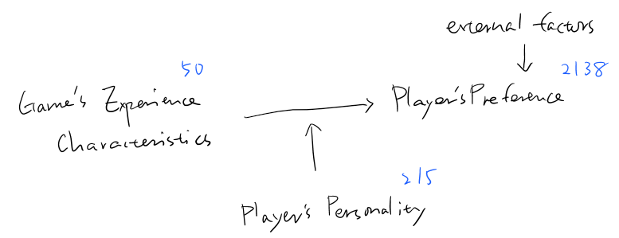
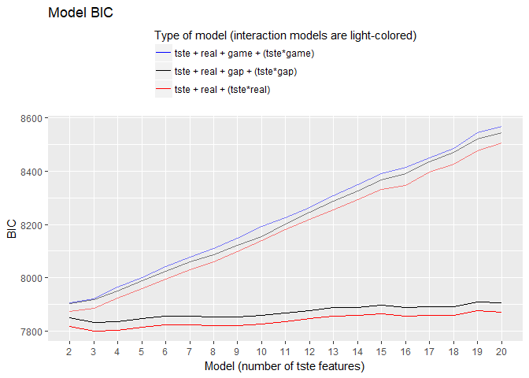

MAPSS Thesis II - model 1
================
Chih-Yu Chiang
August 10, 2017

-   [Setup](#setup)
-   [Variable](#variable)
-   [Model](#model)
-   [Information criteria](#information-criteria)
    -   [preference ~ tste](#preference-tste)
    -   [(link for the above position)](#link-for-the-above-position)
    -   [preference ~ tste + personality + (interaction)](#preference-tste-personality-interaction)
    -   [(link for the above position)](#link-for-the-above-position-1)
-   [Model summaries](#model-summaries)
    -   [preference ~ tste + real](#preference-tste-real)
    -   [(link for the above position)](#link-for-the-above-position-2)
    -   [preference ~ tste + real + real\*tste](#preference-tste-real-realtste)
    -   [(link for the above position)](#link-for-the-above-position-3)
    -   [preference ~ tste + real + game](#preference-tste-real-game)
    -   [(link for the above position)](#link-for-the-above-position-4)
    -   [preference ~ tste + real + game + game\*tste](#preference-tste-real-game-gametste)
    -   [(link for the above position)](#link-for-the-above-position-5)
    -   [preference ~ tste + real + gap](#preference-tste-real-gap)
    -   [(link for the above position)](#link-for-the-above-position-6)
    -   [preference ~ tste + real + gap + gap\*tste](#preference-tste-real-gap-gaptste)
    -   [(link for the above position)](#link-for-the-above-position-7)

``` r
knitr::opts_chunk$set(
    message=FALSE,
    warning=FALSE
)

#Prevent result wrapping
options(width=120)
```

Setup
-----

Data of game and player are read in and matched up.

-   Game release data, `release` (year), is read in as an interval variable.
-   Missing values are imputed with variable mean conveniently (`star_user` and `star_GS`).

``` r
#--Package
library(tidyverse)
library(corrplot)
library(modelr)
library(glmnet)
library(VGAM)
library(randomForest)
library(e1071)
library(car)
library(rlist)
library(pander)
set.seed(1)


#--Read in
#Core game info and group distance/probability data
core_cluster <- read_csv("../data/core_cluster.csv", col_names=TRUE) %>%
  mutate(group_survey = factor(group_survey),
         group_review = factor(group_review),
         core_id = factor(core_id)) %>%
  select(-X1)

#Core game tste scores (of dif numbers of features)
core_tsteScore <- read_csv("../data/tste_concat.csv", col_names=TRUE) %>%
  select(-X1)

#Player-related survey data
survey <- read_csv("../data/survey.csv", col_names=TRUE) %>%
  mutate(race = factor(race),
         sex = factor(sex),
         core_id = factor(core_id)) %>%
  select(-id)


#--Impute missing with mean
imputation_mean <- function(c){
  c[is.na(c)] <- mean(c, na.rm=TRUE)
  return(c)
}
core_cluster <- mutate_each(core_cluster,
                            funs(imputation_mean(.)),
                            star_user, star_GS)


#--Match up
#Main df, key=player-game
df <- bind_cols(core_cluster, core_tsteScore) %>%
  left_join(survey, by=c("core_id"), copy=FALSE)
```

Variable
--------

Compute and select variables to be used in models.

-   Mean-centered vars is marked with a suffix \_ct.

-   Player preference:

| Name           | Definition                 | Unit                        |
|----------------|----------------------------|-----------------------------|
| `preference_1` | how much do you like       | Likert 1-7=like             |
| `preference_2` | how often play it          | ordinary 1=never-7=everyday |
| `preference_3` | does it fit personal taste | Likert 1-7=fit              |

-   Game characteristics:

<table style="width:36%;">
<colgroup>
<col width="8%" />
<col width="18%" />
<col width="9%" />
</colgroup>
<thead>
<tr class="header">
<th>Name</th>
<th>Definition</th>
<th>Unit</th>
</tr>
</thead>
<tbody>
<tr class="odd">
<td><code>distance_survey_mean_x</code></td>
<td>group score from survey (distance from group mean in tste)</td>
<td>cosine distance</td>
</tr>
<tr class="even">
<td><code>distance_survey_median_x</code></td>
<td>group score from survey (distance from group median in tste)</td>
<td>cosine distance</td>
</tr>
<tr class="odd">
<td><code>probability_review_mean_x</code></td>
<td>group score from review (mean probability to be categorized in the group by NN)</td>
<td>percentage</td>
</tr>
<tr class="even">
<td><code>probability_review_median_x</code></td>
<td>group score from review (median probability to be categorized in the group by NN)</td>
<td>percentage</td>
</tr>
<tr class="odd">
<td><code>group_survey</code></td>
<td>group identity from survey</td>
<td>categorical 1-group number</td>
</tr>
<tr class="even">
<td><code>group_review</code></td>
<td>group identity from review</td>
<td>categorical 1-group number</td>
</tr>
<tr class="odd">
<td><code>tste_n_x</code></td>
<td>group score from survey (tste), n=number of features</td>
<td>interval arbitrary</td>
</tr>
</tbody>
</table>

-   Player personality:

<table style="width:36%;">
<colgroup>
<col width="8%" />
<col width="18%" />
<col width="9%" />
</colgroup>
<thead>
<tr class="header">
<th>Name</th>
<th>Definition</th>
<th>Unit</th>
</tr>
</thead>
<tbody>
<tr class="odd">
<td><code>game_xxxxx</code></td>
<td>Big-five personality in game</td>
<td>Likert 1-7</td>
</tr>
<tr class="even">
<td><code>real_xxxxx</code></td>
<td>Big-five personality in real life</td>
<td>Likert 1-7</td>
</tr>
<tr class="odd">
<td><code>gap_xxxxx</code></td>
<td>personality gap (game - real)</td>
<td>Likert 1-7</td>
</tr>
<tr class="even">
<td><code>satis_xxxxx</code></td>
<td>SDT satisfaction in real life</td>
<td>Likert 1-7</td>
</tr>
<tr class="odd">
<td><code>dissatis_xxxxx</code></td>
<td>SDT dissatisfaction in real life</td>
<td>Likert 1-7</td>
</tr>
<tr class="even">
<td><code>combined_xxxxx</code></td>
<td>SDT combined (previous two) dissatisfaction in real life</td>
<td>Likert 1-7</td>
</tr>
</tbody>
</table>

-   Control:

| Name        | Definition                                    | Unit                      |
|-------------|-----------------------------------------------|---------------------------|
| `age`       | player age                                    | interval                  |
| `education` | player education                              | ordinary 1-7=PhD          |
| `income`    | player annual household income                | ordinary 1-7=over 150,000 |
| `sex`       | player sex                                    | categorical 1=male        |
| `race`      | player race                                   | categorical 1-5           |
| `release`   | game release year                             | interval year             |
| `star_GS`   | general game quality rated by GameSpot expert | interval 0-10             |
| `star_user` | general game quality rated by GameSpot user   | interval 0-10             |

``` r
updateVars <- function(){
  #--Create response variable
  df <<- df %>%
    rowwise() %>% #Rowwise to make the ordinary functions work
    mutate(preference = mean(c(preference_3))) %>%
    ungroup() #Ungroup to cancel rowwise
  
  
  #--Mean-center predictor variables
  df <<- mutate_at(df, vars(starts_with("tste"),
                            starts_with("game"),
                            starts_with("real"),
                            starts_with("satis"),
                            starts_with("dissatis"),
                            starts_with("combined")), funs(ct = . - mean(.)))

  
  #--Compute personalty gap
  df <<- mutate(df,
                gap_extraversion = game_extraversion - real_extraversion,
                gap_agreeableness = game_agreeableness - real_agreeableness,
                gap_conscientiousness = game_conscientiousness - real_conscientiousness,
                gap_emotionstability = game_emotionstability - real_emotionstability,
                gap_openness = game_openness - real_openness)
  
  
  #--Acquire player df, key=player
  df_player <<- distinct(df, respondent, .keep_all=TRUE)
  
  
  #--Select variables to be included in regression (model formation)
  #Sets of predictor variables from file
  predictors <- read.csv("../data/vars/predictors.csv", header=TRUE, na.strings="")
  
  #Get column name as model id
  modelId <- colnames(predictors)
  
  #predictor variable as strings for each model
  predictorString <- apply(predictors, MARGIN=2, function(x) paste(na.omit(x), collapse="+"))
  
  #Make the dfs into a data frame
  dfs <<- data.frame(predictorString, modelId, stringsAsFactors=FALSE) %>%
    mutate(df_x = map(predictorString, ~ model.matrix(as.formula(paste("preference ~ ", .x, sep="")), data=df)[, -1])) %>% #df with only predictor variables; [, -1] used to remove redundant intercept column
    mutate(df_yx = map(df_x, ~ bind_cols(select(df, preference), data.frame(.x)))) #df also with outcome variables
  
  #Set row names for reference
  row.names(dfs) <<- modelId
}
```

Model
-----



-   preference measurement = "how much does it fit taste?"

``` r
#Update vars
updateVars()

#Full df with control marked
df_c <- mutate(df,
               c_age = age,
               c_education = education,
               c_income = income,
               c_race = race,
               c_sex = sex,
               c_release = release,
               c_star = star_user)

#Partial models
featureNo <- seq(2, 20)
model_gChar_tstes <- map(featureNo, ~ lm(preference ~ ., data=select(df_c, preference, starts_with("c_"), starts_with(paste("tste_", .x, "_", sep="")))))

#Full models
dfs$model_lm <- map(dfs$df_yx, ~ lm(preference ~ ., data=.x))
```

Information criteria
--------------------

### preference ~ tste

### (link for the above position)

``` r
"
### BIC and BIC difference
"
```

    ## [1] "\n### BIC and BIC difference\n"

``` r
#--preference ~ tstes
BICs <- unlist(map(model_gChar_tstes, BIC))
BICs_dif <- BICs[-1] - lag(BICs)[-1]

ggplot(data=as.data.frame(BICs)) +
  geom_line(mapping=aes(seq(2, 20), BICs)) +
  labs(x="Number of features", y="BIC") +
  scale_x_continuous(breaks=seq(2, 20), minor_breaks=NULL)
```


``` r
#Model 3 = the BIC change from 2-feature to 3-feature models 
ggplot(data=as.data.frame(BICs_dif)) +
  geom_line(mapping=aes(seq(3, 20), BICs_dif)) +
  labs(x="Number of features", y="BIC difference") +
  scale_x_continuous(breaks=seq(3, 20), minor_breaks=NULL) +
  geom_hline(yintercept=0, linetype=3)
```


``` r
"
### AIC and AIC difference
"
```

    ## [1] "\n### AIC and AIC difference\n"

``` r
#--preference ~ tstes
AICs <- unlist(map(model_gChar_tstes, AIC))
AICs_dif <- AICs[-1] - lag(AICs)[-1]

ggplot(data=as.data.frame(AICs)) +
  geom_line(mapping=aes(seq(2, 20), AICs)) +
  labs(x="Number of features", y="AIC") +
  scale_x_continuous(breaks=seq(2, 20), minor_breaks=NULL)
```


``` r
#Model 3 = the AIC change from 2-feature to 3-feature models 
ggplot(data=as.data.frame(AICs_dif)) +
  geom_line(mapping=aes(seq(3, 20), AICs_dif)) +
  labs(x="Number of features", y="AIC difference") +
  scale_x_continuous(breaks=seq(3, 20), minor_breaks=NULL) +
  geom_hline(yintercept=0, linetype=3)
```


### preference ~ tste + personality + (interaction)

### (link for the above position)

``` r
#--BIC
dfs$BIC <- unlist(map(dfs$model_lm, BIC))
dfs$BIC_dif <- dfs$BIC - lag(dfs$BIC)

#Seperate batch models from dfs
dfs_real <- slice(dfs, 1:19)
dfs_realI <- slice(dfs, 20:38)
dfs_game <- slice(dfs, 39:57)
dfs_gameI <- slice(dfs, 58:76)
dfs_gap <- slice(dfs, 77:95)
dfs_gapI <- slice(dfs, 96:114)

dfs_real_dif <- slice(dfs, 2:19)
dfs_realI_dif <- slice(dfs, 21:38)
dfs_game_dif <- slice(dfs, 40:57)
dfs_gameI_dif <- slice(dfs, 59:76)
dfs_gap_dif <- slice(dfs, 78:95)
dfs_gapI_dif <- slice(dfs, 97:114)

#Batch models
ggplot() +
  geom_line(data=dfs_real, mapping=aes(seq(1, dim(dfs_real)[1]), BIC, color="r")) +
  geom_line(data=dfs_realI, mapping=aes(seq(1, dim(dfs_realI)[1]), BIC, color="r"), alpha=0.5) +
  geom_line(data=dfs_game, mapping=aes(seq(1, dim(dfs_game)[1]), BIC, color="g")) +
  geom_line(data=dfs_gameI, mapping=aes(seq(1, dim(dfs_gameI)[1]), BIC, color="g"), alpha=0.5) +
  geom_line(data=dfs_gap, mapping=aes(seq(1, dim(dfs_gap)[1]), BIC, color="p")) +
  geom_line(data=dfs_gapI, mapping=aes(seq(1, dim(dfs_gapI)[1]), BIC, color="p"), alpha=0.5) +
  labs(x="Model (number of tste features)", y="BIC", title="Model BIC") +
  theme(legend.position="top", legend.direction="vertical") +
  scale_x_continuous(breaks=seq(1, dim(dfs_gap)[1]), minor_breaks=NULL, labels=seq(2, 20)) +
  scale_color_manual(name="Type of model (interaction models are light-colored)", values=c("r"="red", "g"="blue", "p"="black"),
                     labels=c("r"="tste + real + (tste*real)",
                              "g"="tste + real + game + (tste*game)",
                              "p"="tste + real + gap + (tste*gap)"))
```



``` r
ggplot() +
  geom_line(data=dfs_real_dif, mapping=aes(seq(1, dim(dfs_real_dif)[1]), BIC_dif, color="r")) +
  geom_line(data=dfs_realI_dif, mapping=aes(seq(1, dim(dfs_realI_dif)[1]), BIC_dif, color="r"), alpha=0.5) +
  geom_line(data=dfs_game_dif, mapping=aes(seq(1, dim(dfs_game_dif)[1]), BIC_dif, color="g")) +
  geom_line(data=dfs_gameI_dif, mapping=aes(seq(1, dim(dfs_gameI_dif)[1]), BIC_dif, color="g"), alpha=0.5) +
  geom_line(data=dfs_gap_dif, mapping=aes(seq(1, dim(dfs_gap_dif)[1]), BIC_dif, color="p")) +
  geom_line(data=dfs_gapI_dif, mapping=aes(seq(1, dim(dfs_gapI_dif)[1]), BIC_dif, color="p"), alpha=0.5) +
  labs(x="Model (number of tste features)", y="BIC difference", title="BIC difference when increasing the number of tste features") +
  theme(legend.position="top", legend.direction="vertical") +
  scale_x_continuous(breaks=seq(1, dim(dfs_gap_dif)[1]), minor_breaks=NULL, labels=seq(3, 20)) +
  scale_color_manual(name="Type of model (interaction models are light-colored)", values=c("r"="red", "g"="blue", "p"="black"),
                     labels=c("r"="tste + real + (tste*real)",
                              "g"="tste + real + game + (tste*game)",
                              "p"="tste + real + gap + (tste*gap)")) +
  geom_hline(yintercept=0, linetype=3)
```


``` r
#--AIC
dfs$AIC <- unlist(map(dfs$model_lm, AIC))
dfs$AIC_dif <- dfs$AIC - lag(dfs$AIC)

#Seperate batch models from dfs
dfs_real <- slice(dfs, 1:19)
dfs_realI <- slice(dfs, 20:38)
dfs_game <- slice(dfs, 39:57)
dfs_gameI <- slice(dfs, 58:76)
dfs_gap <- slice(dfs, 77:95)
dfs_gapI <- slice(dfs, 96:114)

dfs_real_dif <- slice(dfs, 2:19)
dfs_realI_dif <- slice(dfs, 21:38)
dfs_game_dif <- slice(dfs, 40:57)
dfs_gameI_dif <- slice(dfs, 59:76)
dfs_gap_dif <- slice(dfs, 78:95)
dfs_gapI_dif <- slice(dfs, 97:114)

#Batch models
ggplot() +
  geom_line(data=dfs_real, mapping=aes(seq(1, dim(dfs_real)[1]), AIC, color="r")) +
  geom_line(data=dfs_realI, mapping=aes(seq(1, dim(dfs_realI)[1]), AIC, color="r"), alpha=0.5) +
  geom_line(data=dfs_game, mapping=aes(seq(1, dim(dfs_game)[1]), AIC, color="g")) +
  geom_line(data=dfs_gameI, mapping=aes(seq(1, dim(dfs_gameI)[1]), AIC, color="g"), alpha=0.5) +
  geom_line(data=dfs_gap, mapping=aes(seq(1, dim(dfs_gap)[1]), AIC, color="p")) +
  geom_line(data=dfs_gapI, mapping=aes(seq(1, dim(dfs_gapI)[1]), AIC, color="p"), alpha=0.5) +
  labs(x="Model (number of tste features)", y="AIC", title="Model AIC") +
  theme(legend.position="top", legend.direction="vertical") +
  scale_x_continuous(breaks=seq(1, dim(dfs_gap)[1]), minor_breaks=NULL, labels=seq(2, 20)) +
  scale_color_manual(name="Type of model (interaction models are light-colored)", values=c("r"="red", "g"="blue", "p"="black"),
                     labels=c("r"="tste + real + (tste*real)",
                              "g"="tste + real + game + (tste*game)",
                              "p"="tste + real + gap + (tste*gap)"))
```


``` r
ggplot() +
  geom_line(data=dfs_real_dif, mapping=aes(seq(1, dim(dfs_real_dif)[1]), AIC_dif, color="r")) +
  geom_line(data=dfs_realI_dif, mapping=aes(seq(1, dim(dfs_realI_dif)[1]), AIC_dif, color="r"), alpha=0.5) +
  geom_line(data=dfs_game_dif, mapping=aes(seq(1, dim(dfs_game_dif)[1]), AIC_dif, color="g")) +
  geom_line(data=dfs_gameI_dif, mapping=aes(seq(1, dim(dfs_gameI_dif)[1]), AIC_dif, color="g"), alpha=0.5) +
  geom_line(data=dfs_gap_dif, mapping=aes(seq(1, dim(dfs_gap_dif)[1]), AIC_dif, color="p")) +
  geom_line(data=dfs_gapI_dif, mapping=aes(seq(1, dim(dfs_gapI_dif)[1]), AIC_dif, color="p"), alpha=0.5) +
  labs(x="Model (number of tste features)", y="AIC difference", title="AIC difference when increasing the number of tste features") +
  theme(legend.position="top", legend.direction="vertical") +
  scale_x_continuous(breaks=seq(1, dim(dfs_gap_dif)[1]), minor_breaks=NULL, labels=seq(3, 20)) +
  scale_color_manual(name="Type of model (interaction models are light-colored)", values=c("r"="red", "g"="blue", "p"="black"),
                     labels=c("r"="tste + real + (tste*real)",
                              "g"="tste + real + game + (tste*game)",
                              "p"="tste + real + gap + (tste*gap)")) +
  geom_hline(yintercept=0, linetype=3)
```


Model summaries
---------------

### preference ~ tste + real

### (link for the above position)

``` r
#Summary
for(model in slice(dfs, 1:19)$model_lm) print(summary(model))
```

    ## 
    ## Call:
    ## lm(formula = preference ~ ., data = .x)
    ## 
    ## Residuals:
    ##     Min      1Q  Median      3Q     Max 
    ## -5.0420 -0.6753  0.3082  1.0894  2.6504 
    ## 
    ## Coefficients:
    ##                            Estimate Std. Error t value Pr(>|t|)    
    ## (Intercept)               64.713528  14.047886   4.607 4.34e-06 ***
    ## age                       -0.014913   0.004613  -3.233  0.00124 ** 
    ## education                  0.017063   0.026420   0.646  0.51846    
    ## income                     0.009528   0.016875   0.565  0.57241    
    ## race2                      0.100091   0.131402   0.762  0.44632    
    ## race4                     -0.255744   0.141836  -1.803  0.07151 .  
    ## race6                     -1.021031   0.342656  -2.980  0.00292 ** 
    ## race7                     -0.112301   0.134633  -0.834  0.40430    
    ## sex2                      -0.105502   0.071668  -1.472  0.14114    
    ## release                   -0.029378   0.006895  -4.261 2.13e-05 ***
    ## star_user                  0.014433   0.052331   0.276  0.78273    
    ## real_extraversion_ct       0.045030   0.019948   2.257  0.02409 *  
    ## real_agreeableness_ct     -0.015382   0.027306  -0.563  0.57327    
    ## real_conscientiousness_ct  0.082415   0.029730   2.772  0.00562 ** 
    ## real_emotionstability_ct  -0.011940   0.029781  -0.401  0.68851    
    ## real_openness_ct           0.121161   0.024658   4.914 9.62e-07 ***
    ## tste_2_0_ct                0.096130   0.041076   2.340  0.01936 *  
    ## tste_2_1_ct               -0.072374   0.039944  -1.812  0.07014 .  
    ## ---
    ## Signif. codes:  0 '***' 0.001 '**' 0.01 '*' 0.05 '.' 0.1 ' ' 1
    ## 
    ## Residual standard error: 1.461 on 2120 degrees of freedom
    ## Multiple R-squared:  0.06078,    Adjusted R-squared:  0.05325 
    ## F-statistic:  8.07 on 17 and 2120 DF,  p-value: < 2.2e-16
    ## 
    ## 
    ## Call:
    ## lm(formula = preference ~ ., data = .x)
    ## 
    ## Residuals:
    ##     Min      1Q  Median      3Q     Max 
    ## -4.9449 -0.6982  0.3090  1.0592  2.5556 
    ## 
    ## Coefficients:
    ##                            Estimate Std. Error t value Pr(>|t|)    
    ## (Intercept)               57.882342  14.020982   4.128 3.80e-05 ***
    ## age                       -0.014755   0.004585  -3.218 0.001311 ** 
    ## education                  0.015643   0.026264   0.596 0.551507    
    ## income                     0.010738   0.016777   0.640 0.522224    
    ## race2                      0.094124   0.130625   0.721 0.471256    
    ## race4                     -0.228903   0.141090  -1.622 0.104870    
    ## race6                     -1.006683   0.340657  -2.955 0.003160 ** 
    ## race7                     -0.129146   0.133867  -0.965 0.334788    
    ## sex2                      -0.096845   0.071252  -1.359 0.174232    
    ## release                   -0.026048   0.006881  -3.785 0.000158 ***
    ## star_user                  0.030917   0.052238   0.592 0.554024    
    ## real_extraversion_ct       0.043815   0.019828   2.210 0.027233 *  
    ## real_agreeableness_ct     -0.015567   0.027144  -0.574 0.566364    
    ## real_conscientiousness_ct  0.082404   0.029553   2.788 0.005344 ** 
    ## real_emotionstability_ct  -0.009878   0.029602  -0.334 0.738638    
    ## real_openness_ct           0.123497   0.024513   5.038 5.10e-07 ***
    ## tste_3_0_ct               -0.043375   0.043380  -1.000 0.317477    
    ## tste_3_1_ct                0.155424   0.034839   4.461 8.57e-06 ***
    ## tste_3_2_ct                0.233549   0.048718   4.794 1.75e-06 ***
    ## ---
    ## Signif. codes:  0 '***' 0.001 '**' 0.01 '*' 0.05 '.' 0.1 ' ' 1
    ## 
    ## Residual standard error: 1.453 on 2119 degrees of freedom
    ## Multiple R-squared:  0.07242,    Adjusted R-squared:  0.06454 
    ## F-statistic: 9.191 on 18 and 2119 DF,  p-value: < 2.2e-16
    ## 
    ## 
    ## Call:
    ## lm(formula = preference ~ ., data = .x)
    ## 
    ## Residuals:
    ##     Min      1Q  Median      3Q     Max 
    ## -4.9901 -0.6892  0.3038  1.0698  2.6119 
    ## 
    ## Coefficients:
    ##                            Estimate Std. Error t value Pr(>|t|)    
    ## (Intercept)               59.451828  14.193275   4.189 2.92e-05 ***
    ## age                       -0.014692   0.004585  -3.204 0.001375 ** 
    ## education                  0.015738   0.026253   0.599 0.548930    
    ## income                     0.010287   0.016768   0.613 0.539638    
    ## race2                      0.093183   0.130671   0.713 0.475855    
    ## race4                     -0.227637   0.141068  -1.614 0.106748    
    ## race6                     -1.011487   0.340523  -2.970 0.003008 ** 
    ## race7                     -0.129594   0.133802  -0.969 0.332881    
    ## sex2                      -0.093787   0.071244  -1.316 0.188178    
    ## release                   -0.026742   0.006958  -3.844 0.000125 ***
    ## star_user                  0.009841   0.055080   0.179 0.858216    
    ## real_extraversion_ct       0.043423   0.019820   2.191 0.028571 *  
    ## real_agreeableness_ct     -0.014838   0.027155  -0.546 0.584841    
    ## real_conscientiousness_ct  0.082381   0.029539   2.789 0.005337 ** 
    ## real_emotionstability_ct  -0.009586   0.029603  -0.324 0.746122    
    ## real_openness_ct           0.124748   0.024511   5.090 3.91e-07 ***
    ## tste_4_0_ct                0.233821   0.047663   4.906 1.00e-06 ***
    ## tste_4_1_ct                0.076456   0.053163   1.438 0.150541    
    ## tste_4_2_ct                0.062774   0.041424   1.515 0.129823    
    ## tste_4_3_ct               -0.156030   0.039101  -3.990 6.82e-05 ***
    ## ---
    ## Signif. codes:  0 '***' 0.001 '**' 0.01 '*' 0.05 '.' 0.1 ' ' 1
    ## 
    ## Residual standard error: 1.452 on 2118 degrees of freedom
    ## Multiple R-squared:  0.07383,    Adjusted R-squared:  0.06552 
    ## F-statistic: 8.886 on 19 and 2118 DF,  p-value: < 2.2e-16
    ## 
    ## 
    ## Call:
    ## lm(formula = preference ~ ., data = .x)
    ## 
    ## Residuals:
    ##     Min      1Q  Median      3Q     Max 
    ## -4.9418 -0.6914  0.3017  1.0621  2.5577 
    ## 
    ## Coefficients:
    ##                            Estimate Std. Error t value Pr(>|t|)    
    ## (Intercept)               48.833702  14.456255   3.378 0.000743 ***
    ## age                       -0.014853   0.004591  -3.235 0.001233 ** 
    ## education                  0.015875   0.026288   0.604 0.545982    
    ## income                     0.011586   0.016795   0.690 0.490357    
    ## race2                      0.084778   0.130792   0.648 0.516935    
    ## race4                     -0.233439   0.141215  -1.653 0.098464 .  
    ## race6                     -1.015523   0.340871  -2.979 0.002923 ** 
    ## race7                     -0.126194   0.133940  -0.942 0.346214    
    ## sex2                      -0.101074   0.071327  -1.417 0.156618    
    ## release                   -0.021484   0.007088  -3.031 0.002466 ** 
    ## star_user                  0.017340   0.056226   0.308 0.757812    
    ## real_extraversion_ct       0.045588   0.019845   2.297 0.021706 *  
    ## real_agreeableness_ct     -0.014692   0.027184  -0.540 0.588928    
    ## real_conscientiousness_ct  0.083129   0.029568   2.811 0.004978 ** 
    ## real_emotionstability_ct  -0.009743   0.029633  -0.329 0.742352    
    ## real_openness_ct           0.122762   0.024548   5.001 6.18e-07 ***
    ## tste_5_0_ct                0.221117   0.046477   4.758 2.09e-06 ***
    ## tste_5_1_ct               -0.154245   0.051866  -2.974 0.002973 ** 
    ## tste_5_2_ct               -0.027779   0.040798  -0.681 0.496014    
    ## tste_5_3_ct               -0.100530   0.049162  -2.045 0.040992 *  
    ## tste_5_4_ct                0.031657   0.047444   0.667 0.504694    
    ## ---
    ## Signif. codes:  0 '***' 0.001 '**' 0.01 '*' 0.05 '.' 0.1 ' ' 1
    ## 
    ## Residual standard error: 1.453 on 2117 degrees of freedom
    ## Multiple R-squared:  0.07225,    Adjusted R-squared:  0.06348 
    ## F-statistic: 8.243 on 20 and 2117 DF,  p-value: < 2.2e-16
    ## 
    ## 
    ## Call:
    ## lm(formula = preference ~ ., data = .x)
    ## 
    ## Residuals:
    ##     Min      1Q  Median      3Q     Max 
    ## -5.0089 -0.6894  0.3015  1.0583  2.5766 
    ## 
    ## Coefficients:
    ##                            Estimate Std. Error t value Pr(>|t|)    
    ## (Intercept)               47.313814  14.619465   3.236  0.00123 ** 
    ## age                       -0.014800   0.004591  -3.224  0.00129 ** 
    ## education                  0.015228   0.026296   0.579  0.56260    
    ## income                     0.012046   0.016802   0.717  0.47350    
    ## race2                      0.073975   0.130967   0.565  0.57225    
    ## race4                     -0.228935   0.141259  -1.621  0.10524    
    ## race6                     -1.018854   0.340983  -2.988  0.00284 ** 
    ## race7                     -0.121924   0.134011  -0.910  0.36303    
    ## sex2                      -0.098557   0.071352  -1.381  0.16734    
    ## release                   -0.020677   0.007170  -2.884  0.00397 ** 
    ## star_user                  0.005125   0.057845   0.089  0.92941    
    ## real_extraversion_ct       0.046370   0.019853   2.336  0.01960 *  
    ## real_agreeableness_ct     -0.016129   0.027198  -0.593  0.55322    
    ## real_conscientiousness_ct  0.082255   0.029578   2.781  0.00547 ** 
    ## real_emotionstability_ct  -0.008978   0.029639  -0.303  0.76198    
    ## real_openness_ct           0.124412   0.024543   5.069 4.34e-07 ***
    ## tste_6_0_ct                0.039306   0.051559   0.762  0.44593    
    ## tste_6_1_ct               -0.128436   0.048400  -2.654  0.00802 ** 
    ## tste_6_2_ct                0.234857   0.043018   5.460 5.33e-08 ***
    ## tste_6_3_ct                0.016977   0.052439   0.324  0.74616    
    ## tste_6_4_ct                0.090679   0.045569   1.990  0.04673 *  
    ## tste_6_5_ct                0.067589   0.053441   1.265  0.20611    
    ## ---
    ## Signif. codes:  0 '***' 0.001 '**' 0.01 '*' 0.05 '.' 0.1 ' ' 1
    ## 
    ## Residual standard error: 1.454 on 2116 degrees of freedom
    ## Multiple R-squared:  0.07231,    Adjusted R-squared:  0.06311 
    ## F-statistic: 7.854 on 21 and 2116 DF,  p-value: < 2.2e-16
    ## 
    ## 
    ## Call:
    ## lm(formula = preference ~ ., data = .x)
    ## 
    ## Residuals:
    ##     Min      1Q  Median      3Q     Max 
    ## -4.9431 -0.6950  0.3043  1.0548  2.6020 
    ## 
    ## Coefficients:
    ##                            Estimate Std. Error t value Pr(>|t|)    
    ## (Intercept)               51.121021  15.022699   3.403 0.000679 ***
    ## age                       -0.014518   0.004586  -3.165 0.001571 ** 
    ## education                  0.016294   0.026267   0.620 0.535117    
    ## income                     0.011260   0.016781   0.671 0.502287    
    ## race2                      0.088393   0.130668   0.676 0.498814    
    ## race4                     -0.223136   0.141108  -1.581 0.113956    
    ## race6                     -1.010574   0.340518  -2.968 0.003034 ** 
    ## race7                     -0.119539   0.133803  -0.893 0.371749    
    ## sex2                      -0.101858   0.071259  -1.429 0.153033    
    ## release                   -0.022645   0.007381  -3.068 0.002181 ** 
    ## star_user                  0.021154   0.060415   0.350 0.726268    
    ## real_extraversion_ct       0.045071   0.019837   2.272 0.023185 *  
    ## real_agreeableness_ct     -0.013019   0.027180  -0.479 0.632010    
    ## real_conscientiousness_ct  0.082058   0.029545   2.777 0.005528 ** 
    ## real_emotionstability_ct  -0.010365   0.029612  -0.350 0.726348    
    ## real_openness_ct           0.122770   0.024507   5.010 5.91e-07 ***
    ## tste_7_0_ct               -0.165751   0.046879  -3.536 0.000415 ***
    ## tste_7_1_ct                0.026348   0.051615   0.510 0.609777    
    ## tste_7_2_ct               -0.141273   0.049079  -2.878 0.004036 ** 
    ## tste_7_3_ct               -0.210441   0.038385  -5.482 4.70e-08 ***
    ## tste_7_4_ct                0.023106   0.050663   0.456 0.648389    
    ## tste_7_5_ct                0.029469   0.055957   0.527 0.598500    
    ## tste_7_6_ct                0.038089   0.059750   0.637 0.523888    
    ## ---
    ## Signif. codes:  0 '***' 0.001 '**' 0.01 '*' 0.05 '.' 0.1 ' ' 1
    ## 
    ## Residual standard error: 1.452 on 2115 degrees of freedom
    ## Multiple R-squared:  0.07538,    Adjusted R-squared:  0.06576 
    ## F-statistic: 7.837 on 22 and 2115 DF,  p-value: < 2.2e-16
    ## 
    ## 
    ## Call:
    ## lm(formula = preference ~ ., data = .x)
    ## 
    ## Residuals:
    ##     Min      1Q  Median      3Q     Max 
    ## -5.0905 -0.6970  0.2975  1.0476  2.7504 
    ## 
    ## Coefficients:
    ##                            Estimate Std. Error t value Pr(>|t|)    
    ## (Intercept)               54.681740  15.578691   3.510 0.000457 ***
    ## age                       -0.014579   0.004577  -3.185 0.001468 ** 
    ## education                  0.016875   0.026218   0.644 0.519860    
    ## income                     0.011336   0.016747   0.677 0.498554    
    ## race2                      0.076121   0.130452   0.584 0.559608    
    ## race4                     -0.210926   0.140883  -1.497 0.134498    
    ## race6                     -1.025568   0.339981  -3.017 0.002587 ** 
    ## race7                     -0.109517   0.133591  -0.820 0.412426    
    ## sex2                      -0.103914   0.071081  -1.462 0.143916    
    ## release                   -0.024254   0.007649  -3.171 0.001541 ** 
    ## star_user                 -0.018129   0.059511  -0.305 0.760681    
    ## real_extraversion_ct       0.045610   0.019814   2.302 0.021436 *  
    ## real_agreeableness_ct     -0.012065   0.027124  -0.445 0.656497    
    ## real_conscientiousness_ct  0.082726   0.029503   2.804 0.005093 ** 
    ## real_emotionstability_ct  -0.009965   0.029571  -0.337 0.736168    
    ## real_openness_ct           0.123675   0.024467   5.055 4.68e-07 ***
    ## tste_8_0_ct               -0.207060   0.050372  -4.111 4.10e-05 ***
    ## tste_8_1_ct                0.189493   0.056202   3.372 0.000761 ***
    ## tste_8_2_ct                0.086553   0.050415   1.717 0.086160 .  
    ## tste_8_3_ct                0.084280   0.047491   1.775 0.076096 .  
    ## tste_8_4_ct                0.099064   0.047881   2.069 0.038671 *  
    ## tste_8_5_ct                0.105063   0.048527   2.165 0.030494 *  
    ## tste_8_6_ct               -0.110586   0.052612  -2.102 0.035678 *  
    ## tste_8_7_ct               -0.040841   0.051405  -0.794 0.427001    
    ## ---
    ## Signif. codes:  0 '***' 0.001 '**' 0.01 '*' 0.05 '.' 0.1 ' ' 1
    ## 
    ## Residual standard error: 1.449 on 2114 degrees of freedom
    ## Multiple R-squared:  0.07931,    Adjusted R-squared:  0.06929 
    ## F-statistic: 7.917 on 23 and 2114 DF,  p-value: < 2.2e-16
    ## 
    ## 
    ## Call:
    ## lm(formula = preference ~ ., data = .x)
    ## 
    ## Residuals:
    ##     Min      1Q  Median      3Q     Max 
    ## -5.0296 -0.6853  0.2996  1.0499  2.8455 
    ## 
    ## Coefficients:
    ##                             Estimate Std. Error t value Pr(>|t|)    
    ## (Intercept)               56.7593995 15.8835942   3.573  0.00036 ***
    ## age                       -0.0148162  0.0045693  -3.243  0.00120 ** 
    ## education                  0.0150753  0.0261767   0.576  0.56474    
    ## income                     0.0146034  0.0167490   0.872  0.38337    
    ## race2                      0.0740443  0.1302650   0.568  0.56981    
    ## race4                     -0.2130946  0.1406557  -1.515  0.12992    
    ## race6                     -0.9600488  0.3398537  -2.825  0.00477 ** 
    ## race7                     -0.1013648  0.1334689  -0.759  0.44766    
    ## sex2                      -0.0972029  0.0710082  -1.369  0.17118    
    ## release                   -0.0253811  0.0077952  -3.256  0.00115 ** 
    ## star_user                  0.0033366  0.0603467   0.055  0.95591    
    ## real_extraversion_ct       0.0478334  0.0197795   2.418  0.01568 *  
    ## real_agreeableness_ct     -0.0159775  0.0270776  -0.590  0.55521    
    ## real_conscientiousness_ct  0.0816705  0.0294520   2.773  0.00560 ** 
    ## real_emotionstability_ct  -0.0093389  0.0295193  -0.316  0.75176    
    ## real_openness_ct           0.1202538  0.0244410   4.920 9.31e-07 ***
    ## tste_9_0_ct               -0.1445279  0.0527591  -2.739  0.00621 ** 
    ## tste_9_1_ct                0.0384049  0.0506930   0.758  0.44878    
    ## tste_9_2_ct               -0.3106896  0.0498844  -6.228 5.68e-10 ***
    ## tste_9_3_ct               -0.0835973  0.0560448  -1.492  0.13595    
    ## tste_9_4_ct               -0.0213662  0.0437807  -0.488  0.62558    
    ## tste_9_5_ct                0.0195051  0.0573817   0.340  0.73395    
    ## tste_9_6_ct               -0.0007249  0.0510442  -0.014  0.98867    
    ## tste_9_7_ct               -0.0959149  0.0511438  -1.875  0.06088 .  
    ## tste_9_8_ct                0.0497869  0.0446471   1.115  0.26493    
    ## ---
    ## Signif. codes:  0 '***' 0.001 '**' 0.01 '*' 0.05 '.' 0.1 ' ' 1
    ## 
    ## Residual standard error: 1.447 on 2113 degrees of freedom
    ## Multiple R-squared:  0.0827, Adjusted R-squared:  0.07228 
    ## F-statistic: 7.937 on 24 and 2113 DF,  p-value: < 2.2e-16
    ## 
    ## 
    ## Call:
    ## lm(formula = preference ~ ., data = .x)
    ## 
    ## Residuals:
    ##     Min      1Q  Median      3Q     Max 
    ## -5.0046 -0.6822  0.2752  1.0448  2.6400 
    ## 
    ## Coefficients:
    ##                            Estimate Std. Error t value Pr(>|t|)    
    ## (Intercept)               55.757363  15.586434   3.577 0.000355 ***
    ## age                       -0.014861   0.004569  -3.252 0.001163 ** 
    ## education                  0.014793   0.026171   0.565 0.571968    
    ## income                     0.013235   0.016726   0.791 0.428858    
    ## race2                      0.083760   0.130250   0.643 0.520248    
    ## race4                     -0.211955   0.140627  -1.507 0.131906    
    ## race6                     -0.967046   0.339699  -2.847 0.004459 ** 
    ## race7                     -0.102065   0.133468  -0.765 0.444526    
    ## sex2                      -0.094193   0.071049  -1.326 0.185067    
    ## release                   -0.024960   0.007659  -3.259 0.001136 ** 
    ## star_user                  0.022805   0.059177   0.385 0.699999    
    ## real_extraversion_ct       0.046662   0.019778   2.359 0.018399 *  
    ## real_agreeableness_ct     -0.014370   0.027079  -0.531 0.595702    
    ## real_conscientiousness_ct  0.081540   0.029459   2.768 0.005691 ** 
    ## real_emotionstability_ct  -0.010376   0.029511  -0.352 0.725186    
    ## real_openness_ct           0.120665   0.024439   4.937 8.53e-07 ***
    ## tste_10_0_ct              -0.029905   0.044732  -0.669 0.503863    
    ## tste_10_1_ct               0.165428   0.049032   3.374 0.000754 ***
    ## tste_10_2_ct              -0.194707   0.052315  -3.722 0.000203 ***
    ## tste_10_3_ct              -0.147210   0.052823  -2.787 0.005369 ** 
    ## tste_10_4_ct              -0.065594   0.053130  -1.235 0.217117    
    ## tste_10_5_ct               0.015267   0.050502   0.302 0.762451    
    ## tste_10_6_ct              -0.153900   0.051688  -2.977 0.002939 ** 
    ## tste_10_7_ct               0.093774   0.044592   2.103 0.035588 *  
    ## tste_10_8_ct               0.045033   0.059152   0.761 0.446549    
    ## tste_10_9_ct               0.116729   0.050227   2.324 0.020218 *  
    ## ---
    ## Signif. codes:  0 '***' 0.001 '**' 0.01 '*' 0.05 '.' 0.1 ' ' 1
    ## 
    ## Residual standard error: 1.446 on 2112 degrees of freedom
    ## Multiple R-squared:  0.0836, Adjusted R-squared:  0.07275 
    ## F-statistic: 7.707 on 25 and 2112 DF,  p-value: < 2.2e-16
    ## 
    ## 
    ## Call:
    ## lm(formula = preference ~ ., data = .x)
    ## 
    ## Residuals:
    ##     Min      1Q  Median      3Q     Max 
    ## -5.0178 -0.6814  0.2887  1.0397  2.6729 
    ## 
    ## Coefficients:
    ##                            Estimate Std. Error t value Pr(>|t|)    
    ## (Intercept)               56.441929  15.826512   3.566 0.000370 ***
    ## age                       -0.014889   0.004570  -3.258 0.001140 ** 
    ## education                  0.016292   0.026176   0.622 0.533744    
    ## income                     0.013463   0.016747   0.804 0.421558    
    ## race2                      0.085137   0.130323   0.653 0.513648    
    ## race4                     -0.209395   0.140680  -1.488 0.136782    
    ## race6                     -0.959495   0.339861  -2.823 0.004799 ** 
    ## race7                     -0.109377   0.133475  -0.819 0.412619    
    ## sex2                      -0.095169   0.071131  -1.338 0.181058    
    ## release                   -0.025279   0.007774  -3.252 0.001165 ** 
    ## star_user                  0.017020   0.061638   0.276 0.782473    
    ## real_extraversion_ct       0.047132   0.019793   2.381 0.017345 *  
    ## real_agreeableness_ct     -0.013319   0.027101  -0.491 0.623151    
    ## real_conscientiousness_ct  0.081150   0.029497   2.751 0.005989 ** 
    ## real_emotionstability_ct  -0.010875   0.029525  -0.368 0.712669    
    ## real_openness_ct           0.119980   0.024452   4.907 9.97e-07 ***
    ## tste_11_0_ct              -0.016209   0.054894  -0.295 0.767811    
    ## tste_11_1_ct               0.042868   0.052316   0.819 0.412650    
    ## tste_11_2_ct              -0.077865   0.046571  -1.672 0.094677 .  
    ## tste_11_3_ct              -0.003410   0.056728  -0.060 0.952067    
    ## tste_11_4_ct              -0.126393   0.055437  -2.280 0.022711 *  
    ## tste_11_5_ct              -0.073010   0.048857  -1.494 0.135234    
    ## tste_11_6_ct               0.122601   0.047326   2.591 0.009648 ** 
    ## tste_11_7_ct               0.051175   0.053728   0.952 0.340963    
    ## tste_11_8_ct              -0.213743   0.041837  -5.109 3.53e-07 ***
    ## tste_11_9_ct               0.172770   0.049920   3.461 0.000549 ***
    ## tste_11_10_ct              0.071005   0.054722   1.298 0.194577    
    ## ---
    ## Signif. codes:  0 '***' 0.001 '**' 0.01 '*' 0.05 '.' 0.1 ' ' 1
    ## 
    ## Residual standard error: 1.447 on 2111 degrees of freedom
    ## Multiple R-squared:  0.08369,    Adjusted R-squared:  0.0724 
    ## F-statistic: 7.415 on 26 and 2111 DF,  p-value: < 2.2e-16
    ## 
    ## 
    ## Call:
    ## lm(formula = preference ~ ., data = .x)
    ## 
    ## Residuals:
    ##     Min      1Q  Median      3Q     Max 
    ## -5.0383 -0.6861  0.2964  1.0536  2.6697 
    ## 
    ## Coefficients:
    ##                            Estimate Std. Error t value Pr(>|t|)    
    ## (Intercept)               45.479419  16.303204   2.790 0.005325 ** 
    ## age                       -0.014969   0.004577  -3.270 0.001091 ** 
    ## education                  0.017240   0.026202   0.658 0.510637    
    ## income                     0.013218   0.016761   0.789 0.430419    
    ## race2                      0.082805   0.130475   0.635 0.525732    
    ## race4                     -0.216399   0.140882  -1.536 0.124680    
    ## race6                     -0.985219   0.340409  -2.894 0.003840 ** 
    ## race7                     -0.103729   0.133788  -0.775 0.438238    
    ## sex2                      -0.096389   0.071191  -1.354 0.175897    
    ## release                   -0.020012   0.007996  -2.503 0.012397 *  
    ## star_user                  0.063294   0.062450   1.014 0.310927    
    ## real_extraversion_ct       0.046697   0.019824   2.356 0.018586 *  
    ## real_agreeableness_ct     -0.012910   0.027126  -0.476 0.634179    
    ## real_conscientiousness_ct  0.080525   0.029530   2.727 0.006446 ** 
    ## real_emotionstability_ct  -0.010257   0.029566  -0.347 0.728688    
    ## real_openness_ct           0.122349   0.024465   5.001 6.17e-07 ***
    ## tste_12_0_ct               0.067860   0.052349   1.296 0.195014    
    ## tste_12_1_ct               0.049002   0.050798   0.965 0.334828    
    ## tste_12_2_ct               0.069404   0.048557   1.429 0.153061    
    ## tste_12_3_ct               0.013701   0.054739   0.250 0.802387    
    ## tste_12_4_ct              -0.077031   0.051047  -1.509 0.131446    
    ## tste_12_5_ct               0.080982   0.053148   1.524 0.127733    
    ## tste_12_6_ct              -0.020081   0.055027  -0.365 0.715204    
    ## tste_12_7_ct               0.031087   0.053006   0.586 0.557614    
    ## tste_12_8_ct               0.176595   0.048887   3.612 0.000311 ***
    ## tste_12_9_ct              -0.052530   0.051407  -1.022 0.306969    
    ## tste_12_10_ct              0.175402   0.045015   3.896 0.000101 ***
    ## tste_12_11_ct             -0.156303   0.046720  -3.346 0.000836 ***
    ## ---
    ## Signif. codes:  0 '***' 0.001 '**' 0.01 '*' 0.05 '.' 0.1 ' ' 1
    ## 
    ## Residual standard error: 1.448 on 2110 degrees of freedom
    ## Multiple R-squared:  0.08202,    Adjusted R-squared:  0.07027 
    ## F-statistic: 6.982 on 27 and 2110 DF,  p-value: < 2.2e-16
    ## 
    ## 
    ## Call:
    ## lm(formula = preference ~ ., data = .x)
    ## 
    ## Residuals:
    ##     Min      1Q  Median      3Q     Max 
    ## -5.2175 -0.6808  0.2864  1.0633  2.7812 
    ## 
    ## Coefficients:
    ##                            Estimate Std. Error t value Pr(>|t|)    
    ## (Intercept)               45.973577  16.739191   2.746 0.006075 ** 
    ## age                       -0.014919   0.004584  -3.255 0.001153 ** 
    ## education                  0.018926   0.026236   0.721 0.470755    
    ## income                     0.011162   0.016765   0.666 0.505623    
    ## race2                      0.073690   0.130531   0.565 0.572446    
    ## race4                     -0.209641   0.141022  -1.487 0.137274    
    ## race6                     -1.018556   0.340813  -2.989 0.002835 ** 
    ## race7                     -0.108537   0.133887  -0.811 0.417652    
    ## sex2                      -0.104073   0.071308  -1.459 0.144580    
    ## release                   -0.020096   0.008210  -2.448 0.014458 *  
    ## star_user                  0.025134   0.060834   0.413 0.679540    
    ## real_extraversion_ct       0.045998   0.019836   2.319 0.020497 *  
    ## real_agreeableness_ct     -0.010686   0.027166  -0.393 0.694104    
    ## real_conscientiousness_ct  0.085024   0.029524   2.880 0.004019 ** 
    ## real_emotionstability_ct  -0.010093   0.029590  -0.341 0.733062    
    ## real_openness_ct           0.121923   0.024484   4.980 6.89e-07 ***
    ## tste_13_0_ct               0.011601   0.050531   0.230 0.818444    
    ## tste_13_1_ct              -0.073545   0.046190  -1.592 0.111485    
    ## tste_13_2_ct               0.124968   0.046617   2.681 0.007403 ** 
    ## tste_13_3_ct               0.045728   0.050209   0.911 0.362522    
    ## tste_13_4_ct              -0.090092   0.052816  -1.706 0.088196 .  
    ## tste_13_5_ct               0.075619   0.049405   1.531 0.126020    
    ## tste_13_6_ct              -0.039790   0.054679  -0.728 0.466881    
    ## tste_13_7_ct              -0.036584   0.049247  -0.743 0.457652    
    ## tste_13_8_ct               0.097526   0.046414   2.101 0.035740 *  
    ## tste_13_9_ct               0.124392   0.055613   2.237 0.025409 *  
    ## tste_13_10_ct              0.179346   0.048429   3.703 0.000218 ***
    ## tste_13_11_ct              0.086201   0.053639   1.607 0.108192    
    ## tste_13_12_ct              0.059574   0.051810   1.150 0.250333    
    ## ---
    ## Signif. codes:  0 '***' 0.001 '**' 0.01 '*' 0.05 '.' 0.1 ' ' 1
    ## 
    ## Residual standard error: 1.45 on 2109 degrees of freedom
    ## Multiple R-squared:  0.08079,    Adjusted R-squared:  0.06859 
    ## F-statistic:  6.62 on 28 and 2109 DF,  p-value: < 2.2e-16
    ## 
    ## 
    ## Call:
    ## lm(formula = preference ~ ., data = .x)
    ## 
    ## Residuals:
    ##     Min      1Q  Median      3Q     Max 
    ## -5.2220 -0.6796  0.2998  1.0608  2.6473 
    ## 
    ## Coefficients:
    ##                            Estimate Std. Error t value Pr(>|t|)    
    ## (Intercept)               40.021171  16.640796   2.405 0.016258 *  
    ## age                       -0.014448   0.004579  -3.155 0.001627 ** 
    ## education                  0.015540   0.026229   0.592 0.553590    
    ## income                     0.012202   0.016745   0.729 0.466264    
    ## race2                      0.072428   0.130400   0.555 0.578661    
    ## race4                     -0.207277   0.140841  -1.472 0.141248    
    ## race6                     -1.013347   0.340375  -2.977 0.002943 ** 
    ## race7                     -0.117896   0.133786  -0.881 0.378294    
    ## sex2                      -0.097612   0.071284  -1.369 0.171036    
    ## release                   -0.017304   0.008170  -2.118 0.034281 *  
    ## star_user                  0.065511   0.061514   1.065 0.287007    
    ## real_extraversion_ct       0.048741   0.019844   2.456 0.014121 *  
    ## real_agreeableness_ct     -0.011143   0.027142  -0.411 0.681445    
    ## real_conscientiousness_ct  0.081995   0.029520   2.778 0.005525 ** 
    ## real_emotionstability_ct  -0.010399   0.029549  -0.352 0.724923    
    ## real_openness_ct           0.120947   0.024458   4.945 8.22e-07 ***
    ## tste_14_0_ct              -0.084754   0.051070  -1.660 0.097148 .  
    ## tste_14_1_ct               0.036673   0.050043   0.733 0.463744    
    ## tste_14_2_ct               0.041606   0.047534   0.875 0.381516    
    ## tste_14_3_ct               0.124120   0.046330   2.679 0.007441 ** 
    ## tste_14_4_ct               0.027754   0.043363   0.640 0.522218    
    ## tste_14_5_ct              -0.056462   0.053681  -1.052 0.293008    
    ## tste_14_6_ct               0.015176   0.050545   0.300 0.764020    
    ## tste_14_7_ct              -0.210385   0.057047  -3.688 0.000232 ***
    ## tste_14_8_ct               0.140357   0.044916   3.125 0.001803 ** 
    ## tste_14_9_ct               0.013685   0.050109   0.273 0.784795    
    ## tste_14_10_ct              0.109155   0.049338   2.212 0.027046 *  
    ## tste_14_11_ct             -0.013476   0.046791  -0.288 0.773372    
    ## tste_14_12_ct              0.046753   0.049424   0.946 0.344279    
    ## tste_14_13_ct              0.115433   0.052172   2.213 0.027037 *  
    ## ---
    ## Signif. codes:  0 '***' 0.001 '**' 0.01 '*' 0.05 '.' 0.1 ' ' 1
    ## 
    ## Residual standard error: 1.448 on 2108 degrees of freedom
    ## Multiple R-squared:  0.08346,    Adjusted R-squared:  0.07085 
    ## F-statistic: 6.619 on 29 and 2108 DF,  p-value: < 2.2e-16
    ## 
    ## 
    ## Call:
    ## lm(formula = preference ~ ., data = .x)
    ## 
    ## Residuals:
    ##     Min      1Q  Median      3Q     Max 
    ## -5.1741 -0.6927  0.2917  1.0417  2.7766 
    ## 
    ## Coefficients:
    ##                            Estimate Std. Error t value Pr(>|t|)    
    ## (Intercept)               47.027330  17.581348   2.675  0.00753 ** 
    ## age                       -0.014350   0.004581  -3.133  0.00175 ** 
    ## education                  0.015017   0.026237   0.572  0.56714    
    ## income                     0.012622   0.016762   0.753  0.45155    
    ## race2                      0.068198   0.130460   0.523  0.60120    
    ## race4                     -0.205985   0.140890  -1.462  0.14388    
    ## race6                     -1.009260   0.340690  -2.962  0.00309 ** 
    ## race7                     -0.108035   0.133772  -0.808  0.41941    
    ## sex2                      -0.099500   0.071309  -1.395  0.16306    
    ## release                   -0.020599   0.008620  -2.390  0.01696 *  
    ## star_user                  0.018571   0.065440   0.284  0.77660    
    ## real_extraversion_ct       0.048588   0.019848   2.448  0.01445 *  
    ## real_agreeableness_ct     -0.013655   0.027145  -0.503  0.61499    
    ## real_conscientiousness_ct  0.083266   0.029525   2.820  0.00485 ** 
    ## real_emotionstability_ct  -0.007076   0.029597  -0.239  0.81107    
    ## real_openness_ct           0.121537   0.024466   4.968 7.33e-07 ***
    ## tste_15_0_ct              -0.069567   0.047768  -1.456  0.14544    
    ## tste_15_1_ct              -0.107083   0.053567  -1.999  0.04573 *  
    ## tste_15_2_ct               0.141779   0.048054   2.950  0.00321 ** 
    ## tste_15_3_ct               0.060235   0.050721   1.188  0.23513    
    ## tste_15_4_ct               0.030514   0.045882   0.665  0.50609    
    ## tste_15_5_ct              -0.099118   0.052722  -1.880  0.06025 .  
    ## tste_15_6_ct              -0.098483   0.046068  -2.138  0.03265 *  
    ## tste_15_7_ct              -0.083763   0.050992  -1.643  0.10060    
    ## tste_15_8_ct              -0.107071   0.053400  -2.005  0.04508 *  
    ## tste_15_9_ct               0.000867   0.048936   0.018  0.98587    
    ## tste_15_10_ct              0.056678   0.052879   1.072  0.28392    
    ## tste_15_11_ct              0.173901   0.053987   3.221  0.00130 ** 
    ## tste_15_12_ct             -0.041421   0.037915  -1.092  0.27475    
    ## tste_15_13_ct              0.024885   0.044359   0.561  0.57486    
    ## tste_15_14_ct              0.010536   0.043909   0.240  0.81039    
    ## ---
    ## Signif. codes:  0 '***' 0.001 '**' 0.01 '*' 0.05 '.' 0.1 ' ' 1
    ## 
    ## Residual standard error: 1.448 on 2107 degrees of freedom
    ## Multiple R-squared:  0.08334,    Adjusted R-squared:  0.07029 
    ## F-statistic: 6.385 on 30 and 2107 DF,  p-value: < 2.2e-16
    ## 
    ## 
    ## Call:
    ## lm(formula = preference ~ ., data = .x)
    ## 
    ## Residuals:
    ##     Min      1Q  Median      3Q     Max 
    ## -5.0663 -0.7014  0.2630  1.0286  2.7516 
    ## 
    ## Coefficients:
    ##                            Estimate Std. Error t value Pr(>|t|)    
    ## (Intercept)               31.740363  17.655754   1.798 0.072362 .  
    ## age                       -0.013241   0.004572  -2.896 0.003819 ** 
    ## education                  0.014617   0.026128   0.559 0.575924    
    ## income                     0.015628   0.016717   0.935 0.349979    
    ## race2                      0.088263   0.130098   0.678 0.497568    
    ## race4                     -0.199344   0.140414  -1.420 0.155847    
    ## race6                     -1.011245   0.339592  -2.978 0.002936 ** 
    ## race7                     -0.107223   0.133355  -0.804 0.421465    
    ## sex2                      -0.102025   0.070978  -1.437 0.150753    
    ## release                   -0.013039   0.008666  -1.505 0.132590    
    ## star_user                  0.025905   0.062626   0.414 0.679180    
    ## real_extraversion_ct       0.050259   0.019781   2.541 0.011130 *  
    ## real_agreeableness_ct     -0.015837   0.027049  -0.585 0.558275    
    ## real_conscientiousness_ct  0.082782   0.029400   2.816 0.004912 ** 
    ## real_emotionstability_ct  -0.002171   0.029490  -0.074 0.941314    
    ## real_openness_ct           0.121000   0.024379   4.963 7.48e-07 ***
    ## tste_16_0_ct               0.169156   0.048612   3.480 0.000512 ***
    ## tste_16_1_ct              -0.107103   0.049838  -2.149 0.031747 *  
    ## tste_16_2_ct              -0.045628   0.044880  -1.017 0.309435    
    ## tste_16_3_ct              -0.112451   0.046481  -2.419 0.015635 *  
    ## tste_16_4_ct              -0.156625   0.040911  -3.828 0.000133 ***
    ## tste_16_5_ct               0.108980   0.048207   2.261 0.023883 *  
    ## tste_16_6_ct               0.097510   0.044012   2.216 0.026830 *  
    ## tste_16_7_ct               0.046597   0.042861   1.087 0.277088    
    ## tste_16_8_ct              -0.036986   0.051019  -0.725 0.468571    
    ## tste_16_9_ct               0.130473   0.043821   2.977 0.002940 ** 
    ## tste_16_10_ct             -0.099072   0.043292  -2.288 0.022210 *  
    ## tste_16_11_ct              0.128668   0.049644   2.592 0.009613 ** 
    ## tste_16_12_ct              0.073288   0.046057   1.591 0.111703    
    ## tste_16_13_ct              0.061701   0.049602   1.244 0.213667    
    ## tste_16_14_ct              0.135662   0.045457   2.984 0.002874 ** 
    ## tste_16_15_ct             -0.004806   0.050051  -0.096 0.923516    
    ## ---
    ## Signif. codes:  0 '***' 0.001 '**' 0.01 '*' 0.05 '.' 0.1 ' ' 1
    ## 
    ## Residual standard error: 1.443 on 2106 degrees of freedom
    ## Multiple R-squared:  0.09071,    Adjusted R-squared:  0.07733 
    ## F-statistic: 6.777 on 31 and 2106 DF,  p-value: < 2.2e-16
    ## 
    ## 
    ## Call:
    ## lm(formula = preference ~ ., data = .x)
    ## 
    ## Residuals:
    ##     Min      1Q  Median      3Q     Max 
    ## -5.2575 -0.6886  0.2759  1.0434  2.7905 
    ## 
    ## Coefficients:
    ##                            Estimate Std. Error t value Pr(>|t|)    
    ## (Intercept)               33.839776  18.193646   1.860  0.06303 .  
    ## age                       -0.013377   0.004575  -2.924  0.00349 ** 
    ## education                  0.015737   0.026114   0.603  0.54683    
    ## income                     0.015592   0.016699   0.934  0.35058    
    ## race2                      0.074597   0.130030   0.574  0.56624    
    ## race4                     -0.210323   0.140369  -1.498  0.13419    
    ## race6                     -1.046985   0.339726  -3.082  0.00208 ** 
    ## race7                     -0.101528   0.133282  -0.762  0.44629    
    ## sex2                      -0.105293   0.070915  -1.485  0.13776    
    ## release                   -0.014106   0.008906  -1.584  0.11337    
    ## star_user                  0.031246   0.066231   0.472  0.63714    
    ## real_extraversion_ct       0.049418   0.019764   2.500  0.01248 *  
    ## real_agreeableness_ct     -0.011509   0.027048  -0.426  0.67051    
    ## real_conscientiousness_ct  0.083633   0.029387   2.846  0.00447 ** 
    ## real_emotionstability_ct  -0.004746   0.029458  -0.161  0.87202    
    ## real_openness_ct           0.120671   0.024373   4.951 7.97e-07 ***
    ## tste_17_0_ct               0.294046   0.048456   6.068 1.53e-09 ***
    ## tste_17_1_ct               0.071545   0.041754   1.714  0.08677 .  
    ## tste_17_2_ct              -0.053386   0.049725  -1.074  0.28311    
    ## tste_17_3_ct               0.014388   0.046489   0.310  0.75697    
    ## tste_17_4_ct               0.070939   0.049654   1.429  0.15324    
    ## tste_17_5_ct              -0.012717   0.045737  -0.278  0.78100    
    ## tste_17_6_ct              -0.059348   0.049027  -1.211  0.22622    
    ## tste_17_7_ct               0.084000   0.043062   1.951  0.05123 .  
    ## tste_17_8_ct              -0.038909   0.046649  -0.834  0.40433    
    ## tste_17_9_ct              -0.098112   0.046196  -2.124  0.03380 *  
    ## tste_17_10_ct              0.076473   0.042070   1.818  0.06924 .  
    ## tste_17_11_ct              0.043719   0.046720   0.936  0.34951    
    ## tste_17_12_ct             -0.166002   0.042847  -3.874  0.00011 ***
    ## tste_17_13_ct              0.061093   0.047597   1.284  0.19945    
    ## tste_17_14_ct              0.022268   0.043275   0.515  0.60690    
    ## tste_17_15_ct             -0.069654   0.054859  -1.270  0.20434    
    ## tste_17_16_ct             -0.004243   0.040146  -0.106  0.91584    
    ## ---
    ## Signif. codes:  0 '***' 0.001 '**' 0.01 '*' 0.05 '.' 0.1 ' ' 1
    ## 
    ## Residual standard error: 1.442 on 2105 degrees of freedom
    ## Multiple R-squared:  0.09243,    Adjusted R-squared:  0.07863 
    ## F-statistic: 6.699 on 32 and 2105 DF,  p-value: < 2.2e-16
    ## 
    ## 
    ## Call:
    ## lm(formula = preference ~ ., data = .x)
    ## 
    ## Residuals:
    ##     Min      1Q  Median      3Q     Max 
    ## -5.1483 -0.6736  0.2795  1.0543  2.6783 
    ## 
    ## Coefficients:
    ##                            Estimate Std. Error t value Pr(>|t|)    
    ## (Intercept)               44.169987  17.895159   2.468 0.013656 *  
    ## age                       -0.013060   0.004570  -2.857 0.004314 ** 
    ## education                  0.014872   0.026073   0.570 0.568453    
    ## income                     0.016129   0.016685   0.967 0.333797    
    ## race2                      0.070006   0.129870   0.539 0.589914    
    ## race4                     -0.207591   0.140165  -1.481 0.138743    
    ## race6                     -1.061573   0.339056  -3.131 0.001766 ** 
    ## race7                     -0.105380   0.133066  -0.792 0.428488    
    ## sex2                      -0.096457   0.070885  -1.361 0.173735    
    ## release                   -0.019014   0.008770  -2.168 0.030265 *  
    ## star_user                 -0.026884   0.067162  -0.400 0.688985    
    ## real_extraversion_ct       0.048264   0.019743   2.445 0.014581 *  
    ## real_agreeableness_ct     -0.010233   0.027004  -0.379 0.704757    
    ## real_conscientiousness_ct  0.082256   0.029363   2.801 0.005135 ** 
    ## real_emotionstability_ct  -0.006907   0.029438  -0.235 0.814529    
    ## real_openness_ct           0.118662   0.024341   4.875 1.17e-06 ***
    ## tste_18_0_ct              -0.124085   0.045973  -2.699 0.007008 ** 
    ## tste_18_1_ct               0.173891   0.047197   3.684 0.000235 ***
    ## tste_18_2_ct               0.003847   0.041060   0.094 0.925360    
    ## tste_18_3_ct               0.006833   0.043401   0.157 0.874910    
    ## tste_18_4_ct               0.087538   0.050544   1.732 0.083431 .  
    ## tste_18_5_ct              -0.050054   0.046789  -1.070 0.284848    
    ## tste_18_6_ct              -0.029089   0.046712  -0.623 0.533527    
    ## tste_18_7_ct              -0.045353   0.042708  -1.062 0.288386    
    ## tste_18_8_ct               0.077068   0.046967   1.641 0.100970    
    ## tste_18_9_ct              -0.126105   0.047673  -2.645 0.008225 ** 
    ## tste_18_10_ct              0.084065   0.045776   1.836 0.066432 .  
    ## tste_18_11_ct              0.063426   0.045056   1.408 0.159363    
    ## tste_18_12_ct             -0.089172   0.047494  -1.878 0.060584 .  
    ## tste_18_13_ct             -0.021250   0.046324  -0.459 0.646480    
    ## tste_18_14_ct              0.044913   0.050688   0.886 0.375684    
    ## tste_18_15_ct              0.172150   0.058478   2.944 0.003277 ** 
    ## tste_18_16_ct             -0.278538   0.050572  -5.508 4.08e-08 ***
    ## tste_18_17_ct              0.049533   0.045575   1.087 0.277227    
    ## ---
    ## Signif. codes:  0 '***' 0.001 '**' 0.01 '*' 0.05 '.' 0.1 ' ' 1
    ## 
    ## Residual standard error: 1.44 on 2104 degrees of freedom
    ## Multiple R-squared:  0.09537,    Adjusted R-squared:  0.08118 
    ## F-statistic: 6.721 on 33 and 2104 DF,  p-value: < 2.2e-16
    ## 
    ## 
    ## Call:
    ## lm(formula = preference ~ ., data = .x)
    ## 
    ## Residuals:
    ##     Min      1Q  Median      3Q     Max 
    ## -5.2256 -0.6926  0.2740  1.0611  2.7025 
    ## 
    ## Coefficients:
    ##                            Estimate Std. Error t value Pr(>|t|)    
    ## (Intercept)               37.414757  18.415706   2.032 0.042312 *  
    ## age                       -0.013006   0.004584  -2.837 0.004594 ** 
    ## education                  0.015086   0.026142   0.577 0.563940    
    ## income                     0.016192   0.016722   0.968 0.333001    
    ## race2                      0.070800   0.130259   0.544 0.586823    
    ## race4                     -0.214132   0.140508  -1.524 0.127663    
    ## race6                     -1.052157   0.340133  -3.093 0.002005 ** 
    ## race7                     -0.102743   0.133436  -0.770 0.441399    
    ## sex2                      -0.099894   0.071097  -1.405 0.160156    
    ## release                   -0.015901   0.009032  -1.761 0.078465 .  
    ## star_user                  0.033173   0.066046   0.502 0.615533    
    ## real_extraversion_ct       0.050489   0.019812   2.548 0.010890 *  
    ## real_agreeableness_ct     -0.010640   0.027097  -0.393 0.694601    
    ## real_conscientiousness_ct  0.084007   0.029465   2.851 0.004400 ** 
    ## real_emotionstability_ct  -0.003416   0.029564  -0.116 0.908036    
    ## real_openness_ct           0.121594   0.024407   4.982 6.81e-07 ***
    ## tste_19_0_ct              -0.023334   0.045659  -0.511 0.609366    
    ## tste_19_1_ct               0.070040   0.050272   1.393 0.163696    
    ## tste_19_2_ct               0.006196   0.047415   0.131 0.896045    
    ## tste_19_3_ct              -0.095996   0.045260  -2.121 0.034038 *  
    ## tste_19_4_ct              -0.098606   0.048944  -2.015 0.044066 *  
    ## tste_19_5_ct              -0.003322   0.051996  -0.064 0.949069    
    ## tste_19_6_ct               0.083241   0.047735   1.744 0.081338 .  
    ## tste_19_7_ct               0.122443   0.046691   2.622 0.008794 ** 
    ## tste_19_8_ct               0.022282   0.045478   0.490 0.624224    
    ## tste_19_9_ct              -0.060014   0.049970  -1.201 0.229889    
    ## tste_19_10_ct              0.134598   0.047780   2.817 0.004892 ** 
    ## tste_19_11_ct              0.095043   0.044634   2.129 0.033338 *  
    ## tste_19_12_ct              0.223504   0.045497   4.912 9.69e-07 ***
    ## tste_19_13_ct              0.002054   0.042923   0.048 0.961833    
    ## tste_19_14_ct              0.163700   0.044694   3.663 0.000256 ***
    ## tste_19_15_ct             -0.007685   0.043519  -0.177 0.859841    
    ## tste_19_16_ct              0.044637   0.045917   0.972 0.331105    
    ## tste_19_17_ct              0.052992   0.052840   1.003 0.316038    
    ## tste_19_18_ct              0.012107   0.040907   0.296 0.767286    
    ## ---
    ## Signif. codes:  0 '***' 0.001 '**' 0.01 '*' 0.05 '.' 0.1 ' ' 1
    ## 
    ## Residual standard error: 1.443 on 2103 degrees of freedom
    ## Multiple R-squared:  0.0913, Adjusted R-squared:  0.07661 
    ## F-statistic: 6.215 on 34 and 2103 DF,  p-value: < 2.2e-16
    ## 
    ## 
    ## Call:
    ## lm(formula = preference ~ ., data = .x)
    ## 
    ## Residuals:
    ##     Min      1Q  Median      3Q     Max 
    ## -5.1022 -0.7095  0.2701  1.0405  2.8276 
    ## 
    ## Coefficients:
    ##                            Estimate Std. Error t value Pr(>|t|)    
    ## (Intercept)               34.161472  19.111990   1.787 0.074011 .  
    ## age                       -0.012663   0.004572  -2.770 0.005656 ** 
    ## education                  0.015092   0.026070   0.579 0.562714    
    ## income                     0.015811   0.016678   0.948 0.343256    
    ## race2                      0.092324   0.129813   0.711 0.477036    
    ## race4                     -0.195400   0.140169  -1.394 0.163455    
    ## race6                     -1.041915   0.339441  -3.069 0.002172 ** 
    ## race7                     -0.101497   0.133075  -0.763 0.445724    
    ## sex2                      -0.091284   0.070947  -1.287 0.198361    
    ## release                   -0.014285   0.009368  -1.525 0.127428    
    ## star_user                  0.032481   0.067865   0.479 0.632266    
    ## real_extraversion_ct       0.051324   0.019749   2.599 0.009422 ** 
    ## real_agreeableness_ct     -0.011528   0.027027  -0.427 0.669759    
    ## real_conscientiousness_ct  0.083722   0.029371   2.851 0.004407 ** 
    ## real_emotionstability_ct  -0.001629   0.029467  -0.055 0.955918    
    ## real_openness_ct           0.119445   0.024340   4.907 9.94e-07 ***
    ## tste_20_0_ct               0.068088   0.052911   1.287 0.198298    
    ## tste_20_1_ct               0.077625   0.046237   1.679 0.093333 .  
    ## tste_20_2_ct               0.090065   0.042263   2.131 0.033198 *  
    ## tste_20_3_ct               0.154727   0.048243   3.207 0.001360 ** 
    ## tste_20_4_ct               0.050202   0.043140   1.164 0.244679    
    ## tste_20_5_ct              -0.069866   0.043744  -1.597 0.110382    
    ## tste_20_6_ct               0.038892   0.048881   0.796 0.426333    
    ## tste_20_7_ct               0.195171   0.053932   3.619 0.000303 ***
    ## tste_20_8_ct              -0.009758   0.052284  -0.187 0.851966    
    ## tste_20_9_ct               0.096089   0.043981   2.185 0.029013 *  
    ## tste_20_10_ct              0.063436   0.047842   1.326 0.185003    
    ## tste_20_11_ct             -0.139664   0.044099  -3.167 0.001562 ** 
    ## tste_20_12_ct              0.120452   0.045479   2.649 0.008145 ** 
    ## tste_20_13_ct              0.114840   0.050222   2.287 0.022317 *  
    ## tste_20_14_ct             -0.091103   0.040228  -2.265 0.023636 *  
    ## tste_20_15_ct              0.127087   0.052835   2.405 0.016243 *  
    ## tste_20_16_ct             -0.078680   0.045310  -1.736 0.082625 .  
    ## tste_20_17_ct              0.014877   0.042510   0.350 0.726396    
    ## tste_20_18_ct              0.134851   0.042387   3.181 0.001487 ** 
    ## tste_20_19_ct             -0.034804   0.048401  -0.719 0.472174    
    ## ---
    ## Signif. codes:  0 '***' 0.001 '**' 0.01 '*' 0.05 '.' 0.1 ' ' 1
    ## 
    ## Residual standard error: 1.439 on 2102 degrees of freedom
    ## Multiple R-squared:  0.09683,    Adjusted R-squared:  0.08179 
    ## F-statistic: 6.439 on 35 and 2102 DF,  p-value: < 2.2e-16

### preference ~ tste + real + real\*tste

### (link for the above position)

``` r
#Summary
for(model in slice(dfs, 20:38)$model_lm) print(summary(model))
```

    ## 
    ## Call:
    ## lm(formula = preference ~ ., data = .x)
    ## 
    ## Residuals:
    ##     Min      1Q  Median      3Q     Max 
    ## -5.1010 -0.6919  0.2991  1.0503  2.7886 
    ## 
    ## Coefficients:
    ##                                         Estimate Std. Error t value Pr(>|t|)    
    ## (Intercept)                           65.9762038 14.0391369   4.699 2.78e-06 ***
    ## age                                   -0.0140060  0.0046108  -3.038  0.00241 ** 
    ## education                              0.0186587  0.0263926   0.707  0.47967    
    ## income                                 0.0067259  0.0168600   0.399  0.68999    
    ## race2                                  0.0959058  0.1311371   0.731  0.46465    
    ## race4                                 -0.2602814  0.1421503  -1.831  0.06724 .  
    ## race6                                 -1.0605128  0.3438790  -3.084  0.00207 ** 
    ## race7                                 -0.1130246  0.1345068  -0.840  0.40084    
    ## sex2                                  -0.1078705  0.0716892  -1.505  0.13255    
    ## release                               -0.0300113  0.0068910  -4.355 1.39e-05 ***
    ## star_user                              0.0126612  0.0522624   0.242  0.80860    
    ## real_extraversion_ct                   0.0473289  0.0199899   2.368  0.01799 *  
    ## real_agreeableness_ct                 -0.0136386  0.0272888  -0.500  0.61728    
    ## real_conscientiousness_ct              0.0798035  0.0296899   2.688  0.00725 ** 
    ## real_emotionstability_ct              -0.0157281  0.0298175  -0.527  0.59792    
    ## real_openness_ct                       0.1203181  0.0246762   4.876 1.16e-06 ***
    ## tste_2_0_ct                            0.1024339  0.0410291   2.497  0.01261 *  
    ## tste_2_1_ct                           -0.0698527  0.0399122  -1.750  0.08024 .  
    ## real_extraversion_ct.tste_2_0_ct      -0.0003871  0.0231877  -0.017  0.98668    
    ## real_extraversion_ct.tste_2_1_ct      -0.0193589  0.0244193  -0.793  0.42800    
    ## real_agreeableness_ct.tste_2_0_ct     -0.0120119  0.0316352  -0.380  0.70421    
    ## real_agreeableness_ct.tste_2_1_ct     -0.0185263  0.0327468  -0.566  0.57163    
    ## real_conscientiousness_ct.tste_2_0_ct  0.0226403  0.0343942   0.658  0.51044    
    ## real_conscientiousness_ct.tste_2_1_ct  0.0953014  0.0364384   2.615  0.00898 ** 
    ## real_emotionstability_ct.tste_2_0_ct   0.0247912  0.0328895   0.754  0.45107    
    ## real_emotionstability_ct.tste_2_1_ct   0.1247772  0.0355060   3.514  0.00045 ***
    ## real_openness_ct.tste_2_0_ct           0.0533472  0.0282670   1.887  0.05926 .  
    ## real_openness_ct.tste_2_1_ct           0.0340220  0.0308816   1.102  0.27072    
    ## ---
    ## Signif. codes:  0 '***' 0.001 '**' 0.01 '*' 0.05 '.' 0.1 ' ' 1
    ## 
    ## Residual standard error: 1.457 on 2110 degrees of freedom
    ## Multiple R-squared:  0.07053,    Adjusted R-squared:  0.05863 
    ## F-statistic:  5.93 on 27 and 2110 DF,  p-value: < 2.2e-16
    ## 
    ## 
    ## Call:
    ## lm(formula = preference ~ ., data = .x)
    ## 
    ## Residuals:
    ##     Min      1Q  Median      3Q     Max 
    ## -5.0203 -0.6980  0.2892  1.0168  2.6595 
    ## 
    ## Coefficients:
    ##                                        Estimate Std. Error t value Pr(>|t|)    
    ## (Intercept)                           59.499614  14.019911   4.244 2.29e-05 ***
    ## age                                   -0.014284   0.004587  -3.114  0.00187 ** 
    ## education                              0.018881   0.026264   0.719  0.47229    
    ## income                                 0.008132   0.016770   0.485  0.62778    
    ## race2                                  0.088773   0.130370   0.681  0.49599    
    ## race4                                 -0.229133   0.141451  -1.620  0.10541    
    ## race6                                 -1.045390   0.342234  -3.055  0.00228 ** 
    ## race7                                 -0.136267   0.133845  -1.018  0.30875    
    ## sex2                                  -0.095183   0.071367  -1.334  0.18245    
    ## release                               -0.026848   0.006881  -3.902 9.85e-05 ***
    ## star_user                              0.027240   0.052200   0.522  0.60184    
    ## real_extraversion_ct                   0.047546   0.019893   2.390  0.01693 *  
    ## real_agreeableness_ct                 -0.015360   0.027155  -0.566  0.57169    
    ## real_conscientiousness_ct              0.084493   0.029591   2.855  0.00434 ** 
    ## real_emotionstability_ct              -0.009348   0.029685  -0.315  0.75286    
    ## real_openness_ct                       0.122518   0.024553   4.990 6.54e-07 ***
    ## tste_3_0_ct                           -0.044351   0.043368  -1.023  0.30658    
    ## tste_3_1_ct                            0.159886   0.034868   4.585 4.80e-06 ***
    ## tste_3_2_ct                            0.234399   0.048944   4.789 1.79e-06 ***
    ## real_extraversion_ct.tste_3_0_ct       0.013337   0.025533   0.522  0.60147    
    ## real_extraversion_ct.tste_3_1_ct       0.012748   0.020760   0.614  0.53924    
    ## real_extraversion_ct.tste_3_2_ct      -0.020678   0.029924  -0.691  0.48964    
    ## real_agreeableness_ct.tste_3_0_ct      0.011818   0.034405   0.343  0.73127    
    ## real_agreeableness_ct.tste_3_1_ct     -0.010853   0.028427  -0.382  0.70267    
    ## real_agreeableness_ct.tste_3_2_ct     -0.072355   0.039366  -1.838  0.06620 .  
    ## real_conscientiousness_ct.tste_3_0_ct -0.073318   0.037438  -1.958  0.05032 .  
    ## real_conscientiousness_ct.tste_3_1_ct -0.052747   0.030748  -1.715  0.08641 .  
    ## real_conscientiousness_ct.tste_3_2_ct  0.037766   0.044611   0.847  0.39734    
    ## real_emotionstability_ct.tste_3_0_ct  -0.086397   0.036496  -2.367  0.01801 *  
    ## real_emotionstability_ct.tste_3_1_ct  -0.079005   0.029582  -2.671  0.00763 ** 
    ## real_emotionstability_ct.tste_3_2_ct   0.020264   0.043582   0.465  0.64201    
    ## real_openness_ct.tste_3_0_ct          -0.057137   0.031041  -1.841  0.06581 .  
    ## real_openness_ct.tste_3_1_ct          -0.008060   0.026489  -0.304  0.76096    
    ## real_openness_ct.tste_3_2_ct          -0.033978   0.038884  -0.874  0.38231    
    ## ---
    ## Signif. codes:  0 '***' 0.001 '**' 0.01 '*' 0.05 '.' 0.1 ' ' 1
    ## 
    ## Residual standard error: 1.449 on 2104 degrees of freedom
    ## Multiple R-squared:  0.08424,    Adjusted R-squared:  0.06988 
    ## F-statistic: 5.865 on 33 and 2104 DF,  p-value: < 2.2e-16
    ## 
    ## 
    ## Call:
    ## lm(formula = preference ~ ., data = .x)
    ## 
    ## Residuals:
    ##     Min      1Q  Median      3Q     Max 
    ## -5.0918 -0.7004  0.2771  1.0339  2.7230 
    ## 
    ## Coefficients:
    ##                                        Estimate Std. Error t value Pr(>|t|)    
    ## (Intercept)                           61.226996  14.195626   4.313 1.68e-05 ***
    ## age                                   -0.014163   0.004592  -3.085  0.00206 ** 
    ## education                              0.021670   0.026292   0.824  0.40993    
    ## income                                 0.005944   0.016788   0.354  0.72334    
    ## race2                                  0.105350   0.130986   0.804  0.42132    
    ## race4                                 -0.230953   0.141565  -1.631  0.10295    
    ## race6                                 -1.063891   0.342677  -3.105  0.00193 ** 
    ## race7                                 -0.130793   0.134026  -0.976  0.32924    
    ## sex2                                  -0.096402   0.071429  -1.350  0.17728    
    ## release                               -0.027627   0.006959  -3.970 7.43e-05 ***
    ## star_user                              0.007167   0.055067   0.130  0.89646    
    ## real_extraversion_ct                   0.047512   0.019908   2.387  0.01709 *  
    ## real_agreeableness_ct                 -0.011303   0.027324  -0.414  0.67916    
    ## real_conscientiousness_ct              0.084849   0.029615   2.865  0.00421 ** 
    ## real_emotionstability_ct              -0.009213   0.029790  -0.309  0.75715    
    ## real_openness_ct                       0.124832   0.024562   5.082 4.06e-07 ***
    ## tste_4_0_ct                            0.234042   0.047841   4.892 1.07e-06 ***
    ## tste_4_1_ct                            0.077863   0.053273   1.462  0.14401    
    ## tste_4_2_ct                            0.067348   0.041502   1.623  0.10479    
    ## tste_4_3_ct                           -0.158762   0.039199  -4.050 5.30e-05 ***
    ## real_extraversion_ct.tste_4_0_ct      -0.039576   0.029692  -1.333  0.18272    
    ## real_extraversion_ct.tste_4_1_ct       0.046361   0.031293   1.482  0.13861    
    ## real_extraversion_ct.tste_4_2_ct       0.012626   0.025271   0.500  0.61739    
    ## real_extraversion_ct.tste_4_3_ct       0.010770   0.021184   0.508  0.61122    
    ## real_agreeableness_ct.tste_4_0_ct     -0.056534   0.039276  -1.439  0.15019    
    ## real_agreeableness_ct.tste_4_1_ct     -0.042864   0.042596  -1.006  0.31439    
    ## real_agreeableness_ct.tste_4_2_ct     -0.011800   0.034057  -0.346  0.72902    
    ## real_agreeableness_ct.tste_4_3_ct     -0.000694   0.028784  -0.024  0.98077    
    ## real_conscientiousness_ct.tste_4_0_ct  0.052890   0.043123   1.226  0.22015    
    ## real_conscientiousness_ct.tste_4_1_ct  0.028700   0.047371   0.606  0.54468    
    ## real_conscientiousness_ct.tste_4_2_ct -0.084482   0.036925  -2.288  0.02224 *  
    ## real_conscientiousness_ct.tste_4_3_ct  0.012894   0.031732   0.406  0.68453    
    ## real_emotionstability_ct.tste_4_0_ct   0.017526   0.042497   0.412  0.68008    
    ## real_emotionstability_ct.tste_4_1_ct   0.037183   0.046573   0.798  0.42474    
    ## real_emotionstability_ct.tste_4_2_ct  -0.106238   0.036323  -2.925  0.00348 ** 
    ## real_emotionstability_ct.tste_4_3_ct   0.040682   0.030277   1.344  0.17921    
    ## real_openness_ct.tste_4_0_ct          -0.037205   0.038203  -0.974  0.33024    
    ## real_openness_ct.tste_4_1_ct          -0.049516   0.039210  -1.263  0.20678    
    ## real_openness_ct.tste_4_2_ct          -0.056988   0.031378  -1.816  0.06948 .  
    ## real_openness_ct.tste_4_3_ct          -0.027701   0.026292  -1.054  0.29219    
    ## ---
    ## Signif. codes:  0 '***' 0.001 '**' 0.01 '*' 0.05 '.' 0.1 ' ' 1
    ## 
    ## Residual standard error: 1.448 on 2098 degrees of freedom
    ## Multiple R-squared:  0.08797,    Adjusted R-squared:  0.07101 
    ## F-statistic: 5.188 on 39 and 2098 DF,  p-value: < 2.2e-16
    ## 
    ## 
    ## Call:
    ## lm(formula = preference ~ ., data = .x)
    ## 
    ## Residuals:
    ##     Min      1Q  Median      3Q     Max 
    ## -5.1416 -0.6885  0.2872  1.0229  2.6308 
    ## 
    ## Coefficients:
    ##                                        Estimate Std. Error t value Pr(>|t|)    
    ## (Intercept)                           48.945502  14.450456   3.387 0.000719 ***
    ## age                                   -0.014637   0.004595  -3.186 0.001466 ** 
    ## education                              0.020730   0.026295   0.788 0.430571    
    ## income                                 0.006807   0.016786   0.406 0.685142    
    ## race2                                  0.071899   0.131122   0.548 0.583518    
    ## race4                                 -0.226653   0.141516  -1.602 0.109394    
    ## race6                                 -1.073871   0.342412  -3.136 0.001735 ** 
    ## race7                                 -0.130006   0.134050  -0.970 0.332242    
    ## sex2                                  -0.107824   0.071494  -1.508 0.131666    
    ## release                               -0.021544   0.007085  -3.041 0.002389 ** 
    ## star_user                              0.017379   0.056170   0.309 0.757052    
    ## real_extraversion_ct                   0.050480   0.019922   2.534 0.011352 *  
    ## real_agreeableness_ct                 -0.015183   0.027348  -0.555 0.578831    
    ## real_conscientiousness_ct              0.084452   0.029606   2.853 0.004380 ** 
    ## real_emotionstability_ct              -0.009805   0.029802  -0.329 0.742196    
    ## real_openness_ct                       0.120412   0.024578   4.899 1.04e-06 ***
    ## tste_5_0_ct                            0.225544   0.046602   4.840 1.39e-06 ***
    ## tste_5_1_ct                           -0.159910   0.051922  -3.080 0.002098 ** 
    ## tste_5_2_ct                           -0.029063   0.040939  -0.710 0.477839    
    ## tste_5_3_ct                           -0.095690   0.049233  -1.944 0.052078 .  
    ## tste_5_4_ct                            0.033972   0.047434   0.716 0.473952    
    ## real_extraversion_ct.tste_5_0_ct      -0.011910   0.028509  -0.418 0.676152    
    ## real_extraversion_ct.tste_5_1_ct       0.002927   0.031345   0.093 0.925599    
    ## real_extraversion_ct.tste_5_2_ct      -0.001140   0.023155  -0.049 0.960741    
    ## real_extraversion_ct.tste_5_3_ct      -0.017978   0.029534  -0.609 0.542768    
    ## real_extraversion_ct.tste_5_4_ct      -0.043461   0.027643  -1.572 0.116050    
    ## real_agreeableness_ct.tste_5_0_ct     -0.046577   0.037746  -1.234 0.217354    
    ## real_agreeableness_ct.tste_5_1_ct      0.044573   0.042442   1.050 0.293748    
    ## real_agreeableness_ct.tste_5_2_ct     -0.034459   0.031965  -1.078 0.281151    
    ## real_agreeableness_ct.tste_5_3_ct      0.034986   0.039656   0.882 0.377747    
    ## real_agreeableness_ct.tste_5_4_ct      0.006537   0.037785   0.173 0.862673    
    ## real_conscientiousness_ct.tste_5_0_ct -0.027967   0.041181  -0.679 0.497142    
    ## real_conscientiousness_ct.tste_5_1_ct  0.035619   0.045794   0.778 0.436760    
    ## real_conscientiousness_ct.tste_5_2_ct -0.010093   0.033528  -0.301 0.763428    
    ## real_conscientiousness_ct.tste_5_3_ct -0.117374   0.044567  -2.634 0.008509 ** 
    ## real_conscientiousness_ct.tste_5_4_ct  0.078160   0.041268   1.894 0.058367 .  
    ## real_emotionstability_ct.tste_5_0_ct  -0.061802   0.040579  -1.523 0.127911    
    ## real_emotionstability_ct.tste_5_1_ct  -0.033657   0.044976  -0.748 0.454342    
    ## real_emotionstability_ct.tste_5_2_ct   0.042105   0.031974   1.317 0.188035    
    ## real_emotionstability_ct.tste_5_3_ct  -0.077066   0.043346  -1.778 0.075562 .  
    ## real_emotionstability_ct.tste_5_4_ct   0.049257   0.041299   1.193 0.233125    
    ## real_openness_ct.tste_5_0_ct          -0.048590   0.036787  -1.321 0.186703    
    ## real_openness_ct.tste_5_1_ct          -0.120800   0.037879  -3.189 0.001448 ** 
    ## real_openness_ct.tste_5_2_ct           0.012907   0.028322   0.456 0.648636    
    ## real_openness_ct.tste_5_3_ct           0.050268   0.037299   1.348 0.177901    
    ## real_openness_ct.tste_5_4_ct           0.011388   0.034748   0.328 0.743149    
    ## ---
    ## Signif. codes:  0 '***' 0.001 '**' 0.01 '*' 0.05 '.' 0.1 ' ' 1
    ## 
    ## Residual standard error: 1.446 on 2092 degrees of freedom
    ## Multiple R-squared:  0.09219,    Adjusted R-squared:  0.07267 
    ## F-statistic: 4.721 on 45 and 2092 DF,  p-value: < 2.2e-16
    ## 
    ## 
    ## Call:
    ## lm(formula = preference ~ ., data = .x)
    ## 
    ## Residuals:
    ##     Min      1Q  Median      3Q     Max 
    ## -5.2127 -0.6866  0.2852  1.0292  2.8195 
    ## 
    ## Coefficients:
    ##                                        Estimate Std. Error t value Pr(>|t|)    
    ## (Intercept)                           47.304179  14.616448   3.236  0.00123 ** 
    ## age                                   -0.014377   0.004592  -3.131  0.00177 ** 
    ## education                              0.018640   0.026354   0.707  0.47947    
    ## income                                 0.006936   0.016780   0.413  0.67939    
    ## race2                                  0.064689   0.131457   0.492  0.62271    
    ## race4                                 -0.209754   0.141811  -1.479  0.13926    
    ## race6                                 -1.077115   0.342828  -3.142  0.00170 ** 
    ## race7                                 -0.143982   0.134163  -1.073  0.28331    
    ## sex2                                  -0.109188   0.071632  -1.524  0.12759    
    ## release                               -0.020673   0.007169  -2.884  0.00397 ** 
    ## star_user                              0.004593   0.057756   0.080  0.93662    
    ## real_extraversion_ct                   0.048422   0.019940   2.428  0.01525 *  
    ## real_agreeableness_ct                 -0.017296   0.027386  -0.632  0.52774    
    ## real_conscientiousness_ct              0.082188   0.029666   2.770  0.00565 ** 
    ## real_emotionstability_ct              -0.010597   0.029944  -0.354  0.72345    
    ## real_openness_ct                       0.124316   0.024596   5.054  4.7e-07 ***
    ## tste_6_0_ct                            0.046006   0.051608   0.891  0.37279    
    ## tste_6_1_ct                           -0.126078   0.048411  -2.604  0.00927 ** 
    ## tste_6_2_ct                            0.236889   0.043083   5.498  4.3e-08 ***
    ## tste_6_3_ct                            0.024510   0.052689   0.465  0.64185    
    ## tste_6_4_ct                            0.084119   0.045669   1.842  0.06563 .  
    ## tste_6_5_ct                            0.065401   0.053598   1.220  0.22252    
    ## real_extraversion_ct.tste_6_0_ct      -0.013018   0.030994  -0.420  0.67451    
    ## real_extraversion_ct.tste_6_1_ct      -0.014683   0.029043  -0.506  0.61320    
    ## real_extraversion_ct.tste_6_2_ct      -0.011962   0.026027  -0.460  0.64586    
    ## real_extraversion_ct.tste_6_3_ct       0.012916   0.031668   0.408  0.68341    
    ## real_extraversion_ct.tste_6_4_ct      -0.034804   0.027939  -1.246  0.21300    
    ## real_extraversion_ct.tste_6_5_ct      -0.029826   0.030742  -0.970  0.33206    
    ## real_agreeableness_ct.tste_6_0_ct     -0.040382   0.042766  -0.944  0.34516    
    ## real_agreeableness_ct.tste_6_1_ct      0.036939   0.039276   0.940  0.34707    
    ## real_agreeableness_ct.tste_6_2_ct     -0.033156   0.034533  -0.960  0.33709    
    ## real_agreeableness_ct.tste_6_3_ct     -0.049377   0.043444  -1.137  0.25585    
    ## real_agreeableness_ct.tste_6_4_ct     -0.011919   0.038373  -0.311  0.75612    
    ## real_agreeableness_ct.tste_6_5_ct      0.025765   0.041988   0.614  0.53954    
    ## real_conscientiousness_ct.tste_6_0_ct  0.023421   0.045372   0.516  0.60577    
    ## real_conscientiousness_ct.tste_6_1_ct -0.093674   0.044226  -2.118  0.03429 *  
    ## real_conscientiousness_ct.tste_6_2_ct -0.017399   0.037438  -0.465  0.64218    
    ## real_conscientiousness_ct.tste_6_3_ct -0.119353   0.045142  -2.644  0.00826 ** 
    ## real_conscientiousness_ct.tste_6_4_ct  0.065400   0.041826   1.564  0.11806    
    ## real_conscientiousness_ct.tste_6_5_ct -0.017232   0.045792  -0.376  0.70672    
    ## real_emotionstability_ct.tste_6_0_ct   0.018767   0.044760   0.419  0.67505    
    ## real_emotionstability_ct.tste_6_1_ct  -0.089493   0.043493  -2.058  0.03975 *  
    ## real_emotionstability_ct.tste_6_2_ct  -0.062091   0.037010  -1.678  0.09356 .  
    ## real_emotionstability_ct.tste_6_3_ct  -0.023736   0.044391  -0.535  0.59291    
    ## real_emotionstability_ct.tste_6_4_ct   0.072201   0.040739   1.772  0.07649 .  
    ## real_emotionstability_ct.tste_6_5_ct   0.041996   0.043908   0.956  0.33895    
    ## real_openness_ct.tste_6_0_ct           0.087305   0.038560   2.264  0.02367 *  
    ## real_openness_ct.tste_6_1_ct           0.029217   0.036900   0.792  0.42857    
    ## real_openness_ct.tste_6_2_ct          -0.042492   0.033599  -1.265  0.20613    
    ## real_openness_ct.tste_6_3_ct           0.079655   0.038917   2.047  0.04080 *  
    ## real_openness_ct.tste_6_4_ct          -0.071414   0.034514  -2.069  0.03866 *  
    ## real_openness_ct.tste_6_5_ct           0.048620   0.036906   1.317  0.18785    
    ## ---
    ## Signif. codes:  0 '***' 0.001 '**' 0.01 '*' 0.05 '.' 0.1 ' ' 1
    ## 
    ## Residual standard error: 1.445 on 2086 degrees of freedom
    ## Multiple R-squared:  0.0964, Adjusted R-squared:  0.07431 
    ## F-statistic: 4.364 on 51 and 2086 DF,  p-value: < 2.2e-16
    ## 
    ## 
    ## Call:
    ## lm(formula = preference ~ ., data = .x)
    ## 
    ## Residuals:
    ##     Min      1Q  Median      3Q     Max 
    ## -5.0785 -0.6924  0.2757  0.9980  2.7804 
    ## 
    ## Coefficients:
    ##                                        Estimate Std. Error t value Pr(>|t|)    
    ## (Intercept)                           51.090703  15.036277   3.398 0.000692 ***
    ## age                                   -0.014233   0.004588  -3.102 0.001948 ** 
    ## education                              0.018839   0.026336   0.715 0.474490    
    ## income                                 0.007069   0.016800   0.421 0.673977    
    ## race2                                  0.067384   0.131237   0.513 0.607688    
    ## race4                                 -0.216973   0.142311  -1.525 0.127500    
    ## race6                                 -1.052970   0.344078  -3.060 0.002240 ** 
    ## race7                                 -0.134587   0.134071  -1.004 0.315570    
    ## sex2                                  -0.122675   0.071557  -1.714 0.086610 .  
    ## release                               -0.022644   0.007388  -3.065 0.002205 ** 
    ## star_user                              0.024353   0.060427   0.403 0.686975    
    ## real_extraversion_ct                   0.047100   0.019951   2.361 0.018329 *  
    ## real_agreeableness_ct                 -0.019395   0.027355  -0.709 0.478410    
    ## real_conscientiousness_ct              0.079627   0.029662   2.684 0.007322 ** 
    ## real_emotionstability_ct              -0.010098   0.029877  -0.338 0.735403    
    ## real_openness_ct                       0.120129   0.024608   4.882 1.13e-06 ***
    ## tste_7_0_ct                           -0.175412   0.046956  -3.736 0.000192 ***
    ## tste_7_1_ct                            0.021443   0.051805   0.414 0.678975    
    ## tste_7_2_ct                           -0.136799   0.049236  -2.778 0.005511 ** 
    ## tste_7_3_ct                           -0.215281   0.038431  -5.602 2.40e-08 ***
    ## tste_7_4_ct                            0.013268   0.050843   0.261 0.794150    
    ## tste_7_5_ct                            0.046856   0.056356   0.831 0.405832    
    ## tste_7_6_ct                            0.030094   0.059949   0.502 0.615728    
    ## real_extraversion_ct.tste_7_0_ct       0.016161   0.028238   0.572 0.567186    
    ## real_extraversion_ct.tste_7_1_ct      -0.016161   0.032045  -0.504 0.614094    
    ## real_extraversion_ct.tste_7_2_ct       0.027809   0.029148   0.954 0.340164    
    ## real_extraversion_ct.tste_7_3_ct      -0.012132   0.023220  -0.522 0.601392    
    ## real_extraversion_ct.tste_7_4_ct       0.025377   0.029962   0.847 0.397120    
    ## real_extraversion_ct.tste_7_5_ct       0.011193   0.032325   0.346 0.729178    
    ## real_extraversion_ct.tste_7_6_ct      -0.013236   0.033685  -0.393 0.694404    
    ## real_agreeableness_ct.tste_7_0_ct      0.064587   0.038322   1.685 0.092068 .  
    ## real_agreeableness_ct.tste_7_1_ct     -0.081431   0.044791  -1.818 0.069207 .  
    ## real_agreeableness_ct.tste_7_2_ct      0.007470   0.038589   0.194 0.846531    
    ## real_agreeableness_ct.tste_7_3_ct      0.046794   0.031577   1.482 0.138524    
    ## real_agreeableness_ct.tste_7_4_ct     -0.003292   0.039899  -0.083 0.934241    
    ## real_agreeableness_ct.tste_7_5_ct     -0.062956   0.044912  -1.402 0.161130    
    ## real_agreeableness_ct.tste_7_6_ct     -0.009843   0.044693  -0.220 0.825713    
    ## real_conscientiousness_ct.tste_7_0_ct -0.049270   0.041971  -1.174 0.240570    
    ## real_conscientiousness_ct.tste_7_1_ct -0.070513   0.046385  -1.520 0.128623    
    ## real_conscientiousness_ct.tste_7_2_ct -0.060290   0.043714  -1.379 0.167976    
    ## real_conscientiousness_ct.tste_7_3_ct  0.049168   0.034070   1.443 0.149121    
    ## real_conscientiousness_ct.tste_7_4_ct  0.126666   0.045033   2.813 0.004959 ** 
    ## real_conscientiousness_ct.tste_7_5_ct -0.081145   0.047845  -1.696 0.090035 .  
    ## real_conscientiousness_ct.tste_7_6_ct -0.040069   0.047415  -0.845 0.398166    
    ## real_emotionstability_ct.tste_7_0_ct  -0.060826   0.041339  -1.471 0.141332    
    ## real_emotionstability_ct.tste_7_1_ct  -0.060718   0.045015  -1.349 0.177535    
    ## real_emotionstability_ct.tste_7_2_ct  -0.057177   0.042248  -1.353 0.176081    
    ## real_emotionstability_ct.tste_7_3_ct   0.073245   0.033770   2.169 0.030201 *  
    ## real_emotionstability_ct.tste_7_4_ct   0.060172   0.044371   1.356 0.175219    
    ## real_emotionstability_ct.tste_7_5_ct   0.017917   0.046318   0.387 0.698931    
    ## real_emotionstability_ct.tste_7_6_ct   0.027299   0.047413   0.576 0.564826    
    ## real_openness_ct.tste_7_0_ct          -0.056290   0.034809  -1.617 0.106006    
    ## real_openness_ct.tste_7_1_ct          -0.014416   0.039910  -0.361 0.717979    
    ## real_openness_ct.tste_7_2_ct           0.021779   0.035911   0.606 0.544274    
    ## real_openness_ct.tste_7_3_ct           0.029938   0.030541   0.980 0.327085    
    ## real_openness_ct.tste_7_4_ct          -0.078055   0.037754  -2.067 0.038814 *  
    ## real_openness_ct.tste_7_5_ct           0.052727   0.039648   1.330 0.183706    
    ## real_openness_ct.tste_7_6_ct           0.071507   0.041340   1.730 0.083827 .  
    ## ---
    ## Signif. codes:  0 '***' 0.001 '**' 0.01 '*' 0.05 '.' 0.1 ' ' 1
    ## 
    ## Residual standard error: 1.443 on 2080 degrees of freedom
    ## Multiple R-squared:  0.1015, Adjusted R-squared:  0.07686 
    ## F-statistic: 4.121 on 57 and 2080 DF,  p-value: < 2.2e-16
    ## 
    ## 
    ## Call:
    ## lm(formula = preference ~ ., data = .x)
    ## 
    ## Residuals:
    ##     Min      1Q  Median      3Q     Max 
    ## -5.0397 -0.6965  0.2851  0.9958  2.7695 
    ## 
    ## Coefficients:
    ##                                        Estimate Std. Error t value Pr(>|t|)    
    ## (Intercept)                           56.412492  15.613306   3.613  0.00031 ***
    ## age                                   -0.013978   0.004580  -3.052  0.00230 ** 
    ## education                              0.017742   0.026297   0.675  0.49996    
    ## income                                 0.007211   0.016746   0.431  0.66678    
    ## race2                                  0.071705   0.131180   0.547  0.58470    
    ## race4                                 -0.191478   0.141444  -1.354  0.17597    
    ## race6                                 -1.037174   0.343768  -3.017  0.00258 ** 
    ## race7                                 -0.141618   0.134072  -1.056  0.29096    
    ## sex2                                  -0.114898   0.071356  -1.610  0.10751    
    ## release                               -0.025130   0.007666  -3.278  0.00106 ** 
    ## star_user                             -0.015665   0.059606  -0.263  0.79272    
    ## real_extraversion_ct                   0.046890   0.019978   2.347  0.01901 *  
    ## real_agreeableness_ct                 -0.011888   0.027341  -0.435  0.66374    
    ## real_conscientiousness_ct              0.079181   0.029658   2.670  0.00765 ** 
    ## real_emotionstability_ct              -0.014966   0.030009  -0.499  0.61802    
    ## real_openness_ct                       0.121212   0.024613   4.925 9.12e-07 ***
    ## tste_8_0_ct                           -0.207810   0.050548  -4.111 4.09e-05 ***
    ## tste_8_1_ct                            0.179538   0.056307   3.189  0.00145 ** 
    ## tste_8_2_ct                            0.072899   0.050735   1.437  0.15091    
    ## tste_8_3_ct                            0.084996   0.047788   1.779  0.07545 .  
    ## tste_8_4_ct                            0.109235   0.048080   2.272  0.02319 *  
    ## tste_8_5_ct                            0.114319   0.048692   2.348  0.01898 *  
    ## tste_8_6_ct                           -0.122690   0.052820  -2.323  0.02029 *  
    ## tste_8_7_ct                           -0.053267   0.051663  -1.031  0.30264    
    ## real_extraversion_ct.tste_8_0_ct       0.001024   0.031861   0.032  0.97437    
    ## real_extraversion_ct.tste_8_1_ct      -0.042166   0.033598  -1.255  0.20961    
    ## real_extraversion_ct.tste_8_2_ct      -0.010235   0.028095  -0.364  0.71568    
    ## real_extraversion_ct.tste_8_3_ct      -0.010328   0.029640  -0.348  0.72753    
    ## real_extraversion_ct.tste_8_4_ct      -0.018305   0.029852  -0.613  0.53982    
    ## real_extraversion_ct.tste_8_5_ct       0.019856   0.027931   0.711  0.47723    
    ## real_extraversion_ct.tste_8_6_ct       0.009796   0.030832   0.318  0.75074    
    ## real_extraversion_ct.tste_8_7_ct       0.022462   0.031316   0.717  0.47329    
    ## real_agreeableness_ct.tste_8_0_ct      0.110619   0.043390   2.549  0.01086 *  
    ## real_agreeableness_ct.tste_8_1_ct      0.001281   0.046430   0.028  0.97799    
    ## real_agreeableness_ct.tste_8_2_ct      0.027009   0.038532   0.701  0.48342    
    ## real_agreeableness_ct.tste_8_3_ct     -0.014995   0.038853  -0.386  0.69957    
    ## real_agreeableness_ct.tste_8_4_ct     -0.048680   0.039762  -1.224  0.22098    
    ## real_agreeableness_ct.tste_8_5_ct     -0.020129   0.038891  -0.518  0.60480    
    ## real_agreeableness_ct.tste_8_6_ct      0.053915   0.040968   1.316  0.18831    
    ## real_agreeableness_ct.tste_8_7_ct      0.016012   0.042140   0.380  0.70401    
    ## real_conscientiousness_ct.tste_8_0_ct  0.042352   0.046204   0.917  0.35944    
    ## real_conscientiousness_ct.tste_8_1_ct  0.062412   0.050385   1.239  0.21560    
    ## real_conscientiousness_ct.tste_8_2_ct -0.021913   0.042219  -0.519  0.60380    
    ## real_conscientiousness_ct.tste_8_3_ct  0.112984   0.042250   2.674  0.00755 ** 
    ## real_conscientiousness_ct.tste_8_4_ct -0.027711   0.044684  -0.620  0.53524    
    ## real_conscientiousness_ct.tste_8_5_ct -0.037884   0.040186  -0.943  0.34593    
    ## real_conscientiousness_ct.tste_8_6_ct  0.113526   0.046447   2.444  0.01460 *  
    ## real_conscientiousness_ct.tste_8_7_ct  0.037789   0.044890   0.842  0.39999    
    ## real_emotionstability_ct.tste_8_0_ct   0.012337   0.044154   0.279  0.77996    
    ## real_emotionstability_ct.tste_8_1_ct   0.126049   0.049768   2.533  0.01139 *  
    ## real_emotionstability_ct.tste_8_2_ct  -0.052271   0.041651  -1.255  0.20963    
    ## real_emotionstability_ct.tste_8_3_ct   0.016285   0.042065   0.387  0.69869    
    ## real_emotionstability_ct.tste_8_4_ct  -0.012121   0.043730  -0.277  0.78167    
    ## real_emotionstability_ct.tste_8_5_ct  -0.033780   0.040938  -0.825  0.40938    
    ## real_emotionstability_ct.tste_8_6_ct   0.033608   0.044207   0.760  0.44720    
    ## real_emotionstability_ct.tste_8_7_ct   0.062251   0.043820   1.421  0.15558    
    ## real_openness_ct.tste_8_0_ct           0.007872   0.039108   0.201  0.84049    
    ## real_openness_ct.tste_8_1_ct           0.015663   0.041256   0.380  0.70424    
    ## real_openness_ct.tste_8_2_ct           0.046976   0.035468   1.324  0.18550    
    ## real_openness_ct.tste_8_3_ct          -0.083117   0.036633  -2.269  0.02337 *  
    ## real_openness_ct.tste_8_4_ct           0.020834   0.037030   0.563  0.57375    
    ## real_openness_ct.tste_8_5_ct          -0.022091   0.034904  -0.633  0.52687    
    ## real_openness_ct.tste_8_6_ct          -0.031105   0.037553  -0.828  0.40761    
    ## real_openness_ct.tste_8_7_ct           0.110714   0.039213   2.823  0.00480 ** 
    ## ---
    ## Signif. codes:  0 '***' 0.001 '**' 0.01 '*' 0.05 '.' 0.1 ' ' 1
    ## 
    ## Residual standard error: 1.44 on 2074 degrees of freedom
    ## Multiple R-squared:  0.1084, Adjusted R-squared:  0.08131 
    ## F-statistic: 4.002 on 63 and 2074 DF,  p-value: < 2.2e-16
    ## 
    ## 
    ## Call:
    ## lm(formula = preference ~ ., data = .x)
    ## 
    ## Residuals:
    ##     Min      1Q  Median      3Q     Max 
    ## -5.0160 -0.7057  0.2652  0.9967  2.8334 
    ## 
    ## Coefficients:
    ##                                         Estimate Std. Error t value Pr(>|t|)    
    ## (Intercept)                           58.4308831 15.9894678   3.654 0.000264 ***
    ## age                                   -0.0141168  0.0045853  -3.079 0.002107 ** 
    ## education                              0.0157632  0.0263736   0.598 0.550112    
    ## income                                 0.0106352  0.0167762   0.634 0.526189    
    ## race2                                  0.0710000  0.1311790   0.541 0.588397    
    ## race4                                 -0.1920608  0.1422519  -1.350 0.177117    
    ## race6                                 -0.9829987  0.3444651  -2.854 0.004364 ** 
    ## race7                                 -0.1397420  0.1345194  -1.039 0.299008    
    ## sex2                                  -0.1074147  0.0715836  -1.501 0.133625    
    ## release                               -0.0262105  0.0078485  -3.340 0.000854 ***
    ## star_user                              0.0013411  0.0605065   0.022 0.982319    
    ## real_extraversion_ct                   0.0483821  0.0199948   2.420 0.015618 *  
    ## real_agreeableness_ct                 -0.0159696  0.0274846  -0.581 0.561278    
    ## real_conscientiousness_ct              0.0766074  0.0297602   2.574 0.010118 *  
    ## real_emotionstability_ct              -0.0165054  0.0301310  -0.548 0.583896    
    ## real_openness_ct                       0.1181836  0.0246736   4.790 1.79e-06 ***
    ## tste_9_0_ct                           -0.1417944  0.0530509  -2.673 0.007581 ** 
    ## tste_9_1_ct                            0.0262237  0.0512461   0.512 0.608901    
    ## tste_9_2_ct                           -0.3079607  0.0500902  -6.148 9.38e-10 ***
    ## tste_9_3_ct                           -0.0946442  0.0567335  -1.668 0.095422 .  
    ## tste_9_4_ct                           -0.0270168  0.0440234  -0.614 0.539487    
    ## tste_9_5_ct                            0.0101170  0.0581142   0.174 0.861814    
    ## tste_9_6_ct                           -0.0081334  0.0513738  -0.158 0.874221    
    ## tste_9_7_ct                           -0.0926093  0.0514222  -1.801 0.071855 .  
    ## tste_9_8_ct                            0.0631494  0.0450484   1.402 0.161122    
    ## real_extraversion_ct.tste_9_0_ct       0.0034666  0.0328861   0.105 0.916060    
    ## real_extraversion_ct.tste_9_1_ct       0.0082955  0.0304126   0.273 0.785062    
    ## real_extraversion_ct.tste_9_2_ct       0.0219497  0.0301522   0.728 0.466718    
    ## real_extraversion_ct.tste_9_3_ct      -0.0393121  0.0322911  -1.217 0.223579    
    ## real_extraversion_ct.tste_9_4_ct       0.0001375  0.0256892   0.005 0.995730    
    ## real_extraversion_ct.tste_9_5_ct      -0.0072579  0.0343885  -0.211 0.832865    
    ## real_extraversion_ct.tste_9_6_ct       0.0278862  0.0301806   0.924 0.355605    
    ## real_extraversion_ct.tste_9_7_ct       0.0076038  0.0313084   0.243 0.808133    
    ## real_extraversion_ct.tste_9_8_ct      -0.0354463  0.0271877  -1.304 0.192460    
    ## real_agreeableness_ct.tste_9_0_ct     -0.0216436  0.0458197  -0.472 0.636716    
    ## real_agreeableness_ct.tste_9_1_ct      0.0142866  0.0406843   0.351 0.725506    
    ## real_agreeableness_ct.tste_9_2_ct      0.0634768  0.0396020   1.603 0.109116    
    ## real_agreeableness_ct.tste_9_3_ct      0.0944603  0.0446037   2.118 0.034314 *  
    ## real_agreeableness_ct.tste_9_4_ct      0.0146277  0.0355776   0.411 0.681006    
    ## real_agreeableness_ct.tste_9_5_ct      0.0090428  0.0450389   0.201 0.840893    
    ## real_agreeableness_ct.tste_9_6_ct      0.0147629  0.0409412   0.361 0.718444    
    ## real_agreeableness_ct.tste_9_7_ct      0.0392431  0.0422291   0.929 0.352846    
    ## real_agreeableness_ct.tste_9_8_ct     -0.0648720  0.0391797  -1.656 0.097924 .  
    ## real_conscientiousness_ct.tste_9_0_ct -0.0685310  0.0478400  -1.433 0.152151    
    ## real_conscientiousness_ct.tste_9_1_ct  0.0949906  0.0449467   2.113 0.034685 *  
    ## real_conscientiousness_ct.tste_9_2_ct  0.0644820  0.0426184   1.513 0.130430    
    ## real_conscientiousness_ct.tste_9_3_ct  0.0326191  0.0480604   0.679 0.497397    
    ## real_conscientiousness_ct.tste_9_4_ct  0.0616806  0.0382345   1.613 0.106849    
    ## real_conscientiousness_ct.tste_9_5_ct  0.0507098  0.0475812   1.066 0.286660    
    ## real_conscientiousness_ct.tste_9_6_ct -0.0749478  0.0466637  -1.606 0.108399    
    ## real_conscientiousness_ct.tste_9_7_ct -0.0324971  0.0477007  -0.681 0.495776    
    ## real_conscientiousness_ct.tste_9_8_ct -0.0192270  0.0417563  -0.460 0.645236    
    ## real_emotionstability_ct.tste_9_0_ct  -0.0689173  0.0466616  -1.477 0.139839    
    ## real_emotionstability_ct.tste_9_1_ct  -0.0164908  0.0441262  -0.374 0.708651    
    ## real_emotionstability_ct.tste_9_2_ct   0.0509824  0.0421802   1.209 0.226923    
    ## real_emotionstability_ct.tste_9_3_ct   0.0248293  0.0460071   0.540 0.589472    
    ## real_emotionstability_ct.tste_9_4_ct   0.0662803  0.0368276   1.800 0.072047 .  
    ## real_emotionstability_ct.tste_9_5_ct   0.0032605  0.0483188   0.067 0.946207    
    ## real_emotionstability_ct.tste_9_6_ct  -0.0417077  0.0448603  -0.930 0.352623    
    ## real_emotionstability_ct.tste_9_7_ct  -0.0541823  0.0464133  -1.167 0.243189    
    ## real_emotionstability_ct.tste_9_8_ct   0.0873729  0.0394579   2.214 0.026915 *  
    ## real_openness_ct.tste_9_0_ct           0.0220804  0.0407649   0.542 0.588117    
    ## real_openness_ct.tste_9_1_ct          -0.1006535  0.0377082  -2.669 0.007661 ** 
    ## real_openness_ct.tste_9_2_ct          -0.0118557  0.0371233  -0.319 0.749486    
    ## real_openness_ct.tste_9_3_ct           0.0286208  0.0386470   0.741 0.459038    
    ## real_openness_ct.tste_9_4_ct           0.0455475  0.0319547   1.425 0.154199    
    ## real_openness_ct.tste_9_5_ct          -0.0723058  0.0421897  -1.714 0.086711 .  
    ## real_openness_ct.tste_9_6_ct           0.0162471  0.0382131   0.425 0.670756    
    ## real_openness_ct.tste_9_7_ct           0.0497503  0.0400432   1.242 0.214224    
    ## real_openness_ct.tste_9_8_ct           0.0331899  0.0337903   0.982 0.326102    
    ## ---
    ## Signif. codes:  0 '***' 0.001 '**' 0.01 '*' 0.05 '.' 0.1 ' ' 1
    ## 
    ## Residual standard error: 1.439 on 2068 degrees of freedom
    ## Multiple R-squared:  0.1114, Adjusted R-squared:  0.08172 
    ## F-statistic: 3.756 on 69 and 2068 DF,  p-value: < 2.2e-16
    ## 
    ## 
    ## Call:
    ## lm(formula = preference ~ ., data = .x)
    ## 
    ## Residuals:
    ##     Min      1Q  Median      3Q     Max 
    ## -5.2472 -0.6955  0.2660  0.9850  2.7861 
    ## 
    ## Coefficients:
    ##                                          Estimate Std. Error t value Pr(>|t|)    
    ## (Intercept)                            58.6722822 15.7458271   3.726 0.000200 ***
    ## age                                    -0.0140915  0.0045904  -3.070 0.002170 ** 
    ## education                               0.0156407  0.0264107   0.592 0.553774    
    ## income                                  0.0098350  0.0167807   0.586 0.557878    
    ## race2                                   0.0766915  0.1316324   0.583 0.560214    
    ## race4                                  -0.1919387  0.1425841  -1.346 0.178404    
    ## race6                                  -0.9950652  0.3444965  -2.888 0.003912 ** 
    ## race7                                  -0.1342860  0.1346086  -0.998 0.318589    
    ## sex2                                   -0.1069719  0.0717171  -1.492 0.135962    
    ## release                                -0.0263920  0.0077383  -3.411 0.000661 ***
    ## star_user                               0.0165824  0.0594901   0.279 0.780470    
    ## real_extraversion_ct                    0.0476499  0.0200334   2.379 0.017473 *  
    ## real_agreeableness_ct                  -0.0153673  0.0275510  -0.558 0.577057    
    ## real_conscientiousness_ct               0.0754670  0.0298508   2.528 0.011541 *  
    ## real_emotionstability_ct               -0.0159352  0.0302578  -0.527 0.598495    
    ## real_openness_ct                        0.1169991  0.0247234   4.732 2.37e-06 ***
    ## tste_10_0_ct                           -0.0364970  0.0453121  -0.805 0.420649    
    ## tste_10_1_ct                            0.1690727  0.0493918   3.423 0.000631 ***
    ## tste_10_2_ct                           -0.1862231  0.0529278  -3.518 0.000444 ***
    ## tste_10_3_ct                           -0.1336384  0.0534530  -2.500 0.012493 *  
    ## tste_10_4_ct                           -0.0659389  0.0535195  -1.232 0.218070    
    ## tste_10_5_ct                            0.0005434  0.0510592   0.011 0.991510    
    ## tste_10_6_ct                           -0.1659983  0.0522537  -3.177 0.001511 ** 
    ## tste_10_7_ct                            0.0993845  0.0449776   2.210 0.027240 *  
    ## tste_10_8_ct                            0.0484569  0.0597837   0.811 0.417724    
    ## tste_10_9_ct                            0.1247574  0.0506069   2.465 0.013774 *  
    ## real_extraversion_ct.tste_10_0_ct       0.0425925  0.0281958   1.511 0.131043    
    ## real_extraversion_ct.tste_10_1_ct      -0.0310996  0.0308291  -1.009 0.313201    
    ## real_extraversion_ct.tste_10_2_ct      -0.0201388  0.0323609  -0.622 0.533801    
    ## real_extraversion_ct.tste_10_3_ct       0.0146855  0.0322771   0.455 0.649171    
    ## real_extraversion_ct.tste_10_4_ct       0.0128025  0.0332266   0.385 0.700049    
    ## real_extraversion_ct.tste_10_5_ct       0.0046267  0.0307795   0.150 0.880527    
    ## real_extraversion_ct.tste_10_6_ct      -0.0206932  0.0299881  -0.690 0.490243    
    ## real_extraversion_ct.tste_10_7_ct      -0.0238167  0.0270834  -0.879 0.379296    
    ## real_extraversion_ct.tste_10_8_ct       0.0270578  0.0346198   0.782 0.434557    
    ## real_extraversion_ct.tste_10_9_ct      -0.0152920  0.0308887  -0.495 0.620606    
    ## real_agreeableness_ct.tste_10_0_ct      0.0222847  0.0377571   0.590 0.555113    
    ## real_agreeableness_ct.tste_10_1_ct     -0.0095620  0.0400765  -0.239 0.811444    
    ## real_agreeableness_ct.tste_10_2_ct      0.0925179  0.0460863   2.007 0.044828 *  
    ## real_agreeableness_ct.tste_10_3_ct     -0.0576737  0.0425755  -1.355 0.175686    
    ## real_agreeableness_ct.tste_10_4_ct      0.0279486  0.0437312   0.639 0.522830    
    ## real_agreeableness_ct.tste_10_5_ct      0.0100671  0.0418770   0.240 0.810047    
    ## real_agreeableness_ct.tste_10_6_ct      0.0720528  0.0426457   1.690 0.091262 .  
    ## real_agreeableness_ct.tste_10_7_ct     -0.0321713  0.0369460  -0.871 0.383983    
    ## real_agreeableness_ct.tste_10_8_ct      0.0099133  0.0463403   0.214 0.830628    
    ## real_agreeableness_ct.tste_10_9_ct     -0.0195182  0.0429003  -0.455 0.649182    
    ## real_conscientiousness_ct.tste_10_0_ct -0.0524233  0.0409681  -1.280 0.200825    
    ## real_conscientiousness_ct.tste_10_1_ct -0.0874033  0.0444566  -1.966 0.049428 *  
    ## real_conscientiousness_ct.tste_10_2_ct  0.0190286  0.0478248   0.398 0.690759    
    ## real_conscientiousness_ct.tste_10_3_ct -0.0987210  0.0475084  -2.078 0.037836 *  
    ## real_conscientiousness_ct.tste_10_4_ct -0.0683185  0.0482027  -1.417 0.156542    
    ## real_conscientiousness_ct.tste_10_5_ct  0.0169573  0.0472489   0.359 0.719712    
    ## real_conscientiousness_ct.tste_10_6_ct  0.0411182  0.0460871   0.892 0.372398    
    ## real_conscientiousness_ct.tste_10_7_ct -0.0456863  0.0400478  -1.141 0.254088    
    ## real_conscientiousness_ct.tste_10_8_ct  0.0476134  0.0492001   0.968 0.333283    
    ## real_conscientiousness_ct.tste_10_9_ct  0.0328012  0.0445584   0.736 0.461730    
    ## real_emotionstability_ct.tste_10_0_ct  -0.0546416  0.0406528  -1.344 0.179063    
    ## real_emotionstability_ct.tste_10_1_ct  -0.0399607  0.0432718  -0.923 0.355865    
    ## real_emotionstability_ct.tste_10_2_ct  -0.0077000  0.0461361  -0.167 0.867468    
    ## real_emotionstability_ct.tste_10_3_ct  -0.0576124  0.0458326  -1.257 0.208889    
    ## real_emotionstability_ct.tste_10_4_ct  -0.0943214  0.0483852  -1.949 0.051385 .  
    ## real_emotionstability_ct.tste_10_5_ct  -0.0230936  0.0446701  -0.517 0.605225    
    ## real_emotionstability_ct.tste_10_6_ct  -0.0137784  0.0454102  -0.303 0.761600    
    ## real_emotionstability_ct.tste_10_7_ct  -0.0244164  0.0387242  -0.631 0.528423    
    ## real_emotionstability_ct.tste_10_8_ct  -0.0546710  0.0488492  -1.119 0.263195    
    ## real_emotionstability_ct.tste_10_9_ct  -0.0715219  0.0450489  -1.588 0.112519    
    ## real_openness_ct.tste_10_0_ct           0.0426292  0.0349554   1.220 0.222782    
    ## real_openness_ct.tste_10_1_ct           0.0372443  0.0376344   0.990 0.322469    
    ## real_openness_ct.tste_10_2_ct           0.0091748  0.0397119   0.231 0.817311    
    ## real_openness_ct.tste_10_3_ct           0.0113453  0.0398762   0.285 0.776046    
    ## real_openness_ct.tste_10_4_ct          -0.0077593  0.0411518  -0.189 0.850462    
    ## real_openness_ct.tste_10_5_ct          -0.0440843  0.0382464  -1.153 0.249192    
    ## real_openness_ct.tste_10_6_ct           0.0174024  0.0379547   0.459 0.646639    
    ## real_openness_ct.tste_10_7_ct          -0.0119245  0.0337410  -0.353 0.723816    
    ## real_openness_ct.tste_10_8_ct          -0.1063790  0.0422297  -2.519 0.011842 *  
    ## real_openness_ct.tste_10_9_ct          -0.0475802  0.0400758  -1.187 0.235264    
    ## ---
    ## Signif. codes:  0 '***' 0.001 '**' 0.01 '*' 0.05 '.' 0.1 ' ' 1
    ## 
    ## Residual standard error: 1.44 on 2062 degrees of freedom
    ## Multiple R-squared:  0.1135, Adjusted R-squared:  0.08122 
    ## F-statistic: 3.519 on 75 and 2062 DF,  p-value: < 2.2e-16
    ## 
    ## 
    ## Call:
    ## lm(formula = preference ~ ., data = .x)
    ## 
    ## Residuals:
    ##     Min      1Q  Median      3Q     Max 
    ## -4.9869 -0.6894  0.2693  0.9894  2.7767 
    ## 
    ## Coefficients:
    ##                                           Estimate Std. Error t value Pr(>|t|)    
    ## (Intercept)                             58.4096619 16.0257422   3.645 0.000274 ***
    ## age                                     -0.0140383  0.0045960  -3.054 0.002283 ** 
    ## education                                0.0148217  0.0264924   0.559 0.575903    
    ## income                                   0.0094039  0.0168186   0.559 0.576130    
    ## race2                                    0.0763751  0.1318094   0.579 0.562359    
    ## race4                                   -0.1805529  0.1427628  -1.265 0.206120    
    ## race6                                   -0.9852636  0.3447301  -2.858 0.004305 ** 
    ## race7                                   -0.1342252  0.1346343  -0.997 0.318901    
    ## sex2                                    -0.1110154  0.0719026  -1.544 0.122750    
    ## release                                 -0.0262782  0.0078735  -3.338 0.000860 ***
    ## star_user                                0.0211494  0.0621177   0.340 0.733535    
    ## real_extraversion_ct                     0.0479324  0.0200734   2.388 0.017037 *  
    ## real_agreeableness_ct                   -0.0144480  0.0275670  -0.524 0.600261    
    ## real_conscientiousness_ct                0.0743714  0.0299037   2.487 0.012960 *  
    ## real_emotionstability_ct                -0.0166493  0.0302718  -0.550 0.582383    
    ## real_openness_ct                         0.1167343  0.0248105   4.705 2.71e-06 ***
    ## tste_11_0_ct                            -0.0368726  0.0559693  -0.659 0.510098    
    ## tste_11_1_ct                             0.0519878  0.0526957   0.987 0.323971    
    ## tste_11_2_ct                            -0.0802529  0.0470996  -1.704 0.088551 .  
    ## tste_11_3_ct                             0.0182234  0.0577762   0.315 0.752480    
    ## tste_11_4_ct                            -0.1210401  0.0559077  -2.165 0.030502 *  
    ## tste_11_5_ct                            -0.0622531  0.0494143  -1.260 0.207878    
    ## tste_11_6_ct                             0.1264826  0.0478040   2.646 0.008210 ** 
    ## tste_11_7_ct                             0.0480999  0.0543994   0.884 0.376692    
    ## tste_11_8_ct                            -0.1966665  0.0424411  -4.634 3.81e-06 ***
    ## tste_11_9_ct                             0.1769673  0.0502446   3.522 0.000437 ***
    ## tste_11_10_ct                            0.0859990  0.0553445   1.554 0.120366    
    ## real_extraversion_ct.tste_11_0_ct       -0.0161515  0.0339257  -0.476 0.634065    
    ## real_extraversion_ct.tste_11_1_ct        0.0158625  0.0313379   0.506 0.612788    
    ## real_extraversion_ct.tste_11_2_ct        0.0114117  0.0282577   0.404 0.686369    
    ## real_extraversion_ct.tste_11_3_ct        0.0002396  0.0345061   0.007 0.994459    
    ## real_extraversion_ct.tste_11_4_ct        0.0484160  0.0332387   1.457 0.145375    
    ## real_extraversion_ct.tste_11_5_ct        0.0185515  0.0305691   0.607 0.544004    
    ## real_extraversion_ct.tste_11_6_ct       -0.0140605  0.0292037  -0.481 0.630238    
    ## real_extraversion_ct.tste_11_7_ct       -0.0332382  0.0341615  -0.973 0.330682    
    ## real_extraversion_ct.tste_11_8_ct       -0.0020163  0.0255179  -0.079 0.937029    
    ## real_extraversion_ct.tste_11_9_ct       -0.0192812  0.0318796  -0.605 0.545370    
    ## real_extraversion_ct.tste_11_10_ct       0.0359138  0.0297754   1.206 0.227896    
    ## real_agreeableness_ct.tste_11_0_ct       0.0546343  0.0463542   1.179 0.238683    
    ## real_agreeableness_ct.tste_11_1_ct      -0.0134434  0.0419800  -0.320 0.748824    
    ## real_agreeableness_ct.tste_11_2_ct       0.0402192  0.0378622   1.062 0.288247    
    ## real_agreeableness_ct.tste_11_3_ct      -0.0065102  0.0461032  -0.141 0.887719    
    ## real_agreeableness_ct.tste_11_4_ct       0.0275707  0.0450772   0.612 0.540848    
    ## real_agreeableness_ct.tste_11_5_ct      -0.0207365  0.0413028  -0.502 0.615679    
    ## real_agreeableness_ct.tste_11_6_ct      -0.0497624  0.0396808  -1.254 0.209960    
    ## real_agreeableness_ct.tste_11_7_ct       0.0728872  0.0461672   1.579 0.114544    
    ## real_agreeableness_ct.tste_11_8_ct       0.0022479  0.0353991   0.064 0.949374    
    ## real_agreeableness_ct.tste_11_9_ct      -0.0639101  0.0416493  -1.534 0.125064    
    ## real_agreeableness_ct.tste_11_10_ct     -0.0486428  0.0424301  -1.146 0.251754    
    ## real_conscientiousness_ct.tste_11_0_ct   0.0774480  0.0510087   1.518 0.129086    
    ## real_conscientiousness_ct.tste_11_1_ct   0.1052474  0.0475244   2.215 0.026897 *  
    ## real_conscientiousness_ct.tste_11_2_ct  -0.0271154  0.0421099  -0.644 0.519700    
    ## real_conscientiousness_ct.tste_11_3_ct   0.0190399  0.0495100   0.385 0.700598    
    ## real_conscientiousness_ct.tste_11_4_ct  -0.0142847  0.0500506  -0.285 0.775362    
    ## real_conscientiousness_ct.tste_11_5_ct  -0.0375155  0.0428767  -0.875 0.381696    
    ## real_conscientiousness_ct.tste_11_6_ct  -0.0655008  0.0422592  -1.550 0.121301    
    ## real_conscientiousness_ct.tste_11_7_ct  -0.0014617  0.0492817  -0.030 0.976342    
    ## real_conscientiousness_ct.tste_11_8_ct  -0.0134134  0.0374420  -0.358 0.720197    
    ## real_conscientiousness_ct.tste_11_9_ct  -0.0431440  0.0456887  -0.944 0.345125    
    ## real_conscientiousness_ct.tste_11_10_ct -0.0670383  0.0452120  -1.483 0.138292    
    ## real_emotionstability_ct.tste_11_0_ct   -0.0699764  0.0476669  -1.468 0.142249    
    ## real_emotionstability_ct.tste_11_1_ct    0.0852058  0.0460011   1.852 0.064133 .  
    ## real_emotionstability_ct.tste_11_2_ct   -0.0524920  0.0413104  -1.271 0.203989    
    ## real_emotionstability_ct.tste_11_3_ct   -0.0132542  0.0496049  -0.267 0.789346    
    ## real_emotionstability_ct.tste_11_4_ct   -0.0470318  0.0491894  -0.956 0.339115    
    ## real_emotionstability_ct.tste_11_5_ct   -0.0118901  0.0434740  -0.273 0.784496    
    ## real_emotionstability_ct.tste_11_6_ct   -0.0874821  0.0425992  -2.054 0.040140 *  
    ## real_emotionstability_ct.tste_11_7_ct    0.0007610  0.0484107   0.016 0.987460    
    ## real_emotionstability_ct.tste_11_8_ct    0.0579922  0.0360834   1.607 0.108170    
    ## real_emotionstability_ct.tste_11_9_ct   -0.0076967  0.0447304  -0.172 0.863400    
    ## real_emotionstability_ct.tste_11_10_ct   0.0048077  0.0438714   0.110 0.912748    
    ## real_openness_ct.tste_11_0_ct           -0.1074416  0.0419012  -2.564 0.010413 *  
    ## real_openness_ct.tste_11_1_ct           -0.0276641  0.0403391  -0.686 0.492924    
    ## real_openness_ct.tste_11_2_ct            0.0104951  0.0348965   0.301 0.763636    
    ## real_openness_ct.tste_11_3_ct           -0.0719330  0.0414639  -1.735 0.082920 .  
    ## real_openness_ct.tste_11_4_ct           -0.0215482  0.0413409  -0.521 0.602261    
    ## real_openness_ct.tste_11_5_ct            0.0337974  0.0374816   0.902 0.367318    
    ## real_openness_ct.tste_11_6_ct           -0.0098909  0.0374423  -0.264 0.791679    
    ## real_openness_ct.tste_11_7_ct            0.0304024  0.0419910   0.724 0.469134    
    ## real_openness_ct.tste_11_8_ct            0.0248120  0.0318358   0.779 0.435848    
    ## real_openness_ct.tste_11_9_ct           -0.0189435  0.0397919  -0.476 0.634080    
    ## real_openness_ct.tste_11_10_ct          -0.0023307  0.0369845  -0.063 0.949758    
    ## ---
    ## Signif. codes:  0 '***' 0.001 '**' 0.01 '*' 0.05 '.' 0.1 ' ' 1
    ## 
    ## Residual standard error: 1.441 on 2056 degrees of freedom
    ## Multiple R-squared:  0.1148, Adjusted R-squared:  0.07988 
    ## F-statistic:  3.29 on 81 and 2056 DF,  p-value: < 2.2e-16
    ## 
    ## 
    ## Call:
    ## lm(formula = preference ~ ., data = .x)
    ## 
    ## Residuals:
    ##     Min      1Q  Median      3Q     Max 
    ## -4.9179 -0.6886  0.2712  0.9911  2.9053 
    ## 
    ## Coefficients:
    ##                                          Estimate Std. Error t value Pr(>|t|)    
    ## (Intercept)                             48.590537  16.455601   2.953  0.00318 ** 
    ## age                                     -0.013929   0.004594  -3.032  0.00246 ** 
    ## education                                0.018639   0.026459   0.704  0.48123    
    ## income                                   0.006825   0.016846   0.405  0.68540    
    ## race2                                    0.071488   0.132057   0.541  0.58833    
    ## race4                                   -0.181898   0.143223  -1.270  0.20422    
    ## race6                                   -0.976489   0.347204  -2.812  0.00496 ** 
    ## race7                                   -0.120433   0.134588  -0.895  0.37098    
    ## sex2                                    -0.118903   0.071933  -1.653  0.09849 .  
    ## release                                 -0.021556   0.008071  -2.671  0.00763 ** 
    ## star_user                                0.060685   0.062880   0.965  0.33461    
    ## real_extraversion_ct                     0.046479   0.020124   2.310  0.02101 *  
    ## real_agreeableness_ct                   -0.005820   0.027638  -0.211  0.83323    
    ## real_conscientiousness_ct                0.075941   0.029928   2.537  0.01124 *  
    ## real_emotionstability_ct                -0.021995   0.030319  -0.725  0.46827    
    ## real_openness_ct                         0.118468   0.024865   4.765 2.03e-06 ***
    ## tste_12_0_ct                             0.059906   0.052859   1.133  0.25721    
    ## tste_12_1_ct                             0.044640   0.051139   0.873  0.38281    
    ## tste_12_2_ct                             0.078564   0.049038   1.602  0.10929    
    ## tste_12_3_ct                             0.025097   0.055347   0.453  0.65028    
    ## tste_12_4_ct                            -0.077467   0.051610  -1.501  0.13351    
    ## tste_12_5_ct                             0.070235   0.053739   1.307  0.19138    
    ## tste_12_6_ct                            -0.031925   0.055438  -0.576  0.56477    
    ## tste_12_7_ct                             0.035045   0.053477   0.655  0.51233    
    ## tste_12_8_ct                             0.158957   0.049412   3.217  0.00132 ** 
    ## tste_12_9_ct                            -0.034639   0.051991  -0.666  0.50532    
    ## tste_12_10_ct                            0.181877   0.045479   3.999 6.58e-05 ***
    ## tste_12_11_ct                           -0.154049   0.047119  -3.269  0.00110 ** 
    ## real_extraversion_ct.tste_12_0_ct       -0.021474   0.032325  -0.664  0.50657    
    ## real_extraversion_ct.tste_12_1_ct        0.025486   0.028407   0.897  0.36973    
    ## real_extraversion_ct.tste_12_2_ct        0.020617   0.029666   0.695  0.48714    
    ## real_extraversion_ct.tste_12_3_ct       -0.003447   0.034023  -0.101  0.91931    
    ## real_extraversion_ct.tste_12_4_ct        0.003471   0.030753   0.113  0.91013    
    ## real_extraversion_ct.tste_12_5_ct        0.012088   0.032245   0.375  0.70778    
    ## real_extraversion_ct.tste_12_6_ct       -0.007378   0.033020  -0.223  0.82323    
    ## real_extraversion_ct.tste_12_7_ct        0.042626   0.033732   1.264  0.20650    
    ## real_extraversion_ct.tste_12_8_ct        0.008568   0.027827   0.308  0.75820    
    ## real_extraversion_ct.tste_12_9_ct        0.021972   0.032318   0.680  0.49667    
    ## real_extraversion_ct.tste_12_10_ct      -0.021389   0.027397  -0.781  0.43508    
    ## real_extraversion_ct.tste_12_11_ct       0.049338   0.028780   1.714  0.08662 .  
    ## real_agreeableness_ct.tste_12_0_ct       0.035875   0.045331   0.791  0.42880    
    ## real_agreeableness_ct.tste_12_1_ct      -0.045757   0.038165  -1.199  0.23069    
    ## real_agreeableness_ct.tste_12_2_ct      -0.019881   0.039795  -0.500  0.61742    
    ## real_agreeableness_ct.tste_12_3_ct      -0.039352   0.044489  -0.885  0.37651    
    ## real_agreeableness_ct.tste_12_4_ct       0.030358   0.041901   0.725  0.46884    
    ## real_agreeableness_ct.tste_12_5_ct       0.043210   0.045009   0.960  0.33715    
    ## real_agreeableness_ct.tste_12_6_ct      -0.016521   0.045160  -0.366  0.71453    
    ## real_agreeableness_ct.tste_12_7_ct      -0.075716   0.044981  -1.683  0.09247 .  
    ## real_agreeableness_ct.tste_12_8_ct      -0.031392   0.038358  -0.818  0.41322    
    ## real_agreeableness_ct.tste_12_9_ct      -0.028404   0.044499  -0.638  0.52334    
    ## real_agreeableness_ct.tste_12_10_ct     -0.060740   0.036815  -1.650  0.09913 .  
    ## real_agreeableness_ct.tste_12_11_ct      0.020018   0.039262   0.510  0.61019    
    ## real_conscientiousness_ct.tste_12_0_ct   0.003895   0.047822   0.081  0.93509    
    ## real_conscientiousness_ct.tste_12_1_ct   0.014588   0.042855   0.340  0.73359    
    ## real_conscientiousness_ct.tste_12_2_ct  -0.115902   0.044348  -2.613  0.00903 ** 
    ## real_conscientiousness_ct.tste_12_3_ct   0.003900   0.048691   0.080  0.93617    
    ## real_conscientiousness_ct.tste_12_4_ct  -0.026545   0.046912  -0.566  0.57156    
    ## real_conscientiousness_ct.tste_12_5_ct   0.092314   0.047644   1.938  0.05281 .  
    ## real_conscientiousness_ct.tste_12_6_ct   0.099319   0.050167   1.980  0.04786 *  
    ## real_conscientiousness_ct.tste_12_7_ct  -0.009871   0.049752  -0.198  0.84275    
    ## real_conscientiousness_ct.tste_12_8_ct  -0.010257   0.041021  -0.250  0.80258    
    ## real_conscientiousness_ct.tste_12_9_ct   0.044907   0.047437   0.947  0.34392    
    ## real_conscientiousness_ct.tste_12_10_ct  0.011859   0.040968   0.289  0.77225    
    ## real_conscientiousness_ct.tste_12_11_ct  0.043519   0.040252   1.081  0.27975    
    ## real_emotionstability_ct.tste_12_0_ct    0.066462   0.046697   1.423  0.15481    
    ## real_emotionstability_ct.tste_12_1_ct    0.042429   0.041395   1.025  0.30550    
    ## real_emotionstability_ct.tste_12_2_ct   -0.106852   0.042798  -2.497  0.01262 *  
    ## real_emotionstability_ct.tste_12_3_ct    0.038803   0.048811   0.795  0.42672    
    ## real_emotionstability_ct.tste_12_4_ct   -0.001482   0.046415  -0.032  0.97454    
    ## real_emotionstability_ct.tste_12_5_ct    0.008727   0.045645   0.191  0.84840    
    ## real_emotionstability_ct.tste_12_6_ct    0.075501   0.047467   1.591  0.11186    
    ## real_emotionstability_ct.tste_12_7_ct    0.032110   0.047057   0.682  0.49509    
    ## real_emotionstability_ct.tste_12_8_ct    0.013821   0.040468   0.342  0.73275    
    ## real_emotionstability_ct.tste_12_9_ct    0.049434   0.047107   1.049  0.29412    
    ## real_emotionstability_ct.tste_12_10_ct   0.049070   0.039426   1.245  0.21342    
    ## real_emotionstability_ct.tste_12_11_ct   0.085935   0.040769   2.108  0.03516 *  
    ## real_openness_ct.tste_12_0_ct            0.035467   0.039163   0.906  0.36524    
    ## real_openness_ct.tste_12_1_ct           -0.017380   0.035204  -0.494  0.62158    
    ## real_openness_ct.tste_12_2_ct           -0.080718   0.037313  -2.163  0.03064 *  
    ## real_openness_ct.tste_12_3_ct           -0.010128   0.041019  -0.247  0.80500    
    ## real_openness_ct.tste_12_4_ct            0.065215   0.038876   1.678  0.09359 .  
    ## real_openness_ct.tste_12_5_ct           -0.107802   0.041229  -2.615  0.00900 ** 
    ## real_openness_ct.tste_12_6_ct           -0.004545   0.041007  -0.111  0.91176    
    ## real_openness_ct.tste_12_7_ct            0.014298   0.041578   0.344  0.73097    
    ## real_openness_ct.tste_12_8_ct            0.061444   0.034799   1.766  0.07760 .  
    ## real_openness_ct.tste_12_9_ct            0.014741   0.041153   0.358  0.72023    
    ## real_openness_ct.tste_12_10_ct           0.020969   0.033479   0.626  0.53116    
    ## real_openness_ct.tste_12_11_ct           0.026366   0.037236   0.708  0.47898    
    ## ---
    ## Signif. codes:  0 '***' 0.001 '**' 0.01 '*' 0.05 '.' 0.1 ' ' 1
    ## 
    ## Residual standard error: 1.44 on 2050 degrees of freedom
    ## Multiple R-squared:  0.1181, Adjusted R-squared:  0.08064 
    ## F-statistic: 3.155 on 87 and 2050 DF,  p-value: < 2.2e-16
    ## 
    ## 
    ## Call:
    ## lm(formula = preference ~ ., data = .x)
    ## 
    ## Residuals:
    ##     Min      1Q  Median      3Q     Max 
    ## -4.9478 -0.6946  0.2690  1.0013  2.9490 
    ## 
    ## Coefficients:
    ##                                           Estimate Std. Error t value Pr(>|t|)    
    ## (Intercept)                             45.8123977 16.9553294   2.702 0.006950 ** 
    ## age                                     -0.0132869  0.0045995  -2.889 0.003908 ** 
    ## education                                0.0171273  0.0264947   0.646 0.518066    
    ## income                                   0.0061927  0.0168267   0.368 0.712889    
    ## race2                                    0.0419974  0.1323564   0.317 0.751044    
    ## race4                                   -0.1750902  0.1429311  -1.225 0.220718    
    ## race6                                   -0.9838073  0.3463432  -2.841 0.004548 ** 
    ## race7                                   -0.1134828  0.1347988  -0.842 0.399960    
    ## sex2                                    -0.1326473  0.0719491  -1.844 0.065382 .  
    ## release                                 -0.0200460  0.0083160  -2.411 0.016016 *  
    ## star_user                                0.0303565  0.0612370   0.496 0.620144    
    ## real_extraversion_ct                     0.0465665  0.0201121   2.315 0.020692 *  
    ## real_agreeableness_ct                   -0.0061155  0.0276547  -0.221 0.825007    
    ## real_conscientiousness_ct                0.0806991  0.0299342   2.696 0.007078 ** 
    ## real_emotionstability_ct                -0.0199162  0.0303946  -0.655 0.512376    
    ## real_openness_ct                         0.1152075  0.0248508   4.636 3.78e-06 ***
    ## tste_13_0_ct                             0.0055063  0.0510485   0.108 0.914114    
    ## tste_13_1_ct                            -0.0675507  0.0463763  -1.457 0.145386    
    ## tste_13_2_ct                             0.1291958  0.0471431   2.741 0.006188 ** 
    ## tste_13_3_ct                             0.0315868  0.0507563   0.622 0.533799    
    ## tste_13_4_ct                            -0.0836194  0.0530597  -1.576 0.115192    
    ## tste_13_5_ct                             0.0871015  0.0498069   1.749 0.080479 .  
    ## tste_13_6_ct                            -0.0446563  0.0552190  -0.809 0.418774    
    ## tste_13_7_ct                            -0.0409692  0.0496609  -0.825 0.409480    
    ## tste_13_8_ct                             0.0718538  0.0468819   1.533 0.125515    
    ## tste_13_9_ct                             0.1293566  0.0563339   2.296 0.021762 *  
    ## tste_13_10_ct                            0.1890463  0.0487051   3.881 0.000107 ***
    ## tste_13_11_ct                            0.0591363  0.0544831   1.085 0.277870    
    ## tste_13_12_ct                            0.0608207  0.0522978   1.163 0.244978    
    ## real_extraversion_ct.tste_13_0_ct        0.0214812  0.0298817   0.719 0.472301    
    ## real_extraversion_ct.tste_13_1_ct        0.0273191  0.0283649   0.963 0.335595    
    ## real_extraversion_ct.tste_13_2_ct       -0.0327753  0.0281422  -1.165 0.244304    
    ## real_extraversion_ct.tste_13_3_ct        0.0011367  0.0298319   0.038 0.969610    
    ## real_extraversion_ct.tste_13_4_ct        0.0297484  0.0312970   0.951 0.341961    
    ## real_extraversion_ct.tste_13_5_ct       -0.0227676  0.0310310  -0.734 0.463213    
    ## real_extraversion_ct.tste_13_6_ct       -0.0001958  0.0334392  -0.006 0.995330    
    ## real_extraversion_ct.tste_13_7_ct       -0.0124941  0.0309673  -0.403 0.686653    
    ## real_extraversion_ct.tste_13_8_ct       -0.0427323  0.0293809  -1.454 0.145981    
    ## real_extraversion_ct.tste_13_9_ct       -0.0752267  0.0349193  -2.154 0.031333 *  
    ## real_extraversion_ct.tste_13_10_ct       0.0262605  0.0292685   0.897 0.369703    
    ## real_extraversion_ct.tste_13_11_ct       0.0249504  0.0327520   0.762 0.446269    
    ## real_extraversion_ct.tste_13_12_ct       0.0161494  0.0309208   0.522 0.601530    
    ## real_agreeableness_ct.tste_13_0_ct      -0.0364418  0.0413969  -0.880 0.378799    
    ## real_agreeableness_ct.tste_13_1_ct       0.0337048  0.0376236   0.896 0.370443    
    ## real_agreeableness_ct.tste_13_2_ct       0.0056259  0.0389817   0.144 0.885260    
    ## real_agreeableness_ct.tste_13_3_ct       0.0219701  0.0401567   0.547 0.584364    
    ## real_agreeableness_ct.tste_13_4_ct      -0.0020023  0.0427156  -0.047 0.962617    
    ## real_agreeableness_ct.tste_13_5_ct       0.0130647  0.0423242   0.309 0.757596    
    ## real_agreeableness_ct.tste_13_6_ct      -0.0089999  0.0437308  -0.206 0.836965    
    ## real_agreeableness_ct.tste_13_7_ct      -0.0070218  0.0414742  -0.169 0.865574    
    ## real_agreeableness_ct.tste_13_8_ct       0.0500529  0.0383921   1.304 0.192472    
    ## real_agreeableness_ct.tste_13_9_ct       0.0626415  0.0486139   1.289 0.197700    
    ## real_agreeableness_ct.tste_13_10_ct     -0.1249791  0.0398504  -3.136 0.001736 ** 
    ## real_agreeableness_ct.tste_13_11_ct     -0.0467209  0.0447997  -1.043 0.297125    
    ## real_agreeableness_ct.tste_13_12_ct      0.0094564  0.0437823   0.216 0.829020    
    ## real_conscientiousness_ct.tste_13_0_ct  -0.0213420  0.0436136  -0.489 0.624652    
    ## real_conscientiousness_ct.tste_13_1_ct  -0.0765650  0.0408251  -1.875 0.060875 .  
    ## real_conscientiousness_ct.tste_13_2_ct  -0.0266648  0.0417866  -0.638 0.523468    
    ## real_conscientiousness_ct.tste_13_3_ct   0.0657178  0.0445085   1.477 0.139958    
    ## real_conscientiousness_ct.tste_13_4_ct  -0.0982888  0.0463118  -2.122 0.033930 *  
    ## real_conscientiousness_ct.tste_13_5_ct  -0.0620657  0.0445061  -1.395 0.163305    
    ## real_conscientiousness_ct.tste_13_6_ct  -0.0418444  0.0493489  -0.848 0.396577    
    ## real_conscientiousness_ct.tste_13_7_ct   0.0647863  0.0469776   1.379 0.168018    
    ## real_conscientiousness_ct.tste_13_8_ct  -0.0037929  0.0431522  -0.088 0.929968    
    ## real_conscientiousness_ct.tste_13_9_ct  -0.0916199  0.0515133  -1.779 0.075459 .  
    ## real_conscientiousness_ct.tste_13_10_ct -0.1000501  0.0441610  -2.266 0.023582 *  
    ## real_conscientiousness_ct.tste_13_11_ct  0.0172382  0.0471560   0.366 0.714733    
    ## real_conscientiousness_ct.tste_13_12_ct  0.0288461  0.0467465   0.617 0.537254    
    ## real_emotionstability_ct.tste_13_0_ct   -0.0395375  0.0435594  -0.908 0.364161    
    ## real_emotionstability_ct.tste_13_1_ct   -0.0720690  0.0409996  -1.758 0.078932 .  
    ## real_emotionstability_ct.tste_13_2_ct    0.0393439  0.0402626   0.977 0.328594    
    ## real_emotionstability_ct.tste_13_3_ct    0.0078812  0.0435162   0.181 0.856299    
    ## real_emotionstability_ct.tste_13_4_ct   -0.0372648  0.0450009  -0.828 0.407716    
    ## real_emotionstability_ct.tste_13_5_ct   -0.0718366  0.0460303  -1.561 0.118764    
    ## real_emotionstability_ct.tste_13_6_ct    0.0355902  0.0495845   0.718 0.472982    
    ## real_emotionstability_ct.tste_13_7_ct    0.0067007  0.0456450   0.147 0.883303    
    ## real_emotionstability_ct.tste_13_8_ct   -0.0661237  0.0418711  -1.579 0.114440    
    ## real_emotionstability_ct.tste_13_9_ct   -0.1579811  0.0484003  -3.264 0.001116 ** 
    ## real_emotionstability_ct.tste_13_10_ct  -0.0098339  0.0414361  -0.237 0.812426    
    ## real_emotionstability_ct.tste_13_11_ct   0.0026223  0.0454332   0.058 0.953980    
    ## real_emotionstability_ct.tste_13_12_ct  -0.0313608  0.0441498  -0.710 0.477583    
    ## real_openness_ct.tste_13_0_ct            0.0418796  0.0378721   1.106 0.268936    
    ## real_openness_ct.tste_13_1_ct           -0.0348847  0.0343750  -1.015 0.310308    
    ## real_openness_ct.tste_13_2_ct            0.0252491  0.0349277   0.723 0.469827    
    ## real_openness_ct.tste_13_3_ct           -0.0597722  0.0378923  -1.577 0.114853    
    ## real_openness_ct.tste_13_4_ct           -0.0028801  0.0387133  -0.074 0.940702    
    ## real_openness_ct.tste_13_5_ct           -0.0716720  0.0385171  -1.861 0.062919 .  
    ## real_openness_ct.tste_13_6_ct            0.0729156  0.0413010   1.765 0.077635 .  
    ## real_openness_ct.tste_13_7_ct           -0.0229244  0.0374979  -0.611 0.541035    
    ## real_openness_ct.tste_13_8_ct            0.0416043  0.0364121   1.143 0.253339    
    ## real_openness_ct.tste_13_9_ct           -0.0304502  0.0429693  -0.709 0.478622    
    ## real_openness_ct.tste_13_10_ct           0.0052899  0.0364486   0.145 0.884619    
    ## real_openness_ct.tste_13_11_ct          -0.0665605  0.0392196  -1.697 0.089826 .  
    ## real_openness_ct.tste_13_12_ct          -0.0830737  0.0395481  -2.101 0.035800 *  
    ## ---
    ## Signif. codes:  0 '***' 0.001 '**' 0.01 '*' 0.05 '.' 0.1 ' ' 1
    ## 
    ## Residual standard error: 1.438 on 2044 degrees of freedom
    ## Multiple R-squared:  0.1227, Adjusted R-squared:  0.08274 
    ## F-statistic: 3.073 on 93 and 2044 DF,  p-value: < 2.2e-16
    ## 
    ## 
    ## Call:
    ## lm(formula = preference ~ ., data = .x)
    ## 
    ## Residuals:
    ##     Min      1Q  Median      3Q     Max 
    ## -4.9808 -0.6969  0.2851  0.9799  2.9040 
    ## 
    ## Coefficients:
    ##                                          Estimate Std. Error t value Pr(>|t|)    
    ## (Intercept)                             41.723320  16.830984   2.479 0.013257 *  
    ## age                                     -0.012666   0.004610  -2.748 0.006057 ** 
    ## education                                0.014658   0.026480   0.554 0.579944    
    ## income                                   0.007539   0.016837   0.448 0.654378    
    ## race2                                    0.025796   0.132549   0.195 0.845714    
    ## race4                                   -0.179133   0.143343  -1.250 0.211557    
    ## race6                                   -0.946518   0.347236  -2.726 0.006468 ** 
    ## race7                                   -0.117934   0.134882  -0.874 0.382030    
    ## sex2                                    -0.120688   0.072090  -1.674 0.094260 .  
    ## release                                 -0.018164   0.008264  -2.198 0.028063 *  
    ## star_user                                0.064660   0.062093   1.041 0.297846    
    ## real_extraversion_ct                     0.049975   0.020155   2.480 0.013236 *  
    ## real_agreeableness_ct                   -0.004705   0.027689  -0.170 0.865073    
    ## real_conscientiousness_ct                0.078299   0.030002   2.610 0.009125 ** 
    ## real_emotionstability_ct                -0.021204   0.030344  -0.699 0.484760    
    ## real_openness_ct                         0.114615   0.024891   4.605 4.39e-06 ***
    ## tste_14_0_ct                            -0.067571   0.051765  -1.305 0.191929    
    ## tste_14_1_ct                             0.034647   0.050384   0.688 0.491739    
    ## tste_14_2_ct                             0.042708   0.048136   0.887 0.375061    
    ## tste_14_3_ct                             0.117028   0.047004   2.490 0.012862 *  
    ## tste_14_4_ct                             0.006841   0.043872   0.156 0.876095    
    ## tste_14_5_ct                            -0.048326   0.054513  -0.886 0.375457    
    ## tste_14_6_ct                             0.014481   0.050941   0.284 0.776231    
    ## tste_14_7_ct                            -0.198956   0.057700  -3.448 0.000576 ***
    ## tste_14_8_ct                             0.137881   0.045394   3.037 0.002417 ** 
    ## tste_14_9_ct                             0.013348   0.050770   0.263 0.792636    
    ## tste_14_10_ct                            0.108891   0.049753   2.189 0.028737 *  
    ## tste_14_11_ct                           -0.031782   0.047496  -0.669 0.503479    
    ## tste_14_12_ct                            0.038242   0.049972   0.765 0.444208    
    ## tste_14_13_ct                            0.130396   0.052865   2.467 0.013723 *  
    ## real_extraversion_ct.tste_14_0_ct        0.041293   0.030117   1.371 0.170505    
    ## real_extraversion_ct.tste_14_1_ct       -0.019913   0.028814  -0.691 0.489593    
    ## real_extraversion_ct.tste_14_2_ct        0.000692   0.029282   0.024 0.981149    
    ## real_extraversion_ct.tste_14_3_ct        0.007391   0.027809   0.266 0.790426    
    ## real_extraversion_ct.tste_14_4_ct       -0.024530   0.028218  -0.869 0.384792    
    ## real_extraversion_ct.tste_14_5_ct       -0.038744   0.033576  -1.154 0.248675    
    ## real_extraversion_ct.tste_14_6_ct        0.018658   0.030299   0.616 0.538092    
    ## real_extraversion_ct.tste_14_7_ct        0.023562   0.034122   0.691 0.489952    
    ## real_extraversion_ct.tste_14_8_ct       -0.021238   0.026780  -0.793 0.427833    
    ## real_extraversion_ct.tste_14_9_ct        0.052456   0.030138   1.741 0.081916 .  
    ## real_extraversion_ct.tste_14_10_ct      -0.050650   0.032391  -1.564 0.118039    
    ## real_extraversion_ct.tste_14_11_ct       0.004684   0.029550   0.158 0.874079    
    ## real_extraversion_ct.tste_14_12_ct       0.006239   0.031389   0.199 0.842461    
    ## real_extraversion_ct.tste_14_13_ct      -0.027080   0.030381  -0.891 0.372850    
    ## real_agreeableness_ct.tste_14_0_ct      -0.060541   0.042585  -1.422 0.155287    
    ## real_agreeableness_ct.tste_14_1_ct      -0.030603   0.039461  -0.776 0.438118    
    ## real_agreeableness_ct.tste_14_2_ct      -0.053972   0.040357  -1.337 0.181252    
    ## real_agreeableness_ct.tste_14_3_ct      -0.020123   0.038303  -0.525 0.599390    
    ## real_agreeableness_ct.tste_14_4_ct       0.035630   0.037258   0.956 0.339027    
    ## real_agreeableness_ct.tste_14_5_ct       0.039787   0.045160   0.881 0.378408    
    ## real_agreeableness_ct.tste_14_6_ct      -0.030577   0.040978  -0.746 0.455640    
    ## real_agreeableness_ct.tste_14_7_ct       0.031332   0.048700   0.643 0.520061    
    ## real_agreeableness_ct.tste_14_8_ct      -0.072535   0.035809  -2.026 0.042935 *  
    ## real_agreeableness_ct.tste_14_9_ct      -0.072594   0.043185  -1.681 0.092920 .  
    ## real_agreeableness_ct.tste_14_10_ct     -0.009242   0.042877  -0.216 0.829363    
    ## real_agreeableness_ct.tste_14_11_ct      0.027973   0.039415   0.710 0.477963    
    ## real_agreeableness_ct.tste_14_12_ct     -0.016505   0.042329  -0.390 0.696632    
    ## real_agreeableness_ct.tste_14_13_ct     -0.028655   0.041919  -0.684 0.494322    
    ## real_conscientiousness_ct.tste_14_0_ct  -0.023028   0.045124  -0.510 0.609871    
    ## real_conscientiousness_ct.tste_14_1_ct  -0.023803   0.043873  -0.543 0.587503    
    ## real_conscientiousness_ct.tste_14_2_ct   0.004113   0.043047   0.096 0.923892    
    ## real_conscientiousness_ct.tste_14_3_ct  -0.022330   0.042382  -0.527 0.598337    
    ## real_conscientiousness_ct.tste_14_4_ct   0.134924   0.040192   3.357 0.000802 ***
    ## real_conscientiousness_ct.tste_14_5_ct  -0.079297   0.047740  -1.661 0.096861 .  
    ## real_conscientiousness_ct.tste_14_6_ct   0.079931   0.044780   1.785 0.074411 .  
    ## real_conscientiousness_ct.tste_14_7_ct  -0.002339   0.050579  -0.046 0.963112    
    ## real_conscientiousness_ct.tste_14_8_ct   0.035136   0.040134   0.875 0.381431    
    ## real_conscientiousness_ct.tste_14_9_ct   0.002755   0.046756   0.059 0.953026    
    ## real_conscientiousness_ct.tste_14_10_ct  0.012804   0.045512   0.281 0.778477    
    ## real_conscientiousness_ct.tste_14_11_ct  0.030212   0.044240   0.683 0.494734    
    ## real_conscientiousness_ct.tste_14_12_ct -0.063773   0.043938  -1.451 0.146812    
    ## real_conscientiousness_ct.tste_14_13_ct -0.098003   0.046144  -2.124 0.033804 *  
    ## real_emotionstability_ct.tste_14_0_ct    0.111293   0.044046   2.527 0.011586 *  
    ## real_emotionstability_ct.tste_14_1_ct   -0.035065   0.042189  -0.831 0.405986    
    ## real_emotionstability_ct.tste_14_2_ct    0.048821   0.040864   1.195 0.232340    
    ## real_emotionstability_ct.tste_14_3_ct   -0.031334   0.042132  -0.744 0.457142    
    ## real_emotionstability_ct.tste_14_4_ct    0.091278   0.040251   2.268 0.023448 *  
    ## real_emotionstability_ct.tste_14_5_ct   -0.040598   0.047924  -0.847 0.397022    
    ## real_emotionstability_ct.tste_14_6_ct    0.100757   0.043443   2.319 0.020478 *  
    ## real_emotionstability_ct.tste_14_7_ct   -0.053932   0.047985  -1.124 0.261179    
    ## real_emotionstability_ct.tste_14_8_ct    0.043699   0.039344   1.111 0.266832    
    ## real_emotionstability_ct.tste_14_9_ct    0.012615   0.044365   0.284 0.776180    
    ## real_emotionstability_ct.tste_14_10_ct   0.009509   0.046179   0.206 0.836877    
    ## real_emotionstability_ct.tste_14_11_ct   0.026746   0.043701   0.612 0.540591    
    ## real_emotionstability_ct.tste_14_12_ct   0.002549   0.043758   0.058 0.953550    
    ## real_emotionstability_ct.tste_14_13_ct  -0.084790   0.044108  -1.922 0.054704 .  
    ## real_openness_ct.tste_14_0_ct            0.062160   0.037942   1.638 0.101518    
    ## real_openness_ct.tste_14_1_ct            0.027113   0.035104   0.772 0.439992    
    ## real_openness_ct.tste_14_2_ct            0.092074   0.035709   2.578 0.009994 ** 
    ## real_openness_ct.tste_14_3_ct           -0.019949   0.035596  -0.560 0.575245    
    ## real_openness_ct.tste_14_4_ct            0.021538   0.034253   0.629 0.529551    
    ## real_openness_ct.tste_14_5_ct            0.043803   0.040920   1.070 0.284540    
    ## real_openness_ct.tste_14_6_ct            0.011080   0.037561   0.295 0.768035    
    ## real_openness_ct.tste_14_7_ct           -0.005818   0.042333  -0.137 0.890693    
    ## real_openness_ct.tste_14_8_ct           -0.018732   0.033196  -0.564 0.572634    
    ## real_openness_ct.tste_14_9_ct           -0.067514   0.038184  -1.768 0.077193 .  
    ## real_openness_ct.tste_14_10_ct          -0.023224   0.039697  -0.585 0.558589    
    ## real_openness_ct.tste_14_11_ct           0.063298   0.038160   1.659 0.097323 .  
    ## real_openness_ct.tste_14_12_ct           0.019742   0.037890   0.521 0.602404    
    ## real_openness_ct.tste_14_13_ct           0.009801   0.037757   0.260 0.795218    
    ## ---
    ## Signif. codes:  0 '***' 0.001 '**' 0.01 '*' 0.05 '.' 0.1 ' ' 1
    ## 
    ## Residual standard error: 1.438 on 2038 degrees of freedom
    ## Multiple R-squared:  0.1255, Adjusted R-squared:  0.08306 
    ## F-statistic: 2.955 on 99 and 2038 DF,  p-value: < 2.2e-16
    ## 
    ## 
    ## Call:
    ## lm(formula = preference ~ ., data = .x)
    ## 
    ## Residuals:
    ##     Min      1Q  Median      3Q     Max 
    ## -4.9972 -0.7163  0.2555  0.9856  2.9962 
    ## 
    ## Coefficients:
    ##                                          Estimate Std. Error t value Pr(>|t|)    
    ## (Intercept)                             46.658373  17.805014   2.621 0.008845 ** 
    ## age                                     -0.012545   0.004619  -2.716 0.006664 ** 
    ## education                                0.015703   0.026549   0.591 0.554276    
    ## income                                   0.009027   0.016870   0.535 0.592639    
    ## race2                                    0.019930   0.132760   0.150 0.880682    
    ## race4                                   -0.188547   0.143345  -1.315 0.188546    
    ## race6                                   -0.979392   0.348645  -2.809 0.005015 ** 
    ## race7                                   -0.102418   0.134952  -0.759 0.447987    
    ## sex2                                    -0.118178   0.072120  -1.639 0.101442    
    ## release                                 -0.020458   0.008731  -2.343 0.019221 *  
    ## star_user                                0.023304   0.066010   0.353 0.724099    
    ## real_extraversion_ct                     0.052437   0.020236   2.591 0.009629 ** 
    ## real_agreeableness_ct                   -0.005749   0.027760  -0.207 0.835961    
    ## real_conscientiousness_ct                0.079065   0.030036   2.632 0.008543 ** 
    ## real_emotionstability_ct                -0.013327   0.030443  -0.438 0.661596    
    ## real_openness_ct                         0.117544   0.025029   4.696 2.83e-06 ***
    ## tste_15_0_ct                            -0.066416   0.048941  -1.357 0.174915    
    ## tste_15_1_ct                            -0.096286   0.054109  -1.779 0.075309 .  
    ## tste_15_2_ct                             0.122594   0.048733   2.516 0.011958 *  
    ## tste_15_3_ct                             0.072366   0.051588   1.403 0.160835    
    ## tste_15_4_ct                             0.047590   0.046219   1.030 0.303289    
    ## tste_15_5_ct                            -0.104188   0.053236  -1.957 0.050472 .  
    ## tste_15_6_ct                            -0.088707   0.046802  -1.895 0.058185 .  
    ## tste_15_7_ct                            -0.080588   0.051516  -1.564 0.117896    
    ## tste_15_8_ct                            -0.095752   0.054173  -1.768 0.077292 .  
    ## tste_15_9_ct                             0.014266   0.049555   0.288 0.773459    
    ## tste_15_10_ct                            0.046524   0.053311   0.873 0.382932    
    ## tste_15_11_ct                            0.181108   0.054636   3.315 0.000933 ***
    ## tste_15_12_ct                           -0.029716   0.038341  -0.775 0.438394    
    ## tste_15_13_ct                            0.040165   0.044655   0.899 0.368524    
    ## tste_15_14_ct                            0.010089   0.044660   0.226 0.821289    
    ## real_extraversion_ct.tste_15_0_ct        0.035940   0.029589   1.215 0.224633    
    ## real_extraversion_ct.tste_15_1_ct        0.020373   0.031474   0.647 0.517514    
    ## real_extraversion_ct.tste_15_2_ct       -0.037150   0.029511  -1.259 0.208226    
    ## real_extraversion_ct.tste_15_3_ct       -0.032342   0.029788  -1.086 0.277721    
    ## real_extraversion_ct.tste_15_4_ct       -0.013316   0.027319  -0.487 0.626000    
    ## real_extraversion_ct.tste_15_5_ct       -0.051747   0.031974  -1.618 0.105733    
    ## real_extraversion_ct.tste_15_6_ct        0.021434   0.028947   0.740 0.459111    
    ## real_extraversion_ct.tste_15_7_ct        0.014250   0.030524   0.467 0.640659    
    ## real_extraversion_ct.tste_15_8_ct        0.017130   0.032457   0.528 0.597718    
    ## real_extraversion_ct.tste_15_9_ct       -0.053926   0.030056  -1.794 0.072937 .  
    ## real_extraversion_ct.tste_15_10_ct      -0.028608   0.031998  -0.894 0.371393    
    ## real_extraversion_ct.tste_15_11_ct       0.018170   0.034471   0.527 0.598173    
    ## real_extraversion_ct.tste_15_12_ct       0.017437   0.023197   0.752 0.452314    
    ## real_extraversion_ct.tste_15_13_ct       0.018279   0.027604   0.662 0.507911    
    ## real_extraversion_ct.tste_15_14_ct       0.008086   0.026243   0.308 0.758011    
    ## real_agreeableness_ct.tste_15_0_ct      -0.069971   0.040616  -1.723 0.085089 .  
    ## real_agreeableness_ct.tste_15_1_ct       0.031766   0.041042   0.774 0.439030    
    ## real_agreeableness_ct.tste_15_2_ct      -0.058174   0.039585  -1.470 0.141823    
    ## real_agreeableness_ct.tste_15_3_ct      -0.055590   0.043672  -1.273 0.203206    
    ## real_agreeableness_ct.tste_15_4_ct      -0.038417   0.037702  -1.019 0.308351    
    ## real_agreeableness_ct.tste_15_5_ct       0.083700   0.042564   1.966 0.049381 *  
    ## real_agreeableness_ct.tste_15_6_ct      -0.031283   0.038911  -0.804 0.421507    
    ## real_agreeableness_ct.tste_15_7_ct      -0.058400   0.039745  -1.469 0.141883    
    ## real_agreeableness_ct.tste_15_8_ct       0.005441   0.045241   0.120 0.904278    
    ## real_agreeableness_ct.tste_15_9_ct       0.016310   0.041537   0.393 0.694604    
    ## real_agreeableness_ct.tste_15_10_ct      0.024383   0.043941   0.555 0.579023    
    ## real_agreeableness_ct.tste_15_11_ct     -0.014519   0.044000  -0.330 0.741456    
    ## real_agreeableness_ct.tste_15_12_ct     -0.054622   0.032997  -1.655 0.098002 .  
    ## real_agreeableness_ct.tste_15_13_ct      0.011159   0.037620   0.297 0.766782    
    ## real_agreeableness_ct.tste_15_14_ct      0.008643   0.036221   0.239 0.811419    
    ## real_conscientiousness_ct.tste_15_0_ct   0.025213   0.044206   0.570 0.568498    
    ## real_conscientiousness_ct.tste_15_1_ct   0.058152   0.044295   1.313 0.189385    
    ## real_conscientiousness_ct.tste_15_2_ct   0.066313   0.044594   1.487 0.137159    
    ## real_conscientiousness_ct.tste_15_3_ct  -0.041171   0.047330  -0.870 0.384475    
    ## real_conscientiousness_ct.tste_15_4_ct  -0.028191   0.041271  -0.683 0.494643    
    ## real_conscientiousness_ct.tste_15_5_ct  -0.075957   0.046761  -1.624 0.104448    
    ## real_conscientiousness_ct.tste_15_6_ct  -0.017438   0.041028  -0.425 0.670853    
    ## real_conscientiousness_ct.tste_15_7_ct  -0.077944   0.043020  -1.812 0.070164 .  
    ## real_conscientiousness_ct.tste_15_8_ct   0.011969   0.049373   0.242 0.808486    
    ## real_conscientiousness_ct.tste_15_9_ct   0.038708   0.044127   0.877 0.380484    
    ## real_conscientiousness_ct.tste_15_10_ct  0.012461   0.047854   0.260 0.794589    
    ## real_conscientiousness_ct.tste_15_11_ct -0.117740   0.049200  -2.393 0.016797 *  
    ## real_conscientiousness_ct.tste_15_12_ct  0.021275   0.034254   0.621 0.534597    
    ## real_conscientiousness_ct.tste_15_13_ct -0.097687   0.040305  -2.424 0.015450 *  
    ## real_conscientiousness_ct.tste_15_14_ct  0.045554   0.040428   1.127 0.259962    
    ## real_emotionstability_ct.tste_15_0_ct    0.065685   0.041763   1.573 0.115921    
    ## real_emotionstability_ct.tste_15_1_ct    0.034718   0.045053   0.771 0.441032    
    ## real_emotionstability_ct.tste_15_2_ct    0.038565   0.043780   0.881 0.378495    
    ## real_emotionstability_ct.tste_15_3_ct    0.045185   0.044176   1.023 0.306508    
    ## real_emotionstability_ct.tste_15_4_ct   -0.040893   0.040426  -1.012 0.311870    
    ## real_emotionstability_ct.tste_15_5_ct   -0.110095   0.047643  -2.311 0.020943 *  
    ## real_emotionstability_ct.tste_15_6_ct    0.074252   0.040612   1.828 0.067649 .  
    ## real_emotionstability_ct.tste_15_7_ct   -0.046324   0.043614  -1.062 0.288301    
    ## real_emotionstability_ct.tste_15_8_ct    0.054249   0.048001   1.130 0.258535    
    ## real_emotionstability_ct.tste_15_9_ct    0.014740   0.043658   0.338 0.735686    
    ## real_emotionstability_ct.tste_15_10_ct   0.010536   0.046318   0.227 0.820082    
    ## real_emotionstability_ct.tste_15_11_ct  -0.025995   0.048354  -0.538 0.590917    
    ## real_emotionstability_ct.tste_15_12_ct   0.007209   0.033794   0.213 0.831096    
    ## real_emotionstability_ct.tste_15_13_ct  -0.074245   0.039681  -1.871 0.061483 .  
    ## real_emotionstability_ct.tste_15_14_ct   0.060725   0.038191   1.590 0.111986    
    ## real_openness_ct.tste_15_0_ct            0.006888   0.037542   0.183 0.854454    
    ## real_openness_ct.tste_15_1_ct           -0.015661   0.038881  -0.403 0.687146    
    ## real_openness_ct.tste_15_2_ct            0.029915   0.037279   0.802 0.422386    
    ## real_openness_ct.tste_15_3_ct            0.060772   0.037265   1.631 0.103089    
    ## real_openness_ct.tste_15_4_ct            0.018440   0.034373   0.536 0.591707    
    ## real_openness_ct.tste_15_5_ct            0.056373   0.040286   1.399 0.161867    
    ## real_openness_ct.tste_15_6_ct            0.089829   0.036004   2.495 0.012675 *  
    ## real_openness_ct.tste_15_7_ct           -0.061975   0.036226  -1.711 0.087277 .  
    ## real_openness_ct.tste_15_8_ct            0.083737   0.040873   2.049 0.040619 *  
    ## real_openness_ct.tste_15_9_ct           -0.033009   0.038121  -0.866 0.386656    
    ## real_openness_ct.tste_15_10_ct           0.007159   0.038648   0.185 0.853059    
    ## real_openness_ct.tste_15_11_ct           0.029267   0.040658   0.720 0.471713    
    ## real_openness_ct.tste_15_12_ct          -0.020603   0.028342  -0.727 0.467343    
    ## real_openness_ct.tste_15_13_ct          -0.016038   0.032923  -0.487 0.626207    
    ## real_openness_ct.tste_15_14_ct          -0.007511   0.034009  -0.221 0.825232    
    ## ---
    ## Signif. codes:  0 '***' 0.001 '**' 0.01 '*' 0.05 '.' 0.1 ' ' 1
    ## 
    ## Residual standard error: 1.438 on 2032 degrees of freedom
    ## Multiple R-squared:  0.128,  Adjusted R-squared:  0.08294 
    ## F-statistic: 2.841 on 105 and 2032 DF,  p-value: < 2.2e-16
    ## 
    ## 
    ## Call:
    ## lm(formula = preference ~ ., data = .x)
    ## 
    ## Residuals:
    ##     Min      1Q  Median      3Q     Max 
    ## -5.0432 -0.7154  0.2405  0.9878  3.1257 
    ## 
    ## Coefficients:
    ##                                           Estimate Std. Error t value Pr(>|t|)    
    ## (Intercept)                             30.8512936 17.9182565   1.722 0.085262 .  
    ## age                                     -0.0109271  0.0046010  -2.375 0.017644 *  
    ## education                                0.0145046  0.0264797   0.548 0.583914    
    ## income                                   0.0126546  0.0168336   0.752 0.452292    
    ## race2                                    0.0453863  0.1323506   0.343 0.731691    
    ## race4                                   -0.1815516  0.1428576  -1.271 0.203925    
    ## race6                                   -0.9811661  0.3484676  -2.816 0.004915 ** 
    ## race7                                   -0.0986184  0.1347116  -0.732 0.464210    
    ## sex2                                    -0.1202759  0.0716804  -1.678 0.093512 .  
    ## release                                 -0.0126243  0.0087956  -1.435 0.151359    
    ## star_user                                0.0253861  0.0633013   0.401 0.688436    
    ## real_extraversion_ct                     0.0530274  0.0201751   2.628 0.008645 ** 
    ## real_agreeableness_ct                   -0.0069821  0.0276101  -0.253 0.800383    
    ## real_conscientiousness_ct                0.0750483  0.0299473   2.506 0.012288 *  
    ## real_emotionstability_ct                -0.0090050  0.0304309  -0.296 0.767324    
    ## real_openness_ct                         0.1170990  0.0249565   4.692 2.88e-06 ***
    ## tste_16_0_ct                             0.1645882  0.0492791   3.340 0.000853 ***
    ## tste_16_1_ct                            -0.1145182  0.0503554  -2.274 0.023058 *  
    ## tste_16_2_ct                            -0.0249554  0.0451473  -0.553 0.580492    
    ## tste_16_3_ct                            -0.0997643  0.0470752  -2.119 0.034190 *  
    ## tste_16_4_ct                            -0.1542625  0.0412361  -3.741 0.000188 ***
    ## tste_16_5_ct                             0.1073937  0.0486256   2.209 0.027315 *  
    ## tste_16_6_ct                             0.0789778  0.0446924   1.767 0.077355 .  
    ## tste_16_7_ct                             0.0583959  0.0433567   1.347 0.178172    
    ## tste_16_8_ct                            -0.0670254  0.0517761  -1.295 0.195632    
    ## tste_16_9_ct                             0.1324811  0.0444946   2.977 0.002941 ** 
    ## tste_16_10_ct                           -0.0930153  0.0437072  -2.128 0.033446 *  
    ## tste_16_11_ct                            0.1534899  0.0499165   3.075 0.002134 ** 
    ## tste_16_12_ct                            0.0833644  0.0465663   1.790 0.073566 .  
    ## tste_16_13_ct                            0.0643830  0.0501148   1.285 0.199041    
    ## tste_16_14_ct                            0.1307419  0.0461416   2.833 0.004650 ** 
    ## tste_16_15_ct                            0.0123273  0.0508237   0.243 0.808379    
    ## real_extraversion_ct.tste_16_0_ct       -0.0124263  0.0308393  -0.403 0.687038    
    ## real_extraversion_ct.tste_16_1_ct        0.0034058  0.0278905   0.122 0.902822    
    ## real_extraversion_ct.tste_16_2_ct        0.0602329  0.0275997   2.182 0.029196 *  
    ## real_extraversion_ct.tste_16_3_ct        0.0423997  0.0285774   1.484 0.138049    
    ## real_extraversion_ct.tste_16_4_ct       -0.0015023  0.0261962  -0.057 0.954274    
    ## real_extraversion_ct.tste_16_5_ct        0.0120142  0.0295307   0.407 0.684170    
    ## real_extraversion_ct.tste_16_6_ct        0.0301596  0.0278883   1.081 0.279628    
    ## real_extraversion_ct.tste_16_7_ct       -0.0326892  0.0267414  -1.222 0.221693    
    ## real_extraversion_ct.tste_16_8_ct       -0.0550580  0.0295911  -1.861 0.062942 .  
    ## real_extraversion_ct.tste_16_9_ct       -0.0165975  0.0274638  -0.604 0.545684    
    ## real_extraversion_ct.tste_16_10_ct      -0.0251328  0.0262578  -0.957 0.338603    
    ## real_extraversion_ct.tste_16_11_ct       0.0132428  0.0287037   0.461 0.644589    
    ## real_extraversion_ct.tste_16_12_ct      -0.0289347  0.0290474  -0.996 0.319311    
    ## real_extraversion_ct.tste_16_13_ct       0.0084791  0.0302622   0.280 0.779362    
    ## real_extraversion_ct.tste_16_14_ct      -0.0066338  0.0270296  -0.245 0.806150    
    ## real_extraversion_ct.tste_16_15_ct      -0.0141217  0.0305323  -0.463 0.643760    
    ## real_agreeableness_ct.tste_16_0_ct       0.0408223  0.0408207   1.000 0.317411    
    ## real_agreeableness_ct.tste_16_1_ct      -0.0167411  0.0389870  -0.429 0.667677    
    ## real_agreeableness_ct.tste_16_2_ct      -0.0404735  0.0368802  -1.097 0.272584    
    ## real_agreeableness_ct.tste_16_3_ct      -0.0486809  0.0393038  -1.239 0.215645    
    ## real_agreeableness_ct.tste_16_4_ct       0.0529717  0.0350096   1.513 0.130420    
    ## real_agreeableness_ct.tste_16_5_ct      -0.0533490  0.0393401  -1.356 0.175219    
    ## real_agreeableness_ct.tste_16_6_ct      -0.0184683  0.0379122  -0.487 0.626217    
    ## real_agreeableness_ct.tste_16_7_ct      -0.0512600  0.0358485  -1.430 0.152898    
    ## real_agreeableness_ct.tste_16_8_ct       0.0051629  0.0407499   0.127 0.899193    
    ## real_agreeableness_ct.tste_16_9_ct      -0.0647581  0.0378910  -1.709 0.087593 .  
    ## real_agreeableness_ct.tste_16_10_ct      0.0704021  0.0359035   1.961 0.050031 .  
    ## real_agreeableness_ct.tste_16_11_ct     -0.0325570  0.0384850  -0.846 0.397671    
    ## real_agreeableness_ct.tste_16_12_ct      0.0031101  0.0402399   0.077 0.938401    
    ## real_agreeableness_ct.tste_16_13_ct     -0.0099766  0.0414364  -0.241 0.809758    
    ## real_agreeableness_ct.tste_16_14_ct      0.0362474  0.0364153   0.995 0.319666    
    ## real_agreeableness_ct.tste_16_15_ct     -0.0717972  0.0429712  -1.671 0.094911 .  
    ## real_conscientiousness_ct.tste_16_0_ct  -0.0422102  0.0466748  -0.904 0.365920    
    ## real_conscientiousness_ct.tste_16_1_ct  -0.0338338  0.0420523  -0.805 0.421166    
    ## real_conscientiousness_ct.tste_16_2_ct  -0.0844965  0.0400189  -2.111 0.034859 *  
    ## real_conscientiousness_ct.tste_16_3_ct   0.0333291  0.0418012   0.797 0.425357    
    ## real_conscientiousness_ct.tste_16_4_ct  -0.0818266  0.0385620  -2.122 0.033963 *  
    ## real_conscientiousness_ct.tste_16_5_ct   0.0198278  0.0431802   0.459 0.646149    
    ## real_conscientiousness_ct.tste_16_6_ct   0.0378089  0.0400292   0.945 0.345010    
    ## real_conscientiousness_ct.tste_16_7_ct  -0.0312801  0.0375927  -0.832 0.405463    
    ## real_conscientiousness_ct.tste_16_8_ct   0.0499245  0.0438204   1.139 0.254713    
    ## real_conscientiousness_ct.tste_16_9_ct  -0.0825687  0.0398353  -2.073 0.038321 *  
    ## real_conscientiousness_ct.tste_16_10_ct  0.0410034  0.0403817   1.015 0.310038    
    ## real_conscientiousness_ct.tste_16_11_ct -0.0661536  0.0421769  -1.568 0.116925    
    ## real_conscientiousness_ct.tste_16_12_ct -0.0036671  0.0426658  -0.086 0.931515    
    ## real_conscientiousness_ct.tste_16_13_ct -0.0815653  0.0462979  -1.762 0.078263 .  
    ## real_conscientiousness_ct.tste_16_14_ct -0.0471104  0.0406750  -1.158 0.246913    
    ## real_conscientiousness_ct.tste_16_15_ct  0.0130425  0.0473072   0.276 0.782809    
    ## real_emotionstability_ct.tste_16_0_ct   -0.0064530  0.0447427  -0.144 0.885338    
    ## real_emotionstability_ct.tste_16_1_ct   -0.0421366  0.0420109  -1.003 0.315984    
    ## real_emotionstability_ct.tste_16_2_ct   -0.0088375  0.0399025  -0.221 0.824742    
    ## real_emotionstability_ct.tste_16_3_ct   -0.0005567  0.0419913  -0.013 0.989424    
    ## real_emotionstability_ct.tste_16_4_ct   -0.1088037  0.0381246  -2.854 0.004362 ** 
    ## real_emotionstability_ct.tste_16_5_ct    0.0530622  0.0418582   1.268 0.205063    
    ## real_emotionstability_ct.tste_16_6_ct    0.0189523  0.0393016   0.482 0.629697    
    ## real_emotionstability_ct.tste_16_7_ct   -0.0266673  0.0370636  -0.720 0.471915    
    ## real_emotionstability_ct.tste_16_8_ct   -0.0685973  0.0423851  -1.618 0.105725    
    ## real_emotionstability_ct.tste_16_9_ct    0.0152302  0.0378846   0.402 0.687715    
    ## real_emotionstability_ct.tste_16_10_ct   0.0022090  0.0388992   0.057 0.954720    
    ## real_emotionstability_ct.tste_16_11_ct  -0.0139615  0.0422609  -0.330 0.741159    
    ## real_emotionstability_ct.tste_16_12_ct  -0.0285755  0.0413530  -0.691 0.489636    
    ## real_emotionstability_ct.tste_16_13_ct  -0.0539824  0.0461877  -1.169 0.242637    
    ## real_emotionstability_ct.tste_16_14_ct  -0.0669695  0.0398248  -1.682 0.092800 .  
    ## real_emotionstability_ct.tste_16_15_ct   0.1127129  0.0453587   2.485 0.013038 *  
    ## real_openness_ct.tste_16_0_ct           -0.0246936  0.0379945  -0.650 0.515813    
    ## real_openness_ct.tste_16_1_ct           -0.0275748  0.0353226  -0.781 0.435097    
    ## real_openness_ct.tste_16_2_ct           -0.0409307  0.0327616  -1.249 0.211680    
    ## real_openness_ct.tste_16_3_ct           -0.0065904  0.0351224  -0.188 0.851176    
    ## real_openness_ct.tste_16_4_ct           -0.0197625  0.0323046  -0.612 0.540769    
    ## real_openness_ct.tste_16_5_ct           -0.0075615  0.0368297  -0.205 0.837350    
    ## real_openness_ct.tste_16_6_ct           -0.0541465  0.0331183  -1.635 0.102217    
    ## real_openness_ct.tste_16_7_ct           -0.0373968  0.0340662  -1.098 0.272436    
    ## real_openness_ct.tste_16_8_ct           -0.0650542  0.0376294  -1.729 0.083995 .  
    ## real_openness_ct.tste_16_9_ct            0.0900615  0.0329815   2.731 0.006375 ** 
    ## real_openness_ct.tste_16_10_ct           0.0134471  0.0323954   0.415 0.678119    
    ## real_openness_ct.tste_16_11_ct          -0.0014676  0.0349782  -0.042 0.966538    
    ## real_openness_ct.tste_16_12_ct          -0.0714739  0.0363925  -1.964 0.049670 *  
    ## real_openness_ct.tste_16_13_ct           0.0175959  0.0397108   0.443 0.657741    
    ## real_openness_ct.tste_16_14_ct           0.0325127  0.0340190   0.956 0.339326    
    ## real_openness_ct.tste_16_15_ct           0.0800342  0.0382989   2.090 0.036767 *  
    ## ---
    ## Signif. codes:  0 '***' 0.001 '**' 0.01 '*' 0.05 '.' 0.1 ' ' 1
    ## 
    ## Residual standard error: 1.43 on 2026 degrees of freedom
    ## Multiple R-squared:  0.1407, Adjusted R-squared:  0.09359 
    ## F-statistic: 2.988 on 111 and 2026 DF,  p-value: < 2.2e-16
    ## 
    ## 
    ## Call:
    ## lm(formula = preference ~ ., data = .x)
    ## 
    ## Residuals:
    ##     Min      1Q  Median      3Q     Max 
    ## -5.0917 -0.6947  0.2380  0.9712  2.9965 
    ## 
    ## Coefficients:
    ##                                          Estimate Std. Error t value Pr(>|t|)    
    ## (Intercept)                             32.475996  18.510280   1.754 0.079499 .  
    ## age                                     -0.011330   0.004613  -2.456 0.014132 *  
    ## education                                0.018843   0.026553   0.710 0.478019    
    ## income                                   0.012038   0.016866   0.714 0.475473    
    ## race2                                    0.050080   0.132739   0.377 0.706002    
    ## race4                                   -0.196829   0.143431  -1.372 0.170126    
    ## race6                                   -1.063743   0.350076  -3.039 0.002407 ** 
    ## race7                                   -0.115647   0.135685  -0.852 0.394137    
    ## sex2                                    -0.124201   0.071854  -1.729 0.084047 .  
    ## release                                 -0.013516   0.009061  -1.492 0.135938    
    ## star_user                                0.045546   0.067223   0.678 0.498142    
    ## real_extraversion_ct                     0.053973   0.020237   2.667 0.007714 ** 
    ## real_agreeableness_ct                   -0.000739   0.027736  -0.027 0.978745    
    ## real_conscientiousness_ct                0.075282   0.030054   2.505 0.012326 *  
    ## real_emotionstability_ct                -0.011574   0.030452  -0.380 0.703921    
    ## real_openness_ct                         0.115277   0.025072   4.598 4.53e-06 ***
    ## tste_17_0_ct                             0.277168   0.049156   5.638 1.96e-08 ***
    ## tste_17_1_ct                             0.082813   0.042388   1.954 0.050874 .  
    ## tste_17_2_ct                            -0.068811   0.050813  -1.354 0.175821    
    ## tste_17_3_ct                             0.008968   0.047156   0.190 0.849183    
    ## tste_17_4_ct                             0.072289   0.050450   1.433 0.152047    
    ## tste_17_5_ct                            -0.009056   0.046333  -0.195 0.845054    
    ## tste_17_6_ct                            -0.063546   0.049640  -1.280 0.200646    
    ## tste_17_7_ct                             0.078586   0.043832   1.793 0.073142 .  
    ## tste_17_8_ct                            -0.043142   0.047943  -0.900 0.368295    
    ## tste_17_9_ct                            -0.112173   0.047169  -2.378 0.017494 *  
    ## tste_17_10_ct                            0.074563   0.042901   1.738 0.082361 .  
    ## tste_17_11_ct                            0.068707   0.047348   1.451 0.146906    
    ## tste_17_12_ct                           -0.143218   0.043581  -3.286 0.001033 ** 
    ## tste_17_13_ct                            0.061555   0.048229   1.276 0.201998    
    ## tste_17_14_ct                            0.018345   0.043918   0.418 0.676206    
    ## tste_17_15_ct                           -0.052241   0.055794  -0.936 0.349226    
    ## tste_17_16_ct                            0.002671   0.040871   0.065 0.947908    
    ## real_extraversion_ct.tste_17_0_ct       -0.038594   0.030020  -1.286 0.198725    
    ## real_extraversion_ct.tste_17_1_ct        0.035567   0.025557   1.392 0.164169    
    ## real_extraversion_ct.tste_17_2_ct       -0.003399   0.031976  -0.106 0.915366    
    ## real_extraversion_ct.tste_17_3_ct       -0.012571   0.028089  -0.448 0.654519    
    ## real_extraversion_ct.tste_17_4_ct       -0.027449   0.031458  -0.873 0.383018    
    ## real_extraversion_ct.tste_17_5_ct       -0.001781   0.026225  -0.068 0.945876    
    ## real_extraversion_ct.tste_17_6_ct        0.039483   0.029674   1.331 0.183488    
    ## real_extraversion_ct.tste_17_7_ct       -0.005792   0.027809  -0.208 0.835026    
    ## real_extraversion_ct.tste_17_8_ct       -0.027096   0.029927  -0.905 0.365360    
    ## real_extraversion_ct.tste_17_9_ct       -0.005686   0.028639  -0.199 0.842645    
    ## real_extraversion_ct.tste_17_10_ct      -0.046312   0.025906  -1.788 0.073969 .  
    ## real_extraversion_ct.tste_17_11_ct       0.035169   0.027537   1.277 0.201689    
    ## real_extraversion_ct.tste_17_12_ct      -0.002714   0.024566  -0.110 0.912031    
    ## real_extraversion_ct.tste_17_13_ct      -0.037513   0.028607  -1.311 0.189888    
    ## real_extraversion_ct.tste_17_14_ct      -0.007039   0.026392  -0.267 0.789721    
    ## real_extraversion_ct.tste_17_15_ct      -0.006503   0.031691  -0.205 0.837431    
    ## real_extraversion_ct.tste_17_16_ct       0.006765   0.024471   0.276 0.782245    
    ## real_agreeableness_ct.tste_17_0_ct       0.004142   0.039780   0.104 0.917085    
    ## real_agreeableness_ct.tste_17_1_ct      -0.021969   0.036507  -0.602 0.547398    
    ## real_agreeableness_ct.tste_17_2_ct      -0.006318   0.042315  -0.149 0.881319    
    ## real_agreeableness_ct.tste_17_3_ct       0.005325   0.038222   0.139 0.889210    
    ## real_agreeableness_ct.tste_17_4_ct       0.020523   0.043523   0.472 0.637303    
    ## real_agreeableness_ct.tste_17_5_ct      -0.006529   0.035280  -0.185 0.853189    
    ## real_agreeableness_ct.tste_17_6_ct       0.060230   0.042829   1.406 0.159793    
    ## real_agreeableness_ct.tste_17_7_ct      -0.013562   0.037738  -0.359 0.719348    
    ## real_agreeableness_ct.tste_17_8_ct       0.111635   0.040662   2.745 0.006097 ** 
    ## real_agreeableness_ct.tste_17_9_ct       0.073726   0.039463   1.868 0.061873 .  
    ## real_agreeableness_ct.tste_17_10_ct      0.030625   0.035509   0.862 0.388544    
    ## real_agreeableness_ct.tste_17_11_ct     -0.022066   0.036611  -0.603 0.546767    
    ## real_agreeableness_ct.tste_17_12_ct      0.037195   0.033946   1.096 0.273332    
    ## real_agreeableness_ct.tste_17_13_ct      0.007504   0.037260   0.201 0.840405    
    ## real_agreeableness_ct.tste_17_14_ct      0.047895   0.035501   1.349 0.177454    
    ## real_agreeableness_ct.tste_17_15_ct     -0.010833   0.044668  -0.243 0.808403    
    ## real_agreeableness_ct.tste_17_16_ct     -0.027917   0.033091  -0.844 0.398969    
    ## real_conscientiousness_ct.tste_17_0_ct  -0.029010   0.044311  -0.655 0.512731    
    ## real_conscientiousness_ct.tste_17_1_ct  -0.002680   0.039375  -0.068 0.945734    
    ## real_conscientiousness_ct.tste_17_2_ct   0.039369   0.046483   0.847 0.397119    
    ## real_conscientiousness_ct.tste_17_3_ct  -0.070084   0.041472  -1.690 0.091198 .  
    ## real_conscientiousness_ct.tste_17_4_ct   0.011891   0.045022   0.264 0.791708    
    ## real_conscientiousness_ct.tste_17_5_ct   0.055429   0.039914   1.389 0.165079    
    ## real_conscientiousness_ct.tste_17_6_ct   0.054710   0.046775   1.170 0.242276    
    ## real_conscientiousness_ct.tste_17_7_ct  -0.006628   0.040547  -0.163 0.870174    
    ## real_conscientiousness_ct.tste_17_8_ct   0.069686   0.042078   1.656 0.097856 .  
    ## real_conscientiousness_ct.tste_17_9_ct   0.001084   0.042319   0.026 0.979572    
    ## real_conscientiousness_ct.tste_17_10_ct  0.044906   0.039455   1.138 0.255196    
    ## real_conscientiousness_ct.tste_17_11_ct -0.051177   0.040717  -1.257 0.208944    
    ## real_conscientiousness_ct.tste_17_12_ct -0.058468   0.035699  -1.638 0.101612    
    ## real_conscientiousness_ct.tste_17_13_ct  0.012968   0.043131   0.301 0.763696    
    ## real_conscientiousness_ct.tste_17_14_ct -0.091923   0.039851  -2.307 0.021174 *  
    ## real_conscientiousness_ct.tste_17_15_ct  0.008332   0.047358   0.176 0.860368    
    ## real_conscientiousness_ct.tste_17_16_ct  0.037990   0.036272   1.047 0.295060    
    ## real_emotionstability_ct.tste_17_0_ct    0.008769   0.043016   0.204 0.838487    
    ## real_emotionstability_ct.tste_17_1_ct    0.012027   0.037946   0.317 0.751313    
    ## real_emotionstability_ct.tste_17_2_ct   -0.020817   0.046393  -0.449 0.653693    
    ## real_emotionstability_ct.tste_17_3_ct   -0.056689   0.043706  -1.297 0.194761    
    ## real_emotionstability_ct.tste_17_4_ct    0.011338   0.044056   0.257 0.796932    
    ## real_emotionstability_ct.tste_17_5_ct    0.078573   0.039387   1.995 0.046189 *  
    ## real_emotionstability_ct.tste_17_6_ct   -0.005799   0.043025  -0.135 0.892792    
    ## real_emotionstability_ct.tste_17_7_ct    0.007858   0.040992   0.192 0.848008    
    ## real_emotionstability_ct.tste_17_8_ct   -0.012893   0.041541  -0.310 0.756317    
    ## real_emotionstability_ct.tste_17_9_ct   -0.048103   0.040816  -1.179 0.238722    
    ## real_emotionstability_ct.tste_17_10_ct  -0.043094   0.038229  -1.127 0.259760    
    ## real_emotionstability_ct.tste_17_11_ct   0.012111   0.039556   0.306 0.759510    
    ## real_emotionstability_ct.tste_17_12_ct  -0.018930   0.035939  -0.527 0.598438    
    ## real_emotionstability_ct.tste_17_13_ct  -0.017748   0.043063  -0.412 0.680282    
    ## real_emotionstability_ct.tste_17_14_ct  -0.133269   0.038372  -3.473 0.000525 ***
    ## real_emotionstability_ct.tste_17_15_ct   0.102477   0.045803   2.237 0.025373 *  
    ## real_emotionstability_ct.tste_17_16_ct   0.014029   0.036267   0.387 0.698930    
    ## real_openness_ct.tste_17_0_ct            0.032728   0.037987   0.862 0.389030    
    ## real_openness_ct.tste_17_1_ct           -0.066274   0.032329  -2.050 0.040495 *  
    ## real_openness_ct.tste_17_2_ct            0.009826   0.038264   0.257 0.797367    
    ## real_openness_ct.tste_17_3_ct           -0.033790   0.036406  -0.928 0.353445    
    ## real_openness_ct.tste_17_4_ct           -0.001290   0.039072  -0.033 0.973660    
    ## real_openness_ct.tste_17_5_ct            0.045182   0.032832   1.376 0.168932    
    ## real_openness_ct.tste_17_6_ct           -0.041418   0.035997  -1.151 0.250039    
    ## real_openness_ct.tste_17_7_ct           -0.002607   0.034002  -0.077 0.938903    
    ## real_openness_ct.tste_17_8_ct            0.013057   0.035553   0.367 0.713473    
    ## real_openness_ct.tste_17_9_ct           -0.020630   0.034849  -0.592 0.553929    
    ## real_openness_ct.tste_17_10_ct          -0.047115   0.032976  -1.429 0.153228    
    ## real_openness_ct.tste_17_11_ct          -0.013978   0.034491  -0.405 0.685317    
    ## real_openness_ct.tste_17_12_ct           0.074899   0.031512   2.377 0.017556 *  
    ## real_openness_ct.tste_17_13_ct           0.036856   0.034869   1.057 0.290645    
    ## real_openness_ct.tste_17_14_ct          -0.048163   0.032546  -1.480 0.139076    
    ## real_openness_ct.tste_17_15_ct          -0.027662   0.038848  -0.712 0.476510    
    ## real_openness_ct.tste_17_16_ct          -0.011007   0.031028  -0.355 0.722814    
    ## ---
    ## Signif. codes:  0 '***' 0.001 '**' 0.01 '*' 0.05 '.' 0.1 ' ' 1
    ## 
    ## Residual standard error: 1.433 on 2020 degrees of freedom
    ## Multiple R-squared:   0.14,  Adjusted R-squared:  0.09015 
    ## F-statistic:  2.81 on 117 and 2020 DF,  p-value: < 2.2e-16
    ## 
    ## 
    ## Call:
    ## lm(formula = preference ~ ., data = .x)
    ## 
    ## Residuals:
    ##     Min      1Q  Median      3Q     Max 
    ## -5.0569 -0.6908  0.2277  0.9854  3.0603 
    ## 
    ## Coefficients:
    ##                                           Estimate Std. Error t value Pr(>|t|)    
    ## (Intercept)                             43.8671989 18.1894861   2.412 0.015968 *  
    ## age                                     -0.0108129  0.0046086  -2.346 0.019060 *  
    ## education                                0.0161755  0.0264568   0.611 0.541009    
    ## income                                   0.0125132  0.0168607   0.742 0.458083    
    ## race2                                    0.0275401  0.1328674   0.207 0.835816    
    ## race4                                   -0.1945660  0.1434585  -1.356 0.175171    
    ## race6                                   -1.0761174  0.3487415  -3.086 0.002058 ** 
    ## race7                                   -0.1234170  0.1352164  -0.913 0.361490    
    ## sex2                                    -0.1183536  0.0718473  -1.647 0.099653 .  
    ## release                                 -0.0188936  0.0089137  -2.120 0.034160 *  
    ## star_user                               -0.0264991  0.0683434  -0.388 0.698253    
    ## real_extraversion_ct                     0.0531294  0.0202137   2.628 0.008644 ** 
    ## real_agreeableness_ct                   -0.0060312  0.0276893  -0.218 0.827594    
    ## real_conscientiousness_ct                0.0704949  0.0300483   2.346 0.019070 *  
    ## real_emotionstability_ct                -0.0127149  0.0304287  -0.418 0.676095    
    ## real_openness_ct                         0.1124047  0.0250486   4.487 7.61e-06 ***
    ## tste_18_0_ct                            -0.0973041  0.0466061  -2.088 0.036942 *  
    ## tste_18_1_ct                             0.1584878  0.0480201   3.300 0.000982 ***
    ## tste_18_2_ct                            -0.0022069  0.0416696  -0.053 0.957768    
    ## tste_18_3_ct                            -0.0006681  0.0442863  -0.015 0.987964    
    ## tste_18_4_ct                             0.0862177  0.0511547   1.685 0.092061 .  
    ## tste_18_5_ct                            -0.0222457  0.0477543  -0.466 0.641383    
    ## tste_18_6_ct                            -0.0414435  0.0475123  -0.872 0.383166    
    ## tste_18_7_ct                            -0.0440007  0.0432804  -1.017 0.309445    
    ## tste_18_8_ct                             0.0774254  0.0480734   1.611 0.107431    
    ## tste_18_9_ct                            -0.0993199  0.0485261  -2.047 0.040814 *  
    ## tste_18_10_ct                            0.0888046  0.0467973   1.898 0.057886 .  
    ## tste_18_11_ct                            0.0707836  0.0456552   1.550 0.121204    
    ## tste_18_12_ct                           -0.0864304  0.0482787  -1.790 0.073566 .  
    ## tste_18_13_ct                           -0.0352689  0.0472982  -0.746 0.455953    
    ## tste_18_14_ct                            0.0597497  0.0514739   1.161 0.245871    
    ## tste_18_15_ct                            0.1736899  0.0594041   2.924 0.003496 ** 
    ## tste_18_16_ct                           -0.2729121  0.0511920  -5.331 1.09e-07 ***
    ## tste_18_17_ct                            0.0472128  0.0463424   1.019 0.308428    
    ## real_extraversion_ct.tste_18_0_ct        0.0548735  0.0294356   1.864 0.062440 .  
    ## real_extraversion_ct.tste_18_1_ct        0.0081998  0.0266586   0.308 0.758430    
    ## real_extraversion_ct.tste_18_2_ct        0.0131398  0.0252092   0.521 0.602264    
    ## real_extraversion_ct.tste_18_3_ct        0.0405199  0.0276258   1.467 0.142604    
    ## real_extraversion_ct.tste_18_4_ct       -0.0307774  0.0304956  -1.009 0.312981    
    ## real_extraversion_ct.tste_18_5_ct       -0.0047674  0.0294307  -0.162 0.871332    
    ## real_extraversion_ct.tste_18_6_ct       -0.0103522  0.0295892  -0.350 0.726479    
    ## real_extraversion_ct.tste_18_7_ct        0.0197521  0.0263488   0.750 0.453559    
    ## real_extraversion_ct.tste_18_8_ct        0.0149557  0.0293172   0.510 0.610014    
    ## real_extraversion_ct.tste_18_9_ct        0.0456262  0.0293208   1.556 0.119840    
    ## real_extraversion_ct.tste_18_10_ct      -0.0163786  0.0292708  -0.560 0.575846    
    ## real_extraversion_ct.tste_18_11_ct      -0.0014623  0.0279303  -0.052 0.958252    
    ## real_extraversion_ct.tste_18_12_ct      -0.0005188  0.0289333  -0.018 0.985696    
    ## real_extraversion_ct.tste_18_13_ct      -0.0337831  0.0291340  -1.160 0.246359    
    ## real_extraversion_ct.tste_18_14_ct       0.0369119  0.0305285   1.209 0.226768    
    ## real_extraversion_ct.tste_18_15_ct       0.0144562  0.0322270   0.449 0.653787    
    ## real_extraversion_ct.tste_18_16_ct       0.0289126  0.0303614   0.952 0.341069    
    ## real_extraversion_ct.tste_18_17_ct       0.0304298  0.0286377   1.063 0.288100    
    ## real_agreeableness_ct.tste_18_0_ct       0.0177034  0.0383998   0.461 0.644828    
    ## real_agreeableness_ct.tste_18_1_ct      -0.0161125  0.0358786  -0.449 0.653420    
    ## real_agreeableness_ct.tste_18_2_ct       0.0130107  0.0349665   0.372 0.709865    
    ## real_agreeableness_ct.tste_18_3_ct      -0.0664833  0.0380895  -1.745 0.081059 .  
    ## real_agreeableness_ct.tste_18_4_ct      -0.1001119  0.0411328  -2.434 0.015025 *  
    ## real_agreeableness_ct.tste_18_5_ct      -0.0430121  0.0409535  -1.050 0.293722    
    ## real_agreeableness_ct.tste_18_6_ct       0.0351362  0.0387380   0.907 0.364504    
    ## real_agreeableness_ct.tste_18_7_ct       0.0108363  0.0372145   0.291 0.770940    
    ## real_agreeableness_ct.tste_18_8_ct       0.0148838  0.0392631   0.379 0.704669    
    ## real_agreeableness_ct.tste_18_9_ct      -0.0134049  0.0395397  -0.339 0.734627    
    ## real_agreeableness_ct.tste_18_10_ct      0.0329571  0.0395258   0.834 0.404486    
    ## real_agreeableness_ct.tste_18_11_ct      0.0145587  0.0380592   0.383 0.702110    
    ## real_agreeableness_ct.tste_18_12_ct      0.0198743  0.0395294   0.503 0.615180    
    ## real_agreeableness_ct.tste_18_13_ct      0.0741381  0.0400464   1.851 0.064272 .  
    ## real_agreeableness_ct.tste_18_14_ct     -0.0406472  0.0404648  -1.005 0.315255    
    ## real_agreeableness_ct.tste_18_15_ct      0.0039872  0.0432528   0.092 0.926561    
    ## real_agreeableness_ct.tste_18_16_ct      0.0451830  0.0398962   1.133 0.257553    
    ## real_agreeableness_ct.tste_18_17_ct     -0.0273558  0.0392989  -0.696 0.486449    
    ## real_conscientiousness_ct.tste_18_0_ct  -0.0527227  0.0430588  -1.224 0.220932    
    ## real_conscientiousness_ct.tste_18_1_ct  -0.0212084  0.0391738  -0.541 0.588296    
    ## real_conscientiousness_ct.tste_18_2_ct  -0.0512327  0.0372654  -1.375 0.169345    
    ## real_conscientiousness_ct.tste_18_3_ct   0.0329792  0.0396734   0.831 0.405921    
    ## real_conscientiousness_ct.tste_18_4_ct  -0.0131587  0.0459613  -0.286 0.774678    
    ## real_conscientiousness_ct.tste_18_5_ct  -0.0522938  0.0446143  -1.172 0.241283    
    ## real_conscientiousness_ct.tste_18_6_ct  -0.0785003  0.0430571  -1.823 0.068426 .  
    ## real_conscientiousness_ct.tste_18_7_ct   0.0694121  0.0384243   1.806 0.070995 .  
    ## real_conscientiousness_ct.tste_18_8_ct   0.0143564  0.0428883   0.335 0.737857    
    ## real_conscientiousness_ct.tste_18_9_ct  -0.0532187  0.0424330  -1.254 0.209921    
    ## real_conscientiousness_ct.tste_18_10_ct -0.0723456  0.0434107  -1.667 0.095762 .  
    ## real_conscientiousness_ct.tste_18_11_ct  0.0069763  0.0394284   0.177 0.859576    
    ## real_conscientiousness_ct.tste_18_12_ct -0.0497656  0.0416880  -1.194 0.232711    
    ## real_conscientiousness_ct.tste_18_13_ct  0.0045917  0.0428628   0.107 0.914699    
    ## real_conscientiousness_ct.tste_18_14_ct -0.0664370  0.0467727  -1.420 0.155639    
    ## real_conscientiousness_ct.tste_18_15_ct -0.0024028  0.0487383  -0.049 0.960684    
    ## real_conscientiousness_ct.tste_18_16_ct  0.0703366  0.0451036   1.559 0.119048    
    ## real_conscientiousness_ct.tste_18_17_ct -0.0305346  0.0433993  -0.704 0.481780    
    ## real_emotionstability_ct.tste_18_0_ct    0.0275816  0.0427224   0.646 0.518612    
    ## real_emotionstability_ct.tste_18_1_ct   -0.0610221  0.0381981  -1.598 0.110307    
    ## real_emotionstability_ct.tste_18_2_ct   -0.0666209  0.0365860  -1.821 0.068764 .  
    ## real_emotionstability_ct.tste_18_3_ct    0.0099221  0.0393058   0.252 0.800731    
    ## real_emotionstability_ct.tste_18_4_ct    0.0057195  0.0441512   0.130 0.896940    
    ## real_emotionstability_ct.tste_18_5_ct    0.0715371  0.0431909   1.656 0.097817 .  
    ## real_emotionstability_ct.tste_18_6_ct   -0.0255018  0.0425908  -0.599 0.549398    
    ## real_emotionstability_ct.tste_18_7_ct    0.0512914  0.0372537   1.377 0.168722    
    ## real_emotionstability_ct.tste_18_8_ct   -0.0216486  0.0432683  -0.500 0.616895    
    ## real_emotionstability_ct.tste_18_9_ct   -0.0755876  0.0428856  -1.763 0.078130 .  
    ## real_emotionstability_ct.tste_18_10_ct  -0.0107379  0.0432702  -0.248 0.804036    
    ## real_emotionstability_ct.tste_18_11_ct   0.0025167  0.0403548   0.062 0.950280    
    ## real_emotionstability_ct.tste_18_12_ct  -0.0428551  0.0424970  -1.008 0.313371    
    ## real_emotionstability_ct.tste_18_13_ct  -0.0756257  0.0414711  -1.824 0.068364 .  
    ## real_emotionstability_ct.tste_18_14_ct   0.0427619  0.0450614   0.949 0.342749    
    ## real_emotionstability_ct.tste_18_15_ct   0.0042704  0.0484733   0.088 0.929808    
    ## real_emotionstability_ct.tste_18_16_ct   0.0313101  0.0433361   0.722 0.470075    
    ## real_emotionstability_ct.tste_18_17_ct  -0.0263013  0.0408167  -0.644 0.519405    
    ## real_openness_ct.tste_18_0_ct            0.0069219  0.0361754   0.191 0.848276    
    ## real_openness_ct.tste_18_1_ct           -0.0389649  0.0330488  -1.179 0.238532    
    ## real_openness_ct.tste_18_2_ct           -0.0059754  0.0322288  -0.185 0.852930    
    ## real_openness_ct.tste_18_3_ct           -0.0273616  0.0332707  -0.822 0.410951    
    ## real_openness_ct.tste_18_4_ct            0.0154769  0.0391361   0.395 0.692543    
    ## real_openness_ct.tste_18_5_ct            0.0505511  0.0359761   1.405 0.160137    
    ## real_openness_ct.tste_18_6_ct           -0.0270556  0.0363914  -0.743 0.457290    
    ## real_openness_ct.tste_18_7_ct            0.0024082  0.0327901   0.073 0.941460    
    ## real_openness_ct.tste_18_8_ct           -0.0624528  0.0369676  -1.689 0.091299 .  
    ## real_openness_ct.tste_18_9_ct            0.0288090  0.0359419   0.802 0.422911    
    ## real_openness_ct.tste_18_10_ct           0.0506639  0.0363929   1.392 0.164035    
    ## real_openness_ct.tste_18_11_ct          -0.0178630  0.0341676  -0.523 0.601167    
    ## real_openness_ct.tste_18_12_ct           0.0266898  0.0362351   0.737 0.461467    
    ## real_openness_ct.tste_18_13_ct          -0.0164575  0.0367823  -0.447 0.654612    
    ## real_openness_ct.tste_18_14_ct          -0.0491312  0.0378231  -1.299 0.194101    
    ## real_openness_ct.tste_18_15_ct           0.0970607  0.0401609   2.417 0.015746 *  
    ## real_openness_ct.tste_18_16_ct          -0.0011164  0.0372986  -0.030 0.976125    
    ## real_openness_ct.tste_18_17_ct           0.0157401  0.0349542   0.450 0.652539    
    ## ---
    ## Signif. codes:  0 '***' 0.001 '**' 0.01 '*' 0.05 '.' 0.1 ' ' 1
    ## 
    ## Residual standard error: 1.429 on 2014 degrees of freedom
    ## Multiple R-squared:  0.1463, Adjusted R-squared:  0.0942 
    ## F-statistic: 2.807 on 123 and 2014 DF,  p-value: < 2.2e-16
    ## 
    ## 
    ## Call:
    ## lm(formula = preference ~ ., data = .x)
    ## 
    ## Residuals:
    ##     Min      1Q  Median      3Q     Max 
    ## -5.2908 -0.6863  0.2388  0.9624  3.1391 
    ## 
    ## Coefficients:
    ##                                           Estimate Std. Error t value Pr(>|t|)    
    ## (Intercept)                             35.4170848 18.7434393   1.890 0.058959 .  
    ## age                                     -0.0107217  0.0046411  -2.310 0.020981 *  
    ## education                                0.0192431  0.0266545   0.722 0.470410    
    ## income                                   0.0147124  0.0169308   0.869 0.384969    
    ## race2                                    0.0340401  0.1331893   0.256 0.798304    
    ## race4                                   -0.2151226  0.1439623  -1.494 0.135255    
    ## race6                                   -1.0287886  0.3507619  -2.933 0.003395 ** 
    ## race7                                   -0.1271904  0.1363222  -0.933 0.350925    
    ## sex2                                    -0.1149143  0.0721417  -1.593 0.111341    
    ## release                                 -0.0149494  0.0091928  -1.626 0.104063    
    ## star_user                                0.0340662  0.0671882   0.507 0.612192    
    ## real_extraversion_ct                     0.0545687  0.0203019   2.688 0.007251 ** 
    ## real_agreeableness_ct                   -0.0034645  0.0278413  -0.124 0.900980    
    ## real_conscientiousness_ct                0.0740544  0.0301971   2.452 0.014277 *  
    ## real_emotionstability_ct                -0.0094754  0.0307270  -0.308 0.757830    
    ## real_openness_ct                         0.1178619  0.0251587   4.685 2.99e-06 ***
    ## tste_19_0_ct                            -0.0139683  0.0462801  -0.302 0.762820    
    ## tste_19_1_ct                             0.0658909  0.0509304   1.294 0.195903    
    ## tste_19_2_ct                             0.0217579  0.0483913   0.450 0.653030    
    ## tste_19_3_ct                            -0.0890039  0.0460548  -1.933 0.053430 .  
    ## tste_19_4_ct                            -0.1106792  0.0498403  -2.221 0.026484 *  
    ## tste_19_5_ct                            -0.0145914  0.0528756  -0.276 0.782609    
    ## tste_19_6_ct                             0.0542561  0.0490410   1.106 0.268712    
    ## tste_19_7_ct                             0.0937587  0.0477236   1.965 0.049596 *  
    ## tste_19_8_ct                             0.0165657  0.0463355   0.358 0.720742    
    ## tste_19_9_ct                            -0.0672941  0.0510656  -1.318 0.187721    
    ## tste_19_10_ct                            0.1592538  0.0486151   3.276 0.001072 ** 
    ## tste_19_11_ct                            0.0864213  0.0457532   1.889 0.059055 .  
    ## tste_19_12_ct                            0.1963928  0.0462279   4.248 2.25e-05 ***
    ## tste_19_13_ct                           -0.0005056  0.0437904  -0.012 0.990789    
    ## tste_19_14_ct                            0.1752419  0.0456143   3.842 0.000126 ***
    ## tste_19_15_ct                            0.0141333  0.0445046   0.318 0.750844    
    ## tste_19_16_ct                            0.0512832  0.0468341   1.095 0.273649    
    ## tste_19_17_ct                            0.0388925  0.0544613   0.714 0.475229    
    ## tste_19_18_ct                            0.0119245  0.0414170   0.288 0.773443    
    ## real_extraversion_ct.tste_19_0_ct       -0.0049489  0.0258887  -0.191 0.848419    
    ## real_extraversion_ct.tste_19_1_ct       -0.0020280  0.0313611  -0.065 0.948447    
    ## real_extraversion_ct.tste_19_2_ct       -0.0023558  0.0304942  -0.077 0.938430    
    ## real_extraversion_ct.tste_19_3_ct        0.0045737  0.0280649   0.163 0.870560    
    ## real_extraversion_ct.tste_19_4_ct       -0.0049389  0.0316616  -0.156 0.876057    
    ## real_extraversion_ct.tste_19_5_ct        0.0046171  0.0313268   0.147 0.882844    
    ## real_extraversion_ct.tste_19_6_ct       -0.0536647  0.0299724  -1.790 0.073530 .  
    ## real_extraversion_ct.tste_19_7_ct       -0.0146612  0.0283619  -0.517 0.605260    
    ## real_extraversion_ct.tste_19_8_ct       -0.0012716  0.0288452  -0.044 0.964841    
    ## real_extraversion_ct.tste_19_9_ct       -0.0167167  0.0307242  -0.544 0.586440    
    ## real_extraversion_ct.tste_19_10_ct       0.0419178  0.0289354   1.449 0.147586    
    ## real_extraversion_ct.tste_19_11_ct       0.0242960  0.0267455   0.908 0.363768    
    ## real_extraversion_ct.tste_19_12_ct      -0.0420759  0.0260609  -1.615 0.106571    
    ## real_extraversion_ct.tste_19_13_ct       0.0281590  0.0271134   1.039 0.299132    
    ## real_extraversion_ct.tste_19_14_ct      -0.0535140  0.0275454  -1.943 0.052186 .  
    ## real_extraversion_ct.tste_19_15_ct       0.0241959  0.0272728   0.887 0.375088    
    ## real_extraversion_ct.tste_19_16_ct       0.0014274  0.0289696   0.049 0.960707    
    ## real_extraversion_ct.tste_19_17_ct      -0.0295215  0.0293168  -1.007 0.314066    
    ## real_extraversion_ct.tste_19_18_ct       0.0137724  0.0251293   0.548 0.583710    
    ## real_agreeableness_ct.tste_19_0_ct       0.0248088  0.0367937   0.674 0.500219    
    ## real_agreeableness_ct.tste_19_1_ct      -0.0366920  0.0415012  -0.884 0.376738    
    ## real_agreeableness_ct.tste_19_2_ct      -0.0449759  0.0415630  -1.082 0.279332    
    ## real_agreeableness_ct.tste_19_3_ct       0.0675445  0.0387192   1.744 0.081230 .  
    ## real_agreeableness_ct.tste_19_4_ct       0.0029659  0.0400057   0.074 0.940909    
    ## real_agreeableness_ct.tste_19_5_ct       0.0280110  0.0418191   0.670 0.503053    
    ## real_agreeableness_ct.tste_19_6_ct       0.0562234  0.0412685   1.362 0.173231    
    ## real_agreeableness_ct.tste_19_7_ct       0.0402004  0.0372950   1.078 0.281206    
    ## real_agreeableness_ct.tste_19_8_ct       0.0152281  0.0384633   0.396 0.692211    
    ## real_agreeableness_ct.tste_19_9_ct       0.0113592  0.0410095   0.277 0.781817    
    ## real_agreeableness_ct.tste_19_10_ct     -0.0255585  0.0401954  -0.636 0.524943    
    ## real_agreeableness_ct.tste_19_11_ct      0.0166598  0.0365097   0.456 0.648215    
    ## real_agreeableness_ct.tste_19_12_ct     -0.0421231  0.0367704  -1.146 0.252109    
    ## real_agreeableness_ct.tste_19_13_ct      0.0024897  0.0372282   0.067 0.946687    
    ## real_agreeableness_ct.tste_19_14_ct      0.0231804  0.0397192   0.584 0.559551    
    ## real_agreeableness_ct.tste_19_15_ct     -0.0019218  0.0385674  -0.050 0.960263    
    ## real_agreeableness_ct.tste_19_16_ct     -0.0894069  0.0382761  -2.336 0.019598 *  
    ## real_agreeableness_ct.tste_19_17_ct     -0.0497329  0.0411854  -1.208 0.227368    
    ## real_agreeableness_ct.tste_19_18_ct     -0.0171241  0.0334846  -0.511 0.609125    
    ## real_conscientiousness_ct.tste_19_0_ct   0.0256237  0.0413636   0.619 0.535673    
    ## real_conscientiousness_ct.tste_19_1_ct   0.0591848  0.0489090   1.210 0.226383    
    ## real_conscientiousness_ct.tste_19_2_ct  -0.0220208  0.0435414  -0.506 0.613092    
    ## real_conscientiousness_ct.tste_19_3_ct  -0.0083307  0.0428805  -0.194 0.845979    
    ## real_conscientiousness_ct.tste_19_4_ct   0.0660291  0.0446188   1.480 0.139070    
    ## real_conscientiousness_ct.tste_19_5_ct  -0.0066403  0.0478592  -0.139 0.889665    
    ## real_conscientiousness_ct.tste_19_6_ct  -0.0266118  0.0450682  -0.590 0.554937    
    ## real_conscientiousness_ct.tste_19_7_ct   0.1182604  0.0410238   2.883 0.003984 ** 
    ## real_conscientiousness_ct.tste_19_8_ct  -0.0773627  0.0417776  -1.852 0.064205 .  
    ## real_conscientiousness_ct.tste_19_9_ct   0.0977030  0.0451160   2.166 0.030460 *  
    ## real_conscientiousness_ct.tste_19_10_ct -0.0195400  0.0424296  -0.461 0.645188    
    ## real_conscientiousness_ct.tste_19_11_ct -0.0289471  0.0398310  -0.727 0.467465    
    ## real_conscientiousness_ct.tste_19_12_ct -0.0212107  0.0377439  -0.562 0.574204    
    ## real_conscientiousness_ct.tste_19_13_ct  0.0660623  0.0395917   1.669 0.095355 .  
    ## real_conscientiousness_ct.tste_19_14_ct  0.0107075  0.0394997   0.271 0.786359    
    ## real_conscientiousness_ct.tste_19_15_ct  0.0287932  0.0403808   0.713 0.475903    
    ## real_conscientiousness_ct.tste_19_16_ct -0.0308748  0.0436117  -0.708 0.479060    
    ## real_conscientiousness_ct.tste_19_17_ct  0.0070120  0.0440029   0.159 0.873407    
    ## real_conscientiousness_ct.tste_19_18_ct -0.0086856  0.0374061  -0.232 0.816408    
    ## real_emotionstability_ct.tste_19_0_ct    0.0063936  0.0400644   0.160 0.873226    
    ## real_emotionstability_ct.tste_19_1_ct    0.0615399  0.0473742   1.299 0.194087    
    ## real_emotionstability_ct.tste_19_2_ct    0.0401229  0.0454312   0.883 0.377257    
    ## real_emotionstability_ct.tste_19_3_ct   -0.0397712  0.0403147  -0.987 0.323997    
    ## real_emotionstability_ct.tste_19_4_ct    0.0245657  0.0454609   0.540 0.589002    
    ## real_emotionstability_ct.tste_19_5_ct   -0.0974100  0.0471861  -2.064 0.039110 *  
    ## real_emotionstability_ct.tste_19_6_ct   -0.0682106  0.0438074  -1.557 0.119615    
    ## real_emotionstability_ct.tste_19_7_ct    0.0725293  0.0405071   1.791 0.073519 .  
    ## real_emotionstability_ct.tste_19_8_ct   -0.0280324  0.0424353  -0.661 0.508951    
    ## real_emotionstability_ct.tste_19_9_ct    0.0436806  0.0450060   0.971 0.331889    
    ## real_emotionstability_ct.tste_19_10_ct   0.0598460  0.0404366   1.480 0.139031    
    ## real_emotionstability_ct.tste_19_11_ct   0.0102650  0.0411721   0.249 0.803139    
    ## real_emotionstability_ct.tste_19_12_ct  -0.0679766  0.0380374  -1.787 0.074073 .  
    ## real_emotionstability_ct.tste_19_13_ct  -0.0250814  0.0389314  -0.644 0.519489    
    ## real_emotionstability_ct.tste_19_14_ct  -0.0041440  0.0387725  -0.107 0.914896    
    ## real_emotionstability_ct.tste_19_15_ct   0.0976212  0.0388707   2.511 0.012102 *  
    ## real_emotionstability_ct.tste_19_16_ct   0.0287193  0.0439387   0.654 0.513431    
    ## real_emotionstability_ct.tste_19_17_ct   0.0142298  0.0437282   0.325 0.744901    
    ## real_emotionstability_ct.tste_19_18_ct  -0.0257523  0.0363799  -0.708 0.479107    
    ## real_openness_ct.tste_19_0_ct            0.0085320  0.0328742   0.260 0.795250    
    ## real_openness_ct.tste_19_1_ct           -0.0396722  0.0395972  -1.002 0.316514    
    ## real_openness_ct.tste_19_2_ct            0.0239839  0.0378571   0.634 0.526455    
    ## real_openness_ct.tste_19_3_ct           -0.0224937  0.0350391  -0.642 0.520972    
    ## real_openness_ct.tste_19_4_ct            0.0236546  0.0374340   0.632 0.527522    
    ## real_openness_ct.tste_19_5_ct            0.0185063  0.0384451   0.481 0.630307    
    ## real_openness_ct.tste_19_6_ct           -0.0548285  0.0363126  -1.510 0.131225    
    ## real_openness_ct.tste_19_7_ct            0.0183169  0.0342094   0.535 0.592409    
    ## real_openness_ct.tste_19_8_ct            0.0011607  0.0360195   0.032 0.974296    
    ## real_openness_ct.tste_19_9_ct            0.0600002  0.0378227   1.586 0.112817    
    ## real_openness_ct.tste_19_10_ct           0.0033468  0.0365650   0.092 0.927080    
    ## real_openness_ct.tste_19_11_ct           0.0449281  0.0334660   1.343 0.179585    
    ## real_openness_ct.tste_19_12_ct          -0.0483758  0.0331867  -1.458 0.145084    
    ## real_openness_ct.tste_19_13_ct          -0.0801996  0.0337006  -2.380 0.017416 *  
    ## real_openness_ct.tste_19_14_ct           0.0155293  0.0333759   0.465 0.641778    
    ## real_openness_ct.tste_19_15_ct           0.0369053  0.0335277   1.101 0.271142    
    ## real_openness_ct.tste_19_16_ct          -0.0087148  0.0360770  -0.242 0.809144    
    ## real_openness_ct.tste_19_17_ct           0.0659871  0.0367488   1.796 0.072704 .  
    ## real_openness_ct.tste_19_18_ct          -0.0450377  0.0313072  -1.439 0.150428    
    ## ---
    ## Signif. codes:  0 '***' 0.001 '**' 0.01 '*' 0.05 '.' 0.1 ' ' 1
    ## 
    ## Residual standard error: 1.433 on 2008 degrees of freedom
    ## Multiple R-squared:  0.1445, Adjusted R-squared:  0.08951 
    ## F-statistic: 2.629 on 129 and 2008 DF,  p-value: < 2.2e-16
    ## 
    ## 
    ## Call:
    ## lm(formula = preference ~ ., data = .x)
    ## 
    ## Residuals:
    ##     Min      1Q  Median      3Q     Max 
    ## -5.2137 -0.6900  0.2355  0.9671  3.1698 
    ## 
    ## Coefficients:
    ##                                           Estimate Std. Error t value Pr(>|t|)    
    ## (Intercept)                             33.5384357 19.4526070   1.724 0.084842 .  
    ## age                                     -0.0105273  0.0046256  -2.276 0.022960 *  
    ## education                                0.0175347  0.0266128   0.659 0.510048    
    ## income                                   0.0144709  0.0168995   0.856 0.391939    
    ## race2                                    0.0519199  0.1330686   0.390 0.696449    
    ## race4                                   -0.1928324  0.1437477  -1.341 0.179922    
    ## race6                                   -1.0542862  0.3511240  -3.003 0.002710 ** 
    ## race7                                   -0.1486486  0.1360803  -1.092 0.274807    
    ## sex2                                    -0.1036430  0.0720588  -1.438 0.150502    
    ## release                                 -0.0140131  0.0095341  -1.470 0.141776    
    ## star_user                                0.0330572  0.0693342   0.477 0.633570    
    ## real_extraversion_ct                     0.0548893  0.0202850   2.706 0.006870 ** 
    ## real_agreeableness_ct                   -0.0023901  0.0277821  -0.086 0.931451    
    ## real_conscientiousness_ct                0.0741963  0.0300934   2.466 0.013764 *  
    ## real_emotionstability_ct                -0.0069288  0.0306530  -0.226 0.821195    
    ## real_openness_ct                         0.1148855  0.0251556   4.567 5.25e-06 ***
    ## tste_20_0_ct                             0.0960727  0.0543158   1.769 0.077083 .  
    ## tste_20_1_ct                             0.0837376  0.0471817   1.775 0.076085 .  
    ## tste_20_2_ct                             0.0868326  0.0431549   2.012 0.044341 *  
    ## tste_20_3_ct                             0.1513512  0.0491337   3.080 0.002095 ** 
    ## tste_20_4_ct                             0.0470761  0.0440064   1.070 0.284859    
    ## tste_20_5_ct                            -0.0557428  0.0445862  -1.250 0.211363    
    ## tste_20_6_ct                             0.0223264  0.0499773   0.447 0.655118    
    ## tste_20_7_ct                             0.1786085  0.0552956   3.230 0.001258 ** 
    ## tste_20_8_ct                            -0.0416017  0.0532838  -0.781 0.435037    
    ## tste_20_9_ct                             0.0811400  0.0449532   1.805 0.071226 .  
    ## tste_20_10_ct                            0.0591647  0.0490771   1.206 0.228134    
    ## tste_20_11_ct                           -0.1373881  0.0452133  -3.039 0.002407 ** 
    ## tste_20_12_ct                            0.1000292  0.0463467   2.158 0.031024 *  
    ## tste_20_13_ct                            0.1241019  0.0509582   2.435 0.014964 *  
    ## tste_20_14_ct                           -0.0803619  0.0410174  -1.959 0.050226 .  
    ## tste_20_15_ct                            0.0992194  0.0541361   1.833 0.066984 .  
    ## tste_20_16_ct                           -0.0577168  0.0460626  -1.253 0.210349    
    ## tste_20_17_ct                            0.0100842  0.0436145   0.231 0.817174    
    ## tste_20_18_ct                            0.1330790  0.0434703   3.061 0.002232 ** 
    ## tste_20_19_ct                           -0.0191222  0.0493004  -0.388 0.698153    
    ## real_extraversion_ct.tste_20_0_ct        0.0232174  0.0305637   0.760 0.447560    
    ## real_extraversion_ct.tste_20_1_ct        0.0233853  0.0278045   0.841 0.400415    
    ## real_extraversion_ct.tste_20_2_ct       -0.0147232  0.0262174  -0.562 0.574464    
    ## real_extraversion_ct.tste_20_3_ct       -0.0246229  0.0301217  -0.817 0.413770    
    ## real_extraversion_ct.tste_20_4_ct        0.0257520  0.0262985   0.979 0.327591    
    ## real_extraversion_ct.tste_20_5_ct       -0.0001866  0.0272183  -0.007 0.994532    
    ## real_extraversion_ct.tste_20_6_ct       -0.0068018  0.0318476  -0.214 0.830902    
    ## real_extraversion_ct.tste_20_7_ct        0.0061287  0.0319405   0.192 0.847857    
    ## real_extraversion_ct.tste_20_8_ct        0.0153681  0.0305927   0.502 0.615480    
    ## real_extraversion_ct.tste_20_9_ct       -0.0550421  0.0279709  -1.968 0.049225 *  
    ## real_extraversion_ct.tste_20_10_ct       0.0137741  0.0302889   0.455 0.649332    
    ## real_extraversion_ct.tste_20_11_ct      -0.0301192  0.0275568  -1.093 0.274532    
    ## real_extraversion_ct.tste_20_12_ct      -0.0382876  0.0296090  -1.293 0.196125    
    ## real_extraversion_ct.tste_20_13_ct       0.0321292  0.0310917   1.033 0.301556    
    ## real_extraversion_ct.tste_20_14_ct      -0.0097423  0.0257870  -0.378 0.705618    
    ## real_extraversion_ct.tste_20_15_ct      -0.0146489  0.0318416  -0.460 0.645526    
    ## real_extraversion_ct.tste_20_16_ct       0.0457823  0.0277563   1.649 0.099215 .  
    ## real_extraversion_ct.tste_20_17_ct      -0.0111107  0.0250091  -0.444 0.656897    
    ## real_extraversion_ct.tste_20_18_ct      -0.0378994  0.0264394  -1.433 0.151887    
    ## real_extraversion_ct.tste_20_19_ct      -0.0037106  0.0288024  -0.129 0.897505    
    ## real_agreeableness_ct.tste_20_0_ct      -0.0386001  0.0414771  -0.931 0.352154    
    ## real_agreeableness_ct.tste_20_1_ct       0.0117342  0.0382512   0.307 0.759052    
    ## real_agreeableness_ct.tste_20_2_ct       0.0282233  0.0367152   0.769 0.442156    
    ## real_agreeableness_ct.tste_20_3_ct      -0.0015812  0.0400149  -0.040 0.968484    
    ## real_agreeableness_ct.tste_20_4_ct      -0.0060435  0.0372160  -0.162 0.871015    
    ## real_agreeableness_ct.tste_20_5_ct      -0.0420136  0.0388192  -1.082 0.279254    
    ## real_agreeableness_ct.tste_20_6_ct      -0.0338876  0.0414653  -0.817 0.413883    
    ## real_agreeableness_ct.tste_20_7_ct       0.0521379  0.0454082   1.148 0.251021    
    ## real_agreeableness_ct.tste_20_8_ct       0.0637090  0.0404934   1.573 0.115803    
    ## real_agreeableness_ct.tste_20_9_ct       0.0082486  0.0388085   0.213 0.831702    
    ## real_agreeableness_ct.tste_20_10_ct     -0.0614895  0.0400935  -1.534 0.125274    
    ## real_agreeableness_ct.tste_20_11_ct      0.0444366  0.0370730   1.199 0.230816    
    ## real_agreeableness_ct.tste_20_12_ct     -0.0135966  0.0395788  -0.344 0.731234    
    ## real_agreeableness_ct.tste_20_13_ct     -0.0596008  0.0423590  -1.407 0.159571    
    ## real_agreeableness_ct.tste_20_14_ct     -0.0063941  0.0346362  -0.185 0.853557    
    ## real_agreeableness_ct.tste_20_15_ct     -0.0343880  0.0426207  -0.807 0.419856    
    ## real_agreeableness_ct.tste_20_16_ct      0.0712181  0.0381121   1.869 0.061817 .  
    ## real_agreeableness_ct.tste_20_17_ct      0.0040233  0.0356661   0.113 0.910196    
    ## real_agreeableness_ct.tste_20_18_ct      0.0165707  0.0353715   0.468 0.639494    
    ## real_agreeableness_ct.tste_20_19_ct     -0.0231704  0.0384438  -0.603 0.546770    
    ## real_conscientiousness_ct.tste_20_0_ct  -0.0290621  0.0469164  -0.619 0.535695    
    ## real_conscientiousness_ct.tste_20_1_ct  -0.0178559  0.0410904  -0.435 0.663935    
    ## real_conscientiousness_ct.tste_20_2_ct   0.0636543  0.0399400   1.594 0.111150    
    ## real_conscientiousness_ct.tste_20_3_ct   0.0078415  0.0442227   0.177 0.859276    
    ## real_conscientiousness_ct.tste_20_4_ct   0.0325515  0.0403274   0.807 0.419659    
    ## real_conscientiousness_ct.tste_20_5_ct   0.0336032  0.0406835   0.826 0.408922    
    ## real_conscientiousness_ct.tste_20_6_ct   0.0059643  0.0479103   0.124 0.900942    
    ## real_conscientiousness_ct.tste_20_7_ct   0.0598811  0.0473182   1.265 0.205840    
    ## real_conscientiousness_ct.tste_20_8_ct  -0.0312393  0.0472416  -0.661 0.508517    
    ## real_conscientiousness_ct.tste_20_9_ct  -0.0595062  0.0419401  -1.419 0.156103    
    ## real_conscientiousness_ct.tste_20_10_ct -0.0341347  0.0453681  -0.752 0.451902    
    ## real_conscientiousness_ct.tste_20_11_ct  0.0382221  0.0403309   0.948 0.343390    
    ## real_conscientiousness_ct.tste_20_12_ct  0.0334473  0.0418424   0.799 0.424174    
    ## real_conscientiousness_ct.tste_20_13_ct -0.0855654  0.0472751  -1.810 0.070454 .  
    ## real_conscientiousness_ct.tste_20_14_ct  0.1278461  0.0377246   3.389 0.000715 ***
    ## real_conscientiousness_ct.tste_20_15_ct  0.0623803  0.0443400   1.407 0.159623    
    ## real_conscientiousness_ct.tste_20_16_ct  0.0153433  0.0414730   0.370 0.711453    
    ## real_conscientiousness_ct.tste_20_17_ct -0.0140777  0.0381344  -0.369 0.712048    
    ## real_conscientiousness_ct.tste_20_18_ct  0.0091657  0.0364940   0.251 0.801719    
    ## real_conscientiousness_ct.tste_20_19_ct -0.0153641  0.0425194  -0.361 0.717880    
    ## real_emotionstability_ct.tste_20_0_ct    0.0470903  0.0463517   1.016 0.309783    
    ## real_emotionstability_ct.tste_20_1_ct   -0.0416080  0.0411676  -1.011 0.312283    
    ## real_emotionstability_ct.tste_20_2_ct    0.0662378  0.0376632   1.759 0.078784 .  
    ## real_emotionstability_ct.tste_20_3_ct    0.0528864  0.0435610   1.214 0.224862    
    ## real_emotionstability_ct.tste_20_4_ct    0.0077819  0.0380592   0.204 0.838009    
    ## real_emotionstability_ct.tste_20_5_ct    0.0378057  0.0414546   0.912 0.361890    
    ## real_emotionstability_ct.tste_20_6_ct   -0.0372162  0.0497466  -0.748 0.454479    
    ## real_emotionstability_ct.tste_20_7_ct    0.0126600  0.0496318   0.255 0.798688    
    ## real_emotionstability_ct.tste_20_8_ct   -0.0793845  0.0456905  -1.737 0.082463 .  
    ## real_emotionstability_ct.tste_20_9_ct   -0.1022344  0.0396898  -2.576 0.010071 *  
    ## real_emotionstability_ct.tste_20_10_ct   0.0193383  0.0436831   0.443 0.658034    
    ## real_emotionstability_ct.tste_20_11_ct  -0.0166964  0.0380875  -0.438 0.661165    
    ## real_emotionstability_ct.tste_20_12_ct   0.0483583  0.0424886   1.138 0.255195    
    ## real_emotionstability_ct.tste_20_13_ct   0.0081610  0.0449274   0.182 0.855878    
    ## real_emotionstability_ct.tste_20_14_ct   0.0599237  0.0379133   1.581 0.114139    
    ## real_emotionstability_ct.tste_20_15_ct  -0.0201066  0.0461017  -0.436 0.662786    
    ## real_emotionstability_ct.tste_20_16_ct  -0.0275148  0.0407775  -0.675 0.499909    
    ## real_emotionstability_ct.tste_20_17_ct   0.0387710  0.0373234   1.039 0.299030    
    ## real_emotionstability_ct.tste_20_18_ct  -0.0551484  0.0384612  -1.434 0.151765    
    ## real_emotionstability_ct.tste_20_19_ct   0.0392286  0.0435425   0.901 0.367737    
    ## real_openness_ct.tste_20_0_ct            0.0040000  0.0381441   0.105 0.916493    
    ## real_openness_ct.tste_20_1_ct           -0.0357918  0.0344679  -1.038 0.299206    
    ## real_openness_ct.tste_20_2_ct           -0.0144199  0.0317863  -0.454 0.650130    
    ## real_openness_ct.tste_20_3_ct            0.0154631  0.0381573   0.405 0.685340    
    ## real_openness_ct.tste_20_4_ct           -0.0022337  0.0337243  -0.066 0.947199    
    ## real_openness_ct.tste_20_5_ct           -0.0225900  0.0338286  -0.668 0.504351    
    ## real_openness_ct.tste_20_6_ct            0.0317763  0.0391046   0.813 0.416545    
    ## real_openness_ct.tste_20_7_ct            0.1040950  0.0420192   2.477 0.013319 *  
    ## real_openness_ct.tste_20_8_ct           -0.0494990  0.0378312  -1.308 0.190882    
    ## real_openness_ct.tste_20_9_ct            0.0233977  0.0338399   0.691 0.489379    
    ## real_openness_ct.tste_20_10_ct          -0.0181100  0.0359548  -0.504 0.614535    
    ## real_openness_ct.tste_20_11_ct           0.0037494  0.0328168   0.114 0.909049    
    ## real_openness_ct.tste_20_12_ct          -0.0246650  0.0365890  -0.674 0.500319    
    ## real_openness_ct.tste_20_13_ct          -0.0078957  0.0382148  -0.207 0.836333    
    ## real_openness_ct.tste_20_14_ct           0.0004899  0.0324565   0.015 0.987960    
    ## real_openness_ct.tste_20_15_ct          -0.0278174  0.0388148  -0.717 0.473661    
    ## real_openness_ct.tste_20_16_ct           0.0130927  0.0347437   0.377 0.706336    
    ## real_openness_ct.tste_20_17_ct           0.0685050  0.0321167   2.133 0.033046 *  
    ## real_openness_ct.tste_20_18_ct          -0.0553825  0.0332544  -1.665 0.095985 .  
    ## real_openness_ct.tste_20_19_ct           0.0385185  0.0365474   1.054 0.292041    
    ## ---
    ## Signif. codes:  0 '***' 0.001 '**' 0.01 '*' 0.05 '.' 0.1 ' ' 1
    ## 
    ## Residual standard error: 1.43 on 2002 degrees of freedom
    ## Multiple R-squared:  0.1508, Adjusted R-squared:  0.09359 
    ## F-statistic: 2.634 on 135 and 2002 DF,  p-value: < 2.2e-16

### preference ~ tste + real + game

### (link for the above position)

``` r
#Summary
for(model in slice(dfs, 39:57)$model_lm) print(summary(model))
```

    ## 
    ## Call:
    ## lm(formula = preference ~ ., data = .x)
    ## 
    ## Residuals:
    ##     Min      1Q  Median      3Q     Max 
    ## -4.9975 -0.6583  0.3074  1.0703  2.5992 
    ## 
    ## Coefficients:
    ##                             Estimate Std. Error t value Pr(>|t|)    
    ## (Intercept)                6.428e+01  1.407e+01   4.568 5.21e-06 ***
    ## age                       -1.506e-02  4.628e-03  -3.254  0.00116 ** 
    ## education                  1.064e-02  2.670e-02   0.399  0.69023    
    ## income                     7.889e-03  1.726e-02   0.457  0.64763    
    ## race2                      7.934e-02  1.324e-01   0.599  0.54901    
    ## race4                     -2.533e-01  1.420e-01  -1.784  0.07462 .  
    ## race6                     -9.704e-01  3.496e-01  -2.775  0.00556 ** 
    ## race7                     -1.442e-01  1.374e-01  -1.049  0.29413    
    ## sex2                      -8.093e-02  7.286e-02  -1.111  0.26682    
    ## release                   -2.914e-02  6.906e-03  -4.220 2.55e-05 ***
    ## star_user                  1.440e-02  5.234e-02   0.275  0.78326    
    ## real_extraversion_ct       4.099e-02  2.338e-02   1.753  0.07975 .  
    ## real_agreeableness_ct     -5.418e-02  3.331e-02  -1.627  0.10391    
    ## real_conscientiousness_ct  8.319e-02  3.703e-02   2.246  0.02478 *  
    ## real_emotionstability_ct  -2.906e-05  3.317e-02  -0.001  0.99930    
    ## real_openness_ct           1.429e-01  3.298e-02   4.333 1.54e-05 ***
    ## game_extraversion_ct       6.418e-03  2.608e-02   0.246  0.80562    
    ## game_agreeableness_ct      6.918e-02  3.391e-02   2.040  0.04146 *  
    ## game_conscientiousness_ct  4.125e-03  3.995e-02   0.103  0.91778    
    ## game_emotionstability_ct  -3.607e-02  3.182e-02  -1.134  0.25710    
    ## game_openness_ct          -3.768e-02  4.351e-02  -0.866  0.38657    
    ## tste_2_0_ct                9.675e-02  4.112e-02   2.353  0.01874 *  
    ## tste_2_1_ct               -7.536e-02  3.997e-02  -1.885  0.05953 .  
    ## ---
    ## Signif. codes:  0 '***' 0.001 '**' 0.01 '*' 0.05 '.' 0.1 ' ' 1
    ## 
    ## Residual standard error: 1.461 on 2115 degrees of freedom
    ## Multiple R-squared:  0.06306,    Adjusted R-squared:  0.05332 
    ## F-statistic: 6.471 on 22 and 2115 DF,  p-value: < 2.2e-16
    ## 
    ## 
    ## Call:
    ## lm(formula = preference ~ ., data = .x)
    ## 
    ## Residuals:
    ##     Min      1Q  Median      3Q     Max 
    ## -4.8943 -0.6969  0.3053  1.0639  2.4996 
    ## 
    ## Coefficients:
    ##                            Estimate Std. Error t value Pr(>|t|)    
    ## (Intercept)               57.336807  14.040467   4.084 4.60e-05 ***
    ## age                       -0.014931   0.004599  -3.247  0.00119 ** 
    ## education                  0.008675   0.026541   0.327  0.74382    
    ## income                     0.009018   0.017153   0.526  0.59912    
    ## race2                      0.071766   0.131572   0.545  0.58550    
    ## race4                     -0.225704   0.141249  -1.598  0.11021    
    ## race6                     -0.952432   0.347514  -2.741  0.00618 ** 
    ## race7                     -0.162333   0.136634  -1.188  0.23493    
    ## sex2                      -0.069720   0.072434  -0.963  0.33589    
    ## release                   -0.025759   0.006891  -3.738  0.00019 ***
    ## star_user                  0.030941   0.052240   0.592  0.55373    
    ## real_extraversion_ct       0.039229   0.023239   1.688  0.09155 .  
    ## real_agreeableness_ct     -0.057599   0.033107  -1.740  0.08204 .  
    ## real_conscientiousness_ct  0.082896   0.036802   2.252  0.02439 *  
    ## real_emotionstability_ct   0.001857   0.032964   0.056  0.95508    
    ## real_openness_ct           0.147325   0.032789   4.493 7.40e-06 ***
    ## game_extraversion_ct       0.006657   0.025914   0.257  0.79730    
    ## game_agreeableness_ct      0.074630   0.033713   2.214  0.02696 *  
    ## game_conscientiousness_ct  0.005343   0.039705   0.135  0.89297    
    ## game_emotionstability_ct  -0.036583   0.031628  -1.157  0.24754    
    ## game_openness_ct          -0.041435   0.043251  -0.958  0.33817    
    ## tste_3_0_ct               -0.042547   0.043411  -0.980  0.32716    
    ## tste_3_1_ct                0.159246   0.034878   4.566 5.26e-06 ***
    ## tste_3_2_ct                0.236972   0.048731   4.863 1.24e-06 ***
    ## ---
    ## Signif. codes:  0 '***' 0.001 '**' 0.01 '*' 0.05 '.' 0.1 ' ' 1
    ## 
    ## Residual standard error: 1.452 on 2114 degrees of freedom
    ## Multiple R-squared:  0.07506,    Adjusted R-squared:  0.065 
    ## F-statistic: 7.459 on 23 and 2114 DF,  p-value: < 2.2e-16
    ## 
    ## 
    ## Call:
    ## lm(formula = preference ~ ., data = .x)
    ## 
    ## Residuals:
    ##     Min      1Q  Median      3Q     Max 
    ## -4.9419 -0.6879  0.3025  1.0644  2.5580 
    ## 
    ## Coefficients:
    ##                            Estimate Std. Error t value Pr(>|t|)    
    ## (Intercept)               59.014593  14.212925   4.152 3.42e-05 ***
    ## age                       -0.014853   0.004599  -3.230 0.001259 ** 
    ## education                  0.008847   0.026530   0.333 0.738814    
    ## income                     0.008479   0.017146   0.494 0.621010    
    ## race2                      0.070846   0.131630   0.538 0.590484    
    ## race4                     -0.224507   0.141227  -1.590 0.112054    
    ## race6                     -0.957944   0.347369  -2.758 0.005871 ** 
    ## race7                     -0.163221   0.136574  -1.195 0.232178    
    ## sex2                      -0.067057   0.072422  -0.926 0.354593    
    ## release                   -0.026505   0.006967  -3.804 0.000146 ***
    ## star_user                  0.009266   0.055080   0.168 0.866420    
    ## real_extraversion_ct       0.038716   0.023231   1.667 0.095759 .  
    ## real_agreeableness_ct     -0.056355   0.033101  -1.703 0.088804 .  
    ## real_conscientiousness_ct  0.083630   0.036791   2.273 0.023120 *  
    ## real_emotionstability_ct   0.002205   0.032963   0.067 0.946666    
    ## real_openness_ct           0.148336   0.032777   4.526 6.36e-06 ***
    ## game_extraversion_ct       0.007022   0.025903   0.271 0.786365    
    ## game_agreeableness_ct      0.073759   0.033693   2.189 0.028693 *  
    ## game_conscientiousness_ct  0.003929   0.039688   0.099 0.921154    
    ## game_emotionstability_ct  -0.036569   0.031612  -1.157 0.247490    
    ## game_openness_ct          -0.040844   0.043231  -0.945 0.344874    
    ## tste_4_0_ct                0.236367   0.047669   4.959 7.67e-07 ***
    ## tste_4_1_ct                0.076569   0.053160   1.440 0.149916    
    ## tste_4_2_ct                0.065466   0.041452   1.579 0.114410    
    ## tste_4_3_ct               -0.158996   0.039154  -4.061 5.07e-05 ***
    ## ---
    ## Signif. codes:  0 '***' 0.001 '**' 0.01 '*' 0.05 '.' 0.1 ' ' 1
    ## 
    ## Residual standard error: 1.452 on 2113 degrees of freedom
    ## Multiple R-squared:  0.07642,    Adjusted R-squared:  0.06592 
    ## F-statistic: 7.284 on 24 and 2113 DF,  p-value: < 2.2e-16
    ## 
    ## 
    ## Call:
    ## lm(formula = preference ~ ., data = .x)
    ## 
    ## Residuals:
    ##     Min      1Q  Median      3Q     Max 
    ## -4.8928 -0.6917  0.3128  1.0496  2.5346 
    ## 
    ## Coefficients:
    ##                            Estimate Std. Error t value Pr(>|t|)    
    ## (Intercept)               48.279115  14.474264   3.336 0.000866 ***
    ## age                       -0.015027   0.004604  -3.264 0.001117 ** 
    ## education                  0.008954   0.026564   0.337 0.736099    
    ## income                     0.009785   0.017172   0.570 0.568883    
    ## race2                      0.062138   0.131763   0.472 0.637269    
    ## race4                     -0.230218   0.141374  -1.628 0.103582    
    ## race6                     -0.964109   0.347757  -2.772 0.005614 ** 
    ## race7                     -0.159225   0.136719  -1.165 0.244309    
    ## sex2                      -0.074124   0.072494  -1.022 0.306671    
    ## release                   -0.021189   0.007096  -2.986 0.002861 ** 
    ## star_user                  0.016910   0.056228   0.301 0.763643    
    ## real_extraversion_ct       0.040734   0.023257   1.751 0.080008 .  
    ## real_agreeableness_ct     -0.056087   0.033139  -1.692 0.090703 .  
    ## real_conscientiousness_ct  0.083551   0.036826   2.269 0.023382 *  
    ## real_emotionstability_ct   0.001749   0.032994   0.053 0.957721    
    ## real_openness_ct           0.146923   0.032811   4.478 7.94e-06 ***
    ## game_extraversion_ct       0.007273   0.025932   0.280 0.779156    
    ## game_agreeableness_ct      0.073460   0.033725   2.178 0.029500 *  
    ## game_conscientiousness_ct  0.005545   0.039734   0.140 0.889027    
    ## game_emotionstability_ct  -0.035982   0.031649  -1.137 0.255705    
    ## game_openness_ct          -0.042380   0.043304  -0.979 0.327858    
    ## tste_5_0_ct                0.225306   0.046501   4.845 1.36e-06 ***
    ## tste_5_1_ct               -0.156146   0.051922  -3.007 0.002667 ** 
    ## tste_5_2_ct               -0.028901   0.040807  -0.708 0.478880    
    ## tste_5_3_ct               -0.101198   0.049185  -2.057 0.039761 *  
    ## tste_5_4_ct                0.031677   0.047440   0.668 0.504386    
    ## ---
    ## Signif. codes:  0 '***' 0.001 '**' 0.01 '*' 0.05 '.' 0.1 ' ' 1
    ## 
    ## Residual standard error: 1.453 on 2112 degrees of freedom
    ## Multiple R-squared:  0.07484,    Adjusted R-squared:  0.06389 
    ## F-statistic: 6.834 on 25 and 2112 DF,  p-value: < 2.2e-16
    ## 
    ## 
    ## Call:
    ## lm(formula = preference ~ ., data = .x)
    ## 
    ## Residuals:
    ##     Min      1Q  Median      3Q     Max 
    ## -4.9492 -0.7023  0.2994  1.0553  2.5531 
    ## 
    ## Coefficients:
    ##                            Estimate Std. Error t value Pr(>|t|)    
    ## (Intercept)               46.862700  14.634593   3.202  0.00138 ** 
    ## age                       -0.014974   0.004605  -3.251  0.00117 ** 
    ## education                  0.008503   0.026570   0.320  0.74898    
    ## income                     0.010038   0.017177   0.584  0.55903    
    ## race2                      0.051530   0.131943   0.391  0.69617    
    ## race4                     -0.225513   0.141427  -1.595  0.11096    
    ## race6                     -0.973262   0.347895  -2.798  0.00520 ** 
    ## race7                     -0.155768   0.136797  -1.139  0.25497    
    ## sex2                      -0.071963   0.072513  -0.992  0.32111    
    ## release                   -0.020430   0.007177  -2.847  0.00446 ** 
    ## star_user                  0.004120   0.057851   0.071  0.94323    
    ## real_extraversion_ct       0.040724   0.023260   1.751  0.08012 .  
    ## real_agreeableness_ct     -0.056215   0.033146  -1.696  0.09004 .  
    ## real_conscientiousness_ct  0.082369   0.036848   2.235  0.02550 *  
    ## real_emotionstability_ct   0.002507   0.032999   0.076  0.93944    
    ## real_openness_ct           0.148664   0.032820   4.530 6.24e-06 ***
    ## game_extraversion_ct       0.009298   0.025952   0.358  0.72017    
    ## game_agreeableness_ct      0.071393   0.033763   2.115  0.03459 *  
    ## game_conscientiousness_ct  0.006177   0.039755   0.155  0.87655    
    ## game_emotionstability_ct  -0.035688   0.031657  -1.127  0.25972    
    ## game_openness_ct          -0.043292   0.043337  -0.999  0.31793    
    ## tste_6_0_ct                0.043160   0.051604   0.836  0.40304    
    ## tste_6_1_ct               -0.128596   0.048435  -2.655  0.00799 ** 
    ## tste_6_2_ct                0.239026   0.043056   5.551 3.19e-08 ***
    ## tste_6_3_ct                0.019448   0.052465   0.371  0.71091    
    ## tste_6_4_ct                0.088736   0.045587   1.947  0.05172 .  
    ## tste_6_5_ct                0.066662   0.053509   1.246  0.21298    
    ## ---
    ## Signif. codes:  0 '***' 0.001 '**' 0.01 '*' 0.05 '.' 0.1 ' ' 1
    ## 
    ## Residual standard error: 1.454 on 2111 degrees of freedom
    ## Multiple R-squared:  0.07484,    Adjusted R-squared:  0.06344 
    ## F-statistic: 6.568 on 26 and 2111 DF,  p-value: < 2.2e-16
    ## 
    ## 
    ## Call:
    ## lm(formula = preference ~ ., data = .x)
    ## 
    ## Residuals:
    ##    Min     1Q Median     3Q    Max 
    ## -4.886 -0.693  0.293  1.052  2.550 
    ## 
    ## Coefficients:
    ##                             Estimate Std. Error t value Pr(>|t|)    
    ## (Intercept)               50.5561163 15.0305594   3.364 0.000783 ***
    ## age                       -0.0147023  0.0045997  -3.196 0.001412 ** 
    ## education                  0.0094203  0.0265381   0.355 0.722645    
    ## income                     0.0095406  0.0171551   0.556 0.578177    
    ## race2                      0.0661361  0.1316543   0.502 0.615476    
    ## race4                     -0.2195705  0.1412623  -1.554 0.120252    
    ## race6                     -0.9565639  0.3473686  -2.754 0.005942 ** 
    ## race7                     -0.1517548  0.1366004  -1.111 0.266721    
    ## sex2                      -0.0748895  0.0724088  -1.034 0.301133    
    ## release                   -0.0223395  0.0073843  -3.025 0.002514 ** 
    ## star_user                  0.0195097  0.0604317   0.323 0.746849    
    ## real_extraversion_ct       0.0402772  0.0232367   1.733 0.083180 .  
    ## real_agreeableness_ct     -0.0550618  0.0331023  -1.663 0.096385 .  
    ## real_conscientiousness_ct  0.0823029  0.0368094   2.236 0.025461 *  
    ## real_emotionstability_ct   0.0006903  0.0329829   0.021 0.983305    
    ## real_openness_ct           0.1465868  0.0328120   4.467 8.33e-06 ***
    ## game_extraversion_ct       0.0067815  0.0259182   0.262 0.793618    
    ## game_agreeableness_ct      0.0746875  0.0336932   2.217 0.026750 *  
    ## game_conscientiousness_ct  0.0060572  0.0397007   0.153 0.878751    
    ## game_emotionstability_ct  -0.0352090  0.0316222  -1.113 0.265653    
    ## game_openness_ct          -0.0416577  0.0433219  -0.962 0.336369    
    ## tste_7_0_ct               -0.1675028  0.0469200  -3.570 0.000365 ***
    ## tste_7_1_ct                0.0284092  0.0516167   0.550 0.582111    
    ## tste_7_2_ct               -0.1427150  0.0490985  -2.907 0.003691 ** 
    ## tste_7_3_ct               -0.2139359  0.0384051  -5.571 2.86e-08 ***
    ## tste_7_4_ct                0.0214229  0.0507065   0.422 0.672712    
    ## tste_7_5_ct                0.0296641  0.0559775   0.530 0.596217    
    ## tste_7_6_ct                0.0418752  0.0598778   0.699 0.484414    
    ## ---
    ## Signif. codes:  0 '***' 0.001 '**' 0.01 '*' 0.05 '.' 0.1 ' ' 1
    ## 
    ## Residual standard error: 1.451 on 2110 degrees of freedom
    ## Multiple R-squared:  0.07802,    Adjusted R-squared:  0.06622 
    ## F-statistic: 6.613 on 27 and 2110 DF,  p-value: < 2.2e-16
    ## 
    ## 
    ## Call:
    ## lm(formula = preference ~ ., data = .x)
    ## 
    ## Residuals:
    ##     Min      1Q  Median      3Q     Max 
    ## -5.0288 -0.6906  0.2999  1.0358  2.6893 
    ## 
    ## Coefficients:
    ##                            Estimate Std. Error t value Pr(>|t|)    
    ## (Intercept)               54.019333  15.590526   3.465 0.000541 ***
    ## age                       -0.014732   0.004591  -3.209 0.001352 ** 
    ## education                  0.009675   0.026492   0.365 0.715011    
    ## income                     0.009167   0.017122   0.535 0.592417    
    ## race2                      0.051484   0.131433   0.392 0.695311    
    ## race4                     -0.208031   0.141039  -1.475 0.140364    
    ## race6                     -0.983590   0.346914  -2.835 0.004623 ** 
    ## race7                     -0.143577   0.136375  -1.053 0.292549    
    ## sex2                      -0.076105   0.072246  -1.053 0.292270    
    ## release                   -0.023901   0.007655  -3.122 0.001818 ** 
    ## star_user                 -0.019397   0.059517  -0.326 0.744530    
    ## real_extraversion_ct       0.040151   0.023208   1.730 0.083763 .  
    ## real_agreeableness_ct     -0.052307   0.033066  -1.582 0.113820    
    ## real_conscientiousness_ct  0.083149   0.036748   2.263 0.023756 *  
    ## real_emotionstability_ct   0.002020   0.032931   0.061 0.951084    
    ## real_openness_ct           0.150967   0.032735   4.612 4.23e-06 ***
    ## game_extraversion_ct       0.009158   0.025871   0.354 0.723388    
    ## game_agreeableness_ct      0.070908   0.033643   2.108 0.035176 *  
    ## game_conscientiousness_ct  0.005775   0.039623   0.146 0.884123    
    ## game_emotionstability_ct  -0.036733   0.031556  -1.164 0.244532    
    ## game_openness_ct          -0.049116   0.043228  -1.136 0.255990    
    ## tste_8_0_ct               -0.208651   0.050375  -4.142 3.58e-05 ***
    ## tste_8_1_ct                0.190530   0.056286   3.385 0.000725 ***
    ## tste_8_2_ct                0.090653   0.050478   1.796 0.072652 .  
    ## tste_8_3_ct                0.085245   0.047515   1.794 0.072944 .  
    ## tste_8_4_ct                0.101074   0.047900   2.110 0.034969 *  
    ## tste_8_5_ct                0.107760   0.048530   2.220 0.026492 *  
    ## tste_8_6_ct               -0.109347   0.052642  -2.077 0.037906 *  
    ## tste_8_7_ct               -0.038306   0.051419  -0.745 0.456371    
    ## ---
    ## Signif. codes:  0 '***' 0.001 '**' 0.01 '*' 0.05 '.' 0.1 ' ' 1
    ## 
    ## Residual standard error: 1.449 on 2109 degrees of freedom
    ## Multiple R-squared:  0.08191,    Adjusted R-squared:  0.06972 
    ## F-statistic:  6.72 on 28 and 2109 DF,  p-value: < 2.2e-16
    ## 
    ## 
    ## Call:
    ## lm(formula = preference ~ ., data = .x)
    ## 
    ## Residuals:
    ##     Min      1Q  Median      3Q     Max 
    ## -4.9700 -0.7017  0.2948  1.0498  2.7884 
    ## 
    ## Coefficients:
    ##                            Estimate Std. Error t value Pr(>|t|)    
    ## (Intercept)               55.527666  15.909841   3.490 0.000493 ***
    ## age                       -0.015003   0.004584  -3.273 0.001080 ** 
    ## education                  0.008372   0.026449   0.317 0.751624    
    ## income                     0.012571   0.017127   0.734 0.463055    
    ## race2                      0.050842   0.131262   0.387 0.698550    
    ## race4                     -0.209946   0.140830  -1.491 0.136168    
    ## race6                     -0.923138   0.346747  -2.662 0.007820 ** 
    ## race7                     -0.133218   0.136308  -0.977 0.328518    
    ## sex2                      -0.070414   0.072169  -0.976 0.329333    
    ## release                   -0.024749   0.007808  -3.170 0.001548 ** 
    ## star_user                  0.003112   0.060361   0.052 0.958884    
    ## real_extraversion_ct       0.042088   0.023175   1.816 0.069495 .  
    ## real_agreeableness_ct     -0.054352   0.033016  -1.646 0.099865 .  
    ## real_conscientiousness_ct  0.080635   0.036698   2.197 0.028109 *  
    ## real_emotionstability_ct   0.001117   0.032889   0.034 0.972903    
    ## real_openness_ct           0.146426   0.032730   4.474 8.09e-06 ***
    ## game_extraversion_ct       0.009320   0.025834   0.361 0.718323    
    ## game_agreeableness_ct      0.067734   0.033625   2.014 0.044093 *  
    ## game_conscientiousness_ct  0.008490   0.039583   0.214 0.830191    
    ## game_emotionstability_ct  -0.032910   0.031547  -1.043 0.296973    
    ## game_openness_ct          -0.047633   0.043192  -1.103 0.270231    
    ## tste_9_0_ct               -0.141838   0.052820  -2.685 0.007304 ** 
    ## tste_9_1_ct                0.037698   0.050738   0.743 0.457575    
    ## tste_9_2_ct               -0.314042   0.049969  -6.285 3.98e-10 ***
    ## tste_9_3_ct               -0.079952   0.056114  -1.425 0.154360    
    ## tste_9_4_ct               -0.020538   0.043792  -0.469 0.639119    
    ## tste_9_5_ct                0.011758   0.057493   0.205 0.837975    
    ## tste_9_6_ct               -0.002082   0.051072  -0.041 0.967485    
    ## tste_9_7_ct               -0.098053   0.051177  -1.916 0.055506 .  
    ## tste_9_8_ct                0.049743   0.044654   1.114 0.265423    
    ## ---
    ## Signif. codes:  0 '***' 0.001 '**' 0.01 '*' 0.05 '.' 0.1 ' ' 1
    ## 
    ## Residual standard error: 1.446 on 2108 degrees of freedom
    ## Multiple R-squared:  0.08508,    Adjusted R-squared:  0.07249 
    ## F-statistic: 6.759 on 29 and 2108 DF,  p-value: < 2.2e-16
    ## 
    ## 
    ## Call:
    ## lm(formula = preference ~ ., data = .x)
    ## 
    ## Residuals:
    ##     Min      1Q  Median      3Q     Max 
    ## -4.9516 -0.6977  0.2841  1.0401  2.6032 
    ## 
    ## Coefficients:
    ##                            Estimate Std. Error t value Pr(>|t|)    
    ## (Intercept)               54.679535  15.610555   3.503 0.000470 ***
    ## age                       -0.015027   0.004584  -3.278 0.001061 ** 
    ## education                  0.008242   0.026445   0.312 0.755322    
    ## income                     0.011180   0.017104   0.654 0.513407    
    ## race2                      0.060580   0.131262   0.462 0.644474    
    ## race4                     -0.208784   0.140810  -1.483 0.138294    
    ## race6                     -0.932876   0.346598  -2.692 0.007169 ** 
    ## race7                     -0.133839   0.136318  -0.982 0.326304    
    ## sex2                      -0.068189   0.072200  -0.944 0.345052    
    ## release                   -0.024398   0.007671  -3.181 0.001491 ** 
    ## star_user                  0.020979   0.059194   0.354 0.723072    
    ## real_extraversion_ct       0.041034   0.023169   1.771 0.076698 .  
    ## real_agreeableness_ct     -0.051684   0.033007  -1.566 0.117538    
    ## real_conscientiousness_ct  0.080208   0.036698   2.186 0.028951 *  
    ## real_emotionstability_ct   0.000389   0.032884   0.012 0.990562    
    ## real_openness_ct           0.146431   0.032727   4.474 8.08e-06 ***
    ## game_extraversion_ct       0.009480   0.025830   0.367 0.713650    
    ## game_agreeableness_ct      0.066125   0.033647   1.965 0.049518 *  
    ## game_conscientiousness_ct  0.008883   0.039579   0.224 0.822439    
    ## game_emotionstability_ct  -0.033235   0.031545  -1.054 0.292190    
    ## game_openness_ct          -0.046982   0.043173  -1.088 0.276620    
    ## tste_10_0_ct              -0.026871   0.044772  -0.600 0.548454    
    ## tste_10_1_ct               0.164999   0.049104   3.360 0.000793 ***
    ## tste_10_2_ct              -0.192823   0.052348  -3.683 0.000236 ***
    ## tste_10_3_ct              -0.146701   0.052836  -2.777 0.005543 ** 
    ## tste_10_4_ct              -0.067975   0.053194  -1.278 0.201437    
    ## tste_10_5_ct               0.017418   0.050523   0.345 0.730308    
    ## tste_10_6_ct              -0.153384   0.051701  -2.967 0.003044 ** 
    ## tste_10_7_ct               0.098214   0.044643   2.200 0.027917 *  
    ## tste_10_8_ct               0.036662   0.059307   0.618 0.536524    
    ## tste_10_9_ct               0.119461   0.050267   2.377 0.017565 *  
    ## ---
    ## Signif. codes:  0 '***' 0.001 '**' 0.01 '*' 0.05 '.' 0.1 ' ' 1
    ## 
    ## Residual standard error: 1.446 on 2107 degrees of freedom
    ## Multiple R-squared:  0.08588,    Adjusted R-squared:  0.07287 
    ## F-statistic: 6.599 on 30 and 2107 DF,  p-value: < 2.2e-16
    ## 
    ## 
    ## Call:
    ## lm(formula = preference ~ ., data = .x)
    ## 
    ## Residuals:
    ##     Min      1Q  Median      3Q     Max 
    ## -4.9613 -0.6925  0.2862  1.0326  2.6175 
    ## 
    ## Coefficients:
    ##                             Estimate Std. Error t value Pr(>|t|)    
    ## (Intercept)               55.3270329 15.8462024   3.492 0.000490 ***
    ## age                       -0.0150544  0.0045842  -3.284 0.001040 ** 
    ## education                  0.0094905  0.0264504   0.359 0.719777    
    ## income                     0.0111076  0.0171176   0.649 0.516476    
    ## race2                      0.0607741  0.1313141   0.463 0.643545    
    ## race4                     -0.2061835  0.1408553  -1.464 0.143399    
    ## race6                     -0.9252783  0.3467049  -2.669 0.007671 ** 
    ## race7                     -0.1432997  0.1363008  -1.051 0.293219    
    ## sex2                      -0.0682323  0.0722799  -0.944 0.345277    
    ## release                   -0.0247004  0.0077842  -3.173 0.001530 ** 
    ## star_user                  0.0157688  0.0616387   0.256 0.798109    
    ## real_extraversion_ct       0.0406963  0.0231776   1.756 0.079260 .  
    ## real_agreeableness_ct     -0.0515053  0.0330238  -1.560 0.118995    
    ## real_conscientiousness_ct  0.0815127  0.0367104   2.220 0.026496 *  
    ## real_emotionstability_ct   0.0002055  0.0329053   0.006 0.995019    
    ## real_openness_ct           0.1470829  0.0327558   4.490 7.50e-06 ***
    ## game_extraversion_ct       0.0110555  0.0258390   0.428 0.668796    
    ## game_agreeableness_ct      0.0673101  0.0336415   2.001 0.045542 *  
    ## game_conscientiousness_ct  0.0061436  0.0395824   0.155 0.876671    
    ## game_emotionstability_ct  -0.0340302  0.0315560  -1.078 0.280976    
    ## game_openness_ct          -0.0492760  0.0432177  -1.140 0.254340    
    ## tste_11_0_ct              -0.0191641  0.0549984  -0.348 0.727538    
    ## tste_11_1_ct               0.0458346  0.0523373   0.876 0.381264    
    ## tste_11_2_ct              -0.0727412  0.0466673  -1.559 0.119214    
    ## tste_11_3_ct              -0.0071538  0.0567568  -0.126 0.899709    
    ## tste_11_4_ct              -0.1307270  0.0554858  -2.356 0.018562 *  
    ## tste_11_5_ct              -0.0684589  0.0489232  -1.399 0.161867    
    ## tste_11_6_ct               0.1232737  0.0473617   2.603 0.009311 ** 
    ## tste_11_7_ct               0.0507994  0.0537431   0.945 0.344651    
    ## tste_11_8_ct              -0.2135297  0.0418793  -5.099 3.73e-07 ***
    ## tste_11_9_ct               0.1754303  0.0499762   3.510 0.000457 ***
    ## tste_11_10_ct              0.0700575  0.0547248   1.280 0.200623    
    ## ---
    ## Signif. codes:  0 '***' 0.001 '**' 0.01 '*' 0.05 '.' 0.1 ' ' 1
    ## 
    ## Residual standard error: 1.446 on 2106 degrees of freedom
    ## Multiple R-squared:  0.0861, Adjusted R-squared:  0.07265 
    ## F-statistic: 6.401 on 31 and 2106 DF,  p-value: < 2.2e-16
    ## 
    ## 
    ## Call:
    ## lm(formula = preference ~ ., data = .x)
    ## 
    ## Residuals:
    ##     Min      1Q  Median      3Q     Max 
    ## -4.9732 -0.6947  0.2904  1.0368  2.6252 
    ## 
    ## Coefficients:
    ##                            Estimate Std. Error t value Pr(>|t|)    
    ## (Intercept)               44.236483  16.322096   2.710 0.006778 ** 
    ## age                       -0.015137   0.004592  -3.297 0.000995 ***
    ## education                  0.010137   0.026476   0.383 0.701860    
    ## income                     0.010857   0.017135   0.634 0.526376    
    ## race2                      0.058077   0.131436   0.442 0.658630    
    ## race4                     -0.213804   0.141042  -1.516 0.129697    
    ## race6                     -0.947401   0.347310  -2.728 0.006428 ** 
    ## race7                     -0.138409   0.136649  -1.013 0.311231    
    ## sex2                      -0.068758   0.072342  -0.950 0.341987    
    ## release                   -0.019373   0.008005  -2.420 0.015607 *  
    ## star_user                  0.062977   0.062451   1.008 0.313372    
    ## real_extraversion_ct       0.040570   0.023212   1.748 0.080642 .  
    ## real_agreeableness_ct     -0.052085   0.033058  -1.576 0.115274    
    ## real_conscientiousness_ct  0.081594   0.036759   2.220 0.026543 *  
    ## real_emotionstability_ct   0.001281   0.032940   0.039 0.968978    
    ## real_openness_ct           0.150364   0.032736   4.593 4.62e-06 ***
    ## game_extraversion_ct       0.010371   0.025886   0.401 0.688722    
    ## game_agreeableness_ct      0.068839   0.033674   2.044 0.041052 *  
    ## game_conscientiousness_ct  0.004894   0.039662   0.123 0.901800    
    ## game_emotionstability_ct  -0.035248   0.031576  -1.116 0.264425    
    ## game_openness_ct          -0.050775   0.043259  -1.174 0.240628    
    ## tste_12_0_ct               0.067877   0.052376   1.296 0.195126    
    ## tste_12_1_ct               0.050498   0.050813   0.994 0.320442    
    ## tste_12_2_ct               0.068166   0.048573   1.403 0.160655    
    ## tste_12_3_ct               0.011193   0.054827   0.204 0.838257    
    ## tste_12_4_ct              -0.072275   0.051118  -1.414 0.157548    
    ## tste_12_5_ct               0.080860   0.053166   1.521 0.128439    
    ## tste_12_6_ct              -0.016440   0.055050  -0.299 0.765241    
    ## tste_12_7_ct               0.031196   0.053037   0.588 0.556460    
    ## tste_12_8_ct               0.181563   0.048956   3.709 0.000214 ***
    ## tste_12_9_ct              -0.049931   0.051434  -0.971 0.331770    
    ## tste_12_10_ct              0.174812   0.045093   3.877 0.000109 ***
    ## tste_12_11_ct             -0.160656   0.046761  -3.436 0.000602 ***
    ## ---
    ## Signif. codes:  0 '***' 0.001 '**' 0.01 '*' 0.05 '.' 0.1 ' ' 1
    ## 
    ## Residual standard error: 1.448 on 2105 degrees of freedom
    ## Multiple R-squared:  0.08454,    Adjusted R-squared:  0.07062 
    ## F-statistic: 6.074 on 32 and 2105 DF,  p-value: < 2.2e-16
    ## 
    ## 
    ## Call:
    ## lm(formula = preference ~ ., data = .x)
    ## 
    ## Residuals:
    ##     Min      1Q  Median      3Q     Max 
    ## -5.1494 -0.6926  0.2960  1.0572  2.7246 
    ## 
    ## Coefficients:
    ##                             Estimate Std. Error t value Pr(>|t|)    
    ## (Intercept)               43.9411105 16.7788482   2.619 0.008886 ** 
    ## age                       -0.0150991  0.0045975  -3.284 0.001039 ** 
    ## education                  0.0118859  0.0265044   0.448 0.653876    
    ## income                     0.0092966  0.0171388   0.542 0.587581    
    ## race2                      0.0505398  0.1314936   0.384 0.700757    
    ## race4                     -0.2071249  0.1411804  -1.467 0.142500    
    ## race6                     -0.9711976  0.3476020  -2.794 0.005253 ** 
    ## race7                     -0.1402812  0.1367519  -1.026 0.305100    
    ## sex2                      -0.0767817  0.0724320  -1.060 0.289242    
    ## release                   -0.0190723  0.0082300  -2.317 0.020576 *  
    ## star_user                  0.0266381  0.0608388   0.438 0.661541    
    ## real_extraversion_ct       0.0410397  0.0232324   1.766 0.077460 .  
    ## real_agreeableness_ct     -0.0519297  0.0330956  -1.569 0.116779    
    ## real_conscientiousness_ct  0.0853003  0.0367777   2.319 0.020471 *  
    ## real_emotionstability_ct   0.0005601  0.0329679   0.017 0.986447    
    ## real_openness_ct           0.1482233  0.0328110   4.517  6.6e-06 ***
    ## game_extraversion_ct       0.0070893  0.0259211   0.273 0.784500    
    ## game_agreeableness_ct      0.0726606  0.0337628   2.152 0.031504 *  
    ## game_conscientiousness_ct  0.0063002  0.0396923   0.159 0.873899    
    ## game_emotionstability_ct  -0.0338749  0.0316329  -1.071 0.284348    
    ## game_openness_ct          -0.0468466  0.0433564  -1.080 0.280044    
    ## tste_13_0_ct               0.0101852  0.0505294   0.202 0.840273    
    ## tste_13_1_ct              -0.0699668  0.0462605  -1.512 0.130569    
    ## tste_13_2_ct               0.1290578  0.0467149   2.763 0.005783 ** 
    ## tste_13_3_ct               0.0439489  0.0502240   0.875 0.381642    
    ## tste_13_4_ct              -0.0951275  0.0528817  -1.799 0.072182 .  
    ## tste_13_5_ct               0.0786029  0.0494470   1.590 0.112066    
    ## tste_13_6_ct              -0.0337045  0.0547776  -0.615 0.538425    
    ## tste_13_7_ct              -0.0357253  0.0492680  -0.725 0.468457    
    ## tste_13_8_ct               0.0978850  0.0464494   2.107 0.035205 *  
    ## tste_13_9_ct               0.1247563  0.0556782   2.241 0.025152 *  
    ## tste_13_10_ct              0.1845345  0.0484963   3.805 0.000146 ***
    ## tste_13_11_ct              0.0791050  0.0537499   1.472 0.141245    
    ## tste_13_12_ct              0.0632794  0.0519305   1.219 0.223155    
    ## ---
    ## Signif. codes:  0 '***' 0.001 '**' 0.01 '*' 0.05 '.' 0.1 ' ' 1
    ## 
    ## Residual standard error: 1.449 on 2104 degrees of freedom
    ## Multiple R-squared:  0.08338,    Adjusted R-squared:  0.069 
    ## F-statistic:   5.8 on 33 and 2104 DF,  p-value: < 2.2e-16
    ## 
    ## 
    ## Call:
    ## lm(formula = preference ~ ., data = .x)
    ## 
    ## Residuals:
    ##     Min      1Q  Median      3Q     Max 
    ## -5.1594 -0.6946  0.2996  1.0495  2.6561 
    ## 
    ## Coefficients:
    ##                             Estimate Std. Error t value Pr(>|t|)    
    ## (Intercept)               38.3223450 16.6662581   2.299 0.021580 *  
    ## age                       -0.0146256  0.0045932  -3.184 0.001473 ** 
    ## education                  0.0088091  0.0264985   0.332 0.739593    
    ## income                     0.0099139  0.0171178   0.579 0.562545    
    ## race2                      0.0493273  0.1313511   0.376 0.707298    
    ## race4                     -0.2037039  0.1410022  -1.445 0.148695    
    ## race6                     -0.9721013  0.3471881  -2.800 0.005158 ** 
    ## race7                     -0.1535856  0.1366448  -1.124 0.261151    
    ## sex2                      -0.0705718  0.0724152  -0.975 0.329899    
    ## release                   -0.0164403  0.0081825  -2.009 0.044643 *  
    ## star_user                  0.0656250  0.0615105   1.067 0.286144    
    ## real_extraversion_ct       0.0420533  0.0232152   1.811 0.070213 .  
    ## real_agreeableness_ct     -0.0510445  0.0330411  -1.545 0.122526    
    ## real_conscientiousness_ct  0.0825854  0.0367477   2.247 0.024720 *  
    ## real_emotionstability_ct   0.0009082  0.0329193   0.028 0.977994    
    ## real_openness_ct           0.1464282  0.0327715   4.468 8.31e-06 ***
    ## game_extraversion_ct       0.0115982  0.0258786   0.448 0.654073    
    ## game_agreeableness_ct      0.0710464  0.0336875   2.109 0.035064 *  
    ## game_conscientiousness_ct  0.0058234  0.0396467   0.147 0.883238    
    ## game_emotionstability_ct  -0.0350908  0.0315791  -1.111 0.266608    
    ## game_openness_ct          -0.0461271  0.0433004  -1.065 0.286871    
    ## tste_14_0_ct              -0.0860737  0.0510870  -1.685 0.092166 .  
    ## tste_14_1_ct               0.0433464  0.0501185   0.865 0.387204    
    ## tste_14_2_ct               0.0447755  0.0476391   0.940 0.347381    
    ## tste_14_3_ct               0.1267599  0.0463555   2.735 0.006300 ** 
    ## tste_14_4_ct               0.0243581  0.0434166   0.561 0.574837    
    ## tste_14_5_ct              -0.0525746  0.0537305  -0.978 0.327946    
    ## tste_14_6_ct               0.0170319  0.0505800   0.337 0.736353    
    ## tste_14_7_ct              -0.2135933  0.0570749  -3.742 0.000187 ***
    ## tste_14_8_ct               0.1433421  0.0449351   3.190 0.001444 ** 
    ## tste_14_9_ct               0.0116071  0.0501098   0.232 0.816845    
    ## tste_14_10_ct              0.1086325  0.0493838   2.200 0.027932 *  
    ## tste_14_11_ct             -0.0153270  0.0467986  -0.328 0.743315    
    ## tste_14_12_ct              0.0456147  0.0494674   0.922 0.356574    
    ## tste_14_13_ct              0.1124941  0.0522265   2.154 0.031356 *  
    ## ---
    ## Signif. codes:  0 '***' 0.001 '**' 0.01 '*' 0.05 '.' 0.1 ' ' 1
    ## 
    ## Residual standard error: 1.447 on 2103 degrees of freedom
    ## Multiple R-squared:  0.08604,    Adjusted R-squared:  0.07126 
    ## F-statistic: 5.823 on 34 and 2103 DF,  p-value: < 2.2e-16
    ## 
    ## 
    ## Call:
    ## lm(formula = preference ~ ., data = .x)
    ## 
    ## Residuals:
    ##     Min      1Q  Median      3Q     Max 
    ## -5.1083 -0.6897  0.3013  1.0249  2.7205 
    ## 
    ## Coefficients:
    ##                            Estimate Std. Error t value Pr(>|t|)    
    ## (Intercept)               45.405845  17.607166   2.579 0.009981 ** 
    ## age                       -0.014529   0.004594  -3.162 0.001588 ** 
    ## education                  0.008228   0.026509   0.310 0.756292    
    ## income                     0.010437   0.017139   0.609 0.542599    
    ## race2                      0.045240   0.131411   0.344 0.730681    
    ## race4                     -0.202419   0.141051  -1.435 0.151414    
    ## race6                     -0.965457   0.347477  -2.778 0.005510 ** 
    ## race7                     -0.142174   0.136629  -1.041 0.298188    
    ## sex2                      -0.072332   0.072446  -0.998 0.318189    
    ## release                   -0.019770   0.008633  -2.290 0.022124 *  
    ## star_user                  0.017711   0.065451   0.271 0.786723    
    ## real_extraversion_ct       0.042273   0.023227   1.820 0.068899 .  
    ## real_agreeableness_ct     -0.053998   0.033059  -1.633 0.102536    
    ## real_conscientiousness_ct  0.084256   0.036771   2.291 0.022041 *  
    ## real_emotionstability_ct   0.003641   0.032957   0.110 0.912044    
    ## real_openness_ct           0.146920   0.032786   4.481 7.82e-06 ***
    ## game_extraversion_ct       0.010284   0.025901   0.397 0.691361    
    ## game_agreeableness_ct      0.071561   0.033711   2.123 0.033887 *  
    ## game_conscientiousness_ct  0.005239   0.039668   0.132 0.894940    
    ## game_emotionstability_ct  -0.033789   0.031600  -1.069 0.285065    
    ## game_openness_ct          -0.045532   0.043322  -1.051 0.293370    
    ## tste_15_0_ct              -0.071848   0.047840  -1.502 0.133288    
    ## tste_15_1_ct              -0.105206   0.053684  -1.960 0.050159 .  
    ## tste_15_2_ct               0.144453   0.048085   3.004 0.002695 ** 
    ## tste_15_3_ct               0.058363   0.050739   1.150 0.250160    
    ## tste_15_4_ct               0.037319   0.045972   0.812 0.417018    
    ## tste_15_5_ct              -0.097229   0.052753  -1.843 0.065455 .  
    ## tste_15_6_ct              -0.096306   0.046085  -2.090 0.036759 *  
    ## tste_15_7_ct              -0.082440   0.051012  -1.616 0.106228    
    ## tste_15_8_ct              -0.107883   0.053413  -2.020 0.043531 *  
    ## tste_15_9_ct               0.002883   0.048947   0.059 0.953034    
    ## tste_15_10_ct              0.058575   0.052899   1.107 0.268296    
    ## tste_15_11_ct              0.178981   0.054061   3.311 0.000946 ***
    ## tste_15_12_ct             -0.042643   0.037941  -1.124 0.261173    
    ## tste_15_13_ct              0.025593   0.044397   0.576 0.564377    
    ## tste_15_14_ct              0.014187   0.043966   0.323 0.746966    
    ## ---
    ## Signif. codes:  0 '***' 0.001 '**' 0.01 '*' 0.05 '.' 0.1 ' ' 1
    ## 
    ## Residual standard error: 1.448 on 2102 degrees of freedom
    ## Multiple R-squared:  0.0859, Adjusted R-squared:  0.07068 
    ## F-statistic: 5.644 on 35 and 2102 DF,  p-value: < 2.2e-16
    ## 
    ## 
    ## Call:
    ## lm(formula = preference ~ ., data = .x)
    ## 
    ## Residuals:
    ##     Min      1Q  Median      3Q     Max 
    ## -4.9910 -0.6984  0.2756  1.0285  2.6982 
    ## 
    ## Coefficients:
    ##                            Estimate Std. Error t value Pr(>|t|)    
    ## (Intercept)               29.672057  17.687639   1.678 0.093582 .  
    ## age                       -0.013437   0.004585  -2.930 0.003421 ** 
    ## education                  0.007477   0.026393   0.283 0.776991    
    ## income                     0.014233   0.017097   0.832 0.405238    
    ## race2                      0.066166   0.131039   0.505 0.613657    
    ## race4                     -0.196495   0.140558  -1.398 0.162271    
    ## race6                     -0.954442   0.346281  -2.756 0.005897 ** 
    ## race7                     -0.137313   0.136167  -1.008 0.313371    
    ## sex2                      -0.074351   0.072089  -1.031 0.302484    
    ## release                   -0.011988   0.008682  -1.381 0.167506    
    ## star_user                  0.025039   0.062625   0.400 0.689327    
    ## real_extraversion_ct       0.046463   0.023154   2.007 0.044916 *  
    ## real_agreeableness_ct     -0.059437   0.032954  -1.804 0.071431 .  
    ## real_conscientiousness_ct  0.081845   0.036627   2.235 0.025551 *  
    ## real_emotionstability_ct   0.008206   0.032831   0.250 0.802661    
    ## real_openness_ct           0.145912   0.032656   4.468 8.31e-06 ***
    ## game_extraversion_ct       0.004102   0.025821   0.159 0.873802    
    ## game_agreeableness_ct      0.077097   0.033600   2.295 0.021858 *  
    ## game_conscientiousness_ct  0.008600   0.039541   0.217 0.827844    
    ## game_emotionstability_ct  -0.033879   0.031479  -1.076 0.281945    
    ## game_openness_ct          -0.043757   0.043137  -1.014 0.310523    
    ## tste_16_0_ct               0.169154   0.048621   3.479 0.000513 ***
    ## tste_16_1_ct              -0.113120   0.049912  -2.266 0.023528 *  
    ## tste_16_2_ct              -0.047402   0.044884  -1.056 0.291041    
    ## tste_16_3_ct              -0.113518   0.046475  -2.443 0.014665 *  
    ## tste_16_4_ct              -0.156312   0.040909  -3.821 0.000137 ***
    ## tste_16_5_ct               0.109423   0.048212   2.270 0.023331 *  
    ## tste_16_6_ct               0.096108   0.044036   2.183 0.029182 *  
    ## tste_16_7_ct               0.045998   0.042882   1.073 0.283550    
    ## tste_16_8_ct              -0.039447   0.051064  -0.773 0.439903    
    ## tste_16_9_ct               0.134616   0.043979   3.061 0.002235 ** 
    ## tste_16_10_ct             -0.099721   0.043301  -2.303 0.021378 *  
    ## tste_16_11_ct              0.136522   0.049786   2.742 0.006155 ** 
    ## tste_16_12_ct              0.073222   0.046097   1.588 0.112342    
    ## tste_16_13_ct              0.060409   0.049607   1.218 0.223457    
    ## tste_16_14_ct              0.134808   0.045483   2.964 0.003072 ** 
    ## tste_16_15_ct             -0.008628   0.050100  -0.172 0.863284    
    ## ---
    ## Signif. codes:  0 '***' 0.001 '**' 0.01 '*' 0.05 '.' 0.1 ' ' 1
    ## 
    ## Residual standard error: 1.442 on 2101 degrees of freedom
    ## Multiple R-squared:  0.09347,    Adjusted R-squared:  0.07794 
    ## F-statistic: 6.017 on 36 and 2101 DF,  p-value: < 2.2e-16
    ## 
    ## 
    ## Call:
    ## lm(formula = preference ~ ., data = .x)
    ## 
    ## Residuals:
    ##     Min      1Q  Median      3Q     Max 
    ## -5.1819 -0.7031  0.2796  1.0200  2.7383 
    ## 
    ## Coefficients:
    ##                            Estimate Std. Error t value Pr(>|t|)    
    ## (Intercept)               31.375046  18.240071   1.720 0.085559 .  
    ## age                       -0.013565   0.004588  -2.957 0.003146 ** 
    ## education                  0.009036   0.026383   0.343 0.732006    
    ## income                     0.014276   0.017080   0.836 0.403327    
    ## race2                      0.054763   0.130979   0.418 0.675913    
    ## race4                     -0.206943   0.140526  -1.473 0.141001    
    ## race6                     -0.988024   0.346485  -2.852 0.004393 ** 
    ## race7                     -0.130058   0.136110  -0.956 0.339415    
    ## sex2                      -0.078706   0.072036  -1.093 0.274694    
    ## release                   -0.012874   0.008929  -1.442 0.149490    
    ## star_user                  0.034102   0.066247   0.515 0.606762    
    ## real_extraversion_ct       0.045183   0.023144   1.952 0.051041 .  
    ## real_agreeableness_ct     -0.054127   0.032960  -1.642 0.100692    
    ## real_conscientiousness_ct  0.083351   0.036616   2.276 0.022926 *  
    ## real_emotionstability_ct   0.004181   0.032809   0.127 0.898617    
    ## real_openness_ct           0.143101   0.032644   4.384 1.22e-05 ***
    ## game_extraversion_ct       0.004446   0.025808   0.172 0.863227    
    ## game_agreeableness_ct      0.075373   0.033612   2.242 0.025039 *  
    ## game_conscientiousness_ct  0.007186   0.039529   0.182 0.855761    
    ## game_emotionstability_ct  -0.030335   0.031481  -0.964 0.335354    
    ## game_openness_ct          -0.038870   0.043099  -0.902 0.367230    
    ## tste_17_0_ct               0.296213   0.048484   6.110 1.19e-09 ***
    ## tste_17_1_ct               0.073577   0.041830   1.759 0.078731 .  
    ## tste_17_2_ct              -0.056178   0.049751  -1.129 0.258952    
    ## tste_17_3_ct               0.012582   0.046545   0.270 0.786934    
    ## tste_17_4_ct               0.069156   0.049662   1.393 0.163903    
    ## tste_17_5_ct              -0.006662   0.045812  -0.145 0.884396    
    ## tste_17_6_ct              -0.061765   0.049049  -1.259 0.208078    
    ## tste_17_7_ct               0.084032   0.043094   1.950 0.051313 .  
    ## tste_17_8_ct              -0.036401   0.046699  -0.779 0.435790    
    ## tste_17_9_ct              -0.102316   0.046229  -2.213 0.026989 *  
    ## tste_17_10_ct              0.078887   0.042103   1.874 0.061116 .  
    ## tste_17_11_ct              0.048686   0.046794   1.040 0.298250    
    ## tste_17_12_ct             -0.165782   0.042847  -3.869 0.000113 ***
    ## tste_17_13_ct              0.057372   0.047656   1.204 0.228770    
    ## tste_17_14_ct              0.025760   0.043359   0.594 0.552502    
    ## tste_17_15_ct             -0.067235   0.054889  -1.225 0.220739    
    ## tste_17_16_ct             -0.008437   0.040238  -0.210 0.833940    
    ## ---
    ## Signif. codes:  0 '***' 0.001 '**' 0.01 '*' 0.05 '.' 0.1 ' ' 1
    ## 
    ## Residual standard error: 1.441 on 2100 degrees of freedom
    ## Multiple R-squared:  0.095,  Adjusted R-squared:  0.07906 
    ## F-statistic: 5.958 on 37 and 2100 DF,  p-value: < 2.2e-16
    ## 
    ## 
    ## Call:
    ## lm(formula = preference ~ ., data = .x)
    ## 
    ## Residuals:
    ##     Min      1Q  Median      3Q     Max 
    ## -5.0992 -0.6838  0.2887  1.0384  2.6185 
    ## 
    ## Coefficients:
    ##                            Estimate Std. Error t value Pr(>|t|)    
    ## (Intercept)               42.104610  17.931215   2.348 0.018961 *  
    ## age                       -0.013220   0.004584  -2.884 0.003963 ** 
    ## education                  0.007945   0.026342   0.302 0.762989    
    ## income                     0.014354   0.017061   0.841 0.400266    
    ## race2                      0.048659   0.130830   0.372 0.709987    
    ## race4                     -0.204331   0.140317  -1.456 0.145484    
    ## race6                     -1.005561   0.345910  -2.907 0.003687 ** 
    ## race7                     -0.136906   0.135891  -1.007 0.313824    
    ## sex2                      -0.069514   0.072004  -0.965 0.334446    
    ## release                   -0.017970   0.008788  -2.045 0.040986 *  
    ## star_user                 -0.026273   0.067161  -0.391 0.695688    
    ## real_extraversion_ct       0.043204   0.023105   1.870 0.061634 .  
    ## real_agreeableness_ct     -0.052590   0.032930  -1.597 0.110413    
    ## real_conscientiousness_ct  0.084371   0.036600   2.305 0.021252 *  
    ## real_emotionstability_ct   0.002815   0.032784   0.086 0.931593    
    ## real_openness_ct           0.142753   0.032614   4.377 1.26e-05 ***
    ## game_extraversion_ct       0.006497   0.025782   0.252 0.801075    
    ## game_agreeableness_ct      0.074496   0.033554   2.220 0.026513 *  
    ## game_conscientiousness_ct  0.003132   0.039481   0.079 0.936788    
    ## game_emotionstability_ct  -0.031841   0.031441  -1.013 0.311299    
    ## game_openness_ct          -0.041670   0.043065  -0.968 0.333355    
    ## tste_18_0_ct              -0.126220   0.046057  -2.741 0.006186 ** 
    ## tste_18_1_ct               0.168157   0.047274   3.557 0.000383 ***
    ## tste_18_2_ct               0.007680   0.041090   0.187 0.851763    
    ## tste_18_3_ct               0.007861   0.043430   0.181 0.856387    
    ## tste_18_4_ct               0.083718   0.050603   1.654 0.098196 .  
    ## tste_18_5_ct              -0.045323   0.046859  -0.967 0.333548    
    ## tste_18_6_ct              -0.029849   0.046717  -0.639 0.522938    
    ## tste_18_7_ct              -0.045809   0.042714  -1.072 0.283635    
    ## tste_18_8_ct               0.079252   0.046990   1.687 0.091832 .  
    ## tste_18_9_ct              -0.129298   0.047721  -2.709 0.006794 ** 
    ## tste_18_10_ct              0.087042   0.045826   1.899 0.057646 .  
    ## tste_18_11_ct              0.064134   0.045071   1.423 0.154900    
    ## tste_18_12_ct             -0.088070   0.047528  -1.853 0.064021 .  
    ## tste_18_13_ct             -0.023367   0.046356  -0.504 0.614260    
    ## tste_18_14_ct              0.049727   0.050756   0.980 0.327335    
    ## tste_18_15_ct              0.171111   0.058527   2.924 0.003497 ** 
    ## tste_18_16_ct             -0.283021   0.050614  -5.592 2.54e-08 ***
    ## tste_18_17_ct              0.048561   0.045593   1.065 0.286949    
    ## ---
    ## Signif. codes:  0 '***' 0.001 '**' 0.01 '*' 0.05 '.' 0.1 ' ' 1
    ## 
    ## Residual standard error: 1.439 on 2099 degrees of freedom
    ## Multiple R-squared:  0.09797,    Adjusted R-squared:  0.08164 
    ## F-statistic: 5.999 on 38 and 2099 DF,  p-value: < 2.2e-16
    ## 
    ## 
    ## Call:
    ## lm(formula = preference ~ ., data = .x)
    ## 
    ## Residuals:
    ##     Min      1Q  Median      3Q     Max 
    ## -5.1482 -0.6889  0.2847  1.0517  2.6553 
    ## 
    ## Coefficients:
    ##                            Estimate Std. Error t value Pr(>|t|)    
    ## (Intercept)               34.930538  18.462713   1.892 0.058635 .  
    ## age                       -0.013201   0.004597  -2.872 0.004123 ** 
    ## education                  0.008530   0.026414   0.323 0.746766    
    ## income                     0.014874   0.017105   0.870 0.384614    
    ## race2                      0.051557   0.131232   0.393 0.694455    
    ## race4                     -0.210847   0.140670  -1.499 0.134055    
    ## race6                     -0.992872   0.346982  -2.861 0.004259 ** 
    ## race7                     -0.131297   0.136277  -0.963 0.335429    
    ## sex2                      -0.073936   0.072221  -1.024 0.306075    
    ## release                   -0.014656   0.009056  -1.619 0.105705    
    ## star_user                  0.035197   0.066055   0.533 0.594202    
    ## real_extraversion_ct       0.046058   0.023183   1.987 0.047081 *  
    ## real_agreeableness_ct     -0.052634   0.033007  -1.595 0.110948    
    ## real_conscientiousness_ct  0.084204   0.036696   2.295 0.021853 *  
    ## real_emotionstability_ct   0.005295   0.032898   0.161 0.872148    
    ## real_openness_ct           0.143164   0.032696   4.379 1.25e-05 ***
    ## game_extraversion_ct       0.004714   0.025863   0.182 0.855395    
    ## game_agreeableness_ct      0.074470   0.033654   2.213 0.027016 *  
    ## game_conscientiousness_ct  0.006275   0.039594   0.158 0.874091    
    ## game_emotionstability_ct  -0.029853   0.031527  -0.947 0.343797    
    ## game_openness_ct          -0.037056   0.043164  -0.858 0.390717    
    ## tste_19_0_ct              -0.018706   0.045811  -0.408 0.683070    
    ## tste_19_1_ct               0.068901   0.050319   1.369 0.171055    
    ## tste_19_2_ct               0.002643   0.047459   0.056 0.955595    
    ## tste_19_3_ct              -0.096311   0.045274  -2.127 0.033511 *  
    ## tste_19_4_ct              -0.102133   0.048996  -2.085 0.037233 *  
    ## tste_19_5_ct              -0.006541   0.052071  -0.126 0.900040    
    ## tste_19_6_ct               0.081262   0.047741   1.702 0.088879 .  
    ## tste_19_7_ct               0.119280   0.046778   2.550 0.010845 *  
    ## tste_19_8_ct               0.019527   0.045492   0.429 0.667785    
    ## tste_19_9_ct              -0.061695   0.050000  -1.234 0.217377    
    ## tste_19_10_ct              0.135114   0.047807   2.826 0.004754 ** 
    ## tste_19_11_ct              0.099373   0.044691   2.224 0.026285 *  
    ## tste_19_12_ct              0.225810   0.045517   4.961 7.58e-07 ***
    ## tste_19_13_ct             -0.001651   0.042997  -0.038 0.969367    
    ## tste_19_14_ct              0.167477   0.044767   3.741 0.000188 ***
    ## tste_19_15_ct             -0.007534   0.043519  -0.173 0.862573    
    ## tste_19_16_ct              0.045720   0.045922   0.996 0.319560    
    ## tste_19_17_ct              0.047358   0.052902   0.895 0.370777    
    ## tste_19_18_ct              0.009512   0.040920   0.232 0.816211    
    ## ---
    ## Signif. codes:  0 '***' 0.001 '**' 0.01 '*' 0.05 '.' 0.1 ' ' 1
    ## 
    ## Residual standard error: 1.443 on 2098 degrees of freedom
    ## Multiple R-squared:  0.0938, Adjusted R-squared:  0.07695 
    ## F-statistic: 5.568 on 39 and 2098 DF,  p-value: < 2.2e-16
    ## 
    ## 
    ## Call:
    ## lm(formula = preference ~ ., data = .x)
    ## 
    ## Residuals:
    ##     Min      1Q  Median      3Q     Max 
    ## -5.0615 -0.6928  0.2801  1.0190  2.7598 
    ## 
    ## Coefficients:
    ##                            Estimate Std. Error t value Pr(>|t|)    
    ## (Intercept)               31.648561  19.157717   1.652 0.098684 .  
    ## age                       -0.012836   0.004585  -2.800 0.005164 ** 
    ## education                  0.008610   0.026346   0.327 0.743841    
    ## income                     0.014298   0.017059   0.838 0.402037    
    ## race2                      0.072412   0.130786   0.554 0.579862    
    ## race4                     -0.192313   0.140339  -1.370 0.170725    
    ## race6                     -0.985375   0.346194  -2.846 0.004466 ** 
    ## race7                     -0.130902   0.135913  -0.963 0.335591    
    ## sex2                      -0.065882   0.072067  -0.914 0.360732    
    ## release                   -0.013026   0.009390  -1.387 0.165533    
    ## star_user                  0.034640   0.067877   0.510 0.609863    
    ## real_extraversion_ct       0.046463   0.023109   2.011 0.044490 *  
    ## real_agreeableness_ct     -0.052554   0.032915  -1.597 0.110490    
    ## real_conscientiousness_ct  0.085540   0.036592   2.338 0.019499 *  
    ## real_emotionstability_ct   0.006804   0.032796   0.207 0.835664    
    ## real_openness_ct           0.140996   0.032613   4.323 1.61e-05 ***
    ## game_extraversion_ct       0.005660   0.025761   0.220 0.826105    
    ## game_agreeableness_ct      0.072601   0.033562   2.163 0.030640 *  
    ## game_conscientiousness_ct  0.003359   0.039482   0.085 0.932205    
    ## game_emotionstability_ct  -0.029103   0.031442  -0.926 0.354747    
    ## game_openness_ct          -0.036737   0.043058  -0.853 0.393644    
    ## tste_20_0_ct               0.075749   0.053030   1.428 0.153326    
    ## tste_20_1_ct               0.080691   0.046266   1.744 0.081293 .  
    ## tste_20_2_ct               0.089789   0.042274   2.124 0.033790 *  
    ## tste_20_3_ct               0.158346   0.048313   3.278 0.001064 ** 
    ## tste_20_4_ct               0.045973   0.043193   1.064 0.287289    
    ## tste_20_5_ct              -0.071430   0.043772  -1.632 0.102863    
    ## tste_20_6_ct               0.034887   0.048940   0.713 0.476019    
    ## tste_20_7_ct               0.192581   0.053984   3.567 0.000369 ***
    ## tste_20_8_ct              -0.006864   0.052342  -0.131 0.895677    
    ## tste_20_9_ct               0.098253   0.044010   2.233 0.025686 *  
    ## tste_20_10_ct              0.065204   0.047862   1.362 0.173240    
    ## tste_20_11_ct             -0.139138   0.044109  -3.154 0.001631 ** 
    ## tste_20_12_ct              0.119698   0.045515   2.630 0.008605 ** 
    ## tste_20_13_ct              0.114283   0.050224   2.275 0.022977 *  
    ## tste_20_14_ct             -0.090046   0.040259  -2.237 0.025414 *  
    ## tste_20_15_ct              0.126812   0.052886   2.398 0.016579 *  
    ## tste_20_16_ct             -0.081246   0.045353  -1.791 0.073369 .  
    ## tste_20_17_ct              0.013700   0.042580   0.322 0.747680    
    ## tste_20_18_ct              0.133514   0.042394   3.149 0.001659 ** 
    ## tste_20_19_ct             -0.030362   0.048464  -0.626 0.531061    
    ## ---
    ## Signif. codes:  0 '***' 0.001 '**' 0.01 '*' 0.05 '.' 0.1 ' ' 1
    ## 
    ## Residual standard error: 1.439 on 2097 degrees of freedom
    ## Multiple R-squared:  0.09923,    Adjusted R-squared:  0.08204 
    ## F-statistic: 5.775 on 40 and 2097 DF,  p-value: < 2.2e-16

### preference ~ tste + real + game + game\*tste

### (link for the above position)

``` r
#Summary
for(model in slice(dfs, 58:76)$model_lm) print(summary(model))
```

    ## 
    ## Call:
    ## lm(formula = preference ~ ., data = .x)
    ## 
    ## Residuals:
    ##     Min      1Q  Median      3Q     Max 
    ## -5.0468 -0.6760  0.2877  1.0644  2.7442 
    ## 
    ## Coefficients:
    ##                                         Estimate Std. Error t value Pr(>|t|)    
    ## (Intercept)                            6.385e+01  1.405e+01   4.545 5.81e-06 ***
    ## age                                   -1.392e-02  4.626e-03  -3.010 0.002644 ** 
    ## education                              6.385e-03  2.669e-02   0.239 0.810964    
    ## income                                 7.345e-03  1.725e-02   0.426 0.670343    
    ## race2                                  7.321e-02  1.324e-01   0.553 0.580264    
    ## race4                                 -2.702e-01  1.422e-01  -1.901 0.057464 .  
    ## race6                                 -1.034e+00  3.501e-01  -2.954 0.003172 ** 
    ## race7                                 -1.330e-01  1.371e-01  -0.970 0.332146    
    ## sex2                                  -6.863e-02  7.288e-02  -0.942 0.346488    
    ## release                               -2.894e-02  6.896e-03  -4.197 2.81e-05 ***
    ## star_user                              1.472e-02  5.229e-02   0.281 0.778362    
    ## real_extraversion_ct                   4.038e-02  2.340e-02   1.726 0.084535 .  
    ## real_agreeableness_ct                 -5.018e-02  3.327e-02  -1.508 0.131641    
    ## real_conscientiousness_ct              8.372e-02  3.698e-02   2.264 0.023695 *  
    ## real_emotionstability_ct              -7.005e-05  3.322e-02  -0.002 0.998318    
    ## real_openness_ct                       1.488e-01  3.310e-02   4.495 7.33e-06 ***
    ## game_extraversion_ct                   8.171e-03  2.615e-02   0.312 0.754757    
    ## game_agreeableness_ct                  6.454e-02  3.388e-02   1.905 0.056970 .  
    ## game_conscientiousness_ct              3.035e-03  3.995e-02   0.076 0.939448    
    ## game_emotionstability_ct              -3.655e-02  3.183e-02  -1.148 0.251029    
    ## game_openness_ct                      -4.525e-02  4.351e-02  -1.040 0.298381    
    ## tste_2_0_ct                            9.760e-02  4.107e-02   2.377 0.017564 *  
    ## tste_2_1_ct                           -7.001e-02  3.991e-02  -1.754 0.079531 .  
    ## game_extraversion_ct.tste_2_0_ct      -3.663e-02  2.533e-02  -1.446 0.148287    
    ## game_extraversion_ct.tste_2_1_ct      -9.037e-02  2.601e-02  -3.474 0.000522 ***
    ## game_agreeableness_ct.tste_2_0_ct     -5.310e-02  3.174e-02  -1.673 0.094477 .  
    ## game_agreeableness_ct.tste_2_1_ct     -9.601e-03  3.334e-02  -0.288 0.773398    
    ## game_conscientiousness_ct.tste_2_0_ct  9.793e-04  3.597e-02   0.027 0.978280    
    ## game_conscientiousness_ct.tste_2_1_ct  4.452e-02  3.794e-02   1.173 0.240847    
    ## game_emotionstability_ct.tste_2_0_ct   1.500e-02  3.190e-02   0.470 0.638176    
    ## game_emotionstability_ct.tste_2_1_ct  -1.192e-03  3.415e-02  -0.035 0.972155    
    ## game_openness_ct.tste_2_0_ct           5.797e-02  3.730e-02   1.554 0.120276    
    ## game_openness_ct.tste_2_1_ct           4.592e-02  3.903e-02   1.177 0.239415    
    ## ---
    ## Signif. codes:  0 '***' 0.001 '**' 0.01 '*' 0.05 '.' 0.1 ' ' 1
    ## 
    ## Residual standard error: 1.458 on 2105 degrees of freedom
    ## Multiple R-squared:  0.07233,    Adjusted R-squared:  0.05823 
    ## F-statistic: 5.129 on 32 and 2105 DF,  p-value: < 2.2e-16
    ## 
    ## 
    ## Call:
    ## lm(formula = preference ~ ., data = .x)
    ## 
    ## Residuals:
    ##     Min      1Q  Median      3Q     Max 
    ## -4.9244 -0.7092  0.2852  1.0290  2.6779 
    ## 
    ## Coefficients:
    ##                                         Estimate Std. Error t value Pr(>|t|)    
    ## (Intercept)                           57.1927425 14.0319353   4.076 4.75e-05 ***
    ## age                                   -0.0139137  0.0046004  -3.024 0.002521 ** 
    ## education                              0.0014085  0.0265998   0.053 0.957776    
    ## income                                 0.0083985  0.0171693   0.489 0.624783    
    ## race2                                  0.0699359  0.1317681   0.531 0.595648    
    ## race4                                 -0.2358893  0.1415740  -1.666 0.095824 .  
    ## race6                                 -1.0115652  0.3483619  -2.904 0.003725 ** 
    ## race7                                 -0.1515872  0.1365404  -1.110 0.267040    
    ## sex2                                  -0.0538310  0.0726060  -0.741 0.458526    
    ## release                               -0.0256800  0.0068868  -3.729 0.000197 ***
    ## star_user                              0.0285640  0.0522871   0.546 0.584923    
    ## real_extraversion_ct                   0.0385017  0.0232616   1.655 0.098041 .  
    ## real_agreeableness_ct                 -0.0545780  0.0330864  -1.650 0.099182 .  
    ## real_conscientiousness_ct              0.0855596  0.0368121   2.324 0.020208 *  
    ## real_emotionstability_ct               0.0058350  0.0331390   0.176 0.860252    
    ## real_openness_ct                       0.1514163  0.0329152   4.600 4.47e-06 ***
    ## game_extraversion_ct                   0.0088682  0.0260092   0.341 0.733164    
    ## game_agreeableness_ct                  0.0702319  0.0337538   2.081 0.037581 *  
    ## game_conscientiousness_ct              0.0047346  0.0397716   0.119 0.905251    
    ## game_emotionstability_ct              -0.0384888  0.0317206  -1.213 0.225126    
    ## game_openness_ct                      -0.0485711  0.0433328  -1.121 0.262465    
    ## tste_3_0_ct                           -0.0425504  0.0434409  -0.980 0.327445    
    ## tste_3_1_ct                            0.1567350  0.0348655   4.495 7.32e-06 ***
    ## tste_3_2_ct                            0.2309854  0.0487574   4.737 2.31e-06 ***
    ## game_extraversion_ct.tste_3_0_ct       0.0761101  0.0274612   2.772 0.005628 ** 
    ## game_extraversion_ct.tste_3_1_ct       0.0510917  0.0223184   2.289 0.022165 *  
    ## game_extraversion_ct.tste_3_2_ct      -0.0003826  0.0322883  -0.012 0.990547    
    ## game_agreeableness_ct.tste_3_0_ct      0.0453956  0.0350201   1.296 0.195025    
    ## game_agreeableness_ct.tste_3_1_ct     -0.0279771  0.0285317  -0.981 0.326920    
    ## game_agreeableness_ct.tste_3_2_ct     -0.0236639  0.0412836  -0.573 0.566569    
    ## game_conscientiousness_ct.tste_3_0_ct -0.0277974  0.0385018  -0.722 0.470390    
    ## game_conscientiousness_ct.tste_3_1_ct -0.0219133  0.0333493  -0.657 0.511199    
    ## game_conscientiousness_ct.tste_3_2_ct  0.0770308  0.0488889   1.576 0.115262    
    ## game_emotionstability_ct.tste_3_0_ct  -0.0126321  0.0355862  -0.355 0.722646    
    ## game_emotionstability_ct.tste_3_1_ct   0.0179938  0.0283527   0.635 0.525731    
    ## game_emotionstability_ct.tste_3_2_ct   0.0534211  0.0426960   1.251 0.211002    
    ## game_openness_ct.tste_3_0_ct          -0.0663109  0.0395898  -1.675 0.094093 .  
    ## game_openness_ct.tste_3_1_ct           0.0024691  0.0349286   0.071 0.943651    
    ## game_openness_ct.tste_3_2_ct           0.0272769  0.0504293   0.541 0.588638    
    ## ---
    ## Signif. codes:  0 '***' 0.001 '**' 0.01 '*' 0.05 '.' 0.1 ' ' 1
    ## 
    ## Residual standard error: 1.449 on 2099 degrees of freedom
    ## Multiple R-squared:  0.08568,    Adjusted R-squared:  0.06913 
    ## F-statistic: 5.176 on 38 and 2099 DF,  p-value: < 2.2e-16
    ## 
    ## 
    ## Call:
    ## lm(formula = preference ~ ., data = .x)
    ## 
    ## Residuals:
    ##     Min      1Q  Median      3Q     Max 
    ## -5.0067 -0.7134  0.2966  1.0430  2.7809 
    ## 
    ## Coefficients:
    ##                                        Estimate Std. Error t value Pr(>|t|)    
    ## (Intercept)                           58.757299  14.222101   4.131 3.75e-05 ***
    ## age                                   -0.013850   0.004609  -3.005 0.002687 ** 
    ## education                              0.002346   0.026655   0.088 0.929872    
    ## income                                 0.007666   0.017203   0.446 0.655900    
    ## race2                                  0.072912   0.132520   0.550 0.582245    
    ## race4                                 -0.229945   0.141881  -1.621 0.105237    
    ## race6                                 -1.023031   0.348910  -2.932 0.003404 ** 
    ## race7                                 -0.145216   0.136761  -1.062 0.288440    
    ## sex2                                  -0.055867   0.072706  -0.768 0.442337    
    ## release                               -0.026376   0.006972  -3.783 0.000159 ***
    ## star_user                              0.008404   0.055194   0.152 0.878995    
    ## real_extraversion_ct                   0.038482   0.023300   1.652 0.098773 .  
    ## real_agreeableness_ct                 -0.053584   0.033188  -1.615 0.106562    
    ## real_conscientiousness_ct              0.085841   0.036969   2.322 0.020330 *  
    ## real_emotionstability_ct               0.003933   0.033288   0.118 0.905964    
    ## real_openness_ct                       0.149755   0.033024   4.535 6.09e-06 ***
    ## game_extraversion_ct                   0.008359   0.026074   0.321 0.748549    
    ## game_agreeableness_ct                  0.068565   0.033809   2.028 0.042690 *  
    ## game_conscientiousness_ct              0.004774   0.039874   0.120 0.904707    
    ## game_emotionstability_ct              -0.034956   0.031898  -1.096 0.273259    
    ## game_openness_ct                      -0.043606   0.043531  -1.002 0.316592    
    ## tste_4_0_ct                            0.233898   0.047775   4.896 1.05e-06 ***
    ## tste_4_1_ct                            0.079109   0.053303   1.484 0.137924    
    ## tste_4_2_ct                            0.063357   0.041610   1.523 0.128002    
    ## tste_4_3_ct                           -0.155295   0.039260  -3.956 7.89e-05 ***
    ## game_extraversion_ct.tste_4_0_ct      -0.016676   0.031741  -0.525 0.599374    
    ## game_extraversion_ct.tste_4_1_ct      -0.009904   0.034715  -0.285 0.775436    
    ## game_extraversion_ct.tste_4_2_ct       0.085034   0.027295   3.115 0.001862 ** 
    ## game_extraversion_ct.tste_4_3_ct      -0.008289   0.022815  -0.363 0.716418    
    ## game_agreeableness_ct.tste_4_0_ct     -0.003912   0.040935  -0.096 0.923875    
    ## game_agreeableness_ct.tste_4_1_ct      0.016455   0.043097   0.382 0.702635    
    ## game_agreeableness_ct.tste_4_2_ct      0.010041   0.034820   0.288 0.773091    
    ## game_agreeableness_ct.tste_4_3_ct      0.041233   0.029283   1.408 0.159252    
    ## game_conscientiousness_ct.tste_4_0_ct  0.058999   0.047331   1.247 0.212713    
    ## game_conscientiousness_ct.tste_4_1_ct  0.065931   0.050219   1.313 0.189377    
    ## game_conscientiousness_ct.tste_4_2_ct -0.033729   0.038501  -0.876 0.381104    
    ## game_conscientiousness_ct.tste_4_3_ct  0.024364   0.034157   0.713 0.475740    
    ## game_emotionstability_ct.tste_4_0_ct   0.042306   0.041470   1.020 0.307778    
    ## game_emotionstability_ct.tste_4_1_ct   0.040245   0.046409   0.867 0.385947    
    ## game_emotionstability_ct.tste_4_2_ct   0.009626   0.035044   0.275 0.783589    
    ## game_emotionstability_ct.tste_4_3_ct  -0.008233   0.029223  -0.282 0.778188    
    ## game_openness_ct.tste_4_0_ct           0.031510   0.048856   0.645 0.519019    
    ## game_openness_ct.tste_4_1_ct           0.001500   0.052075   0.029 0.977020    
    ## game_openness_ct.tste_4_2_ct          -0.052568   0.040144  -1.309 0.190513    
    ## game_openness_ct.tste_4_3_ct          -0.035406   0.035380  -1.001 0.317073    
    ## ---
    ## Signif. codes:  0 '***' 0.001 '**' 0.01 '*' 0.05 '.' 0.1 ' ' 1
    ## 
    ## Residual standard error: 1.45 on 2093 degrees of freedom
    ## Multiple R-squared:  0.08674,    Adjusted R-squared:  0.06754 
    ## F-statistic: 4.518 on 44 and 2093 DF,  p-value: < 2.2e-16
    ## 
    ## 
    ## Call:
    ## lm(formula = preference ~ ., data = .x)
    ## 
    ## Residuals:
    ##     Min      1Q  Median      3Q     Max 
    ## -5.0758 -0.6854  0.2916  1.0149  2.8080 
    ## 
    ## Coefficients:
    ##                                         Estimate Std. Error t value Pr(>|t|)    
    ## (Intercept)                           48.2469163 14.4690326   3.334 0.000869 ***
    ## age                                   -0.0143268  0.0046117  -3.107 0.001918 ** 
    ## education                              0.0018166  0.0266593   0.068 0.945681    
    ## income                                 0.0088417  0.0172021   0.514 0.607317    
    ## race2                                  0.0463816  0.1325001   0.350 0.726337    
    ## race4                                 -0.2405903  0.1418249  -1.696 0.089961 .  
    ## race6                                 -1.0053379  0.3486548  -2.883 0.003973 ** 
    ## race7                                 -0.1415455  0.1367353  -1.035 0.300706    
    ## sex2                                  -0.0616693  0.0726721  -0.849 0.396203    
    ## release                               -0.0211448  0.0070939  -2.981 0.002909 ** 
    ## star_user                              0.0103724  0.0563154   0.184 0.853887    
    ## real_extraversion_ct                   0.0399558  0.0232852   1.716 0.086323 .  
    ## real_agreeableness_ct                 -0.0555422  0.0332178  -1.672 0.094662 .  
    ## real_conscientiousness_ct              0.0831143  0.0369632   2.249 0.024644 *  
    ## real_emotionstability_ct               0.0026644  0.0332600   0.080 0.936158    
    ## real_openness_ct                       0.1440979  0.0330689   4.358 1.38e-05 ***
    ## game_extraversion_ct                   0.0081777  0.0260714   0.314 0.753806    
    ## game_agreeableness_ct                  0.0718063  0.0338099   2.124 0.033802 *  
    ## game_conscientiousness_ct              0.0095619  0.0398618   0.240 0.810450    
    ## game_emotionstability_ct              -0.0389716  0.0319258  -1.221 0.222340    
    ## game_openness_ct                      -0.0385400  0.0436524  -0.883 0.377400    
    ## tste_5_0_ct                            0.2169389  0.0466142   4.654 3.46e-06 ***
    ## tste_5_1_ct                           -0.1558139  0.0520555  -2.993 0.002793 ** 
    ## tste_5_2_ct                           -0.0290437  0.0410065  -0.708 0.478856    
    ## tste_5_3_ct                           -0.1001398  0.0492817  -2.032 0.042281 *  
    ## tste_5_4_ct                            0.0325152  0.0474755   0.685 0.493493    
    ## game_extraversion_ct.tste_5_0_ct       0.0613790  0.0312330   1.965 0.049524 *  
    ## game_extraversion_ct.tste_5_1_ct       0.0322091  0.0330279   0.975 0.329569    
    ## game_extraversion_ct.tste_5_2_ct      -0.0106510  0.0247993  -0.429 0.667613    
    ## game_extraversion_ct.tste_5_3_ct       0.0230049  0.0323327   0.712 0.476850    
    ## game_extraversion_ct.tste_5_4_ct      -0.0378145  0.0301082  -1.256 0.209275    
    ## game_agreeableness_ct.tste_5_0_ct      0.0014618  0.0396662   0.037 0.970605    
    ## game_agreeableness_ct.tste_5_1_ct      0.0298439  0.0437843   0.682 0.495561    
    ## game_agreeableness_ct.tste_5_2_ct      0.0234856  0.0311628   0.754 0.451149    
    ## game_agreeableness_ct.tste_5_3_ct     -0.0165229  0.0402339  -0.411 0.681355    
    ## game_agreeableness_ct.tste_5_4_ct      0.0005191  0.0380114   0.014 0.989106    
    ## game_conscientiousness_ct.tste_5_0_ct  0.0198964  0.0463200   0.430 0.667573    
    ## game_conscientiousness_ct.tste_5_1_ct -0.0259945  0.0480092  -0.541 0.588256    
    ## game_conscientiousness_ct.tste_5_2_ct  0.0356005  0.0351333   1.013 0.311035    
    ## game_conscientiousness_ct.tste_5_3_ct -0.1091496  0.0471715  -2.314 0.020771 *  
    ## game_conscientiousness_ct.tste_5_4_ct  0.0284078  0.0439204   0.647 0.517832    
    ## game_emotionstability_ct.tste_5_0_ct   0.0292336  0.0394742   0.741 0.459034    
    ## game_emotionstability_ct.tste_5_1_ct   0.0193752  0.0445191   0.435 0.663454    
    ## game_emotionstability_ct.tste_5_2_ct  -0.0089526  0.0311452  -0.287 0.773799    
    ## game_emotionstability_ct.tste_5_3_ct  -0.0324952  0.0427994  -0.759 0.447793    
    ## game_emotionstability_ct.tste_5_4_ct   0.0146317  0.0399226   0.367 0.714028    
    ## game_openness_ct.tste_5_0_ct          -0.0026007  0.0476866  -0.055 0.956513    
    ## game_openness_ct.tste_5_1_ct          -0.1621269  0.0502598  -3.226 0.001276 ** 
    ## game_openness_ct.tste_5_2_ct           0.0379932  0.0379958   1.000 0.317460    
    ## game_openness_ct.tste_5_3_ct          -0.0005110  0.0474836  -0.011 0.991414    
    ## game_openness_ct.tste_5_4_ct           0.0164489  0.0451375   0.364 0.715583    
    ## ---
    ## Signif. codes:  0 '***' 0.001 '**' 0.01 '*' 0.05 '.' 0.1 ' ' 1
    ## 
    ## Residual standard error: 1.449 on 2087 degrees of freedom
    ## Multiple R-squared:  0.09109,    Adjusted R-squared:  0.06932 
    ## F-statistic: 4.183 on 50 and 2087 DF,  p-value: < 2.2e-16
    ## 
    ## 
    ## Call:
    ## lm(formula = preference ~ ., data = .x)
    ## 
    ## Residuals:
    ##     Min      1Q  Median      3Q     Max 
    ## -5.0163 -0.6845  0.2847  1.0205  2.7644 
    ## 
    ## Coefficients:
    ##                                         Estimate Std. Error t value Pr(>|t|)    
    ## (Intercept)                            4.569e+01  1.464e+01   3.121  0.00183 ** 
    ## age                                   -1.471e-02  4.618e-03  -3.185  0.00147 ** 
    ## education                              1.843e-03  2.671e-02   0.069  0.94500    
    ## income                                 9.206e-03  1.722e-02   0.535  0.59297    
    ## race2                                  4.340e-02  1.329e-01   0.326  0.74413    
    ## race4                                 -2.242e-01  1.421e-01  -1.578  0.11483    
    ## race6                                 -1.000e+00  3.492e-01  -2.864  0.00423 ** 
    ## race7                                 -1.502e-01  1.370e-01  -1.097  0.27291    
    ## sex2                                  -6.316e-02  7.277e-02  -0.868  0.38550    
    ## release                               -1.983e-02  7.181e-03  -2.761  0.00581 ** 
    ## star_user                              4.605e-05  5.793e-02   0.001  0.99937    
    ## real_extraversion_ct                   3.895e-02  2.335e-02   1.668  0.09542 .  
    ## real_agreeableness_ct                 -5.610e-02  3.328e-02  -1.686  0.09201 .  
    ## real_conscientiousness_ct              8.613e-02  3.708e-02   2.322  0.02030 *  
    ## real_emotionstability_ct               4.964e-03  3.343e-02   0.148  0.88197    
    ## real_openness_ct                       1.452e-01  3.313e-02   4.383 1.23e-05 ***
    ## game_extraversion_ct                   1.043e-02  2.617e-02   0.399  0.69029    
    ## game_agreeableness_ct                  6.633e-02  3.394e-02   1.954  0.05081 .  
    ## game_conscientiousness_ct              4.890e-03  3.996e-02   0.122  0.90262    
    ## game_emotionstability_ct              -4.095e-02  3.201e-02  -1.279  0.20100    
    ## game_openness_ct                      -4.002e-02  4.376e-02  -0.915  0.36052    
    ## tste_6_0_ct                            4.624e-02  5.204e-02   0.889  0.37435    
    ## tste_6_1_ct                           -1.259e-01  4.860e-02  -2.592  0.00962 ** 
    ## tste_6_2_ct                            2.319e-01  4.318e-02   5.370 8.77e-08 ***
    ## tste_6_3_ct                            2.575e-02  5.283e-02   0.487  0.62599    
    ## tste_6_4_ct                            8.131e-02  4.571e-02   1.779  0.07540 .  
    ## tste_6_5_ct                            6.358e-02  5.390e-02   1.180  0.23831    
    ## game_extraversion_ct.tste_6_0_ct      -2.013e-02  3.378e-02  -0.596  0.55123    
    ## game_extraversion_ct.tste_6_1_ct       3.469e-02  3.179e-02   1.091  0.27536    
    ## game_extraversion_ct.tste_6_2_ct       5.081e-02  2.829e-02   1.796  0.07264 .  
    ## game_extraversion_ct.tste_6_3_ct       1.190e-02  3.334e-02   0.357  0.72117    
    ## game_extraversion_ct.tste_6_4_ct      -1.887e-02  3.059e-02  -0.617  0.53745    
    ## game_extraversion_ct.tste_6_5_ct      -5.145e-02  3.373e-02  -1.526  0.12725    
    ## game_agreeableness_ct.tste_6_0_ct     -5.855e-02  4.412e-02  -1.327  0.18471    
    ## game_agreeableness_ct.tste_6_1_ct     -1.740e-02  4.021e-02  -0.433  0.66524    
    ## game_agreeableness_ct.tste_6_2_ct      1.194e-03  3.638e-02   0.033  0.97383    
    ## game_agreeableness_ct.tste_6_3_ct     -1.537e-03  4.374e-02  -0.035  0.97197    
    ## game_agreeableness_ct.tste_6_4_ct      7.130e-02  3.749e-02   1.902  0.05732 .  
    ## game_agreeableness_ct.tste_6_5_ct      3.078e-02  4.345e-02   0.708  0.47881    
    ## game_conscientiousness_ct.tste_6_0_ct  2.269e-02  4.806e-02   0.472  0.63684    
    ## game_conscientiousness_ct.tste_6_1_ct -9.742e-02  4.750e-02  -2.051  0.04039 *  
    ## game_conscientiousness_ct.tste_6_2_ct  1.734e-02  4.247e-02   0.408  0.68313    
    ## game_conscientiousness_ct.tste_6_3_ct -7.289e-03  4.721e-02  -0.154  0.87731    
    ## game_conscientiousness_ct.tste_6_4_ct  7.053e-02  4.309e-02   1.637  0.10180    
    ## game_conscientiousness_ct.tste_6_5_ct -8.218e-03  4.892e-02  -0.168  0.86661    
    ## game_emotionstability_ct.tste_6_0_ct   4.593e-02  4.391e-02   1.046  0.29571    
    ## game_emotionstability_ct.tste_6_1_ct   8.495e-03  4.247e-02   0.200  0.84149    
    ## game_emotionstability_ct.tste_6_2_ct   2.409e-02  3.597e-02   0.670  0.50303    
    ## game_emotionstability_ct.tste_6_3_ct  -2.107e-02  4.436e-02  -0.475  0.63477    
    ## game_emotionstability_ct.tste_6_4_ct  -2.472e-02  3.766e-02  -0.657  0.51155    
    ## game_emotionstability_ct.tste_6_5_ct  -6.246e-02  4.329e-02  -1.443  0.14925    
    ## game_openness_ct.tste_6_0_ct           1.257e-01  5.019e-02   2.504  0.01235 *  
    ## game_openness_ct.tste_6_1_ct          -1.411e-02  4.817e-02  -0.293  0.76958    
    ## game_openness_ct.tste_6_2_ct          -3.600e-03  4.356e-02  -0.083  0.93414    
    ## game_openness_ct.tste_6_3_ct           1.130e-01  5.089e-02   2.220  0.02650 *  
    ## game_openness_ct.tste_6_4_ct          -5.277e-02  4.592e-02  -1.149  0.25058    
    ## game_openness_ct.tste_6_5_ct           4.445e-02  4.746e-02   0.936  0.34915    
    ## ---
    ## Signif. codes:  0 '***' 0.001 '**' 0.01 '*' 0.05 '.' 0.1 ' ' 1
    ## 
    ## Residual standard error: 1.45 on 2081 degrees of freedom
    ## Multiple R-squared:  0.09266,    Adjusted R-squared:  0.06824 
    ## F-statistic: 3.795 on 56 and 2081 DF,  p-value: < 2.2e-16
    ## 
    ## 
    ## Call:
    ## lm(formula = preference ~ ., data = .x)
    ## 
    ## Residuals:
    ##     Min      1Q  Median      3Q     Max 
    ## -5.0289 -0.6928  0.2928  1.0084  2.8628 
    ## 
    ## Coefficients:
    ##                                         Estimate Std. Error t value Pr(>|t|)    
    ## (Intercept)                           51.7644695 15.0659485   3.436 0.000602 ***
    ## age                                   -0.0139453  0.0046120  -3.024 0.002528 ** 
    ## education                             -0.0005968  0.0267065  -0.022 0.982173    
    ## income                                 0.0100983  0.0172069   0.587 0.557352    
    ## race2                                  0.0578920  0.1324904   0.437 0.662191    
    ## race4                                 -0.2315196  0.1423786  -1.626 0.104084    
    ## race6                                 -0.9969840  0.3490482  -2.856 0.004329 ** 
    ## race7                                 -0.1397502  0.1369618  -1.020 0.307677    
    ## sex2                                  -0.0587603  0.0727613  -0.808 0.419427    
    ## release                               -0.0229263  0.0074022  -3.097 0.001980 ** 
    ## star_user                              0.0156883  0.0605807   0.259 0.795687    
    ## real_extraversion_ct                   0.0361040  0.0233285   1.548 0.121862    
    ## real_agreeableness_ct                 -0.0530904  0.0332754  -1.595 0.110756    
    ## real_conscientiousness_ct              0.0811326  0.0370890   2.188 0.028817 *  
    ## real_emotionstability_ct              -0.0028050  0.0333757  -0.084 0.933030    
    ## real_openness_ct                       0.1473008  0.0331758   4.440 9.47e-06 ***
    ## game_extraversion_ct                   0.0094071  0.0261472   0.360 0.719053    
    ## game_agreeableness_ct                  0.0694225  0.0339066   2.047 0.040738 *  
    ## game_conscientiousness_ct              0.0044142  0.0400196   0.110 0.912182    
    ## game_emotionstability_ct              -0.0396742  0.0320428  -1.238 0.215795    
    ## game_openness_ct                      -0.0396161  0.0438004  -0.904 0.365852    
    ## tste_7_0_ct                           -0.1695693  0.0471752  -3.594 0.000333 ***
    ## tste_7_1_ct                            0.0224847  0.0521423   0.431 0.666354    
    ## tste_7_2_ct                           -0.1300633  0.0493710  -2.634 0.008491 ** 
    ## tste_7_3_ct                           -0.2126079  0.0385654  -5.513 3.97e-08 ***
    ## tste_7_4_ct                            0.0213532  0.0510107   0.419 0.675551    
    ## tste_7_5_ct                            0.0347178  0.0565294   0.614 0.539181    
    ## tste_7_6_ct                            0.0313738  0.0603989   0.519 0.603507    
    ## game_extraversion_ct.tste_7_0_ct       0.0575322  0.0303038   1.899 0.057767 .  
    ## game_extraversion_ct.tste_7_1_ct      -0.0141520  0.0351976  -0.402 0.687672    
    ## game_extraversion_ct.tste_7_2_ct      -0.0165004  0.0316625  -0.521 0.602330    
    ## game_extraversion_ct.tste_7_3_ct      -0.0564591  0.0251193  -2.248 0.024704 *  
    ## game_extraversion_ct.tste_7_4_ct      -0.0056970  0.0326730  -0.174 0.861597    
    ## game_extraversion_ct.tste_7_5_ct      -0.0194171  0.0353712  -0.549 0.583096    
    ## game_extraversion_ct.tste_7_6_ct      -0.0437290  0.0353391  -1.237 0.216074    
    ## game_agreeableness_ct.tste_7_0_ct      0.0722728  0.0393575   1.836 0.066454 .  
    ## game_agreeableness_ct.tste_7_1_ct      0.0035577  0.0459062   0.077 0.938234    
    ## game_agreeableness_ct.tste_7_2_ct     -0.0485283  0.0394120  -1.231 0.218348    
    ## game_agreeableness_ct.tste_7_3_ct      0.0261674  0.0324610   0.806 0.420268    
    ## game_agreeableness_ct.tste_7_4_ct      0.0169037  0.0404867   0.418 0.676347    
    ## game_agreeableness_ct.tste_7_5_ct     -0.0464379  0.0464746  -0.999 0.317809    
    ## game_agreeableness_ct.tste_7_6_ct      0.0456227  0.0455624   1.001 0.316787    
    ## game_conscientiousness_ct.tste_7_0_ct -0.0576046  0.0444489  -1.296 0.195129    
    ## game_conscientiousness_ct.tste_7_1_ct -0.0338728  0.0501006  -0.676 0.499055    
    ## game_conscientiousness_ct.tste_7_2_ct -0.0645811  0.0465468  -1.387 0.165455    
    ## game_conscientiousness_ct.tste_7_3_ct -0.0116793  0.0375140  -0.311 0.755580    
    ## game_conscientiousness_ct.tste_7_4_ct  0.0784933  0.0474828   1.653 0.098464 .  
    ## game_conscientiousness_ct.tste_7_5_ct  0.0320570  0.0499079   0.642 0.520734    
    ## game_conscientiousness_ct.tste_7_6_ct -0.0076339  0.0498083  -0.153 0.878204    
    ## game_emotionstability_ct.tste_7_0_ct  -0.0567730  0.0399479  -1.421 0.155416    
    ## game_emotionstability_ct.tste_7_1_ct  -0.0090987  0.0451240  -0.202 0.840219    
    ## game_emotionstability_ct.tste_7_2_ct  -0.0083422  0.0401810  -0.208 0.835549    
    ## game_emotionstability_ct.tste_7_3_ct  -0.0298772  0.0322747  -0.926 0.354701    
    ## game_emotionstability_ct.tste_7_4_ct   0.0228042  0.0436597   0.522 0.601506    
    ## game_emotionstability_ct.tste_7_5_ct   0.0153511  0.0465866   0.330 0.741798    
    ## game_emotionstability_ct.tste_7_6_ct  -0.0568564  0.0448961  -1.266 0.205512    
    ## game_openness_ct.tste_7_0_ct          -0.0961181  0.0442948  -2.170 0.030123 *  
    ## game_openness_ct.tste_7_1_ct           0.0617094  0.0503785   1.225 0.220746    
    ## game_openness_ct.tste_7_2_ct          -0.0029558  0.0471759  -0.063 0.950048    
    ## game_openness_ct.tste_7_3_ct          -0.0099602  0.0402233  -0.248 0.804450    
    ## game_openness_ct.tste_7_4_ct          -0.0598117  0.0499623  -1.197 0.231390    
    ## game_openness_ct.tste_7_5_ct           0.0772078  0.0511546   1.509 0.131373    
    ## game_openness_ct.tste_7_6_ct           0.1183321  0.0539912   2.192 0.028512 *  
    ## ---
    ## Signif. codes:  0 '***' 0.001 '**' 0.01 '*' 0.05 '.' 0.1 ' ' 1
    ## 
    ## Residual standard error: 1.448 on 2075 degrees of freedom
    ## Multiple R-squared:  0.09781,    Adjusted R-squared:  0.07086 
    ## F-statistic: 3.628 on 62 and 2075 DF,  p-value: < 2.2e-16
    ## 
    ## 
    ## Call:
    ## lm(formula = preference ~ ., data = .x)
    ## 
    ## Residuals:
    ##     Min      1Q  Median      3Q     Max 
    ## -5.0404 -0.6885  0.2748  1.0075  2.7424 
    ## 
    ## Coefficients:
    ##                                         Estimate Std. Error t value Pr(>|t|)    
    ## (Intercept)                            5.572e+01  1.564e+01   3.562 0.000376 ***
    ## age                                   -1.414e-02  4.615e-03  -3.063 0.002217 ** 
    ## education                             -7.539e-04  2.669e-02  -0.028 0.977466    
    ## income                                 1.013e-02  1.721e-02   0.589 0.556154    
    ## race2                                  5.204e-02  1.326e-01   0.392 0.694791    
    ## race4                                 -2.121e-01  1.421e-01  -1.492 0.135743    
    ## race6                                 -9.766e-01  3.490e-01  -2.798 0.005188 ** 
    ## race7                                 -1.411e-01  1.369e-01  -1.030 0.302912    
    ## sex2                                  -6.374e-02  7.273e-02  -0.876 0.380938    
    ## release                               -2.472e-02  7.680e-03  -3.219 0.001306 ** 
    ## star_user                             -2.484e-02  5.979e-02  -0.415 0.677859    
    ## real_extraversion_ct                   3.787e-02  2.333e-02   1.623 0.104712    
    ## real_agreeableness_ct                 -5.466e-02  3.329e-02  -1.642 0.100772    
    ## real_conscientiousness_ct              8.148e-02  3.711e-02   2.195 0.028244 *  
    ## real_emotionstability_ct              -4.096e-05  3.347e-02  -0.001 0.999024    
    ## real_openness_ct                       1.521e-01  3.315e-02   4.587 4.76e-06 ***
    ## game_extraversion_ct                   1.165e-02  2.616e-02   0.445 0.656129    
    ## game_agreeableness_ct                  6.854e-02  3.404e-02   2.013 0.044197 *  
    ## game_conscientiousness_ct              3.907e-04  4.002e-02   0.010 0.992210    
    ## game_emotionstability_ct              -4.141e-02  3.205e-02  -1.292 0.196455    
    ## game_openness_ct                      -4.393e-02  4.385e-02  -1.002 0.316527    
    ## tste_8_0_ct                           -1.901e-01  5.095e-02  -3.732 0.000195 ***
    ## tste_8_1_ct                            1.769e-01  5.683e-02   3.112 0.001885 ** 
    ## tste_8_2_ct                            7.832e-02  5.093e-02   1.538 0.124268    
    ## tste_8_3_ct                            8.710e-02  4.814e-02   1.809 0.070552 .  
    ## tste_8_4_ct                            1.078e-01  4.828e-02   2.232 0.025694 *  
    ## tste_8_5_ct                            1.196e-01  4.889e-02   2.447 0.014508 *  
    ## tste_8_6_ct                           -1.120e-01  5.284e-02  -2.120 0.034129 *  
    ## tste_8_7_ct                           -4.657e-02  5.190e-02  -0.897 0.369646    
    ## game_extraversion_ct.tste_8_0_ct       3.017e-02  3.404e-02   0.886 0.375690    
    ## game_extraversion_ct.tste_8_1_ct      -6.304e-02  3.675e-02  -1.715 0.086431 .  
    ## game_extraversion_ct.tste_8_2_ct       4.066e-02  3.150e-02   1.291 0.196842    
    ## game_extraversion_ct.tste_8_3_ct      -3.461e-03  3.066e-02  -0.113 0.910125    
    ## game_extraversion_ct.tste_8_4_ct       1.149e-02  3.292e-02   0.349 0.727058    
    ## game_extraversion_ct.tste_8_5_ct       5.538e-02  3.032e-02   1.826 0.067973 .  
    ## game_extraversion_ct.tste_8_6_ct       6.731e-02  3.292e-02   2.044 0.041051 *  
    ## game_extraversion_ct.tste_8_7_ct      -1.477e-02  3.405e-02  -0.434 0.664451    
    ## game_agreeableness_ct.tste_8_0_ct      2.792e-02  4.417e-02   0.632 0.527437    
    ## game_agreeableness_ct.tste_8_1_ct      5.574e-02  4.707e-02   1.184 0.236415    
    ## game_agreeableness_ct.tste_8_2_ct      5.988e-03  3.968e-02   0.151 0.880069    
    ## game_agreeableness_ct.tste_8_3_ct      7.900e-03  3.936e-02   0.201 0.840933    
    ## game_agreeableness_ct.tste_8_4_ct     -5.235e-02  4.136e-02  -1.266 0.205703    
    ## game_agreeableness_ct.tste_8_5_ct     -1.499e-02  3.898e-02  -0.385 0.700613    
    ## game_agreeableness_ct.tste_8_6_ct      5.748e-02  4.299e-02   1.337 0.181414    
    ## game_agreeableness_ct.tste_8_7_ct     -3.291e-02  4.427e-02  -0.743 0.457274    
    ## game_conscientiousness_ct.tste_8_0_ct -1.804e-03  4.854e-02  -0.037 0.970365    
    ## game_conscientiousness_ct.tste_8_1_ct  4.168e-02  5.278e-02   0.790 0.429741    
    ## game_conscientiousness_ct.tste_8_2_ct -4.716e-02  4.520e-02  -1.043 0.296881    
    ## game_conscientiousness_ct.tste_8_3_ct  5.839e-02  4.449e-02   1.312 0.189530    
    ## game_conscientiousness_ct.tste_8_4_ct  4.986e-02  4.749e-02   1.050 0.293888    
    ## game_conscientiousness_ct.tste_8_5_ct  3.841e-02  4.352e-02   0.883 0.377528    
    ## game_conscientiousness_ct.tste_8_6_ct  4.440e-02  4.804e-02   0.924 0.355461    
    ## game_conscientiousness_ct.tste_8_7_ct  2.417e-02  4.753e-02   0.509 0.611108    
    ## game_emotionstability_ct.tste_8_0_ct   9.054e-03  4.406e-02   0.205 0.837217    
    ## game_emotionstability_ct.tste_8_1_ct  -3.063e-02  4.646e-02  -0.659 0.509826    
    ## game_emotionstability_ct.tste_8_2_ct  -1.344e-02  4.068e-02  -0.330 0.741200    
    ## game_emotionstability_ct.tste_8_3_ct   2.530e-02  4.026e-02   0.629 0.529717    
    ## game_emotionstability_ct.tste_8_4_ct   5.642e-02  4.296e-02   1.313 0.189222    
    ## game_emotionstability_ct.tste_8_5_ct   2.993e-02  3.996e-02   0.749 0.453936    
    ## game_emotionstability_ct.tste_8_6_ct   1.479e-02  4.316e-02   0.343 0.731923    
    ## game_emotionstability_ct.tste_8_7_ct   9.939e-05  4.227e-02   0.002 0.998124    
    ## game_openness_ct.tste_8_0_ct          -1.117e-01  5.212e-02  -2.144 0.032171 *  
    ## game_openness_ct.tste_8_1_ct           2.840e-02  5.414e-02   0.525 0.599938    
    ## game_openness_ct.tste_8_2_ct           4.487e-02  4.578e-02   0.980 0.327173    
    ## game_openness_ct.tste_8_3_ct          -6.902e-02  4.828e-02  -1.429 0.153033    
    ## game_openness_ct.tste_8_4_ct           3.883e-02  4.826e-02   0.805 0.421111    
    ## game_openness_ct.tste_8_5_ct          -1.796e-02  4.559e-02  -0.394 0.693691    
    ## game_openness_ct.tste_8_6_ct          -7.216e-02  4.776e-02  -1.511 0.131018    
    ## game_openness_ct.tste_8_7_ct           1.035e-01  5.054e-02   2.047 0.040801 *  
    ## ---
    ## Signif. codes:  0 '***' 0.001 '**' 0.01 '*' 0.05 '.' 0.1 ' ' 1
    ## 
    ## Residual standard error: 1.446 on 2069 degrees of freedom
    ## Multiple R-squared:  0.1026, Adjusted R-squared:  0.07315 
    ## F-statistic:  3.48 on 68 and 2069 DF,  p-value: < 2.2e-16
    ## 
    ## 
    ## Call:
    ## lm(formula = preference ~ ., data = .x)
    ## 
    ## Residuals:
    ##     Min      1Q  Median      3Q     Max 
    ## -4.9099 -0.6857  0.2616  0.9969  2.7761 
    ## 
    ## Coefficients:
    ##                                        Estimate Std. Error t value Pr(>|t|)    
    ## (Intercept)                           55.469222  16.013471   3.464 0.000543 ***
    ## age                                   -0.014387   0.004618  -3.115 0.001863 ** 
    ## education                             -0.001458   0.026710  -0.055 0.956474    
    ## income                                 0.013521   0.017252   0.784 0.433267    
    ## race2                                  0.055835   0.132966   0.420 0.674589    
    ## race4                                 -0.208069   0.142533  -1.460 0.144498    
    ## race6                                 -0.912787   0.350280  -2.606 0.009230 ** 
    ## race7                                 -0.136446   0.137112  -0.995 0.319784    
    ## sex2                                  -0.053581   0.072816  -0.736 0.461911    
    ## release                               -0.024723   0.007860  -3.146 0.001682 ** 
    ## star_user                              0.003599   0.060711   0.059 0.952736    
    ## real_extraversion_ct                   0.038644   0.023371   1.653 0.098388 .  
    ## real_agreeableness_ct                 -0.056560   0.033346  -1.696 0.090010 .  
    ## real_conscientiousness_ct              0.077312   0.037123   2.083 0.037414 *  
    ## real_emotionstability_ct              -0.000211   0.033543  -0.006 0.994982    
    ## real_openness_ct                       0.147175   0.033267   4.424 1.02e-05 ***
    ## game_extraversion_ct                   0.011770   0.026183   0.450 0.653115    
    ## game_agreeableness_ct                  0.065333   0.034058   1.918 0.055214 .  
    ## game_conscientiousness_ct              0.003152   0.040134   0.079 0.937402    
    ## game_emotionstability_ct              -0.044221   0.032161  -1.375 0.169287    
    ## game_openness_ct                      -0.045724   0.044127  -1.036 0.300238    
    ## tste_9_0_ct                           -0.143178   0.053471  -2.678 0.007472 ** 
    ## tste_9_1_ct                            0.039248   0.051380   0.764 0.445021    
    ## tste_9_2_ct                           -0.297928   0.050595  -5.888 4.54e-09 ***
    ## tste_9_3_ct                           -0.077869   0.056921  -1.368 0.171453    
    ## tste_9_4_ct                           -0.031503   0.044303  -0.711 0.477105    
    ## tste_9_5_ct                           -0.008874   0.058122  -0.153 0.878672    
    ## tste_9_6_ct                           -0.005370   0.051642  -0.104 0.917191    
    ## tste_9_7_ct                           -0.095361   0.051658  -1.846 0.065035 .  
    ## tste_9_8_ct                            0.054342   0.045150   1.204 0.228883    
    ## game_extraversion_ct.tste_9_0_ct       0.020005   0.035543   0.563 0.573608    
    ## game_extraversion_ct.tste_9_1_ct       0.063191   0.032763   1.929 0.053898 .  
    ## game_extraversion_ct.tste_9_2_ct       0.003377   0.032096   0.105 0.916215    
    ## game_extraversion_ct.tste_9_3_ct       0.011232   0.035923   0.313 0.754572    
    ## game_extraversion_ct.tste_9_4_ct      -0.052469   0.028238  -1.858 0.063294 .  
    ## game_extraversion_ct.tste_9_5_ct      -0.041479   0.035699  -1.162 0.245415    
    ## game_extraversion_ct.tste_9_6_ct       0.017562   0.032480   0.541 0.588764    
    ## game_extraversion_ct.tste_9_7_ct       0.021415   0.034515   0.620 0.535023    
    ## game_extraversion_ct.tste_9_8_ct      -0.064114   0.030108  -2.129 0.033338 *  
    ## game_agreeableness_ct.tste_9_0_ct      0.002958   0.047165   0.063 0.949993    
    ## game_agreeableness_ct.tste_9_1_ct      0.019449   0.041453   0.469 0.638985    
    ## game_agreeableness_ct.tste_9_2_ct      0.025463   0.041228   0.618 0.536893    
    ## game_agreeableness_ct.tste_9_3_ct      0.086780   0.044515   1.949 0.051377 .  
    ## game_agreeableness_ct.tste_9_4_ct     -0.004601   0.035960  -0.128 0.898207    
    ## game_agreeableness_ct.tste_9_5_ct      0.007435   0.047583   0.156 0.875844    
    ## game_agreeableness_ct.tste_9_6_ct     -0.013704   0.041132  -0.333 0.739037    
    ## game_agreeableness_ct.tste_9_7_ct     -0.035027   0.044547  -0.786 0.431786    
    ## game_agreeableness_ct.tste_9_8_ct     -0.007953   0.037993  -0.209 0.834216    
    ## game_conscientiousness_ct.tste_9_0_ct -0.052066   0.052629  -0.989 0.322628    
    ## game_conscientiousness_ct.tste_9_1_ct  0.057402   0.045621   1.258 0.208454    
    ## game_conscientiousness_ct.tste_9_2_ct  0.013125   0.046805   0.280 0.779192    
    ## game_conscientiousness_ct.tste_9_3_ct -0.011601   0.050286  -0.231 0.817577    
    ## game_conscientiousness_ct.tste_9_4_ct  0.015426   0.039762   0.388 0.698088    
    ## game_conscientiousness_ct.tste_9_5_ct -0.049190   0.051350  -0.958 0.338213    
    ## game_conscientiousness_ct.tste_9_6_ct -0.047822   0.048572  -0.985 0.324965    
    ## game_conscientiousness_ct.tste_9_7_ct -0.013471   0.051187  -0.263 0.792446    
    ## game_conscientiousness_ct.tste_9_8_ct  0.042392   0.043186   0.982 0.326411    
    ## game_emotionstability_ct.tste_9_0_ct   0.008487   0.046005   0.184 0.853659    
    ## game_emotionstability_ct.tste_9_1_ct   0.009818   0.041665   0.236 0.813737    
    ## game_emotionstability_ct.tste_9_2_ct   0.009266   0.041070   0.226 0.821519    
    ## game_emotionstability_ct.tste_9_3_ct  -0.026145   0.044773  -0.584 0.559312    
    ## game_emotionstability_ct.tste_9_4_ct  -0.022650   0.035022  -0.647 0.517875    
    ## game_emotionstability_ct.tste_9_5_ct  -0.048538   0.048797  -0.995 0.319997    
    ## game_emotionstability_ct.tste_9_6_ct  -0.056064   0.041447  -1.353 0.176308    
    ## game_emotionstability_ct.tste_9_7_ct   0.032992   0.046131   0.715 0.474578    
    ## game_emotionstability_ct.tste_9_8_ct   0.026130   0.038009   0.687 0.491860    
    ## game_openness_ct.tste_9_0_ct           0.043118   0.052478   0.822 0.411380    
    ## game_openness_ct.tste_9_1_ct          -0.095762   0.048458  -1.976 0.048266 *  
    ## game_openness_ct.tste_9_2_ct          -0.101978   0.049528  -2.059 0.039619 *  
    ## game_openness_ct.tste_9_3_ct          -0.034411   0.049686  -0.693 0.488648    
    ## game_openness_ct.tste_9_4_ct           0.058377   0.041057   1.422 0.155228    
    ## game_openness_ct.tste_9_5_ct          -0.056744   0.054551  -1.040 0.298370    
    ## game_openness_ct.tste_9_6_ct           0.026742   0.051140   0.523 0.601084    
    ## game_openness_ct.tste_9_7_ct           0.015000   0.053215   0.282 0.778065    
    ## game_openness_ct.tste_9_8_ct           0.053249   0.045651   1.166 0.243574    
    ## ---
    ## Signif. codes:  0 '***' 0.001 '**' 0.01 '*' 0.05 '.' 0.1 ' ' 1
    ## 
    ## Residual standard error: 1.446 on 2063 degrees of freedom
    ## Multiple R-squared:  0.1057, Adjusted R-squared:  0.0736 
    ## F-statistic: 3.294 on 74 and 2063 DF,  p-value: < 2.2e-16
    ## 
    ## 
    ## Call:
    ## lm(formula = preference ~ ., data = .x)
    ## 
    ## Residuals:
    ##     Min      1Q  Median      3Q     Max 
    ## -4.9698 -0.6807  0.2559  1.0109  2.9546 
    ## 
    ## Coefficients:
    ##                                          Estimate Std. Error t value Pr(>|t|)    
    ## (Intercept)                             5.551e+01  1.574e+01   3.526 0.000431 ***
    ## age                                    -1.447e-02  4.625e-03  -3.129 0.001777 ** 
    ## education                              -1.167e-04  2.675e-02  -0.004 0.996519    
    ## income                                  1.137e-02  1.726e-02   0.658 0.510418    
    ## race2                                   7.596e-02  1.335e-01   0.569 0.569549    
    ## race4                                  -2.169e-01  1.429e-01  -1.518 0.129224    
    ## race6                                  -9.228e-01  3.501e-01  -2.636 0.008459 ** 
    ## race7                                  -1.314e-01  1.372e-01  -0.958 0.338222    
    ## sex2                                   -5.325e-02  7.301e-02  -0.729 0.465929    
    ## release                                -2.479e-02  7.736e-03  -3.204 0.001375 ** 
    ## star_user                               1.533e-02  5.970e-02   0.257 0.797323    
    ## real_extraversion_ct                    3.673e-02  2.338e-02   1.571 0.116287    
    ## real_agreeableness_ct                  -5.413e-02  3.338e-02  -1.622 0.105053    
    ## real_conscientiousness_ct               7.932e-02  3.715e-02   2.135 0.032877 *  
    ## real_emotionstability_ct               -3.621e-05  3.356e-02  -0.001 0.999139    
    ## real_openness_ct                        1.468e-01  3.333e-02   4.404 1.12e-05 ***
    ## game_extraversion_ct                    1.232e-02  2.619e-02   0.470 0.638162    
    ## game_agreeableness_ct                   6.222e-02  3.421e-02   1.819 0.069096 .  
    ## game_conscientiousness_ct               4.824e-03  4.024e-02   0.120 0.904577    
    ## game_emotionstability_ct               -4.274e-02  3.221e-02  -1.327 0.184703    
    ## game_openness_ct                       -4.885e-02  4.420e-02  -1.105 0.269264    
    ## tste_10_0_ct                           -2.871e-02  4.534e-02  -0.633 0.526650    
    ## tste_10_1_ct                            1.618e-01  4.963e-02   3.261 0.001129 ** 
    ## tste_10_2_ct                           -1.692e-01  5.317e-02  -3.182 0.001484 ** 
    ## tste_10_3_ct                           -1.419e-01  5.336e-02  -2.659 0.007909 ** 
    ## tste_10_4_ct                           -6.568e-02  5.384e-02  -1.220 0.222629    
    ## tste_10_5_ct                            6.423e-03  5.113e-02   0.126 0.900050    
    ## tste_10_6_ct                           -1.642e-01  5.242e-02  -3.133 0.001754 ** 
    ## tste_10_7_ct                            1.069e-01  4.521e-02   2.366 0.018098 *  
    ## tste_10_8_ct                            3.654e-02  6.016e-02   0.607 0.543594    
    ## tste_10_9_ct                            1.166e-01  5.115e-02   2.279 0.022750 *  
    ## game_extraversion_ct.tste_10_0_ct       7.056e-02  3.009e-02   2.345 0.019139 *  
    ## game_extraversion_ct.tste_10_1_ct      -5.100e-02  3.321e-02  -1.536 0.124800    
    ## game_extraversion_ct.tste_10_2_ct       1.852e-02  3.649e-02   0.508 0.611805    
    ## game_extraversion_ct.tste_10_3_ct      -5.980e-03  3.386e-02  -0.177 0.859834    
    ## game_extraversion_ct.tste_10_4_ct       4.629e-02  3.453e-02   1.340 0.180235    
    ## game_extraversion_ct.tste_10_5_ct       2.237e-02  3.399e-02   0.658 0.510471    
    ## game_extraversion_ct.tste_10_6_ct       1.439e-02  3.337e-02   0.431 0.666259    
    ## game_extraversion_ct.tste_10_7_ct       4.575e-02  3.017e-02   1.517 0.129546    
    ## game_extraversion_ct.tste_10_8_ct       3.175e-02  3.608e-02   0.880 0.379078    
    ## game_extraversion_ct.tste_10_9_ct       2.707e-02  3.338e-02   0.811 0.417512    
    ## game_agreeableness_ct.tste_10_0_ct     -4.220e-02  3.927e-02  -1.075 0.282659    
    ## game_agreeableness_ct.tste_10_1_ct     -7.079e-03  4.126e-02  -0.172 0.863795    
    ## game_agreeableness_ct.tste_10_2_ct      8.117e-02  4.414e-02   1.839 0.066083 .  
    ## game_agreeableness_ct.tste_10_3_ct     -1.235e-02  4.382e-02  -0.282 0.778152    
    ## game_agreeableness_ct.tste_10_4_ct     -3.412e-02  4.618e-02  -0.739 0.460000    
    ## game_agreeableness_ct.tste_10_5_ct      3.045e-02  4.383e-02   0.695 0.487269    
    ## game_agreeableness_ct.tste_10_6_ct      3.372e-02  4.283e-02   0.787 0.431255    
    ## game_agreeableness_ct.tste_10_7_ct      3.304e-02  3.797e-02   0.870 0.384349    
    ## game_agreeableness_ct.tste_10_8_ct     -2.018e-02  4.793e-02  -0.421 0.673735    
    ## game_agreeableness_ct.tste_10_9_ct     -2.265e-02  4.342e-02  -0.522 0.602036    
    ## game_conscientiousness_ct.tste_10_0_ct -3.787e-02  4.247e-02  -0.892 0.372606    
    ## game_conscientiousness_ct.tste_10_1_ct -4.782e-02  4.622e-02  -1.035 0.300962    
    ## game_conscientiousness_ct.tste_10_2_ct  2.796e-02  5.079e-02   0.551 0.582015    
    ## game_conscientiousness_ct.tste_10_3_ct -3.518e-02  4.971e-02  -0.708 0.479269    
    ## game_conscientiousness_ct.tste_10_4_ct -5.624e-02  4.935e-02  -1.140 0.254619    
    ## game_conscientiousness_ct.tste_10_5_ct -4.607e-02  4.937e-02  -0.933 0.350871    
    ## game_conscientiousness_ct.tste_10_6_ct -6.301e-02  4.907e-02  -1.284 0.199299    
    ## game_conscientiousness_ct.tste_10_7_ct  1.970e-02  4.271e-02   0.461 0.644580    
    ## game_conscientiousness_ct.tste_10_8_ct  7.886e-03  5.108e-02   0.154 0.877304    
    ## game_conscientiousness_ct.tste_10_9_ct  2.865e-02  4.980e-02   0.575 0.565188    
    ## game_emotionstability_ct.tste_10_0_ct  -4.370e-03  3.853e-02  -0.113 0.909690    
    ## game_emotionstability_ct.tste_10_1_ct  -8.818e-03  4.217e-02  -0.209 0.834404    
    ## game_emotionstability_ct.tste_10_2_ct   2.996e-02  4.440e-02   0.675 0.499868    
    ## game_emotionstability_ct.tste_10_3_ct   1.843e-02  4.347e-02   0.424 0.671621    
    ## game_emotionstability_ct.tste_10_4_ct   9.539e-03  4.494e-02   0.212 0.831946    
    ## game_emotionstability_ct.tste_10_5_ct  -5.090e-02  4.487e-02  -1.134 0.256760    
    ## game_emotionstability_ct.tste_10_6_ct  -3.159e-02  4.456e-02  -0.709 0.478465    
    ## game_emotionstability_ct.tste_10_7_ct   2.249e-02  3.771e-02   0.596 0.550932    
    ## game_emotionstability_ct.tste_10_8_ct   1.033e-02  4.707e-02   0.219 0.826315    
    ## game_emotionstability_ct.tste_10_9_ct   5.937e-02  4.404e-02   1.348 0.177759    
    ## game_openness_ct.tste_10_0_ct           2.194e-02  4.590e-02   0.478 0.632785    
    ## game_openness_ct.tste_10_1_ct           6.695e-02  4.938e-02   1.356 0.175336    
    ## game_openness_ct.tste_10_2_ct          -6.575e-02  5.455e-02  -1.205 0.228189    
    ## game_openness_ct.tste_10_3_ct           3.875e-02  5.087e-02   0.762 0.446321    
    ## game_openness_ct.tste_10_4_ct          -5.676e-03  5.303e-02  -0.107 0.914784    
    ## game_openness_ct.tste_10_5_ct          -3.052e-02  4.991e-02  -0.612 0.540893    
    ## game_openness_ct.tste_10_6_ct          -3.322e-02  5.010e-02  -0.663 0.507334    
    ## game_openness_ct.tste_10_7_ct          -1.494e-03  4.388e-02  -0.034 0.972841    
    ## game_openness_ct.tste_10_8_ct          -1.143e-01  5.618e-02  -2.035 0.041988 *  
    ## game_openness_ct.tste_10_9_ct           8.278e-03  5.087e-02   0.163 0.870757    
    ## ---
    ## Signif. codes:  0 '***' 0.001 '**' 0.01 '*' 0.05 '.' 0.1 ' ' 1
    ## 
    ## Residual standard error: 1.447 on 2057 degrees of freedom
    ## Multiple R-squared:  0.1072, Adjusted R-squared:  0.07247 
    ## F-statistic: 3.087 on 80 and 2057 DF,  p-value: < 2.2e-16
    ## 
    ## 
    ## Call:
    ## lm(formula = preference ~ ., data = .x)
    ## 
    ## Residuals:
    ##     Min      1Q  Median      3Q     Max 
    ## -4.9523 -0.6825  0.2653  1.0039  3.0698 
    ## 
    ## Coefficients:
    ##                                           Estimate Std. Error t value Pr(>|t|)    
    ## (Intercept)                              5.568e+01  1.599e+01   3.483 0.000507 ***
    ## age                                     -1.467e-02  4.616e-03  -3.179 0.001502 ** 
    ## education                               -3.060e-04  2.675e-02  -0.011 0.990873    
    ## income                                   1.185e-02  1.725e-02   0.687 0.492226    
    ## race2                                    6.820e-02  1.333e-01   0.511 0.609071    
    ## race4                                   -2.082e-01  1.427e-01  -1.458 0.144938    
    ## race6                                   -9.197e-01  3.499e-01  -2.628 0.008646 ** 
    ## race7                                   -1.406e-01  1.371e-01  -1.025 0.305406    
    ## sex2                                    -4.878e-02  7.301e-02  -0.668 0.504116    
    ## release                                 -2.486e-02  7.855e-03  -3.165 0.001572 ** 
    ## star_user                                1.280e-02  6.216e-02   0.206 0.836840    
    ## real_extraversion_ct                     3.583e-02  2.337e-02   1.533 0.125358    
    ## real_agreeableness_ct                   -5.169e-02  3.334e-02  -1.550 0.121219    
    ## real_conscientiousness_ct                8.491e-02  3.718e-02   2.284 0.022476 *  
    ## real_emotionstability_ct                 1.643e-04  3.354e-02   0.005 0.996091    
    ## real_openness_ct                         1.515e-01  3.331e-02   4.549  5.7e-06 ***
    ## game_extraversion_ct                     1.419e-02  2.619e-02   0.542 0.588091    
    ## game_agreeableness_ct                    6.025e-02  3.418e-02   1.763 0.078119 .  
    ## game_conscientiousness_ct               -1.997e-03  4.015e-02  -0.050 0.960332    
    ## game_emotionstability_ct                -4.458e-02  3.223e-02  -1.383 0.166674    
    ## game_openness_ct                        -5.556e-02  4.431e-02  -1.254 0.210091    
    ## tste_11_0_ct                            -1.645e-02  5.561e-02  -0.296 0.767334    
    ## tste_11_1_ct                             4.639e-02  5.281e-02   0.878 0.379814    
    ## tste_11_2_ct                            -7.041e-02  4.727e-02  -1.490 0.136475    
    ## tste_11_3_ct                             8.482e-03  5.775e-02   0.147 0.883244    
    ## tste_11_4_ct                            -1.285e-01  5.610e-02  -2.290 0.022115 *  
    ## tste_11_5_ct                            -5.466e-02  4.953e-02  -1.104 0.269828    
    ## tste_11_6_ct                             1.167e-01  4.816e-02   2.424 0.015456 *  
    ## tste_11_7_ct                             6.239e-02  5.427e-02   1.150 0.250472    
    ## tste_11_8_ct                            -1.975e-01  4.234e-02  -4.664  3.3e-06 ***
    ## tste_11_9_ct                             1.730e-01  5.045e-02   3.428 0.000619 ***
    ## tste_11_10_ct                            8.138e-02  5.556e-02   1.465 0.143152    
    ## game_extraversion_ct.tste_11_0_ct        2.518e-02  3.690e-02   0.682 0.495069    
    ## game_extraversion_ct.tste_11_1_ct        3.948e-02  3.292e-02   1.199 0.230572    
    ## game_extraversion_ct.tste_11_2_ct        8.959e-02  3.029e-02   2.958 0.003132 ** 
    ## game_extraversion_ct.tste_11_3_ct        1.309e-02  3.574e-02   0.366 0.714269    
    ## game_extraversion_ct.tste_11_4_ct        3.504e-02  3.593e-02   0.975 0.329586    
    ## game_extraversion_ct.tste_11_5_ct        1.235e-02  3.272e-02   0.378 0.705797    
    ## game_extraversion_ct.tste_11_6_ct        2.107e-02  3.165e-02   0.666 0.505590    
    ## game_extraversion_ct.tste_11_7_ct       -2.002e-03  3.735e-02  -0.054 0.957258    
    ## game_extraversion_ct.tste_11_8_ct       -6.959e-05  2.781e-02  -0.003 0.998004    
    ## game_extraversion_ct.tste_11_9_ct       -2.969e-02  3.398e-02  -0.874 0.382264    
    ## game_extraversion_ct.tste_11_10_ct       4.850e-02  3.314e-02   1.463 0.143506    
    ## game_agreeableness_ct.tste_11_0_ct       6.552e-02  5.027e-02   1.303 0.192620    
    ## game_agreeableness_ct.tste_11_1_ct      -2.111e-02  4.419e-02  -0.478 0.632956    
    ## game_agreeableness_ct.tste_11_2_ct       3.227e-02  3.857e-02   0.837 0.402909    
    ## game_agreeableness_ct.tste_11_3_ct       1.181e-02  4.581e-02   0.258 0.796521    
    ## game_agreeableness_ct.tste_11_4_ct      -5.993e-02  4.633e-02  -1.294 0.195942    
    ## game_agreeableness_ct.tste_11_5_ct      -1.088e-02  4.228e-02  -0.257 0.796856    
    ## game_agreeableness_ct.tste_11_6_ct      -5.815e-02  4.067e-02  -1.430 0.152993    
    ## game_agreeableness_ct.tste_11_7_ct       2.269e-02  4.557e-02   0.498 0.618699    
    ## game_agreeableness_ct.tste_11_8_ct       2.817e-02  3.660e-02   0.770 0.441574    
    ## game_agreeableness_ct.tste_11_9_ct       9.687e-03  4.413e-02   0.219 0.826286    
    ## game_agreeableness_ct.tste_11_10_ct     -4.841e-02  4.238e-02  -1.142 0.253476    
    ## game_conscientiousness_ct.tste_11_0_ct   1.047e-02  5.284e-02   0.198 0.842928    
    ## game_conscientiousness_ct.tste_11_1_ct   8.637e-02  4.797e-02   1.801 0.071916 .  
    ## game_conscientiousness_ct.tste_11_2_ct  -3.868e-02  4.466e-02  -0.866 0.386574    
    ## game_conscientiousness_ct.tste_11_3_ct   4.458e-02  5.141e-02   0.867 0.385984    
    ## game_conscientiousness_ct.tste_11_4_ct  -5.705e-02  5.231e-02  -1.091 0.275573    
    ## game_conscientiousness_ct.tste_11_5_ct   2.261e-02  4.655e-02   0.486 0.627225    
    ## game_conscientiousness_ct.tste_11_6_ct  -1.681e-02  4.589e-02  -0.366 0.714161    
    ## game_conscientiousness_ct.tste_11_7_ct   1.228e-02  5.143e-02   0.239 0.811329    
    ## game_conscientiousness_ct.tste_11_8_ct   9.013e-03  3.997e-02   0.225 0.821642    
    ## game_conscientiousness_ct.tste_11_9_ct   1.772e-03  4.891e-02   0.036 0.971113    
    ## game_conscientiousness_ct.tste_11_10_ct  3.441e-02  4.812e-02   0.715 0.474617    
    ## game_emotionstability_ct.tste_11_0_ct   -8.851e-02  4.680e-02  -1.891 0.058717 .  
    ## game_emotionstability_ct.tste_11_1_ct    9.260e-02  4.322e-02   2.143 0.032258 *  
    ## game_emotionstability_ct.tste_11_2_ct    1.556e-02  3.994e-02   0.390 0.696853    
    ## game_emotionstability_ct.tste_11_3_ct    8.650e-02  4.466e-02   1.937 0.052891 .  
    ## game_emotionstability_ct.tste_11_4_ct    1.530e-02  4.553e-02   0.336 0.736960    
    ## game_emotionstability_ct.tste_11_5_ct    2.911e-02  4.329e-02   0.672 0.501368    
    ## game_emotionstability_ct.tste_11_6_ct    3.442e-02  4.184e-02   0.823 0.410847    
    ## game_emotionstability_ct.tste_11_7_ct    6.613e-03  4.607e-02   0.144 0.885865    
    ## game_emotionstability_ct.tste_11_8_ct    4.434e-02  3.514e-02   1.262 0.207167    
    ## game_emotionstability_ct.tste_11_9_ct    1.772e-02  4.470e-02   0.396 0.691793    
    ## game_emotionstability_ct.tste_11_10_ct   5.531e-02  4.304e-02   1.285 0.198912    
    ## game_openness_ct.tste_11_0_ct           -1.208e-01  5.556e-02  -2.175 0.029752 *  
    ## game_openness_ct.tste_11_1_ct           -2.503e-02  5.185e-02  -0.483 0.629276    
    ## game_openness_ct.tste_11_2_ct           -2.172e-02  4.591e-02  -0.473 0.636259    
    ## game_openness_ct.tste_11_3_ct           -7.884e-02  5.614e-02  -1.404 0.160397    
    ## game_openness_ct.tste_11_4_ct           -3.664e-02  5.414e-02  -0.677 0.498692    
    ## game_openness_ct.tste_11_5_ct            4.928e-02  4.821e-02   1.022 0.306796    
    ## game_openness_ct.tste_11_6_ct            4.878e-02  4.805e-02   1.015 0.310161    
    ## game_openness_ct.tste_11_7_ct           -1.591e-02  5.472e-02  -0.291 0.771263    
    ## game_openness_ct.tste_11_8_ct           -7.319e-03  4.256e-02  -0.172 0.863489    
    ## game_openness_ct.tste_11_9_ct            5.918e-02  5.189e-02   1.140 0.254242    
    ## game_openness_ct.tste_11_10_ct          -1.078e-02  4.829e-02  -0.223 0.823408    
    ## ---
    ## Signif. codes:  0 '***' 0.001 '**' 0.01 '*' 0.05 '.' 0.1 ' ' 1
    ## 
    ## Residual standard error: 1.444 on 2051 degrees of freedom
    ## Multiple R-squared:  0.1125, Adjusted R-squared:  0.07531 
    ## F-statistic: 3.024 on 86 and 2051 DF,  p-value: < 2.2e-16
    ## 
    ## 
    ## Call:
    ## lm(formula = preference ~ ., data = .x)
    ## 
    ## Residuals:
    ##     Min      1Q  Median      3Q     Max 
    ## -4.9512 -0.6802  0.2697  1.0100  3.2893 
    ## 
    ## Coefficients:
    ##                                           Estimate Std. Error t value Pr(>|t|)    
    ## (Intercept)                             47.1468340 16.4301883   2.870 0.004153 ** 
    ## age                                     -0.0142641  0.0046176  -3.089 0.002035 ** 
    ## education                                0.0024011  0.0267799   0.090 0.928566    
    ## income                                   0.0111563  0.0172392   0.647 0.517610    
    ## race2                                    0.0514772  0.1341018   0.384 0.701117    
    ## race4                                   -0.2172563  0.1430144  -1.519 0.128886    
    ## race6                                   -0.9365699  0.3517984  -2.662 0.007823 ** 
    ## race7                                   -0.1329142  0.1374608  -0.967 0.333696    
    ## sex2                                    -0.0582035  0.0730185  -0.797 0.425482    
    ## release                                 -0.0207971  0.0080588  -2.581 0.009930 ** 
    ## star_user                                0.0549511  0.0629290   0.873 0.382644    
    ## real_extraversion_ct                     0.0345899  0.0234839   1.473 0.140928    
    ## real_agreeableness_ct                   -0.0494042  0.0334351  -1.478 0.139665    
    ## real_conscientiousness_ct                0.0897347  0.0372097   2.412 0.015970 *  
    ## real_emotionstability_ct                -0.0007114  0.0336210  -0.021 0.983120    
    ## real_openness_ct                         0.1474719  0.0333044   4.428    1e-05 ***
    ## game_extraversion_ct                     0.0137887  0.0262902   0.524 0.600001    
    ## game_agreeableness_ct                    0.0627119  0.0341373   1.837 0.066348 .  
    ## game_conscientiousness_ct               -0.0026400  0.0402709  -0.066 0.947738    
    ## game_emotionstability_ct                -0.0423374  0.0322184  -1.314 0.188969    
    ## game_openness_ct                        -0.0450148  0.0443829  -1.014 0.310589    
    ## tste_12_0_ct                             0.0665420  0.0529715   1.256 0.209193    
    ## tste_12_1_ct                             0.0433020  0.0515610   0.840 0.401107    
    ## tste_12_2_ct                             0.0817667  0.0491356   1.664 0.096245 .  
    ## tste_12_3_ct                             0.0158258  0.0554378   0.285 0.775313    
    ## tste_12_4_ct                            -0.0748141  0.0517978  -1.444 0.148794    
    ## tste_12_5_ct                             0.0758570  0.0537901   1.410 0.158621    
    ## tste_12_6_ct                            -0.0172884  0.0557218  -0.310 0.756393    
    ## tste_12_7_ct                             0.0171677  0.0537091   0.320 0.749272    
    ## tste_12_8_ct                             0.1683285  0.0495298   3.399 0.000690 ***
    ## tste_12_9_ct                            -0.0427364  0.0520055  -0.822 0.411305    
    ## tste_12_10_ct                            0.1650061  0.0455351   3.624 0.000297 ***
    ## tste_12_11_ct                           -0.1575214  0.0473870  -3.324 0.000903 ***
    ## game_extraversion_ct.tste_12_0_ct       -0.0204686  0.0364106  -0.562 0.574067    
    ## game_extraversion_ct.tste_12_1_ct        0.0230901  0.0307340   0.751 0.452564    
    ## game_extraversion_ct.tste_12_2_ct        0.0266992  0.0318358   0.839 0.401762    
    ## game_extraversion_ct.tste_12_3_ct       -0.0290417  0.0355352  -0.817 0.413871    
    ## game_extraversion_ct.tste_12_4_ct       -0.0087838  0.0337269  -0.260 0.794552    
    ## game_extraversion_ct.tste_12_5_ct        0.0489996  0.0345761   1.417 0.156591    
    ## game_extraversion_ct.tste_12_6_ct       -0.0301380  0.0361344  -0.834 0.404348    
    ## game_extraversion_ct.tste_12_7_ct        0.0018996  0.0363892   0.052 0.958373    
    ## game_extraversion_ct.tste_12_8_ct        0.0231773  0.0295042   0.786 0.432217    
    ## game_extraversion_ct.tste_12_9_ct        0.0506442  0.0348855   1.452 0.146732    
    ## game_extraversion_ct.tste_12_10_ct      -0.0842105  0.0284072  -2.964 0.003068 ** 
    ## game_extraversion_ct.tste_12_11_ct      -0.0130964  0.0318097  -0.412 0.680595    
    ## game_agreeableness_ct.tste_12_0_ct       0.0211567  0.0452842   0.467 0.640407    
    ## game_agreeableness_ct.tste_12_1_ct      -0.0595853  0.0400474  -1.488 0.136940    
    ## game_agreeableness_ct.tste_12_2_ct      -0.0021219  0.0410274  -0.052 0.958757    
    ## game_agreeableness_ct.tste_12_3_ct       0.0078944  0.0463075   0.170 0.864651    
    ## game_agreeableness_ct.tste_12_4_ct      -0.0100179  0.0430365  -0.233 0.815957    
    ## game_agreeableness_ct.tste_12_5_ct       0.0075129  0.0455293   0.165 0.868951    
    ## game_agreeableness_ct.tste_12_6_ct       0.0730582  0.0465765   1.569 0.116905    
    ## game_agreeableness_ct.tste_12_7_ct      -0.0380141  0.0461734  -0.823 0.410439    
    ## game_agreeableness_ct.tste_12_8_ct      -0.0390899  0.0381821  -1.024 0.306062    
    ## game_agreeableness_ct.tste_12_9_ct      -0.0250201  0.0456234  -0.548 0.583473    
    ## game_agreeableness_ct.tste_12_10_ct     -0.0341437  0.0386229  -0.884 0.376785    
    ## game_agreeableness_ct.tste_12_11_ct     -0.0289065  0.0402448  -0.718 0.472674    
    ## game_conscientiousness_ct.tste_12_0_ct   0.0414401  0.0505754   0.819 0.412669    
    ## game_conscientiousness_ct.tste_12_1_ct   0.0567492  0.0436120   1.301 0.193327    
    ## game_conscientiousness_ct.tste_12_2_ct  -0.0275298  0.0464835  -0.592 0.553748    
    ## game_conscientiousness_ct.tste_12_3_ct   0.0381166  0.0524312   0.727 0.467319    
    ## game_conscientiousness_ct.tste_12_4_ct  -0.0232187  0.0494041  -0.470 0.638423    
    ## game_conscientiousness_ct.tste_12_5_ct   0.0407251  0.0472832   0.861 0.389173    
    ## game_conscientiousness_ct.tste_12_6_ct   0.0711314  0.0549521   1.294 0.195664    
    ## game_conscientiousness_ct.tste_12_7_ct   0.0100663  0.0506986   0.199 0.842634    
    ## game_conscientiousness_ct.tste_12_8_ct   0.0283919  0.0433945   0.654 0.513008    
    ## game_conscientiousness_ct.tste_12_9_ct   0.0802182  0.0488519   1.642 0.100730    
    ## game_conscientiousness_ct.tste_12_10_ct  0.0434040  0.0421487   1.030 0.303234    
    ## game_conscientiousness_ct.tste_12_11_ct  0.0091992  0.0460719   0.200 0.841757    
    ## game_emotionstability_ct.tste_12_0_ct    0.0446415  0.0452537   0.986 0.324018    
    ## game_emotionstability_ct.tste_12_1_ct    0.0639659  0.0391360   1.634 0.102318    
    ## game_emotionstability_ct.tste_12_2_ct   -0.0080011  0.0413528  -0.193 0.846600    
    ## game_emotionstability_ct.tste_12_3_ct    0.0735877  0.0462974   1.589 0.112112    
    ## game_emotionstability_ct.tste_12_4_ct    0.0231076  0.0429586   0.538 0.590702    
    ## game_emotionstability_ct.tste_12_5_ct    0.0566916  0.0439153   1.291 0.196873    
    ## game_emotionstability_ct.tste_12_6_ct   -0.0088928  0.0480397  -0.185 0.853158    
    ## game_emotionstability_ct.tste_12_7_ct    0.0800646  0.0450668   1.777 0.075787 .  
    ## game_emotionstability_ct.tste_12_8_ct    0.0135759  0.0377321   0.360 0.719037    
    ## game_emotionstability_ct.tste_12_9_ct    0.1115180  0.0448236   2.488 0.012928 *  
    ## game_emotionstability_ct.tste_12_10_ct   0.0296984  0.0386613   0.768 0.442475    
    ## game_emotionstability_ct.tste_12_11_ct   0.0032535  0.0410126   0.079 0.936778    
    ## game_openness_ct.tste_12_0_ct           -0.0189380  0.0522324  -0.363 0.716962    
    ## game_openness_ct.tste_12_1_ct           -0.0055823  0.0446628  -0.125 0.900545    
    ## game_openness_ct.tste_12_2_ct           -0.0418352  0.0484924  -0.863 0.388394    
    ## game_openness_ct.tste_12_3_ct            0.0122676  0.0550666   0.223 0.823731    
    ## game_openness_ct.tste_12_4_ct            0.0521637  0.0523323   0.997 0.318990    
    ## game_openness_ct.tste_12_5_ct           -0.1580917  0.0543583  -2.908 0.003673 ** 
    ## game_openness_ct.tste_12_6_ct            0.0062600  0.0529159   0.118 0.905841    
    ## game_openness_ct.tste_12_7_ct            0.0448493  0.0544944   0.823 0.410599    
    ## game_openness_ct.tste_12_8_ct            0.0690779  0.0454601   1.520 0.128784    
    ## game_openness_ct.tste_12_9_ct           -0.0038618  0.0543605  -0.071 0.943372    
    ## game_openness_ct.tste_12_10_ct           0.0970367  0.0436464   2.223 0.026308 *  
    ## game_openness_ct.tste_12_11_ct          -0.0528922  0.0477055  -1.109 0.267680    
    ## ---
    ## Signif. codes:  0 '***' 0.001 '**' 0.01 '*' 0.05 '.' 0.1 ' ' 1
    ## 
    ## Residual standard error: 1.444 on 2045 degrees of freedom
    ## Multiple R-squared:  0.1151, Adjusted R-squared:  0.07533 
    ## F-statistic: 2.892 on 92 and 2045 DF,  p-value: < 2.2e-16
    ## 
    ## 
    ## Call:
    ## lm(formula = preference ~ ., data = .x)
    ## 
    ## Residuals:
    ##     Min      1Q  Median      3Q     Max 
    ## -4.9643 -0.6931  0.2709  0.9963  3.0575 
    ## 
    ## Coefficients:
    ##                                           Estimate Std. Error t value Pr(>|t|)    
    ## (Intercept)                             42.0374888 16.9570489   2.479 0.013253 *  
    ## age                                     -0.0139995  0.0046270  -3.026 0.002512 ** 
    ## education                                0.0044041  0.0269062   0.164 0.869995    
    ## income                                   0.0098955  0.0172779   0.573 0.566891    
    ## race2                                    0.0307005  0.1344465   0.228 0.819399    
    ## race4                                   -0.1911969  0.1431614  -1.336 0.181851    
    ## race6                                   -0.9901382  0.3522113  -2.811 0.004983 ** 
    ## race7                                   -0.1263383  0.1377619  -0.917 0.359211    
    ## sex2                                    -0.0696357  0.0734264  -0.948 0.343051    
    ## release                                 -0.0181823  0.0083173  -2.186 0.028922 *  
    ## star_user                                0.0380647  0.0614538   0.619 0.535719    
    ## real_extraversion_ct                     0.0355945  0.0234932   1.515 0.129903    
    ## real_agreeableness_ct                   -0.0449802  0.0334530  -1.345 0.178910    
    ## real_conscientiousness_ct                0.0914198  0.0374703   2.440 0.014780 *  
    ## real_emotionstability_ct                 0.0011109  0.0337744   0.033 0.973764    
    ## real_openness_ct                         0.1398098  0.0334247   4.183    3e-05 ***
    ## game_extraversion_ct                     0.0112312  0.0263376   0.426 0.669836    
    ## game_agreeableness_ct                    0.0594626  0.0342341   1.737 0.082549 .  
    ## game_conscientiousness_ct                0.0005094  0.0404584   0.013 0.989956    
    ## game_emotionstability_ct                -0.0369073  0.0324129  -1.139 0.254978    
    ## game_openness_ct                        -0.0350008  0.0446266  -0.784 0.432953    
    ## tste_13_0_ct                            -0.0107993  0.0512955  -0.211 0.833275    
    ## tste_13_1_ct                            -0.0513362  0.0468495  -1.096 0.273310    
    ## tste_13_2_ct                             0.1261808  0.0472335   2.671 0.007613 ** 
    ## tste_13_3_ct                             0.0482496  0.0509366   0.947 0.343624    
    ## tste_13_4_ct                            -0.0999062  0.0533892  -1.871 0.061449 .  
    ## tste_13_5_ct                             0.0766953  0.0501347   1.530 0.126225    
    ## tste_13_6_ct                            -0.0444410  0.0555961  -0.799 0.424177    
    ## tste_13_7_ct                            -0.0446395  0.0501459  -0.890 0.373468    
    ## tste_13_8_ct                             0.0782395  0.0470977   1.661 0.096824 .  
    ## tste_13_9_ct                             0.1326506  0.0566215   2.343 0.019237 *  
    ## tste_13_10_ct                            0.1777277  0.0490952   3.620 0.000302 ***
    ## tste_13_11_ct                            0.0655927  0.0547213   1.199 0.230796    
    ## tste_13_12_ct                            0.0622464  0.0526297   1.183 0.237057    
    ## game_extraversion_ct.tste_13_0_ct        0.0309571  0.0324368   0.954 0.340003    
    ## game_extraversion_ct.tste_13_1_ct        0.0928707  0.0296890   3.128 0.001784 ** 
    ## game_extraversion_ct.tste_13_2_ct       -0.0198327  0.0313522  -0.633 0.527080    
    ## game_extraversion_ct.tste_13_3_ct        0.0438896  0.0318584   1.378 0.168464    
    ## game_extraversion_ct.tste_13_4_ct       -0.0147380  0.0341204  -0.432 0.665831    
    ## game_extraversion_ct.tste_13_5_ct        0.0190229  0.0336642   0.565 0.572082    
    ## game_extraversion_ct.tste_13_6_ct        0.0196595  0.0345474   0.569 0.569378    
    ## game_extraversion_ct.tste_13_7_ct       -0.0309093  0.0332169  -0.931 0.352207    
    ## game_extraversion_ct.tste_13_8_ct       -0.0401785  0.0309607  -1.298 0.194529    
    ## game_extraversion_ct.tste_13_9_ct       -0.0417165  0.0379522  -1.099 0.271817    
    ## game_extraversion_ct.tste_13_10_ct       0.0156977  0.0318036   0.494 0.621654    
    ## game_extraversion_ct.tste_13_11_ct       0.0100937  0.0357116   0.283 0.777477    
    ## game_extraversion_ct.tste_13_12_ct       0.0252634  0.0346641   0.729 0.466204    
    ## game_agreeableness_ct.tste_13_0_ct      -0.0826530  0.0416025  -1.987 0.047086 *  
    ## game_agreeableness_ct.tste_13_1_ct       0.0013954  0.0366423   0.038 0.969627    
    ## game_agreeableness_ct.tste_13_2_ct      -0.0173005  0.0400953  -0.431 0.666163    
    ## game_agreeableness_ct.tste_13_3_ct      -0.0147779  0.0414256  -0.357 0.721329    
    ## game_agreeableness_ct.tste_13_4_ct      -0.0721417  0.0436550  -1.653 0.098578 .  
    ## game_agreeableness_ct.tste_13_5_ct       0.0259473  0.0418776   0.620 0.535591    
    ## game_agreeableness_ct.tste_13_6_ct      -0.0588467  0.0459688  -1.280 0.200639    
    ## game_agreeableness_ct.tste_13_7_ct       0.0432215  0.0434749   0.994 0.320257    
    ## game_agreeableness_ct.tste_13_8_ct       0.0428376  0.0404116   1.060 0.289255    
    ## game_agreeableness_ct.tste_13_9_ct       0.1077079  0.0523853   2.056 0.039903 *  
    ## game_agreeableness_ct.tste_13_10_ct     -0.0852779  0.0409317  -2.083 0.037337 *  
    ## game_agreeableness_ct.tste_13_11_ct     -0.0252648  0.0464366  -0.544 0.586452    
    ## game_agreeableness_ct.tste_13_12_ct     -0.0040045  0.0435095  -0.092 0.926678    
    ## game_conscientiousness_ct.tste_13_0_ct  -0.0607223  0.0469288  -1.294 0.195838    
    ## game_conscientiousness_ct.tste_13_1_ct  -0.0386496  0.0436968  -0.884 0.376533    
    ## game_conscientiousness_ct.tste_13_2_ct   0.0238913  0.0440229   0.543 0.587394    
    ## game_conscientiousness_ct.tste_13_3_ct   0.0159123  0.0442597   0.360 0.719242    
    ## game_conscientiousness_ct.tste_13_4_ct  -0.1048599  0.0520788  -2.013 0.044195 *  
    ## game_conscientiousness_ct.tste_13_5_ct  -0.0317547  0.0488296  -0.650 0.515561    
    ## game_conscientiousness_ct.tste_13_6_ct  -0.0470532  0.0507333  -0.927 0.353796    
    ## game_conscientiousness_ct.tste_13_7_ct   0.0177783  0.0495001   0.359 0.719515    
    ## game_conscientiousness_ct.tste_13_8_ct  -0.0465497  0.0433847  -1.073 0.283419    
    ## game_conscientiousness_ct.tste_13_9_ct   0.0044628  0.0537891   0.083 0.933884    
    ## game_conscientiousness_ct.tste_13_10_ct  0.0050644  0.0462060   0.110 0.912733    
    ## game_conscientiousness_ct.tste_13_11_ct -0.0280903  0.0519109  -0.541 0.588480    
    ## game_conscientiousness_ct.tste_13_12_ct  0.0312088  0.0496568   0.628 0.529753    
    ## game_emotionstability_ct.tste_13_0_ct    0.0273942  0.0423461   0.647 0.517761    
    ## game_emotionstability_ct.tste_13_1_ct    0.0273522  0.0386282   0.708 0.478971    
    ## game_emotionstability_ct.tste_13_2_ct    0.0366204  0.0402191   0.911 0.362654    
    ## game_emotionstability_ct.tste_13_3_ct   -0.0261692  0.0412231  -0.635 0.525617    
    ## game_emotionstability_ct.tste_13_4_ct   -0.0221801  0.0440228  -0.504 0.614434    
    ## game_emotionstability_ct.tste_13_5_ct   -0.0186916  0.0443966  -0.421 0.673790    
    ## game_emotionstability_ct.tste_13_6_ct    0.0216966  0.0445725   0.487 0.626474    
    ## game_emotionstability_ct.tste_13_7_ct    0.0055232  0.0439077   0.126 0.899910    
    ## game_emotionstability_ct.tste_13_8_ct   -0.1153889  0.0404234  -2.855 0.004354 ** 
    ## game_emotionstability_ct.tste_13_9_ct   -0.1048483  0.0471816  -2.222 0.026377 *  
    ## game_emotionstability_ct.tste_13_10_ct   0.0432323  0.0408148   1.059 0.289620    
    ## game_emotionstability_ct.tste_13_11_ct   0.0425717  0.0446862   0.953 0.340864    
    ## game_emotionstability_ct.tste_13_12_ct  -0.0096219  0.0440048  -0.219 0.826941    
    ## game_openness_ct.tste_13_0_ct            0.0991108  0.0491835   2.015 0.044023 *  
    ## game_openness_ct.tste_13_1_ct           -0.0586065  0.0479274  -1.223 0.221539    
    ## game_openness_ct.tste_13_2_ct            0.0192175  0.0460245   0.418 0.676321    
    ## game_openness_ct.tste_13_3_ct           -0.0878136  0.0493335  -1.780 0.075225 .  
    ## game_openness_ct.tste_13_4_ct            0.0222686  0.0499267   0.446 0.655626    
    ## game_openness_ct.tste_13_5_ct           -0.0582502  0.0507293  -1.148 0.250998    
    ## game_openness_ct.tste_13_6_ct            0.0296518  0.0549618   0.539 0.589602    
    ## game_openness_ct.tste_13_7_ct            0.0489416  0.0494828   0.989 0.322750    
    ## game_openness_ct.tste_13_8_ct            0.0445875  0.0473825   0.941 0.346810    
    ## game_openness_ct.tste_13_9_ct            0.0093322  0.0567574   0.164 0.869415    
    ## game_openness_ct.tste_13_10_ct           0.0894799  0.0482046   1.856 0.063562 .  
    ## game_openness_ct.tste_13_11_ct          -0.0372757  0.0528997  -0.705 0.481109    
    ## game_openness_ct.tste_13_12_ct          -0.1072541  0.0514857  -2.083 0.037359 *  
    ## ---
    ## Signif. codes:  0 '***' 0.001 '**' 0.01 '*' 0.05 '.' 0.1 ' ' 1
    ## 
    ## Residual standard error: 1.446 on 2039 degrees of freedom
    ## Multiple R-squared:  0.1159, Adjusted R-squared:  0.07338 
    ## F-statistic: 2.727 on 98 and 2039 DF,  p-value: 3.422e-16
    ## 
    ## 
    ## Call:
    ## lm(formula = preference ~ ., data = .x)
    ## 
    ## Residuals:
    ##     Min      1Q  Median      3Q     Max 
    ## -5.1132 -0.6698  0.2748  1.0100  3.2117 
    ## 
    ## Coefficients:
    ##                                           Estimate Std. Error t value Pr(>|t|)    
    ## (Intercept)                             38.8886678 16.8431916   2.309  0.02105 *  
    ## age                                     -0.0132632  0.0046337  -2.862  0.00425 ** 
    ## education                                0.0029968  0.0269096   0.111  0.91134    
    ## income                                   0.0108319  0.0172759   0.627  0.53073    
    ## race2                                    0.0158848  0.1347312   0.118  0.90616    
    ## race4                                   -0.2160181  0.1434946  -1.505  0.13237    
    ## race6                                   -0.9918814  0.3527904  -2.812  0.00498 ** 
    ## race7                                   -0.1362043  0.1380103  -0.987  0.32380    
    ## sex2                                    -0.0582332  0.0734081  -0.793  0.42771    
    ## release                                 -0.0167149  0.0082701  -2.021  0.04340 *  
    ## star_user                                0.0589598  0.0621924   0.948  0.34323    
    ## real_extraversion_ct                     0.0354471  0.0235709   1.504  0.13278    
    ## real_agreeableness_ct                   -0.0450969  0.0334638  -1.348  0.17793    
    ## real_conscientiousness_ct                0.0905827  0.0375089   2.415  0.01582 *  
    ## real_emotionstability_ct                 0.0009147  0.0338058   0.027  0.97842    
    ## real_openness_ct                         0.1425700  0.0335523   4.249 2.24e-05 ***
    ## game_extraversion_ct                     0.0178693  0.0264651   0.675  0.49962    
    ## game_agreeableness_ct                    0.0591280  0.0342563   1.726  0.08449 .  
    ## game_conscientiousness_ct               -0.0037958  0.0405538  -0.094  0.92544    
    ## game_emotionstability_ct                -0.0405422  0.0324224  -1.250  0.21128    
    ## game_openness_ct                        -0.0400223  0.0446540  -0.896  0.37021    
    ## tste_14_0_ct                            -0.0792383  0.0519033  -1.527  0.12700    
    ## tste_14_1_ct                             0.0379238  0.0507596   0.747  0.45507    
    ## tste_14_2_ct                             0.0254178  0.0483022   0.526  0.59879    
    ## tste_14_3_ct                             0.1433369  0.0472062   3.036  0.00242 ** 
    ## tste_14_4_ct                             0.0144002  0.0443145   0.325  0.74525    
    ## tste_14_5_ct                            -0.0430223  0.0548648  -0.784  0.43304    
    ## tste_14_6_ct                             0.0160651  0.0511333   0.314  0.75342    
    ## tste_14_7_ct                            -0.1892071  0.0583364  -3.243  0.00120 ** 
    ## tste_14_8_ct                             0.1303100  0.0454878   2.865  0.00422 ** 
    ## tste_14_9_ct                            -0.0007222  0.0509999  -0.014  0.98870    
    ## tste_14_10_ct                            0.1032188  0.0503311   2.051  0.04041 *  
    ## tste_14_11_ct                           -0.0238812  0.0478564  -0.499  0.61782    
    ## tste_14_12_ct                            0.0457588  0.0502253   0.911  0.36237    
    ## tste_14_13_ct                            0.1070292  0.0531171   2.015  0.04404 *  
    ## game_extraversion_ct.tste_14_0_ct       -0.0289016  0.0326547  -0.885  0.37622    
    ## game_extraversion_ct.tste_14_1_ct       -0.0171861  0.0320487  -0.536  0.59184    
    ## game_extraversion_ct.tste_14_2_ct       -0.0226114  0.0311863  -0.725  0.46851    
    ## game_extraversion_ct.tste_14_3_ct        0.0159119  0.0307376   0.518  0.60475    
    ## game_extraversion_ct.tste_14_4_ct       -0.0588378  0.0298505  -1.971  0.04885 *  
    ## game_extraversion_ct.tste_14_5_ct       -0.0163887  0.0351225  -0.467  0.64082    
    ## game_extraversion_ct.tste_14_6_ct       -0.0216685  0.0327117  -0.662  0.50778    
    ## game_extraversion_ct.tste_14_7_ct       -0.0204852  0.0379019  -0.540  0.58892    
    ## game_extraversion_ct.tste_14_8_ct       -0.0013152  0.0289154  -0.045  0.96373    
    ## game_extraversion_ct.tste_14_9_ct        0.0335312  0.0348733   0.962  0.33641    
    ## game_extraversion_ct.tste_14_10_ct      -0.0619540  0.0338358  -1.831  0.06724 .  
    ## game_extraversion_ct.tste_14_11_ct       0.0030541  0.0313756   0.097  0.92246    
    ## game_extraversion_ct.tste_14_12_ct      -0.0287057  0.0334272  -0.859  0.39058    
    ## game_extraversion_ct.tste_14_13_ct      -0.0413814  0.0327526  -1.263  0.20657    
    ## game_agreeableness_ct.tste_14_0_ct      -0.0360409  0.0444881  -0.810  0.41796    
    ## game_agreeableness_ct.tste_14_1_ct      -0.0021464  0.0409514  -0.052  0.95820    
    ## game_agreeableness_ct.tste_14_2_ct      -0.0677457  0.0418891  -1.617  0.10598    
    ## game_agreeableness_ct.tste_14_3_ct       0.0351120  0.0387107   0.907  0.36449    
    ## game_agreeableness_ct.tste_14_4_ct       0.0243490  0.0380198   0.640  0.52197    
    ## game_agreeableness_ct.tste_14_5_ct      -0.0155328  0.0468875  -0.331  0.74047    
    ## game_agreeableness_ct.tste_14_6_ct      -0.0046075  0.0413384  -0.111  0.91126    
    ## game_agreeableness_ct.tste_14_7_ct       0.0844993  0.0493138   1.714  0.08677 .  
    ## game_agreeableness_ct.tste_14_8_ct      -0.0120302  0.0357303  -0.337  0.73638    
    ## game_agreeableness_ct.tste_14_9_ct      -0.0975262  0.0433092  -2.252  0.02444 *  
    ## game_agreeableness_ct.tste_14_10_ct      0.0602700  0.0454292   1.327  0.18476    
    ## game_agreeableness_ct.tste_14_11_ct      0.0017490  0.0401295   0.044  0.96524    
    ## game_agreeableness_ct.tste_14_12_ct     -0.0002562  0.0434772  -0.006  0.99530    
    ## game_agreeableness_ct.tste_14_13_ct     -0.0107269  0.0430646  -0.249  0.80332    
    ## game_conscientiousness_ct.tste_14_0_ct   0.0421233  0.0490725   0.858  0.39078    
    ## game_conscientiousness_ct.tste_14_1_ct   0.0155304  0.0474362   0.327  0.74340    
    ## game_conscientiousness_ct.tste_14_2_ct  -0.0167694  0.0446216  -0.376  0.70709    
    ## game_conscientiousness_ct.tste_14_3_ct   0.0253610  0.0461304   0.550  0.58254    
    ## game_conscientiousness_ct.tste_14_4_ct   0.0529189  0.0438368   1.207  0.22750    
    ## game_conscientiousness_ct.tste_14_5_ct  -0.0549129  0.0510553  -1.076  0.28225    
    ## game_conscientiousness_ct.tste_14_6_ct   0.0664345  0.0468065   1.419  0.15595    
    ## game_conscientiousness_ct.tste_14_7_ct  -0.0533236  0.0542016  -0.984  0.32533    
    ## game_conscientiousness_ct.tste_14_8_ct   0.0639847  0.0425550   1.504  0.13285    
    ## game_conscientiousness_ct.tste_14_9_ct  -0.0326235  0.0484175  -0.674  0.50052    
    ## game_conscientiousness_ct.tste_14_10_ct  0.0370729  0.0479678   0.773  0.43969    
    ## game_conscientiousness_ct.tste_14_11_ct -0.0269961  0.0467226  -0.578  0.56347    
    ## game_conscientiousness_ct.tste_14_12_ct -0.0610944  0.0467840  -1.306  0.19174    
    ## game_conscientiousness_ct.tste_14_13_ct -0.0106790  0.0484518  -0.220  0.82558    
    ## game_emotionstability_ct.tste_14_0_ct    0.0771431  0.0445553   1.731  0.08353 .  
    ## game_emotionstability_ct.tste_14_1_ct   -0.0094737  0.0413235  -0.229  0.81869    
    ## game_emotionstability_ct.tste_14_2_ct    0.0402388  0.0407075   0.988  0.32303    
    ## game_emotionstability_ct.tste_14_3_ct   -0.0386127  0.0408310  -0.946  0.34443    
    ## game_emotionstability_ct.tste_14_4_ct   -0.0448164  0.0380246  -1.179  0.23869    
    ## game_emotionstability_ct.tste_14_5_ct   -0.0906278  0.0451510  -2.007  0.04486 *  
    ## game_emotionstability_ct.tste_14_6_ct    0.0246742  0.0412601   0.598  0.54990    
    ## game_emotionstability_ct.tste_14_7_ct   -0.0701245  0.0474165  -1.479  0.13932    
    ## game_emotionstability_ct.tste_14_8_ct    0.0084607  0.0371207   0.228  0.81973    
    ## game_emotionstability_ct.tste_14_9_ct    0.0028680  0.0423571   0.068  0.94602    
    ## game_emotionstability_ct.tste_14_10_ct  -0.0414878  0.0442534  -0.938  0.34861    
    ## game_emotionstability_ct.tste_14_11_ct  -0.0579043  0.0424576  -1.364  0.17278    
    ## game_emotionstability_ct.tste_14_12_ct  -0.0157372  0.0415394  -0.379  0.70484    
    ## game_emotionstability_ct.tste_14_13_ct  -0.0344651  0.0420141  -0.820  0.41213    
    ## game_openness_ct.tste_14_0_ct            0.0707729  0.0507473   1.395  0.16328    
    ## game_openness_ct.tste_14_1_ct            0.0479163  0.0466928   1.026  0.30492    
    ## game_openness_ct.tste_14_2_ct            0.1476929  0.0479172   3.082  0.00208 ** 
    ## game_openness_ct.tste_14_3_ct            0.0035263  0.0458792   0.077  0.93874    
    ## game_openness_ct.tste_14_4_ct            0.0050359  0.0473191   0.106  0.91526    
    ## game_openness_ct.tste_14_5_ct           -0.0176453  0.0547053  -0.323  0.74707    
    ## game_openness_ct.tste_14_6_ct           -0.0381240  0.0495979  -0.769  0.44218    
    ## game_openness_ct.tste_14_7_ct            0.0289639  0.0542136   0.534  0.59322    
    ## game_openness_ct.tste_14_8_ct           -0.0164055  0.0447251  -0.367  0.71380    
    ## game_openness_ct.tste_14_9_ct           -0.0515782  0.0495792  -1.040  0.29831    
    ## game_openness_ct.tste_14_10_ct          -0.0101875  0.0503515  -0.202  0.83968    
    ## game_openness_ct.tste_14_11_ct           0.0148163  0.0515323   0.288  0.77375    
    ## game_openness_ct.tste_14_12_ct           0.0513187  0.0495521   1.036  0.30049    
    ## game_openness_ct.tste_14_13_ct           0.0641389  0.0485581   1.321  0.18669    
    ## ---
    ## Signif. codes:  0 '***' 0.001 '**' 0.01 '*' 0.05 '.' 0.1 ' ' 1
    ## 
    ## Residual standard error: 1.446 on 2033 degrees of freedom
    ## Multiple R-squared:  0.1186, Adjusted R-squared:  0.07351 
    ## F-statistic:  2.63 on 104 and 2033 DF,  p-value: 9.45e-16
    ## 
    ## 
    ## Call:
    ## lm(formula = preference ~ ., data = .x)
    ## 
    ## Residuals:
    ##     Min      1Q  Median      3Q     Max 
    ## -5.0097 -0.6747  0.2716  0.9986  3.1445 
    ## 
    ## Coefficients:
    ##                                           Estimate Std. Error t value Pr(>|t|)    
    ## (Intercept)                             45.2710352 17.8322833   2.539  0.01120 *  
    ## age                                     -0.0130964  0.0046457  -2.819  0.00486 ** 
    ## education                                0.0008042  0.0269645   0.030  0.97621    
    ## income                                   0.0106344  0.0173633   0.612  0.54030    
    ## race2                                    0.0142543  0.1351757   0.105  0.91603    
    ## race4                                   -0.2096483  0.1436598  -1.459  0.14463    
    ## race6                                   -0.9670102  0.3538887  -2.733  0.00634 ** 
    ## race7                                   -0.1195163  0.1380965  -0.865  0.38689    
    ## sex2                                    -0.0622090  0.0735779  -0.845  0.39794    
    ## release                                 -0.0196966  0.0087445  -2.252  0.02440 *  
    ## star_user                                0.0121997  0.0663153   0.184  0.85406    
    ## real_extraversion_ct                     0.0350693  0.0235949   1.486  0.13735    
    ## real_agreeableness_ct                   -0.0475495  0.0335216  -1.418  0.15621    
    ## real_conscientiousness_ct                0.0905405  0.0375791   2.409  0.01607 *  
    ## real_emotionstability_ct                 0.0010586  0.0339108   0.031  0.97510    
    ## real_openness_ct                         0.1412942  0.0336837   4.195 2.85e-05 ***
    ## game_extraversion_ct                     0.0175440  0.0265147   0.662  0.50826    
    ## game_agreeableness_ct                    0.0606502  0.0343526   1.766  0.07763 .  
    ## game_conscientiousness_ct               -0.0063125  0.0406786  -0.155  0.87669    
    ## game_emotionstability_ct                -0.0386143  0.0326287  -1.183  0.23677    
    ## game_openness_ct                        -0.0354702  0.0449914  -0.788  0.43057    
    ## tste_15_0_ct                            -0.0845026  0.0488268  -1.731  0.08366 .  
    ## tste_15_1_ct                            -0.0911566  0.0543955  -1.676  0.09393 .  
    ## tste_15_2_ct                             0.1338865  0.0490090   2.732  0.00635 ** 
    ## tste_15_3_ct                             0.0524357  0.0519101   1.010  0.31256    
    ## tste_15_4_ct                             0.0299061  0.0465774   0.642  0.52090    
    ## tste_15_5_ct                            -0.0961487  0.0536935  -1.791  0.07349 .  
    ## tste_15_6_ct                            -0.0973656  0.0469975  -2.072  0.03842 *  
    ## tste_15_7_ct                            -0.0739746  0.0518016  -1.428  0.15344    
    ## tste_15_8_ct                            -0.0863915  0.0548625  -1.575  0.11548    
    ## tste_15_9_ct                             0.0080045  0.0498282   0.161  0.87239    
    ## tste_15_10_ct                            0.0439481  0.0537222   0.818  0.41342    
    ## tste_15_11_ct                            0.1726659  0.0548092   3.150  0.00165 ** 
    ## tste_15_12_ct                           -0.0487600  0.0386112  -1.263  0.20679    
    ## tste_15_13_ct                            0.0402662  0.0452274   0.890  0.37341    
    ## tste_15_14_ct                            0.0149075  0.0447912   0.333  0.73930    
    ## game_extraversion_ct.tste_15_0_ct        0.0144815  0.0327676   0.442  0.65857    
    ## game_extraversion_ct.tste_15_1_ct        0.0557956  0.0324833   1.718  0.08601 .  
    ## game_extraversion_ct.tste_15_2_ct       -0.0223549  0.0317046  -0.705  0.48083    
    ## game_extraversion_ct.tste_15_3_ct       -0.0470559  0.0338275  -1.391  0.16436    
    ## game_extraversion_ct.tste_15_4_ct        0.0084707  0.0300074   0.282  0.77775    
    ## game_extraversion_ct.tste_15_5_ct        0.0003086  0.0338458   0.009  0.99273    
    ## game_extraversion_ct.tste_15_6_ct       -0.0508854  0.0306277  -1.661  0.09678 .  
    ## game_extraversion_ct.tste_15_7_ct        0.0314273  0.0329513   0.954  0.34032    
    ## game_extraversion_ct.tste_15_8_ct       -0.0015139  0.0351180  -0.043  0.96562    
    ## game_extraversion_ct.tste_15_9_ct       -0.0490127  0.0329432  -1.488  0.13696    
    ## game_extraversion_ct.tste_15_10_ct       0.0173426  0.0346838   0.500  0.61712    
    ## game_extraversion_ct.tste_15_11_ct       0.0228634  0.0360019   0.635  0.52546    
    ## game_extraversion_ct.tste_15_12_ct       0.0053334  0.0268039   0.199  0.84230    
    ## game_extraversion_ct.tste_15_13_ct       0.0412312  0.0294371   1.401  0.16147    
    ## game_extraversion_ct.tste_15_14_ct       0.0169623  0.0285946   0.593  0.55311    
    ## game_agreeableness_ct.tste_15_0_ct      -0.0876576  0.0425092  -2.062  0.03933 *  
    ## game_agreeableness_ct.tste_15_1_ct      -0.0027027  0.0443689  -0.061  0.95143    
    ## game_agreeableness_ct.tste_15_2_ct      -0.0024199  0.0400062  -0.060  0.95177    
    ## game_agreeableness_ct.tste_15_3_ct      -0.0421128  0.0438181  -0.961  0.33663    
    ## game_agreeableness_ct.tste_15_4_ct      -0.0210771  0.0385183  -0.547  0.58430    
    ## game_agreeableness_ct.tste_15_5_ct       0.0117812  0.0436618   0.270  0.78732    
    ## game_agreeableness_ct.tste_15_6_ct      -0.0386021  0.0399139  -0.967  0.33359    
    ## game_agreeableness_ct.tste_15_7_ct       0.0046263  0.0417438   0.111  0.91177    
    ## game_agreeableness_ct.tste_15_8_ct       0.0153924  0.0463235   0.332  0.73971    
    ## game_agreeableness_ct.tste_15_9_ct       0.0804734  0.0420147   1.915  0.05559 .  
    ## game_agreeableness_ct.tste_15_10_ct     -0.0303789  0.0441348  -0.688  0.49133    
    ## game_agreeableness_ct.tste_15_11_ct     -0.0363987  0.0469957  -0.775  0.43872    
    ## game_agreeableness_ct.tste_15_12_ct     -0.0429652  0.0333959  -1.287  0.19840    
    ## game_agreeableness_ct.tste_15_13_ct     -0.0210354  0.0374535  -0.562  0.57442    
    ## game_agreeableness_ct.tste_15_14_ct     -0.0163659  0.0376118  -0.435  0.66352    
    ## game_conscientiousness_ct.tste_15_0_ct  -0.0397708  0.0481317  -0.826  0.40874    
    ## game_conscientiousness_ct.tste_15_1_ct   0.0424787  0.0458309   0.927  0.35411    
    ## game_conscientiousness_ct.tste_15_2_ct   0.0415685  0.0490488   0.847  0.39682    
    ## game_conscientiousness_ct.tste_15_3_ct   0.0505250  0.0496085   1.018  0.30857    
    ## game_conscientiousness_ct.tste_15_4_ct   0.0324647  0.0450874   0.720  0.47158    
    ## game_conscientiousness_ct.tste_15_5_ct  -0.1060705  0.0496762  -2.135  0.03286 *  
    ## game_conscientiousness_ct.tste_15_6_ct  -0.0174275  0.0428474  -0.407  0.68425    
    ## game_conscientiousness_ct.tste_15_7_ct  -0.0290880  0.0467795  -0.622  0.53414    
    ## game_conscientiousness_ct.tste_15_8_ct   0.0043453  0.0517924   0.084  0.93315    
    ## game_conscientiousness_ct.tste_15_9_ct   0.0576431  0.0464403   1.241  0.21466    
    ## game_conscientiousness_ct.tste_15_10_ct -0.0058487  0.0500239  -0.117  0.90694    
    ## game_conscientiousness_ct.tste_15_11_ct -0.0413515  0.0516635  -0.800  0.42357    
    ## game_conscientiousness_ct.tste_15_12_ct  0.0002834  0.0370397   0.008  0.99390    
    ## game_conscientiousness_ct.tste_15_13_ct -0.0482873  0.0451431  -1.070  0.28490    
    ## game_conscientiousness_ct.tste_15_14_ct  0.0304786  0.0409374   0.745  0.45665    
    ## game_emotionstability_ct.tste_15_0_ct    0.0675689  0.0409120   1.652  0.09878 .  
    ## game_emotionstability_ct.tste_15_1_ct    0.0240331  0.0433840   0.554  0.57967    
    ## game_emotionstability_ct.tste_15_2_ct   -0.0318469  0.0420899  -0.757  0.44935    
    ## game_emotionstability_ct.tste_15_3_ct    0.0471106  0.0438088   1.075  0.28234    
    ## game_emotionstability_ct.tste_15_4_ct    0.0366469  0.0391308   0.937  0.34912    
    ## game_emotionstability_ct.tste_15_5_ct   -0.0719995  0.0449698  -1.601  0.10952    
    ## game_emotionstability_ct.tste_15_6_ct   -0.0281867  0.0389892  -0.723  0.46980    
    ## game_emotionstability_ct.tste_15_7_ct   -0.0035598  0.0413738  -0.086  0.93144    
    ## game_emotionstability_ct.tste_15_8_ct    0.0638917  0.0462592   1.381  0.16738    
    ## game_emotionstability_ct.tste_15_9_ct   -0.0312379  0.0423655  -0.737  0.46100    
    ## game_emotionstability_ct.tste_15_10_ct  -0.0069704  0.0438259  -0.159  0.87365    
    ## game_emotionstability_ct.tste_15_11_ct   0.0494648  0.0486443   1.017  0.30934    
    ## game_emotionstability_ct.tste_15_12_ct   0.0236067  0.0330402   0.714  0.47501    
    ## game_emotionstability_ct.tste_15_13_ct  -0.0164211  0.0387524  -0.424  0.67180    
    ## game_emotionstability_ct.tste_15_14_ct   0.0565191  0.0370359   1.526  0.12715    
    ## game_openness_ct.tste_15_0_ct            0.0134573  0.0486642   0.277  0.78217    
    ## game_openness_ct.tste_15_1_ct           -0.0978133  0.0509332  -1.920  0.05494 .  
    ## game_openness_ct.tste_15_2_ct            0.0215630  0.0498545   0.433  0.66541    
    ## game_openness_ct.tste_15_3_ct            0.0601985  0.0493544   1.220  0.22271    
    ## game_openness_ct.tste_15_4_ct            0.0477801  0.0459622   1.040  0.29867    
    ## game_openness_ct.tste_15_5_ct            0.0245651  0.0538121   0.456  0.64808    
    ## game_openness_ct.tste_15_6_ct            0.0849857  0.0473998   1.793  0.07313 .  
    ## game_openness_ct.tste_15_7_ct           -0.0502375  0.0491086  -1.023  0.30644    
    ## game_openness_ct.tste_15_8_ct            0.0722840  0.0530868   1.362  0.17347    
    ## game_openness_ct.tste_15_9_ct           -0.0573815  0.0489058  -1.173  0.24081    
    ## game_openness_ct.tste_15_10_ct          -0.0007011  0.0499564  -0.014  0.98880    
    ## game_openness_ct.tste_15_11_ct           0.0974378  0.0542012   1.798  0.07237 .  
    ## game_openness_ct.tste_15_12_ct           0.0253925  0.0360916   0.704  0.48179    
    ## game_openness_ct.tste_15_13_ct          -0.0245003  0.0458712  -0.534  0.59332    
    ## game_openness_ct.tste_15_14_ct          -0.0127150  0.0448266  -0.284  0.77671    
    ## ---
    ## Signif. codes:  0 '***' 0.001 '**' 0.01 '*' 0.05 '.' 0.1 ' ' 1
    ## 
    ## Residual standard error: 1.447 on 2027 degrees of freedom
    ## Multiple R-squared:  0.1194, Adjusted R-squared:  0.07158 
    ## F-statistic: 2.498 on 110 and 2027 DF,  p-value: 9.803e-15
    ## 
    ## 
    ## Call:
    ## lm(formula = preference ~ ., data = .x)
    ## 
    ## Residuals:
    ##     Min      1Q  Median      3Q     Max 
    ## -4.8915 -0.7099  0.2564  1.0170  2.9926 
    ## 
    ## Coefficients:
    ##                                           Estimate Std. Error t value Pr(>|t|)    
    ## (Intercept)                             27.2648347 17.9486117   1.519 0.128906    
    ## age                                     -0.0123166  0.0046407  -2.654 0.008016 ** 
    ## education                               -0.0029992  0.0269140  -0.111 0.911280    
    ## income                                   0.0139181  0.0173350   0.803 0.422133    
    ## race2                                    0.0319363  0.1347144   0.237 0.812629    
    ## race4                                   -0.1947133  0.1433569  -1.358 0.174539    
    ## race6                                   -0.9443982  0.3534243  -2.672 0.007598 ** 
    ## race7                                   -0.1266203  0.1378782  -0.918 0.358546    
    ## sex2                                    -0.0601552  0.0732121  -0.822 0.411370    
    ## release                                 -0.0108171  0.0088106  -1.228 0.219687    
    ## star_user                                0.0307075  0.0636064   0.483 0.629309    
    ## real_extraversion_ct                     0.0385898  0.0235514   1.639 0.101465    
    ## real_agreeableness_ct                   -0.0501668  0.0334564  -1.499 0.133909    
    ## real_conscientiousness_ct                0.0904311  0.0374544   2.414 0.015848 *  
    ## real_emotionstability_ct                 0.0034632  0.0337886   0.102 0.918374    
    ## real_openness_ct                         0.1398144  0.0335197   4.171 3.16e-05 ***
    ## game_extraversion_ct                     0.0130851  0.0264509   0.495 0.620870    
    ## game_agreeableness_ct                    0.0620954  0.0342164   1.815 0.069705 .  
    ## game_conscientiousness_ct               -0.0077569  0.0405118  -0.191 0.848175    
    ## game_emotionstability_ct                -0.0360345  0.0324625  -1.110 0.267116    
    ## game_openness_ct                        -0.0335209  0.0447664  -0.749 0.454067    
    ## tste_16_0_ct                             0.1505663  0.0495489   3.039 0.002406 ** 
    ## tste_16_1_ct                            -0.1230592  0.0504329  -2.440 0.014770 *  
    ## tste_16_2_ct                            -0.0273854  0.0457380  -0.599 0.549410    
    ## tste_16_3_ct                            -0.1138730  0.0472133  -2.412 0.015959 *  
    ## tste_16_4_ct                            -0.1454812  0.0415391  -3.502 0.000471 ***
    ## tste_16_5_ct                             0.1025610  0.0489192   2.097 0.036158 *  
    ## tste_16_6_ct                             0.0932710  0.0449935   2.073 0.038300 *  
    ## tste_16_7_ct                             0.0411965  0.0435301   0.946 0.344063    
    ## tste_16_8_ct                            -0.0429425  0.0517117  -0.830 0.406400    
    ## tste_16_9_ct                             0.1153688  0.0448296   2.573 0.010138 *  
    ## tste_16_10_ct                           -0.0928503  0.0441220  -2.104 0.035467 *  
    ## tste_16_11_ct                            0.1358883  0.0503505   2.699 0.007016 ** 
    ## tste_16_12_ct                            0.0826526  0.0470844   1.755 0.079340 .  
    ## tste_16_13_ct                            0.0752409  0.0505053   1.490 0.136442    
    ## tste_16_14_ct                            0.1202315  0.0465147   2.585 0.009813 ** 
    ## tste_16_15_ct                           -0.0152570  0.0513873  -0.297 0.766572    
    ## game_extraversion_ct.tste_16_0_ct       -0.0151514  0.0337272  -0.449 0.653311    
    ## game_extraversion_ct.tste_16_1_ct        0.0077039  0.0312900   0.246 0.805544    
    ## game_extraversion_ct.tste_16_2_ct        0.0445709  0.0296174   1.505 0.132509    
    ## game_extraversion_ct.tste_16_3_ct       -0.0036297  0.0315150  -0.115 0.908318    
    ## game_extraversion_ct.tste_16_4_ct        0.0165298  0.0276788   0.597 0.550441    
    ## game_extraversion_ct.tste_16_5_ct        0.0016363  0.0314744   0.052 0.958544    
    ## game_extraversion_ct.tste_16_6_ct        0.0398676  0.0304771   1.308 0.190983    
    ## game_extraversion_ct.tste_16_7_ct       -0.0212672  0.0286998  -0.741 0.458765    
    ## game_extraversion_ct.tste_16_8_ct       -0.0014336  0.0324273  -0.044 0.964741    
    ## game_extraversion_ct.tste_16_9_ct       -0.0423542  0.0289285  -1.464 0.143322    
    ## game_extraversion_ct.tste_16_10_ct       0.0066309  0.0287819   0.230 0.817817    
    ## game_extraversion_ct.tste_16_11_ct       0.0650567  0.0312059   2.085 0.037217 *  
    ## game_extraversion_ct.tste_16_12_ct      -0.0170076  0.0312702  -0.544 0.586576    
    ## game_extraversion_ct.tste_16_13_ct      -0.0019197  0.0332645  -0.058 0.953985    
    ## game_extraversion_ct.tste_16_14_ct       0.0059203  0.0292286   0.203 0.839507    
    ## game_extraversion_ct.tste_16_15_ct      -0.0435177  0.0338317  -1.286 0.198486    
    ## game_agreeableness_ct.tste_16_0_ct       0.0064822  0.0430440   0.151 0.880310    
    ## game_agreeableness_ct.tste_16_1_ct      -0.0448743  0.0390533  -1.149 0.250671    
    ## game_agreeableness_ct.tste_16_2_ct      -0.0482661  0.0375432  -1.286 0.198725    
    ## game_agreeableness_ct.tste_16_3_ct      -0.0025586  0.0405829  -0.063 0.949736    
    ## game_agreeableness_ct.tste_16_4_ct       0.0642376  0.0365614   1.757 0.079073 .  
    ## game_agreeableness_ct.tste_16_5_ct      -0.0636850  0.0414198  -1.538 0.124315    
    ## game_agreeableness_ct.tste_16_6_ct       0.0015317  0.0398502   0.038 0.969343    
    ## game_agreeableness_ct.tste_16_7_ct       0.0141160  0.0367304   0.384 0.700785    
    ## game_agreeableness_ct.tste_16_8_ct       0.0583420  0.0438813   1.330 0.183819    
    ## game_agreeableness_ct.tste_16_9_ct      -0.0681823  0.0395165  -1.725 0.084606 .  
    ## game_agreeableness_ct.tste_16_10_ct      0.0477342  0.0357175   1.336 0.181557    
    ## game_agreeableness_ct.tste_16_11_ct     -0.0480160  0.0396485  -1.211 0.226021    
    ## game_agreeableness_ct.tste_16_12_ct      0.0358374  0.0400054   0.896 0.370458    
    ## game_agreeableness_ct.tste_16_13_ct      0.0177146  0.0425058   0.417 0.676899    
    ## game_agreeableness_ct.tste_16_14_ct     -0.0101860  0.0384742  -0.265 0.791231    
    ## game_agreeableness_ct.tste_16_15_ct     -0.0510955  0.0438075  -1.166 0.243605    
    ## game_conscientiousness_ct.tste_16_0_ct  -0.0086609  0.0503653  -0.172 0.863486    
    ## game_conscientiousness_ct.tste_16_1_ct  -0.0892992  0.0454515  -1.965 0.049584 *  
    ## game_conscientiousness_ct.tste_16_2_ct  -0.0227059  0.0436085  -0.521 0.602650    
    ## game_conscientiousness_ct.tste_16_3_ct  -0.0013312  0.0442465  -0.030 0.976002    
    ## game_conscientiousness_ct.tste_16_4_ct  -0.0870708  0.0410845  -2.119 0.034186 *  
    ## game_conscientiousness_ct.tste_16_5_ct   0.0260038  0.0468441   0.555 0.578878    
    ## game_conscientiousness_ct.tste_16_6_ct  -0.0181825  0.0424367  -0.428 0.668361    
    ## game_conscientiousness_ct.tste_16_7_ct   0.0165719  0.0418130   0.396 0.691901    
    ## game_conscientiousness_ct.tste_16_8_ct   0.0467206  0.0459973   1.016 0.309882    
    ## game_conscientiousness_ct.tste_16_9_ct  -0.0344377  0.0410847  -0.838 0.402012    
    ## game_conscientiousness_ct.tste_16_10_ct  0.0066903  0.0419172   0.160 0.873205    
    ## game_conscientiousness_ct.tste_16_11_ct -0.0071547  0.0456088  -0.157 0.875362    
    ## game_conscientiousness_ct.tste_16_12_ct  0.0444852  0.0449562   0.990 0.322525    
    ## game_conscientiousness_ct.tste_16_13_ct -0.0098808  0.0502936  -0.196 0.844268    
    ## game_conscientiousness_ct.tste_16_14_ct -0.0249021  0.0423803  -0.588 0.556874    
    ## game_conscientiousness_ct.tste_16_15_ct  0.0459085  0.0490252   0.936 0.349165    
    ## game_emotionstability_ct.tste_16_0_ct    0.0123328  0.0441187   0.280 0.779860    
    ## game_emotionstability_ct.tste_16_1_ct   -0.0422294  0.0400659  -1.054 0.292010    
    ## game_emotionstability_ct.tste_16_2_ct    0.0693795  0.0394298   1.760 0.078632 .  
    ## game_emotionstability_ct.tste_16_3_ct    0.0231450  0.0401695   0.576 0.564556    
    ## game_emotionstability_ct.tste_16_4_ct   -0.0679130  0.0364263  -1.864 0.062411 .  
    ## game_emotionstability_ct.tste_16_5_ct    0.0393754  0.0405572   0.971 0.331735    
    ## game_emotionstability_ct.tste_16_6_ct    0.0239040  0.0370439   0.645 0.518814    
    ## game_emotionstability_ct.tste_16_7_ct    0.0293474  0.0368200   0.797 0.425515    
    ## game_emotionstability_ct.tste_16_8_ct   -0.1007363  0.0435126  -2.315 0.020707 *  
    ## game_emotionstability_ct.tste_16_9_ct    0.0053832  0.0370520   0.145 0.884498    
    ## game_emotionstability_ct.tste_16_10_ct   0.0152873  0.0367491   0.416 0.677460    
    ## game_emotionstability_ct.tste_16_11_ct   0.0642296  0.0398209   1.613 0.106908    
    ## game_emotionstability_ct.tste_16_12_ct  -0.0342260  0.0399331  -0.857 0.391501    
    ## game_emotionstability_ct.tste_16_13_ct   0.0303761  0.0442393   0.687 0.492394    
    ## game_emotionstability_ct.tste_16_14_ct  -0.0061589  0.0381801  -0.161 0.871865    
    ## game_emotionstability_ct.tste_16_15_ct   0.0660392  0.0444241   1.487 0.137286    
    ## game_openness_ct.tste_16_0_ct            0.0183709  0.0491899   0.373 0.708839    
    ## game_openness_ct.tste_16_1_ct           -0.0137192  0.0458527  -0.299 0.764816    
    ## game_openness_ct.tste_16_2_ct           -0.0282019  0.0443899  -0.635 0.525291    
    ## game_openness_ct.tste_16_3_ct            0.0742583  0.0465617   1.595 0.110905    
    ## game_openness_ct.tste_16_4_ct           -0.0334860  0.0433810  -0.772 0.440260    
    ## game_openness_ct.tste_16_5_ct           -0.0441553  0.0480477  -0.919 0.358212    
    ## game_openness_ct.tste_16_6_ct           -0.0126225  0.0427356  -0.295 0.767747    
    ## game_openness_ct.tste_16_7_ct           -0.0020199  0.0440032  -0.046 0.963392    
    ## game_openness_ct.tste_16_8_ct           -0.0918672  0.0501088  -1.833 0.066897 .  
    ## game_openness_ct.tste_16_9_ct            0.1403229  0.0435846   3.220 0.001304 ** 
    ## game_openness_ct.tste_16_10_ct          -0.0196307  0.0438357  -0.448 0.654328    
    ## game_openness_ct.tste_16_11_ct          -0.0006564  0.0457950  -0.014 0.988565    
    ## game_openness_ct.tste_16_12_ct          -0.0784689  0.0478370  -1.640 0.101090    
    ## game_openness_ct.tste_16_13_ct           0.0592657  0.0514722   1.151 0.249698    
    ## game_openness_ct.tste_16_14_ct           0.0427271  0.0468259   0.912 0.361632    
    ## game_openness_ct.tste_16_15_ct           0.0477385  0.0513953   0.929 0.353078    
    ## ---
    ## Signif. codes:  0 '***' 0.001 '**' 0.01 '*' 0.05 '.' 0.1 ' ' 1
    ## 
    ## Residual standard error: 1.441 on 2021 degrees of freedom
    ## Multiple R-squared:  0.1296, Adjusted R-squared:  0.07964 
    ## F-statistic: 2.594 on 116 and 2021 DF,  p-value: < 2.2e-16
    ## 
    ## 
    ## Call:
    ## lm(formula = preference ~ ., data = .x)
    ## 
    ## Residuals:
    ##     Min      1Q  Median      3Q     Max 
    ## -5.0203 -0.6867  0.2611  0.9990  2.9955 
    ## 
    ## Coefficients:
    ##                                           Estimate Std. Error t value Pr(>|t|)    
    ## (Intercept)                             29.8779833 18.5492925   1.611 0.107394    
    ## age                                     -0.0127689  0.0046459  -2.748 0.006042 ** 
    ## education                                0.0011394  0.0269191   0.042 0.966244    
    ## income                                   0.0149023  0.0173256   0.860 0.389820    
    ## race2                                    0.0262663  0.1348360   0.195 0.845568    
    ## race4                                   -0.1985534  0.1435983  -1.383 0.166910    
    ## race6                                   -0.9782785  0.3549357  -2.756 0.005900 ** 
    ## race7                                   -0.1211046  0.1380279  -0.877 0.380378    
    ## sex2                                    -0.0736558  0.0732940  -1.005 0.315048    
    ## release                                 -0.0121578  0.0090807  -1.339 0.180766    
    ## star_user                                0.0400693  0.0671880   0.596 0.550991    
    ## real_extraversion_ct                     0.0396139  0.0235490   1.682 0.092687 .  
    ## real_agreeableness_ct                   -0.0450448  0.0335113  -1.344 0.179046    
    ## real_conscientiousness_ct                0.0934313  0.0375362   2.489 0.012887 *  
    ## real_emotionstability_ct                -0.0006758  0.0337707  -0.020 0.984035    
    ## real_openness_ct                         0.1426791  0.0335796   4.249 2.25e-05 ***
    ## game_extraversion_ct                     0.0109726  0.0264935   0.414 0.678799    
    ## game_agreeableness_ct                    0.0638583  0.0343864   1.857 0.063445 .  
    ## game_conscientiousness_ct               -0.0100122  0.0406749  -0.246 0.805590    
    ## game_emotionstability_ct                -0.0330835  0.0325210  -1.017 0.309135    
    ## game_openness_ct                        -0.0320944  0.0447627  -0.717 0.473463    
    ## tste_17_0_ct                             0.2790050  0.0496951   5.614 2.25e-08 ***
    ## tste_17_1_ct                             0.0628526  0.0427567   1.470 0.141717    
    ## tste_17_2_ct                            -0.0491122  0.0506195  -0.970 0.332052    
    ## tste_17_3_ct                             0.0111903  0.0471890   0.237 0.812574    
    ## tste_17_4_ct                             0.0592624  0.0508385   1.166 0.243874    
    ## tste_17_5_ct                            -0.0045238  0.0466037  -0.097 0.922680    
    ## tste_17_6_ct                            -0.0442452  0.0499423  -0.886 0.375763    
    ## tste_17_7_ct                             0.0683886  0.0443292   1.543 0.123050    
    ## tste_17_8_ct                            -0.0293169  0.0478676  -0.612 0.540304    
    ## tste_17_9_ct                            -0.0956549  0.0469265  -2.038 0.041641 *  
    ## tste_17_10_ct                            0.0845408  0.0429042   1.970 0.048923 *  
    ## tste_17_11_ct                            0.0807856  0.0477711   1.691 0.090973 .  
    ## tste_17_12_ct                           -0.1587451  0.0435869  -3.642 0.000277 ***
    ## tste_17_13_ct                            0.0665552  0.0483514   1.376 0.168823    
    ## tste_17_14_ct                            0.0256626  0.0442091   0.580 0.561654    
    ## tste_17_15_ct                           -0.0698348  0.0562566  -1.241 0.214616    
    ## tste_17_16_ct                            0.0001879  0.0409741   0.005 0.996341    
    ## game_extraversion_ct.tste_17_0_ct       -0.0496645  0.0321946  -1.543 0.123076    
    ## game_extraversion_ct.tste_17_1_ct        0.0318645  0.0282284   1.129 0.259111    
    ## game_extraversion_ct.tste_17_2_ct       -0.0540735  0.0348708  -1.551 0.121135    
    ## game_extraversion_ct.tste_17_3_ct       -0.0030882  0.0306879  -0.101 0.919851    
    ## game_extraversion_ct.tste_17_4_ct       -0.0383238  0.0334098  -1.147 0.251484    
    ## game_extraversion_ct.tste_17_5_ct        0.0300425  0.0280106   1.073 0.283606    
    ## game_extraversion_ct.tste_17_6_ct        0.0312342  0.0341727   0.914 0.360821    
    ## game_extraversion_ct.tste_17_7_ct       -0.0135077  0.0290424  -0.465 0.641908    
    ## game_extraversion_ct.tste_17_8_ct       -0.0023214  0.0321873  -0.072 0.942511    
    ## game_extraversion_ct.tste_17_9_ct        0.0144710  0.0309156   0.468 0.639777    
    ## game_extraversion_ct.tste_17_10_ct      -0.0221460  0.0288615  -0.767 0.442982    
    ## game_extraversion_ct.tste_17_11_ct       0.0359137  0.0292250   1.229 0.219265    
    ## game_extraversion_ct.tste_17_12_ct      -0.0261732  0.0263217  -0.994 0.320167    
    ## game_extraversion_ct.tste_17_13_ct      -0.0479541  0.0302870  -1.583 0.113505    
    ## game_extraversion_ct.tste_17_14_ct       0.0550344  0.0275699   1.996 0.046049 *  
    ## game_extraversion_ct.tste_17_15_ct       0.0249251  0.0358645   0.695 0.487149    
    ## game_extraversion_ct.tste_17_16_ct      -0.0117318  0.0271606  -0.432 0.665830    
    ## game_agreeableness_ct.tste_17_0_ct      -0.0218059  0.0413469  -0.527 0.597981    
    ## game_agreeableness_ct.tste_17_1_ct      -0.0762825  0.0365405  -2.088 0.036958 *  
    ## game_agreeableness_ct.tste_17_2_ct       0.0172563  0.0434083   0.398 0.691015    
    ## game_agreeableness_ct.tste_17_3_ct      -0.0053623  0.0389825  -0.138 0.890604    
    ## game_agreeableness_ct.tste_17_4_ct      -0.0348035  0.0443172  -0.785 0.432354    
    ## game_agreeableness_ct.tste_17_5_ct      -0.0373146  0.0372205  -1.003 0.316209    
    ## game_agreeableness_ct.tste_17_6_ct       0.0764752  0.0441435   1.732 0.083351 .  
    ## game_agreeableness_ct.tste_17_7_ct      -0.0582907  0.0389723  -1.496 0.134889    
    ## game_agreeableness_ct.tste_17_8_ct       0.0603017  0.0415681   1.451 0.147027    
    ## game_agreeableness_ct.tste_17_9_ct       0.0299872  0.0398946   0.752 0.452343    
    ## game_agreeableness_ct.tste_17_10_ct      0.1162555  0.0368759   3.153 0.001642 ** 
    ## game_agreeableness_ct.tste_17_11_ct     -0.0137536  0.0369200  -0.373 0.709543    
    ## game_agreeableness_ct.tste_17_12_ct      0.0319254  0.0349467   0.914 0.361065    
    ## game_agreeableness_ct.tste_17_13_ct      0.0273418  0.0381292   0.717 0.473405    
    ## game_agreeableness_ct.tste_17_14_ct      0.0112911  0.0373088   0.303 0.762196    
    ## game_agreeableness_ct.tste_17_15_ct     -0.0356845  0.0459661  -0.776 0.437650    
    ## game_agreeableness_ct.tste_17_16_ct     -0.0122066  0.0341551  -0.357 0.720839    
    ## game_conscientiousness_ct.tste_17_0_ct  -0.0137029  0.0466707  -0.294 0.769088    
    ## game_conscientiousness_ct.tste_17_1_ct  -0.0365294  0.0417290  -0.875 0.381463    
    ## game_conscientiousness_ct.tste_17_2_ct  -0.0145612  0.0494401  -0.295 0.768390    
    ## game_conscientiousness_ct.tste_17_3_ct  -0.0278576  0.0450721  -0.618 0.536600    
    ## game_conscientiousness_ct.tste_17_4_ct  -0.0301136  0.0506752  -0.594 0.552414    
    ## game_conscientiousness_ct.tste_17_5_ct  -0.0025622  0.0433014  -0.059 0.952822    
    ## game_conscientiousness_ct.tste_17_6_ct  -0.0055818  0.0498072  -0.112 0.910781    
    ## game_conscientiousness_ct.tste_17_7_ct  -0.0069234  0.0423724  -0.163 0.870224    
    ## game_conscientiousness_ct.tste_17_8_ct   0.0627387  0.0456012   1.376 0.169033    
    ## game_conscientiousness_ct.tste_17_9_ct  -0.0303888  0.0439081  -0.692 0.488954    
    ## game_conscientiousness_ct.tste_17_10_ct  0.0697699  0.0424190   1.645 0.100171    
    ## game_conscientiousness_ct.tste_17_11_ct  0.0493617  0.0442095   1.117 0.264324    
    ## game_conscientiousness_ct.tste_17_12_ct -0.0478477  0.0376001  -1.273 0.203326    
    ## game_conscientiousness_ct.tste_17_13_ct  0.0428864  0.0452078   0.949 0.342912    
    ## game_conscientiousness_ct.tste_17_14_ct -0.0831923  0.0415639  -2.002 0.045467 *  
    ## game_conscientiousness_ct.tste_17_15_ct  0.0263692  0.0513930   0.513 0.607945    
    ## game_conscientiousness_ct.tste_17_16_ct  0.0107703  0.0383041   0.281 0.778601    
    ## game_emotionstability_ct.tste_17_0_ct   -0.0026916  0.0416408  -0.065 0.948468    
    ## game_emotionstability_ct.tste_17_1_ct    0.0605505  0.0356961   1.696 0.089988 .  
    ## game_emotionstability_ct.tste_17_2_ct   -0.0785241  0.0450398  -1.743 0.081410 .  
    ## game_emotionstability_ct.tste_17_3_ct   -0.0282197  0.0411088  -0.686 0.492501    
    ## game_emotionstability_ct.tste_17_4_ct    0.0293319  0.0430525   0.681 0.495757    
    ## game_emotionstability_ct.tste_17_5_ct    0.0395959  0.0382391   1.035 0.300568    
    ## game_emotionstability_ct.tste_17_6_ct   -0.0279109  0.0430333  -0.649 0.516678    
    ## game_emotionstability_ct.tste_17_7_ct    0.0356941  0.0373947   0.955 0.339934    
    ## game_emotionstability_ct.tste_17_8_ct   -0.0711635  0.0394781  -1.803 0.071599 .  
    ## game_emotionstability_ct.tste_17_9_ct    0.0031294  0.0386869   0.081 0.935538    
    ## game_emotionstability_ct.tste_17_10_ct  -0.0348336  0.0367572  -0.948 0.343413    
    ## game_emotionstability_ct.tste_17_11_ct   0.0683548  0.0405076   1.687 0.091670 .  
    ## game_emotionstability_ct.tste_17_12_ct  -0.0042661  0.0344495  -0.124 0.901458    
    ## game_emotionstability_ct.tste_17_13_ct  -0.0062693  0.0383463  -0.163 0.870147    
    ## game_emotionstability_ct.tste_17_14_ct  -0.0543687  0.0376290  -1.445 0.148653    
    ## game_emotionstability_ct.tste_17_15_ct   0.0404541  0.0445649   0.908 0.364115    
    ## game_emotionstability_ct.tste_17_16_ct  -0.0014636  0.0348929  -0.042 0.966545    
    ## game_openness_ct.tste_17_0_ct            0.0422545  0.0513681   0.823 0.410842    
    ## game_openness_ct.tste_17_1_ct           -0.0492198  0.0416668  -1.181 0.237635    
    ## game_openness_ct.tste_17_2_ct            0.0041703  0.0497418   0.084 0.933193    
    ## game_openness_ct.tste_17_3_ct           -0.0107347  0.0475020  -0.226 0.821236    
    ## game_openness_ct.tste_17_4_ct            0.0043141  0.0512257   0.084 0.932891    
    ## game_openness_ct.tste_17_5_ct            0.0098660  0.0437209   0.226 0.821491    
    ## game_openness_ct.tste_17_6_ct           -0.0396526  0.0478267  -0.829 0.407152    
    ## game_openness_ct.tste_17_7_ct            0.0008864  0.0466080   0.019 0.984829    
    ## game_openness_ct.tste_17_8_ct           -0.0382410  0.0463203  -0.826 0.409142    
    ## game_openness_ct.tste_17_9_ct           -0.0804981  0.0469912  -1.713 0.086858 .  
    ## game_openness_ct.tste_17_10_ct          -0.0178899  0.0419791  -0.426 0.670035    
    ## game_openness_ct.tste_17_11_ct          -0.0463260  0.0454796  -1.019 0.308510    
    ## game_openness_ct.tste_17_12_ct           0.0821502  0.0422013   1.947 0.051718 .  
    ## game_openness_ct.tste_17_13_ct          -0.0017791  0.0453290  -0.039 0.968696    
    ## game_openness_ct.tste_17_14_ct          -0.0540867  0.0440629  -1.227 0.219783    
    ## game_openness_ct.tste_17_15_ct          -0.1079986  0.0513122  -2.105 0.035438 *  
    ## game_openness_ct.tste_17_16_ct          -0.0157176  0.0410731  -0.383 0.702001    
    ## ---
    ## Signif. codes:  0 '***' 0.001 '**' 0.01 '*' 0.05 '.' 0.1 ' ' 1
    ## 
    ## Residual standard error: 1.44 on 2015 degrees of freedom
    ## Multiple R-squared:  0.133,  Adjusted R-squared:  0.08055 
    ## F-statistic: 2.535 on 122 and 2015 DF,  p-value: < 2.2e-16
    ## 
    ## 
    ## Call:
    ## lm(formula = preference ~ ., data = .x)
    ## 
    ## Residuals:
    ##     Min      1Q  Median      3Q     Max 
    ## -4.9206 -0.7170  0.2322  1.0238  2.8901 
    ## 
    ## Coefficients:
    ##                                           Estimate Std. Error t value Pr(>|t|)    
    ## (Intercept)                             39.5890659 18.2307289   2.172  0.03001 *  
    ## age                                     -0.0123329  0.0046418  -2.657  0.00795 ** 
    ## education                               -0.0040186  0.0268591  -0.150  0.88108    
    ## income                                   0.0159463  0.0173070   0.921  0.35696    
    ## race2                                    0.0012380  0.1350462   0.009  0.99269    
    ## race4                                   -0.2035287  0.1436485  -1.417  0.15668    
    ## race6                                   -0.9728310  0.3539347  -2.749  0.00604 ** 
    ## race7                                   -0.1379994  0.1378615  -1.001  0.31695    
    ## sex2                                    -0.0712727  0.0733161  -0.972  0.33110    
    ## release                                 -0.0167530  0.0089352  -1.875  0.06095 .  
    ## star_user                               -0.0173676  0.0682253  -0.255  0.79909    
    ## real_extraversion_ct                     0.0383447  0.0235238   1.630  0.10325    
    ## real_agreeableness_ct                   -0.0469817  0.0335001  -1.402  0.16094    
    ## real_conscientiousness_ct                0.0906197  0.0375548   2.413  0.01591 *  
    ## real_emotionstability_ct                 0.0017693  0.0337981   0.052  0.95825    
    ## real_openness_ct                         0.1457063  0.0335753   4.340 1.50e-05 ***
    ## game_extraversion_ct                     0.0120257  0.0264720   0.454  0.64968    
    ## game_agreeableness_ct                    0.0629345  0.0343502   1.832  0.06708 .  
    ## game_conscientiousness_ct               -0.0128030  0.0406197  -0.315  0.75265    
    ## game_emotionstability_ct                -0.0382297  0.0325288  -1.175  0.24003    
    ## game_openness_ct                        -0.0407002  0.0447541  -0.909  0.36324    
    ## tste_18_0_ct                            -0.0982816  0.0470177  -2.090  0.03672 *  
    ## tste_18_1_ct                             0.1460439  0.0481926   3.030  0.00247 ** 
    ## tste_18_2_ct                             0.0265569  0.0418455   0.635  0.52574    
    ## tste_18_3_ct                            -0.0051698  0.0442916  -0.117  0.90709    
    ## tste_18_4_ct                             0.0740767  0.0515710   1.436  0.15104    
    ## tste_18_5_ct                            -0.0453206  0.0476605  -0.951  0.34177    
    ## tste_18_6_ct                            -0.0241951  0.0476552  -0.508  0.61171    
    ## tste_18_7_ct                            -0.0332292  0.0436423  -0.761  0.44651    
    ## tste_18_8_ct                             0.0903504  0.0482213   1.874  0.06112 .  
    ## tste_18_9_ct                            -0.1158714  0.0486344  -2.383  0.01729 *  
    ## tste_18_10_ct                            0.0720972  0.0471887   1.528  0.12671    
    ## tste_18_11_ct                            0.0636110  0.0458263   1.388  0.16526    
    ## tste_18_12_ct                           -0.0931454  0.0484181  -1.924  0.05452 .  
    ## tste_18_13_ct                           -0.0148894  0.0474663  -0.314  0.75379    
    ## tste_18_14_ct                            0.0539612  0.0516907   1.044  0.29665    
    ## tste_18_15_ct                            0.1736660  0.0597839   2.905  0.00371 ** 
    ## tste_18_16_ct                           -0.2699918  0.0517905  -5.213 2.05e-07 ***
    ## tste_18_17_ct                            0.0504435  0.0464222   1.087  0.27733    
    ## game_extraversion_ct.tste_18_0_ct        0.0158622  0.0310448   0.511  0.60944    
    ## game_extraversion_ct.tste_18_1_ct       -0.0203366  0.0285336  -0.713  0.47610    
    ## game_extraversion_ct.tste_18_2_ct        0.0392842  0.0272456   1.442  0.14950    
    ## game_extraversion_ct.tste_18_3_ct        0.0252166  0.0303866   0.830  0.40672    
    ## game_extraversion_ct.tste_18_4_ct       -0.0399746  0.0337339  -1.185  0.23616    
    ## game_extraversion_ct.tste_18_5_ct       -0.0226186  0.0313166  -0.722  0.47022    
    ## game_extraversion_ct.tste_18_6_ct        0.0100567  0.0306521   0.328  0.74288    
    ## game_extraversion_ct.tste_18_7_ct       -0.0085823  0.0288425  -0.298  0.76607    
    ## game_extraversion_ct.tste_18_8_ct        0.0691735  0.0315278   2.194  0.02835 *  
    ## game_extraversion_ct.tste_18_9_ct        0.0183794  0.0309707   0.593  0.55295    
    ## game_extraversion_ct.tste_18_10_ct      -0.0105254  0.0319862  -0.329  0.74214    
    ## game_extraversion_ct.tste_18_11_ct      -0.0072126  0.0293473  -0.246  0.80589    
    ## game_extraversion_ct.tste_18_12_ct      -0.0051280  0.0309738  -0.166  0.86852    
    ## game_extraversion_ct.tste_18_13_ct      -0.0410530  0.0322125  -1.274  0.20265    
    ## game_extraversion_ct.tste_18_14_ct       0.0430122  0.0330234   1.302  0.19290    
    ## game_extraversion_ct.tste_18_15_ct      -0.0397092  0.0351389  -1.130  0.25858    
    ## game_extraversion_ct.tste_18_16_ct       0.0250588  0.0320733   0.781  0.43472    
    ## game_extraversion_ct.tste_18_17_ct       0.0055885  0.0305191   0.183  0.85473    
    ## game_agreeableness_ct.tste_18_0_ct       0.0046283  0.0386249   0.120  0.90463    
    ## game_agreeableness_ct.tste_18_1_ct      -0.0365412  0.0386497  -0.945  0.34454    
    ## game_agreeableness_ct.tste_18_2_ct       0.0823239  0.0362381   2.272  0.02321 *  
    ## game_agreeableness_ct.tste_18_3_ct      -0.0797384  0.0380764  -2.094  0.03637 *  
    ## game_agreeableness_ct.tste_18_4_ct      -0.0781196  0.0417958  -1.869  0.06176 .  
    ## game_agreeableness_ct.tste_18_5_ct       0.0229010  0.0433989   0.528  0.59778    
    ## game_agreeableness_ct.tste_18_6_ct       0.0457257  0.0414139   1.104  0.26968    
    ## game_agreeableness_ct.tste_18_7_ct       0.0256664  0.0377049   0.681  0.49613    
    ## game_agreeableness_ct.tste_18_8_ct      -0.0016088  0.0395514  -0.041  0.96756    
    ## game_agreeableness_ct.tste_18_9_ct       0.0120304  0.0411066   0.293  0.76981    
    ## game_agreeableness_ct.tste_18_10_ct     -0.0529967  0.0414275  -1.279  0.20095    
    ## game_agreeableness_ct.tste_18_11_ct      0.0551034  0.0384235   1.434  0.15170    
    ## game_agreeableness_ct.tste_18_12_ct     -0.0012260  0.0397675  -0.031  0.97541    
    ## game_agreeableness_ct.tste_18_13_ct      0.0934652  0.0423149   2.209  0.02730 *  
    ## game_agreeableness_ct.tste_18_14_ct     -0.0651764  0.0426061  -1.530  0.12624    
    ## game_agreeableness_ct.tste_18_15_ct     -0.0517148  0.0445050  -1.162  0.24537    
    ## game_agreeableness_ct.tste_18_16_ct      0.0444250  0.0413541   1.074  0.28284    
    ## game_agreeableness_ct.tste_18_17_ct     -0.0248107  0.0395191  -0.628  0.53020    
    ## game_conscientiousness_ct.tste_18_0_ct  -0.0175633  0.0464501  -0.378  0.70539    
    ## game_conscientiousness_ct.tste_18_1_ct  -0.0389747  0.0416432  -0.936  0.34943    
    ## game_conscientiousness_ct.tste_18_2_ct   0.0153125  0.0389641   0.393  0.69437    
    ## game_conscientiousness_ct.tste_18_3_ct  -0.0101795  0.0420475  -0.242  0.80873    
    ## game_conscientiousness_ct.tste_18_4_ct   0.0398318  0.0481395   0.827  0.40810    
    ## game_conscientiousness_ct.tste_18_5_ct   0.0177123  0.0458451   0.386  0.69928    
    ## game_conscientiousness_ct.tste_18_6_ct  -0.0482162  0.0460573  -1.047  0.29528    
    ## game_conscientiousness_ct.tste_18_7_ct   0.0517454  0.0428179   1.208  0.22700    
    ## game_conscientiousness_ct.tste_18_8_ct   0.0475082  0.0458065   1.037  0.29979    
    ## game_conscientiousness_ct.tste_18_9_ct  -0.0165865  0.0451022  -0.368  0.71310    
    ## game_conscientiousness_ct.tste_18_10_ct -0.0592394  0.0458728  -1.291  0.19672    
    ## game_conscientiousness_ct.tste_18_11_ct  0.0052709  0.0420578   0.125  0.90028    
    ## game_conscientiousness_ct.tste_18_12_ct -0.0726448  0.0448856  -1.618  0.10572    
    ## game_conscientiousness_ct.tste_18_13_ct  0.0437230  0.0452032   0.967  0.33353    
    ## game_conscientiousness_ct.tste_18_14_ct -0.0167014  0.0498352  -0.335  0.73756    
    ## game_conscientiousness_ct.tste_18_15_ct -0.0004213  0.0535552  -0.008  0.99372    
    ## game_conscientiousness_ct.tste_18_16_ct  0.0081703  0.0494556   0.165  0.86880    
    ## game_conscientiousness_ct.tste_18_17_ct -0.0253261  0.0449681  -0.563  0.57336    
    ## game_emotionstability_ct.tste_18_0_ct    0.0448035  0.0404271   1.108  0.26788    
    ## game_emotionstability_ct.tste_18_1_ct    0.0048409  0.0367430   0.132  0.89519    
    ## game_emotionstability_ct.tste_18_2_ct   -0.0621579  0.0346897  -1.792  0.07331 .  
    ## game_emotionstability_ct.tste_18_3_ct   -0.0226786  0.0365020  -0.621  0.53447    
    ## game_emotionstability_ct.tste_18_4_ct    0.0457813  0.0439623   1.041  0.29783    
    ## game_emotionstability_ct.tste_18_5_ct    0.0019957  0.0418077   0.048  0.96193    
    ## game_emotionstability_ct.tste_18_6_ct   -0.0635799  0.0407461  -1.560  0.11882    
    ## game_emotionstability_ct.tste_18_7_ct    0.0163799  0.0377588   0.434  0.66448    
    ## game_emotionstability_ct.tste_18_8_ct    0.0295735  0.0411411   0.719  0.47233    
    ## game_emotionstability_ct.tste_18_9_ct    0.0348695  0.0410739   0.849  0.39601    
    ## game_emotionstability_ct.tste_18_10_ct   0.0208403  0.0411875   0.506  0.61292    
    ## game_emotionstability_ct.tste_18_11_ct  -0.0073676  0.0388151  -0.190  0.84948    
    ## game_emotionstability_ct.tste_18_12_ct  -0.0557912  0.0397386  -1.404  0.16049    
    ## game_emotionstability_ct.tste_18_13_ct  -0.1016150  0.0405581  -2.505  0.01231 *  
    ## game_emotionstability_ct.tste_18_14_ct   0.0724394  0.0434334   1.668  0.09551 .  
    ## game_emotionstability_ct.tste_18_15_ct   0.0504074  0.0458104   1.100  0.27131    
    ## game_emotionstability_ct.tste_18_16_ct  -0.0441372  0.0421679  -1.047  0.29536    
    ## game_emotionstability_ct.tste_18_17_ct  -0.0138499  0.0384138  -0.361  0.71848    
    ## game_openness_ct.tste_18_0_ct           -0.0190816  0.0476023  -0.401  0.68857    
    ## game_openness_ct.tste_18_1_ct            0.0161197  0.0432870   0.372  0.70964    
    ## game_openness_ct.tste_18_2_ct           -0.0003666  0.0417302  -0.009  0.99299    
    ## game_openness_ct.tste_18_3_ct           -0.0003452  0.0441530  -0.008  0.99376    
    ## game_openness_ct.tste_18_4_ct            0.0064347  0.0518633   0.124  0.90127    
    ## game_openness_ct.tste_18_5_ct            0.0856101  0.0484539   1.767  0.07741 .  
    ## game_openness_ct.tste_18_6_ct           -0.0650689  0.0482559  -1.348  0.17768    
    ## game_openness_ct.tste_18_7_ct           -0.0012192  0.0424287  -0.029  0.97708    
    ## game_openness_ct.tste_18_8_ct           -0.0752909  0.0486339  -1.548  0.12175    
    ## game_openness_ct.tste_18_9_ct            0.0628604  0.0479070   1.312  0.18962    
    ## game_openness_ct.tste_18_10_ct           0.0539022  0.0489910   1.100  0.27136    
    ## game_openness_ct.tste_18_11_ct           0.0383645  0.0434001   0.884  0.37682    
    ## game_openness_ct.tste_18_12_ct           0.0489248  0.0480528   1.018  0.30873    
    ## game_openness_ct.tste_18_13_ct          -0.0323664  0.0484651  -0.668  0.50432    
    ## game_openness_ct.tste_18_14_ct          -0.0363198  0.0502135  -0.723  0.46958    
    ## game_openness_ct.tste_18_15_ct           0.0760144  0.0531648   1.430  0.15293    
    ## game_openness_ct.tste_18_16_ct          -0.0419093  0.0485164  -0.864  0.38779    
    ## game_openness_ct.tste_18_17_ct           0.1048450  0.0458903   2.285  0.02243 *  
    ## ---
    ## Signif. codes:  0 '***' 0.001 '**' 0.01 '*' 0.05 '.' 0.1 ' ' 1
    ## 
    ## Residual standard error: 1.438 on 2009 degrees of freedom
    ## Multiple R-squared:  0.138,  Adjusted R-squared:  0.08307 
    ## F-statistic: 2.512 on 128 and 2009 DF,  p-value: < 2.2e-16
    ## 
    ## 
    ## Call:
    ## lm(formula = preference ~ ., data = .x)
    ## 
    ## Residuals:
    ##     Min      1Q  Median      3Q     Max 
    ## -5.0581 -0.6996  0.2558  1.0137  3.0097 
    ## 
    ## Coefficients:
    ##                                           Estimate Std. Error t value Pr(>|t|)    
    ## (Intercept)                             31.8792199 18.8303472   1.693 0.090617 .  
    ## age                                     -0.0120931  0.0046824  -2.583 0.009874 ** 
    ## education                                0.0011030  0.0270679   0.041 0.967500    
    ## income                                   0.0174328  0.0174150   1.001 0.316936    
    ## race2                                    0.0305100  0.1355618   0.225 0.821953    
    ## race4                                   -0.2053529  0.1443470  -1.423 0.154998    
    ## race6                                   -1.0154161  0.3565562  -2.848 0.004447 ** 
    ## race7                                   -0.1314950  0.1387703  -0.948 0.343461    
    ## sex2                                    -0.0663412  0.0738166  -0.899 0.368905    
    ## release                                 -0.0131990  0.0092362  -1.429 0.153145    
    ## star_user                                0.0466859  0.0672840   0.694 0.487848    
    ## real_extraversion_ct                     0.0420291  0.0237069   1.773 0.076403 .  
    ## real_agreeableness_ct                   -0.0465423  0.0337409  -1.379 0.167925    
    ## real_conscientiousness_ct                0.0920301  0.0377367   2.439 0.014825 *  
    ## real_emotionstability_ct                 0.0036068  0.0340086   0.106 0.915550    
    ## real_openness_ct                         0.1487419  0.0337773   4.404 1.12e-05 ***
    ## game_extraversion_ct                     0.0085899  0.0266747   0.322 0.747468    
    ## game_agreeableness_ct                    0.0680507  0.0345525   1.969 0.049035 *  
    ## game_conscientiousness_ct               -0.0123807  0.0409349  -0.302 0.762341    
    ## game_emotionstability_ct                -0.0371047  0.0327397  -1.133 0.257214    
    ## game_openness_ct                        -0.0322913  0.0450694  -0.716 0.473779    
    ## tste_19_0_ct                            -0.0145400  0.0468700  -0.310 0.756426    
    ## tste_19_1_ct                             0.0620796  0.0514912   1.206 0.228101    
    ## tste_19_2_ct                             0.0076590  0.0491172   0.156 0.876101    
    ## tste_19_3_ct                            -0.0962386  0.0464585  -2.071 0.038440 *  
    ## tste_19_4_ct                            -0.0898217  0.0501092  -1.793 0.073201 .  
    ## tste_19_5_ct                             0.0028102  0.0532933   0.053 0.957952    
    ## tste_19_6_ct                             0.0737820  0.0493748   1.494 0.135248    
    ## tste_19_7_ct                             0.1064191  0.0481758   2.209 0.027289 *  
    ## tste_19_8_ct                             0.0186017  0.0466280   0.399 0.689981    
    ## tste_19_9_ct                            -0.0546063  0.0512846  -1.065 0.287108    
    ## tste_19_10_ct                            0.1390196  0.0489218   2.842 0.004533 ** 
    ## tste_19_11_ct                            0.0934030  0.0457709   2.041 0.041415 *  
    ## tste_19_12_ct                            0.2208596  0.0467151   4.728 2.43e-06 ***
    ## tste_19_13_ct                            0.0045440  0.0439961   0.103 0.917750    
    ## tste_19_14_ct                            0.1704304  0.0459030   3.713 0.000211 ***
    ## tste_19_15_ct                            0.0020089  0.0446358   0.045 0.964107    
    ## tste_19_16_ct                            0.0414489  0.0472956   0.876 0.380928    
    ## tste_19_17_ct                            0.0155115  0.0544874   0.285 0.775918    
    ## tste_19_18_ct                            0.0075297  0.0417275   0.180 0.856818    
    ## game_extraversion_ct.tste_19_0_ct        0.0223740  0.0296126   0.756 0.450003    
    ## game_extraversion_ct.tste_19_1_ct       -0.0219192  0.0336996  -0.650 0.515490    
    ## game_extraversion_ct.tste_19_2_ct       -0.0320650  0.0323562  -0.991 0.321805    
    ## game_extraversion_ct.tste_19_3_ct        0.0070072  0.0308929   0.227 0.820584    
    ## game_extraversion_ct.tste_19_4_ct       -0.0295818  0.0329807  -0.897 0.369858    
    ## game_extraversion_ct.tste_19_5_ct       -0.0095541  0.0336784  -0.284 0.776681    
    ## game_extraversion_ct.tste_19_6_ct       -0.0392900  0.0321228  -1.223 0.221429    
    ## game_extraversion_ct.tste_19_7_ct       -0.0368465  0.0299481  -1.230 0.218712    
    ## game_extraversion_ct.tste_19_8_ct       -0.0178011  0.0301247  -0.591 0.554646    
    ## game_extraversion_ct.tste_19_9_ct        0.0097815  0.0325935   0.300 0.764127    
    ## game_extraversion_ct.tste_19_10_ct      -0.0069898  0.0312069  -0.224 0.822793    
    ## game_extraversion_ct.tste_19_11_ct       0.0299630  0.0283165   1.058 0.290116    
    ## game_extraversion_ct.tste_19_12_ct       0.0218895  0.0279617   0.783 0.433815    
    ## game_extraversion_ct.tste_19_13_ct       0.0477290  0.0290482   1.643 0.100520    
    ## game_extraversion_ct.tste_19_14_ct      -0.0300917  0.0304374  -0.989 0.322956    
    ## game_extraversion_ct.tste_19_15_ct       0.0237605  0.0300801   0.790 0.429677    
    ## game_extraversion_ct.tste_19_16_ct      -0.0483206  0.0313384  -1.542 0.123257    
    ## game_extraversion_ct.tste_19_17_ct      -0.0624757  0.0323601  -1.931 0.053669 .  
    ## game_extraversion_ct.tste_19_18_ct       0.0228793  0.0271799   0.842 0.400014    
    ## game_agreeableness_ct.tste_19_0_ct       0.0185409  0.0370763   0.500 0.617078    
    ## game_agreeableness_ct.tste_19_1_ct      -0.0181800  0.0442604  -0.411 0.681300    
    ## game_agreeableness_ct.tste_19_2_ct       0.0355252  0.0433843   0.819 0.412970    
    ## game_agreeableness_ct.tste_19_3_ct       0.0910304  0.0395698   2.300 0.021522 *  
    ## game_agreeableness_ct.tste_19_4_ct       0.0045620  0.0433858   0.105 0.916268    
    ## game_agreeableness_ct.tste_19_5_ct       0.0255632  0.0439921   0.581 0.561248    
    ## game_agreeableness_ct.tste_19_6_ct      -0.0043916  0.0442309  -0.099 0.920920    
    ## game_agreeableness_ct.tste_19_7_ct       0.0554702  0.0383171   1.448 0.147868    
    ## game_agreeableness_ct.tste_19_8_ct       0.0025805  0.0388842   0.066 0.947095    
    ## game_agreeableness_ct.tste_19_9_ct      -0.0166229  0.0426292  -0.390 0.696622    
    ## game_agreeableness_ct.tste_19_10_ct     -0.0388591  0.0432240  -0.899 0.368752    
    ## game_agreeableness_ct.tste_19_11_ct     -0.0270320  0.0370013  -0.731 0.465127    
    ## game_agreeableness_ct.tste_19_12_ct     -0.0584192  0.0372182  -1.570 0.116656    
    ## game_agreeableness_ct.tste_19_13_ct     -0.0055807  0.0381183  -0.146 0.883617    
    ## game_agreeableness_ct.tste_19_14_ct      0.0206860  0.0390217   0.530 0.596091    
    ## game_agreeableness_ct.tste_19_15_ct     -0.0342014  0.0402086  -0.851 0.395094    
    ## game_agreeableness_ct.tste_19_16_ct     -0.0390632  0.0387444  -1.008 0.313467    
    ## game_agreeableness_ct.tste_19_17_ct     -0.1076995  0.0420067  -2.564 0.010424 *  
    ## game_agreeableness_ct.tste_19_18_ct      0.0067927  0.0350247   0.194 0.846242    
    ## game_conscientiousness_ct.tste_19_0_ct  -0.0169180  0.0439170  -0.385 0.700109    
    ## game_conscientiousness_ct.tste_19_1_ct   0.0278587  0.0504822   0.552 0.581111    
    ## game_conscientiousness_ct.tste_19_2_ct   0.0251953  0.0461124   0.546 0.584859    
    ## game_conscientiousness_ct.tste_19_3_ct  -0.0003215  0.0456748  -0.007 0.994384    
    ## game_conscientiousness_ct.tste_19_4_ct   0.0458088  0.0484460   0.946 0.344485    
    ## game_conscientiousness_ct.tste_19_5_ct   0.0150846  0.0508495   0.297 0.766763    
    ## game_conscientiousness_ct.tste_19_6_ct  -0.0634889  0.0492997  -1.288 0.197960    
    ## game_conscientiousness_ct.tste_19_7_ct   0.0530669  0.0432825   1.226 0.220320    
    ## game_conscientiousness_ct.tste_19_8_ct  -0.0041116  0.0431151  -0.095 0.924036    
    ## game_conscientiousness_ct.tste_19_9_ct   0.0396308  0.0471239   0.841 0.400453    
    ## game_conscientiousness_ct.tste_19_10_ct -0.0142319  0.0458482  -0.310 0.756278    
    ## game_conscientiousness_ct.tste_19_11_ct -0.0577547  0.0412936  -1.399 0.162077    
    ## game_conscientiousness_ct.tste_19_12_ct -0.0022480  0.0420635  -0.053 0.957385    
    ## game_conscientiousness_ct.tste_19_13_ct  0.0200107  0.0405377   0.494 0.621620    
    ## game_conscientiousness_ct.tste_19_14_ct  0.0657912  0.0436296   1.508 0.131725    
    ## game_conscientiousness_ct.tste_19_15_ct  0.0487467  0.0429525   1.135 0.256555    
    ## game_conscientiousness_ct.tste_19_16_ct -0.0183342  0.0457413  -0.401 0.688592    
    ## game_conscientiousness_ct.tste_19_17_ct -0.0533493  0.0469536  -1.136 0.256003    
    ## game_conscientiousness_ct.tste_19_18_ct -0.0279656  0.0411025  -0.680 0.496337    
    ## game_emotionstability_ct.tste_19_0_ct    0.0127242  0.0390051   0.326 0.744293    
    ## game_emotionstability_ct.tste_19_1_ct    0.0389280  0.0450936   0.863 0.388091    
    ## game_emotionstability_ct.tste_19_2_ct    0.0450770  0.0421463   1.070 0.284957    
    ## game_emotionstability_ct.tste_19_3_ct   -0.0301535  0.0400736  -0.752 0.451866    
    ## game_emotionstability_ct.tste_19_4_ct   -0.0218881  0.0443934  -0.493 0.622032    
    ## game_emotionstability_ct.tste_19_5_ct   -0.0245133  0.0439848  -0.557 0.577377    
    ## game_emotionstability_ct.tste_19_6_ct   -0.0509643  0.0437533  -1.165 0.244234    
    ## game_emotionstability_ct.tste_19_7_ct   -0.0477821  0.0384822  -1.242 0.214504    
    ## game_emotionstability_ct.tste_19_8_ct   -0.0155619  0.0394477  -0.394 0.693259    
    ## game_emotionstability_ct.tste_19_9_ct    0.0362701  0.0440045   0.824 0.409903    
    ## game_emotionstability_ct.tste_19_10_ct   0.0807931  0.0412593   1.958 0.050347 .  
    ## game_emotionstability_ct.tste_19_11_ct  -0.0138231  0.0369571  -0.374 0.708422    
    ## game_emotionstability_ct.tste_19_12_ct   0.0102403  0.0365690   0.280 0.779486    
    ## game_emotionstability_ct.tste_19_13_ct   0.0237614  0.0376063   0.632 0.527559    
    ## game_emotionstability_ct.tste_19_14_ct   0.0168994  0.0373943   0.452 0.651373    
    ## game_emotionstability_ct.tste_19_15_ct   0.1119491  0.0381750   2.933 0.003400 ** 
    ## game_emotionstability_ct.tste_19_16_ct  -0.0102448  0.0402916  -0.254 0.799316    
    ## game_emotionstability_ct.tste_19_17_ct   0.0520471  0.0415485   1.253 0.210468    
    ## game_emotionstability_ct.tste_19_18_ct  -0.0230405  0.0350648  -0.657 0.511202    
    ## game_openness_ct.tste_19_0_ct            0.0170576  0.0454536   0.375 0.707496    
    ## game_openness_ct.tste_19_1_ct           -0.0231121  0.0522846  -0.442 0.658505    
    ## game_openness_ct.tste_19_2_ct            0.0231991  0.0488909   0.475 0.635190    
    ## game_openness_ct.tste_19_3_ct           -0.0130136  0.0456794  -0.285 0.775759    
    ## game_openness_ct.tste_19_4_ct           -0.0321854  0.0486664  -0.661 0.508466    
    ## game_openness_ct.tste_19_5_ct            0.0220514  0.0515508   0.428 0.668872    
    ## game_openness_ct.tste_19_6_ct           -0.0706263  0.0490794  -1.439 0.150301    
    ## game_openness_ct.tste_19_7_ct           -0.0111354  0.0460441  -0.242 0.808928    
    ## game_openness_ct.tste_19_8_ct           -0.0201468  0.0469874  -0.429 0.668136    
    ## game_openness_ct.tste_19_9_ct           -0.0210159  0.0504352  -0.417 0.676949    
    ## game_openness_ct.tste_19_10_ct           0.0393012  0.0491231   0.800 0.423774    
    ## game_openness_ct.tste_19_11_ct           0.0144229  0.0448149   0.322 0.747614    
    ## game_openness_ct.tste_19_12_ct          -0.0570398  0.0446424  -1.278 0.201501    
    ## game_openness_ct.tste_19_13_ct          -0.1160799  0.0444130  -2.614 0.009025 ** 
    ## game_openness_ct.tste_19_14_ct          -0.0140622  0.0429110  -0.328 0.743169    
    ## game_openness_ct.tste_19_15_ct          -0.0366355  0.0449092  -0.816 0.414731    
    ## game_openness_ct.tste_19_16_ct           0.0276281  0.0469189   0.589 0.556030    
    ## game_openness_ct.tste_19_17_ct           0.0641719  0.0497050   1.291 0.196833    
    ## game_openness_ct.tste_19_18_ct          -0.0112652  0.0419772  -0.268 0.788446    
    ## ---
    ## Signif. codes:  0 '***' 0.001 '**' 0.01 '*' 0.05 '.' 0.1 ' ' 1
    ## 
    ## Residual standard error: 1.445 on 2003 degrees of freedom
    ## Multiple R-squared:  0.1321, Adjusted R-squared:  0.07403 
    ## F-statistic: 2.275 on 134 and 2003 DF,  p-value: 7.023e-14
    ## 
    ## 
    ## Call:
    ## lm(formula = preference ~ ., data = .x)
    ## 
    ## Residuals:
    ##     Min      1Q  Median      3Q     Max 
    ## -5.0431 -0.6939  0.2391  1.0084  2.9776 
    ## 
    ## Coefficients:
    ##                                           Estimate Std. Error t value Pr(>|t|)    
    ## (Intercept)                             30.8918657 19.5972368   1.576  0.11511    
    ## age                                     -0.0119328  0.0046609  -2.560  0.01054 *  
    ## education                               -0.0016540  0.0269902  -0.061  0.95114    
    ## income                                   0.0163575  0.0173422   0.943  0.34568    
    ## race2                                    0.0435725  0.1352048   0.322  0.74728    
    ## race4                                   -0.1820193  0.1440321  -1.264  0.20647    
    ## race6                                   -0.9450755  0.3562706  -2.653  0.00805 ** 
    ## race7                                   -0.1298295  0.1382209  -0.939  0.34770    
    ## sex2                                    -0.0637583  0.0735746  -0.867  0.38628    
    ## release                                 -0.0126891  0.0096052  -1.321  0.18663    
    ## star_user                                0.0427860  0.0694791   0.616  0.53809    
    ## real_extraversion_ct                     0.0412878  0.0236234   1.748  0.08066 .  
    ## real_agreeableness_ct                   -0.0439280  0.0336857  -1.304  0.19236    
    ## real_conscientiousness_ct                0.0955770  0.0376103   2.541  0.01112 *  
    ## real_emotionstability_ct                 0.0046002  0.0339270   0.136  0.89216    
    ## real_openness_ct                         0.1487912  0.0336842   4.417 1.05e-05 ***
    ## game_extraversion_ct                     0.0093095  0.0265655   0.350  0.72605    
    ## game_agreeableness_ct                    0.0627177  0.0344664   1.820  0.06896 .  
    ## game_conscientiousness_ct               -0.0186943  0.0407704  -0.459  0.64662    
    ## game_emotionstability_ct                -0.0350971  0.0326841  -1.074  0.28303    
    ## game_openness_ct                        -0.0358860  0.0449953  -0.798  0.42523    
    ## tste_20_0_ct                             0.0922246  0.0540882   1.705  0.08834 .  
    ## tste_20_1_ct                             0.0817866  0.0475034   1.722  0.08528 .  
    ## tste_20_2_ct                             0.0855141  0.0430905   1.985  0.04733 *  
    ## tste_20_3_ct                             0.1585299  0.0495861   3.197  0.00141 ** 
    ## tste_20_4_ct                             0.0503099  0.0447439   1.124  0.26098    
    ## tste_20_5_ct                            -0.0765993  0.0447018  -1.714  0.08676 .  
    ## tste_20_6_ct                             0.0222192  0.0503723   0.441  0.65919    
    ## tste_20_7_ct                             0.1836834  0.0552918   3.322  0.00091 ***
    ## tste_20_8_ct                            -0.0134913  0.0536618  -0.251  0.80152    
    ## tste_20_9_ct                             0.0921240  0.0454799   2.026  0.04294 *  
    ## tste_20_10_ct                            0.0668347  0.0493486   1.354  0.17578    
    ## tste_20_11_ct                           -0.1142347  0.0454229  -2.515  0.01198 *  
    ## tste_20_12_ct                            0.1115633  0.0468036   2.384  0.01723 *  
    ## tste_20_13_ct                            0.1131704  0.0515494   2.195  0.02825 *  
    ## tste_20_14_ct                           -0.0842620  0.0414496  -2.033  0.04220 *  
    ## tste_20_15_ct                            0.1204399  0.0544093   2.214  0.02697 *  
    ## tste_20_16_ct                           -0.0598533  0.0464817  -1.288  0.19801    
    ## tste_20_17_ct                            0.0008146  0.0436848   0.019  0.98512    
    ## tste_20_18_ct                            0.1278982  0.0434035   2.947  0.00325 ** 
    ## tste_20_19_ct                           -0.0337493  0.0496495  -0.680  0.49674    
    ## game_extraversion_ct.tste_20_0_ct        0.0625225  0.0340608   1.836  0.06656 .  
    ## game_extraversion_ct.tste_20_1_ct        0.0331211  0.0302561   1.095  0.27378    
    ## game_extraversion_ct.tste_20_2_ct       -0.0371686  0.0298030  -1.247  0.21249    
    ## game_extraversion_ct.tste_20_3_ct       -0.0100020  0.0323388  -0.309  0.75713    
    ## game_extraversion_ct.tste_20_4_ct       -0.0050672  0.0295286  -0.172  0.86377    
    ## game_extraversion_ct.tste_20_5_ct       -0.0073385  0.0304817  -0.241  0.80977    
    ## game_extraversion_ct.tste_20_6_ct       -0.0798538  0.0336201  -2.375  0.01763 *  
    ## game_extraversion_ct.tste_20_7_ct       -0.0675365  0.0345833  -1.953  0.05098 .  
    ## game_extraversion_ct.tste_20_8_ct        0.0270781  0.0326741   0.829  0.40735    
    ## game_extraversion_ct.tste_20_9_ct       -0.0096725  0.0295475  -0.327  0.74343    
    ## game_extraversion_ct.tste_20_10_ct       0.0038580  0.0312631   0.123  0.90180    
    ## game_extraversion_ct.tste_20_11_ct       0.0088534  0.0289114   0.306  0.75947    
    ## game_extraversion_ct.tste_20_12_ct      -0.0473058  0.0306922  -1.541  0.12340    
    ## game_extraversion_ct.tste_20_13_ct      -0.0215053  0.0341113  -0.630  0.52848    
    ## game_extraversion_ct.tste_20_14_ct       0.0078379  0.0271155   0.289  0.77257    
    ## game_extraversion_ct.tste_20_15_ct       0.0267966  0.0322213   0.832  0.40571    
    ## game_extraversion_ct.tste_20_16_ct       0.0104266  0.0304240   0.343  0.73185    
    ## game_extraversion_ct.tste_20_17_ct      -0.0287332  0.0289052  -0.994  0.32032    
    ## game_extraversion_ct.tste_20_18_ct      -0.0146272  0.0278977  -0.524  0.60012    
    ## game_extraversion_ct.tste_20_19_ct      -0.0280989  0.0308994  -0.909  0.36327    
    ## game_agreeableness_ct.tste_20_0_ct      -0.0058892  0.0430371  -0.137  0.89117    
    ## game_agreeableness_ct.tste_20_1_ct       0.0181045  0.0389475   0.465  0.64209    
    ## game_agreeableness_ct.tste_20_2_ct       0.0216181  0.0360566   0.600  0.54887    
    ## game_agreeableness_ct.tste_20_3_ct      -0.0400350  0.0416419  -0.961  0.33646    
    ## game_agreeableness_ct.tste_20_4_ct       0.0383915  0.0389613   0.985  0.32456    
    ## game_agreeableness_ct.tste_20_5_ct      -0.0480716  0.0391012  -1.229  0.21906    
    ## game_agreeableness_ct.tste_20_6_ct      -0.0363948  0.0426858  -0.853  0.39397    
    ## game_agreeableness_ct.tste_20_7_ct       0.0162052  0.0450883   0.359  0.71933    
    ## game_agreeableness_ct.tste_20_8_ct       0.0081860  0.0421564   0.194  0.84605    
    ## game_agreeableness_ct.tste_20_9_ct      -0.0514214  0.0407142  -1.263  0.20674    
    ## game_agreeableness_ct.tste_20_10_ct     -0.1211321  0.0419957  -2.884  0.00396 ** 
    ## game_agreeableness_ct.tste_20_11_ct      0.0550012  0.0410927   1.338  0.18090    
    ## game_agreeableness_ct.tste_20_12_ct      0.0005435  0.0410340   0.013  0.98943    
    ## game_agreeableness_ct.tste_20_13_ct     -0.0461530  0.0437630  -1.055  0.29173    
    ## game_agreeableness_ct.tste_20_14_ct      0.0321883  0.0359062   0.896  0.37012    
    ## game_agreeableness_ct.tste_20_15_ct     -0.0839961  0.0444526  -1.890  0.05896 .  
    ## game_agreeableness_ct.tste_20_16_ct      0.0469421  0.0387502   1.211  0.22588    
    ## game_agreeableness_ct.tste_20_17_ct     -0.0376758  0.0360941  -1.044  0.29669    
    ## game_agreeableness_ct.tste_20_18_ct      0.0545131  0.0357285   1.526  0.12723    
    ## game_agreeableness_ct.tste_20_19_ct      0.0220658  0.0407996   0.541  0.58868    
    ## game_conscientiousness_ct.tste_20_0_ct   0.0323963  0.0497771   0.651  0.51523    
    ## game_conscientiousness_ct.tste_20_1_ct  -0.0324252  0.0444822  -0.729  0.46612    
    ## game_conscientiousness_ct.tste_20_2_ct   0.0808397  0.0422261   1.914  0.05571 .  
    ## game_conscientiousness_ct.tste_20_3_ct  -0.0086643  0.0470716  -0.184  0.85398    
    ## game_conscientiousness_ct.tste_20_4_ct   0.0407243  0.0434571   0.937  0.34881    
    ## game_conscientiousness_ct.tste_20_5_ct  -0.0443994  0.0452403  -0.981  0.32651    
    ## game_conscientiousness_ct.tste_20_6_ct   0.0251203  0.0541881   0.464  0.64300    
    ## game_conscientiousness_ct.tste_20_7_ct   0.0536499  0.0505279   1.062  0.28846    
    ## game_conscientiousness_ct.tste_20_8_ct  -0.0251532  0.0476251  -0.528  0.59745    
    ## game_conscientiousness_ct.tste_20_9_ct  -0.0302457  0.0437201  -0.692  0.48914    
    ## game_conscientiousness_ct.tste_20_10_ct -0.0440289  0.0470072  -0.937  0.34906    
    ## game_conscientiousness_ct.tste_20_11_ct  0.0334364  0.0447503   0.747  0.45505    
    ## game_conscientiousness_ct.tste_20_12_ct -0.0105956  0.0451815  -0.235  0.81461    
    ## game_conscientiousness_ct.tste_20_13_ct  0.0250141  0.0511436   0.489  0.62483    
    ## game_conscientiousness_ct.tste_20_14_ct  0.0765678  0.0409003   1.872  0.06134 .  
    ## game_conscientiousness_ct.tste_20_15_ct  0.0074752  0.0488912   0.153  0.87850    
    ## game_conscientiousness_ct.tste_20_16_ct  0.0143298  0.0454371   0.315  0.75251    
    ## game_conscientiousness_ct.tste_20_17_ct -0.0203793  0.0400760  -0.509  0.61115    
    ## game_conscientiousness_ct.tste_20_18_ct  0.0128156  0.0388168   0.330  0.74132    
    ## game_conscientiousness_ct.tste_20_19_ct -0.0284733  0.0432921  -0.658  0.51081    
    ## game_emotionstability_ct.tste_20_0_ct    0.0594080  0.0454093   1.308  0.19093    
    ## game_emotionstability_ct.tste_20_1_ct   -0.0183883  0.0389251  -0.472  0.63669    
    ## game_emotionstability_ct.tste_20_2_ct    0.0380896  0.0357608   1.065  0.28695    
    ## game_emotionstability_ct.tste_20_3_ct    0.0061095  0.0420004   0.145  0.88436    
    ## game_emotionstability_ct.tste_20_4_ct    0.0064145  0.0389588   0.165  0.86924    
    ## game_emotionstability_ct.tste_20_5_ct    0.0443659  0.0393353   1.128  0.25950    
    ## game_emotionstability_ct.tste_20_6_ct   -0.0022489  0.0444862  -0.051  0.95969    
    ## game_emotionstability_ct.tste_20_7_ct    0.0316904  0.0441788   0.717  0.47326    
    ## game_emotionstability_ct.tste_20_8_ct   -0.0576516  0.0437359  -1.318  0.18760    
    ## game_emotionstability_ct.tste_20_9_ct    0.0052665  0.0382622   0.138  0.89054    
    ## game_emotionstability_ct.tste_20_10_ct   0.0463330  0.0424437   1.092  0.27513    
    ## game_emotionstability_ct.tste_20_11_ct  -0.0349097  0.0388093  -0.900  0.36848    
    ## game_emotionstability_ct.tste_20_12_ct  -0.0200987  0.0412774  -0.487  0.62637    
    ## game_emotionstability_ct.tste_20_13_ct   0.1073045  0.0459075   2.337  0.01952 *  
    ## game_emotionstability_ct.tste_20_14_ct  -0.0013653  0.0362325  -0.038  0.96995    
    ## game_emotionstability_ct.tste_20_15_ct   0.0338026  0.0428805   0.788  0.43062    
    ## game_emotionstability_ct.tste_20_16_ct   0.0340116  0.0398467   0.854  0.39345    
    ## game_emotionstability_ct.tste_20_17_ct   0.0646908  0.0356237   1.816  0.06953 .  
    ## game_emotionstability_ct.tste_20_18_ct   0.0010228  0.0363903   0.028  0.97758    
    ## game_emotionstability_ct.tste_20_19_ct  -0.0053760  0.0405869  -0.132  0.89464    
    ## game_openness_ct.tste_20_0_ct            0.0284236  0.0499517   0.569  0.56941    
    ## game_openness_ct.tste_20_1_ct            0.0044096  0.0471014   0.094  0.92542    
    ## game_openness_ct.tste_20_2_ct           -0.0552471  0.0426272  -1.296  0.19511    
    ## game_openness_ct.tste_20_3_ct            0.0151740  0.0527154   0.288  0.77349    
    ## game_openness_ct.tste_20_4_ct            0.0124798  0.0452073   0.276  0.78253    
    ## game_openness_ct.tste_20_5_ct           -0.0071033  0.0458303  -0.155  0.87684    
    ## game_openness_ct.tste_20_6_ct            0.0691603  0.0539394   1.282  0.19993    
    ## game_openness_ct.tste_20_7_ct            0.0911830  0.0546025   1.670  0.09509 .  
    ## game_openness_ct.tste_20_8_ct           -0.0078388  0.0505653  -0.155  0.87682    
    ## game_openness_ct.tste_20_9_ct           -0.0199750  0.0463154  -0.431  0.66631    
    ## game_openness_ct.tste_20_10_ct          -0.0267343  0.0479084  -0.558  0.57689    
    ## game_openness_ct.tste_20_11_ct          -0.0734540  0.0430727  -1.705  0.08828 .  
    ## game_openness_ct.tste_20_12_ct          -0.0478829  0.0486708  -0.984  0.32533    
    ## game_openness_ct.tste_20_13_ct           0.0186521  0.0499626   0.373  0.70895    
    ## game_openness_ct.tste_20_14_ct          -0.0140987  0.0431411  -0.327  0.74385    
    ## game_openness_ct.tste_20_15_ct          -0.0731989  0.0512232  -1.429  0.15316    
    ## game_openness_ct.tste_20_16_ct           0.0028215  0.0469233   0.060  0.95206    
    ## game_openness_ct.tste_20_17_ct           0.0750568  0.0427926   1.754  0.07959 .  
    ## game_openness_ct.tste_20_18_ct          -0.0294786  0.0416002  -0.709  0.47865    
    ## game_openness_ct.tste_20_19_ct           0.0506167  0.0457677   1.106  0.26888    
    ## ---
    ## Signif. codes:  0 '***' 0.001 '**' 0.01 '*' 0.05 '.' 0.1 ' ' 1
    ## 
    ## Residual standard error: 1.44 on 1997 degrees of freedom
    ## Multiple R-squared:  0.1409, Adjusted R-squared:  0.08072 
    ## F-statistic:  2.34 on 140 and 1997 DF,  p-value: 2.44e-15

### preference ~ tste + real + gap

### (link for the above position)

``` r
#Summary
for(model in slice(dfs, 77:95)$model_lm) print(summary(model))
```

    ## 
    ## Call:
    ## lm(formula = preference ~ ., data = .x)
    ## 
    ## Residuals:
    ##     Min      1Q  Median      3Q     Max 
    ## -4.9975 -0.6583  0.3074  1.0703  2.5992 
    ## 
    ## Coefficients:
    ##                            Estimate Std. Error t value Pr(>|t|)    
    ## (Intercept)               64.243136  14.070725   4.566 5.26e-06 ***
    ## age                       -0.015059   0.004628  -3.254  0.00116 ** 
    ## education                  0.010644   0.026703   0.399  0.69023    
    ## income                     0.007889   0.017259   0.457  0.64763    
    ## race2                      0.079342   0.132382   0.599  0.54901    
    ## race4                     -0.253319   0.142023  -1.784  0.07462 .  
    ## race6                     -0.970402   0.349641  -2.775  0.00556 ** 
    ## race7                     -0.144226   0.137440  -1.049  0.29413    
    ## sex2                      -0.080926   0.072860  -1.111  0.26682    
    ## release                   -0.029143   0.006906  -4.220 2.55e-05 ***
    ## star_user                  0.014400   0.052344   0.275  0.78326    
    ## real_extraversion_ct       0.047409   0.025095   1.889  0.05901 .  
    ## real_agreeableness_ct      0.014995   0.031370   0.478  0.63270    
    ## real_conscientiousness_ct  0.087312   0.034873   2.504  0.01236 *  
    ## real_emotionstability_ct  -0.036103   0.034576  -1.044  0.29653    
    ## real_openness_ct           0.105237   0.033488   3.142  0.00170 ** 
    ## gap_extraversion           0.006418   0.026079   0.246  0.80562    
    ## gap_agreeableness          0.069179   0.033909   2.040  0.04146 *  
    ## gap_conscientiousness      0.004125   0.039952   0.103  0.91778    
    ## gap_emotionstability      -0.036074   0.031823  -1.134  0.25710    
    ## gap_openness              -0.037685   0.043514  -0.866  0.38657    
    ## tste_2_0_ct                0.096747   0.041125   2.353  0.01874 *  
    ## tste_2_1_ct               -0.075360   0.039973  -1.885  0.05953 .  
    ## ---
    ## Signif. codes:  0 '***' 0.001 '**' 0.01 '*' 0.05 '.' 0.1 ' ' 1
    ## 
    ## Residual standard error: 1.461 on 2115 degrees of freedom
    ## Multiple R-squared:  0.06306,    Adjusted R-squared:  0.05332 
    ## F-statistic: 6.471 on 22 and 2115 DF,  p-value: < 2.2e-16
    ## 
    ## 
    ## Call:
    ## lm(formula = preference ~ ., data = .x)
    ## 
    ## Residuals:
    ##     Min      1Q  Median      3Q     Max 
    ## -4.8943 -0.6969  0.3053  1.0639  2.4996 
    ## 
    ## Coefficients:
    ##                            Estimate Std. Error t value Pr(>|t|)    
    ## (Intercept)               57.303067  14.040302   4.081 4.64e-05 ***
    ## age                       -0.014931   0.004599  -3.247  0.00119 ** 
    ## education                  0.008675   0.026541   0.327  0.74382    
    ## income                     0.009018   0.017153   0.526  0.59912    
    ## race2                      0.071766   0.131572   0.545  0.58550    
    ## race4                     -0.225704   0.141249  -1.598  0.11021    
    ## race6                     -0.952432   0.347514  -2.741  0.00618 ** 
    ## race7                     -0.162333   0.136634  -1.188  0.23493    
    ## sex2                      -0.069720   0.072434  -0.963  0.33589    
    ## release                   -0.025759   0.006891  -3.738  0.00019 ***
    ## star_user                  0.030941   0.052240   0.592  0.55373    
    ## real_extraversion_ct       0.045886   0.024939   1.840  0.06592 .  
    ## real_agreeableness_ct      0.017031   0.031179   0.546  0.58496    
    ## real_conscientiousness_ct  0.088239   0.034657   2.546  0.01096 *  
    ## real_emotionstability_ct  -0.034726   0.034362  -1.011  0.31233    
    ## real_openness_ct           0.105890   0.033280   3.182  0.00149 ** 
    ## gap_extraversion           0.006657   0.025914   0.257  0.79730    
    ## gap_agreeableness          0.074630   0.033713   2.214  0.02696 *  
    ## gap_conscientiousness      0.005343   0.039705   0.135  0.89297    
    ## gap_emotionstability      -0.036583   0.031628  -1.157  0.24754    
    ## gap_openness              -0.041435   0.043251  -0.958  0.33817    
    ## tste_3_0_ct               -0.042547   0.043411  -0.980  0.32716    
    ## tste_3_1_ct                0.159246   0.034878   4.566 5.26e-06 ***
    ## tste_3_2_ct                0.236972   0.048731   4.863 1.24e-06 ***
    ## ---
    ## Signif. codes:  0 '***' 0.001 '**' 0.01 '*' 0.05 '.' 0.1 ' ' 1
    ## 
    ## Residual standard error: 1.452 on 2114 degrees of freedom
    ## Multiple R-squared:  0.07506,    Adjusted R-squared:  0.065 
    ## F-statistic: 7.459 on 23 and 2114 DF,  p-value: < 2.2e-16
    ## 
    ## 
    ## Call:
    ## lm(formula = preference ~ ., data = .x)
    ## 
    ## Residuals:
    ##     Min      1Q  Median      3Q     Max 
    ## -4.9419 -0.6879  0.3025  1.0644  2.5580 
    ## 
    ## Coefficients:
    ##                            Estimate Std. Error t value Pr(>|t|)    
    ## (Intercept)               58.980844  14.212804   4.150 3.46e-05 ***
    ## age                       -0.014853   0.004599  -3.230 0.001259 ** 
    ## education                  0.008847   0.026530   0.333 0.738814    
    ## income                     0.008479   0.017146   0.494 0.621010    
    ## race2                      0.070846   0.131630   0.538 0.590484    
    ## race4                     -0.224507   0.141227  -1.590 0.112054    
    ## race6                     -0.957944   0.347369  -2.758 0.005871 ** 
    ## race7                     -0.163221   0.136574  -1.195 0.232178    
    ## sex2                      -0.067057   0.072422  -0.926 0.354593    
    ## release                   -0.026505   0.006967  -3.804 0.000146 ***
    ## star_user                  0.009266   0.055080   0.168 0.866420    
    ## real_extraversion_ct       0.045737   0.024926   1.835 0.066663 .  
    ## real_agreeableness_ct      0.017404   0.031187   0.558 0.576869    
    ## real_conscientiousness_ct  0.087559   0.034639   2.528 0.011553 *  
    ## real_emotionstability_ct  -0.034363   0.034360  -1.000 0.317372    
    ## real_openness_ct           0.107492   0.033275   3.230 0.001255 ** 
    ## gap_extraversion           0.007022   0.025903   0.271 0.786365    
    ## gap_agreeableness          0.073759   0.033693   2.189 0.028693 *  
    ## gap_conscientiousness      0.003929   0.039688   0.099 0.921154    
    ## gap_emotionstability      -0.036569   0.031612  -1.157 0.247490    
    ## gap_openness              -0.040844   0.043231  -0.945 0.344874    
    ## tste_4_0_ct                0.236367   0.047669   4.959 7.67e-07 ***
    ## tste_4_1_ct                0.076569   0.053160   1.440 0.149916    
    ## tste_4_2_ct                0.065466   0.041452   1.579 0.114410    
    ## tste_4_3_ct               -0.158996   0.039154  -4.061 5.07e-05 ***
    ## ---
    ## Signif. codes:  0 '***' 0.001 '**' 0.01 '*' 0.05 '.' 0.1 ' ' 1
    ## 
    ## Residual standard error: 1.452 on 2113 degrees of freedom
    ## Multiple R-squared:  0.07642,    Adjusted R-squared:  0.06592 
    ## F-statistic: 7.284 on 24 and 2113 DF,  p-value: < 2.2e-16
    ## 
    ## 
    ## Call:
    ## lm(formula = preference ~ ., data = .x)
    ## 
    ## Residuals:
    ##     Min      1Q  Median      3Q     Max 
    ## -4.8928 -0.6917  0.3128  1.0496  2.5346 
    ## 
    ## Coefficients:
    ##                            Estimate Std. Error t value Pr(>|t|)    
    ## (Intercept)               48.245664  14.474189   3.333 0.000873 ***
    ## age                       -0.015027   0.004604  -3.264 0.001117 ** 
    ## education                  0.008954   0.026564   0.337 0.736099    
    ## income                     0.009785   0.017172   0.570 0.568883    
    ## race2                      0.062138   0.131763   0.472 0.637269    
    ## race4                     -0.230218   0.141374  -1.628 0.103582    
    ## race6                     -0.964109   0.347757  -2.772 0.005614 ** 
    ## race7                     -0.159225   0.136719  -1.165 0.244309    
    ## sex2                      -0.074124   0.072494  -1.022 0.306671    
    ## release                   -0.021189   0.007096  -2.986 0.002861 ** 
    ## star_user                  0.016910   0.056228   0.301 0.763643    
    ## real_extraversion_ct       0.048007   0.024957   1.924 0.054543 .  
    ## real_agreeableness_ct      0.017372   0.031215   0.557 0.577897    
    ## real_conscientiousness_ct  0.089096   0.034678   2.569 0.010261 *  
    ## real_emotionstability_ct  -0.034233   0.034399  -0.995 0.319772    
    ## real_openness_ct           0.104543   0.033346   3.135 0.001742 ** 
    ## gap_extraversion           0.007273   0.025932   0.280 0.779156    
    ## gap_agreeableness          0.073460   0.033725   2.178 0.029500 *  
    ## gap_conscientiousness      0.005545   0.039734   0.140 0.889027    
    ## gap_emotionstability      -0.035982   0.031649  -1.137 0.255705    
    ## gap_openness              -0.042380   0.043304  -0.979 0.327858    
    ## tste_5_0_ct                0.225306   0.046501   4.845 1.36e-06 ***
    ## tste_5_1_ct               -0.156146   0.051922  -3.007 0.002667 ** 
    ## tste_5_2_ct               -0.028901   0.040807  -0.708 0.478880    
    ## tste_5_3_ct               -0.101198   0.049185  -2.057 0.039761 *  
    ## tste_5_4_ct                0.031677   0.047440   0.668 0.504386    
    ## ---
    ## Signif. codes:  0 '***' 0.001 '**' 0.01 '*' 0.05 '.' 0.1 ' ' 1
    ## 
    ## Residual standard error: 1.453 on 2112 degrees of freedom
    ## Multiple R-squared:  0.07484,    Adjusted R-squared:  0.06389 
    ## F-statistic: 6.834 on 25 and 2112 DF,  p-value: < 2.2e-16
    ## 
    ## 
    ## Call:
    ## lm(formula = preference ~ ., data = .x)
    ## 
    ## Residuals:
    ##     Min      1Q  Median      3Q     Max 
    ## -4.9492 -0.7023  0.2994  1.0553  2.5531 
    ## 
    ## Coefficients:
    ##                            Estimate Std. Error t value Pr(>|t|)    
    ## (Intercept)               46.828183  14.634542   3.200  0.00140 ** 
    ## age                       -0.014974   0.004605  -3.251  0.00117 ** 
    ## education                  0.008503   0.026570   0.320  0.74898    
    ## income                     0.010038   0.017177   0.584  0.55903    
    ## race2                      0.051530   0.131943   0.391  0.69617    
    ## race4                     -0.225513   0.141427  -1.595  0.11096    
    ## race6                     -0.973262   0.347895  -2.798  0.00520 ** 
    ## race7                     -0.155768   0.136797  -1.139  0.25497    
    ## sex2                      -0.071963   0.072513  -0.992  0.32111    
    ## release                   -0.020430   0.007177  -2.847  0.00446 ** 
    ## star_user                  0.004120   0.057851   0.071  0.94323    
    ## real_extraversion_ct       0.050023   0.024982   2.002  0.04538 *  
    ## real_agreeableness_ct      0.015178   0.031248   0.486  0.62721    
    ## real_conscientiousness_ct  0.088545   0.034687   2.553  0.01076 *  
    ## real_emotionstability_ct  -0.033181   0.034411  -0.964  0.33502    
    ## real_openness_ct           0.105372   0.033350   3.160  0.00160 ** 
    ## gap_extraversion           0.009298   0.025952   0.358  0.72017    
    ## gap_agreeableness          0.071393   0.033763   2.115  0.03459 *  
    ## gap_conscientiousness      0.006177   0.039755   0.155  0.87655    
    ## gap_emotionstability      -0.035688   0.031657  -1.127  0.25972    
    ## gap_openness              -0.043292   0.043337  -0.999  0.31793    
    ## tste_6_0_ct                0.043160   0.051604   0.836  0.40304    
    ## tste_6_1_ct               -0.128596   0.048435  -2.655  0.00799 ** 
    ## tste_6_2_ct                0.239026   0.043056   5.551 3.19e-08 ***
    ## tste_6_3_ct                0.019448   0.052465   0.371  0.71091    
    ## tste_6_4_ct                0.088736   0.045587   1.947  0.05172 .  
    ## tste_6_5_ct                0.066662   0.053509   1.246  0.21298    
    ## ---
    ## Signif. codes:  0 '***' 0.001 '**' 0.01 '*' 0.05 '.' 0.1 ' ' 1
    ## 
    ## Residual standard error: 1.454 on 2111 degrees of freedom
    ## Multiple R-squared:  0.07484,    Adjusted R-squared:  0.06344 
    ## F-statistic: 6.568 on 26 and 2111 DF,  p-value: < 2.2e-16
    ## 
    ## 
    ## Call:
    ## lm(formula = preference ~ ., data = .x)
    ## 
    ## Residuals:
    ##    Min     1Q Median     3Q    Max 
    ## -4.886 -0.693  0.293  1.052  2.550 
    ## 
    ## Coefficients:
    ##                            Estimate Std. Error t value Pr(>|t|)    
    ## (Intercept)               50.522498  15.030413   3.361 0.000789 ***
    ## age                       -0.014702   0.004600  -3.196 0.001412 ** 
    ## education                  0.009420   0.026538   0.355 0.722645    
    ## income                     0.009541   0.017155   0.556 0.578177    
    ## race2                      0.066136   0.131654   0.502 0.615476    
    ## race4                     -0.219571   0.141262  -1.554 0.120252    
    ## race6                     -0.956564   0.347369  -2.754 0.005942 ** 
    ## race7                     -0.151755   0.136600  -1.111 0.266721    
    ## sex2                      -0.074890   0.072409  -1.034 0.301133    
    ## release                   -0.022339   0.007384  -3.025 0.002514 ** 
    ## star_user                  0.019510   0.060432   0.323 0.746849    
    ## real_extraversion_ct       0.047059   0.024962   1.885 0.059534 .  
    ## real_agreeableness_ct      0.019626   0.031223   0.629 0.529699    
    ## real_conscientiousness_ct  0.088360   0.034640   2.551 0.010817 *  
    ## real_emotionstability_ct  -0.034519   0.034361  -1.005 0.315215    
    ## real_openness_ct           0.104929   0.033291   3.152 0.001645 ** 
    ## gap_extraversion           0.006781   0.025918   0.262 0.793618    
    ## gap_agreeableness          0.074688   0.033693   2.217 0.026750 *  
    ## gap_conscientiousness      0.006057   0.039701   0.153 0.878751    
    ## gap_emotionstability      -0.035209   0.031622  -1.113 0.265653    
    ## gap_openness              -0.041658   0.043322  -0.962 0.336369    
    ## tste_7_0_ct               -0.167503   0.046920  -3.570 0.000365 ***
    ## tste_7_1_ct                0.028409   0.051617   0.550 0.582111    
    ## tste_7_2_ct               -0.142715   0.049099  -2.907 0.003691 ** 
    ## tste_7_3_ct               -0.213936   0.038405  -5.571 2.86e-08 ***
    ## tste_7_4_ct                0.021423   0.050706   0.422 0.672712    
    ## tste_7_5_ct                0.029664   0.055977   0.530 0.596217    
    ## tste_7_6_ct                0.041875   0.059878   0.699 0.484414    
    ## ---
    ## Signif. codes:  0 '***' 0.001 '**' 0.01 '*' 0.05 '.' 0.1 ' ' 1
    ## 
    ## Residual standard error: 1.451 on 2110 degrees of freedom
    ## Multiple R-squared:  0.07802,    Adjusted R-squared:  0.06622 
    ## F-statistic: 6.613 on 27 and 2110 DF,  p-value: < 2.2e-16
    ## 
    ## 
    ## Call:
    ## lm(formula = preference ~ ., data = .x)
    ## 
    ## Residuals:
    ##     Min      1Q  Median      3Q     Max 
    ## -5.0288 -0.6906  0.2999  1.0358  2.6893 
    ## 
    ## Coefficients:
    ##                            Estimate Std. Error t value Pr(>|t|)    
    ## (Intercept)               53.987252  15.590523   3.463 0.000545 ***
    ## age                       -0.014732   0.004591  -3.209 0.001352 ** 
    ## education                  0.009675   0.026492   0.365 0.715011    
    ## income                     0.009167   0.017122   0.535 0.592417    
    ## race2                      0.051484   0.131433   0.392 0.695311    
    ## race4                     -0.208031   0.141039  -1.475 0.140364    
    ## race6                     -0.983590   0.346914  -2.835 0.004623 ** 
    ## race7                     -0.143577   0.136375  -1.053 0.292549    
    ## sex2                      -0.076105   0.072246  -1.053 0.292270    
    ## release                   -0.023901   0.007655  -3.122 0.001818 ** 
    ## star_user                 -0.019397   0.059517  -0.326 0.744530    
    ## real_extraversion_ct       0.049309   0.024921   1.979 0.047988 *  
    ## real_agreeableness_ct      0.018602   0.031140   0.597 0.550333    
    ## real_conscientiousness_ct  0.088924   0.034586   2.571 0.010206 *  
    ## real_emotionstability_ct  -0.034712   0.034306  -1.012 0.311732    
    ## real_openness_ct           0.101850   0.033240   3.064 0.002211 ** 
    ## gap_extraversion           0.009158   0.025871   0.354 0.723388    
    ## gap_agreeableness          0.070908   0.033643   2.108 0.035176 *  
    ## gap_conscientiousness      0.005775   0.039623   0.146 0.884123    
    ## gap_emotionstability      -0.036733   0.031556  -1.164 0.244532    
    ## gap_openness              -0.049116   0.043228  -1.136 0.255990    
    ## tste_8_0_ct               -0.208651   0.050375  -4.142 3.58e-05 ***
    ## tste_8_1_ct                0.190530   0.056286   3.385 0.000725 ***
    ## tste_8_2_ct                0.090653   0.050478   1.796 0.072652 .  
    ## tste_8_3_ct                0.085245   0.047515   1.794 0.072944 .  
    ## tste_8_4_ct                0.101074   0.047900   2.110 0.034969 *  
    ## tste_8_5_ct                0.107760   0.048530   2.220 0.026492 *  
    ## tste_8_6_ct               -0.109347   0.052642  -2.077 0.037906 *  
    ## tste_8_7_ct               -0.038306   0.051419  -0.745 0.456371    
    ## ---
    ## Signif. codes:  0 '***' 0.001 '**' 0.01 '*' 0.05 '.' 0.1 ' ' 1
    ## 
    ## Residual standard error: 1.449 on 2109 degrees of freedom
    ## Multiple R-squared:  0.08191,    Adjusted R-squared:  0.06972 
    ## F-statistic:  6.72 on 28 and 2109 DF,  p-value: < 2.2e-16
    ## 
    ## 
    ## Call:
    ## lm(formula = preference ~ ., data = .x)
    ## 
    ## Residuals:
    ##     Min      1Q  Median      3Q     Max 
    ## -4.9700 -0.7017  0.2948  1.0498  2.7884 
    ## 
    ## Coefficients:
    ##                            Estimate Std. Error t value Pr(>|t|)    
    ## (Intercept)               55.496653  15.909835   3.488 0.000496 ***
    ## age                       -0.015003   0.004584  -3.273 0.001080 ** 
    ## education                  0.008372   0.026449   0.317 0.751624    
    ## income                     0.012571   0.017127   0.734 0.463055    
    ## race2                      0.050842   0.131262   0.387 0.698550    
    ## race4                     -0.209946   0.140830  -1.491 0.136168    
    ## race6                     -0.923138   0.346747  -2.662 0.007820 ** 
    ## race7                     -0.133218   0.136308  -0.977 0.328518    
    ## sex2                      -0.070414   0.072169  -0.976 0.329333    
    ## release                   -0.024749   0.007808  -3.170 0.001548 ** 
    ## star_user                  0.003112   0.060361   0.052 0.958884    
    ## real_extraversion_ct       0.051407   0.024872   2.067 0.038864 *  
    ## real_agreeableness_ct      0.013382   0.031104   0.430 0.667070    
    ## real_conscientiousness_ct  0.089125   0.034536   2.581 0.009928 ** 
    ## real_emotionstability_ct  -0.031793   0.034252  -0.928 0.353418    
    ## real_openness_ct           0.098793   0.033199   2.976 0.002956 ** 
    ## gap_extraversion           0.009320   0.025834   0.361 0.718323    
    ## gap_agreeableness          0.067734   0.033625   2.014 0.044093 *  
    ## gap_conscientiousness      0.008490   0.039583   0.214 0.830191    
    ## gap_emotionstability      -0.032910   0.031547  -1.043 0.296973    
    ## gap_openness              -0.047633   0.043192  -1.103 0.270231    
    ## tste_9_0_ct               -0.141838   0.052820  -2.685 0.007304 ** 
    ## tste_9_1_ct                0.037698   0.050738   0.743 0.457575    
    ## tste_9_2_ct               -0.314042   0.049969  -6.285 3.98e-10 ***
    ## tste_9_3_ct               -0.079952   0.056114  -1.425 0.154360    
    ## tste_9_4_ct               -0.020538   0.043792  -0.469 0.639119    
    ## tste_9_5_ct                0.011758   0.057493   0.205 0.837975    
    ## tste_9_6_ct               -0.002082   0.051072  -0.041 0.967485    
    ## tste_9_7_ct               -0.098053   0.051177  -1.916 0.055506 .  
    ## tste_9_8_ct                0.049743   0.044654   1.114 0.265423    
    ## ---
    ## Signif. codes:  0 '***' 0.001 '**' 0.01 '*' 0.05 '.' 0.1 ' ' 1
    ## 
    ## Residual standard error: 1.446 on 2108 degrees of freedom
    ## Multiple R-squared:  0.08508,    Adjusted R-squared:  0.07249 
    ## F-statistic: 6.759 on 29 and 2108 DF,  p-value: < 2.2e-16
    ## 
    ## 
    ## Call:
    ## lm(formula = preference ~ ., data = .x)
    ## 
    ## Residuals:
    ##     Min      1Q  Median      3Q     Max 
    ## -4.9516 -0.6977  0.2841  1.0401  2.6032 
    ## 
    ## Coefficients:
    ##                            Estimate Std. Error t value Pr(>|t|)    
    ## (Intercept)               54.648648  15.610654   3.501 0.000474 ***
    ## age                       -0.015027   0.004584  -3.278 0.001061 ** 
    ## education                  0.008242   0.026445   0.312 0.755322    
    ## income                     0.011180   0.017104   0.654 0.513407    
    ## race2                      0.060580   0.131262   0.462 0.644474    
    ## race4                     -0.208784   0.140810  -1.483 0.138294    
    ## race6                     -0.932876   0.346598  -2.692 0.007169 ** 
    ## race7                     -0.133839   0.136318  -0.982 0.326304    
    ## sex2                      -0.068189   0.072200  -0.944 0.345052    
    ## release                   -0.024398   0.007671  -3.181 0.001491 ** 
    ## star_user                  0.020979   0.059194   0.354 0.723072    
    ## real_extraversion_ct       0.050513   0.024874   2.031 0.042401 *  
    ## real_agreeableness_ct      0.014442   0.031124   0.464 0.642690    
    ## real_conscientiousness_ct  0.089091   0.034550   2.579 0.009987 ** 
    ## real_emotionstability_ct  -0.032846   0.034242  -0.959 0.337551    
    ## real_openness_ct           0.099450   0.033192   2.996 0.002765 ** 
    ## gap_extraversion           0.009480   0.025830   0.367 0.713650    
    ## gap_agreeableness          0.066125   0.033648   1.965 0.049518 *  
    ## gap_conscientiousness      0.008883   0.039579   0.224 0.822439    
    ## gap_emotionstability      -0.033235   0.031545  -1.054 0.292190    
    ## gap_openness              -0.046982   0.043173  -1.088 0.276620    
    ## tste_10_0_ct              -0.026871   0.044772  -0.600 0.548454    
    ## tste_10_1_ct               0.164999   0.049104   3.360 0.000793 ***
    ## tste_10_2_ct              -0.192823   0.052348  -3.683 0.000236 ***
    ## tste_10_3_ct              -0.146700   0.052836  -2.777 0.005543 ** 
    ## tste_10_4_ct              -0.067975   0.053194  -1.278 0.201437    
    ## tste_10_5_ct               0.017418   0.050523   0.345 0.730308    
    ## tste_10_6_ct              -0.153384   0.051702  -2.967 0.003044 ** 
    ## tste_10_7_ct               0.098214   0.044643   2.200 0.027917 *  
    ## tste_10_8_ct               0.036662   0.059307   0.618 0.536524    
    ## tste_10_9_ct               0.119461   0.050267   2.377 0.017565 *  
    ## ---
    ## Signif. codes:  0 '***' 0.001 '**' 0.01 '*' 0.05 '.' 0.1 ' ' 1
    ## 
    ## Residual standard error: 1.446 on 2107 degrees of freedom
    ## Multiple R-squared:  0.08588,    Adjusted R-squared:  0.07287 
    ## F-statistic: 6.599 on 30 and 2107 DF,  p-value: < 2.2e-16
    ## 
    ## 
    ## Call:
    ## lm(formula = preference ~ ., data = .x)
    ## 
    ## Residuals:
    ##     Min      1Q  Median      3Q     Max 
    ## -4.9613 -0.6925  0.2862  1.0326  2.6175 
    ## 
    ## Coefficients:
    ##                            Estimate Std. Error t value Pr(>|t|)    
    ## (Intercept)               55.295026  15.846291   3.489 0.000494 ***
    ## age                       -0.015054   0.004584  -3.284 0.001040 ** 
    ## education                  0.009491   0.026450   0.359 0.719777    
    ## income                     0.011108   0.017118   0.649 0.516476    
    ## race2                      0.060774   0.131314   0.463 0.643545    
    ## race4                     -0.206183   0.140855  -1.464 0.143399    
    ## race6                     -0.925278   0.346705  -2.669 0.007671 ** 
    ## race7                     -0.143300   0.136301  -1.051 0.293219    
    ## sex2                      -0.068232   0.072280  -0.944 0.345277    
    ## release                   -0.024700   0.007784  -3.173 0.001530 ** 
    ## star_user                  0.015769   0.061639   0.256 0.798109    
    ## real_extraversion_ct       0.051752   0.024895   2.079 0.037760 *  
    ## real_agreeableness_ct      0.015805   0.031144   0.507 0.611876    
    ## real_conscientiousness_ct  0.087656   0.034598   2.534 0.011363 *  
    ## real_emotionstability_ct  -0.033825   0.034247  -0.988 0.323424    
    ## real_openness_ct           0.097807   0.033209   2.945 0.003263 ** 
    ## gap_extraversion           0.011055   0.025839   0.428 0.668796    
    ## gap_agreeableness          0.067310   0.033642   2.001 0.045542 *  
    ## gap_conscientiousness      0.006144   0.039582   0.155 0.876671    
    ## gap_emotionstability      -0.034030   0.031556  -1.078 0.280976    
    ## gap_openness              -0.049276   0.043218  -1.140 0.254340    
    ## tste_11_0_ct              -0.019164   0.054998  -0.348 0.727538    
    ## tste_11_1_ct               0.045835   0.052337   0.876 0.381264    
    ## tste_11_2_ct              -0.072741   0.046667  -1.559 0.119214    
    ## tste_11_3_ct              -0.007154   0.056757  -0.126 0.899709    
    ## tste_11_4_ct              -0.130727   0.055486  -2.356 0.018562 *  
    ## tste_11_5_ct              -0.068459   0.048923  -1.399 0.161867    
    ## tste_11_6_ct               0.123274   0.047362   2.603 0.009311 ** 
    ## tste_11_7_ct               0.050799   0.053743   0.945 0.344651    
    ## tste_11_8_ct              -0.213530   0.041879  -5.099 3.73e-07 ***
    ## tste_11_9_ct               0.175430   0.049976   3.510 0.000457 ***
    ## tste_11_10_ct              0.070057   0.054725   1.280 0.200623    
    ## ---
    ## Signif. codes:  0 '***' 0.001 '**' 0.01 '*' 0.05 '.' 0.1 ' ' 1
    ## 
    ## Residual standard error: 1.446 on 2106 degrees of freedom
    ## Multiple R-squared:  0.0861, Adjusted R-squared:  0.07265 
    ## F-statistic: 6.401 on 31 and 2106 DF,  p-value: < 2.2e-16
    ## 
    ## 
    ## Call:
    ## lm(formula = preference ~ ., data = .x)
    ## 
    ## Residuals:
    ##     Min      1Q  Median      3Q     Max 
    ## -4.9732 -0.6947  0.2904  1.0368  2.6252 
    ## 
    ## Coefficients:
    ##                            Estimate Std. Error t value Pr(>|t|)    
    ## (Intercept)               44.205084  16.322374   2.708 0.006819 ** 
    ## age                       -0.015137   0.004592  -3.297 0.000995 ***
    ## education                  0.010137   0.026476   0.383 0.701860    
    ## income                     0.010857   0.017135   0.634 0.526376    
    ## race2                      0.058077   0.131436   0.442 0.658630    
    ## race4                     -0.213804   0.141042  -1.516 0.129697    
    ## race6                     -0.947401   0.347310  -2.728 0.006428 ** 
    ## race7                     -0.138409   0.136649  -1.013 0.311231    
    ## sex2                      -0.068758   0.072342  -0.950 0.341987    
    ## release                   -0.019373   0.008005  -2.420 0.015607 *  
    ## star_user                  0.062977   0.062451   1.008 0.313372    
    ## real_extraversion_ct       0.050941   0.024941   2.042 0.041229 *  
    ## real_agreeableness_ct      0.016753   0.031164   0.538 0.590922    
    ## real_conscientiousness_ct  0.086488   0.034645   2.496 0.012622 *  
    ## real_emotionstability_ct  -0.033966   0.034292  -0.991 0.322039    
    ## real_openness_ct           0.099589   0.033271   2.993 0.002792 ** 
    ## gap_extraversion           0.010371   0.025886   0.401 0.688722    
    ## gap_agreeableness          0.068839   0.033674   2.044 0.041052 *  
    ## gap_conscientiousness      0.004894   0.039662   0.123 0.901800    
    ## gap_emotionstability      -0.035248   0.031576  -1.116 0.264425    
    ## gap_openness              -0.050775   0.043259  -1.174 0.240628    
    ## tste_12_0_ct               0.067877   0.052376   1.296 0.195126    
    ## tste_12_1_ct               0.050498   0.050813   0.994 0.320442    
    ## tste_12_2_ct               0.068166   0.048573   1.403 0.160655    
    ## tste_12_3_ct               0.011193   0.054827   0.204 0.838257    
    ## tste_12_4_ct              -0.072275   0.051118  -1.414 0.157548    
    ## tste_12_5_ct               0.080860   0.053166   1.521 0.128439    
    ## tste_12_6_ct              -0.016440   0.055050  -0.299 0.765241    
    ## tste_12_7_ct               0.031196   0.053037   0.588 0.556460    
    ## tste_12_8_ct               0.181563   0.048956   3.709 0.000214 ***
    ## tste_12_9_ct              -0.049931   0.051434  -0.971 0.331770    
    ## tste_12_10_ct              0.174812   0.045093   3.877 0.000109 ***
    ## tste_12_11_ct             -0.160656   0.046761  -3.436 0.000602 ***
    ## ---
    ## Signif. codes:  0 '***' 0.001 '**' 0.01 '*' 0.05 '.' 0.1 ' ' 1
    ## 
    ## Residual standard error: 1.448 on 2105 degrees of freedom
    ## Multiple R-squared:  0.08454,    Adjusted R-squared:  0.07062 
    ## F-statistic: 6.074 on 32 and 2105 DF,  p-value: < 2.2e-16
    ## 
    ## 
    ## Call:
    ## lm(formula = preference ~ ., data = .x)
    ## 
    ## Residuals:
    ##     Min      1Q  Median      3Q     Max 
    ## -5.1494 -0.6926  0.2960  1.0572  2.7246 
    ## 
    ## Coefficients:
    ##                            Estimate Std. Error t value Pr(>|t|)    
    ## (Intercept)               43.910304  16.779082   2.617 0.008935 ** 
    ## age                       -0.015099   0.004597  -3.284 0.001039 ** 
    ## education                  0.011886   0.026504   0.448 0.653876    
    ## income                     0.009297   0.017139   0.542 0.587581    
    ## race2                      0.050540   0.131494   0.384 0.700757    
    ## race4                     -0.207125   0.141180  -1.467 0.142500    
    ## race6                     -0.971198   0.347602  -2.794 0.005253 ** 
    ## race7                     -0.140281   0.136752  -1.026 0.305100    
    ## sex2                      -0.076782   0.072432  -1.060 0.289242    
    ## release                   -0.019072   0.008230  -2.317 0.020576 *  
    ## star_user                  0.026638   0.060839   0.438 0.661541    
    ## real_extraversion_ct       0.048129   0.024952   1.929 0.053882 .  
    ## real_agreeableness_ct      0.020731   0.031237   0.664 0.506971    
    ## real_conscientiousness_ct  0.091601   0.034635   2.645 0.008236 ** 
    ## real_emotionstability_ct  -0.033315   0.034332  -0.970 0.331974    
    ## real_openness_ct           0.101377   0.033285   3.046 0.002350 ** 
    ## gap_extraversion           0.007089   0.025921   0.273 0.784500    
    ## gap_agreeableness          0.072661   0.033763   2.152 0.031504 *  
    ## gap_conscientiousness      0.006300   0.039692   0.159 0.873899    
    ## gap_emotionstability      -0.033875   0.031633  -1.071 0.284348    
    ## gap_openness              -0.046847   0.043356  -1.080 0.280044    
    ## tste_13_0_ct               0.010185   0.050529   0.202 0.840273    
    ## tste_13_1_ct              -0.069967   0.046260  -1.512 0.130569    
    ## tste_13_2_ct               0.129058   0.046715   2.763 0.005783 ** 
    ## tste_13_3_ct               0.043949   0.050224   0.875 0.381642    
    ## tste_13_4_ct              -0.095128   0.052882  -1.799 0.072182 .  
    ## tste_13_5_ct               0.078603   0.049447   1.590 0.112066    
    ## tste_13_6_ct              -0.033704   0.054778  -0.615 0.538425    
    ## tste_13_7_ct              -0.035725   0.049268  -0.725 0.468457    
    ## tste_13_8_ct               0.097885   0.046449   2.107 0.035205 *  
    ## tste_13_9_ct               0.124756   0.055678   2.241 0.025152 *  
    ## tste_13_10_ct              0.184535   0.048496   3.805 0.000146 ***
    ## tste_13_11_ct              0.079105   0.053750   1.472 0.141245    
    ## tste_13_12_ct              0.063279   0.051930   1.219 0.223155    
    ## ---
    ## Signif. codes:  0 '***' 0.001 '**' 0.01 '*' 0.05 '.' 0.1 ' ' 1
    ## 
    ## Residual standard error: 1.449 on 2104 degrees of freedom
    ## Multiple R-squared:  0.08338,    Adjusted R-squared:  0.069 
    ## F-statistic:   5.8 on 33 and 2104 DF,  p-value: < 2.2e-16
    ## 
    ## 
    ## Call:
    ## lm(formula = preference ~ ., data = .x)
    ## 
    ## Residuals:
    ##     Min      1Q  Median      3Q     Max 
    ## -5.1594 -0.6946  0.2996  1.0495  2.6561 
    ## 
    ## Coefficients:
    ##                            Estimate Std. Error t value Pr(>|t|)    
    ## (Intercept)               38.286685  16.666687   2.297 0.021705 *  
    ## age                       -0.014626   0.004593  -3.184 0.001473 ** 
    ## education                  0.008809   0.026499   0.332 0.739593    
    ## income                     0.009914   0.017118   0.579 0.562545    
    ## race2                      0.049327   0.131351   0.376 0.707298    
    ## race4                     -0.203704   0.141002  -1.445 0.148695    
    ## race6                     -0.972101   0.347188  -2.800 0.005158 ** 
    ## race7                     -0.153586   0.136645  -1.124 0.261151    
    ## sex2                      -0.070572   0.072415  -0.975 0.329899    
    ## release                   -0.016440   0.008182  -2.009 0.044643 *  
    ## star_user                  0.065625   0.061510   1.067 0.286144    
    ## real_extraversion_ct       0.053651   0.024964   2.149 0.031739 *  
    ## real_agreeableness_ct      0.020002   0.031209   0.641 0.521654    
    ## real_conscientiousness_ct  0.088409   0.034632   2.553 0.010757 *  
    ## real_emotionstability_ct  -0.034183   0.034287  -0.997 0.318907    
    ## real_openness_ct           0.100301   0.033248   3.017 0.002586 ** 
    ## gap_extraversion           0.011598   0.025879   0.448 0.654073    
    ## gap_agreeableness          0.071046   0.033688   2.109 0.035064 *  
    ## gap_conscientiousness      0.005823   0.039647   0.147 0.883238    
    ## gap_emotionstability      -0.035091   0.031579  -1.111 0.266608    
    ## gap_openness              -0.046127   0.043300  -1.065 0.286871    
    ## tste_14_0_ct              -0.086074   0.051087  -1.685 0.092166 .  
    ## tste_14_1_ct               0.043346   0.050118   0.865 0.387204    
    ## tste_14_2_ct               0.044776   0.047639   0.940 0.347381    
    ## tste_14_3_ct               0.126760   0.046356   2.735 0.006300 ** 
    ## tste_14_4_ct               0.024358   0.043417   0.561 0.574837    
    ## tste_14_5_ct              -0.052575   0.053730  -0.978 0.327946    
    ## tste_14_6_ct               0.017032   0.050580   0.337 0.736353    
    ## tste_14_7_ct              -0.213593   0.057075  -3.742 0.000187 ***
    ## tste_14_8_ct               0.143342   0.044935   3.190 0.001444 ** 
    ## tste_14_9_ct               0.011607   0.050110   0.232 0.816845    
    ## tste_14_10_ct              0.108632   0.049384   2.200 0.027932 *  
    ## tste_14_11_ct             -0.015327   0.046799  -0.328 0.743315    
    ## tste_14_12_ct              0.045615   0.049467   0.922 0.356574    
    ## tste_14_13_ct              0.112494   0.052227   2.154 0.031356 *  
    ## ---
    ## Signif. codes:  0 '***' 0.001 '**' 0.01 '*' 0.05 '.' 0.1 ' ' 1
    ## 
    ## Residual standard error: 1.447 on 2103 degrees of freedom
    ## Multiple R-squared:  0.08604,    Adjusted R-squared:  0.07126 
    ## F-statistic: 5.823 on 34 and 2103 DF,  p-value: < 2.2e-16
    ## 
    ## 
    ## Call:
    ## lm(formula = preference ~ ., data = .x)
    ## 
    ## Residuals:
    ##     Min      1Q  Median      3Q     Max 
    ## -5.1083 -0.6897  0.3013  1.0249  2.7205 
    ## 
    ## Coefficients:
    ##                            Estimate Std. Error t value Pr(>|t|)    
    ## (Intercept)               45.371620  17.607789   2.577 0.010040 *  
    ## age                       -0.014529   0.004594  -3.162 0.001588 ** 
    ## education                  0.008228   0.026509   0.310 0.756292    
    ## income                     0.010437   0.017139   0.609 0.542599    
    ## race2                      0.045240   0.131411   0.344 0.730681    
    ## race4                     -0.202419   0.141051  -1.435 0.151414    
    ## race6                     -0.965457   0.347477  -2.778 0.005510 ** 
    ## race7                     -0.142174   0.136629  -1.041 0.298188    
    ## sex2                      -0.072332   0.072446  -0.998 0.318189    
    ## release                   -0.019770   0.008633  -2.290 0.022124 *  
    ## star_user                  0.017711   0.065451   0.271 0.786723    
    ## real_extraversion_ct       0.052558   0.024970   2.105 0.035420 *  
    ## real_agreeableness_ct      0.017562   0.031213   0.563 0.573722    
    ## real_conscientiousness_ct  0.089495   0.034633   2.584 0.009831 ** 
    ## real_emotionstability_ct  -0.030148   0.034341  -0.878 0.380092    
    ## real_openness_ct           0.101387   0.033262   3.048 0.002331 ** 
    ## gap_extraversion           0.010284   0.025901   0.397 0.691361    
    ## gap_agreeableness          0.071561   0.033711   2.123 0.033887 *  
    ## gap_conscientiousness      0.005239   0.039668   0.132 0.894940    
    ## gap_emotionstability      -0.033789   0.031600  -1.069 0.285065    
    ## gap_openness              -0.045532   0.043322  -1.051 0.293370    
    ## tste_15_0_ct              -0.071848   0.047840  -1.502 0.133288    
    ## tste_15_1_ct              -0.105206   0.053684  -1.960 0.050159 .  
    ## tste_15_2_ct               0.144453   0.048085   3.004 0.002695 ** 
    ## tste_15_3_ct               0.058363   0.050739   1.150 0.250160    
    ## tste_15_4_ct               0.037319   0.045972   0.812 0.417018    
    ## tste_15_5_ct              -0.097229   0.052753  -1.843 0.065455 .  
    ## tste_15_6_ct              -0.096306   0.046085  -2.090 0.036759 *  
    ## tste_15_7_ct              -0.082440   0.051012  -1.616 0.106228    
    ## tste_15_8_ct              -0.107883   0.053413  -2.020 0.043531 *  
    ## tste_15_9_ct               0.002883   0.048947   0.059 0.953034    
    ## tste_15_10_ct              0.058575   0.052899   1.107 0.268296    
    ## tste_15_11_ct              0.178981   0.054061   3.311 0.000946 ***
    ## tste_15_12_ct             -0.042643   0.037941  -1.124 0.261173    
    ## tste_15_13_ct              0.025593   0.044397   0.576 0.564377    
    ## tste_15_14_ct              0.014187   0.043966   0.323 0.746966    
    ## ---
    ## Signif. codes:  0 '***' 0.001 '**' 0.01 '*' 0.05 '.' 0.1 ' ' 1
    ## 
    ## Residual standard error: 1.448 on 2102 degrees of freedom
    ## Multiple R-squared:  0.0859, Adjusted R-squared:  0.07068 
    ## F-statistic: 5.644 on 35 and 2102 DF,  p-value: < 2.2e-16
    ## 
    ## 
    ## Call:
    ## lm(formula = preference ~ ., data = .x)
    ## 
    ## Residuals:
    ##     Min      1Q  Median      3Q     Max 
    ## -4.9910 -0.6984  0.2756  1.0285  2.6982 
    ## 
    ## Coefficients:
    ##                            Estimate Std. Error t value Pr(>|t|)    
    ## (Intercept)               29.641085  17.688117   1.676 0.093934 .  
    ## age                       -0.013437   0.004585  -2.930 0.003421 ** 
    ## education                  0.007477   0.026393   0.283 0.776991    
    ## income                     0.014233   0.017097   0.832 0.405238    
    ## race2                      0.066166   0.131039   0.505 0.613657    
    ## race4                     -0.196495   0.140558  -1.398 0.162271    
    ## race6                     -0.954442   0.346281  -2.756 0.005897 ** 
    ## race7                     -0.137313   0.136167  -1.008 0.313371    
    ## sex2                      -0.074351   0.072089  -1.031 0.302484    
    ## release                   -0.011988   0.008682  -1.381 0.167506    
    ## star_user                  0.025039   0.062625   0.400 0.689327    
    ## real_extraversion_ct       0.050564   0.024871   2.033 0.042172 *  
    ## real_agreeableness_ct      0.017659   0.031089   0.568 0.570076    
    ## real_conscientiousness_ct  0.090445   0.034490   2.622 0.008794 ** 
    ## real_emotionstability_ct  -0.025673   0.034211  -0.750 0.453074    
    ## real_openness_ct           0.102155   0.033132   3.083 0.002074 ** 
    ## gap_extraversion           0.004102   0.025821   0.159 0.873802    
    ## gap_agreeableness          0.077097   0.033600   2.295 0.021858 *  
    ## gap_conscientiousness      0.008600   0.039541   0.217 0.827844    
    ## gap_emotionstability      -0.033879   0.031479  -1.076 0.281945    
    ## gap_openness              -0.043757   0.043137  -1.014 0.310523    
    ## tste_16_0_ct               0.169154   0.048621   3.479 0.000513 ***
    ## tste_16_1_ct              -0.113120   0.049912  -2.266 0.023528 *  
    ## tste_16_2_ct              -0.047402   0.044884  -1.056 0.291041    
    ## tste_16_3_ct              -0.113518   0.046475  -2.443 0.014665 *  
    ## tste_16_4_ct              -0.156312   0.040909  -3.821 0.000137 ***
    ## tste_16_5_ct               0.109423   0.048212   2.270 0.023331 *  
    ## tste_16_6_ct               0.096108   0.044036   2.183 0.029182 *  
    ## tste_16_7_ct               0.045998   0.042882   1.073 0.283550    
    ## tste_16_8_ct              -0.039447   0.051064  -0.773 0.439903    
    ## tste_16_9_ct               0.134616   0.043979   3.061 0.002235 ** 
    ## tste_16_10_ct             -0.099721   0.043301  -2.303 0.021378 *  
    ## tste_16_11_ct              0.136522   0.049786   2.742 0.006155 ** 
    ## tste_16_12_ct              0.073222   0.046097   1.588 0.112342    
    ## tste_16_13_ct              0.060409   0.049607   1.218 0.223457    
    ## tste_16_14_ct              0.134808   0.045483   2.964 0.003072 ** 
    ## tste_16_15_ct             -0.008628   0.050100  -0.172 0.863284    
    ## ---
    ## Signif. codes:  0 '***' 0.001 '**' 0.01 '*' 0.05 '.' 0.1 ' ' 1
    ## 
    ## Residual standard error: 1.442 on 2101 degrees of freedom
    ## Multiple R-squared:  0.09347,    Adjusted R-squared:  0.07794 
    ## F-statistic: 6.017 on 36 and 2101 DF,  p-value: < 2.2e-16
    ## 
    ## 
    ## Call:
    ## lm(formula = preference ~ ., data = .x)
    ## 
    ## Residuals:
    ##     Min      1Q  Median      3Q     Max 
    ## -5.1819 -0.7031  0.2796  1.0200  2.7383 
    ## 
    ## Coefficients:
    ##                            Estimate Std. Error t value Pr(>|t|)    
    ## (Intercept)               31.343641  18.240465   1.718 0.085879 .  
    ## age                       -0.013565   0.004588  -2.957 0.003146 ** 
    ## education                  0.009036   0.026383   0.343 0.732006    
    ## income                     0.014276   0.017080   0.836 0.403327    
    ## race2                      0.054763   0.130979   0.418 0.675913    
    ## race4                     -0.206943   0.140526  -1.473 0.141001    
    ## race6                     -0.988024   0.346485  -2.852 0.004393 ** 
    ## race7                     -0.130058   0.136110  -0.956 0.339415    
    ## sex2                      -0.078706   0.072036  -1.093 0.274694    
    ## release                   -0.012874   0.008929  -1.442 0.149490    
    ## star_user                  0.034102   0.066247   0.515 0.606762    
    ## real_extraversion_ct       0.049629   0.024852   1.997 0.045956 *  
    ## real_agreeableness_ct      0.021246   0.031087   0.683 0.494415    
    ## real_conscientiousness_ct  0.090538   0.034475   2.626 0.008698 ** 
    ## real_emotionstability_ct  -0.026155   0.034179  -0.765 0.444224    
    ## real_openness_ct           0.104231   0.033120   3.147 0.001673 ** 
    ## gap_extraversion           0.004446   0.025808   0.172 0.863227    
    ## gap_agreeableness          0.075373   0.033612   2.242 0.025039 *  
    ## gap_conscientiousness      0.007186   0.039529   0.182 0.855761    
    ## gap_emotionstability      -0.030335   0.031481  -0.964 0.335354    
    ## gap_openness              -0.038870   0.043099  -0.902 0.367230    
    ## tste_17_0_ct               0.296213   0.048484   6.110 1.19e-09 ***
    ## tste_17_1_ct               0.073577   0.041830   1.759 0.078731 .  
    ## tste_17_2_ct              -0.056178   0.049751  -1.129 0.258952    
    ## tste_17_3_ct               0.012582   0.046545   0.270 0.786934    
    ## tste_17_4_ct               0.069156   0.049662   1.393 0.163903    
    ## tste_17_5_ct              -0.006662   0.045812  -0.145 0.884396    
    ## tste_17_6_ct              -0.061765   0.049049  -1.259 0.208078    
    ## tste_17_7_ct               0.084032   0.043094   1.950 0.051313 .  
    ## tste_17_8_ct              -0.036401   0.046699  -0.779 0.435790    
    ## tste_17_9_ct              -0.102316   0.046229  -2.213 0.026989 *  
    ## tste_17_10_ct              0.078887   0.042103   1.874 0.061116 .  
    ## tste_17_11_ct              0.048686   0.046794   1.040 0.298250    
    ## tste_17_12_ct             -0.165782   0.042847  -3.869 0.000113 ***
    ## tste_17_13_ct              0.057372   0.047656   1.204 0.228770    
    ## tste_17_14_ct              0.025760   0.043359   0.594 0.552502    
    ## tste_17_15_ct             -0.067235   0.054889  -1.225 0.220739    
    ## tste_17_16_ct             -0.008437   0.040238  -0.210 0.833940    
    ## ---
    ## Signif. codes:  0 '***' 0.001 '**' 0.01 '*' 0.05 '.' 0.1 ' ' 1
    ## 
    ## Residual standard error: 1.441 on 2100 degrees of freedom
    ## Multiple R-squared:  0.095,  Adjusted R-squared:  0.07906 
    ## F-statistic: 5.958 on 37 and 2100 DF,  p-value: < 2.2e-16
    ## 
    ## 
    ## Call:
    ## lm(formula = preference ~ ., data = .x)
    ## 
    ## Residuals:
    ##     Min      1Q  Median      3Q     Max 
    ## -5.0992 -0.6838  0.2887  1.0384  2.6185 
    ## 
    ## Coefficients:
    ##                            Estimate Std. Error t value Pr(>|t|)    
    ## (Intercept)               42.072705  17.931754   2.346 0.019055 *  
    ## age                       -0.013220   0.004584  -2.884 0.003963 ** 
    ## education                  0.007945   0.026342   0.302 0.762989    
    ## income                     0.014354   0.017061   0.841 0.400266    
    ## race2                      0.048659   0.130830   0.372 0.709987    
    ## race4                     -0.204331   0.140317  -1.456 0.145484    
    ## race6                     -1.005561   0.345910  -2.907 0.003687 ** 
    ## race7                     -0.136906   0.135891  -1.007 0.313824    
    ## sex2                      -0.069514   0.072004  -0.965 0.334446    
    ## release                   -0.017970   0.008788  -2.045 0.040986 *  
    ## star_user                 -0.026273   0.067161  -0.391 0.695688    
    ## real_extraversion_ct       0.049701   0.024839   2.001 0.045532 *  
    ## real_agreeableness_ct      0.021906   0.031019   0.706 0.480130    
    ## real_conscientiousness_ct  0.087502   0.034427   2.542 0.011103 *  
    ## real_emotionstability_ct  -0.029027   0.034147  -0.850 0.395397    
    ## real_openness_ct           0.101083   0.033074   3.056 0.002269 ** 
    ## gap_extraversion           0.006497   0.025782   0.252 0.801075    
    ## gap_agreeableness          0.074496   0.033554   2.220 0.026513 *  
    ## gap_conscientiousness      0.003132   0.039481   0.079 0.936788    
    ## gap_emotionstability      -0.031841   0.031441  -1.013 0.311299    
    ## gap_openness              -0.041670   0.043065  -0.968 0.333355    
    ## tste_18_0_ct              -0.126220   0.046057  -2.741 0.006186 ** 
    ## tste_18_1_ct               0.168157   0.047274   3.557 0.000383 ***
    ## tste_18_2_ct               0.007680   0.041090   0.187 0.851763    
    ## tste_18_3_ct               0.007861   0.043430   0.181 0.856387    
    ## tste_18_4_ct               0.083718   0.050603   1.654 0.098196 .  
    ## tste_18_5_ct              -0.045323   0.046859  -0.967 0.333548    
    ## tste_18_6_ct              -0.029849   0.046717  -0.639 0.522938    
    ## tste_18_7_ct              -0.045809   0.042714  -1.072 0.283635    
    ## tste_18_8_ct               0.079252   0.046990   1.687 0.091832 .  
    ## tste_18_9_ct              -0.129298   0.047721  -2.709 0.006794 ** 
    ## tste_18_10_ct              0.087042   0.045826   1.899 0.057646 .  
    ## tste_18_11_ct              0.064134   0.045071   1.423 0.154900    
    ## tste_18_12_ct             -0.088070   0.047528  -1.853 0.064021 .  
    ## tste_18_13_ct             -0.023367   0.046356  -0.504 0.614260    
    ## tste_18_14_ct              0.049727   0.050756   0.980 0.327335    
    ## tste_18_15_ct              0.171111   0.058527   2.924 0.003497 ** 
    ## tste_18_16_ct             -0.283021   0.050614  -5.592 2.54e-08 ***
    ## tste_18_17_ct              0.048561   0.045593   1.065 0.286949    
    ## ---
    ## Signif. codes:  0 '***' 0.001 '**' 0.01 '*' 0.05 '.' 0.1 ' ' 1
    ## 
    ## Residual standard error: 1.439 on 2099 degrees of freedom
    ## Multiple R-squared:  0.09797,    Adjusted R-squared:  0.08164 
    ## F-statistic: 5.999 on 38 and 2099 DF,  p-value: < 2.2e-16
    ## 
    ## 
    ## Call:
    ## lm(formula = preference ~ ., data = .x)
    ## 
    ## Residuals:
    ##     Min      1Q  Median      3Q     Max 
    ## -5.1482 -0.6889  0.2847  1.0517  2.6553 
    ## 
    ## Coefficients:
    ##                            Estimate Std. Error t value Pr(>|t|)    
    ## (Intercept)               34.898800  18.463053   1.890 0.058869 .  
    ## age                       -0.013201   0.004597  -2.872 0.004123 ** 
    ## education                  0.008530   0.026414   0.323 0.746766    
    ## income                     0.014874   0.017105   0.870 0.384614    
    ## race2                      0.051557   0.131232   0.393 0.694455    
    ## race4                     -0.210847   0.140670  -1.499 0.134055    
    ## race6                     -0.992872   0.346982  -2.861 0.004259 ** 
    ## race7                     -0.131297   0.136277  -0.963 0.335429    
    ## sex2                      -0.073936   0.072221  -1.024 0.306075    
    ## release                   -0.014656   0.009056  -1.619 0.105705    
    ## star_user                  0.035197   0.066055   0.533 0.594202    
    ## real_extraversion_ct       0.050772   0.024918   2.038 0.041722 *  
    ## real_agreeableness_ct      0.021836   0.031144   0.701 0.483301    
    ## real_conscientiousness_ct  0.090479   0.034560   2.618 0.008908 ** 
    ## real_emotionstability_ct  -0.024558   0.034305  -0.716 0.474146    
    ## real_openness_ct           0.106108   0.033164   3.199 0.001398 ** 
    ## gap_extraversion           0.004714   0.025863   0.182 0.855395    
    ## gap_agreeableness          0.074470   0.033654   2.213 0.027016 *  
    ## gap_conscientiousness      0.006275   0.039594   0.158 0.874091    
    ## gap_emotionstability      -0.029853   0.031527  -0.947 0.343797    
    ## gap_openness              -0.037056   0.043164  -0.858 0.390717    
    ## tste_19_0_ct              -0.018706   0.045811  -0.408 0.683070    
    ## tste_19_1_ct               0.068901   0.050319   1.369 0.171055    
    ## tste_19_2_ct               0.002643   0.047459   0.056 0.955595    
    ## tste_19_3_ct              -0.096311   0.045274  -2.127 0.033511 *  
    ## tste_19_4_ct              -0.102133   0.048996  -2.085 0.037233 *  
    ## tste_19_5_ct              -0.006541   0.052071  -0.126 0.900040    
    ## tste_19_6_ct               0.081262   0.047741   1.702 0.088879 .  
    ## tste_19_7_ct               0.119280   0.046778   2.550 0.010845 *  
    ## tste_19_8_ct               0.019527   0.045492   0.429 0.667785    
    ## tste_19_9_ct              -0.061695   0.050000  -1.234 0.217377    
    ## tste_19_10_ct              0.135114   0.047807   2.826 0.004754 ** 
    ## tste_19_11_ct              0.099373   0.044691   2.224 0.026285 *  
    ## tste_19_12_ct              0.225810   0.045517   4.961 7.58e-07 ***
    ## tste_19_13_ct             -0.001651   0.042997  -0.038 0.969367    
    ## tste_19_14_ct              0.167477   0.044767   3.741 0.000188 ***
    ## tste_19_15_ct             -0.007534   0.043519  -0.173 0.862573    
    ## tste_19_16_ct              0.045720   0.045922   0.996 0.319560    
    ## tste_19_17_ct              0.047358   0.052902   0.895 0.370777    
    ## tste_19_18_ct              0.009512   0.040920   0.232 0.816211    
    ## ---
    ## Signif. codes:  0 '***' 0.001 '**' 0.01 '*' 0.05 '.' 0.1 ' ' 1
    ## 
    ## Residual standard error: 1.443 on 2098 degrees of freedom
    ## Multiple R-squared:  0.0938, Adjusted R-squared:  0.07695 
    ## F-statistic: 5.568 on 39 and 2098 DF,  p-value: < 2.2e-16
    ## 
    ## 
    ## Call:
    ## lm(formula = preference ~ ., data = .x)
    ## 
    ## Residuals:
    ##     Min      1Q  Median      3Q     Max 
    ## -5.0615 -0.6928  0.2801  1.0190  2.7598 
    ## 
    ## Coefficients:
    ##                            Estimate Std. Error t value Pr(>|t|)    
    ## (Intercept)               31.617135  19.158149   1.650 0.099027 .  
    ## age                       -0.012836   0.004585  -2.800 0.005164 ** 
    ## education                  0.008610   0.026346   0.327 0.743841    
    ## income                     0.014298   0.017059   0.838 0.402037    
    ## race2                      0.072412   0.130786   0.554 0.579862    
    ## race4                     -0.192313   0.140339  -1.370 0.170725    
    ## race6                     -0.985375   0.346194  -2.846 0.004466 ** 
    ## race7                     -0.130902   0.135913  -0.963 0.335591    
    ## sex2                      -0.065882   0.072067  -0.914 0.360732    
    ## release                   -0.013026   0.009390  -1.387 0.165533    
    ## star_user                  0.034640   0.067877   0.510 0.609863    
    ## real_extraversion_ct       0.052124   0.024834   2.099 0.035945 *  
    ## real_agreeableness_ct      0.020047   0.031072   0.645 0.518890    
    ## real_conscientiousness_ct  0.088899   0.034448   2.581 0.009928 ** 
    ## real_emotionstability_ct  -0.022299   0.034204  -0.652 0.514506    
    ## real_openness_ct           0.104260   0.033073   3.152 0.001642 ** 
    ## gap_extraversion           0.005660   0.025761   0.220 0.826105    
    ## gap_agreeableness          0.072601   0.033562   2.163 0.030640 *  
    ## gap_conscientiousness      0.003359   0.039482   0.085 0.932205    
    ## gap_emotionstability      -0.029103   0.031442  -0.926 0.354747    
    ## gap_openness              -0.036737   0.043058  -0.853 0.393644    
    ## tste_20_0_ct               0.075749   0.053030   1.428 0.153326    
    ## tste_20_1_ct               0.080691   0.046266   1.744 0.081293 .  
    ## tste_20_2_ct               0.089789   0.042274   2.124 0.033790 *  
    ## tste_20_3_ct               0.158346   0.048313   3.278 0.001064 ** 
    ## tste_20_4_ct               0.045973   0.043193   1.064 0.287289    
    ## tste_20_5_ct              -0.071430   0.043772  -1.632 0.102863    
    ## tste_20_6_ct               0.034887   0.048940   0.713 0.476019    
    ## tste_20_7_ct               0.192581   0.053984   3.567 0.000369 ***
    ## tste_20_8_ct              -0.006864   0.052342  -0.131 0.895677    
    ## tste_20_9_ct               0.098253   0.044010   2.233 0.025686 *  
    ## tste_20_10_ct              0.065204   0.047862   1.362 0.173240    
    ## tste_20_11_ct             -0.139138   0.044109  -3.154 0.001631 ** 
    ## tste_20_12_ct              0.119698   0.045515   2.630 0.008605 ** 
    ## tste_20_13_ct              0.114283   0.050224   2.275 0.022977 *  
    ## tste_20_14_ct             -0.090046   0.040259  -2.237 0.025414 *  
    ## tste_20_15_ct              0.126812   0.052886   2.398 0.016579 *  
    ## tste_20_16_ct             -0.081246   0.045353  -1.791 0.073369 .  
    ## tste_20_17_ct              0.013700   0.042580   0.322 0.747680    
    ## tste_20_18_ct              0.133514   0.042394   3.149 0.001659 ** 
    ## tste_20_19_ct             -0.030362   0.048464  -0.626 0.531061    
    ## ---
    ## Signif. codes:  0 '***' 0.001 '**' 0.01 '*' 0.05 '.' 0.1 ' ' 1
    ## 
    ## Residual standard error: 1.439 on 2097 degrees of freedom
    ## Multiple R-squared:  0.09923,    Adjusted R-squared:  0.08204 
    ## F-statistic: 5.775 on 40 and 2097 DF,  p-value: < 2.2e-16

### preference ~ tste + real + gap + gap\*tste

### (link for the above position)

``` r
#Summary
for(model in slice(dfs, 96:114)$model_lm) print(summary(model))
```

    ## 
    ## Call:
    ## lm(formula = preference ~ ., data = .x)
    ## 
    ## Residuals:
    ##     Min      1Q  Median      3Q     Max 
    ## -5.0362 -0.6757  0.3022  1.0633  2.7156 
    ## 
    ## Coefficients:
    ##                                    Estimate Std. Error t value Pr(>|t|)    
    ## (Intercept)                       65.271851  14.040692   4.649 3.55e-06 ***
    ## age                               -0.014303   0.004623  -3.094  0.00200 ** 
    ## education                          0.010600   0.026631   0.398  0.69065    
    ## income                             0.006515   0.017257   0.378  0.70584    
    ## race2                              0.098514   0.132207   0.745  0.45627    
    ## race4                             -0.241885   0.141772  -1.706  0.08813 .  
    ## race6                             -1.077233   0.353701  -3.046  0.00235 ** 
    ## race7                             -0.145698   0.137110  -1.063  0.28807    
    ## sex2                              -0.077074   0.072731  -1.060  0.28940    
    ## release                           -0.029665   0.006892  -4.305 1.75e-05 ***
    ## star_user                          0.014475   0.052200   0.277  0.78158    
    ## real_extraversion_ct               0.056430   0.025165   2.242  0.02504 *  
    ## real_agreeableness_ct              0.010644   0.031320   0.340  0.73401    
    ## real_conscientiousness_ct          0.084796   0.034866   2.432  0.01509 *  
    ## real_emotionstability_ct          -0.030379   0.034548  -0.879  0.37933    
    ## real_openness_ct                   0.096717   0.033458   2.891  0.00388 ** 
    ## gap_extraversion                   0.004133   0.026130   0.158  0.87433    
    ## gap_agreeableness                  0.063876   0.033896   1.884  0.05964 .  
    ## gap_conscientiousness             -0.001799   0.039987  -0.045  0.96412    
    ## gap_emotionstability              -0.041979   0.031887  -1.316  0.18815    
    ## gap_openness                      -0.048069   0.043529  -1.104  0.26959    
    ## tste_2_0_ct                        0.164779   0.050396   3.270  0.00109 ** 
    ## tste_2_1_ct                       -0.049943   0.049855  -1.002  0.31657    
    ## gap_extraversion.tste_2_0_ct      -0.029116   0.024524  -1.187  0.23525    
    ## gap_extraversion.tste_2_1_ct      -0.052878   0.025633  -2.063  0.03925 *  
    ## gap_agreeableness.tste_2_0_ct     -0.045913   0.034398  -1.335  0.18211    
    ## gap_agreeableness.tste_2_1_ct      0.019376   0.035087   0.552  0.58085    
    ## gap_conscientiousness.tste_2_0_ct -0.002809   0.039159  -0.072  0.94283    
    ## gap_conscientiousness.tste_2_1_ct -0.027417   0.040249  -0.681  0.49583    
    ## gap_emotionstability.tste_2_0_ct  -0.010427   0.030081  -0.347  0.72892    
    ## gap_emotionstability.tste_2_1_ct  -0.131280   0.032686  -4.016 6.12e-05 ***
    ## gap_openness.tste_2_0_ct          -0.035620   0.038872  -0.916  0.35960    
    ## gap_openness.tste_2_1_ct          -0.017115   0.040116  -0.427  0.66969    
    ## ---
    ## Signif. codes:  0 '***' 0.001 '**' 0.01 '*' 0.05 '.' 0.1 ' ' 1
    ## 
    ## Residual standard error: 1.456 on 2105 degrees of freedom
    ## Multiple R-squared:  0.07388,    Adjusted R-squared:  0.0598 
    ## F-statistic: 5.248 on 32 and 2105 DF,  p-value: < 2.2e-16
    ## 
    ## 
    ## Call:
    ## lm(formula = preference ~ ., data = .x)
    ## 
    ## Residuals:
    ##     Min      1Q  Median      3Q     Max 
    ## -4.9502 -0.6889  0.3152  1.0480  2.6451 
    ## 
    ## Coefficients:
    ##                                    Estimate Std. Error t value Pr(>|t|)    
    ## (Intercept)                       59.128140  14.021560   4.217 2.58e-05 ***
    ## age                               -0.014018   0.004602  -3.046 0.002347 ** 
    ## education                          0.009326   0.026523   0.352 0.725151    
    ## income                             0.008520   0.017177   0.496 0.619920    
    ## race2                              0.092792   0.131509   0.706 0.480518    
    ## race4                             -0.216826   0.141148  -1.536 0.124649    
    ## race6                             -1.046232   0.352476  -2.968 0.003029 ** 
    ## race7                             -0.158427   0.136469  -1.161 0.245814    
    ## sex2                              -0.067028   0.072331  -0.927 0.354193    
    ## release                           -0.026674   0.006882  -3.876 0.000109 ***
    ## star_user                          0.028808   0.052137   0.553 0.580632    
    ## real_extraversion_ct               0.053913   0.025035   2.154 0.031392 *  
    ## real_agreeableness_ct              0.012223   0.031148   0.392 0.694796    
    ## real_conscientiousness_ct          0.086824   0.034733   2.500 0.012504 *  
    ## real_emotionstability_ct          -0.028764   0.034349  -0.837 0.402461    
    ## real_openness_ct                   0.098923   0.033264   2.974 0.002974 ** 
    ## gap_extraversion                   0.002651   0.026035   0.102 0.918892    
    ## gap_agreeableness                  0.069213   0.033742   2.051 0.040369 *  
    ## gap_conscientiousness              0.001812   0.039840   0.045 0.963724    
    ## gap_emotionstability              -0.041884   0.031743  -1.319 0.187166    
    ## gap_openness                      -0.047419   0.043318  -1.095 0.273783    
    ## tste_3_0_ct                       -0.105519   0.053672  -1.966 0.049431 *  
    ## tste_3_1_ct                        0.171480   0.043903   3.906 9.68e-05 ***
    ## tste_3_2_ct                        0.172628   0.060598   2.849 0.004432 ** 
    ## gap_extraversion.tste_3_0_ct       0.045784   0.026605   1.721 0.085417 .  
    ## gap_extraversion.tste_3_1_ct       0.018608   0.021827   0.853 0.394020    
    ## gap_extraversion.tste_3_2_ct       0.008581   0.032661   0.263 0.792780    
    ## gap_agreeableness.tste_3_0_ct      0.028484   0.037357   0.762 0.445852    
    ## gap_agreeableness.tste_3_1_ct     -0.028118   0.029631  -0.949 0.342750    
    ## gap_agreeableness.tste_3_2_ct      0.051675   0.045010   1.148 0.251067    
    ## gap_conscientiousness.tste_3_0_ct  0.020280   0.042585   0.476 0.633964    
    ## gap_conscientiousness.tste_3_1_ct  0.022859   0.034365   0.665 0.506004    
    ## gap_conscientiousness.tste_3_2_ct  0.033274   0.051056   0.652 0.514659    
    ## gap_emotionstability.tste_3_0_ct   0.075996   0.033912   2.241 0.025133 *  
    ## gap_emotionstability.tste_3_1_ct   0.095589   0.026911   3.552 0.000391 ***
    ## gap_emotionstability.tste_3_2_ct   0.020005   0.041076   0.487 0.626294    
    ## gap_openness.tste_3_0_ct           0.031644   0.042253   0.749 0.453992    
    ## gap_openness.tste_3_1_ct           0.008174   0.034224   0.239 0.811249    
    ## gap_openness.tste_3_2_ct           0.074771   0.050222   1.489 0.136683    
    ## ---
    ## Signif. codes:  0 '***' 0.001 '**' 0.01 '*' 0.05 '.' 0.1 ' ' 1
    ## 
    ## Residual standard error: 1.448 on 2099 degrees of freedom
    ## Multiple R-squared:  0.08742,    Adjusted R-squared:  0.0709 
    ## F-statistic: 5.291 on 38 and 2099 DF,  p-value: < 2.2e-16
    ## 
    ## 
    ## Call:
    ## lm(formula = preference ~ ., data = .x)
    ## 
    ## Residuals:
    ##     Min      1Q  Median      3Q     Max 
    ## -5.0631 -0.6845  0.2998  1.0551  2.7085 
    ## 
    ## Coefficients:
    ##                                     Estimate Std. Error t value Pr(>|t|)    
    ## (Intercept)                       60.8909288 14.1814782   4.294 1.84e-05 ***
    ## age                               -0.0136145  0.0046014  -2.959 0.003123 ** 
    ## education                          0.0119270  0.0265262   0.450 0.653022    
    ## income                             0.0066645  0.0171618   0.388 0.697810    
    ## race2                              0.1056817  0.1316406   0.803 0.422179    
    ## race4                             -0.2176740  0.1410358  -1.543 0.122886    
    ## race6                             -1.1044406  0.3529470  -3.129 0.001777 ** 
    ## race7                             -0.1571776  0.1363457  -1.153 0.249129    
    ## sex2                              -0.0690193  0.0723281  -0.954 0.340066    
    ## release                           -0.0274523  0.0069519  -3.949 8.11e-05 ***
    ## star_user                          0.0036604  0.0549508   0.067 0.946896    
    ## real_extraversion_ct               0.0531302  0.0250145   2.124 0.033789 *  
    ## real_agreeableness_ct              0.0133647  0.0312214   0.428 0.668650    
    ## real_conscientiousness_ct          0.0855174  0.0347369   2.462 0.013902 *  
    ## real_emotionstability_ct          -0.0290948  0.0344117  -0.845 0.397934    
    ## real_openness_ct                   0.0981859  0.0332702   2.951 0.003201 ** 
    ## gap_extraversion                  -0.0003151  0.0260319  -0.012 0.990342    
    ## gap_agreeableness                  0.0688791  0.0337351   2.042 0.041300 *  
    ## gap_conscientiousness              0.0026616  0.0399077   0.067 0.946833    
    ## gap_emotionstability              -0.0433386  0.0318010  -1.363 0.173090    
    ## gap_openness                      -0.0466054  0.0432993  -1.076 0.281893    
    ## tste_4_0_ct                        0.1708144  0.0590352   2.893 0.003850 ** 
    ## tste_4_1_ct                        0.0789367  0.0669319   1.179 0.238390    
    ## tste_4_2_ct                        0.0215356  0.0513737   0.419 0.675116    
    ## tste_4_3_ct                       -0.1947687  0.0481442  -4.046 5.41e-05 ***
    ## gap_extraversion.tste_4_0_ct       0.0169220  0.0318438   0.531 0.595193    
    ## gap_extraversion.tste_4_1_ct      -0.0700840  0.0331099  -2.117 0.034402 *  
    ## gap_extraversion.tste_4_2_ct       0.0434377  0.0263132   1.651 0.098931 .  
    ## gap_extraversion.tste_4_3_ct      -0.0180023  0.0226623  -0.794 0.427070    
    ## gap_agreeableness.tste_4_0_ct      0.0566440  0.0439746   1.288 0.197850    
    ## gap_agreeableness.tste_4_1_ct      0.0701613  0.0476837   1.471 0.141336    
    ## gap_agreeableness.tste_4_2_ct      0.0146095  0.0370716   0.394 0.693555    
    ## gap_agreeableness.tste_4_3_ct      0.0519689  0.0305040   1.704 0.088590 .  
    ## gap_conscientiousness.tste_4_0_ct -0.0087422  0.0493532  -0.177 0.859419    
    ## gap_conscientiousness.tste_4_1_ct  0.0588684  0.0530619   1.109 0.267373    
    ## gap_conscientiousness.tste_4_2_ct  0.0231181  0.0414885   0.557 0.577439    
    ## gap_conscientiousness.tste_4_3_ct  0.0206289  0.0361333   0.571 0.568122    
    ## gap_emotionstability.tste_4_0_ct   0.0125634  0.0404725   0.310 0.756275    
    ## gap_emotionstability.tste_4_1_ct   0.0043451  0.0406716   0.107 0.914931    
    ## gap_emotionstability.tste_4_2_ct   0.1145264  0.0335842   3.410 0.000662 ***
    ## gap_emotionstability.tste_4_3_ct  -0.0457137  0.0276701  -1.652 0.098665 .  
    ## gap_openness.tste_4_0_ct           0.0719684  0.0500570   1.438 0.150660    
    ## gap_openness.tste_4_1_ct           0.0678460  0.0499853   1.357 0.174826    
    ## gap_openness.tste_4_2_ct           0.0349692  0.0416773   0.839 0.401538    
    ## gap_openness.tste_4_3_ct           0.0226117  0.0355752   0.636 0.525104    
    ## ---
    ## Signif. codes:  0 '***' 0.001 '**' 0.01 '*' 0.05 '.' 0.1 ' ' 1
    ## 
    ## Residual standard error: 1.446 on 2093 degrees of freedom
    ## Multiple R-squared:  0.09277,    Adjusted R-squared:  0.0737 
    ## F-statistic: 4.864 on 44 and 2093 DF,  p-value: < 2.2e-16
    ## 
    ## 
    ## Call:
    ## lm(formula = preference ~ ., data = .x)
    ## 
    ## Residuals:
    ##     Min      1Q  Median      3Q     Max 
    ## -5.0672 -0.6804  0.3027  1.0377  3.1729 
    ## 
    ## Coefficients:
    ##                                     Estimate Std. Error t value Pr(>|t|)    
    ## (Intercept)                       50.4132249 14.4499772   3.489 0.000495 ***
    ## age                               -0.0140704  0.0046018  -3.058 0.002260 ** 
    ## education                          0.0154929  0.0265457   0.584 0.559532    
    ## income                             0.0073878  0.0171771   0.430 0.667169    
    ## race2                              0.0859851  0.1316125   0.653 0.513622    
    ## race4                             -0.2423048  0.1410408  -1.718 0.085949 .  
    ## race6                             -1.1171318  0.3529677  -3.165 0.001573 ** 
    ## race7                             -0.1696454  0.1364979  -1.243 0.214066    
    ## sex2                              -0.0845154  0.0723734  -1.168 0.243033    
    ## release                           -0.0222912  0.0070844  -3.147 0.001675 ** 
    ## star_user                          0.0178982  0.0561440   0.319 0.749916    
    ## real_extraversion_ct               0.0571970  0.0250294   2.285 0.022401 *  
    ## real_agreeableness_ct              0.0121930  0.0312230   0.391 0.696198    
    ## real_conscientiousness_ct          0.0916096  0.0348068   2.632 0.008552 ** 
    ## real_emotionstability_ct          -0.0238212  0.0344253  -0.692 0.489035    
    ## real_openness_ct                   0.0973675  0.0333195   2.922 0.003513 ** 
    ## gap_extraversion                  -0.0006287  0.0260334  -0.024 0.980736    
    ## gap_agreeableness                  0.0702850  0.0338485   2.076 0.037974 *  
    ## gap_conscientiousness              0.0086525  0.0400382   0.216 0.828927    
    ## gap_emotionstability              -0.0428264  0.0318020  -1.347 0.178237    
    ## gap_openness                      -0.0441685  0.0434790  -1.016 0.309815    
    ## tste_5_0_ct                        0.1509729  0.0573211   2.634 0.008506 ** 
    ## tste_5_1_ct                       -0.1690612  0.0651844  -2.594 0.009565 ** 
    ## tste_5_2_ct                       -0.0802760  0.0508941  -1.577 0.114875    
    ## tste_5_3_ct                       -0.0783611  0.0615640  -1.273 0.203217    
    ## tste_5_4_ct                        0.0135558  0.0591565   0.229 0.818774    
    ## gap_extraversion.tste_5_0_ct       0.0498309  0.0303616   1.641 0.100896    
    ## gap_extraversion.tste_5_1_ct       0.0262982  0.0326711   0.805 0.420947    
    ## gap_extraversion.tste_5_2_ct      -0.0117387  0.0239250  -0.491 0.623728    
    ## gap_extraversion.tste_5_3_ct       0.0456182  0.0314423   1.451 0.146970    
    ## gap_extraversion.tste_5_4_ct       0.0274081  0.0288754   0.949 0.342635    
    ## gap_agreeableness.tste_5_0_ct      0.0452756  0.0431715   1.049 0.294421    
    ## gap_agreeableness.tste_5_1_ct      0.0126409  0.0448404   0.282 0.778041    
    ## gap_agreeableness.tste_5_2_ct      0.0488110  0.0333384   1.464 0.143316    
    ## gap_agreeableness.tste_5_3_ct     -0.0696542  0.0451646  -1.542 0.123169    
    ## gap_agreeableness.tste_5_4_ct      0.0056671  0.0399899   0.142 0.887320    
    ## gap_conscientiousness.tste_5_0_ct  0.0149552  0.0467078   0.320 0.748860    
    ## gap_conscientiousness.tste_5_1_ct -0.1343744  0.0534468  -2.514 0.012006 *  
    ## gap_conscientiousness.tste_5_2_ct  0.0847066  0.0382635   2.214 0.026952 *  
    ## gap_conscientiousness.tste_5_3_ct  0.0206125  0.0517050   0.399 0.690187    
    ## gap_conscientiousness.tste_5_4_ct -0.0679941  0.0439817  -1.546 0.122265    
    ## gap_emotionstability.tste_5_0_ct   0.0814697  0.0378182   2.154 0.031335 *  
    ## gap_emotionstability.tste_5_1_ct   0.0432935  0.0406787   1.064 0.287326    
    ## gap_emotionstability.tste_5_2_ct  -0.0525510  0.0301240  -1.744 0.081221 .  
    ## gap_emotionstability.tste_5_3_ct   0.0315453  0.0392592   0.804 0.421769    
    ## gap_emotionstability.tste_5_4_ct  -0.0419625  0.0371409  -1.130 0.258682    
    ## gap_openness.tste_5_0_ct           0.0553332  0.0475409   1.164 0.244595    
    ## gap_openness.tste_5_1_ct           0.0251886  0.0513051   0.491 0.623509    
    ## gap_openness.tste_5_2_ct           0.0316145  0.0388292   0.814 0.415626    
    ## gap_openness.tste_5_3_ct          -0.0751049  0.0481483  -1.560 0.118943    
    ## gap_openness.tste_5_4_ct          -0.0188029  0.0450016  -0.418 0.676116    
    ## ---
    ## Signif. codes:  0 '***' 0.001 '**' 0.01 '*' 0.05 '.' 0.1 ' ' 1
    ## 
    ## Residual standard error: 1.445 on 2087 degrees of freedom
    ## Multiple R-squared:  0.09565,    Adjusted R-squared:  0.07398 
    ## F-statistic: 4.415 on 50 and 2087 DF,  p-value: < 2.2e-16
    ## 
    ## 
    ## Call:
    ## lm(formula = preference ~ ., data = .x)
    ## 
    ## Residuals:
    ##     Min      1Q  Median      3Q     Max 
    ## -5.1158 -0.6749  0.3003  1.0272  3.4536 
    ## 
    ## Coefficients:
    ##                                     Estimate Std. Error t value Pr(>|t|)    
    ## (Intercept)                       49.7310460 14.5925199   3.408 0.000667 ***
    ## age                               -0.0138188  0.0045998  -3.004 0.002694 ** 
    ## education                          0.0116007  0.0265498   0.437 0.662200    
    ## income                             0.0071766  0.0171653   0.418 0.675927    
    ## race2                              0.0739240  0.1316744   0.561 0.574575    
    ## race4                             -0.2374818  0.1411194  -1.683 0.092556 .  
    ## race6                             -1.1309143  0.3535152  -3.199 0.001400 ** 
    ## race7                             -0.1840942  0.1366264  -1.347 0.177989    
    ## sex2                              -0.0836264  0.0723077  -1.157 0.247595    
    ## release                           -0.0218747  0.0071564  -3.057 0.002267 ** 
    ## star_user                          0.0007063  0.0577332   0.012 0.990240    
    ## real_extraversion_ct               0.0584074  0.0250618   2.331 0.019873 *  
    ## real_agreeableness_ct              0.0088743  0.0312284   0.284 0.776305    
    ## real_conscientiousness_ct          0.0875707  0.0348301   2.514 0.012004 *  
    ## real_emotionstability_ct          -0.0242613  0.0344624  -0.704 0.481516    
    ## real_openness_ct                   0.0985564  0.0333348   2.957 0.003146 ** 
    ## gap_extraversion                   0.0006142  0.0260606   0.024 0.981200    
    ## gap_agreeableness                  0.0653955  0.0338566   1.932 0.053551 .  
    ## gap_conscientiousness              0.0099227  0.0400231   0.248 0.804217    
    ## gap_emotionstability              -0.0472612  0.0318564  -1.484 0.138074    
    ## gap_openness                      -0.0453255  0.0434638  -1.043 0.297147    
    ## tste_6_0_ct                        0.0573835  0.0637398   0.900 0.368077    
    ## tste_6_1_ct                       -0.1142819  0.0615884  -1.856 0.063655 .  
    ## tste_6_2_ct                        0.1863946  0.0530630   3.513 0.000453 ***
    ## tste_6_3_ct                       -0.0022005  0.0660984  -0.033 0.973445    
    ## tste_6_4_ct                       -0.0198160  0.0574465  -0.345 0.730170    
    ## tste_6_5_ct                        0.0613531  0.0652133   0.941 0.346913    
    ## gap_extraversion.tste_6_0_ct       0.0016776  0.0326242   0.051 0.958994    
    ## gap_extraversion.tste_6_1_ct       0.0539448  0.0311728   1.731 0.083688 .  
    ## gap_extraversion.tste_6_2_ct       0.0440560  0.0276758   1.592 0.111569    
    ## gap_extraversion.tste_6_3_ct      -0.0135219  0.0326204  -0.415 0.678533    
    ## gap_extraversion.tste_6_4_ct       0.0201895  0.0293790   0.687 0.492027    
    ## gap_extraversion.tste_6_5_ct      -0.0008437  0.0310034  -0.027 0.978293    
    ## gap_agreeableness.tste_6_0_ct     -0.0050889  0.0467374  -0.109 0.913306    
    ## gap_agreeableness.tste_6_1_ct     -0.0531654  0.0435606  -1.220 0.222417    
    ## gap_agreeableness.tste_6_2_ct      0.0289736  0.0387096   0.748 0.454251    
    ## gap_agreeableness.tste_6_3_ct      0.0163693  0.0458156   0.357 0.720914    
    ## gap_agreeableness.tste_6_4_ct      0.0765580  0.0403013   1.900 0.057619 .  
    ## gap_agreeableness.tste_6_5_ct     -0.0279317  0.0462581  -0.604 0.546027    
    ## gap_conscientiousness.tste_6_0_ct  0.0221242  0.0526797   0.420 0.674547    
    ## gap_conscientiousness.tste_6_1_ct -0.0164245  0.0490277  -0.335 0.737656    
    ## gap_conscientiousness.tste_6_2_ct  0.0024827  0.0427735   0.058 0.953720    
    ## gap_conscientiousness.tste_6_3_ct  0.1858153  0.0536269   3.465 0.000541 ***
    ## gap_conscientiousness.tste_6_4_ct  0.0065583  0.0459667   0.143 0.886561    
    ## gap_conscientiousness.tste_6_5_ct  0.0501213  0.0520123   0.964 0.335336    
    ## gap_emotionstability.tste_6_0_ct   0.0079253  0.0413590   0.192 0.848056    
    ## gap_emotionstability.tste_6_1_ct   0.0700248  0.0385268   1.818 0.069275 .  
    ## gap_emotionstability.tste_6_2_ct   0.0828124  0.0341863   2.422 0.015504 *  
    ## gap_emotionstability.tste_6_3_ct   0.0028272  0.0423763   0.067 0.946814    
    ## gap_emotionstability.tste_6_4_ct  -0.0845387  0.0353774  -2.390 0.016954 *  
    ## gap_emotionstability.tste_6_5_ct  -0.0869639  0.0389606  -2.232 0.025715 *  
    ## gap_openness.tste_6_0_ct          -0.0255614  0.0516989  -0.494 0.621057    
    ## gap_openness.tste_6_1_ct          -0.0516478  0.0466652  -1.107 0.268520    
    ## gap_openness.tste_6_2_ct           0.0373588  0.0430828   0.867 0.385965    
    ## gap_openness.tste_6_3_ct           0.0048039  0.0527782   0.091 0.927485    
    ## gap_openness.tste_6_4_ct           0.0566259  0.0452223   1.252 0.210649    
    ## gap_openness.tste_6_5_ct          -0.0387695  0.0514489  -0.754 0.451203    
    ## ---
    ## Signif. codes:  0 '***' 0.001 '**' 0.01 '*' 0.05 '.' 0.1 ' ' 1
    ## 
    ## Residual standard error: 1.443 on 2081 degrees of freedom
    ## Multiple R-squared:  0.101,  Adjusted R-squared:  0.0768 
    ## F-statistic: 4.175 on 56 and 2081 DF,  p-value: < 2.2e-16
    ## 
    ## 
    ## Call:
    ## lm(formula = preference ~ ., data = .x)
    ## 
    ## Residuals:
    ##     Min      1Q  Median      3Q     Max 
    ## -5.0455 -0.6827  0.3021  1.0302  2.9625 
    ## 
    ## Coefficients:
    ##                                    Estimate Std. Error t value Pr(>|t|)    
    ## (Intercept)                       54.138594  15.008200   3.607 0.000317 ***
    ## age                               -0.014166   0.004606  -3.075 0.002132 ** 
    ## education                          0.015215   0.026558   0.573 0.566780    
    ## income                             0.005888   0.017187   0.343 0.731942    
    ## race2                              0.079925   0.131713   0.607 0.544044    
    ## race4                             -0.235434   0.141528  -1.664 0.096361 .  
    ## race6                             -1.009642   0.355568  -2.840 0.004562 ** 
    ## race7                             -0.169417   0.136638  -1.240 0.215154    
    ## sex2                              -0.096449   0.072389  -1.332 0.182884    
    ## release                           -0.024178   0.007374  -3.279 0.001059 ** 
    ## star_user                          0.027009   0.060389   0.447 0.654736    
    ## real_extraversion_ct               0.057211   0.025046   2.284 0.022460 *  
    ## real_agreeableness_ct              0.012770   0.031256   0.409 0.682902    
    ## real_conscientiousness_ct          0.089706   0.034782   2.579 0.009973 ** 
    ## real_emotionstability_ct          -0.024559   0.034425  -0.713 0.475683    
    ## real_openness_ct                   0.093259   0.033329   2.798 0.005187 ** 
    ## gap_extraversion                   0.005627   0.026112   0.215 0.829401    
    ## gap_agreeableness                  0.065412   0.033840   1.933 0.053373 .  
    ## gap_conscientiousness              0.005878   0.040060   0.147 0.883365    
    ## gap_emotionstability              -0.040302   0.031841  -1.266 0.205750    
    ## gap_openness                      -0.047097   0.043561  -1.081 0.279745    
    ## tste_7_0_ct                       -0.188682   0.057623  -3.274 0.001076 ** 
    ## tste_7_1_ct                       -0.004307   0.065096  -0.066 0.947253    
    ## tste_7_2_ct                       -0.045354   0.061018  -0.743 0.457389    
    ## tste_7_3_ct                       -0.188647   0.048297  -3.906 9.68e-05 ***
    ## tste_7_4_ct                        0.013696   0.062843   0.218 0.827504    
    ## tste_7_5_ct                        0.026029   0.069148   0.376 0.706639    
    ## tste_7_6_ct                        0.028067   0.072949   0.385 0.700464    
    ## gap_extraversion.tste_7_0_ct       0.020905   0.029434   0.710 0.477646    
    ## gap_extraversion.tste_7_1_ct      -0.019970   0.032660  -0.611 0.540965    
    ## gap_extraversion.tste_7_2_ct      -0.047069   0.030782  -1.529 0.126387    
    ## gap_extraversion.tste_7_3_ct      -0.018892   0.024567  -0.769 0.441987    
    ## gap_extraversion.tste_7_4_ct      -0.027555   0.032291  -0.853 0.393564    
    ## gap_extraversion.tste_7_5_ct      -0.036234   0.033425  -1.084 0.278469    
    ## gap_extraversion.tste_7_6_ct      -0.038060   0.034500  -1.103 0.270081    
    ## gap_agreeableness.tste_7_0_ct      0.005378   0.041103   0.131 0.895907    
    ## gap_agreeableness.tste_7_1_ct      0.070669   0.048277   1.464 0.143388    
    ## gap_agreeableness.tste_7_2_ct     -0.051429   0.042501  -1.210 0.226397    
    ## gap_agreeableness.tste_7_3_ct     -0.010362   0.033820  -0.306 0.759347    
    ## gap_agreeableness.tste_7_4_ct      0.038180   0.045837   0.833 0.404967    
    ## gap_agreeableness.tste_7_5_ct     -0.006472   0.048268  -0.134 0.893354    
    ## gap_agreeableness.tste_7_6_ct      0.032244   0.047933   0.673 0.501213    
    ## gap_conscientiousness.tste_7_0_ct -0.011204   0.047044  -0.238 0.811778    
    ## gap_conscientiousness.tste_7_1_ct  0.027625   0.054905   0.503 0.614916    
    ## gap_conscientiousness.tste_7_2_ct -0.012625   0.048200  -0.262 0.793409    
    ## gap_conscientiousness.tste_7_3_ct -0.043049   0.038273  -1.125 0.260808    
    ## gap_conscientiousness.tste_7_4_ct -0.085705   0.052154  -1.643 0.100472    
    ## gap_conscientiousness.tste_7_5_ct  0.181616   0.053290   3.408 0.000667 ***
    ## gap_conscientiousness.tste_7_6_ct  0.102465   0.054207   1.890 0.058864 .  
    ## gap_emotionstability.tste_7_0_ct   0.009783   0.037872   0.258 0.796196    
    ## gap_emotionstability.tste_7_1_ct   0.024048   0.041986   0.573 0.566860    
    ## gap_emotionstability.tste_7_2_ct   0.034460   0.037955   0.908 0.364030    
    ## gap_emotionstability.tste_7_3_ct  -0.108438   0.031097  -3.487 0.000498 ***
    ## gap_emotionstability.tste_7_4_ct  -0.015124   0.039700  -0.381 0.703276    
    ## gap_emotionstability.tste_7_5_ct  -0.007655   0.042924  -0.178 0.858476    
    ## gap_emotionstability.tste_7_6_ct  -0.088827   0.042242  -2.103 0.035605 *  
    ## gap_openness.tste_7_0_ct          -0.011172   0.046494  -0.240 0.810129    
    ## gap_openness.tste_7_1_ct           0.068589   0.053508   1.282 0.200040    
    ## gap_openness.tste_7_2_ct          -0.014988   0.047687  -0.314 0.753323    
    ## gap_openness.tste_7_3_ct          -0.054199   0.038205  -1.419 0.156149    
    ## gap_openness.tste_7_4_ct           0.053918   0.048568   1.110 0.267060    
    ## gap_openness.tste_7_5_ct           0.045327   0.054276   0.835 0.403749    
    ## gap_openness.tste_7_6_ct          -0.024806   0.054659  -0.454 0.650001    
    ## ---
    ## Signif. codes:  0 '***' 0.001 '**' 0.01 '*' 0.05 '.' 0.1 ' ' 1
    ## 
    ## Residual standard error: 1.442 on 2075 degrees of freedom
    ## Multiple R-squared:  0.1048, Adjusted R-squared:  0.07801 
    ## F-statistic: 3.916 on 62 and 2075 DF,  p-value: < 2.2e-16
    ## 
    ## 
    ## Call:
    ## lm(formula = preference ~ ., data = .x)
    ## 
    ## Residuals:
    ##     Min      1Q  Median      3Q     Max 
    ## -5.2896 -0.6934  0.2803  1.0115  3.2996 
    ## 
    ## Coefficients:
    ##                                    Estimate Std. Error t value Pr(>|t|)    
    ## (Intercept)                       56.350447  15.570056   3.619 0.000303 ***
    ## age                               -0.014255   0.004592  -3.105 0.001931 ** 
    ## education                          0.010552   0.026492   0.398 0.690448    
    ## income                             0.006387   0.017152   0.372 0.709651    
    ## race2                              0.076310   0.131487   0.580 0.561731    
    ## race4                             -0.208083   0.140768  -1.478 0.139507    
    ## race6                             -0.979569   0.355288  -2.757 0.005883 ** 
    ## race7                             -0.167265   0.136716  -1.223 0.221299    
    ## sex2                              -0.090318   0.072094  -1.253 0.210428    
    ## release                           -0.025107   0.007645  -3.284 0.001040 ** 
    ## star_user                         -0.011798   0.059468  -0.198 0.842756    
    ## real_extraversion_ct               0.058372   0.025037   2.331 0.019828 *  
    ## real_agreeableness_ct              0.009571   0.031194   0.307 0.759009    
    ## real_conscientiousness_ct          0.081157   0.034738   2.336 0.019571 *  
    ## real_emotionstability_ct          -0.032140   0.034439  -0.933 0.350810    
    ## real_openness_ct                   0.090338   0.033227   2.719 0.006606 ** 
    ## gap_extraversion                   0.006346   0.026059   0.244 0.807629    
    ## gap_agreeableness                  0.061405   0.033854   1.814 0.069854 .  
    ## gap_conscientiousness             -0.001791   0.040018  -0.045 0.964304    
    ## gap_emotionstability              -0.048549   0.031813  -1.526 0.127139    
    ## gap_openness                      -0.059844   0.043401  -1.379 0.168087    
    ## tste_8_0_ct                       -0.191579   0.064335  -2.978 0.002937 ** 
    ## tste_8_1_ct                        0.144440   0.070941   2.036 0.041872 *  
    ## tste_8_2_ct                        0.089080   0.061528   1.448 0.147830    
    ## tste_8_3_ct                        0.069803   0.059388   1.175 0.239978    
    ## tste_8_4_ct                        0.065067   0.059815   1.088 0.276803    
    ## tste_8_5_ct                        0.086009   0.060402   1.424 0.154615    
    ## tste_8_6_ct                       -0.159705   0.063346  -2.521 0.011772 *  
    ## tste_8_7_ct                        0.006745   0.065126   0.104 0.917523    
    ## gap_extraversion.tste_8_0_ct       0.062364   0.032902   1.895 0.058173 .  
    ## gap_extraversion.tste_8_1_ct      -0.010309   0.035358  -0.292 0.770661    
    ## gap_extraversion.tste_8_2_ct       0.044885   0.029893   1.502 0.133366    
    ## gap_extraversion.tste_8_3_ct       0.008610   0.030750   0.280 0.779513    
    ## gap_extraversion.tste_8_4_ct       0.031341   0.031673   0.990 0.322527    
    ## gap_extraversion.tste_8_5_ct       0.022202   0.028473   0.780 0.435615    
    ## gap_extraversion.tste_8_6_ct       0.068311   0.031803   2.148 0.031834 *  
    ## gap_extraversion.tste_8_7_ct      -0.022359   0.031630  -0.707 0.479706    
    ## gap_agreeableness.tste_8_0_ct     -0.063516   0.045884  -1.384 0.166422    
    ## gap_agreeableness.tste_8_1_ct      0.040820   0.049116   0.831 0.406016    
    ## gap_agreeableness.tste_8_2_ct     -0.013977   0.043507  -0.321 0.748053    
    ## gap_agreeableness.tste_8_3_ct      0.046401   0.041332   1.123 0.261717    
    ## gap_agreeableness.tste_8_4_ct     -0.017722   0.045798  -0.387 0.698817    
    ## gap_agreeableness.tste_8_5_ct     -0.009854   0.041011  -0.240 0.810149    
    ## gap_agreeableness.tste_8_6_ct      0.034460   0.045297   0.761 0.446894    
    ## gap_agreeableness.tste_8_7_ct     -0.044617   0.045708  -0.976 0.329111    
    ## gap_conscientiousness.tste_8_0_ct -0.081633   0.054753  -1.491 0.136127    
    ## gap_conscientiousness.tste_8_1_ct  0.035151   0.057381   0.613 0.540215    
    ## gap_conscientiousness.tste_8_2_ct -0.023571   0.046645  -0.505 0.613375    
    ## gap_conscientiousness.tste_8_3_ct -0.113288   0.047680  -2.376 0.017592 *  
    ## gap_conscientiousness.tste_8_4_ct  0.066507   0.048991   1.358 0.174758    
    ## gap_conscientiousness.tste_8_5_ct  0.069230   0.045962   1.506 0.132157    
    ## gap_conscientiousness.tste_8_6_ct -0.102758   0.050548  -2.033 0.042193 *  
    ## gap_conscientiousness.tste_8_7_ct  0.025735   0.053469   0.481 0.630353    
    ## gap_emotionstability.tste_8_0_ct   0.013680   0.042041   0.325 0.744912    
    ## gap_emotionstability.tste_8_1_ct  -0.150205   0.043346  -3.465 0.000541 ***
    ## gap_emotionstability.tste_8_2_ct   0.042296   0.037173   1.138 0.255325    
    ## gap_emotionstability.tste_8_3_ct   0.021682   0.039378   0.551 0.581963    
    ## gap_emotionstability.tste_8_4_ct   0.057701   0.040871   1.412 0.158164    
    ## gap_emotionstability.tste_8_5_ct   0.071983   0.036095   1.994 0.046254 *  
    ## gap_emotionstability.tste_8_6_ct   0.004253   0.038759   0.110 0.912636    
    ## gap_emotionstability.tste_8_7_ct  -0.054051   0.039959  -1.353 0.176317    
    ## gap_openness.tste_8_0_ct          -0.094827   0.052276  -1.814 0.069828 .  
    ## gap_openness.tste_8_1_ct          -0.033825   0.054584  -0.620 0.535526    
    ## gap_openness.tste_8_2_ct          -0.065739   0.046818  -1.404 0.160420    
    ## gap_openness.tste_8_3_ct           0.038099   0.048308   0.789 0.430402    
    ## gap_openness.tste_8_4_ct           0.026731   0.049414   0.541 0.588593    
    ## gap_openness.tste_8_5_ct           0.019913   0.044642   0.446 0.655596    
    ## gap_openness.tste_8_6_ct          -0.052963   0.051860  -1.021 0.307246    
    ## gap_openness.tste_8_7_ct          -0.086534   0.051129  -1.692 0.090708 .  
    ## ---
    ## Signif. codes:  0 '***' 0.001 '**' 0.01 '*' 0.05 '.' 0.1 ' ' 1
    ## 
    ## Residual standard error: 1.437 on 2069 degrees of freedom
    ## Multiple R-squared:  0.1134, Adjusted R-squared:  0.08422 
    ## F-statistic:  3.89 on 68 and 2069 DF,  p-value: < 2.2e-16
    ## 
    ## 
    ## Call:
    ## lm(formula = preference ~ ., data = .x)
    ## 
    ## Residuals:
    ##     Min      1Q  Median      3Q     Max 
    ## -5.1939 -0.6925  0.2964  1.0145  3.1854 
    ## 
    ## Coefficients:
    ##                                     Estimate Std. Error t value Pr(>|t|)    
    ## (Intercept)                       57.3852346 15.9006681   3.609 0.000315 ***
    ## age                               -0.0145922  0.0045929  -3.177 0.001509 ** 
    ## education                          0.0102968  0.0264848   0.389 0.697476    
    ## income                             0.0083657  0.0171889   0.487 0.626529    
    ## race2                              0.0739956  0.1313320   0.563 0.573207    
    ## race4                             -0.1949620  0.1413090  -1.380 0.167833    
    ## race6                             -0.9209071  0.3570987  -2.579 0.009981 ** 
    ## race7                             -0.1772407  0.1372994  -1.291 0.196881    
    ## sex2                              -0.0843405  0.0722386  -1.168 0.243132    
    ## release                           -0.0257041  0.0078037  -3.294 0.001005 ** 
    ## star_user                          0.0073956  0.0603764   0.122 0.902522    
    ## real_extraversion_ct               0.0609035  0.0250094   2.435 0.014967 *  
    ## real_agreeableness_ct              0.0057974  0.0311674   0.186 0.852456    
    ## real_conscientiousness_ct          0.0851757  0.0347337   2.452 0.014279 *  
    ## real_emotionstability_ct          -0.0287454  0.0343766  -0.836 0.403144    
    ## real_openness_ct                   0.0853889  0.0332561   2.568 0.010310 *  
    ## gap_extraversion                   0.0082911  0.0260964   0.318 0.750737    
    ## gap_agreeableness                  0.0610388  0.0338726   1.802 0.071690 .  
    ## gap_conscientiousness              0.0068049  0.0401735   0.169 0.865508    
    ## gap_emotionstability              -0.0488931  0.0318901  -1.533 0.125386    
    ## gap_openness                      -0.0598680  0.0435322  -1.375 0.169201    
    ## tste_9_0_ct                       -0.1361050  0.0667278  -2.040 0.041507 *  
    ## tste_9_1_ct                       -0.0195015  0.0614571  -0.317 0.751033    
    ## tste_9_2_ct                       -0.2801241  0.0622727  -4.498 7.23e-06 ***
    ## tste_9_3_ct                       -0.1291645  0.0692803  -1.864 0.062411 .  
    ## tste_9_4_ct                        0.0042270  0.0550443   0.077 0.938796    
    ## tste_9_5_ct                        0.0385839  0.0715100   0.540 0.589559    
    ## tste_9_6_ct                        0.0187100  0.0640757   0.292 0.770317    
    ## tste_9_7_ct                       -0.0570171  0.0643940  -0.885 0.376022    
    ## tste_9_8_ct                        0.0081708  0.0571328   0.143 0.886293    
    ## gap_extraversion.tste_9_0_ct      -0.0029900  0.0333778  -0.090 0.928628    
    ## gap_extraversion.tste_9_1_ct       0.0504488  0.0318264   1.585 0.113091    
    ## gap_extraversion.tste_9_2_ct      -0.0001163  0.0318413  -0.004 0.997086    
    ## gap_extraversion.tste_9_3_ct       0.0736542  0.0330639   2.228 0.026012 *  
    ## gap_extraversion.tste_9_4_ct      -0.0337678  0.0265769  -1.271 0.204026    
    ## gap_extraversion.tste_9_5_ct      -0.0356506  0.0349350  -1.020 0.307618    
    ## gap_extraversion.tste_9_6_ct      -0.0243816  0.0316888  -0.769 0.441740    
    ## gap_extraversion.tste_9_7_ct       0.0284818  0.0338373   0.842 0.400037    
    ## gap_extraversion.tste_9_8_ct      -0.0204198  0.0285008  -0.716 0.473786    
    ## gap_agreeableness.tste_9_0_ct      0.0515724  0.0500610   1.030 0.303041    
    ## gap_agreeableness.tste_9_1_ct      0.0158118  0.0441357   0.358 0.720190    
    ## gap_agreeableness.tste_9_2_ct     -0.0071267  0.0440998  -0.162 0.871634    
    ## gap_agreeableness.tste_9_3_ct      0.0075447  0.0486113   0.155 0.876676    
    ## gap_agreeableness.tste_9_4_ct     -0.0116132  0.0384542  -0.302 0.762682    
    ## gap_agreeableness.tste_9_5_ct      0.0020023  0.0492579   0.041 0.967580    
    ## gap_agreeableness.tste_9_6_ct     -0.0601979  0.0418088  -1.440 0.150065    
    ## gap_agreeableness.tste_9_7_ct     -0.0749143  0.0473697  -1.581 0.113921    
    ## gap_agreeableness.tste_9_8_ct      0.0401693  0.0392460   1.024 0.306179    
    ## gap_conscientiousness.tste_9_0_ct  0.0254590  0.0543658   0.468 0.639627    
    ## gap_conscientiousness.tste_9_1_ct -0.1141053  0.0499997  -2.282 0.022584 *  
    ## gap_conscientiousness.tste_9_2_ct -0.0680430  0.0503663  -1.351 0.176855    
    ## gap_conscientiousness.tste_9_3_ct -0.0091885  0.0553376  -0.166 0.868138    
    ## gap_conscientiousness.tste_9_4_ct -0.0148567  0.0432970  -0.343 0.731531    
    ## gap_conscientiousness.tste_9_5_ct -0.1562406  0.0582585  -2.682 0.007380 ** 
    ## gap_conscientiousness.tste_9_6_ct  0.0570338  0.0496925   1.148 0.251211    
    ## gap_conscientiousness.tste_9_7_ct -0.0137836  0.0533218  -0.258 0.796047    
    ## gap_conscientiousness.tste_9_8_ct  0.1214898  0.0465112   2.612 0.009065 ** 
    ## gap_emotionstability.tste_9_0_ct   0.0426654  0.0424722   1.005 0.315232    
    ## gap_emotionstability.tste_9_1_ct   0.0498941  0.0398180   1.253 0.210328    
    ## gap_emotionstability.tste_9_2_ct  -0.0273697  0.0396582  -0.690 0.490184    
    ## gap_emotionstability.tste_9_3_ct  -0.0438768  0.0416723  -1.053 0.292510    
    ## gap_emotionstability.tste_9_4_ct  -0.0859820  0.0348206  -2.469 0.013619 *  
    ## gap_emotionstability.tste_9_5_ct  -0.0607089  0.0438857  -1.383 0.166710    
    ## gap_emotionstability.tste_9_6_ct  -0.0163654  0.0388639  -0.421 0.673730    
    ## gap_emotionstability.tste_9_7_ct   0.0796642  0.0418219   1.905 0.056939 .  
    ## gap_emotionstability.tste_9_8_ct  -0.0794257  0.0358001  -2.219 0.026623 *  
    ## gap_openness.tste_9_0_ct          -0.0140270  0.0553027  -0.254 0.799799    
    ## gap_openness.tste_9_1_ct           0.0503078  0.0502337   1.001 0.316715    
    ## gap_openness.tste_9_2_ct          -0.0571950  0.0490928  -1.165 0.244138    
    ## gap_openness.tste_9_3_ct          -0.0944384  0.0523864  -1.803 0.071577 .  
    ## gap_openness.tste_9_4_ct          -0.0225603  0.0432952  -0.521 0.602366    
    ## gap_openness.tste_9_5_ct           0.0557122  0.0557012   1.000 0.317332    
    ## gap_openness.tste_9_6_ct           0.0238111  0.0489534   0.486 0.626732    
    ## gap_openness.tste_9_7_ct          -0.0416204  0.0514777  -0.809 0.418888    
    ## gap_openness.tste_9_8_ct           0.0184630  0.0449212   0.411 0.681108    
    ## ---
    ## Signif. codes:  0 '***' 0.001 '**' 0.01 '*' 0.05 '.' 0.1 ' ' 1
    ## 
    ## Residual standard error: 1.436 on 2063 degrees of freedom
    ## Multiple R-squared:  0.1176, Adjusted R-squared:  0.08598 
    ## F-statistic: 3.716 on 74 and 2063 DF,  p-value: < 2.2e-16
    ## 
    ## 
    ## Call:
    ## lm(formula = preference ~ ., data = .x)
    ## 
    ## Residuals:
    ##     Min      1Q  Median      3Q     Max 
    ## -5.1585 -0.6948  0.2753  1.0162  3.3682 
    ## 
    ## Coefficients:
    ##                                      Estimate Std. Error t value Pr(>|t|)    
    ## (Intercept)                        57.0037951 15.6090102   3.652 0.000267 ***
    ## age                                -0.0145449  0.0045917  -3.168 0.001559 ** 
    ## education                           0.0113774  0.0265120   0.429 0.667864    
    ## income                              0.0069543  0.0171859   0.405 0.685774    
    ## race2                               0.0885375  0.1315819   0.673 0.501105    
    ## race4                              -0.2007123  0.1415437  -1.418 0.156335    
    ## race6                              -0.9493798  0.3567111  -2.661 0.007840 ** 
    ## race7                              -0.1537074  0.1372099  -1.120 0.262744    
    ## sex2                               -0.0859736  0.0722875  -1.189 0.234447    
    ## release                            -0.0255939  0.0076710  -3.336 0.000864 ***
    ## star_user                           0.0266994  0.0591280   0.452 0.651639    
    ## real_extraversion_ct                0.0575653  0.0250313   2.300 0.021563 *  
    ## real_agreeableness_ct               0.0102143  0.0313105   0.326 0.744287    
    ## real_conscientiousness_ct           0.0805908  0.0347181   2.321 0.020369 *  
    ## real_emotionstability_ct           -0.0363708  0.0344513  -1.056 0.291221    
    ## real_openness_ct                    0.0848865  0.0332097   2.556 0.010657 *  
    ## gap_extraversion                    0.0079830  0.0261131   0.306 0.759858    
    ## gap_agreeableness                   0.0611031  0.0339490   1.800 0.072031 .  
    ## gap_conscientiousness               0.0051650  0.0400242   0.129 0.897333    
    ## gap_emotionstability               -0.0508972  0.0318974  -1.596 0.110720    
    ## gap_openness                       -0.0614646  0.0435035  -1.413 0.157847    
    ## tste_10_0_ct                        0.0087713  0.0567271   0.155 0.877134    
    ## tste_10_1_ct                        0.1876610  0.0614537   3.054 0.002289 ** 
    ## tste_10_2_ct                       -0.2230907  0.0670039  -3.330 0.000885 ***
    ## tste_10_3_ct                       -0.1207638  0.0661146  -1.827 0.067907 .  
    ## tste_10_4_ct                       -0.0501925  0.0667121  -0.752 0.451911    
    ## tste_10_5_ct                       -0.0049013  0.0624779  -0.078 0.937479    
    ## tste_10_6_ct                       -0.1425093  0.0652607  -2.184 0.029097 *  
    ## tste_10_7_ct                        0.0198922  0.0556456   0.357 0.720769    
    ## tste_10_8_ct                        0.0701668  0.0728579   0.963 0.335629    
    ## tste_10_9_ct                        0.0974878  0.0620352   1.571 0.116222    
    ## gap_extraversion.tste_10_0_ct       0.0166741  0.0285597   0.584 0.559398    
    ## gap_extraversion.tste_10_1_ct      -0.0215581  0.0311949  -0.691 0.489595    
    ## gap_extraversion.tste_10_2_ct       0.0607831  0.0345765   1.758 0.078908 .  
    ## gap_extraversion.tste_10_3_ct      -0.0441129  0.0336756  -1.310 0.190364    
    ## gap_extraversion.tste_10_4_ct       0.0242793  0.0334934   0.725 0.468597    
    ## gap_extraversion.tste_10_5_ct      -0.0021222  0.0323907  -0.066 0.947767    
    ## gap_extraversion.tste_10_6_ct       0.0459806  0.0311233   1.477 0.139730    
    ## gap_extraversion.tste_10_7_ct       0.0527115  0.0283725   1.858 0.063335 .  
    ## gap_extraversion.tste_10_8_ct      -0.0035153  0.0353296  -0.100 0.920750    
    ## gap_extraversion.tste_10_9_ct       0.0376054  0.0325236   1.156 0.247714    
    ## gap_agreeableness.tste_10_0_ct     -0.0612367  0.0396313  -1.545 0.122461    
    ## gap_agreeableness.tste_10_1_ct     -0.0293031  0.0437008  -0.671 0.502589    
    ## gap_agreeableness.tste_10_2_ct      0.0054512  0.0488029   0.112 0.911073    
    ## gap_agreeableness.tste_10_3_ct      0.0516286  0.0462270   1.117 0.264189    
    ## gap_agreeableness.tste_10_4_ct     -0.0743555  0.0466713  -1.593 0.111274    
    ## gap_agreeableness.tste_10_5_ct      0.0407989  0.0464583   0.878 0.379947    
    ## gap_agreeableness.tste_10_6_ct     -0.0067619  0.0452896  -0.149 0.881329    
    ## gap_agreeableness.tste_10_7_ct      0.0639522  0.0408082   1.567 0.117236    
    ## gap_agreeableness.tste_10_8_ct     -0.0325315  0.0493748  -0.659 0.510053    
    ## gap_agreeableness.tste_10_9_ct      0.0008171  0.0464707   0.018 0.985972    
    ## gap_conscientiousness.tste_10_0_ct  0.0181597  0.0459489   0.395 0.692725    
    ## gap_conscientiousness.tste_10_1_ct  0.0742155  0.0508898   1.458 0.144895    
    ## gap_conscientiousness.tste_10_2_ct  0.0244657  0.0560802   0.436 0.662691    
    ## gap_conscientiousness.tste_10_3_ct  0.0636262  0.0521202   1.221 0.222317    
    ## gap_conscientiousness.tste_10_4_ct  0.0141952  0.0541008   0.262 0.793052    
    ## gap_conscientiousness.tste_10_5_ct -0.0593564  0.0534692  -1.110 0.267084    
    ## gap_conscientiousness.tste_10_6_ct -0.1322611  0.0489719  -2.701 0.006975 ** 
    ## gap_conscientiousness.tste_10_7_ct  0.0788137  0.0453553   1.738 0.082414 .  
    ## gap_conscientiousness.tste_10_8_ct -0.1433905  0.0574437  -2.496 0.012631 *  
    ## gap_conscientiousness.tste_10_9_ct -0.0470036  0.0510854  -0.920 0.357628    
    ## gap_emotionstability.tste_10_0_ct   0.0588011  0.0368807   1.594 0.111009    
    ## gap_emotionstability.tste_10_1_ct   0.0045443  0.0382600   0.119 0.905465    
    ## gap_emotionstability.tste_10_2_ct   0.0475277  0.0440116   1.080 0.280317    
    ## gap_emotionstability.tste_10_3_ct   0.0487781  0.0406799   1.199 0.230638    
    ## gap_emotionstability.tste_10_4_ct   0.0873321  0.0414061   2.109 0.035051 *  
    ## gap_emotionstability.tste_10_5_ct  -0.0275634  0.0404155  -0.682 0.495315    
    ## gap_emotionstability.tste_10_6_ct  -0.0204689  0.0394598  -0.519 0.604006    
    ## gap_emotionstability.tste_10_7_ct   0.0411983  0.0362567   1.136 0.255966    
    ## gap_emotionstability.tste_10_8_ct   0.0820570  0.0442603   1.854 0.063887 .  
    ## gap_emotionstability.tste_10_9_ct   0.1283195  0.0418497   3.066 0.002196 ** 
    ## gap_openness.tste_10_0_ct          -0.0474870  0.0444206  -1.069 0.285182    
    ## gap_openness.tste_10_1_ct           0.0157579  0.0493737   0.319 0.749640    
    ## gap_openness.tste_10_2_ct          -0.0635249  0.0524068  -1.212 0.225594    
    ## gap_openness.tste_10_3_ct           0.0208675  0.0539084   0.387 0.698728    
    ## gap_openness.tste_10_4_ct           0.0377368  0.0534470   0.706 0.480231    
    ## gap_openness.tste_10_5_ct           0.0186482  0.0515921   0.361 0.717796    
    ## gap_openness.tste_10_6_ct          -0.0933033  0.0493637  -1.890 0.058883 .  
    ## gap_openness.tste_10_7_ct          -0.0117766  0.0456175  -0.258 0.796310    
    ## gap_openness.tste_10_8_ct           0.0793775  0.0566146   1.402 0.161046    
    ## gap_openness.tste_10_9_ct           0.0699188  0.0519282   1.346 0.178306    
    ## ---
    ## Signif. codes:  0 '***' 0.001 '**' 0.01 '*' 0.05 '.' 0.1 ' ' 1
    ## 
    ## Residual standard error: 1.434 on 2057 degrees of freedom
    ## Multiple R-squared:  0.1222, Adjusted R-squared:  0.08807 
    ## F-statistic:  3.58 on 80 and 2057 DF,  p-value: < 2.2e-16
    ## 
    ## 
    ## Call:
    ## lm(formula = preference ~ ., data = .x)
    ## 
    ## Residuals:
    ##    Min     1Q Median     3Q    Max 
    ## -5.175 -0.685  0.279  1.005  3.220 
    ## 
    ## Coefficients:
    ##                                      Estimate Std. Error t value Pr(>|t|)    
    ## (Intercept)                         58.824624  15.876034   3.705 0.000217 ***
    ## age                                 -0.014563   0.004604  -3.163 0.001583 ** 
    ## education                            0.010967   0.026580   0.413 0.679941    
    ## income                               0.008128   0.017221   0.472 0.636996    
    ## race2                                0.089560   0.131785   0.680 0.496840    
    ## race4                               -0.202144   0.141846  -1.425 0.154280    
    ## race6                               -0.921996   0.357269  -2.581 0.009930 ** 
    ## race7                               -0.160380   0.137170  -1.169 0.242458    
    ## sex2                                -0.077201   0.072574  -1.064 0.287568    
    ## release                             -0.026504   0.007800  -3.398 0.000692 ***
    ## star_user                            0.026644   0.061754   0.431 0.666188    
    ## real_extraversion_ct                 0.059735   0.025082   2.382 0.017330 *  
    ## real_agreeableness_ct                0.011433   0.031356   0.365 0.715446    
    ## real_conscientiousness_ct            0.078620   0.034833   2.257 0.024111 *  
    ## real_emotionstability_ct            -0.038737   0.034520  -1.122 0.261921    
    ## real_openness_ct                     0.079548   0.033318   2.388 0.017052 *  
    ## gap_extraversion                     0.010873   0.026147   0.416 0.677580    
    ## gap_agreeableness                    0.060093   0.033962   1.769 0.076967 .  
    ## gap_conscientiousness               -0.002056   0.040103  -0.051 0.959125    
    ## gap_emotionstability                -0.053792   0.031956  -1.683 0.092468 .  
    ## gap_openness                        -0.073058   0.043699  -1.672 0.094711 .  
    ## tste_11_0_ct                        -0.059014   0.069026  -0.855 0.392677    
    ## tste_11_1_ct                         0.006179   0.065625   0.094 0.924994    
    ## tste_11_2_ct                        -0.096491   0.057907  -1.666 0.095803 .  
    ## tste_11_3_ct                        -0.013812   0.070601  -0.196 0.844916    
    ## tste_11_4_ct                        -0.051686   0.069835  -0.740 0.459312    
    ## tste_11_5_ct                        -0.079577   0.062143  -1.281 0.200496    
    ## tste_11_6_ct                         0.116705   0.058962   1.979 0.047912 *  
    ## tste_11_7_ct                         0.034836   0.068187   0.511 0.609486    
    ## tste_11_8_ct                        -0.241722   0.053141  -4.549 5.71e-06 ***
    ## tste_11_9_ct                         0.142416   0.062788   2.268 0.023420 *  
    ## tste_11_10_ct                        0.064799   0.066564   0.973 0.330429    
    ## gap_extraversion.tste_11_0_ct        0.037744   0.035506   1.063 0.287895    
    ## gap_extraversion.tste_11_1_ct        0.042439   0.031867   1.332 0.183093    
    ## gap_extraversion.tste_11_2_ct        0.068962   0.028787   2.396 0.016682 *  
    ## gap_extraversion.tste_11_3_ct        0.020147   0.035072   0.574 0.565722    
    ## gap_extraversion.tste_11_4_ct       -0.013460   0.034478  -0.390 0.696289    
    ## gap_extraversion.tste_11_5_ct       -0.010873   0.031570  -0.344 0.730587    
    ## gap_extraversion.tste_11_6_ct        0.019813   0.030833   0.643 0.520563    
    ## gap_extraversion.tste_11_7_ct        0.048267   0.035148   1.373 0.169818    
    ## gap_extraversion.tste_11_8_ct        0.009620   0.026901   0.358 0.720679    
    ## gap_extraversion.tste_11_9_ct       -0.029313   0.033209  -0.883 0.377513    
    ## gap_extraversion.tste_11_10_ct      -0.003301   0.030661  -0.108 0.914284    
    ## gap_agreeableness.tste_11_0_ct       0.004346   0.049416   0.088 0.929919    
    ## gap_agreeableness.tste_11_1_ct       0.014813   0.044199   0.335 0.737551    
    ## gap_agreeableness.tste_11_2_ct       0.017131   0.040380   0.424 0.671426    
    ## gap_agreeableness.tste_11_3_ct       0.019686   0.047975   0.410 0.681598    
    ## gap_agreeableness.tste_11_4_ct      -0.089969   0.047160  -1.908 0.056562 .  
    ## gap_agreeableness.tste_11_5_ct       0.017885   0.045199   0.396 0.692366    
    ## gap_agreeableness.tste_11_6_ct      -0.033368   0.045102  -0.740 0.459481    
    ## gap_agreeableness.tste_11_7_ct      -0.072918   0.050548  -1.443 0.149306    
    ## gap_agreeableness.tste_11_8_ct       0.051186   0.037338   1.371 0.170566    
    ## gap_agreeableness.tste_11_9_ct       0.059017   0.045680   1.292 0.196514    
    ## gap_agreeableness.tste_11_10_ct     -0.015403   0.045122  -0.341 0.732867    
    ## gap_conscientiousness.tste_11_0_ct  -0.149603   0.055695  -2.686 0.007287 ** 
    ## gap_conscientiousness.tste_11_1_ct  -0.011255   0.052677  -0.214 0.830832    
    ## gap_conscientiousness.tste_11_2_ct  -0.008850   0.045145  -0.196 0.844599    
    ## gap_conscientiousness.tste_11_3_ct  -0.017209   0.054727  -0.314 0.753207    
    ## gap_conscientiousness.tste_11_4_ct  -0.055450   0.054788  -1.012 0.311618    
    ## gap_conscientiousness.tste_11_5_ct   0.091414   0.051993   1.758 0.078865 .  
    ## gap_conscientiousness.tste_11_6_ct   0.038031   0.049005   0.776 0.437793    
    ## gap_conscientiousness.tste_11_7_ct   0.051980   0.056477   0.920 0.357491    
    ## gap_conscientiousness.tste_11_8_ct   0.063093   0.043898   1.437 0.150799    
    ## gap_conscientiousness.tste_11_9_ct   0.097293   0.054337   1.791 0.073510 .  
    ## gap_conscientiousness.tste_11_10_ct  0.115968   0.049240   2.355 0.018609 *  
    ## gap_emotionstability.tste_11_0_ct   -0.001686   0.043763  -0.039 0.969280    
    ## gap_emotionstability.tste_11_1_ct    0.039915   0.041331   0.966 0.334283    
    ## gap_emotionstability.tste_11_2_ct    0.074223   0.035964   2.064 0.039160 *  
    ## gap_emotionstability.tste_11_3_ct    0.110688   0.044682   2.477 0.013319 *  
    ## gap_emotionstability.tste_11_4_ct    0.070900   0.042010   1.688 0.091623 .  
    ## gap_emotionstability.tste_11_5_ct    0.039710   0.039436   1.007 0.314088    
    ## gap_emotionstability.tste_11_6_ct    0.104936   0.039346   2.667 0.007713 ** 
    ## gap_emotionstability.tste_11_7_ct    0.010488   0.043112   0.243 0.807813    
    ## gap_emotionstability.tste_11_8_ct   -0.026997   0.034074  -0.792 0.428274    
    ## gap_emotionstability.tste_11_9_ct    0.010391   0.041759   0.249 0.803521    
    ## gap_emotionstability.tste_11_10_ct   0.054274   0.040132   1.352 0.176399    
    ## gap_openness.tste_11_0_ct            0.049870   0.056330   0.885 0.376090    
    ## gap_openness.tste_11_1_ct           -0.004395   0.051192  -0.086 0.931590    
    ## gap_openness.tste_11_2_ct           -0.083852   0.046502  -1.803 0.071504 .  
    ## gap_openness.tste_11_3_ct            0.049471   0.054252   0.912 0.361936    
    ## gap_openness.tste_11_4_ct            0.034910   0.054749   0.638 0.523778    
    ## gap_openness.tste_11_5_ct            0.014541   0.049604   0.293 0.769443    
    ## gap_openness.tste_11_6_ct            0.069445   0.048770   1.424 0.154622    
    ## gap_openness.tste_11_7_ct           -0.029814   0.055753  -0.535 0.592882    
    ## gap_openness.tste_11_8_ct           -0.044149   0.042420  -1.041 0.298115    
    ## gap_openness.tste_11_9_ct            0.080555   0.051604   1.561 0.118668    
    ## gap_openness.tste_11_10_ct           0.016791   0.049353   0.340 0.733722    
    ## ---
    ## Signif. codes:  0 '***' 0.001 '**' 0.01 '*' 0.05 '.' 0.1 ' ' 1
    ## 
    ## Residual standard error: 1.436 on 2051 degrees of freedom
    ## Multiple R-squared:  0.1227, Adjusted R-squared:  0.08592 
    ## F-statistic: 3.336 on 86 and 2051 DF,  p-value: < 2.2e-16
    ## 
    ## 
    ## Call:
    ## lm(formula = preference ~ ., data = .x)
    ## 
    ## Residuals:
    ##     Min      1Q  Median      3Q     Max 
    ## -5.2402 -0.6700  0.2747  1.0165  3.1259 
    ## 
    ## Coefficients:
    ##                                      Estimate Std. Error t value Pr(>|t|)    
    ## (Intercept)                         45.608226  16.340776   2.791 0.005302 ** 
    ## age                                 -0.014460   0.004616  -3.133 0.001755 ** 
    ## education                            0.015164   0.026633   0.569 0.569173    
    ## income                               0.006979   0.017276   0.404 0.686274    
    ## race2                                0.096693   0.132126   0.732 0.464358    
    ## race4                               -0.206121   0.141851  -1.453 0.146353    
    ## race6                               -0.888301   0.362797  -2.448 0.014429 *  
    ## race7                               -0.150368   0.137661  -1.092 0.274828    
    ## sex2                                -0.074153   0.072718  -1.020 0.307977    
    ## release                             -0.020136   0.008015  -2.512 0.012069 *  
    ## star_user                            0.075828   0.062609   1.211 0.225977    
    ## real_extraversion_ct                 0.061102   0.025201   2.425 0.015412 *  
    ## real_agreeableness_ct                0.016859   0.031402   0.537 0.591405    
    ## real_conscientiousness_ct            0.078042   0.035014   2.229 0.025929 *  
    ## real_emotionstability_ct            -0.041892   0.034629  -1.210 0.226519    
    ## real_openness_ct                     0.080080   0.033397   2.398 0.016583 *  
    ## gap_extraversion                     0.013511   0.026253   0.515 0.606851    
    ## gap_agreeableness                    0.058780   0.034134   1.722 0.085217 .  
    ## gap_conscientiousness               -0.011322   0.040354  -0.281 0.779074    
    ## gap_emotionstability                -0.057327   0.032070  -1.788 0.073998 .  
    ## gap_openness                        -0.077334   0.043806  -1.765 0.077649 .  
    ## tste_12_0_ct                         0.057708   0.066994   0.861 0.389124    
    ## tste_12_1_ct                         0.042606   0.061385   0.694 0.487714    
    ## tste_12_2_ct                         0.048333   0.062108   0.778 0.436535    
    ## tste_12_3_ct                         0.020639   0.068801   0.300 0.764229    
    ## tste_12_4_ct                        -0.032850   0.064381  -0.510 0.609933    
    ## tste_12_5_ct                         0.073535   0.066818   1.101 0.271233    
    ## tste_12_6_ct                        -0.056663   0.068218  -0.831 0.406283    
    ## tste_12_7_ct                         0.076278   0.068166   1.119 0.263268    
    ## tste_12_8_ct                         0.189744   0.060375   3.143 0.001697 ** 
    ## tste_12_9_ct                        -0.061062   0.065093  -0.938 0.348317    
    ## tste_12_10_ct                        0.187213   0.055956   3.346 0.000836 ***
    ## tste_12_11_ct                       -0.092008   0.058621  -1.570 0.116679    
    ## gap_extraversion.tste_12_0_ct        0.007781   0.034168   0.228 0.819888    
    ## gap_extraversion.tste_12_1_ct       -0.002340   0.028257  -0.083 0.934010    
    ## gap_extraversion.tste_12_2_ct       -0.023002   0.030889  -0.745 0.456573    
    ## gap_extraversion.tste_12_3_ct       -0.028362   0.035053  -0.809 0.418547    
    ## gap_extraversion.tste_12_4_ct       -0.005949   0.033074  -0.180 0.857267    
    ## gap_extraversion.tste_12_5_ct        0.052712   0.033849   1.557 0.119559    
    ## gap_extraversion.tste_12_6_ct       -0.017361   0.034390  -0.505 0.613732    
    ## gap_extraversion.tste_12_7_ct       -0.056415   0.034064  -1.656 0.097850 .  
    ## gap_extraversion.tste_12_8_ct        0.008237   0.029335   0.281 0.778895    
    ## gap_extraversion.tste_12_9_ct        0.031626   0.034285   0.922 0.356403    
    ## gap_extraversion.tste_12_10_ct      -0.061399   0.028352  -2.166 0.030460 *  
    ## gap_extraversion.tste_12_11_ct      -0.051009   0.030175  -1.690 0.091096 .  
    ## gap_agreeableness.tste_12_0_ct      -0.005059   0.048486  -0.104 0.916914    
    ## gap_agreeableness.tste_12_1_ct      -0.015690   0.041527  -0.378 0.705604    
    ## gap_agreeableness.tste_12_2_ct      -0.002340   0.043952  -0.053 0.957540    
    ## gap_agreeableness.tste_12_3_ct       0.052747   0.047493   1.111 0.266866    
    ## gap_agreeableness.tste_12_4_ct      -0.027732   0.045402  -0.611 0.541396    
    ## gap_agreeableness.tste_12_5_ct      -0.019654   0.048665  -0.404 0.686350    
    ## gap_agreeableness.tste_12_6_ct       0.125416   0.049903   2.513 0.012041 *  
    ## gap_agreeableness.tste_12_7_ct       0.073596   0.048840   1.507 0.131991    
    ## gap_agreeableness.tste_12_8_ct      -0.023328   0.040872  -0.571 0.568229    
    ## gap_agreeableness.tste_12_9_ct       0.029153   0.047364   0.616 0.538282    
    ## gap_agreeableness.tste_12_10_ct      0.005931   0.038001   0.156 0.875979    
    ## gap_agreeableness.tste_12_11_ct     -0.024574   0.044305  -0.555 0.579184    
    ## gap_conscientiousness.tste_12_0_ct   0.092834   0.057093   1.626 0.104099    
    ## gap_conscientiousness.tste_12_1_ct   0.062351   0.048750   1.279 0.201039    
    ## gap_conscientiousness.tste_12_2_ct   0.079655   0.048229   1.652 0.098767 .  
    ## gap_conscientiousness.tste_12_3_ct   0.060418   0.055000   1.099 0.272114    
    ## gap_conscientiousness.tste_12_4_ct   0.058362   0.052898   1.103 0.270037    
    ## gap_conscientiousness.tste_12_5_ct  -0.093358   0.056894  -1.641 0.100967    
    ## gap_conscientiousness.tste_12_6_ct  -0.022713   0.053526  -0.424 0.671370    
    ## gap_conscientiousness.tste_12_7_ct   0.051768   0.053578   0.966 0.334049    
    ## gap_conscientiousness.tste_12_8_ct   0.060684   0.046818   1.296 0.195065    
    ## gap_conscientiousness.tste_12_9_ct   0.053257   0.054270   0.981 0.326539    
    ## gap_conscientiousness.tste_12_10_ct  0.060767   0.045512   1.335 0.181960    
    ## gap_conscientiousness.tste_12_11_ct -0.027354   0.047766  -0.573 0.566935    
    ## gap_emotionstability.tste_12_0_ct   -0.023909   0.042451  -0.563 0.573345    
    ## gap_emotionstability.tste_12_1_ct    0.034949   0.035735   0.978 0.328185    
    ## gap_emotionstability.tste_12_2_ct    0.088511   0.038908   2.275 0.023018 *  
    ## gap_emotionstability.tste_12_3_ct    0.021440   0.043793   0.490 0.624480    
    ## gap_emotionstability.tste_12_4_ct    0.017674   0.040822   0.433 0.665093    
    ## gap_emotionstability.tste_12_5_ct    0.086634   0.043836   1.976 0.048253 *  
    ## gap_emotionstability.tste_12_6_ct   -0.083448   0.042539  -1.962 0.049939 *  
    ## gap_emotionstability.tste_12_7_ct    0.045561   0.042749   1.066 0.286652    
    ## gap_emotionstability.tste_12_8_ct    0.010709   0.036655   0.292 0.770197    
    ## gap_emotionstability.tste_12_9_ct    0.078286   0.042993   1.821 0.068767 .  
    ## gap_emotionstability.tste_12_10_ct  -0.031805   0.036426  -0.873 0.382693    
    ## gap_emotionstability.tste_12_11_ct  -0.067961   0.037362  -1.819 0.069062 .  
    ## gap_openness.tste_12_0_ct           -0.053622   0.053070  -1.010 0.312425    
    ## gap_openness.tste_12_1_ct            0.041177   0.046492   0.886 0.375891    
    ## gap_openness.tste_12_2_ct            0.127674   0.049792   2.564 0.010413 *  
    ## gap_openness.tste_12_3_ct            0.010964   0.054389   0.202 0.840263    
    ## gap_openness.tste_12_4_ct           -0.049325   0.051103  -0.965 0.334557    
    ## gap_openness.tste_12_5_ct            0.009217   0.055508   0.166 0.868132    
    ## gap_openness.tste_12_6_ct           -0.033437   0.055623  -0.601 0.547815    
    ## gap_openness.tste_12_7_ct           -0.011481   0.055765  -0.206 0.836905    
    ## gap_openness.tste_12_8_ct           -0.043415   0.046143  -0.941 0.346875    
    ## gap_openness.tste_12_9_ct           -0.041308   0.052849  -0.782 0.434535    
    ## gap_openness.tste_12_10_ct           0.071420   0.044639   1.600 0.109765    
    ## gap_openness.tste_12_11_ct          -0.053035   0.047548  -1.115 0.264811    
    ## ---
    ## Signif. codes:  0 '***' 0.001 '**' 0.01 '*' 0.05 '.' 0.1 ' ' 1
    ## 
    ## Residual standard error: 1.438 on 2045 degrees of freedom
    ## Multiple R-squared:  0.1231, Adjusted R-squared:  0.08361 
    ## F-statistic: 3.119 on 92 and 2045 DF,  p-value: < 2.2e-16
    ## 
    ## 
    ## Call:
    ## lm(formula = preference ~ ., data = .x)
    ## 
    ## Residuals:
    ##     Min      1Q  Median      3Q     Max 
    ## -5.4329 -0.6731  0.2643  1.0268  3.3434 
    ## 
    ## Coefficients:
    ##                                       Estimate Std. Error t value Pr(>|t|)    
    ## (Intercept)                         44.0023186 16.8199910   2.616 0.008960 ** 
    ## age                                 -0.0141276  0.0046208  -3.057 0.002262 ** 
    ## education                            0.0145166  0.0266907   0.544 0.586582    
    ## income                               0.0049748  0.0172846   0.288 0.773518    
    ## race2                                0.0892915  0.1321228   0.676 0.499230    
    ## race4                               -0.1891500  0.1416817  -1.335 0.182014    
    ## race6                               -0.8958263  0.3621345  -2.474 0.013452 *  
    ## race7                               -0.1656005  0.1381592  -1.199 0.230815    
    ## sex2                                -0.0854117  0.0729034  -1.172 0.241505    
    ## release                             -0.0191745  0.0082500  -2.324 0.020214 *  
    ## star_user                            0.0383233  0.0610364   0.628 0.530155    
    ## real_extraversion_ct                 0.0578014  0.0252056   2.293 0.021938 *  
    ## real_agreeableness_ct                0.0195033  0.0314707   0.620 0.535506    
    ## real_conscientiousness_ct            0.0847864  0.0350179   2.421 0.015555 *  
    ## real_emotionstability_ct            -0.0385149  0.0347222  -1.109 0.267463    
    ## real_openness_ct                     0.0808014  0.0334588   2.415 0.015825 *  
    ## gap_extraversion                     0.0099628  0.0263328   0.378 0.705218    
    ## gap_agreeableness                    0.0593639  0.0341496   1.738 0.082300 .  
    ## gap_conscientiousness               -0.0009242  0.0405893  -0.023 0.981836    
    ## gap_emotionstability                -0.0483207  0.0321245  -1.504 0.132693    
    ## gap_openness                        -0.0737451  0.0440540  -1.674 0.094289 .  
    ## tste_13_0_ct                         0.0460709  0.0624953   0.737 0.461092    
    ## tste_13_1_ct                        -0.0808394  0.0582442  -1.388 0.165307    
    ## tste_13_2_ct                         0.1060016  0.0590430   1.795 0.072749 .  
    ## tste_13_3_ct                         0.0117660  0.0621970   0.189 0.849976    
    ## tste_13_4_ct                        -0.0215366  0.0656074  -0.328 0.742745    
    ## tste_13_5_ct                         0.0516913  0.0634079   0.815 0.415042    
    ## tste_13_6_ct                        -0.0131143  0.0685719  -0.191 0.848350    
    ## tste_13_7_ct                        -0.0458418  0.0623771  -0.735 0.462476    
    ## tste_13_8_ct                         0.1079864  0.0582575   1.854 0.063940 .  
    ## tste_13_9_ct                         0.0551674  0.0719950   0.766 0.443605    
    ## tste_13_10_ct                        0.1863654  0.0612470   3.043 0.002373 ** 
    ## tste_13_11_ct                        0.0862943  0.0673740   1.281 0.200401    
    ## tste_13_12_ct                        0.0596827  0.0651147   0.917 0.359472    
    ## gap_extraversion.tste_13_0_ct        0.0051994  0.0318239   0.163 0.870236    
    ## gap_extraversion.tste_13_1_ct        0.0547236  0.0285917   1.914 0.055764 .  
    ## gap_extraversion.tste_13_2_ct        0.0142466  0.0298918   0.477 0.633695    
    ## gap_extraversion.tste_13_3_ct        0.0487417  0.0317295   1.536 0.124653    
    ## gap_extraversion.tste_13_4_ct       -0.0567607  0.0338093  -1.679 0.093335 .  
    ## gap_extraversion.tste_13_5_ct        0.0248285  0.0312980   0.793 0.427701    
    ## gap_extraversion.tste_13_6_ct        0.0161173  0.0345333   0.467 0.640751    
    ## gap_extraversion.tste_13_7_ct       -0.0113136  0.0321263  -0.352 0.724753    
    ## gap_extraversion.tste_13_8_ct        0.0075403  0.0299465   0.252 0.801228    
    ## gap_extraversion.tste_13_9_ct        0.0248433  0.0358753   0.692 0.488709    
    ## gap_extraversion.tste_13_10_ct      -0.0441539  0.0316664  -1.394 0.163366    
    ## gap_extraversion.tste_13_11_ct      -0.0304259  0.0333306  -0.913 0.361429    
    ## gap_extraversion.tste_13_12_ct       0.0050093  0.0319579   0.157 0.875460    
    ## gap_agreeableness.tste_13_0_ct      -0.0422101  0.0461495  -0.915 0.360490    
    ## gap_agreeableness.tste_13_1_ct      -0.0355720  0.0382910  -0.929 0.353003    
    ## gap_agreeableness.tste_13_2_ct      -0.0276716  0.0426650  -0.649 0.516683    
    ## gap_agreeableness.tste_13_3_ct      -0.0578854  0.0435158  -1.330 0.183596    
    ## gap_agreeableness.tste_13_4_ct      -0.0893309  0.0483983  -1.846 0.065074 .  
    ## gap_agreeableness.tste_13_5_ct       0.0150887  0.0438096   0.344 0.730569    
    ## gap_agreeableness.tste_13_6_ct      -0.0265519  0.0461647  -0.575 0.565249    
    ## gap_agreeableness.tste_13_7_ct       0.0569886  0.0449179   1.269 0.204683    
    ## gap_agreeableness.tste_13_8_ct      -0.0513565  0.0417369  -1.230 0.218658    
    ## gap_agreeableness.tste_13_9_ct      -0.0344345  0.0534276  -0.645 0.519319    
    ## gap_agreeableness.tste_13_10_ct      0.0382805  0.0443395   0.863 0.388047    
    ## gap_agreeableness.tste_13_11_ct      0.0399923  0.0483799   0.827 0.408544    
    ## gap_agreeableness.tste_13_12_ct     -0.0037441  0.0477640  -0.078 0.937528    
    ## gap_conscientiousness.tste_13_0_ct  -0.0546030  0.0510114  -1.070 0.284563    
    ## gap_conscientiousness.tste_13_1_ct   0.0538974  0.0443783   1.214 0.224699    
    ## gap_conscientiousness.tste_13_2_ct   0.1270187  0.0492199   2.581 0.009931 ** 
    ## gap_conscientiousness.tste_13_3_ct  -0.0799997  0.0488614  -1.637 0.101727    
    ## gap_conscientiousness.tste_13_4_ct   0.0179393  0.0533397   0.336 0.736662    
    ## gap_conscientiousness.tste_13_5_ct   0.0359758  0.0506510   0.710 0.477619    
    ## gap_conscientiousness.tste_13_6_ct   0.0702440  0.0548558   1.281 0.200508    
    ## gap_conscientiousness.tste_13_7_ct  -0.0678867  0.0504143  -1.347 0.178266    
    ## gap_conscientiousness.tste_13_8_ct  -0.0843443  0.0499130  -1.690 0.091214 .  
    ## gap_conscientiousness.tste_13_9_ct   0.0909725  0.0572640   1.589 0.112294    
    ## gap_conscientiousness.tste_13_10_ct  0.1412663  0.0504332   2.801 0.005142 ** 
    ## gap_conscientiousness.tste_13_11_ct -0.0433488  0.0572003  -0.758 0.448633    
    ## gap_conscientiousness.tste_13_12_ct -0.0187965  0.0543498  -0.346 0.729497    
    ## gap_emotionstability.tste_13_0_ct    0.0718567  0.0399309   1.800 0.072083 .  
    ## gap_emotionstability.tste_13_1_ct    0.1215435  0.0352941   3.444 0.000585 ***
    ## gap_emotionstability.tste_13_2_ct   -0.0066958  0.0378141  -0.177 0.859470    
    ## gap_emotionstability.tste_13_3_ct    0.0043737  0.0380633   0.115 0.908531    
    ## gap_emotionstability.tste_13_4_ct    0.0058625  0.0408108   0.144 0.885791    
    ## gap_emotionstability.tste_13_5_ct    0.0362703  0.0399641   0.908 0.364212    
    ## gap_emotionstability.tste_13_6_ct   -0.0223040  0.0423876  -0.526 0.598813    
    ## gap_emotionstability.tste_13_7_ct   -0.0140485  0.0409330  -0.343 0.731477    
    ## gap_emotionstability.tste_13_8_ct   -0.0527055  0.0382502  -1.378 0.168381    
    ## gap_emotionstability.tste_13_9_ct    0.0516059  0.0467060   1.105 0.269329    
    ## gap_emotionstability.tste_13_10_ct   0.0294479  0.0396189   0.743 0.457398    
    ## gap_emotionstability.tste_13_11_ct   0.0471555  0.0441925   1.067 0.286077    
    ## gap_emotionstability.tste_13_12_ct   0.0442463  0.0413383   1.070 0.284590    
    ## gap_openness.tste_13_0_ct            0.0161405  0.0505596   0.319 0.749579    
    ## gap_openness.tste_13_1_ct            0.0020040  0.0443494   0.045 0.963963    
    ## gap_openness.tste_13_2_ct           -0.0086127  0.0472065  -0.182 0.855250    
    ## gap_openness.tste_13_3_ct            0.0284083  0.0504793   0.563 0.573652    
    ## gap_openness.tste_13_4_ct            0.0603894  0.0535798   1.127 0.259837    
    ## gap_openness.tste_13_5_ct            0.0234103  0.0497289   0.471 0.637864    
    ## gap_openness.tste_13_6_ct           -0.0945261  0.0541348  -1.746 0.080940 .  
    ## gap_openness.tste_13_7_ct            0.0223764  0.0502814   0.445 0.656351    
    ## gap_openness.tste_13_8_ct           -0.0219535  0.0485516  -0.452 0.651195    
    ## gap_openness.tste_13_9_ct            0.1320876  0.0589769   2.240 0.025221 *  
    ## gap_openness.tste_13_10_ct           0.0517232  0.0490617   1.054 0.291895    
    ## gap_openness.tste_13_11_ct           0.0617476  0.0536611   1.151 0.249993    
    ## gap_openness.tste_13_12_ct           0.0424758  0.0544423   0.780 0.435365    
    ## ---
    ## Signif. codes:  0 '***' 0.001 '**' 0.01 '*' 0.05 '.' 0.1 ' ' 1
    ## 
    ## Residual standard error: 1.439 on 2039 degrees of freedom
    ## Multiple R-squared:  0.1242, Adjusted R-squared:  0.0821 
    ## F-statistic:  2.95 on 98 and 2039 DF,  p-value: < 2.2e-16
    ## 
    ## 
    ## Call:
    ## lm(formula = preference ~ ., data = .x)
    ## 
    ## Residuals:
    ##     Min      1Q  Median      3Q     Max 
    ## -5.3964 -0.6854  0.2587  1.0268  3.3086 
    ## 
    ## Coefficients:
    ##                                       Estimate Std. Error t value Pr(>|t|)   
    ## (Intercept)                         40.7227708 16.7053434   2.438  0.01487 * 
    ## age                                 -0.0141654  0.0046309  -3.059  0.00225 **
    ## education                            0.0138025  0.0266913   0.517  0.60513   
    ## income                               0.0064294  0.0172942   0.372  0.71011   
    ## race2                                0.0763111  0.1322682   0.577  0.56404   
    ## race4                               -0.1876959  0.1418659  -1.323  0.18597   
    ## race6                               -0.8930139  0.3634896  -2.457  0.01410 * 
    ## race7                               -0.1554146  0.1382470  -1.124  0.26107   
    ## sex2                                -0.0744545  0.0730810  -1.019  0.30842   
    ## release                             -0.0176998  0.0082018  -2.158  0.03104 * 
    ## star_user                            0.0751957  0.0617947   1.217  0.22380   
    ## real_extraversion_ct                 0.0599772  0.0252161   2.379  0.01747 * 
    ## real_agreeableness_ct                0.0224776  0.0315039   0.713  0.47563   
    ## real_conscientiousness_ct            0.0795606  0.0350794   2.268  0.02343 * 
    ## real_emotionstability_ct            -0.0422643  0.0347050  -1.218  0.22344   
    ## real_openness_ct                     0.0800897  0.0334674   2.393  0.01680 * 
    ## gap_extraversion                     0.0140642  0.0263323   0.534  0.59333   
    ## gap_agreeableness                    0.0554377  0.0342561   1.618  0.10575   
    ## gap_conscientiousness               -0.0023996  0.0407837  -0.059  0.95309   
    ## gap_emotionstability                -0.0484658  0.0322044  -1.505  0.13249   
    ## gap_openness                        -0.0715094  0.0441243  -1.621  0.10525   
    ## tste_14_0_ct                        -0.0485889  0.0651921  -0.745  0.45616   
    ## tste_14_1_ct                         0.0394961  0.0625033   0.632  0.52752   
    ## tste_14_2_ct                         0.0788913  0.0616740   1.279  0.20098   
    ## tste_14_3_ct                         0.0922271  0.0589116   1.566  0.11762   
    ## tste_14_4_ct                         0.0062760  0.0555204   0.113  0.91001   
    ## tste_14_5_ct                        -0.0381860  0.0673574  -0.567  0.57083   
    ## tste_14_6_ct                         0.0366897  0.0641633   0.572  0.56751   
    ## tste_14_7_ct                        -0.1831986  0.0704991  -2.599  0.00943 **
    ## tste_14_8_ct                         0.0922705  0.0558929   1.651  0.09892 . 
    ## tste_14_9_ct                         0.0325259  0.0640791   0.508  0.61180   
    ## tste_14_10_ct                        0.0867119  0.0621057   1.396  0.16281   
    ## tste_14_11_ct                        0.0060767  0.0594535   0.102  0.91860   
    ## tste_14_12_ct                        0.0638208  0.0614460   1.039  0.29909   
    ## tste_14_13_ct                        0.1079211  0.0647642   1.666  0.09579 . 
    ## gap_extraversion.tste_14_0_ct       -0.0707059  0.0316273  -2.236  0.02549 * 
    ## gap_extraversion.tste_14_1_ct       -0.0115321  0.0308250  -0.374  0.70836   
    ## gap_extraversion.tste_14_2_ct       -0.0197449  0.0305063  -0.647  0.51755   
    ## gap_extraversion.tste_14_3_ct       -0.0048144  0.0299450  -0.161  0.87229   
    ## gap_extraversion.tste_14_4_ct       -0.0058297  0.0288595  -0.202  0.83994   
    ## gap_extraversion.tste_14_5_ct        0.0191599  0.0348022   0.551  0.58201   
    ## gap_extraversion.tste_14_6_ct       -0.0309341  0.0315422  -0.981  0.32685   
    ## gap_extraversion.tste_14_7_ct       -0.0529204  0.0340717  -1.553  0.12053   
    ## gap_extraversion.tste_14_8_ct        0.0109063  0.0281992   0.387  0.69897   
    ## gap_extraversion.tste_14_9_ct       -0.0341706  0.0327770  -1.043  0.29730   
    ## gap_extraversion.tste_14_10_ct      -0.0184212  0.0325432  -0.566  0.57142   
    ## gap_extraversion.tste_14_11_ct       0.0087978  0.0310078   0.284  0.77665   
    ## gap_extraversion.tste_14_12_ct      -0.0491040  0.0325320  -1.509  0.13135   
    ## gap_extraversion.tste_14_13_ct      -0.0331285  0.0312998  -1.058  0.28999   
    ## gap_agreeableness.tste_14_0_ct       0.0431717  0.0444899   0.970  0.33198   
    ## gap_agreeableness.tste_14_1_ct       0.0224611  0.0438132   0.513  0.60825   
    ## gap_agreeableness.tste_14_2_ct      -0.0028580  0.0431812  -0.066  0.94724   
    ## gap_agreeableness.tste_14_3_ct       0.0391371  0.0414774   0.944  0.34550   
    ## gap_agreeableness.tste_14_4_ct      -0.0217895  0.0393006  -0.554  0.57935   
    ## gap_agreeableness.tste_14_5_ct      -0.0864578  0.0491351  -1.760  0.07863 . 
    ## gap_agreeableness.tste_14_6_ct       0.0637915  0.0448040   1.424  0.15466   
    ## gap_agreeableness.tste_14_7_ct       0.0816758  0.0523101   1.561  0.11859   
    ## gap_agreeableness.tste_14_8_ct       0.0612109  0.0390152   1.569  0.11683   
    ## gap_agreeableness.tste_14_9_ct      -0.0086807  0.0481089  -0.180  0.85683   
    ## gap_agreeableness.tste_14_10_ct      0.0378513  0.0468871   0.807  0.41960   
    ## gap_agreeableness.tste_14_11_ct     -0.0351601  0.0426153  -0.825  0.40944   
    ## gap_agreeableness.tste_14_12_ct      0.0245127  0.0460588   0.532  0.59464   
    ## gap_agreeableness.tste_14_13_ct     -0.0230113  0.0450734  -0.511  0.60974   
    ## gap_conscientiousness.tste_14_0_ct   0.1260314  0.0513541   2.454  0.01420 * 
    ## gap_conscientiousness.tste_14_1_ct   0.0586824  0.0489659   1.198  0.23089   
    ## gap_conscientiousness.tste_14_2_ct  -0.0082299  0.0503009  -0.164  0.87005   
    ## gap_conscientiousness.tste_14_3_ct   0.0293895  0.0481071   0.611  0.54132   
    ## gap_conscientiousness.tste_14_4_ct  -0.0965014  0.0437225  -2.207  0.02742 * 
    ## gap_conscientiousness.tste_14_5_ct   0.0563381  0.0550149   1.024  0.30593   
    ## gap_conscientiousness.tste_14_6_ct  -0.0086648  0.0482571  -0.180  0.85752   
    ## gap_conscientiousness.tste_14_7_ct  -0.1175108  0.0574596  -2.045  0.04097 * 
    ## gap_conscientiousness.tste_14_8_ct   0.0353074  0.0422511   0.836  0.40345   
    ## gap_conscientiousness.tste_14_9_ct  -0.0593286  0.0554061  -1.071  0.28439   
    ## gap_conscientiousness.tste_14_10_ct  0.0321961  0.0531177   0.606  0.54450   
    ## gap_conscientiousness.tste_14_11_ct -0.0815124  0.0504587  -1.615  0.10637   
    ## gap_conscientiousness.tste_14_12_ct  0.0471746  0.0516057   0.914  0.36075   
    ## gap_conscientiousness.tste_14_13_ct  0.0793705  0.0504124   1.574  0.11555   
    ## gap_emotionstability.tste_14_0_ct   -0.0477487  0.0408119  -1.170  0.24215   
    ## gap_emotionstability.tste_14_1_ct    0.0097518  0.0387190   0.252  0.80117   
    ## gap_emotionstability.tste_14_2_ct   -0.0301072  0.0384721  -0.783  0.43397   
    ## gap_emotionstability.tste_14_3_ct   -0.0107648  0.0369019  -0.292  0.77054   
    ## gap_emotionstability.tste_14_4_ct   -0.1108987  0.0356738  -3.109  0.00191 **
    ## gap_emotionstability.tste_14_5_ct   -0.0609626  0.0447654  -1.362  0.17340   
    ## gap_emotionstability.tste_14_6_ct   -0.0636896  0.0380362  -1.674  0.09420 . 
    ## gap_emotionstability.tste_14_7_ct   -0.0462760  0.0447062  -1.035  0.30074   
    ## gap_emotionstability.tste_14_8_ct   -0.0329885  0.0356432  -0.926  0.35481   
    ## gap_emotionstability.tste_14_9_ct    0.0038486  0.0407642   0.094  0.92479   
    ## gap_emotionstability.tste_14_10_ct  -0.0663291  0.0403659  -1.643  0.10050   
    ## gap_emotionstability.tste_14_11_ct  -0.0684825  0.0405632  -1.688  0.09151 . 
    ## gap_emotionstability.tste_14_12_ct  -0.0441318  0.0410372  -1.075  0.28232   
    ## gap_emotionstability.tste_14_13_ct   0.0352785  0.0396583   0.890  0.37381   
    ## gap_openness.tste_14_0_ct           -0.0212573  0.0509993  -0.417  0.67686   
    ## gap_openness.tste_14_1_ct           -0.0003884  0.0480226  -0.008  0.99355   
    ## gap_openness.tste_14_2_ct           -0.0397185  0.0491256  -0.809  0.41889   
    ## gap_openness.tste_14_3_ct            0.0128380  0.0462555   0.278  0.78139   
    ## gap_openness.tste_14_4_ct            0.0170103  0.0448843   0.379  0.70474   
    ## gap_openness.tste_14_5_ct           -0.0734110  0.0545601  -1.346  0.17861   
    ## gap_openness.tste_14_6_ct           -0.0743240  0.0508997  -1.460  0.14439   
    ## gap_openness.tste_14_7_ct           -0.0038719  0.0578868  -0.067  0.94668   
    ## gap_openness.tste_14_8_ct           -0.0076016  0.0443610  -0.171  0.86396   
    ## gap_openness.tste_14_9_ct            0.0647180  0.0512307   1.263  0.20664   
    ## gap_openness.tste_14_10_ct           0.0092698  0.0519098   0.179  0.85829   
    ## gap_openness.tste_14_11_ct          -0.0537244  0.0485184  -1.107  0.26830   
    ## gap_openness.tste_14_12_ct           0.0003698  0.0511924   0.007  0.99424   
    ## gap_openness.tste_14_13_ct           0.1033158  0.0511735   2.019  0.04363 * 
    ## ---
    ## Signif. codes:  0 '***' 0.001 '**' 0.01 '*' 0.05 '.' 0.1 ' ' 1
    ## 
    ## Residual standard error: 1.438 on 2033 degrees of freedom
    ## Multiple R-squared:  0.1284, Adjusted R-squared:  0.08376 
    ## F-statistic: 2.879 on 104 and 2033 DF,  p-value: < 2.2e-16
    ## 
    ## 
    ## Call:
    ## lm(formula = preference ~ ., data = .x)
    ## 
    ## Residuals:
    ##     Min      1Q  Median      3Q     Max 
    ## -5.3241 -0.6839  0.2630  1.0037  3.3387 
    ## 
    ## Coefficients:
    ##                                       Estimate Std. Error t value Pr(>|t|)    
    ## (Intercept)                         48.0508058 17.7231634   2.711 0.006761 ** 
    ## age                                 -0.0140619  0.0046394  -3.031 0.002468 ** 
    ## education                            0.0115800  0.0267462   0.433 0.665091    
    ## income                               0.0085525  0.0173598   0.493 0.622305    
    ## race2                                0.0776825  0.1325571   0.586 0.557920    
    ## race4                               -0.1955132  0.1421776  -1.375 0.169242    
    ## race6                               -0.8941959  0.3656172  -2.446 0.014541 *  
    ## race7                               -0.1436547  0.1383205  -1.039 0.299131    
    ## sex2                                -0.0770383  0.0731356  -1.053 0.292300    
    ## release                             -0.0211518  0.0086909  -2.434 0.015027 *  
    ## star_user                            0.0275685  0.0657169   0.420 0.674893    
    ## real_extraversion_ct                 0.0639975  0.0252799   2.532 0.011431 *  
    ## real_agreeableness_ct                0.0191118  0.0316008   0.605 0.545387    
    ## real_conscientiousness_ct            0.0807739  0.0352047   2.294 0.021869 *  
    ## real_emotionstability_ct            -0.0335307  0.0348495  -0.962 0.336086    
    ## real_openness_ct                     0.0770696  0.0335582   2.297 0.021744 *  
    ## gap_extraversion                     0.0153719  0.0264042   0.582 0.560512    
    ## gap_agreeableness                    0.0504008  0.0343539   1.467 0.142503    
    ## gap_conscientiousness               -0.0019327  0.0409822  -0.047 0.962391    
    ## gap_emotionstability                -0.0463274  0.0322703  -1.436 0.151268    
    ## gap_openness                        -0.0753744  0.0442563  -1.703 0.088696 .  
    ## tste_15_0_ct                        -0.0174631  0.0608841  -0.287 0.774276    
    ## tste_15_1_ct                        -0.1158436  0.0655248  -1.768 0.077222 .  
    ## tste_15_2_ct                         0.1136544  0.0604630   1.880 0.060287 .  
    ## tste_15_3_ct                         0.0562477  0.0632204   0.890 0.373728    
    ## tste_15_4_ct                         0.0362714  0.0577494   0.628 0.530021    
    ## tste_15_5_ct                        -0.0894874  0.0664743  -1.346 0.178390    
    ## tste_15_6_ct                        -0.0305241  0.0587310  -0.520 0.603311    
    ## tste_15_7_ct                        -0.1025943  0.0627820  -1.634 0.102386    
    ## tste_15_8_ct                        -0.0745930  0.0662811  -1.125 0.260551    
    ## tste_15_9_ct                        -0.0264536  0.0626889  -0.422 0.673083    
    ## tste_15_10_ct                        0.0355808  0.0673057   0.529 0.597109    
    ## tste_15_11_ct                        0.1742818  0.0689170   2.529 0.011519 *  
    ## tste_15_12_ct                       -0.0432868  0.0481758  -0.899 0.369017    
    ## tste_15_13_ct                        0.0384543  0.0568417   0.677 0.498791    
    ## tste_15_14_ct                        0.0070909  0.0563544   0.126 0.899882    
    ## gap_extraversion.tste_15_0_ct       -0.0192735  0.0312732  -0.616 0.537770    
    ## gap_extraversion.tste_15_1_ct        0.0469350  0.0319258   1.470 0.141682    
    ## gap_extraversion.tste_15_2_ct        0.0227364  0.0317612   0.716 0.474162    
    ## gap_extraversion.tste_15_3_ct       -0.0097539  0.0307657  -0.317 0.751247    
    ## gap_extraversion.tste_15_4_ct        0.0148649  0.0297103   0.500 0.616900    
    ## gap_extraversion.tste_15_5_ct        0.0517600  0.0331417   1.562 0.118495    
    ## gap_extraversion.tste_15_6_ct       -0.0715838  0.0301378  -2.375 0.017631 *  
    ## gap_extraversion.tste_15_7_ct        0.0008968  0.0327792   0.027 0.978175    
    ## gap_extraversion.tste_15_8_ct       -0.0129873  0.0339445  -0.383 0.702054    
    ## gap_extraversion.tste_15_9_ct        0.0057424  0.0302235   0.190 0.849330    
    ## gap_extraversion.tste_15_10_ct       0.0541659  0.0327425   1.654 0.098222 .  
    ## gap_extraversion.tste_15_11_ct      -0.0186574  0.0350193  -0.533 0.594247    
    ## gap_extraversion.tste_15_12_ct      -0.0145445  0.0241847  -0.601 0.547647    
    ## gap_extraversion.tste_15_13_ct       0.0099347  0.0291119   0.341 0.732944    
    ## gap_extraversion.tste_15_14_ct       0.0207979  0.0274860   0.757 0.449335    
    ## gap_agreeableness.tste_15_0_ct       0.0125158  0.0456320   0.274 0.783900    
    ## gap_agreeableness.tste_15_1_ct      -0.0099909  0.0430846  -0.232 0.816646    
    ## gap_agreeableness.tste_15_2_ct       0.0438299  0.0437533   1.002 0.316584    
    ## gap_agreeableness.tste_15_3_ct      -0.0207267  0.0464280  -0.446 0.655337    
    ## gap_agreeableness.tste_15_4_ct       0.0167040  0.0412801   0.405 0.685777    
    ## gap_agreeableness.tste_15_5_ct      -0.0972774  0.0472546  -2.059 0.039662 *  
    ## gap_agreeableness.tste_15_6_ct       0.0037439  0.0429187   0.087 0.930495    
    ## gap_agreeableness.tste_15_7_ct       0.0510886  0.0438869   1.164 0.244521    
    ## gap_agreeableness.tste_15_8_ct       0.0445664  0.0482289   0.924 0.355565    
    ## gap_agreeableness.tste_15_9_ct       0.0600489  0.0448216   1.340 0.180482    
    ## gap_agreeableness.tste_15_10_ct     -0.0843135  0.0473340  -1.781 0.075022 .  
    ## gap_agreeableness.tste_15_11_ct     -0.0086153  0.0485865  -0.177 0.859276    
    ## gap_agreeableness.tste_15_12_ct      0.0273197  0.0368414   0.742 0.458446    
    ## gap_agreeableness.tste_15_13_ct     -0.0403267  0.0396705  -1.017 0.309493    
    ## gap_agreeableness.tste_15_14_ct     -0.0075146  0.0383758  -0.196 0.844774    
    ## gap_conscientiousness.tste_15_0_ct  -0.0633794  0.0503991  -1.258 0.208699    
    ## gap_conscientiousness.tste_15_1_ct  -0.0279859  0.0512751  -0.546 0.585263    
    ## gap_conscientiousness.tste_15_2_ct  -0.0710192  0.0503096  -1.412 0.158208    
    ## gap_conscientiousness.tste_15_3_ct   0.1372691  0.0490025   2.801 0.005139 ** 
    ## gap_conscientiousness.tste_15_4_ct   0.0699646  0.0462366   1.513 0.130388    
    ## gap_conscientiousness.tste_15_5_ct  -0.0318973  0.0534378  -0.597 0.550637    
    ## gap_conscientiousness.tste_15_6_ct   0.0346089  0.0456571   0.758 0.448529    
    ## gap_conscientiousness.tste_15_7_ct   0.0425833  0.0507264   0.839 0.401305    
    ## gap_conscientiousness.tste_15_8_ct   0.0116494  0.0548166   0.213 0.831726    
    ## gap_conscientiousness.tste_15_9_ct   0.0429519  0.0506736   0.848 0.396750    
    ## gap_conscientiousness.tste_15_10_ct  0.0017837  0.0542279   0.033 0.973764    
    ## gap_conscientiousness.tste_15_11_ct  0.1751204  0.0599915   2.919 0.003549 ** 
    ## gap_conscientiousness.tste_15_12_ct -0.0478773  0.0402228  -1.190 0.234066    
    ## gap_conscientiousness.tste_15_13_ct  0.0500069  0.0451703   1.107 0.268393    
    ## gap_conscientiousness.tste_15_14_ct  0.0192439  0.0458647   0.420 0.674836    
    ## gap_emotionstability.tste_15_0_ct    0.0083349  0.0397519   0.210 0.833944    
    ## gap_emotionstability.tste_15_1_ct    0.0179453  0.0389825   0.460 0.645320    
    ## gap_emotionstability.tste_15_2_ct   -0.0697980  0.0396809  -1.759 0.078732 .  
    ## gap_emotionstability.tste_15_3_ct   -0.0017045  0.0404909  -0.042 0.966426    
    ## gap_emotionstability.tste_15_4_ct    0.0704536  0.0363571   1.938 0.052784 .  
    ## gap_emotionstability.tste_15_5_ct    0.0171991  0.0422127   0.407 0.683729    
    ## gap_emotionstability.tste_15_6_ct   -0.1254250  0.0378983  -3.310 0.000951 ***
    ## gap_emotionstability.tste_15_7_ct    0.0349242  0.0397513   0.879 0.379739    
    ## gap_emotionstability.tste_15_8_ct   -0.0201995  0.0440712  -0.458 0.646759    
    ## gap_emotionstability.tste_15_9_ct   -0.0480739  0.0394912  -1.217 0.223620    
    ## gap_emotionstability.tste_15_10_ct  -0.0092360  0.0394232  -0.234 0.814792    
    ## gap_emotionstability.tste_15_11_ct   0.0453965  0.0437618   1.037 0.299694    
    ## gap_emotionstability.tste_15_12_ct   0.0138567  0.0315583   0.439 0.660648    
    ## gap_emotionstability.tste_15_13_ct   0.0554944  0.0362177   1.532 0.125618    
    ## gap_emotionstability.tste_15_14_ct   0.0074949  0.0358838   0.209 0.834573    
    ## gap_openness.tste_15_0_ct           -0.0254541  0.0495934  -0.513 0.607828    
    ## gap_openness.tste_15_1_ct           -0.0498642  0.0494357  -1.009 0.313254    
    ## gap_openness.tste_15_2_ct           -0.0590179  0.0506378  -1.165 0.243958    
    ## gap_openness.tste_15_3_ct            0.0067470  0.0521912   0.129 0.897154    
    ## gap_openness.tste_15_4_ct           -0.0082395  0.0460303  -0.179 0.857954    
    ## gap_openness.tste_15_5_ct           -0.0444306  0.0518501  -0.857 0.391599    
    ## gap_openness.tste_15_6_ct           -0.0766465  0.0470895  -1.628 0.103749    
    ## gap_openness.tste_15_7_ct            0.0036977  0.0483507   0.076 0.939048    
    ## gap_openness.tste_15_8_ct           -0.0977642  0.0549303  -1.780 0.075261 .  
    ## gap_openness.tste_15_9_ct           -0.0310108  0.0506241  -0.613 0.540229    
    ## gap_openness.tste_15_10_ct          -0.0161337  0.0531402  -0.304 0.761460    
    ## gap_openness.tste_15_11_ct           0.0304370  0.0560127   0.543 0.586918    
    ## gap_openness.tste_15_12_ct           0.0455746  0.0383897   1.187 0.235305    
    ## gap_openness.tste_15_13_ct           0.0008541  0.0440077   0.019 0.984517    
    ## gap_openness.tste_15_14_ct          -0.0381709  0.0445679  -0.856 0.391842    
    ## ---
    ## Signif. codes:  0 '***' 0.001 '**' 0.01 '*' 0.05 '.' 0.1 ' ' 1
    ## 
    ## Residual standard error: 1.439 on 2027 degrees of freedom
    ## Multiple R-squared:  0.1291, Adjusted R-squared:  0.08185 
    ## F-statistic: 2.732 on 110 and 2027 DF,  p-value: < 2.2e-16
    ## 
    ## 
    ## Call:
    ## lm(formula = preference ~ ., data = .x)
    ## 
    ## Residuals:
    ##     Min      1Q  Median      3Q     Max 
    ## -5.1300 -0.6885  0.2397  0.9989  3.5224 
    ## 
    ## Coefficients:
    ##                                       Estimate Std. Error t value Pr(>|t|)   
    ## (Intercept)                         29.1913326 17.8398901   1.636  0.10193   
    ## age                                 -0.0124651  0.0046322  -2.691  0.00718 **
    ## education                            0.0131664  0.0266662   0.494  0.62154   
    ## income                               0.0109148  0.0173231   0.630  0.52872   
    ## race2                                0.1048947  0.1323081   0.793  0.42798   
    ## race4                               -0.1823382  0.1416273  -1.287  0.19808   
    ## race6                               -0.8822995  0.3675827  -2.400  0.01647 * 
    ## race7                               -0.1294901  0.1382578  -0.937  0.34908   
    ## sex2                                -0.0826972  0.0728611  -1.135  0.25651   
    ## release                             -0.0117776  0.0087574  -1.345  0.17882   
    ## star_user                            0.0245298  0.0630637   0.389  0.69734   
    ## real_extraversion_ct                 0.0598846  0.0252125   2.375  0.01763 * 
    ## real_agreeableness_ct                0.0175623  0.0314508   0.558  0.57663   
    ## real_conscientiousness_ct            0.0822588  0.0350609   2.346  0.01906 * 
    ## real_emotionstability_ct            -0.0278371  0.0347685  -0.801  0.42343   
    ## real_openness_ct                     0.0822335  0.0334277   2.460  0.01398 * 
    ## gap_extraversion                     0.0081452  0.0263737   0.309  0.75748   
    ## gap_agreeableness                    0.0529133  0.0342482   1.545  0.12250   
    ## gap_conscientiousness                0.0055257  0.0406967   0.136  0.89201   
    ## gap_emotionstability                -0.0433065  0.0321600  -1.347  0.17826   
    ## gap_openness                        -0.0659082  0.0441110  -1.494  0.13529   
    ## tste_16_0_ct                         0.1577222  0.0621036   2.540  0.01117 * 
    ## tste_16_1_ct                        -0.1031262  0.0622011  -1.658  0.09748 . 
    ## tste_16_2_ct                        -0.0267241  0.0566636  -0.472  0.63724   
    ## tste_16_3_ct                        -0.0765461  0.0588085  -1.302  0.19320   
    ## tste_16_4_ct                        -0.1281275  0.0523116  -2.449  0.01440 * 
    ## tste_16_5_ct                         0.1289726  0.0616037   2.094  0.03642 * 
    ## tste_16_6_ct                         0.0755597  0.0550708   1.372  0.17020   
    ## tste_16_7_ct                         0.0076433  0.0536817   0.142  0.88679   
    ## tste_16_8_ct                        -0.1166964  0.0641282  -1.820  0.06895 . 
    ## tste_16_9_ct                         0.1671324  0.0561146   2.978  0.00293 **
    ## tste_16_10_ct                       -0.1044125  0.0547261  -1.908  0.05654 . 
    ## tste_16_11_ct                        0.1287202  0.0616090   2.089  0.03680 * 
    ## tste_16_12_ct                        0.0260905  0.0586537   0.445  0.65650   
    ## tste_16_13_ct                        0.0635148  0.0629096   1.010  0.31280   
    ## tste_16_14_ct                        0.1459284  0.0576965   2.529  0.01151 * 
    ## tste_16_15_ct                        0.0146450  0.0632698   0.231  0.81697   
    ## gap_extraversion.tste_16_0_ct       -0.0074883  0.0324624  -0.231  0.81759   
    ## gap_extraversion.tste_16_1_ct       -0.0002486  0.0305994  -0.008  0.99352   
    ## gap_extraversion.tste_16_2_ct       -0.0258548  0.0279137  -0.926  0.35443   
    ## gap_extraversion.tste_16_3_ct       -0.0531165  0.0301256  -1.763  0.07802 . 
    ## gap_extraversion.tste_16_4_ct       -0.0003831  0.0265291  -0.014  0.98848   
    ## gap_extraversion.tste_16_5_ct       -0.0116079  0.0314934  -0.369  0.71248   
    ## gap_extraversion.tste_16_6_ct        0.0073722  0.0282348   0.261  0.79404   
    ## gap_extraversion.tste_16_7_ct        0.0012171  0.0284079   0.043  0.96583   
    ## gap_extraversion.tste_16_8_ct        0.0574017  0.0314829   1.823  0.06841 . 
    ## gap_extraversion.tste_16_9_ct       -0.0350369  0.0288843  -1.213  0.22527   
    ## gap_extraversion.tste_16_10_ct       0.0502762  0.0278471   1.805  0.07115 . 
    ## gap_extraversion.tste_16_11_ct       0.0405556  0.0288275   1.407  0.15963   
    ## gap_extraversion.tste_16_12_ct       0.0112737  0.0293269   0.384  0.70071   
    ## gap_extraversion.tste_16_13_ct      -0.0225804  0.0313420  -0.720  0.47133   
    ## gap_extraversion.tste_16_14_ct       0.0146598  0.0283151   0.518  0.60470   
    ## gap_extraversion.tste_16_15_ct      -0.0285786  0.0321747  -0.888  0.37452   
    ## gap_agreeableness.tste_16_0_ct      -0.0587008  0.0467795  -1.255  0.20968   
    ## gap_agreeableness.tste_16_1_ct      -0.0419674  0.0436764  -0.961  0.33673   
    ## gap_agreeableness.tste_16_2_ct       0.0072890  0.0400922   0.182  0.85575   
    ## gap_agreeableness.tste_16_3_ct       0.0658341  0.0433689   1.518  0.12917   
    ## gap_agreeableness.tste_16_4_ct      -0.0024377  0.0363386  -0.067  0.94652   
    ## gap_agreeableness.tste_16_5_ct       0.0240776  0.0446761   0.539  0.58999   
    ## gap_agreeableness.tste_16_6_ct       0.0341245  0.0427635   0.798  0.42497   
    ## gap_agreeableness.tste_16_7_ct       0.0644401  0.0392832   1.640  0.10108   
    ## gap_agreeableness.tste_16_8_ct      -0.0011142  0.0434639  -0.026  0.97955   
    ## gap_agreeableness.tste_16_9_ct      -0.0166847  0.0412992  -0.404  0.68626   
    ## gap_agreeableness.tste_16_10_ct     -0.0261564  0.0381142  -0.686  0.49263   
    ## gap_agreeableness.tste_16_11_ct     -0.0100289  0.0415083  -0.242  0.80911   
    ## gap_agreeableness.tste_16_12_ct      0.0080105  0.0422785   0.189  0.84974   
    ## gap_agreeableness.tste_16_13_ct      0.0296964  0.0452653   0.656  0.51187   
    ## gap_agreeableness.tste_16_14_ct     -0.0623358  0.0386295  -1.614  0.10675   
    ## gap_agreeableness.tste_16_15_ct      0.0449510  0.0466760   0.963  0.33564   
    ## gap_conscientiousness.tste_16_0_ct   0.0867701  0.0510133   1.701  0.08911 . 
    ## gap_conscientiousness.tste_16_1_ct  -0.0878425  0.0487751  -1.801  0.07186 . 
    ## gap_conscientiousness.tste_16_2_ct   0.0754266  0.0453083   1.665  0.09612 . 
    ## gap_conscientiousness.tste_16_3_ct  -0.0690511  0.0478575  -1.443  0.14922   
    ## gap_conscientiousness.tste_16_4_ct  -0.0172711  0.0426432  -0.405  0.68551   
    ## gap_conscientiousness.tste_16_5_ct  -0.0042574  0.0493111  -0.086  0.93121   
    ## gap_conscientiousness.tste_16_6_ct  -0.0716082  0.0467952  -1.530  0.12611   
    ## gap_conscientiousness.tste_16_7_ct   0.0671662  0.0459232   1.463  0.14374   
    ## gap_conscientiousness.tste_16_8_ct  -0.0806398  0.0559533  -1.441  0.14968   
    ## gap_conscientiousness.tste_16_9_ct   0.1049529  0.0453511   2.314  0.02075 * 
    ## gap_conscientiousness.tste_16_10_ct -0.0356108  0.0442436  -0.805  0.42098   
    ## gap_conscientiousness.tste_16_11_ct  0.0990266  0.0477115   2.076  0.03806 * 
    ## gap_conscientiousness.tste_16_12_ct  0.0257651  0.0498298   0.517  0.60517   
    ## gap_conscientiousness.tste_16_13_ct  0.0489928  0.0503495   0.973  0.33064   
    ## gap_conscientiousness.tste_16_14_ct  0.0023735  0.0429454   0.055  0.95593   
    ## gap_conscientiousness.tste_16_15_ct  0.0798268  0.0522530   1.528  0.12674   
    ## gap_emotionstability.tste_16_0_ct    0.0175648  0.0404770   0.434  0.66437   
    ## gap_emotionstability.tste_16_1_ct    0.0103087  0.0384471   0.268  0.78863   
    ## gap_emotionstability.tste_16_2_ct    0.0730756  0.0353208   2.069  0.03868 * 
    ## gap_emotionstability.tste_16_3_ct    0.0341001  0.0379658   0.898  0.36920   
    ## gap_emotionstability.tste_16_4_ct    0.0346925  0.0327284   1.060  0.28927   
    ## gap_emotionstability.tste_16_5_ct   -0.0435121  0.0383664  -1.134  0.25688   
    ## gap_emotionstability.tste_16_6_ct    0.0213575  0.0369574   0.578  0.56340   
    ## gap_emotionstability.tste_16_7_ct    0.0506008  0.0362287   1.397  0.16266   
    ## gap_emotionstability.tste_16_8_ct   -0.0029860  0.0396750  -0.075  0.94001   
    ## gap_emotionstability.tste_16_9_ct   -0.0482925  0.0358977  -1.345  0.17868   
    ## gap_emotionstability.tste_16_10_ct   0.0246224  0.0358721   0.686  0.49254   
    ## gap_emotionstability.tste_16_11_ct   0.0721525  0.0362742   1.989  0.04683 * 
    ## gap_emotionstability.tste_16_12_ct   0.0044834  0.0375101   0.120  0.90487   
    ## gap_emotionstability.tste_16_13_ct   0.0284408  0.0408005   0.697  0.48584   
    ## gap_emotionstability.tste_16_14_ct   0.0614459  0.0347704   1.767  0.07735 . 
    ## gap_emotionstability.tste_16_15_ct  -0.0859013  0.0420852  -2.041  0.04137 * 
    ## gap_openness.tste_16_0_ct            0.0876166  0.0513707   1.706  0.08824 . 
    ## gap_openness.tste_16_1_ct            0.0501862  0.0471647   1.064  0.28743   
    ## gap_openness.tste_16_2_ct            0.0391382  0.0450026   0.870  0.38457   
    ## gap_openness.tste_16_3_ct            0.0460515  0.0469178   0.982  0.32645   
    ## gap_openness.tste_16_4_ct           -0.0220274  0.0417987  -0.527  0.59826   
    ## gap_openness.tste_16_5_ct           -0.0498629  0.0505485  -0.986  0.32404   
    ## gap_openness.tste_16_6_ct            0.0343929  0.0462860   0.743  0.45754   
    ## gap_openness.tste_16_7_ct            0.0481854  0.0447113   1.078  0.28130   
    ## gap_openness.tste_16_8_ct            0.0225155  0.0509152   0.442  0.65838   
    ## gap_openness.tste_16_9_ct           -0.0383453  0.0457187  -0.839  0.40172   
    ## gap_openness.tste_16_10_ct          -0.0549459  0.0428146  -1.283  0.19952   
    ## gap_openness.tste_16_11_ct          -0.0210247  0.0471487  -0.446  0.65570   
    ## gap_openness.tste_16_12_ct           0.0409230  0.0487270   0.840  0.40110   
    ## gap_openness.tste_16_13_ct           0.0202445  0.0496681   0.408  0.68361   
    ## gap_openness.tste_16_14_ct           0.0342340  0.0438318   0.781  0.43488   
    ## gap_openness.tste_16_15_ct          -0.0949649  0.0533090  -1.781  0.07500 . 
    ## ---
    ## Signif. codes:  0 '***' 0.001 '**' 0.01 '*' 0.05 '.' 0.1 ' ' 1
    ## 
    ## Residual standard error: 1.433 on 2021 degrees of freedom
    ## Multiple R-squared:  0.1386, Adjusted R-squared:  0.08919 
    ## F-statistic: 2.804 on 116 and 2021 DF,  p-value: < 2.2e-16
    ## 
    ## 
    ## Call:
    ## lm(formula = preference ~ ., data = .x)
    ## 
    ## Residuals:
    ##     Min      1Q  Median      3Q     Max 
    ## -5.4120 -0.6849  0.2439  1.0361  3.4315 
    ## 
    ## Coefficients:
    ##                                       Estimate Std. Error t value Pr(>|t|)    
    ## (Intercept)                         31.1589078 18.4758769   1.686  0.09186 .  
    ## age                                 -0.0129212  0.0046419  -2.784  0.00543 ** 
    ## education                            0.0141134  0.0267527   0.528  0.59787    
    ## income                               0.0104330  0.0173457   0.601  0.54759    
    ## race2                                0.0874094  0.1325579   0.659  0.50971    
    ## race4                               -0.2096089  0.1419289  -1.477  0.13987    
    ## race6                               -0.8850533  0.3702547  -2.390  0.01692 *  
    ## race7                               -0.1400724  0.1390377  -1.007  0.31384    
    ## sex2                                -0.0927080  0.0730554  -1.269  0.20458    
    ## release                             -0.0128139  0.0090432  -1.417  0.15665    
    ## star_user                            0.0399266  0.0671490   0.595  0.55218    
    ## real_extraversion_ct                 0.0592894  0.0252738   2.346  0.01908 *  
    ## real_agreeableness_ct                0.0247867  0.0316206   0.784  0.43320    
    ## real_conscientiousness_ct            0.0850070  0.0351326   2.420  0.01563 *  
    ## real_emotionstability_ct            -0.0308044  0.0348673  -0.883  0.37709    
    ## real_openness_ct                     0.0828175  0.0334885   2.473  0.01348 *  
    ## gap_extraversion                     0.0088394  0.0264306   0.334  0.73809    
    ## gap_agreeableness                    0.0599978  0.0344417   1.742  0.08166 .  
    ## gap_conscientiousness                0.0101390  0.0409032   0.248  0.80425    
    ## gap_emotionstability                -0.0454521  0.0323185  -1.406  0.15977    
    ## gap_openness                        -0.0652339  0.0443529  -1.471  0.14150    
    ## tste_17_0_ct                         0.2911489  0.0614683   4.737 2.33e-06 ***
    ## tste_17_1_ct                         0.0953467  0.0535937   1.779  0.07538 .  
    ## tste_17_2_ct                        -0.0114660  0.0644095  -0.178  0.85873    
    ## tste_17_3_ct                         0.0035023  0.0587274   0.060  0.95245    
    ## tste_17_4_ct                         0.0924536  0.0631046   1.465  0.14305    
    ## tste_17_5_ct                        -0.0095255  0.0578484  -0.165  0.86923    
    ## tste_17_6_ct                        -0.0718952  0.0617092  -1.165  0.24413    
    ## tste_17_7_ct                         0.0889834  0.0551520   1.613  0.10681    
    ## tste_17_8_ct                        -0.0528933  0.0591275  -0.895  0.37113    
    ## tste_17_9_ct                        -0.0746984  0.0587527  -1.271  0.20373    
    ## tste_17_10_ct                        0.0207356  0.0534260   0.388  0.69797    
    ## tste_17_11_ct                        0.0419084  0.0586785   0.714  0.47518    
    ## tste_17_12_ct                       -0.1206181  0.0520968  -2.315  0.02070 *  
    ## tste_17_13_ct                        0.0686882  0.0608365   1.129  0.25901    
    ## tste_17_14_ct                        0.0216843  0.0559877   0.387  0.69857    
    ## tste_17_15_ct                       -0.0932196  0.0685448  -1.360  0.17399    
    ## tste_17_16_ct                        0.0057867  0.0510594   0.113  0.90978    
    ## gap_extraversion.tste_17_0_ct       -0.0107941  0.0302874  -0.356  0.72159    
    ## gap_extraversion.tste_17_1_ct       -0.0091619  0.0261457  -0.350  0.72606    
    ## gap_extraversion.tste_17_2_ct       -0.0487521  0.0333000  -1.464  0.14334    
    ## gap_extraversion.tste_17_3_ct       -0.0109270  0.0303333  -0.360  0.71871    
    ## gap_extraversion.tste_17_4_ct        0.0048224  0.0320096   0.151  0.88026    
    ## gap_extraversion.tste_17_5_ct        0.0426879  0.0275370   1.550  0.12125    
    ## gap_extraversion.tste_17_6_ct        0.0010021  0.0308564   0.032  0.97409    
    ## gap_extraversion.tste_17_7_ct       -0.0017053  0.0284166  -0.060  0.95215    
    ## gap_extraversion.tste_17_8_ct        0.0414561  0.0307844   1.347  0.17824    
    ## gap_extraversion.tste_17_9_ct        0.0225766  0.0304249   0.742  0.45815    
    ## gap_extraversion.tste_17_10_ct       0.0195682  0.0276216   0.708  0.47875    
    ## gap_extraversion.tste_17_11_ct      -0.0082531  0.0292587  -0.282  0.77792    
    ## gap_extraversion.tste_17_12_ct      -0.0303035  0.0264035  -1.148  0.25122    
    ## gap_extraversion.tste_17_13_ct       0.0008676  0.0292331   0.030  0.97633    
    ## gap_extraversion.tste_17_14_ct       0.0444916  0.0279429   1.592  0.11149    
    ## gap_extraversion.tste_17_15_ct       0.0225637  0.0319294   0.707  0.47985    
    ## gap_extraversion.tste_17_16_ct      -0.0132764  0.0267158  -0.497  0.61928    
    ## gap_agreeableness.tste_17_0_ct      -0.0343744  0.0431969  -0.796  0.42626    
    ## gap_agreeableness.tste_17_1_ct      -0.0239121  0.0385302  -0.621  0.53493    
    ## gap_agreeableness.tste_17_2_ct       0.0201829  0.0474974   0.425  0.67094    
    ## gap_agreeableness.tste_17_3_ct      -0.0357518  0.0428922  -0.834  0.40465    
    ## gap_agreeableness.tste_17_4_ct      -0.0700811  0.0475795  -1.473  0.14093    
    ## gap_agreeableness.tste_17_5_ct       0.0064345  0.0380957   0.169  0.86589    
    ## gap_agreeableness.tste_17_6_ct       0.0377021  0.0472592   0.798  0.42510    
    ## gap_agreeableness.tste_17_7_ct      -0.0521900  0.0385749  -1.353  0.17622    
    ## gap_agreeableness.tste_17_8_ct      -0.0769367  0.0447773  -1.718  0.08591 .  
    ## gap_agreeableness.tste_17_9_ct      -0.0320234  0.0419954  -0.763  0.44582    
    ## gap_agreeableness.tste_17_10_ct      0.0680080  0.0397859   1.709  0.08754 .  
    ## gap_agreeableness.tste_17_11_ct      0.0285448  0.0418055   0.683  0.49481    
    ## gap_agreeableness.tste_17_12_ct      0.0042062  0.0371000   0.113  0.90974    
    ## gap_agreeableness.tste_17_13_ct      0.0110549  0.0399222   0.277  0.78188    
    ## gap_agreeableness.tste_17_14_ct     -0.0723920  0.0369306  -1.960  0.05011 .  
    ## gap_agreeableness.tste_17_15_ct     -0.0176157  0.0485691  -0.363  0.71687    
    ## gap_agreeableness.tste_17_16_ct      0.0231692  0.0369817   0.627  0.53105    
    ## gap_conscientiousness.tste_17_0_ct   0.0467409  0.0501970   0.931  0.35189    
    ## gap_conscientiousness.tste_17_1_ct  -0.0344563  0.0449554  -0.766  0.44350    
    ## gap_conscientiousness.tste_17_2_ct  -0.1121719  0.0541734  -2.071  0.03852 *  
    ## gap_conscientiousness.tste_17_3_ct   0.0356039  0.0459266   0.775  0.43829    
    ## gap_conscientiousness.tste_17_4_ct  -0.0604987  0.0524895  -1.153  0.24922    
    ## gap_conscientiousness.tste_17_5_ct  -0.0425464  0.0443266  -0.960  0.33725    
    ## gap_conscientiousness.tste_17_6_ct  -0.0916125  0.0507468  -1.805  0.07118 .  
    ## gap_conscientiousness.tste_17_7_ct   0.0058130  0.0434256   0.134  0.89353    
    ## gap_conscientiousness.tste_17_8_ct   0.0005390  0.0506000   0.011  0.99150    
    ## gap_conscientiousness.tste_17_9_ct  -0.0680883  0.0469522  -1.450  0.14717    
    ## gap_conscientiousness.tste_17_10_ct  0.0124570  0.0441376   0.282  0.77780    
    ## gap_conscientiousness.tste_17_11_ct  0.1154080  0.0489976   2.355  0.01860 *  
    ## gap_conscientiousness.tste_17_12_ct  0.0469643  0.0424469   1.106  0.26868    
    ## gap_conscientiousness.tste_17_13_ct -0.0089102  0.0474421  -0.188  0.85104    
    ## gap_conscientiousness.tste_17_14_ct -0.0062786  0.0465415  -0.135  0.89270    
    ## gap_conscientiousness.tste_17_15_ct  0.1061157  0.0514943   2.061  0.03946 *  
    ## gap_conscientiousness.tste_17_16_ct -0.0629374  0.0417009  -1.509  0.13139    
    ## gap_emotionstability.tste_17_0_ct   -0.0513748  0.0389103  -1.320  0.18687    
    ## gap_emotionstability.tste_17_1_ct    0.0477294  0.0355090   1.344  0.17905    
    ## gap_emotionstability.tste_17_2_ct   -0.0544791  0.0411866  -1.323  0.18607    
    ## gap_emotionstability.tste_17_3_ct    0.0059999  0.0387938   0.155  0.87710    
    ## gap_emotionstability.tste_17_4_ct    0.0041838  0.0415233   0.101  0.91975    
    ## gap_emotionstability.tste_17_5_ct   -0.0407988  0.0348696  -1.170  0.24212    
    ## gap_emotionstability.tste_17_6_ct    0.0160477  0.0398680   0.403  0.68734    
    ## gap_emotionstability.tste_17_7_ct    0.0277465  0.0360900   0.769  0.44209    
    ## gap_emotionstability.tste_17_8_ct   -0.0229375  0.0395699  -0.580  0.56220    
    ## gap_emotionstability.tste_17_9_ct    0.0357229  0.0375166   0.952  0.34112    
    ## gap_emotionstability.tste_17_10_ct   0.0223525  0.0348417   0.642  0.52124    
    ## gap_emotionstability.tste_17_11_ct   0.0322833  0.0373430   0.865  0.38741    
    ## gap_emotionstability.tste_17_12_ct   0.0025497  0.0324026   0.079  0.93729    
    ## gap_emotionstability.tste_17_13_ct   0.0036921  0.0351756   0.105  0.91642    
    ## gap_emotionstability.tste_17_14_ct   0.0988318  0.0363091   2.722  0.00655 ** 
    ## gap_emotionstability.tste_17_15_ct  -0.0531686  0.0407794  -1.304  0.19245    
    ## gap_emotionstability.tste_17_16_ct  -0.0258043  0.0335595  -0.769  0.44204    
    ## gap_openness.tste_17_0_ct            0.0073246  0.0502184   0.146  0.88405    
    ## gap_openness.tste_17_1_ct            0.0620820  0.0442578   1.403  0.16085    
    ## gap_openness.tste_17_2_ct           -0.0100017  0.0515654  -0.194  0.84622    
    ## gap_openness.tste_17_3_ct            0.0599641  0.0461811   1.298  0.19428    
    ## gap_openness.tste_17_4_ct            0.0142057  0.0535774   0.265  0.79093    
    ## gap_openness.tste_17_5_ct           -0.1028779  0.0446564  -2.304  0.02134 *  
    ## gap_openness.tste_17_6_ct            0.0220422  0.0523772   0.421  0.67392    
    ## gap_openness.tste_17_7_ct            0.0561855  0.0444767   1.263  0.20664    
    ## gap_openness.tste_17_8_ct           -0.0141952  0.0485470  -0.292  0.77001    
    ## gap_openness.tste_17_9_ct           -0.0371844  0.0471957  -0.788  0.43086    
    ## gap_openness.tste_17_10_ct           0.0404687  0.0444978   0.909  0.36322    
    ## gap_openness.tste_17_11_ct          -0.0149010  0.0457264  -0.326  0.74455    
    ## gap_openness.tste_17_12_ct          -0.0345609  0.0411437  -0.840  0.40100    
    ## gap_openness.tste_17_13_ct          -0.0423821  0.0460572  -0.920  0.35758    
    ## gap_openness.tste_17_14_ct           0.0301061  0.0444882   0.677  0.49866    
    ## gap_openness.tste_17_15_ct          -0.0471559  0.0529022  -0.891  0.37283    
    ## gap_openness.tste_17_16_ct          -0.0059852  0.0413207  -0.145  0.88485    
    ## ---
    ## Signif. codes:  0 '***' 0.001 '**' 0.01 '*' 0.05 '.' 0.1 ' ' 1
    ## 
    ## Residual standard error: 1.435 on 2015 degrees of freedom
    ## Multiple R-squared:  0.1393, Adjusted R-squared:  0.08721 
    ## F-statistic: 2.673 on 122 and 2015 DF,  p-value: < 2.2e-16
    ## 
    ## 
    ## Call:
    ## lm(formula = preference ~ ., data = .x)
    ## 
    ## Residuals:
    ##     Min      1Q  Median      3Q     Max 
    ## -5.2864 -0.6891  0.2388  1.0223  3.3170 
    ## 
    ## Coefficients:
    ##                                      Estimate Std. Error t value Pr(>|t|)    
    ## (Intercept)                         43.188618  18.175319   2.376 0.017584 *  
    ## age                                 -0.012612   0.004642  -2.717 0.006638 ** 
    ## education                            0.012048   0.026770   0.450 0.652712    
    ## income                               0.011784   0.017392   0.678 0.498130    
    ## race2                                0.079211   0.132681   0.597 0.550575    
    ## race4                               -0.214656   0.142163  -1.510 0.131219    
    ## race6                               -0.955798   0.368758  -2.592 0.009613 ** 
    ## race7                               -0.172595   0.138986  -1.242 0.214449    
    ## sex2                                -0.074132   0.073080  -1.014 0.310520    
    ## release                             -0.018494   0.008907  -2.076 0.037975 *  
    ## star_user                           -0.035714   0.068179  -0.524 0.600456    
    ## real_extraversion_ct                 0.059531   0.025275   2.355 0.018603 *  
    ## real_agreeableness_ct                0.026738   0.031562   0.847 0.397016    
    ## real_conscientiousness_ct            0.085913   0.035205   2.440 0.014759 *  
    ## real_emotionstability_ct            -0.029921   0.034912  -0.857 0.391528    
    ## real_openness_ct                     0.076371   0.033513   2.279 0.022781 *  
    ## gap_extraversion                     0.011782   0.026474   0.445 0.656333    
    ## gap_agreeableness                    0.056300   0.034363   1.638 0.101498    
    ## gap_conscientiousness                0.008581   0.041071   0.209 0.834516    
    ## gap_emotionstability                -0.044380   0.032297  -1.374 0.169560    
    ## gap_openness                        -0.066072   0.044606  -1.481 0.138705    
    ## tste_18_0_ct                        -0.090853   0.058916  -1.542 0.123215    
    ## tste_18_1_ct                         0.199914   0.058505   3.417 0.000646 ***
    ## tste_18_2_ct                        -0.036066   0.051575  -0.699 0.484446    
    ## tste_18_3_ct                         0.027291   0.055446   0.492 0.622632    
    ## tste_18_4_ct                         0.093709   0.063242   1.482 0.138561    
    ## tste_18_5_ct                        -0.085239   0.061114  -1.395 0.163246    
    ## tste_18_6_ct                        -0.076158   0.059324  -1.284 0.199375    
    ## tste_18_7_ct                        -0.064389   0.054978  -1.171 0.241662    
    ## tste_18_8_ct                         0.029075   0.060240   0.483 0.629391    
    ## tste_18_9_ct                        -0.073038   0.060868  -1.200 0.230306    
    ## tste_18_10_ct                        0.106241   0.058836   1.806 0.071112 .  
    ## tste_18_11_ct                        0.015916   0.056754   0.280 0.779168    
    ## tste_18_12_ct                       -0.061495   0.060530  -1.016 0.309776    
    ## tste_18_13_ct                       -0.041518   0.059232  -0.701 0.483419    
    ## tste_18_14_ct                        0.051485   0.064338   0.800 0.423677    
    ## tste_18_15_ct                        0.279750   0.072482   3.860 0.000117 ***
    ## tste_18_16_ct                       -0.283928   0.062542  -4.540 5.97e-06 ***
    ## tste_18_17_ct                        0.067818   0.058615   1.157 0.247411    
    ## gap_extraversion.tste_18_0_ct       -0.023691   0.030970  -0.765 0.444391    
    ## gap_extraversion.tste_18_1_ct       -0.037110   0.027831  -1.333 0.182551    
    ## gap_extraversion.tste_18_2_ct        0.008619   0.026627   0.324 0.746208    
    ## gap_extraversion.tste_18_3_ct       -0.031401   0.028788  -1.091 0.275502    
    ## gap_extraversion.tste_18_4_ct       -0.032530   0.032756  -0.993 0.320780    
    ## gap_extraversion.tste_18_5_ct       -0.012229   0.030840  -0.397 0.691753    
    ## gap_extraversion.tste_18_6_ct        0.026617   0.031134   0.855 0.392703    
    ## gap_extraversion.tste_18_7_ct       -0.001562   0.027760  -0.056 0.955144    
    ## gap_extraversion.tste_18_8_ct        0.048517   0.030010   1.617 0.106104    
    ## gap_extraversion.tste_18_9_ct       -0.036003   0.030879  -1.166 0.243775    
    ## gap_extraversion.tste_18_10_ct       0.018697   0.029842   0.627 0.531020    
    ## gap_extraversion.tste_18_11_ct      -0.003146   0.029292  -0.107 0.914480    
    ## gap_extraversion.tste_18_12_ct      -0.006098   0.029243  -0.209 0.834845    
    ## gap_extraversion.tste_18_13_ct      -0.004608   0.029687  -0.155 0.876657    
    ## gap_extraversion.tste_18_14_ct      -0.027639   0.031549  -0.876 0.381090    
    ## gap_extraversion.tste_18_15_ct      -0.058038   0.034115  -1.701 0.089045 .  
    ## gap_extraversion.tste_18_16_ct      -0.005908   0.032568  -0.181 0.856078    
    ## gap_extraversion.tste_18_17_ct      -0.032835   0.031228  -1.051 0.293174    
    ## gap_agreeableness.tste_18_0_ct       0.012329   0.041472   0.297 0.766278    
    ## gap_agreeableness.tste_18_1_ct      -0.037101   0.040181  -0.923 0.355937    
    ## gap_agreeableness.tste_18_2_ct       0.064238   0.037621   1.708 0.087881 .  
    ## gap_agreeableness.tste_18_3_ct      -0.004175   0.041142  -0.101 0.919176    
    ## gap_agreeableness.tste_18_4_ct       0.005562   0.046126   0.121 0.904037    
    ## gap_agreeableness.tste_18_5_ct       0.057618   0.041718   1.381 0.167390    
    ## gap_agreeableness.tste_18_6_ct      -0.014636   0.042636  -0.343 0.731427    
    ## gap_agreeableness.tste_18_7_ct       0.040688   0.041214   0.987 0.323644    
    ## gap_agreeableness.tste_18_8_ct      -0.014855   0.043522  -0.341 0.732900    
    ## gap_agreeableness.tste_18_9_ct       0.042424   0.043553   0.974 0.330135    
    ## gap_agreeableness.tste_18_10_ct     -0.112294   0.042261  -2.657 0.007943 ** 
    ## gap_agreeableness.tste_18_11_ct      0.050709   0.042744   1.186 0.235630    
    ## gap_agreeableness.tste_18_12_ct     -0.026340   0.042369  -0.622 0.534216    
    ## gap_agreeableness.tste_18_13_ct     -0.022327   0.043331  -0.515 0.606428    
    ## gap_agreeableness.tste_18_14_ct     -0.006523   0.044442  -0.147 0.883331    
    ## gap_agreeableness.tste_18_15_ct     -0.022755   0.046860  -0.486 0.627304    
    ## gap_agreeableness.tste_18_16_ct      0.008437   0.046365   0.182 0.855623    
    ## gap_agreeableness.tste_18_17_ct     -0.015974   0.044472  -0.359 0.719489    
    ## gap_conscientiousness.tste_18_0_ct   0.005512   0.048420   0.114 0.909383    
    ## gap_conscientiousness.tste_18_1_ct  -0.045117   0.045945  -0.982 0.326228    
    ## gap_conscientiousness.tste_18_2_ct   0.067013   0.042849   1.564 0.117993    
    ## gap_conscientiousness.tste_18_3_ct  -0.064797   0.046672  -1.388 0.165183    
    ## gap_conscientiousness.tste_18_4_ct   0.057214   0.052552   1.089 0.276411    
    ## gap_conscientiousness.tste_18_5_ct   0.127535   0.048814   2.613 0.009051 ** 
    ## gap_conscientiousness.tste_18_6_ct   0.018563   0.048927   0.379 0.704431    
    ## gap_conscientiousness.tste_18_7_ct  -0.051696   0.045394  -1.139 0.254915    
    ## gap_conscientiousness.tste_18_8_ct   0.019921   0.047216   0.422 0.673127    
    ## gap_conscientiousness.tste_18_9_ct  -0.003133   0.050175  -0.062 0.950226    
    ## gap_conscientiousness.tste_18_10_ct  0.058246   0.045510   1.280 0.200738    
    ## gap_conscientiousness.tste_18_11_ct  0.013000   0.046417   0.280 0.779446    
    ## gap_conscientiousness.tste_18_12_ct -0.027398   0.048605  -0.564 0.573036    
    ## gap_conscientiousness.tste_18_13_ct  0.015209   0.051452   0.296 0.767572    
    ## gap_conscientiousness.tste_18_14_ct  0.120837   0.053966   2.239 0.025257 *  
    ## gap_conscientiousness.tste_18_15_ct  0.004939   0.055774   0.089 0.929446    
    ## gap_conscientiousness.tste_18_16_ct -0.057525   0.052447  -1.097 0.272848    
    ## gap_conscientiousness.tste_18_17_ct -0.001689   0.047936  -0.035 0.971896    
    ## gap_emotionstability.tste_18_0_ct   -0.015682   0.038006  -0.413 0.679933    
    ## gap_emotionstability.tste_18_1_ct    0.062913   0.035043   1.795 0.072759 .  
    ## gap_emotionstability.tste_18_2_ct    0.005525   0.033940   0.163 0.870709    
    ## gap_emotionstability.tste_18_3_ct   -0.017528   0.035774  -0.490 0.624201    
    ## gap_emotionstability.tste_18_4_ct    0.012536   0.042037   0.298 0.765560    
    ## gap_emotionstability.tste_18_5_ct   -0.076621   0.037978  -2.018 0.043774 *  
    ## gap_emotionstability.tste_18_6_ct   -0.035724   0.038493  -0.928 0.353492    
    ## gap_emotionstability.tste_18_7_ct   -0.031036   0.035359  -0.878 0.380181    
    ## gap_emotionstability.tste_18_8_ct    0.066493   0.038848   1.712 0.087123 .  
    ## gap_emotionstability.tste_18_9_ct    0.107391   0.039139   2.744 0.006126 ** 
    ## gap_emotionstability.tste_18_10_ct   0.037324   0.037510   0.995 0.319826    
    ## gap_emotionstability.tste_18_11_ct  -0.008084   0.036414  -0.222 0.824330    
    ## gap_emotionstability.tste_18_12_ct  -0.023864   0.037564  -0.635 0.525311    
    ## gap_emotionstability.tste_18_13_ct  -0.009162   0.038643  -0.237 0.812601    
    ## gap_emotionstability.tste_18_14_ct   0.014311   0.040305   0.355 0.722575    
    ## gap_emotionstability.tste_18_15_ct   0.008055   0.043023   0.187 0.851497    
    ## gap_emotionstability.tste_18_16_ct  -0.037609   0.040592  -0.926 0.354300    
    ## gap_emotionstability.tste_18_17_ct   0.014281   0.037457   0.381 0.703042    
    ## gap_openness.tste_18_0_ct           -0.020033   0.048205  -0.416 0.677759    
    ## gap_openness.tste_18_1_ct            0.089875   0.045314   1.983 0.047462 *  
    ## gap_openness.tste_18_2_ct           -0.011412   0.042719  -0.267 0.789389    
    ## gap_openness.tste_18_3_ct            0.046398   0.044260   1.048 0.294626    
    ## gap_openness.tste_18_4_ct            0.006253   0.052250   0.120 0.904746    
    ## gap_openness.tste_18_5_ct           -0.017897   0.048707  -0.367 0.713332    
    ## gap_openness.tste_18_6_ct            0.013773   0.047888   0.288 0.773670    
    ## gap_openness.tste_18_7_ct            0.021817   0.044668   0.488 0.625304    
    ## gap_openness.tste_18_8_ct            0.029553   0.049406   0.598 0.549799    
    ## gap_openness.tste_18_9_ct            0.016320   0.048778   0.335 0.737974    
    ## gap_openness.tste_18_10_ct           0.019240   0.048032   0.401 0.688787    
    ## gap_openness.tste_18_11_ct           0.059519   0.046026   1.293 0.196099    
    ## gap_openness.tste_18_12_ct          -0.008798   0.046491  -0.189 0.849919    
    ## gap_openness.tste_18_13_ct           0.032380   0.049188   0.658 0.510426    
    ## gap_openness.tste_18_14_ct           0.037383   0.051714   0.723 0.469843    
    ## gap_openness.tste_18_15_ct          -0.085667   0.055058  -1.556 0.119882    
    ## gap_openness.tste_18_16_ct          -0.024784   0.052800  -0.469 0.638845    
    ## gap_openness.tste_18_17_ct           0.059213   0.049967   1.185 0.236138    
    ## ---
    ## Signif. codes:  0 '***' 0.001 '**' 0.01 '*' 0.05 '.' 0.1 ' ' 1
    ## 
    ## Residual standard error: 1.433 on 2009 degrees of freedom
    ## Multiple R-squared:  0.1437, Adjusted R-squared:  0.08909 
    ## F-statistic: 2.633 on 128 and 2009 DF,  p-value: < 2.2e-16
    ## 
    ## 
    ## Call:
    ## lm(formula = preference ~ ., data = .x)
    ## 
    ## Residuals:
    ##     Min      1Q  Median      3Q     Max 
    ## -5.3347 -0.6681  0.2426  1.0285  3.5516 
    ## 
    ## Coefficients:
    ##                                       Estimate Std. Error t value Pr(>|t|)   
    ## (Intercept)                          3.265e+01  1.872e+01   1.744  0.08129 . 
    ## age                                 -1.295e-02  4.667e-03  -2.774  0.00558 **
    ## education                            1.435e-02  2.686e-02   0.534  0.59326   
    ## income                               1.515e-02  1.743e-02   0.869  0.38492   
    ## race2                                5.673e-02  1.331e-01   0.426  0.66995   
    ## race4                               -2.319e-01  1.425e-01  -1.628  0.10371   
    ## race6                               -9.459e-01  3.722e-01  -2.542  0.01111 * 
    ## race7                               -1.346e-01  1.406e-01  -0.957  0.33863   
    ## sex2                                -8.506e-02  7.344e-02  -1.158  0.24694   
    ## release                             -1.351e-02  9.180e-03  -1.472  0.14120   
    ## star_user                            2.777e-02  6.700e-02   0.415  0.67855   
    ## real_extraversion_ct                 5.518e-02  2.539e-02   2.173  0.02988 * 
    ## real_agreeableness_ct                3.004e-02  3.173e-02   0.947  0.34384   
    ## real_conscientiousness_ct            8.504e-02  3.534e-02   2.406  0.01621 * 
    ## real_emotionstability_ct            -2.962e-02  3.506e-02  -0.845  0.39824   
    ## real_openness_ct                     8.546e-02  3.357e-02   2.545  0.01099 * 
    ## gap_extraversion                     7.349e-03  2.654e-02   0.277  0.78191   
    ## gap_agreeableness                    6.449e-02  3.443e-02   1.873  0.06118 . 
    ## gap_conscientiousness                6.427e-03  4.108e-02   0.156  0.87569   
    ## gap_emotionstability                -4.249e-02  3.246e-02  -1.309  0.19075   
    ## gap_openness                        -6.274e-02  4.440e-02  -1.413  0.15774   
    ## tste_19_0_ct                        -1.833e-02  5.749e-02  -0.319  0.74986   
    ## tste_19_1_ct                         7.800e-02  6.535e-02   1.194  0.23275   
    ## tste_19_2_ct                         8.502e-03  5.974e-02   0.142  0.88685   
    ## tste_19_3_ct                        -1.140e-01  5.824e-02  -1.957  0.05045 . 
    ## tste_19_4_ct                        -7.863e-02  6.324e-02  -1.243  0.21387   
    ## tste_19_5_ct                         3.025e-02  6.707e-02   0.451  0.65201   
    ## tste_19_6_ct                         9.294e-02  6.275e-02   1.481  0.13873   
    ## tste_19_7_ct                         9.632e-02  5.835e-02   1.651  0.09892 . 
    ## tste_19_8_ct                         2.271e-02  5.739e-02   0.396  0.69237   
    ## tste_19_9_ct                        -5.751e-02  6.309e-02  -0.912  0.36214   
    ## tste_19_10_ct                        1.585e-01  6.115e-02   2.592  0.00960 **
    ## tste_19_11_ct                        1.297e-01  5.598e-02   2.316  0.02066 * 
    ## tste_19_12_ct                        1.871e-01  5.702e-02   3.281  0.00105 **
    ## tste_19_13_ct                        2.158e-03  5.524e-02   0.039  0.96885   
    ## tste_19_14_ct                        1.420e-01  5.649e-02   2.514  0.01202 * 
    ## tste_19_15_ct                        1.713e-02  5.684e-02   0.301  0.76316   
    ## tste_19_16_ct                        6.165e-02  5.873e-02   1.050  0.29399   
    ## tste_19_17_ct                        1.146e-01  6.454e-02   1.776  0.07595 . 
    ## tste_19_18_ct                       -1.767e-02  5.252e-02  -0.337  0.73652   
    ## gap_extraversion.tste_19_0_ct        3.204e-02  2.785e-02   1.151  0.24996   
    ## gap_extraversion.tste_19_1_ct       -2.491e-02  3.382e-02  -0.736  0.46153   
    ## gap_extraversion.tste_19_2_ct       -3.831e-02  3.072e-02  -1.247  0.21257   
    ## gap_extraversion.tste_19_3_ct        1.553e-02  3.060e-02   0.507  0.61195   
    ## gap_extraversion.tste_19_4_ct       -1.410e-02  3.279e-02  -0.430  0.66727   
    ## gap_extraversion.tste_19_5_ct       -2.658e-02  3.257e-02  -0.816  0.41455   
    ## gap_extraversion.tste_19_6_ct        1.432e-02  3.084e-02   0.464  0.64246   
    ## gap_extraversion.tste_19_7_ct       -5.064e-04  2.954e-02  -0.017  0.98633   
    ## gap_extraversion.tste_19_8_ct       -2.424e-02  2.958e-02  -0.819  0.41265   
    ## gap_extraversion.tste_19_9_ct        2.346e-02  3.199e-02   0.734  0.46329   
    ## gap_extraversion.tste_19_10_ct      -3.483e-02  2.960e-02  -1.177  0.23942   
    ## gap_extraversion.tste_19_11_ct       1.743e-04  2.835e-02   0.006  0.99509   
    ## gap_extraversion.tste_19_12_ct       5.209e-02  2.719e-02   1.916  0.05556 . 
    ## gap_extraversion.tste_19_13_ct      -8.386e-05  2.772e-02  -0.003  0.99759   
    ## gap_extraversion.tste_19_14_ct       2.547e-02  2.916e-02   0.873  0.38262   
    ## gap_extraversion.tste_19_15_ct       7.081e-03  2.877e-02   0.246  0.80563   
    ## gap_extraversion.tste_19_16_ct      -5.318e-02  2.946e-02  -1.805  0.07126 . 
    ## gap_extraversion.tste_19_17_ct      -2.208e-02  3.138e-02  -0.704  0.48174   
    ## gap_extraversion.tste_19_18_ct       1.204e-02  2.734e-02   0.441  0.65959   
    ## gap_agreeableness.tste_19_0_ct       1.934e-02  3.951e-02   0.490  0.62451   
    ## gap_agreeableness.tste_19_1_ct       2.303e-02  4.536e-02   0.508  0.61170   
    ## gap_agreeableness.tste_19_2_ct       1.094e-01  4.375e-02   2.500  0.01251 * 
    ## gap_agreeableness.tste_19_3_ct       2.311e-02  4.468e-02   0.517  0.60503   
    ## gap_agreeableness.tste_19_4_ct       7.203e-03  4.521e-02   0.159  0.87345   
    ## gap_agreeableness.tste_19_5_ct      -1.518e-03  4.466e-02  -0.034  0.97288   
    ## gap_agreeableness.tste_19_6_ct      -1.033e-01  4.364e-02  -2.367  0.01805 * 
    ## gap_agreeableness.tste_19_7_ct       3.393e-02  4.202e-02   0.807  0.41952   
    ## gap_agreeableness.tste_19_8_ct      -3.378e-02  4.092e-02  -0.825  0.40923   
    ## gap_agreeableness.tste_19_9_ct       1.890e-03  4.535e-02   0.042  0.96677   
    ## gap_agreeableness.tste_19_10_ct      3.351e-02  4.330e-02   0.774  0.43916   
    ## gap_agreeableness.tste_19_11_ct     -2.779e-02  3.815e-02  -0.728  0.46648   
    ## gap_agreeableness.tste_19_12_ct     -5.218e-02  3.894e-02  -1.340  0.18041   
    ## gap_agreeableness.tste_19_13_ct      2.490e-02  4.073e-02   0.611  0.54096   
    ## gap_agreeableness.tste_19_14_ct     -1.801e-02  4.454e-02  -0.404  0.68599   
    ## gap_agreeableness.tste_19_15_ct      3.607e-03  4.161e-02   0.087  0.93092   
    ## gap_agreeableness.tste_19_16_ct      5.361e-02  4.201e-02   1.276  0.20205   
    ## gap_agreeableness.tste_19_17_ct     -5.524e-02  4.379e-02  -1.262  0.20727   
    ## gap_agreeableness.tste_19_18_ct      1.464e-02  3.838e-02   0.381  0.70289   
    ## gap_conscientiousness.tste_19_0_ct  -3.638e-02  4.595e-02  -0.792  0.42856   
    ## gap_conscientiousness.tste_19_1_ct  -1.174e-02  5.527e-02  -0.212  0.83183   
    ## gap_conscientiousness.tste_19_2_ct   4.561e-02  4.919e-02   0.927  0.35398   
    ## gap_conscientiousness.tste_19_3_ct   2.250e-02  4.926e-02   0.457  0.64787   
    ## gap_conscientiousness.tste_19_4_ct  -4.863e-02  5.546e-02  -0.877  0.38062   
    ## gap_conscientiousness.tste_19_5_ct  -3.044e-02  5.216e-02  -0.584  0.55956   
    ## gap_conscientiousness.tste_19_6_ct  -4.069e-02  5.314e-02  -0.766  0.44393   
    ## gap_conscientiousness.tste_19_7_ct  -7.484e-02  4.704e-02  -1.591  0.11177   
    ## gap_conscientiousness.tste_19_8_ct   1.013e-01  4.638e-02   2.185  0.02899 * 
    ## gap_conscientiousness.tste_19_9_ct  -6.657e-02  5.177e-02  -1.286  0.19863   
    ## gap_conscientiousness.tste_19_10_ct -6.164e-03  4.858e-02  -0.127  0.89904   
    ## gap_conscientiousness.tste_19_11_ct  1.566e-03  4.387e-02   0.036  0.97153   
    ## gap_conscientiousness.tste_19_12_ct -2.242e-04  4.434e-02  -0.005  0.99597   
    ## gap_conscientiousness.tste_19_13_ct -9.952e-02  4.509e-02  -2.207  0.02743 * 
    ## gap_conscientiousness.tste_19_14_ct  8.678e-02  4.768e-02   1.820  0.06893 . 
    ## gap_conscientiousness.tste_19_15_ct  4.253e-02  4.925e-02   0.864  0.38795   
    ## gap_conscientiousness.tste_19_16_ct  1.246e-02  4.577e-02   0.272  0.78549   
    ## gap_conscientiousness.tste_19_17_ct -9.374e-02  5.097e-02  -1.839  0.06603 . 
    ## gap_conscientiousness.tste_19_18_ct -5.299e-02  4.246e-02  -1.248  0.21212   
    ## gap_emotionstability.tste_19_0_ct    1.797e-02  3.555e-02   0.505  0.61331   
    ## gap_emotionstability.tste_19_1_ct   -2.072e-02  4.306e-02  -0.481  0.63042   
    ## gap_emotionstability.tste_19_2_ct   -4.955e-02  3.950e-02  -1.254  0.20984   
    ## gap_emotionstability.tste_19_3_ct    2.833e-02  3.967e-02   0.714  0.47522   
    ## gap_emotionstability.tste_19_4_ct   -4.800e-02  4.013e-02  -1.196  0.23183   
    ## gap_emotionstability.tste_19_5_ct    6.081e-02  4.022e-02   1.512  0.13064   
    ## gap_emotionstability.tste_19_6_ct    1.557e-02  4.103e-02   0.380  0.70431   
    ## gap_emotionstability.tste_19_7_ct   -1.056e-01  3.647e-02  -2.897  0.00381 **
    ## gap_emotionstability.tste_19_8_ct    1.467e-02  3.844e-02   0.382  0.70279   
    ## gap_emotionstability.tste_19_9_ct    6.020e-03  4.149e-02   0.145  0.88465   
    ## gap_emotionstability.tste_19_10_ct  -1.882e-02  3.773e-02  -0.499  0.61790   
    ## gap_emotionstability.tste_19_11_ct  -3.069e-02  3.737e-02  -0.821  0.41157   
    ## gap_emotionstability.tste_19_12_ct   7.890e-02  3.445e-02   2.290  0.02213 * 
    ## gap_emotionstability.tste_19_13_ct   5.950e-02  3.524e-02   1.689  0.09146 . 
    ## gap_emotionstability.tste_19_14_ct   1.352e-02  3.764e-02   0.359  0.71941   
    ## gap_emotionstability.tste_19_15_ct   1.075e-03  3.742e-02   0.029  0.97709   
    ## gap_emotionstability.tste_19_16_ct  -5.408e-02  3.779e-02  -1.431  0.15261   
    ## gap_emotionstability.tste_19_17_ct   8.383e-03  4.038e-02   0.208  0.83555   
    ## gap_emotionstability.tste_19_18_ct   2.145e-02  3.274e-02   0.655  0.51244   
    ## gap_openness.tste_19_0_ct           -4.118e-02  4.601e-02  -0.895  0.37089   
    ## gap_openness.tste_19_1_ct            8.106e-03  5.233e-02   0.155  0.87692   
    ## gap_openness.tste_19_2_ct           -6.107e-02  5.003e-02  -1.221  0.22238   
    ## gap_openness.tste_19_3_ct            8.897e-03  4.666e-02   0.191  0.84880   
    ## gap_openness.tste_19_4_ct           -3.994e-02  5.102e-02  -0.783  0.43380   
    ## gap_openness.tste_19_5_ct            2.606e-03  5.117e-02   0.051  0.95939   
    ## gap_openness.tste_19_6_ct            3.755e-02  5.033e-02   0.746  0.45570   
    ## gap_openness.tste_19_7_ct           -4.610e-02  4.669e-02  -0.987  0.32365   
    ## gap_openness.tste_19_8_ct            2.870e-02  4.753e-02   0.604  0.54604   
    ## gap_openness.tste_19_9_ct           -9.405e-02  5.131e-02  -1.833  0.06694 . 
    ## gap_openness.tste_19_10_ct           2.927e-02  4.756e-02   0.615  0.53831   
    ## gap_openness.tste_19_11_ct          -5.933e-02  4.388e-02  -1.352  0.17650   
    ## gap_openness.tste_19_12_ct           3.814e-02  4.356e-02   0.876  0.38137   
    ## gap_openness.tste_19_13_ct           2.988e-02  4.563e-02   0.655  0.51273   
    ## gap_openness.tste_19_14_ct          -1.853e-02  4.686e-02  -0.395  0.69262   
    ## gap_openness.tste_19_15_ct          -8.967e-02  4.480e-02  -2.002  0.04546 * 
    ## gap_openness.tste_19_16_ct           2.591e-02  4.752e-02   0.545  0.58566   
    ## gap_openness.tste_19_17_ct          -3.414e-02  4.950e-02  -0.690  0.49051   
    ## gap_openness.tste_19_18_ct           4.653e-02  4.223e-02   1.102  0.27073   
    ## ---
    ## Signif. codes:  0 '***' 0.001 '**' 0.01 '*' 0.05 '.' 0.1 ' ' 1
    ## 
    ## Residual standard error: 1.437 on 2003 degrees of freedom
    ## Multiple R-squared:  0.1423, Adjusted R-squared:  0.0849 
    ## F-statistic:  2.48 on 134 and 2003 DF,  p-value: < 2.2e-16
    ## 
    ## 
    ## Call:
    ## lm(formula = preference ~ ., data = .x)
    ## 
    ## Residuals:
    ##     Min      1Q  Median      3Q     Max 
    ## -5.2447 -0.6880  0.2329  1.0073  3.6259 
    ## 
    ## Coefficients:
    ##                                       Estimate Std. Error t value Pr(>|t|)    
    ## (Intercept)                         32.4607583 19.4262697   1.671  0.09488 .  
    ## age                                 -0.0120360  0.0046530  -2.587  0.00976 ** 
    ## education                            0.0139962  0.0267661   0.523  0.60110    
    ## income                               0.0152319  0.0174145   0.875  0.38186    
    ## race2                                0.0981451  0.1327174   0.740  0.45969    
    ## race4                               -0.2028436  0.1422403  -1.426  0.15401    
    ## race6                               -0.8839094  0.3720930  -2.376  0.01762 *  
    ## race7                               -0.1419090  0.1399964  -1.014  0.31087    
    ## sex2                                -0.0745770  0.0732827  -1.018  0.30896    
    ## release                             -0.0134302  0.0095218  -1.410  0.15856    
    ## star_user                            0.0258753  0.0688734   0.376  0.70718    
    ## real_extraversion_ct                 0.0585703  0.0253186   2.313  0.02081 *  
    ## real_agreeableness_ct                0.0279912  0.0315980   0.886  0.37580    
    ## real_conscientiousness_ct            0.0816649  0.0352401   2.317  0.02058 *  
    ## real_emotionstability_ct            -0.0253595  0.0349509  -0.726  0.46819    
    ## real_openness_ct                     0.0827158  0.0334997   2.469  0.01363 *  
    ## gap_extraversion                     0.0081295  0.0264190   0.308  0.75833    
    ## gap_agreeableness                    0.0593477  0.0342958   1.730  0.08370 .  
    ## gap_conscientiousness                0.0013879  0.0410960   0.034  0.97306    
    ## gap_emotionstability                -0.0437944  0.0322958  -1.356  0.17524    
    ## gap_openness                        -0.0593125  0.0443988  -1.336  0.18173    
    ## tste_20_0_ct                         0.0312905  0.0663557   0.472  0.63729    
    ## tste_20_1_ct                         0.0706100  0.0580521   1.216  0.22401    
    ## tste_20_2_ct                         0.0908634  0.0545437   1.666  0.09589 .  
    ## tste_20_3_ct                         0.1164759  0.0616958   1.888  0.05918 .  
    ## tste_20_4_ct                         0.0375456  0.0547143   0.686  0.49266    
    ## tste_20_5_ct                        -0.0547858  0.0568416  -0.964  0.33525    
    ## tste_20_6_ct                         0.1045184  0.0649788   1.608  0.10788    
    ## tste_20_7_ct                         0.2817351  0.0679775   4.145 3.55e-05 ***
    ## tste_20_8_ct                         0.0035076  0.0651553   0.054  0.95707    
    ## tste_20_9_ct                         0.1058328  0.0569157   1.859  0.06311 .  
    ## tste_20_10_ct                        0.1007725  0.0621964   1.620  0.10534    
    ## tste_20_11_ct                       -0.1660915  0.0567059  -2.929  0.00344 ** 
    ## tste_20_12_ct                        0.1106068  0.0585198   1.890  0.05889 .  
    ## tste_20_13_ct                        0.1701657  0.0633898   2.684  0.00733 ** 
    ## tste_20_14_ct                       -0.1100296  0.0513254  -2.144  0.03217 *  
    ## tste_20_15_ct                        0.1457198  0.0669373   2.177  0.02960 *  
    ## tste_20_16_ct                       -0.0162315  0.0579384  -0.280  0.77939    
    ## tste_20_17_ct                        0.0634913  0.0537260   1.182  0.23744    
    ## tste_20_18_ct                        0.1029729  0.0535678   1.922  0.05471 .  
    ## tste_20_19_ct                       -0.0125315  0.0602700  -0.208  0.83531    
    ## gap_extraversion.tste_20_0_ct        0.0205733  0.0324038   0.635  0.52556    
    ## gap_extraversion.tste_20_1_ct        0.0249711  0.0292442   0.854  0.39327    
    ## gap_extraversion.tste_20_2_ct       -0.0077306  0.0290221  -0.266  0.78998    
    ## gap_extraversion.tste_20_3_ct        0.0354641  0.0322912   1.098  0.27222    
    ## gap_extraversion.tste_20_4_ct       -0.0281364  0.0271181  -1.038  0.29961    
    ## gap_extraversion.tste_20_5_ct        0.0009508  0.0289410   0.033  0.97379    
    ## gap_extraversion.tste_20_6_ct       -0.0765600  0.0331719  -2.308  0.02110 *  
    ## gap_extraversion.tste_20_7_ct       -0.0681130  0.0340555  -2.000  0.04563 *  
    ## gap_extraversion.tste_20_8_ct       -0.0031486  0.0318961  -0.099  0.92138    
    ## gap_extraversion.tste_20_9_ct        0.0381933  0.0294315   1.298  0.19454    
    ## gap_extraversion.tste_20_10_ct      -0.0177787  0.0306290  -0.580  0.56167    
    ## gap_extraversion.tste_20_11_ct       0.0419338  0.0290753   1.442  0.14939    
    ## gap_extraversion.tste_20_12_ct      -0.0006728  0.0308510  -0.022  0.98260    
    ## gap_extraversion.tste_20_13_ct      -0.0625532  0.0322440  -1.940  0.05252 .  
    ## gap_extraversion.tste_20_14_ct       0.0209202  0.0263755   0.793  0.42777    
    ## gap_extraversion.tste_20_15_ct       0.0256656  0.0313436   0.819  0.41297    
    ## gap_extraversion.tste_20_16_ct      -0.0349015  0.0291929  -1.196  0.23201    
    ## gap_extraversion.tste_20_17_ct      -0.0078581  0.0272098  -0.289  0.77277    
    ## gap_extraversion.tste_20_18_ct       0.0106277  0.0269569   0.394  0.69344    
    ## gap_extraversion.tste_20_19_ct      -0.0138354  0.0301540  -0.459  0.64641    
    ## gap_agreeableness.tste_20_0_ct       0.0385060  0.0452347   0.851  0.39473    
    ## gap_agreeableness.tste_20_1_ct       0.0056925  0.0414511   0.137  0.89078    
    ## gap_agreeableness.tste_20_2_ct       0.0006631  0.0404013   0.016  0.98691    
    ## gap_agreeableness.tste_20_3_ct      -0.0322973  0.0433650  -0.745  0.45649    
    ## gap_agreeableness.tste_20_4_ct       0.0795974  0.0405715   1.962  0.04991 *  
    ## gap_agreeableness.tste_20_5_ct       0.0081481  0.0413214   0.197  0.84370    
    ## gap_agreeableness.tste_20_6_ct       0.0007719  0.0453144   0.017  0.98641    
    ## gap_agreeableness.tste_20_7_ct       0.0005742  0.0481445   0.012  0.99049    
    ## gap_agreeableness.tste_20_8_ct      -0.0820711  0.0436270  -1.881  0.06009 .  
    ## gap_agreeableness.tste_20_9_ct      -0.0800380  0.0409829  -1.953  0.05096 .  
    ## gap_agreeableness.tste_20_10_ct     -0.0398269  0.0422002  -0.944  0.34541    
    ## gap_agreeableness.tste_20_11_ct      0.0335158  0.0421663   0.795  0.42680    
    ## gap_agreeableness.tste_20_12_ct      0.0008901  0.0441041   0.020  0.98390    
    ## gap_agreeableness.tste_20_13_ct      0.0092313  0.0488966   0.189  0.85028    
    ## gap_agreeableness.tste_20_14_ct      0.0482432  0.0370838   1.301  0.19343    
    ## gap_agreeableness.tste_20_15_ct     -0.0427903  0.0446498  -0.958  0.33800    
    ## gap_agreeableness.tste_20_16_ct      0.0171323  0.0416323   0.412  0.68074    
    ## gap_agreeableness.tste_20_17_ct     -0.0327826  0.0380360  -0.862  0.38886    
    ## gap_agreeableness.tste_20_18_ct      0.0378576  0.0386611   0.979  0.32759    
    ## gap_agreeableness.tste_20_19_ct      0.0629363  0.0435905   1.444  0.14895    
    ## gap_conscientiousness.tste_20_0_ct   0.1246416  0.0539190   2.312  0.02090 *  
    ## gap_conscientiousness.tste_20_1_ct  -0.0607203  0.0458982  -1.323  0.18601    
    ## gap_conscientiousness.tste_20_2_ct   0.0419231  0.0448859   0.934  0.35042    
    ## gap_conscientiousness.tste_20_3_ct   0.0108721  0.0497467   0.219  0.82702    
    ## gap_conscientiousness.tste_20_4_ct  -0.0327516  0.0477173  -0.686  0.49256    
    ## gap_conscientiousness.tste_20_5_ct  -0.1167919  0.0472785  -2.470  0.01358 *  
    ## gap_conscientiousness.tste_20_6_ct  -0.0220794  0.0531029  -0.416  0.67761    
    ## gap_conscientiousness.tste_20_7_ct  -0.0110192  0.0528214  -0.209  0.83477    
    ## gap_conscientiousness.tste_20_8_ct   0.0317566  0.0505380   0.628  0.52983    
    ## gap_conscientiousness.tste_20_9_ct   0.0093847  0.0465379   0.202  0.84021    
    ## gap_conscientiousness.tste_20_10_ct -0.0277591  0.0493686  -0.562  0.57399    
    ## gap_conscientiousness.tste_20_11_ct -0.0331907  0.0484733  -0.685  0.49360    
    ## gap_conscientiousness.tste_20_12_ct -0.0451133  0.0510273  -0.884  0.37675    
    ## gap_conscientiousness.tste_20_13_ct  0.1002393  0.0537220   1.866  0.06220 .  
    ## gap_conscientiousness.tste_20_14_ct -0.0688076  0.0431765  -1.594  0.11118    
    ## gap_conscientiousness.tste_20_15_ct -0.0812499  0.0528506  -1.537  0.12437    
    ## gap_conscientiousness.tste_20_16_ct -0.0269672  0.0468433  -0.576  0.56489    
    ## gap_conscientiousness.tste_20_17_ct  0.0068258  0.0446626   0.153  0.87855    
    ## gap_conscientiousness.tste_20_18_ct  0.0025594  0.0434499   0.059  0.95303    
    ## gap_conscientiousness.tste_20_19_ct  0.0035244  0.0463304   0.076  0.93937    
    ## gap_emotionstability.tste_20_0_ct    0.0332239  0.0416120   0.798  0.42472    
    ## gap_emotionstability.tste_20_1_ct    0.0330113  0.0369875   0.892  0.37223    
    ## gap_emotionstability.tste_20_2_ct   -0.0239714  0.0363704  -0.659  0.50991    
    ## gap_emotionstability.tste_20_3_ct   -0.0573279  0.0402723  -1.424  0.15475    
    ## gap_emotionstability.tste_20_4_ct   -0.0135855  0.0364739  -0.372  0.70958    
    ## gap_emotionstability.tste_20_5_ct   -0.0012000  0.0368833  -0.033  0.97405    
    ## gap_emotionstability.tste_20_6_ct   -0.0016079  0.0414382  -0.039  0.96905    
    ## gap_emotionstability.tste_20_7_ct   -0.0074358  0.0437696  -0.170  0.86512    
    ## gap_emotionstability.tste_20_8_ct    0.0361232  0.0408380   0.885  0.37651    
    ## gap_emotionstability.tste_20_9_ct    0.0825337  0.0371180   2.224  0.02629 *  
    ## gap_emotionstability.tste_20_10_ct  -0.0185523  0.0399373  -0.465  0.64231    
    ## gap_emotionstability.tste_20_11_ct  -0.0396300  0.0358488  -1.105  0.26909    
    ## gap_emotionstability.tste_20_12_ct  -0.0703510  0.0383245  -1.836  0.06656 .  
    ## gap_emotionstability.tste_20_13_ct   0.0388017  0.0408317   0.950  0.34208    
    ## gap_emotionstability.tste_20_14_ct  -0.0337866  0.0353810  -0.955  0.33973    
    ## gap_emotionstability.tste_20_15_ct   0.0546663  0.0395341   1.383  0.16689    
    ## gap_emotionstability.tste_20_16_ct   0.0560600  0.0367391   1.526  0.12719    
    ## gap_emotionstability.tste_20_17_ct  -0.0049253  0.0346485  -0.142  0.88697    
    ## gap_emotionstability.tste_20_18_ct   0.0455160  0.0341006   1.335  0.18211    
    ## gap_emotionstability.tste_20_19_ct  -0.0682762  0.0383717  -1.779  0.07534 .  
    ## gap_openness.tste_20_0_ct            0.0146083  0.0520869   0.280  0.77915    
    ## gap_openness.tste_20_1_ct            0.0399562  0.0466758   0.856  0.39208    
    ## gap_openness.tste_20_2_ct           -0.0111619  0.0427137  -0.261  0.79387    
    ## gap_openness.tste_20_3_ct            0.0081777  0.0504157   0.162  0.87116    
    ## gap_openness.tste_20_4_ct            0.0142915  0.0461899   0.309  0.75704    
    ## gap_openness.tste_20_5_ct            0.0048508  0.0445989   0.109  0.91340    
    ## gap_openness.tste_20_6_ct            0.0407349  0.0511627   0.796  0.42602    
    ## gap_openness.tste_20_7_ct           -0.0584824  0.0528282  -1.107  0.26841    
    ## gap_openness.tste_20_8_ct            0.0757253  0.0494708   1.531  0.12600    
    ## gap_openness.tste_20_9_ct           -0.0072199  0.0471518  -0.153  0.87832    
    ## gap_openness.tste_20_10_ct           0.0058977  0.0497073   0.119  0.90557    
    ## gap_openness.tste_20_11_ct          -0.0889342  0.0472781  -1.881  0.06011 .  
    ## gap_openness.tste_20_12_ct          -0.0196162  0.0489318  -0.401  0.68854    
    ## gap_openness.tste_20_13_ct           0.0208736  0.0530775   0.393  0.69416    
    ## gap_openness.tste_20_14_ct          -0.0391215  0.0428552  -0.913  0.36142    
    ## gap_openness.tste_20_15_ct          -0.0126265  0.0507949  -0.249  0.80371    
    ## gap_openness.tste_20_16_ct          -0.0103990  0.0480136  -0.217  0.82855    
    ## gap_openness.tste_20_17_ct          -0.0563737  0.0421128  -1.339  0.18084    
    ## gap_openness.tste_20_18_ct           0.0342412  0.0430201   0.796  0.42616    
    ## gap_openness.tste_20_19_ct          -0.0801174  0.0484397  -1.654  0.09829 .  
    ## ---
    ## Signif. codes:  0 '***' 0.001 '**' 0.01 '*' 0.05 '.' 0.1 ' ' 1
    ## 
    ## Residual standard error: 1.432 on 1997 degrees of freedom
    ## Multiple R-squared:  0.151,  Adjusted R-squared:  0.09147 
    ## F-statistic: 2.537 on 140 and 1997 DF,  p-value: < 2.2e-16
