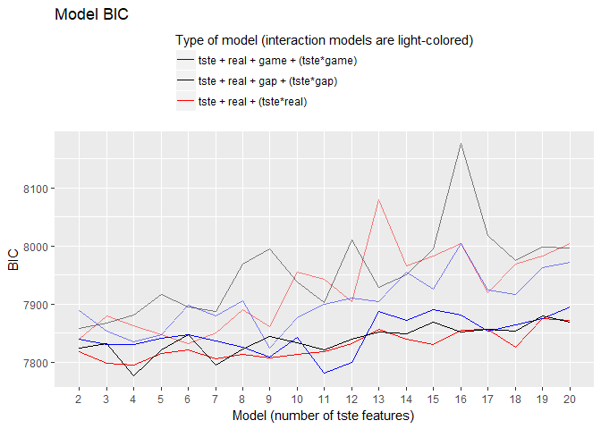
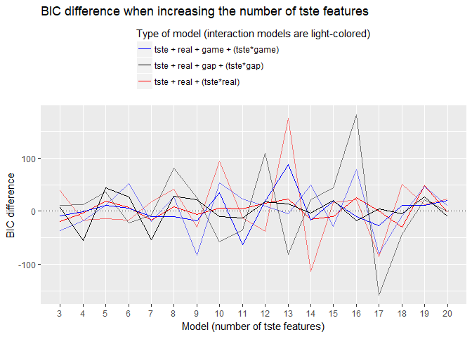
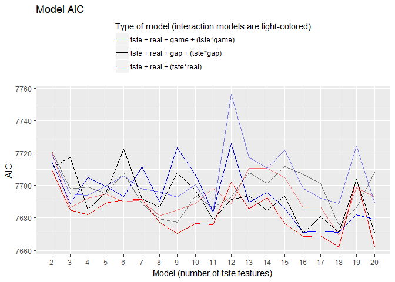
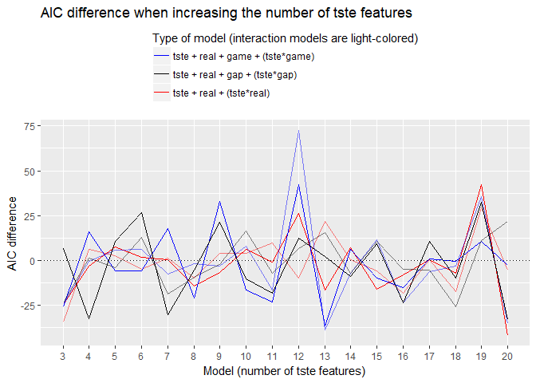

MAPSS Thesis II - model 1
================
Chih-Yu Chiang
August 24, 2017

-   [Setup](#setup)
-   [Variable](#variable)
-   [Model](#model)
-   [Information criteria](#information-criteria)
    -   [preference ~ tste + personality + (interaction)](#preference-tste-personality-interaction)
    -   [(link for the above position)](#link-for-the-above-position)
-   [Model summaries (Lasso selected)](#model-summaries-lasso-selected)
    -   [preference ~ tste + real](#preference-tste-real)
    -   [(link for the above position)](#link-for-the-above-position-1)
    -   [preference ~ tste + real + real\*tste](#preference-tste-real-realtste)
    -   [(link for the above position)](#link-for-the-above-position-2)
    -   [preference ~ tste + real + game](#preference-tste-real-game)
    -   [(link for the above position)](#link-for-the-above-position-3)
    -   [preference ~ tste + real + game + game\*tste](#preference-tste-real-game-gametste)
    -   [(link for the above position)](#link-for-the-above-position-4)
    -   [preference ~ tste + real + gap](#preference-tste-real-gap)
    -   [(link for the above position)](#link-for-the-above-position-5)
    -   [preference ~ tste + real + gap + gap\*tste](#preference-tste-real-gap-gaptste)
    -   [(link for the above position)](#link-for-the-above-position-6)

``` r
knitr::opts_chunk$set(
    message=FALSE,
    warning=FALSE
)

#Prevent result wrapping
options(width=120)
```

Setup
-----

Data of game and player are read in and matched up.

-   Game release data, `release` (year), is read in as an interval variable.
-   Missing values are imputed with variable mean conveniently (`star_user` and `star_GS`).

``` r
#--Package
library(tidyverse)
library(data.table)
library(corrplot)
library(modelr)
library(glmnet)
library(VGAM)
library(randomForest)
library(e1071)
library(car)
library(rlist)
library(pander)
set.seed(1)


#--Read in
#Core game info and group distance/probability data
core_cluster <- read_csv("../data/core_cluster.csv", col_names=TRUE) %>%
  mutate(group_survey = factor(group_survey),
         group_review = factor(group_review),
         core_id = factor(core_id)) %>%
  select(-X1)

#Core game tste scores (of dif numbers of features)
core_tsteScore <- read_csv("../data/tste_concat.csv", col_names=TRUE) %>%
  select(-X1)

#Player-related survey data
survey <- read_csv("../data/survey.csv", col_names=TRUE) %>%
  mutate(race = factor(race),
         sex = factor(sex),
         core_id = factor(core_id)) %>%
  select(-id)


#--Impute missing with mean
imputation_mean <- function(c){
  c[is.na(c)] <- mean(c, na.rm=TRUE)
  return(c)
}
core_cluster <- mutate_each(core_cluster,
                            funs(imputation_mean(.)),
                            star_user, star_GS)


#--Match up
#Main df, key=player-game
df <- bind_cols(core_cluster, core_tsteScore) %>%
  left_join(survey, by=c("core_id"), copy=FALSE)
```

Variable
--------

Compute and select variables to be used in models.

-   Mean-centered vars is marked with a suffix \_ct.

-   Player preference:

| Name           | Definition                 | Unit                        |
|----------------|----------------------------|-----------------------------|
| `preference_1` | how much do you like       | Likert 1-7=like             |
| `preference_2` | how often play it          | ordinary 1=never-7=everyday |
| `preference_3` | does it fit personal taste | Likert 1-7=fit              |

-   Game characteristics:

<table style="width:36%;">
<colgroup>
<col width="8%" />
<col width="18%" />
<col width="9%" />
</colgroup>
<thead>
<tr class="header">
<th>Name</th>
<th>Definition</th>
<th>Unit</th>
</tr>
</thead>
<tbody>
<tr class="odd">
<td><code>distance_survey_mean_x</code></td>
<td>group score from survey (distance from group mean in tste)</td>
<td>cosine distance</td>
</tr>
<tr class="even">
<td><code>distance_survey_median_x</code></td>
<td>group score from survey (distance from group median in tste)</td>
<td>cosine distance</td>
</tr>
<tr class="odd">
<td><code>probability_review_mean_x</code></td>
<td>group score from review (mean probability to be categorized in the group by NN)</td>
<td>percentage</td>
</tr>
<tr class="even">
<td><code>probability_review_median_x</code></td>
<td>group score from review (median probability to be categorized in the group by NN)</td>
<td>percentage</td>
</tr>
<tr class="odd">
<td><code>group_survey</code></td>
<td>group identity from survey</td>
<td>categorical 1-group number</td>
</tr>
<tr class="even">
<td><code>group_review</code></td>
<td>group identity from review</td>
<td>categorical 1-group number</td>
</tr>
<tr class="odd">
<td><code>tste_n_x</code></td>
<td>group score from survey (tste), n=number of features</td>
<td>interval arbitrary</td>
</tr>
</tbody>
</table>

-   Player personality:

<table style="width:36%;">
<colgroup>
<col width="8%" />
<col width="18%" />
<col width="9%" />
</colgroup>
<thead>
<tr class="header">
<th>Name</th>
<th>Definition</th>
<th>Unit</th>
</tr>
</thead>
<tbody>
<tr class="odd">
<td><code>game_xxxxx</code></td>
<td>Big-five personality in game</td>
<td>Likert 1-7</td>
</tr>
<tr class="even">
<td><code>real_xxxxx</code></td>
<td>Big-five personality in real life</td>
<td>Likert 1-7</td>
</tr>
<tr class="odd">
<td><code>gap_xxxxx</code></td>
<td>personality gap (game - real)</td>
<td>Likert 1-7</td>
</tr>
<tr class="even">
<td><code>satis_xxxxx</code></td>
<td>SDT satisfaction in real life</td>
<td>Likert 1-7</td>
</tr>
<tr class="odd">
<td><code>dissatis_xxxxx</code></td>
<td>SDT dissatisfaction in real life</td>
<td>Likert 1-7</td>
</tr>
<tr class="even">
<td><code>combined_xxxxx</code></td>
<td>SDT combined (previous two) dissatisfaction in real life</td>
<td>Likert 1-7</td>
</tr>
</tbody>
</table>

-   Control:

| Name        | Definition                                    | Unit                      |
|-------------|-----------------------------------------------|---------------------------|
| `age`       | player age                                    | interval                  |
| `education` | player education                              | ordinary 1-7=PhD          |
| `income`    | player annual household income                | ordinary 1-7=over 150,000 |
| `sex`       | player sex                                    | categorical 1=male        |
| `race`      | player race                                   | categorical 1-5           |
| `release`   | game release year                             | interval year             |
| `star_GS`   | general game quality rated by GameSpot expert | interval 0-10             |
| `star_user` | general game quality rated by GameSpot user   | interval 0-10             |

``` r
updateVars <- function(update_predictors=TRUE){
  #--Match up (repeat the set up section to work around the "data binding" bug)
  #Main df, key=player-game pair
  df <<- bind_cols(core_cluster, core_tsteScore) %>%
    left_join(survey, by=c("core_id"), copy=FALSE)
  
  
  #--Create response variable
  df <<- df %>%
    rowwise() %>% #Rowwise to make the ordinary functions work
    mutate(preference = mean(c(preference_3))) %>%
    ungroup() #Ungroup to cancel rowwise
  
  
  #--Mean-center predictor variables
  df <<- mutate_at(df, vars(starts_with("tste"),
                            starts_with("game"),
                            starts_with("real"),
                            starts_with("satis"),
                            starts_with("dissatis"),
                            starts_with("combined")), funs(ct = . - mean(.)))

  
  #--Compute personalty gap
  df <<- mutate(df,
                gap_extraversion = game_extraversion - real_extraversion,
                gap_agreeableness = game_agreeableness - real_agreeableness,
                gap_conscientiousness = game_conscientiousness - real_conscientiousness,
                gap_emotionstability = game_emotionstability - real_emotionstability,
                gap_openness = game_openness - real_openness,
                gap_sum = gap_extraversion + gap_agreeableness + gap_conscientiousness + (-gap_emotionstability) + gap_openness,
                real_sum = real_extraversion + real_agreeableness + real_conscientiousness + (-real_emotionstability) + real_openness,
                dissatis_sum = dissatis_autonomy + dissatis_relatedness + dissatis_competence,
                satis_sum = satis_autonomy + satis_relatedness + satis_competence,
                combined_sum = combined_autonomy + combined_relatedness + combined_competence
                )

  #--Acquire player df, key=player
  df_player <<- distinct(df, respondent, .keep_all=TRUE)
  
  
  #--Select variables to be included in regression (model formation)
  #Sets of predictor variables from file
  #Can be updated from outside the function (eg. for lasso selection), if so, `update_predictors`=FALSE
  if(update_predictors==TRUE) {
    df_predictors <<- read.csv("../data/vars/predictors.csv", header=TRUE, na.strings="")
  }
  
  #Get column name as model id
  modelId <- colnames(df_predictors)
  
  #predictor variable as strings for each model
  predictorString <- apply(df_predictors, MARGIN=2, function(x) paste(na.omit(x), collapse="+"))
  
  #Make the dfs into a data frame
  dfs <<- data.frame(predictorString, row.names=modelId, stringsAsFactors=FALSE) %>%
    mutate(df_x = map(predictorString, ~ model.matrix(as.formula(paste("preference ~ ", .x, sep="")), data=df)[, -1])) %>% #df with only predictor variables; [, -1] used to remove redundant intercept column
    mutate(df_yx = map(df_x, ~ bind_cols(select(df, "preference"), data.frame(.x)))) #df also with outcome variables
  dfs_player <<- data.frame(predictorString, row.names=modelId, stringsAsFactors=FALSE) %>%
    mutate(df_x = map(predictorString, ~ model.matrix(as.formula(paste("gap_extraversion ~ ", .x, sep="")), data=df)[, -1])) %>% #df with only predictor variables; [, -1] used to remove redundant intercept column
    mutate(df_yx = map(df_x, ~ bind_cols(select(df, "gap_extraversion"), data.frame(.x)))) #df also with outcome variables
  
  #Set row names for reference
  row.names(dfs) <<- modelId
  row.names(dfs_player) <<- modelId
}
```

Model
-----


-   preference measurement = "how much does it fit taste?"

``` r
#--Update vars
updateVars()

#--Lasso models
#Identify the best lambda level
#Adjust `nfolds` to increase the folds
dfs$lambda_las_best <- map(dfs$df_x, ~ cv.glmnet(x=.x, y=df$preference, alpha=1, nfolds=10)$lambda.min)

#Train model with best lambda level
#Better to standardize while the regulation counts on the units
dfs$model_las_best <- map2(dfs$df_x, dfs$lambda_las_best, ~ glmnet(x=.x, y=df$preference, alpha=1,
                                                                   lambda=.y,
                                                                   standardize=TRUE))

#Acquire the best result
dfs$model_las_coef <- map(dfs$model_las_best, coef)


#--Lasso selected full models
#Use non-zero coefs to filter the predictor df
df_predictors.new <- map(c(1:dim(df_predictors)[2]), .f= ~ df_predictors[.][which(dfs$model_las_coef[[.]] != 0), ])

#Unify the length of each model column
df_predictors.new <- map(df_predictors.new,
                         function(.) {
                          . <- unlist(.)
                          length(.) <- dim(df_predictors)[1]
                          return(.)
                         })

#Bind together to be the new predictor df
df_predictors <- as.data.table(df_predictors.new)

#Update vars
updateVars(update_predictors=FALSE)

#Train models
dfs$model_lm <- map(dfs$df_yx, ~ lm(preference ~ ., data=.x))
```

Information criteria
--------------------

### preference ~ tste + personality + (interaction)

### (link for the above position)

``` r
#--BIC
dfs$BIC <- unlist(map(dfs$model_lm, BIC))
dfs$BIC_dif <- dfs$BIC - lag(dfs$BIC)

#Seperate batch models from dfs
dfs_real <- slice(dfs, 1:19)
dfs_realI <- slice(dfs, 20:38)
dfs_game <- slice(dfs, 39:57)
dfs_gameI <- slice(dfs, 58:76)
dfs_gap <- slice(dfs, 77:95)
dfs_gapI <- slice(dfs, 96:114)

dfs_real_dif <- slice(dfs, 2:19)
dfs_realI_dif <- slice(dfs, 21:38)
dfs_game_dif <- slice(dfs, 40:57)
dfs_gameI_dif <- slice(dfs, 59:76)
dfs_gap_dif <- slice(dfs, 78:95)
dfs_gapI_dif <- slice(dfs, 97:114)

#Batch models
ggplot() +
  geom_line(data=dfs_real, mapping=aes(seq(1, dim(dfs_real)[1]), BIC, color="r")) +
  geom_line(data=dfs_realI, mapping=aes(seq(1, dim(dfs_realI)[1]), BIC, color="r"), alpha=0.5) +
  geom_line(data=dfs_game, mapping=aes(seq(1, dim(dfs_game)[1]), BIC, color="g")) +
  geom_line(data=dfs_gameI, mapping=aes(seq(1, dim(dfs_gameI)[1]), BIC, color="g"), alpha=0.5) +
  geom_line(data=dfs_gap, mapping=aes(seq(1, dim(dfs_gap)[1]), BIC, color="p")) +
  geom_line(data=dfs_gapI, mapping=aes(seq(1, dim(dfs_gapI)[1]), BIC, color="p"), alpha=0.5) +
  labs(x="Model (number of tste features)", y="BIC", title="Model BIC") +
  theme(legend.position="top", legend.direction="vertical") +
  scale_x_continuous(breaks=seq(1, dim(dfs_gap)[1]), minor_breaks=NULL, labels=seq(2, 20)) +
  scale_color_manual(name="Type of model (interaction models are light-colored)", values=c("r"="red", "g"="blue", "p"="black"),
                     labels=c("r"="tste + real + (tste*real)",
                              "g"="tste + real + game + (tste*game)",
                              "p"="tste + real + gap + (tste*gap)"))
```



``` r
ggplot() +
  geom_line(data=dfs_real_dif, mapping=aes(seq(1, dim(dfs_real_dif)[1]), BIC_dif, color="r")) +
  geom_line(data=dfs_realI_dif, mapping=aes(seq(1, dim(dfs_realI_dif)[1]), BIC_dif, color="r"), alpha=0.5) +
  geom_line(data=dfs_game_dif, mapping=aes(seq(1, dim(dfs_game_dif)[1]), BIC_dif, color="g")) +
  geom_line(data=dfs_gameI_dif, mapping=aes(seq(1, dim(dfs_gameI_dif)[1]), BIC_dif, color="g"), alpha=0.5) +
  geom_line(data=dfs_gap_dif, mapping=aes(seq(1, dim(dfs_gap_dif)[1]), BIC_dif, color="p")) +
  geom_line(data=dfs_gapI_dif, mapping=aes(seq(1, dim(dfs_gapI_dif)[1]), BIC_dif, color="p"), alpha=0.5) +
  labs(x="Model (number of tste features)", y="BIC difference", title="BIC difference when increasing the number of tste features") +
  theme(legend.position="top", legend.direction="vertical") +
  scale_x_continuous(breaks=seq(1, dim(dfs_gap_dif)[1]), minor_breaks=NULL, labels=seq(3, 20)) +
  scale_color_manual(name="Type of model (interaction models are light-colored)", values=c("r"="red", "g"="blue", "p"="black"),
                     labels=c("r"="tste + real + (tste*real)",
                              "g"="tste + real + game + (tste*game)",
                              "p"="tste + real + gap + (tste*gap)")) +
  geom_hline(yintercept=0, linetype=3)
```



``` r
#--AIC
dfs$AIC <- unlist(map(dfs$model_lm, AIC))
dfs$AIC_dif <- dfs$AIC - lag(dfs$AIC)

#Seperate batch models from dfs
dfs_real <- slice(dfs, 1:19)
dfs_realI <- slice(dfs, 20:38)
dfs_game <- slice(dfs, 39:57)
dfs_gameI <- slice(dfs, 58:76)
dfs_gap <- slice(dfs, 77:95)
dfs_gapI <- slice(dfs, 96:114)

dfs_real_dif <- slice(dfs, 2:19)
dfs_realI_dif <- slice(dfs, 21:38)
dfs_game_dif <- slice(dfs, 40:57)
dfs_gameI_dif <- slice(dfs, 59:76)
dfs_gap_dif <- slice(dfs, 78:95)
dfs_gapI_dif <- slice(dfs, 97:114)

#Batch models
ggplot() +
  geom_line(data=dfs_real, mapping=aes(seq(1, dim(dfs_real)[1]), AIC, color="r")) +
  geom_line(data=dfs_realI, mapping=aes(seq(1, dim(dfs_realI)[1]), AIC, color="r"), alpha=0.5) +
  geom_line(data=dfs_game, mapping=aes(seq(1, dim(dfs_game)[1]), AIC, color="g")) +
  geom_line(data=dfs_gameI, mapping=aes(seq(1, dim(dfs_gameI)[1]), AIC, color="g"), alpha=0.5) +
  geom_line(data=dfs_gap, mapping=aes(seq(1, dim(dfs_gap)[1]), AIC, color="p")) +
  geom_line(data=dfs_gapI, mapping=aes(seq(1, dim(dfs_gapI)[1]), AIC, color="p"), alpha=0.5) +
  labs(x="Model (number of tste features)", y="AIC", title="Model AIC") +
  theme(legend.position="top", legend.direction="vertical") +
  scale_x_continuous(breaks=seq(1, dim(dfs_gap)[1]), minor_breaks=NULL, labels=seq(2, 20)) +
  scale_color_manual(name="Type of model (interaction models are light-colored)", values=c("r"="red", "g"="blue", "p"="black"),
                     labels=c("r"="tste + real + (tste*real)",
                              "g"="tste + real + game + (tste*game)",
                              "p"="tste + real + gap + (tste*gap)"))
```



``` r
ggplot() +
  geom_line(data=dfs_real_dif, mapping=aes(seq(1, dim(dfs_real_dif)[1]), AIC_dif, color="r")) +
  geom_line(data=dfs_realI_dif, mapping=aes(seq(1, dim(dfs_realI_dif)[1]), AIC_dif, color="r"), alpha=0.5) +
  geom_line(data=dfs_game_dif, mapping=aes(seq(1, dim(dfs_game_dif)[1]), AIC_dif, color="g")) +
  geom_line(data=dfs_gameI_dif, mapping=aes(seq(1, dim(dfs_gameI_dif)[1]), AIC_dif, color="g"), alpha=0.5) +
  geom_line(data=dfs_gap_dif, mapping=aes(seq(1, dim(dfs_gap_dif)[1]), AIC_dif, color="p")) +
  geom_line(data=dfs_gapI_dif, mapping=aes(seq(1, dim(dfs_gapI_dif)[1]), AIC_dif, color="p"), alpha=0.5) +
  labs(x="Model (number of tste features)", y="AIC difference", title="AIC difference when increasing the number of tste features") +
  theme(legend.position="top", legend.direction="vertical") +
  scale_x_continuous(breaks=seq(1, dim(dfs_gap_dif)[1]), minor_breaks=NULL, labels=seq(3, 20)) +
  scale_color_manual(name="Type of model (interaction models are light-colored)", values=c("r"="red", "g"="blue", "p"="black"),
                     labels=c("r"="tste + real + (tste*real)",
                              "g"="tste + real + game + (tste*game)",
                              "p"="tste + real + gap + (tste*gap)")) +
  geom_hline(yintercept=0, linetype=3)
```



Model summaries (Lasso selected)
--------------------------------

### preference ~ tste + real

### (link for the above position)

``` r
#Summary
for(model in slice(dfs, 1:19)$model_lm) print(summary(model))
```

    ## 
    ## Call:
    ## lm(formula = preference ~ ., data = .x)
    ## 
    ## Residuals:
    ##     Min      1Q  Median      3Q     Max 
    ## -5.0420 -0.6753  0.3082  1.0894  2.6504 
    ## 
    ## Coefficients:
    ##                            Estimate Std. Error t value Pr(>|t|)    
    ## (Intercept)               64.713528  14.047886   4.607 4.34e-06 ***
    ## age                       -0.014913   0.004613  -3.233  0.00124 ** 
    ## education                  0.017063   0.026420   0.646  0.51846    
    ## income                     0.009528   0.016875   0.565  0.57241    
    ## race2                      0.100091   0.131402   0.762  0.44632    
    ## race4                     -0.255744   0.141836  -1.803  0.07151 .  
    ## race6                     -1.021031   0.342656  -2.980  0.00292 ** 
    ## race7                     -0.112301   0.134633  -0.834  0.40430    
    ## sex2                      -0.105502   0.071668  -1.472  0.14114    
    ## release                   -0.029378   0.006895  -4.261 2.13e-05 ***
    ## star_user                  0.014433   0.052331   0.276  0.78273    
    ## real_extraversion_ct       0.045030   0.019948   2.257  0.02409 *  
    ## real_agreeableness_ct     -0.015382   0.027306  -0.563  0.57327    
    ## real_conscientiousness_ct  0.082415   0.029730   2.772  0.00562 ** 
    ## real_emotionstability_ct  -0.011940   0.029781  -0.401  0.68851    
    ## real_openness_ct           0.121161   0.024658   4.914 9.62e-07 ***
    ## tste_2_0_ct                0.096130   0.041076   2.340  0.01936 *  
    ## tste_2_1_ct               -0.072374   0.039944  -1.812  0.07014 .  
    ## ---
    ## Signif. codes:  0 '***' 0.001 '**' 0.01 '*' 0.05 '.' 0.1 ' ' 1
    ## 
    ## Residual standard error: 1.461 on 2120 degrees of freedom
    ## Multiple R-squared:  0.06078,    Adjusted R-squared:  0.05325 
    ## F-statistic:  8.07 on 17 and 2120 DF,  p-value: < 2.2e-16
    ## 
    ## 
    ## Call:
    ## lm(formula = preference ~ ., data = .x)
    ## 
    ## Residuals:
    ##     Min      1Q  Median      3Q     Max 
    ## -4.9449 -0.6982  0.3090  1.0592  2.5556 
    ## 
    ## Coefficients:
    ##                            Estimate Std. Error t value Pr(>|t|)    
    ## (Intercept)               57.882342  14.020982   4.128 3.80e-05 ***
    ## age                       -0.014755   0.004585  -3.218 0.001311 ** 
    ## education                  0.015643   0.026264   0.596 0.551507    
    ## income                     0.010738   0.016777   0.640 0.522224    
    ## race2                      0.094124   0.130625   0.721 0.471256    
    ## race4                     -0.228903   0.141090  -1.622 0.104870    
    ## race6                     -1.006683   0.340657  -2.955 0.003160 ** 
    ## race7                     -0.129146   0.133867  -0.965 0.334788    
    ## sex2                      -0.096845   0.071252  -1.359 0.174232    
    ## release                   -0.026048   0.006881  -3.785 0.000158 ***
    ## star_user                  0.030917   0.052238   0.592 0.554024    
    ## real_extraversion_ct       0.043815   0.019828   2.210 0.027233 *  
    ## real_agreeableness_ct     -0.015567   0.027144  -0.574 0.566364    
    ## real_conscientiousness_ct  0.082404   0.029553   2.788 0.005344 ** 
    ## real_emotionstability_ct  -0.009878   0.029602  -0.334 0.738638    
    ## real_openness_ct           0.123497   0.024513   5.038 5.10e-07 ***
    ## tste_3_0_ct               -0.043375   0.043380  -1.000 0.317477    
    ## tste_3_1_ct                0.155424   0.034839   4.461 8.57e-06 ***
    ## tste_3_2_ct                0.233549   0.048718   4.794 1.75e-06 ***
    ## ---
    ## Signif. codes:  0 '***' 0.001 '**' 0.01 '*' 0.05 '.' 0.1 ' ' 1
    ## 
    ## Residual standard error: 1.453 on 2119 degrees of freedom
    ## Multiple R-squared:  0.07242,    Adjusted R-squared:  0.06454 
    ## F-statistic: 9.191 on 18 and 2119 DF,  p-value: < 2.2e-16
    ## 
    ## 
    ## Call:
    ## lm(formula = preference ~ ., data = .x)
    ## 
    ## Residuals:
    ##     Min      1Q  Median      3Q     Max 
    ## -4.9794 -0.6896  0.3021  1.0686  2.6001 
    ## 
    ## Coefficients:
    ##                            Estimate Std. Error t value Pr(>|t|)    
    ## (Intercept)               59.463846  14.190229   4.190 2.90e-05 ***
    ## age                       -0.014696   0.004584  -3.206 0.001368 ** 
    ## education                  0.016462   0.026152   0.629 0.529105    
    ## income                     0.010922   0.016649   0.656 0.511892    
    ## race2                      0.090530   0.130387   0.694 0.487558    
    ## race4                     -0.228870   0.140987  -1.623 0.104664    
    ## race6                     -1.005750   0.339990  -2.958 0.003129 ** 
    ## race7                     -0.130775   0.133724  -0.978 0.328212    
    ## sex2                      -0.099437   0.069060  -1.440 0.150054    
    ## release                   -0.026751   0.006956  -3.846 0.000124 ***
    ## star_user                  0.010019   0.055066   0.182 0.855640    
    ## real_extraversion_ct       0.045252   0.018994   2.382 0.017288 *  
    ## real_agreeableness_ct     -0.016333   0.026754  -0.610 0.541617    
    ## real_conscientiousness_ct  0.087198   0.025515   3.417 0.000644 ***
    ## real_openness_ct           0.125746   0.024311   5.172 2.53e-07 ***
    ## tste_4_0_ct                0.233930   0.047652   4.909 9.85e-07 ***
    ## tste_4_1_ct                0.077035   0.053122   1.450 0.147167    
    ## tste_4_2_ct                0.063176   0.041397   1.526 0.127136    
    ## tste_4_3_ct               -0.155825   0.039088  -3.987 6.93e-05 ***
    ## ---
    ## Signif. codes:  0 '***' 0.001 '**' 0.01 '*' 0.05 '.' 0.1 ' ' 1
    ## 
    ## Residual standard error: 1.452 on 2119 degrees of freedom
    ## Multiple R-squared:  0.07378,    Adjusted R-squared:  0.06591 
    ## F-statistic: 9.378 on 18 and 2119 DF,  p-value: < 2.2e-16
    ## 
    ## 
    ## Call:
    ## lm(formula = preference ~ ., data = .x)
    ## 
    ## Residuals:
    ##     Min      1Q  Median      3Q     Max 
    ## -4.9418 -0.6914  0.3017  1.0621  2.5577 
    ## 
    ## Coefficients:
    ##                            Estimate Std. Error t value Pr(>|t|)    
    ## (Intercept)               48.833702  14.456255   3.378 0.000743 ***
    ## age                       -0.014853   0.004591  -3.235 0.001233 ** 
    ## education                  0.015875   0.026288   0.604 0.545982    
    ## income                     0.011586   0.016795   0.690 0.490357    
    ## race2                      0.084778   0.130792   0.648 0.516935    
    ## race4                     -0.233439   0.141215  -1.653 0.098464 .  
    ## race6                     -1.015523   0.340871  -2.979 0.002923 ** 
    ## race7                     -0.126194   0.133940  -0.942 0.346214    
    ## sex2                      -0.101074   0.071327  -1.417 0.156618    
    ## release                   -0.021484   0.007088  -3.031 0.002466 ** 
    ## star_user                  0.017340   0.056226   0.308 0.757812    
    ## real_extraversion_ct       0.045588   0.019845   2.297 0.021706 *  
    ## real_agreeableness_ct     -0.014692   0.027184  -0.540 0.588928    
    ## real_conscientiousness_ct  0.083129   0.029568   2.811 0.004978 ** 
    ## real_emotionstability_ct  -0.009743   0.029633  -0.329 0.742352    
    ## real_openness_ct           0.122762   0.024548   5.001 6.18e-07 ***
    ## tste_5_0_ct                0.221117   0.046477   4.758 2.09e-06 ***
    ## tste_5_1_ct               -0.154245   0.051866  -2.974 0.002973 ** 
    ## tste_5_2_ct               -0.027779   0.040798  -0.681 0.496014    
    ## tste_5_3_ct               -0.100530   0.049162  -2.045 0.040992 *  
    ## tste_5_4_ct                0.031657   0.047444   0.667 0.504694    
    ## ---
    ## Signif. codes:  0 '***' 0.001 '**' 0.01 '*' 0.05 '.' 0.1 ' ' 1
    ## 
    ## Residual standard error: 1.453 on 2117 degrees of freedom
    ## Multiple R-squared:  0.07225,    Adjusted R-squared:  0.06348 
    ## F-statistic: 8.243 on 20 and 2117 DF,  p-value: < 2.2e-16
    ## 
    ## 
    ## Call:
    ## lm(formula = preference ~ ., data = .x)
    ## 
    ## Residuals:
    ##     Min      1Q  Median      3Q     Max 
    ## -5.0089 -0.6894  0.3015  1.0583  2.5766 
    ## 
    ## Coefficients:
    ##                            Estimate Std. Error t value Pr(>|t|)    
    ## (Intercept)               47.313814  14.619465   3.236  0.00123 ** 
    ## age                       -0.014800   0.004591  -3.224  0.00129 ** 
    ## education                  0.015228   0.026296   0.579  0.56260    
    ## income                     0.012046   0.016802   0.717  0.47350    
    ## race2                      0.073975   0.130967   0.565  0.57225    
    ## race4                     -0.228935   0.141259  -1.621  0.10524    
    ## race6                     -1.018854   0.340983  -2.988  0.00284 ** 
    ## race7                     -0.121924   0.134011  -0.910  0.36303    
    ## sex2                      -0.098557   0.071352  -1.381  0.16734    
    ## release                   -0.020677   0.007170  -2.884  0.00397 ** 
    ## star_user                  0.005125   0.057845   0.089  0.92941    
    ## real_extraversion_ct       0.046370   0.019853   2.336  0.01960 *  
    ## real_agreeableness_ct     -0.016129   0.027198  -0.593  0.55322    
    ## real_conscientiousness_ct  0.082255   0.029578   2.781  0.00547 ** 
    ## real_emotionstability_ct  -0.008978   0.029639  -0.303  0.76198    
    ## real_openness_ct           0.124412   0.024543   5.069 4.34e-07 ***
    ## tste_6_0_ct                0.039306   0.051559   0.762  0.44593    
    ## tste_6_1_ct               -0.128436   0.048400  -2.654  0.00802 ** 
    ## tste_6_2_ct                0.234857   0.043018   5.460 5.33e-08 ***
    ## tste_6_3_ct                0.016977   0.052439   0.324  0.74616    
    ## tste_6_4_ct                0.090679   0.045569   1.990  0.04673 *  
    ## tste_6_5_ct                0.067589   0.053441   1.265  0.20611    
    ## ---
    ## Signif. codes:  0 '***' 0.001 '**' 0.01 '*' 0.05 '.' 0.1 ' ' 1
    ## 
    ## Residual standard error: 1.454 on 2116 degrees of freedom
    ## Multiple R-squared:  0.07231,    Adjusted R-squared:  0.06311 
    ## F-statistic: 7.854 on 21 and 2116 DF,  p-value: < 2.2e-16
    ## 
    ## 
    ## Call:
    ## lm(formula = preference ~ ., data = .x)
    ## 
    ## Residuals:
    ##     Min      1Q  Median      3Q     Max 
    ## -4.9207 -0.6819  0.3022  1.0607  2.5724 
    ## 
    ## Coefficients:
    ##                            Estimate Std. Error t value Pr(>|t|)    
    ## (Intercept)               39.700140  14.413299   2.754 0.005930 ** 
    ## age                       -0.015094   0.004566  -3.306 0.000963 ***
    ## education                  0.021595   0.024777   0.872 0.383549    
    ## race2                      0.080613   0.130550   0.617 0.536982    
    ## race4                     -0.231182   0.140914  -1.641 0.101032    
    ## race6                     -0.997513   0.339400  -2.939 0.003328 ** 
    ## race7                     -0.128142   0.133983  -0.956 0.338979    
    ## sex2                      -0.105670   0.069021  -1.531 0.125924    
    ## release                   -0.017115   0.007102  -2.410 0.016038 *  
    ## star_user                  0.065375   0.054677   1.196 0.231966    
    ## real_extraversion_ct       0.048270   0.018969   2.545 0.011008 *  
    ## real_agreeableness_ct     -0.018277   0.026800  -0.682 0.495337    
    ## real_conscientiousness_ct  0.087950   0.025485   3.451 0.000569 ***
    ## real_openness_ct           0.125454   0.024338   5.155 2.78e-07 ***
    ## tste_7_1_ct                0.018229   0.050718   0.359 0.719323    
    ## tste_7_2_ct               -0.149529   0.048896  -3.058 0.002255 ** 
    ## tste_7_3_ct               -0.199677   0.037704  -5.296 1.31e-07 ***
    ## tste_7_4_ct                0.046670   0.050257   0.929 0.353187    
    ## tste_7_6_ct                0.062051   0.059352   1.045 0.295921    
    ## ---
    ## Signif. codes:  0 '***' 0.001 '**' 0.01 '*' 0.05 '.' 0.1 ' ' 1
    ## 
    ## Residual standard error: 1.455 on 2119 degrees of freedom
    ## Multiple R-squared:  0.06962,    Adjusted R-squared:  0.06171 
    ## F-statistic: 8.809 on 18 and 2119 DF,  p-value: < 2.2e-16
    ## 
    ## 
    ## Call:
    ## lm(formula = preference ~ ., data = .x)
    ## 
    ## Residuals:
    ##     Min      1Q  Median      3Q     Max 
    ## -5.0896 -0.6928  0.2979  1.0483  2.7463 
    ## 
    ## Coefficients:
    ##                            Estimate Std. Error t value Pr(>|t|)    
    ## (Intercept)               54.653624  15.575203   3.509 0.000459 ***
    ## age                       -0.014583   0.004576  -3.187 0.001460 ** 
    ## education                  0.017618   0.026119   0.675 0.500064    
    ## income                     0.011994   0.016629   0.721 0.470821    
    ## race2                      0.073347   0.130165   0.563 0.573157    
    ## race4                     -0.212202   0.140802  -1.507 0.131937    
    ## race6                     -1.019482   0.339430  -3.004 0.002700 ** 
    ## race7                     -0.110764   0.133512  -0.830 0.406850    
    ## sex2                      -0.109787   0.068897  -1.593 0.111198    
    ## release                   -0.024242   0.007647  -3.170 0.001545 ** 
    ## star_user                 -0.018076   0.059498  -0.304 0.761305    
    ## real_extraversion_ct       0.047516   0.018986   2.503 0.012399 *  
    ## real_agreeableness_ct     -0.013626   0.026720  -0.510 0.610129    
    ## real_conscientiousness_ct  0.087744   0.025464   3.446 0.000581 ***
    ## real_openness_ct           0.124709   0.024268   5.139 3.02e-07 ***
    ## tste_8_0_ct               -0.207600   0.050336  -4.124 3.86e-05 ***
    ## tste_8_1_ct                0.189623   0.056189   3.375 0.000752 ***
    ## tste_8_2_ct                0.086921   0.050392   1.725 0.084695 .  
    ## tste_8_3_ct                0.084422   0.047479   1.778 0.075530 .  
    ## tste_8_4_ct                0.098557   0.047847   2.060 0.039538 *  
    ## tste_8_5_ct                0.105199   0.048515   2.168 0.030240 *  
    ## tste_8_6_ct               -0.109852   0.052556  -2.090 0.036720 *  
    ## tste_8_7_ct               -0.040573   0.051388  -0.790 0.429889    
    ## ---
    ## Signif. codes:  0 '***' 0.001 '**' 0.01 '*' 0.05 '.' 0.1 ' ' 1
    ## 
    ## Residual standard error: 1.449 on 2115 degrees of freedom
    ## Multiple R-squared:  0.07926,    Adjusted R-squared:  0.06968 
    ## F-statistic: 8.276 on 22 and 2115 DF,  p-value: < 2.2e-16
    ## 
    ## 
    ## Call:
    ## lm(formula = preference ~ ., data = .x)
    ## 
    ## Residuals:
    ##     Min      1Q  Median      3Q     Max 
    ## -4.9656 -0.6921  0.2897  1.0634  2.8030 
    ## 
    ## Coefficients:
    ##                            Estimate Std. Error t value Pr(>|t|)    
    ## (Intercept)               57.531361  15.863630   3.627 0.000294 ***
    ## age                       -0.014919   0.004568  -3.266 0.001108 ** 
    ## education                  0.015113   0.026071   0.580 0.562174    
    ## income                     0.015290   0.016630   0.919 0.357996    
    ## race2                      0.075482   0.129937   0.581 0.561364    
    ## race4                     -0.217645   0.140550  -1.549 0.121645    
    ## race6                     -0.950633   0.339301  -2.802 0.005129 ** 
    ## race7                     -0.101475   0.133390  -0.761 0.446898    
    ## sex2                      -0.095954   0.068579  -1.399 0.161903    
    ## release                   -0.025742   0.007786  -3.306 0.000962 ***
    ## star_user                 -0.002444   0.060106  -0.041 0.967565    
    ## real_extraversion_ct       0.049667   0.018956   2.620 0.008853 ** 
    ## real_agreeableness_ct     -0.018251   0.026669  -0.684 0.493816    
    ## real_conscientiousness_ct  0.086272   0.025423   3.393 0.000703 ***
    ## real_openness_ct           0.120716   0.024241   4.980 6.88e-07 ***
    ## tste_9_0_ct               -0.131787   0.051546  -2.557 0.010637 *  
    ## tste_9_1_ct                0.057516   0.047749   1.205 0.228518    
    ## tste_9_2_ct               -0.308418   0.049814  -6.191 7.14e-10 ***
    ## tste_9_3_ct               -0.081051   0.055990  -1.448 0.147873    
    ## tste_9_4_ct               -0.010898   0.042771  -0.255 0.798907    
    ## tste_9_5_ct                0.029891   0.056545   0.529 0.597115    
    ## tste_9_6_ct                0.007662   0.050501   0.152 0.879424    
    ## tste_9_7_ct               -0.088633   0.050613  -1.751 0.080055 .  
    ## ---
    ## Signif. codes:  0 '***' 0.001 '**' 0.01 '*' 0.05 '.' 0.1 ' ' 1
    ## 
    ## Residual standard error: 1.446 on 2115 degrees of freedom
    ## Multiple R-squared:  0.08212,    Adjusted R-squared:  0.07257 
    ## F-statistic: 8.601 on 22 and 2115 DF,  p-value: < 2.2e-16
    ## 
    ## 
    ## Call:
    ## lm(formula = preference ~ ., data = .x)
    ## 
    ## Residuals:
    ##     Min      1Q  Median      3Q     Max 
    ## -4.9924 -0.6690  0.2908  1.0398  2.6647 
    ## 
    ## Coefficients:
    ##                            Estimate Std. Error t value Pr(>|t|)    
    ## (Intercept)               50.124313  15.502113   3.233 0.001242 ** 
    ## age                       -0.015314   0.004573  -3.349 0.000826 ***
    ## education                  0.016314   0.026116   0.625 0.532248    
    ## income                     0.013646   0.016637   0.820 0.412189    
    ## race2                      0.078658   0.130145   0.604 0.545651    
    ## race4                     -0.225622   0.140729  -1.603 0.109032    
    ## race6                     -0.955570   0.339644  -2.813 0.004947 ** 
    ## race7                     -0.104326   0.133606  -0.781 0.434979    
    ## sex2                      -0.112324   0.068837  -1.632 0.102881    
    ## release                   -0.022372   0.007624  -2.934 0.003380 ** 
    ## star_user                  0.076400   0.055783   1.370 0.170965    
    ## real_extraversion_ct       0.049678   0.018985   2.617 0.008942 ** 
    ## real_agreeableness_ct     -0.016716   0.026718  -0.626 0.531618    
    ## real_conscientiousness_ct  0.088656   0.025467   3.481 0.000509 ***
    ## real_openness_ct           0.120411   0.024278   4.960 7.62e-07 ***
    ## tste_10_0_ct               0.004958   0.042697   0.116 0.907561    
    ## tste_10_1_ct               0.161322   0.049085   3.287 0.001031 ** 
    ## tste_10_2_ct              -0.192384   0.052129  -3.691 0.000229 ***
    ## tste_10_3_ct              -0.165200   0.052062  -3.173 0.001530 ** 
    ## tste_10_5_ct               0.013200   0.050487   0.261 0.793765    
    ## tste_10_6_ct              -0.167906   0.051469  -3.262 0.001123 ** 
    ## tste_10_7_ct               0.088867   0.043626   2.037 0.041772 *  
    ## tste_10_8_ct               0.047351   0.058844   0.805 0.421089    
    ## ---
    ## Signif. codes:  0 '***' 0.001 '**' 0.01 '*' 0.05 '.' 0.1 ' ' 1
    ## 
    ## Residual standard error: 1.449 on 2115 degrees of freedom
    ## Multiple R-squared:  0.07944,    Adjusted R-squared:  0.06987 
    ## F-statistic: 8.297 on 22 and 2115 DF,  p-value: < 2.2e-16
    ## 
    ## 
    ## Call:
    ## lm(formula = preference ~ ., data = .x)
    ## 
    ## Residuals:
    ##     Min      1Q  Median      3Q     Max 
    ## -4.9276 -0.6874  0.2966  1.0460  2.6496 
    ## 
    ## Coefficients:
    ##                            Estimate Std. Error t value Pr(>|t|)    
    ## (Intercept)               62.687326  15.621088   4.013 6.20e-05 ***
    ## age                       -0.015083   0.004573  -3.298 0.000989 ***
    ## education                  0.016266   0.026103   0.623 0.533270    
    ## income                     0.013938   0.016637   0.838 0.402273    
    ## race2                      0.100674   0.129961   0.775 0.438633    
    ## race4                     -0.220649   0.140662  -1.569 0.116881    
    ## race6                     -0.926450   0.339474  -2.729 0.006404 ** 
    ## race7                     -0.102900   0.133498  -0.771 0.440915    
    ## sex2                      -0.096839   0.068951  -1.404 0.160330    
    ## release                   -0.028537   0.007663  -3.724 0.000201 ***
    ## star_user                  0.052494   0.059720   0.879 0.379497    
    ## real_extraversion_ct       0.048130   0.018983   2.535 0.011304 *  
    ## real_agreeableness_ct     -0.015558   0.026730  -0.582 0.560605    
    ## real_conscientiousness_ct  0.085640   0.025502   3.358 0.000798 ***
    ## real_openness_ct           0.120302   0.024274   4.956 7.77e-07 ***
    ## tste_11_0_ct              -0.011084   0.054700  -0.203 0.839438    
    ## tste_11_1_ct               0.063989   0.050975   1.255 0.209511    
    ## tste_11_2_ct              -0.082140   0.046519  -1.766 0.077586 .  
    ## tste_11_3_ct               0.013897   0.056007   0.248 0.804054    
    ## tste_11_5_ct              -0.085571   0.048637  -1.759 0.078659 .  
    ## tste_11_6_ct               0.138264   0.046134   2.997 0.002758 ** 
    ## tste_11_8_ct              -0.222117   0.041714  -5.325 1.12e-07 ***
    ## tste_11_9_ct               0.171164   0.049930   3.428 0.000620 ***
    ## tste_11_10_ct              0.079029   0.054476   1.451 0.147012    
    ## ---
    ## Signif. codes:  0 '***' 0.001 '**' 0.01 '*' 0.05 '.' 0.1 ' ' 1
    ## 
    ## Residual standard error: 1.448 on 2114 degrees of freedom
    ## Multiple R-squared:  0.08074,    Adjusted R-squared:  0.07074 
    ## F-statistic: 8.073 on 23 and 2114 DF,  p-value: < 2.2e-16
    ## 
    ## 
    ## Call:
    ## lm(formula = preference ~ ., data = .x)
    ## 
    ## Residuals:
    ##     Min      1Q  Median      3Q     Max 
    ## -4.9182 -0.6781  0.3026  1.0467  2.6460 
    ## 
    ## Coefficients:
    ##                            Estimate Std. Error t value Pr(>|t|)    
    ## (Intercept)               40.049226  15.492412   2.585 0.009802 ** 
    ## age                       -0.015536   0.004578  -3.394 0.000702 ***
    ## education                  0.021754   0.025028   0.869 0.384854    
    ## race2                      0.087977   0.130998   0.672 0.501917    
    ## race4                     -0.248145   0.141125  -1.758 0.078835 .  
    ## race6                     -0.982403   0.340836  -2.882 0.003987 ** 
    ## race7                     -0.109142   0.134382  -0.812 0.416781    
    ## sex2                      -0.111821   0.071385  -1.566 0.117393    
    ## release                   -0.017562   0.007608  -2.308 0.021081 *  
    ## star_user                  0.132256   0.058973   2.243 0.025022 *  
    ## real_extraversion_ct       0.048181   0.019912   2.420 0.015621 *  
    ## real_agreeableness_ct     -0.016527   0.027247  -0.607 0.544200    
    ## real_conscientiousness_ct  0.084416   0.029695   2.843 0.004515 ** 
    ## real_emotionstability_ct  -0.012989   0.029524  -0.440 0.660023    
    ## real_openness_ct           0.119955   0.024575   4.881 1.13e-06 ***
    ## tste_12_1_ct               0.059935   0.048122   1.245 0.213096    
    ## tste_12_2_ct               0.058691   0.048004   1.223 0.221605    
    ## tste_12_3_ct              -0.028374   0.053029  -0.535 0.592667    
    ## tste_12_4_ct              -0.098053   0.049803  -1.969 0.049105 *  
    ## tste_12_6_ct              -0.004459   0.053777  -0.083 0.933922    
    ## tste_12_8_ct               0.187082   0.048620   3.848 0.000123 ***
    ## tste_12_9_ct              -0.035417   0.051410  -0.689 0.490960    
    ## ---
    ## Signif. codes:  0 '***' 0.001 '**' 0.01 '*' 0.05 '.' 0.1 ' ' 1
    ## 
    ## Residual standard error: 1.457 on 2116 degrees of freedom
    ## Multiple R-squared:  0.0676, Adjusted R-squared:  0.05835 
    ## F-statistic: 7.306 on 21 and 2116 DF,  p-value: < 2.2e-16
    ## 
    ## 
    ## Call:
    ## lm(formula = preference ~ ., data = .x)
    ## 
    ## Residuals:
    ##     Min      1Q  Median      3Q     Max 
    ## -5.2175 -0.6808  0.2864  1.0633  2.7812 
    ## 
    ## Coefficients:
    ##                            Estimate Std. Error t value Pr(>|t|)    
    ## (Intercept)               45.973577  16.739191   2.746 0.006075 ** 
    ## age                       -0.014919   0.004584  -3.255 0.001153 ** 
    ## education                  0.018926   0.026236   0.721 0.470755    
    ## income                     0.011162   0.016765   0.666 0.505623    
    ## race2                      0.073690   0.130531   0.565 0.572446    
    ## race4                     -0.209641   0.141022  -1.487 0.137274    
    ## race6                     -1.018556   0.340813  -2.989 0.002835 ** 
    ## race7                     -0.108537   0.133887  -0.811 0.417652    
    ## sex2                      -0.104073   0.071308  -1.459 0.144580    
    ## release                   -0.020096   0.008210  -2.448 0.014458 *  
    ## star_user                  0.025134   0.060834   0.413 0.679540    
    ## real_extraversion_ct       0.045998   0.019836   2.319 0.020497 *  
    ## real_agreeableness_ct     -0.010686   0.027166  -0.393 0.694104    
    ## real_conscientiousness_ct  0.085024   0.029524   2.880 0.004019 ** 
    ## real_emotionstability_ct  -0.010093   0.029590  -0.341 0.733062    
    ## real_openness_ct           0.121923   0.024484   4.980 6.89e-07 ***
    ## tste_13_0_ct               0.011601   0.050531   0.230 0.818444    
    ## tste_13_1_ct              -0.073545   0.046190  -1.592 0.111485    
    ## tste_13_2_ct               0.124968   0.046617   2.681 0.007403 ** 
    ## tste_13_3_ct               0.045728   0.050209   0.911 0.362522    
    ## tste_13_4_ct              -0.090092   0.052816  -1.706 0.088196 .  
    ## tste_13_5_ct               0.075619   0.049405   1.531 0.126020    
    ## tste_13_6_ct              -0.039790   0.054679  -0.728 0.466881    
    ## tste_13_7_ct              -0.036584   0.049247  -0.743 0.457652    
    ## tste_13_8_ct               0.097526   0.046414   2.101 0.035740 *  
    ## tste_13_9_ct               0.124392   0.055613   2.237 0.025409 *  
    ## tste_13_10_ct              0.179346   0.048429   3.703 0.000218 ***
    ## tste_13_11_ct              0.086201   0.053639   1.607 0.108192    
    ## tste_13_12_ct              0.059574   0.051810   1.150 0.250333    
    ## ---
    ## Signif. codes:  0 '***' 0.001 '**' 0.01 '*' 0.05 '.' 0.1 ' ' 1
    ## 
    ## Residual standard error: 1.45 on 2109 degrees of freedom
    ## Multiple R-squared:  0.08079,    Adjusted R-squared:  0.06859 
    ## F-statistic:  6.62 on 28 and 2109 DF,  p-value: < 2.2e-16
    ## 
    ## 
    ## Call:
    ## lm(formula = preference ~ ., data = .x)
    ## 
    ## Residuals:
    ##     Min      1Q  Median      3Q     Max 
    ## -4.9546 -0.6791  0.2884  1.0522  2.6961 
    ## 
    ## Coefficients:
    ##                            Estimate Std. Error t value Pr(>|t|)    
    ## (Intercept)               43.119410  14.662782   2.941 0.003310 ** 
    ## age                       -0.014817   0.004571  -3.242 0.001206 ** 
    ## education                  0.021271   0.024994   0.851 0.394829    
    ## race2                      0.091318   0.130690   0.699 0.484793    
    ## race4                     -0.227669   0.140838  -1.617 0.106128    
    ## race6                     -0.980624   0.340535  -2.880 0.004021 ** 
    ## race7                     -0.119503   0.133979  -0.892 0.372520    
    ## sex2                      -0.092479   0.071387  -1.295 0.195304    
    ## release                   -0.018871   0.007212  -2.617 0.008940 ** 
    ## star_user                  0.076418   0.056882   1.343 0.179270    
    ## real_extraversion_ct       0.048089   0.019873   2.420 0.015614 *  
    ## real_agreeableness_ct     -0.016935   0.027190  -0.623 0.533443    
    ## real_conscientiousness_ct  0.079397   0.029612   2.681 0.007391 ** 
    ## real_emotionstability_ct  -0.013063   0.029430  -0.444 0.657191    
    ## real_openness_ct           0.121892   0.024511   4.973 7.12e-07 ***
    ## tste_14_1_ct               0.003806   0.047146   0.081 0.935660    
    ## tste_14_2_ct               0.059260   0.046994   1.261 0.207451    
    ## tste_14_3_ct               0.138314   0.045880   3.015 0.002603 ** 
    ## tste_14_4_ct               0.023736   0.041743   0.569 0.569675    
    ## tste_14_5_ct              -0.107311   0.052323  -2.051 0.040397 *  
    ## tste_14_6_ct              -0.020480   0.048299  -0.424 0.671585    
    ## tste_14_7_ct              -0.193271   0.055502  -3.482 0.000507 ***
    ## tste_14_9_ct               0.018449   0.049966   0.369 0.711993    
    ## tste_14_11_ct             -0.042195   0.046068  -0.916 0.359804    
    ## tste_14_12_ct              0.067345   0.049261   1.367 0.171741    
    ## ---
    ## Signif. codes:  0 '***' 0.001 '**' 0.01 '*' 0.05 '.' 0.1 ' ' 1
    ## 
    ## Residual standard error: 1.453 on 2113 degrees of freedom
    ## Multiple R-squared:  0.07429,    Adjusted R-squared:  0.06378 
    ## F-statistic: 7.065 on 24 and 2113 DF,  p-value: < 2.2e-16
    ## 
    ## 
    ## Call:
    ## lm(formula = preference ~ ., data = .x)
    ## 
    ## Residuals:
    ##     Min      1Q  Median      3Q     Max 
    ## -5.1395 -0.6857  0.3003  1.0434  2.7186 
    ## 
    ## Coefficients:
    ##                             Estimate Std. Error t value Pr(>|t|)    
    ## (Intercept)               48.7277776 16.8212180   2.897 0.003809 ** 
    ## age                       -0.0140786  0.0045544  -3.091 0.002020 ** 
    ## education                  0.0210560  0.0246783   0.853 0.393633    
    ## race2                      0.0708980  0.1300520   0.545 0.585707    
    ## race4                     -0.2007175  0.1403955  -1.430 0.152963    
    ## race6                     -0.9849961  0.3388204  -2.907 0.003686 ** 
    ## race7                     -0.1061266  0.1335115  -0.795 0.426768    
    ## sex2                      -0.1048239  0.0689667  -1.520 0.128681    
    ## release                   -0.0214736  0.0082402  -2.606 0.009226 ** 
    ## star_user                  0.0286241  0.0641415   0.446 0.655451    
    ## real_extraversion_ct       0.0518098  0.0189241   2.738 0.006238 ** 
    ## real_agreeableness_ct     -0.0158057  0.0267032  -0.592 0.553978    
    ## real_conscientiousness_ct  0.0875986  0.0253982   3.449 0.000574 ***
    ## real_openness_ct           0.1217387  0.0242351   5.023 5.51e-07 ***
    ## tste_15_1_ct              -0.1023697  0.0529261  -1.934 0.053222 .  
    ## tste_15_2_ct               0.1495863  0.0463672   3.226 0.001274 ** 
    ## tste_15_3_ct               0.0696211  0.0494783   1.407 0.159544    
    ## tste_15_4_ct               0.0323345  0.0454605   0.711 0.476998    
    ## tste_15_5_ct              -0.1104889  0.0521176  -2.120 0.034123 *  
    ## tste_15_6_ct              -0.0975075  0.0459352  -2.123 0.033893 *  
    ## tste_15_7_ct              -0.0788722  0.0500550  -1.576 0.115242    
    ## tste_15_8_ct              -0.1111811  0.0532784  -2.087 0.037026 *  
    ## tste_15_9_ct              -0.0005389  0.0485322  -0.011 0.991141    
    ## tste_15_10_ct              0.0630096  0.0522858   1.205 0.228300    
    ## tste_15_11_ct              0.1644840  0.0524193   3.138 0.001725 ** 
    ## tste_15_12_ct             -0.0363389  0.0369938  -0.982 0.326066    
    ## ---
    ## Signif. codes:  0 '***' 0.001 '**' 0.01 '*' 0.05 '.' 0.1 ' ' 1
    ## 
    ## Residual standard error: 1.448 on 2112 degrees of freedom
    ## Multiple R-squared:  0.08205,    Adjusted R-squared:  0.07118 
    ## F-statistic: 7.551 on 25 and 2112 DF,  p-value: < 2.2e-16
    ## 
    ## 
    ## Call:
    ## lm(formula = preference ~ ., data = .x)
    ## 
    ## Residuals:
    ##     Min      1Q  Median      3Q     Max 
    ## -5.0663 -0.7014  0.2630  1.0286  2.7516 
    ## 
    ## Coefficients:
    ##                            Estimate Std. Error t value Pr(>|t|)    
    ## (Intercept)               31.740363  17.655754   1.798 0.072362 .  
    ## age                       -0.013241   0.004572  -2.896 0.003819 ** 
    ## education                  0.014617   0.026128   0.559 0.575924    
    ## income                     0.015628   0.016717   0.935 0.349979    
    ## race2                      0.088263   0.130098   0.678 0.497568    
    ## race4                     -0.199344   0.140414  -1.420 0.155847    
    ## race6                     -1.011245   0.339592  -2.978 0.002936 ** 
    ## race7                     -0.107223   0.133355  -0.804 0.421465    
    ## sex2                      -0.102025   0.070978  -1.437 0.150753    
    ## release                   -0.013039   0.008666  -1.505 0.132590    
    ## star_user                  0.025905   0.062626   0.414 0.679180    
    ## real_extraversion_ct       0.050259   0.019781   2.541 0.011130 *  
    ## real_agreeableness_ct     -0.015837   0.027049  -0.585 0.558275    
    ## real_conscientiousness_ct  0.082782   0.029400   2.816 0.004912 ** 
    ## real_emotionstability_ct  -0.002171   0.029490  -0.074 0.941314    
    ## real_openness_ct           0.121000   0.024379   4.963 7.48e-07 ***
    ## tste_16_0_ct               0.169156   0.048612   3.480 0.000512 ***
    ## tste_16_1_ct              -0.107103   0.049838  -2.149 0.031747 *  
    ## tste_16_2_ct              -0.045628   0.044880  -1.017 0.309435    
    ## tste_16_3_ct              -0.112451   0.046481  -2.419 0.015635 *  
    ## tste_16_4_ct              -0.156625   0.040911  -3.828 0.000133 ***
    ## tste_16_5_ct               0.108980   0.048207   2.261 0.023883 *  
    ## tste_16_6_ct               0.097510   0.044012   2.216 0.026830 *  
    ## tste_16_7_ct               0.046597   0.042861   1.087 0.277088    
    ## tste_16_8_ct              -0.036986   0.051019  -0.725 0.468571    
    ## tste_16_9_ct               0.130473   0.043821   2.977 0.002940 ** 
    ## tste_16_10_ct             -0.099072   0.043292  -2.288 0.022210 *  
    ## tste_16_11_ct              0.128668   0.049644   2.592 0.009613 ** 
    ## tste_16_12_ct              0.073288   0.046057   1.591 0.111703    
    ## tste_16_13_ct              0.061701   0.049602   1.244 0.213667    
    ## tste_16_14_ct              0.135662   0.045457   2.984 0.002874 ** 
    ## tste_16_15_ct             -0.004806   0.050051  -0.096 0.923516    
    ## ---
    ## Signif. codes:  0 '***' 0.001 '**' 0.01 '*' 0.05 '.' 0.1 ' ' 1
    ## 
    ## Residual standard error: 1.443 on 2106 degrees of freedom
    ## Multiple R-squared:  0.09071,    Adjusted R-squared:  0.07733 
    ## F-statistic: 6.777 on 31 and 2106 DF,  p-value: < 2.2e-16
    ## 
    ## 
    ## Call:
    ## lm(formula = preference ~ ., data = .x)
    ## 
    ## Residuals:
    ##     Min      1Q  Median      3Q     Max 
    ## -5.1250 -0.6879  0.2742  1.0428  2.6401 
    ## 
    ## Coefficients:
    ##                             Estimate Std. Error t value Pr(>|t|)    
    ## (Intercept)                4.077e+01  1.791e+01   2.276 0.022960 *  
    ## age                       -1.354e-02  4.578e-03  -2.957 0.003136 ** 
    ## education                  1.564e-02  2.614e-02   0.599 0.549512    
    ## income                     1.600e-02  1.671e-02   0.957 0.338508    
    ## race2                      7.406e-02  1.301e-01   0.569 0.569360    
    ## race4                     -2.115e-01  1.405e-01  -1.505 0.132353    
    ## race6                     -1.035e+00  3.400e-01  -3.045 0.002356 ** 
    ## race7                     -1.100e-01  1.333e-01  -0.825 0.409308    
    ## sex2                      -1.010e-01  7.095e-02  -1.424 0.154666    
    ## release                   -1.743e-02  8.774e-03  -1.987 0.047090 *  
    ## star_user                  1.733e-03  6.481e-02   0.027 0.978667    
    ## real_extraversion_ct       4.716e-02  1.975e-02   2.388 0.017047 *  
    ## real_agreeableness_ct     -1.202e-02  2.707e-02  -0.444 0.656921    
    ## real_conscientiousness_ct  8.358e-02  2.941e-02   2.842 0.004528 ** 
    ## real_emotionstability_ct  -4.850e-03  2.948e-02  -0.165 0.869349    
    ## real_openness_ct           1.219e-01  2.439e-02   4.998 6.28e-07 ***
    ## tste_17_0_ct               2.940e-01  4.850e-02   6.062 1.59e-09 ***
    ## tste_17_1_ct               7.915e-02  4.163e-02   1.901 0.057431 .  
    ## tste_17_2_ct              -5.548e-02  4.976e-02  -1.115 0.264983    
    ## tste_17_3_ct               3.299e-02  4.569e-02   0.722 0.470359    
    ## tste_17_4_ct               7.935e-02  4.954e-02   1.602 0.109350    
    ## tste_17_5_ct              -6.895e-03  4.569e-02  -0.151 0.880067    
    ## tste_17_6_ct              -6.033e-02  4.907e-02  -1.230 0.219016    
    ## tste_17_7_ct               8.759e-02  4.306e-02   2.034 0.042088 *  
    ## tste_17_8_ct              -4.057e-02  4.668e-02  -0.869 0.384879    
    ## tste_17_10_ct              7.463e-02  4.210e-02   1.773 0.076394 .  
    ## tste_17_11_ct              3.522e-02  4.659e-02   0.756 0.449794    
    ## tste_17_12_ct             -1.540e-01  4.251e-02  -3.623 0.000298 ***
    ## tste_17_13_ct              7.800e-02  4.697e-02   1.661 0.096895 .  
    ## tste_17_14_ct              1.786e-02  4.326e-02   0.413 0.679737    
    ## tste_17_15_ct             -9.140e-02  5.394e-02  -1.694 0.090325 .  
    ## tste_17_16_ct             -1.448e-05  4.013e-02   0.000 0.999712    
    ## ---
    ## Signif. codes:  0 '***' 0.001 '**' 0.01 '*' 0.05 '.' 0.1 ' ' 1
    ## 
    ## Residual standard error: 1.443 on 2106 degrees of freedom
    ## Multiple R-squared:  0.09049,    Adjusted R-squared:  0.0771 
    ## F-statistic: 6.759 on 31 and 2106 DF,  p-value: < 2.2e-16
    ## 
    ## 
    ## Call:
    ## lm(formula = preference ~ ., data = .x)
    ## 
    ## Residuals:
    ##     Min      1Q  Median      3Q     Max 
    ## -5.0782 -0.6902  0.2897  1.0462  2.5959 
    ## 
    ## Coefficients:
    ##                            Estimate Std. Error t value Pr(>|t|)    
    ## (Intercept)               44.846887  17.610791   2.547 0.010950 *  
    ## age                       -0.013131   0.004552  -2.885 0.003960 ** 
    ## education                  0.024760   0.024582   1.007 0.313940    
    ## race2                      0.081445   0.129526   0.629 0.529555    
    ## race4                     -0.198820   0.139894  -1.421 0.155400    
    ## race6                     -1.002879   0.337567  -2.971 0.003003 ** 
    ## race7                     -0.122729   0.133057  -0.922 0.356437    
    ## sex2                      -0.111815   0.068648  -1.629 0.103498    
    ## release                   -0.019412   0.008632  -2.249 0.024622 *  
    ## star_user                 -0.006887   0.065642  -0.105 0.916449    
    ## real_extraversion_ct       0.047469   0.018829   2.521 0.011774 *  
    ## real_agreeableness_ct     -0.017096   0.026579  -0.643 0.520142    
    ## real_conscientiousness_ct  0.088133   0.025319   3.481 0.000510 ***
    ## real_openness_ct           0.121775   0.024146   5.043 4.97e-07 ***
    ## tste_18_1_ct               0.170041   0.046589   3.650 0.000269 ***
    ## tste_18_2_ct               0.017918   0.039969   0.448 0.653975    
    ## tste_18_3_ct              -0.001466   0.042889  -0.034 0.972729    
    ## tste_18_4_ct               0.078449   0.050100   1.566 0.117529    
    ## tste_18_5_ct              -0.028346   0.046056  -0.615 0.538313    
    ## tste_18_8_ct               0.079967   0.046688   1.713 0.086896 .  
    ## tste_18_9_ct              -0.105395   0.046923  -2.246 0.024798 *  
    ## tste_18_11_ct              0.056520   0.044456   1.271 0.203743    
    ## tste_18_12_ct             -0.079328   0.047126  -1.683 0.092460 .  
    ## tste_18_13_ct             -0.027099   0.044865  -0.604 0.545904    
    ## tste_18_14_ct              0.037434   0.050222   0.745 0.456123    
    ## tste_18_15_ct              0.159342   0.057424   2.775 0.005572 ** 
    ## tste_18_16_ct             -0.278071   0.050025  -5.559 3.06e-08 ***
    ## tste_18_17_ct              0.036956   0.044901   0.823 0.410576    
    ## ---
    ## Signif. codes:  0 '***' 0.001 '**' 0.01 '*' 0.05 '.' 0.1 ' ' 1
    ## 
    ## Residual standard error: 1.442 on 2110 degrees of freedom
    ## Multiple R-squared:  0.09007,    Adjusted R-squared:  0.07842 
    ## F-statistic: 7.735 on 27 and 2110 DF,  p-value: < 2.2e-16
    ## 
    ## 
    ## Call:
    ## lm(formula = preference ~ ., data = .x)
    ## 
    ## Residuals:
    ##     Min      1Q  Median      3Q     Max 
    ## -5.2572 -0.6831  0.2824  1.0580  2.5941 
    ## 
    ## Coefficients:
    ##                            Estimate Std. Error t value Pr(>|t|)    
    ## (Intercept)               59.034215  15.291705   3.861 0.000117 ***
    ## age                       -0.013093   0.004591  -2.852 0.004392 ** 
    ## education                  0.023508   0.025037   0.939 0.347874    
    ## race2                      0.076764   0.131148   0.585 0.558394    
    ## race4                     -0.228355   0.141266  -1.616 0.106139    
    ## race6                     -1.043939   0.341744  -3.055 0.002281 ** 
    ## race7                     -0.123886   0.134243  -0.923 0.356191    
    ## sex2                      -0.135331   0.071459  -1.894 0.058384 .  
    ## release                   -0.026356   0.007537  -3.497 0.000480 ***
    ## star_user                 -0.034610   0.055989  -0.618 0.536539    
    ## real_extraversion_ct       0.048565   0.019929   2.437 0.014897 *  
    ## real_agreeableness_ct     -0.015835   0.027295  -0.580 0.561873    
    ## real_conscientiousness_ct  0.091070   0.029665   3.070 0.002168 ** 
    ## real_emotionstability_ct  -0.005785   0.029565  -0.196 0.844881    
    ## real_openness_ct           0.121437   0.024570   4.942 8.32e-07 ***
    ## tste_19_0_ct              -0.004867   0.044760  -0.109 0.913421    
    ## tste_19_1_ct               0.031321   0.049631   0.631 0.528067    
    ## tste_19_2_ct               0.061683   0.044244   1.394 0.163418    
    ## tste_19_3_ct              -0.069524   0.044191  -1.573 0.115810    
    ## tste_19_5_ct               0.079458   0.048320   1.644 0.100245    
    ## tste_19_7_ct               0.176313   0.044932   3.924 8.99e-05 ***
    ## tste_19_8_ct               0.040809   0.045398   0.899 0.368800    
    ## tste_19_10_ct              0.130996   0.046667   2.807 0.005046 ** 
    ## tste_19_11_ct              0.102046   0.044957   2.270 0.023316 *  
    ## tste_19_13_ct              0.028223   0.042694   0.661 0.508648    
    ## tste_19_14_ct              0.139896   0.044273   3.160 0.001601 ** 
    ## tste_19_15_ct              0.013315   0.042359   0.314 0.753298    
    ## tste_19_16_ct              0.028154   0.044846   0.628 0.530206    
    ## tste_19_18_ct              0.018269   0.040849   0.447 0.654749    
    ## ---
    ## Signif. codes:  0 '***' 0.001 '**' 0.01 '*' 0.05 '.' 0.1 ' ' 1
    ## 
    ## Residual standard error: 1.456 on 2109 degrees of freedom
    ## Multiple R-squared:  0.07279,    Adjusted R-squared:  0.06048 
    ## F-statistic: 5.913 on 28 and 2109 DF,  p-value: < 2.2e-16
    ## 
    ## 
    ## Call:
    ## lm(formula = preference ~ ., data = .x)
    ## 
    ## Residuals:
    ##     Min      1Q  Median      3Q     Max 
    ## -5.1022 -0.7095  0.2701  1.0405  2.8276 
    ## 
    ## Coefficients:
    ##                            Estimate Std. Error t value Pr(>|t|)    
    ## (Intercept)               34.161472  19.111990   1.787 0.074011 .  
    ## age                       -0.012663   0.004572  -2.770 0.005656 ** 
    ## education                  0.015092   0.026070   0.579 0.562714    
    ## income                     0.015811   0.016678   0.948 0.343256    
    ## race2                      0.092324   0.129813   0.711 0.477036    
    ## race4                     -0.195400   0.140169  -1.394 0.163455    
    ## race6                     -1.041915   0.339441  -3.069 0.002172 ** 
    ## race7                     -0.101497   0.133075  -0.763 0.445724    
    ## sex2                      -0.091284   0.070947  -1.287 0.198361    
    ## release                   -0.014285   0.009368  -1.525 0.127428    
    ## star_user                  0.032481   0.067865   0.479 0.632266    
    ## real_extraversion_ct       0.051324   0.019749   2.599 0.009422 ** 
    ## real_agreeableness_ct     -0.011528   0.027027  -0.427 0.669759    
    ## real_conscientiousness_ct  0.083722   0.029371   2.851 0.004407 ** 
    ## real_emotionstability_ct  -0.001629   0.029467  -0.055 0.955918    
    ## real_openness_ct           0.119445   0.024340   4.907 9.94e-07 ***
    ## tste_20_0_ct               0.068088   0.052911   1.287 0.198298    
    ## tste_20_1_ct               0.077625   0.046237   1.679 0.093333 .  
    ## tste_20_2_ct               0.090065   0.042263   2.131 0.033198 *  
    ## tste_20_3_ct               0.154727   0.048243   3.207 0.001360 ** 
    ## tste_20_4_ct               0.050202   0.043140   1.164 0.244679    
    ## tste_20_5_ct              -0.069866   0.043744  -1.597 0.110382    
    ## tste_20_6_ct               0.038892   0.048881   0.796 0.426333    
    ## tste_20_7_ct               0.195171   0.053932   3.619 0.000303 ***
    ## tste_20_8_ct              -0.009758   0.052284  -0.187 0.851966    
    ## tste_20_9_ct               0.096089   0.043981   2.185 0.029013 *  
    ## tste_20_10_ct              0.063436   0.047842   1.326 0.185003    
    ## tste_20_11_ct             -0.139664   0.044099  -3.167 0.001562 ** 
    ## tste_20_12_ct              0.120452   0.045479   2.649 0.008145 ** 
    ## tste_20_13_ct              0.114840   0.050222   2.287 0.022317 *  
    ## tste_20_14_ct             -0.091103   0.040228  -2.265 0.023636 *  
    ## tste_20_15_ct              0.127087   0.052835   2.405 0.016243 *  
    ## tste_20_16_ct             -0.078680   0.045310  -1.736 0.082625 .  
    ## tste_20_17_ct              0.014877   0.042510   0.350 0.726396    
    ## tste_20_18_ct              0.134851   0.042387   3.181 0.001487 ** 
    ## tste_20_19_ct             -0.034804   0.048401  -0.719 0.472174    
    ## ---
    ## Signif. codes:  0 '***' 0.001 '**' 0.01 '*' 0.05 '.' 0.1 ' ' 1
    ## 
    ## Residual standard error: 1.439 on 2102 degrees of freedom
    ## Multiple R-squared:  0.09683,    Adjusted R-squared:  0.08179 
    ## F-statistic: 6.439 on 35 and 2102 DF,  p-value: < 2.2e-16

### preference ~ tste + real + real\*tste

### (link for the above position)

``` r
#Summary
for(model in slice(dfs, 20:38)$model_lm) print(summary(model))
```

    ## 
    ## Call:
    ## lm(formula = preference ~ ., data = .x)
    ## 
    ## Residuals:
    ##     Min      1Q  Median      3Q     Max 
    ## -5.0506 -0.6660  0.3124  1.0675  2.5212 
    ## 
    ## Coefficients:
    ##                                        Estimate Std. Error t value Pr(>|t|)    
    ## (Intercept)                           64.244298  14.044832   4.574 5.06e-06 ***
    ## age                                   -0.014149   0.004579  -3.090  0.00203 ** 
    ## education                              0.006552   0.026330   0.249  0.80350    
    ## income                                 0.003170   0.016813   0.189  0.85046    
    ## sex2                                  -0.111584   0.071483  -1.561  0.11867    
    ## release                               -0.029138   0.006892  -4.227 2.46e-05 ***
    ## star_user                              0.016508   0.052407   0.315  0.75280    
    ## real_extraversion_ct                   0.048017   0.019854   2.419  0.01567 *  
    ## real_agreeableness_ct                 -0.017142   0.027305  -0.628  0.53020    
    ## real_conscientiousness_ct              0.085132   0.029602   2.876  0.00407 ** 
    ## real_emotionstability_ct              -0.010815   0.029815  -0.363  0.71685    
    ## real_openness_ct                       0.117736   0.024654   4.776 1.91e-06 ***
    ## tste_2_0_ct                            0.097488   0.041148   2.369  0.01792 *  
    ## tste_2_1_ct                           -0.065589   0.040046  -1.638  0.10160    
    ## real_extraversion_ct.tste_2_0_ct       0.009238   0.021329   0.433  0.66498    
    ## real_extraversion_ct.tste_2_1_ct      -0.047464   0.022954  -2.068  0.03878 *  
    ## real_agreeableness_ct.tste_2_0_ct     -0.020538   0.028602  -0.718  0.47280    
    ## real_agreeableness_ct.tste_2_1_ct     -0.005179   0.032549  -0.159  0.87360    
    ## real_conscientiousness_ct.tste_2_1_ct  0.029159   0.030328   0.961  0.33642    
    ## real_openness_ct.tste_2_1_ct           0.012600   0.029979   0.420  0.67431    
    ## ---
    ## Signif. codes:  0 '***' 0.001 '**' 0.01 '*' 0.05 '.' 0.1 ' ' 1
    ## 
    ## Residual standard error: 1.464 on 2118 degrees of freedom
    ## Multiple R-squared:  0.05778,    Adjusted R-squared:  0.04933 
    ## F-statistic: 6.836 on 19 and 2118 DF,  p-value: < 2.2e-16
    ## 
    ## 
    ## Call:
    ## lm(formula = preference ~ ., data = .x)
    ## 
    ## Residuals:
    ##     Min      1Q  Median      3Q     Max 
    ## -5.0200 -0.6951  0.2905  1.0196  2.6678 
    ## 
    ## Coefficients:
    ##                                        Estimate Std. Error t value Pr(>|t|)    
    ## (Intercept)                           59.530656  14.018919   4.246 2.27e-05 ***
    ## age                                   -0.014247   0.004587  -3.106  0.00192 ** 
    ## education                              0.019017   0.026261   0.724  0.46905    
    ## income                                 0.008098   0.016768   0.483  0.62921    
    ## race2                                  0.088236   0.130359   0.677  0.49857    
    ## race4                                 -0.227594   0.141430  -1.609  0.10771    
    ## race6                                 -1.044876   0.342211  -3.053  0.00229 ** 
    ## race7                                 -0.135726   0.133834  -1.014  0.31063    
    ## sex2                                  -0.094413   0.071357  -1.323  0.18594    
    ## release                               -0.026867   0.006881  -3.905 9.73e-05 ***
    ## star_user                              0.027787   0.052192   0.532  0.59451    
    ## real_extraversion_ct                   0.047755   0.019890   2.401  0.01644 *  
    ## real_agreeableness_ct                 -0.014710   0.027142  -0.542  0.58791    
    ## real_conscientiousness_ct              0.083255   0.029553   2.817  0.00489 ** 
    ## real_emotionstability_ct              -0.010303   0.029661  -0.347  0.72835    
    ## real_openness_ct                       0.122203   0.024549   4.978 6.95e-07 ***
    ## tste_3_0_ct                           -0.043795   0.043360  -1.010  0.31259    
    ## tste_3_1_ct                            0.159488   0.034863   4.575 5.05e-06 ***
    ## tste_3_2_ct                            0.235286   0.048930   4.809 1.63e-06 ***
    ## real_extraversion_ct.tste_3_0_ct       0.014004   0.025519   0.549  0.58321    
    ## real_extraversion_ct.tste_3_1_ct       0.013142   0.020753   0.633  0.52663    
    ## real_extraversion_ct.tste_3_2_ct      -0.023502   0.029735  -0.790  0.42939    
    ## real_agreeableness_ct.tste_3_0_ct      0.012742   0.034386   0.371  0.71101    
    ## real_agreeableness_ct.tste_3_1_ct     -0.010757   0.028425  -0.378  0.70515    
    ## real_agreeableness_ct.tste_3_2_ct     -0.079016   0.038569  -2.049  0.04062 *  
    ## real_conscientiousness_ct.tste_3_0_ct -0.071971   0.037402  -1.924  0.05446 .  
    ## real_conscientiousness_ct.tste_3_1_ct -0.056741   0.030381  -1.868  0.06195 .  
    ## real_emotionstability_ct.tste_3_0_ct  -0.086255   0.036493  -2.364  0.01819 *  
    ## real_emotionstability_ct.tste_3_1_ct  -0.080896   0.029495  -2.743  0.00615 ** 
    ## real_emotionstability_ct.tste_3_2_ct   0.001185   0.037299   0.032  0.97467    
    ## real_openness_ct.tste_3_0_ct          -0.057544   0.031035  -1.854  0.06386 .  
    ## real_openness_ct.tste_3_1_ct          -0.007884   0.026487  -0.298  0.76600    
    ## real_openness_ct.tste_3_2_ct          -0.032965   0.038863  -0.848  0.39640    
    ## ---
    ## Signif. codes:  0 '***' 0.001 '**' 0.01 '*' 0.05 '.' 0.1 ' ' 1
    ## 
    ## Residual standard error: 1.448 on 2105 degrees of freedom
    ## Multiple R-squared:  0.08393,    Adjusted R-squared:   0.07 
    ## F-statistic: 6.027 on 32 and 2105 DF,  p-value: < 2.2e-16
    ## 
    ## 
    ## Call:
    ## lm(formula = preference ~ ., data = .x)
    ## 
    ## Residuals:
    ##     Min      1Q  Median      3Q     Max 
    ## -4.9895 -0.6788  0.3048  1.0368  2.7026 
    ## 
    ## Coefficients:
    ##                                        Estimate Std. Error t value Pr(>|t|)    
    ## (Intercept)                           60.795751  14.178684   4.288 1.89e-05 ***
    ## age                                   -0.013736   0.004550  -3.019  0.00257 ** 
    ## education                              0.009862   0.026154   0.377  0.70617    
    ## income                                 0.001587   0.016698   0.095  0.92431    
    ## sex2                                  -0.098101   0.071070  -1.380  0.16763    
    ## release                               -0.027405   0.006949  -3.944 8.29e-05 ***
    ## star_user                              0.009324   0.055111   0.169  0.86566    
    ## real_extraversion_ct                   0.051557   0.019772   2.608  0.00918 ** 
    ## real_agreeableness_ct                 -0.017174   0.027263  -0.630  0.52881    
    ## real_conscientiousness_ct              0.089440   0.029423   3.040  0.00240 ** 
    ## real_openness_ct                       0.118658   0.024496   4.844 1.37e-06 ***
    ## tste_4_1_ct                            0.079910   0.053235   1.501  0.13349    
    ## tste_4_2_ct                            0.063090   0.041493   1.520  0.12854    
    ## tste_4_3_ct                           -0.156519   0.039196  -3.993 6.74e-05 ***
    ## tste_4_0_ct                            0.235569   0.047858   4.922 9.22e-07 ***
    ## real_emotionstability_ct              -0.004876   0.029748  -0.164  0.86982    
    ## real_extraversion_ct.tste_4_0_ct      -0.043918   0.028799  -1.525  0.12741    
    ## real_extraversion_ct.tste_4_1_ct       0.023915   0.028738   0.832  0.40542    
    ## real_extraversion_ct.tste_4_2_ct       0.024296   0.025070   0.969  0.33258    
    ## real_extraversion_ct.tste_4_3_ct      -0.003539   0.019923  -0.178  0.85903    
    ## real_agreeableness_ct.tste_4_0_ct     -0.047580   0.038187  -1.246  0.21291    
    ## real_agreeableness_ct.tste_4_1_ct     -0.035842   0.041254  -0.869  0.38506    
    ## real_agreeableness_ct.tste_4_2_ct      0.006142   0.032727   0.188  0.85115    
    ## real_conscientiousness_ct.tste_4_0_ct  0.062410   0.042177   1.480  0.13910    
    ## real_conscientiousness_ct.tste_4_1_ct  0.001345   0.038690   0.035  0.97228    
    ## tste_4_0_ct.real_emotionstability_ct   0.035022   0.041005   0.854  0.39315    
    ## tste_4_2_ct.real_emotionstability_ct  -0.057142   0.030741  -1.859  0.06319 .  
    ## real_openness_ct.tste_4_2_ct          -0.058459   0.030955  -1.889  0.05909 .  
    ## real_openness_ct.tste_4_3_ct          -0.032548   0.024135  -1.349  0.17762    
    ## ---
    ## Signif. codes:  0 '***' 0.001 '**' 0.01 '*' 0.05 '.' 0.1 ' ' 1
    ## 
    ## Residual standard error: 1.452 on 2109 degrees of freedom
    ## Multiple R-squared:  0.07791,    Adjusted R-squared:  0.06567 
    ## F-statistic: 6.364 on 28 and 2109 DF,  p-value: < 2.2e-16
    ## 
    ## 
    ## Call:
    ## lm(formula = preference ~ ., data = .x)
    ## 
    ## Residuals:
    ##     Min      1Q  Median      3Q     Max 
    ## -5.1702 -0.6722  0.3159  1.0420  2.5066 
    ## 
    ## Coefficients:
    ##                                       Estimate Std. Error t value Pr(>|t|)    
    ## (Intercept)                          48.870548  14.434260   3.386 0.000723 ***
    ## age                                  -0.013705   0.004535  -3.022 0.002542 ** 
    ## education                             0.008007   0.024737   0.324 0.746217    
    ## release                              -0.021490   0.007076  -3.037 0.002418 ** 
    ## star_user                             0.013098   0.056259   0.233 0.815925    
    ## real_agreeableness_ct                -0.008493   0.026596  -0.319 0.749513    
    ## real_conscientiousness_ct             0.079896   0.029226   2.734 0.006315 ** 
    ## real_emotionstability_ct             -0.023029   0.028522  -0.807 0.419517    
    ## real_openness_ct                      0.110688   0.024306   4.554 5.56e-06 ***
    ## tste_5_1_ct                          -0.157606   0.051913  -3.036 0.002427 ** 
    ## tste_5_2_ct                          -0.034329   0.040808  -0.841 0.400308    
    ## tste_5_3_ct                          -0.101046   0.049215  -2.053 0.040180 *  
    ## tste_5_4_ct                           0.035910   0.047496   0.756 0.449696    
    ## tste_5_0_ct                           0.225289   0.046508   4.844 1.36e-06 ***
    ## real_extraversion_ct                  0.051596   0.019660   2.624 0.008743 ** 
    ## tste_5_0_ct.real_extraversion_ct      0.009787   0.025294   0.387 0.698860    
    ## tste_5_1_ct.real_extraversion_ct      0.011891   0.029737   0.400 0.689286    
    ## tste_5_2_ct.real_extraversion_ct     -0.019164   0.022200  -0.863 0.388090    
    ## real_agreeableness_ct.tste_5_3_ct     0.049710   0.037491   1.326 0.185007    
    ## real_emotionstability_ct.tste_5_2_ct  0.021085   0.024665   0.855 0.392735    
    ## real_emotionstability_ct.tste_5_3_ct -0.018699   0.034670  -0.539 0.589708    
    ## real_emotionstability_ct.tste_5_4_ct  0.035569   0.030955   1.149 0.250658    
    ## real_openness_ct.tste_5_1_ct         -0.124272   0.036661  -3.390 0.000713 ***
    ## real_openness_ct.tste_5_2_ct          0.020027   0.027987   0.716 0.474345    
    ## real_openness_ct.tste_5_3_ct          0.029505   0.035631   0.828 0.407725    
    ## real_openness_ct.tste_5_4_ct          0.009182   0.033556   0.274 0.784398    
    ## ---
    ## Signif. codes:  0 '***' 0.001 '**' 0.01 '*' 0.05 '.' 0.1 ' ' 1
    ## 
    ## Residual standard error: 1.454 on 2112 degrees of freedom
    ## Multiple R-squared:  0.07423,    Adjusted R-squared:  0.06327 
    ## F-statistic: 6.774 on 25 and 2112 DF,  p-value: < 2.2e-16
    ## 
    ## 
    ## Call:
    ## lm(formula = preference ~ ., data = .x)
    ## 
    ## Residuals:
    ##     Min      1Q  Median      3Q     Max 
    ## -5.0104 -0.6626  0.3060  1.0363  2.7266 
    ## 
    ## Coefficients:
    ##                                        Estimate Std. Error t value Pr(>|t|)    
    ## (Intercept)                           45.928350  14.569546   3.152  0.00164 ** 
    ## age                                   -0.013482   0.004528  -2.978  0.00294 ** 
    ## education                              0.009353   0.024687   0.379  0.70483    
    ## release                               -0.020016   0.007144  -2.802  0.00513 ** 
    ## star_user                              0.009444   0.057845   0.163  0.87033    
    ## real_agreeableness_ct                 -0.010150   0.026555  -0.382  0.70232    
    ## real_conscientiousness_ct              0.077890   0.029224   2.665  0.00775 ** 
    ## real_openness_ct                       0.116487   0.024291   4.795 1.74e-06 ***
    ## tste_6_1_ct                           -0.139224   0.048381  -2.878  0.00405 ** 
    ## tste_6_2_ct                            0.236767   0.042836   5.527 3.65e-08 ***
    ## tste_6_3_ct                            0.020035   0.052464   0.382  0.70259    
    ## tste_6_4_ct                            0.091590   0.045467   2.014  0.04409 *  
    ## tste_6_5_ct                            0.066969   0.053418   1.254  0.21010    
    ## tste_6_0_ct                            0.047009   0.051526   0.912  0.36170    
    ## real_extraversion_ct                   0.051017   0.019647   2.597  0.00948 ** 
    ## real_emotionstability_ct              -0.022892   0.028504  -0.803  0.42200    
    ## tste_6_0_ct.real_extraversion_ct      -0.043750   0.027023  -1.619  0.10560    
    ## real_agreeableness_ct.tste_6_2_ct     -0.027935   0.030149  -0.927  0.35427    
    ## real_conscientiousness_ct.tste_6_4_ct  0.017621   0.027500   0.641  0.52174    
    ## tste_6_1_ct.real_emotionstability_ct  -0.014826   0.030947  -0.479  0.63192    
    ## real_openness_ct.tste_6_0_ct           0.105811   0.036661   2.886  0.00394 ** 
    ## real_openness_ct.tste_6_2_ct          -0.025280   0.032154  -0.786  0.43184    
    ## real_openness_ct.tste_6_3_ct           0.080473   0.036499   2.205  0.02758 *  
    ## real_openness_ct.tste_6_4_ct          -0.094564   0.029929  -3.160  0.00160 ** 
    ## ---
    ## Signif. codes:  0 '***' 0.001 '**' 0.01 '*' 0.05 '.' 0.1 ' ' 1
    ## 
    ## Residual standard error: 1.453 on 2114 degrees of freedom
    ## Multiple R-squared:  0.07461,    Adjusted R-squared:  0.06455 
    ## F-statistic: 7.411 on 23 and 2114 DF,  p-value: < 2.2e-16
    ## 
    ## 
    ## Call:
    ## lm(formula = preference ~ ., data = .x)
    ## 
    ## Residuals:
    ##     Min      1Q  Median      3Q     Max 
    ## -5.0113 -0.6829  0.2796  1.0446  2.5697 
    ## 
    ## Coefficients:
    ##                                        Estimate Std. Error t value Pr(>|t|)    
    ## (Intercept)                           50.676859  15.001170   3.378 0.000743 ***
    ## age                                   -0.013807   0.004529  -3.048 0.002330 ** 
    ## education                              0.007040   0.024737   0.285 0.775995    
    ## release                               -0.022454   0.007369  -3.047 0.002339 ** 
    ## star_user                              0.029179   0.060522   0.482 0.629771    
    ## real_agreeableness_ct                 -0.011615   0.026609  -0.436 0.662521    
    ## real_conscientiousness_ct              0.075716   0.029252   2.588 0.009708 ** 
    ## real_openness_ct                       0.111470   0.024279   4.591 4.67e-06 ***
    ## tste_7_1_ct                            0.026184   0.051696   0.506 0.612562    
    ## tste_7_2_ct                           -0.143202   0.049136  -2.914 0.003601 ** 
    ## tste_7_3_ct                           -0.213984   0.038194  -5.603 2.39e-08 ***
    ## tste_7_4_ct                            0.021736   0.050672   0.429 0.667997    
    ## tste_7_6_ct                            0.035513   0.059903   0.593 0.553350    
    ## tste_7_0_ct                           -0.172102   0.046908  -3.669 0.000250 ***
    ## real_extraversion_ct                   0.048970   0.019639   2.494 0.012724 *  
    ## tste_7_5_ct                            0.041940   0.056222   0.746 0.455768    
    ## real_emotionstability_ct              -0.022090   0.028484  -0.776 0.438127    
    ## tste_7_0_ct.real_extraversion_ct       0.039790   0.025849   1.539 0.123878    
    ## tste_7_6_ct.real_extraversion_ct       0.014275   0.027899   0.512 0.608948    
    ## real_agreeableness_ct.tste_7_0_ct      0.047935   0.034146   1.404 0.160515    
    ## real_agreeableness_ct.tste_7_4_ct      0.019068   0.038473   0.496 0.620222    
    ## real_agreeableness_ct.tste_7_5_ct     -0.038366   0.038639  -0.993 0.320858    
    ## real_conscientiousness_ct.tste_7_4_ct  0.086186   0.037038   2.327 0.020061 *  
    ## tste_7_1_ct.real_emotionstability_ct  -0.014942   0.031516  -0.474 0.635473    
    ## real_openness_ct.tste_7_0_ct          -0.068654   0.032946  -2.084 0.037294 *  
    ## real_openness_ct.tste_7_3_ct          -0.012982   0.026137  -0.497 0.619470    
    ## real_openness_ct.tste_7_4_ct          -0.067553   0.035306  -1.913 0.055837 .  
    ## ---
    ## Signif. codes:  0 '***' 0.001 '**' 0.01 '*' 0.05 '.' 0.1 ' ' 1
    ## 
    ## Residual standard error: 1.452 on 2111 degrees of freedom
    ## Multiple R-squared:  0.07667,    Adjusted R-squared:  0.0653 
    ## F-statistic: 6.742 on 26 and 2111 DF,  p-value: < 2.2e-16
    ## 
    ## 
    ## Call:
    ## lm(formula = preference ~ ., data = .x)
    ## 
    ## Residuals:
    ##     Min      1Q  Median      3Q     Max 
    ## -5.2162 -0.6774  0.2693  1.0290  2.8131 
    ## 
    ## Coefficients:
    ##                                        Estimate Std. Error t value Pr(>|t|)    
    ## (Intercept)                           56.871791  15.525592   3.663 0.000255 ***
    ## age                                   -0.012793   0.004514  -2.834 0.004645 ** 
    ## education                              0.008597   0.024636   0.349 0.727158    
    ## release                               -0.025360   0.007621  -3.327 0.000891 ***
    ## star_user                             -0.018825   0.059491  -0.316 0.751709    
    ## real_extraversion_ct                   0.053893   0.019618   2.747 0.006063 ** 
    ## real_agreeableness_ct                 -0.003840   0.026526  -0.145 0.884915    
    ## real_conscientiousness_ct              0.074160   0.029206   2.539 0.011182 *  
    ## real_openness_ct                       0.114485   0.024234   4.724 2.46e-06 ***
    ## tste_8_1_ct                            0.181710   0.056218   3.232 0.001247 ** 
    ## tste_8_2_ct                            0.076997   0.050622   1.521 0.128405    
    ## tste_8_3_ct                            0.090692   0.047622   1.904 0.056995 .  
    ## tste_8_4_ct                            0.103407   0.047845   2.161 0.030786 *  
    ## tste_8_5_ct                            0.111998   0.048535   2.308 0.021119 *  
    ## tste_8_6_ct                           -0.122183   0.052619  -2.322 0.020327 *  
    ## tste_8_7_ct                           -0.042726   0.051364  -0.832 0.405598    
    ## tste_8_0_ct                           -0.204352   0.050494  -4.047 5.37e-05 ***
    ## real_emotionstability_ct              -0.023740   0.028516  -0.833 0.405204    
    ## real_extraversion_ct.tste_8_0_ct      -0.013429   0.028302  -0.474 0.635203    
    ## real_extraversion_ct.tste_8_1_ct      -0.042087   0.032372  -1.300 0.193708    
    ## real_extraversion_ct.tste_8_2_ct       0.002053   0.025716   0.080 0.936366    
    ## real_extraversion_ct.tste_8_5_ct       0.020150   0.026064   0.773 0.439566    
    ## real_agreeableness_ct.tste_8_1_ct      0.009164   0.043187   0.212 0.831984    
    ## real_agreeableness_ct.tste_8_4_ct     -0.050309   0.035075  -1.434 0.151630    
    ## real_conscientiousness_ct.tste_8_0_ct  0.002110   0.037031   0.057 0.954567    
    ## real_conscientiousness_ct.tste_8_2_ct -0.035466   0.037941  -0.935 0.350019    
    ## real_conscientiousness_ct.tste_8_5_ct -0.034639   0.037647  -0.920 0.357629    
    ## real_conscientiousness_ct.tste_8_7_ct  0.018454   0.032841   0.562 0.574236    
    ## tste_8_1_ct.real_emotionstability_ct   0.103578   0.040891   2.533 0.011380 *  
    ## tste_8_2_ct.real_emotionstability_ct  -0.059390   0.038631  -1.537 0.124357    
    ## tste_8_5_ct.real_emotionstability_ct  -0.039263   0.038882  -1.010 0.312703    
    ## tste_8_6_ct.real_emotionstability_ct  -0.024447   0.031692  -0.771 0.440563    
    ## real_openness_ct.tste_8_1_ct           0.032553   0.040427   0.805 0.420781    
    ## real_openness_ct.tste_8_3_ct          -0.058228   0.033336  -1.747 0.080838 .  
    ## real_openness_ct.tste_8_6_ct          -0.038890   0.033088  -1.175 0.239987    
    ## real_openness_ct.tste_8_7_ct           0.095077   0.036612   2.597 0.009473 ** 
    ## ---
    ## Signif. codes:  0 '***' 0.001 '**' 0.01 '*' 0.05 '.' 0.1 ' ' 1
    ## 
    ## Residual standard error: 1.446 on 2102 degrees of freedom
    ## Multiple R-squared:  0.08871,    Adjusted R-squared:  0.07354 
    ## F-statistic: 5.846 on 35 and 2102 DF,  p-value: < 2.2e-16
    ## 
    ## 
    ## Call:
    ## lm(formula = preference ~ ., data = .x)
    ## 
    ## Residuals:
    ##     Min      1Q  Median      3Q     Max 
    ## -4.9490 -0.6953  0.2996  1.0376  2.6717 
    ## 
    ## Coefficients:
    ##                                         Estimate Std. Error t value Pr(>|t|)    
    ## (Intercept)                           56.0028620 15.9065792   3.521 0.000439 ***
    ## age                                   -0.0137396  0.0045297  -3.033 0.002449 ** 
    ## education                              0.0113573  0.0246922   0.460 0.645597    
    ## release                               -0.0249689  0.0078053  -3.199 0.001400 ** 
    ## star_user                             -0.0058086  0.0604492  -0.096 0.923458    
    ## real_agreeableness_ct                 -0.0065687  0.0265897  -0.247 0.804903    
    ## real_conscientiousness_ct              0.0784778  0.0292374   2.684 0.007328 ** 
    ## real_openness_ct                       0.1119940  0.0242307   4.622 4.03e-06 ***
    ## tste_9_1_ct                            0.0185992  0.0505267   0.368 0.712831    
    ## tste_9_2_ct                           -0.3287470  0.0497672  -6.606 4.99e-11 ***
    ## tste_9_3_ct                           -0.0755952  0.0563314  -1.342 0.179749    
    ## tste_9_4_ct                            0.0055613  0.0430581   0.129 0.897245    
    ## tste_9_6_ct                           -0.0190854  0.0509695  -0.374 0.708109    
    ## tste_9_7_ct                           -0.0985403  0.0513930  -1.917 0.055324 .  
    ## real_extraversion_ct                   0.0514521  0.0196318   2.621 0.008834 ** 
    ## tste_9_5_ct                            0.0037561  0.0573355   0.066 0.947773    
    ## tste_9_8_ct                            0.0214289  0.0436753   0.491 0.623731    
    ## real_emotionstability_ct              -0.0212371  0.0285586  -0.744 0.457182    
    ## tste_9_2_ct.real_extraversion_ct      -0.0085463  0.0252130  -0.339 0.734669    
    ## tste_9_7_ct.real_extraversion_ct       0.0146705  0.0279177   0.525 0.599298    
    ## real_agreeableness_ct.tste_9_1_ct     -0.0065520  0.0351512  -0.186 0.852152    
    ## real_agreeableness_ct.tste_9_3_ct      0.0951140  0.0398445   2.387 0.017068 *  
    ## real_agreeableness_ct.tste_9_6_ct      0.0135097  0.0350954   0.385 0.700318    
    ## real_agreeableness_ct.tste_9_7_ct      0.0021312  0.0383174   0.056 0.955651    
    ## real_conscientiousness_ct.tste_9_5_ct  0.0448750  0.0383188   1.171 0.241693    
    ## real_conscientiousness_ct.tste_9_8_ct  0.0244644  0.0330541   0.740 0.459302    
    ## tste_9_1_ct.real_emotionstability_ct  -0.0414519  0.0334502  -1.239 0.215406    
    ## tste_9_8_ct.real_emotionstability_ct   0.0932612  0.0318173   2.931 0.003414 ** 
    ## real_openness_ct.tste_9_3_ct           0.0009992  0.0359547   0.028 0.977831    
    ## real_openness_ct.tste_9_5_ct          -0.0632574  0.0385478  -1.641 0.100944    
    ## ---
    ## Signif. codes:  0 '***' 0.001 '**' 0.01 '*' 0.05 '.' 0.1 ' ' 1
    ## 
    ## Residual standard error: 1.449 on 2108 degrees of freedom
    ## Multiple R-squared:  0.08191,    Adjusted R-squared:  0.06928 
    ## F-statistic: 6.485 on 29 and 2108 DF,  p-value: < 2.2e-16
    ## 
    ## 
    ## Call:
    ## lm(formula = preference ~ ., data = .x)
    ## 
    ## Residuals:
    ##     Min      1Q  Median      3Q     Max 
    ## -5.1599 -0.6895  0.2829  1.0281  2.6764 
    ## 
    ## Coefficients:
    ##                                         Estimate Std. Error t value Pr(>|t|)    
    ## (Intercept)                            60.346589  15.605570   3.867 0.000114 ***
    ## age                                    -0.013651   0.004523  -3.018 0.002574 ** 
    ## education                               0.008820   0.024757   0.356 0.721688    
    ## sex2                                   -0.113146   0.071105  -1.591 0.111702    
    ## release                                -0.027234   0.007667  -3.552 0.000391 ***
    ## star_user                               0.023542   0.059419   0.396 0.691995    
    ## real_extraversion_ct                    0.053693   0.019676   2.729 0.006409 ** 
    ## real_agreeableness_ct                  -0.013689   0.027220  -0.503 0.615096    
    ## real_conscientiousness_ct               0.083028   0.029366   2.827 0.004738 ** 
    ## real_openness_ct                        0.111891   0.024519   4.563 5.32e-06 ***
    ## tste_10_1_ct                            0.161678   0.049269   3.282 0.001049 ** 
    ## tste_10_2_ct                           -0.203539   0.052542  -3.874 0.000110 ***
    ## tste_10_3_ct                           -0.140862   0.053124  -2.652 0.008072 ** 
    ## tste_10_5_ct                            0.006172   0.050881   0.121 0.903456    
    ## tste_10_6_ct                           -0.162235   0.052055  -3.117 0.001854 ** 
    ## tste_10_7_ct                            0.091650   0.044677   2.051 0.040356 *  
    ## tste_10_8_ct                            0.059911   0.059227   1.012 0.311867    
    ## tste_10_0_ct                           -0.031953   0.044983  -0.710 0.477575    
    ## tste_10_4_ct                           -0.062618   0.053273  -1.175 0.239961    
    ## real_emotionstability_ct               -0.008540   0.029420  -0.290 0.771627    
    ## tste_10_9_ct                            0.127345   0.050451   2.524 0.011672 *  
    ## real_extraversion_ct.tste_10_0_ct       0.048465   0.026848   1.805 0.071198 .  
    ## real_extraversion_ct.tste_10_1_ct      -0.011087   0.029244  -0.379 0.704633    
    ## real_extraversion_ct.tste_10_3_ct       0.026363   0.031770   0.830 0.406738    
    ## real_extraversion_ct.tste_10_4_ct       0.027181   0.030273   0.898 0.369353    
    ## real_extraversion_ct.tste_10_7_ct      -0.016435   0.026181  -0.628 0.530247    
    ## real_extraversion_ct.tste_10_8_ct      -0.001477   0.032836  -0.045 0.964132    
    ## real_agreeableness_ct.tste_10_0_ct      0.006890   0.030830   0.223 0.823186    
    ## real_agreeableness_ct.tste_10_6_ct      0.049115   0.036985   1.328 0.184327    
    ## real_agreeableness_ct.tste_10_7_ct     -0.031809   0.034147  -0.932 0.351679    
    ## real_conscientiousness_ct.tste_10_0_ct -0.054673   0.033952  -1.610 0.107488    
    ## real_conscientiousness_ct.tste_10_5_ct  0.009633   0.036046   0.267 0.789304    
    ## real_conscientiousness_ct.tste_10_7_ct -0.063021   0.038047  -1.656 0.097792 .  
    ## real_conscientiousness_ct.tste_10_8_ct  0.014471   0.046404   0.312 0.755193    
    ## tste_10_0_ct.real_emotionstability_ct  -0.054047   0.037477  -1.442 0.149417    
    ## tste_10_1_ct.real_emotionstability_ct  -0.005811   0.034282  -0.170 0.865408    
    ## tste_10_3_ct.real_emotionstability_ct  -0.016683   0.037199  -0.448 0.653855    
    ## tste_10_4_ct.real_emotionstability_ct  -0.060427   0.038283  -1.578 0.114621    
    ## tste_10_7_ct.real_emotionstability_ct  -0.022037   0.037496  -0.588 0.556778    
    ## tste_10_8_ct.real_emotionstability_ct  -0.064024   0.047329  -1.353 0.176281    
    ## real_emotionstability_ct.tste_10_9_ct  -0.092768   0.034560  -2.684 0.007327 ** 
    ## real_openness_ct.tste_10_2_ct          -0.012663   0.036623  -0.346 0.729549    
    ## real_openness_ct.tste_10_3_ct           0.003966   0.038165   0.104 0.917249    
    ## real_openness_ct.tste_10_4_ct          -0.044593   0.035670  -1.250 0.211383    
    ## real_openness_ct.tste_10_5_ct          -0.046567   0.035521  -1.311 0.190017    
    ## real_openness_ct.tste_10_9_ct          -0.036068   0.038511  -0.937 0.349085    
    ## ---
    ## Signif. codes:  0 '***' 0.001 '**' 0.01 '*' 0.05 '.' 0.1 ' ' 1
    ## 
    ## Residual standard error: 1.445 on 2092 degrees of freedom
    ## Multiple R-squared:  0.09391,    Adjusted R-squared:  0.07442 
    ## F-statistic: 4.818 on 45 and 2092 DF,  p-value: < 2.2e-16
    ## 
    ## 
    ## Call:
    ## lm(formula = preference ~ ., data = .x)
    ## 
    ## Residuals:
    ##     Min      1Q  Median      3Q     Max 
    ## -4.9633 -0.6841  0.2818  1.0596  2.7874 
    ## 
    ## Coefficients:
    ##                                         Estimate Std. Error t value Pr(>|t|)    
    ## (Intercept)                            58.909520  15.939181   3.696 0.000225 ***
    ## age                                    -0.013438   0.004529  -2.967 0.003042 ** 
    ## education                               0.007500   0.024835   0.302 0.762690    
    ## release                                -0.026531   0.007829  -3.389 0.000715 ***
    ## star_user                               0.022545   0.061962   0.364 0.716012    
    ## real_agreeableness_ct                  -0.007955   0.026631  -0.299 0.765171    
    ## real_conscientiousness_ct               0.073030   0.029325   2.490 0.012837 *  
    ## real_openness_ct                        0.110665   0.024398   4.536 6.06e-06 ***
    ## tste_11_1_ct                            0.060140   0.052573   1.144 0.252785    
    ## tste_11_2_ct                           -0.084910   0.046835  -1.813 0.069977 .  
    ## tste_11_3_ct                            0.018130   0.057475   0.315 0.752460    
    ## tste_11_6_ct                            0.130512   0.047581   2.743 0.006141 ** 
    ## tste_11_8_ct                           -0.215119   0.042121  -5.107 3.57e-07 ***
    ## tste_11_9_ct                            0.178482   0.050236   3.553 0.000389 ***
    ## tste_11_10_ct                           0.073526   0.055109   1.334 0.182287    
    ## real_extraversion_ct                    0.051744   0.019743   2.621 0.008832 ** 
    ## tste_11_0_ct                           -0.012173   0.055278  -0.220 0.825729    
    ## tste_11_4_ct                           -0.115322   0.055643  -2.073 0.038339 *  
    ## tste_11_5_ct                           -0.069327   0.049181  -1.410 0.158799    
    ## real_emotionstability_ct               -0.022139   0.028597  -0.774 0.438914    
    ## tste_11_7_ct                            0.051973   0.053961   0.963 0.335582    
    ## tste_11_1_ct.real_extraversion_ct      -0.021523   0.027418  -0.785 0.432543    
    ## tste_11_2_ct.real_extraversion_ct       0.027331   0.025092   1.089 0.276171    
    ## tste_11_3_ct.real_extraversion_ct      -0.030635   0.032537  -0.942 0.346525    
    ## tste_11_6_ct.real_extraversion_ct      -0.006526   0.026961  -0.242 0.808765    
    ## tste_11_8_ct.real_extraversion_ct      -0.022687   0.020717  -1.095 0.273619    
    ## tste_11_9_ct.real_extraversion_ct      -0.006609   0.027724  -0.238 0.811614    
    ## real_agreeableness_ct.tste_11_0_ct      0.052615   0.040911   1.286 0.198555    
    ## real_agreeableness_ct.tste_11_3_ct      0.013760   0.041498   0.332 0.740245    
    ## real_agreeableness_ct.tste_11_10_ct    -0.025081   0.038273  -0.655 0.512335    
    ## real_conscientiousness_ct.tste_11_0_ct  0.065536   0.038310   1.711 0.087286 .  
    ## real_conscientiousness_ct.tste_11_2_ct -0.025939   0.029374  -0.883 0.377305    
    ## real_conscientiousness_ct.tste_11_4_ct -0.050208   0.044731  -1.122 0.261807    
    ## real_conscientiousness_ct.tste_11_5_ct -0.017840   0.039138  -0.456 0.648562    
    ## tste_11_3_ct.real_emotionstability_ct  -0.059002   0.039151  -1.507 0.131949    
    ## tste_11_4_ct.real_emotionstability_ct  -0.085198   0.042423  -2.008 0.044740 *  
    ## tste_11_5_ct.real_emotionstability_ct  -0.042250   0.038022  -1.111 0.266612    
    ## tste_11_6_ct.real_emotionstability_ct  -0.058607   0.033100  -1.771 0.076770 .  
    ## tste_11_10_ct.real_emotionstability_ct  0.004903   0.032862   0.149 0.881406    
    ## real_openness_ct.tste_11_1_ct          -0.020685   0.035576  -0.581 0.561004    
    ## real_openness_ct.tste_11_4_ct          -0.019455   0.038398  -0.507 0.612437    
    ## real_openness_ct.tste_11_7_ct           0.008768   0.037552   0.233 0.815403    
    ## ---
    ## Signif. codes:  0 '***' 0.001 '**' 0.01 '*' 0.05 '.' 0.1 ' ' 1
    ## 
    ## Residual standard error: 1.45 on 2096 degrees of freedom
    ## Multiple R-squared:  0.08639,    Adjusted R-squared:  0.06852 
    ## F-statistic: 4.834 on 41 and 2096 DF,  p-value: < 2.2e-16
    ## 
    ## 
    ## Call:
    ## lm(formula = preference ~ ., data = .x)
    ## 
    ## Residuals:
    ##     Min      1Q  Median      3Q     Max 
    ## -4.9122 -0.6800  0.3023  1.0430  2.6327 
    ## 
    ## Coefficients:
    ##                                           Estimate Std. Error t value Pr(>|t|)    
    ## (Intercept)                             50.5361029 16.0286236   3.153 0.001640 ** 
    ## age                                     -0.0143515  0.0045198  -3.175 0.001519 ** 
    ## education                                0.0106572  0.0246312   0.433 0.665299    
    ## release                                 -0.0224863  0.0078664  -2.859 0.004298 ** 
    ## star_user                                0.0544183  0.0611026   0.891 0.373243    
    ## real_agreeableness_ct                   -0.0022958  0.0265526  -0.086 0.931107    
    ## real_conscientiousness_ct                0.0844530  0.0292904   2.883 0.003975 ** 
    ## real_openness_ct                         0.1118865  0.0242730   4.610 4.28e-06 ***
    ## tste_12_1_ct                             0.0266263  0.0483128   0.551 0.581608    
    ## tste_12_2_ct                             0.0724164  0.0484946   1.493 0.135512    
    ## tste_12_3_ct                             0.0098274  0.0547497   0.179 0.857565    
    ## tste_12_9_ct                            -0.0522631  0.0513656  -1.017 0.309046    
    ## tste_12_0_ct                             0.0425400  0.0519019   0.820 0.412523    
    ## real_extraversion_ct                     0.0518612  0.0197168   2.630 0.008593 ** 
    ## tste_12_6_ct                            -0.0206653  0.0542074  -0.381 0.703074    
    ## tste_12_11_ct                           -0.1664335  0.0460189  -3.617 0.000305 ***
    ## tste_12_10_ct                            0.1832306  0.0448654   4.084 4.59e-05 ***
    ## tste_12_4_ct                            -0.0927773  0.0511016  -1.816 0.069582 .  
    ## real_emotionstability_ct                -0.0173336  0.0285812  -0.606 0.544269    
    ## tste_12_8_ct                             0.1767384  0.0487446   3.626 0.000295 ***
    ## tste_12_0_ct.real_extraversion_ct       -0.0296329  0.0291068  -1.018 0.308760    
    ## tste_12_2_ct.real_extraversion_ct        0.0415239  0.0249754   1.663 0.096543 .  
    ## tste_12_3_ct.real_extraversion_ct        0.0005223  0.0280078   0.019 0.985123    
    ## real_extraversion_ct.tste_12_6_ct       -0.0116459  0.0308743  -0.377 0.706060    
    ## real_extraversion_ct.tste_12_11_ct       0.0239884  0.0250593   0.957 0.338543    
    ## real_agreeableness_ct.tste_12_0_ct       0.0512120  0.0386967   1.323 0.185840    
    ## real_agreeableness_ct.tste_12_11_ct      0.0414893  0.0334244   1.241 0.214638    
    ## real_conscientiousness_ct.tste_12_2_ct  -0.0574657  0.0313406  -1.834 0.066857 .  
    ## real_conscientiousness_ct.tste_12_6_ct   0.1271619  0.0469702   2.707 0.006838 ** 
    ## real_conscientiousness_ct.tste_12_9_ct   0.0433681  0.0358459   1.210 0.226473    
    ## real_conscientiousness_ct.tste_12_10_ct  0.0150858  0.0297335   0.507 0.611951    
    ## tste_12_4_ct.real_emotionstability_ct    0.0048469  0.0314199   0.154 0.877417    
    ## tste_12_6_ct.real_emotionstability_ct    0.0939786  0.0441633   2.128 0.033455 *  
    ## real_openness_ct.tste_12_3_ct           -0.0273345  0.0366167  -0.747 0.455447    
    ## real_openness_ct.tste_12_6_ct           -0.0139226  0.0385565  -0.361 0.718065    
    ## real_openness_ct.tste_12_8_ct            0.0386722  0.0286870   1.348 0.177779    
    ## real_openness_ct.tste_12_9_ct            0.0024426  0.0374824   0.065 0.948048    
    ## ---
    ## Signif. codes:  0 '***' 0.001 '**' 0.01 '*' 0.05 '.' 0.1 ' ' 1
    ## 
    ## Residual standard error: 1.448 on 2101 degrees of freedom
    ## Multiple R-squared:  0.08628,    Adjusted R-squared:  0.07062 
    ## F-statistic: 5.511 on 36 and 2101 DF,  p-value: < 2.2e-16
    ## 
    ## 
    ## Call:
    ## lm(formula = preference ~ ., data = .x)
    ## 
    ## Residuals:
    ##     Min      1Q  Median      3Q     Max 
    ## -5.0155 -0.6634  0.2679  1.0237  2.8087 
    ## 
    ## Coefficients:
    ##                                           Estimate Std. Error t value Pr(>|t|)    
    ## (Intercept)                             49.2402428 16.8942391   2.915 0.003599 ** 
    ## age                                     -0.0129852  0.0045366  -2.862 0.004247 ** 
    ## education                                0.0168920  0.0248278   0.680 0.496348    
    ## sex2                                    -0.1337501  0.0714402  -1.872 0.061320 .  
    ## release                                 -0.0217378  0.0082853  -2.624 0.008763 ** 
    ## star_user                                0.0263254  0.0612331   0.430 0.667298    
    ## real_extraversion_ct                     0.0485336  0.0198018   2.451 0.014329 *  
    ## real_agreeableness_ct                   -0.0130442  0.0274214  -0.476 0.634342    
    ## real_conscientiousness_ct                0.0842038  0.0295695   2.848 0.004448 ** 
    ## real_emotionstability_ct                -0.0131286  0.0297809  -0.441 0.659375    
    ## real_openness_ct                         0.1101291  0.0246605   4.466 8.41e-06 ***
    ## tste_13_1_ct                            -0.0733580  0.0464099  -1.581 0.114109    
    ## tste_13_2_ct                             0.1314519  0.0471422   2.788 0.005345 ** 
    ## tste_13_3_ct                             0.0365589  0.0506057   0.722 0.470114    
    ## tste_13_5_ct                             0.0877428  0.0497997   1.762 0.078231 .  
    ## tste_13_6_ct                            -0.0462823  0.0549769  -0.842 0.399969    
    ## tste_13_8_ct                             0.0825278  0.0467941   1.764 0.077940 .  
    ## tste_13_9_ct                             0.1161143  0.0560146   2.073 0.038302 *  
    ## tste_13_10_ct                            0.1880583  0.0486967   3.862 0.000116 ***
    ## tste_13_12_ct                            0.0464826  0.0522396   0.890 0.373679    
    ## tste_13_0_ct                             0.0225856  0.0508911   0.444 0.657231    
    ## tste_13_4_ct                            -0.0750524  0.0530440  -1.415 0.157245    
    ## tste_13_11_ct                            0.0865659  0.0540236   1.602 0.109226    
    ## tste_13_7_ct                            -0.0350807  0.0495855  -0.707 0.479348    
    ## real_extraversion_ct.tste_13_0_ct        0.0236858  0.0289599   0.818 0.413519    
    ## real_extraversion_ct.tste_13_1_ct        0.0185707  0.0269476   0.689 0.490812    
    ## real_extraversion_ct.tste_13_2_ct       -0.0393575  0.0263200  -1.495 0.134977    
    ## real_extraversion_ct.tste_13_3_ct       -0.0106011  0.0287502  -0.369 0.712366    
    ## real_extraversion_ct.tste_13_4_ct        0.0250533  0.0309908   0.808 0.418948    
    ## real_extraversion_ct.tste_13_5_ct       -0.0229866  0.0305336  -0.753 0.451638    
    ## real_extraversion_ct.tste_13_6_ct       -0.0100587  0.0319229  -0.315 0.752723    
    ## real_extraversion_ct.tste_13_8_ct       -0.0086553  0.0246777  -0.351 0.725825    
    ## real_extraversion_ct.tste_13_11_ct       0.0153508  0.0296020   0.519 0.604113    
    ## real_agreeableness_ct.tste_13_0_ct      -0.0341951  0.0381671  -0.896 0.370393    
    ## real_agreeableness_ct.tste_13_1_ct       0.0294634  0.0327496   0.900 0.368408    
    ## real_agreeableness_ct.tste_13_4_ct       0.0215405  0.0406740   0.530 0.596453    
    ## real_agreeableness_ct.tste_13_5_ct      -0.0005577  0.0414868  -0.013 0.989276    
    ## real_agreeableness_ct.tste_13_12_ct      0.0017652  0.0382641   0.046 0.963209    
    ## real_conscientiousness_ct.tste_13_1_ct  -0.0801435  0.0380221  -2.108 0.035167 *  
    ## real_conscientiousness_ct.tste_13_2_ct  -0.0437225  0.0332714  -1.314 0.188952    
    ## real_conscientiousness_ct.tste_13_5_ct  -0.0524411  0.0423683  -1.238 0.215951    
    ## real_conscientiousness_ct.tste_13_7_ct   0.0693091  0.0364134   1.903 0.057127 .  
    ## real_conscientiousness_ct.tste_13_8_ct   0.0141593  0.0323822   0.437 0.661972    
    ## real_conscientiousness_ct.tste_13_9_ct  -0.0376993  0.0402395  -0.937 0.348933    
    ## real_conscientiousness_ct.tste_13_10_ct -0.0648455  0.0412381  -1.572 0.115995    
    ## real_conscientiousness_ct.tste_13_11_ct  0.0131303  0.0371166   0.354 0.723557    
    ## real_emotionstability_ct.tste_13_0_ct   -0.0175751  0.0365678  -0.481 0.630840    
    ## real_emotionstability_ct.tste_13_1_ct   -0.0862045  0.0368342  -2.340 0.019361 *  
    ## real_emotionstability_ct.tste_13_3_ct   -0.0260881  0.0338421  -0.771 0.440867    
    ## real_emotionstability_ct.tste_13_4_ct    0.0028903  0.0383096   0.075 0.939867    
    ## real_emotionstability_ct.tste_13_5_ct   -0.0601282  0.0447914  -1.342 0.179612    
    ## real_emotionstability_ct.tste_13_6_ct    0.0484410  0.0383533   1.263 0.206723    
    ## real_emotionstability_ct.tste_13_10_ct  -0.0537550  0.0378001  -1.422 0.155152    
    ## real_emotionstability_ct.tste_13_12_ct  -0.0373278  0.0353506  -1.056 0.291122    
    ## real_openness_ct.tste_13_0_ct            0.0538717  0.0372327   1.447 0.148079    
    ## real_openness_ct.tste_13_2_ct            0.0331605  0.0334096   0.993 0.321048    
    ## real_openness_ct.tste_13_3_ct           -0.0524557  0.0359417  -1.459 0.144588    
    ## real_openness_ct.tste_13_4_ct            0.0003967  0.0380979   0.010 0.991693    
    ## real_openness_ct.tste_13_5_ct           -0.0705397  0.0381915  -1.847 0.064890 .  
    ## real_openness_ct.tste_13_6_ct            0.0740848  0.0398350   1.860 0.063056 .  
    ## real_openness_ct.tste_13_7_ct           -0.0140492  0.0347577  -0.404 0.686104    
    ## real_openness_ct.tste_13_9_ct           -0.0478634  0.0397486  -1.204 0.228667    
    ## real_openness_ct.tste_13_10_ct           0.0146024  0.0346491   0.421 0.673479    
    ## real_openness_ct.tste_13_12_ct          -0.0672805  0.0375856  -1.790 0.073590 .  
    ## ---
    ## Signif. codes:  0 '***' 0.001 '**' 0.01 '*' 0.05 '.' 0.1 ' ' 1
    ## 
    ## Residual standard error: 1.446 on 2074 degrees of freedom
    ## Multiple R-squared:  0.09991,    Adjusted R-squared:  0.07257 
    ## F-statistic: 3.654 on 63 and 2074 DF,  p-value: < 2.2e-16
    ## 
    ## 
    ## Call:
    ## lm(formula = preference ~ ., data = .x)
    ## 
    ## Residuals:
    ##     Min      1Q  Median      3Q     Max 
    ## -5.2030 -0.6876  0.3113  1.0410  2.5774 
    ## 
    ## Coefficients:
    ##                                         Estimate Std. Error t value Pr(>|t|)    
    ## (Intercept)                            42.502178  16.718972   2.542 0.011089 *  
    ## age                                    -0.013342   0.004545  -2.936 0.003363 ** 
    ## education                               0.009013   0.024820   0.363 0.716548    
    ## release                                -0.018536   0.008207  -2.259 0.024016 *  
    ## star_user                               0.063304   0.061954   1.022 0.306997    
    ## real_agreeableness_ct                  -0.003181   0.026835  -0.119 0.905665    
    ## real_conscientiousness_ct               0.077190   0.029470   2.619 0.008876 ** 
    ## real_emotionstability_ct               -0.019838   0.028714  -0.691 0.489706    
    ## real_openness_ct                        0.113140   0.024452   4.627 3.94e-06 ***
    ## tste_14_1_ct                            0.028680   0.050349   0.570 0.568998    
    ## tste_14_2_ct                            0.039743   0.048016   0.828 0.407937    
    ## tste_14_3_ct                            0.132143   0.046487   2.843 0.004518 ** 
    ## tste_14_4_ct                            0.037515   0.043383   0.865 0.387274    
    ## tste_14_6_ct                            0.001590   0.050798   0.031 0.975029    
    ## tste_14_7_ct                           -0.203536   0.057214  -3.557 0.000383 ***
    ## tste_14_9_ct                            0.016214   0.050559   0.321 0.748476    
    ## tste_14_11_ct                          -0.014692   0.047112  -0.312 0.755182    
    ## tste_14_12_ct                           0.047686   0.049542   0.963 0.335890    
    ## tste_14_0_ct                           -0.098090   0.051377  -1.909 0.056368 .  
    ## real_extraversion_ct                    0.054761   0.019834   2.761 0.005814 ** 
    ## tste_14_8_ct                            0.118717   0.044533   2.666 0.007739 ** 
    ## tste_14_13_ct                           0.108789   0.052421   2.075 0.038080 *  
    ## tste_14_5_ct                           -0.080441   0.053933  -1.492 0.135979    
    ## tste_14_0_ct.real_extraversion_ct       0.019434   0.025586   0.760 0.447607    
    ## tste_14_3_ct.real_extraversion_ct       0.009388   0.024728   0.380 0.704252    
    ## real_extraversion_ct.tste_14_8_ct      -0.018706   0.022139  -0.845 0.398247    
    ## tste_14_12_ct.real_extraversion_ct      0.013015   0.026948   0.483 0.629158    
    ## real_extraversion_ct.tste_14_13_ct      0.009274   0.027295   0.340 0.734068    
    ## real_agreeableness_ct.tste_14_0_ct     -0.021498   0.034969  -0.615 0.538776    
    ## real_agreeableness_ct.tste_14_9_ct     -0.051812   0.040449  -1.281 0.200356    
    ## real_agreeableness_ct.tste_14_12_ct     0.003534   0.036481   0.097 0.922828    
    ## real_agreeableness_ct.tste_14_13_ct    -0.040810   0.036309  -1.124 0.261159    
    ## real_conscientiousness_ct.tste_14_3_ct -0.010769   0.031117  -0.346 0.729310    
    ## real_conscientiousness_ct.tste_14_8_ct  0.036411   0.033033   1.102 0.270469    
    ## real_conscientiousness_ct.tste_14_9_ct  0.007639   0.037849   0.202 0.840074    
    ## real_emotionstability_ct.tste_14_2_ct   0.005854   0.029485   0.199 0.842635    
    ## real_emotionstability_ct.tste_14_4_ct   0.054109   0.027954   1.936 0.053041 .  
    ## real_emotionstability_ct.tste_14_5_ct   0.039672   0.035658   1.113 0.266019    
    ## real_emotionstability_ct.tste_14_8_ct   0.024705   0.032459   0.761 0.446675    
    ## real_openness_ct.tste_14_3_ct          -0.001866   0.032470  -0.057 0.954188    
    ## real_openness_ct.tste_14_4_ct           0.010765   0.029597   0.364 0.716107    
    ## real_openness_ct.tste_14_5_ct           0.052326   0.038704   1.352 0.176535    
    ## real_openness_ct.tste_14_6_ct           0.034775   0.030707   1.132 0.257564    
    ## real_openness_ct.tste_14_13_ct          0.011593   0.035580   0.326 0.744582    
    ## ---
    ## Signif. codes:  0 '***' 0.001 '**' 0.01 '*' 0.05 '.' 0.1 ' ' 1
    ## 
    ## Residual standard error: 1.453 on 2094 degrees of freedom
    ## Multiple R-squared:  0.08283,    Adjusted R-squared:  0.064 
    ## F-statistic: 4.398 on 43 and 2094 DF,  p-value: < 2.2e-16
    ## 
    ## 
    ## Call:
    ## lm(formula = preference ~ ., data = .x)
    ## 
    ## Residuals:
    ##     Min      1Q  Median      3Q     Max 
    ## -4.9057 -0.6840  0.2905  1.0585  2.7554 
    ## 
    ## Coefficients:
    ##                                           Estimate Std. Error t value Pr(>|t|)    
    ## (Intercept)                              4.743e+01  1.761e+01   2.694 0.007118 ** 
    ## age                                     -1.302e-02  4.536e-03  -2.871 0.004138 ** 
    ## education                                9.117e-03  2.475e-02   0.368 0.712660    
    ## release                                 -2.084e-02  8.632e-03  -2.414 0.015845 *  
    ## star_user                                2.658e-02  6.571e-02   0.405 0.685843    
    ## real_agreeableness_ct                   -5.776e-03  2.672e-02  -0.216 0.828885    
    ## real_conscientiousness_ct                8.090e-02  2.934e-02   2.757 0.005877 ** 
    ## real_openness_ct                         1.133e-01  2.441e-02   4.643 3.65e-06 ***
    ## tste_15_1_ct                            -1.121e-01  5.379e-02  -2.083 0.037344 *  
    ## tste_15_2_ct                             1.320e-01  4.838e-02   2.727 0.006439 ** 
    ## tste_15_3_ct                             6.352e-02  5.097e-02   1.246 0.212870    
    ## tste_15_4_ct                             3.624e-02  4.606e-02   0.787 0.431470    
    ## tste_15_5_ct                            -1.047e-01  5.309e-02  -1.973 0.048649 *  
    ## tste_15_6_ct                            -1.025e-01  4.618e-02  -2.219 0.026628 *  
    ## tste_15_8_ct                            -1.007e-01  5.375e-02  -1.873 0.061207 .  
    ## tste_15_9_ct                            -5.025e-03  4.921e-02  -0.102 0.918670    
    ## tste_15_10_ct                            5.446e-02  5.316e-02   1.024 0.305718    
    ## tste_15_11_ct                            1.797e-01  5.428e-02   3.312 0.000944 ***
    ## tste_15_12_ct                           -3.075e-02  3.808e-02  -0.807 0.419582    
    ## tste_15_0_ct                            -7.422e-02  4.830e-02  -1.537 0.124531    
    ## real_extraversion_ct                     5.215e-02  1.977e-02   2.638 0.008390 ** 
    ## tste_15_13_ct                            3.033e-02  4.453e-02   0.681 0.495936    
    ## tste_15_14_ct                            1.673e-02  4.427e-02   0.378 0.705600    
    ## real_emotionstability_ct                -1.441e-02  2.856e-02  -0.505 0.613931    
    ## tste_15_7_ct                            -8.687e-02  5.125e-02  -1.695 0.090221 .  
    ## tste_15_0_ct.real_extraversion_ct        3.083e-02  2.728e-02   1.130 0.258515    
    ## tste_15_4_ct.real_extraversion_ct        1.928e-02  2.287e-02   0.843 0.399375    
    ## real_extraversion_ct.tste_15_13_ct       1.851e-02  2.359e-02   0.785 0.432825    
    ## real_extraversion_ct.tste_15_14_ct      -2.647e-02  2.177e-02  -1.216 0.224114    
    ## real_agreeableness_ct.tste_15_0_ct      -4.748e-02  3.668e-02  -1.294 0.195645    
    ## real_agreeableness_ct.tste_15_4_ct      -1.499e-02  3.156e-02  -0.475 0.634832    
    ## real_agreeableness_ct.tste_15_6_ct      -1.029e-05  3.257e-02   0.000 0.999748    
    ## real_agreeableness_ct.tste_15_9_ct       1.071e-03  3.585e-02   0.030 0.976176    
    ## real_conscientiousness_ct.tste_15_1_ct   6.826e-03  3.937e-02   0.173 0.862359    
    ## real_conscientiousness_ct.tste_15_11_ct -9.730e-02  3.583e-02  -2.715 0.006675 ** 
    ## tste_15_0_ct.real_emotionstability_ct    2.115e-02  3.299e-02   0.641 0.521448    
    ## tste_15_1_ct.real_emotionstability_ct    1.631e-03  3.904e-02   0.042 0.966676    
    ## tste_15_2_ct.real_emotionstability_ct   -8.618e-03  3.083e-02  -0.280 0.779824    
    ## real_emotionstability_ct.tste_15_7_ct   -3.498e-02  2.972e-02  -1.177 0.239312    
    ## tste_15_8_ct.real_emotionstability_ct    5.464e-02  3.538e-02   1.544 0.122701    
    ## tste_15_10_ct.real_emotionstability_ct   2.595e-02  3.250e-02   0.799 0.424663    
    ## real_openness_ct.tste_15_2_ct            2.545e-02  3.317e-02   0.767 0.443076    
    ## real_openness_ct.tste_15_3_ct            3.636e-02  3.385e-02   1.074 0.282892    
    ## real_openness_ct.tste_15_8_ct            7.983e-02  3.776e-02   2.114 0.034620 *  
    ## real_openness_ct.tste_15_9_ct           -3.588e-02  3.480e-02  -1.031 0.302570    
    ## real_openness_ct.tste_15_10_ct          -2.941e-02  3.494e-02  -0.842 0.400052    
    ## real_openness_ct.tste_15_11_ct           1.612e-02  3.663e-02   0.440 0.660020    
    ## real_openness_ct.tste_15_12_ct          -1.747e-03  2.588e-02  -0.068 0.946180    
    ## ---
    ## Signif. codes:  0 '***' 0.001 '**' 0.01 '*' 0.05 '.' 0.1 ' ' 1
    ## 
    ## Residual standard error: 1.45 on 2090 degrees of freedom
    ## Multiple R-squared:  0.0888, Adjusted R-squared:  0.06831 
    ## F-statistic: 4.333 on 47 and 2090 DF,  p-value: < 2.2e-16
    ## 
    ## 
    ## Call:
    ## lm(formula = preference ~ ., data = .x)
    ## 
    ## Residuals:
    ##     Min      1Q  Median      3Q     Max 
    ## -5.0584 -0.6981  0.3001  1.0279  2.9453 
    ## 
    ## Coefficients:
    ##                                           Estimate Std. Error t value Pr(>|t|)    
    ## (Intercept)                             34.8939057 17.7138228   1.970 0.048986 *  
    ## age                                     -0.0116757  0.0045249  -2.580 0.009939 ** 
    ## education                                0.0151092  0.0246891   0.612 0.540619    
    ## release                                 -0.0146388  0.0086928  -1.684 0.092327 .  
    ## star_user                                0.0285825  0.0630355   0.453 0.650283    
    ## real_agreeableness_ct                   -0.0122237  0.0266004  -0.460 0.645902    
    ## real_conscientiousness_ct                0.0808970  0.0291616   2.774 0.005585 ** 
    ## real_emotionstability_ct                -0.0083886  0.0286162  -0.293 0.769443    
    ## real_openness_ct                         0.1105947  0.0243771   4.537 6.04e-06 ***
    ## tste_16_1_ct                            -0.1049190  0.0499028  -2.102 0.035632 *  
    ## tste_16_2_ct                            -0.0356701  0.0450447  -0.792 0.428519    
    ## tste_16_3_ct                            -0.0980657  0.0466875  -2.100 0.035807 *  
    ## tste_16_4_ct                            -0.1590466  0.0410501  -3.874 0.000110 ***
    ## tste_16_5_ct                             0.1070838  0.0482734   2.218 0.026643 *  
    ## tste_16_7_ct                             0.0497195  0.0430922   1.154 0.248718    
    ## tste_16_8_ct                            -0.0451799  0.0512571  -0.881 0.378184    
    ## tste_16_9_ct                             0.1350671  0.0439038   3.076 0.002122 ** 
    ## tste_16_10_ct                           -0.0917367  0.0435019  -2.109 0.035081 *  
    ## tste_16_11_ct                            0.1412085  0.0497931   2.836 0.004614 ** 
    ## tste_16_13_ct                            0.0664946  0.0498502   1.334 0.182386    
    ## tste_16_14_ct                            0.1364507  0.0456763   2.987 0.002847 ** 
    ## tste_16_15_ct                            0.0003245  0.0503129   0.006 0.994854    
    ## tste_16_0_ct                             0.1690449  0.0488338   3.462 0.000548 ***
    ## real_extraversion_ct                     0.0603640  0.0196812   3.067 0.002189 ** 
    ## tste_16_6_ct                             0.0948513  0.0442007   2.146 0.031995 *  
    ## tste_16_12_ct                            0.0741379  0.0461984   1.605 0.108696    
    ## tste_16_0_ct.real_extraversion_ct       -0.0186145  0.0260588  -0.714 0.475106    
    ## tste_16_1_ct.real_extraversion_ct        0.0141524  0.0243612   0.581 0.561343    
    ## tste_16_2_ct.real_extraversion_ct        0.0486134  0.0250776   1.939 0.052695 .  
    ## real_extraversion_ct.tste_16_6_ct        0.0078553  0.0248989   0.315 0.752423    
    ## tste_16_7_ct.real_extraversion_ct       -0.0165271  0.0240584  -0.687 0.492185    
    ## real_extraversion_ct.tste_16_12_ct      -0.0278906  0.0282962  -0.986 0.324411    
    ## tste_16_14_ct.real_extraversion_ct       0.0204613  0.0226294   0.904 0.365998    
    ## real_agreeableness_ct.tste_16_4_ct       0.0623697  0.0317814   1.962 0.049842 *  
    ## real_agreeableness_ct.tste_16_7_ct      -0.0571451  0.0344020  -1.661 0.096845 .  
    ## real_agreeableness_ct.tste_16_8_ct       0.0359880  0.0373043   0.965 0.334800    
    ## real_agreeableness_ct.tste_16_11_ct     -0.0382068  0.0349052  -1.095 0.273825    
    ## real_agreeableness_ct.tste_16_14_ct      0.0056954  0.0280053   0.203 0.838866    
    ## real_conscientiousness_ct.tste_16_3_ct   0.0636584  0.0328841   1.936 0.053022 .  
    ## real_conscientiousness_ct.tste_16_6_ct   0.0226783  0.0303196   0.748 0.454561    
    ## real_conscientiousness_ct.tste_16_7_ct  -0.0303542  0.0322753  -0.940 0.347081    
    ## real_conscientiousness_ct.tste_16_8_ct   0.0247488  0.0405102   0.611 0.541314    
    ## real_conscientiousness_ct.tste_16_11_ct -0.0460945  0.0333304  -1.383 0.166827    
    ## real_conscientiousness_ct.tste_16_13_ct -0.0195036  0.0349690  -0.558 0.577082    
    ## real_conscientiousness_ct.tste_16_15_ct -0.0089199  0.0333567  -0.267 0.789180    
    ## real_emotionstability_ct.tste_16_4_ct   -0.0615223  0.0282619  -2.177 0.029603 *  
    ## real_emotionstability_ct.tste_16_8_ct   -0.0598751  0.0369544  -1.620 0.105331    
    ## real_emotionstability_ct.tste_16_12_ct  -0.0265048  0.0329797  -0.804 0.421678    
    ## real_openness_ct.tste_16_2_ct           -0.0324598  0.0301900  -1.075 0.282418    
    ## real_openness_ct.tste_16_3_ct            0.0133406  0.0322603   0.414 0.679261    
    ## real_openness_ct.tste_16_4_ct           -0.0107576  0.0309156  -0.348 0.727900    
    ## real_openness_ct.tste_16_6_ct           -0.0526523  0.0314150  -1.676 0.093883 .  
    ## real_openness_ct.tste_16_10_ct           0.0180500  0.0284537   0.634 0.525914    
    ## real_openness_ct.tste_16_12_ct          -0.0581145  0.0349394  -1.663 0.096404 .  
    ## real_openness_ct.tste_16_13_ct          -0.0012315  0.0352050  -0.035 0.972098    
    ## ---
    ## Signif. codes:  0 '***' 0.001 '**' 0.01 '*' 0.05 '.' 0.1 ' ' 1
    ## 
    ## Residual standard error: 1.441 on 2083 degrees of freedom
    ## Multiple R-squared:  0.1024, Adjusted R-squared:  0.07918 
    ## F-statistic: 4.403 on 54 and 2083 DF,  p-value: < 2.2e-16
    ## 
    ## 
    ## Call:
    ## lm(formula = preference ~ ., data = .x)
    ## 
    ## Residuals:
    ##     Min      1Q  Median      3Q     Max 
    ## -5.1017 -0.6908  0.2769  1.0602  2.5878 
    ## 
    ## Coefficients:
    ##                                          Estimate Std. Error t value Pr(>|t|)    
    ## (Intercept)                             34.127495  16.901622   2.019  0.04359 *  
    ## age                                     -0.012146   0.004535  -2.678  0.00746 ** 
    ## education                                0.010157   0.024709   0.411  0.68108    
    ## release                                 -0.014386   0.008289  -1.736  0.08279 .  
    ## star_user                                0.063803   0.060884   1.048  0.29479    
    ## real_agreeableness_ct                   -0.009568   0.026634  -0.359  0.71945    
    ## real_conscientiousness_ct                0.082600   0.029276   2.821  0.00483 ** 
    ## real_openness_ct                         0.106412   0.024362   4.368 1.32e-05 ***
    ## tste_17_1_ct                             0.087238   0.041831   2.085  0.03714 *  
    ## tste_17_2_ct                            -0.080214   0.049267  -1.628  0.10364    
    ## tste_17_3_ct                             0.031121   0.045754   0.680  0.49646    
    ## tste_17_4_ct                             0.063226   0.049327   1.282  0.20006    
    ## tste_17_5_ct                            -0.021717   0.045811  -0.474  0.63550    
    ## tste_17_6_ct                            -0.086787   0.046864  -1.852  0.06418 .  
    ## tste_17_11_ct                            0.049641   0.046273   1.073  0.28348    
    ## tste_17_13_ct                            0.043792   0.047043   0.931  0.35202    
    ## tste_17_14_ct                            0.015544   0.042667   0.364  0.71567    
    ## tste_17_16_ct                           -0.005450   0.040134  -0.136  0.89199    
    ## tste_17_0_ct                             0.288253   0.048671   5.922 3.70e-09 ***
    ## real_extraversion_ct                     0.055634   0.019663   2.829  0.00471 ** 
    ## tste_17_8_ct                            -0.037612   0.046947  -0.801  0.42313    
    ## tste_17_12_ct                           -0.187939   0.041541  -4.524 6.40e-06 ***
    ## real_emotionstability_ct                -0.018835   0.028518  -0.660  0.50904    
    ## tste_17_7_ct                             0.094574   0.043285   2.185  0.02901 *  
    ## tste_17_9_ct                            -0.105685   0.045651  -2.315  0.02071 *  
    ## tste_17_0_ct.real_extraversion_ct       -0.018665   0.024845  -0.751  0.45259    
    ## tste_17_2_ct.real_extraversion_ct        0.010697   0.027811   0.385  0.70054    
    ## real_extraversion_ct.tste_17_8_ct       -0.022916   0.025412  -0.902  0.36729    
    ## tste_17_14_ct.real_extraversion_ct       0.037688   0.022173   1.700  0.08933 .  
    ## real_agreeableness_ct.tste_17_12_ct      0.001819   0.030804   0.059  0.95291    
    ## real_agreeableness_ct.tste_17_13_ct     -0.002547   0.029922  -0.085  0.93218    
    ## real_conscientiousness_ct.tste_17_1_ct   0.005055   0.032491   0.156  0.87637    
    ## real_conscientiousness_ct.tste_17_12_ct -0.034517   0.028702  -1.203  0.22927    
    ## tste_17_1_ct.real_emotionstability_ct   -0.025694   0.030538  -0.841  0.40024    
    ## real_openness_ct.tste_17_1_ct           -0.043640   0.029084  -1.501  0.13363    
    ## real_openness_ct.tste_17_2_ct            0.014556   0.034696   0.420  0.67488    
    ## real_openness_ct.tste_17_7_ct           -0.035871   0.029077  -1.234  0.21747    
    ## real_openness_ct.tste_17_9_ct           -0.043200   0.030679  -1.408  0.15923    
    ## real_openness_ct.tste_17_14_ct          -0.040203   0.028712  -1.400  0.16160    
    ## real_openness_ct.tste_17_16_ct          -0.031430   0.026664  -1.179  0.23863    
    ## ---
    ## Signif. codes:  0 '***' 0.001 '**' 0.01 '*' 0.05 '.' 0.1 ' ' 1
    ## 
    ## Residual standard error: 1.446 on 2098 degrees of freedom
    ## Multiple R-squared:  0.08969,    Adjusted R-squared:  0.07277 
    ## F-statistic:   5.3 on 39 and 2098 DF,  p-value: < 2.2e-16
    ## 
    ## 
    ## Call:
    ## lm(formula = preference ~ ., data = .x)
    ## 
    ## Residuals:
    ##     Min      1Q  Median      3Q     Max 
    ## -5.0014 -0.6821  0.2966  1.0629  2.7607 
    ## 
    ## Coefficients:
    ##                                           Estimate Std. Error t value Pr(>|t|)    
    ## (Intercept)                             48.4314026 17.8941006   2.707 0.006854 ** 
    ## age                                     -0.0111719  0.0045172  -2.473 0.013471 *  
    ## education                                0.0122303  0.0245397   0.498 0.618265    
    ## release                                 -0.0211667  0.0087682  -2.414 0.015863 *  
    ## star_user                               -0.0229414  0.0674670  -0.340 0.733861    
    ## real_agreeableness_ct                   -0.0058310  0.0264459  -0.220 0.825513    
    ## real_conscientiousness_ct                0.0706969  0.0291019   2.429 0.015212 *  
    ## real_openness_ct                         0.1067117  0.0242065   4.408 1.09e-05 ***
    ## tste_18_1_ct                             0.1771535  0.0471298   3.759 0.000175 ***
    ## tste_18_2_ct                             0.0005528  0.0411805   0.013 0.989291    
    ## tste_18_3_ct                             0.0129801  0.0434758   0.299 0.765306    
    ## tste_18_4_ct                             0.0943580  0.0505772   1.866 0.062234 .  
    ## tste_18_5_ct                            -0.0561135  0.0467721  -1.200 0.230384    
    ## tste_18_8_ct                             0.0817077  0.0471475   1.733 0.083239 .  
    ## tste_18_12_ct                           -0.0758247  0.0475898  -1.593 0.111245    
    ## tste_18_13_ct                           -0.0183576  0.0465201  -0.395 0.693167    
    ## tste_18_14_ct                            0.0408962  0.0509742   0.802 0.422476    
    ## tste_18_15_ct                            0.1685352  0.0586009   2.876 0.004069 ** 
    ## tste_18_16_ct                           -0.2820245  0.0505940  -5.574 2.81e-08 ***
    ## real_extraversion_ct                     0.0583956  0.0196027   2.979 0.002926 ** 
    ## tste_18_6_ct                            -0.0396245  0.0467900  -0.847 0.397171    
    ## tste_18_7_ct                            -0.0490856  0.0427869  -1.147 0.251426    
    ## tste_18_17_ct                            0.0551865  0.0456301   1.209 0.226634    
    ## tste_18_10_ct                            0.0876451  0.0459023   1.909 0.056350 .  
    ## tste_18_11_ct                            0.0646997  0.0450517   1.436 0.151117    
    ## tste_18_0_ct                            -0.1174249  0.0460133  -2.552 0.010782 *  
    ## real_emotionstability_ct                -0.0168546  0.0284021  -0.593 0.552959    
    ## tste_18_9_ct                            -0.1213764  0.0477865  -2.540 0.011158 *  
    ## tste_18_1_ct.real_extraversion_ct        0.0109329  0.0222929   0.490 0.623887    
    ## tste_18_2_ct.real_extraversion_ct        0.0323991  0.0205949   1.573 0.115834    
    ## tste_18_4_ct.real_extraversion_ct       -0.0183334  0.0247750  -0.740 0.459385    
    ## real_extraversion_ct.tste_18_6_ct       -0.0138107  0.0276422  -0.500 0.617394    
    ## real_extraversion_ct.tste_18_7_ct        0.0096691  0.0233320   0.414 0.678614    
    ## tste_18_13_ct.real_extraversion_ct      -0.0300476  0.0271239  -1.108 0.268080    
    ## real_agreeableness_ct.tste_18_7_ct      -0.0087407  0.0309230  -0.283 0.777466    
    ## real_agreeableness_ct.tste_18_8_ct       0.0100978  0.0312392   0.323 0.746544    
    ## real_agreeableness_ct.tste_18_17_ct     -0.0297313  0.0301054  -0.988 0.323475    
    ## real_conscientiousness_ct.tste_18_2_ct  -0.0158941  0.0268391  -0.592 0.553781    
    ## real_conscientiousness_ct.tste_18_6_ct  -0.1013729  0.0399562  -2.537 0.011250 *  
    ## real_conscientiousness_ct.tste_18_10_ct -0.0660380  0.0318618  -2.073 0.038328 *  
    ## real_conscientiousness_ct.tste_18_11_ct -0.0107787  0.0288964  -0.373 0.709179    
    ## real_conscientiousness_ct.tste_18_13_ct  0.0063962  0.0380465   0.168 0.866508    
    ## real_conscientiousness_ct.tste_18_14_ct -0.0766372  0.0350044  -2.189 0.028681 *  
    ## tste_18_0_ct.real_emotionstability_ct    0.0317766  0.0293382   1.083 0.278883    
    ## tste_18_5_ct.real_emotionstability_ct    0.0513303  0.0284521   1.804 0.071361 .  
    ## tste_18_6_ct.real_emotionstability_ct   -0.0434175  0.0398056  -1.091 0.275515    
    ## real_emotionstability_ct.tste_18_9_ct   -0.0827310  0.0300378  -2.754 0.005934 ** 
    ## tste_18_13_ct.real_emotionstability_ct  -0.0334010  0.0378620  -0.882 0.377782    
    ## real_openness_ct.tste_18_9_ct            0.0185404  0.0319930   0.580 0.562305    
    ## real_openness_ct.tste_18_12_ct           0.0505155  0.0315585   1.601 0.109596    
    ## real_openness_ct.tste_18_14_ct          -0.0332639  0.0335863  -0.990 0.322093    
    ## real_openness_ct.tste_18_16_ct           0.0185221  0.0315644   0.587 0.557398    
    ## ---
    ## Signif. codes:  0 '***' 0.001 '**' 0.01 '*' 0.05 '.' 0.1 ' ' 1
    ## 
    ## Residual standard error: 1.436 on 2086 degrees of freedom
    ## Multiple R-squared:  0.1072, Adjusted R-squared:  0.08539 
    ## F-statistic: 4.912 on 51 and 2086 DF,  p-value: < 2.2e-16
    ## 
    ## 
    ## Call:
    ## lm(formula = preference ~ ., data = .x)
    ## 
    ## Residuals:
    ##     Min      1Q  Median      3Q     Max 
    ## -5.1821 -0.6608  0.2747  1.0503  2.6866 
    ## 
    ## Coefficients:
    ##                                          Estimate Std. Error t value Pr(>|t|)    
    ## (Intercept)                             37.895969  18.364550   2.064  0.03918 *  
    ## age                                     -0.012571   0.004536  -2.772  0.00563 ** 
    ## education                                0.012472   0.024735   0.504  0.61415    
    ## release                                 -0.016111   0.009003  -1.790  0.07367 .  
    ## star_user                                0.027533   0.066400   0.415  0.67844    
    ## real_agreeableness_ct                   -0.011348   0.026778  -0.424  0.67178    
    ## real_conscientiousness_ct                0.086303   0.029315   2.944  0.00328 ** 
    ## real_emotionstability_ct                -0.010511   0.028696  -0.366  0.71419    
    ## real_openness_ct                         0.109300   0.024412   4.477 7.97e-06 ***
    ## tste_19_1_ct                             0.078841   0.050458   1.563  0.11832    
    ## tste_19_2_ct                             0.036745   0.046707   0.787  0.43154    
    ## tste_19_3_ct                            -0.089341   0.045517  -1.963  0.04980 *  
    ## tste_19_7_ct                             0.135610   0.046395   2.923  0.00350 ** 
    ## tste_19_8_ct                             0.040677   0.045526   0.893  0.37170    
    ## tste_19_11_ct                            0.095494   0.044921   2.126  0.03363 *  
    ## tste_19_13_ct                            0.012814   0.043094   0.297  0.76623    
    ## tste_19_14_ct                            0.136691   0.044610   3.064  0.00221 ** 
    ## tste_19_15_ct                           -0.002117   0.043033  -0.049  0.96076    
    ## tste_19_16_ct                            0.043268   0.045264   0.956  0.33923    
    ## tste_19_18_ct                            0.011151   0.040808   0.273  0.78468    
    ## tste_19_10_ct                            0.135960   0.048046   2.830  0.00470 ** 
    ## real_extraversion_ct                     0.055605   0.019773   2.812  0.00497 ** 
    ## tste_19_12_ct                            0.205846   0.043652   4.716 2.57e-06 ***
    ## tste_19_9_ct                            -0.078493   0.048644  -1.614  0.10676    
    ## tste_19_17_ct                            0.068969   0.052502   1.314  0.18911    
    ## tste_19_0_ct                            -0.022068   0.045418  -0.486  0.62710    
    ## tste_19_5_ct                             0.026266   0.050514   0.520  0.60313    
    ## tste_19_10_ct.real_extraversion_ct       0.017798   0.025194   0.706  0.47998    
    ## tste_19_15_ct.real_extraversion_ct       0.012962   0.022247   0.583  0.56020    
    ## tste_19_18_ct.real_extraversion_ct       0.004142   0.021360   0.194  0.84627    
    ## real_agreeableness_ct.tste_19_7_ct       0.021846   0.030976   0.705  0.48073    
    ## real_agreeableness_ct.tste_19_10_ct     -0.034229   0.034081  -1.004  0.31533    
    ## real_agreeableness_ct.tste_19_14_ct      0.006349   0.033980   0.187  0.85179    
    ## real_conscientiousness_ct.tste_19_1_ct   0.001133   0.035030   0.032  0.97420    
    ## real_conscientiousness_ct.tste_19_8_ct  -0.079165   0.031245  -2.534  0.01136 *  
    ## real_conscientiousness_ct.tste_19_11_ct -0.074416   0.034955  -2.129  0.03338 *  
    ## real_conscientiousness_ct.tste_19_12_ct -0.007922   0.026444  -0.300  0.76452    
    ## real_conscientiousness_ct.tste_19_13_ct  0.035067   0.028371   1.236  0.21659    
    ## real_conscientiousness_ct.tste_19_15_ct -0.018494   0.028790  -0.642  0.52070    
    ## real_emotionstability_ct.tste_19_9_ct    0.013073   0.029437   0.444  0.65701    
    ## real_emotionstability_ct.tste_19_11_ct  -0.054295   0.033111  -1.640  0.10120    
    ## real_emotionstability_ct.tste_19_14_ct   0.023341   0.029586   0.789  0.43024    
    ## real_emotionstability_ct.tste_19_16_ct  -0.005745   0.028700  -0.200  0.84137    
    ## real_emotionstability_ct.tste_19_17_ct  -0.006081   0.030386  -0.200  0.84140    
    ## real_openness_ct.tste_19_0_ct            0.023201   0.029214   0.794  0.42718    
    ## real_openness_ct.tste_19_5_ct            0.030194   0.031224   0.967  0.33365    
    ## real_openness_ct.tste_19_10_ct          -0.004724   0.033883  -0.139  0.88913    
    ## real_openness_ct.tste_19_16_ct           0.004499   0.032110   0.140  0.88859    
    ## real_openness_ct.tste_19_17_ct           0.052975   0.033991   1.558  0.11927    
    ## ---
    ## Signif. codes:  0 '***' 0.001 '**' 0.01 '*' 0.05 '.' 0.1 ' ' 1
    ## 
    ## Residual standard error: 1.447 on 2089 degrees of freedom
    ## Multiple R-squared:  0.09233,    Adjusted R-squared:  0.07147 
    ## F-statistic: 4.427 on 48 and 2089 DF,  p-value: < 2.2e-16
    ## 
    ## 
    ## Call:
    ## lm(formula = preference ~ ., data = .x)
    ## 
    ## Residuals:
    ##     Min      1Q  Median      3Q     Max 
    ## -4.9954 -0.6776  0.2879  1.0234  2.6205 
    ## 
    ## Coefficients:
    ##                                           Estimate Std. Error t value Pr(>|t|)    
    ## (Intercept)                             36.8842200 19.1914411   1.922 0.054753 .  
    ## age                                     -0.0115805  0.0045370  -2.552 0.010768 *  
    ## education                                0.0049242  0.0247442   0.199 0.842278    
    ## release                                 -0.0156207  0.0094048  -1.661 0.096877 .  
    ## star_user                                0.0309030  0.0683950   0.452 0.651438    
    ## real_agreeableness_ct                   -0.0042673  0.0267480  -0.160 0.873261    
    ## real_conscientiousness_ct                0.0809840  0.0292837   2.766 0.005734 ** 
    ## real_openness_ct                         0.1126069  0.0243763   4.620 4.08e-06 ***
    ## tste_20_1_ct                             0.0731103  0.0464044   1.576 0.115292    
    ## tste_20_2_ct                             0.0727950  0.0416791   1.747 0.080862 .  
    ## tste_20_3_ct                             0.1404075  0.0481040   2.919 0.003551 ** 
    ## tste_20_4_ct                             0.0559274  0.0434142   1.288 0.197809    
    ## tste_20_5_ct                            -0.0542447  0.0437122  -1.241 0.214763    
    ## tste_20_6_ct                             0.0187148  0.0481912   0.388 0.697800    
    ## tste_20_7_ct                             0.1867201  0.0544060   3.432 0.000611 ***
    ## tste_20_8_ct                            -0.0053111  0.0523037  -0.102 0.919129    
    ## tste_20_9_ct                             0.0849140  0.0443263   1.916 0.055545 .  
    ## tste_20_11_ct                           -0.1420786  0.0443345  -3.205 0.001373 ** 
    ## tste_20_13_ct                            0.1160812  0.0503782   2.304 0.021310 *  
    ## tste_20_15_ct                            0.1270812  0.0532885   2.385 0.017178 *  
    ## tste_20_16_ct                           -0.0795167  0.0457155  -1.739 0.082115 .  
    ## tste_20_17_ct                            0.0134563  0.0427309   0.315 0.752863    
    ## tste_20_18_ct                            0.1469887  0.0425961   3.451 0.000570 ***
    ## tste_20_19_ct                           -0.0310043  0.0487797  -0.636 0.525108    
    ## tste_20_0_ct                             0.0720615  0.0531803   1.355 0.175551    
    ## real_extraversion_ct                     0.0572601  0.0197246   2.903 0.003735 ** 
    ## tste_20_10_ct                            0.0527021  0.0473000   1.114 0.265318    
    ## tste_20_12_ct                            0.1110443  0.0458364   2.423 0.015494 *  
    ## real_emotionstability_ct                -0.0104612  0.0286491  -0.365 0.715038    
    ## tste_20_0_ct.real_extraversion_ct        0.0143812  0.0261028   0.551 0.581731    
    ## tste_20_2_ct.real_extraversion_ct       -0.0404846  0.0224771  -1.801 0.071825 .  
    ## tste_20_6_ct.real_extraversion_ct       -0.0175213  0.0271330  -0.646 0.518510    
    ## tste_20_8_ct.real_extraversion_ct        0.0044565  0.0253060   0.176 0.860230    
    ## tste_20_15_ct.real_extraversion_ct      -0.0018454  0.0256412  -0.072 0.942634    
    ## tste_20_16_ct.real_extraversion_ct       0.0415067  0.0254620   1.630 0.103222    
    ## real_agreeableness_ct.tste_20_0_ct      -0.0695459  0.0363003  -1.916 0.055521 .  
    ## real_agreeableness_ct.tste_20_4_ct      -0.0300228  0.0295256  -1.017 0.309347    
    ## real_agreeableness_ct.tste_20_10_ct     -0.0318411  0.0347652  -0.916 0.359832    
    ## real_agreeableness_ct.tste_20_12_ct      0.0029470  0.0336191   0.088 0.930157    
    ## real_conscientiousness_ct.tste_20_0_ct  -0.0469709  0.0357169  -1.315 0.188625    
    ## real_conscientiousness_ct.tste_20_10_ct -0.0226565  0.0331494  -0.683 0.494388    
    ## real_conscientiousness_ct.tste_20_13_ct -0.0586440  0.0406271  -1.443 0.149038    
    ## real_conscientiousness_ct.tste_20_17_ct -0.0178000  0.0285296  -0.624 0.532754    
    ## real_conscientiousness_ct.tste_20_18_ct  0.0086511  0.0270960   0.319 0.749550    
    ## real_conscientiousness_ct.tste_20_19_ct -0.0447939  0.0360634  -1.242 0.214344    
    ## tste_20_6_ct.real_emotionstability_ct   -0.0101352  0.0313981  -0.323 0.746883    
    ## tste_20_7_ct.real_emotionstability_ct   -0.0142907  0.0325856  -0.439 0.661028    
    ## tste_20_12_ct.real_emotionstability_ct   0.0721196  0.0304973   2.365 0.018132 *  
    ## tste_20_13_ct.real_emotionstability_ct   0.0003737  0.0367887   0.010 0.991897    
    ## tste_20_16_ct.real_emotionstability_ct  -0.0004367  0.0299180  -0.015 0.988355    
    ## tste_20_19_ct.real_emotionstability_ct  -0.0127139  0.0356567  -0.357 0.721454    
    ## real_openness_ct.tste_20_1_ct           -0.0020289  0.0279424  -0.073 0.942125    
    ## real_openness_ct.tste_20_10_ct          -0.0129825  0.0312104  -0.416 0.677478    
    ## real_openness_ct.tste_20_11_ct          -0.0216585  0.0282505  -0.767 0.443370    
    ## ---
    ## Signif. codes:  0 '***' 0.001 '**' 0.01 '*' 0.05 '.' 0.1 ' ' 1
    ## 
    ## Residual standard error: 1.444 on 2084 degrees of freedom
    ## Multiple R-squared:  0.09895,    Adjusted R-squared:  0.07603 
    ## F-statistic: 4.318 on 53 and 2084 DF,  p-value: < 2.2e-16

### preference ~ tste + real + game

### (link for the above position)

``` r
#Summary
for(model in slice(dfs, 39:57)$model_lm) print(summary(model))
```

    ## 
    ## Call:
    ## lm(formula = preference ~ ., data = .x)
    ## 
    ## Residuals:
    ##     Min      1Q  Median      3Q     Max 
    ## -5.0011 -0.6631  0.3073  1.0769  2.5438 
    ## 
    ## Coefficients:
    ##                             Estimate Std. Error t value Pr(>|t|)    
    ## (Intercept)               66.6793608 13.9930461   4.765 2.02e-06 ***
    ## age                       -0.0148745  0.0046284  -3.214  0.00133 ** 
    ## education                  0.0140866  0.0265667   0.530  0.59600    
    ## income                     0.0089883  0.0171281   0.525  0.59980    
    ## race2                      0.0983776  0.1315860   0.748  0.45477    
    ## race4                     -0.2517848  0.1420920  -1.772  0.07654 .  
    ## race6                     -0.9177479  0.3474310  -2.642  0.00831 ** 
    ## race7                     -0.1367472  0.1372441  -0.996  0.31918    
    ## sex2                      -0.1019527  0.0719302  -1.417  0.15652    
    ## release                   -0.0303359  0.0068681  -4.417 1.05e-05 ***
    ## star_user                  0.0109089  0.0523285   0.208  0.83488    
    ## real_extraversion_ct       0.0426867  0.0230816   1.849  0.06454 .  
    ## real_agreeableness_ct     -0.0510831  0.0332626  -1.536  0.12475    
    ## real_conscientiousness_ct  0.0833562  0.0370505   2.250  0.02456 *  
    ## real_emotionstability_ct  -0.0047373  0.0330280  -0.143  0.88596    
    ## real_openness_ct           0.1238142  0.0251351   4.926 9.05e-07 ***
    ## game_extraversion_ct      -0.0003759  0.0245891  -0.015  0.98781    
    ## game_agreeableness_ct      0.0670674  0.0339107   1.978  0.04808 *  
    ## game_conscientiousness_ct  0.0027648  0.0399045   0.069  0.94477    
    ## game_emotionstability_ct  -0.0280066  0.0308838  -0.907  0.36460    
    ## tste_2_0_ct                0.1140077  0.0399632   2.853  0.00438 ** 
    ## ---
    ## Signif. codes:  0 '***' 0.001 '**' 0.01 '*' 0.05 '.' 0.1 ' ' 1
    ## 
    ## Residual standard error: 1.462 on 2117 degrees of freedom
    ## Multiple R-squared:  0.06118,    Adjusted R-squared:  0.05231 
    ## F-statistic: 6.898 on 20 and 2117 DF,  p-value: < 2.2e-16
    ## 
    ## 
    ## Call:
    ## lm(formula = preference ~ ., data = .x)
    ## 
    ## Residuals:
    ##     Min      1Q  Median      3Q     Max 
    ## -4.8943 -0.6969  0.3053  1.0639  2.4996 
    ## 
    ## Coefficients:
    ##                            Estimate Std. Error t value Pr(>|t|)    
    ## (Intercept)               57.336807  14.040467   4.084 4.60e-05 ***
    ## age                       -0.014931   0.004599  -3.247  0.00119 ** 
    ## education                  0.008675   0.026541   0.327  0.74382    
    ## income                     0.009018   0.017153   0.526  0.59912    
    ## race2                      0.071766   0.131572   0.545  0.58550    
    ## race4                     -0.225704   0.141249  -1.598  0.11021    
    ## race6                     -0.952432   0.347514  -2.741  0.00618 ** 
    ## race7                     -0.162333   0.136634  -1.188  0.23493    
    ## sex2                      -0.069720   0.072434  -0.963  0.33589    
    ## release                   -0.025759   0.006891  -3.738  0.00019 ***
    ## star_user                  0.030941   0.052240   0.592  0.55373    
    ## real_extraversion_ct       0.039229   0.023239   1.688  0.09155 .  
    ## real_agreeableness_ct     -0.057599   0.033107  -1.740  0.08204 .  
    ## real_conscientiousness_ct  0.082896   0.036802   2.252  0.02439 *  
    ## real_emotionstability_ct   0.001857   0.032964   0.056  0.95508    
    ## real_openness_ct           0.147325   0.032789   4.493 7.40e-06 ***
    ## game_extraversion_ct       0.006657   0.025914   0.257  0.79730    
    ## game_agreeableness_ct      0.074630   0.033713   2.214  0.02696 *  
    ## game_conscientiousness_ct  0.005343   0.039705   0.135  0.89297    
    ## game_emotionstability_ct  -0.036583   0.031628  -1.157  0.24754    
    ## game_openness_ct          -0.041435   0.043251  -0.958  0.33817    
    ## tste_3_0_ct               -0.042547   0.043411  -0.980  0.32716    
    ## tste_3_1_ct                0.159246   0.034878   4.566 5.26e-06 ***
    ## tste_3_2_ct                0.236972   0.048731   4.863 1.24e-06 ***
    ## ---
    ## Signif. codes:  0 '***' 0.001 '**' 0.01 '*' 0.05 '.' 0.1 ' ' 1
    ## 
    ## Residual standard error: 1.452 on 2114 degrees of freedom
    ## Multiple R-squared:  0.07506,    Adjusted R-squared:  0.065 
    ## F-statistic: 7.459 on 23 and 2114 DF,  p-value: < 2.2e-16
    ## 
    ## 
    ## Call:
    ## lm(formula = preference ~ ., data = .x)
    ## 
    ## Residuals:
    ##     Min      1Q  Median      3Q     Max 
    ## -4.9093 -0.6753  0.3002  1.0716  2.5265 
    ## 
    ## Coefficients:
    ##                            Estimate Std. Error t value Pr(>|t|)    
    ## (Intercept)               48.102022  13.773327   3.492 0.000489 ***
    ## age                       -0.015471   0.004616  -3.352 0.000817 ***
    ## education                  0.013491   0.026466   0.510 0.610280    
    ## income                     0.007928   0.017007   0.466 0.641130    
    ## race2                      0.066985   0.130962   0.511 0.609065    
    ## race4                     -0.230062   0.141791  -1.623 0.104836    
    ## race6                     -0.912076   0.346169  -2.635 0.008481 ** 
    ## race7                     -0.171587   0.136514  -1.257 0.208923    
    ## sex2                      -0.112619   0.069812  -1.613 0.106856    
    ## release                   -0.021443   0.006774  -3.166 0.001569 ** 
    ## star_user                  0.100822   0.047955   2.102 0.035634 *  
    ## real_extraversion_ct       0.040924   0.022012   1.859 0.063139 .  
    ## real_agreeableness_ct     -0.049516   0.032777  -1.511 0.131012    
    ## real_conscientiousness_ct  0.085701   0.033538   2.555 0.010678 *  
    ## real_openness_ct           0.130926   0.024832   5.272 1.48e-07 ***
    ## game_extraversion_ct      -0.002728   0.024531  -0.111 0.911472    
    ## game_agreeableness_ct      0.070424   0.033736   2.087 0.036964 *  
    ## game_conscientiousness_ct  0.003175   0.039505   0.080 0.935947    
    ## game_emotionstability_ct  -0.031875   0.027875  -1.143 0.252965    
    ## tste_4_0_ct                0.185635   0.046738   3.972 7.37e-05 ***
    ## tste_4_2_ct                0.085595   0.041340   2.071 0.038523 *  
    ## ---
    ## Signif. codes:  0 '***' 0.001 '**' 0.01 '*' 0.05 '.' 0.1 ' ' 1
    ## 
    ## Residual standard error: 1.459 on 2117 degrees of freedom
    ## Multiple R-squared:  0.06547,    Adjusted R-squared:  0.05664 
    ## F-statistic: 7.416 on 20 and 2117 DF,  p-value: < 2.2e-16
    ## 
    ## 
    ## Call:
    ## lm(formula = preference ~ ., data = .x)
    ## 
    ## Residuals:
    ##     Min      1Q  Median      3Q     Max 
    ## -4.8995 -0.6930  0.2978  1.0723  2.5654 
    ## 
    ## Coefficients:
    ##                             Estimate Std. Error t value Pr(>|t|)    
    ## (Intercept)               49.2532567 14.4878164   3.400 0.000687 ***
    ## age                       -0.0152336  0.0046124  -3.303 0.000973 ***
    ## education                  0.0103832  0.0264659   0.392 0.694859    
    ## income                     0.0103238  0.0170630   0.605 0.545215    
    ## race2                      0.0757504  0.1311661   0.578 0.563653    
    ## race4                     -0.2324400  0.1416243  -1.641 0.100896    
    ## race6                     -0.9271433  0.3461411  -2.679 0.007452 ** 
    ## race7                     -0.1599497  0.1366698  -1.170 0.241997    
    ## sex2                      -0.0810579  0.0719808  -1.126 0.260249    
    ## release                   -0.0218179  0.0071017  -3.072 0.002152 ** 
    ## star_user                  0.0512706  0.0551809   0.929 0.352924    
    ## real_extraversion_ct       0.0426119  0.0229972   1.853 0.064034 .  
    ## real_agreeableness_ct     -0.0548309  0.0331501  -1.654 0.098272 .  
    ## real_conscientiousness_ct  0.0836219  0.0368938   2.267 0.023518 *  
    ## real_emotionstability_ct   0.0014795  0.0329024   0.045 0.964139    
    ## real_openness_ct           0.1294918  0.0250258   5.174 2.50e-07 ***
    ## game_extraversion_ct      -0.0006721  0.0244892  -0.027 0.978106    
    ## game_agreeableness_ct      0.0729532  0.0337853   2.159 0.030938 *  
    ## game_conscientiousness_ct  0.0027858  0.0397392   0.070 0.944119    
    ## game_emotionstability_ct  -0.0309184  0.0307554  -1.005 0.314868    
    ## tste_5_0_ct                0.2171647  0.0465137   4.669 3.22e-06 ***
    ## tste_5_2_ct               -0.0588975  0.0395594  -1.489 0.136679    
    ## tste_5_3_ct               -0.1123367  0.0491447  -2.286 0.022362 *  
    ## tste_5_4_ct                0.0313098  0.0475266   0.659 0.510106    
    ## ---
    ## Signif. codes:  0 '***' 0.001 '**' 0.01 '*' 0.05 '.' 0.1 ' ' 1
    ## 
    ## Residual standard error: 1.456 on 2114 degrees of freedom
    ## Multiple R-squared:  0.07056,    Adjusted R-squared:  0.06045 
    ## F-statistic: 6.978 on 23 and 2114 DF,  p-value: < 2.2e-16
    ## 
    ## 
    ## Call:
    ## lm(formula = preference ~ ., data = .x)
    ## 
    ## Residuals:
    ##     Min      1Q  Median      3Q     Max 
    ## -4.9487 -0.7014  0.2986  1.0575  2.5527 
    ## 
    ## Coefficients:
    ##                            Estimate Std. Error t value Pr(>|t|)    
    ## (Intercept)               46.858961  14.631065   3.203  0.00138 ** 
    ## age                       -0.014982   0.004603  -3.255  0.00115 ** 
    ## education                  0.008405   0.026532   0.317  0.75145    
    ## income                     0.009929   0.017113   0.580  0.56184    
    ## race2                      0.052337   0.131483   0.398  0.69063    
    ## race4                     -0.225133   0.141305  -1.593  0.11126    
    ## race6                     -0.974606   0.347363  -2.806  0.00507 ** 
    ## race7                     -0.154890   0.136275  -1.137  0.25584    
    ## sex2                      -0.070781   0.070808  -1.000  0.31761    
    ## release                   -0.020428   0.007175  -2.847  0.00446 ** 
    ## star_user                  0.004088   0.057836   0.071  0.94366    
    ## real_extraversion_ct       0.040239   0.022360   1.800  0.07207 .  
    ## real_agreeableness_ct     -0.055809   0.032706  -1.706  0.08808 .  
    ## real_conscientiousness_ct  0.081198   0.033464   2.426  0.01533 *  
    ## real_openness_ct           0.148252   0.032361   4.581 4.89e-06 ***
    ## game_extraversion_ct       0.009259   0.025941   0.357  0.72119    
    ## game_agreeableness_ct      0.071180   0.033638   2.116  0.03446 *  
    ## game_conscientiousness_ct  0.006532   0.039470   0.165  0.86858    
    ## game_emotionstability_ct  -0.034644   0.028511  -1.215  0.22447    
    ## game_openness_ct          -0.042991   0.043145  -0.996  0.31916    
    ## tste_6_0_ct                0.043205   0.051589   0.837  0.40241    
    ## tste_6_1_ct               -0.128563   0.048421  -2.655  0.00799 ** 
    ## tste_6_2_ct                0.238963   0.043038   5.552 3.17e-08 ***
    ## tste_6_3_ct                0.019420   0.052451   0.370  0.71124    
    ## tste_6_4_ct                0.088715   0.045575   1.947  0.05172 .  
    ## tste_6_5_ct                0.066801   0.053465   1.249  0.21165    
    ## ---
    ## Signif. codes:  0 '***' 0.001 '**' 0.01 '*' 0.05 '.' 0.1 ' ' 1
    ## 
    ## Residual standard error: 1.453 on 2112 degrees of freedom
    ## Multiple R-squared:  0.07484,    Adjusted R-squared:  0.06388 
    ## F-statistic: 6.834 on 25 and 2112 DF,  p-value: < 2.2e-16
    ## 
    ## 
    ## Call:
    ## lm(formula = preference ~ ., data = .x)
    ## 
    ## Residuals:
    ##     Min      1Q  Median      3Q     Max 
    ## -4.9949 -0.6653  0.2990  1.0712  2.5769 
    ## 
    ## Coefficients:
    ##                             Estimate Std. Error t value Pr(>|t|)    
    ## (Intercept)                6.778e+01  1.407e+01   4.818 1.55e-06 ***
    ## age                       -1.423e-02  4.604e-03  -3.090  0.00203 ** 
    ## education                  2.027e-02  2.512e-02   0.807  0.41972    
    ## race2                      9.634e-02  1.311e-01   0.735  0.46250    
    ## race4                     -2.339e-01  1.416e-01  -1.652  0.09871 .  
    ## race6                     -8.687e-01  3.457e-01  -2.513  0.01204 *  
    ## race7                     -1.425e-01  1.367e-01  -1.043  0.29716    
    ## sex2                      -1.243e-01  6.960e-02  -1.786  0.07428 .  
    ## release                   -3.084e-02  6.915e-03  -4.460 8.61e-06 ***
    ## star_user                  1.315e-03  5.713e-02   0.023  0.98164    
    ## real_extraversion_ct       4.293e-02  2.206e-02   1.946  0.05182 .  
    ## real_agreeableness_ct     -4.979e-02  3.283e-02  -1.516  0.12957    
    ## real_conscientiousness_ct  8.920e-02  3.334e-02   2.676  0.00751 ** 
    ## real_openness_ct           1.245e-01  2.485e-02   5.009 5.91e-07 ***
    ## game_extraversion_ct       3.513e-05  2.432e-02   0.001  0.99885    
    ## game_agreeableness_ct      6.864e-02  3.376e-02   2.033  0.04219 *  
    ## game_conscientiousness_ct  1.328e-03  3.930e-02   0.034  0.97304    
    ## game_emotionstability_ct  -2.990e-02  2.788e-02  -1.072  0.28378    
    ## tste_7_0_ct               -1.544e-01  4.688e-02  -3.294  0.00100 ** 
    ## tste_7_4_ct               -1.735e-02  5.003e-02  -0.347  0.72877    
    ## tste_7_6_ct                3.098e-02  5.657e-02   0.548  0.58400    
    ## ---
    ## Signif. codes:  0 '***' 0.001 '**' 0.01 '*' 0.05 '.' 0.1 ' ' 1
    ## 
    ## Residual standard error: 1.461 on 2117 degrees of freedom
    ## Multiple R-squared:  0.06268,    Adjusted R-squared:  0.05383 
    ## F-statistic: 7.078 on 20 and 2117 DF,  p-value: < 2.2e-16
    ## 
    ## 
    ## Call:
    ## lm(formula = preference ~ ., data = .x)
    ## 
    ## Residuals:
    ##     Min      1Q  Median      3Q     Max 
    ## -4.9122 -0.6827  0.2935  1.0415  2.5386 
    ## 
    ## Coefficients:
    ##                             Estimate Std. Error t value Pr(>|t|)    
    ## (Intercept)               58.6141237 15.0424814   3.897 0.000101 ***
    ## age                       -0.0150213  0.0045766  -3.282 0.001047 ** 
    ## education                  0.0203754  0.0249927   0.815 0.415020    
    ## race2                      0.0877714  0.1304492   0.673 0.501123    
    ## race4                     -0.2206403  0.1409192  -1.566 0.117563    
    ## race6                     -0.9098581  0.3440286  -2.645 0.008236 ** 
    ## race7                     -0.1337323  0.1360838  -0.983 0.325858    
    ## sex2                      -0.0996660  0.0696131  -1.432 0.152374    
    ## release                   -0.0265035  0.0073804  -3.591 0.000337 ***
    ## star_user                  0.0575085  0.0540640   1.064 0.287581    
    ## real_extraversion_ct       0.0449115  0.0219368   2.047 0.040751 *  
    ## real_agreeableness_ct     -0.0506857  0.0326952  -1.550 0.121231    
    ## real_conscientiousness_ct  0.0860988  0.0331578   2.597 0.009479 ** 
    ## real_openness_ct           0.1250467  0.0247290   5.057 4.63e-07 ***
    ## game_extraversion_ct      -0.0013772  0.0241795  -0.057 0.954585    
    ## game_agreeableness_ct      0.0712729  0.0335992   2.121 0.034015 *  
    ## game_conscientiousness_ct  0.0009785  0.0390803   0.025 0.980027    
    ## game_emotionstability_ct  -0.0309907  0.0277316  -1.118 0.263897    
    ## tste_8_0_ct               -0.1863161  0.0500398  -3.723 0.000202 ***
    ## tste_8_4_ct                0.1181515  0.0477134   2.476 0.013354 *  
    ## tste_8_5_ct                0.1322567  0.0447136   2.958 0.003132 ** 
    ## tste_8_6_ct               -0.1211028  0.0513606  -2.358 0.018470 *  
    ## tste_8_7_ct               -0.0234938  0.0489971  -0.479 0.631637    
    ## ---
    ## Signif. codes:  0 '***' 0.001 '**' 0.01 '*' 0.05 '.' 0.1 ' ' 1
    ## 
    ## Residual standard error: 1.453 on 2115 degrees of freedom
    ## Multiple R-squared:  0.07364,    Adjusted R-squared:  0.06401 
    ## F-statistic: 7.643 on 22 and 2115 DF,  p-value: < 2.2e-16
    ## 
    ## 
    ## Call:
    ## lm(formula = preference ~ ., data = .x)
    ## 
    ## Residuals:
    ##     Min      1Q  Median      3Q     Max 
    ## -4.8684 -0.6497  0.3201  1.0979  2.7772 
    ## 
    ## Coefficients:
    ##                            Estimate Std. Error t value Pr(>|t|)    
    ## (Intercept)               53.308150  14.000556   3.808 0.000144 ***
    ## age                       -0.015517   0.004571  -3.395 0.000700 ***
    ## education                  0.011274   0.024734   0.456 0.648586    
    ## release                   -0.023979   0.006872  -3.489 0.000494 ***
    ## star_user                  0.085023   0.052984   1.605 0.108712    
    ## real_agreeableness_ct     -0.063257   0.031913  -1.982 0.047586 *  
    ## real_conscientiousness_ct  0.094044   0.033028   2.847 0.004450 ** 
    ## real_openness_ct           0.137867   0.023738   5.808 7.28e-09 ***
    ## game_agreeableness_ct      0.091822   0.032219   2.850 0.004415 ** 
    ## game_conscientiousness_ct -0.001990   0.039025  -0.051 0.959346    
    ## game_emotionstability_ct  -0.033907   0.027566  -1.230 0.218814    
    ## tste_9_4_ct               -0.048863   0.041121  -1.188 0.234852    
    ## tste_9_6_ct               -0.046147   0.049528  -0.932 0.351578    
    ## tste_9_7_ct               -0.109065   0.050694  -2.151 0.031553 *  
    ## ---
    ## Signif. codes:  0 '***' 0.001 '**' 0.01 '*' 0.05 '.' 0.1 ' ' 1
    ## 
    ## Residual standard error: 1.467 on 2124 degrees of freedom
    ## Multiple R-squared:  0.05124,    Adjusted R-squared:  0.04543 
    ## F-statistic: 8.824 on 13 and 2124 DF,  p-value: < 2.2e-16
    ## 
    ## 
    ## Call:
    ## lm(formula = preference ~ ., data = .x)
    ## 
    ## Residuals:
    ##     Min      1Q  Median      3Q     Max 
    ## -4.8909 -0.6722  0.2958  1.0514  2.5126 
    ## 
    ## Coefficients:
    ##                             Estimate Std. Error t value Pr(>|t|)    
    ## (Intercept)                4.394e+01  1.465e+01   2.999 0.002743 ** 
    ## age                       -1.550e-02  4.593e-03  -3.375 0.000751 ***
    ## education                  1.846e-02  2.508e-02   0.736 0.461986    
    ## race2                      8.817e-02  1.311e-01   0.673 0.501154    
    ## race4                     -2.441e-01  1.414e-01  -1.727 0.084326 .  
    ## race6                     -9.137e-01  3.453e-01  -2.646 0.008204 ** 
    ## race7                     -1.514e-01  1.366e-01  -1.109 0.267744    
    ## sex2                      -1.013e-01  6.996e-02  -1.448 0.147708    
    ## release                   -1.954e-02  7.212e-03  -2.709 0.006807 ** 
    ## star_user                  1.422e-01  5.381e-02   2.642 0.008302 ** 
    ## real_extraversion_ct       4.437e-02  2.204e-02   2.013 0.044189 *  
    ## real_agreeableness_ct     -5.347e-02  3.280e-02  -1.630 0.103155    
    ## real_conscientiousness_ct  8.373e-02  3.331e-02   2.514 0.012014 *  
    ## real_openness_ct           1.263e-01  2.483e-02   5.086 3.98e-07 ***
    ## game_extraversion_ct      -1.983e-05  2.428e-02  -0.001 0.999348    
    ## game_agreeableness_ct      6.907e-02  3.377e-02   2.046 0.040923 *  
    ## game_conscientiousness_ct  2.256e-03  3.925e-02   0.057 0.954169    
    ## game_emotionstability_ct  -3.199e-02  2.784e-02  -1.149 0.250667    
    ## tste_10_0_ct               2.977e-02  3.991e-02   0.746 0.455770    
    ## tste_10_5_ct               1.317e-03  5.032e-02   0.026 0.979127    
    ## tste_10_6_ct              -1.807e-01  5.157e-02  -3.504 0.000469 ***
    ## tste_10_7_ct               1.102e-01  4.353e-02   2.531 0.011457 *  
    ## tste_10_8_ct               3.382e-02  5.894e-02   0.574 0.566204    
    ## ---
    ## Signif. codes:  0 '***' 0.001 '**' 0.01 '*' 0.05 '.' 0.1 ' ' 1
    ## 
    ## Residual standard error: 1.459 on 2115 degrees of freedom
    ## Multiple R-squared:  0.06639,    Adjusted R-squared:  0.05668 
    ## F-statistic: 6.836 on 22 and 2115 DF,  p-value: < 2.2e-16
    ## 
    ## 
    ## Call:
    ## lm(formula = preference ~ ., data = .x)
    ## 
    ## Residuals:
    ##     Min      1Q  Median      3Q     Max 
    ## -4.7830 -0.6739  0.3082  1.0605  2.6406 
    ## 
    ## Coefficients:
    ##                            Estimate Std. Error t value Pr(>|t|)    
    ## (Intercept)               60.249416  14.156650   4.256 2.17e-05 ***
    ## age                       -0.015564   0.004527  -3.438 0.000598 ***
    ## education                  0.014560   0.024495   0.594 0.552319    
    ## release                   -0.027201   0.006934  -3.923 9.03e-05 ***
    ## star_user                  0.027474   0.058064   0.473 0.636136    
    ## real_agreeableness_ct     -0.064235   0.031654  -2.029 0.042553 *  
    ## real_conscientiousness_ct  0.095839   0.032711   2.930 0.003427 ** 
    ## real_openness_ct           0.134217   0.023503   5.711 1.28e-08 ***
    ## game_agreeableness_ct      0.092658   0.031909   2.904 0.003725 ** 
    ## game_conscientiousness_ct -0.006499   0.038656  -0.168 0.866497    
    ## game_emotionstability_ct  -0.030159   0.027312  -1.104 0.269619    
    ## tste_11_0_ct               0.002120   0.054011   0.039 0.968700    
    ## tste_11_6_ct               0.152267   0.046032   3.308 0.000956 ***
    ## tste_11_8_ct              -0.191027   0.038217  -4.998 6.25e-07 ***
    ## tste_11_9_ct               0.167552   0.049771   3.366 0.000775 ***
    ## tste_11_10_ct              0.034071   0.051718   0.659 0.510106    
    ## ---
    ## Signif. codes:  0 '***' 0.001 '**' 0.01 '*' 0.05 '.' 0.1 ' ' 1
    ## 
    ## Residual standard error: 1.453 on 2122 degrees of freedom
    ## Multiple R-squared:  0.07036,    Adjusted R-squared:  0.06379 
    ## F-statistic: 10.71 on 15 and 2122 DF,  p-value: < 2.2e-16
    ## 
    ## 
    ## Call:
    ## lm(formula = preference ~ ., data = .x)
    ## 
    ## Residuals:
    ##     Min      1Q  Median      3Q     Max 
    ## -4.9405 -0.6426  0.3259  1.0873  2.6088 
    ## 
    ## Coefficients:
    ##                            Estimate Std. Error t value Pr(>|t|)    
    ## (Intercept)               57.928018  13.565907   4.270 2.04e-05 ***
    ## age                       -0.015437   0.004571  -3.377 0.000745 ***
    ## education                  0.013589   0.024749   0.549 0.583008    
    ## release                   -0.026239   0.006673  -3.932 8.70e-05 ***
    ## star_user                  0.073812   0.047614   1.550 0.121241    
    ## real_agreeableness_ct     -0.060568   0.031960  -1.895 0.058212 .  
    ## real_conscientiousness_ct  0.097172   0.033051   2.940 0.003317 ** 
    ## real_openness_ct           0.136013   0.023751   5.727 1.17e-08 ***
    ## game_agreeableness_ct      0.091156   0.032256   2.826 0.004757 ** 
    ## game_conscientiousness_ct -0.002644   0.039056  -0.068 0.946024    
    ## game_emotionstability_ct  -0.033878   0.027593  -1.228 0.219680    
    ## tste_12_9_ct              -0.014698   0.048573  -0.303 0.762226    
    ## ---
    ## Signif. codes:  0 '***' 0.001 '**' 0.01 '*' 0.05 '.' 0.1 ' ' 1
    ## 
    ## Residual standard error: 1.469 on 2126 degrees of freedom
    ## Multiple R-squared:  0.04822,    Adjusted R-squared:  0.0433 
    ## F-statistic: 9.792 on 11 and 2126 DF,  p-value: < 2.2e-16
    ## 
    ## 
    ## Call:
    ## lm(formula = preference ~ ., data = .x)
    ## 
    ## Residuals:
    ##     Min      1Q  Median      3Q     Max 
    ## -5.1494 -0.6926  0.2960  1.0572  2.7246 
    ## 
    ## Coefficients:
    ##                             Estimate Std. Error t value Pr(>|t|)    
    ## (Intercept)               43.9411105 16.7788482   2.619 0.008886 ** 
    ## age                       -0.0150991  0.0045975  -3.284 0.001039 ** 
    ## education                  0.0118859  0.0265044   0.448 0.653876    
    ## income                     0.0092966  0.0171388   0.542 0.587581    
    ## race2                      0.0505398  0.1314936   0.384 0.700757    
    ## race4                     -0.2071249  0.1411804  -1.467 0.142500    
    ## race6                     -0.9711976  0.3476020  -2.794 0.005253 ** 
    ## race7                     -0.1402812  0.1367519  -1.026 0.305100    
    ## sex2                      -0.0767817  0.0724320  -1.060 0.289242    
    ## release                   -0.0190723  0.0082300  -2.317 0.020576 *  
    ## star_user                  0.0266381  0.0608388   0.438 0.661541    
    ## real_extraversion_ct       0.0410397  0.0232324   1.766 0.077460 .  
    ## real_agreeableness_ct     -0.0519297  0.0330956  -1.569 0.116779    
    ## real_conscientiousness_ct  0.0853003  0.0367777   2.319 0.020471 *  
    ## real_emotionstability_ct   0.0005601  0.0329679   0.017 0.986447    
    ## real_openness_ct           0.1482233  0.0328110   4.517  6.6e-06 ***
    ## game_extraversion_ct       0.0070893  0.0259211   0.273 0.784500    
    ## game_agreeableness_ct      0.0726606  0.0337628   2.152 0.031504 *  
    ## game_conscientiousness_ct  0.0063002  0.0396923   0.159 0.873899    
    ## game_emotionstability_ct  -0.0338749  0.0316329  -1.071 0.284348    
    ## game_openness_ct          -0.0468466  0.0433564  -1.080 0.280044    
    ## tste_13_0_ct               0.0101852  0.0505294   0.202 0.840273    
    ## tste_13_1_ct              -0.0699668  0.0462605  -1.512 0.130569    
    ## tste_13_2_ct               0.1290578  0.0467149   2.763 0.005783 ** 
    ## tste_13_3_ct               0.0439489  0.0502240   0.875 0.381642    
    ## tste_13_4_ct              -0.0951275  0.0528817  -1.799 0.072182 .  
    ## tste_13_5_ct               0.0786029  0.0494470   1.590 0.112066    
    ## tste_13_6_ct              -0.0337045  0.0547776  -0.615 0.538425    
    ## tste_13_7_ct              -0.0357253  0.0492680  -0.725 0.468457    
    ## tste_13_8_ct               0.0978850  0.0464494   2.107 0.035205 *  
    ## tste_13_9_ct               0.1247563  0.0556782   2.241 0.025152 *  
    ## tste_13_10_ct              0.1845345  0.0484963   3.805 0.000146 ***
    ## tste_13_11_ct              0.0791050  0.0537499   1.472 0.141245    
    ## tste_13_12_ct              0.0632794  0.0519305   1.219 0.223155    
    ## ---
    ## Signif. codes:  0 '***' 0.001 '**' 0.01 '*' 0.05 '.' 0.1 ' ' 1
    ## 
    ## Residual standard error: 1.449 on 2104 degrees of freedom
    ## Multiple R-squared:  0.08338,    Adjusted R-squared:  0.069 
    ## F-statistic:   5.8 on 33 and 2104 DF,  p-value: < 2.2e-16
    ## 
    ## 
    ## Call:
    ## lm(formula = preference ~ ., data = .x)
    ## 
    ## Residuals:
    ##     Min      1Q  Median      3Q     Max 
    ## -4.8727 -0.6889  0.3085  1.0752  2.7160 
    ## 
    ## Coefficients:
    ##                            Estimate Std. Error t value Pr(>|t|)    
    ## (Intercept)               40.728444  14.581332   2.793  0.00527 ** 
    ## age                       -0.014253   0.004581  -3.111  0.00189 ** 
    ## education                  0.010085   0.025394   0.397  0.69132    
    ## race2                      0.054308   0.131717   0.412  0.68015    
    ## race4                     -0.213077   0.141042  -1.511  0.13101    
    ## race6                     -0.955002   0.347990  -2.744  0.00611 ** 
    ## race7                     -0.169460   0.136879  -1.238  0.21584    
    ## sex2                      -0.070327   0.072661  -0.968  0.33321    
    ## release                   -0.017750   0.007150  -2.483  0.01312 *  
    ## star_user                  0.095864   0.059646   1.607  0.10815    
    ## real_extraversion_ct       0.043014   0.023277   1.848  0.06475 .  
    ## real_agreeableness_ct     -0.050712   0.033120  -1.531  0.12589    
    ## real_conscientiousness_ct  0.085015   0.036754   2.313  0.02081 *  
    ## real_emotionstability_ct   0.001604   0.032852   0.049  0.96108    
    ## real_openness_ct           0.147925   0.032830   4.506 6.97e-06 ***
    ## game_extraversion_ct       0.012092   0.025544   0.473  0.63599    
    ## game_agreeableness_ct      0.068548   0.033724   2.033  0.04222 *  
    ## game_conscientiousness_ct -0.002389   0.039569  -0.060  0.95186    
    ## game_emotionstability_ct  -0.039748   0.031630  -1.257  0.20902    
    ## game_openness_ct          -0.046428   0.043081  -1.078  0.28129    
    ## tste_14_0_ct              -0.095978   0.050606  -1.897  0.05802 .  
    ## tste_14_2_ct               0.066041   0.047246   1.398  0.16231    
    ## tste_14_4_ct               0.008114   0.042567   0.191  0.84885    
    ## tste_14_5_ct              -0.090744   0.052686  -1.722  0.08515 .  
    ## tste_14_6_ct               0.001416   0.050189   0.028  0.97750    
    ## tste_14_7_ct              -0.252740   0.055360  -4.565 5.27e-06 ***
    ## tste_14_8_ct               0.108614   0.042285   2.569  0.01028 *  
    ## tste_14_9_ct               0.044483   0.049403   0.900  0.36800    
    ## tste_14_11_ct             -0.003552   0.046620  -0.076  0.93928    
    ## tste_14_12_ct              0.038608   0.048955   0.789  0.43040    
    ## ---
    ## Signif. codes:  0 '***' 0.001 '**' 0.01 '*' 0.05 '.' 0.1 ' ' 1
    ## 
    ## Residual standard error: 1.453 on 2108 degrees of freedom
    ## Multiple R-squared:  0.07722,    Adjusted R-squared:  0.06453 
    ## F-statistic: 6.083 on 29 and 2108 DF,  p-value: < 2.2e-16
    ## 
    ## 
    ## Call:
    ## lm(formula = preference ~ ., data = .x)
    ## 
    ## Residuals:
    ##     Min      1Q  Median      3Q     Max 
    ## -5.1049 -0.6978  0.2922  1.0243  2.7008 
    ## 
    ## Coefficients:
    ##                             Estimate Std. Error t value Pr(>|t|)    
    ## (Intercept)               43.1674460 17.1709065   2.514  0.01201 *  
    ## age                       -0.0145793  0.0045928  -3.174  0.00152 ** 
    ## education                  0.0079550  0.0265003   0.300  0.76407    
    ## income                     0.0102956  0.0171340   0.601  0.54798    
    ## race2                      0.0454135  0.1313893   0.346  0.72965    
    ## race4                     -0.2032686  0.1410213  -1.441  0.14962    
    ## race6                     -0.9650837  0.3474207  -2.778  0.00552 ** 
    ## race7                     -0.1451565  0.1365092  -1.063  0.28775    
    ## sex2                      -0.0726143  0.0724327  -1.003  0.31621    
    ## release                   -0.0186779  0.0084217  -2.218  0.02667 *  
    ## star_user                  0.0237260  0.0646034   0.367  0.71347    
    ## real_extraversion_ct       0.0420615  0.0232204   1.811  0.07022 .  
    ## real_agreeableness_ct     -0.0537247  0.0330503  -1.626  0.10420    
    ## real_conscientiousness_ct  0.0844192  0.0367644   2.296  0.02176 *  
    ## real_emotionstability_ct   0.0041526  0.0329393   0.126  0.89969    
    ## real_openness_ct           0.1471719  0.0327780   4.490 7.51e-06 ***
    ## game_extraversion_ct       0.0107939  0.0258820   0.417  0.67669    
    ## game_agreeableness_ct      0.0711802  0.0336987   2.112  0.03478 *  
    ## game_conscientiousness_ct  0.0049071  0.0396576   0.124  0.90154    
    ## game_emotionstability_ct  -0.0341730  0.0315879  -1.082  0.27945    
    ## game_openness_ct          -0.0456638  0.0433145  -1.054  0.29189    
    ## tste_15_0_ct              -0.0685501  0.0474892  -1.443  0.14903    
    ## tste_15_1_ct              -0.1006102  0.0530800  -1.895  0.05817 .  
    ## tste_15_2_ct               0.1507533  0.0468185   3.220  0.00130 ** 
    ## tste_15_3_ct               0.0572650  0.0506947   1.130  0.25877    
    ## tste_15_4_ct               0.0406455  0.0456012   0.891  0.37286    
    ## tste_15_5_ct              -0.0987435  0.0526788  -1.874  0.06101 .  
    ## tste_15_6_ct              -0.0976066  0.0460220  -2.121  0.03405 *  
    ## tste_15_7_ct              -0.0809357  0.0509374  -1.589  0.11223    
    ## tste_15_8_ct              -0.1084558  0.0533950  -2.031  0.04236 *  
    ## tste_15_9_ct              -0.0001998  0.0486460  -0.004  0.99672    
    ## tste_15_10_ct              0.0569204  0.0528129   1.078  0.28126    
    ## tste_15_11_ct              0.1770960  0.0539538   3.282  0.00105 ** 
    ## tste_15_12_ct             -0.0454077  0.0376312  -1.207  0.22770    
    ## tste_15_14_ct              0.0142148  0.0439589   0.323  0.74645    
    ## ---
    ## Signif. codes:  0 '***' 0.001 '**' 0.01 '*' 0.05 '.' 0.1 ' ' 1
    ## 
    ## Residual standard error: 1.448 on 2103 degrees of freedom
    ## Multiple R-squared:  0.08576,    Adjusted R-squared:  0.07098 
    ## F-statistic: 5.802 on 34 and 2103 DF,  p-value: < 2.2e-16
    ## 
    ## 
    ## Call:
    ## lm(formula = preference ~ ., data = .x)
    ## 
    ## Residuals:
    ##     Min      1Q  Median      3Q     Max 
    ## -5.0051 -0.6915  0.2730  1.0205  2.7232 
    ## 
    ## Coefficients:
    ##                            Estimate Std. Error t value Pr(>|t|)    
    ## (Intercept)               29.354458  17.684989   1.660 0.097093 .  
    ## age                       -0.013475   0.004585  -2.939 0.003331 ** 
    ## education                  0.010241   0.026252   0.390 0.696493    
    ## income                     0.016370   0.016967   0.965 0.334752    
    ## race2                      0.081079   0.130213   0.623 0.533575    
    ## race4                     -0.195363   0.140554  -1.390 0.164693    
    ## race6                     -0.915014   0.344095  -2.659 0.007892 ** 
    ## race7                     -0.128839   0.135912  -0.948 0.343257    
    ## sex2                      -0.083951   0.071466  -1.175 0.240244    
    ## release                   -0.011844   0.008681  -1.364 0.172621    
    ## star_user                  0.026160   0.062616   0.418 0.676149    
    ## real_extraversion_ct       0.050196   0.022860   2.196 0.028215 *  
    ## real_agreeableness_ct     -0.057598   0.032904  -1.750 0.080184 .  
    ## real_conscientiousness_ct  0.081908   0.036627   2.236 0.025439 *  
    ## real_emotionstability_ct   0.005108   0.032689   0.156 0.875833    
    ## real_openness_ct           0.124401   0.024834   5.009 5.92e-07 ***
    ## game_extraversion_ct      -0.004689   0.024324  -0.193 0.847167    
    ## game_agreeableness_ct      0.076833   0.033599   2.287 0.022310 *  
    ## game_conscientiousness_ct  0.006269   0.039475   0.159 0.873841    
    ## game_emotionstability_ct  -0.026102   0.030531  -0.855 0.392683    
    ## tste_16_0_ct               0.168634   0.048618   3.469 0.000534 ***
    ## tste_16_1_ct              -0.112154   0.049903  -2.247 0.024715 *  
    ## tste_16_2_ct              -0.047086   0.044883  -1.049 0.294254    
    ## tste_16_3_ct              -0.113491   0.046475  -2.442 0.014689 *  
    ## tste_16_4_ct              -0.156519   0.040908  -3.826 0.000134 ***
    ## tste_16_5_ct               0.109782   0.048211   2.277 0.022879 *  
    ## tste_16_6_ct               0.095125   0.044025   2.161 0.030832 *  
    ## tste_16_7_ct               0.045273   0.042876   1.056 0.291135    
    ## tste_16_8_ct              -0.039178   0.051063  -0.767 0.443024    
    ## tste_16_9_ct               0.130896   0.043826   2.987 0.002852 ** 
    ## tste_16_10_ct             -0.100522   0.043294  -2.322 0.020336 *  
    ## tste_16_11_ct              0.136150   0.049785   2.735 0.006295 ** 
    ## tste_16_12_ct              0.074475   0.046081   1.616 0.106208    
    ## tste_16_13_ct              0.060617   0.049607   1.222 0.221861    
    ## tste_16_14_ct              0.135844   0.045472   2.987 0.002846 ** 
    ## tste_16_15_ct             -0.008391   0.050100  -0.167 0.867003    
    ## ---
    ## Signif. codes:  0 '***' 0.001 '**' 0.01 '*' 0.05 '.' 0.1 ' ' 1
    ## 
    ## Residual standard error: 1.442 on 2102 degrees of freedom
    ## Multiple R-squared:  0.09302,    Adjusted R-squared:  0.07792 
    ## F-statistic:  6.16 on 35 and 2102 DF,  p-value: < 2.2e-16
    ## 
    ## 
    ## Call:
    ## lm(formula = preference ~ ., data = .x)
    ## 
    ## Residuals:
    ##     Min      1Q  Median      3Q     Max 
    ## -5.1394 -0.6826  0.2782  1.0567  2.7093 
    ## 
    ## Coefficients:
    ##                            Estimate Std. Error t value Pr(>|t|)    
    ## (Intercept)               42.979285  17.307736   2.483 0.013097 *  
    ## age                       -0.014044   0.004562  -3.079 0.002107 ** 
    ## education                  0.020031   0.024977   0.802 0.422653    
    ## race2                      0.061115   0.130211   0.469 0.638865    
    ## race4                     -0.205106   0.140258  -1.462 0.143796    
    ## race6                     -0.949257   0.343836  -2.761 0.005816 ** 
    ## race7                     -0.137430   0.135944  -1.011 0.312165    
    ## sex2                      -0.091578   0.071407  -1.282 0.199819    
    ## release                   -0.018468   0.008479  -2.178 0.029512 *  
    ## star_user                 -0.005127   0.063454  -0.081 0.935610    
    ## real_extraversion_ct       0.044183   0.022853   1.933 0.053327 .  
    ## real_agreeableness_ct     -0.051444   0.032933  -1.562 0.118423    
    ## real_conscientiousness_ct  0.085497   0.036550   2.339 0.019418 *  
    ## real_emotionstability_ct  -0.003425   0.032537  -0.105 0.916182    
    ## real_openness_ct           0.123531   0.024844   4.972 7.15e-07 ***
    ## game_extraversion_ct       0.003576   0.024063   0.149 0.881877    
    ## game_agreeableness_ct      0.067783   0.033597   2.018 0.043767 *  
    ## game_conscientiousness_ct  0.002549   0.039269   0.065 0.948260    
    ## game_emotionstability_ct  -0.022967   0.030564  -0.751 0.452476    
    ## tste_17_0_ct               0.266235   0.047432   5.613 2.25e-08 ***
    ## tste_17_4_ct               0.064915   0.047805   1.358 0.174642    
    ## tste_17_5_ct              -0.008756   0.044643  -0.196 0.844522    
    ## tste_17_6_ct              -0.042970   0.048621  -0.884 0.376923    
    ## tste_17_8_ct              -0.050805   0.045598  -1.114 0.265322    
    ## tste_17_10_ct              0.095320   0.040975   2.326 0.020099 *  
    ## tste_17_11_ct              0.043979   0.046382   0.948 0.343147    
    ## tste_17_12_ct             -0.145201   0.041816  -3.472 0.000526 ***
    ## tste_17_13_ct              0.098385   0.045113   2.181 0.029304 *  
    ## tste_17_14_ct              0.006033   0.041914   0.144 0.885573    
    ## tste_17_15_ct             -0.109726   0.053068  -2.068 0.038796 *  
    ## tste_17_16_ct              0.005263   0.039543   0.133 0.894122    
    ## ---
    ## Signif. codes:  0 '***' 0.001 '**' 0.01 '*' 0.05 '.' 0.1 ' ' 1
    ## 
    ## Residual standard error: 1.444 on 2107 degrees of freedom
    ## Multiple R-squared:  0.08844,    Adjusted R-squared:  0.07546 
    ## F-statistic: 6.814 on 30 and 2107 DF,  p-value: < 2.2e-16
    ## 
    ## 
    ## Call:
    ## lm(formula = preference ~ ., data = .x)
    ## 
    ## Residuals:
    ##     Min      1Q  Median      3Q     Max 
    ## -5.0527 -0.6966  0.2923  1.0312  2.6308 
    ## 
    ## Coefficients:
    ##                             Estimate Std. Error t value Pr(>|t|)    
    ## (Intercept)               10.9214062 15.7465550   0.694  0.48803    
    ## age                       -0.0135336  0.0045907  -2.948  0.00323 ** 
    ## education                  0.0110195  0.0262195   0.420  0.67433    
    ## income                     0.0141373  0.0168807   0.837  0.40242    
    ## race2                      0.0637079  0.1299771   0.490  0.62408    
    ## race4                     -0.2025985  0.1405550  -1.441  0.14962    
    ## race6                     -0.9546747  0.3439049  -2.776  0.00555 ** 
    ## race7                     -0.1652585  0.1352548  -1.222  0.22191    
    ## sex2                      -0.0922589  0.0695652  -1.326  0.18491    
    ## release                   -0.0027434  0.0077253  -0.355  0.72254    
    ## star_user                  0.0474553  0.0633603   0.749  0.45396    
    ## real_extraversion_ct       0.0461540  0.0218096   2.116  0.03444 *  
    ## real_agreeableness_ct     -0.0525296  0.0325300  -1.615  0.10650    
    ## real_conscientiousness_ct  0.0848500  0.0333047   2.548  0.01091 *  
    ## real_openness_ct           0.1248562  0.0245907   5.077 4.16e-07 ***
    ## game_extraversion_ct      -0.0002858  0.0243292  -0.012  0.99063    
    ## game_agreeableness_ct      0.0771880  0.0334378   2.308  0.02107 *  
    ## game_conscientiousness_ct  0.0004348  0.0392080   0.011  0.99115    
    ## game_emotionstability_ct  -0.0278893  0.0276075  -1.010  0.31251    
    ## tste_18_0_ct              -0.1267091  0.0455536  -2.782  0.00546 ** 
    ## tste_18_2_ct               0.0693646  0.0381845   1.817  0.06943 .  
    ## tste_18_4_ct               0.0543135  0.0493149   1.101  0.27087    
    ## tste_18_5_ct              -0.0146680  0.0460020  -0.319  0.74987    
    ## tste_18_6_ct              -0.0043053  0.0461702  -0.093  0.92571    
    ## tste_18_8_ct               0.0966164  0.0466767   2.070  0.03858 *  
    ## tste_18_9_ct              -0.1254905  0.0468160  -2.681  0.00741 ** 
    ## tste_18_11_ct              0.0334906  0.0437319   0.766  0.44387    
    ## tste_18_12_ct             -0.0979508  0.0470616  -2.081  0.03752 *  
    ## tste_18_13_ct             -0.0334807  0.0456012  -0.734  0.46290    
    ## tste_18_14_ct              0.0761633  0.0495829   1.536  0.12467    
    ## tste_18_15_ct              0.1416354  0.0578752   2.447  0.01448 *  
    ## tste_18_16_ct             -0.2880002  0.0500868  -5.750 1.02e-08 ***
    ## tste_18_17_ct              0.0118440  0.0445213   0.266  0.79024    
    ## ---
    ## Signif. codes:  0 '***' 0.001 '**' 0.01 '*' 0.05 '.' 0.1 ' ' 1
    ## 
    ## Residual standard error: 1.443 on 2105 degrees of freedom
    ## Multiple R-squared:  0.09041,    Adjusted R-squared:  0.07658 
    ## F-statistic: 6.539 on 32 and 2105 DF,  p-value: < 2.2e-16
    ## 
    ## 
    ## Call:
    ## lm(formula = preference ~ ., data = .x)
    ## 
    ## Residuals:
    ##     Min      1Q  Median      3Q     Max 
    ## -5.0013 -0.6947  0.2616  1.0397  2.5181 
    ## 
    ## Coefficients:
    ##                             Estimate Std. Error t value Pr(>|t|)    
    ## (Intercept)               29.0310230 16.2283099   1.789  0.07377 .  
    ## age                       -0.0137813  0.0045976  -2.997  0.00275 ** 
    ## education                  0.0100956  0.0263325   0.383  0.70147    
    ## income                     0.0146604  0.0170042   0.862  0.38869    
    ## race2                      0.0589906  0.1306032   0.452  0.65155    
    ## race4                     -0.2209529  0.1409342  -1.568  0.11708    
    ## race6                     -0.9673572  0.3451302  -2.803  0.00511 ** 
    ## race7                     -0.1561237  0.1360279  -1.148  0.25121    
    ## sex2                      -0.0885989  0.0716980  -1.236  0.21670    
    ## release                   -0.0117773  0.0079840  -1.475  0.14033    
    ## star_user                  0.0516776  0.0580479   0.890  0.37343    
    ## real_extraversion_ct       0.0481650  0.0229316   2.100  0.03581 *  
    ## real_agreeableness_ct     -0.0523392  0.0329744  -1.587  0.11260    
    ## real_conscientiousness_ct  0.0855936  0.0367553   2.329  0.01997 *  
    ## real_emotionstability_ct   0.0041576  0.0327559   0.127  0.89901    
    ## real_openness_ct           0.1245508  0.0249195   4.998 6.27e-07 ***
    ## game_extraversion_ct      -0.0002933  0.0243853  -0.012  0.99041    
    ## game_agreeableness_ct      0.0738163  0.0336914   2.191  0.02856 *  
    ## game_conscientiousness_ct  0.0042590  0.0396071   0.108  0.91438    
    ## game_emotionstability_ct  -0.0256333  0.0306257  -0.837  0.40269    
    ## tste_19_0_ct              -0.0042258  0.0444745  -0.095  0.92431    
    ## tste_19_2_ct               0.0000607  0.0448315   0.001  0.99892    
    ## tste_19_5_ct               0.0105376  0.0481776   0.219  0.82689    
    ## tste_19_7_ct               0.1360916  0.0448490   3.034  0.00244 ** 
    ## tste_19_8_ct               0.0232367  0.0450774   0.515  0.60627    
    ## tste_19_10_ct              0.1303972  0.0463641   2.812  0.00496 ** 
    ## tste_19_11_ct              0.0836913  0.0440159   1.901  0.05739 .  
    ## tste_19_12_ct              0.2154817  0.0408489   5.275 1.46e-07 ***
    ## tste_19_13_ct              0.0064333  0.0422584   0.152  0.87901    
    ## tste_19_14_ct              0.1564051  0.0441121   3.546  0.00040 ***
    ## tste_19_15_ct             -0.0155541  0.0409521  -0.380  0.70412    
    ## tste_19_16_ct              0.0396509  0.0445108   0.891  0.37313    
    ## tste_19_18_ct              0.0139156  0.0403139   0.345  0.72999    
    ## ---
    ## Signif. codes:  0 '***' 0.001 '**' 0.01 '*' 0.05 '.' 0.1 ' ' 1
    ## 
    ## Residual standard error: 1.447 on 2105 degrees of freedom
    ## Multiple R-squared:  0.08581,    Adjusted R-squared:  0.07191 
    ## F-statistic: 6.174 on 32 and 2105 DF,  p-value: < 2.2e-16
    ## 
    ## 
    ## Call:
    ## lm(formula = preference ~ ., data = .x)
    ## 
    ## Residuals:
    ##     Min      1Q  Median      3Q     Max 
    ## -4.8399 -0.6932  0.2898  1.0352  2.7167 
    ## 
    ## Coefficients:
    ##                             Estimate Std. Error t value Pr(>|t|)    
    ## (Intercept)               46.8693887 18.7282901   2.503  0.01240 *  
    ## age                       -0.0138197  0.0045923  -3.009  0.00265 ** 
    ## education                  0.0124432  0.0263013   0.473  0.63619    
    ## income                     0.0129111  0.0169696   0.761  0.44684    
    ## race2                      0.1005115  0.1303185   0.771  0.44063    
    ## race4                     -0.1886365  0.1408261  -1.339  0.18055    
    ## race6                     -0.9247882  0.3448538  -2.682  0.00738 ** 
    ## race7                     -0.1327657  0.1361552  -0.975  0.32962    
    ## sex2                      -0.0639721  0.0716172  -0.893  0.37183    
    ## release                   -0.0206854  0.0091697  -2.256  0.02418 *  
    ## star_user                  0.0553853  0.0661479   0.837  0.40252    
    ## real_extraversion_ct       0.0483951  0.0228995   2.113  0.03469 *  
    ## real_agreeableness_ct     -0.0490266  0.0329721  -1.487  0.13719    
    ## real_conscientiousness_ct  0.0852631  0.0367015   2.323  0.02027 *  
    ## real_emotionstability_ct   0.0027563  0.0327536   0.084  0.93294    
    ## real_openness_ct           0.1225006  0.0248894   4.922 9.24e-07 ***
    ## game_extraversion_ct      -0.0008851  0.0243479  -0.036  0.97101    
    ## game_agreeableness_ct      0.0680202  0.0336429   2.022  0.04332 *  
    ## game_conscientiousness_ct -0.0009761  0.0395475  -0.025  0.98031    
    ## game_emotionstability_ct  -0.0238774  0.0305934  -0.780  0.43520    
    ## tste_20_0_ct               0.0829093  0.0521430   1.590  0.11198    
    ## tste_20_2_ct               0.0959771  0.0422396   2.272  0.02317 *  
    ## tste_20_4_ct               0.0613992  0.0432172   1.421  0.15555    
    ## tste_20_5_ct              -0.1051717  0.0420766  -2.500  0.01251 *  
    ## tste_20_6_ct               0.0599023  0.0480036   1.248  0.21222    
    ## tste_20_7_ct               0.2104414  0.0538480   3.908 9.60e-05 ***
    ## tste_20_8_ct               0.0042756  0.0509147   0.084  0.93308    
    ## tste_20_9_ct               0.0615207  0.0428024   1.437  0.15078    
    ## tste_20_10_ct              0.0473752  0.0468621   1.011  0.31216    
    ## tste_20_11_ct             -0.1229204  0.0439157  -2.799  0.00517 ** 
    ## tste_20_13_ct              0.1214145  0.0498878   2.434  0.01503 *  
    ## tste_20_14_ct             -0.0769351  0.0399579  -1.925  0.05431 .  
    ## tste_20_15_ct              0.1106384  0.0519224   2.131  0.03322 *  
    ## tste_20_16_ct             -0.0760306  0.0441891  -1.721  0.08548 .  
    ## tste_20_17_ct              0.0171190  0.0425914   0.402  0.68777    
    ## tste_20_18_ct              0.1269540  0.0423210   3.000  0.00273 ** 
    ## tste_20_19_ct             -0.0889542  0.0461977  -1.926  0.05430 .  
    ## ---
    ## Signif. codes:  0 '***' 0.001 '**' 0.01 '*' 0.05 '.' 0.1 ' ' 1
    ## 
    ## Residual standard error: 1.445 on 2101 degrees of freedom
    ## Multiple R-squared:  0.09036,    Adjusted R-squared:  0.07477 
    ## F-statistic: 5.797 on 36 and 2101 DF,  p-value: < 2.2e-16

### preference ~ tste + real + game + game\*tste

### (link for the above position)

``` r
#Summary
for(model in slice(dfs, 58:76)$model_lm) print(summary(model))
```

    ## 
    ## Call:
    ## lm(formula = preference ~ ., data = .x)
    ## 
    ## Residuals:
    ##     Min      1Q  Median      3Q     Max 
    ## -5.0297 -0.6698  0.3038  1.0824  2.6519 
    ## 
    ## Coefficients:
    ##                                         Estimate Std. Error t value Pr(>|t|)    
    ## (Intercept)                           62.9933668 14.0712700   4.477 7.98e-06 ***
    ## age                                   -0.0145097  0.0046057  -3.150  0.00165 ** 
    ## education                              0.0117742  0.0255565   0.461  0.64505    
    ## race2                                  0.0736245  0.1325416   0.555  0.57862    
    ## race4                                 -0.2598368  0.1420223  -1.830  0.06746 .  
    ## race6                                 -0.9548217  0.3497289  -2.730  0.00638 ** 
    ## race7                                 -0.1405901  0.1374433  -1.023  0.30647    
    ## sex2                                  -0.0779077  0.0729865  -1.067  0.28590    
    ## release                               -0.0285097  0.0069071  -4.128 3.81e-05 ***
    ## star_user                              0.0175788  0.0523844   0.336  0.73723    
    ## real_extraversion_ct                   0.0404429  0.0234237   1.727  0.08439 .  
    ## real_agreeableness_ct                 -0.0507270  0.0333394  -1.522  0.12828    
    ## real_conscientiousness_ct              0.0837683  0.0369732   2.266  0.02357 *  
    ## real_emotionstability_ct              -0.0005645  0.0331590  -0.017  0.98642    
    ## real_openness_ct                       0.1478787  0.0330970   4.468 8.31e-06 ***
    ## game_extraversion_ct                   0.0089991  0.0257756   0.349  0.72702    
    ## game_agreeableness_ct                  0.0658967  0.0339342   1.942  0.05228 .  
    ## game_conscientiousness_ct              0.0033438  0.0398490   0.084  0.93314    
    ## game_emotionstability_ct              -0.0383037  0.0318852  -1.201  0.22977    
    ## tste_2_0_ct                            0.0965570  0.0411594   2.346  0.01907 *  
    ## tste_2_1_ct                           -0.0737642  0.0399735  -1.845  0.06513 .  
    ## game_openness_ct                      -0.0436571  0.0432541  -1.009  0.31294    
    ## game_extraversion_ct.tste_2_0_ct      -0.0041148  0.0231065  -0.178  0.85868    
    ## game_agreeableness_ct.tste_2_0_ct     -0.0646128  0.0311561  -2.074  0.03822 *  
    ## game_agreeableness_ct.tste_2_1_ct     -0.0243692  0.0315278  -0.773  0.43964    
    ## game_conscientiousness_ct.tste_2_0_ct  0.0076582  0.0355953   0.215  0.82967    
    ## game_conscientiousness_ct.tste_2_1_ct  0.0406885  0.0359354   1.132  0.25765    
    ## game_emotionstability_ct.tste_2_0_ct   0.0140720  0.0305101   0.461  0.64468    
    ## tste_2_1_ct.game_openness_ct          -0.0001252  0.0365832  -0.003  0.99727    
    ## ---
    ## Signif. codes:  0 '***' 0.001 '**' 0.01 '*' 0.05 '.' 0.1 ' ' 1
    ## 
    ## Residual standard error: 1.461 on 2109 degrees of freedom
    ## Multiple R-squared:  0.06621,    Adjusted R-squared:  0.05381 
    ## F-statistic:  5.34 on 28 and 2109 DF,  p-value: < 2.2e-16
    ## 
    ## 
    ## Call:
    ## lm(formula = preference ~ ., data = .x)
    ## 
    ## Residuals:
    ##     Min      1Q  Median      3Q     Max 
    ## -5.0058 -0.6815  0.2990  1.0408  2.4591 
    ## 
    ## Coefficients:
    ##                                         Estimate Std. Error t value Pr(>|t|)    
    ## (Intercept)                           56.1559001 14.0141261   4.007 6.36e-05 ***
    ## age                                   -0.0140986  0.0045396  -3.106 0.001924 ** 
    ## education                             -0.0022816  0.0252104  -0.091 0.927897    
    ## sex2                                  -0.0678286  0.0723400  -0.938 0.348539    
    ## release                               -0.0251512  0.0068772  -3.657 0.000261 ***
    ## star_user                              0.0304623  0.0522914   0.583 0.560260    
    ## real_extraversion_ct                   0.0458786  0.0229287   2.001 0.045528 *  
    ## real_agreeableness_ct                 -0.0639413  0.0328205  -1.948 0.051522 .  
    ## real_conscientiousness_ct              0.0832502  0.0364309   2.285 0.022402 *  
    ## real_emotionstability_ct              -0.0003286  0.0327141  -0.010 0.991987    
    ## real_openness_ct                       0.1413134  0.0327713   4.312 1.69e-05 ***
    ## game_extraversion_ct                  -0.0045792  0.0251056  -0.182 0.855290    
    ## game_agreeableness_ct                  0.0837807  0.0333789   2.510 0.012148 *  
    ## game_conscientiousness_ct              0.0103322  0.0393143   0.263 0.792723    
    ## game_emotionstability_ct              -0.0319037  0.0313528  -1.018 0.308998    
    ## tste_3_0_ct                           -0.0456729  0.0434793  -1.050 0.293631    
    ## tste_3_1_ct                            0.1559747  0.0349008   4.469 8.27e-06 ***
    ## tste_3_2_ct                            0.2345930  0.0487990   4.807 1.64e-06 ***
    ## game_openness_ct                      -0.0346151  0.0424597  -0.815 0.415024    
    ## game_extraversion_ct.tste_3_1_ct       0.0432258  0.0213014   2.029 0.042558 *  
    ## game_extraversion_ct.tste_3_2_ct       0.0074741  0.0307924   0.243 0.808242    
    ## game_agreeableness_ct.tste_3_0_ct      0.0623303  0.0304308   2.048 0.040658 *  
    ## game_agreeableness_ct.tste_3_1_ct     -0.0300667  0.0279555  -1.076 0.282265    
    ## game_agreeableness_ct.tste_3_2_ct     -0.0315126  0.0366819  -0.859 0.390396    
    ## game_conscientiousness_ct.tste_3_1_ct -0.0333051  0.0318493  -1.046 0.295815    
    ## game_emotionstability_ct.tste_3_1_ct   0.0155841  0.0271001   0.575 0.565315    
    ## tste_3_0_ct.game_openness_ct          -0.0309176  0.0358863  -0.862 0.389037    
    ## ---
    ## Signif. codes:  0 '***' 0.001 '**' 0.01 '*' 0.05 '.' 0.1 ' ' 1
    ## 
    ## Residual standard error: 1.453 on 2111 degrees of freedom
    ## Multiple R-squared:  0.07521,    Adjusted R-squared:  0.06382 
    ## F-statistic: 6.603 on 26 and 2111 DF,  p-value: < 2.2e-16
    ## 
    ## 
    ## Call:
    ## lm(formula = preference ~ ., data = .x)
    ## 
    ## Residuals:
    ##     Min      1Q  Median      3Q     Max 
    ## -4.8681 -0.6805  0.3104  1.0640  2.5676 
    ## 
    ## Coefficients:
    ##                                         Estimate Std. Error t value Pr(>|t|)    
    ## (Intercept)                           59.8211877 14.1873963   4.217 2.59e-05 ***
    ## age                                   -0.0143159  0.0045345  -3.157 0.001616 ** 
    ## education                              0.0096514  0.0245633   0.393 0.694419    
    ## release                               -0.0269296  0.0069536  -3.873 0.000111 ***
    ## star_user                              0.0114014  0.0551973   0.207 0.836375    
    ## real_agreeableness_ct                 -0.0608420  0.0323301  -1.882 0.059987 .  
    ## real_conscientiousness_ct              0.0951258  0.0327722   2.903 0.003739 ** 
    ## real_openness_ct                       0.1346447  0.0241413   5.577 2.75e-08 ***
    ## game_agreeableness_ct                  0.0863090  0.0329994   2.615 0.008974 ** 
    ## game_conscientiousness_ct             -0.0074740  0.0387772  -0.193 0.847180    
    ## game_emotionstability_ct              -0.0285575  0.0274315  -1.041 0.297972    
    ## tste_4_0_ct                            0.2395650  0.0477352   5.019 5.64e-07 ***
    ## game_extraversion_ct                   0.0181415  0.0209275   0.867 0.386108    
    ## tste_4_1_ct                            0.0792716  0.0531216   1.492 0.135778    
    ## tste_4_2_ct                            0.0639635  0.0413796   1.546 0.122309    
    ## tste_4_3_ct                           -0.1563251  0.0390773  -4.000 6.54e-05 ***
    ## tste_4_0_ct.game_extraversion_ct      -0.0134288  0.0301780  -0.445 0.656375    
    ## game_extraversion_ct.tste_4_1_ct       0.0006691  0.0323488   0.021 0.983500    
    ## game_extraversion_ct.tste_4_2_ct       0.0678247  0.0254706   2.663 0.007807 ** 
    ## game_extraversion_ct.tste_4_3_ct      -0.0090422  0.0215379  -0.420 0.674654    
    ## game_agreeableness_ct.tste_4_2_ct      0.0235266  0.0330670   0.711 0.476863    
    ## game_conscientiousness_ct.tste_4_3_ct  0.0096537  0.0282676   0.342 0.732751    
    ## game_emotionstability_ct.tste_4_0_ct   0.0115946  0.0349850   0.331 0.740363    
    ## game_emotionstability_ct.tste_4_2_ct   0.0304503  0.0328449   0.927 0.353985    
    ## ---
    ## Signif. codes:  0 '***' 0.001 '**' 0.01 '*' 0.05 '.' 0.1 ' ' 1
    ## 
    ## Residual standard error: 1.454 on 2114 degrees of freedom
    ## Multiple R-squared:  0.07291,    Adjusted R-squared:  0.06283 
    ## F-statistic: 7.229 on 23 and 2114 DF,  p-value: < 2.2e-16
    ## 
    ## 
    ## Call:
    ## lm(formula = preference ~ ., data = .x)
    ## 
    ## Residuals:
    ##     Min      1Q  Median      3Q     Max 
    ## -4.8124 -0.6777  0.3087  1.0596  2.5338 
    ## 
    ## Coefficients:
    ##                                         Estimate Std. Error t value Pr(>|t|)    
    ## (Intercept)                           49.5273972 14.4462708   3.428 0.000619 ***
    ## age                                   -0.0148194  0.0045422  -3.263 0.001122 ** 
    ## education                              0.0110630  0.0246338   0.449 0.653405    
    ## release                               -0.0218305  0.0070815  -3.083 0.002078 ** 
    ## star_user                              0.0192777  0.0563577   0.342 0.732341    
    ## real_agreeableness_ct                 -0.0599456  0.0324241  -1.849 0.064626 .  
    ## real_conscientiousness_ct              0.0978400  0.0328314   2.980 0.002915 ** 
    ## real_openness_ct                       0.1329696  0.0241703   5.501 4.23e-08 ***
    ## game_agreeableness_ct                  0.0884474  0.0330491   2.676 0.007503 ** 
    ## game_conscientiousness_ct             -0.0039005  0.0388411  -0.100 0.920019    
    ## game_emotionstability_ct              -0.0281388  0.0274554  -1.025 0.305532    
    ## tste_5_0_ct                            0.2243128  0.0464180   4.832 1.45e-06 ***
    ## tste_5_4_ct                            0.0375871  0.0474663   0.792 0.428526    
    ## game_extraversion_ct                   0.0187234  0.0209654   0.893 0.371925    
    ## tste_5_1_ct                           -0.1469045  0.0519932  -2.825 0.004766 ** 
    ## tste_5_2_ct                           -0.0301470  0.0408664  -0.738 0.460781    
    ## tste_5_3_ct                           -0.1026975  0.0492380  -2.086 0.037122 *  
    ## tste_5_0_ct.game_extraversion_ct       0.0581986  0.0296608   1.962 0.049877 *  
    ## game_extraversion_ct.tste_5_1_ct      -0.0008955  0.0309984  -0.029 0.976957    
    ## game_extraversion_ct.tste_5_2_ct       0.0042303  0.0230014   0.184 0.854097    
    ## tste_5_4_ct.game_extraversion_ct      -0.0406880  0.0279828  -1.454 0.146085    
    ## game_agreeableness_ct.tste_5_3_ct      0.0060183  0.0346059   0.174 0.861952    
    ## game_conscientiousness_ct.tste_5_0_ct -0.0230641  0.0392426  -0.588 0.556776    
    ## game_emotionstability_ct.tste_5_1_ct   0.0737419  0.0377782   1.952 0.051074 .  
    ## game_emotionstability_ct.tste_5_2_ct  -0.0270902  0.0259076  -1.046 0.295844    
    ## ---
    ## Signif. codes:  0 '***' 0.001 '**' 0.01 '*' 0.05 '.' 0.1 ' ' 1
    ## 
    ## Residual standard error: 1.456 on 2113 degrees of freedom
    ## Multiple R-squared:  0.07125,    Adjusted R-squared:  0.0607 
    ## F-statistic: 6.754 on 24 and 2113 DF,  p-value: < 2.2e-16
    ## 
    ## 
    ## Call:
    ## lm(formula = preference ~ ., data = .x)
    ## 
    ## Residuals:
    ##     Min      1Q  Median      3Q     Max 
    ## -4.9546 -0.6982  0.2847  1.0535  2.6390 
    ## 
    ## Coefficients:
    ##                                         Estimate Std. Error t value Pr(>|t|)    
    ## (Intercept)                           47.0465750 14.6099609   3.220  0.00130 ** 
    ## age                                   -0.0143305  0.0045473  -3.151  0.00165 ** 
    ## education                             -0.0001912  0.0250919  -0.008  0.99392    
    ## release                               -0.0205314  0.0071637  -2.866  0.00420 ** 
    ## star_user                              0.0073166  0.0579703   0.126  0.89958    
    ## real_agreeableness_ct                 -0.0625926  0.0324845  -1.927  0.05413 .  
    ## real_conscientiousness_ct              0.0923440  0.0329852   2.800  0.00516 ** 
    ## real_openness_ct                       0.1637152  0.0310727   5.269 1.51e-07 ***
    ## game_agreeableness_ct                  0.0825697  0.0331271   2.493  0.01276 *  
    ## game_conscientiousness_ct             -0.0039266  0.0391464  -0.100  0.92011    
    ## game_emotionstability_ct              -0.0366513  0.0281333  -1.303  0.19279    
    ## tste_6_4_ct                            0.0848811  0.0455991   1.861  0.06282 .  
    ## tste_6_5_ct                            0.0682400  0.0536170   1.273  0.20325    
    ## tste_6_0_ct                            0.0486397  0.0517683   0.940  0.34755    
    ## game_extraversion_ct                   0.0292554  0.0216136   1.354  0.17602    
    ## tste_6_2_ct                            0.2329537  0.0429275   5.427 6.40e-08 ***
    ## tste_6_3_ct                            0.0207290  0.0528181   0.392  0.69476    
    ## tste_6_1_ct                           -0.1258530  0.0485492  -2.592  0.00960 ** 
    ## game_openness_ct                      -0.0605660  0.0412118  -1.470  0.14181    
    ## tste_6_0_ct.game_extraversion_ct       0.0019729  0.0310915   0.063  0.94941    
    ## game_extraversion_ct.tste_6_2_ct       0.0503105  0.0271609   1.852  0.06412 .  
    ## game_extraversion_ct.tste_6_3_ct       0.0389735  0.0313559   1.243  0.21403    
    ## tste_6_4_ct.game_extraversion_ct      -0.0165792  0.0296821  -0.559  0.57652    
    ## tste_6_5_ct.game_extraversion_ct      -0.0403584  0.0309216  -1.305  0.19197    
    ## game_agreeableness_ct.tste_6_0_ct     -0.0764101  0.0372663  -2.050  0.04045 *  
    ## game_agreeableness_ct.tste_6_1_ct      0.0184992  0.0350400   0.528  0.59759    
    ## game_agreeableness_ct.tste_6_3_ct     -0.0357569  0.0379934  -0.941  0.34674    
    ## game_agreeableness_ct.tste_6_4_ct      0.0643475  0.0313282   2.054  0.04010 *  
    ## game_conscientiousness_ct.tste_6_2_ct  0.0021070  0.0393640   0.054  0.95732    
    ## game_conscientiousness_ct.tste_6_4_ct  0.0662839  0.0385488   1.719  0.08567 .  
    ## game_conscientiousness_ct.tste_6_5_ct  0.0273723  0.0416168   0.658  0.51079    
    ## game_emotionstability_ct.tste_6_2_ct   0.0243625  0.0311774   0.781  0.43465    
    ## tste_6_4_ct.game_openness_ct          -0.0344759  0.0382205  -0.902  0.36715    
    ## ---
    ## Signif. codes:  0 '***' 0.001 '**' 0.01 '*' 0.05 '.' 0.1 ' ' 1
    ## 
    ## Residual standard error: 1.455 on 2105 degrees of freedom
    ## Multiple R-squared:  0.07552,    Adjusted R-squared:  0.06146 
    ## F-statistic: 5.373 on 32 and 2105 DF,  p-value: < 2.2e-16
    ## 
    ## 
    ## Call:
    ## lm(formula = preference ~ ., data = .x)
    ## 
    ## Residuals:
    ##     Min      1Q  Median      3Q     Max 
    ## -4.9172 -0.7026  0.2765  1.0455  2.6068 
    ## 
    ## Coefficients:
    ##                                        Estimate Std. Error t value Pr(>|t|)    
    ## (Intercept)                           51.591885  14.840660   3.476 0.000519 ***
    ## age                                   -0.014203   0.004537  -3.130 0.001770 ** 
    ## education                              0.003543   0.025031   0.142 0.887452    
    ## sex2                                  -0.082003   0.070356  -1.166 0.243929    
    ## release                               -0.022795   0.007301  -3.122 0.001819 ** 
    ## star_user                              0.008169   0.056901   0.144 0.885852    
    ## real_agreeableness_ct                 -0.065849   0.032475  -2.028 0.042717 *  
    ## real_conscientiousness_ct              0.088825   0.032910   2.699 0.007010 ** 
    ## real_openness_ct                       0.155886   0.031089   5.014 5.77e-07 ***
    ## game_agreeableness_ct                  0.078428   0.033339   2.352 0.018744 *  
    ## game_conscientiousness_ct              0.002437   0.039066   0.062 0.950263    
    ## game_emotionstability_ct              -0.031341   0.028300  -1.107 0.268229    
    ## tste_7_0_ct                           -0.169369   0.046921  -3.610 0.000314 ***
    ## tste_7_4_ct                            0.022411   0.050822   0.441 0.659285    
    ## tste_7_6_ct                            0.041842   0.059902   0.699 0.484933    
    ## game_extraversion_ct                   0.025959   0.021638   1.200 0.230402    
    ## tste_7_3_ct                           -0.209791   0.037803  -5.550 3.22e-08 ***
    ## tste_7_1_ct                            0.035989   0.050906   0.707 0.479664    
    ## tste_7_2_ct                           -0.151494   0.048877  -3.099 0.001964 ** 
    ## game_openness_ct                      -0.047909   0.041582  -1.152 0.249387    
    ## tste_7_0_ct.game_extraversion_ct       0.037418   0.027076   1.382 0.167123    
    ## tste_7_4_ct.game_extraversion_ct      -0.021875   0.031700  -0.690 0.490231    
    ## game_agreeableness_ct.tste_7_0_ct      0.077458   0.033588   2.306 0.021201 *  
    ## game_agreeableness_ct.tste_7_3_ct      0.010429   0.026583   0.392 0.694874    
    ## game_agreeableness_ct.tste_7_4_ct      0.036582   0.037684   0.971 0.331779    
    ## game_agreeableness_ct.tste_7_6_ct      0.008727   0.039832   0.219 0.826596    
    ## game_conscientiousness_ct.tste_7_4_ct  0.087122   0.043135   2.020 0.043534 *  
    ## game_conscientiousness_ct.tste_7_6_ct  0.023154   0.043097   0.537 0.591151    
    ## game_emotionstability_ct.tste_7_1_ct  -0.001693   0.036342  -0.047 0.962847    
    ## game_emotionstability_ct.tste_7_2_ct   0.001579   0.032392   0.049 0.961134    
    ## tste_7_4_ct.game_openness_ct          -0.034502   0.046503  -0.742 0.458205    
    ## ---
    ## Signif. codes:  0 '***' 0.001 '**' 0.01 '*' 0.05 '.' 0.1 ' ' 1
    ## 
    ## Residual standard error: 1.453 on 2107 degrees of freedom
    ## Multiple R-squared:  0.07713,    Adjusted R-squared:  0.06399 
    ## F-statistic:  5.87 on 30 and 2107 DF,  p-value: < 2.2e-16
    ## 
    ## 
    ## Call:
    ## lm(formula = preference ~ ., data = .x)
    ## 
    ## Residuals:
    ##     Min      1Q  Median      3Q     Max 
    ## -4.7827 -0.6945  0.3042  1.0582  2.7481 
    ## 
    ## Coefficients:
    ##                                         Estimate Std. Error t value Pr(>|t|)    
    ## (Intercept)                           58.1050494 15.5855413   3.728 0.000198 ***
    ## age                                   -0.0141771  0.0045295  -3.130 0.001772 ** 
    ## education                              0.0005809  0.0250006   0.023 0.981464    
    ## release                               -0.0259134  0.0076507  -3.387 0.000720 ***
    ## star_user                             -0.0232174  0.0597297  -0.389 0.697532    
    ## real_agreeableness_ct                 -0.0619835  0.0324300  -1.911 0.056102 .  
    ## real_conscientiousness_ct              0.0911147  0.0329296   2.767 0.005708 ** 
    ## real_openness_ct                       0.1619016  0.0309771   5.226 1.90e-07 ***
    ## game_agreeableness_ct                  0.0845398  0.0330195   2.560 0.010528 *  
    ## game_conscientiousness_ct              0.0007310  0.0390391   0.019 0.985063    
    ## game_emotionstability_ct              -0.0373974  0.0281086  -1.330 0.183511    
    ## tste_8_0_ct                           -0.2078544  0.0506519  -4.104 4.22e-05 ***
    ## tste_8_4_ct                            0.1081739  0.0480984   2.249 0.024615 *  
    ## tste_8_5_ct                            0.1092106  0.0486052   2.247 0.024750 *  
    ## tste_8_6_ct                           -0.1079433  0.0526350  -2.051 0.040411 *  
    ## tste_8_7_ct                           -0.0413099  0.0514892  -0.802 0.422469    
    ## game_extraversion_ct                   0.0290898  0.0215283   1.351 0.176766    
    ## tste_8_1_ct                            0.1785628  0.0565005   3.160 0.001598 ** 
    ## tste_8_2_ct                            0.0862137  0.0505797   1.705 0.088433 .  
    ## tste_8_3_ct                            0.0983492  0.0475715   2.067 0.038819 *  
    ## game_openness_ct                      -0.0645668  0.0409982  -1.575 0.115437    
    ## tste_8_0_ct.game_extraversion_ct       0.0108018  0.0314960   0.343 0.731664    
    ## game_extraversion_ct.tste_8_1_ct      -0.0484813  0.0330771  -1.466 0.142878    
    ## game_extraversion_ct.tste_8_2_ct       0.0495463  0.0292642   1.693 0.090591 .  
    ## tste_8_5_ct.game_extraversion_ct       0.0482462  0.0276845   1.743 0.081529 .  
    ## tste_8_6_ct.game_extraversion_ct       0.0596691  0.0293184   2.035 0.041955 *  
    ## game_agreeableness_ct.tste_8_1_ct      0.0131567  0.0394376   0.334 0.738710    
    ## game_agreeableness_ct.tste_8_2_ct     -0.0203427  0.0321061  -0.634 0.526405    
    ## game_conscientiousness_ct.tste_8_0_ct -0.0319652  0.0461422  -0.693 0.488539    
    ## game_conscientiousness_ct.tste_8_2_ct -0.0545980  0.0399455  -1.367 0.171831    
    ## game_conscientiousness_ct.tste_8_3_ct  0.0526962  0.0413193   1.275 0.202329    
    ## game_conscientiousness_ct.tste_8_5_ct  0.0074860  0.0356819   0.210 0.833845    
    ## game_conscientiousness_ct.tste_8_6_ct -0.0073732  0.0406116  -0.182 0.855950    
    ## game_emotionstability_ct.tste_8_0_ct   0.0121615  0.0397886   0.306 0.759898    
    ## game_emotionstability_ct.tste_8_3_ct   0.0204233  0.0346092   0.590 0.555180    
    ## tste_8_4_ct.game_openness_ct           0.0439390  0.0406834   1.080 0.280255    
    ## ---
    ## Signif. codes:  0 '***' 0.001 '**' 0.01 '*' 0.05 '.' 0.1 ' ' 1
    ## 
    ## Residual standard error: 1.451 on 2102 degrees of freedom
    ## Multiple R-squared:  0.08223,    Adjusted R-squared:  0.06695 
    ## F-statistic: 5.381 on 35 and 2102 DF,  p-value: < 2.2e-16
    ## 
    ## 
    ## Call:
    ## lm(formula = preference ~ ., data = .x)
    ## 
    ## Residuals:
    ##     Min      1Q  Median      3Q     Max 
    ## -5.0455 -0.6717  0.3019  1.0367  2.6882 
    ## 
    ## Coefficients:
    ##                                     Estimate Std. Error t value Pr(>|t|)    
    ## (Intercept)                        5.3151979  0.4478703  11.868  < 2e-16 ***
    ## age                               -0.0142013  0.0045178  -3.143  0.00169 ** 
    ## education                          0.0115612  0.0249531   0.463  0.64318    
    ## star_user                          0.0628071  0.0506866   1.239  0.21544    
    ## real_conscientiousness_ct          0.1054209  0.0322226   3.272  0.00109 ** 
    ## real_openness_ct                   0.1626792  0.0308890   5.267 1.53e-07 ***
    ## game_agreeableness_ct              0.0487511  0.0271719   1.794  0.07293 .  
    ## game_conscientiousness_ct         -0.0004416  0.0390205  -0.011  0.99097    
    ## game_emotionstability_ct          -0.0303307  0.0278373  -1.090  0.27603    
    ## tste_9_4_ct                       -0.0155014  0.0434819  -0.357  0.72150    
    ## tste_9_6_ct                        0.0144513  0.0497829   0.290  0.77162    
    ## tste_9_2_ct                       -0.3340716  0.0492651  -6.781 1.54e-11 ***
    ## game_extraversion_ct               0.0367160  0.0211791   1.734  0.08314 .  
    ## tste_9_8_ct                        0.0692616  0.0410673   1.687  0.09184 .  
    ## tste_9_0_ct                       -0.1301597  0.0524305  -2.483  0.01312 *  
    ## tste_9_7_ct                       -0.1461871  0.0499625  -2.926  0.00347 ** 
    ## game_openness_ct                  -0.0587681  0.0408058  -1.440  0.14996    
    ## tste_9_2_ct.game_extraversion_ct  -0.0187970  0.0290997  -0.646  0.51838    
    ## game_extraversion_ct.tste_9_8_ct  -0.0348094  0.0233522  -1.491  0.13621    
    ## game_agreeableness_ct.tste_9_0_ct  0.0287758  0.0365490   0.787  0.43118    
    ## game_agreeableness_ct.tste_9_7_ct -0.0232583  0.0371696  -0.626  0.53156    
    ## tste_9_6_ct.game_openness_ct       0.0195180  0.0423989   0.460  0.64532    
    ## ---
    ## Signif. codes:  0 '***' 0.001 '**' 0.01 '*' 0.05 '.' 0.1 ' ' 1
    ## 
    ## Residual standard error: 1.454 on 2116 degrees of freedom
    ## Multiple R-squared:  0.07156,    Adjusted R-squared:  0.06235 
    ## F-statistic: 7.767 on 21 and 2116 DF,  p-value: < 2.2e-16
    ## 
    ## 
    ## Call:
    ## lm(formula = preference ~ ., data = .x)
    ## 
    ## Residuals:
    ##     Min      1Q  Median      3Q     Max 
    ## -4.9035 -0.6795  0.2750  1.0274  2.7066 
    ## 
    ## Coefficients:
    ##                                         Estimate Std. Error t value Pr(>|t|)    
    ## (Intercept)                           46.4244753 15.4061114   3.013 0.002614 ** 
    ## age                                   -0.0147787  0.0045423  -3.254 0.001158 ** 
    ## education                              0.0050251  0.0250503   0.201 0.841030    
    ## release                               -0.0204692  0.0075734  -2.703 0.006932 ** 
    ## star_user                              0.0656768  0.0586851   1.119 0.263208    
    ## real_agreeableness_ct                 -0.0606013  0.0324234  -1.869 0.061753 .  
    ## real_conscientiousness_ct              0.0909048  0.0329549   2.758 0.005858 ** 
    ## real_openness_ct                       0.1584607  0.0310238   5.108 3.55e-07 ***
    ## game_agreeableness_ct                  0.0790591  0.0331124   2.388 0.017047 *  
    ## game_conscientiousness_ct              0.0024511  0.0391369   0.063 0.950068    
    ## game_emotionstability_ct              -0.0375218  0.0280736  -1.337 0.181513    
    ## tste_10_5_ct                           0.0006752  0.0505989   0.013 0.989354    
    ## tste_10_6_ct                          -0.1785204  0.0517082  -3.452 0.000566 ***
    ## tste_10_7_ct                           0.1290431  0.0442884   2.914 0.003609 ** 
    ## tste_10_8_ct                           0.0165756  0.0594182   0.279 0.780299    
    ## tste_10_0_ct                          -0.0315987  0.0448213  -0.705 0.480893    
    ## game_extraversion_ct                   0.0314764  0.0215782   1.459 0.144792    
    ## tste_10_1_ct                           0.1565216  0.0493467   3.172 0.001536 ** 
    ## tste_10_3_ct                          -0.1554432  0.0530422  -2.931 0.003420 ** 
    ## tste_10_4_ct                          -0.0928621  0.0510130  -1.820 0.068846 .  
    ## game_openness_ct                      -0.0565520  0.0410454  -1.378 0.168413    
    ## tste_10_0_ct.game_extraversion_ct      0.0783591  0.0269821   2.904 0.003721 ** 
    ## game_extraversion_ct.tste_10_1_ct     -0.0506712  0.0321304  -1.577 0.114935    
    ## game_extraversion_ct.tste_10_3_ct     -0.0080812  0.0310950  -0.260 0.794975    
    ## game_extraversion_ct.tste_10_4_ct      0.0496874  0.0291491   1.705 0.088418 .  
    ## game_agreeableness_ct.tste_10_1_ct    -0.0033478  0.0337975  -0.099 0.921104    
    ## game_agreeableness_ct.tste_10_6_ct     0.0382452  0.0364030   1.051 0.293561    
    ## game_emotionstability_ct.tste_10_0_ct  0.0014965  0.0260848   0.057 0.954255    
    ## tste_10_1_ct.game_openness_ct          0.0604701  0.0409711   1.476 0.140115    
    ## tste_10_6_ct.game_openness_ct         -0.0555404  0.0436962  -1.271 0.203848    
    ## ---
    ## Signif. codes:  0 '***' 0.001 '**' 0.01 '*' 0.05 '.' 0.1 ' ' 1
    ## 
    ## Residual standard error: 1.454 on 2108 degrees of freedom
    ## Multiple R-squared:  0.07515,    Adjusted R-squared:  0.06243 
    ## F-statistic: 5.907 on 29 and 2108 DF,  p-value: < 2.2e-16
    ## 
    ## 
    ## Call:
    ## lm(formula = preference ~ ., data = .x)
    ## 
    ## Residuals:
    ##     Min      1Q  Median      3Q     Max 
    ## -4.9114 -0.6961  0.2976  1.0264  2.6791 
    ## 
    ## Coefficients:
    ##                                         Estimate Std. Error t value Pr(>|t|)    
    ## (Intercept)                            56.450416  15.722617   3.590 0.000338 ***
    ## age                                    -0.014968   0.004515  -3.315 0.000932 ***
    ## education                               0.003183   0.024873   0.128 0.898176    
    ## release                                -0.025258   0.007726  -3.269 0.001095 ** 
    ## star_user                               0.018299   0.060872   0.301 0.763736    
    ## real_agreeableness_ct                  -0.064288   0.032322  -1.989 0.046831 *  
    ## real_conscientiousness_ct               0.087808   0.032802   2.677 0.007489 ** 
    ## real_openness_ct                        0.160280   0.030912   5.185 2.37e-07 ***
    ## game_agreeableness_ct                   0.080427   0.032906   2.444 0.014599 *  
    ## game_conscientiousness_ct               0.004108   0.038899   0.106 0.915906    
    ## game_emotionstability_ct               -0.038240   0.027942  -1.369 0.171276    
    ## tste_11_6_ct                            0.126743   0.047391   2.674 0.007544 ** 
    ## tste_11_8_ct                           -0.218009   0.039979  -5.453 5.53e-08 ***
    ## tste_11_10_ct                           0.071828   0.054515   1.318 0.187792    
    ## tste_11_1_ct                            0.049992   0.051805   0.965 0.334657    
    ## game_extraversion_ct                    0.031759   0.021477   1.479 0.139344    
    ## tste_11_2_ct                           -0.073769   0.046468  -1.588 0.112549    
    ## tste_11_3_ct                           -0.005922   0.056969  -0.104 0.917224    
    ## tste_11_4_ct                           -0.126621   0.055263  -2.291 0.022049 *  
    ## tste_11_5_ct                           -0.068985   0.049019  -1.407 0.159485    
    ## tste_11_7_ct                            0.059142   0.053738   1.101 0.271208    
    ## game_openness_ct                       -0.072523   0.040892  -1.774 0.076290 .  
    ## tste_11_9_ct                            0.180035   0.049455   3.640 0.000279 ***
    ## tste_11_1_ct.game_extraversion_ct       0.025498   0.029242   0.872 0.383334    
    ## game_extraversion_ct.tste_11_2_ct       0.084497   0.026346   3.207 0.001360 ** 
    ## tste_11_6_ct.game_extraversion_ct       0.023267   0.028496   0.816 0.414311    
    ## game_agreeableness_ct.tste_11_3_ct      0.051441   0.036865   1.395 0.163043    
    ## game_agreeableness_ct.tste_11_4_ct     -0.034615   0.039131  -0.885 0.376475    
    ## game_agreeableness_ct.tste_11_6_ct     -0.046657   0.036552  -1.276 0.201934    
    ## game_agreeableness_ct.tste_11_10_ct    -0.003884   0.032802  -0.118 0.905768    
    ## game_conscientiousness_ct.tste_11_1_ct  0.078938   0.038031   2.076 0.038048 *  
    ## game_conscientiousness_ct.tste_11_5_ct  0.033179   0.038236   0.868 0.385639    
    ## game_conscientiousness_ct.tste_11_6_ct -0.002478   0.040282  -0.062 0.950951    
    ## game_emotionstability_ct.tste_11_7_ct  -0.010132   0.038475  -0.263 0.792315    
    ## tste_11_4_ct.game_openness_ct          -0.023089   0.047631  -0.485 0.627908    
    ## tste_11_7_ct.game_openness_ct          -0.014271   0.047318  -0.302 0.762998    
    ## game_openness_ct.tste_11_9_ct           0.037046   0.043522   0.851 0.394749    
    ## ---
    ## Signif. codes:  0 '***' 0.001 '**' 0.01 '*' 0.05 '.' 0.1 ' ' 1
    ## 
    ## Residual standard error: 1.446 on 2101 degrees of freedom
    ## Multiple R-squared:  0.08837,    Adjusted R-squared:  0.07275 
    ## F-statistic: 5.657 on 36 and 2101 DF,  p-value: < 2.2e-16
    ## 
    ## 
    ## Call:
    ## lm(formula = preference ~ ., data = .x)
    ## 
    ## Residuals:
    ##     Min      1Q  Median      3Q     Max 
    ## -4.8780 -0.6106  0.3269  1.1077  2.5866 
    ## 
    ## Coefficients:
    ##                                         Estimate Std. Error t value Pr(>|t|)    
    ## (Intercept)                             4.512075   0.455825   9.899  < 2e-16 ***
    ## age                                    -0.014676   0.004581  -3.203 0.001378 ** 
    ## education                               0.011007   0.025320   0.435 0.663810    
    ## star_user                               0.160022   0.051569   3.103 0.001940 ** 
    ## real_conscientiousness_ct               0.111744   0.032694   3.418 0.000643 ***
    ## real_openness_ct                        0.156512   0.031366   4.990 6.54e-07 ***
    ## game_agreeableness_ct                   0.057333   0.027582   2.079 0.037774 *  
    ## game_conscientiousness_ct              -0.003652   0.039587  -0.092 0.926516    
    ## game_emotionstability_ct               -0.037038   0.028274  -1.310 0.190362    
    ## tste_12_9_ct                           -0.023733   0.051838  -0.458 0.647117    
    ## tste_12_0_ct                            0.067161   0.051978   1.292 0.196464    
    ## game_extraversion_ct                    0.027855   0.021422   1.300 0.193640    
    ## tste_12_2_ct                            0.115490   0.046743   2.471 0.013561 *  
    ## tste_12_3_ct                           -0.047847   0.053549  -0.894 0.371681    
    ## tste_12_1_ct                            0.028310   0.041890   0.676 0.499235    
    ## game_openness_ct                       -0.044496   0.041392  -1.075 0.282496    
    ## tste_12_0_ct.game_extraversion_ct      -0.037743   0.032810  -1.150 0.250139    
    ## game_extraversion_ct.tste_12_2_ct       0.038754   0.028414   1.364 0.172736    
    ## game_extraversion_ct.tste_12_3_ct      -0.005013   0.030169  -0.166 0.868033    
    ## game_agreeableness_ct.tste_12_0_ct      0.040604   0.038105   1.066 0.286728    
    ## game_agreeableness_ct.tste_12_1_ct     -0.015102   0.028630  -0.527 0.597909    
    ## game_agreeableness_ct.tste_12_2_ct     -0.005266   0.038262  -0.138 0.890549    
    ## game_conscientiousness_ct.tste_12_2_ct -0.052354   0.041867  -1.250 0.211266    
    ## game_emotionstability_ct.tste_12_2_ct  -0.005858   0.037179  -0.158 0.874828    
    ## tste_12_1_ct.game_openness_ct           0.003918   0.032913   0.119 0.905260    
    ## tste_12_9_ct.game_openness_ct           0.015537   0.044932   0.346 0.729534    
    ## ---
    ## Signif. codes:  0 '***' 0.001 '**' 0.01 '*' 0.05 '.' 0.1 ' ' 1
    ## 
    ## Residual standard error: 1.475 on 2112 degrees of freedom
    ## Multiple R-squared:  0.04708,    Adjusted R-squared:  0.0358 
    ## F-statistic: 4.174 on 25 and 2112 DF,  p-value: 2.465e-11
    ## 
    ## 
    ## Call:
    ## lm(formula = preference ~ ., data = .x)
    ## 
    ## Residuals:
    ##     Min      1Q  Median      3Q     Max 
    ## -4.9905 -0.6625  0.3022  1.0504  2.5901 
    ## 
    ## Coefficients:
    ##                                         Estimate Std. Error t value Pr(>|t|)    
    ## (Intercept)                             5.500380   0.446658  12.315  < 2e-16 ***
    ## age                                    -0.014492   0.004557  -3.180 0.001493 ** 
    ## education                               0.005467   0.025228   0.217 0.828461    
    ## star_user                               0.044546   0.050345   0.885 0.376361    
    ## real_agreeableness_ct                  -0.055200   0.032844  -1.681 0.092982 .  
    ## real_conscientiousness_ct               0.083164   0.036541   2.276 0.022951 *  
    ## real_emotionstability_ct               -0.026918   0.030698  -0.877 0.380674    
    ## real_openness_ct                        0.152884   0.032170   4.752 2.15e-06 ***
    ## game_agreeableness_ct                   0.089714   0.033339   2.691 0.007180 ** 
    ## game_conscientiousness_ct               0.002567   0.039579   0.065 0.948285    
    ## game_emotionstability_ct               -0.027576   0.031229  -0.883 0.377326    
    ## tste_13_6_ct                           -0.006401   0.051543  -0.124 0.901185    
    ## tste_13_8_ct                            0.123698   0.045416   2.724 0.006509 ** 
    ## tste_13_9_ct                            0.177535   0.053986   3.289 0.001024 ** 
    ## tste_13_12_ct                           0.088938   0.050598   1.758 0.078937 .  
    ## tste_13_0_ct                           -0.005204   0.047212  -0.110 0.912247    
    ## game_extraversion_ct                    0.019971   0.022157   0.901 0.367508    
    ## tste_13_1_ct                           -0.030773   0.043226  -0.712 0.476599    
    ## tste_13_2_ct                            0.119789   0.046427   2.580 0.009942 ** 
    ## tste_13_5_ct                            0.085006   0.049287   1.725 0.084724 .  
    ## tste_13_4_ct                           -0.174389   0.049057  -3.555 0.000387 ***
    ## game_openness_ct                       -0.049558   0.041896  -1.183 0.236984    
    ## tste_13_0_ct.game_extraversion_ct       0.031861   0.028240   1.128 0.259351    
    ## game_extraversion_ct.tste_13_1_ct       0.067690   0.024464   2.767 0.005707 ** 
    ## game_extraversion_ct.tste_13_2_ct      -0.021129   0.026784  -0.789 0.430294    
    ## game_extraversion_ct.tste_13_5_ct       0.015480   0.030555   0.507 0.612464    
    ## game_agreeableness_ct.tste_13_4_ct     -0.060311   0.036369  -1.658 0.097406 .  
    ## game_agreeableness_ct.tste_13_8_ct     -0.017538   0.029784  -0.589 0.556044    
    ## game_conscientiousness_ct.tste_13_5_ct -0.040014   0.039298  -1.018 0.308687    
    ## game_emotionstability_ct.tste_13_2_ct  -0.001239   0.031275  -0.040 0.968411    
    ## tste_13_4_ct.game_openness_ct          -0.005985   0.043460  -0.138 0.890477    
    ## tste_13_9_ct.game_openness_ct           0.018992   0.044495   0.427 0.669548    
    ## ---
    ## Signif. codes:  0 '***' 0.001 '**' 0.01 '*' 0.05 '.' 0.1 ' ' 1
    ## 
    ## Residual standard error: 1.459 on 2106 degrees of freedom
    ## Multiple R-squared:  0.06946,    Adjusted R-squared:  0.05577 
    ## F-statistic: 5.071 on 31 and 2106 DF,  p-value: < 2.2e-16
    ## 
    ## 
    ## Call:
    ## lm(formula = preference ~ ., data = .x)
    ## 
    ## Residuals:
    ##     Min      1Q  Median      3Q     Max 
    ## -5.3027 -0.6735  0.3128  1.0543  2.6963 
    ## 
    ## Coefficients:
    ##                                           Estimate Std. Error t value Pr(>|t|)    
    ## (Intercept)                              4.604e+01  1.572e+01   2.928 0.003446 ** 
    ## age                                     -1.409e-02  4.550e-03  -3.098 0.001976 ** 
    ## education                                5.048e-04  2.523e-02   0.020 0.984036    
    ## release                                 -2.022e-02  7.706e-03  -2.624 0.008744 ** 
    ## star_user                                5.212e-02  6.179e-02   0.843 0.399046    
    ## real_agreeableness_ct                   -5.724e-02  3.277e-02  -1.747 0.080832 .  
    ## real_conscientiousness_ct                7.724e-02  3.648e-02   2.117 0.034372 *  
    ## real_emotionstability_ct                -2.393e-02  3.079e-02  -0.777 0.437044    
    ## real_openness_ct                         1.584e-01  3.219e-02   4.921 9.29e-07 ***
    ## game_agreeableness_ct                    8.285e-02  3.320e-02   2.496 0.012649 *  
    ## game_conscientiousness_ct                2.869e-03  3.951e-02   0.073 0.942118    
    ## game_emotionstability_ct                -2.759e-02  3.114e-02  -0.886 0.375778    
    ## tste_14_4_ct                             3.860e-02  4.343e-02   0.889 0.374161    
    ## tste_14_6_ct                            -7.454e-05  5.035e-02  -0.001 0.998819    
    ## tste_14_7_ct                            -1.950e-01  5.723e-02  -3.408 0.000667 ***
    ## tste_14_9_ct                             1.675e-02  5.011e-02   0.334 0.738227    
    ## tste_14_11_ct                           -2.186e-02  4.707e-02  -0.465 0.642318    
    ## tste_14_12_ct                            5.944e-02  4.944e-02   1.202 0.229412    
    ## tste_14_0_ct                            -9.782e-02  5.107e-02  -1.915 0.055590 .  
    ## game_extraversion_ct                     2.421e-02  2.208e-02   1.097 0.272896    
    ## tste_14_3_ct                             1.389e-01  4.648e-02   2.989 0.002835 ** 
    ## tste_14_8_ct                             1.077e-01  4.243e-02   2.539 0.011200 *  
    ## tste_14_13_ct                            1.120e-01  5.170e-02   2.166 0.030388 *  
    ## tste_14_2_ct                             4.578e-02  4.791e-02   0.955 0.339448    
    ## game_openness_ct                        -5.533e-02  4.202e-02  -1.317 0.188053    
    ## tste_14_5_ct                            -7.540e-02  5.312e-02  -1.419 0.155951    
    ## tste_14_0_ct.game_extraversion_ct       -2.413e-02  2.906e-02  -0.830 0.406434    
    ## game_extraversion_ct.tste_14_3_ct        2.944e-02  2.801e-02   1.051 0.293302    
    ## tste_14_7_ct.game_extraversion_ct       -4.420e-03  3.301e-02  -0.134 0.893505    
    ## game_extraversion_ct.tste_14_8_ct        6.955e-04  2.395e-02   0.029 0.976829    
    ## game_agreeableness_ct.tste_14_0_ct      -2.065e-02  3.468e-02  -0.595 0.551615    
    ## game_agreeableness_ct.tste_14_6_ct      -9.436e-03  3.336e-02  -0.283 0.777344    
    ## game_agreeableness_ct.tste_14_11_ct     -1.393e-02  3.347e-02  -0.416 0.677249    
    ## game_agreeableness_ct.tste_14_13_ct     -6.250e-02  3.510e-02  -1.781 0.075125 .  
    ## game_conscientiousness_ct.tste_14_3_ct   2.960e-02  3.636e-02   0.814 0.415788    
    ## game_conscientiousness_ct.tste_14_8_ct   3.696e-02  3.268e-02   1.131 0.258273    
    ## game_conscientiousness_ct.tste_14_11_ct -4.625e-02  3.874e-02  -1.194 0.232656    
    ## game_emotionstability_ct.tste_14_2_ct   -1.523e-02  3.204e-02  -0.475 0.634593    
    ## game_emotionstability_ct.tste_14_9_ct   -2.688e-02  3.390e-02  -0.793 0.427961    
    ## tste_14_4_ct.game_openness_ct            3.637e-03  3.445e-02   0.106 0.915944    
    ## game_openness_ct.tste_14_5_ct            4.241e-03  4.586e-02   0.092 0.926327    
    ## tste_14_6_ct.game_openness_ct            2.064e-03  3.937e-02   0.052 0.958194    
    ## ---
    ## Signif. codes:  0 '***' 0.001 '**' 0.01 '*' 0.05 '.' 0.1 ' ' 1
    ## 
    ## Residual standard error: 1.454 on 2096 degrees of freedom
    ## Multiple R-squared:  0.08117,    Adjusted R-squared:  0.06319 
    ## F-statistic: 4.516 on 41 and 2096 DF,  p-value: < 2.2e-16
    ## 
    ## 
    ## Call:
    ## lm(formula = preference ~ ., data = .x)
    ## 
    ## Residuals:
    ##     Min      1Q  Median      3Q     Max 
    ## -4.8266 -0.6940  0.3157  1.0573  2.5193 
    ## 
    ## Coefficients:
    ##                                         Estimate Std. Error t value Pr(>|t|)    
    ## (Intercept)                             4.698723   0.463385  10.140  < 2e-16 ***
    ## age                                    -0.014466   0.004565  -3.169  0.00155 ** 
    ## education                               0.005016   0.025205   0.199  0.84228    
    ## star_user                               0.140073   0.052871   2.649  0.00813 ** 
    ## real_agreeableness_ct                  -0.063850   0.032559  -1.961  0.05000 .  
    ## real_conscientiousness_ct               0.094642   0.033069   2.862  0.00425 ** 
    ## real_openness_ct                        0.157382   0.031061   5.067 4.40e-07 ***
    ## game_agreeableness_ct                   0.086369   0.033254   2.597  0.00946 ** 
    ## game_conscientiousness_ct              -0.004397   0.039253  -0.112  0.91083    
    ## game_emotionstability_ct               -0.033628   0.028263  -1.190  0.23425    
    ## tste_15_4_ct                            0.072919   0.044928   1.623  0.10473    
    ## tste_15_5_ct                           -0.117193   0.052186  -2.246  0.02483 *  
    ## tste_15_6_ct                           -0.117792   0.045107  -2.611  0.00908 ** 
    ## tste_15_8_ct                           -0.139336   0.052232  -2.668  0.00770 ** 
    ## tste_15_9_ct                            0.007134   0.048460   0.147  0.88298    
    ## tste_15_10_ct                           0.105783   0.051767   2.043  0.04113 *  
    ## tste_15_11_ct                           0.204104   0.051812   3.939 8.44e-05 ***
    ## tste_15_12_ct                          -0.043049   0.037314  -1.154  0.24876    
    ## tste_15_0_ct                           -0.102109   0.047448  -2.152  0.03151 *  
    ## game_extraversion_ct                    0.024859   0.021654   1.148  0.25111    
    ## tste_15_13_ct                           0.028864   0.042923   0.672  0.50137    
    ## tste_15_7_ct                           -0.065722   0.049288  -1.333  0.18253    
    ## game_openness_ct                       -0.051584   0.041234  -1.251  0.21107    
    ## tste_15_0_ct.game_extraversion_ct       0.006646   0.029440   0.226  0.82141    
    ## tste_15_5_ct.game_extraversion_ct      -0.007920   0.032248  -0.246  0.80602    
    ## tste_15_10_ct.game_extraversion_ct      0.025598   0.031045   0.825  0.40973    
    ## game_extraversion_ct.tste_15_13_ct      0.049795   0.026566   1.874  0.06102 .  
    ## game_agreeableness_ct.tste_15_7_ct      0.030093   0.031924   0.943  0.34597    
    ## game_conscientiousness_ct.tste_15_9_ct  0.017592   0.037425   0.470  0.63836    
    ## game_emotionstability_ct.tste_15_4_ct  -0.002902   0.031902  -0.091  0.92753    
    ## game_emotionstability_ct.tste_15_10_ct -0.028376   0.036087  -0.786  0.43177    
    ## game_emotionstability_ct.tste_15_12_ct -0.003125   0.025540  -0.122  0.90263    
    ## tste_15_5_ct.game_openness_ct           0.021275   0.047788   0.445  0.65622    
    ## tste_15_10_ct.game_openness_ct         -0.050741   0.044444  -1.142  0.25371    
    ## tste_15_13_ct.game_openness_ct         -0.034564   0.038260  -0.903  0.36642    
    ## ---
    ## Signif. codes:  0 '***' 0.001 '**' 0.01 '*' 0.05 '.' 0.1 ' ' 1
    ## 
    ## Residual standard error: 1.46 on 2103 degrees of freedom
    ## Multiple R-squared:  0.0702, Adjusted R-squared:  0.05517 
    ## F-statistic:  4.67 on 34 and 2103 DF,  p-value: < 2.2e-16
    ## 
    ## 
    ## Call:
    ## lm(formula = preference ~ ., data = .x)
    ## 
    ## Residuals:
    ##     Min      1Q  Median      3Q     Max 
    ## -4.9844 -0.6820  0.2923  1.0573  2.6478 
    ## 
    ## Coefficients:
    ##                                         Estimate Std. Error t value Pr(>|t|)    
    ## (Intercept)                            33.345359  17.711000   1.883 0.059874 .  
    ## age                                    -0.012572   0.004542  -2.768 0.005690 ** 
    ## education                               0.001304   0.025109   0.052 0.958581    
    ## release                                -0.013824   0.008693  -1.590 0.111938    
    ## star_user                               0.027782   0.062916   0.442 0.658845    
    ## real_agreeableness_ct                  -0.063127   0.032735  -1.928 0.053943 .  
    ## real_conscientiousness_ct               0.081433   0.036301   2.243 0.024986 *  
    ## real_emotionstability_ct               -0.016686   0.030586  -0.546 0.585447    
    ## real_openness_ct                        0.149997   0.032097   4.673 3.15e-06 ***
    ## game_agreeableness_ct                   0.081611   0.033220   2.457 0.014103 *  
    ## game_conscientiousness_ct               0.003291   0.039364   0.084 0.933379    
    ## game_emotionstability_ct               -0.026792   0.030989  -0.865 0.387389    
    ## tste_16_0_ct                            0.168299   0.048985   3.436 0.000602 ***
    ## tste_16_4_ct                           -0.153338   0.041106  -3.730 0.000196 ***
    ## tste_16_5_ct                            0.109627   0.048420   2.264 0.023670 *  
    ## tste_16_7_ct                            0.045576   0.043074   1.058 0.290135    
    ## tste_16_8_ct                           -0.027599   0.051345  -0.538 0.590961    
    ## tste_16_9_ct                            0.131613   0.044223   2.976 0.002953 ** 
    ## tste_16_10_ct                          -0.086888   0.043650  -1.991 0.046661 *  
    ## tste_16_11_ct                           0.130765   0.049965   2.617 0.008931 ** 
    ## tste_16_13_ct                           0.068958   0.049757   1.386 0.165929    
    ## tste_16_14_ct                           0.133489   0.045682   2.922 0.003514 ** 
    ## tste_16_15_ct                          -0.009317   0.050508  -0.184 0.853673    
    ## game_extraversion_ct                    0.024428   0.022051   1.108 0.268076    
    ## tste_16_1_ct                           -0.102737   0.050169  -2.048 0.040703 *  
    ## tste_16_2_ct                           -0.042895   0.045131  -0.950 0.341991    
    ## tste_16_6_ct                            0.099448   0.044237   2.248 0.024675 *  
    ## tste_16_3_ct                           -0.111129   0.046738  -2.378 0.017510 *  
    ## tste_16_12_ct                           0.070983   0.046333   1.532 0.125668    
    ## game_openness_ct                       -0.050833   0.042149  -1.206 0.227939    
    ## tste_16_0_ct.game_extraversion_ct      -0.022158   0.028264  -0.784 0.433142    
    ## game_extraversion_ct.tste_16_1_ct       0.001726   0.027532   0.063 0.950011    
    ## game_extraversion_ct.tste_16_2_ct       0.029867   0.025568   1.168 0.242881    
    ## game_extraversion_ct.tste_16_6_ct       0.032235   0.026200   1.230 0.218708    
    ## tste_16_10_ct.game_extraversion_ct     -0.007733   0.025375  -0.305 0.760582    
    ## tste_16_15_ct.game_extraversion_ct     -0.028662   0.028636  -1.001 0.316991    
    ## game_agreeableness_ct.tste_16_3_ct     -0.006441   0.033399  -0.193 0.847101    
    ## game_agreeableness_ct.tste_16_5_ct     -0.017548   0.034976  -0.502 0.615913    
    ## game_agreeableness_ct.tste_16_8_ct      0.022694   0.036461   0.622 0.533731    
    ## game_agreeableness_ct.tste_16_10_ct     0.024322   0.033323   0.730 0.465535    
    ## game_agreeableness_ct.tste_16_13_ct     0.017119   0.036333   0.471 0.637573    
    ## game_conscientiousness_ct.tste_16_5_ct  0.011261   0.038223   0.295 0.768310    
    ## game_conscientiousness_ct.tste_16_8_ct  0.036878   0.038304   0.963 0.335767    
    ## game_emotionstability_ct.tste_16_6_ct   0.039434   0.029630   1.331 0.183380    
    ## game_emotionstability_ct.tste_16_10_ct  0.026242   0.032278   0.813 0.416308    
    ## game_emotionstability_ct.tste_16_11_ct  0.034410   0.031337   1.098 0.272300    
    ## game_emotionstability_ct.tste_16_12_ct -0.030441   0.034654  -0.878 0.379809    
    ## game_emotionstability_ct.tste_16_14_ct  0.010558   0.026982   0.391 0.695619    
    ## game_emotionstability_ct.tste_16_15_ct  0.006170   0.034655   0.178 0.858718    
    ## tste_16_7_ct.game_openness_ct           0.002699   0.036910   0.073 0.941719    
    ## tste_16_9_ct.game_openness_ct           0.096810   0.035522   2.725 0.006477 ** 
    ## tste_16_12_ct.game_openness_ct         -0.055558   0.042092  -1.320 0.187013    
    ## tste_16_13_ct.game_openness_ct          0.043486   0.043125   1.008 0.313395    
    ## ---
    ## Signif. codes:  0 '***' 0.001 '**' 0.01 '*' 0.05 '.' 0.1 ' ' 1
    ## 
    ## Residual standard error: 1.446 on 2085 degrees of freedom
    ## Multiple R-squared:  0.09585,    Adjusted R-squared:  0.0733 
    ## F-statistic: 4.251 on 52 and 2085 DF,  p-value: < 2.2e-16
    ## 
    ## 
    ## Call:
    ## lm(formula = preference ~ ., data = .x)
    ## 
    ## Residuals:
    ##     Min      1Q  Median      3Q     Max 
    ## -4.8435 -0.6931  0.2732  1.0534  2.7212 
    ## 
    ## Coefficients:
    ##                                           Estimate Std. Error t value Pr(>|t|)    
    ## (Intercept)                             34.4027771 16.5926503   2.073  0.03826 *  
    ## age                                     -0.0134990  0.0045382  -2.975  0.00297 ** 
    ## education                                0.0042706  0.0249579   0.171  0.86415    
    ## release                                 -0.0143659  0.0081463  -1.763  0.07797 .  
    ## star_user                                0.0344735  0.0595041   0.579  0.56242    
    ## real_agreeableness_ct                   -0.0612489  0.0324094  -1.890  0.05892 .  
    ## real_conscientiousness_ct                0.0921401  0.0328737   2.803  0.00511 ** 
    ## real_openness_ct                         0.1588004  0.0308912   5.141 2.99e-07 ***
    ## game_agreeableness_ct                    0.0794370  0.0330719   2.402  0.01639 *  
    ## game_conscientiousness_ct               -0.0009982  0.0389954  -0.026  0.97958    
    ## game_emotionstability_ct                -0.0325845  0.0280893  -1.160  0.24617    
    ## tste_17_4_ct                             0.0514915  0.0484039   1.064  0.28755    
    ## tste_17_5_ct                             0.0047345  0.0451663   0.105  0.91652    
    ## tste_17_6_ct                            -0.0783028  0.0466178  -1.680  0.09317 .  
    ## tste_17_11_ct                            0.0553731  0.0461180   1.201  0.23001    
    ## tste_17_13_ct                            0.0571797  0.0465636   1.228  0.21959    
    ## tste_17_14_ct                            0.0082378  0.0423238   0.195  0.84570    
    ## tste_17_16_ct                            0.0033502  0.0397704   0.084  0.93287    
    ## tste_17_0_ct                             0.2723738  0.0481354   5.658 1.74e-08 ***
    ## game_extraversion_ct                     0.0279149  0.0215373   1.296  0.19508    
    ## tste_17_2_ct                            -0.0738826  0.0493251  -1.498  0.13432    
    ## tste_17_8_ct                            -0.0428087  0.0466631  -0.917  0.35904    
    ## tste_17_1_ct                             0.0705903  0.0409663   1.723  0.08501 .  
    ## tste_17_10_ct                            0.0906415  0.0411962   2.200  0.02790 *  
    ## tste_17_12_ct                           -0.1624290  0.0407451  -3.986 6.94e-05 ***
    ## game_openness_ct                        -0.0599993  0.0410454  -1.462  0.14395    
    ## tste_17_0_ct.game_extraversion_ct       -0.0234412  0.0282133  -0.831  0.40615    
    ## game_extraversion_ct.tste_17_2_ct       -0.0398406  0.0295080  -1.350  0.17711    
    ## tste_17_6_ct.game_extraversion_ct        0.0098879  0.0281226   0.352  0.72517    
    ## game_extraversion_ct.tste_17_8_ct       -0.0009249  0.0271240  -0.034  0.97280    
    ## game_agreeableness_ct.tste_17_1_ct      -0.0289660  0.0307369  -0.942  0.34610    
    ## game_agreeableness_ct.tste_17_10_ct      0.0604233  0.0294951   2.049  0.04063 *  
    ## game_agreeableness_ct.tste_17_13_ct      0.0039905  0.0323859   0.123  0.90195    
    ## game_agreeableness_ct.tste_17_14_ct      0.0366466  0.0281990   1.300  0.19389    
    ## game_conscientiousness_ct.tste_17_12_ct -0.0464859  0.0338988  -1.371  0.17042    
    ## game_conscientiousness_ct.tste_17_13_ct  0.0101555  0.0379334   0.268  0.78894    
    ## game_emotionstability_ct.tste_17_1_ct    0.0392055  0.0292043   1.342  0.17959    
    ## game_emotionstability_ct.tste_17_6_ct    0.0464322  0.0333180   1.394  0.16358    
    ## game_emotionstability_ct.tste_17_12_ct  -0.0097491  0.0306584  -0.318  0.75052    
    ## tste_17_13_ct.game_openness_ct           0.0065739  0.0384225   0.171  0.86417    
    ## ---
    ## Signif. codes:  0 '***' 0.001 '**' 0.01 '*' 0.05 '.' 0.1 ' ' 1
    ## 
    ## Residual standard error: 1.448 on 2098 degrees of freedom
    ## Multiple R-squared:  0.08742,    Adjusted R-squared:  0.07045 
    ## F-statistic: 5.153 on 39 and 2098 DF,  p-value: < 2.2e-16
    ## 
    ## 
    ## Call:
    ## lm(formula = preference ~ ., data = .x)
    ## 
    ## Residuals:
    ##     Min      1Q  Median      3Q     Max 
    ## -4.8480 -0.6946  0.3088  1.0560  2.6595 
    ## 
    ## Coefficients:
    ##                                          Estimate Std. Error t value Pr(>|t|)    
    ## (Intercept)                             39.486360  17.160701   2.301 0.021491 *  
    ## age                                     -0.013659   0.004540  -3.009 0.002656 ** 
    ## education                                0.006690   0.024924   0.268 0.788391    
    ## release                                 -0.017066   0.008434  -2.024 0.043146 *  
    ## star_user                                0.073840   0.056773   1.301 0.193532    
    ## real_agreeableness_ct                   -0.064548   0.032355  -1.995 0.046171 *  
    ## real_conscientiousness_ct                0.088076   0.032944   2.673 0.007565 ** 
    ## real_openness_ct                         0.155020   0.030854   5.024 5.48e-07 ***
    ## game_agreeableness_ct                    0.087476   0.033071   2.645 0.008227 ** 
    ## game_conscientiousness_ct               -0.003240   0.039010  -0.083 0.933813    
    ## game_emotionstability_ct                -0.036222   0.028121  -1.288 0.197868    
    ## tste_18_4_ct                             0.082891   0.049565   1.672 0.094604 .  
    ## tste_18_5_ct                            -0.013848   0.044948  -0.308 0.758039    
    ## tste_18_12_ct                           -0.069915   0.046511  -1.503 0.132940    
    ## tste_18_13_ct                           -0.028558   0.046461  -0.615 0.538848    
    ## tste_18_14_ct                            0.047844   0.050189   0.953 0.340558    
    ## tste_18_16_ct                           -0.282620   0.049760  -5.680 1.54e-08 ***
    ## tste_18_1_ct                             0.154065   0.045757   3.367 0.000773 ***
    ## game_extraversion_ct                     0.025908   0.021462   1.207 0.227514    
    ## tste_18_2_ct                            -0.008973   0.040834  -0.220 0.826091    
    ## tste_18_6_ct                             0.002164   0.045916   0.047 0.962406    
    ## tste_18_17_ct                            0.019518   0.044485   0.439 0.660881    
    ## tste_18_7_ct                            -0.039911   0.042680  -0.935 0.349835    
    ## tste_18_8_ct                             0.078290   0.047173   1.660 0.097137 .  
    ## tste_18_10_ct                            0.084861   0.045622   1.860 0.063012 .  
    ## tste_18_9_ct                            -0.145178   0.046507  -3.122 0.001823 ** 
    ## game_openness_ct                        -0.056162   0.040992  -1.370 0.170820    
    ## tste_18_1_ct.game_extraversion_ct       -0.013536   0.024941  -0.543 0.587387    
    ## game_extraversion_ct.tste_18_2_ct        0.058117   0.023113   2.515 0.011994 *  
    ## game_extraversion_ct.tste_18_6_ct        0.001566   0.027066   0.058 0.953872    
    ## tste_18_12_ct.game_extraversion_ct       0.007395   0.027036   0.274 0.784492    
    ## game_extraversion_ct.tste_18_17_ct       0.016328   0.025958   0.629 0.529411    
    ## game_agreeableness_ct.tste_18_7_ct       0.011078   0.033033   0.335 0.737383    
    ## game_agreeableness_ct.tste_18_8_ct       0.001708   0.030635   0.056 0.955555    
    ## game_conscientiousness_ct.tste_18_10_ct -0.029171   0.036185  -0.806 0.420245    
    ## game_emotionstability_ct.tste_18_7_ct   -0.019759   0.032489  -0.608 0.543128    
    ## game_emotionstability_ct.tste_18_17_ct  -0.031850   0.027861  -1.143 0.253091    
    ## tste_18_9_ct.game_openness_ct            0.048623   0.037993   1.280 0.200768    
    ## tste_18_16_ct.game_openness_ct          -0.026841   0.038501  -0.697 0.485780    
    ## ---
    ## Signif. codes:  0 '***' 0.001 '**' 0.01 '*' 0.05 '.' 0.1 ' ' 1
    ## 
    ## Residual standard error: 1.447 on 2099 degrees of freedom
    ## Multiple R-squared:  0.0879, Adjusted R-squared:  0.07139 
    ## F-statistic: 5.324 on 38 and 2099 DF,  p-value: < 2.2e-16
    ## 
    ## 
    ## Call:
    ## lm(formula = preference ~ ., data = .x)
    ## 
    ## Residuals:
    ##     Min      1Q  Median      3Q     Max 
    ## -5.0789 -0.6669  0.2927  1.0485  2.6517 
    ## 
    ## Coefficients:
    ##                                          Estimate Std. Error t value Pr(>|t|)    
    ## (Intercept)                             73.994892  16.407761   4.510 6.85e-06 ***
    ## age                                     -0.012632   0.004574  -2.762 0.005797 ** 
    ## education                                0.002725   0.025239   0.108 0.914041    
    ## release                                 -0.033714   0.008074  -4.176 3.09e-05 ***
    ## star_user                               -0.057363   0.058744  -0.976 0.328934    
    ## real_agreeableness_ct                   -0.057489   0.032920  -1.746 0.080898 .  
    ## real_conscientiousness_ct                0.079491   0.036588   2.173 0.029920 *  
    ## real_emotionstability_ct                -0.022550   0.030827  -0.732 0.464547    
    ## real_openness_ct                         0.150563   0.032244   4.670 3.21e-06 ***
    ## game_agreeableness_ct                    0.077955   0.033480   2.328 0.019987 *  
    ## game_conscientiousness_ct                0.007580   0.039735   0.191 0.848727    
    ## game_emotionstability_ct                -0.017372   0.031291  -0.555 0.578833    
    ## tste_19_7_ct                             0.174796   0.044948   3.889 0.000104 ***
    ## tste_19_8_ct                             0.017356   0.045568   0.381 0.703338    
    ## tste_19_11_ct                            0.083580   0.044620   1.873 0.061189 .  
    ## tste_19_13_ct                            0.015597   0.042728   0.365 0.715126    
    ## tste_19_14_ct                            0.157028   0.044980   3.491 0.000491 ***
    ## tste_19_16_ct                           -0.002277   0.045221  -0.050 0.959844    
    ## tste_19_18_ct                            0.018317   0.040594   0.451 0.651878    
    ## tste_19_10_ct                            0.137983   0.047045   2.933 0.003394 ** 
    ## game_extraversion_ct                     0.026734   0.022211   1.204 0.228870    
    ## tste_19_15_ct                            0.014584   0.042150   0.346 0.729372    
    ## tste_19_6_ct                            -0.012697   0.045701  -0.278 0.781180    
    ## tste_19_1_ct                             0.016278   0.049358   0.330 0.741585    
    ## tste_19_2_ct                             0.054217   0.045296   1.197 0.231469    
    ## tste_19_4_ct                            -0.166792   0.044970  -3.709 0.000213 ***
    ## tste_19_0_ct                            -0.041319   0.046161  -0.895 0.370840    
    ## game_openness_ct                        -0.052199   0.041988  -1.243 0.213934    
    ## tste_19_17_ct                            0.060986   0.052312   1.166 0.243820    
    ## tste_19_10_ct.game_extraversion_ct      -0.019093   0.028184  -0.677 0.498197    
    ## game_extraversion_ct.tste_19_15_ct       0.010176   0.024765   0.411 0.681180    
    ## tste_19_16_ct.game_extraversion_ct      -0.026612   0.026365  -1.009 0.312912    
    ## game_agreeableness_ct.tste_19_6_ct       0.019502   0.032691   0.597 0.550871    
    ## game_agreeableness_ct.tste_19_7_ct       0.011057   0.030616   0.361 0.718032    
    ## game_conscientiousness_ct.tste_19_1_ct   0.027522   0.037205   0.740 0.459547    
    ## game_conscientiousness_ct.tste_19_2_ct  -0.028790   0.036307  -0.793 0.427882    
    ## game_conscientiousness_ct.tste_19_18_ct -0.020754   0.033794  -0.614 0.539189    
    ## game_emotionstability_ct.tste_19_4_ct   -0.025190   0.030911  -0.815 0.415198    
    ## tste_19_0_ct.game_openness_ct            0.013816   0.037818   0.365 0.714903    
    ## tste_19_10_ct.game_openness_ct           0.038016   0.041386   0.919 0.358424    
    ## game_openness_ct.tste_19_17_ct           0.052086   0.039669   1.313 0.189324    
    ## ---
    ## Signif. codes:  0 '***' 0.001 '**' 0.01 '*' 0.05 '.' 0.1 ' ' 1
    ## 
    ## Residual standard error: 1.459 on 2097 degrees of freedom
    ## Multiple R-squared:  0.07429,    Adjusted R-squared:  0.05663 
    ## F-statistic: 4.207 on 40 and 2097 DF,  p-value: < 2.2e-16
    ## 
    ## 
    ## Call:
    ## lm(formula = preference ~ ., data = .x)
    ## 
    ## Residuals:
    ##     Min      1Q  Median      3Q     Max 
    ## -4.9931 -0.6520  0.2872  1.0205  2.5320 
    ## 
    ## Coefficients:
    ##                                           Estimate Std. Error t value Pr(>|t|)    
    ## (Intercept)                              4.847e+01  1.875e+01   2.585 0.009815 ** 
    ## age                                     -1.283e-02  4.530e-03  -2.833 0.004653 ** 
    ## education                                8.559e-03  2.492e-02   0.344 0.731248    
    ## release                                 -2.151e-02  9.181e-03  -2.343 0.019215 *  
    ## star_user                                6.239e-02  6.627e-02   0.942 0.346553    
    ## real_agreeableness_ct                   -5.245e-02  3.234e-02  -1.622 0.105039    
    ## real_conscientiousness_ct                9.777e-02  3.285e-02   2.976 0.002951 ** 
    ## real_openness_ct                         1.563e-01  3.084e-02   5.069 4.36e-07 ***
    ## game_agreeableness_ct                    6.940e-02  3.298e-02   2.104 0.035494 *  
    ## game_conscientiousness_ct               -9.174e-03  3.903e-02  -0.235 0.814195    
    ## game_emotionstability_ct                -2.203e-02  2.805e-02  -0.785 0.432277    
    ## tste_20_4_ct                             4.708e-02  4.344e-02   1.084 0.278597    
    ## tste_20_5_ct                            -9.089e-02  4.299e-02  -2.114 0.034620 *  
    ## tste_20_6_ct                             5.733e-02  4.816e-02   1.190 0.233989    
    ## tste_20_7_ct                             2.021e-01  5.404e-02   3.740 0.000189 ***
    ## tste_20_8_ct                            -1.691e-02  5.231e-02  -0.323 0.746596    
    ## tste_20_9_ct                             7.692e-02  4.374e-02   1.758 0.078833 .  
    ## tste_20_11_ct                           -1.335e-01  4.406e-02  -3.030 0.002479 ** 
    ## tste_20_13_ct                            1.372e-01  4.999e-02   2.744 0.006124 ** 
    ## tste_20_15_ct                            1.272e-01  5.251e-02   2.422 0.015502 *  
    ## tste_20_16_ct                           -8.064e-02  4.441e-02  -1.816 0.069551 .  
    ## tste_20_17_ct                            1.674e-02  4.278e-02   0.391 0.695610    
    ## tste_20_19_ct                           -8.045e-02  4.664e-02  -1.725 0.084686 .  
    ## tste_20_0_ct                             8.085e-02  5.240e-02   1.543 0.123003    
    ## game_extraversion_ct                     3.346e-02  2.150e-02   1.556 0.119746    
    ## tste_20_2_ct                             8.162e-02  4.239e-02   1.925 0.054308 .  
    ## tste_20_10_ct                            5.181e-02  4.721e-02   1.098 0.272548    
    ## tste_20_14_ct                           -6.365e-02  4.006e-02  -1.589 0.112246    
    ## tste_20_18_ct                            1.424e-01  4.254e-02   3.347 0.000832 ***
    ## tste_20_12_ct                            1.137e-01  4.547e-02   2.501 0.012473 *  
    ## game_openness_ct                        -5.469e-02  4.082e-02  -1.340 0.180546    
    ## tste_20_0_ct.game_extraversion_ct        5.133e-02  2.997e-02   1.712 0.086989 .  
    ## game_extraversion_ct.tste_20_2_ct       -4.711e-02  2.549e-02  -1.848 0.064726 .  
    ## tste_20_5_ct.game_extraversion_ct       -1.109e-02  2.475e-02  -0.448 0.654236    
    ## tste_20_6_ct.game_extraversion_ct       -6.628e-02  2.741e-02  -2.418 0.015688 *  
    ## game_extraversion_ct.tste_20_10_ct      -5.943e-03  2.742e-02  -0.217 0.828453    
    ## tste_20_16_ct.game_extraversion_ct       6.829e-05  2.678e-02   0.003 0.997966    
    ## game_agreeableness_ct.tste_20_10_ct     -6.302e-02  3.316e-02  -1.900 0.057530 .  
    ## game_agreeableness_ct.tste_20_14_ct     -1.107e-02  2.842e-02  -0.389 0.696991    
    ## game_agreeableness_ct.tste_20_15_ct     -4.338e-02  3.385e-02  -1.282 0.200086    
    ## game_conscientiousness_ct.tste_20_0_ct   2.463e-02  3.773e-02   0.653 0.513832    
    ## game_conscientiousness_ct.tste_20_2_ct   4.888e-02  3.445e-02   1.419 0.156074    
    ## game_conscientiousness_ct.tste_20_7_ct   4.519e-02  4.067e-02   1.111 0.266641    
    ## game_conscientiousness_ct.tste_20_10_ct -3.264e-02  3.761e-02  -0.868 0.385602    
    ## game_conscientiousness_ct.tste_20_18_ct -8.645e-03  3.225e-02  -0.268 0.788651    
    ## game_emotionstability_ct.tste_20_12_ct  -2.004e-02  3.178e-02  -0.631 0.528322    
    ## tste_20_10_ct.game_openness_ct          -4.183e-02  4.207e-02  -0.994 0.320166    
    ## tste_20_11_ct.game_openness_ct          -6.662e-02  3.565e-02  -1.869 0.061810 .  
    ## tste_20_15_ct.game_openness_ct          -6.818e-02  3.969e-02  -1.718 0.085931 .  
    ## ---
    ## Signif. codes:  0 '***' 0.001 '**' 0.01 '*' 0.05 '.' 0.1 ' ' 1
    ## 
    ## Residual standard error: 1.444 on 2089 degrees of freedom
    ## Multiple R-squared:  0.09626,    Adjusted R-squared:  0.07549 
    ## F-statistic: 4.635 on 48 and 2089 DF,  p-value: < 2.2e-16

### preference ~ tste + real + gap

### (link for the above position)

``` r
#Summary
for(model in slice(dfs, 77:95)$model_lm) print(summary(model))
```

    ## 
    ## Call:
    ## lm(formula = preference ~ ., data = .x)
    ## 
    ## Residuals:
    ##     Min      1Q  Median      3Q     Max 
    ## -4.9942 -0.6664  0.3067  1.0770  2.5257 
    ## 
    ## Coefficients:
    ##                            Estimate Std. Error t value Pr(>|t|)    
    ## (Intercept)               66.807355  13.974196   4.781 1.87e-06 ***
    ## age                       -0.014627   0.004603  -3.178  0.00150 ** 
    ## education                  0.018409   0.025231   0.730  0.46570    
    ## race2                      0.101287   0.131416   0.771  0.44095    
    ## race4                     -0.246377   0.141596  -1.740  0.08200 .  
    ## race6                     -0.902894   0.344012  -2.625  0.00874 ** 
    ## race7                     -0.136111   0.136343  -0.998  0.31825    
    ## sex2                      -0.102975   0.071875  -1.433  0.15209    
    ## release                   -0.030407   0.006859  -4.433 9.76e-06 ***
    ## star_user                  0.010547   0.052303   0.202  0.84021    
    ## real_extraversion_ct       0.043118   0.020350   2.119  0.03422 *  
    ## real_agreeableness_ct      0.015458   0.031241   0.495  0.62080    
    ## real_conscientiousness_ct  0.085394   0.034755   2.457  0.01409 *  
    ## real_emotionstability_ct  -0.034667   0.034021  -1.019  0.30832    
    ## real_openness_ct           0.123295   0.025007   4.930 8.84e-07 ***
    ## gap_agreeableness          0.066889   0.032967   2.029  0.04259 *  
    ## gap_conscientiousness      0.000806   0.039494   0.020  0.98372    
    ## gap_emotionstability      -0.028272   0.030790  -0.918  0.35861    
    ## tste_2_0_ct                0.113491   0.039926   2.843  0.00452 ** 
    ## ---
    ## Signif. codes:  0 '***' 0.001 '**' 0.01 '*' 0.05 '.' 0.1 ' ' 1
    ## 
    ## Residual standard error: 1.462 on 2119 degrees of freedom
    ## Multiple R-squared:  0.06106,    Adjusted R-squared:  0.05308 
    ## F-statistic: 7.655 on 18 and 2119 DF,  p-value: < 2.2e-16
    ## 
    ## 
    ## Call:
    ## lm(formula = preference ~ ., data = .x)
    ## 
    ## Residuals:
    ##     Min      1Q  Median      3Q     Max 
    ## -4.9665 -0.6555  0.3211  1.0865  2.5053 
    ## 
    ## Coefficients:
    ##                            Estimate Std. Error t value Pr(>|t|)    
    ## (Intercept)               61.258793  14.007707   4.373 1.28e-05 ***
    ## age                       -0.014873   0.004611  -3.226  0.00128 ** 
    ## education                  0.018708   0.025271   0.740  0.45920    
    ## race2                      0.094799   0.131655   0.720  0.47157    
    ## race4                     -0.246794   0.141816  -1.740  0.08196 .  
    ## race6                     -0.887616   0.344634  -2.576  0.01008 *  
    ## race7                     -0.146307   0.136507  -1.072  0.28394    
    ## sex2                      -0.119272   0.071766  -1.662  0.09667 .  
    ## release                   -0.027810   0.006880  -4.042 5.48e-05 ***
    ## star_user                  0.051807   0.050681   1.022  0.30679    
    ## real_extraversion_ct       0.041664   0.020376   2.045  0.04100 *  
    ## real_agreeableness_ct      0.016213   0.031290   0.518  0.60440    
    ## real_conscientiousness_ct  0.087243   0.034802   2.507  0.01226 *  
    ## real_emotionstability_ct  -0.034451   0.034073  -1.011  0.31209    
    ## real_openness_ct           0.125110   0.025041   4.996 6.33e-07 ***
    ## gap_agreeableness          0.065848   0.033019   1.994  0.04625 *  
    ## gap_conscientiousness      0.001918   0.039554   0.048  0.96133    
    ## gap_emotionstability      -0.029026   0.030849  -0.941  0.34686    
    ## tste_3_0_ct               -0.053017   0.043670  -1.214  0.22487    
    ## ---
    ## Signif. codes:  0 '***' 0.001 '**' 0.01 '*' 0.05 '.' 0.1 ' ' 1
    ## 
    ## Residual standard error: 1.464 on 2119 degrees of freedom
    ## Multiple R-squared:  0.05813,    Adjusted R-squared:  0.05013 
    ## F-statistic: 7.266 on 18 and 2119 DF,  p-value: < 2.2e-16
    ## 
    ## 
    ## Call:
    ## lm(formula = preference ~ ., data = .x)
    ## 
    ## Residuals:
    ##     Min      1Q  Median      3Q     Max 
    ## -4.9658 -0.6853  0.3028  1.0573  2.4481 
    ## 
    ## Coefficients:
    ##                            Estimate Std. Error t value Pr(>|t|)    
    ## (Intercept)               66.312630  13.728834   4.830 1.46e-06 ***
    ## age                       -0.014076   0.004535  -3.103 0.001938 ** 
    ## education                  0.009479   0.024551   0.386 0.699450    
    ## sex2                      -0.104772   0.069574  -1.506 0.132241    
    ## release                   -0.030020   0.006738  -4.455 8.82e-06 ***
    ## star_user                 -0.023652   0.052451  -0.451 0.652083    
    ## real_extraversion_ct       0.048074   0.019778   2.431 0.015155 *  
    ## real_agreeableness_ct      0.013313   0.029985   0.444 0.657100    
    ## real_conscientiousness_ct  0.102148   0.030772   3.320 0.000917 ***
    ## real_openness_ct           0.123247   0.024727   4.984 6.72e-07 ***
    ## gap_agreeableness          0.073849   0.031582   2.338 0.019463 *  
    ## gap_conscientiousness      0.003925   0.038846   0.101 0.919537    
    ## gap_emotionstability      -0.014383   0.026373  -0.545 0.585565    
    ## tste_4_0_ct                0.228790   0.047268   4.840 1.39e-06 ***
    ## tste_4_3_ct               -0.181469   0.037029  -4.901 1.03e-06 ***
    ## ---
    ## Signif. codes:  0 '***' 0.001 '**' 0.01 '*' 0.05 '.' 0.1 ' ' 1
    ## 
    ## Residual standard error: 1.454 on 2123 degrees of freedom
    ## Multiple R-squared:  0.06889,    Adjusted R-squared:  0.06275 
    ## F-statistic: 11.22 on 14 and 2123 DF,  p-value: < 2.2e-16
    ## 
    ## 
    ## Call:
    ## lm(formula = preference ~ ., data = .x)
    ## 
    ## Residuals:
    ##     Min      1Q  Median      3Q     Max 
    ## -4.8615 -0.6856  0.2920  1.0845  2.5298 
    ## 
    ## Coefficients:
    ##                            Estimate Std. Error t value Pr(>|t|)    
    ## (Intercept)               43.073747  13.807995   3.119 0.001836 ** 
    ## age                       -0.015220   0.004584  -3.321 0.000914 ***
    ## education                  0.015677   0.025136   0.624 0.532891    
    ## race2                      0.076114   0.131022   0.581 0.561352    
    ## race4                     -0.228008   0.141165  -1.615 0.106418    
    ## race6                     -0.906823   0.342860  -2.645 0.008232 ** 
    ## race7                     -0.164871   0.135756  -1.214 0.224707    
    ## sex2                      -0.091055   0.071703  -1.270 0.204263    
    ## release                   -0.018906   0.006791  -2.784 0.005420 ** 
    ## star_user                  0.089983   0.048298   1.863 0.062589 .  
    ## real_extraversion_ct       0.042429   0.020274   2.093 0.036482 *  
    ## real_agreeableness_ct      0.017826   0.031136   0.573 0.567029    
    ## real_conscientiousness_ct  0.086518   0.034613   2.500 0.012508 *  
    ## real_emotionstability_ct  -0.031365   0.033896  -0.925 0.354897    
    ## real_openness_ct           0.129840   0.024897   5.215 2.02e-07 ***
    ## gap_agreeableness          0.072239   0.032855   2.199 0.028007 *  
    ## gap_conscientiousness      0.001225   0.039340   0.031 0.975152    
    ## gap_emotionstability      -0.031842   0.030668  -1.038 0.299256    
    ## tste_5_0_ct                0.222732   0.046322   4.808 1.63e-06 ***
    ## tste_5_3_ct               -0.122026   0.048616  -2.510 0.012147 *  
    ## tste_5_4_ct                0.008464   0.044787   0.189 0.850121    
    ## ---
    ## Signif. codes:  0 '***' 0.001 '**' 0.01 '*' 0.05 '.' 0.1 ' ' 1
    ## 
    ## Residual standard error: 1.456 on 2117 degrees of freedom
    ## Multiple R-squared:  0.06943,    Adjusted R-squared:  0.06063 
    ## F-statistic: 7.897 on 20 and 2117 DF,  p-value: < 2.2e-16
    ## 
    ## 
    ## Call:
    ## lm(formula = preference ~ ., data = .x)
    ## 
    ## Residuals:
    ##     Min      1Q  Median      3Q     Max 
    ## -4.9935 -0.6571  0.3240  1.0773  2.5181 
    ## 
    ## Coefficients:
    ##                            Estimate Std. Error t value Pr(>|t|)    
    ## (Intercept)               60.122870  14.418588   4.170 3.17e-05 ***
    ## age                       -0.014946   0.004616  -3.238 0.001221 ** 
    ## education                  0.022948   0.025049   0.916 0.359710    
    ## race2                      0.082614   0.131776   0.627 0.530778    
    ## race4                     -0.245367   0.141991  -1.728 0.084126 .  
    ## race6                     -0.887766   0.344816  -2.575 0.010103 *  
    ## race7                     -0.137800   0.136579  -1.009 0.313120    
    ## sex2                      -0.136069   0.070303  -1.935 0.053067 .  
    ## release                   -0.027186   0.007069  -3.846 0.000124 ***
    ## star_user                  0.037762   0.057276   0.659 0.509775    
    ## real_extraversion_ct       0.046253   0.020083   2.303 0.021368 *  
    ## real_agreeableness_ct      0.008604   0.030246   0.284 0.776090    
    ## real_conscientiousness_ct  0.102930   0.031248   3.294 0.001004 ** 
    ## real_openness_ct           0.126657   0.025012   5.064 4.46e-07 ***
    ## gap_agreeableness          0.057958   0.032187   1.801 0.071894 .  
    ## gap_conscientiousness      0.005464   0.039409   0.139 0.889737    
    ## gap_emotionstability      -0.013756   0.026925  -0.511 0.609471    
    ## tste_6_0_ct                0.019084   0.050993   0.374 0.708258    
    ## tste_6_3_ct                0.011989   0.052156   0.230 0.818222    
    ## tste_6_4_ct               -0.005867   0.043077  -0.136 0.891680    
    ## tste_6_5_ct                0.061817   0.053758   1.150 0.250309    
    ## ---
    ## Signif. codes:  0 '***' 0.001 '**' 0.01 '*' 0.05 '.' 0.1 ' ' 1
    ## 
    ## Residual standard error: 1.465 on 2117 degrees of freedom
    ## Multiple R-squared:  0.05775,    Adjusted R-squared:  0.04884 
    ## F-statistic: 6.487 on 20 and 2117 DF,  p-value: < 2.2e-16
    ## 
    ## 
    ## Call:
    ## lm(formula = preference ~ ., data = .x)
    ## 
    ## Residuals:
    ##     Min      1Q  Median      3Q     Max 
    ## -4.8899 -0.6794  0.3187  1.0496  2.4246 
    ## 
    ## Coefficients:
    ##                            Estimate Std. Error t value Pr(>|t|)    
    ## (Intercept)               66.723543  13.978351   4.773 1.94e-06 ***
    ## age                       -0.014280   0.004545  -3.142 0.001701 ** 
    ## education                  0.009012   0.024595   0.366 0.714091    
    ## sex2                      -0.096434   0.069765  -1.382 0.167033    
    ## release                   -0.030328   0.006869  -4.415 1.06e-05 ***
    ## star_user                  0.001545   0.056864   0.027 0.978324    
    ## real_extraversion_ct       0.049007   0.019814   2.473 0.013462 *  
    ## real_agreeableness_ct      0.013612   0.030041   0.453 0.650512    
    ## real_conscientiousness_ct  0.101854   0.030810   3.306 0.000963 ***
    ## real_openness_ct           0.120013   0.024750   4.849 1.33e-06 ***
    ## gap_agreeableness          0.075874   0.031630   2.399 0.016535 *  
    ## gap_conscientiousness      0.005900   0.038903   0.152 0.879479    
    ## gap_emotionstability      -0.013876   0.026426  -0.525 0.599566    
    ## tste_7_0_ct               -0.170374   0.046775  -3.642 0.000277 ***
    ## tste_7_3_ct               -0.173160   0.036199  -4.784 1.84e-06 ***
    ## tste_7_4_ct                0.026193   0.050577   0.518 0.604596    
    ## tste_7_6_ct               -0.009649   0.057047  -0.169 0.865708    
    ## ---
    ## Signif. codes:  0 '***' 0.001 '**' 0.01 '*' 0.05 '.' 0.1 ' ' 1
    ## 
    ## Residual standard error: 1.456 on 2121 degrees of freedom
    ## Multiple R-squared:  0.06765,    Adjusted R-squared:  0.06062 
    ## F-statistic: 9.619 on 16 and 2121 DF,  p-value: < 2.2e-16
    ## 
    ## 
    ## Call:
    ## lm(formula = preference ~ ., data = .x)
    ## 
    ## Residuals:
    ##     Min      1Q  Median      3Q     Max 
    ## -4.9294 -0.6881  0.2923  1.0542  2.5775 
    ## 
    ## Coefficients:
    ##                            Estimate Std. Error t value Pr(>|t|)    
    ## (Intercept)               64.693073  15.290849   4.231 2.43e-05 ***
    ## age                       -0.014892   0.004575  -3.255  0.00115 ** 
    ## education                  0.022220   0.024838   0.895  0.37110    
    ## race2                      0.087222   0.130572   0.668  0.50421    
    ## race4                     -0.215138   0.140852  -1.527  0.12681    
    ## race6                     -0.897490   0.342048  -2.624  0.00876 ** 
    ## race7                     -0.128059   0.135423  -0.946  0.34445    
    ## sex2                      -0.104305   0.069873  -1.493  0.13564    
    ## release                   -0.029448   0.007497  -3.928 8.83e-05 ***
    ## star_user                  0.032565   0.055346   0.588  0.55634    
    ## real_extraversion_ct       0.045482   0.019920   2.283  0.02251 *  
    ## real_agreeableness_ct      0.012546   0.029989   0.418  0.67574    
    ## real_conscientiousness_ct  0.099735   0.030981   3.219  0.00130 ** 
    ## real_openness_ct           0.126879   0.024797   5.117 3.39e-07 ***
    ## gap_agreeableness          0.064134   0.031910   2.010  0.04457 *  
    ## gap_conscientiousness      0.005691   0.039058   0.146  0.88417    
    ## gap_emotionstability      -0.013321   0.026701  -0.499  0.61791    
    ## tste_8_0_ct               -0.191824   0.050039  -3.834  0.00013 ***
    ## tste_8_3_ct                0.099581   0.047440   2.099  0.03593 *  
    ## tste_8_4_ct                0.111705   0.047759   2.339  0.01943 *  
    ## tste_8_5_ct                0.111926   0.045722   2.448  0.01445 *  
    ## tste_8_6_ct               -0.115224   0.051429  -2.240  0.02517 *  
    ## tste_8_7_ct               -0.047681   0.050378  -0.946  0.34402    
    ## ---
    ## Signif. codes:  0 '***' 0.001 '**' 0.01 '*' 0.05 '.' 0.1 ' ' 1
    ## 
    ## Residual standard error: 1.452 on 2115 degrees of freedom
    ## Multiple R-squared:  0.07513,    Adjusted R-squared:  0.06551 
    ## F-statistic:  7.81 on 22 and 2115 DF,  p-value: < 2.2e-16
    ## 
    ## 
    ## Call:
    ## lm(formula = preference ~ ., data = .x)
    ## 
    ## Residuals:
    ##     Min      1Q  Median      3Q     Max 
    ## -4.9179 -0.6553  0.3118  1.0596  2.5505 
    ## 
    ## Coefficients:
    ##                            Estimate Std. Error t value Pr(>|t|)    
    ## (Intercept)               62.794111  15.614765   4.021 5.99e-05 ***
    ## age                       -0.015002   0.004597  -3.263 0.001119 ** 
    ## education                  0.020373   0.024951   0.817 0.414296    
    ## race2                      0.091284   0.131282   0.695 0.486925    
    ## race4                     -0.245029   0.141427  -1.733 0.083322 .  
    ## race6                     -0.901755   0.343909  -2.622 0.008802 ** 
    ## race7                     -0.117576   0.136193  -0.863 0.388071    
    ## sex2                      -0.109109   0.070018  -1.558 0.119312    
    ## release                   -0.028681   0.007678  -3.735 0.000192 ***
    ## star_user                  0.076982   0.053443   1.440 0.149886    
    ## real_extraversion_ct       0.047870   0.020026   2.390 0.016920 *  
    ## real_agreeableness_ct      0.004268   0.030152   0.142 0.887459    
    ## real_conscientiousness_ct  0.099569   0.031136   3.198 0.001405 ** 
    ## real_openness_ct           0.125071   0.024937   5.016 5.73e-07 ***
    ## gap_agreeableness          0.058747   0.032099   1.830 0.067363 .  
    ## gap_conscientiousness      0.008636   0.039278   0.220 0.826000    
    ## gap_emotionstability      -0.011883   0.026859  -0.442 0.658212    
    ## tste_9_0_ct               -0.143096   0.050643  -2.826 0.004764 ** 
    ## tste_9_3_ct               -0.120812   0.056073  -2.155 0.031309 *  
    ## tste_9_4_ct               -0.067563   0.041579  -1.625 0.104321    
    ## tste_9_5_ct               -0.007504   0.056471  -0.133 0.894293    
    ## tste_9_6_ct               -0.020149   0.050504  -0.399 0.689970    
    ## tste_9_7_ct               -0.080749   0.051058  -1.582 0.113909    
    ## ---
    ## Signif. codes:  0 '***' 0.001 '**' 0.01 '*' 0.05 '.' 0.1 ' ' 1
    ## 
    ## Residual standard error: 1.459 on 2115 degrees of freedom
    ## Multiple R-squared:  0.0659, Adjusted R-squared:  0.05619 
    ## F-statistic: 6.783 on 22 and 2115 DF,  p-value: < 2.2e-16
    ## 
    ## 
    ## Call:
    ## lm(formula = preference ~ ., data = .x)
    ## 
    ## Residuals:
    ##     Min      1Q  Median      3Q     Max 
    ## -4.8393 -0.6655  0.3039  1.0622  2.4454 
    ## 
    ## Coefficients:
    ##                            Estimate Std. Error t value Pr(>|t|)    
    ## (Intercept)               31.654268  15.117171   2.094 0.036385 *  
    ## age                       -0.015496   0.004584  -3.380 0.000738 ***
    ## education                  0.020590   0.024891   0.827 0.408212    
    ## race2                      0.079496   0.131016   0.607 0.544068    
    ## race4                     -0.241170   0.141075  -1.710 0.087503 .  
    ## race6                     -0.875177   0.342946  -2.552 0.010782 *  
    ## race7                     -0.149353   0.135755  -1.100 0.271385    
    ## sex2                      -0.108466   0.070045  -1.549 0.121645    
    ## release                   -0.013445   0.007445  -1.806 0.071080 .  
    ## star_user                  0.144568   0.053690   2.693 0.007145 ** 
    ## real_extraversion_ct       0.049485   0.019978   2.477 0.013329 *  
    ## real_agreeableness_ct      0.005116   0.030097   0.170 0.865032    
    ## real_conscientiousness_ct  0.100991   0.031055   3.252 0.001164 ** 
    ## real_openness_ct           0.126794   0.024867   5.099 3.72e-07 ***
    ## gap_agreeableness          0.060337   0.032017   1.885 0.059634 .  
    ## gap_conscientiousness      0.007477   0.039182   0.191 0.848681    
    ## gap_emotionstability      -0.015523   0.026783  -0.580 0.562239    
    ## tste_10_0_ct               0.042689   0.040023   1.067 0.286267    
    ## tste_10_3_ct              -0.167704   0.052218  -3.212 0.001340 ** 
    ## tste_10_5_ct               0.014754   0.050406   0.293 0.769781    
    ## tste_10_6_ct              -0.183084   0.051462  -3.558 0.000382 ***
    ## tste_10_7_ct               0.117225   0.043506   2.694 0.007106 ** 
    ## tste_10_8_ct               0.038350   0.058841   0.652 0.514632    
    ## ---
    ## Signif. codes:  0 '***' 0.001 '**' 0.01 '*' 0.05 '.' 0.1 ' ' 1
    ## 
    ## Residual standard error: 1.456 on 2115 degrees of freedom
    ## Multiple R-squared:  0.07049,    Adjusted R-squared:  0.06083 
    ## F-statistic: 7.291 on 22 and 2115 DF,  p-value: < 2.2e-16
    ## 
    ## 
    ## Call:
    ## lm(formula = preference ~ ., data = .x)
    ## 
    ## Residuals:
    ##     Min      1Q  Median      3Q     Max 
    ## -4.7914 -0.6971  0.2933  1.0311  2.5686 
    ## 
    ## Coefficients:
    ##                            Estimate Std. Error t value Pr(>|t|)    
    ## (Intercept)               59.843601  14.591102   4.101 4.26e-05 ***
    ## age                       -0.015197   0.004566  -3.328 0.000889 ***
    ## education                  0.021364   0.024776   0.862 0.388625    
    ## race2                      0.086289   0.130227   0.663 0.507653    
    ## race4                     -0.213627   0.140544  -1.520 0.128660    
    ## race6                     -0.860234   0.341215  -2.521 0.011772 *  
    ## race7                     -0.120921   0.135135  -0.895 0.370987    
    ## sex2                      -0.089504   0.069805  -1.282 0.199912    
    ## release                   -0.027030   0.007159  -3.776 0.000164 ***
    ## star_user                  0.032861   0.058093   0.566 0.571688    
    ## real_extraversion_ct       0.049343   0.019893   2.480 0.013201 *  
    ## real_agreeableness_ct      0.010685   0.029979   0.356 0.721566    
    ## real_conscientiousness_ct  0.098515   0.030966   3.181 0.001487 ** 
    ## real_openness_ct           0.123376   0.024758   4.983 6.76e-07 ***
    ## gap_agreeableness          0.060850   0.031869   1.909 0.056349 .  
    ## gap_conscientiousness      0.002619   0.039001   0.067 0.946457    
    ## gap_emotionstability      -0.014085   0.026636  -0.529 0.597007    
    ## tste_11_0_ct              -0.003611   0.054001  -0.067 0.946690    
    ## tste_11_3_ct              -0.021620   0.054059  -0.400 0.689242    
    ## tste_11_5_ct              -0.074364   0.048671  -1.528 0.126693    
    ## tste_11_6_ct               0.143096   0.046045   3.108 0.001910 ** 
    ## tste_11_8_ct              -0.206360   0.040514  -5.094 3.82e-07 ***
    ## tste_11_9_ct               0.161930   0.049750   3.255 0.001152 ** 
    ## tste_11_10_ct              0.038155   0.051781   0.737 0.461300    
    ## ---
    ## Signif. codes:  0 '***' 0.001 '**' 0.01 '*' 0.05 '.' 0.1 ' ' 1
    ## 
    ## Residual standard error: 1.449 on 2114 degrees of freedom
    ## Multiple R-squared:  0.07928,    Adjusted R-squared:  0.06927 
    ## F-statistic: 7.915 on 23 and 2114 DF,  p-value: < 2.2e-16
    ## 
    ## 
    ## Call:
    ## lm(formula = preference ~ ., data = .x)
    ## 
    ## Residuals:
    ##     Min      1Q  Median      3Q     Max 
    ## -4.8749 -0.6743  0.2863  1.0465  2.7074 
    ## 
    ## Coefficients:
    ##                             Estimate Std. Error t value Pr(>|t|)    
    ## (Intercept)               34.7062545 14.6660399   2.366 0.018050 *  
    ## age                       -0.0154923  0.0045769  -3.385 0.000725 ***
    ## education                  0.0185585  0.0250897   0.740 0.459573    
    ## race2                      0.0580123  0.1307945   0.444 0.657422    
    ## race4                     -0.2230575  0.1409125  -1.583 0.113582    
    ## race6                     -0.9002802  0.3422023  -2.631 0.008579 ** 
    ## race7                     -0.1454995  0.1357770  -1.072 0.284019    
    ## sex2                      -0.0944612  0.0716009  -1.319 0.187221    
    ## release                   -0.0146838  0.0072288  -2.031 0.042350 *  
    ## star_user                  0.0769005  0.0523963   1.468 0.142342    
    ## real_extraversion_ct       0.0463225  0.0202821   2.284 0.022476 *  
    ## real_agreeableness_ct      0.0203095  0.0311180   0.653 0.514046    
    ## real_conscientiousness_ct  0.0873129  0.0346155   2.522 0.011730 *  
    ## real_emotionstability_ct  -0.0321743  0.0338492  -0.951 0.341958    
    ## real_openness_ct           0.1251374  0.0248798   5.030 5.33e-07 ***
    ## gap_agreeableness          0.0709245  0.0328369   2.160 0.030893 *  
    ## gap_conscientiousness     -0.0002143  0.0392970  -0.005 0.995650    
    ## gap_emotionstability      -0.0303113  0.0306287  -0.990 0.322464    
    ## tste_12_0_ct               0.0477406  0.0512749   0.931 0.351923    
    ## tste_12_3_ct              -0.0450259  0.0528037  -0.853 0.393921    
    ## tste_12_4_ct              -0.0569255  0.0499430  -1.140 0.254495    
    ## tste_12_6_ct               0.0251486  0.0531238   0.473 0.635980    
    ## tste_12_8_ct               0.1856943  0.0416457   4.459 8.67e-06 ***
    ## tste_12_9_ct              -0.0423882  0.0504063  -0.841 0.400482    
    ## tste_12_11_ct             -0.1671658  0.0458374  -3.647 0.000272 ***
    ## ---
    ## Signif. codes:  0 '***' 0.001 '**' 0.01 '*' 0.05 '.' 0.1 ' ' 1
    ## 
    ## Residual standard error: 1.453 on 2113 degrees of freedom
    ## Multiple R-squared:  0.07477,    Adjusted R-squared:  0.06426 
    ## F-statistic: 7.115 on 24 and 2113 DF,  p-value: < 2.2e-16
    ## 
    ## 
    ## Call:
    ## lm(formula = preference ~ ., data = .x)
    ## 
    ## Residuals:
    ##     Min      1Q  Median      3Q     Max 
    ## -4.9519 -0.6801  0.2834  1.0474  2.7178 
    ## 
    ## Coefficients:
    ##                            Estimate Std. Error t value Pr(>|t|)    
    ## (Intercept)               46.655285  15.081882   3.093 0.002004 ** 
    ## age                       -0.015464   0.004579  -3.377 0.000745 ***
    ## education                  0.020103   0.025093   0.801 0.423144    
    ## race2                      0.085702   0.130751   0.655 0.512243    
    ## race4                     -0.224215   0.140886  -1.591 0.111656    
    ## race6                     -0.888969   0.342911  -2.592 0.009596 ** 
    ## race7                     -0.116844   0.135706  -0.861 0.389331    
    ## sex2                      -0.088710   0.071618  -1.239 0.215615    
    ## release                   -0.020672   0.007394  -2.796 0.005225 ** 
    ## star_user                  0.084041   0.056995   1.475 0.140487    
    ## real_extraversion_ct       0.043807   0.020275   2.161 0.030835 *  
    ## real_agreeableness_ct      0.022648   0.031145   0.727 0.467210    
    ## real_conscientiousness_ct  0.090020   0.034563   2.605 0.009265 ** 
    ## real_emotionstability_ct  -0.030476   0.033850  -0.900 0.368042    
    ## real_openness_ct           0.123431   0.024870   4.963  7.5e-07 ***
    ## gap_agreeableness          0.072148   0.032814   2.199 0.028009 *  
    ## gap_conscientiousness      0.003393   0.039306   0.086 0.931220    
    ## gap_emotionstability      -0.026277   0.030626  -0.858 0.390986    
    ## tste_13_0_ct               0.037347   0.048915   0.764 0.445242    
    ## tste_13_3_ct               0.075099   0.048258   1.556 0.119812    
    ## tste_13_5_ct               0.089476   0.048265   1.854 0.063903 .  
    ## tste_13_6_ct              -0.056009   0.052213  -1.073 0.283526    
    ## tste_13_7_ct              -0.024592   0.048450  -0.508 0.611804    
    ## tste_13_8_ct               0.093232   0.044311   2.104 0.035494 *  
    ## tste_13_9_ct               0.134757   0.055291   2.437 0.014882 *  
    ## tste_13_10_ct              0.174190   0.047853   3.640 0.000279 ***
    ## tste_13_12_ct              0.069078   0.051571   1.339 0.180559    
    ## ---
    ## Signif. codes:  0 '***' 0.001 '**' 0.01 '*' 0.05 '.' 0.1 ' ' 1
    ## 
    ## Residual standard error: 1.453 on 2111 degrees of freedom
    ## Multiple R-squared:  0.07561,    Adjusted R-squared:  0.06422 
    ## F-statistic: 6.641 on 26 and 2111 DF,  p-value: < 2.2e-16
    ## 
    ## 
    ## Call:
    ## lm(formula = preference ~ ., data = .x)
    ## 
    ## Residuals:
    ##     Min      1Q  Median      3Q     Max 
    ## -5.0071 -0.6924  0.2921  1.0416  2.5278 
    ## 
    ## Coefficients:
    ##                            Estimate Std. Error t value Pr(>|t|)    
    ## (Intercept)               29.762952  14.684155   2.027 0.042801 *  
    ## age                       -0.014670   0.004573  -3.208 0.001357 ** 
    ## education                  0.016004   0.025068   0.638 0.523248    
    ## race2                      0.062701   0.130532   0.480 0.631028    
    ## race4                     -0.208095   0.140673  -1.479 0.139214    
    ## race6                     -0.918407   0.341957  -2.686 0.007294 ** 
    ## race7                     -0.164855   0.135385  -1.218 0.223484    
    ## sex2                      -0.078580   0.071835  -1.094 0.274123    
    ## release                   -0.012361   0.007210  -1.714 0.086603 .  
    ## star_user                  0.107830   0.057934   1.861 0.062844 .  
    ## real_extraversion_ct       0.047949   0.020262   2.366 0.018053 *  
    ## real_agreeableness_ct      0.018254   0.031051   0.588 0.556669    
    ## real_conscientiousness_ct  0.083500   0.034555   2.416 0.015757 *  
    ## real_emotionstability_ct  -0.033165   0.033764  -0.982 0.326077    
    ## real_openness_ct           0.125904   0.024820   5.073 4.26e-07 ***
    ## gap_agreeableness          0.071243   0.032747   2.176 0.029697 *  
    ## gap_conscientiousness     -0.001474   0.039223  -0.038 0.970025    
    ## gap_emotionstability      -0.030558   0.030554  -1.000 0.317360    
    ## tste_14_0_ct              -0.089638   0.050223  -1.785 0.074438 .  
    ## tste_14_3_ct               0.147098   0.045814   3.211 0.001344 ** 
    ## tste_14_4_ct               0.027005   0.042540   0.635 0.525626    
    ## tste_14_5_ct              -0.071272   0.052470  -1.358 0.174499    
    ## tste_14_6_ct               0.017623   0.049843   0.354 0.723691    
    ## tste_14_7_ct              -0.216995   0.056411  -3.847 0.000123 ***
    ## tste_14_8_ct               0.118974   0.042288   2.813 0.004947 ** 
    ## tste_14_9_ct               0.030947   0.049503   0.625 0.531938    
    ## tste_14_11_ct             -0.022749   0.046629  -0.488 0.625698    
    ## tste_14_12_ct              0.053952   0.049166   1.097 0.272613    
    ## ---
    ## Signif. codes:  0 '***' 0.001 '**' 0.01 '*' 0.05 '.' 0.1 ' ' 1
    ## 
    ## Residual standard error: 1.449 on 2110 degrees of freedom
    ## Multiple R-squared:  0.08043,    Adjusted R-squared:  0.06866 
    ## F-statistic: 6.835 on 27 and 2110 DF,  p-value: < 2.2e-16
    ## 
    ## 
    ## Call:
    ## lm(formula = preference ~ ., data = .x)
    ## 
    ## Residuals:
    ##     Min      1Q  Median      3Q     Max 
    ## -4.9247 -0.6890  0.2827  1.0397  2.4790 
    ## 
    ## Coefficients:
    ##                            Estimate Std. Error t value Pr(>|t|)    
    ## (Intercept)               38.287834  15.426228   2.482  0.01314 *  
    ## age                       -0.014272   0.004582  -3.115  0.00186 ** 
    ## education                  0.015547   0.025103   0.619  0.53575    
    ## race2                      0.078681   0.130768   0.602  0.54745    
    ## race4                     -0.214623   0.140881  -1.523  0.12780    
    ## race6                     -0.920563   0.342944  -2.684  0.00733 ** 
    ## race7                     -0.144280   0.135669  -1.063  0.28769    
    ## sex2                      -0.078505   0.071959  -1.091  0.27541    
    ## release                   -0.016523   0.007579  -2.180  0.02937 *  
    ## star_user                  0.086080   0.060135   1.431  0.15245    
    ## real_extraversion_ct       0.046947   0.020276   2.315  0.02068 *  
    ## real_agreeableness_ct      0.018821   0.031150   0.604  0.54577    
    ## real_conscientiousness_ct  0.082969   0.034603   2.398  0.01658 *  
    ## real_emotionstability_ct  -0.029168   0.033869  -0.861  0.38923    
    ## real_openness_ct           0.126094   0.024871   5.070 4.33e-07 ***
    ## gap_agreeableness          0.072099   0.032833   2.196  0.02820 *  
    ## gap_conscientiousness     -0.002608   0.039303  -0.066  0.94711    
    ## gap_emotionstability      -0.030264   0.030622  -0.988  0.32311    
    ## tste_15_0_ct              -0.070260   0.047601  -1.476  0.14009    
    ## tste_15_3_ct               0.063291   0.050808   1.246  0.21302    
    ## tste_15_4_ct               0.051636   0.045267   1.141  0.25412    
    ## tste_15_5_ct              -0.109094   0.052365  -2.083  0.03734 *  
    ## tste_15_6_ct              -0.125194   0.044976  -2.784  0.00542 ** 
    ## tste_15_7_ct              -0.078595   0.050973  -1.542  0.12325    
    ## tste_15_8_ct              -0.127302   0.052341  -2.432  0.01509 *  
    ## tste_15_9_ct              -0.014223   0.048247  -0.295  0.76818    
    ## tste_15_10_ct              0.071912   0.052644   1.366  0.17208    
    ## tste_15_11_ct              0.188855   0.053552   3.527  0.00043 ***
    ## tste_15_12_ct             -0.051204   0.037630  -1.361  0.17375    
    ## tste_15_14_ct              0.034396   0.043618   0.789  0.43045    
    ## ---
    ## Signif. codes:  0 '***' 0.001 '**' 0.01 '*' 0.05 '.' 0.1 ' ' 1
    ## 
    ## Residual standard error: 1.452 on 2108 degrees of freedom
    ## Multiple R-squared:  0.07814,    Adjusted R-squared:  0.06546 
    ## F-statistic: 6.162 on 29 and 2108 DF,  p-value: < 2.2e-16
    ## 
    ## 
    ## Call:
    ## lm(formula = preference ~ ., data = .x)
    ## 
    ## Residuals:
    ##     Min      1Q  Median      3Q     Max 
    ## -4.9093 -0.7024  0.2792  1.0283  2.6370 
    ## 
    ## Coefficients:
    ##                            Estimate Std. Error t value Pr(>|t|)    
    ## (Intercept)               43.720051  16.232279   2.693 0.007129 ** 
    ## age                       -0.013529   0.004562  -2.966 0.003056 ** 
    ## education                  0.018045   0.024969   0.723 0.469940    
    ## race2                      0.092807   0.130171   0.713 0.475947    
    ## race4                     -0.192044   0.140204  -1.370 0.170911    
    ## race6                     -0.861098   0.340862  -2.526 0.011602 *  
    ## race7                     -0.124331   0.135067  -0.921 0.357408    
    ## sex2                      -0.079118   0.071411  -1.108 0.268024    
    ## release                   -0.018994   0.007955  -2.388 0.017041 *  
    ## star_user                  0.025711   0.060269   0.427 0.669708    
    ## real_extraversion_ct       0.047599   0.020178   2.359 0.018415 *  
    ## real_agreeableness_ct      0.016196   0.030969   0.523 0.601053    
    ## real_conscientiousness_ct  0.085443   0.034386   2.485 0.013039 *  
    ## real_emotionstability_ct  -0.027046   0.033658  -0.804 0.421759    
    ## real_openness_ct           0.123938   0.024737   5.010 5.89e-07 ***
    ## gap_agreeableness          0.070916   0.032653   2.172 0.029980 *  
    ## gap_conscientiousness      0.003423   0.039105   0.088 0.930254    
    ## gap_emotionstability      -0.027096   0.030455  -0.890 0.373725    
    ## tste_16_0_ct               0.175409   0.048501   3.617 0.000306 ***
    ## tste_16_3_ct              -0.101862   0.046238  -2.203 0.027704 *  
    ## tste_16_4_ct              -0.160134   0.039937  -4.010 6.29e-05 ***
    ## tste_16_5_ct               0.111709   0.048115   2.322 0.020342 *  
    ## tste_16_6_ct               0.096219   0.043773   2.198 0.028048 *  
    ## tste_16_7_ct               0.049590   0.042739   1.160 0.246052    
    ## tste_16_8_ct              -0.031748   0.050024  -0.635 0.525726    
    ## tste_16_9_ct               0.132865   0.043810   3.033 0.002453 ** 
    ## tste_16_10_ct             -0.084713   0.042955  -1.972 0.048723 *  
    ## tste_16_11_ct              0.117746   0.048627   2.421 0.015544 *  
    ## tste_16_13_ct              0.065269   0.049514   1.318 0.187584    
    ## tste_16_14_ct              0.142551   0.042999   3.315 0.000931 ***
    ## tste_16_15_ct             -0.014766   0.049757  -0.297 0.766684    
    ## ---
    ## Signif. codes:  0 '***' 0.001 '**' 0.01 '*' 0.05 '.' 0.1 ' ' 1
    ## 
    ## Residual standard error: 1.444 on 2107 degrees of freedom
    ## Multiple R-squared:  0.08908,    Adjusted R-squared:  0.07611 
    ## F-statistic: 6.868 on 30 and 2107 DF,  p-value: < 2.2e-16
    ## 
    ## 
    ## Call:
    ## lm(formula = preference ~ ., data = .x)
    ## 
    ## Residuals:
    ##     Min      1Q  Median      3Q     Max 
    ## -5.1695 -0.6921  0.2756  1.0344  2.6775 
    ## 
    ## Coefficients:
    ##                            Estimate Std. Error t value Pr(>|t|)    
    ## (Intercept)               64.238397  16.749829   3.835 0.000129 ***
    ## age                       -0.013859   0.004572  -3.031 0.002463 ** 
    ## education                  0.023105   0.025031   0.923 0.356085    
    ## race2                      0.062515   0.130517   0.479 0.632004    
    ## race4                     -0.208235   0.140638  -1.481 0.138851    
    ## race6                     -0.952555   0.342423  -2.782 0.005454 ** 
    ## race7                     -0.127837   0.135474  -0.944 0.345465    
    ## sex2                      -0.109426   0.071431  -1.532 0.125693    
    ## release                   -0.028742   0.008223  -3.495 0.000483 ***
    ## star_user                 -0.086122   0.059539  -1.446 0.148191    
    ## real_extraversion_ct       0.042680   0.020206   2.112 0.034787 *  
    ## real_agreeableness_ct      0.020409   0.031025   0.658 0.510726    
    ## real_conscientiousness_ct  0.090468   0.034487   2.623 0.008772 ** 
    ## real_emotionstability_ct  -0.027142   0.033746  -0.804 0.421322    
    ## real_openness_ct           0.123064   0.024819   4.958 7.68e-07 ***
    ## gap_agreeableness          0.069123   0.032768   2.109 0.035020 *  
    ## gap_conscientiousness      0.002870   0.039215   0.073 0.941659    
    ## gap_emotionstability      -0.021534   0.030572  -0.704 0.481281    
    ## tste_17_0_ct               0.276317   0.047463   5.822 6.72e-09 ***
    ## tste_17_3_ct               0.043336   0.045172   0.959 0.337482    
    ## tste_17_4_ct               0.053418   0.048424   1.103 0.270102    
    ## tste_17_5_ct              -0.016950   0.045422  -0.373 0.709064    
    ## tste_17_6_ct              -0.034080   0.048815  -0.698 0.485167    
    ## tste_17_8_ct              -0.043344   0.045825  -0.946 0.344331    
    ## tste_17_10_ct              0.094710   0.041954   2.257 0.024079 *  
    ## tste_17_11_ct              0.027481   0.046293   0.594 0.552816    
    ## tste_17_13_ct              0.121427   0.044827   2.709 0.006808 ** 
    ## tste_17_14_ct              0.006624   0.042003   0.158 0.874712    
    ## tste_17_15_ct             -0.158115   0.051324  -3.081 0.002092 ** 
    ## tste_17_16_ct             -0.004470   0.039995  -0.112 0.911018    
    ## ---
    ## Signif. codes:  0 '***' 0.001 '**' 0.01 '*' 0.05 '.' 0.1 ' ' 1
    ## 
    ## Residual standard error: 1.448 on 2108 degrees of freedom
    ## Multiple R-squared:  0.08362,    Adjusted R-squared:  0.07102 
    ## F-statistic: 6.633 on 29 and 2108 DF,  p-value: < 2.2e-16
    ## 
    ## 
    ## Call:
    ## lm(formula = preference ~ ., data = .x)
    ## 
    ## Residuals:
    ##     Min      1Q  Median      3Q     Max 
    ## -5.0951 -0.6891  0.2926  1.0370  2.5658 
    ## 
    ## Coefficients:
    ##                            Estimate Std. Error t value Pr(>|t|)    
    ## (Intercept)               13.123926  15.748163   0.833  0.40473    
    ## age                       -0.013065   0.004571  -2.858  0.00430 ** 
    ## education                  0.020968   0.024726   0.848  0.39653    
    ## race2                      0.066184   0.130182   0.508  0.61123    
    ## race4                     -0.195028   0.140291  -1.390  0.16462    
    ## race6                     -0.911877   0.341370  -2.671  0.00762 ** 
    ## race7                     -0.162859   0.134756  -1.209  0.22698    
    ## sex2                      -0.112874   0.069623  -1.621  0.10512    
    ## release                   -0.003861   0.007723  -0.500  0.61720    
    ## star_user                  0.050590   0.064079   0.789  0.42992    
    ## real_extraversion_ct       0.050675   0.019860   2.552  0.01079 *  
    ## real_agreeableness_ct      0.016868   0.029858   0.565  0.57217    
    ## real_conscientiousness_ct  0.098381   0.030874   3.187  0.00146 ** 
    ## real_openness_ct           0.125869   0.024685   5.099 3.72e-07 ***
    ## gap_agreeableness          0.069414   0.031784   2.184  0.02908 *  
    ## gap_conscientiousness     -0.001379   0.038962  -0.035  0.97177    
    ## gap_emotionstability      -0.015996   0.026588  -0.602  0.54748    
    ## tste_18_0_ct              -0.128758   0.045812  -2.811  0.00499 ** 
    ## tste_18_3_ct               0.036201   0.042917   0.844  0.39903    
    ## tste_18_4_ct               0.057737   0.049730   1.161  0.24577    
    ## tste_18_5_ct              -0.027455   0.046078  -0.596  0.55135    
    ## tste_18_6_ct               0.005845   0.045885   0.127  0.89865    
    ## tste_18_8_ct               0.093033   0.046691   1.993  0.04644 *  
    ## tste_18_9_ct              -0.118184   0.046744  -2.528  0.01153 *  
    ## tste_18_11_ct              0.013472   0.042493   0.317  0.75125    
    ## tste_18_12_ct             -0.104360   0.047477  -2.198  0.02805 *  
    ## tste_18_13_ct             -0.040552   0.045358  -0.894  0.37140    
    ## tste_18_14_ct              0.078087   0.049927   1.564  0.11796    
    ## tste_18_15_ct              0.137431   0.057952   2.371  0.01781 *  
    ## tste_18_16_ct             -0.293606   0.049989  -5.873 4.95e-09 ***
    ## tste_18_17_ct              0.005534   0.044409   0.125  0.90084    
    ## ---
    ## Signif. codes:  0 '***' 0.001 '**' 0.01 '*' 0.05 '.' 0.1 ' ' 1
    ## 
    ## Residual standard error: 1.444 on 2107 degrees of freedom
    ## Multiple R-squared:  0.08866,    Adjusted R-squared:  0.07569 
    ## F-statistic: 6.833 on 30 and 2107 DF,  p-value: < 2.2e-16
    ## 
    ## 
    ## Call:
    ## lm(formula = preference ~ ., data = .x)
    ## 
    ## Residuals:
    ##     Min      1Q  Median      3Q     Max 
    ## -5.1909 -0.6776  0.2859  1.0483  2.5815 
    ## 
    ## Coefficients:
    ##                             Estimate Std. Error t value Pr(>|t|)    
    ## (Intercept)               57.1563075 15.2515409   3.748 0.000183 ***
    ## age                       -0.0132904  0.0046016  -2.888 0.003914 ** 
    ## education                  0.0192149  0.0251602   0.764 0.445130    
    ## race2                      0.0748774  0.1312369   0.571 0.568364    
    ## race4                     -0.2286982  0.1411998  -1.620 0.105451    
    ## race6                     -0.9474910  0.3438964  -2.755 0.005917 ** 
    ## race7                     -0.1429800  0.1359452  -1.052 0.293036    
    ## sex2                      -0.1158436  0.0718933  -1.611 0.107258    
    ## release                   -0.0254245  0.0075191  -3.381 0.000735 ***
    ## star_user                 -0.0360162  0.0554569  -0.649 0.516122    
    ## real_extraversion_ct       0.0464386  0.0203405   2.283 0.022526 *  
    ## real_agreeableness_ct      0.0167788  0.0312345   0.537 0.591195    
    ## real_conscientiousness_ct  0.0960325  0.0346777   2.769 0.005667 ** 
    ## real_emotionstability_ct  -0.0226476  0.0339811  -0.666 0.505180    
    ## real_openness_ct           0.1231607  0.0249390   4.938 8.49e-07 ***
    ## gap_agreeableness          0.0702878  0.0329142   2.135 0.032836 *  
    ## gap_conscientiousness      0.0048232  0.0394374   0.122 0.902673    
    ## gap_emotionstability      -0.0214982  0.0307241  -0.700 0.484182    
    ## tste_19_0_ct              -0.0039425  0.0447333  -0.088 0.929780    
    ## tste_19_3_ct              -0.0630635  0.0439445  -1.435 0.151416    
    ## tste_19_5_ct               0.0685624  0.0472930   1.450 0.147280    
    ## tste_19_7_ct               0.1685187  0.0446265   3.776 0.000164 ***
    ## tste_19_8_ct               0.0400085  0.0453829   0.882 0.378106    
    ## tste_19_10_ct              0.1299360  0.0465320   2.792 0.005279 ** 
    ## tste_19_11_ct              0.1043975  0.0442047   2.362 0.018283 *  
    ## tste_19_13_ct              0.0267188  0.0426452   0.627 0.531030    
    ## tste_19_14_ct              0.1399717  0.0442327   3.164 0.001576 ** 
    ## tste_19_15_ct             -0.0004238  0.0409067  -0.010 0.991735    
    ## tste_19_16_ct              0.0212972  0.0445019   0.479 0.632296    
    ## tste_19_18_ct              0.0224389  0.0405492   0.553 0.580065    
    ## ---
    ## Signif. codes:  0 '***' 0.001 '**' 0.01 '*' 0.05 '.' 0.1 ' ' 1
    ## 
    ## Residual standard error: 1.455 on 2108 degrees of freedom
    ## Multiple R-squared:  0.07382,    Adjusted R-squared:  0.06108 
    ## F-statistic: 5.794 on 29 and 2108 DF,  p-value: < 2.2e-16
    ## 
    ## 
    ## Call:
    ## lm(formula = preference ~ ., data = .x)
    ## 
    ## Residuals:
    ##     Min      1Q  Median      3Q     Max 
    ## -4.9241 -0.6732  0.2838  1.0307  2.5207 
    ## 
    ## Coefficients:
    ##                             Estimate Std. Error t value Pr(>|t|)    
    ## (Intercept)               47.8760970 18.3554116   2.608 0.009164 ** 
    ## age                       -0.0130003  0.0045681  -2.846 0.004472 ** 
    ## education                  0.0193210  0.0249538   0.774 0.438856    
    ## race2                      0.1033230  0.1300350   0.795 0.426948    
    ## race4                     -0.1806466  0.1401888  -1.289 0.197681    
    ## race6                     -0.8709804  0.3411680  -2.553 0.010752 *  
    ## race7                     -0.1134266  0.1349736  -0.840 0.400801    
    ## sex2                      -0.0769743  0.0715539  -1.076 0.282161    
    ## release                   -0.0212134  0.0089809  -2.362 0.018265 *  
    ## star_user                  0.0587182  0.0660212   0.889 0.373898    
    ## real_extraversion_ct       0.0480915  0.0201765   2.384 0.017235 *  
    ## real_agreeableness_ct      0.0202600  0.0310111   0.653 0.513624    
    ## real_conscientiousness_ct  0.0843055  0.0344191   2.449 0.014391 *  
    ## real_emotionstability_ct  -0.0240203  0.0337100  -0.713 0.476198    
    ## real_openness_ct           0.1201581  0.0247389   4.857 1.28e-06 ***
    ## gap_agreeableness          0.0705573  0.0326828   2.159 0.030974 *  
    ## gap_conscientiousness      0.0008915  0.0390998   0.023 0.981811    
    ## gap_emotionstability      -0.0236591  0.0304707  -0.776 0.437569    
    ## tste_20_0_ct               0.0908558  0.0520796   1.745 0.081208 .  
    ## tste_20_3_ct               0.1409347  0.0470850   2.993 0.002793 ** 
    ## tste_20_4_ct               0.0669284  0.0427455   1.566 0.117559    
    ## tste_20_5_ct              -0.1034685  0.0418122  -2.475 0.013417 *  
    ## tste_20_6_ct               0.0285845  0.0486278   0.588 0.556715    
    ## tste_20_7_ct               0.1820558  0.0536432   3.394 0.000702 ***
    ## tste_20_8_ct              -0.0071199  0.0498597  -0.143 0.886463    
    ## tste_20_9_ct               0.0911424  0.0431847   2.111 0.034931 *  
    ## tste_20_11_ct             -0.1476721  0.0432951  -3.411 0.000660 ***
    ## tste_20_13_ct              0.0715956  0.0489126   1.464 0.143413    
    ## tste_20_14_ct             -0.0630288  0.0385612  -1.635 0.102301    
    ## tste_20_15_ct              0.0960252  0.0505863   1.898 0.057801 .  
    ## tste_20_16_ct             -0.0694298  0.0436066  -1.592 0.111493    
    ## tste_20_17_ct              0.0170538  0.0424219   0.402 0.687722    
    ## tste_20_18_ct              0.1454487  0.0418678   3.474 0.000523 ***
    ## tste_20_19_ct             -0.0786406  0.0464126  -1.694 0.090341 .  
    ## ---
    ## Signif. codes:  0 '***' 0.001 '**' 0.01 '*' 0.05 '.' 0.1 ' ' 1
    ## 
    ## Residual standard error: 1.443 on 2104 degrees of freedom
    ## Multiple R-squared:  0.09148,    Adjusted R-squared:  0.07723 
    ## F-statistic:  6.42 on 33 and 2104 DF,  p-value: < 2.2e-16

### preference ~ tste + real + gap + gap\*tste

### (link for the above position)

``` r
#Summary
for(model in slice(dfs, 96:114)$model_lm) print(summary(model))
```

    ## 
    ## Call:
    ## lm(formula = preference ~ ., data = .x)
    ## 
    ## Residuals:
    ##     Min      1Q  Median      3Q     Max 
    ## -5.0130 -0.6655  0.3121  1.0673  2.4733 
    ## 
    ## Coefficients:
    ##                                    Estimate Std. Error t value Pr(>|t|)    
    ## (Intercept)                       63.995649  14.035711   4.559 5.42e-06 ***
    ## age                               -0.014676   0.004570  -3.212  0.00134 ** 
    ## education                          0.005128   0.024996   0.205  0.83747    
    ## sex2                              -0.090742   0.072035  -1.260  0.20792    
    ## release                           -0.029011   0.006889  -4.211 2.64e-05 ***
    ## star_user                          0.014851   0.052365   0.284  0.77674    
    ## real_extraversion_ct               0.044576   0.024394   1.827  0.06779 .  
    ## real_agreeableness_ct              0.016091   0.031382   0.513  0.60817    
    ## real_conscientiousness_ct          0.090589   0.034656   2.614  0.00901 ** 
    ## real_emotionstability_ct          -0.026685   0.034162  -0.781  0.43481    
    ## real_openness_ct                   0.120109   0.025108   4.784 1.84e-06 ***
    ## gap_agreeableness                  0.078719   0.033619   2.342  0.01930 *  
    ## gap_conscientiousness              0.001503   0.039491   0.038  0.96965    
    ## gap_emotionstability              -0.031095   0.030627  -1.015  0.31008    
    ## tste_2_0_ct                        0.133404   0.045241   2.949  0.00323 ** 
    ## tste_2_1_ct                       -0.045845   0.049330  -0.929  0.35281    
    ## gap_extraversion                  -0.006766   0.024144  -0.280  0.77931    
    ## tste_2_1_ct.gap_extraversion      -0.015231   0.023363  -0.652  0.51451    
    ## gap_agreeableness.tste_2_0_ct     -0.069309   0.033697  -2.057  0.03982 *  
    ## gap_agreeableness.tste_2_1_ct     -0.035869   0.033335  -1.076  0.28203    
    ## gap_conscientiousness.tste_2_0_ct  0.007036   0.039190   0.180  0.85753    
    ## gap_conscientiousness.tste_2_1_ct  0.019342   0.038547   0.502  0.61587    
    ## gap_emotionstability.tste_2_0_ct   0.034404   0.027811   1.237  0.21619    
    ## ---
    ## Signif. codes:  0 '***' 0.001 '**' 0.01 '*' 0.05 '.' 0.1 ' ' 1
    ## 
    ## Residual standard error: 1.464 on 2115 degrees of freedom
    ## Multiple R-squared:  0.06002,    Adjusted R-squared:  0.05025 
    ## F-statistic: 6.139 on 22 and 2115 DF,  p-value: < 2.2e-16
    ## 
    ## 
    ## Call:
    ## lm(formula = preference ~ ., data = .x)
    ## 
    ## Residuals:
    ##     Min      1Q  Median      3Q     Max 
    ## -4.9363 -0.6811  0.2957  1.0563  2.5006 
    ## 
    ## Coefficients:
    ##                                    Estimate Std. Error t value Pr(>|t|)    
    ## (Intercept)                       57.267864  14.012238   4.087 4.53e-05 ***
    ## age                               -0.014069   0.004548  -3.094 0.002002 ** 
    ## education                          0.003695   0.025153   0.147 0.883237    
    ## sex2                              -0.072996   0.072205  -1.011 0.312151    
    ## release                           -0.025747   0.006876  -3.744 0.000186 ***
    ## star_user                          0.034131   0.052245   0.653 0.513646    
    ## real_extraversion_ct               0.047042   0.024656   1.908 0.056535 .  
    ## real_agreeableness_ct              0.015871   0.031214   0.508 0.611186    
    ## real_conscientiousness_ct          0.091605   0.034578   2.649 0.008127 ** 
    ## real_emotionstability_ct          -0.028665   0.034190  -0.838 0.401893    
    ## real_openness_ct                   0.104033   0.032778   3.174 0.001526 ** 
    ## gap_agreeableness                  0.082309   0.033445   2.461 0.013934 *  
    ## gap_conscientiousness              0.005247   0.039453   0.133 0.894214    
    ## gap_emotionstability              -0.040255   0.031462  -1.280 0.200861    
    ## tste_3_0_ct                       -0.099843   0.053260  -1.875 0.060981 .  
    ## gap_extraversion                  -0.007074   0.025185  -0.281 0.778827    
    ## tste_3_1_ct                        0.164114   0.043919   3.737 0.000191 ***
    ## tste_3_2_ct                        0.197790   0.058238   3.396 0.000696 ***
    ## gap_openness                      -0.038184   0.042484  -0.899 0.368868    
    ## tste_3_0_ct.gap_extraversion       0.041744   0.025860   1.614 0.106621    
    ## gap_extraversion.tste_3_1_ct       0.003497   0.021498   0.163 0.870783    
    ## gap_extraversion.tste_3_2_ct       0.016576   0.031796   0.521 0.602188    
    ## gap_agreeableness.tste_3_0_ct      0.045528   0.037232   1.223 0.221543    
    ## gap_agreeableness.tste_3_1_ct      0.001009   0.027816   0.036 0.971069    
    ## gap_conscientiousness.tste_3_0_ct  0.010982   0.042613   0.258 0.796647    
    ## gap_conscientiousness.tste_3_1_ct -0.015554   0.032014  -0.486 0.627139    
    ## gap_emotionstability.tste_3_0_ct   0.046888   0.032303   1.452 0.146787    
    ## tste_3_1_ct.gap_openness          -0.020993   0.033056  -0.635 0.525444    
    ## tste_3_2_ct.gap_openness           0.066541   0.048363   1.376 0.169012    
    ## ---
    ## Signif. codes:  0 '***' 0.001 '**' 0.01 '*' 0.05 '.' 0.1 ' ' 1
    ## 
    ## Residual standard error: 1.454 on 2109 degrees of freedom
    ## Multiple R-squared:  0.07551,    Adjusted R-squared:  0.06323 
    ## F-statistic: 6.152 on 28 and 2109 DF,  p-value: < 2.2e-16
    ## 
    ## 
    ## Call:
    ## lm(formula = preference ~ ., data = .x)
    ## 
    ## Residuals:
    ##     Min      1Q  Median      3Q     Max 
    ## -4.9005 -0.6789  0.3082  1.0595  2.5955 
    ## 
    ## Coefficients:
    ##                                    Estimate Std. Error t value Pr(>|t|)    
    ## (Intercept)                       58.712437  14.199159   4.135 3.69e-05 ***
    ## age                               -0.013896   0.004552  -3.053 0.002294 ** 
    ## education                          0.006460   0.024855   0.260 0.794952    
    ## sex2                              -0.088869   0.070275  -1.265 0.206158    
    ## release                           -0.026377   0.006960  -3.790 0.000155 ***
    ## star_user                          0.011797   0.055131   0.214 0.830589    
    ## real_extraversion_ct               0.052570   0.024297   2.164 0.030605 *  
    ## real_agreeableness_ct              0.008959   0.030187   0.297 0.766665    
    ## real_conscientiousness_ct          0.102157   0.031252   3.269 0.001097 ** 
    ## real_openness_ct                   0.107286   0.032526   3.299 0.000988 ***
    ## gap_agreeableness                  0.075067   0.032493   2.310 0.020969 *  
    ## gap_conscientiousness              0.005601   0.039465   0.142 0.887151    
    ## gap_emotionstability              -0.031011   0.027358  -1.134 0.257122    
    ## tste_4_0_ct                        0.177083   0.058772   3.013 0.002617 ** 
    ## tste_4_3_ct                       -0.170766   0.046639  -3.661 0.000257 ***
    ## gap_extraversion                  -0.002603   0.025096  -0.104 0.917403    
    ## tste_4_1_ct                        0.117774   0.063536   1.854 0.063928 .  
    ## tste_4_2_ct                        0.009190   0.051426   0.179 0.858180    
    ## gap_openness                      -0.036158   0.042204  -0.857 0.391687    
    ## tste_4_0_ct.gap_extraversion       0.035861   0.029392   1.220 0.222559    
    ## gap_extraversion.tste_4_1_ct      -0.037504   0.031883  -1.176 0.239611    
    ## gap_extraversion.tste_4_2_ct       0.029434   0.025738   1.144 0.252924    
    ## tste_4_3_ct.gap_extraversion      -0.002068   0.021895  -0.094 0.924750    
    ## gap_agreeableness.tste_4_0_ct      0.061012   0.041142   1.483 0.138231    
    ## gap_agreeableness.tste_4_2_ct      0.064069   0.034922   1.835 0.066704 .  
    ## gap_conscientiousness.tste_4_0_ct -0.007342   0.046218  -0.159 0.873790    
    ## gap_conscientiousness.tste_4_1_ct  0.048228   0.051820   0.931 0.352123    
    ## gap_conscientiousness.tste_4_2_ct -0.023220   0.039715  -0.585 0.558830    
    ## gap_emotionstability.tste_4_1_ct   0.030700   0.036441   0.842 0.399627    
    ## tste_4_2_ct.gap_openness          -0.003088   0.039635  -0.078 0.937914    
    ## tste_4_3_ct.gap_openness           0.034849   0.032893   1.059 0.289499    
    ## ---
    ## Signif. codes:  0 '***' 0.001 '**' 0.01 '*' 0.05 '.' 0.1 ' ' 1
    ## 
    ## Residual standard error: 1.453 on 2107 degrees of freedom
    ## Multiple R-squared:  0.07674,    Adjusted R-squared:  0.06359 
    ## F-statistic: 5.838 on 30 and 2107 DF,  p-value: < 2.2e-16
    ## 
    ## 
    ## Call:
    ## lm(formula = preference ~ ., data = .x)
    ## 
    ## Residuals:
    ##     Min      1Q  Median      3Q     Max 
    ## -4.9941 -0.6875  0.3140  1.0451  3.0496 
    ## 
    ## Coefficients:
    ##                                    Estimate Std. Error t value Pr(>|t|)    
    ## (Intercept)                       50.100599  14.439143   3.470 0.000531 ***
    ## age                               -0.013573   0.004542  -2.988 0.002837 ** 
    ## education                          0.005029   0.025132   0.200 0.841422    
    ## sex2                              -0.090153   0.072120  -1.250 0.211428    
    ## release                           -0.022124   0.007078  -3.126 0.001799 ** 
    ## star_user                          0.020079   0.056184   0.357 0.720845    
    ## real_extraversion_ct               0.051527   0.024621   2.093 0.036487 *  
    ## real_agreeableness_ct              0.015900   0.031233   0.509 0.610751    
    ## real_conscientiousness_ct          0.091979   0.034642   2.655 0.007989 ** 
    ## real_emotionstability_ct          -0.024049   0.034195  -0.703 0.481951    
    ## real_openness_ct                   0.101223   0.032807   3.085 0.002059 ** 
    ## gap_agreeableness                  0.077892   0.033505   2.325 0.020177 *  
    ## gap_conscientiousness              0.004834   0.039549   0.122 0.902731    
    ## gap_emotionstability              -0.038943   0.031482  -1.237 0.216222    
    ## tste_5_0_ct                        0.166651   0.055132   3.023 0.002535 ** 
    ## tste_5_3_ct                       -0.048112   0.056283  -0.855 0.392742    
    ## tste_5_4_ct                        0.013560   0.058638   0.231 0.817138    
    ## gap_extraversion                  -0.010514   0.025139  -0.418 0.675819    
    ## tste_5_1_ct                       -0.169725   0.063208  -2.685 0.007306 ** 
    ## tste_5_2_ct                       -0.053578   0.047984  -1.117 0.264297    
    ## gap_openness                      -0.031434   0.042549  -0.739 0.460126    
    ## tste_5_0_ct.gap_extraversion       0.052046   0.029905   1.740 0.081938 .  
    ## gap_extraversion.tste_5_1_ct       0.022152   0.032234   0.687 0.492018    
    ## gap_extraversion.tste_5_2_ct       0.010605   0.022804   0.465 0.641933    
    ## tste_5_4_ct.gap_extraversion       0.017510   0.028583   0.613 0.540201    
    ## gap_agreeableness.tste_5_3_ct     -0.040681   0.043924  -0.926 0.354474    
    ## gap_agreeableness.tste_5_4_ct      0.007456   0.038109   0.196 0.844899    
    ## gap_conscientiousness.tste_5_0_ct  0.031557   0.045817   0.689 0.491045    
    ## gap_conscientiousness.tste_5_1_ct -0.141180   0.052778  -2.675 0.007531 ** 
    ## gap_conscientiousness.tste_5_2_ct  0.083762   0.035264   2.375 0.017625 *  
    ## gap_emotionstability.tste_5_0_ct   0.103577   0.035929   2.883 0.003981 ** 
    ## gap_emotionstability.tste_5_1_ct   0.024975   0.036061   0.693 0.488654    
    ## gap_emotionstability.tste_5_3_ct   0.012471   0.036852   0.338 0.735097    
    ## gap_emotionstability.tste_5_4_ct  -0.033269   0.034477  -0.965 0.334678    
    ## tste_5_0_ct.gap_openness           0.057195   0.046768   1.223 0.221486    
    ## tste_5_1_ct.gap_openness           0.046071   0.048125   0.957 0.338514    
    ## tste_5_3_ct.gap_openness          -0.061456   0.046928  -1.310 0.190481    
    ## tste_5_4_ct.gap_openness          -0.006405   0.043603  -0.147 0.883234    
    ## ---
    ## Signif. codes:  0 '***' 0.001 '**' 0.01 '*' 0.05 '.' 0.1 ' ' 1
    ## 
    ## Residual standard error: 1.45 on 2100 degrees of freedom
    ## Multiple R-squared:  0.08448,    Adjusted R-squared:  0.06834 
    ## F-statistic: 5.237 on 37 and 2100 DF,  p-value: < 2.2e-16
    ## 
    ## 
    ## Call:
    ## lm(formula = preference ~ ., data = .x)
    ## 
    ## Residuals:
    ##     Min      1Q  Median      3Q     Max 
    ## -4.8905 -0.6771  0.3004  1.0555  2.5819 
    ## 
    ## Coefficients:
    ##                                    Estimate Std. Error t value Pr(>|t|)    
    ## (Intercept)                       47.959494  14.630168   3.278 0.001062 ** 
    ## age                               -0.014443   0.004552  -3.173 0.001531 ** 
    ## education                          0.008411   0.024875   0.338 0.735300    
    ## release                           -0.020992   0.007174  -2.926 0.003467 ** 
    ## star_user                          0.002328   0.057971   0.040 0.967968    
    ## real_extraversion_ct               0.055121   0.024235   2.274 0.023039 *  
    ## real_agreeableness_ct              0.018326   0.029770   0.616 0.538245    
    ## real_conscientiousness_ct          0.108740   0.031277   3.477 0.000518 ***
    ## real_openness_ct                   0.102025   0.032307   3.158 0.001611 ** 
    ## gap_agreeableness                  0.076720   0.032452   2.364 0.018163 *  
    ## gap_conscientiousness              0.014973   0.039395   0.380 0.703934    
    ## gap_emotionstability              -0.019952   0.027042  -0.738 0.460700    
    ## tste_6_0_ct                        0.041361   0.062936   0.657 0.511126    
    ## tste_6_3_ct                        0.008978   0.063521   0.141 0.887612    
    ## tste_6_4_ct                        0.087887   0.045641   1.926 0.054284 .  
    ## tste_6_5_ct                        0.080959   0.056831   1.425 0.154435    
    ## gap_extraversion                  -0.002255   0.025158  -0.090 0.928593    
    ## tste_6_2_ct                        0.228308   0.047958   4.761 2.06e-06 ***
    ## tste_6_1_ct                       -0.120021   0.049012  -2.449 0.014415 *  
    ## gap_openness                      -0.036709   0.042044  -0.873 0.382704    
    ## tste_6_0_ct.gap_extraversion       0.004267   0.029958   0.142 0.886754    
    ## tste_6_3_ct.gap_extraversion       0.004056   0.031869   0.127 0.898741    
    ## gap_agreeableness.tste_6_0_ct     -0.005473   0.040366  -0.136 0.892162    
    ## gap_agreeableness.tste_6_2_ct      0.037877   0.034071   1.112 0.266388    
    ## gap_conscientiousness.tste_6_2_ct -0.025514   0.037174  -0.686 0.492580    
    ## gap_emotionstability.tste_6_1_ct   0.047396   0.032043   1.479 0.139246    
    ## gap_emotionstability.tste_6_3_ct  -0.042823   0.038020  -1.126 0.260157    
    ## gap_emotionstability.tste_6_5_ct  -0.077162   0.032287  -2.390 0.016940 *  
    ## tste_6_0_ct.gap_openness           0.003815   0.047608   0.080 0.936132    
    ## tste_6_2_ct.gap_openness           0.006161   0.036710   0.168 0.866743    
    ## tste_6_3_ct.gap_openness          -0.005244   0.052575  -0.100 0.920556    
    ## tste_6_5_ct.gap_openness          -0.079893   0.047378  -1.686 0.091891 .  
    ## ---
    ## Signif. codes:  0 '***' 0.001 '**' 0.01 '*' 0.05 '.' 0.1 ' ' 1
    ## 
    ## Residual standard error: 1.456 on 2106 degrees of freedom
    ## Multiple R-squared:  0.07386,    Adjusted R-squared:  0.06023 
    ## F-statistic: 5.418 on 31 and 2106 DF,  p-value: < 2.2e-16
    ## 
    ## 
    ## Call:
    ## lm(formula = preference ~ ., data = .x)
    ## 
    ## Residuals:
    ##     Min      1Q  Median      3Q     Max 
    ## -4.8922 -0.6921  0.2985  1.0535  2.7491 
    ## 
    ## Coefficients:
    ##                                   Estimate Std. Error t value Pr(>|t|)    
    ## (Intercept)                      54.212835  14.992176   3.616 0.000306 ***
    ## age                              -0.013596   0.004542  -2.994 0.002789 ** 
    ## education                         0.006084   0.024776   0.246 0.806056    
    ## release                          -0.024178   0.007364  -3.283 0.001044 ** 
    ## star_user                         0.017210   0.060410   0.285 0.775756    
    ## real_extraversion_ct              0.057169   0.024181   2.364 0.018160 *  
    ## real_agreeableness_ct             0.023756   0.029665   0.801 0.423334    
    ## real_conscientiousness_ct         0.102729   0.031207   3.292 0.001012 ** 
    ## real_openness_ct                  0.096071   0.032148   2.988 0.002837 ** 
    ## gap_agreeableness                 0.078029   0.032350   2.412 0.015949 *  
    ## gap_conscientiousness             0.004685   0.039303   0.119 0.905128    
    ## gap_emotionstability             -0.018325   0.027079  -0.677 0.498662    
    ## tste_7_0_ct                      -0.203908   0.057277  -3.560 0.000379 ***
    ## tste_7_3_ct                      -0.224266   0.040269  -5.569 2.89e-08 ***
    ## tste_7_4_ct                       0.019395   0.050620   0.383 0.701646    
    ## tste_7_6_ct                       0.070631   0.071379   0.990 0.322518    
    ## gap_extraversion                 -0.002239   0.025072  -0.089 0.928851    
    ## tste_7_5_ct                       0.012186   0.061523   0.198 0.843012    
    ## tste_7_1_ct                       0.036838   0.052585   0.701 0.483660    
    ## tste_7_2_ct                      -0.129337   0.049290  -2.624 0.008754 ** 
    ## gap_openness                     -0.034284   0.041987  -0.817 0.414285    
    ## tste_7_0_ct.gap_extraversion      0.019328   0.027948   0.692 0.489274    
    ## tste_7_6_ct.gap_extraversion     -0.035389   0.032266  -1.097 0.272859    
    ## gap_agreeableness.tste_7_0_ct     0.027806   0.038259   0.727 0.467447    
    ## gap_agreeableness.tste_7_5_ct    -0.017223   0.042606  -0.404 0.686075    
    ## gap_agreeableness.tste_7_6_ct     0.008553   0.045820   0.187 0.851947    
    ## gap_emotionstability.tste_7_1_ct  0.033142   0.035902   0.923 0.356060    
    ## gap_emotionstability.tste_7_2_ct  0.041657   0.033034   1.261 0.207437    
    ## gap_emotionstability.tste_7_3_ct -0.096956   0.026997  -3.591 0.000337 ***
    ## gap_emotionstability.tste_7_6_ct -0.108892   0.039202  -2.778 0.005522 ** 
    ## tste_7_0_ct.gap_openness         -0.011380   0.044872  -0.254 0.799814    
    ## tste_7_3_ct.gap_openness         -0.053652   0.034529  -1.554 0.120378    
    ## tste_7_5_ct.gap_openness          0.061076   0.047786   1.278 0.201347    
    ## tste_7_6_ct.gap_openness         -0.068766   0.051553  -1.334 0.182383    
    ## ---
    ## Signif. codes:  0 '***' 0.001 '**' 0.01 '*' 0.05 '.' 0.1 ' ' 1
    ## 
    ## Residual standard error: 1.449 on 2104 degrees of freedom
    ## Multiple R-squared:  0.08372,    Adjusted R-squared:  0.06935 
    ## F-statistic: 5.826 on 33 and 2104 DF,  p-value: < 2.2e-16
    ## 
    ## 
    ## Call:
    ## lm(formula = preference ~ ., data = .x)
    ## 
    ## Residuals:
    ##     Min      1Q  Median      3Q     Max 
    ## -5.1156 -0.6745  0.2920  1.0372  3.0687 
    ## 
    ## Coefficients:
    ##                                     Estimate Std. Error t value Pr(>|t|)    
    ## (Intercept)                       55.2981322 15.4883075   3.570 0.000365 ***
    ## age                               -0.0143526  0.0045199  -3.175 0.001518 ** 
    ## education                          0.0089755  0.0246949   0.363 0.716301    
    ## sex2                              -0.1118144  0.0696945  -1.604 0.108788    
    ## release                           -0.0245625  0.0076037  -3.230 0.001256 ** 
    ## star_user                         -0.0130071  0.0593684  -0.219 0.826601    
    ## real_extraversion_ct               0.0561781  0.0242071   2.321 0.020398 *  
    ## real_agreeableness_ct              0.0074484  0.0300355   0.248 0.804170    
    ## real_conscientiousness_ct          0.0998997  0.0310202   3.220 0.001299 ** 
    ## real_openness_ct                   0.0974994  0.0324068   3.009 0.002656 ** 
    ## gap_agreeableness                  0.0657888  0.0323526   2.033 0.042129 *  
    ## gap_conscientiousness              0.0059234  0.0393546   0.151 0.880373    
    ## gap_emotionstability              -0.0268397  0.0271699  -0.988 0.323341    
    ## tste_8_0_ct                       -0.2243557  0.0633602  -3.541 0.000407 ***
    ## tste_8_3_ct                        0.0769727  0.0538487   1.429 0.153031    
    ## tste_8_4_ct                        0.0631814  0.0593292   1.065 0.287031    
    ## tste_8_5_ct                        0.1066492  0.0534998   1.993 0.046342 *  
    ## tste_8_6_ct                       -0.1625177  0.0602455  -2.698 0.007041 ** 
    ## tste_8_7_ct                       -0.0016479  0.0581819  -0.028 0.977407    
    ## gap_extraversion                  -0.0076679  0.0251225  -0.305 0.760228    
    ## tste_8_1_ct                        0.1619096  0.0704570   2.298 0.021661 *  
    ## tste_8_2_ct                        0.0771875  0.0604391   1.277 0.201705    
    ## gap_openness                      -0.0398429  0.0421454  -0.945 0.344580    
    ## tste_8_0_ct.gap_extraversion       0.0493305  0.0315372   1.564 0.117922    
    ## gap_extraversion.tste_8_1_ct      -0.0092630  0.0347329  -0.267 0.789732    
    ## gap_extraversion.tste_8_2_ct       0.0436313  0.0271974   1.604 0.108811    
    ## tste_8_4_ct.gap_extraversion       0.0237306  0.0304652   0.779 0.436101    
    ## tste_8_6_ct.gap_extraversion       0.0597015  0.0284512   2.098 0.035991 *  
    ## gap_agreeableness.tste_8_0_ct     -0.0687532  0.0456162  -1.507 0.131908    
    ## gap_agreeableness.tste_8_1_ct      0.0293319  0.0485136   0.605 0.545502    
    ## gap_agreeableness.tste_8_2_ct     -0.0274599  0.0403667  -0.680 0.496415    
    ## gap_agreeableness.tste_8_3_ct      0.0482654  0.0390425   1.236 0.216513    
    ## gap_agreeableness.tste_8_4_ct     -0.0009438  0.0431859  -0.022 0.982566    
    ## gap_agreeableness.tste_8_5_ct     -0.0057953  0.0399786  -0.145 0.884757    
    ## gap_agreeableness.tste_8_7_ct     -0.0624088  0.0439548  -1.420 0.155804    
    ## gap_conscientiousness.tste_8_2_ct -0.0051369  0.0445515  -0.115 0.908216    
    ## gap_conscientiousness.tste_8_3_ct -0.1159747  0.0451195  -2.570 0.010227 *  
    ## gap_conscientiousness.tste_8_4_ct  0.0518429  0.0457896   1.132 0.257682    
    ## gap_conscientiousness.tste_8_5_ct  0.0869957  0.0442317   1.967 0.049337 *  
    ## gap_conscientiousness.tste_8_7_ct  0.0534376  0.0505269   1.058 0.290356    
    ## gap_emotionstability.tste_8_0_ct   0.0454937  0.0389612   1.168 0.243074    
    ## gap_emotionstability.tste_8_1_ct  -0.1482935  0.0413617  -3.585 0.000344 ***
    ## gap_emotionstability.tste_8_2_ct   0.0666708  0.0344891   1.933 0.053360 .  
    ## gap_emotionstability.tste_8_5_ct   0.0553012  0.0327485   1.689 0.091434 .  
    ## gap_emotionstability.tste_8_6_ct   0.0491243  0.0327258   1.501 0.133484    
    ## gap_emotionstability.tste_8_7_ct  -0.0352155  0.0379852  -0.927 0.353989    
    ## tste_8_1_ct.gap_openness          -0.0377604  0.0530192  -0.712 0.476420    
    ## tste_8_3_ct.gap_openness           0.0289674  0.0424475   0.682 0.495043    
    ## tste_8_4_ct.gap_openness           0.0090653  0.0457978   0.198 0.843110    
    ## tste_8_7_ct.gap_openness          -0.0909051  0.0477094  -1.905 0.056866 .  
    ## ---
    ## Signif. codes:  0 '***' 0.001 '**' 0.01 '*' 0.05 '.' 0.1 ' ' 1
    ## 
    ## Residual standard error: 1.44 on 2088 degrees of freedom
    ## Multiple R-squared:  0.1013, Adjusted R-squared:  0.08016 
    ## F-statistic: 4.801 on 49 and 2088 DF,  p-value: < 2.2e-16
    ## 
    ## 
    ## Call:
    ## lm(formula = preference ~ ., data = .x)
    ## 
    ## Residuals:
    ##     Min      1Q  Median      3Q     Max 
    ## -5.0348 -0.6733  0.2969  1.0169  2.7493 
    ## 
    ## Coefficients:
    ##                                     Estimate Std. Error t value Pr(>|t|)    
    ## (Intercept)                       58.4201438 15.8578662   3.684 0.000235 ***
    ## age                               -0.0143671  0.0045538  -3.155 0.001628 ** 
    ## education                          0.0179612  0.0249282   0.721 0.471288    
    ## race2                              0.0592020  0.1309636   0.452 0.651280    
    ## race4                             -0.1868913  0.1408265  -1.327 0.184620    
    ## race6                             -0.9430741  0.3501286  -2.694 0.007127 ** 
    ## race7                             -0.1573058  0.1364368  -1.153 0.249060    
    ## sex2                              -0.0934077  0.0701926  -1.331 0.183422    
    ## release                           -0.0261938  0.0077834  -3.365 0.000778 ***
    ## star_user                          0.0018874  0.0602651   0.031 0.975019    
    ## real_extraversion_ct               0.0617309  0.0243291   2.537 0.011242 *  
    ## real_agreeableness_ct              0.0021671  0.0300468   0.072 0.942510    
    ## real_conscientiousness_ct          0.1033330  0.0312802   3.303 0.000971 ***
    ## real_openness_ct                   0.0941010  0.0326938   2.878 0.004040 ** 
    ## gap_agreeableness                  0.0562747  0.0327677   1.717 0.086058 .  
    ## gap_conscientiousness              0.0173788  0.0396575   0.438 0.661271    
    ## gap_emotionstability              -0.0222598  0.0274182  -0.812 0.416962    
    ## tste_9_0_ct                       -0.1250096  0.0564382  -2.215 0.026869 *  
    ## tste_9_3_ct                       -0.0648784  0.0600381  -1.081 0.279991    
    ## tste_9_4_ct                       -0.0338865  0.0478989  -0.707 0.479361    
    ## tste_9_6_ct                       -0.0080650  0.0614649  -0.131 0.895620    
    ## tste_9_7_ct                       -0.0879341  0.0616775  -1.426 0.154103    
    ## tste_9_2_ct                       -0.2804010  0.0592625  -4.732 2.38e-06 ***
    ## gap_extraversion                   0.0071028  0.0255881   0.278 0.781361    
    ## tste_9_5_ct                        0.0325249  0.0709744   0.458 0.646811    
    ## tste_9_8_ct                        0.0253319  0.0516833   0.490 0.624088    
    ## tste_9_1_ct                       -0.0017024  0.0559517  -0.030 0.975730    
    ## gap_openness                      -0.0472099  0.0425932  -1.108 0.267821    
    ## tste_9_2_ct.gap_extraversion       0.0037493  0.0304729   0.123 0.902088    
    ## gap_extraversion.tste_9_5_ct      -0.0320972  0.0342754  -0.936 0.349150    
    ## tste_9_6_ct.gap_extraversion      -0.0243333  0.0303146  -0.803 0.422243    
    ## tste_9_7_ct.gap_extraversion       0.0248094  0.0330540   0.751 0.452996    
    ## gap_extraversion.tste_9_8_ct       0.0004005  0.0243000   0.016 0.986852    
    ## gap_agreeableness.tste_9_1_ct      0.0488578  0.0395854   1.234 0.217254    
    ## gap_agreeableness.tste_9_4_ct     -0.0149838  0.0345929  -0.433 0.664952    
    ## gap_agreeableness.tste_9_5_ct      0.0079032  0.0462453   0.171 0.864321    
    ## gap_conscientiousness.tste_9_1_ct -0.0461644  0.0444933  -1.038 0.299596    
    ## gap_conscientiousness.tste_9_2_ct -0.0499664  0.0461867  -1.082 0.279452    
    ## gap_conscientiousness.tste_9_3_ct -0.0071916  0.0547859  -0.131 0.895577    
    ## gap_conscientiousness.tste_9_5_ct -0.1305942  0.0551416  -2.368 0.017959 *  
    ## gap_conscientiousness.tste_9_6_ct  0.0970129  0.0442808   2.191 0.028573 *  
    ## gap_emotionstability.tste_9_0_ct   0.0555538  0.0380272   1.461 0.144194    
    ## gap_emotionstability.tste_9_1_ct   0.0519118  0.0386770   1.342 0.179681    
    ## gap_emotionstability.tste_9_3_ct  -0.0399367  0.0384983  -1.037 0.299688    
    ## gap_emotionstability.tste_9_4_ct  -0.0633948  0.0298744  -2.122 0.033952 *  
    ## gap_emotionstability.tste_9_5_ct  -0.0567023  0.0428301  -1.324 0.185685    
    ## gap_emotionstability.tste_9_7_ct   0.0518875  0.0369424   1.405 0.160303    
    ## gap_emotionstability.tste_9_8_ct  -0.1025998  0.0308915  -3.321 0.000911 ***
    ## tste_9_0_ct.gap_openness          -0.0014240  0.0516820  -0.028 0.978022    
    ## tste_9_1_ct.gap_openness           0.0822786  0.0442004   1.861 0.062816 .  
    ## tste_9_2_ct.gap_openness          -0.0499683  0.0470267  -1.063 0.288109    
    ## tste_9_3_ct.gap_openness          -0.0459127  0.0500675  -0.917 0.359241    
    ## tste_9_5_ct.gap_openness           0.0455236  0.0545696   0.834 0.404247    
    ## tste_9_6_ct.gap_openness           0.0276727  0.0457183   0.605 0.545055    
    ## tste_9_7_ct.gap_openness          -0.0528537  0.0506247  -1.044 0.296593    
    ## ---
    ## Signif. codes:  0 '***' 0.001 '**' 0.01 '*' 0.05 '.' 0.1 ' ' 1
    ## 
    ## Residual standard error: 1.438 on 2083 degrees of freedom
    ## Multiple R-squared:  0.1064, Adjusted R-squared:  0.0832 
    ## F-statistic: 4.591 on 54 and 2083 DF,  p-value: < 2.2e-16
    ## 
    ## 
    ## Call:
    ## lm(formula = preference ~ ., data = .x)
    ## 
    ## Residuals:
    ##     Min      1Q  Median      3Q     Max 
    ## -4.8981 -0.6828  0.3135  1.0333  2.9589 
    ## 
    ## Coefficients:
    ##                                     Estimate Std. Error t value Pr(>|t|)    
    ## (Intercept)                        54.448915  15.570002   3.497 0.000480 ***
    ## age                                -0.015123   0.004536  -3.334 0.000872 ***
    ## education                           0.014668   0.024610   0.596 0.551217    
    ## release                            -0.024371   0.007652  -3.185 0.001468 ** 
    ## star_user                           0.040764   0.058916   0.692 0.489074    
    ## real_agreeableness_ct               0.014685   0.029743   0.494 0.621549    
    ## real_conscientiousness_ct           0.107711   0.031184   3.454 0.000563 ***
    ## real_openness_ct                    0.113653   0.030724   3.699 0.000222 ***
    ## gap_agreeableness                   0.078767   0.032303   2.438 0.014837 *  
    ## gap_conscientiousness               0.016715   0.039267   0.426 0.670391    
    ## gap_emotionstability               -0.004874   0.026266  -0.186 0.852792    
    ## tste_10_0_ct                       -0.021568   0.052675  -0.409 0.682244    
    ## tste_10_3_ct                       -0.111001   0.065590  -1.692 0.090727 .  
    ## tste_10_5_ct                        0.023263   0.051023   0.456 0.648492    
    ## tste_10_6_ct                       -0.131956   0.054436  -2.424 0.015431 *  
    ## tste_10_7_ct                        0.050104   0.051784   0.968 0.333373    
    ## tste_10_8_ct                        0.056234   0.059933   0.938 0.348203    
    ## gap_extraversion                   -0.032508   0.020731  -1.568 0.117016    
    ## tste_10_1_ct                        0.188301   0.061052   3.084 0.002067 ** 
    ## tste_10_2_ct                       -0.183131   0.056149  -3.262 0.001126 ** 
    ## tste_10_4_ct                       -0.102367   0.053839  -1.901 0.057394 .  
    ## gap_openness                       -0.029123   0.041326  -0.705 0.481065    
    ## tste_10_0_ct.gap_extraversion       0.011859   0.024510   0.484 0.628549    
    ## gap_extraversion.tste_10_1_ct      -0.014455   0.030168  -0.479 0.631896    
    ## tste_10_3_ct.gap_extraversion      -0.051194   0.032276  -1.586 0.112862    
    ## tste_10_7_ct.gap_extraversion       0.060382   0.025279   2.389 0.017000 *  
    ## gap_agreeableness.tste_10_1_ct     -0.044912   0.039548  -1.136 0.256236    
    ## gap_agreeableness.tste_10_3_ct      0.059467   0.043140   1.378 0.168202    
    ## gap_conscientiousness.tste_10_1_ct  0.059900   0.045683   1.311 0.189926    
    ## gap_conscientiousness.tste_10_5_ct -0.039718   0.046277  -0.858 0.390839    
    ## gap_emotionstability.tste_10_0_ct   0.045999   0.031252   1.472 0.141203    
    ## gap_emotionstability.tste_10_1_ct   0.023257   0.037478   0.621 0.534950    
    ## gap_emotionstability.tste_10_2_ct   0.031817   0.038366   0.829 0.407021    
    ## gap_emotionstability.tste_10_4_ct   0.031496   0.034658   0.909 0.363580    
    ## gap_emotionstability.tste_10_6_ct   0.008358   0.034393   0.243 0.808026    
    ## gap_emotionstability.tste_10_7_ct   0.045727   0.031648   1.445 0.148641    
    ## gap_emotionstability.tste_10_8_ct   0.073322   0.036804   1.992 0.046471 *  
    ## tste_10_1_ct.gap_openness           0.016012   0.045903   0.349 0.727251    
    ## tste_10_2_ct.gap_openness          -0.028103   0.050305  -0.559 0.576456    
    ## tste_10_3_ct.gap_openness           0.007377   0.051033   0.145 0.885074    
    ## tste_10_4_ct.gap_openness           0.041907   0.043916   0.954 0.340059    
    ## tste_10_6_ct.gap_openness          -0.061256   0.047429  -1.292 0.196660    
    ## ---
    ## Signif. codes:  0 '***' 0.001 '**' 0.01 '*' 0.05 '.' 0.1 ' ' 1
    ## 
    ## Residual standard error: 1.448 on 2096 degrees of freedom
    ## Multiple R-squared:  0.08845,    Adjusted R-squared:  0.07062 
    ## F-statistic: 4.961 on 41 and 2096 DF,  p-value: < 2.2e-16
    ## 
    ## 
    ## Call:
    ## lm(formula = preference ~ ., data = .x)
    ## 
    ## Residuals:
    ##     Min      1Q  Median      3Q     Max 
    ## -4.9681 -0.6943  0.2900  1.0373  2.8696 
    ## 
    ## Coefficients:
    ##                                     Estimate Std. Error t value Pr(>|t|)    
    ## (Intercept)                        61.480517  15.692976   3.918 9.23e-05 ***
    ## age                                -0.014378   0.004531  -3.173 0.001529 ** 
    ## education                           0.014365   0.024564   0.585 0.558741    
    ## release                            -0.027671   0.007707  -3.590 0.000338 ***
    ## star_user                          -0.009927   0.061328  -0.162 0.871427    
    ## real_agreeableness_ct               0.017404   0.029680   0.586 0.557673    
    ## real_conscientiousness_ct           0.102895   0.031142   3.304 0.000969 ***
    ## real_openness_ct                    0.111738   0.030677   3.642 0.000277 ***
    ## gap_agreeableness                   0.079260   0.031960   2.480 0.013218 *  
    ## gap_conscientiousness               0.009752   0.039131   0.249 0.803217    
    ## gap_emotionstability               -0.003945   0.026170  -0.151 0.880185    
    ## tste_11_0_ct                       -0.007282   0.058103  -0.125 0.900279    
    ## tste_11_3_ct                        0.020294   0.057492   0.353 0.724131    
    ## tste_11_8_ct                       -0.238000   0.048555  -4.902 1.02e-06 ***
    ## tste_11_10_ct                       0.073238   0.057382   1.276 0.201981    
    ## tste_11_1_ct                       -0.014808   0.061673  -0.240 0.810278    
    ## gap_extraversion                   -0.039233   0.020575  -1.907 0.056678 .  
    ## tste_11_2_ct                       -0.114999   0.054482  -2.111 0.034910 *  
    ## tste_11_4_ct                       -0.111719   0.059082  -1.891 0.058771 .  
    ## tste_11_6_ct                        0.155122   0.047681   3.253 0.001159 ** 
    ## tste_11_7_ct                        0.037259   0.054570   0.683 0.494822    
    ## gap_openness                       -0.019409   0.041142  -0.472 0.637151    
    ## tste_11_1_ct.gap_extraversion       0.040481   0.028475   1.422 0.155274    
    ## gap_extraversion.tste_11_2_ct       0.065148   0.026378   2.470 0.013600 *  
    ## tste_11_8_ct.gap_extraversion       0.012948   0.021579   0.600 0.548538    
    ## gap_agreeableness.tste_11_8_ct      0.029300   0.029597   0.990 0.322318    
    ## gap_conscientiousness.tste_11_2_ct -0.006540   0.040025  -0.163 0.870225    
    ## gap_conscientiousness.tste_11_4_ct -0.040930   0.047981  -0.853 0.393728    
    ## gap_emotionstability.tste_11_0_ct   0.026709   0.035417   0.754 0.450857    
    ## gap_emotionstability.tste_11_2_ct   0.090851   0.030951   2.935 0.003368 ** 
    ## gap_emotionstability.tste_11_3_ct   0.098778   0.035549   2.779 0.005507 ** 
    ## gap_emotionstability.tste_11_6_ct   0.052706   0.032697   1.612 0.107126    
    ## gap_emotionstability.tste_11_7_ct  -0.032262   0.037579  -0.858 0.390718    
    ## gap_emotionstability.tste_11_10_ct  0.013409   0.034158   0.393 0.694691    
    ## tste_11_0_ct.gap_openness           0.071904   0.049078   1.465 0.143042    
    ## tste_11_4_ct.gap_openness          -0.006990   0.047737  -0.146 0.883594    
    ## tste_11_10_ct.gap_openness          0.018650   0.045165   0.413 0.679702    
    ## ---
    ## Signif. codes:  0 '***' 0.001 '**' 0.01 '*' 0.05 '.' 0.1 ' ' 1
    ## 
    ## Residual standard error: 1.447 on 2101 degrees of freedom
    ## Multiple R-squared:  0.08726,    Adjusted R-squared:  0.07162 
    ## F-statistic:  5.58 on 36 and 2101 DF,  p-value: < 2.2e-16
    ## 
    ## 
    ## Call:
    ## lm(formula = preference ~ ., data = .x)
    ## 
    ## Residuals:
    ##     Min      1Q  Median      3Q     Max 
    ## -5.0929 -0.6721  0.2784  1.0526  2.5833 
    ## 
    ## Coefficients:
    ##                                      Estimate Std. Error t value Pr(>|t|)    
    ## (Intercept)                        46.2850603 16.2933146   2.841 0.004545 ** 
    ## age                                -0.0151286  0.0045306  -3.339 0.000855 ***
    ## education                           0.0145437  0.0249270   0.583 0.559652    
    ## release                            -0.0204103  0.0079911  -2.554 0.010716 *  
    ## star_user                           0.0655483  0.0624027   1.050 0.293653    
    ## real_agreeableness_ct               0.0284220  0.0304110   0.935 0.350106    
    ## real_conscientiousness_ct           0.0765229  0.0345506   2.215 0.026881 *  
    ## real_emotionstability_ct           -0.0581617  0.0328051  -1.773 0.076383 .  
    ## real_openness_ct                    0.0989426  0.0310935   3.182 0.001484 ** 
    ## gap_agreeableness                   0.0798920  0.0327089   2.443 0.014668 *  
    ## gap_conscientiousness              -0.0005128  0.0394910  -0.013 0.989641    
    ## gap_emotionstability               -0.0355336  0.0311910  -1.139 0.254739    
    ## tste_12_0_ct                        0.0444861  0.0631215   0.705 0.481033    
    ## tste_12_3_ct                       -0.0151254  0.0673178  -0.225 0.822245    
    ## tste_12_9_ct                       -0.0777454  0.0619713  -1.255 0.209787    
    ## gap_extraversion                   -0.0271319  0.0207633  -1.307 0.191452    
    ## tste_12_2_ct                        0.0747265  0.0587895   1.271 0.203840    
    ## tste_12_8_ct                        0.1713224  0.0582640   2.940 0.003313 ** 
    ## tste_12_11_ct                      -0.1148291  0.0572478  -2.006 0.045004 *  
    ## tste_12_7_ct                       -0.0023768  0.0561683  -0.042 0.966250    
    ## tste_12_10_ct                       0.1626925  0.0488301   3.332 0.000878 ***
    ## tste_12_4_ct                       -0.0737225  0.0516415  -1.428 0.153562    
    ## tste_12_5_ct                        0.0938483  0.0570152   1.646 0.099910 .  
    ## tste_12_6_ct                       -0.0265332  0.0585194  -0.453 0.650302    
    ## tste_12_1_ct                        0.0249408  0.0530302   0.470 0.638181    
    ## gap_openness                       -0.0506590  0.0416645  -1.216 0.224169    
    ## tste_12_0_ct.gap_extraversion      -0.0009552  0.0316097  -0.030 0.975896    
    ## gap_extraversion.tste_12_2_ct      -0.0257244  0.0299090  -0.860 0.389839    
    ## tste_12_3_ct.gap_extraversion      -0.0059667  0.0320234  -0.186 0.852208    
    ## gap_extraversion.tste_12_8_ct       0.0233844  0.0266370   0.878 0.380103    
    ## tste_12_9_ct.gap_extraversion       0.0414952  0.0318574   1.303 0.192879    
    ## gap_extraversion.tste_12_11_ct     -0.0517042  0.0273170  -1.893 0.058530 .  
    ## gap_agreeableness.tste_12_3_ct      0.0555094  0.0424020   1.309 0.190638    
    ## gap_agreeableness.tste_12_7_ct      0.0714879  0.0437888   1.633 0.102712    
    ## gap_agreeableness.tste_12_8_ct     -0.0301874  0.0336072  -0.898 0.369160    
    ## gap_agreeableness.tste_12_10_ct     0.0022178  0.0364962   0.061 0.951549    
    ## gap_agreeableness.tste_12_11_ct    -0.0242869  0.0425437  -0.571 0.568150    
    ## gap_conscientiousness.tste_12_3_ct  0.0403488  0.0492633   0.819 0.412855    
    ## gap_conscientiousness.tste_12_4_ct  0.0462318  0.0472020   0.979 0.327473    
    ## gap_conscientiousness.tste_12_5_ct -0.1376231  0.0496343  -2.773 0.005608 ** 
    ## gap_conscientiousness.tste_12_6_ct -0.0389394  0.0516217  -0.754 0.450741    
    ## gap_conscientiousness.tste_12_9_ct  0.0564147  0.0521363   1.082 0.279350    
    ## gap_emotionstability.tste_12_0_ct  -0.0470047  0.0374055  -1.257 0.209030    
    ## gap_emotionstability.tste_12_2_ct   0.0681912  0.0321373   2.122 0.033966 *  
    ## gap_emotionstability.tste_12_4_ct   0.0169878  0.0355406   0.478 0.632713    
    ## gap_emotionstability.tste_12_6_ct  -0.0384920  0.0387179  -0.994 0.320258    
    ## gap_emotionstability.tste_12_9_ct   0.0919341  0.0371732   2.473 0.013473 *  
    ## gap_emotionstability.tste_12_10_ct -0.0466526  0.0305668  -1.526 0.127100    
    ## gap_emotionstability.tste_12_11_ct -0.0662444  0.0341136  -1.942 0.052287 .  
    ## tste_12_1_ct.gap_openness           0.0602935  0.0403409   1.495 0.135170    
    ## tste_12_2_ct.gap_openness           0.1216191  0.0478305   2.543 0.011071 *  
    ## tste_12_3_ct.gap_openness           0.0115654  0.0491191   0.235 0.813877    
    ## tste_12_5_ct.gap_openness           0.0416876  0.0499335   0.835 0.403891    
    ## tste_12_6_ct.gap_openness          -0.0154330  0.0516200  -0.299 0.764990    
    ## tste_12_8_ct.gap_openness          -0.0488694  0.0441263  -1.107 0.268210    
    ## ---
    ## Signif. codes:  0 '***' 0.001 '**' 0.01 '*' 0.05 '.' 0.1 ' ' 1
    ## 
    ## Residual standard error: 1.443 on 2083 degrees of freedom
    ## Multiple R-squared:  0.09977,    Adjusted R-squared:  0.07643 
    ## F-statistic: 4.275 on 54 and 2083 DF,  p-value: < 2.2e-16
    ## 
    ## 
    ## Call:
    ## lm(formula = preference ~ ., data = .x)
    ## 
    ## Residuals:
    ##     Min      1Q  Median      3Q     Max 
    ## -5.0805 -0.6640  0.2886  1.0355  2.8947 
    ## 
    ## Coefficients:
    ##                                     Estimate Std. Error t value Pr(>|t|)    
    ## (Intercept)                         5.292574   0.463700  11.414  < 2e-16 ***
    ## age                                -0.014812   0.004559  -3.249 0.001178 ** 
    ## education                           0.009370   0.025043   0.374 0.708341    
    ## star_user                           0.068172   0.052572   1.297 0.194864    
    ## real_agreeableness_ct               0.038860   0.030534   1.273 0.203275    
    ## real_conscientiousness_ct           0.084651   0.034542   2.451 0.014340 *  
    ## real_emotionstability_ct           -0.052462   0.032813  -1.599 0.110008    
    ## real_openness_ct                    0.109500   0.031177   3.512 0.000454 ***
    ## gap_agreeableness                   0.093084   0.032808   2.837 0.004594 ** 
    ## gap_conscientiousness              -0.001948   0.039612  -0.049 0.960783    
    ## gap_emotionstability               -0.030533   0.031312  -0.975 0.329605    
    ## tste_13_0_ct                        0.021019   0.048632   0.432 0.665638    
    ## tste_13_3_ct                        0.016149   0.058528   0.276 0.782644    
    ## tste_13_6_ct                       -0.020744   0.052092  -0.398 0.690517    
    ## tste_13_8_ct                        0.140653   0.056160   2.504 0.012338 *  
    ## tste_13_9_ct                        0.170720   0.065321   2.614 0.009025 ** 
    ## tste_13_12_ct                       0.106697   0.050978   2.093 0.036469 *  
    ## tste_13_1_ct                       -0.043781   0.053274  -0.822 0.411285    
    ## gap_extraversion                   -0.033894   0.020683  -1.639 0.101414    
    ## tste_13_2_ct                        0.078278   0.055894   1.400 0.161524    
    ## tste_13_7_ct                       -0.037491   0.058951  -0.636 0.524865    
    ## tste_13_4_ct                       -0.154908   0.050584  -3.062 0.002224 ** 
    ## tste_13_5_ct                        0.102743   0.050015   2.054 0.040075 *  
    ## gap_openness                       -0.031742   0.041717  -0.761 0.446814    
    ## tste_13_1_ct.gap_extraversion       0.051176   0.026089   1.962 0.049940 *  
    ## gap_extraversion.tste_13_2_ct       0.023163   0.027652   0.838 0.402331    
    ## tste_13_3_ct.gap_extraversion       0.058564   0.027740   2.111 0.034875 *  
    ## gap_extraversion.tste_13_7_ct       0.004428   0.029820   0.149 0.881955    
    ## tste_13_8_ct.gap_extraversion       0.009118   0.027453   0.332 0.739831    
    ## tste_13_9_ct.gap_extraversion       0.010250   0.032300   0.317 0.751026    
    ## gap_agreeableness.tste_13_8_ct     -0.064990   0.033747  -1.926 0.054265 .  
    ## gap_conscientiousness.tste_13_2_ct  0.082244   0.042921   1.916 0.055480 .  
    ## gap_conscientiousness.tste_13_6_ct  0.062123   0.047495   1.308 0.191021    
    ## gap_emotionstability.tste_13_0_ct   0.063874   0.031633   2.019 0.043591 *  
    ## gap_emotionstability.tste_13_1_ct   0.097276   0.028104   3.461 0.000548 ***
    ## gap_emotionstability.tste_13_4_ct  -0.020323   0.034293  -0.593 0.553497    
    ## gap_emotionstability.tste_13_5_ct   0.026525   0.032422   0.818 0.413383    
    ## tste_13_2_ct.gap_openness          -0.012613   0.040950  -0.308 0.758106    
    ## ---
    ## Signif. codes:  0 '***' 0.001 '**' 0.01 '*' 0.05 '.' 0.1 ' ' 1
    ## 
    ## Residual standard error: 1.454 on 2100 degrees of freedom
    ## Multiple R-squared:  0.07876,    Adjusted R-squared:  0.06253 
    ## F-statistic: 4.853 on 37 and 2100 DF,  p-value: < 2.2e-16
    ## 
    ## 
    ## Call:
    ## lm(formula = preference ~ ., data = .x)
    ## 
    ## Residuals:
    ##     Min      1Q  Median      3Q     Max 
    ## -5.1093 -0.6692  0.2734  1.0576  2.9667 
    ## 
    ## Coefficients:
    ##                                      Estimate Std. Error t value Pr(>|t|)    
    ## (Intercept)                         30.186675  14.633597   2.063 0.039251 *  
    ## age                                 -0.014620   0.004547  -3.215 0.001322 ** 
    ## education                            0.006529   0.024982   0.261 0.793838    
    ## release                             -0.012517   0.007175  -1.745 0.081217 .  
    ## star_user                            0.096827   0.059736   1.621 0.105185    
    ## real_agreeableness_ct                0.032478   0.030395   1.069 0.285395    
    ## real_conscientiousness_ct            0.078970   0.034474   2.291 0.022080 *  
    ## real_emotionstability_ct            -0.058536   0.032761  -1.787 0.074122 .  
    ## real_openness_ct                     0.105423   0.031155   3.384 0.000728 ***
    ## gap_agreeableness                    0.092324   0.032799   2.815 0.004925 ** 
    ## gap_conscientiousness                0.008498   0.039479   0.215 0.829599    
    ## gap_emotionstability                -0.030142   0.031164  -0.967 0.333541    
    ## tste_14_0_ct                        -0.034087   0.060197  -0.566 0.571287    
    ## tste_14_3_ct                         0.123553   0.055313   2.234 0.025609 *  
    ## tste_14_4_ct                        -0.008158   0.051635  -0.158 0.874475    
    ## tste_14_6_ct                         0.008786   0.050101   0.175 0.860810    
    ## tste_14_7_ct                        -0.224892   0.056504  -3.980 7.12e-05 ***
    ## tste_14_11_ct                       -0.028507   0.055420  -0.514 0.607044    
    ## tste_14_12_ct                        0.070142   0.059722   1.174 0.240335    
    ## gap_extraversion                    -0.028734   0.020649  -1.392 0.164194    
    ## tste_14_9_ct                         0.024578   0.057383   0.428 0.668460    
    ## tste_14_2_ct                         0.068247   0.050700   1.346 0.178420    
    ## tste_14_8_ct                         0.132530   0.042958   3.085 0.002061 ** 
    ## gap_openness                        -0.042067   0.041799  -1.006 0.314334    
    ## tste_14_10_ct                        0.099465   0.051977   1.914 0.055803 .  
    ## tste_14_0_ct.gap_extraversion       -0.044522   0.029006  -1.535 0.124950    
    ## tste_14_3_ct.gap_extraversion        0.006856   0.026879   0.255 0.798691    
    ## tste_14_4_ct.gap_extraversion       -0.007382   0.025999  -0.284 0.776499    
    ## tste_14_11_ct.gap_extraversion       0.001744   0.027422   0.064 0.949295    
    ## tste_14_12_ct.gap_extraversion      -0.030273   0.028614  -1.058 0.290189    
    ## gap_agreeableness.tste_14_9_ct      -0.008256   0.045146  -0.183 0.854918    
    ## gap_agreeableness.tste_14_12_ct      0.009211   0.039760   0.232 0.816826    
    ## gap_conscientiousness.tste_14_4_ct  -0.075593   0.040237  -1.879 0.060425 .  
    ## gap_conscientiousness.tste_14_11_ct -0.025327   0.045905  -0.552 0.581197    
    ## gap_emotionstability.tste_14_2_ct   -0.022284   0.032047  -0.695 0.486913    
    ## gap_emotionstability.tste_14_3_ct   -0.008874   0.029954  -0.296 0.767078    
    ## gap_emotionstability.tste_14_4_ct   -0.119811   0.030134  -3.976 7.25e-05 ***
    ## gap_emotionstability.tste_14_8_ct   -0.009042   0.026807  -0.337 0.735928    
    ## gap_emotionstability.tste_14_9_ct    0.011928   0.036846   0.324 0.746172    
    ## tste_14_0_ct.gap_openness           -0.014790   0.044558  -0.332 0.739982    
    ## tste_14_2_ct.gap_openness           -0.054614   0.044010  -1.241 0.214771    
    ## tste_14_9_ct.gap_openness            0.040709   0.047089   0.865 0.387403    
    ## gap_openness.tste_14_10_ct           0.015544   0.046184   0.337 0.736482    
    ## ---
    ## Signif. codes:  0 '***' 0.001 '**' 0.01 '*' 0.05 '.' 0.1 ' ' 1
    ## 
    ## Residual standard error: 1.45 on 2095 degrees of freedom
    ## Multiple R-squared:  0.08613,    Adjusted R-squared:  0.06781 
    ## F-statistic: 4.701 on 42 and 2095 DF,  p-value: < 2.2e-16
    ## 
    ## 
    ## Call:
    ## lm(formula = preference ~ ., data = .x)
    ## 
    ## Residuals:
    ##     Min      1Q  Median      3Q     Max 
    ## -4.9017 -0.6815  0.2868  1.0477  2.8292 
    ## 
    ## Coefficients:
    ##                                     Estimate Std. Error t value Pr(>|t|)    
    ## (Intercept)                        61.398575  17.135142   3.583 0.000347 ***
    ## age                                -0.014843   0.004556  -3.258 0.001141 ** 
    ## education                           0.004931   0.025052   0.197 0.843992    
    ## release                            -0.027702   0.008393  -3.301 0.000981 ***
    ## star_user                           0.011720   0.065738   0.178 0.858516    
    ## real_agreeableness_ct               0.029318   0.030594   0.958 0.338038    
    ## real_conscientiousness_ct           0.081415   0.034591   2.354 0.018682 *  
    ## real_emotionstability_ct           -0.048169   0.032799  -1.469 0.142088    
    ## real_openness_ct                    0.110505   0.031178   3.544 0.000402 ***
    ## gap_agreeableness                   0.090552   0.032843   2.757 0.005881 ** 
    ## gap_conscientiousness               0.011232   0.039726   0.283 0.777400    
    ## gap_emotionstability               -0.028905   0.031262  -0.925 0.355287    
    ## tste_15_0_ct                       -0.043377   0.056797  -0.764 0.445129    
    ## tste_15_3_ct                        0.059614   0.051034   1.168 0.242890    
    ## tste_15_5_ct                       -0.090523   0.052978  -1.709 0.087660 .  
    ## tste_15_6_ct                       -0.073405   0.053593  -1.370 0.170939    
    ## tste_15_8_ct                       -0.096651   0.054645  -1.769 0.077091 .  
    ## tste_15_9_ct                       -0.031132   0.053913  -0.577 0.563700    
    ## tste_15_10_ct                       0.017368   0.064241   0.270 0.786910    
    ## tste_15_11_ct                       0.187375   0.054490   3.439 0.000596 ***
    ## tste_15_12_ct                      -0.036729   0.040385  -0.909 0.363206    
    ## gap_extraversion                   -0.024778   0.020729  -1.195 0.232093    
    ## tste_15_4_ct                        0.022781   0.054849   0.415 0.677934    
    ## tste_15_14_ct                      -0.006095   0.052186  -0.117 0.907033    
    ## tste_15_7_ct                       -0.090963   0.051447  -1.768 0.077191 .  
    ## tste_15_1_ct                       -0.131519   0.053612  -2.453 0.014242 *  
    ## tste_15_13_ct                       0.067735   0.043925   1.542 0.123213    
    ## gap_openness                       -0.034812   0.041831  -0.832 0.405394    
    ## tste_15_0_ct.gap_extraversion      -0.021948   0.029110  -0.754 0.450960    
    ## gap_extraversion.tste_15_4_ct       0.016223   0.026842   0.604 0.545639    
    ## tste_15_6_ct.gap_extraversion      -0.058305   0.025779  -2.262 0.023816 *  
    ## tste_15_10_ct.gap_extraversion      0.051355   0.030759   1.670 0.095147 .  
    ## gap_extraversion.tste_15_14_ct      0.023884   0.024510   0.974 0.329929    
    ## gap_agreeableness.tste_15_9_ct      0.046684   0.037730   1.237 0.216109    
    ## gap_conscientiousness.tste_15_4_ct  0.066848   0.039893   1.676 0.093954 .  
    ## gap_conscientiousness.tste_15_7_ct  0.038193   0.044188   0.864 0.387513    
    ## gap_conscientiousness.tste_15_8_ct  0.002644   0.052420   0.050 0.959774    
    ## gap_emotionstability.tste_15_0_ct   0.038471   0.032884   1.170 0.242172    
    ## gap_emotionstability.tste_15_1_ct   0.035259   0.032828   1.074 0.282924    
    ## gap_emotionstability.tste_15_4_ct   0.081713   0.032793   2.492 0.012786 *  
    ## gap_emotionstability.tste_15_8_ct   0.021202   0.039214   0.541 0.588795    
    ## gap_emotionstability.tste_15_10_ct -0.017571   0.033662  -0.522 0.601736    
    ## gap_emotionstability.tste_15_11_ct  0.019004   0.035834   0.530 0.595932    
    ## gap_emotionstability.tste_15_13_ct  0.025104   0.029772   0.843 0.399207    
    ## gap_emotionstability.tste_15_14_ct -0.017141   0.029621  -0.579 0.562872    
    ## tste_15_4_ct.gap_openness          -0.001607   0.043441  -0.037 0.970488    
    ## tste_15_9_ct.gap_openness          -0.022018   0.045962  -0.479 0.631954    
    ## tste_15_10_ct.gap_openness         -0.025589   0.049753  -0.514 0.607075    
    ## tste_15_12_ct.gap_openness          0.022664   0.034790   0.651 0.514822    
    ## ---
    ## Signif. codes:  0 '***' 0.001 '**' 0.01 '*' 0.05 '.' 0.1 ' ' 1
    ## 
    ## Residual standard error: 1.452 on 2089 degrees of freedom
    ## Multiple R-squared:  0.08675,    Adjusted R-squared:  0.06576 
    ## F-statistic: 4.134 on 48 and 2089 DF,  p-value: < 2.2e-16
    ## 
    ## 
    ## Call:
    ## lm(formula = preference ~ ., data = .x)
    ## 
    ## Residuals:
    ##     Min      1Q  Median      3Q     Max 
    ## -5.0714 -0.6807  0.2623  1.0128  3.4104 
    ## 
    ## Coefficients:
    ##                                      Estimate Std. Error t value Pr(>|t|)   
    ## (Intercept)                         33.506435  17.803736   1.882  0.05998 . 
    ## age                                 -0.012533   0.004597  -2.726  0.00646 **
    ## education                            0.019717   0.025376   0.777  0.43725   
    ## race2                                0.094867   0.131893   0.719  0.47205   
    ## race4                               -0.185773   0.140989  -1.318  0.18777   
    ## race6                               -0.928645   0.354859  -2.617  0.00894 **
    ## race7                               -0.159172   0.137688  -1.156  0.24780   
    ## sex2                                -0.079667   0.072665  -1.096  0.27305   
    ## release                             -0.013888   0.008739  -1.589  0.11217   
    ## star_user                            0.017638   0.063026   0.280  0.77962   
    ## real_extraversion_ct                 0.053821   0.024789   2.171  0.03003 * 
    ## real_agreeableness_ct                0.018546   0.031334   0.592  0.55400   
    ## real_conscientiousness_ct            0.087690   0.034864   2.515  0.01197 * 
    ## real_emotionstability_ct            -0.029591   0.034175  -0.866  0.38666   
    ## real_openness_ct                     0.091071   0.033115   2.750  0.00601 **
    ## gap_agreeableness                    0.069821   0.033879   2.061  0.03944 * 
    ## gap_conscientiousness                0.012983   0.040172   0.323  0.74658   
    ## gap_emotionstability                -0.044476   0.031925  -1.393  0.16373   
    ## tste_16_0_ct                         0.176760   0.060176   2.937  0.00335 **
    ## tste_16_3_ct                        -0.131291   0.053116  -2.472  0.01352 * 
    ## tste_16_4_ct                        -0.125220   0.043998  -2.846  0.00447 **
    ## tste_16_5_ct                         0.114679   0.052157   2.199  0.02801 * 
    ## tste_16_7_ct                         0.028856   0.053228   0.542  0.58780   
    ## tste_16_8_ct                        -0.068594   0.054777  -1.252  0.21062   
    ## tste_16_9_ct                         0.129039   0.044227   2.918  0.00356 **
    ## tste_16_10_ct                       -0.104390   0.054244  -1.924  0.05443 . 
    ## tste_16_11_ct                        0.143931   0.055789   2.580  0.00995 **
    ## tste_16_13_ct                        0.040475   0.055441   0.730  0.46543   
    ## tste_16_14_ct                        0.149979   0.054338   2.760  0.00583 **
    ## tste_16_15_ct                        0.008421   0.059575   0.141  0.88761   
    ## gap_extraversion                     0.007051   0.025712   0.274  0.78393   
    ## tste_16_1_ct                        -0.098192   0.058908  -1.667  0.09569 . 
    ## tste_16_2_ct                        -0.036773   0.053796  -0.684  0.49432   
    ## tste_16_6_ct                         0.068754   0.051440   1.337  0.18150   
    ## tste_16_12_ct                        0.046509   0.055654   0.836  0.40343   
    ## gap_openness                        -0.045663   0.043337  -1.054  0.29216   
    ## tste_16_0_ct.gap_extraversion        0.002156   0.030717   0.070  0.94405   
    ## gap_extraversion.tste_16_1_ct       -0.005406   0.028137  -0.192  0.84767   
    ## gap_extraversion.tste_16_2_ct       -0.019500   0.026717  -0.730  0.46555   
    ## gap_extraversion.tste_16_6_ct        0.045006   0.025812   1.744  0.08137 . 
    ## tste_16_7_ct.gap_extraversion        0.008735   0.026805   0.326  0.74456   
    ## tste_16_10_ct.gap_extraversion       0.046214   0.026417   1.749  0.08037 . 
    ## gap_extraversion.tste_16_12_ct       0.008030   0.027296   0.294  0.76864   
    ## tste_16_14_ct.gap_extraversion      -0.009261   0.025459  -0.364  0.71607   
    ## tste_16_15_ct.gap_extraversion      -0.027316   0.029197  -0.936  0.34961   
    ## gap_agreeableness.tste_16_0_ct      -0.027874   0.041938  -0.665  0.50635   
    ## gap_agreeableness.tste_16_3_ct       0.045664   0.041603   1.098  0.27250   
    ## gap_agreeableness.tste_16_5_ct      -0.004004   0.039662  -0.101  0.91961   
    ## gap_agreeableness.tste_16_7_ct       0.046256   0.038016   1.217  0.22384   
    ## gap_agreeableness.tste_16_10_ct     -0.019887   0.036251  -0.549  0.58335   
    ## gap_agreeableness.tste_16_11_ct     -0.008152   0.039969  -0.204  0.83841   
    ## gap_agreeableness.tste_16_13_ct      0.044692   0.043153   1.036  0.30048   
    ## gap_conscientiousness.tste_16_1_ct  -0.082790   0.046879  -1.766  0.07754 . 
    ## gap_conscientiousness.tste_16_2_ct   0.030073   0.041940   0.717  0.47343   
    ## gap_conscientiousness.tste_16_4_ct  -0.014935   0.041881  -0.357  0.72143   
    ## gap_conscientiousness.tste_16_5_ct  -0.004078   0.046479  -0.088  0.93010   
    ## gap_conscientiousness.tste_16_6_ct  -0.091979   0.044586  -2.063  0.03924 * 
    ## gap_conscientiousness.tste_16_7_ct   0.058601   0.045257   1.295  0.19551   
    ## gap_conscientiousness.tste_16_10_ct -0.029900   0.043328  -0.690  0.49022   
    ## gap_conscientiousness.tste_16_11_ct  0.086136   0.044880   1.919  0.05509 . 
    ## gap_conscientiousness.tste_16_12_ct  0.033994   0.045913   0.740  0.45914   
    ## gap_conscientiousness.tste_16_13_ct  0.041666   0.049609   0.840  0.40107   
    ## gap_conscientiousness.tste_16_14_ct -0.004759   0.039009  -0.122  0.90292   
    ## gap_conscientiousness.tste_16_15_ct  0.052383   0.050538   1.037  0.30009   
    ## gap_emotionstability.tste_16_0_ct   -0.023386   0.035159  -0.665  0.50603   
    ## gap_emotionstability.tste_16_1_ct   -0.019232   0.034067  -0.565  0.57245   
    ## gap_emotionstability.tste_16_3_ct    0.050025   0.035860   1.395  0.16316   
    ## gap_emotionstability.tste_16_4_ct    0.046022   0.030152   1.526  0.12708   
    ## gap_emotionstability.tste_16_6_ct    0.029663   0.032864   0.903  0.36685   
    ## gap_emotionstability.tste_16_7_ct    0.049104   0.034737   1.414  0.15763   
    ## gap_emotionstability.tste_16_8_ct    0.019364   0.036058   0.537  0.59132   
    ## gap_emotionstability.tste_16_10_ct   0.012748   0.034624   0.368  0.71277   
    ## gap_emotionstability.tste_16_11_ct   0.061105   0.034847   1.754  0.07967 . 
    ## gap_emotionstability.tste_16_13_ct   0.027233   0.038168   0.714  0.47561   
    ## gap_emotionstability.tste_16_15_ct  -0.050605   0.036250  -1.396  0.16286   
    ## tste_16_2_ct.gap_openness            0.009246   0.042515   0.217  0.82786   
    ## tste_16_3_ct.gap_openness            0.030209   0.043008   0.702  0.48251   
    ## tste_16_4_ct.gap_openness           -0.028111   0.039676  -0.709  0.47870   
    ## tste_16_8_ct.gap_openness            0.061565   0.045664   1.348  0.17773   
    ## tste_16_10_ct.gap_openness          -0.056330   0.041007  -1.374  0.16969   
    ## tste_16_11_ct.gap_openness           0.002036   0.042725   0.048  0.96201   
    ## tste_16_14_ct.gap_openness          -0.001907   0.037200  -0.051  0.95912   
    ## ---
    ## Signif. codes:  0 '***' 0.001 '**' 0.01 '*' 0.05 '.' 0.1 ' ' 1
    ## 
    ## Residual standard error: 1.439 on 2056 degrees of freedom
    ## Multiple R-squared:  0.1165, Adjusted R-squared:  0.08168 
    ## F-statistic: 3.347 on 81 and 2056 DF,  p-value: < 2.2e-16
    ## 
    ## 
    ## Call:
    ## lm(formula = preference ~ ., data = .x)
    ## 
    ## Residuals:
    ##     Min      1Q  Median      3Q     Max 
    ## -5.1643 -0.6703  0.2835  1.0541  2.7573 
    ## 
    ## Coefficients:
    ##                                       Estimate Std. Error t value Pr(>|t|)    
    ## (Intercept)                         33.7770171 18.2688177   1.849 0.064615 .  
    ## age                                 -0.0135721  0.0045622  -2.975 0.002964 ** 
    ## education                            0.0133597  0.0246336   0.542 0.587643    
    ## release                             -0.0140307  0.0089406  -1.569 0.116724    
    ## star_user                            0.0246399  0.0666506   0.370 0.711653    
    ## real_agreeableness_ct                0.0312033  0.0298089   1.047 0.295325    
    ## real_conscientiousness_ct            0.1066037  0.0312509   3.411 0.000659 ***
    ## real_openness_ct                     0.1191986  0.0306996   3.883 0.000107 ***
    ## gap_agreeableness                    0.0952871  0.0321916   2.960 0.003111 ** 
    ## gap_conscientiousness                0.0148306  0.0394949   0.376 0.707321    
    ## gap_emotionstability                 0.0006256  0.0261797   0.024 0.980938    
    ## tste_17_0_ct                         0.3012283  0.0574685   5.242 1.75e-07 ***
    ## tste_17_3_ct                         0.0311409  0.0467461   0.666 0.505375    
    ## tste_17_4_ct                         0.0551571  0.0498531   1.106 0.268684    
    ## tste_17_5_ct                        -0.0217641  0.0464594  -0.468 0.639509    
    ## tste_17_6_ct                        -0.0511598  0.0576596  -0.887 0.375035    
    ## tste_17_11_ct                        0.0399076  0.0470048   0.849 0.395972    
    ## tste_17_13_ct                        0.0586354  0.0487385   1.203 0.229089    
    ## tste_17_14_ct                        0.0244015  0.0523507   0.466 0.641181    
    ## tste_17_16_ct                        0.0018218  0.0479511   0.038 0.969697    
    ## gap_extraversion                    -0.0363892  0.0206920  -1.759 0.078790 .  
    ## tste_17_2_ct                        -0.0204236  0.0599540  -0.341 0.733398    
    ## tste_17_9_ct                        -0.0879118  0.0560714  -1.568 0.117067    
    ## tste_17_1_ct                         0.0636861  0.0466543   1.365 0.172380    
    ## tste_17_12_ct                       -0.1546865  0.0463503  -3.337 0.000861 ***
    ## tste_17_10_ct                        0.0843858  0.0427611   1.973 0.048579 *  
    ## tste_17_15_ct                       -0.0900183  0.0557050  -1.616 0.106249    
    ## tste_17_7_ct                         0.0715164  0.0453072   1.578 0.114608    
    ## gap_openness                        -0.0134628  0.0413242  -0.326 0.744619    
    ## tste_17_0_ct.gap_extraversion       -0.0107224  0.0266890  -0.402 0.687906    
    ## gap_extraversion.tste_17_2_ct       -0.0501036  0.0298818  -1.677 0.093746 .  
    ## tste_17_6_ct.gap_extraversion        0.0047344  0.0279059   0.170 0.865297    
    ## gap_extraversion.tste_17_9_ct        0.0123837  0.0283694   0.437 0.662509    
    ## tste_17_14_ct.gap_extraversion       0.0181776  0.0244542   0.743 0.457363    
    ## tste_17_16_ct.gap_extraversion      -0.0062116  0.0242244  -0.256 0.797651    
    ## gap_agreeableness.tste_17_1_ct       0.0065233  0.0318902   0.205 0.837941    
    ## gap_agreeableness.tste_17_12_ct     -0.0201497  0.0344583  -0.585 0.558775    
    ## gap_agreeableness.tste_17_14_ct     -0.0227854  0.0309189  -0.737 0.461240    
    ## gap_conscientiousness.tste_17_4_ct  -0.0370644  0.0435285  -0.851 0.394590    
    ## gap_conscientiousness.tste_17_6_ct  -0.1026391  0.0447561  -2.293 0.021930 *  
    ## gap_conscientiousness.tste_17_10_ct -0.0043541  0.0389275  -0.112 0.910952    
    ## gap_conscientiousness.tste_17_13_ct  0.0024790  0.0419214   0.059 0.952851    
    ## gap_conscientiousness.tste_17_15_ct  0.0833089  0.0454579   1.833 0.066996 .  
    ## gap_emotionstability.tste_17_2_ct   -0.0681309  0.0341532  -1.995 0.046188 *  
    ## gap_emotionstability.tste_17_4_ct   -0.0626307  0.0319977  -1.957 0.050440 .  
    ## gap_emotionstability.tste_17_5_ct   -0.0247258  0.0281842  -0.877 0.380428    
    ## gap_emotionstability.tste_17_7_ct   -0.0037460  0.0290548  -0.129 0.897427    
    ## gap_emotionstability.tste_17_12_ct   0.0073265  0.0286351   0.256 0.798087    
    ## gap_emotionstability.tste_17_13_ct   0.0027125  0.0296123   0.092 0.927024    
    ## tste_17_1_ct.gap_openness            0.0291339  0.0376785   0.773 0.439478    
    ## tste_17_2_ct.gap_openness           -0.0198016  0.0469626  -0.422 0.673327    
    ## tste_17_7_ct.gap_openness            0.0385065  0.0401085   0.960 0.337137    
    ## tste_17_9_ct.gap_openness           -0.0300624  0.0436917  -0.688 0.491494    
    ## tste_17_14_ct.gap_openness           0.0064982  0.0374710   0.173 0.862339    
    ## tste_17_16_ct.gap_openness           0.0104863  0.0362335   0.289 0.772297    
    ## ---
    ## Signif. codes:  0 '***' 0.001 '**' 0.01 '*' 0.05 '.' 0.1 ' ' 1
    ## 
    ## Residual standard error: 1.446 on 2083 degrees of freedom
    ## Multiple R-squared:  0.09628,    Adjusted R-squared:  0.07285 
    ## F-statistic: 4.109 on 54 and 2083 DF,  p-value: < 2.2e-16
    ## 
    ## 
    ## Call:
    ## lm(formula = preference ~ ., data = .x)
    ## 
    ## Residuals:
    ##     Min      1Q  Median      3Q     Max 
    ## -5.0653 -0.6748  0.2775  1.0347  2.8316 
    ## 
    ## Coefficients:
    ##                                       Estimate Std. Error t value Pr(>|t|)    
    ## (Intercept)                         34.8199714 17.3730419   2.004 0.045172 *  
    ## age                                 -0.0128470  0.0045185  -2.843 0.004510 ** 
    ## education                            0.0171570  0.0245060   0.700 0.483934    
    ## release                             -0.0144990  0.0085219  -1.701 0.089021 .  
    ## star_user                            0.0086202  0.0643987   0.134 0.893528    
    ## real_agreeableness_ct                0.0201000  0.0295248   0.681 0.496084    
    ## real_conscientiousness_ct            0.1023267  0.0311096   3.289 0.001021 ** 
    ## real_openness_ct                     0.1122686  0.0305341   3.677 0.000242 ***
    ## gap_agreeableness                    0.0831749  0.0319942   2.600 0.009397 ** 
    ## gap_conscientiousness                0.0129949  0.0393374   0.330 0.741173    
    ## gap_emotionstability                -0.0072742  0.0260740  -0.279 0.780285    
    ## tste_18_0_ct                        -0.1067617  0.0467821  -2.282 0.022583 *  
    ## tste_18_3_ct                         0.0203180  0.0430098   0.472 0.636688    
    ## tste_18_4_ct                         0.1128086  0.0572616   1.970 0.048964 *  
    ## tste_18_5_ct                        -0.0664321  0.0496284  -1.339 0.180850    
    ## tste_18_13_ct                       -0.0191706  0.0537146  -0.357 0.721204    
    ## tste_18_14_ct                        0.0364488  0.0541993   0.672 0.501343    
    ## tste_18_16_ct                       -0.2598686  0.0591703  -4.392 1.18e-05 ***
    ## tste_18_1_ct                         0.1855401  0.0534612   3.471 0.000530 ***
    ## gap_extraversion                    -0.0386314  0.0205129  -1.883 0.059803 .  
    ## tste_18_2_ct                         0.0004806  0.0467007   0.010 0.991790    
    ## tste_18_9_ct                        -0.0559053  0.0556822  -1.004 0.315492    
    ## tste_18_12_ct                       -0.0811036  0.0561686  -1.444 0.148909    
    ## tste_18_6_ct                        -0.0236802  0.0494832  -0.479 0.632309    
    ## tste_18_15_ct                        0.2174662  0.0635807   3.420 0.000638 ***
    ## tste_18_17_ct                        0.0578356  0.0482606   1.198 0.230897    
    ## tste_18_8_ct                         0.0843015  0.0474777   1.776 0.075944 .  
    ## gap_openness                        -0.0236610  0.0411524  -0.575 0.565380    
    ## tste_18_1_ct.gap_extraversion       -0.0332392  0.0242978  -1.368 0.171462    
    ## gap_extraversion.tste_18_2_ct        0.0212211  0.0230503   0.921 0.357342    
    ## tste_18_4_ct.gap_extraversion       -0.0203927  0.0270411  -0.754 0.450853    
    ## gap_extraversion.tste_18_9_ct       -0.0192041  0.0267078  -0.719 0.472193    
    ## gap_extraversion.tste_18_12_ct      -0.0128185  0.0266036  -0.482 0.629974    
    ## tste_18_13_ct.gap_extraversion      -0.0107245  0.0263954  -0.406 0.684563    
    ## tste_18_16_ct.gap_extraversion      -0.0183326  0.0273365  -0.671 0.502532    
    ## gap_agreeableness.tste_18_6_ct      -0.0129390  0.0365851  -0.354 0.723623    
    ## gap_agreeableness.tste_18_14_ct      0.0032126  0.0391891   0.082 0.934673    
    ## gap_agreeableness.tste_18_15_ct     -0.0287568  0.0394488  -0.729 0.466105    
    ## gap_agreeableness.tste_18_16_ct     -0.0162755  0.0390176  -0.417 0.676625    
    ## gap_agreeableness.tste_18_17_ct     -0.0066957  0.0351106  -0.191 0.848776    
    ## gap_conscientiousness.tste_18_6_ct   0.0512481  0.0424045   1.209 0.226972    
    ## gap_conscientiousness.tste_18_8_ct   0.0368112  0.0400093   0.920 0.357644    
    ## gap_conscientiousness.tste_18_9_ct   0.0086123  0.0434384   0.198 0.842857    
    ## gap_conscientiousness.tste_18_14_ct  0.0948691  0.0474333   2.000 0.045624 *  
    ## gap_emotionstability.tste_18_0_ct   -0.0003019  0.0309336  -0.010 0.992213    
    ## gap_emotionstability.tste_18_2_ct    0.0204845  0.0258806   0.791 0.428743    
    ## gap_emotionstability.tste_18_5_ct   -0.0598439  0.0297619  -2.011 0.044480 *  
    ## gap_emotionstability.tste_18_9_ct    0.1218766  0.0326553   3.732 0.000195 ***
    ## gap_emotionstability.tste_18_12_ct  -0.0212765  0.0315822  -0.674 0.500586    
    ## gap_emotionstability.tste_18_13_ct  -0.0258620  0.0315795  -0.819 0.412910    
    ## tste_18_5_ct.gap_openness           -0.0032180  0.0416175  -0.077 0.938373    
    ## tste_18_15_ct.gap_openness          -0.1123105  0.0454702  -2.470 0.013592 *  
    ## ---
    ## Signif. codes:  0 '***' 0.001 '**' 0.01 '*' 0.05 '.' 0.1 ' ' 1
    ## 
    ## Residual standard error: 1.438 on 2086 degrees of freedom
    ## Multiple R-squared:  0.1047, Adjusted R-squared:  0.08279 
    ## F-statistic: 4.782 on 51 and 2086 DF,  p-value: < 2.2e-16
    ## 
    ## 
    ## Call:
    ## lm(formula = preference ~ ., data = .x)
    ## 
    ## Residuals:
    ##     Min      1Q  Median      3Q     Max 
    ## -5.1011 -0.6720  0.2623  1.0408  3.1603 
    ## 
    ## Coefficients:
    ##                                      Estimate Std. Error t value Pr(>|t|)    
    ## (Intercept)                         39.626493  17.335219   2.286 0.022360 *  
    ## age                                 -0.013529   0.004542  -2.979 0.002926 ** 
    ## education                            0.012440   0.024880   0.500 0.617116    
    ## release                             -0.016882   0.008515  -1.983 0.047543 *  
    ## star_user                            0.010337   0.062858   0.164 0.869389    
    ## real_agreeableness_ct                0.040721   0.030395   1.340 0.180481    
    ## real_conscientiousness_ct            0.086186   0.034378   2.507 0.012251 *  
    ## real_emotionstability_ct            -0.045120   0.032708  -1.379 0.167890    
    ## real_openness_ct                     0.114134   0.030982   3.684 0.000236 ***
    ## gap_agreeableness                    0.095276   0.032759   2.908 0.003671 ** 
    ## gap_conscientiousness                0.009140   0.039488   0.231 0.816984    
    ## gap_emotionstability                -0.029726   0.031139  -0.955 0.339879    
    ## tste_19_0_ct                        -0.023846   0.045710  -0.522 0.601952    
    ## tste_19_3_ct                        -0.079369   0.045094  -1.760 0.078540 .  
    ## tste_19_7_ct                         0.097169   0.046719   2.080 0.037660 *  
    ## tste_19_8_ct                         0.005496   0.047926   0.115 0.908705    
    ## tste_19_11_ct                        0.083006   0.044391   1.870 0.061637 .  
    ## tste_19_13_ct                        0.017318   0.046248   0.374 0.708106    
    ## tste_19_14_ct                        0.165871   0.049685   3.338 0.000857 ***
    ## tste_19_15_ct                       -0.037723   0.042667  -0.884 0.376730    
    ## tste_19_16_ct                        0.084494   0.053599   1.576 0.115079    
    ## tste_19_18_ct                        0.009716   0.048490   0.200 0.841215    
    ## gap_extraversion                    -0.035746   0.020545  -1.740 0.082032 .  
    ## tste_19_6_ct                         0.115946   0.049871   2.325 0.020172 *  
    ## tste_19_10_ct                        0.116063   0.051549   2.251 0.024458 *  
    ## tste_19_17_ct                        0.092247   0.056708   1.627 0.103953    
    ## tste_19_12_ct                        0.210094   0.045292   4.639 3.72e-06 ***
    ## tste_19_2_ct                         0.008537   0.047522   0.180 0.857450    
    ## tste_19_4_ct                        -0.086499   0.050260  -1.721 0.085389 .  
    ## tste_19_9_ct                        -0.083296   0.050151  -1.661 0.096883 .  
    ## gap_openness                        -0.031878   0.041588  -0.767 0.443463    
    ## tste_19_16_ct.gap_extraversion      -0.052564   0.023987  -2.191 0.028536 *  
    ## tste_19_18_ct.gap_extraversion       0.011364   0.024211   0.469 0.638870    
    ## gap_agreeableness.tste_19_6_ct      -0.081887   0.037764  -2.168 0.030244 *  
    ## gap_agreeableness.tste_19_10_ct      0.044896   0.039624   1.133 0.257318    
    ## gap_agreeableness.tste_19_14_ct     -0.018155   0.036055  -0.504 0.614647    
    ## gap_agreeableness.tste_19_17_ct     -0.071500   0.038622  -1.851 0.064272 .  
    ## gap_conscientiousness.tste_19_11_ct  0.033726   0.039392   0.856 0.392008    
    ## gap_conscientiousness.tste_19_12_ct  0.024737   0.034664   0.714 0.475540    
    ## gap_conscientiousness.tste_19_13_ct -0.114862   0.039697  -2.893 0.003850 ** 
    ## gap_conscientiousness.tste_19_17_ct -0.059756   0.046929  -1.273 0.203045    
    ## gap_conscientiousness.tste_19_18_ct -0.032568   0.036833  -0.884 0.376694    
    ## gap_emotionstability.tste_19_2_ct   -0.001424   0.031311  -0.045 0.963720    
    ## gap_emotionstability.tste_19_4_ct   -0.056219   0.032033  -1.755 0.079398 .  
    ## gap_emotionstability.tste_19_7_ct   -0.065338   0.029120  -2.244 0.024954 *  
    ## gap_emotionstability.tste_19_9_ct   -0.005898   0.031790  -0.186 0.852829    
    ## gap_emotionstability.tste_19_10_ct  -0.010535   0.032569  -0.323 0.746379    
    ## gap_emotionstability.tste_19_11_ct   0.013936   0.029662   0.470 0.638525    
    ## gap_emotionstability.tste_19_16_ct  -0.029510   0.029072  -1.015 0.310196    
    ## gap_emotionstability.tste_19_17_ct   0.029489   0.034748   0.849 0.396174    
    ## tste_19_4_ct.gap_openness           -0.058134   0.041525  -1.400 0.161673    
    ## tste_19_8_ct.gap_openness            0.013899   0.040139   0.346 0.729180    
    ## tste_19_13_ct.gap_openness           0.027019   0.039029   0.692 0.488834    
    ## tste_19_14_ct.gap_openness           0.011374   0.039484   0.288 0.773317    
    ## ---
    ## Signif. codes:  0 '***' 0.001 '**' 0.01 '*' 0.05 '.' 0.1 ' ' 1
    ## 
    ## Residual standard error: 1.441 on 2084 degrees of freedom
    ## Multiple R-squared:  0.1017, Adjusted R-squared:  0.07888 
    ## F-statistic: 4.453 on 53 and 2084 DF,  p-value: < 2.2e-16
    ## 
    ## 
    ## Call:
    ## lm(formula = preference ~ ., data = .x)
    ## 
    ## Residuals:
    ##     Min      1Q  Median      3Q     Max 
    ## -4.7607 -0.6705  0.2880  1.0279  2.8780 
    ## 
    ## Coefficients:
    ##                                       Estimate Std. Error t value Pr(>|t|)    
    ## (Intercept)                         26.3064462 18.2647042   1.440 0.149936    
    ## age                                 -0.0139115  0.0045535  -3.055 0.002278 ** 
    ## education                            0.0179778  0.0247426   0.727 0.467556    
    ## release                             -0.0106779  0.0089450  -1.194 0.232716    
    ## star_user                            0.1110081  0.0647975   1.713 0.086833 .  
    ## real_agreeableness_ct                0.0235517  0.0298202   0.790 0.429739    
    ## real_conscientiousness_ct            0.1079428  0.0313138   3.447 0.000578 ***
    ## real_openness_ct                     0.1202446  0.0307472   3.911 9.49e-05 ***
    ## gap_agreeableness                    0.0873050  0.0322401   2.708 0.006825 ** 
    ## gap_conscientiousness                0.0198152  0.0396174   0.500 0.617011    
    ## gap_emotionstability                 0.0026506  0.0261333   0.101 0.919223    
    ## tste_20_0_ct                         0.0659278  0.0620057   1.063 0.287790    
    ## tste_20_3_ct                         0.1174115  0.0472749   2.484 0.013084 *  
    ## tste_20_4_ct                         0.0481027  0.0458334   1.050 0.294064    
    ## tste_20_5_ct                        -0.0623263  0.0505805  -1.232 0.218006    
    ## tste_20_6_ct                         0.0073330  0.0481692   0.152 0.879017    
    ## tste_20_7_ct                         0.1715703  0.0548621   3.127 0.001789 ** 
    ## tste_20_8_ct                         0.0200556  0.0535664   0.374 0.708140    
    ## tste_20_9_ct                         0.0763015  0.0446058   1.711 0.087309 .  
    ## tste_20_11_ct                       -0.1315361  0.0432816  -3.039 0.002403 ** 
    ## tste_20_13_ct                        0.0964710  0.0502625   1.919 0.055077 .  
    ## tste_20_15_ct                        0.1351786  0.0513952   2.630 0.008597 ** 
    ## tste_20_16_ct                       -0.0897899  0.0448184  -2.003 0.045262 *  
    ## tste_20_17_ct                        0.0066342  0.0461154   0.144 0.885624    
    ## tste_20_19_ct                       -0.0316388  0.0548243  -0.577 0.563938    
    ## gap_extraversion                    -0.0304275  0.0205327  -1.482 0.138518    
    ## tste_20_2_ct                         0.0692925  0.0517200   1.340 0.180468    
    ## tste_20_12_ct                        0.1018288  0.0477311   2.133 0.033009 *  
    ## gap_openness                        -0.0080674  0.0413288  -0.195 0.845255    
    ## tste_20_0_ct.gap_extraversion        0.0187572  0.0292202   0.642 0.520992    
    ## gap_extraversion.tste_20_2_ct       -0.0012560  0.0267185  -0.047 0.962510    
    ## tste_20_5_ct.gap_extraversion       -0.0198489  0.0238155  -0.833 0.404691    
    ## tste_20_19_ct.gap_extraversion      -0.0238478  0.0255168  -0.935 0.350106    
    ## gap_agreeableness.tste_20_0_ct       0.0491329  0.0383901   1.280 0.200746    
    ## gap_agreeableness.tste_20_2_ct      -0.0002069  0.0360731  -0.006 0.995424    
    ## gap_agreeableness.tste_20_4_ct       0.0643879  0.0344984   1.866 0.062125 .  
    ## gap_agreeableness.tste_20_8_ct      -0.0739891  0.0384590  -1.924 0.054510 .  
    ## gap_agreeableness.tste_20_12_ct     -0.0123708  0.0373566  -0.331 0.740561    
    ## gap_agreeableness.tste_20_17_ct     -0.0196590  0.0333764  -0.589 0.555918    
    ## gap_conscientiousness.tste_20_2_ct   0.0174206  0.0397905   0.438 0.661570    
    ## gap_conscientiousness.tste_20_4_ct  -0.0382794  0.0412367  -0.928 0.353368    
    ## gap_conscientiousness.tste_20_9_ct   0.0335589  0.0378659   0.886 0.375581    
    ## gap_conscientiousness.tste_20_17_ct -0.0174112  0.0402637  -0.432 0.665474    
    ## gap_conscientiousness.tste_20_19_ct  0.0094245  0.0419733   0.225 0.822362    
    ## gap_emotionstability.tste_20_5_ct    0.0107358  0.0272713   0.394 0.693866    
    ## gap_emotionstability.tste_20_7_ct    0.0092100  0.0340317   0.271 0.786704    
    ## gap_emotionstability.tste_20_13_ct   0.0222630  0.0321561   0.692 0.488799    
    ## gap_emotionstability.tste_20_16_ct   0.0559561  0.0294750   1.898 0.057778 .  
    ## gap_emotionstability.tste_20_19_ct   0.0074370  0.0322354   0.231 0.817563    
    ## tste_20_0_ct.gap_openness            0.0295405  0.0430302   0.687 0.492471    
    ## ---
    ## Signif. codes:  0 '***' 0.001 '**' 0.01 '*' 0.05 '.' 0.1 ' ' 1
    ## 
    ## Residual standard error: 1.45 on 2088 degrees of freedom
    ## Multiple R-squared:  0.08916,    Adjusted R-squared:  0.06779 
    ## F-statistic: 4.171 on 49 and 2088 DF,  p-value: < 2.2e-16
