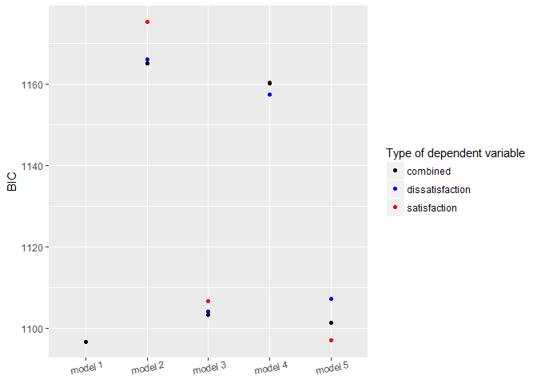
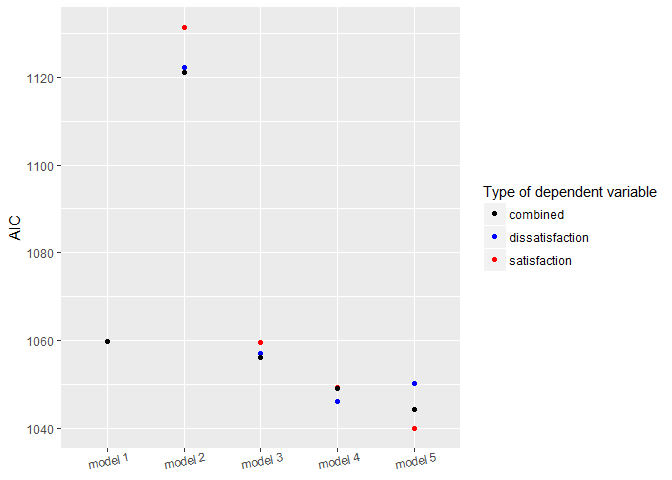
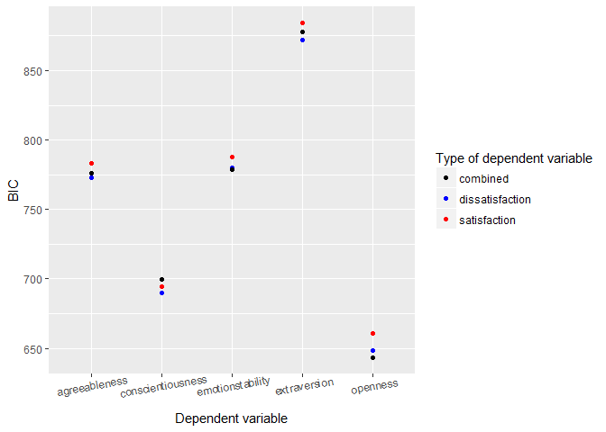

MAPSS Thesis II - model 2
================
Chih-Yu Chiang
August 24, 2017

-   [Setup](#setup)
-   [Variable](#variable)
-   [Model](#model)
-   [Information criteria - combined](#information-criteria---combined)
    -   [BIC](#bic)
    -   [AIC](#aic)
-   [Combined models](#combined-models)
    -   [gap ~ real + c](#gap-real-c)
    -   [(link for the above position)](#link-for-the-above-position)
    -   [gap ~ satis + c](#gap-satis-c)
    -   [(link for the above position)](#link-for-the-above-position-1)
    -   [gap ~ real + satis + c](#gap-real-satis-c)
    -   [(link for the above position)](#link-for-the-above-position-2)
    -   [gap ~ real + satis + real \* satis + c](#gap-real-satis-real-satis-c)
    -   [(link for the above position)](#link-for-the-above-position-3)
-   [Information criteria - separate](#information-criteria---separate)
    -   [BIC](#bic-1)
    -   [AIC](#aic-1)
-   [gap ~ real + satis + real \* satis + c](#gap-real-satis-real-satis-c-1)
    -   [agreeableness](#agreeableness)
    -   [conscientiousness](#conscientiousness)
    -   [emotionstability](#emotionstability)
    -   [extraversion](#extraversion)
    -   [openness](#openness)

``` r
knitr::opts_chunk$set(
    message=FALSE,
    warning=FALSE
)

#Prevent result wrapping
options(width=120)
```

Setup
-----

Data of game and player are read in and matched up.

-   Game release data, `release` (year), is read in as an interval variable.
-   Missing values are imputed with variable mean conveniently (`star_user` and `star_GS`).

``` r
#--Package
library(tidyverse)
library(data.table)
library(corrplot)
library(modelr)
library(glmnet)
library(VGAM)
library(randomForest)
library(e1071)
library(car)
library(rlist)
library(pander)
set.seed(1)


#--Read in
#Core game info and group distance/probability data
core_cluster <- read_csv("../data/core_cluster.csv", col_names=TRUE) %>%
  mutate(group_survey = factor(group_survey),
         group_review = factor(group_review),
         core_id = factor(core_id)) %>%
  select(-X1)

#Core game tste scores (of dif numbers of features)
core_tsteScore <- read_csv("../data/tste_concat.csv", col_names=TRUE) %>%
  select(-X1)

#Player-related survey data
survey <- read_csv("../data/survey.csv", col_names=TRUE) %>%
  mutate(race = factor(race),
         sex = factor(sex),
         core_id = factor(core_id)) %>%
  select(-id)


#--Impute missing with mean
imputation_mean <- function(c){
  c[is.na(c)] <- mean(c, na.rm=TRUE)
  return(c)
}
core_cluster <- mutate_each(core_cluster,
                            funs(imputation_mean(.)),
                            star_user, star_GS)


#--Match up
#Main df, key=player-game
df <- bind_cols(core_cluster, core_tsteScore) %>%
  left_join(survey, by=c("core_id"), copy=FALSE)
```

Variable
--------

Compute and select variables to be used in models.

-   Mean-centered vars is marked with a suffix \_ct.

-   Player preference:

| Name           | Definition                 | Unit                        |
|----------------|----------------------------|-----------------------------|
| `preference_1` | how much do you like       | Likert 1-7=like             |
| `preference_2` | how often play it          | ordinary 1=never-7=everyday |
| `preference_3` | does it fit personal taste | Likert 1-7=fit              |

-   Game characteristics:

<table style="width:36%;">
<colgroup>
<col width="8%" />
<col width="18%" />
<col width="9%" />
</colgroup>
<thead>
<tr class="header">
<th>Name</th>
<th>Definition</th>
<th>Unit</th>
</tr>
</thead>
<tbody>
<tr class="odd">
<td><code>distance_survey_mean_x</code></td>
<td>group score from survey (distance from group mean in tste)</td>
<td>cosine distance</td>
</tr>
<tr class="even">
<td><code>distance_survey_median_x</code></td>
<td>group score from survey (distance from group median in tste)</td>
<td>cosine distance</td>
</tr>
<tr class="odd">
<td><code>probability_review_mean_x</code></td>
<td>group score from review (mean probability to be categorized in the group by NN)</td>
<td>percentage</td>
</tr>
<tr class="even">
<td><code>probability_review_median_x</code></td>
<td>group score from review (median probability to be categorized in the group by NN)</td>
<td>percentage</td>
</tr>
<tr class="odd">
<td><code>group_survey</code></td>
<td>group identity from survey</td>
<td>categorical 1-group number</td>
</tr>
<tr class="even">
<td><code>group_review</code></td>
<td>group identity from review</td>
<td>categorical 1-group number</td>
</tr>
<tr class="odd">
<td><code>tste_n_x</code></td>
<td>group score from survey (tste), n=number of features</td>
<td>interval arbitrary</td>
</tr>
</tbody>
</table>

-   Player personality:

<table style="width:36%;">
<colgroup>
<col width="8%" />
<col width="18%" />
<col width="9%" />
</colgroup>
<thead>
<tr class="header">
<th>Name</th>
<th>Definition</th>
<th>Unit</th>
</tr>
</thead>
<tbody>
<tr class="odd">
<td><code>game_xxxxx</code></td>
<td>Big-five personality in game</td>
<td>Likert 1-7</td>
</tr>
<tr class="even">
<td><code>real_xxxxx</code></td>
<td>Big-five personality in real life</td>
<td>Likert 1-7</td>
</tr>
<tr class="odd">
<td><code>gap_xxxxx</code></td>
<td>personality gap (game - real)</td>
<td>Likert 1-7</td>
</tr>
<tr class="even">
<td><code>satis_xxxxx</code></td>
<td>SDT satisfaction in real life</td>
<td>Likert 1-7</td>
</tr>
<tr class="odd">
<td><code>dissatis_xxxxx</code></td>
<td>SDT dissatisfaction in real life</td>
<td>Likert 1-7</td>
</tr>
<tr class="even">
<td><code>combined_xxxxx</code></td>
<td>SDT combined (previous two) dissatisfaction in real life</td>
<td>Likert 1-7</td>
</tr>
</tbody>
</table>

-   Control:

| Name        | Definition                                    | Unit                      |
|-------------|-----------------------------------------------|---------------------------|
| `age`       | player age                                    | interval                  |
| `education` | player education                              | ordinary 1-7=PhD          |
| `income`    | player annual household income                | ordinary 1-7=over 150,000 |
| `sex`       | player sex                                    | categorical 1=male        |
| `race`      | player race                                   | categorical 1-5           |
| `release`   | game release year                             | interval year             |
| `star_GS`   | general game quality rated by GameSpot expert | interval 0-10             |
| `star_user` | general game quality rated by GameSpot user   | interval 0-10             |

``` r
updateVars <- function(update_predictors=TRUE){
  #--Match up (repeat the set up section to work around the "data binding" bug)
  #Main df, key=player-game pair
  df <<- bind_cols(core_cluster, core_tsteScore) %>%
    left_join(survey, by=c("core_id"), copy=FALSE)
  
  
  #--Create response variable
  df <<- df %>%
    rowwise() %>% #Rowwise to make the ordinary functions work
    mutate(preference = mean(c(preference_3))) %>%
    ungroup() #Ungroup to cancel rowwise
  
  
  #--Mean-center predictor variables
  df <<- mutate_at(df, vars(starts_with("tste"),
                            starts_with("game"),
                            starts_with("real"),
                            starts_with("satis"),
                            starts_with("dissatis"),
                            starts_with("combined")), funs(ct = . - mean(.)))

  
  #--Compute personalty gap
  df <<- mutate(df,
                gap_extraversion = game_extraversion - real_extraversion,
                gap_agreeableness = game_agreeableness - real_agreeableness,
                gap_conscientiousness = game_conscientiousness - real_conscientiousness,
                gap_emotionstability = game_emotionstability - real_emotionstability,
                gap_openness = game_openness - real_openness,
                gap_sum = gap_extraversion + gap_agreeableness + gap_conscientiousness + (-gap_emotionstability) + gap_openness,
                real_sum = real_extraversion + real_agreeableness + real_conscientiousness + (-real_emotionstability) + real_openness,
                dissatis_sum = dissatis_autonomy + dissatis_relatedness + dissatis_competence,
                satis_sum = satis_autonomy + satis_relatedness + satis_competence,
                combined_sum = combined_autonomy + combined_relatedness + combined_competence
                )

  #--Acquire player df, key=player
  df_player <<- distinct(df, respondent, .keep_all=TRUE)
  
  
  #--Select variables to be included in regression (model formation)
  #Sets of predictor variables from file
  #Can be updated from outside the function (eg. for lasso selection), if so, `update_predictors`=FALSE
  if(update_predictors==TRUE) {
    df_predictors <<- read.csv("../data/vars/predictors.csv", header=TRUE, na.strings="")
  }
  
  #Get column name as model id
  modelId <- colnames(df_predictors)
  
  #predictor variable as strings for each model
  predictorString <- apply(df_predictors, MARGIN=2, function(x) paste(na.omit(x), collapse="+"))
  
  #Make the dfs into a data frame
  dfs <<- data.frame(predictorString, row.names=modelId, stringsAsFactors=FALSE) %>%
    mutate(df_x = map(predictorString, ~ model.matrix(as.formula(paste("preference ~ ", .x, sep="")), data=df)[, -1])) %>% #df with only predictor variables; [, -1] used to remove redundant intercept column
    mutate(df_yx = map(df_x, ~ bind_cols(select(df, "preference"), data.frame(.x)))) #df also with outcome variables
  dfs_player <<- data.frame(predictorString, row.names=modelId, stringsAsFactors=FALSE) %>%
    mutate(df_x = map(predictorString, ~ model.matrix(as.formula(paste("gap_extraversion ~ ", .x, sep="")), data=df)[, -1])) %>% #df with only predictor variables; [, -1] used to remove redundant intercept column
    mutate(df_yx = map(df_x, ~ bind_cols(select(df, "gap_extraversion"), data.frame(.x)))) #df also with outcome variables
  
  #Set row names for reference
  row.names(dfs) <<- modelId
  row.names(dfs_player) <<- modelId
}
```

Model
-----


``` r
#--Update vars
updateVars()


#--Player df with control marked
df_player_c <- mutate(df_player,
                      c_age = age,
                      c_education = education,
                      c_income = income,
                      c_race = race,
                      c_sex = sex)


#--Combined models
#Summed difference as dependent var
#gap ~ real + c
model_ygap_sum.1.satis <- lm(gap_sum ~ .,
                 data=select(df_player_c, gap_sum, real_sum, starts_with("c_")))
model_ygap_sum.1.dissatis <- lm(gap_sum ~ .,
                 data=select(df_player_c, gap_sum, real_sum, starts_with("c_")))
model_ygap_sum.1.combined <- lm(gap_sum ~ .,
                 data=select(df_player_c, gap_sum, real_sum, starts_with("c_")))

#gap ~ satis + c
model_ygap_sum.2.satis <- lm(gap_sum ~ .,
                 data=select(df_player_c, gap_sum, starts_with("c_"), matches("^satis.+ct$")))
model_ygap_sum.2.dissatis <- lm(gap_sum ~ .,
                 data=select(df_player_c, gap_sum, starts_with("c_"), matches("^dissatis.+ct$")))
model_ygap_sum.2.combined <- lm(gap_sum ~ .,
                 data=select(df_player_c, gap_sum, starts_with("c_"), matches("^combined.+ct$")))

#gap ~ real + satis + c
model_ygap_sum.3.satis <- lm(gap_sum ~ .,
                 data=select(df_player_c, gap_sum, real_sum, starts_with("c_"), matches("^satis.+ct$")))
model_ygap_sum.3.dissatis <- lm(gap_sum ~ .,
                 data=select(df_player_c, gap_sum, real_sum, starts_with("c_"), matches("^dissatis.+ct$")))
model_ygap_sum.3.combined <- lm(gap_sum ~ .,
                 data=select(df_player_c, gap_sum, real_sum, starts_with("c_"), matches("^combined.+ct$")))

#gap ~ real + satis + real * satis + c
model_ygap_sum.4.satis <- lm(gap_sum ~ . + (satis_autonomy_ct + satis_relatedness_ct + satis_competence_ct) * (real_extraversion_ct + real_agreeableness_ct + real_conscientiousness_ct + real_emotionstability_ct + real_openness_ct),
                 data=select(df_player_c, gap_sum, matches("^real.+ct$"), starts_with("c_"), matches("^satis.+ct$")))
model_ygap_sum.4.dissatis <- lm(gap_sum ~ . + (dissatis_autonomy_ct + dissatis_relatedness_ct + dissatis_competence_ct) * (real_extraversion_ct + real_agreeableness_ct + real_conscientiousness_ct + real_emotionstability_ct + real_openness_ct),
                 data=select(df_player_c, gap_sum, matches("^real.+ct$"), starts_with("c_"), matches("^dissatis.+ct$")))
model_ygap_sum.4.combined <- lm(gap_sum ~ . + (combined_autonomy_ct + combined_relatedness_ct + combined_competence_ct) * (real_extraversion_ct + real_agreeableness_ct + real_conscientiousness_ct + real_emotionstability_ct + real_openness_ct),
                 data=select(df_player_c, gap_sum, matches("^real.+ct$"), starts_with("c_"), matches("^combined.+ct$")))
model_ygap_sum.5.satis <- lm(gap_sum ~ . + (satis_autonomy_ct + satis_relatedness_ct + satis_competence_ct) * real_sum,
                 data=select(df_player_c, gap_sum, real_sum, starts_with("c_"), matches("^satis.+ct$")))
model_ygap_sum.5.dissatis <- lm(gap_sum ~ . + (dissatis_autonomy_ct + dissatis_relatedness_ct + dissatis_competence_ct) * real_sum,
                 data=select(df_player_c, gap_sum, real_sum, starts_with("c_"), matches("^dissatis.+ct$")))
model_ygap_sum.5.combined <- lm(gap_sum ~ . + (combined_autonomy_ct + combined_relatedness_ct + combined_competence_ct) * real_sum,
                 data=select(df_player_c, gap_sum, real_sum, starts_with("c_"), matches("^combined.+ct$")))
```

``` r
#--Acquire corresponding df for each game personality
#Alphabetical order for personality response vars
#With all personality
dfs_ygame.satis <- list(select(df_player_c, gap = gap_agreeableness, matches("^real.+ct$"), starts_with("c_"), matches("^satis.+ct$")),
                  select(df_player_c, gap = gap_conscientiousness, matches("^real.+ct$"), starts_with("c_"), matches("^satis.+ct$")),
                  select(df_player_c, gap = gap_emotionstability, matches("^real.+ct$"), starts_with("c_"), matches("^satis.+ct$")),
                  select(df_player_c, gap = gap_extraversion, matches("^real.+ct$"), starts_with("c_"), matches("^satis.+ct$")),
                  select(df_player_c, gap = gap_openness, matches("^real.+ct$"), starts_with("c_"), matches("^satis.+ct$")))
dfs_ygame.dissatis <- list(select(df_player_c, gap = gap_agreeableness, matches("^real.+ct$"), starts_with("c_"), matches("^dissatis.+ct$")),
                  select(df_player_c, gap = gap_conscientiousness, matches("^real.+ct$"), starts_with("c_"), matches("^dissatis.+ct$")),
                  select(df_player_c, gap = gap_emotionstability, matches("^real.+ct$"), starts_with("c_"), matches("^dissatis.+ct$")),
                  select(df_player_c, gap = gap_extraversion, matches("^real.+ct$"), starts_with("c_"), matches("^dissatis.+ct$")),
                  select(df_player_c, gap = gap_openness, matches("^real.+ct$"), starts_with("c_"), matches("^dissatis.+ct$")))
dfs_ygame.combined <- list(select(df_player_c, gap = gap_agreeableness, matches("^real.+ct$"), starts_with("c_"), matches("^combined.+ct$")),
                  select(df_player_c, gap = gap_conscientiousness, matches("^real.+ct$"), starts_with("c_"), matches("^combined.+ct$")),
                  select(df_player_c, gap = gap_emotionstability, matches("^real.+ct$"), starts_with("c_"), matches("^combined.+ct$")),
                  select(df_player_c, gap = gap_extraversion, matches("^real.+ct$"), starts_with("c_"), matches("^combined.+ct$")),
                  select(df_player_c, gap = gap_openness, matches("^real.+ct$"), starts_with("c_"), matches("^combined.+ct$")))


#--Train models
#With all personality
models_ygame.satis_lm <- map(dfs_ygame.satis,
                       ~ lm(gap ~ . + (satis_autonomy_ct + satis_relatedness_ct + satis_competence_ct) * (real_extraversion_ct + real_agreeableness_ct + real_conscientiousness_ct + real_emotionstability_ct + real_openness_ct),
                            data=.x))
models_ygame.dissatis_lm <- map(dfs_ygame.dissatis,
                       ~ lm(gap ~ . + (dissatis_autonomy_ct + dissatis_relatedness_ct + dissatis_competence_ct) * (real_extraversion_ct + real_agreeableness_ct + real_conscientiousness_ct + real_emotionstability_ct + real_openness_ct),
                            data=.x))
models_ygame.combined_lm <- map(dfs_ygame.combined,
                       ~ lm(gap ~ . + (combined_autonomy_ct + combined_relatedness_ct + combined_competence_ct) * (real_extraversion_ct + real_agreeableness_ct + real_conscientiousness_ct + real_emotionstability_ct + real_openness_ct),
                            data=.x))
```

Information criteria - combined
-------------------------------

### BIC

Model 1: gap ~ real + c (combined real) Model 2: gap ~ satis + c Model 3: gap ~ real + satis + c (combined real) Model 4: gap ~ real + satis + real \* satis + c (separate real) Model 5: gap ~ real + satis + real \* satis + c (combined real)

``` r
BICs_ygap_sum.1.satis <- model_ygap_sum.1.satis %>% BIC()
BICs_ygap_sum.1.dissatis <- model_ygap_sum.1.dissatis %>% BIC()
BICs_ygap_sum.1.combined <-model_ygap_sum.1.combined %>% BIC()
BICs_ygap_sum.2.satis <-model_ygap_sum.2.satis %>% BIC()
BICs_ygap_sum.2.dissatis <-model_ygap_sum.2.dissatis %>% BIC()
BICs_ygap_sum.2.combined <-model_ygap_sum.2.combined %>% BIC()
BICs_ygap_sum.3.satis <-model_ygap_sum.3.satis %>% BIC()
BICs_ygap_sum.3.dissatis <-model_ygap_sum.3.dissatis %>% BIC()
BICs_ygap_sum.3.combined <-model_ygap_sum.3.combined %>% BIC()
BICs_ygap_sum.4.satis <-model_ygap_sum.4.satis %>% BIC()
BICs_ygap_sum.4.dissatis <-model_ygap_sum.4.dissatis %>% BIC()
BICs_ygap_sum.4.combined <-model_ygap_sum.4.combined %>% BIC()
BICs_ygap_sum.5.satis <-model_ygap_sum.5.satis %>% BIC()
BICs_ygap_sum.5.dissatis <-model_ygap_sum.5.dissatis %>% BIC()
BICs_ygap_sum.5.combined <-model_ygap_sum.5.combined %>% BIC()

BICs_ygap_sum.all.satis <- c(BICs_ygap_sum.1.satis, BICs_ygap_sum.2.satis, BICs_ygap_sum.3.satis, BICs_ygap_sum.4.satis, BICs_ygap_sum.5.satis)
BICs_ygap_sum.all.dissatis <- c(BICs_ygap_sum.1.dissatis, BICs_ygap_sum.2.dissatis, BICs_ygap_sum.3.dissatis, BICs_ygap_sum.4.dissatis, BICs_ygap_sum.5.dissatis)
BICs_ygap_sum.all.combined <- c(BICs_ygap_sum.1.combined, BICs_ygap_sum.2.combined, BICs_ygap_sum.3.combined, BICs_ygap_sum.4.combined, BICs_ygap_sum.5.combined)

df_BICc <- rbind(BICs_ygap_sum.all.satis, BICs_ygap_sum.all.dissatis, BICs_ygap_sum.all.combined) %>% as.data.frame()

ggplot(df_BICc) +
  geom_point(aes(x="model 1", y=df_BICc$V1, color=c("satisfaction", "dissatisfaction", "combined"))) +
  geom_point(aes(x="model 2", y=df_BICc$V2, color=c("satisfaction", "dissatisfaction", "combined"))) +
  geom_point(aes(x="model 3", y=df_BICc$V3, color=c("satisfaction", "dissatisfaction", "combined"))) +
  geom_point(aes(x="model 4", y=df_BICc$V4, color=c("satisfaction", "dissatisfaction", "combined"))) +
  geom_point(aes(x="model 5", y=df_BICc$V5, color=c("satisfaction", "dissatisfaction", "combined"))) +
  scale_color_manual(name="Type of dependent variable", values=c("satisfaction"="red", "dissatisfaction"="blue", "combined"="black")) +
  theme(axis.text.x=element_text(angle=10, hjust=0.5)) +
  labs(x=NULL, y="BIC")
```



### AIC

``` r
AICs_ygap_sum.1.satis <-model_ygap_sum.1.satis %>% AIC()
AICs_ygap_sum.1.dissatis <-model_ygap_sum.1.dissatis %>% AIC()
AICs_ygap_sum.1.combined <-model_ygap_sum.1.combined %>% AIC()
AICs_ygap_sum.2.satis <-model_ygap_sum.2.satis %>% AIC()
AICs_ygap_sum.2.dissatis <-model_ygap_sum.2.dissatis %>% AIC()
AICs_ygap_sum.2.combined <-model_ygap_sum.2.combined %>% AIC()
AICs_ygap_sum.3.satis <-model_ygap_sum.3.satis %>% AIC()
AICs_ygap_sum.3.dissatis <-model_ygap_sum.3.dissatis %>% AIC()
AICs_ygap_sum.3.combined <-model_ygap_sum.3.combined %>% AIC()
AICs_ygap_sum.4.satis <-model_ygap_sum.4.satis %>% AIC()
AICs_ygap_sum.4.dissatis <-model_ygap_sum.4.dissatis %>% AIC()
AICs_ygap_sum.4.combined <-model_ygap_sum.4.combined %>% AIC()
AICs_ygap_sum.5.satis <-model_ygap_sum.5.satis %>% AIC()
AICs_ygap_sum.5.dissatis <-model_ygap_sum.5.dissatis %>% AIC()
AICs_ygap_sum.5.combined <-model_ygap_sum.5.combined %>% AIC()

AICs_ygap_sum.all.satis <- c(AICs_ygap_sum.1.satis, AICs_ygap_sum.2.satis, AICs_ygap_sum.3.satis, AICs_ygap_sum.4.satis, AICs_ygap_sum.5.satis)
AICs_ygap_sum.all.dissatis <- c(AICs_ygap_sum.1.dissatis, AICs_ygap_sum.2.dissatis, AICs_ygap_sum.3.dissatis, AICs_ygap_sum.4.dissatis, AICs_ygap_sum.5.dissatis)
AICs_ygap_sum.all.combined <- c(AICs_ygap_sum.1.combined, AICs_ygap_sum.2.combined, AICs_ygap_sum.3.combined, AICs_ygap_sum.4.combined, AICs_ygap_sum.5.combined)

df_AICc <- rbind(AICs_ygap_sum.all.satis, AICs_ygap_sum.all.dissatis, AICs_ygap_sum.all.combined) %>% as.data.frame()

ggplot(df_AICc) +
  geom_point(aes(x="model 1", y=df_AICc$V1, color=c("satisfaction", "dissatisfaction", "combined"))) +
  geom_point(aes(x="model 2", y=df_AICc$V2, color=c("satisfaction", "dissatisfaction", "combined"))) +
  geom_point(aes(x="model 3", y=df_AICc$V3, color=c("satisfaction", "dissatisfaction", "combined"))) +
  geom_point(aes(x="model 4", y=df_AICc$V4, color=c("satisfaction", "dissatisfaction", "combined"))) +
  geom_point(aes(x="model 5", y=df_AICc$V5, color=c("satisfaction", "dissatisfaction", "combined"))) +
  scale_color_manual(name="Type of dependent variable", values=c("satisfaction"="red", "dissatisfaction"="blue", "combined"="black")) +
  theme(axis.text.x=element_text(angle=10, hjust=0.5)) +
  labs(x=NULL, y="AIC")
```



Combined models
---------------

### gap ~ real + c

### (link for the above position)

``` r
summary(model_ygap_sum.1.satis)
```

    ## 
    ## Call:
    ## lm(formula = gap_sum ~ ., data = select(df_player_c, gap_sum, 
    ##     real_sum, starts_with("c_")))
    ## 
    ## Residuals:
    ##     Min      1Q  Median      3Q     Max 
    ## -6.7220 -1.9007 -0.0619  1.5877  9.1286 
    ## 
    ## Coefficients:
    ##              Estimate Std. Error t value Pr(>|t|)    
    ## (Intercept)  9.506400   1.114344   8.531 3.21e-15 ***
    ## real_sum    -0.526959   0.049607 -10.623  < 2e-16 ***
    ## c_age        0.013411   0.026871   0.499    0.618    
    ## c_education -0.110117   0.156629  -0.703    0.483    
    ## c_income     0.009135   0.099637   0.092    0.927    
    ## c_race2     -0.327975   0.776211  -0.423    0.673    
    ## c_race4     -0.539787   0.837537  -0.644    0.520    
    ## c_race6     -0.039832   1.990752  -0.020    0.984    
    ## c_race7      1.093306   0.799192   1.368    0.173    
    ## c_sex2       0.178804   0.404626   0.442    0.659    
    ## ---
    ## Signif. codes:  0 '***' 0.001 '**' 0.01 '*' 0.05 '.' 0.1 ' ' 1
    ## 
    ## Residual standard error: 2.768 on 205 degrees of freedom
    ## Multiple R-squared:  0.3826, Adjusted R-squared:  0.3555 
    ## F-statistic: 14.12 on 9 and 205 DF,  p-value: < 2.2e-16

``` r
summary(model_ygap_sum.1.dissatis)
```

    ## 
    ## Call:
    ## lm(formula = gap_sum ~ ., data = select(df_player_c, gap_sum, 
    ##     real_sum, starts_with("c_")))
    ## 
    ## Residuals:
    ##     Min      1Q  Median      3Q     Max 
    ## -6.7220 -1.9007 -0.0619  1.5877  9.1286 
    ## 
    ## Coefficients:
    ##              Estimate Std. Error t value Pr(>|t|)    
    ## (Intercept)  9.506400   1.114344   8.531 3.21e-15 ***
    ## real_sum    -0.526959   0.049607 -10.623  < 2e-16 ***
    ## c_age        0.013411   0.026871   0.499    0.618    
    ## c_education -0.110117   0.156629  -0.703    0.483    
    ## c_income     0.009135   0.099637   0.092    0.927    
    ## c_race2     -0.327975   0.776211  -0.423    0.673    
    ## c_race4     -0.539787   0.837537  -0.644    0.520    
    ## c_race6     -0.039832   1.990752  -0.020    0.984    
    ## c_race7      1.093306   0.799192   1.368    0.173    
    ## c_sex2       0.178804   0.404626   0.442    0.659    
    ## ---
    ## Signif. codes:  0 '***' 0.001 '**' 0.01 '*' 0.05 '.' 0.1 ' ' 1
    ## 
    ## Residual standard error: 2.768 on 205 degrees of freedom
    ## Multiple R-squared:  0.3826, Adjusted R-squared:  0.3555 
    ## F-statistic: 14.12 on 9 and 205 DF,  p-value: < 2.2e-16

``` r
summary(model_ygap_sum.1.combined)
```

    ## 
    ## Call:
    ## lm(formula = gap_sum ~ ., data = select(df_player_c, gap_sum, 
    ##     real_sum, starts_with("c_")))
    ## 
    ## Residuals:
    ##     Min      1Q  Median      3Q     Max 
    ## -6.7220 -1.9007 -0.0619  1.5877  9.1286 
    ## 
    ## Coefficients:
    ##              Estimate Std. Error t value Pr(>|t|)    
    ## (Intercept)  9.506400   1.114344   8.531 3.21e-15 ***
    ## real_sum    -0.526959   0.049607 -10.623  < 2e-16 ***
    ## c_age        0.013411   0.026871   0.499    0.618    
    ## c_education -0.110117   0.156629  -0.703    0.483    
    ## c_income     0.009135   0.099637   0.092    0.927    
    ## c_race2     -0.327975   0.776211  -0.423    0.673    
    ## c_race4     -0.539787   0.837537  -0.644    0.520    
    ## c_race6     -0.039832   1.990752  -0.020    0.984    
    ## c_race7      1.093306   0.799192   1.368    0.173    
    ## c_sex2       0.178804   0.404626   0.442    0.659    
    ## ---
    ## Signif. codes:  0 '***' 0.001 '**' 0.01 '*' 0.05 '.' 0.1 ' ' 1
    ## 
    ## Residual standard error: 2.768 on 205 degrees of freedom
    ## Multiple R-squared:  0.3826, Adjusted R-squared:  0.3555 
    ## F-statistic: 14.12 on 9 and 205 DF,  p-value: < 2.2e-16

### gap ~ satis + c

### (link for the above position)

``` r
summary(model_ygap_sum.2.satis)
```

    ## 
    ## Call:
    ## lm(formula = gap_sum ~ ., data = select(df_player_c, gap_sum, 
    ##     starts_with("c_"), matches("^satis.+ct$")))
    ## 
    ## Residuals:
    ##    Min     1Q Median     3Q    Max 
    ## -6.412 -2.098 -0.527  1.583 10.357 
    ## 
    ## Coefficients:
    ##                      Estimate Std. Error t value Pr(>|t|)    
    ## (Intercept)           2.59238    1.16238   2.230 0.026827 *  
    ## c_age                 0.01524    0.03203   0.476 0.634722    
    ## c_education          -0.18423    0.18440  -0.999 0.318930    
    ## c_income             -0.04525    0.11805  -0.383 0.701908    
    ## c_race2              -0.36889    0.91603  -0.403 0.687591    
    ## c_race4              -0.65395    0.98878  -0.661 0.509124    
    ## c_race6              -2.33198    2.35643  -0.990 0.323536    
    ## c_race7               1.10292    0.94876   1.162 0.246404    
    ## c_sex2                0.74116    0.47507   1.560 0.120288    
    ## satis_autonomy_ct    -0.28771    0.29880  -0.963 0.336758    
    ## satis_relatedness_ct  0.46732    0.27193   1.719 0.087222 .  
    ## satis_competence_ct  -0.90852    0.26949  -3.371 0.000896 ***
    ## ---
    ## Signif. codes:  0 '***' 0.001 '**' 0.01 '*' 0.05 '.' 0.1 ' ' 1
    ## 
    ## Residual standard error: 3.256 on 203 degrees of freedom
    ## Multiple R-squared:  0.154,  Adjusted R-squared:  0.1081 
    ## F-statistic: 3.359 on 11 and 203 DF,  p-value: 0.0002796

``` r
summary(model_ygap_sum.2.dissatis)
```

    ## 
    ## Call:
    ## lm(formula = gap_sum ~ ., data = select(df_player_c, gap_sum, 
    ##     starts_with("c_"), matches("^dissatis.+ct$")))
    ## 
    ## Residuals:
    ##     Min      1Q  Median      3Q     Max 
    ## -6.8160 -1.8911 -0.6227  1.6904 10.4866 
    ## 
    ## Coefficients:
    ##                         Estimate Std. Error t value Pr(>|t|)    
    ## (Intercept)              1.88604    1.15769   1.629   0.1048    
    ## c_age                    0.03207    0.03153   1.017   0.3104    
    ## c_education             -0.12091    0.18423  -0.656   0.5124    
    ## c_income                -0.04467    0.11573  -0.386   0.6999    
    ## c_race2                 -0.25798    0.89964  -0.287   0.7746    
    ## c_race4                 -0.73980    0.96855  -0.764   0.4459    
    ## c_race6                 -2.98763    2.33082  -1.282   0.2014    
    ## c_race7                  1.12526    0.92815   1.212   0.2268    
    ## c_sex2                   0.55144    0.46574   1.184   0.2378    
    ## dissatis_autonomy_ct     0.13002    0.20745   0.627   0.5315    
    ## dissatis_relatedness_ct -0.43011    0.21183  -2.030   0.0436 *  
    ## dissatis_competence_ct   0.95286    0.20230   4.710 4.58e-06 ***
    ## ---
    ## Signif. codes:  0 '***' 0.001 '**' 0.01 '*' 0.05 '.' 0.1 ' ' 1
    ## 
    ## Residual standard error: 3.188 on 203 degrees of freedom
    ## Multiple R-squared:  0.1892, Adjusted R-squared:  0.1453 
    ## F-statistic: 4.307 on 11 and 203 DF,  p-value: 8.877e-06

``` r
summary(model_ygap_sum.2.combined)
```

    ## 
    ## Call:
    ## lm(formula = gap_sum ~ ., data = select(df_player_c, gap_sum, 
    ##     starts_with("c_"), matches("^combined.+ct$")))
    ## 
    ## Residuals:
    ##     Min      1Q  Median      3Q     Max 
    ## -6.4220 -1.7771 -0.5035  1.8024 10.3672 
    ## 
    ## Coefficients:
    ##                         Estimate Std. Error t value Pr(>|t|)    
    ## (Intercept)              2.00901    1.15147   1.745   0.0825 .  
    ## c_age                    0.02868    0.03141   0.913   0.3623    
    ## c_education             -0.13939    0.18252  -0.764   0.4460    
    ## c_income                -0.03629    0.11534  -0.315   0.7533    
    ## c_race2                 -0.29565    0.89639  -0.330   0.7419    
    ## c_race4                 -0.79498    0.96656  -0.822   0.4118    
    ## c_race6                 -2.96267    2.31436  -1.280   0.2020    
    ## c_race7                  0.99557    0.92878   1.072   0.2850    
    ## c_sex2                   0.63128    0.46407   1.360   0.1752    
    ## combined_autonomy_ct    -0.23242    0.29487  -0.788   0.4315    
    ## combined_relatedness_ct  0.61271    0.26879   2.280   0.0237 *  
    ## combined_competence_ct  -1.11995    0.26365  -4.248 3.28e-05 ***
    ## ---
    ## Signif. codes:  0 '***' 0.001 '**' 0.01 '*' 0.05 '.' 0.1 ' ' 1
    ## 
    ## Residual standard error: 3.18 on 203 degrees of freedom
    ## Multiple R-squared:  0.1933, Adjusted R-squared:  0.1496 
    ## F-statistic: 4.422 on 11 and 203 DF,  p-value: 5.819e-06

### gap ~ real + satis + c

### (link for the above position)

``` r
summary(model_ygap_sum.3.satis)
```

    ## 
    ## Call:
    ## lm(formula = gap_sum ~ ., data = select(df_player_c, gap_sum, 
    ##     real_sum, starts_with("c_"), matches("^satis.+ct$")))
    ## 
    ## Residuals:
    ##     Min      1Q  Median      3Q     Max 
    ## -6.9742 -1.7976 -0.0578  1.6181  9.4286 
    ## 
    ## Coefficients:
    ##                       Estimate Std. Error t value Pr(>|t|)    
    ## (Intercept)          10.393239   1.302662   7.978 1.09e-13 ***
    ## real_sum             -0.582280   0.063957  -9.104  < 2e-16 ***
    ## c_age                 0.009596   0.027041   0.355   0.7231    
    ## c_education          -0.097517   0.155946  -0.625   0.5325    
    ## c_income              0.005980   0.099811   0.060   0.9523    
    ## c_race2              -0.218107   0.773427  -0.282   0.7782    
    ## c_race4              -0.521157   0.834791  -0.624   0.5331    
    ## c_race6               0.109091   2.007131   0.054   0.9567    
    ## c_race7               0.968055   0.801015   1.209   0.2283    
    ## c_sex2                0.045822   0.408226   0.112   0.9107    
    ## satis_autonomy_ct    -0.090581   0.253159  -0.358   0.7209    
    ## satis_relatedness_ct  0.460718   0.229545   2.007   0.0461 *  
    ## satis_competence_ct   0.065776   0.251403   0.262   0.7939    
    ## ---
    ## Signif. codes:  0 '***' 0.001 '**' 0.01 '*' 0.05 '.' 0.1 ' ' 1
    ## 
    ## Residual standard error: 2.749 on 202 degrees of freedom
    ## Multiple R-squared:  0.4001, Adjusted R-squared:  0.3645 
    ## F-statistic: 11.23 on 12 and 202 DF,  p-value: < 2.2e-16

``` r
summary(model_ygap_sum.3.dissatis)
```

    ## 
    ## Call:
    ## lm(formula = gap_sum ~ ., data = select(df_player_c, gap_sum, 
    ##     real_sum, starts_with("c_"), matches("^dissatis.+ct$")))
    ## 
    ## Residuals:
    ##     Min      1Q  Median      3Q     Max 
    ## -7.1988 -1.8495 -0.0802  1.5116  9.0042 
    ## 
    ## Coefficients:
    ##                         Estimate Std. Error t value Pr(>|t|)    
    ## (Intercept)             10.10205    1.37598   7.342 5.06e-12 ***
    ## real_sum                -0.56649    0.06572  -8.619 1.95e-15 ***
    ## c_age                    0.01001    0.02715   0.369   0.7128    
    ## c_education             -0.04681    0.15815  -0.296   0.7675    
    ## c_income                -0.01932    0.09924  -0.195   0.8459    
    ## c_race2                 -0.07011    0.77145  -0.091   0.9277    
    ## c_race4                 -0.63276    0.83029  -0.762   0.4469    
    ## c_race6                 -0.74333    2.01478  -0.369   0.7126    
    ## c_race7                  0.80750    0.79643   1.014   0.3118    
    ## c_sex2                   0.03029    0.40377   0.075   0.9403    
    ## dissatis_autonomy_ct     0.18240    0.17792   1.025   0.3065    
    ## dissatis_relatedness_ct -0.51140    0.18182  -2.813   0.0054 ** 
    ## dissatis_competence_ct   0.02608    0.20403   0.128   0.8984    
    ## ---
    ## Signif. codes:  0 '***' 0.001 '**' 0.01 '*' 0.05 '.' 0.1 ' ' 1
    ## 
    ## Residual standard error: 2.732 on 202 degrees of freedom
    ## Multiple R-squared:  0.4072, Adjusted R-squared:  0.372 
    ## F-statistic: 11.56 on 12 and 202 DF,  p-value: < 2.2e-16

``` r
summary(model_ygap_sum.3.combined)
```

    ## 
    ## Call:
    ## lm(formula = gap_sum ~ ., data = select(df_player_c, gap_sum, 
    ##     real_sum, starts_with("c_"), matches("^combined.+ct$")))
    ## 
    ## Residuals:
    ##     Min      1Q  Median      3Q     Max 
    ## -7.5185 -1.7815  0.0031  1.5686  9.1286 
    ## 
    ## Coefficients:
    ##                          Estimate Std. Error t value Pr(>|t|)    
    ## (Intercept)             10.387679   1.387961   7.484 2.18e-12 ***
    ## real_sum                -0.582749   0.067815  -8.593 2.31e-15 ***
    ## c_age                    0.008485   0.027052   0.314  0.75409    
    ## c_education             -0.061673   0.156840  -0.393  0.69457    
    ## c_income                -0.009259   0.098993  -0.094  0.92558    
    ## c_race2                 -0.090470   0.769346  -0.118  0.90651    
    ## c_race4                 -0.595953   0.829498  -0.718  0.47331    
    ## c_race6                 -0.458991   2.006657  -0.229  0.81931    
    ## c_race7                  0.817676   0.797032   1.026  0.30617    
    ## c_sex2                   0.006567   0.404688   0.016  0.98707    
    ## combined_autonomy_ct    -0.201726   0.252979  -0.797  0.42615    
    ## combined_relatedness_ct  0.646343   0.230619   2.803  0.00556 ** 
    ## combined_competence_ct   0.002253   0.261165   0.009  0.99313    
    ## ---
    ## Signif. codes:  0 '***' 0.001 '**' 0.01 '*' 0.05 '.' 0.1 ' ' 1
    ## 
    ## Residual standard error: 2.728 on 202 degrees of freedom
    ## Multiple R-squared:  0.4093, Adjusted R-squared:  0.3742 
    ## F-statistic: 11.66 on 12 and 202 DF,  p-value: < 2.2e-16

### gap ~ real + satis + real \* satis + c

### (link for the above position)

``` r
summary(model_ygap_sum.4.satis)
```

    ## 
    ## Call:
    ## lm(formula = gap_sum ~ . + (satis_autonomy_ct + satis_relatedness_ct + 
    ##     satis_competence_ct) * (real_extraversion_ct + real_agreeableness_ct + 
    ##     real_conscientiousness_ct + real_emotionstability_ct + real_openness_ct), 
    ##     data = select(df_player_c, gap_sum, matches("^real.+ct$"), 
    ##         starts_with("c_"), matches("^satis.+ct$")))
    ## 
    ## Residuals:
    ##     Min      1Q  Median      3Q     Max 
    ## -6.1005 -1.6455 -0.1308  1.5049  7.3671 
    ## 
    ## Coefficients:
    ##                                                  Estimate Std. Error t value Pr(>|t|)    
    ## (Intercept)                                     2.2895908  0.9928478   2.306 0.022227 *  
    ## real_extraversion_ct                           -0.8185431  0.1204157  -6.798 1.45e-10 ***
    ## real_agreeableness_ct                          -0.6075415  0.1595241  -3.808 0.000191 ***
    ## real_conscientiousness_ct                      -0.4762497  0.1910229  -2.493 0.013549 *  
    ## real_emotionstability_ct                        0.6275595  0.1778275   3.529 0.000527 ***
    ## real_openness_ct                               -0.4637837  0.1594299  -2.909 0.004075 ** 
    ## c_age                                          -0.0145329  0.0267587  -0.543 0.587716    
    ## c_education                                     0.0003931  0.1562729   0.003 0.997996    
    ## c_income                                        0.0187602  0.0976344   0.192 0.847840    
    ## c_race2                                        -0.0060060  0.7700543  -0.008 0.993785    
    ## c_race4                                        -0.3135436  0.8238740  -0.381 0.703962    
    ## c_race6                                        -0.0454331  2.0239322  -0.022 0.982115    
    ## c_race7                                         0.8025813  0.8147221   0.985 0.325876    
    ## c_sex2                                          0.1789645  0.4185635   0.428 0.669468    
    ## satis_autonomy_ct                              -0.0835838  0.2635396  -0.317 0.751485    
    ## satis_relatedness_ct                            0.4006256  0.2510524   1.596 0.112262    
    ## satis_competence_ct                             0.3538558  0.2790465   1.268 0.206377    
    ## real_extraversion_ct:satis_autonomy_ct          0.2437919  0.1615298   1.509 0.132955    
    ## real_agreeableness_ct:satis_autonomy_ct         0.4728063  0.2203853   2.145 0.033242 *  
    ## real_conscientiousness_ct:satis_autonomy_ct     0.4188588  0.2437137   1.719 0.087369 .  
    ## real_emotionstability_ct:satis_autonomy_ct      0.6184890  0.2164148   2.858 0.004759 ** 
    ## real_openness_ct:satis_autonomy_ct              0.2986624  0.2116675   1.411 0.159943    
    ## real_extraversion_ct:satis_relatedness_ct       0.0988463  0.1542244   0.641 0.522373    
    ## real_agreeableness_ct:satis_relatedness_ct      0.0607268  0.1817389   0.334 0.738654    
    ## real_conscientiousness_ct:satis_relatedness_ct -0.2112811  0.1787309  -1.182 0.238692    
    ## real_emotionstability_ct:satis_relatedness_ct  -0.2910456  0.2113063  -1.377 0.170082    
    ## real_openness_ct:satis_relatedness_ct          -0.2685954  0.1736518  -1.547 0.123652    
    ## real_extraversion_ct:satis_competence_ct        0.0117119  0.1537010   0.076 0.939344    
    ## real_agreeableness_ct:satis_competence_ct      -0.2038586  0.1820308  -1.120 0.264219    
    ## real_conscientiousness_ct:satis_competence_ct   0.0656363  0.2274920   0.289 0.773274    
    ## real_emotionstability_ct:satis_competence_ct   -0.2871278  0.2225474  -1.290 0.198614    
    ## real_openness_ct:satis_competence_ct            0.0308096  0.1823711   0.169 0.866031    
    ## ---
    ## Signif. codes:  0 '***' 0.001 '**' 0.01 '*' 0.05 '.' 0.1 ' ' 1
    ## 
    ## Residual standard error: 2.581 on 183 degrees of freedom
    ## Multiple R-squared:  0.5209, Adjusted R-squared:  0.4397 
    ## F-statistic: 6.417 on 31 and 183 DF,  p-value: < 2.2e-16

``` r
summary(model_ygap_sum.4.dissatis)
```

    ## 
    ## Call:
    ## lm(formula = gap_sum ~ . + (dissatis_autonomy_ct + dissatis_relatedness_ct + 
    ##     dissatis_competence_ct) * (real_extraversion_ct + real_agreeableness_ct + 
    ##     real_conscientiousness_ct + real_emotionstability_ct + real_openness_ct), 
    ##     data = select(df_player_c, gap_sum, matches("^real.+ct$"), 
    ##         starts_with("c_"), matches("^dissatis.+ct$")))
    ## 
    ## Residuals:
    ##     Min      1Q  Median      3Q     Max 
    ## -5.4724 -1.5271 -0.1569  1.6335  7.2050 
    ## 
    ## Coefficients:
    ##                                                   Estimate Std. Error t value Pr(>|t|)    
    ## (Intercept)                                        2.40716    0.97362   2.472 0.014335 *  
    ## real_extraversion_ct                              -0.69000    0.12151  -5.678 5.26e-08 ***
    ## real_agreeableness_ct                             -0.80096    0.15928  -5.029 1.17e-06 ***
    ## real_conscientiousness_ct                         -0.27379    0.19232  -1.424 0.156252    
    ## real_emotionstability_ct                           0.72301    0.18766   3.853 0.000161 ***
    ## real_openness_ct                                  -0.51055    0.15332  -3.330 0.001050 ** 
    ## c_age                                             -0.00698    0.02671  -0.261 0.794142    
    ## c_education                                        0.00257    0.15486   0.017 0.986780    
    ## c_income                                          -0.06241    0.09807  -0.636 0.525322    
    ## c_race2                                           -0.23689    0.75380  -0.314 0.753686    
    ## c_race4                                            0.05560    0.80421   0.069 0.944956    
    ## c_race6                                           -0.48419    2.12563  -0.228 0.820066    
    ## c_race7                                            0.33648    0.82162   0.410 0.682626    
    ## c_sex2                                             0.01742    0.40964   0.043 0.966131    
    ## dissatis_autonomy_ct                               0.20148    0.17968   1.121 0.263609    
    ## dissatis_relatedness_ct                           -0.43992    0.18935  -2.323 0.021260 *  
    ## dissatis_competence_ct                            -0.06591    0.21754  -0.303 0.762260    
    ## real_extraversion_ct:dissatis_autonomy_ct         -0.08459    0.10461  -0.809 0.419776    
    ## real_agreeableness_ct:dissatis_autonomy_ct        -0.17545    0.16414  -1.069 0.286511    
    ## real_conscientiousness_ct:dissatis_autonomy_ct     0.35536    0.20208   1.759 0.080334 .  
    ## real_emotionstability_ct:dissatis_autonomy_ct      0.29925    0.21047   1.422 0.156784    
    ## real_openness_ct:dissatis_autonomy_ct             -0.06925    0.13889  -0.499 0.618693    
    ## real_extraversion_ct:dissatis_relatedness_ct       0.02862    0.10931   0.262 0.793785    
    ## real_agreeableness_ct:dissatis_relatedness_ct     -0.16715    0.14725  -1.135 0.257810    
    ## real_conscientiousness_ct:dissatis_relatedness_ct  0.18724    0.15963   1.173 0.242329    
    ## real_emotionstability_ct:dissatis_relatedness_ct   0.05914    0.16451   0.359 0.719645    
    ## real_openness_ct:dissatis_relatedness_ct           0.11106    0.13830   0.803 0.423006    
    ## real_extraversion_ct:dissatis_competence_ct       -0.04607    0.11043  -0.417 0.677059    
    ## real_agreeableness_ct:dissatis_competence_ct       0.22452    0.15908   1.411 0.159828    
    ## real_conscientiousness_ct:dissatis_competence_ct  -0.64724    0.15164  -4.268 3.16e-05 ***
    ## real_emotionstability_ct:dissatis_competence_ct   -0.31242    0.15986  -1.954 0.052190 .  
    ## real_openness_ct:dissatis_competence_ct           -0.17960    0.14050  -1.278 0.202750    
    ## ---
    ## Signif. codes:  0 '***' 0.001 '**' 0.01 '*' 0.05 '.' 0.1 ' ' 1
    ## 
    ## Residual standard error: 2.563 on 183 degrees of freedom
    ## Multiple R-squared:  0.5276, Adjusted R-squared:  0.4475 
    ## F-statistic: 6.592 on 31 and 183 DF,  p-value: < 2.2e-16

``` r
summary(model_ygap_sum.4.combined)
```

    ## 
    ## Call:
    ## lm(formula = gap_sum ~ . + (combined_autonomy_ct + combined_relatedness_ct + 
    ##     combined_competence_ct) * (real_extraversion_ct + real_agreeableness_ct + 
    ##     real_conscientiousness_ct + real_emotionstability_ct + real_openness_ct), 
    ##     data = select(df_player_c, gap_sum, matches("^real.+ct$"), 
    ##         starts_with("c_"), matches("^combined.+ct$")))
    ## 
    ## Residuals:
    ##     Min      1Q  Median      3Q     Max 
    ## -6.2567 -1.7444 -0.0867  1.4718  7.1167 
    ## 
    ## Coefficients:
    ##                                                    Estimate Std. Error t value Pr(>|t|)    
    ## (Intercept)                                        2.313694   0.981551   2.357  0.01947 *  
    ## real_extraversion_ct                              -0.751359   0.122429  -6.137 5.08e-09 ***
    ## real_agreeableness_ct                             -0.719276   0.158714  -4.532 1.05e-05 ***
    ## real_conscientiousness_ct                         -0.416736   0.197148  -2.114  0.03588 *  
    ## real_emotionstability_ct                           0.623131   0.181967   3.424  0.00076 ***
    ## real_openness_ct                                  -0.503174   0.158280  -3.179  0.00174 ** 
    ## c_age                                             -0.008002   0.026896  -0.298  0.76640    
    ## c_education                                        0.002498   0.156856   0.016  0.98731    
    ## c_income                                          -0.037368   0.097852  -0.382  0.70299    
    ## c_race2                                           -0.019272   0.767324  -0.025  0.97999    
    ## c_race4                                            0.085799   0.811117   0.106  0.91587    
    ## c_race6                                           -0.691534   2.086382  -0.331  0.74068    
    ## c_race7                                            0.598288   0.829067   0.722  0.47144    
    ## c_sex2                                             0.070245   0.414727   0.169  0.86569    
    ## combined_autonomy_ct                              -0.214740   0.261573  -0.821  0.41274    
    ## combined_relatedness_ct                            0.525117   0.250493   2.096  0.03743 *  
    ## combined_competence_ct                             0.217532   0.287696   0.756  0.45055    
    ## real_extraversion_ct:combined_autonomy_ct          0.194866   0.153375   1.271  0.20551    
    ## real_agreeableness_ct:combined_autonomy_ct         0.362825   0.232571   1.560  0.12047    
    ## real_conscientiousness_ct:combined_autonomy_ct     0.018135   0.297739   0.061  0.95150    
    ## real_emotionstability_ct:combined_autonomy_ct      0.192854   0.297824   0.648  0.51809    
    ## real_openness_ct:combined_autonomy_ct              0.173269   0.207417   0.835  0.40460    
    ## real_extraversion_ct:combined_relatedness_ct       0.061511   0.148605   0.414  0.67942    
    ## real_agreeableness_ct:combined_relatedness_ct      0.216294   0.187407   1.154  0.24995    
    ## real_conscientiousness_ct:combined_relatedness_ct -0.292533   0.182971  -1.599  0.11159    
    ## real_emotionstability_ct:combined_relatedness_ct  -0.240144   0.205721  -1.167  0.24460    
    ## real_openness_ct:combined_relatedness_ct          -0.268816   0.174581  -1.540  0.12534    
    ## real_extraversion_ct:combined_competence_ct        0.001723   0.149501   0.012  0.99081    
    ## real_agreeableness_ct:combined_competence_ct      -0.323936   0.197462  -1.640  0.10262    
    ## real_conscientiousness_ct:combined_competence_ct   0.495728   0.234360   2.115  0.03576 *  
    ## real_emotionstability_ct:combined_competence_ct    0.122583   0.241888   0.507  0.61292    
    ## real_openness_ct:combined_competence_ct            0.178332   0.182837   0.975  0.33067    
    ## ---
    ## Signif. codes:  0 '***' 0.001 '**' 0.01 '*' 0.05 '.' 0.1 ' ' 1
    ## 
    ## Residual standard error: 2.579 on 183 degrees of freedom
    ## Multiple R-squared:  0.5215, Adjusted R-squared:  0.4404 
    ## F-statistic: 6.433 on 31 and 183 DF,  p-value: < 2.2e-16

``` r
summary(model_ygap_sum.5.satis)
```

    ## 
    ## Call:
    ## lm(formula = gap_sum ~ . + (satis_autonomy_ct + satis_relatedness_ct + 
    ##     satis_competence_ct) * real_sum, data = select(df_player_c, 
    ##     gap_sum, real_sum, starts_with("c_"), matches("^satis.+ct$")))
    ## 
    ## Residuals:
    ##     Min      1Q  Median      3Q     Max 
    ## -6.5594 -1.4754 -0.0695  1.5135  8.2329 
    ## 
    ## Coefficients:
    ##                                Estimate Std. Error t value Pr(>|t|)    
    ## (Intercept)                   10.614599   1.244318   8.530 3.68e-15 ***
    ## real_sum                      -0.633128   0.061807 -10.244  < 2e-16 ***
    ## c_age                         -0.004728   0.025922  -0.182  0.85545    
    ## c_education                   -0.003601   0.149913  -0.024  0.98086    
    ## c_income                       0.005931   0.095353   0.062  0.95047    
    ## c_race2                       -0.199925   0.739200  -0.270  0.78709    
    ## c_race4                       -0.190200   0.796700  -0.239  0.81156    
    ## c_race6                        1.226612   1.924913   0.637  0.52471    
    ## c_race7                        0.460547   0.768770   0.599  0.54981    
    ## c_sex2                         0.215287   0.391372   0.550  0.58288    
    ## satis_autonomy_ct              0.356767   0.804036   0.444  0.65773    
    ## satis_relatedness_ct           0.010517   0.637526   0.016  0.98686    
    ## satis_competence_ct           -1.639981   0.619831  -2.646  0.00880 ** 
    ## real_sum:satis_autonomy_ct    -0.033631   0.057249  -0.587  0.55756    
    ## real_sum:satis_relatedness_ct  0.030163   0.048947   0.616  0.53844    
    ## real_sum:satis_competence_ct   0.158406   0.048062   3.296  0.00116 ** 
    ## ---
    ## Signif. codes:  0 '***' 0.001 '**' 0.01 '*' 0.05 '.' 0.1 ' ' 1
    ## 
    ## Residual standard error: 2.609 on 199 degrees of freedom
    ## Multiple R-squared:  0.4674, Adjusted R-squared:  0.4273 
    ## F-statistic: 11.64 on 15 and 199 DF,  p-value: < 2.2e-16

``` r
summary(model_ygap_sum.5.dissatis)
```

    ## 
    ## Call:
    ## lm(formula = gap_sum ~ . + (dissatis_autonomy_ct + dissatis_relatedness_ct + 
    ##     dissatis_competence_ct) * real_sum, data = select(df_player_c, 
    ##     gap_sum, real_sum, starts_with("c_"), matches("^dissatis.+ct$")))
    ## 
    ## Residuals:
    ##     Min      1Q  Median      3Q     Max 
    ## -8.6281 -1.7488 -0.1472  1.7457  7.6997 
    ## 
    ## Coefficients:
    ##                                   Estimate Std. Error t value Pr(>|t|)    
    ## (Intercept)                       9.836463   1.367332   7.194 1.25e-11 ***
    ## real_sum                         -0.579015   0.065757  -8.805 6.38e-16 ***
    ## c_age                             0.004460   0.026691   0.167   0.8675    
    ## c_education                      -0.032021   0.156158  -0.205   0.8377    
    ## c_income                          0.002630   0.097777   0.027   0.9786    
    ## c_race2                           0.001625   0.760042   0.002   0.9983    
    ## c_race4                          -0.388927   0.817408  -0.476   0.6347    
    ## c_race6                           0.086226   2.010448   0.043   0.9658    
    ## c_race7                           0.395000   0.794797   0.497   0.6198    
    ## c_sex2                            0.192854   0.399457   0.483   0.6298    
    ## dissatis_autonomy_ct              0.403582   0.696935   0.579   0.5632    
    ## dissatis_relatedness_ct          -0.375507   0.572008  -0.656   0.5123    
    ## dissatis_competence_ct            0.989510   0.558194   1.773   0.0778 .  
    ## real_sum:dissatis_autonomy_ct    -0.009702   0.046284  -0.210   0.8342    
    ## real_sum:dissatis_relatedness_ct -0.006261   0.043217  -0.145   0.8850    
    ## real_sum:dissatis_competence_ct  -0.083357   0.038770  -2.150   0.0328 *  
    ## ---
    ## Signif. codes:  0 '***' 0.001 '**' 0.01 '*' 0.05 '.' 0.1 ' ' 1
    ## 
    ## Residual standard error: 2.672 on 199 degrees of freedom
    ## Multiple R-squared:  0.4417, Adjusted R-squared:  0.3996 
    ## F-statistic:  10.5 on 15 and 199 DF,  p-value: < 2.2e-16

``` r
summary(model_ygap_sum.5.combined)
```

    ## 
    ## Call:
    ## lm(formula = gap_sum ~ . + (combined_autonomy_ct + combined_relatedness_ct + 
    ##     combined_competence_ct) * real_sum, data = select(df_player_c, 
    ##     gap_sum, real_sum, starts_with("c_"), matches("^combined.+ct$")))
    ## 
    ## Residuals:
    ##     Min      1Q  Median      3Q     Max 
    ## -8.2928 -1.6234 -0.1418  1.5560  7.9753 
    ## 
    ## Coefficients:
    ##                                   Estimate Std. Error t value Pr(>|t|)    
    ## (Intercept)                      10.312050   1.351502   7.630 9.51e-13 ***
    ## real_sum                         -0.608876   0.066570  -9.146  < 2e-16 ***
    ## c_age                            -0.002566   0.026368  -0.097   0.9226    
    ## c_education                      -0.014857   0.153616  -0.097   0.9231    
    ## c_income                          0.007564   0.096256   0.079   0.9374    
    ## c_race2                          -0.053095   0.751702  -0.071   0.9438    
    ## c_race4                          -0.329278   0.804555  -0.409   0.6828    
    ## c_race6                           0.457471   1.970328   0.232   0.8166    
    ## c_race7                           0.334479   0.782516   0.427   0.6695    
    ## c_sex2                            0.193845   0.396856   0.488   0.6258    
    ## combined_autonomy_ct             -0.096611   0.929148  -0.104   0.9173    
    ## combined_relatedness_ct           0.303614   0.655640   0.463   0.6438    
    ## combined_competence_ct           -1.312047   0.690436  -1.900   0.0588 .  
    ## real_sum:combined_autonomy_ct    -0.015219   0.061542  -0.247   0.8049    
    ## real_sum:combined_relatedness_ct  0.020730   0.050616   0.410   0.6826    
    ## real_sum:combined_competence_ct   0.119538   0.049356   2.422   0.0163 *  
    ## ---
    ## Signif. codes:  0 '***' 0.001 '**' 0.01 '*' 0.05 '.' 0.1 ' ' 1
    ## 
    ## Residual standard error: 2.636 on 199 degrees of freedom
    ## Multiple R-squared:  0.4567, Adjusted R-squared:  0.4157 
    ## F-statistic: 11.15 on 15 and 199 DF,  p-value: < 2.2e-16

Information criteria - separate
-------------------------------

### BIC

``` r
BICs_ygame.satis_lm <- unlist(map(models_ygame.satis_lm, BIC))
BICs_ygame.dissatis_lm <- unlist(map(models_ygame.dissatis_lm, BIC))
BICs_ygame.combined_lm <- unlist(map(models_ygame.combined_lm, BIC))

df_BIC <- rbind(BICs_ygame.satis_lm, BICs_ygame.dissatis_lm, BICs_ygame.combined_lm) %>% as.data.frame()

ggplot(df_BIC) +
  geom_point(aes(x="agreeableness", y=df_BIC$V1, color=c("satisfaction", "dissatisfaction", "combined"))) +
  geom_point(aes(x="conscientiousness", y=df_BIC$V2, color=c("satisfaction", "dissatisfaction", "combined"))) +
  geom_point(aes(x="emotionstability", y=df_BIC$V3, color=c("satisfaction", "dissatisfaction", "combined"))) +
  geom_point(aes(x="extraversion", y=df_BIC$V4, color=c("satisfaction", "dissatisfaction", "combined"))) +
  geom_point(aes(x="openness", y=df_BIC$V5, color=c("satisfaction", "dissatisfaction", "combined"))) +
  scale_color_manual(name="Type of dependent variable", values=c("satisfaction"="red", "dissatisfaction"="blue", "combined"="black")) +
  theme(axis.text.x=element_text(angle=10, hjust=0.5)) +
  labs(x="Dependent variable", y="BIC")
```



### AIC

``` r
AICs_ygame.satis_lm <- unlist(map(models_ygame.satis_lm, AIC))
AICs_ygame.dissatis_lm <- unlist(map(models_ygame.dissatis_lm, AIC))
AICs_ygame.combined_lm <- unlist(map(models_ygame.combined_lm, AIC))

df_AIC <- rbind(AICs_ygame.satis_lm, AICs_ygame.dissatis_lm, AICs_ygame.combined_lm) %>% as.data.frame()

ggplot(df_AIC) +
  geom_point(aes(x="agreeableness", y=df_AIC$V1, color=c("satisfaction", "dissatisfaction", "combined"))) +
  geom_point(aes(x="conscientiousness", y=df_AIC$V2, color=c("satisfaction", "dissatisfaction", "combined"))) +
  geom_point(aes(x="emotionstability", y=df_AIC$V3, color=c("satisfaction", "dissatisfaction", "combined"))) +
  geom_point(aes(x="extraversion", y=df_AIC$V4, color=c("satisfaction", "dissatisfaction", "combined"))) +
  geom_point(aes(x="openness", y=df_AIC$V5, color=c("satisfaction", "dissatisfaction", "combined"))) +
  scale_color_manual(name="Type of dependent variable", values=c("satisfaction"="red", "dissatisfaction"="blue", "combined"="black")) +
  theme(axis.text.x=element_text(angle=10, hjust=0.5)) +
  labs(x="Dependent variable", y="AIC")
```


gap ~ real + satis + real \* satis + c
--------------------------------------

### agreeableness

``` r
summary(models_ygame.satis_lm[[1]])
```

    ## 
    ## Call:
    ## lm(formula = gap ~ . + (satis_autonomy_ct + satis_relatedness_ct + 
    ##     satis_competence_ct) * (real_extraversion_ct + real_agreeableness_ct + 
    ##     real_conscientiousness_ct + real_emotionstability_ct + real_openness_ct), 
    ##     data = .x)
    ## 
    ## Residuals:
    ##     Min      1Q  Median      3Q     Max 
    ## -2.0691 -0.7337 -0.0801  0.5856  3.2186 
    ## 
    ## Coefficients:
    ##                                                 Estimate Std. Error t value Pr(>|t|)    
    ## (Intercept)                                     0.105194   0.413067   0.255   0.7993    
    ## real_extraversion_ct                            0.046507   0.050098   0.928   0.3545    
    ## real_agreeableness_ct                          -0.418497   0.066369  -6.306 2.09e-09 ***
    ## real_conscientiousness_ct                      -0.107871   0.079474  -1.357   0.1764    
    ## real_emotionstability_ct                        0.093741   0.073984   1.267   0.2067    
    ## real_openness_ct                               -0.070755   0.066330  -1.067   0.2875    
    ## c_age                                           0.004737   0.011133   0.425   0.6710    
    ## c_education                                     0.071200   0.065016   1.095   0.2749    
    ## c_income                                        0.005103   0.040620   0.126   0.9002    
    ## c_race2                                         0.118059   0.320375   0.369   0.7129    
    ## c_race4                                        -0.258728   0.342767  -0.755   0.4513    
    ## c_race6                                        -0.903432   0.842042  -1.073   0.2847    
    ## c_race7                                         0.242396   0.338959   0.715   0.4754    
    ## c_sex2                                         -0.311755   0.174140  -1.790   0.0751 .  
    ## satis_autonomy_ct                               0.014105   0.109644   0.129   0.8978    
    ## satis_relatedness_ct                            0.068673   0.104449   0.657   0.5117    
    ## satis_competence_ct                             0.065797   0.116095   0.567   0.5716    
    ## real_extraversion_ct:satis_autonomy_ct          0.050202   0.067203   0.747   0.4560    
    ## real_agreeableness_ct:satis_autonomy_ct         0.184614   0.091690   2.013   0.0455 *  
    ## real_conscientiousness_ct:satis_autonomy_ct     0.128687   0.101395   1.269   0.2060    
    ## real_emotionstability_ct:satis_autonomy_ct      0.060296   0.090038   0.670   0.5039    
    ## real_openness_ct:satis_autonomy_ct              0.085756   0.088063   0.974   0.3314    
    ## real_extraversion_ct:satis_relatedness_ct       0.055151   0.064164   0.860   0.3912    
    ## real_agreeableness_ct:satis_relatedness_ct      0.024170   0.075611   0.320   0.7496    
    ## real_conscientiousness_ct:satis_relatedness_ct  0.074794   0.074360   1.006   0.3158    
    ## real_emotionstability_ct:satis_relatedness_ct  -0.002587   0.087912  -0.029   0.9766    
    ## real_openness_ct:satis_relatedness_ct           0.056062   0.072247   0.776   0.4388    
    ## real_extraversion_ct:satis_competence_ct       -0.053793   0.063946  -0.841   0.4013    
    ## real_agreeableness_ct:satis_competence_ct      -0.057947   0.075733  -0.765   0.4452    
    ## real_conscientiousness_ct:satis_competence_ct  -0.098824   0.094646  -1.044   0.2978    
    ## real_emotionstability_ct:satis_competence_ct   -0.050153   0.092589  -0.542   0.5887    
    ## real_openness_ct:satis_competence_ct           -0.095003   0.075874  -1.252   0.2121    
    ## ---
    ## Signif. codes:  0 '***' 0.001 '**' 0.01 '*' 0.05 '.' 0.1 ' ' 1
    ## 
    ## Residual standard error: 1.074 on 183 degrees of freedom
    ## Multiple R-squared:  0.2983, Adjusted R-squared:  0.1795 
    ## F-statistic:  2.51 on 31 and 183 DF,  p-value: 8.245e-05

``` r
summary(models_ygame.dissatis_lm[[1]])
```

    ## 
    ## Call:
    ## lm(formula = gap ~ . + (dissatis_autonomy_ct + dissatis_relatedness_ct + 
    ##     dissatis_competence_ct) * (real_extraversion_ct + real_agreeableness_ct + 
    ##     real_conscientiousness_ct + real_emotionstability_ct + real_openness_ct), 
    ##     data = .x)
    ## 
    ## Residuals:
    ##     Min      1Q  Median      3Q     Max 
    ## -1.9087 -0.6720 -0.1221  0.5313  3.2861 
    ## 
    ## Coefficients:
    ##                                                    Estimate Std. Error t value Pr(>|t|)    
    ## (Intercept)                                        0.262864   0.398053   0.660  0.50984    
    ## real_extraversion_ct                               0.064707   0.049679   1.302  0.19438    
    ## real_agreeableness_ct                             -0.445466   0.065118  -6.841 1.14e-10 ***
    ## real_conscientiousness_ct                         -0.062275   0.078625  -0.792  0.42936    
    ## real_emotionstability_ct                           0.076516   0.076722   0.997  0.31993    
    ## real_openness_ct                                  -0.077239   0.062683  -1.232  0.21945    
    ## c_age                                              0.001807   0.010921   0.165  0.86874    
    ## c_education                                        0.074472   0.063313   1.176  0.24102    
    ## c_income                                          -0.007760   0.040097  -0.194  0.84675    
    ## c_race2                                           -0.008721   0.308181  -0.028  0.97745    
    ## c_race4                                           -0.156459   0.328791  -0.476  0.63474    
    ## c_race6                                           -0.603070   0.869033  -0.694  0.48859    
    ## c_race7                                            0.394261   0.335909   1.174  0.24203    
    ## c_sex2                                            -0.275744   0.167477  -1.646  0.10139    
    ## dissatis_autonomy_ct                              -0.005411   0.073458  -0.074  0.94136    
    ## dissatis_relatedness_ct                           -0.040540   0.077413  -0.524  0.60113    
    ## dissatis_competence_ct                             0.023850   0.088936   0.268  0.78887    
    ## real_extraversion_ct:dissatis_autonomy_ct          0.064169   0.042768   1.500  0.13523    
    ## real_agreeableness_ct:dissatis_autonomy_ct        -0.028618   0.067105  -0.426  0.67027    
    ## real_conscientiousness_ct:dissatis_autonomy_ct     0.161231   0.082619   1.951  0.05253 .  
    ## real_emotionstability_ct:dissatis_autonomy_ct      0.149884   0.086050   1.742  0.08322 .  
    ## real_openness_ct:dissatis_autonomy_ct             -0.088892   0.056785  -1.565  0.11921    
    ## real_extraversion_ct:dissatis_relatedness_ct      -0.120399   0.044690  -2.694  0.00771 ** 
    ## real_agreeableness_ct:dissatis_relatedness_ct     -0.012560   0.060201  -0.209  0.83497    
    ## real_conscientiousness_ct:dissatis_relatedness_ct -0.153177   0.065261  -2.347  0.01999 *  
    ## real_emotionstability_ct:dissatis_relatedness_ct  -0.085167   0.067259  -1.266  0.20704    
    ## real_openness_ct:dissatis_relatedness_ct          -0.074721   0.056541  -1.322  0.18797    
    ## real_extraversion_ct:dissatis_competence_ct        0.043732   0.045149   0.969  0.33402    
    ## real_agreeableness_ct:dissatis_competence_ct      -0.029900   0.065037  -0.460  0.64625    
    ## real_conscientiousness_ct:dissatis_competence_ct  -0.013159   0.061994  -0.212  0.83214    
    ## real_emotionstability_ct:dissatis_competence_ct   -0.019422   0.065358  -0.297  0.76668    
    ## real_openness_ct:dissatis_competence_ct            0.128729   0.057440   2.241  0.02622 *  
    ## ---
    ## Signif. codes:  0 '***' 0.001 '**' 0.01 '*' 0.05 '.' 0.1 ' ' 1
    ## 
    ## Residual standard error: 1.048 on 183 degrees of freedom
    ## Multiple R-squared:  0.3319, Adjusted R-squared:  0.2187 
    ## F-statistic: 2.933 on 31 and 183 DF,  p-value: 4.049e-06

``` r
summary(models_ygame.combined_lm[[1]])
```

    ## 
    ## Call:
    ## lm(formula = gap ~ . + (combined_autonomy_ct + combined_relatedness_ct + 
    ##     combined_competence_ct) * (real_extraversion_ct + real_agreeableness_ct + 
    ##     real_conscientiousness_ct + real_emotionstability_ct + real_openness_ct), 
    ##     data = .x)
    ## 
    ## Residuals:
    ##     Min      1Q  Median      3Q     Max 
    ## -1.7421 -0.7233 -0.1097  0.6118  3.4710 
    ## 
    ## Coefficients:
    ##                                                    Estimate Std. Error t value Pr(>|t|)    
    ## (Intercept)                                        0.152963   0.401753   0.381   0.7038    
    ## real_extraversion_ct                               0.053105   0.050111   1.060   0.2907    
    ## real_agreeableness_ct                             -0.444449   0.064962  -6.842 1.14e-10 ***
    ## real_conscientiousness_ct                         -0.090308   0.080693  -1.119   0.2645    
    ## real_emotionstability_ct                           0.086779   0.074480   1.165   0.2455    
    ## real_openness_ct                                  -0.077195   0.064785  -1.192   0.2350    
    ## c_age                                              0.004311   0.011009   0.392   0.6958    
    ## c_education                                        0.078469   0.064202   1.222   0.2232    
    ## c_income                                          -0.006787   0.040051  -0.169   0.8656    
    ## c_race2                                            0.080245   0.314069   0.256   0.7986    
    ## c_race4                                           -0.177965   0.331994  -0.536   0.5926    
    ## c_race6                                           -0.645125   0.853965  -0.755   0.4510    
    ## c_race7                                            0.372865   0.339341   1.099   0.2733    
    ## c_sex2                                            -0.317097   0.169750  -1.868   0.0634 .  
    ## combined_autonomy_ct                              -0.012438   0.107063  -0.116   0.9076    
    ## combined_relatedness_ct                            0.068556   0.102528   0.669   0.5046    
    ## combined_competence_ct                             0.022125   0.117755   0.188   0.8512    
    ## real_extraversion_ct:combined_autonomy_ct         -0.032386   0.062777  -0.516   0.6066    
    ## real_agreeableness_ct:combined_autonomy_ct         0.131513   0.095192   1.382   0.1688    
    ## real_conscientiousness_ct:combined_autonomy_ct    -0.073380   0.121866  -0.602   0.5478    
    ## real_emotionstability_ct:combined_autonomy_ct     -0.109210   0.121901  -0.896   0.3715    
    ## real_openness_ct:combined_autonomy_ct              0.127567   0.084897   1.503   0.1347    
    ## real_extraversion_ct:combined_relatedness_ct       0.125935   0.060825   2.070   0.0398 *  
    ## real_agreeableness_ct:combined_relatedness_ct      0.033460   0.076707   0.436   0.6632    
    ## real_conscientiousness_ct:combined_relatedness_ct  0.147704   0.074891   1.972   0.0501 .  
    ## real_emotionstability_ct:combined_relatedness_ct   0.060448   0.084202   0.718   0.4737    
    ## real_openness_ct:combined_relatedness_ct           0.089153   0.071457   1.248   0.2138    
    ## real_extraversion_ct:combined_competence_ct       -0.059579   0.061191  -0.974   0.3315    
    ## real_agreeableness_ct:combined_competence_ct      -0.025018   0.080822  -0.310   0.7573    
    ## real_conscientiousness_ct:combined_competence_ct  -0.014267   0.095925  -0.149   0.8819    
    ## real_emotionstability_ct:combined_competence_ct    0.022021   0.099006   0.222   0.8242    
    ## real_openness_ct:combined_competence_ct           -0.149461   0.074836  -1.997   0.0473 *  
    ## ---
    ## Signif. codes:  0 '***' 0.001 '**' 0.01 '*' 0.05 '.' 0.1 ' ' 1
    ## 
    ## Residual standard error: 1.056 on 183 degrees of freedom
    ## Multiple R-squared:  0.3217, Adjusted R-squared:  0.2069 
    ## F-statistic:   2.8 on 31 and 183 DF,  p-value: 1.048e-05

### conscientiousness

``` r
summary(models_ygame.satis_lm[[2]])
```

    ## 
    ## Call:
    ## lm(formula = gap ~ . + (satis_autonomy_ct + satis_relatedness_ct + 
    ##     satis_competence_ct) * (real_extraversion_ct + real_agreeableness_ct + 
    ##     real_conscientiousness_ct + real_emotionstability_ct + real_openness_ct), 
    ##     data = .x)
    ## 
    ## Residuals:
    ##     Min      1Q  Median      3Q     Max 
    ## -3.2240 -0.4499 -0.0267  0.4267  3.0088 
    ## 
    ## Coefficients:
    ##                                                 Estimate Std. Error t value Pr(>|t|)    
    ## (Intercept)                                     0.278842   0.336044   0.830   0.4077    
    ## real_extraversion_ct                           -0.044118   0.040756  -1.082   0.2805    
    ## real_agreeableness_ct                          -0.050365   0.053993  -0.933   0.3521    
    ## real_conscientiousness_ct                      -0.445421   0.064654  -6.889 8.73e-11 ***
    ## real_emotionstability_ct                        0.035111   0.060188   0.583   0.5604    
    ## real_openness_ct                                0.075609   0.053961   1.401   0.1629    
    ## c_age                                           0.005057   0.009057   0.558   0.5773    
    ## c_education                                    -0.032432   0.052893  -0.613   0.5405    
    ## c_income                                       -0.033790   0.033046  -1.023   0.3079    
    ## c_race2                                        -0.154245   0.260636  -0.592   0.5547    
    ## c_race4                                         0.029744   0.278852   0.107   0.9152    
    ## c_race6                                         0.509120   0.685029   0.743   0.4583    
    ## c_race7                                        -0.473422   0.275755  -1.717   0.0877 .  
    ## c_sex2                                          0.038518   0.141669   0.272   0.7860    
    ## satis_autonomy_ct                               0.061170   0.089199   0.686   0.4937    
    ## satis_relatedness_ct                            0.029653   0.084972   0.349   0.7275    
    ## satis_competence_ct                             0.028000   0.094447   0.296   0.7672    
    ## real_extraversion_ct:satis_autonomy_ct          0.021642   0.054672   0.396   0.6927    
    ## real_agreeableness_ct:satis_autonomy_ct        -0.013503   0.074593  -0.181   0.8566    
    ## real_conscientiousness_ct:satis_autonomy_ct    -0.012675   0.082488  -0.154   0.8781    
    ## real_emotionstability_ct:satis_autonomy_ct      0.115596   0.073249   1.578   0.1163    
    ## real_openness_ct:satis_autonomy_ct              0.022898   0.071642   0.320   0.7496    
    ## real_extraversion_ct:satis_relatedness_ct      -0.065678   0.052199  -1.258   0.2099    
    ## real_agreeableness_ct:satis_relatedness_ct     -0.015689   0.061512  -0.255   0.7990    
    ## real_conscientiousness_ct:satis_relatedness_ct  0.080220   0.060494   1.326   0.1865    
    ## real_emotionstability_ct:satis_relatedness_ct  -0.032646   0.071520  -0.456   0.6486    
    ## real_openness_ct:satis_relatedness_ct          -0.002866   0.058775  -0.049   0.9612    
    ## real_extraversion_ct:satis_competence_ct        0.039940   0.052022   0.768   0.4436    
    ## real_agreeableness_ct:satis_competence_ct       0.045670   0.061611   0.741   0.4595    
    ## real_conscientiousness_ct:satis_competence_ct  -0.064717   0.076998  -0.840   0.4017    
    ## real_emotionstability_ct:satis_competence_ct   -0.110243   0.075324  -1.464   0.1450    
    ## real_openness_ct:satis_competence_ct           -0.005900   0.061726  -0.096   0.9240    
    ## ---
    ## Signif. codes:  0 '***' 0.001 '**' 0.01 '*' 0.05 '.' 0.1 ' ' 1
    ## 
    ## Residual standard error: 0.8736 on 183 degrees of freedom
    ## Multiple R-squared:  0.3945, Adjusted R-squared:  0.2919 
    ## F-statistic: 3.846 on 31 and 183 DF,  p-value: 5.558e-09

``` r
summary(models_ygame.dissatis_lm[[2]])
```

    ## 
    ## Call:
    ## lm(formula = gap ~ . + (dissatis_autonomy_ct + dissatis_relatedness_ct + 
    ##     dissatis_competence_ct) * (real_extraversion_ct + real_agreeableness_ct + 
    ##     real_conscientiousness_ct + real_emotionstability_ct + real_openness_ct), 
    ##     data = .x)
    ## 
    ## Residuals:
    ##      Min       1Q   Median       3Q      Max 
    ## -3.14554 -0.41837 -0.02954  0.46132  2.50329 
    ## 
    ## Coefficients:
    ##                                                    Estimate Std. Error t value Pr(>|t|)    
    ## (Intercept)                                        0.279770   0.328151   0.853   0.3950    
    ## real_extraversion_ct                              -0.021385   0.040955  -0.522   0.6022    
    ## real_agreeableness_ct                             -0.054585   0.053683  -1.017   0.3106    
    ## real_conscientiousness_ct                         -0.418343   0.064818  -6.454 9.48e-10 ***
    ## real_emotionstability_ct                           0.012062   0.063249   0.191   0.8490    
    ## real_openness_ct                                   0.098377   0.051675   1.904   0.0585 .  
    ## c_age                                              0.003623   0.009003   0.402   0.6879    
    ## c_education                                       -0.020653   0.052195  -0.396   0.6928    
    ## c_income                                          -0.035075   0.033055  -1.061   0.2900    
    ## c_race2                                           -0.173569   0.254062  -0.683   0.4954    
    ## c_race4                                           -0.109558   0.271053  -0.404   0.6865    
    ## c_race6                                            0.581510   0.716423   0.812   0.4180    
    ## c_race7                                           -0.387914   0.276920  -1.401   0.1630    
    ## c_sex2                                             0.020000   0.138067   0.145   0.8850    
    ## dissatis_autonomy_ct                               0.036005   0.060558   0.595   0.5529    
    ## dissatis_relatedness_ct                           -0.065013   0.063819  -1.019   0.3097    
    ## dissatis_competence_ct                             0.012766   0.073318   0.174   0.8620    
    ## real_extraversion_ct:dissatis_autonomy_ct         -0.028213   0.035257  -0.800   0.4246    
    ## real_agreeableness_ct:dissatis_autonomy_ct        -0.021944   0.055321  -0.397   0.6921    
    ## real_conscientiousness_ct:dissatis_autonomy_ct     0.116141   0.068111   1.705   0.0899 .  
    ## real_emotionstability_ct:dissatis_autonomy_ct      0.111835   0.070939   1.577   0.1166    
    ## real_openness_ct:dissatis_autonomy_ct              0.085025   0.046813   1.816   0.0710 .  
    ## real_extraversion_ct:dissatis_relatedness_ct       0.015920   0.036842   0.432   0.6662    
    ## real_agreeableness_ct:dissatis_relatedness_ct      0.013235   0.049629   0.267   0.7900    
    ## real_conscientiousness_ct:dissatis_relatedness_ct  0.040118   0.053801   0.746   0.4568    
    ## real_emotionstability_ct:dissatis_relatedness_ct  -0.059387   0.055448  -1.071   0.2856    
    ## real_openness_ct:dissatis_relatedness_ct          -0.038148   0.046612  -0.818   0.4142    
    ## real_extraversion_ct:dissatis_competence_ct        0.008969   0.037221   0.241   0.8098    
    ## real_agreeableness_ct:dissatis_competence_ct       0.022781   0.053616   0.425   0.6714    
    ## real_conscientiousness_ct:dissatis_competence_ct  -0.103234   0.051107  -2.020   0.0448 *  
    ## real_emotionstability_ct:dissatis_competence_ct   -0.035931   0.053880  -0.667   0.5057    
    ## real_openness_ct:dissatis_competence_ct           -0.068481   0.047353  -1.446   0.1498    
    ## ---
    ## Signif. codes:  0 '***' 0.001 '**' 0.01 '*' 0.05 '.' 0.1 ' ' 1
    ## 
    ## Residual standard error: 0.8638 on 183 degrees of freedom
    ## Multiple R-squared:  0.408,  Adjusted R-squared:  0.3077 
    ## F-statistic: 4.068 on 31 and 183 DF,  p-value: 1.133e-09

``` r
summary(models_ygame.combined_lm[[2]])
```

    ## 
    ## Call:
    ## lm(formula = gap ~ . + (combined_autonomy_ct + combined_relatedness_ct + 
    ##     combined_competence_ct) * (real_extraversion_ct + real_agreeableness_ct + 
    ##     real_conscientiousness_ct + real_emotionstability_ct + real_openness_ct), 
    ##     data = .x)
    ## 
    ## Residuals:
    ##     Min      1Q  Median      3Q     Max 
    ## -3.2116 -0.4259 -0.0334  0.4187  2.7438 
    ## 
    ## Coefficients:
    ##                                                    Estimate Std. Error t value Pr(>|t|)    
    ## (Intercept)                                        0.283402   0.336508   0.842    0.401    
    ## real_extraversion_ct                              -0.022894   0.041973  -0.545    0.586    
    ## real_agreeableness_ct                             -0.046453   0.054412  -0.854    0.394    
    ## real_conscientiousness_ct                         -0.445169   0.067589  -6.586 4.63e-10 ***
    ## real_emotionstability_ct                           0.010020   0.062384   0.161    0.873    
    ## real_openness_ct                                   0.087156   0.054263   1.606    0.110    
    ## c_age                                              0.004123   0.009221   0.447    0.655    
    ## c_education                                       -0.027758   0.053775  -0.516    0.606    
    ## c_income                                          -0.035929   0.033547  -1.071    0.286    
    ## c_race2                                           -0.170958   0.263064  -0.650    0.517    
    ## c_race4                                           -0.032104   0.278078  -0.115    0.908    
    ## c_race6                                            0.357113   0.715280   0.499    0.618    
    ## c_race7                                           -0.419745   0.284231  -1.477    0.141    
    ## c_sex2                                             0.037898   0.142182   0.267    0.790    
    ## combined_autonomy_ct                               0.023733   0.089676   0.265    0.792    
    ## combined_relatedness_ct                            0.048619   0.085877   0.566    0.572    
    ## combined_competence_ct                             0.012641   0.098632   0.128    0.898    
    ## real_extraversion_ct:combined_autonomy_ct          0.023600   0.052582   0.449    0.654    
    ## real_agreeableness_ct:combined_autonomy_ct        -0.026027   0.079733  -0.326    0.744    
    ## real_conscientiousness_ct:combined_autonomy_ct    -0.109593   0.102075  -1.074    0.284    
    ## real_emotionstability_ct:combined_autonomy_ct     -0.007505   0.102104  -0.074    0.941    
    ## real_openness_ct:combined_autonomy_ct             -0.080386   0.071109  -1.130    0.260    
    ## real_extraversion_ct:combined_relatedness_ct      -0.042528   0.050946  -0.835    0.405    
    ## real_agreeableness_ct:combined_relatedness_ct     -0.022574   0.064249  -0.351    0.726    
    ## real_conscientiousness_ct:combined_relatedness_ct  0.008331   0.062729   0.133    0.894    
    ## real_emotionstability_ct:combined_relatedness_ct   0.006956   0.070528   0.099    0.922    
    ## real_openness_ct:combined_relatedness_ct           0.012884   0.059852   0.215    0.830    
    ## real_extraversion_ct:combined_competence_ct        0.020308   0.051254   0.396    0.692    
    ## real_agreeableness_ct:combined_competence_ct       0.029772   0.067696   0.440    0.661    
    ## real_conscientiousness_ct:combined_competence_ct   0.070933   0.080346   0.883    0.378    
    ## real_emotionstability_ct:combined_competence_ct   -0.004793   0.082927  -0.058    0.954    
    ## real_openness_ct:combined_competence_ct            0.064080   0.062682   1.022    0.308    
    ## ---
    ## Signif. codes:  0 '***' 0.001 '**' 0.01 '*' 0.05 '.' 0.1 ' ' 1
    ## 
    ## Residual standard error: 0.8843 on 183 degrees of freedom
    ## Multiple R-squared:  0.3796, Adjusted R-squared:  0.2745 
    ## F-statistic: 3.611 on 31 and 183 DF,  p-value: 3.008e-08

### emotionstability

``` r
summary(models_ygame.satis_lm[[3]])
```

    ## 
    ## Call:
    ## lm(formula = gap ~ . + (satis_autonomy_ct + satis_relatedness_ct + 
    ##     satis_competence_ct) * (real_extraversion_ct + real_agreeableness_ct + 
    ##     real_conscientiousness_ct + real_emotionstability_ct + real_openness_ct), 
    ##     data = .x)
    ## 
    ## Residuals:
    ##     Min      1Q  Median      3Q     Max 
    ## -2.6483 -0.6368 -0.0639  0.6320  3.3241 
    ## 
    ## Coefficients:
    ##                                                 Estimate Std. Error t value Pr(>|t|)    
    ## (Intercept)                                    -0.412728   0.417575  -0.988 0.324266    
    ## real_extraversion_ct                            0.191485   0.050645   3.781 0.000211 ***
    ## real_agreeableness_ct                           0.030883   0.067093   0.460 0.645843    
    ## real_conscientiousness_ct                      -0.089309   0.080341  -1.112 0.267758    
    ## real_emotionstability_ct                       -0.505854   0.074791  -6.764 1.75e-10 ***
    ## real_openness_ct                                0.013337   0.067054   0.199 0.842558    
    ## c_age                                           0.015873   0.011254   1.410 0.160124    
    ## c_education                                    -0.028117   0.065726  -0.428 0.669304    
    ## c_income                                        0.004543   0.041063   0.111 0.912022    
    ## c_race2                                        -0.202983   0.323872  -0.627 0.531612    
    ## c_race4                                        -0.124787   0.346507  -0.360 0.719167    
    ## c_race6                                         0.091607   0.851231   0.108 0.914417    
    ## c_race7                                        -0.214229   0.342658  -0.625 0.532621    
    ## c_sex2                                         -0.172973   0.176041  -0.983 0.327114    
    ## satis_autonomy_ct                              -0.004326   0.110840  -0.039 0.968907    
    ## satis_relatedness_ct                           -0.124143   0.105588  -1.176 0.241230    
    ## satis_competence_ct                            -0.007877   0.117362  -0.067 0.946564    
    ## real_extraversion_ct:satis_autonomy_ct         -0.084079   0.067937  -1.238 0.217448    
    ## real_agreeableness_ct:satis_autonomy_ct        -0.203182   0.092690  -2.192 0.029638 *  
    ## real_conscientiousness_ct:satis_autonomy_ct    -0.276493   0.102502  -2.697 0.007640 ** 
    ## real_emotionstability_ct:satis_autonomy_ct     -0.202496   0.091020  -2.225 0.027321 *  
    ## real_openness_ct:satis_autonomy_ct             -0.100866   0.089024  -1.133 0.258688    
    ## real_extraversion_ct:satis_relatedness_ct       0.051942   0.064864   0.801 0.424293    
    ## real_agreeableness_ct:satis_relatedness_ct      0.040037   0.076436   0.524 0.601056    
    ## real_conscientiousness_ct:satis_relatedness_ct  0.301036   0.075171   4.005 9.02e-05 ***
    ## real_emotionstability_ct:satis_relatedness_ct   0.183249   0.088872   2.062 0.040626 *  
    ## real_openness_ct:satis_relatedness_ct           0.076115   0.073035   1.042 0.298704    
    ## real_extraversion_ct:satis_competence_ct       -0.040894   0.064644  -0.633 0.527785    
    ## real_agreeableness_ct:satis_competence_ct       0.152890   0.076559   1.997 0.047304 *  
    ## real_conscientiousness_ct:satis_competence_ct   0.008765   0.095679   0.092 0.927108    
    ## real_emotionstability_ct:satis_competence_ct    0.082110   0.093600   0.877 0.381501    
    ## real_openness_ct:satis_competence_ct           -0.035508   0.076702  -0.463 0.643958    
    ## ---
    ## Signif. codes:  0 '***' 0.001 '**' 0.01 '*' 0.05 '.' 0.1 ' ' 1
    ## 
    ## Residual standard error: 1.086 on 183 degrees of freedom
    ## Multiple R-squared:  0.5148, Adjusted R-squared:  0.4326 
    ## F-statistic: 6.263 on 31 and 183 DF,  p-value: 3.738e-16

``` r
summary(models_ygame.dissatis_lm[[3]])
```

    ## 
    ## Call:
    ## lm(formula = gap ~ . + (dissatis_autonomy_ct + dissatis_relatedness_ct + 
    ##     dissatis_competence_ct) * (real_extraversion_ct + real_agreeableness_ct + 
    ##     real_conscientiousness_ct + real_emotionstability_ct + real_openness_ct), 
    ##     data = .x)
    ## 
    ## Residuals:
    ##     Min      1Q  Median      3Q     Max 
    ## -2.5569 -0.6727 -0.1086  0.6496  2.9192 
    ## 
    ## Coefficients:
    ##                                                    Estimate Std. Error t value Pr(>|t|)    
    ## (Intercept)                                       -0.255956   0.404725  -0.632 0.527902    
    ## real_extraversion_ct                               0.182567   0.050512   3.614 0.000389 ***
    ## real_agreeableness_ct                              0.129006   0.066210   1.948 0.052892 .  
    ## real_conscientiousness_ct                         -0.148231   0.079943  -1.854 0.065319 .  
    ## real_emotionstability_ct                          -0.582983   0.078008  -7.473 3.12e-12 ***
    ## real_openness_ct                                   0.047519   0.063734   0.746 0.456875    
    ## c_age                                              0.011968   0.011104   1.078 0.282546    
    ## c_education                                       -0.037278   0.064374  -0.579 0.563244    
    ## c_income                                           0.015768   0.040769   0.387 0.699381    
    ## c_race2                                           -0.163522   0.313347  -0.522 0.602401    
    ## c_race4                                           -0.439310   0.334302  -1.314 0.190454    
    ## c_race6                                           -0.562676   0.883599  -0.637 0.525051    
    ## c_race7                                           -0.366406   0.341539  -1.073 0.284770    
    ## c_sex2                                            -0.068638   0.170284  -0.403 0.687361    
    ## dissatis_autonomy_ct                               0.033890   0.074690   0.454 0.650546    
    ## dissatis_relatedness_ct                            0.006703   0.078711   0.085 0.932231    
    ## dissatis_competence_ct                             0.028279   0.090427   0.313 0.754844    
    ## real_extraversion_ct:dissatis_autonomy_ct          0.076145   0.043485   1.751 0.081609 .  
    ## real_agreeableness_ct:dissatis_autonomy_ct         0.272000   0.068230   3.987 9.68e-05 ***
    ## real_conscientiousness_ct:dissatis_autonomy_ct     0.067766   0.084004   0.807 0.420886    
    ## real_emotionstability_ct:dissatis_autonomy_ct     -0.158380   0.087492  -1.810 0.071902 .  
    ## real_openness_ct:dissatis_autonomy_ct              0.004262   0.057737   0.074 0.941241    
    ## real_extraversion_ct:dissatis_relatedness_ct      -0.061302   0.045439  -1.349 0.178970    
    ## real_agreeableness_ct:dissatis_relatedness_ct     -0.015800   0.061210  -0.258 0.796600    
    ## real_conscientiousness_ct:dissatis_relatedness_ct -0.178581   0.066355  -2.691 0.007777 ** 
    ## real_emotionstability_ct:dissatis_relatedness_ct   0.010912   0.068387   0.160 0.873397    
    ## real_openness_ct:dissatis_relatedness_ct          -0.044341   0.057489  -0.771 0.441526    
    ## real_extraversion_ct:dissatis_competence_ct        0.014514   0.045906   0.316 0.752242    
    ## real_agreeableness_ct:dissatis_competence_ct      -0.221905   0.066127  -3.356 0.000962 ***
    ## real_conscientiousness_ct:dissatis_competence_ct   0.167125   0.063033   2.651 0.008720 ** 
    ## real_emotionstability_ct:dissatis_competence_ct    0.126719   0.066453   1.907 0.058102 .  
    ## real_openness_ct:dissatis_competence_ct            0.094320   0.058403   1.615 0.108036    
    ## ---
    ## Signif. codes:  0 '***' 0.001 '**' 0.01 '*' 0.05 '.' 0.1 ' ' 1
    ## 
    ## Residual standard error: 1.065 on 183 degrees of freedom
    ## Multiple R-squared:  0.5326, Adjusted R-squared:  0.4535 
    ## F-statistic: 6.728 on 31 and 183 DF,  p-value: < 2.2e-16

``` r
summary(models_ygame.combined_lm[[3]])
```

    ## 
    ## Call:
    ## lm(formula = gap ~ . + (combined_autonomy_ct + combined_relatedness_ct + 
    ##     combined_competence_ct) * (real_extraversion_ct + real_agreeableness_ct + 
    ##     real_conscientiousness_ct + real_emotionstability_ct + real_openness_ct), 
    ##     data = .x)
    ## 
    ## Residuals:
    ##      Min       1Q   Median       3Q      Max 
    ## -2.69991 -0.62679 -0.08527  0.64804  2.83868 
    ## 
    ## Coefficients:
    ##                                                     Estimate Std. Error t value Pr(>|t|)    
    ## (Intercept)                                       -2.680e-01  4.043e-01  -0.663 0.508246    
    ## real_extraversion_ct                               1.899e-01  5.043e-02   3.766 0.000224 ***
    ## real_agreeableness_ct                              8.403e-02  6.537e-02   1.285 0.200305    
    ## real_conscientiousness_ct                         -1.090e-01  8.120e-02  -1.342 0.181143    
    ## real_emotionstability_ct                          -5.201e-01  7.495e-02  -6.940 6.59e-11 ***
    ## real_openness_ct                                   3.075e-02  6.519e-02   0.472 0.637704    
    ## c_age                                              1.294e-02  1.108e-02   1.168 0.244325    
    ## c_education                                       -4.223e-02  6.461e-02  -0.654 0.514205    
    ## c_income                                           1.294e-02  4.030e-02   0.321 0.748454    
    ## c_race2                                           -2.689e-01  3.161e-01  -0.851 0.395932    
    ## c_race4                                           -3.388e-01  3.341e-01  -1.014 0.311816    
    ## c_race6                                           -4.106e-02  8.594e-01  -0.048 0.961948    
    ## c_race7                                           -2.766e-01  3.415e-01  -0.810 0.418982    
    ## c_sex2                                            -1.079e-01  1.708e-01  -0.632 0.528235    
    ## combined_autonomy_ct                              -4.255e-02  1.077e-01  -0.395 0.693383    
    ## combined_relatedness_ct                           -6.631e-02  1.032e-01  -0.643 0.521257    
    ## combined_competence_ct                            -6.591e-05  1.185e-01  -0.001 0.999557    
    ## real_extraversion_ct:combined_autonomy_ct         -1.171e-01  6.317e-02  -1.853 0.065445 .  
    ## real_agreeableness_ct:combined_autonomy_ct        -3.443e-01  9.579e-02  -3.594 0.000418 ***
    ## real_conscientiousness_ct:combined_autonomy_ct    -3.159e-01  1.226e-01  -2.576 0.010784 *  
    ## real_emotionstability_ct:combined_autonomy_ct     -9.729e-02  1.227e-01  -0.793 0.428758    
    ## real_openness_ct:combined_autonomy_ct             -4.089e-02  8.543e-02  -0.479 0.632794    
    ## real_extraversion_ct:combined_relatedness_ct       5.883e-02  6.121e-02   0.961 0.337715    
    ## real_agreeableness_ct:combined_relatedness_ct      1.780e-02  7.719e-02   0.231 0.817881    
    ## real_conscientiousness_ct:combined_relatedness_ct  3.209e-01  7.536e-02   4.258 3.30e-05 ***
    ## real_emotionstability_ct:combined_relatedness_ct   1.085e-01  8.473e-02   1.281 0.201907    
    ## real_openness_ct:combined_relatedness_ct           8.552e-02  7.191e-02   1.189 0.235867    
    ## real_extraversion_ct:combined_competence_ct       -9.948e-03  6.158e-02  -0.162 0.871836    
    ## real_agreeableness_ct:combined_competence_ct       2.870e-01  8.133e-02   3.529 0.000527 ***
    ## real_conscientiousness_ct:combined_competence_ct  -4.284e-02  9.653e-02  -0.444 0.657750    
    ## real_emotionstability_ct:combined_competence_ct   -2.975e-03  9.963e-02  -0.030 0.976211    
    ## real_openness_ct:combined_competence_ct           -8.663e-02  7.531e-02  -1.150 0.251511    
    ## ---
    ## Signif. codes:  0 '***' 0.001 '**' 0.01 '*' 0.05 '.' 0.1 ' ' 1
    ## 
    ## Residual standard error: 1.062 on 183 degrees of freedom
    ## Multiple R-squared:  0.5352, Adjusted R-squared:  0.4565 
    ## F-statistic: 6.798 on 31 and 183 DF,  p-value: < 2.2e-16

### extraversion

``` r
summary(models_ygame.satis_lm[[4]])
```

    ## 
    ## Call:
    ## lm(formula = gap ~ . + (satis_autonomy_ct + satis_relatedness_ct + 
    ##     satis_competence_ct) * (real_extraversion_ct + real_agreeableness_ct + 
    ##     real_conscientiousness_ct + real_emotionstability_ct + real_openness_ct), 
    ##     data = .x)
    ## 
    ## Residuals:
    ##     Min      1Q  Median      3Q     Max 
    ## -3.6638 -0.6976  0.0754  0.8062  3.3160 
    ## 
    ## Coefficients:
    ##                                                 Estimate Std. Error t value Pr(>|t|)    
    ## (Intercept)                                     0.871107   0.522176   1.668   0.0970 .  
    ## real_extraversion_ct                           -0.585235   0.063331  -9.241   <2e-16 ***
    ## real_agreeableness_ct                          -0.064252   0.083900  -0.766   0.4448    
    ## real_conscientiousness_ct                      -0.018231   0.100466  -0.181   0.8562    
    ## real_emotionstability_ct                        0.031184   0.093526   0.333   0.7392    
    ## real_openness_ct                                0.038438   0.083850   0.458   0.6472    
    ## c_age                                          -0.006355   0.014073  -0.452   0.6521    
    ## c_education                                    -0.010560   0.082190  -0.128   0.8979    
    ## c_income                                        0.077978   0.051350   1.519   0.1306    
    ## c_race2                                         0.065657   0.405000   0.162   0.8714    
    ## c_race4                                        -0.223995   0.433306  -0.517   0.6058    
    ## c_race6                                         1.140950   1.064462   1.072   0.2852    
    ## c_race7                                         0.845352   0.428493   1.973   0.0500 .  
    ## c_sex2                                         -0.069757   0.220138  -0.317   0.7517    
    ## satis_autonomy_ct                              -0.117378   0.138605  -0.847   0.3982    
    ## satis_relatedness_ct                            0.118115   0.132038   0.895   0.3722    
    ## satis_competence_ct                             0.169396   0.146761   1.154   0.2499    
    ## real_extraversion_ct:satis_autonomy_ct          0.052332   0.084955   0.616   0.5387    
    ## real_agreeableness_ct:satis_autonomy_ct         0.045564   0.115909   0.393   0.6947    
    ## real_conscientiousness_ct:satis_autonomy_ct     0.130296   0.128178   1.017   0.3107    
    ## real_emotionstability_ct:satis_autonomy_ct      0.208830   0.113821   1.835   0.0682 .  
    ## real_openness_ct:satis_autonomy_ct              0.024349   0.111324   0.219   0.8271    
    ## real_extraversion_ct:satis_relatedness_ct       0.126198   0.081112   1.556   0.1215    
    ## real_agreeableness_ct:satis_relatedness_ct      0.021334   0.095583   0.223   0.8236    
    ## real_conscientiousness_ct:satis_relatedness_ct -0.033218   0.094001  -0.353   0.7242    
    ## real_emotionstability_ct:satis_relatedness_ct  -0.038456   0.111134  -0.346   0.7297    
    ## real_openness_ct:satis_relatedness_ct          -0.119188   0.091330  -1.305   0.1935    
    ## real_extraversion_ct:satis_competence_ct       -0.032944   0.080837  -0.408   0.6841    
    ## real_agreeableness_ct:satis_competence_ct      -0.010211   0.095737  -0.107   0.9152    
    ## real_conscientiousness_ct:satis_competence_ct   0.120671   0.119647   1.009   0.3145    
    ## real_emotionstability_ct:satis_competence_ct   -0.029971   0.117046  -0.256   0.7982    
    ## real_openness_ct:satis_competence_ct            0.037092   0.095916   0.387   0.6994    
    ## ---
    ## Signif. codes:  0 '***' 0.001 '**' 0.01 '*' 0.05 '.' 0.1 ' ' 1
    ## 
    ## Residual standard error: 1.357 on 183 degrees of freedom
    ## Multiple R-squared:  0.4322, Adjusted R-squared:  0.336 
    ## F-statistic: 4.493 on 31 and 183 DF,  p-value: 5.583e-11

``` r
summary(models_ygame.dissatis_lm[[4]])
```

    ## 
    ## Call:
    ## lm(formula = gap ~ . + (dissatis_autonomy_ct + dissatis_relatedness_ct + 
    ##     dissatis_competence_ct) * (real_extraversion_ct + real_agreeableness_ct + 
    ##     real_conscientiousness_ct + real_emotionstability_ct + real_openness_ct), 
    ##     data = .x)
    ## 
    ## Residuals:
    ##     Min      1Q  Median      3Q     Max 
    ## -3.8671 -0.7013 -0.0073  0.6857  3.9600 
    ## 
    ## Coefficients:
    ##                                                     Estimate Std. Error t value Pr(>|t|)    
    ## (Intercept)                                        0.8595908  0.5015218   1.714  0.08823 .  
    ## real_extraversion_ct                              -0.5265754  0.0625929  -8.413 1.12e-14 ***
    ## real_agreeableness_ct                             -0.0872488  0.0820450  -1.063  0.28899    
    ## real_conscientiousness_ct                          0.0269683  0.0990632   0.272  0.78575    
    ## real_emotionstability_ct                           0.0538065  0.0966655   0.557  0.57846    
    ## real_openness_ct                                   0.0327727  0.0789765   0.415  0.67865    
    ## c_age                                             -0.0015664  0.0137596  -0.114  0.90949    
    ## c_education                                       -0.0162555  0.0797704  -0.204  0.83875    
    ## c_income                                           0.0488013  0.0505192   0.966  0.33532    
    ## c_race2                                            0.0231147  0.3882890   0.060  0.95260    
    ## c_race4                                           -0.1765107  0.4142564  -0.426  0.67054    
    ## c_race6                                           -0.1846434  1.0949273  -0.169  0.86627    
    ## c_race7                                            0.2140982  0.4232238   0.506  0.61355    
    ## c_sex2                                            -0.0600775  0.2110106  -0.285  0.77619    
    ## dissatis_autonomy_ct                               0.0967552  0.0925530   1.045  0.29722    
    ## dissatis_relatedness_ct                           -0.2130722  0.0975356  -2.185  0.03019 *  
    ## dissatis_competence_ct                            -0.0260520  0.1120539  -0.232  0.81641    
    ## real_extraversion_ct:dissatis_autonomy_ct         -0.0145168  0.0538847  -0.269  0.78792    
    ## real_agreeableness_ct:dissatis_autonomy_ct         0.1922183  0.0845485   2.273  0.02416 *  
    ## real_conscientiousness_ct:dissatis_autonomy_ct     0.0552029  0.1040950   0.530  0.59654    
    ## real_emotionstability_ct:dissatis_autonomy_ct     -0.1597816  0.1084172  -1.474  0.14226    
    ## real_openness_ct:dissatis_autonomy_ct             -0.0007667  0.0715457  -0.011  0.99146    
    ## real_extraversion_ct:dissatis_relatedness_ct       0.0642958  0.0563063   1.142  0.25499    
    ## real_agreeableness_ct:dissatis_relatedness_ct     -0.0886191  0.0758497  -1.168  0.24418    
    ## real_conscientiousness_ct:dissatis_relatedness_ct  0.0899691  0.0822252   1.094  0.27531    
    ## real_emotionstability_ct:dissatis_relatedness_ct   0.1966051  0.0847426   2.320  0.02144 *  
    ## real_openness_ct:dissatis_relatedness_ct           0.0993390  0.0712380   1.394  0.16487    
    ## real_extraversion_ct:dissatis_competence_ct       -0.0661873  0.0568854  -1.164  0.24613    
    ## real_agreeableness_ct:dissatis_competence_ct      -0.0595060  0.0819425  -0.726  0.46865    
    ## real_conscientiousness_ct:dissatis_competence_ct  -0.2462540  0.0781088  -3.153  0.00189 ** 
    ## real_emotionstability_ct:dissatis_competence_ct   -0.0974454  0.0823468  -1.183  0.23820    
    ## real_openness_ct:dissatis_competence_ct           -0.1109324  0.0723710  -1.533  0.12704    
    ## ---
    ## Signif. codes:  0 '***' 0.001 '**' 0.01 '*' 0.05 '.' 0.1 ' ' 1
    ## 
    ## Residual standard error: 1.32 on 183 degrees of freedom
    ## Multiple R-squared:  0.463,  Adjusted R-squared:  0.372 
    ## F-statistic: 5.089 on 31 and 183 DF,  p-value: 8.987e-13

``` r
summary(models_ygame.combined_lm[[4]])
```

    ## 
    ## Call:
    ## lm(formula = gap ~ . + (combined_autonomy_ct + combined_relatedness_ct + 
    ##     combined_competence_ct) * (real_extraversion_ct + real_agreeableness_ct + 
    ##     real_conscientiousness_ct + real_emotionstability_ct + real_openness_ct), 
    ##     data = .x)
    ## 
    ## Residuals:
    ##     Min      1Q  Median      3Q     Max 
    ## -3.9375 -0.7760  0.0765  0.7237  3.7333 
    ## 
    ## Coefficients:
    ##                                                    Estimate Std. Error t value Pr(>|t|)    
    ## (Intercept)                                        0.923137   0.509345   1.812   0.0716 .  
    ## real_extraversion_ct                              -0.556975   0.063531  -8.767 1.24e-15 ***
    ## real_agreeableness_ct                             -0.080741   0.082359  -0.980   0.3282    
    ## real_conscientiousness_ct                          0.011134   0.102303   0.109   0.9135    
    ## real_emotionstability_ct                           0.036469   0.094426   0.386   0.6998    
    ## real_openness_ct                                   0.028105   0.082134   0.342   0.7326    
    ## c_age                                             -0.003817   0.013957  -0.274   0.7848    
    ## c_education                                       -0.019273   0.081396  -0.237   0.8131    
    ## c_income                                           0.058606   0.050777   1.154   0.2499    
    ## c_race2                                            0.008991   0.398179   0.023   0.9820    
    ## c_race4                                           -0.104681   0.420904  -0.249   0.8039    
    ## c_race6                                            0.352804   1.082661   0.326   0.7449    
    ## c_race7                                            0.497532   0.430218   1.156   0.2490    
    ## c_sex2                                            -0.078322   0.215209  -0.364   0.7163    
    ## combined_autonomy_ct                              -0.135060   0.135735  -0.995   0.3210    
    ## combined_relatedness_ct                            0.218251   0.129985   1.679   0.0948 .  
    ## combined_competence_ct                             0.083116   0.149291   0.557   0.5784    
    ## real_extraversion_ct:combined_autonomy_ct          0.041047   0.079589   0.516   0.6067    
    ## real_agreeableness_ct:combined_autonomy_ct        -0.151621   0.120685  -1.256   0.2106    
    ## real_conscientiousness_ct:combined_autonomy_ct     0.039168   0.154502   0.254   0.8002    
    ## real_emotionstability_ct:combined_autonomy_ct      0.263115   0.154546   1.702   0.0904 .  
    ## real_openness_ct:combined_autonomy_ct              0.005557   0.107633   0.052   0.9589    
    ## real_extraversion_ct:combined_relatedness_ct       0.027968   0.077114   0.363   0.7173    
    ## real_agreeableness_ct:combined_relatedness_ct      0.102946   0.097249   1.059   0.2912    
    ## real_conscientiousness_ct:combined_relatedness_ct -0.087498   0.094947  -0.922   0.3580    
    ## real_emotionstability_ct:combined_relatedness_ct  -0.169913   0.106752  -1.592   0.1132    
    ## real_openness_ct:combined_relatedness_ct          -0.162779   0.090593  -1.797   0.0740 .  
    ## real_extraversion_ct:combined_competence_ct        0.011904   0.077579   0.153   0.8782    
    ## real_agreeableness_ct:combined_competence_ct       0.035389   0.102467   0.345   0.7302    
    ## real_conscientiousness_ct:combined_competence_ct   0.220781   0.121614   1.815   0.0711 .  
    ## real_emotionstability_ct:combined_competence_ct    0.038896   0.125520   0.310   0.7570    
    ## real_openness_ct:combined_competence_ct            0.120173   0.094877   1.267   0.2069    
    ## ---
    ## Signif. codes:  0 '***' 0.001 '**' 0.01 '*' 0.05 '.' 0.1 ' ' 1
    ## 
    ## Residual standard error: 1.338 on 183 degrees of freedom
    ## Multiple R-squared:  0.448,  Adjusted R-squared:  0.3544 
    ## F-statistic:  4.79 on 31 and 183 DF,  p-value: 7.027e-12

### openness

``` r
summary(models_ygame.satis_lm[[5]])
```

    ## 
    ## Call:
    ## lm(formula = gap ~ . + (satis_autonomy_ct + satis_relatedness_ct + 
    ##     satis_competence_ct) * (real_extraversion_ct + real_agreeableness_ct + 
    ##     real_conscientiousness_ct + real_emotionstability_ct + real_openness_ct), 
    ##     data = .x)
    ## 
    ## Residuals:
    ##      Min       1Q   Median       3Q      Max 
    ## -2.33447 -0.49439  0.05734  0.49256  2.01677 
    ## 
    ## Coefficients:
    ##                                                 Estimate Std. Error t value Pr(>|t|)    
    ## (Intercept)                                     0.621720   0.310465   2.003  0.04670 *  
    ## real_extraversion_ct                           -0.044212   0.037654  -1.174  0.24185    
    ## real_agreeableness_ct                          -0.043545   0.049883  -0.873  0.38385    
    ## real_conscientiousness_ct                       0.005964   0.059733   0.100  0.92058    
    ## real_emotionstability_ct                       -0.038331   0.055607  -0.689  0.49149    
    ## real_openness_ct                               -0.493738   0.049854  -9.904  < 2e-16 ***
    ## c_age                                          -0.002098   0.008367  -0.251  0.80229    
    ## c_education                                    -0.055932   0.048867  -1.145  0.25388    
    ## c_income                                       -0.025987   0.030530  -0.851  0.39578    
    ## c_race2                                        -0.238460   0.240797  -0.990  0.32334    
    ## c_race4                                         0.014648   0.257626   0.057  0.95472    
    ## c_race6                                        -0.700464   0.632886  -1.107  0.26984    
    ## c_race7                                        -0.025973   0.254765  -0.102  0.91891    
    ## c_sex2                                          0.348986   0.130885   2.666  0.00835 ** 
    ## satis_autonomy_ct                              -0.045807   0.082409  -0.556  0.57900    
    ## satis_relatedness_ct                            0.060040   0.078504   0.765  0.44537    
    ## satis_competence_ct                             0.082786   0.087258   0.949  0.34400    
    ## real_extraversion_ct:satis_autonomy_ct          0.035537   0.050511   0.704  0.48260    
    ## real_agreeableness_ct:satis_autonomy_ct         0.052950   0.068915   0.768  0.44328    
    ## real_conscientiousness_ct:satis_autonomy_ct    -0.103942   0.076210  -1.364  0.17428    
    ## real_emotionstability_ct:satis_autonomy_ct      0.031271   0.067673   0.462  0.64457    
    ## real_openness_ct:satis_autonomy_ct              0.064794   0.066189   0.979  0.32891    
    ## real_extraversion_ct:satis_relatedness_ct       0.035117   0.048226   0.728  0.46744    
    ## real_agreeableness_ct:satis_relatedness_ct      0.070948   0.056830   1.248  0.21347    
    ## real_conscientiousness_ct:satis_relatedness_ct -0.032042   0.055889  -0.573  0.56714    
    ## real_emotionstability_ct:satis_relatedness_ct  -0.034108   0.066076  -0.516  0.60634    
    ## real_openness_ct:satis_relatedness_ct          -0.126488   0.054301  -2.329  0.02093 *  
    ## real_extraversion_ct:satis_competence_ct        0.017615   0.048062   0.366  0.71442    
    ## real_agreeableness_ct:satis_competence_ct      -0.028481   0.056921  -0.500  0.61743    
    ## real_conscientiousness_ct:satis_competence_ct   0.117272   0.071137   1.649  0.10096    
    ## real_emotionstability_ct:satis_competence_ct   -0.014651   0.069591  -0.211  0.83349    
    ## real_openness_ct:satis_competence_ct            0.059112   0.057028   1.037  0.30131    
    ## ---
    ## Signif. codes:  0 '***' 0.001 '**' 0.01 '*' 0.05 '.' 0.1 ' ' 1
    ## 
    ## Residual standard error: 0.8071 on 183 degrees of freedom
    ## Multiple R-squared:  0.5086, Adjusted R-squared:  0.4254 
    ## F-statistic: 6.111 on 31 and 183 DF,  p-value: 9.953e-16

``` r
summary(models_ygame.dissatis_lm[[5]])
```

    ## 
    ## Call:
    ## lm(formula = gap ~ . + (dissatis_autonomy_ct + dissatis_relatedness_ct + 
    ##     dissatis_competence_ct) * (real_extraversion_ct + real_agreeableness_ct + 
    ##     real_conscientiousness_ct + real_emotionstability_ct + real_openness_ct), 
    ##     data = .x)
    ## 
    ## Residuals:
    ##      Min       1Q   Median       3Q      Max 
    ## -2.14636 -0.47003  0.04566  0.47253  1.99342 
    ## 
    ## Coefficients:
    ##                                                    Estimate Std. Error t value Pr(>|t|)    
    ## (Intercept)                                        0.748976   0.298218   2.512   0.0129 *  
    ## real_extraversion_ct                              -0.024183   0.037219  -0.650   0.5167    
    ## real_agreeableness_ct                             -0.084651   0.048786  -1.735   0.0844 .  
    ## real_conscientiousness_ct                          0.031629   0.058905   0.537   0.5920    
    ## real_emotionstability_ct                          -0.002364   0.057480  -0.041   0.9672    
    ## real_openness_ct                                  -0.516946   0.046961 -11.008   <2e-16 ***
    ## c_age                                              0.001124   0.008182   0.137   0.8909    
    ## c_education                                       -0.072272   0.047434  -1.524   0.1293    
    ## c_income                                          -0.052612   0.030040  -1.751   0.0816 .  
    ## c_race2                                           -0.241231   0.230886  -1.045   0.2975    
    ## c_race4                                            0.058818   0.246327   0.239   0.8115    
    ## c_race6                                           -0.840663   0.651072  -1.291   0.1983    
    ## c_race7                                           -0.250367   0.251660  -0.995   0.3211    
    ## c_sex2                                             0.264602   0.125472   2.109   0.0363 *  
    ## dissatis_autonomy_ct                               0.108022   0.055034   1.963   0.0512 .  
    ## dissatis_relatedness_ct                           -0.114595   0.057997  -1.976   0.0497 *  
    ## dissatis_competence_ct                            -0.048190   0.066630  -0.723   0.4705    
    ## real_extraversion_ct:dissatis_autonomy_ct         -0.029884   0.032041  -0.933   0.3522    
    ## real_agreeableness_ct:dissatis_autonomy_ct        -0.045107   0.050275  -0.897   0.3708    
    ## real_conscientiousness_ct:dissatis_autonomy_ct     0.090557   0.061898   1.463   0.1452    
    ## real_emotionstability_ct:dissatis_autonomy_ct      0.038937   0.064468   0.604   0.5466    
    ## real_openness_ct:dissatis_autonomy_ct             -0.060351   0.042543  -1.419   0.1577    
    ## real_extraversion_ct:dissatis_relatedness_ct       0.007496   0.033481   0.224   0.8231    
    ## real_agreeableness_ct:dissatis_relatedness_ct     -0.095002   0.045102  -2.106   0.0365 *  
    ## real_conscientiousness_ct:dissatis_relatedness_ct  0.031749   0.048893   0.649   0.5169    
    ## real_emotionstability_ct:dissatis_relatedness_ct   0.018002   0.050390   0.357   0.7213    
    ## real_openness_ct:dissatis_relatedness_ct           0.080245   0.042360   1.894   0.0598 .  
    ## real_extraversion_ct:dissatis_competence_ct       -0.018068   0.033826  -0.534   0.5939    
    ## real_agreeableness_ct:dissatis_competence_ct       0.069242   0.048725   1.421   0.1570    
    ## real_conscientiousness_ct:dissatis_competence_ct  -0.117471   0.046445  -2.529   0.0123 *  
    ## real_emotionstability_ct:dissatis_competence_ct   -0.032903   0.048965  -0.672   0.5025    
    ## real_openness_ct:dissatis_competence_ct           -0.034598   0.043034  -0.804   0.4225    
    ## ---
    ## Signif. codes:  0 '***' 0.001 '**' 0.01 '*' 0.05 '.' 0.1 ' ' 1
    ## 
    ## Residual standard error: 0.785 on 183 degrees of freedom
    ## Multiple R-squared:  0.5352, Adjusted R-squared:  0.4564 
    ## F-statistic: 6.797 on 31 and 183 DF,  p-value: < 2.2e-16

``` r
summary(models_ygame.combined_lm[[5]])
```

    ## 
    ## Call:
    ## lm(formula = gap ~ . + (combined_autonomy_ct + combined_relatedness_ct + 
    ##     combined_competence_ct) * (real_extraversion_ct + real_agreeableness_ct + 
    ##     real_conscientiousness_ct + real_emotionstability_ct + real_openness_ct), 
    ##     data = .x)
    ## 
    ## Residuals:
    ##      Min       1Q   Median       3Q      Max 
    ## -2.09654 -0.48630  0.02887  0.47022  1.89630 
    ## 
    ## Coefficients:
    ##                                                     Estimate Std. Error t value Pr(>|t|)    
    ## (Intercept)                                        0.6861973  0.2951278   2.325   0.0212 *  
    ## real_extraversion_ct                              -0.0347084  0.0368115  -0.943   0.3470    
    ## real_agreeableness_ct                             -0.0636086  0.0477212  -1.333   0.1842    
    ## real_conscientiousness_ct                         -0.0013969  0.0592773  -0.024   0.9812    
    ## real_emotionstability_ct                          -0.0302637  0.0547129  -0.553   0.5808    
    ## real_openness_ct                                  -0.5104875  0.0475907 -10.727   <2e-16 ***
    ## c_age                                              0.0003201  0.0080869   0.040   0.9685    
    ## c_education                                       -0.0711661  0.0471628  -1.509   0.1330    
    ## c_income                                          -0.0403135  0.0294216  -1.370   0.1723    
    ## c_race2                                           -0.2064843  0.2307152  -0.895   0.3720    
    ## c_race4                                            0.0617047  0.2438827   0.253   0.8005    
    ## c_race6                                           -0.7973818  0.6273229  -1.271   0.2053    
    ## c_race7                                           -0.1289735  0.2492798  -0.517   0.6055    
    ## c_sex2                                             0.3198209  0.1246980   2.565   0.0111 *  
    ## combined_autonomy_ct                              -0.1335206  0.0786483  -1.698   0.0913 .  
    ## combined_relatedness_ct                            0.1233854  0.0753169   1.638   0.1031    
    ## combined_competence_ct                             0.0995850  0.0865030   1.151   0.2511    
    ## real_extraversion_ct:combined_autonomy_ct          0.0455234  0.0461159   0.987   0.3249    
    ## real_agreeableness_ct:combined_autonomy_ct         0.0646336  0.0699283   0.924   0.3566    
    ## real_conscientiousness_ct:combined_autonomy_ct    -0.1539730  0.0895226  -1.720   0.0871 .  
    ## real_emotionstability_ct:combined_autonomy_ct     -0.0508341  0.0895483  -0.568   0.5710    
    ## real_openness_ct:combined_autonomy_ct              0.0796422  0.0623652   1.277   0.2032    
    ## real_extraversion_ct:combined_relatedness_ct       0.0089702  0.0446817   0.201   0.8411    
    ## real_agreeableness_ct:combined_relatedness_ct      0.1202626  0.0563487   2.134   0.0342 *  
    ## real_conscientiousness_ct:combined_relatedness_ct -0.0401899  0.0550149  -0.731   0.4660    
    ## real_emotionstability_ct:combined_relatedness_ct  -0.0291130  0.0618551  -0.471   0.6384    
    ## real_openness_ct:combined_relatedness_ct          -0.1225540  0.0524922  -2.335   0.0206 *  
    ## real_extraversion_ct:combined_competence_ct        0.0191424  0.0449511   0.426   0.6707    
    ## real_agreeableness_ct:combined_competence_ct      -0.0770488  0.0593719  -1.298   0.1960    
    ## real_conscientiousness_ct:combined_competence_ct   0.1754461  0.0704662   2.490   0.0137 *  
    ## real_emotionstability_ct:combined_competence_ct    0.0634842  0.0727298   0.873   0.3839    
    ## real_openness_ct:combined_competence_ct            0.0569098  0.0549744   1.035   0.3019    
    ## ---
    ## Signif. codes:  0 '***' 0.001 '**' 0.01 '*' 0.05 '.' 0.1 ' ' 1
    ## 
    ## Residual standard error: 0.7755 on 183 degrees of freedom
    ## Multiple R-squared:  0.5463, Adjusted R-squared:  0.4694 
    ## F-statistic: 7.108 on 31 and 183 DF,  p-value: < 2.2e-16
