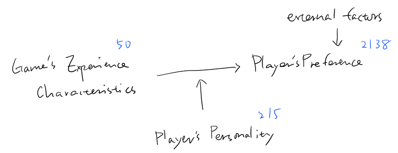
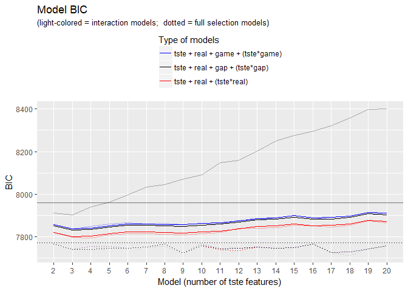
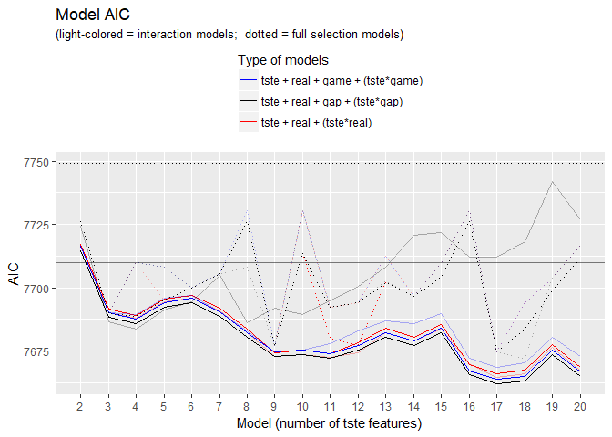

MAPSS Thesis II - model 1
================
Chih-Yu Chiang
September 05, 2017

-   [Setup](#setup)
-   [Variable](#variable)
-   [Model specification](#model-specification)
-   [Double Lasso selection](#double-lasso-selection)
-   [Simple linear models](#simple-linear-models)
-   [Information criteria](#information-criteria)
    -   [preference ~ tste + personality + (interaction)](#preference-tste-personality-interaction)
    -   [(link for the above position)](#link-for-the-above-position)
-   [Model summaries (Lasso select only interactions)](#model-summaries-lasso-select-only-interactions)
    -   [preference ~ tste + real](#preference-tste-real)
    -   [(link for the above position)](#link-for-the-above-position-1)
    -   [preference ~ tste + real + real\*tste](#preference-tste-real-realtste)
    -   [(link for the above position)](#link-for-the-above-position-2)
    -   [preference ~ tste + real + game](#preference-tste-real-game)
    -   [(link for the above position)](#link-for-the-above-position-3)
    -   [preference ~ tste + real + game + game\*tste](#preference-tste-real-game-gametste)
    -   [(link for the above position)](#link-for-the-above-position-4)
    -   [preference ~ tste + real + gap](#preference-tste-real-gap)
    -   [(link for the above position)](#link-for-the-above-position-5)
    -   [preference ~ tste + real + gap + gap\*tste](#preference-tste-real-gap-gaptste)
    -   [(link for the above position)](#link-for-the-above-position-6)
-   [Model summaries (Lasso select all variables)](#model-summaries-lasso-select-all-variables)
    -   [preference ~ tste + real](#preference-tste-real-1)
    -   [(link for the above position)](#link-for-the-above-position-7)
    -   [preference ~ tste + real + real\*tste](#preference-tste-real-realtste-1)
    -   [(link for the above position)](#link-for-the-above-position-8)
    -   [preference ~ tste + real + game](#preference-tste-real-game-1)
    -   [(link for the above position)](#link-for-the-above-position-9)
    -   [preference ~ tste + real + game + game\*tste](#preference-tste-real-game-gametste-1)
    -   [(link for the above position)](#link-for-the-above-position-10)
    -   [preference ~ tste + real + gap](#preference-tste-real-gap-1)
    -   [(link for the above position)](#link-for-the-above-position-11)
    -   [preference ~ tste + real + gap + gap\*tste](#preference-tste-real-gap-gaptste-1)
    -   [(link for the above position)](#link-for-the-above-position-12)
-   [Model summaries (traditional genres as predictors)](#model-summaries-traditional-genres-as-predictors)
    -   [preference ~ traditional genres (not selected)](#preference-traditional-genres-not-selected)
    -   [(link for the above position)](#link-for-the-above-position-13)
    -   [preference ~ traditional genres (selected)](#preference-traditional-genres-selected)
    -   [(link for the above position)](#link-for-the-above-position-14)

``` r
knitr::opts_chunk$set(
    message=FALSE,
    warning=FALSE
)

#Prevent result wrapping
options(width=120)
```

Setup
-----

Data of game and player are read in and matched up.

-   Game release data, `release` (year), is read in as an interval variable.
-   Missing values are imputed with variable mean conveniently (`star_user` and `star_GS`).

``` r
#--Package
library(tidyverse)
library(data.table)
library(corrplot)
library(modelr)
library(glmnet)
library(VGAM)
library(randomForest)
library(e1071)
library(car)
library(rlist)
library(pander)
set.seed(1)


#--Read in
#Core game info and group distance/probability data
core_cluster <- read_csv("../data/core_cluster.csv", col_names=TRUE) %>%
  mutate(group_survey = factor(group_survey),
         group_review = factor(group_review),
         core_id = factor(core_id)) %>%
  select(-X1)

#Core game tste scores (of dif numbers of features)
core_tsteScore <- read_csv("../data/tste_concat.csv", col_names=TRUE) %>%
  select(-X1)

#Core game traditional genre data
core_tGenre <- read_csv("../data/traditional_genre.csv", col_names=TRUE) %>%
  select(-X1, -group, -idTag, -game_title) %>%
  mutate(core_id = factor(core_id))
colnames(core_tGenre)[3:length(colnames(core_tGenre))] <- #Give genre columns identification
  unlist(lapply(X=colnames(core_tGenre)[3:length(colnames(core_tGenre))], function(X) {paste("tg_", X, sep="")}))

#Player-related survey data
survey <- read_csv("../data/survey.csv", col_names=TRUE) %>%
  mutate(race = factor(race),
         sex = factor(sex),
         core_id = factor(core_id)) %>%
  select(-id)


#--Impute missing with mean
imputation_mean <- function(c){
  c[is.na(c)] <- mean(c, na.rm=TRUE)
  return(c)
}
core_cluster <- mutate_each(core_cluster,
                            funs(imputation_mean(.)),
                            star_user, star_GS)


#--Match up
#Main df, key=player-game pair
df <- bind_cols(core_cluster, core_tsteScore) %>%
  left_join(core_tGenre, by=c("core_id")) %>%
  left_join(survey, by=c("core_id"), copy=FALSE)
```

Variable
--------

Compute and select variables to be used in models.

-   Final response variable utilizes only `preference_3`.
-   Mean-centered vars is marked with a suffix \_ct.

-   Player preference:

| Name           | Definition                 | Unit                        |
|----------------|----------------------------|-----------------------------|
| `preference_1` | how much do you like       | Likert 1-7=like             |
| `preference_2` | how often play it          | ordinary 1=never-7=everyday |
| `preference_3` | does it fit personal taste | Likert 1-7=fit              |

-   Game characteristics:

<table style="width:36%;">
<colgroup>
<col width="8%" />
<col width="18%" />
<col width="9%" />
</colgroup>
<thead>
<tr class="header">
<th>Name</th>
<th>Definition</th>
<th>Unit</th>
</tr>
</thead>
<tbody>
<tr class="odd">
<td><code>distance_survey_mean_x</code></td>
<td>group score from survey (distance from group mean in tste)</td>
<td>cosine distance</td>
</tr>
<tr class="even">
<td><code>distance_survey_median_x</code></td>
<td>group score from survey (distance from group median in tste)</td>
<td>cosine distance</td>
</tr>
<tr class="odd">
<td><code>probability_review_mean_x</code></td>
<td>group score from review (mean probability to be categorized in the group by NN)</td>
<td>percentage</td>
</tr>
<tr class="even">
<td><code>probability_review_median_x</code></td>
<td>group score from review (median probability to be categorized in the group by NN)</td>
<td>percentage</td>
</tr>
<tr class="odd">
<td><code>group_survey</code></td>
<td>group identity from survey</td>
<td>categorical 1-group number</td>
</tr>
<tr class="even">
<td><code>group_review</code></td>
<td>group identity from review</td>
<td>categorical 1-group number</td>
</tr>
<tr class="odd">
<td><code>tste_n_x</code></td>
<td>group score from survey (tste), n=number of features</td>
<td>interval arbitrary</td>
</tr>
<tr class="even">
<td><code>tg_x</code></td>
<td>if belongs to traditional genre categories</td>
<td>binary</td>
</tr>
</tbody>
</table>

-   Player personality:

<table style="width:36%;">
<colgroup>
<col width="8%" />
<col width="18%" />
<col width="9%" />
</colgroup>
<thead>
<tr class="header">
<th>Name</th>
<th>Definition</th>
<th>Unit</th>
</tr>
</thead>
<tbody>
<tr class="odd">
<td><code>game_xxxxx</code></td>
<td>Big-five personality in game</td>
<td>Likert 1-7</td>
</tr>
<tr class="even">
<td><code>real_xxxxx</code></td>
<td>Big-five personality in real life</td>
<td>Likert 1-7</td>
</tr>
<tr class="odd">
<td><code>gap_xxxxx</code></td>
<td>personality gap (game - real)</td>
<td>Likert 1-7</td>
</tr>
<tr class="even">
<td><code>satis_xxxxx</code></td>
<td>SDT satisfaction in real life</td>
<td>Likert 1-7</td>
</tr>
<tr class="odd">
<td><code>dissatis_xxxxx</code></td>
<td>SDT dissatisfaction in real life</td>
<td>Likert 1-7</td>
</tr>
<tr class="even">
<td><code>combined_xxxxx</code></td>
<td>SDT combined (previous two) dissatisfaction in real life</td>
<td>Likert 1-7</td>
</tr>
</tbody>
</table>

-   Control:

| Name        | Definition                                    | Unit                      |
|-------------|-----------------------------------------------|---------------------------|
| `age`       | player age                                    | interval                  |
| `education` | player education                              | ordinary 1-7=PhD          |
| `income`    | player annual household income                | ordinary 1-7=over 150,000 |
| `sex`       | player sex                                    | categorical 1=male        |
| `race`      | player race                                   | categorical 1-5           |
| `release`   | game release year                             | interval year             |
| `star_GS`   | general game quality rated by GameSpot expert | interval 0-10             |
| `star_user` | general game quality rated by GameSpot user   | interval 0-10             |

``` r
updateVars <- function(df.outcome="preference", df_player.outcome="game_extraversion"){
  #--Create response variable
  df <<- df %>%
    rowwise() %>% #Rowwise to make the ordinary functions work
    mutate(preference = mean(c(preference_3))) %>%
    ungroup() #Ungroup to cancel rowwise
  

  #--Mean-center predictor variables
  df <<- mutate_at(df, vars(starts_with("tste"),
                            starts_with("game"),
                            starts_with("real"),
                            starts_with("satis"),
                            starts_with("dissatis"),
                            starts_with("combined")), funs(ct = . - mean(.)))


  #--Compute personalty gap
  df <<- mutate(df,
                gap_extraversion = game_extraversion - real_extraversion,
                gap_agreeableness = game_agreeableness - real_agreeableness,
                gap_conscientiousness = game_conscientiousness - real_conscientiousness,
                gap_emotionstability = game_emotionstability - real_emotionstability,
                gap_openness = game_openness - real_openness,
                gap_sum = gap_extraversion + gap_agreeableness + gap_conscientiousness + (-gap_emotionstability) + gap_openness,
                real_sum = real_extraversion + real_agreeableness + real_conscientiousness + (-real_emotionstability) + real_openness,
                dissatis_sum = dissatis_autonomy + dissatis_relatedness + dissatis_competence,
                satis_sum = satis_autonomy + satis_relatedness + satis_competence,
                combined_sum = combined_autonomy + combined_relatedness + combined_competence
                )

  
  #--Acquire player df, key=player
  df_player <<- distinct(df, respondent, .keep_all=TRUE)
  
  
  #--Select variables to be included in regression (model formation)
  #Sets of predictor variables from file
  df_predictors <- read.csv("../data/vars/predictors.csv", header=TRUE, na.strings="")

  #Get column name as model id
  modelId <- colnames(df_predictors)
  
  #predictor variable as strings for each model
  predictorString <- apply(df_predictors, MARGIN=2, function(x) paste(na.omit(x), collapse="+"))
  
  #Make the dfs into a data frame
  dfs <<- data.frame(predictorString, row.names=modelId, stringsAsFactors=FALSE) %>%
    mutate(df_x = map(predictorString, ~ model.matrix(as.formula(paste(df.outcome, " ~ ", .x, sep="")), data=df)[, -1])) %>% #df with only predictor variables; [, -1] used to remove redundant intercept column
    mutate(df_yx = map(df_x, ~ bind_cols(select(df, df.outcome), data.frame(.x)))) #df also with outcome variables
  dfs_player <<- data.frame(predictorString, row.names=modelId, stringsAsFactors=FALSE) %>%
    mutate(df_x = map(predictorString, ~ model.matrix(as.formula(paste(df_player.outcome, " ~ ", .x, sep="")), data=df_player)[, -1])) %>% #df with only predictor variables; [, -1] used to remove redundant intercept column
    mutate(df_yx = map(df_x, ~ bind_cols(select(df_player, df_player.outcome), data.frame(.x)))) #df also with outcome variables
  
  #Set row names for reference
  row.names(dfs) <<- modelId
  row.names(dfs_player) <<- modelId
}
```

Model specification
-------------------



-   preference measurement = "how much does it fit taste?"

Double Lasso selection
----------------------

-   Based on paper `Using Double-Lasso Selection for Principled Variable Selection`
-   by Oleg Urminsky, Christian Hansen, and Victor Chernozhukov

``` r
#--Function for updating lambda used in selection
#n = number of observation; p = number of independent variables; se = standard error of residual or dependent variable
updateLambda <- function(n, p, se) {se * (1.1 / sqrt(n)) * qnorm(1 - (.1 / log(n)) / (2 * p))}


#--Function for acquiring the indices of the selected variables in df_x
#df_x = matrix with only variables to be tested; y = dependent variable or treatment variables; lambda = the initial lambda computed in advance 
acquireBetaIndices <- function(df_x, y, lambda, n, p) {
  #Update lambda k times, k is selected based on literature
  k <- 1
  while(k < 15) {
    model_las <- glmnet(x=df_x, y=y, alpha=1, lambda=lambda, standardize=TRUE)
    beta <- coef(model_las)
    residual.se <- sd(y - predict(model_las, df_x))
    lambda <- updateLambda(n=n, p=p, se=residual.se)
    k <- k + 1
  }
  
  #Return the variable indices with absolute value of beta > 0
  return(which(abs(beta) > 0))
}


#--Function to perform double lasso selection
#df_yx = df with all variables; outcomeVar = string of the outcome var in the df; form = a switch to decide the test and treatment vars
#output = a new df_yx with variables selected from df_yx
lassoSelect <- function(df_yx, outcomeVar, form) {
  #--Setting up
  #The df with y and treatment variables (those vars will not be tested, and will always be included in the output df)
  df_ytreatment <- switch(form,
                          "1"=select(df_yx, matches(outcomeVar), matches("^real.+\\D_ct$"), matches("^game.+\\D_ct$"), matches("^gap.+[a-z]{4}$"), matches("^tste.+\\d_ct$")),
                          "2"=select(df_yx, matches(outcomeVar)),
                          "3"=select(df_yx, matches(outcomeVar), matches(sub("game", "real", outcomeVar))))

  #The df with only the variables to be tested (those vars will be tested, and not necessarily be included in the output df)
  df_test <- switch(form,
                    "1"=data.matrix(select(df_yx, -matches(outcomeVar), -matches("^real.+\\D_ct$"), -matches("^game.+\\D_ct$"), -matches("^gap.+[a-z]{4}$"), -matches("^tste.+\\d_ct$"))),
                    "2"=data.matrix(select(df_yx, -matches(outcomeVar))),
                    "3"=data.matrix(select(df_yx, -matches(outcomeVar), -matches(sub("game", "real", outcomeVar)))))
  
  #The number of observations
  n <- nrow(df_test)
  
  #The number of variables to be tested
  p <- ncol(df_test)
  
  
  #--Select vars that predict outcome
  #Lambda is initialized as the se of residuals of a simple linear using only treatments predicting dependent variable
  #If the treatment var is NULL, use the se pf dependent var to initiate
  residual.se <- if(ncol(df_ytreatment) == 1) {sd(df_yx[[outcomeVar]])} else {sd(residuals(lm(as.formula(paste(outcomeVar, " ~ .", sep="")), data=df_ytreatment)))}
  lambda <- updateLambda(n=n, p=p, se=residual.se)
  
  #by Lasso model: dependent variable ~ test variables
  betaIndices <- acquireBetaIndices(df_x=df_test, y=df_yx[[outcomeVar]], lambda=lambda, n=n, p=p)
  
  
  #--Select vars that predict treatments
  #Each column of the treatment variables as the y in the Lasso selection
  #Starting from 2 because 1 is the dependent variable
  if(ncol(df_ytreatment) != 1) { #Run only when treatment vars not NULL
    for(i in seq(2, ncol(df_ytreatment))) {
      #Acquire target treatment variable
      treatment <- df_ytreatment[[i]]
      
      #Lambda is initialized as the se of the target treatment variable
      treatment.se <- sd(treatment)
      lambda <- updateLambda(n=n, p=p, se=treatment.se)
      
      #Acquire the indices and union the result indices of each treatment variable
      betaIndices <- union(betaIndices, acquireBetaIndices(df_x=df_test, y=treatment, lambda=lambda, n=n, p=p))
    }
  }
  
  
  #Process the result indices to remove the first term (the interaction term)
  betaIndices <- setdiff((betaIndices - 1), 0)
  
  #Bind the selected variables with dependent and treatment variables
  df_yx_selected <- cbind(df_ytreatment, df_test[, betaIndices])
  
  #Return a new df_yx with variables selected
  return(df_yx_selected)
}


#--Update vars
updateVars(df.outcome="preference")

df_c <- mutate(df,
               c_age = age,
               c_education = education,
               c_income = income,
               c_race = race,
               c_sex = sex,
               c_release = release,
               c_star = star_user,
               c_starGS = star_GS)


#--Use the function to acquire the selected dfs (the new dfs can be fed into the simple linear model)
dfs$df_yx_selected_1 <- map(dfs$df_yx, ~ lassoSelect(., outcomeVar="preference", form="1"))
dfs$df_yx_selected_2 <- map(dfs$df_yx, ~ lassoSelect(., outcomeVar="preference", form="2"))

df_c_selected <- lassoSelect(select(df_c, preference, starts_with("c_"), starts_with("tg_")), outcomeVar="preference", form="2")
```

Simple linear models
--------------------

``` r
dfs$model_lm_1 <- map(dfs$df_yx_selected_1, ~ lm(preference ~ ., data=.x))
dfs$model_lm_2 <- map(dfs$df_yx_selected_2, ~ lm(preference ~ ., data=.x))
model_tGenre_selected <- lm(preference ~ ., data=df_c_selected)
model_tGenre <- lm(preference ~ ., data=select(df_c, preference, starts_with("c_"), starts_with("tg_")))
```

Information criteria
--------------------

### preference ~ tste + personality + (interaction)

### (link for the above position)

``` r
#--BIC
BIC_tGenre <- BIC(model_tGenre)
BIC_tGenre_selected <- BIC(model_tGenre_selected)
dfs$BIC_1 <- unlist(map(dfs$model_lm_1, BIC))
dfs$BIC_2 <- unlist(map(dfs$model_lm_2, BIC))

#Seperate batch models from dfs
dfs_real <- slice(dfs, 1:19)
dfs_realI <- slice(dfs, 20:38)
dfs_game <- slice(dfs, 39:57)
dfs_gameI <- slice(dfs, 58:76)
dfs_gap <- slice(dfs, 77:95)
dfs_gapI <- slice(dfs, 96:114)

#Batch models
ggplot() +
  geom_hline(yintercept=BIC_tGenre_selected, linetype="dotted") +
  geom_hline(yintercept=BIC_tGenre, alpha=0.5) +
  geom_line(data=dfs_real, mapping=aes(seq(1, dim(dfs_real)[1]), BIC_1, color="r")) +
  geom_line(data=dfs_realI, mapping=aes(seq(1, dim(dfs_realI)[1]), BIC_1, color="r"), alpha=0.3) +
  geom_line(data=dfs_game, mapping=aes(seq(1, dim(dfs_game)[1]), BIC_1, color="g")) +
  geom_line(data=dfs_gameI, mapping=aes(seq(1, dim(dfs_gameI)[1]), BIC_1, color="g"), alpha=0.3) +
  geom_line(data=dfs_gap, mapping=aes(seq(1, dim(dfs_gap)[1]), BIC_1, color="p")) +
  geom_line(data=dfs_gapI, mapping=aes(seq(1, dim(dfs_gapI)[1]), BIC_1, color="p"), alpha=0.3) +
  geom_line(data=dfs_real, mapping=aes(seq(1, dim(dfs_real)[1]), BIC_2, color="r"), linetype="dotted") +
  geom_line(data=dfs_realI, mapping=aes(seq(1, dim(dfs_realI)[1]), BIC_2, color="r"), alpha=0.3, linetype="dotted") +
  geom_line(data=dfs_game, mapping=aes(seq(1, dim(dfs_game)[1]), BIC_2, color="g"), linetype="dotted") +
  geom_line(data=dfs_gameI, mapping=aes(seq(1, dim(dfs_gameI)[1]), BIC_2, color="g"), alpha=0.3, linetype="dotted") +
  geom_line(data=dfs_gap, mapping=aes(seq(1, dim(dfs_gap)[1]), BIC_2, color="p"), linetype="dotted") +
  geom_line(data=dfs_gapI, mapping=aes(seq(1, dim(dfs_gapI)[1]), BIC_2, color="p"), alpha=0.3, linetype="dotted") +
  labs(x="Model (number of tste features)", y="BIC", title="Model BIC", subtitle="(light-colored = interaction models;  dotted = full selection models)") +
  theme(legend.position="top", legend.direction="vertical") +
  scale_x_continuous(breaks=seq(1, dim(dfs_gap)[1]), minor_breaks=NULL, labels=seq(2, 20)) +
  scale_color_manual(name="Type of models", values=c("r"="red", "g"="blue", "p"="black"),
                     labels=c("r"="tste + real + (tste*real)",
                              "g"="tste + real + game + (tste*game)",
                              "p"="tste + real + gap + (tste*gap)"))
```



``` r
#--AIC
AIC_tGenre <- AIC(model_tGenre)
AIC_tGenre_selected <- AIC(model_tGenre_selected)
dfs$AIC_1 <- unlist(map(dfs$model_lm_1, AIC))
dfs$AIC_2 <- unlist(map(dfs$model_lm_2, AIC))

#Seperate batch models from dfs
dfs_real <- slice(dfs, 1:19)
dfs_realI <- slice(dfs, 20:38)
dfs_game <- slice(dfs, 39:57)
dfs_gameI <- slice(dfs, 58:76)
dfs_gap <- slice(dfs, 77:95)
dfs_gapI <- slice(dfs, 96:114)

#Batch models
ggplot() +
  geom_hline(yintercept=AIC_tGenre_selected, linetype="dotted") +
  geom_hline(yintercept=AIC_tGenre, alpha=0.5) +
  geom_line(data=dfs_real, mapping=aes(seq(1, dim(dfs_real)[1]), AIC_1, color="r")) +
  geom_line(data=dfs_realI, mapping=aes(seq(1, dim(dfs_realI)[1]), AIC_1, color="r"), alpha=0.3) +
  geom_line(data=dfs_game, mapping=aes(seq(1, dim(dfs_game)[1]), AIC_1, color="g")) +
  geom_line(data=dfs_gameI, mapping=aes(seq(1, dim(dfs_gameI)[1]), AIC_1, color="g"), alpha=0.3) +
  geom_line(data=dfs_gap, mapping=aes(seq(1, dim(dfs_gap)[1]), AIC_1, color="p")) +
  geom_line(data=dfs_gapI, mapping=aes(seq(1, dim(dfs_gapI)[1]), AIC_1, color="p"), alpha=0.3) +
  geom_line(data=dfs_real, mapping=aes(seq(1, dim(dfs_real)[1]), AIC_2, color="r"), linetype="dotted") +
  geom_line(data=dfs_realI, mapping=aes(seq(1, dim(dfs_realI)[1]), AIC_2, color="r"), alpha=0.3, linetype="dotted") +
  geom_line(data=dfs_game, mapping=aes(seq(1, dim(dfs_game)[1]), AIC_2, color="g"), linetype="dotted") +
  geom_line(data=dfs_gameI, mapping=aes(seq(1, dim(dfs_gameI)[1]), AIC_2, color="g"), alpha=0.3, linetype="dotted") +
  geom_line(data=dfs_gap, mapping=aes(seq(1, dim(dfs_gap)[1]), AIC_2, color="p"), linetype="dotted") +
  geom_line(data=dfs_gapI, mapping=aes(seq(1, dim(dfs_gapI)[1]), AIC_2, color="p"), alpha=0.3, linetype="dotted") +
  labs(x="Model (number of tste features)", y="AIC", title="Model AIC", subtitle="(light-colored = interaction models;  dotted = full selection models)") +
  theme(legend.position="top", legend.direction="vertical") +
  scale_x_continuous(breaks=seq(1, dim(dfs_gap)[1]), minor_breaks=NULL, labels=seq(2, 20)) +
  scale_color_manual(name="Type of models", values=c("r"="red", "g"="blue", "p"="black"),
                     labels=c("r"="tste + real + (tste*real)",
                              "g"="tste + real + game + (tste*game)",
                              "p"="tste + real + gap + (tste*gap)"))
```



Model summaries (Lasso select only interactions)
------------------------------------------------

### preference ~ tste + real

### (link for the above position)

``` r
#Summary
for(model in slice(dfs, 1:19)$model_lm_1) print(summary(model))
```

    ## 
    ## Call:
    ## lm(formula = preference ~ ., data = .x)
    ## 
    ## Residuals:
    ##     Min      1Q  Median      3Q     Max 
    ## -5.0348 -0.6725  0.3111  1.0941  2.4464 
    ## 
    ## Coefficients:
    ##                            Estimate Std. Error t value Pr(>|t|)    
    ## (Intercept)               66.020798  14.150259   4.666 3.27e-06 ***
    ## real_extraversion_ct       0.049870   0.019884   2.508  0.01221 *  
    ## real_agreeableness_ct     -0.020132   0.027312  -0.737  0.46113    
    ## real_conscientiousness_ct  0.082197   0.029727   2.765  0.00574 ** 
    ## real_emotionstability_ct  -0.005470   0.029748  -0.184  0.85413    
    ## real_openness_ct           0.115378   0.024611   4.688 2.93e-06 ***
    ## tste_2_0_ct                0.093712   0.041299   2.269  0.02336 *  
    ## tste_2_1_ct               -0.067922   0.040265  -1.687  0.09177 .  
    ## release                   -0.030051   0.006959  -4.318 1.65e-05 ***
    ## education                  0.011783   0.026425   0.446  0.65572    
    ## income                     0.006074   0.016838   0.361  0.71835    
    ## race7                     -0.106437   0.134508  -0.791  0.42886    
    ## sex2                      -0.118691   0.071679  -1.656  0.09790 .  
    ## age                       -0.014417   0.004579  -3.148  0.00166 ** 
    ## race4                     -0.253304   0.141835  -1.786  0.07426 .  
    ## star_user                  0.010435   0.057911   0.180  0.85702    
    ## star_GS                    0.012172   0.048042   0.253  0.80001    
    ## ---
    ## Signif. codes:  0 '***' 0.001 '**' 0.01 '*' 0.05 '.' 0.1 ' ' 1
    ## 
    ## Residual standard error: 1.464 on 2121 degrees of freedom
    ## Multiple R-squared:  0.05656,    Adjusted R-squared:  0.04944 
    ## F-statistic: 7.948 on 16 and 2121 DF,  p-value: < 2.2e-16
    ## 
    ## 
    ## Call:
    ## lm(formula = preference ~ ., data = .x)
    ## 
    ## Residuals:
    ##     Min      1Q  Median      3Q     Max 
    ## -4.9208 -0.6847  0.3094  1.0708  2.5200 
    ## 
    ## Coefficients:
    ##                            Estimate Std. Error t value Pr(>|t|)    
    ## (Intercept)               60.395597  14.104801   4.282 1.94e-05 ***
    ## real_extraversion_ct       0.048667   0.019760   2.463  0.01386 *  
    ## real_agreeableness_ct     -0.020529   0.027143  -0.756  0.44955    
    ## real_conscientiousness_ct  0.082296   0.029542   2.786  0.00539 ** 
    ## real_emotionstability_ct  -0.002979   0.029563  -0.101  0.91974    
    ## real_openness_ct           0.117257   0.024459   4.794 1.75e-06 ***
    ## tste_3_0_ct               -0.046175   0.043421  -1.063  0.28771    
    ## tste_3_1_ct                0.147235   0.035306   4.170 3.17e-05 ***
    ## tste_3_2_ct                0.242562   0.049424   4.908 9.92e-07 ***
    ## release                   -0.027391   0.006936  -3.949 8.11e-05 ***
    ## education                  0.009879   0.026263   0.376  0.70684    
    ## income                     0.007499   0.016736   0.448  0.65414    
    ## race7                     -0.121491   0.133698  -0.909  0.36361    
    ## sex2                      -0.109390   0.071247  -1.535  0.12485    
    ## age                       -0.014225   0.004551  -3.126  0.00180 ** 
    ## race4                     -0.228271   0.141037  -1.619  0.10570    
    ## star_user                  0.009845   0.057664   0.171  0.86445    
    ## star_GS                    0.045619   0.048481   0.941  0.34683    
    ## ---
    ## Signif. codes:  0 '***' 0.001 '**' 0.01 '*' 0.05 '.' 0.1 ' ' 1
    ## 
    ## Residual standard error: 1.455 on 2120 degrees of freedom
    ## Multiple R-squared:  0.06871,    Adjusted R-squared:  0.06124 
    ## F-statistic:   9.2 on 17 and 2120 DF,  p-value: < 2.2e-16
    ## 
    ## 
    ## Call:
    ## lm(formula = preference ~ ., data = .x)
    ## 
    ## Residuals:
    ##     Min      1Q  Median      3Q     Max 
    ## -4.9740 -0.6758  0.3134  1.0672  2.6001 
    ## 
    ## Coefficients:
    ##                            Estimate Std. Error t value Pr(>|t|)    
    ## (Intercept)               64.667993  14.462435   4.471 8.18e-06 ***
    ## real_extraversion_ct       0.048522   0.019746   2.457  0.01408 *  
    ## real_agreeableness_ct     -0.019396   0.027142  -0.715  0.47493    
    ## real_conscientiousness_ct  0.082561   0.029520   2.797  0.00521 ** 
    ## real_emotionstability_ct  -0.002648   0.029551  -0.090  0.92861    
    ## real_openness_ct           0.117704   0.024456   4.813 1.59e-06 ***
    ## tste_4_0_ct                0.257674   0.050030   5.150 2.84e-07 ***
    ## tste_4_1_ct                0.047486   0.056564   0.840  0.40127    
    ## tste_4_2_ct                0.055241   0.041533   1.330  0.18364    
    ## tste_4_3_ct               -0.160210   0.039345  -4.072 4.83e-05 ***
    ## release                   -0.029454   0.007109  -4.143 3.56e-05 ***
    ## education                  0.009583   0.026243   0.365  0.71502    
    ## income                     0.007026   0.016722   0.420  0.67441    
    ## race7                     -0.120644   0.133587  -0.903  0.36657    
    ## sex2                      -0.106493   0.071216  -1.495  0.13497    
    ## age                       -0.014023   0.004552  -3.081  0.00209 ** 
    ## race4                     -0.226296   0.140954  -1.605  0.10854    
    ## star_GS                    0.078692   0.052685   1.494  0.13542    
    ## star_user                 -0.039025   0.064681  -0.603  0.54634    
    ## ---
    ## Signif. codes:  0 '***' 0.001 '**' 0.01 '*' 0.05 '.' 0.1 ' ' 1
    ## 
    ## Residual standard error: 1.454 on 2119 degrees of freedom
    ## Multiple R-squared:  0.07067,    Adjusted R-squared:  0.06278 
    ## F-statistic: 8.952 on 18 and 2119 DF,  p-value: < 2.2e-16
    ## 
    ## 
    ## Call:
    ## lm(formula = preference ~ ., data = .x)
    ## 
    ## Residuals:
    ##     Min      1Q  Median      3Q     Max 
    ## -4.9524 -0.6800  0.3048  1.0724  2.5821 
    ## 
    ## Coefficients:
    ##                            Estimate Std. Error t value Pr(>|t|)    
    ## (Intercept)               53.229131  14.757534   3.607 0.000317 ***
    ## real_extraversion_ct       0.050516   0.019775   2.555 0.010703 *  
    ## real_agreeableness_ct     -0.019287   0.027177  -0.710 0.477980    
    ## real_conscientiousness_ct  0.082991   0.029556   2.808 0.005031 ** 
    ## real_emotionstability_ct  -0.003045   0.029586  -0.103 0.918037    
    ## real_openness_ct           0.116256   0.024498   4.746 2.22e-06 ***
    ## tste_5_0_ct                0.227376   0.047002   4.838 1.41e-06 ***
    ## tste_5_1_ct               -0.157447   0.052023  -3.026 0.002504 ** 
    ## tste_5_2_ct               -0.026395   0.040861  -0.646 0.518357    
    ## tste_5_3_ct               -0.088613   0.050674  -1.749 0.080491 .  
    ## tste_5_4_ct                0.060688   0.052833   1.149 0.250823    
    ## release                   -0.023752   0.007254  -3.274 0.001077 ** 
    ## education                  0.010035   0.026283   0.382 0.702631    
    ## income                     0.008172   0.016752   0.488 0.625699    
    ## race7                     -0.116605   0.133768  -0.872 0.383472    
    ## sex2                      -0.113600   0.071316  -1.593 0.111327    
    ## age                       -0.014159   0.004558  -3.106 0.001919 ** 
    ## race4                     -0.230771   0.141129  -1.635 0.102162    
    ## star_user                 -0.023157   0.067121  -0.345 0.730127    
    ## star_GS                    0.061741   0.053583   1.152 0.249349    
    ## ---
    ## Signif. codes:  0 '***' 0.001 '**' 0.01 '*' 0.05 '.' 0.1 ' ' 1
    ## 
    ## Residual standard error: 1.456 on 2118 degrees of freedom
    ## Multiple R-squared:  0.06871,    Adjusted R-squared:  0.06035 
    ## F-statistic: 8.224 on 19 and 2118 DF,  p-value: < 2.2e-16
    ## 
    ## 
    ## Call:
    ## lm(formula = preference ~ ., data = .x)
    ## 
    ## Residuals:
    ##     Min      1Q  Median      3Q     Max 
    ## -5.0205 -0.6804  0.2994  1.0717  2.5816 
    ## 
    ## Coefficients:
    ##                            Estimate Std. Error t value Pr(>|t|)    
    ## (Intercept)               52.029434  14.908399   3.490 0.000493 ***
    ## real_extraversion_ct       0.051343   0.019782   2.595 0.009511 ** 
    ## real_agreeableness_ct     -0.020842   0.027189  -0.767 0.443433    
    ## real_conscientiousness_ct  0.081902   0.029564   2.770 0.005648 ** 
    ## real_emotionstability_ct  -0.002377   0.029590  -0.080 0.935989    
    ## real_openness_ct           0.118062   0.024489   4.821 1.53e-06 ***
    ## tste_6_0_ct                0.054307   0.052709   1.030 0.302981    
    ## tste_6_1_ct               -0.112686   0.050521  -2.230 0.025820 *  
    ## tste_6_2_ct                0.240263   0.043474   5.527 3.67e-08 ***
    ## tste_6_3_ct                0.005949   0.053125   0.112 0.910850    
    ## tste_6_4_ct                0.109831   0.047585   2.308 0.021089 *  
    ## tste_6_5_ct                0.087693   0.055721   1.574 0.115688    
    ## release                   -0.023106   0.007329  -3.153 0.001641 ** 
    ## education                  0.009406   0.026288   0.358 0.720531    
    ## income                     0.008663   0.016757   0.517 0.605238    
    ## race7                     -0.110697   0.133845  -0.827 0.408301    
    ## sex2                      -0.110837   0.071336  -1.554 0.120399    
    ## age                       -0.014030   0.004559  -3.077 0.002114 ** 
    ## race4                     -0.225211   0.141168  -1.595 0.110785    
    ## star_user                 -0.041818   0.069568  -0.601 0.547836    
    ## star_GS                    0.068110   0.054614   1.247 0.212490    
    ## ---
    ## Signif. codes:  0 '***' 0.001 '**' 0.01 '*' 0.05 '.' 0.1 ' ' 1
    ## 
    ## Residual standard error: 1.456 on 2117 degrees of freedom
    ## Multiple R-squared:  0.0689, Adjusted R-squared:  0.0601 
    ## F-statistic: 7.833 on 20 and 2117 DF,  p-value: < 2.2e-16
    ## 
    ## 
    ## Call:
    ## lm(formula = preference ~ ., data = .x)
    ## 
    ## Residuals:
    ##     Min      1Q  Median      3Q     Max 
    ## -4.9457 -0.6826  0.3002  1.0710  2.6037 
    ## 
    ## Coefficients:
    ##                            Estimate Std. Error t value Pr(>|t|)    
    ## (Intercept)               54.956965  15.190731   3.618 0.000304 ***
    ## real_extraversion_ct       0.050226   0.019766   2.541 0.011125 *  
    ## real_agreeableness_ct     -0.017798   0.027171  -0.655 0.512508    
    ## real_conscientiousness_ct  0.082010   0.029530   2.777 0.005532 ** 
    ## real_emotionstability_ct  -0.003426   0.029562  -0.116 0.907743    
    ## real_openness_ct           0.116097   0.024458   4.747 2.21e-06 ***
    ## tste_7_0_ct               -0.179734   0.048052  -3.740 0.000189 ***
    ## tste_7_1_ct                0.023625   0.051759   0.456 0.648128    
    ## tste_7_2_ct               -0.162046   0.051136  -3.169 0.001552 ** 
    ## tste_7_3_ct               -0.199906   0.038913  -5.137 3.04e-07 ***
    ## tste_7_4_ct                0.006779   0.052723   0.129 0.897703    
    ## tste_7_5_ct                0.020373   0.056315   0.362 0.717563    
    ## tste_7_6_ct                0.039116   0.059848   0.654 0.513450    
    ## release                   -0.024638   0.007476  -3.296 0.000999 ***
    ## education                  0.010283   0.026259   0.392 0.695386    
    ## income                     0.008019   0.016737   0.479 0.631896    
    ## race7                     -0.110440   0.133612  -0.827 0.408572    
    ## sex2                      -0.114355   0.071244  -1.605 0.108619    
    ## age                       -0.013831   0.004553  -3.038 0.002414 ** 
    ## race4                     -0.221101   0.141012  -1.568 0.117042    
    ## star_user                 -0.024075   0.070359  -0.342 0.732256    
    ## star_GS                    0.067299   0.052901   1.272 0.203454    
    ## ---
    ## Signif. codes:  0 '***' 0.001 '**' 0.01 '*' 0.05 '.' 0.1 ' ' 1
    ## 
    ## Residual standard error: 1.454 on 2116 degrees of freedom
    ## Multiple R-squared:  0.07198,    Adjusted R-squared:  0.06277 
    ## F-statistic: 7.816 on 21 and 2116 DF,  p-value: < 2.2e-16
    ## 
    ## 
    ## Call:
    ## lm(formula = preference ~ ., data = .x)
    ## 
    ## Residuals:
    ##     Min      1Q  Median      3Q     Max 
    ## -5.0904 -0.6878  0.3012  1.0624  2.7608 
    ## 
    ## Coefficients:
    ##                            Estimate Std. Error t value Pr(>|t|)    
    ## (Intercept)               61.326122  15.899991   3.857 0.000118 ***
    ## real_extraversion_ct       0.050722   0.019737   2.570 0.010242 *  
    ## real_agreeableness_ct     -0.016511   0.027108  -0.609 0.542540    
    ## real_conscientiousness_ct  0.082243   0.029479   2.790 0.005321 ** 
    ## real_emotionstability_ct  -0.003322   0.029508  -0.113 0.910380    
    ## real_openness_ct           0.116620   0.024411   4.777  1.9e-06 ***
    ## tste_8_0_ct               -0.197242   0.050880  -3.877 0.000109 ***
    ## tste_8_1_ct                0.209196   0.057443   3.642 0.000277 ***
    ## tste_8_2_ct                0.096629   0.050818   1.901 0.057377 .  
    ## tste_8_3_ct                0.082796   0.047579   1.740 0.081975 .  
    ## tste_8_4_ct                0.135866   0.052335   2.596 0.009494 ** 
    ## tste_8_5_ct                0.086241   0.049434   1.745 0.081204 .  
    ## tste_8_6_ct               -0.117893   0.052976  -2.225 0.026160 *  
    ## tste_8_7_ct               -0.049688   0.051929  -0.957 0.338749    
    ## release                   -0.027679   0.007825  -3.537 0.000413 ***
    ## education                  0.010718   0.026200   0.409 0.682516    
    ## income                     0.008032   0.016698   0.481 0.630538    
    ## race7                     -0.097277   0.133380  -0.729 0.465883    
    ## sex2                      -0.116747   0.071045  -1.643 0.100474    
    ## age                       -0.013714   0.004545  -3.018 0.002578 ** 
    ## race4                     -0.207925   0.140747  -1.477 0.139744    
    ## star_user                 -0.083275   0.070766  -1.177 0.239423    
    ## star_GS                    0.094508   0.055066   1.716 0.086261 .  
    ## ---
    ## Signif. codes:  0 '***' 0.001 '**' 0.01 '*' 0.05 '.' 0.1 ' ' 1
    ## 
    ## Residual standard error: 1.451 on 2115 degrees of freedom
    ## Multiple R-squared:  0.07644,    Adjusted R-squared:  0.06683 
    ## F-statistic: 7.957 on 22 and 2115 DF,  p-value: < 2.2e-16
    ## 
    ## 
    ## Call:
    ## lm(formula = preference ~ ., data = .x)
    ## 
    ## Residuals:
    ##     Min      1Q  Median      3Q     Max 
    ## -5.0190 -0.6757  0.2917  1.0755  2.8952 
    ## 
    ## Coefficients:
    ##                            Estimate Std. Error t value Pr(>|t|)    
    ## (Intercept)               62.722261  16.016841   3.916 9.29e-05 ***
    ## real_extraversion_ct       0.053307   0.019690   2.707 0.006838 ** 
    ## real_agreeableness_ct     -0.020460   0.027037  -0.757 0.449304    
    ## real_conscientiousness_ct  0.081492   0.029406   2.771 0.005634 ** 
    ## real_emotionstability_ct  -0.002377   0.029437  -0.081 0.935661    
    ## real_openness_ct           0.112788   0.024364   4.629 3.89e-06 ***
    ## tste_9_0_ct               -0.163571   0.053318  -3.068 0.002184 ** 
    ## tste_9_1_ct                0.045045   0.050700   0.888 0.374389    
    ## tste_9_2_ct               -0.349392   0.052254  -6.686 2.92e-11 ***
    ## tste_9_3_ct               -0.053423   0.057594  -0.928 0.353734    
    ## tste_9_4_ct               -0.012551   0.043762  -0.287 0.774291    
    ## tste_9_5_ct                0.029229   0.057487   0.508 0.611189    
    ## tste_9_6_ct               -0.009107   0.051363  -0.177 0.859292    
    ## tste_9_7_ct               -0.064710   0.052922  -1.223 0.221567    
    ## tste_9_8_ct                0.082622   0.046997   1.758 0.078888 .  
    ## release                   -0.028520   0.007873  -3.622 0.000299 ***
    ## education                  0.008743   0.026138   0.334 0.738048    
    ## income                     0.012116   0.016693   0.726 0.468014    
    ## race7                     -0.087280   0.133149  -0.656 0.512216    
    ## sex2                      -0.108645   0.070922  -1.532 0.125697    
    ## age                       -0.013994   0.004532  -3.088 0.002044 ** 
    ## race4                     -0.211707   0.140409  -1.508 0.131760    
    ## star_user                 -0.082244   0.071362  -1.152 0.249253    
    ## star_GS                    0.127678   0.055897   2.284 0.022460 *  
    ## ---
    ## Signif. codes:  0 '***' 0.001 '**' 0.01 '*' 0.05 '.' 0.1 ' ' 1
    ## 
    ## Residual standard error: 1.447 on 2114 degrees of freedom
    ## Multiple R-squared:  0.08132,    Adjusted R-squared:  0.07132 
    ## F-statistic: 8.136 on 23 and 2114 DF,  p-value: < 2.2e-16
    ## 
    ## 
    ## Call:
    ## lm(formula = preference ~ ., data = .x)
    ## 
    ## Residuals:
    ##     Min      1Q  Median      3Q     Max 
    ## -4.9899 -0.6737  0.2848  1.0536  2.6112 
    ## 
    ## Coefficients:
    ##                            Estimate Std. Error t value Pr(>|t|)    
    ## (Intercept)               62.656376  15.818012   3.961 7.71e-05 ***
    ## real_extraversion_ct       0.051994   0.019691   2.641 0.008338 ** 
    ## real_agreeableness_ct     -0.018524   0.027047  -0.685 0.493488    
    ## real_conscientiousness_ct  0.081095   0.029418   2.757 0.005890 ** 
    ## real_emotionstability_ct  -0.003581   0.029434  -0.122 0.903171    
    ## real_openness_ct           0.113204   0.024367   4.646 3.60e-06 ***
    ## tste_10_0_ct              -0.051246   0.045762  -1.120 0.262913    
    ## tste_10_1_ct               0.190319   0.050577   3.763 0.000172 ***
    ## tste_10_2_ct              -0.199185   0.052336  -3.806 0.000145 ***
    ## tste_10_3_ct              -0.178200   0.054227  -3.286 0.001032 ** 
    ## tste_10_4_ct              -0.057742   0.053190  -1.086 0.277786    
    ## tste_10_5_ct              -0.023701   0.053952  -0.439 0.660487    
    ## tste_10_6_ct              -0.139314   0.052191  -2.669 0.007659 ** 
    ## tste_10_7_ct               0.107195   0.045255   2.369 0.017940 *  
    ## tste_10_8_ct               0.031426   0.059595   0.527 0.598024    
    ## tste_10_9_ct               0.128267   0.050485   2.541 0.011134 *  
    ## release                   -0.028551   0.007789  -3.666 0.000253 ***
    ## education                  0.008389   0.026138   0.321 0.748285    
    ## income                     0.010463   0.016671   0.628 0.530326    
    ## race7                     -0.089783   0.133169  -0.674 0.500255    
    ## sex2                      -0.105555   0.070978  -1.487 0.137125    
    ## age                       -0.014047   0.004534  -3.098 0.001975 ** 
    ## race4                     -0.211407   0.140415  -1.506 0.132324    
    ## star_user                 -0.056851   0.070596  -0.805 0.420736    
    ## star_GS                    0.118750   0.055928   2.123 0.033847 *  
    ## ---
    ## Signif. codes:  0 '***' 0.001 '**' 0.01 '*' 0.05 '.' 0.1 ' ' 1
    ## 
    ## Residual standard error: 1.447 on 2113 degrees of freedom
    ## Multiple R-squared:  0.08181,    Adjusted R-squared:  0.07138 
    ## F-statistic: 7.845 on 24 and 2113 DF,  p-value: < 2.2e-16
    ## 
    ## 
    ## Call:
    ## lm(formula = preference ~ ., data = .x)
    ## 
    ## Residuals:
    ##     Min      1Q  Median      3Q     Max 
    ## -5.0007 -0.6693  0.2879  1.0456  2.6875 
    ## 
    ## Coefficients:
    ##                            Estimate Std. Error t value Pr(>|t|)    
    ## (Intercept)               64.780081  16.041404   4.038 5.58e-05 ***
    ## real_extraversion_ct       0.052971   0.019693   2.690 0.007205 ** 
    ## real_agreeableness_ct     -0.017988   0.027049  -0.665 0.506105    
    ## real_conscientiousness_ct  0.080136   0.029433   2.723 0.006530 ** 
    ## real_emotionstability_ct  -0.003637   0.029427  -0.124 0.901648    
    ## real_openness_ct           0.111933   0.024363   4.594 4.59e-06 ***
    ## tste_11_0_ct              -0.046947   0.056072  -0.837 0.402541    
    ## tste_11_1_ct               0.058382   0.052392   1.114 0.265266    
    ## tste_11_2_ct              -0.085054   0.046583  -1.826 0.068013 .  
    ## tste_11_3_ct               0.008164   0.056967   0.143 0.886065    
    ## tste_11_4_ct              -0.166075   0.057519  -2.887 0.003925 ** 
    ## tste_11_5_ct              -0.109098   0.050194  -2.174 0.029853 *  
    ## tste_11_6_ct               0.159325   0.049155   3.241 0.001208 ** 
    ## tste_11_7_ct               0.100044   0.056557   1.769 0.077055 .  
    ## tste_11_8_ct              -0.201874   0.042132  -4.791 1.77e-06 ***
    ## tste_11_9_ct               0.170557   0.049932   3.416 0.000648 ***
    ## tste_11_10_ct              0.069817   0.054726   1.276 0.202183    
    ## release                   -0.029664   0.007898  -3.756 0.000177 ***
    ## education                  0.009336   0.026126   0.357 0.720880    
    ## income                     0.011275   0.016684   0.676 0.499233    
    ## race7                     -0.097307   0.133068  -0.731 0.464705    
    ## sex2                      -0.104821   0.071014  -1.476 0.140077    
    ## age                       -0.013985   0.004531  -3.086 0.002054 ** 
    ## race4                     -0.208979   0.140363  -1.489 0.136679    
    ## star_user                 -0.081820   0.072082  -1.135 0.256467    
    ## star_GS                    0.156039   0.057371   2.720 0.006585 ** 
    ## ---
    ## Signif. codes:  0 '***' 0.001 '**' 0.01 '*' 0.05 '.' 0.1 ' ' 1
    ## 
    ## Residual standard error: 1.447 on 2112 degrees of freedom
    ## Multiple R-squared:  0.0832, Adjusted R-squared:  0.07235 
    ## F-statistic: 7.667 on 25 and 2112 DF,  p-value: < 2.2e-16
    ## 
    ## 
    ## Call:
    ## lm(formula = preference ~ ., data = .x)
    ## 
    ## Residuals:
    ##     Min      1Q  Median      3Q     Max 
    ## -5.0002 -0.6811  0.2961  1.0528  2.6441 
    ## 
    ## Coefficients:
    ##                            Estimate Std. Error t value Pr(>|t|)    
    ## (Intercept)               52.750086  16.409136   3.215  0.00133 ** 
    ## real_extraversion_ct       0.052932   0.019720   2.684  0.00733 ** 
    ## real_agreeableness_ct     -0.017538   0.027065  -0.648  0.51706    
    ## real_conscientiousness_ct  0.079164   0.029455   2.688  0.00725 ** 
    ## real_emotionstability_ct  -0.002634   0.029458  -0.089  0.92877    
    ## real_openness_ct           0.114072   0.024361   4.683 3.01e-06 ***
    ## tste_12_0_ct               0.155808   0.060299   2.584  0.00983 ** 
    ## tste_12_1_ct               0.066280   0.050940   1.301  0.19335    
    ## tste_12_2_ct               0.057483   0.048574   1.183  0.23678    
    ## tste_12_3_ct              -0.002140   0.054920  -0.039  0.96892    
    ## tste_12_4_ct              -0.078478   0.050993  -1.539  0.12395    
    ## tste_12_5_ct               0.120766   0.054735   2.206  0.02746 *  
    ## tste_12_6_ct              -0.052868   0.055914  -0.946  0.34451    
    ## tste_12_7_ct               0.044918   0.053335   0.842  0.39978    
    ## tste_12_8_ct               0.161858   0.049126   3.295  0.00100 ** 
    ## tste_12_9_ct              -0.056146   0.051380  -1.093  0.27463    
    ## tste_12_10_ct              0.193045   0.045247   4.266 2.07e-05 ***
    ## tste_12_11_ct             -0.198482   0.048386  -4.102 4.25e-05 ***
    ## release                   -0.023953   0.008063  -2.971  0.00301 ** 
    ## education                  0.009817   0.026143   0.376  0.70732    
    ## income                     0.010615   0.016689   0.636  0.52481    
    ## race7                     -0.090322   0.133323  -0.677  0.49818    
    ## sex2                      -0.103571   0.071051  -1.458  0.14508    
    ## age                       -0.013832   0.004539  -3.047  0.00234 ** 
    ## race4                     -0.213429   0.140508  -1.519  0.12892    
    ## star_user                 -0.046058   0.072130  -0.639  0.52319    
    ## star_GS                    0.186873   0.060403   3.094  0.00200 ** 
    ## ---
    ## Signif. codes:  0 '***' 0.001 '**' 0.01 '*' 0.05 '.' 0.1 ' ' 1
    ## 
    ## Residual standard error: 1.448 on 2111 degrees of freedom
    ## Multiple R-squared:  0.08231,    Adjusted R-squared:  0.07101 
    ## F-statistic: 7.282 on 26 and 2111 DF,  p-value: < 2.2e-16
    ## 
    ## 
    ## Call:
    ## lm(formula = preference ~ ., data = .x)
    ## 
    ## Residuals:
    ##     Min      1Q  Median      3Q     Max 
    ## -5.2269 -0.6817  0.2974  1.0553  2.8096 
    ## 
    ## Coefficients:
    ##                            Estimate Std. Error t value Pr(>|t|)    
    ## (Intercept)               52.488407  16.794383   3.125 0.001800 ** 
    ## real_extraversion_ct       0.052148   0.019737   2.642 0.008298 ** 
    ## real_agreeableness_ct     -0.015264   0.027111  -0.563 0.573467    
    ## real_conscientiousness_ct  0.084491   0.029457   2.868 0.004168 ** 
    ## real_emotionstability_ct  -0.002434   0.029490  -0.083 0.934223    
    ## real_openness_ct           0.113536   0.024389   4.655 3.44e-06 ***
    ## tste_13_0_ct               0.012906   0.050504   0.256 0.798330    
    ## tste_13_1_ct              -0.096275   0.046677  -2.063 0.039274 *  
    ## tste_13_2_ct               0.193564   0.052018   3.721 0.000204 ***
    ## tste_13_3_ct               0.060022   0.050255   1.194 0.232478    
    ## tste_13_4_ct              -0.102500   0.053001  -1.934 0.053256 .  
    ## tste_13_5_ct               0.122697   0.051950   2.362 0.018275 *  
    ## tste_13_6_ct              -0.007364   0.055799  -0.132 0.895024    
    ## tste_13_7_ct              -0.068292   0.050777  -1.345 0.178791    
    ## tste_13_8_ct               0.084535   0.046700   1.810 0.070410 .  
    ## tste_13_9_ct               0.145842   0.056071   2.601 0.009359 ** 
    ## tste_13_10_ct              0.166370   0.048594   3.424 0.000630 ***
    ## tste_13_11_ct              0.107989   0.054183   1.993 0.046385 *  
    ## tste_13_12_ct              0.054678   0.051775   1.056 0.291054    
    ## release                   -0.023615   0.008248  -2.863 0.004237 ** 
    ## education                  0.011991   0.026176   0.458 0.646937    
    ## income                     0.008070   0.016694   0.483 0.628864    
    ## race7                     -0.092325   0.133464  -0.692 0.489164    
    ## sex2                      -0.114374   0.071173  -1.607 0.108208    
    ## age                       -0.013751   0.004547  -3.024 0.002523 ** 
    ## race4                     -0.205010   0.140678  -1.457 0.145181    
    ## star_user                 -0.087248   0.071541  -1.220 0.222771    
    ## star_GS                    0.179014   0.059428   3.012 0.002624 ** 
    ## ---
    ## Signif. codes:  0 '***' 0.001 '**' 0.01 '*' 0.05 '.' 0.1 ' ' 1
    ## 
    ## Residual standard error: 1.449 on 2110 degrees of freedom
    ## Multiple R-squared:  0.08067,    Adjusted R-squared:  0.0689 
    ## F-statistic: 6.857 on 27 and 2110 DF,  p-value: < 2.2e-16
    ## 
    ## 
    ## Call:
    ## lm(formula = preference ~ ., data = .x)
    ## 
    ## Residuals:
    ##     Min      1Q  Median      3Q     Max 
    ## -5.2121 -0.6793  0.2957  1.0541  2.7256 
    ## 
    ## Coefficients:
    ##                             Estimate Std. Error t value Pr(>|t|)    
    ## (Intercept)               46.7829980 16.7326413   2.796  0.00522 ** 
    ## real_extraversion_ct       0.0545510  0.0197468   2.763  0.00579 ** 
    ## real_agreeableness_ct     -0.0158554  0.0270917  -0.585  0.55844    
    ## real_conscientiousness_ct  0.0808687  0.0294569   2.745  0.00610 ** 
    ## real_emotionstability_ct  -0.0031912  0.0294518  -0.108  0.91373    
    ## real_openness_ct           0.1131936  0.0243632   4.646 3.59e-06 ***
    ## tste_14_0_ct              -0.1018784  0.0513820  -1.983  0.04752 *  
    ## tste_14_1_ct              -0.0009821  0.0516151  -0.019  0.98482    
    ## tste_14_2_ct               0.0488363  0.0474917   1.028  0.30392    
    ## tste_14_3_ct               0.1164986  0.0464031   2.511  0.01213 *  
    ## tste_14_4_ct               0.0259343  0.0433865   0.598  0.55007    
    ## tste_14_5_ct              -0.0399329  0.0539840  -0.740  0.45955    
    ## tste_14_6_ct               0.0256146  0.0508626   0.504  0.61459    
    ## tste_14_7_ct              -0.2559280  0.0593836  -4.310 1.71e-05 ***
    ## tste_14_8_ct               0.1587335  0.0453928   3.497  0.00048 ***
    ## tste_14_9_ct              -0.0193628  0.0514863  -0.376  0.70690    
    ## tste_14_10_ct              0.1080083  0.0493442   2.189  0.02872 *  
    ## tste_14_11_ct             -0.0558130  0.0490311  -1.138  0.25512    
    ## tste_14_12_ct              0.0858530  0.0515617   1.665  0.09605 .  
    ## tste_14_13_ct              0.1148703  0.0521724   2.202  0.02779 *  
    ## release                   -0.0209428  0.0082275  -2.545  0.01098 *  
    ## education                  0.0085783  0.0261767   0.328  0.74317    
    ## income                     0.0093125  0.0166782   0.558  0.57665    
    ## race7                     -0.1038399  0.1333762  -0.779  0.43633    
    ## sex2                      -0.1069909  0.0711667  -1.503  0.13289    
    ## age                       -0.0133286  0.0045431  -2.934  0.00338 ** 
    ## race4                     -0.2024618  0.1405240  -1.441  0.14980    
    ## star_user                 -0.0387656  0.0719136  -0.539  0.58990    
    ## star_GS                    0.1701810  0.0595395   2.858  0.00430 ** 
    ## ---
    ## Signif. codes:  0 '***' 0.001 '**' 0.01 '*' 0.05 '.' 0.1 ' ' 1
    ## 
    ## Residual standard error: 1.448 on 2109 degrees of freedom
    ## Multiple R-squared:  0.08298,    Adjusted R-squared:  0.0708 
    ## F-statistic: 6.816 on 28 and 2109 DF,  p-value: < 2.2e-16
    ## 
    ## 
    ## Call:
    ## lm(formula = preference ~ ., data = .x)
    ## 
    ## Residuals:
    ##     Min      1Q  Median      3Q     Max 
    ## -5.2041 -0.6701  0.2999  1.0689  2.7768 
    ## 
    ## Coefficients:
    ##                             Estimate Std. Error t value Pr(>|t|)    
    ## (Intercept)               54.0392971 17.7029180   3.053 0.002297 ** 
    ## real_extraversion_ct       0.0537739  0.0197609   2.721 0.006558 ** 
    ## real_agreeableness_ct     -0.0179377  0.0271104  -0.662 0.508267    
    ## real_conscientiousness_ct  0.0823543  0.0294785   2.794 0.005258 ** 
    ## real_emotionstability_ct  -0.0009003  0.0295162  -0.031 0.975670    
    ## real_openness_ct           0.1143406  0.0243839   4.689 2.92e-06 ***
    ## tste_15_0_ct              -0.0607561  0.0479768  -1.266 0.205523    
    ## tste_15_1_ct              -0.1201470  0.0536875  -2.238 0.025332 *  
    ## tste_15_2_ct               0.1582373  0.0485340   3.260 0.001131 ** 
    ## tste_15_3_ct               0.0939135  0.0525302   1.788 0.073952 .  
    ## tste_15_4_ct               0.0075642  0.0469277   0.161 0.871960    
    ## tste_15_5_ct              -0.0724169  0.0537018  -1.348 0.177642    
    ## tste_15_6_ct              -0.1150501  0.0466060  -2.469 0.013644 *  
    ## tste_15_7_ct              -0.0651654  0.0516730  -1.261 0.207409    
    ## tste_15_8_ct              -0.1237063  0.0539890  -2.291 0.022043 *  
    ## tste_15_9_ct               0.0310879  0.0510998   0.608 0.543003    
    ## tste_15_10_ct              0.0476698  0.0532412   0.895 0.370699    
    ## tste_15_11_ct              0.1828548  0.0542628   3.370 0.000766 ***
    ## tste_15_12_ct             -0.0470656  0.0381418  -1.234 0.217354    
    ## tste_15_13_ct              0.0289127  0.0444327   0.651 0.515306    
    ## tste_15_14_ct              0.0494408  0.0468974   1.054 0.291898    
    ## release                   -0.0243103  0.0086941  -2.796 0.005218 ** 
    ## education                  0.0087924  0.0261966   0.336 0.737182    
    ## income                     0.0091706  0.0167061   0.549 0.583106    
    ## race7                     -0.0941948  0.1334443  -0.706 0.480345    
    ## sex2                      -0.1103023  0.0712293  -1.549 0.121640    
    ## age                       -0.0134130  0.0045458  -2.951 0.003206 ** 
    ## race4                     -0.2017048  0.1406568  -1.434 0.151714    
    ## star_user                 -0.0694327  0.0755886  -0.919 0.358431    
    ## star_GS                    0.1420998  0.0602685   2.358 0.018476 *  
    ## ---
    ## Signif. codes:  0 '***' 0.001 '**' 0.01 '*' 0.05 '.' 0.1 ' ' 1
    ## 
    ## Residual standard error: 1.449 on 2108 degrees of freedom
    ## Multiple R-squared:  0.08178,    Adjusted R-squared:  0.06915 
    ## F-statistic: 6.474 on 29 and 2108 DF,  p-value: < 2.2e-16
    ## 
    ## 
    ## Call:
    ## lm(formula = preference ~ ., data = .x)
    ## 
    ## Residuals:
    ##     Min      1Q  Median      3Q     Max 
    ## -5.0614 -0.6824  0.2825  1.0531  2.7635 
    ## 
    ## Coefficients:
    ##                            Estimate Std. Error t value Pr(>|t|)    
    ## (Intercept)               36.746557  17.684858   2.078 0.037844 *  
    ## real_extraversion_ct       0.056214   0.019698   2.854 0.004362 ** 
    ## real_agreeableness_ct     -0.020406   0.027010  -0.755 0.450039    
    ## real_conscientiousness_ct  0.082241   0.029351   2.802 0.005125 ** 
    ## real_emotionstability_ct   0.005238   0.029415   0.178 0.858678    
    ## real_openness_ct           0.113403   0.024294   4.668 3.23e-06 ***
    ## tste_16_0_ct               0.175210   0.048650   3.601 0.000324 ***
    ## tste_16_1_ct              -0.096230   0.049843  -1.931 0.053661 .  
    ## tste_16_2_ct              -0.053569   0.044938  -1.192 0.233377    
    ## tste_16_3_ct              -0.159419   0.050498  -3.157 0.001617 ** 
    ## tste_16_4_ct              -0.171458   0.041254  -4.156 3.37e-05 ***
    ## tste_16_5_ct               0.104794   0.048234   2.173 0.029920 *  
    ## tste_16_6_ct               0.102791   0.044084   2.332 0.019809 *  
    ## tste_16_7_ct               0.075396   0.044625   1.690 0.091262 .  
    ## tste_16_8_ct              -0.057069   0.051954  -1.098 0.272134    
    ## tste_16_9_ct               0.154129   0.044648   3.452 0.000567 ***
    ## tste_16_10_ct             -0.076377   0.044035  -1.734 0.082982 .  
    ## tste_16_11_ct              0.146011   0.050159   2.911 0.003641 ** 
    ## tste_16_12_ct              0.077388   0.046136   1.677 0.093614 .  
    ## tste_16_13_ct              0.056759   0.049735   1.141 0.253899    
    ## tste_16_14_ct              0.114459   0.046286   2.473 0.013482 *  
    ## tste_16_15_ct             -0.010936   0.050148  -0.218 0.827391    
    ## release                   -0.015761   0.008689  -1.814 0.069819 .  
    ## education                  0.007860   0.026088   0.301 0.763229    
    ## income                     0.012653   0.016662   0.759 0.447678    
    ## race7                     -0.094310   0.133042  -0.709 0.478481    
    ## sex2                      -0.113285   0.070893  -1.598 0.110197    
    ## age                       -0.012244   0.004539  -2.698 0.007037 ** 
    ## race4                     -0.196670   0.140159  -1.403 0.160706    
    ## star_user                 -0.064189   0.072306  -0.888 0.374784    
    ## star_GS                    0.146518   0.058459   2.506 0.012273 *  
    ## ---
    ## Signif. codes:  0 '***' 0.001 '**' 0.01 '*' 0.05 '.' 0.1 ' ' 1
    ## 
    ## Residual standard error: 1.443 on 2107 degrees of freedom
    ## Multiple R-squared:  0.08934,    Adjusted R-squared:  0.07637 
    ## F-statistic:  6.89 on 30 and 2107 DF,  p-value: < 2.2e-16
    ## 
    ## 
    ## Call:
    ## lm(formula = preference ~ ., data = .x)
    ## 
    ## Residuals:
    ##     Min      1Q  Median      3Q     Max 
    ## -5.2745 -0.6863  0.2794  1.0469  2.8083 
    ## 
    ## Coefficients:
    ##                            Estimate Std. Error t value Pr(>|t|)    
    ## (Intercept)               39.276357  18.229468   2.155  0.03131 *  
    ## real_extraversion_ct       0.055263   0.019672   2.809  0.00501 ** 
    ## real_agreeableness_ct     -0.016013   0.026999  -0.593  0.55317    
    ## real_conscientiousness_ct  0.082540   0.029326   2.815  0.00493 ** 
    ## real_emotionstability_ct   0.002664   0.029369   0.091  0.92773    
    ## real_openness_ct           0.113223   0.024275   4.664 3.29e-06 ***
    ## tste_17_0_ct               0.311334   0.048963   6.359 2.49e-10 ***
    ## tste_17_1_ct               0.060808   0.041889   1.452  0.14675    
    ## tste_17_2_ct              -0.069730   0.049951  -1.396  0.16287    
    ## tste_17_3_ct               0.051812   0.047708   1.086  0.27759    
    ## tste_17_4_ct               0.091830   0.050184   1.830  0.06741 .  
    ## tste_17_5_ct               0.017211   0.046766   0.368  0.71289    
    ## tste_17_6_ct              -0.052457   0.049127  -1.068  0.28574    
    ## tste_17_7_ct               0.091017   0.043153   2.109  0.03505 *  
    ## tste_17_8_ct              -0.068926   0.047909  -1.439  0.15039    
    ## tste_17_9_ct              -0.099666   0.046219  -2.156  0.03116 *  
    ## tste_17_10_ct              0.091547   0.042486   2.155  0.03129 *  
    ## tste_17_11_ct              0.032133   0.046794   0.687  0.49236    
    ## tste_17_12_ct             -0.170429   0.042865  -3.976 7.25e-05 ***
    ## tste_17_13_ct              0.091894   0.049132   1.870  0.06157 .  
    ## tste_17_14_ct              0.024589   0.043302   0.568  0.57019    
    ## tste_17_15_ct             -0.038835   0.055954  -0.694  0.48773    
    ## tste_17_16_ct             -0.044482   0.042777  -1.040  0.29853    
    ## release                   -0.017076   0.008931  -1.912  0.05602 .  
    ## education                  0.009049   0.026062   0.347  0.72847    
    ## income                     0.012606   0.016637   0.758  0.44871    
    ## race7                     -0.085681   0.132926  -0.645  0.51927    
    ## sex2                      -0.116675   0.070805  -1.648  0.09953 .  
    ## age                       -0.012252   0.004539  -2.699  0.00700 ** 
    ## race4                     -0.205172   0.140046  -1.465  0.14306    
    ## star_user                 -0.077555   0.076696  -1.011  0.31204    
    ## star_GS                    0.172627   0.060236   2.866  0.00420 ** 
    ## ---
    ## Signif. codes:  0 '***' 0.001 '**' 0.01 '*' 0.05 '.' 0.1 ' ' 1
    ## 
    ## Residual standard error: 1.442 on 2106 degrees of freedom
    ## Multiple R-squared:  0.09168,    Adjusted R-squared:  0.07831 
    ## F-statistic: 6.857 on 31 and 2106 DF,  p-value: < 2.2e-16
    ## 
    ## 
    ## Call:
    ## lm(formula = preference ~ ., data = .x)
    ## 
    ## Residuals:
    ##     Min      1Q  Median      3Q     Max 
    ## -5.1389 -0.6761  0.2919  1.0455  2.6344 
    ## 
    ## Coefficients:
    ##                             Estimate Std. Error t value Pr(>|t|)    
    ## (Intercept)               48.5389870 18.0254833   2.693 0.007142 ** 
    ## real_extraversion_ct       0.0529702  0.0196728   2.693 0.007147 ** 
    ## real_agreeableness_ct     -0.0154407  0.0269949  -0.572 0.567392    
    ## real_conscientiousness_ct  0.0813017  0.0293458   2.770 0.005647 ** 
    ## real_emotionstability_ct  -0.0004716  0.0293885  -0.016 0.987199    
    ## real_openness_ct           0.1124602  0.0242768   4.632 3.84e-06 ***
    ## tste_18_0_ct              -0.1253975  0.0460791  -2.721 0.006555 ** 
    ## tste_18_1_ct               0.1606469  0.0480062   3.346 0.000833 ***
    ## tste_18_2_ct              -0.0191744  0.0435853  -0.440 0.660034    
    ## tste_18_3_ct              -0.0188349  0.0468075  -0.402 0.687437    
    ## tste_18_4_ct               0.0792089  0.0510870   1.550 0.121179    
    ## tste_18_5_ct              -0.0337542  0.0479667  -0.704 0.481697    
    ## tste_18_6_ct              -0.0036025  0.0503400  -0.072 0.942956    
    ## tste_18_7_ct              -0.0532483  0.0432540  -1.231 0.218438    
    ## tste_18_8_ct               0.0770615  0.0470449   1.638 0.101563    
    ## tste_18_9_ct              -0.1335173  0.0477663  -2.795 0.005234 ** 
    ## tste_18_10_ct              0.0810639  0.0458629   1.768 0.077285 .  
    ## tste_18_11_ct              0.0615010  0.0451330   1.363 0.173135    
    ## tste_18_12_ct             -0.0820410  0.0474992  -1.727 0.084277 .  
    ## tste_18_13_ct             -0.0312338  0.0467492  -0.668 0.504135    
    ## tste_18_14_ct              0.0436704  0.0507679   0.860 0.389778    
    ## tste_18_15_ct              0.1657439  0.0584856   2.834 0.004642 ** 
    ## tste_18_16_ct             -0.2908596  0.0513840  -5.661 1.72e-08 ***
    ## tste_18_17_ct              0.0488670  0.0456690   1.070 0.284731    
    ## release                   -0.0213390  0.0088468  -2.412 0.015948 *  
    ## education                  0.0089339  0.0260598   0.343 0.731766    
    ## income                     0.0123265  0.0166451   0.741 0.459052    
    ## race7                     -0.0944184  0.1328917  -0.710 0.477478    
    ## sex2                      -0.1097774  0.0708745  -1.549 0.121557    
    ## age                       -0.0122133  0.0045401  -2.690 0.007200 ** 
    ## race4                     -0.2021885  0.1400572  -1.444 0.148996    
    ## star_user                 -0.0799959  0.0770785  -1.038 0.299459    
    ## star_GS                    0.0908449  0.0609494   1.490 0.136243    
    ## ---
    ## Signif. codes:  0 '***' 0.001 '**' 0.01 '*' 0.05 '.' 0.1 ' ' 1
    ## 
    ## Residual standard error: 1.442 on 2105 degrees of freedom
    ## Multiple R-squared:  0.09194,    Adjusted R-squared:  0.07813 
    ## F-statistic:  6.66 on 32 and 2105 DF,  p-value: < 2.2e-16
    ## 
    ## 
    ## Call:
    ## lm(formula = preference ~ ., data = .x)
    ## 
    ## Residuals:
    ##     Min      1Q  Median      3Q     Max 
    ## -5.2052 -0.6748  0.2721  1.0641  2.6855 
    ## 
    ## Coefficients:
    ##                             Estimate Std. Error t value Pr(>|t|)    
    ## (Intercept)                4.119e+01  1.845e+01   2.232 0.025725 *  
    ## real_extraversion_ct       5.550e-02  1.974e-02   2.812 0.004975 ** 
    ## real_agreeableness_ct     -1.563e-02  2.708e-02  -0.577 0.563748    
    ## real_conscientiousness_ct  8.292e-02  2.944e-02   2.817 0.004897 ** 
    ## real_emotionstability_ct   3.404e-03  2.951e-02   0.115 0.908171    
    ## real_openness_ct           1.152e-01  2.433e-02   4.733 2.36e-06 ***
    ## tste_19_0_ct              -2.755e-05  4.816e-02  -0.001 0.999544    
    ## tste_19_1_ct               6.508e-02  5.029e-02   1.294 0.195779    
    ## tste_19_2_ct               2.948e-02  4.894e-02   0.602 0.546967    
    ## tste_19_3_ct              -1.161e-01  4.648e-02  -2.497 0.012596 *  
    ## tste_19_4_ct              -1.022e-01  4.904e-02  -2.083 0.037342 *  
    ## tste_19_5_ct              -3.116e-02  5.345e-02  -0.583 0.559972    
    ## tste_19_6_ct               8.356e-02  4.779e-02   1.749 0.080504 .  
    ## tste_19_7_ct               1.169e-01  4.679e-02   2.497 0.012589 *  
    ## tste_19_8_ct               3.968e-02  4.685e-02   0.847 0.397112    
    ## tste_19_9_ct              -7.256e-02  5.020e-02  -1.445 0.148520    
    ## tste_19_10_ct              1.284e-01  4.787e-02   2.682 0.007386 ** 
    ## tste_19_11_ct              8.409e-02  4.484e-02   1.875 0.060882 .  
    ## tste_19_12_ct              2.274e-01  4.562e-02   4.984 6.74e-07 ***
    ## tste_19_13_ct             -8.065e-03  4.320e-02  -0.187 0.851934    
    ## tste_19_14_ct              1.705e-01  4.493e-02   3.794 0.000152 ***
    ## tste_19_15_ct              1.411e-03  4.417e-02   0.032 0.974510    
    ## tste_19_16_ct              2.394e-02  4.687e-02   0.511 0.609573    
    ## tste_19_17_ct              6.129e-02  5.299e-02   1.157 0.247569    
    ## tste_19_18_ct              5.728e-03  4.099e-02   0.140 0.888870    
    ## release                   -1.799e-02  9.059e-03  -1.985 0.047219 *  
    ## education                  8.878e-03  2.612e-02   0.340 0.733970    
    ## income                     1.289e-02  1.668e-02   0.773 0.439787    
    ## race7                     -9.032e-02  1.332e-01  -0.678 0.497835    
    ## sex2                      -1.120e-01  7.106e-02  -1.576 0.115083    
    ## age                       -1.211e-02  4.552e-03  -2.661 0.007845 ** 
    ## race4                     -2.079e-01  1.403e-01  -1.482 0.138550    
    ## star_user                 -3.182e-02  7.463e-02  -0.426 0.669880    
    ## star_GS                    1.159e-01  6.032e-02   1.921 0.054835 .  
    ## ---
    ## Signif. codes:  0 '***' 0.001 '**' 0.01 '*' 0.05 '.' 0.1 ' ' 1
    ## 
    ## Residual standard error: 1.445 on 2104 degrees of freedom
    ## Multiple R-squared:  0.08859,    Adjusted R-squared:  0.07429 
    ## F-statistic: 6.197 on 33 and 2104 DF,  p-value: < 2.2e-16
    ## 
    ## 
    ## Call:
    ## lm(formula = preference ~ ., data = .x)
    ## 
    ## Residuals:
    ##     Min      1Q  Median      3Q     Max 
    ## -5.0900 -0.7001  0.2725  1.0513  2.5624 
    ## 
    ## Coefficients:
    ##                            Estimate Std. Error t value Pr(>|t|)    
    ## (Intercept)               38.267599  19.273227   1.986 0.047215 *  
    ## real_extraversion_ct       0.056283   0.019688   2.859 0.004295 ** 
    ## real_agreeableness_ct     -0.016027   0.027022  -0.593 0.553167    
    ## real_conscientiousness_ct  0.083142   0.029358   2.832 0.004670 ** 
    ## real_emotionstability_ct   0.004922   0.029425   0.167 0.867180    
    ## real_openness_ct           0.113240   0.024278   4.664 3.29e-06 ***
    ## tste_20_0_ct               0.073186   0.053512   1.368 0.171565    
    ## tste_20_1_ct               0.081517   0.046508   1.753 0.079794 .  
    ## tste_20_2_ct               0.091538   0.042464   2.156 0.031223 *  
    ## tste_20_3_ct               0.149782   0.048695   3.076 0.002126 ** 
    ## tste_20_4_ct               0.039180   0.044320   0.884 0.376774    
    ## tste_20_5_ct              -0.069986   0.043830  -1.597 0.110467    
    ## tste_20_6_ct               0.032868   0.049504   0.664 0.506804    
    ## tste_20_7_ct               0.189757   0.054120   3.506 0.000464 ***
    ## tste_20_8_ct              -0.018680   0.053734  -0.348 0.728145    
    ## tste_20_9_ct               0.097618   0.044212   2.208 0.027353 *  
    ## tste_20_10_ct              0.060905   0.048051   1.268 0.205113    
    ## tste_20_11_ct             -0.124810   0.045674  -2.733 0.006336 ** 
    ## tste_20_12_ct              0.123766   0.046064   2.687 0.007271 ** 
    ## tste_20_13_ct              0.114236   0.050339   2.269 0.023350 *  
    ## tste_20_14_ct             -0.098558   0.041044  -2.401 0.016425 *  
    ## tste_20_15_ct              0.116171   0.053260   2.181 0.029279 *  
    ## tste_20_16_ct             -0.094723   0.046154  -2.052 0.040261 *  
    ## tste_20_17_ct              0.036167   0.044895   0.806 0.420570    
    ## tste_20_18_ct              0.139426   0.042645   3.269 0.001095 ** 
    ## tste_20_19_ct             -0.043242   0.048620  -0.889 0.373896    
    ## release                   -0.016450   0.009461  -1.739 0.082248 .  
    ## education                  0.009256   0.026061   0.355 0.722491    
    ## income                     0.012437   0.016644   0.747 0.454991    
    ## race7                     -0.091652   0.132929  -0.689 0.490594    
    ## sex2                      -0.104205   0.070946  -1.469 0.142040    
    ## age                       -0.011969   0.004543  -2.634 0.008490 ** 
    ## race4                     -0.192915   0.140085  -1.377 0.168618    
    ## star_user                 -0.011653   0.077955  -0.149 0.881184    
    ## star_GS                    0.075172   0.061260   1.227 0.219923    
    ## ---
    ## Signif. codes:  0 '***' 0.001 '**' 0.01 '*' 0.05 '.' 0.1 ' ' 1
    ## 
    ## Residual standard error: 1.442 on 2103 degrees of freedom
    ## Multiple R-squared:  0.09315,    Adjusted R-squared:  0.07849 
    ## F-statistic: 6.353 on 34 and 2103 DF,  p-value: < 2.2e-16

### preference ~ tste + real + real\*tste

### (link for the above position)

``` r
#Summary
for(model in slice(dfs, 20:38)$model_lm_1) print(summary(model))
```

    ## 
    ## Call:
    ## lm(formula = preference ~ ., data = .x)
    ## 
    ## Residuals:
    ##     Min      1Q  Median      3Q     Max 
    ## -5.0348 -0.6725  0.3111  1.0941  2.4464 
    ## 
    ## Coefficients:
    ##                            Estimate Std. Error t value Pr(>|t|)    
    ## (Intercept)               66.020798  14.150259   4.666 3.27e-06 ***
    ## real_extraversion_ct       0.049870   0.019884   2.508  0.01221 *  
    ## real_agreeableness_ct     -0.020132   0.027312  -0.737  0.46113    
    ## real_conscientiousness_ct  0.082197   0.029727   2.765  0.00574 ** 
    ## real_emotionstability_ct  -0.005470   0.029748  -0.184  0.85413    
    ## real_openness_ct           0.115378   0.024611   4.688 2.93e-06 ***
    ## tste_2_0_ct                0.093712   0.041299   2.269  0.02336 *  
    ## tste_2_1_ct               -0.067922   0.040265  -1.687  0.09177 .  
    ## release                   -0.030051   0.006959  -4.318 1.65e-05 ***
    ## education                  0.011783   0.026425   0.446  0.65572    
    ## income                     0.006074   0.016838   0.361  0.71835    
    ## race7                     -0.106437   0.134508  -0.791  0.42886    
    ## sex2                      -0.118691   0.071679  -1.656  0.09790 .  
    ## age                       -0.014417   0.004579  -3.148  0.00166 ** 
    ## race4                     -0.253304   0.141835  -1.786  0.07426 .  
    ## star_user                  0.010435   0.057911   0.180  0.85702    
    ## star_GS                    0.012172   0.048042   0.253  0.80001    
    ## ---
    ## Signif. codes:  0 '***' 0.001 '**' 0.01 '*' 0.05 '.' 0.1 ' ' 1
    ## 
    ## Residual standard error: 1.464 on 2121 degrees of freedom
    ## Multiple R-squared:  0.05656,    Adjusted R-squared:  0.04944 
    ## F-statistic: 7.948 on 16 and 2121 DF,  p-value: < 2.2e-16
    ## 
    ## 
    ## Call:
    ## lm(formula = preference ~ ., data = .x)
    ## 
    ## Residuals:
    ##     Min      1Q  Median      3Q     Max 
    ## -4.9283 -0.6896  0.3133  1.0744  2.5566 
    ## 
    ## Coefficients:
    ##                                   Estimate Std. Error t value Pr(>|t|)    
    ## (Intercept)                      61.026011  14.101324   4.328 1.58e-05 ***
    ## real_extraversion_ct              0.049796   0.019706   2.527  0.01158 *  
    ## real_agreeableness_ct            -0.018252   0.027108  -0.673  0.50082    
    ## real_conscientiousness_ct         0.082181   0.029518   2.784  0.00541 ** 
    ## real_emotionstability_ct         -0.003517   0.029546  -0.119  0.90526    
    ## real_openness_ct                  0.118824   0.024462   4.858 1.28e-06 ***
    ## tste_3_0_ct                      -0.046500   0.043401  -1.071  0.28411    
    ## tste_3_1_ct                       0.147101   0.035294   4.168 3.20e-05 ***
    ## tste_3_2_ct                       0.248364   0.049627   5.005 6.06e-07 ***
    ## release                          -0.027722   0.006934  -3.998 6.61e-05 ***
    ## education                         0.010633   0.026264   0.405  0.68563    
    ## income                            0.006630   0.016735   0.396  0.69200    
    ## age                              -0.014180   0.004546  -3.119  0.00184 ** 
    ## sex2                             -0.111142   0.071183  -1.561  0.11859    
    ## race4                            -0.215553   0.140933  -1.529  0.12629    
    ## star_user                         0.007302   0.057668   0.127  0.89925    
    ## star_GS                           0.051576   0.048590   1.061  0.28861    
    ## real_extraversion_ct.tste_3_2_ct -0.037749   0.026226  -1.439  0.15019    
    ## ---
    ## Signif. codes:  0 '***' 0.001 '**' 0.01 '*' 0.05 '.' 0.1 ' ' 1
    ## 
    ## Residual standard error: 1.455 on 2120 degrees of freedom
    ## Multiple R-squared:  0.06925,    Adjusted R-squared:  0.06179 
    ## F-statistic: 9.279 on 17 and 2120 DF,  p-value: < 2.2e-16
    ## 
    ## 
    ## Call:
    ## lm(formula = preference ~ ., data = .x)
    ## 
    ## Residuals:
    ##     Min      1Q  Median      3Q     Max 
    ## -4.9710 -0.6824  0.3096  1.0726  2.5981 
    ## 
    ## Coefficients:
    ##                            Estimate Std. Error t value Pr(>|t|)    
    ## (Intercept)               64.893424  14.459652   4.488 7.58e-06 ***
    ## real_extraversion_ct       0.049765   0.019697   2.527  0.01159 *  
    ## real_agreeableness_ct     -0.018128   0.027104  -0.669  0.50368    
    ## real_conscientiousness_ct  0.081513   0.029496   2.764  0.00577 ** 
    ## real_emotionstability_ct  -0.003293   0.029541  -0.111  0.91126    
    ## real_openness_ct           0.118085   0.024452   4.829 1.47e-06 ***
    ## tste_4_0_ct                0.256725   0.050017   5.133 3.12e-07 ***
    ## tste_4_1_ct                0.047372   0.056561   0.838  0.40239    
    ## tste_4_2_ct                0.054743   0.041527   1.318  0.18757    
    ## tste_4_3_ct               -0.161060   0.039332  -4.095 4.38e-05 ***
    ## release                   -0.029573   0.007108  -4.161 3.30e-05 ***
    ## education                  0.009025   0.026234   0.344  0.73087    
    ## income                     0.006796   0.016719   0.406  0.68444    
    ## age                       -0.013858   0.004548  -3.047  0.00234 ** 
    ## sex2                      -0.108767   0.071168  -1.528  0.12659    
    ## race4                     -0.220509   0.140802  -1.566  0.11748    
    ## star_GS                    0.079503   0.052675   1.509  0.13137    
    ## star_user                 -0.039320   0.064678  -0.608  0.54330    
    ## ---
    ## Signif. codes:  0 '***' 0.001 '**' 0.01 '*' 0.05 '.' 0.1 ' ' 1
    ## 
    ## Residual standard error: 1.454 on 2120 degrees of freedom
    ## Multiple R-squared:  0.07031,    Adjusted R-squared:  0.06286 
    ## F-statistic: 9.432 on 17 and 2120 DF,  p-value: < 2.2e-16
    ## 
    ## 
    ## Call:
    ## lm(formula = preference ~ ., data = .x)
    ## 
    ## Residuals:
    ##     Min      1Q  Median      3Q     Max 
    ## -4.9481 -0.6789  0.3101  1.0757  2.5805 
    ## 
    ## Coefficients:
    ##                            Estimate Std. Error t value Pr(>|t|)    
    ## (Intercept)               53.472380  14.754059   3.624 0.000297 ***
    ## real_extraversion_ct       0.051720   0.019726   2.622 0.008805 ** 
    ## real_agreeableness_ct     -0.018049   0.027138  -0.665 0.506071    
    ## real_conscientiousness_ct  0.081984   0.029531   2.776 0.005549 ** 
    ## real_emotionstability_ct  -0.003676   0.029575  -0.124 0.901107    
    ## real_openness_ct           0.116611   0.024493   4.761 2.06e-06 ***
    ## tste_5_0_ct                0.226759   0.046994   4.825 1.50e-06 ***
    ## tste_5_1_ct               -0.158355   0.052010  -3.045 0.002358 ** 
    ## tste_5_2_ct               -0.027157   0.040849  -0.665 0.506233    
    ## tste_5_3_ct               -0.087914   0.050665  -1.735 0.082852 .  
    ## tste_5_4_ct                0.060743   0.052830   1.150 0.250367    
    ## release                   -0.023879   0.007252  -3.293 0.001009 ** 
    ## education                  0.009503   0.026274   0.362 0.717619    
    ## income                     0.007949   0.016749   0.475 0.635103    
    ## age                       -0.013999   0.004554  -3.074 0.002140 ** 
    ## sex2                      -0.115832   0.071266  -1.625 0.104237    
    ## race4                     -0.225139   0.140973  -1.597 0.110408    
    ## star_user                 -0.023741   0.067114  -0.354 0.723567    
    ## star_GS                    0.062765   0.053567   1.172 0.241447    
    ## ---
    ## Signif. codes:  0 '***' 0.001 '**' 0.01 '*' 0.05 '.' 0.1 ' ' 1
    ## 
    ## Residual standard error: 1.456 on 2119 degrees of freedom
    ## Multiple R-squared:  0.06837,    Adjusted R-squared:  0.06046 
    ## F-statistic:  8.64 on 18 and 2119 DF,  p-value: < 2.2e-16
    ## 
    ## 
    ## Call:
    ## lm(formula = preference ~ ., data = .x)
    ## 
    ## Residuals:
    ##     Min      1Q  Median      3Q     Max 
    ## -5.0163 -0.6750  0.3062  1.0764  2.5933 
    ## 
    ## Coefficients:
    ##                            Estimate Std. Error t value Pr(>|t|)    
    ## (Intercept)               52.223471  14.905441   3.504 0.000468 ***
    ## real_extraversion_ct       0.052494   0.019731   2.660 0.007863 ** 
    ## real_agreeableness_ct     -0.019681   0.027150  -0.725 0.468598    
    ## real_conscientiousness_ct  0.080933   0.029538   2.740 0.006197 ** 
    ## real_emotionstability_ct  -0.002977   0.029579  -0.101 0.919831    
    ## real_openness_ct           0.118408   0.024483   4.836 1.42e-06 ***
    ## tste_6_0_ct                0.053731   0.052701   1.020 0.308055    
    ## tste_6_1_ct               -0.112905   0.050516  -2.235 0.025520 *  
    ## tste_6_2_ct                0.240184   0.043471   5.525 3.70e-08 ***
    ## tste_6_3_ct                0.006009   0.053121   0.113 0.909948    
    ## tste_6_4_ct                0.109794   0.047582   2.307 0.021124 *  
    ## tste_6_5_ct                0.089615   0.055668   1.610 0.107591    
    ## release                   -0.023208   0.007328  -3.167 0.001561 ** 
    ## education                  0.008899   0.026279   0.339 0.734933    
    ## income                     0.008461   0.016754   0.505 0.613611    
    ## age                       -0.013877   0.004555  -3.047 0.002343 ** 
    ## sex2                      -0.112942   0.071285  -1.584 0.113261    
    ## race4                     -0.219817   0.141007  -1.559 0.119167    
    ## star_user                 -0.042500   0.069558  -0.611 0.541260    
    ## star_GS                    0.069211   0.054593   1.268 0.205025    
    ## ---
    ## Signif. codes:  0 '***' 0.001 '**' 0.01 '*' 0.05 '.' 0.1 ' ' 1
    ## 
    ## Residual standard error: 1.456 on 2118 degrees of freedom
    ## Multiple R-squared:  0.0686, Adjusted R-squared:  0.06024 
    ## F-statistic:  8.21 on 19 and 2118 DF,  p-value: < 2.2e-16
    ## 
    ## 
    ## Call:
    ## lm(formula = preference ~ ., data = .x)
    ## 
    ## Residuals:
    ##     Min      1Q  Median      3Q     Max 
    ## -4.9413 -0.6764  0.3005  1.0714  2.6145 
    ## 
    ## Coefficients:
    ##                            Estimate Std. Error t value Pr(>|t|)    
    ## (Intercept)               55.197856  15.186799   3.635 0.000285 ***
    ## real_extraversion_ct       0.051359   0.019717   2.605 0.009259 ** 
    ## real_agreeableness_ct     -0.016606   0.027131  -0.612 0.540559    
    ## real_conscientiousness_ct  0.081052   0.029505   2.747 0.006064 ** 
    ## real_emotionstability_ct  -0.004027   0.029551  -0.136 0.891629    
    ## real_openness_ct           0.116436   0.024453   4.762 2.05e-06 ***
    ## tste_7_0_ct               -0.180567   0.048038  -3.759 0.000175 ***
    ## tste_7_1_ct                0.023501   0.051755   0.454 0.649817    
    ## tste_7_2_ct               -0.161015   0.051117  -3.150 0.001656 ** 
    ## tste_7_3_ct               -0.200145   0.038909  -5.144 2.94e-07 ***
    ## tste_7_4_ct                0.006130   0.052713   0.116 0.907434    
    ## tste_7_5_ct                0.020942   0.056306   0.372 0.709981    
    ## tste_7_6_ct                0.039295   0.059843   0.657 0.511487    
    ## release                   -0.024764   0.007474  -3.313 0.000937 ***
    ## education                  0.009788   0.026251   0.373 0.709281    
    ## income                     0.007807   0.016734   0.467 0.640881    
    ## age                       -0.013679   0.004549  -3.007 0.002671 ** 
    ## sex2                      -0.116486   0.071192  -1.636 0.101943    
    ## race4                     -0.215768   0.140854  -1.532 0.125709    
    ## star_user                 -0.024341   0.070353  -0.346 0.729391    
    ## star_GS                    0.068176   0.052886   1.289 0.197500    
    ## ---
    ## Signif. codes:  0 '***' 0.001 '**' 0.01 '*' 0.05 '.' 0.1 ' ' 1
    ## 
    ## Residual standard error: 1.454 on 2117 degrees of freedom
    ## Multiple R-squared:  0.07168,    Adjusted R-squared:  0.06291 
    ## F-statistic: 8.174 on 20 and 2117 DF,  p-value: < 2.2e-16
    ## 
    ## 
    ## Call:
    ## lm(formula = preference ~ ., data = .x)
    ## 
    ## Residuals:
    ##     Min      1Q  Median      3Q     Max 
    ## -5.0872 -0.6898  0.2984  1.0627  2.7715 
    ## 
    ## Coefficients:
    ##                            Estimate Std. Error t value Pr(>|t|)    
    ## (Intercept)               61.572845  15.894633   3.874 0.000110 ***
    ## real_extraversion_ct       0.051721   0.019687   2.627 0.008674 ** 
    ## real_agreeableness_ct     -0.015459   0.027067  -0.571 0.567969    
    ## real_conscientiousness_ct  0.081402   0.029453   2.764 0.005764 ** 
    ## real_emotionstability_ct  -0.003852   0.029496  -0.131 0.896112    
    ## real_openness_ct           0.116915   0.024405   4.791 1.78e-06 ***
    ## tste_8_0_ct               -0.197572   0.050872  -3.884 0.000106 ***
    ## tste_8_1_ct                0.209663   0.057433   3.651 0.000268 ***
    ## tste_8_2_ct                0.096703   0.050812   1.903 0.057157 .  
    ## tste_8_3_ct                0.082534   0.047573   1.735 0.082905 .  
    ## tste_8_4_ct                0.135858   0.052329   2.596 0.009490 ** 
    ## tste_8_5_ct                0.086076   0.049428   1.741 0.081748 .  
    ## tste_8_6_ct               -0.119681   0.052913  -2.262 0.023810 *  
    ## tste_8_7_ct               -0.049658   0.051923  -0.956 0.338989    
    ## release                   -0.027806   0.007823  -3.555 0.000387 ***
    ## education                  0.010287   0.026190   0.393 0.694510    
    ## income                     0.007847   0.016694   0.470 0.638379    
    ## age                       -0.013580   0.004540  -2.991 0.002814 ** 
    ## sex2                      -0.118623   0.070991  -1.671 0.094877 .  
    ## race4                     -0.203125   0.140577  -1.445 0.148624    
    ## star_user                 -0.083913   0.070753  -1.186 0.235756    
    ## star_GS                    0.095453   0.055045   1.734 0.083046 .  
    ## ---
    ## Signif. codes:  0 '***' 0.001 '**' 0.01 '*' 0.05 '.' 0.1 ' ' 1
    ## 
    ## Residual standard error: 1.451 on 2116 degrees of freedom
    ## Multiple R-squared:  0.0762, Adjusted R-squared:  0.06704 
    ## F-statistic: 8.312 on 21 and 2116 DF,  p-value: < 2.2e-16
    ## 
    ## 
    ## Call:
    ## lm(formula = preference ~ ., data = .x)
    ## 
    ## Residuals:
    ##     Min      1Q  Median      3Q     Max 
    ## -5.0158 -0.6786  0.2928  1.0797  2.9049 
    ## 
    ## Coefficients:
    ##                            Estimate Std. Error t value Pr(>|t|)    
    ## (Intercept)               63.053036  16.006731   3.939 8.44e-05 ***
    ## real_extraversion_ct       0.054213   0.019639   2.760 0.005821 ** 
    ## real_agreeableness_ct     -0.019541   0.026997  -0.724 0.469261    
    ## real_conscientiousness_ct  0.080723   0.029379   2.748 0.006054 ** 
    ## real_emotionstability_ct  -0.002865   0.029423  -0.097 0.922446    
    ## real_openness_ct           0.113032   0.024358   4.641 3.69e-06 ***
    ## tste_9_0_ct               -0.164776   0.053280  -3.093 0.002010 ** 
    ## tste_9_1_ct                0.044251   0.050678   0.873 0.382671    
    ## tste_9_2_ct               -0.349937   0.052241  -6.699 2.69e-11 ***
    ## tste_9_3_ct               -0.054538   0.057562  -0.947 0.343504    
    ## tste_9_4_ct               -0.012549   0.043756  -0.287 0.774300    
    ## tste_9_5_ct                0.030257   0.057458   0.527 0.598530    
    ## tste_9_6_ct               -0.008990   0.051356  -0.175 0.861060    
    ## tste_9_7_ct               -0.064215   0.052910  -1.214 0.225012    
    ## tste_9_8_ct                0.082728   0.046990   1.761 0.078463 .  
    ## release                   -0.028689   0.007868  -3.646 0.000272 ***
    ## education                  0.008335   0.026127   0.319 0.749732    
    ## income                     0.011960   0.016689   0.717 0.473676    
    ## age                       -0.013873   0.004528  -3.064 0.002213 ** 
    ## sex2                      -0.110284   0.070868  -1.556 0.119814    
    ## race4                     -0.207413   0.140237  -1.479 0.139286    
    ## star_user                 -0.082864   0.071347  -1.161 0.245599    
    ## star_GS                    0.128576   0.055873   2.301 0.021475 *  
    ## ---
    ## Signif. codes:  0 '***' 0.001 '**' 0.01 '*' 0.05 '.' 0.1 ' ' 1
    ## 
    ## Residual standard error: 1.447 on 2115 degrees of freedom
    ## Multiple R-squared:  0.08113,    Adjusted R-squared:  0.07157 
    ## F-statistic: 8.488 on 22 and 2115 DF,  p-value: < 2.2e-16
    ## 
    ## 
    ## Call:
    ## lm(formula = preference ~ ., data = .x)
    ## 
    ## Residuals:
    ##     Min      1Q  Median      3Q     Max 
    ## -4.9871 -0.6732  0.2816  1.0541  2.6206 
    ## 
    ## Coefficients:
    ##                            Estimate Std. Error t value Pr(>|t|)    
    ## (Intercept)               63.011870  15.807182   3.986 6.94e-05 ***
    ## real_extraversion_ct       0.052916   0.019641   2.694 0.007111 ** 
    ## real_agreeableness_ct     -0.017574   0.027007  -0.651 0.515282    
    ## real_conscientiousness_ct  0.080306   0.029391   2.732 0.006341 ** 
    ## real_emotionstability_ct  -0.004084   0.029421  -0.139 0.889607    
    ## real_openness_ct           0.113460   0.024361   4.658 3.40e-06 ***
    ## tste_10_0_ct              -0.051533   0.045754  -1.126 0.260160    
    ## tste_10_1_ct               0.191734   0.050526   3.795 0.000152 ***
    ## tste_10_2_ct              -0.200280   0.052304  -3.829 0.000132 ***
    ## tste_10_3_ct              -0.177781   0.054217  -3.279 0.001058 ** 
    ## tste_10_4_ct              -0.058325   0.053176  -1.097 0.272841    
    ## tste_10_5_ct              -0.024232   0.053939  -0.449 0.653294    
    ## tste_10_6_ct              -0.139511   0.052184  -2.673 0.007565 ** 
    ## tste_10_7_ct               0.106359   0.045232   2.351 0.018794 *  
    ## tste_10_8_ct               0.032166   0.059577   0.540 0.589322    
    ## tste_10_9_ct               0.127983   0.050477   2.535 0.011301 *  
    ## release                   -0.028732   0.007783  -3.692 0.000228 ***
    ## education                  0.007979   0.026128   0.305 0.760115    
    ## income                     0.010293   0.016667   0.618 0.536934    
    ## age                       -0.013924   0.004530  -3.074 0.002142 ** 
    ## sex2                      -0.107265   0.070924  -1.512 0.130581    
    ## race4                     -0.206945   0.140241  -1.476 0.140190    
    ## star_user                 -0.057477   0.070581  -0.814 0.415537    
    ## star_GS                    0.119595   0.055906   2.139 0.032534 *  
    ## ---
    ## Signif. codes:  0 '***' 0.001 '**' 0.01 '*' 0.05 '.' 0.1 ' ' 1
    ## 
    ## Residual standard error: 1.447 on 2114 degrees of freedom
    ## Multiple R-squared:  0.08161,    Adjusted R-squared:  0.07162 
    ## F-statistic: 8.168 on 23 and 2114 DF,  p-value: < 2.2e-16
    ## 
    ## 
    ## Call:
    ## lm(formula = preference ~ ., data = .x)
    ## 
    ## Residuals:
    ##     Min      1Q  Median      3Q     Max 
    ## -4.9972 -0.6682  0.2866  1.0512  2.6979 
    ## 
    ## Coefficients:
    ##                            Estimate Std. Error t value Pr(>|t|)    
    ## (Intercept)               65.129543  16.032518   4.062 5.04e-05 ***
    ## real_extraversion_ct       0.053973   0.019643   2.748 0.006053 ** 
    ## real_agreeableness_ct     -0.016959   0.027009  -0.628 0.530139    
    ## real_conscientiousness_ct  0.079290   0.029407   2.696 0.007068 ** 
    ## real_emotionstability_ct  -0.004177   0.029415  -0.142 0.887097    
    ## real_openness_ct           0.112215   0.024357   4.607 4.33e-06 ***
    ## tste_11_0_ct              -0.047876   0.056051  -0.854 0.393117    
    ## tste_11_1_ct               0.057348   0.052368   1.095 0.273592    
    ## tste_11_2_ct              -0.085974   0.046561  -1.846 0.064964 .  
    ## tste_11_3_ct               0.008468   0.056959   0.149 0.881836    
    ## tste_11_4_ct              -0.165893   0.057512  -2.884 0.003960 ** 
    ## tste_11_5_ct              -0.109817   0.050179  -2.189 0.028742 *  
    ## tste_11_6_ct               0.159132   0.049149   3.238 0.001223 ** 
    ## tste_11_7_ct               0.099539   0.056547   1.760 0.078502 .  
    ## tste_11_8_ct              -0.202913   0.042103  -4.819 1.54e-06 ***
    ## tste_11_9_ct               0.170632   0.049926   3.418 0.000644 ***
    ## tste_11_10_ct              0.069675   0.054719   1.273 0.203047    
    ## release                   -0.029843   0.007893  -3.781 0.000161 ***
    ## education                  0.008893   0.026116   0.341 0.733497    
    ## income                     0.011087   0.016680   0.665 0.506316    
    ## age                       -0.013851   0.004527  -3.059 0.002245 ** 
    ## sex2                      -0.106680   0.070961  -1.503 0.132894    
    ## race4                     -0.204176   0.140194  -1.456 0.145436    
    ## star_user                 -0.082426   0.072070  -1.144 0.252881    
    ## star_GS                    0.156784   0.057356   2.734 0.006318 ** 
    ## ---
    ## Signif. codes:  0 '***' 0.001 '**' 0.01 '*' 0.05 '.' 0.1 ' ' 1
    ## 
    ## Residual standard error: 1.446 on 2113 degrees of freedom
    ## Multiple R-squared:  0.08297,    Adjusted R-squared:  0.07255 
    ## F-statistic: 7.966 on 24 and 2113 DF,  p-value: < 2.2e-16
    ## 
    ## 
    ## Call:
    ## lm(formula = preference ~ ., data = .x)
    ## 
    ## Residuals:
    ##     Min      1Q  Median      3Q     Max 
    ## -5.0221 -0.6894  0.3041  1.0525  2.6620 
    ## 
    ## Coefficients:
    ##                                          Estimate Std. Error t value Pr(>|t|)    
    ## (Intercept)                            52.8593844 16.3825325   3.227 0.001272 ** 
    ## real_extraversion_ct                    0.0534260  0.0196614   2.717 0.006636 ** 
    ## real_agreeableness_ct                  -0.0225671  0.0271156  -0.832 0.405361    
    ## real_conscientiousness_ct               0.0770128  0.0295022   2.610 0.009107 ** 
    ## real_emotionstability_ct               -0.0019520  0.0294497  -0.066 0.947160    
    ## real_openness_ct                        0.1138237  0.0243335   4.678 3.09e-06 ***
    ## tste_12_0_ct                            0.1540781  0.0602252   2.558 0.010586 *  
    ## tste_12_1_ct                            0.0674383  0.0508908   1.325 0.185262    
    ## tste_12_2_ct                            0.0539591  0.0485547   1.111 0.266564    
    ## tste_12_3_ct                           -0.0009904  0.0548935  -0.018 0.985606    
    ## tste_12_4_ct                           -0.0746084  0.0510412  -1.462 0.143964    
    ## tste_12_5_ct                            0.1213476  0.0547460   2.217 0.026760 *  
    ## tste_12_6_ct                           -0.0566164  0.0558088  -1.014 0.310474    
    ## tste_12_7_ct                            0.0486251  0.0533048   0.912 0.361762    
    ## tste_12_8_ct                            0.1656390  0.0491039   3.373 0.000756 ***
    ## tste_12_9_ct                           -0.0571085  0.0512997  -1.113 0.265735    
    ## tste_12_10_ct                           0.1952104  0.0451689   4.322 1.62e-05 ***
    ## tste_12_11_ct                          -0.1987139  0.0483337  -4.111 4.09e-05 ***
    ## release                                -0.0239994  0.0080499  -2.981 0.002903 ** 
    ## education                               0.0120728  0.0261560   0.462 0.644438    
    ## income                                  0.0092351  0.0166785   0.554 0.579834    
    ## age                                    -0.0139889  0.0045352  -3.085 0.002065 ** 
    ## sex2                                   -0.1131863  0.0710174  -1.594 0.111135    
    ## real_conscientiousness_ct.tste_12_5_ct  0.0866517  0.0376713   2.300 0.021534 *  
    ## race4                                  -0.2222711  0.1403063  -1.584 0.113301    
    ## real_agreeableness_ct.tste_12_5_ct      0.0737820  0.0410956   1.795 0.072737 .  
    ## star_user                              -0.0452008  0.0720642  -0.627 0.530577    
    ## star_GS                                 0.1837748  0.0603496   3.045 0.002354 ** 
    ## ---
    ## Signif. codes:  0 '***' 0.001 '**' 0.01 '*' 0.05 '.' 0.1 ' ' 1
    ## 
    ## Residual standard error: 1.446 on 2110 degrees of freedom
    ## Multiple R-squared:  0.08475,    Adjusted R-squared:  0.07304 
    ## F-statistic: 7.236 on 27 and 2110 DF,  p-value: < 2.2e-16
    ## 
    ## 
    ## Call:
    ## lm(formula = preference ~ ., data = .x)
    ## 
    ## Residuals:
    ##     Min      1Q  Median      3Q     Max 
    ## -5.2247 -0.6789  0.2998  1.0575  2.8218 
    ## 
    ## Coefficients:
    ##                            Estimate Std. Error t value Pr(>|t|)    
    ## (Intercept)               52.818546  16.785528   3.147 0.001674 ** 
    ## real_extraversion_ct       0.053083   0.019688   2.696 0.007070 ** 
    ## real_agreeableness_ct     -0.014253   0.027068  -0.527 0.598562    
    ## real_conscientiousness_ct  0.083705   0.029431   2.844 0.004497 ** 
    ## real_emotionstability_ct  -0.002948   0.029477  -0.100 0.920340    
    ## real_openness_ct           0.113811   0.024383   4.668 3.24e-06 ***
    ## tste_13_0_ct               0.013463   0.050491   0.267 0.789767    
    ## tste_13_1_ct              -0.096713   0.046667  -2.072 0.038348 *  
    ## tste_13_2_ct               0.193912   0.052009   3.728 0.000198 ***
    ## tste_13_3_ct               0.059839   0.050249   1.191 0.233843    
    ## tste_13_4_ct              -0.100943   0.052947  -1.907 0.056721 .  
    ## tste_13_5_ct               0.123636   0.051926   2.381 0.017353 *  
    ## tste_13_6_ct              -0.008409   0.055772  -0.151 0.880161    
    ## tste_13_7_ct              -0.068699   0.050767  -1.353 0.176131    
    ## tste_13_8_ct               0.085768   0.046660   1.838 0.066181 .  
    ## tste_13_9_ct               0.146730   0.056049   2.618 0.008911 ** 
    ## tste_13_10_ct              0.166627   0.048586   3.429 0.000616 ***
    ## tste_13_11_ct              0.107557   0.054172   1.985 0.047223 *  
    ## tste_13_12_ct              0.054059   0.051761   1.044 0.296413    
    ## release                   -0.023784   0.008243  -2.885 0.003952 ** 
    ## education                  0.011592   0.026167   0.443 0.657805    
    ## income                     0.007903   0.016690   0.474 0.635899    
    ## age                       -0.013626   0.004543  -2.999 0.002737 ** 
    ## sex2                      -0.116141   0.071119  -1.633 0.102605    
    ## race4                     -0.200500   0.140509  -1.427 0.153741    
    ## star_user                 -0.087876   0.071526  -1.229 0.219365    
    ## star_GS                    0.179881   0.059408   3.028 0.002492 ** 
    ## ---
    ## Signif. codes:  0 '***' 0.001 '**' 0.01 '*' 0.05 '.' 0.1 ' ' 1
    ## 
    ## Residual standard error: 1.449 on 2111 degrees of freedom
    ## Multiple R-squared:  0.08046,    Adjusted R-squared:  0.06913 
    ## F-statistic: 7.104 on 26 and 2111 DF,  p-value: < 2.2e-16
    ## 
    ## 
    ## Call:
    ## lm(formula = preference ~ ., data = .x)
    ## 
    ## Residuals:
    ##     Min      1Q  Median      3Q     Max 
    ## -5.2094 -0.6780  0.2964  1.0548  2.7246 
    ## 
    ## Coefficients:
    ##                            Estimate Std. Error t value Pr(>|t|)    
    ## (Intercept)               47.268509  16.719456   2.827 0.004741 ** 
    ## real_extraversion_ct       0.055598   0.019699   2.822 0.004812 ** 
    ## real_agreeableness_ct     -0.014743   0.027052  -0.545 0.585814    
    ## real_conscientiousness_ct  0.079956   0.029431   2.717 0.006646 ** 
    ## real_emotionstability_ct  -0.003782   0.029439  -0.128 0.897789    
    ## real_openness_ct           0.113519   0.024357   4.661 3.35e-06 ***
    ## tste_14_0_ct              -0.102207   0.051375  -1.989 0.046784 *  
    ## tste_14_1_ct              -0.002200   0.051587  -0.043 0.965984    
    ## tste_14_2_ct               0.049887   0.047468   1.051 0.293399    
    ## tste_14_3_ct               0.116079   0.046396   2.502 0.012427 *  
    ## tste_14_4_ct               0.025999   0.043382   0.599 0.549037    
    ## tste_14_5_ct              -0.039650   0.053978  -0.735 0.462683    
    ## tste_14_6_ct               0.024323   0.050831   0.479 0.632331    
    ## tste_14_7_ct              -0.255815   0.059378  -4.308 1.72e-05 ***
    ## tste_14_8_ct               0.157482   0.045360   3.472 0.000527 ***
    ## tste_14_9_ct              -0.018931   0.051478  -0.368 0.713099    
    ## tste_14_10_ct              0.109152   0.049318   2.213 0.026988 *  
    ## tste_14_11_ct             -0.055155   0.049019  -1.125 0.260647    
    ## tste_14_12_ct              0.086154   0.051555   1.671 0.094853 .  
    ## tste_14_13_ct              0.116557   0.052122   2.236 0.025441 *  
    ## release                   -0.021189   0.008221  -2.578 0.010018 *  
    ## education                  0.008104   0.026167   0.310 0.756825    
    ## income                     0.009129   0.016675   0.547 0.584125    
    ## age                       -0.013192   0.004539  -2.906 0.003698 ** 
    ## sex2                      -0.108885   0.071118  -1.531 0.125910    
    ## race4                     -0.197458   0.140364  -1.407 0.159647    
    ## star_user                 -0.039291   0.071904  -0.546 0.584818    
    ## star_GS                    0.170903   0.059527   2.871 0.004132 ** 
    ## ---
    ## Signif. codes:  0 '***' 0.001 '**' 0.01 '*' 0.05 '.' 0.1 ' ' 1
    ## 
    ## Residual standard error: 1.448 on 2110 degrees of freedom
    ## Multiple R-squared:  0.08271,    Adjusted R-squared:  0.07098 
    ## F-statistic: 7.047 on 27 and 2110 DF,  p-value: < 2.2e-16
    ## 
    ## 
    ## Call:
    ## lm(formula = preference ~ ., data = .x)
    ## 
    ## Residuals:
    ##     Min      1Q  Median      3Q     Max 
    ## -5.2011 -0.6661  0.3069  1.0615  2.7882 
    ## 
    ## Coefficients:
    ##                            Estimate Std. Error t value Pr(>|t|)    
    ## (Intercept)               54.471460  17.690223   3.079 0.002102 ** 
    ## real_extraversion_ct       0.054744   0.019711   2.777 0.005529 ** 
    ## real_agreeableness_ct     -0.016939   0.027070  -0.626 0.531548    
    ## real_conscientiousness_ct  0.081537   0.029452   2.768 0.005682 ** 
    ## real_emotionstability_ct  -0.001418   0.029504  -0.048 0.961668    
    ## real_openness_ct           0.114618   0.024378   4.702 2.75e-06 ***
    ## tste_15_0_ct              -0.060354   0.047968  -1.258 0.208450    
    ## tste_15_1_ct              -0.121737   0.053634  -2.270 0.023321 *  
    ## tste_15_2_ct               0.157843   0.048525   3.253 0.001161 ** 
    ## tste_15_3_ct               0.094480   0.052518   1.799 0.072159 .  
    ## tste_15_4_ct               0.007150   0.046918   0.152 0.878886    
    ## tste_15_5_ct              -0.071640   0.053684  -1.334 0.182192    
    ## tste_15_6_ct              -0.114900   0.046600  -2.466 0.013755 *  
    ## tste_15_7_ct              -0.066139   0.051648  -1.281 0.200487    
    ## tste_15_8_ct              -0.124520   0.053970  -2.307 0.021141 *  
    ## tste_15_9_ct               0.030756   0.051092   0.602 0.547248    
    ## tste_15_10_ct              0.048474   0.053223   0.911 0.362522    
    ## tste_15_11_ct              0.183013   0.054256   3.373 0.000757 ***
    ## tste_15_12_ct             -0.047382   0.038135  -1.242 0.214197    
    ## tste_15_13_ct              0.029954   0.044403   0.675 0.500014    
    ## tste_15_14_ct              0.048799   0.046883   1.041 0.298058    
    ## release                   -0.024529   0.008688  -2.823 0.004796 ** 
    ## education                  0.008353   0.026186   0.319 0.749766    
    ## income                     0.009007   0.016703   0.539 0.589773    
    ## age                       -0.013283   0.004542  -2.925 0.003484 ** 
    ## sex2                      -0.112037   0.071178  -1.574 0.115630    
    ## race4                     -0.197111   0.140489  -1.403 0.160755    
    ## star_user                 -0.070223   0.075571  -0.929 0.352875    
    ## star_GS                    0.142871   0.060251   2.371 0.017817 *  
    ## ---
    ## Signif. codes:  0 '***' 0.001 '**' 0.01 '*' 0.05 '.' 0.1 ' ' 1
    ## 
    ## Residual standard error: 1.449 on 2109 degrees of freedom
    ## Multiple R-squared:  0.08156,    Adjusted R-squared:  0.06937 
    ## F-statistic: 6.689 on 28 and 2109 DF,  p-value: < 2.2e-16
    ## 
    ## 
    ## Call:
    ## lm(formula = preference ~ ., data = .x)
    ## 
    ## Residuals:
    ##     Min      1Q  Median      3Q     Max 
    ## -5.0509 -0.6880  0.2752  1.0600  2.7534 
    ## 
    ## Coefficients:
    ##                                Estimate Std. Error t value Pr(>|t|)    
    ## (Intercept)                   37.072659  17.675469   2.097 0.036076 *  
    ## real_extraversion_ct           0.057604   0.019666   2.929 0.003436 ** 
    ## real_agreeableness_ct         -0.018816   0.026993  -0.697 0.485821    
    ## real_conscientiousness_ct      0.080985   0.029340   2.760 0.005826 ** 
    ## real_emotionstability_ct       0.004694   0.029407   0.160 0.873191    
    ## real_openness_ct               0.114901   0.024391   4.711 2.63e-06 ***
    ## tste_16_0_ct                   0.175759   0.048637   3.614 0.000309 ***
    ## tste_16_1_ct                  -0.095931   0.049843  -1.925 0.054403 .  
    ## tste_16_2_ct                  -0.053871   0.044941  -1.199 0.230777    
    ## tste_16_3_ct                  -0.158480   0.050515  -3.137 0.001729 ** 
    ## tste_16_4_ct                  -0.170568   0.041265  -4.133 3.71e-05 ***
    ## tste_16_5_ct                   0.103465   0.048212   2.146 0.031983 *  
    ## tste_16_6_ct                   0.103615   0.044087   2.350 0.018852 *  
    ## tste_16_7_ct                   0.075289   0.044627   1.687 0.091737 .  
    ## tste_16_8_ct                  -0.055452   0.052020  -1.066 0.286558    
    ## tste_16_9_ct                   0.155305   0.044611   3.481 0.000509 ***
    ## tste_16_10_ct                 -0.077020   0.044054  -1.748 0.080557 .  
    ## tste_16_11_ct                  0.145173   0.050153   2.895 0.003835 ** 
    ## tste_16_12_ct                  0.078929   0.046157   1.710 0.087412 .  
    ## tste_16_13_ct                  0.055342   0.049744   1.113 0.266032    
    ## tste_16_14_ct                  0.115498   0.046258   2.497 0.012607 *  
    ## tste_16_15_ct                 -0.010722   0.050156  -0.214 0.830745    
    ## release                       -0.015931   0.008683  -1.835 0.066695 .  
    ## education                      0.007633   0.026084   0.293 0.769837    
    ## income                         0.012717   0.016666   0.763 0.445506    
    ## age                           -0.012087   0.004536  -2.665 0.007758 ** 
    ## sex2                          -0.114853   0.070855  -1.621 0.105178    
    ## race4                         -0.192633   0.140022  -1.376 0.169049    
    ## real_openness_ct.tste_16_7_ct -0.017272   0.031112  -0.555 0.578858    
    ## star_user                     -0.064030   0.072316  -0.885 0.376028    
    ## star_GS                        0.147051   0.058452   2.516 0.011952 *  
    ## ---
    ## Signif. codes:  0 '***' 0.001 '**' 0.01 '*' 0.05 '.' 0.1 ' ' 1
    ## 
    ## Residual standard error: 1.444 on 2107 degrees of freedom
    ## Multiple R-squared:  0.08926,    Adjusted R-squared:  0.07629 
    ## F-statistic: 6.883 on 30 and 2107 DF,  p-value: < 2.2e-16
    ## 
    ## 
    ## Call:
    ## lm(formula = preference ~ ., data = .x)
    ## 
    ## Residuals:
    ##     Min      1Q  Median      3Q     Max 
    ## -5.2729 -0.6946  0.2752  1.0489  2.8206 
    ## 
    ## Coefficients:
    ##                            Estimate Std. Error t value Pr(>|t|)    
    ## (Intercept)               39.644020  18.218014   2.176  0.02966 *  
    ## real_extraversion_ct       0.056149   0.019622   2.862  0.00426 ** 
    ## real_agreeableness_ct     -0.015103   0.026958  -0.560  0.57536    
    ## real_conscientiousness_ct  0.081792   0.029299   2.792  0.00529 ** 
    ## real_emotionstability_ct   0.002201   0.029357   0.075  0.94023    
    ## real_openness_ct           0.113473   0.024268   4.676 3.11e-06 ***
    ## tste_17_0_ct               0.312229   0.048936   6.380 2.17e-10 ***
    ## tste_17_1_ct               0.060881   0.041883   1.454  0.14621    
    ## tste_17_2_ct              -0.070495   0.049930  -1.412  0.15814    
    ## tste_17_3_ct               0.052478   0.047690   1.100  0.27129    
    ## tste_17_4_ct               0.092241   0.050173   1.838  0.06613 .  
    ## tste_17_5_ct               0.016002   0.046722   0.343  0.73201    
    ## tste_17_6_ct              -0.052525   0.049120  -1.069  0.28505    
    ## tste_17_7_ct               0.090685   0.043144   2.102  0.03568 *  
    ## tste_17_8_ct              -0.068675   0.047901  -1.434  0.15181    
    ## tste_17_9_ct              -0.100595   0.046190  -2.178  0.02953 *  
    ## tste_17_10_ct              0.090998   0.042471   2.143  0.03226 *  
    ## tste_17_11_ct              0.030862   0.046746   0.660  0.50918    
    ## tste_17_12_ct             -0.170165   0.042857  -3.971 7.41e-05 ***
    ## tste_17_13_ct              0.091296   0.049117   1.859  0.06320 .  
    ## tste_17_14_ct              0.024990   0.043291   0.577  0.56383    
    ## tste_17_15_ct             -0.039113   0.055945  -0.699  0.48455    
    ## tste_17_16_ct             -0.044979   0.042764  -1.052  0.29301    
    ## release                   -0.017263   0.008925  -1.934  0.05322 .  
    ## education                  0.008644   0.026050   0.332  0.74005    
    ## income                     0.012449   0.016633   0.748  0.45429    
    ## age                       -0.012136   0.004535  -2.676  0.00750 ** 
    ## sex2                      -0.118227   0.070754  -1.671  0.09488 .  
    ## race4                     -0.201037   0.139880  -1.437  0.15081    
    ## star_user                 -0.078050   0.076682  -1.018  0.30887    
    ## star_GS                    0.173453   0.060214   2.881  0.00401 ** 
    ## ---
    ## Signif. codes:  0 '***' 0.001 '**' 0.01 '*' 0.05 '.' 0.1 ' ' 1
    ## 
    ## Residual standard error: 1.442 on 2107 degrees of freedom
    ## Multiple R-squared:  0.0915, Adjusted R-squared:  0.07857 
    ## F-statistic: 7.074 on 30 and 2107 DF,  p-value: < 2.2e-16
    ## 
    ## 
    ## Call:
    ## lm(formula = preference ~ ., data = .x)
    ## 
    ## Residuals:
    ##     Min      1Q  Median      3Q     Max 
    ## -5.1367 -0.6728  0.2909  1.0461  2.6461 
    ## 
    ## Coefficients:
    ##                             Estimate Std. Error t value Pr(>|t|)    
    ## (Intercept)               49.0009513 18.0116346   2.721 0.006572 ** 
    ## real_extraversion_ct       0.0539486  0.0196223   2.749 0.006022 ** 
    ## real_agreeableness_ct     -0.0144339  0.0269545  -0.535 0.592368    
    ## real_conscientiousness_ct  0.0804806  0.0293196   2.745 0.006103 ** 
    ## real_emotionstability_ct  -0.0009901  0.0293760  -0.034 0.973117    
    ## real_openness_ct           0.1127427  0.0242707   4.645 3.61e-06 ***
    ## tste_18_0_ct              -0.1264374  0.0460504  -2.746 0.006091 ** 
    ## tste_18_1_ct               0.1622520  0.0479474   3.384 0.000728 ***
    ## tste_18_2_ct              -0.0193104  0.0435797  -0.443 0.657735    
    ## tste_18_3_ct              -0.0185158  0.0467999  -0.396 0.692412    
    ## tste_18_4_ct               0.0794905  0.0510795   1.556 0.119808    
    ## tste_18_5_ct              -0.0331148  0.0479526  -0.691 0.489909    
    ## tste_18_6_ct              -0.0036417  0.0503341  -0.072 0.942330    
    ## tste_18_7_ct              -0.0542796  0.0432246  -1.256 0.209343    
    ## tste_18_8_ct               0.0769505  0.0470391   1.636 0.102013    
    ## tste_18_9_ct              -0.1340476  0.0477549  -2.807 0.005047 ** 
    ## tste_18_10_ct              0.0818003  0.0458458   1.784 0.074528 .  
    ## tste_18_11_ct              0.0619243  0.0451237   1.372 0.170109    
    ## tste_18_12_ct             -0.0813153  0.0474826  -1.713 0.086947 .  
    ## tste_18_13_ct             -0.0307936  0.0467396  -0.659 0.510074    
    ## tste_18_14_ct              0.0436479  0.0507619   0.860 0.389967    
    ## tste_18_15_ct              0.1655856  0.0584783   2.832 0.004676 ** 
    ## tste_18_16_ct             -0.2898596  0.0513587  -5.644 1.89e-08 ***
    ## tste_18_17_ct              0.0495184  0.0456545   1.085 0.278208    
    ## release                   -0.0215730  0.0088396  -2.440 0.014750 *  
    ## education                  0.0084977  0.0260495   0.326 0.744297    
    ## income                     0.0121532  0.0166414   0.730 0.465289    
    ## age                       -0.0120853  0.0045360  -2.664 0.007773 ** 
    ## sex2                      -0.1114803  0.0708257  -1.574 0.115635    
    ## race4                     -0.1975673  0.1398896  -1.412 0.158007    
    ## star_user                 -0.0805028  0.0770661  -1.045 0.296331    
    ## star_GS                    0.0914648  0.0609360   1.501 0.133506    
    ## ---
    ## Signif. codes:  0 '***' 0.001 '**' 0.01 '*' 0.05 '.' 0.1 ' ' 1
    ## 
    ## Residual standard error: 1.442 on 2106 degrees of freedom
    ## Multiple R-squared:  0.09172,    Adjusted R-squared:  0.07835 
    ## F-statistic:  6.86 on 31 and 2106 DF,  p-value: < 2.2e-16
    ## 
    ## 
    ## Call:
    ## lm(formula = preference ~ ., data = .x)
    ## 
    ## Residuals:
    ##     Min      1Q  Median      3Q     Max 
    ## -5.2201 -0.6718  0.2711  1.0711  2.6166 
    ## 
    ## Coefficients:
    ##                                Estimate Std. Error t value Pr(>|t|)    
    ## (Intercept)                   41.816280  18.439707   2.268 0.023447 *  
    ## real_extraversion_ct           0.056447   0.019685   2.867 0.004179 ** 
    ## real_agreeableness_ct         -0.016437   0.027074  -0.607 0.543846    
    ## real_conscientiousness_ct      0.081909   0.029408   2.785 0.005395 ** 
    ## real_emotionstability_ct       0.001975   0.029503   0.067 0.946630    
    ## real_openness_ct               0.112459   0.024452   4.599 4.49e-06 ***
    ## tste_19_0_ct                  -0.002301   0.048157  -0.048 0.961889    
    ## tste_19_1_ct                   0.063526   0.050306   1.263 0.206805    
    ## tste_19_2_ct                   0.030021   0.048935   0.613 0.539620    
    ## tste_19_3_ct                  -0.113906   0.046508  -2.449 0.014399 *  
    ## tste_19_4_ct                  -0.105576   0.048955  -2.157 0.031149 *  
    ## tste_19_5_ct                  -0.031891   0.053445  -0.597 0.550761    
    ## tste_19_6_ct                   0.082464   0.047787   1.726 0.084558 .  
    ## tste_19_7_ct                   0.117671   0.046770   2.516 0.011945 *  
    ## tste_19_8_ct                   0.041037   0.046842   0.876 0.381100    
    ## tste_19_9_ct                  -0.071558   0.050199  -1.425 0.154169    
    ## tste_19_10_ct                  0.131082   0.047929   2.735 0.006291 ** 
    ## tste_19_11_ct                  0.082922   0.044843   1.849 0.064578 .  
    ## tste_19_12_ct                  0.227133   0.045611   4.980 6.88e-07 ***
    ## tste_19_13_ct                 -0.009246   0.043174  -0.214 0.830453    
    ## tste_19_14_ct                  0.167809   0.044961   3.732 0.000195 ***
    ## tste_19_15_ct                  0.002999   0.044180   0.068 0.945886    
    ## tste_19_16_ct                  0.021047   0.046911   0.449 0.653733    
    ## tste_19_17_ct                  0.062674   0.052974   1.183 0.236896    
    ## tste_19_18_ct                  0.006263   0.040968   0.153 0.878509    
    ## release                       -0.018300   0.009051  -2.022 0.043320 *  
    ## education                      0.008060   0.026110   0.309 0.757588    
    ## income                         0.012461   0.016672   0.747 0.454902    
    ## age                           -0.011977   0.004547  -2.634 0.008505 ** 
    ## sex2                          -0.113061   0.071005  -1.592 0.111470    
    ## race4                         -0.196678   0.140277  -1.402 0.161043    
    ## real_openness_ct.tste_19_0_ct  0.033093   0.027793   1.191 0.233914    
    ## star_user                     -0.031928   0.074608  -0.428 0.668734    
    ## star_GS                        0.115816   0.060297   1.921 0.054897 .  
    ## ---
    ## Signif. codes:  0 '***' 0.001 '**' 0.01 '*' 0.05 '.' 0.1 ' ' 1
    ## 
    ## Residual standard error: 1.445 on 2104 degrees of freedom
    ## Multiple R-squared:  0.089,  Adjusted R-squared:  0.07472 
    ## F-statistic: 6.229 on 33 and 2104 DF,  p-value: < 2.2e-16
    ## 
    ## 
    ## Call:
    ## lm(formula = preference ~ ., data = .x)
    ## 
    ## Residuals:
    ##     Min      1Q  Median      3Q     Max 
    ## -5.0883 -0.6965  0.2753  1.0534  2.5752 
    ## 
    ## Coefficients:
    ##                            Estimate Std. Error t value Pr(>|t|)    
    ## (Intercept)               38.766626  19.257231   2.013 0.044232 *  
    ## real_extraversion_ct       0.057237   0.019637   2.915 0.003597 ** 
    ## real_agreeableness_ct     -0.015047   0.026981  -0.558 0.577113    
    ## real_conscientiousness_ct  0.082334   0.029331   2.807 0.005046 ** 
    ## real_emotionstability_ct   0.004438   0.029413   0.151 0.880090    
    ## real_openness_ct           0.113520   0.024272   4.677 3.09e-06 ***
    ## tste_20_0_ct               0.072807   0.053503   1.361 0.173721    
    ## tste_20_1_ct               0.081489   0.046503   1.752 0.079858 .  
    ## tste_20_2_ct               0.090467   0.042430   2.132 0.033111 *  
    ## tste_20_3_ct               0.149794   0.048689   3.077 0.002121 ** 
    ## tste_20_4_ct               0.038892   0.044312   0.878 0.380211    
    ## tste_20_5_ct              -0.070417   0.043820  -1.607 0.108211    
    ## tste_20_6_ct               0.032698   0.049497   0.661 0.508940    
    ## tste_20_7_ct               0.189709   0.054113   3.506 0.000465 ***
    ## tste_20_8_ct              -0.018811   0.053727  -0.350 0.726285    
    ## tste_20_9_ct               0.097644   0.044206   2.209 0.027294 *  
    ## tste_20_10_ct              0.060035   0.048028   1.250 0.211436    
    ## tste_20_11_ct             -0.126605   0.045594  -2.777 0.005538 ** 
    ## tste_20_12_ct              0.124630   0.046042   2.707 0.006847 ** 
    ## tste_20_13_ct              0.113469   0.050321   2.255 0.024241 *  
    ## tste_20_14_ct             -0.098946   0.041035  -2.411 0.015984 *  
    ## tste_20_15_ct              0.115275   0.053238   2.165 0.030477 *  
    ## tste_20_16_ct             -0.095114   0.046145  -2.061 0.039406 *  
    ## tste_20_17_ct              0.036502   0.044887   0.813 0.416200    
    ## tste_20_18_ct              0.140027   0.042631   3.285 0.001038 ** 
    ## tste_20_19_ct             -0.043575   0.048612  -0.896 0.370150    
    ## release                   -0.016702   0.009453  -1.767 0.077396 .  
    ## education                  0.008828   0.026050   0.339 0.734741    
    ## income                     0.012271   0.016640   0.737 0.460940    
    ## age                       -0.011843   0.004539  -2.609 0.009144 ** 
    ## sex2                      -0.105838   0.070898  -1.493 0.135633    
    ## race4                     -0.188465   0.139919  -1.347 0.178137    
    ## star_user                 -0.012400   0.077938  -0.159 0.873606    
    ## star_GS                    0.076104   0.061238   1.243 0.214096    
    ## ---
    ## Signif. codes:  0 '***' 0.001 '**' 0.01 '*' 0.05 '.' 0.1 ' ' 1
    ## 
    ## Residual standard error: 1.442 on 2104 degrees of freedom
    ## Multiple R-squared:  0.09294,    Adjusted R-squared:  0.07872 
    ## F-statistic: 6.533 on 33 and 2104 DF,  p-value: < 2.2e-16

### preference ~ tste + real + game

### (link for the above position)

``` r
#Summary
for(model in slice(dfs, 39:57)$model_lm_1) print(summary(model))
```

    ## 
    ## Call:
    ## lm(formula = preference ~ ., data = .x)
    ## 
    ## Residuals:
    ##     Min      1Q  Median      3Q     Max 
    ## -4.9931 -0.6541  0.3070  1.0691  2.5972 
    ## 
    ## Coefficients:
    ##                             Estimate Std. Error t value Pr(>|t|)    
    ## (Intercept)               64.6522646 14.1921015   4.556 5.52e-06 ***
    ## real_extraversion_ct       0.0411285  0.0233985   1.758  0.07894 .  
    ## real_agreeableness_ct     -0.0542494  0.0333147  -1.628  0.10359    
    ## real_conscientiousness_ct  0.0830848  0.0370427   2.243  0.02500 *  
    ## real_emotionstability_ct   0.0001318  0.0331876   0.004  0.99683    
    ## real_openness_ct           0.1427409  0.0330037   4.325 1.60e-05 ***
    ## game_extraversion_ct       0.0062347  0.0260999   0.239  0.81122    
    ## game_agreeableness_ct      0.0691362  0.0339170   2.038  0.04163 *  
    ## game_conscientiousness_ct  0.0043454  0.0399756   0.109  0.91345    
    ## game_emotionstability_ct  -0.0360643  0.0318305  -1.133  0.25734    
    ## game_openness_ct          -0.0376940  0.0435241  -0.866  0.38656    
    ## tste_2_0_ct                0.0959709  0.0413051   2.323  0.02025 *  
    ## tste_2_1_ct               -0.0743790  0.0402641  -1.847  0.06485 .  
    ## release                   -0.0293509  0.0069808  -4.205 2.73e-05 ***
    ## education                  0.0104698  0.0267227   0.392  0.69525    
    ## income                     0.0079546  0.0172654   0.461  0.64504    
    ## race7                     -0.1433373  0.1375388  -1.042  0.29746    
    ## sex2                      -0.0808576  0.0728770  -1.110  0.26734    
    ## age                       -0.0150509  0.0046288  -3.252  0.00117 ** 
    ## race4                     -0.2541625  0.1421136  -1.788  0.07385 .  
    ## race6                     -0.9691379  0.3497740  -2.771  0.00564 ** 
    ## race2                      0.0803499  0.1325024   0.606  0.54431    
    ## star_user                  0.0092683  0.0579591   0.160  0.87297    
    ## star_GS                    0.0099173  0.0480447   0.206  0.83648    
    ## ---
    ## Signif. codes:  0 '***' 0.001 '**' 0.01 '*' 0.05 '.' 0.1 ' ' 1
    ## 
    ## Residual standard error: 1.462 on 2114 degrees of freedom
    ## Multiple R-squared:  0.06308,    Adjusted R-squared:  0.05289 
    ## F-statistic: 6.188 on 23 and 2114 DF,  p-value: < 2.2e-16
    ## 
    ## 
    ## Call:
    ## lm(formula = preference ~ ., data = .x)
    ## 
    ## Residuals:
    ##     Min      1Q  Median      3Q     Max 
    ## -4.8730 -0.6937  0.3037  1.0694  2.4998 
    ## 
    ## Coefficients:
    ##                            Estimate Std. Error t value Pr(>|t|)    
    ## (Intercept)               58.869158  14.145624   4.162 3.29e-05 ***
    ## real_extraversion_ct       0.039770   0.023248   1.711 0.087288 .  
    ## real_agreeableness_ct     -0.057920   0.033110  -1.749 0.080381 .  
    ## real_conscientiousness_ct  0.082458   0.036807   2.240 0.025178 *  
    ## real_emotionstability_ct   0.002550   0.032975   0.077 0.938378    
    ## real_openness_ct           0.146612   0.032800   4.470 8.24e-06 ***
    ## game_extraversion_ct       0.005873   0.025930   0.226 0.820838    
    ## game_agreeableness_ct      0.074517   0.033715   2.210 0.027200 *  
    ## game_conscientiousness_ct  0.006334   0.039723   0.159 0.873317    
    ## game_emotionstability_ct  -0.036509   0.031630  -1.154 0.248526    
    ## game_openness_ct          -0.041551   0.043253  -0.961 0.336846    
    ## tste_3_0_ct               -0.043515   0.043427  -1.002 0.316449    
    ## tste_3_1_ct                0.154360   0.035306   4.372 1.29e-05 ***
    ## tste_3_2_ct                0.243954   0.049356   4.943 8.31e-07 ***
    ## release                   -0.026611   0.006957  -3.825 0.000135 ***
    ## education                  0.007901   0.026557   0.298 0.766108    
    ## income                     0.009312   0.017157   0.543 0.587360    
    ## race7                     -0.158922   0.136694  -1.163 0.245119    
    ## sex2                      -0.069351   0.072438  -0.957 0.338482    
    ## age                       -0.014890   0.004599  -3.237 0.001225 ** 
    ## race4                     -0.228635   0.141294  -1.618 0.105779    
    ## race6                     -0.946277   0.347599  -2.722 0.006536 ** 
    ## race2                      0.075986   0.131663   0.577 0.563916    
    ## star_user                  0.009049   0.057709   0.157 0.875411    
    ## star_GS                    0.043285   0.048476   0.893 0.372002    
    ## ---
    ## Signif. codes:  0 '***' 0.001 '**' 0.01 '*' 0.05 '.' 0.1 ' ' 1
    ## 
    ## Residual standard error: 1.452 on 2113 degrees of freedom
    ## Multiple R-squared:  0.07541,    Adjusted R-squared:  0.06491 
    ## F-statistic: 7.181 on 24 and 2113 DF,  p-value: < 2.2e-16
    ## 
    ## 
    ## Call:
    ## lm(formula = preference ~ ., data = .x)
    ## 
    ## Residuals:
    ##     Min      1Q  Median      3Q     Max 
    ## -4.9275 -0.6835  0.3006  1.0551  2.5790 
    ## 
    ## Coefficients:
    ##                            Estimate Std. Error t value Pr(>|t|)    
    ## (Intercept)               63.144146  14.491327   4.357 1.38e-05 ***
    ## real_extraversion_ct       0.039758   0.023236   1.711  0.08722 .  
    ## real_agreeableness_ct     -0.056360   0.033092  -1.703  0.08869 .  
    ## real_conscientiousness_ct  0.083275   0.036782   2.264  0.02368 *  
    ## real_emotionstability_ct   0.002923   0.032958   0.089  0.92934    
    ## real_openness_ct           0.147070   0.032780   4.487 7.63e-06 ***
    ## game_extraversion_ct       0.005645   0.025914   0.218  0.82759    
    ## game_agreeableness_ct      0.073709   0.033684   2.188  0.02876 *  
    ## game_conscientiousness_ct  0.005331   0.039690   0.134  0.89316    
    ## game_emotionstability_ct  -0.036428   0.031604  -1.153  0.24919    
    ## game_openness_ct          -0.041401   0.043221  -0.958  0.33823    
    ## tste_4_0_ct                0.258112   0.049956   5.167 2.61e-07 ***
    ## tste_4_1_ct                0.048699   0.056510   0.862  0.38890    
    ## tste_4_2_ct                0.061376   0.041537   1.478  0.13966    
    ## tste_4_3_ct               -0.164554   0.039330  -4.184 2.98e-05 ***
    ## release                   -0.028676   0.007124  -4.025 5.90e-05 ***
    ## education                  0.007609   0.026537   0.287  0.77433    
    ## income                     0.008827   0.017143   0.515  0.60669    
    ## race7                     -0.158167   0.136583  -1.158  0.24698    
    ## sex2                      -0.066720   0.072403  -0.922  0.35689    
    ## age                       -0.014687   0.004599  -3.193  0.00143 ** 
    ## race4                     -0.226971   0.141200  -1.607  0.10811    
    ## race6                     -0.949383   0.347328  -2.733  0.00632 ** 
    ## race2                      0.074648   0.131622   0.567  0.57068    
    ## star_GS                    0.076425   0.052662   1.451  0.14686    
    ## star_user                 -0.039911   0.064656  -0.617  0.53711    
    ## ---
    ## Signif. codes:  0 '***' 0.001 '**' 0.01 '*' 0.05 '.' 0.1 ' ' 1
    ## 
    ## Residual standard error: 1.451 on 2112 degrees of freedom
    ## Multiple R-squared:  0.07734,    Adjusted R-squared:  0.06641 
    ## F-statistic: 7.081 on 25 and 2112 DF,  p-value: < 2.2e-16
    ## 
    ## 
    ## Call:
    ## lm(formula = preference ~ ., data = .x)
    ## 
    ## Residuals:
    ##     Min      1Q  Median      3Q     Max 
    ## -4.8861 -0.6862  0.3003  1.0547  2.5592 
    ## 
    ## Coefficients:
    ##                            Estimate Std. Error t value Pr(>|t|)    
    ## (Intercept)               51.623114  14.784023   3.492  0.00049 ***
    ## real_extraversion_ct       0.041609   0.023269   1.788  0.07389 .  
    ## real_agreeableness_ct     -0.056032   0.033137  -1.691  0.09100 .  
    ## real_conscientiousness_ct  0.083185   0.036826   2.259  0.02399 *  
    ## real_emotionstability_ct   0.002372   0.032997   0.072  0.94271    
    ## real_openness_ct           0.146067   0.032818   4.451 9.00e-06 ***
    ## game_extraversion_ct       0.006134   0.025951   0.236  0.81317    
    ## game_agreeableness_ct      0.073359   0.033723   2.175  0.02972 *  
    ## game_conscientiousness_ct  0.006639   0.039744   0.167  0.86735    
    ## game_emotionstability_ct  -0.035981   0.031647  -1.137  0.25570    
    ## game_openness_ct          -0.042940   0.043305  -0.992  0.32152    
    ## tste_5_0_ct                0.232744   0.046980   4.954 7.84e-07 ***
    ## tste_5_1_ct               -0.159204   0.051992  -3.062  0.00223 ** 
    ## tste_5_2_ct               -0.029038   0.040805  -0.712  0.47677    
    ## tste_5_3_ct               -0.087763   0.050652  -1.733  0.08330 .  
    ## tste_5_4_ct                0.057287   0.052756   1.086  0.27766    
    ## release                   -0.022933   0.007268  -3.155  0.00163 ** 
    ## education                  0.007991   0.026576   0.301  0.76370    
    ## income                     0.010021   0.017173   0.584  0.55960    
    ## race7                     -0.154606   0.136775  -1.130  0.25845    
    ## sex2                      -0.073787   0.072491  -1.018  0.30885    
    ## age                       -0.014879   0.004606  -3.230  0.00126 ** 
    ## race4                     -0.232058   0.141376  -1.641  0.10086    
    ## race6                     -0.958004   0.347782  -2.755  0.00593 ** 
    ## race2                      0.065020   0.131781   0.493  0.62179    
    ## star_user                 -0.023738   0.067110  -0.354  0.72358    
    ## star_GS                    0.059432   0.053572   1.109  0.26739    
    ## ---
    ## Signif. codes:  0 '***' 0.001 '**' 0.01 '*' 0.05 '.' 0.1 ' ' 1
    ## 
    ## Residual standard error: 1.453 on 2111 degrees of freedom
    ## Multiple R-squared:  0.07538,    Adjusted R-squared:  0.06399 
    ## F-statistic: 6.619 on 26 and 2111 DF,  p-value: < 2.2e-16
    ## 
    ## 
    ## Call:
    ## lm(formula = preference ~ ., data = .x)
    ## 
    ## Residuals:
    ##     Min      1Q  Median      3Q     Max 
    ## -4.9352 -0.6869  0.3030  1.0545  2.5636 
    ## 
    ## Coefficients:
    ##                            Estimate Std. Error t value Pr(>|t|)    
    ## (Intercept)               50.423861  14.935336   3.376 0.000748 ***
    ## real_extraversion_ct       0.041761   0.023274   1.794 0.072905 .  
    ## real_agreeableness_ct     -0.056104   0.033143  -1.693 0.090647 .  
    ## real_conscientiousness_ct  0.081949   0.036846   2.224 0.026246 *  
    ## real_emotionstability_ct   0.003166   0.033000   0.096 0.923580    
    ## real_openness_ct           0.147853   0.032824   4.504 7.02e-06 ***
    ## game_extraversion_ct       0.008189   0.025967   0.315 0.752515    
    ## game_agreeableness_ct      0.071096   0.033760   2.106 0.035330 *  
    ## game_conscientiousness_ct  0.007301   0.039762   0.184 0.854323    
    ## game_emotionstability_ct  -0.035617   0.031653  -1.125 0.260631    
    ## game_openness_ct          -0.043968   0.043337  -1.015 0.310428    
    ## tste_6_0_ct                0.055825   0.052683   1.060 0.289423    
    ## tste_6_1_ct               -0.111559   0.050497  -2.209 0.027268 *  
    ## tste_6_2_ct                0.246208   0.043472   5.664 1.69e-08 ***
    ## tste_6_3_ct                0.010008   0.053055   0.189 0.850399    
    ## tste_6_4_ct                0.105034   0.047591   2.207 0.027420 *  
    ## tste_6_5_ct                0.085212   0.055724   1.529 0.126369    
    ## release                   -0.022284   0.007343  -3.035 0.002437 ** 
    ## education                  0.007484   0.026582   0.282 0.778321    
    ## income                     0.010364   0.017178   0.603 0.546355    
    ## race7                     -0.150547   0.136853  -1.100 0.271432    
    ## sex2                      -0.071542   0.072507  -0.987 0.323903    
    ## age                       -0.014804   0.004607  -3.213 0.001332 ** 
    ## race4                     -0.227236   0.141420  -1.607 0.108245    
    ## race6                     -0.967626   0.347892  -2.781 0.005461 ** 
    ## race2                      0.053269   0.131938   0.404 0.686440    
    ## star_user                 -0.041871   0.069544  -0.602 0.547188    
    ## star_GS                    0.065038   0.054593   1.191 0.233657    
    ## ---
    ## Signif. codes:  0 '***' 0.001 '**' 0.01 '*' 0.05 '.' 0.1 ' ' 1
    ## 
    ## Residual standard error: 1.453 on 2110 degrees of freedom
    ## Multiple R-squared:  0.07546,    Adjusted R-squared:  0.06363 
    ## F-statistic: 6.378 on 27 and 2110 DF,  p-value: < 2.2e-16
    ## 
    ## 
    ## Call:
    ## lm(formula = preference ~ ., data = .x)
    ## 
    ## Residuals:
    ##     Min      1Q  Median      3Q     Max 
    ## -4.8814 -0.6935  0.2868  1.0562  2.5640 
    ## 
    ## Coefficients:
    ##                            Estimate Std. Error t value Pr(>|t|)    
    ## (Intercept)               53.455036  15.214662   3.513 0.000452 ***
    ## real_extraversion_ct       0.041337   0.023250   1.778 0.075563 .  
    ## real_agreeableness_ct     -0.055114   0.033098  -1.665 0.096032 .  
    ## real_conscientiousness_ct  0.081908   0.036807   2.225 0.026162 *  
    ## real_emotionstability_ct   0.001457   0.032985   0.044 0.964766    
    ## real_openness_ct           0.145678   0.032817   4.439 9.50e-06 ***
    ## game_extraversion_ct       0.005631   0.025932   0.217 0.828104    
    ## game_agreeableness_ct      0.074457   0.033690   2.210 0.027207 *  
    ## game_conscientiousness_ct  0.007171   0.039707   0.181 0.856703    
    ## game_emotionstability_ct  -0.035216   0.031619  -1.114 0.265506    
    ## game_openness_ct          -0.042446   0.043322  -0.980 0.327305    
    ## tste_7_0_ct               -0.180085   0.048030  -3.749 0.000182 ***
    ## tste_7_1_ct                0.025317   0.051673   0.490 0.624217    
    ## tste_7_2_ct               -0.160095   0.051109  -3.132 0.001758 ** 
    ## tste_7_3_ct               -0.206448   0.038886  -5.309 1.22e-07 ***
    ## tste_7_4_ct                0.003771   0.052716   0.072 0.942987    
    ## tste_7_5_ct                0.022925   0.056242   0.408 0.683596    
    ## tste_7_6_ct                0.040807   0.059877   0.682 0.495618    
    ## release                   -0.023870   0.007489  -3.187 0.001456 ** 
    ## education                  0.008330   0.026550   0.314 0.753733    
    ## income                     0.009882   0.017155   0.576 0.564649    
    ## race7                     -0.147010   0.136639  -1.076 0.282096    
    ## sex2                      -0.074612   0.072401  -1.031 0.302873    
    ## age                       -0.014537   0.004601  -3.159 0.001604 ** 
    ## race4                     -0.221892   0.141259  -1.571 0.116374    
    ## race6                     -0.949254   0.347379  -2.733 0.006336 ** 
    ## race2                      0.069570   0.131669   0.528 0.597297    
    ## star_user                 -0.024539   0.070349  -0.349 0.727263    
    ## star_GS                    0.064669   0.052890   1.223 0.221578    
    ## ---
    ## Signif. codes:  0 '***' 0.001 '**' 0.01 '*' 0.05 '.' 0.1 ' ' 1
    ## 
    ## Residual standard error: 1.451 on 2109 degrees of freedom
    ## Multiple R-squared:  0.07867,    Adjusted R-squared:  0.06644 
    ## F-statistic: 6.431 on 28 and 2109 DF,  p-value: < 2.2e-16
    ## 
    ## 
    ## Call:
    ## lm(formula = preference ~ ., data = .x)
    ## 
    ## Residuals:
    ##     Min      1Q  Median      3Q     Max 
    ## -5.0031 -0.6912  0.2886  1.0309  2.7192 
    ## 
    ## Coefficients:
    ##                            Estimate Std. Error t value Pr(>|t|)    
    ## (Intercept)               59.496280  15.921444   3.737 0.000191 ***
    ## real_extraversion_ct       0.041509   0.023212   1.788 0.073880 .  
    ## real_agreeableness_ct     -0.051945   0.033052  -1.572 0.116195    
    ## real_conscientiousness_ct  0.082208   0.036736   2.238 0.025339 *  
    ## real_emotionstability_ct   0.002538   0.032918   0.077 0.938559    
    ## real_openness_ct           0.149667   0.032730   4.573 5.09e-06 ***
    ## game_extraversion_ct       0.007515   0.025878   0.290 0.771544    
    ## game_agreeableness_ct      0.070597   0.033629   2.099 0.035908 *  
    ## game_conscientiousness_ct  0.007377   0.039617   0.186 0.852293    
    ## game_emotionstability_ct  -0.036615   0.031542  -1.161 0.245843    
    ## game_openness_ct          -0.050090   0.043213  -1.159 0.246531    
    ## tste_8_0_ct               -0.197448   0.050794  -3.887 0.000105 ***
    ## tste_8_1_ct                0.210092   0.057455   3.657 0.000262 ***
    ## tste_8_2_ct                0.100758   0.050813   1.983 0.047507 *  
    ## tste_8_3_ct                0.082177   0.047529   1.729 0.083958 .  
    ## tste_8_4_ct                0.136316   0.052277   2.608 0.009183 ** 
    ## tste_8_5_ct                0.092385   0.049365   1.871 0.061421 .  
    ## tste_8_6_ct               -0.118927   0.052928  -2.247 0.024745 *  
    ## tste_8_7_ct               -0.050313   0.051892  -0.970 0.332365    
    ## release                   -0.026748   0.007837  -3.413 0.000654 ***
    ## education                  0.008354   0.026493   0.315 0.752527    
    ## income                     0.009647   0.017117   0.564 0.573066    
    ## race7                     -0.136292   0.136385  -0.999 0.317757    
    ## sex2                      -0.076094   0.072215  -1.054 0.292134    
    ## age                       -0.014453   0.004592  -3.148 0.001670 ** 
    ## race4                     -0.210361   0.140985  -1.492 0.135828    
    ## race6                     -0.976566   0.346789  -2.816 0.004907 ** 
    ## race2                      0.055160   0.131394   0.420 0.674669    
    ## star_user                 -0.083664   0.070738  -1.183 0.237050    
    ## star_GS                    0.092438   0.055047   1.679 0.093248 .  
    ## ---
    ## Signif. codes:  0 '***' 0.001 '**' 0.01 '*' 0.05 '.' 0.1 ' ' 1
    ## 
    ## Residual standard error: 1.448 on 2108 degrees of freedom
    ## Multiple R-squared:  0.08313,    Adjusted R-squared:  0.07052 
    ## F-statistic: 6.591 on 29 and 2108 DF,  p-value: < 2.2e-16
    ## 
    ## 
    ## Call:
    ## lm(formula = preference ~ ., data = .x)
    ## 
    ## Residuals:
    ##     Min      1Q  Median      3Q     Max 
    ## -4.9361 -0.6883  0.2845  1.0552  2.8493 
    ## 
    ## Coefficients:
    ##                            Estimate Std. Error t value Pr(>|t|)    
    ## (Intercept)               60.554270  16.053224   3.772 0.000166 ***
    ## real_extraversion_ct       0.044168   0.023171   1.906 0.056768 .  
    ## real_agreeableness_ct     -0.054153   0.032985  -1.642 0.100796    
    ## real_conscientiousness_ct  0.079596   0.036666   2.171 0.030056 *  
    ## real_emotionstability_ct   0.002353   0.032863   0.072 0.942925    
    ## real_openness_ct           0.145140   0.032704   4.438 9.55e-06 ***
    ## game_extraversion_ct       0.007393   0.025824   0.286 0.774683    
    ## game_agreeableness_ct      0.067051   0.033594   1.996 0.046076 *  
    ## game_conscientiousness_ct  0.010643   0.039557   0.269 0.787920    
    ## game_emotionstability_ct  -0.032859   0.031517  -1.043 0.297263    
    ## game_openness_ct          -0.049916   0.043163  -1.156 0.247629    
    ## tste_9_0_ct               -0.158720   0.053309  -2.977 0.002940 ** 
    ## tste_9_1_ct                0.039544   0.050697   0.780 0.435475    
    ## tste_9_2_ct               -0.348932   0.052307  -6.671 3.24e-11 ***
    ## tste_9_3_ct               -0.050250   0.057616  -0.872 0.383222    
    ## tste_9_4_ct               -0.016538   0.043787  -0.378 0.705702    
    ## tste_9_5_ct                0.018766   0.057524   0.326 0.744285    
    ## tste_9_6_ct               -0.014905   0.051346  -0.290 0.771628    
    ## tste_9_7_ct               -0.067870   0.052883  -1.283 0.199493    
    ## tste_9_8_ct                0.082536   0.046964   1.757 0.078992 .  
    ## release                   -0.027420   0.007892  -3.474 0.000522 ***
    ## education                  0.006517   0.026437   0.247 0.805310    
    ## income                     0.013458   0.017115   0.786 0.431768    
    ## race7                     -0.123406   0.136250  -0.906 0.365180    
    ## sex2                      -0.070082   0.072101  -0.972 0.331160    
    ## age                       -0.014693   0.004581  -3.207 0.001360 ** 
    ## race4                     -0.213379   0.140705  -1.517 0.129542    
    ## race6                     -0.909633   0.346472  -2.625 0.008717 ** 
    ## race2                      0.054641   0.131148   0.417 0.676989    
    ## star_user                 -0.082174   0.071369  -1.151 0.249702    
    ## star_GS                    0.124931   0.055915   2.234 0.025569 *  
    ## ---
    ## Signif. codes:  0 '***' 0.001 '**' 0.01 '*' 0.05 '.' 0.1 ' ' 1
    ## 
    ## Residual standard error: 1.445 on 2107 degrees of freedom
    ## Multiple R-squared:  0.08724,    Adjusted R-squared:  0.07424 
    ## F-statistic: 6.713 on 30 and 2107 DF,  p-value: < 2.2e-16
    ## 
    ## 
    ## Call:
    ## lm(formula = preference ~ ., data = .x)
    ## 
    ## Residuals:
    ##     Min      1Q  Median      3Q     Max 
    ## -4.9137 -0.6889  0.2844  1.0329  2.5934 
    ## 
    ## Coefficients:
    ##                            Estimate Std. Error t value Pr(>|t|)    
    ## (Intercept)               60.624013  15.856227   3.823 0.000135 ***
    ## real_extraversion_ct       0.042831   0.023167   1.849 0.064625 .  
    ## real_agreeableness_ct     -0.051199   0.032982  -1.552 0.120728    
    ## real_conscientiousness_ct  0.078950   0.036673   2.153 0.031448 *  
    ## real_emotionstability_ct   0.001398   0.032861   0.043 0.966062    
    ## real_openness_ct           0.145071   0.032708   4.435 9.67e-06 ***
    ## game_extraversion_ct       0.007595   0.025825   0.294 0.768706    
    ## game_agreeableness_ct      0.065515   0.033622   1.949 0.051479 .  
    ## game_conscientiousness_ct  0.010698   0.039557   0.270 0.786843    
    ## game_emotionstability_ct  -0.033363   0.031520  -1.058 0.289959    
    ## game_openness_ct          -0.048664   0.043146  -1.128 0.259500    
    ## tste_10_0_ct              -0.046729   0.045737  -1.022 0.307051    
    ## tste_10_1_ct               0.190743   0.050593   3.770 0.000168 ***
    ## tste_10_2_ct              -0.193424   0.052308  -3.698 0.000223 ***
    ## tste_10_3_ct              -0.172249   0.054196  -3.178 0.001503 ** 
    ## tste_10_4_ct              -0.063009   0.053205  -1.184 0.236438    
    ## tste_10_5_ct              -0.021956   0.053895  -0.407 0.683770    
    ## tste_10_6_ct              -0.138567   0.052146  -2.657 0.007937 ** 
    ## tste_10_7_ct               0.115003   0.045328   2.537 0.011248 *  
    ## tste_10_8_ct               0.022122   0.059668   0.371 0.710861    
    ## tste_10_9_ct               0.129574   0.050460   2.568 0.010302 *  
    ## release                   -0.027512   0.007809  -3.523 0.000435 ***
    ## education                  0.006517   0.026437   0.247 0.805319    
    ## income                     0.011834   0.017093   0.692 0.488818    
    ## race7                     -0.125258   0.136272  -0.919 0.358106    
    ## sex2                      -0.067658   0.072143  -0.938 0.348435    
    ## age                       -0.014691   0.004583  -3.205 0.001369 ** 
    ## race4                     -0.212387   0.140709  -1.509 0.131344    
    ## race6                     -0.922944   0.346355  -2.665 0.007764 ** 
    ## race2                      0.065665   0.131180   0.501 0.616728    
    ## star_user                 -0.059420   0.070593  -0.842 0.400030    
    ## star_GS                    0.116708   0.055938   2.086 0.037063 *  
    ## ---
    ## Signif. codes:  0 '***' 0.001 '**' 0.01 '*' 0.05 '.' 0.1 ' ' 1
    ## 
    ## Residual standard error: 1.445 on 2106 degrees of freedom
    ## Multiple R-squared:  0.08777,    Adjusted R-squared:  0.07434 
    ## F-statistic: 6.536 on 31 and 2106 DF,  p-value: < 2.2e-16
    ## 
    ## 
    ## Call:
    ## lm(formula = preference ~ ., data = .x)
    ## 
    ## Residuals:
    ##     Min      1Q  Median      3Q     Max 
    ## -4.9219 -0.6937  0.2932  1.0309  2.6491 
    ## 
    ## Coefficients:
    ##                            Estimate Std. Error t value Pr(>|t|)    
    ## (Intercept)               62.941487  16.075934   3.915 9.32e-05 ***
    ## real_extraversion_ct       0.043066   0.023161   1.859 0.063101 .  
    ## real_agreeableness_ct     -0.051275   0.032976  -1.555 0.120109    
    ## real_conscientiousness_ct  0.079565   0.036664   2.170 0.030108 *  
    ## real_emotionstability_ct   0.001792   0.032862   0.055 0.956528    
    ## real_openness_ct           0.145914   0.032711   4.461 8.60e-06 ***
    ## game_extraversion_ct       0.009088   0.025812   0.352 0.724800    
    ## game_agreeableness_ct      0.066059   0.033595   1.966 0.049393 *  
    ## game_conscientiousness_ct  0.008185   0.039532   0.207 0.835995    
    ## game_emotionstability_ct  -0.034470   0.031510  -1.094 0.274116    
    ## game_openness_ct          -0.052621   0.043172  -1.219 0.223035    
    ## tste_11_0_ct              -0.050133   0.056120  -0.893 0.371792    
    ## tste_11_1_ct               0.055959   0.052397   1.068 0.285654    
    ## tste_11_2_ct              -0.077874   0.046638  -1.670 0.095119 .  
    ## tste_11_3_ct               0.006966   0.056918   0.122 0.902609    
    ## tste_11_4_ct              -0.172736   0.057578  -3.000 0.002731 ** 
    ## tste_11_5_ct              -0.099742   0.050226  -1.986 0.047178 *  
    ## tste_11_6_ct               0.158857   0.049120   3.234 0.001239 ** 
    ## tste_11_7_ct               0.098284   0.056512   1.739 0.082153 .  
    ## tste_11_8_ct              -0.199955   0.042123  -4.747 2.20e-06 ***
    ## tste_11_9_ct               0.172409   0.049916   3.454 0.000563 ***
    ## tste_11_10_ct              0.068560   0.054647   1.255 0.209768    
    ## release                   -0.028719   0.007916  -3.628 0.000292 ***
    ## education                  0.007128   0.026426   0.270 0.787391    
    ## income                     0.012196   0.017097   0.713 0.475715    
    ## race7                     -0.134365   0.136142  -0.987 0.323783    
    ## sex2                      -0.066025   0.072179  -0.915 0.360430    
    ## age                       -0.014605   0.004581  -3.188 0.001452 ** 
    ## race4                     -0.209742   0.140655  -1.491 0.136065    
    ## race6                     -0.912960   0.346227  -2.637 0.008429 ** 
    ## race2                      0.066650   0.131140   0.508 0.611340    
    ## star_user                 -0.084676   0.072057  -1.175 0.240080    
    ## star_GS                    0.153841   0.057390   2.681 0.007406 ** 
    ## ---
    ## Signif. codes:  0 '***' 0.001 '**' 0.01 '*' 0.05 '.' 0.1 ' ' 1
    ## 
    ## Residual standard error: 1.444 on 2105 degrees of freedom
    ## Multiple R-squared:  0.08921,    Adjusted R-squared:  0.07537 
    ## F-statistic: 6.443 on 32 and 2105 DF,  p-value: < 2.2e-16
    ## 
    ## 
    ## Call:
    ## lm(formula = preference ~ ., data = .x)
    ## 
    ## Residuals:
    ##     Min      1Q  Median      3Q     Max 
    ## -4.9086 -0.6944  0.2963  1.0371  2.7013 
    ## 
    ## Coefficients:
    ##                            Estimate Std. Error t value Pr(>|t|)    
    ## (Intercept)               50.822038  16.428339   3.094  0.00200 ** 
    ## real_extraversion_ct       0.043747   0.023188   1.887  0.05935 .  
    ## real_agreeableness_ct     -0.051997   0.032991  -1.576  0.11515    
    ## real_conscientiousness_ct  0.079693   0.036690   2.172  0.02996 *  
    ## real_emotionstability_ct   0.003247   0.032879   0.099  0.92135    
    ## real_openness_ct           0.149027   0.032673   4.561 5.38e-06 ***
    ## game_extraversion_ct       0.007419   0.025852   0.287  0.77416    
    ## game_agreeableness_ct      0.067784   0.033608   2.017  0.04383 *  
    ## game_conscientiousness_ct  0.006113   0.039584   0.154  0.87729    
    ## game_emotionstability_ct  -0.035920   0.031513  -1.140  0.25447    
    ## game_openness_ct          -0.053693   0.043182  -1.243  0.21386    
    ## tste_12_0_ct               0.160593   0.060289   2.664  0.00779 ** 
    ## tste_12_1_ct               0.064877   0.050924   1.274  0.20281    
    ## tste_12_2_ct               0.060772   0.048534   1.252  0.21065    
    ## tste_12_3_ct              -0.003484   0.054922  -0.063  0.94942    
    ## tste_12_4_ct              -0.072147   0.051015  -1.414  0.15744    
    ## tste_12_5_ct               0.121470   0.054666   2.222  0.02639 *  
    ## tste_12_6_ct              -0.047863   0.055874  -0.857  0.39175    
    ## tste_12_7_ct               0.051067   0.053320   0.958  0.33830    
    ## tste_12_8_ct               0.165984   0.049117   3.379  0.00074 ***
    ## tste_12_9_ct              -0.051925   0.051334  -1.012  0.31189    
    ## tste_12_10_ct              0.190304   0.045281   4.203 2.75e-05 ***
    ## tste_12_11_ct             -0.199995   0.048376  -4.134 3.70e-05 ***
    ## release                   -0.022970   0.008074  -2.845  0.00448 ** 
    ## education                  0.007316   0.026438   0.277  0.78202    
    ## income                     0.011729   0.017102   0.686  0.49293    
    ## race7                     -0.128728   0.136409  -0.944  0.34544    
    ## sex2                      -0.063286   0.072218  -0.876  0.38096    
    ## age                       -0.014455   0.004588  -3.151  0.00165 ** 
    ## race4                     -0.214996   0.140758  -1.527  0.12681    
    ## race6                     -0.941622   0.346614  -2.717  0.00665 ** 
    ## race2                      0.066749   0.131201   0.509  0.61098    
    ## star_user                 -0.048905   0.072103  -0.678  0.49767    
    ## star_GS                    0.186424   0.060409   3.086  0.00205 ** 
    ## ---
    ## Signif. codes:  0 '***' 0.001 '**' 0.01 '*' 0.05 '.' 0.1 ' ' 1
    ## 
    ## Residual standard error: 1.445 on 2104 degrees of freedom
    ## Multiple R-squared:  0.08866,    Adjusted R-squared:  0.07437 
    ## F-statistic: 6.203 on 33 and 2104 DF,  p-value: < 2.2e-16
    ## 
    ## 
    ## Call:
    ## lm(formula = preference ~ ., data = .x)
    ## 
    ## Residuals:
    ##     Min      1Q  Median      3Q     Max 
    ## -5.1337 -0.6822  0.2961  1.0432  2.7688 
    ## 
    ## Coefficients:
    ##                             Estimate Std. Error t value Pr(>|t|)    
    ## (Intercept)               49.1714345 16.8341140   2.921 0.003527 ** 
    ## real_extraversion_ct       0.0443479  0.0232125   1.911 0.056203 .  
    ## real_agreeableness_ct     -0.0520429  0.0330309  -1.576 0.115273    
    ## real_conscientiousness_ct  0.0841623  0.0367077   2.293 0.021959 *  
    ## real_emotionstability_ct   0.0026347  0.0329105   0.080 0.936199    
    ## real_openness_ct           0.1471700  0.0327487   4.494 7.37e-06 ***
    ## game_extraversion_ct       0.0038128  0.0258928   0.147 0.882945    
    ## game_agreeableness_ct      0.0725135  0.0336969   2.152 0.031516 *  
    ## game_conscientiousness_ct  0.0081304  0.0396193   0.205 0.837426    
    ## game_emotionstability_ct  -0.0347887  0.0315725  -1.102 0.270646    
    ## game_openness_ct          -0.0506985  0.0432902  -1.171 0.241679    
    ## tste_13_0_ct               0.0063695  0.0504462   0.126 0.899535    
    ## tste_13_1_ct              -0.0905713  0.0466644  -1.941 0.052403 .  
    ## tste_13_2_ct               0.1996184  0.0520767   3.833 0.000130 ***
    ## tste_13_3_ct               0.0529281  0.0502126   1.054 0.291967    
    ## tste_13_4_ct              -0.1099040  0.0530015  -2.074 0.038238 *  
    ## tste_13_5_ct               0.1278732  0.0519411   2.462 0.013900 *  
    ## tste_13_6_ct               0.0005266  0.0558170   0.009 0.992473    
    ## tste_13_7_ct              -0.0741591  0.0507694  -1.461 0.144246    
    ## tste_13_8_ct               0.0815834  0.0466674   1.748 0.080577 .  
    ## tste_13_9_ct               0.1467722  0.0560388   2.619 0.008879 ** 
    ## tste_13_10_ct              0.1723094  0.0485681   3.548 0.000397 ***
    ## tste_13_11_ct              0.1027287  0.0542042   1.895 0.058201 .  
    ## tste_13_12_ct              0.0621334  0.0518303   1.199 0.230747    
    ## release                   -0.0219580  0.0082685  -2.656 0.007976 ** 
    ## education                  0.0095173  0.0264641   0.360 0.719159    
    ## income                     0.0099364  0.0171066   0.581 0.561405    
    ## race7                     -0.1288045  0.1365367  -0.943 0.345600    
    ## sex2                      -0.0739664  0.0722963  -1.023 0.306378    
    ## age                       -0.0144453  0.0045935  -3.145 0.001686 ** 
    ## race4                     -0.2078913  0.1409046  -1.475 0.140253    
    ## race6                     -0.9704451  0.3469226  -2.797 0.005200 ** 
    ## race2                      0.0568785  0.1312531   0.433 0.664805    
    ## star_user                 -0.0882220  0.0715059  -1.234 0.217426    
    ## star_GS                    0.1807914  0.0594425   3.041 0.002383 ** 
    ## ---
    ## Signif. codes:  0 '***' 0.001 '**' 0.01 '*' 0.05 '.' 0.1 ' ' 1
    ## 
    ## Residual standard error: 1.446 on 2103 degrees of freedom
    ## Multiple R-squared:  0.0874, Adjusted R-squared:  0.07264 
    ## F-statistic: 5.923 on 34 and 2103 DF,  p-value: < 2.2e-16
    ## 
    ## 
    ## Call:
    ## lm(formula = preference ~ ., data = .x)
    ## 
    ## Residuals:
    ##     Min      1Q  Median      3Q     Max 
    ## -5.1253 -0.6896  0.3052  1.0512  2.7243 
    ## 
    ## Coefficients:
    ##                            Estimate Std. Error t value Pr(>|t|)    
    ## (Intercept)               44.060895  16.757572   2.629 0.008618 ** 
    ## real_extraversion_ct       0.044694   0.023194   1.927 0.054118 .  
    ## real_agreeableness_ct     -0.051013   0.032984  -1.547 0.122117    
    ## real_conscientiousness_ct  0.080920   0.036689   2.206 0.027523 *  
    ## real_emotionstability_ct   0.002707   0.032869   0.082 0.934375    
    ## real_openness_ct           0.146018   0.032716   4.463 8.50e-06 ***
    ## game_extraversion_ct       0.009245   0.025847   0.358 0.720628    
    ## game_agreeableness_ct      0.070431   0.033631   2.094 0.036356 *  
    ## game_conscientiousness_ct  0.007691   0.039584   0.194 0.845966    
    ## game_emotionstability_ct  -0.036275   0.031528  -1.151 0.250037    
    ## game_openness_ct          -0.050287   0.043251  -1.163 0.245091    
    ## tste_14_0_ct              -0.102462   0.051319  -1.997 0.045998 *  
    ## tste_14_1_ct               0.006852   0.051625   0.133 0.894423    
    ## tste_14_2_ct               0.046748   0.047562   0.983 0.325783    
    ## tste_14_3_ct               0.118879   0.046358   2.564 0.010404 *  
    ## tste_14_4_ct               0.019026   0.043382   0.439 0.661022    
    ## tste_14_5_ct              -0.036061   0.053946  -0.668 0.503909    
    ## tste_14_6_ct               0.034488   0.050859   0.678 0.497773    
    ## tste_14_7_ct              -0.260960   0.059322  -4.399 1.14e-05 ***
    ## tste_14_8_ct               0.162188   0.045337   3.577 0.000355 ***
    ## tste_14_9_ct              -0.022410   0.051411  -0.436 0.662959    
    ## tste_14_10_ct              0.106482   0.049305   2.160 0.030911 *  
    ## tste_14_11_ct             -0.057639   0.048992  -1.176 0.239535    
    ## tste_14_12_ct              0.088336   0.051580   1.713 0.086935 .  
    ## tste_14_13_ct              0.112983   0.052137   2.167 0.030345 *  
    ## release                   -0.019569   0.008241  -2.375 0.017658 *  
    ## education                  0.006421   0.026466   0.243 0.808330    
    ## income                     0.010635   0.017090   0.622 0.533810    
    ## race7                     -0.145327   0.136441  -1.065 0.286939    
    ## sex2                      -0.067002   0.072302  -0.927 0.354193    
    ## age                       -0.014026   0.004590  -3.056 0.002274 ** 
    ## race4                     -0.204111   0.140761  -1.450 0.147191    
    ## race6                     -0.970655   0.346593  -2.801 0.005148 ** 
    ## race2                      0.055348   0.131143   0.422 0.673037    
    ## star_user                 -0.041566   0.071884  -0.578 0.563170    
    ## star_GS                    0.170784   0.059546   2.868 0.004170 ** 
    ## ---
    ## Signif. codes:  0 '***' 0.001 '**' 0.01 '*' 0.05 '.' 0.1 ' ' 1
    ## 
    ## Residual standard error: 1.445 on 2102 degrees of freedom
    ## Multiple R-squared:  0.0896, Adjusted R-squared:  0.07444 
    ## F-statistic: 5.911 on 35 and 2102 DF,  p-value: < 2.2e-16
    ## 
    ## 
    ## Call:
    ## lm(formula = preference ~ ., data = .x)
    ## 
    ## Residuals:
    ##     Min      1Q  Median      3Q     Max 
    ## -5.1192 -0.6913  0.2968  1.0291  2.7400 
    ## 
    ## Coefficients:
    ##                            Estimate Std. Error t value Pr(>|t|)    
    ## (Intercept)               50.827963  17.736731   2.866 0.004202 ** 
    ## real_extraversion_ct       0.044078   0.023214   1.899 0.057735 .  
    ## real_agreeableness_ct     -0.053424   0.033024  -1.618 0.105868    
    ## real_conscientiousness_ct  0.083074   0.036735   2.261 0.023832 *  
    ## real_emotionstability_ct   0.004519   0.032923   0.137 0.890826    
    ## real_openness_ct           0.146468   0.032751   4.472 8.16e-06 ***
    ## game_extraversion_ct       0.008729   0.025881   0.337 0.735956    
    ## game_agreeableness_ct      0.070915   0.033675   2.106 0.035333 *  
    ## game_conscientiousness_ct  0.006922   0.039631   0.175 0.861356    
    ## game_emotionstability_ct  -0.034775   0.031568  -1.102 0.270771    
    ## game_openness_ct          -0.048796   0.043297  -1.127 0.259863    
    ## tste_15_0_ct              -0.061874   0.047974  -1.290 0.197280    
    ## tste_15_1_ct              -0.113759   0.053747  -2.117 0.034414 *  
    ## tste_15_2_ct               0.160310   0.048498   3.306 0.000964 ***
    ## tste_15_3_ct               0.090542   0.052477   1.725 0.084611 .  
    ## tste_15_4_ct               0.013799   0.046986   0.294 0.769029    
    ## tste_15_5_ct              -0.073221   0.053664  -1.364 0.172578    
    ## tste_15_6_ct              -0.112600   0.046547  -2.419 0.015645 *  
    ## tste_15_7_ct              -0.063003   0.051615  -1.221 0.222360    
    ## tste_15_8_ct              -0.126097   0.053907  -2.339 0.019421 *  
    ## tste_15_9_ct               0.037529   0.051041   0.735 0.462247    
    ## tste_15_10_ct              0.043808   0.053209   0.823 0.410415    
    ## tste_15_11_ct              0.191794   0.054273   3.534 0.000418 ***
    ## tste_15_12_ct             -0.052990   0.038152  -1.389 0.165005    
    ## tste_15_13_ct              0.030567   0.044399   0.688 0.491240    
    ## tste_15_14_ct              0.053076   0.046895   1.132 0.257844    
    ## release                   -0.022692   0.008712  -2.605 0.009259 ** 
    ## education                  0.006604   0.026489   0.249 0.803136    
    ## income                     0.010527   0.017120   0.615 0.538695    
    ## race7                     -0.134932   0.136514  -0.988 0.323065    
    ## sex2                      -0.070496   0.072371  -0.974 0.330122    
    ## age                       -0.014150   0.004592  -3.081 0.002088 ** 
    ## race4                     -0.203846   0.140899  -1.447 0.148115    
    ## race6                     -0.966364   0.347098  -2.784 0.005415 ** 
    ## race2                      0.048213   0.131273   0.367 0.713455    
    ## star_user                 -0.071929   0.075570  -0.952 0.341299    
    ## star_GS                    0.142508   0.060252   2.365 0.018111 *  
    ## ---
    ## Signif. codes:  0 '***' 0.001 '**' 0.01 '*' 0.05 '.' 0.1 ' ' 1
    ## 
    ## Residual standard error: 1.446 on 2101 degrees of freedom
    ## Multiple R-squared:  0.08833,    Adjusted R-squared:  0.07271 
    ## F-statistic: 5.655 on 36 and 2101 DF,  p-value: < 2.2e-16
    ## 
    ## 
    ## Call:
    ## lm(formula = preference ~ ., data = .x)
    ## 
    ## Residuals:
    ##     Min      1Q  Median      3Q     Max 
    ## -4.9607 -0.6865  0.2778  1.0331  2.7347 
    ## 
    ## Coefficients:
    ##                            Estimate Std. Error t value Pr(>|t|)    
    ## (Intercept)               33.109305  17.715216   1.869 0.061765 .  
    ## real_extraversion_ct       0.049051   0.023146   2.119 0.034191 *  
    ## real_agreeableness_ct     -0.059824   0.032911  -1.818 0.069244 .  
    ## real_conscientiousness_ct  0.080685   0.036581   2.206 0.027517 *  
    ## real_emotionstability_ct   0.010294   0.032798   0.314 0.753660    
    ## real_openness_ct           0.145947   0.032613   4.475 8.04e-06 ***
    ## game_extraversion_ct       0.001943   0.025801   0.075 0.939973    
    ## game_agreeableness_ct      0.077494   0.033556   2.309 0.021019 *  
    ## game_conscientiousness_ct  0.010336   0.039495   0.262 0.793577    
    ## game_emotionstability_ct  -0.035500   0.031444  -1.129 0.259026    
    ## game_openness_ct          -0.047965   0.043112  -1.113 0.266021    
    ## tste_16_0_ct               0.173775   0.048590   3.576 0.000356 ***
    ## tste_16_1_ct              -0.108689   0.049876  -2.179 0.029429 *  
    ## tste_16_2_ct              -0.052652   0.044871  -1.173 0.240769    
    ## tste_16_3_ct              -0.164193   0.050456  -3.254 0.001155 ** 
    ## tste_16_4_ct              -0.169501   0.041178  -4.116 4.00e-05 ***
    ## tste_16_5_ct               0.103543   0.048203   2.148 0.031822 *  
    ## tste_16_6_ct               0.102931   0.044058   2.336 0.019571 *  
    ## tste_16_7_ct               0.077639   0.044572   1.742 0.081679 .  
    ## tste_16_8_ct              -0.064721   0.051943  -1.246 0.212901    
    ## tste_16_9_ct               0.156881   0.044773   3.504 0.000468 ***
    ## tste_16_10_ct             -0.079219   0.043979  -1.801 0.071798 .  
    ## tste_16_11_ct              0.155166   0.050250   3.088 0.002042 ** 
    ## tste_16_12_ct              0.080063   0.046114   1.736 0.082674 .  
    ## tste_16_13_ct              0.051523   0.049663   1.037 0.299643    
    ## tste_16_14_ct              0.112753   0.046233   2.439 0.014817 *  
    ## tste_16_15_ct             -0.016466   0.050127  -0.328 0.742574    
    ## release                   -0.013941   0.008704  -1.602 0.109394    
    ## education                  0.005329   0.026372   0.202 0.839870    
    ## income                     0.014728   0.017076   0.863 0.388509    
    ## race7                     -0.128975   0.136026  -0.948 0.343155    
    ## sex2                      -0.072250   0.071999  -1.003 0.315736    
    ## age                       -0.012885   0.004584  -2.811 0.004987 ** 
    ## race4                     -0.198294   0.140374  -1.413 0.157919    
    ## race6                     -0.953106   0.345824  -2.756 0.005901 ** 
    ## race2                      0.071708   0.130884   0.548 0.583837    
    ## star_user                 -0.067944   0.072318  -0.940 0.347580    
    ## star_GS                    0.149716   0.058465   2.561 0.010513 *  
    ## ---
    ## Signif. codes:  0 '***' 0.001 '**' 0.01 '*' 0.05 '.' 0.1 ' ' 1
    ## 
    ## Residual standard error: 1.44 on 2100 degrees of freedom
    ## Multiple R-squared:  0.09629,    Adjusted R-squared:  0.08037 
    ## F-statistic: 6.047 on 37 and 2100 DF,  p-value: < 2.2e-16
    ## 
    ## 
    ## Call:
    ## lm(formula = preference ~ ., data = .x)
    ## 
    ## Residuals:
    ##     Min      1Q  Median      3Q     Max 
    ## -5.1805 -0.7073  0.2756  1.0294  2.7858 
    ## 
    ## Coefficients:
    ##                            Estimate Std. Error t value Pr(>|t|)    
    ## (Intercept)               35.373708  18.260081   1.937  0.05285 .  
    ## real_extraversion_ct       0.047759   0.023120   2.066  0.03898 *  
    ## real_agreeableness_ct     -0.053847   0.032902  -1.637  0.10186    
    ## real_conscientiousness_ct  0.081973   0.036555   2.242  0.02504 *  
    ## real_emotionstability_ct   0.006127   0.032758   0.187  0.85164    
    ## real_openness_ct           0.143561   0.032587   4.405 1.11e-05 ***
    ## game_extraversion_ct       0.002181   0.025775   0.085  0.93259    
    ## game_agreeableness_ct      0.075114   0.033553   2.239  0.02528 *  
    ## game_conscientiousness_ct  0.008786   0.039463   0.223  0.82383    
    ## game_emotionstability_ct  -0.031703   0.031429  -1.009  0.31323    
    ## game_openness_ct          -0.043694   0.043056  -1.015  0.31031    
    ## tste_17_0_ct               0.316951   0.048924   6.478 1.15e-10 ***
    ## tste_17_1_ct               0.063144   0.041911   1.507  0.13206    
    ## tste_17_2_ct              -0.070389   0.049905  -1.410  0.15855    
    ## tste_17_3_ct               0.044379   0.047739   0.930  0.35267    
    ## tste_17_4_ct               0.090081   0.050096   1.798  0.07230 .  
    ## tste_17_5_ct               0.021695   0.046765   0.464  0.64275    
    ## tste_17_6_ct              -0.047350   0.049214  -0.962  0.33610    
    ## tste_17_7_ct               0.091818   0.043102   2.130  0.03327 *  
    ## tste_17_8_ct              -0.068096   0.047881  -1.422  0.15511    
    ## tste_17_9_ct              -0.106377   0.046169  -2.304  0.02132 *  
    ## tste_17_10_ct              0.096132   0.042447   2.265  0.02363 *  
    ## tste_17_11_ct              0.040110   0.046805   0.857  0.39156    
    ## tste_17_12_ct             -0.168752   0.042783  -3.944 8.26e-05 ***
    ## tste_17_13_ct              0.092888   0.049122   1.891  0.05877 .  
    ## tste_17_14_ct              0.031921   0.043335   0.737  0.46144    
    ## tste_17_15_ct             -0.034903   0.055915  -0.624  0.53255    
    ## tste_17_16_ct             -0.051511   0.042824  -1.203  0.22917    
    ## release                   -0.015132   0.008947  -1.691  0.09094 .  
    ## education                  0.007010   0.026346   0.266  0.79021    
    ## income                     0.014994   0.017052   0.879  0.37933    
    ## race7                     -0.119909   0.135915  -0.882  0.37775    
    ## sex2                      -0.076491   0.071913  -1.064  0.28761    
    ## age                       -0.012971   0.004585  -2.829  0.00471 ** 
    ## race4                     -0.208174   0.140279  -1.484  0.13796    
    ## race6                     -0.989690   0.345875  -2.861  0.00426 ** 
    ## race2                      0.059991   0.130761   0.459  0.64644    
    ## star_user                 -0.078127   0.076618  -1.020  0.30799    
    ## star_GS                    0.174706   0.060234   2.900  0.00376 ** 
    ## ---
    ## Signif. codes:  0 '***' 0.001 '**' 0.01 '*' 0.05 '.' 0.1 ' ' 1
    ## 
    ## Residual standard error: 1.439 on 2099 degrees of freedom
    ## Multiple R-squared:  0.09862,    Adjusted R-squared:  0.0823 
    ## F-statistic: 6.043 on 38 and 2099 DF,  p-value: < 2.2e-16
    ## 
    ## 
    ## Call:
    ## lm(formula = preference ~ ., data = .x)
    ## 
    ## Residuals:
    ##     Min      1Q  Median      3Q     Max 
    ## -5.1045 -0.6943  0.2872  1.0417  2.6348 
    ## 
    ## Coefficients:
    ##                            Estimate Std. Error t value Pr(>|t|)    
    ## (Intercept)               45.233179  18.047901   2.506  0.01228 *  
    ## real_extraversion_ct       0.044276   0.023109   1.916  0.05551 .  
    ## real_agreeableness_ct     -0.052825   0.032921  -1.605  0.10873    
    ## real_conscientiousness_ct  0.083581   0.036593   2.284  0.02247 *  
    ## real_emotionstability_ct   0.003706   0.032780   0.113  0.90999    
    ## real_openness_ct           0.143199   0.032606   4.392 1.18e-05 ***
    ## game_extraversion_ct       0.005082   0.025792   0.197  0.84380    
    ## game_agreeableness_ct      0.074264   0.033545   2.214  0.02694 *  
    ## game_conscientiousness_ct  0.003982   0.039474   0.101  0.91966    
    ## game_emotionstability_ct  -0.033003   0.031441  -1.050  0.29398    
    ## game_openness_ct          -0.044212   0.043086  -1.026  0.30495    
    ## tste_18_0_ct              -0.130146   0.046118  -2.822  0.00482 ** 
    ## tste_18_1_ct               0.155629   0.047999   3.242  0.00120 ** 
    ## tste_18_2_ct              -0.013942   0.043554  -0.320  0.74891    
    ## tste_18_3_ct              -0.018174   0.046785  -0.388  0.69772    
    ## tste_18_4_ct               0.073341   0.051063   1.436  0.15107    
    ## tste_18_5_ct              -0.029778   0.047987  -0.621  0.53497    
    ## tste_18_6_ct              -0.002003   0.050286  -0.040  0.96822    
    ## tste_18_7_ct              -0.055506   0.043192  -1.285  0.19890    
    ## tste_18_8_ct               0.079319   0.046976   1.689  0.09146 .  
    ## tste_18_9_ct              -0.132426   0.047753  -2.773  0.00560 ** 
    ## tste_18_10_ct              0.084994   0.045833   1.854  0.06382 .  
    ## tste_18_11_ct              0.062703   0.045068   1.391  0.16429    
    ## tste_18_12_ct             -0.087473   0.047516  -1.841  0.06578 .  
    ## tste_18_13_ct             -0.032165   0.046715  -0.689  0.49119    
    ## tste_18_14_ct              0.052466   0.050774   1.033  0.30158    
    ## tste_18_15_ct              0.172032   0.058513   2.940  0.00332 ** 
    ## tste_18_16_ct             -0.295931   0.051332  -5.765 9.37e-09 ***
    ## tste_18_17_ct              0.045402   0.045628   0.995  0.31984    
    ## release                   -0.019675   0.008859  -2.221  0.02647 *  
    ## education                  0.006798   0.026346   0.258  0.79641    
    ## income                     0.014296   0.017056   0.838  0.40202    
    ## race7                     -0.132886   0.135877  -0.978  0.32820    
    ## sex2                      -0.069386   0.071983  -0.964  0.33519    
    ## age                       -0.012935   0.004586  -2.820  0.00484 ** 
    ## race4                     -0.205215   0.140277  -1.463  0.14364    
    ## race6                     -1.002294   0.345816  -2.898  0.00379 ** 
    ## race2                      0.053304   0.130828   0.407  0.68373    
    ## star_user                 -0.082669   0.077028  -1.073  0.28329    
    ## star_GS                    0.091117   0.060999   1.494  0.13539    
    ## ---
    ## Signif. codes:  0 '***' 0.001 '**' 0.01 '*' 0.05 '.' 0.1 ' ' 1
    ## 
    ## Residual standard error: 1.439 on 2098 degrees of freedom
    ## Multiple R-squared:  0.09892,    Adjusted R-squared:  0.08217 
    ## F-statistic: 5.906 on 39 and 2098 DF,  p-value: < 2.2e-16
    ## 
    ## 
    ## Call:
    ## lm(formula = preference ~ ., data = .x)
    ## 
    ## Residuals:
    ##     Min      1Q  Median      3Q     Max 
    ## -5.1108 -0.6772  0.2864  1.0491  2.6647 
    ## 
    ## Coefficients:
    ##                            Estimate Std. Error t value Pr(>|t|)    
    ## (Intercept)               37.304389  18.492129   2.017  0.04379 *  
    ## real_extraversion_ct       0.047695   0.023183   2.057  0.03978 *  
    ## real_agreeableness_ct     -0.052752   0.032986  -1.599  0.10992    
    ## real_conscientiousness_ct  0.082954   0.036678   2.262  0.02382 *  
    ## real_emotionstability_ct   0.006753   0.032886   0.205  0.83731    
    ## real_openness_ct           0.143830   0.032676   4.402 1.13e-05 ***
    ## game_extraversion_ct       0.002936   0.025863   0.114  0.90962    
    ## game_agreeableness_ct      0.074288   0.033632   2.209  0.02729 *  
    ## game_conscientiousness_ct  0.007560   0.039574   0.191  0.84851    
    ## game_emotionstability_ct  -0.031254   0.031515  -0.992  0.32145    
    ## game_openness_ct          -0.040494   0.043173  -0.938  0.34839    
    ## tste_19_0_ct               0.010816   0.048289   0.224  0.82279    
    ## tste_19_1_ct               0.068520   0.050287   1.363  0.17316    
    ## tste_19_2_ct               0.025565   0.048904   0.523  0.60120    
    ## tste_19_3_ct              -0.116200   0.046412  -2.504  0.01237 *  
    ## tste_19_4_ct              -0.106807   0.049024  -2.179  0.02947 *  
    ## tste_19_5_ct              -0.030635   0.053525  -0.572  0.56715    
    ## tste_19_6_ct               0.083050   0.047719   1.740  0.08194 .  
    ## tste_19_7_ct               0.113901   0.046832   2.432  0.01509 *  
    ## tste_19_8_ct               0.040939   0.046807   0.875  0.38187    
    ## tste_19_9_ct              -0.070348   0.050170  -1.402  0.16101    
    ## tste_19_10_ct              0.131216   0.047819   2.744  0.00612 ** 
    ## tste_19_11_ct              0.091978   0.044828   2.052  0.04031 *  
    ## tste_19_12_ct              0.231121   0.045572   5.072 4.29e-07 ***
    ## tste_19_13_ct             -0.010428   0.043211  -0.241  0.80933    
    ## tste_19_14_ct              0.175388   0.044928   3.904 9.77e-05 ***
    ## tste_19_15_ct              0.006693   0.044116   0.152  0.87943    
    ## tste_19_16_ct              0.027971   0.046812   0.598  0.55022    
    ## tste_19_17_ct              0.053234   0.052956   1.005  0.31489    
    ## tste_19_18_ct              0.004275   0.040985   0.104  0.91693    
    ## release                   -0.016047   0.009079  -1.768  0.07727 .  
    ## education                  0.006975   0.026410   0.264  0.79173    
    ## income                     0.015316   0.017095   0.896  0.37040    
    ## race7                     -0.125059   0.136228  -0.918  0.35872    
    ## sex2                      -0.072508   0.072179  -1.005  0.31522    
    ## age                       -0.012833   0.004598  -2.791  0.00530 ** 
    ## race4                     -0.211069   0.140579  -1.501  0.13340    
    ## race6                     -0.986980   0.346773  -2.846  0.00447 ** 
    ## race2                      0.057461   0.131184   0.438  0.66142    
    ## star_user                 -0.031575   0.074591  -0.423  0.67211    
    ## star_GS                    0.116072   0.060374   1.923  0.05467 .  
    ## ---
    ## Signif. codes:  0 '***' 0.001 '**' 0.01 '*' 0.05 '.' 0.1 ' ' 1
    ## 
    ## Residual standard error: 1.442 on 2097 degrees of freedom
    ## Multiple R-squared:  0.09539,    Adjusted R-squared:  0.07814 
    ## F-statistic: 5.528 on 40 and 2097 DF,  p-value: < 2.2e-16
    ## 
    ## 
    ## Call:
    ## lm(formula = preference ~ ., data = .x)
    ## 
    ## Residuals:
    ##     Min      1Q  Median      3Q     Max 
    ## -5.0698 -0.6984  0.2772  1.0156  2.7446 
    ## 
    ## Coefficients:
    ##                            Estimate Std. Error t value Pr(>|t|)    
    ## (Intercept)               34.710249  19.307555   1.798 0.072360 .  
    ## real_extraversion_ct       0.047514   0.023120   2.055 0.039994 *  
    ## real_agreeableness_ct     -0.052319   0.032911  -1.590 0.112044    
    ## real_conscientiousness_ct  0.084628   0.036594   2.313 0.020841 *  
    ## real_emotionstability_ct   0.007466   0.032796   0.228 0.819945    
    ## real_openness_ct           0.141283   0.032609   4.333 1.54e-05 ***
    ## game_extraversion_ct       0.004408   0.025777   0.171 0.864237    
    ## game_agreeableness_ct      0.072881   0.033558   2.172 0.029983 *  
    ## game_conscientiousness_ct  0.004667   0.039490   0.118 0.905937    
    ## game_emotionstability_ct  -0.029992   0.031445  -0.954 0.340309    
    ## game_openness_ct          -0.038565   0.043076  -0.895 0.370733    
    ## tste_20_0_ct               0.085296   0.053558   1.593 0.111405    
    ## tste_20_1_ct               0.086635   0.046498   1.863 0.062572 .  
    ## tste_20_2_ct               0.093962   0.042397   2.216 0.026783 *  
    ## tste_20_3_ct               0.150814   0.048672   3.099 0.001970 ** 
    ## tste_20_4_ct               0.033503   0.044300   0.756 0.449564    
    ## tste_20_5_ct              -0.070384   0.043774  -1.608 0.108009    
    ## tste_20_6_ct               0.025510   0.049492   0.515 0.606304    
    ## tste_20_7_ct               0.188309   0.054082   3.482 0.000508 ***
    ## tste_20_8_ct              -0.022117   0.053708  -0.412 0.680525    
    ## tste_20_9_ct               0.102986   0.044162   2.332 0.019796 *  
    ## tste_20_10_ct              0.060691   0.047988   1.265 0.206111    
    ## tste_20_11_ct             -0.124444   0.045609  -2.729 0.006415 ** 
    ## tste_20_12_ct              0.128701   0.046063   2.794 0.005253 ** 
    ## tste_20_13_ct              0.111348   0.050270   2.215 0.026868 *  
    ## tste_20_14_ct             -0.100193   0.041046  -2.441 0.014730 *  
    ## tste_20_15_ct              0.118788   0.053258   2.230 0.025824 *  
    ## tste_20_16_ct             -0.092216   0.046169  -1.997 0.045918 *  
    ## tste_20_17_ct              0.031860   0.044933   0.709 0.478373    
    ## tste_20_18_ct              0.138438   0.042567   3.252 0.001163 ** 
    ## tste_20_19_ct             -0.035116   0.048603  -0.723 0.470061    
    ## release                   -0.014674   0.009479  -1.548 0.121763    
    ## education                  0.007715   0.026352   0.293 0.769741    
    ## income                     0.014477   0.017057   0.849 0.396139    
    ## race7                     -0.126219   0.135944  -0.928 0.353275    
    ## sex2                      -0.065281   0.072059  -0.906 0.365069    
    ## age                       -0.012590   0.004588  -2.744 0.006125 ** 
    ## race4                     -0.194821   0.140333  -1.388 0.165199    
    ## race6                     -0.985284   0.346145  -2.846 0.004464 ** 
    ## race2                      0.074618   0.130779   0.571 0.568356    
    ## star_user                 -0.013750   0.077922  -0.176 0.859952    
    ## star_GS                    0.077458   0.061285   1.264 0.206408    
    ## ---
    ## Signif. codes:  0 '***' 0.001 '**' 0.01 '*' 0.05 '.' 0.1 ' ' 1
    ## 
    ## Residual standard error: 1.439 on 2096 degrees of freedom
    ## Multiple R-squared:  0.09991,    Adjusted R-squared:  0.0823 
    ## F-statistic: 5.675 on 41 and 2096 DF,  p-value: < 2.2e-16

### preference ~ tste + real + game + game\*tste

### (link for the above position)

``` r
#Summary
for(model in slice(dfs, 58:76)$model_lm_1) print(summary(model))
```

    ## 
    ## Call:
    ## lm(formula = preference ~ ., data = .x)
    ## 
    ## Residuals:
    ##     Min      1Q  Median      3Q     Max 
    ## -4.9931 -0.6541  0.3070  1.0691  2.5972 
    ## 
    ## Coefficients:
    ##                             Estimate Std. Error t value Pr(>|t|)    
    ## (Intercept)               64.6522646 14.1921015   4.556 5.52e-06 ***
    ## real_extraversion_ct       0.0411285  0.0233985   1.758  0.07894 .  
    ## real_agreeableness_ct     -0.0542494  0.0333147  -1.628  0.10359    
    ## real_conscientiousness_ct  0.0830848  0.0370427   2.243  0.02500 *  
    ## real_emotionstability_ct   0.0001318  0.0331876   0.004  0.99683    
    ## real_openness_ct           0.1427409  0.0330037   4.325 1.60e-05 ***
    ## game_extraversion_ct       0.0062347  0.0260999   0.239  0.81122    
    ## game_agreeableness_ct      0.0691362  0.0339170   2.038  0.04163 *  
    ## game_conscientiousness_ct  0.0043454  0.0399756   0.109  0.91345    
    ## game_emotionstability_ct  -0.0360643  0.0318305  -1.133  0.25734    
    ## game_openness_ct          -0.0376940  0.0435241  -0.866  0.38656    
    ## tste_2_0_ct                0.0959709  0.0413051   2.323  0.02025 *  
    ## tste_2_1_ct               -0.0743790  0.0402641  -1.847  0.06485 .  
    ## release                   -0.0293509  0.0069808  -4.205 2.73e-05 ***
    ## education                  0.0104698  0.0267227   0.392  0.69525    
    ## income                     0.0079546  0.0172654   0.461  0.64504    
    ## race7                     -0.1433373  0.1375388  -1.042  0.29746    
    ## sex2                      -0.0808576  0.0728770  -1.110  0.26734    
    ## age                       -0.0150509  0.0046288  -3.252  0.00117 ** 
    ## race4                     -0.2541625  0.1421136  -1.788  0.07385 .  
    ## race6                     -0.9691379  0.3497740  -2.771  0.00564 ** 
    ## race2                      0.0803499  0.1325024   0.606  0.54431    
    ## star_user                  0.0092683  0.0579591   0.160  0.87297    
    ## star_GS                    0.0099173  0.0480447   0.206  0.83648    
    ## ---
    ## Signif. codes:  0 '***' 0.001 '**' 0.01 '*' 0.05 '.' 0.1 ' ' 1
    ## 
    ## Residual standard error: 1.462 on 2114 degrees of freedom
    ## Multiple R-squared:  0.06308,    Adjusted R-squared:  0.05289 
    ## F-statistic: 6.188 on 23 and 2114 DF,  p-value: < 2.2e-16
    ## 
    ## 
    ## Call:
    ## lm(formula = preference ~ ., data = .x)
    ## 
    ## Residuals:
    ##     Min      1Q  Median      3Q     Max 
    ## -4.8730 -0.6937  0.3037  1.0694  2.4998 
    ## 
    ## Coefficients:
    ##                            Estimate Std. Error t value Pr(>|t|)    
    ## (Intercept)               58.869158  14.145624   4.162 3.29e-05 ***
    ## real_extraversion_ct       0.039770   0.023248   1.711 0.087288 .  
    ## real_agreeableness_ct     -0.057920   0.033110  -1.749 0.080381 .  
    ## real_conscientiousness_ct  0.082458   0.036807   2.240 0.025178 *  
    ## real_emotionstability_ct   0.002550   0.032975   0.077 0.938378    
    ## real_openness_ct           0.146612   0.032800   4.470 8.24e-06 ***
    ## game_extraversion_ct       0.005873   0.025930   0.226 0.820838    
    ## game_agreeableness_ct      0.074517   0.033715   2.210 0.027200 *  
    ## game_conscientiousness_ct  0.006334   0.039723   0.159 0.873317    
    ## game_emotionstability_ct  -0.036509   0.031630  -1.154 0.248526    
    ## game_openness_ct          -0.041551   0.043253  -0.961 0.336846    
    ## tste_3_0_ct               -0.043515   0.043427  -1.002 0.316449    
    ## tste_3_1_ct                0.154360   0.035306   4.372 1.29e-05 ***
    ## tste_3_2_ct                0.243954   0.049356   4.943 8.31e-07 ***
    ## release                   -0.026611   0.006957  -3.825 0.000135 ***
    ## education                  0.007901   0.026557   0.298 0.766108    
    ## income                     0.009312   0.017157   0.543 0.587360    
    ## age                       -0.014890   0.004599  -3.237 0.001225 ** 
    ## sex2                      -0.069351   0.072438  -0.957 0.338482    
    ## race4                     -0.228635   0.141294  -1.618 0.105779    
    ## race6                     -0.946277   0.347599  -2.722 0.006536 ** 
    ## race7                     -0.158922   0.136694  -1.163 0.245119    
    ## race2                      0.075986   0.131663   0.577 0.563916    
    ## star_user                  0.009049   0.057709   0.157 0.875411    
    ## star_GS                    0.043285   0.048476   0.893 0.372002    
    ## ---
    ## Signif. codes:  0 '***' 0.001 '**' 0.01 '*' 0.05 '.' 0.1 ' ' 1
    ## 
    ## Residual standard error: 1.452 on 2113 degrees of freedom
    ## Multiple R-squared:  0.07541,    Adjusted R-squared:  0.06491 
    ## F-statistic: 7.181 on 24 and 2113 DF,  p-value: < 2.2e-16
    ## 
    ## 
    ## Call:
    ## lm(formula = preference ~ ., data = .x)
    ## 
    ## Residuals:
    ##     Min      1Q  Median      3Q     Max 
    ## -4.9411 -0.6906  0.3017  1.0478  2.5787 
    ## 
    ## Coefficients:
    ##                                       Estimate Std. Error t value Pr(>|t|)    
    ## (Intercept)                          63.108267  14.493953   4.354 1.40e-05 ***
    ## real_extraversion_ct                  0.039922   0.023242   1.718  0.08601 .  
    ## real_agreeableness_ct                -0.055957   0.033107  -1.690  0.09114 .  
    ## real_conscientiousness_ct             0.084072   0.036819   2.283  0.02251 *  
    ## real_emotionstability_ct              0.002887   0.032964   0.088  0.93023    
    ## real_openness_ct                      0.146767   0.032791   4.476 8.02e-06 ***
    ## game_extraversion_ct                  0.005646   0.025918   0.218  0.82757    
    ## game_agreeableness_ct                 0.073874   0.033691   2.193  0.02844 *  
    ## game_conscientiousness_ct             0.004485   0.039729   0.113  0.91012    
    ## game_emotionstability_ct             -0.035177   0.031698  -1.110  0.26722    
    ## game_openness_ct                     -0.040319   0.043276  -0.932  0.35162    
    ## tste_4_0_ct                           0.257951   0.049966   5.163 2.66e-07 ***
    ## tste_4_1_ct                           0.049133   0.056525   0.869  0.38483    
    ## tste_4_2_ct                           0.060985   0.041550   1.468  0.14233    
    ## tste_4_3_ct                          -0.164294   0.039340  -4.176 3.08e-05 ***
    ## release                              -0.028660   0.007125  -4.022 5.97e-05 ***
    ## education                             0.007870   0.026546   0.296  0.76690    
    ## income                                0.008494   0.017158   0.495  0.62059    
    ## age                                  -0.014672   0.004600  -3.189  0.00145 ** 
    ## sex2                                 -0.067611   0.072435  -0.933  0.35072    
    ## race4                                -0.227740   0.141232  -1.613  0.10700    
    ## race6                                -0.948439   0.347391  -2.730  0.00638 ** 
    ## race7                                -0.156743   0.136633  -1.147  0.25143    
    ## game_emotionstability_ct.tste_4_1_ct  0.019560   0.036905   0.530  0.59615    
    ## race2                                 0.078454   0.131840   0.595  0.55186    
    ## star_GS                               0.075996   0.052677   1.443  0.14926    
    ## star_user                            -0.038888   0.064696  -0.601  0.54784    
    ## ---
    ## Signif. codes:  0 '***' 0.001 '**' 0.01 '*' 0.05 '.' 0.1 ' ' 1
    ## 
    ## Residual standard error: 1.451 on 2111 degrees of freedom
    ## Multiple R-squared:  0.07746,    Adjusted R-squared:  0.0661 
    ## F-statistic: 6.817 on 26 and 2111 DF,  p-value: < 2.2e-16
    ## 
    ## 
    ## Call:
    ## lm(formula = preference ~ ., data = .x)
    ## 
    ## Residuals:
    ##     Min      1Q  Median      3Q     Max 
    ## -4.8804 -0.6853  0.3016  1.0556  2.5585 
    ## 
    ## Coefficients:
    ##                                       Estimate Std. Error t value Pr(>|t|)    
    ## (Intercept)                          51.653666  14.787628   3.493 0.000487 ***
    ## real_extraversion_ct                  0.041433   0.023282   1.780 0.075285 .  
    ## real_agreeableness_ct                -0.056073   0.033145  -1.692 0.090841 .  
    ## real_conscientiousness_ct             0.082726   0.036869   2.244 0.024949 *  
    ## real_emotionstability_ct              0.002161   0.033012   0.065 0.947808    
    ## real_openness_ct                      0.146224   0.032830   4.454 8.87e-06 ***
    ## game_extraversion_ct                  0.006265   0.025961   0.241 0.809334    
    ## game_agreeableness_ct                 0.073309   0.033731   2.173 0.029863 *  
    ## game_conscientiousness_ct             0.007053   0.039779   0.177 0.859291    
    ## game_emotionstability_ct             -0.036568   0.031721  -1.153 0.249122    
    ## game_openness_ct                     -0.043625   0.043381  -1.006 0.314709    
    ## tste_5_0_ct                           0.232804   0.046990   4.954 7.84e-07 ***
    ## tste_5_1_ct                          -0.159040   0.052007  -3.058 0.002256 ** 
    ## tste_5_2_ct                          -0.029366   0.040830  -0.719 0.472075    
    ## tste_5_3_ct                          -0.087460   0.050674  -1.726 0.084503 .  
    ## tste_5_4_ct                           0.057761   0.052794   1.094 0.274043    
    ## release                              -0.022946   0.007270  -3.156 0.001620 ** 
    ## education                             0.007832   0.026588   0.295 0.768339    
    ## income                                0.010075   0.017177   0.587 0.557571    
    ## age                                  -0.014863   0.004607  -3.226 0.001275 ** 
    ## sex2                                 -0.072993   0.072560  -1.006 0.314549    
    ## race4                                -0.231484   0.141421  -1.637 0.101811    
    ## race6                                -0.956192   0.347916  -2.748 0.006041 ** 
    ## race7                                -0.155102   0.136816  -1.134 0.257070    
    ## game_emotionstability_ct.tste_5_3_ct  0.009799   0.034331   0.285 0.775337    
    ## race2                                 0.064019   0.131856   0.486 0.627356    
    ## star_user                            -0.024660   0.067202  -0.367 0.713687    
    ## star_GS                               0.059906   0.053610   1.117 0.263931    
    ## ---
    ## Signif. codes:  0 '***' 0.001 '**' 0.01 '*' 0.05 '.' 0.1 ' ' 1
    ## 
    ## Residual standard error: 1.453 on 2110 degrees of freedom
    ## Multiple R-squared:  0.07542,    Adjusted R-squared:  0.06359 
    ## F-statistic: 6.374 on 27 and 2110 DF,  p-value: < 2.2e-16
    ## 
    ## 
    ## Call:
    ## lm(formula = preference ~ ., data = .x)
    ## 
    ## Residuals:
    ##     Min      1Q  Median      3Q     Max 
    ## -4.9748 -0.6907  0.3052  1.0498  2.5542 
    ## 
    ## Coefficients:
    ##                                       Estimate Std. Error t value Pr(>|t|)    
    ## (Intercept)                          50.523959  14.935278   3.383  0.00073 ***
    ## real_extraversion_ct                  0.041489   0.023275   1.783  0.07480 .  
    ## real_agreeableness_ct                -0.056484   0.033144  -1.704  0.08849 .  
    ## real_conscientiousness_ct             0.080521   0.036870   2.184  0.02908 *  
    ## real_emotionstability_ct              0.002912   0.033000   0.088  0.92968    
    ## real_openness_ct                      0.148640   0.032832   4.527 6.31e-06 ***
    ## game_extraversion_ct                  0.007877   0.025968   0.303  0.76165    
    ## game_agreeableness_ct                 0.070967   0.033760   2.102  0.03566 *  
    ## game_conscientiousness_ct             0.009121   0.039799   0.229  0.81875    
    ## game_emotionstability_ct             -0.038086   0.031740  -1.200  0.23029    
    ## game_openness_ct                     -0.045822   0.043372  -1.057  0.29086    
    ## tste_6_0_ct                           0.055600   0.052682   1.055  0.29136    
    ## tste_6_1_ct                          -0.110182   0.050513  -2.181  0.02927 *  
    ## tste_6_2_ct                           0.246419   0.043471   5.669 1.64e-08 ***
    ## tste_6_3_ct                           0.008180   0.053082   0.154  0.87754    
    ## tste_6_4_ct                           0.105198   0.047590   2.211  0.02718 *  
    ## tste_6_5_ct                           0.086341   0.055733   1.549  0.12148    
    ## release                              -0.022329   0.007343  -3.041  0.00239 ** 
    ## education                             0.007179   0.026582   0.270  0.78714    
    ## income                                0.011028   0.017189   0.642  0.52122    
    ## age                                  -0.014827   0.004607  -3.219  0.00131 ** 
    ## sex2                                 -0.068321   0.072570  -0.941  0.34658    
    ## race4                                -0.226319   0.141420  -1.600  0.10967    
    ## race6                                -0.961001   0.347941  -2.762  0.00580 ** 
    ## race7                                -0.151046   0.136851  -1.104  0.26984    
    ## game_emotionstability_ct.tste_6_1_ct  0.035811   0.034107   1.050  0.29386    
    ## race2                                 0.050018   0.131971   0.379  0.70472    
    ## star_user                            -0.044954   0.069604  -0.646  0.51845    
    ## star_GS                               0.066481   0.054609   1.217  0.22359    
    ## ---
    ## Signif. codes:  0 '***' 0.001 '**' 0.01 '*' 0.05 '.' 0.1 ' ' 1
    ## 
    ## Residual standard error: 1.453 on 2109 degrees of freedom
    ## Multiple R-squared:  0.07594,    Adjusted R-squared:  0.06367 
    ## F-statistic:  6.19 on 28 and 2109 DF,  p-value: < 2.2e-16
    ## 
    ## 
    ## Call:
    ## lm(formula = preference ~ ., data = .x)
    ## 
    ## Residuals:
    ##     Min      1Q  Median      3Q     Max 
    ## -4.8814 -0.6935  0.2868  1.0562  2.5640 
    ## 
    ## Coefficients:
    ##                            Estimate Std. Error t value Pr(>|t|)    
    ## (Intercept)               53.455036  15.214662   3.513 0.000452 ***
    ## real_extraversion_ct       0.041337   0.023250   1.778 0.075563 .  
    ## real_agreeableness_ct     -0.055114   0.033098  -1.665 0.096032 .  
    ## real_conscientiousness_ct  0.081908   0.036807   2.225 0.026162 *  
    ## real_emotionstability_ct   0.001457   0.032985   0.044 0.964766    
    ## real_openness_ct           0.145678   0.032817   4.439 9.50e-06 ***
    ## game_extraversion_ct       0.005631   0.025932   0.217 0.828104    
    ## game_agreeableness_ct      0.074457   0.033690   2.210 0.027207 *  
    ## game_conscientiousness_ct  0.007171   0.039707   0.181 0.856703    
    ## game_emotionstability_ct  -0.035216   0.031619  -1.114 0.265506    
    ## game_openness_ct          -0.042446   0.043322  -0.980 0.327305    
    ## tste_7_0_ct               -0.180085   0.048030  -3.749 0.000182 ***
    ## tste_7_1_ct                0.025317   0.051673   0.490 0.624217    
    ## tste_7_2_ct               -0.160095   0.051109  -3.132 0.001758 ** 
    ## tste_7_3_ct               -0.206448   0.038886  -5.309 1.22e-07 ***
    ## tste_7_4_ct                0.003771   0.052716   0.072 0.942987    
    ## tste_7_5_ct                0.022925   0.056242   0.408 0.683596    
    ## tste_7_6_ct                0.040807   0.059877   0.682 0.495618    
    ## release                   -0.023870   0.007489  -3.187 0.001456 ** 
    ## education                  0.008330   0.026550   0.314 0.753733    
    ## income                     0.009882   0.017155   0.576 0.564649    
    ## age                       -0.014537   0.004601  -3.159 0.001604 ** 
    ## sex2                      -0.074612   0.072401  -1.031 0.302873    
    ## race4                     -0.221892   0.141259  -1.571 0.116374    
    ## race6                     -0.949254   0.347379  -2.733 0.006336 ** 
    ## race7                     -0.147010   0.136639  -1.076 0.282096    
    ## race2                      0.069570   0.131669   0.528 0.597297    
    ## star_user                 -0.024539   0.070349  -0.349 0.727263    
    ## star_GS                    0.064669   0.052890   1.223 0.221578    
    ## ---
    ## Signif. codes:  0 '***' 0.001 '**' 0.01 '*' 0.05 '.' 0.1 ' ' 1
    ## 
    ## Residual standard error: 1.451 on 2109 degrees of freedom
    ## Multiple R-squared:  0.07867,    Adjusted R-squared:  0.06644 
    ## F-statistic: 6.431 on 28 and 2109 DF,  p-value: < 2.2e-16
    ## 
    ## 
    ## Call:
    ## lm(formula = preference ~ ., data = .x)
    ## 
    ## Residuals:
    ##     Min      1Q  Median      3Q     Max 
    ## -5.0354 -0.6891  0.2932  1.0305  2.7176 
    ## 
    ## Coefficients:
    ##                                       Estimate Std. Error t value Pr(>|t|)    
    ## (Intercept)                          59.346198  15.920686   3.728 0.000198 ***
    ## real_extraversion_ct                  0.040995   0.023214   1.766 0.077552 .  
    ## real_agreeableness_ct                -0.051298   0.033054  -1.552 0.120824    
    ## real_conscientiousness_ct             0.082088   0.036733   2.235 0.025542 *  
    ## real_emotionstability_ct              0.001514   0.032927   0.046 0.963325    
    ## real_openness_ct                      0.150462   0.032735   4.596 4.55e-06 ***
    ## game_extraversion_ct                  0.006944   0.025881   0.268 0.788500    
    ## game_agreeableness_ct                 0.070846   0.033627   2.107 0.035250 *  
    ## game_conscientiousness_ct             0.007709   0.039615   0.195 0.845721    
    ## game_emotionstability_ct             -0.038392   0.031577  -1.216 0.224192    
    ## game_openness_ct                     -0.050211   0.043209  -1.162 0.245354    
    ## tste_8_0_ct                          -0.196840   0.050792  -3.875 0.000110 ***
    ## tste_8_1_ct                           0.209188   0.057456   3.641 0.000278 ***
    ## tste_8_2_ct                           0.101513   0.050813   1.998 0.045870 *  
    ## tste_8_3_ct                           0.081685   0.047527   1.719 0.085818 .  
    ## tste_8_4_ct                           0.134446   0.052298   2.571 0.010215 *  
    ## tste_8_5_ct                           0.090698   0.049383   1.837 0.066406 .  
    ## tste_8_6_ct                          -0.118055   0.052929  -2.230 0.025823 *  
    ## tste_8_7_ct                          -0.049659   0.051890  -0.957 0.338682    
    ## release                              -0.026674   0.007836  -3.404 0.000677 ***
    ## education                             0.008185   0.026491   0.309 0.757380    
    ## income                                0.010741   0.017141   0.627 0.530972    
    ## age                                  -0.014457   0.004591  -3.149 0.001663 ** 
    ## sex2                                 -0.075022   0.072215  -1.039 0.298988    
    ## race4                                -0.212992   0.140992  -1.511 0.131023    
    ## race6                                -0.969748   0.346811  -2.796 0.005218 ** 
    ## race7                                -0.131985   0.136425  -0.967 0.333430    
    ## game_emotionstability_ct.tste_8_7_ct -0.037883   0.032719  -1.158 0.247061    
    ## race2                                 0.054618   0.131385   0.416 0.677664    
    ## star_user                            -0.083710   0.070732  -1.183 0.236753    
    ## star_GS                               0.092116   0.055043   1.674 0.094372 .  
    ## ---
    ## Signif. codes:  0 '***' 0.001 '**' 0.01 '*' 0.05 '.' 0.1 ' ' 1
    ## 
    ## Residual standard error: 1.448 on 2107 degrees of freedom
    ## Multiple R-squared:  0.08372,    Adjusted R-squared:  0.07067 
    ## F-statistic: 6.417 on 30 and 2107 DF,  p-value: < 2.2e-16
    ## 
    ## 
    ## Call:
    ## lm(formula = preference ~ ., data = .x)
    ## 
    ## Residuals:
    ##     Min      1Q  Median      3Q     Max 
    ## -4.9361 -0.6883  0.2845  1.0552  2.8493 
    ## 
    ## Coefficients:
    ##                            Estimate Std. Error t value Pr(>|t|)    
    ## (Intercept)               60.554270  16.053224   3.772 0.000166 ***
    ## real_extraversion_ct       0.044168   0.023171   1.906 0.056768 .  
    ## real_agreeableness_ct     -0.054153   0.032985  -1.642 0.100796    
    ## real_conscientiousness_ct  0.079596   0.036666   2.171 0.030056 *  
    ## real_emotionstability_ct   0.002353   0.032863   0.072 0.942925    
    ## real_openness_ct           0.145140   0.032704   4.438 9.55e-06 ***
    ## game_extraversion_ct       0.007393   0.025824   0.286 0.774683    
    ## game_agreeableness_ct      0.067051   0.033594   1.996 0.046076 *  
    ## game_conscientiousness_ct  0.010643   0.039557   0.269 0.787920    
    ## game_emotionstability_ct  -0.032859   0.031517  -1.043 0.297263    
    ## game_openness_ct          -0.049916   0.043163  -1.156 0.247629    
    ## tste_9_0_ct               -0.158720   0.053309  -2.977 0.002940 ** 
    ## tste_9_1_ct                0.039544   0.050697   0.780 0.435475    
    ## tste_9_2_ct               -0.348932   0.052307  -6.671 3.24e-11 ***
    ## tste_9_3_ct               -0.050250   0.057616  -0.872 0.383222    
    ## tste_9_4_ct               -0.016538   0.043787  -0.378 0.705702    
    ## tste_9_5_ct                0.018766   0.057524   0.326 0.744285    
    ## tste_9_6_ct               -0.014905   0.051346  -0.290 0.771628    
    ## tste_9_7_ct               -0.067870   0.052883  -1.283 0.199493    
    ## tste_9_8_ct                0.082536   0.046964   1.757 0.078992 .  
    ## release                   -0.027420   0.007892  -3.474 0.000522 ***
    ## education                  0.006517   0.026437   0.247 0.805310    
    ## income                     0.013458   0.017115   0.786 0.431768    
    ## age                       -0.014693   0.004581  -3.207 0.001360 ** 
    ## sex2                      -0.070082   0.072101  -0.972 0.331160    
    ## race4                     -0.213379   0.140705  -1.517 0.129542    
    ## race6                     -0.909633   0.346472  -2.625 0.008717 ** 
    ## race7                     -0.123406   0.136250  -0.906 0.365180    
    ## race2                      0.054641   0.131148   0.417 0.676989    
    ## star_user                 -0.082174   0.071369  -1.151 0.249702    
    ## star_GS                    0.124931   0.055915   2.234 0.025569 *  
    ## ---
    ## Signif. codes:  0 '***' 0.001 '**' 0.01 '*' 0.05 '.' 0.1 ' ' 1
    ## 
    ## Residual standard error: 1.445 on 2107 degrees of freedom
    ## Multiple R-squared:  0.08724,    Adjusted R-squared:  0.07424 
    ## F-statistic: 6.713 on 30 and 2107 DF,  p-value: < 2.2e-16
    ## 
    ## 
    ## Call:
    ## lm(formula = preference ~ ., data = .x)
    ## 
    ## Residuals:
    ##     Min      1Q  Median      3Q     Max 
    ## -4.9137 -0.6889  0.2844  1.0329  2.5934 
    ## 
    ## Coefficients:
    ##                            Estimate Std. Error t value Pr(>|t|)    
    ## (Intercept)               60.624013  15.856227   3.823 0.000135 ***
    ## real_extraversion_ct       0.042831   0.023167   1.849 0.064625 .  
    ## real_agreeableness_ct     -0.051199   0.032982  -1.552 0.120728    
    ## real_conscientiousness_ct  0.078950   0.036673   2.153 0.031448 *  
    ## real_emotionstability_ct   0.001398   0.032861   0.043 0.966062    
    ## real_openness_ct           0.145071   0.032708   4.435 9.67e-06 ***
    ## game_extraversion_ct       0.007595   0.025825   0.294 0.768706    
    ## game_agreeableness_ct      0.065515   0.033622   1.949 0.051479 .  
    ## game_conscientiousness_ct  0.010698   0.039557   0.270 0.786843    
    ## game_emotionstability_ct  -0.033363   0.031520  -1.058 0.289959    
    ## game_openness_ct          -0.048664   0.043146  -1.128 0.259500    
    ## tste_10_0_ct              -0.046729   0.045737  -1.022 0.307051    
    ## tste_10_1_ct               0.190743   0.050593   3.770 0.000168 ***
    ## tste_10_2_ct              -0.193424   0.052308  -3.698 0.000223 ***
    ## tste_10_3_ct              -0.172249   0.054196  -3.178 0.001503 ** 
    ## tste_10_4_ct              -0.063009   0.053205  -1.184 0.236438    
    ## tste_10_5_ct              -0.021956   0.053895  -0.407 0.683770    
    ## tste_10_6_ct              -0.138567   0.052146  -2.657 0.007937 ** 
    ## tste_10_7_ct               0.115003   0.045328   2.537 0.011248 *  
    ## tste_10_8_ct               0.022122   0.059668   0.371 0.710861    
    ## tste_10_9_ct               0.129574   0.050460   2.568 0.010302 *  
    ## release                   -0.027512   0.007809  -3.523 0.000435 ***
    ## education                  0.006517   0.026437   0.247 0.805319    
    ## income                     0.011834   0.017093   0.692 0.488818    
    ## age                       -0.014691   0.004583  -3.205 0.001369 ** 
    ## sex2                      -0.067658   0.072143  -0.938 0.348435    
    ## race4                     -0.212387   0.140709  -1.509 0.131344    
    ## race6                     -0.922944   0.346355  -2.665 0.007764 ** 
    ## race7                     -0.125258   0.136272  -0.919 0.358106    
    ## race2                      0.065665   0.131180   0.501 0.616728    
    ## star_user                 -0.059420   0.070593  -0.842 0.400030    
    ## star_GS                    0.116708   0.055938   2.086 0.037063 *  
    ## ---
    ## Signif. codes:  0 '***' 0.001 '**' 0.01 '*' 0.05 '.' 0.1 ' ' 1
    ## 
    ## Residual standard error: 1.445 on 2106 degrees of freedom
    ## Multiple R-squared:  0.08777,    Adjusted R-squared:  0.07434 
    ## F-statistic: 6.536 on 31 and 2106 DF,  p-value: < 2.2e-16
    ## 
    ## 
    ## Call:
    ## lm(formula = preference ~ ., data = .x)
    ## 
    ## Residuals:
    ##     Min      1Q  Median      3Q     Max 
    ## -4.9075 -0.6944  0.2920  1.0398  2.6442 
    ## 
    ## Coefficients:
    ##                            Estimate Std. Error t value Pr(>|t|)    
    ## (Intercept)               64.415622  16.084102   4.005 6.42e-05 ***
    ## real_extraversion_ct       0.051771   0.022938   2.257 0.024112 *  
    ## real_agreeableness_ct     -0.060060   0.032677  -1.838 0.066204 .  
    ## real_conscientiousness_ct  0.076537   0.036520   2.096 0.036221 *  
    ## real_emotionstability_ct   0.003726   0.032737   0.114 0.909404    
    ## real_openness_ct           0.136796   0.032590   4.197 2.81e-05 ***
    ## game_extraversion_ct      -0.003117   0.025408  -0.123 0.902368    
    ## game_agreeableness_ct      0.076299   0.033283   2.292 0.021978 *  
    ## game_conscientiousness_ct  0.008220   0.039312   0.209 0.834388    
    ## game_emotionstability_ct  -0.032747   0.031230  -1.049 0.294497    
    ## game_openness_ct          -0.037585   0.042883  -0.876 0.380880    
    ## tste_11_0_ct              -0.050786   0.056185  -0.904 0.366146    
    ## tste_11_1_ct               0.060287   0.052399   1.151 0.250057    
    ## tste_11_2_ct              -0.081619   0.046662  -1.749 0.080407 .  
    ## tste_11_3_ct               0.005016   0.056987   0.088 0.929867    
    ## tste_11_4_ct              -0.167227   0.057622  -2.902 0.003745 ** 
    ## tste_11_5_ct              -0.103379   0.050273  -2.056 0.039870 *  
    ## tste_11_6_ct               0.160777   0.049181   3.269 0.001096 ** 
    ## tste_11_7_ct               0.098478   0.056584   1.740 0.081941 .  
    ## tste_11_8_ct              -0.202802   0.042150  -4.811 1.60e-06 ***
    ## tste_11_9_ct               0.172862   0.049983   3.458 0.000554 ***
    ## tste_11_10_ct              0.068563   0.054722   1.253 0.210364    
    ## release                   -0.029474   0.007920  -3.722 0.000203 ***
    ## education                  0.003049   0.026420   0.115 0.908145    
    ## income                     0.010133   0.017097   0.593 0.553467    
    ## age                       -0.013649   0.004573  -2.984 0.002873 ** 
    ## sex2                      -0.078591   0.072113  -1.090 0.275911    
    ## race4                     -0.194788   0.140629  -1.385 0.166164    
    ## race2                      0.089694   0.130739   0.686 0.492754    
    ## star_user                 -0.085246   0.072145  -1.182 0.237502    
    ## star_GS                    0.157070   0.057447   2.734 0.006306 ** 
    ## ---
    ## Signif. codes:  0 '***' 0.001 '**' 0.01 '*' 0.05 '.' 0.1 ' ' 1
    ## 
    ## Residual standard error: 1.446 on 2107 degrees of freedom
    ## Multiple R-squared:  0.08586,    Adjusted R-squared:  0.07285 
    ## F-statistic: 6.597 on 30 and 2107 DF,  p-value: < 2.2e-16
    ## 
    ## 
    ## Call:
    ## lm(formula = preference ~ ., data = .x)
    ## 
    ## Residuals:
    ##     Min      1Q  Median      3Q     Max 
    ## -4.9009 -0.7113  0.3131  1.0372  2.5628 
    ## 
    ## Coefficients:
    ##                                 Estimate Std. Error t value Pr(>|t|)    
    ## (Intercept)                    52.132052  16.439720   3.171 0.001540 ** 
    ## real_extraversion_ct            0.052692   0.022974   2.294 0.021917 *  
    ## real_agreeableness_ct          -0.061178   0.032699  -1.871 0.061489 .  
    ## real_conscientiousness_ct       0.076466   0.036554   2.092 0.036569 *  
    ## real_emotionstability_ct        0.005845   0.032766   0.178 0.858444    
    ## real_openness_ct                0.139344   0.032567   4.279 1.96e-05 ***
    ## game_extraversion_ct           -0.005658   0.025471  -0.222 0.824232    
    ## game_agreeableness_ct           0.078636   0.033292   2.362 0.018266 *  
    ## game_conscientiousness_ct       0.006564   0.039377   0.167 0.867633    
    ## game_emotionstability_ct       -0.035347   0.031266  -1.131 0.258388    
    ## game_openness_ct               -0.038422   0.042903  -0.896 0.370598    
    ## tste_12_0_ct                    0.153781   0.060335   2.549 0.010880 *  
    ## tste_12_1_ct                    0.069332   0.050976   1.360 0.173940    
    ## tste_12_2_ct                    0.057990   0.048597   1.193 0.232886    
    ## tste_12_3_ct                   -0.004642   0.055012  -0.084 0.932765    
    ## tste_12_4_ct                   -0.071444   0.051108  -1.398 0.162291    
    ## tste_12_5_ct                    0.121888   0.054770   2.225 0.026155 *  
    ## tste_12_6_ct                   -0.051994   0.055881  -0.930 0.352252    
    ## tste_12_7_ct                    0.046136   0.053389   0.864 0.387609    
    ## tste_12_8_ct                    0.165589   0.049197   3.366 0.000777 ***
    ## tste_12_9_ct                   -0.053686   0.051392  -1.045 0.296312    
    ## tste_12_10_ct                   0.193115   0.045308   4.262 2.11e-05 ***
    ## tste_12_11_ct                  -0.204830   0.048627  -4.212 2.64e-05 ***
    ## release                        -0.023646   0.008079  -2.927 0.003460 ** 
    ## education                       0.003391   0.026441   0.128 0.897964    
    ## income                          0.009625   0.017106   0.563 0.573710    
    ## age                            -0.013561   0.004583  -2.959 0.003120 ** 
    ## sex2                           -0.075184   0.072184  -1.042 0.297740    
    ## race4                          -0.202229   0.140792  -1.436 0.151046    
    ## race2                           0.092758   0.130957   0.708 0.478832    
    ## star_user                      -0.048567   0.072207  -0.673 0.501270    
    ## star_GS                         0.189684   0.060517   3.134 0.001746 ** 
    ## game_openness_ct.tste_12_11_ct -0.025578   0.039064  -0.655 0.512692    
    ## ---
    ## Signif. codes:  0 '***' 0.001 '**' 0.01 '*' 0.05 '.' 0.1 ' ' 1
    ## 
    ## Residual standard error: 1.447 on 2105 degrees of freedom
    ## Multiple R-squared:  0.08535,    Adjusted R-squared:  0.07144 
    ## F-statistic: 6.138 on 32 and 2105 DF,  p-value: < 2.2e-16
    ## 
    ## 
    ## Call:
    ## lm(formula = preference ~ ., data = .x)
    ## 
    ## Residuals:
    ##     Min      1Q  Median      3Q     Max 
    ## -5.1238 -0.6730  0.3028  1.0520  2.7678 
    ## 
    ## Coefficients:
    ##                            Estimate Std. Error t value Pr(>|t|)    
    ## (Intercept)               50.753343  16.846407   3.013 0.002620 ** 
    ## real_extraversion_ct       0.053216   0.023000   2.314 0.020780 *  
    ## real_agreeableness_ct     -0.061513   0.032741  -1.879 0.060412 .  
    ## real_conscientiousness_ct  0.081311   0.036570   2.223 0.026292 *  
    ## real_emotionstability_ct   0.004904   0.032792   0.150 0.881125    
    ## real_openness_ct           0.137713   0.032638   4.219 2.55e-05 ***
    ## game_extraversion_ct      -0.008874   0.025487  -0.348 0.727749    
    ## game_agreeableness_ct      0.083700   0.033391   2.507 0.012261 *  
    ## game_conscientiousness_ct  0.007949   0.039402   0.202 0.840132    
    ## game_emotionstability_ct  -0.033412   0.031298  -1.068 0.285849    
    ## game_openness_ct          -0.035058   0.043013  -0.815 0.415131    
    ## tste_13_0_ct               0.011891   0.050487   0.236 0.813826    
    ## tste_13_1_ct              -0.091902   0.046728  -1.967 0.049345 *  
    ## tste_13_2_ct               0.198458   0.052153   3.805 0.000146 ***
    ## tste_13_3_ct               0.057938   0.050258   1.153 0.249120    
    ## tste_13_4_ct              -0.104536   0.053001  -1.972 0.048701 *  
    ## tste_13_5_ct               0.127909   0.052002   2.460 0.013985 *  
    ## tste_13_6_ct              -0.001410   0.055874  -0.025 0.979863    
    ## tste_13_7_ct              -0.069011   0.050800  -1.358 0.174457    
    ## tste_13_8_ct               0.084749   0.046702   1.815 0.069717 .  
    ## tste_13_9_ct               0.149089   0.056101   2.658 0.007931 ** 
    ## tste_13_10_ct              0.172218   0.048642   3.541 0.000408 ***
    ## tste_13_11_ct              0.098614   0.054269   1.817 0.069339 .  
    ## tste_13_12_ct              0.060417   0.051902   1.164 0.244532    
    ## release                   -0.022758   0.008274  -2.751 0.006000 ** 
    ## education                  0.005295   0.026464   0.200 0.841445    
    ## income                     0.007732   0.017109   0.452 0.651389    
    ## age                       -0.013487   0.004588  -2.939 0.003323 ** 
    ## sex2                      -0.087343   0.072237  -1.209 0.226755    
    ## race4                     -0.193157   0.140910  -1.371 0.170591    
    ## race2                      0.079627   0.130893   0.608 0.543033    
    ## star_user                 -0.088693   0.071603  -1.239 0.215607    
    ## star_GS                    0.182279   0.059512   3.063 0.002220 ** 
    ## ---
    ## Signif. codes:  0 '***' 0.001 '**' 0.01 '*' 0.05 '.' 0.1 ' ' 1
    ## 
    ## Residual standard error: 1.449 on 2105 degrees of freedom
    ## Multiple R-squared:  0.0837, Adjusted R-squared:  0.06977 
    ## F-statistic: 6.009 on 32 and 2105 DF,  p-value: < 2.2e-16
    ## 
    ## 
    ## Call:
    ## lm(formula = preference ~ ., data = .x)
    ## 
    ## Residuals:
    ##     Min      1Q  Median      3Q     Max 
    ## -5.0978 -0.6824  0.3065  1.0482  2.7050 
    ## 
    ## Coefficients:
    ##                                         Estimate Std. Error t value Pr(>|t|)    
    ## (Intercept)                            45.813876  16.769086   2.732 0.006347 ** 
    ## real_extraversion_ct                    0.053466   0.023000   2.325 0.020187 *  
    ## real_agreeableness_ct                  -0.059573   0.032726  -1.820 0.068847 .  
    ## real_conscientiousness_ct               0.077137   0.036564   2.110 0.035006 *  
    ## real_emotionstability_ct                0.004135   0.032772   0.126 0.899604    
    ## real_openness_ct                        0.136089   0.032626   4.171 3.15e-05 ***
    ## game_extraversion_ct                   -0.003333   0.025468  -0.131 0.895877    
    ## game_agreeableness_ct                   0.080470   0.033374   2.411 0.015987 *  
    ## game_conscientiousness_ct               0.009657   0.039513   0.244 0.806952    
    ## game_emotionstability_ct               -0.034150   0.031265  -1.092 0.274835    
    ## game_openness_ct                       -0.034743   0.042991  -0.808 0.419101    
    ## tste_14_0_ct                           -0.103255   0.051410  -2.008 0.044723 *  
    ## tste_14_1_ct                            0.004677   0.051707   0.090 0.927929    
    ## tste_14_2_ct                            0.052765   0.047614   1.108 0.267916    
    ## tste_14_3_ct                            0.118193   0.046442   2.545 0.011000 *  
    ## tste_14_4_ct                            0.021412   0.043454   0.493 0.622239    
    ## tste_14_5_ct                           -0.035024   0.054054  -0.648 0.517096    
    ## tste_14_6_ct                            0.026027   0.050859   0.512 0.608876    
    ## tste_14_7_ct                           -0.257985   0.059460  -4.339 1.50e-05 ***
    ## tste_14_8_ct                            0.160028   0.045384   3.526 0.000431 ***
    ## tste_14_9_ct                           -0.020911   0.051511  -0.406 0.684828    
    ## tste_14_10_ct                           0.107206   0.049378   2.171 0.030034 *  
    ## tste_14_11_ct                          -0.057922   0.049072  -1.180 0.237993    
    ## tste_14_12_ct                           0.084226   0.051647   1.631 0.103084    
    ## tste_14_13_ct                           0.114883   0.052169   2.202 0.027765 *  
    ## release                                -0.020455   0.008246  -2.481 0.013192 *  
    ## education                               0.001558   0.026496   0.059 0.953104    
    ## income                                  0.008371   0.017098   0.490 0.624480    
    ## age                                    -0.013048   0.004586  -2.845 0.004481 ** 
    ## sex2                                   -0.080489   0.072266  -1.114 0.265494    
    ## race4                                  -0.184945   0.141002  -1.312 0.189785    
    ## game_conscientiousness_ct.tste_14_1_ct  0.019068   0.037934   0.503 0.615254    
    ## race2                                   0.075151   0.131090   0.573 0.566521    
    ## star_user                              -0.041783   0.072007  -0.580 0.561800    
    ## star_GS                                 0.172285   0.059639   2.889 0.003907 ** 
    ## ---
    ## Signif. codes:  0 '***' 0.001 '**' 0.01 '*' 0.05 '.' 0.1 ' ' 1
    ## 
    ## Residual standard error: 1.448 on 2103 degrees of freedom
    ## Multiple R-squared:  0.08592,    Adjusted R-squared:  0.07114 
    ## F-statistic: 5.814 on 34 and 2103 DF,  p-value: < 2.2e-16
    ## 
    ## 
    ## Call:
    ## lm(formula = preference ~ ., data = .x)
    ## 
    ## Residuals:
    ##     Min      1Q  Median      3Q     Max 
    ## -5.0525 -0.6929  0.3163  1.0372  2.7400 
    ## 
    ## Coefficients:
    ##                                         Estimate Std. Error t value Pr(>|t|)    
    ## (Intercept)                            53.505568  17.752680   3.014 0.002610 ** 
    ## real_extraversion_ct                    0.052517   0.023009   2.282 0.022561 *  
    ## real_agreeableness_ct                  -0.062132   0.032745  -1.897 0.057907 .  
    ## real_conscientiousness_ct               0.079408   0.036601   2.170 0.030152 *  
    ## real_emotionstability_ct                0.006960   0.032809   0.212 0.832020    
    ## real_openness_ct                        0.136155   0.032657   4.169 3.18e-05 ***
    ## game_extraversion_ct                   -0.003025   0.025503  -0.119 0.905597    
    ## game_agreeableness_ct                   0.080935   0.033387   2.424 0.015427 *  
    ## game_conscientiousness_ct               0.009342   0.039504   0.236 0.813077    
    ## game_emotionstability_ct               -0.034001   0.031308  -1.086 0.277597    
    ## game_openness_ct                       -0.032849   0.043026  -0.763 0.445269    
    ## tste_15_0_ct                           -0.061498   0.048087  -1.279 0.201079    
    ## tste_15_1_ct                           -0.119470   0.053769  -2.222 0.026396 *  
    ## tste_15_2_ct                            0.158332   0.048569   3.260 0.001132 ** 
    ## tste_15_3_ct                            0.092887   0.052557   1.767 0.077316 .  
    ## tste_15_4_ct                            0.015112   0.047047   0.321 0.748074    
    ## tste_15_5_ct                           -0.069586   0.053728  -1.295 0.195410    
    ## tste_15_6_ct                           -0.112795   0.046624  -2.419 0.015637 *  
    ## tste_15_7_ct                           -0.065654   0.051675  -1.271 0.204046    
    ## tste_15_8_ct                           -0.124363   0.054004  -2.303 0.021384 *  
    ## tste_15_9_ct                            0.032493   0.051093   0.636 0.524866    
    ## tste_15_10_ct                           0.049732   0.053250   0.934 0.350445    
    ## tste_15_11_ct                           0.188834   0.054348   3.475 0.000522 ***
    ## tste_15_12_ct                          -0.047338   0.038164  -1.240 0.214970    
    ## tste_15_13_ct                           0.032103   0.044437   0.722 0.470102    
    ## tste_15_14_ct                           0.051500   0.046958   1.097 0.272887    
    ## release                                -0.024028   0.008719  -2.756 0.005905 ** 
    ## education                               0.001960   0.026493   0.074 0.941030    
    ## income                                  0.008214   0.017125   0.480 0.631535    
    ## age                                    -0.013170   0.004587  -2.871 0.004127 ** 
    ## sex2                                   -0.081779   0.072355  -1.130 0.258506    
    ## race4                                  -0.188023   0.140913  -1.334 0.182245    
    ## game_conscientiousness_ct.tste_15_4_ct  0.030481   0.033802   0.902 0.367281    
    ## race2                                   0.069400   0.130942   0.530 0.596166    
    ## star_user                              -0.074560   0.075699  -0.985 0.324761    
    ## star_GS                                 0.143512   0.060333   2.379 0.017465 *  
    ## ---
    ## Signif. codes:  0 '***' 0.001 '**' 0.01 '*' 0.05 '.' 0.1 ' ' 1
    ## 
    ## Residual standard error: 1.449 on 2102 degrees of freedom
    ## Multiple R-squared:  0.08499,    Adjusted R-squared:  0.06975 
    ## F-statistic: 5.578 on 35 and 2102 DF,  p-value: < 2.2e-16
    ## 
    ## 
    ## Call:
    ## lm(formula = preference ~ ., data = .x)
    ## 
    ## Residuals:
    ##     Min      1Q  Median      3Q     Max 
    ## -4.9088 -0.6903  0.2818  1.0364  2.7254 
    ## 
    ## Coefficients:
    ##                                          Estimate Std. Error t value Pr(>|t|)    
    ## (Intercept)                            35.3175434 17.7183119   1.993 0.046360 *  
    ## real_extraversion_ct                    0.0572880  0.0229350   2.498 0.012571 *  
    ## real_agreeableness_ct                  -0.0678728  0.0326357  -2.080 0.037673 *  
    ## real_conscientiousness_ct               0.0767994  0.0364456   2.107 0.035215 *  
    ## real_emotionstability_ct                0.0109631  0.0327026   0.335 0.737481    
    ## real_openness_ct                        0.1337264  0.0325917   4.103 4.23e-05 ***
    ## game_extraversion_ct                   -0.0095231  0.0254098  -0.375 0.707861    
    ## game_agreeableness_ct                   0.0871820  0.0332640   2.621 0.008833 ** 
    ## game_conscientiousness_ct               0.0132571  0.0393566   0.337 0.736267    
    ## game_emotionstability_ct               -0.0342417  0.0311682  -1.099 0.272063    
    ## game_openness_ct                       -0.0302350  0.0428793  -0.705 0.480815    
    ## tste_16_0_ct                            0.1757625  0.0486430   3.613 0.000309 ***
    ## tste_16_1_ct                           -0.1018785  0.0498655  -2.043 0.041171 *  
    ## tste_16_2_ct                           -0.0540043  0.0449324  -1.202 0.229537    
    ## tste_16_3_ct                           -0.1612364  0.0505147  -3.192 0.001434 ** 
    ## tste_16_4_ct                           -0.1712341  0.0412319  -4.153 3.41e-05 ***
    ## tste_16_5_ct                            0.1059239  0.0482409   2.196 0.028220 *  
    ## tste_16_6_ct                            0.1006794  0.0441072   2.283 0.022553 *  
    ## tste_16_7_ct                            0.0733781  0.0446390   1.644 0.100365    
    ## tste_16_8_ct                           -0.0625908  0.0520096  -1.203 0.228939    
    ## tste_16_9_ct                            0.1609606  0.0447996   3.593 0.000335 ***
    ## tste_16_10_ct                          -0.0776162  0.0440354  -1.763 0.078115 .  
    ## tste_16_11_ct                           0.1563686  0.0503038   3.108 0.001906 ** 
    ## tste_16_12_ct                           0.0775994  0.0461590   1.681 0.092886 .  
    ## tste_16_13_ct                           0.0548753  0.0497131   1.104 0.269789    
    ## tste_16_14_ct                           0.1146815  0.0462602   2.479 0.013251 *  
    ## tste_16_15_ct                          -0.0130311  0.0502230  -0.259 0.795301    
    ## release                                -0.0150417  0.0087053  -1.728 0.084158 .  
    ## education                               0.0007174  0.0263704   0.027 0.978299    
    ## income                                  0.0121436  0.0170833   0.711 0.477260    
    ## age                                    -0.0119128  0.0045780  -2.602 0.009329 ** 
    ## sex2                                   -0.0828154  0.0719664  -1.151 0.249966    
    ## race4                                  -0.1809460  0.1403768  -1.289 0.197539    
    ## game_conscientiousness_ct.tste_16_1_ct -0.0419925  0.0357509  -1.175 0.240294    
    ## race2                                   0.0932473  0.1305246   0.714 0.475057    
    ## star_user                              -0.0715325  0.0724214  -0.988 0.323401    
    ## star_GS                                 0.1515573  0.0585316   2.589 0.009683 ** 
    ## ---
    ## Signif. codes:  0 '***' 0.001 '**' 0.01 '*' 0.05 '.' 0.1 ' ' 1
    ## 
    ## Residual standard error: 1.442 on 2101 degrees of freedom
    ## Multiple R-squared:  0.09331,    Adjusted R-squared:  0.07778 
    ## F-statistic: 6.006 on 36 and 2101 DF,  p-value: < 2.2e-16
    ## 
    ## 
    ## Call:
    ## lm(formula = preference ~ ., data = .x)
    ## 
    ## Residuals:
    ##     Min      1Q  Median      3Q     Max 
    ## -5.1612 -0.6967  0.2835  1.0378  2.7707 
    ## 
    ## Coefficients:
    ##                            Estimate Std. Error t value Pr(>|t|)    
    ## (Intercept)               36.921702  18.274197   2.020  0.04347 *  
    ## real_extraversion_ct       0.056599   0.022909   2.471  0.01357 *  
    ## real_agreeableness_ct     -0.063867   0.032613  -1.958  0.05033 .  
    ## real_conscientiousness_ct  0.079106   0.036419   2.172  0.02996 *  
    ## real_emotionstability_ct   0.008767   0.032644   0.269  0.78829    
    ## real_openness_ct           0.134036   0.032480   4.127 3.82e-05 ***
    ## game_extraversion_ct      -0.010525   0.025371  -0.415  0.67829    
    ## game_agreeableness_ct      0.086683   0.033250   2.607  0.00920 ** 
    ## game_conscientiousness_ct  0.008389   0.039253   0.214  0.83079    
    ## game_emotionstability_ct  -0.030772   0.031161  -0.988  0.32350    
    ## game_openness_ct          -0.028058   0.042787  -0.656  0.51205    
    ## tste_17_0_ct               0.314805   0.048966   6.429 1.58e-10 ***
    ## tste_17_1_ct               0.065331   0.041972   1.557  0.11973    
    ## tste_17_2_ct              -0.074623   0.049957  -1.494  0.13539    
    ## tste_17_3_ct               0.051092   0.047752   1.070  0.28477    
    ## tste_17_4_ct               0.090624   0.050173   1.806  0.07102 .  
    ## tste_17_5_ct               0.022808   0.046783   0.488  0.62594    
    ## tste_17_6_ct              -0.056196   0.049201  -1.142  0.25351    
    ## tste_17_7_ct               0.092025   0.043169   2.132  0.03315 *  
    ## tste_17_8_ct              -0.065721   0.047950  -1.371  0.17064    
    ## tste_17_9_ct              -0.105404   0.046220  -2.281  0.02268 *  
    ## tste_17_10_ct              0.092762   0.042490   2.183  0.02914 *  
    ## tste_17_11_ct              0.038253   0.046844   0.817  0.41425    
    ## tste_17_12_ct             -0.169330   0.042849  -3.952 8.01e-05 ***
    ## tste_17_13_ct              0.086715   0.049157   1.764  0.07787 .  
    ## tste_17_14_ct              0.029644   0.043392   0.683  0.49458    
    ## tste_17_15_ct             -0.034863   0.056003  -0.623  0.53366    
    ## tste_17_16_ct             -0.049485   0.042882  -1.154  0.24865    
    ## release                   -0.015920   0.008953  -1.778  0.07553 .  
    ## education                  0.002655   0.026347   0.101  0.91976    
    ## income                     0.012779   0.017056   0.749  0.45380    
    ## age                       -0.011990   0.004579  -2.618  0.00890 ** 
    ## sex2                      -0.089685   0.071866  -1.248  0.21219    
    ## race4                     -0.192676   0.140288  -1.373  0.16976    
    ## race2                      0.083343   0.130414   0.639  0.52285    
    ## star_user                 -0.076855   0.076728  -1.002  0.31662    
    ## star_GS                    0.175622   0.060311   2.912  0.00363 ** 
    ## ---
    ## Signif. codes:  0 '***' 0.001 '**' 0.01 '*' 0.05 '.' 0.1 ' ' 1
    ## 
    ## Residual standard error: 1.441 on 2101 degrees of freedom
    ## Multiple R-squared:  0.09484,    Adjusted R-squared:  0.07933 
    ## F-statistic: 6.115 on 36 and 2101 DF,  p-value: < 2.2e-16
    ## 
    ## 
    ## Call:
    ## lm(formula = preference ~ ., data = .x)
    ## 
    ## Residuals:
    ##     Min      1Q  Median      3Q     Max 
    ## -5.0711 -0.6824  0.2913  1.0511  2.5914 
    ## 
    ## Coefficients:
    ##                            Estimate Std. Error t value Pr(>|t|)    
    ## (Intercept)               46.834680  18.060768   2.593  0.00958 ** 
    ## real_extraversion_ct       0.053444   0.022900   2.334  0.01970 *  
    ## real_agreeableness_ct     -0.062877   0.032631  -1.927  0.05413 .  
    ## real_conscientiousness_ct  0.080390   0.036459   2.205  0.02757 *  
    ## real_emotionstability_ct   0.006157   0.032667   0.188  0.85052    
    ## real_openness_ct           0.133505   0.032503   4.107 4.15e-05 ***
    ## game_extraversion_ct      -0.008145   0.025387  -0.321  0.74838    
    ## game_agreeableness_ct      0.085959   0.033237   2.586  0.00977 ** 
    ## game_conscientiousness_ct  0.004017   0.039265   0.102  0.91852    
    ## game_emotionstability_ct  -0.031696   0.031174  -1.017  0.30940    
    ## game_openness_ct          -0.028102   0.042819  -0.656  0.51171    
    ## tste_18_0_ct              -0.126348   0.046160  -2.737  0.00625 ** 
    ## tste_18_1_ct               0.155745   0.048011   3.244  0.00120 ** 
    ## tste_18_2_ct              -0.015902   0.043623  -0.365  0.71550    
    ## tste_18_3_ct              -0.016928   0.046861  -0.361  0.71797    
    ## tste_18_4_ct               0.075896   0.051139   1.484  0.13793    
    ## tste_18_5_ct              -0.027654   0.048058  -0.575  0.56506    
    ## tste_18_6_ct              -0.003760   0.050367  -0.075  0.94050    
    ## tste_18_7_ct              -0.054930   0.043237  -1.270  0.20407    
    ## tste_18_8_ct               0.080079   0.047055   1.702  0.08894 .  
    ## tste_18_9_ct              -0.137937   0.047797  -2.886  0.00394 ** 
    ## tste_18_10_ct              0.087031   0.045895   1.896  0.05806 .  
    ## tste_18_11_ct              0.063118   0.045141   1.398  0.16219    
    ## tste_18_12_ct             -0.079615   0.047522  -1.675  0.09402 .  
    ## tste_18_13_ct             -0.033253   0.046785  -0.711  0.47731    
    ## tste_18_14_ct              0.050808   0.050857   0.999  0.31790    
    ## tste_18_15_ct              0.163233   0.058538   2.788  0.00534 ** 
    ## tste_18_16_ct             -0.295025   0.051394  -5.740 1.08e-08 ***
    ## tste_18_17_ct              0.046545   0.045699   1.019  0.30855    
    ## release                   -0.020494   0.008865  -2.312  0.02088 *  
    ## education                  0.002461   0.026351   0.093  0.92558    
    ## income                     0.012055   0.017062   0.707  0.47994    
    ## age                       -0.011935   0.004581  -2.605  0.00925 ** 
    ## sex2                      -0.083326   0.071937  -1.158  0.24686    
    ## race4                     -0.189153   0.140295  -1.348  0.17772    
    ## race2                      0.077822   0.130490   0.596  0.55098    
    ## star_user                 -0.081644   0.077149  -1.058  0.29006    
    ## star_GS                    0.093272   0.061090   1.527  0.12697    
    ## ---
    ## Signif. codes:  0 '***' 0.001 '**' 0.01 '*' 0.05 '.' 0.1 ' ' 1
    ## 
    ## Residual standard error: 1.441 on 2100 degrees of freedom
    ## Multiple R-squared:  0.09499,    Adjusted R-squared:  0.07905 
    ## F-statistic: 5.957 on 37 and 2100 DF,  p-value: < 2.2e-16
    ## 
    ## 
    ## Call:
    ## lm(formula = preference ~ ., data = .x)
    ## 
    ## Residuals:
    ##     Min      1Q  Median      3Q     Max 
    ## -5.0906 -0.6768  0.2886  1.0625  2.6547 
    ## 
    ## Coefficients:
    ##                            Estimate Std. Error t value Pr(>|t|)    
    ## (Intercept)               39.009739  18.502681   2.108  0.03512 *  
    ## real_extraversion_ct       0.056614   0.022970   2.465  0.01379 *  
    ## real_agreeableness_ct     -0.062722   0.032694  -1.918  0.05519 .  
    ## real_conscientiousness_ct  0.079920   0.036540   2.187  0.02884 *  
    ## real_emotionstability_ct   0.009297   0.032775   0.284  0.77671    
    ## real_openness_ct           0.134390   0.032572   4.126 3.84e-05 ***
    ## game_extraversion_ct      -0.010006   0.025452  -0.393  0.69425    
    ## game_agreeableness_ct      0.085812   0.033325   2.575  0.01009 *  
    ## game_conscientiousness_ct  0.007526   0.039364   0.191  0.84840    
    ## game_emotionstability_ct  -0.030194   0.031246  -0.966  0.33400    
    ## game_openness_ct          -0.024837   0.042906  -0.579  0.56273    
    ## tste_19_0_ct               0.003474   0.048293   0.072  0.94266    
    ## tste_19_1_ct               0.063144   0.050327   1.255  0.20974    
    ## tste_19_2_ct               0.024392   0.048980   0.498  0.61854    
    ## tste_19_3_ct              -0.116759   0.046485  -2.512  0.01209 *  
    ## tste_19_4_ct              -0.109623   0.049011  -2.237  0.02541 *  
    ## tste_19_5_ct              -0.035827   0.053573  -0.669  0.50372    
    ## tste_19_6_ct               0.081616   0.047789   1.708  0.08781 .  
    ## tste_19_7_ct               0.111999   0.046886   2.389  0.01699 *  
    ## tste_19_8_ct               0.037670   0.046858   0.804  0.42152    
    ## tste_19_9_ct              -0.075004   0.050226  -1.493  0.13550    
    ## tste_19_10_ct              0.129607   0.047892   2.706  0.00686 ** 
    ## tste_19_11_ct              0.089879   0.044893   2.002  0.04540 *  
    ## tste_19_12_ct              0.228441   0.045632   5.006 6.02e-07 ***
    ## tste_19_13_ct             -0.012129   0.043264  -0.280  0.77924    
    ## tste_19_14_ct              0.175900   0.044998   3.909 9.56e-05 ***
    ## tste_19_15_ct              0.002336   0.044161   0.053  0.95781    
    ## tste_19_16_ct              0.024523   0.046871   0.523  0.60090    
    ## tste_19_17_ct              0.055599   0.053025   1.049  0.29452    
    ## tste_19_18_ct              0.002615   0.041034   0.064  0.94920    
    ## release                   -0.016912   0.009083  -1.862  0.06275 .  
    ## education                  0.002709   0.026412   0.103  0.91830    
    ## income                     0.013099   0.017099   0.766  0.44372    
    ## age                       -0.011869   0.004593  -2.584  0.00983 ** 
    ## sex2                      -0.086056   0.072128  -1.193  0.23296    
    ## race4                     -0.195368   0.140586  -1.390  0.16478    
    ## race2                      0.081491   0.130822   0.623  0.53341    
    ## star_user                 -0.032522   0.074702  -0.435  0.66335    
    ## star_GS                    0.118739   0.060452   1.964  0.04964 *  
    ## ---
    ## Signif. codes:  0 '***' 0.001 '**' 0.01 '*' 0.05 '.' 0.1 ' ' 1
    ## 
    ## Residual standard error: 1.444 on 2099 degrees of freedom
    ## Multiple R-squared:  0.09162,    Adjusted R-squared:  0.07517 
    ## F-statistic: 5.571 on 38 and 2099 DF,  p-value: < 2.2e-16
    ## 
    ## 
    ## Call:
    ## lm(formula = preference ~ ., data = .x)
    ## 
    ## Residuals:
    ##     Min      1Q  Median      3Q     Max 
    ## -5.0247 -0.6962  0.2862  1.0310  2.5406 
    ## 
    ## Coefficients:
    ##                                         Estimate Std. Error t value Pr(>|t|)    
    ## (Intercept)                            36.328471  19.318463   1.881 0.060178 .  
    ## real_extraversion_ct                    0.056081   0.022914   2.447 0.014469 *  
    ## real_agreeableness_ct                  -0.061494   0.032635  -1.884 0.059662 .  
    ## real_conscientiousness_ct               0.081633   0.036459   2.239 0.025258 *  
    ## real_emotionstability_ct                0.009599   0.032690   0.294 0.769057    
    ## real_openness_ct                        0.132435   0.032516   4.073 4.81e-05 ***
    ## game_extraversion_ct                   -0.008301   0.025374  -0.327 0.743608    
    ## game_agreeableness_ct                   0.083687   0.033267   2.516 0.011956 *  
    ## game_conscientiousness_ct               0.005261   0.039292   0.134 0.893488    
    ## game_emotionstability_ct               -0.030207   0.031222  -0.967 0.333411    
    ## game_openness_ct                       -0.024011   0.042834  -0.561 0.575152    
    ## tste_20_0_ct                            0.082126   0.053639   1.531 0.125901    
    ## tste_20_1_ct                            0.083223   0.046571   1.787 0.074078 .  
    ## tste_20_2_ct                            0.091585   0.042452   2.157 0.031089 *  
    ## tste_20_3_ct                            0.155411   0.048760   3.187 0.001457 ** 
    ## tste_20_4_ct                            0.033545   0.044375   0.756 0.449770    
    ## tste_20_5_ct                           -0.072609   0.043862  -1.655 0.097993 .  
    ## tste_20_6_ct                            0.026680   0.049574   0.538 0.590502    
    ## tste_20_7_ct                            0.188740   0.054184   3.483 0.000505 ***
    ## tste_20_8_ct                           -0.016113   0.053762  -0.300 0.764424    
    ## tste_20_9_ct                            0.101484   0.044235   2.294 0.021877 *  
    ## tste_20_10_ct                           0.063176   0.048045   1.315 0.188676    
    ## tste_20_11_ct                          -0.126611   0.045610  -2.776 0.005553 ** 
    ## tste_20_12_ct                           0.122316   0.046072   2.655 0.007994 ** 
    ## tste_20_13_ct                           0.112577   0.050344   2.236 0.025445 *  
    ## tste_20_14_ct                          -0.099047   0.041120  -2.409 0.016093 *  
    ## tste_20_15_ct                           0.111987   0.053320   2.100 0.035823 *  
    ## tste_20_16_ct                          -0.097390   0.046212  -2.107 0.035195 *  
    ## tste_20_17_ct                           0.034438   0.045000   0.765 0.444192    
    ## tste_20_18_ct                           0.139823   0.042642   3.279 0.001059 ** 
    ## tste_20_19_ct                          -0.039439   0.048660  -0.810 0.417745    
    ## release                                -0.015488   0.009484  -1.633 0.102602    
    ## education                               0.003206   0.026358   0.122 0.903188    
    ## income                                  0.012452   0.017065   0.730 0.465646    
    ## age                                    -0.011562   0.004585  -2.522 0.011746 *  
    ## sex2                                   -0.077432   0.072033  -1.075 0.282519    
    ## race4                                  -0.179236   0.140351  -1.277 0.201724    
    ## game_emotionstability_ct.tste_20_14_ct -0.021317   0.026208  -0.813 0.416097    
    ## race2                                   0.097291   0.130440   0.746 0.455832    
    ## star_user                              -0.015858   0.078072  -0.203 0.839056    
    ## star_GS                                 0.079148   0.061367   1.290 0.197281    
    ## ---
    ## Signif. codes:  0 '***' 0.001 '**' 0.01 '*' 0.05 '.' 0.1 ' ' 1
    ## 
    ## Residual standard error: 1.441 on 2097 degrees of freedom
    ## Multiple R-squared:  0.09643,    Adjusted R-squared:  0.07919 
    ## F-statistic: 5.595 on 40 and 2097 DF,  p-value: < 2.2e-16

### preference ~ tste + real + gap

### (link for the above position)

``` r
#Summary
for(model in slice(dfs, 77:95)$model_lm_1) print(summary(model))
```

    ## 
    ## Call:
    ## lm(formula = preference ~ ., data = .x)
    ## 
    ## Residuals:
    ##     Min      1Q  Median      3Q     Max 
    ## -4.9981 -0.6571  0.3077  1.0737  2.5979 
    ## 
    ## Coefficients:
    ##                            Estimate Std. Error t value Pr(>|t|)    
    ## (Intercept)               64.041678  14.157773   4.523 6.42e-06 ***
    ## real_extraversion_ct       0.048772   0.024990   1.952 0.051116 .  
    ## real_agreeableness_ct      0.015224   0.031372   0.485 0.627535    
    ## real_conscientiousness_ct  0.088301   0.034851   2.534 0.011358 *  
    ## real_emotionstability_ct  -0.035485   0.034581  -1.026 0.304945    
    ## real_openness_ct           0.102523   0.033244   3.084 0.002069 ** 
    ## gap_extraversion           0.006878   0.026074   0.264 0.791986    
    ## gap_agreeableness          0.069669   0.033901   2.055 0.039992 *  
    ## gap_conscientiousness      0.003610   0.039951   0.090 0.928009    
    ## gap_emotionstability      -0.037253   0.031765  -1.173 0.241031    
    ## gap_openness              -0.040631   0.043247  -0.939 0.347585    
    ## tste_2_0_ct                0.095156   0.041277   2.305 0.021247 *  
    ## tste_2_1_ct               -0.075146   0.040238  -1.868 0.061967 .  
    ## release                   -0.029058   0.006963  -4.173 3.13e-05 ***
    ## education                  0.009538   0.026675   0.358 0.720704    
    ## income                     0.008232   0.017257   0.477 0.633374    
    ## race7                     -0.150588   0.136998  -1.099 0.271806    
    ## sex2                      -0.081256   0.072863  -1.115 0.264896    
    ## age                       -0.015373   0.004598  -3.344 0.000841 ***
    ## race4                     -0.259861   0.141781  -1.833 0.066969 .  
    ## race6                     -0.976663   0.349502  -2.794 0.005246 ** 
    ## star_user                  0.011486   0.057835   0.199 0.842597    
    ## star_GS                    0.008844   0.048005   0.184 0.853855    
    ## ---
    ## Signif. codes:  0 '***' 0.001 '**' 0.01 '*' 0.05 '.' 0.1 ' ' 1
    ## 
    ## Residual standard error: 1.461 on 2115 degrees of freedom
    ## Multiple R-squared:  0.06292,    Adjusted R-squared:  0.05317 
    ## F-statistic: 6.455 on 22 and 2115 DF,  p-value: < 2.2e-16
    ## 
    ## 
    ## Call:
    ## lm(formula = preference ~ ., data = .x)
    ## 
    ## Residuals:
    ##     Min      1Q  Median      3Q     Max 
    ## -4.8776 -0.6947  0.3034  1.0633  2.4956 
    ## 
    ## Coefficients:
    ##                            Estimate Std. Error t value Pr(>|t|)    
    ## (Intercept)               58.281494  14.110649   4.130 3.76e-05 ***
    ## real_extraversion_ct       0.046974   0.024831   1.892 0.058666 .  
    ## real_agreeableness_ct      0.016919   0.031175   0.543 0.587381    
    ## real_conscientiousness_ct  0.089616   0.034629   2.588 0.009724 ** 
    ## real_emotionstability_ct  -0.033538   0.034361  -0.976 0.329155    
    ## real_openness_ct           0.102678   0.033033   3.108 0.001906 ** 
    ## gap_extraversion           0.006484   0.025904   0.250 0.802389    
    ## gap_agreeableness          0.075022   0.033699   2.226 0.026102 *  
    ## gap_conscientiousness      0.005639   0.039698   0.142 0.887058    
    ## gap_emotionstability      -0.037634   0.031565  -1.192 0.233287    
    ## gap_openness              -0.044326   0.042979  -1.031 0.302494    
    ## tste_3_0_ct               -0.042500   0.043385  -0.980 0.327390    
    ## tste_3_1_ct                0.154504   0.035300   4.377 1.26e-05 ***
    ## tste_3_2_ct                0.244222   0.049346   4.949 8.04e-07 ***
    ## release                   -0.026331   0.006939  -3.795 0.000152 ***
    ## education                  0.007019   0.026509   0.265 0.791208    
    ## income                     0.009574   0.017149   0.558 0.576706    
    ## race7                     -0.165794   0.136153  -1.218 0.223472    
    ## sex2                      -0.069725   0.072424  -0.963 0.335790    
    ## age                       -0.015195   0.004568  -3.326 0.000896 ***
    ## race4                     -0.233998   0.140966  -1.660 0.097069 .  
    ## race6                     -0.953433   0.347323  -2.745 0.006101 ** 
    ## star_user                  0.011171   0.057583   0.194 0.846201    
    ## star_GS                    0.042281   0.048437   0.873 0.382814    
    ## ---
    ## Signif. codes:  0 '***' 0.001 '**' 0.01 '*' 0.05 '.' 0.1 ' ' 1
    ## 
    ## Residual standard error: 1.452 on 2114 degrees of freedom
    ## Multiple R-squared:  0.07527,    Adjusted R-squared:  0.0652 
    ## F-statistic: 7.481 on 23 and 2114 DF,  p-value: < 2.2e-16
    ## 
    ## 
    ## Call:
    ## lm(formula = preference ~ ., data = .x)
    ## 
    ## Residuals:
    ##     Min      1Q  Median      3Q     Max 
    ## -4.9327 -0.6772  0.2991  1.0521  2.5754 
    ## 
    ## Coefficients:
    ##                            Estimate Std. Error t value Pr(>|t|)    
    ## (Intercept)               62.647448  14.465934   4.331 1.56e-05 ***
    ## real_extraversion_ct       0.046708   0.024810   1.883  0.05989 .  
    ## real_agreeableness_ct      0.017686   0.031168   0.567  0.57047    
    ## real_conscientiousness_ct  0.089424   0.034602   2.584  0.00982 ** 
    ## real_emotionstability_ct  -0.033105   0.034343  -0.964  0.33518    
    ## real_openness_ct           0.103305   0.033023   3.128  0.00178 ** 
    ## gap_extraversion           0.006234   0.025889   0.241  0.80974    
    ## gap_agreeableness          0.074205   0.033667   2.204  0.02762 *  
    ## gap_conscientiousness      0.004645   0.039665   0.117  0.90678    
    ## gap_emotionstability      -0.037529   0.031539  -1.190  0.23422    
    ## gap_openness              -0.044136   0.042944  -1.028  0.30419    
    ## tste_4_0_ct                0.258509   0.049943   5.176 2.48e-07 ***
    ## tste_4_1_ct                0.047555   0.056464   0.842  0.39976    
    ## tste_4_2_ct                0.062191   0.041505   1.498  0.13418    
    ## tste_4_3_ct               -0.164592   0.039324  -4.186 2.96e-05 ***
    ## release                   -0.028439   0.007111  -3.999 6.57e-05 ***
    ## education                  0.006741   0.026489   0.255  0.79913    
    ## income                     0.009078   0.017135   0.530  0.59629    
    ## race7                     -0.164900   0.136044  -1.212  0.22561    
    ## sex2                      -0.067118   0.072388  -0.927  0.35393    
    ## age                       -0.014982   0.004569  -3.279  0.00106 ** 
    ## race4                     -0.232175   0.140879  -1.648  0.09949 .  
    ## race6                     -0.956441   0.347049  -2.756  0.00590 ** 
    ## star_GS                    0.075831   0.052643   1.440  0.14988    
    ## star_user                 -0.038443   0.064594  -0.595  0.55180    
    ## ---
    ## Signif. codes:  0 '***' 0.001 '**' 0.01 '*' 0.05 '.' 0.1 ' ' 1
    ## 
    ## Residual standard error: 1.451 on 2113 degrees of freedom
    ## Multiple R-squared:  0.07719,    Adjusted R-squared:  0.06671 
    ## F-statistic: 7.365 on 24 and 2113 DF,  p-value: < 2.2e-16
    ## 
    ## 
    ## Call:
    ## lm(formula = preference ~ ., data = .x)
    ## 
    ## Residuals:
    ##     Min      1Q  Median      3Q     Max 
    ## -4.8903 -0.6891  0.2996  1.0522  2.5563 
    ## 
    ## Coefficients:
    ##                            Estimate Std. Error t value Pr(>|t|)    
    ## (Intercept)               51.174050  14.757381   3.468 0.000535 ***
    ## real_extraversion_ct       0.048883   0.024845   1.967 0.049258 *  
    ## real_agreeableness_ct      0.017614   0.031202   0.565 0.572459    
    ## real_conscientiousness_ct  0.090530   0.034647   2.613 0.009040 ** 
    ## real_emotionstability_ct  -0.033259   0.034389  -0.967 0.333579    
    ## real_openness_ct           0.101063   0.033099   3.053 0.002292 ** 
    ## gap_extraversion           0.006650   0.025925   0.256 0.797591    
    ## gap_agreeableness          0.073789   0.033706   2.189 0.028689 *  
    ## gap_conscientiousness      0.006044   0.039718   0.152 0.879070    
    ## gap_emotionstability      -0.036943   0.031582  -1.170 0.242228    
    ## gap_openness              -0.045338   0.043023  -1.054 0.292093    
    ## tste_5_0_ct                0.233603   0.046939   4.977 6.99e-07 ***
    ## tste_5_1_ct               -0.159237   0.051983  -3.063 0.002217 ** 
    ## tste_5_2_ct               -0.028789   0.040794  -0.706 0.480449    
    ## tste_5_3_ct               -0.087058   0.050622  -1.720 0.085624 .  
    ## tste_5_4_ct                0.057575   0.052744   1.092 0.275134    
    ## release                   -0.022721   0.007254  -3.132 0.001759 ** 
    ## education                  0.007232   0.026527   0.273 0.785166    
    ## income                     0.010244   0.017164   0.597 0.550658    
    ## race7                     -0.160455   0.136236  -1.178 0.239021    
    ## sex2                      -0.074115   0.072475  -1.023 0.306601    
    ## age                       -0.015136   0.004576  -3.308 0.000956 ***
    ## race4                     -0.236585   0.141052  -1.677 0.093634 .  
    ## race6                     -0.964156   0.347496  -2.775 0.005576 ** 
    ## star_user                 -0.022433   0.067046  -0.335 0.737960    
    ## star_GS                    0.058911   0.053552   1.100 0.271428    
    ## ---
    ## Signif. codes:  0 '***' 0.001 '**' 0.01 '*' 0.05 '.' 0.1 ' ' 1
    ## 
    ## Residual standard error: 1.453 on 2112 degrees of freedom
    ## Multiple R-squared:  0.07527,    Adjusted R-squared:  0.06433 
    ## F-statistic: 6.877 on 25 and 2112 DF,  p-value: < 2.2e-16
    ## 
    ## 
    ## Call:
    ## lm(formula = preference ~ ., data = .x)
    ## 
    ## Residuals:
    ##     Min      1Q  Median      3Q     Max 
    ## -4.9433 -0.6908  0.3027  1.0523  2.5649 
    ## 
    ## Coefficients:
    ##                            Estimate Std. Error t value Pr(>|t|)    
    ## (Intercept)               50.031419  14.906027   3.356 0.000803 ***
    ## real_extraversion_ct       0.050899   0.024864   2.047 0.040770 *  
    ## real_agreeableness_ct      0.015212   0.031234   0.487 0.626278    
    ## real_conscientiousness_ct  0.089825   0.034653   2.592 0.009604 ** 
    ## real_emotionstability_ct  -0.032158   0.034398  -0.935 0.349957    
    ## real_openness_ct           0.102191   0.033098   3.087 0.002045 ** 
    ## gap_extraversion           0.008623   0.025939   0.332 0.739609    
    ## gap_agreeableness          0.071429   0.033743   2.117 0.034392 *  
    ## gap_conscientiousness      0.006825   0.039737   0.172 0.863654    
    ## gap_emotionstability      -0.036395   0.031589  -1.152 0.249392    
    ## gap_openness              -0.045940   0.043052  -1.067 0.286050    
    ## tste_6_0_ct                0.055532   0.052667   1.054 0.291824    
    ## tste_6_1_ct               -0.111116   0.050475  -2.201 0.027817 *  
    ## tste_6_2_ct                0.246886   0.043431   5.685 1.49e-08 ***
    ## tste_6_3_ct                0.010165   0.053043   0.192 0.848045    
    ## tste_6_4_ct                0.106004   0.047520   2.231 0.025806 *  
    ## tste_6_5_ct                0.085881   0.055688   1.542 0.123179    
    ## release                   -0.022102   0.007328  -3.016 0.002591 ** 
    ## education                  0.006863   0.026532   0.259 0.795926    
    ## income                     0.010554   0.017168   0.615 0.538786    
    ## race7                     -0.155278   0.136324  -1.139 0.254817    
    ## sex2                      -0.071801   0.072489  -0.991 0.322041    
    ## age                       -0.015013   0.004577  -3.280 0.001055 ** 
    ## race4                     -0.230901   0.141101  -1.636 0.101899    
    ## race6                     -0.972733   0.347593  -2.798 0.005181 ** 
    ## star_user                 -0.040961   0.069494  -0.589 0.555646    
    ## star_GS                    0.064795   0.054579   1.187 0.235294    
    ## ---
    ## Signif. codes:  0 '***' 0.001 '**' 0.01 '*' 0.05 '.' 0.1 ' ' 1
    ## 
    ## Residual standard error: 1.453 on 2111 degrees of freedom
    ## Multiple R-squared:  0.07539,    Adjusted R-squared:  0.064 
    ## F-statistic:  6.62 on 26 and 2111 DF,  p-value: < 2.2e-16
    ## 
    ## 
    ## Call:
    ## lm(formula = preference ~ ., data = .x)
    ## 
    ## Residuals:
    ##     Min      1Q  Median      3Q     Max 
    ## -4.8864 -0.6926  0.2876  1.0553  2.5603 
    ## 
    ## Coefficients:
    ##                            Estimate Std. Error t value Pr(>|t|)    
    ## (Intercept)               52.898650  15.179726   3.485 0.000503 ***
    ## real_extraversion_ct       0.048211   0.024843   1.941 0.052440 .  
    ## real_agreeableness_ct      0.019621   0.031210   0.629 0.529630    
    ## real_conscientiousness_ct  0.089828   0.034606   2.596 0.009505 ** 
    ## real_emotionstability_ct  -0.033374   0.034349  -0.972 0.331357    
    ## real_openness_ct           0.101019   0.033046   3.057 0.002264 ** 
    ## gap_extraversion           0.006202   0.025905   0.239 0.810807    
    ## gap_agreeableness          0.074900   0.033674   2.224 0.026233 *  
    ## gap_conscientiousness      0.006513   0.039680   0.164 0.869635    
    ## gap_emotionstability      -0.036260   0.031551  -1.149 0.250594    
    ## gap_openness              -0.045040   0.043035  -1.047 0.295416    
    ## tste_7_0_ct               -0.179488   0.048008  -3.739 0.000190 ***
    ## tste_7_1_ct                0.025385   0.051664   0.491 0.623224    
    ## tste_7_2_ct               -0.161197   0.051058  -3.157 0.001616 ** 
    ## tste_7_3_ct               -0.206701   0.038876  -5.317 1.17e-07 ***
    ## tste_7_4_ct                0.003030   0.052688   0.058 0.954150    
    ## tste_7_5_ct                0.022438   0.056224   0.399 0.689882    
    ## tste_7_6_ct                0.041113   0.059864   0.687 0.492303    
    ## release                   -0.023604   0.007471  -3.160 0.001602 ** 
    ## education                  0.007514   0.026500   0.284 0.776797    
    ## income                     0.010122   0.017146   0.590 0.555027    
    ## race7                     -0.153336   0.136091  -1.127 0.259988    
    ## sex2                      -0.074938   0.072386  -1.035 0.300669    
    ## age                       -0.014813   0.004571  -3.241 0.001211 ** 
    ## race4                     -0.226740   0.140936  -1.609 0.107806    
    ## race6                     -0.955836   0.347097  -2.754 0.005941 ** 
    ## star_user                 -0.023246   0.070294  -0.331 0.740910    
    ## star_GS                    0.064073   0.052869   1.212 0.225680    
    ## ---
    ## Signif. codes:  0 '***' 0.001 '**' 0.01 '*' 0.05 '.' 0.1 ' ' 1
    ## 
    ## Residual standard error: 1.451 on 2110 degrees of freedom
    ## Multiple R-squared:  0.07855,    Adjusted R-squared:  0.06676 
    ## F-statistic: 6.662 on 27 and 2110 DF,  p-value: < 2.2e-16
    ## 
    ## 
    ## Call:
    ## lm(formula = preference ~ ., data = .x)
    ## 
    ## Residuals:
    ##     Min      1Q  Median      3Q     Max 
    ## -5.0108 -0.6927  0.2907  1.0266  2.7159 
    ## 
    ## Coefficients:
    ##                            Estimate Std. Error t value Pr(>|t|)    
    ## (Intercept)               59.071808  15.890838   3.717 0.000207 ***
    ## real_extraversion_ct       0.050009   0.024795   2.017 0.043834 *  
    ## real_agreeableness_ct      0.018881   0.031115   0.607 0.544041    
    ## real_conscientiousness_ct  0.090180   0.034538   2.611 0.009091 ** 
    ## real_emotionstability_ct  -0.033776   0.034279  -0.985 0.324580    
    ## real_openness_ct           0.097822   0.032983   2.966 0.003053 ** 
    ## gap_extraversion           0.007970   0.025850   0.308 0.757874    
    ## gap_agreeableness          0.070947   0.033612   2.111 0.034909 *  
    ## gap_conscientiousness      0.006866   0.039591   0.173 0.862342    
    ## gap_emotionstability      -0.037436   0.031475  -1.189 0.234424    
    ## gap_openness              -0.052143   0.042927  -1.215 0.224620    
    ## tste_8_0_ct               -0.197425   0.050784  -3.888 0.000104 ***
    ## tste_8_1_ct                0.210925   0.057409   3.674 0.000245 ***
    ## tste_8_2_ct                0.101500   0.050773   1.999 0.045724 *  
    ## tste_8_3_ct                0.081949   0.047517   1.725 0.084741 .  
    ## tste_8_4_ct                0.136475   0.052266   2.611 0.009087 ** 
    ## tste_8_5_ct                0.092384   0.049356   1.872 0.061374 .  
    ## tste_8_6_ct               -0.118642   0.052913  -2.242 0.025052 *  
    ## tste_8_7_ct               -0.050894   0.051863  -0.981 0.326551    
    ## release                   -0.026548   0.007821  -3.394 0.000700 ***
    ## education                  0.007705   0.026442   0.291 0.770780    
    ## income                     0.009836   0.017107   0.575 0.565373    
    ## race7                     -0.141260   0.135845  -1.040 0.298523    
    ## sex2                      -0.076353   0.072198  -1.058 0.290382    
    ## age                       -0.014669   0.004562  -3.216 0.001322 ** 
    ## race4                     -0.214186   0.140663  -1.523 0.127985    
    ## race6                     -0.981902   0.346489  -2.834 0.004643 ** 
    ## star_user                 -0.082681   0.070686  -1.170 0.242253    
    ## star_GS                    0.092053   0.055029   1.673 0.094509 .  
    ## ---
    ## Signif. codes:  0 '***' 0.001 '**' 0.01 '*' 0.05 '.' 0.1 ' ' 1
    ## 
    ## Residual standard error: 1.448 on 2109 degrees of freedom
    ## Multiple R-squared:  0.08306,    Adjusted R-squared:  0.07088 
    ## F-statistic: 6.822 on 28 and 2109 DF,  p-value: < 2.2e-16
    ## 
    ## 
    ## Call:
    ## lm(formula = preference ~ ., data = .x)
    ## 
    ## Residuals:
    ##     Min      1Q  Median      3Q     Max 
    ## -4.9438 -0.6863  0.2840  1.0524  2.8457 
    ## 
    ## Coefficients:
    ##                            Estimate Std. Error t value Pr(>|t|)    
    ## (Intercept)               60.145578  16.024242   3.753 0.000179 ***
    ## real_extraversion_ct       0.052531   0.024734   2.124 0.033798 *  
    ## real_agreeableness_ct      0.013125   0.031064   0.423 0.672689    
    ## real_conscientiousness_ct  0.090821   0.034471   2.635 0.008483 ** 
    ## real_emotionstability_ct  -0.030212   0.034211  -0.883 0.377283    
    ## real_openness_ct           0.093485   0.032936   2.838 0.004578 ** 
    ## gap_extraversion           0.007846   0.025796   0.304 0.761032    
    ## gap_agreeableness          0.067395   0.033578   2.007 0.044863 *  
    ## gap_conscientiousness      0.010139   0.039531   0.256 0.797602    
    ## gap_emotionstability      -0.033673   0.031450  -1.071 0.284441    
    ## gap_openness              -0.051955   0.042877  -1.212 0.225757    
    ## tste_9_0_ct               -0.158899   0.053297  -2.981 0.002902 ** 
    ## tste_9_1_ct                0.039480   0.050687   0.779 0.436126    
    ## tste_9_2_ct               -0.349480   0.052280  -6.685 2.95e-11 ***
    ## tste_9_3_ct               -0.049389   0.057567  -0.858 0.391026    
    ## tste_9_4_ct               -0.017151   0.043754  -0.392 0.695101    
    ## tste_9_5_ct                0.019012   0.057510   0.331 0.740991    
    ## tste_9_6_ct               -0.015254   0.051329  -0.297 0.766355    
    ## tste_9_7_ct               -0.068044   0.052871  -1.287 0.198243    
    ## tste_9_8_ct                0.082968   0.046944   1.767 0.077308 .  
    ## release                   -0.027227   0.007877  -3.457 0.000558 ***
    ## education                  0.005876   0.026387   0.223 0.823812    
    ## income                     0.013646   0.017106   0.798 0.425131    
    ## race7                     -0.128340   0.135708  -0.946 0.344407    
    ## sex2                      -0.070343   0.072084  -0.976 0.329253    
    ## age                       -0.014908   0.004551  -3.276 0.001072 ** 
    ## race4                     -0.217162   0.140384  -1.547 0.122034    
    ## race6                     -0.914950   0.346169  -2.643 0.008277 ** 
    ## star_user                 -0.081215   0.071318  -1.139 0.254931    
    ## star_GS                    0.124629   0.055900   2.230 0.025885 *  
    ## ---
    ## Signif. codes:  0 '***' 0.001 '**' 0.01 '*' 0.05 '.' 0.1 ' ' 1
    ## 
    ## Residual standard error: 1.445 on 2108 degrees of freedom
    ## Multiple R-squared:  0.08716,    Adjusted R-squared:  0.0746 
    ## F-statistic: 6.941 on 29 and 2108 DF,  p-value: < 2.2e-16
    ## 
    ## 
    ## Call:
    ## lm(formula = preference ~ ., data = .x)
    ## 
    ## Residuals:
    ##     Min      1Q  Median      3Q     Max 
    ## -4.9236 -0.6903  0.2837  1.0326  2.5944 
    ## 
    ## Coefficients:
    ##                            Estimate Std. Error t value Pr(>|t|)    
    ## (Intercept)               60.118440  15.825037   3.799 0.000149 ***
    ## real_extraversion_ct       0.051597   0.024739   2.086 0.037132 *  
    ## real_agreeableness_ct      0.014592   0.031089   0.469 0.638857    
    ## real_conscientiousness_ct  0.090364   0.034488   2.620 0.008852 ** 
    ## real_emotionstability_ct  -0.031613   0.034204  -0.924 0.355473    
    ## real_openness_ct           0.094321   0.032929   2.864 0.004220 ** 
    ## gap_extraversion           0.008141   0.025798   0.316 0.752348    
    ## gap_agreeableness          0.065949   0.033605   1.962 0.049839 *  
    ## gap_conscientiousness      0.010092   0.039532   0.255 0.798530    
    ## gap_emotionstability      -0.034346   0.031453  -1.092 0.274973    
    ## gap_openness              -0.051118   0.042859  -1.193 0.233121    
    ## tste_10_0_ct              -0.046859   0.045729  -1.025 0.305612    
    ## tste_10_1_ct               0.191056   0.050580   3.777 0.000163 ***
    ## tste_10_2_ct              -0.193446   0.052298  -3.699 0.000222 ***
    ## tste_10_3_ct              -0.172475   0.054184  -3.183 0.001478 ** 
    ## tste_10_4_ct              -0.063706   0.053177  -1.198 0.231056    
    ## tste_10_5_ct              -0.021811   0.053884  -0.405 0.685686    
    ## tste_10_6_ct              -0.137781   0.052113  -2.644 0.008257 ** 
    ## tste_10_7_ct               0.116227   0.045254   2.568 0.010287 *  
    ## tste_10_8_ct               0.021626   0.059649   0.363 0.716975    
    ## tste_10_9_ct               0.129042   0.050440   2.558 0.010588 *  
    ## release                   -0.027270   0.007792  -3.500 0.000476 ***
    ## education                  0.005750   0.026388   0.218 0.827530    
    ## income                     0.012052   0.017085   0.705 0.480635    
    ## race7                     -0.131215   0.135727  -0.967 0.333777    
    ## sex2                      -0.068021   0.072126  -0.943 0.345751    
    ## age                       -0.014947   0.004553  -3.283 0.001045 ** 
    ## race4                     -0.216924   0.140391  -1.545 0.122464    
    ## race6                     -0.929470   0.346048  -2.686 0.007289 ** 
    ## star_user                 -0.058317   0.070546  -0.827 0.408522    
    ## star_GS                    0.116188   0.055918   2.078 0.037846 *  
    ## ---
    ## Signif. codes:  0 '***' 0.001 '**' 0.01 '*' 0.05 '.' 0.1 ' ' 1
    ## 
    ## Residual standard error: 1.445 on 2107 degrees of freedom
    ## Multiple R-squared:  0.08766,    Adjusted R-squared:  0.07467 
    ## F-statistic: 6.748 on 30 and 2107 DF,  p-value: < 2.2e-16
    ## 
    ## 
    ## Call:
    ## lm(formula = preference ~ ., data = .x)
    ## 
    ## Residuals:
    ##     Min      1Q  Median      3Q     Max 
    ## -4.9324 -0.6928  0.2905  1.0330  2.6457 
    ## 
    ## Coefficients:
    ##                            Estimate Std. Error t value Pr(>|t|)    
    ## (Intercept)               62.409754  16.042900   3.890 0.000103 ***
    ## real_extraversion_ct       0.053341   0.024745   2.156 0.031227 *  
    ## real_agreeableness_ct      0.015063   0.031091   0.484 0.628085    
    ## real_conscientiousness_ct  0.088491   0.034511   2.564 0.010411 *  
    ## real_emotionstability_ct  -0.032316   0.034186  -0.945 0.344606    
    ## real_openness_ct           0.091176   0.032935   2.768 0.005683 ** 
    ## gap_extraversion           0.009641   0.025784   0.374 0.708510    
    ## gap_agreeableness          0.066498   0.033578   1.980 0.047792 *  
    ## gap_conscientiousness      0.007578   0.039507   0.192 0.847898    
    ## gap_emotionstability      -0.035454   0.031445  -1.127 0.259670    
    ## gap_openness              -0.055099   0.042889  -1.285 0.199038    
    ## tste_11_0_ct              -0.049990   0.056109  -0.891 0.373066    
    ## tste_11_1_ct               0.055436   0.052378   1.058 0.289995    
    ## tste_11_2_ct              -0.077100   0.046605  -1.654 0.098210 .  
    ## tste_11_3_ct               0.006567   0.056903   0.115 0.908129    
    ## tste_11_4_ct              -0.174321   0.057484  -3.033 0.002455 ** 
    ## tste_11_5_ct              -0.100118   0.050212  -1.994 0.046291 *  
    ## tste_11_6_ct               0.158635   0.049109   3.230 0.001256 ** 
    ## tste_11_7_ct               0.098258   0.056502   1.739 0.082181 .  
    ## tste_11_8_ct              -0.199703   0.042113  -4.742 2.26e-06 ***
    ## tste_11_9_ct               0.172341   0.049907   3.453 0.000565 ***
    ## tste_11_10_ct              0.068475   0.054638   1.253 0.210250    
    ## release                   -0.028464   0.007899  -3.604 0.000321 ***
    ## education                  0.006356   0.026378   0.241 0.809598    
    ## income                     0.012417   0.017089   0.727 0.467527    
    ## race7                     -0.140403   0.135599  -1.035 0.300586    
    ## sex2                      -0.066418   0.072162  -0.920 0.357465    
    ## age                       -0.014867   0.004551  -3.267 0.001104 ** 
    ## race4                     -0.214360   0.140337  -1.527 0.126795    
    ## race6                     -0.919606   0.345919  -2.658 0.007910 ** 
    ## star_user                 -0.083601   0.072014  -1.161 0.245810    
    ## star_GS                    0.153353   0.057372   2.673 0.007577 ** 
    ## ---
    ## Signif. codes:  0 '***' 0.001 '**' 0.01 '*' 0.05 '.' 0.1 ' ' 1
    ## 
    ## Residual standard error: 1.444 on 2106 degrees of freedom
    ## Multiple R-squared:  0.0891, Adjusted R-squared:  0.07569 
    ## F-statistic: 6.645 on 31 and 2106 DF,  p-value: < 2.2e-16
    ## 
    ## 
    ## Call:
    ## lm(formula = preference ~ ., data = .x)
    ## 
    ## Residuals:
    ##     Min      1Q  Median      3Q     Max 
    ## -4.9190 -0.6924  0.2973  1.0380  2.7014 
    ## 
    ## Coefficients:
    ##                            Estimate Std. Error t value Pr(>|t|)    
    ## (Intercept)               50.376446  16.405287   3.071 0.002163 ** 
    ## real_extraversion_ct       0.052339   0.024779   2.112 0.034785 *  
    ## real_agreeableness_ct      0.016064   0.031093   0.517 0.605463    
    ## real_conscientiousness_ct  0.086554   0.034539   2.506 0.012286 *  
    ## real_emotionstability_ct  -0.032314   0.034212  -0.945 0.345011    
    ## real_openness_ct           0.093216   0.032964   2.828 0.004732 ** 
    ## gap_extraversion           0.007968   0.025825   0.309 0.757701    
    ## gap_agreeableness          0.068205   0.033592   2.030 0.042440 *  
    ## gap_conscientiousness      0.005517   0.039560   0.139 0.889101    
    ## gap_emotionstability      -0.036886   0.031450  -1.173 0.240980    
    ## gap_openness              -0.056150   0.042904  -1.309 0.190762    
    ## tste_12_0_ct               0.161136   0.060269   2.674 0.007562 ** 
    ## tste_12_1_ct               0.063952   0.050883   1.257 0.208950    
    ## tste_12_2_ct               0.060566   0.048524   1.248 0.212111    
    ## tste_12_3_ct              -0.003800   0.054909  -0.069 0.944826    
    ## tste_12_4_ct              -0.072958   0.050981  -1.431 0.152557    
    ## tste_12_5_ct               0.120929   0.054647   2.213 0.027009 *  
    ## tste_12_6_ct              -0.047360   0.055856  -0.848 0.396591    
    ## tste_12_7_ct               0.051119   0.053311   0.959 0.337726    
    ## tste_12_8_ct               0.166114   0.049108   3.383 0.000731 ***
    ## tste_12_9_ct              -0.052315   0.051320  -1.019 0.308130    
    ## tste_12_10_ct              0.189756   0.045260   4.193 2.87e-05 ***
    ## tste_12_11_ct             -0.200530   0.048356  -4.147 3.50e-05 ***
    ## release                   -0.022756   0.008062  -2.823 0.004805 ** 
    ## education                  0.006546   0.026390   0.248 0.804115    
    ## income                     0.011947   0.017094   0.699 0.484684    
    ## race7                     -0.134709   0.135877  -0.991 0.321603    
    ## sex2                      -0.063683   0.072201  -0.882 0.377865    
    ## age                       -0.014720   0.004557  -3.230 0.001257 ** 
    ## race4                     -0.219596   0.140443  -1.564 0.118062    
    ## race6                     -0.948124   0.346317  -2.738 0.006239 ** 
    ## star_user                 -0.047755   0.072054  -0.663 0.507553    
    ## star_GS                    0.185766   0.060385   3.076 0.002122 ** 
    ## ---
    ## Signif. codes:  0 '***' 0.001 '**' 0.01 '*' 0.05 '.' 0.1 ' ' 1
    ## 
    ## Residual standard error: 1.445 on 2105 degrees of freedom
    ## Multiple R-squared:  0.08855,    Adjusted R-squared:  0.07469 
    ## F-statistic: 6.391 on 32 and 2105 DF,  p-value: < 2.2e-16
    ## 
    ## 
    ## Call:
    ## lm(formula = preference ~ ., data = .x)
    ## 
    ## Residuals:
    ##     Min      1Q  Median      3Q     Max 
    ## -5.1419 -0.6836  0.2935  1.0410  2.7651 
    ## 
    ## Coefficients:
    ##                             Estimate Std. Error t value Pr(>|t|)    
    ## (Intercept)               48.7829168 16.8104722   2.902 0.003747 ** 
    ## real_extraversion_ct       0.0491825  0.0247865   1.984 0.047359 *  
    ## real_agreeableness_ct      0.0206898  0.0311654   0.664 0.506845    
    ## real_conscientiousness_ct  0.0929062  0.0345321   2.690 0.007192 ** 
    ## real_emotionstability_ct  -0.0318406  0.0342529  -0.930 0.352698    
    ## real_openness_ct           0.0946528  0.0329865   2.869 0.004153 ** 
    ## gap_extraversion           0.0042918  0.0258642   0.166 0.868224    
    ## gap_agreeableness          0.0728576  0.0336810   2.163 0.030641 *  
    ## gap_conscientiousness      0.0076136  0.0395937   0.192 0.847532    
    ## gap_emotionstability      -0.0356153  0.0315087  -1.130 0.258465    
    ## gap_openness              -0.0528032  0.0430086  -1.228 0.219684    
    ## tste_13_0_ct               0.0061725  0.0504344   0.122 0.902605    
    ## tste_13_1_ct              -0.0908285  0.0466516  -1.947 0.051673 .  
    ## tste_13_2_ct               0.1995788  0.0520666   3.833 0.000130 ***
    ## tste_13_3_ct               0.0529156  0.0502029   1.054 0.291988    
    ## tste_13_4_ct              -0.1106634  0.0529623  -2.089 0.036785 *  
    ## tste_13_5_ct               0.1281557  0.0519270   2.468 0.013666 *  
    ## tste_13_6_ct               0.0005494  0.0558062   0.010 0.992147    
    ## tste_13_7_ct              -0.0744744  0.0507544  -1.467 0.142431    
    ## tste_13_8_ct               0.0819174  0.0466520   1.756 0.079247 .  
    ## tste_13_9_ct               0.1467106  0.0560278   2.619 0.008894 ** 
    ## tste_13_10_ct              0.1722345  0.0485584   3.547 0.000398 ***
    ## tste_13_11_ct              0.1030847  0.0541875   1.902 0.057259 .  
    ## tste_13_12_ct              0.0615172  0.0518008   1.188 0.235136    
    ## release                   -0.0217739  0.0082560  -2.637 0.008417 ** 
    ## education                  0.0088504  0.0264142   0.335 0.737611    
    ## income                     0.0101308  0.0170974   0.593 0.553558    
    ## race7                     -0.1339083  0.1360015  -0.985 0.324929    
    ## sex2                      -0.0742680  0.0722790  -1.028 0.304295    
    ## age                       -0.0146691  0.0045635  -3.214 0.001327 ** 
    ## race4                     -0.2118248  0.1405848  -1.507 0.132027    
    ## race6                     -0.9759558  0.3466225  -2.816 0.004914 ** 
    ## star_user                 -0.0871329  0.0714479  -1.220 0.222780    
    ## star_GS                    0.1803823  0.0594235   3.036 0.002430 ** 
    ## ---
    ## Signif. codes:  0 '***' 0.001 '**' 0.01 '*' 0.05 '.' 0.1 ' ' 1
    ## 
    ## Residual standard error: 1.446 on 2104 degrees of freedom
    ## Multiple R-squared:  0.08731,    Adjusted R-squared:  0.073 
    ## F-statistic:   6.1 on 33 and 2104 DF,  p-value: < 2.2e-16
    ## 
    ## 
    ## Call:
    ## lm(formula = preference ~ ., data = .x)
    ## 
    ## Residuals:
    ##     Min      1Q  Median      3Q     Max 
    ## -5.1337 -0.6847  0.3096  1.0506  2.7180 
    ## 
    ## Coefficients:
    ##                            Estimate Std. Error t value Pr(>|t|)    
    ## (Intercept)               43.682005  16.734691   2.610 0.009111 ** 
    ## real_extraversion_ct       0.054921   0.024808   2.214 0.026947 *  
    ## real_agreeableness_ct      0.019633   0.031146   0.630 0.528535    
    ## real_conscientiousness_ct  0.089225   0.034536   2.584 0.009846 ** 
    ## real_emotionstability_ct  -0.033259   0.034215  -0.972 0.331130    
    ## real_openness_ct           0.093970   0.032960   2.851 0.004400 ** 
    ## gap_extraversion           0.009700   0.025820   0.376 0.707205    
    ## gap_agreeableness          0.070771   0.033614   2.105 0.035376 *  
    ## gap_conscientiousness      0.007194   0.039559   0.182 0.855710    
    ## gap_emotionstability      -0.037070   0.031465  -1.178 0.238876    
    ## gap_openness              -0.052324   0.042972  -1.218 0.223504    
    ## tste_14_0_ct              -0.102900   0.051298  -2.006 0.044992 *  
    ## tste_14_1_ct               0.006430   0.051605   0.125 0.900854    
    ## tste_14_2_ct               0.046623   0.047552   0.980 0.326973    
    ## tste_14_3_ct               0.119276   0.046339   2.574 0.010121 *  
    ## tste_14_4_ct               0.019104   0.043373   0.440 0.659645    
    ## tste_14_5_ct              -0.036149   0.053936  -0.670 0.502790    
    ## tste_14_6_ct               0.034618   0.050848   0.681 0.496064    
    ## tste_14_7_ct              -0.260791   0.059309  -4.397 1.15e-05 ***
    ## tste_14_8_ct               0.162575   0.045319   3.587 0.000342 ***
    ## tste_14_9_ct              -0.022837   0.051391  -0.444 0.656807    
    ## tste_14_10_ct              0.106514   0.049295   2.161 0.030828 *  
    ## tste_14_11_ct             -0.057171   0.048970  -1.167 0.243150    
    ## tste_14_12_ct              0.088964   0.051549   1.726 0.084523 .  
    ## tste_14_13_ct              0.112919   0.052127   2.166 0.030406 *  
    ## release                   -0.019392   0.008229  -2.357 0.018532 *  
    ## education                  0.005781   0.026418   0.219 0.826790    
    ## income                     0.010824   0.017081   0.634 0.526349    
    ## race7                     -0.150260   0.135913  -1.106 0.269044    
    ## sex2                      -0.067310   0.072284  -0.931 0.351864    
    ## age                       -0.014244   0.004560  -3.124 0.001810 ** 
    ## race4                     -0.207941   0.140440  -1.481 0.138854    
    ## race6                     -0.976023   0.346292  -2.818 0.004870 ** 
    ## star_user                 -0.040591   0.071833  -0.565 0.572086    
    ## star_GS                    0.170382   0.059526   2.862 0.004248 ** 
    ## ---
    ## Signif. codes:  0 '***' 0.001 '**' 0.01 '*' 0.05 '.' 0.1 ' ' 1
    ## 
    ## Residual standard error: 1.445 on 2103 degrees of freedom
    ## Multiple R-squared:  0.08953,    Adjusted R-squared:  0.07481 
    ## F-statistic: 6.082 on 34 and 2103 DF,  p-value: < 2.2e-16
    ## 
    ## 
    ## Call:
    ## lm(formula = preference ~ ., data = .x)
    ## 
    ## Residuals:
    ##     Min      1Q  Median      3Q     Max 
    ## -5.1269 -0.6957  0.2995  1.0317  2.7373 
    ## 
    ## Coefficients:
    ##                            Estimate Std. Error t value Pr(>|t|)    
    ## (Intercept)               50.480897  17.713025   2.850 0.004415 ** 
    ## real_extraversion_ct       0.053665   0.024828   2.161 0.030771 *  
    ## real_agreeableness_ct      0.017683   0.031168   0.567 0.570535    
    ## real_conscientiousness_ct  0.090526   0.034559   2.619 0.008870 ** 
    ## real_emotionstability_ct  -0.029988   0.034289  -0.875 0.381908    
    ## real_openness_ct           0.096140   0.032993   2.914 0.003607 ** 
    ## gap_extraversion           0.009123   0.025854   0.353 0.724217    
    ## gap_agreeableness          0.071218   0.033658   2.116 0.034468 *  
    ## gap_conscientiousness      0.006480   0.039605   0.164 0.870047    
    ## gap_emotionstability      -0.035472   0.031505  -1.126 0.260328    
    ## gap_openness              -0.050566   0.043019  -1.175 0.239949    
    ## tste_15_0_ct              -0.061916   0.047964  -1.291 0.196883    
    ## tste_15_1_ct              -0.113750   0.053736  -2.117 0.034392 *  
    ## tste_15_2_ct               0.160887   0.048462   3.320 0.000916 ***
    ## tste_15_3_ct               0.090352   0.052464   1.722 0.085187 .  
    ## tste_15_4_ct               0.013155   0.046944   0.280 0.779332    
    ## tste_15_5_ct              -0.073044   0.053651  -1.361 0.173510    
    ## tste_15_6_ct              -0.112878   0.046531  -2.426 0.015356 *  
    ## tste_15_7_ct              -0.062946   0.051604  -1.220 0.222682    
    ## tste_15_8_ct              -0.126224   0.053895  -2.342 0.019272 *  
    ## tste_15_9_ct               0.037765   0.051026   0.740 0.459318    
    ## tste_15_10_ct              0.043607   0.053195   0.820 0.412453    
    ## tste_15_11_ct              0.192160   0.054253   3.542 0.000406 ***
    ## tste_15_12_ct             -0.053340   0.038132  -1.399 0.162012    
    ## tste_15_13_ct              0.030597   0.044390   0.689 0.490727    
    ## tste_15_14_ct              0.053137   0.046885   1.133 0.257197    
    ## release                   -0.022532   0.008699  -2.590 0.009661 ** 
    ## education                  0.006046   0.026440   0.229 0.819157    
    ## income                     0.010688   0.017111   0.625 0.532259    
    ## race7                     -0.139247   0.135980  -1.024 0.305941    
    ## sex2                      -0.070751   0.072353  -0.978 0.328255    
    ## age                       -0.014338   0.004563  -3.142 0.001699 ** 
    ## race4                     -0.207168   0.140579  -1.474 0.140719    
    ## race6                     -0.971143   0.346782  -2.800 0.005150 ** 
    ## star_user                 -0.071168   0.075526  -0.942 0.346153    
    ## star_GS                    0.142296   0.060237   2.362 0.018254 *  
    ## ---
    ## Signif. codes:  0 '***' 0.001 '**' 0.01 '*' 0.05 '.' 0.1 ' ' 1
    ## 
    ## Residual standard error: 1.446 on 2102 degrees of freedom
    ## Multiple R-squared:  0.08827,    Adjusted R-squared:  0.07309 
    ## F-statistic: 5.815 on 35 and 2102 DF,  p-value: < 2.2e-16
    ## 
    ## 
    ## Call:
    ## lm(formula = preference ~ ., data = .x)
    ## 
    ## Residuals:
    ##     Min      1Q  Median      3Q     Max 
    ## -4.9732 -0.6881  0.2781  1.0310  2.7312 
    ## 
    ## Coefficients:
    ##                            Estimate Std. Error t value Pr(>|t|)    
    ## (Intercept)               32.674266  17.697237   1.846 0.064990 .  
    ## real_extraversion_ct       0.052272   0.024725   2.114 0.034621 *  
    ## real_agreeableness_ct      0.017967   0.031038   0.579 0.562733    
    ## real_conscientiousness_ct  0.091792   0.034410   2.668 0.007699 ** 
    ## real_emotionstability_ct  -0.024825   0.034153  -0.727 0.467383    
    ## real_openness_ct           0.095707   0.032861   2.912 0.003624 ** 
    ## gap_extraversion           0.002553   0.025772   0.099 0.921085    
    ## gap_agreeableness          0.077924   0.033541   2.323 0.020262 *  
    ## gap_conscientiousness      0.009655   0.039469   0.245 0.806781    
    ## gap_emotionstability      -0.036520   0.031383  -1.164 0.244686    
    ## gap_openness              -0.050597   0.042836  -1.181 0.237661    
    ## tste_16_0_ct               0.173250   0.048572   3.567 0.000369 ***
    ## tste_16_1_ct              -0.108753   0.049868  -2.181 0.029306 *  
    ## tste_16_2_ct              -0.053111   0.044856  -1.184 0.236536    
    ## tste_16_3_ct              -0.164885   0.050432  -3.269 0.001095 ** 
    ## tste_16_4_ct              -0.169341   0.041170  -4.113 4.05e-05 ***
    ## tste_16_5_ct               0.102391   0.048149   2.127 0.033574 *  
    ## tste_16_6_ct               0.103785   0.044023   2.358 0.018489 *  
    ## tste_16_7_ct               0.077730   0.044565   1.744 0.081270 .  
    ## tste_16_8_ct              -0.064340   0.051929  -1.239 0.215490    
    ## tste_16_9_ct               0.156627   0.044763   3.499 0.000477 ***
    ## tste_16_10_ct             -0.079291   0.043971  -1.803 0.071492 .  
    ## tste_16_11_ct              0.154360   0.050220   3.074 0.002142 ** 
    ## tste_16_12_ct              0.080546   0.046098   1.747 0.080733 .  
    ## tste_16_13_ct              0.051469   0.049654   1.037 0.300065    
    ## tste_16_14_ct              0.112699   0.046225   2.438 0.014848 *  
    ## tste_16_15_ct             -0.017197   0.050101  -0.343 0.731442    
    ## release                   -0.013735   0.008695  -1.580 0.114345    
    ## education                  0.004501   0.026324   0.171 0.864250    
    ## income                     0.014950   0.017068   0.876 0.381202    
    ## race7                     -0.135271   0.135518  -0.998 0.318307    
    ## sex2                      -0.072621   0.071983  -1.009 0.313160    
    ## age                       -0.013170   0.004554  -2.892 0.003869 ** 
    ## race4                     -0.203297   0.140053  -1.452 0.146772    
    ## race6                     -0.960403   0.345510  -2.780 0.005490 ** 
    ## star_user                 -0.066333   0.072247  -0.918 0.358651    
    ## star_GS                    0.149186   0.058447   2.552 0.010766 *  
    ## ---
    ## Signif. codes:  0 '***' 0.001 '**' 0.01 '*' 0.05 '.' 0.1 ' ' 1
    ## 
    ## Residual standard error: 1.44 on 2101 degrees of freedom
    ## Multiple R-squared:  0.09616,    Adjusted R-squared:  0.08067 
    ## F-statistic: 6.209 on 36 and 2101 DF,  p-value: < 2.2e-16
    ## 
    ## 
    ## Call:
    ## lm(formula = preference ~ ., data = .x)
    ## 
    ## Residuals:
    ##     Min      1Q  Median      3Q     Max 
    ## -5.1906 -0.7100  0.2728  1.0253  2.7831 
    ## 
    ## Coefficients:
    ##                            Estimate Std. Error t value Pr(>|t|)    
    ## (Intercept)               35.065439  18.246885   1.922  0.05478 .  
    ## real_extraversion_ct       0.051013   0.024694   2.066  0.03897 *  
    ## real_agreeableness_ct      0.021504   0.031022   0.693  0.48828    
    ## real_conscientiousness_ct  0.091421   0.034378   2.659  0.00789 ** 
    ## real_emotionstability_ct  -0.025251   0.034106  -0.740  0.45915    
    ## real_openness_ct           0.097958   0.032828   2.984  0.00288 ** 
    ## gap_extraversion           0.002693   0.025746   0.105  0.91670    
    ## gap_agreeableness          0.075454   0.033539   2.250  0.02457 *  
    ## gap_conscientiousness      0.008220   0.039436   0.208  0.83491    
    ## gap_emotionstability      -0.032553   0.031368  -1.038  0.29951    
    ## gap_openness              -0.045897   0.042779  -1.073  0.28344    
    ## tste_17_0_ct               0.317357   0.048907   6.489 1.07e-10 ***
    ## tste_17_1_ct               0.062445   0.041875   1.491  0.13606    
    ## tste_17_2_ct              -0.070057   0.049890  -1.404  0.16040    
    ## tste_17_3_ct               0.044245   0.047729   0.927  0.35403    
    ## tste_17_4_ct               0.090262   0.050085   1.802  0.07166 .  
    ## tste_17_5_ct               0.021532   0.046755   0.461  0.64518    
    ## tste_17_6_ct              -0.046139   0.049134  -0.939  0.34782    
    ## tste_17_7_ct               0.091580   0.043091   2.125  0.03368 *  
    ## tste_17_8_ct              -0.068142   0.047872  -1.423  0.15476    
    ## tste_17_9_ct              -0.106397   0.046160  -2.305  0.02127 *  
    ## tste_17_10_ct              0.096569   0.042429   2.276  0.02294 *  
    ## tste_17_11_ct              0.039429   0.046772   0.843  0.39933    
    ## tste_17_12_ct             -0.168822   0.042775  -3.947 8.18e-05 ***
    ## tste_17_13_ct              0.093415   0.049100   1.903  0.05723 .  
    ## tste_17_14_ct              0.032366   0.043316   0.747  0.45502    
    ## tste_17_15_ct             -0.035533   0.055887  -0.636  0.52498    
    ## tste_17_16_ct             -0.051565   0.042816  -1.204  0.22859    
    ## release                   -0.014986   0.008940  -1.676  0.09381 .  
    ## education                  0.006317   0.026297   0.240  0.81019    
    ## income                     0.015183   0.017044   0.891  0.37312    
    ## race7                     -0.125184   0.135402  -0.925  0.35531    
    ## sex2                      -0.076787   0.071897  -1.068  0.28564    
    ## age                       -0.013211   0.004554  -2.901  0.00376 ** 
    ## race4                     -0.212462   0.139942  -1.518  0.12911    
    ## race6                     -0.996032   0.345534  -2.883  0.00398 ** 
    ## star_user                 -0.077414   0.076588  -1.011  0.31224    
    ## star_GS                    0.174326   0.060217   2.895  0.00383 ** 
    ## ---
    ## Signif. codes:  0 '***' 0.001 '**' 0.01 '*' 0.05 '.' 0.1 ' ' 1
    ## 
    ## Residual standard error: 1.439 on 2100 degrees of freedom
    ## Multiple R-squared:  0.09853,    Adjusted R-squared:  0.08264 
    ## F-statistic: 6.203 on 37 and 2100 DF,  p-value: < 2.2e-16
    ## 
    ## 
    ## Call:
    ## lm(formula = preference ~ ., data = .x)
    ## 
    ## Residuals:
    ##     Min      1Q  Median      3Q     Max 
    ## -5.1083 -0.6963  0.2866  1.0426  2.6358 
    ## 
    ## Coefficients:
    ##                            Estimate Std. Error t value Pr(>|t|)    
    ## (Intercept)               44.925781  18.032150   2.491  0.01280 *  
    ## real_extraversion_ct       0.050333   0.024713   2.037  0.04180 *  
    ## real_agreeableness_ct      0.021648   0.031001   0.698  0.48507    
    ## real_conscientiousness_ct  0.088150   0.034380   2.564  0.01042 *  
    ## real_emotionstability_ct  -0.029002   0.034123  -0.850  0.39548    
    ## real_openness_ct           0.097282   0.032822   2.964  0.00307 ** 
    ## gap_extraversion           0.005558   0.025760   0.216  0.82918    
    ## gap_agreeableness          0.074558   0.033530   2.224  0.02628 *  
    ## gap_conscientiousness      0.003474   0.039446   0.088  0.92982    
    ## gap_emotionstability      -0.033756   0.031381  -1.076  0.28219    
    ## gap_openness              -0.046178   0.042807  -1.079  0.28082    
    ## tste_18_0_ct              -0.130953   0.046066  -2.843  0.00452 ** 
    ## tste_18_1_ct               0.155864   0.047986   3.248  0.00118 ** 
    ## tste_18_2_ct              -0.013638   0.043539  -0.313  0.75413    
    ## tste_18_3_ct              -0.018199   0.046776  -0.389  0.69726    
    ## tste_18_4_ct               0.072932   0.051043   1.429  0.15320    
    ## tste_18_5_ct              -0.030159   0.047969  -0.629  0.52960    
    ## tste_18_6_ct              -0.001759   0.050273  -0.035  0.97209    
    ## tste_18_7_ct              -0.055690   0.043181  -1.290  0.19729    
    ## tste_18_8_ct               0.079291   0.046967   1.688  0.09151 .  
    ## tste_18_9_ct              -0.132143   0.047738  -2.768  0.00569 ** 
    ## tste_18_10_ct              0.084584   0.045813   1.846  0.06499 .  
    ## tste_18_11_ct              0.062978   0.045054   1.398  0.16232    
    ## tste_18_12_ct             -0.087924   0.047494  -1.851  0.06427 .  
    ## tste_18_13_ct             -0.031916   0.046702  -0.683  0.49442    
    ## tste_18_14_ct              0.051904   0.050745   1.023  0.30651    
    ## tste_18_15_ct              0.172815   0.058470   2.956  0.00316 ** 
    ## tste_18_16_ct             -0.295737   0.051319  -5.763  9.5e-09 ***
    ## tste_18_17_ct              0.046113   0.045586   1.012  0.31187    
    ## release                   -0.019531   0.008850  -2.207  0.02743 *  
    ## education                  0.006166   0.026295   0.234  0.81462    
    ## income                     0.014467   0.017047   0.849  0.39618    
    ## race7                     -0.137589   0.135359  -1.016  0.30952    
    ## sex2                      -0.069602   0.071967  -0.967  0.33358    
    ## age                       -0.013149   0.004555  -2.887  0.00393 ** 
    ## race4                     -0.208991   0.139942  -1.493  0.13548    
    ## race6                     -1.007883   0.345475  -2.917  0.00357 ** 
    ## star_user                 -0.081820   0.076985  -1.063  0.28799    
    ## star_GS                    0.090526   0.060970   1.485  0.13776    
    ## ---
    ## Signif. codes:  0 '***' 0.001 '**' 0.01 '*' 0.05 '.' 0.1 ' ' 1
    ## 
    ## Residual standard error: 1.439 on 2099 degrees of freedom
    ## Multiple R-squared:  0.09885,    Adjusted R-squared:  0.08254 
    ## F-statistic: 6.059 on 38 and 2099 DF,  p-value: < 2.2e-16
    ## 
    ## 
    ## Call:
    ## lm(formula = preference ~ ., data = .x)
    ## 
    ## Residuals:
    ##     Min      1Q  Median      3Q     Max 
    ## -5.1172 -0.6772  0.2870  1.0496  2.6621 
    ## 
    ## Coefficients:
    ##                            Estimate Std. Error t value Pr(>|t|)    
    ## (Intercept)               36.929068  18.472087   1.999 0.045717 *  
    ## real_extraversion_ct       0.051669   0.024785   2.085 0.037214 *  
    ## real_agreeableness_ct      0.021765   0.031114   0.700 0.484300    
    ## real_conscientiousness_ct  0.091134   0.034502   2.641 0.008317 ** 
    ## real_emotionstability_ct  -0.024197   0.034269  -0.706 0.480213    
    ## real_openness_ct           0.101504   0.032903   3.085 0.002063 ** 
    ## gap_extraversion           0.003445   0.025832   0.133 0.893922    
    ## gap_agreeableness          0.074607   0.033618   2.219 0.026576 *  
    ## gap_conscientiousness      0.006994   0.039545   0.177 0.859633    
    ## gap_emotionstability      -0.032073   0.031454  -1.020 0.308001    
    ## gap_openness              -0.042606   0.042895  -0.993 0.320694    
    ## tste_19_0_ct               0.011557   0.048250   0.240 0.810717    
    ## tste_19_1_ct               0.069021   0.050264   1.373 0.169846    
    ## tste_19_2_ct               0.025642   0.048895   0.524 0.600036    
    ## tste_19_3_ct              -0.116030   0.046402  -2.501 0.012475 *  
    ## tste_19_4_ct              -0.106233   0.048998  -2.168 0.030261 *  
    ## tste_19_5_ct              -0.029898   0.053489  -0.559 0.576254    
    ## tste_19_6_ct               0.083512   0.047699   1.751 0.080123 .  
    ## tste_19_7_ct               0.114656   0.046791   2.450 0.014351 *  
    ## tste_19_8_ct               0.041204   0.046794   0.881 0.378669    
    ## tste_19_9_ct              -0.070245   0.050160  -1.400 0.161535    
    ## tste_19_10_ct              0.131233   0.047810   2.745 0.006105 ** 
    ## tste_19_11_ct              0.092036   0.044819   2.054 0.040147 *  
    ## tste_19_12_ct              0.231620   0.045549   5.085    4e-07 ***
    ## tste_19_13_ct             -0.010700   0.043198  -0.248 0.804392    
    ## tste_19_14_ct              0.174903   0.044905   3.895 0.000101 ***
    ## tste_19_15_ct              0.006265   0.044096   0.142 0.887028    
    ## tste_19_16_ct              0.028010   0.046802   0.598 0.549589    
    ## tste_19_17_ct              0.053100   0.052945   1.003 0.316007    
    ## tste_19_18_ct              0.005106   0.040933   0.125 0.900750    
    ## release                   -0.015870   0.009068  -1.750 0.080235 .  
    ## education                  0.006306   0.026360   0.239 0.810957    
    ## income                     0.015495   0.017087   0.907 0.364619    
    ## race7                     -0.130158   0.135703  -0.959 0.337601    
    ## sex2                      -0.072777   0.072162  -1.009 0.313320    
    ## age                       -0.013063   0.004567  -2.860 0.004275 ** 
    ## race4                     -0.215169   0.140240  -1.534 0.125110    
    ## race6                     -0.993128   0.346422  -2.867 0.004188 ** 
    ## star_user                 -0.030427   0.074531  -0.408 0.683132    
    ## star_GS                    0.115453   0.060346   1.913 0.055859 .  
    ## ---
    ## Signif. codes:  0 '***' 0.001 '**' 0.01 '*' 0.05 '.' 0.1 ' ' 1
    ## 
    ## Residual standard error: 1.442 on 2098 degrees of freedom
    ## Multiple R-squared:  0.09531,    Adjusted R-squared:  0.07849 
    ## F-statistic: 5.667 on 39 and 2098 DF,  p-value: < 2.2e-16
    ## 
    ## 
    ## Call:
    ## lm(formula = preference ~ ., data = .x)
    ## 
    ## Residuals:
    ##     Min      1Q  Median      3Q     Max 
    ## -5.0768 -0.7001  0.2734  1.0173  2.7447 
    ## 
    ## Coefficients:
    ##                            Estimate Std. Error t value Pr(>|t|)    
    ## (Intercept)               34.165073  19.283903   1.772 0.076591 .  
    ## real_extraversion_ct       0.053237   0.024720   2.154 0.031381 *  
    ## real_agreeableness_ct      0.020881   0.031061   0.672 0.501494    
    ## real_conscientiousness_ct  0.090106   0.034410   2.619 0.008892 ** 
    ## real_emotionstability_ct  -0.022161   0.034188  -0.648 0.516917    
    ## real_openness_ct           0.100348   0.032824   3.057 0.002263 ** 
    ## gap_extraversion           0.005028   0.025750   0.195 0.845216    
    ## gap_agreeableness          0.073344   0.033543   2.187 0.028885 *  
    ## gap_conscientiousness      0.003961   0.039464   0.100 0.920059    
    ## gap_emotionstability      -0.031081   0.031382  -0.990 0.322097    
    ## gap_openness              -0.041318   0.042798  -0.965 0.334450    
    ## tste_20_0_ct               0.084875   0.053545   1.585 0.113088    
    ## tste_20_1_ct               0.087768   0.046448   1.890 0.058949 .  
    ## tste_20_2_ct               0.093816   0.042389   2.213 0.026992 *  
    ## tste_20_3_ct               0.150849   0.048665   3.100 0.001962 ** 
    ## tste_20_4_ct               0.033243   0.044290   0.751 0.452988    
    ## tste_20_5_ct              -0.070495   0.043766  -1.611 0.107394    
    ## tste_20_6_ct               0.025885   0.049480   0.523 0.600931    
    ## tste_20_7_ct               0.187668   0.054062   3.471 0.000528 ***
    ## tste_20_8_ct              -0.022092   0.053700  -0.411 0.680823    
    ## tste_20_9_ct               0.102825   0.044154   2.329 0.019967 *  
    ## tste_20_10_ct              0.060284   0.047975   1.257 0.209050    
    ## tste_20_11_ct             -0.123821   0.045589  -2.716 0.006661 ** 
    ## tste_20_12_ct              0.129328   0.046042   2.809 0.005017 ** 
    ## tste_20_13_ct              0.110623   0.050246   2.202 0.027800 *  
    ## tste_20_14_ct             -0.100934   0.041019  -2.461 0.013949 *  
    ## tste_20_15_ct              0.119565   0.053232   2.246 0.024801 *  
    ## tste_20_16_ct             -0.092005   0.046161  -1.993 0.046374 *  
    ## tste_20_17_ct              0.031707   0.044925   0.706 0.480405    
    ## tste_20_18_ct              0.138291   0.042559   3.249 0.001175 ** 
    ## tste_20_19_ct             -0.034923   0.048594  -0.719 0.472428    
    ## release                   -0.014414   0.009467  -1.523 0.128020    
    ## education                  0.006836   0.026303   0.260 0.794960    
    ## income                     0.014710   0.017050   0.863 0.388375    
    ## race7                     -0.132854   0.135424  -0.981 0.326692    
    ## sex2                      -0.065676   0.072044  -0.912 0.362074    
    ## age                       -0.012887   0.004558  -2.827 0.004738 ** 
    ## race4                     -0.200152   0.139999  -1.430 0.152962    
    ## race6                     -0.993024   0.345824  -2.871 0.004127 ** 
    ## star_user                 -0.012175   0.077860  -0.156 0.875760    
    ## star_GS                    0.076992   0.061270   1.257 0.209039    
    ## ---
    ## Signif. codes:  0 '***' 0.001 '**' 0.01 '*' 0.05 '.' 0.1 ' ' 1
    ## 
    ## Residual standard error: 1.439 on 2097 degrees of freedom
    ## Multiple R-squared:  0.09977,    Adjusted R-squared:  0.0826 
    ## F-statistic:  5.81 on 40 and 2097 DF,  p-value: < 2.2e-16

### preference ~ tste + real + gap + gap\*tste

### (link for the above position)

``` r
#Summary
for(model in slice(dfs, 96:114)$model_lm_1) print(summary(model))
```

    ## 
    ## Call:
    ## lm(formula = preference ~ ., data = .x)
    ## 
    ## Residuals:
    ##     Min      1Q  Median      3Q     Max 
    ## -5.0364 -0.6780  0.3019  1.0705  2.6515 
    ## 
    ## Coefficients:
    ##                                     Estimate Std. Error t value Pr(>|t|)    
    ## (Intercept)                       63.6797314 14.1725534   4.493 7.40e-06 ***
    ## real_extraversion_ct               0.0540698  0.0251319   2.151  0.03156 *  
    ## real_agreeableness_ct              0.0124175  0.0314322   0.395  0.69284    
    ## real_conscientiousness_ct          0.0869636  0.0349673   2.487  0.01296 *  
    ## real_emotionstability_ct          -0.0309548  0.0346776  -0.893  0.37215    
    ## real_openness_ct                   0.0990132  0.0333048   2.973  0.00298 ** 
    ## gap_extraversion                   0.0082621  0.0262020   0.315  0.75255    
    ## gap_agreeableness                  0.0672643  0.0340017   1.978  0.04803 *  
    ## gap_conscientiousness             -0.0002889  0.0401274  -0.007  0.99426    
    ## gap_emotionstability              -0.0434903  0.0319458  -1.361  0.17354    
    ## gap_openness                      -0.0483906  0.0434191  -1.115  0.26519    
    ## tste_2_0_ct                        0.1633370  0.0506384   3.226  0.00128 ** 
    ## tste_2_1_ct                       -0.0442165  0.0502081  -0.881  0.37860    
    ## release                           -0.0288906  0.0069702  -4.145 3.53e-05 ***
    ## education                          0.0089016  0.0266991   0.333  0.73886    
    ## income                             0.0080108  0.0173153   0.463  0.64367    
    ## race7                             -0.1428740  0.1371479  -1.042  0.29765    
    ## sex2                              -0.0784674  0.0729933  -1.075  0.28250    
    ## age                               -0.0150429  0.0046087  -3.264  0.00112 ** 
    ## race4                             -0.2511917  0.1420355  -1.769  0.07712 .  
    ## race6                             -1.0197274  0.3545132  -2.876  0.00406 ** 
    ## gap_extraversion.tste_2_0_ct      -0.0251843  0.0245936  -1.024  0.30594    
    ## star_user                          0.0102800  0.0578733   0.178  0.85903    
    ## star_GS                            0.0121638  0.0480668   0.253  0.80025    
    ## gap_agreeableness.tste_2_0_ct     -0.0613664  0.0343358  -1.787  0.07404 .  
    ## gap_conscientiousness.tste_2_0_ct  0.0068464  0.0392301   0.175  0.86147    
    ## gap_emotionstability.tste_2_0_ct   0.0227611  0.0290426   0.784  0.43330    
    ## gap_openness.tste_2_0_ct          -0.0225509  0.0388781  -0.580  0.56195    
    ## gap_extraversion.tste_2_1_ct      -0.0346033  0.0253315  -1.366  0.17208    
    ## gap_agreeableness.tste_2_1_ct     -0.0231072  0.0336003  -0.688  0.49171    
    ## gap_conscientiousness.tste_2_1_ct  0.0213286  0.0385463   0.553  0.58010    
    ## gap_openness.tste_2_1_ct           0.0284616  0.0386440   0.737  0.46150    
    ## ---
    ## Signif. codes:  0 '***' 0.001 '**' 0.01 '*' 0.05 '.' 0.1 ' ' 1
    ## 
    ## Residual standard error: 1.462 on 2106 degrees of freedom
    ## Multiple R-squared:  0.06666,    Adjusted R-squared:  0.05292 
    ## F-statistic: 4.852 on 31 and 2106 DF,  p-value: < 2.2e-16
    ## 
    ## 
    ## Call:
    ## lm(formula = preference ~ ., data = .x)
    ## 
    ## Residuals:
    ##     Min      1Q  Median      3Q     Max 
    ## -4.9377 -0.6911  0.3082  1.0534  2.6126 
    ## 
    ## Coefficients:
    ##                                    Estimate Std. Error t value Pr(>|t|)    
    ## (Intercept)                       59.798550  14.080965   4.247 2.26e-05 ***
    ## real_extraversion_ct               0.055144   0.024911   2.214 0.026962 *  
    ## real_agreeableness_ct              0.012287   0.031134   0.395 0.693133    
    ## real_conscientiousness_ct          0.089490   0.034643   2.583 0.009856 ** 
    ## real_emotionstability_ct          -0.027329   0.034338  -0.796 0.426193    
    ## real_openness_ct                   0.094977   0.033008   2.877 0.004051 ** 
    ## gap_extraversion                   0.002686   0.025992   0.103 0.917690    
    ## gap_agreeableness                  0.070180   0.033708   2.082 0.037461 *  
    ## gap_conscientiousness              0.002577   0.039763   0.065 0.948329    
    ## gap_emotionstability              -0.042520   0.031642  -1.344 0.179163    
    ## gap_openness                      -0.051671   0.043034  -1.201 0.230004    
    ## tste_3_0_ct                       -0.106712   0.053589  -1.991 0.046578 *  
    ## tste_3_1_ct                        0.167486   0.044165   3.792 0.000153 ***
    ## tste_3_2_ct                        0.183123   0.060900   3.007 0.002670 ** 
    ## release                           -0.027095   0.006924  -3.913 9.40e-05 ***
    ## education                          0.008211   0.026458   0.310 0.756331    
    ## income                             0.009121   0.017165   0.531 0.595232    
    ## age                               -0.014503   0.004566  -3.176 0.001514 ** 
    ## sex2                              -0.067710   0.072294  -0.937 0.349070    
    ## race4                             -0.228252   0.140763  -1.622 0.105052    
    ## gap_extraversion.tste_3_0_ct       0.046640   0.026482   1.761 0.078352 .  
    ## race6                             -1.052790   0.352074  -2.990 0.002820 ** 
    ## race7                             -0.162218   0.135927  -1.193 0.232841    
    ## gap_emotionstability.tste_3_0_ct   0.075495   0.033845   2.231 0.025811 *  
    ## star_user                          0.009814   0.057425   0.171 0.864321    
    ## gap_agreeableness.tste_3_0_ct      0.030012   0.037350   0.804 0.421756    
    ## gap_conscientiousness.tste_3_0_ct  0.020900   0.042501   0.492 0.622950    
    ## gap_openness.tste_3_0_ct           0.031802   0.042218   0.753 0.451367    
    ## star_GS                            0.043033   0.048376   0.890 0.373804    
    ## gap_extraversion.tste_3_1_ct       0.018752   0.021736   0.863 0.388406    
    ## gap_agreeableness.tste_3_1_ct     -0.027331   0.029574  -0.924 0.355502    
    ## gap_conscientiousness.tste_3_1_ct  0.017929   0.033499   0.535 0.592564    
    ## gap_emotionstability.tste_3_1_ct   0.092415   0.026394   3.501 0.000472 ***
    ## gap_openness.tste_3_1_ct           0.005919   0.034087   0.174 0.862169    
    ## gap_extraversion.tste_3_2_ct       0.008679   0.031843   0.273 0.785233    
    ## gap_agreeableness.tste_3_2_ct      0.055189   0.042960   1.285 0.199049    
    ## gap_openness.tste_3_2_ct           0.066352   0.048262   1.375 0.169330    
    ## ---
    ## Signif. codes:  0 '***' 0.001 '**' 0.01 '*' 0.05 '.' 0.1 ' ' 1
    ## 
    ## Residual standard error: 1.447 on 2101 degrees of freedom
    ## Multiple R-squared:  0.08731,    Adjusted R-squared:  0.07167 
    ## F-statistic: 5.583 on 36 and 2101 DF,  p-value: < 2.2e-16
    ## 
    ## 
    ## Call:
    ## lm(formula = preference ~ ., data = .x)
    ## 
    ## Residuals:
    ##     Min      1Q  Median      3Q     Max 
    ## -5.0579 -0.6823  0.3050  1.0510  2.6985 
    ## 
    ## Coefficients:
    ##                                     Estimate Std. Error t value Pr(>|t|)    
    ## (Intercept)                       64.7012849 14.4245355   4.486 7.67e-06 ***
    ## real_extraversion_ct               0.0548406  0.0248785   2.204 0.027609 *  
    ## real_agreeableness_ct              0.0137883  0.0311853   0.442 0.658432    
    ## real_conscientiousness_ct          0.0884328  0.0346044   2.556 0.010673 *  
    ## real_emotionstability_ct          -0.0275359  0.0343513  -0.802 0.422878    
    ## real_openness_ct                   0.0925619  0.0330079   2.804 0.005090 ** 
    ## gap_extraversion                  -0.0006042  0.0259609  -0.023 0.981434    
    ## gap_agreeableness                  0.0697224  0.0336829   2.070 0.038578 *  
    ## gap_conscientiousness              0.0041448  0.0398114   0.104 0.917091    
    ## gap_emotionstability              -0.0446903  0.0316589  -1.412 0.158210    
    ## gap_openness                      -0.0516476  0.0429859  -1.202 0.229693    
    ## tste_4_0_ct                        0.1951085  0.0607642   3.211 0.001343 ** 
    ## tste_4_1_ct                        0.0467801  0.0694680   0.673 0.500764    
    ## tste_4_2_ct                        0.0172666  0.0513801   0.336 0.736862    
    ## tste_4_3_ct                       -0.2023982  0.0483080  -4.190 2.91e-05 ***
    ## release                           -0.0294685  0.0070905  -4.156 3.37e-05 ***
    ## education                          0.0093766  0.0264600   0.354 0.723099    
    ## income                             0.0073805  0.0171376   0.431 0.666758    
    ## age                               -0.0139018  0.0045666  -3.044 0.002362 ** 
    ## sex2                              -0.0691085  0.0722509  -0.957 0.338926    
    ## race4                             -0.2278088  0.1406140  -1.620 0.105361    
    ## gap_extraversion.tste_4_2_ct       0.0435545  0.0262312   1.660 0.096982 .  
    ## race6                             -1.1061044  0.3522868  -3.140 0.001714 ** 
    ## race7                             -0.1618740  0.1357233  -1.193 0.233131    
    ## gap_emotionstability.tste_4_2_ct   0.1122660  0.0333525   3.366 0.000776 ***
    ## gap_conscientiousness.tste_4_1_ct  0.0602096  0.0506803   1.188 0.234957    
    ## star_GS                            0.0839097  0.0525789   1.596 0.110666    
    ## gap_extraversion.tste_4_0_ct       0.0156893  0.0313113   0.501 0.616373    
    ## gap_agreeableness.tste_4_0_ct      0.0592369  0.0421871   1.404 0.160423    
    ## gap_conscientiousness.tste_4_0_ct -0.0125600  0.0472056  -0.266 0.790211    
    ## gap_openness.tste_4_0_ct           0.0695275  0.0481975   1.443 0.149295    
    ## star_user                         -0.0486602  0.0644550  -0.755 0.450365    
    ## gap_extraversion.tste_4_1_ct      -0.0704767  0.0325760  -2.163 0.030619 *  
    ## gap_agreeableness.tste_4_1_ct      0.0695099  0.0450534   1.543 0.123022    
    ## gap_openness.tste_4_1_ct           0.0671299  0.0483549   1.388 0.165201    
    ## gap_agreeableness.tste_4_2_ct      0.0167671  0.0369951   0.453 0.650433    
    ## gap_conscientiousness.tste_4_2_ct  0.0227699  0.0414051   0.550 0.582425    
    ## gap_openness.tste_4_2_ct           0.0346465  0.0416181   0.832 0.405230    
    ## gap_extraversion.tste_4_3_ct      -0.0167019  0.0224904  -0.743 0.457793    
    ## gap_agreeableness.tste_4_3_ct      0.0523520  0.0304103   1.722 0.085304 .  
    ## gap_conscientiousness.tste_4_3_ct  0.0214075  0.0358658   0.597 0.550654    
    ## gap_emotionstability.tste_4_3_ct  -0.0446282  0.0259732  -1.718 0.085901 .  
    ## gap_openness.tste_4_3_ct           0.0227681  0.0354122   0.643 0.520329    
    ## ---
    ## Signif. codes:  0 '***' 0.001 '**' 0.01 '*' 0.05 '.' 0.1 ' ' 1
    ## 
    ## Residual standard error: 1.444 on 2095 degrees of freedom
    ## Multiple R-squared:  0.09355,    Adjusted R-squared:  0.07537 
    ## F-statistic: 5.148 on 42 and 2095 DF,  p-value: < 2.2e-16
    ## 
    ## 
    ## Call:
    ## lm(formula = preference ~ ., data = .x)
    ## 
    ## Residuals:
    ##     Min      1Q  Median      3Q     Max 
    ## -5.1225 -0.6860  0.3013  1.0331  3.0707 
    ## 
    ## Coefficients:
    ##                                     Estimate Std. Error t value Pr(>|t|)    
    ## (Intercept)                        5.336e+01  1.473e+01   3.623 0.000299 ***
    ## real_extraversion_ct               5.730e-02  2.491e-02   2.300 0.021541 *  
    ## real_agreeableness_ct              1.211e-02  3.121e-02   0.388 0.697953    
    ## real_conscientiousness_ct          9.008e-02  3.472e-02   2.594 0.009551 ** 
    ## real_emotionstability_ct          -2.348e-02  3.440e-02  -0.683 0.494872    
    ## real_openness_ct                   9.474e-02  3.307e-02   2.865 0.004209 ** 
    ## gap_extraversion                   1.174e-05  2.600e-02   0.000 0.999640    
    ## gap_agreeableness                  7.037e-02  3.383e-02   2.080 0.037650 *  
    ## gap_conscientiousness              6.431e-03  4.000e-02   0.161 0.872311    
    ## gap_emotionstability              -4.521e-02  3.171e-02  -1.426 0.154045    
    ## gap_openness                      -4.545e-02  4.318e-02  -1.053 0.292610    
    ## tste_5_0_ct                        1.566e-01  5.754e-02   2.721 0.006563 ** 
    ## tste_5_1_ct                       -1.709e-01  6.520e-02  -2.621 0.008826 ** 
    ## tste_5_2_ct                       -8.347e-02  5.086e-02  -1.641 0.100902    
    ## tste_5_3_ct                       -6.150e-02  6.265e-02  -0.982 0.326425    
    ## tste_5_4_ct                        4.154e-02  6.354e-02   0.654 0.513364    
    ## release                           -2.382e-02  7.240e-03  -3.290 0.001017 ** 
    ## gap_extraversion.tste_5_0_ct       5.417e-02  3.022e-02   1.793 0.073170 .  
    ## education                          1.168e-02  2.649e-02   0.441 0.659158    
    ## income                             7.584e-03  1.716e-02   0.442 0.658594    
    ## age                               -1.410e-02  4.573e-03  -3.084 0.002067 ** 
    ## sex2                              -8.607e-02  7.235e-02  -1.190 0.234330    
    ## race4                             -2.489e-01  1.407e-01  -1.768 0.077167 .  
    ## race6                             -1.083e+00  3.522e-01  -3.077 0.002122 ** 
    ## race7                             -1.667e-01  1.359e-01  -1.226 0.220282    
    ## gap_emotionstability.tste_5_0_ct   9.584e-02  3.694e-02   2.595 0.009538 ** 
    ## gap_conscientiousness.tste_5_3_ct  8.786e-03  4.984e-02   0.176 0.860077    
    ## gap_extraversion.tste_5_1_ct       1.919e-02  3.241e-02   0.592 0.553688    
    ## gap_agreeableness.tste_5_0_ct      4.334e-02  4.313e-02   1.005 0.315153    
    ## gap_conscientiousness.tste_5_0_ct  1.899e-02  4.661e-02   0.407 0.683816    
    ## gap_openness.tste_5_0_ct           5.820e-02  4.746e-02   1.226 0.220258    
    ## star_user                         -2.408e-02  6.701e-02  -0.359 0.719412    
    ## gap_agreeableness.tste_5_1_ct      2.630e-02  4.289e-02   0.613 0.539767    
    ## gap_conscientiousness.tste_5_1_ct -1.510e-01  5.034e-02  -3.000 0.002732 ** 
    ## gap_openness.tste_5_1_ct           1.174e-02  4.930e-02   0.238 0.811764    
    ## star_GS                            6.072e-02  5.351e-02   1.135 0.256646    
    ## gap_extraversion.tste_5_2_ct      -9.938e-03  2.385e-02  -0.417 0.677005    
    ## gap_agreeableness.tste_5_2_ct      4.723e-02  3.321e-02   1.422 0.155204    
    ## gap_conscientiousness.tste_5_2_ct  8.674e-02  3.789e-02   2.289 0.022169 *  
    ## gap_emotionstability.tste_5_2_ct  -4.824e-02  2.724e-02  -1.771 0.076721 .  
    ## gap_openness.tste_5_2_ct           3.412e-02  3.849e-02   0.886 0.375454    
    ## gap_extraversion.tste_5_3_ct       3.848e-02  3.074e-02   1.252 0.210713    
    ## gap_agreeableness.tste_5_3_ct     -5.874e-02  4.248e-02  -1.383 0.166919    
    ## gap_openness.tste_5_3_ct          -8.753e-02  4.656e-02  -1.880 0.060257 .  
    ## gap_extraversion.tste_5_4_ct       3.467e-02  2.832e-02   1.224 0.221109    
    ## gap_agreeableness.tste_5_4_ct     -6.723e-03  3.826e-02  -0.176 0.860537    
    ## gap_conscientiousness.tste_5_4_ct -5.473e-02  4.180e-02  -1.309 0.190622    
    ## gap_openness.tste_5_4_ct          -3.810e-03  4.319e-02  -0.088 0.929709    
    ## ---
    ## Signif. codes:  0 '***' 0.001 '**' 0.01 '*' 0.05 '.' 0.1 ' ' 1
    ## 
    ## Residual standard error: 1.445 on 2090 degrees of freedom
    ## Multiple R-squared:  0.09454,    Adjusted R-squared:  0.07418 
    ## F-statistic: 4.643 on 47 and 2090 DF,  p-value: < 2.2e-16
    ## 
    ## 
    ## Call:
    ## lm(formula = preference ~ ., data = .x)
    ## 
    ## Residuals:
    ##     Min      1Q  Median      3Q     Max 
    ## -5.1711 -0.6790  0.3059  1.0297  3.2272 
    ## 
    ## Coefficients:
    ##                                    Estimate Std. Error t value Pr(>|t|)    
    ## (Intercept)                       51.601457  14.872918   3.469 0.000532 ***
    ## real_extraversion_ct               0.058895   0.024956   2.360 0.018368 *  
    ## real_agreeableness_ct              0.009615   0.031239   0.308 0.758260    
    ## real_conscientiousness_ct          0.094214   0.034785   2.708 0.006814 ** 
    ## real_emotionstability_ct          -0.021280   0.034462  -0.617 0.536979    
    ## real_openness_ct                   0.097863   0.033106   2.956 0.003151 ** 
    ## gap_extraversion                   0.005663   0.026006   0.218 0.827642    
    ## gap_agreeableness                  0.068954   0.033840   2.038 0.041710 *  
    ## gap_conscientiousness              0.015014   0.040011   0.375 0.707513    
    ## gap_emotionstability              -0.044669   0.031770  -1.406 0.159871    
    ## gap_openness                      -0.049138   0.043217  -1.137 0.255670    
    ## tste_6_0_ct                        0.067405   0.064642   1.043 0.297187    
    ## tste_6_1_ct                       -0.096858   0.063285  -1.531 0.126040    
    ## tste_6_2_ct                        0.188769   0.053350   3.538 0.000411 ***
    ## tste_6_3_ct                       -0.013868   0.066594  -0.208 0.835055    
    ## tste_6_4_ct                       -0.004149   0.058966  -0.070 0.943911    
    ## tste_6_5_ct                        0.085155   0.067366   1.264 0.206352    
    ## release                           -0.022896   0.007311  -3.132 0.001763 ** 
    ## education                          0.010539   0.026524   0.397 0.691146    
    ## income                             0.007512   0.017171   0.437 0.661825    
    ## age                               -0.014257   0.004570  -3.119 0.001838 ** 
    ## sex2                              -0.086101   0.072351  -1.190 0.234161    
    ## race4                             -0.246658   0.140971  -1.750 0.080317 .  
    ## race7                             -0.191201   0.136175  -1.404 0.160443    
    ## race6                             -1.079944   0.353138  -3.058 0.002255 ** 
    ## gap_conscientiousness.tste_6_1_ct -0.043848   0.046642  -0.940 0.347268    
    ## gap_extraversion.tste_6_5_ct      -0.009898   0.030867  -0.321 0.748502    
    ## gap_emotionstability.tste_6_0_ct  -0.011155   0.040363  -0.276 0.782299    
    ## star_user                         -0.040520   0.069542  -0.583 0.560177    
    ## star_GS                            0.065238   0.054601   1.195 0.232299    
    ## gap_extraversion.tste_6_0_ct       0.002544   0.032608   0.078 0.937811    
    ## gap_agreeableness.tste_6_0_ct     -0.001609   0.046596  -0.035 0.972464    
    ## gap_conscientiousness.tste_6_0_ct  0.011772   0.049590   0.237 0.812381    
    ## gap_openness.tste_6_0_ct          -0.029808   0.051683  -0.577 0.564173    
    ## gap_extraversion.tste_6_1_ct       0.039203   0.030292   1.294 0.195754    
    ## gap_agreeableness.tste_6_1_ct     -0.027687   0.041502  -0.667 0.504772    
    ## gap_openness.tste_6_1_ct          -0.077195   0.044830  -1.722 0.085228 .  
    ## gap_extraversion.tste_6_2_ct       0.034525   0.027372   1.261 0.207333    
    ## gap_agreeableness.tste_6_2_ct      0.054079   0.037169   1.455 0.145836    
    ## gap_conscientiousness.tste_6_2_ct -0.029620   0.038936  -0.761 0.446895    
    ## gap_openness.tste_6_2_ct           0.012762   0.041999   0.304 0.761253    
    ## gap_extraversion.tste_6_3_ct      -0.013314   0.032364  -0.411 0.680820    
    ## gap_agreeableness.tste_6_3_ct      0.020371   0.044018   0.463 0.643564    
    ## gap_conscientiousness.tste_6_3_ct  0.188733   0.050689   3.723 0.000202 ***
    ## gap_openness.tste_6_3_ct           0.009517   0.050802   0.187 0.851411    
    ## gap_extraversion.tste_6_4_ct       0.017928   0.029134   0.615 0.538372    
    ## gap_agreeableness.tste_6_4_ct      0.085495   0.039924   2.141 0.032355 *  
    ## gap_emotionstability.tste_6_4_ct  -0.102341   0.031609  -3.238 0.001224 ** 
    ## gap_openness.tste_6_4_ct           0.055749   0.044917   1.241 0.214694    
    ## gap_agreeableness.tste_6_5_ct     -0.026756   0.046241  -0.579 0.562903    
    ## gap_conscientiousness.tste_6_5_ct  0.050499   0.049246   1.025 0.305278    
    ## gap_emotionstability.tste_6_5_ct  -0.085561   0.038684  -2.212 0.027090 *  
    ## gap_openness.tste_6_5_ct          -0.033723   0.051450  -0.655 0.512246    
    ## ---
    ## Signif. codes:  0 '***' 0.001 '**' 0.01 '*' 0.05 '.' 0.1 ' ' 1
    ## 
    ## Residual standard error: 1.445 on 2085 degrees of freedom
    ## Multiple R-squared:  0.09749,    Adjusted R-squared:  0.07498 
    ## F-statistic: 4.331 on 52 and 2085 DF,  p-value: < 2.2e-16
    ## 
    ## 
    ## Call:
    ## lm(formula = preference ~ ., data = .x)
    ## 
    ## Residuals:
    ##     Min      1Q  Median      3Q     Max 
    ## -5.0492 -0.6942  0.2854  1.0422  2.9469 
    ## 
    ## Coefficients:
    ##                                    Estimate Std. Error t value Pr(>|t|)    
    ## (Intercept)                       53.465849  15.182660   3.522 0.000438 ***
    ## real_extraversion_ct               0.055209   0.024984   2.210 0.027232 *  
    ## real_agreeableness_ct              0.012550   0.031335   0.401 0.688817    
    ## real_conscientiousness_ct          0.094966   0.034794   2.729 0.006399 ** 
    ## real_emotionstability_ct          -0.024027   0.034501  -0.696 0.486253    
    ## real_openness_ct                   0.094027   0.033159   2.836 0.004617 ** 
    ## gap_extraversion                   0.005947   0.026121   0.228 0.819928    
    ## gap_agreeableness                  0.069843   0.033903   2.060 0.039514 *  
    ## gap_conscientiousness              0.012612   0.040086   0.315 0.753071    
    ## gap_emotionstability              -0.043320   0.031840  -1.361 0.173810    
    ## gap_openness                      -0.052958   0.043377  -1.221 0.222271    
    ## tste_7_0_ct                       -0.195865   0.058747  -3.334 0.000871 ***
    ## tste_7_1_ct                       -0.005795   0.065286  -0.089 0.929274    
    ## tste_7_2_ct                       -0.063753   0.062601  -1.018 0.308605    
    ## tste_7_3_ct                       -0.174860   0.048781  -3.585 0.000345 ***
    ## tste_7_4_ct                       -0.010275   0.064675  -0.159 0.873786    
    ## tste_7_5_ct                        0.017296   0.069489   0.249 0.803457    
    ## tste_7_6_ct                        0.031075   0.073020   0.426 0.670468    
    ## release                           -0.023919   0.007472  -3.201 0.001389 ** 
    ## education                          0.012873   0.026572   0.484 0.628102    
    ## income                             0.007832   0.017214   0.455 0.649180    
    ## age                               -0.014443   0.004584  -3.150 0.001653 ** 
    ## sex2                              -0.090292   0.072585  -1.244 0.213660    
    ## race4                             -0.244631   0.141687  -1.727 0.084396 .  
    ## race7                             -0.171669   0.136473  -1.258 0.208573    
    ## race6                             -0.951340   0.355708  -2.675 0.007543 ** 
    ## gap_extraversion.tste_7_0_ct       0.018696   0.028950   0.646 0.518473    
    ## star_user                         -0.013893   0.070541  -0.197 0.843886    
    ## gap_agreeableness.tste_7_0_ct      0.013533   0.039226   0.345 0.730123    
    ## gap_conscientiousness.tste_7_0_ct -0.010426   0.044767  -0.233 0.815866    
    ## gap_openness.tste_7_0_ct          -0.021181   0.045249  -0.468 0.639773    
    ## gap_extraversion.tste_7_1_ct      -0.018329   0.032608  -0.562 0.574103    
    ## gap_agreeableness.tste_7_1_ct      0.074855   0.048029   1.559 0.119260    
    ## gap_conscientiousness.tste_7_1_ct  0.014239   0.054561   0.261 0.794135    
    ## gap_emotionstability.tste_7_1_ct   0.004030   0.039007   0.103 0.917717    
    ## gap_openness.tste_7_1_ct           0.059023   0.053512   1.103 0.270161    
    ## star_GS                            0.060833   0.052977   1.148 0.250980    
    ## gap_extraversion.tste_7_2_ct      -0.053314   0.030446  -1.751 0.080073 .  
    ## gap_agreeableness.tste_7_2_ct     -0.049045   0.040686  -1.205 0.228164    
    ## gap_conscientiousness.tste_7_2_ct -0.032207   0.046394  -0.694 0.487632    
    ## gap_openness.tste_7_2_ct          -0.030244   0.046582  -0.649 0.516246    
    ## gap_extraversion.tste_7_3_ct      -0.005142   0.024332  -0.211 0.832643    
    ## gap_agreeableness.tste_7_3_ct     -0.042942   0.032284  -1.330 0.183621    
    ## gap_conscientiousness.tste_7_3_ct -0.004623   0.036676  -0.126 0.899712    
    ## gap_openness.tste_7_3_ct          -0.021787   0.037225  -0.585 0.558424    
    ## gap_extraversion.tste_7_4_ct      -0.022612   0.031587  -0.716 0.474160    
    ## gap_agreeableness.tste_7_4_ct      0.039478   0.043151   0.915 0.360359    
    ## gap_conscientiousness.tste_7_4_ct -0.074360   0.050445  -1.474 0.140615    
    ## gap_openness.tste_7_4_ct           0.067854   0.047314   1.434 0.151687    
    ## gap_extraversion.tste_7_5_ct      -0.034337   0.033186  -1.035 0.300947    
    ## gap_agreeableness.tste_7_5_ct     -0.005202   0.046598  -0.112 0.911120    
    ## gap_conscientiousness.tste_7_5_ct  0.188054   0.050828   3.700 0.000221 ***
    ## gap_openness.tste_7_5_ct           0.041821   0.050813   0.823 0.410573    
    ## gap_extraversion.tste_7_6_ct      -0.020661   0.034157  -0.605 0.545311    
    ## gap_agreeableness.tste_7_6_ct      0.009296   0.045227   0.206 0.837174    
    ## gap_conscientiousness.tste_7_6_ct  0.135939   0.051831   2.623 0.008787 ** 
    ## gap_openness.tste_7_6_ct           0.010214   0.052656   0.194 0.846215    
    ## ---
    ## Signif. codes:  0 '***' 0.001 '**' 0.01 '*' 0.05 '.' 0.1 ' ' 1
    ## 
    ## Residual standard error: 1.447 on 2081 degrees of freedom
    ## Multiple R-squared:  0.09646,    Adjusted R-squared:  0.07215 
    ## F-statistic: 3.967 on 56 and 2081 DF,  p-value: < 2.2e-16
    ## 
    ## 
    ## Call:
    ## lm(formula = preference ~ ., data = .x)
    ## 
    ## Residuals:
    ##     Min      1Q  Median      3Q     Max 
    ## -5.2514 -0.6924  0.2656  1.0147  3.4144 
    ## 
    ## Coefficients:
    ##                                    Estimate Std. Error t value Pr(>|t|)    
    ## (Intercept)                       58.922277  15.869426   3.713 0.000210 ***
    ## real_extraversion_ct               0.056688   0.024893   2.277 0.022874 *  
    ## real_agreeableness_ct              0.014684   0.031171   0.471 0.637629    
    ## real_conscientiousness_ct          0.088550   0.034628   2.557 0.010623 *  
    ## real_emotionstability_ct          -0.033005   0.034408  -0.959 0.337551    
    ## real_openness_ct                   0.089246   0.032993   2.705 0.006887 ** 
    ## gap_extraversion                   0.004472   0.026020   0.172 0.863543    
    ## gap_agreeableness                  0.068456   0.033803   2.025 0.042981 *  
    ## gap_conscientiousness              0.007149   0.039938   0.179 0.857960    
    ## gap_emotionstability              -0.051521   0.031674  -1.627 0.103971    
    ## gap_openness                      -0.063102   0.043118  -1.463 0.143494    
    ## tste_8_0_ct                       -0.188190   0.064430  -2.921 0.003529 ** 
    ## tste_8_1_ct                        0.171102   0.071943   2.378 0.017483 *  
    ## tste_8_2_ct                        0.094577   0.061766   1.531 0.125866    
    ## tste_8_3_ct                        0.061440   0.059435   1.034 0.301383    
    ## tste_8_4_ct                        0.098320   0.063408   1.551 0.121150    
    ## tste_8_5_ct                        0.066131   0.061108   1.082 0.279286    
    ## tste_8_6_ct                       -0.176522   0.063687  -2.772 0.005626 ** 
    ## tste_8_7_ct                       -0.008072   0.065457  -0.123 0.901862    
    ## release                           -0.026521   0.007810  -3.396 0.000697 ***
    ## gap_emotionstability.tste_8_1_ct  -0.157053   0.042542  -3.692 0.000228 ***
    ## education                          0.011835   0.026432   0.448 0.654382    
    ## income                             0.006998   0.017141   0.408 0.683114    
    ## age                               -0.014774   0.004560  -3.240 0.001214 ** 
    ## sex2                              -0.090647   0.072125  -1.257 0.208967    
    ## race4                             -0.223785   0.140495  -1.593 0.111350    
    ## race7                             -0.170403   0.136262  -1.251 0.211238    
    ## gap_emotionstability.tste_8_7_ct  -0.059155   0.038449  -1.539 0.124073    
    ## race6                             -0.995786   0.354725  -2.807 0.005044 ** 
    ## gap_conscientiousness.tste_8_5_ct  0.056509   0.043338   1.304 0.192404    
    ## gap_extraversion.tste_8_7_ct      -0.020503   0.031603  -0.649 0.516562    
    ## star_user                         -0.065454   0.070791  -0.925 0.355282    
    ## gap_extraversion.tste_8_0_ct       0.045713   0.031942   1.431 0.152547    
    ## gap_agreeableness.tste_8_0_ct     -0.051195   0.043558  -1.175 0.240002    
    ## gap_openness.tste_8_0_ct          -0.100918   0.050849  -1.985 0.047311 *  
    ## star_GS                            0.087553   0.054979   1.592 0.111433    
    ## gap_extraversion.tste_8_1_ct      -0.010963   0.035311  -0.310 0.756243    
    ## gap_agreeableness.tste_8_1_ct      0.038846   0.048857   0.795 0.426654    
    ## gap_conscientiousness.tste_8_1_ct  0.032065   0.057244   0.560 0.575435    
    ## gap_openness.tste_8_1_ct          -0.040506   0.054473  -0.744 0.457197    
    ## gap_extraversion.tste_8_2_ct       0.041004   0.029114   1.408 0.159158    
    ## gap_agreeableness.tste_8_2_ct     -0.001808   0.040853  -0.044 0.964700    
    ## gap_conscientiousness.tste_8_2_ct -0.048370   0.043932  -1.101 0.271012    
    ## gap_openness.tste_8_2_ct          -0.074978   0.044886  -1.670 0.094988 .  
    ## gap_extraversion.tste_8_3_ct       0.006298   0.030095   0.209 0.834244    
    ## gap_agreeableness.tste_8_3_ct      0.048668   0.039705   1.226 0.220439    
    ## gap_conscientiousness.tste_8_3_ct -0.122556   0.045910  -2.669 0.007656 ** 
    ## gap_openness.tste_8_3_ct           0.033183   0.046438   0.715 0.474958    
    ## gap_extraversion.tste_8_4_ct       0.022014   0.031357   0.702 0.482739    
    ## gap_agreeableness.tste_8_4_ct      0.003220   0.043412   0.074 0.940879    
    ## gap_conscientiousness.tste_8_4_ct  0.058440   0.046483   1.257 0.208810    
    ## gap_openness.tste_8_4_ct           0.008228   0.047637   0.173 0.862881    
    ## gap_extraversion.tste_8_5_ct       0.012992   0.028109   0.462 0.643985    
    ## gap_agreeableness.tste_8_5_ct      0.017674   0.038979   0.453 0.650284    
    ## gap_openness.tste_8_5_ct           0.002650   0.043148   0.061 0.951033    
    ## gap_extraversion.tste_8_6_ct       0.065816   0.031598   2.083 0.037384 *  
    ## gap_agreeableness.tste_8_6_ct      0.052413   0.044892   1.168 0.243126    
    ## gap_conscientiousness.tste_8_6_ct -0.103065   0.049868  -2.067 0.038880 *  
    ## gap_emotionstability.tste_8_6_ct  -0.032300   0.034810  -0.928 0.353582    
    ## gap_openness.tste_8_6_ct          -0.054326   0.051128  -1.063 0.288111    
    ## gap_agreeableness.tste_8_7_ct     -0.038442   0.045458  -0.846 0.397835    
    ## gap_conscientiousness.tste_8_7_ct  0.011643   0.053038   0.220 0.826259    
    ## gap_openness.tste_8_7_ct          -0.080347   0.051032  -1.574 0.115534    
    ## ---
    ## Signif. codes:  0 '***' 0.001 '**' 0.01 '*' 0.05 '.' 0.1 ' ' 1
    ## 
    ## Residual standard error: 1.439 on 2075 degrees of freedom
    ## Multiple R-squared:  0.1093, Adjusted R-squared:  0.08267 
    ## F-statistic: 4.106 on 62 and 2075 DF,  p-value: < 2.2e-16
    ## 
    ## 
    ## Call:
    ## lm(formula = preference ~ ., data = .x)
    ## 
    ## Residuals:
    ##     Min      1Q  Median      3Q     Max 
    ## -5.1667 -0.6823  0.2912  1.0135  3.1081 
    ## 
    ## Coefficients:
    ##                                    Estimate Std. Error t value Pr(>|t|)    
    ## (Intercept)                       60.516694  16.041845   3.772 0.000166 ***
    ## real_extraversion_ct               0.061260   0.024944   2.456 0.014134 *  
    ## real_agreeableness_ct              0.009130   0.031167   0.293 0.769599    
    ## real_conscientiousness_ct          0.094535   0.034688   2.725 0.006478 ** 
    ## real_emotionstability_ct          -0.026392   0.034404  -0.767 0.443095    
    ## real_openness_ct                   0.083293   0.033056   2.520 0.011818 *  
    ## gap_extraversion                   0.009666   0.026009   0.372 0.710196    
    ## gap_agreeableness                  0.067560   0.033842   1.996 0.046025 *  
    ## gap_conscientiousness              0.018696   0.040159   0.466 0.641585    
    ## gap_emotionstability              -0.049170   0.031788  -1.547 0.122063    
    ## gap_openness                      -0.062808   0.043272  -1.451 0.146797    
    ## tste_9_0_ct                       -0.153891   0.067288  -2.287 0.022295 *  
    ## tste_9_1_ct                       -0.038672   0.061346  -0.630 0.528505    
    ## tste_9_2_ct                       -0.325738   0.064502  -5.050  4.8e-07 ***
    ## tste_9_3_ct                       -0.090215   0.070637  -1.277 0.201687    
    ## tste_9_4_ct                        0.018640   0.055033   0.339 0.734863    
    ## tste_9_5_ct                        0.052577   0.071589   0.734 0.462769    
    ## tste_9_6_ct                        0.019363   0.064296   0.301 0.763323    
    ## tste_9_7_ct                       -0.033166   0.065913  -0.503 0.614891    
    ## tste_9_8_ct                        0.047147   0.059096   0.798 0.425073    
    ## release                           -0.027428   0.007886  -3.478 0.000515 ***
    ## gap_extraversion.tste_9_2_ct       0.002186   0.031168   0.070 0.944101    
    ## education                          0.008690   0.026464   0.328 0.742663    
    ## income                             0.009598   0.017174   0.559 0.576317    
    ## age                               -0.014339   0.004567  -3.139 0.001716 ** 
    ## sex2                              -0.079084   0.072252  -1.095 0.273836    
    ## race4                             -0.193900   0.141313  -1.372 0.170172    
    ## race7                             -0.180033   0.136630  -1.318 0.187759    
    ## race6                             -0.904123   0.357053  -2.532 0.011409 *  
    ## gap_conscientiousness.tste_9_0_ct  0.016884   0.053996   0.313 0.754551    
    ## gap_conscientiousness.tste_9_5_ct -0.128206   0.055159  -2.324 0.020205 *  
    ## gap_conscientiousness.tste_9_7_ct -0.040800   0.050606  -0.806 0.420208    
    ## star_user                         -0.082037   0.071480  -1.148 0.251230    
    ## gap_extraversion.tste_9_0_ct       0.003802   0.033254   0.114 0.908978    
    ## gap_agreeableness.tste_9_0_ct      0.039697   0.049815   0.797 0.425614    
    ## gap_emotionstability.tste_9_0_ct   0.066632   0.040943   1.627 0.103796    
    ## gap_openness.tste_9_0_ct          -0.003576   0.055312  -0.065 0.948453    
    ## star_GS                            0.128273   0.056042   2.289 0.022188 *  
    ## gap_extraversion.tste_9_1_ct       0.032872   0.031353   1.048 0.294550    
    ## gap_agreeableness.tste_9_1_ct      0.053886   0.041120   1.310 0.190189    
    ## gap_openness.tste_9_1_ct           0.044894   0.047942   0.936 0.349162    
    ## gap_agreeableness.tste_9_2_ct     -0.005795   0.041912  -0.138 0.890040    
    ## gap_conscientiousness.tste_9_2_ct -0.045640   0.047237  -0.966 0.334056    
    ## gap_openness.tste_9_2_ct          -0.055640   0.048029  -1.158 0.246809    
    ## gap_extraversion.tste_9_3_ct       0.076209   0.032520   2.343 0.019199 *  
    ## gap_agreeableness.tste_9_3_ct     -0.009582   0.045710  -0.210 0.833977    
    ## gap_conscientiousness.tste_9_3_ct -0.005962   0.053261  -0.112 0.910878    
    ## gap_openness.tste_9_3_ct          -0.073653   0.050786  -1.450 0.147138    
    ## gap_extraversion.tste_9_4_ct      -0.019636   0.026140  -0.751 0.452611    
    ## gap_agreeableness.tste_9_4_ct     -0.043679   0.036235  -1.205 0.228180    
    ## gap_conscientiousness.tste_9_4_ct  0.004868   0.040043   0.122 0.903244    
    ## gap_openness.tste_9_4_ct           0.007328   0.041451   0.177 0.859696    
    ## gap_extraversion.tste_9_5_ct      -0.023590   0.034468  -0.684 0.493804    
    ## gap_agreeableness.tste_9_5_ct     -0.014971   0.047583  -0.315 0.753083    
    ## gap_openness.tste_9_5_ct           0.055472   0.054238   1.023 0.306545    
    ## gap_extraversion.tste_9_6_ct      -0.015552   0.030900  -0.503 0.614794    
    ## gap_agreeableness.tste_9_6_ct     -0.069627   0.040344  -1.726 0.084524 .  
    ## gap_openness.tste_9_6_ct           0.020274   0.047428   0.427 0.669082    
    ## gap_extraversion.tste_9_7_ct       0.014813   0.033292   0.445 0.656413    
    ## gap_agreeableness.tste_9_7_ct     -0.041255   0.045290  -0.911 0.362451    
    ## gap_openness.tste_9_7_ct          -0.071635   0.049484  -1.448 0.147869    
    ## gap_extraversion.tste_9_8_ct      -0.017536   0.028369  -0.618 0.536559    
    ## gap_agreeableness.tste_9_8_ct      0.041969   0.038876   1.080 0.280461    
    ## gap_conscientiousness.tste_9_8_ct  0.082163   0.040992   2.004 0.045159 *  
    ## gap_emotionstability.tste_9_8_ct  -0.095693   0.030898  -3.097 0.001980 ** 
    ## gap_openness.tste_9_8_ct           0.005300   0.043978   0.121 0.904094    
    ## ---
    ## Signif. codes:  0 '***' 0.001 '**' 0.01 '*' 0.05 '.' 0.1 ' ' 1
    ## 
    ## Residual standard error: 1.44 on 2072 degrees of freedom
    ## Multiple R-squared:  0.1094, Adjusted R-squared:  0.08142 
    ## F-statistic: 3.914 on 65 and 2072 DF,  p-value: < 2.2e-16
    ## 
    ## 
    ## Call:
    ## lm(formula = preference ~ ., data = .x)
    ## 
    ## Residuals:
    ##     Min      1Q  Median      3Q     Max 
    ## -5.1598 -0.6991  0.2831  1.0170  3.3731 
    ## 
    ## Coefficients:
    ##                                     Estimate Std. Error t value Pr(>|t|)    
    ## (Intercept)                        60.728682  15.857843   3.830 0.000132 ***
    ## real_extraversion_ct                0.061875   0.024929   2.482 0.013141 *  
    ## real_agreeableness_ct               0.007139   0.031310   0.228 0.819655    
    ## real_conscientiousness_ct           0.090121   0.034653   2.601 0.009371 ** 
    ## real_emotionstability_ct           -0.027502   0.034393  -0.800 0.424024    
    ## real_openness_ct                    0.078441   0.033020   2.376 0.017614 *  
    ## gap_extraversion                    0.007658   0.026118   0.293 0.769406    
    ## gap_agreeableness                   0.062743   0.033959   1.848 0.064804 .  
    ## gap_conscientiousness               0.014509   0.039974   0.363 0.716680    
    ## gap_emotionstability               -0.047505   0.031843  -1.492 0.135894    
    ## gap_openness                       -0.067861   0.043224  -1.570 0.116567    
    ## tste_10_0_ct                       -0.005079   0.057486  -0.088 0.929601    
    ## tste_10_1_ct                        0.216689   0.062975   3.441 0.000591 ***
    ## tste_10_2_ct                       -0.229772   0.067011  -3.429 0.000618 ***
    ## tste_10_3_ct                       -0.153062   0.067380  -2.272 0.023212 *  
    ## tste_10_4_ct                       -0.048587   0.066768  -0.728 0.466883    
    ## tste_10_5_ct                       -0.041685   0.065089  -0.640 0.521963    
    ## tste_10_6_ct                       -0.119314   0.065561  -1.820 0.068920 .  
    ## tste_10_7_ct                        0.042937   0.056133   0.765 0.444407    
    ## tste_10_8_ct                        0.045758   0.073265   0.625 0.532337    
    ## tste_10_9_ct                        0.095949   0.062229   1.542 0.123259    
    ## release                            -0.027614   0.007809  -3.536 0.000415 ***
    ## education                           0.006541   0.026444   0.247 0.804655    
    ## income                              0.008403   0.017181   0.489 0.624840    
    ## age                                -0.014686   0.004564  -3.217 0.001314 ** 
    ## sex2                               -0.079249   0.072282  -1.096 0.273041    
    ## race4                              -0.208029   0.141341  -1.472 0.141221    
    ## gap_extraversion.tste_10_7_ct       0.061343   0.028141   2.180 0.029379 *  
    ## race7                              -0.146516   0.136624  -1.072 0.283665    
    ## gap_emotionstability.tste_10_7_ct   0.054041   0.033057   1.635 0.102245    
    ## race6                              -0.941060   0.356222  -2.642 0.008309 ** 
    ## gap_conscientiousness.tste_10_6_ct -0.126111   0.045955  -2.744 0.006118 ** 
    ## gap_emotionstability.tste_10_2_ct   0.041080   0.041135   0.999 0.318072    
    ## star_user                          -0.051223   0.070755  -0.724 0.469178    
    ## star_GS                             0.120589   0.055967   2.155 0.031304 *  
    ## gap_extraversion.tste_10_0_ct       0.016492   0.028243   0.584 0.559321    
    ## gap_agreeableness.tste_10_0_ct     -0.070906   0.038875  -1.824 0.068301 .  
    ## gap_conscientiousness.tste_10_0_ct  0.028934   0.044762   0.646 0.518097    
    ## gap_emotionstability.tste_10_0_ct   0.074938   0.030325   2.471 0.013546 *  
    ## gap_openness.tste_10_0_ct          -0.043040   0.043913  -0.980 0.327136    
    ## gap_extraversion.tste_10_1_ct      -0.019810   0.030579  -0.648 0.517176    
    ## gap_agreeableness.tste_10_1_ct     -0.036269   0.041636  -0.871 0.383802    
    ## gap_conscientiousness.tste_10_1_ct  0.053932   0.048972   1.101 0.270909    
    ## gap_openness.tste_10_1_ct           0.018158   0.048561   0.374 0.708497    
    ## gap_extraversion.tste_10_2_ct       0.059316   0.034430   1.723 0.085073 .  
    ## gap_agreeableness.tste_10_2_ct      0.010758   0.048625   0.221 0.824929    
    ## gap_openness.tste_10_2_ct          -0.062804   0.052386  -1.199 0.230713    
    ## gap_extraversion.tste_10_3_ct      -0.048035   0.033209  -1.446 0.148206    
    ## gap_agreeableness.tste_10_3_ct      0.065054   0.044723   1.455 0.145937    
    ## gap_conscientiousness.tste_10_3_ct  0.042398   0.050217   0.844 0.398598    
    ## gap_openness.tste_10_3_ct           0.007335   0.052408   0.140 0.888713    
    ## gap_extraversion.tste_10_4_ct       0.008689   0.032505   0.267 0.789263    
    ## gap_agreeableness.tste_10_4_ct     -0.034895   0.044341  -0.787 0.431380    
    ## gap_conscientiousness.tste_10_4_ct  0.001577   0.050529   0.031 0.975111    
    ## gap_openness.tste_10_4_ct           0.004384   0.052130   0.084 0.932981    
    ## gap_extraversion.tste_10_5_ct      -0.001412   0.032000  -0.044 0.964816    
    ## gap_agreeableness.tste_10_5_ct      0.031383   0.043093   0.728 0.466532    
    ## gap_openness.tste_10_5_ct           0.023142   0.049430   0.468 0.639703    
    ## gap_extraversion.tste_10_6_ct       0.051265   0.030453   1.683 0.092448 .  
    ## gap_agreeableness.tste_10_6_ct     -0.022360   0.043126  -0.518 0.604184    
    ## gap_openness.tste_10_6_ct          -0.090307   0.046209  -1.954 0.050799 .  
    ## gap_agreeableness.tste_10_7_ct      0.052978   0.040718   1.301 0.193367    
    ## gap_openness.tste_10_7_ct          -0.005004   0.045498  -0.110 0.912427    
    ## gap_extraversion.tste_10_8_ct      -0.015105   0.034960  -0.432 0.665736    
    ## gap_agreeableness.tste_10_8_ct      0.004890   0.046499   0.105 0.916261    
    ## gap_conscientiousness.tste_10_8_ct -0.151547   0.053135  -2.852 0.004386 ** 
    ## gap_openness.tste_10_8_ct           0.045414   0.054410   0.835 0.404000    
    ## gap_extraversion.tste_10_9_ct       0.025450   0.032182   0.791 0.429157    
    ## gap_agreeableness.tste_10_9_ct      0.051568   0.044247   1.165 0.243970    
    ## gap_conscientiousness.tste_10_9_ct -0.086943   0.048083  -1.808 0.070727 .  
    ## gap_openness.tste_10_9_ct           0.024000   0.050068   0.479 0.631746    
    ## ---
    ## Signif. codes:  0 '***' 0.001 '**' 0.01 '*' 0.05 '.' 0.1 ' ' 1
    ## 
    ## Residual standard error: 1.437 on 2067 degrees of freedom
    ## Multiple R-squared:  0.1146, Adjusted R-squared:  0.08465 
    ## F-statistic: 3.823 on 70 and 2067 DF,  p-value: < 2.2e-16
    ## 
    ## 
    ## Call:
    ## lm(formula = preference ~ ., data = .x)
    ## 
    ## Residuals:
    ##     Min      1Q  Median      3Q     Max 
    ## -5.0969 -0.6883  0.2829  1.0267  3.4679 
    ## 
    ## Coefficients:
    ##                                      Estimate Std. Error t value Pr(>|t|)    
    ## (Intercept)                         63.491726  16.079388   3.949 8.12e-05 ***
    ## real_extraversion_ct                 0.062078   0.024918   2.491 0.012806 *  
    ## real_agreeableness_ct                0.009937   0.031310   0.317 0.750996    
    ## real_conscientiousness_ct            0.086078   0.034674   2.482 0.013126 *  
    ## real_emotionstability_ct            -0.031217   0.034436  -0.907 0.364773    
    ## real_openness_ct                     0.074284   0.033089   2.245 0.024876 *  
    ## gap_extraversion                     0.009375   0.026044   0.360 0.718916    
    ## gap_agreeableness                    0.062345   0.033883   1.840 0.065907 .  
    ## gap_conscientiousness                0.005201   0.040015   0.130 0.896595    
    ## gap_emotionstability                -0.050542   0.031802  -1.589 0.112159    
    ## gap_openness                        -0.073775   0.043362  -1.701 0.089026 .  
    ## tste_11_0_ct                        -0.091073   0.069974  -1.302 0.193225    
    ## tste_11_1_ct                         0.009479   0.065593   0.145 0.885107    
    ## tste_11_2_ct                        -0.100785   0.057877  -1.741 0.081770 .  
    ## tste_11_3_ct                        -0.013115   0.070587  -0.186 0.852623    
    ## tste_11_4_ct                        -0.107357   0.071543  -1.501 0.133614    
    ## tste_11_5_ct                        -0.110325   0.063117  -1.748 0.080623 .  
    ## tste_11_6_ct                         0.143616   0.060467   2.375 0.017634 *  
    ## tste_11_7_ct                         0.081108   0.070735   1.147 0.251664    
    ## tste_11_8_ct                        -0.227126   0.053234  -4.267 2.08e-05 ***
    ## tste_11_9_ct                         0.144719   0.062700   2.308 0.021090 *  
    ## tste_11_10_ct                        0.059964   0.066373   0.903 0.366402    
    ## release                             -0.029067   0.007917  -3.671 0.000248 ***
    ## education                            0.010138   0.026520   0.382 0.702309    
    ## income                               0.009780   0.017198   0.569 0.569659    
    ## age                                 -0.014616   0.004569  -3.199 0.001400 ** 
    ## sex2                                -0.074487   0.072458  -1.028 0.304069    
    ## race4                               -0.212967   0.141512  -1.505 0.132493    
    ## race7                               -0.149193   0.136313  -1.094 0.273869    
    ## race6                               -0.924890   0.356549  -2.594 0.009554 ** 
    ## gap_extraversion.tste_11_9_ct       -0.028891   0.032481  -0.889 0.373845    
    ## star_user                           -0.064455   0.072431  -0.890 0.373635    
    ## gap_extraversion.tste_11_0_ct        0.035663   0.035329   1.009 0.312874    
    ## gap_agreeableness.tste_11_0_ct       0.009974   0.047098   0.212 0.832301    
    ## gap_conscientiousness.tste_11_0_ct  -0.140665   0.053521  -2.628 0.008647 ** 
    ## gap_openness.tste_11_0_ct            0.046585   0.053841   0.865 0.387015    
    ## star_GS                              0.149294   0.057580   2.593 0.009586 ** 
    ## gap_extraversion.tste_11_1_ct        0.033965   0.031339   1.084 0.278581    
    ## gap_agreeableness.tste_11_1_ct       0.037932   0.042058   0.902 0.367223    
    ## gap_conscientiousness.tste_11_1_ct  -0.009508   0.049182  -0.193 0.846724    
    ## gap_openness.tste_11_1_ct           -0.008263   0.049106  -0.168 0.866385    
    ## gap_extraversion.tste_11_2_ct        0.068542   0.028427   2.411 0.015991 *  
    ## gap_agreeableness.tste_11_2_ct       0.015287   0.040252   0.380 0.704139    
    ## gap_conscientiousness.tste_11_2_ct  -0.004789   0.044810  -0.107 0.914892    
    ## gap_emotionstability.tste_11_2_ct    0.082468   0.034894   2.363 0.018202 *  
    ## gap_openness.tste_11_2_ct           -0.070860   0.046199  -1.534 0.125235    
    ## gap_extraversion.tste_11_3_ct        0.019338   0.034826   0.555 0.578759    
    ## gap_agreeableness.tste_11_3_ct       0.032248   0.047584   0.678 0.498028    
    ## gap_conscientiousness.tste_11_3_ct  -0.023945   0.054640  -0.438 0.661260    
    ## gap_emotionstability.tste_11_3_ct    0.095594   0.043815   2.182 0.029238 *  
    ## gap_openness.tste_11_3_ct            0.042022   0.054077   0.777 0.437205    
    ## gap_extraversion.tste_11_4_ct       -0.034076   0.033404  -1.020 0.307795    
    ## gap_agreeableness.tste_11_4_ct      -0.051376   0.044867  -1.145 0.252308    
    ## gap_openness.tste_11_4_ct            0.010157   0.053418   0.190 0.849211    
    ## gap_extraversion.tste_11_5_ct       -0.018561   0.031029  -0.598 0.549788    
    ## gap_agreeableness.tste_11_5_ct       0.032874   0.042824   0.768 0.442788    
    ## gap_conscientiousness.tste_11_5_ct   0.076562   0.049623   1.543 0.123015    
    ## gap_openness.tste_11_5_ct            0.002828   0.047953   0.059 0.952971    
    ## gap_extraversion.tste_11_6_ct        0.006046   0.030415   0.199 0.842452    
    ## gap_agreeableness.tste_11_6_ct       0.005968   0.042917   0.139 0.889408    
    ## gap_conscientiousness.tste_11_6_ct   0.017754   0.045795   0.388 0.698294    
    ## gap_openness.tste_11_6_ct            0.035446   0.047321   0.749 0.453907    
    ## gap_extraversion.tste_11_7_ct        0.042483   0.035067   1.211 0.225856    
    ## gap_agreeableness.tste_11_7_ct      -0.068350   0.050422  -1.356 0.175392    
    ## gap_conscientiousness.tste_11_7_ct   0.043679   0.056348   0.775 0.438337    
    ## gap_emotionstability.tste_11_7_ct   -0.013176   0.042286  -0.312 0.755377    
    ## gap_openness.tste_11_7_ct           -0.039756   0.055599  -0.715 0.474663    
    ## gap_extraversion.tste_11_8_ct        0.010460   0.026839   0.390 0.696766    
    ## gap_agreeableness.tste_11_8_ct       0.048519   0.037134   1.307 0.191496    
    ## gap_conscientiousness.tste_11_8_ct   0.057343   0.042923   1.336 0.181718    
    ## gap_emotionstability.tste_11_8_ct   -0.015512   0.029603  -0.524 0.600335    
    ## gap_openness.tste_11_8_ct           -0.037230   0.041961  -0.887 0.375054    
    ## gap_agreeableness.tste_11_9_ct       0.052973   0.043551   1.216 0.223990    
    ## gap_conscientiousness.tste_11_9_ct   0.080576   0.051881   1.553 0.120557    
    ## gap_openness.tste_11_9_ct            0.071962   0.050095   1.437 0.151005    
    ## gap_extraversion.tste_11_10_ct      -0.010586   0.030447  -0.348 0.728110    
    ## gap_agreeableness.tste_11_10_ct      0.003129   0.042709   0.073 0.941609    
    ## gap_conscientiousness.tste_11_10_ct  0.096338   0.046515   2.071 0.038473 *  
    ## gap_openness.tste_11_10_ct          -0.003554   0.046652  -0.076 0.939287    
    ## ---
    ## Signif. codes:  0 '***' 0.001 '**' 0.01 '*' 0.05 '.' 0.1 ' ' 1
    ## 
    ## Residual standard error: 1.436 on 2059 degrees of freedom
    ## Multiple R-squared:  0.119,  Adjusted R-squared:  0.08558 
    ## F-statistic: 3.564 on 78 and 2059 DF,  p-value: < 2.2e-16
    ## 
    ## 
    ## Call:
    ## lm(formula = preference ~ ., data = .x)
    ## 
    ## Residuals:
    ##     Min      1Q  Median      3Q     Max 
    ## -5.2321 -0.6720  0.2688  1.0169  3.3580 
    ## 
    ## Coefficients:
    ##                                       Estimate Std. Error t value Pr(>|t|)    
    ## (Intercept)                         49.6512642 16.4453095   3.019 0.002566 ** 
    ## real_extraversion_ct                 0.0627759  0.0250363   2.507 0.012239 *  
    ## real_agreeableness_ct                0.0156893  0.0312967   0.501 0.616207    
    ## real_conscientiousness_ct            0.0805198  0.0348391   2.311 0.020921 *  
    ## real_emotionstability_ct            -0.0380553  0.0345465  -1.102 0.270778    
    ## real_openness_ct                     0.0774962  0.0331062   2.341 0.019336 *  
    ## gap_extraversion                     0.0107954  0.0261668   0.413 0.679973    
    ## gap_agreeableness                    0.0630841  0.0340136   1.855 0.063786 .  
    ## gap_conscientiousness               -0.0060473  0.0402024  -0.150 0.880446    
    ## gap_emotionstability                -0.0614579  0.0319267  -1.925 0.054371 .  
    ## gap_openness                        -0.0766728  0.0434011  -1.767 0.077442 .  
    ## tste_12_0_ct                         0.1608583  0.0738066   2.179 0.029411 *  
    ## tste_12_1_ct                         0.0583232  0.0613401   0.951 0.341809    
    ## tste_12_2_ct                         0.0401363  0.0620503   0.647 0.517811    
    ## tste_12_3_ct                        -0.0008292  0.0687429  -0.012 0.990377    
    ## tste_12_4_ct                        -0.0285789  0.0641650  -0.445 0.656080    
    ## tste_12_5_ct                         0.1135976  0.0679463   1.672 0.094702 .  
    ## tste_12_6_ct                        -0.0833166  0.0685636  -1.215 0.224440    
    ## tste_12_7_ct                         0.0981202  0.0683382   1.436 0.151210    
    ## tste_12_8_ct                         0.1798890  0.0602507   2.986 0.002863 ** 
    ## tste_12_9_ct                        -0.0846902  0.0645601  -1.312 0.189733    
    ## tste_12_10_ct                        0.2047896  0.0560137   3.656 0.000263 ***
    ## tste_12_11_ct                       -0.1330559  0.0598893  -2.222 0.026412 *  
    ## release                             -0.0224579  0.0080817  -2.779 0.005505 ** 
    ## education                            0.0100589  0.0265091   0.379 0.704391    
    ## income                               0.0082763  0.0172067   0.481 0.630575    
    ## age                                 -0.0140550  0.0045768  -3.071 0.002162 ** 
    ## sex2                                -0.0652575  0.0725380  -0.900 0.368421    
    ## race4                               -0.2139277  0.1414218  -1.513 0.130511    
    ## race7                               -0.1612512  0.1365197  -1.181 0.237677    
    ## gap_emotionstability.tste_12_11_ct  -0.0657063  0.0360892  -1.821 0.068803 .  
    ## race6                               -0.8609283  0.3616027  -2.381 0.017362 *  
    ## gap_extraversion.tste_12_11_ct      -0.0528514  0.0298629  -1.770 0.076908 .  
    ## gap_emotionstability.tste_12_7_ct    0.0652618  0.0404784   1.612 0.107058    
    ## star_user                           -0.0334148  0.0724440  -0.461 0.644668    
    ## star_GS                              0.1847271  0.0607107   3.043 0.002374 ** 
    ## gap_extraversion.tste_12_0_ct        0.0126566  0.0336430   0.376 0.706806    
    ## gap_agreeableness.tste_12_0_ct      -0.0167891  0.0464910  -0.361 0.718042    
    ## gap_conscientiousness.tste_12_0_ct   0.0890769  0.0543263   1.640 0.101228    
    ## gap_openness.tste_12_0_ct           -0.0588760  0.0512659  -1.148 0.250919    
    ## gap_extraversion.tste_12_1_ct       -0.0058253  0.0274999  -0.212 0.832261    
    ## gap_agreeableness.tste_12_1_ct      -0.0082941  0.0387866  -0.214 0.830693    
    ## gap_openness.tste_12_1_ct            0.0378708  0.0450838   0.840 0.401001    
    ## gap_extraversion.tste_12_2_ct       -0.0345446  0.0301444  -1.146 0.251940    
    ## gap_agreeableness.tste_12_2_ct       0.0256106  0.0419075   0.611 0.541186    
    ## gap_conscientiousness.tste_12_2_ct   0.0452300  0.0443064   1.021 0.307448    
    ## gap_openness.tste_12_2_ct            0.0868908  0.0469748   1.850 0.064495 .  
    ## gap_extraversion.tste_12_3_ct       -0.0283102  0.0342006  -0.828 0.407897    
    ## gap_agreeableness.tste_12_3_ct       0.0589114  0.0449879   1.309 0.190513    
    ## gap_conscientiousness.tste_12_3_ct   0.0530720  0.0512550   1.035 0.300581    
    ## gap_openness.tste_12_3_ct            0.0034625  0.0532220   0.065 0.948135    
    ## gap_extraversion.tste_12_4_ct       -0.0058192  0.0322536  -0.180 0.856842    
    ## gap_agreeableness.tste_12_4_ct      -0.0364317  0.0426090  -0.855 0.392638    
    ## gap_openness.tste_12_4_ct           -0.0455081  0.0494672  -0.920 0.357699    
    ## gap_extraversion.tste_12_5_ct        0.0485782  0.0336366   1.444 0.148833    
    ## gap_agreeableness.tste_12_5_ct      -0.0213210  0.0478137  -0.446 0.655704    
    ## gap_conscientiousness.tste_12_5_ct  -0.1082586  0.0532825  -2.032 0.042304 *  
    ## gap_emotionstability.tste_12_5_ct    0.0923163  0.0410841   2.247 0.024745 *  
    ## gap_openness.tste_12_5_ct            0.0235497  0.0552551   0.426 0.670007    
    ## gap_extraversion.tste_12_6_ct       -0.0098964  0.0339348  -0.292 0.770599    
    ## gap_agreeableness.tste_12_6_ct       0.1006910  0.0474432   2.122 0.033928 *  
    ## gap_conscientiousness.tste_12_6_ct   0.0220237  0.0502216   0.439 0.661048    
    ## gap_openness.tste_12_6_ct            0.0026702  0.0532994   0.050 0.960048    
    ## gap_extraversion.tste_12_7_ct       -0.0530258  0.0339664  -1.561 0.118649    
    ## gap_agreeableness.tste_12_7_ct       0.0700450  0.0485859   1.442 0.149547    
    ## gap_conscientiousness.tste_12_7_ct   0.0446663  0.0523934   0.853 0.394026    
    ## gap_openness.tste_12_7_ct           -0.0033128  0.0556696  -0.060 0.952553    
    ## gap_extraversion.tste_12_8_ct        0.0064082  0.0289066   0.222 0.824579    
    ## gap_agreeableness.tste_12_8_ct      -0.0245462  0.0385878  -0.636 0.524773    
    ## gap_conscientiousness.tste_12_8_ct   0.0497542  0.0424681   1.172 0.241507    
    ## gap_openness.tste_12_8_ct           -0.0453586  0.0447127  -1.014 0.310490    
    ## gap_extraversion.tste_12_9_ct        0.0261892  0.0333192   0.786 0.431953    
    ## gap_agreeableness.tste_12_9_ct       0.0590848  0.0437310   1.351 0.176813    
    ## gap_openness.tste_12_9_ct           -0.0558202  0.0512594  -1.089 0.276293    
    ## gap_extraversion.tste_12_10_ct      -0.0511178  0.0274840  -1.860 0.063041 .  
    ## gap_agreeableness.tste_12_10_ct     -0.0093717  0.0364947  -0.257 0.797363    
    ## gap_conscientiousness.tste_12_10_ct  0.0691114  0.0429648   1.609 0.107866    
    ## gap_openness.tste_12_10_ct           0.0777426  0.0424900   1.830 0.067444 .  
    ## gap_agreeableness.tste_12_11_ct     -0.0234896  0.0439299  -0.535 0.592910    
    ## gap_conscientiousness.tste_12_11_ct -0.0242240  0.0457593  -0.529 0.596600    
    ## gap_openness.tste_12_11_ct          -0.0544326  0.0471928  -1.153 0.248877    
    ## ---
    ## Signif. codes:  0 '***' 0.001 '**' 0.01 '*' 0.05 '.' 0.1 ' ' 1
    ## 
    ## Residual standard error: 1.438 on 2057 degrees of freedom
    ## Multiple R-squared:  0.1183, Adjusted R-squared:  0.08397 
    ## F-statistic: 3.449 on 80 and 2057 DF,  p-value: < 2.2e-16
    ## 
    ## 
    ## Call:
    ## lm(formula = preference ~ ., data = .x)
    ## 
    ## Residuals:
    ##     Min      1Q  Median      3Q     Max 
    ## -5.3872 -0.6755  0.2613  1.0215  2.9872 
    ## 
    ## Coefficients:
    ##                                       Estimate Std. Error t value Pr(>|t|)    
    ## (Intercept)                         47.5766240 16.8565859   2.822 0.004812 ** 
    ## real_extraversion_ct                 0.0596876  0.0250296   2.385 0.017184 *  
    ## real_agreeableness_ct                0.0227533  0.0313317   0.726 0.467794    
    ## real_conscientiousness_ct            0.0919120  0.0348516   2.637 0.008421 ** 
    ## real_emotionstability_ct            -0.0332698  0.0346074  -0.961 0.336490    
    ## real_openness_ct                     0.0765854  0.0331784   2.308 0.021082 *  
    ## gap_extraversion                     0.0068973  0.0261957   0.263 0.792348    
    ## gap_agreeableness                    0.0667245  0.0340187   1.961 0.049967 *  
    ## gap_conscientiousness                0.0070851  0.0403296   0.176 0.860563    
    ## gap_emotionstability                -0.0474719  0.0319532  -1.486 0.137520    
    ## gap_openness                        -0.0770286  0.0436257  -1.766 0.077599 .  
    ## tste_13_0_ct                         0.0257250  0.0621804   0.414 0.679125    
    ## tste_13_1_ct                        -0.1055969  0.0585382  -1.804 0.071394 .  
    ## tste_13_2_ct                         0.1845972  0.0636445   2.900 0.003766 ** 
    ## tste_13_3_ct                         0.0124799  0.0619554   0.201 0.840380    
    ## tste_13_4_ct                        -0.0365815  0.0652864  -0.560 0.575319    
    ## tste_13_5_ct                         0.0988948  0.0651606   1.518 0.129242    
    ## tste_13_6_ct                         0.0222143  0.0695767   0.319 0.749548    
    ## tste_13_7_ct                        -0.0970018  0.0635342  -1.527 0.126974    
    ## tste_13_8_ct                         0.0898530  0.0581354   1.546 0.122360    
    ## tste_13_9_ct                         0.0769380  0.0721735   1.066 0.286542    
    ## tste_13_10_ct                        0.1899747  0.0610243   3.113 0.001877 ** 
    ## tste_13_11_ct                        0.1085517  0.0674396   1.610 0.107636    
    ## tste_13_12_ct                        0.0619546  0.0649515   0.954 0.340267    
    ## release                             -0.0212203  0.0082788  -2.563 0.010442 *  
    ## gap_extraversion.tste_13_4_ct       -0.0584849  0.0331327  -1.765 0.077684 .  
    ## education                            0.0137293  0.0265600   0.517 0.605270    
    ## income                               0.0071129  0.0172181   0.413 0.679571    
    ## age                                 -0.0146355  0.0045802  -3.195 0.001418 ** 
    ## sex2                                -0.0732382  0.0726434  -1.008 0.313483    
    ## race4                               -0.2014045  0.1412089  -1.426 0.153938    
    ## race7                               -0.1682669  0.1369416  -1.229 0.219307    
    ## race6                               -0.9012262  0.3606376  -2.499 0.012533 *  
    ## gap_openness.tste_13_11_ct           0.0496750  0.0524185   0.948 0.343414    
    ## star_user                           -0.0735758  0.0719037  -1.023 0.306309    
    ## gap_extraversion.tste_13_0_ct        0.0018418  0.0314182   0.059 0.953260    
    ## gap_agreeableness.tste_13_0_ct      -0.0065130  0.0434472  -0.150 0.880853    
    ## gap_conscientiousness.tste_13_0_ct  -0.0692431  0.0480044  -1.442 0.149333    
    ## gap_openness.tste_13_0_ct           -0.0048645  0.0492013  -0.099 0.921252    
    ## star_GS                              0.1774929  0.0596687   2.975 0.002968 ** 
    ## gap_extraversion.tste_13_1_ct        0.0540291  0.0283771   1.904 0.057054 .  
    ## gap_agreeableness.tste_13_1_ct      -0.0245218  0.0376182  -0.652 0.514564    
    ## gap_conscientiousness.tste_13_1_ct   0.0814880  0.0429946   1.895 0.058192 .  
    ## gap_emotionstability.tste_13_1_ct    0.1187790  0.0314759   3.774 0.000165 ***
    ## gap_openness.tste_13_1_ct           -0.0016288  0.0441802  -0.037 0.970594    
    ## gap_extraversion.tste_13_2_ct        0.0133563  0.0293344   0.455 0.648934    
    ## gap_agreeableness.tste_13_2_ct      -0.0418054  0.0408286  -1.024 0.305991    
    ## gap_conscientiousness.tste_13_2_ct   0.1104119  0.0471407   2.342 0.019267 *  
    ## gap_openness.tste_13_2_ct           -0.0057099  0.0448824  -0.127 0.898779    
    ## gap_extraversion.tste_13_3_ct        0.0403799  0.0312769   1.291 0.196833    
    ## gap_agreeableness.tste_13_3_ct      -0.0446809  0.0410794  -1.088 0.276868    
    ## gap_openness.tste_13_3_ct            0.0302994  0.0486059   0.623 0.533112    
    ## gap_agreeableness.tste_13_4_ct      -0.0860838  0.0454025  -1.896 0.058098 .  
    ## gap_openness.tste_13_4_ct            0.0570182  0.0517786   1.101 0.270942    
    ## gap_extraversion.tste_13_5_ct        0.0275456  0.0311847   0.883 0.377175    
    ## gap_agreeableness.tste_13_5_ct       0.0103916  0.0434846   0.239 0.811151    
    ## gap_conscientiousness.tste_13_5_ct   0.0320329  0.0497225   0.644 0.519496    
    ## gap_emotionstability.tste_13_5_ct    0.0482825  0.0386449   1.249 0.211665    
    ## gap_openness.tste_13_5_ct            0.0275386  0.0495487   0.556 0.578417    
    ## gap_extraversion.tste_13_6_ct        0.0215083  0.0334320   0.643 0.520072    
    ## gap_agreeableness.tste_13_6_ct      -0.0388530  0.0435329  -0.892 0.372231    
    ## gap_conscientiousness.tste_13_6_ct   0.0632811  0.0523973   1.208 0.227296    
    ## gap_openness.tste_13_6_ct           -0.0808226  0.0524553  -1.541 0.123522    
    ## gap_extraversion.tste_13_7_ct        0.0003908  0.0315341   0.012 0.990113    
    ## gap_agreeableness.tste_13_7_ct       0.0640383  0.0427562   1.498 0.134351    
    ## gap_conscientiousness.tste_13_7_ct  -0.0701451  0.0480820  -1.459 0.144756    
    ## gap_openness.tste_13_7_ct            0.0222720  0.0477507   0.466 0.640963    
    ## gap_extraversion.tste_13_8_ct        0.0156269  0.0293366   0.533 0.594315    
    ## gap_agreeableness.tste_13_8_ct      -0.0687139  0.0393672  -1.745 0.081054 .  
    ## gap_conscientiousness.tste_13_8_ct  -0.0384546  0.0469845  -0.818 0.413194    
    ## gap_openness.tste_13_8_ct           -0.0072928  0.0472508  -0.154 0.877355    
    ## gap_extraversion.tste_13_9_ct        0.0150717  0.0350863   0.430 0.667560    
    ## gap_agreeableness.tste_13_9_ct      -0.0164406  0.0504316  -0.326 0.744458    
    ## gap_conscientiousness.tste_13_9_ct   0.0909071  0.0531686   1.710 0.087456 .  
    ## gap_openness.tste_13_9_ct            0.1028560  0.0563839   1.824 0.068266 .  
    ## gap_extraversion.tste_13_10_ct      -0.0400786  0.0310425  -1.291 0.196819    
    ## gap_agreeableness.tste_13_10_ct      0.0249890  0.0410244   0.609 0.542509    
    ## gap_openness.tste_13_10_ct           0.0511649  0.0467385   1.095 0.273773    
    ## gap_extraversion.tste_13_11_ct      -0.0321997  0.0327341  -0.984 0.325391    
    ## gap_agreeableness.tste_13_11_ct      0.0488412  0.0452511   1.079 0.280564    
    ## gap_conscientiousness.tste_13_11_ct -0.0660203  0.0532421  -1.240 0.215117    
    ## gap_extraversion.tste_13_12_ct      -0.0037079  0.0317177  -0.117 0.906949    
    ## gap_agreeableness.tste_13_12_ct     -0.0025597  0.0472132  -0.054 0.956768    
    ## gap_conscientiousness.tste_13_12_ct -0.0086127  0.0527026  -0.163 0.870204    
    ## gap_emotionstability.tste_13_12_ct   0.0428472  0.0371630   1.153 0.249064    
    ## gap_openness.tste_13_12_ct           0.0516013  0.0537980   0.959 0.337588    
    ## ---
    ## Signif. codes:  0 '***' 0.001 '**' 0.01 '*' 0.05 '.' 0.1 ' ' 1
    ## 
    ## Residual standard error: 1.438 on 2052 degrees of freedom
    ## Multiple R-squared:  0.1193, Adjusted R-squared:  0.08279 
    ## F-statistic: 3.269 on 85 and 2052 DF,  p-value: < 2.2e-16
    ## 
    ## 
    ## Call:
    ## lm(formula = preference ~ ., data = .x)
    ## 
    ## Residuals:
    ##     Min      1Q  Median      3Q     Max 
    ## -5.4411 -0.6929  0.2616  1.0361  3.3693 
    ## 
    ## Coefficients:
    ##                                      Estimate Std. Error t value Pr(>|t|)    
    ## (Intercept)                         43.094627  16.814751   2.563 0.010451 *  
    ## real_extraversion_ct                 0.060390   0.025107   2.405 0.016247 *  
    ## real_agreeableness_ct                0.022487   0.031500   0.714 0.475380    
    ## real_conscientiousness_ct            0.084127   0.034999   2.404 0.016319 *  
    ## real_emotionstability_ct            -0.038495   0.034712  -1.109 0.267574    
    ## real_openness_ct                     0.081063   0.033230   2.439 0.014795 *  
    ## gap_extraversion                     0.016407   0.026293   0.624 0.532687    
    ## gap_agreeableness                    0.066756   0.034119   1.957 0.050534 .  
    ## gap_conscientiousness                0.004240   0.040703   0.104 0.917042    
    ## gap_emotionstability                -0.049257   0.032131  -1.533 0.125434    
    ## gap_openness                        -0.076430   0.043803  -1.745 0.081163 .  
    ## tste_14_0_ct                        -0.075338   0.065349  -1.153 0.249105    
    ## tste_14_1_ct                         0.013560   0.063416   0.214 0.830701    
    ## tste_14_2_ct                         0.078191   0.061647   1.268 0.204812    
    ## tste_14_3_ct                         0.081038   0.058988   1.374 0.169652    
    ## tste_14_4_ct                         0.020241   0.055368   0.366 0.714715    
    ## tste_14_5_ct                         0.004578   0.067503   0.068 0.945941    
    ## tste_14_6_ct                         0.053203   0.064268   0.828 0.407859    
    ## tste_14_7_ct                        -0.250695   0.072861  -3.441 0.000592 ***
    ## tste_14_8_ct                         0.114791   0.056265   2.040 0.041460 *  
    ## tste_14_9_ct                         0.002238   0.065204   0.034 0.972625    
    ## tste_14_10_ct                        0.098420   0.061919   1.589 0.112107    
    ## tste_14_11_ct                       -0.022306   0.061219  -0.364 0.715629    
    ## tste_14_12_ct                        0.109035   0.063390   1.720 0.085573 .  
    ## tste_14_13_ct                        0.121359   0.064706   1.876 0.060862 .  
    ## release                             -0.019124   0.008268  -2.313 0.020827 *  
    ## education                            0.006995   0.026646   0.263 0.792954    
    ## income                               0.006926   0.017276   0.401 0.688541    
    ## age                                 -0.014387   0.004599  -3.128 0.001783 ** 
    ## sex2                                -0.074197   0.072980  -1.017 0.309425    
    ## race4                               -0.196239   0.141656  -1.385 0.166104    
    ## race7                               -0.161952   0.137683  -1.176 0.239624    
    ## race6                               -0.821056   0.362948  -2.262 0.023790 *  
    ## gap_conscientiousness.tste_14_3_ct   0.048754   0.045185   1.079 0.280716    
    ## gap_conscientiousness.tste_14_7_ct  -0.120750   0.056722  -2.129 0.033389 *  
    ## star_user                           -0.024134   0.072624  -0.332 0.739687    
    ## gap_extraversion.tste_14_0_ct       -0.066708   0.031173  -2.140 0.032480 *  
    ## gap_agreeableness.tste_14_0_ct       0.034955   0.042914   0.815 0.415423    
    ## gap_conscientiousness.tste_14_0_ct   0.145677   0.048152   3.025 0.002514 ** 
    ## gap_openness.tste_14_0_ct            0.007539   0.048613   0.155 0.876766    
    ## star_GS                              0.162500   0.060166   2.701 0.006973 ** 
    ## gap_extraversion.tste_14_1_ct       -0.002223   0.030053  -0.074 0.941044    
    ## gap_agreeableness.tste_14_1_ct       0.009495   0.041558   0.228 0.819302    
    ## gap_openness.tste_14_1_ct            0.003250   0.046369   0.070 0.944129    
    ## gap_extraversion.tste_14_2_ct       -0.014326   0.030161  -0.475 0.634846    
    ## gap_agreeableness.tste_14_2_ct      -0.007258   0.040837  -0.178 0.858946    
    ## gap_conscientiousness.tste_14_2_ct  -0.005748   0.047026  -0.122 0.902733    
    ## gap_openness.tste_14_2_ct           -0.019308   0.047080  -0.410 0.681761    
    ## gap_extraversion.tste_14_3_ct        0.003006   0.029366   0.102 0.918475    
    ## gap_agreeableness.tste_14_3_ct       0.040572   0.039967   1.015 0.310155    
    ## gap_openness.tste_14_3_ct            0.013960   0.044699   0.312 0.754842    
    ## gap_extraversion.tste_14_4_ct        0.014854   0.028336   0.524 0.600191    
    ## gap_agreeableness.tste_14_4_ct      -0.058450   0.037482  -1.559 0.119052    
    ## gap_conscientiousness.tste_14_4_ct  -0.062956   0.042199  -1.492 0.135884    
    ## gap_openness.tste_14_4_ct            0.035711   0.044245   0.807 0.419692    
    ## gap_extraversion.tste_14_5_ct        0.016807   0.033876   0.496 0.619848    
    ## gap_agreeableness.tste_14_5_ct      -0.126323   0.045744  -2.762 0.005805 ** 
    ## gap_conscientiousness.tste_14_5_ct   0.073326   0.052614   1.394 0.163576    
    ## gap_openness.tste_14_5_ct           -0.049443   0.052477  -0.942 0.346210    
    ## gap_extraversion.tste_14_6_ct       -0.021564   0.031328  -0.688 0.491323    
    ## gap_agreeableness.tste_14_6_ct       0.052822   0.044454   1.188 0.234878    
    ## gap_emotionstability.tste_14_6_ct   -0.049415   0.035328  -1.399 0.162044    
    ## gap_openness.tste_14_6_ct           -0.078098   0.050857  -1.536 0.124784    
    ## gap_extraversion.tste_14_7_ct       -0.042825   0.033928  -1.262 0.206999    
    ## gap_agreeableness.tste_14_7_ct       0.104271   0.051702   2.017 0.043849 *  
    ## gap_emotionstability.tste_14_7_ct   -0.070145   0.042368  -1.656 0.097951 .  
    ## gap_openness.tste_14_7_ct           -0.013516   0.057576  -0.235 0.814421    
    ## gap_extraversion.tste_14_8_ct        0.016514   0.028093   0.588 0.556701    
    ## gap_agreeableness.tste_14_8_ct       0.056798   0.038347   1.481 0.138718    
    ## gap_conscientiousness.tste_14_8_ct   0.033439   0.038250   0.874 0.382088    
    ## gap_emotionstability.tste_14_8_ct   -0.032558   0.032429  -1.004 0.315508    
    ## gap_openness.tste_14_8_ct           -0.008109   0.044257  -0.183 0.854637    
    ## gap_extraversion.tste_14_9_ct       -0.042522   0.032561  -1.306 0.191724    
    ## gap_agreeableness.tste_14_9_ct      -0.006092   0.047953  -0.127 0.898917    
    ## gap_emotionstability.tste_14_9_ct    0.010837   0.038436   0.282 0.778004    
    ## gap_openness.tste_14_9_ct            0.064975   0.051013   1.274 0.202914    
    ## gap_extraversion.tste_14_10_ct      -0.018674   0.031949  -0.584 0.558959    
    ## gap_agreeableness.tste_14_10_ct      0.003278   0.044155   0.074 0.940833    
    ## gap_conscientiousness.tste_14_10_ct  0.057003   0.051310   1.111 0.266715    
    ## gap_openness.tste_14_10_ct           0.027486   0.050930   0.540 0.589484    
    ## gap_extraversion.tste_14_11_ct       0.017479   0.030149   0.580 0.562131    
    ## gap_agreeableness.tste_14_11_ct     -0.055749   0.040514  -1.376 0.168964    
    ## gap_conscientiousness.tste_14_11_ct -0.062458   0.048643  -1.284 0.199287    
    ## gap_openness.tste_14_11_ct          -0.047169   0.047003  -1.004 0.315716    
    ## gap_extraversion.tste_14_12_ct      -0.046743   0.032526  -1.437 0.150847    
    ## gap_agreeableness.tste_14_12_ct      0.029733   0.045945   0.647 0.517611    
    ## gap_conscientiousness.tste_14_12_ct  0.051267   0.050889   1.007 0.313850    
    ## gap_emotionstability.tste_14_12_ct  -0.039938   0.040190  -0.994 0.320471    
    ## gap_openness.tste_14_12_ct          -0.004128   0.050818  -0.081 0.935269    
    ## gap_extraversion.tste_14_13_ct      -0.034050   0.031052  -1.097 0.272968    
    ## gap_agreeableness.tste_14_13_ct     -0.046175   0.044827  -1.030 0.303104    
    ## gap_conscientiousness.tste_14_13_ct  0.084327   0.049914   1.689 0.091287 .  
    ## gap_emotionstability.tste_14_13_ct   0.061082   0.038642   1.581 0.114100    
    ## gap_openness.tste_14_13_ct           0.107156   0.050807   2.109 0.035060 *  
    ## ---
    ## Signif. codes:  0 '***' 0.001 '**' 0.01 '*' 0.05 '.' 0.1 ' ' 1
    ## 
    ## Residual standard error: 1.44 on 2044 degrees of freedom
    ## Multiple R-squared:  0.1206, Adjusted R-squared:  0.08061 
    ## F-statistic: 3.015 on 93 and 2044 DF,  p-value: < 2.2e-16
    ## 
    ## 
    ## Call:
    ## lm(formula = preference ~ ., data = .x)
    ## 
    ## Residuals:
    ##     Min      1Q  Median      3Q     Max 
    ## -5.3815 -0.6704  0.2696  1.0033  3.5973 
    ## 
    ## Coefficients:
    ##                                       Estimate Std. Error t value Pr(>|t|)   
    ## (Intercept)                         51.3312313 17.8436284   2.877  0.00406 **
    ## real_extraversion_ct                 0.0657395  0.0250874   2.620  0.00885 **
    ## real_agreeableness_ct                0.0178242  0.0314412   0.567  0.57084   
    ## real_conscientiousness_ct            0.0837696  0.0350082   2.393  0.01681 * 
    ## real_emotionstability_ct            -0.0294885  0.0347242  -0.849  0.39586   
    ## real_openness_ct                     0.0786757  0.0332337   2.367  0.01801 * 
    ## gap_extraversion                     0.0180608  0.0262579   0.688  0.49164   
    ## gap_agreeableness                    0.0552677  0.0341955   1.616  0.10620   
    ## gap_conscientiousness                0.0035009  0.0406787   0.086  0.93143   
    ## gap_emotionstability                -0.0498398  0.0320852  -1.553  0.12049   
    ## gap_openness                        -0.0761333  0.0437706  -1.739  0.08212 . 
    ## tste_15_0_ct                        -0.0076411  0.0608692  -0.126  0.90011   
    ## tste_15_1_ct                        -0.1295230  0.0652876  -1.984  0.04740 * 
    ## tste_15_2_ct                         0.1295870  0.0606541   2.136  0.03276 * 
    ## tste_15_3_ct                         0.0914284  0.0646214   1.415  0.15727   
    ## tste_15_4_ct                         0.0158753  0.0583093   0.272  0.78545   
    ## tste_15_5_ct                        -0.0707618  0.0671279  -1.054  0.29195   
    ## tste_15_6_ct                        -0.0363260  0.0588546  -0.617  0.53716   
    ## tste_15_7_ct                        -0.0832790  0.0630484  -1.321  0.18669   
    ## tste_15_8_ct                        -0.1052153  0.0665975  -1.580  0.11429   
    ## tste_15_9_ct                         0.0087880  0.0644283   0.136  0.89152   
    ## tste_15_10_ct                        0.0241388  0.0669135   0.361  0.71833   
    ## tste_15_11_ct                        0.1771725  0.0687867   2.576  0.01007 * 
    ## tste_15_12_ct                       -0.0536644  0.0482336  -1.113  0.26601   
    ## tste_15_13_ct                        0.0425104  0.0567858   0.749  0.45418   
    ## tste_15_14_ct                        0.0321287  0.0585727   0.549  0.58339   
    ## release                             -0.0229902  0.0087644  -2.623  0.00878 **
    ## gap_extraversion.tste_15_2_ct        0.0333405  0.0309116   1.079  0.28090   
    ## education                            0.0071965  0.0265977   0.271  0.78675   
    ## income                               0.0081104  0.0172784   0.469  0.63884   
    ## age                                 -0.0141102  0.0045973  -3.069  0.00217 **
    ## sex2                                -0.0775504  0.0729004  -1.064  0.28755   
    ## race4                               -0.2040827  0.1417104  -1.440  0.14998   
    ## race7                               -0.1789218  0.1372409  -1.304  0.19248   
    ## gap_emotionstability.tste_15_7_ct    0.0551484  0.0355328   1.552  0.12081   
    ## race6                               -0.8299572  0.3639326  -2.281  0.02268 * 
    ## gap_extraversion.tste_15_7_ct        0.0128531  0.0320452   0.401  0.68839   
    ## gap_extraversion.tste_15_0_ct       -0.0199608  0.0305738  -0.653  0.51391   
    ## gap_agreeableness.tste_15_0_ct       0.0085773  0.0430109   0.199  0.84195   
    ## gap_conscientiousness.tste_15_0_ct  -0.0753633  0.0472938  -1.594  0.11120   
    ## gap_openness.tste_15_0_ct           -0.0263025  0.0475025  -0.554  0.57984   
    ## star_user                           -0.0495185  0.0761494  -0.650  0.51558   
    ## gap_extraversion.tste_15_1_ct        0.0434658  0.0306616   1.418  0.15646   
    ## gap_agreeableness.tste_15_1_ct       0.0036918  0.0403696   0.091  0.92714   
    ## gap_openness.tste_15_1_ct           -0.0566001  0.0481822  -1.175  0.24025   
    ## star_GS                              0.1295139  0.0607346   2.132  0.03309 * 
    ## gap_agreeableness.tste_15_2_ct       0.0194390  0.0412703   0.471  0.63768   
    ## gap_openness.tste_15_2_ct           -0.0430119  0.0493071  -0.872  0.38313   
    ## gap_extraversion.tste_15_3_ct       -0.0146943  0.0304615  -0.482  0.62958   
    ## gap_agreeableness.tste_15_3_ct      -0.0252577  0.0461241  -0.548  0.58402   
    ## gap_conscientiousness.tste_15_3_ct   0.1370145  0.0488599   2.804  0.00509 **
    ## gap_emotionstability.tste_15_3_ct   -0.0005774  0.0394637  -0.015  0.98833   
    ## gap_openness.tste_15_3_ct            0.0091802  0.0517915   0.177  0.85933   
    ## gap_extraversion.tste_15_4_ct        0.0122881  0.0296011   0.415  0.67810   
    ## gap_agreeableness.tste_15_4_ct       0.0095770  0.0408326   0.235  0.81459   
    ## gap_conscientiousness.tste_15_4_ct   0.0677323  0.0445722   1.520  0.12876   
    ## gap_emotionstability.tste_15_4_ct    0.0686982  0.0343476   2.000  0.04562 * 
    ## gap_openness.tste_15_4_ct           -0.0065424  0.0457798  -0.143  0.88638   
    ## gap_extraversion.tste_15_5_ct        0.0462925  0.0320368   1.445  0.14862   
    ## gap_agreeableness.tste_15_5_ct      -0.0871303  0.0440144  -1.980  0.04788 * 
    ## gap_conscientiousness.tste_15_5_ct  -0.0402015  0.0516824  -0.778  0.43674   
    ## gap_openness.tste_15_5_ct           -0.0436528  0.0506347  -0.862  0.38873   
    ## gap_extraversion.tste_15_6_ct       -0.0525585  0.0294723  -1.783  0.07468 . 
    ## gap_agreeableness.tste_15_6_ct      -0.0468148  0.0400523  -1.169  0.24260   
    ## gap_conscientiousness.tste_15_6_ct   0.0819432  0.0427159   1.918  0.05521 . 
    ## gap_openness.tste_15_6_ct           -0.0344359  0.0449930  -0.765  0.44415   
    ## gap_agreeableness.tste_15_7_ct       0.0322289  0.0428608   0.752  0.45217   
    ## gap_openness.tste_15_7_ct            0.0190048  0.0479256   0.397  0.69174   
    ## gap_extraversion.tste_15_8_ct       -0.0107160  0.0336815  -0.318  0.75040   
    ## gap_agreeableness.tste_15_8_ct       0.0588741  0.0477666   1.233  0.21789   
    ## gap_conscientiousness.tste_15_8_ct   0.0244375  0.0530220   0.461  0.64492   
    ## gap_emotionstability.tste_15_8_ct   -0.0150024  0.0428291  -0.350  0.72616   
    ## gap_openness.tste_15_8_ct           -0.0996692  0.0546058  -1.825  0.06811 . 
    ## gap_extraversion.tste_15_9_ct        0.0084331  0.0301233   0.280  0.77954   
    ## gap_agreeableness.tste_15_9_ct       0.0468454  0.0444584   1.054  0.29215   
    ## gap_conscientiousness.tste_15_9_ct   0.0399954  0.0502986   0.795  0.42661   
    ## gap_emotionstability.tste_15_9_ct   -0.0377947  0.0385498  -0.980  0.32700   
    ## gap_openness.tste_15_9_ct           -0.0299098  0.0505249  -0.592  0.55393   
    ## gap_extraversion.tste_15_10_ct       0.0485289  0.0321754   1.508  0.13164   
    ## gap_agreeableness.tste_15_10_ct     -0.0901597  0.0437327  -2.062  0.03937 * 
    ## gap_openness.tste_15_10_ct          -0.0039901  0.0504095  -0.079  0.93692   
    ## gap_extraversion.tste_15_11_ct      -0.0275732  0.0342357  -0.805  0.42069   
    ## gap_agreeableness.tste_15_11_ct      0.0063579  0.0457838   0.139  0.88957   
    ## gap_conscientiousness.tste_15_11_ct  0.1494152  0.0538253   2.776  0.00555 **
    ## gap_openness.tste_15_11_ct           0.0351807  0.0546711   0.643  0.51997   
    ## gap_extraversion.tste_15_12_ct      -0.0157607  0.0238305  -0.661  0.50845   
    ## gap_agreeableness.tste_15_12_ct      0.0337993  0.0345496   0.978  0.32805   
    ## gap_conscientiousness.tste_15_12_ct -0.0530900  0.0384510  -1.381  0.16752   
    ## gap_openness.tste_15_12_ct           0.0381640  0.0372762   1.024  0.30604   
    ## gap_extraversion.tste_15_13_ct       0.0103192  0.0288759   0.357  0.72086   
    ## gap_agreeableness.tste_15_13_ct     -0.0448042  0.0391909  -1.143  0.25308   
    ## gap_conscientiousness.tste_15_13_ct  0.0465310  0.0435783   1.068  0.28576   
    ## gap_emotionstability.tste_15_13_ct   0.0607546  0.0341513   1.779  0.07539 . 
    ## gap_openness.tste_15_13_ct           0.0021282  0.0438769   0.049  0.96132   
    ## gap_extraversion.tste_15_14_ct       0.0225131  0.0271155   0.830  0.40648   
    ## gap_agreeableness.tste_15_14_ct      0.0012039  0.0368373   0.033  0.97393   
    ## gap_conscientiousness.tste_15_14_ct -0.0008045  0.0413446  -0.019  0.98448   
    ## gap_openness.tste_15_14_ct          -0.0230293  0.0425716  -0.541  0.58860   
    ## ---
    ## Signif. codes:  0 '***' 0.001 '**' 0.01 '*' 0.05 '.' 0.1 ' ' 1
    ## 
    ## Residual standard error: 1.439 on 2040 degrees of freedom
    ## Multiple R-squared:  0.1235, Adjusted R-squared:  0.08187 
    ## F-statistic: 2.964 on 97 and 2040 DF,  p-value: < 2.2e-16
    ## 
    ## 
    ## Call:
    ## lm(formula = preference ~ ., data = .x)
    ## 
    ## Residuals:
    ##     Min      1Q  Median      3Q     Max 
    ## -5.1925 -0.6732  0.2468  1.0189  3.6581 
    ## 
    ## Coefficients:
    ##                                       Estimate Std. Error t value Pr(>|t|)    
    ## (Intercept)                          3.188e+01  1.787e+01   1.784 0.074532 .  
    ## real_extraversion_ct                 6.380e-02  2.504e-02   2.548 0.010911 *  
    ## real_agreeableness_ct                1.620e-02  3.134e-02   0.517 0.605184    
    ## real_conscientiousness_ct            8.426e-02  3.491e-02   2.413 0.015889 *  
    ## real_emotionstability_ct            -2.662e-02  3.468e-02  -0.768 0.442801    
    ## real_openness_ct                     7.754e-02  3.314e-02   2.340 0.019398 *  
    ## gap_extraversion                     6.588e-03  2.627e-02   0.251 0.802025    
    ## gap_agreeableness                    5.714e-02  3.412e-02   1.675 0.094156 .  
    ## gap_conscientiousness                4.469e-03  4.049e-02   0.110 0.912114    
    ## gap_emotionstability                -5.071e-02  3.192e-02  -1.589 0.112236    
    ## gap_openness                        -7.945e-02  4.377e-02  -1.815 0.069679 .  
    ## tste_16_0_ct                         1.716e-01  6.187e-02   2.773 0.005609 ** 
    ## tste_16_1_ct                        -1.011e-01  6.195e-02  -1.633 0.102720    
    ## tste_16_2_ct                        -3.236e-02  5.661e-02  -0.572 0.567621    
    ## tste_16_3_ct                        -1.420e-01  6.215e-02  -2.285 0.022418 *  
    ## tste_16_4_ct                        -1.438e-01  5.239e-02  -2.744 0.006115 ** 
    ## tste_16_5_ct                         1.234e-01  6.152e-02   2.006 0.044955 *  
    ## tste_16_6_ct                         8.098e-02  5.501e-02   1.472 0.141152    
    ## tste_16_7_ct                         4.362e-02  5.490e-02   0.794 0.426998    
    ## tste_16_8_ct                        -1.318e-01  6.474e-02  -2.036 0.041841 *  
    ## tste_16_9_ct                         1.957e-01  5.663e-02   3.455 0.000562 ***
    ## tste_16_10_ct                       -8.321e-02  5.520e-02  -1.507 0.131839    
    ## tste_16_11_ct                        1.555e-01  6.200e-02   2.508 0.012229 *  
    ## tste_16_12_ct                        4.384e-02  5.853e-02   0.749 0.453919    
    ## tste_16_13_ct                        3.234e-02  6.269e-02   0.516 0.605987    
    ## tste_16_14_ct                        1.281e-01  5.825e-02   2.200 0.027926 *  
    ## tste_16_15_ct                        1.029e-02  6.312e-02   0.163 0.870549    
    ## release                             -1.333e-02  8.778e-03  -1.519 0.128928    
    ## education                            5.934e-03  2.659e-02   0.223 0.823412    
    ## income                               1.336e-02  1.725e-02   0.775 0.438672    
    ## age                                 -1.301e-02  4.594e-03  -2.832 0.004678 ** 
    ## sex2                                -7.371e-02  7.271e-02  -1.014 0.310820    
    ## race4                               -2.060e-01  1.412e-01  -1.459 0.144841    
    ## race7                               -1.590e-01  1.368e-01  -1.162 0.245421    
    ## race6                               -8.308e-01  3.662e-01  -2.269 0.023376 *  
    ## gap_conscientiousness.tste_16_1_ct  -8.502e-02  4.619e-02  -1.841 0.065780 .  
    ## gap_conscientiousness.tste_16_8_ct  -6.216e-02  5.316e-02  -1.169 0.242462    
    ## star_user                           -6.341e-02  7.303e-02  -0.868 0.385385    
    ## gap_extraversion.tste_16_0_ct       -1.794e-02  3.162e-02  -0.567 0.570528    
    ## gap_agreeableness.tste_16_0_ct      -6.340e-02  4.399e-02  -1.441 0.149689    
    ## gap_conscientiousness.tste_16_0_ct   5.534e-02  4.666e-02   1.186 0.235788    
    ## gap_openness.tste_16_0_ct            9.500e-02  4.925e-02   1.929 0.053865 .  
    ## star_GS                              1.462e-01  5.897e-02   2.480 0.013227 *  
    ## gap_extraversion.tste_16_1_ct       -4.708e-03  3.012e-02  -0.156 0.875798    
    ## gap_agreeableness.tste_16_1_ct      -3.890e-02  4.125e-02  -0.943 0.345756    
    ## gap_openness.tste_16_1_ct            5.591e-02  4.573e-02   1.223 0.221601    
    ## gap_extraversion.tste_16_2_ct       -2.619e-02  2.756e-02  -0.950 0.342080    
    ## gap_agreeableness.tste_16_2_ct      -5.837e-03  3.970e-02  -0.147 0.883136    
    ## gap_conscientiousness.tste_16_2_ct   8.468e-02  4.493e-02   1.885 0.059602 .  
    ## gap_emotionstability.tste_16_2_ct    1.006e-01  3.269e-02   3.078 0.002112 ** 
    ## gap_openness.tste_16_2_ct            5.322e-02  4.466e-02   1.192 0.233582    
    ## gap_extraversion.tste_16_3_ct       -4.930e-02  2.963e-02  -1.664 0.096269 .  
    ## gap_agreeableness.tste_16_3_ct       8.480e-02  4.090e-02   2.073 0.038295 *  
    ## gap_conscientiousness.tste_16_3_ct  -7.022e-02  4.692e-02  -1.497 0.134619    
    ## gap_openness.tste_16_3_ct            4.417e-02  4.557e-02   0.969 0.332545    
    ## gap_extraversion.tste_16_4_ct       -2.968e-03  2.608e-02  -0.114 0.909394    
    ## gap_agreeableness.tste_16_4_ct       2.654e-03  3.494e-02   0.076 0.939453    
    ## gap_conscientiousness.tste_16_4_ct  -3.177e-02  4.076e-02  -0.779 0.435779    
    ## gap_openness.tste_16_4_ct           -3.294e-02  4.062e-02  -0.811 0.417478    
    ## gap_extraversion.tste_16_5_ct       -1.806e-03  3.116e-02  -0.058 0.953789    
    ## gap_agreeableness.tste_16_5_ct       6.073e-03  4.414e-02   0.138 0.890590    
    ## gap_conscientiousness.tste_16_5_ct   7.877e-05  4.831e-02   0.002 0.998699    
    ## gap_emotionstability.tste_16_5_ct   -7.301e-03  3.414e-02  -0.214 0.830686    
    ## gap_openness.tste_16_5_ct           -4.288e-02  5.025e-02  -0.853 0.393591    
    ## gap_extraversion.tste_16_6_ct        1.029e-02  2.803e-02   0.367 0.713553    
    ## gap_agreeableness.tste_16_6_ct       3.881e-02  4.245e-02   0.914 0.360653    
    ## gap_conscientiousness.tste_16_6_ct  -4.839e-02  4.621e-02  -1.047 0.295226    
    ## gap_emotionstability.tste_16_6_ct    3.431e-02  3.480e-02   0.986 0.324219    
    ## gap_openness.tste_16_6_ct            3.412e-02  4.572e-02   0.746 0.455542    
    ## gap_extraversion.tste_16_7_ct       -1.826e-03  2.735e-02  -0.067 0.946775    
    ## gap_agreeableness.tste_16_7_ct       7.189e-02  3.711e-02   1.937 0.052879 .  
    ## gap_openness.tste_16_7_ct            2.254e-02  4.349e-02   0.518 0.604236    
    ## gap_extraversion.tste_16_8_ct        5.902e-02  3.115e-02   1.895 0.058290 .  
    ## gap_agreeableness.tste_16_8_ct      -8.634e-03  4.195e-02  -0.206 0.836943    
    ## gap_openness.tste_16_8_ct            1.494e-02  4.904e-02   0.305 0.760649    
    ## gap_extraversion.tste_16_9_ct       -3.473e-02  2.849e-02  -1.219 0.223035    
    ## gap_agreeableness.tste_16_9_ct      -4.575e-02  3.812e-02  -1.200 0.230183    
    ## gap_conscientiousness.tste_16_9_ct   1.105e-01  4.328e-02   2.553 0.010747 *  
    ## gap_openness.tste_16_9_ct           -1.191e-02  4.319e-02  -0.276 0.782695    
    ## gap_extraversion.tste_16_10_ct       4.403e-02  2.737e-02   1.609 0.107799    
    ## gap_agreeableness.tste_16_10_ct     -2.100e-02  3.570e-02  -0.588 0.556416    
    ## gap_conscientiousness.tste_16_10_ct -5.068e-02  4.231e-02  -1.198 0.231113    
    ## gap_openness.tste_16_10_ct          -5.751e-02  4.130e-02  -1.392 0.163989    
    ## gap_extraversion.tste_16_11_ct       4.256e-02  2.854e-02   1.491 0.136102    
    ## gap_agreeableness.tste_16_11_ct     -1.987e-02  4.113e-02  -0.483 0.628962    
    ## gap_emotionstability.tste_16_11_ct   5.874e-02  3.370e-02   1.743 0.081423 .  
    ## gap_openness.tste_16_11_ct          -1.695e-02  4.696e-02  -0.361 0.718132    
    ## gap_extraversion.tste_16_12_ct       4.549e-03  2.911e-02   0.156 0.875809    
    ## gap_agreeableness.tste_16_12_ct     -1.531e-03  4.187e-02  -0.037 0.970825    
    ## gap_conscientiousness.tste_16_12_ct  3.131e-02  4.964e-02   0.631 0.528298    
    ## gap_emotionstability.tste_16_12_ct   1.295e-03  3.663e-02   0.035 0.971806    
    ## gap_openness.tste_16_12_ct           3.642e-02  4.851e-02   0.751 0.452829    
    ## gap_extraversion.tste_16_13_ct      -2.196e-02  3.082e-02  -0.712 0.476314    
    ## gap_agreeableness.tste_16_13_ct      5.744e-02  4.254e-02   1.350 0.177106    
    ## gap_conscientiousness.tste_16_13_ct  6.441e-02  4.799e-02   1.342 0.179655    
    ## gap_openness.tste_16_13_ct           1.563e-02  4.812e-02   0.325 0.745332    
    ## gap_extraversion.tste_16_14_ct       1.737e-03  2.781e-02   0.062 0.950199    
    ## gap_agreeableness.tste_16_14_ct     -3.904e-02  3.641e-02  -1.072 0.283772    
    ## gap_conscientiousness.tste_16_14_ct -1.315e-02  4.069e-02  -0.323 0.746553    
    ## gap_openness.tste_16_14_ct           1.811e-02  4.248e-02   0.426 0.669952    
    ## gap_extraversion.tste_16_15_ct      -2.026e-02  3.171e-02  -0.639 0.523008    
    ## gap_agreeableness.tste_16_15_ct      1.082e-02  4.416e-02   0.245 0.806455    
    ## gap_conscientiousness.tste_16_15_ct  1.043e-01  4.990e-02   2.089 0.036823 *  
    ## gap_openness.tste_16_15_ct          -6.411e-02  5.105e-02  -1.256 0.209346    
    ## ---
    ## Signif. codes:  0 '***' 0.001 '**' 0.01 '*' 0.05 '.' 0.1 ' ' 1
    ## 
    ## Residual standard error: 1.434 on 2034 degrees of freedom
    ## Multiple R-squared:  0.1324, Adjusted R-squared:  0.08842 
    ## F-statistic: 3.012 on 103 and 2034 DF,  p-value: < 2.2e-16
    ## 
    ## 
    ## Call:
    ## lm(formula = preference ~ ., data = .x)
    ## 
    ## Residuals:
    ##     Min      1Q  Median      3Q     Max 
    ## -5.4180 -0.6703  0.2230  1.0283  3.5330 
    ## 
    ## Coefficients:
    ##                                       Estimate Std. Error t value Pr(>|t|)    
    ## (Intercept)                         33.9257790 18.4593769   1.838  0.06623 .  
    ## real_extraversion_ct                 0.0595367  0.0250447   2.377  0.01754 *  
    ## real_agreeableness_ct                0.0271704  0.0314389   0.864  0.38757    
    ## real_conscientiousness_ct            0.0903611  0.0349260   2.587  0.00974 ** 
    ## real_emotionstability_ct            -0.0283667  0.0347210  -0.817  0.41403    
    ## real_openness_ct                     0.0810821  0.0330899   2.450  0.01436 *  
    ## gap_extraversion                     0.0088104  0.0262909   0.335  0.73757    
    ## gap_agreeableness                    0.0673419  0.0342187   1.968  0.04921 *  
    ## gap_conscientiousness                0.0142279  0.0405417   0.351  0.72567    
    ## gap_emotionstability                -0.0502001  0.0320846  -1.565  0.11783    
    ## gap_openness                        -0.0660558  0.0436893  -1.512  0.13070    
    ## tste_17_0_ct                         0.3234213  0.0618058   5.233 1.84e-07 ***
    ## tste_17_1_ct                         0.0826772  0.0534857   1.546  0.12231    
    ## tste_17_2_ct                        -0.0168633  0.0642127  -0.263  0.79287    
    ## tste_17_3_ct                         0.0359841  0.0595262   0.605  0.54557    
    ## tste_17_4_ct                         0.1201890  0.0633692   1.897  0.05802 .  
    ## tste_17_5_ct                         0.0207170  0.0586297   0.353  0.72386    
    ## tste_17_6_ct                        -0.0648949  0.0612749  -1.059  0.28969    
    ## tste_17_7_ct                         0.1059285  0.0550565   1.924  0.05449 .  
    ## tste_17_8_ct                        -0.0808164  0.0598874  -1.349  0.17734    
    ## tste_17_9_ct                        -0.0765983  0.0582855  -1.314  0.18893    
    ## tste_17_10_ct                        0.0354584  0.0534012   0.664  0.50677    
    ## tste_17_11_ct                        0.0284058  0.0582274   0.488  0.62571    
    ## tste_17_12_ct                       -0.1283786  0.0517430  -2.481  0.01318 *  
    ## tste_17_13_ct                        0.1129885  0.0618164   1.828  0.06773 .  
    ## tste_17_14_ct                        0.0372658  0.0556500   0.670  0.50316    
    ## tste_17_15_ct                       -0.0488281  0.0689206  -0.708  0.47874    
    ## tste_17_16_ct                       -0.0390299  0.0531392  -0.734  0.46274    
    ## release                             -0.0144545  0.0090432  -1.598  0.11011    
    ## gap_extraversion.tste_17_12_ct      -0.0344726  0.0260905  -1.321  0.18656    
    ## education                            0.0092978  0.0265688   0.350  0.72641    
    ## income                               0.0120833  0.0172306   0.701  0.48321    
    ## age                                 -0.0129789  0.0045896  -2.828  0.00473 ** 
    ## sex2                                -0.0838344  0.0725780  -1.155  0.24819    
    ## race4                               -0.2204398  0.1411550  -1.562  0.11852    
    ## race7                               -0.1309239  0.1375426  -0.952  0.34127    
    ## race6                               -0.8756420  0.3685718  -2.376  0.01760 *  
    ## gap_conscientiousness.tste_17_12_ct  0.0382176  0.0407561   0.938  0.34850    
    ## star_user                           -0.0735130  0.0778449  -0.944  0.34510    
    ## gap_extraversion.tste_17_0_ct       -0.0054522  0.0293891  -0.186  0.85284    
    ## gap_agreeableness.tste_17_0_ct      -0.0529250  0.0410093  -1.291  0.19700    
    ## gap_conscientiousness.tste_17_0_ct   0.0623925  0.0476742   1.309  0.19078    
    ## gap_openness.tste_17_0_ct            0.0178059  0.0489109   0.364  0.71586    
    ## star_GS                              0.1786154  0.0609305   2.931  0.00341 ** 
    ## gap_extraversion.tste_17_1_ct       -0.0092554  0.0258185  -0.358  0.72002    
    ## gap_agreeableness.tste_17_1_ct      -0.0268623  0.0378686  -0.709  0.47819    
    ## gap_conscientiousness.tste_17_1_ct  -0.0353763  0.0423943  -0.834  0.40412    
    ## gap_emotionstability.tste_17_1_ct    0.0606187  0.0314930   1.925  0.05439 .  
    ## gap_openness.tste_17_1_ct            0.0740840  0.0435338   1.702  0.08895 .  
    ## gap_extraversion.tste_17_2_ct       -0.0488754  0.0328184  -1.489  0.13657    
    ## gap_agreeableness.tste_17_2_ct       0.0258243  0.0468918   0.551  0.58189    
    ## gap_conscientiousness.tste_17_2_ct  -0.1159149  0.0513571  -2.257  0.02411 *  
    ## gap_emotionstability.tste_17_2_ct   -0.0823754  0.0381614  -2.159  0.03100 *  
    ## gap_openness.tste_17_2_ct           -0.0232071  0.0509835  -0.455  0.64902    
    ## gap_extraversion.tste_17_3_ct       -0.0117397  0.0299544  -0.392  0.69516    
    ## gap_agreeableness.tste_17_3_ct      -0.0267493  0.0424950  -0.629  0.52911    
    ## gap_emotionstability.tste_17_3_ct   -0.0267110  0.0356067  -0.750  0.45324    
    ## gap_openness.tste_17_3_ct            0.0574380  0.0458943   1.252  0.21089    
    ## gap_extraversion.tste_17_4_ct       -0.0015640  0.0316286  -0.049  0.96057    
    ## gap_agreeableness.tste_17_4_ct      -0.0708977  0.0444706  -1.594  0.11103    
    ## gap_conscientiousness.tste_17_4_ct  -0.0509166  0.0477722  -1.066  0.28663    
    ## gap_openness.tste_17_4_ct            0.0162672  0.0515973   0.315  0.75259    
    ## gap_extraversion.tste_17_5_ct        0.0448486  0.0268547   1.670  0.09506 .  
    ## gap_agreeableness.tste_17_5_ct      -0.0030297  0.0365068  -0.083  0.93387    
    ## gap_conscientiousness.tste_17_5_ct  -0.0254472  0.0406586  -0.626  0.53147    
    ## gap_openness.tste_17_5_ct           -0.0874253  0.0422399  -2.070  0.03860 *  
    ## gap_extraversion.tste_17_6_ct        0.0038914  0.0306016   0.127  0.89882    
    ## gap_agreeableness.tste_17_6_ct       0.0540109  0.0462234   1.168  0.24275    
    ## gap_conscientiousness.tste_17_6_ct  -0.0926549  0.0500617  -1.851  0.06434 .  
    ## gap_emotionstability.tste_17_6_ct   -0.0007188  0.0369232  -0.019  0.98447    
    ## gap_openness.tste_17_6_ct            0.0116738  0.0513450   0.227  0.82017    
    ## gap_extraversion.tste_17_7_ct       -0.0092815  0.0274686  -0.338  0.73548    
    ## gap_agreeableness.tste_17_7_ct      -0.0436688  0.0365369  -1.195  0.23215    
    ## gap_conscientiousness.tste_17_7_ct   0.0026535  0.0414089   0.064  0.94891    
    ## gap_openness.tste_17_7_ct            0.0388022  0.0430129   0.902  0.36711    
    ## gap_extraversion.tste_17_8_ct        0.0389725  0.0304656   1.279  0.20096    
    ## gap_agreeableness.tste_17_8_ct      -0.0710294  0.0440931  -1.611  0.10736    
    ## gap_emotionstability.tste_17_8_ct   -0.0458977  0.0360439  -1.273  0.20303    
    ## gap_openness.tste_17_8_ct           -0.0245800  0.0480977  -0.511  0.60938    
    ## gap_extraversion.tste_17_9_ct        0.0215102  0.0299902   0.717  0.47331    
    ## gap_agreeableness.tste_17_9_ct      -0.0209132  0.0390197  -0.536  0.59204    
    ## gap_conscientiousness.tste_17_9_ct  -0.0755068  0.0441137  -1.712  0.08712 .  
    ## gap_openness.tste_17_9_ct           -0.0518075  0.0455979  -1.136  0.25601    
    ## gap_extraversion.tste_17_10_ct       0.0265541  0.0271343   0.979  0.32788    
    ## gap_agreeableness.tste_17_10_ct      0.0729535  0.0393613   1.853  0.06397 .  
    ## gap_emotionstability.tste_17_10_ct   0.0028767  0.0321832   0.089  0.92879    
    ## gap_openness.tste_17_10_ct           0.0288769  0.0440884   0.655  0.51256    
    ## gap_extraversion.tste_17_11_ct      -0.0173207  0.0281707  -0.615  0.53872    
    ## gap_agreeableness.tste_17_11_ct      0.0372217  0.0397104   0.937  0.34870    
    ## gap_conscientiousness.tste_17_11_ct  0.1034674  0.0455673   2.271  0.02327 *  
    ## gap_openness.tste_17_11_ct          -0.0232019  0.0434482  -0.534  0.59339    
    ## gap_agreeableness.tste_17_12_ct      0.0020024  0.0350356   0.057  0.95443    
    ## gap_openness.tste_17_12_ct          -0.0346832  0.0395305  -0.877  0.38039    
    ## gap_extraversion.tste_17_13_ct      -0.0026320  0.0280253  -0.094  0.92519    
    ## gap_agreeableness.tste_17_13_ct      0.0092526  0.0371534   0.249  0.80336    
    ## gap_openness.tste_17_13_ct          -0.0513302  0.0447268  -1.148  0.25125    
    ## gap_extraversion.tste_17_14_ct       0.0287137  0.0270694   1.061  0.28893    
    ## gap_agreeableness.tste_17_14_ct     -0.0489877  0.0357227  -1.371  0.17042    
    ## gap_conscientiousness.tste_17_14_ct -0.0305977  0.0432196  -0.708  0.47905    
    ## gap_openness.tste_17_14_ct          -0.0083860  0.0421308  -0.199  0.84225    
    ## gap_extraversion.tste_17_15_ct       0.0247063  0.0315431   0.783  0.43357    
    ## gap_agreeableness.tste_17_15_ct     -0.0438133  0.0449792  -0.974  0.33013    
    ## gap_conscientiousness.tste_17_15_ct  0.1220710  0.0497089   2.456  0.01414 *  
    ## gap_openness.tste_17_15_ct          -0.0341266  0.0517691  -0.659  0.50984    
    ## gap_extraversion.tste_17_16_ct      -0.0086683  0.0261778  -0.331  0.74058    
    ## gap_agreeableness.tste_17_16_ct      0.0234825  0.0352497   0.666  0.50537    
    ## gap_conscientiousness.tste_17_16_ct -0.0437806  0.0386973  -1.131  0.25804    
    ## gap_openness.tste_17_16_ct          -0.0030267  0.0391289  -0.077  0.93835    
    ## ---
    ## Signif. codes:  0 '***' 0.001 '**' 0.01 '*' 0.05 '.' 0.1 ' ' 1
    ## 
    ## Residual standard error: 1.433 on 2030 degrees of freedom
    ## Multiple R-squared:  0.1357, Adjusted R-squared:  0.0901 
    ## F-statistic: 2.978 on 107 and 2030 DF,  p-value: < 2.2e-16
    ## 
    ## 
    ## Call:
    ## lm(formula = preference ~ ., data = .x)
    ## 
    ## Residuals:
    ##     Min      1Q  Median      3Q     Max 
    ## -5.2248 -0.6786  0.2503  1.0240  3.5962 
    ## 
    ## Coefficients:
    ##                                       Estimate Std. Error t value Pr(>|t|)    
    ## (Intercept)                         46.5110934 18.2493241   2.549 0.010887 *  
    ## real_extraversion_ct                 0.0572294  0.0250686   2.283 0.022538 *  
    ## real_agreeableness_ct                0.0246317  0.0314349   0.784 0.433380    
    ## real_conscientiousness_ct            0.0901499  0.0349651   2.578 0.009999 ** 
    ## real_emotionstability_ct            -0.0257616  0.0347394  -0.742 0.458436    
    ## real_openness_ct                     0.0828282  0.0331295   2.500 0.012493 *  
    ## gap_extraversion                     0.0080191  0.0263914   0.304 0.761271    
    ## gap_agreeableness                    0.0597258  0.0342200   1.745 0.081075 .  
    ## gap_conscientiousness                0.0088663  0.0408158   0.217 0.828053    
    ## gap_emotionstability                -0.0482554  0.0320024  -1.508 0.131744    
    ## gap_openness                        -0.0607363  0.0439213  -1.383 0.166865    
    ## tste_18_0_ct                        -0.0999097  0.0588216  -1.699 0.089563 .  
    ## tste_18_1_ct                         0.1832042  0.0588558   3.113 0.001879 ** 
    ## tste_18_2_ct                        -0.0639958  0.0536734  -1.192 0.233276    
    ## tste_18_3_ct                        -0.0014227  0.0581299  -0.024 0.980476    
    ## tste_18_4_ct                         0.0844805  0.0632583   1.335 0.181868    
    ## tste_18_5_ct                        -0.0655986  0.0614874  -1.067 0.286161    
    ## tste_18_6_ct                        -0.0329098  0.0619172  -0.532 0.595122    
    ## tste_18_7_ct                        -0.0789212  0.0549895  -1.435 0.151383    
    ## tste_18_8_ct                         0.0170554  0.0598985   0.285 0.775874    
    ## tste_18_9_ct                        -0.0737009  0.0605060  -1.218 0.223337    
    ## tste_18_10_ct                        0.0985468  0.0585049   1.684 0.092254 .  
    ## tste_18_11_ct                        0.0125276  0.0564742   0.222 0.824470    
    ## tste_18_12_ct                       -0.0604687  0.0603523  -1.002 0.316497    
    ## tste_18_13_ct                       -0.0412443  0.0592723  -0.696 0.486606    
    ## tste_18_14_ct                        0.0553408  0.0639614   0.865 0.387019    
    ## tste_18_15_ct                        0.2782437  0.0720452   3.862 0.000116 ***
    ## tste_18_16_ct                       -0.3018211  0.0631558  -4.779 1.89e-06 ***
    ## tste_18_17_ct                        0.0558691  0.0584780   0.955 0.339496    
    ## release                             -0.0203244  0.0089569  -2.269 0.023365 *  
    ## gap_extraversion.tste_18_16_ct       0.0046233  0.0317847   0.145 0.884364    
    ## gap_emotionstability.tste_18_9_ct    0.1242892  0.0370894   3.351 0.000820 ***
    ## education                            0.0106137  0.0266150   0.399 0.690094    
    ## income                               0.0128418  0.0173237   0.741 0.458606    
    ## age                                 -0.0126259  0.0045904  -2.750 0.006003 ** 
    ## sex2                                -0.0707321  0.0727336  -0.972 0.330927    
    ## race4                               -0.2205478  0.1416315  -1.557 0.119580    
    ## race7                               -0.1698919  0.1378251  -1.233 0.217845    
    ## race6                               -0.9340671  0.3672287  -2.544 0.011047 *  
    ## gap_openness.tste_18_3_ct            0.0451130  0.0438588   1.029 0.303792    
    ## star_user                           -0.1013255  0.0781053  -1.297 0.194678    
    ## gap_extraversion.tste_18_0_ct       -0.0235667  0.0300896  -0.783 0.433591    
    ## gap_agreeableness.tste_18_0_ct       0.0181906  0.0398844   0.456 0.648379    
    ## gap_conscientiousness.tste_18_0_ct   0.0315729  0.0454635   0.694 0.487468    
    ## gap_openness.tste_18_0_ct           -0.0159190  0.0465323  -0.342 0.732307    
    ## star_GS                              0.1086844  0.0616004   1.764 0.077824 .  
    ## gap_extraversion.tste_18_1_ct       -0.0422083  0.0273052  -1.546 0.122310    
    ## gap_agreeableness.tste_18_1_ct      -0.0110942  0.0380847  -0.291 0.770849    
    ## gap_conscientiousness.tste_18_1_ct  -0.0674253  0.0412901  -1.633 0.102632    
    ## gap_openness.tste_18_1_ct            0.0695647  0.0437007   1.592 0.111576    
    ## gap_extraversion.tste_18_2_ct        0.0095721  0.0261118   0.367 0.713970    
    ## gap_agreeableness.tste_18_2_ct       0.0663353  0.0354553   1.871 0.061495 .  
    ## gap_conscientiousness.tste_18_2_ct   0.0759814  0.0403470   1.883 0.059817 .  
    ## gap_openness.tste_18_2_ct           -0.0069066  0.0409215  -0.169 0.865988    
    ## gap_extraversion.tste_18_3_ct       -0.0305782  0.0286664  -1.067 0.286238    
    ## gap_agreeableness.tste_18_3_ct      -0.0006229  0.0409582  -0.015 0.987868    
    ## gap_conscientiousness.tste_18_3_ct  -0.0692567  0.0463825  -1.493 0.135550    
    ## gap_emotionstability.tste_18_3_ct   -0.0216144  0.0348289  -0.621 0.534941    
    ## gap_extraversion.tste_18_4_ct       -0.0321524  0.0321677  -1.000 0.317660    
    ## gap_agreeableness.tste_18_4_ct       0.0052649  0.0438578   0.120 0.904460    
    ## gap_conscientiousness.tste_18_4_ct   0.0446221  0.0478361   0.933 0.351028    
    ## gap_openness.tste_18_4_ct            0.0031052  0.0503281   0.062 0.950808    
    ## gap_extraversion.tste_18_5_ct       -0.0078670  0.0302529  -0.260 0.794858    
    ## gap_agreeableness.tste_18_5_ct       0.0270884  0.0396252   0.684 0.494296    
    ## gap_conscientiousness.tste_18_5_ct   0.1501319  0.0442098   3.396 0.000697 ***
    ## gap_openness.tste_18_5_ct            0.0143756  0.0458715   0.313 0.754018    
    ## gap_extraversion.tste_18_6_ct        0.0331942  0.0305949   1.085 0.278069    
    ## gap_agreeableness.tste_18_6_ct      -0.0300017  0.0405487  -0.740 0.459451    
    ## gap_conscientiousness.tste_18_6_ct   0.0303103  0.0452062   0.670 0.502623    
    ## gap_openness.tste_18_6_ct            0.0227463  0.0460344   0.494 0.621277    
    ## gap_extraversion.tste_18_7_ct        0.0002624  0.0273852   0.010 0.992356    
    ## gap_agreeableness.tste_18_7_ct       0.0392635  0.0390531   1.005 0.314831    
    ## gap_conscientiousness.tste_18_7_ct  -0.0153091  0.0413225  -0.370 0.711065    
    ## gap_openness.tste_18_7_ct            0.0357470  0.0425894   0.839 0.401377    
    ## gap_extraversion.tste_18_8_ct        0.0441272  0.0295420   1.494 0.135407    
    ## gap_agreeableness.tste_18_8_ct       0.0077366  0.0414803   0.187 0.852061    
    ## gap_conscientiousness.tste_18_8_ct  -0.0179743  0.0438573  -0.410 0.681970    
    ## gap_openness.tste_18_8_ct            0.0199633  0.0477449   0.418 0.675900    
    ## gap_extraversion.tste_18_9_ct       -0.0334044  0.0307179  -1.087 0.276964    
    ## gap_agreeableness.tste_18_9_ct       0.0354368  0.0429531   0.825 0.409462    
    ## gap_conscientiousness.tste_18_9_ct   0.0201368  0.0466855   0.431 0.666275    
    ## gap_openness.tste_18_9_ct            0.0072537  0.0482407   0.150 0.880492    
    ## gap_extraversion.tste_18_10_ct       0.0081718  0.0291418   0.280 0.779188    
    ## gap_agreeableness.tste_18_10_ct     -0.0980755  0.0397112  -2.470 0.013604 *  
    ## gap_conscientiousness.tste_18_10_ct  0.0494697  0.0437041   1.132 0.257801    
    ## gap_openness.tste_18_10_ct           0.0136934  0.0466333   0.294 0.769064    
    ## gap_extraversion.tste_18_11_ct      -0.0075955  0.0288525  -0.263 0.792383    
    ## gap_agreeableness.tste_18_11_ct      0.0645165  0.0418781   1.541 0.123576    
    ## gap_conscientiousness.tste_18_11_ct  0.0102465  0.0457122   0.224 0.822661    
    ## gap_emotionstability.tste_18_11_ct  -0.0212130  0.0331447  -0.640 0.522236    
    ## gap_openness.tste_18_11_ct           0.0522175  0.0455000   1.148 0.251254    
    ## gap_extraversion.tste_18_12_ct      -0.0026405  0.0288725  -0.091 0.927140    
    ## gap_agreeableness.tste_18_12_ct     -0.0396385  0.0419273  -0.945 0.344563    
    ## gap_emotionstability.tste_18_12_ct  -0.0136747  0.0348224  -0.393 0.694582    
    ## gap_openness.tste_18_12_ct          -0.0078623  0.0462507  -0.170 0.865033    
    ## gap_extraversion.tste_18_13_ct      -0.0031278  0.0292919  -0.107 0.914974    
    ## gap_agreeableness.tste_18_13_ct     -0.0261807  0.0430052  -0.609 0.542738    
    ## gap_emotionstability.tste_18_13_ct  -0.0324259  0.0347708  -0.933 0.351157    
    ## gap_openness.tste_18_13_ct           0.0198821  0.0486166   0.409 0.682614    
    ## gap_extraversion.tste_18_14_ct      -0.0243675  0.0307069  -0.794 0.427550    
    ## gap_agreeableness.tste_18_14_ct     -0.0184464  0.0415771  -0.444 0.657331    
    ## gap_openness.tste_18_14_ct           0.0437558  0.0497355   0.880 0.379088    
    ## gap_extraversion.tste_18_15_ct      -0.0625534  0.0327404  -1.911 0.056198 .  
    ## gap_agreeableness.tste_18_15_ct     -0.0161951  0.0440880  -0.367 0.713407    
    ## gap_openness.tste_18_15_ct          -0.0841756  0.0531113  -1.585 0.113147    
    ## gap_agreeableness.tste_18_16_ct     -0.0018858  0.0438835  -0.043 0.965727    
    ## gap_conscientiousness.tste_18_16_ct -0.0323335  0.0487015  -0.664 0.506822    
    ## gap_openness.tste_18_16_ct          -0.0149126  0.0506843  -0.294 0.768616    
    ## gap_extraversion.tste_18_17_ct      -0.0315252  0.0308977  -1.020 0.307704    
    ## gap_agreeableness.tste_18_17_ct     -0.0067449  0.0434213  -0.155 0.876572    
    ## gap_emotionstability.tste_18_17_ct  -0.0020790  0.0321911  -0.065 0.948511    
    ## gap_openness.tste_18_17_ct           0.0597335  0.0496025   1.204 0.228636    
    ## ---
    ## Signif. codes:  0 '***' 0.001 '**' 0.01 '*' 0.05 '.' 0.1 ' ' 1
    ## 
    ## Residual standard error: 1.434 on 2026 degrees of freedom
    ## Multiple R-squared:  0.1364, Adjusted R-squared:  0.08906 
    ## F-statistic: 2.882 on 111 and 2026 DF,  p-value: < 2.2e-16
    ## 
    ## 
    ## Call:
    ## lm(formula = preference ~ ., data = .x)
    ## 
    ## Residuals:
    ##     Min      1Q  Median      3Q     Max 
    ## -5.3549 -0.6877  0.2420  1.0410  3.7658 
    ## 
    ## Coefficients:
    ##                                       Estimate Std. Error t value Pr(>|t|)    
    ## (Intercept)                         34.4696061 18.7249158   1.841 0.065791 .  
    ## real_extraversion_ct                 0.0582657  0.0252578   2.307 0.021164 *  
    ## real_agreeableness_ct                0.0219593  0.0316362   0.694 0.487688    
    ## real_conscientiousness_ct            0.0901314  0.0352072   2.560 0.010538 *  
    ## real_emotionstability_ct            -0.0223818  0.0349926  -0.640 0.522496    
    ## real_openness_ct                     0.0884760  0.0332743   2.659 0.007899 ** 
    ## gap_extraversion                     0.0066719  0.0265008   0.252 0.801251    
    ## gap_agreeableness                    0.0686911  0.0343537   2.000 0.045685 *  
    ## gap_conscientiousness                0.0046393  0.0407567   0.114 0.909384    
    ## gap_emotionstability                -0.0424446  0.0322198  -1.317 0.187873    
    ## gap_openness                        -0.0642314  0.0440203  -1.459 0.144684    
    ## tste_19_0_ct                         0.0107212  0.0596366   0.180 0.857346    
    ## tste_19_1_ct                         0.0681634  0.0649922   1.049 0.294399    
    ## tste_19_2_ct                         0.0284484  0.0607633   0.468 0.639704    
    ## tste_19_3_ct                        -0.1491084  0.0590046  -2.527 0.011578 *  
    ## tste_19_4_ct                        -0.0779500  0.0630095  -1.237 0.216188    
    ## tste_19_5_ct                         0.0092816  0.0681275   0.136 0.891646    
    ## tste_19_6_ct                         0.0932194  0.0624333   1.493 0.135566    
    ## tste_19_7_ct                         0.1015882  0.0581933   1.746 0.081014 .  
    ## tste_19_8_ct                         0.0556074  0.0582660   0.954 0.340010    
    ## tste_19_9_ct                        -0.0602675  0.0631860  -0.954 0.340293    
    ## tste_19_10_ct                        0.1493531  0.0610367   2.447 0.014492 *  
    ## tste_19_11_ct                        0.1250437  0.0560052   2.233 0.025677 *  
    ## tste_19_12_ct                        0.1896116  0.0569304   3.331 0.000882 ***
    ## tste_19_13_ct                       -0.0027217  0.0552999  -0.049 0.960751    
    ## tste_19_14_ct                        0.1534128  0.0566241   2.709 0.006799 ** 
    ## tste_19_15_ct                        0.0352058  0.0570881   0.617 0.537507    
    ## tste_19_16_ct                        0.0442977  0.0593959   0.746 0.455873    
    ## tste_19_17_ct                        0.1099441  0.0642557   1.711 0.087227 .  
    ## tste_19_18_ct                       -0.0332946  0.0526203  -0.633 0.526979    
    ## release                             -0.0146810  0.0091916  -1.597 0.110375    
    ## gap_extraversion.tste_19_12_ct       0.0397461  0.0265909   1.495 0.135143    
    ## education                            0.0119355  0.0267901   0.446 0.655992    
    ## income                               0.0156583  0.0173750   0.901 0.367592    
    ## age                                 -0.0132324  0.0046305  -2.858 0.004311 ** 
    ## sex2                                -0.0833741  0.0732548  -1.138 0.255198    
    ## race4                               -0.2358320  0.1422517  -1.658 0.097503 .  
    ## race7                               -0.1381214  0.1390699  -0.993 0.320741    
    ## race6                               -0.8966363  0.3713490  -2.415 0.015843 *  
    ## gap_conscientiousness.tste_19_12_ct -0.0225336  0.0404026  -0.558 0.577093    
    ## gap_openness.tste_19_2_ct           -0.0422278  0.0495391  -0.852 0.394085    
    ## star_user                           -0.0312747  0.0757484  -0.413 0.679741    
    ## star_GS                              0.1238735  0.0611797   2.025 0.043024 *  
    ## gap_extraversion.tste_19_0_ct        0.0270899  0.0273489   0.991 0.322033    
    ## gap_agreeableness.tste_19_0_ct       0.0255106  0.0377427   0.676 0.499176    
    ## gap_conscientiousness.tste_19_0_ct  -0.0525526  0.0424238  -1.239 0.215581    
    ## gap_openness.tste_19_0_ct           -0.0397799  0.0439070  -0.906 0.365042    
    ## gap_extraversion.tste_19_1_ct       -0.0215575  0.0328265  -0.657 0.511441    
    ## gap_agreeableness.tste_19_1_ct       0.0229628  0.0434483   0.529 0.597205    
    ## gap_openness.tste_19_1_ct            0.0204872  0.0502088   0.408 0.683288    
    ## gap_extraversion.tste_19_2_ct       -0.0281465  0.0304430  -0.925 0.355304    
    ## gap_agreeableness.tste_19_2_ct       0.1018375  0.0434400   2.344 0.019158 *  
    ## gap_emotionstability.tste_19_2_ct   -0.0227307  0.0360614  -0.630 0.528548    
    ## gap_extraversion.tste_19_3_ct        0.0158474  0.0299356   0.529 0.596598    
    ## gap_agreeableness.tste_19_3_ct       0.0364156  0.0417746   0.872 0.383467    
    ## gap_conscientiousness.tste_19_3_ct   0.0196422  0.0453110   0.433 0.664699    
    ## gap_openness.tste_19_3_ct            0.0034968  0.0446519   0.078 0.937587    
    ## gap_extraversion.tste_19_4_ct       -0.0114675  0.0314077  -0.365 0.715061    
    ## gap_agreeableness.tste_19_4_ct      -0.0007569  0.0428462  -0.018 0.985908    
    ## gap_conscientiousness.tste_19_4_ct  -0.0130245  0.0520933  -0.250 0.802595    
    ## gap_openness.tste_19_4_ct           -0.0339894  0.0501029  -0.678 0.497600    
    ## gap_extraversion.tste_19_5_ct       -0.0331884  0.0317861  -1.044 0.296557    
    ## gap_agreeableness.tste_19_5_ct       0.0071326  0.0428790   0.166 0.867904    
    ## gap_conscientiousness.tste_19_5_ct  -0.0493698  0.0477331  -1.034 0.301125    
    ## gap_openness.tste_19_5_ct           -0.0159663  0.0498392  -0.320 0.748732    
    ## gap_extraversion.tste_19_6_ct        0.0122968  0.0303788   0.405 0.685680    
    ## gap_agreeableness.tste_19_6_ct      -0.0933469  0.0417450  -2.236 0.025452 *  
    ## gap_conscientiousness.tste_19_6_ct  -0.0391667  0.0485021  -0.808 0.419459    
    ## gap_openness.tste_19_6_ct            0.0334568  0.0482198   0.694 0.487863    
    ## gap_extraversion.tste_19_7_ct        0.0075297  0.0288942   0.261 0.794431    
    ## gap_agreeableness.tste_19_7_ct      -0.0007380  0.0389247  -0.019 0.984875    
    ## gap_openness.tste_19_7_ct           -0.0152559  0.0450235  -0.339 0.734764    
    ## gap_extraversion.tste_19_8_ct       -0.0264038  0.0289901  -0.911 0.362516    
    ## gap_agreeableness.tste_19_8_ct      -0.0380611  0.0386796  -0.984 0.325228    
    ## gap_conscientiousness.tste_19_8_ct   0.0883832  0.0448320   1.971 0.048811 *  
    ## gap_openness.tste_19_8_ct            0.0203459  0.0455512   0.447 0.655169    
    ## gap_extraversion.tste_19_9_ct        0.0272190  0.0315744   0.862 0.388757    
    ## gap_agreeableness.tste_19_9_ct      -0.0029041  0.0438742  -0.066 0.947232    
    ## gap_conscientiousness.tste_19_9_ct  -0.0752296  0.0466388  -1.613 0.106895    
    ## gap_openness.tste_19_9_ct           -0.0918949  0.0486240  -1.890 0.058913 .  
    ## gap_extraversion.tste_19_10_ct      -0.0353222  0.0290897  -1.214 0.224793    
    ## gap_agreeableness.tste_19_10_ct      0.0424996  0.0410180   1.036 0.300270    
    ## gap_conscientiousness.tste_19_10_ct  0.0105748  0.0452800   0.234 0.815364    
    ## gap_openness.tste_19_10_ct           0.0360564  0.0458542   0.786 0.431768    
    ## gap_extraversion.tste_19_11_ct       0.0009793  0.0273384   0.036 0.971429    
    ## gap_agreeableness.tste_19_11_ct     -0.0432006  0.0354784  -1.218 0.223496    
    ## gap_conscientiousness.tste_19_11_ct  0.0102360  0.0406203   0.252 0.801073    
    ## gap_openness.tste_19_11_ct          -0.0517429  0.0419895  -1.232 0.217987    
    ## gap_agreeableness.tste_19_12_ct     -0.0182166  0.0370316  -0.492 0.622829    
    ## gap_openness.tste_19_12_ct           0.0117992  0.0423195   0.279 0.780417    
    ## gap_extraversion.tste_19_13_ct       0.0043255  0.0274537   0.158 0.874824    
    ## gap_agreeableness.tste_19_13_ct      0.0207077  0.0403525   0.513 0.607888    
    ## gap_conscientiousness.tste_19_13_ct -0.0891544  0.0449120  -1.985 0.047269 *  
    ## gap_emotionstability.tste_19_13_ct   0.0797277  0.0343393   2.322 0.020345 *  
    ## gap_openness.tste_19_13_ct           0.0335947  0.0452576   0.742 0.457992    
    ## gap_extraversion.tste_19_14_ct       0.0300454  0.0289865   1.037 0.300078    
    ## gap_agreeableness.tste_19_14_ct     -0.0304009  0.0439198  -0.692 0.488897    
    ## gap_emotionstability.tste_19_14_ct  -0.0118128  0.0336323  -0.351 0.725449    
    ## gap_openness.tste_19_14_ct          -0.0191343  0.0465668  -0.411 0.681190    
    ## gap_extraversion.tste_19_15_ct       0.0150459  0.0283949   0.530 0.596252    
    ## gap_agreeableness.tste_19_15_ct     -0.0117176  0.0409161  -0.286 0.774615    
    ## gap_emotionstability.tste_19_15_ct   0.0282041  0.0318554   0.885 0.376057    
    ## gap_openness.tste_19_15_ct          -0.0771480  0.0444286  -1.736 0.082637 .  
    ## gap_extraversion.tste_19_16_ct      -0.0508930  0.0292537  -1.740 0.082062 .  
    ## gap_agreeableness.tste_19_16_ct      0.0507009  0.0416288   1.218 0.223393    
    ## gap_conscientiousness.tste_19_16_ct  0.0110278  0.0444679   0.248 0.804164    
    ## gap_emotionstability.tste_19_16_ct  -0.0422179  0.0340597  -1.240 0.215294    
    ## gap_openness.tste_19_16_ct           0.0257170  0.0469576   0.548 0.583983    
    ## gap_extraversion.tste_19_17_ct      -0.0252510  0.0305834  -0.826 0.409104    
    ## gap_agreeableness.tste_19_17_ct     -0.0375304  0.0400855  -0.936 0.349252    
    ## gap_openness.tste_19_17_ct          -0.0414927  0.0476770  -0.870 0.384246    
    ## gap_extraversion.tste_19_18_ct       0.0095973  0.0268851   0.357 0.721149    
    ## gap_agreeableness.tste_19_18_ct      0.0368417  0.0365759   1.007 0.313927    
    ## gap_conscientiousness.tste_19_18_ct -0.0341019  0.0398792  -0.855 0.392580    
    ## gap_openness.tste_19_18_ct           0.0387577  0.0408109   0.950 0.342382    
    ## ---
    ## Signif. codes:  0 '***' 0.001 '**' 0.01 '*' 0.05 '.' 0.1 ' ' 1
    ## 
    ## Residual standard error: 1.441 on 2023 degrees of freedom
    ## Multiple R-squared:  0.1291, Adjusted R-squared:  0.08006 
    ## F-statistic: 2.631 on 114 and 2023 DF,  p-value: < 2.2e-16
    ## 
    ## 
    ## Call:
    ## lm(formula = preference ~ ., data = .x)
    ## 
    ## Residuals:
    ##     Min      1Q  Median      3Q     Max 
    ## -5.1263 -0.6762  0.2329  1.0096  3.6678 
    ## 
    ## Coefficients:
    ##                                       Estimate Std. Error t value Pr(>|t|)    
    ## (Intercept)                         35.2081622 19.5119657   1.804  0.07131 .  
    ## real_extraversion_ct                 0.0570444  0.0251595   2.267  0.02348 *  
    ## real_agreeableness_ct                0.0253492  0.0314917   0.805  0.42095    
    ## real_conscientiousness_ct            0.0803149  0.0350626   2.291  0.02209 *  
    ## real_emotionstability_ct            -0.0267050  0.0348055  -0.767  0.44302    
    ## real_openness_ct                     0.0885068  0.0331399   2.671  0.00763 ** 
    ## gap_extraversion                     0.0048064  0.0263179   0.183  0.85511    
    ## gap_agreeableness                    0.0661789  0.0342005   1.935  0.05313 .  
    ## gap_conscientiousness                0.0025178  0.0407850   0.062  0.95078    
    ## gap_emotionstability                -0.0499351  0.0320819  -1.556  0.11975    
    ## gap_openness                        -0.0592587  0.0439014  -1.350  0.17723    
    ## tste_20_0_ct                         0.0266266  0.0665239   0.400  0.68901    
    ## tste_20_1_ct                         0.0803337  0.0579629   1.386  0.16592    
    ## tste_20_2_ct                         0.1047193  0.0542892   1.929  0.05388 .  
    ## tste_20_3_ct                         0.1069935  0.0617187   1.734  0.08315 .  
    ## tste_20_4_ct                         0.0253608  0.0554617   0.457  0.64753    
    ## tste_20_5_ct                        -0.0639299  0.0565065  -1.131  0.25803    
    ## tste_20_6_ct                         0.1071844  0.0653491   1.640  0.10112    
    ## tste_20_7_ct                         0.2808189  0.0678309   4.140 3.62e-05 ***
    ## tste_20_8_ct                        -0.0076623  0.0659792  -0.116  0.90756    
    ## tste_20_9_ct                         0.1096418  0.0570704   1.921  0.05485 .  
    ## tste_20_10_ct                        0.0883407  0.0620047   1.425  0.15439    
    ## tste_20_11_ct                       -0.1384844  0.0576708  -2.401  0.01643 *  
    ## tste_20_12_ct                        0.1159407  0.0589698   1.966  0.04942 *  
    ## tste_20_13_ct                        0.1584998  0.0631293   2.511  0.01213 *  
    ## tste_20_14_ct                       -0.1316785  0.0517271  -2.546  0.01098 *  
    ## tste_20_15_ct                        0.1255832  0.0669084   1.877  0.06067 .  
    ## tste_20_16_ct                       -0.0424694  0.0582934  -0.729  0.46636    
    ## tste_20_17_ct                        0.0763697  0.0556222   1.373  0.16990    
    ## tste_20_18_ct                        0.1005672  0.0534561   1.881  0.06007 .  
    ## tste_20_19_ct                       -0.0061430  0.0599942  -0.102  0.91845    
    ## release                             -0.0149255  0.0095785  -1.558  0.11934    
    ## education                            0.0064473  0.0266324   0.242  0.80874    
    ## income                               0.0148830  0.0173323   0.859  0.39062    
    ## age                                 -0.0123934  0.0046091  -2.689  0.00723 ** 
    ## sex2                                -0.0671963  0.0730707  -0.920  0.35789    
    ## race4                               -0.2006078  0.1419556  -1.413  0.15776    
    ## race7                               -0.1741925  0.1382113  -1.260  0.20769    
    ## gap_agreeableness.tste_20_19_ct      0.0290359  0.0406152   0.715  0.47475    
    ## race6                               -0.8163594  0.3706800  -2.202  0.02775 *  
    ## gap_conscientiousness.tste_20_5_ct  -0.1021526  0.0426856  -2.393  0.01680 *  
    ## star_user                           -0.0225744  0.0793270  -0.285  0.77600    
    ## star_GS                              0.0847072  0.0622304   1.361  0.17361    
    ## gap_extraversion.tste_20_0_ct        0.0126391  0.0318448   0.397  0.69149    
    ## gap_agreeableness.tste_20_0_ct       0.0513819  0.0431928   1.190  0.23435    
    ## gap_conscientiousness.tste_20_0_ct   0.1043899  0.0501058   2.083  0.03734 *  
    ## gap_openness.tste_20_0_ct           -0.0082644  0.0492163  -0.168  0.86666    
    ## gap_extraversion.tste_20_1_ct        0.0135804  0.0287588   0.472  0.63682    
    ## gap_agreeableness.tste_20_1_ct       0.0232028  0.0387183   0.599  0.54906    
    ## gap_conscientiousness.tste_20_1_ct  -0.0656801  0.0415735  -1.580  0.11430    
    ## gap_openness.tste_20_1_ct            0.0295377  0.0452909   0.652  0.51436    
    ## gap_extraversion.tste_20_2_ct        0.0003657  0.0284085   0.013  0.98973    
    ## gap_agreeableness.tste_20_2_ct      -0.0146669  0.0369990  -0.396  0.69184    
    ## gap_openness.tste_20_2_ct           -0.0022794  0.0409693  -0.056  0.95564    
    ## gap_extraversion.tste_20_3_ct        0.0444452  0.0310302   1.432  0.15221    
    ## gap_agreeableness.tste_20_3_ct      -0.0469321  0.0410255  -1.144  0.25277    
    ## gap_conscientiousness.tste_20_3_ct   0.0238579  0.0470335   0.507  0.61203    
    ## gap_openness.tste_20_3_ct            0.0238786  0.0492670   0.485  0.62796    
    ## gap_extraversion.tste_20_4_ct       -0.0281283  0.0267081  -1.053  0.29239    
    ## gap_agreeableness.tste_20_4_ct       0.0872910  0.0383768   2.275  0.02304 *  
    ## gap_conscientiousness.tste_20_4_ct  -0.0358680  0.0435854  -0.823  0.41064    
    ## gap_openness.tste_20_4_ct            0.0173172  0.0443419   0.391  0.69618    
    ## gap_extraversion.tste_20_5_ct       -0.0013785  0.0282218  -0.049  0.96105    
    ## gap_agreeableness.tste_20_5_ct       0.0191994  0.0389395   0.493  0.62202    
    ## gap_openness.tste_20_5_ct            0.0063357  0.0431289   0.147  0.88323    
    ## gap_extraversion.tste_20_6_ct       -0.0777457  0.0316199  -2.459  0.01403 *  
    ## gap_agreeableness.tste_20_6_ct      -0.0010440  0.0433493  -0.024  0.98079    
    ## gap_conscientiousness.tste_20_6_ct   0.0063850  0.0484695   0.132  0.89521    
    ## gap_openness.tste_20_6_ct            0.0460430  0.0504111   0.913  0.36117    
    ## gap_extraversion.tste_20_7_ct       -0.0767108  0.0336662  -2.279  0.02280 *  
    ## gap_agreeableness.tste_20_7_ct       0.0078658  0.0476867   0.165  0.86900    
    ## gap_conscientiousness.tste_20_7_ct  -0.0033572  0.0510674  -0.066  0.94759    
    ## gap_emotionstability.tste_20_7_ct   -0.0380812  0.0408326  -0.933  0.35113    
    ## gap_openness.tste_20_7_ct           -0.0662578  0.0523288  -1.266  0.20559    
    ## gap_extraversion.tste_20_8_ct       -0.0041403  0.0312298  -0.133  0.89454    
    ## gap_agreeableness.tste_20_8_ct      -0.0764036  0.0411640  -1.856  0.06359 .  
    ## gap_openness.tste_20_8_ct            0.0664537  0.0471922   1.408  0.15924    
    ## gap_extraversion.tste_20_9_ct        0.0258798  0.0290169   0.892  0.37256    
    ## gap_agreeableness.tste_20_9_ct      -0.0577561  0.0390382  -1.479  0.13917    
    ## gap_conscientiousness.tste_20_9_ct   0.0112356  0.0415855   0.270  0.78705    
    ## gap_openness.tste_20_9_ct           -0.0463675  0.0451137  -1.028  0.30417    
    ## gap_extraversion.tste_20_10_ct      -0.0134123  0.0302784  -0.443  0.65784    
    ## gap_agreeableness.tste_20_10_ct     -0.0382619  0.0414193  -0.924  0.35572    
    ## gap_conscientiousness.tste_20_10_ct -0.0057581  0.0468857  -0.123  0.90227    
    ## gap_emotionstability.tste_20_10_ct   0.0021019  0.0327900   0.064  0.94889    
    ## gap_openness.tste_20_10_ct           0.0075816  0.0489128   0.155  0.87683    
    ## gap_extraversion.tste_20_11_ct       0.0453964  0.0285804   1.588  0.11236    
    ## gap_agreeableness.tste_20_11_ct      0.0214771  0.0400003   0.537  0.59138    
    ## gap_conscientiousness.tste_20_11_ct -0.0181339  0.0461124  -0.393  0.69417    
    ## gap_openness.tste_20_11_ct          -0.0826836  0.0449998  -1.837  0.06629 .  
    ## gap_extraversion.tste_20_12_ct      -0.0100566  0.0304504  -0.330  0.74124    
    ## gap_agreeableness.tste_20_12_ct      0.0244701  0.0433345   0.565  0.57236    
    ## gap_emotionstability.tste_20_12_ct  -0.0940135  0.0328675  -2.860  0.00427 ** 
    ## gap_openness.tste_20_12_ct          -0.0336463  0.0483972  -0.695  0.48700    
    ## gap_extraversion.tste_20_13_ct      -0.0734849  0.0313911  -2.341  0.01933 *  
    ## gap_agreeableness.tste_20_13_ct      0.0256150  0.0460758   0.556  0.57832    
    ## gap_conscientiousness.tste_20_13_ct  0.0902503  0.0492935   1.831  0.06727 .  
    ## gap_openness.tste_20_13_ct           0.0206807  0.0505209   0.409  0.68233    
    ## gap_extraversion.tste_20_14_ct       0.0258289  0.0257089   1.005  0.31518    
    ## gap_agreeableness.tste_20_14_ct      0.0403982  0.0351009   1.151  0.24990    
    ## gap_conscientiousness.tste_20_14_ct -0.0503828  0.0405614  -1.242  0.21433    
    ## gap_openness.tste_20_14_ct          -0.0276581  0.0410299  -0.674  0.50033    
    ## gap_extraversion.tste_20_15_ct       0.0101077  0.0300751   0.336  0.73684    
    ## gap_agreeableness.tste_20_15_ct     -0.0063370  0.0421937  -0.150  0.88063    
    ## gap_openness.tste_20_15_ct          -0.0388438  0.0496084  -0.783  0.43371    
    ## gap_extraversion.tste_20_16_ct      -0.0466894  0.0283612  -1.646  0.09987 .  
    ## gap_agreeableness.tste_20_16_ct      0.0412409  0.0392914   1.050  0.29402    
    ## gap_openness.tste_20_16_ct          -0.0266430  0.0464228  -0.574  0.56609    
    ## gap_extraversion.tste_20_17_ct      -0.0121668  0.0268110  -0.454  0.65002    
    ## gap_agreeableness.tste_20_17_ct     -0.0258812  0.0354280  -0.731  0.46515    
    ## gap_conscientiousness.tste_20_17_ct  0.0078774  0.0427100   0.184  0.85369    
    ## gap_openness.tste_20_17_ct          -0.0424850  0.0407472  -1.043  0.29724    
    ## gap_extraversion.tste_20_18_ct       0.0100722  0.0263179   0.383  0.70197    
    ## gap_agreeableness.tste_20_18_ct      0.0490347  0.0364629   1.345  0.17885    
    ## gap_conscientiousness.tste_20_18_ct -0.0088124  0.0406090  -0.217  0.82823    
    ## gap_openness.tste_20_18_ct           0.0270116  0.0412323   0.655  0.51247    
    ## gap_extraversion.tste_20_19_ct      -0.0071398  0.0293963  -0.243  0.80812    
    ## gap_openness.tste_20_19_ct          -0.0575651  0.0468534  -1.229  0.21936    
    ## ---
    ## Signif. codes:  0 '***' 0.001 '**' 0.01 '*' 0.05 '.' 0.1 ' ' 1
    ## 
    ## Residual standard error: 1.435 on 2020 degrees of freedom
    ## Multiple R-squared:  0.1377, Adjusted R-squared:  0.08778 
    ## F-statistic: 2.758 on 117 and 2020 DF,  p-value: < 2.2e-16

Model summaries (Lasso select all variables)
--------------------------------------------

### preference ~ tste + real

### (link for the above position)

``` r
#Summary
for(model in slice(dfs, 1:19)$model_lm_2) print(summary(model))
```

    ## 
    ## Call:
    ## lm(formula = preference ~ ., data = .x)
    ## 
    ## Residuals:
    ##     Min      1Q  Median      3Q     Max 
    ## -4.9597 -0.6644  0.3457  1.1181  2.2955 
    ## 
    ## Coefficients:
    ##                            Estimate Std. Error t value Pr(>|t|)    
    ## (Intercept)               66.995386  12.223941   5.481 4.74e-08 ***
    ## release                   -0.030657   0.006089  -5.035 5.18e-07 ***
    ## real_extraversion_ct       0.049454   0.019722   2.508   0.0122 *  
    ## real_conscientiousness_ct  0.068386   0.028375   2.410   0.0160 *  
    ## real_emotionstability_ct  -0.020252   0.028182  -0.719   0.4725    
    ## real_openness_ct           0.114677   0.024251   4.729 2.41e-06 ***
    ## ---
    ## Signif. codes:  0 '***' 0.001 '**' 0.01 '*' 0.05 '.' 0.1 ' ' 1
    ## 
    ## Residual standard error: 1.471 on 2132 degrees of freedom
    ## Multiple R-squared:  0.04273,    Adjusted R-squared:  0.04049 
    ## F-statistic: 19.03 on 5 and 2132 DF,  p-value: < 2.2e-16
    ## 
    ## 
    ## Call:
    ## lm(formula = preference ~ ., data = .x)
    ## 
    ## Residuals:
    ##     Min      1Q  Median      3Q     Max 
    ## -4.8943 -0.6831  0.3091  1.1077  2.4512 
    ## 
    ## Coefficients:
    ##                            Estimate Std. Error t value Pr(>|t|)    
    ## (Intercept)               60.505627  12.157901   4.977 6.99e-07 ***
    ## release                   -0.027424   0.006056  -4.529 6.27e-06 ***
    ## real_extraversion_ct       0.051778   0.019568   2.646   0.0082 ** 
    ## real_conscientiousness_ct  0.068918   0.028122   2.451   0.0143 *  
    ## real_emotionstability_ct  -0.014358   0.027949  -0.514   0.6075    
    ## real_openness_ct           0.116831   0.024041   4.860 1.26e-06 ***
    ## tste_3_1_ct                0.169652   0.033394   5.080 4.10e-07 ***
    ## tste_3_2_ct                0.234705   0.048520   4.837 1.41e-06 ***
    ## ---
    ## Signif. codes:  0 '***' 0.001 '**' 0.01 '*' 0.05 '.' 0.1 ' ' 1
    ## 
    ## Residual standard error: 1.458 on 2130 degrees of freedom
    ## Multiple R-squared:  0.06065,    Adjusted R-squared:  0.05756 
    ## F-statistic: 19.65 on 7 and 2130 DF,  p-value: < 2.2e-16
    ## 
    ## 
    ## Call:
    ## lm(formula = preference ~ ., data = .x)
    ## 
    ## Residuals:
    ##     Min      1Q  Median      3Q     Max 
    ## -5.0474 -0.6842  0.3174  1.0903  2.4561 
    ## 
    ## Coefficients:
    ##                           Estimate Std. Error t value Pr(>|t|)    
    ## (Intercept)               63.94075   12.12544   5.273 1.48e-07 ***
    ## release                   -0.02914    0.00604  -4.824 1.51e-06 ***
    ## real_extraversion_ct       0.05197    0.01956   2.656  0.00796 ** 
    ## real_conscientiousness_ct  0.06884    0.02811   2.449  0.01441 *  
    ## real_emotionstability_ct  -0.01863    0.02792  -0.667  0.50476    
    ## real_openness_ct           0.11487    0.02404   4.779 1.88e-06 ***
    ## tste_4_0_ct                0.22900    0.04732   4.839 1.40e-06 ***
    ## tste_4_3_ct               -0.17815    0.03320  -5.365 8.95e-08 ***
    ## ---
    ## Signif. codes:  0 '***' 0.001 '**' 0.01 '*' 0.05 '.' 0.1 ' ' 1
    ## 
    ## Residual standard error: 1.458 on 2130 degrees of freedom
    ## Multiple R-squared:  0.06123,    Adjusted R-squared:  0.05814 
    ## F-statistic: 19.85 on 7 and 2130 DF,  p-value: < 2.2e-16
    ## 
    ## 
    ## Call:
    ## lm(formula = preference ~ ., data = .x)
    ## 
    ## Residuals:
    ##     Min      1Q  Median      3Q     Max 
    ## -5.0259 -0.6771  0.3095  1.0863  2.4242 
    ## 
    ## Coefficients:
    ##                            Estimate Std. Error t value Pr(>|t|)    
    ## (Intercept)               52.327796  12.378359   4.227 2.46e-05 ***
    ## release                   -0.023351   0.006166  -3.787 0.000157 ***
    ## real_extraversion_ct       0.054450   0.019595   2.779 0.005505 ** 
    ## real_conscientiousness_ct  0.068539   0.028156   2.434 0.015004 *  
    ## real_emotionstability_ct  -0.017507   0.027993  -0.625 0.531759    
    ## real_openness_ct           0.113406   0.024112   4.703 2.72e-06 ***
    ## tste_5_0_ct                0.209258   0.045079   4.642 3.66e-06 ***
    ## tste_5_1_ct               -0.181398   0.047170  -3.846 0.000124 ***
    ## ---
    ## Signif. codes:  0 '***' 0.001 '**' 0.01 '*' 0.05 '.' 0.1 ' ' 1
    ## 
    ## Residual standard error: 1.46 on 2130 degrees of freedom
    ## Multiple R-squared:  0.05834,    Adjusted R-squared:  0.05524 
    ## F-statistic: 18.85 on 7 and 2130 DF,  p-value: < 2.2e-16
    ## 
    ## 
    ## Call:
    ## lm(formula = preference ~ ., data = .x)
    ## 
    ## Residuals:
    ##     Min      1Q  Median      3Q     Max 
    ## -4.9686 -0.6884  0.3096  1.1057  2.3698 
    ## 
    ## Coefficients:
    ##                            Estimate Std. Error t value Pr(>|t|)    
    ## (Intercept)               58.773934  12.243624   4.800 1.69e-06 ***
    ## release                   -0.026562   0.006099  -4.355 1.39e-05 ***
    ## real_extraversion_ct       0.053543   0.019611   2.730  0.00638 ** 
    ## real_conscientiousness_ct  0.068922   0.028194   2.445  0.01458 *  
    ## real_emotionstability_ct  -0.014391   0.028024  -0.514  0.60764    
    ## real_openness_ct           0.116704   0.024099   4.843 1.37e-06 ***
    ## tste_6_2_ct                0.206689   0.038774   5.331 1.08e-07 ***
    ## ---
    ## Signif. codes:  0 '***' 0.001 '**' 0.01 '*' 0.05 '.' 0.1 ' ' 1
    ## 
    ## Residual standard error: 1.462 on 2131 degrees of freedom
    ## Multiple R-squared:  0.05533,    Adjusted R-squared:  0.05267 
    ## F-statistic:  20.8 on 6 and 2131 DF,  p-value: < 2.2e-16
    ## 
    ## 
    ## Call:
    ## lm(formula = preference ~ ., data = .x)
    ## 
    ## Residuals:
    ##     Min      1Q  Median      3Q     Max 
    ## -4.9249 -0.6860  0.3124  1.0969  2.4481 
    ## 
    ## Coefficients:
    ##                            Estimate Std. Error t value Pr(>|t|)    
    ## (Intercept)               62.395224  12.200114   5.114 3.43e-07 ***
    ## release                   -0.028366   0.006077  -4.668 3.23e-06 ***
    ## real_extraversion_ct       0.052702   0.019634   2.684  0.00733 ** 
    ## real_conscientiousness_ct  0.068335   0.028231   2.421  0.01558 *  
    ## real_emotionstability_ct  -0.015252   0.028059  -0.544  0.58679    
    ## real_openness_ct           0.114941   0.024128   4.764 2.03e-06 ***
    ## tste_7_3_ct               -0.166962   0.034983  -4.773 1.94e-06 ***
    ## ---
    ## Signif. codes:  0 '***' 0.001 '**' 0.01 '*' 0.05 '.' 0.1 ' ' 1
    ## 
    ## Residual standard error: 1.464 on 2131 degrees of freedom
    ## Multiple R-squared:  0.05285,    Adjusted R-squared:  0.05019 
    ## F-statistic: 19.82 on 6 and 2131 DF,  p-value: < 2.2e-16
    ## 
    ## 
    ## Call:
    ## lm(formula = preference ~ ., data = .x)
    ## 
    ## Residuals:
    ##     Min      1Q  Median      3Q     Max 
    ## -4.9597 -0.6644  0.3457  1.1181  2.2955 
    ## 
    ## Coefficients:
    ##                            Estimate Std. Error t value Pr(>|t|)    
    ## (Intercept)               66.995386  12.223941   5.481 4.74e-08 ***
    ## release                   -0.030657   0.006089  -5.035 5.18e-07 ***
    ## real_extraversion_ct       0.049454   0.019722   2.508   0.0122 *  
    ## real_conscientiousness_ct  0.068386   0.028375   2.410   0.0160 *  
    ## real_emotionstability_ct  -0.020252   0.028182  -0.719   0.4725    
    ## real_openness_ct           0.114677   0.024251   4.729 2.41e-06 ***
    ## ---
    ## Signif. codes:  0 '***' 0.001 '**' 0.01 '*' 0.05 '.' 0.1 ' ' 1
    ## 
    ## Residual standard error: 1.471 on 2132 degrees of freedom
    ## Multiple R-squared:  0.04273,    Adjusted R-squared:  0.04049 
    ## F-statistic: 19.03 on 5 and 2132 DF,  p-value: < 2.2e-16
    ## 
    ## 
    ## Call:
    ## lm(formula = preference ~ ., data = .x)
    ## 
    ## Residuals:
    ##     Min      1Q  Median      3Q     Max 
    ## -4.9382 -0.6887  0.3067  1.0888  2.4638 
    ## 
    ## Coefficients:
    ##                            Estimate Std. Error t value Pr(>|t|)    
    ## (Intercept)               52.846350  12.238524   4.318 1.65e-05 ***
    ## release                   -0.023609   0.006096  -3.873 0.000111 ***
    ## real_extraversion_ct       0.055980   0.019511   2.869 0.004156 ** 
    ## real_conscientiousness_ct  0.069495   0.028042   2.478 0.013279 *  
    ## real_emotionstability_ct  -0.015979   0.027857  -0.574 0.566282    
    ## real_openness_ct           0.112530   0.023968   4.695 2.83e-06 ***
    ## tste_9_2_ct               -0.325207   0.045091  -7.212 7.61e-13 ***
    ## ---
    ## Signif. codes:  0 '***' 0.001 '**' 0.01 '*' 0.05 '.' 0.1 ' ' 1
    ## 
    ## Residual standard error: 1.454 on 2131 degrees of freedom
    ## Multiple R-squared:  0.06554,    Adjusted R-squared:  0.06291 
    ## F-statistic: 24.91 on 6 and 2131 DF,  p-value: < 2.2e-16
    ## 
    ## 
    ## Call:
    ## lm(formula = preference ~ ., data = .x)
    ## 
    ## Residuals:
    ##     Min      1Q  Median      3Q     Max 
    ## -5.0163 -0.6769  0.3079  1.1045  2.3228 
    ## 
    ## Coefficients:
    ##                            Estimate Std. Error t value Pr(>|t|)    
    ## (Intercept)               64.758430  12.198335   5.309 1.22e-07 ***
    ## release                   -0.029543   0.006076  -4.862 1.25e-06 ***
    ## real_extraversion_ct       0.049788   0.019658   2.533 0.011391 *  
    ## real_conscientiousness_ct  0.068205   0.028283   2.411 0.015971 *  
    ## real_emotionstability_ct  -0.016560   0.028107  -0.589 0.555802    
    ## real_openness_ct           0.116062   0.024175   4.801 1.69e-06 ***
    ## tste_10_9_ct               0.176935   0.045950   3.851 0.000121 ***
    ## ---
    ## Signif. codes:  0 '***' 0.001 '**' 0.01 '*' 0.05 '.' 0.1 ' ' 1
    ## 
    ## Residual standard error: 1.466 on 2131 degrees of freedom
    ## Multiple R-squared:  0.04935,    Adjusted R-squared:  0.04667 
    ## F-statistic: 18.44 on 6 and 2131 DF,  p-value: < 2.2e-16
    ## 
    ## 
    ## Call:
    ## lm(formula = preference ~ ., data = .x)
    ## 
    ## Residuals:
    ##     Min      1Q  Median      3Q     Max 
    ## -4.8930 -0.6807  0.2927  1.0736  2.4339 
    ## 
    ## Coefficients:
    ##                            Estimate Std. Error t value Pr(>|t|)    
    ## (Intercept)               49.258618  12.495387   3.942 8.34e-05 ***
    ## release                   -0.021822   0.006224  -3.506 0.000464 ***
    ## real_extraversion_ct       0.054686   0.019537   2.799 0.005170 ** 
    ## real_conscientiousness_ct  0.069317   0.028055   2.471 0.013560 *  
    ## real_emotionstability_ct  -0.014389   0.027893  -0.516 0.605999    
    ## real_openness_ct           0.115311   0.023997   4.805 1.65e-06 ***
    ## tste_11_4_ct              -0.178025   0.050780  -3.506 0.000465 ***
    ## tste_11_8_ct              -0.166704   0.033785  -4.934 8.67e-07 ***
    ## tste_11_9_ct               0.180687   0.048393   3.734 0.000194 ***
    ## ---
    ## Signif. codes:  0 '***' 0.001 '**' 0.01 '*' 0.05 '.' 0.1 ' ' 1
    ## 
    ## Residual standard error: 1.454 on 2129 degrees of freedom
    ## Multiple R-squared:  0.06579,    Adjusted R-squared:  0.06228 
    ## F-statistic: 18.74 on 8 and 2129 DF,  p-value: < 2.2e-16
    ## 
    ## 
    ## Call:
    ## lm(formula = preference ~ ., data = .x)
    ## 
    ## Residuals:
    ##     Min      1Q  Median      3Q     Max 
    ## -4.8918 -0.6796  0.2993  1.0700  2.5528 
    ## 
    ## Coefficients:
    ##                            Estimate Std. Error t value Pr(>|t|)    
    ## (Intercept)               50.104546  12.555011   3.991 6.81e-05 ***
    ## release                   -0.022244   0.006254  -3.557 0.000383 ***
    ## real_extraversion_ct       0.054906   0.019529   2.812 0.004975 ** 
    ## real_conscientiousness_ct  0.067191   0.028037   2.397 0.016637 *  
    ## real_emotionstability_ct  -0.016093   0.027864  -0.578 0.563630    
    ## real_openness_ct           0.112362   0.023976   4.686 2.96e-06 ***
    ## tste_12_8_ct               0.170374   0.039720   4.289 1.87e-05 ***
    ## tste_12_10_ct              0.174431   0.040071   4.353 1.41e-05 ***
    ## tste_12_11_ct             -0.195377   0.044302  -4.410 1.08e-05 ***
    ## ---
    ## Signif. codes:  0 '***' 0.001 '**' 0.01 '*' 0.05 '.' 0.1 ' ' 1
    ## 
    ## Residual standard error: 1.453 on 2129 degrees of freedom
    ## Multiple R-squared:  0.06711,    Adjusted R-squared:  0.0636 
    ## F-statistic: 19.14 on 8 and 2129 DF,  p-value: < 2.2e-16
    ## 
    ## 
    ## Call:
    ## lm(formula = preference ~ ., data = .x)
    ## 
    ## Residuals:
    ##     Min      1Q  Median      3Q     Max 
    ## -4.8699 -0.6844  0.3002  1.1001  2.3063 
    ## 
    ## Coefficients:
    ##                            Estimate Std. Error t value Pr(>|t|)    
    ## (Intercept)               51.283800  12.770715   4.016 6.13e-05 ***
    ## release                   -0.022831   0.006361  -3.589 0.000339 ***
    ## real_extraversion_ct       0.052208   0.019611   2.662 0.007821 ** 
    ## real_conscientiousness_ct  0.068220   0.028203   2.419 0.015649 *  
    ## real_emotionstability_ct  -0.015524   0.028025  -0.554 0.579688    
    ## real_openness_ct           0.115016   0.024108   4.771 1.96e-06 ***
    ## tste_13_4_ct              -0.134887   0.049193  -2.742 0.006158 ** 
    ## tste_13_10_ct              0.191517   0.044746   4.280 1.95e-05 ***
    ## ---
    ## Signif. codes:  0 '***' 0.001 '**' 0.01 '*' 0.05 '.' 0.1 ' ' 1
    ## 
    ## Residual standard error: 1.462 on 2130 degrees of freedom
    ## Multiple R-squared:  0.05525,    Adjusted R-squared:  0.05214 
    ## F-statistic: 17.79 on 7 and 2130 DF,  p-value: < 2.2e-16
    ## 
    ## 
    ## Call:
    ## lm(formula = preference ~ ., data = .x)
    ## 
    ## Residuals:
    ##     Min      1Q  Median      3Q     Max 
    ## -4.8143 -0.6859  0.3160  1.0978  2.4587 
    ## 
    ## Coefficients:
    ##                            Estimate Std. Error t value Pr(>|t|)    
    ## (Intercept)               49.696225  12.517199   3.970 7.42e-05 ***
    ## release                   -0.022040   0.006235  -3.535 0.000416 ***
    ## real_extraversion_ct       0.056044   0.019613   2.857 0.004311 ** 
    ## real_conscientiousness_ct  0.066931   0.028177   2.375 0.017621 *  
    ## real_emotionstability_ct  -0.017999   0.027976  -0.643 0.520057    
    ## real_openness_ct           0.113343   0.024075   4.708 2.66e-06 ***
    ## tste_14_3_ct               0.138892   0.043616   3.184 0.001471 ** 
    ## tste_14_7_ct              -0.202717   0.053281  -3.805 0.000146 ***
    ## ---
    ## Signif. codes:  0 '***' 0.001 '**' 0.01 '*' 0.05 '.' 0.1 ' ' 1
    ## 
    ## Residual standard error: 1.46 on 2130 degrees of freedom
    ## Multiple R-squared:  0.05778,    Adjusted R-squared:  0.05468 
    ## F-statistic: 18.66 on 7 and 2130 DF,  p-value: < 2.2e-16
    ## 
    ## 
    ## Call:
    ## lm(formula = preference ~ ., data = .x)
    ## 
    ## Residuals:
    ##     Min      1Q  Median      3Q     Max 
    ## -4.9845 -0.6900  0.3015  1.0928  2.3458 
    ## 
    ## Coefficients:
    ##                            Estimate Std. Error t value Pr(>|t|)    
    ## (Intercept)               51.454328  12.560411   4.097 4.35e-05 ***
    ## release                   -0.022916   0.006256  -3.663 0.000256 ***
    ## real_extraversion_ct       0.053388   0.019631   2.720 0.006591 ** 
    ## real_conscientiousness_ct  0.068575   0.028221   2.430 0.015186 *  
    ## real_emotionstability_ct  -0.021178   0.028030  -0.756 0.449999    
    ## real_openness_ct           0.112915   0.024122   4.681 3.03e-06 ***
    ## tste_15_2_ct               0.217396   0.044130   4.926 9.03e-07 ***
    ## ---
    ## Signif. codes:  0 '***' 0.001 '**' 0.01 '*' 0.05 '.' 0.1 ' ' 1
    ## 
    ## Residual standard error: 1.463 on 2131 degrees of freedom
    ## Multiple R-squared:  0.05351,    Adjusted R-squared:  0.05084 
    ## F-statistic: 20.08 on 6 and 2131 DF,  p-value: < 2.2e-16
    ## 
    ## 
    ## Call:
    ## lm(formula = preference ~ ., data = .x)
    ## 
    ## Residuals:
    ##     Min      1Q  Median      3Q     Max 
    ## -4.9597 -0.6644  0.3457  1.1181  2.2955 
    ## 
    ## Coefficients:
    ##                            Estimate Std. Error t value Pr(>|t|)    
    ## (Intercept)               66.995386  12.223941   5.481 4.74e-08 ***
    ## release                   -0.030657   0.006089  -5.035 5.18e-07 ***
    ## real_extraversion_ct       0.049454   0.019722   2.508   0.0122 *  
    ## real_conscientiousness_ct  0.068386   0.028375   2.410   0.0160 *  
    ## real_emotionstability_ct  -0.020252   0.028182  -0.719   0.4725    
    ## real_openness_ct           0.114677   0.024251   4.729 2.41e-06 ***
    ## ---
    ## Signif. codes:  0 '***' 0.001 '**' 0.01 '*' 0.05 '.' 0.1 ' ' 1
    ## 
    ## Residual standard error: 1.471 on 2132 degrees of freedom
    ## Multiple R-squared:  0.04273,    Adjusted R-squared:  0.04049 
    ## F-statistic: 19.03 on 5 and 2132 DF,  p-value: < 2.2e-16
    ## 
    ## 
    ## Call:
    ## lm(formula = preference ~ ., data = .x)
    ## 
    ## Residuals:
    ##     Min      1Q  Median      3Q     Max 
    ## -5.0340 -0.7025  0.3029  1.0649  2.4420 
    ## 
    ## Coefficients:
    ##                            Estimate Std. Error t value Pr(>|t|)    
    ## (Intercept)               46.385978  12.409350   3.738 0.000190 ***
    ## release                   -0.020391   0.006181  -3.299 0.000986 ***
    ## real_extraversion_ct       0.056742   0.019501   2.910 0.003656 ** 
    ## real_conscientiousness_ct  0.071225   0.028024   2.542 0.011106 *  
    ## real_emotionstability_ct  -0.015229   0.027842  -0.547 0.584442    
    ## real_openness_ct           0.112631   0.023967   4.699 2.77e-06 ***
    ## tste_17_0_ct               0.265363   0.044142   6.012 2.16e-09 ***
    ## tste_17_12_ct             -0.169770   0.038368  -4.425 1.01e-05 ***
    ## ---
    ## Signif. codes:  0 '***' 0.001 '**' 0.01 '*' 0.05 '.' 0.1 ' ' 1
    ## 
    ## Residual standard error: 1.453 on 2130 degrees of freedom
    ## Multiple R-squared:  0.06732,    Adjusted R-squared:  0.06425 
    ## F-statistic: 21.96 on 7 and 2130 DF,  p-value: < 2.2e-16
    ## 
    ## 
    ## Call:
    ## lm(formula = preference ~ ., data = .x)
    ## 
    ## Residuals:
    ##     Min      1Q  Median      3Q     Max 
    ## -4.8666 -0.6899  0.3208  1.0845  2.5051 
    ## 
    ## Coefficients:
    ##                            Estimate Std. Error t value Pr(>|t|)    
    ## (Intercept)               40.818391  12.715936   3.210  0.00135 ** 
    ## release                   -0.017618   0.006334  -2.782  0.00546 ** 
    ## real_extraversion_ct       0.050290   0.019523   2.576  0.01006 *  
    ## real_conscientiousness_ct  0.069359   0.028088   2.469  0.01361 *  
    ## real_emotionstability_ct  -0.014587   0.027909  -0.523  0.60126    
    ## real_openness_ct           0.114281   0.024005   4.761 2.06e-06 ***
    ## tste_18_16_ct             -0.301538   0.045030  -6.696 2.72e-11 ***
    ## ---
    ## Signif. codes:  0 '***' 0.001 '**' 0.01 '*' 0.05 '.' 0.1 ' ' 1
    ## 
    ## Residual standard error: 1.456 on 2131 degrees of freedom
    ## Multiple R-squared:  0.06246,    Adjusted R-squared:  0.05982 
    ## F-statistic: 23.66 on 6 and 2131 DF,  p-value: < 2.2e-16
    ## 
    ## 
    ## Call:
    ## lm(formula = preference ~ ., data = .x)
    ## 
    ## Residuals:
    ##     Min      1Q  Median      3Q     Max 
    ## -4.8523 -0.6968  0.2963  1.1007  2.4621 
    ## 
    ## Coefficients:
    ##                            Estimate Std. Error t value Pr(>|t|)    
    ## (Intercept)               52.925406  12.413300   4.264 2.10e-05 ***
    ## release                   -0.023649   0.006183  -3.825 0.000135 ***
    ## real_extraversion_ct       0.051710   0.019595   2.639 0.008376 ** 
    ## real_conscientiousness_ct  0.064761   0.028193   2.297 0.021713 *  
    ## real_emotionstability_ct  -0.017523   0.027998  -0.626 0.531482    
    ## real_openness_ct           0.115216   0.024089   4.783 1.85e-06 ***
    ## tste_19_12_ct              0.202279   0.037084   5.455 5.48e-08 ***
    ## ---
    ## Signif. codes:  0 '***' 0.001 '**' 0.01 '*' 0.05 '.' 0.1 ' ' 1
    ## 
    ## Residual standard error: 1.461 on 2131 degrees of freedom
    ## Multiple R-squared:  0.05591,    Adjusted R-squared:  0.05325 
    ## F-statistic: 21.03 on 6 and 2131 DF,  p-value: < 2.2e-16
    ## 
    ## 
    ## Call:
    ## lm(formula = preference ~ ., data = .x)
    ## 
    ## Residuals:
    ##     Min      1Q  Median      3Q     Max 
    ## -5.0870 -0.6597  0.3126  1.0801  2.3131 
    ## 
    ## Coefficients:
    ##                            Estimate Std. Error t value Pr(>|t|)    
    ## (Intercept)               55.207734  12.521514   4.409 1.09e-05 ***
    ## release                   -0.024785   0.006237  -3.974 7.30e-05 ***
    ## real_extraversion_ct       0.050958   0.019654   2.593  0.00959 ** 
    ## real_conscientiousness_ct  0.070250   0.028276   2.484  0.01305 *  
    ## real_emotionstability_ct  -0.017072   0.028091  -0.608  0.54342    
    ## real_openness_ct           0.116825   0.024169   4.834 1.44e-06 ***
    ## tste_20_1_ct               0.155547   0.038335   4.058 5.14e-05 ***
    ## ---
    ## Signif. codes:  0 '***' 0.001 '**' 0.01 '*' 0.05 '.' 0.1 ' ' 1
    ## 
    ## Residual standard error: 1.466 on 2131 degrees of freedom
    ## Multiple R-squared:  0.05007,    Adjusted R-squared:  0.0474 
    ## F-statistic: 18.72 on 6 and 2131 DF,  p-value: < 2.2e-16

### preference ~ tste + real + real\*tste

### (link for the above position)

``` r
#Summary
for(model in slice(dfs, 20:38)$model_lm_2) print(summary(model))
```

    ## 
    ## Call:
    ## lm(formula = preference ~ ., data = .x)
    ## 
    ## Residuals:
    ##     Min      1Q  Median      3Q     Max 
    ## -4.9597 -0.6644  0.3457  1.1181  2.2955 
    ## 
    ## Coefficients:
    ##                            Estimate Std. Error t value Pr(>|t|)    
    ## (Intercept)               66.995386  12.223941   5.481 4.74e-08 ***
    ## release                   -0.030657   0.006089  -5.035 5.18e-07 ***
    ## real_extraversion_ct       0.049454   0.019722   2.508   0.0122 *  
    ## real_conscientiousness_ct  0.068386   0.028375   2.410   0.0160 *  
    ## real_emotionstability_ct  -0.020252   0.028182  -0.719   0.4725    
    ## real_openness_ct           0.114677   0.024251   4.729 2.41e-06 ***
    ## ---
    ## Signif. codes:  0 '***' 0.001 '**' 0.01 '*' 0.05 '.' 0.1 ' ' 1
    ## 
    ## Residual standard error: 1.471 on 2132 degrees of freedom
    ## Multiple R-squared:  0.04273,    Adjusted R-squared:  0.04049 
    ## F-statistic: 19.03 on 5 and 2132 DF,  p-value: < 2.2e-16
    ## 
    ## 
    ## Call:
    ## lm(formula = preference ~ ., data = .x)
    ## 
    ## Residuals:
    ##     Min      1Q  Median      3Q     Max 
    ## -4.8943 -0.6831  0.3091  1.1077  2.4512 
    ## 
    ## Coefficients:
    ##                            Estimate Std. Error t value Pr(>|t|)    
    ## (Intercept)               60.505627  12.157901   4.977 6.99e-07 ***
    ## release                   -0.027424   0.006056  -4.529 6.27e-06 ***
    ## real_extraversion_ct       0.051778   0.019568   2.646   0.0082 ** 
    ## real_conscientiousness_ct  0.068918   0.028122   2.451   0.0143 *  
    ## real_emotionstability_ct  -0.014358   0.027949  -0.514   0.6075    
    ## real_openness_ct           0.116831   0.024041   4.860 1.26e-06 ***
    ## tste_3_1_ct                0.169652   0.033394   5.080 4.10e-07 ***
    ## tste_3_2_ct                0.234705   0.048520   4.837 1.41e-06 ***
    ## ---
    ## Signif. codes:  0 '***' 0.001 '**' 0.01 '*' 0.05 '.' 0.1 ' ' 1
    ## 
    ## Residual standard error: 1.458 on 2130 degrees of freedom
    ## Multiple R-squared:  0.06065,    Adjusted R-squared:  0.05756 
    ## F-statistic: 19.65 on 7 and 2130 DF,  p-value: < 2.2e-16
    ## 
    ## 
    ## Call:
    ## lm(formula = preference ~ ., data = .x)
    ## 
    ## Residuals:
    ##     Min      1Q  Median      3Q     Max 
    ## -5.0614 -0.6817  0.3196  1.0992  2.3180 
    ## 
    ## Coefficients:
    ##                            Estimate Std. Error t value Pr(>|t|)    
    ## (Intercept)               66.800694  12.174556   5.487 4.58e-08 ***
    ## release                   -0.030560   0.006064  -5.039 5.06e-07 ***
    ## real_extraversion_ct       0.053446   0.019664   2.718  0.00662 ** 
    ## real_conscientiousness_ct  0.069166   0.028261   2.447  0.01447 *  
    ## real_emotionstability_ct  -0.018761   0.028070  -0.668  0.50398    
    ## real_openness_ct           0.112378   0.024159   4.652 3.49e-06 ***
    ## tste_4_3_ct               -0.138632   0.032353  -4.285 1.91e-05 ***
    ## ---
    ## Signif. codes:  0 '***' 0.001 '**' 0.01 '*' 0.05 '.' 0.1 ' ' 1
    ## 
    ## Residual standard error: 1.465 on 2131 degrees of freedom
    ## Multiple R-squared:  0.05091,    Adjusted R-squared:  0.04824 
    ## F-statistic: 19.05 on 6 and 2131 DF,  p-value: < 2.2e-16
    ## 
    ## 
    ## Call:
    ## lm(formula = preference ~ ., data = .x)
    ## 
    ## Residuals:
    ##     Min      1Q  Median      3Q     Max 
    ## -5.0259 -0.6771  0.3095  1.0863  2.4242 
    ## 
    ## Coefficients:
    ##                            Estimate Std. Error t value Pr(>|t|)    
    ## (Intercept)               52.327796  12.378359   4.227 2.46e-05 ***
    ## release                   -0.023351   0.006166  -3.787 0.000157 ***
    ## real_extraversion_ct       0.054450   0.019595   2.779 0.005505 ** 
    ## real_conscientiousness_ct  0.068539   0.028156   2.434 0.015004 *  
    ## real_emotionstability_ct  -0.017507   0.027993  -0.625 0.531759    
    ## real_openness_ct           0.113406   0.024112   4.703 2.72e-06 ***
    ## tste_5_0_ct                0.209258   0.045079   4.642 3.66e-06 ***
    ## tste_5_1_ct               -0.181398   0.047170  -3.846 0.000124 ***
    ## ---
    ## Signif. codes:  0 '***' 0.001 '**' 0.01 '*' 0.05 '.' 0.1 ' ' 1
    ## 
    ## Residual standard error: 1.46 on 2130 degrees of freedom
    ## Multiple R-squared:  0.05834,    Adjusted R-squared:  0.05524 
    ## F-statistic: 18.85 on 7 and 2130 DF,  p-value: < 2.2e-16
    ## 
    ## 
    ## Call:
    ## lm(formula = preference ~ ., data = .x)
    ## 
    ## Residuals:
    ##     Min      1Q  Median      3Q     Max 
    ## -4.9686 -0.6884  0.3096  1.1057  2.3698 
    ## 
    ## Coefficients:
    ##                            Estimate Std. Error t value Pr(>|t|)    
    ## (Intercept)               58.773934  12.243624   4.800 1.69e-06 ***
    ## release                   -0.026562   0.006099  -4.355 1.39e-05 ***
    ## real_extraversion_ct       0.053543   0.019611   2.730  0.00638 ** 
    ## real_conscientiousness_ct  0.068922   0.028194   2.445  0.01458 *  
    ## real_emotionstability_ct  -0.014391   0.028024  -0.514  0.60764    
    ## real_openness_ct           0.116704   0.024099   4.843 1.37e-06 ***
    ## tste_6_2_ct                0.206689   0.038774   5.331 1.08e-07 ***
    ## ---
    ## Signif. codes:  0 '***' 0.001 '**' 0.01 '*' 0.05 '.' 0.1 ' ' 1
    ## 
    ## Residual standard error: 1.462 on 2131 degrees of freedom
    ## Multiple R-squared:  0.05533,    Adjusted R-squared:  0.05267 
    ## F-statistic:  20.8 on 6 and 2131 DF,  p-value: < 2.2e-16
    ## 
    ## 
    ## Call:
    ## lm(formula = preference ~ ., data = .x)
    ## 
    ## Residuals:
    ##     Min      1Q  Median      3Q     Max 
    ## -4.9249 -0.6860  0.3124  1.0969  2.4481 
    ## 
    ## Coefficients:
    ##                            Estimate Std. Error t value Pr(>|t|)    
    ## (Intercept)               62.395224  12.200114   5.114 3.43e-07 ***
    ## release                   -0.028366   0.006077  -4.668 3.23e-06 ***
    ## real_extraversion_ct       0.052702   0.019634   2.684  0.00733 ** 
    ## real_conscientiousness_ct  0.068335   0.028231   2.421  0.01558 *  
    ## real_emotionstability_ct  -0.015252   0.028059  -0.544  0.58679    
    ## real_openness_ct           0.114941   0.024128   4.764 2.03e-06 ***
    ## tste_7_3_ct               -0.166962   0.034983  -4.773 1.94e-06 ***
    ## ---
    ## Signif. codes:  0 '***' 0.001 '**' 0.01 '*' 0.05 '.' 0.1 ' ' 1
    ## 
    ## Residual standard error: 1.464 on 2131 degrees of freedom
    ## Multiple R-squared:  0.05285,    Adjusted R-squared:  0.05019 
    ## F-statistic: 19.82 on 6 and 2131 DF,  p-value: < 2.2e-16
    ## 
    ## 
    ## Call:
    ## lm(formula = preference ~ ., data = .x)
    ## 
    ## Residuals:
    ##     Min      1Q  Median      3Q     Max 
    ## -4.9597 -0.6644  0.3457  1.1181  2.2955 
    ## 
    ## Coefficients:
    ##                            Estimate Std. Error t value Pr(>|t|)    
    ## (Intercept)               66.995386  12.223941   5.481 4.74e-08 ***
    ## release                   -0.030657   0.006089  -5.035 5.18e-07 ***
    ## real_extraversion_ct       0.049454   0.019722   2.508   0.0122 *  
    ## real_conscientiousness_ct  0.068386   0.028375   2.410   0.0160 *  
    ## real_emotionstability_ct  -0.020252   0.028182  -0.719   0.4725    
    ## real_openness_ct           0.114677   0.024251   4.729 2.41e-06 ***
    ## ---
    ## Signif. codes:  0 '***' 0.001 '**' 0.01 '*' 0.05 '.' 0.1 ' ' 1
    ## 
    ## Residual standard error: 1.471 on 2132 degrees of freedom
    ## Multiple R-squared:  0.04273,    Adjusted R-squared:  0.04049 
    ## F-statistic: 19.03 on 5 and 2132 DF,  p-value: < 2.2e-16
    ## 
    ## 
    ## Call:
    ## lm(formula = preference ~ ., data = .x)
    ## 
    ## Residuals:
    ##     Min      1Q  Median      3Q     Max 
    ## -4.9382 -0.6887  0.3067  1.0888  2.4638 
    ## 
    ## Coefficients:
    ##                            Estimate Std. Error t value Pr(>|t|)    
    ## (Intercept)               52.846350  12.238524   4.318 1.65e-05 ***
    ## release                   -0.023609   0.006096  -3.873 0.000111 ***
    ## real_extraversion_ct       0.055980   0.019511   2.869 0.004156 ** 
    ## real_conscientiousness_ct  0.069495   0.028042   2.478 0.013279 *  
    ## real_emotionstability_ct  -0.015979   0.027857  -0.574 0.566282    
    ## real_openness_ct           0.112530   0.023968   4.695 2.83e-06 ***
    ## tste_9_2_ct               -0.325207   0.045091  -7.212 7.61e-13 ***
    ## ---
    ## Signif. codes:  0 '***' 0.001 '**' 0.01 '*' 0.05 '.' 0.1 ' ' 1
    ## 
    ## Residual standard error: 1.454 on 2131 degrees of freedom
    ## Multiple R-squared:  0.06554,    Adjusted R-squared:  0.06291 
    ## F-statistic: 24.91 on 6 and 2131 DF,  p-value: < 2.2e-16
    ## 
    ## 
    ## Call:
    ## lm(formula = preference ~ ., data = .x)
    ## 
    ## Residuals:
    ##     Min      1Q  Median      3Q     Max 
    ## -5.0684 -0.6637  0.3308  1.1381  2.2721 
    ## 
    ## Coefficients:
    ##                            Estimate Std. Error t value Pr(>|t|)    
    ## (Intercept)               66.906809  12.239033   5.467 5.12e-08 ***
    ## release                   -0.030613   0.006096  -5.022 5.55e-07 ***
    ## real_conscientiousness_ct  0.059320   0.028179   2.105   0.0354 *  
    ## real_emotionstability_ct  -0.043545   0.026640  -1.635   0.1023    
    ## real_openness_ct           0.127598   0.023726   5.378 8.36e-08 ***
    ## ---
    ## Signif. codes:  0 '***' 0.001 '**' 0.01 '*' 0.05 '.' 0.1 ' ' 1
    ## 
    ## Residual standard error: 1.473 on 2133 degrees of freedom
    ## Multiple R-squared:  0.03991,    Adjusted R-squared:  0.03811 
    ## F-statistic: 22.17 on 4 and 2133 DF,  p-value: < 2.2e-16
    ## 
    ## 
    ## Call:
    ## lm(formula = preference ~ ., data = .x)
    ## 
    ## Residuals:
    ##     Min      1Q  Median      3Q     Max 
    ## -5.0451 -0.6799  0.3112  1.0760  2.3773 
    ## 
    ## Coefficients:
    ##                            Estimate Std. Error t value Pr(>|t|)    
    ## (Intercept)               52.823043  12.496654   4.227 2.47e-05 ***
    ## release                   -0.023598   0.006225  -3.791 0.000154 ***
    ## real_extraversion_ct       0.056254   0.019591   2.871 0.004127 ** 
    ## real_conscientiousness_ct  0.069995   0.028139   2.487 0.012943 *  
    ## real_emotionstability_ct  -0.018558   0.027955  -0.664 0.506852    
    ## real_openness_ct           0.113004   0.024062   4.696 2.82e-06 ***
    ## tste_11_4_ct              -0.168739   0.050873  -3.317 0.000926 ***
    ## tste_11_8_ct              -0.163660   0.033878  -4.831 1.46e-06 ***
    ## ---
    ## Signif. codes:  0 '***' 0.001 '**' 0.01 '*' 0.05 '.' 0.1 ' ' 1
    ## 
    ## Residual standard error: 1.459 on 2130 degrees of freedom
    ## Multiple R-squared:  0.05967,    Adjusted R-squared:  0.05658 
    ## F-statistic: 19.31 on 7 and 2130 DF,  p-value: < 2.2e-16
    ## 
    ## 
    ## Call:
    ## lm(formula = preference ~ ., data = .x)
    ## 
    ## Residuals:
    ##     Min      1Q  Median      3Q     Max 
    ## -4.8863 -0.6672  0.3074  1.0921  2.4227 
    ## 
    ## Coefficients:
    ##                            Estimate Std. Error t value Pr(>|t|)    
    ## (Intercept)               47.782149  12.596410   3.793 0.000153 ***
    ## release                   -0.021087   0.006274  -3.361 0.000791 ***
    ## real_extraversion_ct       0.053969   0.019610   2.752 0.005970 ** 
    ## real_conscientiousness_ct  0.068044   0.028154   2.417 0.015738 *  
    ## real_emotionstability_ct  -0.014002   0.027977  -0.501 0.616773    
    ## real_openness_ct           0.114438   0.024072   4.754 2.13e-06 ***
    ## tste_12_8_ct               0.172238   0.039885   4.318 1.64e-05 ***
    ## tste_12_11_ct             -0.184006   0.044411  -4.143 3.56e-05 ***
    ## ---
    ## Signif. codes:  0 '***' 0.001 '**' 0.01 '*' 0.05 '.' 0.1 ' ' 1
    ## 
    ## Residual standard error: 1.46 on 2130 degrees of freedom
    ## Multiple R-squared:  0.05881,    Adjusted R-squared:  0.05571 
    ## F-statistic: 19.01 on 7 and 2130 DF,  p-value: < 2.2e-16
    ## 
    ## 
    ## Call:
    ## lm(formula = preference ~ ., data = .x)
    ## 
    ## Residuals:
    ##     Min      1Q  Median      3Q     Max 
    ## -4.9683 -0.6705  0.3152  1.1126  2.3366 
    ## 
    ## Coefficients:
    ##                            Estimate Std. Error t value Pr(>|t|)    
    ## (Intercept)               61.520699  12.242941   5.025 5.45e-07 ***
    ## release                   -0.027930   0.006098  -4.580 4.92e-06 ***
    ## real_conscientiousness_ct  0.059372   0.028052   2.116   0.0344 *  
    ## real_emotionstability_ct  -0.041326   0.026525  -1.558   0.1194    
    ## real_openness_ct           0.127089   0.023620   5.381 8.24e-08 ***
    ## tste_13_10_ct              0.200965   0.044681   4.498 7.24e-06 ***
    ## ---
    ## Signif. codes:  0 '***' 0.001 '**' 0.01 '*' 0.05 '.' 0.1 ' ' 1
    ## 
    ## Residual standard error: 1.466 on 2132 degrees of freedom
    ## Multiple R-squared:  0.04893,    Adjusted R-squared:  0.0467 
    ## F-statistic: 21.94 on 5 and 2132 DF,  p-value: < 2.2e-16
    ## 
    ## 
    ## Call:
    ## lm(formula = preference ~ ., data = .x)
    ## 
    ## Residuals:
    ##     Min      1Q  Median      3Q     Max 
    ## -4.8143 -0.6859  0.3160  1.0978  2.4587 
    ## 
    ## Coefficients:
    ##                            Estimate Std. Error t value Pr(>|t|)    
    ## (Intercept)               49.696225  12.517199   3.970 7.42e-05 ***
    ## release                   -0.022040   0.006235  -3.535 0.000416 ***
    ## real_extraversion_ct       0.056044   0.019613   2.857 0.004311 ** 
    ## real_conscientiousness_ct  0.066931   0.028177   2.375 0.017621 *  
    ## real_emotionstability_ct  -0.017999   0.027976  -0.643 0.520057    
    ## real_openness_ct           0.113343   0.024075   4.708 2.66e-06 ***
    ## tste_14_3_ct               0.138892   0.043616   3.184 0.001471 ** 
    ## tste_14_7_ct              -0.202717   0.053281  -3.805 0.000146 ***
    ## ---
    ## Signif. codes:  0 '***' 0.001 '**' 0.01 '*' 0.05 '.' 0.1 ' ' 1
    ## 
    ## Residual standard error: 1.46 on 2130 degrees of freedom
    ## Multiple R-squared:  0.05778,    Adjusted R-squared:  0.05468 
    ## F-statistic: 18.66 on 7 and 2130 DF,  p-value: < 2.2e-16
    ## 
    ## 
    ## Call:
    ## lm(formula = preference ~ ., data = .x)
    ## 
    ## Residuals:
    ##     Min      1Q  Median      3Q     Max 
    ## -4.9917 -0.6697  0.3005  1.1062  2.3173 
    ## 
    ## Coefficients:
    ##                            Estimate Std. Error t value Pr(>|t|)    
    ## (Intercept)               51.707866  12.578890   4.111 4.09e-05 ***
    ## release                   -0.023042   0.006266  -3.678 0.000241 ***
    ## real_conscientiousness_ct  0.058800   0.028033   2.097 0.036068 *  
    ## real_emotionstability_ct  -0.046261   0.026509  -1.745 0.081106 .  
    ## real_openness_ct           0.126881   0.023604   5.375 8.48e-08 ***
    ## tste_15_2_ct               0.212514   0.044160   4.812 1.60e-06 ***
    ## ---
    ## Signif. codes:  0 '***' 0.001 '**' 0.01 '*' 0.05 '.' 0.1 ' ' 1
    ## 
    ## Residual standard error: 1.465 on 2132 degrees of freedom
    ## Multiple R-squared:  0.05022,    Adjusted R-squared:  0.048 
    ## F-statistic: 22.55 on 5 and 2132 DF,  p-value: < 2.2e-16
    ## 
    ## 
    ## Call:
    ## lm(formula = preference ~ ., data = .x)
    ## 
    ## Residuals:
    ##     Min      1Q  Median      3Q     Max 
    ## -5.0684 -0.6637  0.3308  1.1381  2.2721 
    ## 
    ## Coefficients:
    ##                            Estimate Std. Error t value Pr(>|t|)    
    ## (Intercept)               66.906809  12.239033   5.467 5.12e-08 ***
    ## release                   -0.030613   0.006096  -5.022 5.55e-07 ***
    ## real_conscientiousness_ct  0.059320   0.028179   2.105   0.0354 *  
    ## real_emotionstability_ct  -0.043545   0.026640  -1.635   0.1023    
    ## real_openness_ct           0.127598   0.023726   5.378 8.36e-08 ***
    ## ---
    ## Signif. codes:  0 '***' 0.001 '**' 0.01 '*' 0.05 '.' 0.1 ' ' 1
    ## 
    ## Residual standard error: 1.473 on 2133 degrees of freedom
    ## Multiple R-squared:  0.03991,    Adjusted R-squared:  0.03811 
    ## F-statistic: 22.17 on 4 and 2133 DF,  p-value: < 2.2e-16
    ## 
    ## 
    ## Call:
    ## lm(formula = preference ~ ., data = .x)
    ## 
    ## Residuals:
    ##     Min      1Q  Median      3Q     Max 
    ## -5.0340 -0.7025  0.3029  1.0649  2.4420 
    ## 
    ## Coefficients:
    ##                            Estimate Std. Error t value Pr(>|t|)    
    ## (Intercept)               46.385978  12.409350   3.738 0.000190 ***
    ## release                   -0.020391   0.006181  -3.299 0.000986 ***
    ## real_extraversion_ct       0.056742   0.019501   2.910 0.003656 ** 
    ## real_conscientiousness_ct  0.071225   0.028024   2.542 0.011106 *  
    ## real_emotionstability_ct  -0.015229   0.027842  -0.547 0.584442    
    ## real_openness_ct           0.112631   0.023967   4.699 2.77e-06 ***
    ## tste_17_0_ct               0.265363   0.044142   6.012 2.16e-09 ***
    ## tste_17_12_ct             -0.169770   0.038368  -4.425 1.01e-05 ***
    ## ---
    ## Signif. codes:  0 '***' 0.001 '**' 0.01 '*' 0.05 '.' 0.1 ' ' 1
    ## 
    ## Residual standard error: 1.453 on 2130 degrees of freedom
    ## Multiple R-squared:  0.06732,    Adjusted R-squared:  0.06425 
    ## F-statistic: 21.96 on 7 and 2130 DF,  p-value: < 2.2e-16
    ## 
    ## 
    ## Call:
    ## lm(formula = preference ~ ., data = .x)
    ## 
    ## Residuals:
    ##     Min      1Q  Median      3Q     Max 
    ## -4.9029 -0.6861  0.3340  1.1026  2.5531 
    ## 
    ## Coefficients:
    ##                           Estimate Std. Error t value Pr(>|t|)    
    ## (Intercept)                5.44808    0.03159 172.478  < 2e-16 ***
    ## real_conscientiousness_ct  0.06176    0.02793   2.211   0.0271 *  
    ## real_emotionstability_ct  -0.03968    0.02642  -1.502   0.1333    
    ## real_openness_ct           0.12728    0.02352   5.410 6.99e-08 ***
    ## tste_18_16_ct             -0.33927    0.04297  -7.895 4.60e-15 ***
    ## ---
    ## Signif. codes:  0 '***' 0.001 '**' 0.01 '*' 0.05 '.' 0.1 ' ' 1
    ## 
    ## Residual standard error: 1.461 on 2133 degrees of freedom
    ## Multiple R-squared:  0.05614,    Adjusted R-squared:  0.05437 
    ## F-statistic: 31.72 on 4 and 2133 DF,  p-value: < 2.2e-16
    ## 
    ## 
    ## Call:
    ## lm(formula = preference ~ ., data = .x)
    ## 
    ## Residuals:
    ##     Min      1Q  Median      3Q     Max 
    ## -4.8624 -0.6852  0.2982  1.1100  2.4339 
    ## 
    ## Coefficients:
    ##                            Estimate Std. Error t value Pr(>|t|)    
    ## (Intercept)               52.976499  12.430635   4.262 2.12e-05 ***
    ## release                   -0.023674   0.006192  -3.824 0.000135 ***
    ## real_conscientiousness_ct  0.055323   0.028005   1.975 0.048341 *  
    ## real_emotionstability_ct  -0.041894   0.026468  -1.583 0.113609    
    ## real_openness_ct           0.128716   0.023573   5.460 5.30e-08 ***
    ## tste_19_12_ct              0.200214   0.037128   5.393 7.71e-08 ***
    ## ---
    ## Signif. codes:  0 '***' 0.001 '**' 0.01 '*' 0.05 '.' 0.1 ' ' 1
    ## 
    ## Residual standard error: 1.463 on 2132 degrees of freedom
    ## Multiple R-squared:  0.05283,    Adjusted R-squared:  0.05061 
    ## F-statistic: 23.78 on 5 and 2132 DF,  p-value: < 2.2e-16
    ## 
    ## 
    ## Call:
    ## lm(formula = preference ~ ., data = .x)
    ## 
    ## Residuals:
    ##     Min      1Q  Median      3Q     Max 
    ## -5.0959 -0.6604  0.3186  1.1093  2.2867 
    ## 
    ## Coefficients:
    ##                            Estimate Std. Error t value Pr(>|t|)    
    ## (Intercept)               55.258573  12.538291   4.407 1.10e-05 ***
    ## release                   -0.024811   0.006245  -3.973 7.34e-05 ***
    ## real_conscientiousness_ct  0.060889   0.028082   2.168   0.0303 *  
    ## real_emotionstability_ct  -0.041103   0.026554  -1.548   0.1218    
    ## real_openness_ct           0.130109   0.023651   5.501 4.23e-08 ***
    ## tste_20_1_ct               0.153672   0.038379   4.004 6.44e-05 ***
    ## ---
    ## Signif. codes:  0 '***' 0.001 '**' 0.01 '*' 0.05 '.' 0.1 ' ' 1
    ## 
    ## Residual standard error: 1.468 on 2132 degrees of freedom
    ## Multiple R-squared:  0.04707,    Adjusted R-squared:  0.04484 
    ## F-statistic: 21.06 on 5 and 2132 DF,  p-value: < 2.2e-16

### preference ~ tste + real + game

### (link for the above position)

``` r
#Summary
for(model in slice(dfs, 39:57)$model_lm_2) print(summary(model))
```

    ## 
    ## Call:
    ## lm(formula = preference ~ ., data = .x)
    ## 
    ## Residuals:
    ##     Min      1Q  Median      3Q     Max 
    ## -4.9597 -0.6644  0.3457  1.1181  2.2955 
    ## 
    ## Coefficients:
    ##                            Estimate Std. Error t value Pr(>|t|)    
    ## (Intercept)               66.995386  12.223941   5.481 4.74e-08 ***
    ## release                   -0.030657   0.006089  -5.035 5.18e-07 ***
    ## real_extraversion_ct       0.049454   0.019722   2.508   0.0122 *  
    ## real_conscientiousness_ct  0.068386   0.028375   2.410   0.0160 *  
    ## real_emotionstability_ct  -0.020252   0.028182  -0.719   0.4725    
    ## real_openness_ct           0.114677   0.024251   4.729 2.41e-06 ***
    ## ---
    ## Signif. codes:  0 '***' 0.001 '**' 0.01 '*' 0.05 '.' 0.1 ' ' 1
    ## 
    ## Residual standard error: 1.471 on 2132 degrees of freedom
    ## Multiple R-squared:  0.04273,    Adjusted R-squared:  0.04049 
    ## F-statistic: 19.03 on 5 and 2132 DF,  p-value: < 2.2e-16
    ## 
    ## 
    ## Call:
    ## lm(formula = preference ~ ., data = .x)
    ## 
    ## Residuals:
    ##     Min      1Q  Median      3Q     Max 
    ## -4.8943 -0.6831  0.3091  1.1077  2.4512 
    ## 
    ## Coefficients:
    ##                            Estimate Std. Error t value Pr(>|t|)    
    ## (Intercept)               60.505627  12.157901   4.977 6.99e-07 ***
    ## release                   -0.027424   0.006056  -4.529 6.27e-06 ***
    ## real_extraversion_ct       0.051778   0.019568   2.646   0.0082 ** 
    ## real_conscientiousness_ct  0.068918   0.028122   2.451   0.0143 *  
    ## real_emotionstability_ct  -0.014358   0.027949  -0.514   0.6075    
    ## real_openness_ct           0.116831   0.024041   4.860 1.26e-06 ***
    ## tste_3_1_ct                0.169652   0.033394   5.080 4.10e-07 ***
    ## tste_3_2_ct                0.234705   0.048520   4.837 1.41e-06 ***
    ## ---
    ## Signif. codes:  0 '***' 0.001 '**' 0.01 '*' 0.05 '.' 0.1 ' ' 1
    ## 
    ## Residual standard error: 1.458 on 2130 degrees of freedom
    ## Multiple R-squared:  0.06065,    Adjusted R-squared:  0.05756 
    ## F-statistic: 19.65 on 7 and 2130 DF,  p-value: < 2.2e-16
    ## 
    ## 
    ## Call:
    ## lm(formula = preference ~ ., data = .x)
    ## 
    ## Residuals:
    ##     Min      1Q  Median      3Q     Max 
    ## -5.0474 -0.6842  0.3174  1.0903  2.4561 
    ## 
    ## Coefficients:
    ##                           Estimate Std. Error t value Pr(>|t|)    
    ## (Intercept)               63.94075   12.12544   5.273 1.48e-07 ***
    ## release                   -0.02914    0.00604  -4.824 1.51e-06 ***
    ## real_extraversion_ct       0.05197    0.01956   2.656  0.00796 ** 
    ## real_conscientiousness_ct  0.06884    0.02811   2.449  0.01441 *  
    ## real_emotionstability_ct  -0.01863    0.02792  -0.667  0.50476    
    ## real_openness_ct           0.11487    0.02404   4.779 1.88e-06 ***
    ## tste_4_0_ct                0.22900    0.04732   4.839 1.40e-06 ***
    ## tste_4_3_ct               -0.17815    0.03320  -5.365 8.95e-08 ***
    ## ---
    ## Signif. codes:  0 '***' 0.001 '**' 0.01 '*' 0.05 '.' 0.1 ' ' 1
    ## 
    ## Residual standard error: 1.458 on 2130 degrees of freedom
    ## Multiple R-squared:  0.06123,    Adjusted R-squared:  0.05814 
    ## F-statistic: 19.85 on 7 and 2130 DF,  p-value: < 2.2e-16
    ## 
    ## 
    ## Call:
    ## lm(formula = preference ~ ., data = .x)
    ## 
    ## Residuals:
    ##     Min      1Q  Median      3Q     Max 
    ## -5.0259 -0.6771  0.3095  1.0863  2.4242 
    ## 
    ## Coefficients:
    ##                            Estimate Std. Error t value Pr(>|t|)    
    ## (Intercept)               52.327796  12.378359   4.227 2.46e-05 ***
    ## release                   -0.023351   0.006166  -3.787 0.000157 ***
    ## real_extraversion_ct       0.054450   0.019595   2.779 0.005505 ** 
    ## real_conscientiousness_ct  0.068539   0.028156   2.434 0.015004 *  
    ## real_emotionstability_ct  -0.017507   0.027993  -0.625 0.531759    
    ## real_openness_ct           0.113406   0.024112   4.703 2.72e-06 ***
    ## tste_5_0_ct                0.209258   0.045079   4.642 3.66e-06 ***
    ## tste_5_1_ct               -0.181398   0.047170  -3.846 0.000124 ***
    ## ---
    ## Signif. codes:  0 '***' 0.001 '**' 0.01 '*' 0.05 '.' 0.1 ' ' 1
    ## 
    ## Residual standard error: 1.46 on 2130 degrees of freedom
    ## Multiple R-squared:  0.05834,    Adjusted R-squared:  0.05524 
    ## F-statistic: 18.85 on 7 and 2130 DF,  p-value: < 2.2e-16
    ## 
    ## 
    ## Call:
    ## lm(formula = preference ~ ., data = .x)
    ## 
    ## Residuals:
    ##     Min      1Q  Median      3Q     Max 
    ## -4.9686 -0.6884  0.3096  1.1057  2.3698 
    ## 
    ## Coefficients:
    ##                            Estimate Std. Error t value Pr(>|t|)    
    ## (Intercept)               58.773934  12.243624   4.800 1.69e-06 ***
    ## release                   -0.026562   0.006099  -4.355 1.39e-05 ***
    ## real_extraversion_ct       0.053543   0.019611   2.730  0.00638 ** 
    ## real_conscientiousness_ct  0.068922   0.028194   2.445  0.01458 *  
    ## real_emotionstability_ct  -0.014391   0.028024  -0.514  0.60764    
    ## real_openness_ct           0.116704   0.024099   4.843 1.37e-06 ***
    ## tste_6_2_ct                0.206689   0.038774   5.331 1.08e-07 ***
    ## ---
    ## Signif. codes:  0 '***' 0.001 '**' 0.01 '*' 0.05 '.' 0.1 ' ' 1
    ## 
    ## Residual standard error: 1.462 on 2131 degrees of freedom
    ## Multiple R-squared:  0.05533,    Adjusted R-squared:  0.05267 
    ## F-statistic:  20.8 on 6 and 2131 DF,  p-value: < 2.2e-16
    ## 
    ## 
    ## Call:
    ## lm(formula = preference ~ ., data = .x)
    ## 
    ## Residuals:
    ##     Min      1Q  Median      3Q     Max 
    ## -4.9249 -0.6860  0.3124  1.0969  2.4481 
    ## 
    ## Coefficients:
    ##                            Estimate Std. Error t value Pr(>|t|)    
    ## (Intercept)               62.395224  12.200114   5.114 3.43e-07 ***
    ## release                   -0.028366   0.006077  -4.668 3.23e-06 ***
    ## real_extraversion_ct       0.052702   0.019634   2.684  0.00733 ** 
    ## real_conscientiousness_ct  0.068335   0.028231   2.421  0.01558 *  
    ## real_emotionstability_ct  -0.015252   0.028059  -0.544  0.58679    
    ## real_openness_ct           0.114941   0.024128   4.764 2.03e-06 ***
    ## tste_7_3_ct               -0.166962   0.034983  -4.773 1.94e-06 ***
    ## ---
    ## Signif. codes:  0 '***' 0.001 '**' 0.01 '*' 0.05 '.' 0.1 ' ' 1
    ## 
    ## Residual standard error: 1.464 on 2131 degrees of freedom
    ## Multiple R-squared:  0.05285,    Adjusted R-squared:  0.05019 
    ## F-statistic: 19.82 on 6 and 2131 DF,  p-value: < 2.2e-16
    ## 
    ## 
    ## Call:
    ## lm(formula = preference ~ ., data = .x)
    ## 
    ## Residuals:
    ##     Min      1Q  Median      3Q     Max 
    ## -4.9597 -0.6644  0.3457  1.1181  2.2955 
    ## 
    ## Coefficients:
    ##                            Estimate Std. Error t value Pr(>|t|)    
    ## (Intercept)               66.995386  12.223941   5.481 4.74e-08 ***
    ## release                   -0.030657   0.006089  -5.035 5.18e-07 ***
    ## real_extraversion_ct       0.049454   0.019722   2.508   0.0122 *  
    ## real_conscientiousness_ct  0.068386   0.028375   2.410   0.0160 *  
    ## real_emotionstability_ct  -0.020252   0.028182  -0.719   0.4725    
    ## real_openness_ct           0.114677   0.024251   4.729 2.41e-06 ***
    ## ---
    ## Signif. codes:  0 '***' 0.001 '**' 0.01 '*' 0.05 '.' 0.1 ' ' 1
    ## 
    ## Residual standard error: 1.471 on 2132 degrees of freedom
    ## Multiple R-squared:  0.04273,    Adjusted R-squared:  0.04049 
    ## F-statistic: 19.03 on 5 and 2132 DF,  p-value: < 2.2e-16
    ## 
    ## 
    ## Call:
    ## lm(formula = preference ~ ., data = .x)
    ## 
    ## Residuals:
    ##     Min      1Q  Median      3Q     Max 
    ## -4.9382 -0.6887  0.3067  1.0888  2.4638 
    ## 
    ## Coefficients:
    ##                            Estimate Std. Error t value Pr(>|t|)    
    ## (Intercept)               52.846350  12.238524   4.318 1.65e-05 ***
    ## release                   -0.023609   0.006096  -3.873 0.000111 ***
    ## real_extraversion_ct       0.055980   0.019511   2.869 0.004156 ** 
    ## real_conscientiousness_ct  0.069495   0.028042   2.478 0.013279 *  
    ## real_emotionstability_ct  -0.015979   0.027857  -0.574 0.566282    
    ## real_openness_ct           0.112530   0.023968   4.695 2.83e-06 ***
    ## tste_9_2_ct               -0.325207   0.045091  -7.212 7.61e-13 ***
    ## ---
    ## Signif. codes:  0 '***' 0.001 '**' 0.01 '*' 0.05 '.' 0.1 ' ' 1
    ## 
    ## Residual standard error: 1.454 on 2131 degrees of freedom
    ## Multiple R-squared:  0.06554,    Adjusted R-squared:  0.06291 
    ## F-statistic: 24.91 on 6 and 2131 DF,  p-value: < 2.2e-16
    ## 
    ## 
    ## Call:
    ## lm(formula = preference ~ ., data = .x)
    ## 
    ## Residuals:
    ##     Min      1Q  Median      3Q     Max 
    ## -5.0163 -0.6769  0.3079  1.1045  2.3228 
    ## 
    ## Coefficients:
    ##                            Estimate Std. Error t value Pr(>|t|)    
    ## (Intercept)               64.758430  12.198335   5.309 1.22e-07 ***
    ## release                   -0.029543   0.006076  -4.862 1.25e-06 ***
    ## real_extraversion_ct       0.049788   0.019658   2.533 0.011391 *  
    ## real_conscientiousness_ct  0.068205   0.028283   2.411 0.015971 *  
    ## real_emotionstability_ct  -0.016560   0.028107  -0.589 0.555802    
    ## real_openness_ct           0.116062   0.024175   4.801 1.69e-06 ***
    ## tste_10_9_ct               0.176935   0.045950   3.851 0.000121 ***
    ## ---
    ## Signif. codes:  0 '***' 0.001 '**' 0.01 '*' 0.05 '.' 0.1 ' ' 1
    ## 
    ## Residual standard error: 1.466 on 2131 degrees of freedom
    ## Multiple R-squared:  0.04935,    Adjusted R-squared:  0.04667 
    ## F-statistic: 18.44 on 6 and 2131 DF,  p-value: < 2.2e-16
    ## 
    ## 
    ## Call:
    ## lm(formula = preference ~ ., data = .x)
    ## 
    ## Residuals:
    ##     Min      1Q  Median      3Q     Max 
    ## -5.0451 -0.6799  0.3112  1.0760  2.3773 
    ## 
    ## Coefficients:
    ##                            Estimate Std. Error t value Pr(>|t|)    
    ## (Intercept)               52.823043  12.496654   4.227 2.47e-05 ***
    ## release                   -0.023598   0.006225  -3.791 0.000154 ***
    ## real_extraversion_ct       0.056254   0.019591   2.871 0.004127 ** 
    ## real_conscientiousness_ct  0.069995   0.028139   2.487 0.012943 *  
    ## real_emotionstability_ct  -0.018558   0.027955  -0.664 0.506852    
    ## real_openness_ct           0.113004   0.024062   4.696 2.82e-06 ***
    ## tste_11_4_ct              -0.168739   0.050873  -3.317 0.000926 ***
    ## tste_11_8_ct              -0.163660   0.033878  -4.831 1.46e-06 ***
    ## ---
    ## Signif. codes:  0 '***' 0.001 '**' 0.01 '*' 0.05 '.' 0.1 ' ' 1
    ## 
    ## Residual standard error: 1.459 on 2130 degrees of freedom
    ## Multiple R-squared:  0.05967,    Adjusted R-squared:  0.05658 
    ## F-statistic: 19.31 on 7 and 2130 DF,  p-value: < 2.2e-16
    ## 
    ## 
    ## Call:
    ## lm(formula = preference ~ ., data = .x)
    ## 
    ## Residuals:
    ##     Min      1Q  Median      3Q     Max 
    ## -4.8863 -0.6672  0.3074  1.0921  2.4227 
    ## 
    ## Coefficients:
    ##                            Estimate Std. Error t value Pr(>|t|)    
    ## (Intercept)               47.782149  12.596410   3.793 0.000153 ***
    ## release                   -0.021087   0.006274  -3.361 0.000791 ***
    ## real_extraversion_ct       0.053969   0.019610   2.752 0.005970 ** 
    ## real_conscientiousness_ct  0.068044   0.028154   2.417 0.015738 *  
    ## real_emotionstability_ct  -0.014002   0.027977  -0.501 0.616773    
    ## real_openness_ct           0.114438   0.024072   4.754 2.13e-06 ***
    ## tste_12_8_ct               0.172238   0.039885   4.318 1.64e-05 ***
    ## tste_12_11_ct             -0.184006   0.044411  -4.143 3.56e-05 ***
    ## ---
    ## Signif. codes:  0 '***' 0.001 '**' 0.01 '*' 0.05 '.' 0.1 ' ' 1
    ## 
    ## Residual standard error: 1.46 on 2130 degrees of freedom
    ## Multiple R-squared:  0.05881,    Adjusted R-squared:  0.05571 
    ## F-statistic: 19.01 on 7 and 2130 DF,  p-value: < 2.2e-16
    ## 
    ## 
    ## Call:
    ## lm(formula = preference ~ ., data = .x)
    ## 
    ## Residuals:
    ##     Min      1Q  Median      3Q     Max 
    ## -4.8699 -0.6844  0.3002  1.1001  2.3063 
    ## 
    ## Coefficients:
    ##                            Estimate Std. Error t value Pr(>|t|)    
    ## (Intercept)               51.283800  12.770715   4.016 6.13e-05 ***
    ## release                   -0.022831   0.006361  -3.589 0.000339 ***
    ## real_extraversion_ct       0.052208   0.019611   2.662 0.007821 ** 
    ## real_conscientiousness_ct  0.068220   0.028203   2.419 0.015649 *  
    ## real_emotionstability_ct  -0.015524   0.028025  -0.554 0.579688    
    ## real_openness_ct           0.115016   0.024108   4.771 1.96e-06 ***
    ## tste_13_4_ct              -0.134887   0.049193  -2.742 0.006158 ** 
    ## tste_13_10_ct              0.191517   0.044746   4.280 1.95e-05 ***
    ## ---
    ## Signif. codes:  0 '***' 0.001 '**' 0.01 '*' 0.05 '.' 0.1 ' ' 1
    ## 
    ## Residual standard error: 1.462 on 2130 degrees of freedom
    ## Multiple R-squared:  0.05525,    Adjusted R-squared:  0.05214 
    ## F-statistic: 17.79 on 7 and 2130 DF,  p-value: < 2.2e-16
    ## 
    ## 
    ## Call:
    ## lm(formula = preference ~ ., data = .x)
    ## 
    ## Residuals:
    ##     Min      1Q  Median      3Q     Max 
    ## -4.8143 -0.6859  0.3160  1.0978  2.4587 
    ## 
    ## Coefficients:
    ##                            Estimate Std. Error t value Pr(>|t|)    
    ## (Intercept)               49.696225  12.517199   3.970 7.42e-05 ***
    ## release                   -0.022040   0.006235  -3.535 0.000416 ***
    ## real_extraversion_ct       0.056044   0.019613   2.857 0.004311 ** 
    ## real_conscientiousness_ct  0.066931   0.028177   2.375 0.017621 *  
    ## real_emotionstability_ct  -0.017999   0.027976  -0.643 0.520057    
    ## real_openness_ct           0.113343   0.024075   4.708 2.66e-06 ***
    ## tste_14_3_ct               0.138892   0.043616   3.184 0.001471 ** 
    ## tste_14_7_ct              -0.202717   0.053281  -3.805 0.000146 ***
    ## ---
    ## Signif. codes:  0 '***' 0.001 '**' 0.01 '*' 0.05 '.' 0.1 ' ' 1
    ## 
    ## Residual standard error: 1.46 on 2130 degrees of freedom
    ## Multiple R-squared:  0.05778,    Adjusted R-squared:  0.05468 
    ## F-statistic: 18.66 on 7 and 2130 DF,  p-value: < 2.2e-16
    ## 
    ## 
    ## Call:
    ## lm(formula = preference ~ ., data = .x)
    ## 
    ## Residuals:
    ##     Min      1Q  Median      3Q     Max 
    ## -4.9845 -0.6900  0.3015  1.0928  2.3458 
    ## 
    ## Coefficients:
    ##                            Estimate Std. Error t value Pr(>|t|)    
    ## (Intercept)               51.454328  12.560411   4.097 4.35e-05 ***
    ## release                   -0.022916   0.006256  -3.663 0.000256 ***
    ## real_extraversion_ct       0.053388   0.019631   2.720 0.006591 ** 
    ## real_conscientiousness_ct  0.068575   0.028221   2.430 0.015186 *  
    ## real_emotionstability_ct  -0.021178   0.028030  -0.756 0.449999    
    ## real_openness_ct           0.112915   0.024122   4.681 3.03e-06 ***
    ## tste_15_2_ct               0.217396   0.044130   4.926 9.03e-07 ***
    ## ---
    ## Signif. codes:  0 '***' 0.001 '**' 0.01 '*' 0.05 '.' 0.1 ' ' 1
    ## 
    ## Residual standard error: 1.463 on 2131 degrees of freedom
    ## Multiple R-squared:  0.05351,    Adjusted R-squared:  0.05084 
    ## F-statistic: 20.08 on 6 and 2131 DF,  p-value: < 2.2e-16
    ## 
    ## 
    ## Call:
    ## lm(formula = preference ~ ., data = .x)
    ## 
    ## Residuals:
    ##     Min      1Q  Median      3Q     Max 
    ## -4.9597 -0.6644  0.3457  1.1181  2.2955 
    ## 
    ## Coefficients:
    ##                            Estimate Std. Error t value Pr(>|t|)    
    ## (Intercept)               66.995386  12.223941   5.481 4.74e-08 ***
    ## release                   -0.030657   0.006089  -5.035 5.18e-07 ***
    ## real_extraversion_ct       0.049454   0.019722   2.508   0.0122 *  
    ## real_conscientiousness_ct  0.068386   0.028375   2.410   0.0160 *  
    ## real_emotionstability_ct  -0.020252   0.028182  -0.719   0.4725    
    ## real_openness_ct           0.114677   0.024251   4.729 2.41e-06 ***
    ## ---
    ## Signif. codes:  0 '***' 0.001 '**' 0.01 '*' 0.05 '.' 0.1 ' ' 1
    ## 
    ## Residual standard error: 1.471 on 2132 degrees of freedom
    ## Multiple R-squared:  0.04273,    Adjusted R-squared:  0.04049 
    ## F-statistic: 19.03 on 5 and 2132 DF,  p-value: < 2.2e-16
    ## 
    ## 
    ## Call:
    ## lm(formula = preference ~ ., data = .x)
    ## 
    ## Residuals:
    ##     Min      1Q  Median      3Q     Max 
    ## -5.0340 -0.7025  0.3029  1.0649  2.4420 
    ## 
    ## Coefficients:
    ##                            Estimate Std. Error t value Pr(>|t|)    
    ## (Intercept)               46.385978  12.409350   3.738 0.000190 ***
    ## release                   -0.020391   0.006181  -3.299 0.000986 ***
    ## real_extraversion_ct       0.056742   0.019501   2.910 0.003656 ** 
    ## real_conscientiousness_ct  0.071225   0.028024   2.542 0.011106 *  
    ## real_emotionstability_ct  -0.015229   0.027842  -0.547 0.584442    
    ## real_openness_ct           0.112631   0.023967   4.699 2.77e-06 ***
    ## tste_17_0_ct               0.265363   0.044142   6.012 2.16e-09 ***
    ## tste_17_12_ct             -0.169770   0.038368  -4.425 1.01e-05 ***
    ## ---
    ## Signif. codes:  0 '***' 0.001 '**' 0.01 '*' 0.05 '.' 0.1 ' ' 1
    ## 
    ## Residual standard error: 1.453 on 2130 degrees of freedom
    ## Multiple R-squared:  0.06732,    Adjusted R-squared:  0.06425 
    ## F-statistic: 21.96 on 7 and 2130 DF,  p-value: < 2.2e-16
    ## 
    ## 
    ## Call:
    ## lm(formula = preference ~ ., data = .x)
    ## 
    ## Residuals:
    ##     Min      1Q  Median      3Q     Max 
    ## -4.8666 -0.6899  0.3208  1.0845  2.5051 
    ## 
    ## Coefficients:
    ##                            Estimate Std. Error t value Pr(>|t|)    
    ## (Intercept)               40.818391  12.715936   3.210  0.00135 ** 
    ## release                   -0.017618   0.006334  -2.782  0.00546 ** 
    ## real_extraversion_ct       0.050290   0.019523   2.576  0.01006 *  
    ## real_conscientiousness_ct  0.069359   0.028088   2.469  0.01361 *  
    ## real_emotionstability_ct  -0.014587   0.027909  -0.523  0.60126    
    ## real_openness_ct           0.114281   0.024005   4.761 2.06e-06 ***
    ## tste_18_16_ct             -0.301538   0.045030  -6.696 2.72e-11 ***
    ## ---
    ## Signif. codes:  0 '***' 0.001 '**' 0.01 '*' 0.05 '.' 0.1 ' ' 1
    ## 
    ## Residual standard error: 1.456 on 2131 degrees of freedom
    ## Multiple R-squared:  0.06246,    Adjusted R-squared:  0.05982 
    ## F-statistic: 23.66 on 6 and 2131 DF,  p-value: < 2.2e-16
    ## 
    ## 
    ## Call:
    ## lm(formula = preference ~ ., data = .x)
    ## 
    ## Residuals:
    ##     Min      1Q  Median      3Q     Max 
    ## -4.8523 -0.6968  0.2963  1.1007  2.4621 
    ## 
    ## Coefficients:
    ##                            Estimate Std. Error t value Pr(>|t|)    
    ## (Intercept)               52.925406  12.413300   4.264 2.10e-05 ***
    ## release                   -0.023649   0.006183  -3.825 0.000135 ***
    ## real_extraversion_ct       0.051710   0.019595   2.639 0.008376 ** 
    ## real_conscientiousness_ct  0.064761   0.028193   2.297 0.021713 *  
    ## real_emotionstability_ct  -0.017523   0.027998  -0.626 0.531482    
    ## real_openness_ct           0.115216   0.024089   4.783 1.85e-06 ***
    ## tste_19_12_ct              0.202279   0.037084   5.455 5.48e-08 ***
    ## ---
    ## Signif. codes:  0 '***' 0.001 '**' 0.01 '*' 0.05 '.' 0.1 ' ' 1
    ## 
    ## Residual standard error: 1.461 on 2131 degrees of freedom
    ## Multiple R-squared:  0.05591,    Adjusted R-squared:  0.05325 
    ## F-statistic: 21.03 on 6 and 2131 DF,  p-value: < 2.2e-16
    ## 
    ## 
    ## Call:
    ## lm(formula = preference ~ ., data = .x)
    ## 
    ## Residuals:
    ##     Min      1Q  Median      3Q     Max 
    ## -5.0870 -0.6597  0.3126  1.0801  2.3131 
    ## 
    ## Coefficients:
    ##                            Estimate Std. Error t value Pr(>|t|)    
    ## (Intercept)               55.207734  12.521514   4.409 1.09e-05 ***
    ## release                   -0.024785   0.006237  -3.974 7.30e-05 ***
    ## real_extraversion_ct       0.050958   0.019654   2.593  0.00959 ** 
    ## real_conscientiousness_ct  0.070250   0.028276   2.484  0.01305 *  
    ## real_emotionstability_ct  -0.017072   0.028091  -0.608  0.54342    
    ## real_openness_ct           0.116825   0.024169   4.834 1.44e-06 ***
    ## tste_20_1_ct               0.155547   0.038335   4.058 5.14e-05 ***
    ## ---
    ## Signif. codes:  0 '***' 0.001 '**' 0.01 '*' 0.05 '.' 0.1 ' ' 1
    ## 
    ## Residual standard error: 1.466 on 2131 degrees of freedom
    ## Multiple R-squared:  0.05007,    Adjusted R-squared:  0.0474 
    ## F-statistic: 18.72 on 6 and 2131 DF,  p-value: < 2.2e-16

### preference ~ tste + real + game + game\*tste

### (link for the above position)

``` r
#Summary
for(model in slice(dfs, 58:76)$model_lm_2) print(summary(model))
```

    ## 
    ## Call:
    ## lm(formula = preference ~ ., data = .x)
    ## 
    ## Residuals:
    ##     Min      1Q  Median      3Q     Max 
    ## -4.9597 -0.6644  0.3457  1.1181  2.2955 
    ## 
    ## Coefficients:
    ##                            Estimate Std. Error t value Pr(>|t|)    
    ## (Intercept)               66.995386  12.223941   5.481 4.74e-08 ***
    ## release                   -0.030657   0.006089  -5.035 5.18e-07 ***
    ## real_extraversion_ct       0.049454   0.019722   2.508   0.0122 *  
    ## real_conscientiousness_ct  0.068386   0.028375   2.410   0.0160 *  
    ## real_emotionstability_ct  -0.020252   0.028182  -0.719   0.4725    
    ## real_openness_ct           0.114677   0.024251   4.729 2.41e-06 ***
    ## ---
    ## Signif. codes:  0 '***' 0.001 '**' 0.01 '*' 0.05 '.' 0.1 ' ' 1
    ## 
    ## Residual standard error: 1.471 on 2132 degrees of freedom
    ## Multiple R-squared:  0.04273,    Adjusted R-squared:  0.04049 
    ## F-statistic: 19.03 on 5 and 2132 DF,  p-value: < 2.2e-16
    ## 
    ## 
    ## Call:
    ## lm(formula = preference ~ ., data = .x)
    ## 
    ## Residuals:
    ##     Min      1Q  Median      3Q     Max 
    ## -4.8943 -0.6831  0.3091  1.1077  2.4512 
    ## 
    ## Coefficients:
    ##                            Estimate Std. Error t value Pr(>|t|)    
    ## (Intercept)               60.505627  12.157901   4.977 6.99e-07 ***
    ## release                   -0.027424   0.006056  -4.529 6.27e-06 ***
    ## real_extraversion_ct       0.051778   0.019568   2.646   0.0082 ** 
    ## real_conscientiousness_ct  0.068918   0.028122   2.451   0.0143 *  
    ## real_emotionstability_ct  -0.014358   0.027949  -0.514   0.6075    
    ## real_openness_ct           0.116831   0.024041   4.860 1.26e-06 ***
    ## tste_3_1_ct                0.169652   0.033394   5.080 4.10e-07 ***
    ## tste_3_2_ct                0.234705   0.048520   4.837 1.41e-06 ***
    ## ---
    ## Signif. codes:  0 '***' 0.001 '**' 0.01 '*' 0.05 '.' 0.1 ' ' 1
    ## 
    ## Residual standard error: 1.458 on 2130 degrees of freedom
    ## Multiple R-squared:  0.06065,    Adjusted R-squared:  0.05756 
    ## F-statistic: 19.65 on 7 and 2130 DF,  p-value: < 2.2e-16
    ## 
    ## 
    ## Call:
    ## lm(formula = preference ~ ., data = .x)
    ## 
    ## Residuals:
    ##     Min      1Q  Median      3Q     Max 
    ## -5.0614 -0.6817  0.3196  1.0992  2.3180 
    ## 
    ## Coefficients:
    ##                            Estimate Std. Error t value Pr(>|t|)    
    ## (Intercept)               66.800694  12.174556   5.487 4.58e-08 ***
    ## release                   -0.030560   0.006064  -5.039 5.06e-07 ***
    ## real_extraversion_ct       0.053446   0.019664   2.718  0.00662 ** 
    ## real_conscientiousness_ct  0.069166   0.028261   2.447  0.01447 *  
    ## real_emotionstability_ct  -0.018761   0.028070  -0.668  0.50398    
    ## real_openness_ct           0.112378   0.024159   4.652 3.49e-06 ***
    ## tste_4_3_ct               -0.138632   0.032353  -4.285 1.91e-05 ***
    ## ---
    ## Signif. codes:  0 '***' 0.001 '**' 0.01 '*' 0.05 '.' 0.1 ' ' 1
    ## 
    ## Residual standard error: 1.465 on 2131 degrees of freedom
    ## Multiple R-squared:  0.05091,    Adjusted R-squared:  0.04824 
    ## F-statistic: 19.05 on 6 and 2131 DF,  p-value: < 2.2e-16
    ## 
    ## 
    ## Call:
    ## lm(formula = preference ~ ., data = .x)
    ## 
    ## Residuals:
    ##     Min      1Q  Median      3Q     Max 
    ## -4.8978 -0.6901  0.3149  1.1049  2.4047 
    ## 
    ## Coefficients:
    ##                            Estimate Std. Error t value Pr(>|t|)    
    ## (Intercept)               58.317481  12.319646   4.734 2.35e-06 ***
    ## release                   -0.026334   0.006136  -4.291 1.85e-05 ***
    ## real_extraversion_ct       0.050747   0.019635   2.585  0.00982 ** 
    ## real_conscientiousness_ct  0.068279   0.028247   2.417  0.01572 *  
    ## real_emotionstability_ct  -0.015211   0.028077  -0.542  0.58804    
    ## real_openness_ct           0.118363   0.024155   4.900 1.03e-06 ***
    ## tste_5_0_ct                0.204072   0.045204   4.514 6.69e-06 ***
    ## ---
    ## Signif. codes:  0 '***' 0.001 '**' 0.01 '*' 0.05 '.' 0.1 ' ' 1
    ## 
    ## Residual standard error: 1.465 on 2131 degrees of freedom
    ## Multiple R-squared:  0.0518, Adjusted R-squared:  0.04913 
    ## F-statistic:  19.4 on 6 and 2131 DF,  p-value: < 2.2e-16
    ## 
    ## 
    ## Call:
    ## lm(formula = preference ~ ., data = .x)
    ## 
    ## Residuals:
    ##     Min      1Q  Median      3Q     Max 
    ## -4.9686 -0.6884  0.3096  1.1057  2.3698 
    ## 
    ## Coefficients:
    ##                            Estimate Std. Error t value Pr(>|t|)    
    ## (Intercept)               58.773934  12.243624   4.800 1.69e-06 ***
    ## release                   -0.026562   0.006099  -4.355 1.39e-05 ***
    ## real_extraversion_ct       0.053543   0.019611   2.730  0.00638 ** 
    ## real_conscientiousness_ct  0.068922   0.028194   2.445  0.01458 *  
    ## real_emotionstability_ct  -0.014391   0.028024  -0.514  0.60764    
    ## real_openness_ct           0.116704   0.024099   4.843 1.37e-06 ***
    ## tste_6_2_ct                0.206689   0.038774   5.331 1.08e-07 ***
    ## ---
    ## Signif. codes:  0 '***' 0.001 '**' 0.01 '*' 0.05 '.' 0.1 ' ' 1
    ## 
    ## Residual standard error: 1.462 on 2131 degrees of freedom
    ## Multiple R-squared:  0.05533,    Adjusted R-squared:  0.05267 
    ## F-statistic:  20.8 on 6 and 2131 DF,  p-value: < 2.2e-16
    ## 
    ## 
    ## Call:
    ## lm(formula = preference ~ ., data = .x)
    ## 
    ## Residuals:
    ##     Min      1Q  Median      3Q     Max 
    ## -4.9249 -0.6860  0.3124  1.0969  2.4481 
    ## 
    ## Coefficients:
    ##                            Estimate Std. Error t value Pr(>|t|)    
    ## (Intercept)               62.395224  12.200114   5.114 3.43e-07 ***
    ## release                   -0.028366   0.006077  -4.668 3.23e-06 ***
    ## real_extraversion_ct       0.052702   0.019634   2.684  0.00733 ** 
    ## real_conscientiousness_ct  0.068335   0.028231   2.421  0.01558 *  
    ## real_emotionstability_ct  -0.015252   0.028059  -0.544  0.58679    
    ## real_openness_ct           0.114941   0.024128   4.764 2.03e-06 ***
    ## tste_7_3_ct               -0.166962   0.034983  -4.773 1.94e-06 ***
    ## ---
    ## Signif. codes:  0 '***' 0.001 '**' 0.01 '*' 0.05 '.' 0.1 ' ' 1
    ## 
    ## Residual standard error: 1.464 on 2131 degrees of freedom
    ## Multiple R-squared:  0.05285,    Adjusted R-squared:  0.05019 
    ## F-statistic: 19.82 on 6 and 2131 DF,  p-value: < 2.2e-16
    ## 
    ## 
    ## Call:
    ## lm(formula = preference ~ ., data = .x)
    ## 
    ## Residuals:
    ##     Min      1Q  Median      3Q     Max 
    ## -5.0684 -0.6637  0.3308  1.1381  2.2721 
    ## 
    ## Coefficients:
    ##                            Estimate Std. Error t value Pr(>|t|)    
    ## (Intercept)               66.906809  12.239033   5.467 5.12e-08 ***
    ## release                   -0.030613   0.006096  -5.022 5.55e-07 ***
    ## real_conscientiousness_ct  0.059320   0.028179   2.105   0.0354 *  
    ## real_emotionstability_ct  -0.043545   0.026640  -1.635   0.1023    
    ## real_openness_ct           0.127598   0.023726   5.378 8.36e-08 ***
    ## ---
    ## Signif. codes:  0 '***' 0.001 '**' 0.01 '*' 0.05 '.' 0.1 ' ' 1
    ## 
    ## Residual standard error: 1.473 on 2133 degrees of freedom
    ## Multiple R-squared:  0.03991,    Adjusted R-squared:  0.03811 
    ## F-statistic: 22.17 on 4 and 2133 DF,  p-value: < 2.2e-16
    ## 
    ## 
    ## Call:
    ## lm(formula = preference ~ ., data = .x)
    ## 
    ## Residuals:
    ##     Min      1Q  Median      3Q     Max 
    ## -4.9382 -0.6887  0.3067  1.0888  2.4638 
    ## 
    ## Coefficients:
    ##                            Estimate Std. Error t value Pr(>|t|)    
    ## (Intercept)               52.846350  12.238524   4.318 1.65e-05 ***
    ## release                   -0.023609   0.006096  -3.873 0.000111 ***
    ## real_extraversion_ct       0.055980   0.019511   2.869 0.004156 ** 
    ## real_conscientiousness_ct  0.069495   0.028042   2.478 0.013279 *  
    ## real_emotionstability_ct  -0.015979   0.027857  -0.574 0.566282    
    ## real_openness_ct           0.112530   0.023968   4.695 2.83e-06 ***
    ## tste_9_2_ct               -0.325207   0.045091  -7.212 7.61e-13 ***
    ## ---
    ## Signif. codes:  0 '***' 0.001 '**' 0.01 '*' 0.05 '.' 0.1 ' ' 1
    ## 
    ## Residual standard error: 1.454 on 2131 degrees of freedom
    ## Multiple R-squared:  0.06554,    Adjusted R-squared:  0.06291 
    ## F-statistic: 24.91 on 6 and 2131 DF,  p-value: < 2.2e-16
    ## 
    ## 
    ## Call:
    ## lm(formula = preference ~ ., data = .x)
    ## 
    ## Residuals:
    ##     Min      1Q  Median      3Q     Max 
    ## -5.0684 -0.6637  0.3308  1.1381  2.2721 
    ## 
    ## Coefficients:
    ##                            Estimate Std. Error t value Pr(>|t|)    
    ## (Intercept)               66.906809  12.239033   5.467 5.12e-08 ***
    ## release                   -0.030613   0.006096  -5.022 5.55e-07 ***
    ## real_conscientiousness_ct  0.059320   0.028179   2.105   0.0354 *  
    ## real_emotionstability_ct  -0.043545   0.026640  -1.635   0.1023    
    ## real_openness_ct           0.127598   0.023726   5.378 8.36e-08 ***
    ## ---
    ## Signif. codes:  0 '***' 0.001 '**' 0.01 '*' 0.05 '.' 0.1 ' ' 1
    ## 
    ## Residual standard error: 1.473 on 2133 degrees of freedom
    ## Multiple R-squared:  0.03991,    Adjusted R-squared:  0.03811 
    ## F-statistic: 22.17 on 4 and 2133 DF,  p-value: < 2.2e-16
    ## 
    ## 
    ## Call:
    ## lm(formula = preference ~ ., data = .x)
    ## 
    ## Residuals:
    ##     Min      1Q  Median      3Q     Max 
    ## -5.0451 -0.6799  0.3112  1.0760  2.3773 
    ## 
    ## Coefficients:
    ##                            Estimate Std. Error t value Pr(>|t|)    
    ## (Intercept)               52.823043  12.496654   4.227 2.47e-05 ***
    ## release                   -0.023598   0.006225  -3.791 0.000154 ***
    ## real_extraversion_ct       0.056254   0.019591   2.871 0.004127 ** 
    ## real_conscientiousness_ct  0.069995   0.028139   2.487 0.012943 *  
    ## real_emotionstability_ct  -0.018558   0.027955  -0.664 0.506852    
    ## real_openness_ct           0.113004   0.024062   4.696 2.82e-06 ***
    ## tste_11_4_ct              -0.168739   0.050873  -3.317 0.000926 ***
    ## tste_11_8_ct              -0.163660   0.033878  -4.831 1.46e-06 ***
    ## ---
    ## Signif. codes:  0 '***' 0.001 '**' 0.01 '*' 0.05 '.' 0.1 ' ' 1
    ## 
    ## Residual standard error: 1.459 on 2130 degrees of freedom
    ## Multiple R-squared:  0.05967,    Adjusted R-squared:  0.05658 
    ## F-statistic: 19.31 on 7 and 2130 DF,  p-value: < 2.2e-16
    ## 
    ## 
    ## Call:
    ## lm(formula = preference ~ ., data = .x)
    ## 
    ## Residuals:
    ##     Min      1Q  Median      3Q     Max 
    ## -4.8863 -0.6672  0.3074  1.0921  2.4227 
    ## 
    ## Coefficients:
    ##                            Estimate Std. Error t value Pr(>|t|)    
    ## (Intercept)               47.782149  12.596410   3.793 0.000153 ***
    ## release                   -0.021087   0.006274  -3.361 0.000791 ***
    ## real_extraversion_ct       0.053969   0.019610   2.752 0.005970 ** 
    ## real_conscientiousness_ct  0.068044   0.028154   2.417 0.015738 *  
    ## real_emotionstability_ct  -0.014002   0.027977  -0.501 0.616773    
    ## real_openness_ct           0.114438   0.024072   4.754 2.13e-06 ***
    ## tste_12_8_ct               0.172238   0.039885   4.318 1.64e-05 ***
    ## tste_12_11_ct             -0.184006   0.044411  -4.143 3.56e-05 ***
    ## ---
    ## Signif. codes:  0 '***' 0.001 '**' 0.01 '*' 0.05 '.' 0.1 ' ' 1
    ## 
    ## Residual standard error: 1.46 on 2130 degrees of freedom
    ## Multiple R-squared:  0.05881,    Adjusted R-squared:  0.05571 
    ## F-statistic: 19.01 on 7 and 2130 DF,  p-value: < 2.2e-16
    ## 
    ## 
    ## Call:
    ## lm(formula = preference ~ ., data = .x)
    ## 
    ## Residuals:
    ##     Min      1Q  Median      3Q     Max 
    ## -4.9683 -0.6705  0.3152  1.1126  2.3366 
    ## 
    ## Coefficients:
    ##                            Estimate Std. Error t value Pr(>|t|)    
    ## (Intercept)               61.520699  12.242941   5.025 5.45e-07 ***
    ## release                   -0.027930   0.006098  -4.580 4.92e-06 ***
    ## real_conscientiousness_ct  0.059372   0.028052   2.116   0.0344 *  
    ## real_emotionstability_ct  -0.041326   0.026525  -1.558   0.1194    
    ## real_openness_ct           0.127089   0.023620   5.381 8.24e-08 ***
    ## tste_13_10_ct              0.200965   0.044681   4.498 7.24e-06 ***
    ## ---
    ## Signif. codes:  0 '***' 0.001 '**' 0.01 '*' 0.05 '.' 0.1 ' ' 1
    ## 
    ## Residual standard error: 1.466 on 2132 degrees of freedom
    ## Multiple R-squared:  0.04893,    Adjusted R-squared:  0.0467 
    ## F-statistic: 21.94 on 5 and 2132 DF,  p-value: < 2.2e-16
    ## 
    ## 
    ## Call:
    ## lm(formula = preference ~ ., data = .x)
    ## 
    ## Residuals:
    ##     Min      1Q  Median      3Q     Max 
    ## -4.8143 -0.6859  0.3160  1.0978  2.4587 
    ## 
    ## Coefficients:
    ##                            Estimate Std. Error t value Pr(>|t|)    
    ## (Intercept)               49.696225  12.517199   3.970 7.42e-05 ***
    ## release                   -0.022040   0.006235  -3.535 0.000416 ***
    ## real_extraversion_ct       0.056044   0.019613   2.857 0.004311 ** 
    ## real_conscientiousness_ct  0.066931   0.028177   2.375 0.017621 *  
    ## real_emotionstability_ct  -0.017999   0.027976  -0.643 0.520057    
    ## real_openness_ct           0.113343   0.024075   4.708 2.66e-06 ***
    ## tste_14_3_ct               0.138892   0.043616   3.184 0.001471 ** 
    ## tste_14_7_ct              -0.202717   0.053281  -3.805 0.000146 ***
    ## ---
    ## Signif. codes:  0 '***' 0.001 '**' 0.01 '*' 0.05 '.' 0.1 ' ' 1
    ## 
    ## Residual standard error: 1.46 on 2130 degrees of freedom
    ## Multiple R-squared:  0.05778,    Adjusted R-squared:  0.05468 
    ## F-statistic: 18.66 on 7 and 2130 DF,  p-value: < 2.2e-16
    ## 
    ## 
    ## Call:
    ## lm(formula = preference ~ ., data = .x)
    ## 
    ## Residuals:
    ##     Min      1Q  Median      3Q     Max 
    ## -4.9917 -0.6697  0.3005  1.1062  2.3173 
    ## 
    ## Coefficients:
    ##                            Estimate Std. Error t value Pr(>|t|)    
    ## (Intercept)               51.707866  12.578890   4.111 4.09e-05 ***
    ## release                   -0.023042   0.006266  -3.678 0.000241 ***
    ## real_conscientiousness_ct  0.058800   0.028033   2.097 0.036068 *  
    ## real_emotionstability_ct  -0.046261   0.026509  -1.745 0.081106 .  
    ## real_openness_ct           0.126881   0.023604   5.375 8.48e-08 ***
    ## tste_15_2_ct               0.212514   0.044160   4.812 1.60e-06 ***
    ## ---
    ## Signif. codes:  0 '***' 0.001 '**' 0.01 '*' 0.05 '.' 0.1 ' ' 1
    ## 
    ## Residual standard error: 1.465 on 2132 degrees of freedom
    ## Multiple R-squared:  0.05022,    Adjusted R-squared:  0.048 
    ## F-statistic: 22.55 on 5 and 2132 DF,  p-value: < 2.2e-16
    ## 
    ## 
    ## Call:
    ## lm(formula = preference ~ ., data = .x)
    ## 
    ## Residuals:
    ##     Min      1Q  Median      3Q     Max 
    ## -5.0684 -0.6637  0.3308  1.1381  2.2721 
    ## 
    ## Coefficients:
    ##                            Estimate Std. Error t value Pr(>|t|)    
    ## (Intercept)               66.906809  12.239033   5.467 5.12e-08 ***
    ## release                   -0.030613   0.006096  -5.022 5.55e-07 ***
    ## real_conscientiousness_ct  0.059320   0.028179   2.105   0.0354 *  
    ## real_emotionstability_ct  -0.043545   0.026640  -1.635   0.1023    
    ## real_openness_ct           0.127598   0.023726   5.378 8.36e-08 ***
    ## ---
    ## Signif. codes:  0 '***' 0.001 '**' 0.01 '*' 0.05 '.' 0.1 ' ' 1
    ## 
    ## Residual standard error: 1.473 on 2133 degrees of freedom
    ## Multiple R-squared:  0.03991,    Adjusted R-squared:  0.03811 
    ## F-statistic: 22.17 on 4 and 2133 DF,  p-value: < 2.2e-16
    ## 
    ## 
    ## Call:
    ## lm(formula = preference ~ ., data = .x)
    ## 
    ## Residuals:
    ##     Min      1Q  Median      3Q     Max 
    ## -5.0340 -0.7025  0.3029  1.0649  2.4420 
    ## 
    ## Coefficients:
    ##                            Estimate Std. Error t value Pr(>|t|)    
    ## (Intercept)               46.385978  12.409350   3.738 0.000190 ***
    ## release                   -0.020391   0.006181  -3.299 0.000986 ***
    ## real_extraversion_ct       0.056742   0.019501   2.910 0.003656 ** 
    ## real_conscientiousness_ct  0.071225   0.028024   2.542 0.011106 *  
    ## real_emotionstability_ct  -0.015229   0.027842  -0.547 0.584442    
    ## real_openness_ct           0.112631   0.023967   4.699 2.77e-06 ***
    ## tste_17_0_ct               0.265363   0.044142   6.012 2.16e-09 ***
    ## tste_17_12_ct             -0.169770   0.038368  -4.425 1.01e-05 ***
    ## ---
    ## Signif. codes:  0 '***' 0.001 '**' 0.01 '*' 0.05 '.' 0.1 ' ' 1
    ## 
    ## Residual standard error: 1.453 on 2130 degrees of freedom
    ## Multiple R-squared:  0.06732,    Adjusted R-squared:  0.06425 
    ## F-statistic: 21.96 on 7 and 2130 DF,  p-value: < 2.2e-16
    ## 
    ## 
    ## Call:
    ## lm(formula = preference ~ ., data = .x)
    ## 
    ## Residuals:
    ##     Min      1Q  Median      3Q     Max 
    ## -4.9029 -0.6861  0.3340  1.1026  2.5531 
    ## 
    ## Coefficients:
    ##                           Estimate Std. Error t value Pr(>|t|)    
    ## (Intercept)                5.44808    0.03159 172.478  < 2e-16 ***
    ## real_conscientiousness_ct  0.06176    0.02793   2.211   0.0271 *  
    ## real_emotionstability_ct  -0.03968    0.02642  -1.502   0.1333    
    ## real_openness_ct           0.12728    0.02352   5.410 6.99e-08 ***
    ## tste_18_16_ct             -0.33927    0.04297  -7.895 4.60e-15 ***
    ## ---
    ## Signif. codes:  0 '***' 0.001 '**' 0.01 '*' 0.05 '.' 0.1 ' ' 1
    ## 
    ## Residual standard error: 1.461 on 2133 degrees of freedom
    ## Multiple R-squared:  0.05614,    Adjusted R-squared:  0.05437 
    ## F-statistic: 31.72 on 4 and 2133 DF,  p-value: < 2.2e-16
    ## 
    ## 
    ## Call:
    ## lm(formula = preference ~ ., data = .x)
    ## 
    ## Residuals:
    ##     Min      1Q  Median      3Q     Max 
    ## -4.8624 -0.6852  0.2982  1.1100  2.4339 
    ## 
    ## Coefficients:
    ##                            Estimate Std. Error t value Pr(>|t|)    
    ## (Intercept)               52.976499  12.430635   4.262 2.12e-05 ***
    ## release                   -0.023674   0.006192  -3.824 0.000135 ***
    ## real_conscientiousness_ct  0.055323   0.028005   1.975 0.048341 *  
    ## real_emotionstability_ct  -0.041894   0.026468  -1.583 0.113609    
    ## real_openness_ct           0.128716   0.023573   5.460 5.30e-08 ***
    ## tste_19_12_ct              0.200214   0.037128   5.393 7.71e-08 ***
    ## ---
    ## Signif. codes:  0 '***' 0.001 '**' 0.01 '*' 0.05 '.' 0.1 ' ' 1
    ## 
    ## Residual standard error: 1.463 on 2132 degrees of freedom
    ## Multiple R-squared:  0.05283,    Adjusted R-squared:  0.05061 
    ## F-statistic: 23.78 on 5 and 2132 DF,  p-value: < 2.2e-16
    ## 
    ## 
    ## Call:
    ## lm(formula = preference ~ ., data = .x)
    ## 
    ## Residuals:
    ##     Min      1Q  Median      3Q     Max 
    ## -5.0959 -0.6604  0.3186  1.1093  2.2867 
    ## 
    ## Coefficients:
    ##                            Estimate Std. Error t value Pr(>|t|)    
    ## (Intercept)               55.258573  12.538291   4.407 1.10e-05 ***
    ## release                   -0.024811   0.006245  -3.973 7.34e-05 ***
    ## real_conscientiousness_ct  0.060889   0.028082   2.168   0.0303 *  
    ## real_emotionstability_ct  -0.041103   0.026554  -1.548   0.1218    
    ## real_openness_ct           0.130109   0.023651   5.501 4.23e-08 ***
    ## tste_20_1_ct               0.153672   0.038379   4.004 6.44e-05 ***
    ## ---
    ## Signif. codes:  0 '***' 0.001 '**' 0.01 '*' 0.05 '.' 0.1 ' ' 1
    ## 
    ## Residual standard error: 1.468 on 2132 degrees of freedom
    ## Multiple R-squared:  0.04707,    Adjusted R-squared:  0.04484 
    ## F-statistic: 21.06 on 5 and 2132 DF,  p-value: < 2.2e-16

### preference ~ tste + real + gap

### (link for the above position)

``` r
#Summary
for(model in slice(dfs, 77:95)$model_lm_2) print(summary(model))
```

    ## 
    ## Call:
    ## lm(formula = preference ~ ., data = .x)
    ## 
    ## Residuals:
    ##     Min      1Q  Median      3Q     Max 
    ## -4.9597 -0.6644  0.3457  1.1181  2.2955 
    ## 
    ## Coefficients:
    ##                            Estimate Std. Error t value Pr(>|t|)    
    ## (Intercept)               66.995386  12.223941   5.481 4.74e-08 ***
    ## release                   -0.030657   0.006089  -5.035 5.18e-07 ***
    ## real_extraversion_ct       0.049454   0.019722   2.508   0.0122 *  
    ## real_conscientiousness_ct  0.068386   0.028375   2.410   0.0160 *  
    ## real_emotionstability_ct  -0.020252   0.028182  -0.719   0.4725    
    ## real_openness_ct           0.114677   0.024251   4.729 2.41e-06 ***
    ## ---
    ## Signif. codes:  0 '***' 0.001 '**' 0.01 '*' 0.05 '.' 0.1 ' ' 1
    ## 
    ## Residual standard error: 1.471 on 2132 degrees of freedom
    ## Multiple R-squared:  0.04273,    Adjusted R-squared:  0.04049 
    ## F-statistic: 19.03 on 5 and 2132 DF,  p-value: < 2.2e-16
    ## 
    ## 
    ## Call:
    ## lm(formula = preference ~ ., data = .x)
    ## 
    ## Residuals:
    ##     Min      1Q  Median      3Q     Max 
    ## -4.8943 -0.6831  0.3091  1.1077  2.4512 
    ## 
    ## Coefficients:
    ##                            Estimate Std. Error t value Pr(>|t|)    
    ## (Intercept)               60.505627  12.157901   4.977 6.99e-07 ***
    ## release                   -0.027424   0.006056  -4.529 6.27e-06 ***
    ## real_extraversion_ct       0.051778   0.019568   2.646   0.0082 ** 
    ## real_conscientiousness_ct  0.068918   0.028122   2.451   0.0143 *  
    ## real_emotionstability_ct  -0.014358   0.027949  -0.514   0.6075    
    ## real_openness_ct           0.116831   0.024041   4.860 1.26e-06 ***
    ## tste_3_1_ct                0.169652   0.033394   5.080 4.10e-07 ***
    ## tste_3_2_ct                0.234705   0.048520   4.837 1.41e-06 ***
    ## ---
    ## Signif. codes:  0 '***' 0.001 '**' 0.01 '*' 0.05 '.' 0.1 ' ' 1
    ## 
    ## Residual standard error: 1.458 on 2130 degrees of freedom
    ## Multiple R-squared:  0.06065,    Adjusted R-squared:  0.05756 
    ## F-statistic: 19.65 on 7 and 2130 DF,  p-value: < 2.2e-16
    ## 
    ## 
    ## Call:
    ## lm(formula = preference ~ ., data = .x)
    ## 
    ## Residuals:
    ##     Min      1Q  Median      3Q     Max 
    ## -5.0474 -0.6842  0.3174  1.0903  2.4561 
    ## 
    ## Coefficients:
    ##                           Estimate Std. Error t value Pr(>|t|)    
    ## (Intercept)               63.94075   12.12544   5.273 1.48e-07 ***
    ## release                   -0.02914    0.00604  -4.824 1.51e-06 ***
    ## real_extraversion_ct       0.05197    0.01956   2.656  0.00796 ** 
    ## real_conscientiousness_ct  0.06884    0.02811   2.449  0.01441 *  
    ## real_emotionstability_ct  -0.01863    0.02792  -0.667  0.50476    
    ## real_openness_ct           0.11487    0.02404   4.779 1.88e-06 ***
    ## tste_4_0_ct                0.22900    0.04732   4.839 1.40e-06 ***
    ## tste_4_3_ct               -0.17815    0.03320  -5.365 8.95e-08 ***
    ## ---
    ## Signif. codes:  0 '***' 0.001 '**' 0.01 '*' 0.05 '.' 0.1 ' ' 1
    ## 
    ## Residual standard error: 1.458 on 2130 degrees of freedom
    ## Multiple R-squared:  0.06123,    Adjusted R-squared:  0.05814 
    ## F-statistic: 19.85 on 7 and 2130 DF,  p-value: < 2.2e-16
    ## 
    ## 
    ## Call:
    ## lm(formula = preference ~ ., data = .x)
    ## 
    ## Residuals:
    ##     Min      1Q  Median      3Q     Max 
    ## -5.0259 -0.6771  0.3095  1.0863  2.4242 
    ## 
    ## Coefficients:
    ##                            Estimate Std. Error t value Pr(>|t|)    
    ## (Intercept)               52.327796  12.378359   4.227 2.46e-05 ***
    ## release                   -0.023351   0.006166  -3.787 0.000157 ***
    ## real_extraversion_ct       0.054450   0.019595   2.779 0.005505 ** 
    ## real_conscientiousness_ct  0.068539   0.028156   2.434 0.015004 *  
    ## real_emotionstability_ct  -0.017507   0.027993  -0.625 0.531759    
    ## real_openness_ct           0.113406   0.024112   4.703 2.72e-06 ***
    ## tste_5_0_ct                0.209258   0.045079   4.642 3.66e-06 ***
    ## tste_5_1_ct               -0.181398   0.047170  -3.846 0.000124 ***
    ## ---
    ## Signif. codes:  0 '***' 0.001 '**' 0.01 '*' 0.05 '.' 0.1 ' ' 1
    ## 
    ## Residual standard error: 1.46 on 2130 degrees of freedom
    ## Multiple R-squared:  0.05834,    Adjusted R-squared:  0.05524 
    ## F-statistic: 18.85 on 7 and 2130 DF,  p-value: < 2.2e-16
    ## 
    ## 
    ## Call:
    ## lm(formula = preference ~ ., data = .x)
    ## 
    ## Residuals:
    ##     Min      1Q  Median      3Q     Max 
    ## -4.9686 -0.6884  0.3096  1.1057  2.3698 
    ## 
    ## Coefficients:
    ##                            Estimate Std. Error t value Pr(>|t|)    
    ## (Intercept)               58.773934  12.243624   4.800 1.69e-06 ***
    ## release                   -0.026562   0.006099  -4.355 1.39e-05 ***
    ## real_extraversion_ct       0.053543   0.019611   2.730  0.00638 ** 
    ## real_conscientiousness_ct  0.068922   0.028194   2.445  0.01458 *  
    ## real_emotionstability_ct  -0.014391   0.028024  -0.514  0.60764    
    ## real_openness_ct           0.116704   0.024099   4.843 1.37e-06 ***
    ## tste_6_2_ct                0.206689   0.038774   5.331 1.08e-07 ***
    ## ---
    ## Signif. codes:  0 '***' 0.001 '**' 0.01 '*' 0.05 '.' 0.1 ' ' 1
    ## 
    ## Residual standard error: 1.462 on 2131 degrees of freedom
    ## Multiple R-squared:  0.05533,    Adjusted R-squared:  0.05267 
    ## F-statistic:  20.8 on 6 and 2131 DF,  p-value: < 2.2e-16
    ## 
    ## 
    ## Call:
    ## lm(formula = preference ~ ., data = .x)
    ## 
    ## Residuals:
    ##     Min      1Q  Median      3Q     Max 
    ## -4.9249 -0.6860  0.3124  1.0969  2.4481 
    ## 
    ## Coefficients:
    ##                            Estimate Std. Error t value Pr(>|t|)    
    ## (Intercept)               62.395224  12.200114   5.114 3.43e-07 ***
    ## release                   -0.028366   0.006077  -4.668 3.23e-06 ***
    ## real_extraversion_ct       0.052702   0.019634   2.684  0.00733 ** 
    ## real_conscientiousness_ct  0.068335   0.028231   2.421  0.01558 *  
    ## real_emotionstability_ct  -0.015252   0.028059  -0.544  0.58679    
    ## real_openness_ct           0.114941   0.024128   4.764 2.03e-06 ***
    ## tste_7_3_ct               -0.166962   0.034983  -4.773 1.94e-06 ***
    ## ---
    ## Signif. codes:  0 '***' 0.001 '**' 0.01 '*' 0.05 '.' 0.1 ' ' 1
    ## 
    ## Residual standard error: 1.464 on 2131 degrees of freedom
    ## Multiple R-squared:  0.05285,    Adjusted R-squared:  0.05019 
    ## F-statistic: 19.82 on 6 and 2131 DF,  p-value: < 2.2e-16
    ## 
    ## 
    ## Call:
    ## lm(formula = preference ~ ., data = .x)
    ## 
    ## Residuals:
    ##     Min      1Q  Median      3Q     Max 
    ## -4.9597 -0.6644  0.3457  1.1181  2.2955 
    ## 
    ## Coefficients:
    ##                            Estimate Std. Error t value Pr(>|t|)    
    ## (Intercept)               66.995386  12.223941   5.481 4.74e-08 ***
    ## release                   -0.030657   0.006089  -5.035 5.18e-07 ***
    ## real_extraversion_ct       0.049454   0.019722   2.508   0.0122 *  
    ## real_conscientiousness_ct  0.068386   0.028375   2.410   0.0160 *  
    ## real_emotionstability_ct  -0.020252   0.028182  -0.719   0.4725    
    ## real_openness_ct           0.114677   0.024251   4.729 2.41e-06 ***
    ## ---
    ## Signif. codes:  0 '***' 0.001 '**' 0.01 '*' 0.05 '.' 0.1 ' ' 1
    ## 
    ## Residual standard error: 1.471 on 2132 degrees of freedom
    ## Multiple R-squared:  0.04273,    Adjusted R-squared:  0.04049 
    ## F-statistic: 19.03 on 5 and 2132 DF,  p-value: < 2.2e-16
    ## 
    ## 
    ## Call:
    ## lm(formula = preference ~ ., data = .x)
    ## 
    ## Residuals:
    ##     Min      1Q  Median      3Q     Max 
    ## -4.9382 -0.6887  0.3067  1.0888  2.4638 
    ## 
    ## Coefficients:
    ##                            Estimate Std. Error t value Pr(>|t|)    
    ## (Intercept)               52.846350  12.238524   4.318 1.65e-05 ***
    ## release                   -0.023609   0.006096  -3.873 0.000111 ***
    ## real_extraversion_ct       0.055980   0.019511   2.869 0.004156 ** 
    ## real_conscientiousness_ct  0.069495   0.028042   2.478 0.013279 *  
    ## real_emotionstability_ct  -0.015979   0.027857  -0.574 0.566282    
    ## real_openness_ct           0.112530   0.023968   4.695 2.83e-06 ***
    ## tste_9_2_ct               -0.325207   0.045091  -7.212 7.61e-13 ***
    ## ---
    ## Signif. codes:  0 '***' 0.001 '**' 0.01 '*' 0.05 '.' 0.1 ' ' 1
    ## 
    ## Residual standard error: 1.454 on 2131 degrees of freedom
    ## Multiple R-squared:  0.06554,    Adjusted R-squared:  0.06291 
    ## F-statistic: 24.91 on 6 and 2131 DF,  p-value: < 2.2e-16
    ## 
    ## 
    ## Call:
    ## lm(formula = preference ~ ., data = .x)
    ## 
    ## Residuals:
    ##     Min      1Q  Median      3Q     Max 
    ## -5.0163 -0.6769  0.3079  1.1045  2.3228 
    ## 
    ## Coefficients:
    ##                            Estimate Std. Error t value Pr(>|t|)    
    ## (Intercept)               64.758430  12.198335   5.309 1.22e-07 ***
    ## release                   -0.029543   0.006076  -4.862 1.25e-06 ***
    ## real_extraversion_ct       0.049788   0.019658   2.533 0.011391 *  
    ## real_conscientiousness_ct  0.068205   0.028283   2.411 0.015971 *  
    ## real_emotionstability_ct  -0.016560   0.028107  -0.589 0.555802    
    ## real_openness_ct           0.116062   0.024175   4.801 1.69e-06 ***
    ## tste_10_9_ct               0.176935   0.045950   3.851 0.000121 ***
    ## ---
    ## Signif. codes:  0 '***' 0.001 '**' 0.01 '*' 0.05 '.' 0.1 ' ' 1
    ## 
    ## Residual standard error: 1.466 on 2131 degrees of freedom
    ## Multiple R-squared:  0.04935,    Adjusted R-squared:  0.04667 
    ## F-statistic: 18.44 on 6 and 2131 DF,  p-value: < 2.2e-16
    ## 
    ## 
    ## Call:
    ## lm(formula = preference ~ ., data = .x)
    ## 
    ## Residuals:
    ##     Min      1Q  Median      3Q     Max 
    ## -5.0451 -0.6799  0.3112  1.0760  2.3773 
    ## 
    ## Coefficients:
    ##                            Estimate Std. Error t value Pr(>|t|)    
    ## (Intercept)               52.823043  12.496654   4.227 2.47e-05 ***
    ## release                   -0.023598   0.006225  -3.791 0.000154 ***
    ## real_extraversion_ct       0.056254   0.019591   2.871 0.004127 ** 
    ## real_conscientiousness_ct  0.069995   0.028139   2.487 0.012943 *  
    ## real_emotionstability_ct  -0.018558   0.027955  -0.664 0.506852    
    ## real_openness_ct           0.113004   0.024062   4.696 2.82e-06 ***
    ## tste_11_4_ct              -0.168739   0.050873  -3.317 0.000926 ***
    ## tste_11_8_ct              -0.163660   0.033878  -4.831 1.46e-06 ***
    ## ---
    ## Signif. codes:  0 '***' 0.001 '**' 0.01 '*' 0.05 '.' 0.1 ' ' 1
    ## 
    ## Residual standard error: 1.459 on 2130 degrees of freedom
    ## Multiple R-squared:  0.05967,    Adjusted R-squared:  0.05658 
    ## F-statistic: 19.31 on 7 and 2130 DF,  p-value: < 2.2e-16
    ## 
    ## 
    ## Call:
    ## lm(formula = preference ~ ., data = .x)
    ## 
    ## Residuals:
    ##     Min      1Q  Median      3Q     Max 
    ## -4.8863 -0.6672  0.3074  1.0921  2.4227 
    ## 
    ## Coefficients:
    ##                            Estimate Std. Error t value Pr(>|t|)    
    ## (Intercept)               47.782149  12.596410   3.793 0.000153 ***
    ## release                   -0.021087   0.006274  -3.361 0.000791 ***
    ## real_extraversion_ct       0.053969   0.019610   2.752 0.005970 ** 
    ## real_conscientiousness_ct  0.068044   0.028154   2.417 0.015738 *  
    ## real_emotionstability_ct  -0.014002   0.027977  -0.501 0.616773    
    ## real_openness_ct           0.114438   0.024072   4.754 2.13e-06 ***
    ## tste_12_8_ct               0.172238   0.039885   4.318 1.64e-05 ***
    ## tste_12_11_ct             -0.184006   0.044411  -4.143 3.56e-05 ***
    ## ---
    ## Signif. codes:  0 '***' 0.001 '**' 0.01 '*' 0.05 '.' 0.1 ' ' 1
    ## 
    ## Residual standard error: 1.46 on 2130 degrees of freedom
    ## Multiple R-squared:  0.05881,    Adjusted R-squared:  0.05571 
    ## F-statistic: 19.01 on 7 and 2130 DF,  p-value: < 2.2e-16
    ## 
    ## 
    ## Call:
    ## lm(formula = preference ~ ., data = .x)
    ## 
    ## Residuals:
    ##     Min      1Q  Median      3Q     Max 
    ## -4.8699 -0.6844  0.3002  1.1001  2.3063 
    ## 
    ## Coefficients:
    ##                            Estimate Std. Error t value Pr(>|t|)    
    ## (Intercept)               51.283800  12.770715   4.016 6.13e-05 ***
    ## release                   -0.022831   0.006361  -3.589 0.000339 ***
    ## real_extraversion_ct       0.052208   0.019611   2.662 0.007821 ** 
    ## real_conscientiousness_ct  0.068220   0.028203   2.419 0.015649 *  
    ## real_emotionstability_ct  -0.015524   0.028025  -0.554 0.579688    
    ## real_openness_ct           0.115016   0.024108   4.771 1.96e-06 ***
    ## tste_13_4_ct              -0.134887   0.049193  -2.742 0.006158 ** 
    ## tste_13_10_ct              0.191517   0.044746   4.280 1.95e-05 ***
    ## ---
    ## Signif. codes:  0 '***' 0.001 '**' 0.01 '*' 0.05 '.' 0.1 ' ' 1
    ## 
    ## Residual standard error: 1.462 on 2130 degrees of freedom
    ## Multiple R-squared:  0.05525,    Adjusted R-squared:  0.05214 
    ## F-statistic: 17.79 on 7 and 2130 DF,  p-value: < 2.2e-16
    ## 
    ## 
    ## Call:
    ## lm(formula = preference ~ ., data = .x)
    ## 
    ## Residuals:
    ##     Min      1Q  Median      3Q     Max 
    ## -4.8143 -0.6859  0.3160  1.0978  2.4587 
    ## 
    ## Coefficients:
    ##                            Estimate Std. Error t value Pr(>|t|)    
    ## (Intercept)               49.696225  12.517199   3.970 7.42e-05 ***
    ## release                   -0.022040   0.006235  -3.535 0.000416 ***
    ## real_extraversion_ct       0.056044   0.019613   2.857 0.004311 ** 
    ## real_conscientiousness_ct  0.066931   0.028177   2.375 0.017621 *  
    ## real_emotionstability_ct  -0.017999   0.027976  -0.643 0.520057    
    ## real_openness_ct           0.113343   0.024075   4.708 2.66e-06 ***
    ## tste_14_3_ct               0.138892   0.043616   3.184 0.001471 ** 
    ## tste_14_7_ct              -0.202717   0.053281  -3.805 0.000146 ***
    ## ---
    ## Signif. codes:  0 '***' 0.001 '**' 0.01 '*' 0.05 '.' 0.1 ' ' 1
    ## 
    ## Residual standard error: 1.46 on 2130 degrees of freedom
    ## Multiple R-squared:  0.05778,    Adjusted R-squared:  0.05468 
    ## F-statistic: 18.66 on 7 and 2130 DF,  p-value: < 2.2e-16
    ## 
    ## 
    ## Call:
    ## lm(formula = preference ~ ., data = .x)
    ## 
    ## Residuals:
    ##     Min      1Q  Median      3Q     Max 
    ## -4.9845 -0.6900  0.3015  1.0928  2.3458 
    ## 
    ## Coefficients:
    ##                            Estimate Std. Error t value Pr(>|t|)    
    ## (Intercept)               51.454328  12.560411   4.097 4.35e-05 ***
    ## release                   -0.022916   0.006256  -3.663 0.000256 ***
    ## real_extraversion_ct       0.053388   0.019631   2.720 0.006591 ** 
    ## real_conscientiousness_ct  0.068575   0.028221   2.430 0.015186 *  
    ## real_emotionstability_ct  -0.021178   0.028030  -0.756 0.449999    
    ## real_openness_ct           0.112915   0.024122   4.681 3.03e-06 ***
    ## tste_15_2_ct               0.217396   0.044130   4.926 9.03e-07 ***
    ## ---
    ## Signif. codes:  0 '***' 0.001 '**' 0.01 '*' 0.05 '.' 0.1 ' ' 1
    ## 
    ## Residual standard error: 1.463 on 2131 degrees of freedom
    ## Multiple R-squared:  0.05351,    Adjusted R-squared:  0.05084 
    ## F-statistic: 20.08 on 6 and 2131 DF,  p-value: < 2.2e-16
    ## 
    ## 
    ## Call:
    ## lm(formula = preference ~ ., data = .x)
    ## 
    ## Residuals:
    ##     Min      1Q  Median      3Q     Max 
    ## -4.9597 -0.6644  0.3457  1.1181  2.2955 
    ## 
    ## Coefficients:
    ##                            Estimate Std. Error t value Pr(>|t|)    
    ## (Intercept)               66.995386  12.223941   5.481 4.74e-08 ***
    ## release                   -0.030657   0.006089  -5.035 5.18e-07 ***
    ## real_extraversion_ct       0.049454   0.019722   2.508   0.0122 *  
    ## real_conscientiousness_ct  0.068386   0.028375   2.410   0.0160 *  
    ## real_emotionstability_ct  -0.020252   0.028182  -0.719   0.4725    
    ## real_openness_ct           0.114677   0.024251   4.729 2.41e-06 ***
    ## ---
    ## Signif. codes:  0 '***' 0.001 '**' 0.01 '*' 0.05 '.' 0.1 ' ' 1
    ## 
    ## Residual standard error: 1.471 on 2132 degrees of freedom
    ## Multiple R-squared:  0.04273,    Adjusted R-squared:  0.04049 
    ## F-statistic: 19.03 on 5 and 2132 DF,  p-value: < 2.2e-16
    ## 
    ## 
    ## Call:
    ## lm(formula = preference ~ ., data = .x)
    ## 
    ## Residuals:
    ##     Min      1Q  Median      3Q     Max 
    ## -5.0340 -0.7025  0.3029  1.0649  2.4420 
    ## 
    ## Coefficients:
    ##                            Estimate Std. Error t value Pr(>|t|)    
    ## (Intercept)               46.385978  12.409350   3.738 0.000190 ***
    ## release                   -0.020391   0.006181  -3.299 0.000986 ***
    ## real_extraversion_ct       0.056742   0.019501   2.910 0.003656 ** 
    ## real_conscientiousness_ct  0.071225   0.028024   2.542 0.011106 *  
    ## real_emotionstability_ct  -0.015229   0.027842  -0.547 0.584442    
    ## real_openness_ct           0.112631   0.023967   4.699 2.77e-06 ***
    ## tste_17_0_ct               0.265363   0.044142   6.012 2.16e-09 ***
    ## tste_17_12_ct             -0.169770   0.038368  -4.425 1.01e-05 ***
    ## ---
    ## Signif. codes:  0 '***' 0.001 '**' 0.01 '*' 0.05 '.' 0.1 ' ' 1
    ## 
    ## Residual standard error: 1.453 on 2130 degrees of freedom
    ## Multiple R-squared:  0.06732,    Adjusted R-squared:  0.06425 
    ## F-statistic: 21.96 on 7 and 2130 DF,  p-value: < 2.2e-16
    ## 
    ## 
    ## Call:
    ## lm(formula = preference ~ ., data = .x)
    ## 
    ## Residuals:
    ##     Min      1Q  Median      3Q     Max 
    ## -4.8666 -0.6899  0.3208  1.0845  2.5051 
    ## 
    ## Coefficients:
    ##                            Estimate Std. Error t value Pr(>|t|)    
    ## (Intercept)               40.818391  12.715936   3.210  0.00135 ** 
    ## release                   -0.017618   0.006334  -2.782  0.00546 ** 
    ## real_extraversion_ct       0.050290   0.019523   2.576  0.01006 *  
    ## real_conscientiousness_ct  0.069359   0.028088   2.469  0.01361 *  
    ## real_emotionstability_ct  -0.014587   0.027909  -0.523  0.60126    
    ## real_openness_ct           0.114281   0.024005   4.761 2.06e-06 ***
    ## tste_18_16_ct             -0.301538   0.045030  -6.696 2.72e-11 ***
    ## ---
    ## Signif. codes:  0 '***' 0.001 '**' 0.01 '*' 0.05 '.' 0.1 ' ' 1
    ## 
    ## Residual standard error: 1.456 on 2131 degrees of freedom
    ## Multiple R-squared:  0.06246,    Adjusted R-squared:  0.05982 
    ## F-statistic: 23.66 on 6 and 2131 DF,  p-value: < 2.2e-16
    ## 
    ## 
    ## Call:
    ## lm(formula = preference ~ ., data = .x)
    ## 
    ## Residuals:
    ##     Min      1Q  Median      3Q     Max 
    ## -4.8523 -0.6968  0.2963  1.1007  2.4621 
    ## 
    ## Coefficients:
    ##                            Estimate Std. Error t value Pr(>|t|)    
    ## (Intercept)               52.925406  12.413300   4.264 2.10e-05 ***
    ## release                   -0.023649   0.006183  -3.825 0.000135 ***
    ## real_extraversion_ct       0.051710   0.019595   2.639 0.008376 ** 
    ## real_conscientiousness_ct  0.064761   0.028193   2.297 0.021713 *  
    ## real_emotionstability_ct  -0.017523   0.027998  -0.626 0.531482    
    ## real_openness_ct           0.115216   0.024089   4.783 1.85e-06 ***
    ## tste_19_12_ct              0.202279   0.037084   5.455 5.48e-08 ***
    ## ---
    ## Signif. codes:  0 '***' 0.001 '**' 0.01 '*' 0.05 '.' 0.1 ' ' 1
    ## 
    ## Residual standard error: 1.461 on 2131 degrees of freedom
    ## Multiple R-squared:  0.05591,    Adjusted R-squared:  0.05325 
    ## F-statistic: 21.03 on 6 and 2131 DF,  p-value: < 2.2e-16
    ## 
    ## 
    ## Call:
    ## lm(formula = preference ~ ., data = .x)
    ## 
    ## Residuals:
    ##     Min      1Q  Median      3Q     Max 
    ## -5.0870 -0.6597  0.3126  1.0801  2.3131 
    ## 
    ## Coefficients:
    ##                            Estimate Std. Error t value Pr(>|t|)    
    ## (Intercept)               55.207734  12.521514   4.409 1.09e-05 ***
    ## release                   -0.024785   0.006237  -3.974 7.30e-05 ***
    ## real_extraversion_ct       0.050958   0.019654   2.593  0.00959 ** 
    ## real_conscientiousness_ct  0.070250   0.028276   2.484  0.01305 *  
    ## real_emotionstability_ct  -0.017072   0.028091  -0.608  0.54342    
    ## real_openness_ct           0.116825   0.024169   4.834 1.44e-06 ***
    ## tste_20_1_ct               0.155547   0.038335   4.058 5.14e-05 ***
    ## ---
    ## Signif. codes:  0 '***' 0.001 '**' 0.01 '*' 0.05 '.' 0.1 ' ' 1
    ## 
    ## Residual standard error: 1.466 on 2131 degrees of freedom
    ## Multiple R-squared:  0.05007,    Adjusted R-squared:  0.0474 
    ## F-statistic: 18.72 on 6 and 2131 DF,  p-value: < 2.2e-16

### preference ~ tste + real + gap + gap\*tste

### (link for the above position)

``` r
#Summary
for(model in slice(dfs, 96:114)$model_lm_2) print(summary(model))
```

    ## 
    ## Call:
    ## lm(formula = preference ~ ., data = .x)
    ## 
    ## Residuals:
    ##     Min      1Q  Median      3Q     Max 
    ## -4.9597 -0.6644  0.3457  1.1181  2.2955 
    ## 
    ## Coefficients:
    ##                            Estimate Std. Error t value Pr(>|t|)    
    ## (Intercept)               66.995386  12.223941   5.481 4.74e-08 ***
    ## release                   -0.030657   0.006089  -5.035 5.18e-07 ***
    ## real_extraversion_ct       0.049454   0.019722   2.508   0.0122 *  
    ## real_conscientiousness_ct  0.068386   0.028375   2.410   0.0160 *  
    ## real_emotionstability_ct  -0.020252   0.028182  -0.719   0.4725    
    ## real_openness_ct           0.114677   0.024251   4.729 2.41e-06 ***
    ## ---
    ## Signif. codes:  0 '***' 0.001 '**' 0.01 '*' 0.05 '.' 0.1 ' ' 1
    ## 
    ## Residual standard error: 1.471 on 2132 degrees of freedom
    ## Multiple R-squared:  0.04273,    Adjusted R-squared:  0.04049 
    ## F-statistic: 19.03 on 5 and 2132 DF,  p-value: < 2.2e-16
    ## 
    ## 
    ## Call:
    ## lm(formula = preference ~ ., data = .x)
    ## 
    ## Residuals:
    ##     Min      1Q  Median      3Q     Max 
    ## -4.8943 -0.6831  0.3091  1.1077  2.4512 
    ## 
    ## Coefficients:
    ##                            Estimate Std. Error t value Pr(>|t|)    
    ## (Intercept)               60.505627  12.157901   4.977 6.99e-07 ***
    ## release                   -0.027424   0.006056  -4.529 6.27e-06 ***
    ## real_extraversion_ct       0.051778   0.019568   2.646   0.0082 ** 
    ## real_conscientiousness_ct  0.068918   0.028122   2.451   0.0143 *  
    ## real_emotionstability_ct  -0.014358   0.027949  -0.514   0.6075    
    ## real_openness_ct           0.116831   0.024041   4.860 1.26e-06 ***
    ## tste_3_1_ct                0.169652   0.033394   5.080 4.10e-07 ***
    ## tste_3_2_ct                0.234705   0.048520   4.837 1.41e-06 ***
    ## ---
    ## Signif. codes:  0 '***' 0.001 '**' 0.01 '*' 0.05 '.' 0.1 ' ' 1
    ## 
    ## Residual standard error: 1.458 on 2130 degrees of freedom
    ## Multiple R-squared:  0.06065,    Adjusted R-squared:  0.05756 
    ## F-statistic: 19.65 on 7 and 2130 DF,  p-value: < 2.2e-16
    ## 
    ## 
    ## Call:
    ## lm(formula = preference ~ ., data = .x)
    ## 
    ## Residuals:
    ##     Min      1Q  Median      3Q     Max 
    ## -5.0614 -0.6817  0.3196  1.0992  2.3180 
    ## 
    ## Coefficients:
    ##                            Estimate Std. Error t value Pr(>|t|)    
    ## (Intercept)               66.800694  12.174556   5.487 4.58e-08 ***
    ## release                   -0.030560   0.006064  -5.039 5.06e-07 ***
    ## real_extraversion_ct       0.053446   0.019664   2.718  0.00662 ** 
    ## real_conscientiousness_ct  0.069166   0.028261   2.447  0.01447 *  
    ## real_emotionstability_ct  -0.018761   0.028070  -0.668  0.50398    
    ## real_openness_ct           0.112378   0.024159   4.652 3.49e-06 ***
    ## tste_4_3_ct               -0.138632   0.032353  -4.285 1.91e-05 ***
    ## ---
    ## Signif. codes:  0 '***' 0.001 '**' 0.01 '*' 0.05 '.' 0.1 ' ' 1
    ## 
    ## Residual standard error: 1.465 on 2131 degrees of freedom
    ## Multiple R-squared:  0.05091,    Adjusted R-squared:  0.04824 
    ## F-statistic: 19.05 on 6 and 2131 DF,  p-value: < 2.2e-16
    ## 
    ## 
    ## Call:
    ## lm(formula = preference ~ ., data = .x)
    ## 
    ## Residuals:
    ##     Min      1Q  Median      3Q     Max 
    ## -4.8978 -0.6901  0.3149  1.1049  2.4047 
    ## 
    ## Coefficients:
    ##                            Estimate Std. Error t value Pr(>|t|)    
    ## (Intercept)               58.317481  12.319646   4.734 2.35e-06 ***
    ## release                   -0.026334   0.006136  -4.291 1.85e-05 ***
    ## real_extraversion_ct       0.050747   0.019635   2.585  0.00982 ** 
    ## real_conscientiousness_ct  0.068279   0.028247   2.417  0.01572 *  
    ## real_emotionstability_ct  -0.015211   0.028077  -0.542  0.58804    
    ## real_openness_ct           0.118363   0.024155   4.900 1.03e-06 ***
    ## tste_5_0_ct                0.204072   0.045204   4.514 6.69e-06 ***
    ## ---
    ## Signif. codes:  0 '***' 0.001 '**' 0.01 '*' 0.05 '.' 0.1 ' ' 1
    ## 
    ## Residual standard error: 1.465 on 2131 degrees of freedom
    ## Multiple R-squared:  0.0518, Adjusted R-squared:  0.04913 
    ## F-statistic:  19.4 on 6 and 2131 DF,  p-value: < 2.2e-16
    ## 
    ## 
    ## Call:
    ## lm(formula = preference ~ ., data = .x)
    ## 
    ## Residuals:
    ##     Min      1Q  Median      3Q     Max 
    ## -4.9686 -0.6884  0.3096  1.1057  2.3698 
    ## 
    ## Coefficients:
    ##                            Estimate Std. Error t value Pr(>|t|)    
    ## (Intercept)               58.773934  12.243624   4.800 1.69e-06 ***
    ## release                   -0.026562   0.006099  -4.355 1.39e-05 ***
    ## real_extraversion_ct       0.053543   0.019611   2.730  0.00638 ** 
    ## real_conscientiousness_ct  0.068922   0.028194   2.445  0.01458 *  
    ## real_emotionstability_ct  -0.014391   0.028024  -0.514  0.60764    
    ## real_openness_ct           0.116704   0.024099   4.843 1.37e-06 ***
    ## tste_6_2_ct                0.206689   0.038774   5.331 1.08e-07 ***
    ## ---
    ## Signif. codes:  0 '***' 0.001 '**' 0.01 '*' 0.05 '.' 0.1 ' ' 1
    ## 
    ## Residual standard error: 1.462 on 2131 degrees of freedom
    ## Multiple R-squared:  0.05533,    Adjusted R-squared:  0.05267 
    ## F-statistic:  20.8 on 6 and 2131 DF,  p-value: < 2.2e-16
    ## 
    ## 
    ## Call:
    ## lm(formula = preference ~ ., data = .x)
    ## 
    ## Residuals:
    ##     Min      1Q  Median      3Q     Max 
    ## -4.9249 -0.6860  0.3124  1.0969  2.4481 
    ## 
    ## Coefficients:
    ##                            Estimate Std. Error t value Pr(>|t|)    
    ## (Intercept)               62.395224  12.200114   5.114 3.43e-07 ***
    ## release                   -0.028366   0.006077  -4.668 3.23e-06 ***
    ## real_extraversion_ct       0.052702   0.019634   2.684  0.00733 ** 
    ## real_conscientiousness_ct  0.068335   0.028231   2.421  0.01558 *  
    ## real_emotionstability_ct  -0.015252   0.028059  -0.544  0.58679    
    ## real_openness_ct           0.114941   0.024128   4.764 2.03e-06 ***
    ## tste_7_3_ct               -0.166962   0.034983  -4.773 1.94e-06 ***
    ## ---
    ## Signif. codes:  0 '***' 0.001 '**' 0.01 '*' 0.05 '.' 0.1 ' ' 1
    ## 
    ## Residual standard error: 1.464 on 2131 degrees of freedom
    ## Multiple R-squared:  0.05285,    Adjusted R-squared:  0.05019 
    ## F-statistic: 19.82 on 6 and 2131 DF,  p-value: < 2.2e-16
    ## 
    ## 
    ## Call:
    ## lm(formula = preference ~ ., data = .x)
    ## 
    ## Residuals:
    ##     Min      1Q  Median      3Q     Max 
    ## -4.9539 -0.6482  0.3253  1.1179  2.5100 
    ## 
    ## Coefficients:
    ##                                   Estimate Std. Error t value Pr(>|t|)    
    ## (Intercept)                      64.949957  12.177302   5.334 1.06e-07 ***
    ## release                          -0.029639   0.006066  -4.886 1.10e-06 ***
    ## real_extraversion_ct              0.050219   0.019634   2.558   0.0106 *  
    ## real_conscientiousness_ct         0.066141   0.028251   2.341   0.0193 *  
    ## real_emotionstability_ct         -0.019036   0.028056  -0.678   0.4975    
    ## real_openness_ct                  0.115252   0.024142   4.774 1.93e-06 ***
    ## gap_emotionstability.tste_8_1_ct -0.160390   0.035558  -4.511 6.81e-06 ***
    ## ---
    ## Signif. codes:  0 '***' 0.001 '**' 0.01 '*' 0.05 '.' 0.1 ' ' 1
    ## 
    ## Residual standard error: 1.465 on 2131 degrees of freedom
    ## Multiple R-squared:  0.05178,    Adjusted R-squared:  0.04911 
    ## F-statistic:  19.4 on 6 and 2131 DF,  p-value: < 2.2e-16
    ## 
    ## 
    ## Call:
    ## lm(formula = preference ~ ., data = .x)
    ## 
    ## Residuals:
    ##     Min      1Q  Median      3Q     Max 
    ## -4.9382 -0.6887  0.3067  1.0888  2.4638 
    ## 
    ## Coefficients:
    ##                            Estimate Std. Error t value Pr(>|t|)    
    ## (Intercept)               52.846350  12.238524   4.318 1.65e-05 ***
    ## release                   -0.023609   0.006096  -3.873 0.000111 ***
    ## real_extraversion_ct       0.055980   0.019511   2.869 0.004156 ** 
    ## real_conscientiousness_ct  0.069495   0.028042   2.478 0.013279 *  
    ## real_emotionstability_ct  -0.015979   0.027857  -0.574 0.566282    
    ## real_openness_ct           0.112530   0.023968   4.695 2.83e-06 ***
    ## tste_9_2_ct               -0.325207   0.045091  -7.212 7.61e-13 ***
    ## ---
    ## Signif. codes:  0 '***' 0.001 '**' 0.01 '*' 0.05 '.' 0.1 ' ' 1
    ## 
    ## Residual standard error: 1.454 on 2131 degrees of freedom
    ## Multiple R-squared:  0.06554,    Adjusted R-squared:  0.06291 
    ## F-statistic: 24.91 on 6 and 2131 DF,  p-value: < 2.2e-16
    ## 
    ## 
    ## Call:
    ## lm(formula = preference ~ ., data = .x)
    ## 
    ## Residuals:
    ##     Min      1Q  Median      3Q     Max 
    ## -5.0684 -0.6637  0.3308  1.1381  2.2721 
    ## 
    ## Coefficients:
    ##                            Estimate Std. Error t value Pr(>|t|)    
    ## (Intercept)               66.906809  12.239033   5.467 5.12e-08 ***
    ## release                   -0.030613   0.006096  -5.022 5.55e-07 ***
    ## real_conscientiousness_ct  0.059320   0.028179   2.105   0.0354 *  
    ## real_emotionstability_ct  -0.043545   0.026640  -1.635   0.1023    
    ## real_openness_ct           0.127598   0.023726   5.378 8.36e-08 ***
    ## ---
    ## Signif. codes:  0 '***' 0.001 '**' 0.01 '*' 0.05 '.' 0.1 ' ' 1
    ## 
    ## Residual standard error: 1.473 on 2133 degrees of freedom
    ## Multiple R-squared:  0.03991,    Adjusted R-squared:  0.03811 
    ## F-statistic: 22.17 on 4 and 2133 DF,  p-value: < 2.2e-16
    ## 
    ## 
    ## Call:
    ## lm(formula = preference ~ ., data = .x)
    ## 
    ## Residuals:
    ##     Min      1Q  Median      3Q     Max 
    ## -5.0451 -0.6799  0.3112  1.0760  2.3773 
    ## 
    ## Coefficients:
    ##                            Estimate Std. Error t value Pr(>|t|)    
    ## (Intercept)               52.823043  12.496654   4.227 2.47e-05 ***
    ## release                   -0.023598   0.006225  -3.791 0.000154 ***
    ## real_extraversion_ct       0.056254   0.019591   2.871 0.004127 ** 
    ## real_conscientiousness_ct  0.069995   0.028139   2.487 0.012943 *  
    ## real_emotionstability_ct  -0.018558   0.027955  -0.664 0.506852    
    ## real_openness_ct           0.113004   0.024062   4.696 2.82e-06 ***
    ## tste_11_4_ct              -0.168739   0.050873  -3.317 0.000926 ***
    ## tste_11_8_ct              -0.163660   0.033878  -4.831 1.46e-06 ***
    ## ---
    ## Signif. codes:  0 '***' 0.001 '**' 0.01 '*' 0.05 '.' 0.1 ' ' 1
    ## 
    ## Residual standard error: 1.459 on 2130 degrees of freedom
    ## Multiple R-squared:  0.05967,    Adjusted R-squared:  0.05658 
    ## F-statistic: 19.31 on 7 and 2130 DF,  p-value: < 2.2e-16
    ## 
    ## 
    ## Call:
    ## lm(formula = preference ~ ., data = .x)
    ## 
    ## Residuals:
    ##     Min      1Q  Median      3Q     Max 
    ## -4.8863 -0.6672  0.3074  1.0921  2.4227 
    ## 
    ## Coefficients:
    ##                            Estimate Std. Error t value Pr(>|t|)    
    ## (Intercept)               47.782149  12.596410   3.793 0.000153 ***
    ## release                   -0.021087   0.006274  -3.361 0.000791 ***
    ## real_extraversion_ct       0.053969   0.019610   2.752 0.005970 ** 
    ## real_conscientiousness_ct  0.068044   0.028154   2.417 0.015738 *  
    ## real_emotionstability_ct  -0.014002   0.027977  -0.501 0.616773    
    ## real_openness_ct           0.114438   0.024072   4.754 2.13e-06 ***
    ## tste_12_8_ct               0.172238   0.039885   4.318 1.64e-05 ***
    ## tste_12_11_ct             -0.184006   0.044411  -4.143 3.56e-05 ***
    ## ---
    ## Signif. codes:  0 '***' 0.001 '**' 0.01 '*' 0.05 '.' 0.1 ' ' 1
    ## 
    ## Residual standard error: 1.46 on 2130 degrees of freedom
    ## Multiple R-squared:  0.05881,    Adjusted R-squared:  0.05571 
    ## F-statistic: 19.01 on 7 and 2130 DF,  p-value: < 2.2e-16
    ## 
    ## 
    ## Call:
    ## lm(formula = preference ~ ., data = .x)
    ## 
    ## Residuals:
    ##     Min      1Q  Median      3Q     Max 
    ## -5.1435 -0.6717  0.3219  1.1147  2.4152 
    ## 
    ## Coefficients:
    ##                                Estimate Std. Error t value Pr(>|t|)    
    ## (Intercept)                   54.494992  12.384799   4.400 1.14e-05 ***
    ## release                       -0.024430   0.006169  -3.960 7.74e-05 ***
    ## real_conscientiousness_ct      0.059658   0.027983   2.132 0.033126 *  
    ## real_emotionstability_ct      -0.036350   0.026499  -1.372 0.170297    
    ## real_openness_ct               0.127990   0.023563   5.432 6.21e-08 ***
    ## tste_13_10_ct                  0.192830   0.044634   4.320 1.63e-05 ***
    ## gap_extraversion.tste_13_4_ct -0.082550   0.024190  -3.413 0.000655 ***
    ## ---
    ## Signif. codes:  0 '***' 0.001 '**' 0.01 '*' 0.05 '.' 0.1 ' ' 1
    ## 
    ## Residual standard error: 1.463 on 2131 degrees of freedom
    ## Multiple R-squared:  0.0541, Adjusted R-squared:  0.05144 
    ## F-statistic: 20.31 on 6 and 2131 DF,  p-value: < 2.2e-16
    ## 
    ## 
    ## Call:
    ## lm(formula = preference ~ ., data = .x)
    ## 
    ## Residuals:
    ##     Min      1Q  Median      3Q     Max 
    ## -4.8143 -0.6859  0.3160  1.0978  2.4587 
    ## 
    ## Coefficients:
    ##                            Estimate Std. Error t value Pr(>|t|)    
    ## (Intercept)               49.696225  12.517199   3.970 7.42e-05 ***
    ## release                   -0.022040   0.006235  -3.535 0.000416 ***
    ## real_extraversion_ct       0.056044   0.019613   2.857 0.004311 ** 
    ## real_conscientiousness_ct  0.066931   0.028177   2.375 0.017621 *  
    ## real_emotionstability_ct  -0.017999   0.027976  -0.643 0.520057    
    ## real_openness_ct           0.113343   0.024075   4.708 2.66e-06 ***
    ## tste_14_3_ct               0.138892   0.043616   3.184 0.001471 ** 
    ## tste_14_7_ct              -0.202717   0.053281  -3.805 0.000146 ***
    ## ---
    ## Signif. codes:  0 '***' 0.001 '**' 0.01 '*' 0.05 '.' 0.1 ' ' 1
    ## 
    ## Residual standard error: 1.46 on 2130 degrees of freedom
    ## Multiple R-squared:  0.05778,    Adjusted R-squared:  0.05468 
    ## F-statistic: 18.66 on 7 and 2130 DF,  p-value: < 2.2e-16
    ## 
    ## 
    ## Call:
    ## lm(formula = preference ~ ., data = .x)
    ## 
    ## Residuals:
    ##     Min      1Q  Median      3Q     Max 
    ## -4.9917 -0.6697  0.3005  1.1062  2.3173 
    ## 
    ## Coefficients:
    ##                            Estimate Std. Error t value Pr(>|t|)    
    ## (Intercept)               51.707866  12.578890   4.111 4.09e-05 ***
    ## release                   -0.023042   0.006266  -3.678 0.000241 ***
    ## real_conscientiousness_ct  0.058800   0.028033   2.097 0.036068 *  
    ## real_emotionstability_ct  -0.046261   0.026509  -1.745 0.081106 .  
    ## real_openness_ct           0.126881   0.023604   5.375 8.48e-08 ***
    ## tste_15_2_ct               0.212514   0.044160   4.812 1.60e-06 ***
    ## ---
    ## Signif. codes:  0 '***' 0.001 '**' 0.01 '*' 0.05 '.' 0.1 ' ' 1
    ## 
    ## Residual standard error: 1.465 on 2132 degrees of freedom
    ## Multiple R-squared:  0.05022,    Adjusted R-squared:  0.048 
    ## F-statistic: 22.55 on 5 and 2132 DF,  p-value: < 2.2e-16
    ## 
    ## 
    ## Call:
    ## lm(formula = preference ~ ., data = .x)
    ## 
    ## Residuals:
    ##     Min      1Q  Median      3Q     Max 
    ## -5.0684 -0.6637  0.3308  1.1381  2.2721 
    ## 
    ## Coefficients:
    ##                            Estimate Std. Error t value Pr(>|t|)    
    ## (Intercept)               66.906809  12.239033   5.467 5.12e-08 ***
    ## release                   -0.030613   0.006096  -5.022 5.55e-07 ***
    ## real_conscientiousness_ct  0.059320   0.028179   2.105   0.0354 *  
    ## real_emotionstability_ct  -0.043545   0.026640  -1.635   0.1023    
    ## real_openness_ct           0.127598   0.023726   5.378 8.36e-08 ***
    ## ---
    ## Signif. codes:  0 '***' 0.001 '**' 0.01 '*' 0.05 '.' 0.1 ' ' 1
    ## 
    ## Residual standard error: 1.473 on 2133 degrees of freedom
    ## Multiple R-squared:  0.03991,    Adjusted R-squared:  0.03811 
    ## F-statistic: 22.17 on 4 and 2133 DF,  p-value: < 2.2e-16
    ## 
    ## 
    ## Call:
    ## lm(formula = preference ~ ., data = .x)
    ## 
    ## Residuals:
    ##     Min      1Q  Median      3Q     Max 
    ## -5.0340 -0.7025  0.3029  1.0649  2.4420 
    ## 
    ## Coefficients:
    ##                            Estimate Std. Error t value Pr(>|t|)    
    ## (Intercept)               46.385978  12.409350   3.738 0.000190 ***
    ## release                   -0.020391   0.006181  -3.299 0.000986 ***
    ## real_extraversion_ct       0.056742   0.019501   2.910 0.003656 ** 
    ## real_conscientiousness_ct  0.071225   0.028024   2.542 0.011106 *  
    ## real_emotionstability_ct  -0.015229   0.027842  -0.547 0.584442    
    ## real_openness_ct           0.112631   0.023967   4.699 2.77e-06 ***
    ## tste_17_0_ct               0.265363   0.044142   6.012 2.16e-09 ***
    ## tste_17_12_ct             -0.169770   0.038368  -4.425 1.01e-05 ***
    ## ---
    ## Signif. codes:  0 '***' 0.001 '**' 0.01 '*' 0.05 '.' 0.1 ' ' 1
    ## 
    ## Residual standard error: 1.453 on 2130 degrees of freedom
    ## Multiple R-squared:  0.06732,    Adjusted R-squared:  0.06425 
    ## F-statistic: 21.96 on 7 and 2130 DF,  p-value: < 2.2e-16
    ## 
    ## 
    ## Call:
    ## lm(formula = preference ~ ., data = .x)
    ## 
    ## Residuals:
    ##     Min      1Q  Median      3Q     Max 
    ## -5.0476 -0.6881  0.3119  1.0887  2.6437 
    ## 
    ## Coefficients:
    ##                                   Estimate Std. Error t value Pr(>|t|)    
    ## (Intercept)                        5.44482    0.03142 173.286  < 2e-16 ***
    ## real_conscientiousness_ct          0.06036    0.02778   2.173   0.0299 *  
    ## real_emotionstability_ct          -0.04041    0.02628  -1.538   0.1243    
    ## real_openness_ct                   0.12256    0.02342   5.234 1.82e-07 ***
    ## tste_18_16_ct                     -0.34324    0.04274  -8.030 1.59e-15 ***
    ## gap_emotionstability.tste_18_9_ct  0.14499    0.02925   4.957 7.74e-07 ***
    ## ---
    ## Signif. codes:  0 '***' 0.001 '**' 0.01 '*' 0.05 '.' 0.1 ' ' 1
    ## 
    ## Residual standard error: 1.453 on 2132 degrees of freedom
    ## Multiple R-squared:  0.06689,    Adjusted R-squared:  0.0647 
    ## F-statistic: 30.57 on 5 and 2132 DF,  p-value: < 2.2e-16
    ## 
    ## 
    ## Call:
    ## lm(formula = preference ~ ., data = .x)
    ## 
    ## Residuals:
    ##     Min      1Q  Median      3Q     Max 
    ## -4.8624 -0.6852  0.2982  1.1100  2.4339 
    ## 
    ## Coefficients:
    ##                            Estimate Std. Error t value Pr(>|t|)    
    ## (Intercept)               52.976499  12.430635   4.262 2.12e-05 ***
    ## release                   -0.023674   0.006192  -3.824 0.000135 ***
    ## real_conscientiousness_ct  0.055323   0.028005   1.975 0.048341 *  
    ## real_emotionstability_ct  -0.041894   0.026468  -1.583 0.113609    
    ## real_openness_ct           0.128716   0.023573   5.460 5.30e-08 ***
    ## tste_19_12_ct              0.200214   0.037128   5.393 7.71e-08 ***
    ## ---
    ## Signif. codes:  0 '***' 0.001 '**' 0.01 '*' 0.05 '.' 0.1 ' ' 1
    ## 
    ## Residual standard error: 1.463 on 2132 degrees of freedom
    ## Multiple R-squared:  0.05283,    Adjusted R-squared:  0.05061 
    ## F-statistic: 23.78 on 5 and 2132 DF,  p-value: < 2.2e-16
    ## 
    ## 
    ## Call:
    ## lm(formula = preference ~ ., data = .x)
    ## 
    ## Residuals:
    ##     Min      1Q  Median      3Q     Max 
    ## -5.0959 -0.6604  0.3186  1.1093  2.2867 
    ## 
    ## Coefficients:
    ##                            Estimate Std. Error t value Pr(>|t|)    
    ## (Intercept)               55.258573  12.538291   4.407 1.10e-05 ***
    ## release                   -0.024811   0.006245  -3.973 7.34e-05 ***
    ## real_conscientiousness_ct  0.060889   0.028082   2.168   0.0303 *  
    ## real_emotionstability_ct  -0.041103   0.026554  -1.548   0.1218    
    ## real_openness_ct           0.130109   0.023651   5.501 4.23e-08 ***
    ## tste_20_1_ct               0.153672   0.038379   4.004 6.44e-05 ***
    ## ---
    ## Signif. codes:  0 '***' 0.001 '**' 0.01 '*' 0.05 '.' 0.1 ' ' 1
    ## 
    ## Residual standard error: 1.468 on 2132 degrees of freedom
    ## Multiple R-squared:  0.04707,    Adjusted R-squared:  0.04484 
    ## F-statistic: 21.06 on 5 and 2132 DF,  p-value: < 2.2e-16

Model summaries (traditional genres as predictors)
--------------------------------------------------

### preference ~ traditional genres (not selected)

### (link for the above position)

``` r
summary(model_tGenre)
```

    ## 
    ## Call:
    ## lm(formula = preference ~ ., data = select(df_c, preference, 
    ##     starts_with("c_"), starts_with("tg_")))
    ## 
    ## Residuals:
    ##     Min      1Q  Median      3Q     Max 
    ## -5.0201 -0.7313  0.2587  1.0658  3.1898 
    ## 
    ## Coefficients: (38 not defined because of singularities)
    ##                              Estimate Std. Error t value Pr(>|t|)    
    ## (Intercept)                 1.202e+02  2.363e+01   5.086 3.99e-07 ***
    ## c_age                      -8.797e-03  4.500e-03  -1.955  0.05074 .  
    ## c_education                 1.521e-02  2.619e-02   0.581  0.56143    
    ## c_income                    3.066e-02  1.663e-02   1.844  0.06527 .  
    ## c_race2                     9.587e-02  1.308e-01   0.733  0.46359    
    ## c_race4                    -2.700e-01  1.404e-01  -1.923  0.05459 .  
    ## c_race6                    -9.431e-01  3.406e-01  -2.769  0.00567 ** 
    ## c_race7                    -1.565e-01  1.337e-01  -1.171  0.24175    
    ## c_sex2                     -6.138e-02  6.800e-02  -0.903  0.36687    
    ## c_release                  -5.646e-02  1.165e-02  -4.845 1.36e-06 ***
    ## c_star                     -2.309e-01  9.760e-02  -2.365  0.01810 *  
    ## c_starGS                    2.019e-01  7.296e-02   2.767  0.00570 ** 
    ## tg_3D                      -7.923e-01  4.958e-01  -1.598  0.11019    
    ## tg_Action                  -2.825e-01  1.802e-01  -1.568  0.11710    
    ## tg_Adventure               -6.199e-01  4.515e-01  -1.373  0.16989    
    ## tg_Arcade                  -6.577e-01  5.250e-01  -1.253  0.21044    
    ## tg_Baseball                        NA         NA      NA       NA    
    ## tg_Basketball                      NA         NA      NA       NA    
    ## `tg_Beat-'Em-Up`                   NA         NA      NA       NA    
    ## tg_Billiards                       NA         NA      NA       NA    
    ## tg_Bowling                         NA         NA      NA       NA    
    ## tg_Boxing                          NA         NA      NA       NA    
    ## `tg_Card Game`             -2.453e+00  5.245e-01  -4.676 3.11e-06 ***
    ## tg_Compilation                     NA         NA      NA       NA    
    ## tg_Cricket                         NA         NA      NA       NA    
    ## `tg_Driving/Racing`        -6.683e-01  2.661e-01  -2.512  0.01209 *  
    ## tg_Edutainment             -7.585e-01  4.887e-01  -1.552  0.12081    
    ## tg_Fantasy                         NA         NA      NA       NA    
    ## tg_Fighting                -1.039e+00  4.923e-01  -2.110  0.03498 *  
    ## `tg_First-Person`          -3.326e-01  5.350e-01  -0.622  0.53429    
    ## tg_Fitness                 -1.218e+00  4.938e-01  -2.468  0.01368 *  
    ## `tg_Fixed-Screen`                  NA         NA      NA       NA    
    ## tg_Flight                          NA         NA      NA       NA    
    ## `tg_Football (American)`   -6.251e-02  6.958e-01  -0.090  0.92843    
    ## `tg_Free-to-Play`          -8.933e-04  2.769e-01  -0.003  0.99743    
    ## tg_Gambling                        NA         NA      NA       NA    
    ## `tg_Game Show`                     NA         NA      NA       NA    
    ## tg_Golf                            NA         NA      NA       NA    
    ## `tg_Hidden Object`                 NA         NA      NA       NA    
    ## tg_Historic                        NA         NA      NA       NA    
    ## tg_Hockey                          NA         NA      NA       NA    
    ## tg_Horror                          NA         NA      NA       NA    
    ## `tg_Hunting/Fishing`               NA         NA      NA       NA    
    ## `tg_Light-Gun`                     NA         NA      NA       NA    
    ## tg_MMO                     -1.144e+00  3.765e-01  -3.039  0.00240 ** 
    ## tg_MOBA                    -3.589e-01  4.981e-01  -0.721  0.47128    
    ## tg_Management              -1.008e-02  2.343e-01  -0.043  0.96568    
    ## `tg_Matching/Stacking`             NA         NA      NA       NA    
    ## tg_Military                        NA         NA      NA       NA    
    ## tg_Miscellaneous                   NA         NA      NA       NA    
    ## tg_Modern                          NA         NA      NA       NA    
    ## `tg_Music/Rhythm`          -1.011e+00  4.619e-01  -2.188  0.02875 *  
    ## `tg_On-Rails`                      NA         NA      NA       NA    
    ## `tg_Open-World`             9.906e-01  5.075e-01   1.952  0.05109 .  
    ## `tg_Party/Minigame`        -1.287e+00  4.847e-01  -2.656  0.00797 ** 
    ## tg_Pinball                         NA         NA      NA       NA    
    ## tg_Platformer              -7.392e-01  4.490e-01  -1.646  0.09982 .  
    ## tg_Puzzle                  -1.362e+00  4.707e-01  -2.894  0.00384 ** 
    ## `tg_Real-Time`             -3.403e-01  3.719e-01  -0.915  0.36027    
    ## tg_Roguelike                       NA         NA      NA       NA    
    ## `tg_Role-Playing`          -4.504e-01  4.071e-01  -1.106  0.26871    
    ## `tg_Sci-Fi`                        NA         NA      NA       NA    
    ## `tg_Shoot-'Em-Up`                  NA         NA      NA       NA    
    ## tg_Shooter                  5.908e-01  3.824e-01   1.545  0.12256    
    ## tg_Simulation              -4.806e-01  4.127e-01  -1.164  0.24437    
    ## `tg_Skateboarding/Skating` -8.764e-01  4.906e-01  -1.786  0.07418 .  
    ## `tg_Snowboarding/Skiing`           NA         NA      NA       NA    
    ## tg_Soccer                  -4.941e-01  6.996e-01  -0.706  0.48010    
    ## tg_Sports                          NA         NA      NA       NA    
    ## tg_Strategy                -9.089e-01  2.855e-01  -3.183  0.00148 ** 
    ## tg_Survival                 9.342e-01  5.726e-01   1.632  0.10291    
    ## tg_Tactical                -1.297e+00  4.307e-01  -3.011  0.00263 ** 
    ## `tg_Team-Based`            -4.330e-01  6.561e-01  -0.660  0.50931    
    ## tg_Tennis                          NA         NA      NA       NA    
    ## `tg_Text-Based`                    NA         NA      NA       NA    
    ## `tg_Third-Person`                  NA         NA      NA       NA    
    ## `tg_Trivia/Board Game`             NA         NA      NA       NA    
    ## `tg_Turn-Based`            -5.460e-01  4.365e-01  -1.251  0.21117    
    ## tg_VR                              NA         NA      NA       NA    
    ## `tg_Wakeboarding/Surfing`          NA         NA      NA       NA    
    ## tg_Wrestling                       NA         NA      NA       NA    
    ## ---
    ## Signif. codes:  0 '***' 0.001 '**' 0.01 '*' 0.05 '.' 0.1 ' ' 1
    ## 
    ## Residual standard error: 1.453 on 2095 degrees of freedom
    ## Multiple R-squared:  0.0823, Adjusted R-squared:  0.06391 
    ## F-statistic: 4.474 on 42 and 2095 DF,  p-value: < 2.2e-16

### preference ~ traditional genres (selected)

### (link for the above position)

``` r
summary(model_tGenre_selected)
```

    ## 
    ## Call:
    ## lm(formula = preference ~ ., data = df_c_selected)
    ## 
    ## Residuals:
    ##     Min      1Q  Median      3Q     Max 
    ## -4.8107 -0.5625  0.4577  1.2966  3.3548 
    ## 
    ## Coefficients:
    ##                 Estimate Std. Error t value Pr(>|t|)    
    ## (Intercept)    59.356597  12.414866   4.781 1.86e-06 ***
    ## c_release      -0.026840   0.006184  -4.340 1.49e-05 ***
    ## `tg_Card Game` -1.655618   0.270763  -6.115 1.15e-09 ***
    ## ---
    ## Signif. codes:  0 '***' 0.001 '**' 0.01 '*' 0.05 '.' 0.1 ' ' 1
    ## 
    ## Residual standard error: 1.48 on 2135 degrees of freedom
    ## Multiple R-squared:  0.02977,    Adjusted R-squared:  0.02886 
    ## F-statistic: 32.76 on 2 and 2135 DF,  p-value: 9.74e-15
