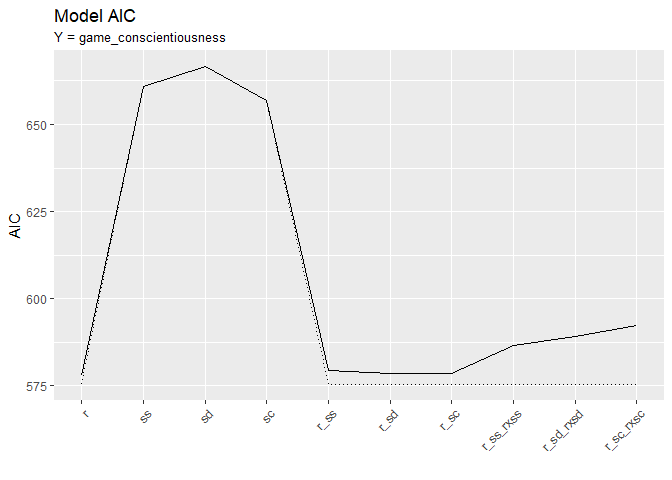
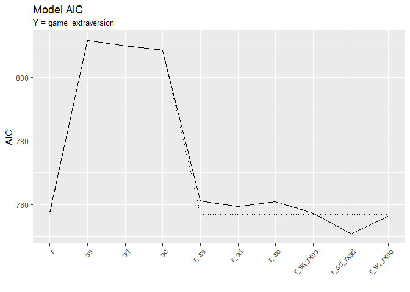

MAPSS Thesis II - model 2
================
Chih-Yu Chiang
September 05, 2017

-   [Setup](#setup)
-   [Variable](#variable)
-   [Model specification](#model-specification)
-   [Double Lasso selection](#double-lasso-selection)
-   [Tobit models](#tobit-models)
-   [Information criteria](#information-criteria)
    -   [BIC](#bic)
    -   [AIC](#aic)
-   [Model summaries (lasso select all var except corresponding real personality)](#model-summaries-lasso-select-all-var-except-corresponding-real-personality)
    -   [gap ~ real + c](#gap-real-c)
    -   [(link for the above position)](#link-for-the-above-position)
    -   [gap ~ satis + c](#gap-satis-c)
    -   [(link for the above position)](#link-for-the-above-position-1)
    -   [gap ~ real + satis + c](#gap-real-satis-c)
    -   [(link for the above position)](#link-for-the-above-position-2)
    -   [gap ~ real + satis + real \* satis + c](#gap-real-satis-real-satis-c)
    -   [(link for the above position)](#link-for-the-above-position-3)
-   [Model summaries (lasso select all var)](#model-summaries-lasso-select-all-var)
    -   [gap ~ real + satis + c](#gap-real-satis-c-1)
    -   [(link for the above position)](#link-for-the-above-position-4)
    -   [gap ~ real + satis + real \* satis + c](#gap-real-satis-real-satis-c-1)
    -   [(link for the above position)](#link-for-the-above-position-5)

``` r
knitr::opts_chunk$set(
    message=FALSE,
    warning=FALSE
)

#Prevent result wrapping
options(width=120)
```

Setup
-----

Data of game and player are read in and matched up.

-   Game release data, `release` (year), is read in as an interval variable.
-   Missing values are imputed with variable mean conveniently (`star_user` and `star_GS`).

``` r
#--Package
library(tidyverse)
library(data.table)
library(corrplot)
library(modelr)
library(glmnet)
library(VGAM)
library(randomForest)
library(e1071)
library(car)
library(rlist)
library(pander)
set.seed(1)


#--Read in
#Core game info and group distance/probability data
core_cluster <- read_csv("../data/core_cluster.csv", col_names=TRUE) %>%
  mutate(group_survey = factor(group_survey),
         group_review = factor(group_review),
         core_id = factor(core_id)) %>%
  select(-X1)

#Core game tste scores (of dif numbers of features)
core_tsteScore <- read_csv("../data/tste_concat.csv", col_names=TRUE) %>%
  select(-X1)

#Core game traditional genre data
core_tGenre <- read_csv("../data/traditional_genre.csv", col_names=TRUE) %>%
  select(-X1, -group, -idTag, -game_title) %>%
  mutate(core_id = factor(core_id))
colnames(core_tGenre)[3:length(colnames(core_tGenre))] <- #Give genre columns identification
  unlist(lapply(X=colnames(core_tGenre)[3:length(colnames(core_tGenre))], function(X) {paste("tg_", X, sep="")}))

#Player-related survey data
survey <- read_csv("../data/survey.csv", col_names=TRUE) %>%
  mutate(race = factor(race),
         sex = factor(sex),
         core_id = factor(core_id)) %>%
  select(-id)


#--Impute missing with mean
imputation_mean <- function(c){
  c[is.na(c)] <- mean(c, na.rm=TRUE)
  return(c)
}
core_cluster <- mutate_each(core_cluster,
                            funs(imputation_mean(.)),
                            star_user, star_GS)


#--Match up
#Main df, key=player-game pair
df <- bind_cols(core_cluster, core_tsteScore) %>%
  left_join(core_tGenre, by=c("core_id")) %>%
  left_join(survey, by=c("core_id"), copy=FALSE)
```

Variable
--------

Compute and select variables to be used in models.

-   Final response variable utilizes only `preference_3`.
-   Mean-centered vars is marked with a suffix \_ct.

-   Player preference:

| Name           | Definition                 | Unit                        |
|----------------|----------------------------|-----------------------------|
| `preference_1` | how much do you like       | Likert 1-7=like             |
| `preference_2` | how often play it          | ordinary 1=never-7=everyday |
| `preference_3` | does it fit personal taste | Likert 1-7=fit              |

-   Game characteristics:

<table style="width:36%;">
<colgroup>
<col width="8%" />
<col width="18%" />
<col width="9%" />
</colgroup>
<thead>
<tr class="header">
<th>Name</th>
<th>Definition</th>
<th>Unit</th>
</tr>
</thead>
<tbody>
<tr class="odd">
<td><code>distance_survey_mean_x</code></td>
<td>group score from survey (distance from group mean in tste)</td>
<td>cosine distance</td>
</tr>
<tr class="even">
<td><code>distance_survey_median_x</code></td>
<td>group score from survey (distance from group median in tste)</td>
<td>cosine distance</td>
</tr>
<tr class="odd">
<td><code>probability_review_mean_x</code></td>
<td>group score from review (mean probability to be categorized in the group by NN)</td>
<td>percentage</td>
</tr>
<tr class="even">
<td><code>probability_review_median_x</code></td>
<td>group score from review (median probability to be categorized in the group by NN)</td>
<td>percentage</td>
</tr>
<tr class="odd">
<td><code>group_survey</code></td>
<td>group identity from survey</td>
<td>categorical 1-group number</td>
</tr>
<tr class="even">
<td><code>group_review</code></td>
<td>group identity from review</td>
<td>categorical 1-group number</td>
</tr>
<tr class="odd">
<td><code>tste_n_x</code></td>
<td>group score from survey (tste), n=number of features</td>
<td>interval arbitrary</td>
</tr>
<tr class="even">
<td><code>tg_x</code></td>
<td>if belongs to traditional genre categories</td>
<td>binary</td>
</tr>
</tbody>
</table>

-   Player personality:

<table style="width:36%;">
<colgroup>
<col width="8%" />
<col width="18%" />
<col width="9%" />
</colgroup>
<thead>
<tr class="header">
<th>Name</th>
<th>Definition</th>
<th>Unit</th>
</tr>
</thead>
<tbody>
<tr class="odd">
<td><code>game_xxxxx</code></td>
<td>Big-five personality in game</td>
<td>Likert 1-7</td>
</tr>
<tr class="even">
<td><code>real_xxxxx</code></td>
<td>Big-five personality in real life</td>
<td>Likert 1-7</td>
</tr>
<tr class="odd">
<td><code>gap_xxxxx</code></td>
<td>personality gap (game - real)</td>
<td>Likert 1-7</td>
</tr>
<tr class="even">
<td><code>satis_xxxxx</code></td>
<td>SDT satisfaction in real life</td>
<td>Likert 1-7</td>
</tr>
<tr class="odd">
<td><code>dissatis_xxxxx</code></td>
<td>SDT dissatisfaction in real life</td>
<td>Likert 1-7</td>
</tr>
<tr class="even">
<td><code>combined_xxxxx</code></td>
<td>SDT combined (previous two) dissatisfaction in real life</td>
<td>Likert 1-7</td>
</tr>
</tbody>
</table>

-   Control:

| Name        | Definition                                    | Unit                      |
|-------------|-----------------------------------------------|---------------------------|
| `age`       | player age                                    | interval                  |
| `education` | player education                              | ordinary 1-7=PhD          |
| `income`    | player annual household income                | ordinary 1-7=over 150,000 |
| `sex`       | player sex                                    | categorical 1=male        |
| `race`      | player race                                   | categorical 1-5           |
| `release`   | game release year                             | interval year             |
| `star_GS`   | general game quality rated by GameSpot expert | interval 0-10             |
| `star_user` | general game quality rated by GameSpot user   | interval 0-10             |

``` r
updateVars <- function(df.outcome="preference", df_player.outcome="game_extraversion"){
  #--Create response variable
  df <<- df %>%
    rowwise() %>% #Rowwise to make the ordinary functions work
    mutate(preference = mean(c(preference_3))) %>%
    ungroup() #Ungroup to cancel rowwise
  

  #--Mean-center predictor variables
  df <<- mutate_at(df, vars(starts_with("tste"),
                            starts_with("game"),
                            starts_with("real"),
                            starts_with("satis"),
                            starts_with("dissatis"),
                            starts_with("combined")), funs(ct = . - mean(.)))


  #--Compute personalty gap
  df <<- mutate(df,
                gap_extraversion = game_extraversion - real_extraversion,
                gap_agreeableness = game_agreeableness - real_agreeableness,
                gap_conscientiousness = game_conscientiousness - real_conscientiousness,
                gap_emotionstability = game_emotionstability - real_emotionstability,
                gap_openness = game_openness - real_openness,
                gap_sum = gap_extraversion + gap_agreeableness + gap_conscientiousness + (-gap_emotionstability) + gap_openness,
                real_sum = real_extraversion + real_agreeableness + real_conscientiousness + (-real_emotionstability) + real_openness,
                dissatis_sum = dissatis_autonomy + dissatis_relatedness + dissatis_competence,
                satis_sum = satis_autonomy + satis_relatedness + satis_competence,
                combined_sum = combined_autonomy + combined_relatedness + combined_competence
                )

  
  #--Acquire player df, key=player
  df_player <<- distinct(df, respondent, .keep_all=TRUE)
  
  
  #--Select variables to be included in regression (model formation)
  #Sets of predictor variables from file
  df_predictors <- read.csv("../data/vars/predictors.csv", header=TRUE, na.strings="")

  #Get column name as model id
  modelId <- colnames(df_predictors)
  
  #predictor variable as strings for each model
  predictorString <- apply(df_predictors, MARGIN=2, function(x) paste(na.omit(x), collapse="+"))
  
  #Make the dfs into a data frame
  dfs <<- data.frame(predictorString, row.names=modelId, stringsAsFactors=FALSE) %>%
    mutate(df_x = map(predictorString, ~ model.matrix(as.formula(paste(df.outcome, " ~ ", .x, sep="")), data=df)[, -1])) %>% #df with only predictor variables; [, -1] used to remove redundant intercept column
    mutate(df_yx = map(df_x, ~ bind_cols(select(df, df.outcome), data.frame(.x)))) #df also with outcome variables
  dfs_player <<- data.frame(predictorString, row.names=modelId, stringsAsFactors=FALSE) %>%
    mutate(df_x = map(predictorString, ~ model.matrix(as.formula(paste(df_player.outcome, " ~ ", .x, sep="")), data=df_player)[, -1])) %>% #df with only predictor variables; [, -1] used to remove redundant intercept column
    mutate(df_yx = map(df_x, ~ bind_cols(select(df_player, df_player.outcome), data.frame(.x)))) #df also with outcome variables
  
  #Set row names for reference
  row.names(dfs) <<- modelId
  row.names(dfs_player) <<- modelId
}
```

Model specification
-------------------


Double Lasso selection
----------------------

-   Based on paper `Using Double-Lasso Selection for Principled Variable Selection`
-   by Oleg Urminsky, Christian Hansen, and Victor Chernozhukov

``` r
#--Function for updating lambda used in selection
#n = number of observation; p = number of independent variables; se = standard error of residual or dependent variable
updateLambda <- function(n, p, se) {se * (1.1 / sqrt(n)) * qnorm(1 - (.1 / log(n)) / (2 * p))}


#--Function for acquiring the indices of the selected variables in df_x
#df_x = matrix with only variables to be tested; y = dependent variable or treatment variables; lambda = the initial lambda computed in advance 
acquireBetaIndices <- function(df_x, y, lambda, n, p) {
  #Update lambda k times, k is selected based on literature
  k <- 1
  while(k < 15) {
    model_las <- glmnet(x=df_x, y=y, alpha=1, lambda=lambda, standardize=TRUE)
    beta <- coef(model_las)
    residual.se <- sd(y - predict(model_las, df_x))
    lambda <- updateLambda(n=n, p=p, se=residual.se)
    k <- k + 1
  }
  
  #Return the variable indices with absolute value of beta > 0
  return(which(abs(beta) > 0))
}


#--Function to perform double lasso selection
#df_yx = df with all variables; outcomeVar = string of the outcome var in the df; form = a switch to decide the test and treatment vars
#output = a new df_yx with variables selected from df_yx
lassoSelect <- function(df_yx, outcomeVar, form) {
  #--Setting up
  #The df with y and treatment variables (those vars will not be tested, and will always be included in the output df)
  df_ytreatment <- switch(form,
                          "1"=select(df_yx, matches(outcomeVar), matches("^real.+\\D_ct$"), matches("^game.+\\D_ct$"), matches("^gap.+\\D_ct$"), matches("^tste.+\\d_ct$")),
                          "2"=select(df_yx, matches(outcomeVar)),
                          "3"=select(df_yx, matches(outcomeVar), matches(sub("game", "real", outcomeVar))))

  #The df with only the variables to be tested (those vars will be tested, and not necessarily be included in the output df)
  df_test <- switch(form,
                    "1"=data.matrix(select(df_yx, -matches(outcomeVar), -matches("^real.+\\D_ct$"), -matches("^game.+\\D_ct$"), -matches("^gap.+\\D_ct$"), -matches("^tste.+\\d_ct$"))),
                    "2"=data.matrix(select(df_yx, -matches(outcomeVar))),
                    "3"=data.matrix(select(df_yx, -matches(outcomeVar), -matches(sub("game", "real", outcomeVar)))))
  
  #The number of observations
  n <- nrow(df_test)
  
  #The number of variables to be tested
  p <- ncol(df_test)
  
  
  #--Select vars that predict outcome
  #Lambda is initialized as the se of residuals of a simple linear using only treatments predicting dependent variable
  #If the treatment var is NULL, use the se pf dependent var to initiate
  residual.se <- if(ncol(df_ytreatment) == 1) {sd(df_yx[[outcomeVar]])} else {sd(residuals(lm(as.formula(paste(outcomeVar, " ~ .", sep="")), data=df_ytreatment)))}
  lambda <- updateLambda(n=n, p=p, se=residual.se)
  
  #by Lasso model: dependent variable ~ test variables
  betaIndices <- acquireBetaIndices(df_x=df_test, y=df_yx[[outcomeVar]], lambda=lambda, n=n, p=p)
  
  
  #--Select vars that predict treatments
  #Each column of the treatment variables as the y in the Lasso selection
  #Starting from 2 because 1 is the dependent variable
  if(ncol(df_ytreatment) != 1) { #Run only when treatment vars not NULL
    for(i in seq(2, ncol(df_ytreatment))) {
      #Acquire target treatment variable
      treatment <- df_ytreatment[[i]]
      
      #Lambda is initialized as the se of the target treatment variable
      treatment.se <- sd(treatment)
      lambda <- updateLambda(n=n, p=p, se=treatment.se)
      
      #Acquire the indices and union the result indices of each treatment variable
      betaIndices <- union(betaIndices, acquireBetaIndices(df_x=df_test, y=treatment, lambda=lambda, n=n, p=p))
    }
  }
  
  
  #Process the result indices to remove the first term (the interaction term)
  betaIndices <- setdiff((betaIndices - 1), 0)
  
  #Bind the selected variables with dependent and treatment variables
  df_yx_selected <- cbind(df_ytreatment, df_test[, betaIndices])
  
  #Return a new df_yx with variables selected
  return(df_yx_selected)
}


#--Update vars and acquire selected dfs
personalities <- c("game_agreeableness", "game_conscientiousness", "game_emotionstability", "game_extraversion", "game_openness")

acquireDfs <- function(personality) {
  updateVars(df_player.outcome=personality)
  dfs_player_selected_1 <- map(dfs_player$df_yx, ~ lassoSelect(., outcomeVar=personality, form="3"))
  dfs_player_selected_2 <- map(dfs_player$df_yx, ~ lassoSelect(., outcomeVar=personality, form="2"))
  return(as.data.frame(cbind(dfs_player_selected_1, dfs_player_selected_2)))
}

dfs_new <- map(personalities, acquireDfs)
```

Tobit models
------------

``` r
acquireModels <- function(i) {
  models_tobit_selected_1 <- map(dfs_new[[i]]$dfs_player_selected_1,
                              ~ vglm(as.formula(paste(personalities[i], " ~ .", sep="")), data=.x, family=tobit(Upper=7, Lower=1, imethod=1)))
  models_tobit_selected_2 <- map(dfs_new[[i]]$dfs_player_selected_2,
                              ~ vglm(as.formula(paste(personalities[i], " ~ .", sep="")), data=.x, family=tobit(Upper=7, Lower=1, imethod=1)))
  return(as.data.frame(cbind(models_tobit_selected_1, models_tobit_selected_2)))
}

models_new <- map(c(1:5), acquireModels)
```

Information criteria
--------------------

### BIC

``` r
drawBICs <- function(i) {
  #--BIC
  BIC_1 <- unlist(map(models_new[[i]]$models_tobit_selected_1, BIC))
  BIC_2 <- unlist(map(models_new[[i]]$models_tobit_selected_2, BIC))

  #Batch models
  plot <- ggplot() +
    geom_line(mapping=aes(seq(1, length(BIC_1)), BIC_1)) +
    geom_line(mapping=aes(seq(1, length(BIC_2)), BIC_2), linetype="dotted") +
    labs(x="", y="BIC", title="Model BIC", subtitle=paste("Y = ", personalities[i], sep="")) +
    scale_x_continuous(breaks=seq(1, length(BIC_1)), minor_breaks=NULL, labels=c("r", "ss", "sd", "sc", "r_ss", "r_sd", "r_sc", "r_ss_rxss", "r_sd_rxsd", "r_sc_rxsc")) +
    theme(axis.text.x = element_text(angle=45, hjust = 1))
  
  return(plot)
}

drawBICs(1)
```


``` r
drawBICs(2)
```


``` r
drawBICs(3)
```


``` r
drawBICs(4)
```


``` r
drawBICs(5)
```


### AIC

``` r
drawAICs <- function(i) {
  #--AIC
  AIC_1 <- unlist(map(models_new[[i]]$models_tobit_selected_1, AIC))
  AIC_2 <- unlist(map(models_new[[i]]$models_tobit_selected_2, AIC))

  #Batch models
  plot <- ggplot() +
    geom_line(mapping=aes(seq(1, length(AIC_1)), AIC_1)) +
    geom_line(mapping=aes(seq(1, length(AIC_2)), AIC_2), linetype="dotted") +
    labs(x="", y="AIC", title="Model AIC", subtitle=paste("Y = ", personalities[i], sep="")) +
    scale_x_continuous(breaks=seq(1, length(AIC_1)), minor_breaks=NULL, labels=c("r", "ss", "sd", "sc", "r_ss", "r_sd", "r_sc", "r_ss_rxss", "r_sd_rxsd", "r_sc_rxsc")) +
    theme(axis.text.x = element_text(angle=45, hjust = 1))
  
  return(plot)
}

drawAICs(1)
```


``` r
drawAICs(2)
```



``` r
drawAICs(3)
```


``` r
drawAICs(4)
```



``` r
drawAICs(5)
```


Model summaries (lasso select all var except corresponding real personality)
----------------------------------------------------------------------------

### gap ~ real + c

### (link for the above position)

``` r
summary(models_new[[1]]$models_tobit_selected_1[[1]])
```

    ## 
    ## Call:
    ## vglm(formula = as.formula(paste(personalities[i], " ~ .", sep = "")), 
    ##     family = tobit(Upper = 7, Lower = 1, imethod = 1), data = .x)
    ## 
    ## 
    ## Pearson residuals:
    ##              Min      1Q  Median     3Q   Max
    ## mu       -2.5575 -0.6575 -0.0858 0.5405 2.419
    ## loge(sd) -0.8193 -0.6753 -0.4743 0.1803 5.132
    ## 
    ## Coefficients: 
    ##                            Estimate Std. Error z value Pr(>|z|)    
    ## (Intercept):1              3.282473   0.077044  42.605   <2e-16 ***
    ## (Intercept):2              0.116971   0.050384   2.322   0.0203 *  
    ## real_agreeableness_ct      0.614170   0.064411   9.535   <2e-16 ***
    ## real_conscientiousness_ct -0.094199   0.070048  -1.345   0.1787    
    ## real_emotionstability_ct   0.009208   0.063904   0.144   0.8854    
    ## ---
    ## Signif. codes:  0 '***' 0.001 '**' 0.01 '*' 0.05 '.' 0.1 ' ' 1
    ## 
    ## Number of linear predictors:  2 
    ## 
    ## Names of linear predictors: mu, loge(sd)
    ## 
    ## Log-likelihood: -324.0027 on 425 degrees of freedom
    ## 
    ## Number of iterations: 5

``` r
summary(models_new[[2]]$models_tobit_selected_1[[1]])
```

    ## 
    ## Call:
    ## vglm(formula = as.formula(paste(personalities[i], " ~ .", sep = "")), 
    ##     family = tobit(Upper = 7, Lower = 1, imethod = 1), data = .x)
    ## 
    ## 
    ## Pearson residuals:
    ##             Min      1Q  Median     3Q    Max
    ## mu       -2.783 -0.6666 -0.2036 0.5870  2.994
    ## loge(sd) -1.031 -0.7222 -0.5306 0.5807 11.462
    ## 
    ## Coefficients: 
    ##                           Estimate Std. Error z value Pr(>|z|)    
    ## (Intercept):1              5.51913    0.06798  81.182   <2e-16 ***
    ## (Intercept):2             -0.03918    0.05422  -0.723    0.470    
    ## real_conscientiousness_ct  0.63384    0.06109  10.375   <2e-16 ***
    ## real_agreeableness_ct     -0.06678    0.05562  -1.201    0.230    
    ## real_emotionstability_ct   0.01680    0.05544   0.303    0.762    
    ## ---
    ## Signif. codes:  0 '***' 0.001 '**' 0.01 '*' 0.05 '.' 0.1 ' ' 1
    ## 
    ## Number of linear predictors:  2 
    ## 
    ## Names of linear predictors: mu, loge(sd)
    ## 
    ## Log-likelihood: -283.9428 on 425 degrees of freedom
    ## 
    ## Number of iterations: 6

``` r
summary(models_new[[3]]$models_tobit_selected_1[[1]])
```

    ## 
    ## Call:
    ## vglm(formula = as.formula(paste(personalities[i], " ~ .", sep = "")), 
    ##     family = tobit(Upper = 7, Lower = 1, imethod = 1), data = .x)
    ## 
    ## 
    ## Pearson residuals:
    ##             Min      1Q   Median     3Q   Max
    ## mu       -2.841 -0.6768  0.03416 0.6738 2.636
    ## loge(sd) -0.980 -0.7211 -0.41001 0.3978 7.356
    ## 
    ## Coefficients: 
    ##                           Estimate Std. Error z value Pr(>|z|)    
    ## (Intercept):1              2.85798    0.08648  33.049  < 2e-16 ***
    ## (Intercept):2              0.22442    0.05237   4.285 1.83e-05 ***
    ## real_emotionstability_ct   0.51014    0.07635   6.682 2.36e-11 ***
    ## real_conscientiousness_ct -0.10796    0.07637  -1.414  0.15747    
    ## real_extraversion_ct       0.13861    0.05250   2.640  0.00829 ** 
    ## ---
    ## Signif. codes:  0 '***' 0.001 '**' 0.01 '*' 0.05 '.' 0.1 ' ' 1
    ## 
    ## Number of linear predictors:  2 
    ## 
    ## Names of linear predictors: mu, loge(sd)
    ## 
    ## Log-likelihood: -340.2859 on 425 degrees of freedom
    ## 
    ## Number of iterations: 5

``` r
summary(models_new[[4]]$models_tobit_selected_1[[1]])
```

    ## 
    ## Call:
    ## vglm(formula = as.formula(paste(personalities[i], " ~ .", sep = "")), 
    ##     family = tobit(Upper = 7, Lower = 1, imethod = 1), data = .x)
    ## 
    ## 
    ## Pearson residuals:
    ##             Min      1Q  Median     3Q   Max
    ## mu       -2.153 -0.7660 -0.1742 0.6333 2.724
    ## loge(sd) -1.046 -0.7269 -0.4302 0.3377 4.718
    ## 
    ## Coefficients: 
    ##                          Estimate Std. Error z value Pr(>|z|)    
    ## (Intercept):1             4.76993    0.10465  45.581  < 2e-16 ***
    ## (Intercept):2             0.39870    0.05393   7.393 1.44e-13 ***
    ## real_extraversion_ct      0.49149    0.06406   7.672 1.69e-14 ***
    ## real_emotionstability_ct -0.04491    0.07477  -0.601    0.548    
    ## real_openness_ct          0.12243    0.07783   1.573    0.116    
    ## ---
    ## Signif. codes:  0 '***' 0.001 '**' 0.01 '*' 0.05 '.' 0.1 ' ' 1
    ## 
    ## Number of linear predictors:  2 
    ## 
    ## Names of linear predictors: mu, loge(sd)
    ## 
    ## Log-likelihood: -373.7424 on 425 degrees of freedom
    ## 
    ## Number of iterations: 6

``` r
summary(models_new[[5]]$models_tobit_selected_1[[1]])
```

    ## 
    ## Call:
    ## vglm(formula = as.formula(paste(personalities[i], " ~ .", sep = "")), 
    ##     family = tobit(Upper = 7, Lower = 1, imethod = 1), data = .x)
    ## 
    ## 
    ## Pearson residuals:
    ##             Min      1Q  Median     3Q   Max
    ## mu       -2.586 -0.7429 -0.2657 0.7717 2.603
    ## loge(sd) -1.031 -0.7162 -0.4510 0.4866 6.722
    ## 
    ## Coefficients: 
    ##                          Estimate Std. Error z value Pr(>|z|)    
    ## (Intercept):1             5.66905    0.06847  82.800   <2e-16 ***
    ## (Intercept):2            -0.04165    0.05532  -0.753    0.452    
    ## real_openness_ct          0.63018    0.05138  12.264   <2e-16 ***
    ## real_extraversion_ct     -0.03074    0.04123  -0.746    0.456    
    ## real_emotionstability_ct -0.00965    0.04861  -0.199    0.843    
    ## ---
    ## Signif. codes:  0 '***' 0.001 '**' 0.01 '*' 0.05 '.' 0.1 ' ' 1
    ## 
    ## Number of linear predictors:  2 
    ## 
    ## Names of linear predictors: mu, loge(sd)
    ## 
    ## Log-likelihood: -278.73 on 425 degrees of freedom
    ## 
    ## Number of iterations: 6

### gap ~ satis + c

### (link for the above position)

``` r
summary(models_new[[1]]$models_tobit_selected_1[[2]])
```

    ## 
    ## Call:
    ## vglm(formula = as.formula(paste(personalities[i], " ~ .", sep = "")), 
    ##     family = tobit(Upper = 7, Lower = 1, imethod = 1), data = .x)
    ## 
    ## 
    ## Pearson residuals:
    ##              Min      1Q    Median     3Q   Max
    ## mu       -2.1130 -0.8241  0.006679 0.7734 2.264
    ## loge(sd) -0.7525 -0.6289 -0.264545 0.1552 3.407
    ## 
    ## Coefficients: 
    ##                          Estimate Std. Error z value Pr(>|z|)    
    ## (Intercept):1             3.28099    0.09415  34.850  < 2e-16 ***
    ## (Intercept):2             0.31800    0.05059   6.286 3.25e-10 ***
    ## `df_test[, betaIndices]` -0.35670    0.08514  -4.189 2.80e-05 ***
    ## ---
    ## Signif. codes:  0 '***' 0.001 '**' 0.01 '*' 0.05 '.' 0.1 ' ' 1
    ## 
    ## Number of linear predictors:  2 
    ## 
    ## Names of linear predictors: mu, loge(sd)
    ## 
    ## Log-likelihood: -366.1762 on 427 degrees of freedom
    ## 
    ## Number of iterations: 4

``` r
summary(models_new[[1]]$models_tobit_selected_1[[3]])
```

    ## 
    ## Call:
    ## vglm(formula = as.formula(paste(personalities[i], " ~ .", sep = "")), 
    ##     family = tobit(Upper = 7, Lower = 1, imethod = 1), data = .x)
    ## 
    ## 
    ## Pearson residuals:
    ##              Min      1Q  Median     3Q   Max
    ## mu       -2.0477 -0.7255  0.1579 0.5094 2.904
    ## loge(sd) -0.7246 -0.7119 -0.5165 0.3339 5.650
    ## 
    ## Coefficients: 
    ##               Estimate Std. Error z value Pr(>|z|)    
    ## (Intercept):1  3.28185    0.09755  33.644  < 2e-16 ***
    ## (Intercept):2  0.35376    0.05057   6.995 2.66e-12 ***
    ## ---
    ## Signif. codes:  0 '***' 0.001 '**' 0.01 '*' 0.05 '.' 0.1 ' ' 1
    ## 
    ## Number of linear predictors:  2 
    ## 
    ## Names of linear predictors: mu, loge(sd)
    ## 
    ## Log-likelihood: -374.6048 on 428 degrees of freedom
    ## 
    ## Number of iterations: 4

``` r
summary(models_new[[1]]$models_tobit_selected_1[[4]])
```

    ## 
    ## Call:
    ## vglm(formula = as.formula(paste(personalities[i], " ~ .", sep = "")), 
    ##     family = tobit(Upper = 7, Lower = 1, imethod = 1), data = .x)
    ## 
    ## 
    ## Pearson residuals:
    ##              Min      1Q   Median     3Q   Max
    ## mu       -2.3860 -0.8396 -0.01223 0.7041 2.356
    ## loge(sd) -0.7515 -0.6498 -0.28482 0.2084 3.695
    ## 
    ## Coefficients: 
    ##                          Estimate Std. Error z value Pr(>|z|)    
    ## (Intercept):1             3.28149    0.09391  34.944  < 2e-16 ***
    ## (Intercept):2             0.31542    0.05058   6.236 4.49e-10 ***
    ## `df_test[, betaIndices]` -0.35410    0.08222  -4.307 1.66e-05 ***
    ## ---
    ## Signif. codes:  0 '***' 0.001 '**' 0.01 '*' 0.05 '.' 0.1 ' ' 1
    ## 
    ## Number of linear predictors:  2 
    ## 
    ## Names of linear predictors: mu, loge(sd)
    ## 
    ## Log-likelihood: -365.7268 on 427 degrees of freedom
    ## 
    ## Number of iterations: 4

``` r
summary(models_new[[2]]$models_tobit_selected_1[[2]])
```

    ## 
    ## Call:
    ## vglm(formula = as.formula(paste(personalities[i], " ~ .", sep = "")), 
    ##     family = tobit(Upper = 7, Lower = 1, imethod = 1), data = .x)
    ## 
    ## 
    ## Pearson residuals:
    ##              Min      1Q  Median     3Q   Max
    ## mu       -2.1914 -0.6514 -0.1360 0.5065 2.328
    ## loge(sd) -0.9197 -0.7611 -0.5349 0.5340 6.189
    ## 
    ## Coefficients: 
    ##                      Estimate Std. Error z value Pr(>|z|)    
    ## (Intercept):1         5.53164    0.08528  64.864  < 2e-16 ***
    ## (Intercept):2         0.17827    0.05524   3.227  0.00125 ** 
    ## satis_relatedness_ct  0.21889    0.09616   2.276  0.02283 *  
    ## satis_competence_ct   0.32825    0.08026   4.090 4.32e-05 ***
    ## ---
    ## Signif. codes:  0 '***' 0.001 '**' 0.01 '*' 0.05 '.' 0.1 ' ' 1
    ## 
    ## Number of linear predictors:  2 
    ## 
    ## Names of linear predictors: mu, loge(sd)
    ## 
    ## Log-likelihood: -326.4942 on 426 degrees of freedom
    ## 
    ## Number of iterations: 7

``` r
summary(models_new[[2]]$models_tobit_selected_1[[3]])
```

    ## 
    ## Call:
    ## vglm(formula = as.formula(paste(personalities[i], " ~ .", sep = "")), 
    ##     family = tobit(Upper = 7, Lower = 1, imethod = 1), data = .x)
    ## 
    ## 
    ## Pearson residuals:
    ##              Min      1Q  Median     3Q   Max
    ## mu       -2.6277 -0.6172 -0.1466 0.4774 2.495
    ## loge(sd) -0.9364 -0.7560 -0.5726 0.4526 7.574
    ## 
    ## Coefficients: 
    ##                         Estimate Std. Error z value Pr(>|z|)    
    ## (Intercept):1            5.53264    0.08653  63.939  < 2e-16 ***
    ## (Intercept):2            0.19212    0.05527   3.476 0.000509 ***
    ## dissatis_relatedness_ct -0.20572    0.07288  -2.823 0.004762 ** 
    ## dissatis_competence_ct  -0.22768    0.06423  -3.545 0.000393 ***
    ## ---
    ## Signif. codes:  0 '***' 0.001 '**' 0.01 '*' 0.05 '.' 0.1 ' ' 1
    ## 
    ## Number of linear predictors:  2 
    ## 
    ## Names of linear predictors: mu, loge(sd)
    ## 
    ## Log-likelihood: -329.3011 on 426 degrees of freedom
    ## 
    ## Number of iterations: 6

``` r
summary(models_new[[2]]$models_tobit_selected_1[[4]])
```

    ## 
    ## Call:
    ## vglm(formula = as.formula(paste(personalities[i], " ~ .", sep = "")), 
    ##     family = tobit(Upper = 7, Lower = 1, imethod = 1), data = .x)
    ## 
    ## 
    ## Pearson residuals:
    ##              Min      1Q  Median     3Q   Max
    ## mu       -2.2701 -0.6924 -0.1453 0.6609 2.322
    ## loge(sd) -0.9859 -0.7713 -0.5588 0.3944 7.809
    ## 
    ## Coefficients: 
    ##                         Estimate Std. Error z value Pr(>|z|)    
    ## (Intercept):1            5.53214    0.08447  65.495  < 2e-16 ***
    ## (Intercept):2            0.16911    0.05516   3.066 0.002173 ** 
    ## combined_relatedness_ct  0.27236    0.09365   2.908 0.003635 ** 
    ## combined_competence_ct   0.28445    0.07717   3.686 0.000228 ***
    ## ---
    ## Signif. codes:  0 '***' 0.001 '**' 0.01 '*' 0.05 '.' 0.1 ' ' 1
    ## 
    ## Number of linear predictors:  2 
    ## 
    ## Names of linear predictors: mu, loge(sd)
    ## 
    ## Log-likelihood: -324.4662 on 426 degrees of freedom
    ## 
    ## Number of iterations: 6

``` r
summary(models_new[[3]]$models_tobit_selected_1[[2]])
```

    ## 
    ## Call:
    ## vglm(formula = as.formula(paste(personalities[i], " ~ .", sep = "")), 
    ##     family = tobit(Upper = 7, Lower = 1, imethod = 1), data = .x)
    ## 
    ## 
    ## Pearson residuals:
    ##              Min      1Q  Median     3Q   Max
    ## mu       -2.1807 -0.6800 -0.1029 0.7920 2.574
    ## loge(sd) -0.8053 -0.6878 -0.3964 0.2474 6.135
    ## 
    ## Coefficients: 
    ##                          Estimate Std. Error z value Pr(>|z|)    
    ## (Intercept):1             2.85482    0.09875  28.910  < 2e-16 ***
    ## (Intercept):2             0.35896    0.05260   6.825 8.82e-12 ***
    ## `df_test[, betaIndices]` -0.39916    0.08910  -4.480 7.47e-06 ***
    ## ---
    ## Signif. codes:  0 '***' 0.001 '**' 0.01 '*' 0.05 '.' 0.1 ' ' 1
    ## 
    ## Number of linear predictors:  2 
    ## 
    ## Names of linear predictors: mu, loge(sd)
    ## 
    ## Log-likelihood: -367.8438 on 427 degrees of freedom
    ## 
    ## Number of iterations: 4

``` r
summary(models_new[[3]]$models_tobit_selected_1[[3]])
```

    ## 
    ## Call:
    ## vglm(formula = as.formula(paste(personalities[i], " ~ .", sep = "")), 
    ##     family = tobit(Upper = 7, Lower = 1, imethod = 1), data = .x)
    ## 
    ## 
    ## Pearson residuals:
    ##              Min      1Q   Median     3Q   Max
    ## mu       -2.3563 -0.6754 -0.05501 0.6829 2.612
    ## loge(sd) -0.8126 -0.6966 -0.40084 0.2802 3.900
    ## 
    ## Coefficients: 
    ##                          Estimate Std. Error z value Pr(>|z|)    
    ## (Intercept):1             2.85209    0.09784  29.151  < 2e-16 ***
    ## (Intercept):2             0.34931    0.05259   6.642 3.10e-11 ***
    ## `df_test[, betaIndices]`  0.30126    0.06063   4.969 6.73e-07 ***
    ## ---
    ## Signif. codes:  0 '***' 0.001 '**' 0.01 '*' 0.05 '.' 0.1 ' ' 1
    ## 
    ## Number of linear predictors:  2 
    ## 
    ## Names of linear predictors: mu, loge(sd)
    ## 
    ## Log-likelihood: -365.6982 on 427 degrees of freedom
    ## 
    ## Number of iterations: 4

``` r
summary(models_new[[3]]$models_tobit_selected_1[[4]])
```

    ## 
    ## Call:
    ## vglm(formula = as.formula(paste(personalities[i], " ~ .", sep = "")), 
    ##     family = tobit(Upper = 7, Lower = 1, imethod = 1), data = .x)
    ## 
    ## 
    ## Pearson residuals:
    ##              Min      1Q   Median     3Q   Max
    ## mu       -2.4183 -0.6493 -0.02568 0.7212 2.521
    ## loge(sd) -0.8454 -0.6664 -0.41413 0.3888 4.749
    ## 
    ## Coefficients: 
    ##                         Estimate Std. Error z value Pr(>|z|)    
    ## (Intercept):1            2.85307    0.09695  29.427  < 2e-16 ***
    ## (Intercept):2            0.34006    0.05260   6.465 1.01e-10 ***
    ## combined_relatedness_ct -0.27074    0.11079  -2.444   0.0145 *  
    ## combined_competence_ct  -0.19652    0.09125  -2.154   0.0313 *  
    ## ---
    ## Signif. codes:  0 '***' 0.001 '**' 0.01 '*' 0.05 '.' 0.1 ' ' 1
    ## 
    ## Number of linear predictors:  2 
    ## 
    ## Names of linear predictors: mu, loge(sd)
    ## 
    ## Log-likelihood: -363.5413 on 426 degrees of freedom
    ## 
    ## Number of iterations: 4

``` r
summary(models_new[[4]]$models_tobit_selected_1[[2]])
```

    ## 
    ## Call:
    ## vglm(formula = as.formula(paste(personalities[i], " ~ .", sep = "")), 
    ##     family = tobit(Upper = 7, Lower = 1, imethod = 1), data = .x)
    ## 
    ## 
    ## Pearson residuals:
    ##              Min      1Q   Median     3Q   Max
    ## mu       -2.0141 -0.8149  0.04354 0.5819 2.351
    ## loge(sd) -0.8186 -0.7059 -0.42325 0.2719 5.209
    ## 
    ## Coefficients: 
    ##                          Estimate Std. Error z value Pr(>|z|)    
    ## (Intercept):1             4.76870    0.12107  39.389  < 2e-16 ***
    ## (Intercept):2             0.54028    0.05450   9.914  < 2e-16 ***
    ## `df_test[, betaIndices]`  0.35722    0.08938   3.997 6.42e-05 ***
    ## ---
    ## Signif. codes:  0 '***' 0.001 '**' 0.01 '*' 0.05 '.' 0.1 ' ' 1
    ## 
    ## Number of linear predictors:  2 
    ## 
    ## Names of linear predictors: mu, loge(sd)
    ## 
    ## Log-likelihood: -402.8358 on 427 degrees of freedom
    ## 
    ## Number of iterations: 6

``` r
summary(models_new[[4]]$models_tobit_selected_1[[3]])
```

    ## 
    ## Call:
    ## vglm(formula = as.formula(paste(personalities[i], " ~ .", sep = "")), 
    ##     family = tobit(Upper = 7, Lower = 1, imethod = 1), data = .x)
    ## 
    ## 
    ## Pearson residuals:
    ##              Min      1Q   Median     3Q   Max
    ## mu       -2.0288 -0.7964  0.02654 0.5600 2.387
    ## loge(sd) -0.8412 -0.6958 -0.46447 0.3447 4.417
    ## 
    ## Coefficients: 
    ##                          Estimate Std. Error z value Pr(>|z|)    
    ## (Intercept):1             4.76749    0.12042  39.592  < 2e-16 ***
    ## (Intercept):2             0.53522    0.05445   9.829  < 2e-16 ***
    ## `df_test[, betaIndices]` -0.30883    0.07322  -4.218 2.47e-05 ***
    ## ---
    ## Signif. codes:  0 '***' 0.001 '**' 0.01 '*' 0.05 '.' 0.1 ' ' 1
    ## 
    ## Number of linear predictors:  2 
    ## 
    ## Names of linear predictors: mu, loge(sd)
    ## 
    ## Log-likelihood: -401.983 on 427 degrees of freedom
    ## 
    ## Number of iterations: 6

``` r
summary(models_new[[4]]$models_tobit_selected_1[[4]])
```

    ## 
    ## Call:
    ## vglm(formula = as.formula(paste(personalities[i], " ~ .", sep = "")), 
    ##     family = tobit(Upper = 7, Lower = 1, imethod = 1), data = .x)
    ## 
    ## 
    ## Pearson residuals:
    ##              Min      1Q  Median     3Q   Max
    ## mu       -2.0092 -0.7394  0.0171 0.5047 2.408
    ## loge(sd) -0.8155 -0.7118 -0.4829 0.2941 4.109
    ## 
    ## Coefficients: 
    ##                          Estimate Std. Error z value Pr(>|z|)    
    ## (Intercept):1             4.76841    0.12014  39.691  < 2e-16 ***
    ## (Intercept):2             0.53290    0.05447   9.783  < 2e-16 ***
    ## `df_test[, betaIndices]`  0.37239    0.08498   4.382 1.18e-05 ***
    ## ---
    ## Signif. codes:  0 '***' 0.001 '**' 0.01 '*' 0.05 '.' 0.1 ' ' 1
    ## 
    ## Number of linear predictors:  2 
    ## 
    ## Names of linear predictors: mu, loge(sd)
    ## 
    ## Log-likelihood: -401.3148 on 427 degrees of freedom
    ## 
    ## Number of iterations: 6

``` r
summary(models_new[[5]]$models_tobit_selected_1[[2]])
```

    ## 
    ## Call:
    ## vglm(formula = as.formula(paste(personalities[i], " ~ .", sep = "")), 
    ##     family = tobit(Upper = 7, Lower = 1, imethod = 1), data = .x)
    ## 
    ## 
    ## Pearson residuals:
    ##              Min      1Q   Median     3Q    Max
    ## mu       -2.3954 -0.7819 -0.09025 0.5453  2.578
    ## loge(sd) -0.9224 -0.7600 -0.47992 0.4271 11.318
    ## 
    ## Coefficients: 
    ##                      Estimate Std. Error z value Pr(>|z|)    
    ## (Intercept):1         5.67414    0.08728  65.012  < 2e-16 ***
    ## (Intercept):2         0.19110    0.05640   3.388 0.000703 ***
    ## satis_relatedness_ct  0.22995    0.09761   2.356 0.018487 *  
    ## satis_competence_ct   0.20674    0.08138   2.540 0.011076 *  
    ## ---
    ## Signif. codes:  0 '***' 0.001 '**' 0.01 '*' 0.05 '.' 0.1 ' ' 1
    ## 
    ## Number of linear predictors:  2 
    ## 
    ## Names of linear predictors: mu, loge(sd)
    ## 
    ## Log-likelihood: -327.3535 on 426 degrees of freedom
    ## 
    ## Number of iterations: 7

``` r
summary(models_new[[5]]$models_tobit_selected_1[[3]])
```

    ## 
    ## Call:
    ## vglm(formula = as.formula(paste(personalities[i], " ~ .", sep = "")), 
    ##     family = tobit(Upper = 7, Lower = 1, imethod = 1), data = .x)
    ## 
    ## 
    ## Pearson residuals:
    ##              Min      1Q  Median     3Q    Max
    ## mu       -2.2461 -0.8228 -0.1131 0.4788  2.311
    ## loge(sd) -0.9196 -0.7522 -0.5126 0.5543 11.601
    ## 
    ## Coefficients: 
    ##                          Estimate Std. Error z value Pr(>|z|)    
    ## (Intercept):1             5.67476    0.08806  64.440  < 2e-16 ***
    ## (Intercept):2             0.19942    0.05648   3.531 0.000415 ***
    ## `df_test[, betaIndices]` -0.32608    0.05981  -5.452 4.99e-08 ***
    ## ---
    ## Signif. codes:  0 '***' 0.001 '**' 0.01 '*' 0.05 '.' 0.1 ' ' 1
    ## 
    ## Number of linear predictors:  2 
    ## 
    ## Names of linear predictors: mu, loge(sd)
    ## 
    ## Log-likelihood: -328.3724 on 427 degrees of freedom
    ## 
    ## Number of iterations: 7

``` r
summary(models_new[[5]]$models_tobit_selected_1[[4]])
```

    ## 
    ## Call:
    ## vglm(formula = as.formula(paste(personalities[i], " ~ .", sep = "")), 
    ##     family = tobit(Upper = 7, Lower = 1, imethod = 1), data = .x)
    ## 
    ## 
    ## Pearson residuals:
    ##             Min      1Q  Median     3Q    Max
    ## mu       -2.279 -0.8131 -0.1181 0.5809  2.319
    ## loge(sd) -0.921 -0.7370 -0.4542 0.4800 11.906
    ## 
    ## Coefficients: 
    ##                          Estimate Std. Error z value Pr(>|z|)    
    ## (Intercept):1             5.67339    0.08681  65.352  < 2e-16 ***
    ## (Intercept):2             0.18636    0.05633   3.308 0.000939 ***
    ## `df_test[, betaIndices]`  0.43207    0.07344   5.883 4.03e-09 ***
    ## ---
    ## Signif. codes:  0 '***' 0.001 '**' 0.01 '*' 0.05 '.' 0.1 ' ' 1
    ## 
    ## Number of linear predictors:  2 
    ## 
    ## Names of linear predictors: mu, loge(sd)
    ## 
    ## Log-likelihood: -326.2174 on 427 degrees of freedom
    ## 
    ## Number of iterations: 7

### gap ~ real + satis + c

### (link for the above position)

``` r
summary(models_new[[1]]$models_tobit_selected_1[[5]])
```

    ## 
    ## Call:
    ## vglm(formula = as.formula(paste(personalities[i], " ~ .", sep = "")), 
    ##     family = tobit(Upper = 7, Lower = 1, imethod = 1), data = .x)
    ## 
    ## 
    ## Pearson residuals:
    ##             Min      1Q   Median     3Q   Max
    ## mu       -2.559 -0.6535 -0.08551 0.5430 2.410
    ## loge(sd) -0.820 -0.6763 -0.47206 0.1861 5.144
    ## 
    ## Coefficients: 
    ##                            Estimate Std. Error z value Pr(>|z|)    
    ## (Intercept):1              3.282452   0.077049  42.602   <2e-16 ***
    ## (Intercept):2              0.117025   0.050385   2.323   0.0202 *  
    ## real_agreeableness_ct      0.613030   0.066568   9.209   <2e-16 ***
    ## real_conscientiousness_ct -0.092916   0.072483  -1.282   0.1999    
    ## satis_relatedness_ct      -0.005681   0.081504  -0.070   0.9444    
    ## real_emotionstability_ct   0.008712   0.064291   0.136   0.8922    
    ## ---
    ## Signif. codes:  0 '***' 0.001 '**' 0.01 '*' 0.05 '.' 0.1 ' ' 1
    ## 
    ## Number of linear predictors:  2 
    ## 
    ## Names of linear predictors: mu, loge(sd)
    ## 
    ## Log-likelihood: -324.0003 on 424 degrees of freedom
    ## 
    ## Number of iterations: 5

``` r
summary(models_new[[1]]$models_tobit_selected_1[[6]])
```

    ## 
    ## Call:
    ## vglm(formula = as.formula(paste(personalities[i], " ~ .", sep = "")), 
    ##     family = tobit(Upper = 7, Lower = 1, imethod = 1), data = .x)
    ## 
    ## 
    ## Pearson residuals:
    ##              Min      1Q   Median     3Q   Max
    ## mu       -2.4502 -0.6505 -0.07163 0.5261 2.453
    ## loge(sd) -0.8102 -0.6783 -0.44898 0.2340 5.147
    ## 
    ## Coefficients: 
    ##                           Estimate Std. Error z value Pr(>|z|)    
    ## (Intercept):1              3.28280    0.07694  42.668   <2e-16 ***
    ## (Intercept):2              0.11561    0.05038   2.295   0.0218 *  
    ## real_agreeableness_ct      0.61880    0.06467   9.568   <2e-16 ***
    ## real_conscientiousness_ct -0.10854    0.07290  -1.489   0.1365    
    ## dissatis_competence_ct    -0.04574    0.06541  -0.699   0.4844    
    ## real_emotionstability_ct   0.03106    0.07122   0.436   0.6627    
    ## ---
    ## Signif. codes:  0 '***' 0.001 '**' 0.01 '*' 0.05 '.' 0.1 ' ' 1
    ## 
    ## Number of linear predictors:  2 
    ## 
    ## Names of linear predictors: mu, loge(sd)
    ## 
    ## Log-likelihood: -323.7588 on 424 degrees of freedom
    ## 
    ## Number of iterations: 5

``` r
summary(models_new[[1]]$models_tobit_selected_1[[7]])
```

    ## 
    ## Call:
    ## vglm(formula = as.formula(paste(personalities[i], " ~ .", sep = "")), 
    ##     family = tobit(Upper = 7, Lower = 1, imethod = 1), data = .x)
    ## 
    ## 
    ## Pearson residuals:
    ##             Min      1Q   Median     3Q   Max
    ## mu       -2.242 -0.6767 -0.07222 0.5477 2.425
    ## loge(sd) -0.826 -0.6797 -0.43806 0.2267 5.307
    ## 
    ## Coefficients: 
    ##                           Estimate Std. Error z value Pr(>|z|)    
    ## (Intercept):1              3.28289    0.07666  42.825   <2e-16 ***
    ## (Intercept):2              0.11185    0.05038   2.220   0.0264 *  
    ## real_agreeableness_ct      0.61193    0.06559   9.329   <2e-16 ***
    ## real_conscientiousness_ct -0.11090    0.07445  -1.490   0.1363    
    ## combined_relatedness_ct   -0.09714    0.09050  -1.073   0.2831    
    ## combined_competence_ct     0.13179    0.08785   1.500   0.1336    
    ## real_emotionstability_ct   0.04678    0.07046   0.664   0.5067    
    ## ---
    ## Signif. codes:  0 '***' 0.001 '**' 0.01 '*' 0.05 '.' 0.1 ' ' 1
    ## 
    ## Number of linear predictors:  2 
    ## 
    ## Names of linear predictors: mu, loge(sd)
    ## 
    ## Log-likelihood: -322.811 on 423 degrees of freedom
    ## 
    ## Number of iterations: 5

``` r
summary(models_new[[2]]$models_tobit_selected_1[[5]])
```

    ## 
    ## Call:
    ## vglm(formula = as.formula(paste(personalities[i], " ~ .", sep = "")), 
    ##     family = tobit(Upper = 7, Lower = 1, imethod = 1), data = .x)
    ## 
    ## 
    ## Pearson residuals:
    ##             Min      1Q  Median     3Q    Max
    ## mu       -2.478 -0.6756 -0.2206 0.6431  3.098
    ## loge(sd) -1.031 -0.7346 -0.5568 0.4788 12.037
    ## 
    ## Coefficients: 
    ##                           Estimate Std. Error z value Pr(>|z|)    
    ## (Intercept):1              5.51956    0.06766  81.577   <2e-16 ***
    ## (Intercept):2             -0.04380    0.05419  -0.808    0.419    
    ## real_conscientiousness_ct  0.60345    0.06439   9.372   <2e-16 ***
    ## satis_relatedness_ct       0.08148    0.08003   1.018    0.309    
    ## satis_competence_ct        0.03926    0.07405   0.530    0.596    
    ## real_agreeableness_ct     -0.04533    0.05725  -0.792    0.428    
    ## real_emotionstability_ct   0.03523    0.05843   0.603    0.546    
    ## ---
    ## Signif. codes:  0 '***' 0.001 '**' 0.01 '*' 0.05 '.' 0.1 ' ' 1
    ## 
    ## Number of linear predictors:  2 
    ## 
    ## Names of linear predictors: mu, loge(sd)
    ## 
    ## Log-likelihood: -282.743 on 423 degrees of freedom
    ## 
    ## Number of iterations: 6

``` r
summary(models_new[[2]]$models_tobit_selected_1[[6]])
```

    ## 
    ## Call:
    ## vglm(formula = as.formula(paste(personalities[i], " ~ .", sep = "")), 
    ##     family = tobit(Upper = 7, Lower = 1, imethod = 1), data = .x)
    ## 
    ## 
    ## Pearson residuals:
    ##             Min      1Q  Median     3Q    Max
    ## mu       -2.592 -0.6887 -0.2177 0.6319  2.969
    ## loge(sd) -1.031 -0.7173 -0.5394 0.5138 12.728
    ## 
    ## Coefficients: 
    ##                           Estimate Std. Error z value Pr(>|z|)    
    ## (Intercept):1              5.51885    0.06745  81.817   <2e-16 ***
    ## (Intercept):2             -0.04687    0.05416  -0.865   0.3868    
    ## real_conscientiousness_ct  0.61885    0.06370   9.715   <2e-16 ***
    ## dissatis_relatedness_ct   -0.10871    0.05856  -1.856   0.0634 .  
    ## dissatis_competence_ct     0.04416    0.06231   0.709   0.4785    
    ## real_agreeableness_ct     -0.05673    0.05582  -1.016   0.3096    
    ## real_emotionstability_ct   0.01596    0.06130   0.260   0.7946    
    ## ---
    ## Signif. codes:  0 '***' 0.001 '**' 0.01 '*' 0.05 '.' 0.1 ' ' 1
    ## 
    ## Number of linear predictors:  2 
    ## 
    ## Names of linear predictors: mu, loge(sd)
    ## 
    ## Log-likelihood: -282.2459 on 423 degrees of freedom
    ## 
    ## Number of iterations: 6

``` r
summary(models_new[[2]]$models_tobit_selected_1[[7]])
```

    ## 
    ## Call:
    ## vglm(formula = as.formula(paste(personalities[i], " ~ .", sep = "")), 
    ##     family = tobit(Upper = 7, Lower = 1, imethod = 1), data = .x)
    ## 
    ## 
    ## Pearson residuals:
    ##             Min      1Q  Median     3Q    Max
    ## mu       -2.474 -0.7152 -0.2188 0.6294  3.038
    ## loge(sd) -1.031 -0.7177 -0.5405 0.4955 12.800
    ## 
    ## Coefficients: 
    ##                           Estimate Std. Error z value Pr(>|z|)    
    ## (Intercept):1              5.51933    0.06751  81.754   <2e-16 ***
    ## (Intercept):2             -0.04606    0.05417  -0.850   0.3952    
    ## real_conscientiousness_ct  0.60606    0.06474   9.361   <2e-16 ***
    ## combined_relatedness_ct    0.13440    0.07793   1.725   0.0846 .  
    ## combined_competence_ct    -0.01654    0.07576  -0.218   0.8272    
    ## real_agreeableness_ct     -0.04550    0.05659  -0.804   0.4214    
    ## real_emotionstability_ct   0.02858    0.06089   0.469   0.6388    
    ## ---
    ## Signif. codes:  0 '***' 0.001 '**' 0.01 '*' 0.05 '.' 0.1 ' ' 1
    ## 
    ## Number of linear predictors:  2 
    ## 
    ## Names of linear predictors: mu, loge(sd)
    ## 
    ## Log-likelihood: -282.2536 on 423 degrees of freedom
    ## 
    ## Number of iterations: 6

``` r
summary(models_new[[3]]$models_tobit_selected_1[[5]])
```

    ## 
    ## Call:
    ## vglm(formula = as.formula(paste(personalities[i], " ~ .", sep = "")), 
    ##     family = tobit(Upper = 7, Lower = 1, imethod = 1), data = .x)
    ## 
    ## 
    ## Pearson residuals:
    ##              Min      1Q   Median     3Q   Max
    ## mu       -2.8535 -0.6502  0.06863 0.6943 2.571
    ## loge(sd) -0.9719 -0.7150 -0.41656 0.3799 7.456
    ## 
    ## Coefficients: 
    ##                           Estimate Std. Error z value Pr(>|z|)    
    ## (Intercept):1              2.85808    0.08612  33.189  < 2e-16 ***
    ## (Intercept):2              0.22016    0.05236   4.205 2.61e-05 ***
    ## real_emotionstability_ct   0.50979    0.07872   6.476 9.43e-11 ***
    ## real_conscientiousness_ct -0.13121    0.08285  -1.584    0.113    
    ## satis_autonomy_ct         -0.13546    0.11115  -1.219    0.223    
    ## satis_competence_ct        0.12075    0.10848   1.113    0.266    
    ## real_extraversion_ct       0.13964    0.05493   2.542    0.011 *  
    ## ---
    ## Signif. codes:  0 '***' 0.001 '**' 0.01 '*' 0.05 '.' 0.1 ' ' 1
    ## 
    ## Number of linear predictors:  2 
    ## 
    ## Names of linear predictors: mu, loge(sd)
    ## 
    ## Log-likelihood: -339.4375 on 423 degrees of freedom
    ## 
    ## Number of iterations: 5

``` r
summary(models_new[[3]]$models_tobit_selected_1[[6]])
```

    ## 
    ## Call:
    ## vglm(formula = as.formula(paste(personalities[i], " ~ .", sep = "")), 
    ##     family = tobit(Upper = 7, Lower = 1, imethod = 1), data = .x)
    ## 
    ## 
    ## Pearson residuals:
    ##              Min      1Q   Median     3Q   Max
    ## mu       -2.8389 -0.6709  0.02002 0.6788 2.630
    ## loge(sd) -0.9712 -0.7194 -0.40360 0.4227 7.395
    ## 
    ## Coefficients: 
    ##                           Estimate Std. Error z value Pr(>|z|)    
    ## (Intercept):1              2.85793    0.08647  33.050  < 2e-16 ***
    ## (Intercept):2              0.22436    0.05237   4.284 1.84e-05 ***
    ## real_emotionstability_ct   0.50515    0.08184   6.173 6.72e-10 ***
    ## real_conscientiousness_ct -0.10311    0.08163  -1.263   0.2066    
    ## dissatis_competence_ct     0.01292    0.07671   0.168   0.8663    
    ## real_extraversion_ct       0.14140    0.05508   2.567   0.0102 *  
    ## ---
    ## Signif. codes:  0 '***' 0.001 '**' 0.01 '*' 0.05 '.' 0.1 ' ' 1
    ## 
    ## Number of linear predictors:  2 
    ## 
    ## Names of linear predictors: mu, loge(sd)
    ## 
    ## Log-likelihood: -340.2716 on 424 degrees of freedom
    ## 
    ## Number of iterations: 5

``` r
summary(models_new[[3]]$models_tobit_selected_1[[7]])
```

    ## 
    ## Call:
    ## vglm(formula = as.formula(paste(personalities[i], " ~ .", sep = "")), 
    ##     family = tobit(Upper = 7, Lower = 1, imethod = 1), data = .x)
    ## 
    ## 
    ## Pearson residuals:
    ##              Min      1Q   Median     3Q   Max
    ## mu       -2.8903 -0.7249  0.05051 0.7198 2.412
    ## loge(sd) -0.9881 -0.7033 -0.36005 0.3481 7.161
    ## 
    ## Coefficients: 
    ##                           Estimate Std. Error z value Pr(>|z|)    
    ## (Intercept):1              2.85884    0.08557  33.411  < 2e-16 ***
    ## (Intercept):2              0.21337    0.05235   4.076 4.58e-05 ***
    ## real_emotionstability_ct   0.51914    0.08052   6.447 1.14e-10 ***
    ## combined_relatedness_ct   -0.22008    0.09915  -2.220   0.0264 *  
    ## real_conscientiousness_ct -0.08505    0.08378  -1.015   0.3100    
    ## combined_competence_ct     0.11954    0.10301   1.160   0.2458    
    ## real_extraversion_ct       0.13017    0.05502   2.366   0.0180 *  
    ## ---
    ## Signif. codes:  0 '***' 0.001 '**' 0.01 '*' 0.05 '.' 0.1 ' ' 1
    ## 
    ## Number of linear predictors:  2 
    ## 
    ## Names of linear predictors: mu, loge(sd)
    ## 
    ## Log-likelihood: -337.8315 on 423 degrees of freedom
    ## 
    ## Number of iterations: 5

``` r
summary(models_new[[4]]$models_tobit_selected_1[[5]])
```

    ## 
    ## Call:
    ## vglm(formula = as.formula(paste(personalities[i], " ~ .", sep = "")), 
    ##     family = tobit(Upper = 7, Lower = 1, imethod = 1), data = .x)
    ## 
    ## 
    ## Pearson residuals:
    ##             Min      1Q  Median     3Q   Max
    ## mu       -2.087 -0.7377 -0.1913 0.6527 2.763
    ## loge(sd) -1.036 -0.7300 -0.4094 0.3784 4.922
    ## 
    ## Coefficients: 
    ##                          Estimate Std. Error z value Pr(>|z|)    
    ## (Intercept):1             4.76945    0.10502  45.416  < 2e-16 ***
    ## (Intercept):2             0.40220    0.05397   7.452 9.17e-14 ***
    ## real_extraversion_ct      0.50003    0.06527   7.661 1.84e-14 ***
    ## satis_competence_ct       0.09476    0.12168   0.779    0.436    
    ## satis_autonomy_ct        -0.01984    0.13329  -0.149    0.882    
    ## real_emotionstability_ct -0.03162    0.08463  -0.374    0.709    
    ## ---
    ## Signif. codes:  0 '***' 0.001 '**' 0.01 '*' 0.05 '.' 0.1 ' ' 1
    ## 
    ## Number of linear predictors:  2 
    ## 
    ## Names of linear predictors: mu, loge(sd)
    ## 
    ## Log-likelihood: -374.5787 on 424 degrees of freedom
    ## 
    ## Number of iterations: 6

``` r
summary(models_new[[4]]$models_tobit_selected_1[[6]])
```

    ## 
    ## Call:
    ## vglm(formula = as.formula(paste(personalities[i], " ~ .", sep = "")), 
    ##     family = tobit(Upper = 7, Lower = 1, imethod = 1), data = .x)
    ## 
    ## 
    ## Pearson residuals:
    ##             Min      1Q  Median     3Q   Max
    ## mu       -2.097 -0.7207 -0.2114 0.6250 2.778
    ## loge(sd) -1.038 -0.7312 -0.4217 0.3872 5.037
    ## 
    ## Coefficients: 
    ##                          Estimate Std. Error z value Pr(>|z|)    
    ## (Intercept):1             4.76926    0.10502  45.412  < 2e-16 ***
    ## (Intercept):2             0.40225    0.05397   7.454 9.08e-14 ***
    ## real_extraversion_ct      0.49837    0.06506   7.660 1.86e-14 ***
    ## dissatis_competence_ct   -0.06882    0.08559  -0.804    0.421    
    ## real_emotionstability_ct -0.02522    0.08988  -0.281    0.779    
    ## ---
    ## Signif. codes:  0 '***' 0.001 '**' 0.01 '*' 0.05 '.' 0.1 ' ' 1
    ## 
    ## Number of linear predictors:  2 
    ## 
    ## Names of linear predictors: mu, loge(sd)
    ## 
    ## Log-likelihood: -374.6442 on 425 degrees of freedom
    ## 
    ## Number of iterations: 6

``` r
summary(models_new[[4]]$models_tobit_selected_1[[7]])
```

    ## 
    ## Call:
    ## vglm(formula = as.formula(paste(personalities[i], " ~ .", sep = "")), 
    ##     family = tobit(Upper = 7, Lower = 1, imethod = 1), data = .x)
    ## 
    ## 
    ## Pearson residuals:
    ##             Min      1Q  Median     3Q   Max
    ## mu       -2.062 -0.7379 -0.2356 0.6249 2.784
    ## loge(sd) -1.032 -0.7333 -0.4239 0.3677 5.079
    ## 
    ## Coefficients: 
    ##                          Estimate Std. Error z value Pr(>|z|)    
    ## (Intercept):1             4.76954    0.10498  45.433  < 2e-16 ***
    ## (Intercept):2             0.40183    0.05397   7.445 9.67e-14 ***
    ## real_extraversion_ct      0.49868    0.06563   7.599 2.99e-14 ***
    ## combined_competence_ct    0.12396    0.13093   0.947    0.344    
    ## combined_autonomy_ct     -0.05036    0.13411  -0.375    0.707    
    ## real_emotionstability_ct -0.01747    0.08991  -0.194    0.846    
    ## ---
    ## Signif. codes:  0 '***' 0.001 '**' 0.01 '*' 0.05 '.' 0.1 ' ' 1
    ## 
    ## Number of linear predictors:  2 
    ## 
    ## Names of linear predictors: mu, loge(sd)
    ## 
    ## Log-likelihood: -374.4741 on 424 degrees of freedom
    ## 
    ## Number of iterations: 6

``` r
summary(models_new[[5]]$models_tobit_selected_1[[5]])
```

    ## 
    ## Call:
    ## vglm(formula = as.formula(paste(personalities[i], " ~ .", sep = "")), 
    ##     family = tobit(Upper = 7, Lower = 1, imethod = 1), data = .x)
    ## 
    ## 
    ## Pearson residuals:
    ##             Min      1Q  Median     3Q   Max
    ## mu       -2.652 -0.7148 -0.2691 0.7612 2.833
    ## loge(sd) -1.028 -0.7172 -0.4661 0.4416 7.515
    ## 
    ## Coefficients: 
    ##                      Estimate Std. Error z value Pr(>|z|)    
    ## (Intercept):1         5.66892    0.06788  83.514   <2e-16 ***
    ## (Intercept):2        -0.05008    0.05527  -0.906    0.365    
    ## real_openness_ct      0.59451    0.05364  11.083   <2e-16 ***
    ## satis_relatedness_ct  0.13699    0.07747   1.768    0.077 .  
    ## satis_competence_ct  -0.02744    0.06763  -0.406    0.685    
    ## ---
    ## Signif. codes:  0 '***' 0.001 '**' 0.01 '*' 0.05 '.' 0.1 ' ' 1
    ## 
    ## Number of linear predictors:  2 
    ## 
    ## Names of linear predictors: mu, loge(sd)
    ## 
    ## Log-likelihood: -277.2075 on 425 degrees of freedom
    ## 
    ## Number of iterations: 6

``` r
summary(models_new[[5]]$models_tobit_selected_1[[6]])
```

    ## 
    ## Call:
    ## vglm(formula = as.formula(paste(personalities[i], " ~ .", sep = "")), 
    ##     family = tobit(Upper = 7, Lower = 1, imethod = 1), data = .x)
    ## 
    ## 
    ## Pearson residuals:
    ##             Min      1Q  Median     3Q   Max
    ## mu       -2.584 -0.6839 -0.2704 0.9084 2.598
    ## loge(sd) -1.030 -0.7110 -0.4286 0.4263 7.070
    ## 
    ## Coefficients: 
    ##                         Estimate Std. Error z value Pr(>|z|)    
    ## (Intercept):1            5.67019    0.06765  83.817   <2e-16 ***
    ## (Intercept):2           -0.05367    0.05525  -0.971   0.3314    
    ## real_openness_ct         0.60055    0.05315  11.299   <2e-16 ***
    ## dissatis_relatedness_ct -0.14723    0.05827  -2.527   0.0115 *  
    ## dissatis_competence_ct   0.07139    0.05245   1.361   0.1735    
    ## ---
    ## Signif. codes:  0 '***' 0.001 '**' 0.01 '*' 0.05 '.' 0.1 ' ' 1
    ## 
    ## Number of linear predictors:  2 
    ## 
    ## Names of linear predictors: mu, loge(sd)
    ## 
    ## Log-likelihood: -275.8222 on 425 degrees of freedom
    ## 
    ## Number of iterations: 6

``` r
summary(models_new[[5]]$models_tobit_selected_1[[7]])
```

    ## 
    ## Call:
    ## vglm(formula = as.formula(paste(personalities[i], " ~ .", sep = "")), 
    ##     family = tobit(Upper = 7, Lower = 1, imethod = 1), data = .x)
    ## 
    ## 
    ## Pearson residuals:
    ##             Min      1Q  Median     3Q   Max
    ## mu       -2.653 -0.7212 -0.2785 0.8415 2.727
    ## loge(sd) -1.028 -0.7032 -0.4202 0.4133 7.222
    ## 
    ## Coefficients: 
    ##                         Estimate Std. Error z value Pr(>|z|)    
    ## (Intercept):1            5.66928    0.06748  84.010   <2e-16 ***
    ## (Intercept):2           -0.05594    0.05523  -1.013   0.3112    
    ## real_openness_ct         0.59206    0.05399  10.967   <2e-16 ***
    ## combined_relatedness_ct  0.19385    0.07633   2.540   0.0111 *  
    ## combined_competence_ct  -0.07662    0.06477  -1.183   0.2368    
    ## ---
    ## Signif. codes:  0 '***' 0.001 '**' 0.01 '*' 0.05 '.' 0.1 ' ' 1
    ## 
    ## Number of linear predictors:  2 
    ## 
    ## Names of linear predictors: mu, loge(sd)
    ## 
    ## Log-likelihood: -275.7571 on 425 degrees of freedom
    ## 
    ## Number of iterations: 6

### gap ~ real + satis + real \* satis + c

### (link for the above position)

``` r
summary(models_new[[1]]$models_tobit_selected_1[[8]])
```

    ## 
    ## Call:
    ## vglm(formula = as.formula(paste(personalities[i], " ~ .", sep = "")), 
    ##     family = tobit(Upper = 7, Lower = 1, imethod = 1), data = .x)
    ## 
    ## 
    ## Pearson residuals:
    ##              Min      1Q   Median     3Q   Max
    ## mu       -2.2401 -0.7073 -0.06302 0.6647 2.495
    ## loge(sd) -0.8746 -0.6676 -0.40983 0.2085 6.636
    ## 
    ## Coefficients: 
    ##                                                 Estimate Std. Error z value Pr(>|z|)    
    ## (Intercept):1                                   3.314155   0.085217  38.891   <2e-16 ***
    ## (Intercept):2                                   0.085329   0.050383   1.694   0.0903 .  
    ## real_agreeableness_ct                           0.626503   0.065009   9.637   <2e-16 ***
    ## satis_autonomy_ct.real_agreeableness_ct         0.221700   0.088691   2.500   0.0124 *  
    ## satis_relatedness_ct.real_agreeableness_ct      0.074149   0.075089   0.987   0.3234    
    ## satis_competence_ct.real_agreeableness_ct      -0.097930   0.074328  -1.318   0.1877    
    ## real_conscientiousness_ct                      -0.121176   0.074060  -1.636   0.1018    
    ## satis_relatedness_ct                            0.064717   0.084449   0.766   0.4435    
    ## real_emotionstability_ct                        0.026698   0.065289   0.409   0.6826    
    ## satis_autonomy_ct.real_extraversion_ct          0.022108   0.041129   0.538   0.5909    
    ## satis_autonomy_ct.real_conscientiousness_ct     0.172547   0.094928   1.818   0.0691 .  
    ## satis_autonomy_ct.real_emotionstability_ct      0.023343   0.074868   0.312   0.7552    
    ## satis_relatedness_ct.real_emotionstability_ct  -0.076444   0.070388  -1.086   0.2775    
    ## satis_relatedness_ct.real_conscientiousness_ct  0.064468   0.071380   0.903   0.3664    
    ## satis_competence_ct.real_conscientiousness_ct  -0.141211   0.087914  -1.606   0.1082    
    ## satis_competence_ct.real_emotionstability_ct   -0.002567   0.072000  -0.036   0.9716    
    ## ---
    ## Signif. codes:  0 '***' 0.001 '**' 0.01 '*' 0.05 '.' 0.1 ' ' 1
    ## 
    ## Number of linear predictors:  2 
    ## 
    ## Names of linear predictors: mu, loge(sd)
    ## 
    ## Log-likelihood: -316.9669 on 414 degrees of freedom
    ## 
    ## Number of iterations: 5

``` r
summary(models_new[[1]]$models_tobit_selected_1[[9]])
```

    ## 
    ## Call:
    ## vglm(formula = as.formula(paste(personalities[i], " ~ .", sep = "")), 
    ##     family = tobit(Upper = 7, Lower = 1, imethod = 1), data = .x)
    ## 
    ## 
    ## Pearson residuals:
    ##              Min      1Q   Median     3Q   Max
    ## mu       -2.0970 -0.7413 -0.06195 0.6286 2.528
    ## loge(sd) -0.8457 -0.6874 -0.41857 0.2368 7.195
    ## 
    ## Coefficients: 
    ##                                                    Estimate Std. Error z value Pr(>|z|)    
    ## (Intercept):1                                      3.249522   0.088026  36.916   <2e-16 ***
    ## (Intercept):2                                      0.080276   0.050405   1.593   0.1112    
    ## real_agreeableness_ct                              0.616327   0.064378   9.574   <2e-16 ***
    ## dissatis_autonomy_ct.real_agreeableness_ct        -0.011182   0.065483  -0.171   0.8644    
    ## dissatis_relatedness_ct.real_agreeableness_ct     -0.036639   0.059520  -0.616   0.5382    
    ## dissatis_competence_ct.real_agreeableness_ct      -0.053235   0.063727  -0.835   0.4035    
    ## real_conscientiousness_ct                         -0.147708   0.076074  -1.942   0.0522 .  
    ## dissatis_competence_ct                            -0.058287   0.065542  -0.889   0.3738    
    ## real_emotionstability_ct                           0.023992   0.070175   0.342   0.7324    
    ## dissatis_autonomy_ct.real_extraversion_ct          0.039487   0.030096   1.312   0.1895    
    ## dissatis_autonomy_ct.real_conscientiousness_ct     0.160692   0.072784   2.208   0.0273 *  
    ## dissatis_autonomy_ct.real_emotionstability_ct      0.111312   0.060701   1.834   0.0667 .  
    ## dissatis_relatedness_ct.real_conscientiousness_ct -0.138144   0.064378  -2.146   0.0319 *  
    ## dissatis_relatedness_ct.real_emotionstability_ct  -0.000291   0.054448  -0.005   0.9957    
    ## dissatis_relatedness_ct.real_openness_ct          -0.083997   0.048348  -1.737   0.0823 .  
    ## dissatis_competence_ct.real_conscientiousness_ct   0.018655   0.050738   0.368   0.7131    
    ## ---
    ## Signif. codes:  0 '***' 0.001 '**' 0.01 '*' 0.05 '.' 0.1 ' ' 1
    ## 
    ## Number of linear predictors:  2 
    ## 
    ## Names of linear predictors: mu, loge(sd)
    ## 
    ## Log-likelihood: -315.8955 on 414 degrees of freedom
    ## 
    ## Number of iterations: 5

``` r
summary(models_new[[1]]$models_tobit_selected_1[[10]])
```

    ## 
    ## Call:
    ## vglm(formula = as.formula(paste(personalities[i], " ~ .", sep = "")), 
    ##     family = tobit(Upper = 7, Lower = 1, imethod = 1), data = .x)
    ## 
    ## 
    ## Pearson residuals:
    ##              Min      1Q   Median     3Q   Max
    ## mu       -2.1147 -0.7318 -0.07622 0.5916 2.665
    ## loge(sd) -0.9048 -0.6687 -0.43394 0.3163 6.347
    ## 
    ## Coefficients: 
    ##                                                   Estimate Std. Error z value Pr(>|z|)    
    ## (Intercept):1                                      3.23687    0.08938  36.213   <2e-16 ***
    ## (Intercept):2                                      0.07806    0.05038   1.549   0.1213    
    ## real_agreeableness_ct                              0.60061    0.06432   9.338   <2e-16 ***
    ## combined_autonomy_ct.real_agreeableness_ct         0.13598    0.09387   1.449   0.1475    
    ## combined_relatedness_ct.real_agreeableness_ct      0.07993    0.07660   1.043   0.2968    
    ## combined_competence_ct.real_agreeableness_ct      -0.02555    0.08067  -0.317   0.7515    
    ## real_conscientiousness_ct                         -0.14582    0.07728  -1.887   0.0592 .  
    ## combined_relatedness_ct                           -0.03844    0.09250  -0.416   0.6778    
    ## combined_competence_ct                             0.11453    0.09172   1.249   0.2118    
    ## real_emotionstability_ct                           0.04213    0.06932   0.608   0.5434    
    ## combined_autonomy_ct.real_extraversion_ct         -0.01992    0.04039  -0.493   0.6219    
    ## combined_autonomy_ct.real_conscientiousness_ct    -0.05897    0.09863  -0.598   0.5499    
    ## combined_autonomy_ct.real_emotionstability_ct     -0.08190    0.07097  -1.154   0.2485    
    ## combined_relatedness_ct.real_conscientiousness_ct  0.16148    0.07467   2.163   0.0306 *  
    ## combined_relatedness_ct.real_emotionstability_ct  -0.01733    0.06805  -0.255   0.7990    
    ## combined_relatedness_ct.real_openness_ct           0.10188    0.05622   1.812   0.0700 .  
    ## combined_competence_ct.real_conscientiousness_ct  -0.06711    0.06564  -1.022   0.3066    
    ## ---
    ## Signif. codes:  0 '***' 0.001 '**' 0.01 '*' 0.05 '.' 0.1 ' ' 1
    ## 
    ## Number of linear predictors:  2 
    ## 
    ## Names of linear predictors: mu, loge(sd)
    ## 
    ## Log-likelihood: -315.5356 on 413 degrees of freedom
    ## 
    ## Number of iterations: 5

``` r
summary(models_new[[2]]$models_tobit_selected_1[[8]])
```

    ## 
    ## Call:
    ## vglm(formula = as.formula(paste(personalities[i], " ~ .", sep = "")), 
    ##     family = tobit(Upper = 7, Lower = 1, imethod = 1), data = .x)
    ## 
    ## 
    ## Pearson residuals:
    ##             Min      1Q  Median     3Q    Max
    ## mu       -2.802 -0.7519 -0.1288 0.6637  3.478
    ## loge(sd) -1.027 -0.7121 -0.5077 0.3793 13.124
    ## 
    ## Coefficients: 
    ##                                                 Estimate Std. Error z value Pr(>|z|)    
    ## (Intercept):1                                   5.457256   0.074973  72.790   <2e-16 ***
    ## (Intercept):2                                  -0.070149   0.053980  -1.300   0.1938    
    ## real_conscientiousness_ct                       0.627673   0.065276   9.616   <2e-16 ***
    ## satis_autonomy_ct.real_conscientiousness_ct    -0.069045   0.082677  -0.835   0.4037    
    ## satis_relatedness_ct.real_conscientiousness_ct  0.123428   0.062539   1.974   0.0484 *  
    ## satis_competence_ct.real_conscientiousness_ct  -0.008756   0.075828  -0.115   0.9081    
    ## satis_relatedness_ct                            0.065659   0.086778   0.757   0.4493    
    ## satis_competence_ct                             0.090443   0.081204   1.114   0.2654    
    ## real_agreeableness_ct                          -0.058453   0.056462  -1.035   0.3005    
    ## real_emotionstability_ct                        0.052549   0.058409   0.900   0.3683    
    ## satis_autonomy_ct.real_agreeableness_ct        -0.046124   0.077570  -0.595   0.5521    
    ## satis_autonomy_ct.real_emotionstability_ct      0.101361   0.062308   1.627   0.1038    
    ## satis_autonomy_ct.real_openness_ct             -0.009371   0.043838  -0.214   0.8307    
    ## satis_relatedness_ct.real_emotionstability_ct   0.047889   0.064618   0.741   0.4586    
    ## satis_competence_ct.real_emotionstability_ct   -0.138444   0.064227  -2.156   0.0311 *  
    ## satis_relatedness_ct.real_agreeableness_ct     -0.037389   0.064971  -0.575   0.5650    
    ## satis_competence_ct.real_agreeableness_ct       0.081936   0.063902   1.282   0.1998    
    ## ---
    ## Signif. codes:  0 '***' 0.001 '**' 0.01 '*' 0.05 '.' 0.1 ' ' 1
    ## 
    ## Number of linear predictors:  2 
    ## 
    ## Names of linear predictors: mu, loge(sd)
    ## 
    ## Log-likelihood: -276.3757 on 413 degrees of freedom
    ## 
    ## Number of iterations: 6

``` r
summary(models_new[[2]]$models_tobit_selected_1[[9]])
```

    ## 
    ## Call:
    ## vglm(formula = as.formula(paste(personalities[i], " ~ .", sep = "")), 
    ##     family = tobit(Upper = 7, Lower = 1, imethod = 1), data = .x)
    ## 
    ## 
    ## Pearson residuals:
    ##             Min      1Q  Median     3Q    Max
    ## mu       -2.514 -0.7241 -0.1729 0.7275  2.865
    ## loge(sd) -1.028 -0.7173 -0.4899 0.3714 12.596
    ## 
    ## Coefficients: 
    ##                                                    Estimate Std. Error z value Pr(>|z|)    
    ## (Intercept):1                                      5.453433   0.078202  69.735   <2e-16 ***
    ## (Intercept):2                                     -0.072564   0.054051  -1.343   0.1794    
    ## real_conscientiousness_ct                          0.646824   0.067180   9.628   <2e-16 ***
    ## dissatis_autonomy_ct.real_conscientiousness_ct     0.111347   0.072903   1.527   0.1267    
    ## dissatis_relatedness_ct.real_conscientiousness_ct  0.043693   0.057826   0.756   0.4499    
    ## dissatis_competence_ct.real_conscientiousness_ct  -0.108893   0.054018  -2.016   0.0438 *  
    ## dissatis_relatedness_ct                           -0.096216   0.059248  -1.624   0.1044    
    ## dissatis_competence_ct                             0.033378   0.063062   0.529   0.5966    
    ## real_agreeableness_ct                             -0.051819   0.056355  -0.920   0.3578    
    ## real_emotionstability_ct                           0.013844   0.062735   0.221   0.8253    
    ## dissatis_autonomy_ct.real_agreeableness_ct        -0.012617   0.056603  -0.223   0.8236    
    ## dissatis_autonomy_ct.real_emotionstability_ct      0.102928   0.071005   1.450   0.1472    
    ## dissatis_relatedness_ct.real_openness_ct          -0.030776   0.048248  -0.638   0.5236    
    ## dissatis_relatedness_ct.real_agreeableness_ct      0.027920   0.051443   0.543   0.5873    
    ## dissatis_relatedness_ct.real_emotionstability_ct  -0.060867   0.049961  -1.218   0.2231    
    ## dissatis_competence_ct.real_emotionstability_ct   -0.012737   0.051696  -0.246   0.8054    
    ## dissatis_competence_ct.real_openness_ct            0.004473   0.039246   0.114   0.9093    
    ## dissatis_competence_ct.real_agreeableness_ct       0.002683   0.055841   0.048   0.9617    
    ## ---
    ## Signif. codes:  0 '***' 0.001 '**' 0.01 '*' 0.05 '.' 0.1 ' ' 1
    ## 
    ## Number of linear predictors:  2 
    ## 
    ## Names of linear predictors: mu, loge(sd)
    ## 
    ## Log-likelihood: -276.629 on 412 degrees of freedom
    ## 
    ## Number of iterations: 6

``` r
summary(models_new[[2]]$models_tobit_selected_1[[10]])
```

    ## 
    ## Call:
    ## vglm(formula = as.formula(paste(personalities[i], " ~ .", sep = "")), 
    ##     family = tobit(Upper = 7, Lower = 1, imethod = 1), data = .x)
    ## 
    ## 
    ## Pearson residuals:
    ##             Min      1Q  Median     3Q    Max
    ## mu       -2.527 -0.7257 -0.2184 0.6527  2.967
    ## loge(sd) -1.028 -0.7153 -0.5100 0.4041 13.518
    ## 
    ## Coefficients: 
    ##                                                    Estimate Std. Error z value Pr(>|z|)    
    ## (Intercept):1                                      5.448680   0.079292  68.717   <2e-16 ***
    ## (Intercept):2                                     -0.056509   0.054139  -1.044    0.297    
    ## real_conscientiousness_ct                          0.620314   0.068072   9.113   <2e-16 ***
    ## combined_autonomy_ct.real_conscientiousness_ct    -0.131089   0.105749  -1.240    0.215    
    ## combined_relatedness_ct.real_conscientiousness_ct  0.032479   0.068129   0.477    0.634    
    ## combined_competence_ct.real_conscientiousness_ct   0.085075   0.081471   1.044    0.296    
    ## combined_relatedness_ct                            0.102545   0.082362   1.245    0.213    
    ## combined_competence_ct                             0.031197   0.079374   0.393    0.694    
    ## real_emotionstability_ct                           0.018111   0.061623   0.294    0.769    
    ## real_agreeableness_ct                             -0.043512   0.056958  -0.764    0.445    
    ## combined_autonomy_ct.real_agreeableness_ct        -0.036261   0.082076  -0.442    0.659    
    ## combined_autonomy_ct.real_emotionstability_ct     -0.009478   0.095578  -0.099    0.921    
    ## combined_relatedness_ct.real_agreeableness_ct     -0.041926   0.067485  -0.621    0.534    
    ## combined_relatedness_ct.real_emotionstability_ct   0.051048   0.063435   0.805    0.421    
    ## combined_relatedness_ct.real_openness_ct           0.011439   0.049440   0.231    0.817    
    ## combined_competence_ct.real_emotionstability_ct   -0.041989   0.072687  -0.578    0.563    
    ## combined_competence_ct.real_agreeableness_ct       0.052777   0.071487   0.738    0.460    
    ## ---
    ## Signif. codes:  0 '***' 0.001 '**' 0.01 '*' 0.05 '.' 0.1 ' ' 1
    ## 
    ## Number of linear predictors:  2 
    ## 
    ## Names of linear predictors: mu, loge(sd)
    ## 
    ## Log-likelihood: -279.1369 on 413 degrees of freedom
    ## 
    ## Number of iterations: 6

``` r
summary(models_new[[3]]$models_tobit_selected_1[[8]])
```

    ## 
    ## Call:
    ## vglm(formula = as.formula(paste(personalities[i], " ~ .", sep = "")), 
    ##     family = tobit(Upper = 7, Lower = 1, imethod = 1), data = .x)
    ## 
    ## 
    ## Pearson residuals:
    ##              Min      1Q   Median     3Q   Max
    ## mu       -2.3227 -0.7526  0.04634 0.6593 3.722
    ## loge(sd) -0.9816 -0.6822 -0.37632 0.2784 9.821
    ## 
    ## Coefficients: 
    ##                                                Estimate Std. Error z value Pr(>|z|)    
    ## (Intercept):1                                   3.07017    0.09133  33.615  < 2e-16 ***
    ## (Intercept):2                                   0.11251    0.05220   2.155 0.031135 *  
    ## real_emotionstability_ct                        0.51080    0.07296   7.001 2.54e-12 ***
    ## satis_autonomy_ct.real_emotionstability_ct     -0.15012    0.09102  -1.649 0.099086 .  
    ## satis_relatedness_ct.real_emotionstability_ct   0.11885    0.08581   1.385 0.166029    
    ## satis_competence_ct.real_emotionstability_ct    0.12350    0.09062   1.363 0.172940    
    ## real_conscientiousness_ct                      -0.12486    0.07905  -1.579 0.114227    
    ## satis_autonomy_ct                              -0.06460    0.10864  -0.595 0.552120    
    ## satis_competence_ct                            -0.08437    0.10546  -0.800 0.423705    
    ## real_extraversion_ct                            0.18068    0.05154   3.506 0.000456 ***
    ## satis_autonomy_ct.real_extraversion_ct         -0.07441    0.06836  -1.089 0.276334    
    ## satis_autonomy_ct.real_agreeableness_ct        -0.10427    0.06765  -1.541 0.123243    
    ## satis_autonomy_ct.real_conscientiousness_ct    -0.21476    0.09812  -2.189 0.028612 *  
    ## satis_autonomy_ct.real_openness_ct             -0.05758    0.08462  -0.680 0.496195    
    ## satis_relatedness_ct.real_agreeableness_ct      0.11848    0.08053   1.471 0.141189    
    ## satis_relatedness_ct.real_extraversion_ct       0.06036    0.06331   0.953 0.340366    
    ## satis_relatedness_ct.real_conscientiousness_ct  0.28365    0.07417   3.825 0.000131 ***
    ## satis_competence_ct.real_extraversion_ct       -0.05322    0.06506  -0.818 0.413355    
    ## satis_competence_ct.real_conscientiousness_ct  -0.03101    0.08843  -0.351 0.725807    
    ## satis_competence_ct.real_openness_ct           -0.04154    0.07297  -0.569 0.569174    
    ## ---
    ## Signif. codes:  0 '***' 0.001 '**' 0.01 '*' 0.05 '.' 0.1 ' ' 1
    ## 
    ## Number of linear predictors:  2 
    ## 
    ## Names of linear predictors: mu, loge(sd)
    ## 
    ## Log-likelihood: -315.9592 on 410 degrees of freedom
    ## 
    ## Number of iterations: 5

``` r
summary(models_new[[3]]$models_tobit_selected_1[[9]])
```

    ## 
    ## Call:
    ## vglm(formula = as.formula(paste(personalities[i], " ~ .", sep = "")), 
    ##     family = tobit(Upper = 7, Lower = 1, imethod = 1), data = .x)
    ## 
    ## 
    ## Pearson residuals:
    ##              Min      1Q   Median     3Q   Max
    ## mu       -2.5288 -0.6898  0.01505 0.6746 3.245
    ## loge(sd) -0.9753 -0.6918 -0.44902 0.3021 6.792
    ## 
    ## Coefficients: 
    ##                                                   Estimate Std. Error z value Pr(>|z|)    
    ## (Intercept):1                                      3.10660    0.09352  33.217  < 2e-16 ***
    ## (Intercept):2                                      0.12573    0.05226   2.406 0.016138 *  
    ## real_emotionstability_ct                           0.48052    0.07865   6.109    1e-09 ***
    ## dissatis_autonomy_ct.real_emotionstability_ct     -0.12682    0.08778  -1.445 0.148508    
    ## dissatis_relatedness_ct.real_emotionstability_ct  -0.00155    0.06476  -0.024 0.980899    
    ## dissatis_competence_ct.real_emotionstability_ct    0.08166    0.06653   1.227 0.219676    
    ## real_conscientiousness_ct                         -0.16365    0.08142  -2.010 0.044434 *  
    ## dissatis_competence_ct                             0.04985    0.07320   0.681 0.495831    
    ## real_extraversion_ct                               0.15599    0.05185   3.008 0.002628 ** 
    ## dissatis_autonomy_ct.real_extraversion_ct          0.04917    0.04282   1.148 0.250826    
    ## dissatis_autonomy_ct.real_conscientiousness_ct    -0.03655    0.08284  -0.441 0.659099    
    ## dissatis_relatedness_ct.real_extraversion_ct      -0.06675    0.04661  -1.432 0.152133    
    ## dissatis_relatedness_ct.real_conscientiousness_ct -0.16410    0.06591  -2.490 0.012785 *  
    ## dissatis_competence_ct.real_conscientiousness_ct   0.22704    0.06000   3.784 0.000154 ***
    ## dissatis_competence_ct.real_extraversion_ct        0.04498    0.04603   0.977 0.328564    
    ## dissatis_competence_ct.real_openness_ct            0.08913    0.04154   2.146 0.031882 *  
    ## ---
    ## Signif. codes:  0 '***' 0.001 '**' 0.01 '*' 0.05 '.' 0.1 ' ' 1
    ## 
    ## Number of linear predictors:  2 
    ## 
    ## Names of linear predictors: mu, loge(sd)
    ## 
    ## Log-likelihood: -318.5187 on 414 degrees of freedom
    ## 
    ## Number of iterations: 5

``` r
summary(models_new[[3]]$models_tobit_selected_1[[10]])
```

    ## 
    ## Call:
    ## vglm(formula = as.formula(paste(personalities[i], " ~ .", sep = "")), 
    ##     family = tobit(Upper = 7, Lower = 1, imethod = 1), data = .x)
    ## 
    ## 
    ## Pearson residuals:
    ##              Min      1Q   Median     3Q   Max
    ## mu       -2.3331 -0.7218  0.04016 0.6392 3.263
    ## loge(sd) -0.9861 -0.6886 -0.43042 0.3129 6.867
    ## 
    ## Coefficients: 
    ##                                                    Estimate Std. Error z value Pr(>|z|)    
    ## (Intercept):1                                      3.099676   0.092635  33.461  < 2e-16 ***
    ## (Intercept):2                                      0.116202   0.052274   2.223 0.026219 *  
    ## real_emotionstability_ct                           0.516263   0.075228   6.863 6.76e-12 ***
    ## combined_autonomy_ct.real_emotionstability_ct     -0.015573   0.120483  -0.129 0.897153    
    ## combined_relatedness_ct.real_emotionstability_ct   0.083521   0.081626   1.023 0.306208    
    ## combined_competence_ct.real_emotionstability_ct   -0.016909   0.099998  -0.169 0.865727    
    ## combined_relatedness_ct                           -0.127385   0.098888  -1.288 0.197684    
    ## real_conscientiousness_ct                         -0.138449   0.082641  -1.675 0.093874 .  
    ## combined_competence_ct                             0.003951   0.105717   0.037 0.970185    
    ## real_extraversion_ct                               0.151343   0.051757   2.924 0.003455 ** 
    ## combined_autonomy_ct.real_extraversion_ct         -0.052149   0.061933  -0.842 0.399777    
    ## combined_autonomy_ct.real_conscientiousness_ct    -0.097149   0.113507  -0.856 0.392063    
    ## combined_relatedness_ct.real_extraversion_ct       0.062008   0.061775   1.004 0.315490    
    ## combined_relatedness_ct.real_agreeableness_ct      0.015907   0.068994   0.231 0.817656    
    ## combined_relatedness_ct.real_conscientiousness_ct  0.266131   0.076736   3.468 0.000524 ***
    ## combined_competence_ct.real_conscientiousness_ct  -0.179225   0.089118  -2.011 0.044315 *  
    ## combined_competence_ct.real_extraversion_ct       -0.044646   0.062935  -0.709 0.478077    
    ## combined_competence_ct.real_openness_ct           -0.096082   0.047820  -2.009 0.044513 *  
    ## ---
    ## Signif. codes:  0 '***' 0.001 '**' 0.01 '*' 0.05 '.' 0.1 ' ' 1
    ## 
    ## Number of linear predictors:  2 
    ## 
    ## Names of linear predictors: mu, loge(sd)
    ## 
    ## Log-likelihood: -316.5705 on 412 degrees of freedom
    ## 
    ## Number of iterations: 5

``` r
summary(models_new[[4]]$models_tobit_selected_1[[8]])
```

    ## 
    ## Call:
    ## vglm(formula = as.formula(paste(personalities[i], " ~ .", sep = "")), 
    ##     family = tobit(Upper = 7, Lower = 1, imethod = 1), data = .x)
    ## 
    ## 
    ## Pearson residuals:
    ##             Min      1Q  Median     3Q   Max
    ## mu       -2.064 -0.6998 -0.1734 0.6667 2.938
    ## loge(sd) -1.042 -0.7155 -0.4435 0.2414 6.062
    ## 
    ## Coefficients: 
    ##                                                Estimate Std. Error z value Pr(>|z|)    
    ## (Intercept):1                                  4.630401   0.116953  39.592  < 2e-16 ***
    ## (Intercept):2                                  0.363270   0.053483   6.792 1.10e-11 ***
    ## real_extraversion_ct                           0.461572   0.064390   7.168 7.59e-13 ***
    ## satis_autonomy_ct.real_extraversion_ct         0.022315   0.087853   0.254   0.7995    
    ## satis_relatedness_ct.real_extraversion_ct      0.138363   0.081909   1.689   0.0912 .  
    ## satis_competence_ct.real_extraversion_ct       0.003956   0.084490   0.047   0.9627    
    ## satis_autonomy_ct                              0.004974   0.140600   0.035   0.9718    
    ## satis_competence_ct                            0.229932   0.128914   1.784   0.0745 .  
    ## real_emotionstability_ct                      -0.006161   0.083687  -0.074   0.9413    
    ## satis_autonomy_ct.real_emotionstability_ct     0.166833   0.092201   1.809   0.0704 .  
    ## satis_relatedness_ct.real_emotionstability_ct -0.013958   0.079005  -0.177   0.8598    
    ## satis_relatedness_ct.real_openness_ct         -0.036534   0.072129  -0.507   0.6125    
    ## satis_competence_ct.real_emotionstability_ct  -0.185121   0.080995  -2.286   0.0223 *  
    ## ---
    ## Signif. codes:  0 '***' 0.001 '**' 0.01 '*' 0.05 '.' 0.1 ' ' 1
    ## 
    ## Number of linear predictors:  2 
    ## 
    ## Names of linear predictors: mu, loge(sd)
    ## 
    ## Log-likelihood: -365.5708 on 417 degrees of freedom
    ## 
    ## Number of iterations: 5

``` r
summary(models_new[[4]]$models_tobit_selected_1[[9]])
```

    ## 
    ## Call:
    ## vglm(formula = as.formula(paste(personalities[i], " ~ .", sep = "")), 
    ##     family = tobit(Upper = 7, Lower = 1, imethod = 1), data = .x)
    ## 
    ## 
    ## Pearson residuals:
    ##             Min      1Q  Median     3Q   Max
    ## mu       -2.125 -0.6978 -0.1079 0.5676 2.947
    ## loge(sd) -1.040 -0.7060 -0.4740 0.2545 6.021
    ## 
    ## Coefficients: 
    ##                                                  Estimate Std. Error z value Pr(>|z|)    
    ## (Intercept):1                                     4.56384    0.11617  39.287  < 2e-16 ***
    ## (Intercept):2                                     0.35348    0.05343   6.616 3.68e-11 ***
    ## real_extraversion_ct                              0.50208    0.06368   7.885 3.15e-15 ***
    ## dissatis_autonomy_ct.real_extraversion_ct        -0.01756    0.05620  -0.313  0.75466    
    ## dissatis_relatedness_ct.real_extraversion_ct      0.05843    0.05799   1.007  0.31372    
    ## dissatis_competence_ct.real_extraversion_ct      -0.09965    0.05891  -1.692  0.09072 .  
    ## dissatis_competence_ct                           -0.13954    0.08476  -1.646  0.09972 .  
    ## real_emotionstability_ct                         -0.03134    0.09051  -0.346  0.72917    
    ## dissatis_autonomy_ct.real_agreeableness_ct        0.13833    0.05101   2.712  0.00669 ** 
    ## dissatis_autonomy_ct.real_emotionstability_ct    -0.21031    0.07313  -2.876  0.00403 ** 
    ## dissatis_relatedness_ct.real_emotionstability_ct  0.12844    0.06616   1.941  0.05224 .  
    ## dissatis_competence_ct.real_emotionstability_ct   0.07293    0.06340   1.150  0.24998    
    ## ---
    ## Signif. codes:  0 '***' 0.001 '**' 0.01 '*' 0.05 '.' 0.1 ' ' 1
    ## 
    ## Number of linear predictors:  2 
    ## 
    ## Names of linear predictors: mu, loge(sd)
    ## 
    ## Log-likelihood: -363.3165 on 418 degrees of freedom
    ## 
    ## Number of iterations: 5

``` r
summary(models_new[[4]]$models_tobit_selected_1[[10]])
```

    ## 
    ## Call:
    ## vglm(formula = as.formula(paste(personalities[i], " ~ .", sep = "")), 
    ##     family = tobit(Upper = 7, Lower = 1, imethod = 1), data = .x)
    ## 
    ## 
    ## Pearson residuals:
    ##             Min      1Q  Median     3Q   Max
    ## mu       -2.125 -0.7014 -0.1615 0.5809 2.929
    ## loge(sd) -1.033 -0.7083 -0.4779 0.2223 5.889
    ## 
    ## Coefficients: 
    ##                                                  Estimate Std. Error z value Pr(>|z|)    
    ## (Intercept):1                                     4.58770    0.12078  37.985  < 2e-16 ***
    ## (Intercept):2                                     0.35666    0.05344   6.674 2.49e-11 ***
    ## real_extraversion_ct                              0.47395    0.06413   7.390 1.47e-13 ***
    ## combined_autonomy_ct.real_extraversion_ct         0.02288    0.08430   0.271  0.78609    
    ## combined_relatedness_ct.real_extraversion_ct      0.02156    0.07887   0.273  0.78455    
    ## combined_competence_ct.real_extraversion_ct       0.06776    0.08267   0.820  0.41244    
    ## combined_competence_ct                            0.21758    0.13419   1.621  0.10492    
    ## combined_autonomy_ct                             -0.01988    0.13916  -0.143  0.88638    
    ## real_emotionstability_ct                         -0.02087    0.08891  -0.235  0.81440    
    ## combined_autonomy_ct.real_agreeableness_ct       -0.12266    0.06888  -1.781  0.07495 .  
    ## combined_autonomy_ct.real_emotionstability_ct     0.28250    0.10202   2.769  0.00562 ** 
    ## combined_relatedness_ct.real_emotionstability_ct -0.08122    0.08531  -0.952  0.34109    
    ## combined_relatedness_ct.real_openness_ct         -0.02258    0.07561  -0.299  0.76526    
    ## combined_competence_ct.real_emotionstability_ct  -0.16926    0.08471  -1.998  0.04571 *  
    ## ---
    ## Signif. codes:  0 '***' 0.001 '**' 0.01 '*' 0.05 '.' 0.1 ' ' 1
    ## 
    ## Number of linear predictors:  2 
    ## 
    ## Names of linear predictors: mu, loge(sd)
    ## 
    ## Log-likelihood: -364.1543 on 416 degrees of freedom
    ## 
    ## Number of iterations: 5

``` r
summary(models_new[[5]]$models_tobit_selected_1[[8]])
```

    ## 
    ## Call:
    ## vglm(formula = as.formula(paste(personalities[i], " ~ .", sep = "")), 
    ##     family = tobit(Upper = 7, Lower = 1, imethod = 1), data = .x)
    ## 
    ## 
    ## Pearson residuals:
    ##             Min      1Q  Median     3Q   Max
    ## mu       -2.538 -0.7075 -0.2168 0.6901 2.795
    ## loge(sd) -1.020 -0.6870 -0.3899 0.2487 8.519
    ## 
    ## Coefficients: 
    ##                                              Estimate Std. Error z value Pr(>|z|)    
    ## (Intercept):1                                 5.56866    0.07425  75.000   <2e-16 ***
    ## (Intercept):2                                -0.09497    0.05428  -1.750   0.0802 .  
    ## real_openness_ct                              0.60357    0.05436  11.103   <2e-16 ***
    ## satis_autonomy_ct.real_openness_ct            0.05828    0.06809   0.856   0.3920    
    ## satis_relatedness_ct.real_openness_ct        -0.07483    0.05838  -1.282   0.1999    
    ## satis_competence_ct.real_openness_ct          0.04708    0.05946   0.792   0.4284    
    ## satis_relatedness_ct                          0.06585    0.07925   0.831   0.4060    
    ## satis_competence_ct                           0.07249    0.07781   0.932   0.3515    
    ## satis_autonomy_ct.real_conscientiousness_ct  -0.10189    0.04868  -2.093   0.0364 *  
    ## satis_autonomy_ct.real_emotionstability_ct    0.02847    0.05437   0.524   0.6005    
    ## satis_relatedness_ct.real_extraversion_ct     0.02713    0.04788   0.567   0.5709    
    ## satis_competence_ct.real_extraversion_ct      0.05703    0.04113   1.387   0.1656    
    ## satis_competence_ct.real_emotionstability_ct -0.08734    0.04988  -1.751   0.0799 .  
    ## ---
    ## Signif. codes:  0 '***' 0.001 '**' 0.01 '*' 0.05 '.' 0.1 ' ' 1
    ## 
    ## Number of linear predictors:  2 
    ## 
    ## Names of linear predictors: mu, loge(sd)
    ## 
    ## Log-likelihood: -266.6419 on 417 degrees of freedom
    ## 
    ## Number of iterations: 6

``` r
summary(models_new[[5]]$models_tobit_selected_1[[9]])
```

    ## 
    ## Call:
    ## vglm(formula = as.formula(paste(personalities[i], " ~ .", sep = "")), 
    ##     family = tobit(Upper = 7, Lower = 1, imethod = 1), data = .x)
    ## 
    ## 
    ## Pearson residuals:
    ##             Min      1Q  Median     3Q   Max
    ## mu       -3.506 -0.6550 -0.1472 0.7837 2.595
    ## loge(sd) -1.022 -0.6944 -0.3583 0.2806 5.812
    ## 
    ## Coefficients: 
    ##                                                   Estimate Std. Error z value Pr(>|z|)    
    ## (Intercept):1                                     5.593663   0.075498  74.091   <2e-16 ***
    ## (Intercept):2                                    -0.105477   0.054177  -1.947   0.0515 .  
    ## real_openness_ct                                  0.602231   0.052803  11.405   <2e-16 ***
    ## dissatis_autonomy_ct.real_openness_ct            -0.042615   0.047006  -0.907   0.3646    
    ## dissatis_relatedness_ct.real_openness_ct          0.039737   0.046568   0.853   0.3935    
    ## dissatis_competence_ct.real_openness_ct          -0.030863   0.048004  -0.643   0.5203    
    ## dissatis_relatedness_ct                          -0.133652   0.057783  -2.313   0.0207 *  
    ## dissatis_competence_ct                            0.037623   0.052667   0.714   0.4750    
    ## dissatis_autonomy_ct.real_conscientiousness_ct    0.140626   0.059848   2.350   0.0188 *  
    ## dissatis_autonomy_ct.real_emotionstability_ct     0.070182   0.059198   1.186   0.2358    
    ## dissatis_competence_ct.real_agreeableness_ct      0.038317   0.038515   0.995   0.3198    
    ## dissatis_competence_ct.real_conscientiousness_ct -0.087504   0.048464  -1.806   0.0710 .  
    ## dissatis_relatedness_ct.real_agreeableness_ct    -0.095819   0.045759  -2.094   0.0363 *  
    ## dissatis_competence_ct.real_emotionstability_ct   0.005342   0.048063   0.111   0.9115    
    ## ---
    ## Signif. codes:  0 '***' 0.001 '**' 0.01 '*' 0.05 '.' 0.1 ' ' 1
    ## 
    ## Number of linear predictors:  2 
    ## 
    ## Names of linear predictors: mu, loge(sd)
    ## 
    ## Log-likelihood: -265.9575 on 416 degrees of freedom
    ## 
    ## Number of iterations: 6

``` r
summary(models_new[[5]]$models_tobit_selected_1[[10]])
```

    ## 
    ## Call:
    ## vglm(formula = as.formula(paste(personalities[i], " ~ .", sep = "")), 
    ##     family = tobit(Upper = 7, Lower = 1, imethod = 1), data = .x)
    ## 
    ## 
    ## Pearson residuals:
    ##             Min      1Q  Median     3Q   Max
    ## mu       -2.375 -0.6686 -0.2060 0.7239 2.657
    ## loge(sd) -1.026 -0.6774 -0.3505 0.3130 6.458
    ## 
    ## Coefficients: 
    ##                                                  Estimate Std. Error z value Pr(>|z|)    
    ## (Intercept):1                                    5.582374   0.076167  73.291   <2e-16 ***
    ## (Intercept):2                                   -0.104458   0.054206  -1.927    0.054 .  
    ## real_openness_ct                                 0.603707   0.054422  11.093   <2e-16 ***
    ## combined_autonomy_ct.real_openness_ct            0.077333   0.068860   1.123    0.261    
    ## combined_relatedness_ct.real_openness_ct        -0.067563   0.057974  -1.165    0.244    
    ## combined_competence_ct.real_openness_ct          0.010427   0.060713   0.172    0.864    
    ## combined_relatedness_ct                          0.115231   0.078082   1.476    0.140    
    ## combined_competence_ct                           0.005737   0.070940   0.081    0.936    
    ## combined_autonomy_ct.real_conscientiousness_ct  -0.090596   0.052435  -1.728    0.084 .  
    ## combined_autonomy_ct.real_emotionstability_ct    0.041462   0.065312   0.635    0.526    
    ## combined_relatedness_ct.real_extraversion_ct     0.031550   0.043887   0.719    0.472    
    ## combined_competence_ct.real_agreeableness_ct     0.010231   0.035148   0.291    0.771    
    ## combined_competence_ct.real_extraversion_ct      0.059759   0.038037   1.571    0.116    
    ## combined_competence_ct.real_emotionstability_ct -0.078607   0.049158  -1.599    0.110    
    ## ---
    ## Signif. codes:  0 '***' 0.001 '**' 0.01 '*' 0.05 '.' 0.1 ' ' 1
    ## 
    ## Number of linear predictors:  2 
    ## 
    ## Names of linear predictors: mu, loge(sd)
    ## 
    ## Log-likelihood: -265.3477 on 416 degrees of freedom
    ## 
    ## Number of iterations: 6

Model summaries (lasso select all var)
--------------------------------------

### gap ~ real + satis + c

### (link for the above position)

``` r
summary(models_new[[1]]$models_tobit_selected_2[[5]])
```

    ## 
    ## Call:
    ## vglm(formula = as.formula(paste(personalities[i], " ~ .", sep = "")), 
    ##     family = tobit(Upper = 7, Lower = 1, imethod = 1), data = .x)
    ## 
    ## 
    ## Pearson residuals:
    ##              Min      1Q   Median     3Q   Max
    ## mu       -2.6321 -0.6204 -0.02462 0.5699 2.563
    ## loge(sd) -0.8083 -0.6765 -0.44523 0.2294 4.892
    ## 
    ## Coefficients: 
    ##                          Estimate Std. Error z value Pr(>|z|)    
    ## (Intercept):1             3.28247    0.07747  42.369   <2e-16 ***
    ## (Intercept):2             0.12265    0.05037   2.435   0.0149 *  
    ## `df_test[, betaIndices]`  0.65587    0.05918  11.083   <2e-16 ***
    ## ---
    ## Signif. codes:  0 '***' 0.001 '**' 0.01 '*' 0.05 '.' 0.1 ' ' 1
    ## 
    ## Number of linear predictors:  2 
    ## 
    ## Names of linear predictors: mu, loge(sd)
    ## 
    ## Log-likelihood: -325.3852 on 427 degrees of freedom
    ## 
    ## Number of iterations: 5

``` r
summary(models_new[[1]]$models_tobit_selected_2[[6]])
```

    ## 
    ## Call:
    ## vglm(formula = as.formula(paste(personalities[i], " ~ .", sep = "")), 
    ##     family = tobit(Upper = 7, Lower = 1, imethod = 1), data = .x)
    ## 
    ## 
    ## Pearson residuals:
    ##              Min      1Q   Median     3Q   Max
    ## mu       -2.6321 -0.6204 -0.02462 0.5699 2.563
    ## loge(sd) -0.8083 -0.6765 -0.44523 0.2294 4.892
    ## 
    ## Coefficients: 
    ##                          Estimate Std. Error z value Pr(>|z|)    
    ## (Intercept):1             3.28247    0.07747  42.369   <2e-16 ***
    ## (Intercept):2             0.12265    0.05037   2.435   0.0149 *  
    ## `df_test[, betaIndices]`  0.65587    0.05918  11.083   <2e-16 ***
    ## ---
    ## Signif. codes:  0 '***' 0.001 '**' 0.01 '*' 0.05 '.' 0.1 ' ' 1
    ## 
    ## Number of linear predictors:  2 
    ## 
    ## Names of linear predictors: mu, loge(sd)
    ## 
    ## Log-likelihood: -325.3852 on 427 degrees of freedom
    ## 
    ## Number of iterations: 5

``` r
summary(models_new[[1]]$models_tobit_selected_2[[7]])
```

    ## 
    ## Call:
    ## vglm(formula = as.formula(paste(personalities[i], " ~ .", sep = "")), 
    ##     family = tobit(Upper = 7, Lower = 1, imethod = 1), data = .x)
    ## 
    ## 
    ## Pearson residuals:
    ##              Min      1Q   Median     3Q   Max
    ## mu       -2.6321 -0.6204 -0.02462 0.5699 2.563
    ## loge(sd) -0.8083 -0.6765 -0.44523 0.2294 4.892
    ## 
    ## Coefficients: 
    ##                          Estimate Std. Error z value Pr(>|z|)    
    ## (Intercept):1             3.28247    0.07747  42.369   <2e-16 ***
    ## (Intercept):2             0.12265    0.05037   2.435   0.0149 *  
    ## `df_test[, betaIndices]`  0.65587    0.05918  11.083   <2e-16 ***
    ## ---
    ## Signif. codes:  0 '***' 0.001 '**' 0.01 '*' 0.05 '.' 0.1 ' ' 1
    ## 
    ## Number of linear predictors:  2 
    ## 
    ## Names of linear predictors: mu, loge(sd)
    ## 
    ## Log-likelihood: -325.3852 on 427 degrees of freedom
    ## 
    ## Number of iterations: 5

``` r
summary(models_new[[2]]$models_tobit_selected_2[[5]])
```

    ## 
    ## Call:
    ## vglm(formula = as.formula(paste(personalities[i], " ~ .", sep = "")), 
    ##     family = tobit(Upper = 7, Lower = 1, imethod = 1), data = .x)
    ## 
    ## 
    ## Pearson residuals:
    ##             Min      1Q  Median     3Q    Max
    ## mu       -2.819 -0.6354 -0.2172 0.6569  2.876
    ## loge(sd) -1.015 -0.7301 -0.5235 0.6612 12.341
    ## 
    ## Coefficients: 
    ##                          Estimate Std. Error z value Pr(>|z|)    
    ## (Intercept):1             5.51945    0.06828  80.841   <2e-16 ***
    ## (Intercept):2            -0.03525    0.05429  -0.649    0.516    
    ## `df_test[, betaIndices]`  0.64787    0.04846  13.368   <2e-16 ***
    ## ---
    ## Signif. codes:  0 '***' 0.001 '**' 0.01 '*' 0.05 '.' 0.1 ' ' 1
    ## 
    ## Number of linear predictors:  2 
    ## 
    ## Names of linear predictors: mu, loge(sd)
    ## 
    ## Log-likelihood: -284.6523 on 427 degrees of freedom
    ## 
    ## Number of iterations: 6

``` r
summary(models_new[[2]]$models_tobit_selected_2[[6]])
```

    ## 
    ## Call:
    ## vglm(formula = as.formula(paste(personalities[i], " ~ .", sep = "")), 
    ##     family = tobit(Upper = 7, Lower = 1, imethod = 1), data = .x)
    ## 
    ## 
    ## Pearson residuals:
    ##             Min      1Q  Median     3Q    Max
    ## mu       -2.819 -0.6354 -0.2172 0.6569  2.876
    ## loge(sd) -1.015 -0.7301 -0.5235 0.6612 12.341
    ## 
    ## Coefficients: 
    ##                          Estimate Std. Error z value Pr(>|z|)    
    ## (Intercept):1             5.51945    0.06828  80.841   <2e-16 ***
    ## (Intercept):2            -0.03525    0.05429  -0.649    0.516    
    ## `df_test[, betaIndices]`  0.64787    0.04846  13.368   <2e-16 ***
    ## ---
    ## Signif. codes:  0 '***' 0.001 '**' 0.01 '*' 0.05 '.' 0.1 ' ' 1
    ## 
    ## Number of linear predictors:  2 
    ## 
    ## Names of linear predictors: mu, loge(sd)
    ## 
    ## Log-likelihood: -284.6523 on 427 degrees of freedom
    ## 
    ## Number of iterations: 6

``` r
summary(models_new[[2]]$models_tobit_selected_2[[7]])
```

    ## 
    ## Call:
    ## vglm(formula = as.formula(paste(personalities[i], " ~ .", sep = "")), 
    ##     family = tobit(Upper = 7, Lower = 1, imethod = 1), data = .x)
    ## 
    ## 
    ## Pearson residuals:
    ##             Min      1Q  Median     3Q    Max
    ## mu       -2.819 -0.6354 -0.2172 0.6569  2.876
    ## loge(sd) -1.015 -0.7301 -0.5235 0.6612 12.341
    ## 
    ## Coefficients: 
    ##                          Estimate Std. Error z value Pr(>|z|)    
    ## (Intercept):1             5.51945    0.06828  80.841   <2e-16 ***
    ## (Intercept):2            -0.03525    0.05429  -0.649    0.516    
    ## `df_test[, betaIndices]`  0.64787    0.04846  13.368   <2e-16 ***
    ## ---
    ## Signif. codes:  0 '***' 0.001 '**' 0.01 '*' 0.05 '.' 0.1 ' ' 1
    ## 
    ## Number of linear predictors:  2 
    ## 
    ## Names of linear predictors: mu, loge(sd)
    ## 
    ## Log-likelihood: -284.6523 on 427 degrees of freedom
    ## 
    ## Number of iterations: 6

``` r
summary(models_new[[3]]$models_tobit_selected_2[[5]])
```

    ## 
    ## Call:
    ## vglm(formula = as.formula(paste(personalities[i], " ~ .", sep = "")), 
    ##     family = tobit(Upper = 7, Lower = 1, imethod = 1), data = .x)
    ## 
    ## 
    ## Pearson residuals:
    ##              Min      1Q   Median     3Q   Max
    ## mu       -2.7492 -0.5922  0.01854 0.6015 2.595
    ## loge(sd) -0.8653 -0.7191 -0.49924 0.6031 6.973
    ## 
    ## Coefficients: 
    ##                          Estimate Std. Error z value Pr(>|z|)    
    ## (Intercept):1             2.85403    0.08881  32.136  < 2e-16 ***
    ## (Intercept):2             0.25134    0.05247   4.790 1.67e-06 ***
    ## `df_test[, betaIndices]`  0.51096    0.05933   8.612  < 2e-16 ***
    ## ---
    ## Signif. codes:  0 '***' 0.001 '**' 0.01 '*' 0.05 '.' 0.1 ' ' 1
    ## 
    ## Number of linear predictors:  2 
    ## 
    ## Names of linear predictors: mu, loge(sd)
    ## 
    ## Log-likelihood: -345.146 on 427 degrees of freedom
    ## 
    ## Number of iterations: 4

``` r
summary(models_new[[3]]$models_tobit_selected_2[[6]])
```

    ## 
    ## Call:
    ## vglm(formula = as.formula(paste(personalities[i], " ~ .", sep = "")), 
    ##     family = tobit(Upper = 7, Lower = 1, imethod = 1), data = .x)
    ## 
    ## 
    ## Pearson residuals:
    ##              Min      1Q   Median     3Q   Max
    ## mu       -2.7492 -0.5922  0.01854 0.6015 2.595
    ## loge(sd) -0.8653 -0.7191 -0.49924 0.6031 6.973
    ## 
    ## Coefficients: 
    ##                          Estimate Std. Error z value Pr(>|z|)    
    ## (Intercept):1             2.85403    0.08881  32.136  < 2e-16 ***
    ## (Intercept):2             0.25134    0.05247   4.790 1.67e-06 ***
    ## `df_test[, betaIndices]`  0.51096    0.05933   8.612  < 2e-16 ***
    ## ---
    ## Signif. codes:  0 '***' 0.001 '**' 0.01 '*' 0.05 '.' 0.1 ' ' 1
    ## 
    ## Number of linear predictors:  2 
    ## 
    ## Names of linear predictors: mu, loge(sd)
    ## 
    ## Log-likelihood: -345.146 on 427 degrees of freedom
    ## 
    ## Number of iterations: 4

``` r
summary(models_new[[3]]$models_tobit_selected_2[[7]])
```

    ## 
    ## Call:
    ## vglm(formula = as.formula(paste(personalities[i], " ~ .", sep = "")), 
    ##     family = tobit(Upper = 7, Lower = 1, imethod = 1), data = .x)
    ## 
    ## 
    ## Pearson residuals:
    ##              Min      1Q   Median     3Q   Max
    ## mu       -2.7492 -0.5922  0.01854 0.6015 2.595
    ## loge(sd) -0.8653 -0.7191 -0.49924 0.6031 6.973
    ## 
    ## Coefficients: 
    ##                          Estimate Std. Error z value Pr(>|z|)    
    ## (Intercept):1             2.85403    0.08881  32.136  < 2e-16 ***
    ## (Intercept):2             0.25134    0.05247   4.790 1.67e-06 ***
    ## `df_test[, betaIndices]`  0.51096    0.05933   8.612  < 2e-16 ***
    ## ---
    ## Signif. codes:  0 '***' 0.001 '**' 0.01 '*' 0.05 '.' 0.1 ' ' 1
    ## 
    ## Number of linear predictors:  2 
    ## 
    ## Names of linear predictors: mu, loge(sd)
    ## 
    ## Log-likelihood: -345.146 on 427 degrees of freedom
    ## 
    ## Number of iterations: 4

``` r
summary(models_new[[4]]$models_tobit_selected_2[[5]])
```

    ## 
    ## Call:
    ## vglm(formula = as.formula(paste(personalities[i], " ~ .", sep = "")), 
    ##     family = tobit(Upper = 7, Lower = 1, imethod = 1), data = .x)
    ## 
    ## 
    ## Pearson residuals:
    ##             Min      1Q  Median     3Q   Max
    ## mu       -2.028 -0.7380 -0.2896 0.6327 2.756
    ## loge(sd) -1.019 -0.7191 -0.4625 0.3787 4.889
    ## 
    ## Coefficients: 
    ##                          Estimate Std. Error z value Pr(>|z|)    
    ## (Intercept):1             4.76840    0.10529  45.290  < 2e-16 ***
    ## (Intercept):2             0.40477    0.05397   7.501 6.35e-14 ***
    ## `df_test[, betaIndices]`  0.53102    0.05911   8.983  < 2e-16 ***
    ## ---
    ## Signif. codes:  0 '***' 0.001 '**' 0.01 '*' 0.05 '.' 0.1 ' ' 1
    ## 
    ## Number of linear predictors:  2 
    ## 
    ## Names of linear predictors: mu, loge(sd)
    ## 
    ## Log-likelihood: -375.378 on 427 degrees of freedom
    ## 
    ## Number of iterations: 6

``` r
summary(models_new[[4]]$models_tobit_selected_2[[6]])
```

    ## 
    ## Call:
    ## vglm(formula = as.formula(paste(personalities[i], " ~ .", sep = "")), 
    ##     family = tobit(Upper = 7, Lower = 1, imethod = 1), data = .x)
    ## 
    ## 
    ## Pearson residuals:
    ##             Min      1Q  Median     3Q   Max
    ## mu       -2.028 -0.7380 -0.2896 0.6327 2.756
    ## loge(sd) -1.019 -0.7191 -0.4625 0.3787 4.889
    ## 
    ## Coefficients: 
    ##                          Estimate Std. Error z value Pr(>|z|)    
    ## (Intercept):1             4.76840    0.10529  45.290  < 2e-16 ***
    ## (Intercept):2             0.40477    0.05397   7.501 6.35e-14 ***
    ## `df_test[, betaIndices]`  0.53102    0.05911   8.983  < 2e-16 ***
    ## ---
    ## Signif. codes:  0 '***' 0.001 '**' 0.01 '*' 0.05 '.' 0.1 ' ' 1
    ## 
    ## Number of linear predictors:  2 
    ## 
    ## Names of linear predictors: mu, loge(sd)
    ## 
    ## Log-likelihood: -375.378 on 427 degrees of freedom
    ## 
    ## Number of iterations: 6

``` r
summary(models_new[[4]]$models_tobit_selected_2[[7]])
```

    ## 
    ## Call:
    ## vglm(formula = as.formula(paste(personalities[i], " ~ .", sep = "")), 
    ##     family = tobit(Upper = 7, Lower = 1, imethod = 1), data = .x)
    ## 
    ## 
    ## Pearson residuals:
    ##             Min      1Q  Median     3Q   Max
    ## mu       -2.028 -0.7380 -0.2896 0.6327 2.756
    ## loge(sd) -1.019 -0.7191 -0.4625 0.3787 4.889
    ## 
    ## Coefficients: 
    ##                          Estimate Std. Error z value Pr(>|z|)    
    ## (Intercept):1             4.76840    0.10529  45.290  < 2e-16 ***
    ## (Intercept):2             0.40477    0.05397   7.501 6.35e-14 ***
    ## `df_test[, betaIndices]`  0.53102    0.05911   8.983  < 2e-16 ***
    ## ---
    ## Signif. codes:  0 '***' 0.001 '**' 0.01 '*' 0.05 '.' 0.1 ' ' 1
    ## 
    ## Number of linear predictors:  2 
    ## 
    ## Names of linear predictors: mu, loge(sd)
    ## 
    ## Log-likelihood: -375.378 on 427 degrees of freedom
    ## 
    ## Number of iterations: 6

``` r
summary(models_new[[5]]$models_tobit_selected_2[[5]])
```

    ## 
    ## Call:
    ## vglm(formula = as.formula(paste(personalities[i], " ~ .", sep = "")), 
    ##     family = tobit(Upper = 7, Lower = 1, imethod = 1), data = .x)
    ## 
    ## 
    ## Pearson residuals:
    ##             Min      1Q  Median     3Q   Max
    ## mu       -2.589 -0.7404 -0.2129 0.7761 2.623
    ## loge(sd) -1.028 -0.7119 -0.4213 0.4612 7.485
    ## 
    ## Coefficients: 
    ##                          Estimate Std. Error z value Pr(>|z|)    
    ## (Intercept):1             5.66998    0.06866  82.579   <2e-16 ***
    ## (Intercept):2            -0.03903    0.05535  -0.705    0.481    
    ## `df_test[, betaIndices]`  0.62256    0.04858  12.816   <2e-16 ***
    ## ---
    ## Signif. codes:  0 '***' 0.001 '**' 0.01 '*' 0.05 '.' 0.1 ' ' 1
    ## 
    ## Number of linear predictors:  2 
    ## 
    ## Names of linear predictors: mu, loge(sd)
    ## 
    ## Log-likelihood: -279.0027 on 427 degrees of freedom
    ## 
    ## Number of iterations: 6

``` r
summary(models_new[[5]]$models_tobit_selected_2[[6]])
```

    ## 
    ## Call:
    ## vglm(formula = as.formula(paste(personalities[i], " ~ .", sep = "")), 
    ##     family = tobit(Upper = 7, Lower = 1, imethod = 1), data = .x)
    ## 
    ## 
    ## Pearson residuals:
    ##             Min      1Q  Median     3Q   Max
    ## mu       -2.589 -0.7404 -0.2129 0.7761 2.623
    ## loge(sd) -1.028 -0.7119 -0.4213 0.4612 7.485
    ## 
    ## Coefficients: 
    ##                          Estimate Std. Error z value Pr(>|z|)    
    ## (Intercept):1             5.66998    0.06866  82.579   <2e-16 ***
    ## (Intercept):2            -0.03903    0.05535  -0.705    0.481    
    ## `df_test[, betaIndices]`  0.62256    0.04858  12.816   <2e-16 ***
    ## ---
    ## Signif. codes:  0 '***' 0.001 '**' 0.01 '*' 0.05 '.' 0.1 ' ' 1
    ## 
    ## Number of linear predictors:  2 
    ## 
    ## Names of linear predictors: mu, loge(sd)
    ## 
    ## Log-likelihood: -279.0027 on 427 degrees of freedom
    ## 
    ## Number of iterations: 6

``` r
summary(models_new[[5]]$models_tobit_selected_2[[7]])
```

    ## 
    ## Call:
    ## vglm(formula = as.formula(paste(personalities[i], " ~ .", sep = "")), 
    ##     family = tobit(Upper = 7, Lower = 1, imethod = 1), data = .x)
    ## 
    ## 
    ## Pearson residuals:
    ##             Min      1Q  Median     3Q   Max
    ## mu       -2.589 -0.7404 -0.2129 0.7761 2.623
    ## loge(sd) -1.028 -0.7119 -0.4213 0.4612 7.485
    ## 
    ## Coefficients: 
    ##                          Estimate Std. Error z value Pr(>|z|)    
    ## (Intercept):1             5.66998    0.06866  82.579   <2e-16 ***
    ## (Intercept):2            -0.03903    0.05535  -0.705    0.481    
    ## `df_test[, betaIndices]`  0.62256    0.04858  12.816   <2e-16 ***
    ## ---
    ## Signif. codes:  0 '***' 0.001 '**' 0.01 '*' 0.05 '.' 0.1 ' ' 1
    ## 
    ## Number of linear predictors:  2 
    ## 
    ## Names of linear predictors: mu, loge(sd)
    ## 
    ## Log-likelihood: -279.0027 on 427 degrees of freedom
    ## 
    ## Number of iterations: 6

### gap ~ real + satis + real \* satis + c

### (link for the above position)

``` r
summary(models_new[[1]]$models_tobit_selected_2[[8]])
```

    ## 
    ## Call:
    ## vglm(formula = as.formula(paste(personalities[i], " ~ .", sep = "")), 
    ##     family = tobit(Upper = 7, Lower = 1, imethod = 1), data = .x)
    ## 
    ## 
    ## Pearson residuals:
    ##              Min      1Q   Median     3Q   Max
    ## mu       -2.6321 -0.6204 -0.02462 0.5699 2.563
    ## loge(sd) -0.8083 -0.6765 -0.44523 0.2294 4.892
    ## 
    ## Coefficients: 
    ##                          Estimate Std. Error z value Pr(>|z|)    
    ## (Intercept):1             3.28247    0.07747  42.369   <2e-16 ***
    ## (Intercept):2             0.12265    0.05037   2.435   0.0149 *  
    ## `df_test[, betaIndices]`  0.65587    0.05918  11.083   <2e-16 ***
    ## ---
    ## Signif. codes:  0 '***' 0.001 '**' 0.01 '*' 0.05 '.' 0.1 ' ' 1
    ## 
    ## Number of linear predictors:  2 
    ## 
    ## Names of linear predictors: mu, loge(sd)
    ## 
    ## Log-likelihood: -325.3852 on 427 degrees of freedom
    ## 
    ## Number of iterations: 5

``` r
summary(models_new[[1]]$models_tobit_selected_2[[9]])
```

    ## 
    ## Call:
    ## vglm(formula = as.formula(paste(personalities[i], " ~ .", sep = "")), 
    ##     family = tobit(Upper = 7, Lower = 1, imethod = 1), data = .x)
    ## 
    ## 
    ## Pearson residuals:
    ##              Min      1Q   Median     3Q   Max
    ## mu       -2.6321 -0.6204 -0.02462 0.5699 2.563
    ## loge(sd) -0.8083 -0.6765 -0.44523 0.2294 4.892
    ## 
    ## Coefficients: 
    ##                          Estimate Std. Error z value Pr(>|z|)    
    ## (Intercept):1             3.28247    0.07747  42.369   <2e-16 ***
    ## (Intercept):2             0.12265    0.05037   2.435   0.0149 *  
    ## `df_test[, betaIndices]`  0.65587    0.05918  11.083   <2e-16 ***
    ## ---
    ## Signif. codes:  0 '***' 0.001 '**' 0.01 '*' 0.05 '.' 0.1 ' ' 1
    ## 
    ## Number of linear predictors:  2 
    ## 
    ## Names of linear predictors: mu, loge(sd)
    ## 
    ## Log-likelihood: -325.3852 on 427 degrees of freedom
    ## 
    ## Number of iterations: 5

``` r
summary(models_new[[1]]$models_tobit_selected_2[[10]])
```

    ## 
    ## Call:
    ## vglm(formula = as.formula(paste(personalities[i], " ~ .", sep = "")), 
    ##     family = tobit(Upper = 7, Lower = 1, imethod = 1), data = .x)
    ## 
    ## 
    ## Pearson residuals:
    ##              Min      1Q   Median     3Q   Max
    ## mu       -2.6321 -0.6204 -0.02462 0.5699 2.563
    ## loge(sd) -0.8083 -0.6765 -0.44523 0.2294 4.892
    ## 
    ## Coefficients: 
    ##                          Estimate Std. Error z value Pr(>|z|)    
    ## (Intercept):1             3.28247    0.07747  42.369   <2e-16 ***
    ## (Intercept):2             0.12265    0.05037   2.435   0.0149 *  
    ## `df_test[, betaIndices]`  0.65587    0.05918  11.083   <2e-16 ***
    ## ---
    ## Signif. codes:  0 '***' 0.001 '**' 0.01 '*' 0.05 '.' 0.1 ' ' 1
    ## 
    ## Number of linear predictors:  2 
    ## 
    ## Names of linear predictors: mu, loge(sd)
    ## 
    ## Log-likelihood: -325.3852 on 427 degrees of freedom
    ## 
    ## Number of iterations: 5

``` r
summary(models_new[[2]]$models_tobit_selected_2[[8]])
```

    ## 
    ## Call:
    ## vglm(formula = as.formula(paste(personalities[i], " ~ .", sep = "")), 
    ##     family = tobit(Upper = 7, Lower = 1, imethod = 1), data = .x)
    ## 
    ## 
    ## Pearson residuals:
    ##             Min      1Q  Median     3Q    Max
    ## mu       -2.819 -0.6354 -0.2172 0.6569  2.876
    ## loge(sd) -1.015 -0.7301 -0.5235 0.6612 12.341
    ## 
    ## Coefficients: 
    ##                          Estimate Std. Error z value Pr(>|z|)    
    ## (Intercept):1             5.51945    0.06828  80.841   <2e-16 ***
    ## (Intercept):2            -0.03525    0.05429  -0.649    0.516    
    ## `df_test[, betaIndices]`  0.64787    0.04846  13.368   <2e-16 ***
    ## ---
    ## Signif. codes:  0 '***' 0.001 '**' 0.01 '*' 0.05 '.' 0.1 ' ' 1
    ## 
    ## Number of linear predictors:  2 
    ## 
    ## Names of linear predictors: mu, loge(sd)
    ## 
    ## Log-likelihood: -284.6523 on 427 degrees of freedom
    ## 
    ## Number of iterations: 6

``` r
summary(models_new[[2]]$models_tobit_selected_2[[9]])
```

    ## 
    ## Call:
    ## vglm(formula = as.formula(paste(personalities[i], " ~ .", sep = "")), 
    ##     family = tobit(Upper = 7, Lower = 1, imethod = 1), data = .x)
    ## 
    ## 
    ## Pearson residuals:
    ##             Min      1Q  Median     3Q    Max
    ## mu       -2.819 -0.6354 -0.2172 0.6569  2.876
    ## loge(sd) -1.015 -0.7301 -0.5235 0.6612 12.341
    ## 
    ## Coefficients: 
    ##                          Estimate Std. Error z value Pr(>|z|)    
    ## (Intercept):1             5.51945    0.06828  80.841   <2e-16 ***
    ## (Intercept):2            -0.03525    0.05429  -0.649    0.516    
    ## `df_test[, betaIndices]`  0.64787    0.04846  13.368   <2e-16 ***
    ## ---
    ## Signif. codes:  0 '***' 0.001 '**' 0.01 '*' 0.05 '.' 0.1 ' ' 1
    ## 
    ## Number of linear predictors:  2 
    ## 
    ## Names of linear predictors: mu, loge(sd)
    ## 
    ## Log-likelihood: -284.6523 on 427 degrees of freedom
    ## 
    ## Number of iterations: 6

``` r
summary(models_new[[2]]$models_tobit_selected_2[[10]])
```

    ## 
    ## Call:
    ## vglm(formula = as.formula(paste(personalities[i], " ~ .", sep = "")), 
    ##     family = tobit(Upper = 7, Lower = 1, imethod = 1), data = .x)
    ## 
    ## 
    ## Pearson residuals:
    ##             Min      1Q  Median     3Q    Max
    ## mu       -2.819 -0.6354 -0.2172 0.6569  2.876
    ## loge(sd) -1.015 -0.7301 -0.5235 0.6612 12.341
    ## 
    ## Coefficients: 
    ##                          Estimate Std. Error z value Pr(>|z|)    
    ## (Intercept):1             5.51945    0.06828  80.841   <2e-16 ***
    ## (Intercept):2            -0.03525    0.05429  -0.649    0.516    
    ## `df_test[, betaIndices]`  0.64787    0.04846  13.368   <2e-16 ***
    ## ---
    ## Signif. codes:  0 '***' 0.001 '**' 0.01 '*' 0.05 '.' 0.1 ' ' 1
    ## 
    ## Number of linear predictors:  2 
    ## 
    ## Names of linear predictors: mu, loge(sd)
    ## 
    ## Log-likelihood: -284.6523 on 427 degrees of freedom
    ## 
    ## Number of iterations: 6

``` r
summary(models_new[[3]]$models_tobit_selected_2[[8]])
```

    ## 
    ## Call:
    ## vglm(formula = as.formula(paste(personalities[i], " ~ .", sep = "")), 
    ##     family = tobit(Upper = 7, Lower = 1, imethod = 1), data = .x)
    ## 
    ## 
    ## Pearson residuals:
    ##              Min      1Q   Median     3Q   Max
    ## mu       -2.7492 -0.5922  0.01854 0.6015 2.595
    ## loge(sd) -0.8653 -0.7191 -0.49924 0.6031 6.973
    ## 
    ## Coefficients: 
    ##                          Estimate Std. Error z value Pr(>|z|)    
    ## (Intercept):1             2.85403    0.08881  32.136  < 2e-16 ***
    ## (Intercept):2             0.25134    0.05247   4.790 1.67e-06 ***
    ## `df_test[, betaIndices]`  0.51096    0.05933   8.612  < 2e-16 ***
    ## ---
    ## Signif. codes:  0 '***' 0.001 '**' 0.01 '*' 0.05 '.' 0.1 ' ' 1
    ## 
    ## Number of linear predictors:  2 
    ## 
    ## Names of linear predictors: mu, loge(sd)
    ## 
    ## Log-likelihood: -345.146 on 427 degrees of freedom
    ## 
    ## Number of iterations: 4

``` r
summary(models_new[[3]]$models_tobit_selected_2[[9]])
```

    ## 
    ## Call:
    ## vglm(formula = as.formula(paste(personalities[i], " ~ .", sep = "")), 
    ##     family = tobit(Upper = 7, Lower = 1, imethod = 1), data = .x)
    ## 
    ## 
    ## Pearson residuals:
    ##              Min      1Q   Median     3Q   Max
    ## mu       -2.7492 -0.5922  0.01854 0.6015 2.595
    ## loge(sd) -0.8653 -0.7191 -0.49924 0.6031 6.973
    ## 
    ## Coefficients: 
    ##                          Estimate Std. Error z value Pr(>|z|)    
    ## (Intercept):1             2.85403    0.08881  32.136  < 2e-16 ***
    ## (Intercept):2             0.25134    0.05247   4.790 1.67e-06 ***
    ## `df_test[, betaIndices]`  0.51096    0.05933   8.612  < 2e-16 ***
    ## ---
    ## Signif. codes:  0 '***' 0.001 '**' 0.01 '*' 0.05 '.' 0.1 ' ' 1
    ## 
    ## Number of linear predictors:  2 
    ## 
    ## Names of linear predictors: mu, loge(sd)
    ## 
    ## Log-likelihood: -345.146 on 427 degrees of freedom
    ## 
    ## Number of iterations: 4

``` r
summary(models_new[[3]]$models_tobit_selected_2[[10]])
```

    ## 
    ## Call:
    ## vglm(formula = as.formula(paste(personalities[i], " ~ .", sep = "")), 
    ##     family = tobit(Upper = 7, Lower = 1, imethod = 1), data = .x)
    ## 
    ## 
    ## Pearson residuals:
    ##              Min      1Q   Median     3Q   Max
    ## mu       -2.7492 -0.5922  0.01854 0.6015 2.595
    ## loge(sd) -0.8653 -0.7191 -0.49924 0.6031 6.973
    ## 
    ## Coefficients: 
    ##                          Estimate Std. Error z value Pr(>|z|)    
    ## (Intercept):1             2.85403    0.08881  32.136  < 2e-16 ***
    ## (Intercept):2             0.25134    0.05247   4.790 1.67e-06 ***
    ## `df_test[, betaIndices]`  0.51096    0.05933   8.612  < 2e-16 ***
    ## ---
    ## Signif. codes:  0 '***' 0.001 '**' 0.01 '*' 0.05 '.' 0.1 ' ' 1
    ## 
    ## Number of linear predictors:  2 
    ## 
    ## Names of linear predictors: mu, loge(sd)
    ## 
    ## Log-likelihood: -345.146 on 427 degrees of freedom
    ## 
    ## Number of iterations: 4

``` r
summary(models_new[[4]]$models_tobit_selected_2[[8]])
```

    ## 
    ## Call:
    ## vglm(formula = as.formula(paste(personalities[i], " ~ .", sep = "")), 
    ##     family = tobit(Upper = 7, Lower = 1, imethod = 1), data = .x)
    ## 
    ## 
    ## Pearson residuals:
    ##             Min      1Q  Median     3Q   Max
    ## mu       -2.028 -0.7380 -0.2896 0.6327 2.756
    ## loge(sd) -1.019 -0.7191 -0.4625 0.3787 4.889
    ## 
    ## Coefficients: 
    ##                          Estimate Std. Error z value Pr(>|z|)    
    ## (Intercept):1             4.76840    0.10529  45.290  < 2e-16 ***
    ## (Intercept):2             0.40477    0.05397   7.501 6.35e-14 ***
    ## `df_test[, betaIndices]`  0.53102    0.05911   8.983  < 2e-16 ***
    ## ---
    ## Signif. codes:  0 '***' 0.001 '**' 0.01 '*' 0.05 '.' 0.1 ' ' 1
    ## 
    ## Number of linear predictors:  2 
    ## 
    ## Names of linear predictors: mu, loge(sd)
    ## 
    ## Log-likelihood: -375.378 on 427 degrees of freedom
    ## 
    ## Number of iterations: 6

``` r
summary(models_new[[4]]$models_tobit_selected_2[[9]])
```

    ## 
    ## Call:
    ## vglm(formula = as.formula(paste(personalities[i], " ~ .", sep = "")), 
    ##     family = tobit(Upper = 7, Lower = 1, imethod = 1), data = .x)
    ## 
    ## 
    ## Pearson residuals:
    ##             Min      1Q  Median     3Q   Max
    ## mu       -2.028 -0.7380 -0.2896 0.6327 2.756
    ## loge(sd) -1.019 -0.7191 -0.4625 0.3787 4.889
    ## 
    ## Coefficients: 
    ##                          Estimate Std. Error z value Pr(>|z|)    
    ## (Intercept):1             4.76840    0.10529  45.290  < 2e-16 ***
    ## (Intercept):2             0.40477    0.05397   7.501 6.35e-14 ***
    ## `df_test[, betaIndices]`  0.53102    0.05911   8.983  < 2e-16 ***
    ## ---
    ## Signif. codes:  0 '***' 0.001 '**' 0.01 '*' 0.05 '.' 0.1 ' ' 1
    ## 
    ## Number of linear predictors:  2 
    ## 
    ## Names of linear predictors: mu, loge(sd)
    ## 
    ## Log-likelihood: -375.378 on 427 degrees of freedom
    ## 
    ## Number of iterations: 6

``` r
summary(models_new[[4]]$models_tobit_selected_2[[10]])
```

    ## 
    ## Call:
    ## vglm(formula = as.formula(paste(personalities[i], " ~ .", sep = "")), 
    ##     family = tobit(Upper = 7, Lower = 1, imethod = 1), data = .x)
    ## 
    ## 
    ## Pearson residuals:
    ##             Min      1Q  Median     3Q   Max
    ## mu       -2.028 -0.7380 -0.2896 0.6327 2.756
    ## loge(sd) -1.019 -0.7191 -0.4625 0.3787 4.889
    ## 
    ## Coefficients: 
    ##                          Estimate Std. Error z value Pr(>|z|)    
    ## (Intercept):1             4.76840    0.10529  45.290  < 2e-16 ***
    ## (Intercept):2             0.40477    0.05397   7.501 6.35e-14 ***
    ## `df_test[, betaIndices]`  0.53102    0.05911   8.983  < 2e-16 ***
    ## ---
    ## Signif. codes:  0 '***' 0.001 '**' 0.01 '*' 0.05 '.' 0.1 ' ' 1
    ## 
    ## Number of linear predictors:  2 
    ## 
    ## Names of linear predictors: mu, loge(sd)
    ## 
    ## Log-likelihood: -375.378 on 427 degrees of freedom
    ## 
    ## Number of iterations: 6

``` r
summary(models_new[[5]]$models_tobit_selected_2[[8]])
```

    ## 
    ## Call:
    ## vglm(formula = as.formula(paste(personalities[i], " ~ .", sep = "")), 
    ##     family = tobit(Upper = 7, Lower = 1, imethod = 1), data = .x)
    ## 
    ## 
    ## Pearson residuals:
    ##             Min      1Q  Median     3Q   Max
    ## mu       -2.589 -0.7404 -0.2129 0.7761 2.623
    ## loge(sd) -1.028 -0.7119 -0.4213 0.4612 7.485
    ## 
    ## Coefficients: 
    ##                          Estimate Std. Error z value Pr(>|z|)    
    ## (Intercept):1             5.66998    0.06866  82.579   <2e-16 ***
    ## (Intercept):2            -0.03903    0.05535  -0.705    0.481    
    ## `df_test[, betaIndices]`  0.62256    0.04858  12.816   <2e-16 ***
    ## ---
    ## Signif. codes:  0 '***' 0.001 '**' 0.01 '*' 0.05 '.' 0.1 ' ' 1
    ## 
    ## Number of linear predictors:  2 
    ## 
    ## Names of linear predictors: mu, loge(sd)
    ## 
    ## Log-likelihood: -279.0027 on 427 degrees of freedom
    ## 
    ## Number of iterations: 6

``` r
summary(models_new[[5]]$models_tobit_selected_2[[9]])
```

    ## 
    ## Call:
    ## vglm(formula = as.formula(paste(personalities[i], " ~ .", sep = "")), 
    ##     family = tobit(Upper = 7, Lower = 1, imethod = 1), data = .x)
    ## 
    ## 
    ## Pearson residuals:
    ##             Min      1Q  Median     3Q   Max
    ## mu       -2.589 -0.7404 -0.2129 0.7761 2.623
    ## loge(sd) -1.028 -0.7119 -0.4213 0.4612 7.485
    ## 
    ## Coefficients: 
    ##                          Estimate Std. Error z value Pr(>|z|)    
    ## (Intercept):1             5.66998    0.06866  82.579   <2e-16 ***
    ## (Intercept):2            -0.03903    0.05535  -0.705    0.481    
    ## `df_test[, betaIndices]`  0.62256    0.04858  12.816   <2e-16 ***
    ## ---
    ## Signif. codes:  0 '***' 0.001 '**' 0.01 '*' 0.05 '.' 0.1 ' ' 1
    ## 
    ## Number of linear predictors:  2 
    ## 
    ## Names of linear predictors: mu, loge(sd)
    ## 
    ## Log-likelihood: -279.0027 on 427 degrees of freedom
    ## 
    ## Number of iterations: 6

``` r
summary(models_new[[5]]$models_tobit_selected_2[[10]])
```

    ## 
    ## Call:
    ## vglm(formula = as.formula(paste(personalities[i], " ~ .", sep = "")), 
    ##     family = tobit(Upper = 7, Lower = 1, imethod = 1), data = .x)
    ## 
    ## 
    ## Pearson residuals:
    ##             Min      1Q  Median     3Q   Max
    ## mu       -2.589 -0.7404 -0.2129 0.7761 2.623
    ## loge(sd) -1.028 -0.7119 -0.4213 0.4612 7.485
    ## 
    ## Coefficients: 
    ##                          Estimate Std. Error z value Pr(>|z|)    
    ## (Intercept):1             5.66998    0.06866  82.579   <2e-16 ***
    ## (Intercept):2            -0.03903    0.05535  -0.705    0.481    
    ## `df_test[, betaIndices]`  0.62256    0.04858  12.816   <2e-16 ***
    ## ---
    ## Signif. codes:  0 '***' 0.001 '**' 0.01 '*' 0.05 '.' 0.1 ' ' 1
    ## 
    ## Number of linear predictors:  2 
    ## 
    ## Names of linear predictors: mu, loge(sd)
    ## 
    ## Log-likelihood: -279.0027 on 427 degrees of freedom
    ## 
    ## Number of iterations: 6
