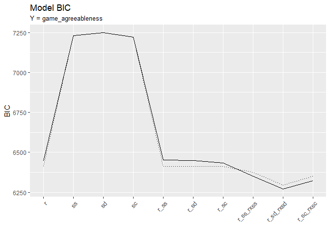
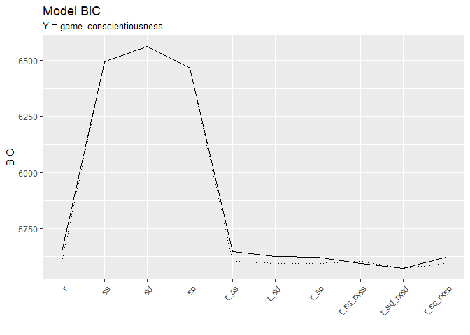
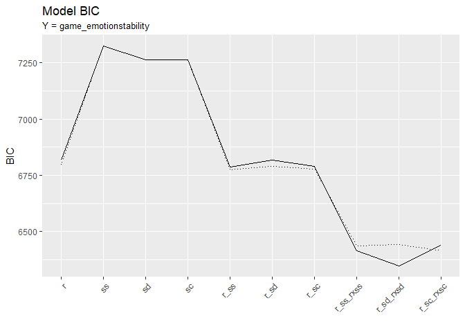
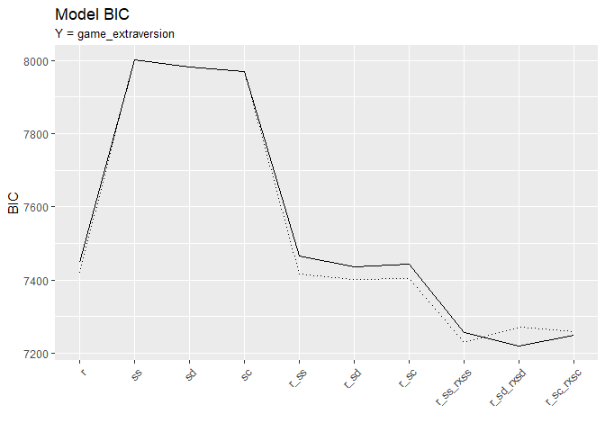
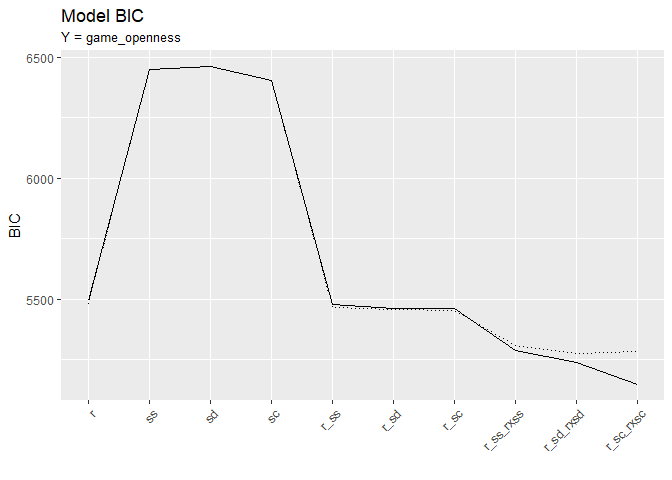
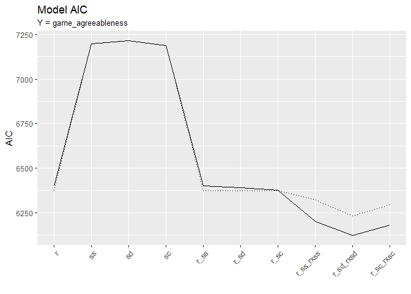
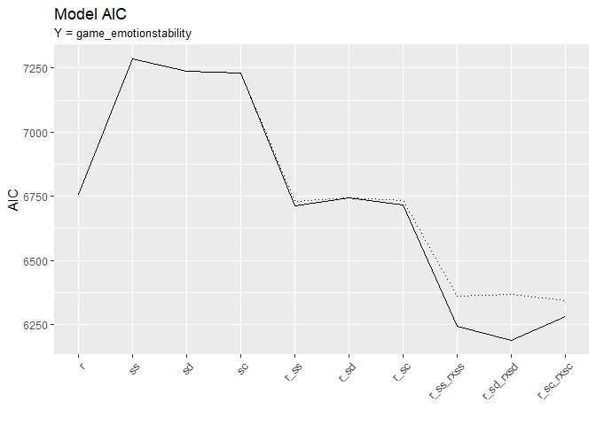
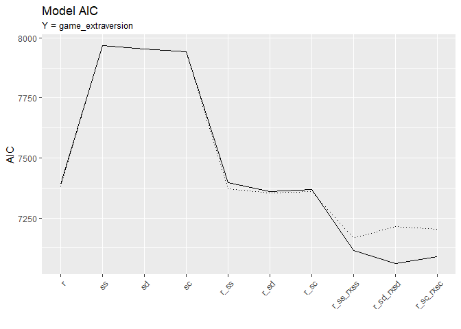

MAPSS Thesis II - model 2\_false
================
Chih-Yu Chiang
September 05, 2017

-   [Setup](#setup)
-   [Variable](#variable)
-   [Model specification](#model-specification)
-   [Double Lasso selection](#double-lasso-selection)
-   [Tobit models](#tobit-models)
-   [Information criteria](#information-criteria)
    -   [BIC](#bic)
    -   [AIC](#aic)
-   [Model summaries (lasso select all var except corresponding real personality)](#model-summaries-lasso-select-all-var-except-corresponding-real-personality)
    -   [gap ~ real + c](#gap-real-c)
    -   [(link for the above position)](#link-for-the-above-position)
    -   [gap ~ satis + c](#gap-satis-c)
    -   [(link for the above position)](#link-for-the-above-position-1)
    -   [gap ~ real + satis + c](#gap-real-satis-c)
    -   [(link for the above position)](#link-for-the-above-position-2)
    -   [gap ~ real + satis + real \* satis + c](#gap-real-satis-real-satis-c)
    -   [(link for the above position)](#link-for-the-above-position-3)
-   [Model summaries (lasso select all var)](#model-summaries-lasso-select-all-var)
    -   [gap ~ real + satis + c](#gap-real-satis-c-1)
    -   [(link for the above position)](#link-for-the-above-position-4)
    -   [gap ~ real + satis + real \* satis + c](#gap-real-satis-real-satis-c-1)
    -   [(link for the above position)](#link-for-the-above-position-5)

``` r
knitr::opts_chunk$set(
    message=FALSE,
    warning=FALSE
)

#Prevent result wrapping
options(width=120)
```

Setup
-----

Data of game and player are read in and matched up.

-   Game release data, `release` (year), is read in as an interval variable.
-   Missing values are imputed with variable mean conveniently (`star_user` and `star_GS`).

``` r
#--Package
library(tidyverse)
library(data.table)
library(corrplot)
library(modelr)
library(glmnet)
library(VGAM)
library(randomForest)
library(e1071)
library(car)
library(rlist)
library(pander)
set.seed(1)


#--Read in
#Core game info and group distance/probability data
core_cluster <- read_csv("../data/core_cluster.csv", col_names=TRUE) %>%
  mutate(group_survey = factor(group_survey),
         group_review = factor(group_review),
         core_id = factor(core_id)) %>%
  select(-X1)

#Core game tste scores (of dif numbers of features)
core_tsteScore <- read_csv("../data/tste_concat.csv", col_names=TRUE) %>%
  select(-X1)

#Core game traditional genre data
core_tGenre <- read_csv("../data/traditional_genre.csv", col_names=TRUE) %>%
  select(-X1, -group, -idTag, -game_title) %>%
  mutate(core_id = factor(core_id))
colnames(core_tGenre)[3:length(colnames(core_tGenre))] <- #Give genre columns identification
  unlist(lapply(X=colnames(core_tGenre)[3:length(colnames(core_tGenre))], function(X) {paste("tg_", X, sep="")}))

#Player-related survey data
survey <- read_csv("../data/survey.csv", col_names=TRUE) %>%
  mutate(race = factor(race),
         sex = factor(sex),
         core_id = factor(core_id)) %>%
  select(-id)


#--Impute missing with mean
imputation_mean <- function(c){
  c[is.na(c)] <- mean(c, na.rm=TRUE)
  return(c)
}
core_cluster <- mutate_each(core_cluster,
                            funs(imputation_mean(.)),
                            star_user, star_GS)


#--Match up
#Main df, key=player-game pair
df <- bind_cols(core_cluster, core_tsteScore) %>%
  left_join(core_tGenre, by=c("core_id")) %>%
  left_join(survey, by=c("core_id"), copy=FALSE)
```

Variable
--------

Compute and select variables to be used in models.

-   Final response variable utilizes only `preference_3`.
-   Mean-centered vars is marked with a suffix \_ct.

-   Player preference:

| Name           | Definition                 | Unit                        |
|----------------|----------------------------|-----------------------------|
| `preference_1` | how much do you like       | Likert 1-7=like             |
| `preference_2` | how often play it          | ordinary 1=never-7=everyday |
| `preference_3` | does it fit personal taste | Likert 1-7=fit              |

-   Game characteristics:

<table style="width:36%;">
<colgroup>
<col width="8%" />
<col width="18%" />
<col width="9%" />
</colgroup>
<thead>
<tr class="header">
<th>Name</th>
<th>Definition</th>
<th>Unit</th>
</tr>
</thead>
<tbody>
<tr class="odd">
<td><code>distance_survey_mean_x</code></td>
<td>group score from survey (distance from group mean in tste)</td>
<td>cosine distance</td>
</tr>
<tr class="even">
<td><code>distance_survey_median_x</code></td>
<td>group score from survey (distance from group median in tste)</td>
<td>cosine distance</td>
</tr>
<tr class="odd">
<td><code>probability_review_mean_x</code></td>
<td>group score from review (mean probability to be categorized in the group by NN)</td>
<td>percentage</td>
</tr>
<tr class="even">
<td><code>probability_review_median_x</code></td>
<td>group score from review (median probability to be categorized in the group by NN)</td>
<td>percentage</td>
</tr>
<tr class="odd">
<td><code>group_survey</code></td>
<td>group identity from survey</td>
<td>categorical 1-group number</td>
</tr>
<tr class="even">
<td><code>group_review</code></td>
<td>group identity from review</td>
<td>categorical 1-group number</td>
</tr>
<tr class="odd">
<td><code>tste_n_x</code></td>
<td>group score from survey (tste), n=number of features</td>
<td>interval arbitrary</td>
</tr>
<tr class="even">
<td><code>tg_x</code></td>
<td>if belongs to traditional genre categories</td>
<td>binary</td>
</tr>
</tbody>
</table>

-   Player personality:

<table style="width:36%;">
<colgroup>
<col width="8%" />
<col width="18%" />
<col width="9%" />
</colgroup>
<thead>
<tr class="header">
<th>Name</th>
<th>Definition</th>
<th>Unit</th>
</tr>
</thead>
<tbody>
<tr class="odd">
<td><code>game_xxxxx</code></td>
<td>Big-five personality in game</td>
<td>Likert 1-7</td>
</tr>
<tr class="even">
<td><code>real_xxxxx</code></td>
<td>Big-five personality in real life</td>
<td>Likert 1-7</td>
</tr>
<tr class="odd">
<td><code>gap_xxxxx</code></td>
<td>personality gap (game - real)</td>
<td>Likert 1-7</td>
</tr>
<tr class="even">
<td><code>satis_xxxxx</code></td>
<td>SDT satisfaction in real life</td>
<td>Likert 1-7</td>
</tr>
<tr class="odd">
<td><code>dissatis_xxxxx</code></td>
<td>SDT dissatisfaction in real life</td>
<td>Likert 1-7</td>
</tr>
<tr class="even">
<td><code>combined_xxxxx</code></td>
<td>SDT combined (previous two) dissatisfaction in real life</td>
<td>Likert 1-7</td>
</tr>
</tbody>
</table>

-   Control:

| Name        | Definition                                    | Unit                      |
|-------------|-----------------------------------------------|---------------------------|
| `age`       | player age                                    | interval                  |
| `education` | player education                              | ordinary 1-7=PhD          |
| `income`    | player annual household income                | ordinary 1-7=over 150,000 |
| `sex`       | player sex                                    | categorical 1=male        |
| `race`      | player race                                   | categorical 1-5           |
| `release`   | game release year                             | interval year             |
| `star_GS`   | general game quality rated by GameSpot expert | interval 0-10             |
| `star_user` | general game quality rated by GameSpot user   | interval 0-10             |

``` r
updateVars <- function(df.outcome="preference", df_player.outcome="game_extraversion"){
  #--Create response variable
  df <<- df %>%
    rowwise() %>% #Rowwise to make the ordinary functions work
    mutate(preference = mean(c(preference_3))) %>%
    ungroup() #Ungroup to cancel rowwise
  

  #--Mean-center predictor variables
  df <<- mutate_at(df, vars(starts_with("tste"),
                            starts_with("game"),
                            starts_with("real"),
                            starts_with("satis"),
                            starts_with("dissatis"),
                            starts_with("combined")), funs(ct = . - mean(.)))


  #--Compute personalty gap
  df <<- mutate(df,
                gap_extraversion = game_extraversion - real_extraversion,
                gap_agreeableness = game_agreeableness - real_agreeableness,
                gap_conscientiousness = game_conscientiousness - real_conscientiousness,
                gap_emotionstability = game_emotionstability - real_emotionstability,
                gap_openness = game_openness - real_openness,
                gap_sum = gap_extraversion + gap_agreeableness + gap_conscientiousness + (-gap_emotionstability) + gap_openness,
                real_sum = real_extraversion + real_agreeableness + real_conscientiousness + (-real_emotionstability) + real_openness,
                dissatis_sum = dissatis_autonomy + dissatis_relatedness + dissatis_competence,
                satis_sum = satis_autonomy + satis_relatedness + satis_competence,
                combined_sum = combined_autonomy + combined_relatedness + combined_competence
                )

  
  #--Acquire player df, key=player
  df_player <<- distinct(df, respondent, .keep_all=TRUE)
  
  
  #--Select variables to be included in regression (model formation)
  #Sets of predictor variables from file
  df_predictors <- read.csv("../data/vars/predictors.csv", header=TRUE, na.strings="")

  #Get column name as model id
  modelId <- colnames(df_predictors)
  
  #predictor variable as strings for each model
  predictorString <- apply(df_predictors, MARGIN=2, function(x) paste(na.omit(x), collapse="+"))
  
  #Make the dfs into a data frame
  dfs <<- data.frame(predictorString, row.names=modelId, stringsAsFactors=FALSE) %>%
    mutate(df_x = map(predictorString, ~ model.matrix(as.formula(paste(df.outcome, " ~ ", .x, sep="")), data=df)[, -1])) %>% #df with only predictor variables; [, -1] used to remove redundant intercept column
    mutate(df_yx = map(df_x, ~ bind_cols(select(df, df.outcome), data.frame(.x)))) #df also with outcome variables
  dfs_player <<- data.frame(predictorString, row.names=modelId, stringsAsFactors=FALSE) %>%
    mutate(df_x = map(predictorString, ~ model.matrix(as.formula(paste(df.outcome, " ~ ", .x, sep="")), data=df)[, -1])) %>% #df with only predictor variables; [, -1] used to remove redundant intercept column
    mutate(df_yx = map(df_x, ~ bind_cols(select(df, df_player.outcome), data.frame(.x)))) #df also with outcome variables
  
  #Set row names for reference
  row.names(dfs) <<- modelId
  row.names(dfs_player) <<- modelId
}
```

Model specification
-------------------


Double Lasso selection
----------------------

-   Based on paper `Using Double-Lasso Selection for Principled Variable Selection`
-   by Oleg Urminsky, Christian Hansen, and Victor Chernozhukov

``` r
#--Function for updating lambda used in selection
#n = number of observation; p = number of independent variables; se = standard error of residual or dependent variable
updateLambda <- function(n, p, se) {se * (1.1 / sqrt(n)) * qnorm(1 - (.1 / log(n)) / (2 * p))}


#--Function for acquiring the indices of the selected variables in df_x
#df_x = matrix with only variables to be tested; y = dependent variable or treatment variables; lambda = the initial lambda computed in advance 
acquireBetaIndices <- function(df_x, y, lambda, n, p) {
  #Update lambda k times, k is selected based on literature
  k <- 1
  while(k < 15) {
    model_las <- glmnet(x=df_x, y=y, alpha=1, lambda=lambda, standardize=TRUE)
    beta <- coef(model_las)
    residual.se <- sd(y - predict(model_las, df_x))
    lambda <- updateLambda(n=n, p=p, se=residual.se)
    k <- k + 1
  }
  
  #Return the variable indices with absolute value of beta > 0
  return(which(abs(beta) > 0))
}


#--Function to perform double lasso selection
#df_yx = df with all variables; outcomeVar = string of the outcome var in the df; form = a switch to decide the test and treatment vars
#output = a new df_yx with variables selected from df_yx
lassoSelect <- function(df_yx, outcomeVar, form) {
  #--Setting up
  #The df with y and treatment variables (those vars will not be tested, and will always be included in the output df)
  df_ytreatment <- switch(form,
                          "1"=select(df_yx, matches(outcomeVar), matches("^real.+\\D_ct$"), matches("^game.+\\D_ct$"), matches("^gap.+\\D_ct$"), matches("^tste.+\\d_ct$")),
                          "2"=select(df_yx, matches(outcomeVar)),
                          "3"=select(df_yx, matches(outcomeVar), matches(sub("game", "real", outcomeVar))))

  #The df with only the variables to be tested (those vars will be tested, and not necessarily be included in the output df)
  df_test <- switch(form,
                    "1"=data.matrix(select(df_yx, -matches(outcomeVar), -matches("^real.+\\D_ct$"), -matches("^game.+\\D_ct$"), -matches("^gap.+\\D_ct$"), -matches("^tste.+\\d_ct$"))),
                    "2"=data.matrix(select(df_yx, -matches(outcomeVar))),
                    "3"=data.matrix(select(df_yx, -matches(outcomeVar), -matches(sub("game", "real", outcomeVar)))))
  
  #The number of observations
  n <- nrow(df_test)
  
  #The number of variables to be tested
  p <- ncol(df_test)
  
  
  #--Select vars that predict outcome
  #Lambda is initialized as the se of residuals of a simple linear using only treatments predicting dependent variable
  #If the treatment var is NULL, use the se pf dependent var to initiate
  residual.se <- if(ncol(df_ytreatment) == 1) {sd(df_yx[[outcomeVar]])} else {sd(residuals(lm(as.formula(paste(outcomeVar, " ~ .", sep="")), data=df_ytreatment)))}
  lambda <- updateLambda(n=n, p=p, se=residual.se)
  
  #by Lasso model: dependent variable ~ test variables
  betaIndices <- acquireBetaIndices(df_x=df_test, y=df_yx[[outcomeVar]], lambda=lambda, n=n, p=p)
  
  
  #--Select vars that predict treatments
  #Each column of the treatment variables as the y in the Lasso selection
  #Starting from 2 because 1 is the dependent variable
  if(ncol(df_ytreatment) != 1) { #Run only when treatment vars not NULL
    for(i in seq(2, ncol(df_ytreatment))) {
      #Acquire target treatment variable
      treatment <- df_ytreatment[[i]]
      
      #Lambda is initialized as the se of the target treatment variable
      treatment.se <- sd(treatment)
      lambda <- updateLambda(n=n, p=p, se=treatment.se)
      
      #Acquire the indices and union the result indices of each treatment variable
      betaIndices <- union(betaIndices, acquireBetaIndices(df_x=df_test, y=treatment, lambda=lambda, n=n, p=p))
    }
  }
  
  
  #Process the result indices to remove the first term (the interaction term)
  betaIndices <- setdiff((betaIndices - 1), 0)
  
  #Bind the selected variables with dependent and treatment variables
  df_yx_selected <- cbind(df_ytreatment, df_test[, betaIndices])
  
  #Return a new df_yx with variables selected
  return(df_yx_selected)
}


#--Update vars and acquire selected dfs
personalities <- c("game_agreeableness", "game_conscientiousness", "game_emotionstability", "game_extraversion", "game_openness")

acquireDfs <- function(personality) {
  updateVars(df_player.outcome=personality)
  dfs_player_selected_1 <- map(dfs_player$df_yx, ~ lassoSelect(., outcomeVar=personality, form="3"))
  dfs_player_selected_2 <- map(dfs_player$df_yx, ~ lassoSelect(., outcomeVar=personality, form="2"))
  return(as.data.frame(cbind(dfs_player_selected_1, dfs_player_selected_2)))
}

dfs_new <- map(personalities, acquireDfs)
```

Tobit models
------------

``` r
acquireModels <- function(i) {
  models_tobit_selected_1 <- map(dfs_new[[i]]$dfs_player_selected_1,
                              ~ vglm(as.formula(paste(personalities[i], " ~ .", sep="")), data=.x, family=tobit(Upper=7, Lower=1, imethod=1)))
  models_tobit_selected_2 <- map(dfs_new[[i]]$dfs_player_selected_2,
                              ~ vglm(as.formula(paste(personalities[i], " ~ .", sep="")), data=.x, family=tobit(Upper=7, Lower=1, imethod=1)))
  return(as.data.frame(cbind(models_tobit_selected_1, models_tobit_selected_2)))
}

models_new <- map(c(1:5), acquireModels)
```

Information criteria
--------------------

### BIC

``` r
drawBICs <- function(i) {
  #--BIC
  BIC_1 <- unlist(map(models_new[[i]]$models_tobit_selected_1, BIC))
  BIC_2 <- unlist(map(models_new[[i]]$models_tobit_selected_2, BIC))

  #Batch models
  plot <- ggplot() +
    geom_line(mapping=aes(seq(1, length(BIC_1)), BIC_1)) +
    geom_line(mapping=aes(seq(1, length(BIC_2)), BIC_2), linetype="dotted") +
    labs(x="", y="BIC", title="Model BIC", subtitle=paste("Y = ", personalities[i], sep="")) +
    scale_x_continuous(breaks=seq(1, length(BIC_1)), minor_breaks=NULL, labels=c("r", "ss", "sd", "sc", "r_ss", "r_sd", "r_sc", "r_ss_rxss", "r_sd_rxsd", "r_sc_rxsc")) +
    theme(axis.text.x = element_text(angle=45, hjust = 1))
  
  return(plot)
}

drawBICs(1)
```



``` r
drawBICs(2)
```



``` r
drawBICs(3)
```



``` r
drawBICs(4)
```



``` r
drawBICs(5)
```



### AIC

``` r
drawAICs <- function(i) {
  #--AIC
  AIC_1 <- unlist(map(models_new[[i]]$models_tobit_selected_1, AIC))
  AIC_2 <- unlist(map(models_new[[i]]$models_tobit_selected_2, AIC))

  #Batch models
  plot <- ggplot() +
    geom_line(mapping=aes(seq(1, length(AIC_1)), AIC_1)) +
    geom_line(mapping=aes(seq(1, length(AIC_2)), AIC_2), linetype="dotted") +
    labs(x="", y="AIC", title="Model AIC", subtitle=paste("Y = ", personalities[i], sep="")) +
    scale_x_continuous(breaks=seq(1, length(AIC_1)), minor_breaks=NULL, labels=c("r", "ss", "sd", "sc", "r_ss", "r_sd", "r_sc", "r_ss_rxss", "r_sd_rxsd", "r_sc_rxsc")) +
    theme(axis.text.x = element_text(angle=45, hjust = 1))
  
  return(plot)
}

drawAICs(1)
```



``` r
drawAICs(2)
```


``` r
drawAICs(3)
```



``` r
drawAICs(4)
```



``` r
drawAICs(5)
```


Model summaries (lasso select all var except corresponding real personality)
----------------------------------------------------------------------------

### gap ~ real + c

### (link for the above position)

``` r
summary(models_new[[1]]$models_tobit_selected_1[[1]])
```

    ## 
    ## Call:
    ## vglm(formula = as.formula(paste(personalities[i], " ~ .", sep = "")), 
    ##     family = tobit(Upper = 7, Lower = 1, imethod = 1), data = .x)
    ## 
    ## 
    ## Pearson residuals:
    ##              Min      1Q   Median     3Q   Max
    ## mu       -2.5512 -0.6271 -0.05104 0.5434 2.440
    ## loge(sd) -0.8353 -0.6774 -0.45950 0.2421 4.977
    ## 
    ## Coefficients: 
    ##                            Estimate Std. Error z value Pr(>|z|)    
    ## (Intercept):1              3.081284   0.109624  28.108  < 2e-16 ***
    ## (Intercept):2              0.102496   0.015974   6.416 1.40e-10 ***
    ## real_agreeableness_ct      0.592608   0.020735  28.580  < 2e-16 ***
    ## sex2                      -0.287915   0.053843  -5.347 8.93e-08 ***
    ## real_conscientiousness_ct -0.089441   0.022274  -4.016 5.93e-05 ***
    ## real_emotionstability_ct   0.031827   0.021132   1.506  0.13205    
    ## real_openness_ct          -0.032120   0.018142  -1.770  0.07666 .  
    ## age                        0.009611   0.003407   2.821  0.00479 ** 
    ## ---
    ## Signif. codes:  0 '***' 0.001 '**' 0.01 '*' 0.05 '.' 0.1 ' ' 1
    ## 
    ## Number of linear predictors:  2 
    ## 
    ## Names of linear predictors: mu, loge(sd)
    ## 
    ## Log-likelihood: -3192.255 on 4268 degrees of freedom
    ## 
    ## Number of iterations: 5

``` r
summary(models_new[[2]]$models_tobit_selected_1[[1]])
```

    ## 
    ## Call:
    ## vglm(formula = as.formula(paste(personalities[i], " ~ .", sep = "")), 
    ##     family = tobit(Upper = 7, Lower = 1, imethod = 1), data = .x)
    ## 
    ## 
    ## Pearson residuals:
    ##             Min      1Q  Median     3Q    Max
    ## mu       -2.740 -0.6908 -0.2035 0.5857  3.284
    ## loge(sd) -1.029 -0.7339 -0.4919 0.4333 12.602
    ## 
    ## Coefficients: 
    ##                             Estimate Std. Error z value Pr(>|z|)    
    ## (Intercept):1              5.529e+00  9.474e-02  58.358  < 2e-16 ***
    ## (Intercept):2             -5.606e-02  1.716e-02  -3.267  0.00109 ** 
    ## real_conscientiousness_ct  6.290e-01  1.948e-02  32.288  < 2e-16 ***
    ## age                        1.912e-05  2.948e-03   0.006  0.99483    
    ## race4                     -9.210e-02  9.133e-02  -1.008  0.31324    
    ## real_agreeableness_ct     -4.961e-02  1.790e-02  -2.771  0.00559 ** 
    ## real_emotionstability_ct   3.630e-02  1.824e-02   1.990  0.04658 *  
    ## real_openness_ct           1.207e-01  1.565e-02   7.712 1.24e-14 ***
    ## sex2                      -1.354e-02  4.656e-02  -0.291  0.77125    
    ## ---
    ## Signif. codes:  0 '***' 0.001 '**' 0.01 '*' 0.05 '.' 0.1 ' ' 1
    ## 
    ## Number of linear predictors:  2 
    ## 
    ## Names of linear predictors: mu, loge(sd)
    ## 
    ## Log-likelihood: -2788.421 on 4267 degrees of freedom
    ## 
    ## Number of iterations: 6

``` r
summary(models_new[[3]]$models_tobit_selected_1[[1]])
```

    ## 
    ## Call:
    ## vglm(formula = as.formula(paste(personalities[i], " ~ .", sep = "")), 
    ##     family = tobit(Upper = 7, Lower = 1, imethod = 1), data = .x)
    ## 
    ## 
    ## Pearson residuals:
    ##             Min      1Q   Median     3Q   Max
    ## mu       -2.797 -0.6667  0.04859 0.6740 2.558
    ## loge(sd) -1.000 -0.7132 -0.41661 0.3844 8.316
    ## 
    ## Coefficients: 
    ##                            Estimate Std. Error z value Pr(>|z|)    
    ## (Intercept):1              2.852401   0.097318  29.310  < 2e-16 ***
    ## (Intercept):2              0.217006   0.016605  13.069  < 2e-16 ***
    ## real_emotionstability_ct   0.522960   0.025615  20.416  < 2e-16 ***
    ## race7                     -0.437995   0.117397  -3.731 0.000191 ***
    ## real_agreeableness_ct      0.060309   0.023408   2.576 0.009984 ** 
    ## real_conscientiousness_ct -0.077887   0.025023  -3.113 0.001855 ** 
    ## education                  0.003850   0.022403   0.172 0.863556    
    ## income                     0.013783   0.014361   0.960 0.337176    
    ## sex2                      -0.144545   0.060813  -2.377 0.017460 *  
    ## real_extraversion_ct       0.132120   0.017067   7.741 9.84e-15 ***
    ## real_openness_ct           0.004367   0.021123   0.207 0.836229    
    ## ---
    ## Signif. codes:  0 '***' 0.001 '**' 0.01 '*' 0.05 '.' 0.1 ' ' 1
    ## 
    ## Number of linear predictors:  2 
    ## 
    ## Names of linear predictors: mu, loge(sd)
    ## 
    ## Log-likelihood: -3367.345 on 4265 degrees of freedom
    ## 
    ## Number of iterations: 5

``` r
summary(models_new[[4]]$models_tobit_selected_1[[1]])
```

    ## 
    ## Call:
    ## vglm(formula = as.formula(paste(personalities[i], " ~ .", sep = "")), 
    ##     family = tobit(Upper = 7, Lower = 1, imethod = 1), data = .x)
    ## 
    ## 
    ## Pearson residuals:
    ##             Min      1Q  Median     3Q   Max
    ## mu       -2.317 -0.7838 -0.1726 0.6337 2.769
    ## loge(sd) -1.045 -0.7229 -0.4316 0.3819 4.839
    ## 
    ## Coefficients: 
    ##                          Estimate Std. Error z value Pr(>|z|)    
    ## (Intercept):1             4.54407    0.11358  40.008  < 2e-16 ***
    ## (Intercept):2             0.37979    0.01706  22.260  < 2e-16 ***
    ## real_extraversion_ct      0.49529    0.02026  24.443  < 2e-16 ***
    ## income                    0.09395    0.01693   5.549 2.87e-08 ***
    ## real_emotionstability_ct -0.01761    0.02403  -0.733   0.4636    
    ## real_openness_ct          0.12376    0.02446   5.060 4.19e-07 ***
    ## education                -0.06155    0.02660  -2.314   0.0207 *  
    ## race2                    -0.07059    0.13137  -0.537   0.5911    
    ## race4                    -0.22265    0.14268  -1.560   0.1187    
    ## race7                     0.58194    0.13629   4.270 1.96e-05 ***
    ## ---
    ## Signif. codes:  0 '***' 0.001 '**' 0.01 '*' 0.05 '.' 0.1 ' ' 1
    ## 
    ## Number of linear predictors:  2 
    ## 
    ## Names of linear predictors: mu, loge(sd)
    ## 
    ## Log-likelihood: -3686.184 on 4266 degrees of freedom
    ## 
    ## Number of iterations: 6

``` r
summary(models_new[[5]]$models_tobit_selected_1[[1]])
```

    ## 
    ## Call:
    ## vglm(formula = as.formula(paste(personalities[i], " ~ .", sep = "")), 
    ##     family = tobit(Upper = 7, Lower = 1, imethod = 1), data = .x)
    ## 
    ## 
    ## Pearson residuals:
    ##             Min      1Q  Median     3Q   Max
    ## mu       -2.683 -0.7273 -0.2456 0.8323 2.628
    ## loge(sd) -1.028 -0.7102 -0.4186 0.4719 4.697
    ## 
    ## Coefficients: 
    ##                            Estimate Std. Error z value Pr(>|z|)    
    ## (Intercept):1              6.143324   0.073855  83.181  < 2e-16 ***
    ## (Intercept):2             -0.078840   0.017370  -4.539 5.66e-06 ***
    ## real_openness_ct           0.590346   0.015992  36.914  < 2e-16 ***
    ## education                 -0.079730   0.016847  -4.733 2.22e-06 ***
    ## income                    -0.042078   0.010798  -3.897 9.74e-05 ***
    ## race2                     -0.340778   0.083082  -4.102 4.10e-05 ***
    ## sex2                       0.177437   0.045770   3.877 0.000106 ***
    ## real_extraversion_ct      -0.007676   0.012870  -0.596 0.550862    
    ## real_agreeableness_ct     -0.075648   0.017531  -4.315 1.60e-05 ***
    ## real_conscientiousness_ct  0.051796   0.018762   2.761 0.005768 ** 
    ## real_emotionstability_ct   0.006633   0.019104   0.347 0.728434    
    ## ---
    ## Signif. codes:  0 '***' 0.001 '**' 0.01 '*' 0.05 '.' 0.1 ' ' 1
    ## 
    ## Number of linear predictors:  2 
    ## 
    ## Names of linear predictors: mu, loge(sd)
    ## 
    ## Log-likelihood: -2705.081 on 4265 degrees of freedom
    ## 
    ## Number of iterations: 6

### gap ~ satis + c

### (link for the above position)

``` r
summary(models_new[[1]]$models_tobit_selected_1[[2]])
```

    ## 
    ## Call:
    ## vglm(formula = as.formula(paste(personalities[i], " ~ .", sep = "")), 
    ##     family = tobit(Upper = 7, Lower = 1, imethod = 1), data = .x)
    ## 
    ## 
    ## Pearson residuals:
    ##             Min      1Q    Median     3Q   Max
    ## mu       -2.264 -0.7148 -0.006152 0.6807 2.268
    ## loge(sd) -0.762 -0.6042 -0.386726 0.2233 3.505
    ## 
    ## Coefficients: 
    ##                      Estimate Std. Error z value Pr(>|z|)    
    ## (Intercept):1         3.46661    0.03590  96.566  < 2e-16 ***
    ## (Intercept):2         0.29297    0.01603  18.276  < 2e-16 ***
    ## race6                -1.21848    0.31937  -3.815 0.000136 ***
    ## sex2                 -0.51584    0.06171  -8.359  < 2e-16 ***
    ## satis_relatedness_ct -0.30811    0.03406  -9.046  < 2e-16 ***
    ## satis_competence_ct  -0.04978    0.02852  -1.746 0.080849 .  
    ## ---
    ## Signif. codes:  0 '***' 0.001 '**' 0.01 '*' 0.05 '.' 0.1 ' ' 1
    ## 
    ## Number of linear predictors:  2 
    ## 
    ## Names of linear predictors: mu, loge(sd)
    ## 
    ## Log-likelihood: -3592.253 on 4270 degrees of freedom
    ## 
    ## Number of iterations: 5

``` r
summary(models_new[[1]]$models_tobit_selected_1[[3]])
```

    ## 
    ## Call:
    ## vglm(formula = as.formula(paste(personalities[i], " ~ .", sep = "")), 
    ##     family = tobit(Upper = 7, Lower = 1, imethod = 1), data = .x)
    ## 
    ## 
    ## Pearson residuals:
    ##              Min      1Q   Median     3Q   Max
    ## mu       -2.3661 -0.6958  0.01623 0.6529 2.527
    ## loge(sd) -0.7706 -0.6700 -0.38279 0.1816 4.210
    ## 
    ## Coefficients: 
    ##                         Estimate Std. Error z value Pr(>|z|)    
    ## (Intercept):1            3.47609    0.03607  96.358  < 2e-16 ***
    ## (Intercept):2            0.29569    0.01603  18.450  < 2e-16 ***
    ## race6                   -1.11175    0.32403  -3.431 0.000601 ***
    ## sex2                    -0.54597    0.06211  -8.790  < 2e-16 ***
    ## dissatis_relatedness_ct  0.12729    0.02597   4.901 9.53e-07 ***
    ## dissatis_competence_ct   0.14085    0.02275   6.192 5.93e-10 ***
    ## ---
    ## Signif. codes:  0 '***' 0.001 '**' 0.01 '*' 0.05 '.' 0.1 ' ' 1
    ## 
    ## Number of linear predictors:  2 
    ## 
    ## Names of linear predictors: mu, loge(sd)
    ## 
    ## Log-likelihood: -3601.319 on 4270 degrees of freedom
    ## 
    ## Number of iterations: 5

``` r
summary(models_new[[1]]$models_tobit_selected_1[[4]])
```

    ## 
    ## Call:
    ## vglm(formula = as.formula(paste(personalities[i], " ~ .", sep = "")), 
    ##     family = tobit(Upper = 7, Lower = 1, imethod = 1), data = .x)
    ## 
    ## 
    ## Pearson residuals:
    ##              Min      1Q    Median     3Q   Max
    ## mu       -2.3979 -0.7077 -0.002243 0.6851 2.417
    ## loge(sd) -0.7763 -0.6383 -0.393438 0.1746 3.653
    ## 
    ## Coefficients: 
    ##                         Estimate Std. Error z value Pr(>|z|)    
    ## (Intercept):1            3.46526    0.03585  96.664  < 2e-16 ***
    ## (Intercept):2            0.29020    0.01603  18.105  < 2e-16 ***
    ## race6                   -1.07645    0.32040  -3.360  0.00078 ***
    ## sex2                    -0.51533    0.06168  -8.355  < 2e-16 ***
    ## combined_relatedness_ct -0.25475    0.03369  -7.561 3.99e-14 ***
    ## combined_competence_ct  -0.10135    0.02775  -3.652  0.00026 ***
    ## ---
    ## Signif. codes:  0 '***' 0.001 '**' 0.01 '*' 0.05 '.' 0.1 ' ' 1
    ## 
    ## Number of linear predictors:  2 
    ## 
    ## Names of linear predictors: mu, loge(sd)
    ## 
    ## Log-likelihood: -3587.387 on 4270 degrees of freedom
    ## 
    ## Number of iterations: 5

``` r
summary(models_new[[2]]$models_tobit_selected_1[[2]])
```

    ## 
    ## Call:
    ## vglm(formula = as.formula(paste(personalities[i], " ~ .", sep = "")), 
    ##     family = tobit(Upper = 7, Lower = 1, imethod = 1), data = .x)
    ## 
    ## 
    ## Pearson residuals:
    ##             Min      1Q  Median     3Q   Max
    ## mu       -2.261 -0.7200 -0.1576 0.5550 2.429
    ## loge(sd) -1.023 -0.7512 -0.5578 0.6148 6.676
    ## 
    ## Coefficients: 
    ##                       Estimate Std. Error z value Pr(>|z|)    
    ## (Intercept):1         5.035478   0.114589  43.944  < 2e-16 ***
    ## (Intercept):2         0.161970   0.017466   9.273  < 2e-16 ***
    ## age                   0.016343   0.003619   4.515 6.32e-06 ***
    ## race4                -0.400477   0.111967  -3.577 0.000348 ***
    ## race6                 0.961860   0.283853   3.389 0.000703 ***
    ## satis_relatedness_ct  0.218383   0.030032   7.272 3.55e-13 ***
    ## satis_competence_ct   0.315688   0.025536  12.362  < 2e-16 ***
    ## ---
    ## Signif. codes:  0 '***' 0.001 '**' 0.01 '*' 0.05 '.' 0.1 ' ' 1
    ## 
    ## Number of linear predictors:  2 
    ## 
    ## Names of linear predictors: mu, loge(sd)
    ## 
    ## Log-likelihood: -3221.483 on 4269 degrees of freedom
    ## 
    ## Number of iterations: 7

``` r
summary(models_new[[2]]$models_tobit_selected_1[[3]])
```

    ## 
    ## Call:
    ## vglm(formula = as.formula(paste(personalities[i], " ~ .", sep = "")), 
    ##     family = tobit(Upper = 7, Lower = 1, imethod = 1), data = .x)
    ## 
    ## 
    ## Pearson residuals:
    ##             Min      1Q  Median     3Q   Max
    ## mu       -2.695 -0.7051 -0.1439 0.5161 2.513
    ## loge(sd) -1.009 -0.7570 -0.5608 0.4170 7.994
    ## 
    ## Coefficients: 
    ##                          Estimate Std. Error z value Pr(>|z|)    
    ## (Intercept):1            5.161513   0.118423  43.586  < 2e-16 ***
    ## (Intercept):2            0.181707   0.017495  10.386  < 2e-16 ***
    ## age                      0.012708   0.003743   3.395 0.000687 ***
    ## race4                   -0.445233   0.114085  -3.903 9.52e-05 ***
    ## dissatis_relatedness_ct -0.206260   0.022912  -9.002  < 2e-16 ***
    ## dissatis_competence_ct  -0.213949   0.020703 -10.334  < 2e-16 ***
    ## ---
    ## Signif. codes:  0 '***' 0.001 '**' 0.01 '*' 0.05 '.' 0.1 ' ' 1
    ## 
    ## Number of linear predictors:  2 
    ## 
    ## Names of linear predictors: mu, loge(sd)
    ## 
    ## Log-likelihood: -3258.832 on 4270 degrees of freedom
    ## 
    ## Number of iterations: 7

``` r
summary(models_new[[2]]$models_tobit_selected_1[[4]])
```

    ## 
    ## Call:
    ## vglm(formula = as.formula(paste(personalities[i], " ~ .", sep = "")), 
    ##     family = tobit(Upper = 7, Lower = 1, imethod = 1), data = .x)
    ## 
    ## 
    ## Pearson residuals:
    ##             Min      1Q  Median     3Q   Max
    ## mu       -2.327 -0.7121 -0.1735 0.7068 2.368
    ## loge(sd) -1.035 -0.7663 -0.5544 0.4822 8.265
    ## 
    ## Coefficients: 
    ##                          Estimate Std. Error z value Pr(>|z|)    
    ## (Intercept):1            5.169021   0.115242  44.854  < 2e-16 ***
    ## (Intercept):2            0.158530   0.017461   9.079  < 2e-16 ***
    ## age                      0.012391   0.003643   3.401 0.000670 ***
    ## race4                   -0.419956   0.111563  -3.764 0.000167 ***
    ## combined_relatedness_ct  0.274342   0.029438   9.319  < 2e-16 ***
    ## combined_competence_ct   0.269304   0.024826  10.848  < 2e-16 ***
    ## ---
    ## Signif. codes:  0 '***' 0.001 '**' 0.01 '*' 0.05 '.' 0.1 ' ' 1
    ## 
    ## Number of linear predictors:  2 
    ## 
    ## Names of linear predictors: mu, loge(sd)
    ## 
    ## Log-likelihood: -3210.454 on 4270 degrees of freedom
    ## 
    ## Number of iterations: 7

``` r
summary(models_new[[3]]$models_tobit_selected_1[[2]])
```

    ## 
    ## Call:
    ## vglm(formula = as.formula(paste(personalities[i], " ~ .", sep = "")), 
    ##     family = tobit(Upper = 7, Lower = 1, imethod = 1), data = .x)
    ## 
    ## 
    ## Pearson residuals:
    ##              Min      1Q   Median     3Q   Max
    ## mu       -2.4056 -0.6312 -0.08026 0.7005 2.472
    ## loge(sd) -0.8831 -0.6814 -0.40844 0.4010 4.445
    ## 
    ## Coefficients: 
    ##                      Estimate Std. Error z value Pr(>|z|)    
    ## (Intercept):1         3.08273    0.07814  39.452  < 2e-16 ***
    ## (Intercept):2         0.34829    0.01668  20.885  < 2e-16 ***
    ## income               -0.04162    0.01503  -2.769 0.005615 ** 
    ## race7                -0.47141    0.13255  -3.556 0.000376 ***
    ## satis_autonomy_ct    -0.07095    0.04096  -1.732 0.083197 .  
    ## satis_relatedness_ct -0.26006    0.03759  -6.918 4.59e-12 ***
    ## satis_competence_ct  -0.11208    0.03667  -3.057 0.002236 ** 
    ## ---
    ## Signif. codes:  0 '***' 0.001 '**' 0.01 '*' 0.05 '.' 0.1 ' ' 1
    ## 
    ## Number of linear predictors:  2 
    ## 
    ## Names of linear predictors: mu, loge(sd)
    ## 
    ## Log-likelihood: -3635.662 on 4269 degrees of freedom
    ## 
    ## Number of iterations: 4

``` r
summary(models_new[[3]]$models_tobit_selected_1[[3]])
```

    ## 
    ## Call:
    ## vglm(formula = as.formula(paste(personalities[i], " ~ .", sep = "")), 
    ##     family = tobit(Upper = 7, Lower = 1, imethod = 1), data = .x)
    ## 
    ## 
    ## Pearson residuals:
    ##              Min      1Q   Median     3Q   Max
    ## mu       -2.3880 -0.6492 -0.08122 0.6772 2.449
    ## loge(sd) -0.9024 -0.6736 -0.42757 0.4867 4.105
    ## 
    ## Coefficients: 
    ##                         Estimate Std. Error z value Pr(>|z|)    
    ## (Intercept):1            2.88321    0.03166  91.060  < 2e-16 ***
    ## (Intercept):2            0.33855    0.01668  20.301  < 2e-16 ***
    ## race7                   -0.47670    0.13160  -3.622 0.000292 ***
    ## dissatis_relatedness_ct  0.14431    0.02696   5.352 8.69e-08 ***
    ## dissatis_competence_ct   0.23254    0.02371   9.807  < 2e-16 ***
    ## ---
    ## Signif. codes:  0 '***' 0.001 '**' 0.01 '*' 0.05 '.' 0.1 ' ' 1
    ## 
    ## Number of linear predictors:  2 
    ## 
    ## Names of linear predictors: mu, loge(sd)
    ## 
    ## Log-likelihood: -3612.907 on 4271 degrees of freedom
    ## 
    ## Number of iterations: 4

``` r
summary(models_new[[3]]$models_tobit_selected_1[[4]])
```

    ## 
    ## Call:
    ## vglm(formula = as.formula(paste(personalities[i], " ~ .", sep = "")), 
    ##     family = tobit(Upper = 7, Lower = 1, imethod = 1), data = .x)
    ## 
    ## 
    ## Pearson residuals:
    ##              Min      1Q   Median     3Q   Max
    ## mu       -2.4490 -0.6402 -0.05364 0.6727 2.470
    ## loge(sd) -0.8775 -0.6809 -0.42972 0.4125 4.511
    ## 
    ## Coefficients: 
    ##                         Estimate Std. Error z value Pr(>|z|)    
    ## (Intercept):1            2.88259    0.03163  91.135  < 2e-16 ***
    ## (Intercept):2            0.33725    0.01668  20.220  < 2e-16 ***
    ## race7                   -0.46204    0.13175  -3.507 0.000453 ***
    ## combined_autonomy_ct    -0.05221    0.04109  -1.271 0.203833    
    ## combined_relatedness_ct -0.23532    0.03697  -6.365 1.95e-10 ***
    ## combined_competence_ct  -0.18970    0.03575  -5.306 1.12e-07 ***
    ## ---
    ## Signif. codes:  0 '***' 0.001 '**' 0.01 '*' 0.05 '.' 0.1 ' ' 1
    ## 
    ## Number of linear predictors:  2 
    ## 
    ## Names of linear predictors: mu, loge(sd)
    ## 
    ## Log-likelihood: -3608.985 on 4270 degrees of freedom
    ## 
    ## Number of iterations: 4

``` r
summary(models_new[[4]]$models_tobit_selected_1[[2]])
```

    ## 
    ## Call:
    ## vglm(formula = as.formula(paste(personalities[i], " ~ .", sep = "")), 
    ##     family = tobit(Upper = 7, Lower = 1, imethod = 1), data = .x)
    ## 
    ## 
    ## Pearson residuals:
    ##              Min      1Q   Median     3Q   Max
    ## mu       -2.0461 -0.7639 -0.01716 0.5913 2.208
    ## loge(sd) -0.8708 -0.6993 -0.43871 0.3480 5.876
    ## 
    ## Coefficients: 
    ##                      Estimate Std. Error z value Pr(>|z|)    
    ## (Intercept):1         4.24070    0.09282  45.690  < 2e-16 ***
    ## (Intercept):2         0.52350    0.01724  30.359  < 2e-16 ***
    ## income                0.11085    0.01792   6.185 6.21e-10 ***
    ## satis_autonomy_ct     0.09136    0.04881   1.872   0.0613 .  
    ## satis_relatedness_ct  0.11302    0.04460   2.534   0.0113 *  
    ## satis_competence_ct   0.20911    0.04341   4.817 1.45e-06 ***
    ## ---
    ## Signif. codes:  0 '***' 0.001 '**' 0.01 '*' 0.05 '.' 0.1 ' ' 1
    ## 
    ## Number of linear predictors:  2 
    ## 
    ## Names of linear predictors: mu, loge(sd)
    ## 
    ## Log-likelihood: -3977.766 on 4270 degrees of freedom
    ## 
    ## Number of iterations: 6

``` r
summary(models_new[[4]]$models_tobit_selected_1[[3]])
```

    ## 
    ## Call:
    ## vglm(formula = as.formula(paste(personalities[i], " ~ .", sep = "")), 
    ##     family = tobit(Upper = 7, Lower = 1, imethod = 1), data = .x)
    ## 
    ## 
    ## Pearson residuals:
    ##              Min      1Q   Median     3Q   Max
    ## mu       -2.0602 -0.8385 -0.02727 0.6623 2.195
    ## loge(sd) -0.8658 -0.7215 -0.40123 0.2924 4.690
    ## 
    ## Coefficients: 
    ##                         Estimate Std. Error z value Pr(>|z|)    
    ## (Intercept):1            4.29787    0.09299  46.217  < 2e-16 ***
    ## (Intercept):2            0.52057    0.01723  30.206  < 2e-16 ***
    ## income                   0.09863    0.01796   5.492 3.97e-08 ***
    ## dissatis_relatedness_ct -0.12380    0.03212  -3.854 0.000116 ***
    ## dissatis_competence_ct  -0.21470    0.02859  -7.509 5.96e-14 ***
    ## ---
    ## Signif. codes:  0 '***' 0.001 '**' 0.01 '*' 0.05 '.' 0.1 ' ' 1
    ## 
    ## Number of linear predictors:  2 
    ## 
    ## Names of linear predictors: mu, loge(sd)
    ## 
    ## Log-likelihood: -3972.398 on 4271 degrees of freedom
    ## 
    ## Number of iterations: 6

``` r
summary(models_new[[4]]$models_tobit_selected_1[[4]])
```

    ## 
    ## Call:
    ## vglm(formula = as.formula(paste(personalities[i], " ~ .", sep = "")), 
    ##     family = tobit(Upper = 7, Lower = 1, imethod = 1), data = .x)
    ## 
    ## 
    ## Pearson residuals:
    ##              Min      1Q   Median     3Q   Max
    ## mu       -2.0655 -0.8228 -0.01606 0.6371 2.201
    ## loge(sd) -0.8716 -0.7192 -0.38978 0.2962 4.532
    ## 
    ## Coefficients: 
    ##                         Estimate Std. Error z value Pr(>|z|)    
    ## (Intercept):1            4.28812    0.09250  46.357  < 2e-16 ***
    ## (Intercept):2            0.51799    0.01724  30.050  < 2e-16 ***
    ## income                   0.10085    0.01786   5.647 1.63e-08 ***
    ## combined_relatedness_ct  0.16311    0.04204   3.880 0.000105 ***
    ## combined_competence_ct   0.25181    0.03508   7.178 7.07e-13 ***
    ## ---
    ## Signif. codes:  0 '***' 0.001 '**' 0.01 '*' 0.05 '.' 0.1 ' ' 1
    ## 
    ## Number of linear predictors:  2 
    ## 
    ## Names of linear predictors: mu, loge(sd)
    ## 
    ## Log-likelihood: -3965.514 on 4271 degrees of freedom
    ## 
    ## Number of iterations: 6

``` r
summary(models_new[[5]]$models_tobit_selected_1[[2]])
```

    ## 
    ## Call:
    ## vglm(formula = as.formula(paste(personalities[i], " ~ .", sep = "")), 
    ##     family = tobit(Upper = 7, Lower = 1, imethod = 1), data = .x)
    ## 
    ## 
    ## Pearson residuals:
    ##             Min      1Q  Median     3Q   Max
    ## mu       -2.988 -0.7194 -0.2034 0.5706 2.695
    ## loge(sd) -1.039 -0.7279 -0.5154 0.4367 9.611
    ## 
    ## Coefficients: 
    ##                      Estimate Std. Error z value Pr(>|z|)    
    ## (Intercept):1         6.31018    0.09201  68.583  < 2e-16 ***
    ## (Intercept):2         0.15747    0.01778   8.857  < 2e-16 ***
    ## education            -0.11168    0.02111  -5.289 1.23e-07 ***
    ## income               -0.05631    0.01342  -4.196 2.72e-05 ***
    ## race2                -0.47955    0.10397  -4.612 3.98e-06 ***
    ## sex2                  0.29142    0.05479   5.319 1.04e-07 ***
    ## satis_relatedness_ct  0.20945    0.03000   6.982 2.91e-12 ***
    ## satis_competence_ct   0.23143    0.02530   9.149  < 2e-16 ***
    ## ---
    ## Signif. codes:  0 '***' 0.001 '**' 0.01 '*' 0.05 '.' 0.1 ' ' 1
    ## 
    ## Number of linear predictors:  2 
    ## 
    ## Names of linear predictors: mu, loge(sd)
    ## 
    ## Log-likelihood: -3195.134 on 4268 degrees of freedom
    ## 
    ## Number of iterations: 7

``` r
summary(models_new[[5]]$models_tobit_selected_1[[3]])
```

    ## 
    ## Call:
    ## vglm(formula = as.formula(paste(personalities[i], " ~ .", sep = "")), 
    ##     family = tobit(Upper = 7, Lower = 1, imethod = 1), data = .x)
    ## 
    ## 
    ## Pearson residuals:
    ##             Min      1Q  Median     3Q    Max
    ## mu       -2.857 -0.7840 -0.1592 0.5822  2.576
    ## loge(sd) -1.041 -0.7193 -0.4673 0.3874 10.280
    ## 
    ## Coefficients: 
    ##                         Estimate Std. Error z value Pr(>|z|)    
    ## (Intercept):1            6.27847    0.09301  67.502  < 2e-16 ***
    ## (Intercept):2            0.16201    0.01778   9.109  < 2e-16 ***
    ## education               -0.08334    0.02154  -3.869 0.000109 ***
    ## income                  -0.07442    0.01365  -5.450 5.03e-08 ***
    ## race2                   -0.38686    0.10503  -3.683 0.000230 ***
    ## sex2                     0.29652    0.05527   5.365 8.09e-08 ***
    ## dissatis_relatedness_ct -0.24208    0.02318 -10.442  < 2e-16 ***
    ## dissatis_competence_ct  -0.12338    0.02032  -6.072 1.27e-09 ***
    ## ---
    ## Signif. codes:  0 '***' 0.001 '**' 0.01 '*' 0.05 '.' 0.1 ' ' 1
    ## 
    ## Number of linear predictors:  2 
    ## 
    ## Names of linear predictors: mu, loge(sd)
    ## 
    ## Log-likelihood: -3200.548 on 4268 degrees of freedom
    ## 
    ## Number of iterations: 7

``` r
summary(models_new[[5]]$models_tobit_selected_1[[4]])
```

    ## 
    ## Call:
    ## vglm(formula = as.formula(paste(personalities[i], " ~ .", sep = "")), 
    ##     family = tobit(Upper = 7, Lower = 1, imethod = 1), data = .x)
    ## 
    ## 
    ## Pearson residuals:
    ##             Min      1Q  Median     3Q    Max
    ## mu       -2.959 -0.7820 -0.2139 0.5567  2.671
    ## loge(sd) -1.041 -0.7168 -0.4907 0.3107 10.346
    ## 
    ## Coefficients: 
    ##                         Estimate Std. Error z value Pr(>|z|)    
    ## (Intercept):1            6.31146    0.09150  68.979  < 2e-16 ***
    ## (Intercept):2            0.14638    0.01775   8.248  < 2e-16 ***
    ## education               -0.09348    0.02107  -4.437 9.11e-06 ***
    ## income                  -0.07203    0.01338  -5.384 7.27e-08 ***
    ## race2                   -0.40174    0.10315  -3.895 9.83e-05 ***
    ## sex2                     0.28314    0.05434   5.211 1.88e-07 ***
    ## combined_relatedness_ct  0.30109    0.02968  10.146  < 2e-16 ***
    ## combined_competence_ct   0.16663    0.02448   6.805 1.01e-11 ***
    ## ---
    ## Signif. codes:  0 '***' 0.001 '**' 0.01 '*' 0.05 '.' 0.1 ' ' 1
    ## 
    ## Number of linear predictors:  2 
    ## 
    ## Names of linear predictors: mu, loge(sd)
    ## 
    ## Log-likelihood: -3172.173 on 4268 degrees of freedom
    ## 
    ## Number of iterations: 7

### gap ~ real + satis + c

### (link for the above position)

``` r
summary(models_new[[1]]$models_tobit_selected_1[[5]])
```

    ## 
    ## Call:
    ## vglm(formula = as.formula(paste(personalities[i], " ~ .", sep = "")), 
    ##     family = tobit(Upper = 7, Lower = 1, imethod = 1), data = .x)
    ## 
    ## 
    ## Pearson residuals:
    ##             Min      1Q   Median     3Q   Max
    ## mu       -2.547 -0.6277 -0.04604 0.5396 2.435
    ## loge(sd) -0.835 -0.6773 -0.45966 0.2252 4.964
    ## 
    ## Coefficients: 
    ##                            Estimate Std. Error z value Pr(>|z|)    
    ## (Intercept):1              3.079817   0.109666  28.084  < 2e-16 ***
    ## (Intercept):2              0.102299   0.015974   6.404 1.51e-10 ***
    ## real_agreeableness_ct      0.594728   0.021293  27.931  < 2e-16 ***
    ## sex2                      -0.288245   0.053836  -5.354 8.60e-08 ***
    ## satis_relatedness_ct       0.011963   0.026502   0.451  0.65171    
    ## real_conscientiousness_ct -0.092094   0.023062  -3.993 6.51e-05 ***
    ## real_emotionstability_ct   0.032472   0.021171   1.534  0.12508    
    ## real_openness_ct          -0.034425   0.018842  -1.827  0.06770 .  
    ## age                        0.009663   0.003409   2.835  0.00458 ** 
    ## ---
    ## Signif. codes:  0 '***' 0.001 '**' 0.01 '*' 0.05 '.' 0.1 ' ' 1
    ## 
    ## Number of linear predictors:  2 
    ## 
    ## Names of linear predictors: mu, loge(sd)
    ## 
    ## Log-likelihood: -3192.153 on 4267 degrees of freedom
    ## 
    ## Number of iterations: 5

``` r
summary(models_new[[1]]$models_tobit_selected_1[[6]])
```

    ## 
    ## Call:
    ## vglm(formula = as.formula(paste(personalities[i], " ~ .", sep = "")), 
    ##     family = tobit(Upper = 7, Lower = 1, imethod = 1), data = .x)
    ## 
    ## 
    ## Pearson residuals:
    ##              Min      1Q   Median     3Q   Max
    ## mu       -2.2984 -0.6717 -0.03053 0.5276 2.548
    ## loge(sd) -0.8335 -0.6738 -0.47155 0.1966 5.066
    ## 
    ## Coefficients: 
    ##                            Estimate Std. Error z value Pr(>|z|)    
    ## (Intercept):1              3.131808   0.110628  28.309  < 2e-16 ***
    ## (Intercept):2              0.099521   0.015974   6.230 4.65e-10 ***
    ## real_agreeableness_ct      0.592519   0.020764  28.535  < 2e-16 ***
    ## sex2                      -0.283315   0.053825  -5.264 1.41e-07 ***
    ## dissatis_relatedness_ct    0.047186   0.021764   2.168 0.030151 *  
    ## real_conscientiousness_ct -0.099729   0.023241  -4.291 1.78e-05 ***
    ## real_emotionstability_ct   0.058331   0.023087   2.527 0.011520 *  
    ## real_openness_ct          -0.041438   0.019443  -2.131 0.033073 *  
    ## age                        0.007928   0.003441   2.304 0.021206 *  
    ## dissatis_competence_ct    -0.078587   0.023561  -3.335 0.000852 ***
    ## ---
    ## Signif. codes:  0 '***' 0.001 '**' 0.01 '*' 0.05 '.' 0.1 ' ' 1
    ## 
    ## Number of linear predictors:  2 
    ## 
    ## Names of linear predictors: mu, loge(sd)
    ## 
    ## Log-likelihood: -3186.267 on 4266 degrees of freedom
    ## 
    ## Number of iterations: 5

``` r
summary(models_new[[1]]$models_tobit_selected_1[[7]])
```

    ## 
    ## Call:
    ## vglm(formula = as.formula(paste(personalities[i], " ~ .", sep = "")), 
    ##     family = tobit(Upper = 7, Lower = 1, imethod = 1), data = .x)
    ## 
    ## 
    ## Pearson residuals:
    ##              Min      1Q   Median     3Q   Max
    ## mu       -2.1610 -0.6624 -0.02279 0.5374 2.562
    ## loge(sd) -0.8349 -0.6744 -0.47335 0.2246 5.094
    ## 
    ## Coefficients: 
    ##                            Estimate Std. Error z value Pr(>|z|)    
    ## (Intercept):1              3.160094   0.109944  28.743  < 2e-16 ***
    ## (Intercept):2              0.095788   0.015972   5.997 2.01e-09 ***
    ## real_agreeableness_ct      0.591529   0.020919  28.277  < 2e-16 ***
    ## sex2                      -0.295734   0.053594  -5.518 3.43e-08 ***
    ## combined_relatedness_ct   -0.072049   0.028816  -2.500 0.012410 *  
    ## real_conscientiousness_ct -0.115193   0.023662  -4.868 1.13e-06 ***
    ## real_emotionstability_ct   0.076569   0.022891   3.345 0.000823 ***
    ## real_openness_ct          -0.058659   0.019840  -2.957 0.003111 ** 
    ## age                        0.007145   0.003417   2.091 0.036515 *  
    ## combined_competence_ct     0.153184   0.029003   5.282 1.28e-07 ***
    ## ---
    ## Signif. codes:  0 '***' 0.001 '**' 0.01 '*' 0.05 '.' 0.1 ' ' 1
    ## 
    ## Number of linear predictors:  2 
    ## 
    ## Names of linear predictors: mu, loge(sd)
    ## 
    ## Log-likelihood: -3178.399 on 4266 degrees of freedom
    ## 
    ## Number of iterations: 5

``` r
summary(models_new[[2]]$models_tobit_selected_1[[5]])
```

    ## 
    ## Call:
    ## vglm(formula = as.formula(paste(personalities[i], " ~ .", sep = "")), 
    ##     family = tobit(Upper = 7, Lower = 1, imethod = 1), data = .x)
    ## 
    ## 
    ## Pearson residuals:
    ##            Min      1Q  Median     3Q    Max
    ## mu       -2.60 -0.6686 -0.2061 0.6896  3.308
    ## loge(sd) -1.03 -0.7287 -0.5101 0.5131 14.200
    ## 
    ## Coefficients: 
    ##                             Estimate Std. Error z value Pr(>|z|)    
    ## (Intercept):1              5.5285938  0.0934313  59.173  < 2e-16 ***
    ## (Intercept):2             -0.0597858  0.0171557  -3.485 0.000492 ***
    ## real_conscientiousness_ct  0.6040311  0.0208712  28.941  < 2e-16 ***
    ## age                       -0.0001588  0.0029545  -0.054 0.957143    
    ## race4                     -0.0759280  0.0911708  -0.833 0.404951    
    ## satis_relatedness_ct       0.0617284  0.0252168   2.448 0.014369 *  
    ## satis_competence_ct        0.0137774  0.0249366   0.552 0.580607    
    ## real_extraversion_ct      -0.0411749  0.0132615  -3.105 0.001904 ** 
    ## real_agreeableness_ct     -0.0358482  0.0179873  -1.993 0.046265 *  
    ## real_emotionstability_ct   0.0226693  0.0189527   1.196 0.231660    
    ## real_openness_ct           0.1144110  0.0169908   6.734 1.65e-11 ***
    ## ---
    ## Signif. codes:  0 '***' 0.001 '**' 0.01 '*' 0.05 '.' 0.1 ' ' 1
    ## 
    ## Number of linear predictors:  2 
    ## 
    ## Names of linear predictors: mu, loge(sd)
    ## 
    ## Log-likelihood: -2780.142 on 4265 degrees of freedom
    ## 
    ## Number of iterations: 6

``` r
summary(models_new[[2]]$models_tobit_selected_1[[6]])
```

    ## 
    ## Call:
    ## vglm(formula = as.formula(paste(personalities[i], " ~ .", sep = "")), 
    ##     family = tobit(Upper = 7, Lower = 1, imethod = 1), data = .x)
    ## 
    ## 
    ## Pearson residuals:
    ##             Min      1Q  Median     3Q    Max
    ## mu       -2.613 -0.6687 -0.1983 0.6734  3.181
    ## loge(sd) -1.022 -0.7167 -0.5506 0.4490 12.264
    ## 
    ## Coefficients: 
    ##                            Estimate Std. Error z value Pr(>|z|)    
    ## (Intercept):1              5.696321   0.102112  55.785  < 2e-16 ***
    ## (Intercept):2             -0.069534   0.017109  -4.064 4.82e-05 ***
    ## real_conscientiousness_ct  0.620651   0.020418  30.397  < 2e-16 ***
    ## age                        0.002846   0.002981   0.955  0.33968    
    ## income                    -0.052790   0.010370  -5.090 3.57e-07 ***
    ## race4                     -0.049415   0.090942  -0.543  0.58688    
    ## dissatis_relatedness_ct   -0.087518   0.018730  -4.673 2.97e-06 ***
    ## dissatis_competence_ct     0.060501   0.021005   2.880  0.00397 ** 
    ## real_extraversion_ct      -0.019647   0.013371  -1.469  0.14172    
    ## real_agreeableness_ct     -0.047047   0.017776  -2.647  0.00813 ** 
    ## real_emotionstability_ct  -0.002504   0.020261  -0.124  0.90166    
    ## real_openness_ct           0.113017   0.016894   6.690 2.24e-11 ***
    ## sex2                      -0.032790   0.046148  -0.711  0.47737    
    ## ---
    ## Signif. codes:  0 '***' 0.001 '**' 0.01 '*' 0.05 '.' 0.1 ' ' 1
    ## 
    ## Number of linear predictors:  2 
    ## 
    ## Names of linear predictors: mu, loge(sd)
    ## 
    ## Log-likelihood: -2761.721 on 4263 degrees of freedom
    ## 
    ## Number of iterations: 6

``` r
summary(models_new[[2]]$models_tobit_selected_1[[7]])
```

    ## 
    ## Call:
    ## vglm(formula = as.formula(paste(personalities[i], " ~ .", sep = "")), 
    ##     family = tobit(Upper = 7, Lower = 1, imethod = 1), data = .x)
    ## 
    ## 
    ## Pearson residuals:
    ##             Min      1Q  Median     3Q    Max
    ## mu       -2.539 -0.6588 -0.2311 0.6824  3.192
    ## loge(sd) -1.029 -0.7212 -0.5628 0.4316 12.470
    ## 
    ## Coefficients: 
    ##                            Estimate Std. Error z value Pr(>|z|)    
    ## (Intercept):1              5.697655   0.100459  56.716  < 2e-16 ***
    ## (Intercept):2             -0.067730   0.017128  -3.954 7.67e-05 ***
    ## real_conscientiousness_ct  0.608654   0.020913  29.104  < 2e-16 ***
    ## age                        0.002325   0.002978   0.781   0.4350    
    ## income                    -0.052088   0.010368  -5.024 5.06e-07 ***
    ## race4                     -0.042202   0.090922  -0.464   0.6425    
    ## combined_relatedness_ct    0.104953   0.024753   4.240 2.24e-05 ***
    ## combined_competence_ct    -0.037292   0.025957  -1.437   0.1508    
    ## real_extraversion_ct      -0.027748   0.013397  -2.071   0.0383 *  
    ## real_agreeableness_ct     -0.036900   0.017674  -2.088   0.0368 *  
    ## real_emotionstability_ct   0.001742   0.019565   0.089   0.9291    
    ## real_openness_ct           0.107377   0.017203   6.242 4.33e-10 ***
    ## ---
    ## Signif. codes:  0 '***' 0.001 '**' 0.01 '*' 0.05 '.' 0.1 ' ' 1
    ## 
    ## Number of linear predictors:  2 
    ## 
    ## Names of linear predictors: mu, loge(sd)
    ## 
    ## Log-likelihood: -2764.257 on 4264 degrees of freedom
    ## 
    ## Number of iterations: 6

``` r
summary(models_new[[3]]$models_tobit_selected_1[[5]])
```

    ## 
    ## Call:
    ## vglm(formula = as.formula(paste(personalities[i], " ~ .", sep = "")), 
    ##     family = tobit(Upper = 7, Lower = 1, imethod = 1), data = .x)
    ## 
    ## 
    ## Pearson residuals:
    ##              Min      1Q   Median     3Q   Max
    ## mu       -2.9072 -0.6636  0.01755 0.6923 2.344
    ## loge(sd) -0.9963 -0.7053 -0.40341 0.4210 7.545
    ## 
    ## Coefficients: 
    ##                            Estimate Std. Error z value Pr(>|z|)    
    ## (Intercept):1              2.871919   0.096145  29.871  < 2e-16 ***
    ## (Intercept):2              0.206427   0.016604  12.432  < 2e-16 ***
    ## real_emotionstability_ct   0.542932   0.026235  20.695  < 2e-16 ***
    ## satis_autonomy_ct         -0.067876   0.036693  -1.850 0.064333 .  
    ## satis_relatedness_ct      -0.222925   0.033877  -6.581 4.69e-11 ***
    ## real_agreeableness_ct      0.031308   0.023771   1.317 0.187803    
    ## real_conscientiousness_ct -0.088204   0.026764  -3.296 0.000982 ***
    ## education                 -0.005757   0.022228  -0.259 0.795648    
    ## income                     0.013879   0.014295   0.971 0.331601    
    ## race6                      0.186488   0.296471   0.629 0.529331    
    ## sex2                      -0.175042   0.060321  -2.902 0.003710 ** 
    ## satis_competence_ct        0.206588   0.035611   5.801 6.58e-09 ***
    ## real_extraversion_ct       0.134277   0.017274   7.773 7.64e-15 ***
    ## ---
    ## Signif. codes:  0 '***' 0.001 '**' 0.01 '*' 0.05 '.' 0.1 ' ' 1
    ## 
    ## Number of linear predictors:  2 
    ## 
    ## Names of linear predictors: mu, loge(sd)
    ## 
    ## Log-likelihood: -3343.201 on 4263 degrees of freedom
    ## 
    ## Number of iterations: 5

``` r
summary(models_new[[3]]$models_tobit_selected_1[[6]])
```

    ## 
    ## Call:
    ## vglm(formula = as.formula(paste(personalities[i], " ~ .", sep = "")), 
    ##     family = tobit(Upper = 7, Lower = 1, imethod = 1), data = .x)
    ## 
    ## 
    ## Pearson residuals:
    ##              Min      1Q   Median     3Q   Max
    ## mu       -2.8402 -0.6643  0.06042 0.6686 2.461
    ## loge(sd) -0.9995 -0.7086 -0.42898 0.3964 8.058
    ## 
    ## Coefficients: 
    ##                           Estimate Std. Error z value Pr(>|z|)    
    ## (Intercept):1              2.88090    0.09723  29.631  < 2e-16 ***
    ## (Intercept):2              0.21385    0.01660  12.879  < 2e-16 ***
    ## real_emotionstability_ct   0.52139    0.02709  19.248  < 2e-16 ***
    ## race7                     -0.38250    0.11804  -3.240  0.00119 ** 
    ## dissatis_relatedness_ct    0.09809    0.02496   3.930 8.48e-05 ***
    ## dissatis_competence_ct    -0.04289    0.02746  -1.562  0.11829    
    ## real_agreeableness_ct      0.05143    0.02345   2.193  0.02834 *  
    ## real_conscientiousness_ct -0.06781    0.02645  -2.564  0.01035 *  
    ## education                 -0.01234    0.02265  -0.545  0.58589    
    ## income                     0.01866    0.01441   1.295  0.19532    
    ## race6                      0.22263    0.30155   0.738  0.46035    
    ## sex2                      -0.12492    0.06070  -2.058  0.03959 *  
    ## real_extraversion_ct       0.12934    0.01742   7.426 1.12e-13 ***
    ## ---
    ## Signif. codes:  0 '***' 0.001 '**' 0.01 '*' 0.05 '.' 0.1 ' ' 1
    ## 
    ## Number of linear predictors:  2 
    ## 
    ## Names of linear predictors: mu, loge(sd)
    ## 
    ## Log-likelihood: -3359.649 on 4263 degrees of freedom
    ## 
    ## Number of iterations: 5

``` r
summary(models_new[[3]]$models_tobit_selected_1[[7]])
```

    ## 
    ## Call:
    ## vglm(formula = as.formula(paste(personalities[i], " ~ .", sep = "")), 
    ##     family = tobit(Upper = 7, Lower = 1, imethod = 1), data = .x)
    ## 
    ## 
    ## Pearson residuals:
    ##              Min      1Q   Median     3Q   Max
    ## mu       -2.8904 -0.6641  0.03236 0.6963 2.336
    ## loge(sd) -0.9987 -0.7160 -0.40425 0.4050 7.778
    ## 
    ## Coefficients: 
    ##                           Estimate Std. Error z value Pr(>|z|)    
    ## (Intercept):1              2.91450    0.09674  30.126  < 2e-16 ***
    ## (Intercept):2              0.20769    0.01661  12.506  < 2e-16 ***
    ## real_emotionstability_ct   0.53957    0.02685  20.099  < 2e-16 ***
    ## combined_autonomy_ct      -0.15014    0.03700  -4.058 4.94e-05 ***
    ## combined_relatedness_ct   -0.17023    0.03379  -5.038 4.71e-07 ***
    ## real_agreeableness_ct      0.04022    0.02358   1.706   0.0880 .  
    ## real_conscientiousness_ct -0.08511    0.02696  -3.156   0.0016 ** 
    ## education                 -0.02854    0.02253  -1.267   0.2052    
    ## income                     0.02142    0.01430   1.497   0.1343    
    ## race6                      0.30764    0.29841   1.031   0.3026    
    ## sex2                      -0.14645    0.06038  -2.426   0.0153 *  
    ## combined_competence_ct     0.21164    0.03794   5.578 2.43e-08 ***
    ## real_extraversion_ct       0.13553    0.01754   7.726 1.11e-14 ***
    ## ---
    ## Signif. codes:  0 '***' 0.001 '**' 0.01 '*' 0.05 '.' 0.1 ' ' 1
    ## 
    ## Number of linear predictors:  2 
    ## 
    ## Names of linear predictors: mu, loge(sd)
    ## 
    ## Log-likelihood: -3344.681 on 4263 degrees of freedom
    ## 
    ## Number of iterations: 5

``` r
summary(models_new[[4]]$models_tobit_selected_1[[5]])
```

    ## 
    ## Call:
    ## vglm(formula = as.formula(paste(personalities[i], " ~ .", sep = "")), 
    ##     family = tobit(Upper = 7, Lower = 1, imethod = 1), data = .x)
    ## 
    ## 
    ## Pearson residuals:
    ##             Min      1Q  Median     3Q   Max
    ## mu       -2.216 -0.7920 -0.2003 0.6991 2.739
    ## loge(sd) -1.046 -0.7178 -0.4359 0.3347 4.660
    ## 
    ## Coefficients: 
    ##                           Estimate Std. Error z value Pr(>|z|)    
    ## (Intercept):1              4.56152    0.11307  40.343  < 2e-16 ***
    ## (Intercept):2              0.38219    0.01707  22.387  < 2e-16 ***
    ## real_extraversion_ct       0.49017    0.02099  23.354  < 2e-16 ***
    ## income                     0.09801    0.01706   5.745 9.20e-09 ***
    ## satis_autonomy_ct         -0.10054    0.04375  -2.298 0.021551 *  
    ## satis_relatedness_ct       0.15336    0.03982   3.852 0.000117 ***
    ## satis_competence_ct        0.01987    0.04352   0.456 0.648039    
    ## real_emotionstability_ct  -0.02840    0.02975  -0.955 0.339712    
    ## real_openness_ct           0.10524    0.02631   4.000 6.34e-05 ***
    ## education                 -0.06196    0.02679  -2.313 0.020711 *  
    ## race4                     -0.28416    0.14354  -1.980 0.047746 *  
    ## real_conscientiousness_ct -0.04057    0.03178  -1.276 0.201780    
    ## ---
    ## Signif. codes:  0 '***' 0.001 '**' 0.01 '*' 0.05 '.' 0.1 ' ' 1
    ## 
    ## Number of linear predictors:  2 
    ## 
    ## Names of linear predictors: mu, loge(sd)
    ## 
    ## Log-likelihood: -3687.211 on 4264 degrees of freedom
    ## 
    ## Number of iterations: 6

``` r
summary(models_new[[4]]$models_tobit_selected_1[[6]])
```

    ## 
    ## Call:
    ## vglm(formula = as.formula(paste(personalities[i], " ~ .", sep = "")), 
    ##     family = tobit(Upper = 7, Lower = 1, imethod = 1), data = .x)
    ## 
    ## 
    ## Pearson residuals:
    ##             Min      1Q  Median     3Q   Max
    ## mu       -2.236 -0.8130 -0.2208 0.5990 2.663
    ## loge(sd) -1.043 -0.7178 -0.4297 0.1921 4.469
    ## 
    ## Coefficients: 
    ##                            Estimate Std. Error z value Pr(>|z|)    
    ## (Intercept):1              4.584997   0.114037  40.206  < 2e-16 ***
    ## (Intercept):2              0.373667   0.017050  21.916  < 2e-16 ***
    ## real_extraversion_ct       0.510119   0.021213  24.047  < 2e-16 ***
    ## income                     0.083948   0.016989   4.941 7.76e-07 ***
    ## dissatis_relatedness_ct   -0.229875   0.031580  -7.279 3.36e-13 ***
    ## dissatis_competence_ct    -0.016540   0.035955  -0.460  0.64550    
    ## real_emotionstability_ct  -0.003107   0.030522  -0.102  0.91891    
    ## real_openness_ct           0.079349   0.025989   3.053  0.00226 ** 
    ## education                 -0.049751   0.027020  -1.841  0.06558 .  
    ## race2                     -0.010054   0.131427  -0.076  0.93902    
    ## race4                     -0.334539   0.142780  -2.343  0.01913 *  
    ## dissatis_autonomy_ct       0.138801   0.031300   4.434 9.23e-06 ***
    ## real_conscientiousness_ct -0.044437   0.030731  -1.446  0.14817    
    ## ---
    ## Signif. codes:  0 '***' 0.001 '**' 0.01 '*' 0.05 '.' 0.1 ' ' 1
    ## 
    ## Number of linear predictors:  2 
    ## 
    ## Names of linear predictors: mu, loge(sd)
    ## 
    ## Log-likelihood: -3667.554 on 4263 degrees of freedom
    ## 
    ## Number of iterations: 6

``` r
summary(models_new[[4]]$models_tobit_selected_1[[7]])
```

    ## 
    ## Call:
    ## vglm(formula = as.formula(paste(personalities[i], " ~ .", sep = "")), 
    ##     family = tobit(Upper = 7, Lower = 1, imethod = 1), data = .x)
    ## 
    ## 
    ## Pearson residuals:
    ##             Min      1Q  Median     3Q  Max
    ## mu       -2.199 -0.8001 -0.2023 0.6552 2.68
    ## loge(sd) -1.044 -0.7298 -0.3952 0.2565 4.29
    ## 
    ## Coefficients: 
    ##                           Estimate Std. Error z value Pr(>|z|)    
    ## (Intercept):1              4.58161    0.11387  40.235  < 2e-16 ***
    ## (Intercept):2              0.37547    0.01706  22.014  < 2e-16 ***
    ## real_extraversion_ct       0.50359    0.02132  23.625  < 2e-16 ***
    ## income                     0.09183    0.01698   5.409 6.32e-08 ***
    ## combined_relatedness_ct    0.26512    0.04032   6.575 4.86e-11 ***
    ## combined_competence_ct     0.03413    0.04603   0.741  0.45840    
    ## real_emotionstability_ct  -0.01606    0.03024  -0.531  0.59546    
    ## real_openness_ct           0.08169    0.02657   3.075  0.00211 ** 
    ## education                 -0.05845    0.02701  -2.164  0.03045 *  
    ## race2                     -0.01650    0.13158  -0.125  0.90020    
    ## race4                     -0.32795    0.14312  -2.291  0.02194 *  
    ## combined_autonomy_ct      -0.17970    0.04468  -4.022 5.78e-05 ***
    ## real_conscientiousness_ct -0.05839    0.03192  -1.829  0.06736 .  
    ## ---
    ## Signif. codes:  0 '***' 0.001 '**' 0.01 '*' 0.05 '.' 0.1 ' ' 1
    ## 
    ## Number of linear predictors:  2 
    ## 
    ## Names of linear predictors: mu, loge(sd)
    ## 
    ## Log-likelihood: -3671.688 on 4263 degrees of freedom
    ## 
    ## Number of iterations: 6

``` r
summary(models_new[[5]]$models_tobit_selected_1[[5]])
```

    ## 
    ## Call:
    ## vglm(formula = as.formula(paste(personalities[i], " ~ .", sep = "")), 
    ##     family = tobit(Upper = 7, Lower = 1, imethod = 1), data = .x)
    ## 
    ## 
    ## Pearson residuals:
    ##             Min      1Q  Median     3Q   Max
    ## mu       -2.672 -0.6963 -0.2725 0.7714 2.773
    ## loge(sd) -1.027 -0.6846 -0.4124 0.4466 5.721
    ## 
    ## Coefficients: 
    ##                       Estimate Std. Error z value Pr(>|z|)    
    ## (Intercept):1          6.10813    0.07315  83.502  < 2e-16 ***
    ## (Intercept):2         -0.08652    0.01732  -4.995 5.87e-07 ***
    ## real_openness_ct       0.58240    0.01682  34.617  < 2e-16 ***
    ## education             -0.07517    0.01670  -4.501 6.76e-06 ***
    ## income                -0.03813    0.01067  -3.574 0.000351 ***
    ## race2                 -0.32394    0.08238  -3.932 8.41e-05 ***
    ## sex2                   0.18674    0.04409   4.235 2.28e-05 ***
    ## satis_relatedness_ct   0.10716    0.02444   4.385 1.16e-05 ***
    ## satis_competence_ct   -0.01680    0.02187  -0.768 0.442555    
    ## real_agreeableness_ct -0.06436    0.01723  -3.737 0.000187 ***
    ## race6                 -0.74319    0.21510  -3.455 0.000550 ***
    ## real_extraversion_ct  -0.01499    0.01270  -1.180 0.237925    
    ## ---
    ## Signif. codes:  0 '***' 0.001 '**' 0.01 '*' 0.05 '.' 0.1 ' ' 1
    ## 
    ## Number of linear predictors:  2 
    ## 
    ## Names of linear predictors: mu, loge(sd)
    ## 
    ## Log-likelihood: -2692.781 on 4264 degrees of freedom
    ## 
    ## Number of iterations: 6

``` r
summary(models_new[[5]]$models_tobit_selected_1[[6]])
```

    ## 
    ## Call:
    ## vglm(formula = as.formula(paste(personalities[i], " ~ .", sep = "")), 
    ##     family = tobit(Upper = 7, Lower = 1, imethod = 1), data = .x)
    ## 
    ## 
    ## Pearson residuals:
    ##             Min      1Q  Median     3Q   Max
    ## mu       -2.645 -0.7036 -0.2430 0.8117 2.582
    ## loge(sd) -1.028 -0.7033 -0.3583 0.4567 5.736
    ## 
    ## Coefficients: 
    ##                          Estimate Std. Error z value Pr(>|z|)    
    ## (Intercept):1            6.108212   0.073240  83.400  < 2e-16 ***
    ## (Intercept):2           -0.085500   0.017328  -4.934 8.05e-07 ***
    ## real_openness_ct         0.577542   0.016712  34.559  < 2e-16 ***
    ## education               -0.062381   0.016913  -3.688 0.000226 ***
    ## income                  -0.048350   0.010777  -4.487 7.24e-06 ***
    ## race2                   -0.279025   0.082975  -3.363 0.000772 ***
    ## sex2                     0.158960   0.044284   3.590 0.000331 ***
    ## dissatis_relatedness_ct -0.121607   0.018586  -6.543 6.03e-11 ***
    ## dissatis_competence_ct   0.057603   0.017796   3.237 0.001208 ** 
    ## real_extraversion_ct     0.001792   0.012930   0.139 0.889792    
    ## real_agreeableness_ct   -0.081293   0.016826  -4.831 1.36e-06 ***
    ## ---
    ## Signif. codes:  0 '***' 0.001 '**' 0.01 '*' 0.05 '.' 0.1 ' ' 1
    ## 
    ## Number of linear predictors:  2 
    ## 
    ## Names of linear predictors: mu, loge(sd)
    ## 
    ## Log-likelihood: -2688.302 on 4265 degrees of freedom
    ## 
    ## Number of iterations: 6

``` r
summary(models_new[[5]]$models_tobit_selected_1[[7]])
```

    ## 
    ## Call:
    ## vglm(formula = as.formula(paste(personalities[i], " ~ .", sep = "")), 
    ##     family = tobit(Upper = 7, Lower = 1, imethod = 1), data = .x)
    ## 
    ## 
    ## Pearson residuals:
    ##             Min      1Q  Median     3Q   Max
    ## mu       -2.686 -0.7106 -0.2389 0.8143 2.713
    ## loge(sd) -1.027 -0.6887 -0.3801 0.4510 5.636
    ## 
    ## Coefficients: 
    ##                          Estimate Std. Error z value Pr(>|z|)    
    ## (Intercept):1            6.117267   0.073054  83.736  < 2e-16 ***
    ## (Intercept):2           -0.087205   0.017301  -5.040 4.64e-07 ***
    ## real_openness_ct         0.572791   0.016912  33.869  < 2e-16 ***
    ## education               -0.067652   0.016784  -4.031 5.56e-05 ***
    ## income                  -0.046687   0.010698  -4.364 1.28e-05 ***
    ## race2                   -0.288443   0.082617  -3.491 0.000481 ***
    ## sex2                     0.168884   0.044091   3.830 0.000128 ***
    ## combined_relatedness_ct  0.155412   0.024313   6.392 1.63e-10 ***
    ## combined_competence_ct  -0.053067   0.021681  -2.448 0.014382 *  
    ## real_agreeableness_ct   -0.067131   0.017132  -3.918 8.91e-05 ***
    ## real_extraversion_ct    -0.005547   0.012900  -0.430 0.667169    
    ## ---
    ## Signif. codes:  0 '***' 0.001 '**' 0.01 '*' 0.05 '.' 0.1 ' ' 1
    ## 
    ## Number of linear predictors:  2 
    ## 
    ## Names of linear predictors: mu, loge(sd)
    ## 
    ## Log-likelihood: -2688.902 on 4265 degrees of freedom
    ## 
    ## Number of iterations: 6

### gap ~ real + satis + real \* satis + c

### (link for the above position)

``` r
summary(models_new[[1]]$models_tobit_selected_1[[8]])
```

    ## 
    ## Call:
    ## vglm(formula = as.formula(paste(personalities[i], " ~ .", sep = "")), 
    ##     family = tobit(Upper = 7, Lower = 1, imethod = 1), data = .x)
    ## 
    ## 
    ## Pearson residuals:
    ##              Min      1Q   Median     3Q   Max
    ## mu       -2.1765 -0.7092 -0.07617 0.5875 2.840
    ## loge(sd) -0.8888 -0.6803 -0.39413 0.4074 7.317
    ## 
    ## Coefficients: 
    ##                                                 Estimate Std. Error z value Pr(>|z|)    
    ## (Intercept):1                                   2.763638   0.120585  22.919  < 2e-16 ***
    ## (Intercept):2                                   0.049643   0.015963   3.110  0.00187 ** 
    ## real_agreeableness_ct                           0.625038   0.020564  30.394  < 2e-16 ***
    ## satis_autonomy_ct.real_agreeableness_ct         0.236656   0.027976   8.459  < 2e-16 ***
    ## satis_relatedness_ct.real_agreeableness_ct      0.058276   0.023278   2.504  0.01230 *  
    ## satis_competence_ct.real_agreeableness_ct      -0.106982   0.023405  -4.571 4.85e-06 ***
    ## sex2                                           -0.312994   0.053892  -5.808 6.33e-09 ***
    ## satis_relatedness_ct                            0.088447   0.027940   3.166  0.00155 ** 
    ## real_conscientiousness_ct                      -0.122192   0.023551  -5.188 2.12e-07 ***
    ## real_emotionstability_ct                        0.068739   0.021506   3.196  0.00139 ** 
    ## real_openness_ct                               -0.026132   0.018716  -1.396  0.16263    
    ## satis_relatedness_ct.real_conscientiousness_ct  0.064667   0.022832   2.832  0.00462 ** 
    ## age                                             0.008232   0.003367   2.445  0.01449 *  
    ## education                                       0.105186   0.018657   5.638 1.72e-08 ***
    ## race4                                          -0.244513   0.104543  -2.339  0.01934 *  
    ## race6                                          -1.060444   0.269284  -3.938 8.22e-05 ***
    ## satis_autonomy_ct.real_extraversion_ct          0.033228   0.013432   2.474  0.01337 *  
    ## satis_autonomy_ct.real_conscientiousness_ct     0.180595   0.030398   5.941 2.83e-09 ***
    ## satis_autonomy_ct.real_emotionstability_ct      0.072647   0.025911   2.804  0.00505 ** 
    ## satis_autonomy_ct.real_openness_ct              0.126150   0.025755   4.898 9.68e-07 ***
    ## satis_relatedness_ct.real_emotionstability_ct  -0.071746   0.024000  -2.989  0.00279 ** 
    ## satis_competence_ct.real_conscientiousness_ct  -0.142267   0.028680  -4.960 7.03e-07 ***
    ## race7                                           0.211544   0.103932   2.035  0.04181 *  
    ## satis_relatedness_ct.real_openness_ct           0.052145   0.021618   2.412  0.01586 *  
    ## satis_competence_ct.real_emotionstability_ct   -0.007553   0.025848  -0.292  0.77011    
    ## satis_competence_ct.real_openness_ct           -0.103831   0.022795  -4.555 5.24e-06 ***
    ## ---
    ## Signif. codes:  0 '***' 0.001 '**' 0.01 '*' 0.05 '.' 0.1 ' ' 1
    ## 
    ## Number of linear predictors:  2 
    ## 
    ## Names of linear predictors: mu, loge(sd)
    ## 
    ## Log-likelihood: -3075.199 on 4250 degrees of freedom
    ## 
    ## Number of iterations: 6

``` r
summary(models_new[[1]]$models_tobit_selected_1[[9]])
```

    ## 
    ## Call:
    ## vglm(formula = as.formula(paste(personalities[i], " ~ .", sep = "")), 
    ##     family = tobit(Upper = 7, Lower = 1, imethod = 1), data = .x)
    ## 
    ## 
    ## Pearson residuals:
    ##              Min      1Q   Median     3Q   Max
    ## mu       -2.0430 -0.7219 -0.08774 0.6146 3.252
    ## loge(sd) -0.8654 -0.6702 -0.43130 0.1966 7.905
    ## 
    ## Coefficients: 
    ##                                                    Estimate Std. Error z value Pr(>|z|)    
    ## (Intercept):1                                      3.134071   0.114624  27.342  < 2e-16 ***
    ## (Intercept):2                                      0.031898   0.015965   1.998  0.04571 *  
    ## real_agreeableness_ct                              0.586262   0.020356  28.800  < 2e-16 ***
    ## dissatis_autonomy_ct.real_agreeableness_ct        -0.038453   0.020789  -1.850  0.06436 .  
    ## dissatis_relatedness_ct.real_agreeableness_ct     -0.037795   0.019160  -1.973  0.04854 *  
    ## dissatis_competence_ct.real_agreeableness_ct      -0.011920   0.020135  -0.592  0.55385    
    ## sex2                                              -0.259431   0.052330  -4.958 7.14e-07 ***
    ## dissatis_relatedness_ct                           -0.001813   0.022327  -0.081  0.93530    
    ## real_conscientiousness_ct                         -0.095909   0.023886  -4.015 5.94e-05 ***
    ## real_emotionstability_ct                           0.044502   0.022703   1.960  0.04997 *  
    ## real_openness_ct                                  -0.052607   0.019291  -2.727  0.00639 ** 
    ## dissatis_relatedness_ct.real_extraversion_ct      -0.142724   0.013255 -10.768  < 2e-16 ***
    ## dissatis_relatedness_ct.real_conscientiousness_ct -0.192894   0.020613  -9.358  < 2e-16 ***
    ## dissatis_competence_ct.real_extraversion_ct        0.083274   0.012754   6.529 6.61e-11 ***
    ## age                                                0.004214   0.003320   1.269  0.20431    
    ## dissatis_competence_ct                            -0.013975   0.024510  -0.570  0.56855    
    ## dissatis_competence_ct.real_conscientiousness_ct   0.012623   0.016064   0.786  0.43200    
    ## race6                                             -0.434873   0.276617  -1.572  0.11592    
    ## dissatis_autonomy_ct.real_extraversion_ct          0.034960   0.012647   2.764  0.00570 ** 
    ## dissatis_autonomy_ct.real_conscientiousness_ct     0.172680   0.023395   7.381 1.57e-13 ***
    ## dissatis_autonomy_ct.real_emotionstability_ct      0.157875   0.021043   7.502 6.27e-14 ***
    ## dissatis_relatedness_ct.real_openness_ct          -0.110513   0.016712  -6.613 3.77e-11 ***
    ## income                                             0.026615   0.011610   2.292  0.02188 *  
    ## race7                                              0.435677   0.103749   4.199 2.68e-05 ***
    ## dissatis_relatedness_ct.real_emotionstability_ct  -0.114090   0.020335  -5.610 2.02e-08 ***
    ## dissatis_competence_ct.real_openness_ct            0.078844   0.014228   5.541 3.00e-08 ***
    ## ---
    ## Signif. codes:  0 '***' 0.001 '**' 0.01 '*' 0.05 '.' 0.1 ' ' 1
    ## 
    ## Number of linear predictors:  2 
    ## 
    ## Names of linear predictors: mu, loge(sd)
    ## 
    ## Log-likelihood: -3034.805 on 4250 degrees of freedom
    ## 
    ## Number of iterations: 6

``` r
summary(models_new[[1]]$models_tobit_selected_1[[10]])
```

    ## 
    ## Call:
    ## vglm(formula = as.formula(paste(personalities[i], " ~ .", sep = "")), 
    ##     family = tobit(Upper = 7, Lower = 1, imethod = 1), data = .x)
    ## 
    ## 
    ## Pearson residuals:
    ##             Min      1Q   Median     3Q   Max
    ## mu       -1.811 -0.7210 -0.06992 0.5756 3.147
    ## loge(sd) -0.890 -0.6662 -0.41638 0.3180 7.141
    ## 
    ## Coefficients: 
    ##                                                    Estimate Std. Error z value Pr(>|z|)    
    ## (Intercept):1                                      3.098033   0.107220  28.894  < 2e-16 ***
    ## (Intercept):2                                      0.044560   0.015962   2.792  0.00525 ** 
    ## real_agreeableness_ct                              0.581092   0.020461  28.400  < 2e-16 ***
    ## combined_autonomy_ct.real_agreeableness_ct         0.147550   0.029638   4.978 6.41e-07 ***
    ## combined_relatedness_ct.real_agreeableness_ct      0.070991   0.024071   2.949  0.00319 ** 
    ## combined_competence_ct.real_agreeableness_ct      -0.038986   0.025389  -1.536  0.12466    
    ## sex2                                              -0.308638   0.053149  -5.807 6.36e-09 ***
    ## combined_relatedness_ct                           -0.007243   0.029696  -0.244  0.80730    
    ## real_conscientiousness_ct                         -0.134049   0.024403  -5.493 3.95e-08 ***
    ## real_emotionstability_ct                           0.077598   0.022426   3.460  0.00054 ***
    ## real_openness_ct                                  -0.063362   0.020264  -3.127  0.00177 ** 
    ## combined_relatedness_ct.real_conscientiousness_ct  0.152863   0.023533   6.496 8.26e-11 ***
    ## combined_competence_ct.real_extraversion_ct       -0.035114   0.015842  -2.216  0.02666 *  
    ## age                                                0.008863   0.003332   2.660  0.00782 ** 
    ## combined_competence_ct                             0.090670   0.031598   2.869  0.00411 ** 
    ## combined_competence_ct.real_conscientiousness_ct  -0.063989   0.021218  -3.016  0.00256 ** 
    ## race6                                             -0.812483   0.277729  -2.925  0.00344 ** 
    ## combined_autonomy_ct.real_extraversion_ct          0.027284   0.018306   1.490  0.13611    
    ## combined_autonomy_ct.real_conscientiousness_ct    -0.035489   0.031532  -1.125  0.26038    
    ## combined_autonomy_ct.real_emotionstability_ct     -0.030195   0.025474  -1.185  0.23589    
    ## combined_autonomy_ct.real_openness_ct              0.169294   0.025924   6.531 6.55e-11 ***
    ## combined_relatedness_ct.real_emotionstability_ct  -0.039606   0.023523  -1.684  0.09223 .  
    ## combined_relatedness_ct.real_openness_ct           0.107307   0.021888   4.903 9.46e-07 ***
    ## race7                                              0.281131   0.103592   2.714  0.00665 ** 
    ## combined_competence_ct.real_openness_ct           -0.162333   0.022329  -7.270 3.60e-13 ***
    ## ---
    ## Signif. codes:  0 '***' 0.001 '**' 0.01 '*' 0.05 '.' 0.1 ' ' 1
    ## 
    ## Number of linear predictors:  2 
    ## 
    ## Names of linear predictors: mu, loge(sd)
    ## 
    ## Log-likelihood: -3065.177 on 4251 degrees of freedom
    ## 
    ## Number of iterations: 6

``` r
summary(models_new[[2]]$models_tobit_selected_1[[8]])
```

    ## 
    ## Call:
    ## vglm(formula = as.formula(paste(personalities[i], " ~ .", sep = "")), 
    ##     family = tobit(Upper = 7, Lower = 1, imethod = 1), data = .x)
    ## 
    ## 
    ## Pearson residuals:
    ##             Min      1Q  Median     3Q    Max
    ## mu       -3.088 -0.7085 -0.1133 0.7248  3.552
    ## loge(sd) -1.024 -0.7088 -0.5393 0.3009 10.493
    ## 
    ## Coefficients: 
    ##                                                  Estimate Std. Error z value Pr(>|z|)    
    ## (Intercept):1                                   5.6839952  0.1047828  54.245  < 2e-16 ***
    ## (Intercept):2                                  -0.0942606  0.0169884  -5.549 2.88e-08 ***
    ## real_conscientiousness_ct                       0.6139021  0.0213951  28.694  < 2e-16 ***
    ## satis_autonomy_ct.real_conscientiousness_ct    -0.0292605  0.0268855  -1.088 0.276447    
    ## satis_relatedness_ct.real_conscientiousness_ct  0.1111298  0.0202644   5.484 4.16e-08 ***
    ## satis_competence_ct.real_conscientiousness_ct  -0.0611956  0.0243863  -2.509 0.012093 *  
    ## age                                            -0.0009107  0.0029775  -0.306 0.759714    
    ## race4                                           0.0306252  0.0912370   0.336 0.737123    
    ## satis_relatedness_ct                            0.0683188  0.0273785   2.495 0.012584 *  
    ## satis_competence_ct                             0.0623905  0.0290766   2.146 0.031895 *  
    ## real_extraversion_ct                           -0.0511322  0.0133435  -3.832 0.000127 ***
    ## real_agreeableness_ct                          -0.0480687  0.0177177  -2.713 0.006667 ** 
    ## real_emotionstability_ct                        0.0316182  0.0189813   1.666 0.095762 .  
    ## real_openness_ct                                0.0948042  0.0178195   5.320 1.04e-07 ***
    ## satis_autonomy_ct.real_extraversion_ct          0.0291213  0.0120743   2.412 0.015872 *  
    ## satis_competence_ct.real_agreeableness_ct       0.0747930  0.0202068   3.701 0.000214 ***
    ## satis_relatedness_ct.real_agreeableness_ct     -0.0481902  0.0203276  -2.371 0.017755 *  
    ## satis_autonomy_ct.real_agreeableness_ct        -0.0139160  0.0248591  -0.560 0.575619    
    ## satis_autonomy_ct.real_emotionstability_ct      0.1332022  0.0219315   6.074 1.25e-09 ***
    ## satis_autonomy_ct.real_openness_ct              0.0243791  0.0180818   1.348 0.177572    
    ## satis_relatedness_ct.real_emotionstability_ct   0.0254341  0.0217816   1.168 0.242933    
    ## satis_relatedness_ct.real_openness_ct          -0.0139742  0.0184302  -0.758 0.448318    
    ## satis_competence_ct.real_emotionstability_ct   -0.1631802  0.0207644  -7.859 3.88e-15 ***
    ## education                                      -0.0454748  0.0163636  -2.779 0.005452 ** 
    ## race7                                          -0.4485897  0.0906292  -4.950 7.43e-07 ***
    ## ---
    ## Signif. codes:  0 '***' 0.001 '**' 0.01 '*' 0.05 '.' 0.1 ' ' 1
    ## 
    ## Number of linear predictors:  2 
    ## 
    ## Names of linear predictors: mu, loge(sd)
    ## 
    ## Log-likelihood: -2700.248 on 4251 degrees of freedom
    ## 
    ## Number of iterations: 6

``` r
summary(models_new[[2]]$models_tobit_selected_1[[9]])
```

    ## 
    ## Call:
    ## vglm(formula = as.formula(paste(personalities[i], " ~ .", sep = "")), 
    ##     family = tobit(Upper = 7, Lower = 1, imethod = 1), data = .x)
    ## 
    ## 
    ## Pearson residuals:
    ##             Min      1Q  Median     3Q    Max
    ## mu       -2.599 -0.6700 -0.1495 0.7671  3.016
    ## loge(sd) -1.020 -0.7072 -0.5131 0.2427 13.341
    ## 
    ## Coefficients: 
    ##                                                     Estimate Std. Error z value Pr(>|z|)    
    ## (Intercept):1                                      5.5632373  0.1051017  52.932  < 2e-16 ***
    ## (Intercept):2                                     -0.1032503  0.0169875  -6.078 1.22e-09 ***
    ## real_conscientiousness_ct                          0.6344972  0.0217368  29.190  < 2e-16 ***
    ## dissatis_autonomy_ct.real_conscientiousness_ct     0.1264566  0.0229457   5.511 3.57e-08 ***
    ## dissatis_relatedness_ct.real_conscientiousness_ct  0.0231569  0.0179907   1.287 0.198039    
    ## dissatis_competence_ct.real_conscientiousness_ct  -0.1058712  0.0170461  -6.211 5.27e-10 ***
    ## age                                               -0.0002155  0.0029757  -0.072 0.942280    
    ## race4                                             -0.0433171  0.0912342  -0.475 0.634936    
    ## dissatis_relatedness_ct                           -0.0475533  0.0193757  -2.454 0.014117 *  
    ## dissatis_competence_ct                             0.0248429  0.0216771   1.146 0.251778    
    ## real_extraversion_ct                              -0.0374457  0.0133479  -2.805 0.005026 ** 
    ## real_agreeableness_ct                             -0.0464767  0.0180883  -2.569 0.010187 *  
    ## real_emotionstability_ct                          -0.0123107  0.0207095  -0.594 0.552212    
    ## real_openness_ct                                   0.1297043  0.0172641   7.513 5.78e-14 ***
    ## dissatis_relatedness_ct.real_emotionstability_ct  -0.0872738  0.0159533  -5.471 4.49e-08 ***
    ## dissatis_competence_ct.real_extraversion_ct        0.0022268  0.0110947   0.201 0.840926    
    ## dissatis_competence_ct.real_agreeableness_ct       0.0169689  0.0179550   0.945 0.344621    
    ## sex2                                               0.0240588  0.0461953   0.521 0.602501    
    ## dissatis_autonomy_ct.real_extraversion_ct         -0.0335020  0.0118411  -2.829 0.004665 ** 
    ## dissatis_competence_ct.real_openness_ct           -0.0836044  0.0156396  -5.346 9.01e-08 ***
    ## education                                         -0.0319212  0.0162768  -1.961 0.049862 *  
    ## dissatis_autonomy_ct.real_agreeableness_ct        -0.0365232  0.0182450  -2.002 0.045304 *  
    ## dissatis_autonomy_ct.real_emotionstability_ct      0.1216623  0.0232828   5.225 1.74e-07 ***
    ## dissatis_relatedness_ct.real_agreeableness_ct      0.0275137  0.0160005   1.720 0.085514 .  
    ## dissatis_relatedness_ct.real_openness_ct          -0.0547842  0.0156812  -3.494 0.000476 ***
    ## dissatis_autonomy_ct.real_openness_ct              0.1147257  0.0159380   7.198 6.10e-13 ***
    ## dissatis_competence_ct.real_emotionstability_ct   -0.0302068  0.0170988  -1.767 0.077295 .  
    ## ---
    ## Signif. codes:  0 '***' 0.001 '**' 0.01 '*' 0.05 '.' 0.1 ' ' 1
    ## 
    ## Number of linear predictors:  2 
    ## 
    ## Names of linear predictors: mu, loge(sd)
    ## 
    ## Log-likelihood: -2681.168 on 4249 degrees of freedom
    ## 
    ## Number of iterations: 6

``` r
summary(models_new[[2]]$models_tobit_selected_1[[10]])
```

    ## 
    ## Call:
    ## vglm(formula = as.formula(paste(personalities[i], " ~ .", sep = "")), 
    ##     family = tobit(Upper = 7, Lower = 1, imethod = 1), data = .x)
    ## 
    ## 
    ## Pearson residuals:
    ##             Min      1Q  Median     3Q    Max
    ## mu       -2.635 -0.6881 -0.1505 0.6809  3.173
    ## loge(sd) -1.027 -0.7088 -0.5396 0.3237 10.622
    ## 
    ## Coefficients: 
    ##                                                    Estimate Std. Error z value Pr(>|z|)    
    ## (Intercept):1                                      5.534188   0.094418  58.614  < 2e-16 ***
    ## (Intercept):2                                     -0.085039   0.017023  -4.996 5.87e-07 ***
    ## real_conscientiousness_ct                          0.608243   0.022330  27.239  < 2e-16 ***
    ## combined_autonomy_ct.real_conscientiousness_ct    -0.121921   0.033940  -3.592 0.000328 ***
    ## combined_relatedness_ct.real_conscientiousness_ct  0.040102   0.021474   1.867 0.061839 .  
    ## combined_competence_ct.real_conscientiousness_ct   0.070242   0.026434   2.657 0.007878 ** 
    ## age                                               -0.002809   0.003009  -0.933 0.350622    
    ## race4                                             -0.032409   0.091247  -0.355 0.722453    
    ## combined_relatedness_ct                            0.088516   0.028080   3.152 0.001620 ** 
    ## combined_competence_ct                             0.049649   0.032275   1.538 0.123967    
    ## real_extraversion_ct                              -0.041491   0.013712  -3.026 0.002479 ** 
    ## real_agreeableness_ct                             -0.045400   0.017907  -2.535 0.011234 *  
    ## real_emotionstability_ct                           0.004891   0.019585   0.250 0.802795    
    ## combined_autonomy_ct.real_extraversion_ct          0.035101   0.018666   1.881 0.060037 .  
    ## combined_competence_ct.real_extraversion_ct        0.002306   0.015852   0.145 0.884327    
    ## combined_competence_ct.real_agreeableness_ct       0.045991   0.023033   1.997 0.045852 *  
    ## combined_relatedness_ct.real_emotionstability_ct   0.062401   0.021369   2.920 0.003498 ** 
    ## combined_autonomy_ct                              -0.020095   0.030467  -0.660 0.509538    
    ## combined_autonomy_ct.real_agreeableness_ct        -0.007742   0.027332  -0.283 0.776982    
    ## combined_autonomy_ct.real_emotionstability_ct     -0.002365   0.034007  -0.070 0.944560    
    ## combined_autonomy_ct.real_openness_ct             -0.135502   0.024794  -5.465 4.63e-08 ***
    ## combined_relatedness_ct.real_agreeableness_ct     -0.047124   0.021126  -2.231 0.025707 *  
    ## combined_relatedness_ct.real_openness_ct           0.023649   0.019712   1.200 0.230245    
    ## combined_competence_ct.real_emotionstability_ct   -0.047085   0.026753  -1.760 0.078408 .  
    ## combined_competence_ct.real_openness_ct            0.109103   0.021067   5.179 2.23e-07 ***
    ## race7                                             -0.459112   0.093569  -4.907 9.26e-07 ***
    ## real_openness_ct                                   0.113794   0.018080   6.294 3.10e-10 ***
    ## ---
    ## Signif. codes:  0 '***' 0.001 '**' 0.01 '*' 0.05 '.' 0.1 ' ' 1
    ## 
    ## Number of linear predictors:  2 
    ## 
    ## Names of linear predictors: mu, loge(sd)
    ## 
    ## Log-likelihood: -2707.425 on 4249 degrees of freedom
    ## 
    ## Number of iterations: 7

``` r
summary(models_new[[3]]$models_tobit_selected_1[[8]])
```

    ## 
    ## Call:
    ## vglm(formula = as.formula(paste(personalities[i], " ~ .", sep = "")), 
    ##     family = tobit(Upper = 7, Lower = 1, imethod = 1), data = .x)
    ## 
    ## 
    ## Pearson residuals:
    ##              Min      1Q    Median     3Q   Max
    ## mu       -2.4657 -0.7807  0.002343 0.6368 3.467
    ## loge(sd) -0.9823 -0.6951 -0.375754 0.3221 7.937
    ## 
    ## Coefficients: 
    ##                                                 Estimate Std. Error z value Pr(>|z|)    
    ## (Intercept):1                                   3.142767   0.093455  33.629  < 2e-16 ***
    ## (Intercept):2                                   0.088459   0.016538   5.349 8.86e-08 ***
    ## real_emotionstability_ct                        0.553886   0.024213  22.875  < 2e-16 ***
    ## satis_autonomy_ct.real_emotionstability_ct     -0.166521   0.029366  -5.671 1.42e-08 ***
    ## satis_relatedness_ct.real_emotionstability_ct   0.179525   0.028665   6.263 3.78e-10 ***
    ## satis_competence_ct.real_emotionstability_ct    0.091622   0.030053   3.049 0.002299 ** 
    ## satis_autonomy_ct                              -0.021543   0.035673  -0.604 0.545910    
    ## satis_relatedness_ct                           -0.152799   0.034141  -4.476 7.62e-06 ***
    ## real_agreeableness_ct                           0.007330   0.021711   0.338 0.735653    
    ## real_conscientiousness_ct                      -0.084833   0.025372  -3.344 0.000827 ***
    ## satis_competence_ct.real_extraversion_ct       -0.063766   0.020835  -3.061 0.002209 ** 
    ## satis_competence_ct.real_conscientiousness_ct   0.023475   0.030407   0.772 0.440100    
    ## satis_competence_ct.real_openness_ct           -0.040631   0.024750  -1.642 0.100661    
    ## education                                      -0.022277   0.020890  -1.066 0.286247    
    ## income                                          0.017072   0.013171   1.296 0.194904    
    ## race6                                          -0.014639   0.277158  -0.053 0.957878    
    ## sex2                                           -0.235230   0.056683  -4.150 3.33e-05 ***
    ## satis_competence_ct                             0.002887   0.035559   0.081 0.935293    
    ## real_extraversion_ct                            0.184513   0.016270  11.340  < 2e-16 ***
    ## satis_autonomy_ct.real_openness_ct             -0.112916   0.028240  -3.998 6.38e-05 ***
    ## race7                                          -0.168295   0.112719  -1.493 0.135426    
    ## satis_autonomy_ct.real_extraversion_ct         -0.066435   0.021916  -3.031 0.002435 ** 
    ## satis_autonomy_ct.real_agreeableness_ct        -0.229928   0.029526  -7.787 6.84e-15 ***
    ## satis_autonomy_ct.real_conscientiousness_ct    -0.282158   0.032603  -8.654  < 2e-16 ***
    ## satis_relatedness_ct.real_agreeableness_ct      0.052726   0.025063   2.104 0.035403 *  
    ## satis_relatedness_ct.real_openness_ct           0.079716   0.023321   3.418 0.000630 ***
    ## satis_relatedness_ct.real_extraversion_ct       0.046107   0.020732   2.224 0.026152 *  
    ## satis_relatedness_ct.real_conscientiousness_ct  0.301416   0.024102  12.506  < 2e-16 ***
    ## race2                                          -0.303697   0.103555  -2.933 0.003360 ** 
    ## satis_competence_ct.real_agreeableness_ct       0.152135   0.024542   6.199 5.69e-10 ***
    ## ---
    ## Signif. codes:  0 '***' 0.001 '**' 0.01 '*' 0.05 '.' 0.1 ' ' 1
    ## 
    ## Number of linear predictors:  2 
    ## 
    ## Names of linear predictors: mu, loge(sd)
    ## 
    ## Log-likelihood: -3091.708 on 4246 degrees of freedom
    ## 
    ## Number of iterations: 6

``` r
summary(models_new[[3]]$models_tobit_selected_1[[9]])
```

    ## 
    ## Call:
    ## vglm(formula = as.formula(paste(personalities[i], " ~ .", sep = "")), 
    ##     family = tobit(Upper = 7, Lower = 1, imethod = 1), data = .x)
    ## 
    ## 
    ## Pearson residuals:
    ##              Min      1Q    Median     3Q   Max
    ## mu       -2.6389 -0.7424 -0.002302 0.7041 3.213
    ## loge(sd) -0.9718 -0.6841 -0.374569 0.2314 6.566
    ## 
    ## Coefficients: 
    ##                                                    Estimate Std. Error z value Pr(>|z|)    
    ## (Intercept):1                                      3.170018   0.090720  34.943  < 2e-16 ***
    ## (Intercept):2                                      0.073934   0.016493   4.483 7.37e-06 ***
    ## real_emotionstability_ct                           0.469457   0.025202  18.628  < 2e-16 ***
    ## dissatis_autonomy_ct.real_emotionstability_ct     -0.188114   0.028362  -6.633 3.30e-11 ***
    ## dissatis_relatedness_ct.real_emotionstability_ct   0.023489   0.022035   1.066 0.286437    
    ## dissatis_competence_ct.real_emotionstability_ct    0.118632   0.021518   5.513 3.53e-08 ***
    ## dissatis_relatedness_ct                            0.017678   0.023468   0.753 0.451286    
    ## dissatis_competence_ct                             0.023390   0.026053   0.898 0.369300    
    ## real_extraversion_ct                               0.167726   0.016008  10.478  < 2e-16 ***
    ## real_agreeableness_ct                              0.113121   0.021648   5.226 1.74e-07 ***
    ## real_conscientiousness_ct                         -0.150890   0.025345  -5.953 2.63e-09 ***
    ## dissatis_autonomy_ct.real_extraversion_ct          0.079708   0.014029   5.682 1.33e-08 ***
    ## dissatis_autonomy_ct.real_openness_ct             -0.001812   0.018531  -0.098 0.922089    
    ## dissatis_competence_ct.real_conscientiousness_ct   0.172433   0.020119   8.571  < 2e-16 ***
    ## education                                         -0.033407   0.020413  -1.637 0.101718    
    ## income                                             0.022522   0.013076   1.722 0.084993 .  
    ## race6                                             -0.540568   0.287780  -1.878 0.060325 .  
    ## sex2                                              -0.098955   0.055149  -1.794 0.072759 .  
    ## dissatis_competence_ct.real_openness_ct            0.115680   0.018371   6.297 3.04e-10 ***
    ## dissatis_autonomy_ct.real_agreeableness_ct         0.276335   0.022078  12.516  < 2e-16 ***
    ## dissatis_autonomy_ct.real_conscientiousness_ct     0.057533   0.027057   2.126 0.033474 *  
    ## dissatis_relatedness_ct.real_extraversion_ct      -0.049683   0.014689  -3.382 0.000719 ***
    ## dissatis_relatedness_ct.real_openness_ct          -0.038175   0.018419  -2.073 0.038213 *  
    ## dissatis_competence_ct.real_extraversion_ct        0.009333   0.014643   0.637 0.523872    
    ## race7                                             -0.317784   0.112467  -2.826 0.004720 ** 
    ## dissatis_relatedness_ct.real_agreeableness_ct     -0.006511   0.019886  -0.327 0.743361    
    ## dissatis_relatedness_ct.real_conscientiousness_ct -0.176570   0.021498  -8.213  < 2e-16 ***
    ## dissatis_competence_ct.real_agreeableness_ct      -0.218529   0.021386 -10.218  < 2e-16 ***
    ## ---
    ## Signif. codes:  0 '***' 0.001 '**' 0.01 '*' 0.05 '.' 0.1 ' ' 1
    ## 
    ## Number of linear predictors:  2 
    ## 
    ## Names of linear predictors: mu, loge(sd)
    ## 
    ## Log-likelihood: -3065.437 on 4248 degrees of freedom
    ## 
    ## Number of iterations: 6

``` r
summary(models_new[[3]]$models_tobit_selected_1[[10]])
```

    ## 
    ## Call:
    ## vglm(formula = as.formula(paste(personalities[i], " ~ .", sep = "")), 
    ##     family = tobit(Upper = 7, Lower = 1, imethod = 1), data = .x)
    ## 
    ## 
    ## Pearson residuals:
    ##              Min      1Q   Median     3Q   Max
    ## mu       -2.4714 -0.6936 -0.04002 0.6408 3.226
    ## loge(sd) -0.9842 -0.6959 -0.40759 0.3845 6.655
    ## 
    ## Coefficients: 
    ##                                                   Estimate Std. Error z value Pr(>|z|)    
    ## (Intercept):1                                      3.19028    0.09361  34.080  < 2e-16 ***
    ## (Intercept):2                                      0.10007    0.01654   6.051 1.44e-09 ***
    ## real_emotionstability_ct                           0.54496    0.02506  21.746  < 2e-16 ***
    ## combined_autonomy_ct.real_emotionstability_ct     -0.03700    0.04090  -0.905 0.365639    
    ## combined_relatedness_ct.real_emotionstability_ct   0.10952    0.02815   3.891 0.000100 ***
    ## combined_competence_ct.real_emotionstability_ct   -0.02205    0.03308  -0.667 0.504987    
    ## combined_autonomy_ct                              -0.06858    0.03560  -1.926 0.054055 .  
    ## combined_relatedness_ct                           -0.08662    0.03395  -2.552 0.010723 *  
    ## combined_competence_ct                             0.04044    0.03759   1.076 0.282025    
    ## real_agreeableness_ct                              0.04806    0.02217   2.167 0.030205 *  
    ## real_conscientiousness_ct                         -0.10815    0.02636  -4.103 4.08e-05 ***
    ## combined_autonomy_ct.real_extraversion_ct         -0.06754    0.02052  -3.292 0.000996 ***
    ## combined_autonomy_ct.real_openness_ct             -0.04730    0.02831  -1.671 0.094762 .  
    ## combined_relatedness_ct.real_conscientiousness_ct  0.28732    0.02511  11.443  < 2e-16 ***
    ## combined_competence_ct.real_conscientiousness_ct  -0.17228    0.02951  -5.839 5.25e-09 ***
    ## combined_competence_ct.real_openness_ct           -0.09771    0.02471  -3.954 7.68e-05 ***
    ## education                                         -0.04125    0.02118  -1.948 0.051424 .  
    ## income                                             0.02537    0.01338   1.897 0.057821 .  
    ## race6                                             -0.17549    0.28921  -0.607 0.543983    
    ## sex2                                              -0.17621    0.05680  -3.102 0.001921 ** 
    ## real_extraversion_ct                               0.16147    0.01651   9.783  < 2e-16 ***
    ## race7                                             -0.09216    0.11449  -0.805 0.420840    
    ## combined_autonomy_ct.real_agreeableness_ct        -0.11273    0.02198  -5.128 2.93e-07 ***
    ## combined_autonomy_ct.real_conscientiousness_ct    -0.14344    0.03761  -3.814 0.000136 ***
    ## combined_relatedness_ct.real_agreeableness_ct      0.06905    0.02585   2.671 0.007570 ** 
    ## combined_relatedness_ct.real_openness_ct           0.06433    0.02372   2.712 0.006695 ** 
    ## combined_relatedness_ct.real_extraversion_ct       0.05379    0.02026   2.655 0.007936 ** 
    ## combined_competence_ct.real_extraversion_ct       -0.04607    0.02018  -2.283 0.022457 *  
    ## ---
    ## Signif. codes:  0 '***' 0.001 '**' 0.01 '*' 0.05 '.' 0.1 ' ' 1
    ## 
    ## Number of linear predictors:  2 
    ## 
    ## Names of linear predictors: mu, loge(sd)
    ## 
    ## Log-likelihood: -3112.795 on 4248 degrees of freedom
    ## 
    ## Number of iterations: 6

``` r
summary(models_new[[4]]$models_tobit_selected_1[[8]])
```

    ## 
    ## Call:
    ## vglm(formula = as.formula(paste(personalities[i], " ~ .", sep = "")), 
    ##     family = tobit(Upper = 7, Lower = 1, imethod = 1), data = .x)
    ## 
    ## 
    ## Pearson residuals:
    ##             Min      1Q  Median     3Q   Max
    ## mu       -2.213 -0.7451 -0.1089 0.6696 2.809
    ## loge(sd) -1.026 -0.6979 -0.4116 0.1863 4.846
    ## 
    ## Coefficients: 
    ##                                                Estimate Std. Error z value Pr(>|z|)    
    ## (Intercept):1                                  4.344408   0.111787  38.863  < 2e-16 ***
    ## (Intercept):2                                  0.312222   0.016893  18.483  < 2e-16 ***
    ## real_extraversion_ct                           0.460429   0.020409  22.560  < 2e-16 ***
    ## satis_autonomy_ct.real_extraversion_ct         0.046777   0.028304   1.653 0.098404 .  
    ## satis_relatedness_ct.real_extraversion_ct      0.161804   0.025765   6.280 3.39e-10 ***
    ## satis_competence_ct.real_extraversion_ct      -0.025831   0.026265  -0.983 0.325374    
    ## income                                         0.065767   0.016378   4.016 5.93e-05 ***
    ## satis_autonomy_ct                             -0.114044   0.044802  -2.546 0.010911 *  
    ## satis_relatedness_ct                           0.185128   0.041383   4.474 7.69e-06 ***
    ## satis_competence_ct                            0.194163   0.046306   4.193 2.75e-05 ***
    ## real_emotionstability_ct                       0.014073   0.028393   0.496 0.620152    
    ## real_openness_ct                               0.045947   0.026336   1.745 0.081045 .  
    ## satis_autonomy_ct.real_conscientiousness_ct    0.110555   0.036554   3.024 0.002491 ** 
    ## satis_competence_ct.real_conscientiousness_ct  0.146602   0.033586   4.365 1.27e-05 ***
    ## education                                     -0.022131   0.026316  -0.841 0.400355    
    ## race4                                         -0.134467   0.139919  -0.961 0.336534    
    ## real_conscientiousness_ct                     -0.007674   0.031556  -0.243 0.807873    
    ## race6                                          1.330257   0.366429   3.630 0.000283 ***
    ## race7                                          0.769058   0.137947   5.575 2.48e-08 ***
    ## satis_autonomy_ct.real_agreeableness_ct        0.052316   0.023809   2.197 0.028000 *  
    ## satis_autonomy_ct.real_emotionstability_ct     0.183133   0.033471   5.471 4.47e-08 ***
    ## satis_relatedness_ct.real_openness_ct         -0.108768   0.027425  -3.966 7.31e-05 ***
    ## satis_relatedness_ct.real_emotionstability_ct -0.014597   0.027008  -0.540 0.588876    
    ## satis_competence_ct.real_emotionstability_ct  -0.002545   0.035296  -0.072 0.942525    
    ## satis_competence_ct.real_openness_ct           0.071518   0.022647   3.158 0.001589 ** 
    ## ---
    ## Signif. codes:  0 '***' 0.001 '**' 0.01 '*' 0.05 '.' 0.1 ' ' 1
    ## 
    ## Number of linear predictors:  2 
    ## 
    ## Names of linear predictors: mu, loge(sd)
    ## 
    ## Log-likelihood: -3532.391 on 4251 degrees of freedom
    ## 
    ## Number of iterations: 6

``` r
summary(models_new[[4]]$models_tobit_selected_1[[9]])
```

    ## 
    ## Call:
    ## vglm(formula = as.formula(paste(personalities[i], " ~ .", sep = "")), 
    ##     family = tobit(Upper = 7, Lower = 1, imethod = 1), data = .x)
    ## 
    ## 
    ## Pearson residuals:
    ##             Min      1Q  Median     3Q   Max
    ## mu       -2.263 -0.7460 -0.1245 0.5426 3.073
    ## loge(sd) -1.020 -0.7105 -0.4920 0.2547 6.505
    ## 
    ## Coefficients: 
    ##                                                    Estimate Std. Error z value Pr(>|z|)    
    ## (Intercept):1                                     4.4818343  0.1627435  27.539  < 2e-16 ***
    ## (Intercept):2                                     0.2976510  0.0168782  17.635  < 2e-16 ***
    ## real_extraversion_ct                              0.5074238  0.0206440  24.580  < 2e-16 ***
    ## dissatis_autonomy_ct.real_extraversion_ct         0.0058581  0.0183540   0.319 0.749594    
    ## dissatis_relatedness_ct.real_extraversion_ct      0.0394447  0.0184653   2.136 0.032667 *  
    ## dissatis_competence_ct.real_extraversion_ct      -0.0952055  0.0188808  -5.042 4.60e-07 ***
    ## income                                            0.0613898  0.0162430   3.779 0.000157 ***
    ## dissatis_relatedness_ct                          -0.2292675  0.0320843  -7.146 8.95e-13 ***
    ## dissatis_competence_ct                           -0.0692285  0.0364205  -1.901 0.057327 .  
    ## real_emotionstability_ct                         -0.0005358  0.0297688  -0.018 0.985641    
    ## real_openness_ct                                  0.0632172  0.0256213   2.467 0.013611 *  
    ## dissatis_competence_ct.real_agreeableness_ct     -0.0715267  0.0249456  -2.867 0.004140 ** 
    ## dissatis_competence_ct.real_conscientiousness_ct -0.1774032  0.0187528  -9.460  < 2e-16 ***
    ## dissatis_competence_ct.real_openness_ct          -0.0851110  0.0229966  -3.701 0.000215 ***
    ## age                                              -0.0026588  0.0045088  -0.590 0.555395    
    ## education                                        -0.0373912  0.0261395  -1.430 0.152588    
    ## race4                                            -0.1168339  0.1364270  -0.856 0.391786    
    ## dissatis_autonomy_ct                              0.1406679  0.0310207   4.535 5.77e-06 ***
    ## real_conscientiousness_ct                         0.0401420  0.0320450   1.253 0.210323    
    ## dissatis_relatedness_ct.real_openness_ct          0.0815044  0.0228814   3.562 0.000368 ***
    ## race6                                             0.1921457  0.3630093   0.529 0.596588    
    ## dissatis_autonomy_ct.real_agreeableness_ct        0.1630939  0.0258950   6.298 3.01e-10 ***
    ## dissatis_autonomy_ct.real_emotionstability_ct    -0.2193039  0.0260547  -8.417  < 2e-16 ***
    ## dissatis_autonomy_ct.real_openness_ct            -0.0211017  0.0233350  -0.904 0.365840    
    ## race7                                             0.1871817  0.1370140   1.366 0.171892    
    ## dissatis_relatedness_ct.real_emotionstability_ct  0.1401051  0.0233378   6.003 1.93e-09 ***
    ## race2                                            -0.0706287  0.1258462  -0.561 0.574640    
    ## dissatis_competence_ct.real_emotionstability_ct  -0.0497057  0.0237960  -2.089 0.036723 *  
    ## ---
    ## Signif. codes:  0 '***' 0.001 '**' 0.01 '*' 0.05 '.' 0.1 ' ' 1
    ## 
    ## Number of linear predictors:  2 
    ## 
    ## Names of linear predictors: mu, loge(sd)
    ## 
    ## Log-likelihood: -3501.726 on 4248 degrees of freedom
    ## 
    ## Number of iterations: 6

``` r
summary(models_new[[4]]$models_tobit_selected_1[[10]])
```

    ## 
    ## Call:
    ## vglm(formula = as.formula(paste(personalities[i], " ~ .", sep = "")), 
    ##     family = tobit(Upper = 7, Lower = 1, imethod = 1), data = .x)
    ## 
    ## 
    ## Pearson residuals:
    ##             Min      1Q  Median     3Q   Max
    ## mu       -2.279 -0.7629 -0.1061 0.6097 2.960
    ## loge(sd) -1.038 -0.7071 -0.4149 0.1451 5.727
    ## 
    ## Coefficients: 
    ##                                                   Estimate Std. Error z value Pr(>|z|)    
    ## (Intercept):1                                     4.576981   0.163796  27.943  < 2e-16 ***
    ## (Intercept):2                                     0.304856   0.016880  18.061  < 2e-16 ***
    ## real_extraversion_ct                              0.484225   0.020802  23.278  < 2e-16 ***
    ## combined_autonomy_ct.real_extraversion_ct        -0.001565   0.027681  -0.057 0.954911    
    ## combined_relatedness_ct.real_extraversion_ct      0.060906   0.025218   2.415 0.015726 *  
    ## combined_competence_ct.real_extraversion_ct       0.047836   0.026074   1.835 0.066563 .  
    ## income                                            0.062312   0.016302   3.822 0.000132 ***
    ## combined_relatedness_ct                           0.271343   0.042064   6.451 1.11e-10 ***
    ## combined_competence_ct                            0.145271   0.048990   2.965 0.003024 ** 
    ## real_emotionstability_ct                          0.004178   0.029045   0.144 0.885612    
    ## real_openness_ct                                  0.046856   0.026532   1.766 0.077393 .  
    ## combined_competence_ct.real_conscientiousness_ct  0.203275   0.022374   9.085  < 2e-16 ***
    ## combined_competence_ct.real_openness_ct           0.103831   0.030123   3.447 0.000567 ***
    ## education                                        -0.034298   0.026547  -1.292 0.196366    
    ## race4                                            -0.047920   0.137814  -0.348 0.728056    
    ## combined_autonomy_ct                             -0.204848   0.046430  -4.412 1.02e-05 ***
    ## real_conscientiousness_ct                         0.024645   0.032947   0.748 0.454435    
    ## combined_autonomy_ct.real_openness_ct             0.030054   0.034775   0.864 0.387463    
    ## age                                              -0.005476   0.004549  -1.204 0.228699    
    ## race6                                             0.690583   0.363464   1.900 0.057433 .  
    ## combined_autonomy_ct.real_agreeableness_ct       -0.130214   0.036392  -3.578 0.000346 ***
    ## combined_autonomy_ct.real_emotionstability_ct     0.241246   0.036168   6.670 2.55e-11 ***
    ## combined_relatedness_ct.real_openness_ct         -0.126720   0.028381  -4.465 8.01e-06 ***
    ## race7                                             0.426425   0.139536   3.056 0.002243 ** 
    ## combined_relatedness_ct.real_emotionstability_ct -0.096743   0.029610  -3.267 0.001086 ** 
    ## race2                                            -0.126377   0.127871  -0.988 0.322995    
    ## combined_competence_ct.real_agreeableness_ct      0.064240   0.030674   2.094 0.036233 *  
    ## combined_competence_ct.real_emotionstability_ct   0.031601   0.033300   0.949 0.342621    
    ## ---
    ## Signif. codes:  0 '***' 0.001 '**' 0.01 '*' 0.05 '.' 0.1 ' ' 1
    ## 
    ## Number of linear predictors:  2 
    ## 
    ## Names of linear predictors: mu, loge(sd)
    ## 
    ## Log-likelihood: -3517.183 on 4248 degrees of freedom
    ## 
    ## Number of iterations: 6

``` r
summary(models_new[[5]]$models_tobit_selected_1[[8]])
```

    ## 
    ## Call:
    ## vglm(formula = as.formula(paste(personalities[i], " ~ .", sep = "")), 
    ##     family = tobit(Upper = 7, Lower = 1, imethod = 1), data = .x)
    ## 
    ## 
    ## Pearson residuals:
    ##             Min      1Q  Median     3Q   Max
    ## mu       -2.557 -0.7328 -0.1273 0.7098 2.489
    ## loge(sd) -0.953 -0.6816 -0.3734 0.1924 6.466
    ## 
    ## Coefficients: 
    ##                                                Estimate Std. Error z value Pr(>|z|)    
    ## (Intercept):1                                  5.891215   0.104465  56.394  < 2e-16 ***
    ## (Intercept):2                                 -0.156099   0.016956  -9.206  < 2e-16 ***
    ## real_openness_ct                               0.579520   0.016889  34.314  < 2e-16 ***
    ## satis_autonomy_ct.real_openness_ct             0.019561   0.022566   0.867 0.386028    
    ## satis_relatedness_ct.real_openness_ct         -0.088321   0.017801  -4.962 6.99e-07 ***
    ## satis_competence_ct.real_openness_ct           0.099501   0.019906   4.999 5.77e-07 ***
    ## education                                     -0.050438   0.016533  -3.051 0.002283 ** 
    ## income                                        -0.028415   0.010397  -2.733 0.006274 ** 
    ## race2                                         -0.326372   0.080320  -4.063 4.84e-05 ***
    ## sex2                                           0.301888   0.042590   7.088 1.36e-12 ***
    ## satis_relatedness_ct                           0.063281   0.025453   2.486 0.012911 *  
    ## satis_competence_ct                            0.143506   0.027545   5.210 1.89e-07 ***
    ## real_agreeableness_ct                         -0.058855   0.016735  -3.517 0.000437 ***
    ## satis_autonomy_ct.real_extraversion_ct         0.038172   0.018821   2.028 0.042544 *  
    ## satis_competence_ct.real_extraversion_ct       0.033286   0.017338   1.920 0.054872 .  
    ## satis_competence_ct.real_conscientiousness_ct  0.096127   0.023539   4.084 4.43e-05 ***
    ## real_extraversion_ct                          -0.026264   0.012558  -2.092 0.036481 *  
    ## race7                                         -0.038806   0.087804  -0.442 0.658519    
    ## satis_autonomy_ct                             -0.066388   0.028741  -2.310 0.020893 *  
    ## satis_autonomy_ct.real_agreeableness_ct        0.092129   0.023180   3.975 7.05e-05 ***
    ## satis_autonomy_ct.real_conscientiousness_ct   -0.128939   0.024232  -5.321 1.03e-07 ***
    ## satis_autonomy_ct.real_emotionstability_ct     0.020882   0.021925   0.952 0.340889    
    ## satis_relatedness_ct.real_extraversion_ct      0.032149   0.014750   2.180 0.029289 *  
    ## satis_competence_ct.real_agreeableness_ct     -0.010968   0.018768  -0.584 0.558941    
    ## age                                           -0.003247   0.002839  -1.144 0.252797    
    ## satis_competence_ct.real_emotionstability_ct  -0.040296   0.022515  -1.790 0.073499 .  
    ## ---
    ## Signif. codes:  0 '***' 0.001 '**' 0.01 '*' 0.05 '.' 0.1 ' ' 1
    ## 
    ## Number of linear predictors:  2 
    ## 
    ## Names of linear predictors: mu, loge(sd)
    ## 
    ## Log-likelihood: -2544.765 on 4250 degrees of freedom
    ## 
    ## Number of iterations: 7

``` r
summary(models_new[[5]]$models_tobit_selected_1[[9]])
```

    ## 
    ## Call:
    ## vglm(formula = as.formula(paste(personalities[i], " ~ .", sep = "")), 
    ##     family = tobit(Upper = 7, Lower = 1, imethod = 1), data = .x)
    ## 
    ## 
    ## Pearson residuals:
    ##             Min      1Q   Median     3Q   Max
    ## mu       -2.482 -0.6389 -0.07716 0.6936 2.672
    ## loge(sd) -0.881 -0.6923 -0.39998 0.3104 4.644
    ## 
    ## Coefficients: 
    ##                                                     Estimate Std. Error z value Pr(>|z|)    
    ## (Intercept):1                                      6.0725486  0.1024675  59.263  < 2e-16 ***
    ## (Intercept):2                                     -0.1825631  0.0169080 -10.797  < 2e-16 ***
    ## real_openness_ct                                   0.5485089  0.0160445  34.187  < 2e-16 ***
    ## dissatis_autonomy_ct.real_openness_ct             -0.0486093  0.0148582  -3.272 0.001070 ** 
    ## dissatis_relatedness_ct.real_openness_ct           0.0378821  0.0146401   2.588 0.009666 ** 
    ## dissatis_competence_ct.real_openness_ct           -0.0339916  0.0148415  -2.290 0.022004 *  
    ## education                                         -0.0718182  0.0162207  -4.428 9.53e-06 ***
    ## income                                            -0.0646983  0.0103159  -6.272 3.57e-10 ***
    ## race2                                             -0.2809246  0.0788864  -3.561 0.000369 ***
    ## sex2                                               0.2443850  0.0415103   5.887 3.92e-09 ***
    ## dissatis_relatedness_ct                           -0.1499442  0.0196559  -7.628 2.38e-14 ***
    ## dissatis_competence_ct                            -0.0421292  0.0215978  -1.951 0.051102 .  
    ## real_agreeableness_ct                             -0.0804687  0.0163722  -4.915 8.88e-07 ***
    ## dissatis_autonomy_ct.real_extraversion_ct         -0.0159010  0.0111650  -1.424 0.154395    
    ## dissatis_relatedness_ct.real_agreeableness_ct     -0.1168458  0.0150251  -7.777 7.44e-15 ***
    ## dissatis_competence_ct.real_extraversion_ct       -0.0237843  0.0114929  -2.069 0.038502 *  
    ## dissatis_competence_ct.real_conscientiousness_ct  -0.1302236  0.0152976  -8.513  < 2e-16 ***
    ## real_extraversion_ct                              -0.0037336  0.0124182  -0.301 0.763675    
    ## dissatis_autonomy_ct.real_conscientiousness_ct     0.1365819  0.0203835   6.701 2.08e-11 ***
    ## age                                                0.0005047  0.0028086   0.180 0.857405    
    ## race4                                              0.0278160  0.0847678   0.328 0.742803    
    ## race7                                             -0.2531748  0.0864601  -2.928 0.003409 ** 
    ## dissatis_autonomy_ct                               0.1316418  0.0191449   6.876 6.15e-12 ***
    ## real_conscientiousness_ct                          0.0418860  0.0188077   2.227 0.025943 *  
    ## dissatis_autonomy_ct.real_emotionstability_ct      0.0629207  0.0214388   2.935 0.003337 ** 
    ## dissatis_relatedness_ct.real_conscientiousness_ct  0.0078561  0.0167149   0.470 0.638350    
    ## dissatis_competence_ct.real_agreeableness_ct       0.0369499  0.0117323   3.149 0.001636 ** 
    ## dissatis_competence_ct.real_emotionstability_ct   -0.0223704  0.0161945  -1.381 0.167169    
    ## dissatis_relatedness_ct.real_extraversion_ct      -0.0101427  0.0111712  -0.908 0.363913    
    ## dissatis_relatedness_ct.real_emotionstability_ct  -0.0012553  0.0164992  -0.076 0.939354    
    ## ---
    ## Signif. codes:  0 '***' 0.001 '**' 0.01 '*' 0.05 '.' 0.1 ' ' 1
    ## 
    ## Number of linear predictors:  2 
    ## 
    ## Names of linear predictors: mu, loge(sd)
    ## 
    ## Log-likelihood: -2505.444 on 4246 degrees of freedom
    ## 
    ## Number of iterations: 7

``` r
summary(models_new[[5]]$models_tobit_selected_1[[10]])
```

    ## 
    ## Call:
    ## vglm(formula = as.formula(paste(personalities[i], " ~ .", sep = "")), 
    ##     family = tobit(Upper = 7, Lower = 1, imethod = 1), data = .x)
    ## 
    ## 
    ## Pearson residuals:
    ##              Min      1Q   Median     3Q   Max
    ## mu       -2.8217 -0.6536 -0.09391 0.7069 2.574
    ## loge(sd) -0.8789 -0.6670 -0.38720 0.3213 4.813
    ## 
    ## Coefficients: 
    ##                                                    Estimate Std. Error z value Pr(>|z|)    
    ## (Intercept):1                                     5.9833823  0.0998999  59.894  < 2e-16 ***
    ## (Intercept):2                                    -0.1995419  0.0168590 -11.836  < 2e-16 ***
    ## real_openness_ct                                  0.5571531  0.0161023  34.601  < 2e-16 ***
    ## combined_autonomy_ct.real_openness_ct             0.0309235  0.0223857   1.381 0.167158    
    ## combined_relatedness_ct.real_openness_ct         -0.0649420  0.0171864  -3.779 0.000158 ***
    ## combined_competence_ct.real_openness_ct           0.0847738  0.0195018   4.347 1.38e-05 ***
    ## education                                        -0.0693163  0.0158857  -4.363 1.28e-05 ***
    ## income                                           -0.0459720  0.0099727  -4.610 4.03e-06 ***
    ## race2                                            -0.2622751  0.0776627  -3.377 0.000733 ***
    ## sex2                                              0.2861707  0.0406194   7.045 1.85e-12 ***
    ## combined_relatedness_ct                           0.1623396  0.0251671   6.450 1.12e-10 ***
    ## combined_competence_ct                            0.1477522  0.0259991   5.683 1.32e-08 ***
    ## real_agreeableness_ct                            -0.0729258  0.0160711  -4.538 5.69e-06 ***
    ## combined_autonomy_ct.real_extraversion_ct         0.0409019  0.0181594   2.252 0.024298 *  
    ## combined_relatedness_ct.real_agreeableness_ct     0.1330795  0.0171328   7.768 8.00e-15 ***
    ## combined_competence_ct.real_extraversion_ct       0.0316136  0.0158803   1.991 0.046509 *  
    ## combined_competence_ct.real_conscientiousness_ct  0.1870962  0.0237964   7.862 3.77e-15 ***
    ## real_extraversion_ct                             -0.0131707  0.0121122  -1.087 0.276863    
    ## race7                                            -0.0917772  0.0846384  -1.084 0.278212    
    ## combined_autonomy_ct                             -0.1857170  0.0283395  -6.553 5.63e-11 ***
    ## combined_autonomy_ct.real_agreeableness_ct        0.1031470  0.0244461   4.219 2.45e-05 ***
    ## combined_autonomy_ct.real_conscientiousness_ct   -0.2099676  0.0280584  -7.483 7.25e-14 ***
    ## combined_autonomy_ct.real_emotionstability_ct    -0.1169651  0.0282695  -4.138 3.51e-05 ***
    ## combined_competence_ct.real_agreeableness_ct     -0.0947242  0.0205823  -4.602 4.18e-06 ***
    ## combined_competence_ct.real_emotionstability_ct   0.0812034  0.0242844   3.344 0.000826 ***
    ## age                                              -0.0007718  0.0027449  -0.281 0.778584    
    ## combined_relatedness_ct.real_extraversion_ct      0.0130992  0.0133297   0.983 0.325752    
    ## ---
    ## Signif. codes:  0 '***' 0.001 '**' 0.01 '*' 0.05 '.' 0.1 ' ' 1
    ## 
    ## Number of linear predictors:  2 
    ## 
    ## Names of linear predictors: mu, loge(sd)
    ## 
    ## Log-likelihood: -2469.967 on 4249 degrees of freedom
    ## 
    ## Number of iterations: 7

Model summaries (lasso select all var)
--------------------------------------

### gap ~ real + satis + c

### (link for the above position)

``` r
summary(models_new[[1]]$models_tobit_selected_2[[5]])
```

    ## 
    ## Call:
    ## vglm(formula = as.formula(paste(personalities[i], " ~ .", sep = "")), 
    ##     family = tobit(Upper = 7, Lower = 1, imethod = 1), data = .x)
    ## 
    ## 
    ## Pearson residuals:
    ##              Min      1Q   Median     3Q   Max
    ## mu       -2.1475 -0.7097 -0.04258 0.5321 2.570
    ## loge(sd) -0.8372 -0.6847 -0.43262 0.3800 5.137
    ## 
    ## Coefficients: 
    ##                           Estimate Std. Error z value Pr(>|z|)    
    ## (Intercept):1              3.37558    0.02964 113.874  < 2e-16 ***
    ## (Intercept):2              0.09398    0.01596   5.887 3.93e-09 ***
    ## race6                     -1.30804    0.26706  -4.898 9.68e-07 ***
    ## sex2                      -0.24237    0.05158  -4.699 2.62e-06 ***
    ## real_extraversion_ct       0.05110    0.01362   3.753 0.000175 ***
    ## real_agreeableness_ct      0.60988    0.02014  30.277  < 2e-16 ***
    ## real_conscientiousness_ct -0.10158    0.01866  -5.443 5.25e-08 ***
    ## ---
    ## Signif. codes:  0 '***' 0.001 '**' 0.01 '*' 0.05 '.' 0.1 ' ' 1
    ## 
    ## Number of linear predictors:  2 
    ## 
    ## Names of linear predictors: mu, loge(sd)
    ## 
    ## Log-likelihood: -3179.488 on 4269 degrees of freedom
    ## 
    ## Number of iterations: 5

``` r
summary(models_new[[1]]$models_tobit_selected_2[[6]])
```

    ## 
    ## Call:
    ## vglm(formula = as.formula(paste(personalities[i], " ~ .", sep = "")), 
    ##     family = tobit(Upper = 7, Lower = 1, imethod = 1), data = .x)
    ## 
    ## 
    ## Pearson residuals:
    ##              Min      1Q   Median     3Q   Max
    ## mu       -2.1475 -0.7097 -0.04258 0.5321 2.570
    ## loge(sd) -0.8372 -0.6847 -0.43262 0.3800 5.137
    ## 
    ## Coefficients: 
    ##                           Estimate Std. Error z value Pr(>|z|)    
    ## (Intercept):1              3.37558    0.02964 113.874  < 2e-16 ***
    ## (Intercept):2              0.09398    0.01596   5.887 3.93e-09 ***
    ## race6                     -1.30804    0.26706  -4.898 9.68e-07 ***
    ## sex2                      -0.24237    0.05158  -4.699 2.62e-06 ***
    ## real_extraversion_ct       0.05110    0.01362   3.753 0.000175 ***
    ## real_agreeableness_ct      0.60988    0.02014  30.277  < 2e-16 ***
    ## real_conscientiousness_ct -0.10158    0.01866  -5.443 5.25e-08 ***
    ## ---
    ## Signif. codes:  0 '***' 0.001 '**' 0.01 '*' 0.05 '.' 0.1 ' ' 1
    ## 
    ## Number of linear predictors:  2 
    ## 
    ## Names of linear predictors: mu, loge(sd)
    ## 
    ## Log-likelihood: -3179.488 on 4269 degrees of freedom
    ## 
    ## Number of iterations: 5

``` r
summary(models_new[[1]]$models_tobit_selected_2[[7]])
```

    ## 
    ## Call:
    ## vglm(formula = as.formula(paste(personalities[i], " ~ .", sep = "")), 
    ##     family = tobit(Upper = 7, Lower = 1, imethod = 1), data = .x)
    ## 
    ## 
    ## Pearson residuals:
    ##              Min      1Q   Median     3Q   Max
    ## mu       -2.1475 -0.7097 -0.04258 0.5321 2.570
    ## loge(sd) -0.8372 -0.6847 -0.43262 0.3800 5.137
    ## 
    ## Coefficients: 
    ##                           Estimate Std. Error z value Pr(>|z|)    
    ## (Intercept):1              3.37558    0.02964 113.874  < 2e-16 ***
    ## (Intercept):2              0.09398    0.01596   5.887 3.93e-09 ***
    ## race6                     -1.30804    0.26706  -4.898 9.68e-07 ***
    ## sex2                      -0.24237    0.05158  -4.699 2.62e-06 ***
    ## real_extraversion_ct       0.05110    0.01362   3.753 0.000175 ***
    ## real_agreeableness_ct      0.60988    0.02014  30.277  < 2e-16 ***
    ## real_conscientiousness_ct -0.10158    0.01866  -5.443 5.25e-08 ***
    ## ---
    ## Signif. codes:  0 '***' 0.001 '**' 0.01 '*' 0.05 '.' 0.1 ' ' 1
    ## 
    ## Number of linear predictors:  2 
    ## 
    ## Names of linear predictors: mu, loge(sd)
    ## 
    ## Log-likelihood: -3179.488 on 4269 degrees of freedom
    ## 
    ## Number of iterations: 5

``` r
summary(models_new[[2]]$models_tobit_selected_2[[5]])
```

    ## 
    ## Call:
    ## vglm(formula = as.formula(paste(personalities[i], " ~ .", sep = "")), 
    ##     family = tobit(Upper = 7, Lower = 1, imethod = 1), data = .x)
    ## 
    ## 
    ## Pearson residuals:
    ##             Min      1Q  Median     3Q    Max
    ## mu       -2.508 -0.6975 -0.2379 0.7150  3.302
    ## loge(sd) -1.029 -0.7296 -0.5510 0.4655 11.301
    ## 
    ## Coefficients: 
    ##                           Estimate Std. Error z value Pr(>|z|)    
    ## (Intercept):1              5.77815    0.05218 110.743  < 2e-16 ***
    ## (Intercept):2             -0.06244    0.01714  -3.642  0.00027 ***
    ## income                    -0.05426    0.01000  -5.426 5.75e-08 ***
    ## satis_relatedness_ct       0.05946    0.02256   2.636  0.00840 ** 
    ## real_agreeableness_ct     -0.03716    0.01776  -2.092  0.03643 *  
    ## real_conscientiousness_ct  0.60713    0.01732  35.051  < 2e-16 ***
    ## real_openness_ct           0.10001    0.01591   6.285 3.28e-10 ***
    ## ---
    ## Signif. codes:  0 '***' 0.001 '**' 0.01 '*' 0.05 '.' 0.1 ' ' 1
    ## 
    ## Number of linear predictors:  2 
    ## 
    ## Names of linear predictors: mu, loge(sd)
    ## 
    ## Log-likelihood: -2773.372 on 4269 degrees of freedom
    ## 
    ## Number of iterations: 6

``` r
summary(models_new[[2]]$models_tobit_selected_2[[6]])
```

    ## 
    ## Call:
    ## vglm(formula = as.formula(paste(personalities[i], " ~ .", sep = "")), 
    ##     family = tobit(Upper = 7, Lower = 1, imethod = 1), data = .x)
    ## 
    ## 
    ## Pearson residuals:
    ##             Min      1Q  Median     3Q    Max
    ## mu       -2.534 -0.7010 -0.2245 0.7125  3.276
    ## loge(sd) -1.024 -0.7239 -0.5312 0.5293 11.622
    ## 
    ## Coefficients: 
    ##                           Estimate Std. Error z value Pr(>|z|)    
    ## (Intercept):1              5.79431    0.05237 110.636  < 2e-16 ***
    ## (Intercept):2             -0.06423    0.01714  -3.747 0.000179 ***
    ## income                    -0.05767    0.01004  -5.742 9.38e-09 ***
    ## dissatis_relatedness_ct   -0.06371    0.01723  -3.697 0.000218 ***
    ## real_agreeableness_ct     -0.04074    0.01734  -2.350 0.018765 *  
    ## real_conscientiousness_ct  0.60149    0.01725  34.876  < 2e-16 ***
    ## real_openness_ct           0.09301    0.01607   5.786 7.20e-09 ***
    ## ---
    ## Signif. codes:  0 '***' 0.001 '**' 0.01 '*' 0.05 '.' 0.1 ' ' 1
    ## 
    ## Number of linear predictors:  2 
    ## 
    ## Names of linear predictors: mu, loge(sd)
    ## 
    ## Log-likelihood: -2770.089 on 4269 degrees of freedom
    ## 
    ## Number of iterations: 6

``` r
summary(models_new[[2]]$models_tobit_selected_2[[7]])
```

    ## 
    ## Call:
    ## vglm(formula = as.formula(paste(personalities[i], " ~ .", sep = "")), 
    ##     family = tobit(Upper = 7, Lower = 1, imethod = 1), data = .x)
    ## 
    ## 
    ## Pearson residuals:
    ##             Min      1Q  Median     3Q    Max
    ## mu       -2.463 -0.6983 -0.2218 0.7432  3.284
    ## loge(sd) -1.028 -0.7292 -0.5454 0.5221 11.637
    ## 
    ## Coefficients: 
    ##                           Estimate Std. Error z value Pr(>|z|)    
    ## (Intercept):1              5.79029    0.05227 110.783  < 2e-16 ***
    ## (Intercept):2             -0.06400    0.01714  -3.734 0.000189 ***
    ## income                    -0.05681    0.01002  -5.669 1.44e-08 ***
    ## combined_relatedness_ct    0.08476    0.02263   3.745 0.000180 ***
    ## real_agreeableness_ct     -0.03537    0.01757  -2.013 0.044073 *  
    ## real_conscientiousness_ct  0.59794    0.01756  34.054  < 2e-16 ***
    ## real_openness_ct           0.09076    0.01625   5.584 2.34e-08 ***
    ## ---
    ## Signif. codes:  0 '***' 0.001 '**' 0.01 '*' 0.05 '.' 0.1 ' ' 1
    ## 
    ## Number of linear predictors:  2 
    ## 
    ## Names of linear predictors: mu, loge(sd)
    ## 
    ## Log-likelihood: -2769.881 on 4269 degrees of freedom
    ## 
    ## Number of iterations: 6

``` r
summary(models_new[[3]]$models_tobit_selected_2[[5]])
```

    ## 
    ## Call:
    ## vglm(formula = as.formula(paste(personalities[i], " ~ .", sep = "")), 
    ##     family = tobit(Upper = 7, Lower = 1, imethod = 1), data = .x)
    ## 
    ## 
    ## Pearson residuals:
    ##              Min      1Q  Median     3Q   Max
    ## mu       -2.8241 -0.6342  0.0654 0.6734 2.349
    ## loge(sd) -0.9987 -0.7087 -0.4423 0.3629 8.326
    ## 
    ## Coefficients: 
    ##                           Estimate Std. Error z value Pr(>|z|)    
    ## (Intercept):1              2.88324    0.02792 103.264  < 2e-16 ***
    ## (Intercept):2              0.21180    0.01660  12.760  < 2e-16 ***
    ## race7                     -0.41613    0.11690  -3.560 0.000371 ***
    ## satis_relatedness_ct      -0.15363    0.02893  -5.311 1.09e-07 ***
    ## real_extraversion_ct       0.14900    0.01676   8.888  < 2e-16 ***
    ## real_agreeableness_ct      0.04055    0.02341   1.732 0.083305 .  
    ## real_conscientiousness_ct -0.04738    0.02571  -1.843 0.065367 .  
    ## real_emotionstability_ct   0.49706    0.02423  20.514  < 2e-16 ***
    ## ---
    ## Signif. codes:  0 '***' 0.001 '**' 0.01 '*' 0.05 '.' 0.1 ' ' 1
    ## 
    ## Number of linear predictors:  2 
    ## 
    ## Names of linear predictors: mu, loge(sd)
    ## 
    ## Log-likelihood: -3356.773 on 4268 degrees of freedom
    ## 
    ## Number of iterations: 5

``` r
summary(models_new[[3]]$models_tobit_selected_2[[6]])
```

    ## 
    ## Call:
    ## vglm(formula = as.formula(paste(personalities[i], " ~ .", sep = "")), 
    ##     family = tobit(Upper = 7, Lower = 1, imethod = 1), data = .x)
    ## 
    ## 
    ## Pearson residuals:
    ##            Min      1Q   Median     3Q   Max
    ## mu       -2.83 -0.6339  0.07191 0.6462 2.488
    ## loge(sd) -1.00 -0.7030 -0.45436 0.3711 8.091
    ## 
    ## Coefficients: 
    ##                           Estimate Std. Error z value Pr(>|z|)    
    ## (Intercept):1              2.88235    0.02802 102.851  < 2e-16 ***
    ## (Intercept):2              0.21518    0.01660  12.962  < 2e-16 ***
    ## race7                     -0.40601    0.11755  -3.454 0.000553 ***
    ## dissatis_relatedness_ct    0.08100    0.02184   3.709 0.000208 ***
    ## real_extraversion_ct       0.13853    0.01663   8.331  < 2e-16 ***
    ## real_agreeableness_ct      0.06013    0.02296   2.619 0.008811 ** 
    ## real_conscientiousness_ct -0.06223    0.02553  -2.438 0.014772 *  
    ## real_emotionstability_ct   0.49060    0.02450  20.023  < 2e-16 ***
    ## ---
    ## Signif. codes:  0 '***' 0.001 '**' 0.01 '*' 0.05 '.' 0.1 ' ' 1
    ## 
    ## Number of linear predictors:  2 
    ## 
    ## Names of linear predictors: mu, loge(sd)
    ## 
    ## Log-likelihood: -3363.965 on 4268 degrees of freedom
    ## 
    ## Number of iterations: 5

``` r
summary(models_new[[3]]$models_tobit_selected_2[[7]])
```

    ## 
    ## Call:
    ## vglm(formula = as.formula(paste(personalities[i], " ~ .", sep = "")), 
    ##     family = tobit(Upper = 7, Lower = 1, imethod = 1), data = .x)
    ## 
    ## 
    ## Pearson residuals:
    ##              Min      1Q   Median     3Q   Max
    ## mu       -2.8338 -0.6424  0.08375 0.6782 2.386
    ## loge(sd) -0.9994 -0.7040 -0.43514 0.3794 8.191
    ## 
    ## Coefficients: 
    ##                           Estimate Std. Error z value Pr(>|z|)    
    ## (Intercept):1              2.88194    0.02795 103.100  < 2e-16 ***
    ## (Intercept):2              0.21261    0.01660  12.808  < 2e-16 ***
    ## race7                     -0.39718    0.11723  -3.388 0.000704 ***
    ## combined_relatedness_ct   -0.14336    0.02846  -5.036 4.74e-07 ***
    ## real_extraversion_ct       0.14476    0.01669   8.674  < 2e-16 ***
    ## real_agreeableness_ct      0.04702    0.02321   2.026 0.042754 *  
    ## real_conscientiousness_ct -0.04755    0.02583  -1.841 0.065661 .  
    ## real_emotionstability_ct   0.48917    0.02437  20.072  < 2e-16 ***
    ## ---
    ## Signif. codes:  0 '***' 0.001 '**' 0.01 '*' 0.05 '.' 0.1 ' ' 1
    ## 
    ## Number of linear predictors:  2 
    ## 
    ## Names of linear predictors: mu, loge(sd)
    ## 
    ## Log-likelihood: -3358.207 on 4268 degrees of freedom
    ## 
    ## Number of iterations: 5

``` r
summary(models_new[[4]]$models_tobit_selected_2[[5]])
```

    ## 
    ## Call:
    ## vglm(formula = as.formula(paste(personalities[i], " ~ .", sep = "")), 
    ##     family = tobit(Upper = 7, Lower = 1, imethod = 1), data = .x)
    ## 
    ## 
    ## Pearson residuals:
    ##             Min      1Q  Median     3Q   Max
    ## mu       -2.295 -0.7707 -0.1837 0.6582 2.759
    ## loge(sd) -1.046 -0.7211 -0.4443 0.3326 4.762
    ## 
    ## Coefficients: 
    ##                      Estimate Std. Error z value Pr(>|z|)    
    ## (Intercept):1         4.38112    0.08069  54.298  < 2e-16 ***
    ## (Intercept):2         0.37677    0.01705  22.096  < 2e-16 ***
    ## income                0.07122    0.01556   4.578 4.70e-06 ***
    ## race6                 1.43411    0.36273   3.954 7.70e-05 ***
    ## race7                 0.57487    0.13574   4.235 2.29e-05 ***
    ## satis_relatedness_ct  0.09646    0.03142   3.070  0.00214 ** 
    ## real_extraversion_ct  0.48768    0.01943  25.101  < 2e-16 ***
    ## real_openness_ct      0.10218    0.02514   4.064 4.83e-05 ***
    ## ---
    ## Signif. codes:  0 '***' 0.001 '**' 0.01 '*' 0.05 '.' 0.1 ' ' 1
    ## 
    ## Number of linear predictors:  2 
    ## 
    ## Names of linear predictors: mu, loge(sd)
    ## 
    ## Log-likelihood: -3677.918 on 4268 degrees of freedom
    ## 
    ## Number of iterations: 6

``` r
summary(models_new[[4]]$models_tobit_selected_2[[6]])
```

    ## 
    ## Call:
    ## vglm(formula = as.formula(paste(personalities[i], " ~ .", sep = "")), 
    ##     family = tobit(Upper = 7, Lower = 1, imethod = 1), data = .x)
    ## 
    ## 
    ## Pearson residuals:
    ##             Min      1Q  Median     3Q   Max
    ## mu       -2.310 -0.7827 -0.1935 0.6294 2.735
    ## loge(sd) -1.044 -0.7202 -0.4585 0.2913 4.603
    ## 
    ## Coefficients: 
    ##                         Estimate Std. Error z value Pr(>|z|)    
    ## (Intercept):1            4.42471    0.08112  54.544  < 2e-16 ***
    ## (Intercept):2            0.37330    0.01705  21.900  < 2e-16 ***
    ## income                   0.06299    0.01563   4.030 5.57e-05 ***
    ## race6                    1.28571    0.36145   3.557 0.000375 ***
    ## race7                    0.52782    0.13573   3.889 0.000101 ***
    ## dissatis_relatedness_ct -0.12723    0.02480  -5.130 2.89e-07 ***
    ## real_extraversion_ct     0.49094    0.01921  25.555  < 2e-16 ***
    ## real_openness_ct         0.08019    0.02541   3.155 0.001604 ** 
    ## ---
    ## Signif. codes:  0 '***' 0.001 '**' 0.01 '*' 0.05 '.' 0.1 ' ' 1
    ## 
    ## Number of linear predictors:  2 
    ## 
    ## Names of linear predictors: mu, loge(sd)
    ## 
    ## Log-likelihood: -3669.668 on 4268 degrees of freedom
    ## 
    ## Number of iterations: 6

``` r
summary(models_new[[4]]$models_tobit_selected_2[[7]])
```

    ## 
    ## Call:
    ## vglm(formula = as.formula(paste(personalities[i], " ~ .", sep = "")), 
    ##     family = tobit(Upper = 7, Lower = 1, imethod = 1), data = .x)
    ## 
    ## 
    ## Pearson residuals:
    ##             Min      1Q  Median     3Q   Max
    ## mu       -2.310 -0.7659 -0.1927 0.6317 2.729
    ## loge(sd) -1.044 -0.7175 -0.4468 0.3067 4.568
    ## 
    ## Coefficients: 
    ##                         Estimate Std. Error z value Pr(>|z|)    
    ## (Intercept):1            4.41315    0.08096  54.508  < 2e-16 ***
    ## (Intercept):2            0.37421    0.01705  21.952  < 2e-16 ***
    ## income                   0.06522    0.01560   4.180 2.91e-05 ***
    ## race6                    1.35622    0.36158   3.751 0.000176 ***
    ## race7                    0.53584    0.13580   3.946 7.95e-05 ***
    ## combined_relatedness_ct  0.14792    0.03123   4.736 2.18e-06 ***
    ## real_extraversion_ct     0.48684    0.01930  25.226  < 2e-16 ***
    ## real_openness_ct         0.08078    0.02566   3.148 0.001646 ** 
    ## ---
    ## Signif. codes:  0 '***' 0.001 '**' 0.01 '*' 0.05 '.' 0.1 ' ' 1
    ## 
    ## Number of linear predictors:  2 
    ## 
    ## Names of linear predictors: mu, loge(sd)
    ## 
    ## Log-likelihood: -3671.472 on 4268 degrees of freedom
    ## 
    ## Number of iterations: 6

``` r
summary(models_new[[5]]$models_tobit_selected_2[[5]])
```

    ## 
    ## Call:
    ## vglm(formula = as.formula(paste(personalities[i], " ~ .", sep = "")), 
    ##     family = tobit(Upper = 7, Lower = 1, imethod = 1), data = .x)
    ## 
    ## 
    ## Pearson residuals:
    ##             Min      1Q  Median     3Q   Max
    ## mu       -2.664 -0.7380 -0.2677 0.7784 2.799
    ## loge(sd) -1.028 -0.7017 -0.4071 0.4438 5.754
    ## 
    ## Coefficients: 
    ##                       Estimate Std. Error z value Pr(>|z|)    
    ## (Intercept):1          6.14737    0.07225  85.080  < 2e-16 ***
    ## (Intercept):2         -0.08288    0.01734  -4.781 1.75e-06 ***
    ## education             -0.08061    0.01665  -4.842 1.29e-06 ***
    ## income                -0.04313    0.01058  -4.076 4.58e-05 ***
    ## race2                 -0.32666    0.08235  -3.967 7.29e-05 ***
    ## sex2                   0.18605    0.04392   4.236 2.27e-05 ***
    ## satis_relatedness_ct   0.09562    0.02098   4.559 5.14e-06 ***
    ## real_agreeableness_ct -0.06475    0.01716  -3.773 0.000161 ***
    ## real_openness_ct       0.57027    0.01574  36.225  < 2e-16 ***
    ## ---
    ## Signif. codes:  0 '***' 0.001 '**' 0.01 '*' 0.05 '.' 0.1 ' ' 1
    ## 
    ## Number of linear predictors:  2 
    ## 
    ## Names of linear predictors: mu, loge(sd)
    ## 
    ## Log-likelihood: -2699.632 on 4267 degrees of freedom
    ## 
    ## Number of iterations: 6

``` r
summary(models_new[[5]]$models_tobit_selected_2[[6]])
```

    ## 
    ## Call:
    ## vglm(formula = as.formula(paste(personalities[i], " ~ .", sep = "")), 
    ##     family = tobit(Upper = 7, Lower = 1, imethod = 1), data = .x)
    ## 
    ## 
    ## Pearson residuals:
    ##             Min      1Q  Median     3Q   Max
    ## mu       -2.703 -0.7083 -0.1915 0.7997 2.659
    ## loge(sd) -1.028 -0.7015 -0.3618 0.4500 5.420
    ## 
    ## Coefficients: 
    ##                         Estimate Std. Error z value Pr(>|z|)    
    ## (Intercept):1            6.14485    0.07215  85.169  < 2e-16 ***
    ## (Intercept):2           -0.08424    0.01731  -4.865 1.14e-06 ***
    ## education               -0.07004    0.01674  -4.183 2.87e-05 ***
    ## income                  -0.05089    0.01073  -4.744 2.10e-06 ***
    ## race2                   -0.28840    0.08274  -3.486 0.000491 ***
    ## sex2                     0.17500    0.04388   3.989 6.65e-05 ***
    ## dissatis_relatedness_ct -0.09225    0.01623  -5.685 1.31e-08 ***
    ## real_agreeableness_ct   -0.07014    0.01650  -4.250 2.14e-05 ***
    ## real_openness_ct         0.56278    0.01586  35.492  < 2e-16 ***
    ## ---
    ## Signif. codes:  0 '***' 0.001 '**' 0.01 '*' 0.05 '.' 0.1 ' ' 1
    ## 
    ## Number of linear predictors:  2 
    ## 
    ## Names of linear predictors: mu, loge(sd)
    ## 
    ## Log-likelihood: -2693.915 on 4267 degrees of freedom
    ## 
    ## Number of iterations: 6

``` r
summary(models_new[[5]]$models_tobit_selected_2[[7]])
```

    ## 
    ## Call:
    ## vglm(formula = as.formula(paste(personalities[i], " ~ .", sep = "")), 
    ##     family = tobit(Upper = 7, Lower = 1, imethod = 1), data = .x)
    ## 
    ## 
    ## Pearson residuals:
    ##             Min      1Q  Median     3Q   Max
    ## mu       -2.706 -0.7129 -0.2204 0.7897 2.781
    ## loge(sd) -1.028 -0.6935 -0.4172 0.4390 5.523
    ## 
    ## Coefficients: 
    ##                         Estimate Std. Error z value Pr(>|z|)    
    ## (Intercept):1            6.14969    0.07206  85.346  < 2e-16 ***
    ## (Intercept):2           -0.08581    0.01730  -4.961 7.03e-07 ***
    ## education               -0.07355    0.01665  -4.418 9.96e-06 ***
    ## income                  -0.04930    0.01065  -4.630 3.66e-06 ***
    ## race2                   -0.29756    0.08241  -3.611 0.000305 ***
    ## sex2                     0.17972    0.04380   4.103 4.07e-05 ***
    ## combined_relatedness_ct  0.12308    0.02078   5.923 3.16e-09 ***
    ## real_agreeableness_ct   -0.05977    0.01692  -3.533 0.000411 ***
    ## real_openness_ct         0.55833    0.01600  34.901  < 2e-16 ***
    ## ---
    ## Signif. codes:  0 '***' 0.001 '**' 0.01 '*' 0.05 '.' 0.1 ' ' 1
    ## 
    ## Number of linear predictors:  2 
    ## 
    ## Names of linear predictors: mu, loge(sd)
    ## 
    ## Log-likelihood: -2692.617 on 4267 degrees of freedom
    ## 
    ## Number of iterations: 6

### gap ~ real + satis + real \* satis + c

### (link for the above position)

``` r
summary(models_new[[1]]$models_tobit_selected_2[[8]])
```

    ## 
    ## Call:
    ## vglm(formula = as.formula(paste(personalities[i], " ~ .", sep = "")), 
    ##     family = tobit(Upper = 7, Lower = 1, imethod = 1), data = .x)
    ## 
    ## 
    ## Pearson residuals:
    ##              Min      1Q   Median     3Q   Max
    ## mu       -2.1471 -0.7044 -0.01921 0.5849 2.626
    ## loge(sd) -0.8562 -0.6716 -0.42686 0.1826 5.872
    ## 
    ## Coefficients: 
    ##                                                Estimate Std. Error z value Pr(>|z|)    
    ## (Intercept):1                                   3.35898    0.03040 110.492  < 2e-16 ***
    ## (Intercept):2                                   0.08040    0.01596   5.038 4.71e-07 ***
    ## race6                                          -1.03728    0.26251  -3.951 7.77e-05 ***
    ## sex2                                           -0.22669    0.05097  -4.447 8.70e-06 ***
    ## real_extraversion_ct                            0.05022    0.01344   3.738 0.000186 ***
    ## real_agreeableness_ct                           0.60055    0.01995  30.097  < 2e-16 ***
    ## real_conscientiousness_ct                      -0.09569    0.01898  -5.042 4.60e-07 ***
    ## satis_autonomy_ct.real_agreeableness_ct         0.10623    0.01590   6.681 2.38e-11 ***
    ## satis_relatedness_ct.real_conscientiousness_ct  0.08097    0.01355   5.977 2.27e-09 ***
    ## ---
    ## Signif. codes:  0 '***' 0.001 '**' 0.01 '*' 0.05 '.' 0.1 ' ' 1
    ## 
    ## Number of linear predictors:  2 
    ## 
    ## Names of linear predictors: mu, loge(sd)
    ## 
    ## Log-likelihood: -3152.238 on 4267 degrees of freedom
    ## 
    ## Number of iterations: 5

``` r
summary(models_new[[1]]$models_tobit_selected_2[[9]])
```

    ## 
    ## Call:
    ## vglm(formula = as.formula(paste(personalities[i], " ~ .", sep = "")), 
    ##     family = tobit(Upper = 7, Lower = 1, imethod = 1), data = .x)
    ## 
    ## 
    ## Pearson residuals:
    ##              Min      1Q   Median     3Q   Max
    ## mu       -2.3287 -0.7099 -0.02752 0.6028 3.142
    ## loge(sd) -0.8638 -0.6714 -0.39666 0.1183 7.417
    ## 
    ## Coefficients: 
    ##                                                   Estimate Std. Error z value Pr(>|z|)    
    ## (Intercept):1                                      3.41933    0.03128 109.309  < 2e-16 ***
    ## (Intercept):2                                      0.06313    0.01597   3.953 7.72e-05 ***
    ## race6                                             -0.70660    0.25730  -2.746  0.00603 ** 
    ## sex2                                              -0.26330    0.04990  -5.276 1.32e-07 ***
    ## real_agreeableness_ct                              0.57412    0.01980  28.995  < 2e-16 ***
    ## real_conscientiousness_ct                         -0.09422    0.01859  -5.069 4.00e-07 ***
    ## dissatis_autonomy_ct.real_extraversion_ct          0.02075    0.01185   1.752  0.07978 .  
    ## dissatis_autonomy_ct.real_agreeableness_ct        -0.06761    0.01195  -5.660 1.52e-08 ***
    ## dissatis_relatedness_ct.real_extraversion_ct      -0.11449    0.01143 -10.021  < 2e-16 ***
    ## dissatis_relatedness_ct.real_conscientiousness_ct -0.05564    0.01232  -4.515 6.33e-06 ***
    ## dissatis_competence_ct.real_extraversion_ct        0.07678    0.01115   6.885 5.79e-12 ***
    ## ---
    ## Signif. codes:  0 '***' 0.001 '**' 0.01 '*' 0.05 '.' 0.1 ' ' 1
    ## 
    ## Number of linear predictors:  2 
    ## 
    ## Names of linear predictors: mu, loge(sd)
    ## 
    ## Log-likelihood: -3105.779 on 4265 degrees of freedom
    ## 
    ## Number of iterations: 5

``` r
summary(models_new[[1]]$models_tobit_selected_2[[10]])
```

    ## 
    ## Call:
    ## vglm(formula = as.formula(paste(personalities[i], " ~ .", sep = "")), 
    ##     family = tobit(Upper = 7, Lower = 1, imethod = 1), data = .x)
    ## 
    ## 
    ## Pearson residuals:
    ##              Min      1Q   Median     3Q   Max
    ## mu       -2.3899 -0.7414 -0.01541 0.5710 2.719
    ## loge(sd) -0.9178 -0.6689 -0.43826 0.2255 7.052
    ## 
    ## Coefficients: 
    ##                                                   Estimate Std. Error z value Pr(>|z|)    
    ## (Intercept):1                                      3.34236    0.03063 109.133  < 2e-16 ***
    ## (Intercept):2                                      0.07331    0.01597   4.592 4.40e-06 ***
    ## race6                                             -0.97480    0.26054  -3.741 0.000183 ***
    ## sex2                                              -0.22570    0.05061  -4.459 8.23e-06 ***
    ## real_extraversion_ct                               0.03934    0.01355   2.902 0.003706 ** 
    ## real_agreeableness_ct                              0.58757    0.01993  29.479  < 2e-16 ***
    ## real_conscientiousness_ct                         -0.10174    0.01884  -5.401 6.64e-08 ***
    ## combined_autonomy_ct.real_agreeableness_ct         0.12277    0.01512   8.117 4.78e-16 ***
    ## combined_relatedness_ct.real_extraversion_ct       0.05506    0.01188   4.634 3.59e-06 ***
    ## combined_relatedness_ct.real_conscientiousness_ct  0.07450    0.01467   5.078 3.81e-07 ***
    ## ---
    ## Signif. codes:  0 '***' 0.001 '**' 0.01 '*' 0.05 '.' 0.1 ' ' 1
    ## 
    ## Number of linear predictors:  2 
    ## 
    ## Names of linear predictors: mu, loge(sd)
    ## 
    ## Log-likelihood: -3136.867 on 4266 degrees of freedom
    ## 
    ## Number of iterations: 5

``` r
summary(models_new[[2]]$models_tobit_selected_2[[8]])
```

    ## 
    ## Call:
    ## vglm(formula = as.formula(paste(personalities[i], " ~ .", sep = "")), 
    ##     family = tobit(Upper = 7, Lower = 1, imethod = 1), data = .x)
    ## 
    ## 
    ## Pearson residuals:
    ##             Min      1Q  Median     3Q    Max
    ## mu       -2.508 -0.6975 -0.2379 0.7150  3.302
    ## loge(sd) -1.029 -0.7296 -0.5510 0.4655 11.301
    ## 
    ## Coefficients: 
    ##                           Estimate Std. Error z value Pr(>|z|)    
    ## (Intercept):1              5.77815    0.05218 110.743  < 2e-16 ***
    ## (Intercept):2             -0.06244    0.01714  -3.642  0.00027 ***
    ## income                    -0.05426    0.01000  -5.426 5.75e-08 ***
    ## satis_relatedness_ct       0.05946    0.02256   2.636  0.00840 ** 
    ## real_agreeableness_ct     -0.03716    0.01776  -2.092  0.03643 *  
    ## real_conscientiousness_ct  0.60713    0.01732  35.051  < 2e-16 ***
    ## real_openness_ct           0.10001    0.01591   6.285 3.28e-10 ***
    ## ---
    ## Signif. codes:  0 '***' 0.001 '**' 0.01 '*' 0.05 '.' 0.1 ' ' 1
    ## 
    ## Number of linear predictors:  2 
    ## 
    ## Names of linear predictors: mu, loge(sd)
    ## 
    ## Log-likelihood: -2773.372 on 4269 degrees of freedom
    ## 
    ## Number of iterations: 6

``` r
summary(models_new[[2]]$models_tobit_selected_2[[9]])
```

    ## 
    ## Call:
    ## vglm(formula = as.formula(paste(personalities[i], " ~ .", sep = "")), 
    ##     family = tobit(Upper = 7, Lower = 1, imethod = 1), data = .x)
    ## 
    ## 
    ## Pearson residuals:
    ##             Min      1Q  Median     3Q    Max
    ## mu       -2.538 -0.7126 -0.2021 0.6868  3.122
    ## loge(sd) -1.028 -0.7225 -0.5183 0.3910 10.068
    ## 
    ## Coefficients: 
    ##                                                    Estimate Std. Error z value Pr(>|z|)    
    ## (Intercept):1                                      5.738160   0.053871 106.516  < 2e-16 ***
    ## (Intercept):2                                     -0.072757   0.017082  -4.259 2.05e-05 ***
    ## income                                            -0.050082   0.010038  -4.989 6.07e-07 ***
    ## dissatis_relatedness_ct                           -0.056694   0.017204  -3.295 0.000983 ***
    ## real_agreeableness_ct                             -0.036187   0.017249  -2.098 0.035914 *  
    ## real_conscientiousness_ct                          0.593622   0.017362  34.190  < 2e-16 ***
    ## real_openness_ct                                   0.094140   0.015974   5.893 3.79e-09 ***
    ## dissatis_relatedness_ct.real_conscientiousness_ct  0.032880   0.010007   3.286 0.001017 ** 
    ## dissatis_competence_ct.real_extraversion_ct       -0.041132   0.007016  -5.863 4.55e-09 ***
    ## ---
    ## Signif. codes:  0 '***' 0.001 '**' 0.01 '*' 0.05 '.' 0.1 ' ' 1
    ## 
    ## Number of linear predictors:  2 
    ## 
    ## Names of linear predictors: mu, loge(sd)
    ## 
    ## Log-likelihood: -2750.735 on 4267 degrees of freedom
    ## 
    ## Number of iterations: 6

``` r
summary(models_new[[2]]$models_tobit_selected_2[[10]])
```

    ## 
    ## Call:
    ## vglm(formula = as.formula(paste(personalities[i], " ~ .", sep = "")), 
    ##     family = tobit(Upper = 7, Lower = 1, imethod = 1), data = .x)
    ## 
    ## 
    ## Pearson residuals:
    ##             Min      1Q  Median     3Q    Max
    ## mu       -2.463 -0.6983 -0.2218 0.7432  3.284
    ## loge(sd) -1.028 -0.7292 -0.5454 0.5221 11.637
    ## 
    ## Coefficients: 
    ##                           Estimate Std. Error z value Pr(>|z|)    
    ## (Intercept):1              5.79029    0.05227 110.783  < 2e-16 ***
    ## (Intercept):2             -0.06400    0.01714  -3.734 0.000189 ***
    ## income                    -0.05681    0.01002  -5.669 1.44e-08 ***
    ## combined_relatedness_ct    0.08476    0.02263   3.745 0.000180 ***
    ## real_agreeableness_ct     -0.03537    0.01757  -2.013 0.044073 *  
    ## real_conscientiousness_ct  0.59794    0.01756  34.054  < 2e-16 ***
    ## real_openness_ct           0.09076    0.01625   5.584 2.34e-08 ***
    ## ---
    ## Signif. codes:  0 '***' 0.001 '**' 0.01 '*' 0.05 '.' 0.1 ' ' 1
    ## 
    ## Number of linear predictors:  2 
    ## 
    ## Names of linear predictors: mu, loge(sd)
    ## 
    ## Log-likelihood: -2769.881 on 4269 degrees of freedom
    ## 
    ## Number of iterations: 6

``` r
summary(models_new[[3]]$models_tobit_selected_2[[8]])
```

    ## 
    ## Call:
    ## vglm(formula = as.formula(paste(personalities[i], " ~ .", sep = "")), 
    ##     family = tobit(Upper = 7, Lower = 1, imethod = 1), data = .x)
    ## 
    ## 
    ## Pearson residuals:
    ##              Min      1Q   Median     3Q   Max
    ## mu       -2.3848 -0.7548  0.01517 0.6115 3.509
    ## loge(sd) -0.9853 -0.7001 -0.41389 0.2454 8.347
    ## 
    ## Coefficients: 
    ##                                                Estimate Std. Error z value Pr(>|z|)    
    ## (Intercept):1                                   3.06139    0.02849 107.463  < 2e-16 ***
    ## (Intercept):2                                   0.12693    0.01658   7.654 1.95e-14 ***
    ## satis_relatedness_ct                           -0.16544    0.02796  -5.917 3.27e-09 ***
    ## real_extraversion_ct                            0.16044    0.01571  10.215  < 2e-16 ***
    ## real_agreeableness_ct                           0.04135    0.02172   1.904 0.056970 .  
    ## real_conscientiousness_ct                      -0.10600    0.02475  -4.283 1.84e-05 ***
    ## real_emotionstability_ct                        0.54353    0.02247  24.185  < 2e-16 ***
    ## satis_autonomy_ct.real_conscientiousness_ct    -0.10730    0.02463  -4.356 1.32e-05 ***
    ## satis_relatedness_ct.real_conscientiousness_ct  0.16107    0.01791   8.992  < 2e-16 ***
    ## satis_competence_ct.real_extraversion_ct       -0.04931    0.01230  -4.009 6.09e-05 ***
    ## satis_competence_ct.real_conscientiousness_ct  -0.08723    0.02395  -3.642 0.000271 ***
    ## satis_competence_ct.real_emotionstability_ct    0.04980    0.01907   2.611 0.009018 ** 
    ## satis_competence_ct.real_openness_ct           -0.08081    0.01458  -5.542 2.99e-08 ***
    ## ---
    ## Signif. codes:  0 '***' 0.001 '**' 0.01 '*' 0.05 '.' 0.1 ' ' 1
    ## 
    ## Number of linear predictors:  2 
    ## 
    ## Names of linear predictors: mu, loge(sd)
    ## 
    ## Log-likelihood: -3167.52 on 4263 degrees of freedom
    ## 
    ## Number of iterations: 5

``` r
summary(models_new[[3]]$models_tobit_selected_2[[9]])
```

    ## 
    ## Call:
    ## vglm(formula = as.formula(paste(personalities[i], " ~ .", sep = "")), 
    ##     family = tobit(Upper = 7, Lower = 1, imethod = 1), data = .x)
    ## 
    ## 
    ## Pearson residuals:
    ##              Min      1Q    Median     3Q   Max
    ## mu       -2.4107 -0.7156 -0.003695 0.6604 3.285
    ## loge(sd) -0.9764 -0.6930 -0.440292 0.2342 7.014
    ## 
    ## Coefficients: 
    ##                                                    Estimate Std. Error z value Pr(>|z|)    
    ## (Intercept):1                                      3.104167   0.028948 107.232  < 2e-16 ***
    ## (Intercept):2                                      0.130160   0.016563   7.859 3.88e-15 ***
    ## dissatis_relatedness_ct                            0.052265   0.020211   2.586 0.009712 ** 
    ## real_extraversion_ct                               0.162416   0.015389  10.554  < 2e-16 ***
    ## real_agreeableness_ct                              0.079507   0.021514   3.696 0.000219 ***
    ## real_conscientiousness_ct                         -0.138612   0.025064  -5.530 3.20e-08 ***
    ## real_emotionstability_ct                           0.504876   0.022838  22.107  < 2e-16 ***
    ## dissatis_autonomy_ct.real_extraversion_ct          0.049647   0.009961   4.984 6.22e-07 ***
    ## dissatis_autonomy_ct.real_emotionstability_ct     -0.051348   0.014142  -3.631 0.000282 ***
    ## dissatis_autonomy_ct.real_openness_ct              0.029243   0.017603   1.661 0.096654 .  
    ## dissatis_relatedness_ct.real_conscientiousness_ct -0.172776   0.016245 -10.636  < 2e-16 ***
    ## dissatis_competence_ct.real_conscientiousness_ct   0.191404   0.014025  13.647  < 2e-16 ***
    ## dissatis_competence_ct.real_openness_ct            0.057623   0.016363   3.522 0.000429 ***
    ## ---
    ## Signif. codes:  0 '***' 0.001 '**' 0.01 '*' 0.05 '.' 0.1 ' ' 1
    ## 
    ## Number of linear predictors:  2 
    ## 
    ## Names of linear predictors: mu, loge(sd)
    ## 
    ## Log-likelihood: -3170.973 on 4263 degrees of freedom
    ## 
    ## Number of iterations: 5

``` r
summary(models_new[[3]]$models_tobit_selected_2[[10]])
```

    ## 
    ## Call:
    ## vglm(formula = as.formula(paste(personalities[i], " ~ .", sep = "")), 
    ##     family = tobit(Upper = 7, Lower = 1, imethod = 1), data = .x)
    ## 
    ## 
    ## Pearson residuals:
    ##              Min      1Q   Median     3Q   Max
    ## mu       -2.3154 -0.7657 -0.03334 0.6921 3.239
    ## loge(sd) -0.9645 -0.6987 -0.37619 0.3262 6.750
    ## 
    ## Coefficients: 
    ##                                                     Estimate Std. Error z value Pr(>|z|)    
    ## (Intercept):1                                      3.1019371  0.0286304 108.344  < 2e-16 ***
    ## (Intercept):2                                      0.1220394  0.0165914   7.356 1.90e-13 ***
    ## combined_relatedness_ct                           -0.1118266  0.0264632  -4.226 2.38e-05 ***
    ## real_extraversion_ct                               0.1595233  0.0153913  10.364  < 2e-16 ***
    ## real_agreeableness_ct                              0.0662159  0.0215581   3.072 0.002130 ** 
    ## real_conscientiousness_ct                         -0.1224060  0.0252181  -4.854 1.21e-06 ***
    ## real_emotionstability_ct                           0.5239518  0.0224672  23.321  < 2e-16 ***
    ## combined_autonomy_ct.real_extraversion_ct         -0.0715149  0.0170691  -4.190 2.79e-05 ***
    ## combined_autonomy_ct.real_openness_ct             -0.0270668  0.0266070  -1.017 0.309019    
    ## combined_relatedness_ct.real_conscientiousness_ct  0.2010587  0.0181794  11.060  < 2e-16 ***
    ## combined_competence_ct.real_extraversion_ct       -0.0004444  0.0160743  -0.028 0.977942    
    ## combined_competence_ct.real_conscientiousness_ct  -0.2281828  0.0156846 -14.548  < 2e-16 ***
    ## combined_competence_ct.real_openness_ct           -0.0770986  0.0226046  -3.411 0.000648 ***
    ## ---
    ## Signif. codes:  0 '***' 0.001 '**' 0.01 '*' 0.05 '.' 0.1 ' ' 1
    ## 
    ## Number of linear predictors:  2 
    ## 
    ## Names of linear predictors: mu, loge(sd)
    ## 
    ## Log-likelihood: -3158.122 on 4263 degrees of freedom
    ## 
    ## Number of iterations: 5

``` r
summary(models_new[[4]]$models_tobit_selected_2[[8]])
```

    ## 
    ## Call:
    ## vglm(formula = as.formula(paste(personalities[i], " ~ .", sep = "")), 
    ##     family = tobit(Upper = 7, Lower = 1, imethod = 1), data = .x)
    ## 
    ## 
    ## Pearson residuals:
    ##             Min     1Q   Median     3Q   Max
    ## mu       -2.119 -0.797 -0.07682 0.6385 2.900
    ## loge(sd) -0.967 -0.704 -0.38822 0.2002 5.476
    ## 
    ## Coefficients: 
    ##                                               Estimate Std. Error z value Pr(>|z|)    
    ## (Intercept):1                                  4.23274    0.07841  53.979  < 2e-16 ***
    ## (Intercept):2                                  0.33270    0.01687  19.716  < 2e-16 ***
    ## income                                         0.05920    0.01506   3.931 8.45e-05 ***
    ## race6                                          1.70688    0.35720   4.779 1.77e-06 ***
    ## race7                                          0.63995    0.13167   4.860 1.17e-06 ***
    ## satis_relatedness_ct                           0.14550    0.03648   3.988 6.65e-05 ***
    ## satis_competence_ct                            0.17625    0.03585   4.917 8.80e-07 ***
    ## real_extraversion_ct                           0.45726    0.01936  23.619  < 2e-16 ***
    ## real_openness_ct                               0.04118    0.02549   1.616    0.106    
    ## satis_relatedness_ct.real_extraversion_ct      0.12350    0.01622   7.614 2.65e-14 ***
    ## satis_competence_ct.real_conscientiousness_ct  0.14171    0.01396  10.153  < 2e-16 ***
    ## ---
    ## Signif. codes:  0 '***' 0.001 '**' 0.01 '*' 0.05 '.' 0.1 ' ' 1
    ## 
    ## Number of linear predictors:  2 
    ## 
    ## Names of linear predictors: mu, loge(sd)
    ## 
    ## Log-likelihood: -3572.32 on 4265 degrees of freedom
    ## 
    ## Number of iterations: 6

``` r
summary(models_new[[4]]$models_tobit_selected_2[[9]])
```

    ## 
    ## Call:
    ## vglm(formula = as.formula(paste(personalities[i], " ~ .", sep = "")), 
    ##     family = tobit(Upper = 7, Lower = 1, imethod = 1), data = .x)
    ## 
    ## 
    ## Pearson residuals:
    ##             Min      1Q  Median      3Q   Max
    ## mu       -2.241 -0.7237 -0.1689 0.61482 2.856
    ## loge(sd) -1.046 -0.6982 -0.4063 0.08365 5.223
    ## 
    ## Coefficients: 
    ##                                                  Estimate Std. Error z value Pr(>|z|)    
    ## (Intercept):1                                     4.17885    0.08186  51.050  < 2e-16 ***
    ## (Intercept):2                                     0.34061    0.01691  20.141  < 2e-16 ***
    ## income                                            0.07326    0.01519   4.824 1.41e-06 ***
    ## race7                                             0.41733    0.13169   3.169  0.00153 ** 
    ## dissatis_relatedness_ct                          -0.18973    0.02287  -8.297  < 2e-16 ***
    ## real_extraversion_ct                              0.49881    0.01821  27.390  < 2e-16 ***
    ## dissatis_autonomy_ct.real_agreeableness_ct        0.03998    0.02056   1.945  0.05179 .  
    ## dissatis_competence_ct.real_extraversion_ct      -0.05106    0.01096  -4.660 3.16e-06 ***
    ## dissatis_competence_ct.real_agreeableness_ct      0.03056    0.02158   1.416  0.15667    
    ## dissatis_competence_ct.real_conscientiousness_ct -0.09268    0.01395  -6.646 3.01e-11 ***
    ## ---
    ## Signif. codes:  0 '***' 0.001 '**' 0.01 '*' 0.05 '.' 0.1 ' ' 1
    ## 
    ## Number of linear predictors:  2 
    ## 
    ## Names of linear predictors: mu, loge(sd)
    ## 
    ## Log-likelihood: -3597.519 on 4266 degrees of freedom
    ## 
    ## Number of iterations: 6

``` r
summary(models_new[[4]]$models_tobit_selected_2[[10]])
```

    ## 
    ## Call:
    ## vglm(formula = as.formula(paste(personalities[i], " ~ .", sep = "")), 
    ##     family = tobit(Upper = 7, Lower = 1, imethod = 1), data = .x)
    ## 
    ## 
    ## Pearson residuals:
    ##             Min      1Q  Median      3Q   Max
    ## mu       -2.180 -0.7654 -0.1306 0.63550 2.936
    ## loge(sd) -1.022 -0.7077 -0.4171 0.08268 5.785
    ## 
    ## Coefficients: 
    ##                                                  Estimate Std. Error z value Pr(>|z|)    
    ## (Intercept):1                                     4.22236    0.08129  51.942  < 2e-16 ***
    ## (Intercept):2                                     0.33886    0.01690  20.056  < 2e-16 ***
    ## income                                            0.06615    0.01522   4.346 1.39e-05 ***
    ## race6                                             1.46989    0.35830   4.102 4.09e-05 ***
    ## race7                                             0.47226    0.13213   3.574 0.000351 ***
    ## combined_relatedness_ct                           0.26978    0.02892   9.328  < 2e-16 ***
    ## real_extraversion_ct                              0.48659    0.01857  26.198  < 2e-16 ***
    ## combined_relatedness_ct.real_extraversion_ct      0.06812    0.01930   3.530 0.000416 ***
    ## combined_competence_ct.real_extraversion_ct       0.01909    0.01632   1.170 0.242160    
    ## combined_competence_ct.real_conscientiousness_ct  0.12407    0.01368   9.070  < 2e-16 ***
    ## ---
    ## Signif. codes:  0 '***' 0.001 '**' 0.01 '*' 0.05 '.' 0.1 ' ' 1
    ## 
    ## Number of linear predictors:  2 
    ## 
    ## Names of linear predictors: mu, loge(sd)
    ## 
    ## Log-likelihood: -3591.474 on 4266 degrees of freedom
    ## 
    ## Number of iterations: 6

``` r
summary(models_new[[5]]$models_tobit_selected_2[[8]])
```

    ## 
    ## Call:
    ## vglm(formula = as.formula(paste(personalities[i], " ~ .", sep = "")), 
    ##     family = tobit(Upper = 7, Lower = 1, imethod = 1), data = .x)
    ## 
    ## 
    ## Pearson residuals:
    ##             Min      1Q  Median     3Q   Max
    ## mu       -2.616 -0.7314 -0.1596 0.7226 2.831
    ## loge(sd) -1.024 -0.6947 -0.3577 0.1950 6.462
    ## 
    ## Coefficients: 
    ##                                               Estimate Std. Error z value Pr(>|z|)    
    ## (Intercept):1                                 5.818368   0.073183  79.505  < 2e-16 ***
    ## (Intercept):2                                -0.124101   0.017107  -7.254 4.04e-13 ***
    ## education                                    -0.045990   0.016262  -2.828  0.00468 ** 
    ## income                                       -0.031503   0.010244  -3.075  0.00210 ** 
    ## race2                                        -0.320032   0.079700  -4.015 5.93e-05 ***
    ## sex2                                          0.284741   0.042895   6.638 3.18e-11 ***
    ## satis_relatedness_ct                          0.127696   0.020459   6.241 4.34e-10 ***
    ## real_agreeableness_ct                        -0.052731   0.016777  -3.143  0.00167 ** 
    ## real_openness_ct                              0.591844   0.015401  38.428  < 2e-16 ***
    ## satis_autonomy_ct.real_agreeableness_ct       0.108619   0.013555   8.013 1.12e-15 ***
    ## satis_competence_ct.real_extraversion_ct      0.065971   0.009737   6.775 1.24e-11 ***
    ## satis_competence_ct.real_emotionstability_ct -0.041368   0.010377  -3.987 6.70e-05 ***
    ## satis_competence_ct.real_openness_ct          0.061542   0.011504   5.350 8.81e-08 ***
    ## ---
    ## Signif. codes:  0 '***' 0.001 '**' 0.01 '*' 0.05 '.' 0.1 ' ' 1
    ## 
    ## Number of linear predictors:  2 
    ## 
    ## Names of linear predictors: mu, loge(sd)
    ## 
    ## Log-likelihood: -2604.394 on 4263 degrees of freedom
    ## 
    ## Number of iterations: 6

``` r
summary(models_new[[5]]$models_tobit_selected_2[[9]])
```

    ## 
    ## Call:
    ## vglm(formula = as.formula(paste(personalities[i], " ~ .", sep = "")), 
    ##     family = tobit(Upper = 7, Lower = 1, imethod = 1), data = .x)
    ## 
    ## 
    ## Pearson residuals:
    ##             Min      1Q  Median     3Q   Max
    ## mu       -2.827 -0.7193 -0.1752 0.7249 2.538
    ## loge(sd) -1.017 -0.6673 -0.3427 0.2228 5.446
    ## 
    ## Coefficients: 
    ##                                                   Estimate Std. Error z value Pr(>|z|)    
    ## (Intercept):1                                     5.939587   0.071443  83.138  < 2e-16 ***
    ## (Intercept):2                                    -0.133682   0.017073  -7.830 4.88e-15 ***
    ## education                                        -0.041748   0.016119  -2.590  0.00960 ** 
    ## income                                           -0.052354   0.010436  -5.017 5.25e-07 ***
    ## race2                                            -0.219220   0.079202  -2.768  0.00564 ** 
    ## race6                                            -1.074891   0.207038  -5.192 2.08e-07 ***
    ## sex2                                              0.202877   0.041909   4.841 1.29e-06 ***
    ## dissatis_relatedness_ct                          -0.112165   0.015787  -7.105 1.20e-12 ***
    ## real_agreeableness_ct                            -0.082636   0.016299  -5.070 3.98e-07 ***
    ## real_openness_ct                                  0.547509   0.015260  35.878  < 2e-16 ***
    ## dissatis_relatedness_ct.real_agreeableness_ct    -0.102195   0.011184  -9.138  < 2e-16 ***
    ## dissatis_competence_ct.real_extraversion_ct      -0.069116   0.006897 -10.021  < 2e-16 ***
    ## dissatis_competence_ct.real_conscientiousness_ct -0.057799   0.008910  -6.487 8.76e-11 ***
    ## ---
    ## Signif. codes:  0 '***' 0.001 '**' 0.01 '*' 0.05 '.' 0.1 ' ' 1
    ## 
    ## Number of linear predictors:  2 
    ## 
    ## Names of linear predictors: mu, loge(sd)
    ## 
    ## Log-likelihood: -2589.128 on 4263 degrees of freedom
    ## 
    ## Number of iterations: 6

``` r
summary(models_new[[5]]$models_tobit_selected_2[[10]])
```

    ## 
    ## Call:
    ## vglm(formula = as.formula(paste(personalities[i], " ~ .", sep = "")), 
    ##     family = tobit(Upper = 7, Lower = 1, imethod = 1), data = .x)
    ## 
    ## 
    ## Pearson residuals:
    ##             Min      1Q  Median     3Q   Max
    ## mu       -2.727 -0.6925 -0.1630 0.7424 2.542
    ## loge(sd) -1.017 -0.6891 -0.3475 0.1619 5.860
    ## 
    ## Coefficients: 
    ##                                                  Estimate Std. Error z value Pr(>|z|)    
    ## (Intercept):1                                    5.870846   0.072275  81.230  < 2e-16 ***
    ## (Intercept):2                                   -0.132699   0.017081  -7.769 7.92e-15 ***
    ## education                                       -0.047579   0.016018  -2.970 0.002975 ** 
    ## income                                          -0.034522   0.010329  -3.342 0.000831 ***
    ## race2                                           -0.183288   0.079504  -2.305 0.021144 *  
    ## race6                                           -0.866838   0.214559  -4.040 5.34e-05 ***
    ## sex2                                             0.260867   0.042330   6.163 7.15e-10 ***
    ## combined_relatedness_ct                          0.134086   0.020018   6.698 2.11e-11 ***
    ## real_agreeableness_ct                           -0.048843   0.016399  -2.978 0.002898 ** 
    ## real_openness_ct                                 0.567478   0.015353  36.963  < 2e-16 ***
    ## combined_autonomy_ct.real_agreeableness_ct       0.036837   0.014936   2.466 0.013651 *  
    ## combined_relatedness_ct.real_agreeableness_ct    0.087392   0.016796   5.203 1.96e-07 ***
    ## combined_competence_ct.real_extraversion_ct      0.085768   0.009193   9.330  < 2e-16 ***
    ## combined_competence_ct.real_emotionstability_ct -0.045333   0.009985  -4.540 5.63e-06 ***
    ## ---
    ## Signif. codes:  0 '***' 0.001 '**' 0.01 '*' 0.05 '.' 0.1 ' ' 1
    ## 
    ## Number of linear predictors:  2 
    ## 
    ## Names of linear predictors: mu, loge(sd)
    ## 
    ## Log-likelihood: -2588.505 on 4262 degrees of freedom
    ## 
    ## Number of iterations: 6
