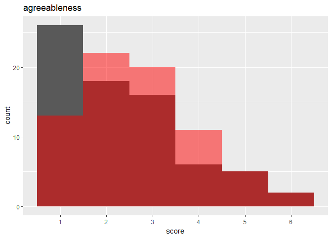
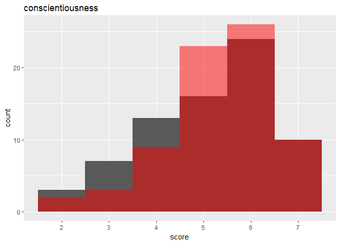

MAPSS Thesis III
================
Chih-Yu Chiang
October 15, 2017

-   [Setup](#setup)
-   [Variable](#variable)
-   [Personality distribution - all](#personality-distribution---all)
    -   [Both sex](#both-sex)
    -   [Male only](#male-only)
    -   [Female only](#female-only)
-   [Personality distribution - MMORPG and DOTA](#personality-distribution---mmorpg-and-dota)
-   [Correlation between personalities](#correlation-between-personalities)
-   [Correlation between satisfaction items](#correlation-between-satisfaction-items)
    -   [Autonomy](#autonomy)
    -   [Relatedness](#relatedness)
    -   [Competence](#competence)

``` r
knitr::opts_chunk$set(
    message=FALSE,
    warning=FALSE
)

#Prevent result wrapping
options(width=120)
```

Setup
-----

Data of game and player are read in and matched up.

-   Game release data, `release` (year), is read in as an interval variable.
-   Missing values are imputed with variable mean conveniently (`star_user` and `star_GS`).

``` r
#--Package
library(tidyverse)
library(data.table)
library(corrplot)
library(modelr)
library(glmnet)
library(VGAM)
library(randomForest)
library(e1071)
library(car)
library(rlist)
library(pander)
set.seed(1)


#--Read in
#Core game info and group distance/probability data
core_cluster <- read_csv("../data/core_cluster.csv", col_names=TRUE) %>%
  mutate(group_survey = factor(group_survey),
         group_review = factor(group_review),
         core_id = factor(core_id)) %>%
  select(-X1)

#Core game tste scores (of dif numbers of features)
core_tsteScore <- read_csv("../data/tste_concat.csv", col_names=TRUE) %>%
  select(-X1)

#Core game traditional genre data
core_tGenre <- read_csv("../data/traditional_genre.csv", col_names=TRUE) %>%
  select(-X1, -group, -idTag, -game_title) %>%
  mutate(core_id = factor(core_id))
colnames(core_tGenre)[2:length(colnames(core_tGenre))] <- #Give genre columns identification
  unlist(lapply(X=colnames(core_tGenre)[2:length(colnames(core_tGenre))], function(X) {paste("tg_", X, sep="")}))

#Player-related survey data
survey <- read_csv("../data/survey.csv", col_names=TRUE) %>%
  mutate(race = factor(race),
         sex = factor(sex),
         core_id = factor(core_id)) %>%
  select(-id)

#Satisfaction raw data
satisRaw <- read_csv("../data/raw_survey/raw_satisfaction.csv", col_names=TRUE)


#--Impute missing with mean
imputation_mean <- function(c){
  c[is.na(c)] <- mean(c, na.rm=TRUE)
  return(c)
}
core_cluster <- mutate_each(core_cluster,
                            funs(imputation_mean(.)),
                            star_user, star_GS)


#--Match up
#Main df, key=player-game pair
df <- bind_cols(core_cluster, core_tsteScore) %>%
  left_join(core_tGenre, by=c("core_id")) %>%
  left_join(survey, by=c("core_id"), copy=FALSE)


#--Clean up unnecessary objs
rm(core_cluster, core_tsteScore, core_tGenre, survey, imputation_mean)
```

Variable
--------

Compute and select variables to be used in models.

-   Mean-centered vars is marked with a suffix \_ct.

-   Player preference:

| Name           | Definition                 | Unit                        |
|----------------|----------------------------|-----------------------------|
| `preference_1` | how much do you like       | Likert 1-7=like             |
| `preference_2` | how often play it          | ordinary 1=never-7=everyday |
| `preference_3` | does it fit personal taste | Likert 1-7=fit              |

-   Game characteristics:

<table style="width:36%;">
<colgroup>
<col width="8%" />
<col width="18%" />
<col width="9%" />
</colgroup>
<thead>
<tr class="header">
<th>Name</th>
<th>Definition</th>
<th>Unit</th>
</tr>
</thead>
<tbody>
<tr class="odd">
<td><code>distance_survey_mean_x</code></td>
<td>group score from survey (distance from group mean in tste)</td>
<td>cosine distance</td>
</tr>
<tr class="even">
<td><code>distance_survey_median_x</code></td>
<td>group score from survey (distance from group median in tste)</td>
<td>cosine distance</td>
</tr>
<tr class="odd">
<td><code>probability_review_mean_x</code></td>
<td>group score from review (mean probability to be categorized in the group by NN)</td>
<td>percentage</td>
</tr>
<tr class="even">
<td><code>probability_review_median_x</code></td>
<td>group score from review (median probability to be categorized in the group by NN)</td>
<td>percentage</td>
</tr>
<tr class="odd">
<td><code>group_survey</code></td>
<td>group identity from survey</td>
<td>categorical 1-group number</td>
</tr>
<tr class="even">
<td><code>group_review</code></td>
<td>group identity from review</td>
<td>categorical 1-group number</td>
</tr>
<tr class="odd">
<td><code>tste_n_x</code></td>
<td>group score from survey (tste), n=number of features</td>
<td>interval arbitrary</td>
</tr>
<tr class="even">
<td><code>tg_x</code></td>
<td>if belongs to traditional genre categories</td>
<td>binary</td>
</tr>
</tbody>
</table>

-   Player personality:

<table style="width:36%;">
<colgroup>
<col width="8%" />
<col width="18%" />
<col width="9%" />
</colgroup>
<thead>
<tr class="header">
<th>Name</th>
<th>Definition</th>
<th>Unit</th>
</tr>
</thead>
<tbody>
<tr class="odd">
<td><code>game_xxxxx</code></td>
<td>Big-five personality in game</td>
<td>Likert 1-7</td>
</tr>
<tr class="even">
<td><code>real_xxxxx</code></td>
<td>Big-five personality in real life</td>
<td>Likert 1-7</td>
</tr>
<tr class="odd">
<td><code>gap_xxxxx</code></td>
<td>personality gap (game - real)</td>
<td>Likert 1-7</td>
</tr>
<tr class="even">
<td><code>satis_xxxxx</code></td>
<td>SDT satisfaction in real life</td>
<td>Likert 1-7</td>
</tr>
<tr class="odd">
<td><code>dissatis_xxxxx</code></td>
<td>SDT dissatisfaction in real life</td>
<td>Likert 1-7</td>
</tr>
<tr class="even">
<td><code>combined_xxxxx</code></td>
<td>SDT combined (previous two) satisfaction in real life</td>
<td>Likert 1-7</td>
</tr>
</tbody>
</table>

-   Control:

| Name        | Definition                                    | Unit                      |
|-------------|-----------------------------------------------|---------------------------|
| `age`       | player age                                    | interval                  |
| `education` | player education                              | ordinary 1-7=PhD          |
| `income`    | player annual household income                | ordinary 1-7=over 150,000 |
| `sex`       | player sex                                    | categorical 1=male        |
| `race`      | player race                                   | categorical 1-5           |
| `release`   | game release year                             | interval year             |
| `star_GS`   | general game quality rated by GameSpot expert | interval 0-10             |
| `star_user` | general game quality rated by GameSpot user   | interval 0-10             |

``` r
updateVars <- function(df.outcome="preference", df_player.outcome="game_extraversion"){
  #--Create response variable
  df <<- df %>%
    rowwise() %>% #Rowwise to make the ordinary functions work
    mutate(preference = mean(c(preference_3))) %>%
    ungroup() #Ungroup to cancel rowwise
  

  #--Mean-center predictor variables (if haven't been produced)
  if(!ncol(select(df, matches("_ct$")))) {
    df <<- mutate_at(df, vars(starts_with("tste"),
                              starts_with("game"),
                              starts_with("real"),
                              starts_with("satis"),
                              starts_with("dissatis"),
                              starts_with("combined")), funs(ct = . - mean(.)))
  }


  #--Compute personalty gap
  df <<- mutate(df,
                gap_extraversion = game_extraversion - real_extraversion,
                gap_agreeableness = game_agreeableness - real_agreeableness,
                gap_conscientiousness = game_conscientiousness - real_conscientiousness,
                gap_emotionstability = game_emotionstability - real_emotionstability,
                gap_openness = game_openness - real_openness,
                gap_sum = gap_extraversion + gap_agreeableness + gap_conscientiousness + gap_emotionstability + gap_openness,
                gap_sum_abs = abs(gap_extraversion) + abs(gap_agreeableness) + abs(gap_conscientiousness) + abs(gap_emotionstability) + abs(gap_openness),
                game_sum = game_extraversion + game_agreeableness + game_conscientiousness + game_emotionstability + game_openness,
                real_sum = real_extraversion + real_agreeableness + real_conscientiousness + real_emotionstability + real_openness,
                dissatis_sum = dissatis_autonomy + dissatis_relatedness + dissatis_competence,
                satis_sum = satis_autonomy + satis_relatedness + satis_competence,
                combined_sum = combined_autonomy + combined_relatedness + combined_competence
                )


  #--Acquire player df, key=player
  df_player <<- distinct(df, respondent, .keep_all=TRUE)
  
  
  #--Select variables to be included in regression (model formation)
  #Sets of predictor variables from file
  df_predictors <- read.csv("../data/vars/predictors.csv", header=TRUE, na.strings="")

  #Get column name as model id
  modelId <- colnames(df_predictors)
  
  #predictor variable as strings for each model
  predictorString <- apply(df_predictors, MARGIN=2, function(x) paste(na.omit(x), collapse="+"))
  
  #Make the dfs into a data frame
  dfs <<- data.frame(predictorString, row.names=modelId, stringsAsFactors=FALSE) %>%
    mutate(df_x = map(predictorString, ~ model.matrix(as.formula(paste(df.outcome, " ~ ", .x, sep="")), data=df)[, -1])) %>% #df with only predictor variables; [, -1] used to remove redundant intercept column
    mutate(df_yx = map(df_x, ~ bind_cols(select(df, df.outcome), data.frame(.x)))) #df also with outcome variables
  dfs_player <<- data.frame(predictorString, row.names=modelId, stringsAsFactors=FALSE) %>%
    mutate(df_x = map(predictorString, ~ model.matrix(as.formula(paste(df_player.outcome, " ~ ", .x, sep="")), data=df_player)[, -1])) %>% #df with only predictor variables; [, -1] used to remove redundant intercept column
    mutate(df_yx = map(df_x, ~ bind_cols(select(df_player, df_player.outcome), data.frame(.x)))) #df also with outcome variables
  
  #Set row names for reference
  row.names(dfs) <<- modelId
  row.names(dfs_player) <<- modelId
}

updateVars()
```

Personality distribution - all
------------------------------

### Both sex

-   Black bars = real personality
-   Red bars = game personality

``` r
count(df_player)
```

    ## # A tibble: 1 x 1
    ##       n
    ##   <int>
    ## 1   215

``` r
#--Distribution of real and game personality (comparison)
dist_personality <- function(personality){
  #Acquire specific column by reg
  real <- select(df_player, matches(paste("^real.*", personality, "$", sep="")))
  game <- select(df_player, matches(paste("^game.*", personality, "$", sep="")))
  
  #Plot: red bars = game personality
  ggplot(data=as.data.frame(real, game)) +
    geom_histogram(mapping=aes(x=real), binwidth=1) +
    geom_histogram(mapping=aes(x=game), binwidth=1, fill="red", alpha=0.5) +
    scale_x_continuous(breaks=seq(1, 7), minor_breaks=NULL, labels=seq(1, 7)) +
    labs(x="score", title=personality)
}

#Call function for each personality
dist_personality("agreeableness")
```


``` r
dist_personality("conscientiousness")
```


``` r
dist_personality("emotionstability")
```


``` r
dist_personality("extraversion")
```


``` r
dist_personality("openness")
```


### Male only

-   Black bars = real personality
-   Red bars = game personality

``` r
count(filter(df_player, sex==1))
```

    ## # A tibble: 1 x 1
    ##       n
    ##   <int>
    ## 1   142

``` r
#--Distribution of real and game personality (comparison)
dist_personality <- function(personality){
  #Acquire specific column by reg
  real <- select(filter(df_player, sex==1), matches(paste("^real.*", personality, "$", sep="")))
  game <- select(filter(df_player, sex==1), matches(paste("^game.*", personality, "$", sep="")))
  
  #Plot: red bars = game personality
  ggplot(data=as.data.frame(real, game)) +
    geom_histogram(mapping=aes(x=real), binwidth=1) +
    geom_histogram(mapping=aes(x=game), binwidth=1, fill="red", alpha=0.5) +
    scale_x_continuous(breaks=seq(1, 7), minor_breaks=NULL, labels=seq(1, 7)) +
    labs(x="score", title=personality)
}

#Call function for each personality
dist_personality("agreeableness")
```


``` r
dist_personality("conscientiousness")
```


``` r
dist_personality("emotionstability")
```


``` r
dist_personality("extraversion")
```


``` r
dist_personality("openness")
```


### Female only

-   Black bars = real personality
-   Red bars = game personality

``` r
count(filter(df_player, sex==2))
```

    ## # A tibble: 1 x 1
    ##       n
    ##   <int>
    ## 1    73

``` r
#--Distribution of real and game personality (comparison)
dist_personality <- function(personality){
  #Acquire specific column by reg
  real <- select(filter(df_player, sex==2), matches(paste("^real.*", personality, "$", sep="")))
  game <- select(filter(df_player, sex==2), matches(paste("^game.*", personality, "$", sep="")))
  
  #Plot: red bars = game personality
  ggplot(data=as.data.frame(real, game)) +
    geom_histogram(mapping=aes(x=real), binwidth=1) +
    geom_histogram(mapping=aes(x=game), binwidth=1, fill="red", alpha=0.5) +
    scale_x_continuous(breaks=seq(1, 7), minor_breaks=NULL, labels=seq(1, 7)) +
    labs(x="score", title=personality)
}

#Call function for each personality
dist_personality("agreeableness")
```



``` r
dist_personality("conscientiousness")
```



``` r
dist_personality("emotionstability")
```


``` r
dist_personality("extraversion")
```


``` r
dist_personality("openness")
```


Personality distribution - MMORPG and DOTA
------------------------------------------

-   Black bars = real personality
-   Red bars = game personality

``` r
df_spi <- filter(df, (tg_MOBA == 1 | tg_MMO == 1))
df_player_spi <- distinct(df_spi, respondent, .keep_all=TRUE)

#--Distribution of real and game personality (comparison)
dist_personality <- function(personality){
  #Acquire specific column by reg
  real <- select(df_player_spi, matches(paste("^real.*", personality, "$", sep="")))
  game <- select(df_player_spi, matches(paste("^game.*", personality, "$", sep="")))
  
  #Plot: red bars = game personality
  ggplot(data=as.data.frame(real, game)) +
    geom_histogram(mapping=aes(x=real), binwidth=1) +
    geom_histogram(mapping=aes(x=game), binwidth=1, fill="red", alpha=0.5) +
    scale_x_continuous(breaks=seq(1, 7), minor_breaks=NULL, labels=seq(1, 7)) +
    labs(x="score", title=personality)
}

#Call function for each personality
dist_personality("agreeableness")
```


``` r
dist_personality("conscientiousness")
```


``` r
dist_personality("emotionstability")
```


``` r
dist_personality("extraversion")
```


``` r
dist_personality("openness")
```


Correlation between personalities
---------------------------------

``` r
corrplot(cor(select(df_player, matches("^real.*ct$"), matches("^game.*ct$"))),
         method="color", type="upper", addCoef.col="black", diag=TRUE, tl.srt=45, tl.cex=0.8, tl.col="black")
```


Correlation between satisfaction items
--------------------------------------

### Autonomy

1.  I feel a sense of choice and freedom in the things I undertake.
2.  Most of the things I do feel like “I have to.”
3.  I feel that my decisions reflect what I really want.
4.  I feel forced to do many things I wouldn’t choose to do.
5.  I feel my choices express who I really am.
6.  I feel pressured to do too many things.
7.  I feel I have been doing what really interests me.
8.  My daily activities feel like a chain of obligations.

``` r
corrplot(cor(select(satisRaw, starts_with("Autonomy"))),
         method="color", type="upper", addCoef.col="black", diag=TRUE, tl.srt=45, tl.cex=0.8, tl.col="black")
```


### Relatedness

1.  I feel that the people I care about also care about me.
2.  I feel excluded from the group I want to belong to.
3.  I feel connected with people who care for me, and for whom I care.
4.  I feel that people who are important to me are cold and distant towards me.
5.  I feel close and connected with other people who are important to me.
6.  I have the impression that people I spend time with dislike me.
7.  I experience a warm feeling with the people I spend time with.
8.  I feel the relationships I have are just superficial.

``` r
corrplot(cor(select(satisRaw, starts_with("Relatedness"))),
         method="color", type="upper", addCoef.col="black", diag=TRUE, tl.srt=45, tl.cex=0.8, tl.col="black")
```


### Competence

1.  I feel confident that I can do things well.
2.  I have serious doubts about whether I can do things well.
3.  I feel capable at what I do.
4.  I feel disappointed with many of my performances.
5.  I feel competent to achieve my goals.
6.  I feel insecure about my abilities.
7.  I feel I can successfully complete difficult tasks.
8.  I feel like a failure because of the mistakes I make.

``` r
corrplot(cor(select(satisRaw, starts_with("Competence"))),
         method="color", type="upper", addCoef.col="black", diag=TRUE, tl.srt=45, tl.cex=0.8, tl.col="black")
```


