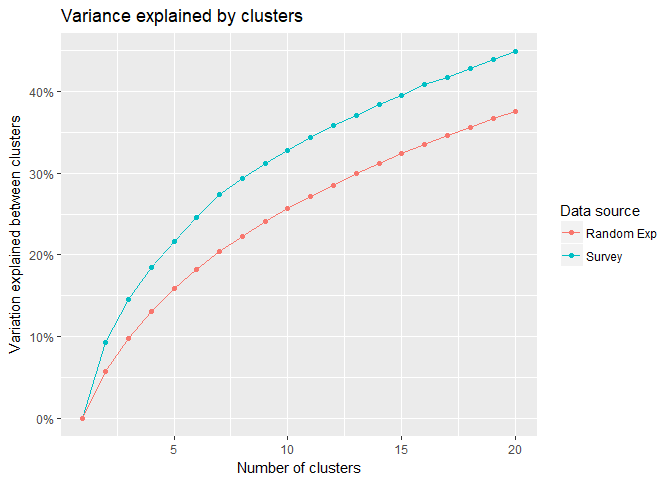

MAPSS Thesis III
================
Chih-Yu Chiang
October 23, 2017

-   [Setup](#setup)
-   [Variable](#variable)
-   [Correlation matrix - between individual preference and tste vars](#correlation-matrix---between-individual-preference-and-tste-vars)
    -   [Survey data](#survey-data)
    -   [Random data](#random-data)
-   [Variance explained by clusters](#variance-explained-by-clusters)

``` r
knitr::opts_chunk$set(
    message=FALSE,
    warning=FALSE
)

#Prevent result wrapping
options(width=120)
```

Setup
-----

Data of game and player are read in and matched up.

-   Game release data, `release` (year), is read in as an interval variable.
-   Missing values are imputed with variable mean conveniently (`star_user` and `star_GS`).

``` r
#--Package
library(tidyverse)
library(data.table)
library(corrplot)
library(modelr)
library(glmnet)
library(VGAM)
library(randomForest)
library(e1071)
library(car)
library(rlist)
library(pander)
set.seed(1)


#--Read in
#Core game info and group distance/probability data
core_cluster <- read_csv("../data/core_cluster.csv", col_names=TRUE) %>%
  mutate(group_survey = factor(group_survey),
         group_review = factor(group_review),
         core_id = factor(core_id)) %>%
  select(-X1)

#Core game tste scores (of dif numbers of features)
core_tsteScore <- read_csv("../data/tste_concat.csv", col_names=TRUE) %>%
  select(-X1)

#Core game traditional genre data
core_tGenre <- read_csv("../data/traditional_genre.csv", col_names=TRUE) %>%
  select(-X1, -group, -idTag, -game_title) %>%
  mutate(core_id = factor(core_id))
colnames(core_tGenre)[2:length(colnames(core_tGenre))] <- #Give genre columns identification
  unlist(lapply(X=colnames(core_tGenre)[2:length(colnames(core_tGenre))], function(X) {paste("tg_", X, sep="")}))

#Player-related survey data
survey <- read_csv("../data/survey.csv", col_names=TRUE) %>%
  mutate(race = factor(race),
         sex = factor(sex),
         core_id = factor(core_id)) %>%
  select(-id)

#Satisfaction raw data
satisRaw <- read_csv("../data/raw_survey/raw_satisfaction.csv", col_names=TRUE)


#--Impute missing with mean
imputation_mean <- function(c){
  c[is.na(c)] <- mean(c, na.rm=TRUE)
  return(c)
}
core_cluster <- mutate_each(core_cluster,
                            funs(imputation_mean(.)),
                            star_user, star_GS)


#--Match up
#Main df, key=player-game pair
df <- bind_cols(core_cluster, core_tsteScore) %>%
  left_join(core_tGenre, by=c("core_id")) %>%
  left_join(survey, by=c("core_id"), copy=FALSE)


#--Clean up unnecessary objs
rm(core_cluster, core_tsteScore, core_tGenre, survey, imputation_mean)
```

Variable
--------

Compute and select variables to be used in models.

-   Mean-centered vars is marked with a suffix \_ct.

-   Player preference:

| Name           | Definition                 | Unit                        |
|----------------|----------------------------|-----------------------------|
| `preference_1` | how much do you like       | Likert 1-7=like             |
| `preference_2` | how often play it          | ordinary 1=never-7=everyday |
| `preference_3` | does it fit personal taste | Likert 1-7=fit              |

-   Game characteristics:

<table style="width:36%;">
<colgroup>
<col width="8%" />
<col width="18%" />
<col width="9%" />
</colgroup>
<thead>
<tr class="header">
<th>Name</th>
<th>Definition</th>
<th>Unit</th>
</tr>
</thead>
<tbody>
<tr class="odd">
<td><code>distance_survey_mean_x</code></td>
<td>group score from survey (distance from group mean in tste)</td>
<td>cosine distance</td>
</tr>
<tr class="even">
<td><code>distance_survey_median_x</code></td>
<td>group score from survey (distance from group median in tste)</td>
<td>cosine distance</td>
</tr>
<tr class="odd">
<td><code>probability_review_mean_x</code></td>
<td>group score from review (mean probability to be categorized in the group by NN)</td>
<td>percentage</td>
</tr>
<tr class="even">
<td><code>probability_review_median_x</code></td>
<td>group score from review (median probability to be categorized in the group by NN)</td>
<td>percentage</td>
</tr>
<tr class="odd">
<td><code>group_survey</code></td>
<td>group identity from survey</td>
<td>categorical 1-group number</td>
</tr>
<tr class="even">
<td><code>group_review</code></td>
<td>group identity from review</td>
<td>categorical 1-group number</td>
</tr>
<tr class="odd">
<td><code>tste_n_x</code></td>
<td>group score from survey (tste), n=number of features</td>
<td>interval arbitrary</td>
</tr>
<tr class="even">
<td><code>tg_x</code></td>
<td>if belongs to traditional genre categories</td>
<td>binary</td>
</tr>
</tbody>
</table>

-   Player personality:

<table style="width:36%;">
<colgroup>
<col width="8%" />
<col width="18%" />
<col width="9%" />
</colgroup>
<thead>
<tr class="header">
<th>Name</th>
<th>Definition</th>
<th>Unit</th>
</tr>
</thead>
<tbody>
<tr class="odd">
<td><code>game_xxxxx</code></td>
<td>Big-five personality in game</td>
<td>Likert 1-7</td>
</tr>
<tr class="even">
<td><code>real_xxxxx</code></td>
<td>Big-five personality in real life</td>
<td>Likert 1-7</td>
</tr>
<tr class="odd">
<td><code>gap_xxxxx</code></td>
<td>personality gap (game - real)</td>
<td>Likert 1-7</td>
</tr>
<tr class="even">
<td><code>satis_xxxxx</code></td>
<td>SDT satisfaction in real life</td>
<td>Likert 1-7</td>
</tr>
<tr class="odd">
<td><code>dissatis_xxxxx</code></td>
<td>SDT dissatisfaction in real life</td>
<td>Likert 1-7</td>
</tr>
<tr class="even">
<td><code>combined_xxxxx</code></td>
<td>SDT combined (previous two) satisfaction in real life</td>
<td>Likert 1-7</td>
</tr>
</tbody>
</table>

-   Control:

| Name        | Definition                                    | Unit                      |
|-------------|-----------------------------------------------|---------------------------|
| `age`       | player age                                    | interval                  |
| `education` | player education                              | ordinary 1-7=PhD          |
| `income`    | player annual household income                | ordinary 1-7=over 150,000 |
| `sex`       | player sex                                    | categorical 1=male        |
| `race`      | player race                                   | categorical 1-5           |
| `release`   | game release year                             | interval year             |
| `star_GS`   | general game quality rated by GameSpot expert | interval 0-10             |
| `star_user` | general game quality rated by GameSpot user   | interval 0-10             |

``` r
updateVars <- function(df.outcome="preference", df_player.outcome="game_extraversion"){
  #--Create response variable
  df <<- df %>%
    rowwise() %>% #Rowwise to make the ordinary functions work
    mutate(preference = mean(c(preference_3))) %>%
    ungroup() #Ungroup to cancel rowwise
  

  #--Mean-center predictor variables (if haven't been produced)
  if(!ncol(select(df, matches("_ct$")))) {
    df <<- mutate_at(df, vars(starts_with("tste"),
                              starts_with("game"),
                              starts_with("real"),
                              starts_with("satis"),
                              starts_with("dissatis"),
                              starts_with("combined")), funs(ct = . - mean(.)))
  }


  #--Compute personalty gap
  df <<- mutate(df,
                gap_extraversion = game_extraversion - real_extraversion,
                gap_agreeableness = game_agreeableness - real_agreeableness,
                gap_conscientiousness = game_conscientiousness - real_conscientiousness,
                gap_emotionstability = game_emotionstability - real_emotionstability,
                gap_openness = game_openness - real_openness,
                gap_sum = gap_extraversion + gap_agreeableness + gap_conscientiousness + gap_emotionstability + gap_openness,
                gap_sum_abs = abs(gap_extraversion) + abs(gap_agreeableness) + abs(gap_conscientiousness) + abs(gap_emotionstability) + abs(gap_openness),
                game_sum = game_extraversion + game_agreeableness + game_conscientiousness + game_emotionstability + game_openness,
                real_sum = real_extraversion + real_agreeableness + real_conscientiousness + real_emotionstability + real_openness,
                dissatis_sum = dissatis_autonomy + dissatis_relatedness + dissatis_competence,
                satis_sum = satis_autonomy + satis_relatedness + satis_competence,
                combined_sum = combined_autonomy + combined_relatedness + combined_competence
                )


  #--Acquire player df, key=player
  df_player <<- distinct(df, respondent, .keep_all=TRUE)
  
  
  #--Select variables to be included in regression (model formation)
  #Sets of predictor variables from file
  df_predictors <- read.csv("../data/vars/predictors.csv", header=TRUE, na.strings="")

  #Get column name as model id
  modelId <- colnames(df_predictors)
  
  #predictor variable as strings for each model
  predictorString <- apply(df_predictors, MARGIN=2, function(x) paste(na.omit(x), collapse="+"))
  
  #Make the dfs into a data frame
  dfs <<- data.frame(predictorString, row.names=modelId, stringsAsFactors=FALSE) %>%
    mutate(df_x = map(predictorString, ~ model.matrix(as.formula(paste(df.outcome, " ~ ", .x, sep="")), data=df)[, -1])) %>% #df with only predictor variables; [, -1] used to remove redundant intercept column
    mutate(df_yx = map(df_x, ~ bind_cols(select(df, df.outcome), data.frame(.x)))) #df also with outcome variables
  dfs_player <<- data.frame(predictorString, row.names=modelId, stringsAsFactors=FALSE) %>%
    mutate(df_x = map(predictorString, ~ model.matrix(as.formula(paste(df_player.outcome, " ~ ", .x, sep="")), data=df_player)[, -1])) %>% #df with only predictor variables; [, -1] used to remove redundant intercept column
    mutate(df_yx = map(df_x, ~ bind_cols(select(df_player, df_player.outcome), data.frame(.x)))) #df also with outcome variables
  
  #Set row names for reference
  row.names(dfs) <<- modelId
  row.names(dfs_player) <<- modelId
}

updateVars()

#Create dfs for each player
dfs_playerG <- select(df_player, respondent)
dfs_playerG$df <- map(dfs_playerG$respondent, ~ filter(df, respondent == .x))
```

Correlation matrix - between individual preference and tste vars
----------------------------------------------------------------

How much does it fit your taste?

-   For each individual, acquire correlation between preference and each tste var
-   20 tste vars
-   215 individuals
-   10 observations per individual
-   The individuals are ordered by cluster based on the correlation

### Survey data

``` r
#--Acquire the correlations
df_cor <- data.frame()
for (i in seq(1:nrow(dfs_playerG))) {
  mx_temp <- cor(dfs_playerG$df[[i]]$preference, select(dfs_playerG$df[[i]], starts_with("tste_20"))[, c(1:20)]) %>%
    data.frame()
  df_cor <- bind_rows(df_cor, mx_temp)
}
df_cor <- na.omit(df_cor)


corPlot <- function(df_cor) {
  centerN <- 5
  model_km <- kmeans(df_cor, centers=centerN, nstart=100, iter.max=1000)
  df_cor$cluster <- model_km$cluster
  df_cor_arranged <- arrange(df_cor, cluster)
  
  df_cor_expand <- expand.grid(y=c(1:nrow(df_cor_arranged)), x=c(1:(ncol(df_cor_arranged) - 1))) %>%
    rowwise() %>%
    mutate(z=df_cor_arranged[y, x]) %>%
    ungroup()
  
  ggplot(data=df_cor_expand, aes(x=x, y=y, fill=z)) +
    geom_tile() + 
    geom_hline(data=data.frame(y=cumsum(model_km$size)[-centerN]), aes(yintercept=y), color="orange", size=0.5, linetype=2, alpha=1) +
    labs(x="Tste var (from triplet embedding)", y="Individual", fill="Corelation",
         title="Correlation between individual preference and tste vars",
         subtitle="(The individuals are ordered by 5 clusters based on the correlations)") +
    theme_minimal()
}

corPlot(df_cor)
```


### Random data

-   Random value from Uniform(-1, 1) to comprise a matrix of the same shape of the survey data

``` r
for(i in c(1:4)) {
  df_cor_ran <- matrix(runif(dim(df_cor)[1] * dim(df_cor)[2], min=-1, max=1), nrow=dim(df_cor)[1], ncol=dim(df_cor)[2]) %>%
    as.data.frame()
  plot(corPlot(df_cor_ran))
}
```


Variance explained by clusters
------------------------------

Process of random experiment:

-   100 simulations
-   Compute average `between cluster var / total var` under 1:20 clusters

``` r
df_cor <- data.frame()
for(i in seq(1:nrow(dfs_playerG))) {
  mx_temp <- cor(dfs_playerG$df[[i]]$preference, select(dfs_playerG$df[[i]], starts_with("tste_20"))[, c(1:20)]) %>%
    data.frame()
  df_cor <- bind_rows(df_cor, mx_temp)
}
df_cor <- na.omit(df_cor)

CENTER_MAX <- 20
RAND_SET <- 100

betweenOnTotals <- array()
for(i in c(1:CENTER_MAX)) {
  model_km <- kmeans(df_cor, centers=i, nstart=100, iter.max=1000)
  betweenOnTotals[i] <- model_km$betweenss / model_km$totss
}

BOTs <- array(dim=c(RAND_SET, CENTER_MAX))
for(i in c(1:RAND_SET)) {
  df_cor_ran <- matrix(runif(dim(df_cor)[1] * dim(df_cor)[2], min=-1, max=1), nrow=dim(df_cor)[1], ncol=dim(df_cor)[2]) %>%
    as.data.frame()
  for(centerN in c(1:CENTER_MAX)) {
    model_km <- kmeans(df_cor_ran, centers=centerN, nstart=100, iter.max=1000)
    BOTs[i, centerN] <- model_km$betweenss / model_km$totss
  }
}

ggplot() +
  geom_line(data=data.frame(x=c(1:length(betweenOnTotals)), y=betweenOnTotals), aes(x=x, y=y, color="Survey")) +
  geom_point(data=data.frame(x=c(1:length(betweenOnTotals)), y=betweenOnTotals), aes(x=x, y=y, color="Survey")) +
  geom_line(data=data.frame(x=c(1:length(colMeans(BOTs))), y=colMeans(BOTs)), aes(x=x, y=y, color="Random Exp")) +
  geom_point(data=data.frame(x=c(1:length(colMeans(BOTs))), y=colMeans(BOTs)), aes(x=x, y=y, color="Random Exp")) +
  labs(x="Number of clusters", y="Variation explained between clusters",
       title="Variance explained by clusters") +
  scale_y_continuous(labels=scales::percent) +
  scale_color_discrete(name="Data source")
```


