MAPSS Thesis IV
================
Chih-Yu Chiang
December 5, 2017

-   [Setup](#setup)
-   [In-game / self - fellow - stereotype](#in-game-self---fellow---stereotype)
    -   [Extraversion](#extraversion)
    -   [Agreeableness](#agreeableness)
    -   [Conscientiousness](#conscientiousness)
    -   [Emotion stability](#emotion-stability)
    -   [Openness](#openness)
-   [Real / self - fellow](#real-self---fellow)
    -   [Extraversion](#extraversion-1)
    -   [Agreeableness](#agreeableness-1)
    -   [Conscientiousness](#conscientiousness-1)
    -   [Emotion stability](#emotion-stability-1)
    -   [Openness](#openness-1)
-   [In-game - Real - ideal / self](#in-game---real---ideal-self)
    -   [Extraversion](#extraversion-2)
    -   [Agreeableness](#agreeableness-2)
    -   [Conscientiousness](#conscientiousness-2)
    -   [Emotion stability](#emotion-stability-2)
    -   [Openness](#openness-2)
-   [In-game - Real / fellow](#in-game---real-fellow)
    -   [Extraversion](#extraversion-3)
    -   [Agreeableness](#agreeableness-3)
    -   [Conscientiousness](#conscientiousness-3)
    -   [Emotion stability](#emotion-stability-3)
    -   [Openness](#openness-3)

``` r
knitr::opts_chunk$set(
    message=FALSE,
    warning=FALSE
)

#Prevent result wrapping
options(width=120)
```

Setup
-----

``` r
library(tidyverse)
library(data.table)
library(colorspace)

#Read in as DT
DT <- fread("../data/survey2.csv")


"
## Reverse (1-7 Likert) target responses
"
```

    ## [1] "\n## Reverse (1-7 Likert) target responses\n"

``` r
#--Select target columns
#Personality: 1_24 2_135; SDT: 1_246 2_246
targetColIndex <- matches("(^Person.+((1_[24])|(2_[135]))$)|(^SDT.+_[246]$)", vars=names(DT))


#--Reverse 1-7 likert
reversed <- 8 - DT[, targetColIndex, with=FALSE]


#--Assign back to DT
#Use parenthesis since the synax does not allow with=FALSE here
DT[, (targetColIndex) := reversed]


"
## Combine sub-items
"
```

    ## [1] "\n## Combine sub-items\n"

``` r
#--personalities (5 constructs; 2 items each)
#Computation
subColIndex_1 <- matches("^Person.+1_\\d$", vars=names(DT))
subColIndex_2 <- matches("^Person.+2_\\d$", vars=names(DT))
personalities <- (DT[, subColIndex_1, with=FALSE] + DT[, subColIndex_2, with=FALSE]) / 2

#Substitution
newColName <- gsub("1_", "", grep("^Person.+1_\\d$", names(DT), value=TRUE))
DT[, (newColName) := personalities]


#--SDT (3 constructs; 4 items each)
#Computation
subColIndex_1 <- matches("^SDT.+1_[135]$", vars=names(DT))
subColIndex_2 <- matches("^SDT.+1_[246]$", vars=names(DT))
subColIndex_3 <- matches("^SDT.+2_[135]$", vars=names(DT))
subColIndex_4 <- matches("^SDT.+2_[246]$", vars=names(DT))
SDTs <- (DT[, subColIndex_1, with=FALSE] + DT[, subColIndex_2, with=FALSE] + DT[, subColIndex_3, with=FALSE] + DT[, subColIndex_4, with=FALSE]) / 4

#Substitution
newColName <- gsub("1_", "", grep("^SDT.+1_[123]$", names(DT), value=TRUE))
DT[, (newColName) := SDTs]

#Function for distribution
dist_personality <- function(DT, personality, types){
  #A map for personality code and str pairs
  personaCodec <- c("1"="Extraversion", "2"="Agreeableness", "3"="Conscientiousness;", "4"="Emotion stability", "5"="Openness")
  typeCodec <- c("InS"="In-game / Self", "OutS"="Real / Self", "IdS"="Ideal / Self", "InF"="In-game / Fellow", "OutF"="Real / Fellow", "SteS"="Stereotype / Public")
  
  #Acquire specific columns of that personality
  targetColIndex <- matches(sprintf("^Person.+-%s$", personality), vars=names(DT))
  
  make_hist <- function(type) {
    geom_histogram(mapping=aes_(x=as.name(sprintf("Person%s-%s", type, personality)), fill=toString(which(types == type))),
                   binwidth=1, alpha=0.6)
  }
  geom_hists <- lapply(types, make_hist)
  
  #Use a list to add ggplot components
  ggplot(data=DT[, targetColIndex, with=FALSE]) +
    geom_hists +
    scale_x_continuous(breaks=seq(1, 7), minor_breaks=NULL, labels=seq(1, 7)) +
    labs(x="score", title=personaCodec[toString(personality)]) +
    scale_fill_manual(values=diverge_hcl(length(types)), name="Item", labels=unname(typeCodec[unlist(types)])) +
    theme_minimal()
}
```

In-game / self - fellow - stereotype
------------------------------------

### Extraversion

``` r
dist_personality(DT, 1, list("InS", "InF", "SteS"))
```

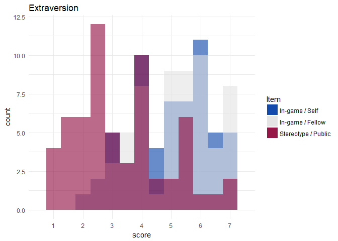

### Agreeableness

``` r
dist_personality(DT, 2, list("InS", "InF", "SteS"))
```


### Conscientiousness

``` r
dist_personality(DT, 3, list("InS", "InF", "SteS"))
```

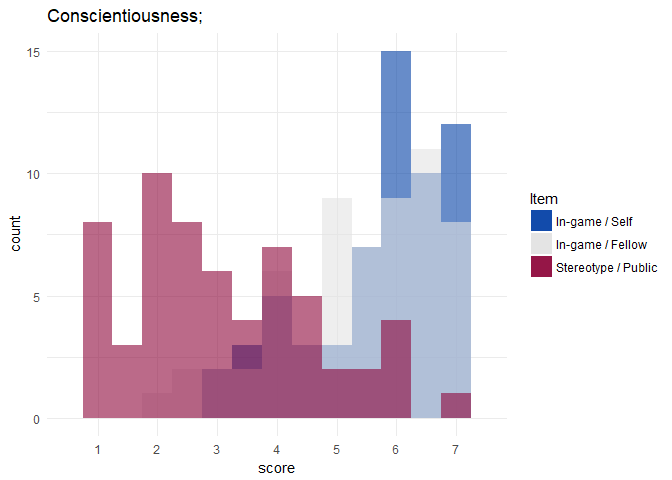

### Emotion stability

``` r
dist_personality(DT, 4, list("InS", "InF", "SteS"))
```

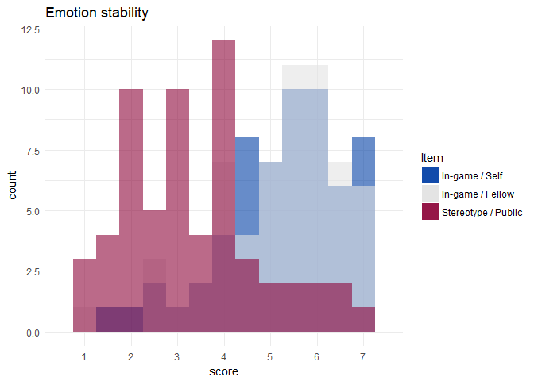

### Openness

``` r
dist_personality(DT, 5, list("InS", "InF", "SteS"))
```

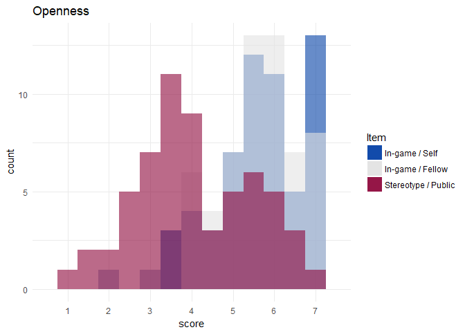

Real / self - fellow
--------------------

### Extraversion

``` r
dist_personality(DT, 1, list("OutS", "OutF"))
```

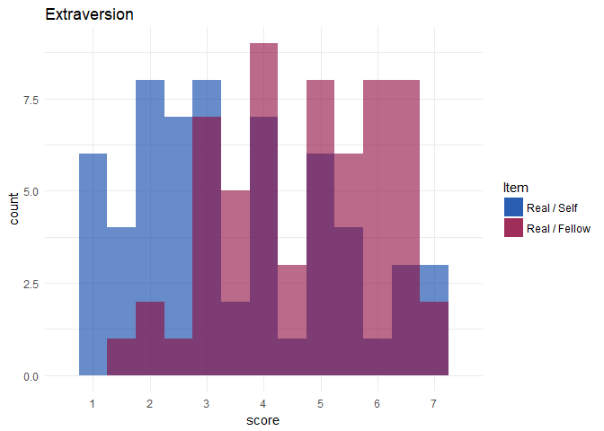

### Agreeableness

``` r
dist_personality(DT, 2, list("OutS", "OutF"))
```

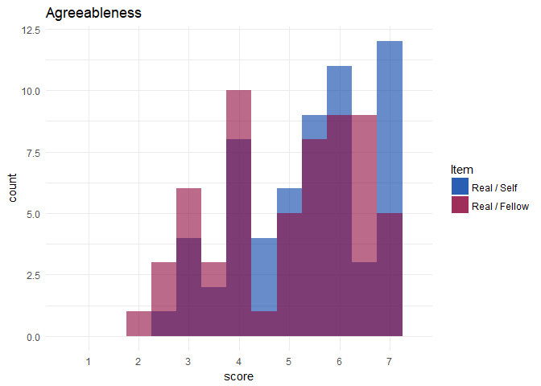

### Conscientiousness

``` r
dist_personality(DT, 3, list("OutS", "OutF"))
```


### Emotion stability

``` r
dist_personality(DT, 4, list("OutS", "OutF"))
```


### Openness

``` r
dist_personality(DT, 5, list("OutS", "OutF"))
```


In-game - Real - ideal / self
-----------------------------

### Extraversion

``` r
dist_personality(DT, 1, list("InS", "OutS", "IdS"))
```

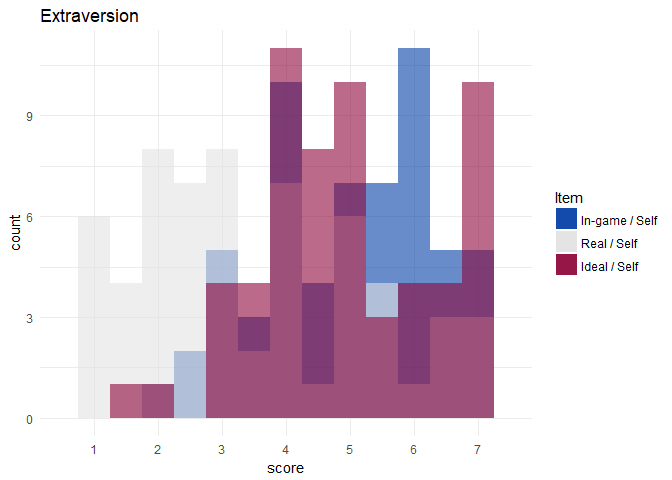

### Agreeableness

``` r
dist_personality(DT, 2, list("InS", "OutS", "IdS"))
```

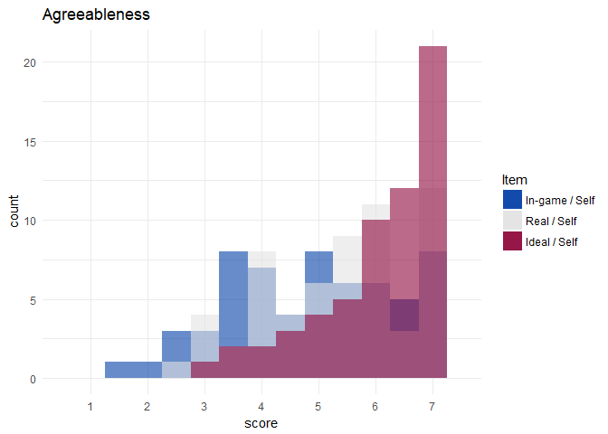

### Conscientiousness

``` r
dist_personality(DT, 3, list("InS", "OutS", "IdS"))
```


### Emotion stability

``` r
dist_personality(DT, 4, list("InS", "OutS", "IdS"))
```


### Openness

``` r
dist_personality(DT, 5, list("InS", "OutS", "IdS"))
```


In-game - Real / fellow
-----------------------

### Extraversion

``` r
dist_personality(DT, 1, list("InF", "OutF"))
```

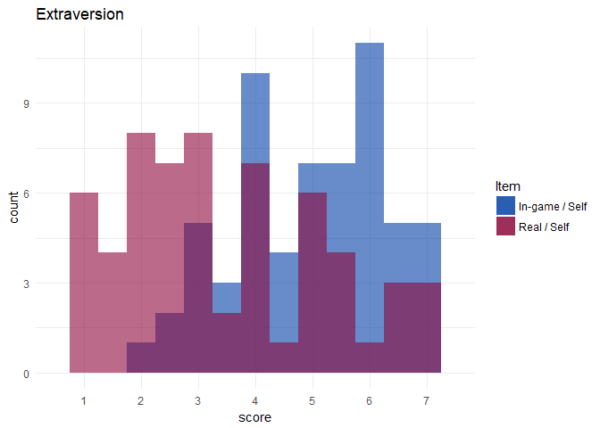

### Agreeableness

``` r
dist_personality(DT, 2, list("InF", "OutF"))
```


### Conscientiousness

``` r
dist_personality(DT, 3, list("InF", "OutF"))
```

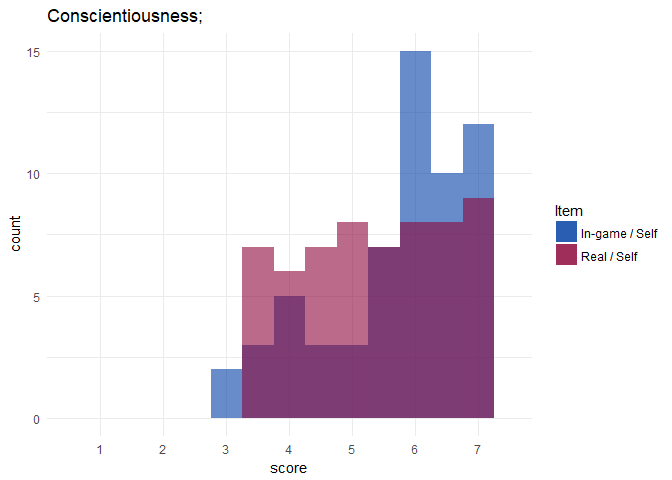

### Emotion stability

``` r
dist_personality(DT, 4, list("InF", "OutF"))
```


### Openness

``` r
dist_personality(DT, 5, list("InF", "OutF"))
```

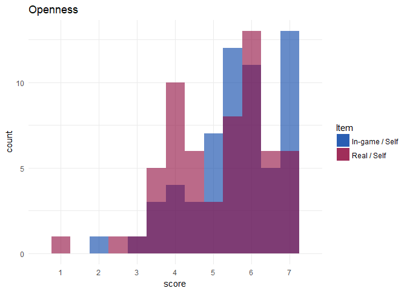
